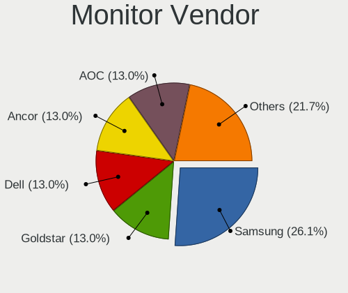
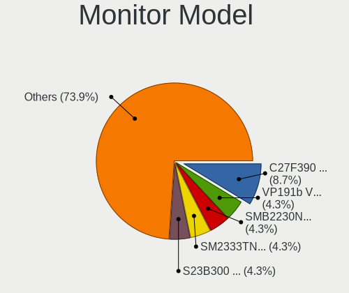
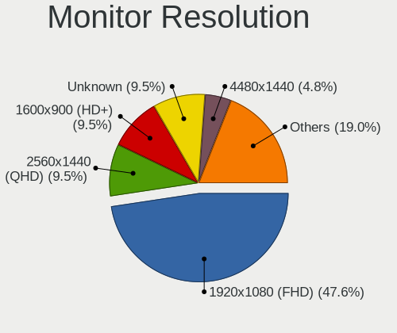
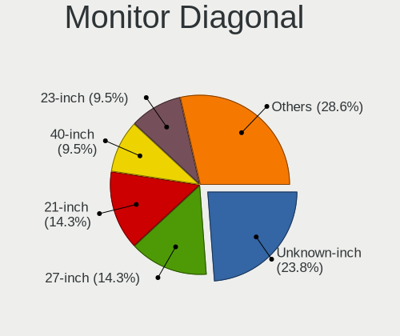
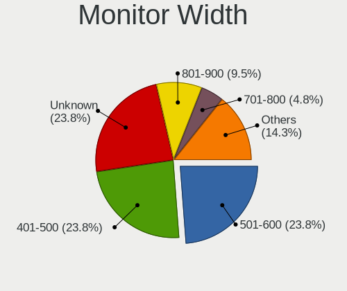
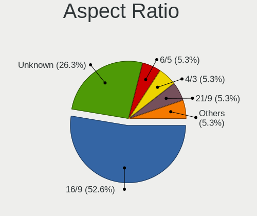
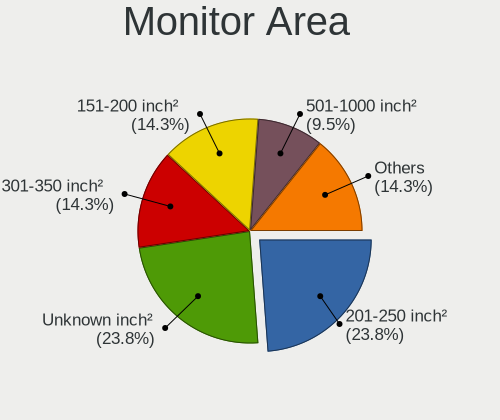
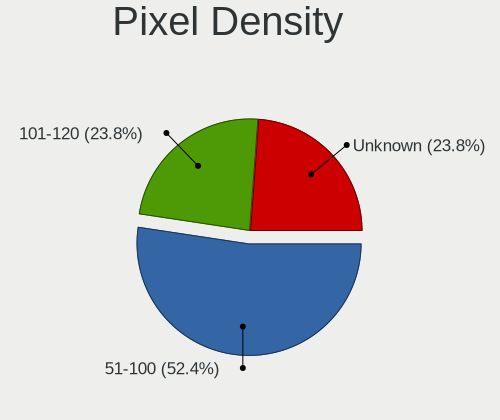

Solus 4.1 - Tested Hardware & Statistics (Desktops)
---------------------------------------------------

A project to collect tested hardware configurations for Solus 4.1.

Anyone can contribute to this report by the [hw-probe](https://github.com/linuxhw/hw-probe) tool:

    sudo -E hw-probe -all -upload

Please contribute! Especially if your hardware is rare.

Contents
--------

* [ Test Cases ](#test-cases)

* [ System ](#system)
  - [ Kernel                   ](#kernel)
  - [ Kernel Family            ](#kernel-family)
  - [ Kernel Major Ver.        ](#kernel-major-ver)
  - [ Arch                     ](#arch)
  - [ DE                       ](#de)
  - [ Display Server           ](#display-server)
  - [ Display Manager          ](#display-manager)
  - [ OS Lang                  ](#os-lang)
  - [ Boot Mode                ](#boot-mode)
  - [ Filesystem               ](#filesystem)
  - [ Part. scheme             ](#part-scheme)
  - [ Dual Boot with Linux/BSD ](#dual-boot-with-linuxbsd)
  - [ Dual Boot (Win)          ](#dual-boot-win)

* [ Board ](#board)
  - [ Vendor                   ](#vendor)
  - [ Model                    ](#model)
  - [ Model Family             ](#model-family)
  - [ MFG Year                 ](#mfg-year)
  - [ Form Factor              ](#form-factor)
  - [ Secure Boot              ](#secure-boot)
  - [ Coreboot                 ](#coreboot)
  - [ RAM Size                 ](#ram-size)
  - [ RAM Used                 ](#ram-used)
  - [ Total Drives             ](#total-drives)
  - [ Has CD-ROM               ](#has-cd-rom)
  - [ Has Ethernet             ](#has-ethernet)
  - [ Has WiFi                 ](#has-wifi)
  - [ Has Bluetooth            ](#has-bluetooth)

* [ Location ](#location)
  - [ Country                  ](#country)
  - [ City                     ](#city)

* [ Drives ](#drives)
  - [ Drive Vendor             ](#drive-vendor)
  - [ Drive Model              ](#drive-model)
  - [ HDD Vendor               ](#hdd-vendor)
  - [ SSD Vendor               ](#ssd-vendor)
  - [ Drive Kind               ](#drive-kind)
  - [ Drive Connector          ](#drive-connector)
  - [ Drive Size               ](#drive-size)
  - [ Space Total              ](#space-total)
  - [ Space Used               ](#space-used)
  - [ Malfunc. Drives          ](#malfunc-drives)
  - [ Malfunc. Drive Vendor    ](#malfunc-drive-vendor)
  - [ Malfunc. HDD Vendor      ](#malfunc-hdd-vendor)
  - [ Malfunc. Drive Kind      ](#malfunc-drive-kind)
  - [ Failed Drives            ](#failed-drives)
  - [ Failed Drive Vendor      ](#failed-drive-vendor)
  - [ Drive Status             ](#drive-status)

* [ Storage controller ](#storage-controller)
  - [ Storage Vendor           ](#storage-vendor)
  - [ Storage Model            ](#storage-model)
  - [ Storage Kind             ](#storage-kind)

* [ Processor ](#processor)
  - [ CPU Vendor               ](#cpu-vendor)
  - [ CPU Model                ](#cpu-model)
  - [ CPU Model Family         ](#cpu-model-family)
  - [ CPU Cores                ](#cpu-cores)
  - [ CPU Sockets              ](#cpu-sockets)
  - [ CPU Threads              ](#cpu-threads)
  - [ CPU Op-Modes             ](#cpu-op-modes)
  - [ CPU Microcode            ](#cpu-microcode)
  - [ CPU Microarch            ](#cpu-microarch)

* [ Graphics ](#graphics)
  - [ GPU Vendor               ](#gpu-vendor)
  - [ GPU Model                ](#gpu-model)
  - [ GPU Combo                ](#gpu-combo)
  - [ GPU Driver               ](#gpu-driver)
  - [ GPU Memory               ](#gpu-memory)

* [ Monitor ](#monitor)
  - [ Monitor Vendor           ](#monitor-vendor)
  - [ Monitor Model            ](#monitor-model)
  - [ Monitor Resolution       ](#monitor-resolution)
  - [ Monitor Diagonal         ](#monitor-diagonal)
  - [ Monitor Width            ](#monitor-width)
  - [ Aspect Ratio             ](#aspect-ratio)
  - [ Monitor Area             ](#monitor-area)
  - [ Pixel Density            ](#pixel-density)
  - [ Multiple Monitors        ](#multiple-monitors)

* [ Network ](#network)
  - [ Net Controller Vendor    ](#net-controller-vendor)
  - [ Net Controller Model     ](#net-controller-model)
  - [ Wireless Vendor          ](#wireless-vendor)
  - [ Wireless Model           ](#wireless-model)
  - [ Ethernet Vendor          ](#ethernet-vendor)
  - [ Ethernet Model           ](#ethernet-model)
  - [ Net Controller Kind      ](#net-controller-kind)
  - [ Used Controller          ](#used-controller)
  - [ NICs                     ](#nics)
  - [ IPv6                     ](#ipv6)

* [ Bluetooth ](#bluetooth)
  - [ Bluetooth Vendor         ](#bluetooth-vendor)
  - [ Bluetooth Model          ](#bluetooth-model)

* [ Sound ](#sound)
  - [ Sound Vendor             ](#sound-vendor)
  - [ Sound Model              ](#sound-model)

* [ Memory ](#memory)
  - [ Memory Vendor            ](#memory-vendor)
  - [ Memory Model             ](#memory-model)
  - [ Memory Kind              ](#memory-kind)
  - [ Memory Form Factor       ](#memory-form-factor)
  - [ Memory Size              ](#memory-size)
  - [ Memory Speed             ](#memory-speed)

* [ Printers & scanners ](#printers--scanners)
  - [ Printer Vendor           ](#printer-vendor)
  - [ Printer Model            ](#printer-model)
  - [ Scanner Vendor           ](#scanner-vendor)
  - [ Scanner Model            ](#scanner-model)

* [ Camera ](#camera)
  - [ Camera Vendor            ](#camera-vendor)
  - [ Camera Model             ](#camera-model)

* [ Security ](#security)
  - [ Fingerprint Vendor       ](#fingerprint-vendor)
  - [ Fingerprint Model        ](#fingerprint-model)
  - [ Chipcard Vendor          ](#chipcard-vendor)
  - [ Chipcard Model           ](#chipcard-model)

* [ Unsupported ](#unsupported)
  - [ Unsupported Devices      ](#unsupported-devices)
  - [ Unsupported Device Types ](#unsupported-device-types)

Test Cases
----------

Total: 31

| Vendor   | Model                       | Probe                                                      | Date         |
|----------|-----------------------------|------------------------------------------------------------|--------------|
| Gigabyte | H61M-HD2                    | [78c877458a](https://linux-hardware.org/?probe=78c877458a) | Jan 28, 2021 |
| Gigabyte | H61M-HD2                    | [6caba093b5](https://linux-hardware.org/?probe=6caba093b5) | Jan 24, 2021 |
| MSI      | 990FXA-GD65                 | [f8c2afa143](https://linux-hardware.org/?probe=f8c2afa143) | Jan 20, 2021 |
| ASRock   | B550M-ITX/ac                | [f69556d436](https://linux-hardware.org/?probe=f69556d436) | Jan 15, 2021 |
| Gigabyte | Z390 D                      | [010be27c6a](https://linux-hardware.org/?probe=010be27c6a) | Jan 11, 2021 |
| ASRock   | X470 Master SLI             | [f2c8ec14c7](https://linux-hardware.org/?probe=f2c8ec14c7) | Jan 02, 2021 |
| MSI      | MAG B550 TOMAHAWK           | [8e3d2a963b](https://linux-hardware.org/?probe=8e3d2a963b) | Nov 18, 2020 |
| ASUSTek  | PRIME X370-A                | [c8f850e40f](https://linux-hardware.org/?probe=c8f850e40f) | Nov 15, 2020 |
| ASUSTek  | PRIME X370-A                | [c86804a559](https://linux-hardware.org/?probe=c86804a559) | Nov 14, 2020 |
| Gigabyte | B85M-D3H                    | [cdd1a3be02](https://linux-hardware.org/?probe=cdd1a3be02) | Nov 07, 2020 |
| ASRock   | X570 Steel Legend           | [80550be62d](https://linux-hardware.org/?probe=80550be62d) | Sep 28, 2020 |
| ASRock   | X470 Master SLI             | [9968dc910c](https://linux-hardware.org/?probe=9968dc910c) | Sep 10, 2020 |
| ASRock   | X470 Master SLI             | [2ae445db73](https://linux-hardware.org/?probe=2ae445db73) | Sep 10, 2020 |
| Dell     | 0M017G A00                  | [e51b08ee63](https://linux-hardware.org/?probe=e51b08ee63) | Sep 08, 2020 |
| MSI      | B450M PRO-M2 V2             | [5e2142357f](https://linux-hardware.org/?probe=5e2142357f) | Sep 08, 2020 |
| MSI      | 990FXA-GD65                 | [e60be6cba2](https://linux-hardware.org/?probe=e60be6cba2) | Sep 06, 2020 |
| Gigabyte | Z390 AORUS PRO WIFI-CF      | [4bf4f029df](https://linux-hardware.org/?probe=4bf4f029df) | Sep 03, 2020 |
| MSI      | B450 GAMING PRO CARBON A... | [aca54beb89](https://linux-hardware.org/?probe=aca54beb89) | Sep 02, 2020 |
| MSI      | B450 GAMING PRO CARBON A... | [d150d7a9ea](https://linux-hardware.org/?probe=d150d7a9ea) | Sep 02, 2020 |
| Pegatron | IPM31G                      | [ed7c9fc9dc](https://linux-hardware.org/?probe=ed7c9fc9dc) | Jul 24, 2020 |
| MSI      | H87-G41 PC Mate             | [6081e4a770](https://linux-hardware.org/?probe=6081e4a770) | Jun 07, 2020 |
| MSI      | H310M PRO-M2 PLUS           | [5d852ecca8](https://linux-hardware.org/?probe=5d852ecca8) | Jun 06, 2020 |
| MSI      | H87-G41 PC Mate             | [b3513301a1](https://linux-hardware.org/?probe=b3513301a1) | May 08, 2020 |
| MSI      | H87-G41 PC Mate             | [acad555779](https://linux-hardware.org/?probe=acad555779) | Apr 01, 2020 |
| Lenovo   | IdeaCentre K320 10031       | [ef01565711](https://linux-hardware.org/?probe=ef01565711) | Apr 01, 2020 |
| Lenovo   | IdeaCentre K320 10031       | [7c54db2820](https://linux-hardware.org/?probe=7c54db2820) | Apr 01, 2020 |
| ASUSTek  | P5PL2                       | [19fbc6cfd3](https://linux-hardware.org/?probe=19fbc6cfd3) | Mar 25, 2020 |
| Gigabyte | GA-890XA-UD3                | [e2cafdec0d](https://linux-hardware.org/?probe=e2cafdec0d) | Mar 09, 2020 |
| MSI      | 990FXA-GD65                 | [fdc69c0b70](https://linux-hardware.org/?probe=fdc69c0b70) | Feb 08, 2020 |
| Gigabyte | Z390 AORUS ELITE-CF         | [771600b1ae](https://linux-hardware.org/?probe=771600b1ae) | Feb 07, 2020 |
| MSI      | 990FXA-GD65                 | [4060a4338e](https://linux-hardware.org/?probe=4060a4338e) | Feb 05, 2020 |

System
------

Kernel
------

Version of the Linux kernel

| Version            | Desktops | Percent |
|--------------------|----------|---------|
| 5.6.19-158.current | 6        | 26.09%  |
| 5.4.12-144.current | 3        | 13.04%  |
| 5.6.19-159.current | 2        | 8.7%    |
| 5.6.13-153.current | 2        | 8.7%    |
| 5.5.7-150.current  | 2        | 8.7%    |
| 5.10.5-167.current | 2        | 8.7%    |
| 5.6.4-152.current  | 1        | 4.35%   |
| 5.6.18-156.current | 1        | 4.35%   |
| 5.5.11-151.current | 1        | 4.35%   |
| 5.10.9-169.current | 1        | 4.35%   |
| 5.10.7-168.current | 1        | 4.35%   |
| 4.14.189-161.lts   | 1        | 4.35%   |

Kernel Family
-------------

Linux kernel without a distro release

| Version  | Desktops | Percent |
|----------|----------|---------|
| 5.6.19   | 8        | 34.78%  |
| 5.4.12   | 3        | 13.04%  |
| 5.6.13   | 2        | 8.7%    |
| 5.5.7    | 2        | 8.7%    |
| 5.10.5   | 2        | 8.7%    |
| 5.6.4    | 1        | 4.35%   |
| 5.6.18   | 1        | 4.35%   |
| 5.5.11   | 1        | 4.35%   |
| 5.10.9   | 1        | 4.35%   |
| 5.10.7   | 1        | 4.35%   |
| 4.14.189 | 1        | 4.35%   |

Kernel Major Ver.
-----------------

Linux kernel major version

| Version | Desktops | Percent |
|---------|----------|---------|
| 5.6     | 11       | 50%     |
| 5.10    | 4        | 18.18%  |
| 5.5     | 3        | 13.64%  |
| 5.4     | 3        | 13.64%  |
| 4.14    | 1        | 4.55%   |

Arch
----

OS architecture (x86_64, i586, etc.)

| Name   | Desktops | Percent |
|--------|----------|---------|
| x86_64 | 19       | 100%    |

DE
--

Desktop Environment

| Name    | Desktops | Percent |
|---------|----------|---------|
| Budgie  | 13       | 65%     |
| KDE     | 4        | 20%     |
| MATE    | 1        | 5%      |
| GNOME   | 1        | 5%      |
| Unknown | 1        | 5%      |

Display Server
--------------

X11 or Wayland

| Name | Desktops | Percent |
|------|----------|---------|
| X11  | 19       | 100%    |

Display Manager
---------------

SDDM, LightDM, etc.

| Name    | Desktops | Percent |
|---------|----------|---------|
| Unknown | 15       | 78.95%  |
| TDM     | 3        | 15.79%  |
| LightDM | 1        | 5.26%   |

OS Lang
-------

Language

| Lang  | Desktops | Percent |
|-------|----------|---------|
| en_US | 8        | 42.11%  |
| ru_RU | 3        | 15.79%  |
| de_DE | 3        | 15.79%  |
| fr_FR | 2        | 10.53%  |
| pt_BR | 1        | 5.26%   |
| es_ES | 1        | 5.26%   |
| en_AU | 1        | 5.26%   |

Boot Mode
---------

EFI or BIOS

| Mode | Desktops | Percent |
|------|----------|---------|
| BIOS | 10       | 52.63%  |
| EFI  | 9        | 47.37%  |

Filesystem
----------

Type of filesystem

| Type | Desktops | Percent |
|------|----------|---------|
| Ext4 | 19       | 100%    |

Part. scheme
------------

Scheme of partitioning

| Type    | Desktops | Percent |
|---------|----------|---------|
| Unknown | 15       | 75%     |
| GPT     | 4        | 20%     |
| MBR     | 1        | 5%      |

Dual Boot with Linux/BSD
------------------------

Hosting more than one Linux/BSD

| Dual boot | Desktops | Percent |
|-----------|----------|---------|
| No        | 16       | 84.21%  |
| Yes       | 3        | 15.79%  |

Dual Boot (Win)
---------------

Hosting Linux and Windows

| Dual boot | Desktops | Percent |
|-----------|----------|---------|
| No        | 14       | 66.67%  |
| Yes       | 7        | 33.33%  |

Board
-----

Vendor
------

Motherboard manufacturer

| Name                | Desktops | Percent |
|---------------------|----------|---------|
| Gigabyte Technology | 6        | 31.58%  |
| MSI                 | 5        | 26.32%  |
| ASRock              | 3        | 15.79%  |
| ASUSTek Computer    | 2        | 10.53%  |
| Pegatron            | 1        | 5.26%   |
| Lenovo              | 1        | 5.26%   |
| Dell                | 1        | 5.26%   |

Model
-----

Motherboard model

| Name                         | Desktops | Percent |
|------------------------------|----------|---------|
| Pegatron IPM31               | 1        | 5.26%   |
| MSI MS-7C91                  | 1        | 5.26%   |
| MSI MS-7B85                  | 1        | 5.26%   |
| MSI MS-7B84                  | 1        | 5.26%   |
| MSI MS-7850                  | 1        | 5.26%   |
| MSI MS-7640                  | 1        | 5.26%   |
| Lenovo IdeaCentre K320 10031 | 1        | 5.26%   |
| Gigabyte Z390 D              | 1        | 5.26%   |
| Gigabyte Z390 AORUS PRO WIFI | 1        | 5.26%   |
| Gigabyte Z390 AORUS ELITE    | 1        | 5.26%   |
| Gigabyte H61M-HD2            | 1        | 5.26%   |
| Gigabyte GA-890XA-UD3        | 1        | 5.26%   |
| Gigabyte B85M-D3H            | 1        | 5.26%   |
| Dell Studio 540              | 1        | 5.26%   |
| ASUS PRIME X370-A            | 1        | 5.26%   |
| ASUS P5PL2                   | 1        | 5.26%   |
| ASRock X570 Steel Legend     | 1        | 5.26%   |
| ASRock X470 Master SLI       | 1        | 5.26%   |
| ASRock B550M-ITX/ac          | 1        | 5.26%   |

Model Family
------------

Motherboard model prefix

| Name                  | Desktops | Percent |
|-----------------------|----------|---------|
| Gigabyte Z390         | 3        | 15.79%  |
| Pegatron IPM31        | 1        | 5.26%   |
| MSI MS-7C91           | 1        | 5.26%   |
| MSI MS-7B85           | 1        | 5.26%   |
| MSI MS-7B84           | 1        | 5.26%   |
| MSI MS-7850           | 1        | 5.26%   |
| MSI MS-7640           | 1        | 5.26%   |
| Lenovo IdeaCentre     | 1        | 5.26%   |
| Gigabyte H61M-HD2     | 1        | 5.26%   |
| Gigabyte GA-890XA-UD3 | 1        | 5.26%   |
| Gigabyte B85M-D3H     | 1        | 5.26%   |
| Dell Studio           | 1        | 5.26%   |
| ASUS PRIME            | 1        | 5.26%   |
| ASUS P5PL2            | 1        | 5.26%   |
| ASRock X570           | 1        | 5.26%   |
| ASRock X470           | 1        | 5.26%   |
| ASRock B550M-ITX      | 1        | 5.26%   |

MFG Year
--------

Motherboard manufacture year

| Year | Desktops | Percent |
|------|----------|---------|
| 2018 | 4        | 21.05%  |
| 2019 | 3        | 15.79%  |
| 2013 | 3        | 15.79%  |
| 2020 | 2        | 10.53%  |
| 2010 | 2        | 10.53%  |
| 2017 | 1        | 5.26%   |
| 2012 | 1        | 5.26%   |
| 2009 | 1        | 5.26%   |
| 2008 | 1        | 5.26%   |
| 2006 | 1        | 5.26%   |

Form Factor
-----------

Physical design of the computer

| Name    | Desktops | Percent |
|---------|----------|---------|
| Desktop | 19       | 100%    |

Secure Boot
-----------

Enabled or disabled

| State    | Desktops | Percent |
|----------|----------|---------|
| Disabled | 19       | 100%    |

Coreboot
--------

Have coreboot on board

| Used | Desktops | Percent |
|------|----------|---------|
| No   | 19       | 100%    |

RAM Size
--------

Total RAM memory

| Size in GB | Desktops | Percent |
|------------|----------|---------|
| 16.01-24.0 | 9        | 47.37%  |
| 32.01-64.0 | 3        | 15.79%  |
| 8.01-16.0  | 3        | 15.79%  |
| 3.01-4.0   | 2        | 10.53%  |
| 4.01-8.0   | 1        | 5.26%   |
| 24.01-32.0 | 1        | 5.26%   |

RAM Used
--------

Used RAM memory

| Used GB   | Desktops | Percent |
|-----------|----------|---------|
| 1.01-2.0  | 6        | 28.57%  |
| 2.01-3.0  | 4        | 19.05%  |
| 8.01-16.0 | 4        | 19.05%  |
| 4.01-8.0  | 3        | 14.29%  |
| 3.01-4.0  | 2        | 9.52%   |
| 0.51-1.0  | 2        | 9.52%   |

Total Drives
------------

Number of drives on board

| Drives | Desktops | Percent |
|--------|----------|---------|
| 2      | 8        | 40%     |
| 4      | 5        | 25%     |
| 5      | 2        | 10%     |
| 1      | 2        | 10%     |
| 7      | 1        | 5%      |
| 6      | 1        | 5%      |
| 3      | 1        | 5%      |

Has CD-ROM
----------

Has CD-ROM on board

| Presented | Desktops | Percent |
|-----------|----------|---------|
| No        | 11       | 57.89%  |
| Yes       | 8        | 42.11%  |

Has Ethernet
------------

Has Ethernet on board

| Presented | Desktops | Percent |
|-----------|----------|---------|
| Yes       | 19       | 100%    |

Has WiFi
--------

Has WiFi module

| Presented | Desktops | Percent |
|-----------|----------|---------|
| No        | 11       | 57.89%  |
| Yes       | 8        | 42.11%  |

Has Bluetooth
-------------

Has Bluetooth module

| Presented | Desktops | Percent |
|-----------|----------|---------|
| No        | 11       | 57.89%  |
| Yes       | 8        | 42.11%  |

Location
--------

Country
-------

Geographic location (country)

| Country     | Desktops | Percent |
|-------------|----------|---------|
| USA         | 3        | 15.79%  |
| Russia      | 3        | 15.79%  |
| Germany     | 3        | 15.79%  |
| France      | 2        | 10.53%  |
| Canada      | 2        | 10.53%  |
| Australia   | 2        | 10.53%  |
| Sweden      | 1        | 5.26%   |
| Netherlands | 1        | 5.26%   |
| Mexico      | 1        | 5.26%   |
| Brazil      | 1        | 5.26%   |

City
----

Geographic location (city)

| City                 | Desktops | Percent |
|----------------------|----------|---------|
| Mainz                | 2        | 10%     |
| Yekaterinburg        | 1        | 5%      |
| Uppsala              | 1        | 5%      |
| Toronto              | 1        | 5%      |
| Severna Park         | 1        | 5%      |
| Novosibirsk          | 1        | 5%      |
| New York             | 1        | 5%      |
| Millstadt            | 1        | 5%      |
| Mexico City          | 1        | 5%      |
| Martigues            | 1        | 5%      |
| Mandurah             | 1        | 5%      |
| Guelph               | 1        | 5%      |
| Gothenburg           | 1        | 5%      |
| Dourados             | 1        | 5%      |
| Caen                 | 1        | 5%      |
| Biberach an der Riss | 1        | 5%      |
| Berezniki            | 1        | 5%      |
| Amsterdam            | 1        | 5%      |
| Adelaide             | 1        | 5%      |

Drives
------

Drive Vendor
------------

Hard drive vendors

| Vendor              | Desktops | Drives | Percent |
|---------------------|----------|--------|---------|
| Samsung Electronics | 10       | 26     | 24.39%  |
| WDC                 | 9        | 15     | 21.95%  |
| Seagate             | 7        | 20     | 17.07%  |
| Unknown             | 3        | 5      | 7.32%   |
| Intel               | 3        | 3      | 7.32%   |
| Toshiba             | 2        | 4      | 4.88%   |
| SanDisk             | 2        | 2      | 4.88%   |
| Crucial             | 2        | 2      | 4.88%   |
| Kingston            | 1        | 1      | 2.44%   |
| Hitachi             | 1        | 1      | 2.44%   |
| A-DATA Technology   | 1        | 1      | 2.44%   |

Drive Model
-----------

Hard drive models

| Model                           | Desktops | Percent |
|---------------------------------|----------|---------|
| Samsung NVMe SSD Drive 500GB    | 4        | 6.9%    |
| Samsung SSD 850 EVO 250GB       | 3        | 5.17%   |
| WDC WD5000AAKS-00A7B0 500GB     | 2        | 3.45%   |
| WDC WD10EZEX-08WN4A0 1TB        | 2        | 3.45%   |
| Unknown TP02000GB 2TB           | 2        | 3.45%   |
| Seagate ST31000528AS 1TB        | 2        | 3.45%   |
| Samsung SSD 860 EVO 500GB       | 2        | 3.45%   |
| Samsung SSD 850 EVO 500GB       | 2        | 3.45%   |
| Samsung NVMe SSD Drive 1TB      | 2        | 3.45%   |
| Intel NVMe SSD Drive 1024GB     | 2        | 3.45%   |
| WDC WD6400AAKS-65A7B2 640GB     | 1        | 1.72%   |
| WDC WD5000AAKX-001CA0 500GB     | 1        | 1.72%   |
| WDC WD40EZRZ-00GXCB0 4TB        | 1        | 1.72%   |
| WDC WD2003FZEX-00SRLA0 2TB      | 1        | 1.72%   |
| WDC WD10EZEX-08M2NA0 1TB        | 1        | 1.72%   |
| WDC WD10EADS-22M2B0 1TB         | 1        | 1.72%   |
| WDC WD10EADS-00M2B0 1TB         | 1        | 1.72%   |
| WDC WD1002FAEX-00Y9A0 1TB       | 1        | 1.72%   |
| WDC WD1001FALS-75J7B0 1TB       | 1        | 1.72%   |
| Unknown SATA3 SSD 128GB         | 1        | 1.72%   |
| Toshiba MQ01ABD050 500GB        | 1        | 1.72%   |
| Toshiba MK3276GSX 320GB         | 1        | 1.72%   |
| Toshiba MK1665GSX 160GB         | 1        | 1.72%   |
| Seagate ST500DM002-1BC142 500GB | 1        | 1.72%   |
| Seagate ST3500418AS 500GB       | 1        | 1.72%   |
| Seagate ST2000DX002-2DV164 2TB  | 1        | 1.72%   |
| Seagate ST2000DX001-1NS164 2TB  | 1        | 1.72%   |
| Seagate ST2000DM006-2DM164 2TB  | 1        | 1.72%   |
| Seagate ST2000DM001-9YN164 2TB  | 1        | 1.72%   |
| Seagate ST2000DL003-9VT166 2TB  | 1        | 1.72%   |
| Seagate Backup+ Hub BK 8TB      | 1        | 1.72%   |
| SanDisk SDSSDH31024G 1024GB     | 1        | 1.72%   |
| SanDisk SDSSDA240G 240GB        | 1        | 1.72%   |
| Samsung SSD 970 EVO Plus 500GB  | 1        | 1.72%   |
| Samsung SSD 970 EVO 500GB       | 1        | 1.72%   |
| Samsung SSD 840 EVO 120GB       | 1        | 1.72%   |
| Samsung Portable SSD T5 500GB   | 1        | 1.72%   |
| Samsung M3 Portable 1TB         | 1        | 1.72%   |
| Samsung HD203WI 2TB             | 1        | 1.72%   |
| Kingston SA400S37240G 240GB SSD | 1        | 1.72%   |

HDD Vendor
----------

Hard disk drive vendors

| Vendor              | Desktops | Drives | Percent |
|---------------------|----------|--------|---------|
| WDC                 | 9        | 15     | 42.86%  |
| Seagate             | 7        | 20     | 33.33%  |
| Toshiba             | 2        | 4      | 9.52%   |
| Samsung Electronics | 2        | 2      | 9.52%   |
| Hitachi             | 1        | 1      | 4.76%   |

SSD Vendor
----------

Solid state drive vendors

| Vendor              | Desktops | Drives | Percent |
|---------------------|----------|--------|---------|
| Samsung Electronics | 8        | 14     | 53.33%  |
| SanDisk             | 2        | 2      | 13.33%  |
| Crucial             | 2        | 2      | 13.33%  |
| Unknown             | 1        | 1      | 6.67%   |
| Kingston            | 1        | 1      | 6.67%   |
| A-DATA Technology   | 1        | 1      | 6.67%   |

Drive Kind
----------

HDD or SSD

| Kind    | Desktops | Drives | Percent |
|---------|----------|--------|---------|
| SSD     | 15       | 21     | 37.5%   |
| HDD     | 15       | 42     | 37.5%   |
| NVMe    | 8        | 13     | 20%     |
| Unknown | 2        | 4      | 5%      |

Drive Connector
---------------

SATA, SAS, NVMe, etc.

| Type | Desktops | Drives | Percent |
|------|----------|--------|---------|
| SATA | 17       | 62     | 60.71%  |
| NVMe | 8        | 13     | 28.57%  |
| SAS  | 3        | 5      | 10.71%  |

Drive Size
----------

Size of hard drive

| Size in TB | Desktops | Drives | Percent |
|------------|----------|--------|---------|
| 0.01-0.5   | 17       | 32     | 50%     |
| 0.51-1.0   | 10       | 11     | 29.41%  |
| 1.01-2.0   | 5        | 18     | 14.71%  |
| 3.01-4.0   | 1        | 1      | 2.94%   |
| 4.01-10.0  | 1        | 1      | 2.94%   |

Space Total
-----------

Amount of disk space available on the file system

| Size in GB     | Desktops | Percent |
|----------------|----------|---------|
| More than 3000 | 5        | 25%     |
| 101-250        | 5        | 25%     |
| 501-1000       | 5        | 25%     |
| 251-500        | 2        | 10%     |
| 2001-3000      | 2        | 10%     |
| 51-100         | 1        | 5%      |

Space Used
----------

Amount of used disk space

| Used GB        | Desktops | Percent |
|----------------|----------|---------|
| 21-50          | 4        | 20%     |
| 2001-3000      | 3        | 15%     |
| 101-250        | 3        | 15%     |
| 1001-2000      | 3        | 15%     |
| 1-20           | 2        | 10%     |
| 501-1000       | 2        | 10%     |
| More than 3000 | 1        | 5%      |
| 251-500        | 1        | 5%      |
| 51-100         | 1        | 5%      |

Malfunc. Drives
---------------

Drive models with a malfunction

| Model                          | Desktops | Drives | Percent |
|--------------------------------|----------|--------|---------|
| WDC WD10EADS-00M2B0 1TB        | 1        | 1      | 25%     |
| WDC WD1002FAEX-00Y9A0 1TB      | 1        | 1      | 25%     |
| WDC WD1001FALS-75J7B0 1TB      | 1        | 1      | 25%     |
| Seagate ST2000DM001-9YN164 2TB | 1        | 1      | 25%     |

Malfunc. Drive Vendor
---------------------

Vendors of faulty drives

| Vendor  | Desktops | Drives | Percent |
|---------|----------|--------|---------|
| WDC     | 3        | 3      | 75%     |
| Seagate | 1        | 1      | 25%     |

Malfunc. HDD Vendor
-------------------

Vendors of faulty HDD drives

| Vendor  | Desktops | Drives | Percent |
|---------|----------|--------|---------|
| WDC     | 3        | 3      | 75%     |
| Seagate | 1        | 1      | 25%     |

Malfunc. Drive Kind
-------------------

Kinds of faulty drives

| Kind | Desktops | Drives | Percent |
|------|----------|--------|---------|
| HDD  | 3        | 4      | 100%    |

Failed Drives
-------------

Failed drive models

Zero info for selected period =(

Failed Drive Vendor
-------------------

Failed drive vendors

Zero info for selected period =(

Drive Status
------------

Number of failed and malfunc. drives

| Status   | Desktops | Drives | Percent |
|----------|----------|--------|---------|
| Detected | 15       | 60     | 60%     |
| Works    | 7        | 16     | 28%     |
| Malfunc  | 3        | 4      | 12%     |

Storage controller
------------------

Storage Vendor
--------------

Storage controller vendors

| Vendor              | Desktops | Percent |
|---------------------|----------|---------|
| Intel               | 12       | 44.44%  |
| AMD                 | 9        | 33.33%  |
| Samsung Electronics | 5        | 18.52%  |
| JMicron Technology  | 1        | 3.7%    |

Storage Model
-------------

Storage controller models

| Model                                                                                   | Desktops | Percent |
|-----------------------------------------------------------------------------------------|----------|---------|
| Samsung NVMe SSD Controller SM981/PM981/PM983                                           | 5        | 12.82%  |
| AMD FCH SATA Controller [AHCI mode]                                                     | 5        | 12.82%  |
| AMD 400 Series Chipset SATA Controller                                                  | 3        | 7.69%   |
| Samsung NVMe SSD Controller SM961/PM961/SM963                                           | 2        | 5.13%   |
| Intel SSD 660P Series                                                                   | 2        | 5.13%   |
| Intel NM10/ICH7 Family SATA Controller [IDE mode]                                       | 2        | 5.13%   |
| Intel Cannon Lake PCH SATA AHCI Controller                                              | 2        | 5.13%   |
| Intel 82801G (ICH7 Family) IDE Controller                                               | 2        | 5.13%   |
| Intel 8 Series/C220 Series Chipset Family 6-port SATA Controller 1 [AHCI mode]          | 2        | 5.13%   |
| AMD SB7x0/SB8x0/SB9x0 SATA Controller [AHCI mode]                                       | 2        | 5.13%   |
| AMD 500 Series Chipset SATA Controller                                                  | 2        | 5.13%   |
| JMicron JMB363 SATA/IDE Controller                                                      | 1        | 2.56%   |
| Intel SSD Pro 7600p/760p/E 6100p Series                                                 | 1        | 2.56%   |
| Intel SATA Controller [RAID mode]                                                       | 1        | 2.56%   |
| Intel 82801JI (ICH10 Family) 4 port SATA IDE Controller #1                              | 1        | 2.56%   |
| Intel 82801JI (ICH10 Family) 2 port SATA IDE Controller #2                              | 1        | 2.56%   |
| Intel 6 Series/C200 Series Chipset Family Desktop SATA Controller (IDE mode, ports 4-5) | 1        | 2.56%   |
| Intel 6 Series/C200 Series Chipset Family Desktop SATA Controller (IDE mode, ports 0-3) | 1        | 2.56%   |
| Intel 5 Series/3400 Series Chipset 6 port SATA AHCI Controller                          | 1        | 2.56%   |
| AMD X370 Series Chipset SATA Controller                                                 | 1        | 2.56%   |
| AMD SB7x0/SB8x0/SB9x0 IDE Controller                                                    | 1        | 2.56%   |

Storage Kind
------------

Kind of storage controller (IDE, SATA, NVMe, SAS, ...)

| Kind | Desktops | Percent |
|------|----------|---------|
| SATA | 14       | 50%     |
| NVMe | 8        | 28.57%  |
| IDE  | 5        | 17.86%  |
| RAID | 1        | 3.57%   |

Processor
---------

CPU Vendor
----------

Processor vendors

| Vendor | Desktops | Percent |
|--------|----------|---------|
| Intel  | 10       | 52.63%  |
| AMD    | 9        | 47.37%  |

CPU Model
---------

Processor models

| Model                                       | Desktops | Percent |
|---------------------------------------------|----------|---------|
| AMD Ryzen 7 3700X 8-Core Processor          | 3        | 15.79%  |
| Intel Xeon CPU E3-1230 v3 @ 3.30GHz         | 1        | 5.26%   |
| Intel Pentium Dual-Core CPU E5500 @ 2.80GHz | 1        | 5.26%   |
| Intel Pentium D CPU 3.40GHz                 | 1        | 5.26%   |
| Intel Core i9-9900K CPU @ 3.60GHz           | 1        | 5.26%   |
| Intel Core i7-8700K CPU @ 3.70GHz           | 1        | 5.26%   |
| Intel Core i5-9400F CPU @ 2.90GHz           | 1        | 5.26%   |
| Intel Core i3-4160 CPU @ 3.60GHz            | 1        | 5.26%   |
| Intel Core i3-3220 CPU @ 3.30GHz            | 1        | 5.26%   |
| Intel Core i3 CPU 550 @ 3.20GHz             | 1        | 5.26%   |
| Intel Core 2 Quad CPU Q8200 @ 2.33GHz       | 1        | 5.26%   |
| AMD Ryzen 5 3600X 6-Core Processor          | 1        | 5.26%   |
| AMD Ryzen 5 3600 6-Core Processor           | 1        | 5.26%   |
| AMD Ryzen 5 3400G with Radeon Vega Graphics | 1        | 5.26%   |
| AMD Ryzen 5 2600X Six-Core Processor        | 1        | 5.26%   |
| AMD Phenom II X4 925 Processor              | 1        | 5.26%   |
| AMD FX-8320 Eight-Core Processor            | 1        | 5.26%   |

CPU Model Family
----------------

Processor model prefix

| Model                   | Desktops | Percent |
|-------------------------|----------|---------|
| AMD Ryzen 5             | 4        | 21.05%  |
| Intel Core i3           | 3        | 15.79%  |
| AMD Ryzen 7             | 3        | 15.79%  |
| Intel Xeon              | 1        | 5.26%   |
| Intel Pentium Dual-Core | 1        | 5.26%   |
| Intel Pentium D         | 1        | 5.26%   |
| Intel Core i9           | 1        | 5.26%   |
| Intel Core i7           | 1        | 5.26%   |
| Intel Core i5           | 1        | 5.26%   |
| Intel Core 2 Quad       | 1        | 5.26%   |
| AMD Phenom II X4        | 1        | 5.26%   |
| AMD FX                  | 1        | 5.26%   |

CPU Cores
---------

Number of processor cores

| Number | Desktops | Percent |
|--------|----------|---------|
| 6      | 5        | 26.32%  |
| 4      | 5        | 26.32%  |
| 2      | 5        | 26.32%  |
| 8      | 4        | 21.05%  |

CPU Sockets
-----------

Number of sockets

| Number | Desktops | Percent |
|--------|----------|---------|
| 1      | 19       | 100%    |

CPU Threads
-----------

Threads per core (Hyper-Threading)

| Number | Desktops | Percent |
|--------|----------|---------|
| 2      | 14       | 73.68%  |
| 1      | 5        | 26.32%  |

CPU Op-Modes
------------

CPU Operation Modes (32-bit, 64-bit)

| Op mode        | Desktops | Percent |
|----------------|----------|---------|
| 32-bit, 64-bit | 19       | 100%    |

CPU Microcode
-------------

Microcode number

| Number     | Desktops | Percent |
|------------|----------|---------|
| 0x08701021 | 4        | 21.05%  |
| 0x306c3    | 2        | 10.53%  |
| Unknown    | 2        | 10.53%  |
| 0xf64      | 1        | 5.26%   |
| 0x906ec    | 1        | 5.26%   |
| 0x906ea    | 1        | 5.26%   |
| 0x306a9    | 1        | 5.26%   |
| 0x20655    | 1        | 5.26%   |
| 0x1067a    | 1        | 5.26%   |
| 0x10677    | 1        | 5.26%   |
| 0x08108109 | 1        | 5.26%   |
| 0x0800820d | 1        | 5.26%   |
| 0x06000852 | 1        | 5.26%   |
| 0x010000db | 1        | 5.26%   |

CPU Microarch
-------------

Microarchitecture

| Name       | Desktops | Percent |
|------------|----------|---------|
| Zen 2      | 5        | 26.32%  |
| KabyLake   | 3        | 15.79%  |
| Zen+       | 2        | 10.53%  |
| Penryn     | 2        | 10.53%  |
| Haswell    | 2        | 10.53%  |
| Westmere   | 1        | 5.26%   |
| Piledriver | 1        | 5.26%   |
| NetBurst   | 1        | 5.26%   |
| K10        | 1        | 5.26%   |
| IvyBridge  | 1        | 5.26%   |

Graphics
--------

GPU Vendor
----------

Vendors of graphics cards

| Vendor | Desktops | Percent |
|--------|----------|---------|
| Nvidia | 10       | 50%     |
| AMD    | 8        | 40%     |
| Intel  | 2        | 10%     |

GPU Model
---------

Graphics card models

| Model                                                                | Desktops | Percent |
|----------------------------------------------------------------------|----------|---------|
| Nvidia GP106 [GeForce GTX 1060 6GB]                                  | 3        | 14.29%  |
| AMD Navi 10 [Radeon RX 5600 OEM/5600 XT / 5700/5700 XT]              | 2        | 9.52%   |
| Nvidia TU116 [GeForce GTX 1660 SUPER]                                | 1        | 4.76%   |
| Nvidia TU106 [GeForce RTX 2070]                                      | 1        | 4.76%   |
| Nvidia TU102 [GeForce RTX 2080 Ti Rev. A]                            | 1        | 4.76%   |
| Nvidia GP107 [GeForce GTX 1050 Ti]                                   | 1        | 4.76%   |
| Nvidia GP104 [GeForce GTX 1070]                                      | 1        | 4.76%   |
| Nvidia GP102 [GeForce GTX 1080 Ti]                                   | 1        | 4.76%   |
| Nvidia GM107 [GeForce GTX 750 Ti]                                    | 1        | 4.76%   |
| Nvidia GK104 [GeForce GTX 680]                                       | 1        | 4.76%   |
| Intel Xeon E3-1200 v2/3rd Gen Core processor Graphics Controller     | 1        | 4.76%   |
| Intel 4 Series Chipset Integrated Graphics Controller                | 1        | 4.76%   |
| AMD Tahiti XT [Radeon HD 7970/8970 OEM / R9 280X]                    | 1        | 4.76%   |
| AMD Picasso/Raven 2 [Radeon Vega Series / Radeon Vega Mobile Series] | 1        | 4.76%   |
| AMD Ellesmere [Radeon RX 470/480/570/570X/580/580X/590]              | 1        | 4.76%   |
| AMD Cedar [Radeon HD 5000/6000/7350/8350 Series]                     | 1        | 4.76%   |
| AMD Cape Verde XT [Radeon HD 7770/8760 / R7 250X]                    | 1        | 4.76%   |
| AMD Cape Verde PRO [Radeon HD 7750/8740 / R7 250E]                   | 1        | 4.76%   |

GPU Combo
---------

Combinations of graphics cards

| Name         | Desktops | Percent |
|--------------|----------|---------|
| 1 x Nvidia   | 9        | 47.37%  |
| 1 x AMD      | 7        | 36.84%  |
| 1 x Intel    | 2        | 10.53%  |
| AMD + Nvidia | 1        | 5.26%   |

GPU Driver
----------

Free vs proprietary

| Driver      | Desktops | Percent |
|-------------|----------|---------|
| Free        | 11       | 57.89%  |
| Proprietary | 8        | 42.11%  |

GPU Memory
----------

Total video memory

| Size in GB | Desktops | Percent |
|------------|----------|---------|
| 7.01-8.0   | 5        | 26.32%  |
| 5.01-6.0   | 4        | 21.05%  |
| 2.01-3.0   | 2        | 10.53%  |
| 1.01-2.0   | 2        | 10.53%  |
| 0.51-1.0   | 2        | 10.53%  |
| Unknown    | 2        | 10.53%  |
| 3.01-4.0   | 1        | 5.26%   |
| 8.01-16.0  | 1        | 5.26%   |

Monitor
-------

Monitor Vendor
--------------

Monitor vendors

| Vendor               | Desktops | Percent |
|----------------------|----------|---------|
| Samsung Electronics  | 6        | 25%     |
| Goldstar             | 4        | 16.67%  |
| Dell                 | 3        | 12.5%   |
| AOC                  | 3        | 12.5%   |
| Ancor Communications | 3        | 12.5%   |
| ViewSonic            | 1        | 4.17%   |
| Philips              | 1        | 4.17%   |
| MSI                  | 1        | 4.17%   |
| LG Electronics       | 1        | 4.17%   |
| Hewlett-Packard      | 1        | 4.17%   |

Monitor Model
-------------

Monitor models

| Model                                                                | Desktops | Percent |
|----------------------------------------------------------------------|----------|---------|
| Samsung Electronics C27F390 SAM0D32 1920x1080 598x336mm 27.0-inch    | 2        | 8.33%   |
| ViewSonic VP191b VSC0E11 1280x1024 376x301mm 19.0-inch               | 1        | 4.17%   |
| Samsung Electronics SMB2230N SAM0635 1920x1080 477x268mm 21.5-inch   | 1        | 4.17%   |
| Samsung Electronics SM2333TN SAM06FC 1920x1080 477x268mm 21.5-inch   | 1        | 4.17%   |
| Samsung Electronics S23B300 SAM08AF 1920x1080 510x287mm 23.0-inch    | 1        | 4.17%   |
| Samsung Electronics LCD Monitor SAM0B54 1366x768 609x347mm 27.6-inch | 1        | 4.17%   |
| Philips PHL 276E6 PHLC0FA 1920x1080 598x336mm 27.0-inch              | 1        | 4.17%   |
| MSI G27C4 MSI3CA9 1920x1080 598x336mm 27.0-inch                      | 1        | 4.17%   |
| LG Electronics LCD Monitor LG ULTRAWIDE 3440x1440                    | 1        | 4.17%   |
| Hewlett-Packard S2031 HWP2903 1600x900 443x249mm 20.0-inch           | 1        | 4.17%   |
| Goldstar ULTRAWIDE GSM76E4 3440x1440 800x335mm 34.1-inch             | 1        | 4.17%   |
| Goldstar T730SH GSM43CB 1280x960 310x230mm 15.2-inch                 | 1        | 4.17%   |
| Goldstar LG ULTRAGEAR GSM5B7F 2560x1440 600x340mm 27.2-inch          | 1        | 4.17%   |
| Goldstar E2241 GSM5819 1920x1080 477x268mm 21.5-inch                 | 1        | 4.17%   |
| Dell S2719DGF DELD0E6 2560x1440 597x336mm 27.0-inch                  | 1        | 4.17%   |
| Dell S2009W DELA044 1600x900 443x249mm 20.0-inch                     | 1        | 4.17%   |
| Dell LCD Monitor U2412M                                              | 1        | 4.17%   |
| AOC LCD Monitor 2757 1920x1080                                       | 1        | 4.17%   |
| AOC LCD Monitor 24B2W1                                               | 1        | 4.17%   |
| AOC 24B1W AOC2401 1920x1080 521x293mm 23.5-inch                      | 1        | 4.17%   |
| Ancor Communications VX228 ACI22C1 1920x1080 476x268mm 21.5-inch     | 1        | 4.17%   |
| Ancor Communications LCD Monitor ROG PG278Q 4480x1440                | 1        | 4.17%   |
| Ancor Communications LCD Monitor MG248 1920x1080                     | 1        | 4.17%   |

Monitor Resolution
------------------

Monitor screen resolution

| Resolution       | Desktops | Percent |
|------------------|----------|---------|
| 1920x1080 (FHD)  | 10       | 45.45%  |
| 2560x1440 (QHD)  | 3        | 13.64%  |
| 1600x900 (HD+)   | 2        | 9.09%   |
| Unknown          | 2        | 9.09%   |
| 4480x1440        | 1        | 4.55%   |
| 3440x1440        | 1        | 4.55%   |
| 1366x768 (WXGA)  | 1        | 4.55%   |
| 1280x1024 (SXGA) | 1        | 4.55%   |
| 1152x864         | 1        | 4.55%   |

Monitor Diagonal
----------------

Diagonal size in inches

| Inches  | Desktops | Percent |
|---------|----------|---------|
| 27      | 5        | 23.81%  |
| Unknown | 5        | 23.81%  |
| 21      | 3        | 14.29%  |
| 23      | 2        | 9.52%   |
| 20      | 2        | 9.52%   |
| 34      | 1        | 4.76%   |
| 24      | 1        | 4.76%   |
| 19      | 1        | 4.76%   |
| 15      | 1        | 4.76%   |

Monitor Width
-------------

Physical width

| Width in mm | Desktops | Percent |
|-------------|----------|---------|
| 501-600     | 7        | 33.33%  |
| 401-500     | 5        | 23.81%  |
| Unknown     | 5        | 23.81%  |
| 701-800     | 1        | 4.76%   |
| 601-700     | 1        | 4.76%   |
| 351-400     | 1        | 4.76%   |
| 301-350     | 1        | 4.76%   |

Aspect Ratio
------------

Proportional relationship between the width and the height

| Ratio   | Desktops | Percent |
|---------|----------|---------|
| 16/9    | 11       | 55%     |
| Unknown | 5        | 25%     |
| 6/5     | 1        | 5%      |
| 4/3     | 1        | 5%      |
| 21/9    | 1        | 5%      |
| 16/10   | 1        | 5%      |

Monitor Area
------------

Area in inch²

| Area in inch² | Desktops | Percent |
|----------------|----------|---------|
| 301-350        | 5        | 23.81%  |
| 201-250        | 5        | 23.81%  |
| Unknown        | 5        | 23.81%  |
| 151-200        | 3        | 14.29%  |
| 351-500        | 1        | 4.76%   |
| 251-300        | 1        | 4.76%   |
| 111-120        | 1        | 4.76%   |

Pixel Density
-------------

Pixels per inch

| Density | Desktops | Percent |
|---------|----------|---------|
| 51-100  | 11       | 50%     |
| 101-120 | 6        | 27.27%  |
| Unknown | 5        | 22.73%  |

Multiple Monitors
-----------------

Total monitors connected

| Total | Desktops | Percent |
|-------|----------|---------|
| 1     | 13       | 68.42%  |
| 2     | 6        | 31.58%  |

Network
-------

Net Controller Vendor
---------------------

Controller vendors

| Vendor                | Desktops | Percent |
|-----------------------|----------|---------|
| Realtek Semiconductor | 13       | 54.17%  |
| Intel                 | 8        | 33.33%  |
| Qualcomm Atheros      | 2        | 8.33%   |
| TP-Link               | 1        | 4.17%   |

Net Controller Model
--------------------

Controller models

| Model                                                             | Desktops | Percent |
|-------------------------------------------------------------------|----------|---------|
| Realtek RTL8111/8168/8411 PCI Express Gigabit Ethernet Controller | 13       | 46.43%  |
| Intel I211 Gigabit Network Connection                             | 3        | 10.71%  |
| Qualcomm Atheros AR922X Wireless Network Adapter                  | 2        | 7.14%   |
| Intel Ethernet Connection (7) I219-V                              | 2        | 7.14%   |
| TP-Link TL-WN823N v2/v3 [Realtek RTL8192EU]                       | 1        | 3.57%   |
| Realtek RTL8153 Gigabit Ethernet Adapter                          | 1        | 3.57%   |
| Realtek RTL8125 2.5GbE Controller                                 | 1        | 3.57%   |
| Intel Wireless-AC 9260                                            | 1        | 3.57%   |
| Intel Wireless 7265                                               | 1        | 3.57%   |
| Intel Dual Band Wireless-AC 3168NGW [Stone Peak]                  | 1        | 3.57%   |
| Intel Cannon Lake PCH CNVi WiFi                                   | 1        | 3.57%   |
| Intel 82578DC Gigabit Network Connection                          | 1        | 3.57%   |

Wireless Vendor
---------------

Wireless vendors

| Vendor           | Desktops | Percent |
|------------------|----------|---------|
| Intel            | 4        | 57.14%  |
| Qualcomm Atheros | 2        | 28.57%  |
| TP-Link          | 1        | 14.29%  |

Wireless Model
--------------

Wireless models

| Model                                            | Desktops | Percent |
|--------------------------------------------------|----------|---------|
| Qualcomm Atheros AR922X Wireless Network Adapter | 2        | 28.57%  |
| TP-Link TL-WN823N v2/v3 [Realtek RTL8192EU]      | 1        | 14.29%  |
| Intel Wireless-AC 9260                           | 1        | 14.29%  |
| Intel Wireless 7265                              | 1        | 14.29%  |
| Intel Dual Band Wireless-AC 3168NGW [Stone Peak] | 1        | 14.29%  |
| Intel Cannon Lake PCH CNVi WiFi                  | 1        | 14.29%  |

Ethernet Vendor
---------------

Ethernet vendors

| Vendor                | Desktops | Percent |
|-----------------------|----------|---------|
| Realtek Semiconductor | 13       | 68.42%  |
| Intel                 | 6        | 31.58%  |

Ethernet Model
--------------

Ethernet models

| Model                                                             | Desktops | Percent |
|-------------------------------------------------------------------|----------|---------|
| Realtek RTL8111/8168/8411 PCI Express Gigabit Ethernet Controller | 13       | 61.9%   |
| Intel I211 Gigabit Network Connection                             | 3        | 14.29%  |
| Intel Ethernet Connection (7) I219-V                              | 2        | 9.52%   |
| Realtek RTL8153 Gigabit Ethernet Adapter                          | 1        | 4.76%   |
| Realtek RTL8125 2.5GbE Controller                                 | 1        | 4.76%   |
| Intel 82578DC Gigabit Network Connection                          | 1        | 4.76%   |

Net Controller Kind
-------------------

Ethernet, WiFi or modem

| Kind     | Desktops | Percent |
|----------|----------|---------|
| Ethernet | 19       | 73.08%  |
| WiFi     | 7        | 26.92%  |

Used Controller
---------------

Currently used network controller

| Kind     | Desktops | Percent |
|----------|----------|---------|
| Ethernet | 15       | 75%     |
| WiFi     | 5        | 25%     |

NICs
----

Total network controllers on board

| Total | Desktops | Percent |
|-------|----------|---------|
| 1     | 12       | 63.16%  |
| 2     | 7        | 36.84%  |

IPv6
----

IPv6 vs IPv4

| Used | Desktops | Percent |
|------|----------|---------|
| No   | 19       | 100%    |

Bluetooth
---------

Bluetooth Vendor
----------------

Controller vendors

| Vendor                  | Desktops | Percent |
|-------------------------|----------|---------|
| Intel                   | 4        | 50%     |
| Cambridge Silicon Radio | 3        | 37.5%   |
| ASUSTek Computer        | 1        | 12.5%   |

Bluetooth Model
---------------

Controller models

| Model                                               | Desktops | Percent |
|-----------------------------------------------------|----------|---------|
| Cambridge Silicon Radio Bluetooth Dongle (HCI mode) | 3        | 37.5%   |
| Intel Wireless-AC 9260 Bluetooth Adapter            | 1        | 12.5%   |
| Intel Wireless-AC 3168 Bluetooth                    | 1        | 12.5%   |
| Intel Bluetooth wireless interface                  | 1        | 12.5%   |
| Intel Bluetooth 9460/9560 Jefferson Peak (JfP)      | 1        | 12.5%   |
| ASUS Broadcom BCM20702A0 Bluetooth                  | 1        | 12.5%   |

Sound
-----

Sound Vendor
------------

Sound card vendors

| Vendor              | Desktops | Percent |
|---------------------|----------|---------|
| AMD                 | 13       | 32.5%   |
| Nvidia              | 10       | 25%     |
| Intel               | 10       | 25%     |
| Blue Microphones    | 3        | 7.5%    |
| SteelSeries ApS     | 1        | 2.5%    |
| JMTek               | 1        | 2.5%    |
| Creative Technology | 1        | 2.5%    |
| C-Media Electronics | 1        | 2.5%    |

Sound Model
-----------

Sound card models

| Model                                                                      | Desktops | Percent |
|----------------------------------------------------------------------------|----------|---------|
| AMD Starship/Matisse HD Audio Controller                                   | 5        | 11.11%  |
| Nvidia GP106 High Definition Audio Controller                              | 3        | 6.67%   |
| Intel Cannon Lake PCH cAVS                                                 | 3        | 6.67%   |
| Intel NM10/ICH7 Family High Definition Audio Controller                    | 2        | 4.44%   |
| Intel 8 Series/C220 Series Chipset High Definition Audio Controller        | 2        | 4.44%   |
| Blue Microphones Yeti Stereo Microphone                                    | 2        | 4.44%   |
| AMD SBx00 Azalia (Intel HDA)                                               | 2        | 4.44%   |
| AMD Oland/Hainan/Cape Verde/Pitcairn HDMI Audio [Radeon HD 7000 Series]    | 2        | 4.44%   |
| AMD Navi 10 HDMI Audio                                                     | 2        | 4.44%   |
| SteelSeries ApS Arctis 7 wireless adapter                                  | 1        | 2.22%   |
| Nvidia TU116 High Definition Audio Controller                              | 1        | 2.22%   |
| Nvidia TU106 High Definition Audio Controller                              | 1        | 2.22%   |
| Nvidia TU102 High Definition Audio Controller                              | 1        | 2.22%   |
| Nvidia GP107GL High Definition Audio Controller                            | 1        | 2.22%   |
| Nvidia GP104 High Definition Audio Controller                              | 1        | 2.22%   |
| Nvidia GP102 HDMI Audio Controller                                         | 1        | 2.22%   |
| Nvidia GM107 High Definition Audio Controller [GeForce 940MX]              | 1        | 2.22%   |
| Nvidia GK104 HDMI Audio Controller                                         | 1        | 2.22%   |
| JMTek USB PnP Audio Device                                                 | 1        | 2.22%   |
| Intel 82801JI (ICH10 Family) HD Audio Controller                           | 1        | 2.22%   |
| Intel 6 Series/C200 Series Chipset Family High Definition Audio Controller | 1        | 2.22%   |
| Intel 5 Series/3400 Series Chipset High Definition Audio                   | 1        | 2.22%   |
| Creative Technology SB X-Fi Surround 5.1 Pro                               | 1        | 2.22%   |
| C-Media Electronics Headshot Melody GEN 2                                  | 1        | 2.22%   |
| Blue Microphones Yeti Nano                                                 | 1        | 2.22%   |
| AMD Tahiti HDMI Audio [Radeon HD 7870 XT / 7950/7970]                      | 1        | 2.22%   |
| AMD Raven/Raven2/Fenghuang HDMI/DP Audio Controller                        | 1        | 2.22%   |
| AMD Family 17h/19h HD Audio Controller                                     | 1        | 2.22%   |
| AMD Family 17h (Models 00h-0fh) HD Audio Controller                        | 1        | 2.22%   |
| AMD Ellesmere HDMI Audio [Radeon RX 470/480 / 570/580/590]                 | 1        | 2.22%   |
| AMD Cedar HDMI Audio [Radeon HD 5400/6300/7300 Series]                     | 1        | 2.22%   |

Memory
------

Memory Vendor
-------------

Memory module vendors

| Vendor  | Desktops | Percent |
|---------|----------|---------|
| Corsair | 5        | 71.43%  |
| Unknown | 1        | 14.29%  |
| G.Skill | 1        | 14.29%  |

Memory Model
------------

Memory module models

| Model                                                  | Desktops | Percent |
|--------------------------------------------------------|----------|---------|
| Corsair RAM CMK16GX4M2B3000C15 8GB DIMM DDR4 3200MT/s  | 2        | 20%     |
| Unknown RAM Module 4096MB DIMM DDR3 1066MT/s           | 1        | 10%     |
| Unknown RAM Module 2048MB DIMM DDR3 1066MT/s           | 1        | 10%     |
| G.Skill RAM F4-2400C15-8GVR 8GB DIMM DDR4 3200MT/s     | 1        | 10%     |
| Corsair RAM CMY8GX3M2A1600C9 4GB DIMM DDR3 1600MT/s    | 1        | 10%     |
| Corsair RAM CMX8GX3M2B1600C9 4GB DIMM DDR3 1600MT/s    | 1        | 10%     |
| Corsair RAM CMX8GX3M2A1600C9 4GB DIMM DDR3 1800MT/s    | 1        | 10%     |
| Corsair RAM CMK32GX4M2B3000C15 16GB DIMM DDR4 3000MT/s | 1        | 10%     |
| Corsair RAM CMK16GX4M2B3200C16 8GB DIMM DDR4 3600MT/s  | 1        | 10%     |

Memory Kind
-----------

Memory module kinds

| Kind | Desktops | Percent |
|------|----------|---------|
| DDR4 | 4        | 57.14%  |
| DDR3 | 3        | 42.86%  |

Memory Form Factor
------------------

Physical design of the memory module

| Name | Desktops | Percent |
|------|----------|---------|
| DIMM | 7        | 100%    |

Memory Size
-----------

Memory module size

| Size  | Desktops | Percent |
|-------|----------|---------|
| 8192  | 3        | 37.5%   |
| 4096  | 3        | 37.5%   |
| 16384 | 1        | 12.5%   |
| 2048  | 1        | 12.5%   |

Memory Speed
------------

Memory module speed

| Speed | Desktops | Percent |
|-------|----------|---------|
| 3466  | 2        | 22.22%  |
| 1600  | 2        | 22.22%  |
| 3600  | 1        | 11.11%  |
| 3200  | 1        | 11.11%  |
| 3000  | 1        | 11.11%  |
| 1800  | 1        | 11.11%  |
| 1066  | 1        | 11.11%  |

Printers & scanners
-------------------

Printer Vendor
--------------

Printer device vendors

| Vendor | Desktops | Percent |
|--------|----------|---------|
| Canon  | 2        | 100%    |

Printer Model
-------------

Printer device models

| Model                | Desktops | Percent |
|----------------------|----------|---------|
| Canon LBP7010C/7018C | 1        | 50%     |
| Canon G3000 series   | 1        | 50%     |

Scanner Vendor
--------------

Scanner device vendors

Zero info for selected period =(

Scanner Model
-------------

Scanner device models

Zero info for selected period =(

Camera
------

Camera Vendor
-------------

Camera device vendors

| Vendor              | Desktops | Percent |
|---------------------|----------|---------|
| Logitech            | 3        | 37.5%   |
| Microdia            | 2        | 25%     |
| Samsung Electronics | 1        | 12.5%   |
| Microsoft           | 1        | 12.5%   |
| Hewlett-Packard     | 1        | 12.5%   |

Camera Model
------------

Camera device models

| Model                         | Desktops | Percent |
|-------------------------------|----------|---------|
| Microdia Camera               | 2        | 25%     |
| Samsung Galaxy A5 (MTP)       | 1        | 12.5%   |
| Microsoft Xbox NUI Camera     | 1        | 12.5%   |
| Logitech Webcam C270          | 1        | 12.5%   |
| Logitech StreamCam            | 1        | 12.5%   |
| Logitech Logitech Webcam C160 | 1        | 12.5%   |
| HP Webcam HD 2300             | 1        | 12.5%   |

Security
--------

Fingerprint Vendor
------------------

Fingerprint sensor vendors

Zero info for selected period =(

Fingerprint Model
-----------------

Fingerprint sensor models

Zero info for selected period =(

Chipcard Vendor
---------------

Chipcard module vendors

Zero info for selected period =(

Chipcard Model
--------------

Chipcard module models

Zero info for selected period =(

Unsupported
-----------

Unsupported Devices
-------------------

Total unsupported devices on board

| Total | Desktops | Percent |
|-------|----------|---------|
| 0     | 16       | 84.21%  |
| 1     | 2        | 10.53%  |
| 2     | 1        | 5.26%   |

Unsupported Device Types
------------------------

Types of unsupported devices

| Type          | Desktops | Percent |
|---------------|----------|---------|
| Tv card       | 1        | 33.33%  |
| Graphics card | 1        | 33.33%  |
| Camera        | 1        | 33.33%  |

