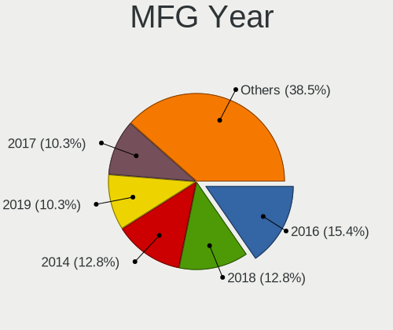
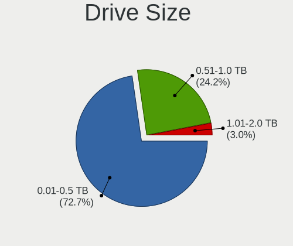
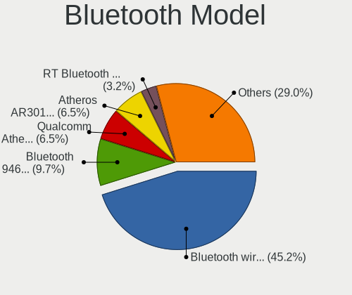
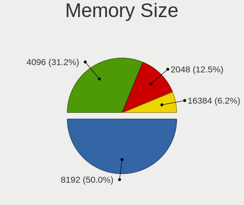

Solus 4.1 - Tested Hardware & Statistics (Notebooks)
----------------------------------------------------

A project to collect tested hardware configurations for Solus 4.1.

Anyone can contribute to this report by the [hw-probe](https://github.com/linuxhw/hw-probe) tool:

    sudo -E hw-probe -all -upload

Please contribute! Especially if your hardware is rare.

Contents
--------

* [ Test Cases ](#test-cases)

* [ System ](#system)
  - [ Kernel                   ](#kernel)
  - [ Kernel Family            ](#kernel-family)
  - [ Kernel Major Ver.        ](#kernel-major-ver)
  - [ Arch                     ](#arch)
  - [ DE                       ](#de)
  - [ Display Server           ](#display-server)
  - [ Display Manager          ](#display-manager)
  - [ OS Lang                  ](#os-lang)
  - [ Boot Mode                ](#boot-mode)
  - [ Filesystem               ](#filesystem)
  - [ Part. scheme             ](#part-scheme)
  - [ Dual Boot with Linux/BSD ](#dual-boot-with-linuxbsd)
  - [ Dual Boot (Win)          ](#dual-boot-win)

* [ Board ](#board)
  - [ Vendor                   ](#vendor)
  - [ Model                    ](#model)
  - [ Model Family             ](#model-family)
  - [ MFG Year                 ](#mfg-year)
  - [ Form Factor              ](#form-factor)
  - [ Secure Boot              ](#secure-boot)
  - [ Coreboot                 ](#coreboot)
  - [ RAM Size                 ](#ram-size)
  - [ RAM Used                 ](#ram-used)
  - [ Total Drives             ](#total-drives)
  - [ Has CD-ROM               ](#has-cd-rom)
  - [ Has Ethernet             ](#has-ethernet)
  - [ Has WiFi                 ](#has-wifi)
  - [ Has Bluetooth            ](#has-bluetooth)

* [ Location ](#location)
  - [ Country                  ](#country)
  - [ City                     ](#city)

* [ Drives ](#drives)
  - [ Drive Vendor             ](#drive-vendor)
  - [ Drive Model              ](#drive-model)
  - [ HDD Vendor               ](#hdd-vendor)
  - [ SSD Vendor               ](#ssd-vendor)
  - [ Drive Kind               ](#drive-kind)
  - [ Drive Connector          ](#drive-connector)
  - [ Drive Size               ](#drive-size)
  - [ Space Total              ](#space-total)
  - [ Space Used               ](#space-used)
  - [ Malfunc. Drives          ](#malfunc-drives)
  - [ Malfunc. Drive Vendor    ](#malfunc-drive-vendor)
  - [ Malfunc. HDD Vendor      ](#malfunc-hdd-vendor)
  - [ Malfunc. Drive Kind      ](#malfunc-drive-kind)
  - [ Failed Drives            ](#failed-drives)
  - [ Failed Drive Vendor      ](#failed-drive-vendor)
  - [ Drive Status             ](#drive-status)

* [ Storage controller ](#storage-controller)
  - [ Storage Vendor           ](#storage-vendor)
  - [ Storage Model            ](#storage-model)
  - [ Storage Kind             ](#storage-kind)

* [ Processor ](#processor)
  - [ CPU Vendor               ](#cpu-vendor)
  - [ CPU Model                ](#cpu-model)
  - [ CPU Model Family         ](#cpu-model-family)
  - [ CPU Cores                ](#cpu-cores)
  - [ CPU Sockets              ](#cpu-sockets)
  - [ CPU Threads              ](#cpu-threads)
  - [ CPU Op-Modes             ](#cpu-op-modes)
  - [ CPU Microcode            ](#cpu-microcode)
  - [ CPU Microarch            ](#cpu-microarch)

* [ Graphics ](#graphics)
  - [ GPU Vendor               ](#gpu-vendor)
  - [ GPU Model                ](#gpu-model)
  - [ GPU Combo                ](#gpu-combo)
  - [ GPU Driver               ](#gpu-driver)
  - [ GPU Memory               ](#gpu-memory)

* [ Monitor ](#monitor)
  - [ Monitor Vendor           ](#monitor-vendor)
  - [ Monitor Model            ](#monitor-model)
  - [ Monitor Resolution       ](#monitor-resolution)
  - [ Monitor Diagonal         ](#monitor-diagonal)
  - [ Monitor Width            ](#monitor-width)
  - [ Aspect Ratio             ](#aspect-ratio)
  - [ Monitor Area             ](#monitor-area)
  - [ Pixel Density            ](#pixel-density)
  - [ Multiple Monitors        ](#multiple-monitors)

* [ Network ](#network)
  - [ Net Controller Vendor    ](#net-controller-vendor)
  - [ Net Controller Model     ](#net-controller-model)
  - [ Wireless Vendor          ](#wireless-vendor)
  - [ Wireless Model           ](#wireless-model)
  - [ Ethernet Vendor          ](#ethernet-vendor)
  - [ Ethernet Model           ](#ethernet-model)
  - [ Net Controller Kind      ](#net-controller-kind)
  - [ Used Controller          ](#used-controller)
  - [ NICs                     ](#nics)
  - [ IPv6                     ](#ipv6)

* [ Bluetooth ](#bluetooth)
  - [ Bluetooth Vendor         ](#bluetooth-vendor)
  - [ Bluetooth Model          ](#bluetooth-model)

* [ Sound ](#sound)
  - [ Sound Vendor             ](#sound-vendor)
  - [ Sound Model              ](#sound-model)

* [ Memory ](#memory)
  - [ Memory Vendor            ](#memory-vendor)
  - [ Memory Model             ](#memory-model)
  - [ Memory Kind              ](#memory-kind)
  - [ Memory Form Factor       ](#memory-form-factor)
  - [ Memory Size              ](#memory-size)
  - [ Memory Speed             ](#memory-speed)

* [ Printers & scanners ](#printers--scanners)
  - [ Printer Vendor           ](#printer-vendor)
  - [ Printer Model            ](#printer-model)
  - [ Scanner Vendor           ](#scanner-vendor)
  - [ Scanner Model            ](#scanner-model)

* [ Camera ](#camera)
  - [ Camera Vendor            ](#camera-vendor)
  - [ Camera Model             ](#camera-model)

* [ Security ](#security)
  - [ Fingerprint Vendor       ](#fingerprint-vendor)
  - [ Fingerprint Model        ](#fingerprint-model)
  - [ Chipcard Vendor          ](#chipcard-vendor)
  - [ Chipcard Model           ](#chipcard-model)

* [ Unsupported ](#unsupported)
  - [ Unsupported Devices      ](#unsupported-devices)
  - [ Unsupported Device Types ](#unsupported-device-types)

Test Cases
----------

Total: 50

| Vendor        | Model                       | Probe                                                      | Date         |
|---------------|-----------------------------|------------------------------------------------------------|--------------|
| Lenovo        | ThinkPad T410 2522Y1L       | [3c4543a94f](https://linux-hardware.org/?probe=3c4543a94f) | Jan 26, 2021 |
| Dell          | XPS 13 9360                 | [56d39c0f21](https://linux-hardware.org/?probe=56d39c0f21) | Jan 02, 2021 |
| Toshiba       | Satellite L855              | [0173204c7f](https://linux-hardware.org/?probe=0173204c7f) | Dec 23, 2020 |
| HUAWEI        | NBLK-WAX9X                  | [26447067ee](https://linux-hardware.org/?probe=26447067ee) | Dec 20, 2020 |
| Acer          | Aspire A315-21              | [5f78418b58](https://linux-hardware.org/?probe=5f78418b58) | Dec 19, 2020 |
| HP            | EliteBook 840 G3            | [708eaf5602](https://linux-hardware.org/?probe=708eaf5602) | Dec 14, 2020 |
| Toshiba       | Satellite L855              | [3d3a517e96](https://linux-hardware.org/?probe=3d3a517e96) | Dec 11, 2020 |
| Sony          | VPCEB1S1E                   | [ebcb16e616](https://linux-hardware.org/?probe=ebcb16e616) | Nov 27, 2020 |
| Panasonic     | CF-C2CCEZXCM                | [cba289e868](https://linux-hardware.org/?probe=cba289e868) | Nov 22, 2020 |
| Acer          | Aspire E1-532P              | [4a2a5fd18c](https://linux-hardware.org/?probe=4a2a5fd18c) | Nov 01, 2020 |
| Timi          | TM1701                      | [36446e6594](https://linux-hardware.org/?probe=36446e6594) | Oct 26, 2020 |
| Apple         | MacBook5,2                  | [b21d4ca9d0](https://linux-hardware.org/?probe=b21d4ca9d0) | Oct 26, 2020 |
| Apple         | MacBook5,2                  | [eb1b0d459f](https://linux-hardware.org/?probe=eb1b0d459f) | Oct 25, 2020 |
| Toshiba       | PORTEGE Z20T-B              | [9d789eba3c](https://linux-hardware.org/?probe=9d789eba3c) | Oct 12, 2020 |
| Toshiba       | Satellite P50-A             | [884731a198](https://linux-hardware.org/?probe=884731a198) | Sep 28, 2020 |
| HP            | ProBook 450 G5              | [d04bae5c49](https://linux-hardware.org/?probe=d04bae5c49) | Sep 14, 2020 |
| Lenovo        | ThinkPad Edge E440 20C5A... | [2f729ef2af](https://linux-hardware.org/?probe=2f729ef2af) | Sep 11, 2020 |
| Lenovo        | ThinkPad T440p 20AN009CU... | [bcc44c581c](https://linux-hardware.org/?probe=bcc44c581c) | Sep 09, 2020 |
| Dell          | Inspiron 5577               | [b46a79f93e](https://linux-hardware.org/?probe=b46a79f93e) | Sep 03, 2020 |
| Acer          | Aspire ES1-111M             | [fcee1a2241](https://linux-hardware.org/?probe=fcee1a2241) | Aug 21, 2020 |
| Acer          | Aspire ES1-111M             | [43f35553ae](https://linux-hardware.org/?probe=43f35553ae) | Aug 21, 2020 |
| Lenovo        | IdeaPad 330S-15IKB 81F5     | [793085b89a](https://linux-hardware.org/?probe=793085b89a) | Aug 15, 2020 |
| HP            | ProBook 440 G4              | [191f1be39f](https://linux-hardware.org/?probe=191f1be39f) | Aug 14, 2020 |
| HP            | ProBook 440 G4              | [c34e36f36e](https://linux-hardware.org/?probe=c34e36f36e) | Aug 10, 2020 |
| HP            | ProBook 440 G4              | [5b6c3861bb](https://linux-hardware.org/?probe=5b6c3861bb) | Aug 10, 2020 |
| ASUSTek       | TUF Gaming FX505DV_FX505... | [8eb28a49c4](https://linux-hardware.org/?probe=8eb28a49c4) | Aug 03, 2020 |
| Avell High... | Avell G1750 MUV / C65 MU... | [cf035fee07](https://linux-hardware.org/?probe=cf035fee07) | Jul 24, 2020 |
| ASUSTek       | ZenBook UX431DA_UM431DA     | [2fdc7ceb31](https://linux-hardware.org/?probe=2fdc7ceb31) | Jul 03, 2020 |
| HP            | Presario C700               | [6b50a4fad1](https://linux-hardware.org/?probe=6b50a4fad1) | Jun 26, 2020 |
| ASUSTek       | K45A                        | [57c5b7b4bd](https://linux-hardware.org/?probe=57c5b7b4bd) | Jun 08, 2020 |
| Acer          | Predator PH315-52           | [b5e7780315](https://linux-hardware.org/?probe=b5e7780315) | Jun 04, 2020 |
| Lenovo        | Z51-70 80K6                 | [7b25fce04c](https://linux-hardware.org/?probe=7b25fce04c) | May 24, 2020 |
| Samsung       | 270E5K/270E5Q/271E5K/257... | [cb0fe570e2](https://linux-hardware.org/?probe=cb0fe570e2) | May 22, 2020 |
| Dell          | Latitude 7390               | [49112c8937](https://linux-hardware.org/?probe=49112c8937) | May 20, 2020 |
| HP            | ProBook 6470b               | [59db0f436f](https://linux-hardware.org/?probe=59db0f436f) | May 13, 2020 |
| Samsung       | 270E5K/270E5Q/271E5K/257... | [e98c6a162c](https://linux-hardware.org/?probe=e98c6a162c) | May 03, 2020 |
| Toshiba       | Satellite L655              | [32a9d86996](https://linux-hardware.org/?probe=32a9d86996) | May 02, 2020 |
| Acer          | Aspire E1-532P              | [b401e8b701](https://linux-hardware.org/?probe=b401e8b701) | Apr 30, 2020 |
| HP            | Pavilion dv6                | [6939cb8715](https://linux-hardware.org/?probe=6939cb8715) | Apr 11, 2020 |
| Acer          | Aspire E5-575               | [328b82f240](https://linux-hardware.org/?probe=328b82f240) | Apr 11, 2020 |
| HP            | Pavilion dv6                | [0c6dc861d6](https://linux-hardware.org/?probe=0c6dc861d6) | Apr 06, 2020 |
| HP            | Pavilion dv6                | [3d9d707ea7](https://linux-hardware.org/?probe=3d9d707ea7) | Mar 30, 2020 |
| Chuwi         | LapBook SE                  | [f7cfd1b163](https://linux-hardware.org/?probe=f7cfd1b163) | Mar 26, 2020 |
| Acer          | Swift SF314-56              | [3826e4d14c](https://linux-hardware.org/?probe=3826e4d14c) | Mar 24, 2020 |
| Google        | Kip                         | [4f62ee34a3](https://linux-hardware.org/?probe=4f62ee34a3) | Mar 22, 2020 |
| Dell          | Vostro 3446                 | [c42d273e36](https://linux-hardware.org/?probe=c42d273e36) | Mar 12, 2020 |
| HP            | ProBook 450 G5              | [0c527b2640](https://linux-hardware.org/?probe=0c527b2640) | Mar 08, 2020 |
| Acer          | Aspire VN7-792G             | [3924df2c92](https://linux-hardware.org/?probe=3924df2c92) | Feb 28, 2020 |
| Apple         | MacBookPro10,2              | [1281c8c30d](https://linux-hardware.org/?probe=1281c8c30d) | Feb 26, 2020 |
| Lenovo        | ThinkPad T480 20L5S08L00    | [3c23e0d823](https://linux-hardware.org/?probe=3c23e0d823) | Feb 20, 2020 |

System
------

Kernel
------

Version of the Linux kernel

| Version            | Notebooks | Percent |
|--------------------|-----------|---------|
| 5.6.19-158.current | 9         | 23.08%  |
| 5.6.4-152.current  | 5         | 12.82%  |
| 5.6.19-159.current | 5         | 12.82%  |
| 5.6.13-153.current | 4         | 10.26%  |
| 5.5.7-150.current  | 4         | 10.26%  |
| 5.6.18-156.current | 2         | 5.13%   |
| 5.5.4-148.current  | 2         | 5.13%   |
| 5.5.11-151.current | 2         | 5.13%   |
| 5.4.12-144.current | 2         | 5.13%   |
| 5.6.18-155.current | 1         | 2.56%   |
| 5.5.3-147.current  | 1         | 2.56%   |
| 5.10.7-168.current | 1         | 2.56%   |
| 5.10.2-164.current | 1         | 2.56%   |

Kernel Family
-------------

Linux kernel without a distro release

| Version | Notebooks | Percent |
|---------|-----------|---------|
| 5.6.19  | 14        | 35.9%   |
| 5.6.4   | 5         | 12.82%  |
| 5.6.13  | 4         | 10.26%  |
| 5.5.7   | 4         | 10.26%  |
| 5.6.18  | 3         | 7.69%   |
| 5.5.4   | 2         | 5.13%   |
| 5.5.11  | 2         | 5.13%   |
| 5.4.12  | 2         | 5.13%   |
| 5.5.3   | 1         | 2.56%   |
| 5.10.7  | 1         | 2.56%   |
| 5.10.2  | 1         | 2.56%   |

Kernel Major Ver.
-----------------

Linux kernel major version

| Version | Notebooks | Percent |
|---------|-----------|---------|
| 5.6     | 26        | 66.67%  |
| 5.5     | 9         | 23.08%  |
| 5.4     | 2         | 5.13%   |
| 5.10    | 2         | 5.13%   |

Arch
----

OS architecture (x86_64, i586, etc.)

| Name   | Notebooks | Percent |
|--------|-----------|---------|
| x86_64 | 39        | 100%    |

DE
--

Desktop Environment

| Name    | Notebooks | Percent |
|---------|-----------|---------|
| Budgie  | 25        | 62.5%   |
| KDE     | 6         | 15%     |
| Unknown | 5         | 12.5%   |
| MATE    | 3         | 7.5%    |
| GNOME   | 1         | 2.5%    |

Display Server
--------------

X11 or Wayland

| Name | Notebooks | Percent |
|------|-----------|---------|
| X11  | 39        | 100%    |

Display Manager
---------------

SDDM, LightDM, etc.

| Name    | Notebooks | Percent |
|---------|-----------|---------|
| Unknown | 30        | 75%     |
| TDM     | 5         | 12.5%   |
| LightDM | 3         | 7.5%    |
| SDDM    | 2         | 5%      |

OS Lang
-------

Language

| Lang    | Notebooks | Percent |
|---------|-----------|---------|
| en_US   | 21        | 53.85%  |
| en_AU   | 3         | 7.69%   |
| pt_BR   | 2         | 5.13%   |
| pl_PL   | 2         | 5.13%   |
| fr_FR   | 2         | 5.13%   |
| es_ES   | 2         | 5.13%   |
| uk_UA   | 1         | 2.56%   |
| tr_TR   | 1         | 2.56%   |
| it_IT   | 1         | 2.56%   |
| en_NZ   | 1         | 2.56%   |
| en_GB   | 1         | 2.56%   |
| de_AT   | 1         | 2.56%   |
| Unknown | 1         | 2.56%   |

Boot Mode
---------

EFI or BIOS

| Mode | Notebooks | Percent |
|------|-----------|---------|
| EFI  | 27        | 69.23%  |
| BIOS | 12        | 30.77%  |

Filesystem
----------

Type of filesystem

| Type | Notebooks | Percent |
|------|-----------|---------|
| Ext4 | 39        | 100%    |

Part. scheme
------------

Scheme of partitioning

| Type    | Notebooks | Percent |
|---------|-----------|---------|
| Unknown | 25        | 62.5%   |
| GPT     | 12        | 30%     |
| MBR     | 3         | 7.5%    |

Dual Boot with Linux/BSD
------------------------

Hosting more than one Linux/BSD

| Dual boot | Notebooks | Percent |
|-----------|-----------|---------|
| No        | 37        | 94.87%  |
| Yes       | 2         | 5.13%   |

Dual Boot (Win)
---------------

Hosting Linux and Windows

| Dual boot | Notebooks | Percent |
|-----------|-----------|---------|
| No        | 33        | 84.62%  |
| Yes       | 6         | 15.38%  |

Board
-----

Vendor
------

Motherboard manufacturer

| Name                   | Notebooks | Percent |
|------------------------|-----------|---------|
| Acer                   | 7         | 17.95%  |
| Lenovo                 | 6         | 15.38%  |
| Hewlett-Packard        | 6         | 15.38%  |
| Toshiba                | 4         | 10.26%  |
| Dell                   | 4         | 10.26%  |
| ASUSTek Computer       | 3         | 7.69%   |
| Apple                  | 2         | 5.13%   |
| Timi                   | 1         | 2.56%   |
| Sony                   | 1         | 2.56%   |
| Samsung Electronics    | 1         | 2.56%   |
| Panasonic              | 1         | 2.56%   |
| Google                 | 1         | 2.56%   |
| Chuwi                  | 1         | 2.56%   |
| Avell High Performance | 1         | 2.56%   |

Model
-----

Motherboard model

| Name                                             | Notebooks | Percent |
|--------------------------------------------------|-----------|---------|
| Toshiba Satellite P50-A                          | 1         | 2.56%   |
| Toshiba Satellite L855                           | 1         | 2.56%   |
| Toshiba Satellite L655                           | 1         | 2.56%   |
| Toshiba PORTEGE Z20T-B                           | 1         | 2.56%   |
| Timi TM1701                                      | 1         | 2.56%   |
| Sony VPCEB1S1E                                   | 1         | 2.56%   |
| Samsung 270E5K/270E5Q/271E5K/2570EK              | 1         | 2.56%   |
| Panasonic CF-C2CCEZXCM                           | 1         | 2.56%   |
| Lenovo Z51-70 80K6                               | 1         | 2.56%   |
| Lenovo ThinkPad T480 20L5S08L00                  | 1         | 2.56%   |
| Lenovo ThinkPad T440p 20AN009CUS                 | 1         | 2.56%   |
| Lenovo ThinkPad T410 2522Y1L                     | 1         | 2.56%   |
| Lenovo ThinkPad Edge E440 20C5A03300             | 1         | 2.56%   |
| Lenovo IdeaPad 330S-15IKB 81F5                   | 1         | 2.56%   |
| HP ProBook 6470b                                 | 1         | 2.56%   |
| HP ProBook 450 G5                                | 1         | 2.56%   |
| HP ProBook 440 G4                                | 1         | 2.56%   |
| HP Presario C700                                 | 1         | 2.56%   |
| HP Pavilion dv6                                  | 1         | 2.56%   |
| HP EliteBook 840 G3                              | 1         | 2.56%   |
| Google Kip                                       | 1         | 2.56%   |
| Dell XPS 13 9360                                 | 1         | 2.56%   |
| Dell Vostro 3446                                 | 1         | 2.56%   |
| Dell Latitude 7390                               | 1         | 2.56%   |
| Dell Inspiron 5577                               | 1         | 2.56%   |
| Chuwi LapBook SE                                 | 1         | 2.56%   |
| Avell High Performance Avell G1750 MUV / C65 MUV | 1         | 2.56%   |
| ASUS ZenBook UX431DA_UM431DA                     | 1         | 2.56%   |
| ASUS TUF Gaming FX505DV_FX505DV                  | 1         | 2.56%   |
| ASUS K45A                                        | 1         | 2.56%   |
| Apple MacBookPro10,2                             | 1         | 2.56%   |
| Apple MacBook5,2                                 | 1         | 2.56%   |
| Acer Swift SF314-56                              | 1         | 2.56%   |
| Acer Predator PH315-52                           | 1         | 2.56%   |
| Acer Aspire VN7-792G                             | 1         | 2.56%   |
| Acer Aspire ES1-111M                             | 1         | 2.56%   |
| Acer Aspire E5-575                               | 1         | 2.56%   |
| Acer Aspire E1-532P                              | 1         | 2.56%   |
| Acer Aspire A315-21                              | 1         | 2.56%   |

Model Family
------------

Motherboard model prefix

| Name                         | Notebooks | Percent |
|------------------------------|-----------|---------|
| Acer Aspire                  | 5         | 12.82%  |
| Lenovo ThinkPad              | 4         | 10.26%  |
| Toshiba Satellite            | 3         | 7.69%   |
| HP ProBook                   | 3         | 7.69%   |
| Toshiba PORTEGE              | 1         | 2.56%   |
| Timi TM1701                  | 1         | 2.56%   |
| Sony VPCEB1S1E               | 1         | 2.56%   |
| Samsung 270E5K               | 1         | 2.56%   |
| Panasonic CF-C2CCEZXCM       | 1         | 2.56%   |
| Lenovo Z51-70                | 1         | 2.56%   |
| Lenovo IdeaPad               | 1         | 2.56%   |
| HP Presario                  | 1         | 2.56%   |
| HP Pavilion                  | 1         | 2.56%   |
| HP EliteBook                 | 1         | 2.56%   |
| Google Kip                   | 1         | 2.56%   |
| Dell XPS                     | 1         | 2.56%   |
| Dell Vostro                  | 1         | 2.56%   |
| Dell Latitude                | 1         | 2.56%   |
| Dell Inspiron                | 1         | 2.56%   |
| Chuwi LapBook                | 1         | 2.56%   |
| Avell High Performance Avell | 1         | 2.56%   |
| ASUS ZenBook                 | 1         | 2.56%   |
| ASUS TUF                     | 1         | 2.56%   |
| ASUS K45A                    | 1         | 2.56%   |
| Apple MacBookPro10           | 1         | 2.56%   |
| Apple MacBook5               | 1         | 2.56%   |
| Acer Swift                   | 1         | 2.56%   |
| Acer Predator                | 1         | 2.56%   |

MFG Year
--------

Motherboard manufacture year

| Year | Notebooks | Percent |
|------|-----------|---------|
| 2016 | 6         | 15.38%  |
| 2018 | 5         | 12.82%  |
| 2014 | 5         | 12.82%  |
| 2019 | 4         | 10.26%  |
| 2017 | 4         | 10.26%  |
| 2015 | 3         | 7.69%   |
| 2012 | 3         | 7.69%   |
| 2013 | 2         | 5.13%   |
| 2010 | 2         | 5.13%   |
| 2009 | 2         | 5.13%   |
| 2020 | 1         | 2.56%   |
| 2008 | 1         | 2.56%   |
| 2007 | 1         | 2.56%   |

Form Factor
-----------

Physical design of the computer

| Name     | Notebooks | Percent |
|----------|-----------|---------|
| Notebook | 39        | 100%    |

Secure Boot
-----------

Enabled or disabled

| State    | Notebooks | Percent |
|----------|-----------|---------|
| Disabled | 39        | 100%    |

Coreboot
--------

Have coreboot on board

| Used | Notebooks | Percent |
|------|-----------|---------|
| No   | 38        | 97.44%  |
| Yes  | 1         | 2.56%   |

RAM Size
--------

Total RAM memory

| Size in GB | Notebooks | Percent |
|------------|-----------|---------|
| 16.01-24.0 | 11        | 28.21%  |
| 3.01-4.0   | 10        | 25.64%  |
| 8.01-16.0  | 10        | 25.64%  |
| 4.01-8.0   | 6         | 15.38%  |
| 1.01-2.0   | 2         | 5.13%   |

RAM Used
--------

Used RAM memory

| Used GB   | Notebooks | Percent |
|-----------|-----------|---------|
| 1.01-2.0  | 14        | 35%     |
| 2.01-3.0  | 10        | 25%     |
| 4.01-8.0  | 7         | 17.5%   |
| 3.01-4.0  | 5         | 12.5%   |
| 0.51-1.0  | 3         | 7.5%    |
| 8.01-16.0 | 1         | 2.5%    |

Total Drives
------------

Number of drives on board

| Drives | Notebooks | Percent |
|--------|-----------|---------|
| 1      | 29        | 74.36%  |
| 2      | 10        | 25.64%  |

Has CD-ROM
----------

Has CD-ROM on board

| Presented | Notebooks | Percent |
|-----------|-----------|---------|
| No        | 24        | 61.54%  |
| Yes       | 15        | 38.46%  |

Has Ethernet
------------

Has Ethernet on board

| Presented | Notebooks | Percent |
|-----------|-----------|---------|
| Yes       | 33        | 84.62%  |
| No        | 6         | 15.38%  |

Has WiFi
--------

Has WiFi module

| Presented | Notebooks | Percent |
|-----------|-----------|---------|
| Yes       | 39        | 100%    |

Has Bluetooth
-------------

Has Bluetooth module

| Presented | Notebooks | Percent |
|-----------|-----------|---------|
| Yes       | 31        | 79.49%  |
| No        | 8         | 20.51%  |

Location
--------

Country
-------

Geographic location (country)

| Country            | Notebooks | Percent |
|--------------------|-----------|---------|
| USA                | 7         | 17.95%  |
| Brazil             | 4         | 10.26%  |
| Spain              | 2         | 5.13%   |
| Poland             | 2         | 5.13%   |
| Indonesia          | 2         | 5.13%   |
| India              | 2         | 5.13%   |
| France             | 2         | 5.13%   |
| Australia          | 2         | 5.13%   |
| Venezuela          | 1         | 2.56%   |
| Ukraine            | 1         | 2.56%   |
| Turkey             | 1         | 2.56%   |
| Saudi Arabia       | 1         | 2.56%   |
| Oman               | 1         | 2.56%   |
| New Zealand        | 1         | 2.56%   |
| Mexico             | 1         | 2.56%   |
| Latvia             | 1         | 2.56%   |
| Japan              | 1         | 2.56%   |
| Hungary            | 1         | 2.56%   |
| Guatemala          | 1         | 2.56%   |
| Dominican Republic | 1         | 2.56%   |
| China              | 1         | 2.56%   |
| Chile              | 1         | 2.56%   |
| Belarus            | 1         | 2.56%   |
| Austria            | 1         | 2.56%   |

City
----

Geographic location (city)

| City                      | Notebooks | Percent |
|---------------------------|-----------|---------|
| Melbourne                 | 2         | 5%      |
| Columbus                  | 2         | 5%      |
| Zhytomyr                  | 1         | 2.5%    |
| Vienna                    | 1         | 2.5%    |
| Teresopolis               | 1         | 2.5%    |
| Semarang                  | 1         | 2.5%    |
| Santo Domingo Este        | 1         | 2.5%    |
| San Francisco del Rincón | 1         | 2.5%    |
| Riga                      | 1         | 2.5%    |
| Quilicura                 | 1         | 2.5%    |
| Port Orange               | 1         | 2.5%    |
| Pessac                    | 1         | 2.5%    |
| Paracuellos de Jarama     | 1         | 2.5%    |
| Muscat                    | 1         | 2.5%    |
| Minsk                     | 1         | 2.5%    |
| Minneapolis               | 1         | 2.5%    |
| Makkah                    | 1         | 2.5%    |
| Madrid                    | 1         | 2.5%    |
| Kayseri                   | 1         | 2.5%    |
| Jeddah                    | 1         | 2.5%    |
| Jakarta                   | 1         | 2.5%    |
| Ichinoseki                | 1         | 2.5%    |
| Hyderabad                 | 1         | 2.5%    |
| Humble                    | 1         | 2.5%    |
| Hrubieszów               | 1         | 2.5%    |
| Hartington                | 1         | 2.5%    |
| Guatemala City            | 1         | 2.5%    |
| Guarulhos                 | 1         | 2.5%    |
| Foz do Iguaçu            | 1         | 2.5%    |
| Curitiba                  | 1         | 2.5%    |
| Cleveland                 | 1         | 2.5%    |
| Changis-sur-Marne         | 1         | 2.5%    |
| Caracas                   | 1         | 2.5%    |
| Budapest                  | 1         | 2.5%    |
| Bengaluru                 | 1         | 2.5%    |
| Beijing                   | 1         | 2.5%    |
| Babice                    | 1         | 2.5%    |
| Auckland                  | 1         | 2.5%    |

Drives
------

Drive Vendor
------------

Hard drive vendors

| Vendor              | Notebooks | Drives | Percent |
|---------------------|-----------|--------|---------|
| Toshiba             | 8         | 9      | 16.33%  |
| WDC                 | 7         | 8      | 14.29%  |
| Samsung Electronics | 7         | 7      | 14.29%  |
| Seagate             | 6         | 6      | 12.24%  |
| Kingston            | 4         | 4      | 8.16%   |
| SanDisk             | 3         | 3      | 6.12%   |
| Unknown             | 2         | 2      | 4.08%   |
| SK hynix            | 2         | 2      | 4.08%   |
| Micron Technology   | 2         | 2      | 4.08%   |
| Silicon Motion      | 1         | 1      | 2.04%   |
| Lenovo              | 1         | 1      | 2.04%   |
| Intel               | 1         | 1      | 2.04%   |
| Hitachi             | 1         | 1      | 2.04%   |
| FORESEE             | 1         | 1      | 2.04%   |
| Crucial             | 1         | 2      | 2.04%   |
| Apple               | 1         | 1      | 2.04%   |
| AAPL                | 1         | 1      | 2.04%   |

Drive Model
-----------

Hard drive models

| Model                                   | Notebooks | Percent |
|-----------------------------------------|-----------|---------|
| Toshiba MQ01ABD100 1TB                  | 3         | 6%      |
| Samsung SSD 860 EVO 250GB               | 2         | 4%      |
| WDC WDS500G2B0B-00YS70 500GB SSD        | 1         | 2%      |
| WDC WDS100T2B0C-00PXH0 1TB              | 1         | 2%      |
| WDC WD5000BEVT-60ZAT1 500GB             | 1         | 2%      |
| WDC WD2500LPVX-22V0TT0 250GB            | 1         | 2%      |
| WDC WD2500BEVT-00A23T0 250GB            | 1         | 2%      |
| WDC WD10JPVX-22JC3T0 1TB                | 1         | 2%      |
| WDC WD10JPVX-08JC3T5 1TB                | 1         | 2%      |
| Unknown MMC Card  32GB                  | 1         | 2%      |
| Unknown AJNB4R  16GB                    | 1         | 2%      |
| Toshiba THNSNJ256GVNU 256GB SSD         | 1         | 2%      |
| Toshiba NVMe SSD Drive 256GB            | 1         | 2%      |
| Toshiba NVMe SSD Drive 1024GB           | 1         | 2%      |
| Toshiba MQ01ABD075 752GB                | 1         | 2%      |
| Toshiba MK5055GSX 500GB                 | 1         | 2%      |
| SK hynix PC401 HFS256GD9TNG-62A0A 256GB | 1         | 2%      |
| SK hynix HFM512GDJTNG-8310A 512GB       | 1         | 2%      |
| Silicon Motion IM2P33F8BR1-512GB        | 1         | 2%      |
| Seagate ST9500325AS 500GB               | 1         | 2%      |
| Seagate ST9320325AS 320GB               | 1         | 2%      |
| Seagate ST500LM012 HN-M500MBB 500GB     | 1         | 2%      |
| Seagate ST250LM004 HN-M250MBB 250GB     | 1         | 2%      |
| Seagate ST2000LX001-1RG174 2TB          | 1         | 2%      |
| Seagate ST1000LM014-SSHD-8GB            | 1         | 2%      |
| SanDisk X400 M.2 2280 256GB SSD         | 1         | 2%      |
| SanDisk SDSSDA120G 120GB                | 1         | 2%      |
| SanDisk NVMe SSD Drive 256GB            | 1         | 2%      |
| Samsung SSD 860 EVO 500GB               | 1         | 2%      |
| Samsung SSD 850 EVO 500GB               | 1         | 2%      |
| Samsung SSD 850 EVO 120G                | 1         | 2%      |
| Samsung MZVLW256HEHP-00000 256GB        | 1         | 2%      |
| Samsung MZVLB512HAJQ-000L7 512GB        | 1         | 2%      |
| Micron NVMe SSD Drive 512GB             | 1         | 2%      |
| Micron M600_MTFDDAV256MBF 256GB SSD     | 1         | 2%      |
| Lenovo NVMe SSD Drive 256GB             | 1         | 2%      |
| Kingston SV300S37A120G 120GB SSD        | 1         | 2%      |
| Kingston SA400S37240G 240GB SSD         | 1         | 2%      |
| Kingston RBUSNS8280S3128GH2 128GB SSD   | 1         | 2%      |
| Kingston NVMe SSD Drive 128GB           | 1         | 2%      |

HDD Vendor
----------

Hard disk drive vendors

| Vendor  | Notebooks | Drives | Percent |
|---------|-----------|--------|---------|
| Seagate | 6         | 6      | 33.33%  |
| WDC     | 5         | 6      | 27.78%  |
| Toshiba | 5         | 6      | 27.78%  |
| Hitachi | 1         | 1      | 5.56%   |
| AAPL    | 1         | 1      | 5.56%   |

SSD Vendor
----------

Solid state drive vendors

| Vendor              | Notebooks | Drives | Percent |
|---------------------|-----------|--------|---------|
| Samsung Electronics | 5         | 5      | 29.41%  |
| Kingston            | 3         | 3      | 17.65%  |
| SanDisk             | 2         | 2      | 11.76%  |
| WDC                 | 1         | 1      | 5.88%   |
| Toshiba             | 1         | 1      | 5.88%   |
| Micron Technology   | 1         | 1      | 5.88%   |
| Intel               | 1         | 1      | 5.88%   |
| FORESEE             | 1         | 1      | 5.88%   |
| Crucial             | 1         | 2      | 5.88%   |
| Apple               | 1         | 1      | 5.88%   |

Drive Kind
----------

HDD or SSD

| Kind | Notebooks | Drives | Percent |
|------|-----------|--------|---------|
| HDD  | 17        | 20     | 36.96%  |
| SSD  | 16        | 18     | 34.78%  |
| NVMe | 11        | 12     | 23.91%  |
| MMC  | 2         | 2      | 4.35%   |

Drive Connector
---------------

SATA, SAS, NVMe, etc.

| Type | Notebooks | Drives | Percent |
|------|-----------|--------|---------|
| SATA | 29        | 37     | 67.44%  |
| NVMe | 11        | 12     | 25.58%  |
| MMC  | 2         | 2      | 4.65%   |
| SAS  | 1         | 1      | 2.33%   |

Drive Size
----------

Size of hard drive

| Size in TB | Notebooks | Drives | Percent |
|------------|-----------|--------|---------|
| 0.01-0.5   | 24        | 28     | 72.73%  |
| 0.51-1.0   | 8         | 9      | 24.24%  |
| 1.01-2.0   | 1         | 1      | 3.03%   |

Space Total
-----------

Amount of disk space available on the file system

| Size in GB | Notebooks | Percent |
|------------|-----------|---------|
| 101-250    | 22        | 56.41%  |
| 251-500    | 7         | 17.95%  |
| 1001-2000  | 4         | 10.26%  |
| 501-1000   | 3         | 7.69%   |
| 21-50      | 1         | 2.56%   |
| 1-20       | 1         | 2.56%   |
| Unknown    | 1         | 2.56%   |

Space Used
----------

Amount of used disk space

| Used GB  | Notebooks | Percent |
|----------|-----------|---------|
| 1-20     | 15        | 37.5%   |
| 51-100   | 7         | 17.5%   |
| 101-250  | 6         | 15%     |
| 21-50    | 5         | 12.5%   |
| 251-500  | 4         | 10%     |
| 501-1000 | 2         | 5%      |
| Unknown  | 1         | 2.5%    |

Malfunc. Drives
---------------

Drive models with a malfunction

| Model                                        | Notebooks | Drives | Percent |
|----------------------------------------------|-----------|--------|---------|
| WDC WD5000BEVT-60ZAT1 500GB                  | 1         | 1      | 33.33%  |
| Samsung Electronics MZVLB512HAJQ-000L7 512GB | 1         | 1      | 33.33%  |
| Hitachi HTS543216L9SA02 160GB                | 1         | 1      | 33.33%  |

Malfunc. Drive Vendor
---------------------

Vendors of faulty drives

| Vendor              | Notebooks | Drives | Percent |
|---------------------|-----------|--------|---------|
| WDC                 | 1         | 1      | 33.33%  |
| Samsung Electronics | 1         | 1      | 33.33%  |
| Hitachi             | 1         | 1      | 33.33%  |

Malfunc. HDD Vendor
-------------------

Vendors of faulty HDD drives

| Vendor  | Notebooks | Drives | Percent |
|---------|-----------|--------|---------|
| WDC     | 1         | 1      | 50%     |
| Hitachi | 1         | 1      | 50%     |

Malfunc. Drive Kind
-------------------

Kinds of faulty drives

| Kind | Notebooks | Drives | Percent |
|------|-----------|--------|---------|
| HDD  | 2         | 2      | 66.67%  |
| NVMe | 1         | 1      | 33.33%  |

Failed Drives
-------------

Failed drive models

Zero info for selected period =(

Failed Drive Vendor
-------------------

Failed drive vendors

Zero info for selected period =(

Drive Status
------------

Number of failed and malfunc. drives

| Status   | Notebooks | Drives | Percent |
|----------|-----------|--------|---------|
| Detected | 27        | 35     | 65.85%  |
| Works    | 11        | 14     | 26.83%  |
| Malfunc  | 3         | 3      | 7.32%   |

Storage controller
------------------

Storage Vendor
--------------

Storage controller vendors

| Vendor                       | Notebooks | Percent |
|------------------------------|-----------|---------|
| Intel                        | 30        | 68.18%  |
| Toshiba America Info Systems | 2         | 4.55%   |
| SK hynix                     | 2         | 4.55%   |
| Samsung Electronics          | 2         | 4.55%   |
| AMD                          | 2         | 4.55%   |
| Silicon Motion               | 1         | 2.27%   |
| SanDisk                      | 1         | 2.27%   |
| Nvidia                       | 1         | 2.27%   |
| Micron Technology            | 1         | 2.27%   |
| Lenovo                       | 1         | 2.27%   |
| Kingston Technology Company  | 1         | 2.27%   |

Storage Model
-------------

Storage controller models

| Model                                                                          | Notebooks | Percent |
|--------------------------------------------------------------------------------|-----------|---------|
| Intel Sunrise Point-LP SATA Controller [AHCI mode]                             | 5         | 11.36%  |
| Intel 7 Series Chipset Family 6-port SATA Controller [AHCI mode]               | 4         | 9.09%   |
| Intel Wildcat Point-LP SATA Controller [AHCI Mode]                             | 3         | 6.82%   |
| Intel 8 Series/C220 Series Chipset Family 6-port SATA Controller 1 [AHCI mode] | 3         | 6.82%   |
| Intel 8 Series SATA Controller 1 [AHCI mode]                                   | 3         | 6.82%   |
| Intel HM170/QM170 Chipset SATA Controller [AHCI Mode]                          | 2         | 4.55%   |
| Intel 5 Series/3400 Series Chipset 4 port SATA AHCI Controller                 | 2         | 4.55%   |
| AMD FCH SATA Controller [AHCI mode]                                            | 2         | 4.55%   |
| Toshiba America Info Systems XG5 NVMe SSD Controller                           | 1         | 2.27%   |
| Toshiba America Info Systems XG4 NVMe SSD Controller                           | 1         | 2.27%   |
| SK hynix PC401 NVMe Solid State Drive 256GB                                    | 1         | 2.27%   |
| SK hynix BC501 NVMe Solid State Drive                                          | 1         | 2.27%   |
| Silicon Motion SM2263EN/SM2263XT SSD Controller                                | 1         | 2.27%   |
| SanDisk WD Blue SN550 NVMe SSD                                                 | 1         | 2.27%   |
| Samsung NVMe SSD Controller SM981/PM981/PM983                                  | 1         | 2.27%   |
| Samsung NVMe SSD Controller SM961/PM961/SM963                                  | 1         | 2.27%   |
| Nvidia MCP79 AHCI Controller                                                   | 1         | 2.27%   |
| Micron Non-Volatile memory controller                                          | 1         | 2.27%   |
| Lenovo Non-Volatile memory controller                                          | 1         | 2.27%   |
| Kingston Company U-SNS8154P3 NVMe SSD                                          | 1         | 2.27%   |
| Intel Celeron/Pentium Silver Processor SATA Controller                         | 1         | 2.27%   |
| Intel Cannon Point-LP SATA Controller [AHCI Mode]                              | 1         | 2.27%   |
| Intel Cannon Lake Mobile PCH SATA AHCI Controller                              | 1         | 2.27%   |
| Intel Atom Processor E3800 Series SATA AHCI Controller                         | 1         | 2.27%   |
| Intel 82801IBM/IEM (ICH9M/ICH9M-E) 4 port SATA Controller [AHCI mode]          | 1         | 2.27%   |
| Intel 82801HM/HEM (ICH8M/ICH8M-E) SATA Controller [IDE mode]                   | 1         | 2.27%   |
| Intel 82801 Mobile SATA Controller [RAID mode]                                 | 1         | 2.27%   |
| Intel 5 Series/3400 Series Chipset 6 port SATA AHCI Controller                 | 1         | 2.27%   |

Storage Kind
------------

Kind of storage controller (IDE, SATA, NVMe, SAS, ...)

| Kind | Notebooks | Percent |
|------|-----------|---------|
| SATA | 32        | 74.42%  |
| NVMe | 10        | 23.26%  |
| IDE  | 1         | 2.33%   |

Processor
---------

CPU Vendor
----------

Processor vendors

| Vendor | Notebooks | Percent |
|--------|-----------|---------|
| Intel  | 36        | 92.31%  |
| AMD    | 3         | 7.69%   |

CPU Model
---------

Processor models

| Model                                         | Notebooks | Percent |
|-----------------------------------------------|-----------|---------|
| Intel Core i7-8550U CPU @ 1.80GHz             | 3         | 7.69%   |
| Intel Core i7-9750H CPU @ 2.60GHz             | 2         | 5.13%   |
| Intel Core i5-7200U CPU @ 2.50GHz             | 2         | 5.13%   |
| Intel Core i5-3210M CPU @ 2.50GHz             | 2         | 5.13%   |
| Intel Core 2 Duo CPU P7450 @ 2.13GHz          | 2         | 5.13%   |
| Intel Pentium 3556U @ 1.70GHz                 | 1         | 2.56%   |
| Intel Core M-5Y51 CPU @ 1.10GHz               | 1         | 2.56%   |
| Intel Core i7-6700HQ CPU @ 2.60GHz            | 1         | 2.56%   |
| Intel Core i7-5500U CPU @ 2.40GHz             | 1         | 2.56%   |
| Intel Core i7-4700MQ CPU @ 2.40GHz            | 1         | 2.56%   |
| Intel Core i7-4600M CPU @ 2.90GHz             | 1         | 2.56%   |
| Intel Core i5-8350U CPU @ 1.70GHz             | 1         | 2.56%   |
| Intel Core i5-8250U CPU @ 1.60GHz             | 1         | 2.56%   |
| Intel Core i5-7300HQ CPU @ 2.50GHz            | 1         | 2.56%   |
| Intel Core i5-6200U CPU @ 2.30GHz             | 1         | 2.56%   |
| Intel Core i5-5200U CPU @ 2.20GHz             | 1         | 2.56%   |
| Intel Core i5-4300U CPU @ 1.90GHz             | 1         | 2.56%   |
| Intel Core i5-4210U CPU @ 1.70GHz             | 1         | 2.56%   |
| Intel Core i5-4200M CPU @ 2.50GHz             | 1         | 2.56%   |
| Intel Core i5-3320M CPU @ 2.60GHz             | 1         | 2.56%   |
| Intel Core i5 CPU M 540 @ 2.53GHz             | 1         | 2.56%   |
| Intel Core i5 CPU M 480 @ 2.67GHz             | 1         | 2.56%   |
| Intel Core i5 CPU M 430 @ 2.27GHz             | 1         | 2.56%   |
| Intel Core i3-8145U CPU @ 2.10GHz             | 1         | 2.56%   |
| Intel Core i3-7100U CPU @ 2.40GHz             | 1         | 2.56%   |
| Intel Core 2 Duo CPU T5250 @ 1.50GHz          | 1         | 2.56%   |
| Intel Celeron N4100 CPU @ 1.10GHz             | 1         | 2.56%   |
| Intel Celeron CPU N2940 @ 1.83GHz             | 1         | 2.56%   |
| Intel Celeron CPU N2840 @ 2.16GHz             | 1         | 2.56%   |
| Intel Celeron CPU B830 @ 1.80GHz              | 1         | 2.56%   |
| AMD Ryzen 7 3750H with Radeon Vega Mobile Gfx | 1         | 2.56%   |
| AMD Ryzen 7 3700U with Radeon Vega Mobile Gfx | 1         | 2.56%   |
| AMD A9-9420 RADEON R5, 5 COMPUTE CORES 2C+3G  | 1         | 2.56%   |

CPU Model Family
----------------

Processor model prefix

| Model            | Notebooks | Percent |
|------------------|-----------|---------|
| Intel Core i5    | 16        | 41.03%  |
| Intel Core i7    | 9         | 23.08%  |
| Intel Celeron    | 4         | 10.26%  |
| Intel Core 2 Duo | 3         | 7.69%   |
| Intel Core i3    | 2         | 5.13%   |
| AMD Ryzen 7      | 2         | 5.13%   |
| Other            | 1         | 2.56%   |
| Intel Pentium    | 1         | 2.56%   |
| Intel Core M     | 1         | 2.56%   |

CPU Cores
---------

Number of processor cores

| Number | Notebooks | Percent |
|--------|-----------|---------|
| 2      | 25        | 64.1%   |
| 4      | 12        | 30.77%  |
| 6      | 2         | 5.13%   |

CPU Sockets
-----------

Number of sockets

| Number | Notebooks | Percent |
|--------|-----------|---------|
| 1      | 39        | 100%    |

CPU Threads
-----------

Threads per core (Hyper-Threading)

| Number | Notebooks | Percent |
|--------|-----------|---------|
| 2      | 29        | 74.36%  |
| 1      | 10        | 25.64%  |

CPU Op-Modes
------------

CPU Operation Modes (32-bit, 64-bit)

| Op mode        | Notebooks | Percent |
|----------------|-----------|---------|
| 32-bit, 64-bit | 39        | 100%    |

CPU Microcode
-------------

Microcode number

| Number     | Notebooks | Percent |
|------------|-----------|---------|
| 0x806ea    | 5         | 12.82%  |
| 0x806e9    | 3         | 7.69%   |
| 0x40651    | 3         | 7.69%   |
| 0x306d4    | 3         | 7.69%   |
| 0x306c3    | 3         | 7.69%   |
| 0x306a9    | 3         | 7.69%   |
| 0x906ea    | 2         | 5.13%   |
| 0x30678    | 2         | 5.13%   |
| 0x20655    | 2         | 5.13%   |
| 0x08108102 | 2         | 5.13%   |
| 0x906e9    | 1         | 2.56%   |
| 0x806eb    | 1         | 2.56%   |
| 0x706a1    | 1         | 2.56%   |
| 0x6fd      | 1         | 2.56%   |
| 0x506e3    | 1         | 2.56%   |
| 0x406e3    | 1         | 2.56%   |
| 0x206a7    | 1         | 2.56%   |
| 0x20652    | 1         | 2.56%   |
| 0x1067a    | 1         | 2.56%   |
| 0x10676    | 1         | 2.56%   |
| 0x06006704 | 1         | 2.56%   |

CPU Microarch
-------------

Microarchitecture

| Name          | Notebooks | Percent |
|---------------|-----------|---------|
| KabyLake      | 12        | 30.77%  |
| Haswell       | 6         | 15.38%  |
| Westmere      | 3         | 7.69%   |
| IvyBridge     | 3         | 7.69%   |
| Broadwell     | 3         | 7.69%   |
| Zen+          | 2         | 5.13%   |
| Skylake       | 2         | 5.13%   |
| Silvermont    | 2         | 5.13%   |
| Penryn        | 2         | 5.13%   |
| SandyBridge   | 1         | 2.56%   |
| Goldmont plus | 1         | 2.56%   |
| Excavator     | 1         | 2.56%   |
| Core          | 1         | 2.56%   |

Graphics
--------

GPU Vendor
----------

Vendors of graphics cards

| Vendor | Notebooks | Percent |
|--------|-----------|---------|
| Intel  | 32        | 61.54%  |
| Nvidia | 13        | 25%     |
| AMD    | 7         | 13.46%  |

GPU Model
---------

Graphics card models

| Model                                                                                 | Notebooks | Percent |
|---------------------------------------------------------------------------------------|-----------|---------|
| Intel UHD Graphics 620                                                                | 5         | 9.43%   |
| Intel HD Graphics 620                                                                 | 3         | 5.66%   |
| Intel Haswell-ULT Integrated Graphics Controller                                      | 3         | 5.66%   |
| Intel 4th Gen Core Processor Integrated Graphics Controller                           | 3         | 5.66%   |
| Intel 3rd Gen Core processor Graphics Controller                                      | 3         | 5.66%   |
| Nvidia GK208M [GeForce GT 740M]                                                       | 2         | 3.77%   |
| Intel HD Graphics 5500                                                                | 2         | 3.77%   |
| Intel CoffeeLake-H GT2 [UHD Graphics 630]                                             | 2         | 3.77%   |
| Intel Atom Processor Z36xxx/Z37xxx Series Graphics & Display                          | 2         | 3.77%   |
| AMD Picasso/Raven 2 [Radeon Vega Series / Radeon Vega Mobile Series]                  | 2         | 3.77%   |
| AMD Madison [Mobility Radeon HD 5650/5750 / 6530M/6550M]                              | 2         | 3.77%   |
| Nvidia TU117M [GeForce GTX 1650 Mobile / Max-Q]                                       | 1         | 1.89%   |
| Nvidia TU116M [GeForce GTX 1660 Ti Mobile]                                            | 1         | 1.89%   |
| Nvidia TU106M [GeForce RTX 2060 Mobile]                                               | 1         | 1.89%   |
| Nvidia GP108M [GeForce MX150]                                                         | 1         | 1.89%   |
| Nvidia GP107M [GeForce GTX 1050 Mobile]                                               | 1         | 1.89%   |
| Nvidia GM108M [GeForce 930MX]                                                         | 1         | 1.89%   |
| Nvidia GM107M [GeForce GTX 950M]                                                      | 1         | 1.89%   |
| Nvidia GK208M [GeForce GT 730M]                                                       | 1         | 1.89%   |
| Nvidia GK208BM [GeForce 920M]                                                         | 1         | 1.89%   |
| Nvidia GF117M [GeForce 610M/710M/810M/820M / GT 620M/625M/630M/720M]                  | 1         | 1.89%   |
| Nvidia C79 [GeForce 9400M G]                                                          | 1         | 1.89%   |
| Intel WhiskeyLake-U GT2 [UHD Graphics 620]                                            | 1         | 1.89%   |
| Intel Skylake GT2 [HD Graphics 520]                                                   | 1         | 1.89%   |
| Intel Mobile GM965/GL960 Integrated Graphics Controller (secondary)                   | 1         | 1.89%   |
| Intel Mobile GM965/GL960 Integrated Graphics Controller (primary)                     | 1         | 1.89%   |
| Intel HD Graphics 630                                                                 | 1         | 1.89%   |
| Intel HD Graphics 5300                                                                | 1         | 1.89%   |
| Intel HD Graphics 530                                                                 | 1         | 1.89%   |
| Intel GeminiLake [UHD Graphics 600]                                                   | 1         | 1.89%   |
| Intel Core Processor Integrated Graphics Controller                                   | 1         | 1.89%   |
| Intel 2nd Generation Core Processor Family Integrated Graphics Controller             | 1         | 1.89%   |
| AMD Topaz XT [Radeon R7 M260/M265 / M340/M360 / M440/M445 / 530/535 / 620/625 Mobile] | 1         | 1.89%   |
| AMD Stoney [Radeon R2/R3/R4/R5 Graphics]                                              | 1         | 1.89%   |
| AMD RV730/M96 [Mobility Radeon HD 4650/5165]                                          | 1         | 1.89%   |

GPU Combo
---------

Combinations of graphics cards

| Name           | Notebooks | Percent |
|----------------|-----------|---------|
| 1 x Intel      | 20        | 51.28%  |
| Intel + Nvidia | 11        | 28.21%  |
| 1 x AMD        | 5         | 12.82%  |
| 1 x Nvidia     | 1         | 2.56%   |
| Intel + AMD    | 1         | 2.56%   |
| AMD + Nvidia   | 1         | 2.56%   |

GPU Driver
----------

Free vs proprietary

| Driver      | Notebooks | Percent |
|-------------|-----------|---------|
| Free        | 31        | 79.49%  |
| Proprietary | 8         | 20.51%  |

GPU Memory
----------

Total video memory

| Size in GB | Notebooks | Percent |
|------------|-----------|---------|
| Unknown    | 21        | 53.85%  |
| 1.01-2.0   | 7         | 17.95%  |
| 0.51-1.0   | 4         | 10.26%  |
| 3.01-4.0   | 3         | 7.69%   |
| 0.01-0.5   | 3         | 7.69%   |
| 5.01-6.0   | 1         | 2.56%   |

Monitor
-------

Monitor Vendor
--------------

Monitor vendors

| Vendor              | Notebooks | Percent |
|---------------------|-----------|---------|
| AU Optronics        | 11        | 22.92%  |
| BOE                 | 7         | 14.58%  |
| Samsung Electronics | 5         | 10.42%  |
| LG Display          | 5         | 10.42%  |
| Chimei Innolux      | 4         | 8.33%   |
| Goldstar            | 3         | 6.25%   |
| Sharp               | 2         | 4.17%   |
| Apple               | 2         | 4.17%   |
| AOC                 | 2         | 4.17%   |
| ___                 | 1         | 2.08%   |
| Unknown             | 1         | 2.08%   |
| Sony                | 1         | 2.08%   |
| PANDA               | 1         | 2.08%   |
| Lenovo              | 1         | 2.08%   |
| GKK                 | 1         | 2.08%   |
| BenQ                | 1         | 2.08%   |

Monitor Model
-------------

Monitor models

| Model                                                                 | Notebooks | Percent |
|-----------------------------------------------------------------------|-----------|---------|
| ___ LCDTV16 ___9000 1360x768                                          | 1         | 2.08%   |
| Unknown LCDTV16 9000 1360x768 1600x900mm 72.3-inch                    | 1         | 2.08%   |
| Sony NvidiaDefault SNY05FA 1366x768 290x170mm 13.2-inch               | 1         | 2.08%   |
| Sharp LQ133M1JW08 SHP1425 1920x1080 294x165mm 13.3-inch               | 1         | 2.08%   |
| Sharp LCD Monitor SHP1449 1920x1080 294x165mm 13.3-inch               | 1         | 2.08%   |
| Samsung Electronics SyncMaster SAM0375 1680x1050 494x320mm 23.2-inch  | 1         | 2.08%   |
| Samsung Electronics LCD Monitor SEC4545 1280x800 331x207mm 15.4-inch  | 1         | 2.08%   |
| Samsung Electronics LCD Monitor SEC3641 1280x800 331x207mm 15.4-inch  | 1         | 2.08%   |
| Samsung Electronics LCD Monitor SEC3150 1366x768 344x193mm 15.5-inch  | 1         | 2.08%   |
| Samsung Electronics LCD Monitor SDC4250 1920x1080 276x156mm 12.5-inch | 1         | 2.08%   |
| PANDA LCD Monitor NCP0035 1920x1080 309x174mm 14.0-inch               | 1         | 2.08%   |
| LG Display LCD Monitor LGD0570 1920x1080 344x194mm 15.5-inch          | 1         | 2.08%   |
| LG Display LCD Monitor LGD0521 1920x1080 309x174mm 14.0-inch          | 1         | 2.08%   |
| LG Display LCD Monitor LGD0469 1920x1080 382x215mm 17.3-inch          | 1         | 2.08%   |
| LG Display LCD Monitor LGD0404 1366x768 277x156mm 12.5-inch           | 1         | 2.08%   |
| LG Display LCD Monitor LGD02F8 1366x768 309x174mm 14.0-inch           | 1         | 2.08%   |
| Lenovo LCD Monitor LEN4036 1440x900 303x189mm 14.1-inch               | 1         | 2.08%   |
| Goldstar ULTRAWIDE GSM59F1 2560x1080 798x334mm 34.1-inch              | 1         | 2.08%   |
| Goldstar IPS FULLHD GSM5AB8 1920x1080 480x270mm 21.7-inch             | 1         | 2.08%   |
| Goldstar E2241 GSM581A 1920x1080 477x268mm 21.5-inch                  | 1         | 2.08%   |
| GKK MONITOR GKK3034 1920x1080                                         | 1         | 2.08%   |
| Chimei Innolux LCD Monitor CMN15D2 1920x1080 344x193mm 15.5-inch      | 1         | 2.08%   |
| Chimei Innolux LCD Monitor CMN15CB 1920x1080 344x193mm 15.5-inch      | 1         | 2.08%   |
| Chimei Innolux LCD Monitor CMN1482 1600x900 309x174mm 14.0-inch       | 1         | 2.08%   |
| Chimei Innolux LCD Monitor CMN1469 1366x768 309x174mm 14.0-inch       | 1         | 2.08%   |
| BOE LCD Monitor BOE07D2 1920x1080 382x215mm 17.3-inch                 | 1         | 2.08%   |
| BOE LCD Monitor BOE0747 1920x1080 344x194mm 15.5-inch                 | 1         | 2.08%   |
| BOE LCD Monitor BOE0700 1920x1080 344x194mm 15.5-inch                 | 1         | 2.08%   |
| BOE LCD Monitor BOE06A5 1366x768 344x194mm 15.5-inch                  | 1         | 2.08%   |
| BOE LCD Monitor BOE0638 1920x1080 309x173mm 13.9-inch                 | 1         | 2.08%   |
| BOE LCD Monitor BOE0628 1366x768 309x173mm 13.9-inch                  | 1         | 2.08%   |
| BOE LCD Monitor BOE05F3 1366x768 309x173mm 13.9-inch                  | 1         | 2.08%   |
| BenQ GW2480 BNQ78E7 1920x1080 527x296mm 23.8-inch                     | 1         | 2.08%   |
| AU Optronics LCD Monitor AUOD0ED 1920x1080 344x193mm 15.5-inch        | 1         | 2.08%   |
| AU Optronics LCD Monitor AUO82ED 1920x1080 344x194mm 15.5-inch        | 1         | 2.08%   |
| AU Optronics LCD Monitor AUO70EC 1366x768 344x193mm 15.5-inch         | 1         | 2.08%   |
| AU Optronics LCD Monitor AUO462D 1920x1080 293x165mm 13.2-inch        | 1         | 2.08%   |
| AU Optronics LCD Monitor AUO41ED 1920x1080 344x193mm 15.5-inch        | 1         | 2.08%   |
| AU Optronics LCD Monitor AUO403D 1920x1080 309x173mm 13.9-inch        | 1         | 2.08%   |
| AU Optronics LCD Monitor AUO30ED 1920x1080 344x193mm 15.5-inch        | 1         | 2.08%   |

Monitor Resolution
------------------

Monitor screen resolution

| Resolution         | Notebooks | Percent |
|--------------------|-----------|---------|
| 1920x1080 (FHD)    | 21        | 47.73%  |
| 1366x768 (WXGA)    | 12        | 27.27%  |
| 1600x900 (HD+)     | 2         | 4.55%   |
| 1440x900 (WXGA+)   | 2         | 4.55%   |
| 1280x800 (WXGA)    | 2         | 4.55%   |
| 2560x1600          | 1         | 2.27%   |
| 2560x1440 (QHD)    | 1         | 2.27%   |
| 2560x1080          | 1         | 2.27%   |
| 1680x1050 (WSXGA+) | 1         | 2.27%   |
| 1360x768           | 1         | 2.27%   |

Monitor Diagonal
----------------

Diagonal size in inches

| Inches  | Notebooks | Percent |
|---------|-----------|---------|
| 15      | 18        | 37.5%   |
| 13      | 9         | 18.75%  |
| 14      | 8         | 16.67%  |
| 23      | 2         | 4.17%   |
| 21      | 2         | 4.17%   |
| 17      | 2         | 4.17%   |
| 12      | 2         | 4.17%   |
| 72      | 1         | 2.08%   |
| 40      | 1         | 2.08%   |
| 34      | 1         | 2.08%   |
| 24      | 1         | 2.08%   |
| Unknown | 1         | 2.08%   |

Monitor Width
-------------

Physical width

| Width in mm | Notebooks | Percent |
|-------------|-----------|---------|
| 301-350     | 28        | 59.57%  |
| 201-300     | 7         | 14.89%  |
| 401-500     | 3         | 6.38%   |
| 351-400     | 3         | 6.38%   |
| 501-600     | 2         | 4.26%   |
| 801-900     | 1         | 2.13%   |
| 701-800     | 1         | 2.13%   |
| 1501-2000   | 1         | 2.13%   |
| Unknown     | 1         | 2.13%   |

Aspect Ratio
------------

Proportional relationship between the width and the height

| Ratio | Notebooks | Percent |
|-------|-----------|---------|
| 16/9  | 34        | 85%     |
| 16/10 | 4         | 10%     |
| 3/2   | 1         | 2.5%    |
| 21/9  | 1         | 2.5%    |

Monitor Area
------------

Area in inch²

| Area in inch² | Notebooks | Percent |
|----------------|-----------|---------|
| 101-110        | 17        | 35.42%  |
| 81-90          | 13        | 27.08%  |
| 201-250        | 5         | 10.42%  |
| 71-80          | 4         | 8.33%   |
| 61-70          | 2         | 4.17%   |
| 121-130        | 2         | 4.17%   |
| More than 1000 | 1         | 2.08%   |
| 351-500        | 1         | 2.08%   |
| 501-1000       | 1         | 2.08%   |
| 91-100         | 1         | 2.08%   |
| Unknown        | 1         | 2.08%   |

Pixel Density
-------------

Pixels per inch

| Density | Notebooks | Percent |
|---------|-----------|---------|
| 121-160 | 19        | 41.3%   |
| 101-120 | 12        | 26.09%  |
| 51-100  | 7         | 15.22%  |
| 161-240 | 6         | 13.04%  |
| 1-50    | 1         | 2.17%   |
| Unknown | 1         | 2.17%   |

Multiple Monitors
-----------------

Total monitors connected

| Total | Notebooks | Percent |
|-------|-----------|---------|
| 1     | 30        | 76.92%  |
| 2     | 8         | 20.51%  |
| 3     | 1         | 2.56%   |

Network
-------

Net Controller Vendor
---------------------

Controller vendors

| Vendor                   | Notebooks | Percent |
|--------------------------|-----------|---------|
| Intel                    | 22        | 33.85%  |
| Realtek Semiconductor    | 18        | 27.69%  |
| Qualcomm Atheros         | 14        | 21.54%  |
| Broadcom                 | 5         | 7.69%   |
| Sierra Wireless          | 1         | 1.54%   |
| Samsung Electronics      | 1         | 1.54%   |
| Nvidia                   | 1         | 1.54%   |
| Marvell Technology Group | 1         | 1.54%   |
| Lenovo                   | 1         | 1.54%   |
| Dell                     | 1         | 1.54%   |

Net Controller Model
--------------------

Controller models

| Model                                                                          | Notebooks | Percent |
|--------------------------------------------------------------------------------|-----------|---------|
| Realtek RTL8111/8168/8411 PCI Express Gigabit Ethernet Controller              | 14        | 18.42%  |
| Intel Wireless 8265 / 8275                                                     | 6         | 7.89%   |
| Qualcomm Atheros QCA9565 / AR9565 Wireless Network Adapter                     | 4         | 5.26%   |
| Intel Wireless 7260                                                            | 4         | 5.26%   |
| Qualcomm Atheros QCA9377 802.11ac Wireless Network Adapter                     | 2         | 2.63%   |
| Qualcomm Atheros QCA6174 802.11ac Wireless Network Adapter                     | 2         | 2.63%   |
| Qualcomm Atheros AR9285 Wireless Network Adapter (PCI-Express)                 | 2         | 2.63%   |
| Intel Wireless 3165                                                            | 2         | 2.63%   |
| Intel Cannon Lake PCH CNVi WiFi                                                | 2         | 2.63%   |
| Broadcom NetXtreme BCM57786 Gigabit Ethernet PCIe                              | 2         | 2.63%   |
| Sierra Wireless EM7305                                                         | 1         | 1.32%   |
| Samsung GT-I9070 (network tethering, USB debugging enabled)                    | 1         | 1.32%   |
| Realtek RTL8822CE 802.11ac PCIe Wireless Network Adapter                       | 1         | 1.32%   |
| Realtek RTL8723AE PCIe Wireless Network Adapter                                | 1         | 1.32%   |
| Realtek RTL8153 Gigabit Ethernet Adapter                                       | 1         | 1.32%   |
| Realtek RTL810xE PCI Express Fast Ethernet controller                          | 1         | 1.32%   |
| Realtek RTL-8100/8101L/8139 PCI Fast Ethernet Adapter                          | 1         | 1.32%   |
| Qualcomm Atheros QCA8171 Gigabit Ethernet                                      | 1         | 1.32%   |
| Qualcomm Atheros Killer E2500 Gigabit Ethernet Controller                      | 1         | 1.32%   |
| Qualcomm Atheros AR9485 Wireless Network Adapter                               | 1         | 1.32%   |
| Qualcomm Atheros AR8162 Fast Ethernet                                          | 1         | 1.32%   |
| Qualcomm Atheros AR8152 v1.1 Fast Ethernet                                     | 1         | 1.32%   |
| Nvidia MCP79 Ethernet                                                          | 1         | 1.32%   |
| Marvell Group Yukon Optima 88E8059 [PCIe Gigabit Ethernet Controller with AVB] | 1         | 1.32%   |
| Lenovo Thinkpad LAN                                                            | 1         | 1.32%   |
| Intel Wireless 8260                                                            | 1         | 1.32%   |
| Intel Wireless 7265                                                            | 1         | 1.32%   |
| Intel Wireless 3160                                                            | 1         | 1.32%   |
| Intel PRO/Wireless 5100 AGN [Shiloh] Network Connection                        | 1         | 1.32%   |
| Intel Ethernet Connection I219-V                                               | 1         | 1.32%   |
| Intel Ethernet Connection I218-LM                                              | 1         | 1.32%   |
| Intel Ethernet Connection I217-LM                                              | 1         | 1.32%   |
| Intel Ethernet Connection (4) I219-V                                           | 1         | 1.32%   |
| Intel Ethernet Connection (4) I219-LM                                          | 1         | 1.32%   |
| Intel Ethernet Connection (3) I218-V                                           | 1         | 1.32%   |
| Intel Dual Band Wireless-AC 3165 Plus Bluetooth                                | 1         | 1.32%   |
| Intel Centrino Advanced-N 6205 [Taylor Peak]                                   | 1         | 1.32%   |
| Intel Centrino Advanced-N 6200                                                 | 1         | 1.32%   |
| Intel Cannon Point-LP CNVi [Wireless-AC]                                       | 1         | 1.32%   |
| Intel 82579LM Gigabit Network Connection (Lewisville)                          | 1         | 1.32%   |

Wireless Vendor
---------------

Wireless vendors

| Vendor                | Notebooks | Percent |
|-----------------------|-----------|---------|
| Intel                 | 22        | 53.66%  |
| Qualcomm Atheros      | 11        | 26.83%  |
| Broadcom              | 4         | 9.76%   |
| Realtek Semiconductor | 2         | 4.88%   |
| Sierra Wireless       | 1         | 2.44%   |
| Dell                  | 1         | 2.44%   |

Wireless Model
--------------

Wireless models

| Model                                                          | Notebooks | Percent |
|----------------------------------------------------------------|-----------|---------|
| Intel Wireless 8265 / 8275                                     | 6         | 14.63%  |
| Qualcomm Atheros QCA9565 / AR9565 Wireless Network Adapter     | 4         | 9.76%   |
| Intel Wireless 7260                                            | 4         | 9.76%   |
| Qualcomm Atheros QCA9377 802.11ac Wireless Network Adapter     | 2         | 4.88%   |
| Qualcomm Atheros QCA6174 802.11ac Wireless Network Adapter     | 2         | 4.88%   |
| Qualcomm Atheros AR9285 Wireless Network Adapter (PCI-Express) | 2         | 4.88%   |
| Intel Wireless 3165                                            | 2         | 4.88%   |
| Intel Cannon Lake PCH CNVi WiFi                                | 2         | 4.88%   |
| Sierra Wireless EM7305                                         | 1         | 2.44%   |
| Realtek RTL8822CE 802.11ac PCIe Wireless Network Adapter       | 1         | 2.44%   |
| Realtek RTL8723AE PCIe Wireless Network Adapter                | 1         | 2.44%   |
| Qualcomm Atheros AR9485 Wireless Network Adapter               | 1         | 2.44%   |
| Intel Wireless 8260                                            | 1         | 2.44%   |
| Intel Wireless 7265                                            | 1         | 2.44%   |
| Intel Wireless 3160                                            | 1         | 2.44%   |
| Intel PRO/Wireless 5100 AGN [Shiloh] Network Connection        | 1         | 2.44%   |
| Intel Dual Band Wireless-AC 3165 Plus Bluetooth                | 1         | 2.44%   |
| Intel Centrino Advanced-N 6205 [Taylor Peak]                   | 1         | 2.44%   |
| Intel Centrino Advanced-N 6200                                 | 1         | 2.44%   |
| Intel Cannon Point-LP CNVi [Wireless-AC]                       | 1         | 2.44%   |
| Dell DW5811e Snapdragon™ X7 LTE                           | 1         | 2.44%   |
| Broadcom BCM4331 802.11a/b/g/n                                 | 1         | 2.44%   |
| Broadcom BCM4322 802.11a/b/g/n Wireless LAN Controller         | 1         | 2.44%   |
| Broadcom BCM4313 802.11bgn Wireless Network Adapter            | 1         | 2.44%   |
| Broadcom BCM4311 802.11b/g WLAN                                | 1         | 2.44%   |

Ethernet Vendor
---------------

Ethernet vendors

| Vendor                   | Notebooks | Percent |
|--------------------------|-----------|---------|
| Realtek Semiconductor    | 17        | 48.57%  |
| Intel                    | 8         | 22.86%  |
| Qualcomm Atheros         | 4         | 11.43%  |
| Broadcom                 | 2         | 5.71%   |
| Samsung Electronics      | 1         | 2.86%   |
| Nvidia                   | 1         | 2.86%   |
| Marvell Technology Group | 1         | 2.86%   |
| Lenovo                   | 1         | 2.86%   |

Ethernet Model
--------------

Ethernet models

| Model                                                                          | Notebooks | Percent |
|--------------------------------------------------------------------------------|-----------|---------|
| Realtek RTL8111/8168/8411 PCI Express Gigabit Ethernet Controller              | 14        | 40%     |
| Broadcom NetXtreme BCM57786 Gigabit Ethernet PCIe                              | 2         | 5.71%   |
| Samsung GT-I9070 (network tethering, USB debugging enabled)                    | 1         | 2.86%   |
| Realtek RTL8153 Gigabit Ethernet Adapter                                       | 1         | 2.86%   |
| Realtek RTL810xE PCI Express Fast Ethernet controller                          | 1         | 2.86%   |
| Realtek RTL-8100/8101L/8139 PCI Fast Ethernet Adapter                          | 1         | 2.86%   |
| Qualcomm Atheros QCA8171 Gigabit Ethernet                                      | 1         | 2.86%   |
| Qualcomm Atheros Killer E2500 Gigabit Ethernet Controller                      | 1         | 2.86%   |
| Qualcomm Atheros AR8162 Fast Ethernet                                          | 1         | 2.86%   |
| Qualcomm Atheros AR8152 v1.1 Fast Ethernet                                     | 1         | 2.86%   |
| Nvidia MCP79 Ethernet                                                          | 1         | 2.86%   |
| Marvell Group Yukon Optima 88E8059 [PCIe Gigabit Ethernet Controller with AVB] | 1         | 2.86%   |
| Lenovo Thinkpad LAN                                                            | 1         | 2.86%   |
| Intel Ethernet Connection I219-V                                               | 1         | 2.86%   |
| Intel Ethernet Connection I218-LM                                              | 1         | 2.86%   |
| Intel Ethernet Connection I217-LM                                              | 1         | 2.86%   |
| Intel Ethernet Connection (4) I219-V                                           | 1         | 2.86%   |
| Intel Ethernet Connection (4) I219-LM                                          | 1         | 2.86%   |
| Intel Ethernet Connection (3) I218-V                                           | 1         | 2.86%   |
| Intel 82579LM Gigabit Network Connection (Lewisville)                          | 1         | 2.86%   |
| Intel 82577LM Gigabit Network Connection                                       | 1         | 2.86%   |

Net Controller Kind
-------------------

Ethernet, WiFi or modem

| Kind     | Notebooks | Percent |
|----------|-----------|---------|
| WiFi     | 39        | 54.17%  |
| Ethernet | 33        | 45.83%  |

Used Controller
---------------

Currently used network controller

| Kind     | Notebooks | Percent |
|----------|-----------|---------|
| WiFi     | 36        | 92.31%  |
| Ethernet | 3         | 7.69%   |

NICs
----

Total network controllers on board

| Total | Notebooks | Percent |
|-------|-----------|---------|
| 2     | 32        | 82.05%  |
| 1     | 7         | 17.95%  |

IPv6
----

IPv6 vs IPv4

| Used | Notebooks | Percent |
|------|-----------|---------|
| No   | 39        | 100%    |

Bluetooth
---------

Bluetooth Vendor
----------------

Controller vendors

| Vendor                          | Notebooks | Percent |
|---------------------------------|-----------|---------|
| Intel                           | 17        | 54.84%  |
| Lite-On Technology              | 5         | 16.13%  |
| Qualcomm Atheros Communications | 2         | 6.45%   |
| Apple                           | 2         | 6.45%   |
| Toshiba                         | 1         | 3.23%   |
| IMC Networks                    | 1         | 3.23%   |
| Hewlett-Packard                 | 1         | 3.23%   |
| Foxconn / Hon Hai               | 1         | 3.23%   |
| Cambridge Silicon Radio         | 1         | 3.23%   |

Bluetooth Model
---------------

Controller models

| Model                                                                               | Notebooks | Percent |
|-------------------------------------------------------------------------------------|-----------|---------|
| Intel Bluetooth wireless interface                                                  | 14        | 45.16%  |
| Intel Bluetooth 9460/9560 Jefferson Peak (JfP)                                      | 3         | 9.68%   |
| Lite-On Qualcomm Atheros QCA9377 Bluetooth                                          | 2         | 6.45%   |
| Lite-On Atheros AR3012 Bluetooth                                                    | 2         | 6.45%   |
| Toshiba RT Bluetooth Radio                                                          | 1         | 3.23%   |
| Qualcomm Atheros QCA61x4 Bluetooth 4.0                                              | 1         | 3.23%   |
| Qualcomm Atheros AR3012 Bluetooth 4.0                                               | 1         | 3.23%   |
| Lite-On Bluetooth Device                                                            | 1         | 3.23%   |
| IMC Networks Bluetooth Radio                                                        | 1         | 3.23%   |
| HP Bluetooth 2.0 Interface [Broadcom BCM2045]                                       | 1         | 3.23%   |
| Foxconn / Hon Hai Foxconn T77H114 BCM2070 [Single-Chip Bluetooth 2.1 + EDR Adapter] | 1         | 3.23%   |
| Cambridge Silicon Radio Bluetooth Dongle (HCI mode)                                 | 1         | 3.23%   |
| Apple Built-in Bluetooth 2.0+EDR HCI                                                | 1         | 3.23%   |
| Apple Bluetooth Host Controller                                                     | 1         | 3.23%   |

Sound
-----

Sound Vendor
------------

Sound card vendors

| Vendor      | Notebooks | Percent |
|-------------|-----------|---------|
| Intel       | 35        | 74.47%  |
| AMD         | 6         | 12.77%  |
| Nvidia      | 5         | 10.64%  |
| GYROCOM C&C | 1         | 2.13%   |

Sound Model
-----------

Sound card models

| Model                                                                      | Notebooks | Percent |
|----------------------------------------------------------------------------|-----------|---------|
| Intel Sunrise Point-LP HD Audio                                            | 9         | 15.52%  |
| Intel 7 Series/C216 Chipset Family High Definition Audio Controller        | 4         | 6.9%    |
| Intel Xeon E3-1200 v3/4th Gen Core Processor HD Audio Controller           | 3         | 5.17%   |
| Intel Wildcat Point-LP High Definition Audio Controller                    | 3         | 5.17%   |
| Intel Haswell-ULT HD Audio Controller                                      | 3         | 5.17%   |
| Intel Broadwell-U Audio Controller                                         | 3         | 5.17%   |
| Intel 8 Series/C220 Series Chipset High Definition Audio Controller        | 3         | 5.17%   |
| Intel 8 Series HD Audio Controller                                         | 3         | 5.17%   |
| Intel 5 Series/3400 Series Chipset High Definition Audio                   | 3         | 5.17%   |
| Intel Cannon Lake PCH cAVS                                                 | 2         | 3.45%   |
| Intel Atom Processor Z36xxx/Z37xxx Series High Definition Audio Controller | 2         | 3.45%   |
| AMD Redwood HDMI Audio [Radeon HD 5000 Series]                             | 2         | 3.45%   |
| AMD Family 17h/19h HD Audio Controller                                     | 2         | 3.45%   |
| Nvidia TU116 High Definition Audio Controller                              | 1         | 1.72%   |
| Nvidia TU107 GeForce GTX 1650 High Definition Audio Controller             | 1         | 1.72%   |
| Nvidia TU106 High Definition Audio Controller                              | 1         | 1.72%   |
| Nvidia MCP79 High Definition Audio                                         | 1         | 1.72%   |
| Nvidia GK208 HDMI/DP Audio Controller                                      | 1         | 1.72%   |
| Intel CM238 HD Audio Controller                                            | 1         | 1.72%   |
| Intel Celeron/Pentium Silver Processor High Definition Audio               | 1         | 1.72%   |
| Intel Cannon Point-LP High Definition Audio Controller                     | 1         | 1.72%   |
| Intel 82801I (ICH9 Family) HD Audio Controller                             | 1         | 1.72%   |
| Intel 82801H (ICH8 Family) HD Audio Controller                             | 1         | 1.72%   |
| Intel 100 Series/C230 Series Chipset Family HD Audio Controller            | 1         | 1.72%   |
| GYROCOM C&C Fiio E10                                                       | 1         | 1.72%   |
| AMD RV710/730 HDMI Audio [Radeon HD 4000 series]                           | 1         | 1.72%   |
| AMD Raven/Raven2/Fenghuang HDMI/DP Audio Controller                        | 1         | 1.72%   |
| AMD High Definition Audio Controller                                       | 1         | 1.72%   |
| AMD Family 15h (Models 60h-6fh) Audio Controller                           | 1         | 1.72%   |

Memory
------

Memory Vendor
-------------

Memory module vendors

| Vendor              | Notebooks | Percent |
|---------------------|-----------|---------|
| Samsung Electronics | 7         | 36.84%  |
| SK hynix            | 5         | 26.32%  |
| Kingston            | 2         | 10.53%  |
| A-DATA Technology   | 2         | 10.53%  |
| Unknown             | 1         | 5.26%   |
| Elpida              | 1         | 5.26%   |
| Crucial             | 1         | 5.26%   |

Memory Model
------------

Memory module models

| Model                                                    | Notebooks | Percent |
|----------------------------------------------------------|-----------|---------|
| SK hynix RAM Module 8192MB SODIMM DDR4 2400MT/s          | 2         | 10.53%  |
| Unknown RAM Module 4096MB SODIMM DDR3                    | 1         | 5.26%   |
| SK hynix RAM Module 2048MB SODIMM DDR2 800MT/s           | 1         | 5.26%   |
| SK hynix RAM HMT41GS6AFR8A-PB 8GB SODIMM DDR3 1600MT/s   | 1         | 5.26%   |
| SK hynix RAM HMAA1GS6CMR6N-VK 8GB SODIMM DDR4 2667MT/s   | 1         | 5.26%   |
| Samsung RAM Module 4096MB SODIMM LPDDR3 1600MT/s         | 1         | 5.26%   |
| Samsung RAM M471B5173DB0-YK0 4GB SODIMM DDR3 1600MT/s    | 1         | 5.26%   |
| Samsung RAM M471B1G73BH0-YK0 8GB SODIMM DDR3 1600MT/s    | 1         | 5.26%   |
| Samsung RAM M471A5244CB0-CTD 4GB SODIMM DDR4 3266MT/s    | 1         | 5.26%   |
| Samsung RAM M471A1K43CB1-CRC 8GB SODIMM DDR4 2667MT/s    | 1         | 5.26%   |
| Samsung RAM M471A1K43BB1-CRC 8192MB SODIMM DDR4 2667MT/s | 1         | 5.26%   |
| Samsung RAM M4 70T5663QZ3-CF7 2GB SODIMM DDR2 2048MT/s   | 1         | 5.26%   |
| Kingston RAM ACR26D4S9S8ME-8 8GB SODIMM DDR4 2667MT/s    | 1         | 5.26%   |
| Kingston RAM 99U5428-063.A00LF 8GB SODIMM DDR3 1600MT/s  | 1         | 5.26%   |
| Elpida RAM Module 4096MB SODIMM DDR3 1600MT/s            | 1         | 5.26%   |
| Crucial RAM CT8G4SFS824A.C8FE 8GB SODIMM DDR4 2667MT/s   | 1         | 5.26%   |
| A-DATA RAM Module 8192MB SODIMM DDR4 2400MT/s            | 1         | 5.26%   |
| A-DATA RAM AM1P26KC8T1-BBSS 8GB SODIMM DDR4 2667MT/s     | 1         | 5.26%   |

Memory Kind
-----------

Memory module kinds

| Kind   | Notebooks | Percent |
|--------|-----------|---------|
| DDR4   | 8         | 50%     |
| DDR3   | 5         | 31.25%  |
| SDRAM  | 1         | 6.25%   |
| LPDDR3 | 1         | 6.25%   |
| DDR2   | 1         | 6.25%   |

Memory Form Factor
------------------

Physical design of the memory module

| Name   | Notebooks | Percent |
|--------|-----------|---------|
| SODIMM | 16        | 100%    |

Memory Size
-----------

Memory module size

| Size  | Notebooks | Percent |
|-------|-----------|---------|
| 8192  | 8         | 50%     |
| 4096  | 5         | 31.25%  |
| 2048  | 2         | 12.5%   |
| 16384 | 1         | 6.25%   |

Memory Speed
------------

Memory module speed

| Speed   | Notebooks | Percent |
|---------|-----------|---------|
| 2667    | 6         | 35.29%  |
| 1600    | 5         | 29.41%  |
| 2400    | 2         | 11.76%  |
| 3266    | 1         | 5.88%   |
| 2048    | 1         | 5.88%   |
| 800     | 1         | 5.88%   |
| Unknown | 1         | 5.88%   |

Printers & scanners
-------------------

Printer Vendor
--------------

Printer device vendors

Zero info for selected period =(

Printer Model
-------------

Printer device models

Zero info for selected period =(

Scanner Vendor
--------------

Scanner device vendors

Zero info for selected period =(

Scanner Model
-------------

Scanner device models

Zero info for selected period =(

Camera
------

Camera Vendor
-------------

Camera device vendors

| Vendor                                 | Notebooks | Percent |
|----------------------------------------|-----------|---------|
| Chicony Electronics                    | 10        | 27.78%  |
| IMC Networks                           | 4         | 11.11%  |
| Realtek Semiconductor                  | 3         | 8.33%   |
| Microdia                               | 3         | 8.33%   |
| Sunplus Innovation Technology          | 2         | 5.56%   |
| Importek                               | 2         | 5.56%   |
| Cheng Uei Precision Industry (Foxlink) | 2         | 5.56%   |
| Acer                                   | 2         | 5.56%   |
| Unknown                                | 1         | 2.78%   |
| Syntek                                 | 1         | 2.78%   |
| Quanta                                 | 1         | 2.78%   |
| Logitech                               | 1         | 2.78%   |
| Lite-On Technology                     | 1         | 2.78%   |
| Lenovo                                 | 1         | 2.78%   |
| Intel                                  | 1         | 2.78%   |
| Apple                                  | 1         | 2.78%   |

Camera Model
------------

Camera device models

| Model                                                        | Notebooks | Percent |
|--------------------------------------------------------------|-----------|---------|
| Chicony HD Webcam                                            | 4         | 10.81%  |
| IMC Networks USB2.0 HD UVC WebCam                            | 2         | 5.41%   |
| Chicony Integrated Camera                                    | 2         | 5.41%   |
| Unknown ATIV VGA CAMERA                                      | 1         | 2.7%    |
| Syntek USB2.0 Camera                                         | 1         | 2.7%    |
| Sunplus Laptop Integrated WebCam HD                          | 1         | 2.7%    |
| Sunplus Integrated_Webcam_HD                                 | 1         | 2.7%    |
| Realtek Integrated_Webcam_HD                                 | 1         | 2.7%    |
| Realtek Integrated Camera                                    | 1         | 2.7%    |
| Realtek HD WebCam                                            | 1         | 2.7%    |
| Quanta HP TrueVision HD Webcam                               | 1         | 2.7%    |
| Microdia Webcam                                              | 1         | 2.7%    |
| Microdia USB 2.0 Camera                                      | 1         | 2.7%    |
| Microdia Integrated_Webcam_HD                                | 1         | 2.7%    |
| Logitech HD Pro Webcam C920                                  | 1         | 2.7%    |
| Lite-On HP HD Camera                                         | 1         | 2.7%    |
| Lenovo Integrated Webcam [R5U877]                            | 1         | 2.7%    |
| Intel RealSense 3D Camera (Front F200)                       | 1         | 2.7%    |
| Importek TOSHIBA Web Camera - HD                             | 1         | 2.7%    |
| Importek Laptop Integrated Webcam                            | 1         | 2.7%    |
| IMC Networks UVC VGA Webcam                                  | 1         | 2.7%    |
| IMC Networks Integrated Camera                               | 1         | 2.7%    |
| Chicony VGA WebCam                                           | 1         | 2.7%    |
| Chicony TOSHIBA Web Camera - FHD                             | 1         | 2.7%    |
| Chicony TOSHIBA Web Camera - 5M                              | 1         | 2.7%    |
| Chicony HP HD Camera                                         | 1         | 2.7%    |
| Chicony HD WebCam (Acer)                                     | 1         | 2.7%    |
| Cheng Uei Precision Industry (Foxlink) XiaoMi USB 2.0 Webcam | 1         | 2.7%    |
| Cheng Uei Precision Industry (Foxlink) Webcam                | 1         | 2.7%    |
| Apple FaceTime HD Camera (Built-in)                          | 1         | 2.7%    |
| Acer USB HD Webcam                                           | 1         | 2.7%    |
| Acer HP Webcam                                               | 1         | 2.7%    |

Security
--------

Fingerprint Vendor
------------------

Fingerprint sensor vendors

| Vendor                | Notebooks | Percent |
|-----------------------|-----------|---------|
| Validity Sensors      | 4         | 44.44%  |
| Elan Microelectronics | 2         | 22.22%  |
| Upek                  | 1         | 11.11%  |
| Synaptics             | 1         | 11.11%  |
| LighTuning Technology | 1         | 11.11%  |

Fingerprint Model
-----------------

Fingerprint sensor models

| Model                                                  | Notebooks | Percent |
|--------------------------------------------------------|-----------|---------|
| Validity Sensors VFS495 Fingerprint Reader             | 2         | 22.22%  |
| Elan ELAN:Fingerprint                                  | 2         | 22.22%  |
| Validity Sensors VFS5011 Fingerprint Reader            | 1         | 11.11%  |
| Validity Sensors VFS 5011 fingerprint sensor           | 1         | 11.11%  |
| Upek Biometric Touchchip/Touchstrip Fingerprint Sensor | 1         | 11.11%  |
| Synaptics Metallica MIS Touch Fingerprint Reader       | 1         | 11.11%  |
| LighTuning EgisTec Touch Fingerprint Sensor            | 1         | 11.11%  |

Chipcard Vendor
---------------

Chipcard module vendors

| Vendor      | Notebooks | Percent |
|-------------|-----------|---------|
| Alcor Micro | 1         | 100%    |

Chipcard Model
--------------

Chipcard module models

| Model                               | Notebooks | Percent |
|-------------------------------------|-----------|---------|
| Alcor Micro AU9540 Smartcard Reader | 1         | 100%    |

Unsupported
-----------

Unsupported Devices
-------------------

Total unsupported devices on board

| Total | Notebooks | Percent |
|-------|-----------|---------|
| 0     | 27        | 69.23%  |
| 1     | 9         | 23.08%  |
| 2     | 3         | 7.69%   |

Unsupported Device Types
------------------------

Types of unsupported devices

| Type                  | Notebooks | Percent |
|-----------------------|-----------|---------|
| Fingerprint reader    | 9         | 56.25%  |
| Net/wireless          | 2         | 12.5%   |
| Net/ethernet          | 1         | 6.25%   |
| Multimedia controller | 1         | 6.25%   |
| Graphics card         | 1         | 6.25%   |
| Chipcard              | 1         | 6.25%   |
| Camera                | 1         | 6.25%   |

