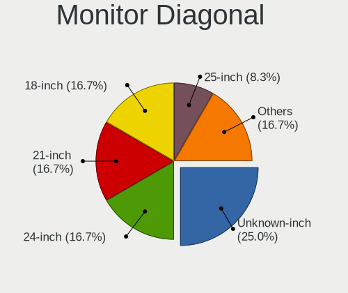
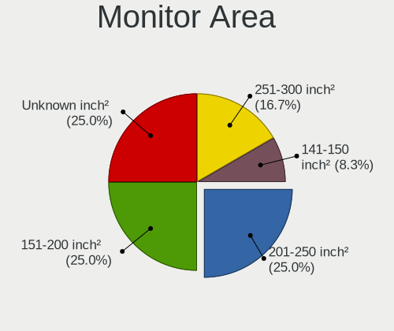

Solus 4.2 - Tested Hardware & Statistics (Desktops)
---------------------------------------------------

A project to collect tested hardware configurations for Solus 4.2.

Anyone can contribute to this report by the [hw-probe](https://github.com/linuxhw/hw-probe) tool:

    sudo -E hw-probe -all -upload

Please contribute! Especially if your hardware is rare.

Contents
--------

* [ Test Cases ](#test-cases)

* [ System ](#system)
  - [ Kernel                   ](#kernel)
  - [ Kernel Family            ](#kernel-family)
  - [ Kernel Major Ver.        ](#kernel-major-ver)
  - [ Arch                     ](#arch)
  - [ DE                       ](#de)
  - [ Display Server           ](#display-server)
  - [ Display Manager          ](#display-manager)
  - [ OS Lang                  ](#os-lang)
  - [ Boot Mode                ](#boot-mode)
  - [ Filesystem               ](#filesystem)
  - [ Part. scheme             ](#part-scheme)
  - [ Dual Boot with Linux/BSD ](#dual-boot-with-linuxbsd)
  - [ Dual Boot (Win)          ](#dual-boot-win)

* [ Board ](#board)
  - [ Vendor                   ](#vendor)
  - [ Model                    ](#model)
  - [ Model Family             ](#model-family)
  - [ MFG Year                 ](#mfg-year)
  - [ Form Factor              ](#form-factor)
  - [ Secure Boot              ](#secure-boot)
  - [ Coreboot                 ](#coreboot)
  - [ RAM Size                 ](#ram-size)
  - [ RAM Used                 ](#ram-used)
  - [ Total Drives             ](#total-drives)
  - [ Has CD-ROM               ](#has-cd-rom)
  - [ Has Ethernet             ](#has-ethernet)
  - [ Has WiFi                 ](#has-wifi)
  - [ Has Bluetooth            ](#has-bluetooth)

* [ Location ](#location)
  - [ Country                  ](#country)
  - [ City                     ](#city)

* [ Drives ](#drives)
  - [ Drive Vendor             ](#drive-vendor)
  - [ Drive Model              ](#drive-model)
  - [ HDD Vendor               ](#hdd-vendor)
  - [ SSD Vendor               ](#ssd-vendor)
  - [ Drive Kind               ](#drive-kind)
  - [ Drive Connector          ](#drive-connector)
  - [ Drive Size               ](#drive-size)
  - [ Space Total              ](#space-total)
  - [ Space Used               ](#space-used)
  - [ Malfunc. Drives          ](#malfunc-drives)
  - [ Malfunc. Drive Vendor    ](#malfunc-drive-vendor)
  - [ Malfunc. HDD Vendor      ](#malfunc-hdd-vendor)
  - [ Malfunc. Drive Kind      ](#malfunc-drive-kind)
  - [ Failed Drives            ](#failed-drives)
  - [ Failed Drive Vendor      ](#failed-drive-vendor)
  - [ Drive Status             ](#drive-status)

* [ Storage controller ](#storage-controller)
  - [ Storage Vendor           ](#storage-vendor)
  - [ Storage Model            ](#storage-model)
  - [ Storage Kind             ](#storage-kind)

* [ Processor ](#processor)
  - [ CPU Vendor               ](#cpu-vendor)
  - [ CPU Model                ](#cpu-model)
  - [ CPU Model Family         ](#cpu-model-family)
  - [ CPU Cores                ](#cpu-cores)
  - [ CPU Sockets              ](#cpu-sockets)
  - [ CPU Threads              ](#cpu-threads)
  - [ CPU Op-Modes             ](#cpu-op-modes)
  - [ CPU Microcode            ](#cpu-microcode)
  - [ CPU Microarch            ](#cpu-microarch)

* [ Graphics ](#graphics)
  - [ GPU Vendor               ](#gpu-vendor)
  - [ GPU Model                ](#gpu-model)
  - [ GPU Combo                ](#gpu-combo)
  - [ GPU Driver               ](#gpu-driver)
  - [ GPU Memory               ](#gpu-memory)

* [ Monitor ](#monitor)
  - [ Monitor Vendor           ](#monitor-vendor)
  - [ Monitor Model            ](#monitor-model)
  - [ Monitor Resolution       ](#monitor-resolution)
  - [ Monitor Diagonal         ](#monitor-diagonal)
  - [ Monitor Width            ](#monitor-width)
  - [ Aspect Ratio             ](#aspect-ratio)
  - [ Monitor Area             ](#monitor-area)
  - [ Pixel Density            ](#pixel-density)
  - [ Multiple Monitors        ](#multiple-monitors)

* [ Network ](#network)
  - [ Net Controller Vendor    ](#net-controller-vendor)
  - [ Net Controller Model     ](#net-controller-model)
  - [ Wireless Vendor          ](#wireless-vendor)
  - [ Wireless Model           ](#wireless-model)
  - [ Ethernet Vendor          ](#ethernet-vendor)
  - [ Ethernet Model           ](#ethernet-model)
  - [ Net Controller Kind      ](#net-controller-kind)
  - [ Used Controller          ](#used-controller)
  - [ NICs                     ](#nics)
  - [ IPv6                     ](#ipv6)

* [ Bluetooth ](#bluetooth)
  - [ Bluetooth Vendor         ](#bluetooth-vendor)
  - [ Bluetooth Model          ](#bluetooth-model)

* [ Sound ](#sound)
  - [ Sound Vendor             ](#sound-vendor)
  - [ Sound Model              ](#sound-model)

* [ Memory ](#memory)
  - [ Memory Vendor            ](#memory-vendor)
  - [ Memory Model             ](#memory-model)
  - [ Memory Kind              ](#memory-kind)
  - [ Memory Form Factor       ](#memory-form-factor)
  - [ Memory Size              ](#memory-size)
  - [ Memory Speed             ](#memory-speed)

* [ Printers & scanners ](#printers--scanners)
  - [ Printer Vendor           ](#printer-vendor)
  - [ Printer Model            ](#printer-model)
  - [ Scanner Vendor           ](#scanner-vendor)
  - [ Scanner Model            ](#scanner-model)

* [ Camera ](#camera)
  - [ Camera Vendor            ](#camera-vendor)
  - [ Camera Model             ](#camera-model)

* [ Security ](#security)
  - [ Fingerprint Vendor       ](#fingerprint-vendor)
  - [ Fingerprint Model        ](#fingerprint-model)
  - [ Chipcard Vendor          ](#chipcard-vendor)
  - [ Chipcard Model           ](#chipcard-model)

* [ Unsupported ](#unsupported)
  - [ Unsupported Devices      ](#unsupported-devices)
  - [ Unsupported Device Types ](#unsupported-device-types)

Test Cases
----------

Total: 16

| Vendor   | Model                       | Probe                                                      | Date         |
|----------|-----------------------------|------------------------------------------------------------|--------------|
| Biostar  | A320MH                      | [2c478119e9](https://linux-hardware.org/?probe=2c478119e9) | Jun 30, 2021 |
| Dell     | 06X1TJ A00                  | [4fc48865ef](https://linux-hardware.org/?probe=4fc48865ef) | Jun 15, 2021 |
| Gigabyte | B360M AORUS Gaming 3-CF     | [f5c8f64400](https://linux-hardware.org/?probe=f5c8f64400) | Jun 03, 2021 |
| MSI      | B450 GAMING PRO CARBON A... | [dfa5c022b3](https://linux-hardware.org/?probe=dfa5c022b3) | May 26, 2021 |
| MSI      | B450 GAMING PRO CARBON A... | [a33e231e6b](https://linux-hardware.org/?probe=a33e231e6b) | May 23, 2021 |
| Shuttle  | FS35V4                      | [6f9a85a086](https://linux-hardware.org/?probe=6f9a85a086) | May 21, 2021 |
| Shuttle  | FS35V4                      | [acd3144c20](https://linux-hardware.org/?probe=acd3144c20) | May 21, 2021 |
| ASUSTek  | P9X79 DELUXE                | [f759ad1793](https://linux-hardware.org/?probe=f759ad1793) | May 13, 2021 |
| ASUSTek  | P9X79 DELUXE                | [f28f1ea67d](https://linux-hardware.org/?probe=f28f1ea67d) | May 13, 2021 |
| Intel    | X99 V102                    | [bc57aedd09](https://linux-hardware.org/?probe=bc57aedd09) | May 02, 2021 |
| ASUSTek  | ROG CROSSHAIR VIII HERO     | [b5f3f78ddb](https://linux-hardware.org/?probe=b5f3f78ddb) | Apr 25, 2021 |
| Dell     | 0FH884                      | [93acc58efb](https://linux-hardware.org/?probe=93acc58efb) | Apr 10, 2021 |
| ASUSTek  | PRIME Z390-P                | [accdafb993](https://linux-hardware.org/?probe=accdafb993) | Mar 08, 2021 |
| Gigabyte | J4005ND2P-CF                | [f4e39d4730](https://linux-hardware.org/?probe=f4e39d4730) | Mar 04, 2021 |
| ASUSTek  | PRIME Z390-P                | [cdd0998f7c](https://linux-hardware.org/?probe=cdd0998f7c) | Feb 14, 2021 |
| ASUSTek  | PRIME Z390-P                | [f4ee71d37f](https://linux-hardware.org/?probe=f4ee71d37f) | Feb 12, 2021 |

System
------

Kernel
------

Version of the Linux kernel

| Version             | Desktops | Percent |
|---------------------|----------|---------|
| 5.11.12-177.current | 3        | 25%     |
| 5.11.16-178.current | 2        | 16.67%  |
| 5.10.15-172.current | 2        | 16.67%  |
| 5.6.19-159.current  | 1        | 8.33%   |
| 5.12.13-185.current | 1        | 8.33%   |
| 5.11.22-180.current | 1        | 8.33%   |
| 5.11.21-179.current | 1        | 8.33%   |
| 5.10.7-168.current  | 1        | 8.33%   |

Kernel Family
-------------

Linux kernel without a distro release

| Version | Desktops | Percent |
|---------|----------|---------|
| 5.11.12 | 3        | 25%     |
| 5.11.16 | 2        | 16.67%  |
| 5.10.15 | 2        | 16.67%  |
| 5.6.19  | 1        | 8.33%   |
| 5.12.13 | 1        | 8.33%   |
| 5.11.22 | 1        | 8.33%   |
| 5.11.21 | 1        | 8.33%   |
| 5.10.7  | 1        | 8.33%   |

Kernel Major Ver.
-----------------

Linux kernel major version

| Version | Desktops | Percent |
|---------|----------|---------|
| 5.11    | 7        | 58.33%  |
| 5.10    | 3        | 25%     |
| 5.6     | 1        | 8.33%   |
| 5.12    | 1        | 8.33%   |

Arch
----

OS architecture (x86_64, i586, etc.)

| Name   | Desktops | Percent |
|--------|----------|---------|
| x86_64 | 11       | 100%    |

DE
--

Desktop Environment

| Name    | Desktops | Percent |
|---------|----------|---------|
| Budgie  | 8        | 72.73%  |
| KDE     | 1        | 9.09%   |
| GNOME   | 1        | 9.09%   |
| Unknown | 1        | 9.09%   |

Display Server
--------------

X11 or Wayland

| Name | Desktops | Percent |
|------|----------|---------|
| X11  | 11       | 100%    |

Display Manager
---------------

SDDM, LightDM, etc.

| Name    | Desktops | Percent |
|---------|----------|---------|
| Unknown | 11       | 100%    |

OS Lang
-------

Language

| Lang  | Desktops | Percent |
|-------|----------|---------|
| pt_BR | 3        | 27.27%  |
| en_US | 3        | 27.27%  |
| ru_RU | 1        | 9.09%   |
| pt_PT | 1        | 9.09%   |
| pl_PL | 1        | 9.09%   |
| fr_FR | 1        | 9.09%   |
| en_IE | 1        | 9.09%   |

Boot Mode
---------

EFI or BIOS

| Mode | Desktops | Percent |
|------|----------|---------|
| EFI  | 8        | 72.73%  |
| BIOS | 3        | 27.27%  |

Filesystem
----------

Type of filesystem

| Type | Desktops | Percent |
|------|----------|---------|
| Ext4 | 10       | 90.91%  |
| Xfs  | 1        | 9.09%   |

Part. scheme
------------

Scheme of partitioning

| Type    | Desktops | Percent |
|---------|----------|---------|
| Unknown | 10       | 90.91%  |
| GPT     | 1        | 9.09%   |

Dual Boot with Linux/BSD
------------------------

Hosting more than one Linux/BSD

| Dual boot | Desktops | Percent |
|-----------|----------|---------|
| No        | 11       | 100%    |

Dual Boot (Win)
---------------

Hosting Linux and Windows

| Dual boot | Desktops | Percent |
|-----------|----------|---------|
| No        | 10       | 90.91%  |
| Yes       | 1        | 9.09%   |

Board
-----

Vendor
------

Motherboard manufacturer

| Name                | Desktops | Percent |
|---------------------|----------|---------|
| ASUSTek Computer    | 3        | 27.27%  |
| Gigabyte Technology | 2        | 18.18%  |
| Dell                | 2        | 18.18%  |
| Shuttle             | 1        | 9.09%   |
| MSI                 | 1        | 9.09%   |
| Intel               | 1        | 9.09%   |
| Biostar             | 1        | 9.09%   |

Model
-----

Motherboard model

| Name                          | Desktops | Percent |
|-------------------------------|----------|---------|
| Shuttle XS35V4                | 1        | 9.09%   |
| MSI MS-7B85                   | 1        | 9.09%   |
| Intel X99 V102                | 1        | 9.09%   |
| Gigabyte J4005ND2P-CF         | 1        | 9.09%   |
| Gigabyte B360M AORUS Gaming 3 | 1        | 9.09%   |
| Dell OptiPlex GX620           | 1        | 9.09%   |
| Dell OptiPlex 9020            | 1        | 9.09%   |
| Biostar A320MH                | 1        | 9.09%   |
| ASUS ROG CROSSHAIR VIII HERO  | 1        | 9.09%   |
| ASUS PRIME Z390-P             | 1        | 9.09%   |
| ASUS P9X79 DELUXE             | 1        | 9.09%   |

Model Family
------------

Motherboard model prefix

| Name                  | Desktops | Percent |
|-----------------------|----------|---------|
| Dell OptiPlex         | 2        | 18.18%  |
| Shuttle XS35V4        | 1        | 9.09%   |
| MSI MS-7B85           | 1        | 9.09%   |
| Intel X99             | 1        | 9.09%   |
| Gigabyte J4005ND2P-CF | 1        | 9.09%   |
| Gigabyte B360M        | 1        | 9.09%   |
| Biostar A320MH        | 1        | 9.09%   |
| ASUS ROG              | 1        | 9.09%   |
| ASUS PRIME            | 1        | 9.09%   |
| ASUS P9X79            | 1        | 9.09%   |

MFG Year
--------

Motherboard manufacture year

| Year | Desktops | Percent |
|------|----------|---------|
| 2018 | 5        | 45.45%  |
| 2014 | 2        | 18.18%  |
| 2021 | 1        | 9.09%   |
| 2019 | 1        | 9.09%   |
| 2011 | 1        | 9.09%   |
| 2006 | 1        | 9.09%   |

Form Factor
-----------

Physical design of the computer

| Name    | Desktops | Percent |
|---------|----------|---------|
| Desktop | 11       | 100%    |

Secure Boot
-----------

Enabled or disabled

| State    | Desktops | Percent |
|----------|----------|---------|
| Disabled | 11       | 100%    |

Coreboot
--------

Have coreboot on board

| Used | Desktops | Percent |
|------|----------|---------|
| No   | 11       | 100%    |

RAM Size
--------

Total RAM memory

| Size in GB | Desktops | Percent |
|------------|----------|---------|
| 32.01-64.0 | 3        | 27.27%  |
| 4.01-8.0   | 2        | 18.18%  |
| 3.01-4.0   | 2        | 18.18%  |
| 16.01-24.0 | 2        | 18.18%  |
| 24.01-32.0 | 1        | 9.09%   |
| 8.01-16.0  | 1        | 9.09%   |

RAM Used
--------

Used RAM memory

| Used GB   | Desktops | Percent |
|-----------|----------|---------|
| 1.01-2.0  | 5        | 45.45%  |
| 2.01-3.0  | 2        | 18.18%  |
| 8.01-16.0 | 2        | 18.18%  |
| 4.01-8.0  | 1        | 9.09%   |
| 3.01-4.0  | 1        | 9.09%   |

Total Drives
------------

Number of drives on board

| Drives | Desktops | Percent |
|--------|----------|---------|
| 1      | 4        | 36.36%  |
| 2      | 3        | 27.27%  |
| 3      | 2        | 18.18%  |
| 6      | 1        | 9.09%   |
| 4      | 1        | 9.09%   |

Has CD-ROM
----------

Has CD-ROM on board

| Presented | Desktops | Percent |
|-----------|----------|---------|
| No        | 6        | 54.55%  |
| Yes       | 5        | 45.45%  |

Has Ethernet
------------

Has Ethernet on board

| Presented | Desktops | Percent |
|-----------|----------|---------|
| Yes       | 11       | 100%    |

Has WiFi
--------

Has WiFi module

| Presented | Desktops | Percent |
|-----------|----------|---------|
| Yes       | 7        | 63.64%  |
| No        | 4        | 36.36%  |

Has Bluetooth
-------------

Has Bluetooth module

| Presented | Desktops | Percent |
|-----------|----------|---------|
| No        | 8        | 72.73%  |
| Yes       | 3        | 27.27%  |

Location
--------

Country
-------

Geographic location (country)

| Country  | Desktops | Percent |
|----------|----------|---------|
| Brazil   | 3        | 27.27%  |
| USA      | 2        | 18.18%  |
| Sweden   | 1        | 9.09%   |
| Russia   | 1        | 9.09%   |
| Portugal | 1        | 9.09%   |
| Poland   | 1        | 9.09%   |
| Ireland  | 1        | 9.09%   |
| France   | 1        | 9.09%   |

City
----

Geographic location (city)

| City          | Desktops | Percent |
|---------------|----------|---------|
| SГЈo Pedro  | 1        | 8.33%   |
| St Petersburg | 1        | 8.33%   |
| Severna Park  | 1        | 8.33%   |
| Santa Maria   | 1        | 8.33%   |
| Santa Cruz    | 1        | 8.33%   |
| Moita Bonita  | 1        | 8.33%   |
| Malmo         | 1        | 8.33%   |
| Lexington     | 1        | 8.33%   |
| Gray-la-Ville | 1        | 8.33%   |
| Gdansk        | 1        | 8.33%   |
| Dublin        | 1        | 8.33%   |
| Dijon         | 1        | 8.33%   |

Drives
------

Drive Vendor
------------

Hard drive vendors

| Vendor              | Desktops | Drives | Percent |
|---------------------|----------|--------|---------|
| Seagate             | 5        | 10     | 27.78%  |
| SanDisk             | 2        | 2      | 11.11%  |
| Samsung Electronics | 2        | 5      | 11.11%  |
| WDC                 | 1        | 2      | 5.56%   |
| Unknown             | 1        | 1      | 5.56%   |
| Toshiba             | 1        | 1      | 5.56%   |
| Patriot             | 1        | 1      | 5.56%   |
| Kingston            | 1        | 2      | 5.56%   |
| HGST                | 1        | 1      | 5.56%   |
| Corsair             | 1        | 1      | 5.56%   |
| China               | 1        | 1      | 5.56%   |
| A-DATA Technology   | 1        | 1      | 5.56%   |

Drive Model
-----------

Hard drive models

| Model                           | Desktops | Percent |
|---------------------------------|----------|---------|
| Seagate ST500DM002-1BD142 500GB | 2        | 8%      |
| Seagate ST31000524AS 1TB        | 2        | 8%      |
| Samsung SSD 850 EVO 250GB       | 2        | 8%      |
| Samsung NVMe SSD Drive 500GB    | 2        | 8%      |
| WDC WD40EZRZ-00GXCB0 4TB        | 1        | 4%      |
| WDC WD10EZEX-08WN4A0 1TB        | 1        | 4%      |
| Unknown R5M120G8 120GB SSD      | 1        | 4%      |
| Toshiba MK3275GSX 320GB         | 1        | 4%      |
| Seagate ST2000DX002-2DV164 2TB  | 1        | 4%      |
| Seagate ST2000DX001-1NS164 2TB  | 1        | 4%      |
| Seagate ST1000DM010-2EP102 1TB  | 1        | 4%      |
| Seagate ST1000DM003-1CH162 1TB  | 1        | 4%      |
| SanDisk SDSSDP064G 64GB         | 1        | 4%      |
| SanDisk SDSSDA240G 240GB        | 1        | 4%      |
| Samsung SSD 970 EVO 500GB       | 1        | 4%      |
| Patriot Spark 256GB SSD         | 1        | 4%      |
| Kingston NVMe SSD Drive 1TB     | 1        | 4%      |
| HGST HTS721010A9E630 1TB        | 1        | 4%      |
| Corsair Force LS SSD 64GB       | 1        | 4%      |
| China SATA SSD 240GB            | 1        | 4%      |
| A-DATA SU650 120GB SSD          | 1        | 4%      |

HDD Vendor
----------

Hard disk drive vendors

| Vendor  | Desktops | Drives | Percent |
|---------|----------|--------|---------|
| Seagate | 5        | 10     | 62.5%   |
| WDC     | 1        | 2      | 12.5%   |
| Toshiba | 1        | 1      | 12.5%   |
| HGST    | 1        | 1      | 12.5%   |

SSD Vendor
----------

Solid state drive vendors

| Vendor              | Desktops | Drives | Percent |
|---------------------|----------|--------|---------|
| SanDisk             | 2        | 2      | 22.22%  |
| Samsung Electronics | 2        | 2      | 22.22%  |
| Unknown             | 1        | 1      | 11.11%  |
| Patriot             | 1        | 1      | 11.11%  |
| Corsair             | 1        | 1      | 11.11%  |
| China               | 1        | 1      | 11.11%  |
| A-DATA Technology   | 1        | 1      | 11.11%  |

Drive Kind
----------

HDD or SSD

| Kind | Desktops | Drives | Percent |
|------|----------|--------|---------|
| SSD  | 9        | 9      | 45%     |
| HDD  | 8        | 14     | 40%     |
| NVMe | 3        | 5      | 15%     |

Drive Connector
---------------

SATA, SAS, NVMe, etc.

| Type | Desktops | Drives | Percent |
|------|----------|--------|---------|
| SATA | 10       | 23     | 76.92%  |
| NVMe | 3        | 5      | 23.08%  |

Drive Size
----------

Size of hard drive

| Size in TB | Desktops | Drives | Percent |
|------------|----------|--------|---------|
| 0.01-0.5   | 10       | 12     | 62.5%   |
| 0.51-1.0   | 4        | 6      | 25%     |
| 3.01-4.0   | 1        | 1      | 6.25%   |
| 1.01-2.0   | 1        | 4      | 6.25%   |

Space Total
-----------

Amount of disk space available on the file system

| Size in GB     | Desktops | Percent |
|----------------|----------|---------|
| 251-500        | 3        | 27.27%  |
| 101-250        | 3        | 27.27%  |
| 51-100         | 2        | 18.18%  |
| More than 3000 | 1        | 9.09%   |
| 21-50          | 1        | 9.09%   |
| 501-1000       | 1        | 9.09%   |

Space Used
----------

Amount of used disk space

| Used GB   | Desktops | Percent |
|-----------|----------|---------|
| 1-20      | 4        | 36.36%  |
| 21-50     | 3        | 27.27%  |
| 101-250   | 1        | 9.09%   |
| 1001-2000 | 1        | 9.09%   |
| 501-1000  | 1        | 9.09%   |
| 51-100    | 1        | 9.09%   |

Malfunc. Drives
---------------

Drive models with a malfunction

| Model                                 | Desktops | Drives | Percent |
|---------------------------------------|----------|--------|---------|
| Samsung Electronics SSD 970 EVO 500GB | 1        | 1      | 100%    |

Malfunc. Drive Vendor
---------------------

Vendors of faulty drives

| Vendor              | Desktops | Drives | Percent |
|---------------------|----------|--------|---------|
| Samsung Electronics | 1        | 1      | 100%    |

Malfunc. HDD Vendor
-------------------

Vendors of faulty HDD drives

Zero info for selected period =(

Malfunc. Drive Kind
-------------------

Kinds of faulty drives

| Kind | Desktops | Drives | Percent |
|------|----------|--------|---------|
| NVMe | 1        | 1      | 100%    |

Failed Drives
-------------

Failed drive models

Zero info for selected period =(

Failed Drive Vendor
-------------------

Failed drive vendors

Zero info for selected period =(

Drive Status
------------

Number of failed and malfunc. drives

| Status   | Desktops | Drives | Percent |
|----------|----------|--------|---------|
| Detected | 11       | 24     | 84.62%  |
| Malfunc  | 1        | 1      | 7.69%   |
| Works    | 1        | 3      | 7.69%   |

Storage controller
------------------

Storage Vendor
--------------

Storage controller vendors

| Vendor                      | Desktops | Percent |
|-----------------------------|----------|---------|
| Intel                       | 8        | 50%     |
| AMD                         | 3        | 18.75%  |
| Samsung Electronics         | 2        | 12.5%   |
| Marvell Technology Group    | 1        | 6.25%   |
| Kingston Technology Company | 1        | 6.25%   |
| ASMedia Technology          | 1        | 6.25%   |

Storage Model
-------------

Storage controller models

| Model                                                                          | Desktops | Percent |
|--------------------------------------------------------------------------------|----------|---------|
| Intel Cannon Lake PCH SATA AHCI Controller                                     | 2        | 11.11%  |
| AMD FCH SATA Controller [AHCI mode]                                            | 2        | 11.11%  |
| Samsung NVMe SSD Controller SM981/PM981/PM983                                  | 1        | 5.56%   |
| Samsung NVMe SSD Controller PM9A1/PM9A3/980PRO                                 | 1        | 5.56%   |
| Marvell Group 88SE9128 PCIe SATA 6 Gb/s RAID controller with HyperDuo          | 1        | 5.56%   |
| Kingston Company KC2000 NVMe SSD                                               | 1        | 5.56%   |
| Intel SATA Controller [RAID mode]                                              | 1        | 5.56%   |
| Intel NM10/ICH7 Family SATA Controller [IDE mode]                              | 1        | 5.56%   |
| Intel Celeron/Pentium Silver Processor SATA Controller                         | 1        | 5.56%   |
| Intel C610/X99 series chipset 6-Port SATA Controller [AHCI mode]               | 1        | 5.56%   |
| Intel Atom Processor E3800 Series SATA IDE Controller                          | 1        | 5.56%   |
| Intel 82801G (ICH7 Family) IDE Controller                                      | 1        | 5.56%   |
| Intel 8 Series/C220 Series Chipset Family 6-port SATA Controller 1 [AHCI mode] | 1        | 5.56%   |
| ASMedia ASM1062 Serial ATA Controller                                          | 1        | 5.56%   |
| AMD FCH SATA Controller D                                                      | 1        | 5.56%   |
| AMD 400 Series Chipset SATA Controller                                         | 1        | 5.56%   |

Storage Kind
------------

Kind of storage controller (IDE, SATA, NVMe, SAS, ...)

| Kind | Desktops | Percent |
|------|----------|---------|
| SATA | 9        | 60%     |
| NVMe | 3        | 20%     |
| IDE  | 2        | 13.33%  |
| RAID | 1        | 6.67%   |

Processor
---------

CPU Vendor
----------

Processor vendors

| Vendor | Desktops | Percent |
|--------|----------|---------|
| Intel  | 8        | 72.73%  |
| AMD    | 3        | 27.27%  |

CPU Model
---------

Processor models

| Model                                       | Desktops | Percent |
|---------------------------------------------|----------|---------|
| Intel Xeon CPU E5-2620 v3 @ 2.40GHz         | 1        | 9.09%   |
| Intel Pentium D CPU 3.00GHz                 | 1        | 9.09%   |
| Intel Core i7-3960X CPU @ 3.30GHz           | 1        | 9.09%   |
| Intel Core i5-9600K CPU @ 3.70GHz           | 1        | 9.09%   |
| Intel Core i5-4690 CPU @ 3.50GHz            | 1        | 9.09%   |
| Intel Core i3-8100 CPU @ 3.60GHz            | 1        | 9.09%   |
| Intel Celeron J4005 CPU @ 2.00GHz           | 1        | 9.09%   |
| Intel Celeron CPU J1900 @ 1.99GHz           | 1        | 9.09%   |
| AMD Ryzen 9 5950X 16-Core Processor         | 1        | 9.09%   |
| AMD Ryzen 7 3700X 8-Core Processor          | 1        | 9.09%   |
| AMD Ryzen 5 2400G with Radeon Vega Graphics | 1        | 9.09%   |

CPU Model Family
----------------

Processor model prefix

| Model           | Desktops | Percent |
|-----------------|----------|---------|
| Intel Core i5   | 2        | 18.18%  |
| Intel Celeron   | 2        | 18.18%  |
| Intel Xeon      | 1        | 9.09%   |
| Intel Pentium D | 1        | 9.09%   |
| Intel Core i7   | 1        | 9.09%   |
| Intel Core i3   | 1        | 9.09%   |
| AMD Ryzen 9     | 1        | 9.09%   |
| AMD Ryzen 7     | 1        | 9.09%   |
| AMD Ryzen 5     | 1        | 9.09%   |

CPU Cores
---------

Number of processor cores

| Number | Desktops | Percent |
|--------|----------|---------|
| 4      | 4        | 36.36%  |
| 6      | 3        | 27.27%  |
| 2      | 2        | 18.18%  |
| 16     | 1        | 9.09%   |
| 8      | 1        | 9.09%   |

CPU Sockets
-----------

Number of sockets

| Number | Desktops | Percent |
|--------|----------|---------|
| 1      | 11       | 100%    |

CPU Threads
-----------

Threads per core (Hyper-Threading)

| Number | Desktops | Percent |
|--------|----------|---------|
| 1      | 6        | 54.55%  |
| 2      | 5        | 45.45%  |

CPU Op-Modes
------------

CPU Operation Modes (32-bit, 64-bit)

| Op mode        | Desktops | Percent |
|----------------|----------|---------|
| 32-bit, 64-bit | 11       | 100%    |

CPU Microcode
-------------

Microcode number

| Number     | Desktops | Percent |
|------------|----------|---------|
| 0xf62      | 1        | 9.09%   |
| 0x906ed    | 1        | 9.09%   |
| 0x906eb    | 1        | 9.09%   |
| 0x706a1    | 1        | 9.09%   |
| 0x306c3    | 1        | 9.09%   |
| 0x30678    | 1        | 9.09%   |
| 0x206d7    | 1        | 9.09%   |
| 0x0a201009 | 1        | 9.09%   |
| 0x08701021 | 1        | 9.09%   |
| 0x08101016 | 1        | 9.09%   |
| Unknown    | 1        | 9.09%   |

CPU Microarch
-------------

Microarchitecture

| Name          | Desktops | Percent |
|---------------|----------|---------|
| KabyLake      | 2        | 18.18%  |
| Haswell       | 2        | 18.18%  |
| Zen 3         | 1        | 9.09%   |
| Zen 2         | 1        | 9.09%   |
| Zen           | 1        | 9.09%   |
| Silvermont    | 1        | 9.09%   |
| SandyBridge   | 1        | 9.09%   |
| NetBurst      | 1        | 9.09%   |
| Goldmont plus | 1        | 9.09%   |

Graphics
--------

GPU Vendor
----------

Vendors of graphics cards

| Vendor | Desktops | Percent |
|--------|----------|---------|
| Intel  | 5        | 38.46%  |
| Nvidia | 4        | 30.77%  |
| AMD    | 4        | 30.77%  |

GPU Model
---------

Graphics card models

| Model                                                                       | Desktops | Percent |
|-----------------------------------------------------------------------------|----------|---------|
| Intel CoffeeLake-S GT2 [UHD Graphics 630]                                   | 2        | 15.38%  |
| Nvidia GP107 [GeForce GTX 1050 Ti]                                          | 1        | 7.69%   |
| Nvidia GP106 [GeForce GTX 1060 6GB]                                         | 1        | 7.69%   |
| Nvidia GP106 [GeForce GTX 1060 3GB]                                         | 1        | 7.69%   |
| Nvidia GF108 [GeForce GT 730]                                               | 1        | 7.69%   |
| Intel Xeon E3-1200 v3/4th Gen Core Processor Integrated Graphics Controller | 1        | 7.69%   |
| Intel GeminiLake [UHD Graphics 600]                                         | 1        | 7.69%   |
| Intel Atom Processor Z36xxx/Z37xxx Series Graphics & Display                | 1        | 7.69%   |
| AMD Oland [Radeon HD 8570 / R5 430 OEM / R7 240/340 / Radeon 520 OEM]       | 1        | 7.69%   |
| AMD Navi 14 [Radeon RX 5500/5500M / Pro 5500M]                              | 1        | 7.69%   |
| AMD Ellesmere [Radeon RX 470/480/570/570X/580/580X/590]                     | 1        | 7.69%   |
| AMD Baffin [Radeon RX 550 640SP / RX 560/560X]                              | 1        | 7.69%   |

GPU Combo
---------

Combinations of graphics cards

| Name        | Desktops | Percent |
|-------------|----------|---------|
| 1 x Nvidia  | 4        | 33.33%  |
| 1 x Intel   | 3        | 25%     |
| 1 x AMD     | 3        | 25%     |
| Intel + AMD | 2        | 16.67%  |

GPU Driver
----------

Free vs proprietary

| Driver      | Desktops | Percent |
|-------------|----------|---------|
| Free        | 8        | 72.73%  |
| Proprietary | 3        | 27.27%  |

GPU Memory
----------

Total video memory

| Size in GB | Desktops | Percent |
|------------|----------|---------|
| Unknown    | 3        | 27.27%  |
| 7.01-8.0   | 2        | 18.18%  |
| 1.01-2.0   | 2        | 18.18%  |
| 5.01-6.0   | 1        | 9.09%   |
| 3.01-4.0   | 1        | 9.09%   |
| 2.01-3.0   | 1        | 9.09%   |
| 0.51-1.0   | 1        | 9.09%   |

Monitor
-------

Monitor Vendor
--------------

Monitor vendors

| Vendor               | Desktops | Percent |
|----------------------|----------|---------|
| Ancor Communications | 3        | 23.08%  |
| Unknown              | 1        | 7.69%   |
| Samsung Electronics  | 1        | 7.69%   |
| LG Electronics       | 1        | 7.69%   |
| JRY                  | 1        | 7.69%   |
| Iiyama               | 1        | 7.69%   |
| Hewlett-Packard      | 1        | 7.69%   |
| Goldstar             | 1        | 7.69%   |
| Dell                 | 1        | 7.69%   |
| AOC                  | 1        | 7.69%   |
| Acer                 | 1        | 7.69%   |

Monitor Model
-------------

Monitor models

| Model                                                            | Desktops | Percent |
|------------------------------------------------------------------|----------|---------|
| Unknown LCD Monitor HIC 3200x1080                                | 1        | 7.69%   |
| Samsung Electronics S19C200 SAM09B3 1440x900 408x255mm 18.9-inch | 1        | 7.69%   |
| LG Electronics LCD Monitor W1952 1440x900                        | 1        | 7.69%   |
| JRY LCD Monitor JRY1950 1600x900 368x207mm 16.6-inch             | 1        | 7.69%   |
| Iiyama PLE2483H IVM6113 1920x1080 530x300mm 24.0-inch            | 1        | 7.69%   |
| Hewlett-Packard ZR24w HWP2869 1920x1200 546x352mm 25.6-inch      | 1        | 7.69%   |
| Goldstar L1953H GSM4B3D 1280x1024 338x270mm 17.0-inch            | 1        | 7.69%   |
| Dell 1908WFP DELF007 1440x900 408x255mm 18.9-inch                | 1        | 7.69%   |
| AOC 24B1W AOC2401 1920x1080 521x293mm 23.5-inch                  | 1        | 7.69%   |
| Ancor Communications VX228 ACI22C1 1920x1080 476x268mm 21.5-inch | 1        | 7.69%   |
| Ancor Communications LCD Monitor VX229                           | 1        | 7.69%   |
| Ancor Communications LCD Monitor MG248 1920x1080                 | 1        | 7.69%   |
| Acer V226HQL ACR032D 1920x1080 477x268mm 21.5-inch               | 1        | 7.69%   |

Monitor Resolution
------------------

Monitor screen resolution

| Resolution        | Desktops | Percent |
|-------------------|----------|---------|
| 1920x1080 (FHD)   | 4        | 30.77%  |
| 1440x900 (WXGA+)  | 3        | 23.08%  |
| 3200x1080         | 1        | 7.69%   |
| 2560x1440 (QHD)   | 1        | 7.69%   |
| 1920x1200 (WUXGA) | 1        | 7.69%   |
| 1600x900 (HD+)    | 1        | 7.69%   |
| 1280x1024 (SXGA)  | 1        | 7.69%   |
| Unknown           | 1        | 7.69%   |

Monitor Diagonal
----------------

Diagonal size in inches

| Inches  | Desktops | Percent |
|---------|----------|---------|
| Unknown | 3        | 25%     |
| 24      | 2        | 16.67%  |
| 21      | 2        | 16.67%  |
| 18      | 2        | 16.67%  |
| 25      | 1        | 8.33%   |
| 19      | 1        | 8.33%   |
| 17      | 1        | 8.33%   |

Monitor Width
-------------

Physical width

| Width in mm | Desktops | Percent |
|-------------|----------|---------|
| 401-500     | 5        | 45.45%  |
| Unknown     | 3        | 27.27%  |
| 501-600     | 2        | 18.18%  |
| 301-350     | 1        | 9.09%   |

Aspect Ratio
------------

Proportional relationship between the width and the height

| Ratio   | Desktops | Percent |
|---------|----------|---------|
| 16/9    | 4        | 33.33%  |
| 16/10   | 4        | 33.33%  |
| Unknown | 3        | 25%     |
| 5/4     | 1        | 8.33%   |

Monitor Area
------------

Area in inch²

| Area in inch² | Desktops | Percent |
|----------------|----------|---------|
| 201-250        | 3        | 25%     |
| 151-200        | 3        | 25%     |
| Unknown        | 3        | 25%     |
| 251-300        | 2        | 16.67%  |
| 141-150        | 1        | 8.33%   |

Pixel Density
-------------

Pixels per inch

| Density | Desktops | Percent |
|---------|----------|---------|
| 51-100  | 6        | 54.55%  |
| Unknown | 3        | 27.27%  |
| 101-120 | 2        | 18.18%  |

Multiple Monitors
-----------------

Total monitors connected

| Total | Desktops | Percent |
|-------|----------|---------|
| 1     | 9        | 81.82%  |
| 2     | 2        | 18.18%  |

Network
-------

Net Controller Vendor
---------------------

Controller vendors

| Vendor                | Desktops | Percent |
|-----------------------|----------|---------|
| Realtek Semiconductor | 8        | 42.11%  |
| Intel                 | 5        | 26.32%  |
| TP-Link               | 1        | 5.26%   |
| Ralink Technology     | 1        | 5.26%   |
| Qualcomm Atheros      | 1        | 5.26%   |
| NetGear               | 1        | 5.26%   |
| Broadcom Limited      | 1        | 5.26%   |
| Broadcom              | 1        | 5.26%   |

Net Controller Model
--------------------

Controller models

| Model                                                             | Desktops | Percent |
|-------------------------------------------------------------------|----------|---------|
| Realtek RTL8111/8168/8411 PCI Express Gigabit Ethernet Controller | 6        | 26.09%  |
| Intel I211 Gigabit Network Connection                             | 2        | 8.7%    |
| TP-Link TL-WN823N v2/v3 [Realtek RTL8192EU]                       | 1        | 4.35%   |
| Realtek RTL8192EU 802.11b/g/n WLAN Adapter                        | 1        | 4.35%   |
| Realtek RTL8188EE Wireless Network Adapter                        | 1        | 4.35%   |
| Realtek RTL8152 Fast Ethernet Adapter                             | 1        | 4.35%   |
| Realtek RTL8125 2.5GbE Controller                                 | 1        | 4.35%   |
| Realtek 802.11ac NIC                                              | 1        | 4.35%   |
| Ralink RT5372 Wireless Adapter                                    | 1        | 4.35%   |
| Qualcomm Atheros AR9285 Wireless Network Adapter (PCI-Express)    | 1        | 4.35%   |
| NetGear A6150                                                     | 1        | 4.35%   |
| Intel Wireless-AC 9260                                            | 1        | 4.35%   |
| Intel Ethernet Connection I217-LM                                 | 1        | 4.35%   |
| Intel Ethernet Connection (7) I219-V                              | 1        | 4.35%   |
| Intel 82579V Gigabit Network Connection                           | 1        | 4.35%   |
| Broadcom NetXtreme BCM5751 Gigabit Ethernet PCI Express           | 1        | 4.35%   |
| Broadcom Limited BCM4331 802.11a/b/g/n                            | 1        | 4.35%   |

Wireless Vendor
---------------

Wireless vendors

| Vendor                | Desktops | Percent |
|-----------------------|----------|---------|
| Realtek Semiconductor | 3        | 33.33%  |
| TP-Link               | 1        | 11.11%  |
| Ralink Technology     | 1        | 11.11%  |
| Qualcomm Atheros      | 1        | 11.11%  |
| NetGear               | 1        | 11.11%  |
| Intel                 | 1        | 11.11%  |
| Broadcom Limited      | 1        | 11.11%  |

Wireless Model
--------------

Wireless models

| Model                                                          | Desktops | Percent |
|----------------------------------------------------------------|----------|---------|
| TP-Link TL-WN823N v2/v3 [Realtek RTL8192EU]                    | 1        | 11.11%  |
| Realtek RTL8192EU 802.11b/g/n WLAN Adapter                     | 1        | 11.11%  |
| Realtek RTL8188EE Wireless Network Adapter                     | 1        | 11.11%  |
| Realtek 802.11ac NIC                                           | 1        | 11.11%  |
| Ralink RT5372 Wireless Adapter                                 | 1        | 11.11%  |
| Qualcomm Atheros AR9285 Wireless Network Adapter (PCI-Express) | 1        | 11.11%  |
| NetGear A6150                                                  | 1        | 11.11%  |
| Intel Wireless-AC 9260                                         | 1        | 11.11%  |
| Broadcom Limited BCM4331 802.11a/b/g/n                         | 1        | 11.11%  |

Ethernet Vendor
---------------

Ethernet vendors

| Vendor                | Desktops | Percent |
|-----------------------|----------|---------|
| Realtek Semiconductor | 7        | 53.85%  |
| Intel                 | 5        | 38.46%  |
| Broadcom              | 1        | 7.69%   |

Ethernet Model
--------------

Ethernet models

| Model                                                             | Desktops | Percent |
|-------------------------------------------------------------------|----------|---------|
| Realtek RTL8111/8168/8411 PCI Express Gigabit Ethernet Controller | 6        | 42.86%  |
| Intel I211 Gigabit Network Connection                             | 2        | 14.29%  |
| Realtek RTL8152 Fast Ethernet Adapter                             | 1        | 7.14%   |
| Realtek RTL8125 2.5GbE Controller                                 | 1        | 7.14%   |
| Intel Ethernet Connection I217-LM                                 | 1        | 7.14%   |
| Intel Ethernet Connection (7) I219-V                              | 1        | 7.14%   |
| Intel 82579V Gigabit Network Connection                           | 1        | 7.14%   |
| Broadcom NetXtreme BCM5751 Gigabit Ethernet PCI Express           | 1        | 7.14%   |

Net Controller Kind
-------------------

Ethernet, WiFi or modem

| Kind     | Desktops | Percent |
|----------|----------|---------|
| Ethernet | 11       | 61.11%  |
| WiFi     | 7        | 38.89%  |

Used Controller
---------------

Currently used network controller

| Kind     | Desktops | Percent |
|----------|----------|---------|
| Ethernet | 9        | 69.23%  |
| WiFi     | 4        | 30.77%  |

NICs
----

Total network controllers on board

| Total | Desktops | Percent |
|-------|----------|---------|
| 1     | 7        | 58.33%  |
| 2     | 4        | 33.33%  |
| 3     | 1        | 8.33%   |

IPv6
----

IPv6 vs IPv4

| Used | Desktops | Percent |
|------|----------|---------|
| No   | 9        | 75%     |
| Yes  | 3        | 25%     |

Bluetooth
---------

Bluetooth Vendor
----------------

Controller vendors

| Vendor                | Desktops | Percent |
|-----------------------|----------|---------|
| Realtek Semiconductor | 1        | 25%     |
| Intel                 | 1        | 25%     |
| Broadcom              | 1        | 25%     |
| Apple                 | 1        | 25%     |

Bluetooth Model
---------------

Controller models

| Model                                    | Desktops | Percent |
|------------------------------------------|----------|---------|
| Realtek Bluetooth Radio                  | 1        | 25%     |
| Intel Wireless-AC 9260 Bluetooth Adapter | 1        | 25%     |
| Broadcom BCM20702A0 Bluetooth 4.0        | 1        | 25%     |
| Apple Bluetooth USB Host Controller      | 1        | 25%     |

Sound
-----

Sound Vendor
------------

Sound card vendors

| Vendor                  | Desktops | Percent |
|-------------------------|----------|---------|
| Intel                   | 8        | 40%     |
| AMD                     | 5        | 25%     |
| Nvidia                  | 4        | 20%     |
| Logitech                | 1        | 5%      |
| Blue Microphones        | 1        | 5%      |
| BEHRINGER International | 1        | 5%      |

Sound Model
-----------

Sound card models

| Model                                                                      | Desktops | Percent |
|----------------------------------------------------------------------------|----------|---------|
| Nvidia GP106 High Definition Audio Controller                              | 2        | 8.7%    |
| Intel Cannon Lake PCH cAVS                                                 | 2        | 8.7%    |
| AMD Starship/Matisse HD Audio Controller                                   | 2        | 8.7%    |
| Nvidia GP107GL High Definition Audio Controller                            | 1        | 4.35%   |
| Nvidia GF108 High Definition Audio Controller                              | 1        | 4.35%   |
| Logitech USB Headset                                                       | 1        | 4.35%   |
| Intel Xeon E3-1200 v3/4th Gen Core Processor HD Audio Controller           | 1        | 4.35%   |
| Intel Celeron/Pentium Silver Processor High Definition Audio               | 1        | 4.35%   |
| Intel C610/X99 series chipset HD Audio Controller                          | 1        | 4.35%   |
| Intel C600/X79 series chipset High Definition Audio Controller             | 1        | 4.35%   |
| Intel Atom Processor Z36xxx/Z37xxx Series High Definition Audio Controller | 1        | 4.35%   |
| Intel 82801G (ICH7 Family) AC'97 Audio Controller                          | 1        | 4.35%   |
| Intel 8 Series/C220 Series Chipset High Definition Audio Controller        | 1        | 4.35%   |
| Blue Microphones Yeti Stereo Microphone                                    | 1        | 4.35%   |
| BEHRINGER International UMC202HD 192k                                      | 1        | 4.35%   |
| AMD Oland/Hainan/Cape Verde/Pitcairn HDMI Audio [Radeon HD 7000 Series]    | 1        | 4.35%   |
| AMD Navi 10 HDMI Audio                                                     | 1        | 4.35%   |
| AMD Family 17h/19h HD Audio Controller                                     | 1        | 4.35%   |
| AMD Ellesmere HDMI Audio [Radeon RX 470/480 / 570/580/590]                 | 1        | 4.35%   |
| AMD Baffin HDMI/DP Audio [Radeon RX 550 640SP / RX 560/560X]               | 1        | 4.35%   |

Memory
------

Memory Vendor
-------------

Memory module vendors

| Vendor  | Desktops | Percent |
|---------|----------|---------|
| G.Skill | 1        | 100%    |

Memory Model
------------

Memory module models

| Model                                                 | Desktops | Percent |
|-------------------------------------------------------|----------|---------|
| G.Skill RAM F4-3600C16-16GVKC 16GB DIMM DDR4 3866MT/s | 1        | 100%    |

Memory Kind
-----------

Memory module kinds

| Kind | Desktops | Percent |
|------|----------|---------|
| DDR4 | 1        | 100%    |

Memory Form Factor
------------------

Physical design of the memory module

| Name | Desktops | Percent |
|------|----------|---------|
| DIMM | 1        | 100%    |

Memory Size
-----------

Memory module size

| Size  | Desktops | Percent |
|-------|----------|---------|
| 16384 | 1        | 100%    |

Memory Speed
------------

Memory module speed

| Speed | Desktops | Percent |
|-------|----------|---------|
| 3866  | 1        | 100%    |

Printers & scanners
-------------------

Printer Vendor
--------------

Printer device vendors

| Vendor          | Desktops | Percent |
|-----------------|----------|---------|
| Hewlett-Packard | 1        | 100%    |

Printer Model
-------------

Printer device models

| Model                  | Desktops | Percent |
|------------------------|----------|---------|
| HP DeskJet 3630 series | 1        | 100%    |

Scanner Vendor
--------------

Scanner device vendors

Zero info for selected period =(

Scanner Model
-------------

Scanner device models

Zero info for selected period =(

Camera
------

Camera Vendor
-------------

Camera device vendors

| Vendor    | Desktops | Percent |
|-----------|----------|---------|
| Microsoft | 1        | 33.33%  |
| Logitech  | 1        | 33.33%  |
| Apple     | 1        | 33.33%  |

Camera Model
------------

Camera device models

| Model                         | Desktops | Percent |
|-------------------------------|----------|---------|
| Microsoft LifeCam HD-3000     | 1        | 33.33%  |
| Logitech Logitech Webcam C160 | 1        | 33.33%  |
| Apple iPhone5/5C/5S/6         | 1        | 33.33%  |

Security
--------

Fingerprint Vendor
------------------

Fingerprint sensor vendors

Zero info for selected period =(

Fingerprint Model
-----------------

Fingerprint sensor models

Zero info for selected period =(

Chipcard Vendor
---------------

Chipcard module vendors

| Vendor | Desktops | Percent |
|--------|----------|---------|
| BIT4ID | 1        | 100%    |

Chipcard Model
--------------

Chipcard module models

| Model                 | Desktops | Percent |
|-----------------------|----------|---------|
| BIT4ID miniLector EVO | 1        | 100%    |

Unsupported
-----------

Unsupported Devices
-------------------

Total unsupported devices on board

| Total | Desktops | Percent |
|-------|----------|---------|
| 0     | 9        | 75%     |
| 1     | 2        | 16.67%  |
| 2     | 1        | 8.33%   |

Unsupported Device Types
------------------------

Types of unsupported devices

| Type             | Desktops | Percent |
|------------------|----------|---------|
| Net/wireless     | 2        | 50%     |
| Unassigned class | 1        | 25%     |
| Chipcard         | 1        | 25%     |

