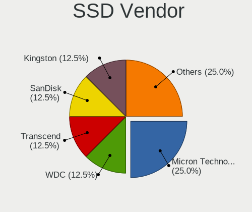
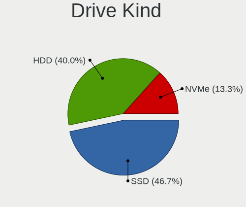
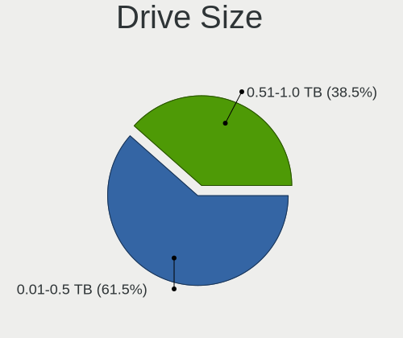
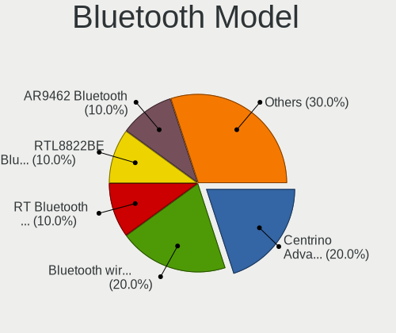
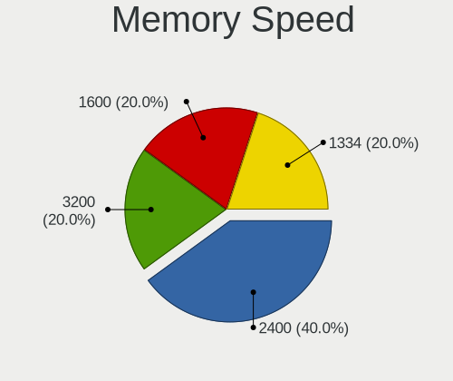
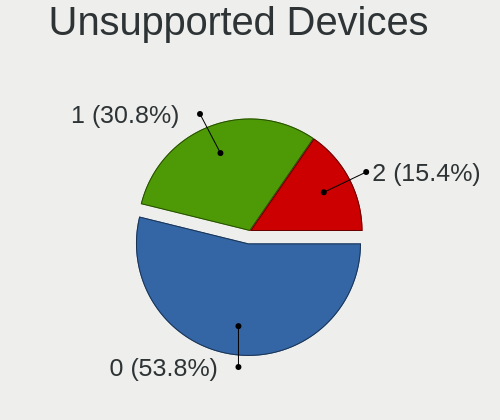

Solus 4.2 - Tested Hardware & Statistics (Notebooks)
----------------------------------------------------

A project to collect tested hardware configurations for Solus 4.2.

Anyone can contribute to this report by the [hw-probe](https://github.com/linuxhw/hw-probe) tool:

    sudo -E hw-probe -all -upload

Please contribute! Especially if your hardware is rare.

Contents
--------

* [ Test Cases ](#test-cases)

* [ System ](#system)
  - [ Kernel                   ](#kernel)
  - [ Kernel Family            ](#kernel-family)
  - [ Kernel Major Ver.        ](#kernel-major-ver)
  - [ Arch                     ](#arch)
  - [ DE                       ](#de)
  - [ Display Server           ](#display-server)
  - [ Display Manager          ](#display-manager)
  - [ OS Lang                  ](#os-lang)
  - [ Boot Mode                ](#boot-mode)
  - [ Filesystem               ](#filesystem)
  - [ Part. scheme             ](#part-scheme)
  - [ Dual Boot with Linux/BSD ](#dual-boot-with-linuxbsd)
  - [ Dual Boot (Win)          ](#dual-boot-win)

* [ Board ](#board)
  - [ Vendor                   ](#vendor)
  - [ Model                    ](#model)
  - [ Model Family             ](#model-family)
  - [ MFG Year                 ](#mfg-year)
  - [ Form Factor              ](#form-factor)
  - [ Secure Boot              ](#secure-boot)
  - [ Coreboot                 ](#coreboot)
  - [ RAM Size                 ](#ram-size)
  - [ RAM Used                 ](#ram-used)
  - [ Total Drives             ](#total-drives)
  - [ Has CD-ROM               ](#has-cd-rom)
  - [ Has Ethernet             ](#has-ethernet)
  - [ Has WiFi                 ](#has-wifi)
  - [ Has Bluetooth            ](#has-bluetooth)

* [ Location ](#location)
  - [ Country                  ](#country)
  - [ City                     ](#city)

* [ Drives ](#drives)
  - [ Drive Vendor             ](#drive-vendor)
  - [ Drive Model              ](#drive-model)
  - [ HDD Vendor               ](#hdd-vendor)
  - [ SSD Vendor               ](#ssd-vendor)
  - [ Drive Kind               ](#drive-kind)
  - [ Drive Connector          ](#drive-connector)
  - [ Drive Size               ](#drive-size)
  - [ Space Total              ](#space-total)
  - [ Space Used               ](#space-used)
  - [ Malfunc. Drives          ](#malfunc-drives)
  - [ Malfunc. Drive Vendor    ](#malfunc-drive-vendor)
  - [ Malfunc. HDD Vendor      ](#malfunc-hdd-vendor)
  - [ Malfunc. Drive Kind      ](#malfunc-drive-kind)
  - [ Failed Drives            ](#failed-drives)
  - [ Failed Drive Vendor      ](#failed-drive-vendor)
  - [ Drive Status             ](#drive-status)

* [ Storage controller ](#storage-controller)
  - [ Storage Vendor           ](#storage-vendor)
  - [ Storage Model            ](#storage-model)
  - [ Storage Kind             ](#storage-kind)

* [ Processor ](#processor)
  - [ CPU Vendor               ](#cpu-vendor)
  - [ CPU Model                ](#cpu-model)
  - [ CPU Model Family         ](#cpu-model-family)
  - [ CPU Cores                ](#cpu-cores)
  - [ CPU Sockets              ](#cpu-sockets)
  - [ CPU Threads              ](#cpu-threads)
  - [ CPU Op-Modes             ](#cpu-op-modes)
  - [ CPU Microcode            ](#cpu-microcode)
  - [ CPU Microarch            ](#cpu-microarch)

* [ Graphics ](#graphics)
  - [ GPU Vendor               ](#gpu-vendor)
  - [ GPU Model                ](#gpu-model)
  - [ GPU Combo                ](#gpu-combo)
  - [ GPU Driver               ](#gpu-driver)
  - [ GPU Memory               ](#gpu-memory)

* [ Monitor ](#monitor)
  - [ Monitor Vendor           ](#monitor-vendor)
  - [ Monitor Model            ](#monitor-model)
  - [ Monitor Resolution       ](#monitor-resolution)
  - [ Monitor Diagonal         ](#monitor-diagonal)
  - [ Monitor Width            ](#monitor-width)
  - [ Aspect Ratio             ](#aspect-ratio)
  - [ Monitor Area             ](#monitor-area)
  - [ Pixel Density            ](#pixel-density)
  - [ Multiple Monitors        ](#multiple-monitors)

* [ Network ](#network)
  - [ Net Controller Vendor    ](#net-controller-vendor)
  - [ Net Controller Model     ](#net-controller-model)
  - [ Wireless Vendor          ](#wireless-vendor)
  - [ Wireless Model           ](#wireless-model)
  - [ Ethernet Vendor          ](#ethernet-vendor)
  - [ Ethernet Model           ](#ethernet-model)
  - [ Net Controller Kind      ](#net-controller-kind)
  - [ Used Controller          ](#used-controller)
  - [ NICs                     ](#nics)
  - [ IPv6                     ](#ipv6)

* [ Bluetooth ](#bluetooth)
  - [ Bluetooth Vendor         ](#bluetooth-vendor)
  - [ Bluetooth Model          ](#bluetooth-model)

* [ Sound ](#sound)
  - [ Sound Vendor             ](#sound-vendor)
  - [ Sound Model              ](#sound-model)

* [ Memory ](#memory)
  - [ Memory Vendor            ](#memory-vendor)
  - [ Memory Model             ](#memory-model)
  - [ Memory Kind              ](#memory-kind)
  - [ Memory Form Factor       ](#memory-form-factor)
  - [ Memory Size              ](#memory-size)
  - [ Memory Speed             ](#memory-speed)

* [ Printers & scanners ](#printers--scanners)
  - [ Printer Vendor           ](#printer-vendor)
  - [ Printer Model            ](#printer-model)
  - [ Scanner Vendor           ](#scanner-vendor)
  - [ Scanner Model            ](#scanner-model)

* [ Camera ](#camera)
  - [ Camera Vendor            ](#camera-vendor)
  - [ Camera Model             ](#camera-model)

* [ Security ](#security)
  - [ Fingerprint Vendor       ](#fingerprint-vendor)
  - [ Fingerprint Model        ](#fingerprint-model)
  - [ Chipcard Vendor          ](#chipcard-vendor)
  - [ Chipcard Model           ](#chipcard-model)

* [ Unsupported ](#unsupported)
  - [ Unsupported Devices      ](#unsupported-devices)
  - [ Unsupported Device Types ](#unsupported-device-types)

Test Cases
----------

Total: 18

| Vendor        | Model                       | Probe                                                      | Date         |
|---------------|-----------------------------|------------------------------------------------------------|--------------|
| Dell          | Vostro 15-3568              | [3d6d3007cf](https://linux-hardware.org/?probe=3d6d3007cf) | Jul 10, 2021 |
| Dell          | Vostro 15-3568              | [66d001f315](https://linux-hardware.org/?probe=66d001f315) | Jul 09, 2021 |
| ASUSTek       | N53SV                       | [53fef6a61a](https://linux-hardware.org/?probe=53fef6a61a) | Jul 08, 2021 |
| Dell          | Inspiron 3537               | [6fc3976633](https://linux-hardware.org/?probe=6fc3976633) | Jun 18, 2021 |
| Lenovo        | ThinkPad X1 Carbon 4th 2... | [0e1e07507e](https://linux-hardware.org/?probe=0e1e07507e) | Jun 15, 2021 |
| HP            | ProBook 650 G1              | [120d5f24fe](https://linux-hardware.org/?probe=120d5f24fe) | Jun 07, 2021 |
| Howard Com... | W350                        | [3e55c8284e](https://linux-hardware.org/?probe=3e55c8284e) | May 28, 2021 |
| Acer          | Aspire E5-575G              | [ce04df7bae](https://linux-hardware.org/?probe=ce04df7bae) | May 23, 2021 |
| Gigabyte      | AORUS 17G KB                | [fd9385ff3c](https://linux-hardware.org/?probe=fd9385ff3c) | Apr 29, 2021 |
| Packard Be... | EasyNote TS11HR             | [5c51b7f289](https://linux-hardware.org/?probe=5c51b7f289) | Apr 25, 2021 |
| Lenovo        | ThinkPad T430 2349CV2       | [98063e03b9](https://linux-hardware.org/?probe=98063e03b9) | Apr 21, 2021 |
| HP            | Pavilion dv7                | [e8b5a1786b](https://linux-hardware.org/?probe=e8b5a1786b) | Apr 08, 2021 |
| HP            | ProBook 650 G1              | [e25f4adb0b](https://linux-hardware.org/?probe=e25f4adb0b) | Mar 31, 2021 |
| HP            | ProBook 650 G1              | [4ba1bb5165](https://linux-hardware.org/?probe=4ba1bb5165) | Mar 29, 2021 |
| Toshiba       | Satellite L855              | [e507a57307](https://linux-hardware.org/?probe=e507a57307) | Feb 23, 2021 |
| Lenovo        | Legion Y530-15ICH 81FV      | [f1c277189f](https://linux-hardware.org/?probe=f1c277189f) | Feb 16, 2021 |
| Acer          | Aspire 5735                 | [d8b7b99dd0](https://linux-hardware.org/?probe=d8b7b99dd0) | Feb 16, 2021 |
| Toshiba       | Satellite L855              | [7a2993f67a](https://linux-hardware.org/?probe=7a2993f67a) | Feb 03, 2021 |

System
------

Kernel
------

Version of the Linux kernel

| Version             | Notebooks | Percent |
|---------------------|-----------|---------|
| 5.11.22-180.current | 3         | 21.43%  |
| 5.12.10-182.current | 2         | 14.29%  |
| 5.11.9-176.current  | 2         | 14.29%  |
| 5.11.12-177.current | 2         | 14.29%  |
| 5.10.12-171.current | 2         | 14.29%  |
| 5.13.0-186.current  | 1         | 7.14%   |
| 5.10.15-172.current | 1         | 7.14%   |
| 4.14.221-168.lts    | 1         | 7.14%   |

Kernel Family
-------------

Linux kernel without a distro release

| Version  | Notebooks | Percent |
|----------|-----------|---------|
| 5.11.22  | 3         | 21.43%  |
| 5.12.10  | 2         | 14.29%  |
| 5.11.9   | 2         | 14.29%  |
| 5.11.12  | 2         | 14.29%  |
| 5.10.12  | 2         | 14.29%  |
| 5.13.0   | 1         | 7.14%   |
| 5.10.15  | 1         | 7.14%   |
| 4.14.221 | 1         | 7.14%   |

Kernel Major Ver.
-----------------

Linux kernel major version

| Version | Notebooks | Percent |
|---------|-----------|---------|
| 5.11    | 6         | 46.15%  |
| 5.10    | 3         | 23.08%  |
| 5.12    | 2         | 15.38%  |
| 5.13    | 1         | 7.69%   |
| 4.14    | 1         | 7.69%   |

Arch
----

OS architecture (x86_64, i586, etc.)

| Name   | Notebooks | Percent |
|--------|-----------|---------|
| x86_64 | 13        | 100%    |

DE
--

Desktop Environment

| Name    | Notebooks | Percent |
|---------|-----------|---------|
| Budgie  | 7         | 50%     |
| MATE    | 3         | 21.43%  |
| GNOME   | 2         | 14.29%  |
| KDE     | 1         | 7.14%   |
| Unknown | 1         | 7.14%   |

Display Server
--------------

X11 or Wayland

| Name | Notebooks | Percent |
|------|-----------|---------|
| X11  | 13        | 100%    |

Display Manager
---------------

SDDM, LightDM, etc.

| Name    | Notebooks | Percent |
|---------|-----------|---------|
| Unknown | 10        | 76.92%  |
| TDM     | 3         | 23.08%  |

OS Lang
-------

Language

| Lang  | Notebooks | Percent |
|-------|-----------|---------|
| en_US | 8         | 61.54%  |
| en_GB | 2         | 15.38%  |
| tr_TR | 1         | 7.69%   |
| ru_RU | 1         | 7.69%   |
| en_NZ | 1         | 7.69%   |

Boot Mode
---------

EFI or BIOS

| Mode | Notebooks | Percent |
|------|-----------|---------|
| BIOS | 9         | 69.23%  |
| EFI  | 4         | 30.77%  |

Filesystem
----------

Type of filesystem

| Type | Notebooks | Percent |
|------|-----------|---------|
| Ext4 | 13        | 100%    |

Part. scheme
------------

Scheme of partitioning

| Type    | Notebooks | Percent |
|---------|-----------|---------|
| Unknown | 9         | 69.23%  |
| GPT     | 3         | 23.08%  |
| MBR     | 1         | 7.69%   |

Dual Boot with Linux/BSD
------------------------

Hosting more than one Linux/BSD

| Dual boot | Notebooks | Percent |
|-----------|-----------|---------|
| No        | 12        | 92.31%  |
| Yes       | 1         | 7.69%   |

Dual Boot (Win)
---------------

Hosting Linux and Windows

| Dual boot | Notebooks | Percent |
|-----------|-----------|---------|
| No        | 12        | 92.31%  |
| Yes       | 1         | 7.69%   |

Board
-----

Vendor
------

Motherboard manufacturer

| Name                | Notebooks | Percent |
|---------------------|-----------|---------|
| Lenovo              | 3         | 23.08%  |
| Hewlett-Packard     | 2         | 15.38%  |
| Acer                | 2         | 15.38%  |
| Toshiba             | 1         | 7.69%   |
| Packard Bell        | 1         | 7.69%   |
| Howard Computers    | 1         | 7.69%   |
| Gigabyte Technology | 1         | 7.69%   |
| Dell                | 1         | 7.69%   |
| ASUSTek Computer    | 1         | 7.69%   |

Model
-----

Motherboard model

| Name                                     | Notebooks | Percent |
|------------------------------------------|-----------|---------|
| Toshiba Satellite L855                   | 1         | 7.69%   |
| Packard Bell EasyNote TS11HR             | 1         | 7.69%   |
| Lenovo ThinkPad X1 Carbon 4th 20FCS1DN00 | 1         | 7.69%   |
| Lenovo ThinkPad T430 2349CV2             | 1         | 7.69%   |
| Lenovo Legion Y530-15ICH 81FV            | 1         | 7.69%   |
| Howard Computers W350                    | 1         | 7.69%   |
| HP ProBook 650 G1                        | 1         | 7.69%   |
| HP Pavilion dv7                          | 1         | 7.69%   |
| Gigabyte AORUS 17G KB                    | 1         | 7.69%   |
| Dell Inspiron 3537                       | 1         | 7.69%   |
| ASUS N53SV                               | 1         | 7.69%   |
| Acer Aspire E5-575G                      | 1         | 7.69%   |
| Acer Aspire 5735                         | 1         | 7.69%   |

Model Family
------------

Motherboard model prefix

| Name                  | Notebooks | Percent |
|-----------------------|-----------|---------|
| Lenovo ThinkPad       | 2         | 15.38%  |
| Acer Aspire           | 2         | 15.38%  |
| Toshiba Satellite     | 1         | 7.69%   |
| Packard Bell EasyNote | 1         | 7.69%   |
| Lenovo Legion         | 1         | 7.69%   |
| Howard Computers W350 | 1         | 7.69%   |
| HP ProBook            | 1         | 7.69%   |
| HP Pavilion           | 1         | 7.69%   |
| Gigabyte AORUS        | 1         | 7.69%   |
| Dell Inspiron         | 1         | 7.69%   |
| ASUS N53SV            | 1         | 7.69%   |

MFG Year
--------

Motherboard manufacture year

| Year | Notebooks | Percent |
|------|-----------|---------|
| 2012 | 3         | 23.08%  |
| 2016 | 2         | 15.38%  |
| 2013 | 2         | 15.38%  |
| 2008 | 2         | 15.38%  |
| 2020 | 1         | 7.69%   |
| 2018 | 1         | 7.69%   |
| 2011 | 1         | 7.69%   |
| 2010 | 1         | 7.69%   |

Form Factor
-----------

Physical design of the computer

| Name     | Notebooks | Percent |
|----------|-----------|---------|
| Notebook | 13        | 100%    |

Secure Boot
-----------

Enabled or disabled

| State    | Notebooks | Percent |
|----------|-----------|---------|
| Disabled | 13        | 100%    |

Coreboot
--------

Have coreboot on board

| Used | Notebooks | Percent |
|------|-----------|---------|
| No   | 13        | 100%    |

RAM Size
--------

Total RAM memory

| Size in GB  | Notebooks | Percent |
|-------------|-----------|---------|
| 4.01-8.0    | 5         | 38.46%  |
| 3.01-4.0    | 2         | 15.38%  |
| 16.01-24.0  | 2         | 15.38%  |
| 2.01-3.0    | 1         | 7.69%   |
| 64.01-256.0 | 1         | 7.69%   |
| 1.01-2.0    | 1         | 7.69%   |
| 8.01-16.0   | 1         | 7.69%   |

RAM Used
--------

Used RAM memory

| Used GB  | Notebooks | Percent |
|----------|-----------|---------|
| 1.01-2.0 | 7         | 53.85%  |
| 3.01-4.0 | 2         | 15.38%  |
| 2.01-3.0 | 2         | 15.38%  |
| 0.51-1.0 | 2         | 15.38%  |

Total Drives
------------

Number of drives on board

| Drives | Notebooks | Percent |
|--------|-----------|---------|
| 1      | 8         | 61.54%  |
| 2      | 4         | 30.77%  |
| 3      | 1         | 7.69%   |

Has CD-ROM
----------

Has CD-ROM on board

| Presented | Notebooks | Percent |
|-----------|-----------|---------|
| Yes       | 10        | 76.92%  |
| No        | 3         | 23.08%  |

Has Ethernet
------------

Has Ethernet on board

| Presented | Notebooks | Percent |
|-----------|-----------|---------|
| Yes       | 13        | 100%    |

Has WiFi
--------

Has WiFi module

| Presented | Notebooks | Percent |
|-----------|-----------|---------|
| Yes       | 13        | 100%    |

Has Bluetooth
-------------

Has Bluetooth module

| Presented | Notebooks | Percent |
|-----------|-----------|---------|
| Yes       | 10        | 76.92%  |
| No        | 3         | 23.08%  |

Location
--------

Country
-------

Geographic location (country)

| Country     | Notebooks | Percent |
|-------------|-----------|---------|
| USA         | 2         | 15.38%  |
| UK          | 1         | 7.69%   |
| Turkey      | 1         | 7.69%   |
| Sweden      | 1         | 7.69%   |
| Spain       | 1         | 7.69%   |
| Russia      | 1         | 7.69%   |
| New Zealand | 1         | 7.69%   |
| Netherlands | 1         | 7.69%   |
| Mexico      | 1         | 7.69%   |
| India       | 1         | 7.69%   |
| Guatemala   | 1         | 7.69%   |
| Greece      | 1         | 7.69%   |

City
----

Geographic location (city)

| City                      | Notebooks | Percent |
|---------------------------|-----------|---------|
| St Petersburg             | 1         | 7.69%   |
| Severna Park              | 1         | 7.69%   |
| San Francisco del Rincón | 1         | 7.69%   |
| San Francisco             | 1         | 7.69%   |
| Málaga                   | 1         | 7.69%   |
| Istanbul                  | 1         | 7.69%   |
| Guatemala City            | 1         | 7.69%   |
| Enfield                   | 1         | 7.69%   |
| Delhi                     | 1         | 7.69%   |
| Auckland                  | 1         | 7.69%   |
| Athens                    | 1         | 7.69%   |
| Ängelholm                | 1         | 7.69%   |
| Amsterdam                 | 1         | 7.69%   |

Drives
------

Drive Vendor
------------

Hard drive vendors

| Vendor              | Notebooks | Drives | Percent |
|---------------------|-----------|--------|---------|
| WDC                 | 4         | 4      | 22.22%  |
| Seagate             | 2         | 2      | 11.11%  |
| Samsung Electronics | 2         | 2      | 11.11%  |
| Micron Technology   | 2         | 3      | 11.11%  |
| Transcend           | 1         | 1      | 5.56%   |
| Toshiba             | 1         | 2      | 5.56%   |
| SK hynix            | 1         | 1      | 5.56%   |
| SanDisk             | 1         | 1      | 5.56%   |
| Kingston            | 1         | 1      | 5.56%   |
| Intel               | 1         | 1      | 5.56%   |
| Gigabyte Technology | 1         | 1      | 5.56%   |
| A-DATA Technology   | 1         | 1      | 5.56%   |

Drive Model
-----------

Hard drive models

| Model                                    | Notebooks | Percent |
|------------------------------------------|-----------|---------|
| WDC WDS120G2G0A-00JH30 120GB SSD         | 1         | 5.56%   |
| WDC WD2500BEVT-22A23T0 250GB             | 1         | 5.56%   |
| WDC WD10SPZX-24Z10 1TB                   | 1         | 5.56%   |
| WDC WD10JPVX-22JC3T0 1TB                 | 1         | 5.56%   |
| Transcend TS240GSSD220S 240GB            | 1         | 5.56%   |
| Toshiba MK7575GSX 752GB                  | 1         | 5.56%   |
| SK hynix NVMe SSD Drive 128GB            | 1         | 5.56%   |
| Seagate ST9750420AS 752GB                | 1         | 5.56%   |
| Seagate ST9320325AS 320GB                | 1         | 5.56%   |
| SanDisk SD7SN6S512G1001 512GB SSD        | 1         | 5.56%   |
| Samsung SSD 970 EVO Plus 2TB             | 1         | 5.56%   |
| Samsung PSSD T7 500GB                    | 1         | 5.56%   |
| Micron MTFDDAK256MAY-1AH12ABHA 256GB SSD | 1         | 5.56%   |
| Micron 1100_MTFDDAV256TBN 256GB SSD      | 1         | 5.56%   |
| Kingston SA400S37240G 240GB SSD          | 1         | 5.56%   |
| Intel SSDSC2CW120A3 120GB                | 1         | 5.56%   |
| Gigabyte GP-GSTFS31120GNTD 120GB SSD     | 1         | 5.56%   |
| A-DATA SX8200PNP-512GT 512GB             | 1         | 5.56%   |

HDD Vendor
----------

Hard disk drive vendors

| Vendor  | Notebooks | Drives | Percent |
|---------|-----------|--------|---------|
| WDC     | 3         | 3      | 50%     |
| Seagate | 2         | 2      | 33.33%  |
| Toshiba | 1         | 2      | 16.67%  |

SSD Vendor
----------

Solid state drive vendors

| Vendor              | Notebooks | Drives | Percent |
|---------------------|-----------|--------|---------|
| Micron Technology   | 2         | 3      | 22.22%  |
| WDC                 | 1         | 1      | 11.11%  |
| Transcend           | 1         | 1      | 11.11%  |
| SanDisk             | 1         | 1      | 11.11%  |
| Samsung Electronics | 1         | 1      | 11.11%  |
| Kingston            | 1         | 1      | 11.11%  |
| Intel               | 1         | 1      | 11.11%  |
| Gigabyte Technology | 1         | 1      | 11.11%  |

Drive Kind
----------

HDD or SSD

| Kind | Notebooks | Drives | Percent |
|------|-----------|--------|---------|
| SSD  | 8         | 10     | 50%     |
| HDD  | 6         | 7      | 37.5%   |
| NVMe | 2         | 3      | 12.5%   |

Drive Connector
---------------

SATA, SAS, NVMe, etc.

| Type | Notebooks | Drives | Percent |
|------|-----------|--------|---------|
| SATA | 12        | 16     | 80%     |
| NVMe | 2         | 3      | 13.33%  |
| SAS  | 1         | 1      | 6.67%   |

Drive Size
----------

Size of hard drive

| Size in TB | Notebooks | Drives | Percent |
|------------|-----------|--------|---------|
| 0.01-0.5   | 9         | 11     | 64.29%  |
| 0.51-1.0   | 5         | 6      | 35.71%  |

Space Total
-----------

Amount of disk space available on the file system

| Size in GB | Notebooks | Percent |
|------------|-----------|---------|
| 101-250    | 6         | 46.15%  |
| 251-500    | 4         | 30.77%  |
| 1001-2000  | 2         | 15.38%  |
| 501-1000   | 1         | 7.69%   |

Space Used
----------

Amount of used disk space

| Used GB   | Notebooks | Percent |
|-----------|-----------|---------|
| 1-20      | 6         | 46.15%  |
| 21-50     | 2         | 15.38%  |
| 51-100    | 2         | 15.38%  |
| 251-500   | 1         | 7.69%   |
| 101-250   | 1         | 7.69%   |
| 1001-2000 | 1         | 7.69%   |

Malfunc. Drives
---------------

Drive models with a malfunction

| Model                                          | Notebooks | Drives | Percent |
|------------------------------------------------|-----------|--------|---------|
| Micron Technology 1100_MTFDDAV256TBN 256GB SSD | 1         | 1      | 100%    |

Malfunc. Drive Vendor
---------------------

Vendors of faulty drives

| Vendor            | Notebooks | Drives | Percent |
|-------------------|-----------|--------|---------|
| Micron Technology | 1         | 1      | 100%    |

Malfunc. HDD Vendor
-------------------

Vendors of faulty HDD drives

Zero info for selected period =(

Malfunc. Drive Kind
-------------------

Kinds of faulty drives

| Kind | Notebooks | Drives | Percent |
|------|-----------|--------|---------|
| SSD  | 1         | 1      | 100%    |

Failed Drives
-------------

Failed drive models

Zero info for selected period =(

Failed Drive Vendor
-------------------

Failed drive vendors

Zero info for selected period =(

Drive Status
------------

Number of failed and malfunc. drives

| Status   | Notebooks | Drives | Percent |
|----------|-----------|--------|---------|
| Detected | 9         | 14     | 64.29%  |
| Works    | 4         | 5      | 28.57%  |
| Malfunc  | 1         | 1      | 7.14%   |

Storage controller
------------------

Storage Vendor
--------------

Storage controller vendors

| Vendor              | Notebooks | Percent |
|---------------------|-----------|---------|
| Intel               | 12        | 80%     |
| SK hynix            | 1         | 6.67%   |
| Samsung Electronics | 1         | 6.67%   |
| ADATA Technology    | 1         | 6.67%   |

Storage Model
-------------

Storage controller models

| Model                                                                          | Notebooks | Percent |
|--------------------------------------------------------------------------------|-----------|---------|
| Intel 6 Series/C200 Series Chipset Family 6 port Mobile SATA AHCI Controller   | 4         | 26.67%  |
| Intel Sunrise Point-LP SATA Controller [AHCI mode]                             | 2         | 13.33%  |
| Intel 7 Series Chipset Family 6-port SATA Controller [AHCI mode]               | 2         | 13.33%  |
| SK hynix BC501 NVMe Solid State Drive                                          | 1         | 6.67%   |
| Samsung NVMe SSD Controller SM981/PM981/PM983                                  | 1         | 6.67%   |
| Intel Cannon Lake Mobile PCH SATA AHCI Controller                              | 1         | 6.67%   |
| Intel 82801IBM/IEM (ICH9M/ICH9M-E) 4 port SATA Controller [AHCI mode]          | 1         | 6.67%   |
| Intel 8 Series/C220 Series Chipset Family 6-port SATA Controller 1 [AHCI mode] | 1         | 6.67%   |
| Intel 8 Series SATA Controller 1 [AHCI mode]                                   | 1         | 6.67%   |
| ADATA XPG SX8200 Pro PCIe Gen3x4 M.2 2280 Solid State Drive                    | 1         | 6.67%   |

Storage Kind
------------

Kind of storage controller (IDE, SATA, NVMe, SAS, ...)

| Kind | Notebooks | Percent |
|------|-----------|---------|
| SATA | 12        | 85.71%  |
| NVMe | 2         | 14.29%  |

Processor
---------

CPU Vendor
----------

Processor vendors

| Vendor | Notebooks | Percent |
|--------|-----------|---------|
| Intel  | 13        | 100%    |

CPU Model
---------

Processor models

| Model                                  | Notebooks | Percent |
|----------------------------------------|-----------|---------|
| Intel Core i7-2630QM CPU @ 2.00GHz     | 2         | 15.38%  |
| Intel Pentium Dual CPU T3400 @ 2.16GHz | 1         | 7.69%   |
| Intel Core i7-8750H CPU @ 2.20GHz      | 1         | 7.69%   |
| Intel Core i7-4600M CPU @ 2.90GHz      | 1         | 7.69%   |
| Intel Core i7-10875H CPU @ 2.30GHz     | 1         | 7.69%   |
| Intel Core i5-7200U CPU @ 2.50GHz      | 1         | 7.69%   |
| Intel Core i5-6300U CPU @ 2.40GHz      | 1         | 7.69%   |
| Intel Core i5-4200U CPU @ 1.60GHz      | 1         | 7.69%   |
| Intel Core i5-3320M CPU @ 2.60GHz      | 1         | 7.69%   |
| Intel Core i5-2520M CPU @ 2.50GHz      | 1         | 7.69%   |
| Intel Core i3-2310M CPU @ 2.10GHz      | 1         | 7.69%   |
| Intel Celeron CPU B830 @ 1.80GHz       | 1         | 7.69%   |

CPU Model Family
----------------

Processor model prefix

| Model              | Notebooks | Percent |
|--------------------|-----------|---------|
| Intel Core i7      | 5         | 38.46%  |
| Intel Core i5      | 5         | 38.46%  |
| Intel Pentium Dual | 1         | 7.69%   |
| Intel Core i3      | 1         | 7.69%   |
| Intel Celeron      | 1         | 7.69%   |

CPU Cores
---------

Number of processor cores

| Number | Notebooks | Percent |
|--------|-----------|---------|
| 2      | 9         | 69.23%  |
| 4      | 2         | 15.38%  |
| 8      | 1         | 7.69%   |
| 6      | 1         | 7.69%   |

CPU Sockets
-----------

Number of sockets

| Number | Notebooks | Percent |
|--------|-----------|---------|
| 1      | 13        | 100%    |

CPU Threads
-----------

Threads per core (Hyper-Threading)

| Number | Notebooks | Percent |
|--------|-----------|---------|
| 2      | 11        | 84.62%  |
| 1      | 2         | 15.38%  |

CPU Op-Modes
------------

CPU Operation Modes (32-bit, 64-bit)

| Op mode        | Notebooks | Percent |
|----------------|-----------|---------|
| 32-bit, 64-bit | 13        | 100%    |

CPU Microcode
-------------

Microcode number

| Number  | Notebooks | Percent |
|---------|-----------|---------|
| 0x206a7 | 5         | 38.46%  |
| 0xa0652 | 1         | 7.69%   |
| 0x906ea | 1         | 7.69%   |
| 0x806e9 | 1         | 7.69%   |
| 0x6fd   | 1         | 7.69%   |
| 0x406e3 | 1         | 7.69%   |
| 0x40651 | 1         | 7.69%   |
| 0x306c3 | 1         | 7.69%   |
| 0x306a9 | 1         | 7.69%   |

CPU Microarch
-------------

Microarchitecture

| Name        | Notebooks | Percent |
|-------------|-----------|---------|
| SandyBridge | 5         | 38.46%  |
| KabyLake    | 2         | 15.38%  |
| Haswell     | 2         | 15.38%  |
| Skylake     | 1         | 7.69%   |
| IvyBridge   | 1         | 7.69%   |
| Core        | 1         | 7.69%   |
| CometLake   | 1         | 7.69%   |

Graphics
--------

GPU Vendor
----------

Vendors of graphics cards

| Vendor | Notebooks | Percent |
|--------|-----------|---------|
| Intel  | 13        | 68.42%  |
| Nvidia | 5         | 26.32%  |
| AMD    | 1         | 5.26%   |

GPU Model
---------

Graphics card models

| Model                                                                     | Notebooks | Percent |
|---------------------------------------------------------------------------|-----------|---------|
| Intel 2nd Generation Core Processor Family Integrated Graphics Controller | 5         | 26.32%  |
| Nvidia GF108M [GeForce GT 540M]                                           | 2         | 10.53%  |
| Nvidia TU106M [GeForce RTX 2060 Mobile]                                   | 1         | 5.26%   |
| Nvidia GP107M [GeForce GTX 1050 Ti Mobile]                                | 1         | 5.26%   |
| Nvidia GM108M [GeForce 940MX]                                             | 1         | 5.26%   |
| Intel Skylake GT2 [HD Graphics 520]                                       | 1         | 5.26%   |
| Intel Mobile 4 Series Chipset Integrated Graphics Controller              | 1         | 5.26%   |
| Intel HD Graphics 620                                                     | 1         | 5.26%   |
| Intel Haswell-ULT Integrated Graphics Controller                          | 1         | 5.26%   |
| Intel CometLake-H GT2 [UHD Graphics]                                      | 1         | 5.26%   |
| Intel CoffeeLake-H GT2 [UHD Graphics 630]                                 | 1         | 5.26%   |
| Intel 4th Gen Core Processor Integrated Graphics Controller               | 1         | 5.26%   |
| Intel 3rd Gen Core processor Graphics Controller                          | 1         | 5.26%   |
| AMD Whistler [Radeon HD 6730M/6770M/7690M XT]                             | 1         | 5.26%   |

GPU Combo
---------

Combinations of graphics cards

| Name           | Notebooks | Percent |
|----------------|-----------|---------|
| 1 x Intel      | 7         | 53.85%  |
| Intel + Nvidia | 5         | 38.46%  |
| Intel + AMD    | 1         | 7.69%   |

GPU Driver
----------

Free vs proprietary

| Driver      | Notebooks | Percent |
|-------------|-----------|---------|
| Free        | 11        | 84.62%  |
| Proprietary | 2         | 15.38%  |

GPU Memory
----------

Total video memory

| Size in GB | Notebooks | Percent |
|------------|-----------|---------|
| Unknown    | 6         | 46.15%  |
| 1.01-2.0   | 3         | 23.08%  |
| 0.51-1.0   | 2         | 15.38%  |
| 5.01-6.0   | 1         | 7.69%   |
| 3.01-4.0   | 1         | 7.69%   |

Monitor
-------

Monitor Vendor
--------------

Monitor vendors

| Vendor              | Notebooks | Percent |
|---------------------|-----------|---------|
| AU Optronics        | 7         | 46.67%  |
| LG Display          | 4         | 26.67%  |
| Samsung Electronics | 2         | 13.33%  |
| Goldstar            | 1         | 6.67%   |
| BenQ                | 1         | 6.67%   |

Monitor Model
-------------

Monitor models

| Model                                                                | Notebooks | Percent |
|----------------------------------------------------------------------|-----------|---------|
| Samsung Electronics LCD Monitor SEC3150 1366x768 344x193mm 15.5-inch | 1         | 6.67%   |
| Samsung Electronics LCD Monitor SDC5441 1366x768 309x174mm 14.0-inch | 1         | 6.67%   |
| LG Display LCD Monitor LGD05E5 1920x1080 340x190mm 15.3-inch         | 1         | 6.67%   |
| LG Display LCD Monitor LGD0465 1366x768 344x194mm 15.5-inch          | 1         | 6.67%   |
| LG Display LCD Monitor LGD044F 1920x1080 345x194mm 15.6-inch         | 1         | 6.67%   |
| LG Display LCD Monitor LGD020C 1600x900 345x194mm 15.6-inch          | 1         | 6.67%   |
| Goldstar E1911 GSM4BF9 1366x768 410x230mm 18.5-inch                  | 1         | 6.67%   |
| BenQ GL2460 BNQ78CE 1920x1080 531x299mm 24.0-inch                    | 1         | 6.67%   |
| AU Optronics LCD Monitor AUO509D 1920x1080 382x215mm 17.3-inch       | 1         | 6.67%   |
| AU Optronics LCD Monitor AUO313C 1366x768 309x173mm 13.9-inch        | 1         | 6.67%   |
| AU Optronics LCD Monitor AUO22EC 1366x768 344x193mm 15.5-inch        | 1         | 6.67%   |
| AU Optronics LCD Monitor AUO173D 1920x1080 309x173mm 13.9-inch       | 1         | 6.67%   |
| AU Optronics LCD Monitor AUO15ED 1920x1080 344x193mm 15.5-inch       | 1         | 6.67%   |
| AU Optronics LCD Monitor AUO139E 1600x900 382x214mm 17.2-inch        | 1         | 6.67%   |
| AU Optronics LCD Monitor AUO10EC 1366x768 344x193mm 15.5-inch        | 1         | 6.67%   |

Monitor Resolution
------------------

Monitor screen resolution

| Resolution      | Notebooks | Percent |
|-----------------|-----------|---------|
| 1920x1080 (FHD) | 6         | 42.86%  |
| 1366x768 (WXGA) | 6         | 42.86%  |
| 1600x900 (HD+)  | 2         | 14.29%  |

Monitor Diagonal
----------------

Diagonal size in inches

| Inches | Notebooks | Percent |
|--------|-----------|---------|
| 15     | 9         | 60%     |
| 17     | 2         | 13.33%  |
| 13     | 2         | 13.33%  |
| 24     | 1         | 6.67%   |
| 18     | 1         | 6.67%   |

Monitor Width
-------------

Physical width

| Width in mm | Notebooks | Percent |
|-------------|-----------|---------|
| 301-350     | 11        | 73.33%  |
| 351-400     | 2         | 13.33%  |
| 501-600     | 1         | 6.67%   |
| 401-500     | 1         | 6.67%   |

Aspect Ratio
------------

Proportional relationship between the width and the height

| Ratio | Notebooks | Percent |
|-------|-----------|---------|
| 16/9  | 13        | 100%    |

Monitor Area
------------

Area in inch²

| Area in inch² | Notebooks | Percent |
|----------------|-----------|---------|
| 101-110        | 9         | 60%     |
| 81-90          | 2         | 13.33%  |
| 121-130        | 2         | 13.33%  |
| 201-250        | 1         | 6.67%   |
| 141-150        | 1         | 6.67%   |

Pixel Density
-------------

Pixels per inch

| Density | Notebooks | Percent |
|---------|-----------|---------|
| 101-120 | 8         | 53.33%  |
| 121-160 | 5         | 33.33%  |
| 51-100  | 2         | 13.33%  |

Multiple Monitors
-----------------

Total monitors connected

| Total | Notebooks | Percent |
|-------|-----------|---------|
| 1     | 11        | 84.62%  |
| 2     | 2         | 15.38%  |

Network
-------

Net Controller Vendor
---------------------

Controller vendors

| Vendor                        | Notebooks | Percent |
|-------------------------------|-----------|---------|
| Realtek Semiconductor         | 7         | 30.43%  |
| Intel                         | 6         | 26.09%  |
| Qualcomm Atheros              | 5         | 21.74%  |
| Ralink                        | 1         | 4.35%   |
| OnePlus Technology (Shenzhen) | 1         | 4.35%   |
| Marvell Technology Group      | 1         | 4.35%   |
| Hewlett-Packard               | 1         | 4.35%   |
| Broadcom                      | 1         | 4.35%   |

Net Controller Model
--------------------

Controller models

| Model                                                             | Notebooks | Percent |
|-------------------------------------------------------------------|-----------|---------|
| Realtek RTL8111/8168/8411 PCI Express Gigabit Ethernet Controller | 4         | 14.29%  |
| Intel 82579LM Gigabit Network Connection (Lewisville)             | 2         | 7.14%   |
| Realtek RTL8822BE 802.11a/b/g/n/ac WiFi adapter                   | 1         | 3.57%   |
| Realtek RTL8723AE PCIe Wireless Network Adapter                   | 1         | 3.57%   |
| Realtek RTL810xE PCI Express Fast Ethernet controller             | 1         | 3.57%   |
| Realtek Killer E2600 Gigabit Ethernet Controller                  | 1         | 3.57%   |
| Ralink RT2790 Wireless 802.11n 1T/2R PCIe                         | 1         | 3.57%   |
| Qualcomm Atheros QCA9565 / AR9565 Wireless Network Adapter        | 1         | 3.57%   |
| Qualcomm Atheros QCA9377 802.11ac Wireless Network Adapter        | 1         | 3.57%   |
| Qualcomm Atheros AR9287 Wireless Network Adapter (PCI-Express)    | 1         | 3.57%   |
| Qualcomm Atheros AR9285 Wireless Network Adapter (PCI-Express)    | 1         | 3.57%   |
| Qualcomm Atheros AR8162 Fast Ethernet                             | 1         | 3.57%   |
| OnePlus (Shenzhen) SM8150-MTP _SN:3BB6B401                        | 1         | 3.57%   |
| Marvell Group 88E8071 PCI-E Gigabit Ethernet Controller           | 1         | 3.57%   |
| Intel Wireless 8260                                               | 1         | 3.57%   |
| Intel Wireless 7260                                               | 1         | 3.57%   |
| Intel Wi-Fi 6 AX200                                               | 1         | 3.57%   |
| Intel Ethernet Connection I219-LM                                 | 1         | 3.57%   |
| Intel Ethernet Connection I217-V                                  | 1         | 3.57%   |
| Intel Centrino Wireless-N 1030 [Rainbow Peak]                     | 1         | 3.57%   |
| Intel Centrino Advanced-N 6230 [Rainbow Peak]                     | 1         | 3.57%   |
| Intel Centrino Advanced-N 6205 [Taylor Peak]                      | 1         | 3.57%   |
| HP lt4112 Gobi 4G Module Network Device                           | 1         | 3.57%   |
| Broadcom NetLink BCM57785 Gigabit Ethernet PCIe                   | 1         | 3.57%   |

Wireless Vendor
---------------

Wireless vendors

| Vendor                | Notebooks | Percent |
|-----------------------|-----------|---------|
| Intel                 | 6         | 42.86%  |
| Qualcomm Atheros      | 4         | 28.57%  |
| Realtek Semiconductor | 2         | 14.29%  |
| Ralink                | 1         | 7.14%   |
| Hewlett-Packard       | 1         | 7.14%   |

Wireless Model
--------------

Wireless models

| Model                                                          | Notebooks | Percent |
|----------------------------------------------------------------|-----------|---------|
| Realtek RTL8822BE 802.11a/b/g/n/ac WiFi adapter                | 1         | 7.14%   |
| Realtek RTL8723AE PCIe Wireless Network Adapter                | 1         | 7.14%   |
| Ralink RT2790 Wireless 802.11n 1T/2R PCIe                      | 1         | 7.14%   |
| Qualcomm Atheros QCA9565 / AR9565 Wireless Network Adapter     | 1         | 7.14%   |
| Qualcomm Atheros QCA9377 802.11ac Wireless Network Adapter     | 1         | 7.14%   |
| Qualcomm Atheros AR9287 Wireless Network Adapter (PCI-Express) | 1         | 7.14%   |
| Qualcomm Atheros AR9285 Wireless Network Adapter (PCI-Express) | 1         | 7.14%   |
| Intel Wireless 8260                                            | 1         | 7.14%   |
| Intel Wireless 7260                                            | 1         | 7.14%   |
| Intel Wi-Fi 6 AX200                                            | 1         | 7.14%   |
| Intel Centrino Wireless-N 1030 [Rainbow Peak]                  | 1         | 7.14%   |
| Intel Centrino Advanced-N 6230 [Rainbow Peak]                  | 1         | 7.14%   |
| Intel Centrino Advanced-N 6205 [Taylor Peak]                   | 1         | 7.14%   |
| HP lt4112 Gobi 4G Module Network Device                        | 1         | 7.14%   |

Ethernet Vendor
---------------

Ethernet vendors

| Vendor                   | Notebooks | Percent |
|--------------------------|-----------|---------|
| Realtek Semiconductor    | 6         | 46.15%  |
| Intel                    | 4         | 30.77%  |
| Qualcomm Atheros         | 1         | 7.69%   |
| Marvell Technology Group | 1         | 7.69%   |
| Broadcom                 | 1         | 7.69%   |

Ethernet Model
--------------

Ethernet models

| Model                                                             | Notebooks | Percent |
|-------------------------------------------------------------------|-----------|---------|
| Realtek RTL8111/8168/8411 PCI Express Gigabit Ethernet Controller | 4         | 30.77%  |
| Intel 82579LM Gigabit Network Connection (Lewisville)             | 2         | 15.38%  |
| Realtek RTL810xE PCI Express Fast Ethernet controller             | 1         | 7.69%   |
| Realtek Killer E2600 Gigabit Ethernet Controller                  | 1         | 7.69%   |
| Qualcomm Atheros AR8162 Fast Ethernet                             | 1         | 7.69%   |
| Marvell Group 88E8071 PCI-E Gigabit Ethernet Controller           | 1         | 7.69%   |
| Intel Ethernet Connection I219-LM                                 | 1         | 7.69%   |
| Intel Ethernet Connection I217-V                                  | 1         | 7.69%   |
| Broadcom NetLink BCM57785 Gigabit Ethernet PCIe                   | 1         | 7.69%   |

Net Controller Kind
-------------------

Ethernet, WiFi or modem

| Kind     | Notebooks | Percent |
|----------|-----------|---------|
| WiFi     | 13        | 48.15%  |
| Ethernet | 13        | 48.15%  |
| Unknown  | 1         | 3.7%    |

Used Controller
---------------

Currently used network controller

| Kind     | Notebooks | Percent |
|----------|-----------|---------|
| WiFi     | 11        | 91.67%  |
| Ethernet | 1         | 8.33%   |

NICs
----

Total network controllers on board

| Total | Notebooks | Percent |
|-------|-----------|---------|
| 2     | 13        | 100%    |

IPv6
----

IPv6 vs IPv4

| Used | Notebooks | Percent |
|------|-----------|---------|
| No   | 12        | 92.31%  |
| Yes  | 1         | 7.69%   |

Bluetooth
---------

Bluetooth Vendor
----------------

Controller vendors

| Vendor                          | Notebooks | Percent |
|---------------------------------|-----------|---------|
| Intel                           | 5         | 50%     |
| Qualcomm Atheros Communications | 2         | 20%     |
| Toshiba                         | 1         | 10%     |
| Realtek Semiconductor           | 1         | 10%     |
| Lite-On Technology              | 1         | 10%     |

Bluetooth Model
---------------

Controller models

| Model                                            | Notebooks | Percent |
|--------------------------------------------------|-----------|---------|
| Intel Centrino Advanced-N 6230 Bluetooth adapter | 2         | 20%     |
| Intel Bluetooth wireless interface               | 2         | 20%     |
| Toshiba RT Bluetooth Radio                       | 1         | 10%     |
| Realtek Bluetooth Radio                          | 1         | 10%     |
| Qualcomm Atheros AR9462 Bluetooth                | 1         | 10%     |
| Qualcomm Atheros AR3011 Bluetooth                | 1         | 10%     |
| Lite-On Qualcomm Atheros QCA9377 Bluetooth       | 1         | 10%     |
| Intel AX200 Bluetooth                            | 1         | 10%     |

Sound
-----

Sound Vendor
------------

Sound card vendors

| Vendor | Notebooks | Percent |
|--------|-----------|---------|
| Intel  | 13        | 76.47%  |
| Nvidia | 4         | 23.53%  |

Sound Model
-----------

Sound card models

| Model                                                                      | Notebooks | Percent |
|----------------------------------------------------------------------------|-----------|---------|
| Intel 6 Series/C200 Series Chipset Family High Definition Audio Controller | 4         | 21.05%  |
| Nvidia GF108 High Definition Audio Controller                              | 2         | 10.53%  |
| Intel Sunrise Point-LP HD Audio                                            | 2         | 10.53%  |
| Intel 7 Series/C216 Chipset Family High Definition Audio Controller        | 2         | 10.53%  |
| Nvidia TU106 High Definition Audio Controller                              | 1         | 5.26%   |
| Nvidia GP107GL High Definition Audio Controller                            | 1         | 5.26%   |
| Intel Xeon E3-1200 v3/4th Gen Core Processor HD Audio Controller           | 1         | 5.26%   |
| Intel Haswell-ULT HD Audio Controller                                      | 1         | 5.26%   |
| Intel Comet Lake PCH cAVS                                                  | 1         | 5.26%   |
| Intel Cannon Lake PCH cAVS                                                 | 1         | 5.26%   |
| Intel 82801I (ICH9 Family) HD Audio Controller                             | 1         | 5.26%   |
| Intel 8 Series/C220 Series Chipset High Definition Audio Controller        | 1         | 5.26%   |
| Intel 8 Series HD Audio Controller                                         | 1         | 5.26%   |

Memory
------

Memory Vendor
-------------

Memory module vendors

| Vendor              | Notebooks | Percent |
|---------------------|-----------|---------|
| Samsung Electronics | 1         | 16.67%  |
| Nanya Technology    | 1         | 16.67%  |
| Micron Technology   | 1         | 16.67%  |
| Kingston            | 1         | 16.67%  |
| Crucial             | 1         | 16.67%  |
| A-DATA Technology   | 1         | 16.67%  |

Memory Model
------------

Memory module models

| Model                                                     | Notebooks | Percent |
|-----------------------------------------------------------|-----------|---------|
| Samsung RAM M471B5273DH0-CK0 4GB SODIMM DDR3 1600MT/s     | 1         | 16.67%  |
| Nanya RAM NT2GC64B88B0NS-CG 2GB SODIMM DDR3 1334MT/s      | 1         | 16.67%  |
| Micron RAM 16KTF51264HZ-1G6M1 4GB SODIMM DDR3 1600MT/s    | 1         | 16.67%  |
| Kingston RAM 9905624-044.A00G 8192MB SODIMM DDR4 2400MT/s | 1         | 16.67%  |
| Crucial RAM CT32G4SFD832A.M16FB 32GB SODIMM DDR4 3200MT/s | 1         | 16.67%  |
| A-DATA RAM AO1P24HC8T1-B2NS 8GB SODIMM DDR4 2133MT/s      | 1         | 16.67%  |

Memory Kind
-----------

Memory module kinds

| Kind | Notebooks | Percent |
|------|-----------|---------|
| DDR4 | 2         | 50%     |
| DDR3 | 2         | 50%     |

Memory Form Factor
------------------

Physical design of the memory module

| Name   | Notebooks | Percent |
|--------|-----------|---------|
| SODIMM | 4         | 100%    |

Memory Size
-----------

Memory module size

| Size  | Notebooks | Percent |
|-------|-----------|---------|
| 32768 | 1         | 25%     |
| 8192  | 1         | 25%     |
| 4096  | 1         | 25%     |
| 2048  | 1         | 25%     |

Memory Speed
------------

Memory module speed

| Speed | Notebooks | Percent |
|-------|-----------|---------|
| 3200  | 1         | 20%     |
| 2400  | 1         | 20%     |
| 2133  | 1         | 20%     |
| 1600  | 1         | 20%     |
| 1334  | 1         | 20%     |

Printers & scanners
-------------------

Printer Vendor
--------------

Printer device vendors

Zero info for selected period =(

Printer Model
-------------

Printer device models

Zero info for selected period =(

Scanner Vendor
--------------

Scanner device vendors

Zero info for selected period =(

Scanner Model
-------------

Scanner device models

Zero info for selected period =(

Camera
------

Camera Vendor
-------------

Camera device vendors

| Vendor              | Notebooks | Percent |
|---------------------|-----------|---------|
| Chicony Electronics | 3         | 30%     |
| Suyin               | 2         | 20%     |
| Lite-On Technology  | 2         | 20%     |
| Microdia            | 1         | 10%     |
| Importek            | 1         | 10%     |
| IMC Networks        | 1         | 10%     |

Camera Model
------------

Camera device models

| Model                                     | Notebooks | Percent |
|-------------------------------------------|-----------|---------|
| Suyin HP TrueVision HD Integrated Webcam  | 1         | 10%     |
| Suyin 1.3M HD WebCam                      | 1         | 10%     |
| Microdia Dell Laptop Integrated Webcam HD | 1         | 10%     |
| Lite-On Integrated Camera                 | 1         | 10%     |
| Lite-On HP HD Webcam                      | 1         | 10%     |
| Importek TOSHIBA Web Camera - HD          | 1         | 10%     |
| IMC Networks USB2.0 HD UVC WebCam         | 1         | 10%     |
| Chicony Integrated Camera                 | 1         | 10%     |
| Chicony HD WebCam                         | 1         | 10%     |
| Chicony 2.0M UVC WebCam                   | 1         | 10%     |

Security
--------

Fingerprint Vendor
------------------

Fingerprint sensor vendors

| Vendor           | Notebooks | Percent |
|------------------|-----------|---------|
| Validity Sensors | 3         | 75%     |
| Upek             | 1         | 25%     |

Fingerprint Model
-----------------

Fingerprint sensor models

| Model                                             | Notebooks | Percent |
|---------------------------------------------------|-----------|---------|
| Validity Sensors VFS7500 Touch Fingerprint Sensor | 1         | 25%     |
| Validity Sensors VFS495 Fingerprint Reader        | 1         | 25%     |
| Validity Sensors Fingerprint scanner              | 1         | 25%     |
| Upek TCS5B Fingerprint sensor                     | 1         | 25%     |

Chipcard Vendor
---------------

Chipcard module vendors

| Vendor | Notebooks | Percent |
|--------|-----------|---------|
| Upek   | 1         | 50%     |
| Lenovo | 1         | 50%     |

Chipcard Model
--------------

Chipcard module models

| Model                                                      | Notebooks | Percent |
|------------------------------------------------------------|-----------|---------|
| Upek TouchChip Fingerprint Coprocessor (WBF advanced mode) | 1         | 50%     |
| Lenovo Integrated Smart Card Reader                        | 1         | 50%     |

Unsupported
-----------

Unsupported Devices
-------------------

Total unsupported devices on board

| Total | Notebooks | Percent |
|-------|-----------|---------|
| 0     | 7         | 53.85%  |
| 1     | 4         | 30.77%  |
| 2     | 2         | 15.38%  |

Unsupported Device Types
------------------------

Types of unsupported devices

| Type               | Notebooks | Percent |
|--------------------|-----------|---------|
| Fingerprint reader | 4         | 57.14%  |
| Net/wireless       | 2         | 28.57%  |
| Chipcard           | 1         | 14.29%  |

