Solus 4.3 - Tested Hardware & Statistics
----------------------------------------

A project to collect tested hardware configurations for Solus 4.3.

Anyone can contribute to this report by the [hw-probe](https://github.com/linuxhw/hw-probe) tool:

    sudo -E hw-probe -all -upload

Please submit a probe of your configuration if it's not presented on the page or is rare.

This is a report for all computer types. See also reports for [desktops](/Dist/Solus_4.3/Desktop/README.md) and [notebooks](/Dist/Solus_4.3/Notebook/README.md).

Full-feature report is available here: https://linux-hardware.org/?view=trends

Contents
--------

* [ Test Cases ](#test-cases)

* [ System ](#system)
  - [ Kernel                   ](#kernel)
  - [ Kernel Family            ](#kernel-family)
  - [ Kernel Major Ver.        ](#kernel-major-ver)
  - [ Arch                     ](#arch)
  - [ DE                       ](#de)
  - [ Display Server           ](#display-server)
  - [ Display Manager          ](#display-manager)
  - [ OS Lang                  ](#os-lang)
  - [ Boot Mode                ](#boot-mode)
  - [ Filesystem               ](#filesystem)
  - [ Part. scheme             ](#part-scheme)
  - [ Dual Boot with Linux/BSD ](#dual-boot-with-linuxbsd)
  - [ Dual Boot (Win)          ](#dual-boot-win)

* [ Board ](#board)
  - [ Vendor                   ](#vendor)
  - [ Model                    ](#model)
  - [ Model Family             ](#model-family)
  - [ MFG Year                 ](#mfg-year)
  - [ Form Factor              ](#form-factor)
  - [ Secure Boot              ](#secure-boot)
  - [ Coreboot                 ](#coreboot)
  - [ RAM Size                 ](#ram-size)
  - [ RAM Used                 ](#ram-used)
  - [ Total Drives             ](#total-drives)
  - [ Has CD-ROM               ](#has-cd-rom)
  - [ Has Ethernet             ](#has-ethernet)
  - [ Has WiFi                 ](#has-wifi)
  - [ Has Bluetooth            ](#has-bluetooth)

* [ Location ](#location)
  - [ Country                  ](#country)
  - [ City                     ](#city)

* [ Drives ](#drives)
  - [ Drive Vendor             ](#drive-vendor)
  - [ Drive Model              ](#drive-model)
  - [ HDD Vendor               ](#hdd-vendor)
  - [ SSD Vendor               ](#ssd-vendor)
  - [ Drive Kind               ](#drive-kind)
  - [ Drive Connector          ](#drive-connector)
  - [ Drive Size               ](#drive-size)
  - [ Space Total              ](#space-total)
  - [ Space Used               ](#space-used)
  - [ Malfunc. Drives          ](#malfunc-drives)
  - [ Malfunc. Drive Vendor    ](#malfunc-drive-vendor)
  - [ Malfunc. HDD Vendor      ](#malfunc-hdd-vendor)
  - [ Malfunc. Drive Kind      ](#malfunc-drive-kind)
  - [ Failed Drives            ](#failed-drives)
  - [ Failed Drive Vendor      ](#failed-drive-vendor)
  - [ Drive Status             ](#drive-status)

* [ Storage controller ](#storage-controller)
  - [ Storage Vendor           ](#storage-vendor)
  - [ Storage Model            ](#storage-model)
  - [ Storage Kind             ](#storage-kind)

* [ Processor ](#processor)
  - [ CPU Vendor               ](#cpu-vendor)
  - [ CPU Model                ](#cpu-model)
  - [ CPU Model Family         ](#cpu-model-family)
  - [ CPU Cores                ](#cpu-cores)
  - [ CPU Sockets              ](#cpu-sockets)
  - [ CPU Threads              ](#cpu-threads)
  - [ CPU Op-Modes             ](#cpu-op-modes)
  - [ CPU Microcode            ](#cpu-microcode)
  - [ CPU Microarch            ](#cpu-microarch)

* [ Graphics ](#graphics)
  - [ GPU Vendor               ](#gpu-vendor)
  - [ GPU Model                ](#gpu-model)
  - [ GPU Combo                ](#gpu-combo)
  - [ GPU Driver               ](#gpu-driver)
  - [ GPU Memory               ](#gpu-memory)

* [ Monitor ](#monitor)
  - [ Monitor Vendor           ](#monitor-vendor)
  - [ Monitor Model            ](#monitor-model)
  - [ Monitor Resolution       ](#monitor-resolution)
  - [ Monitor Diagonal         ](#monitor-diagonal)
  - [ Monitor Width            ](#monitor-width)
  - [ Aspect Ratio             ](#aspect-ratio)
  - [ Monitor Area             ](#monitor-area)
  - [ Pixel Density            ](#pixel-density)
  - [ Multiple Monitors        ](#multiple-monitors)

* [ Network ](#network)
  - [ Net Controller Vendor    ](#net-controller-vendor)
  - [ Net Controller Model     ](#net-controller-model)
  - [ Wireless Vendor          ](#wireless-vendor)
  - [ Wireless Model           ](#wireless-model)
  - [ Ethernet Vendor          ](#ethernet-vendor)
  - [ Ethernet Model           ](#ethernet-model)
  - [ Net Controller Kind      ](#net-controller-kind)
  - [ Used Controller          ](#used-controller)
  - [ NICs                     ](#nics)
  - [ IPv6                     ](#ipv6)

* [ Bluetooth ](#bluetooth)
  - [ Bluetooth Vendor         ](#bluetooth-vendor)
  - [ Bluetooth Model          ](#bluetooth-model)

* [ Sound ](#sound)
  - [ Sound Vendor             ](#sound-vendor)
  - [ Sound Model              ](#sound-model)

* [ Memory ](#memory)
  - [ Memory Vendor            ](#memory-vendor)
  - [ Memory Model             ](#memory-model)
  - [ Memory Kind              ](#memory-kind)
  - [ Memory Form Factor       ](#memory-form-factor)
  - [ Memory Size              ](#memory-size)
  - [ Memory Speed             ](#memory-speed)

* [ Printers & scanners ](#printers--scanners)
  - [ Printer Vendor           ](#printer-vendor)
  - [ Printer Model            ](#printer-model)
  - [ Scanner Vendor           ](#scanner-vendor)
  - [ Scanner Model            ](#scanner-model)

* [ Camera ](#camera)
  - [ Camera Vendor            ](#camera-vendor)
  - [ Camera Model             ](#camera-model)

* [ Security ](#security)
  - [ Fingerprint Vendor       ](#fingerprint-vendor)
  - [ Fingerprint Model        ](#fingerprint-model)
  - [ Chipcard Vendor          ](#chipcard-vendor)
  - [ Chipcard Model           ](#chipcard-model)

* [ Unsupported ](#unsupported)
  - [ Unsupported Devices      ](#unsupported-devices)
  - [ Unsupported Device Types ](#unsupported-device-types)

Test Cases
----------

| Vendor     | Model                       | Form-Factor | Probe                                                      | Date         |
|------------|-----------------------------|-------------|------------------------------------------------------------|--------------|
| Google     | Delbin                      | Notebook    | [fbf8763bd4](https://linux-hardware.org/?probe=fbf8763bd4) | Feb 05, 2022 |
| Acer       | Aspire A315-54              | Notebook    | [5eb9b9e574](https://linux-hardware.org/?probe=5eb9b9e574) | Jan 22, 2022 |
| ASUSTek    | A88X-PRO                    | Desktop     | [fb6f0426c3](https://linux-hardware.org/?probe=fb6f0426c3) | Jan 20, 2022 |
| ASRock     | H81 Pro BTC R2.0            | Desktop     | [06673a4f1e](https://linux-hardware.org/?probe=06673a4f1e) | Jan 12, 2022 |
| ASRock     | H81 Pro BTC R2.0            | Desktop     | [5f7b4e3335](https://linux-hardware.org/?probe=5f7b4e3335) | Jan 12, 2022 |
| ASRock     | H81 Pro BTC R2.0            | Desktop     | [ebd229b5fb](https://linux-hardware.org/?probe=ebd229b5fb) | Jan 12, 2022 |
| Acer       | Swift SF114-34              | Notebook    | [15431686d8](https://linux-hardware.org/?probe=15431686d8) | Jan 06, 2022 |
| Toshiba    | TECRA R840                  | Notebook    | [753c7caef6](https://linux-hardware.org/?probe=753c7caef6) | Dec 27, 2021 |
| Dell       | 06X1TJ A00                  | Desktop     | [315e535dd5](https://linux-hardware.org/?probe=315e535dd5) | Dec 21, 2021 |
| Sony       | VPCYB15AB                   | Notebook    | [780ef18db3](https://linux-hardware.org/?probe=780ef18db3) | Dec 13, 2021 |
| ASUSTek    | ROG STRIX B450-F GAMING     | Desktop     | [d65256bf72](https://linux-hardware.org/?probe=d65256bf72) | Dec 12, 2021 |
| Dell       | Latitude 5580               | Notebook    | [a10f022f63](https://linux-hardware.org/?probe=a10f022f63) | Nov 26, 2021 |
| Gigabyte   | H110M-DS2V-CF               | Desktop     | [63edfe6809](https://linux-hardware.org/?probe=63edfe6809) | Nov 24, 2021 |
| Gigabyte   | H110M-DS2V-CF               | Desktop     | [a4986016ca](https://linux-hardware.org/?probe=a4986016ca) | Nov 23, 2021 |
| MEGA       | G41T-M7 LGT                 | Desktop     | [7238b4cd22](https://linux-hardware.org/?probe=7238b4cd22) | Nov 21, 2021 |
| Gigabyte   | B85M-D3H                    | Desktop     | [7119b7f25b](https://linux-hardware.org/?probe=7119b7f25b) | Nov 19, 2021 |
| Framework  | Laptop                      | Notebook    | [7995a7a4de](https://linux-hardware.org/?probe=7995a7a4de) | Nov 18, 2021 |
| MSI        | B350 TOMAHAWK ARCTIC        | Desktop     | [9cc745f754](https://linux-hardware.org/?probe=9cc745f754) | Nov 16, 2021 |
| Dell       | Latitude E6220              | Notebook    | [09a75055c9](https://linux-hardware.org/?probe=09a75055c9) | Nov 12, 2021 |
| ASRock     | X470 Master SLI             | Desktop     | [7058d85808](https://linux-hardware.org/?probe=7058d85808) | Nov 11, 2021 |
| Framework  | Laptop                      | Notebook    | [72a07a2e81](https://linux-hardware.org/?probe=72a07a2e81) | Nov 11, 2021 |
| HP         | 805F                        | Desktop     | [f7bfb95642](https://linux-hardware.org/?probe=f7bfb95642) | Oct 26, 2021 |
| LattePanda | Alpha                       | Desktop     | [cfe529288b](https://linux-hardware.org/?probe=cfe529288b) | Oct 26, 2021 |
| Biostar    | H61MLV2                     | Desktop     | [118f61b356](https://linux-hardware.org/?probe=118f61b356) | Oct 23, 2021 |
| AZW        | SEi                         | Notebook    | [0e29003348](https://linux-hardware.org/?probe=0e29003348) | Oct 18, 2021 |
| ASUSTek    | VivoBook_ASUSLaptop X509... | Notebook    | [c7f1620c1c](https://linux-hardware.org/?probe=c7f1620c1c) | Oct 05, 2021 |
| HP         | OMEN Laptop 15-en0xxx       | Notebook    | [f19ad7cba2](https://linux-hardware.org/?probe=f19ad7cba2) | Sep 16, 2021 |
| HP         | OMEN Laptop 15-en0xxx       | Notebook    | [1cca1c6ce5](https://linux-hardware.org/?probe=1cca1c6ce5) | Sep 13, 2021 |
| HP         | OMEN Laptop 15-en0xxx       | Notebook    | [888bf75e20](https://linux-hardware.org/?probe=888bf75e20) | Sep 13, 2021 |
| Gigabyte   | GA-78LMT-USB3               | Desktop     | [99c69c213a](https://linux-hardware.org/?probe=99c69c213a) | Sep 05, 2021 |
| Acer       | Nitro AN515-45              | Notebook    | [5bad88330d](https://linux-hardware.org/?probe=5bad88330d) | Sep 01, 2021 |
| ASUSTek    | TUF B450-PRO GAMING         | Desktop     | [f7d38e2f91](https://linux-hardware.org/?probe=f7d38e2f91) | Aug 29, 2021 |
| Dell       | Inspiron 1525               | Notebook    | [3f3cd9c9e2](https://linux-hardware.org/?probe=3f3cd9c9e2) | Aug 25, 2021 |
| Dell       | Inspiron 1525               | Notebook    | [de3cb038ef](https://linux-hardware.org/?probe=de3cb038ef) | Aug 25, 2021 |
| Gigabyte   | P31-ES3G                    | Desktop     | [1563940d09](https://linux-hardware.org/?probe=1563940d09) | Aug 22, 2021 |
| Gigabyte   | P31-ES3G                    | Desktop     | [34cd2a9116](https://linux-hardware.org/?probe=34cd2a9116) | Aug 22, 2021 |
| Acer       | Nitro AN515-45              | Notebook    | [d98d816e7f](https://linux-hardware.org/?probe=d98d816e7f) | Aug 18, 2021 |
| Acer       | Nitro AN515-45              | Notebook    | [49cd3453c7](https://linux-hardware.org/?probe=49cd3453c7) | Aug 16, 2021 |
| eMachines  | EL1852G                     | Desktop     | [7683cbf5bb](https://linux-hardware.org/?probe=7683cbf5bb) | Aug 16, 2021 |
| eMachines  | EL1852G                     | Desktop     | [86003fc5b7](https://linux-hardware.org/?probe=86003fc5b7) | Aug 15, 2021 |
| Apple      | Mac-B809C3757DA9BB8D iMa... | All in one  | [14f7d2a3c6](https://linux-hardware.org/?probe=14f7d2a3c6) | Aug 15, 2021 |
| Acer       | Nitro AN515-45              | Notebook    | [5320b136ea](https://linux-hardware.org/?probe=5320b136ea) | Aug 12, 2021 |
| Apple      | Mac-B809C3757DA9BB8D iMa... | All in one  | [488ebb20fc](https://linux-hardware.org/?probe=488ebb20fc) | Aug 08, 2021 |
| Dell       | Vostro 15-3568              | Notebook    | [5f68a1fdaa](https://linux-hardware.org/?probe=5f68a1fdaa) | Aug 07, 2021 |
| HP         | ProBook 650 G2              | Notebook    | [15257858f3](https://linux-hardware.org/?probe=15257858f3) | Aug 07, 2021 |
| Gigabyte   | H81M-S2V                    | Desktop     | [16b2e8c32f](https://linux-hardware.org/?probe=16b2e8c32f) | Aug 06, 2021 |
| Gigabyte   | H81M-S2V                    | Desktop     | [db8fadad17](https://linux-hardware.org/?probe=db8fadad17) | Aug 06, 2021 |
| Dell       | Inspiron 15-3573            | Notebook    | [52916532a3](https://linux-hardware.org/?probe=52916532a3) | Aug 06, 2021 |
| MSI        | B450 GAMING PRO CARBON A... | Desktop     | [b6ae0cb479](https://linux-hardware.org/?probe=b6ae0cb479) | Aug 05, 2021 |
| Gigabyte   | B360M AORUS Gaming 3-CF     | Desktop     | [fc89bec579](https://linux-hardware.org/?probe=fc89bec579) | Jul 16, 2021 |
| Lenovo     | IdeaPad 320-15ISK 80XH      | Notebook    | [75ec31cefd](https://linux-hardware.org/?probe=75ec31cefd) | Jul 16, 2021 |
| Lenovo     | Board                       | Desktop     | [89217c2643](https://linux-hardware.org/?probe=89217c2643) | Jul 14, 2021 |

System
------

Kernel
------

Version of the Linux kernel

| Version             | Computers | Percent |
|---------------------|-----------|---------|
| 5.14.21-210.current | 6         | 17.65%  |
| 5.14.16-205.current | 6         | 17.65%  |
| 5.13.6-190.current  | 5         | 14.71%  |
| 5.13.12-193.current | 5         | 14.71%  |
| 5.13.1-187.current  | 4         | 11.76%  |
| 5.14.14-202.current | 2         | 5.88%   |
| 5.14.7-198.current  | 1         | 2.94%   |
| 5.14.16-204.current | 1         | 2.94%   |
| 5.14.15-203.current | 1         | 2.94%   |
| 5.14.12-201.current | 1         | 2.94%   |
| 5.13.8-191.current  | 1         | 2.94%   |
| 5.13.15-194.current | 1         | 2.94%   |

Kernel Family
-------------

Linux kernel without a distro release

| Version | Computers | Percent |
|---------|-----------|---------|
| 5.14.16 | 7         | 20.59%  |
| 5.14.21 | 6         | 17.65%  |
| 5.13.6  | 5         | 14.71%  |
| 5.13.12 | 5         | 14.71%  |
| 5.13.1  | 4         | 11.76%  |
| 5.14.14 | 2         | 5.88%   |
| 5.14.7  | 1         | 2.94%   |
| 5.14.15 | 1         | 2.94%   |
| 5.14.12 | 1         | 2.94%   |
| 5.13.8  | 1         | 2.94%   |
| 5.13.15 | 1         | 2.94%   |

Kernel Major Ver.
-----------------

Linux kernel major version

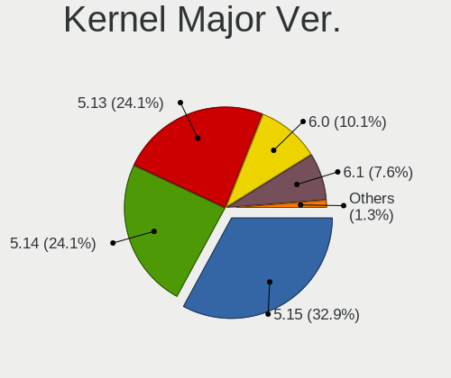

| Version | Computers | Percent |
|---------|-----------|---------|
| 5.14    | 18        | 52.94%  |
| 5.13    | 16        | 47.06%  |

Arch
----

OS architecture (x86_64, i586, etc.)

| Name   | Computers | Percent |
|--------|-----------|---------|
| x86_64 | 34        | 100%    |

DE
--

Desktop Environment

| Name    | Computers | Percent |
|---------|-----------|---------|
| Budgie  | 22        | 64.71%  |
| KDE     | 3         | 8.82%   |
| GNOME   | 3         | 8.82%   |
| Unknown | 3         | 8.82%   |
| MATE    | 2         | 5.88%   |
| KDE5    | 1         | 2.94%   |

Display Server
--------------

X11 or Wayland

| Name | Computers | Percent |
|------|-----------|---------|
| X11  | 34        | 100%    |

Display Manager
---------------

SDDM, LightDM, etc.

| Name    | Computers | Percent |
|---------|-----------|---------|
| Unknown | 26        | 76.47%  |
| LightDM | 4         | 11.76%  |
| SDDM    | 3         | 8.82%   |
| GDM     | 1         | 2.94%   |

OS Lang
-------

Language

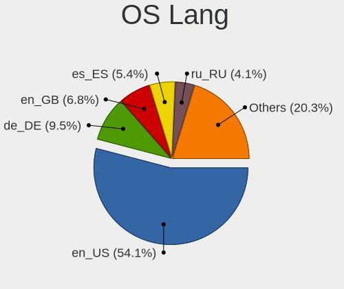

| Lang  | Computers | Percent |
|-------|-----------|---------|
| en_US | 20        | 58.82%  |
| en_GB | 3         | 8.82%   |
| de_DE | 3         | 8.82%   |
| pt_BR | 2         | 5.88%   |
| ru_RU | 1         | 2.94%   |
| fr_FR | 1         | 2.94%   |
| es_VE | 1         | 2.94%   |
| es_ES | 1         | 2.94%   |
| en_IN | 1         | 2.94%   |
| ar_EG | 1         | 2.94%   |

Boot Mode
---------

EFI or BIOS

| Mode | Computers | Percent |
|------|-----------|---------|
| EFI  | 19        | 55.88%  |
| BIOS | 15        | 44.12%  |

Filesystem
----------

Type of filesystem

| Type  | Computers | Percent |
|-------|-----------|---------|
| Ext4  | 32        | 94.12%  |
| Xfs   | 1         | 2.94%   |
| Btrfs | 1         | 2.94%   |

Part. scheme
------------

Scheme of partitioning

| Type    | Computers | Percent |
|---------|-----------|---------|
| Unknown | 27        | 79.41%  |
| GPT     | 4         | 11.76%  |
| MBR     | 3         | 8.82%   |

Dual Boot with Linux/BSD
------------------------

Hosting more than one Linux/BSD

| Dual boot | Computers | Percent |
|-----------|-----------|---------|
| No        | 31        | 91.18%  |
| Yes       | 3         | 8.82%   |

Dual Boot (Win)
---------------

Hosting Linux and Windows

| Dual boot | Computers | Percent |
|-----------|-----------|---------|
| No        | 27        | 79.41%  |
| Yes       | 7         | 20.59%  |

Board
-----

Vendor
------

Motherboard manufacturer

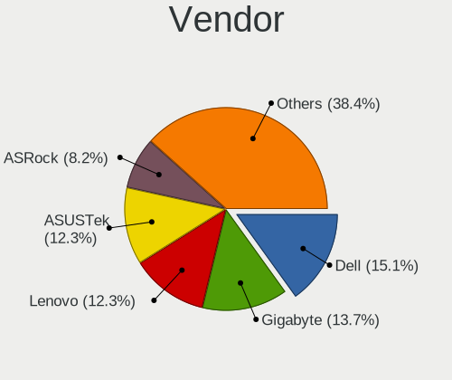

| Name                | Computers | Percent |
|---------------------|-----------|---------|
| Dell                | 6         | 17.65%  |
| Gigabyte Technology | 5         | 14.71%  |
| ASUSTek Computer    | 4         | 11.76%  |
| Acer                | 3         | 8.82%   |
| MSI                 | 2         | 5.88%   |
| Lenovo              | 2         | 5.88%   |
| Hewlett-Packard     | 2         | 5.88%   |
| Toshiba             | 1         | 2.94%   |
| Sony                | 1         | 2.94%   |
| MEGA                | 1         | 2.94%   |
| Google              | 1         | 2.94%   |
| Framework           | 1         | 2.94%   |
| eMachines           | 1         | 2.94%   |
| Biostar             | 1         | 2.94%   |
| AZW                 | 1         | 2.94%   |
| ASRock              | 1         | 2.94%   |
| Apple               | 1         | 2.94%   |

Model
-----

Motherboard model

| Name                                   | Computers | Percent |
|----------------------------------------|-----------|---------|
| Toshiba TECRA R840                     | 1         | 2.94%   |
| Sony VPCYB15AB                         | 1         | 2.94%   |
| MSI MS-7B85                            | 1         | 2.94%   |
| MSI MS-7A34                            | 1         | 2.94%   |
| MEGA G41T-M7 LGT                       | 1         | 2.94%   |
| Lenovo ThinkCentre M71e 3157G6S        | 1         | 2.94%   |
| Lenovo IdeaPad 320-15ISK 80XH          | 1         | 2.94%   |
| HP ProDesk 490 G3 MT Business PC       | 1         | 2.94%   |
| HP OMEN Laptop 15-en0xxx               | 1         | 2.94%   |
| Google Delbin                          | 1         | 2.94%   |
| Gigabyte P31-ES3G                      | 1         | 2.94%   |
| Gigabyte H81M-S2V                      | 1         | 2.94%   |
| Gigabyte H110M-DS2V                    | 1         | 2.94%   |
| Gigabyte GA-78LMT-USB3 6.0             | 1         | 2.94%   |
| Gigabyte B85M-D3H                      | 1         | 2.94%   |
| Framework Laptop                       | 1         | 2.94%   |
| eMachines EL1852G                      | 1         | 2.94%   |
| Dell Vostro 15-3568                    | 1         | 2.94%   |
| Dell OptiPlex 9020                     | 1         | 2.94%   |
| Dell Latitude E6220                    | 1         | 2.94%   |
| Dell Latitude 5580                     | 1         | 2.94%   |
| Dell Inspiron 1525                     | 1         | 2.94%   |
| Dell Inspiron 15-3573                  | 1         | 2.94%   |
| Biostar H61MLV2                        | 1         | 2.94%   |
| AZW SEi                                | 1         | 2.94%   |
| ASUS VivoBook_ASUSLaptop X509DA_M509DA | 1         | 2.94%   |
| ASUS TUF B450-PRO GAMING               | 1         | 2.94%   |
| ASUS ROG STRIX B450-F GAMING           | 1         | 2.94%   |
| ASUS A88X-PRO                          | 1         | 2.94%   |
| ASRock H81 Pro BTC R2.0                | 1         | 2.94%   |
| Apple iMac17,1                         | 1         | 2.94%   |
| Acer Swift SF114-34                    | 1         | 2.94%   |
| Acer Nitro AN515-45                    | 1         | 2.94%   |
| Acer Aspire A315-54                    | 1         | 2.94%   |

Model Family
------------

Motherboard model prefix

| Name                   | Computers | Percent |
|------------------------|-----------|---------|
| Dell Latitude          | 2         | 5.88%   |
| Dell Inspiron          | 2         | 5.88%   |
| Toshiba TECRA          | 1         | 2.94%   |
| Sony VPCYB15AB         | 1         | 2.94%   |
| MSI MS-7B85            | 1         | 2.94%   |
| MSI MS-7A34            | 1         | 2.94%   |
| MEGA G41T-M7           | 1         | 2.94%   |
| Lenovo ThinkCentre     | 1         | 2.94%   |
| Lenovo IdeaPad         | 1         | 2.94%   |
| HP ProDesk             | 1         | 2.94%   |
| HP OMEN                | 1         | 2.94%   |
| Google Delbin          | 1         | 2.94%   |
| Gigabyte P31-ES3G      | 1         | 2.94%   |
| Gigabyte H81M-S2V      | 1         | 2.94%   |
| Gigabyte H110M-DS2V    | 1         | 2.94%   |
| Gigabyte GA-78LMT-USB3 | 1         | 2.94%   |
| Gigabyte B85M-D3H      | 1         | 2.94%   |
| Framework Laptop       | 1         | 2.94%   |
| eMachines EL1852G      | 1         | 2.94%   |
| Dell Vostro            | 1         | 2.94%   |
| Dell OptiPlex          | 1         | 2.94%   |
| Biostar H61MLV2        | 1         | 2.94%   |
| AZW SEi                | 1         | 2.94%   |
| ASUS VivoBook          | 1         | 2.94%   |
| ASUS TUF               | 1         | 2.94%   |
| ASUS ROG               | 1         | 2.94%   |
| ASUS A88X-PRO          | 1         | 2.94%   |
| ASRock H81             | 1         | 2.94%   |
| Apple iMac17           | 1         | 2.94%   |
| Acer Swift             | 1         | 2.94%   |
| Acer Nitro             | 1         | 2.94%   |
| Acer Aspire            | 1         | 2.94%   |

MFG Year
--------

Motherboard manufacture year

| Year | Computers | Percent |
|------|-----------|---------|
| 2019 | 4         | 11.76%  |
| 2018 | 4         | 11.76%  |
| 2014 | 4         | 11.76%  |
| 2011 | 4         | 11.76%  |
| 2021 | 3         | 8.82%   |
| 2020 | 3         | 8.82%   |
| 2017 | 3         | 8.82%   |
| 2016 | 2         | 5.88%   |
| 2012 | 2         | 5.88%   |
| 2008 | 2         | 5.88%   |
| 2015 | 1         | 2.94%   |
| 2013 | 1         | 2.94%   |
| 2010 | 1         | 2.94%   |

Form Factor
-----------

Physical design of the computer

| Name       | Computers | Percent |
|------------|-----------|---------|
| Desktop    | 17        | 50%     |
| Notebook   | 16        | 47.06%  |
| All in one | 1         | 2.94%   |

Secure Boot
-----------

Enabled or disabled

| State    | Computers | Percent |
|----------|-----------|---------|
| Disabled | 34        | 100%    |

Coreboot
--------

Have coreboot on board

| Used | Computers | Percent |
|------|-----------|---------|
| No   | 33        | 97.06%  |
| Yes  | 1         | 2.94%   |

RAM Size
--------

Total RAM memory

| Size in GB | Computers | Percent |
|------------|-----------|---------|
| 4.01-8.0   | 7         | 20.59%  |
| 8.01-16.0  | 7         | 20.59%  |
| 3.01-4.0   | 6         | 17.65%  |
| 16.01-24.0 | 6         | 17.65%  |
| 32.01-64.0 | 4         | 11.76%  |
| 2.01-3.0   | 2         | 5.88%   |
| 24.01-32.0 | 1         | 2.94%   |
| 1.01-2.0   | 1         | 2.94%   |

RAM Used
--------

Used RAM memory

| Used GB   | Computers | Percent |
|-----------|-----------|---------|
| 1.01-2.0  | 11        | 32.35%  |
| 2.01-3.0  | 10        | 29.41%  |
| 4.01-8.0  | 6         | 17.65%  |
| 3.01-4.0  | 4         | 11.76%  |
| 0.51-1.0  | 2         | 5.88%   |
| 8.01-16.0 | 1         | 2.94%   |

Total Drives
------------

Number of drives on board

| Drives | Computers | Percent |
|--------|-----------|---------|
| 1      | 18        | 52.94%  |
| 2      | 11        | 32.35%  |
| 4      | 3         | 8.82%   |
| 3      | 2         | 5.88%   |

Has CD-ROM
----------

Has CD-ROM on board

| Presented | Computers | Percent |
|-----------|-----------|---------|
| No        | 20        | 58.82%  |
| Yes       | 14        | 41.18%  |

Has Ethernet
------------

Has Ethernet on board

| Presented | Computers | Percent |
|-----------|-----------|---------|
| Yes       | 30        | 88.24%  |
| No        | 4         | 11.76%  |

Has WiFi
--------

Has WiFi module

| Presented | Computers | Percent |
|-----------|-----------|---------|
| Yes       | 22        | 64.71%  |
| No        | 12        | 35.29%  |

Has Bluetooth
-------------

Has Bluetooth module

| Presented | Computers | Percent |
|-----------|-----------|---------|
| Yes       | 20        | 58.82%  |
| No        | 14        | 41.18%  |

Location
--------

Country
-------

Geographic location (country)

| Country      | Computers | Percent |
|--------------|-----------|---------|
| USA          | 10        | 29.41%  |
| Netherlands  | 3         | 8.82%   |
| India        | 3         | 8.82%   |
| Brazil       | 3         | 8.82%   |
| Germany      | 2         | 5.88%   |
| Vietnam      | 1         | 2.94%   |
| Venezuela    | 1         | 2.94%   |
| UK           | 1         | 2.94%   |
| Thailand     | 1         | 2.94%   |
| Spain        | 1         | 2.94%   |
| Saudi Arabia | 1         | 2.94%   |
| Poland       | 1         | 2.94%   |
| Nepal        | 1         | 2.94%   |
| Kazakhstan   | 1         | 2.94%   |
| Iran         | 1         | 2.94%   |
| Greece       | 1         | 2.94%   |
| France       | 1         | 2.94%   |
| Belgium      | 1         | 2.94%   |

City
----

Geographic location (city)

| City            | Computers | Percent |
|-----------------|-----------|---------|
| Zoutleeuw       | 1         | 2.94%   |
| Vineland        | 1         | 2.94%   |
| Thessaloniki    | 1         | 2.94%   |
| Seville         | 1         | 2.94%   |
| Severna Park    | 1         | 2.94%   |
| Sadao           | 1         | 2.94%   |
| Red Oak         | 1         | 2.94%   |
| Portsmouth      | 1         | 2.94%   |
| Phoenix         | 1         | 2.94%   |
| Nieporęt    | 1         | 2.94%   |
| Navelim         | 1         | 2.94%   |
| Naaldwijk       | 1         | 2.94%   |
| Milwaukee       | 1         | 2.94%   |
| Miami           | 1         | 2.94%   |
| Loerrach        | 1         | 2.94%   |
| Kostanay        | 1         | 2.94%   |
| Kolkata         | 1         | 2.94%   |
| Kathmandu       | 1         | 2.94%   |
| Huntington Park | 1         | 2.94%   |
| Hanoi           | 1         | 2.94%   |
| Groningen       | 1         | 2.94%   |
| Goiânia      | 1         | 2.94%   |
| Duisburg        | 1         | 2.94%   |
| Dammam          | 1         | 2.94%   |
| Dagenham        | 1         | 2.94%   |
| Curitiba        | 1         | 2.94%   |
| Columbia        | 1         | 2.94%   |
| Coimbatore      | 1         | 2.94%   |
| Caracas         | 1         | 2.94%   |
| Caen            | 1         | 2.94%   |
| Belo Horizonte  | 1         | 2.94%   |
| Arak            | 1         | 2.94%   |
| Anacortes       | 1         | 2.94%   |
| Alblasserdam    | 1         | 2.94%   |

Drives
------

Drive Vendor
------------

Hard drive vendors

| Vendor              | Computers | Drives | Percent |
|---------------------|-----------|--------|---------|
| WDC                 | 11        | 15     | 21.15%  |
| Samsung Electronics | 11        | 14     | 21.15%  |
| Toshiba             | 5         | 5      | 9.62%   |
| SanDisk             | 5         | 6      | 9.62%   |
| Seagate             | 4         | 4      | 7.69%   |
| SK Hynix            | 3         | 3      | 5.77%   |
| Kingston            | 3         | 3      | 5.77%   |
| Unknown             | 2         | 2      | 3.85%   |
| PNY                 | 2         | 2      | 3.85%   |
| Silicon Motion      | 1         | 1      | 1.92%   |
| Phison              | 1         | 1      | 1.92%   |
| Intel               | 1         | 1      | 1.92%   |
| Hitachi             | 1         | 1      | 1.92%   |
| Apple               | 1         | 1      | 1.92%   |
| Advantech           | 1         | 1      | 1.92%   |

Drive Model
-----------

Hard drive models

| Model                                  | Computers | Percent |
|----------------------------------------|-----------|---------|
| Samsung NVMe SSD Drive 500GB           | 3         | 5.08%   |
| WDC WD10EZEX-08WN4A0 1TB               | 2         | 3.39%   |
| Toshiba DT01ACA050 500GB               | 2         | 3.39%   |
| Sandisk NVMe SSD Drive 256GB           | 2         | 3.39%   |
| Samsung SSD 850 EVO 250GB              | 2         | 3.39%   |
| WDC WD5000AVCS-632DY1 500GB            | 1         | 1.69%   |
| WDC WD5000AAKX-003CA0 500GB            | 1         | 1.69%   |
| WDC WD40EZRZ-00GXCB0 4TB               | 1         | 1.69%   |
| WDC WD3200BEVT-75ZCT2 320GB            | 1         | 1.69%   |
| WDC WD32 00AAJS-00L7A0 320GB           | 1         | 1.69%   |
| WDC WD3000GLFS-01F8U0 304GB            | 1         | 1.69%   |
| WDC WD2003FZEX-00Z4SA0 2TB             | 1         | 1.69%   |
| WDC WD2003FZEX-00SRLA0 2TB             | 1         | 1.69%   |
| WDC WD10SPZX-24Z10T0 1TB               | 1         | 1.69%   |
| WDC WD10EZRX-00L4HB0 1TB               | 1         | 1.69%   |
| WDC WD10EZEX-08M2NA0 1TB               | 1         | 1.69%   |
| WDC WD10EADS-00M2B0 1TB                | 1         | 1.69%   |
| WDC WD1003FBYX-01Y7B0 1TB              | 1         | 1.69%   |
| Unknown USB DISK 3.2 500GB             | 1         | 1.69%   |
| Unknown MMC Card  128GB                | 1         | 1.69%   |
| Toshiba XS700 240GB                    | 1         | 1.69%   |
| Toshiba MQ01ABF050 500GB               | 1         | 1.69%   |
| Toshiba DT01ACA100 1TB                 | 1         | 1.69%   |
| SK Hynix NVMe SSD Drive 500GB          | 1         | 1.69%   |
| SK Hynix NVMe SSD Drive 256GB          | 1         | 1.69%   |
| SK Hynix NVMe SSD Drive 128GB          | 1         | 1.69%   |
| Silicon Motion NVMe SSD Drive 512GB    | 1         | 1.69%   |
| Seagate ST500DM002-1BD142 500GB        | 1         | 1.69%   |
| Seagate ST2000DM005-2CW102 2TB         | 1         | 1.69%   |
| Seagate ST1000LM049-2GH172 1TB         | 1         | 1.69%   |
| Seagate ST1000LM035-1RK172 1TB         | 1         | 1.69%   |
| SanDisk SDSSDP064G 64GB                | 1         | 1.69%   |
| Sandisk NVMe SSD Drive 1TB             | 1         | 1.69%   |
| SanDisk Extreme SSD 2TB                | 1         | 1.69%   |
| SanDisk Extreme Pro 1TB                | 1         | 1.69%   |
| Samsung SSD 860 EVO 500GB              | 1         | 1.69%   |
| Samsung SSD 860 EVO 1TB                | 1         | 1.69%   |
| Samsung SSD 850 EVO 120GB              | 1         | 1.69%   |
| Samsung SSD 840 PRO Series 256GB       | 1         | 1.69%   |
| Samsung SSD 840 EVO 120GB              | 1         | 1.69%   |
| Samsung NVMe SSD Drive 512GB           | 1         | 1.69%   |
| Samsung MZ7LN128HCHP-000H1 128GB SSD   | 1         | 1.69%   |
| Samsung HD502HI 500GB                  | 1         | 1.69%   |
| PNY CS900 240GB SSD                    | 1         | 1.69%   |
| PNY CS1311 120GB SSD                   | 1         | 1.69%   |
| Phison NVMe SSD Drive 256GB            | 1         | 1.69%   |
| Kingston SHSS37A240G 240GB SSD         | 1         | 1.69%   |
| Kingston SA400S37240G 240GB SSD        | 1         | 1.69%   |
| Kingston NVMe SSD Drive 500GB          | 1         | 1.69%   |
| Intel NVMe SSD Drive 512GB             | 1         | 1.69%   |
| Hitachi HTS545032B9A300 320GB          | 1         | 1.69%   |
| Apple SSD SM1024G 1TB                  | 1         | 1.69%   |
| Advantech SQF-S25M8-128G-AAG 128GB SSD | 1         | 1.69%   |

HDD Vendor
----------

Hard disk drive vendors

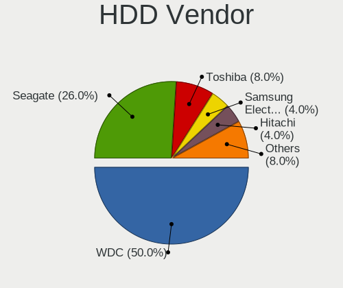

| Vendor              | Computers | Drives | Percent |
|---------------------|-----------|--------|---------|
| WDC                 | 11        | 15     | 52.38%  |
| Toshiba             | 4         | 4      | 19.05%  |
| Seagate             | 4         | 4      | 19.05%  |
| Samsung Electronics | 1         | 1      | 4.76%   |
| Hitachi             | 1         | 1      | 4.76%   |

SSD Vendor
----------

Solid state drive vendors

| Vendor              | Computers | Drives | Percent |
|---------------------|-----------|--------|---------|
| Samsung Electronics | 8         | 9      | 50%     |
| SanDisk             | 2         | 2      | 12.5%   |
| PNY                 | 2         | 2      | 12.5%   |
| Kingston            | 2         | 2      | 12.5%   |
| Apple               | 1         | 1      | 6.25%   |
| Advantech           | 1         | 1      | 6.25%   |

Drive Kind
----------

HDD or SSD

| Kind    | Computers | Drives | Percent |
|---------|-----------|--------|---------|
| HDD     | 19        | 25     | 39.58%  |
| NVMe    | 13        | 15     | 27.08%  |
| SSD     | 13        | 17     | 27.08%  |
| Unknown | 2         | 2      | 4.17%   |
| MMC     | 1         | 1      | 2.08%   |

Drive Connector
---------------

SATA, SAS, NVMe, etc.

| Type | Computers | Drives | Percent |
|------|-----------|--------|---------|
| SATA | 27        | 40     | 61.36%  |
| NVMe | 13        | 15     | 29.55%  |
| SAS  | 3         | 4      | 6.82%   |
| MMC  | 1         | 1      | 2.27%   |

Drive Size
----------

Size of hard drive

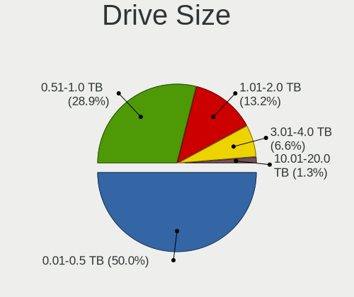

| Size in TB | Computers | Drives | Percent |
|------------|-----------|--------|---------|
| 0.01-0.5   | 19        | 24     | 54.29%  |
| 0.51-1.0   | 11        | 13     | 31.43%  |
| 1.01-2.0   | 4         | 4      | 11.43%  |
| 3.01-4.0   | 1         | 1      | 2.86%   |

Space Total
-----------

Amount of disk space available on the file system

| Size in GB     | Computers | Percent |
|----------------|-----------|---------|
| 251-500        | 10        | 29.41%  |
| 101-250        | 10        | 29.41%  |
| 501-1000       | 4         | 11.76%  |
| More than 3000 | 3         | 8.82%   |
| 1001-2000      | 3         | 8.82%   |
| 21-50          | 2         | 5.88%   |
| 51-100         | 2         | 5.88%   |

Space Used
----------

Amount of used disk space

| Used GB        | Computers | Percent |
|----------------|-----------|---------|
| 1-20           | 14        | 41.18%  |
| 21-50          | 5         | 14.71%  |
| 101-250        | 4         | 11.76%  |
| 251-500        | 3         | 8.82%   |
| 501-1000       | 3         | 8.82%   |
| 1001-2000      | 2         | 5.88%   |
| 51-100         | 2         | 5.88%   |
| More than 3000 | 1         | 2.94%   |

Malfunc. Drives
---------------

Drive models with a malfunction

Zero info for selected period =(

Malfunc. Drive Vendor
---------------------

Vendors of faulty drives

Zero info for selected period =(

Malfunc. HDD Vendor
-------------------

Vendors of faulty HDD drives

Zero info for selected period =(

Malfunc. Drive Kind
-------------------

Kinds of faulty drives

Zero info for selected period =(

Failed Drives
-------------

Failed drive models

Zero info for selected period =(

Failed Drive Vendor
-------------------

Failed drive vendors

Zero info for selected period =(

Drive Status
------------

Number of failed and malfunc. drives

| Status   | Computers | Drives | Percent |
|----------|-----------|--------|---------|
| Detected | 29        | 50     | 78.38%  |
| Works    | 8         | 10     | 21.62%  |

Storage controller
------------------

Storage Vendor
--------------

Storage controller vendors

| Vendor                      | Computers | Percent |
|-----------------------------|-----------|---------|
| Intel                       | 22        | 48.89%  |
| AMD                         | 10        | 22.22%  |
| Samsung Electronics         | 4         | 8.89%   |
| SK Hynix                    | 3         | 6.67%   |
| Sandisk                     | 3         | 6.67%   |
| Silicon Motion              | 1         | 2.22%   |
| Phison Electronics          | 1         | 2.22%   |
| Kingston Technology Company | 1         | 2.22%   |

Storage Model
-------------

Storage controller models

| Model                                                                          | Computers | Percent |
|--------------------------------------------------------------------------------|-----------|---------|
| AMD FCH SATA Controller [AHCI mode]                                            | 6         | 11.76%  |
| Intel Q170/Q150/B150/H170/H110/Z170/CM236 Chipset SATA Controller [AHCI Mode]  | 4         | 7.84%   |
| Intel 8 Series/C220 Series Chipset Family 6-port SATA Controller 1 [AHCI mode] | 4         | 7.84%   |
| Samsung NVMe SSD Controller SM981/PM981/PM983                                  | 3         | 5.88%   |
| Intel NM10/ICH7 Family SATA Controller [IDE mode]                              | 3         | 5.88%   |
| AMD 400 Series Chipset SATA Controller                                         | 3         | 5.88%   |
| Intel 82801G (ICH7 Family) IDE Controller                                      | 2         | 3.92%   |
| Intel 6 Series/C200 Series Chipset Family 6 port Mobile SATA AHCI Controller   | 2         | 3.92%   |
| Intel 6 Series/C200 Series Chipset Family 6 port Desktop SATA AHCI Controller  | 2         | 3.92%   |
| AMD SB7x0/SB8x0/SB9x0 SATA Controller [AHCI mode]                              | 2         | 3.92%   |
| SK Hynix PC300 NVMe Solid State Drive 256GB                                    | 1         | 1.96%   |
| SK Hynix Gold P31 SSD                                                          | 1         | 1.96%   |
| SK Hynix BC501 NVMe Solid State Drive                                          | 1         | 1.96%   |
| Silicon Motion SM2263EN/SM2263XT SSD Controller                                | 1         | 1.96%   |
| Sandisk WD Blue SN550 NVMe SSD                                                 | 1         | 1.96%   |
| Sandisk WD Blue SN500 / PC SN520 NVMe SSD                                      | 1         | 1.96%   |
| Sandisk WD Black 2018/SN750 / PC SN720 NVMe SSD                                | 1         | 1.96%   |
| Samsung Electronics SATA controller                                            | 1         | 1.96%   |
| Phison E12 NVMe Controller                                                     | 1         | 1.96%   |
| Kingston Company KC2000 NVMe SSD                                               | 1         | 1.96%   |
| Intel Sunrise Point-LP SATA Controller [AHCI mode]                             | 1         | 1.96%   |
| Intel SSD 660P Series                                                          | 1         | 1.96%   |
| Intel Comet Lake SATA AHCI Controller                                          | 1         | 1.96%   |
| Intel Celeron/Pentium Silver Processor SATA Controller                         | 1         | 1.96%   |
| Intel Cannon Point-LP SATA Controller [AHCI Mode]                              | 1         | 1.96%   |
| Intel 82801HM/HEM (ICH8M/ICH8M-E) SATA Controller [AHCI mode]                  | 1         | 1.96%   |
| Intel 82801HM/HEM (ICH8M/ICH8M-E) IDE Controller                               | 1         | 1.96%   |
| Intel 82801 Mobile SATA Controller [RAID mode]                                 | 1         | 1.96%   |
| AMD SB7x0/SB8x0/SB9x0 IDE Controller                                           | 1         | 1.96%   |
| AMD 300 Series Chipset SATA Controller                                         | 1         | 1.96%   |

Storage Kind
------------

Kind of storage controller (IDE, SATA, NVMe, SAS, ...)

| Kind | Computers | Percent |
|------|-----------|---------|
| SATA | 27        | 60%     |
| NVMe | 12        | 26.67%  |
| IDE  | 5         | 11.11%  |
| RAID | 1         | 2.22%   |

Processor
---------

CPU Vendor
----------

Processor vendors

| Vendor | Computers | Percent |
|--------|-----------|---------|
| Intel  | 24        | 70.59%  |
| AMD    | 10        | 29.41%  |

CPU Model
---------

Processor models

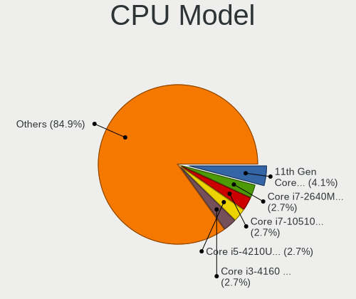

| Model                                           | Computers | Percent |
|-------------------------------------------------|-----------|---------|
| Intel Core i7-2640M CPU @ 2.80GHz               | 2         | 5.88%   |
| Intel Core i3-4160 CPU @ 3.60GHz                | 2         | 5.88%   |
| Intel Pentium Silver N6000 @ 1.10GHz            | 1         | 2.94%   |
| Intel Pentium Dual-Core CPU E6600 @ 3.06GHz     | 1         | 2.94%   |
| Intel Core i7-7820HQ CPU @ 2.90GHz              | 1         | 2.94%   |
| Intel Core i7-6700K CPU @ 4.00GHz               | 1         | 2.94%   |
| Intel Core i7-4770 CPU @ 3.40GHz                | 1         | 2.94%   |
| Intel Core i5-8259U CPU @ 2.30GHz               | 1         | 2.94%   |
| Intel Core i5-7200U CPU @ 2.50GHz               | 1         | 2.94%   |
| Intel Core i5-6500 CPU @ 3.20GHz                | 1         | 2.94%   |
| Intel Core i5-4690 CPU @ 3.50GHz                | 1         | 2.94%   |
| Intel Core i5-10210U CPU @ 1.60GHz              | 1         | 2.94%   |
| Intel Core i3-6006U CPU @ 2.00GHz               | 1         | 2.94%   |
| Intel Core i3-3210 CPU @ 3.20GHz                | 1         | 2.94%   |
| Intel Core i3-2100 CPU @ 3.10GHz                | 1         | 2.94%   |
| Intel Core 2 Quad CPU Q9550 @ 2.83GHz           | 1         | 2.94%   |
| Intel Celeron N4000 CPU @ 1.10GHz               | 1         | 2.94%   |
| Intel Celeron CPU G3930 @ 2.90GHz               | 1         | 2.94%   |
| Intel Celeron CPU E3400 @ 2.60GHz               | 1         | 2.94%   |
| Intel Celeron CPU 540 @ 1.86GHz                 | 1         | 2.94%   |
| Intel 11th Gen Core i7-1165G7 @ 2.80GHz         | 1         | 2.94%   |
| Intel 11th Gen Core i3-1115G4 @ 3.00GHz         | 1         | 2.94%   |
| AMD Ryzen 7 4800H with Radeon Graphics          | 1         | 2.94%   |
| AMD Ryzen 7 3800X 8-Core Processor              | 1         | 2.94%   |
| AMD Ryzen 7 3700X 8-Core Processor              | 1         | 2.94%   |
| AMD Ryzen 7 3700U with Radeon Vega Mobile Gfx   | 1         | 2.94%   |
| AMD Ryzen 7 2700X Eight-Core Processor          | 1         | 2.94%   |
| AMD Ryzen 5 5600H with Radeon Graphics          | 1         | 2.94%   |
| AMD Ryzen 5 2600X Six-Core Processor            | 1         | 2.94%   |
| AMD FX-6300 Six-Core Processor                  | 1         | 2.94%   |
| AMD E-350 Processor                             | 1         | 2.94%   |
| AMD A10-7890K Radeon R7, 12 Compute Cores 4C+8G | 1         | 2.94%   |

CPU Model Family
----------------

Processor model prefix

| Model                   | Computers | Percent |
|-------------------------|-----------|---------|
| Intel Core i7           | 5         | 14.71%  |
| Intel Core i5           | 5         | 14.71%  |
| Intel Core i3           | 5         | 14.71%  |
| AMD Ryzen 7             | 5         | 14.71%  |
| Intel Celeron           | 4         | 11.76%  |
| Other                   | 2         | 5.88%   |
| AMD Ryzen 5             | 2         | 5.88%   |
| Intel Pentium Silver    | 1         | 2.94%   |
| Intel Pentium Dual-Core | 1         | 2.94%   |
| Intel Core 2 Quad       | 1         | 2.94%   |
| AMD FX                  | 1         | 2.94%   |
| AMD E                   | 1         | 2.94%   |
| AMD A10                 | 1         | 2.94%   |

CPU Cores
---------

Number of processor cores

| Number | Computers | Percent |
|--------|-----------|---------|
| 2      | 15        | 44.12%  |
| 4      | 11        | 32.35%  |
| 8      | 4         | 11.76%  |
| 6      | 2         | 5.88%   |
| 3      | 1         | 2.94%   |
| 1      | 1         | 2.94%   |

CPU Sockets
-----------

Number of sockets

| Number | Computers | Percent |
|--------|-----------|---------|
| 1      | 34        | 100%    |

CPU Threads
-----------

Threads per core (Hyper-Threading)

| Number | Computers | Percent |
|--------|-----------|---------|
| 2      | 24        | 70.59%  |
| 1      | 10        | 29.41%  |

CPU Op-Modes
------------

CPU Operation Modes (32-bit, 64-bit)

| Op mode        | Computers | Percent |
|----------------|-----------|---------|
| 32-bit, 64-bit | 34        | 100%    |

CPU Microcode
-------------

Microcode number

| Number     | Computers | Percent |
|------------|-----------|---------|
| 0x306c3    | 4         | 11.76%  |
| 0x206a7    | 3         | 8.82%   |
| 0x1067a    | 3         | 8.82%   |
| 0x906e9    | 2         | 5.88%   |
| 0x806c1    | 2         | 5.88%   |
| 0x08701021 | 2         | 5.88%   |
| 0x0800820d | 2         | 5.88%   |
| Unknown    | 2         | 5.88%   |
| 0x906c0    | 1         | 2.94%   |
| 0x806ec    | 1         | 2.94%   |
| 0x806ea    | 1         | 2.94%   |
| 0x706a1    | 1         | 2.94%   |
| 0x506e3    | 1         | 2.94%   |
| 0x406e3    | 1         | 2.94%   |
| 0x306a9    | 1         | 2.94%   |
| 0x10661    | 1         | 2.94%   |
| 0x0a50000c | 1         | 2.94%   |
| 0x08600106 | 1         | 2.94%   |
| 0x08108109 | 1         | 2.94%   |
| 0x06003106 | 1         | 2.94%   |
| 0x06000852 | 1         | 2.94%   |
| 0x05000029 | 1         | 2.94%   |

CPU Microarch
-------------

Microarchitecture

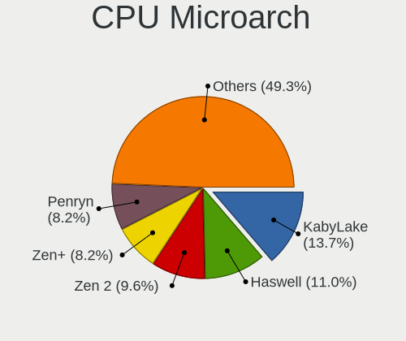

| Name          | Computers | Percent |
|---------------|-----------|---------|
| KabyLake      | 5         | 14.71%  |
| Haswell       | 4         | 11.76%  |
| Zen+          | 3         | 8.82%   |
| Zen 2         | 3         | 8.82%   |
| Skylake       | 3         | 8.82%   |
| SandyBridge   | 3         | 8.82%   |
| Penryn        | 3         | 8.82%   |
| TigerLake     | 2         | 5.88%   |
| Zen 3         | 1         | 2.94%   |
| Tremont       | 1         | 2.94%   |
| Steamroller   | 1         | 2.94%   |
| Piledriver    | 1         | 2.94%   |
| IvyBridge     | 1         | 2.94%   |
| Goldmont plus | 1         | 2.94%   |
| Core          | 1         | 2.94%   |
| Bobcat        | 1         | 2.94%   |

Graphics
--------

GPU Vendor
----------

Vendors of graphics cards

| Vendor | Computers | Percent |
|--------|-----------|---------|
| Intel  | 18        | 42.86%  |
| AMD    | 15        | 35.71%  |
| Nvidia | 9         | 21.43%  |

GPU Model
---------

Graphics card models

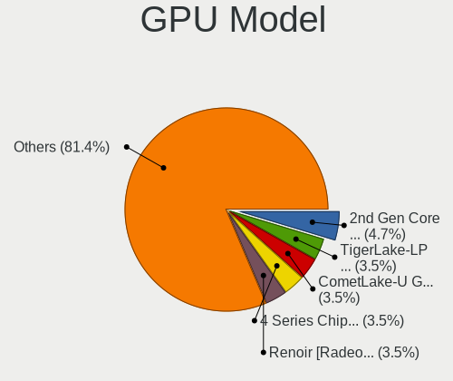

| Model                                                                       | Computers | Percent |
|-----------------------------------------------------------------------------|-----------|---------|
| Intel 4th Generation Core Processor Family Integrated Graphics Controller   | 2         | 4.65%   |
| Intel 4 Series Chipset Integrated Graphics Controller                       | 2         | 4.65%   |
| Intel 2nd Generation Core Processor Family Integrated Graphics Controller   | 2         | 4.65%   |
| Nvidia TU116M [GeForce GTX 1660 Ti Mobile]                                  | 1         | 2.33%   |
| Nvidia GT218 [GeForce 210]                                                  | 1         | 2.33%   |
| Nvidia GT216 [GeForce GT 220]                                               | 1         | 2.33%   |
| Nvidia GP107 [GeForce GTX 1050 Ti]                                          | 1         | 2.33%   |
| Nvidia GM107 [GeForce 940MX]                                                | 1         | 2.33%   |
| Nvidia GK104 [GeForce GTX 770]                                              | 1         | 2.33%   |
| Nvidia GF119 [GeForce 605]                                                  | 1         | 2.33%   |
| Nvidia GF108 [GeForce GT 630]                                               | 1         | 2.33%   |
| Nvidia GA106M [GeForce RTX 3060 Mobile / Max-Q]                             | 1         | 2.33%   |
| Intel Xeon E3-1200 v3/4th Gen Core Processor Integrated Graphics Controller | 1         | 2.33%   |
| Intel TigerLake-LP GT2 [Iris Xe Graphics]                                   | 1         | 2.33%   |
| Intel Tiger Lake UHD Graphics                                               | 1         | 2.33%   |
| Intel Mobile GM965/GL960 Integrated Graphics Controller (secondary)         | 1         | 2.33%   |
| Intel Mobile GM965/GL960 Integrated Graphics Controller (primary)           | 1         | 2.33%   |
| Intel JasperLake [UHD Graphics]                                             | 1         | 2.33%   |
| Intel HD Graphics 630                                                       | 1         | 2.33%   |
| Intel HD Graphics 620                                                       | 1         | 2.33%   |
| Intel HD Graphics 530                                                       | 1         | 2.33%   |
| Intel HD Graphics 520                                                       | 1         | 2.33%   |
| Intel GeminiLake [UHD Graphics 600]                                         | 1         | 2.33%   |
| Intel CometLake-U GT2 [UHD Graphics]                                        | 1         | 2.33%   |
| Intel CoffeeLake-U GT3e [Iris Plus Graphics 655]                            | 1         | 2.33%   |
| AMD Wrestler [Radeon HD 6310]                                               | 1         | 2.33%   |
| AMD Vega 20 [Radeon VII]                                                    | 1         | 2.33%   |
| AMD Tonga PRO [Radeon R9 285/380]                                           | 1         | 2.33%   |
| AMD Sun LE [Radeon HD 8550M / R5 M230]                                      | 1         | 2.33%   |
| AMD Seymour [Radeon HD 6400M/7400M Series]                                  | 1         | 2.33%   |
| AMD Renoir                                                                  | 1         | 2.33%   |
| AMD Picasso/Raven 2 [Radeon Vega Series / Radeon Vega Mobile Series]        | 1         | 2.33%   |
| AMD Oland [Radeon HD 8570 / R5 430 OEM / R7 240/340 / Radeon 520 OEM]       | 1         | 2.33%   |
| AMD Navi 10 [Radeon RX 5600 OEM/5600 XT / 5700/5700 XT]                     | 1         | 2.33%   |
| AMD Lexa PRO [Radeon 540/540X/550/550X / RX 540X/550/550X]                  | 1         | 2.33%   |
| AMD Ellesmere [Radeon RX 470/480/570/570X/580/580X/590]                     | 1         | 2.33%   |
| AMD Curacao XT / Trinidad XT [Radeon R7 370 / R9 270X/370X]                 | 1         | 2.33%   |
| AMD Cezanne                                                                 | 1         | 2.33%   |
| AMD Cedar [Radeon HD 5000/6000/7350/8350 Series]                            | 1         | 2.33%   |
| AMD Amethyst [Radeon R9 M395/ M395X Mac Edition]                            | 1         | 2.33%   |

GPU Combo
---------

Combinations of graphics cards

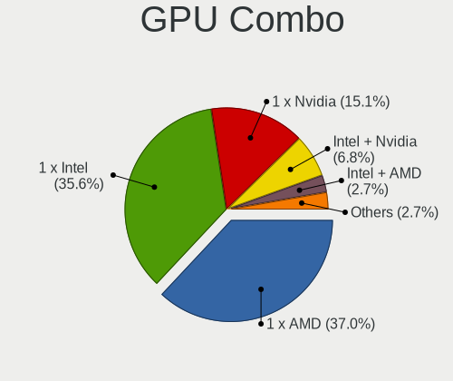

| Name           | Computers | Percent |
|----------------|-----------|---------|
| 1 x Intel      | 12        | 35.29%  |
| 1 x AMD        | 11        | 32.35%  |
| 1 x Nvidia     | 5         | 14.71%  |
| Intel + Nvidia | 2         | 5.88%   |
| Intel + AMD    | 2         | 5.88%   |
| AMD + Nvidia   | 2         | 5.88%   |

GPU Driver
----------

Free vs proprietary

| Driver      | Computers | Percent |
|-------------|-----------|---------|
| Free        | 29        | 85.29%  |
| Proprietary | 5         | 14.71%  |

GPU Memory
----------

Total video memory

| Size in GB | Computers | Percent |
|------------|-----------|---------|
| Unknown    | 14        | 41.18%  |
| 1.01-2.0   | 7         | 20.59%  |
| 0.51-1.0   | 5         | 14.71%  |
| 5.01-6.0   | 2         | 5.88%   |
| 3.01-4.0   | 2         | 5.88%   |
| 0.01-0.5   | 2         | 5.88%   |
| 7.01-8.0   | 1         | 2.94%   |
| 8.01-16.0  | 1         | 2.94%   |

Monitor
-------

Monitor Vendor
--------------

Monitor vendors

| Vendor                  | Computers | Percent |
|-------------------------|-----------|---------|
| Samsung Electronics     | 7         | 17.07%  |
| Chimei Innolux          | 5         | 12.2%   |
| AOC                     | 5         | 12.2%   |
| Goldstar                | 4         | 9.76%   |
| Dell                    | 3         | 7.32%   |
| BOE                     | 3         | 7.32%   |
| LG Display              | 2         | 4.88%   |
| Acer                    | 2         | 4.88%   |
| Toshiba                 | 1         | 2.44%   |
| SHARP                   | 1         | 2.44%   |
| Philips                 | 1         | 2.44%   |
| PANDA                   | 1         | 2.44%   |
| LG Electronics          | 1         | 2.44%   |
| Lenovo                  | 1         | 2.44%   |
| Hewlett-Packard         | 1         | 2.44%   |
| Chi Mei Optoelectronics | 1         | 2.44%   |
| Apple                   | 1         | 2.44%   |
| Ancor Communications    | 1         | 2.44%   |

Monitor Model
-------------

Monitor models

| Model                                                                    | Computers | Percent |
|--------------------------------------------------------------------------|-----------|---------|
| AOC 24B1W AOC2401 1920x1080 521x293mm 23.5-inch                          | 2         | 4.65%   |
| Toshiba Internal LCD TOS5091 1366x768 340x190mm 15.3-inch                | 1         | 2.33%   |
| SHARP LCD Monitor HDMI 1920x1080                                         | 1         | 2.33%   |
| Samsung Electronics SyncMaster SAM05CB 1920x1080 530x300mm 24.0-inch     | 1         | 2.33%   |
| Samsung Electronics SyncMaster SAM01CE 1024x768 304x228mm 15.0-inch      | 1         | 2.33%   |
| Samsung Electronics S22B150 SAM08A3 1920x1080 477x268mm 21.5-inch        | 1         | 2.33%   |
| Samsung Electronics LCD Monitor SM2333TN 1920x1080                       | 1         | 2.33%   |
| Samsung Electronics LCD Monitor SEC5441 1366x768 344x194mm 15.5-inch     | 1         | 2.33%   |
| Samsung Electronics LCD Monitor SEC3358 1280x800 331x207mm 15.4-inch     | 1         | 2.33%   |
| Samsung Electronics C27F591 SAM0D37 1920x1080 598x336mm 27.0-inch        | 1         | 2.33%   |
| Samsung Electronics C27F591 SAM0D36 1920x1080 598x336mm 27.0-inch        | 1         | 2.33%   |
| Philips 273PLPH PHL08A8 1920x1080 598x336mm 27.0-inch                    | 1         | 2.33%   |
| PANDA LCD Monitor NCP0046 1920x1080 344x194mm 15.5-inch                  | 1         | 2.33%   |
| LG Electronics LCD Monitor E2241 1920x1080                               | 1         | 2.33%   |
| LG Display LCD Monitor LGD06FB 1920x1080 309x174mm 14.0-inch             | 1         | 2.33%   |
| LG Display LCD Monitor LGD05FE 1920x1080 344x194mm 15.5-inch             | 1         | 2.33%   |
| Lenovo D22-10 LEN65E4 1920x1080 476x268mm 21.5-inch                      | 1         | 2.33%   |
| Hewlett-Packard 24yh HPN3504 1920x1080 528x297mm 23.9-inch               | 1         | 2.33%   |
| Goldstar W1942 GSM4B70 1440x900 408x255mm 18.9-inch                      | 1         | 2.33%   |
| Goldstar W1642 GSM3E86 1360x768 344x194mm 15.5-inch                      | 1         | 2.33%   |
| Goldstar E2050 GSM4EAE 1600x900 443x249mm 20.0-inch                      | 1         | 2.33%   |
| Goldstar 19EN33 GSM4C18 1366x768 410x230mm 18.5-inch                     | 1         | 2.33%   |
| Dell SE2419HR DELF113 1920x1080 527x296mm 23.8-inch                      | 1         | 2.33%   |
| Dell S3222DGM DELD110 2560x1440 697x392mm 31.5-inch                      | 1         | 2.33%   |
| Dell 1908WFP DELF007 1440x900 408x255mm 18.9-inch                        | 1         | 2.33%   |
| Chimei Innolux LCD Monitor CMN15F5 1920x1080 344x193mm 15.5-inch         | 1         | 2.33%   |
| Chimei Innolux LCD Monitor CMN15E6 1366x768 344x193mm 15.5-inch          | 1         | 2.33%   |
| Chimei Innolux LCD Monitor CMN15DB 1366x768 344x193mm 15.5-inch          | 1         | 2.33%   |
| Chimei Innolux LCD Monitor CMN15C5 1366x768 344x193mm 15.5-inch          | 1         | 2.33%   |
| Chimei Innolux LCD Monitor CMN1521 1920x1080 344x193mm 15.5-inch         | 1         | 2.33%   |
| Chi Mei Optoelectronics LCD Monitor CMO1113 1366x768 256x144mm 11.6-inch | 1         | 2.33%   |
| BOE LCD Monitor BOE095F 2256x1504 285x190mm 13.5-inch                    | 1         | 2.33%   |
| BOE LCD Monitor BOE06CB 1920x1080 344x194mm 15.5-inch                    | 1         | 2.33%   |
| BOE LCD Monitor BOE0675 1366x768 344x194mm 15.5-inch                     | 1         | 2.33%   |
| Apple iMac APPAE05 3840x2160 597x336mm 27.0-inch                         | 1         | 2.33%   |
| AOC Q29G2G5 AOC2902 2560x1080 681x287mm 29.1-inch                        | 1         | 2.33%   |
| AOC 2481W AOC2481 1920x1080 527x296mm 23.8-inch                          | 1         | 2.33%   |
| AOC 2460G5 AOC2460 1920x1080 531x299mm 24.0-inch                         | 1         | 2.33%   |
| AOC 1970W AOC1970 1366x768 410x230mm 18.5-inch                           | 1         | 2.33%   |
| Ancor Communications VX228 ACI22C1 1920x1080 476x268mm 21.5-inch         | 1         | 2.33%   |
| Acer V236HL ACR0350 1920x1080 509x286mm 23.0-inch                        | 1         | 2.33%   |
| Acer K242HYL ACR064A 1920x1080 527x296mm 23.8-inch                       | 1         | 2.33%   |

Monitor Resolution
------------------

Monitor screen resolution

| Resolution         | Computers | Percent |
|--------------------|-----------|---------|
| 1920x1080 (FHD)    | 20        | 48.78%  |
| 1366x768 (WXGA)    | 9         | 21.95%  |
| 2560x1440 (QHD)    | 3         | 7.32%   |
| 3840x2160 (4K)     | 1         | 2.44%   |
| 2560x1080          | 1         | 2.44%   |
| 2256x1504          | 1         | 2.44%   |
| 1680x1050 (WSXGA+) | 1         | 2.44%   |
| 1600x900 (HD+)     | 1         | 2.44%   |
| 1440x900 (WXGA+)   | 1         | 2.44%   |
| 1360x768           | 1         | 2.44%   |
| 1280x800 (WXGA)    | 1         | 2.44%   |
| 1024x768 (XGA)     | 1         | 2.44%   |

Monitor Diagonal
----------------

Diagonal size in inches

| Inches  | Computers | Percent |
|---------|-----------|---------|
| 15      | 13        | 32.5%   |
| 24      | 5         | 12.5%   |
| 27      | 3         | 7.5%    |
| 23      | 3         | 7.5%    |
| 21      | 3         | 7.5%    |
| 18      | 3         | 7.5%    |
| Unknown | 3         | 7.5%    |
| 31      | 1         | 2.5%    |
| 29      | 1         | 2.5%    |
| 22      | 1         | 2.5%    |
| 20      | 1         | 2.5%    |
| 14      | 1         | 2.5%    |
| 13      | 1         | 2.5%    |
| 11      | 1         | 2.5%    |

Monitor Width
-------------

Physical width

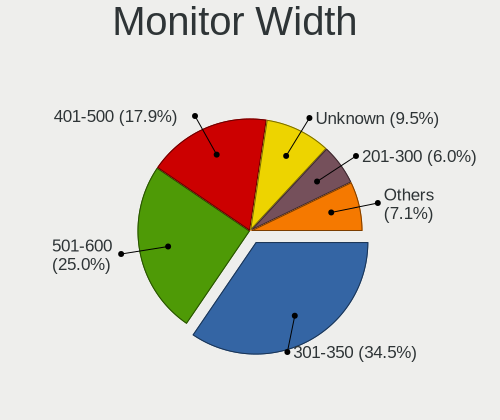

| Width in mm | Computers | Percent |
|-------------|-----------|---------|
| 301-350     | 13        | 32.5%   |
| 501-600     | 11        | 27.5%   |
| 401-500     | 8         | 20%     |
| Unknown     | 3         | 7.5%    |
| 601-700     | 2         | 5%      |
| 201-300     | 2         | 5%      |
| 351-400     | 1         | 2.5%    |

Aspect Ratio
------------

Proportional relationship between the width and the height

| Ratio   | Computers | Percent |
|---------|-----------|---------|
| 16/9    | 27        | 71.05%  |
| 16/10   | 5         | 13.16%  |
| Unknown | 3         | 7.89%   |
| 4/3     | 1         | 2.63%   |
| 3/2     | 1         | 2.63%   |
| 21/9    | 1         | 2.63%   |

Monitor Area
------------

Area in inch²

| Area in inch² | Computers | Percent |
|----------------|-----------|---------|
| 101-110        | 13        | 32.5%   |
| 201-250        | 9         | 22.5%   |
| 301-350        | 4         | 10%     |
| 151-200        | 3         | 7.5%    |
| Unknown        | 3         | 7.5%    |
| 81-90          | 2         | 5%      |
| 251-300        | 2         | 5%      |
| 141-150        | 2         | 5%      |
| 51-60          | 1         | 2.5%    |
| 351-500        | 1         | 2.5%    |

Pixel Density
-------------

Pixels per inch

| Density | Computers | Percent |
|---------|-----------|---------|
| 51-100  | 17        | 45.95%  |
| 101-120 | 8         | 21.62%  |
| 121-160 | 7         | 18.92%  |
| Unknown | 3         | 8.11%   |
| 161-240 | 2         | 5.41%   |

Multiple Monitors
-----------------

Total monitors connected

| Total | Computers | Percent |
|-------|-----------|---------|
| 1     | 26        | 76.47%  |
| 2     | 7         | 20.59%  |
| 3     | 1         | 2.94%   |

Network
-------

Net Controller Vendor
---------------------

Controller vendors

| Vendor                   | Computers | Percent |
|--------------------------|-----------|---------|
| Realtek Semiconductor    | 21        | 42%     |
| Intel                    | 13        | 26%     |
| Qualcomm Atheros         | 4         | 8%      |
| Broadcom                 | 3         | 6%      |
| Xiaomi                   | 1         | 2%      |
| TP-Link                  | 1         | 2%      |
| Ralink Technology        | 1         | 2%      |
| MEDIATEK                 | 1         | 2%      |
| Marvell Technology Group | 1         | 2%      |
| Linksys                  | 1         | 2%      |
| Dell                     | 1         | 2%      |
| D-Link System            | 1         | 2%      |
| Belkin Components        | 1         | 2%      |

Net Controller Model
--------------------

Controller models

| Model                                                                                   | Computers | Percent |
|-----------------------------------------------------------------------------------------|-----------|---------|
| Realtek RTL8111/8168/8411 PCI Express Gigabit Ethernet Controller                       | 18        | 31.03%  |
| Qualcomm Atheros QCA9377 802.11ac Wireless Network Adapter                              | 2         | 3.45%   |
| Intel Wireless 3165                                                                     | 2         | 3.45%   |
| Intel Wi-Fi 6 AX200                                                                     | 2         | 3.45%   |
| Intel I211 Gigabit Network Connection                                                   | 2         | 3.45%   |
| Intel 82579LM Gigabit Network Connection (Lewisville)                                   | 2         | 3.45%   |
| Xiaomi Mi/Redmi series (RNDIS)                                                          | 1         | 1.72%   |
| TP-Link UE300 10/100/1000 LAN (ethernet mode) [Realtek RTL8153]                         | 1         | 1.72%   |
| Realtek RTL88x2bu [AC1200 Techkey]                                                      | 1         | 1.72%   |
| Realtek RTL8821CE 802.11ac PCIe Wireless Network Adapter                                | 1         | 1.72%   |
| Realtek RTL8821AE 802.11ac PCIe Wireless Network Adapter                                | 1         | 1.72%   |
| Realtek RTL8187 Wireless Adapter                                                        | 1         | 1.72%   |
| Realtek Killer E2600 Gigabit Ethernet Controller                                        | 1         | 1.72%   |
| Ralink MT7601U Wireless Adapter                                                         | 1         | 1.72%   |
| Qualcomm Atheros AR9285 Wireless Network Adapter (PCI-Express)                          | 1         | 1.72%   |
| Qualcomm Atheros AR8152 v2.0 Fast Ethernet                                              | 1         | 1.72%   |
| Qualcomm Atheros AR8131 Gigabit Ethernet                                                | 1         | 1.72%   |
| MEDIATEK MT7921 802.11ax PCI Express Wireless Network Adapter                           | 1         | 1.72%   |
| Marvell Group 88E8040 PCI-E Fast Ethernet Controller                                    | 1         | 1.72%   |
| Linksys WUSB6100M 802.11a/b/g/n/ac Wireless Adapter                                     | 1         | 1.72%   |
| Intel Wireless-AC 9260                                                                  | 1         | 1.72%   |
| Intel Wireless 8265 / 8275                                                              | 1         | 1.72%   |
| Intel Wi-Fi 6 AX210/AX211/AX411 160MHz                                                  | 1         | 1.72%   |
| Intel Wi-Fi 6 AX201 160MHz                                                              | 1         | 1.72%   |
| Intel Wi-Fi 6 AX201                                                                     | 1         | 1.72%   |
| Intel Ethernet Connection I217-LM                                                       | 1         | 1.72%   |
| Intel Ethernet Connection (5) I219-LM                                                   | 1         | 1.72%   |
| Intel Centrino Ultimate-N 6300                                                          | 1         | 1.72%   |
| Intel Centrino Advanced-N 6230 [Rainbow Peak]                                           | 1         | 1.72%   |
| Dell DW5550                                                                             | 1         | 1.72%   |
| D-Link System AirPlus G DWL-G122 Wireless Adapter(rev.C1) [Ralink RT2571W]              | 1         | 1.72%   |
| Broadcom NetXtreme BCM57766 Gigabit Ethernet PCIe                                       | 1         | 1.72%   |
| Broadcom BCM43602 802.11ac Wireless LAN SoC                                             | 1         | 1.72%   |
| Broadcom BCM4360 802.11ac Wireless Network Adapter                                      | 1         | 1.72%   |
| Broadcom BCM4311 802.11b/g WLAN                                                         | 1         | 1.72%   |
| Belkin Components F7D2102 802.11n N300 Micro Wireless Adapter v3000 [Realtek RTL8192CU] | 1         | 1.72%   |

Wireless Vendor
---------------

Wireless vendors

| Vendor                | Computers | Percent |
|-----------------------|-----------|---------|
| Intel                 | 11        | 42.31%  |
| Realtek Semiconductor | 4         | 15.38%  |
| Qualcomm Atheros      | 3         | 11.54%  |
| Broadcom              | 3         | 11.54%  |
| Ralink Technology     | 1         | 3.85%   |
| MEDIATEK              | 1         | 3.85%   |
| Linksys               | 1         | 3.85%   |
| D-Link System         | 1         | 3.85%   |
| Belkin Components     | 1         | 3.85%   |

Wireless Model
--------------

Wireless models

| Model                                                                                   | Computers | Percent |
|-----------------------------------------------------------------------------------------|-----------|---------|
| Qualcomm Atheros QCA9377 802.11ac Wireless Network Adapter                              | 2         | 7.69%   |
| Intel Wireless 3165                                                                     | 2         | 7.69%   |
| Intel Wi-Fi 6 AX200                                                                     | 2         | 7.69%   |
| Realtek RTL88x2bu [AC1200 Techkey]                                                      | 1         | 3.85%   |
| Realtek RTL8821CE 802.11ac PCIe Wireless Network Adapter                                | 1         | 3.85%   |
| Realtek RTL8821AE 802.11ac PCIe Wireless Network Adapter                                | 1         | 3.85%   |
| Realtek RTL8187 Wireless Adapter                                                        | 1         | 3.85%   |
| Ralink MT7601U Wireless Adapter                                                         | 1         | 3.85%   |
| Qualcomm Atheros AR9285 Wireless Network Adapter (PCI-Express)                          | 1         | 3.85%   |
| MEDIATEK MT7921 802.11ax PCI Express Wireless Network Adapter                           | 1         | 3.85%   |
| Linksys WUSB6100M 802.11a/b/g/n/ac Wireless Adapter                                     | 1         | 3.85%   |
| Intel Wireless-AC 9260                                                                  | 1         | 3.85%   |
| Intel Wireless 8265 / 8275                                                              | 1         | 3.85%   |
| Intel Wi-Fi 6 AX210/AX211/AX411 160MHz                                                  | 1         | 3.85%   |
| Intel Wi-Fi 6 AX201 160MHz                                                              | 1         | 3.85%   |
| Intel Wi-Fi 6 AX201                                                                     | 1         | 3.85%   |
| Intel Centrino Ultimate-N 6300                                                          | 1         | 3.85%   |
| Intel Centrino Advanced-N 6230 [Rainbow Peak]                                           | 1         | 3.85%   |
| D-Link System AirPlus G DWL-G122 Wireless Adapter(rev.C1) [Ralink RT2571W]              | 1         | 3.85%   |
| Broadcom BCM43602 802.11ac Wireless LAN SoC                                             | 1         | 3.85%   |
| Broadcom BCM4360 802.11ac Wireless Network Adapter                                      | 1         | 3.85%   |
| Broadcom BCM4311 802.11b/g WLAN                                                         | 1         | 3.85%   |
| Belkin Components F7D2102 802.11n N300 Micro Wireless Adapter v3000 [Realtek RTL8192CU] | 1         | 3.85%   |

Ethernet Vendor
---------------

Ethernet vendors

| Vendor                   | Computers | Percent |
|--------------------------|-----------|---------|
| Realtek Semiconductor    | 19        | 61.29%  |
| Intel                    | 6         | 19.35%  |
| Qualcomm Atheros         | 2         | 6.45%   |
| Xiaomi                   | 1         | 3.23%   |
| TP-Link                  | 1         | 3.23%   |
| Marvell Technology Group | 1         | 3.23%   |
| Broadcom                 | 1         | 3.23%   |

Ethernet Model
--------------

Ethernet models

| Model                                                             | Computers | Percent |
|-------------------------------------------------------------------|-----------|---------|
| Realtek RTL8111/8168/8411 PCI Express Gigabit Ethernet Controller | 18        | 58.06%  |
| Intel I211 Gigabit Network Connection                             | 2         | 6.45%   |
| Intel 82579LM Gigabit Network Connection (Lewisville)             | 2         | 6.45%   |
| Xiaomi Mi/Redmi series (RNDIS)                                    | 1         | 3.23%   |
| TP-Link UE300 10/100/1000 LAN (ethernet mode) [Realtek RTL8153]   | 1         | 3.23%   |
| Realtek Killer E2600 Gigabit Ethernet Controller                  | 1         | 3.23%   |
| Qualcomm Atheros AR8152 v2.0 Fast Ethernet                        | 1         | 3.23%   |
| Qualcomm Atheros AR8131 Gigabit Ethernet                          | 1         | 3.23%   |
| Marvell Group 88E8040 PCI-E Fast Ethernet Controller              | 1         | 3.23%   |
| Intel Ethernet Connection I217-LM                                 | 1         | 3.23%   |
| Intel Ethernet Connection (5) I219-LM                             | 1         | 3.23%   |
| Broadcom NetXtreme BCM57766 Gigabit Ethernet PCIe                 | 1         | 3.23%   |

Net Controller Kind
-------------------

Ethernet, WiFi or modem

| Kind     | Computers | Percent |
|----------|-----------|---------|
| Ethernet | 30        | 55.56%  |
| WiFi     | 23        | 42.59%  |
| Modem    | 1         | 1.85%   |

Used Controller
---------------

Currently used network controller

| Kind     | Computers | Percent |
|----------|-----------|---------|
| Ethernet | 27        | 60%     |
| WiFi     | 18        | 40%     |

NICs
----

Total network controllers on board

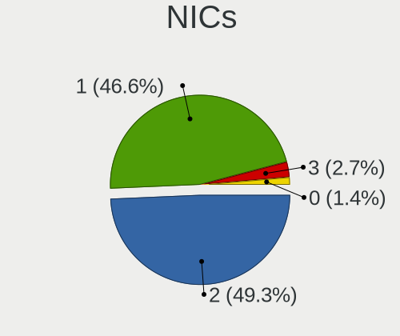

| Total | Computers | Percent |
|-------|-----------|---------|
| 1     | 20        | 58.82%  |
| 2     | 14        | 41.18%  |

IPv6
----

IPv6 vs IPv4

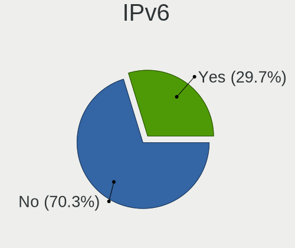

| Used | Computers | Percent |
|------|-----------|---------|
| No   | 21        | 61.76%  |
| Yes  | 13        | 38.24%  |

Bluetooth
---------

Bluetooth Vendor
----------------

Controller vendors

| Vendor                          | Computers | Percent |
|---------------------------------|-----------|---------|
| Intel                           | 9         | 40.91%  |
| Realtek Semiconductor           | 2         | 9.09%   |
| Lite-On Technology              | 2         | 9.09%   |
| Cambridge Silicon Radio         | 2         | 9.09%   |
| Broadcom                        | 2         | 9.09%   |
| Qualcomm Atheros Communications | 1         | 4.55%   |
| IMC Networks                    | 1         | 4.55%   |
| Dell                            | 1         | 4.55%   |
| ASUSTek Computer                | 1         | 4.55%   |
| Apple                           | 1         | 4.55%   |

Bluetooth Model
---------------

Controller models

| Model                                               | Computers | Percent |
|-----------------------------------------------------|-----------|---------|
| Intel Bluetooth wireless interface                  | 2         | 9.09%   |
| Intel Bluetooth Device                              | 2         | 9.09%   |
| Intel AX201 Bluetooth                               | 2         | 9.09%   |
| Intel AX200 Bluetooth                               | 2         | 9.09%   |
| Cambridge Silicon Radio Bluetooth Dongle (HCI mode) | 2         | 9.09%   |
| Realtek RTL8821A Bluetooth                          | 1         | 4.55%   |
| Realtek Bluetooth Radio                             | 1         | 4.55%   |
| Qualcomm Atheros  Bluetooth Device                  | 1         | 4.55%   |
| Lite-On Wireless_Device                             | 1         | 4.55%   |
| Lite-On Bluetooth Device                            | 1         | 4.55%   |
| Intel Wireless-AC 9260 Bluetooth Adapter            | 1         | 4.55%   |
| IMC Networks Bluetooth Radio                        | 1         | 4.55%   |
| Dell DW375 Bluetooth Module                         | 1         | 4.55%   |
| Broadcom BCM92045B3 ROM                             | 1         | 4.55%   |
| Broadcom BCM2045 Bluetooth                          | 1         | 4.55%   |
| ASUS Broadcom BCM20702A0 Bluetooth                  | 1         | 4.55%   |
| Apple Bluetooth USB Host Controller                 | 1         | 4.55%   |

Sound
-----

Sound Vendor
------------

Sound card vendors

| Vendor              | Computers | Percent |
|---------------------|-----------|---------|
| Intel               | 24        | 47.06%  |
| AMD                 | 14        | 27.45%  |
| Nvidia              | 9         | 17.65%  |
| Tenx Technology     | 1         | 1.96%   |
| Samsung Electronics | 1         | 1.96%   |
| Conexant Systems    | 1         | 1.96%   |
| Blue Microphones    | 1         | 1.96%   |

Sound Model
-----------

Sound card models

| Model                                                                             | Computers | Percent |
|-----------------------------------------------------------------------------------|-----------|---------|
| Intel 8 Series/C220 Series Chipset High Definition Audio Controller               | 4         | 6.45%   |
| Intel 6 Series/C200 Series Chipset Family High Definition Audio Controller        | 4         | 6.45%   |
| Intel Xeon E3-1200 v3/4th Gen Core Processor HD Audio Controller                  | 3         | 4.84%   |
| Intel NM10/ICH7 Family High Definition Audio Controller                           | 3         | 4.84%   |
| Intel 100 Series/C230 Series Chipset Family HD Audio Controller                   | 3         | 4.84%   |
| AMD Family 17h/19h HD Audio Controller                                            | 3         | 4.84%   |
| Intel Tiger Lake-LP Smart Sound Technology Audio Controller                       | 2         | 3.23%   |
| Intel Sunrise Point-LP HD Audio                                                   | 2         | 3.23%   |
| AMD Tonga HDMI Audio [Radeon R9 285/380]                                          | 2         | 3.23%   |
| AMD Starship/Matisse HD Audio Controller                                          | 2         | 3.23%   |
| AMD SBx00 Azalia (Intel HDA)                                                      | 2         | 3.23%   |
| AMD Oland/Hainan/Cape Verde/Pitcairn HDMI Audio [Radeon HD 7000 Series]           | 2         | 3.23%   |
| AMD Family 17h (Models 00h-0fh) HD Audio Controller                               | 2         | 3.23%   |
| Tenx Technology USB AUDIO                                                         | 1         | 1.61%   |
| Samsung Electronics USBC Headset                                                  | 1         | 1.61%   |
| Nvidia TU116 High Definition Audio Controller                                     | 1         | 1.61%   |
| Nvidia High Definition Audio Controller                                           | 1         | 1.61%   |
| Nvidia GT216 HDMI Audio Controller                                                | 1         | 1.61%   |
| Nvidia GP107GL High Definition Audio Controller                                   | 1         | 1.61%   |
| Nvidia GM107 High Definition Audio Controller [GeForce 940MX]                     | 1         | 1.61%   |
| Nvidia GK104 HDMI Audio Controller                                                | 1         | 1.61%   |
| Nvidia GF119 HDMI Audio Controller                                                | 1         | 1.61%   |
| Nvidia GF108 High Definition Audio Controller                                     | 1         | 1.61%   |
| Nvidia Audio device                                                               | 1         | 1.61%   |
| Intel Jasper Lake HD Audio                                                        | 1         | 1.61%   |
| Intel Comet Lake PCH-LP cAVS                                                      | 1         | 1.61%   |
| Intel CM238 HD Audio Controller                                                   | 1         | 1.61%   |
| Intel Celeron/Pentium Silver Processor High Definition Audio                      | 1         | 1.61%   |
| Intel Cannon Point-LP High Definition Audio Controller                            | 1         | 1.61%   |
| Intel 82801H (ICH8 Family) HD Audio Controller                                    | 1         | 1.61%   |
| Conexant Systems Hi-Res Audio                                                     | 1         | 1.61%   |
| Blue Microphones Yeti Stereo Microphone                                           | 1         | 1.61%   |
| AMD Wrestler HDMI Audio                                                           | 1         | 1.61%   |
| AMD Vega 20 HDMI Audio [Radeon VII]                                               | 1         | 1.61%   |
| AMD Raven/Raven2/Fenghuang HDMI/DP Audio Controller                               | 1         | 1.61%   |
| AMD Navi 10 HDMI Audio                                                            | 1         | 1.61%   |
| AMD FCH Azalia Controller                                                         | 1         | 1.61%   |
| AMD Ellesmere HDMI Audio [Radeon RX 470/480 / 570/580/590]                        | 1         | 1.61%   |
| AMD Cedar HDMI Audio [Radeon HD 5400/6300/7300 Series]                            | 1         | 1.61%   |
| AMD Caicos HDMI Audio [Radeon HD 6450 / 7450/8450/8490 OEM / R5 230/235/235X OEM] | 1         | 1.61%   |
| AMD Baffin HDMI/DP Audio [Radeon RX 550 640SP / RX 560/560X]                      | 1         | 1.61%   |

Memory
------

Memory Vendor
-------------

Memory module vendors

| Vendor              | Computers | Percent |
|---------------------|-----------|---------|
| Unknown             | 2         | 14.29%  |
| SK Hynix            | 2         | 14.29%  |
| Samsung Electronics | 2         | 14.29%  |
| A-DATA Technology   | 2         | 14.29%  |
| Transcend           | 1         | 7.14%   |
| Team                | 1         | 7.14%   |
| Patriot             | 1         | 7.14%   |
| Micron Technology   | 1         | 7.14%   |
| G.Skill             | 1         | 7.14%   |
| Crucial             | 1         | 7.14%   |

Memory Model
------------

Memory module models

| Model                                                          | Computers | Percent |
|----------------------------------------------------------------|-----------|---------|
| Unknown RAM Module 4GB DIMM DDR3 1600MT/s                      | 1         | 7.14%   |
| Unknown RAM Module 1GB SODIMM DDR                              | 1         | 7.14%   |
| Transcend RAM JM1333KLN-4G 4GB DIMM DDR3 1333MT/s              | 1         | 7.14%   |
| Team RAM TEAMGROUP-SD4-3200 16GB SODIMM DDR4 3200MT/s          | 1         | 7.14%   |
| SK Hynix RAM HMT351S6BFR8C-H9 4GB SODIMM DDR3 1333MT/s         | 1         | 7.14%   |
| SK Hynix RAM HCNNNBKMMLXR-NEE 4GB Row Of Chips LPDDR4 4267MT/s | 1         | 7.14%   |
| Samsung RAM Module 8192MB SODIMM DDR4 2133MT/s                 | 1         | 7.14%   |
| Samsung RAM M471A5244CB0-CRC 4096MB SODIMM DDR4 2667MT/s       | 1         | 7.14%   |
| Patriot RAM 2133 CL11 Series 4GB DIMM DDR3 2400MT/s            | 1         | 7.14%   |
| Micron RAM 8HTF12864HDY-667E1 1GB SODIMM DDR2 667MT/s          | 1         | 7.14%   |
| G.Skill RAM F4-3200C22-16GRS 16GB SODIMM DDR4 3200MT/s         | 1         | 7.14%   |
| Crucial RAM CT51264BA160BJ.M8F 4GB DIMM DDR3 1600MT/s          | 1         | 7.14%   |
| A-DATA RAM Module 8192MB SODIMM DDR4 2133MT/s                  | 1         | 7.14%   |
| A-DATA RAM Module 8192MB DIMM DDR4 2400MT/s                    | 1         | 7.14%   |

Memory Kind
-----------

Memory module kinds

| Kind   | Computers | Percent |
|--------|-----------|---------|
| DDR4   | 5         | 41.67%  |
| DDR3   | 4         | 33.33%  |
| LPDDR4 | 1         | 8.33%   |
| DDR2   | 1         | 8.33%   |
| DDR    | 1         | 8.33%   |

Memory Form Factor
------------------

Physical design of the memory module

| Name         | Computers | Percent |
|--------------|-----------|---------|
| SODIMM       | 6         | 54.55%  |
| DIMM         | 4         | 36.36%  |
| Row Of Chips | 1         | 9.09%   |

Memory Size
-----------

Memory module size

| Size  | Computers | Percent |
|-------|-----------|---------|
| 4096  | 6         | 50%     |
| 8192  | 3         | 25%     |
| 32768 | 1         | 8.33%   |
| 16384 | 1         | 8.33%   |
| 1024  | 1         | 8.33%   |

Memory Speed
------------

Memory module speed

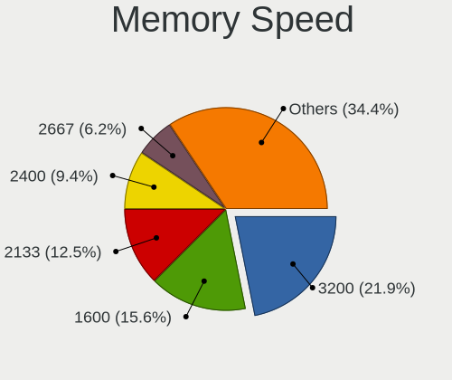

| Speed   | Computers | Percent |
|---------|-----------|---------|
| 3200    | 2         | 15.38%  |
| 2400    | 2         | 15.38%  |
| 1600    | 2         | 15.38%  |
| 1333    | 2         | 15.38%  |
| 4267    | 1         | 7.69%   |
| 2667    | 1         | 7.69%   |
| 2133    | 1         | 7.69%   |
| 667     | 1         | 7.69%   |
| Unknown | 1         | 7.69%   |

Printers & scanners
-------------------

Printer Vendor
--------------

Printer device vendors

Zero info for selected period =(

Printer Model
-------------

Printer device models

Zero info for selected period =(

Scanner Vendor
--------------

Scanner device vendors

Zero info for selected period =(

Scanner Model
-------------

Scanner device models

Zero info for selected period =(

Camera
------

Camera Vendor
-------------

Camera device vendors

| Vendor                                 | Computers | Percent |
|----------------------------------------|-----------|---------|
| Quanta                                 | 4         | 22.22%  |
| Realtek Semiconductor                  | 3         | 16.67%  |
| Logitech                               | 3         | 16.67%  |
| Sunplus Innovation Technology          | 2         | 11.11%  |
| Chicony Electronics                    | 2         | 11.11%  |
| IMC Networks                           | 1         | 5.56%   |
| Hewlett-Packard                        | 1         | 5.56%   |
| Cheng Uei Precision Industry (Foxlink) | 1         | 5.56%   |
| Apple                                  | 1         | 5.56%   |

Camera Model
------------

Camera device models

| Model                                                           | Computers | Percent |
|-----------------------------------------------------------------|-----------|---------|
| Quanta HD User Facing                                           | 2         | 11.11%  |
| Logitech Webcam C270                                            | 2         | 11.11%  |
| Sunplus Laptop_Integrated_Webcam_HD                             | 1         | 5.56%   |
| Sunplus Integrated_Webcam_HD                                    | 1         | 5.56%   |
| Realtek Laptop Camera                                           | 1         | 5.56%   |
| Realtek Integrated Webcam_HD                                    | 1         | 5.56%   |
| Realtek Integrated Webcam                                       | 1         | 5.56%   |
| Quanta VGA WebCam                                               | 1         | 5.56%   |
| Quanta USB2.0 HD UVC WebCam                                     | 1         | 5.56%   |
| Logitech C922 Pro Stream Webcam                                 | 1         | 5.56%   |
| IMC Networks USB2.0 VGA UVC WebCam                              | 1         | 5.56%   |
| HP Webcam HD 2300                                               | 1         | 5.56%   |
| Chicony Sony Visual Communication Camera                        | 1         | 5.56%   |
| Chicony EasyCamera                                              | 1         | 5.56%   |
| Cheng Uei Precision Industry (Foxlink) HP Wide Vision HD Camera | 1         | 5.56%   |
| Apple FaceTime HD Camera (Built-in)                             | 1         | 5.56%   |

Security
--------

Fingerprint Vendor
------------------

Fingerprint sensor vendors

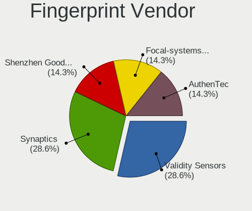

| Vendor           | Computers | Percent |
|------------------|-----------|---------|
| Validity Sensors | 1         | 50%     |
| AuthenTec        | 1         | 50%     |

Fingerprint Model
-----------------

Fingerprint sensor models

| Model                                   | Computers | Percent |
|-----------------------------------------|-----------|---------|
| Validity Sensors VFS Fingerprint sensor | 1         | 50%     |
| AuthenTec Fingerprint Sensor            | 1         | 50%     |

Chipcard Vendor
---------------

Chipcard module vendors

| Vendor      | Computers | Percent |
|-------------|-----------|---------|
| O2 Micro    | 1         | 33.33%  |
| Broadcom    | 1         | 33.33%  |
| Alcor Micro | 1         | 33.33%  |

Chipcard Model
--------------

Chipcard module models

| Model                                          | Computers | Percent |
|------------------------------------------------|-----------|---------|
| O2 Micro OZ776 CCID Smartcard Reader           | 1         | 33.33%  |
| Broadcom BCM5880 Secure Applications Processor | 1         | 33.33%  |
| Alcor Micro AU9540 Smartcard Reader            | 1         | 33.33%  |

Unsupported
-----------

Unsupported Devices
-------------------

Total unsupported devices on board

| Total | Computers | Percent |
|-------|-----------|---------|
| 0     | 26        | 76.47%  |
| 1     | 5         | 14.71%  |
| 2     | 3         | 8.82%   |

Unsupported Device Types
------------------------

Types of unsupported devices

| Type                  | Computers | Percent |
|-----------------------|-----------|---------|
| Net/wireless          | 6         | 42.86%  |
| Chipcard              | 3         | 21.43%  |
| Fingerprint reader    | 2         | 14.29%  |
| Storage               | 1         | 7.14%   |
| Multimedia controller | 1         | 7.14%   |
| Camera                | 1         | 7.14%   |

