Solus 4.3 - Tested Hardware & Statistics (Desktops)
---------------------------------------------------

A project to collect tested hardware configurations for Solus 4.3.

Anyone can contribute to this report by the [hw-probe](https://github.com/linuxhw/hw-probe) tool:

    sudo -E hw-probe -all -upload

Please submit a probe of your configuration if it's not presented on the page or is rare.

Full-feature report is available here: https://linux-hardware.org/?view=trends

Contents
--------

* [ Test Cases ](#test-cases)

* [ System ](#system)
  - [ Kernel                   ](#kernel)
  - [ Kernel Family            ](#kernel-family)
  - [ Kernel Major Ver.        ](#kernel-major-ver)
  - [ Arch                     ](#arch)
  - [ DE                       ](#de)
  - [ Display Server           ](#display-server)
  - [ Display Manager          ](#display-manager)
  - [ OS Lang                  ](#os-lang)
  - [ Boot Mode                ](#boot-mode)
  - [ Filesystem               ](#filesystem)
  - [ Part. scheme             ](#part-scheme)
  - [ Dual Boot with Linux/BSD ](#dual-boot-with-linuxbsd)
  - [ Dual Boot (Win)          ](#dual-boot-win)

* [ Board ](#board)
  - [ Vendor                   ](#vendor)
  - [ Model                    ](#model)
  - [ Model Family             ](#model-family)
  - [ MFG Year                 ](#mfg-year)
  - [ Form Factor              ](#form-factor)
  - [ Secure Boot              ](#secure-boot)
  - [ Coreboot                 ](#coreboot)
  - [ RAM Size                 ](#ram-size)
  - [ RAM Used                 ](#ram-used)
  - [ Total Drives             ](#total-drives)
  - [ Has CD-ROM               ](#has-cd-rom)
  - [ Has Ethernet             ](#has-ethernet)
  - [ Has WiFi                 ](#has-wifi)
  - [ Has Bluetooth            ](#has-bluetooth)

* [ Location ](#location)
  - [ Country                  ](#country)
  - [ City                     ](#city)

* [ Drives ](#drives)
  - [ Drive Vendor             ](#drive-vendor)
  - [ Drive Model              ](#drive-model)
  - [ HDD Vendor               ](#hdd-vendor)
  - [ SSD Vendor               ](#ssd-vendor)
  - [ Drive Kind               ](#drive-kind)
  - [ Drive Connector          ](#drive-connector)
  - [ Drive Size               ](#drive-size)
  - [ Space Total              ](#space-total)
  - [ Space Used               ](#space-used)
  - [ Malfunc. Drives          ](#malfunc-drives)
  - [ Malfunc. Drive Vendor    ](#malfunc-drive-vendor)
  - [ Malfunc. HDD Vendor      ](#malfunc-hdd-vendor)
  - [ Malfunc. Drive Kind      ](#malfunc-drive-kind)
  - [ Failed Drives            ](#failed-drives)
  - [ Failed Drive Vendor      ](#failed-drive-vendor)
  - [ Drive Status             ](#drive-status)

* [ Storage controller ](#storage-controller)
  - [ Storage Vendor           ](#storage-vendor)
  - [ Storage Model            ](#storage-model)
  - [ Storage Kind             ](#storage-kind)

* [ Processor ](#processor)
  - [ CPU Vendor               ](#cpu-vendor)
  - [ CPU Model                ](#cpu-model)
  - [ CPU Model Family         ](#cpu-model-family)
  - [ CPU Cores                ](#cpu-cores)
  - [ CPU Sockets              ](#cpu-sockets)
  - [ CPU Threads              ](#cpu-threads)
  - [ CPU Op-Modes             ](#cpu-op-modes)
  - [ CPU Microcode            ](#cpu-microcode)
  - [ CPU Microarch            ](#cpu-microarch)

* [ Graphics ](#graphics)
  - [ GPU Vendor               ](#gpu-vendor)
  - [ GPU Model                ](#gpu-model)
  - [ GPU Combo                ](#gpu-combo)
  - [ GPU Driver               ](#gpu-driver)
  - [ GPU Memory               ](#gpu-memory)

* [ Monitor ](#monitor)
  - [ Monitor Vendor           ](#monitor-vendor)
  - [ Monitor Model            ](#monitor-model)
  - [ Monitor Resolution       ](#monitor-resolution)
  - [ Monitor Diagonal         ](#monitor-diagonal)
  - [ Monitor Width            ](#monitor-width)
  - [ Aspect Ratio             ](#aspect-ratio)
  - [ Monitor Area             ](#monitor-area)
  - [ Pixel Density            ](#pixel-density)
  - [ Multiple Monitors        ](#multiple-monitors)

* [ Network ](#network)
  - [ Net Controller Vendor    ](#net-controller-vendor)
  - [ Net Controller Model     ](#net-controller-model)
  - [ Wireless Vendor          ](#wireless-vendor)
  - [ Wireless Model           ](#wireless-model)
  - [ Ethernet Vendor          ](#ethernet-vendor)
  - [ Ethernet Model           ](#ethernet-model)
  - [ Net Controller Kind      ](#net-controller-kind)
  - [ Used Controller          ](#used-controller)
  - [ NICs                     ](#nics)
  - [ IPv6                     ](#ipv6)

* [ Bluetooth ](#bluetooth)
  - [ Bluetooth Vendor         ](#bluetooth-vendor)
  - [ Bluetooth Model          ](#bluetooth-model)

* [ Sound ](#sound)
  - [ Sound Vendor             ](#sound-vendor)
  - [ Sound Model              ](#sound-model)

* [ Memory ](#memory)
  - [ Memory Vendor            ](#memory-vendor)
  - [ Memory Model             ](#memory-model)
  - [ Memory Kind              ](#memory-kind)
  - [ Memory Form Factor       ](#memory-form-factor)
  - [ Memory Size              ](#memory-size)
  - [ Memory Speed             ](#memory-speed)

* [ Printers & scanners ](#printers--scanners)
  - [ Printer Vendor           ](#printer-vendor)
  - [ Printer Model            ](#printer-model)
  - [ Scanner Vendor           ](#scanner-vendor)
  - [ Scanner Model            ](#scanner-model)

* [ Camera ](#camera)
  - [ Camera Vendor            ](#camera-vendor)
  - [ Camera Model             ](#camera-model)

* [ Security ](#security)
  - [ Fingerprint Vendor       ](#fingerprint-vendor)
  - [ Fingerprint Model        ](#fingerprint-model)
  - [ Chipcard Vendor          ](#chipcard-vendor)
  - [ Chipcard Model           ](#chipcard-model)

* [ Unsupported ](#unsupported)
  - [ Unsupported Devices      ](#unsupported-devices)
  - [ Unsupported Device Types ](#unsupported-device-types)

Test Cases
----------

Total: 26

| Vendor     | Model                       | Probe                                                      | Date         |
|------------|-----------------------------|------------------------------------------------------------|--------------|
| ASUSTek    | A88X-PRO                    | [fb6f0426c3](https://linux-hardware.org/?probe=fb6f0426c3) | Jan 20, 2022 |
| ASRock     | H81 Pro BTC R2.0            | [06673a4f1e](https://linux-hardware.org/?probe=06673a4f1e) | Jan 12, 2022 |
| ASRock     | H81 Pro BTC R2.0            | [5f7b4e3335](https://linux-hardware.org/?probe=5f7b4e3335) | Jan 12, 2022 |
| ASRock     | H81 Pro BTC R2.0            | [ebd229b5fb](https://linux-hardware.org/?probe=ebd229b5fb) | Jan 12, 2022 |
| Dell       | 06X1TJ A00                  | [315e535dd5](https://linux-hardware.org/?probe=315e535dd5) | Dec 21, 2021 |
| ASUSTek    | ROG STRIX B450-F GAMING     | [d65256bf72](https://linux-hardware.org/?probe=d65256bf72) | Dec 12, 2021 |
| Gigabyte   | H110M-DS2V-CF               | [63edfe6809](https://linux-hardware.org/?probe=63edfe6809) | Nov 24, 2021 |
| Gigabyte   | H110M-DS2V-CF               | [a4986016ca](https://linux-hardware.org/?probe=a4986016ca) | Nov 23, 2021 |
| MEGA       | G41T-M7 LGT                 | [7238b4cd22](https://linux-hardware.org/?probe=7238b4cd22) | Nov 21, 2021 |
| Gigabyte   | B85M-D3H                    | [7119b7f25b](https://linux-hardware.org/?probe=7119b7f25b) | Nov 19, 2021 |
| MSI        | B350 TOMAHAWK ARCTIC        | [9cc745f754](https://linux-hardware.org/?probe=9cc745f754) | Nov 16, 2021 |
| ASRock     | X470 Master SLI             | [7058d85808](https://linux-hardware.org/?probe=7058d85808) | Nov 11, 2021 |
| HP         | 805F                        | [f7bfb95642](https://linux-hardware.org/?probe=f7bfb95642) | Oct 26, 2021 |
| LattePanda | Alpha                       | [cfe529288b](https://linux-hardware.org/?probe=cfe529288b) | Oct 26, 2021 |
| Biostar    | H61MLV2                     | [118f61b356](https://linux-hardware.org/?probe=118f61b356) | Oct 23, 2021 |
| Gigabyte   | GA-78LMT-USB3               | [99c69c213a](https://linux-hardware.org/?probe=99c69c213a) | Sep 05, 2021 |
| ASUSTek    | TUF B450-PRO GAMING         | [f7d38e2f91](https://linux-hardware.org/?probe=f7d38e2f91) | Aug 29, 2021 |
| Gigabyte   | P31-ES3G                    | [1563940d09](https://linux-hardware.org/?probe=1563940d09) | Aug 22, 2021 |
| Gigabyte   | P31-ES3G                    | [34cd2a9116](https://linux-hardware.org/?probe=34cd2a9116) | Aug 22, 2021 |
| eMachines  | EL1852G                     | [7683cbf5bb](https://linux-hardware.org/?probe=7683cbf5bb) | Aug 16, 2021 |
| eMachines  | EL1852G                     | [86003fc5b7](https://linux-hardware.org/?probe=86003fc5b7) | Aug 15, 2021 |
| Gigabyte   | H81M-S2V                    | [16b2e8c32f](https://linux-hardware.org/?probe=16b2e8c32f) | Aug 06, 2021 |
| Gigabyte   | H81M-S2V                    | [db8fadad17](https://linux-hardware.org/?probe=db8fadad17) | Aug 06, 2021 |
| MSI        | B450 GAMING PRO CARBON A... | [b6ae0cb479](https://linux-hardware.org/?probe=b6ae0cb479) | Aug 05, 2021 |
| Gigabyte   | B360M AORUS Gaming 3-CF     | [fc89bec579](https://linux-hardware.org/?probe=fc89bec579) | Jul 16, 2021 |
| Lenovo     | Board                       | [89217c2643](https://linux-hardware.org/?probe=89217c2643) | Jul 14, 2021 |

System
------

Kernel
------

Version of the Linux kernel

| Version             | Desktops | Percent |
|---------------------|----------|---------|
| 5.14.21-210.current | 4        | 23.53%  |
| 5.14.16-205.current | 4        | 23.53%  |
| 5.13.12-193.current | 3        | 17.65%  |
| 5.14.14-202.current | 2        | 11.76%  |
| 5.13.6-190.current  | 2        | 11.76%  |
| 5.13.8-191.current  | 1        | 5.88%   |
| 5.13.1-187.current  | 1        | 5.88%   |

Kernel Family
-------------

Linux kernel without a distro release

| Version | Desktops | Percent |
|---------|----------|---------|
| 5.14.21 | 4        | 23.53%  |
| 5.14.16 | 4        | 23.53%  |
| 5.13.12 | 3        | 17.65%  |
| 5.14.14 | 2        | 11.76%  |
| 5.13.6  | 2        | 11.76%  |
| 5.13.8  | 1        | 5.88%   |
| 5.13.1  | 1        | 5.88%   |

Kernel Major Ver.
-----------------

Linux kernel major version

| Version | Desktops | Percent |
|---------|----------|---------|
| 5.14    | 10       | 58.82%  |
| 5.13    | 7        | 41.18%  |

Arch
----

OS architecture (x86_64, i586, etc.)

| Name   | Desktops | Percent |
|--------|----------|---------|
| x86_64 | 17       | 100%    |

DE
--

Desktop Environment

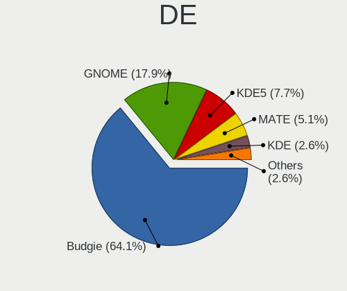

| Name    | Desktops | Percent |
|---------|----------|---------|
| Budgie  | 13       | 76.47%  |
| KDE5    | 1        | 5.88%   |
| KDE     | 1        | 5.88%   |
| GNOME   | 1        | 5.88%   |
| Unknown | 1        | 5.88%   |

Display Server
--------------

X11 or Wayland

| Name | Desktops | Percent |
|------|----------|---------|
| X11  | 17       | 100%    |

Display Manager
---------------

SDDM, LightDM, etc.

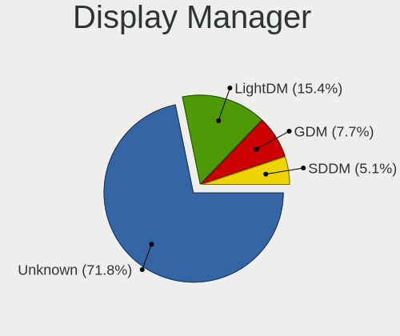

| Name    | Desktops | Percent |
|---------|----------|---------|
| Unknown | 13       | 76.47%  |
| SDDM    | 2        | 11.76%  |
| LightDM | 2        | 11.76%  |

OS Lang
-------

Language

| Lang  | Desktops | Percent |
|-------|----------|---------|
| en_US | 9        | 52.94%  |
| ru_RU | 1        | 5.88%   |
| pt_BR | 1        | 5.88%   |
| fr_FR | 1        | 5.88%   |
| es_VE | 1        | 5.88%   |
| es_ES | 1        | 5.88%   |
| en_GB | 1        | 5.88%   |
| de_DE | 1        | 5.88%   |
| ar_EG | 1        | 5.88%   |

Boot Mode
---------

EFI or BIOS

| Mode | Desktops | Percent |
|------|----------|---------|
| BIOS | 10       | 58.82%  |
| EFI  | 7        | 41.18%  |

Filesystem
----------

Type of filesystem

| Type  | Desktops | Percent |
|-------|----------|---------|
| Ext4  | 15       | 88.24%  |
| Xfs   | 1        | 5.88%   |
| Btrfs | 1        | 5.88%   |

Part. scheme
------------

Scheme of partitioning

| Type    | Desktops | Percent |
|---------|----------|---------|
| Unknown | 14       | 82.35%  |
| MBR     | 3        | 17.65%  |

Dual Boot with Linux/BSD
------------------------

Hosting more than one Linux/BSD

| Dual boot | Desktops | Percent |
|-----------|----------|---------|
| No        | 14       | 82.35%  |
| Yes       | 3        | 17.65%  |

Dual Boot (Win)
---------------

Hosting Linux and Windows

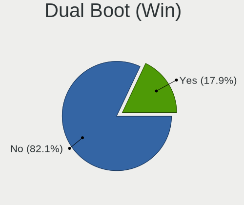

| Dual boot | Desktops | Percent |
|-----------|----------|---------|
| No        | 14       | 82.35%  |
| Yes       | 3        | 17.65%  |

Board
-----

Vendor
------

Motherboard manufacturer

| Name                | Desktops | Percent |
|---------------------|----------|---------|
| Gigabyte Technology | 5        | 29.41%  |
| ASUSTek Computer    | 3        | 17.65%  |
| MSI                 | 2        | 11.76%  |
| MEGA                | 1        | 5.88%   |
| Lenovo              | 1        | 5.88%   |
| Hewlett-Packard     | 1        | 5.88%   |
| eMachines           | 1        | 5.88%   |
| Dell                | 1        | 5.88%   |
| Biostar             | 1        | 5.88%   |
| ASRock              | 1        | 5.88%   |

Model
-----

Motherboard model

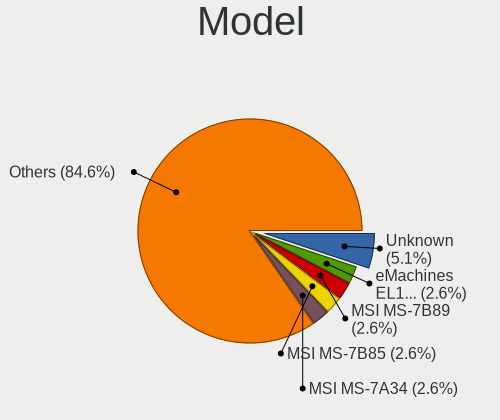

| Name                             | Desktops | Percent |
|----------------------------------|----------|---------|
| MSI MS-7B85                      | 1        | 5.88%   |
| MSI MS-7A34                      | 1        | 5.88%   |
| MEGA G41T-M7 LGT                 | 1        | 5.88%   |
| Lenovo ThinkCentre M71e 3157G6S  | 1        | 5.88%   |
| HP ProDesk 490 G3 MT Business PC | 1        | 5.88%   |
| Gigabyte P31-ES3G                | 1        | 5.88%   |
| Gigabyte H81M-S2V                | 1        | 5.88%   |
| Gigabyte H110M-DS2V              | 1        | 5.88%   |
| Gigabyte GA-78LMT-USB3 6.0       | 1        | 5.88%   |
| Gigabyte B85M-D3H                | 1        | 5.88%   |
| eMachines EL1852G                | 1        | 5.88%   |
| Dell OptiPlex 9020               | 1        | 5.88%   |
| Biostar H61MLV2                  | 1        | 5.88%   |
| ASUS TUF B450-PRO GAMING         | 1        | 5.88%   |
| ASUS ROG STRIX B450-F GAMING     | 1        | 5.88%   |
| ASUS A88X-PRO                    | 1        | 5.88%   |
| ASRock H81 Pro BTC R2.0          | 1        | 5.88%   |

Model Family
------------

Motherboard model prefix

| Name                   | Desktops | Percent |
|------------------------|----------|---------|
| MSI MS-7B85            | 1        | 5.88%   |
| MSI MS-7A34            | 1        | 5.88%   |
| MEGA G41T-M7           | 1        | 5.88%   |
| Lenovo ThinkCentre     | 1        | 5.88%   |
| HP ProDesk             | 1        | 5.88%   |
| Gigabyte P31-ES3G      | 1        | 5.88%   |
| Gigabyte H81M-S2V      | 1        | 5.88%   |
| Gigabyte H110M-DS2V    | 1        | 5.88%   |
| Gigabyte GA-78LMT-USB3 | 1        | 5.88%   |
| Gigabyte B85M-D3H      | 1        | 5.88%   |
| eMachines EL1852G      | 1        | 5.88%   |
| Dell OptiPlex          | 1        | 5.88%   |
| Biostar H61MLV2        | 1        | 5.88%   |
| ASUS TUF               | 1        | 5.88%   |
| ASUS ROG               | 1        | 5.88%   |
| ASUS A88X-PRO          | 1        | 5.88%   |
| ASRock H81             | 1        | 5.88%   |

MFG Year
--------

Motherboard manufacture year

| Year | Desktops | Percent |
|------|----------|---------|
| 2014 | 4        | 23.53%  |
| 2018 | 3        | 17.65%  |
| 2012 | 2        | 11.76%  |
| 2011 | 2        | 11.76%  |
| 2019 | 1        | 5.88%   |
| 2017 | 1        | 5.88%   |
| 2016 | 1        | 5.88%   |
| 2015 | 1        | 5.88%   |
| 2013 | 1        | 5.88%   |
| 2008 | 1        | 5.88%   |

Form Factor
-----------

Physical design of the computer

| Name    | Desktops | Percent |
|---------|----------|---------|
| Desktop | 17       | 100%    |

Secure Boot
-----------

Enabled or disabled

| State    | Desktops | Percent |
|----------|----------|---------|
| Disabled | 17       | 100%    |

Coreboot
--------

Have coreboot on board

| Used | Desktops | Percent |
|------|----------|---------|
| No   | 17       | 100%    |

RAM Size
--------

Total RAM memory

| Size in GB | Desktops | Percent |
|------------|----------|---------|
| 8.01-16.0  | 5        | 29.41%  |
| 3.01-4.0   | 4        | 23.53%  |
| 16.01-24.0 | 4        | 23.53%  |
| 32.01-64.0 | 2        | 11.76%  |
| 4.01-8.0   | 1        | 5.88%   |
| 2.01-3.0   | 1        | 5.88%   |

RAM Used
--------

Used RAM memory

| Used GB  | Desktops | Percent |
|----------|----------|---------|
| 1.01-2.0 | 7        | 41.18%  |
| 4.01-8.0 | 4        | 23.53%  |
| 2.01-3.0 | 3        | 17.65%  |
| 3.01-4.0 | 2        | 11.76%  |
| 0.51-1.0 | 1        | 5.88%   |

Total Drives
------------

Number of drives on board

| Drives | Desktops | Percent |
|--------|----------|---------|
| 2      | 7        | 41.18%  |
| 1      | 6        | 35.29%  |
| 4      | 3        | 17.65%  |
| 3      | 1        | 5.88%   |

Has CD-ROM
----------

Has CD-ROM on board

| Presented | Desktops | Percent |
|-----------|----------|---------|
| Yes       | 10       | 58.82%  |
| No        | 7        | 41.18%  |

Has Ethernet
------------

Has Ethernet on board

| Presented | Desktops | Percent |
|-----------|----------|---------|
| Yes       | 17       | 100%    |

Has WiFi
--------

Has WiFi module

| Presented | Desktops | Percent |
|-----------|----------|---------|
| No        | 12       | 70.59%  |
| Yes       | 5        | 29.41%  |

Has Bluetooth
-------------

Has Bluetooth module

| Presented | Desktops | Percent |
|-----------|----------|---------|
| No        | 11       | 64.71%  |
| Yes       | 6        | 35.29%  |

Location
--------

Country
-------

Geographic location (country)

| Country      | Desktops | Percent |
|--------------|----------|---------|
| USA          | 5        | 29.41%  |
| Venezuela    | 1        | 5.88%   |
| Thailand     | 1        | 5.88%   |
| Spain        | 1        | 5.88%   |
| Saudi Arabia | 1        | 5.88%   |
| Netherlands  | 1        | 5.88%   |
| Kazakhstan   | 1        | 5.88%   |
| Iran         | 1        | 5.88%   |
| India        | 1        | 5.88%   |
| Greece       | 1        | 5.88%   |
| Germany      | 1        | 5.88%   |
| France       | 1        | 5.88%   |
| Brazil       | 1        | 5.88%   |

City
----

Geographic location (city)

| City            | Desktops | Percent |
|-----------------|----------|---------|
| Thessaloniki    | 1        | 5.88%   |
| Seville         | 1        | 5.88%   |
| Severna Park    | 1        | 5.88%   |
| Sadao           | 1        | 5.88%   |
| Portsmouth      | 1        | 5.88%   |
| Phoenix         | 1        | 5.88%   |
| Loerrach        | 1        | 5.88%   |
| Kostanay        | 1        | 5.88%   |
| Kolkata         | 1        | 5.88%   |
| Huntington Park | 1        | 5.88%   |
| Dammam          | 1        | 5.88%   |
| Curitiba        | 1        | 5.88%   |
| Columbia        | 1        | 5.88%   |
| Caracas         | 1        | 5.88%   |
| Caen            | 1        | 5.88%   |
| Arak            | 1        | 5.88%   |
| Alblasserdam    | 1        | 5.88%   |

Drives
------

Drive Vendor
------------

Hard drive vendors

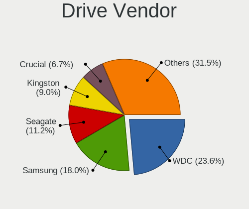

| Vendor              | Desktops | Drives | Percent |
|---------------------|----------|--------|---------|
| WDC                 | 9        | 13     | 31.03%  |
| Samsung Electronics | 9        | 12     | 31.03%  |
| Toshiba             | 3        | 3      | 10.34%  |
| Seagate             | 2        | 2      | 6.9%    |
| Kingston            | 2        | 2      | 6.9%    |
| SanDisk             | 1        | 1      | 3.45%   |
| PNY                 | 1        | 1      | 3.45%   |
| Phison              | 1        | 1      | 3.45%   |
| Hitachi             | 1        | 1      | 3.45%   |

Drive Model
-----------

Hard drive models

| Model                                | Desktops | Percent |
|--------------------------------------|----------|---------|
| Samsung NVMe SSD Drive 500GB         | 3        | 8.57%   |
| WDC WD10EZEX-08WN4A0 1TB             | 2        | 5.71%   |
| Toshiba DT01ACA050 500GB             | 2        | 5.71%   |
| WDC WD5000AVCS-632DY1 500GB          | 1        | 2.86%   |
| WDC WD5000AAKX-003CA0 500GB          | 1        | 2.86%   |
| WDC WD40EZRZ-00GXCB0 4TB             | 1        | 2.86%   |
| WDC WD32 00AAJS-00L7A0 320GB         | 1        | 2.86%   |
| WDC WD3000GLFS-01F8U0 304GB          | 1        | 2.86%   |
| WDC WD2003FZEX-00Z4SA0 2TB           | 1        | 2.86%   |
| WDC WD2003FZEX-00SRLA0 2TB           | 1        | 2.86%   |
| WDC WD10EZRX-00L4HB0 1TB             | 1        | 2.86%   |
| WDC WD10EZEX-08M2NA0 1TB             | 1        | 2.86%   |
| WDC WD10EADS-00M2B0 1TB              | 1        | 2.86%   |
| WDC WD1003FBYX-01Y7B0 1TB            | 1        | 2.86%   |
| Toshiba DT01ACA100 1TB               | 1        | 2.86%   |
| Seagate ST500DM002-1BD142 500GB      | 1        | 2.86%   |
| Seagate ST2000DM005-2CW102 2TB       | 1        | 2.86%   |
| SanDisk SDSSDP064G 64GB              | 1        | 2.86%   |
| Samsung SSD 860 EVO 500GB            | 1        | 2.86%   |
| Samsung SSD 860 EVO 1TB              | 1        | 2.86%   |
| Samsung SSD 850 EVO 250GB            | 1        | 2.86%   |
| Samsung SSD 850 EVO 120GB            | 1        | 2.86%   |
| Samsung SSD 840 PRO Series 256GB     | 1        | 2.86%   |
| Samsung SSD 840 EVO 120GB            | 1        | 2.86%   |
| Samsung MZ7LN128HCHP-000H1 128GB SSD | 1        | 2.86%   |
| Samsung HD502HI 500GB                | 1        | 2.86%   |
| PNY CS1311 120GB SSD                 | 1        | 2.86%   |
| Phison NVMe SSD Drive 256GB          | 1        | 2.86%   |
| Kingston SHSS37A240G 240GB SSD       | 1        | 2.86%   |
| Kingston NVMe SSD Drive 500GB        | 1        | 2.86%   |
| Hitachi HTS545032B9A300 320GB        | 1        | 2.86%   |

HDD Vendor
----------

Hard disk drive vendors

| Vendor              | Desktops | Drives | Percent |
|---------------------|----------|--------|---------|
| WDC                 | 9        | 13     | 56.25%  |
| Toshiba             | 3        | 3      | 18.75%  |
| Seagate             | 2        | 2      | 12.5%   |
| Samsung Electronics | 1        | 1      | 6.25%   |
| Hitachi             | 1        | 1      | 6.25%   |

SSD Vendor
----------

Solid state drive vendors

| Vendor              | Desktops | Drives | Percent |
|---------------------|----------|--------|---------|
| Samsung Electronics | 7        | 8      | 70%     |
| SanDisk             | 1        | 1      | 10%     |
| PNY                 | 1        | 1      | 10%     |
| Kingston            | 1        | 1      | 10%     |

Drive Kind
----------

HDD or SSD

| Kind | Desktops | Drives | Percent |
|------|----------|--------|---------|
| HDD  | 14       | 20     | 51.85%  |
| SSD  | 8        | 11     | 29.63%  |
| NVMe | 5        | 5      | 18.52%  |

Drive Connector
---------------

SATA, SAS, NVMe, etc.

| Type | Desktops | Drives | Percent |
|------|----------|--------|---------|
| SATA | 17       | 30     | 73.91%  |
| NVMe | 5        | 5      | 21.74%  |
| SAS  | 1        | 1      | 4.35%   |

Drive Size
----------

Size of hard drive

| Size in TB | Desktops | Drives | Percent |
|------------|----------|--------|---------|
| 0.01-0.5   | 13       | 18     | 54.17%  |
| 0.51-1.0   | 7        | 9      | 29.17%  |
| 1.01-2.0   | 3        | 3      | 12.5%   |
| 3.01-4.0   | 1        | 1      | 4.17%   |

Space Total
-----------

Amount of disk space available on the file system

| Size in GB     | Desktops | Percent |
|----------------|----------|---------|
| 251-500        | 5        | 29.41%  |
| More than 3000 | 3        | 17.65%  |
| 101-250        | 3        | 17.65%  |
| 1001-2000      | 2        | 11.76%  |
| 501-1000       | 2        | 11.76%  |
| 21-50          | 1        | 5.88%   |
| 51-100         | 1        | 5.88%   |

Space Used
----------

Amount of used disk space

| Used GB        | Desktops | Percent |
|----------------|----------|---------|
| 1-20           | 6        | 35.29%  |
| 251-500        | 2        | 11.76%  |
| 21-50          | 2        | 11.76%  |
| 101-250        | 2        | 11.76%  |
| 1001-2000      | 2        | 11.76%  |
| 501-1000       | 2        | 11.76%  |
| More than 3000 | 1        | 5.88%   |

Malfunc. Drives
---------------

Drive models with a malfunction

Zero info for selected period =(

Malfunc. Drive Vendor
---------------------

Vendors of faulty drives

Zero info for selected period =(

Malfunc. HDD Vendor
-------------------

Vendors of faulty HDD drives

Zero info for selected period =(

Malfunc. Drive Kind
-------------------

Kinds of faulty drives

Zero info for selected period =(

Failed Drives
-------------

Failed drive models

Zero info for selected period =(

Failed Drive Vendor
-------------------

Failed drive vendors

Zero info for selected period =(

Drive Status
------------

Number of failed and malfunc. drives

| Status   | Desktops | Drives | Percent |
|----------|----------|--------|---------|
| Detected | 14       | 29     | 73.68%  |
| Works    | 5        | 7      | 26.32%  |

Storage controller
------------------

Storage Vendor
--------------

Storage controller vendors

| Vendor                      | Desktops | Percent |
|-----------------------------|----------|---------|
| Intel                       | 11       | 52.38%  |
| AMD                         | 6        | 28.57%  |
| Samsung Electronics         | 2        | 9.52%   |
| Phison Electronics          | 1        | 4.76%   |
| Kingston Technology Company | 1        | 4.76%   |

Storage Model
-------------

Storage controller models

| Model                                                                          | Desktops | Percent |
|--------------------------------------------------------------------------------|----------|---------|
| Intel 8 Series/C220 Series Chipset Family 6-port SATA Controller 1 [AHCI mode] | 4        | 15.38%  |
| Intel NM10/ICH7 Family SATA Controller [IDE mode]                              | 3        | 11.54%  |
| AMD FCH SATA Controller [AHCI mode]                                            | 3        | 11.54%  |
| AMD 400 Series Chipset SATA Controller                                         | 3        | 11.54%  |
| Samsung NVMe SSD Controller SM981/PM981/PM983                                  | 2        | 7.69%   |
| Intel Q170/Q150/B150/H170/H110/Z170/CM236 Chipset SATA Controller [AHCI Mode]  | 2        | 7.69%   |
| Intel 82801G (ICH7 Family) IDE Controller                                      | 2        | 7.69%   |
| Intel 6 Series/C200 Series Chipset Family 6 port Desktop SATA AHCI Controller  | 2        | 7.69%   |
| Phison E12 NVMe Controller                                                     | 1        | 3.85%   |
| Kingston Company KC2000 NVMe SSD                                               | 1        | 3.85%   |
| AMD SB7x0/SB8x0/SB9x0 SATA Controller [AHCI mode]                              | 1        | 3.85%   |
| AMD SB7x0/SB8x0/SB9x0 IDE Controller                                           | 1        | 3.85%   |
| AMD 300 Series Chipset SATA Controller                                         | 1        | 3.85%   |

Storage Kind
------------

Kind of storage controller (IDE, SATA, NVMe, SAS, ...)

| Kind | Desktops | Percent |
|------|----------|---------|
| SATA | 14       | 63.64%  |
| NVMe | 4        | 18.18%  |
| IDE  | 4        | 18.18%  |

Processor
---------

CPU Vendor
----------

Processor vendors

| Vendor | Desktops | Percent |
|--------|----------|---------|
| Intel  | 11       | 64.71%  |
| AMD    | 6        | 35.29%  |

CPU Model
---------

Processor models

| Model                                           | Desktops | Percent |
|-------------------------------------------------|----------|---------|
| Intel Core i3-4160 CPU @ 3.60GHz                | 2        | 11.76%  |
| Intel Pentium Dual-Core CPU E6600 @ 3.06GHz     | 1        | 5.88%   |
| Intel Core i7-4770 CPU @ 3.40GHz                | 1        | 5.88%   |
| Intel Core i5-6500 CPU @ 3.20GHz                | 1        | 5.88%   |
| Intel Core i5-4690 CPU @ 3.50GHz                | 1        | 5.88%   |
| Intel Core i3-3210 CPU @ 3.20GHz                | 1        | 5.88%   |
| Intel Core i3-2100 CPU @ 3.10GHz                | 1        | 5.88%   |
| Intel Core 2 Quad CPU Q9550 @ 2.83GHz           | 1        | 5.88%   |
| Intel Celeron CPU G3930 @ 2.90GHz               | 1        | 5.88%   |
| Intel Celeron CPU E3400 @ 2.60GHz               | 1        | 5.88%   |
| AMD Ryzen 7 3800X 8-Core Processor              | 1        | 5.88%   |
| AMD Ryzen 7 3700X 8-Core Processor              | 1        | 5.88%   |
| AMD Ryzen 7 2700X Eight-Core Processor          | 1        | 5.88%   |
| AMD Ryzen 5 2600X Six-Core Processor            | 1        | 5.88%   |
| AMD FX-6300 Six-Core Processor                  | 1        | 5.88%   |
| AMD A10-7890K Radeon R7, 12 Compute Cores 4C+8G | 1        | 5.88%   |

CPU Model Family
----------------

Processor model prefix

| Model                   | Desktops | Percent |
|-------------------------|----------|---------|
| Intel Core i3           | 4        | 23.53%  |
| AMD Ryzen 7             | 3        | 17.65%  |
| Intel Core i5           | 2        | 11.76%  |
| Intel Celeron           | 2        | 11.76%  |
| Intel Pentium Dual-Core | 1        | 5.88%   |
| Intel Core i7           | 1        | 5.88%   |
| Intel Core 2 Quad       | 1        | 5.88%   |
| AMD Ryzen 5             | 1        | 5.88%   |
| AMD FX                  | 1        | 5.88%   |
| AMD A10                 | 1        | 5.88%   |

CPU Cores
---------

Number of processor cores

| Number | Desktops | Percent |
|--------|----------|---------|
| 2      | 8        | 47.06%  |
| 4      | 4        | 23.53%  |
| 8      | 3        | 17.65%  |
| 6      | 1        | 5.88%   |
| 3      | 1        | 5.88%   |

CPU Sockets
-----------

Number of sockets

| Number | Desktops | Percent |
|--------|----------|---------|
| 1      | 17       | 100%    |

CPU Threads
-----------

Threads per core (Hyper-Threading)

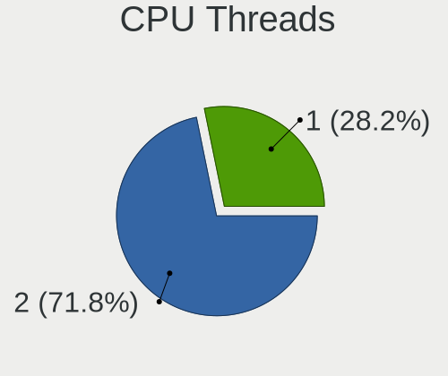

| Number | Desktops | Percent |
|--------|----------|---------|
| 2      | 11       | 64.71%  |
| 1      | 6        | 35.29%  |

CPU Op-Modes
------------

CPU Operation Modes (32-bit, 64-bit)

| Op mode        | Desktops | Percent |
|----------------|----------|---------|
| 32-bit, 64-bit | 17       | 100%    |

CPU Microcode
-------------

Microcode number

| Number     | Desktops | Percent |
|------------|----------|---------|
| 0x306c3    | 4        | 23.53%  |
| 0x1067a    | 3        | 17.65%  |
| 0x08701021 | 2        | 11.76%  |
| 0x0800820d | 2        | 11.76%  |
| 0x906e9    | 1        | 5.88%   |
| 0x506e3    | 1        | 5.88%   |
| 0x306a9    | 1        | 5.88%   |
| 0x206a7    | 1        | 5.88%   |
| 0x06003106 | 1        | 5.88%   |
| 0x06000852 | 1        | 5.88%   |

CPU Microarch
-------------

Microarchitecture

| Name        | Desktops | Percent |
|-------------|----------|---------|
| Haswell     | 4        | 23.53%  |
| Penryn      | 3        | 17.65%  |
| Zen+        | 2        | 11.76%  |
| Zen 2       | 2        | 11.76%  |
| Steamroller | 1        | 5.88%   |
| Skylake     | 1        | 5.88%   |
| SandyBridge | 1        | 5.88%   |
| Piledriver  | 1        | 5.88%   |
| KabyLake    | 1        | 5.88%   |
| IvyBridge   | 1        | 5.88%   |

Graphics
--------

GPU Vendor
----------

Vendors of graphics cards

| Vendor | Desktops | Percent |
|--------|----------|---------|
| AMD    | 8        | 38.1%   |
| Intel  | 7        | 33.33%  |
| Nvidia | 6        | 28.57%  |

GPU Model
---------

Graphics card models

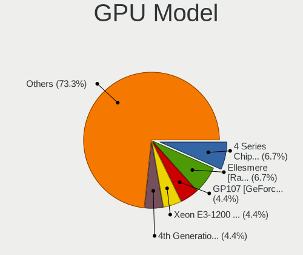

| Model                                                                       | Desktops | Percent |
|-----------------------------------------------------------------------------|----------|---------|
| Intel 4th Generation Core Processor Family Integrated Graphics Controller   | 2        | 9.52%   |
| Intel 4 Series Chipset Integrated Graphics Controller                       | 2        | 9.52%   |
| Nvidia GT218 [GeForce 210]                                                  | 1        | 4.76%   |
| Nvidia GT216 [GeForce GT 220]                                               | 1        | 4.76%   |
| Nvidia GP107 [GeForce GTX 1050 Ti]                                          | 1        | 4.76%   |
| Nvidia GK104 [GeForce GTX 770]                                              | 1        | 4.76%   |
| Nvidia GF119 [GeForce 605]                                                  | 1        | 4.76%   |
| Nvidia GF108 [GeForce GT 630]                                               | 1        | 4.76%   |
| Intel Xeon E3-1200 v3/4th Gen Core Processor Integrated Graphics Controller | 1        | 4.76%   |
| Intel HD Graphics 530                                                       | 1        | 4.76%   |
| Intel 2nd Generation Core Processor Family Integrated Graphics Controller   | 1        | 4.76%   |
| AMD Vega 20 [Radeon VII]                                                    | 1        | 4.76%   |
| AMD Tonga PRO [Radeon R9 285/380]                                           | 1        | 4.76%   |
| AMD Oland [Radeon HD 8570 / R5 430 OEM / R7 240/340 / Radeon 520 OEM]       | 1        | 4.76%   |
| AMD Navi 10 [Radeon RX 5600 OEM/5600 XT / 5700/5700 XT]                     | 1        | 4.76%   |
| AMD Lexa PRO [Radeon 540/540X/550/550X / RX 540X/550/550X]                  | 1        | 4.76%   |
| AMD Ellesmere [Radeon RX 470/480/570/570X/580/580X/590]                     | 1        | 4.76%   |
| AMD Curacao XT / Trinidad XT [Radeon R7 370 / R9 270X/370X]                 | 1        | 4.76%   |
| AMD Cedar [Radeon HD 5000/6000/7350/8350 Series]                            | 1        | 4.76%   |

GPU Combo
---------

Combinations of graphics cards

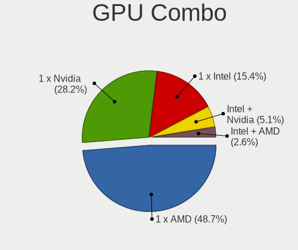

| Name           | Desktops | Percent |
|----------------|----------|---------|
| 1 x AMD        | 7        | 41.18%  |
| 1 x Nvidia     | 5        | 29.41%  |
| 1 x Intel      | 3        | 17.65%  |
| Intel + Nvidia | 1        | 5.88%   |
| Intel + AMD    | 1        | 5.88%   |

GPU Driver
----------

Free vs proprietary

| Driver      | Desktops | Percent |
|-------------|----------|---------|
| Free        | 14       | 82.35%  |
| Proprietary | 3        | 17.65%  |

GPU Memory
----------

Total video memory

| Size in GB | Desktops | Percent |
|------------|----------|---------|
| 1.01-2.0   | 5        | 29.41%  |
| 0.51-1.0   | 4        | 23.53%  |
| Unknown    | 3        | 17.65%  |
| 3.01-4.0   | 2        | 11.76%  |
| 7.01-8.0   | 1        | 5.88%   |
| 5.01-6.0   | 1        | 5.88%   |
| 8.01-16.0  | 1        | 5.88%   |

Monitor
-------

Monitor Vendor
--------------

Monitor vendors

| Vendor               | Desktops | Percent |
|----------------------|----------|---------|
| AOC                  | 5        | 23.81%  |
| Samsung Electronics  | 4        | 19.05%  |
| Goldstar             | 4        | 19.05%  |
| Dell                 | 3        | 14.29%  |
| SHARP                | 1        | 4.76%   |
| LG Electronics       | 1        | 4.76%   |
| Hewlett-Packard      | 1        | 4.76%   |
| Ancor Communications | 1        | 4.76%   |
| Acer                 | 1        | 4.76%   |

Monitor Model
-------------

Monitor models

| Model                                                                | Desktops | Percent |
|----------------------------------------------------------------------|----------|---------|
| AOC 24P1W1 AOC2401 1920x1080 527x296mm 23.8-inch                     | 2        | 9.09%   |
| SHARP LCD Monitor HDMI 1920x1080                                     | 1        | 4.55%   |
| Samsung Electronics SyncMaster SAM05CB 1920x1080 530x300mm 24.0-inch | 1        | 4.55%   |
| Samsung Electronics SyncMaster SAM01CE 1024x768 304x228mm 15.0-inch  | 1        | 4.55%   |
| Samsung Electronics S22B150 SAM08A3 1920x1080 477x268mm 21.5-inch    | 1        | 4.55%   |
| Samsung Electronics LCD Monitor SM2333TN 1920x1080                   | 1        | 4.55%   |
| LG Electronics LCD Monitor E2241 1920x1080                           | 1        | 4.55%   |
| Hewlett-Packard 24y HPN3504 1920x1080 528x297mm 23.9-inch            | 1        | 4.55%   |
| Goldstar W1942 GSM4B70 1440x900 408x255mm 18.9-inch                  | 1        | 4.55%   |
| Goldstar W1642 GSM3E86 1360x768 344x194mm 15.5-inch                  | 1        | 4.55%   |
| Goldstar E2050 GSM4EAE 1600x900 443x249mm 20.0-inch                  | 1        | 4.55%   |
| Goldstar 19EN33 GSM4C18 1366x768 410x230mm 18.5-inch                 | 1        | 4.55%   |
| Dell SE2419HR DELF113 1920x1080 527x296mm 23.8-inch                  | 1        | 4.55%   |
| Dell S3222DGM DELD110 2560x1440 697x392mm 31.5-inch                  | 1        | 4.55%   |
| Dell 1908WFP DELF007 1440x900 408x255mm 18.9-inch                    | 1        | 4.55%   |
| AOC Q29G2G5 AOC2902 2560x1080 681x287mm 29.1-inch                    | 1        | 4.55%   |
| AOC 2481W AOC2481 1920x1080 527x296mm 23.8-inch                      | 1        | 4.55%   |
| AOC 2460 AOC2460 1920x1080 531x299mm 24.0-inch                       | 1        | 4.55%   |
| AOC 1970W AOC1970 1366x768 410x230mm 18.5-inch                       | 1        | 4.55%   |
| Ancor Communications VX228 ACI22C1 1920x1080 476x268mm 21.5-inch     | 1        | 4.55%   |
| Acer V236HL ACR0350 1920x1080 509x286mm 23.0-inch                    | 1        | 4.55%   |

Monitor Resolution
------------------

Monitor screen resolution

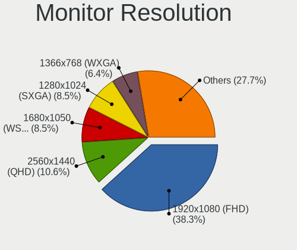

| Resolution         | Desktops | Percent |
|--------------------|----------|---------|
| 1920x1080 (FHD)    | 11       | 50%     |
| 2560x1440 (QHD)    | 3        | 13.64%  |
| 1366x768 (WXGA)    | 2        | 9.09%   |
| 2560x1080          | 1        | 4.55%   |
| 1680x1050 (WSXGA+) | 1        | 4.55%   |
| 1600x900 (HD+)     | 1        | 4.55%   |
| 1440x900 (WXGA+)   | 1        | 4.55%   |
| 1360x768           | 1        | 4.55%   |
| 1024x768 (XGA)     | 1        | 4.55%   |

Monitor Diagonal
----------------

Diagonal size in inches

| Inches  | Desktops | Percent |
|---------|----------|---------|
| 24      | 5        | 25%     |
| 18      | 3        | 15%     |
| Unknown | 3        | 15%     |
| 23      | 2        | 10%     |
| 21      | 2        | 10%     |
| 31      | 1        | 5%      |
| 29      | 1        | 5%      |
| 22      | 1        | 5%      |
| 20      | 1        | 5%      |
| 15      | 1        | 5%      |

Monitor Width
-------------

Physical width

| Width in mm | Desktops | Percent |
|-------------|----------|---------|
| 501-600     | 7        | 35%     |
| 401-500     | 7        | 35%     |
| Unknown     | 3        | 15%     |
| 601-700     | 2        | 10%     |
| 301-350     | 1        | 5%      |

Aspect Ratio
------------

Proportional relationship between the width and the height

| Ratio   | Desktops | Percent |
|---------|----------|---------|
| 16/9    | 12       | 57.14%  |
| 16/10   | 4        | 19.05%  |
| Unknown | 3        | 14.29%  |
| 4/3     | 1        | 4.76%   |
| 21/9    | 1        | 4.76%   |

Monitor Area
------------

Area in inch²

| Area in inch² | Desktops | Percent |
|----------------|----------|---------|
| 201-250        | 8        | 40%     |
| Unknown        | 3        | 15%     |
| 251-300        | 2        | 10%     |
| 151-200        | 2        | 10%     |
| 141-150        | 2        | 10%     |
| 351-500        | 1        | 5%      |
| 301-350        | 1        | 5%      |
| 101-110        | 1        | 5%      |

Pixel Density
-------------

Pixels per inch

| Density | Desktops | Percent |
|---------|----------|---------|
| 51-100  | 13       | 68.42%  |
| 101-120 | 3        | 15.79%  |
| Unknown | 3        | 15.79%  |

Multiple Monitors
-----------------

Total monitors connected

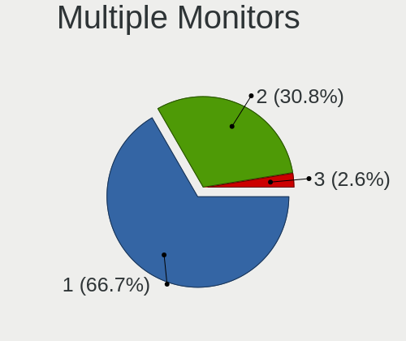

| Total | Desktops | Percent |
|-------|----------|---------|
| 1     | 12       | 70.59%  |
| 2     | 5        | 29.41%  |

Network
-------

Net Controller Vendor
---------------------

Controller vendors

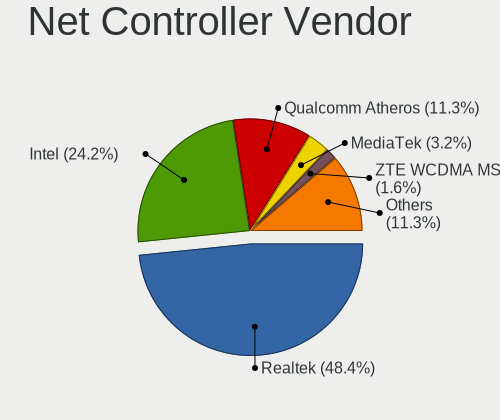

| Vendor                | Desktops | Percent |
|-----------------------|----------|---------|
| Realtek Semiconductor | 14       | 56%     |
| Intel                 | 4        | 16%     |
| Xiaomi                | 1        | 4%      |
| Ralink Technology     | 1        | 4%      |
| Qualcomm Atheros      | 1        | 4%      |
| Linksys               | 1        | 4%      |
| D-Link System         | 1        | 4%      |
| Broadcom              | 1        | 4%      |
| Belkin Components     | 1        | 4%      |

Net Controller Model
--------------------

Controller models

| Model                                                                                   | Desktops | Percent |
|-----------------------------------------------------------------------------------------|----------|---------|
| Realtek RTL8111/8168/8411 PCI Express Gigabit Ethernet Controller                       | 13       | 48.15%  |
| Intel I211 Gigabit Network Connection                                                   | 2        | 7.41%   |
| Xiaomi Mi/Redmi series (RNDIS)                                                          | 1        | 3.7%    |
| Realtek RTL88x2bu [AC1200 Techkey]                                                      | 1        | 3.7%    |
| Realtek RTL8187 Wireless Adapter                                                        | 1        | 3.7%    |
| Ralink MT7601U Wireless Adapter                                                         | 1        | 3.7%    |
| Qualcomm Atheros AR8152 v2.0 Fast Ethernet                                              | 1        | 3.7%    |
| Linksys WUSB6100M 802.11a/b/g/n/ac Wireless Adapter                                     | 1        | 3.7%    |
| Intel Wireless-AC 9260                                                                  | 1        | 3.7%    |
| Intel Wireless 3165                                                                     | 1        | 3.7%    |
| Intel Ethernet Connection I217-LM                                                       | 1        | 3.7%    |
| D-Link System AirPlus G DWL-G122 Wireless Adapter(rev.C1) [Ralink RT2571W]              | 1        | 3.7%    |
| Broadcom BCM4360 802.11ac Wireless Network Adapter                                      | 1        | 3.7%    |
| Belkin Components F7D2102 802.11n N300 Micro Wireless Adapter v3000 [Realtek RTL8192CU] | 1        | 3.7%    |

Wireless Vendor
---------------

Wireless vendors

| Vendor                | Desktops | Percent |
|-----------------------|----------|---------|
| Realtek Semiconductor | 2        | 22.22%  |
| Intel                 | 2        | 22.22%  |
| Ralink Technology     | 1        | 11.11%  |
| Linksys               | 1        | 11.11%  |
| D-Link System         | 1        | 11.11%  |
| Broadcom              | 1        | 11.11%  |
| Belkin Components     | 1        | 11.11%  |

Wireless Model
--------------

Wireless models

| Model                                                                                   | Desktops | Percent |
|-----------------------------------------------------------------------------------------|----------|---------|
| Realtek RTL88x2bu [AC1200 Techkey]                                                      | 1        | 11.11%  |
| Realtek RTL8187 Wireless Adapter                                                        | 1        | 11.11%  |
| Ralink MT7601U Wireless Adapter                                                         | 1        | 11.11%  |
| Linksys WUSB6100M 802.11a/b/g/n/ac Wireless Adapter                                     | 1        | 11.11%  |
| Intel Wireless-AC 9260                                                                  | 1        | 11.11%  |
| Intel Wireless 3165                                                                     | 1        | 11.11%  |
| D-Link System AirPlus G DWL-G122 Wireless Adapter(rev.C1) [Ralink RT2571W]              | 1        | 11.11%  |
| Broadcom BCM4360 802.11ac Wireless Network Adapter                                      | 1        | 11.11%  |
| Belkin Components F7D2102 802.11n N300 Micro Wireless Adapter v3000 [Realtek RTL8192CU] | 1        | 11.11%  |

Ethernet Vendor
---------------

Ethernet vendors

| Vendor                | Desktops | Percent |
|-----------------------|----------|---------|
| Realtek Semiconductor | 13       | 72.22%  |
| Intel                 | 3        | 16.67%  |
| Xiaomi                | 1        | 5.56%   |
| Qualcomm Atheros      | 1        | 5.56%   |

Ethernet Model
--------------

Ethernet models

| Model                                                             | Desktops | Percent |
|-------------------------------------------------------------------|----------|---------|
| Realtek RTL8111/8168/8411 PCI Express Gigabit Ethernet Controller | 13       | 72.22%  |
| Intel I211 Gigabit Network Connection                             | 2        | 11.11%  |
| Xiaomi Mi/Redmi series (RNDIS)                                    | 1        | 5.56%   |
| Qualcomm Atheros AR8152 v2.0 Fast Ethernet                        | 1        | 5.56%   |
| Intel Ethernet Connection I217-LM                                 | 1        | 5.56%   |

Net Controller Kind
-------------------

Ethernet, WiFi or modem

| Kind     | Desktops | Percent |
|----------|----------|---------|
| Ethernet | 17       | 73.91%  |
| WiFi     | 6        | 26.09%  |

Used Controller
---------------

Currently used network controller

| Kind     | Desktops | Percent |
|----------|----------|---------|
| Ethernet | 16       | 76.19%  |
| WiFi     | 5        | 23.81%  |

NICs
----

Total network controllers on board

| Total | Desktops | Percent |
|-------|----------|---------|
| 1     | 15       | 88.24%  |
| 2     | 2        | 11.76%  |

IPv6
----

IPv6 vs IPv4

| Used | Desktops | Percent |
|------|----------|---------|
| No   | 10       | 58.82%  |
| Yes  | 7        | 41.18%  |

Bluetooth
---------

Bluetooth Vendor
----------------

Controller vendors

| Vendor                  | Desktops | Percent |
|-------------------------|----------|---------|
| Intel                   | 2        | 25%     |
| Cambridge Silicon Radio | 2        | 25%     |
| Broadcom                | 2        | 25%     |
| Realtek Semiconductor   | 1        | 12.5%   |
| ASUSTek Computer        | 1        | 12.5%   |

Bluetooth Model
---------------

Controller models

| Model                                               | Desktops | Percent |
|-----------------------------------------------------|----------|---------|
| Cambridge Silicon Radio Bluetooth Dongle (HCI mode) | 2        | 25%     |
| Realtek Bluetooth Radio                             | 1        | 12.5%   |
| Intel Bluetooth wireless interface                  | 1        | 12.5%   |
| Intel Bluetooth Device                              | 1        | 12.5%   |
| Broadcom BCM92045B3 ROM                             | 1        | 12.5%   |
| Broadcom BCM2045 Bluetooth                          | 1        | 12.5%   |
| ASUS Broadcom BCM20702A0 Bluetooth                  | 1        | 12.5%   |

Sound
-----

Sound Vendor
------------

Sound card vendors

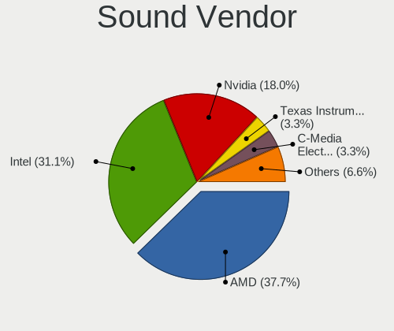

| Vendor           | Desktops | Percent |
|------------------|----------|---------|
| Intel            | 11       | 40.74%  |
| AMD              | 8        | 29.63%  |
| Nvidia           | 6        | 22.22%  |
| Tenx Technology  | 1        | 3.7%    |
| Blue Microphones | 1        | 3.7%    |

Sound Model
-----------

Sound card models

| Model                                                                      | Desktops | Percent |
|----------------------------------------------------------------------------|----------|---------|
| Intel 8 Series/C220 Series Chipset High Definition Audio Controller        | 4        | 11.11%  |
| Intel Xeon E3-1200 v3/4th Gen Core Processor HD Audio Controller           | 3        | 8.33%   |
| Intel NM10/ICH7 Family High Definition Audio Controller                    | 3        | 8.33%   |
| Intel 6 Series/C200 Series Chipset Family High Definition Audio Controller | 2        | 5.56%   |
| Intel 100 Series/C230 Series Chipset Family HD Audio Controller            | 2        | 5.56%   |
| AMD Starship/Matisse HD Audio Controller                                   | 2        | 5.56%   |
| AMD Oland/Hainan/Cape Verde/Pitcairn HDMI Audio [Radeon HD 7000 Series]    | 2        | 5.56%   |
| AMD Family 17h (Models 00h-0fh) HD Audio Controller                        | 2        | 5.56%   |
| Tenx Technology USB AUDIO                                                  | 1        | 2.78%   |
| Nvidia High Definition Audio Controller                                    | 1        | 2.78%   |
| Nvidia GT216 HDMI Audio Controller                                         | 1        | 2.78%   |
| Nvidia GP107GL High Definition Audio Controller                            | 1        | 2.78%   |
| Nvidia GK104 HDMI Audio Controller                                         | 1        | 2.78%   |
| Nvidia GF119 HDMI Audio Controller                                         | 1        | 2.78%   |
| Nvidia GF108 High Definition Audio Controller                              | 1        | 2.78%   |
| Blue Microphones Yeti Stereo Microphone                                    | 1        | 2.78%   |
| AMD Vega 20 HDMI Audio [Radeon VII]                                        | 1        | 2.78%   |
| AMD Tonga HDMI Audio [Radeon R9 285/380]                                   | 1        | 2.78%   |
| AMD SBx00 Azalia (Intel HDA)                                               | 1        | 2.78%   |
| AMD Navi 10 HDMI Audio                                                     | 1        | 2.78%   |
| AMD FCH Azalia Controller                                                  | 1        | 2.78%   |
| AMD Ellesmere HDMI Audio [Radeon RX 470/480 / 570/580/590]                 | 1        | 2.78%   |
| AMD Cedar HDMI Audio [Radeon HD 5400/6300/7300 Series]                     | 1        | 2.78%   |
| AMD Baffin HDMI/DP Audio [Radeon RX 550 640SP / RX 560/560X]               | 1        | 2.78%   |

Memory
------

Memory Vendor
-------------

Memory module vendors

| Vendor            | Desktops | Percent |
|-------------------|----------|---------|
| Unknown           | 1        | 20%     |
| Transcend         | 1        | 20%     |
| Patriot           | 1        | 20%     |
| Crucial           | 1        | 20%     |
| A-DATA Technology | 1        | 20%     |

Memory Model
------------

Memory module models

| Model                                                 | Desktops | Percent |
|-------------------------------------------------------|----------|---------|
| Unknown RAM Module 4GB DIMM DDR3 1600MT/s             | 1        | 20%     |
| Transcend RAM JM1333KLN-4G 4GB DIMM DDR3 1333MT/s     | 1        | 20%     |
| Patriot RAM 2133 CL11 Series 4GB DIMM DDR3 2400MT/s   | 1        | 20%     |
| Crucial RAM CT51264BA160BJ.M8F 4GB DIMM DDR3 1600MT/s | 1        | 20%     |
| A-DATA RAM Module 8192MB DIMM DDR4 2400MT/s           | 1        | 20%     |

Memory Kind
-----------

Memory module kinds

| Kind | Desktops | Percent |
|------|----------|---------|
| DDR3 | 3        | 75%     |
| DDR4 | 1        | 25%     |

Memory Form Factor
------------------

Physical design of the memory module

| Name | Desktops | Percent |
|------|----------|---------|
| DIMM | 4        | 100%    |

Memory Size
-----------

Memory module size

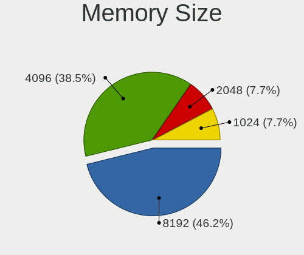

| Size | Desktops | Percent |
|------|----------|---------|
| 4096 | 3        | 60%     |
| 8192 | 2        | 40%     |

Memory Speed
------------

Memory module speed

| Speed | Desktops | Percent |
|-------|----------|---------|
| 2400  | 2        | 40%     |
| 1600  | 2        | 40%     |
| 1333  | 1        | 20%     |

Printers & scanners
-------------------

Printer Vendor
--------------

Printer device vendors

Zero info for selected period =(

Printer Model
-------------

Printer device models

Zero info for selected period =(

Scanner Vendor
--------------

Scanner device vendors

Zero info for selected period =(

Scanner Model
-------------

Scanner device models

Zero info for selected period =(

Camera
------

Camera Vendor
-------------

Camera device vendors

| Vendor          | Desktops | Percent |
|-----------------|----------|---------|
| Logitech        | 2        | 66.67%  |
| Hewlett-Packard | 1        | 33.33%  |

Camera Model
------------

Camera device models

| Model                           | Desktops | Percent |
|---------------------------------|----------|---------|
| Logitech Webcam C270            | 1        | 33.33%  |
| Logitech C922 Pro Stream Webcam | 1        | 33.33%  |
| HP Webcam HD 2300               | 1        | 33.33%  |

Security
--------

Fingerprint Vendor
------------------

Fingerprint sensor vendors

Zero info for selected period =(

Fingerprint Model
-----------------

Fingerprint sensor models

Zero info for selected period =(

Chipcard Vendor
---------------

Chipcard module vendors

Zero info for selected period =(

Chipcard Model
--------------

Chipcard module models

Zero info for selected period =(

Unsupported
-----------

Unsupported Devices
-------------------

Total unsupported devices on board

| Total | Desktops | Percent |
|-------|----------|---------|
| 0     | 15       | 88.24%  |
| 1     | 2        | 11.76%  |

Unsupported Device Types
------------------------

Types of unsupported devices

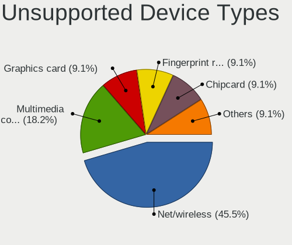

| Type         | Desktops | Percent |
|--------------|----------|---------|
| Net/wireless | 3        | 75%     |
| Camera       | 1        | 25%     |

