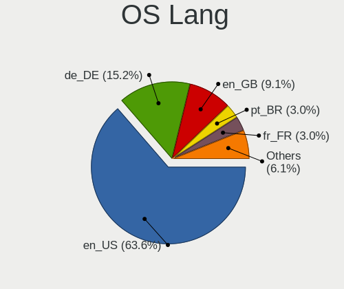
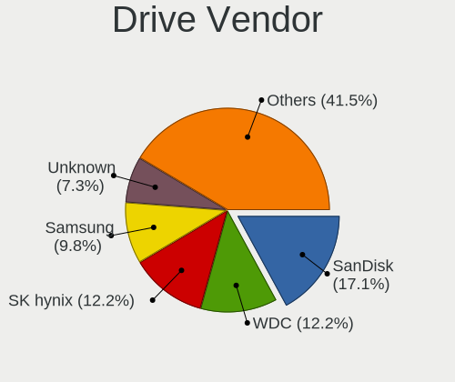
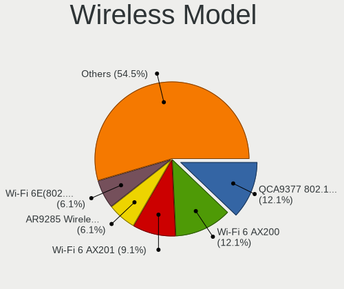
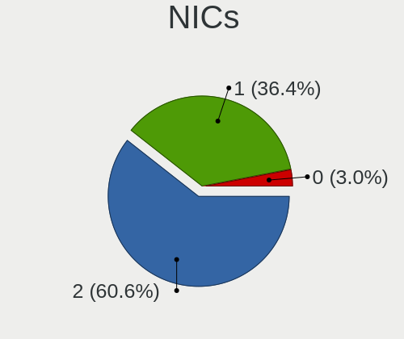
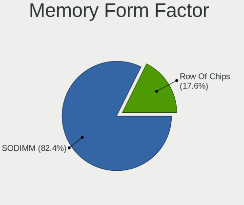
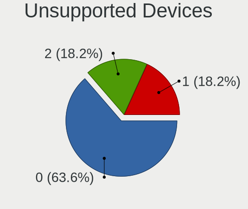

Solus 4.3 - Tested Hardware & Statistics (Notebooks)
----------------------------------------------------

A project to collect tested hardware configurations for Solus 4.3.

Anyone can contribute to this report by the [hw-probe](https://github.com/linuxhw/hw-probe) tool:

    sudo -E hw-probe -all -upload

Please submit a probe of your configuration if it's not presented on the page or is rare.

Full-feature report is available here: https://linux-hardware.org/?view=trends

Contents
--------

* [ Test Cases ](#test-cases)

* [ System ](#system)
  - [ Kernel                   ](#kernel)
  - [ Kernel Family            ](#kernel-family)
  - [ Kernel Major Ver.        ](#kernel-major-ver)
  - [ Arch                     ](#arch)
  - [ DE                       ](#de)
  - [ Display Server           ](#display-server)
  - [ Display Manager          ](#display-manager)
  - [ OS Lang                  ](#os-lang)
  - [ Boot Mode                ](#boot-mode)
  - [ Filesystem               ](#filesystem)
  - [ Part. scheme             ](#part-scheme)
  - [ Dual Boot with Linux/BSD ](#dual-boot-with-linuxbsd)
  - [ Dual Boot (Win)          ](#dual-boot-win)

* [ Board ](#board)
  - [ Vendor                   ](#vendor)
  - [ Model                    ](#model)
  - [ Model Family             ](#model-family)
  - [ MFG Year                 ](#mfg-year)
  - [ Form Factor              ](#form-factor)
  - [ Secure Boot              ](#secure-boot)
  - [ Coreboot                 ](#coreboot)
  - [ RAM Size                 ](#ram-size)
  - [ RAM Used                 ](#ram-used)
  - [ Total Drives             ](#total-drives)
  - [ Has CD-ROM               ](#has-cd-rom)
  - [ Has Ethernet             ](#has-ethernet)
  - [ Has WiFi                 ](#has-wifi)
  - [ Has Bluetooth            ](#has-bluetooth)

* [ Location ](#location)
  - [ Country                  ](#country)
  - [ City                     ](#city)

* [ Drives ](#drives)
  - [ Drive Vendor             ](#drive-vendor)
  - [ Drive Model              ](#drive-model)
  - [ HDD Vendor               ](#hdd-vendor)
  - [ SSD Vendor               ](#ssd-vendor)
  - [ Drive Kind               ](#drive-kind)
  - [ Drive Connector          ](#drive-connector)
  - [ Drive Size               ](#drive-size)
  - [ Space Total              ](#space-total)
  - [ Space Used               ](#space-used)
  - [ Malfunc. Drives          ](#malfunc-drives)
  - [ Malfunc. Drive Vendor    ](#malfunc-drive-vendor)
  - [ Malfunc. HDD Vendor      ](#malfunc-hdd-vendor)
  - [ Malfunc. Drive Kind      ](#malfunc-drive-kind)
  - [ Failed Drives            ](#failed-drives)
  - [ Failed Drive Vendor      ](#failed-drive-vendor)
  - [ Drive Status             ](#drive-status)

* [ Storage controller ](#storage-controller)
  - [ Storage Vendor           ](#storage-vendor)
  - [ Storage Model            ](#storage-model)
  - [ Storage Kind             ](#storage-kind)

* [ Processor ](#processor)
  - [ CPU Vendor               ](#cpu-vendor)
  - [ CPU Model                ](#cpu-model)
  - [ CPU Model Family         ](#cpu-model-family)
  - [ CPU Cores                ](#cpu-cores)
  - [ CPU Sockets              ](#cpu-sockets)
  - [ CPU Threads              ](#cpu-threads)
  - [ CPU Op-Modes             ](#cpu-op-modes)
  - [ CPU Microcode            ](#cpu-microcode)
  - [ CPU Microarch            ](#cpu-microarch)

* [ Graphics ](#graphics)
  - [ GPU Vendor               ](#gpu-vendor)
  - [ GPU Model                ](#gpu-model)
  - [ GPU Combo                ](#gpu-combo)
  - [ GPU Driver               ](#gpu-driver)
  - [ GPU Memory               ](#gpu-memory)

* [ Monitor ](#monitor)
  - [ Monitor Vendor           ](#monitor-vendor)
  - [ Monitor Model            ](#monitor-model)
  - [ Monitor Resolution       ](#monitor-resolution)
  - [ Monitor Diagonal         ](#monitor-diagonal)
  - [ Monitor Width            ](#monitor-width)
  - [ Aspect Ratio             ](#aspect-ratio)
  - [ Monitor Area             ](#monitor-area)
  - [ Pixel Density            ](#pixel-density)
  - [ Multiple Monitors        ](#multiple-monitors)

* [ Network ](#network)
  - [ Net Controller Vendor    ](#net-controller-vendor)
  - [ Net Controller Model     ](#net-controller-model)
  - [ Wireless Vendor          ](#wireless-vendor)
  - [ Wireless Model           ](#wireless-model)
  - [ Ethernet Vendor          ](#ethernet-vendor)
  - [ Ethernet Model           ](#ethernet-model)
  - [ Net Controller Kind      ](#net-controller-kind)
  - [ Used Controller          ](#used-controller)
  - [ NICs                     ](#nics)
  - [ IPv6                     ](#ipv6)

* [ Bluetooth ](#bluetooth)
  - [ Bluetooth Vendor         ](#bluetooth-vendor)
  - [ Bluetooth Model          ](#bluetooth-model)

* [ Sound ](#sound)
  - [ Sound Vendor             ](#sound-vendor)
  - [ Sound Model              ](#sound-model)

* [ Memory ](#memory)
  - [ Memory Vendor            ](#memory-vendor)
  - [ Memory Model             ](#memory-model)
  - [ Memory Kind              ](#memory-kind)
  - [ Memory Form Factor       ](#memory-form-factor)
  - [ Memory Size              ](#memory-size)
  - [ Memory Speed             ](#memory-speed)

* [ Printers & scanners ](#printers--scanners)
  - [ Printer Vendor           ](#printer-vendor)
  - [ Printer Model            ](#printer-model)
  - [ Scanner Vendor           ](#scanner-vendor)
  - [ Scanner Model            ](#scanner-model)

* [ Camera ](#camera)
  - [ Camera Vendor            ](#camera-vendor)
  - [ Camera Model             ](#camera-model)

* [ Security ](#security)
  - [ Fingerprint Vendor       ](#fingerprint-vendor)
  - [ Fingerprint Model        ](#fingerprint-model)
  - [ Chipcard Vendor          ](#chipcard-vendor)
  - [ Chipcard Model           ](#chipcard-model)

* [ Unsupported ](#unsupported)
  - [ Unsupported Devices      ](#unsupported-devices)
  - [ Unsupported Device Types ](#unsupported-device-types)

Test Cases
----------

Total: 28

| Vendor    | Model                       | Probe                                                      | Date         |
|-----------|-----------------------------|------------------------------------------------------------|--------------|
| Lenovo    | ThinkPad T15 Gen 2i 20W4... | [9391fc9592](https://linux-hardware.org/?probe=9391fc9592) | Mar 23, 2022 |
| Lenovo    | ThinkPad T15 Gen 2i 20W4... | [28c8bc52b8](https://linux-hardware.org/?probe=28c8bc52b8) | Mar 22, 2022 |
| Lenovo    | ThinkPad T15 Gen 2i 20W4... | [81ec123b24](https://linux-hardware.org/?probe=81ec123b24) | Mar 15, 2022 |
| Dell      | XPS 13 9380                 | [efc6123d49](https://linux-hardware.org/?probe=efc6123d49) | Mar 06, 2022 |
| Google    | Delbin                      | [fbf8763bd4](https://linux-hardware.org/?probe=fbf8763bd4) | Feb 05, 2022 |
| Acer      | Aspire A315-54              | [5eb9b9e574](https://linux-hardware.org/?probe=5eb9b9e574) | Jan 22, 2022 |
| Acer      | Swift SF114-34              | [15431686d8](https://linux-hardware.org/?probe=15431686d8) | Jan 06, 2022 |
| Toshiba   | TECRA R840                  | [753c7caef6](https://linux-hardware.org/?probe=753c7caef6) | Dec 27, 2021 |
| Sony      | VPCYB15AB                   | [780ef18db3](https://linux-hardware.org/?probe=780ef18db3) | Dec 13, 2021 |
| Dell      | Latitude 5580               | [a10f022f63](https://linux-hardware.org/?probe=a10f022f63) | Nov 26, 2021 |
| Framework | Laptop                      | [7995a7a4de](https://linux-hardware.org/?probe=7995a7a4de) | Nov 18, 2021 |
| Dell      | Latitude E6220              | [09a75055c9](https://linux-hardware.org/?probe=09a75055c9) | Nov 12, 2021 |
| Framework | Laptop                      | [72a07a2e81](https://linux-hardware.org/?probe=72a07a2e81) | Nov 11, 2021 |
| AZW       | SEi                         | [0e29003348](https://linux-hardware.org/?probe=0e29003348) | Oct 18, 2021 |
| ASUSTek   | VivoBook_ASUSLaptop X509... | [c7f1620c1c](https://linux-hardware.org/?probe=c7f1620c1c) | Oct 05, 2021 |
| HP        | OMEN Laptop 15-en0xxx       | [f19ad7cba2](https://linux-hardware.org/?probe=f19ad7cba2) | Sep 16, 2021 |
| HP        | OMEN Laptop 15-en0xxx       | [1cca1c6ce5](https://linux-hardware.org/?probe=1cca1c6ce5) | Sep 13, 2021 |
| HP        | OMEN Laptop 15-en0xxx       | [888bf75e20](https://linux-hardware.org/?probe=888bf75e20) | Sep 13, 2021 |
| Acer      | Nitro AN515-45              | [5bad88330d](https://linux-hardware.org/?probe=5bad88330d) | Sep 01, 2021 |
| Dell      | Inspiron 1525               | [3f3cd9c9e2](https://linux-hardware.org/?probe=3f3cd9c9e2) | Aug 25, 2021 |
| Dell      | Inspiron 1525               | [de3cb038ef](https://linux-hardware.org/?probe=de3cb038ef) | Aug 25, 2021 |
| Acer      | Nitro AN515-45              | [d98d816e7f](https://linux-hardware.org/?probe=d98d816e7f) | Aug 18, 2021 |
| Acer      | Nitro AN515-45              | [49cd3453c7](https://linux-hardware.org/?probe=49cd3453c7) | Aug 16, 2021 |
| Acer      | Nitro AN515-45              | [5320b136ea](https://linux-hardware.org/?probe=5320b136ea) | Aug 12, 2021 |
| Dell      | Vostro 15-3568              | [5f68a1fdaa](https://linux-hardware.org/?probe=5f68a1fdaa) | Aug 07, 2021 |
| HP        | ProBook 650 G2              | [15257858f3](https://linux-hardware.org/?probe=15257858f3) | Aug 07, 2021 |
| Dell      | Inspiron 15-3573            | [52916532a3](https://linux-hardware.org/?probe=52916532a3) | Aug 06, 2021 |
| Lenovo    | IdeaPad 320-15ISK 80XH      | [75ec31cefd](https://linux-hardware.org/?probe=75ec31cefd) | Jul 16, 2021 |

System
------

Kernel
------

Version of the Linux kernel

| Version             | Notebooks | Percent |
|---------------------|-----------|---------|
| 5.14.21-210.current | 3         | 16.67%  |
| 5.13.1-187.current  | 3         | 16.67%  |
| 5.14.16-205.current | 2         | 11.11%  |
| 5.13.6-190.current  | 2         | 11.11%  |
| 5.13.12-193.current | 2         | 11.11%  |
| 5.15.26-211.current | 1         | 5.56%   |
| 5.14.7-198.current  | 1         | 5.56%   |
| 5.14.16-204.current | 1         | 5.56%   |
| 5.14.15-203.current | 1         | 5.56%   |
| 5.14.12-201.current | 1         | 5.56%   |
| 5.13.15-194.current | 1         | 5.56%   |

Kernel Family
-------------

Linux kernel without a distro release

| Version | Notebooks | Percent |
|---------|-----------|---------|
| 5.14.21 | 3         | 16.67%  |
| 5.14.16 | 3         | 16.67%  |
| 5.13.1  | 3         | 16.67%  |
| 5.13.6  | 2         | 11.11%  |
| 5.13.12 | 2         | 11.11%  |
| 5.15.26 | 1         | 5.56%   |
| 5.14.7  | 1         | 5.56%   |
| 5.14.15 | 1         | 5.56%   |
| 5.14.12 | 1         | 5.56%   |
| 5.13.15 | 1         | 5.56%   |

Kernel Major Ver.
-----------------

Linux kernel major version

| Version | Notebooks | Percent |
|---------|-----------|---------|
| 5.14    | 9         | 50%     |
| 5.13    | 8         | 44.44%  |
| 5.15    | 1         | 5.56%   |

Arch
----

OS architecture (x86_64, i586, etc.)

| Name   | Notebooks | Percent |
|--------|-----------|---------|
| x86_64 | 18        | 100%    |

DE
--

Desktop Environment

| Name    | Notebooks | Percent |
|---------|-----------|---------|
| Budgie  | 9         | 50%     |
| Unknown | 3         | 16.67%  |
| MATE    | 2         | 11.11%  |
| KDE     | 2         | 11.11%  |
| GNOME   | 2         | 11.11%  |

Display Server
--------------

X11 or Wayland

| Name | Notebooks | Percent |
|------|-----------|---------|
| X11  | 18        | 100%    |

Display Manager
---------------

SDDM, LightDM, etc.

| Name    | Notebooks | Percent |
|---------|-----------|---------|
| Unknown | 14        | 77.78%  |
| LightDM | 2         | 11.11%  |
| SDDM    | 1         | 5.56%   |
| GDM     | 1         | 5.56%   |

OS Lang
-------

Language

| Lang  | Notebooks | Percent |
|-------|-----------|---------|
| en_US | 11        | 61.11%  |
| en_GB | 3         | 16.67%  |
| de_DE | 2         | 11.11%  |
| pt_BR | 1         | 5.56%   |
| en_IN | 1         | 5.56%   |

Boot Mode
---------

EFI or BIOS

| Mode | Notebooks | Percent |
|------|-----------|---------|
| EFI  | 14        | 77.78%  |
| BIOS | 4         | 22.22%  |

Filesystem
----------

Type of filesystem

| Type | Notebooks | Percent |
|------|-----------|---------|
| Ext4 | 18        | 100%    |

Part. scheme
------------

Scheme of partitioning

| Type    | Notebooks | Percent |
|---------|-----------|---------|
| Unknown | 13        | 72.22%  |
| GPT     | 5         | 27.78%  |

Dual Boot with Linux/BSD
------------------------

Hosting more than one Linux/BSD

| Dual boot | Notebooks | Percent |
|-----------|-----------|---------|
| No        | 18        | 100%    |

Dual Boot (Win)
---------------

Hosting Linux and Windows

| Dual boot | Notebooks | Percent |
|-----------|-----------|---------|
| No        | 13        | 72.22%  |
| Yes       | 5         | 27.78%  |

Board
-----

Vendor
------

Motherboard manufacturer

| Name             | Notebooks | Percent |
|------------------|-----------|---------|
| Dell             | 6         | 33.33%  |
| Acer             | 3         | 16.67%  |
| Lenovo           | 2         | 11.11%  |
| Toshiba          | 1         | 5.56%   |
| Sony             | 1         | 5.56%   |
| Hewlett-Packard  | 1         | 5.56%   |
| Google           | 1         | 5.56%   |
| Framework        | 1         | 5.56%   |
| AZW              | 1         | 5.56%   |
| ASUSTek Computer | 1         | 5.56%   |

Model
-----

Motherboard model

| Name                                   | Notebooks | Percent |
|----------------------------------------|-----------|---------|
| Toshiba TECRA R840                     | 1         | 5.56%   |
| Sony VPCYB15AB                         | 1         | 5.56%   |
| Lenovo ThinkPad T15 Gen 2i 20W4CTO1WW  | 1         | 5.56%   |
| Lenovo IdeaPad 320-15ISK 80XH          | 1         | 5.56%   |
| HP OMEN Laptop 15-en0xxx               | 1         | 5.56%   |
| Google Delbin                          | 1         | 5.56%   |
| Framework Laptop                       | 1         | 5.56%   |
| Dell XPS 13 9380                       | 1         | 5.56%   |
| Dell Vostro 15-3568                    | 1         | 5.56%   |
| Dell Latitude E6220                    | 1         | 5.56%   |
| Dell Latitude 5580                     | 1         | 5.56%   |
| Dell Inspiron 1525                     | 1         | 5.56%   |
| Dell Inspiron 15-3573                  | 1         | 5.56%   |
| AZW SEi                                | 1         | 5.56%   |
| ASUS VivoBook_ASUSLaptop X509DA_M509DA | 1         | 5.56%   |
| Acer Swift SF114-34                    | 1         | 5.56%   |
| Acer Nitro AN515-45                    | 1         | 5.56%   |
| Acer Aspire A315-54                    | 1         | 5.56%   |

Model Family
------------

Motherboard model prefix

| Name             | Notebooks | Percent |
|------------------|-----------|---------|
| Dell Latitude    | 2         | 11.11%  |
| Dell Inspiron    | 2         | 11.11%  |
| Toshiba TECRA    | 1         | 5.56%   |
| Sony VPCYB15AB   | 1         | 5.56%   |
| Lenovo ThinkPad  | 1         | 5.56%   |
| Lenovo IdeaPad   | 1         | 5.56%   |
| HP OMEN          | 1         | 5.56%   |
| Google Delbin    | 1         | 5.56%   |
| Framework Laptop | 1         | 5.56%   |
| Dell XPS         | 1         | 5.56%   |
| Dell Vostro      | 1         | 5.56%   |
| AZW SEi          | 1         | 5.56%   |
| ASUS VivoBook    | 1         | 5.56%   |
| Acer Swift       | 1         | 5.56%   |
| Acer Nitro       | 1         | 5.56%   |
| Acer Aspire      | 1         | 5.56%   |

MFG Year
--------

Motherboard manufacture year

| Year | Notebooks | Percent |
|------|-----------|---------|
| 2021 | 4         | 22.22%  |
| 2020 | 3         | 16.67%  |
| 2019 | 2         | 11.11%  |
| 2018 | 2         | 11.11%  |
| 2017 | 2         | 11.11%  |
| 2011 | 2         | 11.11%  |
| 2016 | 1         | 5.56%   |
| 2010 | 1         | 5.56%   |
| 2008 | 1         | 5.56%   |

Form Factor
-----------

Physical design of the computer

| Name     | Notebooks | Percent |
|----------|-----------|---------|
| Notebook | 18        | 100%    |

Secure Boot
-----------

Enabled or disabled

| State    | Notebooks | Percent |
|----------|-----------|---------|
| Disabled | 18        | 100%    |

Coreboot
--------

Have coreboot on board

| Used | Notebooks | Percent |
|------|-----------|---------|
| No   | 17        | 94.44%  |
| Yes  | 1         | 5.56%   |

RAM Size
--------

Total RAM memory

| Size in GB | Notebooks | Percent |
|------------|-----------|---------|
| 4.01-8.0   | 6         | 33.33%  |
| 32.01-64.0 | 3         | 16.67%  |
| 8.01-16.0  | 3         | 16.67%  |
| 3.01-4.0   | 2         | 11.11%  |
| 16.01-24.0 | 2         | 11.11%  |
| 2.01-3.0   | 1         | 5.56%   |
| 1.01-2.0   | 1         | 5.56%   |

RAM Used
--------

Used RAM memory

| Used GB  | Notebooks | Percent |
|----------|-----------|---------|
| 2.01-3.0 | 8         | 44.44%  |
| 1.01-2.0 | 4         | 22.22%  |
| 3.01-4.0 | 3         | 16.67%  |
| 4.01-8.0 | 2         | 11.11%  |
| 0.51-1.0 | 1         | 5.56%   |

Total Drives
------------

Number of drives on board

| Drives | Notebooks | Percent |
|--------|-----------|---------|
| 1      | 14        | 77.78%  |
| 2      | 4         | 22.22%  |

Has CD-ROM
----------

Has CD-ROM on board

| Presented | Notebooks | Percent |
|-----------|-----------|---------|
| No        | 14        | 77.78%  |
| Yes       | 4         | 22.22%  |

Has Ethernet
------------

Has Ethernet on board

| Presented | Notebooks | Percent |
|-----------|-----------|---------|
| Yes       | 13        | 72.22%  |
| No        | 5         | 27.78%  |

Has WiFi
--------

Has WiFi module

| Presented | Notebooks | Percent |
|-----------|-----------|---------|
| Yes       | 18        | 100%    |

Has Bluetooth
-------------

Has Bluetooth module

| Presented | Notebooks | Percent |
|-----------|-----------|---------|
| Yes       | 15        | 83.33%  |
| No        | 3         | 16.67%  |

Location
--------

Country
-------

Geographic location (country)

| Country     | Notebooks | Percent |
|-------------|-----------|---------|
| USA         | 4         | 22.22%  |
| UK          | 2         | 11.11%  |
| Netherlands | 2         | 11.11%  |
| India       | 2         | 11.11%  |
| Brazil      | 2         | 11.11%  |
| Vietnam     | 1         | 5.56%   |
| Switzerland | 1         | 5.56%   |
| Poland      | 1         | 5.56%   |
| Nepal       | 1         | 5.56%   |
| Germany     | 1         | 5.56%   |
| Belgium     | 1         | 5.56%   |

City
----

Geographic location (city)

| City              | Notebooks | Percent |
|-------------------|-----------|---------|
| Zoutleeuw         | 1         | 5.56%   |
| Yverdon-les-Bains | 1         | 5.56%   |
| Vineland          | 1         | 5.56%   |
| Red Oak           | 1         | 5.56%   |
| Nieporęt      | 1         | 5.56%   |
| Navelim           | 1         | 5.56%   |
| Naaldwijk         | 1         | 5.56%   |
| Milwaukee         | 1         | 5.56%   |
| Kathmandu         | 1         | 5.56%   |
| Hanoi             | 1         | 5.56%   |
| Groningen         | 1         | 5.56%   |
| Greenwich         | 1         | 5.56%   |
| Goiânia        | 1         | 5.56%   |
| Duisburg          | 1         | 5.56%   |
| Dagenham          | 1         | 5.56%   |
| Coimbatore        | 1         | 5.56%   |
| Belo Horizonte    | 1         | 5.56%   |
| Anacortes         | 1         | 5.56%   |

Drives
------

Drive Vendor
------------

Hard drive vendors

| Vendor              | Notebooks | Drives | Percent |
|---------------------|-----------|--------|---------|
| SK Hynix            | 3         | 3      | 13.64%  |
| Sandisk             | 3         | 4      | 13.64%  |
| Samsung Electronics | 3         | 4      | 13.64%  |
| WDC                 | 2         | 2      | 9.09%   |
| Unknown             | 2         | 2      | 9.09%   |
| Toshiba             | 2         | 2      | 9.09%   |
| Seagate             | 2         | 2      | 9.09%   |
| Silicon Motion      | 1         | 1      | 4.55%   |
| PNY                 | 1         | 1      | 4.55%   |
| Kingston            | 1         | 1      | 4.55%   |
| Intel               | 1         | 1      | 4.55%   |
| Advantech           | 1         | 1      | 4.55%   |

Drive Model
-----------

Hard drive models

| Model                                  | Notebooks | Percent |
|----------------------------------------|-----------|---------|
| Sandisk NVMe SSD Drive 256GB           | 2         | 8.33%   |
| WDC WD3200BEVT-75ZCT2 320GB            | 1         | 4.17%   |
| WDC WD10SPZX-24Z10T0 1TB               | 1         | 4.17%   |
| Unknown USB DISK 3.2 500GB             | 1         | 4.17%   |
| Unknown MMC Card  128GB                | 1         | 4.17%   |
| Toshiba MQ01ABF050 500GB               | 1         | 4.17%   |
| Toshiba KXG60ZNV512G NVMe 512GB        | 1         | 4.17%   |
| SK Hynix NVMe SSD Drive 500GB          | 1         | 4.17%   |
| SK Hynix NVMe SSD Drive 256GB          | 1         | 4.17%   |
| SK Hynix NVMe SSD Drive 128GB          | 1         | 4.17%   |
| Silicon Motion NVMe SSD Drive 512GB    | 1         | 4.17%   |
| Seagate ST1000LM049-2GH172 1TB         | 1         | 4.17%   |
| Seagate ST1000LM035-1RK172 1TB         | 1         | 4.17%   |
| Sandisk NVMe SSD Drive 1TB             | 1         | 4.17%   |
| SanDisk Extreme Pro 1TB                | 1         | 4.17%   |
| Samsung SSD 850 EVO 250GB              | 1         | 4.17%   |
| Samsung NVMe SSD Drive 512GB           | 1         | 4.17%   |
| Samsung NVMe SSD Drive 2TB             | 1         | 4.17%   |
| Samsung MZVL22T0HBLB-00BL7 2TB         | 1         | 4.17%   |
| PNY CS900 240GB SSD                    | 1         | 4.17%   |
| Kingston SA400S37240G 240GB SSD        | 1         | 4.17%   |
| Intel NVMe SSD Drive 512GB             | 1         | 4.17%   |
| Advantech SQF-S25M8-128G-AAG 128GB SSD | 1         | 4.17%   |

HDD Vendor
----------

Hard disk drive vendors

| Vendor  | Notebooks | Drives | Percent |
|---------|-----------|--------|---------|
| WDC     | 2         | 2      | 40%     |
| Seagate | 2         | 2      | 40%     |
| Toshiba | 1         | 1      | 20%     |

SSD Vendor
----------

Solid state drive vendors

| Vendor              | Notebooks | Drives | Percent |
|---------------------|-----------|--------|---------|
| Samsung Electronics | 1         | 1      | 25%     |
| PNY                 | 1         | 1      | 25%     |
| Kingston            | 1         | 1      | 25%     |
| Advantech           | 1         | 1      | 25%     |

Drive Kind
----------

HDD or SSD

| Kind    | Notebooks | Drives | Percent |
|---------|-----------|--------|---------|
| NVMe    | 10        | 13     | 47.62%  |
| HDD     | 5         | 5      | 23.81%  |
| SSD     | 4         | 4      | 19.05%  |
| MMC     | 1         | 1      | 4.76%   |
| Unknown | 1         | 1      | 4.76%   |

Drive Connector
---------------

SATA, SAS, NVMe, etc.

| Type | Notebooks | Drives | Percent |
|------|-----------|--------|---------|
| NVMe | 10        | 13     | 47.62%  |
| SATA | 9         | 9      | 42.86%  |
| SAS  | 1         | 1      | 4.76%   |
| MMC  | 1         | 1      | 4.76%   |

Drive Size
----------

Size of hard drive

| Size in TB | Notebooks | Drives | Percent |
|------------|-----------|--------|---------|
| 0.01-0.5   | 6         | 6      | 66.67%  |
| 0.51-1.0   | 3         | 3      | 33.33%  |

Space Total
-----------

Amount of disk space available on the file system

| Size in GB | Notebooks | Percent |
|------------|-----------|---------|
| 101-250    | 8         | 44.44%  |
| 251-500    | 5         | 27.78%  |
| 501-1000   | 3         | 16.67%  |
| 21-50      | 1         | 5.56%   |
| 51-100     | 1         | 5.56%   |

Space Used
----------

Amount of used disk space

| Used GB | Notebooks | Percent |
|---------|-----------|---------|
| 1-20    | 9         | 50%     |
| 21-50   | 3         | 16.67%  |
| 51-100  | 3         | 16.67%  |
| 101-250 | 2         | 11.11%  |
| 251-500 | 1         | 5.56%   |

Malfunc. Drives
---------------

Drive models with a malfunction

Zero info for selected period =(

Malfunc. Drive Vendor
---------------------

Vendors of faulty drives

Zero info for selected period =(

Malfunc. HDD Vendor
-------------------

Vendors of faulty HDD drives

Zero info for selected period =(

Malfunc. Drive Kind
-------------------

Kinds of faulty drives

Zero info for selected period =(

Failed Drives
-------------

Failed drive models

Zero info for selected period =(

Failed Drive Vendor
-------------------

Failed drive vendors

Zero info for selected period =(

Drive Status
------------

Number of failed and malfunc. drives

| Status   | Notebooks | Drives | Percent |
|----------|-----------|--------|---------|
| Detected | 15        | 19     | 75%     |
| Works    | 5         | 5      | 25%     |

Storage controller
------------------

Storage Vendor
--------------

Storage controller vendors

| Vendor                       | Notebooks | Percent |
|------------------------------|-----------|---------|
| Intel                        | 10        | 41.67%  |
| AMD                          | 4         | 16.67%  |
| SK Hynix                     | 3         | 12.5%   |
| Sandisk                      | 3         | 12.5%   |
| Samsung Electronics          | 2         | 8.33%   |
| Toshiba America Info Systems | 1         | 4.17%   |
| Silicon Motion               | 1         | 4.17%   |

Storage Model
-------------

Storage controller models

| Model                                                                         | Notebooks | Percent |
|-------------------------------------------------------------------------------|-----------|---------|
| AMD FCH SATA Controller [AHCI mode]                                           | 3         | 12%     |
| Intel 6 Series/C200 Series Chipset Family 6 port Mobile SATA AHCI Controller  | 2         | 8%      |
| Toshiba America Info Systems XG6 NVMe SSD Controller                          | 1         | 4%      |
| SK Hynix PC300 NVMe Solid State Drive 256GB                                   | 1         | 4%      |
| SK Hynix Gold P31 SSD                                                         | 1         | 4%      |
| SK Hynix BC501 NVMe Solid State Drive                                         | 1         | 4%      |
| Silicon Motion SM2263EN/SM2263XT SSD Controller                               | 1         | 4%      |
| Sandisk WD Blue SN550 NVMe SSD                                                | 1         | 4%      |
| Sandisk WD Blue SN500 / PC SN520 NVMe SSD                                     | 1         | 4%      |
| Sandisk WD Black 2018/SN750 / PC SN720 NVMe SSD                               | 1         | 4%      |
| Samsung NVMe SSD Controller SM981/PM981/PM983                                 | 1         | 4%      |
| Samsung NVMe SSD Controller PM9A1/PM9A3/980PRO                                | 1         | 4%      |
| Intel Sunrise Point-LP SATA Controller [AHCI mode]                            | 1         | 4%      |
| Intel SSD 660P Series                                                         | 1         | 4%      |
| Intel Q170/Q150/B150/H170/H110/Z170/CM236 Chipset SATA Controller [AHCI Mode] | 1         | 4%      |
| Intel Comet Lake SATA AHCI Controller                                         | 1         | 4%      |
| Intel Celeron/Pentium Silver Processor SATA Controller                        | 1         | 4%      |
| Intel Cannon Point-LP SATA Controller [AHCI Mode]                             | 1         | 4%      |
| Intel 82801HM/HEM (ICH8M/ICH8M-E) SATA Controller [AHCI mode]                 | 1         | 4%      |
| Intel 82801HM/HEM (ICH8M/ICH8M-E) IDE Controller                              | 1         | 4%      |
| Intel 82801 Mobile SATA Controller [RAID mode]                                | 1         | 4%      |
| AMD SB7x0/SB8x0/SB9x0 SATA Controller [AHCI mode]                             | 1         | 4%      |

Storage Kind
------------

Kind of storage controller (IDE, SATA, NVMe, SAS, ...)

| Kind | Notebooks | Percent |
|------|-----------|---------|
| SATA | 12        | 50%     |
| NVMe | 10        | 41.67%  |
| RAID | 1         | 4.17%   |
| IDE  | 1         | 4.17%   |

Processor
---------

CPU Vendor
----------

Processor vendors

| Vendor | Notebooks | Percent |
|--------|-----------|---------|
| Intel  | 14        | 77.78%  |
| AMD    | 4         | 22.22%  |

CPU Model
---------

Processor models

| Model                                         | Notebooks | Percent |
|-----------------------------------------------|-----------|---------|
| Intel Core i7-2640M CPU @ 2.80GHz             | 2         | 11.11%  |
| Intel 11th Gen Core i7-1165G7 @ 2.80GHz       | 2         | 11.11%  |
| Intel Pentium Silver N6000 @ 1.10GHz          | 1         | 5.56%   |
| Intel Core i7-8565U CPU @ 1.80GHz             | 1         | 5.56%   |
| Intel Core i7-7820HQ CPU @ 2.90GHz            | 1         | 5.56%   |
| Intel Core i5-8259U CPU @ 2.30GHz             | 1         | 5.56%   |
| Intel Core i5-7200U CPU @ 2.50GHz             | 1         | 5.56%   |
| Intel Core i5-10210U CPU @ 1.60GHz            | 1         | 5.56%   |
| Intel Core i3-6006U CPU @ 2.00GHz             | 1         | 5.56%   |
| Intel Celeron N4000 CPU @ 1.10GHz             | 1         | 5.56%   |
| Intel Celeron CPU 540 @ 1.86GHz               | 1         | 5.56%   |
| Intel 11th Gen Core i3-1115G4 @ 3.00GHz       | 1         | 5.56%   |
| AMD Ryzen 7 4800H with Radeon Graphics        | 1         | 5.56%   |
| AMD Ryzen 7 3700U with Radeon Vega Mobile Gfx | 1         | 5.56%   |
| AMD Ryzen 5 5600H with Radeon Graphics        | 1         | 5.56%   |
| AMD E-350 Processor                           | 1         | 5.56%   |

CPU Model Family
----------------

Processor model prefix

| Model                | Notebooks | Percent |
|----------------------|-----------|---------|
| Intel Core i7        | 4         | 22.22%  |
| Other                | 3         | 16.67%  |
| Intel Core i5        | 3         | 16.67%  |
| Intel Celeron        | 2         | 11.11%  |
| AMD Ryzen 7          | 2         | 11.11%  |
| Intel Pentium Silver | 1         | 5.56%   |
| Intel Core i3        | 1         | 5.56%   |
| AMD Ryzen 5          | 1         | 5.56%   |
| AMD E                | 1         | 5.56%   |

CPU Cores
---------

Number of processor cores

| Number | Notebooks | Percent |
|--------|-----------|---------|
| 4      | 8         | 44.44%  |
| 2      | 7         | 38.89%  |
| 8      | 1         | 5.56%   |
| 6      | 1         | 5.56%   |
| 1      | 1         | 5.56%   |

CPU Sockets
-----------

Number of sockets

| Number | Notebooks | Percent |
|--------|-----------|---------|
| 1      | 18        | 100%    |

CPU Threads
-----------

Threads per core (Hyper-Threading)

| Number | Notebooks | Percent |
|--------|-----------|---------|
| 2      | 14        | 77.78%  |
| 1      | 4         | 22.22%  |

CPU Op-Modes
------------

CPU Operation Modes (32-bit, 64-bit)

| Op mode        | Notebooks | Percent |
|----------------|-----------|---------|
| 32-bit, 64-bit | 18        | 100%    |

CPU Microcode
-------------

Microcode number

| Number     | Notebooks | Percent |
|------------|-----------|---------|
| 0x806c1    | 3         | 16.67%  |
| 0x806ec    | 2         | 11.11%  |
| 0x206a7    | 2         | 11.11%  |
| 0x906e9    | 1         | 5.56%   |
| 0x906c0    | 1         | 5.56%   |
| 0x806ea    | 1         | 5.56%   |
| 0x706a1    | 1         | 5.56%   |
| 0x406e3    | 1         | 5.56%   |
| 0x10661    | 1         | 5.56%   |
| 0x0a50000c | 1         | 5.56%   |
| 0x08600106 | 1         | 5.56%   |
| 0x08108109 | 1         | 5.56%   |
| 0x05000029 | 1         | 5.56%   |
| Unknown    | 1         | 5.56%   |

CPU Microarch
-------------

Microarchitecture

| Name          | Notebooks | Percent |
|---------------|-----------|---------|
| KabyLake      | 5         | 27.78%  |
| TigerLake     | 3         | 16.67%  |
| SandyBridge   | 2         | 11.11%  |
| Zen+          | 1         | 5.56%   |
| Zen 3         | 1         | 5.56%   |
| Zen 2         | 1         | 5.56%   |
| Tremont       | 1         | 5.56%   |
| Skylake       | 1         | 5.56%   |
| Goldmont plus | 1         | 5.56%   |
| Core          | 1         | 5.56%   |
| Bobcat        | 1         | 5.56%   |

Graphics
--------

GPU Vendor
----------

Vendors of graphics cards

| Vendor | Notebooks | Percent |
|--------|-----------|---------|
| Intel  | 13        | 59.09%  |
| AMD    | 6         | 27.27%  |
| Nvidia | 3         | 13.64%  |

GPU Model
---------

Graphics card models

| Model                                                                     | Notebooks | Percent |
|---------------------------------------------------------------------------|-----------|---------|
| Intel TigerLake-LP GT2 [Iris Xe Graphics]                                 | 2         | 8.7%    |
| Nvidia TU116M [GeForce GTX 1660 Ti Mobile]                                | 1         | 4.35%   |
| Nvidia GM107 [GeForce 940MX]                                              | 1         | 4.35%   |
| Nvidia GA106M [GeForce RTX 3060 Mobile / Max-Q]                           | 1         | 4.35%   |
| Intel WhiskeyLake-U GT2 [UHD Graphics 620]                                | 1         | 4.35%   |
| Intel Tiger Lake UHD Graphics                                             | 1         | 4.35%   |
| Intel Mobile GM965/GL960 Integrated Graphics Controller (secondary)       | 1         | 4.35%   |
| Intel Mobile GM965/GL960 Integrated Graphics Controller (primary)         | 1         | 4.35%   |
| Intel JasperLake [UHD Graphics]                                           | 1         | 4.35%   |
| Intel HD Graphics 630                                                     | 1         | 4.35%   |
| Intel HD Graphics 620                                                     | 1         | 4.35%   |
| Intel HD Graphics 520                                                     | 1         | 4.35%   |
| Intel GeminiLake [UHD Graphics 600]                                       | 1         | 4.35%   |
| Intel CometLake-U GT2 [UHD Graphics]                                      | 1         | 4.35%   |
| Intel CoffeeLake-U GT3e [Iris Plus Graphics 655]                          | 1         | 4.35%   |
| Intel 2nd Generation Core Processor Family Integrated Graphics Controller | 1         | 4.35%   |
| AMD Wrestler [Radeon HD 6310]                                             | 1         | 4.35%   |
| AMD Sun LE [Radeon HD 8550M / R5 M230]                                    | 1         | 4.35%   |
| AMD Seymour [Radeon HD 6400M/7400M Series]                                | 1         | 4.35%   |
| AMD Renoir                                                                | 1         | 4.35%   |
| AMD Picasso/Raven 2 [Radeon Vega Series / Radeon Vega Mobile Series]      | 1         | 4.35%   |
| AMD Cezanne                                                               | 1         | 4.35%   |

GPU Combo
---------

Combinations of graphics cards

| Name           | Notebooks | Percent |
|----------------|-----------|---------|
| 1 x Intel      | 11        | 61.11%  |
| 1 x AMD        | 3         | 16.67%  |
| AMD + Nvidia   | 2         | 11.11%  |
| Intel + Nvidia | 1         | 5.56%   |
| Intel + AMD    | 1         | 5.56%   |

GPU Driver
----------

Free vs proprietary

| Driver      | Notebooks | Percent |
|-------------|-----------|---------|
| Free        | 16        | 88.89%  |
| Proprietary | 2         | 11.11%  |

GPU Memory
----------

Total video memory

| Size in GB | Notebooks | Percent |
|------------|-----------|---------|
| Unknown    | 12        | 66.67%  |
| 1.01-2.0   | 2         | 11.11%  |
| 0.01-0.5   | 2         | 11.11%  |
| 5.01-6.0   | 1         | 5.56%   |
| 0.51-1.0   | 1         | 5.56%   |

Monitor
-------

Monitor Vendor
--------------

Monitor vendors

| Vendor                  | Notebooks | Percent |
|-------------------------|-----------|---------|
| Chimei Innolux          | 5         | 23.81%  |
| Samsung Electronics     | 3         | 14.29%  |
| BOE                     | 3         | 14.29%  |
| LG Display              | 2         | 9.52%   |
| Toshiba                 | 1         | 4.76%   |
| Philips                 | 1         | 4.76%   |
| PANDA                   | 1         | 4.76%   |
| Lenovo                  | 1         | 4.76%   |
| CSO                     | 1         | 4.76%   |
| Chi Mei Optoelectronics | 1         | 4.76%   |
| AU Optronics            | 1         | 4.76%   |
| Acer                    | 1         | 4.76%   |

Monitor Model
-------------

Monitor models

| Model                                                                    | Notebooks | Percent |
|--------------------------------------------------------------------------|-----------|---------|
| Toshiba Internal LCD TOS5091 1366x768 340x190mm 15.3-inch                | 1         | 4.55%   |
| Samsung Electronics LCD Monitor SEC5441 1366x768 256x144mm 11.6-inch     | 1         | 4.55%   |
| Samsung Electronics LCD Monitor SEC3358 1280x800 331x207mm 15.4-inch     | 1         | 4.55%   |
| Samsung Electronics C27F591 SAM0D37 1920x1080 598x336mm 27.0-inch        | 1         | 4.55%   |
| Samsung Electronics C27F591 SAM0D36 1920x1080 598x336mm 27.0-inch        | 1         | 4.55%   |
| Philips 273PLPH PHL08A8 1920x1080 598x336mm 27.0-inch                    | 1         | 4.55%   |
| PANDA LCD Monitor NCP0046 1920x1080 344x194mm 15.5-inch                  | 1         | 4.55%   |
| LG Display LCD Monitor LGD06FB 1920x1080 309x174mm 14.0-inch             | 1         | 4.55%   |
| LG Display LCD Monitor LGD05FE 1920x1080 344x194mm 15.5-inch             | 1         | 4.55%   |
| Lenovo D22-10 LEN65E4 1920x1080 476x268mm 21.5-inch                      | 1         | 4.55%   |
| CSO LCD Monitor CSO1500 3840x2160 344x194mm 15.5-inch                    | 1         | 4.55%   |
| Chimei Innolux LCD Monitor CMN15F5 1920x1080 344x193mm 15.5-inch         | 1         | 4.55%   |
| Chimei Innolux LCD Monitor CMN15E6 1366x768 344x193mm 15.5-inch          | 1         | 4.55%   |
| Chimei Innolux LCD Monitor CMN15DB 1366x768 344x193mm 15.5-inch          | 1         | 4.55%   |
| Chimei Innolux LCD Monitor CMN15C5 1366x768 344x193mm 15.5-inch          | 1         | 4.55%   |
| Chimei Innolux LCD Monitor CMN1521 1920x1080 344x193mm 15.5-inch         | 1         | 4.55%   |
| Chi Mei Optoelectronics LCD Monitor CMO1113 1366x768 256x144mm 11.6-inch | 1         | 4.55%   |
| BOE LCD Monitor BOE095F 2256x1504 285x190mm 13.5-inch                    | 1         | 4.55%   |
| BOE LCD Monitor BOE06CB 1920x1080 344x194mm 15.5-inch                    | 1         | 4.55%   |
| BOE LCD Monitor BOE0675 1366x768 344x194mm 15.5-inch                     | 1         | 4.55%   |
| AU Optronics LCD Monitor AUO5B2D 1920x1080 293x162mm 13.2-inch           | 1         | 4.55%   |
| Acer K242HYL ACR064A 1920x1080 527x296mm 23.8-inch                       | 1         | 4.55%   |

Monitor Resolution
------------------

Monitor screen resolution

| Resolution      | Notebooks | Percent |
|-----------------|-----------|---------|
| 1920x1080 (FHD) | 10        | 50%     |
| 1366x768 (WXGA) | 7         | 35%     |
| 3840x2160 (4K)  | 1         | 5%      |
| 2256x1504       | 1         | 5%      |
| 1280x800 (WXGA) | 1         | 5%      |

Monitor Diagonal
----------------

Diagonal size in inches

| Inches | Notebooks | Percent |
|--------|-----------|---------|
| 15     | 13        | 61.9%   |
| 27     | 2         | 9.52%   |
| 13     | 2         | 9.52%   |
| 23     | 1         | 4.76%   |
| 21     | 1         | 4.76%   |
| 14     | 1         | 4.76%   |
| 11     | 1         | 4.76%   |

Monitor Width
-------------

Physical width

| Width in mm | Notebooks | Percent |
|-------------|-----------|---------|
| 301-350     | 13        | 61.9%   |
| 501-600     | 3         | 14.29%  |
| 201-300     | 3         | 14.29%  |
| 401-500     | 1         | 4.76%   |
| 351-400     | 1         | 4.76%   |

Aspect Ratio
------------

Proportional relationship between the width and the height

| Ratio | Notebooks | Percent |
|-------|-----------|---------|
| 16/9  | 16        | 88.89%  |
| 3/2   | 1         | 5.56%   |
| 16/10 | 1         | 5.56%   |

Monitor Area
------------

Area in inch²

| Area in inch² | Notebooks | Percent |
|----------------|-----------|---------|
| 101-110        | 13        | 61.9%   |
| 81-90          | 2         | 9.52%   |
| 301-350        | 2         | 9.52%   |
| 71-80          | 1         | 4.76%   |
| 51-60          | 1         | 4.76%   |
| 201-250        | 1         | 4.76%   |
| 151-200        | 1         | 4.76%   |

Pixel Density
-------------

Pixels per inch

| Density       | Notebooks | Percent |
|---------------|-----------|---------|
| 121-160       | 7         | 36.84%  |
| 101-120       | 5         | 26.32%  |
| 51-100        | 4         | 21.05%  |
| 161-240       | 2         | 10.53%  |
| More than 240 | 1         | 5.26%   |

Multiple Monitors
-----------------

Total monitors connected

| Total | Notebooks | Percent |
|-------|-----------|---------|
| 1     | 15        | 83.33%  |
| 2     | 2         | 11.11%  |
| 3     | 1         | 5.56%   |

Network
-------

Net Controller Vendor
---------------------

Controller vendors

| Vendor                   | Notebooks | Percent |
|--------------------------|-----------|---------|
| Intel                    | 10        | 38.46%  |
| Realtek Semiconductor    | 7         | 26.92%  |
| Qualcomm Atheros         | 4         | 15.38%  |
| TP-Link                  | 1         | 3.85%   |
| MEDIATEK                 | 1         | 3.85%   |
| Marvell Technology Group | 1         | 3.85%   |
| Dell                     | 1         | 3.85%   |
| Broadcom                 | 1         | 3.85%   |

Net Controller Model
--------------------

Controller models

| Model                                                             | Notebooks | Percent |
|-------------------------------------------------------------------|-----------|---------|
| Realtek RTL8111/8168/8411 PCI Express Gigabit Ethernet Controller | 5         | 15.63%  |
| Qualcomm Atheros QCA9377 802.11ac Wireless Network Adapter        | 2         | 6.25%   |
| Intel Wi-Fi 6 AX201                                               | 2         | 6.25%   |
| Intel Wi-Fi 6 AX200                                               | 2         | 6.25%   |
| Intel 82579LM Gigabit Network Connection (Lewisville)             | 2         | 6.25%   |
| TP-Link UE300 10/100/1000 LAN (ethernet mode) [Realtek RTL8153]   | 1         | 3.13%   |
| Realtek RTL8821CE 802.11ac PCIe Wireless Network Adapter          | 1         | 3.13%   |
| Realtek RTL8821AE 802.11ac PCIe Wireless Network Adapter          | 1         | 3.13%   |
| Realtek Killer E2600 Gigabit Ethernet Controller                  | 1         | 3.13%   |
| Qualcomm Atheros QCA6174 802.11ac Wireless Network Adapter        | 1         | 3.13%   |
| Qualcomm Atheros AR9285 Wireless Network Adapter (PCI-Express)    | 1         | 3.13%   |
| Qualcomm Atheros AR8131 Gigabit Ethernet                          | 1         | 3.13%   |
| MEDIATEK MT7921 802.11ax PCI Express Wireless Network Adapter     | 1         | 3.13%   |
| Marvell Group 88E8040 PCI-E Fast Ethernet Controller              | 1         | 3.13%   |
| Intel Wireless 8265 / 8275                                        | 1         | 3.13%   |
| Intel Wireless 3165                                               | 1         | 3.13%   |
| Intel Wi-Fi 6 AX210/AX211/AX411 160MHz                            | 1         | 3.13%   |
| Intel Wi-Fi 6 AX201 160MHz                                        | 1         | 3.13%   |
| Intel Ethernet Connection (5) I219-LM                             | 1         | 3.13%   |
| Intel Ethernet Connection (13) I219-V                             | 1         | 3.13%   |
| Intel Centrino Ultimate-N 6300                                    | 1         | 3.13%   |
| Intel Centrino Advanced-N 6230 [Rainbow Peak]                     | 1         | 3.13%   |
| Dell DW5550                                                       | 1         | 3.13%   |
| Broadcom BCM4311 802.11b/g WLAN                                   | 1         | 3.13%   |

Wireless Vendor
---------------

Wireless vendors

| Vendor                | Notebooks | Percent |
|-----------------------|-----------|---------|
| Intel                 | 10        | 55.56%  |
| Qualcomm Atheros      | 4         | 22.22%  |
| Realtek Semiconductor | 2         | 11.11%  |
| MEDIATEK              | 1         | 5.56%   |
| Broadcom              | 1         | 5.56%   |

Wireless Model
--------------

Wireless models

| Model                                                          | Notebooks | Percent |
|----------------------------------------------------------------|-----------|---------|
| Qualcomm Atheros QCA9377 802.11ac Wireless Network Adapter     | 2         | 11.11%  |
| Intel Wi-Fi 6 AX201                                            | 2         | 11.11%  |
| Intel Wi-Fi 6 AX200                                            | 2         | 11.11%  |
| Realtek RTL8821CE 802.11ac PCIe Wireless Network Adapter       | 1         | 5.56%   |
| Realtek RTL8821AE 802.11ac PCIe Wireless Network Adapter       | 1         | 5.56%   |
| Qualcomm Atheros QCA6174 802.11ac Wireless Network Adapter     | 1         | 5.56%   |
| Qualcomm Atheros AR9285 Wireless Network Adapter (PCI-Express) | 1         | 5.56%   |
| MEDIATEK MT7921 802.11ax PCI Express Wireless Network Adapter  | 1         | 5.56%   |
| Intel Wireless 8265 / 8275                                     | 1         | 5.56%   |
| Intel Wireless 3165                                            | 1         | 5.56%   |
| Intel Wi-Fi 6 AX210/AX211/AX411 160MHz                         | 1         | 5.56%   |
| Intel Wi-Fi 6 AX201 160MHz                                     | 1         | 5.56%   |
| Intel Centrino Ultimate-N 6300                                 | 1         | 5.56%   |
| Intel Centrino Advanced-N 6230 [Rainbow Peak]                  | 1         | 5.56%   |
| Broadcom BCM4311 802.11b/g WLAN                                | 1         | 5.56%   |

Ethernet Vendor
---------------

Ethernet vendors

| Vendor                   | Notebooks | Percent |
|--------------------------|-----------|---------|
| Realtek Semiconductor    | 6         | 46.15%  |
| Intel                    | 4         | 30.77%  |
| TP-Link                  | 1         | 7.69%   |
| Qualcomm Atheros         | 1         | 7.69%   |
| Marvell Technology Group | 1         | 7.69%   |

Ethernet Model
--------------

Ethernet models

| Model                                                             | Notebooks | Percent |
|-------------------------------------------------------------------|-----------|---------|
| Realtek RTL8111/8168/8411 PCI Express Gigabit Ethernet Controller | 5         | 38.46%  |
| Intel 82579LM Gigabit Network Connection (Lewisville)             | 2         | 15.38%  |
| TP-Link UE300 10/100/1000 LAN (ethernet mode) [Realtek RTL8153]   | 1         | 7.69%   |
| Realtek Killer E2600 Gigabit Ethernet Controller                  | 1         | 7.69%   |
| Qualcomm Atheros AR8131 Gigabit Ethernet                          | 1         | 7.69%   |
| Marvell Group 88E8040 PCI-E Fast Ethernet Controller              | 1         | 7.69%   |
| Intel Ethernet Connection (5) I219-LM                             | 1         | 7.69%   |
| Intel Ethernet Connection (13) I219-V                             | 1         | 7.69%   |

Net Controller Kind
-------------------

Ethernet, WiFi or modem

| Kind     | Notebooks | Percent |
|----------|-----------|---------|
| WiFi     | 18        | 56.25%  |
| Ethernet | 13        | 40.63%  |
| Modem    | 1         | 3.13%   |

Used Controller
---------------

Currently used network controller

| Kind     | Notebooks | Percent |
|----------|-----------|---------|
| WiFi     | 14        | 58.33%  |
| Ethernet | 10        | 41.67%  |

NICs
----

Total network controllers on board

| Total | Notebooks | Percent |
|-------|-----------|---------|
| 2     | 12        | 66.67%  |
| 1     | 6         | 33.33%  |

IPv6
----

IPv6 vs IPv4

| Used | Notebooks | Percent |
|------|-----------|---------|
| No   | 12        | 66.67%  |
| Yes  | 6         | 33.33%  |

Bluetooth
---------

Bluetooth Vendor
----------------

Controller vendors

| Vendor                          | Notebooks | Percent |
|---------------------------------|-----------|---------|
| Intel                           | 8         | 53.33%  |
| Lite-On Technology              | 2         | 13.33%  |
| Realtek Semiconductor           | 1         | 6.67%   |
| Qualcomm Atheros Communications | 1         | 6.67%   |
| IMC Networks                    | 1         | 6.67%   |
| Foxconn / Hon Hai               | 1         | 6.67%   |
| Dell                            | 1         | 6.67%   |

Bluetooth Model
---------------

Controller models

| Model                                      | Notebooks | Percent |
|--------------------------------------------|-----------|---------|
| Intel AX201 Bluetooth                      | 3         | 20%     |
| Intel Bluetooth wireless interface         | 2         | 13.33%  |
| Intel AX200 Bluetooth                      | 2         | 13.33%  |
| Realtek RTL8821A Bluetooth                 | 1         | 6.67%   |
| Qualcomm Atheros  Bluetooth Device         | 1         | 6.67%   |
| Lite-On Wireless_Device                    | 1         | 6.67%   |
| Lite-On Qualcomm Atheros QCA9377 Bluetooth | 1         | 6.67%   |
| Intel AX210 Bluetooth                      | 1         | 6.67%   |
| IMC Networks Bluetooth Radio               | 1         | 6.67%   |
| Foxconn / Hon Hai Bluetooth Device         | 1         | 6.67%   |
| Dell DW375 Bluetooth Module                | 1         | 6.67%   |

Sound
-----

Sound Vendor
------------

Sound card vendors

| Vendor              | Notebooks | Percent |
|---------------------|-----------|---------|
| Intel               | 14        | 58.33%  |
| AMD                 | 5         | 20.83%  |
| Nvidia              | 3         | 12.5%   |
| Samsung Electronics | 1         | 4.17%   |
| Conexant Systems    | 1         | 4.17%   |

Sound Model
-----------

Sound card models

| Model                                                                             | Notebooks | Percent |
|-----------------------------------------------------------------------------------|-----------|---------|
| Intel Tiger Lake-LP Smart Sound Technology Audio Controller                       | 3         | 11.54%  |
| AMD Family 17h/19h HD Audio Controller                                            | 3         | 11.54%  |
| Intel Sunrise Point-LP HD Audio                                                   | 2         | 7.69%   |
| Intel Cannon Point-LP High Definition Audio Controller                            | 2         | 7.69%   |
| Intel 6 Series/C200 Series Chipset Family High Definition Audio Controller        | 2         | 7.69%   |
| Samsung Electronics USBC Headset                                                  | 1         | 3.85%   |
| Nvidia TU116 High Definition Audio Controller                                     | 1         | 3.85%   |
| Nvidia GM107 High Definition Audio Controller [GeForce 940MX]                     | 1         | 3.85%   |
| Nvidia Audio device                                                               | 1         | 3.85%   |
| Intel Jasper Lake HD Audio                                                        | 1         | 3.85%   |
| Intel Comet Lake PCH-LP cAVS                                                      | 1         | 3.85%   |
| Intel CM238 HD Audio Controller                                                   | 1         | 3.85%   |
| Intel Celeron/Pentium Silver Processor High Definition Audio                      | 1         | 3.85%   |
| Intel 82801H (ICH8 Family) HD Audio Controller                                    | 1         | 3.85%   |
| Conexant Systems Hi-Res Audio                                                     | 1         | 3.85%   |
| AMD Wrestler HDMI Audio                                                           | 1         | 3.85%   |
| AMD SBx00 Azalia (Intel HDA)                                                      | 1         | 3.85%   |
| AMD Raven/Raven2/Fenghuang HDMI/DP Audio Controller                               | 1         | 3.85%   |
| AMD Caicos HDMI Audio [Radeon HD 6450 / 7450/8450/8490 OEM / R5 230/235/235X OEM] | 1         | 3.85%   |

Memory
------

Memory Vendor
-------------

Memory module vendors

| Vendor              | Notebooks | Percent |
|---------------------|-----------|---------|
| SK Hynix            | 3         | 25%     |
| Samsung Electronics | 3         | 25%     |
| Micron Technology   | 2         | 16.67%  |
| Unknown             | 1         | 8.33%   |
| Team                | 1         | 8.33%   |
| G.Skill             | 1         | 8.33%   |
| A-DATA Technology   | 1         | 8.33%   |

Memory Model
------------

Memory module models

| Model                                                            | Notebooks | Percent |
|------------------------------------------------------------------|-----------|---------|
| Unknown RAM Module 1GB SODIMM DDR                                | 1         | 8.33%   |
| Team RAM TEAMGROUP-SD4-3200 16GB SODIMM DDR4 3200MT/s            | 1         | 8.33%   |
| SK Hynix RAM HMT351S6BFR8C-H9 4GB SODIMM DDR3 1333MT/s           | 1         | 8.33%   |
| SK Hynix RAM HCNNNBKMMLXR-NEE 4GB Row Of Chips LPDDR4 4267MT/s   | 1         | 8.33%   |
| SK Hynix RAM H9CCNNNCLGALAR-NVD 8GB Row Of Chips LPDDR3 2133MT/s | 1         | 8.33%   |
| Samsung RAM Module 8192MB SODIMM DDR4 2133MT/s                   | 1         | 8.33%   |
| Samsung RAM M471A5244CB0-CRC 4GB SODIMM DDR4 2667MT/s            | 1         | 8.33%   |
| Samsung RAM M471A2G43AB2-CWE 16GB SODIMM DDR4 3200MT/s           | 1         | 8.33%   |
| Micron RAM 8HTF12864HDY-667E1 1GB SODIMM DDR2 667MT/s            | 1         | 8.33%   |
| Micron RAM 4ATS2G64HZ-3G2B1 16GB SODIMM DDR4 3200MT/s            | 1         | 8.33%   |
| G.Skill RAM F4-3200C22-16GRS 16GB SODIMM DDR4 3200MT/s           | 1         | 8.33%   |
| A-DATA RAM Module 8192MB SODIMM DDR4 2133MT/s                    | 1         | 8.33%   |

Memory Kind
-----------

Memory module kinds

| Kind   | Notebooks | Percent |
|--------|-----------|---------|
| DDR4   | 5         | 50%     |
| LPDDR4 | 1         | 10%     |
| LPDDR3 | 1         | 10%     |
| DDR3   | 1         | 10%     |
| DDR2   | 1         | 10%     |
| DDR    | 1         | 10%     |

Memory Form Factor
------------------

Physical design of the memory module

| Name         | Notebooks | Percent |
|--------------|-----------|---------|
| SODIMM       | 7         | 77.78%  |
| Row Of Chips | 2         | 22.22%  |

Memory Size
-----------

Memory module size

| Size  | Notebooks | Percent |
|-------|-----------|---------|
| 4096  | 3         | 33.33%  |
| 16384 | 2         | 22.22%  |
| 8192  | 2         | 22.22%  |
| 32768 | 1         | 11.11%  |
| 1024  | 1         | 11.11%  |

Memory Speed
------------

Memory module speed

| Speed   | Notebooks | Percent |
|---------|-----------|---------|
| 3200    | 3         | 30%     |
| 2133    | 2         | 20%     |
| 4267    | 1         | 10%     |
| 2667    | 1         | 10%     |
| 1333    | 1         | 10%     |
| 667     | 1         | 10%     |
| Unknown | 1         | 10%     |

Printers & scanners
-------------------

Printer Vendor
--------------

Printer device vendors

Zero info for selected period =(

Printer Model
-------------

Printer device models

Zero info for selected period =(

Scanner Vendor
--------------

Scanner device vendors

Zero info for selected period =(

Scanner Model
-------------

Scanner device models

Zero info for selected period =(

Camera
------

Camera Vendor
-------------

Camera device vendors

| Vendor                                 | Notebooks | Percent |
|----------------------------------------|-----------|---------|
| Quanta                                 | 4         | 25%     |
| Realtek Semiconductor                  | 3         | 18.75%  |
| Sunplus Innovation Technology          | 2         | 12.5%   |
| IMC Networks                           | 2         | 12.5%   |
| Chicony Electronics                    | 2         | 12.5%   |
| Microdia                               | 1         | 6.25%   |
| Logitech                               | 1         | 6.25%   |
| Cheng Uei Precision Industry (Foxlink) | 1         | 6.25%   |

Camera Model
------------

Camera device models

| Model                                                           | Notebooks | Percent |
|-----------------------------------------------------------------|-----------|---------|
| Quanta HD User Facing                                           | 2         | 12.5%   |
| Sunplus Laptop_Integrated_Webcam_HD                             | 1         | 6.25%   |
| Sunplus Integrated_Webcam_HD                                    | 1         | 6.25%   |
| Realtek Laptop Camera                                           | 1         | 6.25%   |
| Realtek Integrated Webcam_HD                                    | 1         | 6.25%   |
| Realtek Integrated Webcam                                       | 1         | 6.25%   |
| Quanta VGA WebCam                                               | 1         | 6.25%   |
| Quanta USB2.0 HD UVC WebCam                                     | 1         | 6.25%   |
| Microdia Integrated_Webcam_HD                                   | 1         | 6.25%   |
| Logitech Webcam C270                                            | 1         | 6.25%   |
| IMC Networks USB2.0 VGA UVC WebCam                              | 1         | 6.25%   |
| IMC Networks Integrated Camera                                  | 1         | 6.25%   |
| Chicony Sony Visual Communication Camera                        | 1         | 6.25%   |
| Chicony EasyCamera                                              | 1         | 6.25%   |
| Cheng Uei Precision Industry (Foxlink) HP Wide Vision HD Camera | 1         | 6.25%   |

Security
--------

Fingerprint Vendor
------------------

Fingerprint sensor vendors

| Vendor           | Notebooks | Percent |
|------------------|-----------|---------|
| Validity Sensors | 1         | 33.33%  |
| Synaptics        | 1         | 33.33%  |
| AuthenTec        | 1         | 33.33%  |

Fingerprint Model
-----------------

Fingerprint sensor models

| Model                                             | Notebooks | Percent |
|---------------------------------------------------|-----------|---------|
| Validity Sensors VFS Fingerprint sensor           | 1         | 33.33%  |
| Synaptics Prometheus MIS Touch Fingerprint Reader | 1         | 33.33%  |
| AuthenTec Fingerprint Sensor                      | 1         | 33.33%  |

Chipcard Vendor
---------------

Chipcard module vendors

| Vendor      | Notebooks | Percent |
|-------------|-----------|---------|
| O2 Micro    | 1         | 33.33%  |
| Broadcom    | 1         | 33.33%  |
| Alcor Micro | 1         | 33.33%  |

Chipcard Model
--------------

Chipcard module models

| Model                                          | Notebooks | Percent |
|------------------------------------------------|-----------|---------|
| O2 Micro OZ776 CCID Smartcard Reader           | 1         | 33.33%  |
| Broadcom BCM5880 Secure Applications Processor | 1         | 33.33%  |
| Alcor Micro AU9540 Smartcard Reader            | 1         | 33.33%  |

Unsupported
-----------

Unsupported Devices
-------------------

Total unsupported devices on board

| Total | Notebooks | Percent |
|-------|-----------|---------|
| 0     | 11        | 61.11%  |
| 2     | 4         | 22.22%  |
| 1     | 3         | 16.67%  |

Unsupported Device Types
------------------------

Types of unsupported devices

| Type                  | Notebooks | Percent |
|-----------------------|-----------|---------|
| Net/wireless          | 3         | 25%     |
| Fingerprint reader    | 3         | 25%     |
| Chipcard              | 3         | 25%     |
| Unassigned class      | 1         | 8.33%   |
| Storage               | 1         | 8.33%   |
| Multimedia controller | 1         | 8.33%   |

