Solus 4.3 - Tested Hardware & Statistics
----------------------------------------

A project to collect tested hardware configurations for Solus 4.3.

Anyone can contribute to this report by the [hw-probe](https://github.com/linuxhw/hw-probe) tool:

    sudo -E hw-probe -all -upload

Please contribute! Especially if your hardware is rare.

This is a report for all computer types. See also reports for [desktops](/Dist/Solus_4.3/Desktop/README.md) and [notebooks](/Dist/Solus_4.3/Notebook/README.md).

Contents
--------

* [ Test Cases ](#test-cases)

* [ System ](#system)
  - [ Kernel                   ](#kernel)
  - [ Kernel Family            ](#kernel-family)
  - [ Kernel Major Ver.        ](#kernel-major-ver)
  - [ Arch                     ](#arch)
  - [ DE                       ](#de)
  - [ Display Server           ](#display-server)
  - [ Display Manager          ](#display-manager)
  - [ OS Lang                  ](#os-lang)
  - [ Boot Mode                ](#boot-mode)
  - [ Filesystem               ](#filesystem)
  - [ Part. scheme             ](#part-scheme)
  - [ Dual Boot with Linux/BSD ](#dual-boot-with-linuxbsd)
  - [ Dual Boot (Win)          ](#dual-boot-win)

* [ Board ](#board)
  - [ Vendor                   ](#vendor)
  - [ Model                    ](#model)
  - [ Model Family             ](#model-family)
  - [ MFG Year                 ](#mfg-year)
  - [ Form Factor              ](#form-factor)
  - [ Secure Boot              ](#secure-boot)
  - [ Coreboot                 ](#coreboot)
  - [ RAM Size                 ](#ram-size)
  - [ RAM Used                 ](#ram-used)
  - [ Total Drives             ](#total-drives)
  - [ Has CD-ROM               ](#has-cd-rom)
  - [ Has Ethernet             ](#has-ethernet)
  - [ Has WiFi                 ](#has-wifi)
  - [ Has Bluetooth            ](#has-bluetooth)

* [ Location ](#location)
  - [ Country                  ](#country)
  - [ City                     ](#city)

* [ Drives ](#drives)
  - [ Drive Vendor             ](#drive-vendor)
  - [ Drive Model              ](#drive-model)
  - [ HDD Vendor               ](#hdd-vendor)
  - [ SSD Vendor               ](#ssd-vendor)
  - [ Drive Kind               ](#drive-kind)
  - [ Drive Connector          ](#drive-connector)
  - [ Drive Size               ](#drive-size)
  - [ Space Total              ](#space-total)
  - [ Space Used               ](#space-used)
  - [ Malfunc. Drives          ](#malfunc-drives)
  - [ Malfunc. Drive Vendor    ](#malfunc-drive-vendor)
  - [ Malfunc. HDD Vendor      ](#malfunc-hdd-vendor)
  - [ Malfunc. Drive Kind      ](#malfunc-drive-kind)
  - [ Failed Drives            ](#failed-drives)
  - [ Failed Drive Vendor      ](#failed-drive-vendor)
  - [ Drive Status             ](#drive-status)

* [ Storage controller ](#storage-controller)
  - [ Storage Vendor           ](#storage-vendor)
  - [ Storage Model            ](#storage-model)
  - [ Storage Kind             ](#storage-kind)

* [ Processor ](#processor)
  - [ CPU Vendor               ](#cpu-vendor)
  - [ CPU Model                ](#cpu-model)
  - [ CPU Model Family         ](#cpu-model-family)
  - [ CPU Cores                ](#cpu-cores)
  - [ CPU Sockets              ](#cpu-sockets)
  - [ CPU Threads              ](#cpu-threads)
  - [ CPU Op-Modes             ](#cpu-op-modes)
  - [ CPU Microcode            ](#cpu-microcode)
  - [ CPU Microarch            ](#cpu-microarch)

* [ Graphics ](#graphics)
  - [ GPU Vendor               ](#gpu-vendor)
  - [ GPU Model                ](#gpu-model)
  - [ GPU Combo                ](#gpu-combo)
  - [ GPU Driver               ](#gpu-driver)
  - [ GPU Memory               ](#gpu-memory)

* [ Monitor ](#monitor)
  - [ Monitor Vendor           ](#monitor-vendor)
  - [ Monitor Model            ](#monitor-model)
  - [ Monitor Resolution       ](#monitor-resolution)
  - [ Monitor Diagonal         ](#monitor-diagonal)
  - [ Monitor Width            ](#monitor-width)
  - [ Aspect Ratio             ](#aspect-ratio)
  - [ Monitor Area             ](#monitor-area)
  - [ Pixel Density            ](#pixel-density)
  - [ Multiple Monitors        ](#multiple-monitors)

* [ Network ](#network)
  - [ Net Controller Vendor    ](#net-controller-vendor)
  - [ Net Controller Model     ](#net-controller-model)
  - [ Wireless Vendor          ](#wireless-vendor)
  - [ Wireless Model           ](#wireless-model)
  - [ Ethernet Vendor          ](#ethernet-vendor)
  - [ Ethernet Model           ](#ethernet-model)
  - [ Net Controller Kind      ](#net-controller-kind)
  - [ Used Controller          ](#used-controller)
  - [ NICs                     ](#nics)
  - [ IPv6                     ](#ipv6)

* [ Bluetooth ](#bluetooth)
  - [ Bluetooth Vendor         ](#bluetooth-vendor)
  - [ Bluetooth Model          ](#bluetooth-model)

* [ Sound ](#sound)
  - [ Sound Vendor             ](#sound-vendor)
  - [ Sound Model              ](#sound-model)

* [ Memory ](#memory)
  - [ Memory Vendor            ](#memory-vendor)
  - [ Memory Model             ](#memory-model)
  - [ Memory Kind              ](#memory-kind)
  - [ Memory Form Factor       ](#memory-form-factor)
  - [ Memory Size              ](#memory-size)
  - [ Memory Speed             ](#memory-speed)

* [ Printers & scanners ](#printers--scanners)
  - [ Printer Vendor           ](#printer-vendor)
  - [ Printer Model            ](#printer-model)
  - [ Scanner Vendor           ](#scanner-vendor)
  - [ Scanner Model            ](#scanner-model)

* [ Camera ](#camera)
  - [ Camera Vendor            ](#camera-vendor)
  - [ Camera Model             ](#camera-model)

* [ Security ](#security)
  - [ Fingerprint Vendor       ](#fingerprint-vendor)
  - [ Fingerprint Model        ](#fingerprint-model)
  - [ Chipcard Vendor          ](#chipcard-vendor)
  - [ Chipcard Model           ](#chipcard-model)

* [ Unsupported ](#unsupported)
  - [ Unsupported Devices      ](#unsupported-devices)
  - [ Unsupported Device Types ](#unsupported-device-types)

Test Cases
----------

Total: 106

| Vendor        | Model                       | Form-Factor | Probe                                                      | Date         |
|---------------|-----------------------------|-------------|------------------------------------------------------------|--------------|
| Gigabyte      | EP45-UD3P                   | Desktop     | [da7b0aca1f](https://linux-hardware.org/?probe=da7b0aca1f) | Feb 03, 2023 |
| MSI           | B350 TOMAHAWK ARCTIC        | Desktop     | [10f14c4cbd](https://linux-hardware.org/?probe=10f14c4cbd) | Jan 23, 2023 |
| ASRock        | X300M-STX                   | Desktop     | [13ce0469f3](https://linux-hardware.org/?probe=13ce0469f3) | Jan 23, 2023 |
| Dell          | Inspiron 7460               | Notebook    | [141874b125](https://linux-hardware.org/?probe=141874b125) | Jan 08, 2023 |
| ASRock        | X300M-STX                   | Desktop     | [55db2decf3](https://linux-hardware.org/?probe=55db2decf3) | Jan 07, 2023 |
| Gigabyte      | EP45-UD3P                   | Desktop     | [fa5bdcfc4c](https://linux-hardware.org/?probe=fa5bdcfc4c) | Jan 06, 2023 |
| ASRock        | FM2A88M-HD+ R3.0            | Desktop     | [acbd8114d2](https://linux-hardware.org/?probe=acbd8114d2) | Jan 04, 2023 |
| Gigabyte      | EP45-UD3P                   | Desktop     | [d89c5688d2](https://linux-hardware.org/?probe=d89c5688d2) | Jan 03, 2023 |
| ASRock        | FM2A88X Extreme4+           | Desktop     | [3fb1b015e3](https://linux-hardware.org/?probe=3fb1b015e3) | Jan 02, 2023 |
| Gigabyte      | B550M AORUS PRO-P           | Desktop     | [cdb2bf4725](https://linux-hardware.org/?probe=cdb2bf4725) | Jan 02, 2023 |
| HP            | 2B47                        | Desktop     | [8980bff4e8](https://linux-hardware.org/?probe=8980bff4e8) | Dec 21, 2022 |
| Samsung       | R430/P430/R480              | Notebook    | [ae3789203b](https://linux-hardware.org/?probe=ae3789203b) | Dec 18, 2022 |
| Toshiba       | Satellite L855              | Notebook    | [932d8fec2d](https://linux-hardware.org/?probe=932d8fec2d) | Dec 12, 2022 |
| ASUSTek       | P5G41T-M LX3                | Desktop     | [7d42818fc5](https://linux-hardware.org/?probe=7d42818fc5) | Dec 06, 2022 |
| MSI           | Modern 14 B5M               | Notebook    | [2bd9abfe2c](https://linux-hardware.org/?probe=2bd9abfe2c) | Nov 20, 2022 |
| Intel         | D946GZIS AAD66165-302       | Desktop     | [ef34a2a126](https://linux-hardware.org/?probe=ef34a2a126) | Nov 16, 2022 |
| Lenovo        | IdeaPad 5 15ALC05 82LN      | Notebook    | [12b14f3cbc](https://linux-hardware.org/?probe=12b14f3cbc) | Nov 06, 2022 |
| Quanta        | TWS                         | Notebook    | [a800f54191](https://linux-hardware.org/?probe=a800f54191) | Nov 06, 2022 |
| ASRock        | X570M Pro4                  | Desktop     | [087a173c0d](https://linux-hardware.org/?probe=087a173c0d) | Oct 08, 2022 |
| Toshiba       | Satellite L855              | Notebook    | [1065197a6e](https://linux-hardware.org/?probe=1065197a6e) | Sep 15, 2022 |
| Unknown       | TB-4000                     | Desktop     | [8f7f2e486a](https://linux-hardware.org/?probe=8f7f2e486a) | Aug 30, 2022 |
| Unknown       | TB-4000                     | Desktop     | [a3cfbd4659](https://linux-hardware.org/?probe=a3cfbd4659) | Aug 25, 2022 |
| Unknown       | TB-4000                     | Desktop     | [906699e408](https://linux-hardware.org/?probe=906699e408) | Aug 14, 2022 |
| Dell          | Latitude E5470              | Notebook    | [8cd7ffad9e](https://linux-hardware.org/?probe=8cd7ffad9e) | Aug 08, 2022 |
| Lenovo        | IdeaPad S340-15API 81NC     | Notebook    | [76083d81dc](https://linux-hardware.org/?probe=76083d81dc) | Jul 30, 2022 |
| Acer          | Aspire A315-54              | Notebook    | [9e0bbc26f4](https://linux-hardware.org/?probe=9e0bbc26f4) | Jul 22, 2022 |
| ASRock        | H81 Pro BTC R2.0            | Desktop     | [1ff4c1d5df](https://linux-hardware.org/?probe=1ff4c1d5df) | Jul 10, 2022 |
| AZW           | SEi                         | Notebook    | [7556cabcae](https://linux-hardware.org/?probe=7556cabcae) | Jul 07, 2022 |
| GPU Compan... | GWTC116-2                   | Notebook    | [d0c0f4f120](https://linux-hardware.org/?probe=d0c0f4f120) | Jul 06, 2022 |
| GPU Compan... | GWTC116-2                   | Notebook    | [9d0dd21c70](https://linux-hardware.org/?probe=9d0dd21c70) | Jul 06, 2022 |
| Lenovo        | CRESCENTBAY 31900058 STD    | Desktop     | [f42a689093](https://linux-hardware.org/?probe=f42a689093) | Jun 10, 2022 |
| HP            | ProBook 450 G5              | Notebook    | [c4880f9bab](https://linux-hardware.org/?probe=c4880f9bab) | Jun 02, 2022 |
| HP            | ProBook 455 G8 Notebook ... | Notebook    | [5330a5aa11](https://linux-hardware.org/?probe=5330a5aa11) | Jun 02, 2022 |
| Gigabyte      | Z68AP-D3                    | Desktop     | [90b0bc8a37](https://linux-hardware.org/?probe=90b0bc8a37) | Jun 02, 2022 |
| HP            | ProBook 450 G5              | Notebook    | [7f8acf64cd](https://linux-hardware.org/?probe=7f8acf64cd) | May 31, 2022 |
| HP            | ProBook 450 G5              | Notebook    | [2fbbe84744](https://linux-hardware.org/?probe=2fbbe84744) | May 31, 2022 |
| Google        | Edgar                       | Notebook    | [fef9eeb5db](https://linux-hardware.org/?probe=fef9eeb5db) | May 02, 2022 |
| ASUSTek       | B85M-E                      | Desktop     | [31572b098d](https://linux-hardware.org/?probe=31572b098d) | Apr 24, 2022 |
| ASUSTek       | B85M-E                      | Desktop     | [037b7180fd](https://linux-hardware.org/?probe=037b7180fd) | Apr 23, 2022 |
| Lenovo        | Z50-70 20354                | Notebook    | [6d50395aee](https://linux-hardware.org/?probe=6d50395aee) | Apr 22, 2022 |
| ASUSTek       | TUF Gaming X570-PRO         | Desktop     | [8e0d54760d](https://linux-hardware.org/?probe=8e0d54760d) | Apr 22, 2022 |
| MSI           | B450M MORTAR                | Desktop     | [74323309f1](https://linux-hardware.org/?probe=74323309f1) | Apr 20, 2022 |
| Dell          | XPS 13 7390                 | Notebook    | [80c38b1425](https://linux-hardware.org/?probe=80c38b1425) | Apr 19, 2022 |
| Gigabyte      | F2A68HM-H                   | Desktop     | [68eec83e55](https://linux-hardware.org/?probe=68eec83e55) | Apr 15, 2022 |
| Fujitsu       | D3227-A1 S26361-D3227-A1    | Desktop     | [e60647876c](https://linux-hardware.org/?probe=e60647876c) | Apr 13, 2022 |
| ASRock        | B450 Gaming-ITX/ac          | Desktop     | [1211bed149](https://linux-hardware.org/?probe=1211bed149) | Apr 13, 2022 |
| ASRock        | H81 Pro BTC R2.0            | Desktop     | [0c294047d9](https://linux-hardware.org/?probe=0c294047d9) | Apr 13, 2022 |
| ASRock        | H81 Pro BTC R2.0            | Desktop     | [50c38c2cc6](https://linux-hardware.org/?probe=50c38c2cc6) | Apr 12, 2022 |
| Gigabyte      | GA-MA770-UD3                | Desktop     | [18063bba4f](https://linux-hardware.org/?probe=18063bba4f) | Apr 10, 2022 |
| Unknown       | HX90                        | Desktop     | [ab8a381a52](https://linux-hardware.org/?probe=ab8a381a52) | Apr 08, 2022 |
| Unknown       | HX90                        | Desktop     | [a83217f763](https://linux-hardware.org/?probe=a83217f763) | Apr 07, 2022 |
| Unknown       | HX90                        | Desktop     | [fa9981d1bd](https://linux-hardware.org/?probe=fa9981d1bd) | Apr 07, 2022 |
| Lenovo        | ThinkPad T15 Gen 2i 20W4... | Notebook    | [9391fc9592](https://linux-hardware.org/?probe=9391fc9592) | Mar 23, 2022 |
| Lenovo        | ThinkPad T15 Gen 2i 20W4... | Notebook    | [81ec123b24](https://linux-hardware.org/?probe=81ec123b24) | Mar 15, 2022 |
| Dell          | XPS 13 9380                 | Notebook    | [efc6123d49](https://linux-hardware.org/?probe=efc6123d49) | Mar 06, 2022 |
| Google        | Delbin                      | Notebook    | [fbf8763bd4](https://linux-hardware.org/?probe=fbf8763bd4) | Feb 05, 2022 |
| Acer          | Aspire A315-54              | Notebook    | [5eb9b9e574](https://linux-hardware.org/?probe=5eb9b9e574) | Jan 22, 2022 |
| ASUSTek       | A88X-PRO                    | Desktop     | [fb6f0426c3](https://linux-hardware.org/?probe=fb6f0426c3) | Jan 20, 2022 |
| ASRock        | H81 Pro BTC R2.0            | Desktop     | [06673a4f1e](https://linux-hardware.org/?probe=06673a4f1e) | Jan 12, 2022 |
| ASRock        | H81 Pro BTC R2.0            | Desktop     | [5f7b4e3335](https://linux-hardware.org/?probe=5f7b4e3335) | Jan 12, 2022 |
| ASRock        | H81 Pro BTC R2.0            | Desktop     | [ebd229b5fb](https://linux-hardware.org/?probe=ebd229b5fb) | Jan 12, 2022 |
| Acer          | Swift SF114-34              | Notebook    | [15431686d8](https://linux-hardware.org/?probe=15431686d8) | Jan 06, 2022 |
| Toshiba       | TECRA R840                  | Notebook    | [753c7caef6](https://linux-hardware.org/?probe=753c7caef6) | Dec 27, 2021 |
| Dell          | 06X1TJ A00                  | Desktop     | [315e535dd5](https://linux-hardware.org/?probe=315e535dd5) | Dec 21, 2021 |
| Sony          | VPCYB15AB                   | Notebook    | [780ef18db3](https://linux-hardware.org/?probe=780ef18db3) | Dec 13, 2021 |
| ASUSTek       | ROG STRIX B450-F GAMING     | Desktop     | [d65256bf72](https://linux-hardware.org/?probe=d65256bf72) | Dec 12, 2021 |
| Dell          | Latitude 5580               | Notebook    | [a10f022f63](https://linux-hardware.org/?probe=a10f022f63) | Nov 26, 2021 |
| Gigabyte      | H110M-DS2V-CF               | Desktop     | [63edfe6809](https://linux-hardware.org/?probe=63edfe6809) | Nov 24, 2021 |
| Gigabyte      | H110M-DS2V-CF               | Desktop     | [a4986016ca](https://linux-hardware.org/?probe=a4986016ca) | Nov 23, 2021 |
| MEGA          | G41T-M7 LGT                 | Desktop     | [7238b4cd22](https://linux-hardware.org/?probe=7238b4cd22) | Nov 21, 2021 |
| Gigabyte      | B85M-D3H                    | Desktop     | [7119b7f25b](https://linux-hardware.org/?probe=7119b7f25b) | Nov 19, 2021 |
| Framework     | Laptop                      | Notebook    | [7995a7a4de](https://linux-hardware.org/?probe=7995a7a4de) | Nov 18, 2021 |
| MSI           | B350 TOMAHAWK ARCTIC        | Desktop     | [9cc745f754](https://linux-hardware.org/?probe=9cc745f754) | Nov 16, 2021 |
| Dell          | Latitude E6220              | Notebook    | [09a75055c9](https://linux-hardware.org/?probe=09a75055c9) | Nov 12, 2021 |
| ASRock        | X470 Master SLI             | Desktop     | [7058d85808](https://linux-hardware.org/?probe=7058d85808) | Nov 11, 2021 |
| Framework     | Laptop                      | Notebook    | [72a07a2e81](https://linux-hardware.org/?probe=72a07a2e81) | Nov 11, 2021 |
| HP            | 805F                        | Desktop     | [f7bfb95642](https://linux-hardware.org/?probe=f7bfb95642) | Oct 26, 2021 |
| LattePanda    | Alpha                       | Desktop     | [cfe529288b](https://linux-hardware.org/?probe=cfe529288b) | Oct 26, 2021 |
| Biostar       | H61MLV2                     | Desktop     | [118f61b356](https://linux-hardware.org/?probe=118f61b356) | Oct 23, 2021 |
| AZW           | SEi                         | Notebook    | [0e29003348](https://linux-hardware.org/?probe=0e29003348) | Oct 18, 2021 |
| ASUSTek       | VivoBook_ASUSLaptop X509... | Notebook    | [c7f1620c1c](https://linux-hardware.org/?probe=c7f1620c1c) | Oct 05, 2021 |
| HP            | OMEN Laptop 15-en0xxx       | Notebook    | [f19ad7cba2](https://linux-hardware.org/?probe=f19ad7cba2) | Sep 16, 2021 |
| HP            | OMEN Laptop 15-en0xxx       | Notebook    | [1cca1c6ce5](https://linux-hardware.org/?probe=1cca1c6ce5) | Sep 13, 2021 |
| HP            | OMEN Laptop 15-en0xxx       | Notebook    | [888bf75e20](https://linux-hardware.org/?probe=888bf75e20) | Sep 13, 2021 |
| Gigabyte      | GA-78LMT-USB3               | Desktop     | [99c69c213a](https://linux-hardware.org/?probe=99c69c213a) | Sep 05, 2021 |
| Acer          | Nitro AN515-45              | Notebook    | [5bad88330d](https://linux-hardware.org/?probe=5bad88330d) | Sep 01, 2021 |
| ASUSTek       | TUF B450-PRO GAMING         | Desktop     | [f7d38e2f91](https://linux-hardware.org/?probe=f7d38e2f91) | Aug 29, 2021 |
| Dell          | Inspiron 1525               | Notebook    | [3f3cd9c9e2](https://linux-hardware.org/?probe=3f3cd9c9e2) | Aug 25, 2021 |
| Dell          | Inspiron 1525               | Notebook    | [de3cb038ef](https://linux-hardware.org/?probe=de3cb038ef) | Aug 25, 2021 |
| Gigabyte      | P31-ES3G                    | Desktop     | [1563940d09](https://linux-hardware.org/?probe=1563940d09) | Aug 22, 2021 |
| Gigabyte      | P31-ES3G                    | Desktop     | [34cd2a9116](https://linux-hardware.org/?probe=34cd2a9116) | Aug 22, 2021 |
| Acer          | Nitro AN515-45              | Notebook    | [d98d816e7f](https://linux-hardware.org/?probe=d98d816e7f) | Aug 18, 2021 |
| eMachines     | EL1852G                     | Desktop     | [7683cbf5bb](https://linux-hardware.org/?probe=7683cbf5bb) | Aug 16, 2021 |
| eMachines     | EL1852G                     | Desktop     | [86003fc5b7](https://linux-hardware.org/?probe=86003fc5b7) | Aug 15, 2021 |
| Apple         | Mac-B809C3757DA9BB8D iMa... | All in one  | [14f7d2a3c6](https://linux-hardware.org/?probe=14f7d2a3c6) | Aug 15, 2021 |
| Acer          | Nitro AN515-45              | Notebook    | [5320b136ea](https://linux-hardware.org/?probe=5320b136ea) | Aug 12, 2021 |
| Apple         | Mac-B809C3757DA9BB8D iMa... | All in one  | [488ebb20fc](https://linux-hardware.org/?probe=488ebb20fc) | Aug 08, 2021 |
| Dell          | Vostro 15-3568              | Notebook    | [5f68a1fdaa](https://linux-hardware.org/?probe=5f68a1fdaa) | Aug 07, 2021 |
| HP            | ProBook 650 G2              | Notebook    | [15257858f3](https://linux-hardware.org/?probe=15257858f3) | Aug 07, 2021 |
| Gigabyte      | H81M-S2V                    | Desktop     | [16b2e8c32f](https://linux-hardware.org/?probe=16b2e8c32f) | Aug 06, 2021 |
| Gigabyte      | H81M-S2V                    | Desktop     | [db8fadad17](https://linux-hardware.org/?probe=db8fadad17) | Aug 06, 2021 |
| Dell          | Inspiron 15-3573            | Notebook    | [52916532a3](https://linux-hardware.org/?probe=52916532a3) | Aug 06, 2021 |
| MSI           | B450 GAMING PRO CARBON A... | Desktop     | [b6ae0cb479](https://linux-hardware.org/?probe=b6ae0cb479) | Aug 05, 2021 |
| Gigabyte      | B360M AORUS Gaming 3-CF     | Desktop     | [fc89bec579](https://linux-hardware.org/?probe=fc89bec579) | Jul 16, 2021 |
| Lenovo        | IdeaPad 320-15ISK 80XH      | Notebook    | [75ec31cefd](https://linux-hardware.org/?probe=75ec31cefd) | Jul 16, 2021 |
| Lenovo        | ThinkCentre M71e 3157G6S    | Desktop     | [89217c2643](https://linux-hardware.org/?probe=89217c2643) | Jul 14, 2021 |

System
------

Kernel
------

Version of the Linux kernel

| Version             | Computers | Percent |
|---------------------|-----------|---------|
| 6.0.11-225.current  | 8         | 10.67%  |
| 5.15.32-213.current | 8         | 10.67%  |
| 5.14.21-210.current | 7         | 9.33%   |
| 5.15.50-216.current | 6         | 8%      |
| 5.14.16-205.current | 6         | 8%      |
| 5.13.1-187.current  | 6         | 8%      |
| 5.13.6-190.current  | 5         | 6.67%   |
| 5.13.12-193.current | 5         | 6.67%   |
| 5.15.77-219.current | 3         | 4%      |
| 6.1.5-229.current   | 2         | 2.67%   |
| 5.15.43-215.current | 2         | 2.67%   |
| 5.15.37-214.current | 2         | 2.67%   |
| 5.15.30-212.current | 2         | 2.67%   |
| 5.15.26-211.current | 2         | 2.67%   |
| 5.14.14-202.current | 2         | 2.67%   |
| 6.1.2-228.current   | 1         | 1.33%   |
| 5.15.68-218.current | 1         | 1.33%   |
| 5.15.61-217.current | 1         | 1.33%   |
| 5.14.7-198.current  | 1         | 1.33%   |
| 5.14.16-204.current | 1         | 1.33%   |
| 5.14.15-203.current | 1         | 1.33%   |
| 5.14.12-201.current | 1         | 1.33%   |
| 5.13.8-191.current  | 1         | 1.33%   |
| 5.13.15-194.current | 1         | 1.33%   |

Kernel Family
-------------

Linux kernel without a distro release

| Version | Computers | Percent |
|---------|-----------|---------|
| 6.0.11  | 8         | 10.67%  |
| 5.15.32 | 8         | 10.67%  |
| 5.14.21 | 7         | 9.33%   |
| 5.14.16 | 7         | 9.33%   |
| 5.15.50 | 6         | 8%      |
| 5.13.1  | 6         | 8%      |
| 5.13.6  | 5         | 6.67%   |
| 5.13.12 | 5         | 6.67%   |
| 5.15.77 | 3         | 4%      |
| 6.1.5   | 2         | 2.67%   |
| 5.15.43 | 2         | 2.67%   |
| 5.15.37 | 2         | 2.67%   |
| 5.15.30 | 2         | 2.67%   |
| 5.15.26 | 2         | 2.67%   |
| 5.14.14 | 2         | 2.67%   |
| 6.1.2   | 1         | 1.33%   |
| 5.15.68 | 1         | 1.33%   |
| 5.15.61 | 1         | 1.33%   |
| 5.14.7  | 1         | 1.33%   |
| 5.14.15 | 1         | 1.33%   |
| 5.14.12 | 1         | 1.33%   |
| 5.13.8  | 1         | 1.33%   |
| 5.13.15 | 1         | 1.33%   |

Kernel Major Ver.
-----------------

Linux kernel major version

| Version | Computers | Percent |
|---------|-----------|---------|
| 5.15    | 26        | 35.14%  |
| 5.14    | 19        | 25.68%  |
| 5.13    | 18        | 24.32%  |
| 6.0     | 8         | 10.81%  |
| 6.1     | 3         | 4.05%   |

Arch
----

OS architecture (x86_64, i586, etc.)

| Name   | Computers | Percent |
|--------|-----------|---------|
| x86_64 | 68        | 100%    |

DE
--

Desktop Environment

| Name    | Computers | Percent |
|---------|-----------|---------|
| Budgie  | 38        | 55.07%  |
| GNOME   | 9         | 13.04%  |
| MATE    | 7         | 10.14%  |
| KDE5    | 6         | 8.7%    |
| Unknown | 5         | 7.25%   |
| KDE     | 4         | 5.8%    |

Display Server
--------------

X11 or Wayland

| Name    | Computers | Percent |
|---------|-----------|---------|
| X11     | 67        | 98.53%  |
| Wayland | 1         | 1.47%   |

Display Manager
---------------

SDDM, LightDM, etc.

| Name    | Computers | Percent |
|---------|-----------|---------|
| Unknown | 49        | 71.01%  |
| LightDM | 12        | 17.39%  |
| SDDM    | 4         | 5.8%    |
| GDM     | 4         | 5.8%    |

OS Lang
-------

Language

| Lang  | Computers | Percent |
|-------|-----------|---------|
| en_US | 37        | 53.62%  |
| en_GB | 5         | 7.25%   |
| de_DE | 5         | 7.25%   |
| es_ES | 4         | 5.8%    |
| ru_RU | 3         | 4.35%   |
| ro_RO | 3         | 4.35%   |
| fr_FR | 3         | 4.35%   |
| pt_BR | 2         | 2.9%    |
| nl_NL | 1         | 1.45%   |
| fi_FI | 1         | 1.45%   |
| es_VE | 1         | 1.45%   |
| en_IN | 1         | 1.45%   |
| en_DK | 1         | 1.45%   |
| ar_SA | 1         | 1.45%   |
| ar_EG | 1         | 1.45%   |

Boot Mode
---------

EFI or BIOS

| Mode | Computers | Percent |
|------|-----------|---------|
| EFI  | 37        | 52.86%  |
| BIOS | 33        | 47.14%  |

Filesystem
----------

Type of filesystem

| Type    | Computers | Percent |
|---------|-----------|---------|
| Ext4    | 65        | 95.59%  |
| Xfs     | 1         | 1.47%   |
| Overlay | 1         | 1.47%   |
| Btrfs   | 1         | 1.47%   |

Part. scheme
------------

Scheme of partitioning

| Type    | Computers | Percent |
|---------|-----------|---------|
| Unknown | 48        | 69.57%  |
| GPT     | 12        | 17.39%  |
| MBR     | 9         | 13.04%  |

Dual Boot with Linux/BSD
------------------------

Hosting more than one Linux/BSD

| Dual boot | Computers | Percent |
|-----------|-----------|---------|
| No        | 63        | 91.3%   |
| Yes       | 6         | 8.7%    |

Dual Boot (Win)
---------------

Hosting Linux and Windows

| Dual boot | Computers | Percent |
|-----------|-----------|---------|
| No        | 56        | 82.35%  |
| Yes       | 12        | 17.65%  |

Board
-----

Vendor
------

Motherboard manufacturer

| Name                | Computers | Percent |
|---------------------|-----------|---------|
| Gigabyte Technology | 10        | 14.71%  |
| Dell                | 10        | 14.71%  |
| Lenovo              | 7         | 10.29%  |
| ASUSTek Computer    | 7         | 10.29%  |
| ASRock              | 6         | 8.82%   |
| MSI                 | 4         | 5.88%   |
| Hewlett-Packard     | 4         | 5.88%   |
| Acer                | 3         | 4.41%   |
| Toshiba             | 2         | 2.94%   |
| Google              | 2         | 2.94%   |
| Unknown             | 2         | 2.94%   |
| Sony                | 1         | 1.47%   |
| Samsung Electronics | 1         | 1.47%   |
| MEGA                | 1         | 1.47%   |
| Intel               | 1         | 1.47%   |
| GPU Company         | 1         | 1.47%   |
| Fujitsu             | 1         | 1.47%   |
| Framework           | 1         | 1.47%   |
| eMachines           | 1         | 1.47%   |
| Biostar             | 1         | 1.47%   |
| AZW                 | 1         | 1.47%   |
| Apple               | 1         | 1.47%   |

Model
-----

Motherboard model

| Name                                  | Computers | Percent |
|---------------------------------------|-----------|---------|
| Unknown                               | 2         | 2.94%   |
| Toshiba TECRA R840                    | 1         | 1.47%   |
| Toshiba Satellite L855                | 1         | 1.47%   |
| Sony VPCYB15AB                        | 1         | 1.47%   |
| Samsung R430/P430/R480                | 1         | 1.47%   |
| MSI MS-7B89                           | 1         | 1.47%   |
| MSI MS-7B85                           | 1         | 1.47%   |
| MSI MS-7A34                           | 1         | 1.47%   |
| MSI Modern 14 B5M                     | 1         | 1.47%   |
| MEGA G41T-M7 LGT                      | 1         | 1.47%   |
| Lenovo Z50-70 20354                   | 1         | 1.47%   |
| Lenovo ThinkPad T15 Gen 2i 20W4CTO1WW | 1         | 1.47%   |
| Lenovo ThinkCentre M71e 3157G6S       | 1         | 1.47%   |
| Lenovo IdeaPad S340-15API 81NC        | 1         | 1.47%   |
| Lenovo IdeaPad 5 15ALC05 82LN         | 1         | 1.47%   |
| Lenovo IdeaPad 320-15ISK 80XH         | 1         | 1.47%   |
| Lenovo C50-30 F0B1002EFR              | 1         | 1.47%   |
| Intel D946GZIS AAD66165-302           | 1         | 1.47%   |
| HP ProDesk 490 G3 MT Business PC      | 1         | 1.47%   |
| HP ProBook 450 G5                     | 1         | 1.47%   |
| HP OMEN Laptop 15-en0xxx              | 1         | 1.47%   |
| HP 750-171                            | 1         | 1.47%   |
| GPU Company GWTC116-2                 | 1         | 1.47%   |
| Google Edgar                          | 1         | 1.47%   |
| Google Delbin                         | 1         | 1.47%   |
| Gigabyte Z68AP-D3                     | 1         | 1.47%   |
| Gigabyte P31-ES3G                     | 1         | 1.47%   |
| Gigabyte H81M-S2V                     | 1         | 1.47%   |
| Gigabyte H110M-DS2V                   | 1         | 1.47%   |
| Gigabyte GA-MA770-UD3                 | 1         | 1.47%   |
| Gigabyte GA-78LMT-USB3 6.0            | 1         | 1.47%   |
| Gigabyte F2A68HM-H                    | 1         | 1.47%   |
| Gigabyte EP45-UD3P                    | 1         | 1.47%   |
| Gigabyte B85M-D3H                     | 1         | 1.47%   |
| Gigabyte B550M AORUS PRO-P            | 1         | 1.47%   |
| Fujitsu CELSIUS W530                  | 1         | 1.47%   |
| Framework Laptop                      | 1         | 1.47%   |
| eMachines EL1852G                     | 1         | 1.47%   |
| Dell XPS 13 9380                      | 1         | 1.47%   |
| Dell XPS 13 7390                      | 1         | 1.47%   |

Model Family
------------

Motherboard model prefix

| Name                   | Computers | Percent |
|------------------------|-----------|---------|
| Lenovo IdeaPad         | 3         | 4.41%   |
| Dell Latitude          | 3         | 4.41%   |
| Dell Inspiron          | 3         | 4.41%   |
| Dell XPS               | 2         | 2.94%   |
| ASUS TUF               | 2         | 2.94%   |
| Unknown                | 2         | 2.94%   |
| Toshiba TECRA          | 1         | 1.47%   |
| Toshiba Satellite      | 1         | 1.47%   |
| Sony VPCYB15AB         | 1         | 1.47%   |
| Samsung R430           | 1         | 1.47%   |
| MSI MS-7B89            | 1         | 1.47%   |
| MSI MS-7B85            | 1         | 1.47%   |
| MSI MS-7A34            | 1         | 1.47%   |
| MSI Modern             | 1         | 1.47%   |
| MEGA G41T-M7           | 1         | 1.47%   |
| Lenovo Z50-70          | 1         | 1.47%   |
| Lenovo ThinkPad        | 1         | 1.47%   |
| Lenovo ThinkCentre     | 1         | 1.47%   |
| Lenovo C50-30          | 1         | 1.47%   |
| Intel D946GZIS         | 1         | 1.47%   |
| HP ProDesk             | 1         | 1.47%   |
| HP ProBook             | 1         | 1.47%   |
| HP OMEN                | 1         | 1.47%   |
| HP 750-171             | 1         | 1.47%   |
| GPU Company GWTC116-2  | 1         | 1.47%   |
| Google Edgar           | 1         | 1.47%   |
| Google Delbin          | 1         | 1.47%   |
| Gigabyte Z68AP-D3      | 1         | 1.47%   |
| Gigabyte P31-ES3G      | 1         | 1.47%   |
| Gigabyte H81M-S2V      | 1         | 1.47%   |
| Gigabyte H110M-DS2V    | 1         | 1.47%   |
| Gigabyte GA-MA770-UD3  | 1         | 1.47%   |
| Gigabyte GA-78LMT-USB3 | 1         | 1.47%   |
| Gigabyte F2A68HM-H     | 1         | 1.47%   |
| Gigabyte EP45-UD3P     | 1         | 1.47%   |
| Gigabyte B85M-D3H      | 1         | 1.47%   |
| Gigabyte B550M         | 1         | 1.47%   |
| Fujitsu CELSIUS        | 1         | 1.47%   |
| Framework Laptop       | 1         | 1.47%   |
| eMachines EL1852G      | 1         | 1.47%   |

MFG Year
--------

Motherboard manufacture year

| Year | Computers | Percent |
|------|-----------|---------|
| 2021 | 9         | 13.24%  |
| 2018 | 9         | 13.24%  |
| 2019 | 7         | 10.29%  |
| 2014 | 7         | 10.29%  |
| 2011 | 6         | 8.82%   |
| 2020 | 5         | 7.35%   |
| 2017 | 5         | 7.35%   |
| 2016 | 4         | 5.88%   |
| 2015 | 4         | 5.88%   |
| 2008 | 4         | 5.88%   |
| 2010 | 3         | 4.41%   |
| 2013 | 2         | 2.94%   |
| 2012 | 2         | 2.94%   |
| 2006 | 1         | 1.47%   |

Form Factor
-----------

Physical design of the computer

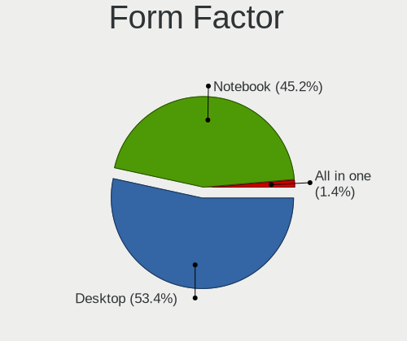

| Name       | Computers | Percent |
|------------|-----------|---------|
| Desktop    | 37        | 54.41%  |
| Notebook   | 30        | 44.12%  |
| All in one | 1         | 1.47%   |

Secure Boot
-----------

Enabled or disabled

| State    | Computers | Percent |
|----------|-----------|---------|
| Disabled | 68        | 100%    |

Coreboot
--------

Have coreboot on board

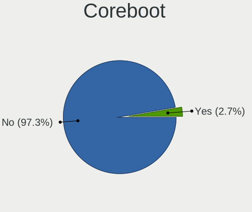

| Used | Computers | Percent |
|------|-----------|---------|
| No   | 66        | 97.06%  |
| Yes  | 2         | 2.94%   |

RAM Size
--------

Total RAM memory

| Size in GB | Computers | Percent |
|------------|-----------|---------|
| 3.01-4.0   | 15        | 22.06%  |
| 16.01-24.0 | 14        | 20.59%  |
| 4.01-8.0   | 13        | 19.12%  |
| 8.01-16.0  | 12        | 17.65%  |
| 32.01-64.0 | 9         | 13.24%  |
| 2.01-3.0   | 2         | 2.94%   |
| 1.01-2.0   | 2         | 2.94%   |
| 24.01-32.0 | 1         | 1.47%   |

RAM Used
--------

Used RAM memory

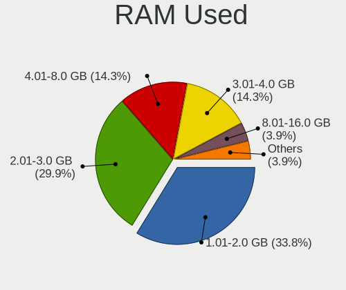

| Used GB   | Computers | Percent |
|-----------|-----------|---------|
| 1.01-2.0  | 27        | 36.99%  |
| 2.01-3.0  | 21        | 28.77%  |
| 3.01-4.0  | 11        | 15.07%  |
| 4.01-8.0  | 9         | 12.33%  |
| 0.51-1.0  | 3         | 4.11%   |
| 8.01-16.0 | 2         | 2.74%   |

Total Drives
------------

Number of drives on board

| Drives | Computers | Percent |
|--------|-----------|---------|
| 1      | 36        | 50.7%   |
| 2      | 16        | 22.54%  |
| 4      | 10        | 14.08%  |
| 3      | 6         | 8.45%   |
| 5      | 3         | 4.23%   |

Has CD-ROM
----------

Has CD-ROM on board

| Presented | Computers | Percent |
|-----------|-----------|---------|
| No        | 45        | 65.22%  |
| Yes       | 24        | 34.78%  |

Has Ethernet
------------

Has Ethernet on board

| Presented | Computers | Percent |
|-----------|-----------|---------|
| Yes       | 58        | 85.29%  |
| No        | 10        | 14.71%  |

Has WiFi
--------

Has WiFi module

| Presented | Computers | Percent |
|-----------|-----------|---------|
| Yes       | 49        | 72.06%  |
| No        | 19        | 27.94%  |

Has Bluetooth
-------------

Has Bluetooth module

| Presented | Computers | Percent |
|-----------|-----------|---------|
| Yes       | 42        | 60.87%  |
| No        | 27        | 39.13%  |

Location
--------

Country
-------

Geographic location (country)

| Country      | Computers | Percent |
|--------------|-----------|---------|
| USA          | 15        | 22.06%  |
| Germany      | 6         | 8.82%   |
| India        | 4         | 5.88%   |
| Romania      | 3         | 4.41%   |
| Netherlands  | 3         | 4.41%   |
| Brazil       | 3         | 4.41%   |
| Argentina    | 3         | 4.41%   |
| UK           | 2         | 2.94%   |
| Russia       | 2         | 2.94%   |
| Norway       | 2         | 2.94%   |
| France       | 2         | 2.94%   |
| Vietnam      | 1         | 1.47%   |
| Venezuela    | 1         | 1.47%   |
| Ukraine      | 1         | 1.47%   |
| Thailand     | 1         | 1.47%   |
| Switzerland  | 1         | 1.47%   |
| Sweden       | 1         | 1.47%   |
| Spain        | 1         | 1.47%   |
| Saudi Arabia | 1         | 1.47%   |
| Poland       | 1         | 1.47%   |
| Philippines  | 1         | 1.47%   |
| Nepal        | 1         | 1.47%   |
| Mexico       | 1         | 1.47%   |
| Kazakhstan   | 1         | 1.47%   |
| Iran         | 1         | 1.47%   |
| Guyana       | 1         | 1.47%   |
| Greece       | 1         | 1.47%   |
| Finland      | 1         | 1.47%   |
| Denmark      | 1         | 1.47%   |
| Czechia      | 1         | 1.47%   |
| Canada       | 1         | 1.47%   |
| Belgium      | 1         | 1.47%   |
| Australia    | 1         | 1.47%   |
| Albania      | 1         | 1.47%   |

City
----

Geographic location (city)

| City                     | Computers | Percent |
|--------------------------|-----------|---------|
| Constanța               | 3         | 4.17%   |
| San Justo                | 2         | 2.78%   |
| Oslo                     | 2         | 2.78%   |
| Yverdon-les-Bains        | 1         | 1.39%   |
| Wendell                  | 1         | 1.39%   |
| Weil am Rhein            | 1         | 1.39%   |
| Vineland                 | 1         | 1.39%   |
| Viby J                   | 1         | 1.39%   |
| Vasco da Gama            | 1         | 1.39%   |
| Toronto                  | 1         | 1.39%   |
| Thessaloniki             | 1         | 1.39%   |
| Stockholm                | 1         | 1.39%   |
| Stare Babice             | 1         | 1.39%   |
| Songkhla                 | 1         | 1.39%   |
| Seville                  | 1         | 1.39%   |
| Severna Park             | 1         | 1.39%   |
| Saint-Just-Saint-Rambert | 1         | 1.39%   |
| Red Oak                  | 1         | 1.39%   |
| Portsmouth               | 1         | 1.39%   |
| Pomeroy                  | 1         | 1.39%   |
| Phoenix                  | 1         | 1.39%   |
| Orenburg                 | 1         | 1.39%   |
| Ochten                   | 1         | 1.39%   |
| Mohali                   | 1         | 1.39%   |
| Milwaukee                | 1         | 1.39%   |
| Miami                    | 1         | 1.39%   |
| Melbourne                | 1         | 1.39%   |
| Lviv                     | 1         | 1.39%   |
| Luckenwalde              | 1         | 1.39%   |
| Lohja                    | 1         | 1.39%   |
| Lipa City                | 1         | 1.39%   |
| Linter                   | 1         | 1.39%   |
| Lexington                | 1         | 1.39%   |
| León                    | 1         | 1.39%   |
| Krefeld                  | 1         | 1.39%   |
| Kozani                   | 1         | 1.39%   |
| Kolkata                  | 1         | 1.39%   |
| Khobar                   | 1         | 1.39%   |
| Kathmandu                | 1         | 1.39%   |
| Jackson                  | 1         | 1.39%   |

Drives
------

Drive Vendor
------------

Hard drive vendors

| Vendor                      | Computers | Drives | Percent |
|-----------------------------|-----------|--------|---------|
| WDC                         | 26        | 35     | 21.31%  |
| Samsung Electronics         | 18        | 27     | 14.75%  |
| Seagate                     | 11        | 13     | 9.02%   |
| Kingston                    | 10        | 13     | 8.2%    |
| SanDisk                     | 9         | 11     | 7.38%   |
| Toshiba                     | 6         | 6      | 4.92%   |
| Crucial                     | 6         | 6      | 4.92%   |
| SK hynix                    | 5         | 5      | 4.1%    |
| Unknown                     | 4         | 4      | 3.28%   |
| PNY                         | 3         | 3      | 2.46%   |
| Intel                       | 3         | 4      | 2.46%   |
| Silicon Motion              | 2         | 2      | 1.64%   |
| Phison                      | 2         | 2      | 1.64%   |
| Hitachi                     | 2         | 2      | 1.64%   |
| SPCC Sol                    | 1         | 1      | 0.82%   |
| SABRENT                     | 1         | 1      | 0.82%   |
| Phison Electronics          | 1         | 1      | 0.82%   |
| Patriot                     | 1         | 1      | 0.82%   |
| Micron Technology           | 1         | 1      | 0.82%   |
| Maxtor                      | 1         | 1      | 0.82%   |
| KIOXIA                      | 1         | 1      | 0.82%   |
| Kingston Technology Company | 1         | 1      | 0.82%   |
| Intenso                     | 1         | 2      | 0.82%   |
| HFS512GD                    | 1         | 1      | 0.82%   |
| Emtec                       | 1         | 1      | 0.82%   |
| China                       | 1         | 1      | 0.82%   |
| Apple                       | 1         | 1      | 0.82%   |
| Advantech                   | 1         | 1      | 0.82%   |
| A-DATA Technology           | 1         | 1      | 0.82%   |

Drive Model
-----------

Hard drive models

| Model                            | Computers | Percent |
|----------------------------------|-----------|---------|
| Samsung SSD 850 EVO 250GB        | 5         | 3.7%    |
| Samsung NVMe SSD Drive 500GB     | 3         | 2.22%   |
| Kingston SA400S37240G 240GB SSD  | 3         | 2.22%   |
| WDC WD10EZEX-08WN4A0 1TB         | 2         | 1.48%   |
| WDC WD10EZEX-08M2NA0 1TB         | 2         | 1.48%   |
| Toshiba DT01ACA050 500GB         | 2         | 1.48%   |
| SK hynix NVMe SSD Drive 128GB    | 2         | 1.48%   |
| Seagate ST4000DM004-2CV104 4TB   | 2         | 1.48%   |
| Seagate ST2000DM006-2DM164 2TB   | 2         | 1.48%   |
| SanDisk NVMe SSD Drive 256GB     | 2         | 1.48%   |
| PNY CS900 240GB SSD              | 2         | 1.48%   |
| Kingston SA400S37480G 480GB SSD  | 2         | 1.48%   |
| Crucial CT1000P1SSD8 1TB         | 2         | 1.48%   |
| Crucial CT1000MX500SSD1 1TB      | 2         | 1.48%   |
| WDC WDS480G2G0B-00EPW0 480GB SSD | 1         | 0.74%   |
| WDC WD6400AAKS-75A7B2 640GB      | 1         | 0.74%   |
| WDC WD5000AVDS-63U7B1 500GB      | 1         | 0.74%   |
| WDC WD5000AVCS-632DY1 500GB      | 1         | 0.74%   |
| WDC WD5000AAKX-003CA0 500GB      | 1         | 0.74%   |
| WDC WD40EZRZ-00GXCB0 4TB         | 1         | 0.74%   |
| WDC WD3200BEVT-75ZCT2 320GB      | 1         | 0.74%   |
| WDC WD3200AAJS-00YZCA0 320GB     | 1         | 0.74%   |
| WDC WD32 00AAJS-00L7A0 320GB     | 1         | 0.74%   |
| WDC WD3000GLFS-01F8U0 304GB      | 1         | 0.74%   |
| WDC WD2500HHTZ-04N21V1 250GB     | 1         | 0.74%   |
| WDC WD2500BEVT-22ZCT0 250GB      | 1         | 0.74%   |
| WDC WD20EARX-00PASB0 2TB         | 1         | 0.74%   |
| WDC WD2003FZEX-00Z4SA0 2TB       | 1         | 0.74%   |
| WDC WD2003FZEX-00SRLA0 2TB       | 1         | 0.74%   |
| WDC WD1600AAJS-00PSA0 160GB      | 1         | 0.74%   |
| WDC WD1600AAJS-00M0A0 160GB      | 1         | 0.74%   |
| WDC WD140EFGX-68B0GN0 14TB       | 1         | 0.74%   |
| WDC WD10SPZX-24Z10T0 1TB         | 1         | 0.74%   |
| WDC WD10SPZX-24Z10 1TB           | 1         | 0.74%   |
| WDC WD10SPSX-00A6WT0 1TB         | 1         | 0.74%   |
| WDC WD10JPCX-24UE4T0 1TB         | 1         | 0.74%   |
| WDC WD10EZRX-00L4HB0 1TB         | 1         | 0.74%   |
| WDC WD10EZEX-21WN4A0 1TB         | 1         | 0.74%   |
| WDC WD10EADS-00P8B0 1TB          | 1         | 0.74%   |
| WDC WD10EADS-00M2B0 1TB          | 1         | 0.74%   |

HDD Vendor
----------

Hard disk drive vendors

| Vendor              | Computers | Drives | Percent |
|---------------------|-----------|--------|---------|
| WDC                 | 25        | 33     | 53.19%  |
| Seagate             | 11        | 13     | 23.4%   |
| Toshiba             | 4         | 4      | 8.51%   |
| Hitachi             | 2         | 2      | 4.26%   |
| Unknown             | 1         | 1      | 2.13%   |
| Samsung Electronics | 1         | 1      | 2.13%   |
| SABRENT             | 1         | 1      | 2.13%   |
| Maxtor              | 1         | 1      | 2.13%   |
| Intenso             | 1         | 2      | 2.13%   |

SSD Vendor
----------

Solid state drive vendors

| Vendor              | Computers | Drives | Percent |
|---------------------|-----------|--------|---------|
| Samsung Electronics | 13        | 18     | 31.71%  |
| Kingston            | 7         | 10     | 17.07%  |
| SanDisk             | 4         | 4      | 9.76%   |
| Crucial             | 4         | 4      | 9.76%   |
| PNY                 | 3         | 3      | 7.32%   |
| WDC                 | 1         | 1      | 2.44%   |
| SPCC Sol            | 1         | 1      | 2.44%   |
| SK hynix            | 1         | 1      | 2.44%   |
| Patriot             | 1         | 1      | 2.44%   |
| Micron Technology   | 1         | 1      | 2.44%   |
| Emtec               | 1         | 1      | 2.44%   |
| China               | 1         | 1      | 2.44%   |
| Apple               | 1         | 1      | 2.44%   |
| Advantech           | 1         | 1      | 2.44%   |
| A-DATA Technology   | 1         | 1      | 2.44%   |

Drive Kind
----------

HDD or SSD

| Kind    | Computers | Drives | Percent |
|---------|-----------|--------|---------|
| HDD     | 39        | 58     | 37.86%  |
| SSD     | 30        | 49     | 29.13%  |
| NVMe    | 27        | 35     | 26.21%  |
| Unknown | 4         | 4      | 3.88%   |
| MMC     | 3         | 3      | 2.91%   |

Drive Connector
---------------

SATA, SAS, NVMe, etc.

| Type | Computers | Drives | Percent |
|------|-----------|--------|---------|
| SATA | 50        | 99     | 56.82%  |
| NVMe | 27        | 35     | 30.68%  |
| SAS  | 8         | 12     | 9.09%   |
| MMC  | 3         | 3      | 3.41%   |

Drive Size
----------

Size of hard drive

| Size in TB | Computers | Drives | Percent |
|------------|-----------|--------|---------|
| 0.01-0.5   | 38        | 67     | 53.52%  |
| 0.51-1.0   | 20        | 25     | 28.17%  |
| 1.01-2.0   | 8         | 9      | 11.27%  |
| 3.01-4.0   | 4         | 5      | 5.63%   |
| 10.01-20.0 | 1         | 1      | 1.41%   |

Space Total
-----------

Amount of disk space available on the file system

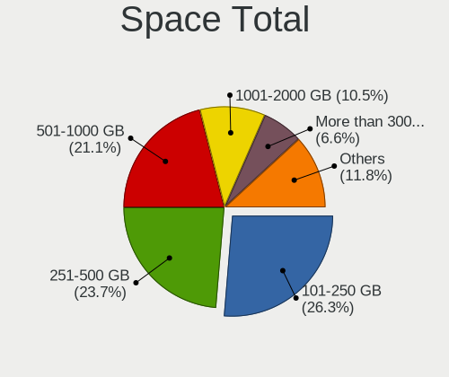

| Size in GB     | Computers | Percent |
|----------------|-----------|---------|
| 101-250        | 20        | 28.57%  |
| 251-500        | 17        | 24.29%  |
| 501-1000       | 14        | 20%     |
| 1001-2000      | 7         | 10%     |
| More than 3000 | 4         | 5.71%   |
| 21-50          | 3         | 4.29%   |
| 51-100         | 3         | 4.29%   |
| 2001-3000      | 2         | 2.86%   |

Space Used
----------

Amount of used disk space

| Used GB        | Computers | Percent |
|----------------|-----------|---------|
| 1-20           | 23        | 31.51%  |
| 21-50          | 12        | 16.44%  |
| 101-250        | 9         | 12.33%  |
| 1001-2000      | 8         | 10.96%  |
| 51-100         | 8         | 10.96%  |
| 251-500        | 6         | 8.22%   |
| 501-1000       | 6         | 8.22%   |
| More than 3000 | 1         | 1.37%   |

Malfunc. Drives
---------------

Drive models with a malfunction

| Model                     | Computers | Drives | Percent |
|---------------------------|-----------|--------|---------|
| WDC WD20EARX-00PASB0 2TB  | 1         | 1      | 33.33%  |
| Seagate ST9320325AS 320GB | 1         | 2      | 33.33%  |
| Crucial CT1000P1SSD8 1TB  | 1         | 1      | 33.33%  |

Malfunc. Drive Vendor
---------------------

Vendors of faulty drives

| Vendor  | Computers | Drives | Percent |
|---------|-----------|--------|---------|
| WDC     | 1         | 1      | 33.33%  |
| Seagate | 1         | 2      | 33.33%  |
| Crucial | 1         | 1      | 33.33%  |

Malfunc. HDD Vendor
-------------------

Vendors of faulty HDD drives

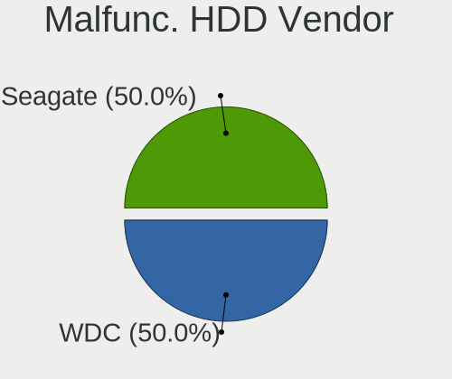

| Vendor  | Computers | Drives | Percent |
|---------|-----------|--------|---------|
| WDC     | 1         | 1      | 50%     |
| Seagate | 1         | 2      | 50%     |

Malfunc. Drive Kind
-------------------

Kinds of faulty drives

| Kind | Computers | Drives | Percent |
|------|-----------|--------|---------|
| HDD  | 2         | 3      | 66.67%  |
| NVMe | 1         | 1      | 33.33%  |

Failed Drives
-------------

Failed drive models

Zero info for selected period =(

Failed Drive Vendor
-------------------

Failed drive vendors

Zero info for selected period =(

Drive Status
------------

Number of failed and malfunc. drives

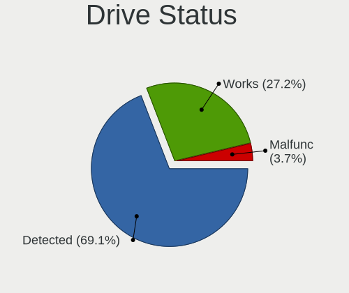

| Status   | Computers | Drives | Percent |
|----------|-----------|--------|---------|
| Detected | 53        | 114    | 69.74%  |
| Works    | 20        | 31     | 26.32%  |
| Malfunc  | 3         | 4      | 3.95%   |

Storage controller
------------------

Storage Vendor
--------------

Storage controller vendors

| Vendor                       | Computers | Percent |
|------------------------------|-----------|---------|
| Intel                        | 37        | 41.57%  |
| AMD                          | 24        | 26.97%  |
| Samsung Electronics          | 6         | 6.74%   |
| SK hynix                     | 4         | 4.49%   |
| SanDisk                      | 4         | 4.49%   |
| Kingston Technology Company  | 4         | 4.49%   |
| Phison Electronics           | 3         | 3.37%   |
| Toshiba America Info Systems | 2         | 2.25%   |
| Silicon Motion               | 2         | 2.25%   |
| Micron/Crucial Technology    | 2         | 2.25%   |
| JMicron Technology           | 1         | 1.12%   |

Storage Model
-------------

Storage controller models

| Model                                                                          | Computers | Percent |
|--------------------------------------------------------------------------------|-----------|---------|
| AMD FCH SATA Controller [AHCI mode]                                            | 17        | 16.04%  |
| Intel Q170/Q150/B150/H170/H110/Z170/CM236 Chipset SATA Controller [AHCI Mode]  | 6         | 5.66%   |
| Intel 8 Series/C220 Series Chipset Family 6-port SATA Controller 1 [AHCI mode] | 6         | 5.66%   |
| Intel NM10/ICH7 Family SATA Controller [IDE mode]                              | 5         | 4.72%   |
| AMD 400 Series Chipset SATA Controller                                         | 5         | 4.72%   |
| Intel 82801G (ICH7 Family) IDE Controller                                      | 4         | 3.77%   |
| Samsung NVMe SSD Controller SM981/PM981/PM983                                  | 3         | 2.83%   |
| Intel Sunrise Point-LP SATA Controller [AHCI mode]                             | 3         | 2.83%   |
| Toshiba America Info Systems XG6 NVMe SSD Controller                           | 2         | 1.89%   |
| SK hynix BC501 NVMe Solid State Drive                                          | 2         | 1.89%   |
| SanDisk WD Blue SN550 NVMe SSD                                                 | 2         | 1.89%   |
| Phison E12 NVMe Controller                                                     | 2         | 1.89%   |
| Micron/Crucial P1 NVMe PCIe SSD                                                | 2         | 1.89%   |
| Intel SSD 600P Series                                                          | 2         | 1.89%   |
| Intel Celeron/Pentium Silver Processor SATA Controller                         | 2         | 1.89%   |
| Intel 8 Series SATA Controller 1 [AHCI mode]                                   | 2         | 1.89%   |
| Intel 6 Series/C200 Series Chipset Family 6 port Mobile SATA AHCI Controller   | 2         | 1.89%   |
| Intel 6 Series/C200 Series Chipset Family 6 port Desktop SATA AHCI Controller  | 2         | 1.89%   |
| AMD SB7x0/SB8x0/SB9x0 SATA Controller [AHCI mode]                              | 2         | 1.89%   |
| AMD SB7x0/SB8x0/SB9x0 IDE Controller                                           | 2         | 1.89%   |
| AMD FCH IDE Controller                                                         | 2         | 1.89%   |
| SK hynix PC300 NVMe Solid State Drive 256GB                                    | 1         | 0.94%   |
| SK hynix Gold P31/PC711 NVMe Solid State Drive                                 | 1         | 0.94%   |
| Silicon Motion SM2263EN/SM2263XT SSD Controller                                | 1         | 0.94%   |
| Silicon Motion SM2262/SM2262EN SSD Controller                                  | 1         | 0.94%   |
| SanDisk WD Blue SN500 / PC SN520 NVMe SSD                                      | 1         | 0.94%   |
| SanDisk WD Black 2018/SN750 / PC SN720 NVMe SSD                                | 1         | 0.94%   |
| Samsung NVMe SSD Controller PM9A1/PM9A3/980PRO                                 | 1         | 0.94%   |
| Samsung NVMe SSD Controller 980                                                | 1         | 0.94%   |
| Samsung Electronics SATA controller                                            | 1         | 0.94%   |
| Phison PS5013 E13 NVMe Controller                                              | 1         | 0.94%   |
| Kingston Company Company Non-Volatile memory controller                        | 1         | 0.94%   |
| Kingston Company OM3PDP3 NVMe SSD                                              | 1         | 0.94%   |
| Kingston Company KC2000 NVMe SSD                                               | 1         | 0.94%   |
| Kingston Company A2000 NVMe SSD                                                | 1         | 0.94%   |
| JMicron JMB363 SATA/IDE Controller                                             | 1         | 0.94%   |
| Intel SSD 660P Series                                                          | 1         | 0.94%   |
| Intel Comet Lake SATA AHCI Controller                                          | 1         | 0.94%   |
| Intel Cannon Point-LP SATA Controller [AHCI Mode]                              | 1         | 0.94%   |
| Intel 82801JI (ICH10 Family) 4 port SATA IDE Controller #1                     | 1         | 0.94%   |

Storage Kind
------------

Kind of storage controller (IDE, SATA, NVMe, SAS, ...)

| Kind | Computers | Percent |
|------|-----------|---------|
| SATA | 52        | 57.14%  |
| NVMe | 26        | 28.57%  |
| IDE  | 12        | 13.19%  |
| RAID | 1         | 1.1%    |

Processor
---------

CPU Vendor
----------

Processor vendors

| Vendor | Computers | Percent |
|--------|-----------|---------|
| Intel  | 43        | 63.24%  |
| AMD    | 25        | 36.76%  |

CPU Model
---------

Processor models

| Model                                       | Computers | Percent |
|---------------------------------------------|-----------|---------|
| Intel Core i7-2640M CPU @ 2.80GHz           | 2         | 2.94%   |
| Intel Core i5-4210U CPU @ 1.70GHz           | 2         | 2.94%   |
| Intel Core i3-4160 CPU @ 3.60GHz            | 2         | 2.94%   |
| Intel 11th Gen Core i7-1165G7 @ 2.80GHz     | 2         | 2.94%   |
| AMD Ryzen 7 5800X 8-Core Processor          | 2         | 2.94%   |
| AMD Ryzen 7 4800H with Radeon Graphics      | 2         | 2.94%   |
| Intel Xeon CPU E3-1271 v3 @ 3.60GHz         | 1         | 1.47%   |
| Intel Pentium Silver N6000 @ 1.10GHz        | 1         | 1.47%   |
| Intel Pentium Dual-Core CPU T4300 @ 2.10GHz | 1         | 1.47%   |
| Intel Pentium Dual-Core CPU E6600 @ 3.06GHz | 1         | 1.47%   |
| Intel Core i7-8565U CPU @ 1.80GHz           | 1         | 1.47%   |
| Intel Core i7-7820HQ CPU @ 2.90GHz          | 1         | 1.47%   |
| Intel Core i7-7500U CPU @ 2.70GHz           | 1         | 1.47%   |
| Intel Core i7-6820HQ CPU @ 2.70GHz          | 1         | 1.47%   |
| Intel Core i7-6700K CPU @ 4.00GHz           | 1         | 1.47%   |
| Intel Core i7-6700 CPU @ 3.40GHz            | 1         | 1.47%   |
| Intel Core i7-4770 CPU @ 3.40GHz            | 1         | 1.47%   |
| Intel Core i7-2600K CPU @ 3.40GHz           | 1         | 1.47%   |
| Intel Core i7-10510U CPU @ 1.80GHz          | 1         | 1.47%   |
| Intel Core i5-8259U CPU @ 2.30GHz           | 1         | 1.47%   |
| Intel Core i5-8250U CPU @ 1.60GHz           | 1         | 1.47%   |
| Intel Core i5-7200U CPU @ 2.50GHz           | 1         | 1.47%   |
| Intel Core i5-6500 CPU @ 3.20GHz            | 1         | 1.47%   |
| Intel Core i5-4690 CPU @ 3.50GHz            | 1         | 1.47%   |
| Intel Core i5-4590 CPU @ 3.30GHz            | 1         | 1.47%   |
| Intel Core i5-10210U CPU @ 1.60GHz          | 1         | 1.47%   |
| Intel Core i3-6006U CPU @ 2.00GHz           | 1         | 1.47%   |
| Intel Core i3-3210 CPU @ 3.20GHz            | 1         | 1.47%   |
| Intel Core i3-2100 CPU @ 3.10GHz            | 1         | 1.47%   |
| Intel Core 2 Quad CPU Q9550 @ 2.83GHz       | 1         | 1.47%   |
| Intel Core 2 Quad CPU Q9400 @ 2.66GHz       | 1         | 1.47%   |
| Intel Core 2 CPU 4300 @ 1.80GHz             | 1         | 1.47%   |
| Intel Celeron N4020 CPU @ 1.10GHz           | 1         | 1.47%   |
| Intel Celeron N4000 CPU @ 1.10GHz           | 1         | 1.47%   |
| Intel Celeron CPU G3930 @ 2.90GHz           | 1         | 1.47%   |
| Intel Celeron CPU E3400 @ 2.60GHz           | 1         | 1.47%   |
| Intel Celeron CPU E3300 @ 2.50GHz           | 1         | 1.47%   |
| Intel Celeron CPU B830 @ 1.80GHz            | 1         | 1.47%   |
| Intel Celeron CPU 540 @ 1.86GHz             | 1         | 1.47%   |
| Intel Atom x5-E8000 CPU @ 1.04GHz           | 1         | 1.47%   |

CPU Model Family
----------------

Processor model prefix

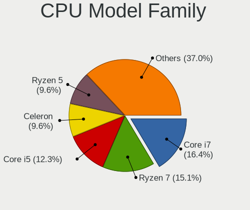

| Model                   | Computers | Percent |
|-------------------------|-----------|---------|
| Intel Core i7           | 11        | 16.18%  |
| Intel Core i5           | 9         | 13.24%  |
| AMD Ryzen 7             | 9         | 13.24%  |
| Intel Celeron           | 7         | 10.29%  |
| AMD Ryzen 5             | 6         | 8.82%   |
| Intel Core i3           | 5         | 7.35%   |
| Other                   | 3         | 4.41%   |
| AMD A10                 | 3         | 4.41%   |
| Intel Pentium Dual-Core | 2         | 2.94%   |
| Intel Core 2 Quad       | 2         | 2.94%   |
| AMD Ryzen 9             | 2         | 2.94%   |
| Intel Xeon              | 1         | 1.47%   |
| Intel Pentium Silver    | 1         | 1.47%   |
| Intel Core 2            | 1         | 1.47%   |
| Intel Atom              | 1         | 1.47%   |
| AMD Ryzen 3             | 1         | 1.47%   |
| AMD Phenom II X4        | 1         | 1.47%   |
| AMD FX                  | 1         | 1.47%   |
| AMD E                   | 1         | 1.47%   |
| AMD A8                  | 1         | 1.47%   |

CPU Cores
---------

Number of processor cores

| Number | Computers | Percent |
|--------|-----------|---------|
| 2      | 26        | 38.24%  |
| 4      | 25        | 36.76%  |
| 8      | 9         | 13.24%  |
| 6      | 5         | 7.35%   |
| 12     | 1         | 1.47%   |
| 3      | 1         | 1.47%   |
| 1      | 1         | 1.47%   |

CPU Sockets
-----------

Number of sockets

| Number | Computers | Percent |
|--------|-----------|---------|
| 1      | 68        | 100%    |

CPU Threads
-----------

Threads per core (Hyper-Threading)

| Number | Computers | Percent |
|--------|-----------|---------|
| 2      | 49        | 72.06%  |
| 1      | 19        | 27.94%  |

CPU Op-Modes
------------

CPU Operation Modes (32-bit, 64-bit)

| Op mode        | Computers | Percent |
|----------------|-----------|---------|
| 32-bit, 64-bit | 68        | 100%    |

CPU Microcode
-------------

Microcode number

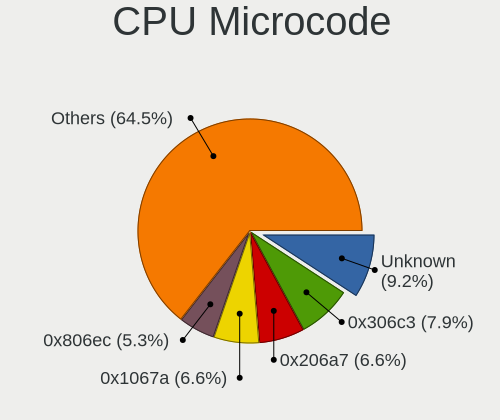

| Number     | Computers | Percent |
|------------|-----------|---------|
| Unknown    | 7         | 9.86%   |
| 0x306c3    | 6         | 8.45%   |
| 0x206a7    | 5         | 7.04%   |
| 0x1067a    | 5         | 7.04%   |
| 0x806ec    | 3         | 4.23%   |
| 0x806c1    | 3         | 4.23%   |
| 0x506e3    | 3         | 4.23%   |
| 0x08600106 | 3         | 4.23%   |
| 0x0800820d | 3         | 4.23%   |
| 0x06003106 | 3         | 4.23%   |
| 0x906e9    | 2         | 2.82%   |
| 0x806ea    | 2         | 2.82%   |
| 0x40651    | 2         | 2.82%   |
| 0x0a50000c | 2         | 2.82%   |
| 0x08701021 | 2         | 2.82%   |
| 0x08701013 | 2         | 2.82%   |
| 0x906c0    | 1         | 1.41%   |
| 0x806e9    | 1         | 1.41%   |
| 0x706a8    | 1         | 1.41%   |
| 0x706a1    | 1         | 1.41%   |
| 0x6f2      | 1         | 1.41%   |
| 0x406e3    | 1         | 1.41%   |
| 0x306a9    | 1         | 1.41%   |
| 0x10661    | 1         | 1.41%   |
| 0x0a201204 | 1         | 1.41%   |
| 0x0a201016 | 1         | 1.41%   |
| 0x08608103 | 1         | 1.41%   |
| 0x08108109 | 1         | 1.41%   |
| 0x08108102 | 1         | 1.41%   |
| 0x0800820b | 1         | 1.41%   |
| 0x06001119 | 1         | 1.41%   |
| 0x06000852 | 1         | 1.41%   |
| 0x05000029 | 1         | 1.41%   |
| 0x010000c8 | 1         | 1.41%   |

CPU Microarch
-------------

Microarchitecture

| Name          | Computers | Percent |
|---------------|-----------|---------|
| KabyLake      | 9         | 13.24%  |
| Haswell       | 8         | 11.76%  |
| Zen 2         | 7         | 10.29%  |
| Penryn        | 6         | 8.82%   |
| Zen+          | 5         | 7.35%   |
| Skylake       | 5         | 7.35%   |
| SandyBridge   | 5         | 7.35%   |
| Zen 3         | 4         | 5.88%   |
| TigerLake     | 3         | 4.41%   |
| Steamroller   | 3         | 4.41%   |
| Piledriver    | 2         | 2.94%   |
| Goldmont plus | 2         | 2.94%   |
| Core          | 2         | 2.94%   |
| Unknown       | 2         | 2.94%   |
| Tremont       | 1         | 1.47%   |
| Silvermont    | 1         | 1.47%   |
| K10           | 1         | 1.47%   |
| IvyBridge     | 1         | 1.47%   |
| Bobcat        | 1         | 1.47%   |

Graphics
--------

GPU Vendor
----------

Vendors of graphics cards

| Vendor | Computers | Percent |
|--------|-----------|---------|
| Intel  | 34        | 42.5%   |
| AMD    | 29        | 36.25%  |
| Nvidia | 17        | 21.25%  |

GPU Model
---------

Graphics card models

| Model                                                                       | Computers | Percent |
|-----------------------------------------------------------------------------|-----------|---------|
| Intel 2nd Generation Core Processor Family Integrated Graphics Controller   | 4         | 4.94%   |
| Intel 4 Series Chipset Integrated Graphics Controller                       | 3         | 3.7%    |
| AMD Renoir                                                                  | 3         | 3.7%    |
| AMD Ellesmere [Radeon RX 470/480/570/570X/580/580X/590]                     | 3         | 3.7%    |
| Nvidia GP107 [GeForce GTX 1050 Ti]                                          | 2         | 2.47%   |
| Intel Xeon E3-1200 v3/4th Gen Core Processor Integrated Graphics Controller | 2         | 2.47%   |
| Intel TigerLake-LP GT2 [Iris Xe Graphics]                                   | 2         | 2.47%   |
| Intel HD Graphics 620                                                       | 2         | 2.47%   |
| Intel HD Graphics 530                                                       | 2         | 2.47%   |
| Intel Haswell-ULT Integrated Graphics Controller                            | 2         | 2.47%   |
| Intel GeminiLake [UHD Graphics 600]                                         | 2         | 2.47%   |
| Intel CometLake-U GT2 [UHD Graphics]                                        | 2         | 2.47%   |
| Intel 4th Generation Core Processor Family Integrated Graphics Controller   | 2         | 2.47%   |
| AMD Picasso/Raven 2 [Radeon Vega Series / Radeon Vega Mobile Series]        | 2         | 2.47%   |
| AMD Navi 10 [Radeon RX 5600 OEM/5600 XT / 5700/5700 XT]                     | 2         | 2.47%   |
| AMD Lucienne                                                                | 2         | 2.47%   |
| AMD Kaveri [Radeon R7 Graphics]                                             | 2         | 2.47%   |
| AMD Cezanne [Radeon Vega Series / Radeon Vega Mobile Series]                | 2         | 2.47%   |
| Nvidia TU116M [GeForce GTX 1660 Ti Mobile]                                  | 1         | 1.23%   |
| Nvidia GT218 [GeForce 210]                                                  | 1         | 1.23%   |
| Nvidia GT216 [GeForce GT 220]                                               | 1         | 1.23%   |
| Nvidia GP106 [GeForce GTX 1060 6GB]                                         | 1         | 1.23%   |
| Nvidia GM108M [GeForce 930MX]                                               | 1         | 1.23%   |
| Nvidia GM108M [GeForce 840M]                                                | 1         | 1.23%   |
| Nvidia GM107 [GeForce 940MX]                                                | 1         | 1.23%   |
| Nvidia GK208 [GeForce GT 630 Rev. 2]                                        | 1         | 1.23%   |
| Nvidia GK104 [GeForce GTX 770]                                              | 1         | 1.23%   |
| Nvidia GF119 [GeForce 605]                                                  | 1         | 1.23%   |
| Nvidia GF117M [GeForce 610M/710M/810M/820M / GT 620M/625M/630M/720M]        | 1         | 1.23%   |
| Nvidia GF108 [GeForce GT 630]                                               | 1         | 1.23%   |
| Nvidia GF106GL [Quadro 2000]                                                | 1         | 1.23%   |
| Nvidia GA106M [GeForce RTX 3060 Mobile / Max-Q]                             | 1         | 1.23%   |
| Nvidia G92 [GeForce 9800 GT]                                                | 1         | 1.23%   |
| Intel WhiskeyLake-U GT2 [UHD Graphics 620]                                  | 1         | 1.23%   |
| Intel UHD Graphics 620                                                      | 1         | 1.23%   |
| Intel Tiger Lake-LP GT2 [UHD Graphics G4]                                   | 1         | 1.23%   |
| Intel Mobile GM965/GL960 Integrated Graphics Controller (secondary)         | 1         | 1.23%   |
| Intel Mobile GM965/GL960 Integrated Graphics Controller (primary)           | 1         | 1.23%   |
| Intel Mobile 4 Series Chipset Integrated Graphics Controller                | 1         | 1.23%   |
| Intel JasperLake [UHD Graphics]                                             | 1         | 1.23%   |

GPU Combo
---------

Combinations of graphics cards

| Name           | Computers | Percent |
|----------------|-----------|---------|
| 1 x AMD        | 25        | 36.76%  |
| 1 x Intel      | 24        | 35.29%  |
| 1 x Nvidia     | 10        | 14.71%  |
| Intel + Nvidia | 5         | 7.35%   |
| Intel + AMD    | 2         | 2.94%   |
| AMD + Nvidia   | 2         | 2.94%   |

GPU Driver
----------

Free vs proprietary

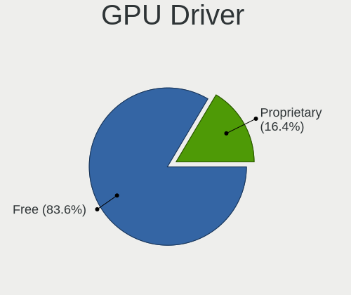

| Driver      | Computers | Percent |
|-------------|-----------|---------|
| Free        | 57        | 83.82%  |
| Proprietary | 11        | 16.18%  |

GPU Memory
----------

Total video memory

| Size in GB | Computers | Percent |
|------------|-----------|---------|
| Unknown    | 28        | 41.18%  |
| 1.01-2.0   | 13        | 19.12%  |
| 0.51-1.0   | 9         | 13.24%  |
| 3.01-4.0   | 5         | 7.35%   |
| 0.01-0.5   | 5         | 7.35%   |
| 7.01-8.0   | 3         | 4.41%   |
| 5.01-6.0   | 3         | 4.41%   |
| 8.01-16.0  | 2         | 2.94%   |

Monitor
-------

Monitor Vendor
--------------

Monitor vendors

| Vendor                  | Computers | Percent |
|-------------------------|-----------|---------|
| Samsung Electronics     | 12        | 15%     |
| Goldstar                | 8         | 10%     |
| Chimei Innolux          | 8         | 10%     |
| AOC                     | 8         | 10%     |
| AU Optronics            | 6         | 7.5%    |
| BOE                     | 5         | 6.25%   |
| Ancor Communications    | 5         | 6.25%   |
| LG Display              | 3         | 3.75%   |
| Dell                    | 3         | 3.75%   |
| Acer                    | 3         | 3.75%   |
| Philips                 | 2         | 2.5%    |
| NEC Computers           | 2         | 2.5%    |
| Lenovo                  | 2         | 2.5%    |
| BenQ                    | 2         | 2.5%    |
| Toshiba                 | 1         | 1.25%   |
| Sharp                   | 1         | 1.25%   |
| PANDA                   | 1         | 1.25%   |
| Microstep               | 1         | 1.25%   |
| LG Electronics          | 1         | 1.25%   |
| Hewlett-Packard         | 1         | 1.25%   |
| CSO                     | 1         | 1.25%   |
| Chi Mei Optoelectronics | 1         | 1.25%   |
| ASUSTek Computer        | 1         | 1.25%   |
| Apple                   | 1         | 1.25%   |
| Unknown                 | 1         | 1.25%   |

Monitor Model
-------------

Monitor models

| Model                                                                | Computers | Percent |
|----------------------------------------------------------------------|-----------|---------|
| AOC 24G1WG4 AOC2401 1920x1080 521x293mm 23.5-inch                    | 3         | 3.57%   |
| Goldstar L227W GSM566E 1680x1050 474x296mm 22.0-inch                 | 2         | 2.38%   |
| Toshiba Internal LCD TOS5091 1366x768 344x193mm 15.5-inch            | 1         | 1.19%   |
| Sharp LCD Monitor HDMI 1920x1080                                     | 1         | 1.19%   |
| Samsung Electronics SyncMaster SAM05CB 1920x1080 530x300mm 24.0-inch | 1         | 1.19%   |
| Samsung Electronics SyncMaster SAM029A 1920x1200 582x364mm 27.0-inch | 1         | 1.19%   |
| Samsung Electronics SyncMaster SAM0272 1280x1024 338x270mm 17.0-inch | 1         | 1.19%   |
| Samsung Electronics SyncMaster SAM01CE 1024x768 304x228mm 15.0-inch  | 1         | 1.19%   |
| Samsung Electronics SyncMaster SAM01B7 1280x1024 338x270mm 17.0-inch | 1         | 1.19%   |
| Samsung Electronics S27D590C SAM0BEA 1920x1080 598x336mm 27.0-inch   | 1         | 1.19%   |
| Samsung Electronics S22B150 SAM08A3 1920x1080 477x268mm 21.5-inch    | 1         | 1.19%   |
| Samsung Electronics LCD Monitor SM2333TN 1920x1080                   | 1         | 1.19%   |
| Samsung Electronics LCD Monitor SEC5441 1366x768 293x165mm 13.2-inch | 1         | 1.19%   |
| Samsung Electronics LCD Monitor SEC3358 1280x800 331x207mm 15.4-inch | 1         | 1.19%   |
| Samsung Electronics LCD Monitor SEC3150 1366x768 344x193mm 15.5-inch | 1         | 1.19%   |
| Samsung Electronics C27F591 SAM0D37 1920x1080 598x336mm 27.0-inch    | 1         | 1.19%   |
| Samsung Electronics C27F591 SAM0D36 1920x1080 600x340mm 27.2-inch    | 1         | 1.19%   |
| Philips 273PLPH PHL08A8 1920x1080 598x336mm 27.0-inch                | 1         | 1.19%   |
| Philips 223E PHLC049 1920x1080 476x268mm 21.5-inch                   | 1         | 1.19%   |
| PANDA LCD Monitor NCP0046 1920x1080 344x194mm 15.5-inch              | 1         | 1.19%   |
| NEC Computers LCD Monitor LCD92VM 1280x1024                          | 1         | 1.19%   |
| NEC Computers EA191M NEC673E 1280x1024 376x301mm 19.0-inch           | 1         | 1.19%   |
| Microstep LCD Monitor MSI G241                                       | 1         | 1.19%   |
| LG Electronics LCD Monitor E2241 1920x1080                           | 1         | 1.19%   |
| LG Display LCD Monitor LGD06FB 1920x1080 309x174mm 14.0-inch         | 1         | 1.19%   |
| LG Display LCD Monitor LGD05FE 1920x1080 344x194mm 15.5-inch         | 1         | 1.19%   |
| LG Display LCD Monitor LGD053C 1920x1080 309x174mm 14.0-inch         | 1         | 1.19%   |
| Lenovo LEN LT2452pwC LEN1144 1920x1080 518x324mm 24.1-inch           | 1         | 1.19%   |
| Lenovo D22-10 LEN65E4 1920x1080 476x268mm 21.5-inch                  | 1         | 1.19%   |
| Hewlett-Packard 24y HPN3504 1920x1080 528x297mm 23.9-inch            | 1         | 1.19%   |
| Goldstar W1942 GSM4B70 1440x900 408x255mm 18.9-inch                  | 1         | 1.19%   |
| Goldstar W1642 GSM3E86 1360x768 344x194mm 15.5-inch                  | 1         | 1.19%   |
| Goldstar Ultra HD GSM5B08 3780x2160 600x340mm 27.2-inch              | 1         | 1.19%   |
| Goldstar L227W GSM566F 1680x1050 474x296mm 22.0-inch                 | 1         | 1.19%   |
| Goldstar E2050 GSM4EAE 1600x900 443x249mm 20.0-inch                  | 1         | 1.19%   |
| Goldstar 19EN33 GSM4C18 1366x768 410x230mm 18.5-inch                 | 1         | 1.19%   |
| Dell SE2419HR DELF113 1920x1080 527x296mm 23.8-inch                  | 1         | 1.19%   |
| Dell S3222DGM DELD110 2560x1440 697x392mm 31.5-inch                  | 1         | 1.19%   |
| Dell 1908WFP DELF007 1440x900 408x255mm 18.9-inch                    | 1         | 1.19%   |
| CSO LCD Monitor CSO1500 3840x2160 344x194mm 15.5-inch                | 1         | 1.19%   |

Monitor Resolution
------------------

Monitor screen resolution

| Resolution         | Computers | Percent |
|--------------------|-----------|---------|
| 1920x1080 (FHD)    | 34        | 43.59%  |
| 1366x768 (WXGA)    | 15        | 19.23%  |
| 3840x2160 (4K)     | 5         | 6.41%   |
| 2560x1440 (QHD)    | 5         | 6.41%   |
| 1680x1050 (WSXGA+) | 4         | 5.13%   |
| 1280x1024 (SXGA)   | 4         | 5.13%   |
| 1920x1200 (WUXGA)  | 2         | 2.56%   |
| 5760x1080          | 1         | 1.28%   |
| 2560x1080          | 1         | 1.28%   |
| 2256x1504          | 1         | 1.28%   |
| 1600x900 (HD+)     | 1         | 1.28%   |
| 1440x900 (WXGA+)   | 1         | 1.28%   |
| 1360x768           | 1         | 1.28%   |
| 1280x800 (WXGA)    | 1         | 1.28%   |
| 1024x768 (XGA)     | 1         | 1.28%   |
| Unknown            | 1         | 1.28%   |

Monitor Diagonal
----------------

Diagonal size in inches

| Inches  | Computers | Percent |
|---------|-----------|---------|
| 15      | 19        | 24.68%  |
| 24      | 9         | 11.69%  |
| 27      | 8         | 10.39%  |
| Unknown | 7         | 9.09%   |
| 23      | 5         | 6.49%   |
| 21      | 5         | 6.49%   |
| 13      | 5         | 6.49%   |
| 18      | 4         | 5.19%   |
| 14      | 4         | 5.19%   |
| 22      | 3         | 3.9%    |
| 17      | 2         | 2.6%    |
| 11      | 2         | 2.6%    |
| 31      | 1         | 1.3%    |
| 29      | 1         | 1.3%    |
| 20      | 1         | 1.3%    |
| 19      | 1         | 1.3%    |

Monitor Width
-------------

Physical width

| Width in mm | Computers | Percent |
|-------------|-----------|---------|
| 301-350     | 26        | 33.77%  |
| 501-600     | 21        | 27.27%  |
| 401-500     | 14        | 18.18%  |
| Unknown     | 7         | 9.09%   |
| 201-300     | 5         | 6.49%   |
| 601-700     | 2         | 2.6%    |
| 351-400     | 2         | 2.6%    |

Aspect Ratio
------------

Proportional relationship between the width and the height

| Ratio   | Computers | Percent |
|---------|-----------|---------|
| 16/9    | 49        | 66.22%  |
| 16/10   | 11        | 14.86%  |
| Unknown | 7         | 9.46%   |
| 5/4     | 3         | 4.05%   |
| 3/2     | 2         | 2.7%    |
| 4/3     | 1         | 1.35%   |
| 21/9    | 1         | 1.35%   |

Monitor Area
------------

Area in inch²

| Area in inch² | Computers | Percent |
|----------------|-----------|---------|
| 101-110        | 19        | 24.36%  |
| 201-250        | 16        | 20.51%  |
| 301-350        | 9         | 11.54%  |
| 81-90          | 7         | 8.97%   |
| Unknown        | 7         | 8.97%   |
| 251-300        | 5         | 6.41%   |
| 151-200        | 5         | 6.41%   |
| 141-150        | 5         | 6.41%   |
| 71-80          | 2         | 2.56%   |
| 51-60          | 2         | 2.56%   |
| 351-500        | 1         | 1.28%   |

Pixel Density
-------------

Pixels per inch

| Density       | Computers | Percent |
|---------------|-----------|---------|
| 51-100        | 32        | 43.24%  |
| 101-120       | 15        | 20.27%  |
| 121-160       | 14        | 18.92%  |
| Unknown       | 7         | 9.46%   |
| 161-240       | 4         | 5.41%   |
| More than 240 | 2         | 2.7%    |

Multiple Monitors
-----------------

Total monitors connected

| Total | Computers | Percent |
|-------|-----------|---------|
| 1     | 51        | 75%     |
| 2     | 15        | 22.06%  |
| 3     | 2         | 2.94%   |

Network
-------

Net Controller Vendor
---------------------

Controller vendors

| Vendor                   | Computers | Percent |
|--------------------------|-----------|---------|
| Realtek Semiconductor    | 40        | 39.22%  |
| Intel                    | 28        | 27.45%  |
| Qualcomm Atheros         | 15        | 14.71%  |
| MediaTek                 | 4         | 3.92%   |
| Broadcom                 | 3         | 2.94%   |
| Marvell Technology Group | 2         | 1.96%   |
| Xiaomi                   | 1         | 0.98%   |
| TP-Link                  | 1         | 0.98%   |
| T & A Mobile Phones      | 1         | 0.98%   |
| Ralink Technology        | 1         | 0.98%   |
| Linksys                  | 1         | 0.98%   |
| Huawei Technologies      | 1         | 0.98%   |
| Dell                     | 1         | 0.98%   |
| D-Link System            | 1         | 0.98%   |
| Belkin Components        | 1         | 0.98%   |
| ASIX Electronics         | 1         | 0.98%   |

Net Controller Model
--------------------

Controller models

| Model                                                             | Computers | Percent |
|-------------------------------------------------------------------|-----------|---------|
| Realtek RTL8111/8168/8411 PCI Express Gigabit Ethernet Controller | 32        | 26.67%  |
| Intel Wi-Fi 6 AX200                                               | 7         | 5.83%   |
| Intel I211 Gigabit Network Connection                             | 4         | 3.33%   |
| Qualcomm Atheros QCA9565 / AR9565 Wireless Network Adapter        | 3         | 2.5%    |
| Qualcomm Atheros QCA9377 802.11ac Wireless Network Adapter        | 3         | 2.5%    |
| Intel Wireless 3165                                               | 3         | 2.5%    |
| Realtek RTL88x2bu [AC1200 Techkey]                                | 2         | 1.67%   |
| Qualcomm Atheros AR9285 Wireless Network Adapter (PCI-Express)    | 2         | 1.67%   |
| MediaTek MT7921K (RZ608) Wi-Fi 6E 80MHz                           | 2         | 1.67%   |
| Marvell Group 88E8040 PCI-E Fast Ethernet Controller              | 2         | 1.67%   |
| Intel Wi-Fi 6 AX210/AX211/AX411 160MHz                            | 2         | 1.67%   |
| Intel Wi-Fi 6 AX201                                               | 2         | 1.67%   |
| Intel Ethernet Controller I225-V                                  | 2         | 1.67%   |
| Intel Ethernet Connection I217-LM                                 | 2         | 1.67%   |
| Intel 82579LM Gigabit Network Connection (Lewisville)             | 2         | 1.67%   |
| Xiaomi Mi/Redmi series (RNDIS)                                    | 1         | 0.83%   |
| TP-Link UE300 10/100/1000 LAN (ethernet mode) [Realtek RTL8153]   | 1         | 0.83%   |
| T & A Mobile Phones Alcatel JOY TAB 2                             | 1         | 0.83%   |
| Realtek RTL8822BE 802.11a/b/g/n/ac WiFi adapter                   | 1         | 0.83%   |
| Realtek RTL8821CE 802.11ac PCIe Wireless Network Adapter          | 1         | 0.83%   |
| Realtek RTL8821AE 802.11ac PCIe Wireless Network Adapter          | 1         | 0.83%   |
| Realtek RTL8723BE PCIe Wireless Network Adapter                   | 1         | 0.83%   |
| Realtek RTL8723AE PCIe Wireless Network Adapter                   | 1         | 0.83%   |
| Realtek RTL8188EUS 802.11n Wireless Network Adapter               | 1         | 0.83%   |
| Realtek RTL8187 Wireless Adapter                                  | 1         | 0.83%   |
| Realtek RTL8125 2.5GbE Controller                                 | 1         | 0.83%   |
| Realtek RTL-8100/8101L/8139 PCI Fast Ethernet Adapter             | 1         | 0.83%   |
| Realtek Killer E2600 Gigabit Ethernet Controller                  | 1         | 0.83%   |
| Realtek 802.11n WLAN Adapter                                      | 1         | 0.83%   |
| Realtek 802.11ac NIC                                              | 1         | 0.83%   |
| Ralink MT7601U Wireless Adapter                                   | 1         | 0.83%   |
| Qualcomm Atheros QCA8171 Gigabit Ethernet                         | 1         | 0.83%   |
| Qualcomm Atheros QCA6174 802.11ac Wireless Network Adapter        | 1         | 0.83%   |
| Qualcomm Atheros AR9485 Wireless Network Adapter                  | 1         | 0.83%   |
| Qualcomm Atheros AR9227 Wireless Network Adapter                  | 1         | 0.83%   |
| Qualcomm Atheros AR8162 Fast Ethernet                             | 1         | 0.83%   |
| Qualcomm Atheros AR8152 v2.0 Fast Ethernet                        | 1         | 0.83%   |
| Qualcomm Atheros AR8151 v2.0 Gigabit Ethernet                     | 1         | 0.83%   |
| Qualcomm Atheros AR8131 Gigabit Ethernet                          | 1         | 0.83%   |
| Qualcomm Atheros AR5212/5213/2414 Wireless Network Adapter        | 1         | 0.83%   |

Wireless Vendor
---------------

Wireless vendors

| Vendor                | Computers | Percent |
|-----------------------|-----------|---------|
| Intel                 | 22        | 39.29%  |
| Qualcomm Atheros      | 12        | 21.43%  |
| Realtek Semiconductor | 11        | 19.64%  |
| MediaTek              | 4         | 7.14%   |
| Broadcom              | 3         | 5.36%   |
| Ralink Technology     | 1         | 1.79%   |
| Linksys               | 1         | 1.79%   |
| D-Link System         | 1         | 1.79%   |
| Belkin Components     | 1         | 1.79%   |

Wireless Model
--------------

Wireless models

| Model                                                                                   | Computers | Percent |
|-----------------------------------------------------------------------------------------|-----------|---------|
| Intel Wi-Fi 6 AX200                                                                     | 7         | 12.28%  |
| Qualcomm Atheros QCA9565 / AR9565 Wireless Network Adapter                              | 3         | 5.26%   |
| Qualcomm Atheros QCA9377 802.11ac Wireless Network Adapter                              | 3         | 5.26%   |
| Intel Wireless 3165                                                                     | 3         | 5.26%   |
| Realtek RTL88x2bu [AC1200 Techkey]                                                      | 2         | 3.51%   |
| Qualcomm Atheros AR9285 Wireless Network Adapter (PCI-Express)                          | 2         | 3.51%   |
| MediaTek MT7921K (RZ608) Wi-Fi 6E 80MHz                                                 | 2         | 3.51%   |
| Intel Wi-Fi 6 AX210/AX211/AX411 160MHz                                                  | 2         | 3.51%   |
| Intel Wi-Fi 6 AX201                                                                     | 2         | 3.51%   |
| Realtek RTL8822BE 802.11a/b/g/n/ac WiFi adapter                                         | 1         | 1.75%   |
| Realtek RTL8821CE 802.11ac PCIe Wireless Network Adapter                                | 1         | 1.75%   |
| Realtek RTL8821AE 802.11ac PCIe Wireless Network Adapter                                | 1         | 1.75%   |
| Realtek RTL8723BE PCIe Wireless Network Adapter                                         | 1         | 1.75%   |
| Realtek RTL8723AE PCIe Wireless Network Adapter                                         | 1         | 1.75%   |
| Realtek RTL8188EUS 802.11n Wireless Network Adapter                                     | 1         | 1.75%   |
| Realtek RTL8187 Wireless Adapter                                                        | 1         | 1.75%   |
| Realtek 802.11n WLAN Adapter                                                            | 1         | 1.75%   |
| Realtek 802.11ac NIC                                                                    | 1         | 1.75%   |
| Ralink MT7601U Wireless Adapter                                                         | 1         | 1.75%   |
| Qualcomm Atheros QCA6174 802.11ac Wireless Network Adapter                              | 1         | 1.75%   |
| Qualcomm Atheros AR9485 Wireless Network Adapter                                        | 1         | 1.75%   |
| Qualcomm Atheros AR9227 Wireless Network Adapter                                        | 1         | 1.75%   |
| Qualcomm Atheros AR5212/5213/2414 Wireless Network Adapter                              | 1         | 1.75%   |
| MediaTek MT7921 802.11ax PCI Express Wireless Network Adapter                           | 1         | 1.75%   |
| MediaTek MT7612U 802.11a/b/g/n/ac Wireless Adapter                                      | 1         | 1.75%   |
| Linksys WUSB6100M 802.11a/b/g/n/ac Wireless Adapter                                     | 1         | 1.75%   |
| Intel Wireless-AC 9260                                                                  | 1         | 1.75%   |
| Intel Wireless 8265 / 8275                                                              | 1         | 1.75%   |
| Intel Wireless 8260                                                                     | 1         | 1.75%   |
| Intel Wireless 7265                                                                     | 1         | 1.75%   |
| Intel Wi-Fi 6 AX201 160MHz                                                              | 1         | 1.75%   |
| Intel PRO/Wireless 4965 AG or AGN [Kedron] Network Connection                           | 1         | 1.75%   |
| Intel Dual Band Wireless-AC 3168NGW [Stone Peak]                                        | 1         | 1.75%   |
| Intel Centrino Ultimate-N 6300                                                          | 1         | 1.75%   |
| Intel Centrino Advanced-N 6230 [Rainbow Peak]                                           | 1         | 1.75%   |
| D-Link System AirPlus G DWL-G122 Wireless Adapter(rev.C1) [Ralink RT2571W]              | 1         | 1.75%   |
| Broadcom BCM43602 802.11ac Wireless LAN SoC                                             | 1         | 1.75%   |
| Broadcom BCM4360 802.11ac Wireless Network Adapter                                      | 1         | 1.75%   |
| Broadcom BCM4311 802.11b/g WLAN                                                         | 1         | 1.75%   |
| Belkin Components F7D2102 802.11n N300 Micro Wireless Adapter v3000 [Realtek RTL8192CU] | 1         | 1.75%   |

Ethernet Vendor
---------------

Ethernet vendors

| Vendor                   | Computers | Percent |
|--------------------------|-----------|---------|
| Realtek Semiconductor    | 35        | 57.38%  |
| Intel                    | 14        | 22.95%  |
| Qualcomm Atheros         | 5         | 8.2%    |
| Marvell Technology Group | 2         | 3.28%   |
| Xiaomi                   | 1         | 1.64%   |
| TP-Link                  | 1         | 1.64%   |
| Huawei Technologies      | 1         | 1.64%   |
| Broadcom                 | 1         | 1.64%   |
| ASIX Electronics         | 1         | 1.64%   |

Ethernet Model
--------------

Ethernet models

| Model                                                             | Computers | Percent |
|-------------------------------------------------------------------|-----------|---------|
| Realtek RTL8111/8168/8411 PCI Express Gigabit Ethernet Controller | 32        | 52.46%  |
| Intel I211 Gigabit Network Connection                             | 4         | 6.56%   |
| Marvell Group 88E8040 PCI-E Fast Ethernet Controller              | 2         | 3.28%   |
| Intel Ethernet Controller I225-V                                  | 2         | 3.28%   |
| Intel Ethernet Connection I217-LM                                 | 2         | 3.28%   |
| Intel 82579LM Gigabit Network Connection (Lewisville)             | 2         | 3.28%   |
| Xiaomi Mi/Redmi series (RNDIS)                                    | 1         | 1.64%   |
| TP-Link UE300 10/100/1000 LAN (ethernet mode) [Realtek RTL8153]   | 1         | 1.64%   |
| Realtek RTL8125 2.5GbE Controller                                 | 1         | 1.64%   |
| Realtek RTL-8100/8101L/8139 PCI Fast Ethernet Adapter             | 1         | 1.64%   |
| Realtek Killer E2600 Gigabit Ethernet Controller                  | 1         | 1.64%   |
| Qualcomm Atheros QCA8171 Gigabit Ethernet                         | 1         | 1.64%   |
| Qualcomm Atheros AR8162 Fast Ethernet                             | 1         | 1.64%   |
| Qualcomm Atheros AR8152 v2.0 Fast Ethernet                        | 1         | 1.64%   |
| Qualcomm Atheros AR8151 v2.0 Gigabit Ethernet                     | 1         | 1.64%   |
| Qualcomm Atheros AR8131 Gigabit Ethernet                          | 1         | 1.64%   |
| Intel PRO/100 VE Network Connection                               | 1         | 1.64%   |
| Intel Ethernet Connection (5) I219-LM                             | 1         | 1.64%   |
| Intel Ethernet Connection (2) I219-LM                             | 1         | 1.64%   |
| Intel Ethernet Connection (13) I219-V                             | 1         | 1.64%   |
| Huawei MLA-L11                                                    | 1         | 1.64%   |
| Broadcom NetXtreme BCM57766 Gigabit Ethernet PCIe                 | 1         | 1.64%   |
| ASIX AX88179 Gigabit Ethernet                                     | 1         | 1.64%   |

Net Controller Kind
-------------------

Ethernet, WiFi or modem

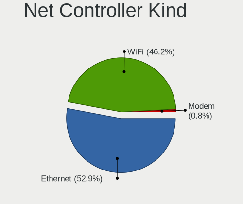

| Kind     | Computers | Percent |
|----------|-----------|---------|
| Ethernet | 58        | 52.73%  |
| WiFi     | 50        | 45.45%  |
| Modem    | 1         | 0.91%   |
| Unknown  | 1         | 0.91%   |

Used Controller
---------------

Currently used network controller

| Kind     | Computers | Percent |
|----------|-----------|---------|
| WiFi     | 37        | 51.39%  |
| Ethernet | 35        | 48.61%  |

NICs
----

Total network controllers on board

| Total | Computers | Percent |
|-------|-----------|---------|
| 1     | 33        | 48.53%  |
| 2     | 32        | 47.06%  |
| 3     | 2         | 2.94%   |
| 0     | 1         | 1.47%   |

IPv6
----

IPv6 vs IPv4

| Used | Computers | Percent |
|------|-----------|---------|
| No   | 48        | 69.57%  |
| Yes  | 21        | 30.43%  |

Bluetooth
---------

Bluetooth Vendor
----------------

Controller vendors

| Vendor                          | Computers | Percent |
|---------------------------------|-----------|---------|
| Intel                           | 19        | 43.18%  |
| Qualcomm Atheros Communications | 5         | 11.36%  |
| Cambridge Silicon Radio         | 4         | 9.09%   |
| Realtek Semiconductor           | 3         | 6.82%   |
| Broadcom                        | 3         | 6.82%   |
| MediaTek                        | 2         | 4.55%   |
| Lite-On Technology              | 2         | 4.55%   |
| Toshiba                         | 1         | 2.27%   |
| IMC Networks                    | 1         | 2.27%   |
| Foxconn / Hon Hai               | 1         | 2.27%   |
| Dell                            | 1         | 2.27%   |
| ASUSTek Computer                | 1         | 2.27%   |
| Apple                           | 1         | 2.27%   |

Bluetooth Model
---------------

Controller models

| Model                                               | Computers | Percent |
|-----------------------------------------------------|-----------|---------|
| Intel Bluetooth wireless interface                  | 6         | 13.64%  |
| Intel AX200 Bluetooth                               | 6         | 13.64%  |
| Cambridge Silicon Radio Bluetooth Dongle (HCI mode) | 4         | 9.09%   |
| Qualcomm Atheros  Bluetooth Device                  | 3         | 6.82%   |
| Intel AX201 Bluetooth                               | 3         | 6.82%   |
| Qualcomm Atheros AR3012 Bluetooth 4.0               | 2         | 4.55%   |
| MediaTek Wireless_Device                            | 2         | 4.55%   |
| Intel AX210 Bluetooth                               | 2         | 4.55%   |
| Toshiba RT Bluetooth Radio                          | 1         | 2.27%   |
| Realtek RTL8821A Bluetooth                          | 1         | 2.27%   |
| Realtek  Bluetooth 4.2 Adapter                      | 1         | 2.27%   |
| Realtek Bluetooth Radio                             | 1         | 2.27%   |
| Lite-On Wireless_Device                             | 1         | 2.27%   |
| Lite-On Qualcomm Atheros QCA9377 Bluetooth          | 1         | 2.27%   |
| Intel Wireless-AC 9260 Bluetooth Adapter            | 1         | 2.27%   |
| Intel Wireless-AC 3168 Bluetooth                    | 1         | 2.27%   |
| IMC Networks Bluetooth Radio                        | 1         | 2.27%   |
| Foxconn / Hon Hai Bluetooth Device                  | 1         | 2.27%   |
| Dell DW375 Bluetooth Module                         | 1         | 2.27%   |
| Broadcom Bluetooth 2.1 Device                       | 1         | 2.27%   |
| Broadcom BCM92045B3 ROM                             | 1         | 2.27%   |
| Broadcom BCM2045 Bluetooth                          | 1         | 2.27%   |
| ASUS Broadcom BCM20702A0 Bluetooth                  | 1         | 2.27%   |
| Apple Bluetooth USB Host Controller                 | 1         | 2.27%   |

Sound
-----

Sound Vendor
------------

Sound card vendors

| Vendor              | Computers | Percent |
|---------------------|-----------|---------|
| Intel               | 43        | 44.79%  |
| AMD                 | 30        | 31.25%  |
| Nvidia              | 13        | 13.54%  |
| Texas Instruments   | 2         | 2.08%   |
| C-Media Electronics | 2         | 2.08%   |
| Blue Microphones    | 2         | 2.08%   |
| Tenx Technology     | 1         | 1.04%   |
| Samsung Electronics | 1         | 1.04%   |
| Cooler Master       | 1         | 1.04%   |
| Conexant Systems    | 1         | 1.04%   |

Sound Model
-----------

Sound card models

| Model                                                                      | Computers | Percent |
|----------------------------------------------------------------------------|-----------|---------|
| AMD Family 17h/19h HD Audio Controller                                     | 9         | 7.38%   |
| Intel 8 Series/C220 Series Chipset High Definition Audio Controller        | 6         | 4.92%   |
| AMD Starship/Matisse HD Audio Controller                                   | 6         | 4.92%   |
| Intel NM10/ICH7 Family High Definition Audio Controller                    | 5         | 4.1%    |
| Intel 6 Series/C200 Series Chipset Family High Definition Audio Controller | 5         | 4.1%    |
| Intel 100 Series/C230 Series Chipset Family HD Audio Controller            | 5         | 4.1%    |
| AMD Renoir Radeon High Definition Audio Controller                         | 5         | 4.1%    |
| Intel Xeon E3-1200 v3/4th Gen Core Processor HD Audio Controller           | 4         | 3.28%   |
| Intel Sunrise Point-LP HD Audio                                            | 4         | 3.28%   |
| AMD FCH Azalia Controller                                                  | 4         | 3.28%   |
| Intel Tiger Lake-LP Smart Sound Technology Audio Controller                | 3         | 2.46%   |
| AMD SBx00 Azalia (Intel HDA)                                               | 3         | 2.46%   |
| AMD Family 17h (Models 00h-0fh) HD Audio Controller                        | 3         | 2.46%   |
| AMD Ellesmere HDMI Audio [Radeon RX 470/480 / 570/580/590]                 | 3         | 2.46%   |
| Nvidia GP107GL High Definition Audio Controller                            | 2         | 1.64%   |
| Intel Haswell-ULT HD Audio Controller                                      | 2         | 1.64%   |
| Intel Comet Lake PCH-LP cAVS                                               | 2         | 1.64%   |
| Intel Celeron/Pentium Silver Processor High Definition Audio               | 2         | 1.64%   |
| Intel Cannon Point-LP High Definition Audio Controller                     | 2         | 1.64%   |
| Intel 8 Series HD Audio Controller                                         | 2         | 1.64%   |
| C-Media Electronics Audio Adapter (Unitek Y-247A)                          | 2         | 1.64%   |
| Blue Microphones Yeti Stereo Microphone                                    | 2         | 1.64%   |
| AMD Tonga HDMI Audio [Radeon R9 285/380]                                   | 2         | 1.64%   |
| AMD Raven/Raven2/Fenghuang HDMI/DP Audio Controller                        | 2         | 1.64%   |
| AMD Oland/Hainan/Cape Verde/Pitcairn HDMI Audio [Radeon HD 7000 Series]    | 2         | 1.64%   |
| AMD Navi 10 HDMI Audio                                                     | 2         | 1.64%   |
| Texas Instruments PCM2904 Audio Codec                                      | 1         | 0.82%   |
| Texas Instruments PCM2902 Audio Codec                                      | 1         | 0.82%   |
| Tenx Technology USB AUDIO                                                  | 1         | 0.82%   |
| Samsung Electronics USBC Headset                                           | 1         | 0.82%   |
| Nvidia TU116 High Definition Audio Controller                              | 1         | 0.82%   |
| Nvidia High Definition Audio Controller                                    | 1         | 0.82%   |
| Nvidia GT216 HDMI Audio Controller                                         | 1         | 0.82%   |
| Nvidia GP106 High Definition Audio Controller                              | 1         | 0.82%   |
| Nvidia GM107 High Definition Audio Controller [GeForce 940MX]              | 1         | 0.82%   |
| Nvidia GK208 HDMI/DP Audio Controller                                      | 1         | 0.82%   |
| Nvidia GK104 HDMI Audio Controller                                         | 1         | 0.82%   |
| Nvidia GF119 HDMI Audio Controller                                         | 1         | 0.82%   |
| Nvidia GF108 High Definition Audio Controller                              | 1         | 0.82%   |
| Nvidia GF106 High Definition Audio Controller                              | 1         | 0.82%   |

Memory
------

Memory Vendor
-------------

Memory module vendors

| Vendor              | Computers | Percent |
|---------------------|-----------|---------|
| Samsung Electronics | 8         | 25.81%  |
| Unknown             | 4         | 12.9%   |
| Crucial             | 4         | 12.9%   |
| SK hynix            | 3         | 9.68%   |
| Micron Technology   | 3         | 9.68%   |
| Kingston            | 2         | 6.45%   |
| A-DATA Technology   | 2         | 6.45%   |
| Transcend           | 1         | 3.23%   |
| Team                | 1         | 3.23%   |
| Patriot             | 1         | 3.23%   |
| G.Skill             | 1         | 3.23%   |
| Corsair             | 1         | 3.23%   |

Memory Model
------------

Memory module models

| Model                                                            | Computers | Percent |
|------------------------------------------------------------------|-----------|---------|
| Unknown RAM Module 4GB DIMM DDR3 1600MT/s                        | 1         | 3.13%   |
| Unknown RAM Module 1GB SODIMM DDR                                | 1         | 3.13%   |
| Unknown RAM Module 1GB DIMM 667MT/s                              | 1         | 3.13%   |
| Unknown RAM 3600 C17 Series 8GB DIMM DDR4 3200MT/s               | 1         | 3.13%   |
| Transcend RAM JM1333KLN-4G 4GB DIMM DDR3 1600MT/s                | 1         | 3.13%   |
| Team RAM TEAMGROUP-SD4-3200 16GB SODIMM DDR4 3200MT/s            | 1         | 3.13%   |
| SK hynix RAM HMT351S6BFR8C-H9 4GB SODIMM DDR3 1333MT/s           | 1         | 3.13%   |
| SK hynix RAM HCNNNBKMMLXR-NEE 1GB Row Of Chips LPDDR4 4267MT/s   | 1         | 3.13%   |
| SK hynix RAM H9CCNNNCLGALAR-NVD 8GB Row Of Chips LPDDR3 2133MT/s | 1         | 3.13%   |
| Samsung RAM Module 8192MB SODIMM DDR4 2133MT/s                   | 1         | 3.13%   |
| Samsung RAM M471B5773CHS-CK0 2GB SODIMM DDR3 1600MT/s            | 1         | 3.13%   |
| Samsung RAM M471A5244CB0-CRC 4GB SODIMM DDR4 2667MT/s            | 1         | 3.13%   |
| Samsung RAM M471A2K43EB1-CWE 16GB SODIMM DDR4 3200MT/s           | 1         | 3.13%   |
| Samsung RAM M471A2G43AB2-CWE 16GB SODIMM DDR4 3200MT/s           | 1         | 3.13%   |
| Samsung RAM M378B1G73EB0-YK0 8192MB DIMM DDR3 1600MT/s           | 1         | 3.13%   |
| Samsung RAM K4EBE304EC-EGCG 8GB Row Of Chips LPDDR3 2133MT/s     | 1         | 3.13%   |
| Samsung RAM K4E8E324EB-EGCF 2GB SODIMM LPDDR3 1867MT/s           | 1         | 3.13%   |
| Patriot RAM 2133 CL11 Series 4GB DIMM DDR3 2400MT/s              | 1         | 3.13%   |
| Micron RAM 8HTF12864HDY-667E1 1GB SODIMM DDR2 667MT/s            | 1         | 3.13%   |
| Micron RAM 8ATF1G64HZ-2G3H1 8GB SODIMM DDR4 2400MT/s             | 1         | 3.13%   |
| Micron RAM 4ATS2G64HZ-3G2B1 16GB SODIMM DDR4 3200MT/s            | 1         | 3.13%   |
| Kingston RAM KHX1866C9D3/4GX 4GB DIMM DDR3 1867MT/s              | 1         | 3.13%   |
| Kingston RAM KHX1600C10D3/4G 4GB DIMM DDR3 1866MT/s              | 1         | 3.13%   |
| Kingston RAM 9905403-176.A00LF 2GB DIMM DDR3 1333MT/s            | 1         | 3.13%   |
| G.Skill RAM F4-3200C22-16GRS 16GB SODIMM DDR4 3200MT/s           | 1         | 3.13%   |
| Crucial RAM CT8G4SFS824A.M8FJ 8GB SODIMM DDR4 2400MT/s           | 1         | 3.13%   |
| Crucial RAM CT51264BA160BJ.M8F 4GB DIMM DDR3 1600MT/s            | 1         | 3.13%   |
| Crucial RAM CT16G4SFD8213.C16FBD 16GB SODIMM DDR4 2133MT/s       | 1         | 3.13%   |
| Crucial RAM BLS8G4D32AESBK.M8FE 8GB DIMM DDR4 3400MT/s           | 1         | 3.13%   |
| Corsair RAM CMK16GX4M2Z3200C16 8192MB DIMM DDR4 3200MT/s         | 1         | 3.13%   |
| A-DATA RAM Module 8192MB SODIMM DDR4 2133MT/s                    | 1         | 3.13%   |
| A-DATA RAM Module 8192MB DIMM DDR4 2400MT/s                      | 1         | 3.13%   |

Memory Kind
-----------

Memory module kinds

| Kind    | Computers | Percent |
|---------|-----------|---------|
| DDR4    | 12        | 44.44%  |
| DDR3    | 8         | 29.63%  |
| LPDDR3  | 3         | 11.11%  |
| LPDDR4  | 1         | 3.7%    |
| DDR2    | 1         | 3.7%    |
| DDR     | 1         | 3.7%    |
| Unknown | 1         | 3.7%    |

Memory Form Factor
------------------

Physical design of the memory module

| Name         | Computers | Percent |
|--------------|-----------|---------|
| SODIMM       | 12        | 46.15%  |
| DIMM         | 11        | 42.31%  |
| Row Of Chips | 3         | 11.54%  |

Memory Size
-----------

Memory module size

| Size  | Computers | Percent |
|-------|-----------|---------|
| 8192  | 11        | 39.29%  |
| 4096  | 8         | 28.57%  |
| 16384 | 4         | 14.29%  |
| 2048  | 2         | 7.14%   |
| 1024  | 2         | 7.14%   |
| 32768 | 1         | 3.57%   |

Memory Speed
------------

Memory module speed

| Speed   | Computers | Percent |
|---------|-----------|---------|
| 3200    | 5         | 17.24%  |
| 1600    | 5         | 17.24%  |
| 2133    | 4         | 13.79%  |
| 2400    | 3         | 10.34%  |
| 1867    | 2         | 6.9%    |
| 1333    | 2         | 6.9%    |
| 667     | 2         | 6.9%    |
| 4267    | 1         | 3.45%   |
| 3600    | 1         | 3.45%   |
| 3400    | 1         | 3.45%   |
| 2667    | 1         | 3.45%   |
| 1866    | 1         | 3.45%   |
| Unknown | 1         | 3.45%   |

Printers & scanners
-------------------

Printer Vendor
--------------

Printer device vendors

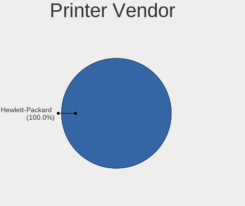

| Vendor          | Computers | Percent |
|-----------------|-----------|---------|
| Hewlett-Packard | 1         | 100%    |

Printer Model
-------------

Printer device models

| Model            | Computers | Percent |
|------------------|-----------|---------|
| HP LaserJet 1018 | 1         | 100%    |

Scanner Vendor
--------------

Scanner device vendors

Zero info for selected period =(

Scanner Model
-------------

Scanner device models

Zero info for selected period =(

Camera
------

Camera Vendor
-------------

Camera device vendors

| Vendor                                 | Computers | Percent |
|----------------------------------------|-----------|---------|
| Realtek Semiconductor                  | 5         | 13.89%  |
| Logitech                               | 5         | 13.89%  |
| Quanta                                 | 4         | 11.11%  |
| Sunplus Innovation Technology          | 3         | 8.33%   |
| Microdia                               | 3         | 8.33%   |
| IMC Networks                           | 2         | 5.56%   |
| Chicony Electronics                    | 2         | 5.56%   |
| Cheng Uei Precision Industry (Foxlink) | 2         | 5.56%   |
| Acer                                   | 2         | 5.56%   |
| Z-Star Microelectronics                | 1         | 2.78%   |
| Syntek                                 | 1         | 2.78%   |
| MacroSilicon                           | 1         | 2.78%   |
| LG Electronics                         | 1         | 2.78%   |
| Importek                               | 1         | 2.78%   |
| Hewlett-Packard                        | 1         | 2.78%   |
| Apple                                  | 1         | 2.78%   |
| A4Tech                                 | 1         | 2.78%   |

Camera Model
------------

Camera device models

| Model                                                           | Computers | Percent |
|-----------------------------------------------------------------|-----------|---------|
| Sunplus Integrated_Webcam_HD                                    | 2         | 5.56%   |
| Quanta HD User Facing                                           | 2         | 5.56%   |
| Microdia Integrated_Webcam_HD                                   | 2         | 5.56%   |
| Logitech Webcam C270                                            | 2         | 5.56%   |
| Z-Star Webcam                                                   | 1         | 2.78%   |
| Syntek Integrated Camera                                        | 1         | 2.78%   |
| Sunplus Laptop_Integrated_Webcam_HD                             | 1         | 2.78%   |
| Realtek Laptop Camera                                           | 1         | 2.78%   |
| Realtek Integrated_Webcam_HD                                    | 1         | 2.78%   |
| Realtek Integrated Webcam_HD                                    | 1         | 2.78%   |
| Realtek Integrated Webcam                                       | 1         | 2.78%   |
| Realtek HD WebCam                                               | 1         | 2.78%   |
| Quanta VGA WebCam                                               | 1         | 2.78%   |
| Quanta USB2.0 HD UVC WebCam                                     | 1         | 2.78%   |
| Microdia CameraA                                                | 1         | 2.78%   |
| MacroSilicon ShadowCast                                         | 1         | 2.78%   |
| Logitech HD Pro Webcam C920                                     | 1         | 2.78%   |
| Logitech C922 Pro Stream Webcam                                 | 1         | 2.78%   |
| Logitech C920 PRO HD Webcam                                     | 1         | 2.78%   |
| LG Optimus (Various Models) MTP Mode                            | 1         | 2.78%   |
| Importek TOSHIBA Web Camera - HD                                | 1         | 2.78%   |
| IMC Networks USB2.0 VGA UVC WebCam                              | 1         | 2.78%   |
| IMC Networks Integrated Camera                                  | 1         | 2.78%   |
| HP Webcam HD 2300                                               | 1         | 2.78%   |
| Chicony Sony Visual Communication Camera                        | 1         | 2.78%   |
| Chicony EasyCamera                                              | 1         | 2.78%   |
| Cheng Uei Precision Industry (Foxlink) Webcam                   | 1         | 2.78%   |
| Cheng Uei Precision Industry (Foxlink) HP Wide Vision HD Camera | 1         | 2.78%   |
| Apple FaceTime HD Camera (Built-in)                             | 1         | 2.78%   |
| Acer LENOVO LBG 720P CAM                                        | 1         | 2.78%   |
| Acer Lenovo EasyCamera                                          | 1         | 2.78%   |
| A4Tech FHD 1080P PC Camera                                      | 1         | 2.78%   |

Security
--------

Fingerprint Vendor
------------------

Fingerprint sensor vendors

| Vendor                     | Computers | Percent |
|----------------------------|-----------|---------|
| Validity Sensors           | 2         | 33.33%  |
| Synaptics                  | 1         | 16.67%  |
| Shenzhen Goodix Technology | 1         | 16.67%  |
| Focal-systems.Corp         | 1         | 16.67%  |
| AuthenTec                  | 1         | 16.67%  |

Fingerprint Model
-----------------

Fingerprint sensor models

| Model                                             | Computers | Percent |
|---------------------------------------------------|-----------|---------|
| Validity Sensors VFS495 Fingerprint Reader        | 1         | 16.67%  |
| Validity Sensors VFS Fingerprint sensor           | 1         | 16.67%  |
| Synaptics Prometheus MIS Touch Fingerprint Reader | 1         | 16.67%  |
| Shenzhen Goodix  FingerPrint Device               | 1         | 16.67%  |
| Focal-systems.Corp FT9201Fingerprint.             | 1         | 16.67%  |
| AuthenTec Fingerprint Sensor                      | 1         | 16.67%  |

Chipcard Vendor
---------------

Chipcard module vendors

| Vendor      | Computers | Percent |
|-------------|-----------|---------|
| Broadcom    | 2         | 40%     |
| O2 Micro    | 1         | 20%     |
| Alcor Micro | 1         | 20%     |
| Aktiv       | 1         | 20%     |

Chipcard Model
--------------

Chipcard module models

| Model                                          | Computers | Percent |
|------------------------------------------------|-----------|---------|
| O2 Micro OZ776 CCID Smartcard Reader           | 1         | 20%     |
| Broadcom BCM5880 Secure Applications Processor | 1         | 20%     |
| Broadcom 5880                                  | 1         | 20%     |
| Alcor Micro AU9540 Smartcard Reader            | 1         | 20%     |
| Aktiv Rutoken lite                             | 1         | 20%     |

Unsupported
-----------

Unsupported Devices
-------------------

Total unsupported devices on board

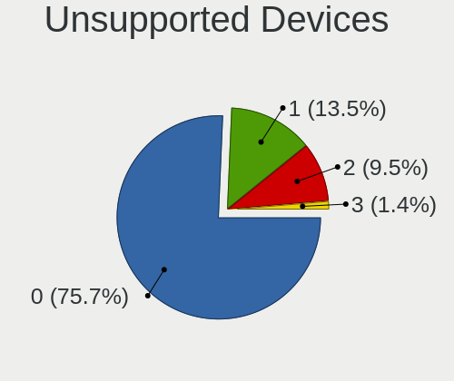

| Total | Computers | Percent |
|-------|-----------|---------|
| 0     | 52        | 75.36%  |
| 1     | 9         | 13.04%  |
| 2     | 7         | 10.14%  |
| 3     | 1         | 1.45%   |

Unsupported Device Types
------------------------

Types of unsupported devices

| Type                  | Computers | Percent |
|-----------------------|-----------|---------|
| Net/wireless          | 9         | 30%     |
| Fingerprint reader    | 6         | 20%     |
| Multimedia controller | 5         | 16.67%  |
| Chipcard              | 5         | 16.67%  |
| Graphics card         | 2         | 6.67%   |
| Unassigned class      | 1         | 3.33%   |
| Storage               | 1         | 3.33%   |
| Camera                | 1         | 3.33%   |

