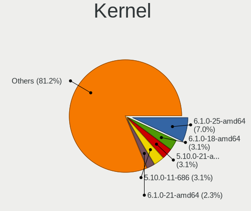
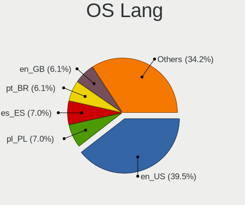
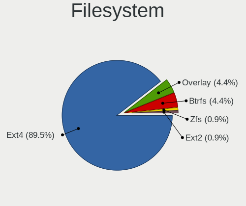
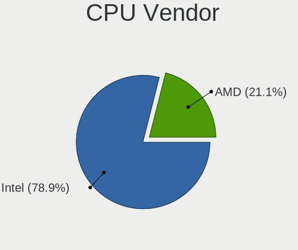
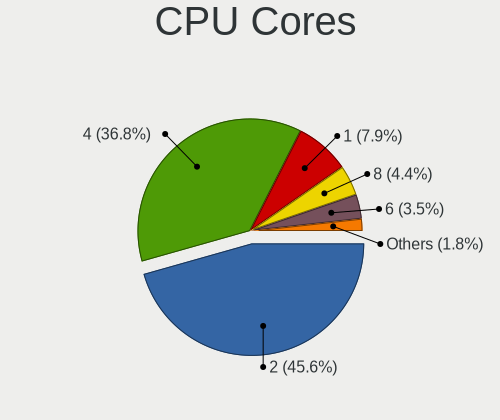
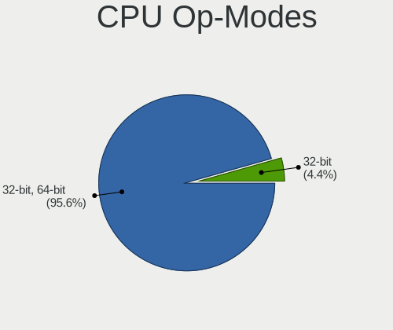
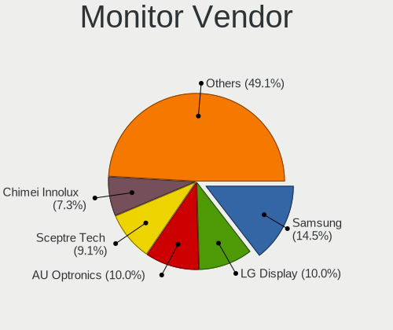
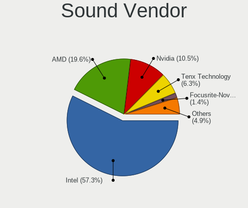
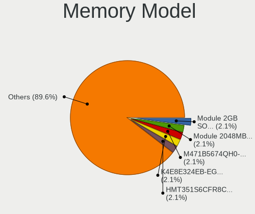

Sparky - Tested Hardware & Statistics
-------------------------------------

A project to collect tested hardware configurations for Sparky.

Anyone can contribute to this report by the [hw-probe](https://github.com/linuxhw/hw-probe) tool:

    sudo -E hw-probe -all -upload

Please contribute! Especially if your hardware is rare.

This is a report for all computer types. See also reports for [desktops](/Dist/Sparky/Desktop/README.md) and [notebooks](/Dist/Sparky/Notebook/README.md).

Contents
--------

* [ Test Cases ](#test-cases)

* [ System ](#system)
  - [ OS                       ](#os)
  - [ OS Family                ](#os-family)
  - [ Kernel                   ](#kernel)
  - [ Kernel Family            ](#kernel-family)
  - [ Kernel Major Ver.        ](#kernel-major-ver)
  - [ Arch                     ](#arch)
  - [ DE                       ](#de)
  - [ Display Server           ](#display-server)
  - [ Display Manager          ](#display-manager)
  - [ OS Lang                  ](#os-lang)
  - [ Boot Mode                ](#boot-mode)
  - [ Filesystem               ](#filesystem)
  - [ Part. scheme             ](#part-scheme)
  - [ Dual Boot with Linux/BSD ](#dual-boot-with-linuxbsd)
  - [ Dual Boot (Win)          ](#dual-boot-win)

* [ Board ](#board)
  - [ Vendor                   ](#vendor)
  - [ Model                    ](#model)
  - [ Model Family             ](#model-family)
  - [ MFG Year                 ](#mfg-year)
  - [ Form Factor              ](#form-factor)
  - [ Secure Boot              ](#secure-boot)
  - [ Coreboot                 ](#coreboot)
  - [ RAM Size                 ](#ram-size)
  - [ RAM Used                 ](#ram-used)
  - [ Total Drives             ](#total-drives)
  - [ Has CD-ROM               ](#has-cd-rom)
  - [ Has Ethernet             ](#has-ethernet)
  - [ Has WiFi                 ](#has-wifi)
  - [ Has Bluetooth            ](#has-bluetooth)

* [ Location ](#location)
  - [ Country                  ](#country)
  - [ City                     ](#city)

* [ Drives ](#drives)
  - [ Drive Vendor             ](#drive-vendor)
  - [ Drive Model              ](#drive-model)
  - [ HDD Vendor               ](#hdd-vendor)
  - [ SSD Vendor               ](#ssd-vendor)
  - [ Drive Kind               ](#drive-kind)
  - [ Drive Connector          ](#drive-connector)
  - [ Drive Size               ](#drive-size)
  - [ Space Total              ](#space-total)
  - [ Space Used               ](#space-used)
  - [ Malfunc. Drives          ](#malfunc-drives)
  - [ Malfunc. Drive Vendor    ](#malfunc-drive-vendor)
  - [ Malfunc. HDD Vendor      ](#malfunc-hdd-vendor)
  - [ Malfunc. Drive Kind      ](#malfunc-drive-kind)
  - [ Failed Drives            ](#failed-drives)
  - [ Failed Drive Vendor      ](#failed-drive-vendor)
  - [ Drive Status             ](#drive-status)

* [ Storage controller ](#storage-controller)
  - [ Storage Vendor           ](#storage-vendor)
  - [ Storage Model            ](#storage-model)
  - [ Storage Kind             ](#storage-kind)

* [ Processor ](#processor)
  - [ CPU Vendor               ](#cpu-vendor)
  - [ CPU Model                ](#cpu-model)
  - [ CPU Model Family         ](#cpu-model-family)
  - [ CPU Cores                ](#cpu-cores)
  - [ CPU Sockets              ](#cpu-sockets)
  - [ CPU Threads              ](#cpu-threads)
  - [ CPU Op-Modes             ](#cpu-op-modes)
  - [ CPU Microcode            ](#cpu-microcode)
  - [ CPU Microarch            ](#cpu-microarch)

* [ Graphics ](#graphics)
  - [ GPU Vendor               ](#gpu-vendor)
  - [ GPU Model                ](#gpu-model)
  - [ GPU Combo                ](#gpu-combo)
  - [ GPU Driver               ](#gpu-driver)
  - [ GPU Memory               ](#gpu-memory)

* [ Monitor ](#monitor)
  - [ Monitor Vendor           ](#monitor-vendor)
  - [ Monitor Model            ](#monitor-model)
  - [ Monitor Resolution       ](#monitor-resolution)
  - [ Monitor Diagonal         ](#monitor-diagonal)
  - [ Monitor Width            ](#monitor-width)
  - [ Aspect Ratio             ](#aspect-ratio)
  - [ Monitor Area             ](#monitor-area)
  - [ Pixel Density            ](#pixel-density)
  - [ Multiple Monitors        ](#multiple-monitors)

* [ Network ](#network)
  - [ Net Controller Vendor    ](#net-controller-vendor)
  - [ Net Controller Model     ](#net-controller-model)
  - [ Wireless Vendor          ](#wireless-vendor)
  - [ Wireless Model           ](#wireless-model)
  - [ Ethernet Vendor          ](#ethernet-vendor)
  - [ Ethernet Model           ](#ethernet-model)
  - [ Net Controller Kind      ](#net-controller-kind)
  - [ Used Controller          ](#used-controller)
  - [ NICs                     ](#nics)
  - [ IPv6                     ](#ipv6)

* [ Bluetooth ](#bluetooth)
  - [ Bluetooth Vendor         ](#bluetooth-vendor)
  - [ Bluetooth Model          ](#bluetooth-model)

* [ Sound ](#sound)
  - [ Sound Vendor             ](#sound-vendor)
  - [ Sound Model              ](#sound-model)

* [ Memory ](#memory)
  - [ Memory Vendor            ](#memory-vendor)
  - [ Memory Model             ](#memory-model)
  - [ Memory Kind              ](#memory-kind)
  - [ Memory Form Factor       ](#memory-form-factor)
  - [ Memory Size              ](#memory-size)
  - [ Memory Speed             ](#memory-speed)

* [ Printers & scanners ](#printers--scanners)
  - [ Printer Vendor           ](#printer-vendor)
  - [ Printer Model            ](#printer-model)
  - [ Scanner Vendor           ](#scanner-vendor)
  - [ Scanner Model            ](#scanner-model)

* [ Camera ](#camera)
  - [ Camera Vendor            ](#camera-vendor)
  - [ Camera Model             ](#camera-model)

* [ Security ](#security)
  - [ Fingerprint Vendor       ](#fingerprint-vendor)
  - [ Fingerprint Model        ](#fingerprint-model)
  - [ Chipcard Vendor          ](#chipcard-vendor)
  - [ Chipcard Model           ](#chipcard-model)

* [ Unsupported ](#unsupported)
  - [ Unsupported Devices      ](#unsupported-devices)
  - [ Unsupported Device Types ](#unsupported-device-types)

Test Cases
----------

Total: 59

| Vendor    | Model                       | Form-Factor | Probe                                                      | Date         |
|-----------|-----------------------------|-------------|------------------------------------------------------------|--------------|
| Intel     | H61                         | Desktop     | [bf862f44d2](https://linux-hardware.org/?probe=bf862f44d2) | Jun 11, 2022 |
| HP        | Stream Notebook PC 13       | Notebook    | [47b55dbb68](https://linux-hardware.org/?probe=47b55dbb68) | Jun 06, 2022 |
| HP        | EliteBook 745 G3            | Notebook    | [fac15b2640](https://linux-hardware.org/?probe=fac15b2640) | May 18, 2022 |
| ASUSTek   | CROSSHAIR VI HERO           | Desktop     | [803d13c6ca](https://linux-hardware.org/?probe=803d13c6ca) | May 15, 2022 |
| HP        | EliteBook 8770w             | Notebook    | [4fa8e91f6d](https://linux-hardware.org/?probe=4fa8e91f6d) | Apr 26, 2022 |
| Lenovo    | G50-30 80G0                 | Notebook    | [c7ea70f7ba](https://linux-hardware.org/?probe=c7ea70f7ba) | Apr 25, 2022 |
| HP        | 3641h                       | Desktop     | [d50fc13ff0](https://linux-hardware.org/?probe=d50fc13ff0) | Mar 30, 2022 |
| HP        | Pavilion dv5                | Notebook    | [22ae3dae3d](https://linux-hardware.org/?probe=22ae3dae3d) | Mar 22, 2022 |
| Intel     | H55                         | Desktop     | [baff4758b7](https://linux-hardware.org/?probe=baff4758b7) | Mar 21, 2022 |
| ASUSTek   | 1000HE                      | Notebook    | [5dd6246e59](https://linux-hardware.org/?probe=5dd6246e59) | Feb 08, 2022 |
| ASUSTek   | S101                        | Notebook    | [a850549e73](https://linux-hardware.org/?probe=a850549e73) | Feb 04, 2022 |
| ASUSTek   | CROSSHAIR VI HERO           | Desktop     | [39dcd3854f](https://linux-hardware.org/?probe=39dcd3854f) | Feb 03, 2022 |
| MSI       | B450 GAMING PLUS MAX        | Desktop     | [47eae3d6b2](https://linux-hardware.org/?probe=47eae3d6b2) | Jan 19, 2022 |
| HP        | EliteBook 8770w             | Notebook    | [9a2052fc8c](https://linux-hardware.org/?probe=9a2052fc8c) | Nov 25, 2021 |
| HP        | Pavilion g7                 | Notebook    | [6cebc99fe6](https://linux-hardware.org/?probe=6cebc99fe6) | Nov 22, 2021 |
| Dell      | Inspiron N5010              | Notebook    | [df5e66431b](https://linux-hardware.org/?probe=df5e66431b) | Nov 20, 2021 |
| HP        | EliteBook Folio 9480m       | Notebook    | [dae2e04d45](https://linux-hardware.org/?probe=dae2e04d45) | Oct 04, 2021 |
| Google    | Banon                       | Notebook    | [764debedcd](https://linux-hardware.org/?probe=764debedcd) | Sep 25, 2021 |
| MSI       | H310M PRO-VDH PLUS          | Desktop     | [079af91b8f](https://linux-hardware.org/?probe=079af91b8f) | Aug 22, 2021 |
| MSI       | H310M PRO-VDH PLUS          | Desktop     | [c6fe94a0ba](https://linux-hardware.org/?probe=c6fe94a0ba) | Aug 22, 2021 |
| HP        | 805B                        | Desktop     | [d6c2730444](https://linux-hardware.org/?probe=d6c2730444) | Jul 12, 2021 |
| Gigabyte  | H97-Gaming 3                | Desktop     | [d8b0632698](https://linux-hardware.org/?probe=d8b0632698) | May 23, 2021 |
| Lenovo    | ThinkPad E15 20RES0GF00     | Notebook    | [8722c3498e](https://linux-hardware.org/?probe=8722c3498e) | May 14, 2021 |
| Intel     | NUC5CPYB H61145-408         | Mini pc     | [7243895ae4](https://linux-hardware.org/?probe=7243895ae4) | Apr 20, 2021 |
| Apple     | MacBook1,1                  | Notebook    | [cc415ab6c7](https://linux-hardware.org/?probe=cc415ab6c7) | Mar 15, 2021 |
| Samsung   | NC10                        | Notebook    | [b5909af616](https://linux-hardware.org/?probe=b5909af616) | Mar 11, 2021 |
| Samsung   | NC10                        | Notebook    | [3b8de5559e](https://linux-hardware.org/?probe=3b8de5559e) | Feb 27, 2021 |
| MSI       | A68HM-E33 V2                | Desktop     | [82a06b4bea](https://linux-hardware.org/?probe=82a06b4bea) | Feb 21, 2021 |
| Lenovo    | ThinkPad T61 7659AB7        | Notebook    | [43f03346c5](https://linux-hardware.org/?probe=43f03346c5) | Feb 19, 2021 |
| Gigabyte  | H410M H                     | Desktop     | [ee13368ccf](https://linux-hardware.org/?probe=ee13368ccf) | Feb 18, 2021 |
| Pegatron  | 2AC2A                       | Desktop     | [8a5448bc07](https://linux-hardware.org/?probe=8a5448bc07) | Jan 17, 2021 |
| Pegatron  | 2AC2A                       | Desktop     | [c76bbefc71](https://linux-hardware.org/?probe=c76bbefc71) | Jan 09, 2021 |
| Beelink   | BT3 PRO                     | Notebook    | [8dbfa4dacd](https://linux-hardware.org/?probe=8dbfa4dacd) | Jan 06, 2021 |
| Beelink   | BT3 PRO                     | Notebook    | [d85a392e02](https://linux-hardware.org/?probe=d85a392e02) | Jan 06, 2021 |
| Samsung   | NC10                        | Notebook    | [8c878860a7](https://linux-hardware.org/?probe=8c878860a7) | Jan 03, 2021 |
| Pegatron  | 2AC2A                       | Desktop     | [95ead72109](https://linux-hardware.org/?probe=95ead72109) | Dec 17, 2020 |
| HP        | 8056                        | Desktop     | [79fd2c8837](https://linux-hardware.org/?probe=79fd2c8837) | Dec 12, 2020 |
| Dell      | Inspiron 5720               | Notebook    | [d360a61780](https://linux-hardware.org/?probe=d360a61780) | Dec 08, 2020 |
| eMachines | E525                        | Notebook    | [0c11b6b4dc](https://linux-hardware.org/?probe=0c11b6b4dc) | Nov 25, 2020 |
| Lenovo    | IdeaPad S206 20154          | Notebook    | [393f27acf7](https://linux-hardware.org/?probe=393f27acf7) | Nov 18, 2020 |
| Intel     | DG41TY AAE47335-300         | Desktop     | [e3457f83fa](https://linux-hardware.org/?probe=e3457f83fa) | Oct 22, 2020 |
| Dell      | Inspiron 5720               | Notebook    | [787263a0c6](https://linux-hardware.org/?probe=787263a0c6) | Oct 10, 2020 |
| Gigabyte  | M68M-S2P                    | Desktop     | [0e4bab3503](https://linux-hardware.org/?probe=0e4bab3503) | Oct 05, 2020 |
| HP        | Laptop 17z-ca100            | Notebook    | [2217d0703c](https://linux-hardware.org/?probe=2217d0703c) | Oct 05, 2020 |
| HP        | Laptop 17z-ca100            | Notebook    | [1927ffc179](https://linux-hardware.org/?probe=1927ffc179) | Oct 05, 2020 |
| Unknown   | 4CoreDX90-VSTA              | Desktop     | [31dbedff45](https://linux-hardware.org/?probe=31dbedff45) | Sep 10, 2020 |
| Apple     | MacBook1,1                  | Notebook    | [73b04f9de4](https://linux-hardware.org/?probe=73b04f9de4) | Aug 26, 2020 |
| Gigabyte  | G41M-ES2L                   | Desktop     | [87c93c4148](https://linux-hardware.org/?probe=87c93c4148) | Jun 21, 2020 |
| Gigabyte  | G41M-ES2L                   | Desktop     | [01beb1ea00](https://linux-hardware.org/?probe=01beb1ea00) | Jun 21, 2020 |
| Dell      | 039VR8 A00                  | Desktop     | [d386006ad9](https://linux-hardware.org/?probe=d386006ad9) | Jun 15, 2020 |
| Acer      | Aspire 5742G                | Notebook    | [a90fb35c67](https://linux-hardware.org/?probe=a90fb35c67) | May 01, 2020 |
| Vorke     | V1 Plus                     | Desktop     | [e371a7cf42](https://linux-hardware.org/?probe=e371a7cf42) | Mar 29, 2020 |
| Intel     | DG43RK AAE78175-402         | Desktop     | [262ba9568a](https://linux-hardware.org/?probe=262ba9568a) | Mar 22, 2020 |
| Lenovo    | ThinkPad T60 2007FUG        | Notebook    | [d552e50d7e](https://linux-hardware.org/?probe=d552e50d7e) | Mar 12, 2020 |
| Dell      | Latitude XT3                | Notebook    | [0944e88882](https://linux-hardware.org/?probe=0944e88882) | Mar 09, 2020 |
| Dell      | Inspiron 5770               | Notebook    | [a3dd71465d](https://linux-hardware.org/?probe=a3dd71465d) | Jan 06, 2020 |
| HP        | Pavilion dv9000 (GA359UA... | Notebook    | [db4a924be0](https://linux-hardware.org/?probe=db4a924be0) | Sep 07, 2019 |
| HP        | Pavilion dv9000 (GA359UA... | Notebook    | [6f024c0dd0](https://linux-hardware.org/?probe=6f024c0dd0) | Sep 03, 2019 |
| ASRock    | H61M-VG4                    | Desktop     | [93ae8e7a8c](https://linux-hardware.org/?probe=93ae8e7a8c) | Aug 18, 2019 |

System
------

OS
--

Installed operating systems

| Name        | Computers | Percent |
|-------------|-----------|---------|
| Sparky 6    | 16        | 34.78%  |
| Sparky 6.1  | 6         | 13.04%  |
| Sparky 5.12 | 5         | 10.87%  |
| Sparky 7    | 3         | 6.52%   |
| Sparky 6.3  | 3         | 6.52%   |
| Sparky 6.0  | 3         | 6.52%   |
| Sparky 5.14 | 3         | 6.52%   |
| Sparky 5.10 | 3         | 6.52%   |
| Sparky 6.2  | 2         | 4.35%   |
| Sparky 5.13 | 2         | 4.35%   |

OS Family
---------

OS without a version

| Name   | Computers | Percent |
|--------|-----------|---------|
| Sparky | 43        | 100%    |

Kernel
------

Version of the Linux kernel

| Version             | Computers | Percent |
|---------------------|-----------|---------|
| 5.10.0-9-amd64      | 3         | 6.25%   |
| 5.10.0-8-amd64      | 3         | 6.25%   |
| 5.10.0-6-amd64      | 3         | 6.25%   |
| 5.10.0-11-686       | 3         | 6.25%   |
| 4.19.0-8-amd64      | 3         | 6.25%   |
| 4.19.0-12-amd64     | 3         | 6.25%   |
| 5.17.0-1-amd64      | 2         | 4.17%   |
| 5.10.0-3-amd64      | 2         | 4.17%   |
| 5.10.0-14-amd64     | 2         | 4.17%   |
| 4.19.0-13-686       | 2         | 4.17%   |
| 4.19.0-10-686       | 2         | 4.17%   |
| 5.9.13-sparky-amd64 | 1         | 2.08%   |
| 5.9.0-4-amd64       | 1         | 2.08%   |
| 5.8.13-sparky-amd64 | 1         | 2.08%   |
| 5.8.0-2-amd64       | 1         | 2.08%   |
| 5.7.2-sparky-amd64  | 1         | 2.08%   |
| 5.6.0-2-amd64       | 1         | 2.08%   |
| 5.5.0-2-amd64       | 1         | 2.08%   |
| 5.4.7-sparky-amd64  | 1         | 2.08%   |
| 5.2.0-2-amd64       | 1         | 2.08%   |
| 5.17.3-sparky-amd64 | 1         | 2.08%   |
| 5.16.5-sparky-amd64 | 1         | 2.08%   |
| 5.16.0-5-amd64      | 1         | 2.08%   |
| 5.15.0-3-amd64      | 1         | 2.08%   |
| 5.14.0-4-amd64      | 1         | 2.08%   |
| 5.10.4-sparky-amd64 | 1         | 2.08%   |
| 5.10.0-7-amd64      | 1         | 2.08%   |
| 5.10.0-2-amd64      | 1         | 2.08%   |
| 5.10.0-12-amd64     | 1         | 2.08%   |
| 4.19.0-14-686       | 1         | 2.08%   |
| 4.19.0-10-amd64     | 1         | 2.08%   |

Kernel Family
-------------

Linux kernel without a distro release

| Version | Computers | Percent |
|---------|-----------|---------|
| 5.10.0  | 19        | 41.3%   |
| 4.19.0  | 10        | 21.74%  |
| 5.17.0  | 2         | 4.35%   |
| 5.9.13  | 1         | 2.17%   |
| 5.9.0   | 1         | 2.17%   |
| 5.8.13  | 1         | 2.17%   |
| 5.8.0   | 1         | 2.17%   |
| 5.7.2   | 1         | 2.17%   |
| 5.6.0   | 1         | 2.17%   |
| 5.5.0   | 1         | 2.17%   |
| 5.4.7   | 1         | 2.17%   |
| 5.2.0   | 1         | 2.17%   |
| 5.17.3  | 1         | 2.17%   |
| 5.16.5  | 1         | 2.17%   |
| 5.16.0  | 1         | 2.17%   |
| 5.15.0  | 1         | 2.17%   |
| 5.14.0  | 1         | 2.17%   |
| 5.10.4  | 1         | 2.17%   |

Kernel Major Ver.
-----------------

Linux kernel major version

| Version | Computers | Percent |
|---------|-----------|---------|
| 5.10    | 20        | 43.48%  |
| 4.19    | 10        | 21.74%  |
| 5.17    | 3         | 6.52%   |
| 5.9     | 2         | 4.35%   |
| 5.8     | 2         | 4.35%   |
| 5.16    | 2         | 4.35%   |
| 5.7     | 1         | 2.17%   |
| 5.6     | 1         | 2.17%   |
| 5.5     | 1         | 2.17%   |
| 5.4     | 1         | 2.17%   |
| 5.2     | 1         | 2.17%   |
| 5.15    | 1         | 2.17%   |
| 5.14    | 1         | 2.17%   |

Arch
----

OS architecture (x86_64, i586, etc.)

| Name   | Computers | Percent |
|--------|-----------|---------|
| x86_64 | 37        | 86.05%  |
| i686   | 6         | 13.95%  |

DE
--

Desktop Environment

| Name             | Computers | Percent |
|------------------|-----------|---------|
| XFCE             | 15        | 34.09%  |
| lxqt             | 13        | 29.55%  |
| Unknown          | 7         | 15.91%  |
| KDE5             | 2         | 4.55%   |
| GNOME            | 2         | 4.55%   |
| X-Cinnamon       | 1         | 2.27%   |
| openbox          | 1         | 2.27%   |
| MATE             | 1         | 2.27%   |
| lightdm-xsession | 1         | 2.27%   |
| ICEWM            | 1         | 2.27%   |

Display Server
--------------

X11 or Wayland

| Name | Computers | Percent |
|------|-----------|---------|
| X11  | 41        | 93.18%  |
| Tty  | 3         | 6.82%   |

Display Manager
---------------

SDDM, LightDM, etc.

| Name    | Computers | Percent |
|---------|-----------|---------|
| TDM     | 13        | 30.23%  |
| Unknown | 13        | 30.23%  |
| SDDM    | 8         | 18.6%   |
| LightDM | 7         | 16.28%  |
| XDM     | 1         | 2.33%   |
| GDM     | 1         | 2.33%   |

OS Lang
-------

Language

| Lang    | Computers | Percent |
|---------|-----------|---------|
| en_US   | 12        | 27.91%  |
| en_GB   | 4         | 9.3%    |
| pt_BR   | 3         | 6.98%   |
| pl_PL   | 3         | 6.98%   |
| es_ES   | 3         | 6.98%   |
| fr_FR   | 2         | 4.65%   |
| de_DE   | 2         | 4.65%   |
| Unknown | 2         | 4.65%   |
| sv_SE   | 1         | 2.33%   |
| ja_JP   | 1         | 2.33%   |
| es_US   | 1         | 2.33%   |
| es_CL   | 1         | 2.33%   |
| es_AR   | 1         | 2.33%   |
| en_ZA   | 1         | 2.33%   |
| en_PH   | 1         | 2.33%   |
| en_IN   | 1         | 2.33%   |
| en_DK   | 1         | 2.33%   |
| en_CA   | 1         | 2.33%   |
| de_CH   | 1         | 2.33%   |
| cs_CZ   | 1         | 2.33%   |

Boot Mode
---------

EFI or BIOS

| Mode | Computers | Percent |
|------|-----------|---------|
| BIOS | 29        | 67.44%  |
| EFI  | 14        | 32.56%  |

Filesystem
----------

Type of filesystem

| Type    | Computers | Percent |
|---------|-----------|---------|
| Ext4    | 39        | 90.7%   |
| Overlay | 2         | 4.65%   |
| Zfs     | 1         | 2.33%   |
| Btrfs   | 1         | 2.33%   |

Part. scheme
------------

Scheme of partitioning

| Type    | Computers | Percent |
|---------|-----------|---------|
| MBR     | 15        | 34.88%  |
| GPT     | 14        | 32.56%  |
| Unknown | 14        | 32.56%  |

Dual Boot with Linux/BSD
------------------------

Hosting more than one Linux/BSD

| Dual boot | Computers | Percent |
|-----------|-----------|---------|
| No        | 37        | 86.05%  |
| Yes       | 6         | 13.95%  |

Dual Boot (Win)
---------------

Hosting Linux and Windows

| Dual boot | Computers | Percent |
|-----------|-----------|---------|
| No        | 28        | 65.12%  |
| Yes       | 15        | 34.88%  |

Board
-----

Vendor
------

Motherboard manufacturer

| Name                | Computers | Percent |
|---------------------|-----------|---------|
| Hewlett-Packard     | 11        | 25.58%  |
| Lenovo              | 5         | 11.63%  |
| Intel               | 5         | 11.63%  |
| Dell                | 5         | 11.63%  |
| Gigabyte Technology | 4         | 9.3%    |
| MSI                 | 3         | 6.98%   |
| ASUSTek Computer    | 3         | 6.98%   |
| Samsung Electronics | 1         | 2.33%   |
| Google              | 1         | 2.33%   |
| eMachines           | 1         | 2.33%   |
| Beelink             | 1         | 2.33%   |
| Apple               | 1         | 2.33%   |
| Acer                | 1         | 2.33%   |
| Unknown             | 1         | 2.33%   |

Model
-----

Motherboard model

| Name                             | Computers | Percent |
|----------------------------------|-----------|---------|
| Samsung NC10                     | 1         | 2.33%   |
| MSI MS-7C09                      | 1         | 2.33%   |
| MSI MS-7B86                      | 1         | 2.33%   |
| MSI MS-7721                      | 1         | 2.33%   |
| Lenovo ThinkPad T61 7659AB7      | 1         | 2.33%   |
| Lenovo ThinkPad T60 2007FUG      | 1         | 2.33%   |
| Lenovo ThinkPad E15 20RES0GF00   | 1         | 2.33%   |
| Lenovo IdeaPad S206 20154        | 1         | 2.33%   |
| Lenovo G50-30 80G0               | 1         | 2.33%   |
| Intel NUC5CPYB H61145-408        | 1         | 2.33%   |
| Intel H61                        | 1         | 2.33%   |
| Intel H55                        | 1         | 2.33%   |
| Intel DG43RK AAE78175-402        | 1         | 2.33%   |
| Intel DG41TY AAE47335-300        | 1         | 2.33%   |
| HP t5740                         | 1         | 2.33%   |
| HP Stream Notebook PC 13         | 1         | 2.33%   |
| HP Pavilion g7                   | 1         | 2.33%   |
| HP Pavilion dv9000 (GA359UA#ABA) | 1         | 2.33%   |
| HP Pavilion dv5                  | 1         | 2.33%   |
| HP Laptop 17z-ca100              | 1         | 2.33%   |
| HP EliteDesk 800 G2 DM 65W       | 1         | 2.33%   |
| HP EliteDesk 705 G2 MINI         | 1         | 2.33%   |
| HP EliteBook Folio 9480m         | 1         | 2.33%   |
| HP EliteBook 8770w               | 1         | 2.33%   |
| HP EliteBook 745 G3              | 1         | 2.33%   |
| Google Banon                     | 1         | 2.33%   |
| Gigabyte M68M-S2P                | 1         | 2.33%   |
| Gigabyte H97-Gaming 3            | 1         | 2.33%   |
| Gigabyte H410M H                 | 1         | 2.33%   |
| Gigabyte G41M-ES2L               | 1         | 2.33%   |
| eMachines E525                   | 1         | 2.33%   |
| Dell OptiPlex 580                | 1         | 2.33%   |
| Dell Latitude XT3                | 1         | 2.33%   |
| Dell Inspiron N5010              | 1         | 2.33%   |
| Dell Inspiron 5770               | 1         | 2.33%   |
| Dell Inspiron 5720               | 1         | 2.33%   |
| Beelink BT3 PRO                  | 1         | 2.33%   |
| ASUS S101                        | 1         | 2.33%   |
| ASUS CROSSHAIR VI HERO           | 1         | 2.33%   |
| ASUS 1000HE                      | 1         | 2.33%   |
| Apple MacBook1,1                 | 1         | 2.33%   |
| Acer Aspire 5742G                | 1         | 2.33%   |
| Unknown                          | 1         | 2.33%   |

Model Family
------------

Motherboard model prefix

| Name                | Computers | Percent |
|---------------------|-----------|---------|
| Lenovo ThinkPad     | 3         | 6.98%   |
| HP Pavilion         | 3         | 6.98%   |
| HP EliteBook        | 3         | 6.98%   |
| Dell Inspiron       | 3         | 6.98%   |
| HP EliteDesk        | 2         | 4.65%   |
| Samsung NC10        | 1         | 2.33%   |
| MSI MS-7C09         | 1         | 2.33%   |
| MSI MS-7B86         | 1         | 2.33%   |
| MSI MS-7721         | 1         | 2.33%   |
| Lenovo IdeaPad      | 1         | 2.33%   |
| Lenovo G50-30       | 1         | 2.33%   |
| Intel NUC5CPYB      | 1         | 2.33%   |
| Intel H61           | 1         | 2.33%   |
| Intel H55           | 1         | 2.33%   |
| Intel DG43RK        | 1         | 2.33%   |
| Intel DG41TY        | 1         | 2.33%   |
| HP t5740            | 1         | 2.33%   |
| HP Stream           | 1         | 2.33%   |
| HP Laptop           | 1         | 2.33%   |
| Google Banon        | 1         | 2.33%   |
| Gigabyte M68M-S2P   | 1         | 2.33%   |
| Gigabyte H97-Gaming | 1         | 2.33%   |
| Gigabyte H410M      | 1         | 2.33%   |
| Gigabyte G41M-ES2L  | 1         | 2.33%   |
| eMachines E525      | 1         | 2.33%   |
| Dell OptiPlex       | 1         | 2.33%   |
| Dell Latitude       | 1         | 2.33%   |
| Beelink BT3         | 1         | 2.33%   |
| ASUS S101           | 1         | 2.33%   |
| ASUS CROSSHAIR      | 1         | 2.33%   |
| ASUS 1000HE         | 1         | 2.33%   |
| Apple MacBook1      | 1         | 2.33%   |
| Acer Aspire         | 1         | 2.33%   |
| Unknown             | 1         | 2.33%   |

MFG Year
--------

Motherboard manufacture year

| Year | Computers | Percent |
|------|-----------|---------|
| 2009 | 7         | 16.28%  |
| 2014 | 5         | 11.63%  |
| 2012 | 4         | 9.3%    |
| 2018 | 3         | 6.98%   |
| 2010 | 3         | 6.98%   |
| 2008 | 3         | 6.98%   |
| 2021 | 2         | 4.65%   |
| 2020 | 2         | 4.65%   |
| 2019 | 2         | 4.65%   |
| 2017 | 2         | 4.65%   |
| 2016 | 2         | 4.65%   |
| 2015 | 2         | 4.65%   |
| 2011 | 2         | 4.65%   |
| 2007 | 2         | 4.65%   |
| 2006 | 2         | 4.65%   |

Form Factor
-----------

Physical design of the computer

| Name     | Computers | Percent |
|----------|-----------|---------|
| Notebook | 25        | 58.14%  |
| Desktop  | 17        | 39.53%  |
| Mini pc  | 1         | 2.33%   |

Secure Boot
-----------

Enabled or disabled

| State    | Computers | Percent |
|----------|-----------|---------|
| Disabled | 43        | 100%    |

Coreboot
--------

Have coreboot on board

| Used | Computers | Percent |
|------|-----------|---------|
| No   | 42        | 97.67%  |
| Yes  | 1         | 2.33%   |

RAM Size
--------

Total RAM memory

| Size in GB | Computers | Percent |
|------------|-----------|---------|
| 3.01-4.0   | 13        | 30.23%  |
| 4.01-8.0   | 8         | 18.6%   |
| 16.01-24.0 | 6         | 13.95%  |
| 2.01-3.0   | 5         | 11.63%  |
| 1.01-2.0   | 5         | 11.63%  |
| 24.01-32.0 | 2         | 4.65%   |
| 8.01-16.0  | 2         | 4.65%   |
| 32.01-64.0 | 1         | 2.33%   |
| 0.51-1.0   | 1         | 2.33%   |

RAM Used
--------

Used RAM memory

| Used GB  | Computers | Percent |
|----------|-----------|---------|
| 1.01-2.0 | 19        | 41.3%   |
| 0.51-1.0 | 11        | 23.91%  |
| 2.01-3.0 | 7         | 15.22%  |
| 4.01-8.0 | 5         | 10.87%  |
| 3.01-4.0 | 2         | 4.35%   |
| 0.01-0.5 | 2         | 4.35%   |

Total Drives
------------

Number of drives on board

| Drives | Computers | Percent |
|--------|-----------|---------|
| 1      | 32        | 72.73%  |
| 2      | 7         | 15.91%  |
| 4      | 3         | 6.82%   |
| 5      | 1         | 2.27%   |
| 3      | 1         | 2.27%   |

Has CD-ROM
----------

Has CD-ROM on board

| Presented | Computers | Percent |
|-----------|-----------|---------|
| No        | 26        | 60.47%  |
| Yes       | 17        | 39.53%  |

Has Ethernet
------------

Has Ethernet on board

| Presented | Computers | Percent |
|-----------|-----------|---------|
| Yes       | 40        | 93.02%  |
| No        | 3         | 6.98%   |

Has WiFi
--------

Has WiFi module

| Presented | Computers | Percent |
|-----------|-----------|---------|
| Yes       | 30        | 69.77%  |
| No        | 13        | 30.23%  |

Has Bluetooth
-------------

Has Bluetooth module

| Presented | Computers | Percent |
|-----------|-----------|---------|
| No        | 24        | 55.81%  |
| Yes       | 19        | 44.19%  |

Location
--------

Country
-------

Geographic location (country)

| Country      | Computers | Percent |
|--------------|-----------|---------|
| USA          | 8         | 18.6%   |
| UK           | 4         | 9.3%    |
| Germany      | 4         | 9.3%    |
| Poland       | 3         | 6.98%   |
| France       | 3         | 6.98%   |
| Brazil       | 3         | 6.98%   |
| Spain        | 2         | 4.65%   |
| Indonesia    | 2         | 4.65%   |
| Canada       | 2         | 4.65%   |
| Argentina    | 2         | 4.65%   |
| Venezuela    | 1         | 2.33%   |
| Switzerland  | 1         | 2.33%   |
| Sweden       | 1         | 2.33%   |
| South Africa | 1         | 2.33%   |
| Philippines  | 1         | 2.33%   |
| Lebanon      | 1         | 2.33%   |
| Japan        | 1         | 2.33%   |
| India        | 1         | 2.33%   |
| Czechia      | 1         | 2.33%   |
| Chile        | 1         | 2.33%   |

City
----

Geographic location (city)

| City             | Computers | Percent |
|------------------|-----------|---------|
| Woking           | 1         | 2.17%   |
| Wenatchee        | 1         | 2.17%   |
| Tucson           | 1         | 2.17%   |
| Takahama         | 1         | 2.17%   |
| Surabaya         | 1         | 2.17%   |
| Spokane          | 1         | 2.17%   |
| Sin el Fil       | 1         | 2.17%   |
| San Cristóbal   | 1         | 2.17%   |
| San Antonio      | 1         | 2.17%   |
| Sainte-Julie     | 1         | 2.17%   |
| Rosario          | 1         | 2.17%   |
| Rio de Janeiro   | 1         | 2.17%   |
| Rio Claro        | 1         | 2.17%   |
| Quezon City      | 1         | 2.17%   |
| Pujaudran        | 1         | 2.17%   |
| Puente Alto      | 1         | 2.17%   |
| Posadas          | 1         | 2.17%   |
| Pompano Beach    | 1         | 2.17%   |
| Montreuil        | 1         | 2.17%   |
| Montreal         | 1         | 2.17%   |
| Mnisek pod Brdy  | 1         | 2.17%   |
| Miekoszyn        | 1         | 2.17%   |
| Mannheim         | 1         | 2.17%   |
| Madrid           | 1         | 2.17%   |
| Liverpool        | 1         | 2.17%   |
| Lienen           | 1         | 2.17%   |
| Leipzig          | 1         | 2.17%   |
| Koło            | 1         | 2.17%   |
| Kage             | 1         | 2.17%   |
| Houston          | 1         | 2.17%   |
| Grabs            | 1         | 2.17%   |
| Gmina Bolków    | 1         | 2.17%   |
| Glasgow          | 1         | 2.17%   |
| Fuveau           | 1         | 2.17%   |
| Frankfurt (Oder) | 1         | 2.17%   |
| East Wenatchee   | 1         | 2.17%   |
| Duque de Caxias  | 1         | 2.17%   |
| Dunoon           | 1         | 2.17%   |
| Dobrzen Wielki   | 1         | 2.17%   |
| Dehradun         | 1         | 2.17%   |
| Chicago          | 1         | 2.17%   |
| Cape Town        | 1         | 2.17%   |
| Calanda          | 1         | 2.17%   |
| Birmingham       | 1         | 2.17%   |
| Barnsley         | 1         | 2.17%   |
| Bandung          | 1         | 2.17%   |

Drives
------

Drive Vendor
------------

Hard drive vendors

| Vendor              | Computers | Drives | Percent |
|---------------------|-----------|--------|---------|
| WDC                 | 10        | 12     | 17.54%  |
| Seagate             | 10        | 15     | 17.54%  |
| Samsung Electronics | 9         | 15     | 15.79%  |
| Hitachi             | 5         | 6      | 8.77%   |
| Unknown             | 3         | 3      | 5.26%   |
| Kingston            | 3         | 3      | 5.26%   |
| Intel               | 2         | 2      | 3.51%   |
| Goodram             | 2         | 4      | 3.51%   |
| XPG                 | 1         | 1      | 1.75%   |
| SPCC                | 1         | 2      | 1.75%   |
| SanDisk             | 1         | 1      | 1.75%   |
| ORICO               | 1         | 1      | 1.75%   |
| Netac               | 1         | 1      | 1.75%   |
| Micron Technology   | 1         | 1      | 1.75%   |
| HGST                | 1         | 1      | 1.75%   |
| Gigabyte Technology | 1         | 1      | 1.75%   |
| Fujitsu             | 1         | 2      | 1.75%   |
| Crucial             | 1         | 1      | 1.75%   |
| ASUS-JM             | 1         | 1      | 1.75%   |
| ASMedia             | 1         | 1      | 1.75%   |
| A-DATA Technology   | 1         | 1      | 1.75%   |

Drive Model
-----------

Hard drive models

| Model                                    | Computers | Percent |
|------------------------------------------|-----------|---------|
| WDC WD1600BEVT-22ZCT0 160GB              | 2         | 3.17%   |
| Samsung HD161GJ 160GB                    | 2         | 3.17%   |
| Hitachi HTS545025B9A300 250GB            | 2         | 3.17%   |
| XPG GAMMIX S11 Pro 1TB                   | 1         | 1.59%   |
| WDC WD800JD-08MSA1 80GB                  | 1         | 1.59%   |
| WDC WD5000BEVT-22ZAT0 500GB              | 1         | 1.59%   |
| WDC WD5000AVVS-63ZWB0 500GB              | 1         | 1.59%   |
| WDC WD5000AAKS-75V0A0 500GB              | 1         | 1.59%   |
| WDC WD3200BPVT-75ZEST0 320GB             | 1         | 1.59%   |
| WDC WD2500AAKX-07U6AA0 250GB             | 1         | 1.59%   |
| WDC WD1600AAJS-08L7A0 160GB              | 1         | 1.59%   |
| WDC WD10EZEX-60WN4A0 1TB                 | 1         | 1.59%   |
| Unknown MMC Card  64GB                   | 1         | 1.59%   |
| Unknown MMC Card  32GB                   | 1         | 1.59%   |
| Unknown HBG4a2  32GB                     | 1         | 1.59%   |
| SPCC Solid State Disk 256GB              | 1         | 1.59%   |
| Seagate ST9500325AS 500GB                | 1         | 1.59%   |
| Seagate ST9250315AS 250GB                | 1         | 1.59%   |
| Seagate ST9160310AS 160GB                | 1         | 1.59%   |
| Seagate ST500LT012-1DG142 500GB          | 1         | 1.59%   |
| Seagate ST3500312CS 500GB                | 1         | 1.59%   |
| Seagate ST3320418AS 320GB                | 1         | 1.59%   |
| Seagate ST2000VM003-1ET164 2TB           | 1         | 1.59%   |
| Seagate ST1000LM048-2E7172 1TB           | 1         | 1.59%   |
| Seagate ST1000LM035-1RK172 1TB           | 1         | 1.59%   |
| Seagate ST1000LM024 HN-M101MBB 1TB       | 1         | 1.59%   |
| Seagate Backup+ Hub BK 8TB               | 1         | 1.59%   |
| Seagate Backup+ Desk 5TB                 | 1         | 1.59%   |
| SanDisk SSD PLUS 480GB                   | 1         | 1.59%   |
| Samsung SSD 850 EVO 500GB                | 1         | 1.59%   |
| Samsung SSD 850 EVO 250GB                | 1         | 1.59%   |
| Samsung SSD 840 Series 120GB             | 1         | 1.59%   |
| Samsung NVMe SSD Drive 256GB             | 1         | 1.59%   |
| Samsung MZVPV256HDGL-000H1 256GB         | 1         | 1.59%   |
| Samsung MZALQ512HALU-000L1 512GB         | 1         | 1.59%   |
| Samsung MZ7TD128HAFV-000L1 128GB SSD     | 1         | 1.59%   |
| Samsung HN-M320MBB 320GB                 | 1         | 1.59%   |
| Samsung HD753LJ 752GB                    | 1         | 1.59%   |
| Samsung HD154UI 1TB                      | 1         | 1.59%   |
| ORICO M200 1TB SSD                       | 1         | 1.59%   |
| Netac SSD 256GB                          | 1         | 1.59%   |
| Micron MTFDDAK256MAY-1AH12ABHA 256GB SSD | 1         | 1.59%   |
| Kingston SV300S37A480G 480GB SSD         | 1         | 1.59%   |
| Kingston SA400S37120G 120GB SSD          | 1         | 1.59%   |
| Kingston SA400M8240G 240GB SSD           | 1         | 1.59%   |
| Intel SSDSA2BW120G3H 120GB               | 1         | 1.59%   |
| Intel SSDMAEXC024G3H 24GB                | 1         | 1.59%   |
| Hitachi HTS545025B9SA02 250GB            | 1         | 1.59%   |
| Hitachi HTS543232A7A384 320GB            | 1         | 1.59%   |
| Hitachi HTS541080G9SA00 80GB             | 1         | 1.59%   |
| HGST HTS545050A7E380 500GB               | 1         | 1.59%   |
| Goodram SSDPR-CX400-256-G2 256GB         | 1         | 1.59%   |
| Goodram SSDPR-CL100-240-G3 240GB         | 1         | 1.59%   |
| Goodram IR-SSDPR-S25A-120 120GB          | 1         | 1.59%   |
| Gigabyte GP-GSTFS31120GNTD 120GB SSD     | 1         | 1.59%   |
| Fujitsu MHW2120BH 120GB                  | 1         | 1.59%   |
| Crucial CT250MX500SSD1 250GB             | 1         | 1.59%   |
| ASUS-JM S41 SSD 16GB                     | 1         | 1.59%   |
| ASMedia ASMT1153e 1TB                    | 1         | 1.59%   |
| A-DATA SX8200NP 480GB                    | 1         | 1.59%   |

HDD Vendor
----------

Hard disk drive vendors

| Vendor              | Computers | Drives | Percent |
|---------------------|-----------|--------|---------|
| WDC                 | 10        | 12     | 32.26%  |
| Seagate             | 10        | 14     | 32.26%  |
| Hitachi             | 5         | 6      | 16.13%  |
| Samsung Electronics | 3         | 7      | 9.68%   |
| HGST                | 1         | 1      | 3.23%   |
| Fujitsu             | 1         | 2      | 3.23%   |
| ASMedia             | 1         | 1      | 3.23%   |

SSD Vendor
----------

Solid state drive vendors

| Vendor              | Computers | Drives | Percent |
|---------------------|-----------|--------|---------|
| Samsung Electronics | 4         | 5      | 21.05%  |
| Kingston            | 3         | 3      | 15.79%  |
| Intel               | 2         | 2      | 10.53%  |
| Goodram             | 2         | 4      | 10.53%  |
| SPCC                | 1         | 2      | 5.26%   |
| SanDisk             | 1         | 1      | 5.26%   |
| ORICO               | 1         | 1      | 5.26%   |
| Netac               | 1         | 1      | 5.26%   |
| Micron Technology   | 1         | 1      | 5.26%   |
| Gigabyte Technology | 1         | 1      | 5.26%   |
| Crucial             | 1         | 1      | 5.26%   |
| ASUS-JM             | 1         | 1      | 5.26%   |

Drive Kind
----------

HDD or SSD

| Kind    | Computers | Drives | Percent |
|---------|-----------|--------|---------|
| HDD     | 28        | 43     | 51.85%  |
| SSD     | 17        | 23     | 31.48%  |
| NVMe    | 5         | 5      | 9.26%   |
| MMC     | 3         | 3      | 5.56%   |
| Unknown | 1         | 1      | 1.85%   |

Drive Connector
---------------

SATA, SAS, NVMe, etc.

| Type | Computers | Drives | Percent |
|------|-----------|--------|---------|
| SATA | 39        | 62     | 79.59%  |
| NVMe | 5         | 5      | 10.2%   |
| MMC  | 3         | 3      | 6.12%   |
| SAS  | 2         | 5      | 4.08%   |

Drive Size
----------

Size of hard drive

| Size in TB | Computers | Drives | Percent |
|------------|-----------|--------|---------|
| 0.01-0.5   | 35        | 51     | 81.4%   |
| 0.51-1.0   | 6         | 11     | 13.95%  |
| 1.01-2.0   | 1         | 1      | 2.33%   |
| 4.01-10.0  | 1         | 3      | 2.33%   |

Space Total
-----------

Amount of disk space available on the file system

| Size in GB     | Computers | Percent |
|----------------|-----------|---------|
| 101-250        | 14        | 31.82%  |
| 251-500        | 7         | 15.91%  |
| 501-1000       | 7         | 15.91%  |
| 1-20           | 4         | 9.09%   |
| 21-50          | 3         | 6.82%   |
| 51-100         | 3         | 6.82%   |
| 2001-3000      | 2         | 4.55%   |
| Unknown        | 2         | 4.55%   |
| More than 3000 | 1         | 2.27%   |
| 1001-2000      | 1         | 2.27%   |

Space Used
----------

Amount of used disk space

| Used GB        | Computers | Percent |
|----------------|-----------|---------|
| 1-20           | 21        | 45.65%  |
| 21-50          | 6         | 13.04%  |
| 51-100         | 6         | 13.04%  |
| 101-250        | 3         | 6.52%   |
| 501-1000       | 3         | 6.52%   |
| 251-500        | 2         | 4.35%   |
| 1001-2000      | 2         | 4.35%   |
| Unknown        | 2         | 4.35%   |
| More than 3000 | 1         | 2.17%   |

Malfunc. Drives
---------------

Drive models with a malfunction

| Model                                               | Computers | Drives | Percent |
|-----------------------------------------------------|-----------|--------|---------|
| WDC WD5000BEVT-22ZAT0 500GB                         | 1         | 1      | 12.5%   |
| WDC WD5000AVVS-63ZWB0 500GB                         | 1         | 1      | 12.5%   |
| WDC WD3200BPVT-75ZEST0 320GB                        | 1         | 1      | 12.5%   |
| WDC WD1600AAJS-08L7A0 160GB                         | 1         | 1      | 12.5%   |
| Seagate ST9500325AS 500GB                           | 1         | 1      | 12.5%   |
| Seagate ST9250315AS 250GB                           | 1         | 1      | 12.5%   |
| Micron Technology MTFDDAK256MAY-1AH12ABHA 256GB SSD | 1         | 1      | 12.5%   |
| ASMedia ASMT1153e 1TB                               | 1         | 1      | 12.5%   |

Malfunc. Drive Vendor
---------------------

Vendors of faulty drives

| Vendor            | Computers | Drives | Percent |
|-------------------|-----------|--------|---------|
| WDC               | 4         | 4      | 50%     |
| Seagate           | 2         | 2      | 25%     |
| Micron Technology | 1         | 1      | 12.5%   |
| ASMedia           | 1         | 1      | 12.5%   |

Malfunc. HDD Vendor
-------------------

Vendors of faulty HDD drives

| Vendor  | Computers | Drives | Percent |
|---------|-----------|--------|---------|
| WDC     | 4         | 4      | 57.14%  |
| Seagate | 2         | 2      | 28.57%  |
| ASMedia | 1         | 1      | 14.29%  |

Malfunc. Drive Kind
-------------------

Kinds of faulty drives

| Kind | Computers | Drives | Percent |
|------|-----------|--------|---------|
| HDD  | 7         | 7      | 87.5%   |
| SSD  | 1         | 1      | 12.5%   |

Failed Drives
-------------

Failed drive models

Zero info for selected period =(

Failed Drive Vendor
-------------------

Failed drive vendors

Zero info for selected period =(

Drive Status
------------

Number of failed and malfunc. drives

| Status   | Computers | Drives | Percent |
|----------|-----------|--------|---------|
| Works    | 24        | 38     | 50%     |
| Detected | 16        | 29     | 33.33%  |
| Malfunc  | 8         | 8      | 16.67%  |

Storage controller
------------------

Storage Vendor
--------------

Storage controller vendors

| Vendor                   | Computers | Percent |
|--------------------------|-----------|---------|
| Intel                    | 29        | 63.04%  |
| AMD                      | 7         | 15.22%  |
| Samsung Electronics      | 3         | 6.52%   |
| Nvidia                   | 2         | 4.35%   |
| VIA Technologies         | 1         | 2.17%   |
| Silicon Motion           | 1         | 2.17%   |
| Marvell Technology Group | 1         | 2.17%   |
| JMicron Technology       | 1         | 2.17%   |
| ADATA Technology         | 1         | 2.17%   |

Storage Model
-------------

Storage controller models

| Model                                                                            | Computers | Percent |
|----------------------------------------------------------------------------------|-----------|---------|
| AMD FCH SATA Controller [AHCI mode]                                              | 5         | 8.77%   |
| Intel 82801GBM/GHM (ICH7-M Family) SATA Controller [IDE mode]                    | 3         | 5.26%   |
| Intel 82801G (ICH7 Family) IDE Controller                                        | 3         | 5.26%   |
| Samsung NVMe SSD Controller 980                                                  | 2         | 3.51%   |
| Intel NM10/ICH7 Family SATA Controller [IDE mode]                                | 2         | 3.51%   |
| Intel 82801IBM/IEM (ICH9M/ICH9M-E) 4 port SATA Controller [AHCI mode]            | 2         | 3.51%   |
| Intel 82801GBM/GHM (ICH7-M Family) SATA Controller [AHCI mode]                   | 2         | 3.51%   |
| Intel 7 Series Chipset Family 6-port SATA Controller [AHCI mode]                 | 2         | 3.51%   |
| Intel 6 Series/C200 Series Chipset Family 6 port Mobile SATA AHCI Controller     | 2         | 3.51%   |
| Intel 5 Series/3400 Series Chipset 6 port SATA AHCI Controller                   | 2         | 3.51%   |
| AMD SB7x0/SB8x0/SB9x0 SATA Controller [AHCI mode]                                | 2         | 3.51%   |
| VIA VT82C586A/B/VT82C686/A/B/VT823x/A/C PIPC Bus Master IDE                      | 1         | 1.75%   |
| VIA VT8237A SATA 2-Port Controller                                               | 1         | 1.75%   |
| Silicon Motion SM2262/SM2262EN SSD Controller                                    | 1         | 1.75%   |
| Samsung NVMe SSD Controller SM951/PM951                                          | 1         | 1.75%   |
| Nvidia MCP61 SATA Controller                                                     | 1         | 1.75%   |
| Nvidia MCP61 IDE                                                                 | 1         | 1.75%   |
| Nvidia MCP51 Serial ATA Controller                                               | 1         | 1.75%   |
| Nvidia MCP51 IDE                                                                 | 1         | 1.75%   |
| Marvell Group 88SE6101/6102 single-port PATA133 interface                        | 1         | 1.75%   |
| JMicron JMB360 AHCI Controller                                                   | 1         | 1.75%   |
| Intel Sunrise Point-LP SATA Controller [AHCI mode]                               | 1         | 1.75%   |
| Intel Q170/Q150/B150/H170/H110/Z170/CM236 Chipset SATA Controller [AHCI Mode]    | 1         | 1.75%   |
| Intel Comet Lake SATA AHCI Controller                                            | 1         | 1.75%   |
| Intel Atom/Celeron/Pentium Processor x5-E8000/J3xxx/N3xxx Series SATA Controller | 1         | 1.75%   |
| Intel Atom Processor E3800 Series SATA AHCI Controller                           | 1         | 1.75%   |
| Intel 9 Series Chipset Family SATA Controller [AHCI Mode]                        | 1         | 1.75%   |
| Intel 82801JI (ICH10 Family) 4 port SATA IDE Controller #1                       | 1         | 1.75%   |
| Intel 82801JI (ICH10 Family) 2 port SATA IDE Controller #2                       | 1         | 1.75%   |
| Intel 82801IBM/IEM (ICH9M/ICH9M-E) 2 port SATA Controller [IDE mode]             | 1         | 1.75%   |
| Intel 82801HM/HEM (ICH8M/ICH8M-E) SATA Controller [AHCI mode]                    | 1         | 1.75%   |
| Intel 82801HM/HEM (ICH8M/ICH8M-E) IDE Controller                                 | 1         | 1.75%   |
| Intel 8 Series SATA Controller 1 [AHCI mode]                                     | 1         | 1.75%   |
| Intel 6 Series/C200 Series Chipset Family 6 port Desktop SATA AHCI Controller    | 1         | 1.75%   |
| Intel 5 Series/3400 Series Chipset 4 port SATA AHCI Controller                   | 1         | 1.75%   |
| Intel 400 Series Chipset Family SATA AHCI Controller                             | 1         | 1.75%   |
| Intel 200 Series PCH SATA controller [AHCI mode]                                 | 1         | 1.75%   |
| AMD X370 Series Chipset SATA Controller                                          | 1         | 1.75%   |
| AMD SB7x0/SB8x0/SB9x0 IDE Controller                                             | 1         | 1.75%   |
| AMD 400 Series Chipset SATA Controller                                           | 1         | 1.75%   |
| ADATA XPG SX8200 Pro PCIe Gen3x4 M.2 2280 Solid State Drive                      | 1         | 1.75%   |

Storage Kind
------------

Kind of storage controller (IDE, SATA, NVMe, SAS, ...)

| Kind | Computers | Percent |
|------|-----------|---------|
| SATA | 29        | 59.18%  |
| IDE  | 14        | 28.57%  |
| NVMe | 5         | 10.2%   |
| RAID | 1         | 2.04%   |

Processor
---------

CPU Vendor
----------

Processor vendors

| Vendor | Computers | Percent |
|--------|-----------|---------|
| Intel  | 33        | 76.74%  |
| AMD    | 10        | 23.26%  |

CPU Model
---------

Processor models

| Model                                         | Computers | Percent |
|-----------------------------------------------|-----------|---------|
| Intel Celeron CPU N2840 @ 2.16GHz             | 2         | 4.65%   |
| Intel Atom CPU N280 @ 1.66GHz                 | 2         | 4.65%   |
| Intel Atom CPU N270 @ 1.60GHz                 | 2         | 4.65%   |
| Intel Pentium Gold G5400 CPU @ 3.70GHz        | 1         | 2.33%   |
| Intel Pentium Dual-Core CPU E6700 @ 3.20GHz   | 1         | 2.33%   |
| Intel Pentium CPU B950 @ 2.10GHz              | 1         | 2.33%   |
| Intel Genuine CPU T2400 @ 1.83GHz             | 1         | 2.33%   |
| Intel Core i7-4600U CPU @ 2.10GHz             | 1         | 2.33%   |
| Intel Core i7-3770 CPU @ 3.40GHz              | 1         | 2.33%   |
| Intel Core i7-3630QM CPU @ 2.40GHz            | 1         | 2.33%   |
| Intel Core i7-3612QM CPU @ 2.10GHz            | 1         | 2.33%   |
| Intel Core i7 CPU 860 @ 2.80GHz               | 1         | 2.33%   |
| Intel Core i5-8250U CPU @ 1.60GHz             | 1         | 2.33%   |
| Intel Core i5-6500 CPU @ 3.20GHz              | 1         | 2.33%   |
| Intel Core i5-4460 CPU @ 3.20GHz              | 1         | 2.33%   |
| Intel Core i5-2520M CPU @ 2.50GHz             | 1         | 2.33%   |
| Intel Core i5-10400 CPU @ 2.90GHz             | 1         | 2.33%   |
| Intel Core i5-10210U CPU @ 1.60GHz            | 1         | 2.33%   |
| Intel Core i5 CPU M 460 @ 2.53GHz             | 1         | 2.33%   |
| Intel Core i3 CPU M 380 @ 2.53GHz             | 1         | 2.33%   |
| Intel Core 2 Quad CPU Q6600 @ 2.40GHz         | 1         | 2.33%   |
| Intel Core 2 Duo CPU T7300 @ 2.00GHz          | 1         | 2.33%   |
| Intel Core 2 Duo CPU P8400 @ 2.26GHz          | 1         | 2.33%   |
| Intel Core 2 Duo CPU E7500 @ 2.93GHz          | 1         | 2.33%   |
| Intel Core 2 Duo CPU E4500 @ 2.20GHz          | 1         | 2.33%   |
| Intel Core 2 CPU T5600 @ 1.83GHz              | 1         | 2.33%   |
| Intel Celeron CPU N3160 @ 1.60GHz             | 1         | 2.33%   |
| Intel Celeron CPU N3050 @ 1.60GHz             | 1         | 2.33%   |
| Intel Celeron CPU 900 @ 2.20GHz               | 1         | 2.33%   |
| Intel Atom x5-Z8350 CPU @ 1.44GHz             | 1         | 2.33%   |
| AMD Turion 64 X2 Mobile Technology TL-64      | 1         | 2.33%   |
| AMD Sempron 145 Processor                     | 1         | 2.33%   |
| AMD Ryzen 7 1800X Eight-Core Processor        | 1         | 2.33%   |
| AMD Ryzen 5 3500U with Radeon Vega Mobile Gfx | 1         | 2.33%   |
| AMD Ryzen 3 3100 4-Core Processor             | 1         | 2.33%   |
| AMD PRO A8-8600B R6, 10 Compute Cores 4C+6G   | 1         | 2.33%   |
| AMD PRO A10-8700B R6, 10 Compute Cores 4C+6G  | 1         | 2.33%   |
| AMD C-50 Processor                            | 1         | 2.33%   |
| AMD Athlon II X2 B22 Processor                | 1         | 2.33%   |
| AMD A6-7480 Radeon R5, 8 Compute Cores 2C+6G  | 1         | 2.33%   |

CPU Model Family
----------------

Processor model prefix

| Model                   | Computers | Percent |
|-------------------------|-----------|---------|
| Intel Core i5           | 7         | 16.28%  |
| Intel Core i7           | 5         | 11.63%  |
| Intel Celeron           | 5         | 11.63%  |
| Intel Atom              | 5         | 11.63%  |
| Intel Core 2 Duo        | 4         | 9.3%    |
| Intel Pentium Gold      | 1         | 2.33%   |
| Intel Pentium Dual-Core | 1         | 2.33%   |
| Intel Pentium           | 1         | 2.33%   |
| Intel Genuine           | 1         | 2.33%   |
| Intel Core i3           | 1         | 2.33%   |
| Intel Core 2 Quad       | 1         | 2.33%   |
| Intel Core 2            | 1         | 2.33%   |
| AMD Turion 64 X2 Mobile | 1         | 2.33%   |
| AMD Sempron             | 1         | 2.33%   |
| AMD Ryzen 7             | 1         | 2.33%   |
| AMD Ryzen 5             | 1         | 2.33%   |
| AMD Ryzen 3             | 1         | 2.33%   |
| AMD PRO A8              | 1         | 2.33%   |
| AMD PRO A10             | 1         | 2.33%   |
| AMD C-50                | 1         | 2.33%   |
| AMD Athlon II X2        | 1         | 2.33%   |
| AMD A6                  | 1         | 2.33%   |

CPU Cores
---------

Number of processor cores

| Number | Computers | Percent |
|--------|-----------|---------|
| 2      | 21        | 48.84%  |
| 4      | 13        | 30.23%  |
| 1      | 7         | 16.28%  |
| 8      | 1         | 2.33%   |
| 6      | 1         | 2.33%   |

CPU Sockets
-----------

Number of sockets

| Number | Computers | Percent |
|--------|-----------|---------|
| 1      | 43        | 100%    |

CPU Threads
-----------

Threads per core (Hyper-Threading)

| Number | Computers | Percent |
|--------|-----------|---------|
| 1      | 22        | 51.16%  |
| 2      | 21        | 48.84%  |

CPU Op-Modes
------------

CPU Operation Modes (32-bit, 64-bit)

| Op mode        | Computers | Percent |
|----------------|-----------|---------|
| 32-bit, 64-bit | 38        | 88.37%  |
| 32-bit         | 5         | 11.63%  |

CPU Microcode
-------------

Microcode number

| Number     | Computers | Percent |
|------------|-----------|---------|
| Unknown    | 8         | 18.6%   |
| 0x306a9    | 3         | 6.98%   |
| 0x0600611a | 3         | 6.98%   |
| 0x406c4    | 2         | 4.65%   |
| 0x30678    | 2         | 4.65%   |
| 0x206a7    | 2         | 4.65%   |
| 0x20655    | 2         | 4.65%   |
| 0x106c2    | 2         | 4.65%   |
| 0x1067a    | 2         | 4.65%   |
| 0xa0653    | 1         | 2.33%   |
| 0x806ec    | 1         | 2.33%   |
| 0x806ea    | 1         | 2.33%   |
| 0x6fd      | 1         | 2.33%   |
| 0x6fb      | 1         | 2.33%   |
| 0x6f2      | 1         | 2.33%   |
| 0x506e3    | 1         | 2.33%   |
| 0x406c3    | 1         | 2.33%   |
| 0x40651    | 1         | 2.33%   |
| 0x306c3    | 1         | 2.33%   |
| 0x106e5    | 1         | 2.33%   |
| 0x10676    | 1         | 2.33%   |
| 0x08701021 | 1         | 2.33%   |
| 0x08108109 | 1         | 2.33%   |
| 0x08001138 | 1         | 2.33%   |
| 0x05000029 | 1         | 2.33%   |
| 0x010000c8 | 1         | 2.33%   |

CPU Microarch
-------------

Microarchitecture

| Name        | Computers | Percent |
|-------------|-----------|---------|
| Silvermont  | 5         | 11.63%  |
| Penryn      | 4         | 9.3%    |
| Core        | 4         | 9.3%    |
| Bonnell     | 4         | 9.3%    |
| KabyLake    | 3         | 6.98%   |
| IvyBridge   | 3         | 6.98%   |
| Excavator   | 3         | 6.98%   |
| Westmere    | 2         | 4.65%   |
| SandyBridge | 2         | 4.65%   |
| K10         | 2         | 4.65%   |
| Haswell     | 2         | 4.65%   |
| Zen+        | 1         | 2.33%   |
| Zen 2       | 1         | 2.33%   |
| Zen         | 1         | 2.33%   |
| Skylake     | 1         | 2.33%   |
| P6          | 1         | 2.33%   |
| Nehalem     | 1         | 2.33%   |
| K8 Hammer   | 1         | 2.33%   |
| CometLake   | 1         | 2.33%   |
| Bobcat      | 1         | 2.33%   |

Graphics
--------

GPU Vendor
----------

Vendors of graphics cards

| Vendor           | Computers | Percent |
|------------------|-----------|---------|
| Intel            | 25        | 55.56%  |
| AMD              | 12        | 26.67%  |
| Nvidia           | 7         | 15.56%  |
| VIA Technologies | 1         | 2.22%   |

GPU Model
---------

Graphics card models

| Model                                                                                    | Computers | Percent |
|------------------------------------------------------------------------------------------|-----------|---------|
| Intel Mobile 945GM/GMS/GME, 943/940GML Express Integrated Graphics Controller            | 4         | 8%      |
| Intel Mobile 945GSE Express Integrated Graphics Controller                               | 3         | 6%      |
| Intel Atom/Celeron/Pentium Processor x5-E8000/J3xxx/N3xxx Integrated Graphics Controller | 3         | 6%      |
| AMD Wani [Radeon R5/R6/R7 Graphics]                                                      | 3         | 6%      |
| Intel Mobile 4 Series Chipset Integrated Graphics Controller                             | 2         | 4%      |
| Intel Atom Processor Z36xxx/Z37xxx Series Graphics & Display                             | 2         | 4%      |
| Intel 4 Series Chipset Integrated Graphics Controller                                    | 2         | 4%      |
| Intel 2nd Generation Core Processor Family Integrated Graphics Controller                | 2         | 4%      |
| VIA Technologies CN896/VN896/P4M900 [Chrome 9 HC]                                        | 1         | 2%      |
| Nvidia GP107 [GeForce GTX 1050 Ti]                                                       | 1         | 2%      |
| Nvidia GK208B [GeForce GT 710]                                                           | 1         | 2%      |
| Nvidia GK104GLM [Quadro K3000M]                                                          | 1         | 2%      |
| Nvidia GF108M [GeForce GT 420M]                                                          | 1         | 2%      |
| Nvidia G96CM [GeForce 9600M GT]                                                          | 1         | 2%      |
| Nvidia C61 [GeForce 7025 / nForce 630a]                                                  | 1         | 2%      |
| Nvidia C51 [GeForce Go 6150]                                                             | 1         | 2%      |
| Intel Xeon E3-1200 v3/4th Gen Core Processor Integrated Graphics Controller              | 1         | 2%      |
| Intel UHD Graphics 620                                                                   | 1         | 2%      |
| Intel Mobile GM965/GL960 Integrated Graphics Controller (secondary)                      | 1         | 2%      |
| Intel Mobile GM965/GL960 Integrated Graphics Controller (primary)                        | 1         | 2%      |
| Intel Mobile 945GM/GMS, 943/940GML Express Integrated Graphics Controller                | 1         | 2%      |
| Intel HD Graphics 530                                                                    | 1         | 2%      |
| Intel Haswell-ULT Integrated Graphics Controller                                         | 1         | 2%      |
| Intel Core Processor Integrated Graphics Controller                                      | 1         | 2%      |
| Intel CometLake-U GT2 [UHD Graphics]                                                     | 1         | 2%      |
| Intel CometLake-S GT2 [UHD Graphics 630]                                                 | 1         | 2%      |
| Intel CoffeeLake-S GT1 [UHD Graphics 610]                                                | 1         | 2%      |
| Intel 3rd Gen Core processor Graphics Controller                                         | 1         | 2%      |
| AMD Wrestler [Radeon HD 6250]                                                            | 1         | 2%      |
| AMD Turks GL [FirePro V4900]                                                             | 1         | 2%      |
| AMD RV515/M54 [Mobility Radeon X1400]                                                    | 1         | 2%      |
| AMD RS880 [Radeon HD 4200]                                                               | 1         | 2%      |
| AMD Redwood LE [Radeon HD 5550/5570/5630/6390/6490/7570]                                 | 1         | 2%      |
| AMD Picasso/Raven 2 [Radeon Vega Series / Radeon Vega Mobile Series]                     | 1         | 2%      |
| AMD Navi 14 [Radeon RX 5500/5500M / Pro 5500M]                                           | 1         | 2%      |
| AMD Barts PRO [Radeon HD 6850]                                                           | 1         | 2%      |
| AMD Barts LE [Radeon HD 6790]                                                            | 1         | 2%      |

GPU Combo
---------

Combinations of graphics cards

| Name           | Computers | Percent |
|----------------|-----------|---------|
| 1 x Intel      | 24        | 55.81%  |
| 1 x AMD        | 11        | 25.58%  |
| 1 x Nvidia     | 6         | 13.95%  |
| 1 x VIA        | 1         | 2.33%   |
| Intel + Nvidia | 1         | 2.33%   |

GPU Driver
----------

Free vs proprietary

| Driver      | Computers | Percent |
|-------------|-----------|---------|
| Free        | 39        | 90.7%   |
| Proprietary | 2         | 4.65%   |
| Unknown     | 2         | 4.65%   |

GPU Memory
----------

Total video memory

| Size in GB | Computers | Percent |
|------------|-----------|---------|
| Unknown    | 29        | 67.44%  |
| 0.01-0.5   | 6         | 13.95%  |
| 1.01-2.0   | 3         | 6.98%   |
| 0.51-1.0   | 3         | 6.98%   |
| 7.01-8.0   | 1         | 2.33%   |
| 3.01-4.0   | 1         | 2.33%   |

Monitor
-------

Monitor Vendor
--------------

Monitor vendors

| Vendor              | Computers | Percent |
|---------------------|-----------|---------|
| Samsung Electronics | 6         | 13.95%  |
| LG Display          | 6         | 13.95%  |
| Goldstar            | 4         | 9.3%    |
| AU Optronics        | 4         | 9.3%    |
| Dell                | 3         | 6.98%   |
| Chimei Innolux      | 3         | 6.98%   |
| Lenovo              | 2         | 4.65%   |
| CPT                 | 2         | 4.65%   |
| BenQ                | 2         | 4.65%   |
| AOC                 | 2         | 4.65%   |
| Unknown             | 1         | 2.33%   |
| LG Philips          | 1         | 2.33%   |
| JCH                 | 1         | 2.33%   |
| Insignia            | 1         | 2.33%   |
| Hitachi             | 1         | 2.33%   |
| HannStar            | 1         | 2.33%   |
| BOE                 | 1         | 2.33%   |
| Apple               | 1         | 2.33%   |
| Acer                | 1         | 2.33%   |

Monitor Model
-------------

Monitor models

| Model                                                                | Computers | Percent |
|----------------------------------------------------------------------|-----------|---------|
| Unknown LCD Monitor FFFF 2288x1287 2550x2550mm 142.0-inch            | 1         | 2.17%   |
| Samsung Electronics SyncMaster SAM0581 1920x1080 477x268mm 21.5-inch | 1         | 2.17%   |
| Samsung Electronics SyncMaster SAM0116 1024x768 267x200mm 13.1-inch  | 1         | 2.17%   |
| Samsung Electronics S24D330 SAM0D93 1920x1080 531x299mm 24.0-inch    | 1         | 2.17%   |
| Samsung Electronics S22C450 SAM09C5 1920x1080 477x268mm 21.5-inch    | 1         | 2.17%   |
| Samsung Electronics LCD Monitor SEC4F45 1280x800 331x207mm 15.4-inch | 1         | 2.17%   |
| Samsung Electronics LCD Monitor SEC4141 1366x768 344x193mm 15.5-inch | 1         | 2.17%   |
| Samsung Electronics C24F390 SAM0D2C 1920x1080 521x293mm 23.5-inch    | 1         | 2.17%   |
| LG Philips LCD Monitor LPLA002 1440x900 367x230mm 17.1-inch          | 1         | 2.17%   |
| LG Display LP156WH1-TLA3 LGD01C2 1366x768 344x194mm 15.5-inch        | 1         | 2.17%   |
| LG Display LCD Monitor LGD059E 1920x1080 382x215mm 17.3-inch         | 1         | 2.17%   |
| LG Display LCD Monitor LGD04E1 1366x768 344x194mm 15.5-inch          | 1         | 2.17%   |
| LG Display LCD Monitor LGD02E1 1600x900 382x215mm 17.3-inch          | 1         | 2.17%   |
| LG Display LCD Monitor LGD0266 1366x768 344x194mm 15.5-inch          | 1         | 2.17%   |
| LG Display LCD Monitor LGD01C5 1366x768 293x165mm 13.2-inch          | 1         | 2.17%   |
| Lenovo LCD Monitor LEN4033 1440x900 303x190mm 14.1-inch              | 1         | 2.17%   |
| Lenovo LCD Monitor LEN4022 1400x1050 287x215mm 14.1-inch             | 1         | 2.17%   |
| JCH F24 JCH1919 1920x1080 520x310mm 23.8-inch                        | 1         | 2.17%   |
| Insignia NS28ED200NA14 BBY0032 1680x1050 640x384mm 29.4-inch         | 1         | 2.17%   |
| Hitachi HDMI HEC0088 1920x540                                        | 1         | 2.17%   |
| HannStar LCD Monitor HSD03E9 1024x600 220x129mm 10.0-inch            | 1         | 2.17%   |
| Goldstar W2043 GSM4E9D 1600x900 450x250mm 20.3-inch                  | 1         | 2.17%   |
| Goldstar TV GSM9CF6 1360x768 700x390mm 31.5-inch                     | 1         | 2.17%   |
| Goldstar T710SH GSM436B 1280x960 310x230mm 15.2-inch                 | 1         | 2.17%   |
| Goldstar L1953H GSM4B3D 1280x1024 338x270mm 17.0-inch                | 1         | 2.17%   |
| Goldstar 23MP55 GSM5A23 1920x1080 510x290mm 23.1-inch                | 1         | 2.17%   |
| Dell LCD Monitor S2715H 3840x1080                                    | 1         | 2.17%   |
| Dell LCD Monitor S2715H                                              | 1         | 2.17%   |
| Dell IN1930 DELF03B 1366x768 410x230mm 18.5-inch                     | 1         | 2.17%   |
| Dell E176FP DELA014 1280x1024 338x270mm 17.0-inch                    | 1         | 2.17%   |
| CPT LCD Monitor CPT04CE 1024x600 222x130mm 10.1-inch                 | 1         | 2.17%   |
| CPT LCD Monitor CPT04C4 1024x600 222x130mm 10.1-inch                 | 1         | 2.17%   |
| Chimei Innolux LCD Monitor CMN15C4 1920x1080 344x193mm 15.5-inch     | 1         | 2.17%   |
| Chimei Innolux LCD Monitor CMN14C0 1920x1080 308x173mm 13.9-inch     | 1         | 2.17%   |
| Chimei Innolux LCD Monitor CMN1484 1600x900 310x174mm 14.0-inch      | 1         | 2.17%   |
| BOE LCD Monitor BOE085E 1920x1080 344x194mm 15.5-inch                | 1         | 2.17%   |
| BenQ FP202WA BNQ76C2 1680x1050 376x301mm 19.0-inch                   | 1         | 2.17%   |
| BenQ E900HD BNQ7910 1366x768 410x230mm 18.5-inch                     | 1         | 2.17%   |
| AU Optronics LCD Monitor AUO312C 1366x768 293x164mm 13.2-inch        | 1         | 2.17%   |
| AU Optronics LCD Monitor AUO219D 1920x1080 381x214mm 17.2-inch       | 1         | 2.17%   |
| AU Optronics LCD Monitor AUO139E 1600x900 382x214mm 17.2-inch        | 1         | 2.17%   |
| AU Optronics LCD Monitor AUO109D 1920x1080 381x214mm 17.2-inch       | 1         | 2.17%   |
| Apple Color LCD APP9C5E 1280x800 286x178mm 13.3-inch                 | 1         | 2.17%   |
| AOC LM729 AOCA784 1280x1024 340x270mm 17.1-inch                      | 1         | 2.17%   |
| AOC 2450W AOC2450 1920x1080 521x293mm 23.5-inch                      | 1         | 2.17%   |
| Acer S232HL ACR0203 1920x1080 510x287mm 23.0-inch                    | 1         | 2.17%   |

Monitor Resolution
------------------

Monitor screen resolution

| Resolution         | Computers | Percent |
|--------------------|-----------|---------|
| 1920x1080 (FHD)    | 14        | 30.43%  |
| 1366x768 (WXGA)    | 8         | 17.39%  |
| 1600x900 (HD+)     | 4         | 8.7%    |
| 1280x1024 (SXGA)   | 3         | 6.52%   |
| 1024x600           | 3         | 6.52%   |
| 1920x540           | 2         | 4.35%   |
| 1440x900 (WXGA+)   | 2         | 4.35%   |
| 1280x800 (WXGA)    | 2         | 4.35%   |
| 3840x1080          | 1         | 2.17%   |
| 2288x1287          | 1         | 2.17%   |
| 1680x1050 (WSXGA+) | 1         | 2.17%   |
| 1400x1050          | 1         | 2.17%   |
| 1360x768           | 1         | 2.17%   |
| 1280x960           | 1         | 2.17%   |
| 1024x768 (XGA)     | 1         | 2.17%   |
| Unknown            | 1         | 2.17%   |

Monitor Diagonal
----------------

Diagonal size in inches

| Inches  | Computers | Percent |
|---------|-----------|---------|
| 17      | 9         | 20%     |
| 15      | 7         | 15.56%  |
| 23      | 5         | 11.11%  |
| 13      | 5         | 11.11%  |
| 14      | 3         | 6.67%   |
| 10      | 3         | 6.67%   |
| 48      | 2         | 4.44%   |
| 21      | 2         | 4.44%   |
| 20      | 2         | 4.44%   |
| 18      | 2         | 4.44%   |
| 142     | 1         | 2.22%   |
| 72      | 1         | 2.22%   |
| 24      | 1         | 2.22%   |
| 16      | 1         | 2.22%   |
| Unknown | 1         | 2.22%   |

Monitor Width
-------------

Physical width

| Width in mm    | Computers | Percent |
|----------------|-----------|---------|
| 301-350        | 14        | 31.11%  |
| 201-300        | 8         | 17.78%  |
| 501-600        | 6         | 13.33%  |
| 401-500        | 6         | 13.33%  |
| 351-400        | 6         | 13.33%  |
| 1001-1500      | 2         | 4.44%   |
| More than 2000 | 1         | 2.22%   |
| 1501-2000      | 1         | 2.22%   |
| Unknown        | 1         | 2.22%   |

Aspect Ratio
------------

Proportional relationship between the width and the height

| Ratio   | Computers | Percent |
|---------|-----------|---------|
| 16/9    | 30        | 66.67%  |
| 16/10   | 5         | 11.11%  |
| 5/4     | 3         | 6.67%   |
| 4/3     | 3         | 6.67%   |
| 1.96    | 2         | 4.44%   |
| 1.00    | 1         | 2.22%   |
| Unknown | 1         | 2.22%   |

Monitor Area
------------

Area in inch²

| Area in inch² | Computers | Percent |
|----------------|-----------|---------|
| 101-110        | 7         | 15.56%  |
| 201-250        | 6         | 13.33%  |
| 121-130        | 6         | 13.33%  |
| 141-150        | 5         | 11.11%  |
| 81-90          | 4         | 8.89%   |
| 151-200        | 4         | 8.89%   |
| 71-80          | 3         | 6.67%   |
| 41-50          | 3         | 6.67%   |
| More than 1000 | 2         | 4.44%   |
| 501-1000       | 2         | 4.44%   |
| 131-140        | 1         | 2.22%   |
| 91-100         | 1         | 2.22%   |
| Unknown        | 1         | 2.22%   |

Pixel Density
-------------

Pixels per inch

| Density | Computers | Percent |
|---------|-----------|---------|
| 51-100  | 15        | 34.88%  |
| 101-120 | 14        | 32.56%  |
| 121-160 | 9         | 20.93%  |
| 1-50    | 4         | 9.3%    |
| Unknown | 1         | 2.33%   |

Multiple Monitors
-----------------

Total monitors connected

| Total | Computers | Percent |
|-------|-----------|---------|
| 1     | 39        | 90.7%   |
| 2     | 4         | 9.3%    |

Network
-------

Net Controller Vendor
---------------------

Controller vendors

| Vendor                   | Computers | Percent |
|--------------------------|-----------|---------|
| Realtek Semiconductor    | 18        | 28.57%  |
| Intel                    | 15        | 23.81%  |
| Qualcomm Atheros         | 10        | 15.87%  |
| Broadcom Limited         | 4         | 6.35%   |
| Broadcom                 | 4         | 6.35%   |
| TP-Link                  | 2         | 3.17%   |
| Ralink Technology        | 2         | 3.17%   |
| Nvidia                   | 2         | 3.17%   |
| Marvell Technology Group | 2         | 3.17%   |
| VIA Technologies         | 1         | 1.59%   |
| Samsung Electronics      | 1         | 1.59%   |
| Ralink                   | 1         | 1.59%   |
| D-Link System            | 1         | 1.59%   |

Net Controller Model
--------------------

Controller models

| Model                                                                                       | Computers | Percent |
|---------------------------------------------------------------------------------------------|-----------|---------|
| Realtek RTL8111/8168/8411 PCI Express Gigabit Ethernet Controller                           | 12        | 16.44%  |
| Realtek RTL810xE PCI Express Fast Ethernet controller                                       | 6         | 8.22%   |
| Qualcomm Atheros AR928X Wireless Network Adapter (PCI-Express)                              | 2         | 2.74%   |
| Qualcomm Atheros AR8121/AR8113/AR8114 Gigabit or Fast Ethernet                              | 2         | 2.74%   |
| Qualcomm Atheros AR242x / AR542x Wireless Network Adapter (PCI-Express)                     | 2         | 2.74%   |
| Intel Wireless 7265                                                                         | 2         | 2.74%   |
| Intel 82579LM Gigabit Network Connection (Lewisville)                                       | 2         | 2.74%   |
| Broadcom NetXtreme BCM5762 Gigabit Ethernet PCIe                                            | 2         | 2.74%   |
| VIA VT6102/VT6103 [Rhine-II]                                                                | 1         | 1.37%   |
| TP-Link TL-WN821N v5/v6 [RTL8192EU]                                                         | 1         | 1.37%   |
| TP-Link 802.11ac WLAN Adapter                                                               | 1         | 1.37%   |
| Samsung Galaxy series, misc. (tethering mode)                                               | 1         | 1.37%   |
| Realtek RTL8821CE 802.11ac PCIe Wireless Network Adapter                                    | 1         | 1.37%   |
| Realtek RTL8723BE PCIe Wireless Network Adapter                                             | 1         | 1.37%   |
| Ralink RT5370 Wireless Adapter                                                              | 1         | 1.37%   |
| Ralink RT3072 Wireless Adapter                                                              | 1         | 1.37%   |
| Ralink RT5390 Wireless 802.11n 1T/1R PCIe                                                   | 1         | 1.37%   |
| Qualcomm Atheros QCA9377 802.11ac Wireless Network Adapter                                  | 1         | 1.37%   |
| Qualcomm Atheros Killer E220x Gigabit Ethernet Controller                                   | 1         | 1.37%   |
| Qualcomm Atheros AR9485 Wireless Network Adapter                                            | 1         | 1.37%   |
| Qualcomm Atheros AR9287 Wireless Network Adapter (PCI-Express)                              | 1         | 1.37%   |
| Qualcomm Atheros AR8132 Fast Ethernet                                                       | 1         | 1.37%   |
| Qualcomm Atheros AR2413/AR2414 Wireless Network Adapter [AR5005G(S) 802.11bg]               | 1         | 1.37%   |
| Nvidia MCP61 Ethernet                                                                       | 1         | 1.37%   |
| Nvidia MCP51 Ethernet Controller                                                            | 1         | 1.37%   |
| Marvell Group 88E8053 PCI-E Gigabit Ethernet Controller                                     | 1         | 1.37%   |
| Marvell Group 88E8040 PCI-E Fast Ethernet Controller                                        | 1         | 1.37%   |
| Intel Wireless 8260                                                                         | 1         | 1.37%   |
| Intel Wireless 7260                                                                         | 1         | 1.37%   |
| Intel Wireless 3165                                                                         | 1         | 1.37%   |
| Intel PRO/Wireless 5100 AGN [Shiloh] Network Connection                                     | 1         | 1.37%   |
| Intel PRO/Wireless 4965 AG or AGN [Kedron] Network Connection                               | 1         | 1.37%   |
| Intel PRO/Wireless 3945ABG [Golan] Network Connection                                       | 1         | 1.37%   |
| Intel I211 Gigabit Network Connection                                                       | 1         | 1.37%   |
| Intel Ethernet Connection I218-LM                                                           | 1         | 1.37%   |
| Intel Ethernet Connection (2) I219-LM                                                       | 1         | 1.37%   |
| Intel Comet Lake PCH-LP CNVi WiFi                                                           | 1         | 1.37%   |
| Intel Centrino Wireless-N 2230                                                              | 1         | 1.37%   |
| Intel Centrino Wireless-N 1000 [Condor Peak]                                                | 1         | 1.37%   |
| Intel Centrino Ultimate-N 6300                                                              | 1         | 1.37%   |
| Intel Centrino Advanced-N 6205 [Taylor Peak]                                                | 1         | 1.37%   |
| Intel 82573L Gigabit Ethernet Controller                                                    | 1         | 1.37%   |
| Intel 82566MM Gigabit Network Connection                                                    | 1         | 1.37%   |
| Intel 82557/8/9/0/1 Ethernet Pro 100                                                        | 1         | 1.37%   |
| D-Link System DWA-160 802.11abgn Xtreme N Dual Band Adapter(rev.A2) [Atheros AR9170+AR9104] | 1         | 1.37%   |
| Broadcom NetLink BCM57780 Gigabit Ethernet PCIe                                             | 1         | 1.37%   |
| Broadcom Limited NetXtreme BCM5761 Gigabit Ethernet PCIe                                    | 1         | 1.37%   |
| Broadcom Limited NetLink BCM57788 Gigabit Ethernet PCIe                                     | 1         | 1.37%   |
| Broadcom Limited BCM4313 802.11bgn Wireless Network Adapter                                 | 1         | 1.37%   |
| Broadcom Limited BCM4312 802.11b/g LP-PHY                                                   | 1         | 1.37%   |
| Broadcom BCM43142 802.11b/g/n                                                               | 1         | 1.37%   |

Wireless Vendor
---------------

Wireless vendors

| Vendor                | Computers | Percent |
|-----------------------|-----------|---------|
| Intel                 | 13        | 40.63%  |
| Qualcomm Atheros      | 8         | 25%     |
| TP-Link               | 2         | 6.25%   |
| Realtek Semiconductor | 2         | 6.25%   |
| Ralink Technology     | 2         | 6.25%   |
| Broadcom Limited      | 2         | 6.25%   |
| Ralink                | 1         | 3.13%   |
| D-Link System         | 1         | 3.13%   |
| Broadcom              | 1         | 3.13%   |

Wireless Model
--------------

Wireless models

| Model                                                                                       | Computers | Percent |
|---------------------------------------------------------------------------------------------|-----------|---------|
| Qualcomm Atheros AR928X Wireless Network Adapter (PCI-Express)                              | 2         | 6.25%   |
| Qualcomm Atheros AR242x / AR542x Wireless Network Adapter (PCI-Express)                     | 2         | 6.25%   |
| Intel Wireless 7265                                                                         | 2         | 6.25%   |
| TP-Link TL-WN821N v5/v6 [RTL8192EU]                                                         | 1         | 3.13%   |
| TP-Link 802.11ac WLAN Adapter                                                               | 1         | 3.13%   |
| Realtek RTL8821CE 802.11ac PCIe Wireless Network Adapter                                    | 1         | 3.13%   |
| Realtek RTL8723BE PCIe Wireless Network Adapter                                             | 1         | 3.13%   |
| Ralink RT5370 Wireless Adapter                                                              | 1         | 3.13%   |
| Ralink RT3072 Wireless Adapter                                                              | 1         | 3.13%   |
| Ralink RT5390 Wireless 802.11n 1T/1R PCIe                                                   | 1         | 3.13%   |
| Qualcomm Atheros QCA9377 802.11ac Wireless Network Adapter                                  | 1         | 3.13%   |
| Qualcomm Atheros AR9485 Wireless Network Adapter                                            | 1         | 3.13%   |
| Qualcomm Atheros AR9287 Wireless Network Adapter (PCI-Express)                              | 1         | 3.13%   |
| Qualcomm Atheros AR2413/AR2414 Wireless Network Adapter [AR5005G(S) 802.11bg]               | 1         | 3.13%   |
| Intel Wireless 8260                                                                         | 1         | 3.13%   |
| Intel Wireless 7260                                                                         | 1         | 3.13%   |
| Intel Wireless 3165                                                                         | 1         | 3.13%   |
| Intel PRO/Wireless 5100 AGN [Shiloh] Network Connection                                     | 1         | 3.13%   |
| Intel PRO/Wireless 4965 AG or AGN [Kedron] Network Connection                               | 1         | 3.13%   |
| Intel PRO/Wireless 3945ABG [Golan] Network Connection                                       | 1         | 3.13%   |
| Intel Comet Lake PCH-LP CNVi WiFi                                                           | 1         | 3.13%   |
| Intel Centrino Wireless-N 2230                                                              | 1         | 3.13%   |
| Intel Centrino Wireless-N 1000 [Condor Peak]                                                | 1         | 3.13%   |
| Intel Centrino Ultimate-N 6300                                                              | 1         | 3.13%   |
| Intel Centrino Advanced-N 6205 [Taylor Peak]                                                | 1         | 3.13%   |
| D-Link System DWA-160 802.11abgn Xtreme N Dual Band Adapter(rev.A2) [Atheros AR9170+AR9104] | 1         | 3.13%   |
| Broadcom Limited BCM4313 802.11bgn Wireless Network Adapter                                 | 1         | 3.13%   |
| Broadcom Limited BCM4312 802.11b/g LP-PHY                                                   | 1         | 3.13%   |
| Broadcom BCM43142 802.11b/g/n                                                               | 1         | 3.13%   |

Ethernet Vendor
---------------

Ethernet vendors

| Vendor                   | Computers | Percent |
|--------------------------|-----------|---------|
| Realtek Semiconductor    | 18        | 43.9%   |
| Intel                    | 8         | 19.51%  |
| Qualcomm Atheros         | 4         | 9.76%   |
| Broadcom                 | 3         | 7.32%   |
| Nvidia                   | 2         | 4.88%   |
| Marvell Technology Group | 2         | 4.88%   |
| Broadcom Limited         | 2         | 4.88%   |
| VIA Technologies         | 1         | 2.44%   |
| Samsung Electronics      | 1         | 2.44%   |

Ethernet Model
--------------

Ethernet models

| Model                                                             | Computers | Percent |
|-------------------------------------------------------------------|-----------|---------|
| Realtek RTL8111/8168/8411 PCI Express Gigabit Ethernet Controller | 12        | 29.27%  |
| Realtek RTL810xE PCI Express Fast Ethernet controller             | 6         | 14.63%  |
| Qualcomm Atheros AR8121/AR8113/AR8114 Gigabit or Fast Ethernet    | 2         | 4.88%   |
| Intel 82579LM Gigabit Network Connection (Lewisville)             | 2         | 4.88%   |
| Broadcom NetXtreme BCM5762 Gigabit Ethernet PCIe                  | 2         | 4.88%   |
| VIA VT6102/VT6103 [Rhine-II]                                      | 1         | 2.44%   |
| Samsung Galaxy series, misc. (tethering mode)                     | 1         | 2.44%   |
| Qualcomm Atheros Killer E220x Gigabit Ethernet Controller         | 1         | 2.44%   |
| Qualcomm Atheros AR8132 Fast Ethernet                             | 1         | 2.44%   |
| Nvidia MCP61 Ethernet                                             | 1         | 2.44%   |
| Nvidia MCP51 Ethernet Controller                                  | 1         | 2.44%   |
| Marvell Group 88E8053 PCI-E Gigabit Ethernet Controller           | 1         | 2.44%   |
| Marvell Group 88E8040 PCI-E Fast Ethernet Controller              | 1         | 2.44%   |
| Intel I211 Gigabit Network Connection                             | 1         | 2.44%   |
| Intel Ethernet Connection I218-LM                                 | 1         | 2.44%   |
| Intel Ethernet Connection (2) I219-LM                             | 1         | 2.44%   |
| Intel 82573L Gigabit Ethernet Controller                          | 1         | 2.44%   |
| Intel 82566MM Gigabit Network Connection                          | 1         | 2.44%   |
| Intel 82557/8/9/0/1 Ethernet Pro 100                              | 1         | 2.44%   |
| Broadcom NetLink BCM57780 Gigabit Ethernet PCIe                   | 1         | 2.44%   |
| Broadcom Limited NetXtreme BCM5761 Gigabit Ethernet PCIe          | 1         | 2.44%   |
| Broadcom Limited NetLink BCM57788 Gigabit Ethernet PCIe           | 1         | 2.44%   |

Net Controller Kind
-------------------

Ethernet, WiFi or modem

| Kind     | Computers | Percent |
|----------|-----------|---------|
| Ethernet | 40        | 56.34%  |
| WiFi     | 31        | 43.66%  |

Used Controller
---------------

Currently used network controller

| Kind     | Computers | Percent |
|----------|-----------|---------|
| WiFi     | 25        | 54.35%  |
| Ethernet | 21        | 45.65%  |

NICs
----

Total network controllers on board

| Total | Computers | Percent |
|-------|-----------|---------|
| 2     | 24        | 55.81%  |
| 1     | 19        | 44.19%  |

IPv6
----

IPv6 vs IPv4

| Used | Computers | Percent |
|------|-----------|---------|
| No   | 39        | 86.67%  |
| Yes  | 6         | 13.33%  |

Bluetooth
---------

Bluetooth Vendor
----------------

Controller vendors

| Vendor                          | Computers | Percent |
|---------------------------------|-----------|---------|
| Intel                           | 7         | 36.84%  |
| Broadcom                        | 4         | 21.05%  |
| Realtek Semiconductor           | 2         | 10.53%  |
| Qualcomm Atheros Communications | 2         | 10.53%  |
| Dell                            | 1         | 5.26%   |
| Cambridge Silicon Radio         | 1         | 5.26%   |
| ASUSTek Computer                | 1         | 5.26%   |
| Apple                           | 1         | 5.26%   |

Bluetooth Model
---------------

Controller models

| Model                                               | Computers | Percent |
|-----------------------------------------------------|-----------|---------|
| Intel Bluetooth wireless interface                  | 5         | 26.32%  |
| Realtek RTL8723B Bluetooth                          | 1         | 5.26%   |
| Realtek  Bluetooth 4.2 Adapter                      | 1         | 5.26%   |
| Qualcomm Atheros  Bluetooth Device                  | 1         | 5.26%   |
| Qualcomm Atheros Bluetooth                          | 1         | 5.26%   |
| Intel Centrino Bluetooth Wireless Transceiver       | 1         | 5.26%   |
| Intel Bluetooth Device                              | 1         | 5.26%   |
| Dell Wireless 365 Bluetooth                         | 1         | 5.26%   |
| Cambridge Silicon Radio Bluetooth Dongle (HCI mode) | 1         | 5.26%   |
| Broadcom HP Portable SoftSailing                    | 1         | 5.26%   |
| Broadcom BCM43142A0 Bluetooth Device                | 1         | 5.26%   |
| Broadcom BCM2045B (BDC-2) [Bluetooth Controller]    | 1         | 5.26%   |
| Broadcom BCM2045 Bluetooth                          | 1         | 5.26%   |
| ASUS Broadcom Bluetooth 2.1                         | 1         | 5.26%   |
| Apple Bluetooth HCI                                 | 1         | 5.26%   |

Sound
-----

Sound Vendor
------------

Sound card vendors

| Vendor              | Computers | Percent |
|---------------------|-----------|---------|
| Intel               | 31        | 58.49%  |
| AMD                 | 11        | 20.75%  |
| Nvidia              | 6         | 11.32%  |
| VIA Technologies    | 1         | 1.89%   |
| Plantronics         | 1         | 1.89%   |
| Native Instruments  | 1         | 1.89%   |
| Focusrite-Novation  | 1         | 1.89%   |
| C-Media Electronics | 1         | 1.89%   |

Sound Model
-----------

Sound card models

| Model                                                                                             | Computers | Percent |
|---------------------------------------------------------------------------------------------------|-----------|---------|
| Intel NM10/ICH7 Family High Definition Audio Controller                                           | 7         | 11.29%  |
| Intel 82801I (ICH9 Family) HD Audio Controller                                                    | 3         | 4.84%   |
| Intel 6 Series/C200 Series Chipset Family High Definition Audio Controller                        | 3         | 4.84%   |
| Intel 5 Series/3400 Series Chipset High Definition Audio                                          | 3         | 4.84%   |
| AMD Kabini HDMI/DP Audio                                                                          | 3         | 4.84%   |
| Intel Atom/Celeron/Pentium Processor x5-E8000/J3xxx/N3xxx Series High Definition Audio Controller | 2         | 3.23%   |
| Intel Atom Processor Z36xxx/Z37xxx Series High Definition Audio Controller                        | 2         | 3.23%   |
| Intel 7 Series/C216 Chipset Family High Definition Audio Controller                               | 2         | 3.23%   |
| AMD SBx00 Azalia (Intel HDA)                                                                      | 2         | 3.23%   |
| AMD Family 15h (Models 60h-6fh) Audio Controller                                                  | 2         | 3.23%   |
| AMD Barts HDMI Audio [Radeon HD 6790/6850/6870 / 7720 OEM]                                        | 2         | 3.23%   |
| VIA Technologies VX900/VT8xxx High Definition Audio Controller                                    | 1         | 1.61%   |
| Plantronics USB DSP v4 Audio Interface                                                            | 1         | 1.61%   |
| Nvidia MCP61 High Definition Audio                                                                | 1         | 1.61%   |
| Nvidia MCP51 High Definition Audio                                                                | 1         | 1.61%   |
| Nvidia GP107GL High Definition Audio Controller                                                   | 1         | 1.61%   |
| Nvidia GK208 HDMI/DP Audio Controller                                                             | 1         | 1.61%   |
| Nvidia GK104 HDMI Audio Controller                                                                | 1         | 1.61%   |
| Nvidia GF108 High Definition Audio Controller                                                     | 1         | 1.61%   |
| Native Instruments KOMPLETE KONTROL M32                                                           | 1         | 1.61%   |
| Intel Xeon E3-1200 v3/4th Gen Core Processor HD Audio Controller                                  | 1         | 1.61%   |
| Intel Sunrise Point-LP HD Audio                                                                   | 1         | 1.61%   |
| Intel Haswell-ULT HD Audio Controller                                                             | 1         | 1.61%   |
| Intel Comet Lake PCH-V cAVS                                                                       | 1         | 1.61%   |
| Intel Comet Lake PCH-LP cAVS                                                                      | 1         | 1.61%   |
| Intel 9 Series Chipset Family HD Audio Controller                                                 | 1         | 1.61%   |
| Intel 82801JI (ICH10 Family) HD Audio Controller                                                  | 1         | 1.61%   |
| Intel 82801H (ICH8 Family) HD Audio Controller                                                    | 1         | 1.61%   |
| Intel 8 Series HD Audio Controller                                                                | 1         | 1.61%   |
| Intel 200 Series PCH HD Audio                                                                     | 1         | 1.61%   |
| Intel 100 Series/C230 Series Chipset Family HD Audio Controller                                   | 1         | 1.61%   |
| Focusrite-Novation Focusrite Scarlett 2i2 2nd Gen                                                 | 1         | 1.61%   |
| C-Media Electronics USB Audio Device                                                              | 1         | 1.61%   |
| AMD Wrestler HDMI Audio                                                                           | 1         | 1.61%   |
| AMD Turks HDMI Audio [Radeon HD 6500/6600 / 6700M Series]                                         | 1         | 1.61%   |
| AMD Starship/Matisse HD Audio Controller                                                          | 1         | 1.61%   |
| AMD Redwood HDMI Audio [Radeon HD 5000 Series]                                                    | 1         | 1.61%   |
| AMD Raven/Raven2/Fenghuang HDMI/DP Audio Controller                                               | 1         | 1.61%   |
| AMD Navi 10 HDMI Audio                                                                            | 1         | 1.61%   |
| AMD FCH Azalia Controller                                                                         | 1         | 1.61%   |
| AMD Family 17h/19h HD Audio Controller                                                            | 1         | 1.61%   |
| AMD Family 17h (Models 00h-0fh) HD Audio Controller                                               | 1         | 1.61%   |

Memory
------

Memory Vendor
-------------

Memory module vendors

| Vendor              | Computers | Percent |
|---------------------|-----------|---------|
| Unknown             | 7         | 21.21%  |
| Samsung Electronics | 7         | 21.21%  |
| Kingston            | 4         | 12.12%  |
| SK hynix            | 3         | 9.09%   |
| Nanya Technology    | 2         | 6.06%   |
| Micron Technology   | 2         | 6.06%   |
| G.Skill             | 2         | 6.06%   |
| Corsair             | 2         | 6.06%   |
| Goodram             | 1         | 3.03%   |
| Elpida              | 1         | 3.03%   |
| Crucial             | 1         | 3.03%   |
| Avant               | 1         | 3.03%   |

Memory Model
------------

Memory module models

| Model                                                    | Computers | Percent |
|----------------------------------------------------------|-----------|---------|
| Unknown RAM Module 2048MB DIMM 800MT/s                   | 2         | 5.71%   |
| Unknown RAM Module 2GB SODIMM SDRAM                      | 1         | 2.86%   |
| Unknown RAM Module 2048MB SODIMM 800MT/s                 | 1         | 2.86%   |
| Unknown RAM Module 2048MB DIMM DDR2 800MT/s              | 1         | 2.86%   |
| Unknown RAM Module 1024MB SODIMM DDR2                    | 1         | 2.86%   |
| Unknown RAM Module 1024MB SODIMM 800MT/s                 | 1         | 2.86%   |
| Unknown RAM Module 1024MB DIMM SDRAM                     | 1         | 2.86%   |
| SK hynix RAM Module 4GB SODIMM DDR3 1066MT/s             | 1         | 2.86%   |
| SK hynix RAM HMA82GS6JJR8N-VK 16GB SODIMM DDR4 2667MT/s  | 1         | 2.86%   |
| SK hynix RAM HMA81GS6AFR8N-UH 8GB SODIMM DDR4 2667MT/s   | 1         | 2.86%   |
| Samsung RAM Module 4GB SODIMM DDR3 1600MT/s              | 1         | 2.86%   |
| Samsung RAM M471B5773DH0-CH9 2GB SODIMM DDR3 1600MT/s    | 1         | 2.86%   |
| Samsung RAM M471B5773CHS-CH9 2GB SODIMM DDR3 4199MT/s    | 1         | 2.86%   |
| Samsung RAM M471B5674QH0-YK0 2GB SODIMM DDR3 1600MT/s    | 1         | 2.86%   |
| Samsung RAM M471B5173EB0-YK0 4GB SODIMM DDR3 1600MT/s    | 1         | 2.86%   |
| Samsung RAM M471B2873FHS-CH9 1GB SODIMM DDR3 1334MT/s    | 1         | 2.86%   |
| Samsung RAM M471B1G73EB0-YK0 8GB SODIMM DDR3 1600MT/s    | 1         | 2.86%   |
| Samsung RAM K4E8E324EB-EGCF 2048MB LPDDR3 1867MT/s       | 1         | 2.86%   |
| Nanya RAM NT4GC64B8HG0NS-DI 4GB SODIMM DDR3 1600MT/s     | 1         | 2.86%   |
| Nanya RAM NT2GC64B88B0NS-CG 2GB SODIMM DDR3 1334MT/s     | 1         | 2.86%   |
| Micron RAM 16KTF1G64HZ-1G6E1 8192MB SODIMM DDR3 1600MT/s | 1         | 2.86%   |
| Micron RAM 16JSF51264HZ-1G4D1 4GB SODIMM DDR3 1334MT/s   | 1         | 2.86%   |
| Kingston RAM Module 16GB SODIMM DDR4 2133MT/s            | 1         | 2.86%   |
| Kingston RAM KHX1600C9D3/4GX 4GB DIMM DDR3 2400MT/s      | 1         | 2.86%   |
| Kingston RAM ACR128X64D3S1333C9 1GB SODIMM DDR3 1333MT/s | 1         | 2.86%   |
| Kingston RAM 99U5471-030.A00LF 8GB DIMM DDR3             | 1         | 2.86%   |
| Goodram RAM GR1600S3V64L11/8G 8GB SODIMM DDR3 1600MT/s   | 1         | 2.86%   |
| G.Skill RAM F4-3200C16-8GIS 8192MB DIMM DDR4 3200MT/s    | 1         | 2.86%   |
| G.Skill RAM F4-2400C16-16GRS 16GB SODIMM DDR4 2667MT/s   | 1         | 2.86%   |
| Elpida RAM EBJ81UG8BAS0-DJ-F 8GB SODIMM DDR3 1333MT/s    | 1         | 2.86%   |
| Crucial RAM BLS8G3D1609DS1S00. 8192MB DIMM DDR3 1600MT/s | 1         | 2.86%   |
| Corsair RAM CMZ4GX3M1A1600C9 4096MB DIMM DDR3 1600MT/s   | 1         | 2.86%   |
| Corsair RAM CMSA4GX3M1A1333C9 4GB SODIMM DDR3 1333MT/s   | 1         | 2.86%   |
| Avant RAM W641GU49J2320N6 8GB DIMM DDR4 2666MT/s         | 1         | 2.86%   |

Memory Kind
-----------

Memory module kinds

| Kind    | Computers | Percent |
|---------|-----------|---------|
| DDR3    | 17        | 54.84%  |
| DDR4    | 5         | 16.13%  |
| SDRAM   | 3         | 9.68%   |
| Unknown | 3         | 9.68%   |
| DDR2    | 2         | 6.45%   |
| LPDDR3  | 1         | 3.23%   |

Memory Form Factor
------------------

Physical design of the memory module

| Name    | Computers | Percent |
|---------|-----------|---------|
| SODIMM  | 19        | 63.33%  |
| DIMM    | 10        | 33.33%  |
| Unknown | 1         | 3.33%   |

Memory Size
-----------

Memory module size

| Size  | Computers | Percent |
|-------|-----------|---------|
| 8192  | 9         | 26.47%  |
| 4096  | 9         | 26.47%  |
| 2048  | 9         | 26.47%  |
| 1024  | 4         | 11.76%  |
| 16384 | 3         | 8.82%   |

Memory Speed
------------

Memory module speed

| Speed   | Computers | Percent |
|---------|-----------|---------|
| 1600    | 10        | 31.25%  |
| 1333    | 4         | 12.5%   |
| 800     | 4         | 12.5%   |
| Unknown | 3         | 9.38%   |
| 2667    | 2         | 6.25%   |
| 1334    | 2         | 6.25%   |
| 4199    | 1         | 3.13%   |
| 3200    | 1         | 3.13%   |
| 2666    | 1         | 3.13%   |
| 2400    | 1         | 3.13%   |
| 2133    | 1         | 3.13%   |
| 1867    | 1         | 3.13%   |
| 1066    | 1         | 3.13%   |

Printers & scanners
-------------------

Printer Vendor
--------------

Printer device vendors

Zero info for selected period =(

Printer Model
-------------

Printer device models

Zero info for selected period =(

Scanner Vendor
--------------

Scanner device vendors

Zero info for selected period =(

Scanner Model
-------------

Scanner device models

Zero info for selected period =(

Camera
------

Camera Vendor
-------------

Camera device vendors

| Vendor                                 | Computers | Percent |
|----------------------------------------|-----------|---------|
| Chicony Electronics                    | 7         | 30.43%  |
| Microdia                               | 4         | 17.39%  |
| Suyin                                  | 2         | 8.7%    |
| Sunplus Innovation Technology          | 2         | 8.7%    |
| Logitech                               | 2         | 8.7%    |
| Acer                                   | 2         | 8.7%    |
| Z-Star Microelectronics                | 1         | 4.35%   |
| Samsung Electronics                    | 1         | 4.35%   |
| Microsoft                              | 1         | 4.35%   |
| Cheng Uei Precision Industry (Foxlink) | 1         | 4.35%   |

Camera Model
------------

Camera device models

| Model                                                       | Computers | Percent |
|-------------------------------------------------------------|-----------|---------|
| Z-Star Namuga 1.3M Webcam                                   | 1         | 4.35%   |
| Suyin HP Truevision HD                                      | 1         | 4.35%   |
| Suyin 1.3M WebCam (notebook emachines E730, Acer sub-brand) | 1         | 4.35%   |
| Sunplus Integrated Webcam                                   | 1         | 4.35%   |
| Sunplus HP HD Webcam [Fixed]                                | 1         | 4.35%   |
| Samsung Galaxy series, misc. (MTP mode)                     | 1         | 4.35%   |
| Microsoft LifeCam Cinema                                    | 1         | 4.35%   |
| Microdia Sonix USB 2.0 Camera                               | 1         | 4.35%   |
| Microdia Lenovo EasyCamera                                  | 1         | 4.35%   |
| Microdia Laptop_Integrated_Webcam_HD                        | 1         | 4.35%   |
| Microdia Laptop_Integrated_Webcam_1.3M                      | 1         | 4.35%   |
| Logitech Webcam C270                                        | 1         | 4.35%   |
| Logitech QuickCam Notebook Pro                              | 1         | 4.35%   |
| Chicony Integrated Camera (1280x720@30)                     | 1         | 4.35%   |
| Chicony HP TrueVision HD Camera                             | 1         | 4.35%   |
| Chicony HP Integrated Webcam                                | 1         | 4.35%   |
| Chicony HP HD Webcam                                        | 1         | 4.35%   |
| Chicony HD WebCam                                           | 1         | 4.35%   |
| Chicony Asus Integrated 0.3M UVC Webcam                     | 1         | 4.35%   |
| Chicony 2.0M UVC Webcam / CNF7129                           | 1         | 4.35%   |
| Cheng Uei Precision Industry (Foxlink) HP HD Camera         | 1         | 4.35%   |
| Acer Lenovo EasyCamera                                      | 1         | 4.35%   |
| Acer HP Webcam                                              | 1         | 4.35%   |

Security
--------

Fingerprint Vendor
------------------

Fingerprint sensor vendors

| Vendor             | Computers | Percent |
|--------------------|-----------|---------|
| Validity Sensors   | 3         | 75%     |
| STMicroelectronics | 1         | 25%     |

Fingerprint Model
-----------------

Fingerprint sensor models

| Model                                      | Computers | Percent |
|--------------------------------------------|-----------|---------|
| Validity Sensors VFS495 Fingerprint Reader | 1         | 25%     |
| Validity Sensors VFS491                    | 1         | 25%     |
| Validity Sensors VFS101 Fingerprint Reader | 1         | 25%     |
| STMicroelectronics Fingerprint Reader      | 1         | 25%     |

Chipcard Vendor
---------------

Chipcard module vendors

| Vendor   | Computers | Percent |
|----------|-----------|---------|
| Broadcom | 1         | 100%    |

Chipcard Model
--------------

Chipcard module models

| Model                                                                        | Computers | Percent |
|------------------------------------------------------------------------------|-----------|---------|
| Broadcom BCM5880 Secure Applications Processor with fingerprint swipe sensor | 1         | 100%    |

Unsupported
-----------

Unsupported Devices
-------------------

Total unsupported devices on board

| Total | Computers | Percent |
|-------|-----------|---------|
| 0     | 31        | 72.09%  |
| 1     | 9         | 20.93%  |
| 2     | 3         | 6.98%   |

Unsupported Device Types
------------------------

Types of unsupported devices

| Type                  | Computers | Percent |
|-----------------------|-----------|---------|
| Net/wireless          | 4         | 26.67%  |
| Fingerprint reader    | 4         | 26.67%  |
| Graphics card         | 3         | 20%     |
| Multimedia controller | 2         | 13.33%  |
| Chipcard              | 1         | 6.67%   |
| Camera                | 1         | 6.67%   |

