Sparky - Tested Hardware & Statistics (Desktops)
------------------------------------------------

A project to collect tested hardware configurations for Sparky.

Anyone can contribute to this report by the [hw-probe](https://github.com/linuxhw/hw-probe) tool:

    sudo -E hw-probe -all -upload

Please contribute! Especially if your hardware is rare.

Contents
--------

* [ Test Cases ](#test-cases)

* [ System ](#system)
  - [ OS                       ](#os)
  - [ OS Family                ](#os-family)
  - [ Kernel                   ](#kernel)
  - [ Kernel Family            ](#kernel-family)
  - [ Kernel Major Ver.        ](#kernel-major-ver)
  - [ Arch                     ](#arch)
  - [ DE                       ](#de)
  - [ Display Server           ](#display-server)
  - [ Display Manager          ](#display-manager)
  - [ OS Lang                  ](#os-lang)
  - [ Boot Mode                ](#boot-mode)
  - [ Filesystem               ](#filesystem)
  - [ Part. scheme             ](#part-scheme)
  - [ Dual Boot with Linux/BSD ](#dual-boot-with-linuxbsd)
  - [ Dual Boot (Win)          ](#dual-boot-win)

* [ Board ](#board)
  - [ Vendor                   ](#vendor)
  - [ Model                    ](#model)
  - [ Model Family             ](#model-family)
  - [ MFG Year                 ](#mfg-year)
  - [ Form Factor              ](#form-factor)
  - [ Secure Boot              ](#secure-boot)
  - [ Coreboot                 ](#coreboot)
  - [ RAM Size                 ](#ram-size)
  - [ RAM Used                 ](#ram-used)
  - [ Total Drives             ](#total-drives)
  - [ Has CD-ROM               ](#has-cd-rom)
  - [ Has Ethernet             ](#has-ethernet)
  - [ Has WiFi                 ](#has-wifi)
  - [ Has Bluetooth            ](#has-bluetooth)

* [ Location ](#location)
  - [ Country                  ](#country)
  - [ City                     ](#city)

* [ Drives ](#drives)
  - [ Drive Vendor             ](#drive-vendor)
  - [ Drive Model              ](#drive-model)
  - [ HDD Vendor               ](#hdd-vendor)
  - [ SSD Vendor               ](#ssd-vendor)
  - [ Drive Kind               ](#drive-kind)
  - [ Drive Connector          ](#drive-connector)
  - [ Drive Size               ](#drive-size)
  - [ Space Total              ](#space-total)
  - [ Space Used               ](#space-used)
  - [ Malfunc. Drives          ](#malfunc-drives)
  - [ Malfunc. Drive Vendor    ](#malfunc-drive-vendor)
  - [ Malfunc. HDD Vendor      ](#malfunc-hdd-vendor)
  - [ Malfunc. Drive Kind      ](#malfunc-drive-kind)
  - [ Failed Drives            ](#failed-drives)
  - [ Failed Drive Vendor      ](#failed-drive-vendor)
  - [ Drive Status             ](#drive-status)

* [ Storage controller ](#storage-controller)
  - [ Storage Vendor           ](#storage-vendor)
  - [ Storage Model            ](#storage-model)
  - [ Storage Kind             ](#storage-kind)

* [ Processor ](#processor)
  - [ CPU Vendor               ](#cpu-vendor)
  - [ CPU Model                ](#cpu-model)
  - [ CPU Model Family         ](#cpu-model-family)
  - [ CPU Cores                ](#cpu-cores)
  - [ CPU Sockets              ](#cpu-sockets)
  - [ CPU Threads              ](#cpu-threads)
  - [ CPU Op-Modes             ](#cpu-op-modes)
  - [ CPU Microcode            ](#cpu-microcode)
  - [ CPU Microarch            ](#cpu-microarch)

* [ Graphics ](#graphics)
  - [ GPU Vendor               ](#gpu-vendor)
  - [ GPU Model                ](#gpu-model)
  - [ GPU Combo                ](#gpu-combo)
  - [ GPU Driver               ](#gpu-driver)
  - [ GPU Memory               ](#gpu-memory)

* [ Monitor ](#monitor)
  - [ Monitor Vendor           ](#monitor-vendor)
  - [ Monitor Model            ](#monitor-model)
  - [ Monitor Resolution       ](#monitor-resolution)
  - [ Monitor Diagonal         ](#monitor-diagonal)
  - [ Monitor Width            ](#monitor-width)
  - [ Aspect Ratio             ](#aspect-ratio)
  - [ Monitor Area             ](#monitor-area)
  - [ Pixel Density            ](#pixel-density)
  - [ Multiple Monitors        ](#multiple-monitors)

* [ Network ](#network)
  - [ Net Controller Vendor    ](#net-controller-vendor)
  - [ Net Controller Model     ](#net-controller-model)
  - [ Wireless Vendor          ](#wireless-vendor)
  - [ Wireless Model           ](#wireless-model)
  - [ Ethernet Vendor          ](#ethernet-vendor)
  - [ Ethernet Model           ](#ethernet-model)
  - [ Net Controller Kind      ](#net-controller-kind)
  - [ Used Controller          ](#used-controller)
  - [ NICs                     ](#nics)
  - [ IPv6                     ](#ipv6)

* [ Bluetooth ](#bluetooth)
  - [ Bluetooth Vendor         ](#bluetooth-vendor)
  - [ Bluetooth Model          ](#bluetooth-model)

* [ Sound ](#sound)
  - [ Sound Vendor             ](#sound-vendor)
  - [ Sound Model              ](#sound-model)

* [ Memory ](#memory)
  - [ Memory Vendor            ](#memory-vendor)
  - [ Memory Model             ](#memory-model)
  - [ Memory Kind              ](#memory-kind)
  - [ Memory Form Factor       ](#memory-form-factor)
  - [ Memory Size              ](#memory-size)
  - [ Memory Speed             ](#memory-speed)

* [ Printers & scanners ](#printers--scanners)
  - [ Printer Vendor           ](#printer-vendor)
  - [ Printer Model            ](#printer-model)
  - [ Scanner Vendor           ](#scanner-vendor)
  - [ Scanner Model            ](#scanner-model)

* [ Camera ](#camera)
  - [ Camera Vendor            ](#camera-vendor)
  - [ Camera Model             ](#camera-model)

* [ Security ](#security)
  - [ Fingerprint Vendor       ](#fingerprint-vendor)
  - [ Fingerprint Model        ](#fingerprint-model)
  - [ Chipcard Vendor          ](#chipcard-vendor)
  - [ Chipcard Model           ](#chipcard-model)

* [ Unsupported ](#unsupported)
  - [ Unsupported Devices      ](#unsupported-devices)
  - [ Unsupported Device Types ](#unsupported-device-types)

Test Cases
----------

Total: 71

| Vendor   | Model                | Probe                                                      | Date         |
|----------|----------------------|------------------------------------------------------------|--------------|
| Acer     | Aspire XC-330        | [bb8249dd5e](https://linux-hardware.org/?probe=bb8249dd5e) | Jul 18, 2025 |
| Medion   | MS-7800              | [375a79e448](https://linux-hardware.org/?probe=375a79e448) | Jun 23, 2025 |
| Medion   | MS-7800              | [c70e12352a](https://linux-hardware.org/?probe=c70e12352a) | Mar 04, 2025 |
| ASUSTek  | Z97-PRO              | [831832b4b7](https://linux-hardware.org/?probe=831832b4b7) | Feb 20, 2025 |
| MSI      | B450-A PRO           | [fa8374d09c](https://linux-hardware.org/?probe=fa8374d09c) | Jan 01, 2025 |
| Medion   | Cattle24 -1M         | [61c76bd6c0](https://linux-hardware.org/?probe=61c76bd6c0) | Dec 12, 2024 |
| Gigabyte | B75M-D3V             | [cd9edd2505](https://linux-hardware.org/?probe=cd9edd2505) | Dec 01, 2024 |
| Gigabyte | MCMLUCB-00           | [399b34534b](https://linux-hardware.org/?probe=399b34534b) | Nov 30, 2024 |
| Gigabyte | G41MT-S2P            | [03b66cc4a0](https://linux-hardware.org/?probe=03b66cc4a0) | Nov 11, 2024 |
| Acer     | Aspire XC-330        | [7edd74c7bc](https://linux-hardware.org/?probe=7edd74c7bc) | Nov 02, 2024 |
| HP       | 83E9                 | [a8c7212eec](https://linux-hardware.org/?probe=a8c7212eec) | Oct 26, 2024 |
| ASRock   | 880G Extreme3        | [a11c4a176b](https://linux-hardware.org/?probe=a11c4a176b) | Oct 16, 2024 |
| HP       | 83E9                 | [a26f6b9e1d](https://linux-hardware.org/?probe=a26f6b9e1d) | Oct 09, 2024 |
| Dell     | 0782GW A01           | [d1ed50314a](https://linux-hardware.org/?probe=d1ed50314a) | Oct 03, 2024 |
| HP       | 1497                 | [e347f83774](https://linux-hardware.org/?probe=e347f83774) | Sep 30, 2024 |
| Dell     | 03NVJ6 A02           | [42eb12cacb](https://linux-hardware.org/?probe=42eb12cacb) | Sep 29, 2024 |
| HP       | 3396                 | [82e508aef8](https://linux-hardware.org/?probe=82e508aef8) | Sep 25, 2024 |
| HP       | 8055                 | [556b046357](https://linux-hardware.org/?probe=556b046357) | Sep 25, 2024 |
| HP       | 339A                 | [21dd06c3ca](https://linux-hardware.org/?probe=21dd06c3ca) | Sep 23, 2024 |
| Dell     | 0NW6H5 A00           | [c5244dca84](https://linux-hardware.org/?probe=c5244dca84) | Sep 23, 2024 |
| Gigabyte | MCMLUCB-00           | [1ffefdd590](https://linux-hardware.org/?probe=1ffefdd590) | Sep 23, 2024 |
| Dell     | 0782GW A01           | [a37ebb47f3](https://linux-hardware.org/?probe=a37ebb47f3) | Sep 23, 2024 |
| Dell     | 0YXT71 A03           | [f102a6007a](https://linux-hardware.org/?probe=f102a6007a) | Sep 23, 2024 |
| HP       | 8298                 | [4c6705e4c4](https://linux-hardware.org/?probe=4c6705e4c4) | Sep 11, 2024 |
| ASUSTek  | PRIME H510M-K        | [fc06ed6b10](https://linux-hardware.org/?probe=fc06ed6b10) | Feb 20, 2024 |
| Lenovo   | 315F NOK             | [620272c63f](https://linux-hardware.org/?probe=620272c63f) | Feb 13, 2024 |
| HP       | 212B                 | [cb5e65ba08](https://linux-hardware.org/?probe=cb5e65ba08) | Jan 21, 2024 |
| Acer     | Aspire X3950         | [09dfa7ff4b](https://linux-hardware.org/?probe=09dfa7ff4b) | Jan 04, 2024 |
| Acer     | FIH57                | [0edb232edf](https://linux-hardware.org/?probe=0edb232edf) | Dec 16, 2023 |
| HP       | 0A80h                | [5e6a479e17](https://linux-hardware.org/?probe=5e6a479e17) | Dec 01, 2023 |
| ASUSTek  | P7H55-M              | [ad3f143871](https://linux-hardware.org/?probe=ad3f143871) | Oct 20, 2023 |
| Dell     | 0YXT71 A01           | [aa6781c002](https://linux-hardware.org/?probe=aa6781c002) | Aug 18, 2023 |
| ASUSTek  | M5A78L-M LX/BR       | [90c03881ae](https://linux-hardware.org/?probe=90c03881ae) | Jul 29, 2023 |
| Dell     | 0GDG8Y A00           | [f0fdd509f7](https://linux-hardware.org/?probe=f0fdd509f7) | Jun 29, 2023 |
| ASUSTek  | M4N68T-M             | [f0b58c9f4e](https://linux-hardware.org/?probe=f0b58c9f4e) | Jun 12, 2023 |
| ASRock   | FM2A58M-VG3+ R2.0    | [3e4b7afb1e](https://linux-hardware.org/?probe=3e4b7afb1e) | Jun 10, 2023 |
| HP       | 1589                 | [af8e129ecd](https://linux-hardware.org/?probe=af8e129ecd) | May 04, 2023 |
| HP       | 1589                 | [632f486421](https://linux-hardware.org/?probe=632f486421) | Apr 27, 2023 |
| HP       | 0A5Ch                | [636d94a346](https://linux-hardware.org/?probe=636d94a346) | Apr 15, 2023 |
| Acer     | Aspire X3470         | [659a1f31bd](https://linux-hardware.org/?probe=659a1f31bd) | Feb 22, 2023 |
| Foxconn  | 2ABF                 | [90af9a1be5](https://linux-hardware.org/?probe=90af9a1be5) | Dec 06, 2022 |
| Foxconn  | 2ABF                 | [09a9309a2a](https://linux-hardware.org/?probe=09a9309a2a) | Nov 30, 2022 |
| Foxconn  | 2ABF                 | [b585d891a8](https://linux-hardware.org/?probe=b585d891a8) | Nov 30, 2022 |
| ASUSTek  | G20AJ                | [7e1557713a](https://linux-hardware.org/?probe=7e1557713a) | Sep 06, 2022 |
| Gigabyte | X570S AORUS PRO AX   | [4fb948980f](https://linux-hardware.org/?probe=4fb948980f) | Aug 25, 2022 |
| ASUSTek  | CROSSHAIR VI HERO    | [f5e7afea43](https://linux-hardware.org/?probe=f5e7afea43) | Jul 05, 2022 |
| Intel    | H61                  | [bf862f44d2](https://linux-hardware.org/?probe=bf862f44d2) | Jun 11, 2022 |
| ASUSTek  | CROSSHAIR VI HERO    | [803d13c6ca](https://linux-hardware.org/?probe=803d13c6ca) | May 15, 2022 |
| HP       | 3641h                | [d50fc13ff0](https://linux-hardware.org/?probe=d50fc13ff0) | Mar 30, 2022 |
| Intel    | H55                  | [baff4758b7](https://linux-hardware.org/?probe=baff4758b7) | Mar 21, 2022 |
| ASUSTek  | CROSSHAIR VI HERO    | [39dcd3854f](https://linux-hardware.org/?probe=39dcd3854f) | Feb 03, 2022 |
| MSI      | B450 GAMING PLUS MAX | [47eae3d6b2](https://linux-hardware.org/?probe=47eae3d6b2) | Jan 19, 2022 |
| MSI      | H310M PRO-VDH PLUS   | [079af91b8f](https://linux-hardware.org/?probe=079af91b8f) | Aug 22, 2021 |
| MSI      | H310M PRO-VDH PLUS   | [c6fe94a0ba](https://linux-hardware.org/?probe=c6fe94a0ba) | Aug 22, 2021 |
| HP       | 805B                 | [d6c2730444](https://linux-hardware.org/?probe=d6c2730444) | Jul 12, 2021 |
| Gigabyte | H97-Gaming 3         | [d8b0632698](https://linux-hardware.org/?probe=d8b0632698) | May 23, 2021 |
| MSI      | A68HM-E33 V2         | [82a06b4bea](https://linux-hardware.org/?probe=82a06b4bea) | Feb 21, 2021 |
| Gigabyte | H410M H              | [ee13368ccf](https://linux-hardware.org/?probe=ee13368ccf) | Feb 18, 2021 |
| Pegatron | 2AC2A                | [8a5448bc07](https://linux-hardware.org/?probe=8a5448bc07) | Jan 17, 2021 |
| Pegatron | 2AC2A                | [c76bbefc71](https://linux-hardware.org/?probe=c76bbefc71) | Jan 09, 2021 |
| Pegatron | 2AC2A                | [95ead72109](https://linux-hardware.org/?probe=95ead72109) | Dec 17, 2020 |
| HP       | 8056                 | [79fd2c8837](https://linux-hardware.org/?probe=79fd2c8837) | Dec 12, 2020 |
| Intel    | DG41TY AAE47335-300  | [e3457f83fa](https://linux-hardware.org/?probe=e3457f83fa) | Oct 22, 2020 |
| Gigabyte | M68M-S2P             | [0e4bab3503](https://linux-hardware.org/?probe=0e4bab3503) | Oct 05, 2020 |
| Unknown  | 4CoreDX90-VSTA       | [31dbedff45](https://linux-hardware.org/?probe=31dbedff45) | Sep 10, 2020 |
| Gigabyte | G41M-ES2L            | [87c93c4148](https://linux-hardware.org/?probe=87c93c4148) | Jun 21, 2020 |
| Gigabyte | G41M-ES2L            | [01beb1ea00](https://linux-hardware.org/?probe=01beb1ea00) | Jun 21, 2020 |
| Dell     | 039VR8 A00           | [d386006ad9](https://linux-hardware.org/?probe=d386006ad9) | Jun 15, 2020 |
| Vorke    | V1 Plus              | [e371a7cf42](https://linux-hardware.org/?probe=e371a7cf42) | Mar 29, 2020 |
| Intel    | DG43RK AAE78175-402  | [262ba9568a](https://linux-hardware.org/?probe=262ba9568a) | Mar 22, 2020 |
| ASRock   | H61M-VG4             | [93ae8e7a8c](https://linux-hardware.org/?probe=93ae8e7a8c) | Aug 18, 2019 |

System
------

OS
--

Installed operating systems

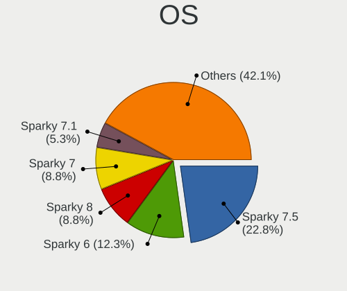

| Name        | Desktops | Percent |
|-------------|----------|---------|
| Sparky 7.5  | 13       | 22.81%  |
| Sparky 6    | 7        | 12.28%  |
| Sparky 8    | 5        | 8.77%   |
| Sparky 7    | 5        | 8.77%   |
| Sparky 7.1  | 3        | 5.26%   |
| Sparky 6.7  | 3        | 5.26%   |
| Sparky 5.12 | 3        | 5.26%   |
| Sparky 7.6  | 2        | 3.51%   |
| Sparky 7.0  | 2        | 3.51%   |
| Sparky 6.3  | 2        | 3.51%   |
| Sparky 6.2  | 2        | 3.51%   |
| Sparky 6.1  | 2        | 3.51%   |
| Sparky 7.8  | 1        | 1.75%   |
| Sparky 7.7  | 1        | 1.75%   |
| Sparky 7.4  | 1        | 1.75%   |
| Sparky 7.2  | 1        | 1.75%   |
| Sparky 6.6  | 1        | 1.75%   |
| Sparky 6.5  | 1        | 1.75%   |
| Sparky 6.0  | 1        | 1.75%   |
| Sparky 5.10 | 1        | 1.75%   |

OS Family
---------

OS without a version

| Name   | Desktops | Percent |
|--------|----------|---------|
| Sparky | 53       | 100%    |

Kernel
------

Version of the Linux kernel

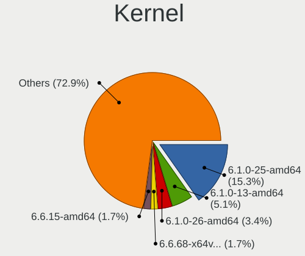

| Version                   | Desktops | Percent |
|---------------------------|----------|---------|
| 6.1.0-25-amd64            | 9        | 15.25%  |
| 6.1.0-13-amd64            | 3        | 5.08%   |
| 6.1.0-26-amd64            | 2        | 3.39%   |
| 6.6.68-x64v3-xanmod1      | 1        | 1.69%   |
| 6.6.15-amd64              | 1        | 1.69%   |
| 6.6.13-amd64              | 1        | 1.69%   |
| 6.4.0-1-amd64             | 1        | 1.69%   |
| 6.15.1-sparky-amd64       | 1        | 1.69%   |
| 6.13.5-sparky-amd64       | 1        | 1.69%   |
| 6.12.1-sparky-amd64       | 1        | 1.69%   |
| 6.11.6-sparky-amd64       | 1        | 1.69%   |
| 6.11.3-sparky-amd64       | 1        | 1.69%   |
| 6.11.10-amd64             | 1        | 1.69%   |
| 6.1.0-9-amd64             | 1        | 1.69%   |
| 6.1.0-7-amd64             | 1        | 1.69%   |
| 6.1.0-37-amd64            | 1        | 1.69%   |
| 6.1.0-3-amd64             | 1        | 1.69%   |
| 6.1.0-28-amd64            | 1        | 1.69%   |
| 6.1.0-27-amd64            | 1        | 1.69%   |
| 6.1.0-23-amd64            | 1        | 1.69%   |
| 6.1.0-17-amd64            | 1        | 1.69%   |
| 6.1.0-11-amd64            | 1        | 1.69%   |
| 6.0.11-x64v2-rt14-xanmod1 | 1        | 1.69%   |
| 6.0.0-5-amd64             | 1        | 1.69%   |
| 5.9.13-sparky-amd64       | 1        | 1.69%   |
| 5.7.2-sparky-amd64        | 1        | 1.69%   |
| 5.6.0-2-amd64             | 1        | 1.69%   |
| 5.18.3-sparky-amd64       | 1        | 1.69%   |
| 5.18.0-4-amd64            | 1        | 1.69%   |
| 5.18.0-2-amd64            | 1        | 1.69%   |
| 5.17.3-sparky-amd64       | 1        | 1.69%   |
| 5.16.5-sparky-amd64       | 1        | 1.69%   |
| 5.10.0-9-amd64            | 1        | 1.69%   |
| 5.10.0-8-amd64            | 1        | 1.69%   |
| 5.10.0-7-amd64            | 1        | 1.69%   |
| 5.10.0-6-amd64            | 1        | 1.69%   |
| 5.10.0-3-amd64            | 1        | 1.69%   |
| 5.10.0-26-amd64           | 1        | 1.69%   |
| 5.10.0-23-amd64           | 1        | 1.69%   |
| 5.10.0-21-amd64           | 1        | 1.69%   |

Kernel Family
-------------

Linux kernel without a distro release

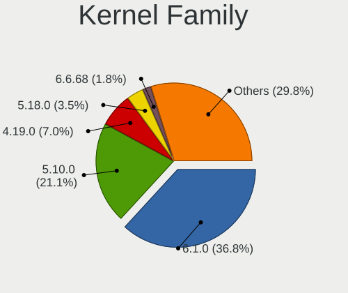

| Version | Desktops | Percent |
|---------|----------|---------|
| 6.1.0   | 21       | 36.84%  |
| 5.10.0  | 12       | 21.05%  |
| 4.19.0  | 4        | 7.02%   |
| 5.18.0  | 2        | 3.51%   |
| 6.6.68  | 1        | 1.75%   |
| 6.6.15  | 1        | 1.75%   |
| 6.6.13  | 1        | 1.75%   |
| 6.4.0   | 1        | 1.75%   |
| 6.15.1  | 1        | 1.75%   |
| 6.13.5  | 1        | 1.75%   |
| 6.12.1  | 1        | 1.75%   |
| 6.11.6  | 1        | 1.75%   |
| 6.11.3  | 1        | 1.75%   |
| 6.11.10 | 1        | 1.75%   |
| 6.0.11  | 1        | 1.75%   |
| 6.0.0   | 1        | 1.75%   |
| 5.9.13  | 1        | 1.75%   |
| 5.7.2   | 1        | 1.75%   |
| 5.6.0   | 1        | 1.75%   |
| 5.18.3  | 1        | 1.75%   |
| 5.17.3  | 1        | 1.75%   |
| 5.16.5  | 1        | 1.75%   |

Kernel Major Ver.
-----------------

Linux kernel major version

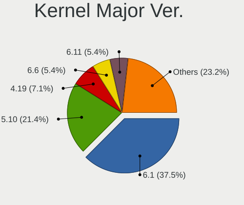

| Version | Desktops | Percent |
|---------|----------|---------|
| 6.1     | 21       | 37.5%   |
| 5.10    | 12       | 21.43%  |
| 4.19    | 4        | 7.14%   |
| 6.6     | 3        | 5.36%   |
| 6.11    | 3        | 5.36%   |
| 5.18    | 3        | 5.36%   |
| 6.4     | 1        | 1.79%   |
| 6.15    | 1        | 1.79%   |
| 6.13    | 1        | 1.79%   |
| 6.12    | 1        | 1.79%   |
| 6.0     | 1        | 1.79%   |
| 5.9     | 1        | 1.79%   |
| 5.7     | 1        | 1.79%   |
| 5.6     | 1        | 1.79%   |
| 5.17    | 1        | 1.79%   |
| 5.16    | 1        | 1.79%   |

Arch
----

OS architecture (x86_64, i586, etc.)

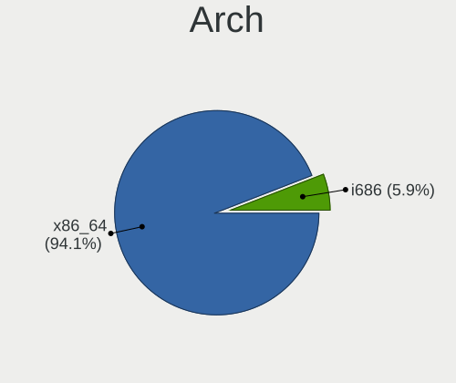

| Name   | Desktops | Percent |
|--------|----------|---------|
| x86_64 | 51       | 96.23%  |
| i686   | 2        | 3.77%   |

DE
--

Desktop Environment

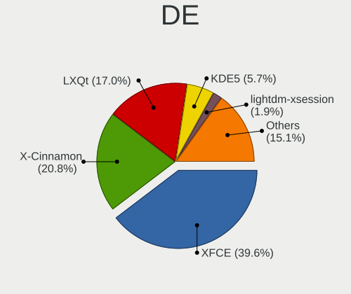

| Name             | Desktops | Percent |
|------------------|----------|---------|
| XFCE             | 21       | 39.62%  |
| X-Cinnamon       | 11       | 20.75%  |
| LXQt             | 9        | 16.98%  |
| KDE5             | 3        | 5.66%   |
| MATE             | 1        | 1.89%   |
| LXDE             | 1        | 1.89%   |
| lightdm-xsession | 1        | 1.89%   |
| KDE6             | 1        | 1.89%   |
| ICEWM            | 1        | 1.89%   |
| GNOME Flashback  | 1        | 1.89%   |
| GNOME            | 1        | 1.89%   |
| Budgie           | 1        | 1.89%   |
| Unknown          | 1        | 1.89%   |

Display Server
--------------

X11 or Wayland

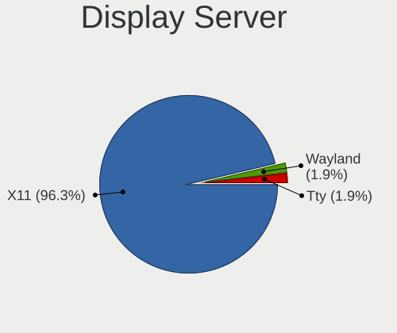

| Name    | Desktops | Percent |
|---------|----------|---------|
| X11     | 52       | 96.3%   |
| Wayland | 1        | 1.85%   |
| Tty     | 1        | 1.85%   |

Display Manager
---------------

SDDM, LightDM, etc.

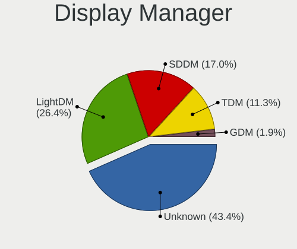

| Name    | Desktops | Percent |
|---------|----------|---------|
| Unknown | 23       | 43.4%   |
| LightDM | 14       | 26.42%  |
| SDDM    | 9        | 16.98%  |
| TDM     | 6        | 11.32%  |
| GDM     | 1        | 1.89%   |

OS Lang
-------

Language

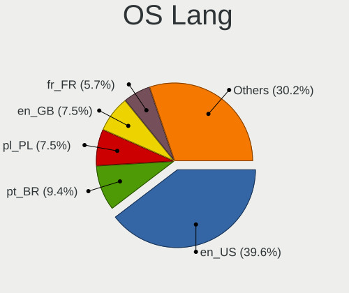

| Lang  | Desktops | Percent |
|-------|----------|---------|
| en_US | 21       | 39.62%  |
| pt_BR | 5        | 9.43%   |
| pl_PL | 4        | 7.55%   |
| en_GB | 4        | 7.55%   |
| fr_FR | 3        | 5.66%   |
| es_ES | 3        | 5.66%   |
| de_DE | 2        | 3.77%   |
| sv_SE | 1        | 1.89%   |
| ru_RU | 1        | 1.89%   |
| lt_LT | 1        | 1.89%   |
| it_IT | 1        | 1.89%   |
| es_US | 1        | 1.89%   |
| es_AR | 1        | 1.89%   |
| en_ZA | 1        | 1.89%   |
| en_DK | 1        | 1.89%   |
| en_CA | 1        | 1.89%   |
| de_CH | 1        | 1.89%   |
| cs_CZ | 1        | 1.89%   |

Boot Mode
---------

EFI or BIOS

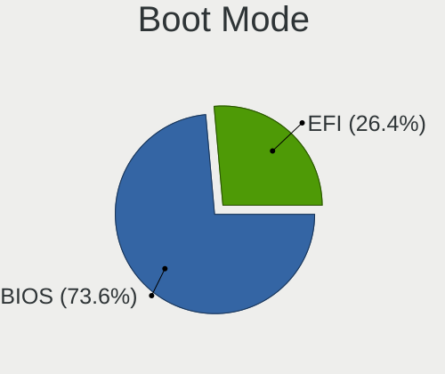

| Mode | Desktops | Percent |
|------|----------|---------|
| BIOS | 39       | 73.58%  |
| EFI  | 14       | 26.42%  |

Filesystem
----------

Type of filesystem

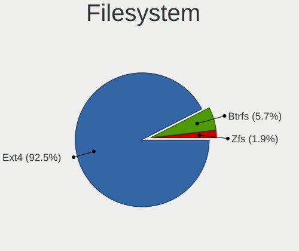

| Type  | Desktops | Percent |
|-------|----------|---------|
| Ext4  | 49       | 92.45%  |
| Btrfs | 3        | 5.66%   |
| Zfs   | 1        | 1.89%   |

Part. scheme
------------

Scheme of partitioning

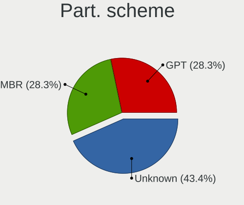

| Type    | Desktops | Percent |
|---------|----------|---------|
| Unknown | 23       | 43.4%   |
| MBR     | 15       | 28.3%   |
| GPT     | 15       | 28.3%   |

Dual Boot with Linux/BSD
------------------------

Hosting more than one Linux/BSD

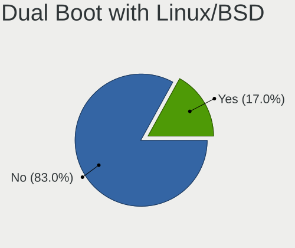

| Dual boot | Desktops | Percent |
|-----------|----------|---------|
| No        | 44       | 83.02%  |
| Yes       | 9        | 16.98%  |

Dual Boot (Win)
---------------

Hosting Linux and Windows

| Dual boot | Desktops | Percent |
|-----------|----------|---------|
| No        | 38       | 70.37%  |
| Yes       | 16       | 29.63%  |

Board
-----

Vendor
------

Motherboard manufacturer

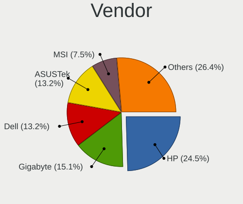

| Name                | Desktops | Percent |
|---------------------|----------|---------|
| Hewlett-Packard     | 13       | 24.53%  |
| Gigabyte Technology | 8        | 15.09%  |
| Dell                | 7        | 13.21%  |
| ASUSTek Computer    | 7        | 13.21%  |
| MSI                 | 4        | 7.55%   |
| Intel               | 4        | 7.55%   |
| Acer                | 4        | 7.55%   |
| Medion              | 2        | 3.77%   |
| Lenovo              | 1        | 1.89%   |
| Foxconn             | 1        | 1.89%   |
| ASRock              | 1        | 1.89%   |
| Unknown             | 1        | 1.89%   |

Model
-----

Motherboard model

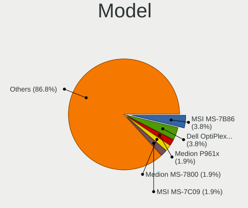

| Name                                | Desktops | Percent |
|-------------------------------------|----------|---------|
| MSI MS-7B86                         | 2        | 3.77%   |
| Dell OptiPlex 7010                  | 2        | 3.77%   |
| MSI MS-7C09                         | 1        | 1.89%   |
| MSI MS-7721                         | 1        | 1.89%   |
| Medion P961x                        | 1        | 1.89%   |
| Medion MS-7800                      | 1        | 1.89%   |
| Lenovo ThinkCentre M90s 11D2CTO1WW  | 1        | 1.89%   |
| Intel H61                           | 1        | 1.89%   |
| Intel H55                           | 1        | 1.89%   |
| Intel DG43RK AAE78175-402           | 1        | 1.89%   |
| Intel DG41TY AAE47335-300           | 1        | 1.89%   |
| HP Z440 Workstation                 | 1        | 1.89%   |
| HP Z420 Workstation                 | 1        | 1.89%   |
| HP t5740                            | 1        | 1.89%   |
| HP rp5700 Business System           | 1        | 1.89%   |
| HP EliteDesk 800 G3 TWR             | 1        | 1.89%   |
| HP EliteDesk 800 G2 DM 65W          | 1        | 1.89%   |
| HP EliteDesk 800 G2 DM 35W          | 1        | 1.89%   |
| HP EliteDesk 705 G4 DM 65W (TAA)    | 1        | 1.89%   |
| HP EliteDesk 705 G2 MINI            | 1        | 1.89%   |
| HP Compaq Pro 6300 SFF              | 1        | 1.89%   |
| HP Compaq Elite 8300 CMT            | 1        | 1.89%   |
| HP Compaq dc7700 Ultra-slim Desktop | 1        | 1.89%   |
| HP Compaq 6200 Pro SFF PC           | 1        | 1.89%   |
| Gigabyte X570S AORUS PRO AX         | 1        | 1.89%   |
| Gigabyte M68M-S2P                   | 1        | 1.89%   |
| Gigabyte H97-Gaming 3               | 1        | 1.89%   |
| Gigabyte H410M H                    | 1        | 1.89%   |
| Gigabyte G41MT-S2P                  | 1        | 1.89%   |
| Gigabyte G41M-ES2L                  | 1        | 1.89%   |
| Gigabyte BRi3(H)-10110              | 1        | 1.89%   |
| Gigabyte B75M-D3V                   | 1        | 1.89%   |
| Foxconn p6-2010fr                   | 1        | 1.89%   |
| Dell OptiPlex 780                   | 1        | 1.89%   |
| Dell OptiPlex 7050                  | 1        | 1.89%   |
| Dell OptiPlex 580                   | 1        | 1.89%   |
| Dell OptiPlex 5050                  | 1        | 1.89%   |
| Dell Inspiron 620                   | 1        | 1.89%   |
| ASUS PRIME H510M-K                  | 1        | 1.89%   |
| ASUS P7H55-M                        | 1        | 1.89%   |

Model Family
------------

Motherboard model prefix

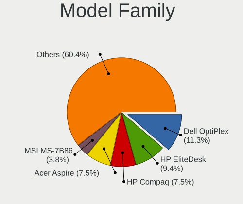

| Name                   | Desktops | Percent |
|------------------------|----------|---------|
| Dell OptiPlex          | 6        | 11.32%  |
| HP EliteDesk           | 5        | 9.43%   |
| HP Compaq              | 4        | 7.55%   |
| Acer Aspire            | 4        | 7.55%   |
| MSI MS-7B86            | 2        | 3.77%   |
| MSI MS-7C09            | 1        | 1.89%   |
| MSI MS-7721            | 1        | 1.89%   |
| Medion P961x           | 1        | 1.89%   |
| Medion MS-7800         | 1        | 1.89%   |
| Lenovo ThinkCentre     | 1        | 1.89%   |
| Intel H61              | 1        | 1.89%   |
| Intel H55              | 1        | 1.89%   |
| Intel DG43RK           | 1        | 1.89%   |
| Intel DG41TY           | 1        | 1.89%   |
| HP Z440                | 1        | 1.89%   |
| HP Z420                | 1        | 1.89%   |
| HP t5740               | 1        | 1.89%   |
| HP rp5700              | 1        | 1.89%   |
| Gigabyte X570S         | 1        | 1.89%   |
| Gigabyte M68M-S2P      | 1        | 1.89%   |
| Gigabyte H97-Gaming    | 1        | 1.89%   |
| Gigabyte H410M         | 1        | 1.89%   |
| Gigabyte G41MT-S2P     | 1        | 1.89%   |
| Gigabyte G41M-ES2L     | 1        | 1.89%   |
| Gigabyte BRi3(H)-10110 | 1        | 1.89%   |
| Gigabyte B75M-D3V      | 1        | 1.89%   |
| Foxconn p6-2010fr      | 1        | 1.89%   |
| Dell Inspiron          | 1        | 1.89%   |
| ASUS PRIME             | 1        | 1.89%   |
| ASUS P7H55-M           | 1        | 1.89%   |
| ASUS M5A78L-M          | 1        | 1.89%   |
| ASUS M4N68T-M          | 1        | 1.89%   |
| ASUS G20AJ             | 1        | 1.89%   |
| ASUS CROSSHAIR         | 1        | 1.89%   |
| ASUS All               | 1        | 1.89%   |
| ASRock 880G            | 1        | 1.89%   |
| Unknown                | 1        | 1.89%   |

MFG Year
--------

Motherboard manufacture year

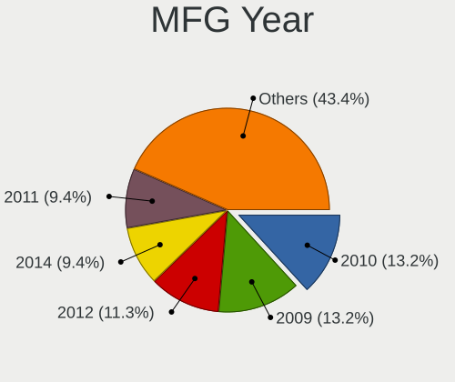

| Year | Desktops | Percent |
|------|----------|---------|
| 2010 | 7        | 13.21%  |
| 2009 | 7        | 13.21%  |
| 2012 | 6        | 11.32%  |
| 2014 | 5        | 9.43%   |
| 2011 | 5        | 9.43%   |
| 2021 | 4        | 7.55%   |
| 2017 | 4        | 7.55%   |
| 2019 | 3        | 5.66%   |
| 2015 | 3        | 5.66%   |
| 2007 | 3        | 5.66%   |
| 2018 | 2        | 3.77%   |
| 2013 | 2        | 3.77%   |
| 2020 | 1        | 1.89%   |
| 2016 | 1        | 1.89%   |

Form Factor
-----------

Physical design of the computer

| Name    | Desktops | Percent |
|---------|----------|---------|
| Desktop | 53       | 100%    |

Secure Boot
-----------

Enabled or disabled

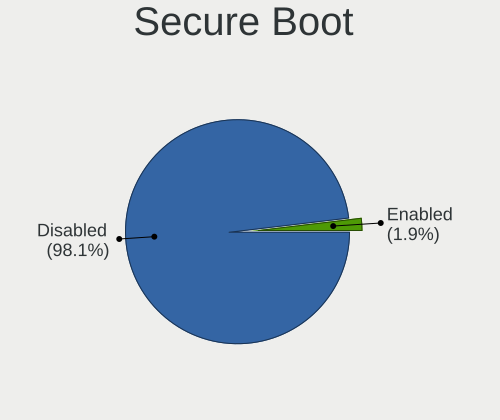

| State    | Desktops | Percent |
|----------|----------|---------|
| Disabled | 52       | 98.11%  |
| Enabled  | 1        | 1.89%   |

Coreboot
--------

Have coreboot on board

| Used | Desktops | Percent |
|------|----------|---------|
| No   | 53       | 100%    |

RAM Size
--------

Total RAM memory

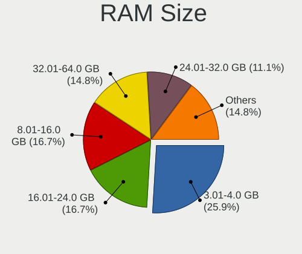

| Size in GB  | Desktops | Percent |
|-------------|----------|---------|
| 3.01-4.0    | 14       | 25.93%  |
| 16.01-24.0  | 9        | 16.67%  |
| 8.01-16.0   | 9        | 16.67%  |
| 32.01-64.0  | 8        | 14.81%  |
| 24.01-32.0  | 6        | 11.11%  |
| 4.01-8.0    | 4        | 7.41%   |
| 1.01-2.0    | 2        | 3.7%    |
| 2.01-3.0    | 1        | 1.85%   |
| 64.01-256.0 | 1        | 1.85%   |

RAM Used
--------

Used RAM memory

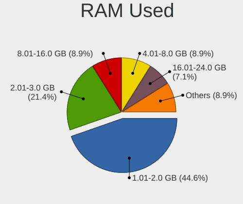

| Used GB    | Desktops | Percent |
|------------|----------|---------|
| 1.01-2.0   | 25       | 44.64%  |
| 2.01-3.0   | 12       | 21.43%  |
| 4.01-8.0   | 5        | 8.93%   |
| 8.01-16.0  | 5        | 8.93%   |
| 16.01-24.0 | 4        | 7.14%   |
| 3.01-4.0   | 3        | 5.36%   |
| 0.51-1.0   | 2        | 3.57%   |

Total Drives
------------

Number of drives on board

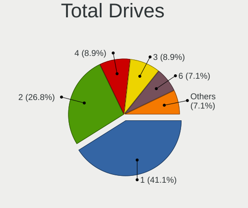

| Drives | Desktops | Percent |
|--------|----------|---------|
| 1      | 23       | 41.07%  |
| 2      | 15       | 26.79%  |
| 4      | 5        | 8.93%   |
| 3      | 5        | 8.93%   |
| 6      | 4        | 7.14%   |
| 7      | 2        | 3.57%   |
| 5      | 2        | 3.57%   |

Has CD-ROM
----------

Has CD-ROM on board

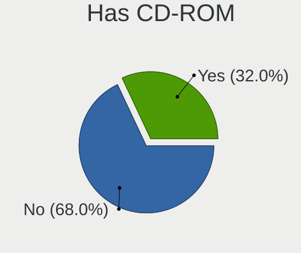

| Presented | Desktops | Percent |
|-----------|----------|---------|
| No        | 28       | 51.85%  |
| Yes       | 26       | 48.15%  |

Has Ethernet
------------

Has Ethernet on board

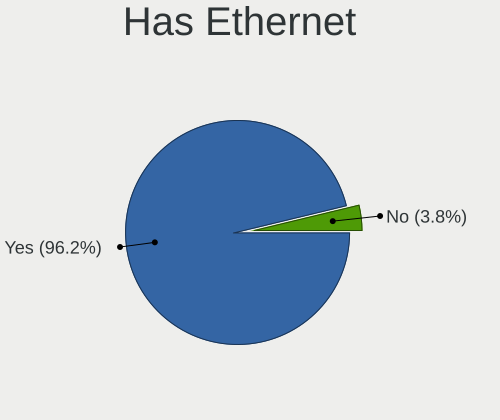

| Presented | Desktops | Percent |
|-----------|----------|---------|
| Yes       | 51       | 96.23%  |
| No        | 2        | 3.77%   |

Has WiFi
--------

Has WiFi module

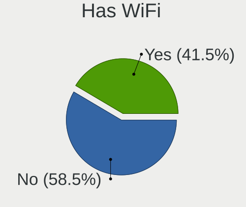

| Presented | Desktops | Percent |
|-----------|----------|---------|
| No        | 31       | 58.49%  |
| Yes       | 22       | 41.51%  |

Has Bluetooth
-------------

Has Bluetooth module

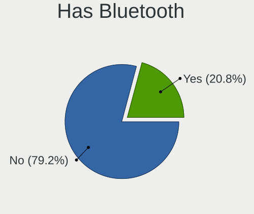

| Presented | Desktops | Percent |
|-----------|----------|---------|
| No        | 42       | 79.25%  |
| Yes       | 11       | 20.75%  |

Location
--------

Country
-------

Geographic location (country)

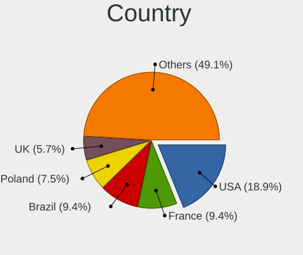

| Country      | Desktops | Percent |
|--------------|----------|---------|
| USA          | 10       | 18.87%  |
| France       | 5        | 9.43%   |
| Brazil       | 5        | 9.43%   |
| Poland       | 4        | 7.55%   |
| UK           | 3        | 5.66%   |
| Sweden       | 3        | 5.66%   |
| Germany      | 3        | 5.66%   |
| Spain        | 2        | 3.77%   |
| Italy        | 2        | 3.77%   |
| Indonesia    | 2        | 3.77%   |
| Argentina    | 2        | 3.77%   |
| Venezuela    | 1        | 1.89%   |
| Switzerland  | 1        | 1.89%   |
| South Africa | 1        | 1.89%   |
| Russia       | 1        | 1.89%   |
| Netherlands  | 1        | 1.89%   |
| Mexico       | 1        | 1.89%   |
| Lithuania    | 1        | 1.89%   |
| Lebanon      | 1        | 1.89%   |
| Hungary      | 1        | 1.89%   |
| Czechia      | 1        | 1.89%   |
| Canada       | 1        | 1.89%   |
| Belgium      | 1        | 1.89%   |

City
----

Geographic location (city)

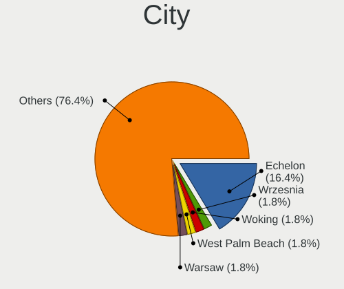

| City                | Desktops | Percent |
|---------------------|----------|---------|
| Echelon             | 9        | 16.36%  |
| Wrzesnia            | 1        | 1.82%   |
| Woking              | 1        | 1.82%   |
| West Palm Beach     | 1        | 1.82%   |
| Warsaw              | 1        | 1.82%   |
| Vilnius             | 1        | 1.82%   |
| Uppsala             | 1        | 1.82%   |
| Trelaze             | 1        | 1.82%   |
| Surabaya            | 1        | 1.82%   |
| Sin el Fil          | 1        | 1.82%   |
| San Cristóbal      | 1        | 1.82%   |
| Rudnik              | 1        | 1.82%   |
| Rosario             | 1        | 1.82%   |
| Rio de Janeiro      | 1        | 1.82%   |
| Rio Claro           | 1        | 1.82%   |
| Rheinbach           | 1        | 1.82%   |
| Presidente Prudente | 1        | 1.82%   |
| Posadas             | 1        | 1.82%   |
| Norrköping         | 1        | 1.82%   |
| Moscow              | 1        | 1.82%   |
| Montriond           | 1        | 1.82%   |
| Montreuil           | 1        | 1.82%   |
| Mnisek pod Brdy     | 1        | 1.82%   |
| Kirkcaldy           | 1        | 1.82%   |
| Kage                | 1        | 1.82%   |
| Harlow              | 1        | 1.82%   |
| Guadalajara         | 1        | 1.82%   |
| Grabs               | 1        | 1.82%   |
| Fuveau              | 1        | 1.82%   |
| Frankfurt (Oder)    | 1        | 1.82%   |
| Everswinkel         | 1        | 1.82%   |
| Enfield             | 1        | 1.82%   |
| Duque de Caxias     | 1        | 1.82%   |
| Dartmouth           | 1        | 1.82%   |
| Czeladz             | 1        | 1.82%   |
| Choisy-le-Roi       | 1        | 1.82%   |
| Carapicuiba         | 1        | 1.82%   |
| Cape Town           | 1        | 1.82%   |
| Campomarino         | 1        | 1.82%   |
| Calanda             | 1        | 1.82%   |

Drives
------

Drive Vendor
------------

Hard drive vendors

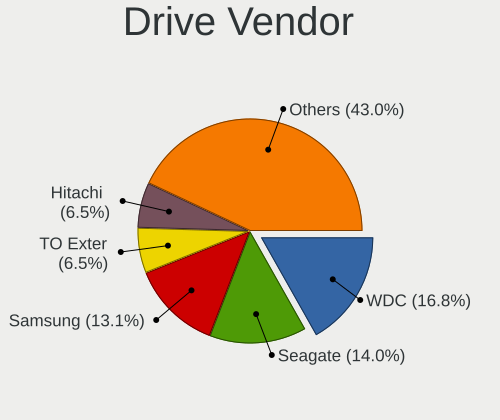

| Vendor                    | Desktops | Drives | Percent |
|---------------------------|----------|--------|---------|
| WDC                       | 18       | 19     | 16.82%  |
| Seagate                   | 15       | 19     | 14.02%  |
| Samsung Electronics       | 14       | 28     | 13.08%  |
| TO Exter                  | 7        | 13     | 6.54%   |
| Hitachi                   | 7        | 7      | 6.54%   |
| External                  | 7        | 14     | 6.54%   |
| Toshiba                   | 5        | 6      | 4.67%   |
| Kingston                  | 5        | 6      | 4.67%   |
| JMicron Technology        | 5        | 8      | 4.67%   |
| Sandisk                   | 3        | 5      | 2.8%    |
| Patriot                   | 3        | 4      | 2.8%    |
| Crucial                   | 3        | 3      | 2.8%    |
| XPG                       | 1        | 1      | 0.93%   |
| Team                      | 1        | 1      | 0.93%   |
| SK hynix                  | 1        | 1      | 0.93%   |
| PNY                       | 1        | 1      | 0.93%   |
| Phison Electronics        | 1        | 1      | 0.93%   |
| OCZ                       | 1        | 1      | 0.93%   |
| Micron/Crucial Technology | 1        | 1      | 0.93%   |
| Intel                     | 1        | 1      | 0.93%   |
| HGST                      | 1        | 1      | 0.93%   |
| GOODRAM                   | 1        | 2      | 0.93%   |
| Gigabyte Technology       | 1        | 1      | 0.93%   |
| China                     | 1        | 1      | 0.93%   |
| ASMedia                   | 1        | 1      | 0.93%   |
| A-DATA Technology         | 1        | 1      | 0.93%   |
| Unknown                   | 1        | 1      | 0.93%   |

Drive Model
-----------

Hard drive models

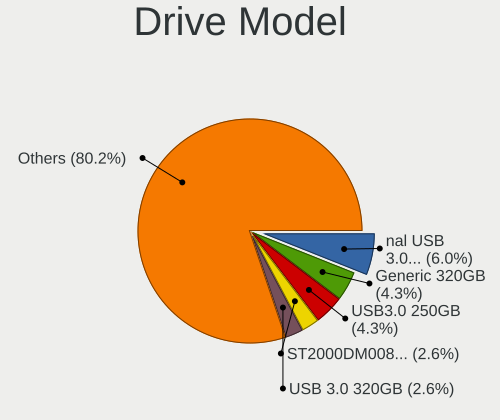

| Model                                             | Desktops | Percent |
|---------------------------------------------------|----------|---------|
| TO Exter nal USB 3.0 250GB                        | 7        | 6.03%   |
| JMicron Generic 320GB                             | 5        | 4.31%   |
| External USB3.0 250GB                             | 5        | 4.31%   |
| Seagate ST2000DM008-2FR102 2TB                    | 3        | 2.59%   |
| External USB 3.0 320GB                            | 3        | 2.59%   |
| WDC WD3200AAKS-75L9A0 320GB                       | 2        | 1.72%   |
| Toshiba DT01ACA100 1TB                            | 2        | 1.72%   |
| Seagate ST500LT012-1DG142 500GB                   | 2        | 1.72%   |
| Seagate ST500DM002-1BD142 500GB                   | 2        | 1.72%   |
| Samsung NVMe SSD Controller SM981/PM981/PM983 1TB | 2        | 1.72%   |
| Samsung HD161GJ 160GB                             | 2        | 1.72%   |
| Patriot P210 256GB SSD                            | 2        | 1.72%   |
| Kingston SA400S37120G 120GB SSD                   | 2        | 1.72%   |
| Hitachi HDS721050CLA 500GB                        | 2        | 1.72%   |
| XPG GAMMIX S11 Pro 1TB                            | 1        | 0.86%   |
| WDC WD800JD-08MSA1 80GB                           | 1        | 0.86%   |
| WDC WD6400AAKS-22A7B2 640GB                       | 1        | 0.86%   |
| WDC WD5000AVVS-63ZWB0 500GB                       | 1        | 0.86%   |
| WDC WD5000AAKS-75V0A0 500GB                       | 1        | 0.86%   |
| WDC WD50 00LPLX-08ZNTT0 500GB                     | 1        | 0.86%   |
| WDC WD2500AAKX-07U6AA0 250GB                      | 1        | 0.86%   |
| WDC WD2500AAJS-00L7A0 250GB                       | 1        | 0.86%   |
| WDC WD20EZRZ-00Z5HB0 2TB                          | 1        | 0.86%   |
| WDC WD1600BEVT-22ZCT0 160GB                       | 1        | 0.86%   |
| WDC WD1600BEVS-00VAT0 160GB                       | 1        | 0.86%   |
| WDC WD1600AAJS-08L7A0 160GB                       | 1        | 0.86%   |
| WDC WD10SPCX-16KHST0 1TB                          | 1        | 0.86%   |
| WDC WD10EZEX-60WN4A0 1TB                          | 1        | 0.86%   |
| WDC WD10EFRX-68PJCN0 1TB                          | 1        | 0.86%   |
| WDC WD10EADS-00M2B0 1TB                           | 1        | 0.86%   |
| WDC WD My Passport 261B 500GB                     | 1        | 0.86%   |
| Toshiba MQ01ACF032 320GB                          | 1        | 0.86%   |
| Toshiba MQ01ABD075 752GB                          | 1        | 0.86%   |
| Toshiba DT01ACA050 500GB                          | 1        | 0.86%   |
| Team TM8PS7256G 256GB SSD                         | 1        | 0.86%   |
| SK hynix SKHynix_HFS512GDE9X081N 512GB            | 1        | 0.86%   |
| Seagate ST975042 0AS 752GB                        | 1        | 0.86%   |
| Seagate ST9250315AS 250GB                         | 1        | 0.86%   |
| Seagate ST500DM0 02-1BD142 500GB                  | 1        | 0.86%   |
| Seagate ST3500418AS 500GB                         | 1        | 0.86%   |

HDD Vendor
----------

Hard disk drive vendors

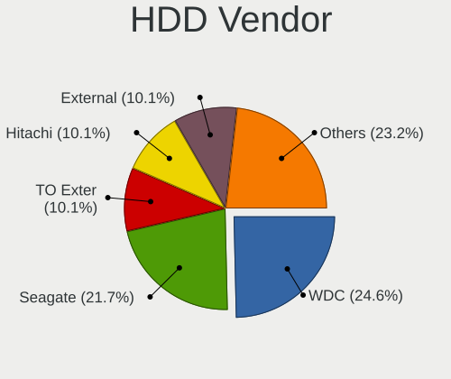

| Vendor              | Desktops | Drives | Percent |
|---------------------|----------|--------|---------|
| WDC                 | 17       | 18     | 24.64%  |
| Seagate             | 15       | 18     | 21.74%  |
| TO Exter            | 7        | 13     | 10.14%  |
| Hitachi             | 7        | 7      | 10.14%  |
| External            | 7        | 14     | 10.14%  |
| Toshiba             | 5        | 6      | 7.25%   |
| Samsung Electronics | 5        | 12     | 7.25%   |
| JMicron Technology  | 5        | 8      | 7.25%   |
| HGST                | 1        | 1      | 1.45%   |

SSD Vendor
----------

Solid state drive vendors

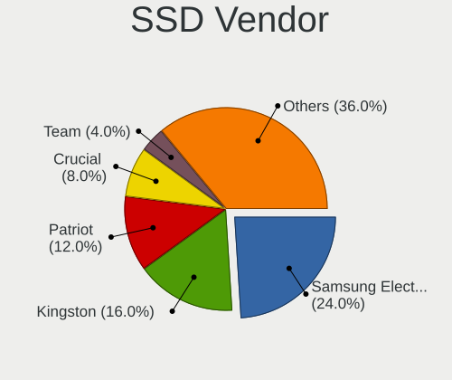

| Vendor              | Desktops | Drives | Percent |
|---------------------|----------|--------|---------|
| Samsung Electronics | 6        | 12     | 24%     |
| Kingston            | 4        | 5      | 16%     |
| Patriot             | 3        | 4      | 12%     |
| Crucial             | 2        | 2      | 8%      |
| Team                | 1        | 1      | 4%      |
| PNY                 | 1        | 1      | 4%      |
| OCZ                 | 1        | 1      | 4%      |
| Intel               | 1        | 1      | 4%      |
| GOODRAM             | 1        | 2      | 4%      |
| Gigabyte Technology | 1        | 1      | 4%      |
| China               | 1        | 1      | 4%      |
| ASMedia             | 1        | 1      | 4%      |
| A-DATA Technology   | 1        | 1      | 4%      |
| Unknown             | 1        | 1      | 4%      |

Drive Kind
----------

HDD or SSD

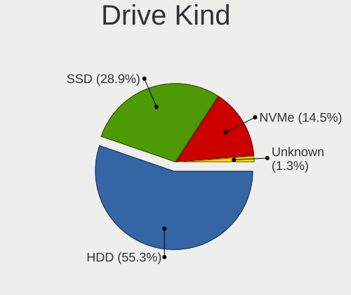

| Kind    | Desktops | Drives | Percent |
|---------|----------|--------|---------|
| HDD     | 42       | 97     | 55.26%  |
| SSD     | 22       | 34     | 28.95%  |
| NVMe    | 11       | 16     | 14.47%  |
| Unknown | 1        | 1      | 1.32%   |

Drive Connector
---------------

SATA, SAS, NVMe, etc.

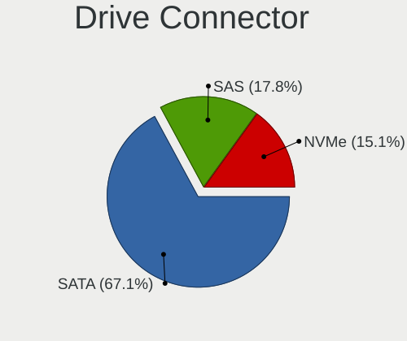

| Type | Desktops | Drives | Percent |
|------|----------|--------|---------|
| SATA | 49       | 86     | 67.12%  |
| SAS  | 13       | 46     | 17.81%  |
| NVMe | 11       | 16     | 15.07%  |

Drive Size
----------

Size of hard drive

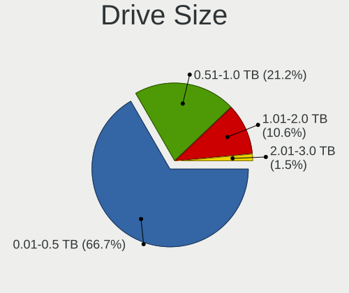

| Size in TB | Desktops | Drives | Percent |
|------------|----------|--------|---------|
| 0.01-0.5   | 44       | 98     | 66.67%  |
| 0.51-1.0   | 14       | 24     | 21.21%  |
| 1.01-2.0   | 7        | 8      | 10.61%  |
| 2.01-3.0   | 1        | 1      | 1.52%   |

Space Total
-----------

Amount of disk space available on the file system

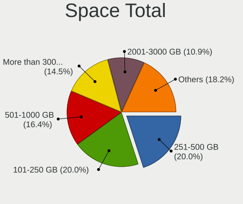

| Size in GB     | Desktops | Percent |
|----------------|----------|---------|
| 251-500        | 11       | 20%     |
| 101-250        | 11       | 20%     |
| 501-1000       | 9        | 16.36%  |
| More than 3000 | 8        | 14.55%  |
| 2001-3000      | 6        | 10.91%  |
| 1001-2000      | 4        | 7.27%   |
| 51-100         | 3        | 5.45%   |
| 21-50          | 1        | 1.82%   |
| 1-20           | 1        | 1.82%   |
| Unknown        | 1        | 1.82%   |

Space Used
----------

Amount of used disk space

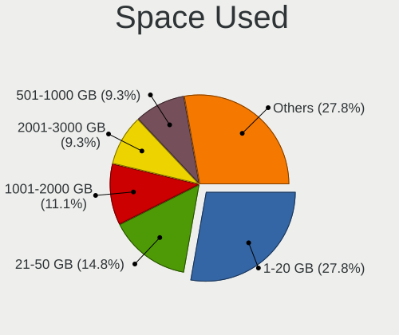

| Used GB        | Desktops | Percent |
|----------------|----------|---------|
| 1-20           | 15       | 27.78%  |
| 21-50          | 8        | 14.81%  |
| 1001-2000      | 6        | 11.11%  |
| 251-500        | 5        | 9.26%   |
| 2001-3000      | 5        | 9.26%   |
| 501-1000       | 5        | 9.26%   |
| 101-250        | 4        | 7.41%   |
| 51-100         | 3        | 5.56%   |
| More than 3000 | 2        | 3.7%    |
| Unknown        | 1        | 1.85%   |

Malfunc. Drives
---------------

Drive models with a malfunction

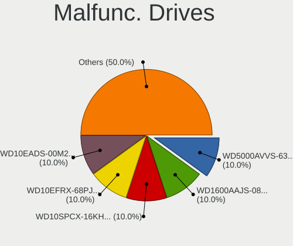

| Model                          | Desktops | Drives | Percent |
|--------------------------------|----------|--------|---------|
| WDC WD5000AVVS-63ZWB0 500GB    | 1        | 1      | 10%     |
| WDC WD1600AAJS-08L7A0 160GB    | 1        | 1      | 10%     |
| WDC WD10SPCX-16KHST0 1TB       | 1        | 1      | 10%     |
| WDC WD10EFRX-68PJCN0 1TB       | 1        | 2      | 10%     |
| WDC WD10EADS-00M2B0 1TB        | 1        | 1      | 10%     |
| Toshiba DT01ACA100 1TB         | 1        | 2      | 10%     |
| Seagate ST9250315AS 250GB      | 1        | 1      | 10%     |
| Seagate ST3500413AS 500GB      | 1        | 1      | 10%     |
| Seagate ST2000DM008-2FR102 2TB | 1        | 1      | 10%     |
| Unknown                        | 1        | 1      | 10%     |

Malfunc. Drive Vendor
---------------------

Vendors of faulty drives

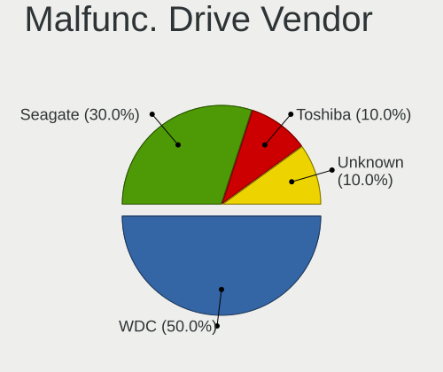

| Vendor  | Desktops | Drives | Percent |
|---------|----------|--------|---------|
| WDC     | 5        | 6      | 50%     |
| Seagate | 3        | 3      | 30%     |
| Toshiba | 1        | 2      | 10%     |
| Unknown | 1        | 1      | 10%     |

Malfunc. HDD Vendor
-------------------

Vendors of faulty HDD drives

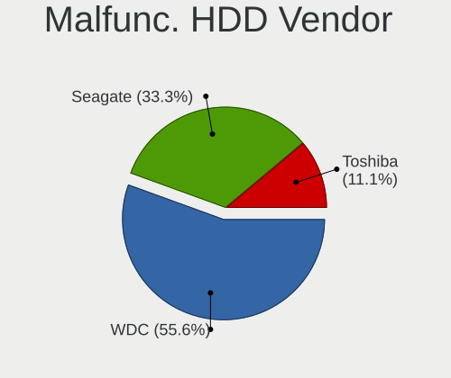

| Vendor  | Desktops | Drives | Percent |
|---------|----------|--------|---------|
| WDC     | 5        | 6      | 55.56%  |
| Seagate | 3        | 3      | 33.33%  |
| Toshiba | 1        | 2      | 11.11%  |

Malfunc. Drive Kind
-------------------

Kinds of faulty drives

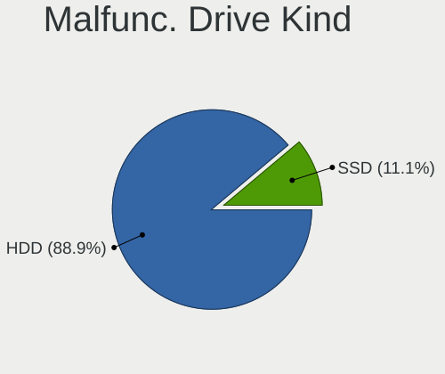

| Kind | Desktops | Drives | Percent |
|------|----------|--------|---------|
| HDD  | 9        | 11     | 90%     |
| SSD  | 1        | 1      | 10%     |

Failed Drives
-------------

Failed drive models

Zero info for selected period =(

Failed Drive Vendor
-------------------

Failed drive vendors

Zero info for selected period =(

Drive Status
------------

Number of failed and malfunc. drives

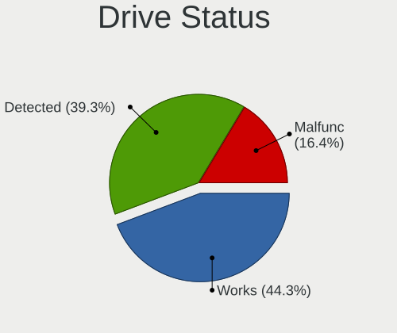

| Status   | Desktops | Drives | Percent |
|----------|----------|--------|---------|
| Works    | 27       | 40     | 44.26%  |
| Detected | 24       | 96     | 39.34%  |
| Malfunc  | 10       | 12     | 16.39%  |

Storage controller
------------------

Storage Vendor
--------------

Storage controller vendors

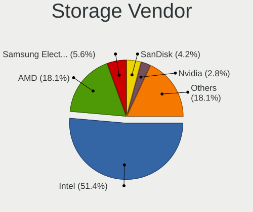

| Vendor                      | Desktops | Percent |
|-----------------------------|----------|---------|
| Intel                       | 37       | 51.39%  |
| AMD                         | 13       | 18.06%  |
| Samsung Electronics         | 4        | 5.56%   |
| SanDisk                     | 3        | 4.17%   |
| Nvidia                      | 2        | 2.78%   |
| Micron/Crucial Technology   | 2        | 2.78%   |
| ASMedia Technology          | 2        | 2.78%   |
| VIA Technologies            | 1        | 1.39%   |
| SK hynix                    | 1        | 1.39%   |
| Seagate Technology          | 1        | 1.39%   |
| Promise Technology          | 1        | 1.39%   |
| Phison Electronics          | 1        | 1.39%   |
| Marvell Technology Group    | 1        | 1.39%   |
| LSI Logic / Symbios Logic   | 1        | 1.39%   |
| Kingston Technology Company | 1        | 1.39%   |
| ADATA Technology            | 1        | 1.39%   |

Storage Model
-------------

Storage controller models

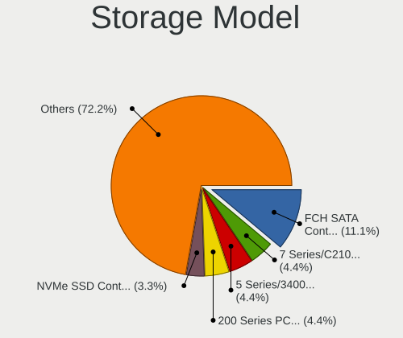

| Model                                                                         | Desktops | Percent |
|-------------------------------------------------------------------------------|----------|---------|
| AMD FCH SATA Controller [AHCI mode]                                           | 10       | 11.11%  |
| Intel 7 Series/C210 Series Chipset Family 6-port SATA Controller [AHCI mode]  | 4        | 4.44%   |
| Intel 5 Series/3400 Series Chipset 6 port SATA AHCI Controller                | 4        | 4.44%   |
| Intel 200 Series PCH SATA controller [AHCI mode]                              | 4        | 4.44%   |
| Samsung NVMe SSD Controller SM981/PM981/PM983                                 | 3        | 3.33%   |
| Intel NM10/ICH7 Family SATA Controller [IDE mode]                             | 3        | 3.33%   |
| Intel 6 Series/C200 Series Chipset Family 6 port Desktop SATA AHCI Controller | 3        | 3.33%   |
| AMD SB7x0/SB8x0/SB9x0 IDE Controller                                          | 3        | 3.33%   |
| SanDisk Ultra 3D / WD Blue SN570 NVMe SSD (DRAM-less)                         | 2        | 2.22%   |
| Nvidia MCP61 SATA Controller                                                  | 2        | 2.22%   |
| Nvidia MCP61 IDE                                                              | 2        | 2.22%   |
| Micron/Crucial P2 [Nick P2] / P3 / P3 Plus NVMe PCIe SSD (DRAM-less)          | 2        | 2.22%   |
| Intel SATA Controller [RAID mode]                                             | 2        | 2.22%   |
| Intel Q170/Q150/B150/H170/H110/Z170/CM236 Chipset SATA Controller [AHCI Mode] | 2        | 2.22%   |
| Intel Comet Lake SATA AHCI Controller                                         | 2        | 2.22%   |
| Intel 9 Series Chipset Family SATA Controller [AHCI Mode]                     | 2        | 2.22%   |
| Intel 82801H (ICH8 Family) 4 port SATA Controller [IDE mode]                  | 2        | 2.22%   |
| ASMedia ASM1061/ASM1062 Serial ATA Controller                                 | 2        | 2.22%   |
| AMD SB7x0/SB8x0/SB9x0 SATA Controller [AHCI mode]                             | 2        | 2.22%   |
| AMD 400 Series Chipset SATA Controller                                        | 2        | 2.22%   |
| VIA VT82C586A/B/VT82C686/A/B/VT823x/A/C PIPC Bus Master IDE                   | 1        | 1.11%   |
| VIA VT8237A Integrated SATA RAID Controller                                   | 1        | 1.11%   |
| SK hynix Gold P31/BC711/PC711 NVMe Solid State Drive                          | 1        | 1.11%   |
| Seagate BarraCuda Q5 NVMe SSD (DRAM-less)                                     | 1        | 1.11%   |
| SanDisk WD Green SN350 240GB (DRAM-less) / SN560E NVMe SSD                    | 1        | 1.11%   |
| Samsung NVMe SSD Controller SM951/PM951                                       | 1        | 1.11%   |
| Promise PDC20771 [FastTrak TX2300]                                            | 1        | 1.11%   |
| Phison E12 NVMe Controller                                                    | 1        | 1.11%   |
| Marvell Group 88SE6101/6102 single-port PATA133 interface                     | 1        | 1.11%   |
| LSI Logic / Symbios Logic SAS1064ET PCI-Express Fusion-MPT SAS                | 1        | 1.11%   |
| Kingston Company NV1 NVMe SSD [E13T] (DRAM-less)                              | 1        | 1.11%   |
| Intel sSATA Controller [RAID Mode]                                            | 1        | 1.11%   |
| Intel C602 chipset 4-Port SATA Storage Control Unit                           | 1        | 1.11%   |
| Intel C600/X79 series chipset IDE-r Controller                                | 1        | 1.11%   |
| Intel C600/X79 series chipset 6-Port SATA AHCI Controller                     | 1        | 1.11%   |
| Intel 82801JI (ICH10 Family) 4 port SATA IDE Controller #1                    | 1        | 1.11%   |
| Intel 82801JI (ICH10 Family) 2 port SATA IDE Controller #2                    | 1        | 1.11%   |
| Intel 82801JD/DO (ICH10 Family) 4-port SATA IDE Controller                    | 1        | 1.11%   |
| Intel 82801JD/DO (ICH10 Family) 2-port SATA IDE Controller                    | 1        | 1.11%   |
| Intel 82801IBM/IEM (ICH9M/ICH9M-E) 4 port SATA Controller [AHCI mode]         | 1        | 1.11%   |

Storage Kind
------------

Kind of storage controller (IDE, SATA, NVMe, SAS, ...)

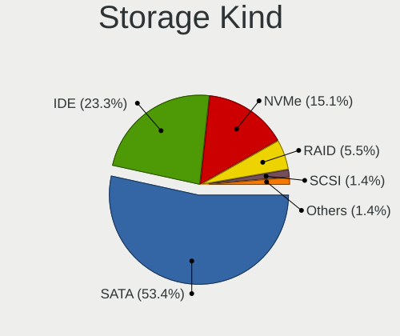

| Kind | Desktops | Percent |
|------|----------|---------|
| SATA | 39       | 53.42%  |
| IDE  | 17       | 23.29%  |
| NVMe | 11       | 15.07%  |
| RAID | 4        | 5.48%   |
| SAS  | 1        | 1.37%   |
| SCSI | 1        | 1.37%   |

Processor
---------

CPU Vendor
----------

Processor vendors

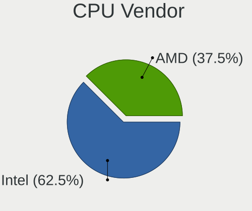

| Vendor | Desktops | Percent |
|--------|----------|---------|
| Intel  | 38       | 71.7%   |
| AMD    | 15       | 28.3%   |

CPU Model
---------

Processor models

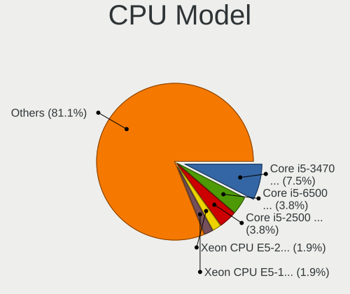

| Model                                           | Desktops | Percent |
|-------------------------------------------------|----------|---------|
| Intel Core i5-3470 CPU @ 3.20GHz                | 4        | 7.55%   |
| Intel Core i5-6500 CPU @ 3.20GHz                | 2        | 3.77%   |
| Intel Core i5-2500 CPU @ 3.30GHz                | 2        | 3.77%   |
| Intel Xeon CPU E5-2687W 0 @ 3.10GHz             | 1        | 1.89%   |
| Intel Xeon CPU E5-1650 v4 @ 3.60GHz             | 1        | 1.89%   |
| Intel Pentium Gold G5400 CPU @ 3.70GHz          | 1        | 1.89%   |
| Intel Pentium Dual-Core CPU T4500 @ 2.30GHz     | 1        | 1.89%   |
| Intel Pentium Dual-Core CPU E6700 @ 3.20GHz     | 1        | 1.89%   |
| Intel Pentium Dual-Core CPU E5400 @ 2.70GHz     | 1        | 1.89%   |
| Intel Core i7-6700 CPU @ 3.40GHz                | 1        | 1.89%   |
| Intel Core i7-4790K CPU @ 4.00GHz               | 1        | 1.89%   |
| Intel Core i7-4790 CPU @ 3.60GHz                | 1        | 1.89%   |
| Intel Core i7-3770 CPU @ 3.40GHz                | 1        | 1.89%   |
| Intel Core i7-10700 CPU @ 2.90GHz               | 1        | 1.89%   |
| Intel Core i7 CPU 860 @ 2.80GHz                 | 1        | 1.89%   |
| Intel Core i5-7500T CPU @ 2.70GHz               | 1        | 1.89%   |
| Intel Core i5-6500T CPU @ 2.50GHz               | 1        | 1.89%   |
| Intel Core i5-4460 CPU @ 3.20GHz                | 1        | 1.89%   |
| Intel Core i5-3570K CPU @ 3.40GHz               | 1        | 1.89%   |
| Intel Core i5-2400 CPU @ 3.10GHz                | 1        | 1.89%   |
| Intel Core i5-10400 CPU @ 2.90GHz               | 1        | 1.89%   |
| Intel Core i5 CPU 660 @ 3.33GHz                 | 1        | 1.89%   |
| Intel Core i3-10110U CPU @ 2.10GHz              | 1        | 1.89%   |
| Intel Core i3 CPU 540 @ 3.07GHz                 | 1        | 1.89%   |
| Intel Core i3 CPU 530 @ 2.93GHz                 | 1        | 1.89%   |
| Intel Core 2 Quad CPU Q9400 @ 2.66GHz           | 1        | 1.89%   |
| Intel Core 2 Quad CPU Q6600 @ 2.40GHz           | 1        | 1.89%   |
| Intel Core 2 Duo CPU E7500 @ 2.93GHz            | 1        | 1.89%   |
| Intel Core 2 Duo CPU E7400 @ 2.80GHz            | 1        | 1.89%   |
| Intel Core 2 Duo CPU E4500 @ 2.20GHz            | 1        | 1.89%   |
| Intel Core 2 CPU 6300 @ 1.86GHz                 | 1        | 1.89%   |
| Intel Atom CPU N280 @ 1.66GHz                   | 1        | 1.89%   |
| Intel 11th Gen Core i7-11700 @ 2.50GHz          | 1        | 1.89%   |
| AMD Sempron 145 Processor                       | 1        | 1.89%   |
| AMD Ryzen 9 5900X 12-Core Processor             | 1        | 1.89%   |
| AMD Ryzen 7 5700G with Radeon Graphics          | 1        | 1.89%   |
| AMD Ryzen 7 1800X Eight-Core Processor          | 1        | 1.89%   |
| AMD Ryzen 5 PRO 2400G with Radeon Vega Graphics | 1        | 1.89%   |
| AMD Ryzen 3 3100 4-Core Processor               | 1        | 1.89%   |
| AMD PRO A8-8600B R6, 10 Compute Cores 4C+6G     | 1        | 1.89%   |

CPU Model Family
----------------

Processor model prefix

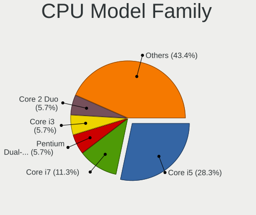

| Model                   | Desktops | Percent |
|-------------------------|----------|---------|
| Intel Core i5           | 15       | 28.3%   |
| Intel Core i7           | 6        | 11.32%  |
| Intel Pentium Dual-Core | 3        | 5.66%   |
| Intel Core i3           | 3        | 5.66%   |
| Intel Core 2 Duo        | 3        | 5.66%   |
| Intel Xeon              | 2        | 3.77%   |
| Intel Core 2 Quad       | 2        | 3.77%   |
| AMD Ryzen 7             | 2        | 3.77%   |
| AMD A6                  | 2        | 3.77%   |
| Other                   | 1        | 1.89%   |
| Intel Pentium Gold      | 1        | 1.89%   |
| Intel Core 2            | 1        | 1.89%   |
| Intel Atom              | 1        | 1.89%   |
| AMD Sempron             | 1        | 1.89%   |
| AMD Ryzen 9             | 1        | 1.89%   |
| AMD Ryzen 5 PRO         | 1        | 1.89%   |
| AMD Ryzen 3             | 1        | 1.89%   |
| AMD PRO A8              | 1        | 1.89%   |
| AMD Phenom II X6        | 1        | 1.89%   |
| AMD Phenom II X4        | 1        | 1.89%   |
| AMD Athlon II X3        | 1        | 1.89%   |
| AMD Athlon II X2        | 1        | 1.89%   |
| AMD A8                  | 1        | 1.89%   |
| AMD A4                  | 1        | 1.89%   |

CPU Cores
---------

Number of processor cores

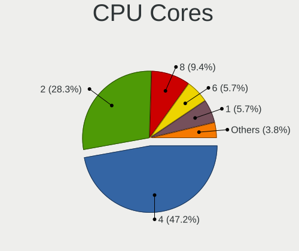

| Number | Desktops | Percent |
|--------|----------|---------|
| 4      | 25       | 47.17%  |
| 2      | 15       | 28.3%   |
| 8      | 5        | 9.43%   |
| 6      | 3        | 5.66%   |
| 1      | 3        | 5.66%   |
| 12     | 1        | 1.89%   |
| 3      | 1        | 1.89%   |

CPU Sockets
-----------

Number of sockets

| Number | Desktops | Percent |
|--------|----------|---------|
| 1      | 53       | 100%    |

CPU Threads
-----------

Threads per core (Hyper-Threading)

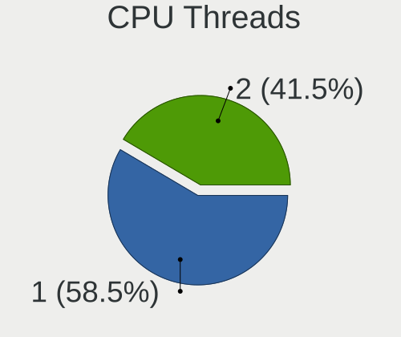

| Number | Desktops | Percent |
|--------|----------|---------|
| 1      | 31       | 58.49%  |
| 2      | 22       | 41.51%  |

CPU Op-Modes
------------

CPU Operation Modes (32-bit, 64-bit)

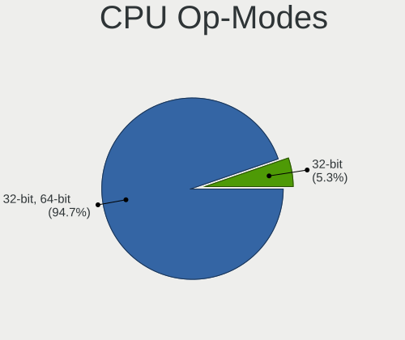

| Op mode        | Desktops | Percent |
|----------------|----------|---------|
| 32-bit, 64-bit | 52       | 98.11%  |
| 32-bit         | 1        | 1.89%   |

CPU Microcode
-------------

Microcode number

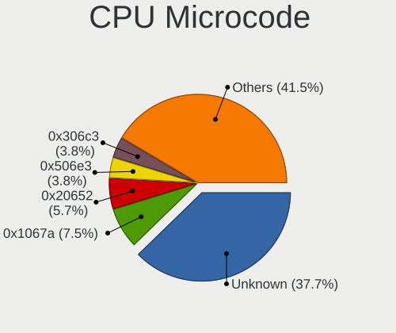

| Number     | Desktops | Percent |
|------------|----------|---------|
| Unknown    | 20       | 37.74%  |
| 0x1067a    | 4        | 7.55%   |
| 0x20652    | 3        | 5.66%   |
| 0x506e3    | 2        | 3.77%   |
| 0x306c3    | 2        | 3.77%   |
| 0x306a9    | 2        | 3.77%   |
| 0x206a7    | 2        | 3.77%   |
| 0x0600611a | 2        | 3.77%   |
| 0xa0653    | 1        | 1.89%   |
| 0x6fd      | 1        | 1.89%   |
| 0x6fb      | 1        | 1.89%   |
| 0x6f2      | 1        | 1.89%   |
| 0x406f1    | 1        | 1.89%   |
| 0x206d7    | 1        | 1.89%   |
| 0x106e5    | 1        | 1.89%   |
| 0x0a50000d | 1        | 1.89%   |
| 0x0a201016 | 1        | 1.89%   |
| 0x08701021 | 1        | 1.89%   |
| 0x08001138 | 1        | 1.89%   |
| 0x06006705 | 1        | 1.89%   |
| 0x03000027 | 1        | 1.89%   |
| 0x010000dc | 1        | 1.89%   |
| 0x010000db | 1        | 1.89%   |
| 0x010000c8 | 1        | 1.89%   |

CPU Microarch
-------------

Microarchitecture

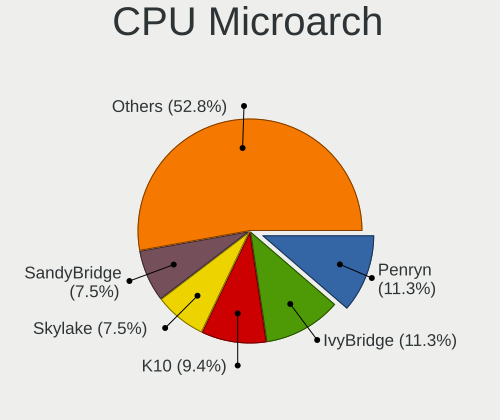

| Name        | Desktops | Percent |
|-------------|----------|---------|
| Penryn      | 6        | 11.32%  |
| IvyBridge   | 6        | 11.32%  |
| K10         | 5        | 9.43%   |
| Skylake     | 4        | 7.55%   |
| SandyBridge | 4        | 7.55%   |
| Westmere    | 3        | 5.66%   |
| KabyLake    | 3        | 5.66%   |
| Haswell     | 3        | 5.66%   |
| Excavator   | 3        | 5.66%   |
| Core        | 3        | 5.66%   |
| Zen 3       | 2        | 3.77%   |
| Zen         | 2        | 3.77%   |
| CometLake   | 2        | 3.77%   |
| Zen 2       | 1        | 1.89%   |
| Piledriver  | 1        | 1.89%   |
| Nehalem     | 1        | 1.89%   |
| K10 Llano   | 1        | 1.89%   |
| Broadwell   | 1        | 1.89%   |
| Bonnell     | 1        | 1.89%   |
| Unknown     | 1        | 1.89%   |

Graphics
--------

GPU Vendor
----------

Vendors of graphics cards

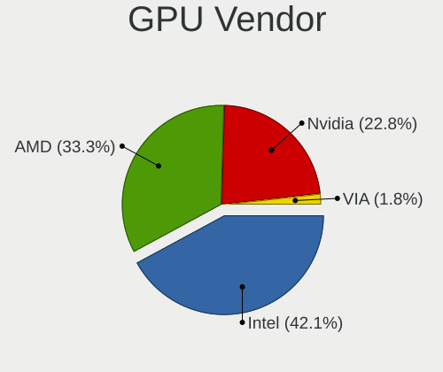

| Vendor           | Desktops | Percent |
|------------------|----------|---------|
| Intel            | 24       | 42.11%  |
| AMD              | 19       | 33.33%  |
| Nvidia           | 13       | 22.81%  |
| VIA Technologies | 1        | 1.75%   |

GPU Model
---------

Graphics card models

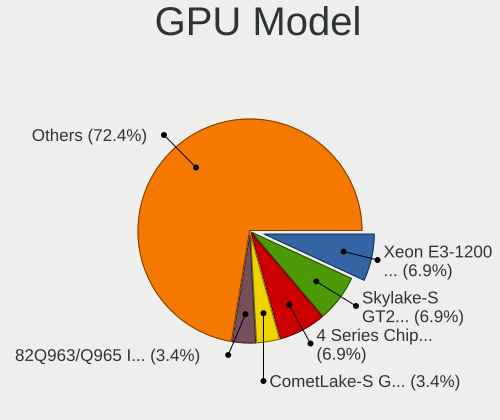

| Model                                                                       | Desktops | Percent |
|-----------------------------------------------------------------------------|----------|---------|
| Intel Xeon E3-1200 v2/3rd Gen Core processor Graphics Controller            | 4        | 6.9%    |
| Intel Skylake-S GT2 [HD Graphics 530]                                       | 4        | 6.9%    |
| Intel 4 Series Chipset Integrated Graphics Controller                       | 4        | 6.9%    |
| Intel CometLake-S GT2 [UHD Graphics 630]                                    | 2        | 3.45%   |
| Intel 82Q963/Q965 Integrated Graphics Controller                            | 2        | 3.45%   |
| AMD Wani [Radeon R5/R6/R7 Graphics]                                         | 2        | 3.45%   |
| VIA Technologies CN896/VN896/P4M900 [Chrome 9 HC]                           | 1        | 1.72%   |
| Nvidia GT218 [GeForce 310]                                                  | 1        | 1.72%   |
| Nvidia GT218 [GeForce 210]                                                  | 1        | 1.72%   |
| Nvidia GT216M [GeForce GT 330M]                                             | 1        | 1.72%   |
| Nvidia GT200GL [Quadro FX 3800]                                             | 1        | 1.72%   |
| Nvidia GP107 [GeForce GTX 1050]                                             | 1        | 1.72%   |
| Nvidia GP107 [GeForce GTX 1050 Ti]                                          | 1        | 1.72%   |
| Nvidia GM107GL [Quadro K1200]                                               | 1        | 1.72%   |
| Nvidia GK208B [GeForce GT 710]                                              | 1        | 1.72%   |
| Nvidia GK104 [GeForce GTX 760]                                              | 1        | 1.72%   |
| Nvidia GF108 [GeForce GT 630]                                               | 1        | 1.72%   |
| Nvidia GA106 [Geforce RTX 3050]                                             | 1        | 1.72%   |
| Nvidia G96CGL [Quadro FX 580]                                               | 1        | 1.72%   |
| Nvidia C61 [GeForce 7025 / nForce 630a]                                     | 1        | 1.72%   |
| Intel Xeon E3-1200 v3/4th Gen Core Processor Integrated Graphics Controller | 1        | 1.72%   |
| Intel Mobile 4 Series Chipset Integrated Graphics Controller                | 1        | 1.72%   |
| Intel Kaby Lake-S GT2 [HD Graphics 630]                                     | 1        | 1.72%   |
| Intel IvyBridge GT2 [HD Graphics 4000]                                      | 1        | 1.72%   |
| Intel Core Processor Integrated Graphics Controller                         | 1        | 1.72%   |
| Intel CometLake-U GT2 [UHD Graphics]                                        | 1        | 1.72%   |
| Intel CoffeeLake-S GT1 [UHD Graphics 610]                                   | 1        | 1.72%   |
| Intel 2nd Generation Core Processor Family Integrated Graphics Controller   | 1        | 1.72%   |
| AMD Turks GL [FirePro V4900]                                                | 1        | 1.72%   |
| AMD Trinity [Radeon HD 7560D]                                               | 1        | 1.72%   |
| AMD Sumo [Radeon HD 6530D]                                                  | 1        | 1.72%   |
| AMD Stoney [Radeon R2/R3/R4/R5 Graphics]                                    | 1        | 1.72%   |
| AMD RS880 [Radeon HD 4250]                                                  | 1        | 1.72%   |
| AMD RS880 [Radeon HD 4200]                                                  | 1        | 1.72%   |
| AMD Redwood LE [Radeon HD 5550/5570/5630/6390/6490/7570]                    | 1        | 1.72%   |
| AMD Raven Ridge [Radeon Vega Series / Radeon Vega Mobile Series]            | 1        | 1.72%   |
| AMD Oland [Radeon HD 8570 / R5 430 OEM / R7 240/340 / Radeon 520 OEM]       | 1        | 1.72%   |
| AMD Navi 23 [Radeon RX 6600/6600 XT/6600M]                                  | 1        | 1.72%   |
| AMD Navi 22 [Radeon RX 6700/6700 XT/6750 XT / 6800M/6850M XT]               | 1        | 1.72%   |
| AMD Navi 14 [Radeon RX 5500/5500M / Pro 5500M]                              | 1        | 1.72%   |

GPU Combo
---------

Combinations of graphics cards

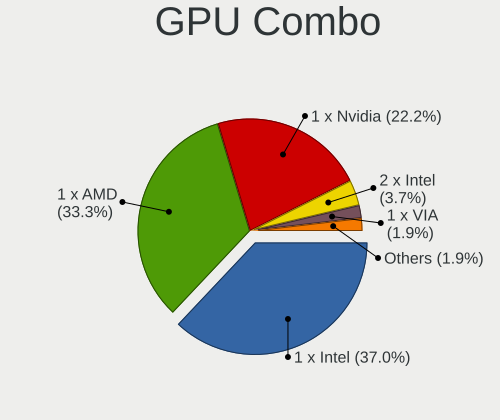

| Name           | Desktops | Percent |
|----------------|----------|---------|
| 1 x Intel      | 20       | 37.04%  |
| 1 x AMD        | 18       | 33.33%  |
| 1 x Nvidia     | 12       | 22.22%  |
| 2 x Intel      | 2        | 3.7%    |
| 1 x VIA        | 1        | 1.85%   |
| Intel + Nvidia | 1        | 1.85%   |

GPU Driver
----------

Free vs proprietary

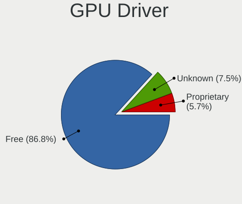

| Driver      | Desktops | Percent |
|-------------|----------|---------|
| Free        | 46       | 86.79%  |
| Unknown     | 4        | 7.55%   |
| Proprietary | 3        | 5.66%   |

GPU Memory
----------

Total video memory

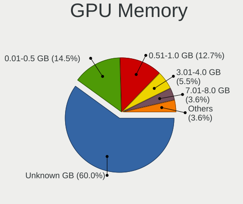

| Size in GB | Desktops | Percent |
|------------|----------|---------|
| Unknown    | 33       | 60%     |
| 0.01-0.5   | 8        | 14.55%  |
| 0.51-1.0   | 7        | 12.73%  |
| 3.01-4.0   | 3        | 5.45%   |
| 7.01-8.0   | 2        | 3.64%   |
| 1.01-2.0   | 2        | 3.64%   |

Monitor
-------

Monitor Vendor
--------------

Monitor vendors

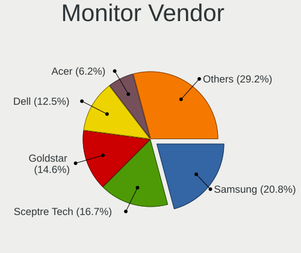

| Vendor               | Desktops | Percent |
|----------------------|----------|---------|
| Samsung Electronics  | 10       | 20.83%  |
| Sceptre Tech         | 8        | 16.67%  |
| Goldstar             | 7        | 14.58%  |
| Dell                 | 6        | 12.5%   |
| AOC                  | 3        | 6.25%   |
| Acer                 | 3        | 6.25%   |
| Hewlett-Packard      | 2        | 4.17%   |
| BenQ                 | 2        | 4.17%   |
| Unknown              | 1        | 2.08%   |
| Toshiba              | 1        | 2.08%   |
| Philips              | 1        | 2.08%   |
| Medion               | 1        | 2.08%   |
| JCH                  | 1        | 2.08%   |
| ASUSTek Computer     | 1        | 2.08%   |
| Ancor Communications | 1        | 2.08%   |

Monitor Model
-------------

Monitor models

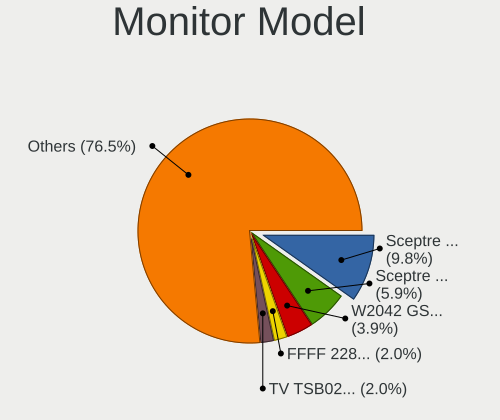

| Model                                                                 | Desktops | Percent |
|-----------------------------------------------------------------------|----------|---------|
| Sceptre Tech Sceptre F27 SPT0ABF 1920x1080 409x230mm 18.5-inch        | 5        | 9.8%    |
| Sceptre Tech Sceptre H43 SPT1104 1920x1080 575x323mm 26.0-inch        | 3        | 5.88%   |
| Goldstar W2042 GSM4E7E 1680x1050 434x270mm 20.1-inch                  | 2        | 3.92%   |
| Unknown LCD Monitor FFFF 2288x1287 2550x2550mm 142.0-inch             | 1        | 1.96%   |
| Toshiba TV TSB0206 1920x1080                                          | 1        | 1.96%   |
| Samsung Electronics T22C350 SAM0AB7 1920x1080 477x268mm 21.5-inch     | 1        | 1.96%   |
| Samsung Electronics SyncMaster SAM0581 1920x1080 477x268mm 21.5-inch  | 1        | 1.96%   |
| Samsung Electronics SyncMaster SAM0116 1024x768 267x200mm 13.1-inch   | 1        | 1.96%   |
| Samsung Electronics SMB1630N SAM0630 1366x768 344x194mm 15.5-inch     | 1        | 1.96%   |
| Samsung Electronics SA300/SA350 SAM078F 1920x1080 477x268mm 21.5-inch | 1        | 1.96%   |
| Samsung Electronics S27E370D SAM0CF3 1920x1080 598x336mm 27.0-inch    | 1        | 1.96%   |
| Samsung Electronics S24D330 SAM0D92 1920x1080 531x299mm 24.0-inch     | 1        | 1.96%   |
| Samsung Electronics S22C450 SAM09C5 1920x1080 477x268mm 21.5-inch     | 1        | 1.96%   |
| Samsung Electronics LS27C36x SAM7315 1920x1080 598x336mm 27.0-inch    | 1        | 1.96%   |
| Samsung Electronics C24F390 SAM0D2C 1920x1080 521x293mm 23.5-inch     | 1        | 1.96%   |
| Philips PHL 243V5 PHLC0D1 1920x1080 521x293mm 23.5-inch               | 1        | 1.96%   |
| Medion Medion23.6 PC MEDB603 1920x1080 477x268mm 21.5-inch            | 1        | 1.96%   |
| JCH F24 JCH1919 1920x1080 520x310mm 23.8-inch                         | 1        | 1.96%   |
| Hewlett-Packard w2207 HWP26A8 1680x1050 473x296mm 22.0-inch           | 1        | 1.96%   |
| Hewlett-Packard LA2405 HWP284B 1920x1200 518x324mm 24.1-inch          | 1        | 1.96%   |
| Goldstar W2043 GSM4E9D 1600x900 443x249mm 20.0-inch                   | 1        | 1.96%   |
| Goldstar TV GSM9CF6 1360x768 700x392mm 31.6-inch                      | 1        | 1.96%   |
| Goldstar T710SH GSM436B 1280x960 310x230mm 15.2-inch                  | 1        | 1.96%   |
| Goldstar L1953H GSM4B3D 1280x1024 338x270mm 17.0-inch                 | 1        | 1.96%   |
| Goldstar L1953H GSM4B3C 1280x1024 338x270mm 17.0-inch                 | 1        | 1.96%   |
| Goldstar HDR 4K GSM7707 3840x2160 600x340mm 27.2-inch                 | 1        | 1.96%   |
| Goldstar 23MP55 GSM5A23 1920x1080 510x290mm 23.1-inch                 | 1        | 1.96%   |
| Dell U2412M DELA07A 1920x1200 518x324mm 24.1-inch                     | 1        | 1.96%   |
| Dell U2410 DELF014 1920x1200 518x324mm 24.1-inch                      | 1        | 1.96%   |
| Dell LNKG H2VA001 LNKA001 1920x1080 880x500mm 39.8-inch               | 1        | 1.96%   |
| Dell LCD Monitor S2715H 3840x1080                                     | 1        | 1.96%   |
| Dell LCD Monitor S2715H                                               | 1        | 1.96%   |
| Dell IN1930 DELF03B 1366x768 410x230mm 18.5-inch                      | 1        | 1.96%   |
| Dell E176FP DELA014 1280x1024 338x270mm 17.0-inch                     | 1        | 1.96%   |
| BenQ FP202WA BNQ76C2 1680x1050 376x301mm 19.0-inch                    | 1        | 1.96%   |
| BenQ E900HD BNQ7910 1366x768 410x230mm 18.5-inch                      | 1        | 1.96%   |
| ASUSTek Computer VP289Q AUS28E0 3840x2160 621x341mm 27.9-inch         | 1        | 1.96%   |
| AOC LM729 AOCA784 1280x1024 340x270mm 17.1-inch                       | 1        | 1.96%   |
| AOC 2475WR AOC2475 1920x1200 518x324mm 24.1-inch                      | 1        | 1.96%   |
| AOC 2450W AOC2450 1920x1080 521x293mm 23.5-inch                       | 1        | 1.96%   |

Monitor Resolution
------------------

Monitor screen resolution

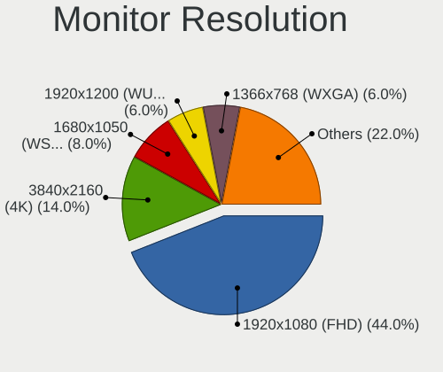

| Resolution         | Desktops | Percent |
|--------------------|----------|---------|
| 1920x1080 (FHD)    | 22       | 44%     |
| 3840x2160 (4K)     | 7        | 14%     |
| 1680x1050 (WSXGA+) | 4        | 8%      |
| 1920x1200 (WUXGA)  | 3        | 6%      |
| 1366x768 (WXGA)    | 3        | 6%      |
| 1280x1024 (SXGA)   | 3        | 6%      |
| 3840x1080          | 1        | 2%      |
| 2288x1287          | 1        | 2%      |
| 1600x900 (HD+)     | 1        | 2%      |
| 1440x900 (WXGA+)   | 1        | 2%      |
| 1360x768           | 1        | 2%      |
| 1280x960           | 1        | 2%      |
| 1024x768 (XGA)     | 1        | 2%      |
| Unknown            | 1        | 2%      |

Monitor Diagonal
----------------

Diagonal size in inches

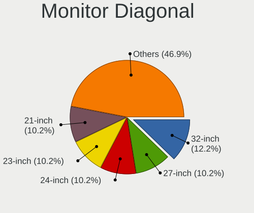

| Inches  | Desktops | Percent |
|---------|----------|---------|
| 32      | 6        | 12.24%  |
| 27      | 5        | 10.2%   |
| 24      | 5        | 10.2%   |
| 23      | 5        | 10.2%   |
| 21      | 5        | 10.2%   |
| 20      | 4        | 8.16%   |
| 26      | 3        | 6.12%   |
| 17      | 3        | 6.12%   |
| 18      | 2        | 4.08%   |
| 142     | 1        | 2.04%   |
| 74      | 1        | 2.04%   |
| 72      | 1        | 2.04%   |
| 39      | 1        | 2.04%   |
| 31      | 1        | 2.04%   |
| 22      | 1        | 2.04%   |
| 19      | 1        | 2.04%   |
| 16      | 1        | 2.04%   |
| 15      | 1        | 2.04%   |
| 13      | 1        | 2.04%   |
| Unknown | 1        | 2.04%   |

Monitor Width
-------------

Physical width

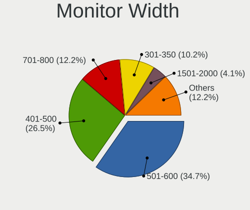

| Width in mm    | Desktops | Percent |
|----------------|----------|---------|
| 501-600        | 17       | 34.69%  |
| 401-500        | 13       | 26.53%  |
| 701-800        | 6        | 12.24%  |
| 301-350        | 5        | 10.2%   |
| 601-700        | 2        | 4.08%   |
| 1501-2000      | 2        | 4.08%   |
| More than 2000 | 1        | 2.04%   |
| 801-900        | 1        | 2.04%   |
| 201-300        | 1        | 2.04%   |
| Unknown        | 1        | 2.04%   |

Aspect Ratio
------------

Proportional relationship between the width and the height

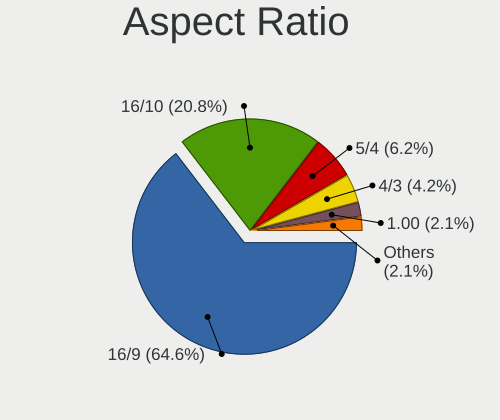

| Ratio   | Desktops | Percent |
|---------|----------|---------|
| 16/9    | 31       | 64.58%  |
| 16/10   | 10       | 20.83%  |
| 5/4     | 3        | 6.25%   |
| 4/3     | 2        | 4.17%   |
| 1.00    | 1        | 2.08%   |
| Unknown | 1        | 2.08%   |

Monitor Area
------------

Area in inch²

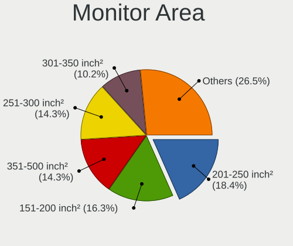

| Area in inch² | Desktops | Percent |
|----------------|----------|---------|
| 201-250        | 9        | 18.37%  |
| 151-200        | 8        | 16.33%  |
| 351-500        | 7        | 14.29%  |
| 251-300        | 7        | 14.29%  |
| 301-350        | 5        | 10.2%   |
| 141-150        | 5        | 10.2%   |
| More than 1000 | 3        | 6.12%   |
| 81-90          | 1        | 2.04%   |
| 121-130        | 1        | 2.04%   |
| 101-110        | 1        | 2.04%   |
| 501-1000       | 1        | 2.04%   |
| Unknown        | 1        | 2.04%   |

Pixel Density
-------------

Pixels per inch

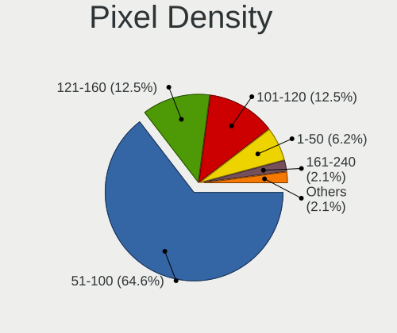

| Density | Desktops | Percent |
|---------|----------|---------|
| 51-100  | 31       | 64.58%  |
| 121-160 | 6        | 12.5%   |
| 101-120 | 6        | 12.5%   |
| 1-50    | 3        | 6.25%   |
| 161-240 | 1        | 2.08%   |
| Unknown | 1        | 2.08%   |

Multiple Monitors
-----------------

Total monitors connected

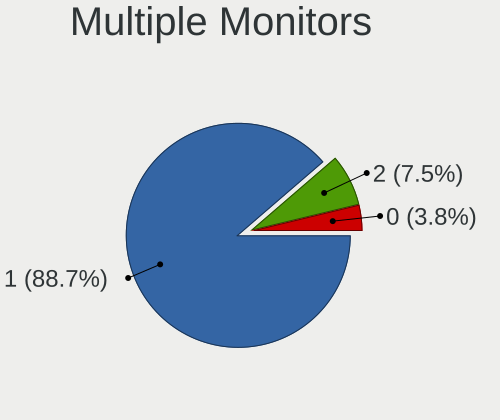

| Total | Desktops | Percent |
|-------|----------|---------|
| 1     | 47       | 88.68%  |
| 2     | 4        | 7.55%   |
| 0     | 2        | 3.77%   |

Network
-------

Net Controller Vendor
---------------------

Controller vendors

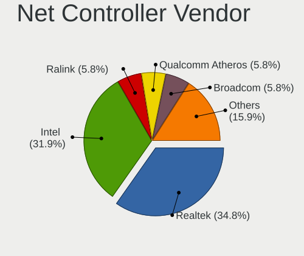

| Vendor                | Desktops | Percent |
|-----------------------|----------|---------|
| Realtek Semiconductor | 24       | 34.78%  |
| Intel                 | 22       | 31.88%  |
| Ralink Technology     | 4        | 5.8%    |
| Qualcomm Atheros      | 4        | 5.8%    |
| Broadcom              | 4        | 5.8%    |
| TP-Link               | 2        | 2.9%    |
| Nvidia                | 2        | 2.9%    |
| Broadcom Limited      | 2        | 2.9%    |
| VIA Technologies      | 1        | 1.45%   |
| NetGear               | 1        | 1.45%   |
| MediaTek              | 1        | 1.45%   |
| D-Link System         | 1        | 1.45%   |
| ASUSTek Computer      | 1        | 1.45%   |

Net Controller Model
--------------------

Controller models

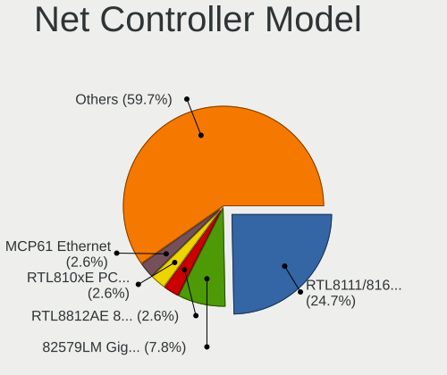

| Model                                                                                       | Desktops | Percent |
|---------------------------------------------------------------------------------------------|----------|---------|
| Realtek RTL8111/8168/8211/8411 PCI Express Gigabit Ethernet Controller                      | 19       | 24.68%  |
| Intel 82579LM Gigabit Network Connection (Lewisville)                                       | 6        | 7.79%   |
| Realtek RTL8812AE 802.11ac PCIe Wireless Network Adapter                                    | 2        | 2.6%    |
| Realtek RTL810xE PCI Express Fast Ethernet controller                                       | 2        | 2.6%    |
| Nvidia MCP61 Ethernet                                                                       | 2        | 2.6%    |
| Intel Wireless 8260                                                                         | 2        | 2.6%    |
| Intel Ethernet Connection (5) I219-LM                                                       | 2        | 2.6%    |
| Intel Ethernet Connection (2) I219-LM                                                       | 2        | 2.6%    |
| Intel Ethernet Connection (2) I218-V                                                        | 2        | 2.6%    |
| VIA VT6102/VT6103 [Rhine-II]                                                                | 1        | 1.3%    |
| TP-Link TL-WN823N v2/v3 [Realtek RTL8192EU]                                                 | 1        | 1.3%    |
| TP-Link TL-WN821N v5/v6 [RTL8192EU]                                                         | 1        | 1.3%    |
| Realtek RTL88x2bu [AC1200 Techkey]                                                          | 1        | 1.3%    |
| Realtek RTL8821AE 802.11ac PCIe Wireless Network Adapter                                    | 1        | 1.3%    |
| Realtek RTL8191SEvB Wireless LAN Controller                                                 | 1        | 1.3%    |
| Ralink RT5370 Wireless Adapter                                                              | 1        | 1.3%    |
| Ralink RT3072 Wireless Adapter                                                              | 1        | 1.3%    |
| Ralink RT2870/RT3070 Wireless Adapter                                                       | 1        | 1.3%    |
| Ralink MT7601U Wireless Adapter                                                             | 1        | 1.3%    |
| Qualcomm Atheros Killer E220x Gigabit Ethernet Controller                                   | 1        | 1.3%    |
| Qualcomm Atheros AR9485 Wireless Network Adapter                                            | 1        | 1.3%    |
| Qualcomm Atheros AR8151 v1.0 Gigabit Ethernet                                               | 1        | 1.3%    |
| Qualcomm Atheros AR2413/AR2414 Wireless Network Adapter [AR5005G(S) 802.11bg]               | 1        | 1.3%    |
| NetGear WNDA4100 802.11abgn 3x3:3 [Ralink RT3573]                                           | 1        | 1.3%    |
| MediaTek MT7921 802.11ax PCIe Wireless Network Adapter [Filogic 330]                        | 1        | 1.3%    |
| Intel Wireless 8265 / 8275                                                                  | 1        | 1.3%    |
| Intel Wi-Fi 6 AX200                                                                         | 1        | 1.3%    |
| Intel I211 Gigabit Network Connection                                                       | 1        | 1.3%    |
| Intel Ethernet Controller I225-V                                                            | 1        | 1.3%    |
| Intel Ethernet Connection (6) I219-V                                                        | 1        | 1.3%    |
| Intel Ethernet Connection (5) I219-V                                                        | 1        | 1.3%    |
| Intel Ethernet Connection (2) I218-LM                                                       | 1        | 1.3%    |
| Intel Ethernet Connection (11) I219-LM                                                      | 1        | 1.3%    |
| Intel Dual Band Wireless-AC 3168NGW [Stone Peak]                                            | 1        | 1.3%    |
| Intel Comet Lake PCH CNVi WiFi                                                              | 1        | 1.3%    |
| Intel 82578DC Gigabit Network Connection                                                    | 1        | 1.3%    |
| Intel 82567LM-3 Gigabit Network Connection                                                  | 1        | 1.3%    |
| Intel 82566DM Gigabit Network Connection                                                    | 1        | 1.3%    |
| Intel 82557/8/9/0/1 Ethernet Pro 100                                                        | 1        | 1.3%    |
| D-Link System DWA-160 802.11abgn Xtreme N Dual Band Adapter(rev.A2) [Atheros AR9170+AR9104] | 1        | 1.3%    |

Wireless Vendor
---------------

Wireless vendors

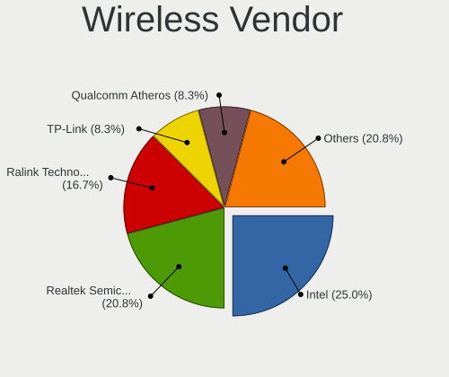

| Vendor                | Desktops | Percent |
|-----------------------|----------|---------|
| Intel                 | 6        | 25%     |
| Realtek Semiconductor | 5        | 20.83%  |
| Ralink Technology     | 4        | 16.67%  |
| TP-Link               | 2        | 8.33%   |
| Qualcomm Atheros      | 2        | 8.33%   |
| NetGear               | 1        | 4.17%   |
| MediaTek              | 1        | 4.17%   |
| D-Link System         | 1        | 4.17%   |
| Broadcom              | 1        | 4.17%   |
| ASUSTek Computer      | 1        | 4.17%   |

Wireless Model
--------------

Wireless models

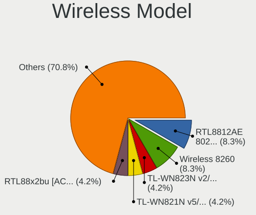

| Model                                                                                       | Desktops | Percent |
|---------------------------------------------------------------------------------------------|----------|---------|
| Realtek RTL8812AE 802.11ac PCIe Wireless Network Adapter                                    | 2        | 8.33%   |
| Intel Wireless 8260                                                                         | 2        | 8.33%   |
| TP-Link TL-WN823N v2/v3 [Realtek RTL8192EU]                                                 | 1        | 4.17%   |
| TP-Link TL-WN821N v5/v6 [RTL8192EU]                                                         | 1        | 4.17%   |
| Realtek RTL88x2bu [AC1200 Techkey]                                                          | 1        | 4.17%   |
| Realtek RTL8821AE 802.11ac PCIe Wireless Network Adapter                                    | 1        | 4.17%   |
| Realtek RTL8191SEvB Wireless LAN Controller                                                 | 1        | 4.17%   |
| Ralink RT5370 Wireless Adapter                                                              | 1        | 4.17%   |
| Ralink RT3072 Wireless Adapter                                                              | 1        | 4.17%   |
| Ralink RT2870/RT3070 Wireless Adapter                                                       | 1        | 4.17%   |
| Ralink MT7601U Wireless Adapter                                                             | 1        | 4.17%   |
| Qualcomm Atheros AR9485 Wireless Network Adapter                                            | 1        | 4.17%   |
| Qualcomm Atheros AR2413/AR2414 Wireless Network Adapter [AR5005G(S) 802.11bg]               | 1        | 4.17%   |
| NetGear WNDA4100 802.11abgn 3x3:3 [Ralink RT3573]                                           | 1        | 4.17%   |
| MediaTek MT7921 802.11ax PCIe Wireless Network Adapter [Filogic 330]                        | 1        | 4.17%   |
| Intel Wireless 8265 / 8275                                                                  | 1        | 4.17%   |
| Intel Wi-Fi 6 AX200                                                                         | 1        | 4.17%   |
| Intel Dual Band Wireless-AC 3168NGW [Stone Peak]                                            | 1        | 4.17%   |
| Intel Comet Lake PCH CNVi WiFi                                                              | 1        | 4.17%   |
| D-Link System DWA-160 802.11abgn Xtreme N Dual Band Adapter(rev.A2) [Atheros AR9170+AR9104] | 1        | 4.17%   |
| Broadcom BCM4352 802.11ac Dual Band Wireless Network Adapter                                | 1        | 4.17%   |
| ASUS 802.11ac NIC                                                                           | 1        | 4.17%   |

Ethernet Vendor
---------------

Ethernet vendors

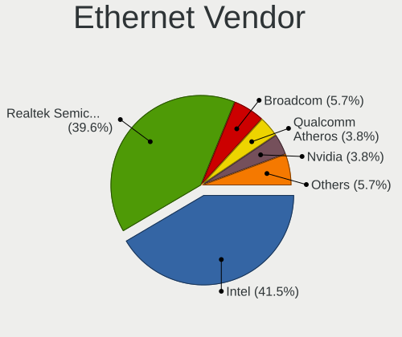

| Vendor                | Desktops | Percent |
|-----------------------|----------|---------|
| Intel                 | 22       | 41.51%  |
| Realtek Semiconductor | 21       | 39.62%  |
| Broadcom              | 3        | 5.66%   |
| Qualcomm Atheros      | 2        | 3.77%   |
| Nvidia                | 2        | 3.77%   |
| Broadcom Limited      | 2        | 3.77%   |
| VIA Technologies      | 1        | 1.89%   |

Ethernet Model
--------------

Ethernet models

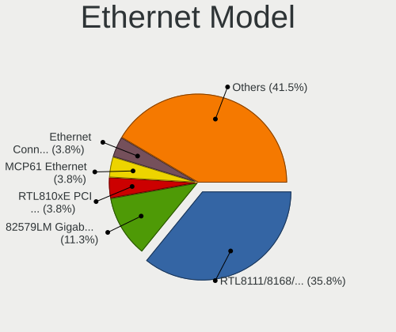

| Model                                                                  | Desktops | Percent |
|------------------------------------------------------------------------|----------|---------|
| Realtek RTL8111/8168/8211/8411 PCI Express Gigabit Ethernet Controller | 19       | 35.85%  |
| Intel 82579LM Gigabit Network Connection (Lewisville)                  | 6        | 11.32%  |
| Realtek RTL810xE PCI Express Fast Ethernet controller                  | 2        | 3.77%   |
| Nvidia MCP61 Ethernet                                                  | 2        | 3.77%   |
| Intel Ethernet Connection (5) I219-LM                                  | 2        | 3.77%   |
| Intel Ethernet Connection (2) I219-LM                                  | 2        | 3.77%   |
| Intel Ethernet Connection (2) I218-V                                   | 2        | 3.77%   |
| VIA VT6102/VT6103 [Rhine-II]                                           | 1        | 1.89%   |
| Qualcomm Atheros Killer E220x Gigabit Ethernet Controller              | 1        | 1.89%   |
| Qualcomm Atheros AR8151 v1.0 Gigabit Ethernet                          | 1        | 1.89%   |
| Intel I211 Gigabit Network Connection                                  | 1        | 1.89%   |
| Intel Ethernet Controller I225-V                                       | 1        | 1.89%   |
| Intel Ethernet Connection (6) I219-V                                   | 1        | 1.89%   |
| Intel Ethernet Connection (5) I219-V                                   | 1        | 1.89%   |
| Intel Ethernet Connection (2) I218-LM                                  | 1        | 1.89%   |
| Intel Ethernet Connection (11) I219-LM                                 | 1        | 1.89%   |
| Intel 82578DC Gigabit Network Connection                               | 1        | 1.89%   |
| Intel 82567LM-3 Gigabit Network Connection                             | 1        | 1.89%   |
| Intel 82566DM Gigabit Network Connection                               | 1        | 1.89%   |
| Intel 82557/8/9/0/1 Ethernet Pro 100                                   | 1        | 1.89%   |
| Broadcom NetXtreme BCM5762 Gigabit Ethernet PCIe                       | 1        | 1.89%   |
| Broadcom NetXtreme BCM5755 Gigabit Ethernet PCI Express                | 1        | 1.89%   |
| Broadcom NetXtreme BCM5721 Gigabit Ethernet PCI Express                | 1        | 1.89%   |
| Broadcom Limited NetXtreme BCM5761 Gigabit Ethernet PCIe               | 1        | 1.89%   |
| Broadcom Limited NetLink BCM57788 Gigabit Ethernet PCIe                | 1        | 1.89%   |

Net Controller Kind
-------------------

Ethernet, WiFi or modem

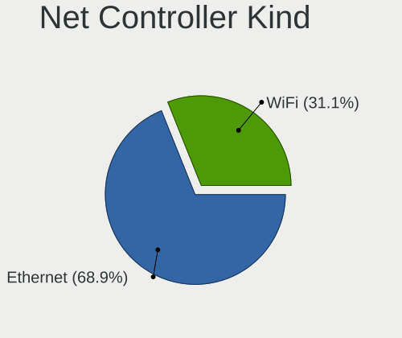

| Kind     | Desktops | Percent |
|----------|----------|---------|
| Ethernet | 51       | 68.92%  |
| WiFi     | 23       | 31.08%  |

Used Controller
---------------

Currently used network controller

| Kind     | Desktops | Percent |
|----------|----------|---------|
| Ethernet | 43       | 75.44%  |
| WiFi     | 14       | 24.56%  |

NICs
----

Total network controllers on board

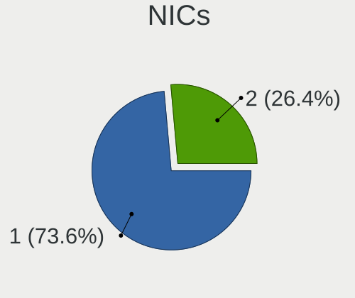

| Total | Desktops | Percent |
|-------|----------|---------|
| 1     | 39       | 73.58%  |
| 2     | 14       | 26.42%  |

IPv6
----

IPv6 vs IPv4

| Used | Desktops | Percent |
|------|----------|---------|
| No   | 40       | 75.47%  |
| Yes  | 13       | 24.53%  |

Bluetooth
---------

Bluetooth Vendor
----------------

Controller vendors

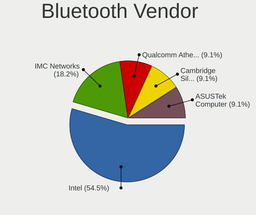

| Vendor                          | Desktops | Percent |
|---------------------------------|----------|---------|
| Intel                           | 6        | 54.55%  |
| IMC Networks                    | 2        | 18.18%  |
| Qualcomm Atheros Communications | 1        | 9.09%   |
| Cambridge Silicon Radio         | 1        | 9.09%   |
| ASUSTek Computer                | 1        | 9.09%   |

Bluetooth Model
---------------

Controller models

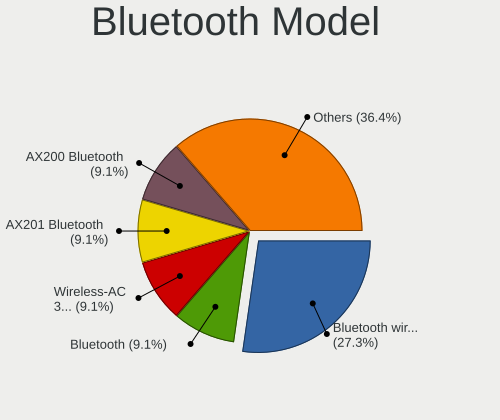

| Model                                               | Desktops | Percent |
|-----------------------------------------------------|----------|---------|
| Intel Bluetooth wireless interface                  | 3        | 27.27%  |
| Qualcomm Atheros Bluetooth                          | 1        | 9.09%   |
| Intel Wireless-AC 3168 Bluetooth                    | 1        | 9.09%   |
| Intel AX201 Bluetooth                               | 1        | 9.09%   |
| Intel AX200 Bluetooth                               | 1        | 9.09%   |
| IMC Networks Bluetooth Radio                        | 1        | 9.09%   |
| IMC Networks Bluetooth Module                       | 1        | 9.09%   |
| Cambridge Silicon Radio Bluetooth Dongle (HCI mode) | 1        | 9.09%   |
| ASUS BCM20702A0                                     | 1        | 9.09%   |

Sound
-----

Sound Vendor
------------

Sound card vendors

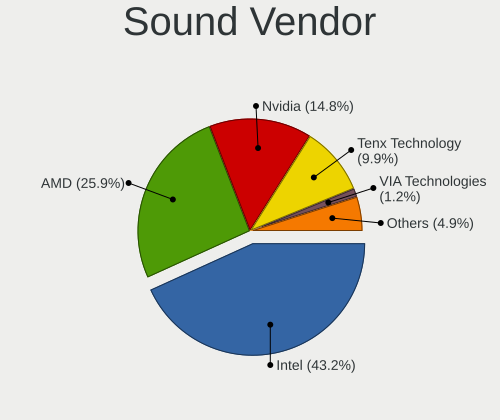

| Vendor              | Desktops | Percent |
|---------------------|----------|---------|
| Intel               | 35       | 43.21%  |
| AMD                 | 21       | 25.93%  |
| Nvidia              | 12       | 14.81%  |
| Tenx Technology     | 8        | 9.88%   |
| VIA Technologies    | 1        | 1.23%   |
| Plantronics         | 1        | 1.23%   |
| Focusrite-Novation  | 1        | 1.23%   |
| Creative Labs       | 1        | 1.23%   |
| C-Media Electronics | 1        | 1.23%   |

Sound Model
-----------

Sound card models

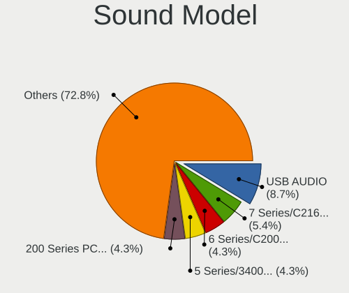

| Model                                                                      | Desktops | Percent |
|----------------------------------------------------------------------------|----------|---------|
| Tenx Technology USB AUDIO                                                  | 8        | 8.7%    |
| Intel 7 Series/C216 Chipset Family High Definition Audio Controller        | 5        | 5.43%   |
| Intel 6 Series/C200 Series Chipset Family High Definition Audio Controller | 4        | 4.35%   |
| Intel 5 Series/3400 Series Chipset High Definition Audio                   | 4        | 4.35%   |
| Intel 200 Series PCH HD Audio                                              | 4        | 4.35%   |
| Intel 9 Series Chipset Family HD Audio Controller                          | 3        | 3.26%   |
| AMD SBx00 Azalia (Intel HDA)                                               | 3        | 3.26%   |
| AMD FCH Azalia Controller                                                  | 3        | 3.26%   |
| Nvidia MCP61 High Definition Audio                                         | 2        | 2.17%   |
| Nvidia High Definition Audio Controller                                    | 2        | 2.17%   |
| Nvidia GP107GL High Definition Audio Controller                            | 2        | 2.17%   |
| Intel NM10/ICH7 Family High Definition Audio Controller                    | 2        | 2.17%   |
| Intel 82801I (ICH9 Family) HD Audio Controller                             | 2        | 2.17%   |
| Intel 82801H (ICH8 Family) HD Audio Controller                             | 2        | 2.17%   |
| Intel 100 Series/C230 Series Chipset Family HD Audio Controller            | 2        | 2.17%   |
| AMD Starship/Matisse HD Audio Controller                                   | 2        | 2.17%   |
| AMD Ryzen HD Audio Controller                                              | 2        | 2.17%   |
| AMD Navi 21/23 HDMI/DP Audio Controller                                    | 2        | 2.17%   |
| AMD Kabini HDMI/DP Audio                                                   | 2        | 2.17%   |
| AMD Family 15h (Models 60h-6fh) Audio Controller                           | 2        | 2.17%   |
| AMD Barts HDMI Audio [Radeon HD 6790/6850/6870 / 7720 OEM]                 | 2        | 2.17%   |
| VIA Technologies VX900/VT8xxx High Definition Audio Controller             | 1        | 1.09%   |
| Plantronics USB DSP v4 Audio Interface                                     | 1        | 1.09%   |
| Nvidia GT216 HDMI Audio Controller                                         | 1        | 1.09%   |
| Nvidia GM107 High Definition Audio Controller [GeForce 940MX]              | 1        | 1.09%   |
| Nvidia GK208 HDMI/DP Audio Controller                                      | 1        | 1.09%   |
| Nvidia GK104 HDMI Audio Controller                                         | 1        | 1.09%   |
| Nvidia GF108 High Definition Audio Controller                              | 1        | 1.09%   |
| Nvidia GA106 High Definition Audio Controller                              | 1        | 1.09%   |
| Intel Xeon E3-1200 v3/4th Gen Core Processor HD Audio Controller           | 1        | 1.09%   |
| Intel Tiger Lake-H HD Audio Controller                                     | 1        | 1.09%   |
| Intel Comet Lake PCH-V cAVS                                                | 1        | 1.09%   |
| Intel Comet Lake PCH-LP cAVS                                               | 1        | 1.09%   |
| Intel Comet Lake PCH cAVS                                                  | 1        | 1.09%   |
| Intel C610/X99 series chipset HD Audio Controller                          | 1        | 1.09%   |
| Intel 82801JI (ICH10 Family) HD Audio Controller                           | 1        | 1.09%   |
| Intel 82801JD/DO (ICH10 Family) HD Audio Controller                        | 1        | 1.09%   |
| Focusrite-Novation Speedio                                                 | 1        | 1.09%   |
| Creative Labs CA0106/CA0111 [SB Live!/Audigy/X-Fi Series]                  | 1        | 1.09%   |
| C-Media Electronics USB Audio Device                                       | 1        | 1.09%   |

Memory
------

Memory Vendor
-------------

Memory module vendors

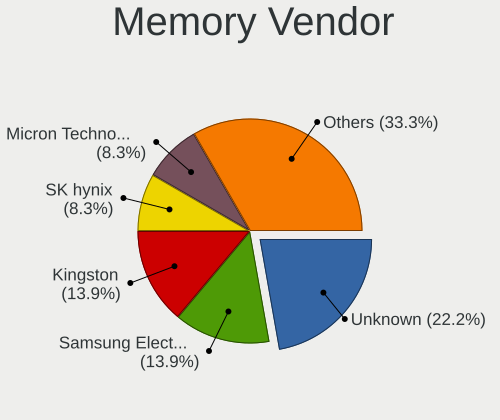

| Vendor              | Desktops | Percent |
|---------------------|----------|---------|
| Unknown             | 8        | 22.22%  |
| Samsung Electronics | 5        | 13.89%  |
| Kingston            | 5        | 13.89%  |
| SK hynix            | 3        | 8.33%   |
| Micron Technology   | 3        | 8.33%   |
| G.Skill             | 2        | 5.56%   |
| Corsair             | 2        | 5.56%   |
| Unifosa             | 1        | 2.78%   |
| Toshiba             | 1        | 2.78%   |
| Ramaxel Technology  | 1        | 2.78%   |
| GOODRAM             | 1        | 2.78%   |
| Elpida              | 1        | 2.78%   |
| Crucial             | 1        | 2.78%   |
| Avant               | 1        | 2.78%   |
| Unknown             | 1        | 2.78%   |

Memory Model
------------

Memory module models

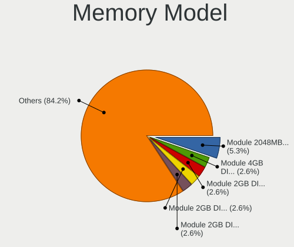

| Model                                                    | Desktops | Percent |
|----------------------------------------------------------|----------|---------|
| Unknown RAM Module 2048MB DIMM 800MT/s                   | 2        | 5.26%   |
| Unknown RAM Module 4GB DIMM 1333MT/s                     | 1        | 2.63%   |
| Unknown RAM Module 2GB DIMM DDR3 1333MT/s                | 1        | 2.63%   |
| Unknown RAM Module 2GB DIMM DDR 1333MT/s                 | 1        | 2.63%   |
| Unknown RAM Module 2GB DIMM 400MT/s                      | 1        | 2.63%   |
| Unknown RAM Module 2048MB DIMM DDR2 800MT/s              | 1        | 2.63%   |
| Unknown RAM Module 1024MB DIMM SDRAM                     | 1        | 2.63%   |
| Unifosa RAM GU512303EP0202 2GB DIMM DDR3 1333MT/s        | 1        | 2.63%   |
| Toshiba RAM 9905474-012.A00LF 2GB DIMM DDR3 1333MT/s     | 1        | 2.63%   |
| SK hynix RAM HMT351U6BFR8C-H9 4GB DIMM DDR3 1333MT/s     | 1        | 2.63%   |
| SK hynix RAM HMT325U6CFR8C-PB 2GB DIMM DDR3 1600MT/s     | 1        | 2.63%   |
| SK hynix RAM HMT125S6BFR8C-G7 2GB SODIMM 1067MT/s        | 1        | 2.63%   |
| Samsung RAM M471B1G73EB0-YK0 8192MB SODIMM DDR3 1600MT/s | 1        | 2.63%   |
| Samsung RAM M471B1G73DB0-YK0 8GB SODIMM DDR3 1600MT/s    | 1        | 2.63%   |
| Samsung RAM M393A2K40BB1-CRC 16GB DIMM DDR4 2400MT/s     | 1        | 2.63%   |
| Samsung RAM M378B5273CH0-CH9 4GB DIMM DDR3 1867MT/s      | 1        | 2.63%   |
| Samsung RAM M3 78T5663EH3-CF7 2GB DIMM DDR2 800MT/s      | 1        | 2.63%   |
| Samsung RAM M3 78T2863RZS-CE6 1GB DIMM DDR2 667MT/s      | 1        | 2.63%   |
| Samsung RAM M3 78T2863QZS-CE6 1GB DIMM DDR2 1639MT/s     | 1        | 2.63%   |
| Ramaxel RAM RMR5030MM58E8F1600 2GB DIMM DDR3 1600MT/s    | 1        | 2.63%   |
| Micron RAM 8JTF51264AZ-1G6E1 4GB DIMM DDR3 1600MT/s      | 1        | 2.63%   |
| Micron RAM 4ATF51264AZ-2G3H1R 4GB DIMM DDR4 2400MT/s     | 1        | 2.63%   |
| Micron RAM 16KTF1G64AZ-1G9P1 8GB DIMM DDR3 1866MT/s      | 1        | 2.63%   |
| Kingston RAM Module 8GB DIMM DDR3 1600MT/s               | 1        | 2.63%   |
| Kingston RAM Module 16GB SODIMM DDR4 2133MT/s            | 1        | 2.63%   |
| Kingston RAM KHX1600C9D3/4GX 4GB DIMM DDR3 1867MT/s      | 1        | 2.63%   |
| Kingston RAM KF3600C16D4/16GX 16GB DIMM DDR4 3800MT/s    | 1        | 2.63%   |
| Kingston RAM 99U5471-030.A00LF 8GB DIMM DDR3 1333MT/s    | 1        | 2.63%   |
| GOODRAM RAM Module 16GB DIMM DDR4 2133MT/s               | 1        | 2.63%   |
| G.Skill RAM F4-3200C16-8GIS 8GB DIMM DDR4 3600MT/s       | 1        | 2.63%   |
| G.Skill RAM F2-6400CL4-1GBPK 1GB DIMM DDR2 800MT/s       | 1        | 2.63%   |
| Elpida RAM EBJ41UF8BCF0-DJ-F 4GB DIMM DDR3 1333MT/s      | 1        | 2.63%   |
| Crucial RAM BLS8G3D1609DS1S00. 8GB DIMM DDR3 1800MT/s    | 1        | 2.63%   |
| Corsair RAM CMZ4GX3M1A1600C9 4GB DIMM DDR3 1600MT/s      | 1        | 2.63%   |
| Corsair RAM CMK16GX4M2D3600C18 8GB DIMM DDR4 4000MT/s    | 1        | 2.63%   |
| Avant RAM W641GU49J2320N6 8GB DIMM DDR4 2666MT/s         | 1        | 2.63%   |
| Unknown                                                  | 1        | 2.63%   |

Memory Kind
-----------

Memory module kinds

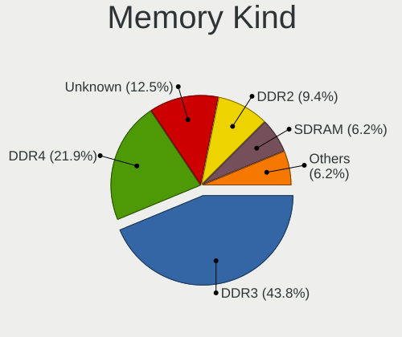

| Kind    | Desktops | Percent |
|---------|----------|---------|
| DDR3    | 14       | 43.75%  |
| DDR4    | 7        | 21.88%  |
| Unknown | 4        | 12.5%   |
| DDR2    | 3        | 9.38%   |
| SDRAM   | 2        | 6.25%   |
| DRAM    | 1        | 3.13%   |
| DDR     | 1        | 3.13%   |

Memory Form Factor
------------------

Physical design of the memory module

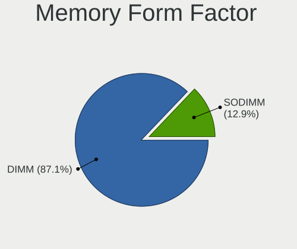

| Name   | Desktops | Percent |
|--------|----------|---------|
| DIMM   | 27       | 87.1%   |
| SODIMM | 4        | 12.9%   |

Memory Size
-----------

Memory module size

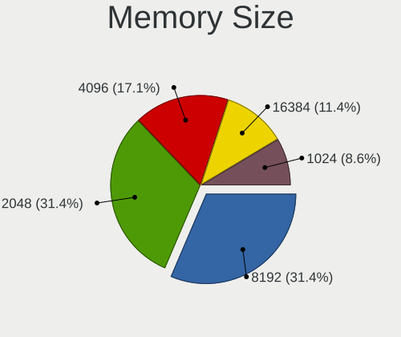

| Size  | Desktops | Percent |
|-------|----------|---------|
| 8192  | 11       | 31.43%  |
| 2048  | 11       | 31.43%  |
| 4096  | 6        | 17.14%  |
| 16384 | 4        | 11.43%  |
| 1024  | 3        | 8.57%   |

Memory Speed
------------

Memory module speed

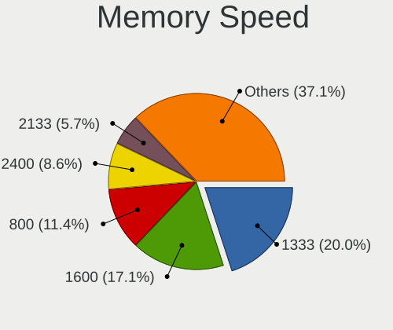

| Speed   | Desktops | Percent |
|---------|----------|---------|
| 1333    | 7        | 20%     |
| 1600    | 6        | 17.14%  |
| 800     | 4        | 11.43%  |
| 2400    | 3        | 8.57%   |
| 2133    | 2        | 5.71%   |
| 4000    | 1        | 2.86%   |
| 3800    | 1        | 2.86%   |
| 3600    | 1        | 2.86%   |
| 2666    | 1        | 2.86%   |
| 2048    | 1        | 2.86%   |
| 1867    | 1        | 2.86%   |
| 1866    | 1        | 2.86%   |
| 1800    | 1        | 2.86%   |
| 1639    | 1        | 2.86%   |
| 1067    | 1        | 2.86%   |
| 667     | 1        | 2.86%   |
| 400     | 1        | 2.86%   |
| Unknown | 1        | 2.86%   |

Printers & scanners
-------------------

Printer Vendor
--------------

Printer device vendors

| Vendor              | Desktops | Percent |
|---------------------|----------|---------|
| Samsung Electronics | 1        | 100%    |

Printer Model
-------------

Printer device models

| Model                               | Desktops | Percent |
|-------------------------------------|----------|---------|
| Samsung CLP-325 Color Laser Printer | 1        | 100%    |

Scanner Vendor
--------------

Scanner device vendors

Zero info for selected period =(

Scanner Model
-------------

Scanner device models

Zero info for selected period =(

Camera
------

Camera Vendor
-------------

Camera device vendors

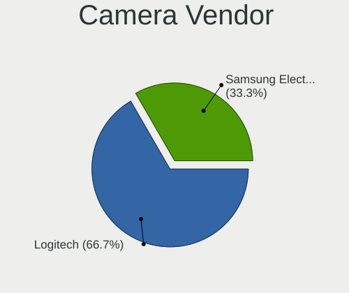

| Vendor              | Desktops | Percent |
|---------------------|----------|---------|
| Logitech            | 2        | 28.57%  |
| Alcor Micro         | 2        | 28.57%  |
| Samsung Electronics | 1        | 14.29%  |
| JOURIST-DC80        | 1        | 14.29%  |
| Guillemot           | 1        | 14.29%  |

Camera Model
------------

Camera device models

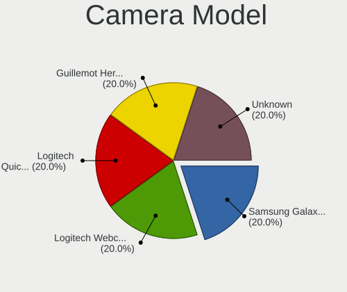

| Model                                   | Desktops | Percent |
|-----------------------------------------|----------|---------|
| Samsung Galaxy series, misc. (MTP mode) | 1        | 14.29%  |
| Logitech Webcam C270                    | 1        | 14.29%  |
| Logitech QuickCam Notebook Pro          | 1        | 14.29%  |
| JOURIST-DC80 JOURIST-DC80               | 1        | 14.29%  |
| Guillemot Hercules Dualpix Exchange     | 1        | 14.29%  |
| Alcor Micro USB 2.0 PC Camera           | 1        | 14.29%  |
| Alcor Micro USB 2.0 Camera              | 1        | 14.29%  |

Security
--------

Fingerprint Vendor
------------------

Fingerprint sensor vendors

Zero info for selected period =(

Fingerprint Model
-----------------

Fingerprint sensor models

Zero info for selected period =(

Chipcard Vendor
---------------

Chipcard module vendors

Zero info for selected period =(

Chipcard Model
--------------

Chipcard module models

Zero info for selected period =(

Unsupported
-----------

Unsupported Devices
-------------------

Total unsupported devices on board

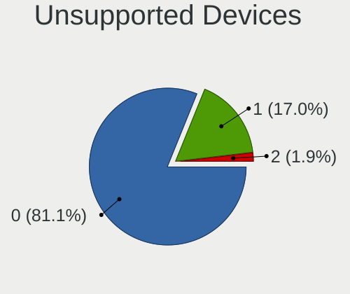

| Total | Desktops | Percent |
|-------|----------|---------|
| 0     | 43       | 81.13%  |
| 1     | 9        | 16.98%  |
| 2     | 1        | 1.89%   |

Unsupported Device Types
------------------------

Types of unsupported devices

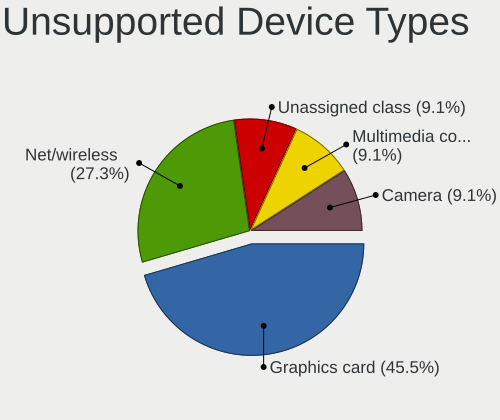

| Type                  | Desktops | Percent |
|-----------------------|----------|---------|
| Graphics card         | 5        | 45.45%  |
| Net/wireless          | 3        | 27.27%  |
| Unassigned class      | 1        | 9.09%   |
| Multimedia controller | 1        | 9.09%   |
| Camera                | 1        | 9.09%   |

