Sparky - Tested Hardware & Statistics (Notebooks)
-------------------------------------------------

A project to collect tested hardware configurations for Sparky.

Anyone can contribute to this report by the [hw-probe](https://github.com/linuxhw/hw-probe) tool:

    sudo -E hw-probe -all -upload

Please contribute! Especially if your hardware is rare.

Contents
--------

* [ Test Cases ](#test-cases)

* [ System ](#system)
  - [ OS                       ](#os)
  - [ OS Family                ](#os-family)
  - [ Kernel                   ](#kernel)
  - [ Kernel Family            ](#kernel-family)
  - [ Kernel Major Ver.        ](#kernel-major-ver)
  - [ Arch                     ](#arch)
  - [ DE                       ](#de)
  - [ Display Server           ](#display-server)
  - [ Display Manager          ](#display-manager)
  - [ OS Lang                  ](#os-lang)
  - [ Boot Mode                ](#boot-mode)
  - [ Filesystem               ](#filesystem)
  - [ Part. scheme             ](#part-scheme)
  - [ Dual Boot with Linux/BSD ](#dual-boot-with-linuxbsd)
  - [ Dual Boot (Win)          ](#dual-boot-win)

* [ Board ](#board)
  - [ Vendor                   ](#vendor)
  - [ Model                    ](#model)
  - [ Model Family             ](#model-family)
  - [ MFG Year                 ](#mfg-year)
  - [ Form Factor              ](#form-factor)
  - [ Secure Boot              ](#secure-boot)
  - [ Coreboot                 ](#coreboot)
  - [ RAM Size                 ](#ram-size)
  - [ RAM Used                 ](#ram-used)
  - [ Total Drives             ](#total-drives)
  - [ Has CD-ROM               ](#has-cd-rom)
  - [ Has Ethernet             ](#has-ethernet)
  - [ Has WiFi                 ](#has-wifi)
  - [ Has Bluetooth            ](#has-bluetooth)

* [ Location ](#location)
  - [ Country                  ](#country)
  - [ City                     ](#city)

* [ Drives ](#drives)
  - [ Drive Vendor             ](#drive-vendor)
  - [ Drive Model              ](#drive-model)
  - [ HDD Vendor               ](#hdd-vendor)
  - [ SSD Vendor               ](#ssd-vendor)
  - [ Drive Kind               ](#drive-kind)
  - [ Drive Connector          ](#drive-connector)
  - [ Drive Size               ](#drive-size)
  - [ Space Total              ](#space-total)
  - [ Space Used               ](#space-used)
  - [ Malfunc. Drives          ](#malfunc-drives)
  - [ Malfunc. Drive Vendor    ](#malfunc-drive-vendor)
  - [ Malfunc. HDD Vendor      ](#malfunc-hdd-vendor)
  - [ Malfunc. Drive Kind      ](#malfunc-drive-kind)
  - [ Failed Drives            ](#failed-drives)
  - [ Failed Drive Vendor      ](#failed-drive-vendor)
  - [ Drive Status             ](#drive-status)

* [ Storage controller ](#storage-controller)
  - [ Storage Vendor           ](#storage-vendor)
  - [ Storage Model            ](#storage-model)
  - [ Storage Kind             ](#storage-kind)

* [ Processor ](#processor)
  - [ CPU Vendor               ](#cpu-vendor)
  - [ CPU Model                ](#cpu-model)
  - [ CPU Model Family         ](#cpu-model-family)
  - [ CPU Cores                ](#cpu-cores)
  - [ CPU Sockets              ](#cpu-sockets)
  - [ CPU Threads              ](#cpu-threads)
  - [ CPU Op-Modes             ](#cpu-op-modes)
  - [ CPU Microcode            ](#cpu-microcode)
  - [ CPU Microarch            ](#cpu-microarch)

* [ Graphics ](#graphics)
  - [ GPU Vendor               ](#gpu-vendor)
  - [ GPU Model                ](#gpu-model)
  - [ GPU Combo                ](#gpu-combo)
  - [ GPU Driver               ](#gpu-driver)
  - [ GPU Memory               ](#gpu-memory)

* [ Monitor ](#monitor)
  - [ Monitor Vendor           ](#monitor-vendor)
  - [ Monitor Model            ](#monitor-model)
  - [ Monitor Resolution       ](#monitor-resolution)
  - [ Monitor Diagonal         ](#monitor-diagonal)
  - [ Monitor Width            ](#monitor-width)
  - [ Aspect Ratio             ](#aspect-ratio)
  - [ Monitor Area             ](#monitor-area)
  - [ Pixel Density            ](#pixel-density)
  - [ Multiple Monitors        ](#multiple-monitors)

* [ Network ](#network)
  - [ Net Controller Vendor    ](#net-controller-vendor)
  - [ Net Controller Model     ](#net-controller-model)
  - [ Wireless Vendor          ](#wireless-vendor)
  - [ Wireless Model           ](#wireless-model)
  - [ Ethernet Vendor          ](#ethernet-vendor)
  - [ Ethernet Model           ](#ethernet-model)
  - [ Net Controller Kind      ](#net-controller-kind)
  - [ Used Controller          ](#used-controller)
  - [ NICs                     ](#nics)
  - [ IPv6                     ](#ipv6)

* [ Bluetooth ](#bluetooth)
  - [ Bluetooth Vendor         ](#bluetooth-vendor)
  - [ Bluetooth Model          ](#bluetooth-model)

* [ Sound ](#sound)
  - [ Sound Vendor             ](#sound-vendor)
  - [ Sound Model              ](#sound-model)

* [ Memory ](#memory)
  - [ Memory Vendor            ](#memory-vendor)
  - [ Memory Model             ](#memory-model)
  - [ Memory Kind              ](#memory-kind)
  - [ Memory Form Factor       ](#memory-form-factor)
  - [ Memory Size              ](#memory-size)
  - [ Memory Speed             ](#memory-speed)

* [ Printers & scanners ](#printers--scanners)
  - [ Printer Vendor           ](#printer-vendor)
  - [ Printer Model            ](#printer-model)
  - [ Scanner Vendor           ](#scanner-vendor)
  - [ Scanner Model            ](#scanner-model)

* [ Camera ](#camera)
  - [ Camera Vendor            ](#camera-vendor)
  - [ Camera Model             ](#camera-model)

* [ Security ](#security)
  - [ Fingerprint Vendor       ](#fingerprint-vendor)
  - [ Fingerprint Model        ](#fingerprint-model)
  - [ Chipcard Vendor          ](#chipcard-vendor)
  - [ Chipcard Model           ](#chipcard-model)

* [ Unsupported ](#unsupported)
  - [ Unsupported Devices      ](#unsupported-devices)
  - [ Unsupported Device Types ](#unsupported-device-types)

Test Cases
----------

Total: 32

| Vendor    | Model                       | Probe                                                      | Date         |
|-----------|-----------------------------|------------------------------------------------------------|--------------|
| HP        | EliteBook 8770w             | [4fa8e91f6d](https://linux-hardware.org/?probe=4fa8e91f6d) | Apr 26, 2022 |
| Lenovo    | G50-30 80G0                 | [c7ea70f7ba](https://linux-hardware.org/?probe=c7ea70f7ba) | Apr 25, 2022 |
| HP        | Pavilion dv5                | [22ae3dae3d](https://linux-hardware.org/?probe=22ae3dae3d) | Mar 22, 2022 |
| ASUSTek   | 1000HE                      | [5dd6246e59](https://linux-hardware.org/?probe=5dd6246e59) | Feb 08, 2022 |
| ASUSTek   | S101                        | [a850549e73](https://linux-hardware.org/?probe=a850549e73) | Feb 04, 2022 |
| HP        | EliteBook 8770w             | [9a2052fc8c](https://linux-hardware.org/?probe=9a2052fc8c) | Nov 25, 2021 |
| HP        | Pavilion g7                 | [6cebc99fe6](https://linux-hardware.org/?probe=6cebc99fe6) | Nov 22, 2021 |
| Dell      | Inspiron N5010              | [df5e66431b](https://linux-hardware.org/?probe=df5e66431b) | Nov 20, 2021 |
| HP        | EliteBook Folio 9480m       | [dae2e04d45](https://linux-hardware.org/?probe=dae2e04d45) | Oct 04, 2021 |
| Google    | Banon                       | [764debedcd](https://linux-hardware.org/?probe=764debedcd) | Sep 25, 2021 |
| Lenovo    | ThinkPad E15 20RES0GF00     | [8722c3498e](https://linux-hardware.org/?probe=8722c3498e) | May 14, 2021 |
| Apple     | MacBook1,1                  | [cc415ab6c7](https://linux-hardware.org/?probe=cc415ab6c7) | Mar 15, 2021 |
| Samsung   | NC10                        | [b5909af616](https://linux-hardware.org/?probe=b5909af616) | Mar 11, 2021 |
| Samsung   | NC10                        | [3b8de5559e](https://linux-hardware.org/?probe=3b8de5559e) | Feb 27, 2021 |
| Lenovo    | ThinkPad T61 7659AB7        | [43f03346c5](https://linux-hardware.org/?probe=43f03346c5) | Feb 19, 2021 |
| Beelink   | BT3 PRO                     | [8dbfa4dacd](https://linux-hardware.org/?probe=8dbfa4dacd) | Jan 06, 2021 |
| Beelink   | BT3 PRO                     | [d85a392e02](https://linux-hardware.org/?probe=d85a392e02) | Jan 06, 2021 |
| Samsung   | NC10                        | [8c878860a7](https://linux-hardware.org/?probe=8c878860a7) | Jan 03, 2021 |
| Dell      | Inspiron 5720               | [d360a61780](https://linux-hardware.org/?probe=d360a61780) | Dec 08, 2020 |
| eMachines | E525                        | [0c11b6b4dc](https://linux-hardware.org/?probe=0c11b6b4dc) | Nov 25, 2020 |
| Lenovo    | IdeaPad S206 20154          | [393f27acf7](https://linux-hardware.org/?probe=393f27acf7) | Nov 18, 2020 |
| Dell      | Inspiron 5720               | [787263a0c6](https://linux-hardware.org/?probe=787263a0c6) | Oct 10, 2020 |
| HP        | Laptop 17z-ca100            | [2217d0703c](https://linux-hardware.org/?probe=2217d0703c) | Oct 05, 2020 |
| HP        | Laptop 17z-ca100            | [1927ffc179](https://linux-hardware.org/?probe=1927ffc179) | Oct 05, 2020 |
| Apple     | MacBook1,1                  | [73b04f9de4](https://linux-hardware.org/?probe=73b04f9de4) | Aug 26, 2020 |
| Acer      | Aspire 5742G                | [a90fb35c67](https://linux-hardware.org/?probe=a90fb35c67) | May 01, 2020 |
| Lenovo    | ThinkPad T60 2007FUG        | [d552e50d7e](https://linux-hardware.org/?probe=d552e50d7e) | Mar 12, 2020 |
| Dell      | Latitude XT3                | [0944e88882](https://linux-hardware.org/?probe=0944e88882) | Mar 09, 2020 |
| Dell      | Inspiron 5770               | [a3dd71465d](https://linux-hardware.org/?probe=a3dd71465d) | Jan 06, 2020 |
| HP        | Pavilion dv9000 (GA359UA... | [db4a924be0](https://linux-hardware.org/?probe=db4a924be0) | Sep 07, 2019 |
| HP        | Pavilion dv9000 (GA359UA... | [622123c1e6](https://linux-hardware.org/?probe=622123c1e6) | Sep 07, 2019 |
| HP        | Pavilion dv9000 (GA359UA... | [6f024c0dd0](https://linux-hardware.org/?probe=6f024c0dd0) | Sep 03, 2019 |

System
------

OS
--

Installed operating systems

| Name        | Notebooks | Percent |
|-------------|-----------|---------|
| Sparky 6    | 8         | 32%     |
| Sparky 6.1  | 4         | 16%     |
| Sparky 5.14 | 3         | 12%     |
| Sparky 7    | 2         | 8%      |
| Sparky 6.0  | 2         | 8%      |
| Sparky 5.13 | 2         | 8%      |
| Sparky 5.12 | 2         | 8%      |
| Sparky 5.10 | 2         | 8%      |

OS Family
---------

OS without a version

| Name   | Notebooks | Percent |
|--------|-----------|---------|
| Sparky | 23        | 100%    |

Kernel
------

Version of the Linux kernel

| Version             | Notebooks | Percent |
|---------------------|-----------|---------|
| 5.10.0-9-amd64      | 2         | 7.41%   |
| 5.10.0-8-amd64      | 2         | 7.41%   |
| 5.10.0-11-686       | 2         | 7.41%   |
| 4.19.0-8-amd64      | 2         | 7.41%   |
| 4.19.0-13-686       | 2         | 7.41%   |
| 4.19.0-12-amd64     | 2         | 7.41%   |
| 5.9.0-4-amd64       | 1         | 3.7%    |
| 5.8.13-sparky-amd64 | 1         | 3.7%    |
| 5.8.0-2-amd64       | 1         | 3.7%    |
| 5.5.0-2-amd64       | 1         | 3.7%    |
| 5.4.7-sparky-amd64  | 1         | 3.7%    |
| 5.2.0-2-amd64       | 1         | 3.7%    |
| 5.17.0-1-amd64      | 1         | 3.7%    |
| 5.16.0-5-amd64      | 1         | 3.7%    |
| 5.15.0-3-amd64      | 1         | 3.7%    |
| 5.14.0-4-amd64      | 1         | 3.7%    |
| 5.10.4-sparky-amd64 | 1         | 3.7%    |
| 5.10.0-6-amd64      | 1         | 3.7%    |
| 5.10.0-3-amd64      | 1         | 3.7%    |
| 4.19.0-14-686       | 1         | 3.7%    |
| 4.19.0-10-686       | 1         | 3.7%    |

Kernel Family
-------------

Linux kernel without a distro release

| Version | Notebooks | Percent |
|---------|-----------|---------|
| 5.10.0  | 8         | 32%     |
| 4.19.0  | 6         | 24%     |
| 5.9.0   | 1         | 4%      |
| 5.8.13  | 1         | 4%      |
| 5.8.0   | 1         | 4%      |
| 5.5.0   | 1         | 4%      |
| 5.4.7   | 1         | 4%      |
| 5.2.0   | 1         | 4%      |
| 5.17.0  | 1         | 4%      |
| 5.16.0  | 1         | 4%      |
| 5.15.0  | 1         | 4%      |
| 5.14.0  | 1         | 4%      |
| 5.10.4  | 1         | 4%      |

Kernel Major Ver.
-----------------

Linux kernel major version

| Version | Notebooks | Percent |
|---------|-----------|---------|
| 5.10    | 9         | 36%     |
| 4.19    | 6         | 24%     |
| 5.8     | 2         | 8%      |
| 5.9     | 1         | 4%      |
| 5.5     | 1         | 4%      |
| 5.4     | 1         | 4%      |
| 5.2     | 1         | 4%      |
| 5.17    | 1         | 4%      |
| 5.16    | 1         | 4%      |
| 5.15    | 1         | 4%      |
| 5.14    | 1         | 4%      |

Arch
----

OS architecture (x86_64, i586, etc.)

| Name   | Notebooks | Percent |
|--------|-----------|---------|
| x86_64 | 19        | 82.61%  |
| i686   | 4         | 17.39%  |

DE
--

Desktop Environment

| Name    | Notebooks | Percent |
|---------|-----------|---------|
| XFCE    | 7         | 29.17%  |
| LXQt    | 7         | 29.17%  |
| Unknown | 6         | 25%     |
| openbox | 1         | 4.17%   |
| MATE    | 1         | 4.17%   |
| KDE5    | 1         | 4.17%   |
| GNOME   | 1         | 4.17%   |

Display Server
--------------

X11 or Wayland

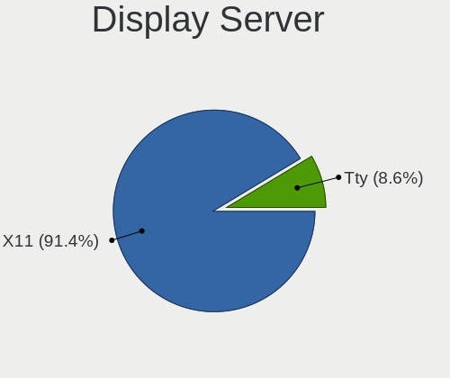

| Name | Notebooks | Percent |
|------|-----------|---------|
| X11  | 21        | 87.5%   |
| Tty  | 3         | 12.5%   |

Display Manager
---------------

SDDM, LightDM, etc.

| Name    | Notebooks | Percent |
|---------|-----------|---------|
| TDM     | 6         | 26.09%  |
| Unknown | 6         | 26.09%  |
| LightDM | 5         | 21.74%  |
| SDDM    | 4         | 17.39%  |
| XDM     | 1         | 4.35%   |
| GDM     | 1         | 4.35%   |

OS Lang
-------

Language

| Lang    | Notebooks | Percent |
|---------|-----------|---------|
| en_US   | 8         | 34.78%  |
| pl_PL   | 3         | 13.04%  |
| en_GB   | 3         | 13.04%  |
| fr_FR   | 2         | 8.7%    |
| Unknown | 2         | 8.7%    |
| ja_JP   | 1         | 4.35%   |
| es_CL   | 1         | 4.35%   |
| en_PH   | 1         | 4.35%   |
| en_CA   | 1         | 4.35%   |
| de_DE   | 1         | 4.35%   |

Boot Mode
---------

EFI or BIOS

| Mode | Notebooks | Percent |
|------|-----------|---------|
| BIOS | 17        | 73.91%  |
| EFI  | 6         | 26.09%  |

Filesystem
----------

Type of filesystem

| Type    | Notebooks | Percent |
|---------|-----------|---------|
| Ext4    | 20        | 86.96%  |
| Overlay | 2         | 8.7%    |
| Btrfs   | 1         | 4.35%   |

Part. scheme
------------

Scheme of partitioning

| Type    | Notebooks | Percent |
|---------|-----------|---------|
| MBR     | 10        | 43.48%  |
| Unknown | 7         | 30.43%  |
| GPT     | 6         | 26.09%  |

Dual Boot with Linux/BSD
------------------------

Hosting more than one Linux/BSD

| Dual boot | Notebooks | Percent |
|-----------|-----------|---------|
| No        | 20        | 86.96%  |
| Yes       | 3         | 13.04%  |

Dual Boot (Win)
---------------

Hosting Linux and Windows

| Dual boot | Notebooks | Percent |
|-----------|-----------|---------|
| No        | 15        | 65.22%  |
| Yes       | 8         | 34.78%  |

Board
-----

Vendor
------

Motherboard manufacturer

| Name                | Notebooks | Percent |
|---------------------|-----------|---------|
| Hewlett-Packard     | 6         | 26.09%  |
| Lenovo              | 5         | 21.74%  |
| Dell                | 4         | 17.39%  |
| ASUSTek Computer    | 2         | 8.7%    |
| Samsung Electronics | 1         | 4.35%   |
| Google              | 1         | 4.35%   |
| eMachines           | 1         | 4.35%   |
| Beelink             | 1         | 4.35%   |
| Apple               | 1         | 4.35%   |
| Acer                | 1         | 4.35%   |

Model
-----

Motherboard model

| Name                             | Notebooks | Percent |
|----------------------------------|-----------|---------|
| Samsung NC10                     | 1         | 4.35%   |
| Lenovo ThinkPad T61 7659AB7      | 1         | 4.35%   |
| Lenovo ThinkPad T60 2007FUG      | 1         | 4.35%   |
| Lenovo ThinkPad E15 20RES0GF00   | 1         | 4.35%   |
| Lenovo IdeaPad S206 20154        | 1         | 4.35%   |
| Lenovo G50-30 80G0               | 1         | 4.35%   |
| HP Pavilion g7                   | 1         | 4.35%   |
| HP Pavilion dv9000 (GA359UA#ABA) | 1         | 4.35%   |
| HP Pavilion dv5                  | 1         | 4.35%   |
| HP Laptop 17z-ca100              | 1         | 4.35%   |
| HP EliteBook Folio 9480m         | 1         | 4.35%   |
| HP EliteBook 8770w               | 1         | 4.35%   |
| Google Banon                     | 1         | 4.35%   |
| eMachines E525                   | 1         | 4.35%   |
| Dell Latitude XT3                | 1         | 4.35%   |
| Dell Inspiron N5010              | 1         | 4.35%   |
| Dell Inspiron 5770               | 1         | 4.35%   |
| Dell Inspiron 5720               | 1         | 4.35%   |
| Beelink BT3 PRO                  | 1         | 4.35%   |
| ASUS S101                        | 1         | 4.35%   |
| ASUS 1000HE                      | 1         | 4.35%   |
| Apple MacBook1,1                 | 1         | 4.35%   |
| Acer Aspire 5742G                | 1         | 4.35%   |

Model Family
------------

Motherboard model prefix

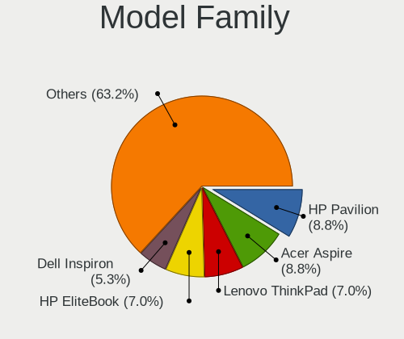

| Name            | Notebooks | Percent |
|-----------------|-----------|---------|
| Lenovo ThinkPad | 3         | 13.04%  |
| HP Pavilion     | 3         | 13.04%  |
| Dell Inspiron   | 3         | 13.04%  |
| HP EliteBook    | 2         | 8.7%    |
| Samsung NC10    | 1         | 4.35%   |
| Lenovo IdeaPad  | 1         | 4.35%   |
| Lenovo G50-30   | 1         | 4.35%   |
| HP Laptop       | 1         | 4.35%   |
| Google Banon    | 1         | 4.35%   |
| eMachines E525  | 1         | 4.35%   |
| Dell Latitude   | 1         | 4.35%   |
| Beelink BT3     | 1         | 4.35%   |
| ASUS S101       | 1         | 4.35%   |
| ASUS 1000HE     | 1         | 4.35%   |
| Apple MacBook1  | 1         | 4.35%   |
| Acer Aspire     | 1         | 4.35%   |

MFG Year
--------

Motherboard manufacture year

| Year | Notebooks | Percent |
|------|-----------|---------|
| 2012 | 3         | 13.04%  |
| 2009 | 3         | 13.04%  |
| 2008 | 3         | 13.04%  |
| 2014 | 2         | 8.7%    |
| 2011 | 2         | 8.7%    |
| 2010 | 2         | 8.7%    |
| 2006 | 2         | 8.7%    |
| 2021 | 1         | 4.35%   |
| 2020 | 1         | 4.35%   |
| 2019 | 1         | 4.35%   |
| 2018 | 1         | 4.35%   |
| 2017 | 1         | 4.35%   |
| 2007 | 1         | 4.35%   |

Form Factor
-----------

Physical design of the computer

| Name     | Notebooks | Percent |
|----------|-----------|---------|
| Notebook | 23        | 100%    |

Secure Boot
-----------

Enabled or disabled

| State    | Notebooks | Percent |
|----------|-----------|---------|
| Disabled | 23        | 100%    |

Coreboot
--------

Have coreboot on board

| Used | Notebooks | Percent |
|------|-----------|---------|
| No   | 22        | 95.65%  |
| Yes  | 1         | 4.35%   |

RAM Size
--------

Total RAM memory

| Size in GB | Notebooks | Percent |
|------------|-----------|---------|
| 3.01-4.0   | 9         | 39.13%  |
| 4.01-8.0   | 4         | 17.39%  |
| 2.01-3.0   | 4         | 17.39%  |
| 1.01-2.0   | 2         | 8.7%    |
| 32.01-64.0 | 1         | 4.35%   |
| 24.01-32.0 | 1         | 4.35%   |
| 16.01-24.0 | 1         | 4.35%   |
| 0.51-1.0   | 1         | 4.35%   |

RAM Used
--------

Used RAM memory

| Used GB  | Notebooks | Percent |
|----------|-----------|---------|
| 0.51-1.0 | 8         | 32%     |
| 1.01-2.0 | 6         | 24%     |
| 2.01-3.0 | 4         | 16%     |
| 4.01-8.0 | 3         | 12%     |
| 3.01-4.0 | 2         | 8%      |
| 0.01-0.5 | 2         | 8%      |

Total Drives
------------

Number of drives on board

| Drives | Notebooks | Percent |
|--------|-----------|---------|
| 1      | 18        | 78.26%  |
| 2      | 3         | 13.04%  |
| 5      | 1         | 4.35%   |
| 4      | 1         | 4.35%   |

Has CD-ROM
----------

Has CD-ROM on board

| Presented | Notebooks | Percent |
|-----------|-----------|---------|
| No        | 12        | 52.17%  |
| Yes       | 11        | 47.83%  |

Has Ethernet
------------

Has Ethernet on board

| Presented | Notebooks | Percent |
|-----------|-----------|---------|
| Yes       | 21        | 91.3%   |
| No        | 2         | 8.7%    |

Has WiFi
--------

Has WiFi module

| Presented | Notebooks | Percent |
|-----------|-----------|---------|
| Yes       | 21        | 91.3%   |
| No        | 2         | 8.7%    |

Has Bluetooth
-------------

Has Bluetooth module

| Presented | Notebooks | Percent |
|-----------|-----------|---------|
| Yes       | 14        | 60.87%  |
| No        | 9         | 39.13%  |

Location
--------

Country
-------

Geographic location (country)

| Country     | Notebooks | Percent |
|-------------|-----------|---------|
| USA         | 8         | 34.78%  |
| UK          | 3         | 13.04%  |
| Poland      | 3         | 13.04%  |
| Germany     | 2         | 8.7%    |
| France      | 2         | 8.7%    |
| Canada      | 2         | 8.7%    |
| Philippines | 1         | 4.35%   |
| Japan       | 1         | 4.35%   |
| Chile       | 1         | 4.35%   |

City
----

Geographic location (city)

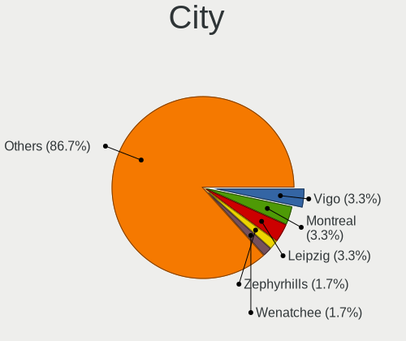

| City                  | Notebooks | Percent |
|-----------------------|-----------|---------|
| Wroclaw               | 1         | 3.85%   |
| Wenatchee             | 1         | 3.85%   |
| Tucson                | 1         | 3.85%   |
| Takahama              | 1         | 3.85%   |
| Spokane               | 1         | 3.85%   |
| San Antonio           | 1         | 3.85%   |
| Saint-Basile-le-Grand | 1         | 3.85%   |
| Pujaudran             | 1         | 3.85%   |
| Pompano Beach         | 1         | 3.85%   |
| Pasig                 | 1         | 3.85%   |
| Paisley               | 1         | 3.85%   |
| Nasielsk              | 1         | 3.85%   |
| Montreuil             | 1         | 3.85%   |
| Montreal              | 1         | 3.85%   |
| Mannheim              | 1         | 3.85%   |
| Leipzig               | 1         | 3.85%   |
| La Florida            | 1         | 3.85%   |
| KoЕ‚o              | 1         | 3.85%   |
| Houston               | 1         | 3.85%   |
| Glasgow               | 1         | 3.85%   |
| East Wenatchee        | 1         | 3.85%   |
| Dunoon                | 1         | 3.85%   |
| Dobrzen Wielki        | 1         | 3.85%   |
| Chicago               | 1         | 3.85%   |
| Birmingham            | 1         | 3.85%   |
| Barnsley              | 1         | 3.85%   |

Drives
------

Drive Vendor
------------

Hard drive vendors

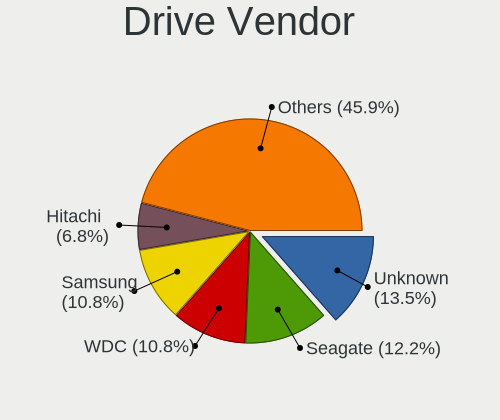

| Vendor              | Notebooks | Drives | Percent |
|---------------------|-----------|--------|---------|
| Seagate             | 6         | 10     | 20%     |
| Samsung Electronics | 4         | 4      | 13.33%  |
| Hitachi             | 4         | 5      | 13.33%  |
| WDC                 | 3         | 5      | 10%     |
| Unknown             | 2         | 2      | 6.67%   |
| GOODRAM             | 2         | 4      | 6.67%   |
| SPCC                | 1         | 2      | 3.33%   |
| ORICO               | 1         | 1      | 3.33%   |
| Micron Technology   | 1         | 1      | 3.33%   |
| Intel               | 1         | 1      | 3.33%   |
| Fujitsu             | 1         | 2      | 3.33%   |
| Crucial             | 1         | 1      | 3.33%   |
| ASUS-JM             | 1         | 1      | 3.33%   |
| asmedia             | 1         | 1      | 3.33%   |
| A-DATA Technology   | 1         | 1      | 3.33%   |

Drive Model
-----------

Hard drive models

| Model                                    | Notebooks | Percent |
|------------------------------------------|-----------|---------|
| Hitachi HTS545025B9A300 250GB            | 2         | 6.25%   |
| WDC WD5000BEVT-22ZAT0 500GB              | 1         | 3.13%   |
| WDC WD3200BPVT-75ZEST0 320GB             | 1         | 3.13%   |
| WDC WD1600BEVT-22ZCT0 160GB              | 1         | 3.13%   |
| Unknown MMC Card  64GB                   | 1         | 3.13%   |
| Unknown HBG4a2  32GB                     | 1         | 3.13%   |
| SPCC Solid State Disk 256GB              | 1         | 3.13%   |
| Seagate ST9500325AS 500GB                | 1         | 3.13%   |
| Seagate ST9160310AS 160GB                | 1         | 3.13%   |
| Seagate ST1000LM048-2E7172 1TB           | 1         | 3.13%   |
| Seagate ST1000LM035-1RK172 1TB           | 1         | 3.13%   |
| Seagate ST1000LM024 HN-M101MBB 1TB       | 1         | 3.13%   |
| Seagate Backup+ Hub BK 4TB               | 1         | 3.13%   |
| Seagate Backup+ Desk 5TB                 | 1         | 3.13%   |
| Samsung SSD 840 Series 120GB             | 1         | 3.13%   |
| Samsung NVMe SSD Drive 256GB             | 1         | 3.13%   |
| Samsung MZALQ512HALU-000L1 512GB         | 1         | 3.13%   |
| Samsung MZ7TD128HAFV-000L1 128GB SSD     | 1         | 3.13%   |
| ORICO M200 1TB                           | 1         | 3.13%   |
| Micron MTFDDAK256MAY-1AH12ABHA 256GB SSD | 1         | 3.13%   |
| Intel SSDMAEXC024G3H 24GB                | 1         | 3.13%   |
| Hitachi HTS545025B9SA02 250GB            | 1         | 3.13%   |
| Hitachi HTS541080G9SA00 80GB             | 1         | 3.13%   |
| GOODRAM SSDPR-CX400-256-G2 256GB         | 1         | 3.13%   |
| GOODRAM SSDPR-CL100-240-G3 240GB         | 1         | 3.13%   |
| GOODRAM IR-SSDPR-S25A-120 120GB          | 1         | 3.13%   |
| Fujitsu MHW2120BH 120GB                  | 1         | 3.13%   |
| Crucial CT250MX500SSD1 250GB             | 1         | 3.13%   |
| ASUS-JM S41 SSD 16GB                     | 1         | 3.13%   |
| asmedia ASMT1153e 1TB                    | 1         | 3.13%   |
| A-DATA SX8200NP 480GB                    | 1         | 3.13%   |

HDD Vendor
----------

Hard disk drive vendors

| Vendor  | Notebooks | Drives | Percent |
|---------|-----------|--------|---------|
| Seagate | 6         | 9      | 40%     |
| Hitachi | 4         | 5      | 26.67%  |
| WDC     | 3         | 5      | 20%     |
| Fujitsu | 1         | 2      | 6.67%   |
| asmedia | 1         | 1      | 6.67%   |

SSD Vendor
----------

Solid state drive vendors

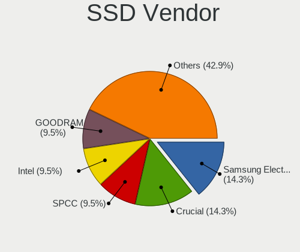

| Vendor              | Notebooks | Drives | Percent |
|---------------------|-----------|--------|---------|
| Samsung Electronics | 2         | 2      | 22.22%  |
| GOODRAM             | 2         | 4      | 22.22%  |
| SPCC                | 1         | 2      | 11.11%  |
| Micron Technology   | 1         | 1      | 11.11%  |
| Intel               | 1         | 1      | 11.11%  |
| Crucial             | 1         | 1      | 11.11%  |
| ASUS-JM             | 1         | 1      | 11.11%  |

Drive Kind
----------

HDD or SSD

| Kind    | Notebooks | Drives | Percent |
|---------|-----------|--------|---------|
| HDD     | 14        | 22     | 50%     |
| SSD     | 7         | 12     | 25%     |
| NVMe    | 3         | 3      | 10.71%  |
| MMC     | 2         | 2      | 7.14%   |
| Unknown | 2         | 2      | 7.14%   |

Drive Connector
---------------

SATA, SAS, NVMe, etc.

| Type | Notebooks | Drives | Percent |
|------|-----------|--------|---------|
| SATA | 19        | 31     | 73.08%  |
| NVMe | 3         | 3      | 11.54%  |
| SAS  | 2         | 5      | 7.69%   |
| MMC  | 2         | 2      | 7.69%   |

Drive Size
----------

Size of hard drive

| Size in TB | Notebooks | Drives | Percent |
|------------|-----------|--------|---------|
| 0.01-0.5   | 16        | 26     | 80%     |
| 0.51-1.0   | 3         | 5      | 15%     |
| 3.01-4.0   | 1         | 3      | 5%      |

Space Total
-----------

Amount of disk space available on the file system

| Size in GB     | Notebooks | Percent |
|----------------|-----------|---------|
| 101-250        | 9         | 39.13%  |
| 501-1000       | 4         | 17.39%  |
| 1-20           | 3         | 13.04%  |
| 251-500        | 2         | 8.7%    |
| 21-50          | 2         | 8.7%    |
| More than 3000 | 1         | 4.35%   |
| 1001-2000      | 1         | 4.35%   |
| Unknown        | 1         | 4.35%   |

Space Used
----------

Amount of used disk space

| Used GB        | Notebooks | Percent |
|----------------|-----------|---------|
| 1-20           | 11        | 44%     |
| 21-50          | 3         | 12%     |
| 51-100         | 3         | 12%     |
| 101-250        | 2         | 8%      |
| 501-1000       | 2         | 8%      |
| More than 3000 | 1         | 4%      |
| 251-500        | 1         | 4%      |
| 1001-2000      | 1         | 4%      |
| Unknown        | 1         | 4%      |

Malfunc. Drives
---------------

Drive models with a malfunction

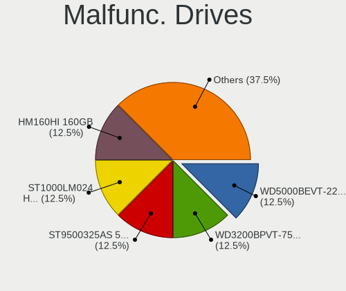

| Model                                               | Notebooks | Drives | Percent |
|-----------------------------------------------------|-----------|--------|---------|
| WDC WD5000BEVT-22ZAT0 500GB                         | 1         | 1      | 20%     |
| WDC WD3200BPVT-75ZEST0 320GB                        | 1         | 1      | 20%     |
| Seagate ST9500325AS 500GB                           | 1         | 1      | 20%     |
| Micron Technology MTFDDAK256MAY-1AH12ABHA 256GB SSD | 1         | 1      | 20%     |
| asmedia ASMT1153e 1TB                               | 1         | 1      | 20%     |

Malfunc. Drive Vendor
---------------------

Vendors of faulty drives

| Vendor            | Notebooks | Drives | Percent |
|-------------------|-----------|--------|---------|
| WDC               | 2         | 2      | 40%     |
| Seagate           | 1         | 1      | 20%     |
| Micron Technology | 1         | 1      | 20%     |
| asmedia           | 1         | 1      | 20%     |

Malfunc. HDD Vendor
-------------------

Vendors of faulty HDD drives

| Vendor  | Notebooks | Drives | Percent |
|---------|-----------|--------|---------|
| WDC     | 2         | 2      | 50%     |
| Seagate | 1         | 1      | 25%     |
| asmedia | 1         | 1      | 25%     |

Malfunc. Drive Kind
-------------------

Kinds of faulty drives

| Kind | Notebooks | Drives | Percent |
|------|-----------|--------|---------|
| HDD  | 4         | 4      | 80%     |
| SSD  | 1         | 1      | 20%     |

Failed Drives
-------------

Failed drive models

Zero info for selected period =(

Failed Drive Vendor
-------------------

Failed drive vendors

Zero info for selected period =(

Drive Status
------------

Number of failed and malfunc. drives

| Status   | Notebooks | Drives | Percent |
|----------|-----------|--------|---------|
| Works    | 11        | 21     | 44%     |
| Detected | 9         | 15     | 36%     |
| Malfunc  | 5         | 5      | 20%     |

Storage controller
------------------

Storage Vendor
--------------

Storage controller vendors

| Vendor              | Notebooks | Percent |
|---------------------|-----------|---------|
| Intel               | 18        | 75%     |
| Samsung Electronics | 2         | 8.33%   |
| Silicon Motion      | 1         | 4.17%   |
| Nvidia              | 1         | 4.17%   |
| JMicron Technology  | 1         | 4.17%   |
| AMD                 | 1         | 4.17%   |

Storage Model
-------------

Storage controller models

| Model                                                                        | Notebooks | Percent |
|------------------------------------------------------------------------------|-----------|---------|
| Intel 82801GBM/GHM (ICH7-M Family) SATA Controller [IDE mode]                | 3         | 10.71%  |
| Samsung NVMe SSD Controller 980                                              | 2         | 7.14%   |
| Intel 82801IBM/IEM (ICH9M/ICH9M-E) 4 port SATA Controller [AHCI mode]        | 2         | 7.14%   |
| Intel 82801GBM/GHM (ICH7-M Family) SATA Controller [AHCI mode]               | 2         | 7.14%   |
| Intel 82801G (ICH7 Family) IDE Controller                                    | 2         | 7.14%   |
| Intel 7 Series Chipset Family 6-port SATA Controller [AHCI mode]             | 2         | 7.14%   |
| Intel 6 Series/C200 Series Chipset Family 6 port Mobile SATA AHCI Controller | 2         | 7.14%   |
| Silicon Motion SM2262/SM2262EN SSD Controller                                | 1         | 3.57%   |
| Nvidia MCP51 Serial ATA Controller                                           | 1         | 3.57%   |
| Nvidia MCP51 IDE                                                             | 1         | 3.57%   |
| JMicron JMB360 AHCI Controller                                               | 1         | 3.57%   |
| Intel Sunrise Point-LP SATA Controller [AHCI mode]                           | 1         | 3.57%   |
| Intel Comet Lake SATA AHCI Controller                                        | 1         | 3.57%   |
| Intel Atom Processor E3800 Series SATA AHCI Controller                       | 1         | 3.57%   |
| Intel 82801HM/HEM (ICH8M/ICH8M-E) SATA Controller [AHCI mode]                | 1         | 3.57%   |
| Intel 82801HM/HEM (ICH8M/ICH8M-E) IDE Controller                             | 1         | 3.57%   |
| Intel 8 Series SATA Controller 1 [AHCI mode]                                 | 1         | 3.57%   |
| Intel 5 Series/3400 Series Chipset 6 port SATA AHCI Controller               | 1         | 3.57%   |
| Intel 5 Series/3400 Series Chipset 4 port SATA AHCI Controller               | 1         | 3.57%   |
| AMD SB7x0/SB8x0/SB9x0 SATA Controller [AHCI mode]                            | 1         | 3.57%   |

Storage Kind
------------

Kind of storage controller (IDE, SATA, NVMe, SAS, ...)

| Kind | Notebooks | Percent |
|------|-----------|---------|
| SATA | 16        | 61.54%  |
| IDE  | 7         | 26.92%  |
| NVMe | 3         | 11.54%  |

Processor
---------

CPU Vendor
----------

Processor vendors

| Vendor | Notebooks | Percent |
|--------|-----------|---------|
| Intel  | 20        | 86.96%  |
| AMD    | 3         | 13.04%  |

CPU Model
---------

Processor models

| Model                                         | Notebooks | Percent |
|-----------------------------------------------|-----------|---------|
| Intel Atom CPU N270 @ 1.60GHz                 | 2         | 8.7%    |
| Intel Pentium CPU B950 @ 2.10GHz              | 1         | 4.35%   |
| Intel Genuine CPU T2400 @ 1.83GHz             | 1         | 4.35%   |
| Intel Core i7-4600U CPU @ 2.10GHz             | 1         | 4.35%   |
| Intel Core i7-3630QM CPU @ 2.40GHz            | 1         | 4.35%   |
| Intel Core i7-3612QM CPU @ 2.10GHz            | 1         | 4.35%   |
| Intel Core i5-8250U CPU @ 1.60GHz             | 1         | 4.35%   |
| Intel Core i5-2520M CPU @ 2.50GHz             | 1         | 4.35%   |
| Intel Core i5-10210U CPU @ 1.60GHz            | 1         | 4.35%   |
| Intel Core i5 CPU M 460 @ 2.53GHz             | 1         | 4.35%   |
| Intel Core i3 CPU M 380 @ 2.53GHz             | 1         | 4.35%   |
| Intel Core 2 Duo CPU T7300 @ 2.00GHz          | 1         | 4.35%   |
| Intel Core 2 Duo CPU P8400 @ 2.26GHz          | 1         | 4.35%   |
| Intel Core 2 CPU T5600 @ 1.83GHz              | 1         | 4.35%   |
| Intel Celeron CPU N3160 @ 1.60GHz             | 1         | 4.35%   |
| Intel Celeron CPU N2840 @ 2.16GHz             | 1         | 4.35%   |
| Intel Celeron CPU 900 @ 2.20GHz               | 1         | 4.35%   |
| Intel Atom x5-Z8350 CPU @ 1.44GHz             | 1         | 4.35%   |
| Intel Atom CPU N280 @ 1.66GHz                 | 1         | 4.35%   |
| AMD Turion 64 X2 Mobile Technology TL-64      | 1         | 4.35%   |
| AMD Ryzen 5 3500U with Radeon Vega Mobile Gfx | 1         | 4.35%   |
| AMD C-50 Processor                            | 1         | 4.35%   |

CPU Model Family
----------------

Processor model prefix

| Model                   | Notebooks | Percent |
|-------------------------|-----------|---------|
| Intel Core i5           | 4         | 17.39%  |
| Intel Atom              | 4         | 17.39%  |
| Intel Core i7           | 3         | 13.04%  |
| Intel Celeron           | 3         | 13.04%  |
| Intel Core 2 Duo        | 2         | 8.7%    |
| Intel Pentium           | 1         | 4.35%   |
| Intel Genuine           | 1         | 4.35%   |
| Intel Core i3           | 1         | 4.35%   |
| Intel Core 2            | 1         | 4.35%   |
| AMD Turion 64 X2 Mobile | 1         | 4.35%   |
| AMD Ryzen 5             | 1         | 4.35%   |
| AMD C-50                | 1         | 4.35%   |

CPU Cores
---------

Number of processor cores

| Number | Notebooks | Percent |
|--------|-----------|---------|
| 2      | 12        | 52.17%  |
| 4      | 7         | 30.43%  |
| 1      | 4         | 17.39%  |

CPU Sockets
-----------

Number of sockets

| Number | Notebooks | Percent |
|--------|-----------|---------|
| 1      | 23        | 100%    |

CPU Threads
-----------

Threads per core (Hyper-Threading)

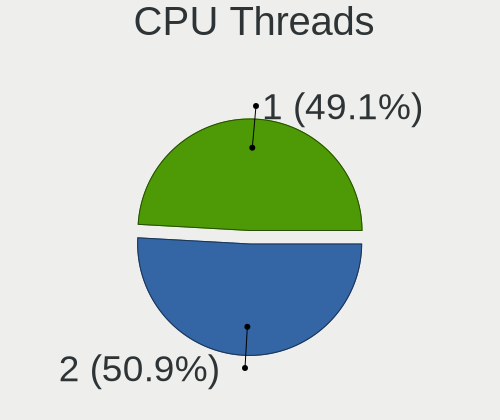

| Number | Notebooks | Percent |
|--------|-----------|---------|
| 2      | 12        | 52.17%  |
| 1      | 11        | 47.83%  |

CPU Op-Modes
------------

CPU Operation Modes (32-bit, 64-bit)

| Op mode        | Notebooks | Percent |
|----------------|-----------|---------|
| 32-bit, 64-bit | 19        | 82.61%  |
| 32-bit         | 4         | 17.39%  |

CPU Microcode
-------------

Microcode number

| Number     | Notebooks | Percent |
|------------|-----------|---------|
| Unknown    | 4         | 17.39%  |
| 0x406c4    | 2         | 8.7%    |
| 0x306a9    | 2         | 8.7%    |
| 0x206a7    | 2         | 8.7%    |
| 0x20655    | 2         | 8.7%    |
| 0x106c2    | 2         | 8.7%    |
| 0x806ec    | 1         | 4.35%   |
| 0x806ea    | 1         | 4.35%   |
| 0x6f2      | 1         | 4.35%   |
| 0x40651    | 1         | 4.35%   |
| 0x30678    | 1         | 4.35%   |
| 0x1067a    | 1         | 4.35%   |
| 0x10676    | 1         | 4.35%   |
| 0x08108109 | 1         | 4.35%   |
| 0x05000029 | 1         | 4.35%   |

CPU Microarch
-------------

Microarchitecture

| Name        | Notebooks | Percent |
|-------------|-----------|---------|
| Silvermont  | 3         | 13.04%  |
| Bonnell     | 3         | 13.04%  |
| Westmere    | 2         | 8.7%    |
| SandyBridge | 2         | 8.7%    |
| Penryn      | 2         | 8.7%    |
| KabyLake    | 2         | 8.7%    |
| IvyBridge   | 2         | 8.7%    |
| Core        | 2         | 8.7%    |
| Zen+        | 1         | 4.35%   |
| P6          | 1         | 4.35%   |
| K8 Hammer   | 1         | 4.35%   |
| Haswell     | 1         | 4.35%   |
| Bobcat      | 1         | 4.35%   |

Graphics
--------

GPU Vendor
----------

Vendors of graphics cards

| Vendor | Notebooks | Percent |
|--------|-----------|---------|
| Intel  | 16        | 69.57%  |
| Nvidia | 4         | 17.39%  |
| AMD    | 3         | 13.04%  |

GPU Model
---------

Graphics card models

| Model                                                                                    | Notebooks | Percent |
|------------------------------------------------------------------------------------------|-----------|---------|
| Intel Mobile 945GM/GMS/GME, 943/940GML Express Integrated Graphics Controller            | 4         | 14.29%  |
| Intel Mobile 945GSE Express Integrated Graphics Controller                               | 3         | 10.71%  |
| Intel Atom/Celeron/Pentium Processor x5-E8000/J3xxx/N3xxx Integrated Graphics Controller | 2         | 7.14%   |
| Intel 2nd Generation Core Processor Family Integrated Graphics Controller                | 2         | 7.14%   |
| Nvidia GK104GLM [Quadro K3000M]                                                          | 1         | 3.57%   |
| Nvidia GF108M [GeForce GT 420M]                                                          | 1         | 3.57%   |
| Nvidia G96CM [GeForce 9600M GT]                                                          | 1         | 3.57%   |
| Nvidia C51 [GeForce Go 6150]                                                             | 1         | 3.57%   |
| Intel UHD Graphics 620                                                                   | 1         | 3.57%   |
| Intel Mobile GM965/GL960 Integrated Graphics Controller (secondary)                      | 1         | 3.57%   |
| Intel Mobile GM965/GL960 Integrated Graphics Controller (primary)                        | 1         | 3.57%   |
| Intel Mobile 945GM/GMS, 943/940GML Express Integrated Graphics Controller                | 1         | 3.57%   |
| Intel Mobile 4 Series Chipset Integrated Graphics Controller                             | 1         | 3.57%   |
| Intel Haswell-ULT Integrated Graphics Controller                                         | 1         | 3.57%   |
| Intel Core Processor Integrated Graphics Controller                                      | 1         | 3.57%   |
| Intel CometLake-U GT2 [UHD Graphics]                                                     | 1         | 3.57%   |
| Intel Atom Processor Z36xxx/Z37xxx Series Graphics & Display                             | 1         | 3.57%   |
| Intel 3rd Gen Core processor Graphics Controller                                         | 1         | 3.57%   |
| AMD Wrestler [Radeon HD 6250]                                                            | 1         | 3.57%   |
| AMD RV515/M54 [Mobility Radeon X1400]                                                    | 1         | 3.57%   |
| AMD Picasso/Raven 2 [Radeon Vega Series / Radeon Vega Mobile Series]                     | 1         | 3.57%   |

GPU Combo
---------

Combinations of graphics cards

| Name       | Notebooks | Percent |
|------------|-----------|---------|
| 1 x Intel  | 16        | 69.57%  |
| 1 x Nvidia | 4         | 17.39%  |
| 1 x AMD    | 3         | 13.04%  |

GPU Driver
----------

Free vs proprietary

| Driver      | Notebooks | Percent |
|-------------|-----------|---------|
| Free        | 22        | 95.65%  |
| Proprietary | 1         | 4.35%   |

GPU Memory
----------

Total video memory

| Size in GB | Notebooks | Percent |
|------------|-----------|---------|
| Unknown    | 17        | 73.91%  |
| 0.01-0.5   | 3         | 13.04%  |
| 1.01-2.0   | 2         | 8.7%    |
| 0.51-1.0   | 1         | 4.35%   |

Monitor
-------

Monitor Vendor
--------------

Monitor vendors

| Vendor              | Notebooks | Percent |
|---------------------|-----------|---------|
| LG Display          | 6         | 26.09%  |
| AU Optronics        | 3         | 13.04%  |
| Samsung Electronics | 2         | 8.7%    |
| Lenovo              | 2         | 8.7%    |
| CPT                 | 2         | 8.7%    |
| Chimei Innolux      | 2         | 8.7%    |
| LG Philips          | 1         | 4.35%   |
| Insignia            | 1         | 4.35%   |
| Hitachi             | 1         | 4.35%   |
| HannStar            | 1         | 4.35%   |
| BOE                 | 1         | 4.35%   |
| Apple               | 1         | 4.35%   |

Monitor Model
-------------

Monitor models

| Model                                                                | Notebooks | Percent |
|----------------------------------------------------------------------|-----------|---------|
| Samsung Electronics S24D330 SAM0D93 1920x1080 531x299mm 24.0-inch    | 1         | 4.17%   |
| Samsung Electronics LCD Monitor SEC4F45 1280x800 331x207mm 15.4-inch | 1         | 4.17%   |
| Samsung Electronics LCD Monitor SEC4141 1366x768 344x193mm 15.5-inch | 1         | 4.17%   |
| LG Philips LCD Monitor LPLA002 1440x900 367x230mm 17.1-inch          | 1         | 4.17%   |
| LG Display LP156WH1-TLA3 LGD01C2 1366x768 344x194mm 15.5-inch        | 1         | 4.17%   |
| LG Display LCD Monitor LGD059E 1920x1080 382x215mm 17.3-inch         | 1         | 4.17%   |
| LG Display LCD Monitor LGD04E1 1366x768 344x194mm 15.5-inch          | 1         | 4.17%   |
| LG Display LCD Monitor LGD02E1 1600x900 382x215mm 17.3-inch          | 1         | 4.17%   |
| LG Display LCD Monitor LGD0266 1366x768 344x194mm 15.5-inch          | 1         | 4.17%   |
| LG Display LCD Monitor LGD01C5 1366x768 293x165mm 13.2-inch          | 1         | 4.17%   |
| Lenovo LCD Monitor LEN4033 1440x900 304x190mm 14.1-inch              | 1         | 4.17%   |
| Lenovo LCD Monitor LEN4022 1400x1050 287x215mm 14.1-inch             | 1         | 4.17%   |
| Insignia NS-32D312NA15 BBY0032 1680x1050 640x384mm 29.4-inch         | 1         | 4.17%   |
| Hitachi HDMI HEC0088 1920x540                                        | 1         | 4.17%   |
| HannStar HSD101PFW2 HSD03E9 1024x600 222x125mm 10.0-inch             | 1         | 4.17%   |
| CPT LCD Monitor CPT04CE 1024x600 222x130mm 10.1-inch                 | 1         | 4.17%   |
| CPT LCD Monitor CPT04C4 1024x600 222x130mm 10.1-inch                 | 1         | 4.17%   |
| Chimei Innolux LCD Monitor CMN15C4 1920x1080 344x193mm 15.5-inch     | 1         | 4.17%   |
| Chimei Innolux LCD Monitor CMN1484 1600x900 310x174mm 14.0-inch      | 1         | 4.17%   |
| BOE LCD Monitor BOE085E 1920x1080 344x194mm 15.5-inch                | 1         | 4.17%   |
| AU Optronics LCD Monitor AUO219D 1920x1080 381x214mm 17.2-inch       | 1         | 4.17%   |
| AU Optronics LCD Monitor AUO139E 1600x900 382x214mm 17.2-inch        | 1         | 4.17%   |
| AU Optronics LCD Monitor AUO109D 1920x1080 381x214mm 17.2-inch       | 1         | 4.17%   |
| Apple Color LCD APP9C5E 1280x800 286x178mm 13.3-inch                 | 1         | 4.17%   |

Monitor Resolution
------------------

Monitor screen resolution

| Resolution       | Notebooks | Percent |
|------------------|-----------|---------|
| 1920x1080 (FHD)  | 6         | 25%     |
| 1366x768 (WXGA)  | 5         | 20.83%  |
| 1600x900 (HD+)   | 3         | 12.5%   |
| 1024x600         | 3         | 12.5%   |
| 1920x540         | 2         | 8.33%   |
| 1440x900 (WXGA+) | 2         | 8.33%   |
| 1280x800 (WXGA)  | 2         | 8.33%   |
| 1400x1050        | 1         | 4.17%   |

Monitor Diagonal
----------------

Diagonal size in inches

| Inches | Notebooks | Percent |
|--------|-----------|---------|
| 15     | 7         | 29.17%  |
| 17     | 6         | 25%     |
| 14     | 3         | 12.5%   |
| 10     | 3         | 12.5%   |
| 48     | 2         | 8.33%   |
| 13     | 2         | 8.33%   |
| 24     | 1         | 4.17%   |

Monitor Width
-------------

Physical width

| Width in mm | Notebooks | Percent |
|-------------|-----------|---------|
| 301-350     | 9         | 37.5%   |
| 351-400     | 6         | 25%     |
| 201-300     | 6         | 25%     |
| 1001-1500   | 2         | 8.33%   |
| 501-600     | 1         | 4.17%   |

Aspect Ratio
------------

Proportional relationship between the width and the height

| Ratio | Notebooks | Percent |
|-------|-----------|---------|
| 16/9  | 17        | 70.83%  |
| 16/10 | 4         | 16.67%  |
| 1.96  | 2         | 8.33%   |
| 4/3   | 1         | 4.17%   |

Monitor Area
------------

Area in inch²

| Area in inch² | Notebooks | Percent |
|----------------|-----------|---------|
| 101-110        | 7         | 29.17%  |
| 121-130        | 5         | 20.83%  |
| 41-50          | 3         | 12.5%   |
| 81-90          | 2         | 8.33%   |
| 71-80          | 2         | 8.33%   |
| 501-1000       | 2         | 8.33%   |
| 201-250        | 1         | 4.17%   |
| 131-140        | 1         | 4.17%   |
| 91-100         | 1         | 4.17%   |

Pixel Density
-------------

Pixels per inch

| Density | Notebooks | Percent |
|---------|-----------|---------|
| 101-120 | 11        | 47.83%  |
| 121-160 | 8         | 34.78%  |
| 1-50    | 2         | 8.7%    |
| 51-100  | 2         | 8.7%    |

Multiple Monitors
-----------------

Total monitors connected

| Total | Notebooks | Percent |
|-------|-----------|---------|
| 1     | 22        | 95.65%  |
| 2     | 1         | 4.35%   |

Network
-------

Net Controller Vendor
---------------------

Controller vendors

| Vendor                   | Notebooks | Percent |
|--------------------------|-----------|---------|
| Intel                    | 10        | 29.41%  |
| Realtek Semiconductor    | 9         | 26.47%  |
| Qualcomm Atheros         | 7         | 20.59%  |
| Marvell Technology Group | 2         | 5.88%   |
| Broadcom Limited         | 2         | 5.88%   |
| TP-Link                  | 1         | 2.94%   |
| Ralink                   | 1         | 2.94%   |
| Nvidia                   | 1         | 2.94%   |
| Broadcom                 | 1         | 2.94%   |

Net Controller Model
--------------------

Controller models

| Model                                                                   | Notebooks | Percent |
|-------------------------------------------------------------------------|-----------|---------|
| Realtek RTL8111/8168/8411 PCI Express Gigabit Ethernet Controller       | 5         | 11.63%  |
| Realtek RTL810xE PCI Express Fast Ethernet controller                   | 4         | 9.3%    |
| Qualcomm Atheros AR928X Wireless Network Adapter (PCI-Express)          | 2         | 4.65%   |
| Qualcomm Atheros AR8121/AR8113/AR8114 Gigabit or Fast Ethernet          | 2         | 4.65%   |
| Qualcomm Atheros AR242x / AR542x Wireless Network Adapter (PCI-Express) | 2         | 4.65%   |
| Intel 82579LM Gigabit Network Connection (Lewisville)                   | 2         | 4.65%   |
| TP-Link 802.11ac WLAN Adapter                                           | 1         | 2.33%   |
| Realtek RTL8821CE 802.11ac PCIe Wireless Network Adapter                | 1         | 2.33%   |
| Realtek RTL8723BE PCIe Wireless Network Adapter                         | 1         | 2.33%   |
| Ralink RT5390 Wireless 802.11n 1T/1R PCIe                               | 1         | 2.33%   |
| Qualcomm Atheros QCA9377 802.11ac Wireless Network Adapter              | 1         | 2.33%   |
| Qualcomm Atheros AR9287 Wireless Network Adapter (PCI-Express)          | 1         | 2.33%   |
| Qualcomm Atheros AR8132 Fast Ethernet                                   | 1         | 2.33%   |
| Nvidia MCP51 Ethernet Controller                                        | 1         | 2.33%   |
| Marvell Group 88E8053 PCI-E Gigabit Ethernet Controller                 | 1         | 2.33%   |
| Marvell Group 88E8040 PCI-E Fast Ethernet Controller                    | 1         | 2.33%   |
| Intel Wireless 7265                                                     | 1         | 2.33%   |
| Intel Wireless 7260                                                     | 1         | 2.33%   |
| Intel PRO/Wireless 5100 AGN [Shiloh] Network Connection                 | 1         | 2.33%   |
| Intel PRO/Wireless 4965 AG or AGN [Kedron] Network Connection           | 1         | 2.33%   |
| Intel PRO/Wireless 3945ABG [Golan] Network Connection                   | 1         | 2.33%   |
| Intel Ethernet Connection I218-LM                                       | 1         | 2.33%   |
| Intel Comet Lake PCH-LP CNVi WiFi                                       | 1         | 2.33%   |
| Intel Centrino Wireless-N 2230                                          | 1         | 2.33%   |
| Intel Centrino Wireless-N 1000 [Condor Peak]                            | 1         | 2.33%   |
| Intel Centrino Ultimate-N 6300                                          | 1         | 2.33%   |
| Intel Centrino Advanced-N 6205 [Taylor Peak]                            | 1         | 2.33%   |
| Intel 82573L Gigabit Ethernet Controller                                | 1         | 2.33%   |
| Intel 82566MM Gigabit Network Connection                                | 1         | 2.33%   |
| Broadcom NetLink BCM57780 Gigabit Ethernet PCIe                         | 1         | 2.33%   |
| Broadcom Limited BCM4313 802.11bgn Wireless Network Adapter             | 1         | 2.33%   |
| Broadcom Limited BCM4312 802.11b/g LP-PHY                               | 1         | 2.33%   |

Wireless Vendor
---------------

Wireless vendors

| Vendor                | Notebooks | Percent |
|-----------------------|-----------|---------|
| Intel                 | 10        | 45.45%  |
| Qualcomm Atheros      | 6         | 27.27%  |
| Realtek Semiconductor | 2         | 9.09%   |
| Broadcom Limited      | 2         | 9.09%   |
| TP-Link               | 1         | 4.55%   |
| Ralink                | 1         | 4.55%   |

Wireless Model
--------------

Wireless models

| Model                                                                   | Notebooks | Percent |
|-------------------------------------------------------------------------|-----------|---------|
| Qualcomm Atheros AR928X Wireless Network Adapter (PCI-Express)          | 2         | 9.09%   |
| Qualcomm Atheros AR242x / AR542x Wireless Network Adapter (PCI-Express) | 2         | 9.09%   |
| TP-Link 802.11ac WLAN Adapter                                           | 1         | 4.55%   |
| Realtek RTL8821CE 802.11ac PCIe Wireless Network Adapter                | 1         | 4.55%   |
| Realtek RTL8723BE PCIe Wireless Network Adapter                         | 1         | 4.55%   |
| Ralink RT5390 Wireless 802.11n 1T/1R PCIe                               | 1         | 4.55%   |
| Qualcomm Atheros QCA9377 802.11ac Wireless Network Adapter              | 1         | 4.55%   |
| Qualcomm Atheros AR9287 Wireless Network Adapter (PCI-Express)          | 1         | 4.55%   |
| Intel Wireless 7265                                                     | 1         | 4.55%   |
| Intel Wireless 7260                                                     | 1         | 4.55%   |
| Intel PRO/Wireless 5100 AGN [Shiloh] Network Connection                 | 1         | 4.55%   |
| Intel PRO/Wireless 4965 AG or AGN [Kedron] Network Connection           | 1         | 4.55%   |
| Intel PRO/Wireless 3945ABG [Golan] Network Connection                   | 1         | 4.55%   |
| Intel Comet Lake PCH-LP CNVi WiFi                                       | 1         | 4.55%   |
| Intel Centrino Wireless-N 2230                                          | 1         | 4.55%   |
| Intel Centrino Wireless-N 1000 [Condor Peak]                            | 1         | 4.55%   |
| Intel Centrino Ultimate-N 6300                                          | 1         | 4.55%   |
| Intel Centrino Advanced-N 6205 [Taylor Peak]                            | 1         | 4.55%   |
| Broadcom Limited BCM4313 802.11bgn Wireless Network Adapter             | 1         | 4.55%   |
| Broadcom Limited BCM4312 802.11b/g LP-PHY                               | 1         | 4.55%   |

Ethernet Vendor
---------------

Ethernet vendors

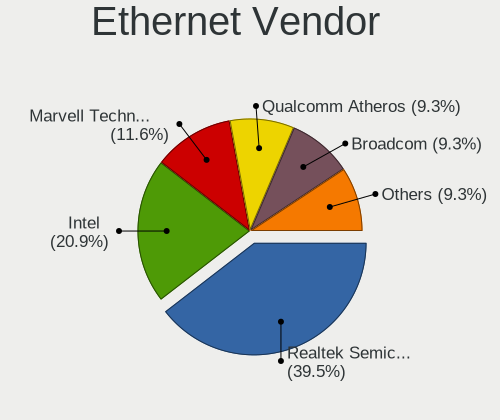

| Vendor                   | Notebooks | Percent |
|--------------------------|-----------|---------|
| Realtek Semiconductor    | 9         | 42.86%  |
| Intel                    | 5         | 23.81%  |
| Qualcomm Atheros         | 3         | 14.29%  |
| Marvell Technology Group | 2         | 9.52%   |
| Nvidia                   | 1         | 4.76%   |
| Broadcom                 | 1         | 4.76%   |

Ethernet Model
--------------

Ethernet models

| Model                                                             | Notebooks | Percent |
|-------------------------------------------------------------------|-----------|---------|
| Realtek RTL8111/8168/8411 PCI Express Gigabit Ethernet Controller | 5         | 23.81%  |
| Realtek RTL810xE PCI Express Fast Ethernet controller             | 4         | 19.05%  |
| Qualcomm Atheros AR8121/AR8113/AR8114 Gigabit or Fast Ethernet    | 2         | 9.52%   |
| Intel 82579LM Gigabit Network Connection (Lewisville)             | 2         | 9.52%   |
| Qualcomm Atheros AR8132 Fast Ethernet                             | 1         | 4.76%   |
| Nvidia MCP51 Ethernet Controller                                  | 1         | 4.76%   |
| Marvell Group 88E8053 PCI-E Gigabit Ethernet Controller           | 1         | 4.76%   |
| Marvell Group 88E8040 PCI-E Fast Ethernet Controller              | 1         | 4.76%   |
| Intel Ethernet Connection I218-LM                                 | 1         | 4.76%   |
| Intel 82573L Gigabit Ethernet Controller                          | 1         | 4.76%   |
| Intel 82566MM Gigabit Network Connection                          | 1         | 4.76%   |
| Broadcom NetLink BCM57780 Gigabit Ethernet PCIe                   | 1         | 4.76%   |

Net Controller Kind
-------------------

Ethernet, WiFi or modem

| Kind     | Notebooks | Percent |
|----------|-----------|---------|
| WiFi     | 21        | 50%     |
| Ethernet | 21        | 50%     |

Used Controller
---------------

Currently used network controller

| Kind     | Notebooks | Percent |
|----------|-----------|---------|
| WiFi     | 18        | 64.29%  |
| Ethernet | 10        | 35.71%  |

NICs
----

Total network controllers on board

| Total | Notebooks | Percent |
|-------|-----------|---------|
| 2     | 19        | 82.61%  |
| 1     | 4         | 17.39%  |

IPv6
----

IPv6 vs IPv4

| Used | Notebooks | Percent |
|------|-----------|---------|
| No   | 20        | 80%     |
| Yes  | 5         | 20%     |

Bluetooth
---------

Bluetooth Vendor
----------------

Controller vendors

| Vendor                          | Notebooks | Percent |
|---------------------------------|-----------|---------|
| Intel                           | 4         | 28.57%  |
| Broadcom                        | 3         | 21.43%  |
| Realtek Semiconductor           | 2         | 14.29%  |
| Qualcomm Atheros Communications | 1         | 7.14%   |
| Dell                            | 1         | 7.14%   |
| Cambridge Silicon Radio         | 1         | 7.14%   |
| ASUSTek Computer                | 1         | 7.14%   |
| Apple                           | 1         | 7.14%   |

Bluetooth Model
---------------

Controller models

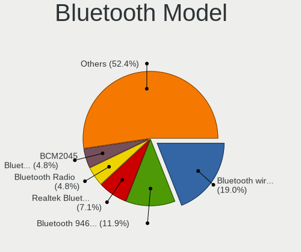

| Model                                               | Notebooks | Percent |
|-----------------------------------------------------|-----------|---------|
| Intel Bluetooth wireless interface                  | 2         | 14.29%  |
| Realtek RTL8723B Bluetooth                          | 1         | 7.14%   |
| Realtek  Bluetooth 4.2 Adapter                      | 1         | 7.14%   |
| Qualcomm Atheros  Bluetooth Device                  | 1         | 7.14%   |
| Intel Centrino Bluetooth Wireless Transceiver       | 1         | 7.14%   |
| Intel Bluetooth Device                              | 1         | 7.14%   |
| Dell Wireless 365 Bluetooth                         | 1         | 7.14%   |
| Cambridge Silicon Radio Bluetooth Dongle (HCI mode) | 1         | 7.14%   |
| Broadcom HP Portable SoftSailing                    | 1         | 7.14%   |
| Broadcom BCM2045B (BDC-2) [Bluetooth Controller]    | 1         | 7.14%   |
| Broadcom BCM2045 Bluetooth                          | 1         | 7.14%   |
| ASUS Broadcom Bluetooth 2.1                         | 1         | 7.14%   |
| Apple Bluetooth HCI                                 | 1         | 7.14%   |

Sound
-----

Sound Vendor
------------

Sound card vendors

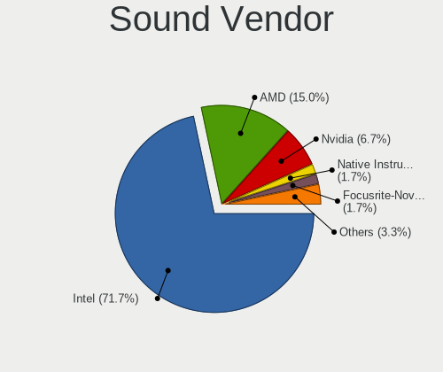

| Vendor             | Notebooks | Percent |
|--------------------|-----------|---------|
| Intel              | 19        | 73.08%  |
| Nvidia             | 3         | 11.54%  |
| AMD                | 2         | 7.69%   |
| Native Instruments | 1         | 3.85%   |
| Focusrite-Novation | 1         | 3.85%   |

Sound Model
-----------

Sound card models

| Model                                                                                             | Notebooks | Percent |
|---------------------------------------------------------------------------------------------------|-----------|---------|
| Intel NM10/ICH7 Family High Definition Audio Controller                                           | 5         | 17.24%  |
| Intel 82801I (ICH9 Family) HD Audio Controller                                                    | 2         | 6.9%    |
| Intel 7 Series/C216 Chipset Family High Definition Audio Controller                               | 2         | 6.9%    |
| Intel 6 Series/C200 Series Chipset Family High Definition Audio Controller                        | 2         | 6.9%    |
| Intel 5 Series/3400 Series Chipset High Definition Audio                                          | 2         | 6.9%    |
| Nvidia MCP51 High Definition Audio                                                                | 1         | 3.45%   |
| Nvidia GK104 HDMI Audio Controller                                                                | 1         | 3.45%   |
| Nvidia GF108 High Definition Audio Controller                                                     | 1         | 3.45%   |
| Native Instruments KOMPLETE KONTROL M32                                                           | 1         | 3.45%   |
| Intel Sunrise Point-LP HD Audio                                                                   | 1         | 3.45%   |
| Intel Haswell-ULT HD Audio Controller                                                             | 1         | 3.45%   |
| Intel Comet Lake PCH-LP cAVS                                                                      | 1         | 3.45%   |
| Intel Atom/Celeron/Pentium Processor x5-E8000/J3xxx/N3xxx Series High Definition Audio Controller | 1         | 3.45%   |
| Intel Atom Processor Z36xxx/Z37xxx Series High Definition Audio Controller                        | 1         | 3.45%   |
| Intel 82801H (ICH8 Family) HD Audio Controller                                                    | 1         | 3.45%   |
| Intel 8 Series HD Audio Controller                                                                | 1         | 3.45%   |
| Focusrite-Novation Focusrite Scarlett 2i2 2nd Gen                                                 | 1         | 3.45%   |
| AMD Wrestler HDMI Audio                                                                           | 1         | 3.45%   |
| AMD SBx00 Azalia (Intel HDA)                                                                      | 1         | 3.45%   |
| AMD Raven/Raven2/Fenghuang HDMI/DP Audio Controller                                               | 1         | 3.45%   |
| AMD Family 17h/19h HD Audio Controller                                                            | 1         | 3.45%   |

Memory
------

Memory Vendor
-------------

Memory module vendors

| Vendor              | Notebooks | Percent |
|---------------------|-----------|---------|
| Samsung Electronics | 5         | 26.32%  |
| Unknown             | 3         | 15.79%  |
| SK Hynix            | 3         | 15.79%  |
| Nanya Technology    | 2         | 10.53%  |
| Micron Technology   | 2         | 10.53%  |
| Kingston            | 1         | 5.26%   |
| GOODRAM             | 1         | 5.26%   |
| G.Skill             | 1         | 5.26%   |
| Corsair             | 1         | 5.26%   |

Memory Model
------------

Memory module models

| Model                                                    | Notebooks | Percent |
|----------------------------------------------------------|-----------|---------|
| Unknown RAM Module 2GB SODIMM SDRAM                      | 1         | 4.76%   |
| Unknown RAM Module 2048MB SODIMM 800MT/s                 | 1         | 4.76%   |
| Unknown RAM Module 1024MB SODIMM DDR2                    | 1         | 4.76%   |
| Unknown RAM Module 1024MB SODIMM 800MT/s                 | 1         | 4.76%   |
| SK Hynix RAM Module 4GB SODIMM DDR3 1066MT/s             | 1         | 4.76%   |
| SK Hynix RAM HMA82GS6JJR8N-VK 16GB SODIMM DDR4 2667MT/s  | 1         | 4.76%   |
| SK Hynix RAM HMA81GS6AFR8N-UH 8GB SODIMM DDR4 2667MT/s   | 1         | 4.76%   |
| Samsung RAM M471B5773DH0-CH9 2GB SODIMM DDR3 1600MT/s    | 1         | 4.76%   |
| Samsung RAM M471B5773CHS-CH9 2GB SODIMM DDR3 4199MT/s    | 1         | 4.76%   |
| Samsung RAM M471B5674QH0-YK0 2GB SODIMM DDR3 1600MT/s    | 1         | 4.76%   |
| Samsung RAM M471B5173EB0-YK0 4GB SODIMM DDR3 1600MT/s    | 1         | 4.76%   |
| Samsung RAM M471B2873FHS-CH9 1GB SODIMM DDR3 1334MT/s    | 1         | 4.76%   |
| Samsung RAM K4E8E324EB-EGCF 2GB LPDDR3 1867MT/s          | 1         | 4.76%   |
| Nanya RAM NT4GC64B8HG0NS-DI 4096MB SODIMM DDR3 1600MT/s  | 1         | 4.76%   |
| Nanya RAM NT2GC64B88B0NS-CG 2GB SODIMM DDR3 1334MT/s     | 1         | 4.76%   |
| Micron RAM 16KTF1G64HZ-1G6E1 8GB SODIMM DDR3 1600MT/s    | 1         | 4.76%   |
| Micron RAM 16JSF51264HZ-1G4D1 4GB SODIMM DDR3 1334MT/s   | 1         | 4.76%   |
| Kingston RAM ACR128X64D3S1333C9 1GB SODIMM DDR3 1333MT/s | 1         | 4.76%   |
| GOODRAM RAM GR1600S3V64L11/8G 8GB SODIMM DDR3 1600MT/s   | 1         | 4.76%   |
| G.Skill RAM F4-2400C16-16GRS 16GB SODIMM DDR4 2667MT/s   | 1         | 4.76%   |
| Corsair RAM CMSA4GX3M1A1333C9 4GB SODIMM DDR3 1333MT/s   | 1         | 4.76%   |

Memory Kind
-----------

Memory module kinds

| Kind    | Notebooks | Percent |
|---------|-----------|---------|
| DDR3    | 10        | 58.82%  |
| SDRAM   | 2         | 11.76%  |
| DDR4    | 2         | 11.76%  |
| LPDDR3  | 1         | 5.88%   |
| DDR2    | 1         | 5.88%   |
| Unknown | 1         | 5.88%   |

Memory Form Factor
------------------

Physical design of the memory module

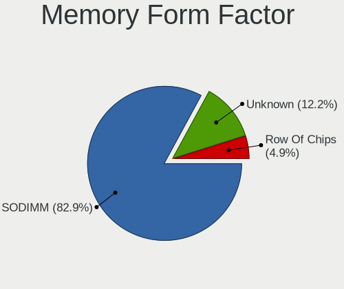

| Name    | Notebooks | Percent |
|---------|-----------|---------|
| SODIMM  | 15        | 93.75%  |
| Unknown | 1         | 6.25%   |

Memory Size
-----------

Memory module size

| Size  | Notebooks | Percent |
|-------|-----------|---------|
| 4096  | 6         | 30%     |
| 2048  | 6         | 30%     |
| 8192  | 3         | 15%     |
| 1024  | 3         | 15%     |
| 16384 | 2         | 10%     |

Memory Speed
------------

Memory module speed

| Speed   | Notebooks | Percent |
|---------|-----------|---------|
| 1600    | 6         | 33.33%  |
| 2667    | 2         | 11.11%  |
| 1334    | 2         | 11.11%  |
| 1333    | 2         | 11.11%  |
| Unknown | 2         | 11.11%  |
| 4199    | 1         | 5.56%   |
| 1867    | 1         | 5.56%   |
| 1066    | 1         | 5.56%   |
| 800     | 1         | 5.56%   |

Printers & scanners
-------------------

Printer Vendor
--------------

Printer device vendors

Zero info for selected period =(

Printer Model
-------------

Printer device models

Zero info for selected period =(

Scanner Vendor
--------------

Scanner device vendors

Zero info for selected period =(

Scanner Model
-------------

Scanner device models

Zero info for selected period =(

Camera
------

Camera Vendor
-------------

Camera device vendors

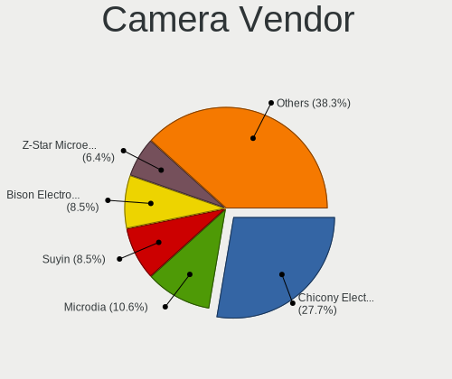

| Vendor                        | Notebooks | Percent |
|-------------------------------|-----------|---------|
| Chicony Electronics           | 7         | 38.89%  |
| Microdia                      | 4         | 22.22%  |
| Sunplus Innovation Technology | 2         | 11.11%  |
| Acer                          | 2         | 11.11%  |
| Z-Star Microelectronics       | 1         | 5.56%   |
| Suyin                         | 1         | 5.56%   |
| Microsoft                     | 1         | 5.56%   |

Camera Model
------------

Camera device models

| Model                                                       | Notebooks | Percent |
|-------------------------------------------------------------|-----------|---------|
| Z-Star Namuga 1.3M Webcam                                   | 1         | 5.56%   |
| Suyin 1.3M WebCam (notebook emachines E730, Acer sub-brand) | 1         | 5.56%   |
| Sunplus Integrated Webcam                                   | 1         | 5.56%   |
| Sunplus HP HD Webcam [Fixed]                                | 1         | 5.56%   |
| Microsoft LifeCam Cinema                                    | 1         | 5.56%   |
| Microdia Sonix USB 2.0 Camera                               | 1         | 5.56%   |
| Microdia Lenovo EasyCamera                                  | 1         | 5.56%   |
| Microdia Laptop_Integrated_Webcam_HD                        | 1         | 5.56%   |
| Microdia Laptop_Integrated_Webcam_1.3M                      | 1         | 5.56%   |
| Chicony Integrated Camera (1280x720@30)                     | 1         | 5.56%   |
| Chicony HP TrueVision HD Camera                             | 1         | 5.56%   |
| Chicony HP Integrated Webcam                                | 1         | 5.56%   |
| Chicony HP HD Webcam                                        | 1         | 5.56%   |
| Chicony HD WebCam                                           | 1         | 5.56%   |
| Chicony Asus Integrated 0.3M UVC Webcam                     | 1         | 5.56%   |
| Chicony 2.0M UVC Webcam / CNF7129                           | 1         | 5.56%   |
| Acer Lenovo EasyCamera                                      | 1         | 5.56%   |
| Acer HP Webcam                                              | 1         | 5.56%   |

Security
--------

Fingerprint Vendor
------------------

Fingerprint sensor vendors

| Vendor             | Notebooks | Percent |
|--------------------|-----------|---------|
| Validity Sensors   | 2         | 66.67%  |
| STMicroelectronics | 1         | 33.33%  |

Fingerprint Model
-----------------

Fingerprint sensor models

| Model                                      | Notebooks | Percent |
|--------------------------------------------|-----------|---------|
| Validity Sensors VFS491                    | 1         | 33.33%  |
| Validity Sensors VFS101 Fingerprint Reader | 1         | 33.33%  |
| STMicroelectronics Fingerprint Reader      | 1         | 33.33%  |

Chipcard Vendor
---------------

Chipcard module vendors

| Vendor   | Notebooks | Percent |
|----------|-----------|---------|
| Broadcom | 1         | 100%    |

Chipcard Model
--------------

Chipcard module models

| Model                                                                        | Notebooks | Percent |
|------------------------------------------------------------------------------|-----------|---------|
| Broadcom BCM5880 Secure Applications Processor with fingerprint swipe sensor | 1         | 100%    |

Unsupported
-----------

Unsupported Devices
-------------------

Total unsupported devices on board

| Total | Notebooks | Percent |
|-------|-----------|---------|
| 0     | 16        | 69.57%  |
| 1     | 5         | 21.74%  |
| 2     | 2         | 8.7%    |

Unsupported Device Types
------------------------

Types of unsupported devices

| Type                  | Notebooks | Percent |
|-----------------------|-----------|---------|
| Fingerprint reader    | 3         | 33.33%  |
| Net/wireless          | 2         | 22.22%  |
| Multimedia controller | 2         | 22.22%  |
| Graphics card         | 1         | 11.11%  |
| Chipcard              | 1         | 11.11%  |

