Sparky - Tested Hardware & Statistics (Notebooks)
-------------------------------------------------

A project to collect tested hardware configurations for Sparky.

Anyone can contribute to this report by the [hw-probe](https://github.com/linuxhw/hw-probe) tool:

    sudo -E hw-probe -all -upload

Please contribute! Especially if your hardware is rare.

Contents
--------

* [ Test Cases ](#test-cases)

* [ System ](#system)
  - [ OS                       ](#os)
  - [ OS Family                ](#os-family)
  - [ Kernel                   ](#kernel)
  - [ Kernel Family            ](#kernel-family)
  - [ Kernel Major Ver.        ](#kernel-major-ver)
  - [ Arch                     ](#arch)
  - [ DE                       ](#de)
  - [ Display Server           ](#display-server)
  - [ Display Manager          ](#display-manager)
  - [ OS Lang                  ](#os-lang)
  - [ Boot Mode                ](#boot-mode)
  - [ Filesystem               ](#filesystem)
  - [ Part. scheme             ](#part-scheme)
  - [ Dual Boot with Linux/BSD ](#dual-boot-with-linuxbsd)
  - [ Dual Boot (Win)          ](#dual-boot-win)

* [ Board ](#board)
  - [ Vendor                   ](#vendor)
  - [ Model                    ](#model)
  - [ Model Family             ](#model-family)
  - [ MFG Year                 ](#mfg-year)
  - [ Form Factor              ](#form-factor)
  - [ Secure Boot              ](#secure-boot)
  - [ Coreboot                 ](#coreboot)
  - [ RAM Size                 ](#ram-size)
  - [ RAM Used                 ](#ram-used)
  - [ Total Drives             ](#total-drives)
  - [ Has CD-ROM               ](#has-cd-rom)
  - [ Has Ethernet             ](#has-ethernet)
  - [ Has WiFi                 ](#has-wifi)
  - [ Has Bluetooth            ](#has-bluetooth)

* [ Location ](#location)
  - [ Country                  ](#country)
  - [ City                     ](#city)

* [ Drives ](#drives)
  - [ Drive Vendor             ](#drive-vendor)
  - [ Drive Model              ](#drive-model)
  - [ HDD Vendor               ](#hdd-vendor)
  - [ SSD Vendor               ](#ssd-vendor)
  - [ Drive Kind               ](#drive-kind)
  - [ Drive Connector          ](#drive-connector)
  - [ Drive Size               ](#drive-size)
  - [ Space Total              ](#space-total)
  - [ Space Used               ](#space-used)
  - [ Malfunc. Drives          ](#malfunc-drives)
  - [ Malfunc. Drive Vendor    ](#malfunc-drive-vendor)
  - [ Malfunc. HDD Vendor      ](#malfunc-hdd-vendor)
  - [ Malfunc. Drive Kind      ](#malfunc-drive-kind)
  - [ Failed Drives            ](#failed-drives)
  - [ Failed Drive Vendor      ](#failed-drive-vendor)
  - [ Drive Status             ](#drive-status)

* [ Storage controller ](#storage-controller)
  - [ Storage Vendor           ](#storage-vendor)
  - [ Storage Model            ](#storage-model)
  - [ Storage Kind             ](#storage-kind)

* [ Processor ](#processor)
  - [ CPU Vendor               ](#cpu-vendor)
  - [ CPU Model                ](#cpu-model)
  - [ CPU Model Family         ](#cpu-model-family)
  - [ CPU Cores                ](#cpu-cores)
  - [ CPU Sockets              ](#cpu-sockets)
  - [ CPU Threads              ](#cpu-threads)
  - [ CPU Op-Modes             ](#cpu-op-modes)
  - [ CPU Microcode            ](#cpu-microcode)
  - [ CPU Microarch            ](#cpu-microarch)

* [ Graphics ](#graphics)
  - [ GPU Vendor               ](#gpu-vendor)
  - [ GPU Model                ](#gpu-model)
  - [ GPU Combo                ](#gpu-combo)
  - [ GPU Driver               ](#gpu-driver)
  - [ GPU Memory               ](#gpu-memory)

* [ Monitor ](#monitor)
  - [ Monitor Vendor           ](#monitor-vendor)
  - [ Monitor Model            ](#monitor-model)
  - [ Monitor Resolution       ](#monitor-resolution)
  - [ Monitor Diagonal         ](#monitor-diagonal)
  - [ Monitor Width            ](#monitor-width)
  - [ Aspect Ratio             ](#aspect-ratio)
  - [ Monitor Area             ](#monitor-area)
  - [ Pixel Density            ](#pixel-density)
  - [ Multiple Monitors        ](#multiple-monitors)

* [ Network ](#network)
  - [ Net Controller Vendor    ](#net-controller-vendor)
  - [ Net Controller Model     ](#net-controller-model)
  - [ Wireless Vendor          ](#wireless-vendor)
  - [ Wireless Model           ](#wireless-model)
  - [ Ethernet Vendor          ](#ethernet-vendor)
  - [ Ethernet Model           ](#ethernet-model)
  - [ Net Controller Kind      ](#net-controller-kind)
  - [ Used Controller          ](#used-controller)
  - [ NICs                     ](#nics)
  - [ IPv6                     ](#ipv6)

* [ Bluetooth ](#bluetooth)
  - [ Bluetooth Vendor         ](#bluetooth-vendor)
  - [ Bluetooth Model          ](#bluetooth-model)

* [ Sound ](#sound)
  - [ Sound Vendor             ](#sound-vendor)
  - [ Sound Model              ](#sound-model)

* [ Memory ](#memory)
  - [ Memory Vendor            ](#memory-vendor)
  - [ Memory Model             ](#memory-model)
  - [ Memory Kind              ](#memory-kind)
  - [ Memory Form Factor       ](#memory-form-factor)
  - [ Memory Size              ](#memory-size)
  - [ Memory Speed             ](#memory-speed)

* [ Printers & scanners ](#printers--scanners)
  - [ Printer Vendor           ](#printer-vendor)
  - [ Printer Model            ](#printer-model)
  - [ Scanner Vendor           ](#scanner-vendor)
  - [ Scanner Model            ](#scanner-model)

* [ Camera ](#camera)
  - [ Camera Vendor            ](#camera-vendor)
  - [ Camera Model             ](#camera-model)

* [ Security ](#security)
  - [ Fingerprint Vendor       ](#fingerprint-vendor)
  - [ Fingerprint Model        ](#fingerprint-model)
  - [ Chipcard Vendor          ](#chipcard-vendor)
  - [ Chipcard Model           ](#chipcard-model)

* [ Unsupported ](#unsupported)
  - [ Unsupported Devices      ](#unsupported-devices)
  - [ Unsupported Device Types ](#unsupported-device-types)

Test Cases
----------

Total: 68

| Vendor        | Model                       | Probe                                                      | Date         |
|---------------|-----------------------------|------------------------------------------------------------|--------------|
| Lenovo        | IdeaPad 3 15IML05 81WB      | [c03d3e0508](https://linux-hardware.org/?probe=c03d3e0508) | May 03, 2024 |
| Lenovo        | ThinkPad T430 2349FC4       | [1b0129f0b0](https://linux-hardware.org/?probe=1b0129f0b0) | Apr 06, 2024 |
| Sony          | SVE1513Q1ESI                | [9362c14552](https://linux-hardware.org/?probe=9362c14552) | Mar 25, 2024 |
| Samsung       | N150P/N210P/N220P           | [b861f48e1b](https://linux-hardware.org/?probe=b861f48e1b) | Feb 18, 2024 |
| Samsung       | N150/N210/N220              | [cf3126113e](https://linux-hardware.org/?probe=cf3126113e) | Feb 15, 2024 |
| Google        | Kefka                       | [810d5a47f7](https://linux-hardware.org/?probe=810d5a47f7) | Jan 27, 2024 |
| Lenovo        | ThinkPad T430 2349FC4       | [655eb2734a](https://linux-hardware.org/?probe=655eb2734a) | Jan 11, 2024 |
| Lenovo        | ThinkPad T430 2349FC4       | [ea07a49b87](https://linux-hardware.org/?probe=ea07a49b87) | Jan 07, 2024 |
| Lenovo        | ThinkPad T430 2349FC4       | [689d3295aa](https://linux-hardware.org/?probe=689d3295aa) | Dec 30, 2023 |
| Acer          | Aspire SW5-012              | [4efea61fa3](https://linux-hardware.org/?probe=4efea61fa3) | Dec 29, 2023 |
| HP            | Laptop 15-ef2xxx            | [80d1578d90](https://linux-hardware.org/?probe=80d1578d90) | Oct 30, 2023 |
| Medion        | E15415                      | [b9a4ecdc97](https://linux-hardware.org/?probe=b9a4ecdc97) | Oct 14, 2023 |
| HP            | 250 G7 Notebook PC          | [2fc3f16671](https://linux-hardware.org/?probe=2fc3f16671) | Sep 30, 2023 |
| HP            | Pavilion g6                 | [158b6f4df9](https://linux-hardware.org/?probe=158b6f4df9) | Sep 17, 2023 |
| HP            | Laptop 15-ef2xxx            | [b0dbfa8a76](https://linux-hardware.org/?probe=b0dbfa8a76) | Aug 26, 2023 |
| HP            | Laptop 15-ef2xxx            | [da3f894af1](https://linux-hardware.org/?probe=da3f894af1) | Aug 26, 2023 |
| Apple         | MacBookPro9,2               | [4006007a76](https://linux-hardware.org/?probe=4006007a76) | Aug 20, 2023 |
| Acer          | Aspire 5920                 | [31447ef238](https://linux-hardware.org/?probe=31447ef238) | Aug 17, 2023 |
| Acer          | Aspire 5920                 | [8c57c50f82](https://linux-hardware.org/?probe=8c57c50f82) | Aug 17, 2023 |
| Acer          | Aspire A315-58              | [d7383d2980](https://linux-hardware.org/?probe=d7383d2980) | Jul 20, 2023 |
| HP            | EliteBook 8440p             | [f7a66609af](https://linux-hardware.org/?probe=f7a66609af) | Jul 13, 2023 |
| Panasonic     | CFSZ5-2                     | [d5b1455382](https://linux-hardware.org/?probe=d5b1455382) | May 25, 2023 |
| ASUSTek       | VivoBook_ASUSLaptop E410... | [37dab045c7](https://linux-hardware.org/?probe=37dab045c7) | May 21, 2023 |
| Mediacom      | SmartBook 14 FullHD - SB... | [24aaf9e627](https://linux-hardware.org/?probe=24aaf9e627) | May 13, 2023 |
| Apple         | MacBook1,1                  | [002929e495](https://linux-hardware.org/?probe=002929e495) | Mar 26, 2023 |
| MSI           | Alpha 15 A3DDK              | [c4ef9294ef](https://linux-hardware.org/?probe=c4ef9294ef) | Feb 23, 2023 |
| MSI           | Alpha 15 A3DDK              | [219483f968](https://linux-hardware.org/?probe=219483f968) | Feb 23, 2023 |
| Positivo      | CHT14B                      | [49eff89b98](https://linux-hardware.org/?probe=49eff89b98) | Feb 16, 2023 |
| Fujitsu Si... | STYLISTIC ST5112            | [c343cec0c8](https://linux-hardware.org/?probe=c343cec0c8) | Jan 30, 2023 |
| Acer          | Aspire E1-522               | [8bf37cf82d](https://linux-hardware.org/?probe=8bf37cf82d) | Dec 26, 2022 |
| HP            | Victus by Laptop 16-e0xx... | [54273f1267](https://linux-hardware.org/?probe=54273f1267) | Dec 22, 2022 |
| Apple         | MacBook1,1                  | [6945006338](https://linux-hardware.org/?probe=6945006338) | Nov 15, 2022 |
| Google        | Swanky                      | [1a0a358398](https://linux-hardware.org/?probe=1a0a358398) | Nov 15, 2022 |
| ASUSTek       | M70Vn                       | [236d8cb74e](https://linux-hardware.org/?probe=236d8cb74e) | Aug 29, 2022 |
| HUAWEI        | HVY-WXX9                    | [b4006730ce](https://linux-hardware.org/?probe=b4006730ce) | Jul 17, 2022 |
| HP            | Stream Notebook PC 13       | [47b55dbb68](https://linux-hardware.org/?probe=47b55dbb68) | Jun 06, 2022 |
| HP            | EliteBook 745 G3            | [fac15b2640](https://linux-hardware.org/?probe=fac15b2640) | May 18, 2022 |
| HP            | EliteBook 8770w             | [4fa8e91f6d](https://linux-hardware.org/?probe=4fa8e91f6d) | Apr 26, 2022 |
| Lenovo        | G50-30 80G0                 | [c7ea70f7ba](https://linux-hardware.org/?probe=c7ea70f7ba) | Apr 25, 2022 |
| HP            | Pavilion dv5                | [22ae3dae3d](https://linux-hardware.org/?probe=22ae3dae3d) | Mar 22, 2022 |
| ASUSTek       | 1000HE                      | [5dd6246e59](https://linux-hardware.org/?probe=5dd6246e59) | Feb 08, 2022 |
| ASUSTek       | S101                        | [a850549e73](https://linux-hardware.org/?probe=a850549e73) | Feb 04, 2022 |
| HP            | EliteBook 8770w             | [9a2052fc8c](https://linux-hardware.org/?probe=9a2052fc8c) | Nov 25, 2021 |
| HP            | Pavilion g7                 | [6cebc99fe6](https://linux-hardware.org/?probe=6cebc99fe6) | Nov 22, 2021 |
| Dell          | Inspiron N5010              | [df5e66431b](https://linux-hardware.org/?probe=df5e66431b) | Nov 20, 2021 |
| HP            | EliteBook Folio 9480m       | [dae2e04d45](https://linux-hardware.org/?probe=dae2e04d45) | Oct 04, 2021 |
| Google        | Banon                       | [764debedcd](https://linux-hardware.org/?probe=764debedcd) | Sep 25, 2021 |
| Lenovo        | ThinkPad E15 20RES0GF00     | [8722c3498e](https://linux-hardware.org/?probe=8722c3498e) | May 14, 2021 |
| Apple         | MacBook1,1                  | [cc415ab6c7](https://linux-hardware.org/?probe=cc415ab6c7) | Mar 15, 2021 |
| Samsung       | NC10                        | [b5909af616](https://linux-hardware.org/?probe=b5909af616) | Mar 11, 2021 |
| Samsung       | NC10                        | [3b8de5559e](https://linux-hardware.org/?probe=3b8de5559e) | Feb 27, 2021 |
| Lenovo        | ThinkPad T61 7659AB7        | [43f03346c5](https://linux-hardware.org/?probe=43f03346c5) | Feb 19, 2021 |
| Beelink       | BT3 PRO                     | [8dbfa4dacd](https://linux-hardware.org/?probe=8dbfa4dacd) | Jan 06, 2021 |
| Beelink       | BT3 PRO                     | [d85a392e02](https://linux-hardware.org/?probe=d85a392e02) | Jan 06, 2021 |
| Samsung       | NC10                        | [8c878860a7](https://linux-hardware.org/?probe=8c878860a7) | Jan 03, 2021 |
| Dell          | Inspiron 5720               | [d360a61780](https://linux-hardware.org/?probe=d360a61780) | Dec 08, 2020 |
| eMachines     | E525                        | [0c11b6b4dc](https://linux-hardware.org/?probe=0c11b6b4dc) | Nov 25, 2020 |
| Lenovo        | IdeaPad S206 20154          | [393f27acf7](https://linux-hardware.org/?probe=393f27acf7) | Nov 18, 2020 |
| Dell          | Inspiron 5720               | [787263a0c6](https://linux-hardware.org/?probe=787263a0c6) | Oct 10, 2020 |
| HP            | Laptop 17z-ca100            | [2217d0703c](https://linux-hardware.org/?probe=2217d0703c) | Oct 05, 2020 |
| HP            | Laptop 17z-ca100            | [1927ffc179](https://linux-hardware.org/?probe=1927ffc179) | Oct 05, 2020 |
| Apple         | MacBook1,1                  | [73b04f9de4](https://linux-hardware.org/?probe=73b04f9de4) | Aug 26, 2020 |
| Acer          | Aspire 5742G                | [a90fb35c67](https://linux-hardware.org/?probe=a90fb35c67) | May 01, 2020 |
| Lenovo        | ThinkPad T60 2007FUG        | [d552e50d7e](https://linux-hardware.org/?probe=d552e50d7e) | Mar 12, 2020 |
| Dell          | Latitude XT3                | [0944e88882](https://linux-hardware.org/?probe=0944e88882) | Mar 09, 2020 |
| Dell          | Inspiron 5770               | [a3dd71465d](https://linux-hardware.org/?probe=a3dd71465d) | Jan 06, 2020 |
| HP            | Pavilion dv9000 (GA359UA... | [db4a924be0](https://linux-hardware.org/?probe=db4a924be0) | Sep 07, 2019 |
| HP            | Pavilion dv9000 (GA359UA... | [6f024c0dd0](https://linux-hardware.org/?probe=6f024c0dd0) | Sep 03, 2019 |

System
------

OS
--

Installed operating systems

| Name        | Notebooks | Percent |
|-------------|-----------|---------|
| Sparky 6    | 8         | 14.55%  |
| Sparky 7    | 7         | 12.73%  |
| Sparky 8    | 6         | 10.91%  |
| Sparky 6.5  | 4         | 7.27%   |
| Sparky 6.1  | 4         | 7.27%   |
| Sparky 7.2  | 3         | 5.45%   |
| Sparky 6.7  | 3         | 5.45%   |
| Sparky 5.14 | 3         | 5.45%   |
| Sparky 7.3  | 2         | 3.64%   |
| Sparky 7.1  | 2         | 3.64%   |
| Sparky 6.6  | 2         | 3.64%   |
| Sparky 6.3  | 2         | 3.64%   |
| Sparky 6.0  | 2         | 3.64%   |
| Sparky 5.13 | 2         | 3.64%   |
| Sparky 5.12 | 2         | 3.64%   |
| Sparky 5.10 | 2         | 3.64%   |
| Sparky 7.0  | 1         | 1.82%   |

OS Family
---------

OS without a version

| Name   | Notebooks | Percent |
|--------|-----------|---------|
| Sparky | 50        | 100%    |

Kernel
------

Version of the Linux kernel

| Version                | Notebooks | Percent |
|------------------------|-----------|---------|
| 6.1.0-18-amd64         | 3         | 5.08%   |
| 5.10.0-11-686          | 3         | 5.08%   |
| 6.1.0-17-amd64         | 2         | 3.39%   |
| 6.1.0-12-amd64         | 2         | 3.39%   |
| 5.17.0-1-amd64         | 2         | 3.39%   |
| 5.10.0-9-amd64         | 2         | 3.39%   |
| 5.10.0-8-amd64         | 2         | 3.39%   |
| 5.10.0-21-amd64        | 2         | 3.39%   |
| 4.19.0-8-amd64         | 2         | 3.39%   |
| 4.19.0-13-686          | 2         | 3.39%   |
| 4.19.0-12-amd64        | 2         | 3.39%   |
| 6.7.12-amd64           | 1         | 1.69%   |
| 6.5.9-x64v3-xanmod1    | 1         | 1.69%   |
| 6.5.0-5-amd64          | 1         | 1.69%   |
| 6.4.4-sparky8-amd64    | 1         | 1.69%   |
| 6.4.12-x64v3-xanmod1   | 1         | 1.69%   |
| 6.4.0-2-amd64          | 1         | 1.69%   |
| 6.3.3-1-liquorix-amd64 | 1         | 1.69%   |
| 6.3.0-1-amd64          | 1         | 1.69%   |
| 6.2.0-sparky-amd64     | 1         | 1.69%   |
| 6.1.0-16-amd64         | 1         | 1.69%   |
| 6.1.0-10-amd64         | 1         | 1.69%   |
| 5.9.0-4-amd64          | 1         | 1.69%   |
| 5.8.13-sparky-amd64    | 1         | 1.69%   |
| 5.8.0-2-amd64          | 1         | 1.69%   |
| 5.5.0-2-amd64          | 1         | 1.69%   |
| 5.4.7-sparky-amd64     | 1         | 1.69%   |
| 5.2.0-2-amd64          | 1         | 1.69%   |
| 5.18.0-4-amd64         | 1         | 1.69%   |
| 5.18.0-2-amd64         | 1         | 1.69%   |
| 5.16.0-5-amd64         | 1         | 1.69%   |
| 5.15.0-3-amd64         | 1         | 1.69%   |
| 5.14.0-4-amd64         | 1         | 1.69%   |
| 5.10.4-sparky-amd64    | 1         | 1.69%   |
| 5.10.0-6-amd64         | 1         | 1.69%   |
| 5.10.0-3-amd64         | 1         | 1.69%   |
| 5.10.0-28-686          | 1         | 1.69%   |
| 5.10.0-23-amd64        | 1         | 1.69%   |
| 5.10.0-22-amd64        | 1         | 1.69%   |
| 5.10.0-21-686          | 1         | 1.69%   |

Kernel Family
-------------

Linux kernel without a distro release

| Version | Notebooks | Percent |
|---------|-----------|---------|
| 5.10.0  | 18        | 33.33%  |
| 6.1.0   | 7         | 12.96%  |
| 4.19.0  | 6         | 11.11%  |
| 5.18.0  | 2         | 3.7%    |
| 5.17.0  | 2         | 3.7%    |
| 6.7.12  | 1         | 1.85%   |
| 6.5.9   | 1         | 1.85%   |
| 6.5.0   | 1         | 1.85%   |
| 6.4.4   | 1         | 1.85%   |
| 6.4.12  | 1         | 1.85%   |
| 6.4.0   | 1         | 1.85%   |
| 6.3.3   | 1         | 1.85%   |
| 6.3.0   | 1         | 1.85%   |
| 6.2.0   | 1         | 1.85%   |
| 5.9.0   | 1         | 1.85%   |
| 5.8.13  | 1         | 1.85%   |
| 5.8.0   | 1         | 1.85%   |
| 5.5.0   | 1         | 1.85%   |
| 5.4.7   | 1         | 1.85%   |
| 5.2.0   | 1         | 1.85%   |
| 5.16.0  | 1         | 1.85%   |
| 5.15.0  | 1         | 1.85%   |
| 5.14.0  | 1         | 1.85%   |
| 5.10.4  | 1         | 1.85%   |

Kernel Major Ver.
-----------------

Linux kernel major version

| Version | Notebooks | Percent |
|---------|-----------|---------|
| 5.10    | 19        | 35.19%  |
| 6.1     | 7         | 12.96%  |
| 4.19    | 6         | 11.11%  |
| 6.4     | 3         | 5.56%   |
| 6.5     | 2         | 3.7%    |
| 6.3     | 2         | 3.7%    |
| 5.8     | 2         | 3.7%    |
| 5.18    | 2         | 3.7%    |
| 5.17    | 2         | 3.7%    |
| 6.7     | 1         | 1.85%   |
| 6.2     | 1         | 1.85%   |
| 5.9     | 1         | 1.85%   |
| 5.5     | 1         | 1.85%   |
| 5.4     | 1         | 1.85%   |
| 5.2     | 1         | 1.85%   |
| 5.16    | 1         | 1.85%   |
| 5.15    | 1         | 1.85%   |
| 5.14    | 1         | 1.85%   |

Arch
----

OS architecture (x86_64, i586, etc.)

| Name   | Notebooks | Percent |
|--------|-----------|---------|
| x86_64 | 45        | 90%     |
| i686   | 5         | 10%     |

DE
--

Desktop Environment

| Name             | Notebooks | Percent |
|------------------|-----------|---------|
| XFCE             | 13        | 25.49%  |
| LXQt             | 12        | 23.53%  |
| KDE5             | 8         | 15.69%  |
| Unknown          | 7         | 13.73%  |
| openbox          | 3         | 5.88%   |
| MATE             | 3         | 5.88%   |
| lightdm-xsession | 1         | 1.96%   |
| GNOME Classic    | 1         | 1.96%   |
| GNOME            | 1         | 1.96%   |
| Cinnamon         | 1         | 1.96%   |
| Budgie           | 1         | 1.96%   |

Display Server
--------------

X11 or Wayland

| Name | Notebooks | Percent |
|------|-----------|---------|
| X11  | 46        | 90.2%   |
| Tty  | 5         | 9.8%    |

Display Manager
---------------

SDDM, LightDM, etc.

| Name    | Notebooks | Percent |
|---------|-----------|---------|
| LightDM | 17        | 33.33%  |
| Unknown | 14        | 27.45%  |
| SDDM    | 12        | 23.53%  |
| TDM     | 6         | 11.76%  |
| XDM     | 1         | 1.96%   |
| GDM     | 1         | 1.96%   |

OS Lang
-------

Language

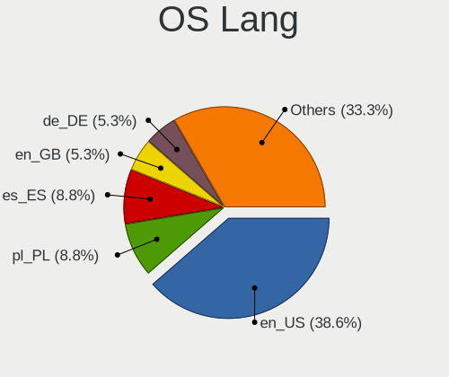

| Lang    | Notebooks | Percent |
|---------|-----------|---------|
| en_US   | 16        | 32%     |
| es_ES   | 5         | 10%     |
| pl_PL   | 4         | 8%      |
| en_GB   | 3         | 6%      |
| de_DE   | 3         | 6%      |
| ru_RU   | 2         | 4%      |
| pt_BR   | 2         | 4%      |
| it_IT   | 2         | 4%      |
| fr_FR   | 2         | 4%      |
| Unknown | 2         | 4%      |
| ja_JP   | 1         | 2%      |
| gl_ES   | 1         | 2%      |
| es_MX   | 1         | 2%      |
| es_CO   | 1         | 2%      |
| es_CL   | 1         | 2%      |
| en_PH   | 1         | 2%      |
| en_IN   | 1         | 2%      |
| en_CA   | 1         | 2%      |
| ar_EG   | 1         | 2%      |

Boot Mode
---------

EFI or BIOS

| Mode | Notebooks | Percent |
|------|-----------|---------|
| BIOS | 29        | 56.86%  |
| EFI  | 22        | 43.14%  |

Filesystem
----------

Type of filesystem

| Type    | Notebooks | Percent |
|---------|-----------|---------|
| Ext4    | 44        | 88%     |
| Overlay | 3         | 6%      |
| Btrfs   | 2         | 4%      |
| Ext2    | 1         | 2%      |

Part. scheme
------------

Scheme of partitioning

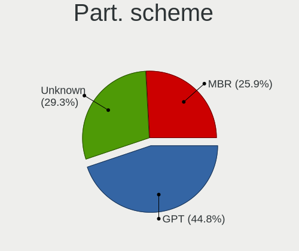

| Type    | Notebooks | Percent |
|---------|-----------|---------|
| GPT     | 22        | 43.14%  |
| MBR     | 15        | 29.41%  |
| Unknown | 14        | 27.45%  |

Dual Boot with Linux/BSD
------------------------

Hosting more than one Linux/BSD

| Dual boot | Notebooks | Percent |
|-----------|-----------|---------|
| No        | 43        | 86%     |
| Yes       | 7         | 14%     |

Dual Boot (Win)
---------------

Hosting Linux and Windows

| Dual boot | Notebooks | Percent |
|-----------|-----------|---------|
| No        | 35        | 70%     |
| Yes       | 15        | 30%     |

Board
-----

Vendor
------

Motherboard manufacturer

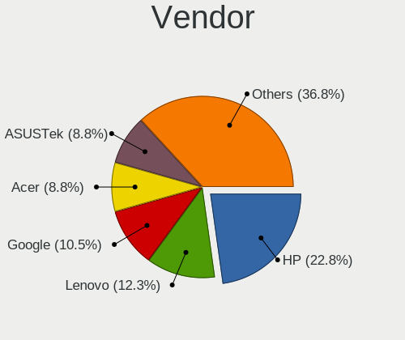

| Name                | Notebooks | Percent |
|---------------------|-----------|---------|
| Hewlett-Packard     | 12        | 24%     |
| Lenovo              | 7         | 14%     |
| Acer                | 5         | 10%     |
| Dell                | 4         | 8%      |
| ASUSTek Computer    | 4         | 8%      |
| Samsung Electronics | 3         | 6%      |
| Google              | 3         | 6%      |
| Apple               | 2         | 4%      |
| Sony                | 1         | 2%      |
| Positivo            | 1         | 2%      |
| Panasonic           | 1         | 2%      |
| MSI                 | 1         | 2%      |
| Medion              | 1         | 2%      |
| Mediacom            | 1         | 2%      |
| HUAWEI              | 1         | 2%      |
| Fujitsu Siemens     | 1         | 2%      |
| eMachines           | 1         | 2%      |
| Beelink             | 1         | 2%      |

Model
-----

Motherboard model

| Name                                    | Notebooks | Percent |
|-----------------------------------------|-----------|---------|
| Sony SVE1513Q1ESI                       | 1         | 2%      |
| Samsung NC10                            | 1         | 2%      |
| Samsung N150P/N210P/N220P               | 1         | 2%      |
| Samsung N150/N210/N220                  | 1         | 2%      |
| Positivo CHT14B                         | 1         | 2%      |
| Panasonic CFSZ5-2                       | 1         | 2%      |
| MSI Alpha 15 A3DDK                      | 1         | 2%      |
| Medion E15415                           | 1         | 2%      |
| Mediacom SmartBook 14 FullHD - SB14UC   | 1         | 2%      |
| Lenovo ThinkPad T61 7659AB7             | 1         | 2%      |
| Lenovo ThinkPad T60 2007FUG             | 1         | 2%      |
| Lenovo ThinkPad T430 2349FC4            | 1         | 2%      |
| Lenovo ThinkPad E15 20RES0GF00          | 1         | 2%      |
| Lenovo IdeaPad S206 20154               | 1         | 2%      |
| Lenovo IdeaPad 3 15IML05 81WB           | 1         | 2%      |
| Lenovo G50-30 80G0                      | 1         | 2%      |
| HUAWEI HVY-WXX9                         | 1         | 2%      |
| HP Stream Notebook PC 13                | 1         | 2%      |
| HP Pavilion g7                          | 1         | 2%      |
| HP Pavilion g6                          | 1         | 2%      |
| HP Pavilion dv9000 (GA359UA#ABA)        | 1         | 2%      |
| HP Pavilion dv5                         | 1         | 2%      |
| HP Laptop 17z-ca100                     | 1         | 2%      |
| HP Laptop 15-ef2xxx                     | 1         | 2%      |
| HP EliteBook Folio 9480m                | 1         | 2%      |
| HP EliteBook 8770w                      | 1         | 2%      |
| HP EliteBook 8440p                      | 1         | 2%      |
| HP EliteBook 745 G3                     | 1         | 2%      |
| HP 250 G7 Notebook PC                   | 1         | 2%      |
| Google Swanky                           | 1         | 2%      |
| Google Kefka                            | 1         | 2%      |
| Google Banon                            | 1         | 2%      |
| Fujitsu Siemens STYLISTIC ST5112        | 1         | 2%      |
| eMachines E525                          | 1         | 2%      |
| Dell Latitude XT3                       | 1         | 2%      |
| Dell Inspiron N5010                     | 1         | 2%      |
| Dell Inspiron 5770                      | 1         | 2%      |
| Dell Inspiron 5720                      | 1         | 2%      |
| Beelink BT3 PRO                         | 1         | 2%      |
| ASUS VivoBook_ASUSLaptop E410MAB_E410MA | 1         | 2%      |

Model Family
------------

Motherboard model prefix

| Name                      | Notebooks | Percent |
|---------------------------|-----------|---------|
| Acer Aspire               | 5         | 10%     |
| Lenovo ThinkPad           | 4         | 8%      |
| HP Pavilion               | 4         | 8%      |
| HP EliteBook              | 4         | 8%      |
| Dell Inspiron             | 3         | 6%      |
| Lenovo IdeaPad            | 2         | 4%      |
| HP Laptop                 | 2         | 4%      |
| Sony SVE1513Q1ESI         | 1         | 2%      |
| Samsung NC10              | 1         | 2%      |
| Samsung N150P             | 1         | 2%      |
| Samsung N150              | 1         | 2%      |
| Positivo CHT14B           | 1         | 2%      |
| Panasonic CFSZ5-2         | 1         | 2%      |
| MSI Alpha                 | 1         | 2%      |
| Medion E15415             | 1         | 2%      |
| Mediacom SmartBook        | 1         | 2%      |
| Lenovo G50-30             | 1         | 2%      |
| HUAWEI HVY-WXX9           | 1         | 2%      |
| HP Stream                 | 1         | 2%      |
| HP 250                    | 1         | 2%      |
| Google Swanky             | 1         | 2%      |
| Google Kefka              | 1         | 2%      |
| Google Banon              | 1         | 2%      |
| Fujitsu Siemens STYLISTIC | 1         | 2%      |
| eMachines E525            | 1         | 2%      |
| Dell Latitude             | 1         | 2%      |
| Beelink BT3               | 1         | 2%      |
| ASUS VivoBook             | 1         | 2%      |
| ASUS S101                 | 1         | 2%      |
| ASUS M70Vn                | 1         | 2%      |
| ASUS 1000HE               | 1         | 2%      |
| Apple MacBookPro9         | 1         | 2%      |
| Apple MacBook1            | 1         | 2%      |

MFG Year
--------

Motherboard manufacture year

| Year | Notebooks | Percent |
|------|-----------|---------|
| 2012 | 7         | 14%     |
| 2010 | 5         | 10%     |
| 2008 | 5         | 10%     |
| 2021 | 4         | 8%      |
| 2020 | 3         | 6%      |
| 2018 | 3         | 6%      |
| 2014 | 3         | 6%      |
| 2011 | 3         | 6%      |
| 2009 | 3         | 6%      |
| 2022 | 2         | 4%      |
| 2017 | 2         | 4%      |
| 2016 | 2         | 4%      |
| 2007 | 2         | 4%      |
| 2006 | 2         | 4%      |
| 2023 | 1         | 2%      |
| 2019 | 1         | 2%      |
| 2015 | 1         | 2%      |
| 2013 | 1         | 2%      |

Form Factor
-----------

Physical design of the computer

| Name     | Notebooks | Percent |
|----------|-----------|---------|
| Notebook | 50        | 100%    |

Secure Boot
-----------

Enabled or disabled

| State    | Notebooks | Percent |
|----------|-----------|---------|
| Disabled | 49        | 98%     |
| Enabled  | 1         | 2%      |

Coreboot
--------

Have coreboot on board

| Used | Notebooks | Percent |
|------|-----------|---------|
| No   | 47        | 94%     |
| Yes  | 3         | 6%      |

RAM Size
--------

Total RAM memory

| Size in GB | Notebooks | Percent |
|------------|-----------|---------|
| 3.01-4.0   | 15        | 30%     |
| 4.01-8.0   | 10        | 20%     |
| 1.01-2.0   | 9         | 18%     |
| 2.01-3.0   | 5         | 10%     |
| 8.01-16.0  | 4         | 8%      |
| 16.01-24.0 | 3         | 6%      |
| 32.01-64.0 | 2         | 4%      |
| 24.01-32.0 | 1         | 2%      |
| 0.51-1.0   | 1         | 2%      |

RAM Used
--------

Used RAM memory

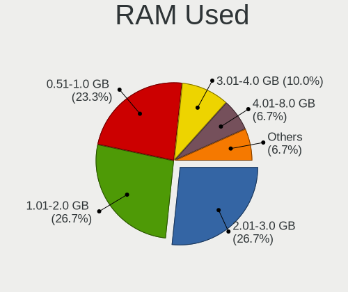

| Used GB  | Notebooks | Percent |
|----------|-----------|---------|
| 2.01-3.0 | 16        | 30.19%  |
| 1.01-2.0 | 14        | 26.42%  |
| 0.51-1.0 | 13        | 24.53%  |
| 4.01-8.0 | 4         | 7.55%   |
| 3.01-4.0 | 3         | 5.66%   |
| 0.01-0.5 | 3         | 5.66%   |

Total Drives
------------

Number of drives on board

| Drives | Notebooks | Percent |
|--------|-----------|---------|
| 1      | 38        | 76%     |
| 2      | 10        | 20%     |
| 5      | 1         | 2%      |
| 4      | 1         | 2%      |

Has CD-ROM
----------

Has CD-ROM on board

| Presented | Notebooks | Percent |
|-----------|-----------|---------|
| No        | 32        | 64%     |
| Yes       | 18        | 36%     |

Has Ethernet
------------

Has Ethernet on board

| Presented | Notebooks | Percent |
|-----------|-----------|---------|
| Yes       | 39        | 78%     |
| No        | 11        | 22%     |

Has WiFi
--------

Has WiFi module

| Presented | Notebooks | Percent |
|-----------|-----------|---------|
| Yes       | 46        | 92%     |
| No        | 4         | 8%      |

Has Bluetooth
-------------

Has Bluetooth module

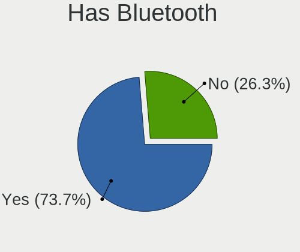

| Presented | Notebooks | Percent |
|-----------|-----------|---------|
| Yes       | 37        | 74%     |
| No        | 13        | 26%     |

Location
--------

Country
-------

Geographic location (country)

| Country     | Notebooks | Percent |
|-------------|-----------|---------|
| USA         | 10        | 20%     |
| Spain       | 6         | 12%     |
| Germany     | 5         | 10%     |
| Poland      | 4         | 8%      |
| UK          | 3         | 6%      |
| Italy       | 3         | 6%      |
| Canada      | 3         | 6%      |
| France      | 2         | 4%      |
| Brazil      | 2         | 4%      |
| Uzbekistan  | 1         | 2%      |
| Russia      | 1         | 2%      |
| Philippines | 1         | 2%      |
| New Zealand | 1         | 2%      |
| Mexico      | 1         | 2%      |
| Malaysia    | 1         | 2%      |
| Japan       | 1         | 2%      |
| Indonesia   | 1         | 2%      |
| India       | 1         | 2%      |
| Colombia    | 1         | 2%      |
| Chile       | 1         | 2%      |
| Bulgaria    | 1         | 2%      |

City
----

Geographic location (city)

| City           | Notebooks | Percent |
|----------------|-----------|---------|
| Vigo           | 2         | 3.77%   |
| Montreal       | 2         | 3.77%   |
| Leipzig        | 2         | 3.77%   |
| Wenatchee      | 1         | 1.89%   |
| Tucson         | 1         | 1.89%   |
| Trieste        | 1         | 1.89%   |
| Tauranga       | 1         | 1.89%   |
| Takahama       | 1         | 1.89%   |
| Spokane        | 1         | 1.89%   |
| Sofia          | 1         | 1.89%   |
| Santo André   | 1         | 1.89%   |
| San Antonio    | 1         | 1.89%   |
| Salina Cruz    | 1         | 1.89%   |
| Sainte-Julie   | 1         | 1.89%   |
| Rio de Janeiro | 1         | 1.89%   |
| Quezon City    | 1         | 1.89%   |
| Pujaudran      | 1         | 1.89%   |
| Puente Alto    | 1         | 1.89%   |
| Pompano Beach  | 1         | 1.89%   |
| Munich         | 1         | 1.89%   |
| Montreuil      | 1         | 1.89%   |
| Milano         | 1         | 1.89%   |
| Miekoszyn      | 1         | 1.89%   |
| Mannheim       | 1         | 1.89%   |
| Madrid         | 1         | 1.89%   |
| Lodz           | 1         | 1.89%   |
| Liverpool      | 1         | 1.89%   |
| Legnano        | 1         | 1.89%   |
| Kuala Lumpur   | 1         | 1.89%   |
| Koło          | 1         | 1.89%   |
| Kazan’       | 1         | 1.89%   |
| Jakarta        | 1         | 1.89%   |
| Jacksonville   | 1         | 1.89%   |
| Houston        | 1         | 1.89%   |
| Hamburg        | 1         | 1.89%   |
| Gmina Bolków  | 1         | 1.89%   |
| Glasgow        | 1         | 1.89%   |
| Framingham     | 1         | 1.89%   |
| East Wenatchee | 1         | 1.89%   |
| Dunoon         | 1         | 1.89%   |

Drives
------

Drive Vendor
------------

Hard drive vendors

| Vendor              | Notebooks | Drives | Percent |
|---------------------|-----------|--------|---------|
| Seagate             | 9         | 14     | 13.85%  |
| WDC                 | 8         | 10     | 12.31%  |
| Unknown             | 7         | 7      | 10.77%  |
| Samsung Electronics | 7         | 7      | 10.77%  |
| Hitachi             | 5         | 8      | 7.69%   |
| SPCC                | 3         | 4      | 4.62%   |
| SK hynix            | 2         | 2      | 3.08%   |
| Silicon Motion      | 2         | 3      | 3.08%   |
| Intel               | 2         | 2      | 3.08%   |
| GOODRAM             | 2         | 4      | 3.08%   |
| Crucial             | 2         | 2      | 3.08%   |
| A-DATA Technology   | 2         | 4      | 3.08%   |
| Toshiba             | 1         | 1      | 1.54%   |
| Team                | 1         | 1      | 1.54%   |
| SanDisk             | 1         | 1      | 1.54%   |
| Phison Electronics  | 1         | 1      | 1.54%   |
| ORICO               | 1         | 1      | 1.54%   |
| Netac               | 1         | 1      | 1.54%   |
| Micron Technology   | 1         | 1      | 1.54%   |
| Kingston            | 1         | 1      | 1.54%   |
| HGST                | 1         | 1      | 1.54%   |
| Fujitsu             | 1         | 2      | 1.54%   |
| ASUS-JM             | 1         | 1      | 1.54%   |
| ASMedia             | 1         | 1      | 1.54%   |
| Apple               | 1         | 1      | 1.54%   |
| Unknown             | 1         | 1      | 1.54%   |

Drive Model
-----------

Hard drive models

| Model                                                 | Notebooks | Percent |
|-------------------------------------------------------|-----------|---------|
| Unknown MMC Card  32GB                                | 2         | 2.99%   |
| Seagate ST1000LM024 HN-M101MBB 1TB                    | 2         | 2.99%   |
| Seagate Backup+ Hub BK 8TB                            | 2         | 2.99%   |
| Hitachi HTS545025B9A300 250GB                         | 2         | 2.99%   |
| WDC WD7500BPVX-22JC3T0 752GB                          | 1         | 1.49%   |
| WDC WD5000BEVT-22ZAT0 500GB                           | 1         | 1.49%   |
| WDC WD50 00LPCX-21VHAT0 500GB                         | 1         | 1.49%   |
| WDC WD3200BPVT-75ZEST0 320GB                          | 1         | 1.49%   |
| WDC WD1600BEVT-22ZCT0 160GB                           | 1         | 1.49%   |
| WDC PC SN730 SDBPNTY-512G-1006 512GB                  | 1         | 1.49%   |
| WDC PC SN530 SDBPMPZ-256G-1101 256GB                  | 1         | 1.49%   |
| WDC PC SA530 SDASN8Y-256G-1006 256GB SSD              | 1         | 1.49%   |
| Unknown SDC  8GB                                      | 1         | 1.49%   |
| Unknown NCard  32GB                                   | 1         | 1.49%   |
| Unknown MMC Card  64GB                                | 1         | 1.49%   |
| Unknown HBG4a2  32GB                                  | 1         | 1.49%   |
| Unknown 016GE2  16GB                                  | 1         | 1.49%   |
| Toshiba MQ04ABF100 1TB                                | 1         | 1.49%   |
| Team T2531TB SSD                                      | 1         | 1.49%   |
| SPCC Solid State Disk 512GB                           | 1         | 1.49%   |
| SPCC Solid State Disk 256GB                           | 1         | 1.49%   |
| SPCC M.2 PCIe SSD 512GB                               | 1         | 1.49%   |
| SK hynix HCG8e  64GB                                  | 1         | 1.49%   |
| SK hynix BC711 HFM256GD3JX013N 256GB                  | 1         | 1.49%   |
| Silicon Motion SM2263EN/SM2263XT SSD Controller 256GB | 1         | 1.49%   |
| Silicon Motion PCIe-8 SSD 512GB                       | 1         | 1.49%   |
| Seagate ST9500325AS 500GB                             | 1         | 1.49%   |
| Seagate ST9250320AS 250GB                             | 1         | 1.49%   |
| Seagate ST9160310AS 160GB                             | 1         | 1.49%   |
| Seagate ST1000LM048-2E7172 1TB                        | 1         | 1.49%   |
| Seagate ST1000LM035-1RK172 1TB                        | 1         | 1.49%   |
| Seagate Backup+ Desk 4TB                              | 1         | 1.49%   |
| SanDisk DF4032  32GB                                  | 1         | 1.49%   |
| Samsung SSD 860 EVO M.2 1TB                           | 1         | 1.49%   |
| Samsung SSD 840 Series 120GB                          | 1         | 1.49%   |
| Samsung PM963 2.5" NVMe PCIe SSD 256GB                | 1         | 1.49%   |
| Samsung MZVLB512HAJQ-00000 512GB                      | 1         | 1.49%   |
| Samsung MZALQ512HALU-000L1 512GB                      | 1         | 1.49%   |
| Samsung MZ7TD128HAFV-000L1 128GB SSD                  | 1         | 1.49%   |
| Samsung HM160HI 160GB                                 | 1         | 1.49%   |

HDD Vendor
----------

Hard disk drive vendors

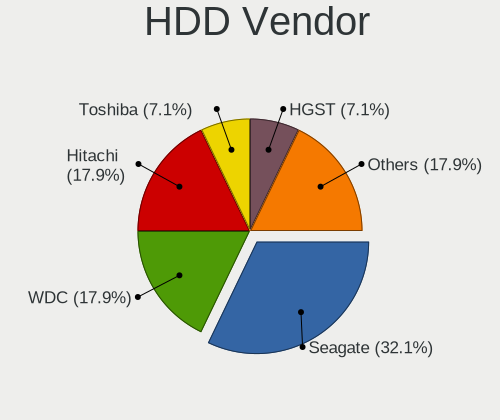

| Vendor              | Notebooks | Drives | Percent |
|---------------------|-----------|--------|---------|
| Seagate             | 9         | 13     | 36%     |
| WDC                 | 5         | 7      | 20%     |
| Hitachi             | 5         | 8      | 20%     |
| Toshiba             | 1         | 1      | 4%      |
| Samsung Electronics | 1         | 1      | 4%      |
| HGST                | 1         | 1      | 4%      |
| Fujitsu             | 1         | 2      | 4%      |
| ASMedia             | 1         | 1      | 4%      |
| Apple               | 1         | 1      | 4%      |

SSD Vendor
----------

Solid state drive vendors

| Vendor              | Notebooks | Drives | Percent |
|---------------------|-----------|--------|---------|
| Samsung Electronics | 3         | 3      | 15.79%  |
| SPCC                | 2         | 3      | 10.53%  |
| Intel               | 2         | 2      | 10.53%  |
| GOODRAM             | 2         | 4      | 10.53%  |
| Crucial             | 2         | 2      | 10.53%  |
| WDC                 | 1         | 1      | 5.26%   |
| Team                | 1         | 1      | 5.26%   |
| ORICO               | 1         | 1      | 5.26%   |
| Netac               | 1         | 1      | 5.26%   |
| Micron Technology   | 1         | 1      | 5.26%   |
| Kingston            | 1         | 1      | 5.26%   |
| ASUS-JM             | 1         | 1      | 5.26%   |
| A-DATA Technology   | 1         | 3      | 5.26%   |

Drive Kind
----------

HDD or SSD

| Kind    | Notebooks | Drives | Percent |
|---------|-----------|--------|---------|
| HDD     | 23        | 35     | 38.33%  |
| SSD     | 16        | 24     | 26.67%  |
| MMC     | 10        | 10     | 16.67%  |
| NVMe    | 10        | 12     | 16.67%  |
| Unknown | 1         | 1      | 1.67%   |

Drive Connector
---------------

SATA, SAS, NVMe, etc.

| Type | Notebooks | Drives | Percent |
|------|-----------|--------|---------|
| SATA | 34        | 53     | 58.62%  |
| NVMe | 10        | 12     | 17.24%  |
| MMC  | 10        | 10     | 17.24%  |
| SAS  | 4         | 7      | 6.9%    |

Drive Size
----------

Size of hard drive

| Size in TB | Notebooks | Drives | Percent |
|------------|-----------|--------|---------|
| 0.01-0.5   | 26        | 40     | 66.67%  |
| 0.51-1.0   | 10        | 14     | 25.64%  |
| 4.01-10.0  | 3         | 5      | 7.69%   |

Space Total
-----------

Amount of disk space available on the file system

| Size in GB     | Notebooks | Percent |
|----------------|-----------|---------|
| 101-250        | 17        | 34%     |
| 501-1000       | 10        | 20%     |
| 21-50          | 7         | 14%     |
| 251-500        | 6         | 12%     |
| 1-20           | 5         | 10%     |
| More than 3000 | 2         | 4%      |
| 1001-2000      | 1         | 2%      |
| 51-100         | 1         | 2%      |
| Unknown        | 1         | 2%      |

Space Used
----------

Amount of used disk space

| Used GB        | Notebooks | Percent |
|----------------|-----------|---------|
| 1-20           | 26        | 50%     |
| 21-50          | 8         | 15.38%  |
| 251-500        | 4         | 7.69%   |
| 501-1000       | 4         | 7.69%   |
| 51-100         | 4         | 7.69%   |
| 101-250        | 3         | 5.77%   |
| More than 3000 | 1         | 1.92%   |
| 1001-2000      | 1         | 1.92%   |
| Unknown        | 1         | 1.92%   |

Malfunc. Drives
---------------

Drive models with a malfunction

| Model                                               | Notebooks | Drives | Percent |
|-----------------------------------------------------|-----------|--------|---------|
| WDC WD5000BEVT-22ZAT0 500GB                         | 1         | 1      | 12.5%   |
| WDC WD3200BPVT-75ZEST0 320GB                        | 1         | 1      | 12.5%   |
| Seagate ST9500325AS 500GB                           | 1         | 1      | 12.5%   |
| Seagate ST1000LM024 HN-M101MBB 1TB                  | 1         | 1      | 12.5%   |
| Samsung Electronics HM160HI 160GB                   | 1         | 1      | 12.5%   |
| Micron Technology MTFDDAK256MAY-1AH12ABHA 256GB SSD | 1         | 1      | 12.5%   |
| Intel SSDSC2CW060A3 64GB                            | 1         | 1      | 12.5%   |
| ASMedia ASMT1153e 10TB                              | 1         | 1      | 12.5%   |

Malfunc. Drive Vendor
---------------------

Vendors of faulty drives

| Vendor              | Notebooks | Drives | Percent |
|---------------------|-----------|--------|---------|
| WDC                 | 2         | 2      | 25%     |
| Seagate             | 2         | 2      | 25%     |
| Samsung Electronics | 1         | 1      | 12.5%   |
| Micron Technology   | 1         | 1      | 12.5%   |
| Intel               | 1         | 1      | 12.5%   |
| ASMedia             | 1         | 1      | 12.5%   |

Malfunc. HDD Vendor
-------------------

Vendors of faulty HDD drives

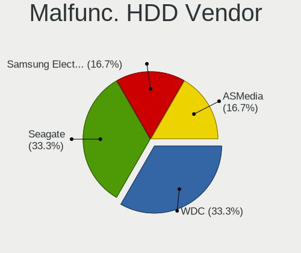

| Vendor              | Notebooks | Drives | Percent |
|---------------------|-----------|--------|---------|
| WDC                 | 2         | 2      | 33.33%  |
| Seagate             | 2         | 2      | 33.33%  |
| Samsung Electronics | 1         | 1      | 16.67%  |
| ASMedia             | 1         | 1      | 16.67%  |

Malfunc. Drive Kind
-------------------

Kinds of faulty drives

| Kind | Notebooks | Drives | Percent |
|------|-----------|--------|---------|
| HDD  | 6         | 6      | 75%     |
| SSD  | 2         | 2      | 25%     |

Failed Drives
-------------

Failed drive models

Zero info for selected period =(

Failed Drive Vendor
-------------------

Failed drive vendors

Zero info for selected period =(

Drive Status
------------

Number of failed and malfunc. drives

| Status   | Notebooks | Drives | Percent |
|----------|-----------|--------|---------|
| Detected | 24        | 38     | 42.86%  |
| Works    | 24        | 36     | 42.86%  |
| Malfunc  | 8         | 8      | 14.29%  |

Storage controller
------------------

Storage Vendor
--------------

Storage controller vendors

| Vendor              | Notebooks | Percent |
|---------------------|-----------|---------|
| Intel               | 33        | 68.75%  |
| AMD                 | 4         | 8.33%   |
| Silicon Motion      | 3         | 6.25%   |
| Samsung Electronics | 3         | 6.25%   |
| SK hynix            | 1         | 2.08%   |
| SanDisk             | 1         | 2.08%   |
| Phison Electronics  | 1         | 2.08%   |
| Nvidia              | 1         | 2.08%   |
| JMicron Technology  | 1         | 2.08%   |

Storage Model
-------------

Storage controller models

| Model                                                                        | Notebooks | Percent |
|------------------------------------------------------------------------------|-----------|---------|
| Intel 7 Series Chipset Family 6-port SATA Controller [AHCI mode]             | 5         | 9.26%   |
| Intel Comet Lake SATA AHCI Controller                                        | 3         | 5.56%   |
| Intel 82801GBM/GHM (ICH7-M Family) SATA Controller [IDE mode]                | 3         | 5.56%   |
| Intel 82801GBM/GHM (ICH7-M Family) SATA Controller [AHCI mode]               | 3         | 5.56%   |
| Intel 82801G (ICH7 Family) IDE Controller                                    | 3         | 5.56%   |
| AMD FCH SATA Controller [AHCI mode]                                          | 3         | 5.56%   |
| Samsung NVMe SSD Controller 980 (DRAM-less)                                  | 2         | 3.7%    |
| Intel Sunrise Point-LP SATA Controller [AHCI mode]                           | 2         | 3.7%    |
| Intel NM10/ICH7 Family SATA Controller [AHCI mode]                           | 2         | 3.7%    |
| Intel Celeron/Pentium Silver Processor SATA Controller                       | 2         | 3.7%    |
| Intel 82801IBM/IEM (ICH9M/ICH9M-E) 4 port SATA Controller [AHCI mode]        | 2         | 3.7%    |
| Intel 82801HM/HEM (ICH8M/ICH8M-E) SATA Controller [AHCI mode]                | 2         | 3.7%    |
| Intel 82801HM/HEM (ICH8M/ICH8M-E) IDE Controller                             | 2         | 3.7%    |
| Intel 6 Series/C200 Series Chipset Family 6 port Mobile SATA AHCI Controller | 2         | 3.7%    |
| Intel 5 Series/3400 Series Chipset 6 port SATA AHCI Controller               | 2         | 3.7%    |
| SK hynix Gold P31/BC711/PC711 NVMe Solid State Drive                         | 1         | 1.85%   |
| Silicon Motion SM2263EN/SM2263XT (DRAM-less) NVMe SSD Controllers            | 1         | 1.85%   |
| Silicon Motion SM2262/SM2262EN SSD Controller                                | 1         | 1.85%   |
| Silicon Motion Non-Volatile memory controller                                | 1         | 1.85%   |
| SanDisk PC SN530 NVMe SSD (DRAM-less)                                        | 1         | 1.85%   |
| Samsung NVMe SSD Controller SM981/PM981/PM983                                | 1         | 1.85%   |
| Phison PS5019-E19 PCIe4 NVMe Controller (DRAM-less)                          | 1         | 1.85%   |
| Nvidia MCP51 Serial ATA Controller                                           | 1         | 1.85%   |
| Nvidia MCP51 IDE                                                             | 1         | 1.85%   |
| JMicron JMB360 AHCI Controller                                               | 1         | 1.85%   |
| Intel Tiger Lake-LP SATA Controller                                          | 1         | 1.85%   |
| Intel Atom Processor E3800 Series SATA AHCI Controller                       | 1         | 1.85%   |
| Intel 82801IBM/IEM (ICH9M/ICH9M-E) 2 port SATA Controller [IDE mode]         | 1         | 1.85%   |
| Intel 8 Series SATA Controller 1 [AHCI mode]                                 | 1         | 1.85%   |
| Intel 5 Series/3400 Series Chipset 4 port SATA AHCI Controller               | 1         | 1.85%   |
| AMD SB7x0/SB8x0/SB9x0 SATA Controller [AHCI mode]                            | 1         | 1.85%   |

Storage Kind
------------

Kind of storage controller (IDE, SATA, NVMe, SAS, ...)

| Kind | Notebooks | Percent |
|------|-----------|---------|
| SATA | 33        | 63.46%  |
| IDE  | 10        | 19.23%  |
| NVMe | 9         | 17.31%  |

Processor
---------

CPU Vendor
----------

Processor vendors

| Vendor | Notebooks | Percent |
|--------|-----------|---------|
| Intel  | 41        | 82%     |
| AMD    | 9         | 18%     |

CPU Model
---------

Processor models

| Model                                         | Notebooks | Percent |
|-----------------------------------------------|-----------|---------|
| Intel Celeron CPU N2840 @ 2.16GHz             | 3         | 6%      |
| Intel Core i5-10210U CPU @ 1.60GHz            | 2         | 4%      |
| Intel Core 2 Duo CPU T7300 @ 2.00GHz          | 2         | 4%      |
| Intel Core 2 Duo CPU P8400 @ 2.26GHz          | 2         | 4%      |
| Intel Atom x5-Z8350 CPU @ 1.44GHz             | 2         | 4%      |
| Intel Atom CPU N450 @ 1.66GHz                 | 2         | 4%      |
| Intel Atom CPU N270 @ 1.60GHz                 | 2         | 4%      |
| Intel Pentium CPU B950 @ 2.10GHz              | 1         | 2%      |
| Intel Pentium CPU 6405U @ 2.40GHz             | 1         | 2%      |
| Intel Genuine CPU T2400 @ 1.83GHz             | 1         | 2%      |
| Intel Core i7-4600U CPU @ 2.10GHz             | 1         | 2%      |
| Intel Core i7-3630QM CPU @ 2.40GHz            | 1         | 2%      |
| Intel Core i7-3612QM CPU @ 2.10GHz            | 1         | 2%      |
| Intel Core i5-8250U CPU @ 1.60GHz             | 1         | 2%      |
| Intel Core i5-6300U CPU @ 2.40GHz             | 1         | 2%      |
| Intel Core i5-3320M CPU @ 2.60GHz             | 1         | 2%      |
| Intel Core i5-3230M CPU @ 2.60GHz             | 1         | 2%      |
| Intel Core i5-3210M CPU @ 2.50GHz             | 1         | 2%      |
| Intel Core i5-2520M CPU @ 2.50GHz             | 1         | 2%      |
| Intel Core i5 CPU M 520 @ 2.40GHz             | 1         | 2%      |
| Intel Core i5 CPU M 460 @ 2.53GHz             | 1         | 2%      |
| Intel Core i3 CPU M 380 @ 2.53GHz             | 1         | 2%      |
| Intel Core 2 CPU U7600 @ 1.20GHz              | 1         | 2%      |
| Intel Core 2 CPU T5600 @ 1.83GHz              | 1         | 2%      |
| Intel Celeron N4020 CPU @ 1.10GHz             | 1         | 2%      |
| Intel Celeron N4000 CPU @ 1.10GHz             | 1         | 2%      |
| Intel Celeron CPU N3160 @ 1.60GHz             | 1         | 2%      |
| Intel Celeron CPU N3060 @ 1.60GHz             | 1         | 2%      |
| Intel Celeron CPU 900 @ 2.20GHz               | 1         | 2%      |
| Intel Atom x5-Z8300 CPU @ 1.44GHz             | 1         | 2%      |
| Intel Atom CPU Z3735F @ 1.33GHz               | 1         | 2%      |
| Intel Atom CPU N280 @ 1.66GHz                 | 1         | 2%      |
| Intel 11th Gen Core i3-1115G4 @ 3.00GHz       | 1         | 2%      |
| AMD Turion 64 X2 Mobile Technology TL-64      | 1         | 2%      |
| AMD Ryzen 7 3750H with Radeon Vega Mobile Gfx | 1         | 2%      |
| AMD Ryzen 5 4600H with Radeon Graphics        | 1         | 2%      |
| AMD Ryzen 5 3500U with Radeon Vega Mobile Gfx | 1         | 2%      |
| AMD Ryzen 3 5300U with Radeon Graphics        | 1         | 2%      |
| AMD PRO A10-8700B R6, 10 Compute Cores 4C+6G  | 1         | 2%      |
| AMD C-50 Processor                            | 1         | 2%      |

CPU Model Family
----------------

Processor model prefix

| Model                   | Notebooks | Percent |
|-------------------------|-----------|---------|
| Intel Core i5           | 10        | 20%     |
| Intel Atom              | 9         | 18%     |
| Intel Celeron           | 8         | 16%     |
| Intel Core 2 Duo        | 4         | 8%      |
| Intel Core i7           | 3         | 6%      |
| Intel Pentium           | 2         | 4%      |
| Intel Core 2            | 2         | 4%      |
| AMD Ryzen 5             | 2         | 4%      |
| Other                   | 1         | 2%      |
| Intel Genuine           | 1         | 2%      |
| Intel Core i3           | 1         | 2%      |
| AMD Turion 64 X2 Mobile | 1         | 2%      |
| AMD Ryzen 7             | 1         | 2%      |
| AMD Ryzen 3             | 1         | 2%      |
| AMD PRO A10             | 1         | 2%      |
| AMD C-50                | 1         | 2%      |
| AMD A8                  | 1         | 2%      |
| AMD A4                  | 1         | 2%      |

CPU Cores
---------

Number of processor cores

| Number | Notebooks | Percent |
|--------|-----------|---------|
| 2      | 29        | 58%     |
| 4      | 14        | 28%     |
| 1      | 6         | 12%     |
| 6      | 1         | 2%      |

CPU Sockets
-----------

Number of sockets

| Number | Notebooks | Percent |
|--------|-----------|---------|
| 1      | 50        | 100%    |

CPU Threads
-----------

Threads per core (Hyper-Threading)

| Number | Notebooks | Percent |
|--------|-----------|---------|
| 2      | 27        | 54%     |
| 1      | 23        | 46%     |

CPU Op-Modes
------------

CPU Operation Modes (32-bit, 64-bit)

| Op mode        | Notebooks | Percent |
|----------------|-----------|---------|
| 32-bit, 64-bit | 46        | 92%     |
| 32-bit         | 4         | 8%      |

CPU Microcode
-------------

Microcode number

| Number     | Notebooks | Percent |
|------------|-----------|---------|
| Unknown    | 13        | 25.49%  |
| 0x406c4    | 4         | 7.84%   |
| 0x306a9    | 3         | 5.88%   |
| 0x30678    | 3         | 5.88%   |
| 0x20655    | 3         | 5.88%   |
| 0x806ec    | 2         | 3.92%   |
| 0x6f2      | 2         | 3.92%   |
| 0x206a7    | 2         | 3.92%   |
| 0x106ca    | 2         | 3.92%   |
| 0x106c2    | 2         | 3.92%   |
| 0x10676    | 2         | 3.92%   |
| 0x08108109 | 2         | 3.92%   |
| 0x806ea    | 1         | 1.96%   |
| 0x706a8    | 1         | 1.96%   |
| 0x406c3    | 1         | 1.96%   |
| 0x40651    | 1         | 1.96%   |
| 0x1067a    | 1         | 1.96%   |
| 0x08608103 | 1         | 1.96%   |
| 0x08600106 | 1         | 1.96%   |
| 0x0700010f | 1         | 1.96%   |
| 0x0600611a | 1         | 1.96%   |
| 0x06001119 | 1         | 1.96%   |
| 0x05000029 | 1         | 1.96%   |

CPU Microarch
-------------

Microarchitecture

| Name          | Notebooks | Percent |
|---------------|-----------|---------|
| Silvermont    | 9         | 18%     |
| IvyBridge     | 5         | 10%     |
| Bonnell       | 5         | 10%     |
| KabyLake      | 4         | 8%      |
| Core          | 4         | 8%      |
| Westmere      | 3         | 6%      |
| Penryn        | 3         | 6%      |
| Zen+          | 2         | 4%      |
| SandyBridge   | 2         | 4%      |
| Goldmont plus | 2         | 4%      |
| Zen 2         | 1         | 2%      |
| TigerLake     | 1         | 2%      |
| Skylake       | 1         | 2%      |
| Piledriver    | 1         | 2%      |
| P6            | 1         | 2%      |
| K8 Hammer     | 1         | 2%      |
| Jaguar        | 1         | 2%      |
| Haswell       | 1         | 2%      |
| Excavator     | 1         | 2%      |
| Bobcat        | 1         | 2%      |
| Unknown       | 1         | 2%      |

Graphics
--------

GPU Vendor
----------

Vendors of graphics cards

| Vendor | Notebooks | Percent |
|--------|-----------|---------|
| Intel  | 36        | 72%     |
| AMD    | 9         | 18%     |
| Nvidia | 5         | 10%     |

GPU Model
---------

Graphics card models

| Model                                                                                    | Notebooks | Percent |
|------------------------------------------------------------------------------------------|-----------|---------|
| Intel Mobile 945GM/GMS/GME, 943/940GML Express Integrated Graphics Controller            | 5         | 8.47%   |
| Intel Atom/Celeron/Pentium Processor x5-E8000/J3xxx/N3xxx Integrated Graphics Controller | 5         | 8.47%   |
| Intel Atom Processor Z36xxx/Z37xxx Series Graphics & Display                             | 4         | 6.78%   |
| Intel 3rd Gen Core processor Graphics Controller                                         | 4         | 6.78%   |
| Intel Mobile 945GSE Express Integrated Graphics Controller                               | 3         | 5.08%   |
| Intel Mobile GM965/GL960 Integrated Graphics Controller (secondary)                      | 2         | 3.39%   |
| Intel Mobile GM965/GL960 Integrated Graphics Controller (primary)                        | 2         | 3.39%   |
| Intel Mobile 945GM/GMS, 943/940GML Express Integrated Graphics Controller                | 2         | 3.39%   |
| Intel GeminiLake [UHD Graphics 600]                                                      | 2         | 3.39%   |
| Intel Core Processor Integrated Graphics Controller                                      | 2         | 3.39%   |
| Intel CometLake-U GT2 [UHD Graphics]                                                     | 2         | 3.39%   |
| Intel Atom Processor D4xx/D5xx/N4xx/N5xx Integrated Graphics Controller                  | 2         | 3.39%   |
| Intel 2nd Generation Core Processor Family Integrated Graphics Controller                | 2         | 3.39%   |
| AMD Picasso/Raven 2 [Radeon Vega Series / Radeon Vega Mobile Series]                     | 2         | 3.39%   |
| Nvidia GK104GLM [Quadro K3000M]                                                          | 1         | 1.69%   |
| Nvidia GF108M [GeForce GT 420M]                                                          | 1         | 1.69%   |
| Nvidia G96CM [GeForce 9650M GT]                                                          | 1         | 1.69%   |
| Nvidia G96CM [GeForce 9600M GT]                                                          | 1         | 1.69%   |
| Nvidia C51 [GeForce Go 6150]                                                             | 1         | 1.69%   |
| Intel UHD Graphics 620                                                                   | 1         | 1.69%   |
| Intel Tiger Lake-LP GT2 [UHD Graphics G4]                                                | 1         | 1.69%   |
| Intel Skylake GT2 [HD Graphics 520]                                                      | 1         | 1.69%   |
| Intel Mobile 4 Series Chipset Integrated Graphics Controller                             | 1         | 1.69%   |
| Intel Haswell-ULT Integrated Graphics Controller                                         | 1         | 1.69%   |
| Intel Comet Lake-U GT2 [UHD Graphics 620]                                                | 1         | 1.69%   |
| AMD Wrestler [Radeon HD 6250]                                                            | 1         | 1.69%   |
| AMD Wani [Radeon R5/R6/R7 Graphics]                                                      | 1         | 1.69%   |
| AMD Trinity [Radeon HD 7640G]                                                            | 1         | 1.69%   |
| AMD Thames [Radeon HD 7500M/7600M Series]                                                | 1         | 1.69%   |
| AMD RV515/M54 [Mobility Radeon X1400]                                                    | 1         | 1.69%   |
| AMD Renoir [Radeon RX Vega 6 (Ryzen 4000/5000 Mobile Series)]                            | 1         | 1.69%   |
| AMD Navi 14 [Radeon RX 5500/5500M / Pro 5500M]                                           | 1         | 1.69%   |
| AMD Lucienne                                                                             | 1         | 1.69%   |
| AMD Kabini [Radeon HD 8330]                                                              | 1         | 1.69%   |

GPU Combo
---------

Combinations of graphics cards

| Name       | Notebooks | Percent |
|------------|-----------|---------|
| 1 x Intel  | 34        | 68%     |
| 1 x AMD    | 7         | 14%     |
| 1 x Nvidia | 5         | 10%     |
| 2 x Intel  | 2         | 4%      |
| 2 x AMD    | 2         | 4%      |

GPU Driver
----------

Free vs proprietary

| Driver      | Notebooks | Percent |
|-------------|-----------|---------|
| Free        | 49        | 98%     |
| Proprietary | 1         | 2%      |

GPU Memory
----------

Total video memory

| Size in GB | Notebooks | Percent |
|------------|-----------|---------|
| Unknown    | 39        | 76.47%  |
| 0.01-0.5   | 8         | 15.69%  |
| 1.01-2.0   | 3         | 5.88%   |
| 0.51-1.0   | 1         | 1.96%   |

Monitor
-------

Monitor Vendor
--------------

Monitor vendors

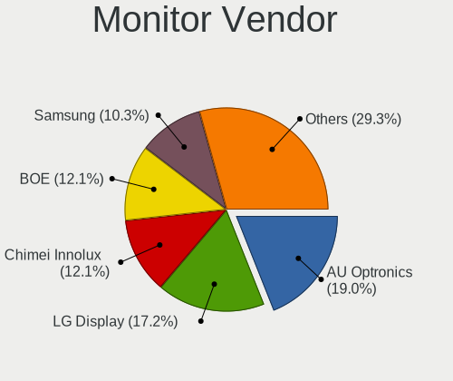

| Vendor                  | Notebooks | Percent |
|-------------------------|-----------|---------|
| LG Display              | 9         | 18%     |
| AU Optronics            | 8         | 16%     |
| Chimei Innolux          | 6         | 12%     |
| BOE                     | 6         | 12%     |
| Samsung Electronics     | 5         | 10%     |
| CPT                     | 3         | 6%      |
| Lenovo                  | 2         | 4%      |
| Apple                   | 2         | 4%      |
| Sony                    | 1         | 2%      |
| PANDA                   | 1         | 2%      |
| Medion                  | 1         | 2%      |
| LG Philips              | 1         | 2%      |
| Insignia                | 1         | 2%      |
| Hitachi                 | 1         | 2%      |
| HannStar                | 1         | 2%      |
| Chi Mei Optoelectronics | 1         | 2%      |
| BenQ                    | 1         | 2%      |

Monitor Model
-------------

Monitor models

| Model                                                                    | Notebooks | Percent |
|--------------------------------------------------------------------------|-----------|---------|
| Sony TV SNY2A03 1920x1080                                                | 1         | 1.96%   |
| Samsung Electronics S24D330 SAM0D93 1920x1080 531x299mm 24.0-inch        | 1         | 1.96%   |
| Samsung Electronics LCD Monitor SEC4F45 1280x800 331x207mm 15.4-inch     | 1         | 1.96%   |
| Samsung Electronics LCD Monitor SEC4141 1366x768 344x193mm 15.5-inch     | 1         | 1.96%   |
| Samsung Electronics LCD Monitor SEC3945 1280x800 331x207mm 15.4-inch     | 1         | 1.96%   |
| Samsung Electronics LCD Monitor SEC3541 1366x768 344x193mm 15.5-inch     | 1         | 1.96%   |
| Samsung Electronics LCD Monitor SEC3052 1024x600 223x125mm 10.1-inch     | 1         | 1.96%   |
| PANDA LCD Monitor NCP0063 1920x1080 344x194mm 15.5-inch                  | 1         | 1.96%   |
| Medion MD 20310 MED3645 1920x1080 521x293mm 23.5-inch                    | 1         | 1.96%   |
| LG Philips LCD Monitor LPLA002 1440x900 367x230mm 17.1-inch              | 1         | 1.96%   |
| LG Display LP156WH1-TLA3 LGD01C2 1366x768 344x194mm 15.5-inch            | 1         | 1.96%   |
| LG Display LCD Monitor LGD059E 1920x1080 382x215mm 17.3-inch             | 1         | 1.96%   |
| LG Display LCD Monitor LGD04E1 1366x768 344x194mm 15.5-inch              | 1         | 1.96%   |
| LG Display LCD Monitor LGD03F8 1366x768 345x194mm 15.6-inch              | 1         | 1.96%   |
| LG Display LCD Monitor LGD0384 1366x768 340x190mm 15.3-inch              | 1         | 1.96%   |
| LG Display LCD Monitor LGD02E1 1600x900 382x215mm 17.3-inch              | 1         | 1.96%   |
| LG Display LCD Monitor LGD0266 1366x768 344x194mm 15.5-inch              | 1         | 1.96%   |
| LG Display LCD Monitor LGD0212 1366x768 309x174mm 14.0-inch              | 1         | 1.96%   |
| LG Display LCD Monitor LGD01C5 1366x768 293x165mm 13.2-inch              | 1         | 1.96%   |
| Lenovo LCD Monitor LEN4033 1440x900 303x190mm 14.1-inch                  | 1         | 1.96%   |
| Lenovo LCD Monitor LEN4022 1400x1050 287x215mm 14.1-inch                 | 1         | 1.96%   |
| Insignia DX-15E220A12 BBY0032 1360x768 544x326mm 25.0-inch               | 1         | 1.96%   |
| Hitachi HDMI    HEC0088 1360x768 1100x560mm 48.6-inch                    | 1         | 1.96%   |
| HannStar LCD Monitor HSD03E9 1024x600 220x129mm 10.0-inch                | 1         | 1.96%   |
| CPT LCD Monitor CPT37D5 1920x1200 260x160mm 12.0-inch                    | 1         | 1.96%   |
| CPT LCD Monitor CPT04CE 1024x600 222x130mm 10.1-inch                     | 1         | 1.96%   |
| CPT LCD Monitor CPT04C4 1024x600 222x130mm 10.1-inch                     | 1         | 1.96%   |
| Chimei Innolux LCD Monitor CMN15F5 1920x1080 344x193mm 15.5-inch         | 1         | 1.96%   |
| Chimei Innolux LCD Monitor CMN15DB 1366x768 344x193mm 15.5-inch          | 1         | 1.96%   |
| Chimei Innolux LCD Monitor CMN15C4 1920x1080 344x193mm 15.5-inch         | 1         | 1.96%   |
| Chimei Innolux LCD Monitor CMN153B 1920x1080 344x193mm 15.5-inch         | 1         | 1.96%   |
| Chimei Innolux LCD Monitor CMN14C0 1920x1080 308x173mm 13.9-inch         | 1         | 1.96%   |
| Chimei Innolux LCD Monitor CMN1484 1600x900 310x174mm 14.0-inch          | 1         | 1.96%   |
| Chi Mei Optoelectronics LCD Monitor CMO1007 1024x600 222x125mm 10.0-inch | 1         | 1.96%   |
| BOE LCD Monitor BOE08B2 1366x768 309x174mm 14.0-inch                     | 1         | 1.96%   |
| BOE LCD Monitor BOE0878 1920x1080 355x200mm 16.0-inch                    | 1         | 1.96%   |
| BOE LCD Monitor BOE085E 1920x1080 344x194mm 15.5-inch                    | 1         | 1.96%   |
| BOE LCD Monitor BOE0700 1920x1080 344x194mm 15.5-inch                    | 1         | 1.96%   |
| BOE LCD Monitor BOE0697 1366x768 309x173mm 13.9-inch                     | 1         | 1.96%   |
| BOE LCD Monitor BOE0635 1920x1080 309x173mm 13.9-inch                    | 1         | 1.96%   |

Monitor Resolution
------------------

Monitor screen resolution

| Resolution        | Notebooks | Percent |
|-------------------|-----------|---------|
| 1366x768 (WXGA)   | 17        | 34%     |
| 1920x1080 (FHD)   | 16        | 32%     |
| 1280x800 (WXGA)   | 4         | 8%      |
| 1024x600          | 4         | 8%      |
| 1600x900 (HD+)    | 3         | 6%      |
| 1920x540          | 2         | 4%      |
| 1440x900 (WXGA+)  | 2         | 4%      |
| 1920x1200 (WUXGA) | 1         | 2%      |
| 1400x1050         | 1         | 2%      |

Monitor Diagonal
----------------

Diagonal size in inches

| Inches | Notebooks | Percent |
|--------|-----------|---------|
| 15     | 18        | 35.29%  |
| 13     | 9         | 17.65%  |
| 17     | 6         | 11.76%  |
| 14     | 5         | 9.8%    |
| 10     | 4         | 7.84%   |
| 48     | 2         | 3.92%   |
| 24     | 2         | 3.92%   |
| 72     | 1         | 1.96%   |
| 23     | 1         | 1.96%   |
| 16     | 1         | 1.96%   |
| 12     | 1         | 1.96%   |
| 11     | 1         | 1.96%   |

Monitor Width
-------------

Physical width

| Width in mm | Notebooks | Percent |
|-------------|-----------|---------|
| 301-350     | 26        | 50.98%  |
| 201-300     | 12        | 23.53%  |
| 351-400     | 7         | 13.73%  |
| 501-600     | 3         | 5.88%   |
| 1001-1500   | 2         | 3.92%   |
| 1501-2000   | 1         | 1.96%   |

Aspect Ratio
------------

Proportional relationship between the width and the height

| Ratio | Notebooks | Percent |
|-------|-----------|---------|
| 16/9  | 39        | 79.59%  |
| 16/10 | 7         | 14.29%  |
| 1.96  | 2         | 4.08%   |
| 4/3   | 1         | 2.04%   |

Monitor Area
------------

Area in inch²

| Area in inch² | Notebooks | Percent |
|----------------|-----------|---------|
| 101-110        | 19        | 37.25%  |
| 81-90          | 9         | 17.65%  |
| 121-130        | 5         | 9.8%    |
| 71-80          | 4         | 7.84%   |
| 41-50          | 4         | 7.84%   |
| 201-250        | 3         | 5.88%   |
| 501-1000       | 2         | 3.92%   |
| More than 1000 | 1         | 1.96%   |
| 61-70          | 1         | 1.96%   |
| 51-60          | 1         | 1.96%   |
| 131-140        | 1         | 1.96%   |
| 91-100         | 1         | 1.96%   |

Pixel Density
-------------

Pixels per inch

| Density | Notebooks | Percent |
|---------|-----------|---------|
| 101-120 | 23        | 46%     |
| 121-160 | 17        | 34%     |
| 51-100  | 6         | 12%     |
| 1-50    | 3         | 6%      |
| 161-240 | 1         | 2%      |

Multiple Monitors
-----------------

Total monitors connected

| Total | Notebooks | Percent |
|-------|-----------|---------|
| 1     | 46        | 92%     |
| 2     | 3         | 6%      |
| 0     | 1         | 2%      |

Network
-------

Net Controller Vendor
---------------------

Controller vendors

| Vendor                   | Notebooks | Percent |
|--------------------------|-----------|---------|
| Intel                    | 23        | 31.51%  |
| Realtek Semiconductor    | 18        | 24.66%  |
| Qualcomm Atheros         | 10        | 13.7%   |
| Broadcom                 | 6         | 8.22%   |
| Marvell Technology Group | 5         | 6.85%   |
| TP-Link                  | 2         | 2.74%   |
| Ralink                   | 2         | 2.74%   |
| Broadcom Limited         | 2         | 2.74%   |
| Samsung Electronics      | 1         | 1.37%   |
| OPPO Electronics         | 1         | 1.37%   |
| Nvidia                   | 1         | 1.37%   |
| Edimax Technology        | 1         | 1.37%   |
| D-Link                   | 1         | 1.37%   |

Net Controller Model
--------------------

Controller models

| Model                                                                   | Notebooks | Percent |
|-------------------------------------------------------------------------|-----------|---------|
| Realtek RTL8111/8168/8211/8411 PCI Express Gigabit Ethernet Controller  | 9         | 10.11%  |
| Realtek RTL810xE PCI Express Fast Ethernet controller                   | 5         | 5.62%   |
| Realtek RTL8821CE 802.11ac PCIe Wireless Network Adapter                | 3         | 3.37%   |
| Marvell Group 88E8040 PCI-E Fast Ethernet Controller                    | 3         | 3.37%   |
| Intel Wireless 7265                                                     | 3         | 3.37%   |
| Intel PRO/Wireless 3945ABG [Golan] Network Connection                   | 3         | 3.37%   |
| Intel Comet Lake PCH-LP CNVi WiFi                                       | 3         | 3.37%   |
| Intel 82579LM Gigabit Network Connection (Lewisville)                   | 3         | 3.37%   |
| Realtek RTL8822CE 802.11ac PCIe Wireless Network Adapter                | 2         | 2.25%   |
| Qualcomm Atheros AR928X Wireless Network Adapter (PCI-Express)          | 2         | 2.25%   |
| Qualcomm Atheros AR8121/AR8113/AR8114 Gigabit or Fast Ethernet          | 2         | 2.25%   |
| Qualcomm Atheros AR242x / AR542x Wireless Network Adapter (PCI-Express) | 2         | 2.25%   |
| Intel Wireless 7260                                                     | 2         | 2.25%   |
| Intel Centrino Advanced-N 6205 [Taylor Peak]                            | 2         | 2.25%   |
| TP-Link TL-WN823N v2/v3 [Realtek RTL8192EU]                             | 1         | 1.12%   |
| TP-Link 802.11ac WLAN Adapter                                           | 1         | 1.12%   |
| Samsung Galaxy series, misc. (tethering mode)                           | 1         | 1.12%   |
| Realtek RTL8723BE PCIe Wireless Network Adapter                         | 1         | 1.12%   |
| Realtek RTL8188EUS 802.11n Wireless Network Adapter                     | 1         | 1.12%   |
| Realtek Killer E2600 GbE Controller                                     | 1         | 1.12%   |
| Ralink RT5390 Wireless 802.11n 1T/1R PCIe                               | 1         | 1.12%   |
| Ralink RT3290 Wireless 802.11n 1T/1R PCIe                               | 1         | 1.12%   |
| Qualcomm Atheros QCA9565 / AR9565 Wireless Network Adapter              | 1         | 1.12%   |
| Qualcomm Atheros QCA9377 802.11ac Wireless Network Adapter              | 1         | 1.12%   |
| Qualcomm Atheros QCA8171 Gigabit Ethernet                               | 1         | 1.12%   |
| Qualcomm Atheros AR9485 Wireless Network Adapter                        | 1         | 1.12%   |
| Qualcomm Atheros AR9287 Wireless Network Adapter (PCI-Express)          | 1         | 1.12%   |
| Qualcomm Atheros AR9285 Wireless Network Adapter (PCI-Express)          | 1         | 1.12%   |
| Qualcomm Atheros AR8132 Fast Ethernet                                   | 1         | 1.12%   |
| OPPO SM8350-MTP _SN:9338D66C                                            | 1         | 1.12%   |
| Nvidia MCP51 Ethernet Controller                                        | 1         | 1.12%   |
| Marvell Group 88E8055 PCI-E Gigabit Ethernet Controller                 | 1         | 1.12%   |
| Marvell Group 88E8053 PCI-E Gigabit Ethernet Controller                 | 1         | 1.12%   |
| Intel Wireless 8260                                                     | 1         | 1.12%   |
| Intel WiFi Link 5100                                                    | 1         | 1.12%   |
| Intel Wi-Fi 6 AX201                                                     | 1         | 1.12%   |
| Intel Wi-Fi 6 AX200                                                     | 1         | 1.12%   |
| Intel PRO/Wireless 5100 AGN [Shiloh] Network Connection                 | 1         | 1.12%   |
| Intel PRO/Wireless 4965 AG or AGN [Kedron] Network Connection           | 1         | 1.12%   |
| Intel Ethernet Connection I219-LM                                       | 1         | 1.12%   |

Wireless Vendor
---------------

Wireless vendors

| Vendor                | Notebooks | Percent |
|-----------------------|-----------|---------|
| Intel                 | 23        | 46%     |
| Qualcomm Atheros      | 9         | 18%     |
| Realtek Semiconductor | 7         | 14%     |
| Broadcom              | 3         | 6%      |
| TP-Link               | 2         | 4%      |
| Ralink                | 2         | 4%      |
| Broadcom Limited      | 2         | 4%      |
| Edimax Technology     | 1         | 2%      |
| D-Link                | 1         | 2%      |

Wireless Model
--------------

Wireless models

| Model                                                                   | Notebooks | Percent |
|-------------------------------------------------------------------------|-----------|---------|
| Realtek RTL8821CE 802.11ac PCIe Wireless Network Adapter                | 3         | 6%      |
| Intel Wireless 7265                                                     | 3         | 6%      |
| Intel PRO/Wireless 3945ABG [Golan] Network Connection                   | 3         | 6%      |
| Intel Comet Lake PCH-LP CNVi WiFi                                       | 3         | 6%      |
| Realtek RTL8822CE 802.11ac PCIe Wireless Network Adapter                | 2         | 4%      |
| Qualcomm Atheros AR928X Wireless Network Adapter (PCI-Express)          | 2         | 4%      |
| Qualcomm Atheros AR242x / AR542x Wireless Network Adapter (PCI-Express) | 2         | 4%      |
| Intel Wireless 7260                                                     | 2         | 4%      |
| Intel Centrino Advanced-N 6205 [Taylor Peak]                            | 2         | 4%      |
| TP-Link TL-WN823N v2/v3 [Realtek RTL8192EU]                             | 1         | 2%      |
| TP-Link 802.11ac WLAN Adapter                                           | 1         | 2%      |
| Realtek RTL8723BE PCIe Wireless Network Adapter                         | 1         | 2%      |
| Realtek RTL8188EUS 802.11n Wireless Network Adapter                     | 1         | 2%      |
| Ralink RT5390 Wireless 802.11n 1T/1R PCIe                               | 1         | 2%      |
| Ralink RT3290 Wireless 802.11n 1T/1R PCIe                               | 1         | 2%      |
| Qualcomm Atheros QCA9565 / AR9565 Wireless Network Adapter              | 1         | 2%      |
| Qualcomm Atheros QCA9377 802.11ac Wireless Network Adapter              | 1         | 2%      |
| Qualcomm Atheros AR9485 Wireless Network Adapter                        | 1         | 2%      |
| Qualcomm Atheros AR9287 Wireless Network Adapter (PCI-Express)          | 1         | 2%      |
| Qualcomm Atheros AR9285 Wireless Network Adapter (PCI-Express)          | 1         | 2%      |
| Intel Wireless 8260                                                     | 1         | 2%      |
| Intel WiFi Link 5100                                                    | 1         | 2%      |
| Intel Wi-Fi 6 AX201                                                     | 1         | 2%      |
| Intel Wi-Fi 6 AX200                                                     | 1         | 2%      |
| Intel PRO/Wireless 5100 AGN [Shiloh] Network Connection                 | 1         | 2%      |
| Intel PRO/Wireless 4965 AG or AGN [Kedron] Network Connection           | 1         | 2%      |
| Intel Centrino Wireless-N 2230                                          | 1         | 2%      |
| Intel Centrino Wireless-N 1000 [Condor Peak]                            | 1         | 2%      |
| Intel Centrino Ultimate-N 6300                                          | 1         | 2%      |
| Intel Centrino Advanced-N 6200                                          | 1         | 2%      |
| Edimax EW-7811Un 802.11n Wireless Adapter [Realtek RTL8188CUS]          | 1         | 2%      |
| D-Link DWA-171                                                          | 1         | 2%      |
| Broadcom Limited BCM4313 802.11bgn Wireless Network Adapter             | 1         | 2%      |
| Broadcom Limited BCM4312 802.11b/g LP-PHY                               | 1         | 2%      |
| Broadcom BCM4331 802.11a/b/g/n                                          | 1         | 2%      |
| Broadcom BCM43142 802.11b/g/n                                           | 1         | 2%      |
| Broadcom BCM4313 802.11bgn Wireless Network Adapter                     | 1         | 2%      |

Ethernet Vendor
---------------

Ethernet vendors

| Vendor                   | Notebooks | Percent |
|--------------------------|-----------|---------|
| Realtek Semiconductor    | 15        | 38.46%  |
| Intel                    | 8         | 20.51%  |
| Marvell Technology Group | 5         | 12.82%  |
| Qualcomm Atheros         | 4         | 10.26%  |
| Broadcom                 | 4         | 10.26%  |
| Samsung Electronics      | 1         | 2.56%   |
| OPPO Electronics         | 1         | 2.56%   |
| Nvidia                   | 1         | 2.56%   |

Ethernet Model
--------------

Ethernet models

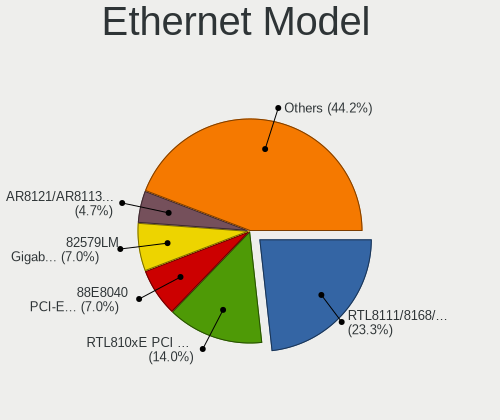

| Model                                                                  | Notebooks | Percent |
|------------------------------------------------------------------------|-----------|---------|
| Realtek RTL8111/8168/8211/8411 PCI Express Gigabit Ethernet Controller | 9         | 23.08%  |
| Realtek RTL810xE PCI Express Fast Ethernet controller                  | 5         | 12.82%  |
| Marvell Group 88E8040 PCI-E Fast Ethernet Controller                   | 3         | 7.69%   |
| Intel 82579LM Gigabit Network Connection (Lewisville)                  | 3         | 7.69%   |
| Qualcomm Atheros AR8121/AR8113/AR8114 Gigabit or Fast Ethernet         | 2         | 5.13%   |
| Samsung Galaxy series, misc. (tethering mode)                          | 1         | 2.56%   |
| Realtek Killer E2600 GbE Controller                                    | 1         | 2.56%   |
| Qualcomm Atheros QCA8171 Gigabit Ethernet                              | 1         | 2.56%   |
| Qualcomm Atheros AR8132 Fast Ethernet                                  | 1         | 2.56%   |
| OPPO SM8350-MTP _SN:9338D66C                                           | 1         | 2.56%   |
| Nvidia MCP51 Ethernet Controller                                       | 1         | 2.56%   |
| Marvell Group 88E8055 PCI-E Gigabit Ethernet Controller                | 1         | 2.56%   |
| Marvell Group 88E8053 PCI-E Gigabit Ethernet Controller                | 1         | 2.56%   |
| Intel Ethernet Connection I219-LM                                      | 1         | 2.56%   |
| Intel Ethernet Connection I218-LM                                      | 1         | 2.56%   |
| Intel 82577LM Gigabit Network Connection                               | 1         | 2.56%   |
| Intel 82573L Gigabit Ethernet Controller                               | 1         | 2.56%   |
| Intel 82566MM Gigabit Network Connection                               | 1         | 2.56%   |
| Broadcom NetXtreme BCM57765 Gigabit Ethernet PCIe                      | 1         | 2.56%   |
| Broadcom NetXtreme BCM5762 Gigabit Ethernet PCIe                       | 1         | 2.56%   |
| Broadcom NetLink BCM5787M Gigabit Ethernet PCI Express                 | 1         | 2.56%   |
| Broadcom NetLink BCM57780 Gigabit Ethernet PCIe                        | 1         | 2.56%   |

Net Controller Kind
-------------------

Ethernet, WiFi or modem

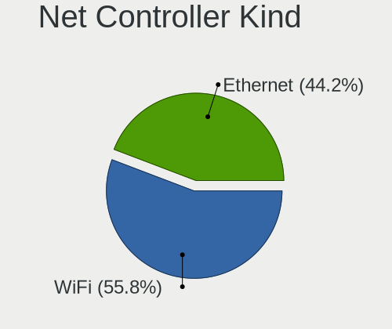

| Kind     | Notebooks | Percent |
|----------|-----------|---------|
| WiFi     | 46        | 54.12%  |
| Ethernet | 39        | 45.88%  |

Used Controller
---------------

Currently used network controller

| Kind     | Notebooks | Percent |
|----------|-----------|---------|
| WiFi     | 37        | 72.55%  |
| Ethernet | 14        | 27.45%  |

NICs
----

Total network controllers on board

| Total | Notebooks | Percent |
|-------|-----------|---------|
| 2     | 34        | 68%     |
| 1     | 12        | 24%     |
| 0     | 3         | 6%      |
| 3     | 1         | 2%      |

IPv6
----

IPv6 vs IPv4

| Used | Notebooks | Percent |
|------|-----------|---------|
| No   | 41        | 78.85%  |
| Yes  | 11        | 21.15%  |

Bluetooth
---------

Bluetooth Vendor
----------------

Controller vendors

| Vendor                          | Notebooks | Percent |
|---------------------------------|-----------|---------|
| Intel                           | 12        | 32.43%  |
| Broadcom                        | 8         | 21.62%  |
| Realtek Semiconductor           | 3         | 8.11%   |
| IMC Networks                    | 2         | 5.41%   |
| Foxconn / Hon Hai               | 2         | 5.41%   |
| Apple                           | 2         | 5.41%   |
| Taiyo Yuden                     | 1         | 2.7%    |
| Realtek                         | 1         | 2.7%    |
| Ralink                          | 1         | 2.7%    |
| Qualcomm Atheros Communications | 1         | 2.7%    |
| Hewlett-Packard                 | 1         | 2.7%    |
| Dell                            | 1         | 2.7%    |
| Cambridge Silicon Radio         | 1         | 2.7%    |
| ASUSTek Computer                | 1         | 2.7%    |

Bluetooth Model
---------------

Controller models

| Model                                               | Notebooks | Percent |
|-----------------------------------------------------|-----------|---------|
| Intel Bluetooth wireless interface                  | 5         | 13.51%  |
| Intel Bluetooth 9460/9560 Jefferson Peak (JfP)      | 3         | 8.11%   |
| Realtek  Bluetooth 4.2 Adapter                      | 2         | 5.41%   |
| IMC Networks Bluetooth Radio                        | 2         | 5.41%   |
| Broadcom BCM2045 Bluetooth                          | 2         | 5.41%   |
| Taiyo Yuden Bluetooth Device (V2.0+EDR)             | 1         | 2.7%    |
| Realtek RTL8723B Bluetooth                          | 1         | 2.7%    |
| Realtek Bluetooth Radio                             | 1         | 2.7%    |
| Ralink RT3290 Bluetooth                             | 1         | 2.7%    |
| Qualcomm Atheros  Bluetooth Device                  | 1         | 2.7%    |
| Intel Centrino Bluetooth Wireless Transceiver       | 1         | 2.7%    |
| Intel Bluetooth Device                              | 1         | 2.7%    |
| Intel AX201 Bluetooth                               | 1         | 2.7%    |
| Intel AX200 Bluetooth                               | 1         | 2.7%    |
| HP Broadcom 2070 Bluetooth Combo                    | 1         | 2.7%    |
| Foxconn / Hon Hai Bluetooth USB Host Controller     | 1         | 2.7%    |
| Foxconn / Hon Hai Bluetooth Device                  | 1         | 2.7%    |
| Dell Wireless 365 Bluetooth                         | 1         | 2.7%    |
| Cambridge Silicon Radio Bluetooth Dongle (HCI mode) | 1         | 2.7%    |
| Broadcom HP Portable SoftSailing                    | 1         | 2.7%    |
| Broadcom Bluetooth 2.1 Device                       | 1         | 2.7%    |
| Broadcom BCM43142A0 Bluetooth Device                | 1         | 2.7%    |
| Broadcom BCM20702 Bluetooth 4.0 [ThinkPad]          | 1         | 2.7%    |
| Broadcom BCM2070 Bluetooth Device                   | 1         | 2.7%    |
| Broadcom BCM2045B (BDC-2) [Bluetooth Controller]    | 1         | 2.7%    |
| ASUS Broadcom Bluetooth 2.1                         | 1         | 2.7%    |
| Apple Bluetooth USB Host Controller                 | 1         | 2.7%    |
| Apple Bluetooth HCI                                 | 1         | 2.7%    |

Sound
-----

Sound Vendor
------------

Sound card vendors

| Vendor              | Notebooks | Percent |
|---------------------|-----------|---------|
| Intel               | 37        | 71.15%  |
| AMD                 | 8         | 15.38%  |
| Nvidia              | 3         | 5.77%   |
| Native Instruments  | 1         | 1.92%   |
| Focusrite-Novation  | 1         | 1.92%   |
| C-Media Electronics | 1         | 1.92%   |
| ASUSTek Computer    | 1         | 1.92%   |

Sound Model
-----------

Sound card models

| Model                                                                                             | Notebooks | Percent |
|---------------------------------------------------------------------------------------------------|-----------|---------|
| Intel NM10/ICH7 Family High Definition Audio Controller                                           | 8         | 13.33%  |
| Intel 7 Series/C216 Chipset Family High Definition Audio Controller                               | 5         | 8.33%   |
| Intel Comet Lake PCH-LP cAVS                                                                      | 3         | 5%      |
| Intel Atom Processor Z36xxx/Z37xxx Series High Definition Audio Controller                        | 3         | 5%      |
| Intel 82801I (ICH9 Family) HD Audio Controller                                                    | 3         | 5%      |
| Intel 5 Series/3400 Series Chipset High Definition Audio                                          | 3         | 5%      |
| AMD Family 17h/19h HD Audio Controller                                                            | 3         | 5%      |
| Intel Sunrise Point-LP HD Audio                                                                   | 2         | 3.33%   |
| Intel Celeron/Pentium Silver Processor High Definition Audio                                      | 2         | 3.33%   |
| Intel Atom/Celeron/Pentium Processor x5-E8000/J3xxx/N3xxx Series High Definition Audio Controller | 2         | 3.33%   |
| Intel 82801H (ICH8 Family) HD Audio Controller                                                    | 2         | 3.33%   |
| Intel 6 Series/C200 Series Chipset Family High Definition Audio Controller                        | 2         | 3.33%   |
| AMD Renoir Radeon High Definition Audio Controller                                                | 2         | 3.33%   |
| AMD Kabini HDMI/DP Audio                                                                          | 2         | 3.33%   |
| AMD FCH Azalia Controller                                                                         | 2         | 3.33%   |
| Nvidia MCP51 High Definition Audio                                                                | 1         | 1.67%   |
| Nvidia GK104 HDMI Audio Controller                                                                | 1         | 1.67%   |
| Nvidia GF108 High Definition Audio Controller                                                     | 1         | 1.67%   |
| Native Instruments KOMPLETE KONTROL M32                                                           | 1         | 1.67%   |
| Intel Tiger Lake-LP Smart Sound Technology Audio Controller                                       | 1         | 1.67%   |
| Intel Haswell-ULT HD Audio Controller                                                             | 1         | 1.67%   |
| Intel 8 Series HD Audio Controller                                                                | 1         | 1.67%   |
| Focusrite-Novation Focusrite Scarlett 2i2 2nd Gen                                                 | 1         | 1.67%   |
| C-Media Electronics CM102-A+/102S+ Audio Controller                                               | 1         | 1.67%   |
| ASUSTek Computer C-Media Audio                                                                    | 1         | 1.67%   |
| AMD Wrestler HDMI Audio                                                                           | 1         | 1.67%   |
| AMD Trinity HDMI Audio Controller                                                                 | 1         | 1.67%   |
| AMD SBx00 Azalia (Intel HDA)                                                                      | 1         | 1.67%   |
| AMD Raven/Raven2/Fenghuang HDMI/DP Audio Controller                                               | 1         | 1.67%   |
| AMD Navi 10 HDMI Audio                                                                            | 1         | 1.67%   |
| AMD Family 15h (Models 60h-6fh) Audio Controller                                                  | 1         | 1.67%   |

Memory
------

Memory Vendor
-------------

Memory module vendors

| Vendor              | Notebooks | Percent |
|---------------------|-----------|---------|
| Samsung Electronics | 12        | 27.27%  |
| Unknown             | 9         | 20.45%  |
| SK hynix            | 6         | 13.64%  |
| Micron Technology   | 3         | 6.82%   |
| Nanya Technology    | 2         | 4.55%   |
| Kingston            | 2         | 4.55%   |
| Crucial             | 2         | 4.55%   |
| 48spaces            | 2         | 4.55%   |
| Team                | 1         | 2.27%   |
| High Bridge         | 1         | 2.27%   |
| GOODRAM             | 1         | 2.27%   |
| G.Skill             | 1         | 2.27%   |
| Corsair             | 1         | 2.27%   |
| Unknown             | 1         | 2.27%   |

Memory Model
------------

Memory module models

| Model                                                                     | Notebooks | Percent |
|---------------------------------------------------------------------------|-----------|---------|
| Unknown RAM Module 2GB SODIMM DDR3 1066MT/s                               | 2         | 4.26%   |
| SK hynix RAM HMA851S6CJR6N-VK 8GB SODIMM DDR4 2667MT/s                    | 2         | 4.26%   |
| Samsung RAM M471B5674QH0-YK0 2GB SODIMM DDR3 3200MT/s                     | 2         | 4.26%   |
| Samsung RAM K4E8E324EB-EGCF 2GB LPDDR3 1867MT/s                           | 2         | 4.26%   |
| 48spaces RAM 012345678901234567890123456789012345 1GB SODIMM DDR2 667MT/s | 2         | 4.26%   |
| Unknown RAM Module 8GB SODIMM DDR3                                        | 1         | 2.13%   |
| Unknown RAM Module 2GB SODIMM SDRAM                                       | 1         | 2.13%   |
| Unknown RAM Module 2GB SODIMM DDR3 1333MT/s                               | 1         | 2.13%   |
| Unknown RAM Module 2GB SODIMM DDR2 266MT/s                                | 1         | 2.13%   |
| Unknown RAM Module 2048MB SODIMM 800MT/s                                  | 1         | 2.13%   |
| Unknown RAM Module 1GB SODIMM DDR2 533MT/s                                | 1         | 2.13%   |
| Unknown RAM Module 1024MB SODIMM DDR2                                     | 1         | 2.13%   |
| Unknown RAM Module 1024MB SODIMM 800MT/s                                  | 1         | 2.13%   |
| Team RAM TEAMGROUP-SD4-3200 16384MB SODIMM DDR4 3200MT/s                  | 1         | 2.13%   |
| SK hynix RAM Module 4GB SODIMM DDR3 1066MT/s                              | 1         | 2.13%   |
| SK hynix RAM HMT351S6CFR8C-PB 4GB SODIMM DDR3 1600MT/s                    | 1         | 2.13%   |
| SK hynix RAM HMA82GS6JJR8N-VK 16GB SODIMM DDR4 2667MT/s                   | 1         | 2.13%   |
| SK hynix RAM HMA81GS6AFR8N-UH 8GB SODIMM DDR4 2667MT/s                    | 1         | 2.13%   |
| Samsung RAM Module 4GB SODIMM DDR3 1600MT/s                               | 1         | 2.13%   |
| Samsung RAM M471B5773DH0-CH9 2GB SODIMM DDR3 1600MT/s                     | 1         | 2.13%   |
| Samsung RAM M471B5773CHS-CH9 2048MB SODIMM DDR3 4199MT/s                  | 1         | 2.13%   |
| Samsung RAM M471B5673FH0-CH9 2GB SODIMM DDR3 1334MT/s                     | 1         | 2.13%   |
| Samsung RAM M471B5173EB0-YK0 4GB SODIMM DDR3 1600MT/s                     | 1         | 2.13%   |
| Samsung RAM M471B2873FHS-CH9 1GB SODIMM DDR3 1334MT/s                     | 1         | 2.13%   |
| Samsung RAM M471A5244CB0-CWE 4GB SODIMM DDR4 3200MT/s                     | 1         | 2.13%   |
| Samsung RAM M471A5244CB0-CWE 4GB Row Of Chips DDR4 3200MT/s               | 1         | 2.13%   |
| Samsung RAM M471A1K43CB1-CTD 8GB SODIMM DDR4 2667MT/s                     | 1         | 2.13%   |
| Nanya RAM NT4GC64B8HG0NS-DI 4GB SODIMM DDR3 1600MT/s                      | 1         | 2.13%   |
| Nanya RAM NT2GC64B88B0NS-CG 2GB SODIMM DDR3 1334MT/s                      | 1         | 2.13%   |
| Micron RAM 4ATF1G64HZ-3G2E1 8GB Row Of Chips DDR4 3200MT/s                | 1         | 2.13%   |
| Micron RAM 16KTF1G64HZ-1G6E1 8GB SODIMM DDR3 1600MT/s                     | 1         | 2.13%   |
| Micron RAM 16JSF51264HZ-1G4D1 4GB SODIMM DDR3 1334MT/s                    | 1         | 2.13%   |
| Kingston RAM Module 4GB SODIMM DDR3 800MT/s                               | 1         | 2.13%   |
| Kingston RAM ACR16D3LS1KBG/4G 4GB SODIMM DDR3 1600MT/s                    | 1         | 2.13%   |
| Kingston RAM ACR128X64D3S1333C9 1GB SODIMM DDR3 1333MT/s                  | 1         | 2.13%   |
| High Bridge RAM HB3SU004GFM8MML33. 4GB SODIMM DDR3 1333MT/s               | 1         | 2.13%   |
| GOODRAM RAM GR1600S3V64L11/8G 8GB SODIMM DDR3 1600MT/s                    | 1         | 2.13%   |
| G.Skill RAM F4-2400C16-16GRS 16GB SODIMM DDR4 2667MT/s                    | 1         | 2.13%   |
| Crucial RAM CT102464BF160B.M16 8GB SODIMM DDR3 1600MT/s                   | 1         | 2.13%   |
| Crucial RAM CB8GS2666.C8RT 8GB SODIMM DDR4 2667MT/s                       | 1         | 2.13%   |

Memory Kind
-----------

Memory module kinds

| Kind    | Notebooks | Percent |
|---------|-----------|---------|
| DDR3    | 21        | 55.26%  |
| DDR4    | 9         | 23.68%  |
| DDR2    | 3         | 7.89%   |
| SDRAM   | 2         | 5.26%   |
| LPDDR3  | 2         | 5.26%   |
| Unknown | 1         | 2.63%   |

Memory Form Factor
------------------

Physical design of the memory module

| Name         | Notebooks | Percent |
|--------------|-----------|---------|
| SODIMM       | 33        | 89.19%  |
| Row Of Chips | 2         | 5.41%   |
| Unknown      | 2         | 5.41%   |

Memory Size
-----------

Memory module size

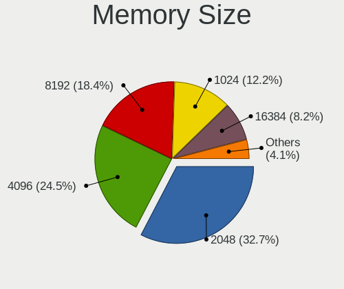

| Size  | Notebooks | Percent |
|-------|-----------|---------|
| 2048  | 15        | 33.33%  |
| 4096  | 12        | 26.67%  |
| 8192  | 9         | 20%     |
| 1024  | 4         | 8.89%   |
| 16384 | 3         | 6.67%   |
| 32768 | 1         | 2.22%   |
| 256   | 1         | 2.22%   |

Memory Speed
------------

Memory module speed

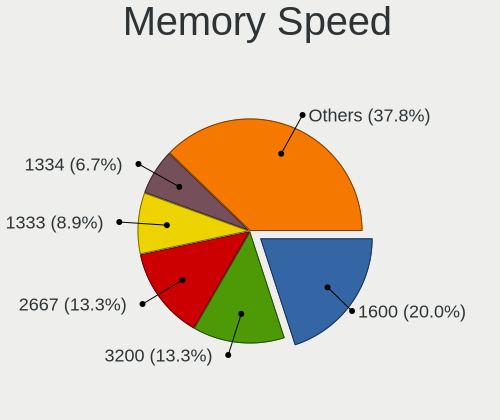

| Speed   | Notebooks | Percent |
|---------|-----------|---------|
| 1600    | 8         | 19.51%  |
| 3200    | 6         | 14.63%  |
| 2667    | 5         | 12.2%   |
| 1333    | 4         | 9.76%   |
| 1334    | 3         | 7.32%   |
| 1066    | 3         | 7.32%   |
| Unknown | 3         | 7.32%   |
| 1867    | 2         | 4.88%   |
| 800     | 2         | 4.88%   |
| 667     | 2         | 4.88%   |
| 4199    | 1         | 2.44%   |
| 533     | 1         | 2.44%   |
| 266     | 1         | 2.44%   |

Printers & scanners
-------------------

Printer Vendor
--------------

Printer device vendors

Zero info for selected period =(

Printer Model
-------------

Printer device models

Zero info for selected period =(

Scanner Vendor
--------------

Scanner device vendors

Zero info for selected period =(

Scanner Model
-------------

Scanner device models

Zero info for selected period =(

Camera
------

Camera Vendor
-------------

Camera device vendors

| Vendor                                 | Notebooks | Percent |
|----------------------------------------|-----------|---------|
| Chicony Electronics                    | 12        | 28.57%  |
| Suyin                                  | 4         | 9.52%   |
| Microdia                               | 4         | 9.52%   |
| Z-Star Microelectronics                | 3         | 7.14%   |
| Cheng Uei Precision Industry (Foxlink) | 3         | 7.14%   |
| Bison Electronics                      | 3         | 7.14%   |
| Sunplus Innovation Technology          | 2         | 4.76%   |
| Quanta                                 | 2         | 4.76%   |
| Alcor Micro                            | 2         | 4.76%   |
| Syntek                                 | 1         | 2.38%   |
| Sonix Technology                       | 1         | 2.38%   |
| Ricoh                                  | 1         | 2.38%   |
| Realtek Semiconductor                  | 1         | 2.38%   |
| Microsoft                              | 1         | 2.38%   |
| Apple                                  | 1         | 2.38%   |
| Acer                                   | 1         | 2.38%   |

Camera Model
------------

Camera device models

| Model                                                       | Notebooks | Percent |
|-------------------------------------------------------------|-----------|---------|
| Z-Star Webcam                                               | 2         | 4.76%   |
| Chicony HD WebCam                                           | 2         | 4.76%   |
| Alcor Micro USB 2.0 PC cam                                  | 2         | 4.76%   |
| Z-Star Namuga 1.3M Webcam                                   | 1         | 2.38%   |
| Syntek Integrated Camera                                    | 1         | 2.38%   |
| Suyin USB2.0 UVC 1.3M WebCam                                | 1         | 2.38%   |
| Suyin HP Truevision HD                                      | 1         | 2.38%   |
| Suyin Acer CrystalEye Webcam                                | 1         | 2.38%   |
| Suyin 1.3M WebCam (notebook emachines E730, Acer sub-brand) | 1         | 2.38%   |
| Sunplus Integrated Webcam                                   | 1         | 2.38%   |
| Sunplus HP HD Webcam [Fixed]                                | 1         | 2.38%   |
| Sonix USB2.0 HD UVC WebCam                                  | 1         | 2.38%   |
| Ricoh USB2.0 Camera                                         | 1         | 2.38%   |
| Realtek Integrated Webcam                                   | 1         | 2.38%   |
| Quanta HP TrueVision HD Camera                              | 1         | 2.38%   |
| Quanta HD User Facing                                       | 1         | 2.38%   |
| Microsoft LifeCam Cinema                                    | 1         | 2.38%   |
| Microdia Sonix USB 2.0 Camera                               | 1         | 2.38%   |
| Microdia Lenovo EasyCamera                                  | 1         | 2.38%   |
| Microdia Laptop_Integrated_Webcam_HD                        | 1         | 2.38%   |
| Microdia Laptop_Integrated_Webcam_1.3M                      | 1         | 2.38%   |
| Chicony TOSHIBA Web Camera - HD                             | 1         | 2.38%   |
| Chicony thinkpad t430s camera                               | 1         | 2.38%   |
| Chicony Integrated Camera (1280x720@30)                     | 1         | 2.38%   |
| Chicony HP Webcam [2 MP Macro]                              | 1         | 2.38%   |
| Chicony HP TrueVision HD Camera                             | 1         | 2.38%   |
| Chicony HP Truevision HD                                    | 1         | 2.38%   |
| Chicony HP Integrated Webcam                                | 1         | 2.38%   |
| Chicony HP HD Webcam                                        | 1         | 2.38%   |
| Chicony Asus Integrated 0.3M UVC Webcam                     | 1         | 2.38%   |
| Chicony 2.0M UVC Webcam / CNF7129                           | 1         | 2.38%   |
| Cheng Uei Precision Industry (Foxlink) HP Webcam            | 1         | 2.38%   |
| Cheng Uei Precision Industry (Foxlink) HP HD Camera         | 1         | 2.38%   |
| Cheng Uei Precision Industry (Foxlink) HD Camera            | 1         | 2.38%   |
| Bison USB HD Webcam                                         | 1         | 2.38%   |
| Bison Lenovo EasyCamera                                     | 1         | 2.38%   |
| Bison HD Webcam                                             | 1         | 2.38%   |
| Apple FaceTime HD Camera                                    | 1         | 2.38%   |
| Acer HP Webcam                                              | 1         | 2.38%   |

Security
--------

Fingerprint Vendor
------------------

Fingerprint sensor vendors

| Vendor                     | Notebooks | Percent |
|----------------------------|-----------|---------|
| Validity Sensors           | 3         | 42.86%  |
| AuthenTec                  | 2         | 28.57%  |
| STMicroelectronics         | 1         | 14.29%  |
| Shenzhen Goodix Technology | 1         | 14.29%  |

Fingerprint Model
-----------------

Fingerprint sensor models

| Model                                      | Notebooks | Percent |
|--------------------------------------------|-----------|---------|
| Validity Sensors VFS495 Fingerprint Reader | 1         | 14.29%  |
| Validity Sensors VFS491                    | 1         | 14.29%  |
| Validity Sensors VFS101 Fingerprint Reader | 1         | 14.29%  |
| STMicroelectronics Fingerprint Reader      | 1         | 14.29%  |
| Shenzhen Goodix  Fingerprint Device        | 1         | 14.29%  |
| AuthenTec AES2501 Fingerprint Sensor       | 1         | 14.29%  |
| AuthenTec AES1600                          | 1         | 14.29%  |

Chipcard Vendor
---------------

Chipcard module vendors

| Vendor   | Notebooks | Percent |
|----------|-----------|---------|
| Lenovo   | 1         | 50%     |
| Broadcom | 1         | 50%     |

Chipcard Model
--------------

Chipcard module models

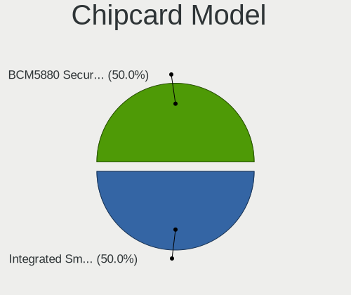

| Model                                                                        | Notebooks | Percent |
|------------------------------------------------------------------------------|-----------|---------|
| Lenovo Integrated Smart Card Reader                                          | 1         | 50%     |
| Broadcom BCM5880 Secure Applications Processor with fingerprint swipe sensor | 1         | 50%     |

Unsupported
-----------

Unsupported Devices
-------------------

Total unsupported devices on board

| Total | Notebooks | Percent |
|-------|-----------|---------|
| 0     | 28        | 56%     |
| 1     | 19        | 38%     |
| 2     | 3         | 6%      |

Unsupported Device Types
------------------------

Types of unsupported devices

| Type                  | Notebooks | Percent |
|-----------------------|-----------|---------|
| Graphics card         | 7         | 25.93%  |
| Fingerprint reader    | 7         | 25.93%  |
| Net/wireless          | 5         | 18.52%  |
| Multimedia controller | 4         | 14.81%  |
| Chipcard              | 2         | 7.41%   |
| Bluetooth             | 2         | 7.41%   |

