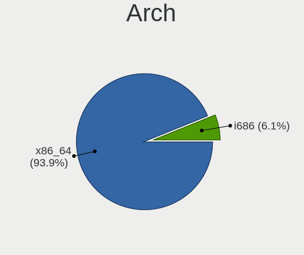
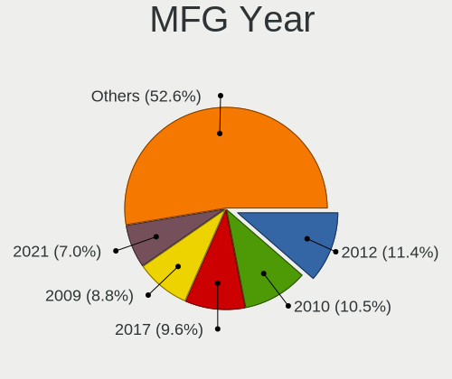
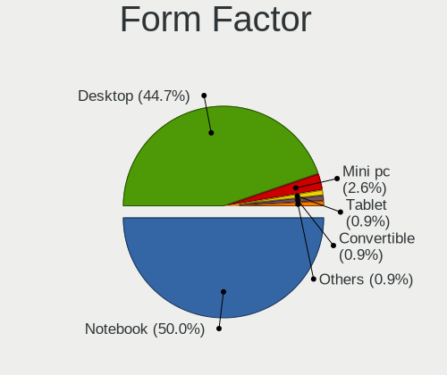
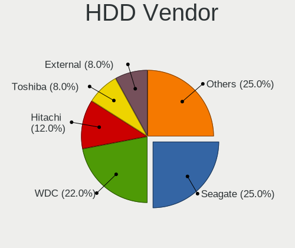
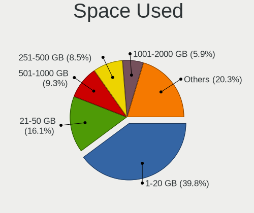
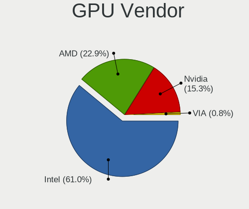
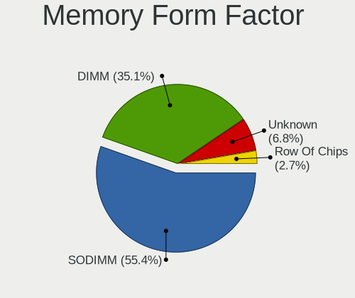

Sparky - Tested Hardware & Statistics
-------------------------------------

A project to collect tested hardware configurations for Sparky.

Anyone can contribute to this report by the [hw-probe](https://github.com/linuxhw/hw-probe) tool:

    sudo -E hw-probe -all -upload

Please contribute! Especially if your hardware is rare.

This is a report for all computer types. See also reports for [desktops](/Dist/Sparky/Desktop/README.md) and [notebooks](/Dist/Sparky/Notebook/README.md).

Contents
--------

* [ Test Cases ](#test-cases)

* [ System ](#system)
  - [ OS                       ](#os)
  - [ OS Family                ](#os-family)
  - [ Kernel                   ](#kernel)
  - [ Kernel Family            ](#kernel-family)
  - [ Kernel Major Ver.        ](#kernel-major-ver)
  - [ Arch                     ](#arch)
  - [ DE                       ](#de)
  - [ Display Server           ](#display-server)
  - [ Display Manager          ](#display-manager)
  - [ OS Lang                  ](#os-lang)
  - [ Boot Mode                ](#boot-mode)
  - [ Filesystem               ](#filesystem)
  - [ Part. scheme             ](#part-scheme)
  - [ Dual Boot with Linux/BSD ](#dual-boot-with-linuxbsd)
  - [ Dual Boot (Win)          ](#dual-boot-win)

* [ Board ](#board)
  - [ Vendor                   ](#vendor)
  - [ Model                    ](#model)
  - [ Model Family             ](#model-family)
  - [ MFG Year                 ](#mfg-year)
  - [ Form Factor              ](#form-factor)
  - [ Secure Boot              ](#secure-boot)
  - [ Coreboot                 ](#coreboot)
  - [ RAM Size                 ](#ram-size)
  - [ RAM Used                 ](#ram-used)
  - [ Total Drives             ](#total-drives)
  - [ Has CD-ROM               ](#has-cd-rom)
  - [ Has Ethernet             ](#has-ethernet)
  - [ Has WiFi                 ](#has-wifi)
  - [ Has Bluetooth            ](#has-bluetooth)

* [ Location ](#location)
  - [ Country                  ](#country)
  - [ City                     ](#city)

* [ Drives ](#drives)
  - [ Drive Vendor             ](#drive-vendor)
  - [ Drive Model              ](#drive-model)
  - [ HDD Vendor               ](#hdd-vendor)
  - [ SSD Vendor               ](#ssd-vendor)
  - [ Drive Kind               ](#drive-kind)
  - [ Drive Connector          ](#drive-connector)
  - [ Drive Size               ](#drive-size)
  - [ Space Total              ](#space-total)
  - [ Space Used               ](#space-used)
  - [ Malfunc. Drives          ](#malfunc-drives)
  - [ Malfunc. Drive Vendor    ](#malfunc-drive-vendor)
  - [ Malfunc. HDD Vendor      ](#malfunc-hdd-vendor)
  - [ Malfunc. Drive Kind      ](#malfunc-drive-kind)
  - [ Failed Drives            ](#failed-drives)
  - [ Failed Drive Vendor      ](#failed-drive-vendor)
  - [ Drive Status             ](#drive-status)

* [ Storage controller ](#storage-controller)
  - [ Storage Vendor           ](#storage-vendor)
  - [ Storage Model            ](#storage-model)
  - [ Storage Kind             ](#storage-kind)

* [ Processor ](#processor)
  - [ CPU Vendor               ](#cpu-vendor)
  - [ CPU Model                ](#cpu-model)
  - [ CPU Model Family         ](#cpu-model-family)
  - [ CPU Cores                ](#cpu-cores)
  - [ CPU Sockets              ](#cpu-sockets)
  - [ CPU Threads              ](#cpu-threads)
  - [ CPU Op-Modes             ](#cpu-op-modes)
  - [ CPU Microcode            ](#cpu-microcode)
  - [ CPU Microarch            ](#cpu-microarch)

* [ Graphics ](#graphics)
  - [ GPU Vendor               ](#gpu-vendor)
  - [ GPU Model                ](#gpu-model)
  - [ GPU Combo                ](#gpu-combo)
  - [ GPU Driver               ](#gpu-driver)
  - [ GPU Memory               ](#gpu-memory)

* [ Monitor ](#monitor)
  - [ Monitor Vendor           ](#monitor-vendor)
  - [ Monitor Model            ](#monitor-model)
  - [ Monitor Resolution       ](#monitor-resolution)
  - [ Monitor Diagonal         ](#monitor-diagonal)
  - [ Monitor Width            ](#monitor-width)
  - [ Aspect Ratio             ](#aspect-ratio)
  - [ Monitor Area             ](#monitor-area)
  - [ Pixel Density            ](#pixel-density)
  - [ Multiple Monitors        ](#multiple-monitors)

* [ Network ](#network)
  - [ Net Controller Vendor    ](#net-controller-vendor)
  - [ Net Controller Model     ](#net-controller-model)
  - [ Wireless Vendor          ](#wireless-vendor)
  - [ Wireless Model           ](#wireless-model)
  - [ Ethernet Vendor          ](#ethernet-vendor)
  - [ Ethernet Model           ](#ethernet-model)
  - [ Net Controller Kind      ](#net-controller-kind)
  - [ Used Controller          ](#used-controller)
  - [ NICs                     ](#nics)
  - [ IPv6                     ](#ipv6)

* [ Bluetooth ](#bluetooth)
  - [ Bluetooth Vendor         ](#bluetooth-vendor)
  - [ Bluetooth Model          ](#bluetooth-model)

* [ Sound ](#sound)
  - [ Sound Vendor             ](#sound-vendor)
  - [ Sound Model              ](#sound-model)

* [ Memory ](#memory)
  - [ Memory Vendor            ](#memory-vendor)
  - [ Memory Model             ](#memory-model)
  - [ Memory Kind              ](#memory-kind)
  - [ Memory Form Factor       ](#memory-form-factor)
  - [ Memory Size              ](#memory-size)
  - [ Memory Speed             ](#memory-speed)

* [ Printers & scanners ](#printers--scanners)
  - [ Printer Vendor           ](#printer-vendor)
  - [ Printer Model            ](#printer-model)
  - [ Scanner Vendor           ](#scanner-vendor)
  - [ Scanner Model            ](#scanner-model)

* [ Camera ](#camera)
  - [ Camera Vendor            ](#camera-vendor)
  - [ Camera Model             ](#camera-model)

* [ Security ](#security)
  - [ Fingerprint Vendor       ](#fingerprint-vendor)
  - [ Fingerprint Model        ](#fingerprint-model)
  - [ Chipcard Vendor          ](#chipcard-vendor)
  - [ Chipcard Model           ](#chipcard-model)

* [ Unsupported ](#unsupported)
  - [ Unsupported Devices      ](#unsupported-devices)
  - [ Unsupported Device Types ](#unsupported-device-types)

Test Cases
----------

Total: 121

| Vendor        | Model                       | Form-Factor | Probe                                                      | Date         |
|---------------|-----------------------------|-------------|------------------------------------------------------------|--------------|
| Lenovo        | IdeaPad 3 15IML05 81WB      | Notebook    | [c03d3e0508](https://linux-hardware.org/?probe=c03d3e0508) | May 03, 2024 |
| Lenovo        | ThinkPad T430 2349FC4       | Notebook    | [1b0129f0b0](https://linux-hardware.org/?probe=1b0129f0b0) | Apr 06, 2024 |
| Sony          | SVE1513Q1ESI                | Notebook    | [9362c14552](https://linux-hardware.org/?probe=9362c14552) | Mar 25, 2024 |
| ASUSTek       | PRIME H510M-K               | Desktop     | [fc06ed6b10](https://linux-hardware.org/?probe=fc06ed6b10) | Feb 20, 2024 |
| Samsung       | N150P/N210P/N220P           | Notebook    | [b861f48e1b](https://linux-hardware.org/?probe=b861f48e1b) | Feb 18, 2024 |
| Samsung       | N150/N210/N220              | Notebook    | [cf3126113e](https://linux-hardware.org/?probe=cf3126113e) | Feb 15, 2024 |
| Lenovo        | 315F NOK                    | Desktop     | [620272c63f](https://linux-hardware.org/?probe=620272c63f) | Feb 13, 2024 |
| Google        | Kefka                       | Notebook    | [810d5a47f7](https://linux-hardware.org/?probe=810d5a47f7) | Jan 27, 2024 |
| HP            | 212B                        | Desktop     | [cb5e65ba08](https://linux-hardware.org/?probe=cb5e65ba08) | Jan 21, 2024 |
| Lenovo        | ThinkPad T430 2349FC4       | Notebook    | [655eb2734a](https://linux-hardware.org/?probe=655eb2734a) | Jan 11, 2024 |
| Lenovo        | ThinkPad T430 2349FC4       | Notebook    | [ea07a49b87](https://linux-hardware.org/?probe=ea07a49b87) | Jan 07, 2024 |
| Acer          | Aspire X3950                | Desktop     | [09dfa7ff4b](https://linux-hardware.org/?probe=09dfa7ff4b) | Jan 04, 2024 |
| Lenovo        | ThinkPad T430 2349FC4       | Notebook    | [689d3295aa](https://linux-hardware.org/?probe=689d3295aa) | Dec 30, 2023 |
| Acer          | Aspire SW5-012              | Notebook    | [4efea61fa3](https://linux-hardware.org/?probe=4efea61fa3) | Dec 29, 2023 |
| Microsoft     | Surface Pro 4               | Tablet      | [6e6573e5fe](https://linux-hardware.org/?probe=6e6573e5fe) | Dec 29, 2023 |
| Acer          | FIH57                       | Desktop     | [0edb232edf](https://linux-hardware.org/?probe=0edb232edf) | Dec 16, 2023 |
| HP            | 0A80h                       | Desktop     | [5e6a479e17](https://linux-hardware.org/?probe=5e6a479e17) | Dec 01, 2023 |
| HP            | Laptop 15-ef2xxx            | Notebook    | [80d1578d90](https://linux-hardware.org/?probe=80d1578d90) | Oct 30, 2023 |
| ASUSTek       | P7H55-M                     | Desktop     | [ad3f143871](https://linux-hardware.org/?probe=ad3f143871) | Oct 20, 2023 |
| Medion        | E15415                      | Notebook    | [b9a4ecdc97](https://linux-hardware.org/?probe=b9a4ecdc97) | Oct 14, 2023 |
| HP            | 250 G7 Notebook PC          | Notebook    | [2fc3f16671](https://linux-hardware.org/?probe=2fc3f16671) | Sep 30, 2023 |
| HP            | Pavilion g6                 | Notebook    | [158b6f4df9](https://linux-hardware.org/?probe=158b6f4df9) | Sep 17, 2023 |
| Intel         | NUC8BEB J72692-306          | Mini pc     | [6cbfa96139](https://linux-hardware.org/?probe=6cbfa96139) | Sep 07, 2023 |
| HP            | Laptop 15-ef2xxx            | Notebook    | [b0dbfa8a76](https://linux-hardware.org/?probe=b0dbfa8a76) | Aug 26, 2023 |
| HP            | Laptop 15-ef2xxx            | Notebook    | [da3f894af1](https://linux-hardware.org/?probe=da3f894af1) | Aug 26, 2023 |
| Apple         | MacBookPro9,2               | Notebook    | [4006007a76](https://linux-hardware.org/?probe=4006007a76) | Aug 20, 2023 |
| Intel         | NUC8BEB J72692-306          | Mini pc     | [6a155984af](https://linux-hardware.org/?probe=6a155984af) | Aug 19, 2023 |
| Dell          | 0YXT71 A01                  | Desktop     | [aa6781c002](https://linux-hardware.org/?probe=aa6781c002) | Aug 18, 2023 |
| Acer          | Aspire 5920                 | Notebook    | [31447ef238](https://linux-hardware.org/?probe=31447ef238) | Aug 17, 2023 |
| Acer          | Aspire 5920                 | Notebook    | [8c57c50f82](https://linux-hardware.org/?probe=8c57c50f82) | Aug 17, 2023 |
| ASUSTek       | M5A78L-M LX/BR              | Desktop     | [90c03881ae](https://linux-hardware.org/?probe=90c03881ae) | Jul 29, 2023 |
| Acer          | Aspire A315-58              | Notebook    | [d7383d2980](https://linux-hardware.org/?probe=d7383d2980) | Jul 20, 2023 |
| HP            | EliteBook 8440p             | Notebook    | [f7a66609af](https://linux-hardware.org/?probe=f7a66609af) | Jul 13, 2023 |
| ASUSTek       | ET2411_W8                   | All in one  | [27d0310272](https://linux-hardware.org/?probe=27d0310272) | Jul 13, 2023 |
| Dell          | 0GDG8Y A00                  | Desktop     | [f0fdd509f7](https://linux-hardware.org/?probe=f0fdd509f7) | Jun 29, 2023 |
| ASUSTek       | M4N68T-M                    | Desktop     | [f0b58c9f4e](https://linux-hardware.org/?probe=f0b58c9f4e) | Jun 12, 2023 |
| ASRock        | FM2A58M-VG3+ R2.0           | Desktop     | [3e4b7afb1e](https://linux-hardware.org/?probe=3e4b7afb1e) | Jun 10, 2023 |
| Panasonic     | CFSZ5-2                     | Notebook    | [d5b1455382](https://linux-hardware.org/?probe=d5b1455382) | May 25, 2023 |
| ASUSTek       | VivoBook_ASUSLaptop E410... | Notebook    | [37dab045c7](https://linux-hardware.org/?probe=37dab045c7) | May 21, 2023 |
| Mediacom      | SmartBook 14 FullHD - SB... | Notebook    | [24aaf9e627](https://linux-hardware.org/?probe=24aaf9e627) | May 13, 2023 |
| HP            | 1589                        | Desktop     | [af8e129ecd](https://linux-hardware.org/?probe=af8e129ecd) | May 04, 2023 |
| HP            | 1589                        | Desktop     | [632f486421](https://linux-hardware.org/?probe=632f486421) | Apr 27, 2023 |
| HP            | 0A5Ch                       | Desktop     | [636d94a346](https://linux-hardware.org/?probe=636d94a346) | Apr 15, 2023 |
| Apple         | MacBook1,1                  | Notebook    | [002929e495](https://linux-hardware.org/?probe=002929e495) | Mar 26, 2023 |
| HP            | Pavilion x360 Convertibl... | Convertible | [097be8dd03](https://linux-hardware.org/?probe=097be8dd03) | Mar 08, 2023 |
| MSI           | Alpha 15 A3DDK              | Notebook    | [c4ef9294ef](https://linux-hardware.org/?probe=c4ef9294ef) | Feb 23, 2023 |
| MSI           | Alpha 15 A3DDK              | Notebook    | [219483f968](https://linux-hardware.org/?probe=219483f968) | Feb 23, 2023 |
| Acer          | Aspire X3470                | Desktop     | [659a1f31bd](https://linux-hardware.org/?probe=659a1f31bd) | Feb 22, 2023 |
| Positivo      | CHT14B                      | Notebook    | [49eff89b98](https://linux-hardware.org/?probe=49eff89b98) | Feb 16, 2023 |
| Fujitsu Si... | STYLISTIC ST5112            | Notebook    | [c343cec0c8](https://linux-hardware.org/?probe=c343cec0c8) | Jan 30, 2023 |
| Acer          | Aspire E1-522               | Notebook    | [8bf37cf82d](https://linux-hardware.org/?probe=8bf37cf82d) | Dec 26, 2022 |
| HP            | Victus by Laptop 16-e0xx... | Notebook    | [54273f1267](https://linux-hardware.org/?probe=54273f1267) | Dec 22, 2022 |
| Foxconn       | 2ABF                        | Desktop     | [90af9a1be5](https://linux-hardware.org/?probe=90af9a1be5) | Dec 06, 2022 |
| Foxconn       | 2ABF                        | Desktop     | [09a9309a2a](https://linux-hardware.org/?probe=09a9309a2a) | Nov 30, 2022 |
| Foxconn       | 2ABF                        | Desktop     | [b585d891a8](https://linux-hardware.org/?probe=b585d891a8) | Nov 30, 2022 |
| Apple         | MacBook1,1                  | Notebook    | [6945006338](https://linux-hardware.org/?probe=6945006338) | Nov 15, 2022 |
| Google        | Swanky                      | Notebook    | [1a0a358398](https://linux-hardware.org/?probe=1a0a358398) | Nov 15, 2022 |
| ASUSTek       | G20AJ                       | Desktop     | [7e1557713a](https://linux-hardware.org/?probe=7e1557713a) | Sep 06, 2022 |
| ASUSTek       | M70Vn                       | Notebook    | [236d8cb74e](https://linux-hardware.org/?probe=236d8cb74e) | Aug 29, 2022 |
| Gigabyte      | X570S AORUS PRO AX          | Desktop     | [4fb948980f](https://linux-hardware.org/?probe=4fb948980f) | Aug 25, 2022 |
| HUAWEI        | HVY-WXX9                    | Notebook    | [b4006730ce](https://linux-hardware.org/?probe=b4006730ce) | Jul 17, 2022 |
| ASUSTek       | CROSSHAIR VI HERO           | Desktop     | [f5e7afea43](https://linux-hardware.org/?probe=f5e7afea43) | Jul 05, 2022 |
| Intel         | H61                         | Desktop     | [bf862f44d2](https://linux-hardware.org/?probe=bf862f44d2) | Jun 11, 2022 |
| HP            | Stream Notebook PC 13       | Notebook    | [47b55dbb68](https://linux-hardware.org/?probe=47b55dbb68) | Jun 06, 2022 |
| HP            | EliteBook 745 G3            | Notebook    | [fac15b2640](https://linux-hardware.org/?probe=fac15b2640) | May 18, 2022 |
| ASUSTek       | CROSSHAIR VI HERO           | Desktop     | [803d13c6ca](https://linux-hardware.org/?probe=803d13c6ca) | May 15, 2022 |
| HP            | EliteBook 8770w             | Notebook    | [4fa8e91f6d](https://linux-hardware.org/?probe=4fa8e91f6d) | Apr 26, 2022 |
| Lenovo        | G50-30 80G0                 | Notebook    | [c7ea70f7ba](https://linux-hardware.org/?probe=c7ea70f7ba) | Apr 25, 2022 |
| HP            | 3641h                       | Desktop     | [d50fc13ff0](https://linux-hardware.org/?probe=d50fc13ff0) | Mar 30, 2022 |
| HP            | Pavilion dv5                | Notebook    | [22ae3dae3d](https://linux-hardware.org/?probe=22ae3dae3d) | Mar 22, 2022 |
| Intel         | H55                         | Desktop     | [baff4758b7](https://linux-hardware.org/?probe=baff4758b7) | Mar 21, 2022 |
| ASUSTek       | 1000HE                      | Notebook    | [5dd6246e59](https://linux-hardware.org/?probe=5dd6246e59) | Feb 08, 2022 |
| ASUSTek       | S101                        | Notebook    | [a850549e73](https://linux-hardware.org/?probe=a850549e73) | Feb 04, 2022 |
| ASUSTek       | CROSSHAIR VI HERO           | Desktop     | [39dcd3854f](https://linux-hardware.org/?probe=39dcd3854f) | Feb 03, 2022 |
| MSI           | B450 GAMING PLUS MAX        | Desktop     | [47eae3d6b2](https://linux-hardware.org/?probe=47eae3d6b2) | Jan 19, 2022 |
| HP            | EliteBook 8770w             | Notebook    | [9a2052fc8c](https://linux-hardware.org/?probe=9a2052fc8c) | Nov 25, 2021 |
| HP            | Pavilion g7                 | Notebook    | [6cebc99fe6](https://linux-hardware.org/?probe=6cebc99fe6) | Nov 22, 2021 |
| Dell          | Inspiron N5010              | Notebook    | [df5e66431b](https://linux-hardware.org/?probe=df5e66431b) | Nov 20, 2021 |
| HP            | EliteBook Folio 9480m       | Notebook    | [dae2e04d45](https://linux-hardware.org/?probe=dae2e04d45) | Oct 04, 2021 |
| Google        | Banon                       | Notebook    | [764debedcd](https://linux-hardware.org/?probe=764debedcd) | Sep 25, 2021 |
| MSI           | H310M PRO-VDH PLUS          | Desktop     | [079af91b8f](https://linux-hardware.org/?probe=079af91b8f) | Aug 22, 2021 |
| MSI           | H310M PRO-VDH PLUS          | Desktop     | [c6fe94a0ba](https://linux-hardware.org/?probe=c6fe94a0ba) | Aug 22, 2021 |
| HP            | 805B                        | Desktop     | [d6c2730444](https://linux-hardware.org/?probe=d6c2730444) | Jul 12, 2021 |
| Gigabyte      | H97-Gaming 3                | Desktop     | [d8b0632698](https://linux-hardware.org/?probe=d8b0632698) | May 23, 2021 |
| Lenovo        | ThinkPad E15 20RES0GF00     | Notebook    | [8722c3498e](https://linux-hardware.org/?probe=8722c3498e) | May 14, 2021 |
| Intel         | NUC5CPYB H61145-408         | Mini pc     | [7243895ae4](https://linux-hardware.org/?probe=7243895ae4) | Apr 20, 2021 |
| Apple         | MacBook1,1                  | Notebook    | [cc415ab6c7](https://linux-hardware.org/?probe=cc415ab6c7) | Mar 15, 2021 |
| Samsung       | NC10                        | Notebook    | [b5909af616](https://linux-hardware.org/?probe=b5909af616) | Mar 11, 2021 |
| Samsung       | NC10                        | Notebook    | [3b8de5559e](https://linux-hardware.org/?probe=3b8de5559e) | Feb 27, 2021 |
| MSI           | A68HM-E33 V2                | Desktop     | [82a06b4bea](https://linux-hardware.org/?probe=82a06b4bea) | Feb 21, 2021 |
| Lenovo        | ThinkPad T61 7659AB7        | Notebook    | [43f03346c5](https://linux-hardware.org/?probe=43f03346c5) | Feb 19, 2021 |
| Gigabyte      | H410M H                     | Desktop     | [ee13368ccf](https://linux-hardware.org/?probe=ee13368ccf) | Feb 18, 2021 |
| Pegatron      | 2AC2A                       | Desktop     | [8a5448bc07](https://linux-hardware.org/?probe=8a5448bc07) | Jan 17, 2021 |
| Pegatron      | 2AC2A                       | Desktop     | [c76bbefc71](https://linux-hardware.org/?probe=c76bbefc71) | Jan 09, 2021 |
| Beelink       | BT3 PRO                     | Notebook    | [8dbfa4dacd](https://linux-hardware.org/?probe=8dbfa4dacd) | Jan 06, 2021 |
| Beelink       | BT3 PRO                     | Notebook    | [d85a392e02](https://linux-hardware.org/?probe=d85a392e02) | Jan 06, 2021 |
| Samsung       | NC10                        | Notebook    | [8c878860a7](https://linux-hardware.org/?probe=8c878860a7) | Jan 03, 2021 |
| Pegatron      | 2AC2A                       | Desktop     | [95ead72109](https://linux-hardware.org/?probe=95ead72109) | Dec 17, 2020 |
| HP            | 8056                        | Desktop     | [79fd2c8837](https://linux-hardware.org/?probe=79fd2c8837) | Dec 12, 2020 |
| Dell          | Inspiron 5720               | Notebook    | [d360a61780](https://linux-hardware.org/?probe=d360a61780) | Dec 08, 2020 |
| eMachines     | E525                        | Notebook    | [0c11b6b4dc](https://linux-hardware.org/?probe=0c11b6b4dc) | Nov 25, 2020 |
| Lenovo        | IdeaPad S206 20154          | Notebook    | [393f27acf7](https://linux-hardware.org/?probe=393f27acf7) | Nov 18, 2020 |
| Intel         | DG41TY AAE47335-300         | Desktop     | [e3457f83fa](https://linux-hardware.org/?probe=e3457f83fa) | Oct 22, 2020 |
| Dell          | Inspiron 5720               | Notebook    | [787263a0c6](https://linux-hardware.org/?probe=787263a0c6) | Oct 10, 2020 |
| Gigabyte      | M68M-S2P                    | Desktop     | [0e4bab3503](https://linux-hardware.org/?probe=0e4bab3503) | Oct 05, 2020 |
| HP            | Laptop 17z-ca100            | Notebook    | [2217d0703c](https://linux-hardware.org/?probe=2217d0703c) | Oct 05, 2020 |
| HP            | Laptop 17z-ca100            | Notebook    | [1927ffc179](https://linux-hardware.org/?probe=1927ffc179) | Oct 05, 2020 |
| Unknown       | 4CoreDX90-VSTA              | Desktop     | [31dbedff45](https://linux-hardware.org/?probe=31dbedff45) | Sep 10, 2020 |
| Apple         | MacBook1,1                  | Notebook    | [73b04f9de4](https://linux-hardware.org/?probe=73b04f9de4) | Aug 26, 2020 |
| Gigabyte      | G41M-ES2L                   | Desktop     | [87c93c4148](https://linux-hardware.org/?probe=87c93c4148) | Jun 21, 2020 |
| Gigabyte      | G41M-ES2L                   | Desktop     | [01beb1ea00](https://linux-hardware.org/?probe=01beb1ea00) | Jun 21, 2020 |
| Dell          | 039VR8 A00                  | Desktop     | [d386006ad9](https://linux-hardware.org/?probe=d386006ad9) | Jun 15, 2020 |
| Acer          | Aspire 5742G                | Notebook    | [a90fb35c67](https://linux-hardware.org/?probe=a90fb35c67) | May 01, 2020 |
| Vorke         | V1 Plus                     | Desktop     | [e371a7cf42](https://linux-hardware.org/?probe=e371a7cf42) | Mar 29, 2020 |
| Intel         | DG43RK AAE78175-402         | Desktop     | [262ba9568a](https://linux-hardware.org/?probe=262ba9568a) | Mar 22, 2020 |
| Lenovo        | ThinkPad T60 2007FUG        | Notebook    | [d552e50d7e](https://linux-hardware.org/?probe=d552e50d7e) | Mar 12, 2020 |
| Dell          | Latitude XT3                | Notebook    | [0944e88882](https://linux-hardware.org/?probe=0944e88882) | Mar 09, 2020 |
| Dell          | Inspiron 5770               | Notebook    | [a3dd71465d](https://linux-hardware.org/?probe=a3dd71465d) | Jan 06, 2020 |
| HP            | Pavilion dv9000 (GA359UA... | Notebook    | [db4a924be0](https://linux-hardware.org/?probe=db4a924be0) | Sep 07, 2019 |
| HP            | Pavilion dv9000 (GA359UA... | Notebook    | [6f024c0dd0](https://linux-hardware.org/?probe=6f024c0dd0) | Sep 03, 2019 |
| ASRock        | H61M-VG4                    | Desktop     | [93ae8e7a8c](https://linux-hardware.org/?probe=93ae8e7a8c) | Aug 18, 2019 |

System
------

OS
--

Installed operating systems

| Name        | Computers | Percent |
|-------------|-----------|---------|
| Sparky 6    | 16        | 16.67%  |
| Sparky 7    | 12        | 12.5%   |
| Sparky 8    | 11        | 11.46%  |
| Sparky 6.1  | 6         | 6.25%   |
| Sparky 7.1  | 5         | 5.21%   |
| Sparky 6.7  | 5         | 5.21%   |
| Sparky 6.5  | 5         | 5.21%   |
| Sparky 5.12 | 5         | 5.21%   |
| Sparky 7.2  | 4         | 4.17%   |
| Sparky 7.0  | 4         | 4.17%   |
| Sparky 6.6  | 4         | 4.17%   |
| Sparky 6.3  | 4         | 4.17%   |
| Sparky 6.0  | 3         | 3.13%   |
| Sparky 5.14 | 3         | 3.13%   |
| Sparky 5.10 | 3         | 3.13%   |
| Sparky 7.3  | 2         | 2.08%   |
| Sparky 6.2  | 2         | 2.08%   |
| Sparky 5.13 | 2         | 2.08%   |

OS Family
---------

OS without a version

| Name   | Computers | Percent |
|--------|-----------|---------|
| Sparky | 89        | 100%    |

Kernel
------

Version of the Linux kernel

| Version                   | Computers | Percent |
|---------------------------|-----------|---------|
| 5.10.0-21-amd64           | 4         | 3.92%   |
| 5.10.0-11-686             | 4         | 3.92%   |
| 6.1.0-18-amd64            | 3         | 2.94%   |
| 6.1.0-17-amd64            | 3         | 2.94%   |
| 6.1.0-13-amd64            | 3         | 2.94%   |
| 5.10.0-9-amd64            | 3         | 2.94%   |
| 5.10.0-8-amd64            | 3         | 2.94%   |
| 5.10.0-6-amd64            | 3         | 2.94%   |
| 4.19.0-8-amd64            | 3         | 2.94%   |
| 4.19.0-12-amd64           | 3         | 2.94%   |
| 6.5.0-5-amd64             | 2         | 1.96%   |
| 6.4.0-2-amd64             | 2         | 1.96%   |
| 6.3.0-1-amd64             | 2         | 1.96%   |
| 6.1.0-12-amd64            | 2         | 1.96%   |
| 5.18.0-4-amd64            | 2         | 1.96%   |
| 5.18.0-2-amd64            | 2         | 1.96%   |
| 5.17.0-1-amd64            | 2         | 1.96%   |
| 5.10.0-3-amd64            | 2         | 1.96%   |
| 5.10.0-23-amd64           | 2         | 1.96%   |
| 5.10.0-14-amd64           | 2         | 1.96%   |
| 4.19.0-13-686             | 2         | 1.96%   |
| 4.19.0-10-686             | 2         | 1.96%   |
| 6.7.12-amd64              | 1         | 0.98%   |
| 6.6.15-amd64              | 1         | 0.98%   |
| 6.6.13-amd64              | 1         | 0.98%   |
| 6.5.9-x64v3-xanmod1       | 1         | 0.98%   |
| 6.4.4-sparky8-amd64       | 1         | 0.98%   |
| 6.4.12-x64v3-xanmod1      | 1         | 0.98%   |
| 6.4.0-3-amd64             | 1         | 0.98%   |
| 6.4.0-1-amd64             | 1         | 0.98%   |
| 6.3.3-1-liquorix-amd64    | 1         | 0.98%   |
| 6.2.0-sparky-amd64        | 1         | 0.98%   |
| 6.1.0-9-amd64             | 1         | 0.98%   |
| 6.1.0-7-amd64             | 1         | 0.98%   |
| 6.1.0-3-amd64             | 1         | 0.98%   |
| 6.1.0-16-amd64            | 1         | 0.98%   |
| 6.1.0-11-amd64            | 1         | 0.98%   |
| 6.1.0-10-amd64            | 1         | 0.98%   |
| 6.0.11-x64v2-rt14-xanmod1 | 1         | 0.98%   |
| 6.0.0-5-amd64             | 1         | 0.98%   |

Kernel Family
-------------

Linux kernel without a distro release

| Version | Computers | Percent |
|---------|-----------|---------|
| 5.10.0  | 32        | 33.33%  |
| 6.1.0   | 15        | 15.63%  |
| 4.19.0  | 10        | 10.42%  |
| 5.18.0  | 4         | 4.17%   |
| 6.4.0   | 3         | 3.13%   |
| 6.5.0   | 2         | 2.08%   |
| 6.3.0   | 2         | 2.08%   |
| 5.17.0  | 2         | 2.08%   |
| 6.7.12  | 1         | 1.04%   |
| 6.6.15  | 1         | 1.04%   |
| 6.6.13  | 1         | 1.04%   |
| 6.5.9   | 1         | 1.04%   |
| 6.4.4   | 1         | 1.04%   |
| 6.4.12  | 1         | 1.04%   |
| 6.3.3   | 1         | 1.04%   |
| 6.2.0   | 1         | 1.04%   |
| 6.0.11  | 1         | 1.04%   |
| 6.0.0   | 1         | 1.04%   |
| 5.9.13  | 1         | 1.04%   |
| 5.9.0   | 1         | 1.04%   |
| 5.8.13  | 1         | 1.04%   |
| 5.8.0   | 1         | 1.04%   |
| 5.7.2   | 1         | 1.04%   |
| 5.6.0   | 1         | 1.04%   |
| 5.5.0   | 1         | 1.04%   |
| 5.4.7   | 1         | 1.04%   |
| 5.2.0   | 1         | 1.04%   |
| 5.18.3  | 1         | 1.04%   |
| 5.17.3  | 1         | 1.04%   |
| 5.16.5  | 1         | 1.04%   |
| 5.16.0  | 1         | 1.04%   |
| 5.15.0  | 1         | 1.04%   |
| 5.14.0  | 1         | 1.04%   |
| 5.10.4  | 1         | 1.04%   |

Kernel Major Ver.
-----------------

Linux kernel major version

| Version | Computers | Percent |
|---------|-----------|---------|
| 5.10    | 33        | 34.74%  |
| 6.1     | 15        | 15.79%  |
| 4.19    | 10        | 10.53%  |
| 6.4     | 5         | 5.26%   |
| 5.18    | 5         | 5.26%   |
| 6.5     | 3         | 3.16%   |
| 6.3     | 3         | 3.16%   |
| 5.17    | 3         | 3.16%   |
| 6.6     | 2         | 2.11%   |
| 5.9     | 2         | 2.11%   |
| 5.8     | 2         | 2.11%   |
| 5.16    | 2         | 2.11%   |
| 6.7     | 1         | 1.05%   |
| 6.2     | 1         | 1.05%   |
| 6.0     | 1         | 1.05%   |
| 5.7     | 1         | 1.05%   |
| 5.6     | 1         | 1.05%   |
| 5.5     | 1         | 1.05%   |
| 5.4     | 1         | 1.05%   |
| 5.2     | 1         | 1.05%   |
| 5.15    | 1         | 1.05%   |
| 5.14    | 1         | 1.05%   |

Arch
----

OS architecture (x86_64, i586, etc.)

| Name   | Computers | Percent |
|--------|-----------|---------|
| x86_64 | 82        | 92.13%  |
| i686   | 7         | 7.87%   |

DE
--

Desktop Environment

| Name             | Computers | Percent |
|------------------|-----------|---------|
| XFCE             | 32        | 35.16%  |
| LXQt             | 22        | 24.18%  |
| KDE5             | 10        | 10.99%  |
| Unknown          | 8         | 8.79%   |
| X-Cinnamon       | 3         | 3.3%    |
| openbox          | 3         | 3.3%    |
| MATE             | 3         | 3.3%    |
| lightdm-xsession | 2         | 2.2%    |
| GNOME            | 2         | 2.2%    |
| Budgie           | 2         | 2.2%    |
| ICEWM            | 1         | 1.1%    |
| GNOME Flashback  | 1         | 1.1%    |
| GNOME Classic    | 1         | 1.1%    |
| Cinnamon         | 1         | 1.1%    |

Display Server
--------------

X11 or Wayland

| Name | Computers | Percent |
|------|-----------|---------|
| X11  | 85        | 93.41%  |
| Tty  | 6         | 6.59%   |

Display Manager
---------------

SDDM, LightDM, etc.

| Name    | Computers | Percent |
|---------|-----------|---------|
| Unknown | 28        | 31.11%  |
| LightDM | 25        | 27.78%  |
| SDDM    | 21        | 23.33%  |
| TDM     | 13        | 14.44%  |
| GDM     | 2         | 2.22%   |
| XDM     | 1         | 1.11%   |

OS Lang
-------

Language

| Lang    | Computers | Percent |
|---------|-----------|---------|
| en_US   | 28        | 31.46%  |
| pt_BR   | 7         | 7.87%   |
| es_ES   | 7         | 7.87%   |
| en_GB   | 7         | 7.87%   |
| fr_FR   | 5         | 5.62%   |
| de_DE   | 5         | 5.62%   |
| pl_PL   | 4         | 4.49%   |
| ru_RU   | 3         | 3.37%   |
| it_IT   | 3         | 3.37%   |
| en_CA   | 2         | 2.25%   |
| Unknown | 2         | 2.25%   |
| sv_SE   | 1         | 1.12%   |
| ja_JP   | 1         | 1.12%   |
| gl_ES   | 1         | 1.12%   |
| es_US   | 1         | 1.12%   |
| es_MX   | 1         | 1.12%   |
| es_CO   | 1         | 1.12%   |
| es_CL   | 1         | 1.12%   |
| es_AR   | 1         | 1.12%   |
| en_ZA   | 1         | 1.12%   |
| en_PH   | 1         | 1.12%   |
| en_IN   | 1         | 1.12%   |
| en_DK   | 1         | 1.12%   |
| en_AU   | 1         | 1.12%   |
| de_CH   | 1         | 1.12%   |
| cs_CZ   | 1         | 1.12%   |
| ar_EG   | 1         | 1.12%   |

Boot Mode
---------

EFI or BIOS

| Mode | Computers | Percent |
|------|-----------|---------|
| BIOS | 57        | 63.33%  |
| EFI  | 33        | 36.67%  |

Filesystem
----------

Type of filesystem

| Type    | Computers | Percent |
|---------|-----------|---------|
| Ext4    | 78        | 87.64%  |
| Btrfs   | 5         | 5.62%   |
| Overlay | 4         | 4.49%   |
| Zfs     | 1         | 1.12%   |
| Ext2    | 1         | 1.12%   |

Part. scheme
------------

Scheme of partitioning

| Type    | Computers | Percent |
|---------|-----------|---------|
| GPT     | 34        | 37.78%  |
| MBR     | 28        | 31.11%  |
| Unknown | 28        | 31.11%  |

Dual Boot with Linux/BSD
------------------------

Hosting more than one Linux/BSD

| Dual boot | Computers | Percent |
|-----------|-----------|---------|
| No        | 75        | 84.27%  |
| Yes       | 14        | 15.73%  |

Dual Boot (Win)
---------------

Hosting Linux and Windows

| Dual boot | Computers | Percent |
|-----------|-----------|---------|
| No        | 60        | 67.42%  |
| Yes       | 29        | 32.58%  |

Board
-----

Vendor
------

Motherboard manufacturer

| Name                | Computers | Percent |
|---------------------|-----------|---------|
| Hewlett-Packard     | 20        | 22.47%  |
| ASUSTek Computer    | 11        | 12.36%  |
| Lenovo              | 8         | 8.99%   |
| Acer                | 8         | 8.99%   |
| Dell                | 7         | 7.87%   |
| Intel               | 6         | 6.74%   |
| Gigabyte Technology | 5         | 5.62%   |
| MSI                 | 4         | 4.49%   |
| Samsung Electronics | 3         | 3.37%   |
| Google              | 3         | 3.37%   |
| Apple               | 2         | 2.25%   |
| Sony                | 1         | 1.12%   |
| Positivo            | 1         | 1.12%   |
| Panasonic           | 1         | 1.12%   |
| Microsoft           | 1         | 1.12%   |
| Medion              | 1         | 1.12%   |
| Mediacom            | 1         | 1.12%   |
| HUAWEI              | 1         | 1.12%   |
| Fujitsu Siemens     | 1         | 1.12%   |
| Foxconn             | 1         | 1.12%   |
| eMachines           | 1         | 1.12%   |
| Beelink             | 1         | 1.12%   |
| Unknown             | 1         | 1.12%   |

Model
-----

Motherboard model

| Name                                  | Computers | Percent |
|---------------------------------------|-----------|---------|
| Sony SVE1513Q1ESI                     | 1         | 1.12%   |
| Samsung NC10                          | 1         | 1.12%   |
| Samsung N150P/N210P/N220P             | 1         | 1.12%   |
| Samsung N150/N210/N220                | 1         | 1.12%   |
| Positivo CHT14B                       | 1         | 1.12%   |
| Panasonic CFSZ5-2                     | 1         | 1.12%   |
| MSI MS-7C09                           | 1         | 1.12%   |
| MSI MS-7B86                           | 1         | 1.12%   |
| MSI MS-7721                           | 1         | 1.12%   |
| MSI Alpha 15 A3DDK                    | 1         | 1.12%   |
| Microsoft Surface Pro 4               | 1         | 1.12%   |
| Medion E15415                         | 1         | 1.12%   |
| Mediacom SmartBook 14 FullHD - SB14UC | 1         | 1.12%   |
| Lenovo ThinkPad T61 7659AB7           | 1         | 1.12%   |
| Lenovo ThinkPad T60 2007FUG           | 1         | 1.12%   |
| Lenovo ThinkPad T430 2349FC4          | 1         | 1.12%   |
| Lenovo ThinkPad E15 20RES0GF00        | 1         | 1.12%   |
| Lenovo ThinkCentre M90s 11D2CTO1WW    | 1         | 1.12%   |
| Lenovo IdeaPad S206 20154             | 1         | 1.12%   |
| Lenovo IdeaPad 3 15IML05 81WB         | 1         | 1.12%   |
| Lenovo G50-30 80G0                    | 1         | 1.12%   |
| Intel NUC8i5BEH                       | 1         | 1.12%   |
| Intel NUC5CPYB H61145-408             | 1         | 1.12%   |
| Intel H61                             | 1         | 1.12%   |
| Intel H55                             | 1         | 1.12%   |
| Intel DG43RK AAE78175-402             | 1         | 1.12%   |
| Intel DG41TY AAE47335-300             | 1         | 1.12%   |
| HUAWEI HVY-WXX9                       | 1         | 1.12%   |
| HP Z440 Workstation                   | 1         | 1.12%   |
| HP Z420 Workstation                   | 1         | 1.12%   |
| HP t5740                              | 1         | 1.12%   |
| HP Stream Notebook PC 13              | 1         | 1.12%   |
| HP rp5700 Business System             | 1         | 1.12%   |
| HP Pavilion x360 Convertible 14-ba0xx | 1         | 1.12%   |
| HP Pavilion g7                        | 1         | 1.12%   |
| HP Pavilion g6                        | 1         | 1.12%   |
| HP Pavilion dv9000 (GA359UA#ABA)      | 1         | 1.12%   |
| HP Pavilion dv5                       | 1         | 1.12%   |
| HP Laptop 17z-ca100                   | 1         | 1.12%   |
| HP Laptop 15-ef2xxx                   | 1         | 1.12%   |

Model Family
------------

Motherboard model prefix

| Name               | Computers | Percent |
|--------------------|-----------|---------|
| Acer Aspire        | 8         | 8.99%   |
| HP Pavilion        | 5         | 5.62%   |
| Lenovo ThinkPad    | 4         | 4.49%   |
| HP EliteBook       | 4         | 4.49%   |
| Dell Inspiron      | 4         | 4.49%   |
| Lenovo IdeaPad     | 2         | 2.25%   |
| HP Laptop          | 2         | 2.25%   |
| HP EliteDesk       | 2         | 2.25%   |
| Dell OptiPlex      | 2         | 2.25%   |
| Sony SVE1513Q1ESI  | 1         | 1.12%   |
| Samsung NC10       | 1         | 1.12%   |
| Samsung N150P      | 1         | 1.12%   |
| Samsung N150       | 1         | 1.12%   |
| Positivo CHT14B    | 1         | 1.12%   |
| Panasonic CFSZ5-2  | 1         | 1.12%   |
| MSI MS-7C09        | 1         | 1.12%   |
| MSI MS-7B86        | 1         | 1.12%   |
| MSI MS-7721        | 1         | 1.12%   |
| MSI Alpha          | 1         | 1.12%   |
| Microsoft Surface  | 1         | 1.12%   |
| Medion E15415      | 1         | 1.12%   |
| Mediacom SmartBook | 1         | 1.12%   |
| Lenovo ThinkCentre | 1         | 1.12%   |
| Lenovo G50-30      | 1         | 1.12%   |
| Intel NUC8i5BEH    | 1         | 1.12%   |
| Intel NUC5CPYB     | 1         | 1.12%   |
| Intel H61          | 1         | 1.12%   |
| Intel H55          | 1         | 1.12%   |
| Intel DG43RK       | 1         | 1.12%   |
| Intel DG41TY       | 1         | 1.12%   |
| HUAWEI HVY-WXX9    | 1         | 1.12%   |
| HP Z440            | 1         | 1.12%   |
| HP Z420            | 1         | 1.12%   |
| HP t5740           | 1         | 1.12%   |
| HP Stream          | 1         | 1.12%   |
| HP rp5700          | 1         | 1.12%   |
| HP Compaq          | 1         | 1.12%   |
| HP 250             | 1         | 1.12%   |
| Google Swanky      | 1         | 1.12%   |
| Google Kefka       | 1         | 1.12%   |

MFG Year
--------

Motherboard manufacture year

| Year | Computers | Percent |
|------|-----------|---------|
| 2012 | 10        | 11.24%  |
| 2009 | 9         | 10.11%  |
| 2021 | 8         | 8.99%   |
| 2010 | 8         | 8.99%   |
| 2011 | 7         | 7.87%   |
| 2014 | 6         | 6.74%   |
| 2016 | 5         | 5.62%   |
| 2008 | 5         | 5.62%   |
| 2007 | 5         | 5.62%   |
| 2020 | 4         | 4.49%   |
| 2018 | 4         | 4.49%   |
| 2017 | 4         | 4.49%   |
| 2015 | 4         | 4.49%   |
| 2019 | 3         | 3.37%   |
| 2022 | 2         | 2.25%   |
| 2013 | 2         | 2.25%   |
| 2006 | 2         | 2.25%   |
| 2023 | 1         | 1.12%   |

Form Factor
-----------

Physical design of the computer

| Name        | Computers | Percent |
|-------------|-----------|---------|
| Notebook    | 50        | 56.18%  |
| Desktop     | 34        | 38.2%   |
| Mini pc     | 2         | 2.25%   |
| Tablet      | 1         | 1.12%   |
| Convertible | 1         | 1.12%   |
| All in one  | 1         | 1.12%   |

Secure Boot
-----------

Enabled or disabled

| State    | Computers | Percent |
|----------|-----------|---------|
| Disabled | 88        | 98.88%  |
| Enabled  | 1         | 1.12%   |

Coreboot
--------

Have coreboot on board

| Used | Computers | Percent |
|------|-----------|---------|
| No   | 86        | 96.63%  |
| Yes  | 3         | 3.37%   |

RAM Size
--------

Total RAM memory

| Size in GB  | Computers | Percent |
|-------------|-----------|---------|
| 3.01-4.0    | 26        | 29.21%  |
| 4.01-8.0    | 15        | 16.85%  |
| 8.01-16.0   | 13        | 14.61%  |
| 1.01-2.0    | 11        | 12.36%  |
| 16.01-24.0  | 9         | 10.11%  |
| 2.01-3.0    | 6         | 6.74%   |
| 32.01-64.0  | 5         | 5.62%   |
| 24.01-32.0  | 2         | 2.25%   |
| 64.01-256.0 | 1         | 1.12%   |
| 0.51-1.0    | 1         | 1.12%   |

RAM Used
--------

Used RAM memory

| Used GB  | Computers | Percent |
|----------|-----------|---------|
| 1.01-2.0 | 37        | 39.36%  |
| 2.01-3.0 | 27        | 28.72%  |
| 0.51-1.0 | 15        | 15.96%  |
| 4.01-8.0 | 7         | 7.45%   |
| 3.01-4.0 | 5         | 5.32%   |
| 0.01-0.5 | 3         | 3.19%   |

Total Drives
------------

Number of drives on board

| Drives | Computers | Percent |
|--------|-----------|---------|
| 1      | 63        | 68.48%  |
| 2      | 19        | 20.65%  |
| 4      | 5         | 5.43%   |
| 6      | 2         | 2.17%   |
| 3      | 2         | 2.17%   |
| 5      | 1         | 1.09%   |

Has CD-ROM
----------

Has CD-ROM on board

| Presented | Computers | Percent |
|-----------|-----------|---------|
| No        | 57        | 64.04%  |
| Yes       | 32        | 35.96%  |

Has Ethernet
------------

Has Ethernet on board

| Presented | Computers | Percent |
|-----------|-----------|---------|
| Yes       | 74        | 83.15%  |
| No        | 15        | 16.85%  |

Has WiFi
--------

Has WiFi module

| Presented | Computers | Percent |
|-----------|-----------|---------|
| Yes       | 64        | 71.91%  |
| No        | 25        | 28.09%  |

Has Bluetooth
-------------

Has Bluetooth module

| Presented | Computers | Percent |
|-----------|-----------|---------|
| Yes       | 48        | 53.93%  |
| No        | 41        | 46.07%  |

Location
--------

Country
-------

Geographic location (country)

| Country      | Computers | Percent |
|--------------|-----------|---------|
| USA          | 13        | 14.61%  |
| Germany      | 8         | 8.99%   |
| Spain        | 7         | 7.87%   |
| France       | 7         | 7.87%   |
| Brazil       | 7         | 7.87%   |
| UK           | 6         | 6.74%   |
| Poland       | 4         | 4.49%   |
| Italy        | 4         | 4.49%   |
| Canada       | 4         | 4.49%   |
| Sweden       | 3         | 3.37%   |
| Indonesia    | 3         | 3.37%   |
| Russia       | 2         | 2.25%   |
| Mexico       | 2         | 2.25%   |
| Argentina    | 2         | 2.25%   |
| Venezuela    | 1         | 1.12%   |
| Uzbekistan   | 1         | 1.12%   |
| Switzerland  | 1         | 1.12%   |
| South Africa | 1         | 1.12%   |
| Philippines  | 1         | 1.12%   |
| New Zealand  | 1         | 1.12%   |
| Netherlands  | 1         | 1.12%   |
| Malaysia     | 1         | 1.12%   |
| Lebanon      | 1         | 1.12%   |
| Japan        | 1         | 1.12%   |
| India        | 1         | 1.12%   |
| Czechia      | 1         | 1.12%   |
| Colombia     | 1         | 1.12%   |
| Chile        | 1         | 1.12%   |
| Bulgaria     | 1         | 1.12%   |
| Belgium      | 1         | 1.12%   |
| Australia    | 1         | 1.12%   |

City
----

Geographic location (city)

| City                | Computers | Percent |
|---------------------|-----------|---------|
| Vigo                | 2         | 2.13%   |
| Rio de Janeiro      | 2         | 2.13%   |
| Montreuil           | 2         | 2.13%   |
| Montreal            | 2         | 2.13%   |
| Leipzig             | 2         | 2.13%   |
| Woking              | 1         | 1.06%   |
| West Palm Beach     | 1         | 1.06%   |
| Wenatchee           | 1         | 1.06%   |
| Uppsala             | 1         | 1.06%   |
| Tucson              | 1         | 1.06%   |
| Trieste             | 1         | 1.06%   |
| Trelaze             | 1         | 1.06%   |
| Tauranga            | 1         | 1.06%   |
| Takahama            | 1         | 1.06%   |
| Surabaya            | 1         | 1.06%   |
| Spokane             | 1         | 1.06%   |
| Sofia               | 1         | 1.06%   |
| Sin el Fil          | 1         | 1.06%   |
| Santo André        | 1         | 1.06%   |
| San Cristóbal      | 1         | 1.06%   |
| San Antonio         | 1         | 1.06%   |
| Salina Cruz         | 1         | 1.06%   |
| Sainte-Julie        | 1         | 1.06%   |
| Rudersberg          | 1         | 1.06%   |
| Rosario             | 1         | 1.06%   |
| Rio Claro           | 1         | 1.06%   |
| Quezon City         | 1         | 1.06%   |
| Pujaudran           | 1         | 1.06%   |
| Puente Alto         | 1         | 1.06%   |
| Presidente Prudente | 1         | 1.06%   |
| Posadas             | 1         | 1.06%   |
| Pompano Beach       | 1         | 1.06%   |
| Norrköping         | 1         | 1.06%   |
| Munich              | 1         | 1.06%   |
| Moscow              | 1         | 1.06%   |
| Montriond           | 1         | 1.06%   |
| Mnisek pod Brdy     | 1         | 1.06%   |
| Minneapolis         | 1         | 1.06%   |
| Milano              | 1         | 1.06%   |
| Miekoszyn           | 1         | 1.06%   |

Drives
------

Drive Vendor
------------

Hard drive vendors

| Vendor                       | Computers | Drives | Percent |
|------------------------------|-----------|--------|---------|
| WDC                          | 21        | 24     | 16.67%  |
| Seagate                      | 21        | 28     | 16.67%  |
| Samsung Electronics          | 18        | 29     | 14.29%  |
| Hitachi                      | 8         | 11     | 6.35%   |
| Unknown                      | 7         | 7      | 5.56%   |
| SanDisk                      | 5         | 6      | 3.97%   |
| Kingston                     | 5         | 6      | 3.97%   |
| Toshiba                      | 3         | 3      | 2.38%   |
| SPCC                         | 3         | 4      | 2.38%   |
| SK hynix                     | 3         | 3      | 2.38%   |
| Intel                        | 3         | 3      | 2.38%   |
| A-DATA Technology            | 3         | 5      | 2.38%   |
| Silicon Motion               | 2         | 3      | 1.59%   |
| HGST                         | 2         | 2      | 1.59%   |
| GOODRAM                      | 2         | 4      | 1.59%   |
| Crucial                      | 2         | 2      | 1.59%   |
| ASMedia                      | 2         | 2      | 1.59%   |
| Unknown                      | 2         | 2      | 1.59%   |
| XPG                          | 1         | 1      | 0.79%   |
| Team                         | 1         | 1      | 0.79%   |
| Shenzhen Longsys Electronics | 1         | 2      | 0.79%   |
| PNY                          | 1         | 1      | 0.79%   |
| Phison Electronics           | 1         | 1      | 0.79%   |
| Patriot                      | 1         | 1      | 0.79%   |
| ORICO                        | 1         | 1      | 0.79%   |
| Netac                        | 1         | 1      | 0.79%   |
| Micron Technology            | 1         | 1      | 0.79%   |
| Gigabyte Technology          | 1         | 1      | 0.79%   |
| Fujitsu                      | 1         | 2      | 0.79%   |
| China                        | 1         | 1      | 0.79%   |
| ASUS-JM                      | 1         | 1      | 0.79%   |
| Apple                        | 1         | 1      | 0.79%   |

Drive Model
-----------

Hard drive models

| Model                                    | Computers | Percent |
|------------------------------------------|-----------|---------|
| Seagate ST2000DM008-2FR102 2TB           | 3         | 2.24%   |
| WDC WD1600BEVT-22ZCT0 160GB              | 2         | 1.49%   |
| Unknown MMC Card  32GB                   | 2         | 1.49%   |
| Seagate ST500LT012-1DG142 500GB          | 2         | 1.49%   |
| Seagate ST1000LM024 HN-M101MBB 1TB       | 2         | 1.49%   |
| Seagate Backup+ Hub BK 8TB               | 2         | 1.49%   |
| Samsung HD161GJ 160GB                    | 2         | 1.49%   |
| Kingston SA400S37120G 120GB SSD          | 2         | 1.49%   |
| Hitachi HTS545025B9A300 250GB            | 2         | 1.49%   |
| Unknown                                  | 2         | 1.49%   |
| XPG GAMMIX S11 Pro 512GB                 | 1         | 0.75%   |
| WDC WD800JD-08MSA1 80GB                  | 1         | 0.75%   |
| WDC WD7500BPVX-22JC3T0 752GB             | 1         | 0.75%   |
| WDC WD6400AAKS-22A7B2 640GB              | 1         | 0.75%   |
| WDC WD5000BEVT-22ZAT0 500GB              | 1         | 0.75%   |
| WDC WD5000AVVS-63ZWB0 500GB              | 1         | 0.75%   |
| WDC WD5000AAKS-75V0A0 500GB              | 1         | 0.75%   |
| WDC WD50 00LPLX-08ZNTT0 500GB            | 1         | 0.75%   |
| WDC WD50 00LPCX-21VHAT0 500GB            | 1         | 0.75%   |
| WDC WD3200BPVT-75ZEST0 320GB             | 1         | 0.75%   |
| WDC WD3200AAKS-75L9A0 320GB              | 1         | 0.75%   |
| WDC WD2500AAKX-07U6AA0 250GB             | 1         | 0.75%   |
| WDC WD2500AAJS-00L7A0 250GB              | 1         | 0.75%   |
| WDC WD1600AAJS-08L7A0 160GB              | 1         | 0.75%   |
| WDC WD10SPZX-21Z10T0 1TB                 | 1         | 0.75%   |
| WDC WD10EZEX-60WN4A0 1TB                 | 1         | 0.75%   |
| WDC WD10EADS-00M2B0 1TB                  | 1         | 0.75%   |
| WDC PC SN730 SDBPNTY-512G-1006 512GB     | 1         | 0.75%   |
| WDC PC SN530 SDBPMPZ-256G-1101 256GB     | 1         | 0.75%   |
| WDC PC SA530 SDASN8Y-256G-1006 256GB SSD | 1         | 0.75%   |
| Unknown SDC  8GB                         | 1         | 0.75%   |
| Unknown NCard  32GB                      | 1         | 0.75%   |
| Unknown MMC Card  64GB                   | 1         | 0.75%   |
| Unknown HBG4a2  32GB                     | 1         | 0.75%   |
| Unknown 016GE2  16GB                     | 1         | 0.75%   |
| Toshiba MQ04ABF100 1TB                   | 1         | 0.75%   |
| Toshiba DT01ACA100 1TB                   | 1         | 0.75%   |
| Toshiba DT01ACA050 500GB                 | 1         | 0.75%   |
| Team T2531TB SSD                         | 1         | 0.75%   |
| SPCC Solid State Disk 512GB              | 1         | 0.75%   |

HDD Vendor
----------

Hard disk drive vendors

| Vendor              | Computers | Drives | Percent |
|---------------------|-----------|--------|---------|
| Seagate             | 21        | 26     | 34.43%  |
| WDC                 | 18        | 21     | 29.51%  |
| Hitachi             | 8         | 11     | 13.11%  |
| Samsung Electronics | 6         | 13     | 9.84%   |
| Toshiba             | 3         | 3      | 4.92%   |
| HGST                | 2         | 2      | 3.28%   |
| Fujitsu             | 1         | 2      | 1.64%   |
| ASMedia             | 1         | 1      | 1.64%   |
| Apple               | 1         | 1      | 1.64%   |

SSD Vendor
----------

Solid state drive vendors

| Vendor              | Computers | Drives | Percent |
|---------------------|-----------|--------|---------|
| Samsung Electronics | 7         | 10     | 18.92%  |
| Kingston            | 5         | 6      | 13.51%  |
| Intel               | 3         | 3      | 8.11%   |
| SPCC                | 2         | 3      | 5.41%   |
| SanDisk             | 2         | 2      | 5.41%   |
| GOODRAM             | 2         | 4      | 5.41%   |
| Crucial             | 2         | 2      | 5.41%   |
| A-DATA Technology   | 2         | 4      | 5.41%   |
| WDC                 | 1         | 1      | 2.7%    |
| Team                | 1         | 1      | 2.7%    |
| PNY                 | 1         | 1      | 2.7%    |
| Patriot             | 1         | 1      | 2.7%    |
| ORICO               | 1         | 1      | 2.7%    |
| Netac               | 1         | 1      | 2.7%    |
| Micron Technology   | 1         | 1      | 2.7%    |
| Gigabyte Technology | 1         | 1      | 2.7%    |
| China               | 1         | 1      | 2.7%    |
| ASUS-JM             | 1         | 1      | 2.7%    |
| ASMedia             | 1         | 1      | 2.7%    |
| Unknown             | 1         | 1      | 2.7%    |

Drive Kind
----------

HDD or SSD

| Kind    | Computers | Drives | Percent |
|---------|-----------|--------|---------|
| HDD     | 51        | 80     | 45.95%  |
| SSD     | 32        | 46     | 28.83%  |
| NVMe    | 17        | 23     | 15.32%  |
| MMC     | 10        | 10     | 9.01%   |
| Unknown | 1         | 1      | 0.9%    |

Drive Connector
---------------

SATA, SAS, NVMe, etc.

| Type | Computers | Drives | Percent |
|------|-----------|--------|---------|
| SATA | 72        | 116    | 68.57%  |
| NVMe | 17        | 23     | 16.19%  |
| MMC  | 10        | 10     | 9.52%   |
| SAS  | 6         | 11     | 5.71%   |

Drive Size
----------

Size of hard drive

| Size in TB | Computers | Drives | Percent |
|------------|-----------|--------|---------|
| 0.01-0.5   | 56        | 82     | 65.88%  |
| 0.51-1.0   | 21        | 34     | 24.71%  |
| 1.01-2.0   | 4         | 4      | 4.71%   |
| 4.01-10.0  | 3         | 5      | 3.53%   |
| 10.01-20.0 | 1         | 1      | 1.18%   |

Space Total
-----------

Amount of disk space available on the file system

| Size in GB     | Computers | Percent |
|----------------|-----------|---------|
| 101-250        | 25        | 27.78%  |
| 251-500        | 18        | 20%     |
| 501-1000       | 17        | 18.89%  |
| 21-50          | 8         | 8.89%   |
| 1-20           | 7         | 7.78%   |
| 2001-3000      | 6         | 6.67%   |
| 51-100         | 4         | 4.44%   |
| More than 3000 | 2         | 2.22%   |
| Unknown        | 2         | 2.22%   |
| 1001-2000      | 1         | 1.11%   |

Space Used
----------

Amount of used disk space

| Used GB        | Computers | Percent |
|----------------|-----------|---------|
| 1-20           | 42        | 45.16%  |
| 21-50          | 16        | 17.2%   |
| 251-500        | 8         | 8.6%    |
| 501-1000       | 8         | 8.6%    |
| 51-100         | 7         | 7.53%   |
| 101-250        | 5         | 5.38%   |
| 1001-2000      | 3         | 3.23%   |
| Unknown        | 2         | 2.15%   |
| More than 3000 | 1         | 1.08%   |
| 2001-3000      | 1         | 1.08%   |

Malfunc. Drives
---------------

Drive models with a malfunction

| Model                                               | Computers | Drives | Percent |
|-----------------------------------------------------|-----------|--------|---------|
| WDC WD5000BEVT-22ZAT0 500GB                         | 1         | 1      | 6.25%   |
| WDC WD5000AVVS-63ZWB0 500GB                         | 1         | 1      | 6.25%   |
| WDC WD3200BPVT-75ZEST0 320GB                        | 1         | 1      | 6.25%   |
| WDC WD1600AAJS-08L7A0 160GB                         | 1         | 1      | 6.25%   |
| WDC WD10EADS-00M2B0 1TB                             | 1         | 1      | 6.25%   |
| Seagate ST9500325AS 500GB                           | 1         | 1      | 6.25%   |
| Seagate ST9250315AS 250GB                           | 1         | 1      | 6.25%   |
| Seagate ST3500413AS 500GB                           | 1         | 1      | 6.25%   |
| Seagate ST2000DM008-2FR102 2TB                      | 1         | 1      | 6.25%   |
| Seagate ST1000LM024 HN-M101MBB 1TB                  | 1         | 1      | 6.25%   |
| Seagate ST1000DM003-9YN162 1TB                      | 1         | 1      | 6.25%   |
| Samsung Electronics HM160HI 160GB                   | 1         | 1      | 6.25%   |
| Micron Technology MTFDDAK256MAY-1AH12ABHA 256GB SSD | 1         | 1      | 6.25%   |
| Intel SSDSC2CW060A3 64GB                            | 1         | 1      | 6.25%   |
| ASMedia ASMT1153e 10TB                              | 1         | 1      | 6.25%   |
| Unknown                                             | 1         | 1      | 6.25%   |

Malfunc. Drive Vendor
---------------------

Vendors of faulty drives

| Vendor              | Computers | Drives | Percent |
|---------------------|-----------|--------|---------|
| Seagate             | 6         | 6      | 37.5%   |
| WDC                 | 5         | 5      | 31.25%  |
| Samsung Electronics | 1         | 1      | 6.25%   |
| Micron Technology   | 1         | 1      | 6.25%   |
| Intel               | 1         | 1      | 6.25%   |
| ASMedia             | 1         | 1      | 6.25%   |
| Unknown             | 1         | 1      | 6.25%   |

Malfunc. HDD Vendor
-------------------

Vendors of faulty HDD drives

| Vendor              | Computers | Drives | Percent |
|---------------------|-----------|--------|---------|
| Seagate             | 6         | 6      | 46.15%  |
| WDC                 | 5         | 5      | 38.46%  |
| Samsung Electronics | 1         | 1      | 7.69%   |
| ASMedia             | 1         | 1      | 7.69%   |

Malfunc. Drive Kind
-------------------

Kinds of faulty drives

| Kind | Computers | Drives | Percent |
|------|-----------|--------|---------|
| HDD  | 13        | 13     | 81.25%  |
| SSD  | 3         | 3      | 18.75%  |

Failed Drives
-------------

Failed drive models

Zero info for selected period =(

Failed Drive Vendor
-------------------

Failed drive vendors

Zero info for selected period =(

Drive Status
------------

Number of failed and malfunc. drives

| Status   | Computers | Drives | Percent |
|----------|-----------|--------|---------|
| Works    | 46        | 66     | 46%     |
| Detected | 38        | 78     | 38%     |
| Malfunc  | 16        | 16     | 16%     |

Storage controller
------------------

Storage Vendor
--------------

Storage controller vendors

| Vendor                       | Computers | Percent |
|------------------------------|-----------|---------|
| Intel                        | 60        | 61.86%  |
| AMD                          | 12        | 12.37%  |
| Samsung Electronics          | 6         | 6.19%   |
| Silicon Motion               | 3         | 3.09%   |
| SanDisk                      | 3         | 3.09%   |
| Nvidia                       | 3         | 3.09%   |
| SK hynix                     | 2         | 2.06%   |
| VIA Technologies             | 1         | 1.03%   |
| Shenzhen Longsys Electronics | 1         | 1.03%   |
| Seagate Technology           | 1         | 1.03%   |
| Phison Electronics           | 1         | 1.03%   |
| Marvell Technology Group     | 1         | 1.03%   |
| LSI Logic / Symbios Logic    | 1         | 1.03%   |
| JMicron Technology           | 1         | 1.03%   |
| ADATA Technology             | 1         | 1.03%   |

Storage Model
-------------

Storage controller models

| Model                                                                         | Computers | Percent |
|-------------------------------------------------------------------------------|-----------|---------|
| AMD FCH SATA Controller [AHCI mode]                                           | 9         | 7.76%   |
| Intel 5 Series/3400 Series Chipset 6 port SATA AHCI Controller                | 6         | 5.17%   |
| Intel 7 Series Chipset Family 6-port SATA Controller [AHCI mode]              | 5         | 4.31%   |
| Intel Comet Lake SATA AHCI Controller                                         | 4         | 3.45%   |
| Intel 82801G (ICH7 Family) IDE Controller                                     | 4         | 3.45%   |
| Intel Sunrise Point-LP SATA Controller [AHCI mode]                            | 3         | 2.59%   |
| Intel 82801GBM/GHM (ICH7-M Family) SATA Controller [IDE mode]                 | 3         | 2.59%   |
| Intel 82801GBM/GHM (ICH7-M Family) SATA Controller [AHCI mode]                | 3         | 2.59%   |
| Intel 6 Series/C200 Series Chipset Family 6 port Desktop SATA AHCI Controller | 3         | 2.59%   |
| SK hynix Gold P31/BC711/PC711 NVMe Solid State Drive                          | 2         | 1.72%   |
| SanDisk Ultra 3D / WD Blue SN570 NVMe SSD (DRAM-less)                         | 2         | 1.72%   |
| Samsung NVMe SSD Controller SM981/PM981/PM983                                 | 2         | 1.72%   |
| Samsung NVMe SSD Controller SM951/PM951                                       | 2         | 1.72%   |
| Samsung NVMe SSD Controller 980 (DRAM-less)                                   | 2         | 1.72%   |
| Nvidia MCP61 SATA Controller                                                  | 2         | 1.72%   |
| Nvidia MCP61 IDE                                                              | 2         | 1.72%   |
| Intel SATA Controller [RAID Mode]                                             | 2         | 1.72%   |
| Intel NM10/ICH7 Family SATA Controller [IDE mode]                             | 2         | 1.72%   |
| Intel NM10/ICH7 Family SATA Controller [AHCI mode]                            | 2         | 1.72%   |
| Intel Celeron/Pentium Silver Processor SATA Controller                        | 2         | 1.72%   |
| Intel 82801IBM/IEM (ICH9M/ICH9M-E) 4 port SATA Controller [AHCI mode]         | 2         | 1.72%   |
| Intel 82801IBM/IEM (ICH9M/ICH9M-E) 2 port SATA Controller [IDE mode]          | 2         | 1.72%   |
| Intel 82801HM/HEM (ICH8M/ICH8M-E) SATA Controller [AHCI mode]                 | 2         | 1.72%   |
| Intel 82801HM/HEM (ICH8M/ICH8M-E) IDE Controller                              | 2         | 1.72%   |
| Intel 82801H (ICH8 Family) 4 port SATA Controller [IDE mode]                  | 2         | 1.72%   |
| Intel 6 Series/C200 Series Chipset Family 6 port Mobile SATA AHCI Controller  | 2         | 1.72%   |
| AMD SB7x0/SB8x0/SB9x0 SATA Controller [AHCI mode]                             | 2         | 1.72%   |
| AMD SB7x0/SB8x0/SB9x0 IDE Controller                                          | 2         | 1.72%   |
| VIA VT82C586A/B/VT82C686/A/B/VT823x/A/C PIPC Bus Master IDE                   | 1         | 0.86%   |
| VIA VT8237A SATA 2-Port Controller                                            | 1         | 0.86%   |
| Silicon Motion SM2263EN/SM2263XT (DRAM-less) NVMe SSD Controllers             | 1         | 0.86%   |
| Silicon Motion SM2262/SM2262EN SSD Controller                                 | 1         | 0.86%   |
| Silicon Motion Non-Volatile memory controller                                 | 1         | 0.86%   |
| Shenzhen Longsys Lexar NM610 PRO NVME SSD (DRAM-less)                         | 1         | 0.86%   |
| Seagate BarraCuda Q5 NVMe SSD (DRAM-less)                                     | 1         | 0.86%   |
| SanDisk PC SN530 NVMe SSD (DRAM-less)                                         | 1         | 0.86%   |
| Phison PS5019-E19 PCIe4 NVMe Controller (DRAM-less)                           | 1         | 0.86%   |
| Nvidia MCP51 Serial ATA Controller                                            | 1         | 0.86%   |
| Nvidia MCP51 IDE                                                              | 1         | 0.86%   |
| Marvell Group 88SE6101/6102 single-port PATA133 interface                     | 1         | 0.86%   |

Storage Kind
------------

Kind of storage controller (IDE, SATA, NVMe, SAS, ...)

| Kind | Computers | Percent |
|------|-----------|---------|
| SATA | 59        | 57.28%  |
| IDE  | 23        | 22.33%  |
| NVMe | 16        | 15.53%  |
| RAID | 3         | 2.91%   |
| SAS  | 1         | 0.97%   |
| SCSI | 1         | 0.97%   |

Processor
---------

CPU Vendor
----------

Processor vendors

| Vendor | Computers | Percent |
|--------|-----------|---------|
| Intel  | 70        | 78.65%  |
| AMD    | 19        | 21.35%  |

CPU Model
---------

Processor models

| Model                                       | Computers | Percent |
|---------------------------------------------|-----------|---------|
| Intel Celeron CPU N2840 @ 2.16GHz           | 3         | 3.37%   |
| Intel Core i5-6300U CPU @ 2.40GHz           | 2         | 2.25%   |
| Intel Core i5-2500 CPU @ 3.30GHz            | 2         | 2.25%   |
| Intel Core i5-10210U CPU @ 1.60GHz          | 2         | 2.25%   |
| Intel Core 2 Duo CPU T7300 @ 2.00GHz        | 2         | 2.25%   |
| Intel Core 2 Duo CPU P8400 @ 2.26GHz        | 2         | 2.25%   |
| Intel Atom x5-Z8350 CPU @ 1.44GHz           | 2         | 2.25%   |
| Intel Atom CPU N450 @ 1.66GHz               | 2         | 2.25%   |
| Intel Atom CPU N280 @ 1.66GHz               | 2         | 2.25%   |
| Intel Atom CPU N270 @ 1.60GHz               | 2         | 2.25%   |
| Intel Xeon CPU E5-2687W 0 @ 3.10GHz         | 1         | 1.12%   |
| Intel Xeon CPU E5-1650 v4 @ 3.60GHz         | 1         | 1.12%   |
| Intel Pentium Gold G5400 CPU @ 3.70GHz      | 1         | 1.12%   |
| Intel Pentium Dual-Core CPU E6700 @ 3.20GHz | 1         | 1.12%   |
| Intel Pentium CPU B950 @ 2.10GHz            | 1         | 1.12%   |
| Intel Pentium CPU 6405U @ 2.40GHz           | 1         | 1.12%   |
| Intel Genuine CPU T2400 @ 1.83GHz           | 1         | 1.12%   |
| Intel Core i7-4790 CPU @ 3.60GHz            | 1         | 1.12%   |
| Intel Core i7-4600U CPU @ 2.10GHz           | 1         | 1.12%   |
| Intel Core i7-3770 CPU @ 3.40GHz            | 1         | 1.12%   |
| Intel Core i7-3630QM CPU @ 2.40GHz          | 1         | 1.12%   |
| Intel Core i7-3612QM CPU @ 2.10GHz          | 1         | 1.12%   |
| Intel Core i7-10700 CPU @ 2.90GHz           | 1         | 1.12%   |
| Intel Core i7 CPU 860 @ 2.80GHz             | 1         | 1.12%   |
| Intel Core i5-8259U CPU @ 2.30GHz           | 1         | 1.12%   |
| Intel Core i5-8250U CPU @ 1.60GHz           | 1         | 1.12%   |
| Intel Core i5-6500 CPU @ 3.20GHz            | 1         | 1.12%   |
| Intel Core i5-4460 CPU @ 3.20GHz            | 1         | 1.12%   |
| Intel Core i5-3570K CPU @ 3.40GHz           | 1         | 1.12%   |
| Intel Core i5-3320M CPU @ 2.60GHz           | 1         | 1.12%   |
| Intel Core i5-3230M CPU @ 2.60GHz           | 1         | 1.12%   |
| Intel Core i5-3210M CPU @ 2.50GHz           | 1         | 1.12%   |
| Intel Core i5-2520M CPU @ 2.50GHz           | 1         | 1.12%   |
| Intel Core i5-10400 CPU @ 2.90GHz           | 1         | 1.12%   |
| Intel Core i5 CPU M 520 @ 2.40GHz           | 1         | 1.12%   |
| Intel Core i5 CPU M 460 @ 2.53GHz           | 1         | 1.12%   |
| Intel Core i5 CPU 660 @ 3.33GHz             | 1         | 1.12%   |
| Intel Core i3-7100U CPU @ 2.40GHz           | 1         | 1.12%   |
| Intel Core i3-2130 CPU @ 3.40GHz            | 1         | 1.12%   |
| Intel Core i3 CPU M 380 @ 2.53GHz           | 1         | 1.12%   |

CPU Model Family
----------------

Processor model prefix

| Model                   | Computers | Percent |
|-------------------------|-----------|---------|
| Intel Core i5           | 19        | 21.35%  |
| Intel Atom              | 10        | 11.24%  |
| Intel Celeron           | 9         | 10.11%  |
| Intel Core i7           | 7         | 7.87%   |
| Intel Core 2 Duo        | 7         | 7.87%   |
| Intel Core i3           | 5         | 5.62%   |
| Intel Core 2            | 3         | 3.37%   |
| Other                   | 2         | 2.25%   |
| Intel Xeon              | 2         | 2.25%   |
| Intel Pentium           | 2         | 2.25%   |
| AMD Ryzen 7             | 2         | 2.25%   |
| AMD Ryzen 5             | 2         | 2.25%   |
| AMD Ryzen 3             | 2         | 2.25%   |
| AMD A6                  | 2         | 2.25%   |
| Intel Pentium Gold      | 1         | 1.12%   |
| Intel Pentium Dual-Core | 1         | 1.12%   |
| Intel Genuine           | 1         | 1.12%   |
| Intel Core 2 Quad       | 1         | 1.12%   |
| AMD Turion 64 X2 Mobile | 1         | 1.12%   |
| AMD Sempron             | 1         | 1.12%   |
| AMD Ryzen 9             | 1         | 1.12%   |
| AMD PRO A8              | 1         | 1.12%   |
| AMD PRO A10             | 1         | 1.12%   |
| AMD Phenom II X6        | 1         | 1.12%   |
| AMD C-50                | 1         | 1.12%   |
| AMD Athlon II X3        | 1         | 1.12%   |
| AMD Athlon II X2        | 1         | 1.12%   |
| AMD A8                  | 1         | 1.12%   |
| AMD A4                  | 1         | 1.12%   |

CPU Cores
---------

Number of processor cores

| Number | Computers | Percent |
|--------|-----------|---------|
| 2      | 44        | 49.44%  |
| 4      | 26        | 29.21%  |
| 1      | 9         | 10.11%  |
| 8      | 4         | 4.49%   |
| 6      | 4         | 4.49%   |
| 12     | 1         | 1.12%   |
| 3      | 1         | 1.12%   |

CPU Sockets
-----------

Number of sockets

| Number | Computers | Percent |
|--------|-----------|---------|
| 1      | 89        | 100%    |

CPU Threads
-----------

Threads per core (Hyper-Threading)

| Number | Computers | Percent |
|--------|-----------|---------|
| 2      | 48        | 53.93%  |
| 1      | 41        | 46.07%  |

CPU Op-Modes
------------

CPU Operation Modes (32-bit, 64-bit)

| Op mode        | Computers | Percent |
|----------------|-----------|---------|
| 32-bit, 64-bit | 84        | 94.38%  |
| 32-bit         | 5         | 5.62%   |

CPU Microcode
-------------

Microcode number

| Number     | Computers | Percent |
|------------|-----------|---------|
| Unknown    | 22        | 24.44%  |
| 0x306a9    | 5         | 5.56%   |
| 0x406c4    | 4         | 4.44%   |
| 0x206a7    | 4         | 4.44%   |
| 0x6f2      | 3         | 3.33%   |
| 0x30678    | 3         | 3.33%   |
| 0x20655    | 3         | 3.33%   |
| 0x20652    | 3         | 3.33%   |
| 0x1067a    | 3         | 3.33%   |
| 0x0600611a | 3         | 3.33%   |
| 0x806ec    | 2         | 2.22%   |
| 0x406c3    | 2         | 2.22%   |
| 0x306c3    | 2         | 2.22%   |
| 0x106ca    | 2         | 2.22%   |
| 0x106c2    | 2         | 2.22%   |
| 0x10676    | 2         | 2.22%   |
| 0x08108109 | 2         | 2.22%   |
| 0xa0653    | 1         | 1.11%   |
| 0x806ea    | 1         | 1.11%   |
| 0x806e9    | 1         | 1.11%   |
| 0x706a8    | 1         | 1.11%   |
| 0x6fd      | 1         | 1.11%   |
| 0x6fb      | 1         | 1.11%   |
| 0x506e3    | 1         | 1.11%   |
| 0x406f1    | 1         | 1.11%   |
| 0x40651    | 1         | 1.11%   |
| 0x206d7    | 1         | 1.11%   |
| 0x106e5    | 1         | 1.11%   |
| 0x0a201016 | 1         | 1.11%   |
| 0x08701021 | 1         | 1.11%   |
| 0x08608103 | 1         | 1.11%   |
| 0x08600106 | 1         | 1.11%   |
| 0x08001138 | 1         | 1.11%   |
| 0x0700010f | 1         | 1.11%   |
| 0x06001119 | 1         | 1.11%   |
| 0x05000029 | 1         | 1.11%   |
| 0x03000027 | 1         | 1.11%   |
| 0x010000dc | 1         | 1.11%   |
| 0x010000db | 1         | 1.11%   |
| 0x010000c8 | 1         | 1.11%   |

CPU Microarch
-------------

Microarchitecture

| Name          | Computers | Percent |
|---------------|-----------|---------|
| Silvermont    | 10        | 11.24%  |
| KabyLake      | 7         | 7.87%   |
| IvyBridge     | 7         | 7.87%   |
| Core          | 7         | 7.87%   |
| Westmere      | 6         | 6.74%   |
| SandyBridge   | 6         | 6.74%   |
| Penryn        | 6         | 6.74%   |
| Bonnell       | 6         | 6.74%   |
| K10           | 4         | 4.49%   |
| Skylake       | 3         | 3.37%   |
| Haswell       | 3         | 3.37%   |
| Excavator     | 3         | 3.37%   |
| Zen+          | 2         | 2.25%   |
| Zen 2         | 2         | 2.25%   |
| Goldmont plus | 2         | 2.25%   |
| CometLake     | 2         | 2.25%   |
| Unknown       | 2         | 2.25%   |
| Zen 3         | 1         | 1.12%   |
| Zen           | 1         | 1.12%   |
| TigerLake     | 1         | 1.12%   |
| Piledriver    | 1         | 1.12%   |
| P6            | 1         | 1.12%   |
| Nehalem       | 1         | 1.12%   |
| K8 Hammer     | 1         | 1.12%   |
| K10 Llano     | 1         | 1.12%   |
| Jaguar        | 1         | 1.12%   |
| Broadwell     | 1         | 1.12%   |
| Bobcat        | 1         | 1.12%   |

Graphics
--------

GPU Vendor
----------

Vendors of graphics cards

| Vendor           | Computers | Percent |
|------------------|-----------|---------|
| Intel            | 53        | 57.61%  |
| AMD              | 22        | 23.91%  |
| Nvidia           | 16        | 17.39%  |
| VIA Technologies | 1         | 1.09%   |

GPU Model
---------

Graphics card models

| Model                                                                                    | Computers | Percent |
|------------------------------------------------------------------------------------------|-----------|---------|
| Intel Atom/Celeron/Pentium Processor x5-E8000/J3xxx/N3xxx Integrated Graphics Controller | 6         | 5.88%   |
| Intel Mobile 945GM/GMS/GME, 943/940GML Express Integrated Graphics Controller            | 5         | 4.9%    |
| Intel Atom Processor Z36xxx/Z37xxx Series Graphics & Display                             | 4         | 3.92%   |
| Intel 3rd Gen Core processor Graphics Controller                                         | 4         | 3.92%   |
| Intel Mobile 945GSE Express Integrated Graphics Controller                               | 3         | 2.94%   |
| Intel Core Processor Integrated Graphics Controller                                      | 3         | 2.94%   |
| Intel 2nd Generation Core Processor Family Integrated Graphics Controller                | 3         | 2.94%   |
| AMD Wani [Radeon R5/R6/R7 Graphics]                                                      | 3         | 2.94%   |
| Intel Skylake GT2 [HD Graphics 520]                                                      | 2         | 1.96%   |
| Intel Mobile GM965/GL960 Integrated Graphics Controller (secondary)                      | 2         | 1.96%   |
| Intel Mobile GM965/GL960 Integrated Graphics Controller (primary)                        | 2         | 1.96%   |
| Intel Mobile 945GM/GMS, 943/940GML Express Integrated Graphics Controller                | 2         | 1.96%   |
| Intel Mobile 4 Series Chipset Integrated Graphics Controller                             | 2         | 1.96%   |
| Intel GeminiLake [UHD Graphics 600]                                                      | 2         | 1.96%   |
| Intel CometLake-U GT2 [UHD Graphics]                                                     | 2         | 1.96%   |
| Intel CometLake-S GT2 [UHD Graphics 630]                                                 | 2         | 1.96%   |
| Intel Atom Processor D4xx/D5xx/N4xx/N5xx Integrated Graphics Controller                  | 2         | 1.96%   |
| Intel 82Q963/Q965 Integrated Graphics Controller                                         | 2         | 1.96%   |
| Intel 4 Series Chipset Integrated Graphics Controller                                    | 2         | 1.96%   |
| AMD Picasso/Raven 2 [Radeon Vega Series / Radeon Vega Mobile Series]                     | 2         | 1.96%   |
| AMD Navi 14 [Radeon RX 5500/5500M / Pro 5500M]                                           | 2         | 1.96%   |
| VIA Technologies CN896/VN896/P4M900 [Chrome 9 HC]                                        | 1         | 0.98%   |
| Nvidia GT218 [GeForce 310]                                                               | 1         | 0.98%   |
| Nvidia GT218 [GeForce 210]                                                               | 1         | 0.98%   |
| Nvidia GT200GL [Quadro FX 3800]                                                          | 1         | 0.98%   |
| Nvidia GP107 [GeForce GTX 1050]                                                          | 1         | 0.98%   |
| Nvidia GP107 [GeForce GTX 1050 Ti]                                                       | 1         | 0.98%   |
| Nvidia GM107GL [Quadro K1200]                                                            | 1         | 0.98%   |
| Nvidia GK208B [GeForce GT 710]                                                           | 1         | 0.98%   |
| Nvidia GK104GLM [Quadro K3000M]                                                          | 1         | 0.98%   |
| Nvidia GK104 [GeForce GTX 760]                                                           | 1         | 0.98%   |
| Nvidia GF108M [GeForce GT 420M]                                                          | 1         | 0.98%   |
| Nvidia GA106 [Geforce RTX 3050]                                                          | 1         | 0.98%   |
| Nvidia G96CM [GeForce 9650M GT]                                                          | 1         | 0.98%   |
| Nvidia G96CM [GeForce 9600M GT]                                                          | 1         | 0.98%   |
| Nvidia G96CGL [Quadro FX 580]                                                            | 1         | 0.98%   |
| Nvidia C61 [GeForce 7025 / nForce 630a]                                                  | 1         | 0.98%   |
| Nvidia C51 [GeForce Go 6150]                                                             | 1         | 0.98%   |
| Intel Xeon E3-1200 v3/4th Gen Core Processor Integrated Graphics Controller              | 1         | 0.98%   |
| Intel UHD Graphics 620                                                                   | 1         | 0.98%   |

GPU Combo
---------

Combinations of graphics cards

| Name           | Computers | Percent |
|----------------|-----------|---------|
| 1 x Intel      | 48        | 53.93%  |
| 1 x AMD        | 19        | 21.35%  |
| 1 x Nvidia     | 15        | 16.85%  |
| 2 x Intel      | 3         | 3.37%   |
| 2 x AMD        | 2         | 2.25%   |
| 1 x VIA        | 1         | 1.12%   |
| Intel + Nvidia | 1         | 1.12%   |

GPU Driver
----------

Free vs proprietary

| Driver      | Computers | Percent |
|-------------|-----------|---------|
| Free        | 81        | 91.01%  |
| Proprietary | 4         | 4.49%   |
| Unknown     | 4         | 4.49%   |

GPU Memory
----------

Total video memory

| Size in GB | Computers | Percent |
|------------|-----------|---------|
| Unknown    | 62        | 68.13%  |
| 0.01-0.5   | 13        | 14.29%  |
| 0.51-1.0   | 7         | 7.69%   |
| 1.01-2.0   | 5         | 5.49%   |
| 7.01-8.0   | 2         | 2.2%    |
| 3.01-4.0   | 2         | 2.2%    |

Monitor
-------

Monitor Vendor
--------------

Monitor vendors

| Vendor                  | Computers | Percent |
|-------------------------|-----------|---------|
| Samsung Electronics     | 13        | 15.48%  |
| LG Display              | 10        | 11.9%   |
| AU Optronics            | 8         | 9.52%   |
| Chimei Innolux          | 7         | 8.33%   |
| BOE                     | 6         | 7.14%   |
| Goldstar                | 5         | 5.95%   |
| AOC                     | 4         | 4.76%   |
| Dell                    | 3         | 3.57%   |
| CPT                     | 3         | 3.57%   |
| BenQ                    | 3         | 3.57%   |
| Acer                    | 3         | 3.57%   |
| Lenovo                  | 2         | 2.38%   |
| Apple                   | 2         | 2.38%   |
| Unknown                 | 1         | 1.19%   |
| Toshiba                 | 1         | 1.19%   |
| Sony                    | 1         | 1.19%   |
| RTK                     | 1         | 1.19%   |
| Philips                 | 1         | 1.19%   |
| PANDA                   | 1         | 1.19%   |
| Medion                  | 1         | 1.19%   |
| LG Philips              | 1         | 1.19%   |
| JCH                     | 1         | 1.19%   |
| Insignia                | 1         | 1.19%   |
| Hitachi                 | 1         | 1.19%   |
| Hewlett-Packard         | 1         | 1.19%   |
| HannStar                | 1         | 1.19%   |
| Chi Mei Optoelectronics | 1         | 1.19%   |
| Ancor Communications    | 1         | 1.19%   |

Monitor Model
-------------

Monitor models

| Model                                                                 | Computers | Percent |
|-----------------------------------------------------------------------|-----------|---------|
| Unknown LCD Monitor FFFF 2288x1287 2550x2550mm 142.0-inch             | 1         | 1.14%   |
| Toshiba TV TSB0206 1920x1080                                          | 1         | 1.14%   |
| Sony TV SNY2A03 1920x1080                                             | 1         | 1.14%   |
| Samsung Electronics SyncMaster SAM0581 1920x1080 477x268mm 21.5-inch  | 1         | 1.14%   |
| Samsung Electronics SyncMaster SAM0116 1024x768 267x200mm 13.1-inch   | 1         | 1.14%   |
| Samsung Electronics SMB1630N SAM0630 1360x768 344x194mm 15.5-inch     | 1         | 1.14%   |
| Samsung Electronics SA300/SA350 SAM078F 1920x1080 477x268mm 21.5-inch | 1         | 1.14%   |
| Samsung Electronics S24D330 SAM0D93 1920x1080 531x299mm 24.0-inch     | 1         | 1.14%   |
| Samsung Electronics S24D330 SAM0D92 1920x1080 531x299mm 24.0-inch     | 1         | 1.14%   |
| Samsung Electronics S22C450 SAM09C5 1920x1080 477x268mm 21.5-inch     | 1         | 1.14%   |
| Samsung Electronics LS27C36x SAM7315 1920x1080 598x336mm 27.0-inch    | 1         | 1.14%   |
| Samsung Electronics LCD Monitor SEC4F45 1280x800 331x207mm 15.4-inch  | 1         | 1.14%   |
| Samsung Electronics LCD Monitor SEC4141 1366x768 344x193mm 15.5-inch  | 1         | 1.14%   |
| Samsung Electronics LCD Monitor SEC3945 1280x800 331x207mm 15.4-inch  | 1         | 1.14%   |
| Samsung Electronics LCD Monitor SEC3541 1366x768 344x193mm 15.5-inch  | 1         | 1.14%   |
| Samsung Electronics LCD Monitor SEC3052 1024x600 223x125mm 10.1-inch  | 1         | 1.14%   |
| Samsung Electronics C24F390 SAM0D2C 1920x1080 521x293mm 23.5-inch     | 1         | 1.14%   |
| RTK Lenovo ICA300 RTK2482 1920x1080 477x268mm 21.5-inch               | 1         | 1.14%   |
| Philips PHL 243V5 PHLC0D1 1920x1080 521x293mm 23.5-inch               | 1         | 1.14%   |
| PANDA LCD Monitor NCP0063 1920x1080 344x194mm 15.5-inch               | 1         | 1.14%   |
| Medion MD 20310 MED3645 1920x1080 521x293mm 23.5-inch                 | 1         | 1.14%   |
| LG Philips LCD Monitor LPLA002 1440x900 367x230mm 17.1-inch           | 1         | 1.14%   |
| LG Display LP156WH1-TLA3 LGD01C2 1366x768 344x194mm 15.5-inch         | 1         | 1.14%   |
| LG Display LCD Monitor LGD059E 1920x1080 382x215mm 17.3-inch          | 1         | 1.14%   |
| LG Display LCD Monitor LGD0555 2736x1824 260x170mm 12.2-inch          | 1         | 1.14%   |
| LG Display LCD Monitor LGD04E1 1366x768 344x194mm 15.5-inch           | 1         | 1.14%   |
| LG Display LCD Monitor LGD03F8 1366x768 345x194mm 15.6-inch           | 1         | 1.14%   |
| LG Display LCD Monitor LGD0384 1366x768 340x190mm 15.3-inch           | 1         | 1.14%   |
| LG Display LCD Monitor LGD02E1 1600x900 382x215mm 17.3-inch           | 1         | 1.14%   |
| LG Display LCD Monitor LGD0266 1366x768 344x194mm 15.5-inch           | 1         | 1.14%   |
| LG Display LCD Monitor LGD0212 1366x768 309x174mm 14.0-inch           | 1         | 1.14%   |
| LG Display LCD Monitor LGD01C5 1366x768 293x165mm 13.2-inch           | 1         | 1.14%   |
| Lenovo LCD Monitor LEN4033 1440x900 303x190mm 14.1-inch               | 1         | 1.14%   |
| Lenovo LCD Monitor LEN4022 1400x1050 287x215mm 14.1-inch              | 1         | 1.14%   |
| JCH F24 JCH1919 1920x1080 520x310mm 23.8-inch                         | 1         | 1.14%   |
| Insignia DX-15E220A12 BBY0032 1360x768 544x326mm 25.0-inch            | 1         | 1.14%   |
| Hitachi HDMI    HEC0088 1360x768 1100x560mm 48.6-inch                 | 1         | 1.14%   |
| Hewlett-Packard w2207 HWP26A8 1680x1050 473x296mm 22.0-inch           | 1         | 1.14%   |
| HannStar LCD Monitor HSD03E9 1024x600 220x129mm 10.0-inch             | 1         | 1.14%   |
| Goldstar W2043 GSM4E9D 1600x900 443x249mm 20.0-inch                   | 1         | 1.14%   |

Monitor Resolution
------------------

Monitor screen resolution

| Resolution         | Computers | Percent |
|--------------------|-----------|---------|
| 1920x1080 (FHD)    | 34        | 39.53%  |
| 1366x768 (WXGA)    | 20        | 23.26%  |
| 1600x900 (HD+)     | 4         | 4.65%   |
| 1280x800 (WXGA)    | 4         | 4.65%   |
| 1024x600           | 4         | 4.65%   |
| 1680x1050 (WSXGA+) | 3         | 3.49%   |
| 1440x900 (WXGA+)   | 3         | 3.49%   |
| 1280x1024 (SXGA)   | 3         | 3.49%   |
| 1920x540           | 2         | 2.33%   |
| 3840x1080          | 1         | 1.16%   |
| 2736x1824          | 1         | 1.16%   |
| 2288x1287          | 1         | 1.16%   |
| 1920x1200 (WUXGA)  | 1         | 1.16%   |
| 1400x1050          | 1         | 1.16%   |
| 1360x768           | 1         | 1.16%   |
| 1280x960           | 1         | 1.16%   |
| 1024x768 (XGA)     | 1         | 1.16%   |
| Unknown            | 1         | 1.16%   |

Monitor Diagonal
----------------

Diagonal size in inches

| Inches  | Computers | Percent |
|---------|-----------|---------|
| 15      | 19        | 22.09%  |
| 13      | 11        | 12.79%  |
| 23      | 10        | 11.63%  |
| 17      | 9         | 10.47%  |
| 14      | 5         | 5.81%   |
| 10      | 4         | 4.65%   |
| 24      | 3         | 3.49%   |
| 21      | 3         | 3.49%   |
| 20      | 3         | 3.49%   |
| 72      | 2         | 2.33%   |
| 48      | 2         | 2.33%   |
| 27      | 2         | 2.33%   |
| 18      | 2         | 2.33%   |
| 16      | 2         | 2.33%   |
| 12      | 2         | 2.33%   |
| 142     | 1         | 1.16%   |
| 74      | 1         | 1.16%   |
| 31      | 1         | 1.16%   |
| 22      | 1         | 1.16%   |
| 19      | 1         | 1.16%   |
| 11      | 1         | 1.16%   |
| Unknown | 1         | 1.16%   |

Monitor Width
-------------

Physical width

| Width in mm    | Computers | Percent |
|----------------|-----------|---------|
| 301-350        | 32        | 37.21%  |
| 501-600        | 15        | 17.44%  |
| 201-300        | 14        | 16.28%  |
| 401-500        | 10        | 11.63%  |
| 351-400        | 7         | 8.14%   |
| 1501-2000      | 3         | 3.49%   |
| 1001-1500      | 2         | 2.33%   |
| More than 2000 | 1         | 1.16%   |
| 601-700        | 1         | 1.16%   |
| Unknown        | 1         | 1.16%   |

Aspect Ratio
------------

Proportional relationship between the width and the height

| Ratio   | Computers | Percent |
|---------|-----------|---------|
| 16/9    | 61        | 72.62%  |
| 16/10   | 12        | 14.29%  |
| 5/4     | 3         | 3.57%   |
| 4/3     | 3         | 3.57%   |
| 1.96    | 2         | 2.38%   |
| 3/2     | 1         | 1.19%   |
| 1.00    | 1         | 1.19%   |
| Unknown | 1         | 1.19%   |

Monitor Area
------------

Area in inch²

| Area in inch² | Computers | Percent |
|----------------|-----------|---------|
| 101-110        | 20        | 23.26%  |
| 201-250        | 15        | 17.44%  |
| 81-90          | 11        | 12.79%  |
| 151-200        | 6         | 6.98%   |
| 121-130        | 6         | 6.98%   |
| 71-80          | 5         | 5.81%   |
| 141-150        | 5         | 5.81%   |
| More than 1000 | 4         | 4.65%   |
| 41-50          | 4         | 4.65%   |
| 301-350        | 2         | 2.33%   |
| 501-1000       | 2         | 2.33%   |
| 61-70          | 1         | 1.16%   |
| 51-60          | 1         | 1.16%   |
| 351-500        | 1         | 1.16%   |
| 131-140        | 1         | 1.16%   |
| 91-100         | 1         | 1.16%   |
| Unknown        | 1         | 1.16%   |

Pixel Density
-------------

Pixels per inch

| Density | Computers | Percent |
|---------|-----------|---------|
| 51-100  | 30        | 35.71%  |
| 101-120 | 27        | 32.14%  |
| 121-160 | 19        | 22.62%  |
| 1-50    | 6         | 7.14%   |
| 161-240 | 1         | 1.19%   |
| Unknown | 1         | 1.19%   |

Multiple Monitors
-----------------

Total monitors connected

| Total | Computers | Percent |
|-------|-----------|---------|
| 1     | 80        | 89.89%  |
| 2     | 6         | 6.74%   |
| 0     | 3         | 3.37%   |

Network
-------

Net Controller Vendor
---------------------

Controller vendors

| Vendor                   | Computers | Percent |
|--------------------------|-----------|---------|
| Intel                    | 37        | 29.6%   |
| Realtek Semiconductor    | 35        | 28%     |
| Qualcomm Atheros         | 14        | 11.2%   |
| Broadcom                 | 9         | 7.2%    |
| Marvell Technology Group | 6         | 4.8%    |
| TP-Link                  | 4         | 3.2%    |
| Broadcom Limited         | 4         | 3.2%    |
| Ralink Technology        | 3         | 2.4%    |
| Nvidia                   | 3         | 2.4%    |
| Ralink                   | 2         | 1.6%    |
| VIA Technologies         | 1         | 0.8%    |
| Samsung Electronics      | 1         | 0.8%    |
| OPPO Electronics         | 1         | 0.8%    |
| NetGear                  | 1         | 0.8%    |
| MediaTek                 | 1         | 0.8%    |
| Edimax Technology        | 1         | 0.8%    |
| D-Link System            | 1         | 0.8%    |
| D-Link                   | 1         | 0.8%    |

Net Controller Model
--------------------

Controller models

| Model                                                                   | Computers | Percent |
|-------------------------------------------------------------------------|-----------|---------|
| Realtek RTL8111/8168/8211/8411 PCI Express Gigabit Ethernet Controller  | 23        | 15.75%  |
| Realtek RTL810xE PCI Express Fast Ethernet controller                   | 7         | 4.79%   |
| Intel 82579LM Gigabit Network Connection (Lewisville)                   | 5         | 3.42%   |
| Realtek RTL8821CE 802.11ac PCIe Wireless Network Adapter                | 3         | 2.05%   |
| Marvell Group 88E8040 PCI-E Fast Ethernet Controller                    | 3         | 2.05%   |
| Intel Wireless 7265                                                     | 3         | 2.05%   |
| Intel PRO/Wireless 3945ABG [Golan] Network Connection                   | 3         | 2.05%   |
| Intel Comet Lake PCH-LP CNVi WiFi                                       | 3         | 2.05%   |
| TP-Link TL-WN823N v2/v3 [Realtek RTL8192EU]                             | 2         | 1.37%   |
| Realtek RTL8822CE 802.11ac PCIe Wireless Network Adapter                | 2         | 1.37%   |
| Qualcomm Atheros AR9485 Wireless Network Adapter                        | 2         | 1.37%   |
| Qualcomm Atheros AR928X Wireless Network Adapter (PCI-Express)          | 2         | 1.37%   |
| Qualcomm Atheros AR9285 Wireless Network Adapter (PCI-Express)          | 2         | 1.37%   |
| Qualcomm Atheros AR8121/AR8113/AR8114 Gigabit or Fast Ethernet          | 2         | 1.37%   |
| Qualcomm Atheros AR242x / AR542x Wireless Network Adapter (PCI-Express) | 2         | 1.37%   |
| Nvidia MCP61 Ethernet                                                   | 2         | 1.37%   |
| Intel Wireless 8260                                                     | 2         | 1.37%   |
| Intel Wireless 7260                                                     | 2         | 1.37%   |
| Intel Wi-Fi 6 AX200                                                     | 2         | 1.37%   |
| Intel Centrino Advanced-N 6205 [Taylor Peak]                            | 2         | 1.37%   |
| Broadcom NetXtreme BCM5762 Gigabit Ethernet PCIe                        | 2         | 1.37%   |
| VIA VT6102/VT6103 [Rhine-II]                                            | 1         | 0.68%   |
| TP-Link TL-WN821N v5/v6 [RTL8192EU]                                     | 1         | 0.68%   |
| TP-Link 802.11ac WLAN Adapter                                           | 1         | 0.68%   |
| Samsung Galaxy series, misc. (tethering mode)                           | 1         | 0.68%   |
| Realtek RTL88x2bu [AC1200 Techkey]                                      | 1         | 0.68%   |
| Realtek RTL8821AE 802.11ac PCIe Wireless Network Adapter                | 1         | 0.68%   |
| Realtek RTL8723BE PCIe Wireless Network Adapter                         | 1         | 0.68%   |
| Realtek RTL8188EUS 802.11n Wireless Network Adapter                     | 1         | 0.68%   |
| Realtek Killer E2600 GbE Controller                                     | 1         | 0.68%   |
| Ralink RT5370 Wireless Adapter                                          | 1         | 0.68%   |
| Ralink RT3072 Wireless Adapter                                          | 1         | 0.68%   |
| Ralink MT7601U Wireless Adapter                                         | 1         | 0.68%   |
| Ralink RT5390 Wireless 802.11n 1T/1R PCIe                               | 1         | 0.68%   |
| Ralink RT3290 Wireless 802.11n 1T/1R PCIe                               | 1         | 0.68%   |
| Qualcomm Atheros QCA9565 / AR9565 Wireless Network Adapter              | 1         | 0.68%   |
| Qualcomm Atheros QCA9377 802.11ac Wireless Network Adapter              | 1         | 0.68%   |
| Qualcomm Atheros QCA8171 Gigabit Ethernet                               | 1         | 0.68%   |
| Qualcomm Atheros Killer E220x Gigabit Ethernet Controller               | 1         | 0.68%   |
| Qualcomm Atheros AR9287 Wireless Network Adapter (PCI-Express)          | 1         | 0.68%   |

Wireless Vendor
---------------

Wireless vendors

| Vendor                   | Computers | Percent |
|--------------------------|-----------|---------|
| Intel                    | 29        | 41.43%  |
| Qualcomm Atheros         | 12        | 17.14%  |
| Realtek Semiconductor    | 9         | 12.86%  |
| TP-Link                  | 4         | 5.71%   |
| Ralink Technology        | 3         | 4.29%   |
| Broadcom                 | 3         | 4.29%   |
| Ralink                   | 2         | 2.86%   |
| Broadcom Limited         | 2         | 2.86%   |
| NetGear                  | 1         | 1.43%   |
| MediaTek                 | 1         | 1.43%   |
| Marvell Technology Group | 1         | 1.43%   |
| Edimax Technology        | 1         | 1.43%   |
| D-Link System            | 1         | 1.43%   |
| D-Link                   | 1         | 1.43%   |

Wireless Model
--------------

Wireless models

| Model                                                                         | Computers | Percent |
|-------------------------------------------------------------------------------|-----------|---------|
| Realtek RTL8821CE 802.11ac PCIe Wireless Network Adapter                      | 3         | 4.29%   |
| Intel Wireless 7265                                                           | 3         | 4.29%   |
| Intel PRO/Wireless 3945ABG [Golan] Network Connection                         | 3         | 4.29%   |
| Intel Comet Lake PCH-LP CNVi WiFi                                             | 3         | 4.29%   |
| TP-Link TL-WN823N v2/v3 [Realtek RTL8192EU]                                   | 2         | 2.86%   |
| Realtek RTL8822CE 802.11ac PCIe Wireless Network Adapter                      | 2         | 2.86%   |
| Qualcomm Atheros AR9485 Wireless Network Adapter                              | 2         | 2.86%   |
| Qualcomm Atheros AR928X Wireless Network Adapter (PCI-Express)                | 2         | 2.86%   |
| Qualcomm Atheros AR9285 Wireless Network Adapter (PCI-Express)                | 2         | 2.86%   |
| Qualcomm Atheros AR242x / AR542x Wireless Network Adapter (PCI-Express)       | 2         | 2.86%   |
| Intel Wireless 8260                                                           | 2         | 2.86%   |
| Intel Wireless 7260                                                           | 2         | 2.86%   |
| Intel Wi-Fi 6 AX200                                                           | 2         | 2.86%   |
| Intel Centrino Advanced-N 6205 [Taylor Peak]                                  | 2         | 2.86%   |
| TP-Link TL-WN821N v5/v6 [RTL8192EU]                                           | 1         | 1.43%   |
| TP-Link 802.11ac WLAN Adapter                                                 | 1         | 1.43%   |
| Realtek RTL88x2bu [AC1200 Techkey]                                            | 1         | 1.43%   |
| Realtek RTL8821AE 802.11ac PCIe Wireless Network Adapter                      | 1         | 1.43%   |
| Realtek RTL8723BE PCIe Wireless Network Adapter                               | 1         | 1.43%   |
| Realtek RTL8188EUS 802.11n Wireless Network Adapter                           | 1         | 1.43%   |
| Ralink RT5370 Wireless Adapter                                                | 1         | 1.43%   |
| Ralink RT3072 Wireless Adapter                                                | 1         | 1.43%   |
| Ralink MT7601U Wireless Adapter                                               | 1         | 1.43%   |
| Ralink RT5390 Wireless 802.11n 1T/1R PCIe                                     | 1         | 1.43%   |
| Ralink RT3290 Wireless 802.11n 1T/1R PCIe                                     | 1         | 1.43%   |
| Qualcomm Atheros QCA9565 / AR9565 Wireless Network Adapter                    | 1         | 1.43%   |
| Qualcomm Atheros QCA9377 802.11ac Wireless Network Adapter                    | 1         | 1.43%   |
| Qualcomm Atheros AR9287 Wireless Network Adapter (PCI-Express)                | 1         | 1.43%   |
| Qualcomm Atheros AR2413/AR2414 Wireless Network Adapter [AR5005G(S) 802.11bg] | 1         | 1.43%   |
| NetGear WNDA4100 802.11abgn 3x3:3 [Ralink RT3573]                             | 1         | 1.43%   |
| MediaTek MT7921 802.11ax PCI Express Wireless Network Adapter                 | 1         | 1.43%   |
| Marvell Group 88W8897 [AVASTAR] 802.11ac Wireless                             | 1         | 1.43%   |
| Intel Wireless 3165                                                           | 1         | 1.43%   |
| Intel WiFi Link 5100                                                          | 1         | 1.43%   |
| Intel Wi-Fi 6 AX201                                                           | 1         | 1.43%   |
| Intel PRO/Wireless 5100 AGN [Shiloh] Network Connection                       | 1         | 1.43%   |
| Intel PRO/Wireless 4965 AG or AGN [Kedron] Network Connection                 | 1         | 1.43%   |
| Intel Dual Band Wireless-AC 3168NGW [Stone Peak]                              | 1         | 1.43%   |
| Intel Comet Lake PCH CNVi WiFi                                                | 1         | 1.43%   |
| Intel Centrino Wireless-N 2230                                                | 1         | 1.43%   |

Ethernet Vendor
---------------

Ethernet vendors

| Vendor                   | Computers | Percent |
|--------------------------|-----------|---------|
| Realtek Semiconductor    | 31        | 40.79%  |
| Intel                    | 20        | 26.32%  |
| Broadcom                 | 7         | 9.21%   |
| Qualcomm Atheros         | 5         | 6.58%   |
| Marvell Technology Group | 5         | 6.58%   |
| Nvidia                   | 3         | 3.95%   |
| Broadcom Limited         | 2         | 2.63%   |
| VIA Technologies         | 1         | 1.32%   |
| Samsung Electronics      | 1         | 1.32%   |
| OPPO Electronics         | 1         | 1.32%   |

Ethernet Model
--------------

Ethernet models

| Model                                                                  | Computers | Percent |
|------------------------------------------------------------------------|-----------|---------|
| Realtek RTL8111/8168/8211/8411 PCI Express Gigabit Ethernet Controller | 23        | 30.26%  |
| Realtek RTL810xE PCI Express Fast Ethernet controller                  | 7         | 9.21%   |
| Intel 82579LM Gigabit Network Connection (Lewisville)                  | 5         | 6.58%   |
| Marvell Group 88E8040 PCI-E Fast Ethernet Controller                   | 3         | 3.95%   |
| Qualcomm Atheros AR8121/AR8113/AR8114 Gigabit or Fast Ethernet         | 2         | 2.63%   |
| Nvidia MCP61 Ethernet                                                  | 2         | 2.63%   |
| Broadcom NetXtreme BCM5762 Gigabit Ethernet PCIe                       | 2         | 2.63%   |
| VIA VT6102/VT6103 [Rhine-II]                                           | 1         | 1.32%   |
| Samsung Galaxy series, misc. (tethering mode)                          | 1         | 1.32%   |
| Realtek Killer E2600 GbE Controller                                    | 1         | 1.32%   |
| Qualcomm Atheros QCA8171 Gigabit Ethernet                              | 1         | 1.32%   |
| Qualcomm Atheros Killer E220x Gigabit Ethernet Controller              | 1         | 1.32%   |
| Qualcomm Atheros AR8132 Fast Ethernet                                  | 1         | 1.32%   |
| OPPO SM8350-MTP _SN:9338D66C                                           | 1         | 1.32%   |
| Nvidia MCP51 Ethernet Controller                                       | 1         | 1.32%   |
| Marvell Group 88E8055 PCI-E Gigabit Ethernet Controller                | 1         | 1.32%   |
| Marvell Group 88E8053 PCI-E Gigabit Ethernet Controller                | 1         | 1.32%   |
| Intel I211 Gigabit Network Connection                                  | 1         | 1.32%   |
| Intel Ethernet Controller I225-V                                       | 1         | 1.32%   |
| Intel Ethernet Connection I219-LM                                      | 1         | 1.32%   |
| Intel Ethernet Connection I218-LM                                      | 1         | 1.32%   |
| Intel Ethernet Connection (6) I219-V                                   | 1         | 1.32%   |
| Intel Ethernet Connection (2) I219-LM                                  | 1         | 1.32%   |
| Intel Ethernet Connection (2) I218-V                                   | 1         | 1.32%   |
| Intel Ethernet Connection (2) I218-LM                                  | 1         | 1.32%   |
| Intel Ethernet Connection (11) I219-LM                                 | 1         | 1.32%   |
| Intel 82578DC Gigabit Network Connection                               | 1         | 1.32%   |
| Intel 82577LM Gigabit Network Connection                               | 1         | 1.32%   |
| Intel 82573L Gigabit Ethernet Controller                               | 1         | 1.32%   |
| Intel 82566MM Gigabit Network Connection                               | 1         | 1.32%   |
| Intel 82566DM Gigabit Network Connection                               | 1         | 1.32%   |
| Intel 82557/8/9/0/1 Ethernet Pro 100                                   | 1         | 1.32%   |
| Broadcom NetXtreme BCM57765 Gigabit Ethernet PCIe                      | 1         | 1.32%   |
| Broadcom NetXtreme BCM5755 Gigabit Ethernet PCI Express                | 1         | 1.32%   |
| Broadcom NetXtreme BCM5721 Gigabit Ethernet PCI Express                | 1         | 1.32%   |
| Broadcom NetLink BCM5787M Gigabit Ethernet PCI Express                 | 1         | 1.32%   |
| Broadcom NetLink BCM57780 Gigabit Ethernet PCIe                        | 1         | 1.32%   |
| Broadcom Limited NetXtreme BCM5761 Gigabit Ethernet PCIe               | 1         | 1.32%   |
| Broadcom Limited NetLink BCM57788 Gigabit Ethernet PCIe                | 1         | 1.32%   |

Net Controller Kind
-------------------

Ethernet, WiFi or modem

| Kind     | Computers | Percent |
|----------|-----------|---------|
| Ethernet | 74        | 53.24%  |
| WiFi     | 65        | 46.76%  |

Used Controller
---------------

Currently used network controller

| Kind     | Computers | Percent |
|----------|-----------|---------|
| WiFi     | 52        | 55.32%  |
| Ethernet | 42        | 44.68%  |

NICs
----

Total network controllers on board

| Total | Computers | Percent |
|-------|-----------|---------|
| 2     | 44        | 49.44%  |
| 1     | 41        | 46.07%  |
| 0     | 3         | 3.37%   |
| 3     | 1         | 1.12%   |

IPv6
----

IPv6 vs IPv4

| Used | Computers | Percent |
|------|-----------|---------|
| No   | 76        | 83.52%  |
| Yes  | 15        | 16.48%  |

Bluetooth
---------

Bluetooth Vendor
----------------

Controller vendors

| Vendor                          | Computers | Percent |
|---------------------------------|-----------|---------|
| Intel                           | 18        | 37.5%   |
| Broadcom                        | 8         | 16.67%  |
| Realtek Semiconductor           | 3         | 6.25%   |
| IMC Networks                    | 3         | 6.25%   |
| Qualcomm Atheros Communications | 2         | 4.17%   |
| Foxconn / Hon Hai               | 2         | 4.17%   |
| Cambridge Silicon Radio         | 2         | 4.17%   |
| Apple                           | 2         | 4.17%   |
| Taiyo Yuden                     | 1         | 2.08%   |
| Realtek                         | 1         | 2.08%   |
| Ralink                          | 1         | 2.08%   |
| Marvell Semiconductor           | 1         | 2.08%   |
| Hewlett-Packard                 | 1         | 2.08%   |
| Dynex                           | 1         | 2.08%   |
| Dell                            | 1         | 2.08%   |
| ASUSTek Computer                | 1         | 2.08%   |

Bluetooth Model
---------------

Controller models

| Model                                                    | Computers | Percent |
|----------------------------------------------------------|-----------|---------|
| Intel Bluetooth wireless interface                       | 6         | 12.5%   |
| Intel Bluetooth 9460/9560 Jefferson Peak (JfP)           | 4         | 8.33%   |
| IMC Networks Bluetooth Radio                             | 3         | 6.25%   |
| Realtek  Bluetooth 4.2 Adapter                           | 2         | 4.17%   |
| Intel Bluetooth Device                                   | 2         | 4.17%   |
| Intel AX201 Bluetooth                                    | 2         | 4.17%   |
| Intel AX200 Bluetooth                                    | 2         | 4.17%   |
| Cambridge Silicon Radio Bluetooth Dongle (HCI mode)      | 2         | 4.17%   |
| Broadcom BCM2045 Bluetooth                               | 2         | 4.17%   |
| Taiyo Yuden Bluetooth Device (V2.0+EDR)                  | 1         | 2.08%   |
| Realtek RTL8723B Bluetooth                               | 1         | 2.08%   |
| Realtek Bluetooth Radio                                  | 1         | 2.08%   |
| Ralink RT3290 Bluetooth                                  | 1         | 2.08%   |
| Qualcomm Atheros  Bluetooth Device                       | 1         | 2.08%   |
| Qualcomm Atheros Bluetooth                               | 1         | 2.08%   |
| Marvell Bluetooth and Wireless LAN Composite             | 1         | 2.08%   |
| Intel Wireless-AC 3168 Bluetooth                         | 1         | 2.08%   |
| Intel Centrino Bluetooth Wireless Transceiver            | 1         | 2.08%   |
| HP Broadcom 2070 Bluetooth Combo                         | 1         | 2.08%   |
| Foxconn / Hon Hai Bluetooth USB Host Controller          | 1         | 2.08%   |
| Foxconn / Hon Hai Bluetooth Device                       | 1         | 2.08%   |
| Dynex Bluetooth 4.0 Adapter [Broadcom, 1.12, BCM20702A0] | 1         | 2.08%   |
| Dell Wireless 365 Bluetooth                              | 1         | 2.08%   |
| Broadcom HP Portable SoftSailing                         | 1         | 2.08%   |
| Broadcom Bluetooth 2.1 Device                            | 1         | 2.08%   |
| Broadcom BCM43142A0 Bluetooth Device                     | 1         | 2.08%   |
| Broadcom BCM20702 Bluetooth 4.0 [ThinkPad]               | 1         | 2.08%   |
| Broadcom BCM2070 Bluetooth Device                        | 1         | 2.08%   |
| Broadcom BCM2045B (BDC-2) [Bluetooth Controller]         | 1         | 2.08%   |
| ASUS Broadcom Bluetooth 2.1                              | 1         | 2.08%   |
| Apple Bluetooth USB Host Controller                      | 1         | 2.08%   |
| Apple Bluetooth HCI                                      | 1         | 2.08%   |

Sound
-----

Sound Vendor
------------

Sound card vendors

| Vendor              | Computers | Percent |
|---------------------|-----------|---------|
| Intel               | 63        | 58.88%  |
| AMD                 | 23        | 21.5%   |
| Nvidia              | 13        | 12.15%  |
| C-Media Electronics | 2         | 1.87%   |
| VIA Technologies    | 1         | 0.93%   |
| Plantronics         | 1         | 0.93%   |
| Native Instruments  | 1         | 0.93%   |
| Focusrite-Novation  | 1         | 0.93%   |
| Creative Labs       | 1         | 0.93%   |
| ASUSTek Computer    | 1         | 0.93%   |

Sound Model
-----------

Sound card models

| Model                                                                                             | Computers | Percent |
|---------------------------------------------------------------------------------------------------|-----------|---------|
| Intel NM10/ICH7 Family High Definition Audio Controller                                           | 10        | 8.2%    |
| Intel 5 Series/3400 Series Chipset High Definition Audio                                          | 7         | 5.74%   |
| Intel 7 Series/C216 Chipset Family High Definition Audio Controller                               | 6         | 4.92%   |
| Intel 6 Series/C200 Series Chipset Family High Definition Audio Controller                        | 6         | 4.92%   |
| Intel 82801I (ICH9 Family) HD Audio Controller                                                    | 4         | 3.28%   |
| Intel 82801H (ICH8 Family) HD Audio Controller                                                    | 4         | 3.28%   |
| AMD Kabini HDMI/DP Audio                                                                          | 4         | 3.28%   |
| AMD FCH Azalia Controller                                                                         | 4         | 3.28%   |
| Intel Sunrise Point-LP HD Audio                                                                   | 3         | 2.46%   |
| Intel Comet Lake PCH-LP cAVS                                                                      | 3         | 2.46%   |
| Intel Atom/Celeron/Pentium Processor x5-E8000/J3xxx/N3xxx Series High Definition Audio Controller | 3         | 2.46%   |
| Intel Atom Processor Z36xxx/Z37xxx Series High Definition Audio Controller                        | 3         | 2.46%   |
| AMD SBx00 Azalia (Intel HDA)                                                                      | 3         | 2.46%   |
| AMD Family 17h/19h HD Audio Controller                                                            | 3         | 2.46%   |
| Nvidia MCP61 High Definition Audio                                                                | 2         | 1.64%   |
| Nvidia High Definition Audio Controller                                                           | 2         | 1.64%   |
| Nvidia GP107GL High Definition Audio Controller                                                   | 2         | 1.64%   |
| Nvidia GK104 HDMI Audio Controller                                                                | 2         | 1.64%   |
| Intel Celeron/Pentium Silver Processor High Definition Audio                                      | 2         | 1.64%   |
| Intel 9 Series Chipset Family HD Audio Controller                                                 | 2         | 1.64%   |
| AMD Starship/Matisse HD Audio Controller                                                          | 2         | 1.64%   |
| AMD Renoir Radeon High Definition Audio Controller                                                | 2         | 1.64%   |
| AMD Navi 21/23 HDMI/DP Audio Controller                                                           | 2         | 1.64%   |
| AMD Navi 10 HDMI Audio                                                                            | 2         | 1.64%   |
| AMD Family 15h (Models 60h-6fh) Audio Controller                                                  | 2         | 1.64%   |
| AMD Barts HDMI Audio [Radeon HD 6790/6850/6870 / 7720 OEM]                                        | 2         | 1.64%   |
| VIA Technologies VX900/VT8xxx High Definition Audio Controller                                    | 1         | 0.82%   |
| Plantronics USB DSP v4 Audio Interface                                                            | 1         | 0.82%   |
| Nvidia MCP51 High Definition Audio                                                                | 1         | 0.82%   |
| Nvidia GM107 High Definition Audio Controller [GeForce 940MX]                                     | 1         | 0.82%   |
| Nvidia GK208 HDMI/DP Audio Controller                                                             | 1         | 0.82%   |
| Nvidia GF108 High Definition Audio Controller                                                     | 1         | 0.82%   |
| Nvidia GA106 High Definition Audio Controller                                                     | 1         | 0.82%   |
| Native Instruments KOMPLETE KONTROL M32                                                           | 1         | 0.82%   |
| Intel Xeon E3-1200 v3/4th Gen Core Processor HD Audio Controller                                  | 1         | 0.82%   |
| Intel Tiger Lake-LP Smart Sound Technology Audio Controller                                       | 1         | 0.82%   |
| Intel Tiger Lake-H HD Audio Controller                                                            | 1         | 0.82%   |
| Intel Haswell-ULT HD Audio Controller                                                             | 1         | 0.82%   |
| Intel Comet Lake PCH-V cAVS                                                                       | 1         | 0.82%   |
| Intel Comet Lake PCH cAVS                                                                         | 1         | 0.82%   |

Memory
------

Memory Vendor
-------------

Memory module vendors

| Vendor              | Computers | Percent |
|---------------------|-----------|---------|
| Samsung Electronics | 17        | 22.97%  |
| Unknown             | 16        | 21.62%  |
| SK hynix            | 8         | 10.81%  |
| Kingston            | 6         | 8.11%   |
| Micron Technology   | 5         | 6.76%   |
| G.Skill             | 3         | 4.05%   |
| Crucial             | 3         | 4.05%   |
| Corsair             | 3         | 4.05%   |
| Nanya Technology    | 2         | 2.7%    |
| 48spaces            | 2         | 2.7%    |
| Unifosa             | 1         | 1.35%   |
| Toshiba             | 1         | 1.35%   |
| Team                | 1         | 1.35%   |
| Ramaxel Technology  | 1         | 1.35%   |
| High Bridge         | 1         | 1.35%   |
| GOODRAM             | 1         | 1.35%   |
| Elpida              | 1         | 1.35%   |
| Avant               | 1         | 1.35%   |
| Unknown             | 1         | 1.35%   |

Memory Model
------------

Memory module models

| Model                                                                     | Computers | Percent |
|---------------------------------------------------------------------------|-----------|---------|
| Unknown RAM Module 2GB SODIMM DDR3 1066MT/s                               | 2         | 2.5%    |
| Unknown RAM Module 2048MB DIMM 800MT/s                                    | 2         | 2.5%    |
| SK hynix RAM HMT351S6CFR8C-PB 4GB SODIMM DDR3 1600MT/s                    | 2         | 2.5%    |
| SK hynix RAM HMA851S6CJR6N-VK 8GB SODIMM DDR4 2667MT/s                    | 2         | 2.5%    |
| Samsung RAM M471B5674QH0-YK0 2GB SODIMM DDR3 3200MT/s                     | 2         | 2.5%    |
| Samsung RAM K4E8E324EB-EGCF 2GB LPDDR3 1867MT/s                           | 2         | 2.5%    |
| 48spaces RAM 012345678901234567890123456789012345 1GB SODIMM DDR2 667MT/s | 2         | 2.5%    |
| Unknown RAM Module 8GB SODIMM DDR3                                        | 1         | 1.25%   |
| Unknown RAM Module 4GB DIMM 1333MT/s                                      | 1         | 1.25%   |
| Unknown RAM Module 2GB SODIMM SDRAM                                       | 1         | 1.25%   |
| Unknown RAM Module 2GB SODIMM DDR3 1333MT/s                               | 1         | 1.25%   |
| Unknown RAM Module 2GB SODIMM DDR2 266MT/s                                | 1         | 1.25%   |
| Unknown RAM Module 2GB DIMM DDR3 1333MT/s                                 | 1         | 1.25%   |
| Unknown RAM Module 2GB DIMM DDR 1333MT/s                                  | 1         | 1.25%   |
| Unknown RAM Module 2048MB SODIMM 800MT/s                                  | 1         | 1.25%   |
| Unknown RAM Module 2048MB DIMM DDR2 800MT/s                               | 1         | 1.25%   |
| Unknown RAM Module 1GB SODIMM DDR2 533MT/s                                | 1         | 1.25%   |
| Unknown RAM Module 1024MB SODIMM DDR2                                     | 1         | 1.25%   |
| Unknown RAM Module 1024MB SODIMM 800MT/s                                  | 1         | 1.25%   |
| Unknown RAM Module 1024MB DIMM SDRAM                                      | 1         | 1.25%   |
| Unifosa RAM GU512303EP0202 2GB DIMM DDR3 1333MT/s                         | 1         | 1.25%   |
| Toshiba RAM 9905474-012.A00LF 2GB DIMM DDR3 1333MT/s                      | 1         | 1.25%   |
| Team RAM TEAMGROUP-SD4-3200 16384MB SODIMM DDR4 3200MT/s                  | 1         | 1.25%   |
| SK hynix RAM Module 4GB SODIMM DDR3 1066MT/s                              | 1         | 1.25%   |
| SK hynix RAM HMT325U6CFR8C-PB 2GB DIMM DDR3 1600MT/s                      | 1         | 1.25%   |
| SK hynix RAM HMT325S6CFR8C-PB 2GB SODIMM DDR3 1600MT/s                    | 1         | 1.25%   |
| SK hynix RAM HMA82GS6JJR8N-VK 16GB SODIMM DDR4 2667MT/s                   | 1         | 1.25%   |
| SK hynix RAM HMA81GS6AFR8N-UH 8GB SODIMM DDR4 2667MT/s                    | 1         | 1.25%   |
| Samsung RAM Module 4GB SODIMM DDR3 1600MT/s                               | 1         | 1.25%   |
| Samsung RAM M471B5773DH0-CH9 2GB SODIMM DDR3 1600MT/s                     | 1         | 1.25%   |
| Samsung RAM M471B5773CHS-CH9 2048MB SODIMM DDR3 4199MT/s                  | 1         | 1.25%   |
| Samsung RAM M471B5673FH0-CH9 2GB SODIMM DDR3 1334MT/s                     | 1         | 1.25%   |
| Samsung RAM M471B5173EB0-YK0 4GB SODIMM DDR3 1600MT/s                     | 1         | 1.25%   |
| Samsung RAM M471B2873FHS-CH9 1GB SODIMM DDR3 1334MT/s                     | 1         | 1.25%   |
| Samsung RAM M471B1G73EB0-YK0 8GB SODIMM DDR3 1600MT/s                     | 1         | 1.25%   |
| Samsung RAM M471B1G73DB0-YK0 8GB SODIMM DDR3 1600MT/s                     | 1         | 1.25%   |
| Samsung RAM M471A5244CB0-CWE 4GB SODIMM DDR4 3200MT/s                     | 1         | 1.25%   |
| Samsung RAM M471A5244CB0-CWE 4GB Row Of Chips DDR4 3200MT/s               | 1         | 1.25%   |
| Samsung RAM M471A1K43CB1-CTD 8GB SODIMM DDR4 2667MT/s                     | 1         | 1.25%   |
| Samsung RAM M393A2K40BB1-CRC 16GB DIMM DDR4 2400MT/s                      | 1         | 1.25%   |

Memory Kind
-----------

Memory module kinds

| Kind    | Computers | Percent |
|---------|-----------|---------|
| DDR3    | 33        | 50.77%  |
| DDR4    | 14        | 21.54%  |
| DDR2    | 6         | 9.23%   |
| SDRAM   | 4         | 6.15%   |
| Unknown | 4         | 6.15%   |
| LPDDR3  | 2         | 3.08%   |
| DRAM    | 1         | 1.54%   |
| DDR     | 1         | 1.54%   |

Memory Form Factor
------------------

Physical design of the memory module

| Name         | Computers | Percent |
|--------------|-----------|---------|
| SODIMM       | 39        | 61.9%   |
| DIMM         | 20        | 31.75%  |
| Row Of Chips | 2         | 3.17%   |
| Unknown      | 2         | 3.17%   |

Memory Size
-----------

Memory module size

| Size  | Computers | Percent |
|-------|-----------|---------|
| 2048  | 25        | 32.89%  |
| 8192  | 19        | 25%     |
| 4096  | 18        | 23.68%  |
| 1024  | 7         | 9.21%   |
| 16384 | 5         | 6.58%   |
| 32768 | 1         | 1.32%   |
| 256   | 1         | 1.32%   |

Memory Speed
------------

Memory module speed

| Speed   | Computers | Percent |
|---------|-----------|---------|
| 1600    | 14        | 19.72%  |
| 1333    | 11        | 15.49%  |
| 3200    | 7         | 9.86%   |
| 2667    | 6         | 8.45%   |
| 800     | 6         | 8.45%   |
| Unknown | 4         | 5.63%   |
| 1867    | 3         | 4.23%   |
| 1334    | 3         | 4.23%   |
| 1066    | 3         | 4.23%   |
| 667     | 3         | 4.23%   |
| 2400    | 2         | 2.82%   |
| 4199    | 1         | 1.41%   |
| 3666    | 1         | 1.41%   |
| 2666    | 1         | 1.41%   |
| 2133    | 1         | 1.41%   |
| 2048    | 1         | 1.41%   |
| 1800    | 1         | 1.41%   |
| 1639    | 1         | 1.41%   |
| 533     | 1         | 1.41%   |
| 266     | 1         | 1.41%   |

Printers & scanners
-------------------

Printer Vendor
--------------

Printer device vendors

| Vendor              | Computers | Percent |
|---------------------|-----------|---------|
| Samsung Electronics | 1         | 100%    |

Printer Model
-------------

Printer device models

| Model                               | Computers | Percent |
|-------------------------------------|-----------|---------|
| Samsung CLP-325 Color Laser Printer | 1         | 100%    |

Scanner Vendor
--------------

Scanner device vendors

Zero info for selected period =(

Scanner Model
-------------

Scanner device models

Zero info for selected period =(

Camera
------

Camera Vendor
-------------

Camera device vendors

| Vendor                                 | Computers | Percent |
|----------------------------------------|-----------|---------|
| Chicony Electronics                    | 12        | 24%     |
| Microdia                               | 5         | 10%     |
| Suyin                                  | 4         | 8%      |
| Cheng Uei Precision Industry (Foxlink) | 4         | 8%      |
| Z-Star Microelectronics                | 3         | 6%      |
| Bison Electronics                      | 3         | 6%      |
| Alcor Micro                            | 3         | 6%      |
| Sunplus Innovation Technology          | 2         | 4%      |
| Quanta                                 | 2         | 4%      |
| Logitech                               | 2         | 4%      |
| Syntek                                 | 1         | 2%      |
| Sonix Technology                       | 1         | 2%      |
| Samsung Electronics                    | 1         | 2%      |
| Ricoh                                  | 1         | 2%      |
| Realtek Semiconductor                  | 1         | 2%      |
| Microsoft                              | 1         | 2%      |
| JOURIST-DC80                           | 1         | 2%      |
| Guillemot                              | 1         | 2%      |
| Apple                                  | 1         | 2%      |
| Acer                                   | 1         | 2%      |

Camera Model
------------

Camera device models

| Model                                                           | Computers | Percent |
|-----------------------------------------------------------------|-----------|---------|
| Z-Star Webcam                                                   | 2         | 4%      |
| Chicony HD WebCam                                               | 2         | 4%      |
| Alcor Micro USB 2.0 PC cam                                      | 2         | 4%      |
| Z-Star Namuga 1.3M Webcam                                       | 1         | 2%      |
| Syntek Integrated Camera                                        | 1         | 2%      |
| Suyin USB2.0 UVC 1.3M WebCam                                    | 1         | 2%      |
| Suyin HP Truevision HD                                          | 1         | 2%      |
| Suyin Acer CrystalEye Webcam                                    | 1         | 2%      |
| Suyin 1.3M WebCam (notebook emachines E730, Acer sub-brand)     | 1         | 2%      |
| Sunplus Integrated Webcam                                       | 1         | 2%      |
| Sunplus HP HD Webcam [Fixed]                                    | 1         | 2%      |
| Sonix USB2.0 HD UVC WebCam                                      | 1         | 2%      |
| Samsung Galaxy series, misc. (MTP mode)                         | 1         | 2%      |
| Ricoh USB2.0 Camera                                             | 1         | 2%      |
| Realtek Integrated Webcam                                       | 1         | 2%      |
| Quanta HP TrueVision HD Camera                                  | 1         | 2%      |
| Quanta HD User Facing                                           | 1         | 2%      |
| Microsoft LifeCam Cinema                                        | 1         | 2%      |
| Microdia Sonix USB 2.0 Camera                                   | 1         | 2%      |
| Microdia Lenovo EasyCamera                                      | 1         | 2%      |
| Microdia Laptop_Integrated_Webcam_HD                            | 1         | 2%      |
| Microdia Laptop_Integrated_Webcam_1.3M                          | 1         | 2%      |
| Microdia ASUS USB2.0 Camera                                     | 1         | 2%      |
| Logitech Webcam C270                                            | 1         | 2%      |
| Logitech QuickCam Notebook Pro                                  | 1         | 2%      |
| JOURIST-DC80 JOURIST-DC80                                       | 1         | 2%      |
| Guillemot Hercules Dualpix Exchange                             | 1         | 2%      |
| Chicony TOSHIBA Web Camera - HD                                 | 1         | 2%      |
| Chicony thinkpad t430s camera                                   | 1         | 2%      |
| Chicony Integrated Camera (1280x720@30)                         | 1         | 2%      |
| Chicony HP Webcam [2 MP Macro]                                  | 1         | 2%      |
| Chicony HP TrueVision HD Camera                                 | 1         | 2%      |
| Chicony HP Truevision HD                                        | 1         | 2%      |
| Chicony HP Integrated Webcam                                    | 1         | 2%      |
| Chicony HP HD Webcam                                            | 1         | 2%      |
| Chicony Asus Integrated 0.3M UVC Webcam                         | 1         | 2%      |
| Chicony 2.0M UVC Webcam / CNF7129                               | 1         | 2%      |
| Cheng Uei Precision Industry (Foxlink) HP Wide Vision HD Camera | 1         | 2%      |
| Cheng Uei Precision Industry (Foxlink) HP Webcam                | 1         | 2%      |
| Cheng Uei Precision Industry (Foxlink) HP HD Camera             | 1         | 2%      |

Security
--------

Fingerprint Vendor
------------------

Fingerprint sensor vendors

| Vendor                     | Computers | Percent |
|----------------------------|-----------|---------|
| Validity Sensors           | 3         | 42.86%  |
| AuthenTec                  | 2         | 28.57%  |
| STMicroelectronics         | 1         | 14.29%  |
| Shenzhen Goodix Technology | 1         | 14.29%  |

Fingerprint Model
-----------------

Fingerprint sensor models

| Model                                      | Computers | Percent |
|--------------------------------------------|-----------|---------|
| Validity Sensors VFS495 Fingerprint Reader | 1         | 14.29%  |
| Validity Sensors VFS491                    | 1         | 14.29%  |
| Validity Sensors VFS101 Fingerprint Reader | 1         | 14.29%  |
| STMicroelectronics Fingerprint Reader      | 1         | 14.29%  |
| Shenzhen Goodix  Fingerprint Device        | 1         | 14.29%  |
| AuthenTec AES2501 Fingerprint Sensor       | 1         | 14.29%  |
| AuthenTec AES1600                          | 1         | 14.29%  |

Chipcard Vendor
---------------

Chipcard module vendors

| Vendor   | Computers | Percent |
|----------|-----------|---------|
| Lenovo   | 1         | 50%     |
| Broadcom | 1         | 50%     |

Chipcard Model
--------------

Chipcard module models

| Model                                                                        | Computers | Percent |
|------------------------------------------------------------------------------|-----------|---------|
| Lenovo Integrated Smart Card Reader                                          | 1         | 50%     |
| Broadcom BCM5880 Secure Applications Processor with fingerprint swipe sensor | 1         | 50%     |

Unsupported
-----------

Unsupported Devices
-------------------

Total unsupported devices on board

| Total | Computers | Percent |
|-------|-----------|---------|
| 0     | 58        | 65.17%  |
| 1     | 26        | 29.21%  |
| 2     | 5         | 5.62%   |

Unsupported Device Types
------------------------

Types of unsupported devices

| Type                  | Computers | Percent |
|-----------------------|-----------|---------|
| Graphics card         | 12        | 32.43%  |
| Net/wireless          | 7         | 18.92%  |
| Fingerprint reader    | 7         | 18.92%  |
| Multimedia controller | 5         | 13.51%  |
| Chipcard              | 2         | 5.41%   |
| Bluetooth             | 2         | 5.41%   |
| Unassigned class      | 1         | 2.7%    |
| Camera                | 1         | 2.7%    |

