SteamOS - Tested Hardware & Statistics
--------------------------------------

A project to collect tested hardware configurations for SteamOS.

Anyone can contribute to this report by the [hw-probe](https://github.com/linuxhw/hw-probe) tool:

    sudo -E hw-probe -all -upload

Please contribute! Especially if your hardware is rare.

This is a report for all computer types. See also reports for [desktops](/Dist/SteamOS/Desktop/README.md) and [notebooks](/Dist/SteamOS/Notebook/README.md).

Contents
--------

* [ Test Cases ](#test-cases)

* [ System ](#system)
  - [ OS                       ](#os)
  - [ OS Family                ](#os-family)
  - [ Kernel                   ](#kernel)
  - [ Kernel Family            ](#kernel-family)
  - [ Kernel Major Ver.        ](#kernel-major-ver)
  - [ Arch                     ](#arch)
  - [ DE                       ](#de)
  - [ Display Server           ](#display-server)
  - [ Display Manager          ](#display-manager)
  - [ OS Lang                  ](#os-lang)
  - [ Boot Mode                ](#boot-mode)
  - [ Filesystem               ](#filesystem)
  - [ Part. scheme             ](#part-scheme)
  - [ Dual Boot with Linux/BSD ](#dual-boot-with-linuxbsd)
  - [ Dual Boot (Win)          ](#dual-boot-win)

* [ Board ](#board)
  - [ Vendor                   ](#vendor)
  - [ Model                    ](#model)
  - [ Model Family             ](#model-family)
  - [ MFG Year                 ](#mfg-year)
  - [ Form Factor              ](#form-factor)
  - [ Secure Boot              ](#secure-boot)
  - [ Coreboot                 ](#coreboot)
  - [ RAM Size                 ](#ram-size)
  - [ RAM Used                 ](#ram-used)
  - [ Total Drives             ](#total-drives)
  - [ Has CD-ROM               ](#has-cd-rom)
  - [ Has Ethernet             ](#has-ethernet)
  - [ Has WiFi                 ](#has-wifi)
  - [ Has Bluetooth            ](#has-bluetooth)

* [ Location ](#location)
  - [ Country                  ](#country)
  - [ City                     ](#city)

* [ Drives ](#drives)
  - [ Drive Vendor             ](#drive-vendor)
  - [ Drive Model              ](#drive-model)
  - [ HDD Vendor               ](#hdd-vendor)
  - [ SSD Vendor               ](#ssd-vendor)
  - [ Drive Kind               ](#drive-kind)
  - [ Drive Connector          ](#drive-connector)
  - [ Drive Size               ](#drive-size)
  - [ Space Total              ](#space-total)
  - [ Space Used               ](#space-used)
  - [ Malfunc. Drives          ](#malfunc-drives)
  - [ Malfunc. Drive Vendor    ](#malfunc-drive-vendor)
  - [ Malfunc. HDD Vendor      ](#malfunc-hdd-vendor)
  - [ Malfunc. Drive Kind      ](#malfunc-drive-kind)
  - [ Failed Drives            ](#failed-drives)
  - [ Failed Drive Vendor      ](#failed-drive-vendor)
  - [ Drive Status             ](#drive-status)

* [ Storage controller ](#storage-controller)
  - [ Storage Vendor           ](#storage-vendor)
  - [ Storage Model            ](#storage-model)
  - [ Storage Kind             ](#storage-kind)

* [ Processor ](#processor)
  - [ CPU Vendor               ](#cpu-vendor)
  - [ CPU Model                ](#cpu-model)
  - [ CPU Model Family         ](#cpu-model-family)
  - [ CPU Cores                ](#cpu-cores)
  - [ CPU Sockets              ](#cpu-sockets)
  - [ CPU Threads              ](#cpu-threads)
  - [ CPU Op-Modes             ](#cpu-op-modes)
  - [ CPU Microcode            ](#cpu-microcode)
  - [ CPU Microarch            ](#cpu-microarch)

* [ Graphics ](#graphics)
  - [ GPU Vendor               ](#gpu-vendor)
  - [ GPU Model                ](#gpu-model)
  - [ GPU Combo                ](#gpu-combo)
  - [ GPU Driver               ](#gpu-driver)
  - [ GPU Memory               ](#gpu-memory)

* [ Monitor ](#monitor)
  - [ Monitor Vendor           ](#monitor-vendor)
  - [ Monitor Model            ](#monitor-model)
  - [ Monitor Resolution       ](#monitor-resolution)
  - [ Monitor Diagonal         ](#monitor-diagonal)
  - [ Monitor Width            ](#monitor-width)
  - [ Aspect Ratio             ](#aspect-ratio)
  - [ Monitor Area             ](#monitor-area)
  - [ Pixel Density            ](#pixel-density)
  - [ Multiple Monitors        ](#multiple-monitors)

* [ Network ](#network)
  - [ Net Controller Vendor    ](#net-controller-vendor)
  - [ Net Controller Model     ](#net-controller-model)
  - [ Wireless Vendor          ](#wireless-vendor)
  - [ Wireless Model           ](#wireless-model)
  - [ Ethernet Vendor          ](#ethernet-vendor)
  - [ Ethernet Model           ](#ethernet-model)
  - [ Net Controller Kind      ](#net-controller-kind)
  - [ Used Controller          ](#used-controller)
  - [ NICs                     ](#nics)
  - [ IPv6                     ](#ipv6)

* [ Bluetooth ](#bluetooth)
  - [ Bluetooth Vendor         ](#bluetooth-vendor)
  - [ Bluetooth Model          ](#bluetooth-model)

* [ Sound ](#sound)
  - [ Sound Vendor             ](#sound-vendor)
  - [ Sound Model              ](#sound-model)

* [ Memory ](#memory)
  - [ Memory Vendor            ](#memory-vendor)
  - [ Memory Model             ](#memory-model)
  - [ Memory Kind              ](#memory-kind)
  - [ Memory Form Factor       ](#memory-form-factor)
  - [ Memory Size              ](#memory-size)
  - [ Memory Speed             ](#memory-speed)

* [ Printers & scanners ](#printers--scanners)
  - [ Printer Vendor           ](#printer-vendor)
  - [ Printer Model            ](#printer-model)
  - [ Scanner Vendor           ](#scanner-vendor)
  - [ Scanner Model            ](#scanner-model)

* [ Camera ](#camera)
  - [ Camera Vendor            ](#camera-vendor)
  - [ Camera Model             ](#camera-model)

* [ Security ](#security)
  - [ Fingerprint Vendor       ](#fingerprint-vendor)
  - [ Fingerprint Model        ](#fingerprint-model)
  - [ Chipcard Vendor          ](#chipcard-vendor)
  - [ Chipcard Model           ](#chipcard-model)

* [ Unsupported ](#unsupported)
  - [ Unsupported Devices      ](#unsupported-devices)
  - [ Unsupported Device Types ](#unsupported-device-types)

Test Cases
----------

Total: 3580

| Vendor        | Model                       | Form-Factor | Probe                                                      | Date         |
|---------------|-----------------------------|-------------|------------------------------------------------------------|--------------|
| ASUSTek       | ROG Ally RC71L_RC71L        | Tablet      | [577f4120f1](https://linux-hardware.org/?probe=577f4120f1) | Jan 03, 2026 |
| Lenovo        | Legion Go S 8APU1 83N6      | Tablet      | [f1acc1bc62](https://linux-hardware.org/?probe=f1acc1bc62) | Jan 03, 2026 |
| Apple         | MacBookPro13,3              | Notebook    | [c88f9d2f52](https://linux-hardware.org/?probe=c88f9d2f52) | Jan 03, 2026 |
| Valve         | Jupiter                     | Notebook    | [d968817ad5](https://linux-hardware.org/?probe=d968817ad5) | Jan 02, 2026 |
| Gigabyte      | X470 AORUS GAMING 5 WIFI... | Desktop     | [4a16cabb34](https://linux-hardware.org/?probe=4a16cabb34) | Dec 31, 2025 |
| Valve         | Jupiter                     | Notebook    | [95e25faceb](https://linux-hardware.org/?probe=95e25faceb) | Dec 29, 2025 |
| Lenovo        | Legion Go S 8APU1 83N6      | Tablet      | [1be1c99bf2](https://linux-hardware.org/?probe=1be1c99bf2) | Dec 28, 2025 |
| Valve         | Jupiter                     | Notebook    | [2097cefe26](https://linux-hardware.org/?probe=2097cefe26) | Dec 28, 2025 |
| Lenovo        | Legion Go S 8APU1 83N6      | Tablet      | [daaa4c175d](https://linux-hardware.org/?probe=daaa4c175d) | Dec 28, 2025 |
| Intel         | X99                         | Desktop     | [47b3587e79](https://linux-hardware.org/?probe=47b3587e79) | Dec 26, 2025 |
| Valve         | Galileo                     | Notebook    | [ebc5c77c10](https://linux-hardware.org/?probe=ebc5c77c10) | Dec 26, 2025 |
| Valve         | Galileo                     | Notebook    | [3d2d400a6f](https://linux-hardware.org/?probe=3d2d400a6f) | Dec 26, 2025 |
| Valve         | Galileo                     | Notebook    | [b64a0c405c](https://linux-hardware.org/?probe=b64a0c405c) | Dec 26, 2025 |
| Valve         | Galileo                     | Notebook    | [d6a05d530f](https://linux-hardware.org/?probe=d6a05d530f) | Dec 25, 2025 |
| Lenovo        | Legion Go S 8ARP1 83L3      | Tablet      | [9e5b87b021](https://linux-hardware.org/?probe=9e5b87b021) | Dec 25, 2025 |
| Lenovo        | Legion Go S 8ARP1 83L3      | Tablet      | [492aa62ad1](https://linux-hardware.org/?probe=492aa62ad1) | Dec 25, 2025 |
| Lenovo        | Legion Go S 8APU1 83N6      | Tablet      | [02f814d193](https://linux-hardware.org/?probe=02f814d193) | Dec 25, 2025 |
| HP            | Victus by Gaming Laptop ... | Notebook    | [fd414f0f51](https://linux-hardware.org/?probe=fd414f0f51) | Dec 24, 2025 |
| HP            | Victus by Gaming Laptop ... | Notebook    | [53bdd29466](https://linux-hardware.org/?probe=53bdd29466) | Dec 24, 2025 |
| Valve         | Jupiter                     | Notebook    | [c120adeee1](https://linux-hardware.org/?probe=c120adeee1) | Dec 24, 2025 |
| AYANEO        | NEXT Lite                   | Tablet      | [c4f0b0c7ed](https://linux-hardware.org/?probe=c4f0b0c7ed) | Dec 24, 2025 |
| ASUSTek       | Unknown                     | Notebook    | [a985b4d9c1](https://linux-hardware.org/?probe=a985b4d9c1) | Dec 23, 2025 |
| Lenovo        | Legion Go 8APU1 83E1        | Tablet      | [1a888fe9af](https://linux-hardware.org/?probe=1a888fe9af) | Dec 22, 2025 |
| Valve         | Galileo                     | Notebook    | [bb95975eda](https://linux-hardware.org/?probe=bb95975eda) | Dec 22, 2025 |
| Valve         | Jupiter                     | Notebook    | [3251fc35ec](https://linux-hardware.org/?probe=3251fc35ec) | Dec 22, 2025 |
| ASUSTek       | B650E MAX GAMING WIFI       | Desktop     | [e90c22bad5](https://linux-hardware.org/?probe=e90c22bad5) | Dec 21, 2025 |
| Valve         | Galileo                     | Notebook    | [7feb61bc04](https://linux-hardware.org/?probe=7feb61bc04) | Dec 21, 2025 |
| Lenovo        | Legion Go S 8ARP1 83L3      | Tablet      | [4303947c61](https://linux-hardware.org/?probe=4303947c61) | Dec 21, 2025 |
| Valve         | Galileo                     | Notebook    | [2a482e6dc8](https://linux-hardware.org/?probe=2a482e6dc8) | Dec 20, 2025 |
| Lenovo        | Legion Go S 8APU1 83N6      | Tablet      | [819d181f4a](https://linux-hardware.org/?probe=819d181f4a) | Dec 20, 2025 |
| Valve         | Galileo                     | Notebook    | [7b926eda21](https://linux-hardware.org/?probe=7b926eda21) | Dec 20, 2025 |
| ASUSTek       | ROG Ally X RC72LA_RC72LA    | Tablet      | [502cd1578c](https://linux-hardware.org/?probe=502cd1578c) | Dec 19, 2025 |
| Intel         | X99                         | Desktop     | [c5d974af69](https://linux-hardware.org/?probe=c5d974af69) | Dec 19, 2025 |
| ASUSTek       | ROG STRIX B550-F GAMING ... | Desktop     | [73c1604cc2](https://linux-hardware.org/?probe=73c1604cc2) | Dec 18, 2025 |
| Valve         | Jupiter                     | Notebook    | [4a7038a092](https://linux-hardware.org/?probe=4a7038a092) | Dec 18, 2025 |
| Valve         | Galileo                     | Notebook    | [d52fbb6f1e](https://linux-hardware.org/?probe=d52fbb6f1e) | Dec 17, 2025 |
| JGINYUE       | B650I Night Devil Ver:      | Desktop     | [47e8b9dad6](https://linux-hardware.org/?probe=47e8b9dad6) | Dec 17, 2025 |
| Valve         | Jupiter                     | Notebook    | [0979f7a589](https://linux-hardware.org/?probe=0979f7a589) | Dec 17, 2025 |
| Valve         | Galileo                     | Notebook    | [f6142bee56](https://linux-hardware.org/?probe=f6142bee56) | Dec 17, 2025 |
| Valve         | Galileo                     | Notebook    | [5185d74017](https://linux-hardware.org/?probe=5185d74017) | Dec 17, 2025 |
| GEEKOM        | A8                          | Desktop     | [5b70209376](https://linux-hardware.org/?probe=5b70209376) | Dec 17, 2025 |
| ASRock        | X870 Pro RS WiFi            | Desktop     | [3300b18294](https://linux-hardware.org/?probe=3300b18294) | Dec 16, 2025 |
| Valve         | Galileo                     | Notebook    | [f15e0b5bab](https://linux-hardware.org/?probe=f15e0b5bab) | Dec 16, 2025 |
| Shenzhen M... | HPBSD                       | Mini pc     | [d03dd6d42d](https://linux-hardware.org/?probe=d03dd6d42d) | Dec 16, 2025 |
| Gigabyte      | H110M-S2H-CF                | Desktop     | [1b15fa788c](https://linux-hardware.org/?probe=1b15fa788c) | Dec 16, 2025 |
| Valve         | Jupiter                     | Notebook    | [b082df9f12](https://linux-hardware.org/?probe=b082df9f12) | Dec 15, 2025 |
| Valve         | Galileo                     | Notebook    | [325705058b](https://linux-hardware.org/?probe=325705058b) | Dec 15, 2025 |
| Valve         | Jupiter                     | Notebook    | [bc39afd444](https://linux-hardware.org/?probe=bc39afd444) | Dec 15, 2025 |
| Valve         | Galileo                     | Notebook    | [b11bbe1d77](https://linux-hardware.org/?probe=b11bbe1d77) | Dec 14, 2025 |
| Alienware     | m17 R5 AMD                  | Notebook    | [a5623003bb](https://linux-hardware.org/?probe=a5623003bb) | Dec 14, 2025 |
| Lenovo        | 313C SDK0J40697 WIN 3305... | Desktop     | [8729442363](https://linux-hardware.org/?probe=8729442363) | Dec 14, 2025 |
| HP            | ProBook 650 G2              | Notebook    | [6173f3c73f](https://linux-hardware.org/?probe=6173f3c73f) | Dec 13, 2025 |
| Valve         | Galileo                     | Notebook    | [0ae76b949a](https://linux-hardware.org/?probe=0ae76b949a) | Dec 12, 2025 |
| Lenovo        | Legion Go 8APU1 83E1        | Tablet      | [a5dd05ba33](https://linux-hardware.org/?probe=a5dd05ba33) | Dec 12, 2025 |
| Valve         | Galileo                     | Notebook    | [346ca194fa](https://linux-hardware.org/?probe=346ca194fa) | Dec 11, 2025 |
| MSI           | MAG Z690 TOMAHAWK WIFI D... | Desktop     | [ae587fc91d](https://linux-hardware.org/?probe=ae587fc91d) | Dec 11, 2025 |
| Valve         | Galileo                     | Notebook    | [666ec22bef](https://linux-hardware.org/?probe=666ec22bef) | Dec 11, 2025 |
| Lenovo        | Legion Go S 8APU1 83N6      | Tablet      | [48d5022609](https://linux-hardware.org/?probe=48d5022609) | Dec 10, 2025 |
| Valve         | Jupiter                     | Notebook    | [d8a4cbfdb5](https://linux-hardware.org/?probe=d8a4cbfdb5) | Dec 10, 2025 |
| GEEKOM        | A8                          | Desktop     | [797f34749e](https://linux-hardware.org/?probe=797f34749e) | Dec 10, 2025 |
| Lenovo        | Legion Go S 8APU1 83N6      | Tablet      | [55d5699f16](https://linux-hardware.org/?probe=55d5699f16) | Dec 09, 2025 |
| Valve         | Galileo                     | Notebook    | [7b148ea180](https://linux-hardware.org/?probe=7b148ea180) | Dec 09, 2025 |
| ASUSTek       | ASUS TUF Gaming A15 FA50... | Notebook    | [26679dc045](https://linux-hardware.org/?probe=26679dc045) | Dec 08, 2025 |
| HP            | Pavilion Gaming Laptop      | Notebook    | [a1cdae3c27](https://linux-hardware.org/?probe=a1cdae3c27) | Dec 07, 2025 |
| Valve         | Galileo                     | Notebook    | [0cd9248d98](https://linux-hardware.org/?probe=0cd9248d98) | Dec 07, 2025 |
| Valve         | Galileo                     | Notebook    | [a1a5a87094](https://linux-hardware.org/?probe=a1a5a87094) | Dec 06, 2025 |
| AYANEO        | AIR 1S Limited              | Tablet      | [9eaf4a137b](https://linux-hardware.org/?probe=9eaf4a137b) | Dec 06, 2025 |
| Gigabyte      | X870 AORUS ELITE WIFI7      | Desktop     | [c7b9a0ba42](https://linux-hardware.org/?probe=c7b9a0ba42) | Dec 06, 2025 |
| Valve         | Galileo                     | Notebook    | [38f5110171](https://linux-hardware.org/?probe=38f5110171) | Dec 05, 2025 |
| Valve         | Jupiter                     | Notebook    | [221ee8a07a](https://linux-hardware.org/?probe=221ee8a07a) | Dec 05, 2025 |
| Lenovo        | Legion Go S 8ARP1 83L3      | Tablet      | [1804e623df](https://linux-hardware.org/?probe=1804e623df) | Dec 05, 2025 |
| Lenovo        | Legion Go 8APU1 83E1        | Tablet      | [eca6da96b4](https://linux-hardware.org/?probe=eca6da96b4) | Dec 04, 2025 |
| Valve         | Galileo                     | Notebook    | [7519dcd4df](https://linux-hardware.org/?probe=7519dcd4df) | Dec 04, 2025 |
| Valve         | Jupiter                     | Notebook    | [bbaddb7a9a](https://linux-hardware.org/?probe=bbaddb7a9a) | Dec 04, 2025 |
| Valve         | Jupiter                     | Notebook    | [c31a776381](https://linux-hardware.org/?probe=c31a776381) | Dec 04, 2025 |
| Lenovo        | Legion Go 8APU1 83E1        | Tablet      | [822a8afc7f](https://linux-hardware.org/?probe=822a8afc7f) | Dec 04, 2025 |
| Valve         | Galileo                     | Notebook    | [d9b2361459](https://linux-hardware.org/?probe=d9b2361459) | Dec 03, 2025 |
| Valve         | Jupiter                     | Notebook    | [2bf0e02b60](https://linux-hardware.org/?probe=2bf0e02b60) | Dec 03, 2025 |
| Dell          | 0WMJ54 A00                  | Desktop     | [75775e7ec0](https://linux-hardware.org/?probe=75775e7ec0) | Dec 02, 2025 |
| Dell          | 0WMJ54 A00                  | Desktop     | [f42c5d52a5](https://linux-hardware.org/?probe=f42c5d52a5) | Dec 02, 2025 |
| ASUSTek       | TUF Gaming B650M-PLUS       | Desktop     | [32f8ed103f](https://linux-hardware.org/?probe=32f8ed103f) | Dec 01, 2025 |
| ASUSTek       | ROG STRIX B850-I GAMING ... | Desktop     | [90319259f1](https://linux-hardware.org/?probe=90319259f1) | Dec 01, 2025 |
| MSI           | A520M-A PRO                 | Desktop     | [f586fe0edc](https://linux-hardware.org/?probe=f586fe0edc) | Nov 30, 2025 |
| ASUSTek       | ROG Ally RC71L_RC71L        | Tablet      | [fa657841db](https://linux-hardware.org/?probe=fa657841db) | Nov 30, 2025 |
| Lenovo        | Legion Go 8APU1 83E1        | Tablet      | [f2d6f47ce5](https://linux-hardware.org/?probe=f2d6f47ce5) | Nov 30, 2025 |
| Lenovo        | Legion Go S 8APU1 83N6      | Tablet      | [334f08fc5e](https://linux-hardware.org/?probe=334f08fc5e) | Nov 30, 2025 |
| Lenovo        | Legion Go S 8APU1 83N6      | Tablet      | [ce41be5699](https://linux-hardware.org/?probe=ce41be5699) | Nov 30, 2025 |
| Lenovo        | Legion Go S 8ARP1 83L3      | Tablet      | [a681850348](https://linux-hardware.org/?probe=a681850348) | Nov 30, 2025 |
| JGINYUE       | B550i-GAMING                | Desktop     | [207cee83f7](https://linux-hardware.org/?probe=207cee83f7) | Nov 29, 2025 |
| Shenzhen M... | DRFXI                       | Desktop     | [a38c3b9d67](https://linux-hardware.org/?probe=a38c3b9d67) | Nov 29, 2025 |
| ASUSTek       | ROG Ally X RC72LA_RC72LA    | Tablet      | [a3998640ba](https://linux-hardware.org/?probe=a3998640ba) | Nov 29, 2025 |
| Valve         | Jupiter                     | Notebook    | [5d08c0801e](https://linux-hardware.org/?probe=5d08c0801e) | Nov 29, 2025 |
| ASRock        | B450M Steel Legend          | Desktop     | [3b46b84c5a](https://linux-hardware.org/?probe=3b46b84c5a) | Nov 28, 2025 |
| Unknown       | Unknown                     | Desktop     | [418a3a32d5](https://linux-hardware.org/?probe=418a3a32d5) | Nov 28, 2025 |
| Valve         | Jupiter                     | Notebook    | [aa93ff05ef](https://linux-hardware.org/?probe=aa93ff05ef) | Nov 26, 2025 |
| MSI           | B760 GAMING PLUS WIFI       | Desktop     | [302266c401](https://linux-hardware.org/?probe=302266c401) | Nov 26, 2025 |
| HP            | ProBook 650 G2              | Notebook    | [aab4967751](https://linux-hardware.org/?probe=aab4967751) | Nov 26, 2025 |
| Valve         | Jupiter                     | Notebook    | [4153f8428f](https://linux-hardware.org/?probe=4153f8428f) | Nov 26, 2025 |
| BCM Advanc... | MX610H                      | Desktop     | [e01c007db7](https://linux-hardware.org/?probe=e01c007db7) | Nov 26, 2025 |
| Gigabyte      | Z97-D3H-CF                  | Desktop     | [ed51c183cb](https://linux-hardware.org/?probe=ed51c183cb) | Nov 26, 2025 |
| HP            | EliteBook 840 G3            | Notebook    | [fafb55537f](https://linux-hardware.org/?probe=fafb55537f) | Nov 26, 2025 |
| HP            | EliteBook 840 G3            | Notebook    | [b185f18303](https://linux-hardware.org/?probe=b185f18303) | Nov 26, 2025 |
| ASRock        | A320M-HD                    | Desktop     | [93730d237f](https://linux-hardware.org/?probe=93730d237f) | Nov 25, 2025 |
| Lenovo        | Legion Go S 8ARP1 83L3      | Tablet      | [6412c29d4c](https://linux-hardware.org/?probe=6412c29d4c) | Nov 25, 2025 |
| HP            | Pavilion Notebook           | Notebook    | [31e6209be5](https://linux-hardware.org/?probe=31e6209be5) | Nov 24, 2025 |
| Lenovo        | Legion Go S 8APU1 83N6      | Tablet      | [e4c84282b8](https://linux-hardware.org/?probe=e4c84282b8) | Nov 23, 2025 |
| AZW           | GTR V21                     | Mini pc     | [95b2b323c2](https://linux-hardware.org/?probe=95b2b323c2) | Nov 23, 2025 |
| ASUSTek       | ROG STRIX X870E-E GAMING... | Desktop     | [2364d1426d](https://linux-hardware.org/?probe=2364d1426d) | Nov 23, 2025 |
| ASUSTek       | ROG STRIX X870E-E GAMING... | Desktop     | [5abdb520b1](https://linux-hardware.org/?probe=5abdb520b1) | Nov 23, 2025 |
| Valve         | Jupiter                     | Notebook    | [354d0a239b](https://linux-hardware.org/?probe=354d0a239b) | Nov 23, 2025 |
| Valve         | Jupiter                     | Notebook    | [75db3bfc74](https://linux-hardware.org/?probe=75db3bfc74) | Nov 23, 2025 |
| Valve         | Jupiter                     | Notebook    | [c1f3172427](https://linux-hardware.org/?probe=c1f3172427) | Nov 22, 2025 |
| Unknown       | Unknown                     | Mini pc     | [1636fbdf6c](https://linux-hardware.org/?probe=1636fbdf6c) | Nov 22, 2025 |
| Gigabyte      | Z97MX-Gaming 5              | Desktop     | [0867935d51](https://linux-hardware.org/?probe=0867935d51) | Nov 22, 2025 |
| Gigabyte      | Z97MX-Gaming 5              | Desktop     | [3448eb22e1](https://linux-hardware.org/?probe=3448eb22e1) | Nov 22, 2025 |
| Valve         | Jupiter                     | Notebook    | [ebb78c561c](https://linux-hardware.org/?probe=ebb78c561c) | Nov 21, 2025 |
| Lenovo        | Legion Go S 8APU1 83N6      | Tablet      | [424745a482](https://linux-hardware.org/?probe=424745a482) | Nov 21, 2025 |
| Valve         | Jupiter                     | Notebook    | [237cb8caab](https://linux-hardware.org/?probe=237cb8caab) | Nov 21, 2025 |
| Valve         | Galileo                     | Notebook    | [63c50fb68a](https://linux-hardware.org/?probe=63c50fb68a) | Nov 21, 2025 |
| Gigabyte      | B560 AORUS PRO AX           | Desktop     | [c0f3137beb](https://linux-hardware.org/?probe=c0f3137beb) | Nov 21, 2025 |
| Valve         | Jupiter                     | Notebook    | [61b544e3ce](https://linux-hardware.org/?probe=61b544e3ce) | Nov 20, 2025 |
| ASUSTek       | ROG Ally RC71L_RC71L        | Tablet      | [e3c20bb4f6](https://linux-hardware.org/?probe=e3c20bb4f6) | Nov 19, 2025 |
| ASUSTek       | TUF Gaming B650-E WIFI      | Desktop     | [ac686e165a](https://linux-hardware.org/?probe=ac686e165a) | Nov 19, 2025 |
| Valve         | Galileo                     | Notebook    | [1085cdc0eb](https://linux-hardware.org/?probe=1085cdc0eb) | Nov 19, 2025 |
| Lenovo        | Legion Go S 8ARP1 83L3      | Tablet      | [ca16b1c84c](https://linux-hardware.org/?probe=ca16b1c84c) | Nov 19, 2025 |
| Unknown       | Unknown                     | Mini pc     | [536f5d7ec9](https://linux-hardware.org/?probe=536f5d7ec9) | Nov 18, 2025 |
| Unknown       | Unknown                     | Mini pc     | [08dadf8982](https://linux-hardware.org/?probe=08dadf8982) | Nov 18, 2025 |
| Acer          | Nitro AN515-44              | Notebook    | [a793bee3ff](https://linux-hardware.org/?probe=a793bee3ff) | Nov 18, 2025 |
| Acer          | Nitro AN515-44              | Notebook    | [7dc0d4b4c9](https://linux-hardware.org/?probe=7dc0d4b4c9) | Nov 18, 2025 |
| MSI           | B150M Night Elf             | Desktop     | [ef694ca58f](https://linux-hardware.org/?probe=ef694ca58f) | Nov 18, 2025 |
| Valve         | Galileo                     | Notebook    | [875e62b474](https://linux-hardware.org/?probe=875e62b474) | Nov 18, 2025 |
| Valve         | Jupiter                     | Notebook    | [92eeb09795](https://linux-hardware.org/?probe=92eeb09795) | Nov 16, 2025 |
| SZQFTX        | MI2-SC                      | Desktop     | [0cfd60f82b](https://linux-hardware.org/?probe=0cfd60f82b) | Nov 16, 2025 |
| Valve         | Galileo                     | Notebook    | [7cf661038e](https://linux-hardware.org/?probe=7cf661038e) | Nov 16, 2025 |
| Lenovo        | Legion Go S 8ARP1 83L3      | Tablet      | [8b886bd333](https://linux-hardware.org/?probe=8b886bd333) | Nov 16, 2025 |
| Valve         | Jupiter                     | Notebook    | [22142eb006](https://linux-hardware.org/?probe=22142eb006) | Nov 15, 2025 |
| SZQFTX        | MI2-SC                      | Desktop     | [6cde1b6385](https://linux-hardware.org/?probe=6cde1b6385) | Nov 15, 2025 |
| Valve         | Jupiter                     | Notebook    | [59b9e323ec](https://linux-hardware.org/?probe=59b9e323ec) | Nov 15, 2025 |
| Valve         | Jupiter                     | Notebook    | [b81914cfbb](https://linux-hardware.org/?probe=b81914cfbb) | Nov 15, 2025 |
| Gigabyte      | A520M K V2                  | Desktop     | [5745301eda](https://linux-hardware.org/?probe=5745301eda) | Nov 15, 2025 |
| Valve         | Galileo                     | Notebook    | [3f64a16be8](https://linux-hardware.org/?probe=3f64a16be8) | Nov 15, 2025 |
| Valve         | Galileo                     | Notebook    | [aef52cd176](https://linux-hardware.org/?probe=aef52cd176) | Nov 15, 2025 |
| Valve         | Galileo                     | Notebook    | [fc0c4a761b](https://linux-hardware.org/?probe=fc0c4a761b) | Nov 15, 2025 |
| Valve         | Galileo                     | Notebook    | [67b5b7e108](https://linux-hardware.org/?probe=67b5b7e108) | Nov 15, 2025 |
| Valve         | Galileo                     | Notebook    | [262eb1a867](https://linux-hardware.org/?probe=262eb1a867) | Nov 15, 2025 |
| Lenovo        | Legion Go S 8ARP1 83L3      | Tablet      | [ac7f0aba05](https://linux-hardware.org/?probe=ac7f0aba05) | Nov 15, 2025 |
| ASUSTek       | TUF Gaming X570-PLUS        | Desktop     | [048590a8e2](https://linux-hardware.org/?probe=048590a8e2) | Nov 14, 2025 |
| Valve         | Galileo                     | Notebook    | [2694f60016](https://linux-hardware.org/?probe=2694f60016) | Nov 14, 2025 |
| Valve         | Galileo                     | Notebook    | [8f1ae541ca](https://linux-hardware.org/?probe=8f1ae541ca) | Nov 14, 2025 |
| ASUSTek       | P8Z77-I DELUXE/WD           | Desktop     | [17e343b434](https://linux-hardware.org/?probe=17e343b434) | Nov 14, 2025 |
| Valve         | Jupiter                     | Notebook    | [d0ffd7ed7a](https://linux-hardware.org/?probe=d0ffd7ed7a) | Nov 13, 2025 |
| Gigabyte      | B550M K                     | Desktop     | [809be47443](https://linux-hardware.org/?probe=809be47443) | Nov 12, 2025 |
| Valve         | Galileo                     | Notebook    | [d9eb46f795](https://linux-hardware.org/?probe=d9eb46f795) | Nov 09, 2025 |
| Valve         | Jupiter                     | Notebook    | [e2c90c5823](https://linux-hardware.org/?probe=e2c90c5823) | Nov 08, 2025 |
| Valve         | Jupiter                     | Notebook    | [ef7e15a304](https://linux-hardware.org/?probe=ef7e15a304) | Nov 07, 2025 |
| Valve         | Galileo                     | Notebook    | [2beb891053](https://linux-hardware.org/?probe=2beb891053) | Nov 06, 2025 |
| Valve         | Galileo                     | Notebook    | [74e1177cc7](https://linux-hardware.org/?probe=74e1177cc7) | Nov 05, 2025 |
| Valve         | Jupiter                     | Notebook    | [0aaf638dd2](https://linux-hardware.org/?probe=0aaf638dd2) | Nov 04, 2025 |
| Valve         | Jupiter                     | Notebook    | [715face598](https://linux-hardware.org/?probe=715face598) | Nov 04, 2025 |
| Google        | Eve                         | Convertible | [c9994746dd](https://linux-hardware.org/?probe=c9994746dd) | Nov 03, 2025 |
| Valve         | Jupiter                     | Notebook    | [e453a9046c](https://linux-hardware.org/?probe=e453a9046c) | Nov 02, 2025 |
| Valve         | Galileo                     | Notebook    | [6262c22f3f](https://linux-hardware.org/?probe=6262c22f3f) | Nov 02, 2025 |
| Valve         | Galileo                     | Notebook    | [50e0f313a5](https://linux-hardware.org/?probe=50e0f313a5) | Nov 02, 2025 |
| ASUSTek       | ROG STRIX B650E-E GAMING... | Notebook    | [80c85090ee](https://linux-hardware.org/?probe=80c85090ee) | Nov 01, 2025 |
| Valve         | Galileo                     | Notebook    | [45f4f43de8](https://linux-hardware.org/?probe=45f4f43de8) | Nov 01, 2025 |
| Valve         | Galileo                     | Notebook    | [7cc5d989e5](https://linux-hardware.org/?probe=7cc5d989e5) | Oct 31, 2025 |
| Valve         | Galileo                     | Notebook    | [d1458a7801](https://linux-hardware.org/?probe=d1458a7801) | Oct 31, 2025 |
| Valve         | Galileo                     | Notebook    | [700e111512](https://linux-hardware.org/?probe=700e111512) | Oct 31, 2025 |
| Unknown       | Unknown                     | Notebook    | [ccc4185511](https://linux-hardware.org/?probe=ccc4185511) | Oct 30, 2025 |
| ASRock        | A520M-ITX/ac                | Desktop     | [722d690bbe](https://linux-hardware.org/?probe=722d690bbe) | Oct 30, 2025 |
| Lenovo        | Legion Go 8APU1 83E1        | Tablet      | [04a9f60067](https://linux-hardware.org/?probe=04a9f60067) | Oct 30, 2025 |
| Valve         | Jupiter                     | Notebook    | [b8730d6b19](https://linux-hardware.org/?probe=b8730d6b19) | Oct 29, 2025 |
| Apple         | Mac-7BA5B2D9E42DDD94        | Desktop     | [02b749447c](https://linux-hardware.org/?probe=02b749447c) | Oct 29, 2025 |
| AZW           | SER V1.0                    | Desktop     | [7f7f994bbb](https://linux-hardware.org/?probe=7f7f994bbb) | Oct 28, 2025 |
| Valve         | Jupiter                     | Notebook    | [993a125257](https://linux-hardware.org/?probe=993a125257) | Oct 27, 2025 |
| HP            | Laptop 17-ak0xx             | Notebook    | [a9607800f8](https://linux-hardware.org/?probe=a9607800f8) | Oct 27, 2025 |
| Valve         | Galileo                     | Notebook    | [9114f5e64d](https://linux-hardware.org/?probe=9114f5e64d) | Oct 26, 2025 |
| Valve         | Galileo                     | Notebook    | [0865739ff6](https://linux-hardware.org/?probe=0865739ff6) | Oct 26, 2025 |
| Valve         | Galileo                     | Notebook    | [2d1fbf95af](https://linux-hardware.org/?probe=2d1fbf95af) | Oct 26, 2025 |
| Valve         | Galileo                     | Notebook    | [8946ad5e60](https://linux-hardware.org/?probe=8946ad5e60) | Oct 26, 2025 |
| Valve         | Galileo                     | Notebook    | [77093ff5a3](https://linux-hardware.org/?probe=77093ff5a3) | Oct 26, 2025 |
| Valve         | Galileo                     | Notebook    | [f955540e36](https://linux-hardware.org/?probe=f955540e36) | Oct 25, 2025 |
| Lenovo        | Legion Go S 8APU1 83N6      | Tablet      | [54258e5431](https://linux-hardware.org/?probe=54258e5431) | Oct 24, 2025 |
| Valve         | Galileo                     | Notebook    | [e000705220](https://linux-hardware.org/?probe=e000705220) | Oct 24, 2025 |
| Valve         | Galileo                     | Notebook    | [2968e2b7b7](https://linux-hardware.org/?probe=2968e2b7b7) | Oct 24, 2025 |
| Valve         | Galileo                     | Notebook    | [8d0a9a009d](https://linux-hardware.org/?probe=8d0a9a009d) | Oct 24, 2025 |
| Valve         | Jupiter                     | Notebook    | [653c8d378a](https://linux-hardware.org/?probe=653c8d378a) | Oct 24, 2025 |
| Gigabyte      | AB350M-DS3H-CF              | Desktop     | [633d347475](https://linux-hardware.org/?probe=633d347475) | Oct 23, 2025 |
| Valve         | Jupiter                     | Notebook    | [e7efbfc15e](https://linux-hardware.org/?probe=e7efbfc15e) | Oct 22, 2025 |
| Gigabyte      | A520M K V2                  | Desktop     | [172cf40949](https://linux-hardware.org/?probe=172cf40949) | Oct 22, 2025 |
| Gigabyte      | A520M K V2                  | Desktop     | [ec251888a2](https://linux-hardware.org/?probe=ec251888a2) | Oct 22, 2025 |
| Valve         | Galileo                     | Notebook    | [a65c35cfca](https://linux-hardware.org/?probe=a65c35cfca) | Oct 21, 2025 |
| Lenovo        | Legion Go S 8APU1 83N6      | Tablet      | [352f1f78ec](https://linux-hardware.org/?probe=352f1f78ec) | Oct 21, 2025 |
| Google        | Eve                         | Convertible | [b9d8dc6609](https://linux-hardware.org/?probe=b9d8dc6609) | Oct 21, 2025 |
| Apple         | MacBookPro15,1              | Notebook    | [a45ebbe116](https://linux-hardware.org/?probe=a45ebbe116) | Oct 20, 2025 |
| Valve         | Galileo                     | Notebook    | [53c8e4bffc](https://linux-hardware.org/?probe=53c8e4bffc) | Oct 20, 2025 |
| Apple         | MacBookPro15,1              | Notebook    | [26aa92fbbd](https://linux-hardware.org/?probe=26aa92fbbd) | Oct 20, 2025 |
| Lenovo        | Legion Go S 8APU1 83N6      | Tablet      | [d8af4b57db](https://linux-hardware.org/?probe=d8af4b57db) | Oct 20, 2025 |
| Valve         | Jupiter                     | Notebook    | [46b3fa00da](https://linux-hardware.org/?probe=46b3fa00da) | Oct 20, 2025 |
| Valve         | Galileo                     | Notebook    | [6e9a8ef940](https://linux-hardware.org/?probe=6e9a8ef940) | Oct 19, 2025 |
| Valve         | Galileo                     | Notebook    | [a5ade88af6](https://linux-hardware.org/?probe=a5ade88af6) | Oct 19, 2025 |
| AYANEO        | AIR 1S                      | Tablet      | [2ceba2fd2e](https://linux-hardware.org/?probe=2ceba2fd2e) | Oct 19, 2025 |
| ASUSTek       | ROG Ally RC71L_RC71L        | Tablet      | [78a0ea78f8](https://linux-hardware.org/?probe=78a0ea78f8) | Oct 18, 2025 |
| Valve         | Jupiter                     | Notebook    | [d8a6cbde3e](https://linux-hardware.org/?probe=d8a6cbde3e) | Oct 18, 2025 |
| Valve         | Jupiter                     | Notebook    | [b2aa7d91db](https://linux-hardware.org/?probe=b2aa7d91db) | Oct 18, 2025 |
| Lenovo        | Legion Go 8APU1 83E1        | Tablet      | [b53a346732](https://linux-hardware.org/?probe=b53a346732) | Oct 18, 2025 |
| ASRock        | B850 Steel Legend WiFi      | Desktop     | [33b0097bba](https://linux-hardware.org/?probe=33b0097bba) | Oct 17, 2025 |
| ASRock        | B850 Steel Legend WiFi      | Desktop     | [7080e65869](https://linux-hardware.org/?probe=7080e65869) | Oct 17, 2025 |
| Valve         | Jupiter                     | Notebook    | [4a05a5ff1e](https://linux-hardware.org/?probe=4a05a5ff1e) | Oct 16, 2025 |
| Valve         | Jupiter                     | Notebook    | [24e7877353](https://linux-hardware.org/?probe=24e7877353) | Oct 16, 2025 |
| Valve         | Galileo                     | Notebook    | [7b7aee8237](https://linux-hardware.org/?probe=7b7aee8237) | Oct 16, 2025 |
| Valve         | Galileo                     | Notebook    | [5df8c159f3](https://linux-hardware.org/?probe=5df8c159f3) | Oct 15, 2025 |
| Valve         | Galileo                     | Notebook    | [be24c66f05](https://linux-hardware.org/?probe=be24c66f05) | Oct 15, 2025 |
| ASUSTek       | VivoBook_ASUSLaptop X150... | Notebook    | [e37d12c12c](https://linux-hardware.org/?probe=e37d12c12c) | Oct 15, 2025 |
| Valve         | Galileo                     | Notebook    | [7c36ec1ce2](https://linux-hardware.org/?probe=7c36ec1ce2) | Oct 13, 2025 |
| HP            | 8522 A01                    | Mini pc     | [8af690412e](https://linux-hardware.org/?probe=8af690412e) | Oct 13, 2025 |
| HP            | 8522 A01                    | Mini pc     | [1b91eacb62](https://linux-hardware.org/?probe=1b91eacb62) | Oct 13, 2025 |
| Valve         | Jupiter                     | Notebook    | [0de695e721](https://linux-hardware.org/?probe=0de695e721) | Oct 12, 2025 |
| Valve         | Galileo                     | Notebook    | [5fb5e35cb8](https://linux-hardware.org/?probe=5fb5e35cb8) | Oct 07, 2025 |
| Valve         | Jupiter                     | Notebook    | [2a9a80188f](https://linux-hardware.org/?probe=2a9a80188f) | Oct 07, 2025 |
| Valve         | Jupiter                     | Notebook    | [7e26d1a858](https://linux-hardware.org/?probe=7e26d1a858) | Oct 07, 2025 |
| Valve         | Galileo                     | Notebook    | [8000f4d5a9](https://linux-hardware.org/?probe=8000f4d5a9) | Oct 06, 2025 |
| Unknown       | V00                         | Mini pc     | [888959f519](https://linux-hardware.org/?probe=888959f519) | Oct 06, 2025 |
| Valve         | Galileo                     | Notebook    | [6da8316450](https://linux-hardware.org/?probe=6da8316450) | Oct 05, 2025 |
| Apple         | Mac-AA95B1DDAB278B95 iMa... | All in one  | [4ac4b4a33d](https://linux-hardware.org/?probe=4ac4b4a33d) | Oct 05, 2025 |
| Valve         | Jupiter                     | Notebook    | [403d1ddc4d](https://linux-hardware.org/?probe=403d1ddc4d) | Oct 05, 2025 |
| Valve         | Galileo                     | Notebook    | [25afccadd5](https://linux-hardware.org/?probe=25afccadd5) | Oct 05, 2025 |
| Valve         | Jupiter                     | Notebook    | [f224c94d93](https://linux-hardware.org/?probe=f224c94d93) | Oct 05, 2025 |
| ASUSTek       | Maximus VII RANGER          | Desktop     | [cb820ad801](https://linux-hardware.org/?probe=cb820ad801) | Oct 04, 2025 |
| Valve         | Galileo                     | Notebook    | [cc117322d0](https://linux-hardware.org/?probe=cc117322d0) | Oct 04, 2025 |
| Valve         | Jupiter                     | Notebook    | [4d9d4b8825](https://linux-hardware.org/?probe=4d9d4b8825) | Oct 04, 2025 |
| Valve         | Galileo                     | Notebook    | [1e5b930e15](https://linux-hardware.org/?probe=1e5b930e15) | Oct 03, 2025 |
| Valve         | Galileo                     | Notebook    | [d7b946fe8b](https://linux-hardware.org/?probe=d7b946fe8b) | Oct 02, 2025 |
| Valve         | Jupiter                     | Notebook    | [361220c64d](https://linux-hardware.org/?probe=361220c64d) | Sep 30, 2025 |
| Valve         | Galileo                     | Notebook    | [46aa4a892d](https://linux-hardware.org/?probe=46aa4a892d) | Sep 27, 2025 |
| Valve         | Galileo                     | Notebook    | [fb3f820bcf](https://linux-hardware.org/?probe=fb3f820bcf) | Sep 27, 2025 |
| Valve         | Jupiter                     | Notebook    | [053084e9d2](https://linux-hardware.org/?probe=053084e9d2) | Sep 27, 2025 |
| Valve         | Galileo                     | Notebook    | [ec2c04e339](https://linux-hardware.org/?probe=ec2c04e339) | Sep 26, 2025 |
| Valve         | Galileo                     | Notebook    | [21fb943a58](https://linux-hardware.org/?probe=21fb943a58) | Sep 25, 2025 |
| Valve         | Jupiter                     | Notebook    | [f98c2719ef](https://linux-hardware.org/?probe=f98c2719ef) | Sep 25, 2025 |
| ASRock        | X300-ITX                    | Desktop     | [dd16eb8170](https://linux-hardware.org/?probe=dd16eb8170) | Sep 24, 2025 |
| Valve         | Jupiter                     | Notebook    | [51152c5ca0](https://linux-hardware.org/?probe=51152c5ca0) | Sep 23, 2025 |
| Valve         | Jupiter                     | Notebook    | [4ba23ea730](https://linux-hardware.org/?probe=4ba23ea730) | Sep 22, 2025 |
| Valve         | Jupiter                     | Notebook    | [bc8dd43b57](https://linux-hardware.org/?probe=bc8dd43b57) | Sep 20, 2025 |
| Valve         | Galileo                     | Notebook    | [b20e2c119a](https://linux-hardware.org/?probe=b20e2c119a) | Sep 20, 2025 |
| ASUSTek       | TUF Gaming B650M-E WIFI     | Desktop     | [87d2d3beac](https://linux-hardware.org/?probe=87d2d3beac) | Sep 20, 2025 |
| Valve         | Jupiter                     | Notebook    | [bc4bcca10c](https://linux-hardware.org/?probe=bc4bcca10c) | Sep 18, 2025 |
| HP            | Pavilion Gaming Laptop 1... | Notebook    | [2cfd90dbe9](https://linux-hardware.org/?probe=2cfd90dbe9) | Sep 16, 2025 |
| HP            | Notebook                    | Notebook    | [00b05739b2](https://linux-hardware.org/?probe=00b05739b2) | Sep 14, 2025 |
| Valve         | Jupiter                     | Notebook    | [b281c4df83](https://linux-hardware.org/?probe=b281c4df83) | Sep 14, 2025 |
| Valve         | Galileo                     | Notebook    | [77a1990704](https://linux-hardware.org/?probe=77a1990704) | Sep 12, 2025 |
| Valve         | Jupiter                     | Notebook    | [0fbc5d9191](https://linux-hardware.org/?probe=0fbc5d9191) | Sep 12, 2025 |
| Valve         | Jupiter                     | Notebook    | [9e56539e87](https://linux-hardware.org/?probe=9e56539e87) | Sep 12, 2025 |
| Valve         | Jupiter                     | Notebook    | [e7a1508584](https://linux-hardware.org/?probe=e7a1508584) | Sep 12, 2025 |
| Valve         | Jupiter                     | Notebook    | [6a85514ac9](https://linux-hardware.org/?probe=6a85514ac9) | Sep 11, 2025 |
| Lenovo        | Legion Go S 8APU1 83N6      | Tablet      | [2ad8c3f52d](https://linux-hardware.org/?probe=2ad8c3f52d) | Sep 10, 2025 |
| Valve         | Jupiter                     | Notebook    | [72954d6dd2](https://linux-hardware.org/?probe=72954d6dd2) | Sep 09, 2025 |
| Unknown       | V00                         | Mini pc     | [ae8b4c8412](https://linux-hardware.org/?probe=ae8b4c8412) | Sep 09, 2025 |
| Valve         | Jupiter                     | Notebook    | [d862726d7c](https://linux-hardware.org/?probe=d862726d7c) | Sep 08, 2025 |
| Lenovo        | ThinkPad T490 20N3S88U0F    | Notebook    | [3f6562f4e5](https://linux-hardware.org/?probe=3f6562f4e5) | Sep 08, 2025 |
| Valve         | Galileo                     | Notebook    | [3bf876e8a6](https://linux-hardware.org/?probe=3bf876e8a6) | Sep 07, 2025 |
| Valve         | Jupiter                     | Notebook    | [b005925bf7](https://linux-hardware.org/?probe=b005925bf7) | Sep 07, 2025 |
| Valve         | Galileo                     | Notebook    | [d8af439831](https://linux-hardware.org/?probe=d8af439831) | Sep 06, 2025 |
| Valve         | Galileo                     | Notebook    | [2cf1a8f8aa](https://linux-hardware.org/?probe=2cf1a8f8aa) | Sep 06, 2025 |
| Valve         | Galileo                     | Notebook    | [260ad25f0e](https://linux-hardware.org/?probe=260ad25f0e) | Sep 06, 2025 |
| Valve         | Galileo                     | Notebook    | [73e9067db7](https://linux-hardware.org/?probe=73e9067db7) | Sep 06, 2025 |
| Valve         | Galileo                     | Notebook    | [8a625329bf](https://linux-hardware.org/?probe=8a625329bf) | Sep 05, 2025 |
| Valve         | Galileo                     | Notebook    | [da87336f06](https://linux-hardware.org/?probe=da87336f06) | Sep 05, 2025 |
| Valve         | Jupiter                     | Notebook    | [643f2de8a5](https://linux-hardware.org/?probe=643f2de8a5) | Sep 05, 2025 |
| Valve         | Galileo                     | Notebook    | [8e4babbe21](https://linux-hardware.org/?probe=8e4babbe21) | Sep 05, 2025 |
| Valve         | Jupiter                     | Notebook    | [3d8e895568](https://linux-hardware.org/?probe=3d8e895568) | Sep 05, 2025 |
| GPD           | G1618-04                    | Notebook    | [0460beac8f](https://linux-hardware.org/?probe=0460beac8f) | Sep 03, 2025 |
| ASRock        | AB350M Pro4                 | Desktop     | [fdd91a2583](https://linux-hardware.org/?probe=fdd91a2583) | Sep 03, 2025 |
| Valve         | Jupiter                     | Notebook    | [ab81dc5018](https://linux-hardware.org/?probe=ab81dc5018) | Sep 03, 2025 |
| Valve         | Galileo                     | Notebook    | [11fd8da967](https://linux-hardware.org/?probe=11fd8da967) | Sep 01, 2025 |
| Valve         | Jupiter                     | Notebook    | [11735d2523](https://linux-hardware.org/?probe=11735d2523) | Aug 31, 2025 |
| Lenovo        | Legion Go S 8ARP1 83L3      | Tablet      | [57c66152b6](https://linux-hardware.org/?probe=57c66152b6) | Aug 31, 2025 |
| Valve         | Galileo                     | Notebook    | [9f3b401f28](https://linux-hardware.org/?probe=9f3b401f28) | Aug 31, 2025 |
| ASUSTek       | ROG Ally RC71L_RC71L        | Tablet      | [b8b9927eb5](https://linux-hardware.org/?probe=b8b9927eb5) | Aug 31, 2025 |
| Lenovo        | Legion Go S 8APU1 83N6      | Tablet      | [4723dee08f](https://linux-hardware.org/?probe=4723dee08f) | Aug 31, 2025 |
| Gigabyte      | MD90-FS0-ZB V102            | Desktop     | [7a4288dd07](https://linux-hardware.org/?probe=7a4288dd07) | Aug 30, 2025 |
| Gigabyte      | MD90-FS0-ZB V102            | Desktop     | [1ddc1dc063](https://linux-hardware.org/?probe=1ddc1dc063) | Aug 30, 2025 |
| AZW           | SER V1                      | Mini pc     | [780500231c](https://linux-hardware.org/?probe=780500231c) | Aug 29, 2025 |
| Valve         | Galileo                     | Notebook    | [cab08746bb](https://linux-hardware.org/?probe=cab08746bb) | Aug 28, 2025 |
| ASUSTek       | Vivobook Go E1504FA_E150... | Notebook    | [dcb47bcd7a](https://linux-hardware.org/?probe=dcb47bcd7a) | Aug 27, 2025 |
| Lenovo        | Legion Go S 8ARP1 83L3      | Tablet      | [d0c8b66c4b](https://linux-hardware.org/?probe=d0c8b66c4b) | Aug 25, 2025 |
| Valve         | Jupiter                     | Notebook    | [27fe43b1c3](https://linux-hardware.org/?probe=27fe43b1c3) | Aug 24, 2025 |
| Valve         | Jupiter                     | Notebook    | [601f5df277](https://linux-hardware.org/?probe=601f5df277) | Aug 24, 2025 |
| Valve         | Galileo                     | Notebook    | [ea619e3fa2](https://linux-hardware.org/?probe=ea619e3fa2) | Aug 24, 2025 |
| Valve         | Jupiter                     | Notebook    | [04e073b66d](https://linux-hardware.org/?probe=04e073b66d) | Aug 24, 2025 |
| Valve         | Jupiter                     | Notebook    | [93dee1e791](https://linux-hardware.org/?probe=93dee1e791) | Aug 24, 2025 |
| ASUSTek       | Pro B550M-C                 | Desktop     | [0ba93b65c5](https://linux-hardware.org/?probe=0ba93b65c5) | Aug 23, 2025 |
| Valve         | Jupiter                     | Notebook    | [4578190ac1](https://linux-hardware.org/?probe=4578190ac1) | Aug 23, 2025 |
| Valve         | Jupiter                     | Notebook    | [544d84baa9](https://linux-hardware.org/?probe=544d84baa9) | Aug 23, 2025 |
| Valve         | Jupiter                     | Notebook    | [2d47f4a114](https://linux-hardware.org/?probe=2d47f4a114) | Aug 23, 2025 |
| Valve         | Jupiter                     | Notebook    | [a41a595678](https://linux-hardware.org/?probe=a41a595678) | Aug 23, 2025 |
| Valve         | Jupiter                     | Notebook    | [0779f4467f](https://linux-hardware.org/?probe=0779f4467f) | Aug 21, 2025 |
| ASUSTek       | PRIME B450M-K II            | Desktop     | [42df288e33](https://linux-hardware.org/?probe=42df288e33) | Aug 21, 2025 |
| ASUSTek       | PRIME B450M-K II            | Desktop     | [34c67fdaee](https://linux-hardware.org/?probe=34c67fdaee) | Aug 21, 2025 |
| Valve         | Jupiter                     | Notebook    | [6f35e10b0b](https://linux-hardware.org/?probe=6f35e10b0b) | Aug 21, 2025 |
| Lenovo        | Legion Go S 8ARP1 83L3      | Tablet      | [9762e5f632](https://linux-hardware.org/?probe=9762e5f632) | Aug 21, 2025 |
| Valve         | Galileo                     | Notebook    | [9ff05d8a2c](https://linux-hardware.org/?probe=9ff05d8a2c) | Aug 21, 2025 |
| Lenovo        | Legion Go 8APU1 83E1        | Tablet      | [75d77bb64e](https://linux-hardware.org/?probe=75d77bb64e) | Aug 21, 2025 |
| Valve         | Jupiter                     | Notebook    | [597a9d07b6](https://linux-hardware.org/?probe=597a9d07b6) | Aug 19, 2025 |
| Valve         | Galileo                     | Notebook    | [52f7ed8ad4](https://linux-hardware.org/?probe=52f7ed8ad4) | Aug 19, 2025 |
| ASUSTek       | PRIME B450M-GAMING/BR       | Desktop     | [48bc848051](https://linux-hardware.org/?probe=48bc848051) | Aug 19, 2025 |
| Valve         | Jupiter                     | Notebook    | [6010fd02c9](https://linux-hardware.org/?probe=6010fd02c9) | Aug 18, 2025 |
| ASUSTek       | ROG Ally RC71L_RC71L        | Tablet      | [52dab4bf5e](https://linux-hardware.org/?probe=52dab4bf5e) | Aug 18, 2025 |
| Valve         | Jupiter                     | Notebook    | [b0bcd1e648](https://linux-hardware.org/?probe=b0bcd1e648) | Aug 17, 2025 |
| Valve         | Galileo                     | Notebook    | [5b47d805ef](https://linux-hardware.org/?probe=5b47d805ef) | Aug 17, 2025 |
| Lenovo        | Legion Go S 8ARP1 83L3      | Tablet      | [ecb5740cf7](https://linux-hardware.org/?probe=ecb5740cf7) | Aug 16, 2025 |
| Valve         | Jupiter                     | Notebook    | [3e8302b9f9](https://linux-hardware.org/?probe=3e8302b9f9) | Aug 15, 2025 |
| Valve         | Jupiter                     | Notebook    | [54622d7be4](https://linux-hardware.org/?probe=54622d7be4) | Aug 14, 2025 |
| Valve         | Jupiter                     | Notebook    | [57564f584f](https://linux-hardware.org/?probe=57564f584f) | Aug 13, 2025 |
| Valve         | Jupiter                     | Notebook    | [397680e109](https://linux-hardware.org/?probe=397680e109) | Aug 13, 2025 |
| Valve         | Jupiter                     | Notebook    | [d1bc99e1e1](https://linux-hardware.org/?probe=d1bc99e1e1) | Aug 13, 2025 |
| Valve         | Jupiter                     | Notebook    | [60ac526adf](https://linux-hardware.org/?probe=60ac526adf) | Aug 13, 2025 |
| Valve         | Galileo                     | Notebook    | [4abc06bfa9](https://linux-hardware.org/?probe=4abc06bfa9) | Aug 12, 2025 |
| Lenovo        | Legion Go S 8ARP1 83L3      | Tablet      | [f035204e20](https://linux-hardware.org/?probe=f035204e20) | Aug 11, 2025 |
| Shenzhen M... | HPBSD                       | Mini pc     | [2cc91e2bb4](https://linux-hardware.org/?probe=2cc91e2bb4) | Aug 11, 2025 |
| Shenzhen M... | HPBSD                       | Mini pc     | [8898f90d29](https://linux-hardware.org/?probe=8898f90d29) | Aug 11, 2025 |
| Valve         | Galileo                     | Notebook    | [8bbfb43a9f](https://linux-hardware.org/?probe=8bbfb43a9f) | Aug 11, 2025 |
| AOKZOE        | A1 Pro                      | Tablet      | [77586be264](https://linux-hardware.org/?probe=77586be264) | Aug 11, 2025 |
| Apple         | Mac-F221BEC8                | Desktop     | [02f2c66f3b](https://linux-hardware.org/?probe=02f2c66f3b) | Aug 10, 2025 |
| MSI           | X470 GAMING PLUS MAX        | Desktop     | [690ec667f5](https://linux-hardware.org/?probe=690ec667f5) | Aug 10, 2025 |
| Apple         | Mac-F221BEC8                | Desktop     | [a1300c7e25](https://linux-hardware.org/?probe=a1300c7e25) | Aug 10, 2025 |
| Valve         | Jupiter                     | Notebook    | [f8fa85e7d1](https://linux-hardware.org/?probe=f8fa85e7d1) | Aug 09, 2025 |
| Valve         | Galileo                     | Notebook    | [86b3668117](https://linux-hardware.org/?probe=86b3668117) | Aug 09, 2025 |
| ASUSTek       | ROG Zephyrus G14 GA402RJ... | Notebook    | [4bca717507](https://linux-hardware.org/?probe=4bca717507) | Aug 09, 2025 |
| Valve         | Jupiter                     | Notebook    | [867cf166c1](https://linux-hardware.org/?probe=867cf166c1) | Aug 08, 2025 |
| Valve         | Jupiter                     | Notebook    | [80ed3c3f44](https://linux-hardware.org/?probe=80ed3c3f44) | Aug 08, 2025 |
| Intel         | B360                        | Desktop     | [8e246fde4d](https://linux-hardware.org/?probe=8e246fde4d) | Aug 08, 2025 |
| Valve         | Galileo                     | Notebook    | [3b74ab8d00](https://linux-hardware.org/?probe=3b74ab8d00) | Aug 07, 2025 |
| Unknown       | V00                         | Mini pc     | [8e55fff3c8](https://linux-hardware.org/?probe=8e55fff3c8) | Aug 07, 2025 |
| Valve         | Jupiter                     | Notebook    | [a0d7bc01a8](https://linux-hardware.org/?probe=a0d7bc01a8) | Aug 07, 2025 |
| Valve         | Jupiter                     | Notebook    | [2387149a28](https://linux-hardware.org/?probe=2387149a28) | Aug 07, 2025 |
| ASUSTek       | PRIME B450M-K II            | Desktop     | [c70418950f](https://linux-hardware.org/?probe=c70418950f) | Aug 07, 2025 |
| ASUSTek       | PRIME H510M-A               | Desktop     | [576ca33a27](https://linux-hardware.org/?probe=576ca33a27) | Aug 06, 2025 |
| ASUSTek       | PRIME H510M-A               | Desktop     | [90d167cc49](https://linux-hardware.org/?probe=90d167cc49) | Aug 06, 2025 |
| Shenzhen M... | DRBAA                       | Desktop     | [3835a9f0e1](https://linux-hardware.org/?probe=3835a9f0e1) | Aug 04, 2025 |
| Gigabyte      | Z390 AORUS MASTER-CF        | Desktop     | [7ba6274a3e](https://linux-hardware.org/?probe=7ba6274a3e) | Aug 03, 2025 |
| Shenzhen M... | DRFXI                       | Desktop     | [5c6dec04be](https://linux-hardware.org/?probe=5c6dec04be) | Aug 03, 2025 |
| Gigabyte      | Z390 AORUS MASTER-CF        | Desktop     | [c21d3122a0](https://linux-hardware.org/?probe=c21d3122a0) | Aug 03, 2025 |
| Valve         | Jupiter                     | Notebook    | [01a28e0185](https://linux-hardware.org/?probe=01a28e0185) | Aug 02, 2025 |
| Gigabyte      | B550M AORUS ELITE           | Desktop     | [f27ff982b9](https://linux-hardware.org/?probe=f27ff982b9) | Aug 02, 2025 |
| Valve         | Galileo                     | Notebook    | [2cf4951afb](https://linux-hardware.org/?probe=2cf4951afb) | Aug 01, 2025 |
| Valve         | Galileo                     | Notebook    | [021ba27759](https://linux-hardware.org/?probe=021ba27759) | Jul 31, 2025 |
| Valve         | Jupiter                     | Notebook    | [5587999bc8](https://linux-hardware.org/?probe=5587999bc8) | Jul 30, 2025 |
| MSI           | MAG X570 TOMAHAWK WIFI      | Desktop     | [2112268268](https://linux-hardware.org/?probe=2112268268) | Jul 29, 2025 |
| ASUSTek       | ROG STRIX Z590-F GAMING ... | Desktop     | [4267812a01](https://linux-hardware.org/?probe=4267812a01) | Jul 29, 2025 |
| Valve         | Jupiter                     | Notebook    | [e292fb9e7e](https://linux-hardware.org/?probe=e292fb9e7e) | Jul 28, 2025 |
| Valve         | Galileo                     | Notebook    | [bffd235e8f](https://linux-hardware.org/?probe=bffd235e8f) | Jul 28, 2025 |
| Valve         | Jupiter                     | Notebook    | [95133717b1](https://linux-hardware.org/?probe=95133717b1) | Jul 28, 2025 |
| Valve         | Jupiter                     | Notebook    | [069df37cf0](https://linux-hardware.org/?probe=069df37cf0) | Jul 28, 2025 |
| Valve         | Jupiter                     | Notebook    | [91845a8b96](https://linux-hardware.org/?probe=91845a8b96) | Jul 28, 2025 |
| Valve         | Jupiter                     | Notebook    | [6ff7a3970e](https://linux-hardware.org/?probe=6ff7a3970e) | Jul 24, 2025 |
| Valve         | Jupiter                     | Notebook    | [3c7817dc66](https://linux-hardware.org/?probe=3c7817dc66) | Jul 23, 2025 |
| Valve         | Galileo                     | Notebook    | [44dbeea50f](https://linux-hardware.org/?probe=44dbeea50f) | Jul 22, 2025 |
| Gigabyte      | A320M-S2H V2-CF             | Desktop     | [48f4f8bef0](https://linux-hardware.org/?probe=48f4f8bef0) | Jul 22, 2025 |
| Valve         | Galileo                     | Notebook    | [4b596f486f](https://linux-hardware.org/?probe=4b596f486f) | Jul 21, 2025 |
| Lenovo        | Legion Go S 8ARP1 83L3      | Tablet      | [cb1a9582a1](https://linux-hardware.org/?probe=cb1a9582a1) | Jul 20, 2025 |
| Valve         | Jupiter                     | Notebook    | [8bfddb4aa9](https://linux-hardware.org/?probe=8bfddb4aa9) | Jul 20, 2025 |
| ASUSTek       | PRIME X399-A                | Desktop     | [c5b6159145](https://linux-hardware.org/?probe=c5b6159145) | Jul 20, 2025 |
| Valve         | Jupiter                     | Notebook    | [bc2e7e9f52](https://linux-hardware.org/?probe=bc2e7e9f52) | Jul 20, 2025 |
| Valve         | Galileo                     | Notebook    | [2a0e416b40](https://linux-hardware.org/?probe=2a0e416b40) | Jul 20, 2025 |
| ASUSTek       | CROSSHAIR VI HERO           | Desktop     | [01b5323940](https://linux-hardware.org/?probe=01b5323940) | Jul 19, 2025 |
| Valve         | Jupiter                     | Notebook    | [45e73a650a](https://linux-hardware.org/?probe=45e73a650a) | Jul 18, 2025 |
| Unknown       | V00                         | Mini pc     | [42eab48534](https://linux-hardware.org/?probe=42eab48534) | Jul 18, 2025 |
| Unknown       | Unknown                     | Desktop     | [39ef429300](https://linux-hardware.org/?probe=39ef429300) | Jul 18, 2025 |
| Valve         | Jupiter                     | Notebook    | [3b6bdbf3f1](https://linux-hardware.org/?probe=3b6bdbf3f1) | Jul 17, 2025 |
| ASUSTek       | ROG Ally RC71L_RC71L        | Tablet      | [7bc4e3098b](https://linux-hardware.org/?probe=7bc4e3098b) | Jul 16, 2025 |
| Valve         | Jupiter                     | Notebook    | [4caef1fcb3](https://linux-hardware.org/?probe=4caef1fcb3) | Jul 16, 2025 |
| Valve         | Jupiter                     | Notebook    | [636ab57ff1](https://linux-hardware.org/?probe=636ab57ff1) | Jul 16, 2025 |
| Lenovo        | Legion Go 8APU1 83E1        | Tablet      | [7ba25bac93](https://linux-hardware.org/?probe=7ba25bac93) | Jul 16, 2025 |
| Valve         | Galileo                     | Notebook    | [88d070844f](https://linux-hardware.org/?probe=88d070844f) | Jul 16, 2025 |
| ASUSTek       | ROG Ally RC71L_RC71L        | Tablet      | [55555312c5](https://linux-hardware.org/?probe=55555312c5) | Jul 15, 2025 |
| Valve         | Jupiter                     | Notebook    | [38e9f87e43](https://linux-hardware.org/?probe=38e9f87e43) | Jul 15, 2025 |
| Valve         | Jupiter                     | Notebook    | [0a545c38b2](https://linux-hardware.org/?probe=0a545c38b2) | Jul 15, 2025 |
| Valve         | Jupiter                     | Notebook    | [dafca7c1a5](https://linux-hardware.org/?probe=dafca7c1a5) | Jul 15, 2025 |
| Lenovo        | Legion Go 8APU1 83E1        | Tablet      | [f5d705a3e4](https://linux-hardware.org/?probe=f5d705a3e4) | Jul 15, 2025 |
| Lenovo        | ThinkPad T14 Gen 5 21MC0... | Notebook    | [e8aa93beb4](https://linux-hardware.org/?probe=e8aa93beb4) | Jul 15, 2025 |
| Lenovo        | Legion Go 8APU1 83E1        | Tablet      | [5a26b09c48](https://linux-hardware.org/?probe=5a26b09c48) | Jul 15, 2025 |
| Valve         | Galileo                     | Notebook    | [aa15748501](https://linux-hardware.org/?probe=aa15748501) | Jul 14, 2025 |
| Valve         | Jupiter                     | Notebook    | [c1c753cfe4](https://linux-hardware.org/?probe=c1c753cfe4) | Jul 14, 2025 |
| HP            | 8399                        | Desktop     | [0d7754f120](https://linux-hardware.org/?probe=0d7754f120) | Jul 14, 2025 |
| HP            | 8399                        | Desktop     | [5e100cf2bb](https://linux-hardware.org/?probe=5e100cf2bb) | Jul 13, 2025 |
| Lenovo        | INVA                        | Tablet      | [bb8956e099](https://linux-hardware.org/?probe=bb8956e099) | Jul 13, 2025 |
| Valve         | Galileo                     | Notebook    | [f621354788](https://linux-hardware.org/?probe=f621354788) | Jul 13, 2025 |
| Terrans Fo... | Handle 5 Ver                | Notebook    | [8ed61b0e80](https://linux-hardware.org/?probe=8ed61b0e80) | Jul 12, 2025 |
| Valve         | Jupiter                     | Notebook    | [d074b63988](https://linux-hardware.org/?probe=d074b63988) | Jul 12, 2025 |
| Valve         | Jupiter                     | Notebook    | [594023ac75](https://linux-hardware.org/?probe=594023ac75) | Jul 12, 2025 |
| Valve         | Galileo                     | Notebook    | [d49384b3af](https://linux-hardware.org/?probe=d49384b3af) | Jul 11, 2025 |
| ASRock        | B550M Pro4                  | Desktop     | [1f3f32f6a8](https://linux-hardware.org/?probe=1f3f32f6a8) | Jul 11, 2025 |
| ASRock        | B550M Pro4                  | Desktop     | [07c244fff5](https://linux-hardware.org/?probe=07c244fff5) | Jul 11, 2025 |
| Lenovo        | Legion Go S 8ARP1 83L3      | Tablet      | [a28484fec2](https://linux-hardware.org/?probe=a28484fec2) | Jul 10, 2025 |
| Valve         | Galileo                     | Notebook    | [b6cd174cdc](https://linux-hardware.org/?probe=b6cd174cdc) | Jul 10, 2025 |
| MSI           | Bravo 15 C7VFK              | Notebook    | [b36b2c5cf0](https://linux-hardware.org/?probe=b36b2c5cf0) | Jul 10, 2025 |
| Valve         | Galileo                     | Notebook    | [f0b54f25ea](https://linux-hardware.org/?probe=f0b54f25ea) | Jul 10, 2025 |
| Valve         | Jupiter                     | Notebook    | [1c2764d965](https://linux-hardware.org/?probe=1c2764d965) | Jul 10, 2025 |
| ASUSTek       | ROG Ally RC71L_RC71L        | Tablet      | [d57710299c](https://linux-hardware.org/?probe=d57710299c) | Jul 10, 2025 |
| Unknown       | Unknown                     | Desktop     | [f0fbca2cd7](https://linux-hardware.org/?probe=f0fbca2cd7) | Jul 10, 2025 |
| Valve         | Galileo                     | Notebook    | [0f88192cb5](https://linux-hardware.org/?probe=0f88192cb5) | Jul 10, 2025 |
| Valve         | Jupiter                     | Notebook    | [427b42d60c](https://linux-hardware.org/?probe=427b42d60c) | Jul 08, 2025 |
| HP            | Victus by Gaming Laptop ... | Notebook    | [3652f91997](https://linux-hardware.org/?probe=3652f91997) | Jul 08, 2025 |
| ASUSTek       | ROG Ally RC71L_RC71L        | Tablet      | [6ad4f804cc](https://linux-hardware.org/?probe=6ad4f804cc) | Jul 07, 2025 |
| Valve         | Galileo                     | Notebook    | [6ad29371f4](https://linux-hardware.org/?probe=6ad29371f4) | Jul 07, 2025 |
| Lenovo        | Legion Go 8APU1 83E1        | Tablet      | [c2b8e75ad8](https://linux-hardware.org/?probe=c2b8e75ad8) | Jul 07, 2025 |
| Valve         | Jupiter                     | Notebook    | [fe76e6367d](https://linux-hardware.org/?probe=fe76e6367d) | Jul 07, 2025 |
| Acer          | Nitro AN515-45              | Notebook    | [1c23f97481](https://linux-hardware.org/?probe=1c23f97481) | Jul 07, 2025 |
| Valve         | Jupiter                     | Notebook    | [d0944dd80a](https://linux-hardware.org/?probe=d0944dd80a) | Jul 06, 2025 |
| Valve         | Galileo                     | Notebook    | [1f6ccc788a](https://linux-hardware.org/?probe=1f6ccc788a) | Jul 05, 2025 |
| Valve         | Galileo                     | Notebook    | [ee17e8ff58](https://linux-hardware.org/?probe=ee17e8ff58) | Jul 05, 2025 |
| Valve         | Jupiter                     | Notebook    | [93b4480304](https://linux-hardware.org/?probe=93b4480304) | Jul 05, 2025 |
| Valve         | Jupiter                     | Notebook    | [eb1cc26a3f](https://linux-hardware.org/?probe=eb1cc26a3f) | Jul 04, 2025 |
| Valve         | Galileo                     | Notebook    | [fbd00c8f42](https://linux-hardware.org/?probe=fbd00c8f42) | Jul 04, 2025 |
| Gigabyte      | B450M GAMING                | Desktop     | [c776575009](https://linux-hardware.org/?probe=c776575009) | Jul 04, 2025 |
| ASUSTek       | ROG Ally RC71L_RC71L        | Tablet      | [a6844a23ec](https://linux-hardware.org/?probe=a6844a23ec) | Jul 04, 2025 |
| Valve         | Jupiter                     | Notebook    | [5ce4bb2452](https://linux-hardware.org/?probe=5ce4bb2452) | Jul 03, 2025 |
| ASUSTek       | ASUS TUF Gaming A16 FA61... | Notebook    | [d873e2b6bd](https://linux-hardware.org/?probe=d873e2b6bd) | Jul 03, 2025 |
| Lenovo        | Legion Go 8APU1 83E1        | Tablet      | [57fdf018d5](https://linux-hardware.org/?probe=57fdf018d5) | Jul 02, 2025 |
| Valve         | Jupiter                     | Notebook    | [dd93a4cc00](https://linux-hardware.org/?probe=dd93a4cc00) | Jul 02, 2025 |
| Lenovo        | 32E4 NOK                    | Mini pc     | [88418e4fa5](https://linux-hardware.org/?probe=88418e4fa5) | Jul 02, 2025 |
| HP            | Victus by Gaming Laptop ... | Notebook    | [a3728455b9](https://linux-hardware.org/?probe=a3728455b9) | Jul 01, 2025 |
| Valve         | Galileo                     | Notebook    | [1a5cb1cdb2](https://linux-hardware.org/?probe=1a5cb1cdb2) | Jul 01, 2025 |
| Valve         | Galileo                     | Notebook    | [9ad8f339a2](https://linux-hardware.org/?probe=9ad8f339a2) | Jul 01, 2025 |
| Valve         | Galileo                     | Notebook    | [c4306bb885](https://linux-hardware.org/?probe=c4306bb885) | Jun 30, 2025 |
| Shenzhen M... | F7BSI                       | Mini pc     | [56a725dcff](https://linux-hardware.org/?probe=56a725dcff) | Jun 30, 2025 |
| Lenovo        | Legion Go S 8ARP1 83L3      | Tablet      | [9920214279](https://linux-hardware.org/?probe=9920214279) | Jun 30, 2025 |
| ASUSTek       | Maximus VII RANGER          | Desktop     | [4c3c9aed8f](https://linux-hardware.org/?probe=4c3c9aed8f) | Jun 29, 2025 |
| Valve         | Jupiter                     | Notebook    | [d386d29211](https://linux-hardware.org/?probe=d386d29211) | Jun 29, 2025 |
| Valve         | Jupiter                     | Notebook    | [70cc3d9cd4](https://linux-hardware.org/?probe=70cc3d9cd4) | Jun 29, 2025 |
| NZXT          | N7 B550                     | Desktop     | [dd7aee4838](https://linux-hardware.org/?probe=dd7aee4838) | Jun 28, 2025 |
| MSI           | MPG B550 GAMING PLUS        | Desktop     | [8e9faeaf93](https://linux-hardware.org/?probe=8e9faeaf93) | Jun 28, 2025 |
| Valve         | Jupiter                     | Notebook    | [fe7b757f1c](https://linux-hardware.org/?probe=fe7b757f1c) | Jun 27, 2025 |
| Gigabyte      | X299 AORUS Gaming 7         | Desktop     | [205b632be8](https://linux-hardware.org/?probe=205b632be8) | Jun 27, 2025 |
| ONE-NETBOO... | ONEXPLAYER X1 mini          | Notebook    | [517a6d5085](https://linux-hardware.org/?probe=517a6d5085) | Jun 27, 2025 |
| HP            | Laptop 15-db0xxx            | Notebook    | [90f24212e3](https://linux-hardware.org/?probe=90f24212e3) | Jun 26, 2025 |
| MSI           | X470 GAMING PLUS MAX        | Desktop     | [d8db2c6474](https://linux-hardware.org/?probe=d8db2c6474) | Jun 26, 2025 |
| ASUSTek       | ROG STRIX B550-I GAMING     | Desktop     | [5cb951c929](https://linux-hardware.org/?probe=5cb951c929) | Jun 26, 2025 |
| Valve         | Jupiter                     | Notebook    | [12cf92430d](https://linux-hardware.org/?probe=12cf92430d) | Jun 26, 2025 |
| Valve         | Jupiter                     | Notebook    | [713e7d12b5](https://linux-hardware.org/?probe=713e7d12b5) | Jun 24, 2025 |
| ASUSTek       | ROG Ally RC71L_RC71L        | Tablet      | [d040e6a199](https://linux-hardware.org/?probe=d040e6a199) | Jun 24, 2025 |
| ASUSTek       | ROG Ally RC71L_RC71L        | Tablet      | [9da326e4b9](https://linux-hardware.org/?probe=9da326e4b9) | Jun 24, 2025 |
| ASRock        | X570 Phantom Gaming-ITX/... | Desktop     | [315dd31abe](https://linux-hardware.org/?probe=315dd31abe) | Jun 24, 2025 |
| MSI           | X470 GAMING PLUS MAX        | Desktop     | [90bcc018e4](https://linux-hardware.org/?probe=90bcc018e4) | Jun 23, 2025 |
| ASUSTek       | TUF Gaming B460-PLUS        | Desktop     | [7fe5bf1cd3](https://linux-hardware.org/?probe=7fe5bf1cd3) | Jun 23, 2025 |
| Valve         | Jupiter                     | Notebook    | [f18b5c0c6f](https://linux-hardware.org/?probe=f18b5c0c6f) | Jun 22, 2025 |
| Lenovo        | Legion Go 8APU1 83E1        | Tablet      | [fdcdfbd7a1](https://linux-hardware.org/?probe=fdcdfbd7a1) | Jun 22, 2025 |
| Lenovo        | Legion Go 8APU1 83E1        | Tablet      | [dfd739128c](https://linux-hardware.org/?probe=dfd739128c) | Jun 22, 2025 |
| Valve         | Galileo                     | Notebook    | [d40e085301](https://linux-hardware.org/?probe=d40e085301) | Jun 22, 2025 |
| ASUSTek       | ROG Ally RC71L_RC71L        | Tablet      | [aa9b421c80](https://linux-hardware.org/?probe=aa9b421c80) | Jun 21, 2025 |
| Valve         | Galileo                     | Notebook    | [7d3548ed4e](https://linux-hardware.org/?probe=7d3548ed4e) | Jun 20, 2025 |
| ASUSTek       | PRIME X870-P WIFI           | Desktop     | [f0c49d6bf5](https://linux-hardware.org/?probe=f0c49d6bf5) | Jun 20, 2025 |
| Valve         | Jupiter                     | Notebook    | [7d75b57f06](https://linux-hardware.org/?probe=7d75b57f06) | Jun 20, 2025 |
| ASUSTek       | PRIME X870-P WIFI           | Desktop     | [8172c02004](https://linux-hardware.org/?probe=8172c02004) | Jun 20, 2025 |
| Valve         | Galileo                     | Notebook    | [dbdfe0ac0d](https://linux-hardware.org/?probe=dbdfe0ac0d) | Jun 20, 2025 |
| Gigabyte      | A320M-H-CF                  | Desktop     | [f24ef2df9a](https://linux-hardware.org/?probe=f24ef2df9a) | Jun 19, 2025 |
| Valve         | Jupiter                     | Notebook    | [9c407ec749](https://linux-hardware.org/?probe=9c407ec749) | Jun 19, 2025 |
| ASUSTek       | Pro WS X570-ACE             | Desktop     | [4e64fed9f5](https://linux-hardware.org/?probe=4e64fed9f5) | Jun 19, 2025 |
| ASUSTek       | ROG Flow X13 GV301RE_GV3... | Convertible | [e09424664b](https://linux-hardware.org/?probe=e09424664b) | Jun 19, 2025 |
| Valve         | Galileo                     | Notebook    | [69a0222978](https://linux-hardware.org/?probe=69a0222978) | Jun 19, 2025 |
| Lenovo        | ThinkBook 16 G6+ AHP 21L... | Notebook    | [92e9cfa132](https://linux-hardware.org/?probe=92e9cfa132) | Jun 18, 2025 |
| Valve         | Jupiter                     | Notebook    | [bb9c96509f](https://linux-hardware.org/?probe=bb9c96509f) | Jun 18, 2025 |
| AYANEO        | 2                           | Tablet      | [fb977c634c](https://linux-hardware.org/?probe=fb977c634c) | Jun 18, 2025 |
| Lenovo        | Legion Go S 8ARP1 83L3      | Tablet      | [ccabe8518b](https://linux-hardware.org/?probe=ccabe8518b) | Jun 18, 2025 |
| ASUSTek       | Pro WS X570-ACE             | Desktop     | [4bfd156e03](https://linux-hardware.org/?probe=4bfd156e03) | Jun 18, 2025 |
| Gigabyte      | Z490M GAMING X              | Desktop     | [4acc0b7472](https://linux-hardware.org/?probe=4acc0b7472) | Jun 17, 2025 |
| MSI           | B850 GAMING PLUS WIFI       | Desktop     | [9236035d01](https://linux-hardware.org/?probe=9236035d01) | Jun 17, 2025 |
| HP            | Pavilion Laptop 15-eh0xx... | Notebook    | [17ccc073dc](https://linux-hardware.org/?probe=17ccc073dc) | Jun 17, 2025 |
| Valve         | Jupiter                     | Notebook    | [c3aca39bac](https://linux-hardware.org/?probe=c3aca39bac) | Jun 17, 2025 |
| Valve         | Galileo                     | Notebook    | [567e621448](https://linux-hardware.org/?probe=567e621448) | Jun 16, 2025 |
| Valve         | Jupiter                     | Notebook    | [47dd52c87c](https://linux-hardware.org/?probe=47dd52c87c) | Jun 16, 2025 |
| Valve         | Jupiter                     | Notebook    | [2ff882adb2](https://linux-hardware.org/?probe=2ff882adb2) | Jun 16, 2025 |
| Lenovo        | Legion Go 8APU1 83E1        | Tablet      | [fcba38516d](https://linux-hardware.org/?probe=fcba38516d) | Jun 15, 2025 |
| Valve         | Galileo                     | Notebook    | [9e9471957e](https://linux-hardware.org/?probe=9e9471957e) | Jun 15, 2025 |
| MSI           | X570-A PRO                  | Desktop     | [0e08d996a1](https://linux-hardware.org/?probe=0e08d996a1) | Jun 14, 2025 |
| Lenovo        | Legion Go 8APU1 83E1        | Tablet      | [41957a81ad](https://linux-hardware.org/?probe=41957a81ad) | Jun 14, 2025 |
| Valve         | Jupiter                     | Notebook    | [4e3e1ef074](https://linux-hardware.org/?probe=4e3e1ef074) | Jun 14, 2025 |
| Valve         | Jupiter                     | Notebook    | [6f54d6dc67](https://linux-hardware.org/?probe=6f54d6dc67) | Jun 14, 2025 |
| Valve         | Galileo                     | Notebook    | [3474cbf69e](https://linux-hardware.org/?probe=3474cbf69e) | Jun 14, 2025 |
| Lenovo        | Legion Go 8APU1 83E1        | Tablet      | [d8a9bd2c1c](https://linux-hardware.org/?probe=d8a9bd2c1c) | Jun 13, 2025 |
| Valve         | Jupiter                     | Notebook    | [81b14ff42a](https://linux-hardware.org/?probe=81b14ff42a) | Jun 13, 2025 |
| Valve         | Jupiter                     | Notebook    | [c9f0b3d305](https://linux-hardware.org/?probe=c9f0b3d305) | Jun 12, 2025 |
| MSI           | MAG B550 TOMAHAWK           | Desktop     | [b2c7cc6a93](https://linux-hardware.org/?probe=b2c7cc6a93) | Jun 12, 2025 |
| Valve         | Galileo                     | Notebook    | [4321ea88ef](https://linux-hardware.org/?probe=4321ea88ef) | Jun 11, 2025 |
| Valve         | Galileo                     | Notebook    | [5a5e4f3bd8](https://linux-hardware.org/?probe=5a5e4f3bd8) | Jun 11, 2025 |
| ASUSTek       | ROG Ally RC71L_RC71L        | Tablet      | [85cb48b03b](https://linux-hardware.org/?probe=85cb48b03b) | Jun 11, 2025 |
| Lenovo        | Legion Go S 8ARP1 83L3      | Tablet      | [df13732959](https://linux-hardware.org/?probe=df13732959) | Jun 11, 2025 |
| ASUSTek       | ROG Ally RC71L_RC71L        | Tablet      | [178f77d08c](https://linux-hardware.org/?probe=178f77d08c) | Jun 11, 2025 |
| Lenovo        | IdeaPad Gaming 3 15ACH6 ... | Notebook    | [0bc00dfaac](https://linux-hardware.org/?probe=0bc00dfaac) | Jun 10, 2025 |
| Valve         | Galileo                     | Notebook    | [3b02268526](https://linux-hardware.org/?probe=3b02268526) | Jun 10, 2025 |
| Valve         | Galileo                     | Notebook    | [cfcddaad38](https://linux-hardware.org/?probe=cfcddaad38) | Jun 10, 2025 |
| Valve         | Jupiter                     | Notebook    | [fbe5578bea](https://linux-hardware.org/?probe=fbe5578bea) | Jun 10, 2025 |
| ASUSTek       | ROG STRIX B550-I GAMING     | Desktop     | [08a817eb9b](https://linux-hardware.org/?probe=08a817eb9b) | Jun 10, 2025 |
| Valve         | Galileo                     | Notebook    | [e2647c049c](https://linux-hardware.org/?probe=e2647c049c) | Jun 10, 2025 |
| Valve         | Jupiter                     | Notebook    | [629e8a9020](https://linux-hardware.org/?probe=629e8a9020) | Jun 09, 2025 |
| ONE-NETBOO... | ONEXPLAYER 2 PRO ARP23P     | Notebook    | [cfb9cdeeb4](https://linux-hardware.org/?probe=cfb9cdeeb4) | Jun 09, 2025 |
| Valve         | Galileo                     | Notebook    | [d50d18aae1](https://linux-hardware.org/?probe=d50d18aae1) | Jun 09, 2025 |
| Valve         | Galileo                     | Notebook    | [10441c3d0c](https://linux-hardware.org/?probe=10441c3d0c) | Jun 09, 2025 |
| Lenovo        | IdeaPad Gaming 3 15ACH6 ... | Notebook    | [62da3dd054](https://linux-hardware.org/?probe=62da3dd054) | Jun 09, 2025 |
| MSI           | A520M PRO                   | Desktop     | [f0ae8405e4](https://linux-hardware.org/?probe=f0ae8405e4) | Jun 09, 2025 |
| Valve         | Jupiter                     | Notebook    | [487e689b85](https://linux-hardware.org/?probe=487e689b85) | Jun 09, 2025 |
| MSI           | A520M PRO                   | Desktop     | [0c51e08e21](https://linux-hardware.org/?probe=0c51e08e21) | Jun 08, 2025 |
| Valve         | Jupiter                     | Notebook    | [0ac202ae62](https://linux-hardware.org/?probe=0ac202ae62) | Jun 08, 2025 |
| MSI           | MAG B550 TOMAHAWK           | Desktop     | [45a6cfb759](https://linux-hardware.org/?probe=45a6cfb759) | Jun 08, 2025 |
| Valve         | Galileo                     | Notebook    | [5bb9ffa1b2](https://linux-hardware.org/?probe=5bb9ffa1b2) | Jun 08, 2025 |
| HP            | 8949 11                     | Desktop     | [df435e7379](https://linux-hardware.org/?probe=df435e7379) | Jun 08, 2025 |
| HP            | 8949 11                     | Desktop     | [c4fac816a8](https://linux-hardware.org/?probe=c4fac816a8) | Jun 08, 2025 |
| AZW           | S5 V1.0                     | Mini pc     | [f1fadc0f1f](https://linux-hardware.org/?probe=f1fadc0f1f) | Jun 07, 2025 |
| Valve         | Jupiter                     | Notebook    | [9d3295e64a](https://linux-hardware.org/?probe=9d3295e64a) | Jun 07, 2025 |
| Valve         | Galileo                     | Notebook    | [99396ddf3c](https://linux-hardware.org/?probe=99396ddf3c) | Jun 07, 2025 |
| Valve         | Galileo                     | Notebook    | [10f67f372e](https://linux-hardware.org/?probe=10f67f372e) | Jun 06, 2025 |
| AYANEO        | 2                           | Tablet      | [d91d2ed4c6](https://linux-hardware.org/?probe=d91d2ed4c6) | Jun 06, 2025 |
| ASUSTek       | ZenBook UX425IA_UM425IA     | Notebook    | [5d2afd376b](https://linux-hardware.org/?probe=5d2afd376b) | Jun 06, 2025 |
| ASUSTek       | PRIME X399-A                | Desktop     | [4007eebb2b](https://linux-hardware.org/?probe=4007eebb2b) | Jun 05, 2025 |
| ASUSTek       | ROG Ally RC71L_RC71L        | Tablet      | [8f136d18e4](https://linux-hardware.org/?probe=8f136d18e4) | Jun 05, 2025 |
| Unknown       | Unknown                     | Desktop     | [f2034596cd](https://linux-hardware.org/?probe=f2034596cd) | Jun 05, 2025 |
| ASUSTek       | ROG Ally RC71L_RC71L        | Tablet      | [f52aef4f74](https://linux-hardware.org/?probe=f52aef4f74) | Jun 03, 2025 |
| Valve         | Jupiter                     | Notebook    | [0818a4024a](https://linux-hardware.org/?probe=0818a4024a) | Jun 03, 2025 |
| Intel         | HM570                       | Desktop     | [3a14072ee1](https://linux-hardware.org/?probe=3a14072ee1) | Jun 03, 2025 |
| Valve         | Galileo                     | Notebook    | [27e2a49485](https://linux-hardware.org/?probe=27e2a49485) | Jun 03, 2025 |
| Valve         | Jupiter                     | Notebook    | [922fbba824](https://linux-hardware.org/?probe=922fbba824) | Jun 01, 2025 |
| ASUSTek       | ROG Ally RC71L_RC71L        | Tablet      | [65d174b087](https://linux-hardware.org/?probe=65d174b087) | Jun 01, 2025 |
| Lenovo        | Legion Go 8APU1 83E1        | Tablet      | [b2277bb3d4](https://linux-hardware.org/?probe=b2277bb3d4) | Jun 01, 2025 |
| Valve         | Jupiter                     | Notebook    | [e37427404b](https://linux-hardware.org/?probe=e37427404b) | Jun 01, 2025 |
| ASUSTek       | ROG Ally RC71L_RC71L        | Tablet      | [1cfa39234b](https://linux-hardware.org/?probe=1cfa39234b) | Jun 01, 2025 |
| Valve         | Jupiter                     | Notebook    | [b7a252d4c0](https://linux-hardware.org/?probe=b7a252d4c0) | Jun 01, 2025 |
| Valve         | Jupiter                     | Notebook    | [aae1a20171](https://linux-hardware.org/?probe=aae1a20171) | Jun 01, 2025 |
| Valve         | Jupiter                     | Notebook    | [05f38790c5](https://linux-hardware.org/?probe=05f38790c5) | Jun 01, 2025 |
| ASUSTek       | ROG Ally RC71L_RC71L        | Tablet      | [a47c31962d](https://linux-hardware.org/?probe=a47c31962d) | May 31, 2025 |
| Valve         | Galileo                     | Notebook    | [770c1cb2d5](https://linux-hardware.org/?probe=770c1cb2d5) | May 31, 2025 |
| Gigabyte      | B550 GAMING X V2            | Desktop     | [bdc6ea4bce](https://linux-hardware.org/?probe=bdc6ea4bce) | May 31, 2025 |
| Valve         | Galileo                     | Notebook    | [a9e09473a9](https://linux-hardware.org/?probe=a9e09473a9) | May 31, 2025 |
| Valve         | Galileo                     | Notebook    | [a56d99c085](https://linux-hardware.org/?probe=a56d99c085) | May 31, 2025 |
| AYANEO        | AIR 1S                      | Tablet      | [b863e476c0](https://linux-hardware.org/?probe=b863e476c0) | May 30, 2025 |
| AYANEO        | AIR 1S                      | Tablet      | [9d49e48cb7](https://linux-hardware.org/?probe=9d49e48cb7) | May 30, 2025 |
| Lenovo        | Legion Go 8APU1 83E1        | Tablet      | [12bd8597ab](https://linux-hardware.org/?probe=12bd8597ab) | May 29, 2025 |
| Valve         | Jupiter                     | Notebook    | [ecb902c552](https://linux-hardware.org/?probe=ecb902c552) | May 29, 2025 |
| Valve         | Galileo                     | Notebook    | [144db2f584](https://linux-hardware.org/?probe=144db2f584) | May 28, 2025 |
| Valve         | Galileo                     | Notebook    | [993c52fe6b](https://linux-hardware.org/?probe=993c52fe6b) | May 28, 2025 |
| Valve         | Galileo                     | Notebook    | [978d7417bc](https://linux-hardware.org/?probe=978d7417bc) | May 28, 2025 |
| Valve         | Jupiter                     | Notebook    | [6854ee86fd](https://linux-hardware.org/?probe=6854ee86fd) | May 28, 2025 |
| Valve         | Galileo                     | Notebook    | [5dfdd57ccf](https://linux-hardware.org/?probe=5dfdd57ccf) | May 27, 2025 |
| Valve         | Jupiter                     | Notebook    | [93b560e0a5](https://linux-hardware.org/?probe=93b560e0a5) | May 27, 2025 |
| ASUSTek       | ROG Ally RC71L_RC71L        | Tablet      | [c0cb023806](https://linux-hardware.org/?probe=c0cb023806) | May 27, 2025 |
| Valve         | Jupiter                     | Notebook    | [7ac5ad5b08](https://linux-hardware.org/?probe=7ac5ad5b08) | May 26, 2025 |
| GMKtec        | NucBox K8                   | Mini pc     | [f5d9ba4948](https://linux-hardware.org/?probe=f5d9ba4948) | May 26, 2025 |
| ASUSTek       | ASUS TUF Gaming A15 FA50... | Notebook    | [7e19557765](https://linux-hardware.org/?probe=7e19557765) | May 25, 2025 |
| Valve         | Jupiter                     | Notebook    | [c99882037c](https://linux-hardware.org/?probe=c99882037c) | May 25, 2025 |
| Dell          | Inspiron 14 5425            | Notebook    | [b11ffb1a06](https://linux-hardware.org/?probe=b11ffb1a06) | May 25, 2025 |
| Valve         | Jupiter                     | Notebook    | [196e923874](https://linux-hardware.org/?probe=196e923874) | May 24, 2025 |
| Valve         | Galileo                     | Notebook    | [04a006106b](https://linux-hardware.org/?probe=04a006106b) | May 24, 2025 |
| Micro Comp... | V3                          | Tablet      | [4657d5dc59](https://linux-hardware.org/?probe=4657d5dc59) | May 24, 2025 |
| ASUSTek       | ROG Zephyrus G14 GA402RJ... | Notebook    | [4bbac2334e](https://linux-hardware.org/?probe=4bbac2334e) | May 24, 2025 |
| Lenovo        | Legion 5 15ACH6H 82JU       | Notebook    | [1ed5fc582c](https://linux-hardware.org/?probe=1ed5fc582c) | May 23, 2025 |
| Lenovo        | Legion Go 8APU1 83E1        | Tablet      | [3ffc7b01ad](https://linux-hardware.org/?probe=3ffc7b01ad) | May 23, 2025 |
| Valve         | Jupiter                     | Notebook    | [22547f5566](https://linux-hardware.org/?probe=22547f5566) | May 23, 2025 |
| Valve         | Jupiter                     | Notebook    | [b4bc413825](https://linux-hardware.org/?probe=b4bc413825) | May 23, 2025 |
| Valve         | Jupiter                     | Notebook    | [20a8202c95](https://linux-hardware.org/?probe=20a8202c95) | May 22, 2025 |
| Valve         | Jupiter                     | Notebook    | [d4ca03869f](https://linux-hardware.org/?probe=d4ca03869f) | May 21, 2025 |
| Intel         | H61                         | Desktop     | [88855a96a5](https://linux-hardware.org/?probe=88855a96a5) | May 19, 2025 |
| Valve         | Jupiter                     | Notebook    | [a0073faac2](https://linux-hardware.org/?probe=a0073faac2) | May 18, 2025 |
| ASRock        | B650 PG Lightning           | Desktop     | [9f3a36a83f](https://linux-hardware.org/?probe=9f3a36a83f) | May 17, 2025 |
| Valve         | Jupiter                     | Notebook    | [9942a75cab](https://linux-hardware.org/?probe=9942a75cab) | May 17, 2025 |
| Valve         | Jupiter                     | Notebook    | [c5b4390a30](https://linux-hardware.org/?probe=c5b4390a30) | May 16, 2025 |
| Valve         | Jupiter                     | Notebook    | [bd383dc719](https://linux-hardware.org/?probe=bd383dc719) | May 14, 2025 |
| Valve         | Jupiter                     | Notebook    | [6d79f1d7bb](https://linux-hardware.org/?probe=6d79f1d7bb) | May 14, 2025 |
| Valve         | Galileo                     | Notebook    | [356fcc1566](https://linux-hardware.org/?probe=356fcc1566) | May 13, 2025 |
| Valve         | Jupiter                     | Notebook    | [004f9b08be](https://linux-hardware.org/?probe=004f9b08be) | May 13, 2025 |
| Valve         | Galileo                     | Notebook    | [656c5c2d33](https://linux-hardware.org/?probe=656c5c2d33) | May 13, 2025 |
| Alienware     | 13 R3                       | Notebook    | [b9c9b99ae5](https://linux-hardware.org/?probe=b9c9b99ae5) | May 11, 2025 |
| Valve         | Jupiter                     | Notebook    | [0d07c585a3](https://linux-hardware.org/?probe=0d07c585a3) | May 11, 2025 |
| Valve         | Galileo                     | Notebook    | [5d1228b712](https://linux-hardware.org/?probe=5d1228b712) | May 10, 2025 |
| Valve         | Jupiter                     | Notebook    | [d37c0df88f](https://linux-hardware.org/?probe=d37c0df88f) | May 08, 2025 |
| Valve         | Jupiter                     | Notebook    | [06ab92d04c](https://linux-hardware.org/?probe=06ab92d04c) | May 07, 2025 |
| Valve         | Jupiter                     | Notebook    | [9919a6d73e](https://linux-hardware.org/?probe=9919a6d73e) | May 06, 2025 |
| Valve         | Jupiter                     | Notebook    | [2f3ad41c6e](https://linux-hardware.org/?probe=2f3ad41c6e) | May 05, 2025 |
| Valve         | Jupiter                     | Notebook    | [a477c5f30c](https://linux-hardware.org/?probe=a477c5f30c) | May 05, 2025 |
| ASRock        | B450M Pro4 R2.0             | Desktop     | [3a9f8fff17](https://linux-hardware.org/?probe=3a9f8fff17) | May 04, 2025 |
| Shenzhen M... | F7BFC                       | Desktop     | [f7a397ee79](https://linux-hardware.org/?probe=f7a397ee79) | May 04, 2025 |
| Valve         | Galileo                     | Notebook    | [988ac29dac](https://linux-hardware.org/?probe=988ac29dac) | May 04, 2025 |
| Valve         | Galileo                     | Notebook    | [00881fcf75](https://linux-hardware.org/?probe=00881fcf75) | May 03, 2025 |
| Valve         | Jupiter                     | Notebook    | [da8a2fa438](https://linux-hardware.org/?probe=da8a2fa438) | May 01, 2025 |
| ASRockRack    | X570D4I-2T                  | Server      | [e3ce9b513b](https://linux-hardware.org/?probe=e3ce9b513b) | May 01, 2025 |
| Valve         | Galileo                     | Notebook    | [1048aa02f0](https://linux-hardware.org/?probe=1048aa02f0) | Apr 29, 2025 |
| ASRock        | B550M Pro4                  | Desktop     | [412b8c06ae](https://linux-hardware.org/?probe=412b8c06ae) | Apr 29, 2025 |
| Valve         | Galileo                     | Notebook    | [619c52806d](https://linux-hardware.org/?probe=619c52806d) | Apr 28, 2025 |
| Valve         | Jupiter                     | Notebook    | [26705755af](https://linux-hardware.org/?probe=26705755af) | Apr 28, 2025 |
| Valve         | Galileo                     | Notebook    | [e64a0a2003](https://linux-hardware.org/?probe=e64a0a2003) | Apr 27, 2025 |
| Valve         | Jupiter                     | Notebook    | [d13c5cf641](https://linux-hardware.org/?probe=d13c5cf641) | Apr 26, 2025 |
| Valve         | Galileo                     | Notebook    | [aa3f5b1b3e](https://linux-hardware.org/?probe=aa3f5b1b3e) | Apr 26, 2025 |
| Valve         | Jupiter                     | Notebook    | [fb0f98a028](https://linux-hardware.org/?probe=fb0f98a028) | Apr 26, 2025 |
| Valve         | Jupiter                     | Notebook    | [5d0837c1be](https://linux-hardware.org/?probe=5d0837c1be) | Apr 26, 2025 |
| Valve         | Jupiter                     | Notebook    | [9eb0bb5c51](https://linux-hardware.org/?probe=9eb0bb5c51) | Apr 25, 2025 |
| Shenzhen M... | DRBAA                       | Desktop     | [546bb2e19d](https://linux-hardware.org/?probe=546bb2e19d) | Apr 24, 2025 |
| Acer          | Aspire A515-41G             | Notebook    | [0a40f3519b](https://linux-hardware.org/?probe=0a40f3519b) | Apr 24, 2025 |
| Valve         | Galileo                     | Notebook    | [ff89632260](https://linux-hardware.org/?probe=ff89632260) | Apr 24, 2025 |
| Valve         | Jupiter                     | Notebook    | [1b7971a9d0](https://linux-hardware.org/?probe=1b7971a9d0) | Apr 23, 2025 |
| Valve         | Galileo                     | Notebook    | [9626411ff2](https://linux-hardware.org/?probe=9626411ff2) | Apr 23, 2025 |
| Valve         | Galileo                     | Notebook    | [b4b7a7be89](https://linux-hardware.org/?probe=b4b7a7be89) | Apr 22, 2025 |
| Valve         | Galileo                     | Notebook    | [f1e3aa4a02](https://linux-hardware.org/?probe=f1e3aa4a02) | Apr 22, 2025 |
| Valve         | Jupiter                     | Notebook    | [429f152750](https://linux-hardware.org/?probe=429f152750) | Apr 22, 2025 |
| Unknown       | DELTA-H61M2K                | Desktop     | [60ba0d4cb5](https://linux-hardware.org/?probe=60ba0d4cb5) | Apr 21, 2025 |
| Shenzhen M... | F7BSI                       | Mini pc     | [161abe5b67](https://linux-hardware.org/?probe=161abe5b67) | Apr 21, 2025 |
| Valve         | Jupiter                     | Notebook    | [46c7742c2b](https://linux-hardware.org/?probe=46c7742c2b) | Apr 20, 2025 |
| Valve         | Jupiter                     | Notebook    | [6b4828ae51](https://linux-hardware.org/?probe=6b4828ae51) | Apr 19, 2025 |
| Valve         | Galileo                     | Notebook    | [5ef4ab2e74](https://linux-hardware.org/?probe=5ef4ab2e74) | Apr 19, 2025 |
| Valve         | Galileo                     | Notebook    | [44968ededc](https://linux-hardware.org/?probe=44968ededc) | Apr 19, 2025 |
| Gigabyte      | B550 GAMING X V2            | Desktop     | [3ecdb71df0](https://linux-hardware.org/?probe=3ecdb71df0) | Apr 19, 2025 |
| Gigabyte      | B550 GAMING X V2            | Desktop     | [63cb935086](https://linux-hardware.org/?probe=63cb935086) | Apr 18, 2025 |
| Valve         | Jupiter                     | Notebook    | [39d4aa1208](https://linux-hardware.org/?probe=39d4aa1208) | Apr 18, 2025 |
| Shenzhen M... | F7BSI                       | Mini pc     | [a37221d8aa](https://linux-hardware.org/?probe=a37221d8aa) | Apr 18, 2025 |
| Valve         | Jupiter                     | Notebook    | [6db523cd42](https://linux-hardware.org/?probe=6db523cd42) | Apr 17, 2025 |
| Valve         | Jupiter                     | Notebook    | [adb130fa31](https://linux-hardware.org/?probe=adb130fa31) | Apr 17, 2025 |
| Valve         | Jupiter                     | Notebook    | [ea0e16f47f](https://linux-hardware.org/?probe=ea0e16f47f) | Apr 16, 2025 |
| Intel         | NUC5i3RYB H41000-503        | Mini pc     | [79560a5ed7](https://linux-hardware.org/?probe=79560a5ed7) | Apr 16, 2025 |
| ASUSTek       | Maximus VII RANGER          | Desktop     | [9d3c2e81e6](https://linux-hardware.org/?probe=9d3c2e81e6) | Apr 15, 2025 |
| Valve         | Galileo                     | Notebook    | [960c180286](https://linux-hardware.org/?probe=960c180286) | Apr 15, 2025 |
| Valve         | Galileo                     | Notebook    | [af97339091](https://linux-hardware.org/?probe=af97339091) | Apr 14, 2025 |
| Valve         | Galileo                     | Notebook    | [8cb20c77ca](https://linux-hardware.org/?probe=8cb20c77ca) | Apr 13, 2025 |
| Medion        | H77H2-EM V1.0               | Desktop     | [eb131dbd89](https://linux-hardware.org/?probe=eb131dbd89) | Apr 13, 2025 |
| Lenovo        | IdeaPad Gaming 3 15ACH6 ... | Notebook    | [67e4ad372b](https://linux-hardware.org/?probe=67e4ad372b) | Apr 13, 2025 |
| Valve         | Jupiter                     | Notebook    | [af9fb845ff](https://linux-hardware.org/?probe=af9fb845ff) | Apr 13, 2025 |
| MSI           | MPG B550 GAMING EDGE WIF... | Notebook    | [14bd71c1a2](https://linux-hardware.org/?probe=14bd71c1a2) | Apr 12, 2025 |
| MSI           | B450M PRO-VDH MAX           | Desktop     | [6dab48b31a](https://linux-hardware.org/?probe=6dab48b31a) | Apr 12, 2025 |
| Valve         | Jupiter                     | Notebook    | [b1ad9f7e94](https://linux-hardware.org/?probe=b1ad9f7e94) | Apr 12, 2025 |
| Valve         | Jupiter                     | Notebook    | [989657a625](https://linux-hardware.org/?probe=989657a625) | Apr 11, 2025 |
| Valve         | Jupiter                     | Notebook    | [a55c26687c](https://linux-hardware.org/?probe=a55c26687c) | Apr 11, 2025 |
| Valve         | Galileo                     | Notebook    | [d037c6283a](https://linux-hardware.org/?probe=d037c6283a) | Apr 11, 2025 |
| Valve         | Jupiter                     | Notebook    | [626e6c4455](https://linux-hardware.org/?probe=626e6c4455) | Apr 10, 2025 |
| Valve         | Galileo                     | Notebook    | [af13e0f760](https://linux-hardware.org/?probe=af13e0f760) | Apr 10, 2025 |
| ASRock        | B650I Lightning WiFi        | Desktop     | [9d6979249a](https://linux-hardware.org/?probe=9d6979249a) | Apr 09, 2025 |
| ASRock        | B650I Lightning WiFi        | Desktop     | [dc728dec0e](https://linux-hardware.org/?probe=dc728dec0e) | Apr 09, 2025 |
| Gigabyte      | H370 HD3-CF                 | Desktop     | [447c926b8d](https://linux-hardware.org/?probe=447c926b8d) | Apr 09, 2025 |
| Valve         | Jupiter                     | Notebook    | [25c21d31f3](https://linux-hardware.org/?probe=25c21d31f3) | Apr 08, 2025 |
| Valve         | Jupiter                     | Notebook    | [723f7ca000](https://linux-hardware.org/?probe=723f7ca000) | Apr 08, 2025 |
| Valve         | Jupiter                     | Notebook    | [381dcd0dcc](https://linux-hardware.org/?probe=381dcd0dcc) | Apr 07, 2025 |
| Valve         | Jupiter                     | Notebook    | [4d6279d5f9](https://linux-hardware.org/?probe=4d6279d5f9) | Apr 07, 2025 |
| Valve         | Jupiter                     | Notebook    | [53ed05af57](https://linux-hardware.org/?probe=53ed05af57) | Apr 06, 2025 |
| Valve         | Jupiter                     | Notebook    | [5fd011fb0f](https://linux-hardware.org/?probe=5fd011fb0f) | Apr 06, 2025 |
| Valve         | Jupiter                     | Notebook    | [519ca88b8b](https://linux-hardware.org/?probe=519ca88b8b) | Apr 06, 2025 |
| Valve         | Jupiter                     | Notebook    | [398d466374](https://linux-hardware.org/?probe=398d466374) | Apr 04, 2025 |
| Valve         | Jupiter                     | Notebook    | [b18e901866](https://linux-hardware.org/?probe=b18e901866) | Apr 04, 2025 |
| ASUSTek       | ROG STRIX X670E-F GAMING... | Desktop     | [1d8c101bf4](https://linux-hardware.org/?probe=1d8c101bf4) | Apr 04, 2025 |
| ASUSTek       | ROG STRIX X670E-F GAMING... | Desktop     | [75b1e9a3ab](https://linux-hardware.org/?probe=75b1e9a3ab) | Apr 04, 2025 |
| Valve         | Jupiter                     | Notebook    | [c3e02f94de](https://linux-hardware.org/?probe=c3e02f94de) | Apr 04, 2025 |
| Valve         | Galileo                     | Notebook    | [95ed5eb038](https://linux-hardware.org/?probe=95ed5eb038) | Apr 04, 2025 |
| Valve         | Jupiter                     | Notebook    | [7ee3ba0030](https://linux-hardware.org/?probe=7ee3ba0030) | Apr 04, 2025 |
| Valve         | Galileo                     | Notebook    | [15a65e5a72](https://linux-hardware.org/?probe=15a65e5a72) | Apr 03, 2025 |
| Valve         | Galileo                     | Notebook    | [2c473db21a](https://linux-hardware.org/?probe=2c473db21a) | Apr 03, 2025 |
| Gigabyte      | B550M AORUS ELITE           | Desktop     | [c7970f2d37](https://linux-hardware.org/?probe=c7970f2d37) | Apr 02, 2025 |
| Valve         | Galileo                     | Notebook    | [0ae573e382](https://linux-hardware.org/?probe=0ae573e382) | Apr 01, 2025 |
| Valve         | Jupiter                     | Notebook    | [db8ee1c46c](https://linux-hardware.org/?probe=db8ee1c46c) | Mar 31, 2025 |
| Valve         | Galileo                     | Notebook    | [c81020a6cb](https://linux-hardware.org/?probe=c81020a6cb) | Mar 31, 2025 |
| Valve         | Galileo                     | Notebook    | [bb60a18bec](https://linux-hardware.org/?probe=bb60a18bec) | Mar 31, 2025 |
| MACHINIST     | X99 PR9                     | Desktop     | [8fa8bfd058](https://linux-hardware.org/?probe=8fa8bfd058) | Mar 31, 2025 |
| Valve         | Jupiter                     | Notebook    | [46b962273d](https://linux-hardware.org/?probe=46b962273d) | Mar 30, 2025 |
| Valve         | Jupiter                     | Notebook    | [670bc47ccb](https://linux-hardware.org/?probe=670bc47ccb) | Mar 30, 2025 |
| Valve         | Galileo                     | Notebook    | [4edf347c7f](https://linux-hardware.org/?probe=4edf347c7f) | Mar 30, 2025 |
| Valve         | Galileo                     | Notebook    | [ea1a7b464c](https://linux-hardware.org/?probe=ea1a7b464c) | Mar 30, 2025 |
| Valve         | Jupiter                     | Notebook    | [befab34040](https://linux-hardware.org/?probe=befab34040) | Mar 30, 2025 |
| Lenovo        | IdeaPad Slim 3 15ABR8 82... | Notebook    | [33209d9482](https://linux-hardware.org/?probe=33209d9482) | Mar 30, 2025 |
| Lenovo        | IdeaPad Slim 3 15ABR8 82... | Notebook    | [be72f31717](https://linux-hardware.org/?probe=be72f31717) | Mar 30, 2025 |
| Valve         | Galileo                     | Notebook    | [73862fbfe6](https://linux-hardware.org/?probe=73862fbfe6) | Mar 30, 2025 |
| Valve         | Galileo                     | Notebook    | [08f137adbc](https://linux-hardware.org/?probe=08f137adbc) | Mar 30, 2025 |
| Valve         | Galileo                     | Notebook    | [bdeb79eb61](https://linux-hardware.org/?probe=bdeb79eb61) | Mar 30, 2025 |
| Apple         | MacBookAir8,1               | Notebook    | [88d8521e90](https://linux-hardware.org/?probe=88d8521e90) | Mar 29, 2025 |
| Valve         | Galileo                     | Notebook    | [c694aae3f5](https://linux-hardware.org/?probe=c694aae3f5) | Mar 29, 2025 |
| ASUSTek       | ROG Maximus XI CODE         | Desktop     | [8a0ddfbcb1](https://linux-hardware.org/?probe=8a0ddfbcb1) | Mar 29, 2025 |
| Valve         | Jupiter                     | Notebook    | [22eaeeb9a3](https://linux-hardware.org/?probe=22eaeeb9a3) | Mar 28, 2025 |
| Valve         | Jupiter                     | Notebook    | [80ab6e14ad](https://linux-hardware.org/?probe=80ab6e14ad) | Mar 28, 2025 |
| Valve         | Jupiter                     | Notebook    | [b5f5630efc](https://linux-hardware.org/?probe=b5f5630efc) | Mar 28, 2025 |
| ASRock        | B460M-HDV                   | Desktop     | [8f0c5498b4](https://linux-hardware.org/?probe=8f0c5498b4) | Mar 28, 2025 |
| Gigabyte      | B450 AORUS ELITE            | Desktop     | [a4e602c833](https://linux-hardware.org/?probe=a4e602c833) | Mar 27, 2025 |
| Valve         | Jupiter                     | Notebook    | [13bbf623b5](https://linux-hardware.org/?probe=13bbf623b5) | Mar 27, 2025 |
| MSI           | Alpha 15 B5EEK              | Notebook    | [59919481b4](https://linux-hardware.org/?probe=59919481b4) | Mar 26, 2025 |
| Valve         | Galileo                     | Notebook    | [629cd1aa2f](https://linux-hardware.org/?probe=629cd1aa2f) | Mar 26, 2025 |
| MSI           | Alpha 15 B5EEK              | Notebook    | [5da203e9d7](https://linux-hardware.org/?probe=5da203e9d7) | Mar 26, 2025 |
| Valve         | Jupiter                     | Notebook    | [ada1d2e31b](https://linux-hardware.org/?probe=ada1d2e31b) | Mar 25, 2025 |
| Acer          | Aspire A315-24P             | Notebook    | [f47d07ef94](https://linux-hardware.org/?probe=f47d07ef94) | Mar 25, 2025 |
| Valve         | Jupiter                     | Notebook    | [7eae527364](https://linux-hardware.org/?probe=7eae527364) | Mar 24, 2025 |
| Valve         | Galileo                     | Notebook    | [74817cea15](https://linux-hardware.org/?probe=74817cea15) | Mar 24, 2025 |
| ASUSTek       | Z87-K                       | Desktop     | [0206d6854b](https://linux-hardware.org/?probe=0206d6854b) | Mar 24, 2025 |
| Lenovo        | IdeaPad 3 14ALC6 82KT       | Notebook    | [842b3da424](https://linux-hardware.org/?probe=842b3da424) | Mar 24, 2025 |
| Valve         | Jupiter                     | Notebook    | [b05593e6d5](https://linux-hardware.org/?probe=b05593e6d5) | Mar 23, 2025 |
| Valve         | Galileo                     | Notebook    | [9b2cfd14b3](https://linux-hardware.org/?probe=9b2cfd14b3) | Mar 23, 2025 |
| Acidanther... | Mac-AF89B6D9451A490B iMa... | All in one  | [7d25b947e6](https://linux-hardware.org/?probe=7d25b947e6) | Mar 22, 2025 |
| Valve         | Galileo                     | Notebook    | [e24a8e3e4f](https://linux-hardware.org/?probe=e24a8e3e4f) | Mar 22, 2025 |
| Valve         | Jupiter                     | Notebook    | [f7d4b1b417](https://linux-hardware.org/?probe=f7d4b1b417) | Mar 21, 2025 |
| Valve         | Jupiter                     | Notebook    | [a551bc1ae8](https://linux-hardware.org/?probe=a551bc1ae8) | Mar 21, 2025 |
| Valve         | Jupiter                     | Notebook    | [2e9cf100e1](https://linux-hardware.org/?probe=2e9cf100e1) | Mar 21, 2025 |
| Colorful T... | H410M-T PRO V20             | Desktop     | [5c452e1155](https://linux-hardware.org/?probe=5c452e1155) | Mar 20, 2025 |
| Valve         | Jupiter                     | Notebook    | [2a1294aaf2](https://linux-hardware.org/?probe=2a1294aaf2) | Mar 20, 2025 |
| Valve         | Jupiter                     | Notebook    | [ee1dc210f8](https://linux-hardware.org/?probe=ee1dc210f8) | Mar 20, 2025 |
| Valve         | Galileo                     | Notebook    | [ef74540cf9](https://linux-hardware.org/?probe=ef74540cf9) | Mar 18, 2025 |
| Valve         | Jupiter                     | Notebook    | [070606ebaa](https://linux-hardware.org/?probe=070606ebaa) | Mar 18, 2025 |
| Valve         | Galileo                     | Notebook    | [f62f910bae](https://linux-hardware.org/?probe=f62f910bae) | Mar 18, 2025 |
| ASUSTek       | TUF Gaming B650-PLUS        | Desktop     | [2b659c9684](https://linux-hardware.org/?probe=2b659c9684) | Mar 16, 2025 |
| Valve         | Galileo                     | Notebook    | [de81e14f15](https://linux-hardware.org/?probe=de81e14f15) | Mar 16, 2025 |
| Intel         | NUC7i3BNB J22859-315        | Mini pc     | [931b6f3d6e](https://linux-hardware.org/?probe=931b6f3d6e) | Mar 16, 2025 |
| ASRock        | B450M Steel Legend          | Desktop     | [3eb48dabcc](https://linux-hardware.org/?probe=3eb48dabcc) | Mar 15, 2025 |
| Valve         | Galileo                     | Notebook    | [8f139d287e](https://linux-hardware.org/?probe=8f139d287e) | Mar 15, 2025 |
| GMKtec        | NucBox K8 Plus              | Desktop     | [9d8e871230](https://linux-hardware.org/?probe=9d8e871230) | Mar 13, 2025 |
| Valve         | Jupiter                     | Notebook    | [a9bf3a669b](https://linux-hardware.org/?probe=a9bf3a669b) | Mar 12, 2025 |
| Valve         | Galileo                     | Notebook    | [898ee36e89](https://linux-hardware.org/?probe=898ee36e89) | Mar 11, 2025 |
| Valve         | Jupiter                     | Notebook    | [5b7104f136](https://linux-hardware.org/?probe=5b7104f136) | Mar 10, 2025 |
| Valve         | Jupiter                     | Notebook    | [43dee4e66b](https://linux-hardware.org/?probe=43dee4e66b) | Mar 09, 2025 |
| Valve         | Galileo                     | Notebook    | [47b8fec233](https://linux-hardware.org/?probe=47b8fec233) | Mar 07, 2025 |
| Valve         | Galileo                     | Notebook    | [b3df12fae8](https://linux-hardware.org/?probe=b3df12fae8) | Mar 07, 2025 |
| ASRock        | X300M-STX                   | Desktop     | [6c18f177fc](https://linux-hardware.org/?probe=6c18f177fc) | Mar 06, 2025 |
| Valve         | Galileo                     | Notebook    | [e50b15bce1](https://linux-hardware.org/?probe=e50b15bce1) | Mar 06, 2025 |
| Valve         | Jupiter                     | Notebook    | [748714ed0f](https://linux-hardware.org/?probe=748714ed0f) | Mar 05, 2025 |
| Valve         | Jupiter                     | Notebook    | [a8a3876e1a](https://linux-hardware.org/?probe=a8a3876e1a) | Mar 05, 2025 |
| Valve         | Galileo                     | Notebook    | [2a477b8476](https://linux-hardware.org/?probe=2a477b8476) | Mar 05, 2025 |
| Valve         | Galileo                     | Notebook    | [1e2a8327ed](https://linux-hardware.org/?probe=1e2a8327ed) | Mar 05, 2025 |
| Valve         | Jupiter                     | Notebook    | [f582183196](https://linux-hardware.org/?probe=f582183196) | Mar 04, 2025 |
| Valve         | Jupiter                     | Notebook    | [a84ac552a6](https://linux-hardware.org/?probe=a84ac552a6) | Feb 28, 2025 |
| Valve         | Jupiter                     | Notebook    | [5b4011ed39](https://linux-hardware.org/?probe=5b4011ed39) | Feb 28, 2025 |
| Valve         | Jupiter                     | Notebook    | [80f77d6f3b](https://linux-hardware.org/?probe=80f77d6f3b) | Feb 26, 2025 |
| Valve         | Jupiter                     | Notebook    | [bb7ebe9031](https://linux-hardware.org/?probe=bb7ebe9031) | Feb 23, 2025 |
| Valve         | Galileo                     | Notebook    | [48126511b0](https://linux-hardware.org/?probe=48126511b0) | Feb 22, 2025 |
| Valve         | Galileo                     | Notebook    | [b783170749](https://linux-hardware.org/?probe=b783170749) | Feb 22, 2025 |
| Valve         | Jupiter                     | Notebook    | [f59aa7c174](https://linux-hardware.org/?probe=f59aa7c174) | Feb 22, 2025 |
| Valve         | Jupiter                     | Notebook    | [b83e3894f9](https://linux-hardware.org/?probe=b83e3894f9) | Feb 22, 2025 |
| Valve         | Galileo                     | Notebook    | [0e563c8cdd](https://linux-hardware.org/?probe=0e563c8cdd) | Feb 21, 2025 |
| Valve         | Jupiter                     | Notebook    | [659e5a2dcc](https://linux-hardware.org/?probe=659e5a2dcc) | Feb 21, 2025 |
| Valve         | Galileo                     | Notebook    | [92d44aa0be](https://linux-hardware.org/?probe=92d44aa0be) | Feb 21, 2025 |
| Valve         | Jupiter                     | Notebook    | [b532f85e91](https://linux-hardware.org/?probe=b532f85e91) | Feb 20, 2025 |
| Valve         | Jupiter                     | Notebook    | [afd51431c4](https://linux-hardware.org/?probe=afd51431c4) | Feb 20, 2025 |
| HP            | Victus by Gaming Laptop ... | Notebook    | [f3936c5e67](https://linux-hardware.org/?probe=f3936c5e67) | Feb 20, 2025 |
| Dell          | Latitude E6540              | Notebook    | [9315aad041](https://linux-hardware.org/?probe=9315aad041) | Feb 20, 2025 |
| Dell          | Latitude E6540              | Notebook    | [5e97a334a9](https://linux-hardware.org/?probe=5e97a334a9) | Feb 20, 2025 |
| Valve         | Jupiter                     | Notebook    | [a17b8389e3](https://linux-hardware.org/?probe=a17b8389e3) | Feb 20, 2025 |
| Valve         | Jupiter                     | Notebook    | [5635c6c42f](https://linux-hardware.org/?probe=5635c6c42f) | Feb 19, 2025 |
| Valve         | Jupiter                     | Notebook    | [4338221772](https://linux-hardware.org/?probe=4338221772) | Feb 18, 2025 |
| Valve         | Jupiter                     | Notebook    | [487bdb30dd](https://linux-hardware.org/?probe=487bdb30dd) | Feb 17, 2025 |
| Valve         | Jupiter                     | Notebook    | [1182c1cc7a](https://linux-hardware.org/?probe=1182c1cc7a) | Feb 17, 2025 |
| ASUSTek       | PRIME X399-A                | Desktop     | [6fc4077f0d](https://linux-hardware.org/?probe=6fc4077f0d) | Feb 17, 2025 |
| Valve         | Galileo                     | Notebook    | [98b4080ee0](https://linux-hardware.org/?probe=98b4080ee0) | Feb 16, 2025 |
| Valve         | Galileo                     | Notebook    | [eeb4408fea](https://linux-hardware.org/?probe=eeb4408fea) | Feb 16, 2025 |
| Valve         | Jupiter                     | Notebook    | [d2905f2ca9](https://linux-hardware.org/?probe=d2905f2ca9) | Feb 16, 2025 |
| Valve         | Jupiter                     | Notebook    | [21a54b2a07](https://linux-hardware.org/?probe=21a54b2a07) | Feb 13, 2025 |
| Valve         | Jupiter                     | Notebook    | [eb37f79cf8](https://linux-hardware.org/?probe=eb37f79cf8) | Feb 12, 2025 |
| ASUSTek       | TUF Gaming X570-PLUS        | Desktop     | [a2becd0f1d](https://linux-hardware.org/?probe=a2becd0f1d) | Feb 11, 2025 |
| Valve         | Jupiter                     | Notebook    | [5ddefd7704](https://linux-hardware.org/?probe=5ddefd7704) | Feb 09, 2025 |
| Valve         | Jupiter                     | Notebook    | [41e713a10a](https://linux-hardware.org/?probe=41e713a10a) | Feb 09, 2025 |
| Valve         | Jupiter                     | Notebook    | [ba78ed1415](https://linux-hardware.org/?probe=ba78ed1415) | Feb 08, 2025 |
| Valve         | Galileo                     | Notebook    | [8534ad091c](https://linux-hardware.org/?probe=8534ad091c) | Feb 07, 2025 |
| Valve         | Galileo                     | Notebook    | [8cba68b80e](https://linux-hardware.org/?probe=8cba68b80e) | Feb 07, 2025 |
| Valve         | Galileo                     | Notebook    | [f167ba9d30](https://linux-hardware.org/?probe=f167ba9d30) | Feb 07, 2025 |
| Valve         | Galileo                     | Notebook    | [32d0ffe2a6](https://linux-hardware.org/?probe=32d0ffe2a6) | Feb 06, 2025 |
| HP            | ProBook 440 G8 Notebook ... | Notebook    | [c949911a77](https://linux-hardware.org/?probe=c949911a77) | Feb 06, 2025 |
| Valve         | Galileo                     | Notebook    | [d8a4d85510](https://linux-hardware.org/?probe=d8a4d85510) | Feb 06, 2025 |
| HP            | ProBook 440 G8 Notebook ... | Notebook    | [80fb188fbf](https://linux-hardware.org/?probe=80fb188fbf) | Feb 06, 2025 |
| Valve         | Jupiter                     | Notebook    | [fef010efda](https://linux-hardware.org/?probe=fef010efda) | Feb 06, 2025 |
| Valve         | Jupiter                     | Notebook    | [1a3fb148f4](https://linux-hardware.org/?probe=1a3fb148f4) | Feb 04, 2025 |
| Valve         | Jupiter                     | Notebook    | [14a10cad49](https://linux-hardware.org/?probe=14a10cad49) | Feb 04, 2025 |
| AZW           | SER V1.0                    | Mini pc     | [02f2222254](https://linux-hardware.org/?probe=02f2222254) | Feb 04, 2025 |
| ASRock        | AB350M-HDV R3.0             | Desktop     | [ed028711a5](https://linux-hardware.org/?probe=ed028711a5) | Feb 04, 2025 |
| ASUSTek       | T101HA                      | Tablet      | [a3402299a5](https://linux-hardware.org/?probe=a3402299a5) | Feb 03, 2025 |
| ASRock        | AB350M-HDV R3.0             | Desktop     | [4cdaef61ed](https://linux-hardware.org/?probe=4cdaef61ed) | Feb 02, 2025 |
| Valve         | Jupiter                     | Notebook    | [ebc03703aa](https://linux-hardware.org/?probe=ebc03703aa) | Feb 02, 2025 |
| Valve         | Jupiter                     | Notebook    | [786415186f](https://linux-hardware.org/?probe=786415186f) | Feb 01, 2025 |
| Valve         | Galileo                     | Notebook    | [c3ed1e8b0a](https://linux-hardware.org/?probe=c3ed1e8b0a) | Feb 01, 2025 |
| Valve         | Galileo                     | Notebook    | [e4b8475c4e](https://linux-hardware.org/?probe=e4b8475c4e) | Jan 31, 2025 |
| Valve         | Jupiter                     | Notebook    | [62d7a89d85](https://linux-hardware.org/?probe=62d7a89d85) | Jan 31, 2025 |
| Valve         | Galileo                     | Notebook    | [d181a8cff6](https://linux-hardware.org/?probe=d181a8cff6) | Jan 30, 2025 |
| Valve         | Galileo                     | Notebook    | [01a6bb8ad3](https://linux-hardware.org/?probe=01a6bb8ad3) | Jan 29, 2025 |
| Valve         | Jupiter                     | Notebook    | [d91d89ec2b](https://linux-hardware.org/?probe=d91d89ec2b) | Jan 29, 2025 |
| Valve         | Jupiter                     | Notebook    | [4b8bb2c706](https://linux-hardware.org/?probe=4b8bb2c706) | Jan 29, 2025 |
| Valve         | Jupiter                     | Notebook    | [aeae145d96](https://linux-hardware.org/?probe=aeae145d96) | Jan 28, 2025 |
| Valve         | Jupiter                     | Notebook    | [9fffe8607a](https://linux-hardware.org/?probe=9fffe8607a) | Jan 28, 2025 |
| Valve         | Jupiter                     | Notebook    | [a7da0d9c33](https://linux-hardware.org/?probe=a7da0d9c33) | Jan 27, 2025 |
| Valve         | Jupiter                     | Notebook    | [1ff5dc372a](https://linux-hardware.org/?probe=1ff5dc372a) | Jan 27, 2025 |
| Valve         | Galileo                     | Notebook    | [194b156ad2](https://linux-hardware.org/?probe=194b156ad2) | Jan 27, 2025 |
| Valve         | Jupiter                     | Notebook    | [8ad00cb9d3](https://linux-hardware.org/?probe=8ad00cb9d3) | Jan 27, 2025 |
| ASRock        | AB350M Pro4                 | Desktop     | [2143ee6d5f](https://linux-hardware.org/?probe=2143ee6d5f) | Jan 27, 2025 |
| Valve         | Jupiter                     | Notebook    | [51913aa491](https://linux-hardware.org/?probe=51913aa491) | Jan 27, 2025 |
| Valve         | Jupiter                     | Notebook    | [0a300274db](https://linux-hardware.org/?probe=0a300274db) | Jan 26, 2025 |
| Valve         | Jupiter                     | Notebook    | [d21085f9ef](https://linux-hardware.org/?probe=d21085f9ef) | Jan 26, 2025 |
| ASUSTek       | PRIME B550M-A               | Desktop     | [23d9b50780](https://linux-hardware.org/?probe=23d9b50780) | Jan 26, 2025 |
| ASUSTek       | ROG STRIX B650E-F GAMING... | Desktop     | [291a2fd88a](https://linux-hardware.org/?probe=291a2fd88a) | Jan 26, 2025 |
| Valve         | Jupiter                     | Notebook    | [270a56219e](https://linux-hardware.org/?probe=270a56219e) | Jan 26, 2025 |
| ASRock        | Z270 Taichi                 | Desktop     | [43fe7ef6b7](https://linux-hardware.org/?probe=43fe7ef6b7) | Jan 25, 2025 |
| Valve         | Jupiter                     | Notebook    | [86028bb604](https://linux-hardware.org/?probe=86028bb604) | Jan 25, 2025 |
| Valve         | Galileo                     | Notebook    | [df07c9513a](https://linux-hardware.org/?probe=df07c9513a) | Jan 24, 2025 |
| Valve         | Jupiter                     | Notebook    | [9e3428ed5d](https://linux-hardware.org/?probe=9e3428ed5d) | Jan 24, 2025 |
| Valve         | Jupiter                     | Notebook    | [44997fb633](https://linux-hardware.org/?probe=44997fb633) | Jan 23, 2025 |
| Valve         | Galileo                     | Notebook    | [6299a7d84d](https://linux-hardware.org/?probe=6299a7d84d) | Jan 22, 2025 |
| Valve         | Jupiter                     | Notebook    | [65e548185f](https://linux-hardware.org/?probe=65e548185f) | Jan 21, 2025 |
| Valve         | Jupiter                     | Notebook    | [2b86091682](https://linux-hardware.org/?probe=2b86091682) | Jan 21, 2025 |
| Valve         | Galileo                     | Notebook    | [bf3b562d63](https://linux-hardware.org/?probe=bf3b562d63) | Jan 21, 2025 |
| Valve         | Jupiter                     | Notebook    | [6bcbb5a692](https://linux-hardware.org/?probe=6bcbb5a692) | Jan 21, 2025 |
| HP            | Pavilion Gaming Laptop 1... | Notebook    | [fc3f403256](https://linux-hardware.org/?probe=fc3f403256) | Jan 19, 2025 |
| Valve         | Jupiter                     | Notebook    | [1bcbd5a73e](https://linux-hardware.org/?probe=1bcbd5a73e) | Jan 19, 2025 |
| Valve         | Galileo                     | Notebook    | [61150adb6e](https://linux-hardware.org/?probe=61150adb6e) | Jan 18, 2025 |
| Valve         | Galileo                     | Notebook    | [42132915f4](https://linux-hardware.org/?probe=42132915f4) | Jan 18, 2025 |
| Valve         | Jupiter                     | Notebook    | [cfc38846c2](https://linux-hardware.org/?probe=cfc38846c2) | Jan 18, 2025 |
| Valve         | Jupiter                     | Notebook    | [25f1fcbe40](https://linux-hardware.org/?probe=25f1fcbe40) | Jan 18, 2025 |
| Valve         | Galileo                     | Notebook    | [fc2a179798](https://linux-hardware.org/?probe=fc2a179798) | Jan 17, 2025 |
| MSI           | GS65 Stealth 9SF            | Notebook    | [435b1b0517](https://linux-hardware.org/?probe=435b1b0517) | Jan 16, 2025 |
| ASUSTek       | PRIME B350-PLUS             | Desktop     | [a9556c41f1](https://linux-hardware.org/?probe=a9556c41f1) | Jan 13, 2025 |
| Valve         | Jupiter                     | Notebook    | [cdfd09bb35](https://linux-hardware.org/?probe=cdfd09bb35) | Jan 12, 2025 |
| Valve         | Jupiter                     | Notebook    | [5b2fabbee0](https://linux-hardware.org/?probe=5b2fabbee0) | Jan 12, 2025 |
| Valve         | Jupiter                     | Notebook    | [cf40d2b972](https://linux-hardware.org/?probe=cf40d2b972) | Jan 11, 2025 |
| ASUSTek       | PRIME B350-PLUS             | Desktop     | [b4ce556e1a](https://linux-hardware.org/?probe=b4ce556e1a) | Jan 11, 2025 |
| Valve         | Jupiter                     | Notebook    | [5f5a5352f9](https://linux-hardware.org/?probe=5f5a5352f9) | Jan 11, 2025 |
| Apple         | Mac-FC02E91DDD3FA6A4 iMa... | All in one  | [4f8f35dd99](https://linux-hardware.org/?probe=4f8f35dd99) | Jan 10, 2025 |
| Valve         | Jupiter                     | Notebook    | [69502919dc](https://linux-hardware.org/?probe=69502919dc) | Jan 10, 2025 |
| Valve         | Jupiter                     | Notebook    | [c3308265b9](https://linux-hardware.org/?probe=c3308265b9) | Jan 09, 2025 |
| Valve         | Jupiter                     | Notebook    | [4a71492e1f](https://linux-hardware.org/?probe=4a71492e1f) | Jan 09, 2025 |
| Valve         | Galileo                     | Notebook    | [0373c86bc7](https://linux-hardware.org/?probe=0373c86bc7) | Jan 08, 2025 |
| Valve         | Jupiter                     | Notebook    | [3a534af475](https://linux-hardware.org/?probe=3a534af475) | Jan 07, 2025 |
| Valve         | Jupiter                     | Notebook    | [c66a5fbdb5](https://linux-hardware.org/?probe=c66a5fbdb5) | Jan 06, 2025 |
| Valve         | Jupiter                     | Notebook    | [7832966c13](https://linux-hardware.org/?probe=7832966c13) | Jan 06, 2025 |
| Valve         | Jupiter                     | Notebook    | [360fca691b](https://linux-hardware.org/?probe=360fca691b) | Jan 06, 2025 |
| Valve         | Galileo                     | Notebook    | [dff6a36e92](https://linux-hardware.org/?probe=dff6a36e92) | Jan 06, 2025 |
| Valve         | Jupiter                     | Notebook    | [586cabc574](https://linux-hardware.org/?probe=586cabc574) | Jan 06, 2025 |
| Lenovo        | IdeaPad Gaming 3 15ACH6 ... | Notebook    | [271c85b332](https://linux-hardware.org/?probe=271c85b332) | Jan 05, 2025 |
| Valve         | Jupiter                     | Notebook    | [6773d7420e](https://linux-hardware.org/?probe=6773d7420e) | Jan 05, 2025 |
| Valve         | Jupiter                     | Notebook    | [7b2eb9a0e9](https://linux-hardware.org/?probe=7b2eb9a0e9) | Jan 05, 2025 |
| Valve         | Jupiter                     | Notebook    | [5786386be1](https://linux-hardware.org/?probe=5786386be1) | Jan 04, 2025 |
| Valve         | Jupiter                     | Notebook    | [5f851271c3](https://linux-hardware.org/?probe=5f851271c3) | Jan 03, 2025 |
| Valve         | Jupiter                     | Notebook    | [4588bcf961](https://linux-hardware.org/?probe=4588bcf961) | Jan 03, 2025 |
| Valve         | Jupiter                     | Notebook    | [7d460209df](https://linux-hardware.org/?probe=7d460209df) | Jan 03, 2025 |
| Valve         | Jupiter                     | Notebook    | [d8901f7e5b](https://linux-hardware.org/?probe=d8901f7e5b) | Jan 02, 2025 |
| Valve         | Jupiter                     | Notebook    | [699dafa117](https://linux-hardware.org/?probe=699dafa117) | Jan 02, 2025 |
| Valve         | Jupiter                     | Notebook    | [c55e30f87f](https://linux-hardware.org/?probe=c55e30f87f) | Jan 01, 2025 |
| Valve         | Galileo                     | Notebook    | [e1cfe6798d](https://linux-hardware.org/?probe=e1cfe6798d) | Dec 31, 2024 |
| Valve         | Galileo                     | Notebook    | [d2e95667cf](https://linux-hardware.org/?probe=d2e95667cf) | Dec 30, 2024 |
| Valve         | Galileo                     | Notebook    | [d942a63123](https://linux-hardware.org/?probe=d942a63123) | Dec 30, 2024 |
| Valve         | Jupiter                     | Notebook    | [4eb06472bd](https://linux-hardware.org/?probe=4eb06472bd) | Dec 29, 2024 |
| Valve         | Jupiter                     | Notebook    | [0f665464e0](https://linux-hardware.org/?probe=0f665464e0) | Dec 29, 2024 |
| Lenovo        | K14 Gen 1 21CUS0DF00        | Notebook    | [48ba2722d7](https://linux-hardware.org/?probe=48ba2722d7) | Dec 29, 2024 |
| Valve         | Jupiter                     | Notebook    | [9361016877](https://linux-hardware.org/?probe=9361016877) | Dec 29, 2024 |
| Valve         | Jupiter                     | Notebook    | [7ae5afa5ea](https://linux-hardware.org/?probe=7ae5afa5ea) | Dec 28, 2024 |
| Valve         | Galileo                     | Notebook    | [b45df4045a](https://linux-hardware.org/?probe=b45df4045a) | Dec 28, 2024 |
| MSI           | Katana A15 AI B8VE          | Notebook    | [2dc1c3f9ae](https://linux-hardware.org/?probe=2dc1c3f9ae) | Dec 27, 2024 |
| MSI           | Katana A15 AI B8VE          | Notebook    | [ae92e3f945](https://linux-hardware.org/?probe=ae92e3f945) | Dec 27, 2024 |
| Valve         | Jupiter                     | Notebook    | [f13430f9ec](https://linux-hardware.org/?probe=f13430f9ec) | Dec 27, 2024 |
| Valve         | Jupiter                     | Notebook    | [9c8684e346](https://linux-hardware.org/?probe=9c8684e346) | Dec 27, 2024 |
| AYANEO        | 2                           | Tablet      | [811af91e75](https://linux-hardware.org/?probe=811af91e75) | Dec 27, 2024 |
| Valve         | Galileo                     | Notebook    | [c1ae30e981](https://linux-hardware.org/?probe=c1ae30e981) | Dec 27, 2024 |
| Valve         | Jupiter                     | Notebook    | [ccfb809cc8](https://linux-hardware.org/?probe=ccfb809cc8) | Dec 26, 2024 |
| Valve         | Galileo                     | Notebook    | [80b78f46d2](https://linux-hardware.org/?probe=80b78f46d2) | Dec 26, 2024 |
| Valve         | Galileo                     | Notebook    | [9f19e784e4](https://linux-hardware.org/?probe=9f19e784e4) | Dec 26, 2024 |
| Valve         | Jupiter                     | Notebook    | [adf8b11851](https://linux-hardware.org/?probe=adf8b11851) | Dec 26, 2024 |
| Valve         | Jupiter                     | Notebook    | [b2a0e79409](https://linux-hardware.org/?probe=b2a0e79409) | Dec 25, 2024 |
| Valve         | Galileo                     | Notebook    | [c74d7133c4](https://linux-hardware.org/?probe=c74d7133c4) | Dec 25, 2024 |
| Valve         | Jupiter                     | Notebook    | [b795ac1fcd](https://linux-hardware.org/?probe=b795ac1fcd) | Dec 25, 2024 |
| Valve         | Jupiter                     | Notebook    | [fb4323604f](https://linux-hardware.org/?probe=fb4323604f) | Dec 25, 2024 |
| Valve         | Jupiter                     | Notebook    | [7f72a25dab](https://linux-hardware.org/?probe=7f72a25dab) | Dec 24, 2024 |
| Valve         | Galileo                     | Notebook    | [b70e46f7f0](https://linux-hardware.org/?probe=b70e46f7f0) | Dec 22, 2024 |
| Valve         | Galileo                     | Notebook    | [ec69f4be51](https://linux-hardware.org/?probe=ec69f4be51) | Dec 21, 2024 |
| Valve         | Galileo                     | Notebook    | [324e8e320b](https://linux-hardware.org/?probe=324e8e320b) | Dec 21, 2024 |
| Valve         | Jupiter                     | Notebook    | [fbe2a34804](https://linux-hardware.org/?probe=fbe2a34804) | Dec 20, 2024 |
| Valve         | Jupiter                     | Notebook    | [96ec07b5d4](https://linux-hardware.org/?probe=96ec07b5d4) | Dec 20, 2024 |
| Valve         | Jupiter                     | Notebook    | [9b99dd7185](https://linux-hardware.org/?probe=9b99dd7185) | Dec 19, 2024 |
| Valve         | Galileo                     | Notebook    | [45a67a7577](https://linux-hardware.org/?probe=45a67a7577) | Dec 19, 2024 |
| Valve         | Galileo                     | Notebook    | [edfdc80209](https://linux-hardware.org/?probe=edfdc80209) | Dec 18, 2024 |
| Valve         | Galileo                     | Notebook    | [92b2090648](https://linux-hardware.org/?probe=92b2090648) | Dec 17, 2024 |
| Valve         | Galileo                     | Notebook    | [860b42a1d3](https://linux-hardware.org/?probe=860b42a1d3) | Dec 17, 2024 |
| Valve         | Jupiter                     | Notebook    | [23d9275334](https://linux-hardware.org/?probe=23d9275334) | Dec 17, 2024 |
| Valve         | Jupiter                     | Notebook    | [507ba3c279](https://linux-hardware.org/?probe=507ba3c279) | Dec 17, 2024 |
| Valve         | Jupiter                     | Notebook    | [cb6ebf4600](https://linux-hardware.org/?probe=cb6ebf4600) | Dec 16, 2024 |
| Valve         | Jupiter                     | Notebook    | [246668e9eb](https://linux-hardware.org/?probe=246668e9eb) | Dec 16, 2024 |
| Valve         | Galileo                     | Notebook    | [b74863c36c](https://linux-hardware.org/?probe=b74863c36c) | Dec 15, 2024 |
| Valve         | Jupiter                     | Notebook    | [120418f0e3](https://linux-hardware.org/?probe=120418f0e3) | Dec 15, 2024 |
| Valve         | Jupiter                     | Notebook    | [3b34c56811](https://linux-hardware.org/?probe=3b34c56811) | Dec 15, 2024 |
| Valve         | Jupiter                     | Notebook    | [f0f29070ae](https://linux-hardware.org/?probe=f0f29070ae) | Dec 15, 2024 |
| Valve         | Jupiter                     | Notebook    | [7f3601393d](https://linux-hardware.org/?probe=7f3601393d) | Dec 15, 2024 |
| Valve         | Jupiter                     | Notebook    | [2f36d7df07](https://linux-hardware.org/?probe=2f36d7df07) | Dec 13, 2024 |
| Valve         | Galileo                     | Notebook    | [79f765f659](https://linux-hardware.org/?probe=79f765f659) | Dec 13, 2024 |
| HP            | Spectre x360 Convertible... | Convertible | [0942a5a5e2](https://linux-hardware.org/?probe=0942a5a5e2) | Dec 13, 2024 |
| Valve         | Jupiter                     | Notebook    | [24bbbbae23](https://linux-hardware.org/?probe=24bbbbae23) | Dec 13, 2024 |
| Valve         | Jupiter                     | Notebook    | [63ff703069](https://linux-hardware.org/?probe=63ff703069) | Dec 12, 2024 |
| Valve         | Jupiter                     | Notebook    | [62a914e297](https://linux-hardware.org/?probe=62a914e297) | Dec 11, 2024 |
| Valve         | Jupiter                     | Notebook    | [a9e67f8e9c](https://linux-hardware.org/?probe=a9e67f8e9c) | Dec 11, 2024 |
| Valve         | Galileo                     | Notebook    | [b2cbfb3cf8](https://linux-hardware.org/?probe=b2cbfb3cf8) | Dec 11, 2024 |
| Valve         | Jupiter                     | Notebook    | [676c01342e](https://linux-hardware.org/?probe=676c01342e) | Dec 11, 2024 |
| Valve         | Jupiter                     | Notebook    | [483676eaaa](https://linux-hardware.org/?probe=483676eaaa) | Dec 10, 2024 |
| Valve         | Galileo                     | Notebook    | [43f1ef2e9b](https://linux-hardware.org/?probe=43f1ef2e9b) | Dec 09, 2024 |
| Valve         | Jupiter                     | Notebook    | [b81aceb033](https://linux-hardware.org/?probe=b81aceb033) | Dec 09, 2024 |
| Valve         | Galileo                     | Notebook    | [3ca96a14e6](https://linux-hardware.org/?probe=3ca96a14e6) | Dec 09, 2024 |
| Valve         | Jupiter                     | Notebook    | [adf22162c5](https://linux-hardware.org/?probe=adf22162c5) | Dec 08, 2024 |
| Valve         | Jupiter                     | Notebook    | [ef940ccf9e](https://linux-hardware.org/?probe=ef940ccf9e) | Dec 08, 2024 |
| Valve         | Jupiter                     | Notebook    | [b1d1e201ac](https://linux-hardware.org/?probe=b1d1e201ac) | Dec 08, 2024 |
| Valve         | Galileo                     | Notebook    | [cff59fadd6](https://linux-hardware.org/?probe=cff59fadd6) | Dec 07, 2024 |
| Valve         | Galileo                     | Notebook    | [b2e558b6d3](https://linux-hardware.org/?probe=b2e558b6d3) | Dec 07, 2024 |
| Valve         | Galileo                     | Notebook    | [cabb8134bf](https://linux-hardware.org/?probe=cabb8134bf) | Dec 06, 2024 |
| Valve         | Jupiter                     | Notebook    | [71db1ec209](https://linux-hardware.org/?probe=71db1ec209) | Dec 06, 2024 |
| Valve         | Jupiter                     | Notebook    | [2fbfef599f](https://linux-hardware.org/?probe=2fbfef599f) | Dec 06, 2024 |
| Valve         | Jupiter                     | Notebook    | [ed49188fcb](https://linux-hardware.org/?probe=ed49188fcb) | Dec 04, 2024 |
| Valve         | Galileo                     | Notebook    | [79c8763d17](https://linux-hardware.org/?probe=79c8763d17) | Dec 02, 2024 |
| ASUSTek       | PRIME B350-PLUS             | Desktop     | [cb38e7215b](https://linux-hardware.org/?probe=cb38e7215b) | Dec 01, 2024 |
| Valve         | Galileo                     | Notebook    | [93e70f8f51](https://linux-hardware.org/?probe=93e70f8f51) | Dec 01, 2024 |
| ASUSTek       | PRIME B450-PLUS             | Desktop     | [14584a3f16](https://linux-hardware.org/?probe=14584a3f16) | Dec 01, 2024 |
| Valve         | Galileo                     | Notebook    | [d08c4aac64](https://linux-hardware.org/?probe=d08c4aac64) | Nov 29, 2024 |
| Valve         | Galileo                     | Notebook    | [13c5cb5602](https://linux-hardware.org/?probe=13c5cb5602) | Nov 28, 2024 |
| Valve         | Jupiter                     | Notebook    | [82f1b41d19](https://linux-hardware.org/?probe=82f1b41d19) | Nov 27, 2024 |
| Valve         | Jupiter                     | Notebook    | [41901475f6](https://linux-hardware.org/?probe=41901475f6) | Nov 27, 2024 |
| Valve         | Jupiter                     | Notebook    | [6597b78dae](https://linux-hardware.org/?probe=6597b78dae) | Nov 27, 2024 |
| Valve         | Galileo                     | Notebook    | [1d7f88265d](https://linux-hardware.org/?probe=1d7f88265d) | Nov 26, 2024 |
| Valve         | Galileo                     | Notebook    | [d91eb8bcf7](https://linux-hardware.org/?probe=d91eb8bcf7) | Nov 26, 2024 |
| Valve         | Jupiter                     | Notebook    | [211b17a37a](https://linux-hardware.org/?probe=211b17a37a) | Nov 25, 2024 |
| Valve         | Jupiter                     | Notebook    | [202fad7ad9](https://linux-hardware.org/?probe=202fad7ad9) | Nov 24, 2024 |
| Valve         | Jupiter                     | Notebook    | [99d0e12698](https://linux-hardware.org/?probe=99d0e12698) | Nov 24, 2024 |
| Valve         | Galileo                     | Notebook    | [df851043c9](https://linux-hardware.org/?probe=df851043c9) | Nov 24, 2024 |
| Valve         | Jupiter                     | Notebook    | [4bf52db455](https://linux-hardware.org/?probe=4bf52db455) | Nov 23, 2024 |
| Valve         | Jupiter                     | Notebook    | [af03db7c27](https://linux-hardware.org/?probe=af03db7c27) | Nov 23, 2024 |
| Dell          | Latitude 5430               | Notebook    | [cbb4970afb](https://linux-hardware.org/?probe=cbb4970afb) | Nov 23, 2024 |
| Valve         | Jupiter                     | Notebook    | [e0e7192eba](https://linux-hardware.org/?probe=e0e7192eba) | Nov 22, 2024 |
| HP            | Victus by Gaming Laptop ... | Notebook    | [e67448179d](https://linux-hardware.org/?probe=e67448179d) | Nov 22, 2024 |
| Dell          | Latitude 5430               | Notebook    | [7123ed49f7](https://linux-hardware.org/?probe=7123ed49f7) | Nov 22, 2024 |
| Valve         | Jupiter                     | Notebook    | [01d5857ef9](https://linux-hardware.org/?probe=01d5857ef9) | Nov 22, 2024 |
| Valve         | Jupiter                     | Notebook    | [c182c36dba](https://linux-hardware.org/?probe=c182c36dba) | Nov 22, 2024 |
| Valve         | Galileo                     | Notebook    | [675c70d8dd](https://linux-hardware.org/?probe=675c70d8dd) | Nov 22, 2024 |
| Valve         | Galileo                     | Notebook    | [6e6122bf10](https://linux-hardware.org/?probe=6e6122bf10) | Nov 22, 2024 |
| Valve         | Galileo                     | Notebook    | [918ab68150](https://linux-hardware.org/?probe=918ab68150) | Nov 21, 2024 |
| Valve         | Jupiter                     | Notebook    | [228a34d78e](https://linux-hardware.org/?probe=228a34d78e) | Nov 21, 2024 |
| Valve         | Jupiter                     | Notebook    | [ac34137963](https://linux-hardware.org/?probe=ac34137963) | Nov 21, 2024 |
| Valve         | Jupiter                     | Notebook    | [3011f248cc](https://linux-hardware.org/?probe=3011f248cc) | Nov 21, 2024 |
| Valve         | Galileo                     | Notebook    | [c7d8b70b76](https://linux-hardware.org/?probe=c7d8b70b76) | Nov 19, 2024 |
| Valve         | Jupiter                     | Notebook    | [76f910e120](https://linux-hardware.org/?probe=76f910e120) | Nov 19, 2024 |
| Valve         | Jupiter                     | Notebook    | [fc95853dd8](https://linux-hardware.org/?probe=fc95853dd8) | Nov 19, 2024 |
| ASUSTek       | TUF B450M-PLUS GAMING       | Desktop     | [b1fc0f41f0](https://linux-hardware.org/?probe=b1fc0f41f0) | Nov 19, 2024 |
| Valve         | Jupiter                     | Notebook    | [c07ea0753c](https://linux-hardware.org/?probe=c07ea0753c) | Nov 17, 2024 |
| Valve         | Jupiter                     | Notebook    | [5e6f8b0b19](https://linux-hardware.org/?probe=5e6f8b0b19) | Nov 14, 2024 |
| Valve         | Jupiter                     | Notebook    | [1caa8b41f8](https://linux-hardware.org/?probe=1caa8b41f8) | Nov 14, 2024 |
| Valve         | Galileo                     | Notebook    | [fd4e0a6266](https://linux-hardware.org/?probe=fd4e0a6266) | Nov 14, 2024 |
| Valve         | Jupiter                     | Notebook    | [158bfeec61](https://linux-hardware.org/?probe=158bfeec61) | Nov 13, 2024 |
| Valve         | Jupiter                     | Notebook    | [77c6929edc](https://linux-hardware.org/?probe=77c6929edc) | Nov 13, 2024 |
| Valve         | Galileo                     | Notebook    | [59e09fa093](https://linux-hardware.org/?probe=59e09fa093) | Nov 13, 2024 |
| Valve         | Jupiter                     | Notebook    | [7e2bf5246b](https://linux-hardware.org/?probe=7e2bf5246b) | Nov 12, 2024 |
| Valve         | Jupiter                     | Notebook    | [14aba31e19](https://linux-hardware.org/?probe=14aba31e19) | Nov 12, 2024 |
| Valve         | Jupiter                     | Notebook    | [d837e0a19f](https://linux-hardware.org/?probe=d837e0a19f) | Nov 12, 2024 |
| Valve         | Jupiter                     | Notebook    | [d99256d583](https://linux-hardware.org/?probe=d99256d583) | Nov 11, 2024 |
| MSI           | GF63 Thin 11SC              | Notebook    | [ae90933824](https://linux-hardware.org/?probe=ae90933824) | Nov 11, 2024 |
| MSI           | GF63 Thin 11SC              | Notebook    | [8ee9854eca](https://linux-hardware.org/?probe=8ee9854eca) | Nov 10, 2024 |
| Valve         | Jupiter                     | Notebook    | [bc6dab074b](https://linux-hardware.org/?probe=bc6dab074b) | Nov 10, 2024 |
| Valve         | Jupiter                     | Notebook    | [58bc3fd29d](https://linux-hardware.org/?probe=58bc3fd29d) | Nov 10, 2024 |
| Valve         | Jupiter                     | Notebook    | [f811772f91](https://linux-hardware.org/?probe=f811772f91) | Nov 09, 2024 |
| Valve         | Jupiter                     | Notebook    | [709ca74058](https://linux-hardware.org/?probe=709ca74058) | Nov 09, 2024 |
| Valve         | Jupiter                     | Notebook    | [fd09d3aa1f](https://linux-hardware.org/?probe=fd09d3aa1f) | Nov 08, 2024 |
| Valve         | Jupiter                     | Notebook    | [e121f7e4c8](https://linux-hardware.org/?probe=e121f7e4c8) | Nov 08, 2024 |
| Valve         | Jupiter                     | Notebook    | [0959d23059](https://linux-hardware.org/?probe=0959d23059) | Nov 08, 2024 |
| MSI           | B550M PRO-VDH WIFI          | Desktop     | [db873cebfd](https://linux-hardware.org/?probe=db873cebfd) | Nov 08, 2024 |
| Valve         | Jupiter                     | Notebook    | [03f86ae260](https://linux-hardware.org/?probe=03f86ae260) | Nov 07, 2024 |
| Valve         | Jupiter                     | Notebook    | [1f8e59f5f3](https://linux-hardware.org/?probe=1f8e59f5f3) | Nov 07, 2024 |
| Valve         | Jupiter                     | Notebook    | [f53913cff8](https://linux-hardware.org/?probe=f53913cff8) | Nov 07, 2024 |
| Valve         | Jupiter                     | Notebook    | [44366fc1ea](https://linux-hardware.org/?probe=44366fc1ea) | Nov 06, 2024 |
| Valve         | Jupiter                     | Notebook    | [3303b99e5b](https://linux-hardware.org/?probe=3303b99e5b) | Nov 06, 2024 |
| Valve         | Galileo                     | Notebook    | [9a91afe08a](https://linux-hardware.org/?probe=9a91afe08a) | Nov 05, 2024 |
| Valve         | Jupiter                     | Notebook    | [fd2f3ef339](https://linux-hardware.org/?probe=fd2f3ef339) | Nov 05, 2024 |
| Valve         | Jupiter                     | Notebook    | [d4a4913c3f](https://linux-hardware.org/?probe=d4a4913c3f) | Nov 02, 2024 |
| Valve         | Jupiter                     | Notebook    | [b2b7dd85c2](https://linux-hardware.org/?probe=b2b7dd85c2) | Nov 02, 2024 |
| Valve         | Jupiter                     | Notebook    | [6c907b73a0](https://linux-hardware.org/?probe=6c907b73a0) | Nov 02, 2024 |
| Valve         | Jupiter                     | Notebook    | [841e474828](https://linux-hardware.org/?probe=841e474828) | Nov 02, 2024 |
| Valve         | Galileo                     | Notebook    | [1903569037](https://linux-hardware.org/?probe=1903569037) | Nov 01, 2024 |
| Valve         | Jupiter                     | Notebook    | [21f659115d](https://linux-hardware.org/?probe=21f659115d) | Nov 01, 2024 |
| Valve         | Jupiter                     | Notebook    | [8a5b502e6a](https://linux-hardware.org/?probe=8a5b502e6a) | Oct 31, 2024 |
| Valve         | Jupiter                     | Notebook    | [a3d6710722](https://linux-hardware.org/?probe=a3d6710722) | Oct 30, 2024 |
| Valve         | Jupiter                     | Notebook    | [b0b7fe3be6](https://linux-hardware.org/?probe=b0b7fe3be6) | Oct 30, 2024 |
| Valve         | Jupiter                     | Notebook    | [60613a7f13](https://linux-hardware.org/?probe=60613a7f13) | Oct 30, 2024 |
| Valve         | Jupiter                     | Notebook    | [9975d4d5b2](https://linux-hardware.org/?probe=9975d4d5b2) | Oct 30, 2024 |
| Valve         | Galileo                     | Notebook    | [68c748ec7b](https://linux-hardware.org/?probe=68c748ec7b) | Oct 29, 2024 |
| Valve         | Galileo                     | Notebook    | [eb2265793c](https://linux-hardware.org/?probe=eb2265793c) | Oct 29, 2024 |
| Valve         | Galileo                     | Notebook    | [c601d4f6cf](https://linux-hardware.org/?probe=c601d4f6cf) | Oct 29, 2024 |
| Valve         | Jupiter                     | Notebook    | [225bf78915](https://linux-hardware.org/?probe=225bf78915) | Oct 28, 2024 |
| Valve         | Jupiter                     | Notebook    | [9da334fd4b](https://linux-hardware.org/?probe=9da334fd4b) | Oct 27, 2024 |
| Valve         | Galileo                     | Notebook    | [e93312d73e](https://linux-hardware.org/?probe=e93312d73e) | Oct 27, 2024 |
| Acer          | Nitro AN515-44              | Notebook    | [7d770e159c](https://linux-hardware.org/?probe=7d770e159c) | Oct 27, 2024 |
| Valve         | Jupiter                     | Notebook    | [d174ca7015](https://linux-hardware.org/?probe=d174ca7015) | Oct 26, 2024 |
| Valve         | Jupiter                     | Notebook    | [e0047b5e92](https://linux-hardware.org/?probe=e0047b5e92) | Oct 23, 2024 |
| Valve         | Galileo                     | Notebook    | [3c5b93427d](https://linux-hardware.org/?probe=3c5b93427d) | Oct 22, 2024 |
| Valve         | Jupiter                     | Notebook    | [b40269dd83](https://linux-hardware.org/?probe=b40269dd83) | Oct 22, 2024 |
| Valve         | Jupiter                     | Notebook    | [5ad2363702](https://linux-hardware.org/?probe=5ad2363702) | Oct 22, 2024 |
| Valve         | Jupiter                     | Notebook    | [4c527e81c9](https://linux-hardware.org/?probe=4c527e81c9) | Oct 22, 2024 |
| Valve         | Jupiter                     | Notebook    | [b6f3c1b874](https://linux-hardware.org/?probe=b6f3c1b874) | Oct 21, 2024 |
| Valve         | Jupiter                     | Notebook    | [d445573740](https://linux-hardware.org/?probe=d445573740) | Oct 21, 2024 |
| Valve         | Jupiter                     | Notebook    | [63401adb43](https://linux-hardware.org/?probe=63401adb43) | Oct 21, 2024 |
| Valve         | Jupiter                     | Notebook    | [e5d63f0a37](https://linux-hardware.org/?probe=e5d63f0a37) | Oct 21, 2024 |
| Valve         | Jupiter                     | Notebook    | [63da83d9d0](https://linux-hardware.org/?probe=63da83d9d0) | Oct 20, 2024 |
| Valve         | Jupiter                     | Notebook    | [45ee9ed099](https://linux-hardware.org/?probe=45ee9ed099) | Oct 20, 2024 |
| Valve         | Jupiter                     | Notebook    | [33929e23ed](https://linux-hardware.org/?probe=33929e23ed) | Oct 20, 2024 |
| Valve         | Jupiter                     | Notebook    | [920099bf75](https://linux-hardware.org/?probe=920099bf75) | Oct 20, 2024 |
| Valve         | Jupiter                     | Notebook    | [2ec35611ed](https://linux-hardware.org/?probe=2ec35611ed) | Oct 19, 2024 |
| Valve         | Jupiter                     | Notebook    | [8eacd0551d](https://linux-hardware.org/?probe=8eacd0551d) | Oct 19, 2024 |
| Valve         | Jupiter                     | Notebook    | [5e6e73d7d0](https://linux-hardware.org/?probe=5e6e73d7d0) | Oct 19, 2024 |
| Valve         | Galileo                     | Notebook    | [04566e19f7](https://linux-hardware.org/?probe=04566e19f7) | Oct 19, 2024 |
| Valve         | Jupiter                     | Notebook    | [c857c25534](https://linux-hardware.org/?probe=c857c25534) | Oct 18, 2024 |
| Valve         | Galileo                     | Notebook    | [6fcae86bfc](https://linux-hardware.org/?probe=6fcae86bfc) | Oct 16, 2024 |
| Valve         | Galileo                     | Notebook    | [63a52c61c4](https://linux-hardware.org/?probe=63a52c61c4) | Oct 14, 2024 |
| Valve         | Galileo                     | Notebook    | [f1ddf3e7f6](https://linux-hardware.org/?probe=f1ddf3e7f6) | Oct 14, 2024 |
| Valve         | Galileo                     | Notebook    | [23e2beaac2](https://linux-hardware.org/?probe=23e2beaac2) | Oct 14, 2024 |
| Valve         | Jupiter                     | Notebook    | [5a883c2366](https://linux-hardware.org/?probe=5a883c2366) | Oct 13, 2024 |
| Valve         | Jupiter                     | Notebook    | [2e2320aaa0](https://linux-hardware.org/?probe=2e2320aaa0) | Oct 13, 2024 |
| Valve         | Jupiter                     | Notebook    | [d69953f1a7](https://linux-hardware.org/?probe=d69953f1a7) | Oct 13, 2024 |
| Valve         | Jupiter                     | Notebook    | [dd814ebab8](https://linux-hardware.org/?probe=dd814ebab8) | Oct 11, 2024 |
| Valve         | Jupiter                     | Notebook    | [2cc13c14ff](https://linux-hardware.org/?probe=2cc13c14ff) | Oct 11, 2024 |
| MSI           | Claw A1M                    | Tablet      | [2ebde0820d](https://linux-hardware.org/?probe=2ebde0820d) | Oct 11, 2024 |

...

See full list of test cases in the file [Test_Cases.md](</Dist/SteamOS/All/Test_Cases.md>).

System
------

OS
--

Installed operating systems

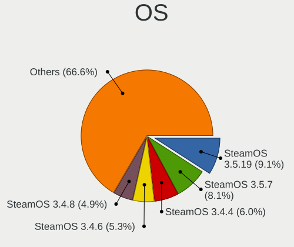

| Name                   | Computers | Percent |
|------------------------|-----------|---------|
| SteamOS 3.5.19         | 270       | 9.11%   |
| SteamOS 3.5.7          | 239       | 8.06%   |
| SteamOS 3.4.4          | 179       | 6.04%   |
| SteamOS 3.4.6          | 157       | 5.3%    |
| SteamOS 3.4.8          | 146       | 4.92%   |
| SteamOS 3.6.20         | 128       | 4.32%   |
| SteamOS 3.3.2          | 117       | 3.95%   |
| SteamOS 3.5.17         | 111       | 3.74%   |
| SteamOS 3.7.13         | 108       | 3.64%   |
| SteamOS 3.4            | 108       | 3.64%   |
| SteamOS 3.3.1          | 107       | 3.61%   |
| SteamOS 3.7.17         | 91        | 3.07%   |
| SteamOS 3.3            | 87        | 2.93%   |
| SteamOS 3.7.8          | 81        | 2.73%   |
| SteamOS 3.6.24         | 71        | 2.39%   |
| SteamOS 3.4.10         | 64        | 2.16%   |
| SteamOS 3.2            | 59        | 1.99%   |
| SteamOS 4              | 58        | 1.96%   |
| SteamOS 3.7.15         | 58        | 1.96%   |
| SteamOS 3.4.11         | 57        | 1.92%   |
| SteamOS Rolling        | 40        | 1.35%   |
| SteamOS 3.6.22         | 39        | 1.32%   |
| SteamOS 3.6.21         | 38        | 1.28%   |
| SteamOS 3.5            | 30        | 1.01%   |
| SteamOS 3.6            | 27        | 0.91%   |
| SteamOS 1.3-mesa-fixes | 27        | 0.91%   |
| SteamOS Snapshot       | 26        | 0.88%   |
| SteamOS 3.5.5          | 26        | 0.88%   |
| SteamOS 3.7            | 24        | 0.81%   |
| SteamOS 3.4.2          | 23        | 0.78%   |
| SteamOS                | 23        | 0.78%   |
| SteamOS 3.7.14         | 22        | 0.74%   |
| SteamOS 3.8            | 21        | 0.71%   |
| SteamOS 3.7.9          | 18        | 0.61%   |
| SteamOS 3.9            | 17        | 0.57%   |
| SteamOS 3.1            | 17        | 0.57%   |
| SteamOS 3.6.9          | 16        | 0.54%   |
| SteamOS 3.3.3          | 15        | 0.51%   |
| SteamOS 3.6.19         | 14        | 0.47%   |
| SteamOS 3.5.1          | 14        | 0.47%   |

OS Family
---------

OS without a version

| Name    | Computers | Percent |
|---------|-----------|---------|
| SteamOS | 2633      | 100%    |

Kernel
------

Version of the Linux kernel

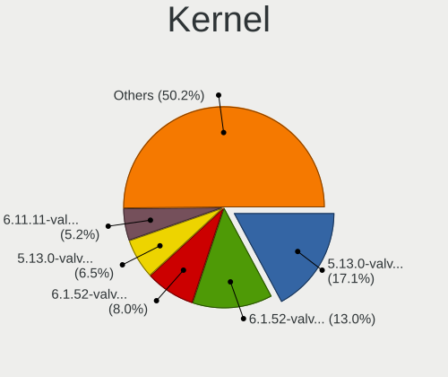

| Version                                            | Computers | Percent |
|----------------------------------------------------|-----------|---------|
| 5.13.0-valve36-1-neptune                           | 503       | 17.15%  |
| 6.1.52-valve16-1-neptune-61                        | 380       | 12.96%  |
| 6.1.52-valve9-1-neptune-61                         | 236       | 8.05%   |
| 5.13.0-valve21.3-1-neptune                         | 191       | 6.51%   |
| 6.11.11-valve24-2-neptune-611-gfd0dd251480d        | 152       | 5.18%   |
| 6.5.0-valve23-1-neptune-65-g385b5e207ae2           | 149       | 5.08%   |
| 6.5.0-valve22-1-neptune-65-g9a338ed8a75e           | 140       | 4.77%   |
| 5.13.0-valve37-1-neptune                           | 127       | 4.33%   |
| 6.11.11-valve19-1-neptune-611-g88b36d49a5e3        | 113       | 3.85%   |
| 5.13.0-valve21.1-1-neptune-02211-gc54cda5a36f3     | 110       | 3.75%   |
| 6.11.11-valve14-1-neptune-611-g96885212a919        | 83        | 2.83%   |
| 5.13.0-valve15-1-neptune-02197-gf6ec7ad3762a       | 54        | 1.84%   |
| 6.3.7-zen1-1-zen                                   | 48        | 1.64%   |
| 6.8.5-1-lljy-CFS-gcd11c870c00c                     | 43        | 1.47%   |
| 5.13.0-valve21-1-neptune-02209-g2a5bdc1102a0       | 36        | 1.23%   |
| 5.13.0-valve24-1-neptune-02226-g5b8545e4c5a1       | 31        | 1.06%   |
| 6.1.52-valve7-1-neptune-61                         | 29        | 0.99%   |
| 6.11.11-valve20-1-neptune-611-gd35c3ed359a0        | 27        | 0.92%   |
| 5.13.0-valve10.1-2-neptune-dri-02144-g7fffaf925dfb | 24        | 0.82%   |
| 6.11.11-valve26-1-neptune-611-gb3afa9aa9ae7        | 20        | 0.68%   |
| 6.11.11-valve17-1-neptune-611-g027868a0ac03        | 20        | 0.68%   |
| 6.1.52-valve2-1-neptune-61                         | 19        | 0.65%   |
| 5.13.0-valve10.3-1-neptune-02176-g5fe416c4acd8     | 19        | 0.65%   |
| 6.4.12-zen1-1-zen                                  | 17        | 0.58%   |
| 5.18.1-arch1_testHoloISO_20220606.1811             | 16        | 0.55%   |
| 5.13.0-valve10.1-1-neptune-02144-g7fffaf925dfb     | 16        | 0.55%   |
| 6.5.0-valve16-2-neptune-65-gc9ad4106624e           | 15        | 0.51%   |
| 6.1.52-valve3-1-neptune-61                         | 14        | 0.48%   |
| 6.5.0-valve12-1-neptune-65-g1889664e19fc           | 13        | 0.44%   |
| 6.5.0-valve21-1-neptune-65-g33487bf05ed3           | 12        | 0.41%   |
| 6.1.52-valve14-1-neptune-61                        | 12        | 0.41%   |
| 5.13.0-valve22-1-neptune-02213-gb68995364335       | 12        | 0.41%   |
| 5.13.0-valve31-1-neptune                           | 11        | 0.38%   |
| 6.7.4-holoiso-beta_lljy-kernel-lljy-g76a2d2abfbba  | 10        | 0.34%   |
| 6.5.0-valve19-1-neptune-65-g8e4b171a9b33           | 9         | 0.31%   |
| 6.1.52-valve10-1-neptune-61                        | 8         | 0.27%   |
| 6.1.21-valve1-3-neptune-61                         | 8         | 0.27%   |
| 6.1.21-valve1-1-neptune-61                         | 8         | 0.27%   |
| 5.13.0-valve35-1-neptune                           | 8         | 0.27%   |
| 6.5.0-valve5-1-neptune-65-g6efe817cc486            | 7         | 0.24%   |

Kernel Family
-------------

Linux kernel without a distro release

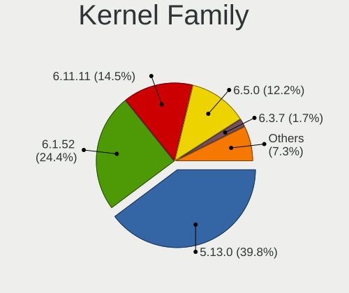

| Version | Computers | Percent |
|---------|-----------|---------|
| 5.13.0  | 1114      | 39.79%  |
| 6.1.52  | 684       | 24.43%  |
| 6.11.11 | 407       | 14.54%  |
| 6.5.0   | 342       | 12.21%  |
| 6.3.7   | 48        | 1.71%   |
| 6.8.5   | 43        | 1.54%   |
| 6.16.12 | 19        | 0.68%   |
| 6.1.21  | 18        | 0.64%   |
| 6.4.12  | 17        | 0.61%   |
| 5.18.1  | 16        | 0.57%   |
| 6.8.12  | 13        | 0.46%   |
| 6.7.4   | 10        | 0.36%   |
| 6.1.43  | 7         | 0.25%   |
| 6.15.8  | 6         | 0.21%   |
| 6.10.7  | 5         | 0.18%   |
| 6.1.12  | 5         | 0.18%   |
| 5.15.93 | 5         | 0.18%   |
| 6.8.8   | 3         | 0.11%   |
| 6.16.7  | 3         | 0.11%   |
| 6.0.9   | 3         | 0.11%   |
| 5.15.79 | 3         | 0.11%   |
| 6.15.11 | 2         | 0.07%   |
| 6.13.7  | 2         | 0.07%   |
| 6.13.10 | 2         | 0.07%   |
| 6.1.9   | 2         | 0.07%   |
| 6.1.29  | 2         | 0.07%   |
| 5.15.60 | 2         | 0.07%   |
| 5.15.54 | 2         | 0.07%   |
| 6.4.3   | 1         | 0.04%   |
| 6.4.0   | 1         | 0.04%   |
| 6.3.9   | 1         | 0.04%   |
| 6.12.6  | 1         | 0.04%   |
| 6.12.12 | 1         | 0.04%   |
| 6.11.6  | 1         | 0.04%   |
| 6.11.1  | 1         | 0.04%   |
| 6.10.4  | 1         | 0.04%   |
| 6.10.10 | 1         | 0.04%   |
| 6.1.5   | 1         | 0.04%   |
| 6.1.39  | 1         | 0.04%   |
| 6.1.3   | 1         | 0.04%   |

Kernel Major Ver.
-----------------

Linux kernel major version

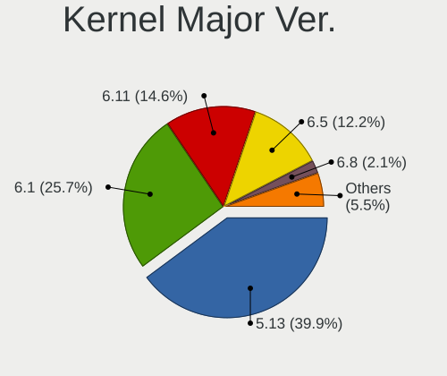

| Version | Computers | Percent |
|---------|-----------|---------|
| 5.13    | 1114      | 39.86%  |
| 6.1     | 718       | 25.69%  |
| 6.11    | 409       | 14.63%  |
| 6.5     | 342       | 12.24%  |
| 6.8     | 59        | 2.11%   |
| 6.3     | 49        | 1.75%   |
| 6.16    | 22        | 0.79%   |
| 6.4     | 18        | 0.64%   |
| 5.18    | 16        | 0.57%   |
| 5.15    | 12        | 0.43%   |
| 6.7     | 10        | 0.36%   |
| 6.15    | 8         | 0.29%   |
| 6.10    | 7         | 0.25%   |
| 6.13    | 4         | 0.14%   |
| 6.0     | 4         | 0.14%   |
| 6.12    | 2         | 0.07%   |
| 5.16    | 1         | 0.04%   |

Arch
----

OS architecture (x86_64, i586, etc.)

| Name   | Computers | Percent |
|--------|-----------|---------|
| x86_64 | 2633      | 100%    |

DE
--

Desktop Environment

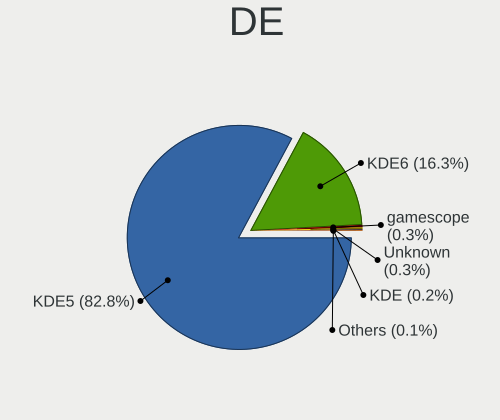

| Name      | Computers | Percent |
|-----------|-----------|---------|
| KDE5      | 2218      | 82.82%  |
| KDE6      | 437       | 16.32%  |
| gamescope | 9         | 0.34%   |
| Unknown   | 7         | 0.26%   |
| KDE       | 5         | 0.19%   |
| GNOME     | 2         | 0.07%   |

Display Server
--------------

X11 or Wayland

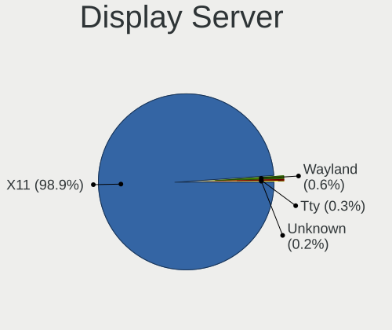

| Name    | Computers | Percent |
|---------|-----------|---------|
| X11     | 2609      | 98.9%   |
| Wayland | 17        | 0.64%   |
| Tty     | 8         | 0.3%    |
| Unknown | 4         | 0.15%   |

Display Manager
---------------

SDDM, LightDM, etc.

| Name    | Computers | Percent |
|---------|-----------|---------|
| Unknown | 2597      | 98.52%  |
| SDDM    | 39        | 1.48%   |

OS Lang
-------

Language

| Lang   | Computers | Percent |
|--------|-----------|---------|
| en_US  | 2144      | 80.51%  |
| ru_RU  | 96        | 3.6%    |
| de_DE  | 79        | 2.97%   |
| C      | 70        | 2.63%   |
| es_ES  | 42        | 1.58%   |
| fr_FR  | 38        | 1.43%   |
| en_GB  | 36        | 1.35%   |
| zh_CN  | 24        | 0.9%    |
| pt_BR  | 24        | 0.9%    |
| pl_PL  | 23        | 0.86%   |
| it_IT  | 12        | 0.45%   |
| en_DE  | 12        | 0.45%   |
| an_ES  | 7         | 0.26%   |
| ko_KR  | 5         | 0.19%   |
| cs_CZ  | 5         | 0.19%   |
| zh_TW  | 4         | 0.15%   |
| hu_HU  | 3         | 0.11%   |
| tr_TR  | 2         | 0.08%   |
| sv_SE  | 2         | 0.08%   |
| ru_UA  | 2         | 0.08%   |
| pt_PT  | 2         | 0.08%   |
| ja_JP  | 2         | 0.08%   |
| es_MX  | 2         | 0.08%   |
| en_NL  | 2         | 0.08%   |
| en_IE  | 2         | 0.08%   |
| en_CA  | 2         | 0.08%   |
| ba_RU  | 2         | 0.08%   |
| sk_SK  | 1         | 0.04%   |
| pl     | 1         | 0.04%   |
| n_US   | 1         | 0.04%   |
| nl_NL  | 1         | 0.04%   |
| nl_BE  | 1         | 0.04%   |
| nb_NO  | 1         | 0.04%   |
| ksh_DE | 1         | 0.04%   |
| hr_HR  | 1         | 0.04%   |
| fr_BE  | 1         | 0.04%   |
| et_EE  | 1         | 0.04%   |
| es_UY  | 1         | 0.04%   |
| en_SE  | 1         | 0.04%   |
| en_IN  | 1         | 0.04%   |

Boot Mode
---------

EFI or BIOS

| Mode | Computers | Percent |
|------|-----------|---------|
| BIOS | 2591      | 98.18%  |
| EFI  | 48        | 1.82%   |

Filesystem
----------

Type of filesystem

| Type  | Computers | Percent |
|-------|-----------|---------|
| Btrfs | 2619      | 99.47%  |
| Tmpfs | 12        | 0.46%   |
| Ext4  | 2         | 0.08%   |

Part. scheme
------------

Scheme of partitioning

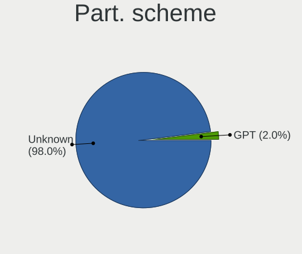

| Type    | Computers | Percent |
|---------|-----------|---------|
| Unknown | 2588      | 98.03%  |
| GPT     | 52        | 1.97%   |

Dual Boot with Linux/BSD
------------------------

Hosting more than one Linux/BSD

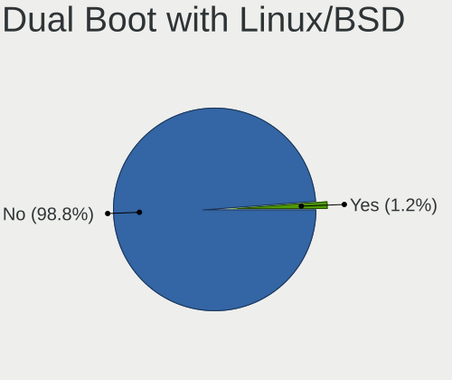

| Dual boot | Computers | Percent |
|-----------|-----------|---------|
| No        | 2606      | 98.79%  |
| Yes       | 32        | 1.21%   |

Dual Boot (Win)
---------------

Hosting Linux and Windows

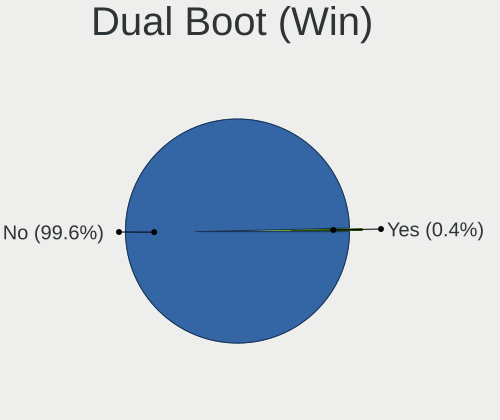

| Dual boot | Computers | Percent |
|-----------|-----------|---------|
| No        | 2623      | 99.62%  |
| Yes       | 10        | 0.38%   |

Board
-----

Vendor
------

Motherboard manufacturer

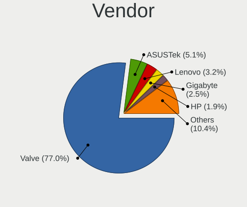

| Name                                 | Computers | Percent |
|--------------------------------------|-----------|---------|
| Valve                                | 2028      | 77.02%  |
| ASUSTek Computer                     | 133       | 5.05%   |
| Lenovo                               | 83        | 3.15%   |
| Gigabyte Technology                  | 65        | 2.47%   |
| Hewlett-Packard                      | 51        | 1.94%   |
| MSI                                  | 47        | 1.79%   |
| ASRock                               | 45        | 1.71%   |
| Dell                                 | 31        | 1.18%   |
| Apple                                | 19        | 0.72%   |
| Acer                                 | 12        | 0.46%   |
| Shenzhen Meigao Electronic Equipment | 11        | 0.42%   |
| AZW                                  | 11        | 0.42%   |
| Unknown                              | 11        | 0.42%   |
| GPD                                  | 10        | 0.38%   |
| Intel                                | 9         | 0.34%   |
| AYANEO                               | 7         | 0.27%   |
| ONE-NETBOOK                          | 6         | 0.23%   |
| AOKZOE                               | 5         | 0.19%   |
| ONE-NETBOOK TECHNOLOGY               | 4         | 0.15%   |
| Alienware                            | 4         | 0.15%   |
| Google                               | 3         | 0.11%   |
| Anbernic                             | 3         | 0.11%   |
| Samsung Electronics                  | 2         | 0.08%   |
| Microsoft                            | 2         | 0.08%   |
| Medion                               | 2         | 0.08%   |
| MACHINIST                            | 2         | 0.08%   |
| JGINYUE                              | 2         | 0.08%   |
| GMKtec                               | 2         | 0.08%   |
| Biostar                              | 2         | 0.08%   |
| AMI                                  | 2         | 0.08%   |
| Terrans Force                        | 1         | 0.04%   |
| Teclast                              | 1         | 0.04%   |
| SZQFTX                               | 1         | 0.04%   |
| Supermicro                           | 1         | 0.04%   |
| Sony                                 | 1         | 0.04%   |
| QIYIDA                               | 1         | 0.04%   |
| NZXT                                 | 1         | 0.04%   |
| Monster                              | 1         | 0.04%   |
| Micro Computer (HK) Tech Limited     | 1         | 0.04%   |
| MeLE                                 | 1         | 0.04%   |

Model
-----

Motherboard model

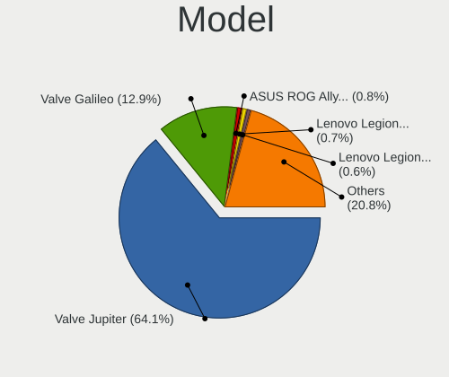

| Name                                                  | Computers | Percent |
|-------------------------------------------------------|-----------|---------|
| Valve Jupiter                                         | 1688      | 64.11%  |
| Valve Galileo                                         | 340       | 12.91%  |
| ASUS ROG Ally RC71L_RC71L                             | 22        | 0.84%   |
| Lenovo Legion Go 8APU1 83E1                           | 19        | 0.72%   |
| Lenovo Legion Go S 8ARP1 83L3                         | 17        | 0.65%   |
| Lenovo Legion Go S 8APU1 83N6                         | 14        | 0.53%   |
| Unknown                                               | 13        | 0.49%   |
| AZW SER                                               | 8         | 0.3%    |
| ASUS All Series                                       | 8         | 0.3%    |
| GPD G1619-04                                          | 5         | 0.19%   |
| ONE-NETBOOK TECHNOLOGY ONE XPLAYER                    | 4         | 0.15%   |
| MSI MS-7C91                                           | 4         | 0.15%   |
| Lenovo IdeaPad Gaming 3 15ACH6 82K2                   | 4         | 0.15%   |
| Gigabyte B550 GAMING X V2                             | 4         | 0.15%   |
| Gigabyte B450M GAMING                                 | 4         | 0.15%   |
| Gigabyte B450 AORUS M                                 | 4         | 0.15%   |
| ASUS PRIME A320M-K                                    | 4         | 0.15%   |
| AOKZOE A1 AR07                                        | 4         | 0.15%   |
| Shenzhen Meigao Electronic Equipment EliteMini Series | 3         | 0.11%   |
| MSI MS-7C37                                           | 3         | 0.11%   |
| MSI MS-7C02                                           | 3         | 0.11%   |
| MSI MS-7B79                                           | 3         | 0.11%   |
| ASUS TUF Gaming X570-PLUS                             | 3         | 0.11%   |
| ASUS ROG STRIX B550-I GAMING                          | 3         | 0.11%   |
| ASUS ROG STRIX B550-F GAMING                          | 3         | 0.11%   |
| ASRock B550M Pro4                                     | 3         | 0.11%   |
| ASRock B450 Gaming-ITX/ac                             | 3         | 0.11%   |
| Apple MacPro5,1                                       | 3         | 0.11%   |
| Apple MacBookPro15,1                                  | 3         | 0.11%   |
| Anbernic Win600                                       | 3         | 0.11%   |
| Shenzhen Meigao Electronic Equipment AtomMan G Series | 2         | 0.08%   |
| ONE-NETBOOK ONEXPLAYER Mini Pro                       | 2         | 0.08%   |
| ONE-NETBOOK ONEXPLAYER 2 ARP23                        | 2         | 0.08%   |
| MSI MS-7C95                                           | 2         | 0.08%   |
| Lenovo IdeaPadFlex 5 14ALC05 82HU                     | 2         | 0.08%   |
| Intel X99                                             | 2         | 0.08%   |
| HP Victus by 15L Gaming Desktop TG02-0xxx             | 2         | 0.08%   |
| HP Pavilion Laptop 15-eh0xxx                          | 2         | 0.08%   |
| HP Pavilion 17                                        | 2         | 0.08%   |
| HP Laptop 15s-eq2xxx                                  | 2         | 0.08%   |

Model Family
------------

Motherboard model prefix

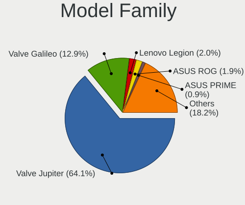

| Name                                           | Computers | Percent |
|------------------------------------------------|-----------|---------|
| Valve Jupiter                                  | 1688      | 64.11%  |
| Valve Galileo                                  | 340       | 12.91%  |
| Lenovo Legion                                  | 53        | 2.01%   |
| ASUS ROG                                       | 50        | 1.9%    |
| ASUS PRIME                                     | 24        | 0.91%   |
| ASUS TUF                                       | 17        | 0.65%   |
| HP Pavilion                                    | 14        | 0.53%   |
| Unknown                                        | 13        | 0.49%   |
| Lenovo IdeaPad                                 | 11        | 0.42%   |
| HP Laptop                                      | 9         | 0.34%   |
| Dell OptiPlex                                  | 8         | 0.3%    |
| AZW SER                                        | 8         | 0.3%    |
| ASUS All                                       | 8         | 0.3%    |
| HP Victus                                      | 7         | 0.27%   |
| Gigabyte B450M                                 | 7         | 0.27%   |
| Gigabyte B450                                  | 7         | 0.27%   |
| Dell Precision                                 | 7         | 0.27%   |
| ONE-NETBOOK ONEXPLAYER                         | 6         | 0.23%   |
| Gigabyte B550M                                 | 6         | 0.23%   |
| Dell Inspiron                                  | 6         | 0.23%   |
| Acer Nitro                                     | 6         | 0.23%   |
| Lenovo ThinkCentre                             | 5         | 0.19%   |
| GPD G1619-04                                   | 5         | 0.19%   |
| ASUS ASUS                                      | 5         | 0.19%   |
| ASRock B550M                                   | 5         | 0.19%   |
| AOKZOE A1                                      | 5         | 0.19%   |
| Acer Aspire                                    | 5         | 0.19%   |
| ONE-NETBOOK TECHNOLOGY ONE                     | 4         | 0.15%   |
| MSI MS-7C91                                    | 4         | 0.15%   |
| Gigabyte B550                                  | 4         | 0.15%   |
| ASRock X570                                    | 4         | 0.15%   |
| ASRock B450                                    | 4         | 0.15%   |
| Shenzhen Meigao Electronic Equipment EliteMini | 3         | 0.11%   |
| MSI MS-7C37                                    | 3         | 0.11%   |
| MSI MS-7C02                                    | 3         | 0.11%   |
| MSI MS-7B79                                    | 3         | 0.11%   |
| Lenovo ThinkPad                                | 3         | 0.11%   |
| HP ProBook                                     | 3         | 0.11%   |
| HP EliteDesk                                   | 3         | 0.11%   |
| Gigabyte X570                                  | 3         | 0.11%   |

MFG Year
--------

Motherboard manufacture year

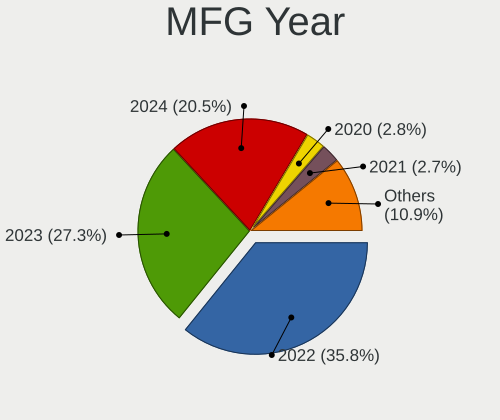

| Year    | Computers | Percent |
|---------|-----------|---------|
| 2022    | 943       | 35.81%  |
| 2023    | 718       | 27.27%  |
| 2024    | 539       | 20.47%  |
| 2020    | 75        | 2.85%   |
| 2021    | 72        | 2.73%   |
| 2018    | 56        | 2.13%   |
| 2019    | 44        | 1.67%   |
| 2025    | 42        | 1.6%    |
| 2017    | 38        | 1.44%   |
| 2016    | 20        | 0.76%   |
| 2015    | 16        | 0.61%   |
| 2013    | 16        | 0.61%   |
| 2012    | 16        | 0.61%   |
| Unknown | 16        | 0.61%   |
| 2014    | 13        | 0.49%   |
| 2011    | 4         | 0.15%   |
| 2010    | 2         | 0.08%   |
| 2009    | 2         | 0.08%   |
| 2008    | 1         | 0.04%   |

Form Factor
-----------

Physical design of the computer

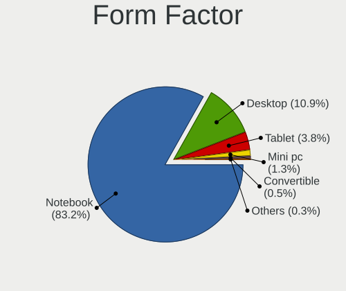

| Name        | Computers | Percent |
|-------------|-----------|---------|
| Notebook    | 2190      | 83.18%  |
| Desktop     | 288       | 10.94%  |
| Tablet      | 99        | 3.76%   |
| Mini pc     | 33        | 1.25%   |
| Convertible | 14        | 0.53%   |
| All in one  | 7         | 0.27%   |
| Server      | 2         | 0.08%   |

Secure Boot
-----------

Enabled or disabled

| State    | Computers | Percent |
|----------|-----------|---------|
| Disabled | 2633      | 100%    |

Coreboot
--------

Have coreboot on board

| Used | Computers | Percent |
|------|-----------|---------|
| No   | 2630      | 99.89%  |
| Yes  | 3         | 0.11%   |

RAM Size
--------

Total RAM memory

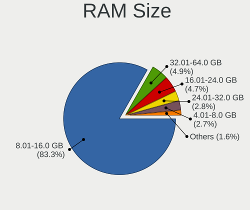

| Size in GB  | Computers | Percent |
|-------------|-----------|---------|
| 8.01-16.0   | 2195      | 83.27%  |
| 32.01-64.0  | 130       | 4.93%   |
| 16.01-24.0  | 123       | 4.67%   |
| 24.01-32.0  | 75        | 2.85%   |
| 4.01-8.0    | 72        | 2.73%   |
| 64.01-256.0 | 24        | 0.91%   |
| 3.01-4.0    | 15        | 0.57%   |
| 2.01-3.0    | 1         | 0.04%   |
| 1.01-2.0    | 1         | 0.04%   |

RAM Used
--------

Used RAM memory

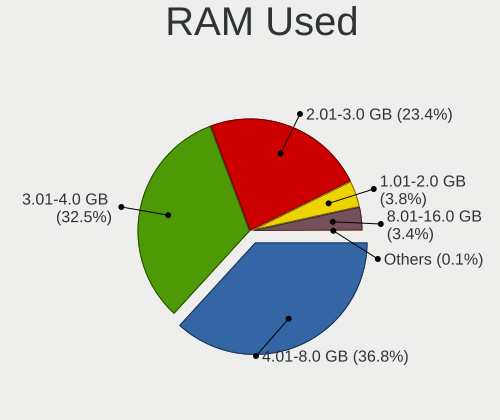

| Used GB   | Computers | Percent |
|-----------|-----------|---------|
| 4.01-8.0  | 1053      | 36.79%  |
| 3.01-4.0  | 930       | 32.49%  |
| 2.01-3.0  | 670       | 23.41%  |
| 1.01-2.0  | 110       | 3.84%   |
| 8.01-16.0 | 97        | 3.39%   |
| 0.51-1.0  | 2         | 0.07%   |

Total Drives
------------

Number of drives on board

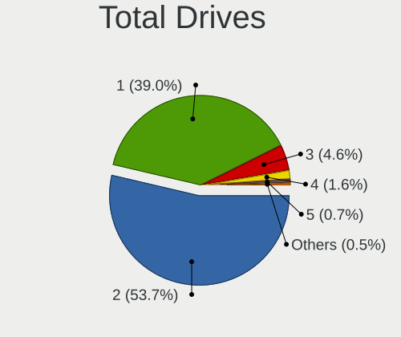

| Drives | Computers | Percent |
|--------|-----------|---------|
| 2      | 1461      | 53.65%  |
| 1      | 1062      | 39%     |
| 3      | 126       | 4.63%   |
| 4      | 43        | 1.58%   |
| 5      | 18        | 0.66%   |
| 6      | 6         | 0.22%   |
| 8      | 2         | 0.07%   |
| 7      | 2         | 0.07%   |
| 0      | 2         | 0.07%   |
| 11     | 1         | 0.04%   |

Has CD-ROM
----------

Has CD-ROM on board

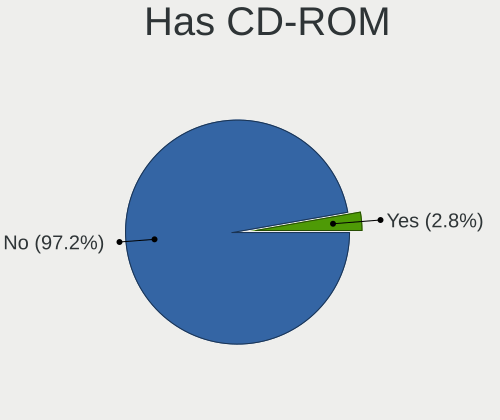

| Presented | Computers | Percent |
|-----------|-----------|---------|
| No        | 2562      | 97.23%  |
| Yes       | 73        | 2.77%   |

Has Ethernet
------------

Has Ethernet on board

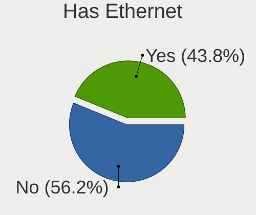

| Presented | Computers | Percent |
|-----------|-----------|---------|
| No        | 1522      | 56.18%  |
| Yes       | 1187      | 43.82%  |

Has WiFi
--------

Has WiFi module

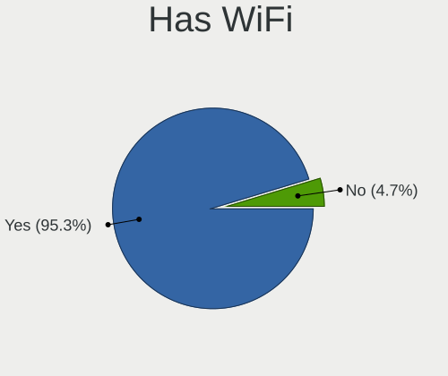

| Presented | Computers | Percent |
|-----------|-----------|---------|
| Yes       | 2512      | 95.33%  |
| No        | 123       | 4.67%   |

Has Bluetooth
-------------

Has Bluetooth module

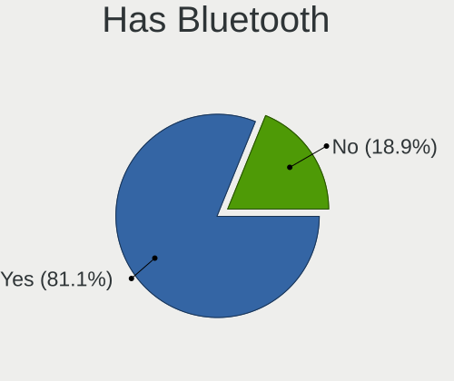

| Presented | Computers | Percent |
|-----------|-----------|---------|
| Yes       | 2141      | 81.13%  |
| No        | 498       | 18.87%  |

Location
--------

Country
-------

Geographic location (country)

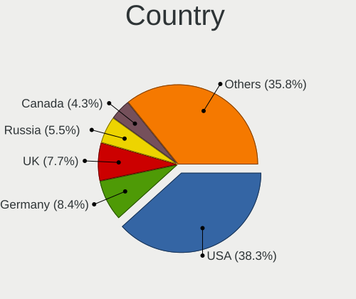

| Country      | Computers | Percent |
|--------------|-----------|---------|
| USA          | 1012      | 38.29%  |
| Germany      | 222       | 8.4%    |
| UK           | 204       | 7.72%   |
| Russia       | 146       | 5.52%   |
| Canada       | 113       | 4.28%   |
| France       | 81        | 3.06%   |
| Poland       | 72        | 2.72%   |
| Brazil       | 70        | 2.65%   |
| Spain        | 62        | 2.35%   |
| Australia    | 45        | 1.7%    |
| Netherlands  | 44        | 1.66%   |
| Italy        | 36        | 1.36%   |
| Mexico       | 31        | 1.17%   |
| China        | 29        | 1.1%    |
| Sweden       | 20        | 0.76%   |
| Philippines  | 20        | 0.76%   |
| Hungary      | 20        | 0.76%   |
| Austria      | 20        | 0.76%   |
| Czechia      | 19        | 0.72%   |
| Israel       | 17        | 0.64%   |
| Romania      | 15        | 0.57%   |
| Indonesia    | 15        | 0.57%   |
| Chile        | 15        | 0.57%   |
| Saudi Arabia | 14        | 0.53%   |
| Ireland      | 13        | 0.49%   |
| Belgium      | 13        | 0.49%   |
| Ukraine      | 12        | 0.45%   |
| UAE          | 12        | 0.45%   |
| Switzerland  | 12        | 0.45%   |
| Japan        | 12        | 0.45%   |
| Portugal     | 11        | 0.42%   |
| India        | 11        | 0.42%   |
| South Korea  | 10        | 0.38%   |
| Denmark      | 10        | 0.38%   |
| Slovakia     | 9         | 0.34%   |
| Hong Kong    | 9         | 0.34%   |
| Turkey       | 8         | 0.3%    |
| Taiwan       | 8         | 0.3%    |
| Finland      | 8         | 0.3%    |
| New Zealand  | 7         | 0.26%   |

City
----

Geographic location (city)

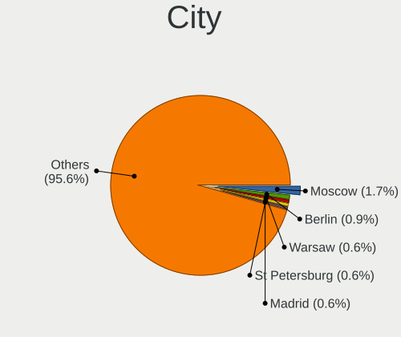

| City          | Computers | Percent |
|---------------|-----------|---------|
| Moscow        | 46        | 1.66%   |
| Berlin        | 25        | 0.9%    |
| Warsaw        | 17        | 0.61%   |
| St Petersburg | 17        | 0.61%   |
| Madrid        | 16        | 0.58%   |
| Chicago       | 16        | 0.58%   |
| Dallas        | 15        | 0.54%   |
| Toronto       | 14        | 0.51%   |
| Sydney        | 13        | 0.47%   |
| Seattle       | 13        | 0.47%   |
| Santiago      | 12        | 0.43%   |
| Portland      | 12        | 0.43%   |
| Austin        | 12        | 0.43%   |
| Prague        | 11        | 0.4%    |
| Melbourne     | 11        | 0.4%    |
| Los Angeles   | 11        | 0.4%    |
| Atlanta       | 11        | 0.4%    |
| Sao Paulo     | 10        | 0.36%   |
| Flushing      | 10        | 0.36%   |
| New York      | 9         | 0.32%   |
| London        | 9         | 0.32%   |
| Hamburg       | 9         | 0.32%   |
| Dubai         | 9         | 0.32%   |
| Denver        | 9         | 0.32%   |
| Budapest      | 9         | 0.32%   |
| Vienna        | 8         | 0.29%   |
| The Bronx     | 8         | 0.29%   |
| Manchester    | 8         | 0.29%   |
| Brooklyn      | 8         | 0.29%   |
| Brisbane      | 8         | 0.29%   |
| San Antonio   | 7         | 0.25%   |
| Rome          | 7         | 0.25%   |
| Phoenix       | 7         | 0.25%   |
| Munich        | 7         | 0.25%   |
| Las Vegas     | 7         | 0.25%   |
| Indianapolis  | 7         | 0.25%   |
| Edmonton      | 7         | 0.25%   |
| Amsterdam     | 7         | 0.25%   |
| Tel Aviv      | 6         | 0.22%   |
| Stockholm     | 6         | 0.22%   |

Drives
------

Drive Vendor
------------

Hard drive vendors

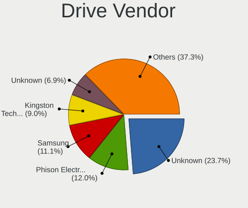

| Vendor                         | Computers | Drives | Percent |
|--------------------------------|-----------|--------|---------|
| Unknown                        | 1073      | 1289   | 23.73%  |
| Phison Electronics             | 541       | 653    | 11.96%  |
| Samsung Electronics            | 504       | 643    | 11.15%  |
| Kingston Technology Company    | 405       | 489    | 8.96%   |
| Unknown                        | 313       | 371    | 6.92%   |
| O2 Micro                       | 247       | 281    | 5.46%   |
| Sandisk                        | 230       | 276    | 5.09%   |
| Kingston                       | 168       | 186    | 3.72%   |
| Micron Technology              | 136       | 155    | 3.01%   |
| Seagate                        | 107       | 136    | 2.37%   |
| Phison                         | 91        | 95     | 2.01%   |
| Silicon Motion                 | 80        | 91     | 1.77%   |
| SK hynix                       | 72        | 89     | 1.59%   |
| WDC                            | 68        | 82     | 1.5%    |
| MAXIO Technology (Hangzhou)    | 42        | 49     | 0.93%   |
| KIOXIA                         | 40        | 46     | 0.88%   |
| Micron/Crucial Technology      | 38        | 38     | 0.84%   |
| Crucial                        | 35        | 45     | 0.77%   |
| Toshiba                        | 33        | 37     | 0.73%   |
| JMicron Technology             | 20        | 20     | 0.44%   |
| Realtek                        | 18        | 22     | 0.4%    |
| A-DATA Technology              | 17        | 17     | 0.38%   |
| Intel                          | 16        | 18     | 0.35%   |
| PNY                            | 13        | 16     | 0.29%   |
| Biwin Storage Technology       | 13        | 15     | 0.29%   |
| Apple                          | 12        | 16     | 0.27%   |
| Shenzhen Longsys Electronics   | 11        | 12     | 0.24%   |
| Realtek Semiconductor          | 10        | 10     | 0.22%   |
| China                          | 10        | 14     | 0.22%   |
| ADATA Technology               | 10        | 11     | 0.22%   |
| SPCC                           | 7         | 9      | 0.15%   |
| Patriot                        | 7         | 7      | 0.15%   |
| Solid State Storage Technology | 6         | 7      | 0.13%   |
| SABRENT                        | 6         | 6      | 0.13%   |
| Hitachi                        | 6         | 6      | 0.13%   |
| ASMT                           | 6         | 7      | 0.13%   |
| SSK                            | 4         | 4      | 0.09%   |
| Intenso                        | 4         | 4      | 0.09%   |
| HGST                           | 4         | 4      | 0.09%   |
| Union Memory (Shenzhen)        | 3         | 3      | 0.07%   |

Drive Model
-----------

Hard drive models

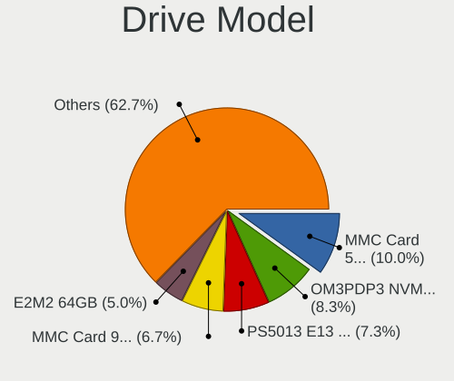

| Model                                                 | Computers | Percent |
|-------------------------------------------------------|-----------|---------|
| Unknown MMC Card  512GB                               | 464       | 9.96%   |
| Kingston Company OM3PDP3 NVMe SSD 256GB               | 386       | 8.29%   |
| Phison PS5013 E13 NVMe Controller 500GB               | 341       | 7.32%   |
| Unknown                                               | 313       | 6.72%   |
| O2 Micro E2M2 64GB                                    | 233       | 5%      |
| Unknown MMC Card  256GB                               | 231       | 4.96%   |
| Samsung MZ9LQ512HBLU-00BVL 512GB                      | 166       | 3.56%   |
| Unknown MMC Card  128GB                               | 137       | 2.94%   |
| Samsung MZ9LQ256HBJD-00BVL 256GB                      | 94        | 2.02%   |
| Silicon Motion SM2263EN/SM2263XT SSD Controller 512GB | 56        | 1.2%    |
| Phison NVMe SSD Drive 512GB                           | 55        | 1.18%   |
| Unknown MMC Card  64GB                                | 53        | 1.14%   |
| Micron 2400_MTFDKBK1T0QFM 1024GB                      | 51        | 1.1%    |
| Sandisk WD PC SN740 SDDPTQD-1T00 1024GB               | 47        | 1.01%   |
| Kingston NVMe SSD Drive 512GB                         | 42        | 0.9%    |
| Unknown MMC Card  32GB                                | 41        | 0.88%   |
| Phison Sabrent SB-2130-1TB                            | 40        | 0.86%   |
| Phison ESMP001TKB5C3-E19TS 1024GB                     | 35        | 0.75%   |
| Micron 2400_MTFDKBK512QFM 512GB                       | 35        | 0.75%   |
| Sandisk WD PC SN740 SDDPTQE-2T00 2TB                  | 33        | 0.71%   |
| Kingston NVMe SSD Drive 256GB                         | 32        | 0.69%   |
| Unknown MMC Card  393GB                               | 30        | 0.64%   |
| Samsung MZ9L41T0HBLB-00AVL 1024GB                     | 30        | 0.64%   |
| MAXIO (Hangzhou) NVMe SSD Controller MAP1202 2TB      | 29        | 0.62%   |
| Samsung NVMe SSD Controller SM981/PM981/PM983 1TB     | 25        | 0.54%   |
| Phison ESMP512GHV7C3-E21TS 512GB                      | 23        | 0.49%   |
| Unknown MMC Card  1TB                                 | 22        | 0.47%   |
| Kingston OM3PGP41024P-A0 1TB                          | 21        | 0.45%   |
| Phison NVMe SSD Drive 256GB                           | 18        | 0.39%   |
| Phison Corsair MP600 MINI 2TB                         | 18        | 0.39%   |
| Phison ESMP001TMN48C3-E21TS 1024GB                    | 17        | 0.37%   |
| Unknown MMC Card  250GB                               | 15        | 0.32%   |
| Unknown MMC Card  16GB                                | 15        | 0.32%   |
| O2 Micro NVMe SSD Drive 64GB                          | 15        | 0.32%   |
| Kingston OM3PGP4512Q-A0 512GB                         | 15        | 0.32%   |
| Sandisk WDC PC SN530 SDBPTPZ-1T00 1024GB              | 14        | 0.3%    |
| Sandisk WD Blue SN550 NVMe SSD 1024GB                 | 14        | 0.3%    |
| Samsung MZ9LQ1T0HBLB-00B00 1024GB                     | 14        | 0.3%    |
| Micron/Crucial P2 NVMe PCIe SSD 2TB                   | 14        | 0.3%    |
| Realtek RTL9210B-CG 500GB                             | 13        | 0.28%   |

HDD Vendor
----------

Hard disk drive vendors

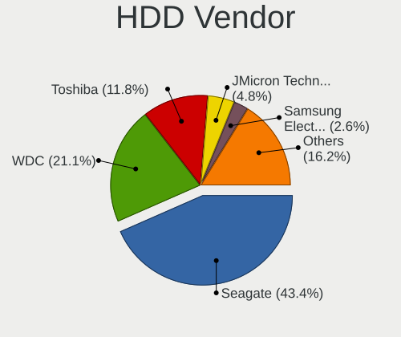

| Vendor              | Computers | Drives | Percent |
|---------------------|-----------|--------|---------|
| Seagate             | 99        | 125    | 43.42%  |
| WDC                 | 48        | 57     | 21.05%  |
| Toshiba             | 27        | 30     | 11.84%  |
| JMicron Technology  | 11        | 11     | 4.82%   |
| Samsung Electronics | 6         | 6      | 2.63%   |
| Hitachi             | 6         | 6      | 2.63%   |
| ASMT                | 5         | 6      | 2.19%   |
| Apple               | 5         | 9      | 2.19%   |
| HGST                | 4         | 4      | 1.75%   |
| Intenso             | 3         | 3      | 1.32%   |
| Unknown             | 2         | 2      | 0.88%   |
| T-FORCE             | 2         | 2      | 0.88%   |
| Maxone              | 2         | 2      | 0.88%   |
| External            | 2         | 3      | 0.88%   |
| TO Exter            | 1         | 1      | 0.44%   |
| StoreJet            | 1         | 1      | 0.44%   |
| SSK                 | 1         | 1      | 0.44%   |
| Maxtor              | 1         | 1      | 0.44%   |
| LaCie               | 1         | 1      | 0.44%   |
| HGST HTS            | 1         | 1      | 0.44%   |

SSD Vendor
----------

Solid state drive vendors

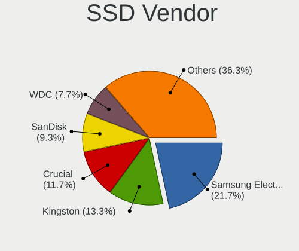

| Vendor              | Computers | Drives | Percent |
|---------------------|-----------|--------|---------|
| Samsung Electronics | 65        | 88     | 21.67%  |
| Kingston            | 40        | 44     | 13.33%  |
| Crucial             | 35        | 45     | 11.67%  |
| SanDisk             | 28        | 29     | 9.33%   |
| WDC                 | 23        | 24     | 7.67%   |
| A-DATA Technology   | 14        | 14     | 4.67%   |
| PNY                 | 13        | 16     | 4.33%   |
| China               | 10        | 14     | 3.33%   |
| SPCC                | 6         | 8      | 2%      |
| Patriot             | 5         | 5      | 1.67%   |
| Micron Technology   | 5         | 6      | 1.67%   |
| SABRENT             | 4         | 4      | 1.33%   |
| Mushkin             | 3         | 3      | 1%      |
| Verbatim            | 2         | 3      | 0.67%   |
| Transcend           | 2         | 2      | 0.67%   |
| Team                | 2         | 3      | 0.67%   |
| SK hynix            | 2         | 2      | 0.67%   |
| KingSpec            | 2         | 2      | 0.67%   |
| HUSKY               | 2         | 2      | 0.67%   |
| GLOWAY              | 2         | 2      | 0.67%   |
| Gigabyte Technology | 2         | 2      | 0.67%   |
| Corsair             | 2         | 2      | 0.67%   |
| BIWIN               | 2         | 2      | 0.67%   |
| Apple               | 2         | 2      | 0.67%   |
| Unknown             | 2         | 2      | 0.67%   |
| ZOTAC               | 1         | 1      | 0.33%   |
| WDC WDB             | 1         | 1      | 0.33%   |
| Union Memory        | 1         | 1      | 0.33%   |
| TrekStor            | 1         | 1      | 0.33%   |
| Seagate             | 1         | 1      | 0.33%   |
| Ramsta              | 1         | 1      | 0.33%   |
| NGFF                | 1         | 1      | 0.33%   |
| Netac               | 1         | 1      | 0.33%   |
| LITEON              | 1         | 1      | 0.33%   |
| Lexar 25            | 1         | 1      | 0.33%   |
| KODAK               | 1         | 1      | 0.33%   |
| Kingchuxing         | 1         | 1      | 0.33%   |
| KEEPDATA            | 1         | 1      | 0.33%   |
| Intenso             | 1         | 1      | 0.33%   |
| INTEL SS            | 1         | 1      | 0.33%   |

Drive Kind
----------

HDD or SSD

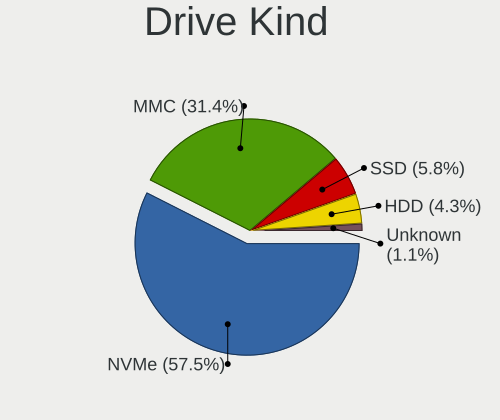

| Kind    | Computers | Drives | Percent |
|---------|-----------|--------|---------|
| NVMe    | 2491      | 3073   | 57.46%  |
| MMC     | 1360      | 1638   | 31.37%  |
| SSD     | 250       | 352    | 5.77%   |
| HDD     | 188       | 272    | 4.34%   |
| Unknown | 46        | 49     | 1.06%   |

Drive Connector
---------------

SATA, SAS, NVMe, etc.

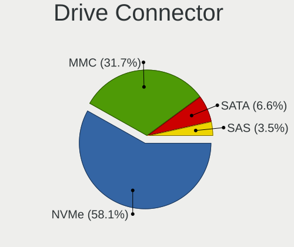

| Type | Computers | Drives | Percent |
|------|-----------|--------|---------|
| NVMe | 2491      | 3029   | 58.15%  |
| MMC  | 1360      | 1638   | 31.75%  |
| SATA | 284       | 527    | 6.63%   |
| SAS  | 149       | 190    | 3.48%   |

Drive Size
----------

Size of hard drive

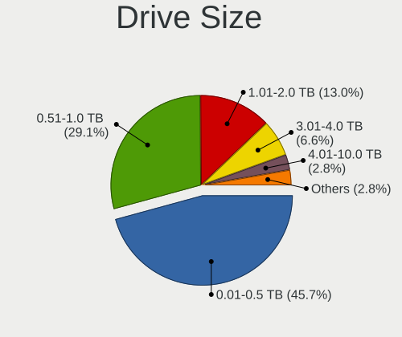

| Size in TB | Computers | Drives | Percent |
|------------|-----------|--------|---------|
| 0.01-0.5   | 215       | 290    | 45.74%  |
| 0.51-1.0   | 137       | 182    | 29.15%  |
| 1.01-2.0   | 61        | 86     | 12.98%  |
| 3.01-4.0   | 31        | 37     | 6.6%    |
| 4.01-10.0  | 13        | 13     | 2.77%   |
| 10.01-20.0 | 7         | 8      | 1.49%   |
| 2.01-3.0   | 6         | 8      | 1.28%   |

Space Total
-----------

Amount of disk space available on the file system

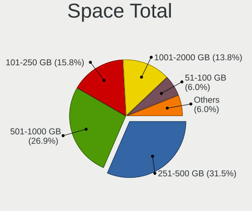

| Size in GB     | Computers | Percent |
|----------------|-----------|---------|
| 251-500        | 874       | 31.47%  |
| 501-1000       | 746       | 26.86%  |
| 101-250        | 438       | 15.77%  |
| 1001-2000      | 384       | 13.83%  |
| 51-100         | 167       | 6.01%   |
| 2001-3000      | 80        | 2.88%   |
| More than 3000 | 69        | 2.48%   |
| 21-50          | 8         | 0.29%   |
| Unknown        | 8         | 0.29%   |
| 1-20           | 3         | 0.11%   |

Space Used
----------

Amount of used disk space

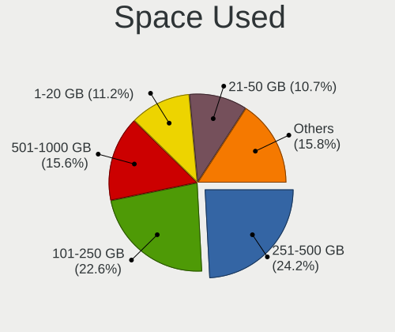

| Used GB        | Computers | Percent |
|----------------|-----------|---------|
| 251-500        | 685       | 24.16%  |
| 101-250        | 641       | 22.61%  |
| 501-1000       | 441       | 15.56%  |
| 1-20           | 317       | 11.18%  |
| 21-50          | 302       | 10.65%  |
| 51-100         | 229       | 8.08%   |
| 1001-2000      | 165       | 5.82%   |
| 2001-3000      | 29        | 1.02%   |
| More than 3000 | 18        | 0.63%   |
| Unknown        | 8         | 0.28%   |

Malfunc. Drives
---------------

Drive models with a malfunction

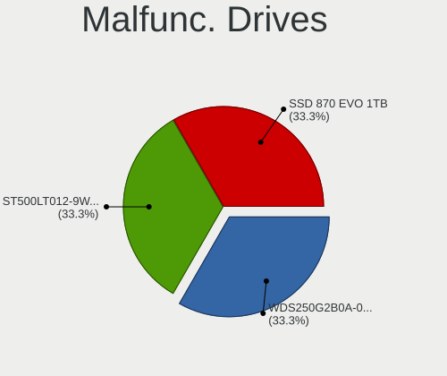

| Model                               | Computers | Drives | Percent |
|-------------------------------------|-----------|--------|---------|
| WDC WDS250G2B0A-00SM50 250GB SSD    | 1         | 1      | 33.33%  |
| Seagate ST500LT012-9WS142 500GB     | 1         | 1      | 33.33%  |
| Samsung Electronics SSD 870 EVO 1TB | 1         | 2      | 33.33%  |

Malfunc. Drive Vendor
---------------------

Vendors of faulty drives

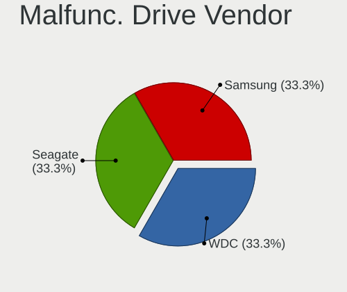

| Vendor              | Computers | Drives | Percent |
|---------------------|-----------|--------|---------|
| WDC                 | 1         | 1      | 33.33%  |
| Seagate             | 1         | 1      | 33.33%  |
| Samsung Electronics | 1         | 2      | 33.33%  |

Malfunc. HDD Vendor
-------------------

Vendors of faulty HDD drives

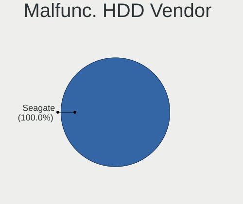

| Vendor  | Computers | Drives | Percent |
|---------|-----------|--------|---------|
| Seagate | 1         | 1      | 100%    |

Malfunc. Drive Kind
-------------------

Kinds of faulty drives

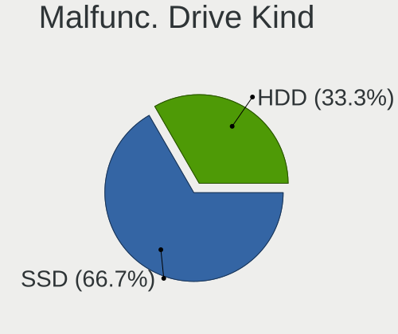

| Kind | Computers | Drives | Percent |
|------|-----------|--------|---------|
| SSD  | 2         | 3      | 66.67%  |
| HDD  | 1         | 1      | 33.33%  |

Failed Drives
-------------

Failed drive models

Zero info for selected period =(

Failed Drive Vendor
-------------------

Failed drive vendors

Zero info for selected period =(

Drive Status
------------

Number of failed and malfunc. drives

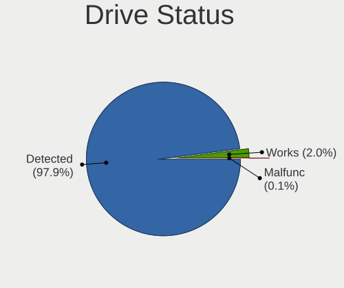

| Status   | Computers | Drives | Percent |
|----------|-----------|--------|---------|
| Detected | 2610      | 5313   | 97.9%   |
| Works    | 53        | 67     | 1.99%   |
| Malfunc  | 3         | 4      | 0.11%   |

Storage controller
------------------

Storage Vendor
--------------

Storage controller vendors

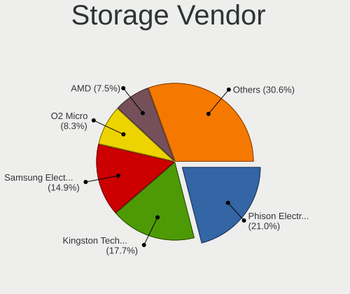

| Vendor                                  | Computers | Percent |
|-----------------------------------------|-----------|---------|
| Phison Electronics                      | 624       | 21%     |
| Kingston Technology Company             | 525       | 17.67%  |
| Samsung Electronics                     | 444       | 14.94%  |
| O2 Micro                                | 247       | 8.31%   |
| AMD                                     | 223       | 7.51%   |
| SanDisk                                 | 210       | 7.07%   |
| Intel                                   | 181       | 6.09%   |
| Micron Technology                       | 131       | 4.41%   |
| Silicon Motion                          | 80        | 2.69%   |
| SK hynix                                | 71        | 2.39%   |
| MAXIO Technology (Hangzhou)             | 42        | 1.41%   |
| KIOXIA                                  | 40        | 1.35%   |
| Micron/Crucial Technology               | 38        | 1.28%   |
| Biwin Storage Technology                | 14        | 0.47%   |
| ADATA Technology                        | 13        | 0.44%   |
| INNOGRIT                                | 12        | 0.4%    |
| ASMedia Technology                      | 12        | 0.4%    |
| Shenzhen Longsys Electronics            | 11        | 0.37%   |
| Realtek Semiconductor                   | 10        | 0.34%   |
| Solid State Storage Technology          | 9         | 0.3%    |
| Toshiba America Info Systems            | 7         | 0.24%   |
| Apple                                   | 5         | 0.17%   |
| Solidigm                                | 4         | 0.13%   |
| Marvell Technology Group                | 4         | 0.13%   |
| Union Memory (Shenzhen)                 | 3         | 0.1%    |
| Yangtze Memory Technologies             | 2         | 0.07%   |
| TenaFe                                  | 2         | 0.07%   |
| Seagate Technology                      | 2         | 0.07%   |
| Hosin Global Electronics                | 2         | 0.07%   |
| Transcend                               | 1         | 0.03%   |
| Shenzhen Unionmemory Information System | 1         | 0.03%   |
| Netac Technology                        | 1         | 0.03%   |

Storage Model
-------------

Storage controller models

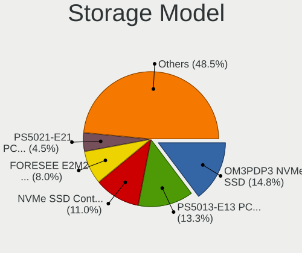

| Model                                                                          | Computers | Percent |
|--------------------------------------------------------------------------------|-----------|---------|
| Kingston Company OM3PDP3 NVMe SSD                                              | 453       | 14.76%  |
| Phison PS5013-E13 PCIe3 NVMe Controller (DRAM-less)                            | 408       | 13.29%  |
| Samsung NVMe SSD Controller 980 (DRAM-less)                                    | 337       | 10.98%  |
| O2 Micro FORESEE E2M2 NVMe SSD                                                 | 247       | 8.05%   |
| Phison PS5021-E21 PCIe4 NVMe Controller (DRAM-less)                            | 137       | 4.46%   |
| AMD FCH SATA Controller [AHCI mode]                                            | 126       | 4.1%    |
| Micron 2400 NVMe SSD (DRAM-less)                                               | 103       | 3.36%   |
| Sandisk PC SN740 NVMe SSD (DRAM-less)                                          | 91        | 2.96%   |
| Silicon Motion SM2263EN/SM2263XT (DRAM-less) NVMe SSD Controllers              | 68        | 2.21%   |
| AMD 500 Series Chipset SATA Controller                                         | 48        | 1.56%   |
| Phison PS5019-E19 PCIe4 NVMe Controller (DRAM-less)                            | 45        | 1.47%   |
| AMD 400 Series Chipset SATA Controller                                         | 44        | 1.43%   |
| Kingston Company OM3PGP4 NVMe SSD (DRAM-less)                                  | 36        | 1.17%   |
| Samsung NVMe SSD Controller PM9B1 (DRAM-less)                                  | 32        | 1.04%   |
| Samsung NVMe SSD Controller SM981/PM981/PM983                                  | 31        | 1.01%   |
| SK hynix Gold P31/BC711/PC711 NVMe Solid State Drive                           | 30        | 0.98%   |
| MAXIO (Hangzhou) NVMe SSD Controller MAP1202 (DRAM-less)                       | 29        | 0.94%   |
| AMD 600 Series Chipset SATA Controller                                         | 27        | 0.88%   |
| KIOXIA NVMe SSD Controller BG4 (DRAM-less)                                     | 24        | 0.78%   |
| SanDisk IX SN530 NVMe SSD / microSD Express Card (DRAM-less)                   | 22        | 0.72%   |
| Intel Q170/Q150/B150/H170/H110/Z170/CM236 Chipset SATA Controller [AHCI Mode]  | 17        | 0.55%   |
| Micron/Crucial P2 [Nick P2] / P3 / P3 Plus NVMe PCIe SSD (DRAM-less)           | 16        | 0.52%   |
| KIOXIA NVMe SSD Controller BG5 (DRAM-less)                                     | 15        | 0.49%   |
| SK hynix PVC10 NVMe Solid State Drive (DRAM-less)                              | 14        | 0.46%   |
| SanDisk Ultra 3D / WD PC SN530, IX SN530, Blue SN550 NVMe SSD (DRAM-less)      | 14        | 0.46%   |
| Samsung NVMe SSD Controller PM9A1/PM9A3/980PRO                                 | 14        | 0.46%   |
| SanDisk WD SN560/SN740/SN770/SN5000 NVMe SSD                                   | 13        | 0.42%   |
| Intel Volume Management Device NVMe RAID Controller                            | 13        | 0.42%   |
| Intel 8 Series/C220 Series Chipset Family 6-port SATA Controller 1 [AHCI mode] | 13        | 0.42%   |
| Intel 200 Series PCH SATA controller [AHCI mode]                               | 13        | 0.42%   |
| AMD 300 Series Chipset SATA Controller                                         | 13        | 0.42%   |
| SK hynix BC511 NVMe SSD                                                        | 12        | 0.39%   |
| Sandisk WD Black SN770M NVMe SSD (DRAM-less)                                   | 12        | 0.39%   |
| Samsung NVMe SSD Controller SM961/PM961/SM963                                  | 12        | 0.39%   |
| Samsung NVMe SSD Controller PM9C1a (DRAM-less)                                 | 12        | 0.39%   |
| MAXIO (Hangzhou) NVMe SSD Controller MAP1602 (DRAM-less)                       | 12        | 0.39%   |
| Intel Cannon Lake PCH SATA AHCI Controller                                     | 12        | 0.39%   |
| Biwin Storage KingSpec NX series NVMe SSD (DRAM-less)                          | 12        | 0.39%   |
| ASMedia ASM1061/ASM1062 Serial ATA Controller                                  | 12        | 0.39%   |
| Phison E12 NVMe Controller                                                     | 11        | 0.36%   |

Storage Kind
------------

Kind of storage controller (IDE, SATA, NVMe, SAS, ...)

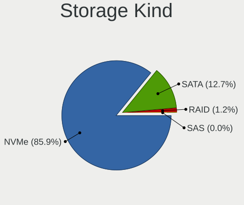

| Kind | Computers | Percent |
|------|-----------|---------|
| NVMe | 2492      | 85.87%  |
| SATA | 369       | 12.72%  |
| RAID | 35        | 1.21%   |
| IDE  | 5         | 0.17%   |
| SAS  | 1         | 0.03%   |

Processor
---------

CPU Vendor
----------

Processor vendors

| Vendor | Computers | Percent |
|--------|-----------|---------|
| AMD    | 2426      | 92.14%  |
| Intel  | 207       | 7.86%   |

CPU Model
---------

Processor models

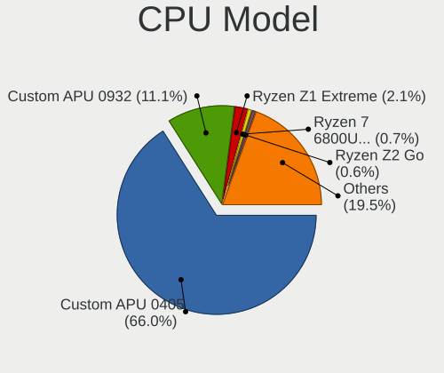

| Model                                      | Computers | Percent |
|--------------------------------------------|-----------|---------|
| AMD Custom APU 0405                        | 1741      | 66%     |
| AMD Custom APU 0932                        | 292       | 11.07%  |
| AMD Ryzen Z1 Extreme                       | 56        | 2.12%   |
| AMD Ryzen 7 6800U with Radeon Graphics     | 18        | 0.68%   |
| AMD Ryzen Z2 Go                            | 17        | 0.64%   |
| AMD Ryzen 5 5600G with Radeon Graphics     | 17        | 0.64%   |
| AMD Ryzen 5 5600X 6-Core Processor         | 11        | 0.42%   |
| AMD Ryzen 9 3900X 12-Core Processor        | 9         | 0.34%   |
| AMD Ryzen 7 5700U with Radeon Graphics     | 9         | 0.34%   |
| AMD Ryzen 9 5900X 12-Core Processor        | 8         | 0.3%    |
| AMD Ryzen 7 5800X 8-Core Processor         | 8         | 0.3%    |
| AMD Ryzen 5 5600H with Radeon Graphics     | 8         | 0.3%    |
| Intel Core i7-7700K CPU @ 4.20GHz          | 7         | 0.27%   |
| AMD Ryzen 5 3600 6-Core Processor          | 7         | 0.27%   |
| AMD Ryzen 5 2600 Six-Core Processor        | 7         | 0.27%   |
| AMD Ryzen 5 1600 Six-Core Processor        | 7         | 0.27%   |
| AMD Ryzen 7 7840U w/ Radeon 780M Graphics  | 6         | 0.23%   |
| AMD Ryzen 5 7600X 6-Core Processor         | 6         | 0.23%   |
| Intel Core i7-6700K CPU @ 4.00GHz          | 5         | 0.19%   |
| AMD Ryzen 7 5700G with Radeon Graphics     | 5         | 0.19%   |
| AMD Ryzen 7 4800U with Radeon Graphics     | 5         | 0.19%   |
| AMD Ryzen 7 2700X Eight-Core Processor     | 5         | 0.19%   |
| AMD Ryzen 5 5600 6-Core Processor          | 5         | 0.19%   |
| AMD Ryzen 5 5500U with Radeon Graphics     | 5         | 0.19%   |
| Intel Core i7-9750H CPU @ 2.60GHz          | 4         | 0.15%   |
| Intel Core i7-4790K CPU @ 4.00GHz          | 4         | 0.15%   |
| Intel Core i7-3770 CPU @ 3.40GHz           | 4         | 0.15%   |
| Intel Core i5-10400F CPU @ 2.90GHz         | 4         | 0.15%   |
| AMD Ryzen 9 6900HX with Radeon Graphics    | 4         | 0.15%   |
| AMD Ryzen 7 9800X3D 8-Core Processor       | 4         | 0.15%   |
| AMD Ryzen 7 8845HS w/ Radeon 780M Graphics | 4         | 0.15%   |
| AMD Ryzen 7 7800X3D 8-Core Processor       | 4         | 0.15%   |
| AMD Ryzen 7 5800H with Radeon Graphics     | 4         | 0.15%   |
| AMD Ryzen 7 3700X 8-Core Processor         | 4         | 0.15%   |
| AMD Ryzen 5 5600U with Radeon Graphics     | 4         | 0.15%   |
| AMD Ryzen 5 5500                           | 4         | 0.15%   |
| AMD Ryzen 5 4500U with Radeon Graphics     | 4         | 0.15%   |
| AMD Ryzen 5 3600X 6-Core Processor         | 4         | 0.15%   |
| AMD Ryzen 5 2600X Six-Core Processor       | 4         | 0.15%   |
| Intel Core i7-8700 CPU @ 3.20GHz           | 3         | 0.11%   |

CPU Model Family
----------------

Processor model prefix

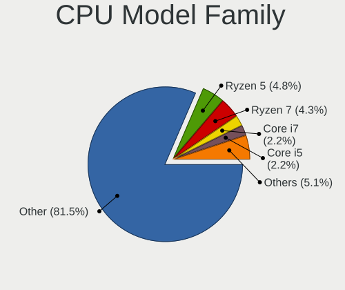

| Model                  | Computers | Percent |
|------------------------|-----------|---------|
| Other                  | 2145      | 81.47%  |
| AMD Ryzen 5            | 126       | 4.79%   |
| AMD Ryzen 7            | 112       | 4.25%   |
| Intel Core i7          | 59        | 2.24%   |
| Intel Core i5          | 57        | 2.16%   |
| AMD Ryzen 9            | 41        | 1.56%   |
| Intel Xeon             | 17        | 0.65%   |
| Intel Core i3          | 13        | 0.49%   |
| AMD Ryzen 3            | 10        | 0.38%   |
| AMD Ryzen 5 PRO        | 6         | 0.23%   |
| Intel Core i9          | 5         | 0.19%   |
| Intel Celeron          | 5         | 0.19%   |
| Intel Atom             | 5         | 0.19%   |
| AMD Ryzen Threadripper | 3         | 0.11%   |
| AMD FX                 | 3         | 0.11%   |
| AMD Athlon             | 3         | 0.11%   |
| AMD A6                 | 3         | 0.11%   |
| AMD A10                | 3         | 0.11%   |
| Intel Pentium Silver   | 2         | 0.08%   |
| Intel Core 2 Duo       | 2         | 0.08%   |
| AMD Ryzen 7 PRO        | 2         | 0.08%   |
| Intel Pentium Gold     | 1         | 0.04%   |
| Intel Core m3          | 1         | 0.04%   |
| Intel Core             | 1         | 0.04%   |
| AMD Ryzen Embedded     | 1         | 0.04%   |
| AMD Embedded           | 1         | 0.04%   |
| AMD E2                 | 1         | 0.04%   |
| AMD E1                 | 1         | 0.04%   |
| AMD E                  | 1         | 0.04%   |
| AMD Athlon X4          | 1         | 0.04%   |
| AMD A8                 | 1         | 0.04%   |
| AMD A12                | 1         | 0.04%   |

CPU Cores
---------

Number of processor cores

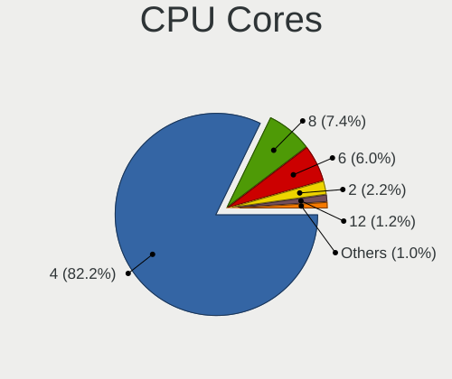

| Number | Computers | Percent |
|--------|-----------|---------|
| 4      | 2165      | 82.19%  |
| 8      | 196       | 7.44%   |
| 6      | 157       | 5.96%   |
| 2      | 58        | 2.2%    |
| 12     | 31        | 1.18%   |
| 16     | 12        | 0.46%   |
| 14     | 4         | 0.15%   |
| 10     | 3         | 0.11%   |
| 3      | 3         | 0.11%   |
| 32     | 1         | 0.04%   |
| 28     | 1         | 0.04%   |
| 24     | 1         | 0.04%   |
| 18     | 1         | 0.04%   |
| 5      | 1         | 0.04%   |

CPU Sockets
-----------

Number of sockets

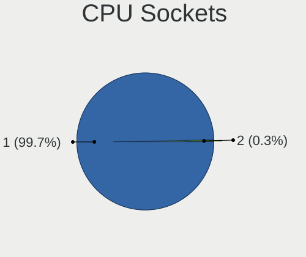

| Number | Computers | Percent |
|--------|-----------|---------|
| 1      | 2625      | 99.7%   |
| 2      | 8         | 0.3%    |

CPU Threads
-----------

Threads per core (Hyper-Threading)

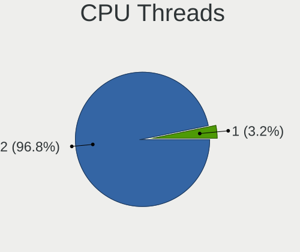

| Number | Computers | Percent |
|--------|-----------|---------|
| 2      | 2550      | 96.77%  |
| 1      | 85        | 3.23%   |

CPU Op-Modes
------------

CPU Operation Modes (32-bit, 64-bit)

| Op mode        | Computers | Percent |
|----------------|-----------|---------|
| 32-bit, 64-bit | 2633      | 100%    |

CPU Microcode
-------------

Microcode number

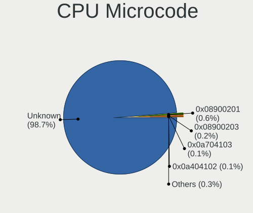

| Number     | Computers | Percent |
|------------|-----------|---------|
| Unknown    | 2603      | 98.71%  |
| 0x08900201 | 17        | 0.64%   |
| 0x08900203 | 4         | 0.15%   |
| 0x0a704103 | 2         | 0.08%   |
| 0x0a404102 | 2         | 0.08%   |
| 0x906e9    | 1         | 0.04%   |
| 0x40651    | 1         | 0.04%   |
| 0x1067a    | 1         | 0.04%   |
| 0x0a704104 | 1         | 0.04%   |
| 0x0a50000c | 1         | 0.04%   |
| 0x08901003 | 1         | 0.04%   |
| 0x08901001 | 1         | 0.04%   |
| 0x08701021 | 1         | 0.04%   |
| 0x08600106 | 1         | 0.04%   |

CPU Microarch
-------------

Microarchitecture

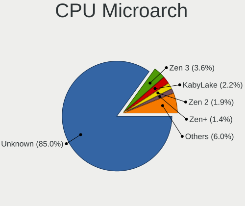

| Name              | Computers | Percent |
|-------------------|-----------|---------|
| Unknown           | 2238      | 85%     |
| Zen 3             | 94        | 3.57%   |
| KabyLake          | 58        | 2.2%    |
| Zen 2             | 49        | 1.86%   |
| Zen+              | 36        | 1.37%   |
| Haswell           | 31        | 1.18%   |
| Skylake           | 21        | 0.8%    |
| Zen               | 19        | 0.72%   |
| TigerLake         | 13        | 0.49%   |
| IvyBridge         | 13        | 0.49%   |
| CometLake         | 11        | 0.42%   |
| Excavator         | 9         | 0.34%   |
| SandyBridge       | 8         | 0.3%    |
| Silvermont        | 7         | 0.27%   |
| Piledriver        | 6         | 0.23%   |
| Broadwell         | 6         | 0.23%   |
| Westmere          | 3         | 0.11%   |
| Goldmont plus     | 3         | 0.11%   |
| Penryn            | 2         | 0.08%   |
| IceLake           | 2         | 0.08%   |
| Steamroller       | 1         | 0.04%   |
| Meteorlake Hybrid | 1         | 0.04%   |
| Jaguar            | 1         | 0.04%   |
| Alderlake Hybrid  | 1         | 0.04%   |

Graphics
--------

GPU Vendor
----------

Vendors of graphics cards

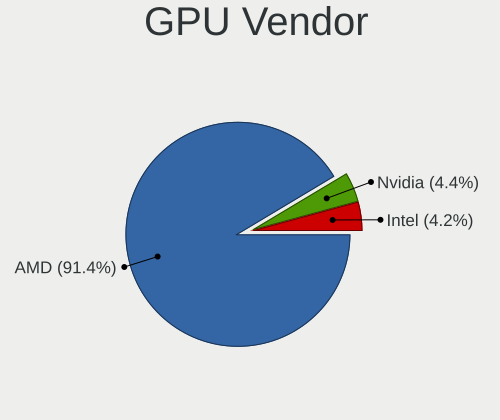

| Vendor | Computers | Percent |
|--------|-----------|---------|
| AMD    | 2490      | 91.41%  |
| Nvidia | 119       | 4.37%   |
| Intel  | 115       | 4.22%   |

GPU Model
---------

Graphics card models

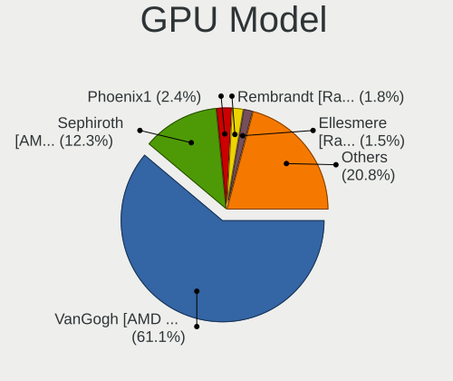

| Model                                                                                    | Computers | Percent |
|------------------------------------------------------------------------------------------|-----------|---------|
| AMD VanGogh [AMD Custom GPU 0405]                                                        | 1688      | 61.12%  |
| AMD Sephiroth [AMD Custom GPU 0405]                                                      | 340       | 12.31%  |
| AMD Phoenix1                                                                             | 67        | 2.43%   |
| AMD Rembrandt [Radeon 680M]                                                              | 51        | 1.85%   |
| AMD Ellesmere [Radeon RX 470/480/570/570X/580/580X/590]                                  | 41        | 1.48%   |
| AMD Cezanne [Radeon Vega Series / Radeon Vega Mobile Series]                             | 39        | 1.41%   |
| AMD Navi 23 [Radeon RX 6600/6600 XT/6600M]                                               | 26        | 0.94%   |
| AMD Navi 10 [Radeon RX 5600 OEM/5600 XT / 5700/5700 XT]                                  | 22        | 0.8%    |
| AMD Navi 22 [Radeon RX 6700/6700 XT/6750 XT / 6800M/6850M XT]                            | 20        | 0.72%   |
| AMD Renoir [Radeon Vega Series / Radeon Vega Mobile Series]                              | 17        | 0.62%   |
| AMD Raphael                                                                              | 17        | 0.62%   |
| AMD Navi 33 [Radeon RX 7600/7600 XT/7600M XT/7600S/7700S / PRO W7600]                    | 16        | 0.58%   |
| AMD Lucienne                                                                             | 15        | 0.54%   |
| AMD Picasso/Raven 2 [Radeon Vega Series / Radeon Vega Mobile Series]                     | 13        | 0.47%   |
| AMD Navi 31 [Radeon RX 7900 XT/7900 XTX/7900 GRE/7900M]                                  | 13        | 0.47%   |
| AMD HawkPoint1                                                                           | 13        | 0.47%   |
| AMD Navi 24 [Radeon RX 6400/6500 XT/6500M]                                               | 12        | 0.43%   |
| AMD Navi 21 [Radeon RX 6800/6800 XT / 6900 XT]                                           | 12        | 0.43%   |
| Nvidia TU117M [GeForce GTX 1650 Mobile / Max-Q]                                          | 10        | 0.36%   |
| Intel Xeon E3-1200 v3/4th Gen Core Processor Integrated Graphics Controller              | 9         | 0.33%   |
| Intel TigerLake-LP GT2 [Iris Xe Graphics]                                                | 9         | 0.33%   |
| AMD Navi 32 [Radeon RX 7700 XT / 7800 XT]                                                | 9         | 0.33%   |
| AMD Lexa PRO [Radeon 540/540X/550/550X / RX 540X/550/550X]                               | 9         | 0.33%   |
| Intel CoffeeLake-S GT2 [UHD Graphics 630]                                                | 8         | 0.29%   |
| AMD Navi 14 [Radeon RX 5500/5500M / Pro 5500M]                                           | 8         | 0.29%   |
| Nvidia GA107M [GeForce RTX 3050 Mobile]                                                  | 7         | 0.25%   |
| Intel CoffeeLake-H GT2 [UHD Graphics 630]                                                | 7         | 0.25%   |
| Intel Atom/Celeron/Pentium Processor x5-E8000/J3xxx/N3xxx Integrated Graphics Controller | 7         | 0.25%   |
| AMD Granite Ridge [Radeon Graphics]                                                      | 7         | 0.25%   |
| AMD Vega 10 XL/XT [Radeon RX Vega 56/64]                                                 | 6         | 0.22%   |
| AMD Stoney [Radeon R2/R3/R4/R5 Graphics]                                                 | 6         | 0.22%   |
| AMD Navi 48 [Radeon RX 9070/9070 XT/9070 GRE]                                            | 6         | 0.22%   |
| Intel Skylake-S GT2 [HD Graphics 530]                                                    | 5         | 0.18%   |
| AMD Raven Ridge [Radeon Vega Series / Radeon Vega Mobile Series]                         | 5         | 0.18%   |
| AMD Polaris 20 XL [Radeon RX 580 2048SP]                                                 | 5         | 0.18%   |
| AMD Barcelo                                                                              | 5         | 0.18%   |
| AMD Baffin [Radeon RX 460/560D / Pro 450/455/460/555/555X/560/560X]                      | 5         | 0.18%   |
| Nvidia GP108 [GeForce GT 1030]                                                           | 4         | 0.14%   |
| Nvidia GP104 [GeForce GTX 1080]                                                          | 4         | 0.14%   |
| Nvidia GP104 [GeForce GTX 1070]                                                          | 4         | 0.14%   |

GPU Combo
---------

Combinations of graphics cards

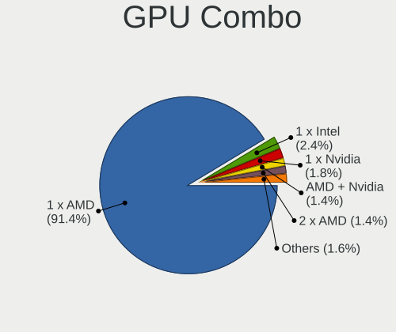

| Name           | Computers | Percent |
|----------------|-----------|---------|
| 1 x AMD        | 2409      | 91.35%  |
| 1 x Intel      | 62        | 2.35%   |
| 1 x Nvidia     | 48        | 1.82%   |
| AMD + Nvidia   | 38        | 1.44%   |
| 2 x AMD        | 37        | 1.4%    |
| Intel + Nvidia | 33        | 1.25%   |
| Intel + AMD    | 9         | 0.34%   |
| Other          | 1         | 0.04%   |

GPU Driver
----------

Free vs proprietary

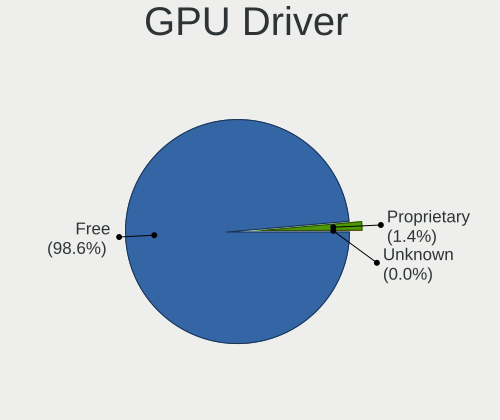

| Driver      | Computers | Percent |
|-------------|-----------|---------|
| Free        | 2597      | 98.6%   |
| Proprietary | 36        | 1.37%   |
| Unknown     | 1         | 0.04%   |

GPU Memory
----------

Total video memory

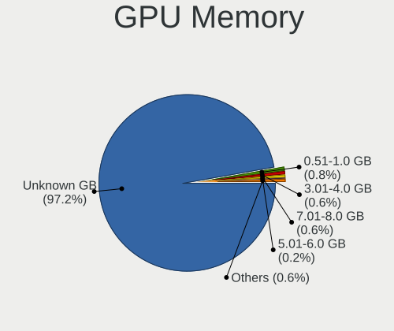

| Size in GB | Computers | Percent |
|------------|-----------|---------|
| Unknown    | 2566      | 97.2%   |
| 0.51-1.0   | 21        | 0.8%    |
| 3.01-4.0   | 17        | 0.64%   |
| 7.01-8.0   | 15        | 0.57%   |
| 5.01-6.0   | 5         | 0.19%   |
| 0.01-0.5   | 5         | 0.19%   |
| 2.01-3.0   | 4         | 0.15%   |
| 1.01-2.0   | 3         | 0.11%   |
| 16.01-24.0 | 2         | 0.08%   |
| 8.01-16.0  | 2         | 0.08%   |

Monitor
-------

Monitor Vendor
--------------

Monitor vendors

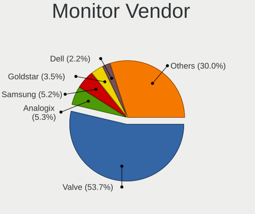

| Vendor               | Computers | Percent |
|----------------------|-----------|---------|
| Valve                | 1680      | 53.69%  |
| Analogix             | 167       | 5.34%   |
| Samsung Electronics  | 164       | 5.24%   |
| Goldstar             | 111       | 3.55%   |
| Dell                 | 69        | 2.21%   |
| BOE                  | 60        | 1.92%   |
| Acer                 | 50        | 1.6%    |
| AOC                  | 47        | 1.5%    |
| Hewlett-Packard      | 46        | 1.47%   |
| Lenovo               | 43        | 1.37%   |
| ASUSTek Computer     | 40        | 1.28%   |
| Philips              | 32        | 1.02%   |
| Chimei Innolux       | 32        | 1.02%   |
| MSI                  | 31        | 0.99%   |
| Ancor Communications | 29        | 0.93%   |
| TMX                  | 26        | 0.83%   |
| Sony                 | 25        | 0.8%    |
| BenQ                 | 23        | 0.74%   |
| AU Optronics         | 23        | 0.74%   |
| Vizio                | 17        | 0.54%   |
| RTK                  | 17        | 0.54%   |
| LG Display           | 16        | 0.51%   |
| Apple                | 15        | 0.48%   |
| ViewSonic            | 14        | 0.45%   |
| Sceptre Tech         | 14        | 0.45%   |
| Hitachi              | 14        | 0.45%   |
| Gigabyte Technology  | 14        | 0.45%   |
| Unknown (XXX)        | 12        | 0.38%   |
| Toshiba              | 10        | 0.32%   |
| Sharp                | 10        | 0.32%   |
| CSW                  | 10        | 0.32%   |
| PANDA                | 9         | 0.29%   |
| Panasonic            | 9         | 0.29%   |
| Pixio                | 8         | 0.26%   |
| Roku                 | 6         | 0.19%   |
| Mi                   | 6         | 0.19%   |
| Insignia             | 6         | 0.19%   |
| Huion                | 6         | 0.19%   |
| HKC                  | 6         | 0.19%   |
| Vestel Elektronik    | 5         | 0.16%   |

Monitor Model
-------------

Monitor models

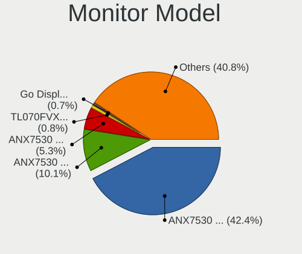

| Model                                                                   | Computers | Percent |
|-------------------------------------------------------------------------|-----------|---------|
| Valve ANX7530 U VLV3001 800x1280 100x150mm 7.1-inch                     | 1338      | 42.38%  |
| Valve ANX7530 U VLV3003 800x1280 100x160mm 7.4-inch                     | 320       | 10.14%  |
| Analogix ANX7530 U ANX7539 720x1280                                     | 167       | 5.29%   |
| TMX TL070FVXS01-0 TMX0002 1920x1080 160x100mm 7.4-inch                  | 24        | 0.76%   |
| Lenovo Go Display LEN0001 1600x2560 120x190mm 8.8-inch                  | 21        | 0.67%   |
| BOE NS080WUM-LX1 BOE0CFF 1920x1200 172x108mm 8.0-inch                   | 21        | 0.67%   |
| Valve ANX7530 U VLV3004 800x1280 100x160mm 7.4-inch                     | 19        | 0.6%    |
| Goldstar LG TV SSCR2 GSMC0C8 3840x2160                                  | 11        | 0.35%   |
| CSW PN8007QB1-1 CSW0800 1920x1200 172x107mm 8.0-inch                    | 10        | 0.32%   |
| RTK XP-PEN RTK2A3B 1920x1080 531x299mm 24.0-inch                        | 8         | 0.25%   |
| Unknown (XXX) Beyond TV XXX2851 3840x2160 1209x680mm 54.6-inch          | 7         | 0.22%   |
| Goldstar FULL HD GSM5B55 1920x1080 480x270mm 21.7-inch                  | 7         | 0.22%   |
| PANDA LCD Monitor NCP004D 1920x1080 344x194mm 15.5-inch                 | 6         | 0.19%   |
| Hitachi HISENSE HEC0030 3840x2160 1872x1053mm 84.6-inch                 | 6         | 0.19%   |
| AOC 27G2G4 AOC2702 1920x1080 598x336mm 27.0-inch                        | 6         | 0.19%   |
| Vestel Elektronik 40UHD_LCD_TV VES3700 3840x2160 880x500mm 39.8-inch    | 5         | 0.16%   |
| Samsung Electronics S24F350 SAM0D20 1920x1080 521x293mm 23.5-inch       | 5         | 0.16%   |
| Samsung Electronics LCD Monitor SAM7017 3840x2160 1872x1053mm 84.6-inch | 5         | 0.16%   |
| Samsung Electronics C24F390 SAM0D2C 1920x1080 521x293mm 23.5-inch       | 5         | 0.16%   |
| Pixio SFP2702G FHD WAM2700 1920x1080 597x336mm 27.0-inch                | 5         | 0.16%   |
| Philips FTV PHL04C3 1920x1080 1440x810mm 65.0-inch                      | 5         | 0.16%   |
| Panasonic TV MEIA296 1920x1080 698x392mm 31.5-inch                      | 5         | 0.16%   |
| MSF W0550U99GE-D MSF1003 1080x1920                                      | 5         | 0.16%   |
| JDI GPD1001H JDI0031 2560x1600 890x500mm 40.2-inch                      | 5         | 0.16%   |
| Sceptre Tech Sceptre F24 SPT09AB 1920x1080 530x290mm 23.8-inch          | 4         | 0.13%   |
| Samsung Electronics LCD Monitor SAM0F14 1920x540                        | 4         | 0.13%   |
| Samsung Electronics C27F390 SAM0D32 1920x1080 598x336mm 27.0-inch       | 4         | 0.13%   |
| RTK HX150T RTK1920 1920x1080 344x195mm 15.6-inch                        | 4         | 0.13%   |
| MStar Demo MST0030 1920x1080 708x398mm 32.0-inch                        | 4         | 0.13%   |
| Goldstar ULTRAWIDE GSM7770 2560x1080 798x334mm 34.1-inch                | 4         | 0.13%   |
| DHD DeckHD-1200p DHD4001 1200x1920 100x150mm 7.1-inch                   | 4         | 0.13%   |
| AOC 24B1W1 AOC2401 1920x1080 527x296mm 23.8-inch                        | 4         | 0.13%   |
| Vizio V505-J09 VIZ1039 3840x2160 1096x616mm 49.5-inch                   | 3         | 0.1%    |
| Toshiba TV TSB0206 1920x1080                                            | 3         | 0.1%    |
| Samsung Electronics LCD Monitor SAM0C3C 1366x768 609x347mm 27.6-inch    | 3         | 0.1%    |
| Samsung Electronics LCD Monitor SAM0C39 1920x1080 885x498mm 40.0-inch   | 3         | 0.1%    |
| Samsung Electronics C49HG9x SAM0E5D 3840x1080 1196x336mm 48.9-inch      | 3         | 0.1%    |
| Samsung Electronics C32R50x SAM7000 1920x1080 698x393mm 31.5-inch       | 3         | 0.1%    |
| Roku 100012590 RKU0B01 1920x1080 698x392mm 31.5-inch                    | 3         | 0.1%    |
| ONN ONA18HO015 ONN0101 1920x1080 698x393mm 31.5-inch                    | 3         | 0.1%    |

Monitor Resolution
------------------

Monitor screen resolution

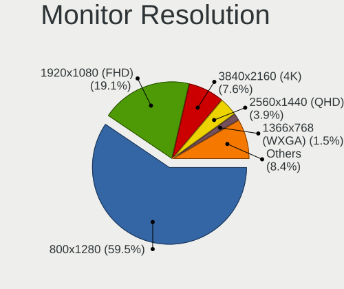

| Resolution         | Computers | Percent |
|--------------------|-----------|---------|
| 800x1280           | 1820      | 59.46%  |
| 1920x1080 (FHD)    | 586       | 19.14%  |
| 3840x2160 (4K)     | 232       | 7.58%   |
| 2560x1440 (QHD)    | 119       | 3.89%   |
| 1366x768 (WXGA)    | 47        | 1.54%   |
| 3440x1440          | 44        | 1.44%   |
| 1920x1200 (WUXGA)  | 43        | 1.4%    |
| 2560x1080          | 26        | 0.85%   |
| Unknown            | 23        | 0.75%   |
| 2560x1600          | 17        | 0.56%   |
| 3840x1080          | 11        | 0.36%   |
| 1600x2560          | 10        | 0.33%   |
| 1200x1920          | 10        | 0.33%   |
| 1600x900 (HD+)     | 8         | 0.26%   |
| 1680x1050 (WSXGA+) | 7         | 0.23%   |
| 1440x900 (WXGA+)   | 7         | 0.23%   |
| 1360x768           | 7         | 0.23%   |
| 2880x1800          | 5         | 0.16%   |
| 1280x1024 (SXGA)   | 5         | 0.16%   |
| 2160x1440          | 4         | 0.13%   |
| 1920x540           | 4         | 0.13%   |
| 1280x800 (WXGA)    | 4         | 0.13%   |
| 1080x1920          | 4         | 0.13%   |
| 3840x1600          | 3         | 0.1%    |
| 1024x768 (XGA)     | 3         | 0.1%    |
| 2400x1600          | 2         | 0.07%   |
| 1920x800           | 2         | 0.07%   |
| 504x315            | 1         | 0.03%   |
| 480x1920           | 1         | 0.03%   |
| 3840x2400          | 1         | 0.03%   |
| 3200x1800 (QHD+)   | 1         | 0.03%   |
| 2880x1920          | 1         | 0.03%   |
| 2160x3840          | 1         | 0.03%   |
| 1600x1200          | 1         | 0.03%   |
| 1400x1050          | 1         | 0.03%   |

Monitor Diagonal
----------------

Diagonal size in inches

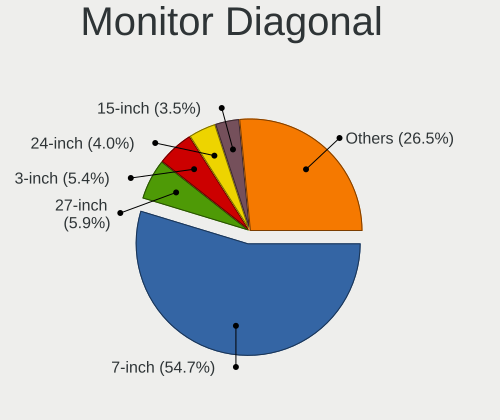

| Inches  | Computers | Percent |
|---------|-----------|---------|
| 7       | 1707      | 54.69%  |
| 27      | 185       | 5.93%   |
| 3       | 167       | 5.35%   |
| 24      | 125       | 4.01%   |
| 15      | 109       | 3.49%   |
| 31      | 95        | 3.04%   |
| 23      | 90        | 2.88%   |
| 21      | 67        | 2.15%   |
| 8       | 64        | 2.05%   |
| 34      | 56        | 1.79%   |
| 84      | 54        | 1.73%   |
| Unknown | 33        | 1.06%   |
| 54      | 26        | 0.83%   |
| 14      | 26        | 0.83%   |
| 32      | 25        | 0.8%    |
| 72      | 24        | 0.77%   |
| 13      | 23        | 0.74%   |
| 40      | 19        | 0.61%   |
| 63      | 15        | 0.48%   |
| 16      | 14        | 0.45%   |
| 65      | 13        | 0.42%   |
| 17      | 13        | 0.42%   |
| 18      | 12        | 0.38%   |
| 57      | 10        | 0.32%   |
| 19      | 9         | 0.29%   |
| 49      | 8         | 0.26%   |
| 26      | 8         | 0.26%   |
| 22      | 8         | 0.26%   |
| 11      | 8         | 0.26%   |
| 74      | 7         | 0.22%   |
| 52      | 7         | 0.22%   |
| 42      | 7         | 0.22%   |
| 36      | 6         | 0.19%   |
| 35      | 6         | 0.19%   |
| 86      | 5         | 0.16%   |
| 75      | 5         | 0.16%   |
| 64      | 5         | 0.16%   |
| 48      | 5         | 0.16%   |
| 29      | 5         | 0.16%   |
| 20      | 5         | 0.16%   |

Monitor Width
-------------

Physical width

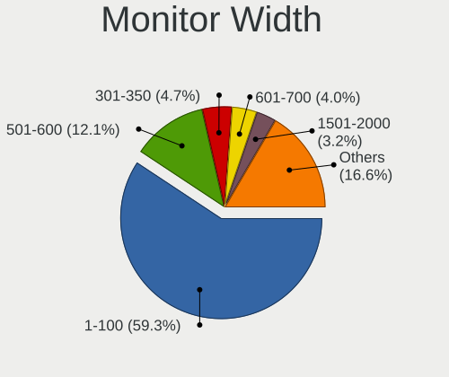

| Width in mm | Computers | Percent |
|-------------|-----------|---------|
| 1-100       | 1823      | 59.3%   |
| 501-600     | 373       | 12.13%  |
| 301-350     | 146       | 4.75%   |
| 601-700     | 124       | 4.03%   |
| 1501-2000   | 98        | 3.19%   |
| 1001-1500   | 98        | 3.19%   |
| 701-800     | 95        | 3.09%   |
| 101-200     | 91        | 2.96%   |
| 401-500     | 90        | 2.93%   |
| 801-900     | 35        | 1.14%   |
| Unknown     | 33        | 1.07%   |
| 201-300     | 31        | 1.01%   |
| 351-400     | 27        | 0.88%   |
| 901-1000    | 10        | 0.33%   |

Aspect Ratio
------------

Proportional relationship between the width and the height

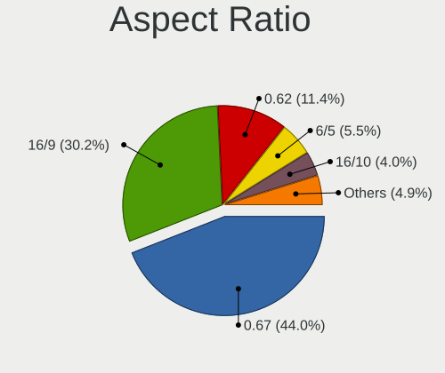

| Ratio   | Computers | Percent |
|---------|-----------|---------|
| 0.67    | 1343      | 44.03%  |
| 16/9    | 921       | 30.2%   |
| 0.62    | 348       | 11.41%  |
| 6/5     | 168       | 5.51%   |
| 16/10   | 122       | 4%      |
| 21/9    | 70        | 2.3%    |
| 0.63    | 24        | 0.79%   |
| 32/9    | 14        | 0.46%   |
| 0.56    | 14        | 0.46%   |
| 5/4     | 5         | 0.16%   |
| 4/3     | 5         | 0.16%   |
| 3/2     | 5         | 0.16%   |
| 0.58    | 5         | 0.16%   |
| Unknown | 2         | 0.07%   |
| 2.64    | 1         | 0.03%   |
| 2.12    | 1         | 0.03%   |
| 1.00    | 1         | 0.03%   |
| 0.25    | 1         | 0.03%   |

Monitor Area
------------

Area in inch²

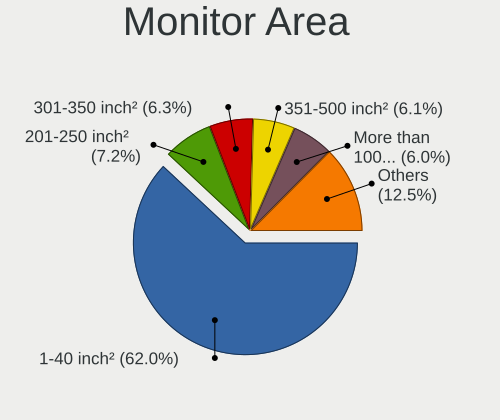

| Area in inch² | Computers | Percent |
|----------------|-----------|---------|
| 1-40           | 1912      | 61.96%  |
| 201-250        | 222       | 7.19%   |
| 301-350        | 194       | 6.29%   |
| 351-500        | 187       | 6.06%   |
| More than 1000 | 184       | 5.96%   |
| 101-110        | 115       | 3.73%   |
| 501-1000       | 59        | 1.91%   |
| 251-300        | 49        | 1.59%   |
| 151-200        | 38        | 1.23%   |
| 81-90          | 34        | 1.1%    |
| Unknown        | 33        | 1.07%   |
| 71-80          | 15        | 0.49%   |
| 141-150        | 12        | 0.39%   |
| 121-130        | 11        | 0.36%   |
| 51-60          | 8         | 0.26%   |
| 111-120        | 8         | 0.26%   |
| 61-70          | 2         | 0.06%   |
| 41-50          | 1         | 0.03%   |
| 131-140        | 1         | 0.03%   |
| 91-100         | 1         | 0.03%   |

Pixel Density
-------------

Pixels per inch

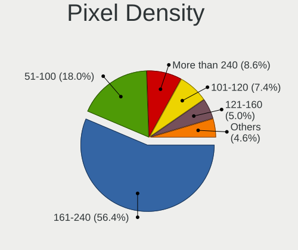

| Density       | Computers | Percent |
|---------------|-----------|---------|
| 161-240       | 1716      | 56.39%  |
| 51-100        | 549       | 18.04%  |
| More than 240 | 261       | 8.58%   |
| 101-120       | 224       | 7.36%   |
| 121-160       | 153       | 5.03%   |
| 1-50          | 107       | 3.52%   |
| Unknown       | 33        | 1.08%   |

Multiple Monitors
-----------------

Total monitors connected

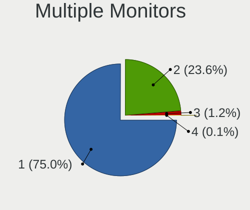

| Total | Computers | Percent |
|-------|-----------|---------|
| 1     | 2027      | 75.05%  |
| 2     | 638       | 23.62%  |
| 3     | 33        | 1.22%   |
| 4     | 3         | 0.11%   |

Network
-------

Net Controller Vendor
---------------------

Controller vendors

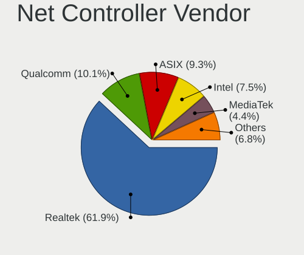

| Vendor                                 | Computers | Percent |
|----------------------------------------|-----------|---------|
| Realtek Semiconductor                  | 2091      | 61.94%  |
| Qualcomm                               | 341       | 10.1%   |
| ASIX Electronics                       | 314       | 9.3%    |
| Intel                                  | 252       | 7.46%   |
| MediaTek                               | 150       | 4.44%   |
| Broadcom                               | 33        | 0.98%   |
| Qualcomm Atheros                       | 31        | 0.92%   |
| TP-Link                                | 27        | 0.8%    |
| Microsoft                              | 21        | 0.62%   |
| DisplayLink                            | 19        | 0.56%   |
| Samsung Electronics                    | 9         | 0.27%   |
| Broadcom Limited                       | 9         | 0.27%   |
| Google                                 | 8         | 0.24%   |
| ASUSTek Computer                       | 8         | 0.24%   |
| Ralink Technology                      | 7         | 0.21%   |
| Lenovo                                 | 6         | 0.18%   |
| Xiaomi                                 | 4         | 0.12%   |
| QinHeng Electronics                    | 3         | 0.09%   |
| OPPO Electronics                       | 3         | 0.09%   |
| Dell                                   | 3         | 0.09%   |
| ZTE WCDMA Technologies MSM             | 2         | 0.06%   |
| Sony Ericsson Mobile Communications AB | 2         | 0.06%   |
| OnePlus Technology (Shenzhen)          | 2         | 0.06%   |
| NetGear                                | 2         | 0.06%   |
| Motorola PCS                           | 2         | 0.06%   |
| Marvell Technology Group               | 2         | 0.06%   |
| Huawei Technologies                    | 2         | 0.06%   |
| Edimax Technology                      | 2         | 0.06%   |
| D-Link                                 | 2         | 0.06%   |
| Aquantia                               | 2         | 0.06%   |
| ZyXEL Communications                   | 1         | 0.03%   |
| STMicroelectronics                     | 1         | 0.03%   |
| Sitecom Europe                         | 1         | 0.03%   |
| Shenzhen Goodix Technology             | 1         | 0.03%   |
| Realtek                                | 1         | 0.03%   |
| Raspberry Pi                           | 1         | 0.03%   |
| Linksys                                | 1         | 0.03%   |
| Espressif                              | 1         | 0.03%   |
| Davicom Semiconductor                  | 1         | 0.03%   |
| BillBoard                              | 1         | 0.03%   |

Net Controller Model
--------------------

Controller models

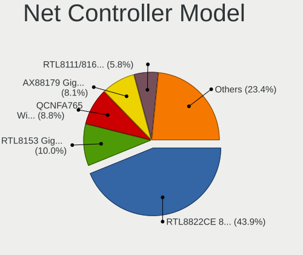

| Model                                                                  | Computers | Percent |
|------------------------------------------------------------------------|-----------|---------|
| Realtek RTL8822CE 802.11ac PCIe Wireless Network Adapter               | 1689      | 43.87%  |
| Realtek RTL8153 Gigabit Ethernet Adapter                               | 386       | 10.03%  |
| Qualcomm QCNFA765 Wireless Network Adapter                             | 340       | 8.83%   |
| ASIX AX88179 Gigabit Ethernet                                          | 312       | 8.1%    |
| Realtek RTL8111/8168/8211/8411 PCI Express Gigabit Ethernet Controller | 222       | 5.77%   |
| MediaTek MT7922 802.11ax PCI Express Wireless Network Adapter          | 97        | 2.52%   |
| Intel Wi-Fi 6 AX200                                                    | 55        | 1.43%   |
| Realtek RTL8125 2.5GbE Controller                                      | 52        | 1.35%   |
| Realtek RTL8152 Fast Ethernet Adapter                                  | 43        | 1.12%   |
| Intel Wi-Fi 6E(802.11ax) AX210/AX1675* 2x2 [Typhoon Peak]              | 36        | 0.94%   |
| Intel I211 Gigabit Network Connection                                  | 23        | 0.6%    |
| Intel Ethernet Controller I225-V                                       | 23        | 0.6%    |
| MediaTek MT7921K (RZ608) Wi-Fi 6E 80MHz                                | 18        | 0.47%   |
| MediaTek MT7921 802.11ax PCIe Wireless Network Adapter [Filogic 330]   | 17        | 0.44%   |
| Intel Ethernet Connection (2) I219-V                                   | 17        | 0.44%   |
| Realtek 802.11ac NIC                                                   | 14        | 0.36%   |
| Intel Dual Band Wireless-AC 3168NGW [Stone Peak]                       | 14        | 0.36%   |
| Broadcom BCM4360 802.11ac Dual Band Wireless Network Adapter           | 12        | 0.31%   |
| Realtek RTL8852BE PCIe 802.11ax Wireless Network Controller            | 11        | 0.29%   |
| Realtek RTL8821CE 802.11ac PCIe Wireless Network Adapter               | 10        | 0.26%   |
| Qualcomm Atheros QCA6174 802.11ac Wireless Network Adapter             | 10        | 0.26%   |
| Intel Wireless 7265                                                    | 10        | 0.26%   |
| Intel Wi-Fi 6 AX201                                                    | 10        | 0.26%   |
| Intel Ethernet Controller I226-V                                       | 10        | 0.26%   |
| Realtek RTL810xE PCI Express Fast Ethernet controller                  | 9         | 0.23%   |
| Qualcomm Atheros QCA9377 802.11ac Wireless Network Adapter             | 9         | 0.23%   |
| Microsoft Wireless XBox Controller Dongle                              | 9         | 0.23%   |
| Samsung Galaxy series, misc. (tethering mode)                          | 8         | 0.21%   |
| MediaTek MT7902 802.11ax PCIe Wireless Network Adapter [Filogic 310]   | 8         | 0.21%   |
| Intel Wireless 8260                                                    | 8         | 0.21%   |
| Intel Cannon Lake PCH CNVi WiFi                                        | 8         | 0.21%   |
| Realtek RTL8852AE 802.11ax PCIe Wireless Network Adapter               | 7         | 0.18%   |
| Microsoft Xbox Wireless Adapter for Windows                            | 7         | 0.18%   |
| Intel Ethernet Connection (7) I219-V                                   | 7         | 0.18%   |
| Intel 82579LM Gigabit Network Connection (Lewisville)                  | 7         | 0.18%   |
| Google Pixel 9a                                                        | 6         | 0.16%   |
| TP-Link TL-WN823N v2/v3 [Realtek RTL8192EU]                            | 5         | 0.13%   |
| TP-Link AC600 wireless Realtek RTL8811AU [Archer T2U Nano]             | 5         | 0.13%   |
| Realtek RTL88x2bu [AC1200 Techkey]                                     | 5         | 0.13%   |
| Realtek Killer E2600 GbE Controller                                    | 5         | 0.13%   |

Wireless Vendor
---------------

Wireless vendors

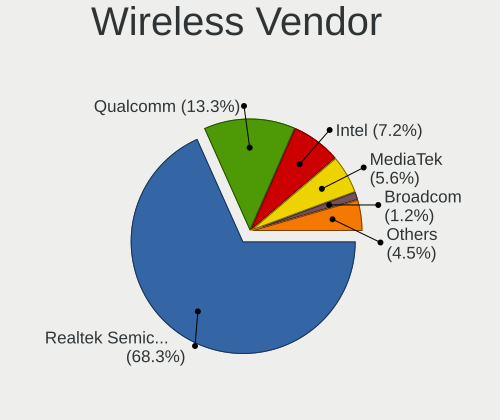

| Vendor                                | Computers | Percent |
|---------------------------------------|-----------|---------|
| Realtek Semiconductor                 | 1750      | 68.31%  |
| Qualcomm                              | 340       | 13.27%  |
| Intel                                 | 184       | 7.18%   |
| MediaTek                              | 143       | 5.58%   |
| Broadcom                              | 30        | 1.17%   |
| TP-Link                               | 27        | 1.05%   |
| Qualcomm Atheros                      | 26        | 1.01%   |
| Microsoft                             | 21        | 0.82%   |
| Broadcom Limited                      | 9         | 0.35%   |
| ASUSTek Computer                      | 8         | 0.31%   |
| Ralink Technology                     | 7         | 0.27%   |
| Dell                                  | 3         | 0.12%   |
| NetGear                               | 2         | 0.08%   |
| Edimax Technology                     | 2         | 0.08%   |
| D-Link                                | 2         | 0.08%   |
| ZyXEL Communications                  | 1         | 0.04%   |
| Sitecom Europe                        | 1         | 0.04%   |
| Realtek                               | 1         | 0.04%   |
| Marvell Technology Group              | 1         | 0.04%   |
| Linksys                               | 1         | 0.04%   |
| Belkin Components                     | 1         | 0.04%   |
| AVM                                   | 1         | 0.04%   |
| 802.11g Adapter [Linksys WUSB54GC v3] | 1         | 0.04%   |

Wireless Model
--------------

Wireless models

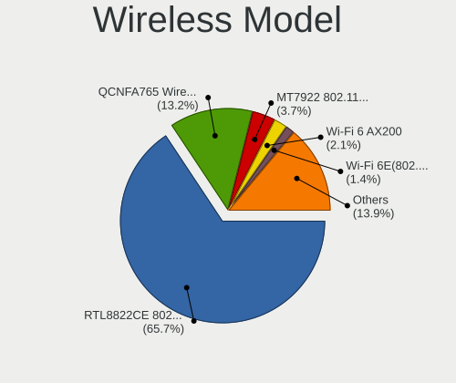

| Model                                                                | Computers | Percent |
|----------------------------------------------------------------------|-----------|---------|
| Realtek RTL8822CE 802.11ac PCIe Wireless Network Adapter             | 1689      | 65.67%  |
| Qualcomm QCNFA765 Wireless Network Adapter                           | 340       | 13.22%  |
| MediaTek MT7922 802.11ax PCI Express Wireless Network Adapter        | 94        | 3.65%   |
| Intel Wi-Fi 6 AX200                                                  | 55        | 2.14%   |
| Intel Wi-Fi 6E(802.11ax) AX210/AX1675* 2x2 [Typhoon Peak]            | 36        | 1.4%    |
| MediaTek MT7921K (RZ608) Wi-Fi 6E 80MHz                              | 18        | 0.7%    |
| MediaTek MT7921 802.11ax PCIe Wireless Network Adapter [Filogic 330] | 17        | 0.66%   |
| Realtek 802.11ac NIC                                                 | 14        | 0.54%   |
| Intel Dual Band Wireless-AC 3168NGW [Stone Peak]                     | 14        | 0.54%   |
| Broadcom BCM4360 802.11ac Dual Band Wireless Network Adapter         | 12        | 0.47%   |
| Realtek RTL8821CE 802.11ac PCIe Wireless Network Adapter             | 10        | 0.39%   |
| Qualcomm Atheros QCA6174 802.11ac Wireless Network Adapter           | 10        | 0.39%   |
| Intel Wireless 7265                                                  | 10        | 0.39%   |
| Intel Wi-Fi 6 AX201                                                  | 10        | 0.39%   |
| Qualcomm Atheros QCA9377 802.11ac Wireless Network Adapter           | 9         | 0.35%   |
| Microsoft Wireless XBox Controller Dongle                            | 9         | 0.35%   |
| MediaTek MT7902 802.11ax PCIe Wireless Network Adapter [Filogic 310] | 8         | 0.31%   |
| Intel Wireless 8260                                                  | 8         | 0.31%   |
| Intel Cannon Lake PCH CNVi WiFi                                      | 8         | 0.31%   |
| Realtek RTL8852BE PCIe 802.11ax Wireless Network Controller          | 7         | 0.27%   |
| Realtek RTL8852AE 802.11ax PCIe Wireless Network Adapter             | 7         | 0.27%   |
| Microsoft Xbox Wireless Adapter for Windows                          | 7         | 0.27%   |
| TP-Link TL-WN823N v2/v3 [Realtek RTL8192EU]                          | 5         | 0.19%   |
| TP-Link AC600 wireless Realtek RTL8811AU [Archer T2U Nano]           | 5         | 0.19%   |
| Realtek RTL88x2bu [AC1200 Techkey]                                   | 5         | 0.19%   |
| Microsoft Xbox 360 Wireless Adapter                                  | 5         | 0.19%   |
| Intel Wireless 8265 / 8275                                           | 5         | 0.19%   |
| Intel 700 Series Chipset CNVi WiFi                                   | 5         | 0.19%   |
| Broadcom Limited BCM4360 802.11ac Dual Band Wireless Network Adapter | 5         | 0.19%   |
| Broadcom BCM4364 802.11ac Wireless Network Adapter                   | 5         | 0.19%   |
| TP-Link Archer T2U PLUS [RTL8821AU]                                  | 4         | 0.16%   |
| Realtek RTL8188EUS 802.11n Wireless Network Adapter                  | 4         | 0.16%   |
| Intel Wireless 7260                                                  | 4         | 0.16%   |
| Intel Wireless 3165                                                  | 4         | 0.16%   |
| Intel Comet Lake PCH CNVi WiFi                                       | 4         | 0.16%   |
| TP-Link 802.11ac NIC                                                 | 3         | 0.12%   |
| Realtek RTL8822BE 802.11a/b/g/n/ac WiFi adapter                      | 3         | 0.12%   |
| Realtek RTL8812AU 802.11a/b/g/n/ac 2T2R DB WLAN Adapter              | 3         | 0.12%   |
| Realtek RTL8723DE Wireless Network Adapter                           | 3         | 0.12%   |
| Qualcomm Atheros QCA9565 / AR9565 Wireless Network Adapter           | 3         | 0.12%   |

Ethernet Vendor
---------------

Ethernet vendors

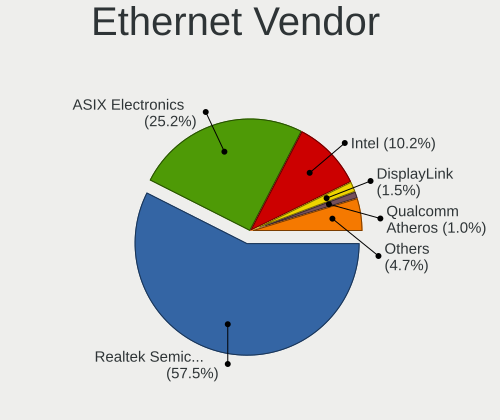

| Vendor                                 | Computers | Percent |
|----------------------------------------|-----------|---------|
| Realtek Semiconductor                  | 717       | 57.45%  |
| ASIX Electronics                       | 314       | 25.16%  |
| Intel                                  | 127       | 10.18%  |
| DisplayLink                            | 19        | 1.52%   |
| Qualcomm Atheros                       | 12        | 0.96%   |
| Samsung Electronics                    | 9         | 0.72%   |
| MediaTek                               | 8         | 0.64%   |
| Google                                 | 8         | 0.64%   |
| Broadcom                               | 8         | 0.64%   |
| Lenovo                                 | 6         | 0.48%   |
| Xiaomi                                 | 4         | 0.32%   |
| OPPO Electronics                       | 3         | 0.24%   |
| OnePlus Technology (Shenzhen)          | 2         | 0.16%   |
| Motorola PCS                           | 2         | 0.16%   |
| Huawei Technologies                    | 2         | 0.16%   |
| Aquantia                               | 2         | 0.16%   |
| Sony Ericsson Mobile Communications AB | 1         | 0.08%   |
| Qualcomm                               | 1         | 0.08%   |
| Marvell Technology Group               | 1         | 0.08%   |
| Davicom Semiconductor                  | 1         | 0.08%   |
| American Megatrends                    | 1         | 0.08%   |

Ethernet Model
--------------

Ethernet models

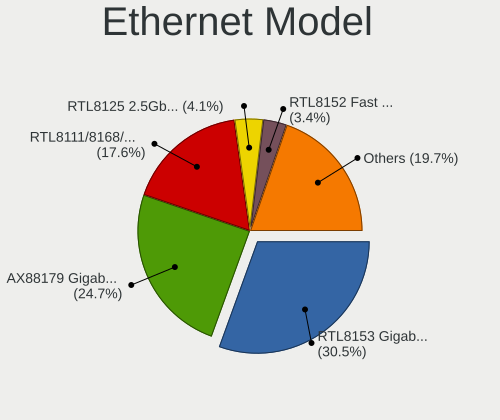

| Model                                                                           | Computers | Percent |
|---------------------------------------------------------------------------------|-----------|---------|
| Realtek RTL8153 Gigabit Ethernet Adapter                                        | 386       | 30.54%  |
| ASIX AX88179 Gigabit Ethernet                                                   | 312       | 24.68%  |
| Realtek RTL8111/8168/8211/8411 PCI Express Gigabit Ethernet Controller          | 222       | 17.56%  |
| Realtek RTL8125 2.5GbE Controller                                               | 52        | 4.11%   |
| Realtek RTL8152 Fast Ethernet Adapter                                           | 43        | 3.4%    |
| Intel I211 Gigabit Network Connection                                           | 23        | 1.82%   |
| Intel Ethernet Controller I225-V                                                | 23        | 1.82%   |
| Intel Ethernet Connection (2) I219-V                                            | 17        | 1.34%   |
| Intel Ethernet Controller I226-V                                                | 10        | 0.79%   |
| Realtek RTL810xE PCI Express Fast Ethernet controller                           | 9         | 0.71%   |
| Samsung Galaxy series, misc. (tethering mode)                                   | 8         | 0.63%   |
| Intel Ethernet Connection (7) I219-V                                            | 7         | 0.55%   |
| Intel 82579LM Gigabit Network Connection (Lewisville)                           | 7         | 0.55%   |
| Google Pixel 9a                                                                 | 6         | 0.47%   |
| Realtek Killer E2600 GbE Controller                                             | 5         | 0.4%    |
| Qualcomm Atheros Killer E2500 Gigabit Ethernet Controller                       | 5         | 0.4%    |
| Intel Ethernet Connection (2) I218-V                                            | 5         | 0.4%    |
| Broadcom NetXtreme BCM57766 Gigabit Ethernet PCIe                               | 5         | 0.4%    |
| Realtek RTL8852BE PCIe 802.11ax Wireless Network Controller                     | 4         | 0.32%   |
| Lenovo USB-C Dock Ethernet                                                      | 4         | 0.32%   |
| Intel Ethernet Connection I217-LM                                               | 4         | 0.32%   |
| DisplayLink Dell Universal Dock D6000                                           | 4         | 0.32%   |
| Xiaomi Mi/Redmi series (RNDIS)                                                  | 3         | 0.24%   |
| Qualcomm Atheros Killer E2400 Gigabit Ethernet Controller                       | 3         | 0.24%   |
| MediaTek MT7922 802.11ax PCI Express Wireless Network Adapter                   | 3         | 0.24%   |
| MediaTek A015                                                                   | 3         | 0.24%   |
| Intel I210 Gigabit Network Connection                                           | 3         | 0.24%   |
| Intel Ethernet Connection I217-V                                                | 3         | 0.24%   |
| Intel Ethernet Connection (12) I219-V                                           | 3         | 0.24%   |
| Intel 82574L Gigabit Network Connection                                         | 3         | 0.24%   |
| DisplayLink USB-C Triple-4K Dock                                                | 3         | 0.24%   |
| DisplayLink Plugable UD-3900Z                                                   | 3         | 0.24%   |
| Broadcom NetXtreme BCM57765 Gigabit Ethernet PCIe                               | 3         | 0.24%   |
| Realtek USB 10/100/1G/2.5 LAN                                                   | 2         | 0.16%   |
| Realtek RTL8126 5GbE Controller                                                 | 2         | 0.16%   |
| Qualcomm Atheros Killer E220x Gigabit Ethernet Controller                       | 2         | 0.16%   |
| Qualcomm Atheros AR8161 Gigabit Ethernet                                        | 2         | 0.16%   |
| OPPO Ace 3V                                                                     | 2         | 0.16%   |
| OnePlus (Shenzhen) BE2029                                                       | 2         | 0.16%   |
| MediaTek MT7925 802.11be 160MHz 2x2 PCIe Wireless Network Adapter [Filogic 360] | 2         | 0.16%   |

Net Controller Kind
-------------------

Ethernet, WiFi or modem

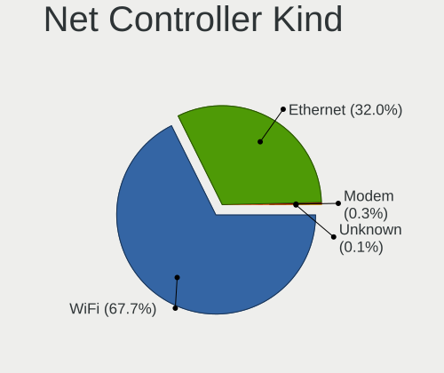

| Kind     | Computers | Percent |
|----------|-----------|---------|
| WiFi     | 2510      | 67.65%  |
| Ethernet | 1186      | 31.97%  |
| Modem    | 11        | 0.3%    |
| Unknown  | 3         | 0.08%   |

Used Controller
---------------

Currently used network controller

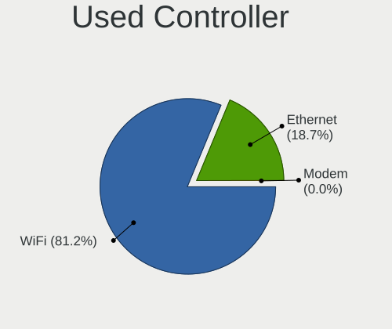

| Kind     | Computers | Percent |
|----------|-----------|---------|
| WiFi     | 2273      | 81.24%  |
| Ethernet | 524       | 18.73%  |
| Modem    | 1         | 0.04%   |

NICs
----

Total network controllers on board

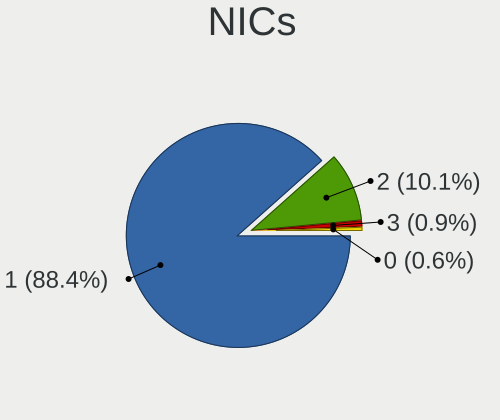

| Total | Computers | Percent |
|-------|-----------|---------|
| 1     | 2330      | 88.43%  |
| 2     | 265       | 10.06%  |
| 3     | 24        | 0.91%   |
| 0     | 16        | 0.61%   |

IPv6
----

IPv6 vs IPv4

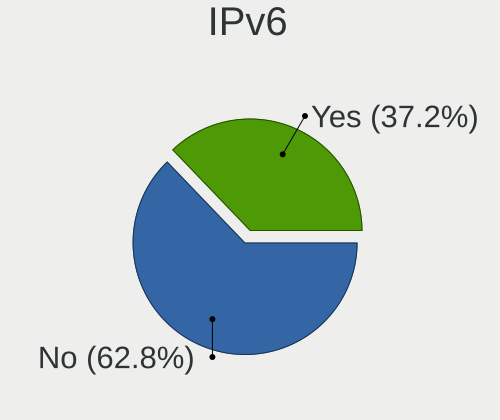

| Used | Computers | Percent |
|------|-----------|---------|
| No   | 1692      | 62.83%  |
| Yes  | 1001      | 37.17%  |

Bluetooth
---------

Bluetooth Vendor
----------------

Controller vendors

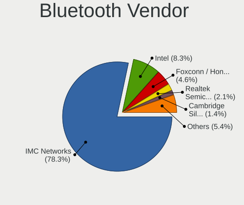

| Vendor                          | Computers | Percent |
|---------------------------------|-----------|---------|
| IMC Networks                    | 1696      | 78.34%  |
| Intel                           | 179       | 8.27%   |
| Foxconn / Hon Hai               | 99        | 4.57%   |
| Realtek Semiconductor           | 45        | 2.08%   |
| Cambridge Silicon Radio         | 30        | 1.39%   |
| MediaTek                        | 29        | 1.34%   |
| Qualcomm Atheros Communications | 18        | 0.83%   |
| Apple                           | 17        | 0.79%   |
| ASUSTek Computer                | 12        | 0.55%   |
| TP-Link                         | 9         | 0.42%   |
| Lite-On Technology              | 6         | 0.28%   |
| Broadcom                        | 5         | 0.23%   |
| SINO WEALTH                     | 3         | 0.14%   |
| Realtek                         | 3         | 0.14%   |
| Unknown                         | 3         | 0.14%   |
| HTC (High Tech Computer)        | 2         | 0.09%   |
| Dynex                           | 2         | 0.09%   |
| Dell                            | 2         | 0.09%   |
| Marvell Semiconductor           | 1         | 0.05%   |
| Integrated System Solution      | 1         | 0.05%   |
| Cypress Semiconductor           | 1         | 0.05%   |
| Alps Electric                   | 1         | 0.05%   |
| AICSemi                         | 1         | 0.05%   |

Bluetooth Model
---------------

Controller models

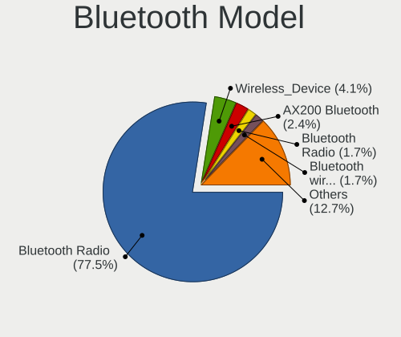

| Model                                                                | Computers | Percent |
|----------------------------------------------------------------------|-----------|---------|
| IMC Networks Bluetooth Radio                                         | 1677      | 77.46%  |
| Foxconn / Hon Hai Wireless_Device                                    | 88        | 4.06%   |
| Intel AX200 Bluetooth                                                | 52        | 2.4%    |
| Realtek Bluetooth Radio                                              | 36        | 1.66%   |
| Intel Bluetooth wireless interface                                   | 36        | 1.66%   |
| Intel AX210 Bluetooth                                                | 35        | 1.62%   |
| Cambridge Silicon Radio Bluetooth Dongle (HCI mode)                  | 30        | 1.39%   |
| MediaTek Wireless_Device                                             | 29        | 1.34%   |
| Intel AX201 Bluetooth                                                | 20        | 0.92%   |
| IMC Networks Wireless_Device                                         | 17        | 0.79%   |
| Intel Wireless-AC 3168 Bluetooth                                     | 14        | 0.65%   |
| Apple Bluetooth Host Controller                                      | 11        | 0.51%   |
| TP-Link TP-T@- UB500 Adapter                                         | 9         | 0.42%   |
| Qualcomm Atheros  Bluetooth Device                                   | 9         | 0.42%   |
| Intel Bluetooth 9460/9560 Jefferson Peak (JfP)                       | 9         | 0.42%   |
| Realtek  Bluetooth 4.2 Adapter                                       | 8         | 0.37%   |
| Intel Bluetooth Device                                               | 7         | 0.32%   |
| Qualcomm Atheros QCA61x4 Bluetooth 4.0                               | 6         | 0.28%   |
| Foxconn / Hon Hai MediaTek Bluetooth Adapter                         | 6         | 0.28%   |
| ASUS Broadcom BCM20702A0 Bluetooth                                   | 5         | 0.23%   |
| ASUS ASUS USB-BT500                                                  | 5         | 0.23%   |
| Apple Bluetooth USB Host Controller                                  | 5         | 0.23%   |
| Intel Centrino Bluetooth Wireless Transceiver                        | 4         | 0.18%   |
| Realtek Bluetooth Radio                                              | 3         | 0.14%   |
| Broadcom BCM20702A0 Bluetooth 4.0                                    | 3         | 0.14%   |
| Unknown                                                              | 3         | 0.14%   |
| SINO WEALTH Bluetooth Keyboard                                       | 2         | 0.09%   |
| Qualcomm Atheros AR9462 Bluetooth                                    | 2         | 0.09%   |
| Lite-On Wireless_Device                                              | 2         | 0.09%   |
| Lite-On Qualcomm Atheros QCA9377 Bluetooth                           | 2         | 0.09%   |
| Lite-On Bluetooth Radio                                              | 2         | 0.09%   |
| Intel Wireless-AC 9260 Bluetooth Adapter                             | 2         | 0.09%   |
| IMC Networks Bluetooth Device                                        | 2         | 0.09%   |
| HTC (High Tech Computer) Vive Hub Bluetooth 4.1 (Broadcom BCM920703) | 2         | 0.09%   |
| Foxconn / Hon Hai MediaTek MT7921 Bluetooth                          | 2         | 0.09%   |
| Dynex Bluetooth 4.0 Adapter [Broadcom, 1.12, BCM20702A0]             | 2         | 0.09%   |
| SINO WEALTH RK Bluetooth Keyboar                                     | 1         | 0.05%   |
| Realtek 802.11ac WLAN Adapter                                        | 1         | 0.05%   |
| Qualcomm Atheros AR3012 Bluetooth 4.0                                | 1         | 0.05%   |
| Marvell Bluetooth and Wireless LAN Composite                         | 1         | 0.05%   |

Sound
-----

Sound Vendor
------------

Sound card vendors

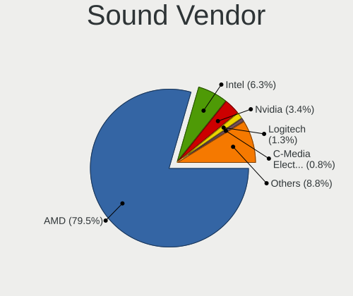

| Vendor                                       | Computers | Percent |
|----------------------------------------------|-----------|---------|
| AMD                                          | 2504      | 79.47%  |
| Intel                                        | 198       | 6.28%   |
| Nvidia                                       | 106       | 3.36%   |
| Logitech                                     | 42        | 1.33%   |
| C-Media Electronics                          | 24        | 0.76%   |
| Sony                                         | 23        | 0.73%   |
| Hewlett-Packard                              | 17        | 0.54%   |
| Realtek Semiconductor                        | 15        | 0.48%   |
| Razer USA                                    | 15        | 0.48%   |
| Generalplus Technology                       | 13        | 0.41%   |
| SteelSeries ApS                              | 12        | 0.38%   |
| Kingston Technology                          | 11        | 0.35%   |
| JMTek                                        | 11        | 0.35%   |
| Lenovo                                       | 9         | 0.29%   |
| Focusrite-Novation                           | 9         | 0.29%   |
| ASUSTek Computer                             | 9         | 0.29%   |
| Corsair                                      | 8         | 0.25%   |
| Apple                                        | 8         | 0.25%   |
| Nreal                                        | 7         | 0.22%   |
| Plantronics                                  | 6         | 0.19%   |
| Texas Instruments                            | 5         | 0.16%   |
| Medeli Electronics                           | 5         | 0.16%   |
| GN Netcom                                    | 5         | 0.16%   |
| Creative Labs                                | 4         | 0.13%   |
| Blue Microphones                             | 4         | 0.13%   |
| Valve Software                               | 3         | 0.1%    |
| Silicon Motion                               | 3         | 0.1%    |
| Micro Star International                     | 3         | 0.1%    |
| Jieli Technology                             | 3         | 0.1%    |
| FiiO Electronics Technology                  | 3         | 0.1%    |
| Bose                                         | 3         | 0.1%    |
| BEHRINGER International                      | 3         | 0.1%    |
| Astro Gaming                                 | 3         | 0.1%    |
| Unknown                                      | 3         | 0.1%    |
| Zoran Co. Personal Media Division (Nogatech) | 2         | 0.06%   |
| Tenx Technology                              | 2         | 0.06%   |
| PreSonus Audio Electronics                   | 2         | 0.06%   |
| Nordic Semiconductor ASA                     | 2         | 0.06%   |
| Native Instruments                           | 2         | 0.06%   |
| KTMicro                                      | 2         | 0.06%   |

Sound Model
-----------

Sound card models

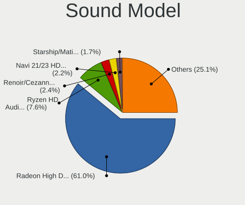

| Model                                                                      | Computers | Percent |
|----------------------------------------------------------------------------|-----------|---------|
| AMD Radeon High Definition Audio Controller                                | 2187      | 61.02%  |
| AMD Ryzen HD Audio Controller                                              | 272       | 7.59%   |
| AMD Renoir/Cezanne HDMI/DP Audio Controller                                | 87        | 2.43%   |
| AMD Navi 21/23 HDMI/DP Audio Controller                                    | 78        | 2.18%   |
| AMD Starship/Matisse HD Audio Controller                                   | 61        | 1.7%    |
| AMD Ellesmere HDMI Audio [Radeon RX 470/480 / 570/580/590]                 | 46        | 1.28%   |
| AMD Navi 31 HDMI/DP Audio                                                  | 39        | 1.09%   |
| AMD Family 17h (Models 00h-0fh) HD Audio Controller                        | 32        | 0.89%   |
| AMD Navi 10 HDMI Audio                                                     | 30        | 0.84%   |
| Intel Cannon Lake PCH cAVS                                                 | 21        | 0.59%   |
| Intel 100 Series/C230 Series Chipset Family HD Audio Controller            | 18        | 0.5%    |
| Intel 8 Series/C220 Series Chipset High Definition Audio Controller        | 16        | 0.45%   |
| AMD Raven/Raven2/Fenghuang HDMI/DP Audio Controller                        | 16        | 0.45%   |
| AMD Baffin HDMI/DP Audio [Radeon RX 550 640SP / RX 560/560X]               | 15        | 0.42%   |
| Intel 200 Series PCH HD Audio                                              | 14        | 0.39%   |
| Sony DualSense wireless controller (PS5)                                   | 13        | 0.36%   |
| Realtek Semiconductor USB Audio                                            | 13        | 0.36%   |
| Intel Tiger Lake-LP Smart Sound Technology Audio Controller                | 13        | 0.36%   |
| Intel Sunrise Point-LP HD Audio                                            | 13        | 0.36%   |
| Generalplus Technology USB Audio Device                                    | 13        | 0.36%   |
| Nvidia GA104 High Definition Audio Controller                              | 12        | 0.33%   |
| Nvidia TU107 GeForce GTX 1650 High Definition Audio Controller             | 11        | 0.31%   |
| JMTek USB PnP Audio Device                                                 | 11        | 0.31%   |
| Intel Xeon E3-1200 v3/4th Gen Core Processor HD Audio Controller           | 11        | 0.31%   |
| Intel 7 Series/C216 Chipset Family High Definition Audio Controller        | 11        | 0.31%   |
| Nvidia GP104 High Definition Audio Controller                              | 10        | 0.28%   |
| Intel Tiger Lake-H HD Audio Controller                                     | 10        | 0.28%   |
| Hewlett-Packard USB Audio                                                  | 9         | 0.25%   |
| ASUSTek Computer USB Audio                                                 | 9         | 0.25%   |
| AMD Family 15h (Models 60h-6fh) Audio Controller                           | 9         | 0.25%   |
| Intel 6 Series/C200 Series Chipset Family High Definition Audio Controller | 8         | 0.22%   |
| AMD Navi 48 HDMI/DP Audio Controller                                       | 8         | 0.22%   |
| Nreal Air                                                                  | 7         | 0.2%    |
| Logitech G435 Wireless Gaming Headset                                      | 7         | 0.2%    |
| Intel C610/X99 series chipset HD Audio Controller                          | 7         | 0.2%    |
| Nvidia TU106 High Definition Audio Controller                              | 6         | 0.17%   |
| Nvidia GA107 High Definition Audio Controller                              | 6         | 0.17%   |
| Nvidia GA106 High Definition Audio Controller                              | 6         | 0.17%   |
| Logitech G733 Gaming Headset                                               | 6         | 0.17%   |
| Intel Raptor Lake High Definition Audio Controller                         | 6         | 0.17%   |

Memory
------

Memory Vendor
-------------

Memory module vendors

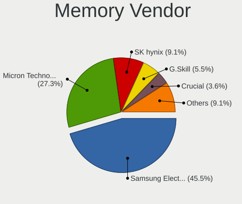

| Vendor              | Computers | Percent |
|---------------------|-----------|---------|
| Samsung Electronics | 25        | 45.45%  |
| Micron Technology   | 15        | 27.27%  |
| SK hynix            | 5         | 9.09%   |
| G.Skill             | 3         | 5.45%   |
| Crucial             | 2         | 3.64%   |
| Unknown             | 2         | 3.64%   |
| Ramaxel Technology  | 1         | 1.82%   |
| Nanya Technology    | 1         | 1.82%   |
| Kingston            | 1         | 1.82%   |

Memory Model
------------

Memory module models

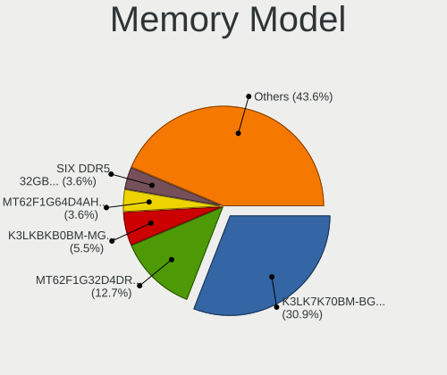

| Model                                                        | Computers | Percent |
|--------------------------------------------------------------|-----------|---------|
| Samsung RAM K3LK7K70BM-BGCP000 4GiB SODIMM LPDDR5 4266MT/s   | 17        | 30.91%  |
| Micron RAM MT62F1G32D4DR-031 WT 4GB SODIMM LPDDR5 6400MT/s   | 7         | 12.73%  |
| Samsung RAM K3LKBKB0BM-MGCP 4GB SODIMM LPDDR5 6400MT/s       | 3         | 5.45%   |
| Micron RAM MT62F1G64D4AH-023 WT 4GB SODIMM LPDDR5 4266MT/s   | 2         | 3.64%   |
| Unknown                                                      | 2         | 3.64%   |
| SK hynix RAM Module 8GB SODIMM DDR4 2133MT/s                 | 1         | 1.82%   |
| SK hynix RAM HMA81GS6DJR8N-XN 8GB SODIMM DDR4 3200MT/s       | 1         | 1.82%   |
| SK hynix RAM H9JCNNNCP3MLYR-N6E 4GB DIMM LPDDR5 6400MT/s     | 1         | 1.82%   |
| SK hynix RAM H9JCNNNCP3MLCR-N6E 4GB DIMM LPDDR5 6400MT/s     | 1         | 1.82%   |
| SK hynix RAM H58G56AK6BX069 2GB Row Of Chips LPDDR5 6400MT/s | 1         | 1.82%   |
| Samsung RAM Module 8GB SODIMM DDR4 2133MT/s                  | 1         | 1.82%   |
| Samsung RAM M471A5244BB0-CRC 4GB SODIMM DDR4 2667MT/s        | 1         | 1.82%   |
| Samsung RAM M471A1G44AB0-CWE 8GiB SODIMM DDR4 3200MT/s       | 1         | 1.82%   |
| Samsung RAM M4 70T5663QZ3-CF7 2GB SODIMM DDR2 2048MT/s       | 1         | 1.82%   |
| Samsung RAM K3KL3L30CM-BGCT 4GB Row Of Chips LPDDR5 7500MT/s | 1         | 1.82%   |
| Ramaxel RAM RMSA3310MJ86H9F-3200 4GB SODIMM DDR4 3200MT/s    | 1         | 1.82%   |
| Nanya RAM NT2GT64U8HD0BN-AD 2GB SODIMM DDR 800MT/s           | 1         | 1.82%   |
| Micron RAM MT62F2G32D4DS-026 WT 8GiB SODIMM LPDDR5 7500MT/s  | 1         | 1.82%   |
| Micron RAM Module 2GB SODIMM DDR3 1600MT/s                   | 1         | 1.82%   |
| Micron RAM 8JTF5126 4HZ1G6D 1 4GB SODIMM DDR3 1600MT/s       | 1         | 1.82%   |
| Micron RAM 8ATF1G64HZ-3G2R1 8GB SODIMM DDR4 3200MT/s         | 1         | 1.82%   |
| Micron RAM 4ATF1G64HZ-3G2E1 8GB SODIMM DDR4 3200MT/s         | 1         | 1.82%   |
| Micron RAM 16ATS2G64HZ-2G6B1 16GB SODIMM DDR4 2400MT/s       | 1         | 1.82%   |
| Kingston RAM 9905417-054.A00G 4GB SODIMM DDR3 1600MT/s       | 1         | 1.82%   |
| G.Skill RAM F4-3200C16-8GIS 8GB DIMM DDR4 3600MT/s           | 1         | 1.82%   |
| G.Skill RAM F4-2666C19-16GRS 16GB SODIMM DDR4 2667MT/s       | 1         | 1.82%   |
| G.Skill RAM F3-1600C9-8GXM 8GB DIMM DDR3 1867MT/s            | 1         | 1.82%   |
| Crucial RAM CT8G4SFS832A.C8FR 8GB SODIMM DDR4 3200MT/s       | 1         | 1.82%   |
| Crucial RAM CT16G4DFD8213.M16FJ 16GB DIMM DDR4 2133MT/s      | 1         | 1.82%   |

Memory Kind
-----------

Memory module kinds

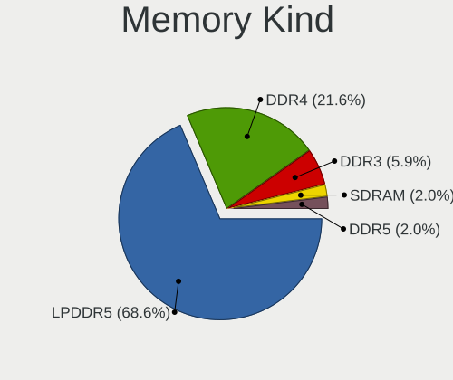

| Kind   | Computers | Percent |
|--------|-----------|---------|
| LPDDR5 | 35        | 68.63%  |
| DDR4   | 11        | 21.57%  |
| DDR3   | 3         | 5.88%   |
| SDRAM  | 1         | 1.96%   |
| DDR5   | 1         | 1.96%   |

Memory Form Factor
------------------

Physical design of the memory module

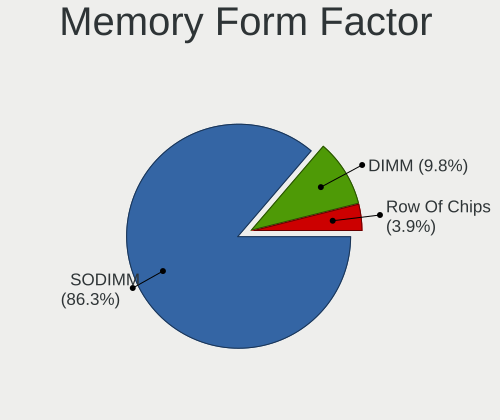

| Name         | Computers | Percent |
|--------------|-----------|---------|
| SODIMM       | 44        | 86.27%  |
| DIMM         | 5         | 9.8%    |
| Row Of Chips | 2         | 3.92%   |

Memory Size
-----------

Memory module size

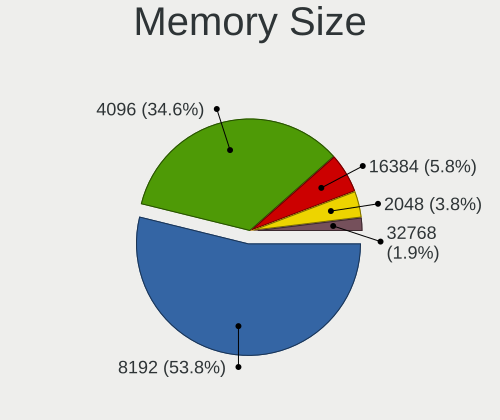

| Size  | Computers | Percent |
|-------|-----------|---------|
| 8192  | 28        | 53.85%  |
| 4096  | 18        | 34.62%  |
| 16384 | 3         | 5.77%   |
| 2048  | 2         | 3.85%   |
| 32768 | 1         | 1.92%   |

Memory Speed
------------

Memory module speed

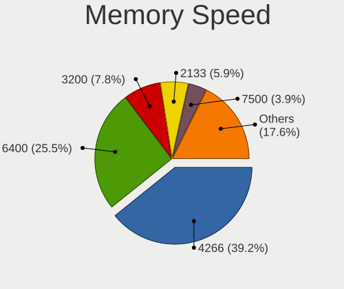

| Speed | Computers | Percent |
|-------|-----------|---------|
| 4266  | 20        | 39.22%  |
| 6400  | 13        | 25.49%  |
| 3200  | 4         | 7.84%   |
| 2133  | 3         | 5.88%   |
| 7500  | 2         | 3.92%   |
| 2667  | 2         | 3.92%   |
| 1600  | 2         | 3.92%   |
| 5600  | 1         | 1.96%   |
| 3600  | 1         | 1.96%   |
| 2400  | 1         | 1.96%   |
| 2048  | 1         | 1.96%   |
| 1867  | 1         | 1.96%   |

Printers & scanners
-------------------

Printer Vendor
--------------

Printer device vendors

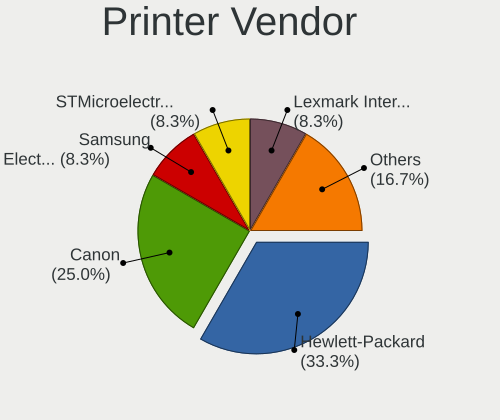

| Vendor                | Computers | Percent |
|-----------------------|-----------|---------|
| Hewlett-Packard       | 4         | 33.33%  |
| Canon                 | 3         | 25%     |
| STMicroelectronics    | 1         | 8.33%   |
| Samsung Electronics   | 1         | 8.33%   |
| Lexmark International | 1         | 8.33%   |
| KODAK                 | 1         | 8.33%   |
| Dymo-CoStar           | 1         | 8.33%   |

Printer Model
-------------

Printer device models

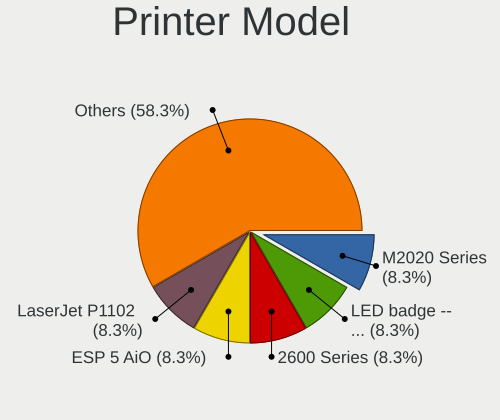

| Model                                                     | Computers | Percent |
|-----------------------------------------------------------|-----------|---------|
| STMicroelectronics LED badge -- mini LED display -- 11x44 | 1         | 8.33%   |
| Samsung M2020 Series                                      | 1         | 8.33%   |
| Lexmark International 2600 Series                         | 1         | 8.33%   |
| KODAK ESP 5 AiO                                           | 1         | 8.33%   |
| HP LaserJet P1102                                         | 1         | 8.33%   |
| HP LaserJet CP1525nw/x                                    | 1         | 8.33%   |
| HP LaserJet 1200                                          | 1         | 8.33%   |
| HP DeskJet 2700 series                                    | 1         | 8.33%   |
| Dymo-CoStar LabelWriter 400                               | 1         | 8.33%   |
| Canon PIXMA MG3600 Series                                 | 1         | 8.33%   |
| Canon PIXMA MG2500 Series                                 | 1         | 8.33%   |
| Canon LiDE 400                                            | 1         | 8.33%   |

Scanner Vendor
--------------

Scanner device vendors

| Vendor | Computers | Percent |
|--------|-----------|---------|
| Canon  | 1         | 100%    |

Scanner Model
-------------

Scanner device models

| Model                   | Computers | Percent |
|-------------------------|-----------|---------|
| Canon CanoScan LiDE 210 | 1         | 100%    |

Camera
------

Camera Vendor
-------------

Camera device vendors

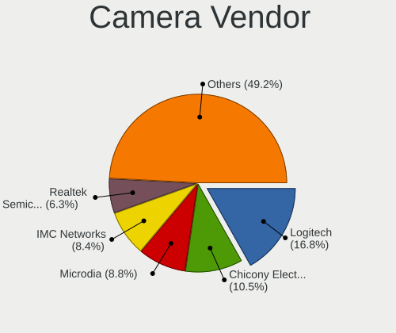

| Vendor                                 | Computers | Percent |
|----------------------------------------|-----------|---------|
| Logitech                               | 40        | 16.81%  |
| Chicony Electronics                    | 25        | 10.5%   |
| Microdia                               | 21        | 8.82%   |
| IMC Networks                           | 20        | 8.4%    |
| Realtek Semiconductor                  | 15        | 6.3%    |
| Apple                                  | 13        | 5.46%   |
| Bison Electronics                      | 11        | 4.62%   |
| Luxvisions Innotech Limited            | 10        | 4.2%    |
| Sunplus Innovation Technology          | 9         | 3.78%   |
| Quanta                                 | 9         | 3.78%   |
| Cheng Uei Precision Industry (Foxlink) | 7         | 2.94%   |
| Tripath Technology                     | 5         | 2.1%    |
| Syntek                                 | 5         | 2.1%    |
| Samsung Electronics                    | 5         | 2.1%    |
| Microsoft                              | 4         | 1.68%   |
| Valve Software                         | 3         | 1.26%   |
| Razer USA                              | 3         | 1.26%   |
| Generalplus Technology                 | 3         | 1.26%   |
| Tobii Technology AB                    | 2         | 0.84%   |
| SunplusIT                              | 2         | 0.84%   |
| Sonix Technology                       | 2         | 0.84%   |
| MacroSilicon                           | 2         | 0.84%   |
| Linux Foundation                       | 2         | 0.84%   |
| Alpha Imaging Technology               | 2         | 0.84%   |
| Suyin                                  | 1         | 0.42%   |
| Silicon Motion                         | 1         | 0.42%   |
| Shenzhen Kingcome Optoelectronic       | 1         | 0.42%   |
| Ricoh                                  | 1         | 0.42%   |
| Remo Tech                              | 1         | 0.42%   |
| Magic Control Technology               | 1         | 0.42%   |
| Lite-On Technology                     | 1         | 0.42%   |
| KYE Systems (Mouse Systems)            | 1         | 0.42%   |
| kingcome                               | 1         | 0.42%   |
| Jieli Technology                       | 1         | 0.42%   |
| IPEVO                                  | 1         | 0.42%   |
| HTC (High Tech Computer)               | 1         | 0.42%   |
| Google                                 | 1         | 0.42%   |
| Goodong                                | 1         | 0.42%   |
| Foxlink                                | 1         | 0.42%   |
| AVerMedia Technologies                 | 1         | 0.42%   |

Camera Model
------------

Camera device models

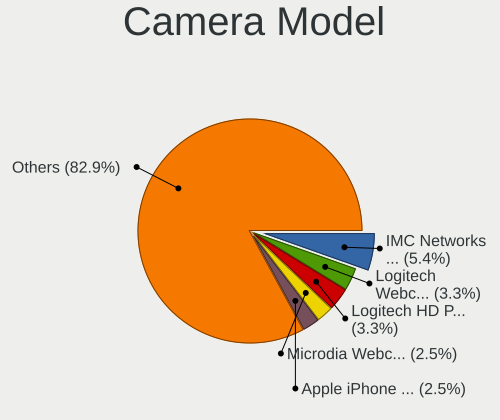

| Model                                                | Computers | Percent |
|------------------------------------------------------|-----------|---------|
| IMC Networks USB2.0 HD UVC WebCam                    | 13        | 5.42%   |
| Logitech Webcam C270                                 | 8         | 3.33%   |
| Logitech HD Pro Webcam C920                          | 8         | 3.33%   |
| Microdia Webcam Vitade AF                            | 6         | 2.5%    |
| Apple iPhone 5/5C/5S/6/SE/7/8/X                      | 6         | 2.5%    |
| Tripath PC Camera                                    | 5         | 2.08%   |
| Syntek Integrated Camera                             | 5         | 2.08%   |
| Samsung Galaxy series, misc. (MTP mode)              | 5         | 2.08%   |
| Microdia Integrated_Webcam_HD                        | 5         | 2.08%   |
| IMC Networks Integrated Camera                       | 5         | 2.08%   |
| Bison HD Webcam                                      | 5         | 2.08%   |
| Chicony Integrated Camera                            | 4         | 1.67%   |
| Chicony HP TrueVision HD Camera                      | 4         | 1.67%   |
| Chicony HD User Facing                               | 4         | 1.67%   |
| Bison Integrated Camera                              | 4         | 1.67%   |
| Valve Software 3D Camera                             | 3         | 1.25%   |
| Realtek Integrated_Webcam_HD                         | 3         | 1.25%   |
| Luxvisions Innotech Limited HP Wide Vision HD Camera | 3         | 1.25%   |
| Luxvisions Innotech Limited HP TrueVision HD Camera  | 3         | 1.25%   |
| Logitech HD Webcam C615                              | 3         | 1.25%   |
| Logitech C920 PRO HD Webcam                          | 3         | 1.25%   |
| Generalplus GENERAL WEBCAM                           | 3         | 1.25%   |
| Apple FaceTime HD Camera (Built-in)                  | 3         | 1.25%   |
| Apple FaceTime HD Camera                             | 3         | 1.25%   |
| Tobii AB EyeChip                                     | 2         | 0.83%   |
| Sunplus Integrated_Webcam_FHD                        | 2         | 0.83%   |
| Sunplus Asus Webcam                                  | 2         | 0.83%   |
| Realtek WebCamera                                    | 2         | 0.83%   |
| Realtek Thronmax Stream Go Pro Webcam                | 2         | 0.83%   |
| Quanta HP Wide Vision HD Camera                      | 2         | 0.83%   |
| Quanta HD User Facing                                | 2         | 0.83%   |
| Microsoft LifeCam HD-3000                            | 2         | 0.83%   |
| Microdia Integrated Webcam                           | 2         | 0.83%   |
| MacroSilicon USB Video                               | 2         | 0.83%   |
| Luxvisions Innotech Limited Integrated Camera        | 2         | 0.83%   |
| Logitech Logitech Webcam C925e                       | 2         | 0.83%   |
| Logitech HD Webcam C910                              | 2         | 0.83%   |
| Logitech HD Webcam C525                              | 2         | 0.83%   |
| Logitech CrystalCam                                  | 2         | 0.83%   |
| Logitech BRIO Ultra HD Webcam                        | 2         | 0.83%   |

Security
--------

Fingerprint Vendor
------------------

Fingerprint sensor vendors

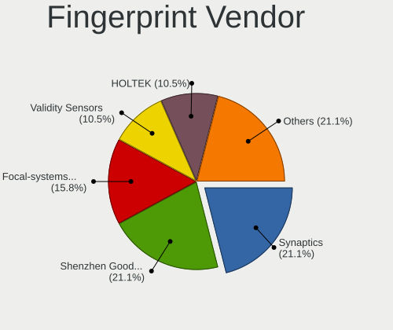

| Vendor                     | Computers | Percent |
|----------------------------|-----------|---------|
| Synaptics                  | 4         | 21.05%  |
| Shenzhen Goodix Technology | 4         | 21.05%  |
| Focal-systems.Corp         | 3         | 15.79%  |
| Validity Sensors           | 2         | 10.53%  |
| HOLTEK                     | 2         | 10.53%  |
| Elan Microelectronics      | 2         | 10.53%  |
| Upek                       | 1         | 5.26%   |
| LighTuning Technology      | 1         | 5.26%   |

Fingerprint Model
-----------------

Fingerprint sensor models

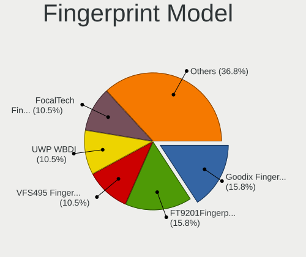

| Model                                                  | Computers | Percent |
|--------------------------------------------------------|-----------|---------|
| Shenzhen Goodix  FingerPrint Device                    | 3         | 15.79%  |
| Focal-systems.Corp FT9201Fingerprint.                  | 3         | 15.79%  |
| Validity Sensors VFS495 Fingerprint Reader             | 2         | 10.53%  |
| Synaptics UWP WBDI                                     | 2         | 10.53%  |
| HOLTEK FocalTech Fingerprint Device                    | 2         | 10.53%  |
| Upek Biometric Touchchip/Touchstrip Fingerprint Sensor | 1         | 5.26%   |
| Synaptics WBDI                                         | 1         | 5.26%   |
| Synaptics Prometheus MIS Touch Fingerprint Reader      | 1         | 5.26%   |
| Shenzhen Goodix Fingerprint Reader                     | 1         | 5.26%   |
| LighTuning Fingerprint Sensor                          | 1         | 5.26%   |
| Elan fingerprint sensor [FeinTech FPS00200]            | 1         | 5.26%   |
| Elan ELAN:Fingerprint                                  | 1         | 5.26%   |

Chipcard Vendor
---------------

Chipcard module vendors

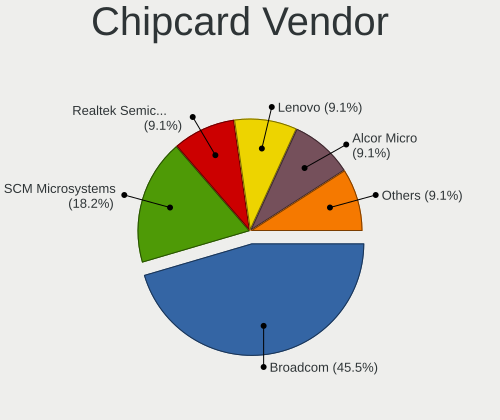

| Vendor                | Computers | Percent |
|-----------------------|-----------|---------|
| Broadcom              | 5         | 45.45%  |
| SCM Microsystems      | 2         | 18.18%  |
| Realtek Semiconductor | 1         | 9.09%   |
| Lenovo                | 1         | 9.09%   |
| Alcor Micro           | 1         | 9.09%   |
| Advanced Card Systems | 1         | 9.09%   |

Chipcard Model
--------------

Chipcard module models

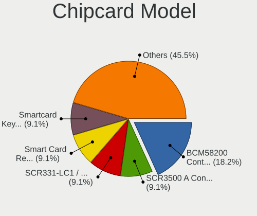

| Model                                                                        | Computers | Percent |
|------------------------------------------------------------------------------|-----------|---------|
| Broadcom BCM58200 ControlVault 3 (FingerPrint sensor + Contacted SmartCard)  | 2         | 18.18%  |
| SCM Microsystems SCR3500 A Contact Reader                                    | 1         | 9.09%   |
| SCM Microsystems SCR331-LC1 / SCR3310 SmartCard Reader                       | 1         | 9.09%   |
| Realtek Semiconductor Smart Card Reader Interface                            | 1         | 9.09%   |
| Lenovo Smartcard Keyboard                                                    | 1         | 9.09%   |
| Broadcom BCM5880 Secure Applications Processor with fingerprint swipe sensor | 1         | 9.09%   |
| Broadcom BCM5880 Secure Applications Processor                               | 1         | 9.09%   |
| Broadcom 5880                                                                | 1         | 9.09%   |
| Alcor Micro AU9540 Smartcard Reader                                          | 1         | 9.09%   |
| Advanced Card Systems ACR39U                                                 | 1         | 9.09%   |

Unsupported
-----------

Unsupported Devices
-------------------

Total unsupported devices on board

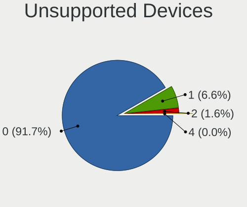

| Total | Computers | Percent |
|-------|-----------|---------|
| 0     | 2418      | 91.66%  |
| 1     | 174       | 6.6%    |
| 2     | 42        | 1.59%   |
| 3     | 3         | 0.11%   |
| 4     | 1         | 0.04%   |

Unsupported Device Types
------------------------

Types of unsupported devices

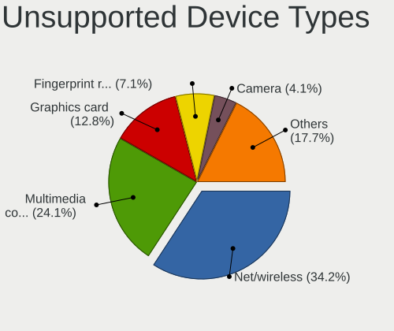

| Type                     | Computers | Percent |
|--------------------------|-----------|---------|
| Net/wireless             | 91        | 34.21%  |
| Multimedia controller    | 64        | 24.06%  |
| Graphics card            | 34        | 12.78%  |
| Fingerprint reader       | 19        | 7.14%   |
| Camera                   | 11        | 4.14%   |
| Unassigned class         | 10        | 3.76%   |
| Chipcard                 | 9         | 3.38%   |
| Sound                    | 7         | 2.63%   |
| Net/ethernet             | 5         | 1.88%   |
| Storage/nvme             | 3         | 1.13%   |
| Network                  | 3         | 1.13%   |
| Card reader              | 3         | 1.13%   |
| Bluetooth                | 3         | 1.13%   |
| Modem                    | 2         | 0.75%   |
| Storage/raid             | 1         | 0.38%   |
| Communication controller | 1         | 0.38%   |

