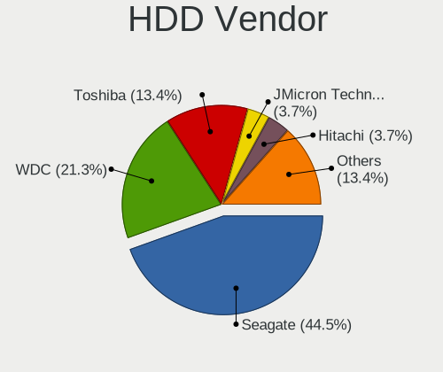
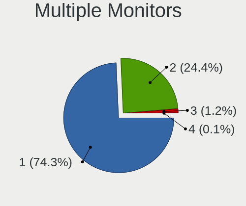
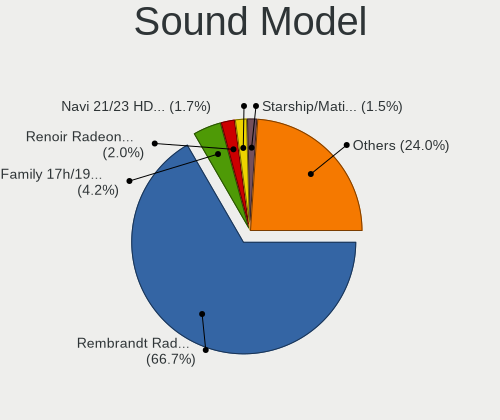

SteamOS - Tested Hardware & Statistics
--------------------------------------

A project to collect tested hardware configurations for SteamOS.

Anyone can contribute to this report by the [hw-probe](https://github.com/linuxhw/hw-probe) tool:

    sudo -E hw-probe -all -upload

Please contribute! Especially if your hardware is rare.

This is a report for all computer types. See also reports for [desktops](/Dist/SteamOS/Desktop/README.md) and [notebooks](/Dist/SteamOS/Notebook/README.md).

Contents
--------

* [ Test Cases ](#test-cases)

* [ System ](#system)
  - [ OS                       ](#os)
  - [ OS Family                ](#os-family)
  - [ Kernel                   ](#kernel)
  - [ Kernel Family            ](#kernel-family)
  - [ Kernel Major Ver.        ](#kernel-major-ver)
  - [ Arch                     ](#arch)
  - [ DE                       ](#de)
  - [ Display Server           ](#display-server)
  - [ Display Manager          ](#display-manager)
  - [ OS Lang                  ](#os-lang)
  - [ Boot Mode                ](#boot-mode)
  - [ Filesystem               ](#filesystem)
  - [ Part. scheme             ](#part-scheme)
  - [ Dual Boot with Linux/BSD ](#dual-boot-with-linuxbsd)
  - [ Dual Boot (Win)          ](#dual-boot-win)

* [ Board ](#board)
  - [ Vendor                   ](#vendor)
  - [ Model                    ](#model)
  - [ Model Family             ](#model-family)
  - [ MFG Year                 ](#mfg-year)
  - [ Form Factor              ](#form-factor)
  - [ Secure Boot              ](#secure-boot)
  - [ Coreboot                 ](#coreboot)
  - [ RAM Size                 ](#ram-size)
  - [ RAM Used                 ](#ram-used)
  - [ Total Drives             ](#total-drives)
  - [ Has CD-ROM               ](#has-cd-rom)
  - [ Has Ethernet             ](#has-ethernet)
  - [ Has WiFi                 ](#has-wifi)
  - [ Has Bluetooth            ](#has-bluetooth)

* [ Location ](#location)
  - [ Country                  ](#country)
  - [ City                     ](#city)

* [ Drives ](#drives)
  - [ Drive Vendor             ](#drive-vendor)
  - [ Drive Model              ](#drive-model)
  - [ HDD Vendor               ](#hdd-vendor)
  - [ SSD Vendor               ](#ssd-vendor)
  - [ Drive Kind               ](#drive-kind)
  - [ Drive Connector          ](#drive-connector)
  - [ Drive Size               ](#drive-size)
  - [ Space Total              ](#space-total)
  - [ Space Used               ](#space-used)
  - [ Malfunc. Drives          ](#malfunc-drives)
  - [ Malfunc. Drive Vendor    ](#malfunc-drive-vendor)
  - [ Malfunc. HDD Vendor      ](#malfunc-hdd-vendor)
  - [ Malfunc. Drive Kind      ](#malfunc-drive-kind)
  - [ Failed Drives            ](#failed-drives)
  - [ Failed Drive Vendor      ](#failed-drive-vendor)
  - [ Drive Status             ](#drive-status)

* [ Storage controller ](#storage-controller)
  - [ Storage Vendor           ](#storage-vendor)
  - [ Storage Model            ](#storage-model)
  - [ Storage Kind             ](#storage-kind)

* [ Processor ](#processor)
  - [ CPU Vendor               ](#cpu-vendor)
  - [ CPU Model                ](#cpu-model)
  - [ CPU Model Family         ](#cpu-model-family)
  - [ CPU Cores                ](#cpu-cores)
  - [ CPU Sockets              ](#cpu-sockets)
  - [ CPU Threads              ](#cpu-threads)
  - [ CPU Op-Modes             ](#cpu-op-modes)
  - [ CPU Microcode            ](#cpu-microcode)
  - [ CPU Microarch            ](#cpu-microarch)

* [ Graphics ](#graphics)
  - [ GPU Vendor               ](#gpu-vendor)
  - [ GPU Model                ](#gpu-model)
  - [ GPU Combo                ](#gpu-combo)
  - [ GPU Driver               ](#gpu-driver)
  - [ GPU Memory               ](#gpu-memory)

* [ Monitor ](#monitor)
  - [ Monitor Vendor           ](#monitor-vendor)
  - [ Monitor Model            ](#monitor-model)
  - [ Monitor Resolution       ](#monitor-resolution)
  - [ Monitor Diagonal         ](#monitor-diagonal)
  - [ Monitor Width            ](#monitor-width)
  - [ Aspect Ratio             ](#aspect-ratio)
  - [ Monitor Area             ](#monitor-area)
  - [ Pixel Density            ](#pixel-density)
  - [ Multiple Monitors        ](#multiple-monitors)

* [ Network ](#network)
  - [ Net Controller Vendor    ](#net-controller-vendor)
  - [ Net Controller Model     ](#net-controller-model)
  - [ Wireless Vendor          ](#wireless-vendor)
  - [ Wireless Model           ](#wireless-model)
  - [ Ethernet Vendor          ](#ethernet-vendor)
  - [ Ethernet Model           ](#ethernet-model)
  - [ Net Controller Kind      ](#net-controller-kind)
  - [ Used Controller          ](#used-controller)
  - [ NICs                     ](#nics)
  - [ IPv6                     ](#ipv6)

* [ Bluetooth ](#bluetooth)
  - [ Bluetooth Vendor         ](#bluetooth-vendor)
  - [ Bluetooth Model          ](#bluetooth-model)

* [ Sound ](#sound)
  - [ Sound Vendor             ](#sound-vendor)
  - [ Sound Model              ](#sound-model)

* [ Memory ](#memory)
  - [ Memory Vendor            ](#memory-vendor)
  - [ Memory Model             ](#memory-model)
  - [ Memory Kind              ](#memory-kind)
  - [ Memory Form Factor       ](#memory-form-factor)
  - [ Memory Size              ](#memory-size)
  - [ Memory Speed             ](#memory-speed)

* [ Printers & scanners ](#printers--scanners)
  - [ Printer Vendor           ](#printer-vendor)
  - [ Printer Model            ](#printer-model)
  - [ Scanner Vendor           ](#scanner-vendor)
  - [ Scanner Model            ](#scanner-model)

* [ Camera ](#camera)
  - [ Camera Vendor            ](#camera-vendor)
  - [ Camera Model             ](#camera-model)

* [ Security ](#security)
  - [ Fingerprint Vendor       ](#fingerprint-vendor)
  - [ Fingerprint Model        ](#fingerprint-model)
  - [ Chipcard Vendor          ](#chipcard-vendor)
  - [ Chipcard Model           ](#chipcard-model)

* [ Unsupported ](#unsupported)
  - [ Unsupported Devices      ](#unsupported-devices)
  - [ Unsupported Device Types ](#unsupported-device-types)

Test Cases
----------

Total: 1008

| Vendor        | Model                       | Form-Factor | Probe                                                      | Date         |
|---------------|-----------------------------|-------------|------------------------------------------------------------|--------------|
| Valve         | Jupiter                     | Notebook    | [a91aee62d3](https://linux-hardware.org/?probe=a91aee62d3) | Apr 01, 2023 |
| Valve         | Jupiter                     | Notebook    | [2628ea9d8e](https://linux-hardware.org/?probe=2628ea9d8e) | Apr 01, 2023 |
| Valve         | Jupiter                     | Notebook    | [888da0cc87](https://linux-hardware.org/?probe=888da0cc87) | Mar 31, 2023 |
| Valve         | Jupiter                     | Notebook    | [34766581f3](https://linux-hardware.org/?probe=34766581f3) | Mar 31, 2023 |
| Valve         | Jupiter                     | Notebook    | [d5e7a881e6](https://linux-hardware.org/?probe=d5e7a881e6) | Mar 31, 2023 |
| Valve         | Jupiter                     | Notebook    | [5b3718d617](https://linux-hardware.org/?probe=5b3718d617) | Mar 31, 2023 |
| Valve         | Jupiter                     | Notebook    | [078e440a68](https://linux-hardware.org/?probe=078e440a68) | Mar 31, 2023 |
| Valve         | Jupiter                     | Notebook    | [cf4ac240c4](https://linux-hardware.org/?probe=cf4ac240c4) | Mar 30, 2023 |
| Valve         | Jupiter                     | Notebook    | [395ff0d196](https://linux-hardware.org/?probe=395ff0d196) | Mar 29, 2023 |
| Acer          | Nitro N50-610               | Desktop     | [937d1bc73a](https://linux-hardware.org/?probe=937d1bc73a) | Mar 29, 2023 |
| Valve         | Jupiter                     | Notebook    | [889e4e5eef](https://linux-hardware.org/?probe=889e4e5eef) | Mar 29, 2023 |
| Valve         | Jupiter                     | Notebook    | [a63f5d9198](https://linux-hardware.org/?probe=a63f5d9198) | Mar 28, 2023 |
| Valve         | Jupiter                     | Notebook    | [a195a1f983](https://linux-hardware.org/?probe=a195a1f983) | Mar 28, 2023 |
| Valve         | Jupiter                     | Notebook    | [68175ccbea](https://linux-hardware.org/?probe=68175ccbea) | Mar 27, 2023 |
| Valve         | Jupiter                     | Notebook    | [50abca1d7d](https://linux-hardware.org/?probe=50abca1d7d) | Mar 27, 2023 |
| Valve         | Jupiter                     | Notebook    | [b4e942862a](https://linux-hardware.org/?probe=b4e942862a) | Mar 27, 2023 |
| Valve         | Jupiter                     | Notebook    | [1a7531860b](https://linux-hardware.org/?probe=1a7531860b) | Mar 27, 2023 |
| Valve         | Jupiter                     | Notebook    | [1f2e4d7cd8](https://linux-hardware.org/?probe=1f2e4d7cd8) | Mar 26, 2023 |
| Valve         | Jupiter                     | Notebook    | [58c3c0e668](https://linux-hardware.org/?probe=58c3c0e668) | Mar 26, 2023 |
| Valve         | Jupiter                     | Notebook    | [2b40215d5b](https://linux-hardware.org/?probe=2b40215d5b) | Mar 26, 2023 |
| Valve         | Jupiter                     | Notebook    | [3ad7937aaf](https://linux-hardware.org/?probe=3ad7937aaf) | Mar 26, 2023 |
| Valve         | Jupiter                     | Notebook    | [b7c75f2713](https://linux-hardware.org/?probe=b7c75f2713) | Mar 26, 2023 |
| Valve         | Jupiter                     | Notebook    | [6a7628c31d](https://linux-hardware.org/?probe=6a7628c31d) | Mar 25, 2023 |
| Valve         | Jupiter                     | Notebook    | [dc0f21bf9e](https://linux-hardware.org/?probe=dc0f21bf9e) | Mar 24, 2023 |
| ASRock        | X300M-STX                   | Desktop     | [0393d25a9d](https://linux-hardware.org/?probe=0393d25a9d) | Mar 23, 2023 |
| ASRock        | X300M-STX                   | Desktop     | [296411b749](https://linux-hardware.org/?probe=296411b749) | Mar 23, 2023 |
| Valve         | Jupiter                     | Notebook    | [f2fed76f66](https://linux-hardware.org/?probe=f2fed76f66) | Mar 23, 2023 |
| Valve         | Jupiter                     | Notebook    | [a26ed66cf4](https://linux-hardware.org/?probe=a26ed66cf4) | Mar 23, 2023 |
| Valve         | Jupiter                     | Notebook    | [25c02815b0](https://linux-hardware.org/?probe=25c02815b0) | Mar 23, 2023 |
| Valve         | Jupiter                     | Notebook    | [9d1c01a6cd](https://linux-hardware.org/?probe=9d1c01a6cd) | Mar 23, 2023 |
| Valve         | Jupiter                     | Notebook    | [8fc3d21cf8](https://linux-hardware.org/?probe=8fc3d21cf8) | Mar 22, 2023 |
| Intel Clie... | LAPQC71C                    | Notebook    | [9cbe204a59](https://linux-hardware.org/?probe=9cbe204a59) | Mar 22, 2023 |
| Valve         | Jupiter                     | Notebook    | [10f53ece03](https://linux-hardware.org/?probe=10f53ece03) | Mar 21, 2023 |
| Valve         | Jupiter                     | Notebook    | [6107d0ad44](https://linux-hardware.org/?probe=6107d0ad44) | Mar 21, 2023 |
| Valve         | Jupiter                     | Notebook    | [f5883ebc3d](https://linux-hardware.org/?probe=f5883ebc3d) | Mar 21, 2023 |
| Valve         | Jupiter                     | Notebook    | [d6b52894a1](https://linux-hardware.org/?probe=d6b52894a1) | Mar 21, 2023 |
| Valve         | Jupiter                     | Notebook    | [b73f7b46c4](https://linux-hardware.org/?probe=b73f7b46c4) | Mar 20, 2023 |
| Valve         | Jupiter                     | Notebook    | [8b7918d34b](https://linux-hardware.org/?probe=8b7918d34b) | Mar 20, 2023 |
| HP            | 83E9                        | Desktop     | [a93c800fa1](https://linux-hardware.org/?probe=a93c800fa1) | Mar 19, 2023 |
| Valve         | Jupiter                     | Notebook    | [192fe75be4](https://linux-hardware.org/?probe=192fe75be4) | Mar 19, 2023 |
| Valve         | Jupiter                     | Notebook    | [f1790d6f33](https://linux-hardware.org/?probe=f1790d6f33) | Mar 18, 2023 |
| Gigabyte      | F2A68HM-H                   | Desktop     | [a77d320c80](https://linux-hardware.org/?probe=a77d320c80) | Mar 18, 2023 |
| Valve         | Jupiter                     | Notebook    | [0dbb54db92](https://linux-hardware.org/?probe=0dbb54db92) | Mar 17, 2023 |
| Valve         | Jupiter                     | Notebook    | [8f51ab644e](https://linux-hardware.org/?probe=8f51ab644e) | Mar 17, 2023 |
| HP            | Laptop 15-bs0xx             | Notebook    | [f53eccbbe9](https://linux-hardware.org/?probe=f53eccbbe9) | Mar 16, 2023 |
| Valve         | Jupiter                     | Notebook    | [bfdb73f825](https://linux-hardware.org/?probe=bfdb73f825) | Mar 16, 2023 |
| Valve         | Jupiter                     | Notebook    | [0a2038deed](https://linux-hardware.org/?probe=0a2038deed) | Mar 16, 2023 |
| ASUSTek       | PRIME H610M-K D4            | Desktop     | [9f33a01f8d](https://linux-hardware.org/?probe=9f33a01f8d) | Mar 15, 2023 |
| Valve         | Jupiter                     | Notebook    | [36eacafa6f](https://linux-hardware.org/?probe=36eacafa6f) | Mar 15, 2023 |
| Valve         | Jupiter                     | Notebook    | [fc387a787e](https://linux-hardware.org/?probe=fc387a787e) | Mar 15, 2023 |
| Valve         | Jupiter                     | Notebook    | [686a9db96f](https://linux-hardware.org/?probe=686a9db96f) | Mar 15, 2023 |
| Valve         | Jupiter                     | Notebook    | [aa4a922afc](https://linux-hardware.org/?probe=aa4a922afc) | Mar 15, 2023 |
| Valve         | Jupiter                     | Notebook    | [1ad8d706ff](https://linux-hardware.org/?probe=1ad8d706ff) | Mar 14, 2023 |
| ASUSTek       | PRIME Z270M-PLUS            | Desktop     | [5cb3c60db6](https://linux-hardware.org/?probe=5cb3c60db6) | Mar 14, 2023 |
| Valve         | Jupiter                     | Notebook    | [2329bb2492](https://linux-hardware.org/?probe=2329bb2492) | Mar 14, 2023 |
| Valve         | Jupiter                     | Notebook    | [d56d3939f9](https://linux-hardware.org/?probe=d56d3939f9) | Mar 14, 2023 |
| Valve         | Jupiter                     | Notebook    | [db30abe51b](https://linux-hardware.org/?probe=db30abe51b) | Mar 13, 2023 |
| Valve         | Jupiter                     | Notebook    | [95598d1841](https://linux-hardware.org/?probe=95598d1841) | Mar 13, 2023 |
| Valve         | Jupiter                     | Notebook    | [fbf28a7019](https://linux-hardware.org/?probe=fbf28a7019) | Mar 12, 2023 |
| Valve         | Jupiter                     | Notebook    | [0d12931010](https://linux-hardware.org/?probe=0d12931010) | Mar 11, 2023 |
| Valve         | Jupiter                     | Notebook    | [e216007ec7](https://linux-hardware.org/?probe=e216007ec7) | Mar 10, 2023 |
| Valve         | Jupiter                     | Notebook    | [07f6e9ed10](https://linux-hardware.org/?probe=07f6e9ed10) | Mar 10, 2023 |
| HP            | 89D8 SMVB                   | Desktop     | [6b3f831210](https://linux-hardware.org/?probe=6b3f831210) | Mar 10, 2023 |
| Valve         | Jupiter                     | Notebook    | [d4cc4ff572](https://linux-hardware.org/?probe=d4cc4ff572) | Mar 10, 2023 |
| MSI           | MPG B650I EDGE WIFI         | Desktop     | [e2d3c4e17e](https://linux-hardware.org/?probe=e2d3c4e17e) | Mar 10, 2023 |
| ASUSTek       | Maximus VI IMPACT           | Desktop     | [bca54b81fc](https://linux-hardware.org/?probe=bca54b81fc) | Mar 09, 2023 |
| Gigabyte      | AX370-Gaming-CF se1         | Desktop     | [79f1c1822c](https://linux-hardware.org/?probe=79f1c1822c) | Mar 09, 2023 |
| Valve         | Jupiter                     | Notebook    | [c5a71fc610](https://linux-hardware.org/?probe=c5a71fc610) | Mar 08, 2023 |
| Valve         | Jupiter                     | Notebook    | [f4ad14a82a](https://linux-hardware.org/?probe=f4ad14a82a) | Mar 08, 2023 |
| Valve         | Jupiter                     | Notebook    | [1851a5388e](https://linux-hardware.org/?probe=1851a5388e) | Mar 08, 2023 |
| Valve         | Jupiter                     | Notebook    | [258d1635a3](https://linux-hardware.org/?probe=258d1635a3) | Mar 08, 2023 |
| Valve         | Jupiter                     | Notebook    | [00cb6a869a](https://linux-hardware.org/?probe=00cb6a869a) | Mar 07, 2023 |
| ASUSTek       | GL552JX                     | Notebook    | [c8cff8908f](https://linux-hardware.org/?probe=c8cff8908f) | Mar 07, 2023 |
| Valve         | Jupiter                     | Notebook    | [3ade9397b9](https://linux-hardware.org/?probe=3ade9397b9) | Mar 07, 2023 |
| Valve         | Jupiter                     | Notebook    | [3dfbc342b5](https://linux-hardware.org/?probe=3dfbc342b5) | Mar 06, 2023 |
| Gigabyte      | B450 AORUS M                | Desktop     | [e67eb9d235](https://linux-hardware.org/?probe=e67eb9d235) | Mar 06, 2023 |
| Valve         | Jupiter                     | Notebook    | [bbcf9527de](https://linux-hardware.org/?probe=bbcf9527de) | Mar 06, 2023 |
| Valve         | Jupiter                     | Notebook    | [c1caf8b760](https://linux-hardware.org/?probe=c1caf8b760) | Mar 06, 2023 |
| Valve         | Jupiter                     | Notebook    | [f6c973a00f](https://linux-hardware.org/?probe=f6c973a00f) | Mar 06, 2023 |
| Valve         | Jupiter                     | Notebook    | [73eb839f5b](https://linux-hardware.org/?probe=73eb839f5b) | Mar 06, 2023 |
| Valve         | Jupiter                     | Notebook    | [a13544b958](https://linux-hardware.org/?probe=a13544b958) | Mar 05, 2023 |
| ASUSTek       | PRIME A320I-K               | Desktop     | [88e6308c0a](https://linux-hardware.org/?probe=88e6308c0a) | Mar 05, 2023 |
| ASUSTek       | Maximus VI IMPACT           | Desktop     | [53d547f79c](https://linux-hardware.org/?probe=53d547f79c) | Mar 05, 2023 |
| Valve         | Jupiter                     | Notebook    | [367bc56a15](https://linux-hardware.org/?probe=367bc56a15) | Mar 05, 2023 |
| Valve         | Jupiter                     | Notebook    | [c329f5f1c1](https://linux-hardware.org/?probe=c329f5f1c1) | Mar 05, 2023 |
| Valve         | Jupiter                     | Notebook    | [e626e32cd3](https://linux-hardware.org/?probe=e626e32cd3) | Mar 04, 2023 |
| Valve         | Jupiter                     | Notebook    | [b0b2b55298](https://linux-hardware.org/?probe=b0b2b55298) | Mar 04, 2023 |
| Valve         | Jupiter                     | Notebook    | [81593dc022](https://linux-hardware.org/?probe=81593dc022) | Mar 04, 2023 |
| Valve         | Jupiter                     | Notebook    | [65a9e7ef52](https://linux-hardware.org/?probe=65a9e7ef52) | Mar 04, 2023 |
| Valve         | Jupiter                     | Notebook    | [05dc2f9352](https://linux-hardware.org/?probe=05dc2f9352) | Mar 04, 2023 |
| Valve         | Jupiter                     | Notebook    | [d8bcfc3ee4](https://linux-hardware.org/?probe=d8bcfc3ee4) | Mar 04, 2023 |
| Valve         | Jupiter                     | Notebook    | [bd7ae97413](https://linux-hardware.org/?probe=bd7ae97413) | Mar 04, 2023 |
| Valve         | Jupiter                     | Notebook    | [da5eea6a75](https://linux-hardware.org/?probe=da5eea6a75) | Mar 03, 2023 |
| Gigabyte      | B550 GAMING X V2            | Desktop     | [a40e18910c](https://linux-hardware.org/?probe=a40e18910c) | Mar 03, 2023 |
| Valve         | Jupiter                     | Notebook    | [83cbea47d9](https://linux-hardware.org/?probe=83cbea47d9) | Mar 02, 2023 |
| Valve         | Jupiter                     | Notebook    | [6525b5d0a4](https://linux-hardware.org/?probe=6525b5d0a4) | Mar 01, 2023 |
| Valve         | Jupiter                     | Notebook    | [2a2e923df8](https://linux-hardware.org/?probe=2a2e923df8) | Mar 01, 2023 |
| Valve         | Jupiter                     | Notebook    | [4204e99885](https://linux-hardware.org/?probe=4204e99885) | Mar 01, 2023 |
| Valve         | Jupiter                     | Notebook    | [a6c009eb9c](https://linux-hardware.org/?probe=a6c009eb9c) | Mar 01, 2023 |
| Valve         | Jupiter                     | Notebook    | [b1d319c14f](https://linux-hardware.org/?probe=b1d319c14f) | Mar 01, 2023 |
| Valve         | Jupiter                     | Notebook    | [df09052bac](https://linux-hardware.org/?probe=df09052bac) | Mar 01, 2023 |
| Valve         | Jupiter                     | Notebook    | [2143a36dc5](https://linux-hardware.org/?probe=2143a36dc5) | Feb 28, 2023 |
| ASUSTek       | CROSSHAIR VI HERO           | Desktop     | [3e3368d913](https://linux-hardware.org/?probe=3e3368d913) | Feb 28, 2023 |
| ASRock        | B550 Phantom Gaming-ITX/... | Desktop     | [0195132360](https://linux-hardware.org/?probe=0195132360) | Feb 28, 2023 |
| ASRock        | B550 Phantom Gaming-ITX/... | Desktop     | [8cd8d4b833](https://linux-hardware.org/?probe=8cd8d4b833) | Feb 28, 2023 |
| Valve         | Jupiter                     | Notebook    | [ce7b0e507f](https://linux-hardware.org/?probe=ce7b0e507f) | Feb 27, 2023 |
| Valve         | Jupiter                     | Notebook    | [8bfec9ba8d](https://linux-hardware.org/?probe=8bfec9ba8d) | Feb 27, 2023 |
| Valve         | Jupiter                     | Notebook    | [52268bbf2b](https://linux-hardware.org/?probe=52268bbf2b) | Feb 27, 2023 |
| Valve         | Jupiter                     | Notebook    | [13b7bbbaa7](https://linux-hardware.org/?probe=13b7bbbaa7) | Feb 26, 2023 |
| Valve         | Jupiter                     | Notebook    | [1f41a1d44d](https://linux-hardware.org/?probe=1f41a1d44d) | Feb 26, 2023 |
| Valve         | Jupiter                     | Notebook    | [1b7321e88d](https://linux-hardware.org/?probe=1b7321e88d) | Feb 26, 2023 |
| Valve         | Jupiter                     | Notebook    | [f7289abeb1](https://linux-hardware.org/?probe=f7289abeb1) | Feb 26, 2023 |
| Valve         | Jupiter                     | Notebook    | [c8006c3bd5](https://linux-hardware.org/?probe=c8006c3bd5) | Feb 26, 2023 |
| Valve         | Jupiter                     | Notebook    | [c498b6050f](https://linux-hardware.org/?probe=c498b6050f) | Feb 25, 2023 |
| Valve         | Jupiter                     | Notebook    | [6e877dffe8](https://linux-hardware.org/?probe=6e877dffe8) | Feb 25, 2023 |
| Valve         | Jupiter                     | Notebook    | [0ec37b6ef2](https://linux-hardware.org/?probe=0ec37b6ef2) | Feb 25, 2023 |
| Valve         | Jupiter                     | Notebook    | [df96e94417](https://linux-hardware.org/?probe=df96e94417) | Feb 24, 2023 |
| Valve         | Jupiter                     | Notebook    | [08585b6c97](https://linux-hardware.org/?probe=08585b6c97) | Feb 24, 2023 |
| Valve         | Jupiter                     | Notebook    | [e2f06dcb4a](https://linux-hardware.org/?probe=e2f06dcb4a) | Feb 24, 2023 |
| Valve         | Jupiter                     | Notebook    | [8679998ec0](https://linux-hardware.org/?probe=8679998ec0) | Feb 23, 2023 |
| MeLE          | Rev GMLR1                   | Mini pc     | [df4e457563](https://linux-hardware.org/?probe=df4e457563) | Feb 23, 2023 |
| Biostar       | A320MH                      | Desktop     | [b6f7ef6e4a](https://linux-hardware.org/?probe=b6f7ef6e4a) | Feb 23, 2023 |
| Biostar       | A320MH                      | Desktop     | [e80f86a0bf](https://linux-hardware.org/?probe=e80f86a0bf) | Feb 23, 2023 |
| Valve         | Jupiter                     | Notebook    | [ed92b67969](https://linux-hardware.org/?probe=ed92b67969) | Feb 22, 2023 |
| Valve         | Jupiter                     | Notebook    | [b6f7c77e33](https://linux-hardware.org/?probe=b6f7c77e33) | Feb 22, 2023 |
| Valve         | Jupiter                     | Notebook    | [b63e3b45e8](https://linux-hardware.org/?probe=b63e3b45e8) | Feb 22, 2023 |
| Valve         | Jupiter                     | Notebook    | [f2e4fff4ad](https://linux-hardware.org/?probe=f2e4fff4ad) | Feb 22, 2023 |
| Valve         | Jupiter                     | Notebook    | [5e92cdeee7](https://linux-hardware.org/?probe=5e92cdeee7) | Feb 22, 2023 |
| Valve         | Jupiter                     | Notebook    | [e16dedb7b1](https://linux-hardware.org/?probe=e16dedb7b1) | Feb 21, 2023 |
| ASUSTek       | TUF Gaming FX505DT_FX505... | Notebook    | [21c2630c57](https://linux-hardware.org/?probe=21c2630c57) | Feb 21, 2023 |
| Valve         | Jupiter                     | Notebook    | [d4f23e8a92](https://linux-hardware.org/?probe=d4f23e8a92) | Feb 21, 2023 |
| ASUSTek       | TUF Gaming FX505DT_FX505... | Notebook    | [d51436d679](https://linux-hardware.org/?probe=d51436d679) | Feb 21, 2023 |
| Valve         | Jupiter                     | Notebook    | [9c3004823f](https://linux-hardware.org/?probe=9c3004823f) | Feb 20, 2023 |
| Valve         | Jupiter                     | Notebook    | [ea61d2236a](https://linux-hardware.org/?probe=ea61d2236a) | Feb 20, 2023 |
| Valve         | Jupiter                     | Notebook    | [74b6676de3](https://linux-hardware.org/?probe=74b6676de3) | Feb 19, 2023 |
| Valve         | Jupiter                     | Notebook    | [3543a34ca0](https://linux-hardware.org/?probe=3543a34ca0) | Feb 19, 2023 |
| Valve         | Jupiter                     | Notebook    | [87ab38d6c8](https://linux-hardware.org/?probe=87ab38d6c8) | Feb 18, 2023 |
| AOKZOE        | A1 AR07                     | Tablet      | [fe54acc90f](https://linux-hardware.org/?probe=fe54acc90f) | Feb 18, 2023 |
| Valve         | Jupiter                     | Notebook    | [f547e9585f](https://linux-hardware.org/?probe=f547e9585f) | Feb 18, 2023 |
| Valve         | Jupiter                     | Notebook    | [30327e7c1d](https://linux-hardware.org/?probe=30327e7c1d) | Feb 17, 2023 |
| Valve         | Jupiter                     | Notebook    | [9f63fbafbe](https://linux-hardware.org/?probe=9f63fbafbe) | Feb 16, 2023 |
| Valve         | Jupiter                     | Notebook    | [dcbdade16a](https://linux-hardware.org/?probe=dcbdade16a) | Feb 16, 2023 |
| ASRock        | B760M-ITX/D4 WiFi           | Desktop     | [8a29735d16](https://linux-hardware.org/?probe=8a29735d16) | Feb 16, 2023 |
| Microsoft     | Surface Book                | Tablet      | [05e1b05a68](https://linux-hardware.org/?probe=05e1b05a68) | Feb 15, 2023 |
| HP            | Pavilion Laptop 15-eh1xx... | Notebook    | [a2f0d72507](https://linux-hardware.org/?probe=a2f0d72507) | Feb 15, 2023 |
| Valve         | Jupiter                     | Notebook    | [4963dad787](https://linux-hardware.org/?probe=4963dad787) | Feb 15, 2023 |
| Dell          | Inspiron 3542               | Notebook    | [646bdeb455](https://linux-hardware.org/?probe=646bdeb455) | Feb 15, 2023 |
| HP            | 83EC                        | Desktop     | [4757525f5d](https://linux-hardware.org/?probe=4757525f5d) | Feb 15, 2023 |
| Valve         | Jupiter                     | Notebook    | [4560eecacf](https://linux-hardware.org/?probe=4560eecacf) | Feb 14, 2023 |
| Valve         | Jupiter                     | Notebook    | [0c496bbe9d](https://linux-hardware.org/?probe=0c496bbe9d) | Feb 14, 2023 |
| Valve         | Jupiter                     | Notebook    | [c3f554a4bf](https://linux-hardware.org/?probe=c3f554a4bf) | Feb 14, 2023 |
| Valve         | Jupiter                     | Notebook    | [4ba93ea14d](https://linux-hardware.org/?probe=4ba93ea14d) | Feb 14, 2023 |
| Valve         | Jupiter                     | Notebook    | [e362a7551c](https://linux-hardware.org/?probe=e362a7551c) | Feb 14, 2023 |
| Valve         | Jupiter                     | Notebook    | [1df562d2d8](https://linux-hardware.org/?probe=1df562d2d8) | Feb 13, 2023 |
| Valve         | Jupiter                     | Notebook    | [e5f4ad1053](https://linux-hardware.org/?probe=e5f4ad1053) | Feb 12, 2023 |
| Valve         | Jupiter                     | Notebook    | [5629f3ed8c](https://linux-hardware.org/?probe=5629f3ed8c) | Feb 12, 2023 |
| Valve         | Jupiter                     | Notebook    | [c6ed267983](https://linux-hardware.org/?probe=c6ed267983) | Feb 12, 2023 |
| Valve         | Jupiter                     | Notebook    | [10084e1b16](https://linux-hardware.org/?probe=10084e1b16) | Feb 12, 2023 |
| Valve         | Jupiter                     | Notebook    | [f7f81a6832](https://linux-hardware.org/?probe=f7f81a6832) | Feb 11, 2023 |
| Shenzhen M... | F7BFC                       | Desktop     | [08820689e8](https://linux-hardware.org/?probe=08820689e8) | Feb 11, 2023 |
| Valve         | Jupiter                     | Notebook    | [9c458e5a66](https://linux-hardware.org/?probe=9c458e5a66) | Feb 11, 2023 |
| Valve         | Jupiter                     | Notebook    | [477e8ca3c2](https://linux-hardware.org/?probe=477e8ca3c2) | Feb 11, 2023 |
| Valve         | Jupiter                     | Notebook    | [a25b3850e1](https://linux-hardware.org/?probe=a25b3850e1) | Feb 11, 2023 |
| Valve         | Jupiter                     | Notebook    | [b071a8d7a9](https://linux-hardware.org/?probe=b071a8d7a9) | Feb 11, 2023 |
| Valve         | Jupiter                     | Notebook    | [081d9e5294](https://linux-hardware.org/?probe=081d9e5294) | Feb 11, 2023 |
| ASUSTek       | PRIME B250M-PLUS/BR         | Desktop     | [abfd3f65af](https://linux-hardware.org/?probe=abfd3f65af) | Feb 10, 2023 |
| Valve         | Jupiter                     | Notebook    | [65226bc442](https://linux-hardware.org/?probe=65226bc442) | Feb 10, 2023 |
| Valve         | Jupiter                     | Notebook    | [0d098c87bc](https://linux-hardware.org/?probe=0d098c87bc) | Feb 10, 2023 |
| Valve         | Jupiter                     | Notebook    | [96e636e3b3](https://linux-hardware.org/?probe=96e636e3b3) | Feb 09, 2023 |
| Valve         | Jupiter                     | Notebook    | [8a08e16963](https://linux-hardware.org/?probe=8a08e16963) | Feb 09, 2023 |
| Valve         | Jupiter                     | Notebook    | [6c3494fe78](https://linux-hardware.org/?probe=6c3494fe78) | Feb 09, 2023 |
| Valve         | Jupiter                     | Notebook    | [ce0bad32f4](https://linux-hardware.org/?probe=ce0bad32f4) | Feb 09, 2023 |
| Valve         | Jupiter                     | Notebook    | [26cb195bab](https://linux-hardware.org/?probe=26cb195bab) | Feb 08, 2023 |
| Valve         | Jupiter                     | Notebook    | [f7f1655bc2](https://linux-hardware.org/?probe=f7f1655bc2) | Feb 08, 2023 |
| Valve         | Jupiter                     | Notebook    | [df167dd152](https://linux-hardware.org/?probe=df167dd152) | Feb 08, 2023 |
| Valve         | Jupiter                     | Notebook    | [870ba1caa7](https://linux-hardware.org/?probe=870ba1caa7) | Feb 07, 2023 |
| Valve         | Jupiter                     | Notebook    | [b376c55e80](https://linux-hardware.org/?probe=b376c55e80) | Feb 07, 2023 |
| ASRock        | B560 Pro4                   | Desktop     | [0243fe3621](https://linux-hardware.org/?probe=0243fe3621) | Feb 07, 2023 |
| ASUSTek       | ASUS TUF Dash F15 FX516P... | Notebook    | [7bc16e17ef](https://linux-hardware.org/?probe=7bc16e17ef) | Feb 07, 2023 |
| HP            | Laptop 15s-eq2xxx           | Notebook    | [4a647dd6b9](https://linux-hardware.org/?probe=4a647dd6b9) | Feb 07, 2023 |
| Valve         | Jupiter                     | Notebook    | [75cb761a8e](https://linux-hardware.org/?probe=75cb761a8e) | Feb 07, 2023 |
| Valve         | Jupiter                     | Notebook    | [edc8beac1f](https://linux-hardware.org/?probe=edc8beac1f) | Feb 06, 2023 |
| Valve         | Jupiter                     | Notebook    | [8156d0c062](https://linux-hardware.org/?probe=8156d0c062) | Feb 06, 2023 |
| Valve         | Jupiter                     | Notebook    | [8a1998f130](https://linux-hardware.org/?probe=8a1998f130) | Feb 05, 2023 |
| MSI           | B450M MORTAR MAX            | Desktop     | [2f0810d441](https://linux-hardware.org/?probe=2f0810d441) | Feb 05, 2023 |
| Valve         | Jupiter                     | Notebook    | [173a705760](https://linux-hardware.org/?probe=173a705760) | Feb 05, 2023 |
| Valve         | Jupiter                     | Notebook    | [5b61f2b8c5](https://linux-hardware.org/?probe=5b61f2b8c5) | Feb 05, 2023 |
| Gigabyte      | B450 AORUS M                | Desktop     | [c35fa9b7f5](https://linux-hardware.org/?probe=c35fa9b7f5) | Feb 05, 2023 |
| Valve         | Jupiter                     | Notebook    | [47a9f4fb0d](https://linux-hardware.org/?probe=47a9f4fb0d) | Feb 05, 2023 |
| Valve         | Jupiter                     | Notebook    | [ad995db5a9](https://linux-hardware.org/?probe=ad995db5a9) | Feb 05, 2023 |
| Valve         | Jupiter                     | Notebook    | [9a22daa5b7](https://linux-hardware.org/?probe=9a22daa5b7) | Feb 04, 2023 |
| Valve         | Jupiter                     | Notebook    | [0d29ba6c52](https://linux-hardware.org/?probe=0d29ba6c52) | Feb 04, 2023 |
| Valve         | Jupiter                     | Notebook    | [481c84b24b](https://linux-hardware.org/?probe=481c84b24b) | Feb 04, 2023 |
| Valve         | Jupiter                     | Notebook    | [6a631e84c8](https://linux-hardware.org/?probe=6a631e84c8) | Feb 04, 2023 |
| Valve         | Jupiter                     | Notebook    | [d78de63927](https://linux-hardware.org/?probe=d78de63927) | Feb 04, 2023 |
| Valve         | Jupiter                     | Notebook    | [8dee1d9415](https://linux-hardware.org/?probe=8dee1d9415) | Feb 03, 2023 |
| Valve         | Jupiter                     | Notebook    | [75208bbb30](https://linux-hardware.org/?probe=75208bbb30) | Feb 03, 2023 |
| Gigabyte      | B85M-D3H                    | Desktop     | [903e8715e4](https://linux-hardware.org/?probe=903e8715e4) | Feb 03, 2023 |
| Gigabyte      | B85M-D3H                    | Desktop     | [6013489300](https://linux-hardware.org/?probe=6013489300) | Feb 03, 2023 |
| Valve         | Jupiter                     | Notebook    | [f0309f442d](https://linux-hardware.org/?probe=f0309f442d) | Feb 03, 2023 |
| Valve         | Jupiter                     | Notebook    | [f5c378ced1](https://linux-hardware.org/?probe=f5c378ced1) | Feb 03, 2023 |
| Valve         | Jupiter                     | Notebook    | [888e91da04](https://linux-hardware.org/?probe=888e91da04) | Feb 03, 2023 |
| Valve         | Jupiter                     | Notebook    | [50727dbbde](https://linux-hardware.org/?probe=50727dbbde) | Feb 02, 2023 |
| Valve         | Jupiter                     | Notebook    | [13077754a1](https://linux-hardware.org/?probe=13077754a1) | Feb 02, 2023 |
| Dell          | 0F3KHR A00                  | Desktop     | [a088ccf72c](https://linux-hardware.org/?probe=a088ccf72c) | Feb 02, 2023 |
| Valve         | Jupiter                     | Notebook    | [d39cbb99f1](https://linux-hardware.org/?probe=d39cbb99f1) | Feb 02, 2023 |
| ASUSTek       | N56VB                       | Notebook    | [d5b5c983c9](https://linux-hardware.org/?probe=d5b5c983c9) | Feb 02, 2023 |
| Valve         | Jupiter                     | Notebook    | [593206879a](https://linux-hardware.org/?probe=593206879a) | Feb 02, 2023 |
| Dell          | 0F3KHR A00                  | Desktop     | [6c793de699](https://linux-hardware.org/?probe=6c793de699) | Feb 01, 2023 |
| Valve         | Jupiter                     | Notebook    | [09c9b01e9b](https://linux-hardware.org/?probe=09c9b01e9b) | Feb 01, 2023 |
| Dell          | Inspiron 7306 2n1           | Convertible | [782559ae77](https://linux-hardware.org/?probe=782559ae77) | Feb 01, 2023 |
| Valve         | Jupiter                     | Notebook    | [eab7cc51cd](https://linux-hardware.org/?probe=eab7cc51cd) | Feb 01, 2023 |
| Valve         | Jupiter                     | Notebook    | [304c2a8ce3](https://linux-hardware.org/?probe=304c2a8ce3) | Feb 01, 2023 |
| Valve         | Jupiter                     | Notebook    | [6debcb8087](https://linux-hardware.org/?probe=6debcb8087) | Feb 01, 2023 |
| Valve         | Jupiter                     | Notebook    | [584a69fbac](https://linux-hardware.org/?probe=584a69fbac) | Jan 31, 2023 |
| Valve         | Jupiter                     | Notebook    | [9568a6f43d](https://linux-hardware.org/?probe=9568a6f43d) | Jan 30, 2023 |
| Valve         | Jupiter                     | Notebook    | [9623640b5d](https://linux-hardware.org/?probe=9623640b5d) | Jan 30, 2023 |
| Dell          | 0D6H9T A00                  | Desktop     | [2c34aba28a](https://linux-hardware.org/?probe=2c34aba28a) | Jan 30, 2023 |
| Valve         | Jupiter                     | Notebook    | [e48701a8e1](https://linux-hardware.org/?probe=e48701a8e1) | Jan 30, 2023 |
| Valve         | Jupiter                     | Notebook    | [935a50bce1](https://linux-hardware.org/?probe=935a50bce1) | Jan 30, 2023 |
| Valve         | Jupiter                     | Notebook    | [91ef57c9e5](https://linux-hardware.org/?probe=91ef57c9e5) | Jan 29, 2023 |
| Valve         | Jupiter                     | Notebook    | [f439aa5179](https://linux-hardware.org/?probe=f439aa5179) | Jan 29, 2023 |
| Valve         | Jupiter                     | Notebook    | [9fdd992e96](https://linux-hardware.org/?probe=9fdd992e96) | Jan 29, 2023 |
| Valve         | Jupiter                     | Notebook    | [4a823b2eef](https://linux-hardware.org/?probe=4a823b2eef) | Jan 28, 2023 |
| Valve         | Jupiter                     | Notebook    | [5ea763da5f](https://linux-hardware.org/?probe=5ea763da5f) | Jan 28, 2023 |
| Valve         | Jupiter                     | Notebook    | [be17d6fd70](https://linux-hardware.org/?probe=be17d6fd70) | Jan 27, 2023 |
| Valve         | Jupiter                     | Notebook    | [0323a2bd47](https://linux-hardware.org/?probe=0323a2bd47) | Jan 27, 2023 |
| Valve         | Jupiter                     | Notebook    | [44f513f83b](https://linux-hardware.org/?probe=44f513f83b) | Jan 26, 2023 |
| Valve         | Jupiter                     | Notebook    | [cb8c4c9711](https://linux-hardware.org/?probe=cb8c4c9711) | Jan 26, 2023 |
| Valve         | Jupiter                     | Notebook    | [076783b777](https://linux-hardware.org/?probe=076783b777) | Jan 26, 2023 |
| Valve         | Jupiter                     | Notebook    | [19921f7bd1](https://linux-hardware.org/?probe=19921f7bd1) | Jan 26, 2023 |
| Valve         | Jupiter                     | Notebook    | [c4a13a66ed](https://linux-hardware.org/?probe=c4a13a66ed) | Jan 25, 2023 |
| Valve         | Jupiter                     | Notebook    | [e6a43dd88c](https://linux-hardware.org/?probe=e6a43dd88c) | Jan 25, 2023 |
| Valve         | Jupiter                     | Notebook    | [64a96949c7](https://linux-hardware.org/?probe=64a96949c7) | Jan 25, 2023 |
| Valve         | Jupiter                     | Notebook    | [449d868e7f](https://linux-hardware.org/?probe=449d868e7f) | Jan 25, 2023 |
| Valve         | Jupiter                     | Notebook    | [ba217c947c](https://linux-hardware.org/?probe=ba217c947c) | Jan 25, 2023 |
| Valve         | Jupiter                     | Notebook    | [83d050bdbe](https://linux-hardware.org/?probe=83d050bdbe) | Jan 25, 2023 |
| Valve         | Jupiter                     | Notebook    | [ffd9523db2](https://linux-hardware.org/?probe=ffd9523db2) | Jan 25, 2023 |
| Valve         | Jupiter                     | Notebook    | [9cdb614599](https://linux-hardware.org/?probe=9cdb614599) | Jan 25, 2023 |
| Valve         | Jupiter                     | Notebook    | [fa5dba8dc2](https://linux-hardware.org/?probe=fa5dba8dc2) | Jan 25, 2023 |
| Valve         | Jupiter                     | Notebook    | [8c427938e2](https://linux-hardware.org/?probe=8c427938e2) | Jan 24, 2023 |
| Valve         | Jupiter                     | Notebook    | [5ca72b0d88](https://linux-hardware.org/?probe=5ca72b0d88) | Jan 24, 2023 |
| Valve         | Jupiter                     | Notebook    | [509a842501](https://linux-hardware.org/?probe=509a842501) | Jan 23, 2023 |
| HP            | Laptop 15-bs0xx             | Notebook    | [04f317d2eb](https://linux-hardware.org/?probe=04f317d2eb) | Jan 23, 2023 |
| Valve         | Jupiter                     | Notebook    | [1a9bed0cf3](https://linux-hardware.org/?probe=1a9bed0cf3) | Jan 23, 2023 |
| Valve         | Jupiter                     | Notebook    | [f1553073f5](https://linux-hardware.org/?probe=f1553073f5) | Jan 23, 2023 |
| Valve         | Jupiter                     | Notebook    | [f7b3f22d28](https://linux-hardware.org/?probe=f7b3f22d28) | Jan 23, 2023 |
| Acer          | Aspire C24-960              | All in one  | [ff5e69ca71](https://linux-hardware.org/?probe=ff5e69ca71) | Jan 22, 2023 |
| Valve         | Jupiter                     | Notebook    | [5302a3d5c0](https://linux-hardware.org/?probe=5302a3d5c0) | Jan 22, 2023 |
| Valve         | Jupiter                     | Notebook    | [17f32c85b3](https://linux-hardware.org/?probe=17f32c85b3) | Jan 22, 2023 |
| Valve         | Jupiter                     | Notebook    | [c0f67c5a46](https://linux-hardware.org/?probe=c0f67c5a46) | Jan 22, 2023 |
| Dell          | 012KND A00                  | Mini pc     | [07934bf70a](https://linux-hardware.org/?probe=07934bf70a) | Jan 22, 2023 |
| Valve         | Jupiter                     | Notebook    | [19415c4e86](https://linux-hardware.org/?probe=19415c4e86) | Jan 22, 2023 |
| Valve         | Jupiter                     | Notebook    | [c87d98cab1](https://linux-hardware.org/?probe=c87d98cab1) | Jan 21, 2023 |
| Valve         | Jupiter                     | Notebook    | [c464fc36a9](https://linux-hardware.org/?probe=c464fc36a9) | Jan 21, 2023 |
| Valve         | Jupiter                     | Notebook    | [3866c39013](https://linux-hardware.org/?probe=3866c39013) | Jan 20, 2023 |
| Valve         | Jupiter                     | Notebook    | [5d73100448](https://linux-hardware.org/?probe=5d73100448) | Jan 20, 2023 |
| Valve         | Jupiter                     | Notebook    | [e29a7a31ae](https://linux-hardware.org/?probe=e29a7a31ae) | Jan 20, 2023 |
| Valve         | Jupiter                     | Notebook    | [808500518b](https://linux-hardware.org/?probe=808500518b) | Jan 19, 2023 |
| Valve         | Jupiter                     | Notebook    | [68dcd57886](https://linux-hardware.org/?probe=68dcd57886) | Jan 19, 2023 |
| ASUSTek       | VivoBook_ASUSLaptop TP42... | Convertible | [8d587841e7](https://linux-hardware.org/?probe=8d587841e7) | Jan 19, 2023 |
| Valve         | Jupiter                     | Notebook    | [b2778fd350](https://linux-hardware.org/?probe=b2778fd350) | Jan 19, 2023 |
| Valve         | Jupiter                     | Notebook    | [e9ac3c25b8](https://linux-hardware.org/?probe=e9ac3c25b8) | Jan 19, 2023 |
| Valve         | Jupiter                     | Notebook    | [70fdb87eeb](https://linux-hardware.org/?probe=70fdb87eeb) | Jan 18, 2023 |
| Valve         | Jupiter                     | Notebook    | [f40693d253](https://linux-hardware.org/?probe=f40693d253) | Jan 18, 2023 |
| ASUSTek       | ROG Zephyrus G15 GA503QR... | Notebook    | [74e5b3d0bf](https://linux-hardware.org/?probe=74e5b3d0bf) | Jan 17, 2023 |
| Valve         | Jupiter                     | Notebook    | [efadc3d4d1](https://linux-hardware.org/?probe=efadc3d4d1) | Jan 17, 2023 |
| Valve         | Jupiter                     | Notebook    | [bd55cae677](https://linux-hardware.org/?probe=bd55cae677) | Jan 17, 2023 |
| Valve         | Jupiter                     | Notebook    | [a75cdaa463](https://linux-hardware.org/?probe=a75cdaa463) | Jan 16, 2023 |
| Valve         | Jupiter                     | Notebook    | [2b355faaee](https://linux-hardware.org/?probe=2b355faaee) | Jan 16, 2023 |
| Valve         | Jupiter                     | Notebook    | [b927a3e937](https://linux-hardware.org/?probe=b927a3e937) | Jan 16, 2023 |
| Valve         | Jupiter                     | Notebook    | [2b476ca470](https://linux-hardware.org/?probe=2b476ca470) | Jan 16, 2023 |
| Valve         | Jupiter                     | Notebook    | [e4f87dd361](https://linux-hardware.org/?probe=e4f87dd361) | Jan 16, 2023 |
| ASUSTek       | VivoBook_ASUSLaptop TP42... | Convertible | [7d18a2465e](https://linux-hardware.org/?probe=7d18a2465e) | Jan 16, 2023 |
| Valve         | Jupiter                     | Notebook    | [5d228e798d](https://linux-hardware.org/?probe=5d228e798d) | Jan 16, 2023 |
| Valve         | Jupiter                     | Notebook    | [a5af650906](https://linux-hardware.org/?probe=a5af650906) | Jan 16, 2023 |
| Valve         | Jupiter                     | Notebook    | [309088a4f1](https://linux-hardware.org/?probe=309088a4f1) | Jan 16, 2023 |
| Valve         | Jupiter                     | Notebook    | [4bda80131d](https://linux-hardware.org/?probe=4bda80131d) | Jan 15, 2023 |
| Valve         | Jupiter                     | Notebook    | [c9bc8bf29b](https://linux-hardware.org/?probe=c9bc8bf29b) | Jan 15, 2023 |
| Valve         | Jupiter                     | Notebook    | [8830efc64d](https://linux-hardware.org/?probe=8830efc64d) | Jan 15, 2023 |
| Valve         | Jupiter                     | Notebook    | [8b81e51022](https://linux-hardware.org/?probe=8b81e51022) | Jan 14, 2023 |
| Valve         | Jupiter                     | Notebook    | [53b2d510d6](https://linux-hardware.org/?probe=53b2d510d6) | Jan 14, 2023 |
| Valve         | Jupiter                     | Notebook    | [4d74819919](https://linux-hardware.org/?probe=4d74819919) | Jan 14, 2023 |
| Valve         | Jupiter                     | Notebook    | [6bb4d8fd16](https://linux-hardware.org/?probe=6bb4d8fd16) | Jan 14, 2023 |
| Valve         | Jupiter                     | Notebook    | [1d6d24841f](https://linux-hardware.org/?probe=1d6d24841f) | Jan 14, 2023 |
| Valve         | Jupiter                     | Notebook    | [020abf67f6](https://linux-hardware.org/?probe=020abf67f6) | Jan 14, 2023 |
| Valve         | Jupiter                     | Notebook    | [2e29029823](https://linux-hardware.org/?probe=2e29029823) | Jan 14, 2023 |
| Dell          | 012KND A00                  | Mini pc     | [64e4227954](https://linux-hardware.org/?probe=64e4227954) | Jan 14, 2023 |
| Dell          | 012KND A00                  | Mini pc     | [9265fe14df](https://linux-hardware.org/?probe=9265fe14df) | Jan 14, 2023 |
| Valve         | Jupiter                     | Notebook    | [1f7292d1e8](https://linux-hardware.org/?probe=1f7292d1e8) | Jan 13, 2023 |
| Microsoft     | Surface Book                | Tablet      | [fdc7859b2d](https://linux-hardware.org/?probe=fdc7859b2d) | Jan 13, 2023 |
| Microsoft     | Surface Book                | Tablet      | [f175208dd6](https://linux-hardware.org/?probe=f175208dd6) | Jan 13, 2023 |
| Valve         | Jupiter                     | Notebook    | [41e26fa7a1](https://linux-hardware.org/?probe=41e26fa7a1) | Jan 13, 2023 |
| Valve         | Jupiter                     | Notebook    | [599dc8d4af](https://linux-hardware.org/?probe=599dc8d4af) | Jan 12, 2023 |
| Valve         | Jupiter                     | Notebook    | [2bc765ce38](https://linux-hardware.org/?probe=2bc765ce38) | Jan 12, 2023 |
| Valve         | Jupiter                     | Notebook    | [f5d6baad93](https://linux-hardware.org/?probe=f5d6baad93) | Jan 12, 2023 |
| HP            | 8906 SMVB                   | Desktop     | [625d54930d](https://linux-hardware.org/?probe=625d54930d) | Jan 12, 2023 |
| Valve         | Jupiter                     | Notebook    | [7e8a3b18b7](https://linux-hardware.org/?probe=7e8a3b18b7) | Jan 11, 2023 |
| Valve         | Jupiter                     | Notebook    | [d390e11930](https://linux-hardware.org/?probe=d390e11930) | Jan 11, 2023 |
| Valve         | Jupiter                     | Notebook    | [a181d83115](https://linux-hardware.org/?probe=a181d83115) | Jan 11, 2023 |
| MSI           | MPG X570 GAMING PLUS        | Desktop     | [3b92dd60cf](https://linux-hardware.org/?probe=3b92dd60cf) | Jan 11, 2023 |
| Valve         | Jupiter                     | Notebook    | [8955775398](https://linux-hardware.org/?probe=8955775398) | Jan 11, 2023 |
| Valve         | Jupiter                     | Notebook    | [afc2621953](https://linux-hardware.org/?probe=afc2621953) | Jan 11, 2023 |
| Gigabyte      | B450 AORUS M                | Desktop     | [0851440887](https://linux-hardware.org/?probe=0851440887) | Jan 11, 2023 |
| Valve         | Jupiter                     | Notebook    | [6bfa934fb6](https://linux-hardware.org/?probe=6bfa934fb6) | Jan 11, 2023 |
| Valve         | Jupiter                     | Notebook    | [23f9746034](https://linux-hardware.org/?probe=23f9746034) | Jan 10, 2023 |
| Valve         | Jupiter                     | Notebook    | [f11c09c9aa](https://linux-hardware.org/?probe=f11c09c9aa) | Jan 10, 2023 |
| Valve         | Jupiter                     | Notebook    | [fe67b085d1](https://linux-hardware.org/?probe=fe67b085d1) | Jan 10, 2023 |
| Valve         | Jupiter                     | Notebook    | [311f1e050e](https://linux-hardware.org/?probe=311f1e050e) | Jan 10, 2023 |
| Valve         | Jupiter                     | Notebook    | [57b570af42](https://linux-hardware.org/?probe=57b570af42) | Jan 09, 2023 |
| Valve         | Jupiter                     | Notebook    | [43d7105537](https://linux-hardware.org/?probe=43d7105537) | Jan 09, 2023 |
| Valve         | Jupiter                     | Notebook    | [dc137d0d08](https://linux-hardware.org/?probe=dc137d0d08) | Jan 09, 2023 |
| Valve         | Jupiter                     | Notebook    | [73e8740cb9](https://linux-hardware.org/?probe=73e8740cb9) | Jan 08, 2023 |
| Valve         | Jupiter                     | Notebook    | [4c96ccba44](https://linux-hardware.org/?probe=4c96ccba44) | Jan 08, 2023 |
| Valve         | Jupiter                     | Notebook    | [59f2bff3a5](https://linux-hardware.org/?probe=59f2bff3a5) | Jan 08, 2023 |
| Valve         | Jupiter                     | Notebook    | [14b499664c](https://linux-hardware.org/?probe=14b499664c) | Jan 07, 2023 |
| Valve         | Jupiter                     | Notebook    | [17c9c6288e](https://linux-hardware.org/?probe=17c9c6288e) | Jan 07, 2023 |
| Valve         | Jupiter                     | Notebook    | [b2f1245f97](https://linux-hardware.org/?probe=b2f1245f97) | Jan 07, 2023 |
| Valve         | Jupiter                     | Notebook    | [9356263dfc](https://linux-hardware.org/?probe=9356263dfc) | Jan 07, 2023 |
| Valve         | Jupiter                     | Notebook    | [1a636bc896](https://linux-hardware.org/?probe=1a636bc896) | Jan 07, 2023 |
| Valve         | Jupiter                     | Notebook    | [3f9c0877e2](https://linux-hardware.org/?probe=3f9c0877e2) | Jan 06, 2023 |
| Valve         | Jupiter                     | Notebook    | [2289b124fa](https://linux-hardware.org/?probe=2289b124fa) | Jan 06, 2023 |
| Valve         | Jupiter                     | Notebook    | [aa4288024c](https://linux-hardware.org/?probe=aa4288024c) | Jan 05, 2023 |
| Valve         | Jupiter                     | Notebook    | [3ce1a1d086](https://linux-hardware.org/?probe=3ce1a1d086) | Jan 05, 2023 |
| Valve         | Jupiter                     | Notebook    | [3afe7af896](https://linux-hardware.org/?probe=3afe7af896) | Jan 05, 2023 |
| Gigabyte      | B550M DS3H                  | Desktop     | [3d656e7bfd](https://linux-hardware.org/?probe=3d656e7bfd) | Jan 05, 2023 |
| Valve         | Jupiter                     | Notebook    | [fbc100d971](https://linux-hardware.org/?probe=fbc100d971) | Jan 04, 2023 |
| Valve         | Jupiter                     | Notebook    | [e47684954b](https://linux-hardware.org/?probe=e47684954b) | Jan 04, 2023 |
| Microsoft     | Surface Book                | Tablet      | [7ac23d772f](https://linux-hardware.org/?probe=7ac23d772f) | Jan 04, 2023 |
| MSI           | H81M-P33                    | Desktop     | [041ee2fde1](https://linux-hardware.org/?probe=041ee2fde1) | Jan 03, 2023 |
| Valve         | Jupiter                     | Notebook    | [695155af69](https://linux-hardware.org/?probe=695155af69) | Jan 03, 2023 |
| Valve         | Jupiter                     | Notebook    | [75cabfba4d](https://linux-hardware.org/?probe=75cabfba4d) | Jan 03, 2023 |
| Valve         | Jupiter                     | Notebook    | [70b2e771b7](https://linux-hardware.org/?probe=70b2e771b7) | Jan 03, 2023 |
| Valve         | Jupiter                     | Notebook    | [77cc17c28c](https://linux-hardware.org/?probe=77cc17c28c) | Jan 02, 2023 |
| Valve         | Jupiter                     | Notebook    | [ae42b505d4](https://linux-hardware.org/?probe=ae42b505d4) | Jan 02, 2023 |
| Valve         | Jupiter                     | Notebook    | [72a2446cd3](https://linux-hardware.org/?probe=72a2446cd3) | Jan 02, 2023 |
| Valve         | Jupiter                     | Notebook    | [45c18f6aa3](https://linux-hardware.org/?probe=45c18f6aa3) | Jan 02, 2023 |
| Valve         | Jupiter                     | Notebook    | [5789dd07b3](https://linux-hardware.org/?probe=5789dd07b3) | Jan 02, 2023 |
| Valve         | Jupiter                     | Notebook    | [dc3612b4e1](https://linux-hardware.org/?probe=dc3612b4e1) | Jan 01, 2023 |
| Valve         | Jupiter                     | Notebook    | [1dedff3ad9](https://linux-hardware.org/?probe=1dedff3ad9) | Jan 01, 2023 |
| Valve         | Jupiter                     | Notebook    | [b06ca7641d](https://linux-hardware.org/?probe=b06ca7641d) | Jan 01, 2023 |
| Valve         | Jupiter                     | Notebook    | [1746d989dd](https://linux-hardware.org/?probe=1746d989dd) | Jan 01, 2023 |
| Valve         | Jupiter                     | Notebook    | [59c2b490e8](https://linux-hardware.org/?probe=59c2b490e8) | Jan 01, 2023 |
| Valve         | Jupiter                     | Notebook    | [9195b33771](https://linux-hardware.org/?probe=9195b33771) | Jan 01, 2023 |
| Valve         | Jupiter                     | Notebook    | [10366e2627](https://linux-hardware.org/?probe=10366e2627) | Jan 01, 2023 |
| Valve         | Jupiter                     | Notebook    | [97da60caa9](https://linux-hardware.org/?probe=97da60caa9) | Dec 31, 2022 |
| Valve         | Jupiter                     | Notebook    | [1922673e86](https://linux-hardware.org/?probe=1922673e86) | Dec 31, 2022 |
| Valve         | Jupiter                     | Notebook    | [b5b95e62a1](https://linux-hardware.org/?probe=b5b95e62a1) | Dec 31, 2022 |
| Valve         | Jupiter                     | Notebook    | [206fed6963](https://linux-hardware.org/?probe=206fed6963) | Dec 31, 2022 |
| Valve         | Jupiter                     | Notebook    | [61cb7375d1](https://linux-hardware.org/?probe=61cb7375d1) | Dec 31, 2022 |
| Valve         | Jupiter                     | Notebook    | [82b86d954a](https://linux-hardware.org/?probe=82b86d954a) | Dec 30, 2022 |
| Valve         | Jupiter                     | Notebook    | [294144217a](https://linux-hardware.org/?probe=294144217a) | Dec 30, 2022 |
| Valve         | Jupiter                     | Notebook    | [d66944e019](https://linux-hardware.org/?probe=d66944e019) | Dec 30, 2022 |
| Valve         | Jupiter                     | Notebook    | [7efd41e9e3](https://linux-hardware.org/?probe=7efd41e9e3) | Dec 30, 2022 |
| Valve         | Jupiter                     | Notebook    | [d35711a607](https://linux-hardware.org/?probe=d35711a607) | Dec 30, 2022 |
| Valve         | Jupiter                     | Notebook    | [617508d444](https://linux-hardware.org/?probe=617508d444) | Dec 30, 2022 |
| GPU Compan... | GWNR71517                   | Notebook    | [d8b5801637](https://linux-hardware.org/?probe=d8b5801637) | Dec 30, 2022 |
| Valve         | Jupiter                     | Notebook    | [ba8c4aff6e](https://linux-hardware.org/?probe=ba8c4aff6e) | Dec 30, 2022 |
| Valve         | Jupiter                     | Notebook    | [6723dd2f21](https://linux-hardware.org/?probe=6723dd2f21) | Dec 30, 2022 |
| ASUSTek       | PRIME B450M-A II            | Desktop     | [0842d26251](https://linux-hardware.org/?probe=0842d26251) | Dec 30, 2022 |
| ASUSTek       | PRIME B450M-A II            | Desktop     | [d91b55f9f1](https://linux-hardware.org/?probe=d91b55f9f1) | Dec 30, 2022 |
| Valve         | Jupiter                     | Notebook    | [15c60654b3](https://linux-hardware.org/?probe=15c60654b3) | Dec 30, 2022 |
| ASUSTek       | N56VB                       | Notebook    | [6201ddc028](https://linux-hardware.org/?probe=6201ddc028) | Dec 30, 2022 |
| Anbernic      | Win600                      | Notebook    | [db576ded28](https://linux-hardware.org/?probe=db576ded28) | Dec 29, 2022 |
| Valve         | Jupiter                     | Notebook    | [135a0237fc](https://linux-hardware.org/?probe=135a0237fc) | Dec 29, 2022 |
| Valve         | Jupiter                     | Notebook    | [a89e87f342](https://linux-hardware.org/?probe=a89e87f342) | Dec 28, 2022 |
| Valve         | Jupiter                     | Notebook    | [15cbe24d03](https://linux-hardware.org/?probe=15cbe24d03) | Dec 28, 2022 |
| Valve         | Jupiter                     | Notebook    | [08161cc2cd](https://linux-hardware.org/?probe=08161cc2cd) | Dec 28, 2022 |
| Valve         | Jupiter                     | Notebook    | [42288a62eb](https://linux-hardware.org/?probe=42288a62eb) | Dec 27, 2022 |
| Valve         | Jupiter                     | Notebook    | [bcdce3240d](https://linux-hardware.org/?probe=bcdce3240d) | Dec 27, 2022 |
| Valve         | Jupiter                     | Notebook    | [db0586ef7b](https://linux-hardware.org/?probe=db0586ef7b) | Dec 27, 2022 |
| Teclast       | TbooK 16 Power              | Tablet      | [c8a0dcd956](https://linux-hardware.org/?probe=c8a0dcd956) | Dec 27, 2022 |
| Valve         | Jupiter                     | Notebook    | [a1ab930dc6](https://linux-hardware.org/?probe=a1ab930dc6) | Dec 27, 2022 |
| Valve         | Jupiter                     | Notebook    | [d244a4aa10](https://linux-hardware.org/?probe=d244a4aa10) | Dec 27, 2022 |
| Valve         | Jupiter                     | Notebook    | [894e79d316](https://linux-hardware.org/?probe=894e79d316) | Dec 27, 2022 |
| Valve         | Jupiter                     | Notebook    | [488d26f3e8](https://linux-hardware.org/?probe=488d26f3e8) | Dec 27, 2022 |
| Valve         | Jupiter                     | Notebook    | [add22bd3b7](https://linux-hardware.org/?probe=add22bd3b7) | Dec 27, 2022 |
| Valve         | Jupiter                     | Notebook    | [1c516dc209](https://linux-hardware.org/?probe=1c516dc209) | Dec 26, 2022 |
| Valve         | Jupiter                     | Notebook    | [32b2d1e76f](https://linux-hardware.org/?probe=32b2d1e76f) | Dec 26, 2022 |
| Valve         | Jupiter                     | Notebook    | [b0805a1b7c](https://linux-hardware.org/?probe=b0805a1b7c) | Dec 26, 2022 |
| Valve         | Jupiter                     | Notebook    | [fff4225748](https://linux-hardware.org/?probe=fff4225748) | Dec 26, 2022 |
| Valve         | Jupiter                     | Notebook    | [bb4ffda53d](https://linux-hardware.org/?probe=bb4ffda53d) | Dec 26, 2022 |
| Valve         | Jupiter                     | Notebook    | [e9811949dd](https://linux-hardware.org/?probe=e9811949dd) | Dec 26, 2022 |
| Valve         | Jupiter                     | Notebook    | [8194c72bb9](https://linux-hardware.org/?probe=8194c72bb9) | Dec 25, 2022 |
| Anbernic      | Win600                      | Notebook    | [f7759a13d8](https://linux-hardware.org/?probe=f7759a13d8) | Dec 25, 2022 |
| Valve         | Jupiter                     | Notebook    | [1aae0084d4](https://linux-hardware.org/?probe=1aae0084d4) | Dec 25, 2022 |
| Valve         | Jupiter                     | Notebook    | [f30e8d06be](https://linux-hardware.org/?probe=f30e8d06be) | Dec 25, 2022 |
| Valve         | Jupiter                     | Notebook    | [10e4624475](https://linux-hardware.org/?probe=10e4624475) | Dec 25, 2022 |
| Valve         | Jupiter                     | Notebook    | [91be8cc560](https://linux-hardware.org/?probe=91be8cc560) | Dec 25, 2022 |
| Valve         | Jupiter                     | Notebook    | [f8ff1f6342](https://linux-hardware.org/?probe=f8ff1f6342) | Dec 25, 2022 |
| Valve         | Jupiter                     | Notebook    | [003a215a22](https://linux-hardware.org/?probe=003a215a22) | Dec 24, 2022 |
| Valve         | Jupiter                     | Notebook    | [5b87445985](https://linux-hardware.org/?probe=5b87445985) | Dec 24, 2022 |
| Valve         | Jupiter                     | Notebook    | [1f016d2cf5](https://linux-hardware.org/?probe=1f016d2cf5) | Dec 24, 2022 |
| Valve         | Jupiter                     | Notebook    | [f500094797](https://linux-hardware.org/?probe=f500094797) | Dec 24, 2022 |
| Valve         | Jupiter                     | Notebook    | [a38f241e2e](https://linux-hardware.org/?probe=a38f241e2e) | Dec 24, 2022 |
| Valve         | Jupiter                     | Notebook    | [91952198ca](https://linux-hardware.org/?probe=91952198ca) | Dec 24, 2022 |
| Valve         | Jupiter                     | Notebook    | [934295d2a1](https://linux-hardware.org/?probe=934295d2a1) | Dec 23, 2022 |
| Valve         | Jupiter                     | Notebook    | [5c07d82410](https://linux-hardware.org/?probe=5c07d82410) | Dec 23, 2022 |
| Valve         | Jupiter                     | Notebook    | [fc52b9e656](https://linux-hardware.org/?probe=fc52b9e656) | Dec 23, 2022 |
| Valve         | Jupiter                     | Notebook    | [87476c80d3](https://linux-hardware.org/?probe=87476c80d3) | Dec 23, 2022 |
| Valve         | Jupiter                     | Notebook    | [5ba4679f20](https://linux-hardware.org/?probe=5ba4679f20) | Dec 23, 2022 |
| Valve         | Jupiter                     | Notebook    | [0bea978cf7](https://linux-hardware.org/?probe=0bea978cf7) | Dec 21, 2022 |
| Valve         | Jupiter                     | Notebook    | [81b966f449](https://linux-hardware.org/?probe=81b966f449) | Dec 21, 2022 |
| Valve         | Jupiter                     | Notebook    | [90331ea7da](https://linux-hardware.org/?probe=90331ea7da) | Dec 21, 2022 |
| Valve         | Jupiter                     | Notebook    | [9a358caee7](https://linux-hardware.org/?probe=9a358caee7) | Dec 21, 2022 |
| Valve         | Jupiter                     | Notebook    | [0c29352a52](https://linux-hardware.org/?probe=0c29352a52) | Dec 20, 2022 |
| Valve         | Jupiter                     | Notebook    | [74518c805f](https://linux-hardware.org/?probe=74518c805f) | Dec 20, 2022 |
| Valve         | Jupiter                     | Notebook    | [dc2e1253e8](https://linux-hardware.org/?probe=dc2e1253e8) | Dec 20, 2022 |
| Valve         | Jupiter                     | Notebook    | [2f061a6d8d](https://linux-hardware.org/?probe=2f061a6d8d) | Dec 20, 2022 |
| Valve         | Jupiter                     | Notebook    | [51f420480a](https://linux-hardware.org/?probe=51f420480a) | Dec 19, 2022 |
| Valve         | Jupiter                     | Notebook    | [c50891856e](https://linux-hardware.org/?probe=c50891856e) | Dec 19, 2022 |
| Valve         | Jupiter                     | Notebook    | [154e9217e5](https://linux-hardware.org/?probe=154e9217e5) | Dec 19, 2022 |
| ASRock        | X570 Phantom Gaming-ITX/... | Notebook    | [59bf36837d](https://linux-hardware.org/?probe=59bf36837d) | Dec 18, 2022 |
| Valve         | Jupiter                     | Notebook    | [b62a6e3e64](https://linux-hardware.org/?probe=b62a6e3e64) | Dec 18, 2022 |
| Valve         | Jupiter                     | Notebook    | [9c513daaf3](https://linux-hardware.org/?probe=9c513daaf3) | Dec 17, 2022 |
| Valve         | Jupiter                     | Notebook    | [72f897b9d3](https://linux-hardware.org/?probe=72f897b9d3) | Dec 17, 2022 |
| Valve         | Jupiter                     | Notebook    | [5fee494e26](https://linux-hardware.org/?probe=5fee494e26) | Dec 17, 2022 |
| Valve         | Jupiter                     | Notebook    | [a560caaec5](https://linux-hardware.org/?probe=a560caaec5) | Dec 17, 2022 |
| ASRock        | X570 Phantom Gaming-ITX/... | Notebook    | [d5279b915a](https://linux-hardware.org/?probe=d5279b915a) | Dec 17, 2022 |
| Valve         | Jupiter                     | Notebook    | [d47eae36fe](https://linux-hardware.org/?probe=d47eae36fe) | Dec 17, 2022 |
| Valve         | Jupiter                     | Notebook    | [4a37142af9](https://linux-hardware.org/?probe=4a37142af9) | Dec 16, 2022 |
| Valve         | Jupiter                     | Notebook    | [26aae3342c](https://linux-hardware.org/?probe=26aae3342c) | Dec 16, 2022 |
| Valve         | Jupiter                     | Notebook    | [8d134a7f1e](https://linux-hardware.org/?probe=8d134a7f1e) | Dec 16, 2022 |
| Valve         | Jupiter                     | Notebook    | [2014e95862](https://linux-hardware.org/?probe=2014e95862) | Dec 16, 2022 |
| Valve         | Jupiter                     | Notebook    | [70f2102c25](https://linux-hardware.org/?probe=70f2102c25) | Dec 16, 2022 |
| Dell          | 0KC9NP A01                  | Desktop     | [0e70489d5c](https://linux-hardware.org/?probe=0e70489d5c) | Dec 16, 2022 |
| Valve         | Jupiter                     | Notebook    | [bb07a9abda](https://linux-hardware.org/?probe=bb07a9abda) | Dec 16, 2022 |
| Apple         | Mac-35C5E08120C7EEAF Mac... | Mini pc     | [bc3635620b](https://linux-hardware.org/?probe=bc3635620b) | Dec 15, 2022 |
| Valve         | Jupiter                     | Notebook    | [24182862cd](https://linux-hardware.org/?probe=24182862cd) | Dec 15, 2022 |
| Valve         | Jupiter                     | Notebook    | [f89644c711](https://linux-hardware.org/?probe=f89644c711) | Dec 15, 2022 |
| Valve         | Jupiter                     | Notebook    | [db677ea07b](https://linux-hardware.org/?probe=db677ea07b) | Dec 14, 2022 |
| Valve         | Jupiter                     | Notebook    | [cfe8d55199](https://linux-hardware.org/?probe=cfe8d55199) | Dec 14, 2022 |
| Valve         | Jupiter                     | Notebook    | [2f2528fad3](https://linux-hardware.org/?probe=2f2528fad3) | Dec 14, 2022 |
| Valve         | Jupiter                     | Notebook    | [9330717977](https://linux-hardware.org/?probe=9330717977) | Dec 14, 2022 |
| Apple         | Mac-35C5E08120C7EEAF Mac... | Mini pc     | [39a9464c10](https://linux-hardware.org/?probe=39a9464c10) | Dec 14, 2022 |
| Valve         | Jupiter                     | Notebook    | [e5d3f1d216](https://linux-hardware.org/?probe=e5d3f1d216) | Dec 13, 2022 |
| Valve         | Jupiter                     | Notebook    | [a2f1af21a0](https://linux-hardware.org/?probe=a2f1af21a0) | Dec 13, 2022 |
| Valve         | Jupiter                     | Notebook    | [a505c76dfa](https://linux-hardware.org/?probe=a505c76dfa) | Dec 13, 2022 |
| Valve         | Jupiter                     | Notebook    | [008a4d9a91](https://linux-hardware.org/?probe=008a4d9a91) | Dec 13, 2022 |
| Valve         | Jupiter                     | Notebook    | [5236eb1349](https://linux-hardware.org/?probe=5236eb1349) | Dec 12, 2022 |
| Valve         | Jupiter                     | Notebook    | [6d937728a7](https://linux-hardware.org/?probe=6d937728a7) | Dec 12, 2022 |
| Valve         | Jupiter                     | Notebook    | [708d1f0ed9](https://linux-hardware.org/?probe=708d1f0ed9) | Dec 11, 2022 |
| Valve         | Jupiter                     | Notebook    | [ce3ee9584d](https://linux-hardware.org/?probe=ce3ee9584d) | Dec 11, 2022 |
| Valve         | Jupiter                     | Notebook    | [eb1fa1afb7](https://linux-hardware.org/?probe=eb1fa1afb7) | Dec 11, 2022 |
| Valve         | Jupiter                     | Notebook    | [0dcaa4653d](https://linux-hardware.org/?probe=0dcaa4653d) | Dec 11, 2022 |
| Valve         | Jupiter                     | Notebook    | [fae62b5114](https://linux-hardware.org/?probe=fae62b5114) | Dec 11, 2022 |
| Valve         | Jupiter                     | Notebook    | [26c1e67dff](https://linux-hardware.org/?probe=26c1e67dff) | Dec 11, 2022 |
| Valve         | Jupiter                     | Notebook    | [e143b181a1](https://linux-hardware.org/?probe=e143b181a1) | Dec 11, 2022 |
| ASUSTek       | M80CJ-O                     | Desktop     | [2375dfe19f](https://linux-hardware.org/?probe=2375dfe19f) | Dec 10, 2022 |
| Valve         | Jupiter                     | Notebook    | [e8e7f4358d](https://linux-hardware.org/?probe=e8e7f4358d) | Dec 10, 2022 |
| Valve         | Jupiter                     | Notebook    | [71cc18156c](https://linux-hardware.org/?probe=71cc18156c) | Dec 10, 2022 |
| Valve         | Jupiter                     | Notebook    | [dd762c59e0](https://linux-hardware.org/?probe=dd762c59e0) | Dec 10, 2022 |
| Valve         | Jupiter                     | Notebook    | [a863b95a85](https://linux-hardware.org/?probe=a863b95a85) | Dec 10, 2022 |
| Valve         | Jupiter                     | Notebook    | [1e314d59ee](https://linux-hardware.org/?probe=1e314d59ee) | Dec 09, 2022 |
| Valve         | Jupiter                     | Notebook    | [8a3cf19a14](https://linux-hardware.org/?probe=8a3cf19a14) | Dec 09, 2022 |
| Valve         | Jupiter                     | Notebook    | [d41bef1f84](https://linux-hardware.org/?probe=d41bef1f84) | Dec 09, 2022 |
| Valve         | Jupiter                     | Notebook    | [bb28de043b](https://linux-hardware.org/?probe=bb28de043b) | Dec 08, 2022 |
| Valve         | Jupiter                     | Notebook    | [9fc6ea26bb](https://linux-hardware.org/?probe=9fc6ea26bb) | Dec 07, 2022 |
| Valve         | Jupiter                     | Notebook    | [70cd36710e](https://linux-hardware.org/?probe=70cd36710e) | Dec 06, 2022 |
| Valve         | Jupiter                     | Notebook    | [6fcb4cb441](https://linux-hardware.org/?probe=6fcb4cb441) | Dec 06, 2022 |
| Valve         | Jupiter                     | Notebook    | [a609c3558a](https://linux-hardware.org/?probe=a609c3558a) | Dec 06, 2022 |
| Valve         | Jupiter                     | Notebook    | [f8d6f4c18b](https://linux-hardware.org/?probe=f8d6f4c18b) | Dec 06, 2022 |
| Valve         | Jupiter                     | Notebook    | [19f5d58b52](https://linux-hardware.org/?probe=19f5d58b52) | Dec 06, 2022 |
| Valve         | Jupiter                     | Notebook    | [989c933ecf](https://linux-hardware.org/?probe=989c933ecf) | Dec 06, 2022 |
| Valve         | Jupiter                     | Notebook    | [69e8f9815d](https://linux-hardware.org/?probe=69e8f9815d) | Dec 05, 2022 |
| Valve         | Jupiter                     | Notebook    | [dfbfb35d21](https://linux-hardware.org/?probe=dfbfb35d21) | Dec 05, 2022 |
| Valve         | Jupiter                     | Notebook    | [13c990586f](https://linux-hardware.org/?probe=13c990586f) | Dec 05, 2022 |
| Valve         | Jupiter                     | Notebook    | [6f8cd51355](https://linux-hardware.org/?probe=6f8cd51355) | Dec 05, 2022 |
| ASUSTek       | ROG CROSSHAIR VIII HERO     | Desktop     | [65ccd1da0e](https://linux-hardware.org/?probe=65ccd1da0e) | Dec 05, 2022 |
| Valve         | Jupiter                     | Notebook    | [a1975d14f5](https://linux-hardware.org/?probe=a1975d14f5) | Dec 04, 2022 |
| Valve         | Jupiter                     | Notebook    | [51e2277a91](https://linux-hardware.org/?probe=51e2277a91) | Dec 04, 2022 |
| Valve         | Jupiter                     | Notebook    | [d8890572a5](https://linux-hardware.org/?probe=d8890572a5) | Dec 03, 2022 |
| Valve         | Jupiter                     | Notebook    | [68e389a838](https://linux-hardware.org/?probe=68e389a838) | Dec 03, 2022 |
| ASUSTek       | TUF Gaming B550M-PLUS       | Desktop     | [c2c53a959d](https://linux-hardware.org/?probe=c2c53a959d) | Dec 03, 2022 |
| Valve         | Jupiter                     | Notebook    | [f54147a5ba](https://linux-hardware.org/?probe=f54147a5ba) | Dec 02, 2022 |
| Valve         | Jupiter                     | Notebook    | [4f32d4f1c2](https://linux-hardware.org/?probe=4f32d4f1c2) | Dec 02, 2022 |
| ASUSTek       | Z170 PRO GAMING             | Desktop     | [3f642a7844](https://linux-hardware.org/?probe=3f642a7844) | Dec 02, 2022 |
| Valve         | Jupiter                     | Notebook    | [ec26a28bff](https://linux-hardware.org/?probe=ec26a28bff) | Dec 01, 2022 |
| Gigabyte      | B450M DS3H V2               | Desktop     | [f00a357dbe](https://linux-hardware.org/?probe=f00a357dbe) | Nov 29, 2022 |
| Valve         | Jupiter                     | Notebook    | [a9299c074e](https://linux-hardware.org/?probe=a9299c074e) | Nov 29, 2022 |
| Valve         | Jupiter                     | Notebook    | [0f40429822](https://linux-hardware.org/?probe=0f40429822) | Nov 29, 2022 |
| Valve         | Jupiter                     | Notebook    | [de1a950876](https://linux-hardware.org/?probe=de1a950876) | Nov 29, 2022 |
| MSI           | 970A-G46                    | Desktop     | [3cd88e88d3](https://linux-hardware.org/?probe=3cd88e88d3) | Nov 28, 2022 |
| Apple         | MacBookAir6,2               | Notebook    | [ed4692d2a7](https://linux-hardware.org/?probe=ed4692d2a7) | Nov 28, 2022 |
| Valve         | Jupiter                     | Notebook    | [637e97b132](https://linux-hardware.org/?probe=637e97b132) | Nov 28, 2022 |
| Gigabyte      | B450 AORUS M                | Desktop     | [8263c8ba6f](https://linux-hardware.org/?probe=8263c8ba6f) | Nov 28, 2022 |
| Valve         | Jupiter                     | Notebook    | [f0d9943604](https://linux-hardware.org/?probe=f0d9943604) | Nov 28, 2022 |
| Valve         | Jupiter                     | Notebook    | [81b0ea6c7a](https://linux-hardware.org/?probe=81b0ea6c7a) | Nov 27, 2022 |
| ASUSTek       | Z170 PRO GAMING             | Desktop     | [ee234d62ec](https://linux-hardware.org/?probe=ee234d62ec) | Nov 27, 2022 |
| Valve         | Jupiter                     | Notebook    | [1d12c5839a](https://linux-hardware.org/?probe=1d12c5839a) | Nov 27, 2022 |
| Valve         | Jupiter                     | Notebook    | [bee2852cb0](https://linux-hardware.org/?probe=bee2852cb0) | Nov 27, 2022 |
| Valve         | Jupiter                     | Notebook    | [ea37f7d713](https://linux-hardware.org/?probe=ea37f7d713) | Nov 26, 2022 |
| Valve         | Jupiter                     | Notebook    | [caf4a9c4d8](https://linux-hardware.org/?probe=caf4a9c4d8) | Nov 26, 2022 |
| Valve         | Jupiter                     | Notebook    | [c17d27ef9b](https://linux-hardware.org/?probe=c17d27ef9b) | Nov 26, 2022 |
| Valve         | Jupiter                     | Notebook    | [0a172d85fd](https://linux-hardware.org/?probe=0a172d85fd) | Nov 26, 2022 |
| Valve         | Jupiter                     | Notebook    | [7412d8b03b](https://linux-hardware.org/?probe=7412d8b03b) | Nov 26, 2022 |
| Valve         | Jupiter                     | Notebook    | [24d078fe91](https://linux-hardware.org/?probe=24d078fe91) | Nov 26, 2022 |
| Valve         | Jupiter                     | Notebook    | [5751db0994](https://linux-hardware.org/?probe=5751db0994) | Nov 24, 2022 |
| Valve         | Jupiter                     | Notebook    | [29f6c597e4](https://linux-hardware.org/?probe=29f6c597e4) | Nov 23, 2022 |
| Valve         | Jupiter                     | Notebook    | [6049221fab](https://linux-hardware.org/?probe=6049221fab) | Nov 23, 2022 |
| Valve         | Jupiter                     | Notebook    | [4c3a9fe5ae](https://linux-hardware.org/?probe=4c3a9fe5ae) | Nov 23, 2022 |
| Valve         | Jupiter                     | Notebook    | [575ab984df](https://linux-hardware.org/?probe=575ab984df) | Nov 21, 2022 |
| Valve         | Jupiter                     | Notebook    | [1e7b9730a4](https://linux-hardware.org/?probe=1e7b9730a4) | Nov 21, 2022 |
| Valve         | Jupiter                     | Notebook    | [e9f2caddf6](https://linux-hardware.org/?probe=e9f2caddf6) | Nov 21, 2022 |
| Valve         | Jupiter                     | Notebook    | [dd6f589d44](https://linux-hardware.org/?probe=dd6f589d44) | Nov 20, 2022 |
| Valve         | Jupiter                     | Notebook    | [0e77de9dba](https://linux-hardware.org/?probe=0e77de9dba) | Nov 20, 2022 |
| ASUSTek       | PRIME X570-PRO              | Desktop     | [c278b19567](https://linux-hardware.org/?probe=c278b19567) | Nov 20, 2022 |
| HP            | 8626                        | Desktop     | [f2098a2414](https://linux-hardware.org/?probe=f2098a2414) | Nov 19, 2022 |
| HP            | 8626                        | Desktop     | [05ebc14932](https://linux-hardware.org/?probe=05ebc14932) | Nov 19, 2022 |
| HP            | Pavilion 17                 | Notebook    | [1d4d49c9e4](https://linux-hardware.org/?probe=1d4d49c9e4) | Nov 19, 2022 |
| Valve         | Jupiter                     | Notebook    | [c89535828a](https://linux-hardware.org/?probe=c89535828a) | Nov 19, 2022 |
| Valve         | Jupiter                     | Notebook    | [5932954a14](https://linux-hardware.org/?probe=5932954a14) | Nov 19, 2022 |
| Valve         | Jupiter                     | Notebook    | [d7c9c529b6](https://linux-hardware.org/?probe=d7c9c529b6) | Nov 18, 2022 |
| Valve         | Jupiter                     | Notebook    | [d008ed40fe](https://linux-hardware.org/?probe=d008ed40fe) | Nov 17, 2022 |
| Valve         | Jupiter                     | Notebook    | [01e0010535](https://linux-hardware.org/?probe=01e0010535) | Nov 16, 2022 |
| Valve         | Jupiter                     | Notebook    | [4ab915f825](https://linux-hardware.org/?probe=4ab915f825) | Nov 15, 2022 |
| Lenovo        | 3135 SDK0J40697 WIN 3305... | Mini pc     | [48916ecbfa](https://linux-hardware.org/?probe=48916ecbfa) | Nov 14, 2022 |
| Valve         | Jupiter                     | Notebook    | [92eb4009f3](https://linux-hardware.org/?probe=92eb4009f3) | Nov 14, 2022 |
| Valve         | Jupiter                     | Notebook    | [0bd1833d8c](https://linux-hardware.org/?probe=0bd1833d8c) | Nov 13, 2022 |
| Valve         | Jupiter                     | Notebook    | [f90da254ff](https://linux-hardware.org/?probe=f90da254ff) | Nov 13, 2022 |
| Valve         | Jupiter                     | Notebook    | [0046f0e15d](https://linux-hardware.org/?probe=0046f0e15d) | Nov 13, 2022 |
| Valve         | Jupiter                     | Notebook    | [649043bb19](https://linux-hardware.org/?probe=649043bb19) | Nov 13, 2022 |
| Valve         | Jupiter                     | Notebook    | [5c1a39b012](https://linux-hardware.org/?probe=5c1a39b012) | Nov 13, 2022 |
| Valve         | Jupiter                     | Notebook    | [62e925fd8a](https://linux-hardware.org/?probe=62e925fd8a) | Nov 12, 2022 |
| Valve         | Jupiter                     | Notebook    | [829b573205](https://linux-hardware.org/?probe=829b573205) | Nov 12, 2022 |
| Valve         | Jupiter                     | Notebook    | [ed3f6fb61d](https://linux-hardware.org/?probe=ed3f6fb61d) | Nov 12, 2022 |
| Valve         | Jupiter                     | Notebook    | [c1805091ef](https://linux-hardware.org/?probe=c1805091ef) | Nov 12, 2022 |
| Gigabyte      | 970A-DS3P FX                | Desktop     | [85ef5eaf43](https://linux-hardware.org/?probe=85ef5eaf43) | Nov 12, 2022 |
| Valve         | Jupiter                     | Notebook    | [54bca16c61](https://linux-hardware.org/?probe=54bca16c61) | Nov 11, 2022 |
| Valve         | Jupiter                     | Notebook    | [34582d82a1](https://linux-hardware.org/?probe=34582d82a1) | Nov 10, 2022 |
| Valve         | Jupiter                     | Notebook    | [6227fbbebb](https://linux-hardware.org/?probe=6227fbbebb) | Nov 10, 2022 |
| ASUSTek       | ROG Zephyrus G15 GA503QR... | Notebook    | [2067c76d7b](https://linux-hardware.org/?probe=2067c76d7b) | Nov 09, 2022 |
| Valve         | Jupiter                     | Notebook    | [340ef95fd9](https://linux-hardware.org/?probe=340ef95fd9) | Nov 08, 2022 |
| Valve         | Jupiter                     | Notebook    | [5673f6f505](https://linux-hardware.org/?probe=5673f6f505) | Nov 08, 2022 |
| Intel         | NUC8i7HVB J68196-503        | Mini pc     | [71a3658f21](https://linux-hardware.org/?probe=71a3658f21) | Nov 08, 2022 |
| Valve         | Jupiter                     | Notebook    | [020eadb15a](https://linux-hardware.org/?probe=020eadb15a) | Nov 08, 2022 |
| Valve         | Jupiter                     | Notebook    | [3e3e947f9e](https://linux-hardware.org/?probe=3e3e947f9e) | Nov 08, 2022 |
| Valve         | Jupiter                     | Notebook    | [1991a35643](https://linux-hardware.org/?probe=1991a35643) | Nov 08, 2022 |
| GPD           | G1619-04                    | Notebook    | [0c0542ac2e](https://linux-hardware.org/?probe=0c0542ac2e) | Nov 07, 2022 |
| Valve         | Jupiter                     | Notebook    | [88af410b70](https://linux-hardware.org/?probe=88af410b70) | Nov 07, 2022 |
| GPD           | G1619-04                    | Notebook    | [ce6d16840e](https://linux-hardware.org/?probe=ce6d16840e) | Nov 07, 2022 |
| Lenovo        | 3135 SDK0J40697 WIN 3305... | Mini pc     | [de347eb300](https://linux-hardware.org/?probe=de347eb300) | Nov 06, 2022 |
| Valve         | Jupiter                     | Notebook    | [695f4b6a83](https://linux-hardware.org/?probe=695f4b6a83) | Nov 06, 2022 |
| Valve         | Jupiter                     | Notebook    | [5800bb0b18](https://linux-hardware.org/?probe=5800bb0b18) | Nov 06, 2022 |
| Valve         | Jupiter                     | Notebook    | [9e7987531b](https://linux-hardware.org/?probe=9e7987531b) | Nov 06, 2022 |
| Valve         | Jupiter                     | Notebook    | [2cc3a0b5de](https://linux-hardware.org/?probe=2cc3a0b5de) | Nov 06, 2022 |
| Valve         | Jupiter                     | Notebook    | [df94c19aa6](https://linux-hardware.org/?probe=df94c19aa6) | Nov 06, 2022 |
| Valve         | Jupiter                     | Notebook    | [55420be889](https://linux-hardware.org/?probe=55420be889) | Nov 05, 2022 |
| MSI           | X370 GAMING PLUS            | Desktop     | [a0b134897f](https://linux-hardware.org/?probe=a0b134897f) | Nov 05, 2022 |
| Valve         | Jupiter                     | Notebook    | [55293ff823](https://linux-hardware.org/?probe=55293ff823) | Nov 05, 2022 |
| ASRock        | X570 Phantom Gaming-ITX/... | Notebook    | [f23e197251](https://linux-hardware.org/?probe=f23e197251) | Nov 05, 2022 |
| Valve         | Jupiter                     | Notebook    | [946d382a37](https://linux-hardware.org/?probe=946d382a37) | Nov 05, 2022 |
| Valve         | Jupiter                     | Notebook    | [5c5b229108](https://linux-hardware.org/?probe=5c5b229108) | Nov 05, 2022 |
| Valve         | Jupiter                     | Notebook    | [62160ec2e5](https://linux-hardware.org/?probe=62160ec2e5) | Nov 03, 2022 |
| Apple         | MacBookPro8,1               | Notebook    | [b4f9d04f4d](https://linux-hardware.org/?probe=b4f9d04f4d) | Nov 03, 2022 |
| Valve         | Jupiter                     | Notebook    | [1757bc1f5a](https://linux-hardware.org/?probe=1757bc1f5a) | Nov 03, 2022 |
| Valve         | Jupiter                     | Notebook    | [f6295954bc](https://linux-hardware.org/?probe=f6295954bc) | Nov 02, 2022 |
| Valve         | Jupiter                     | Notebook    | [13e280e72f](https://linux-hardware.org/?probe=13e280e72f) | Nov 02, 2022 |
| Valve         | Jupiter                     | Notebook    | [99521b7f24](https://linux-hardware.org/?probe=99521b7f24) | Nov 02, 2022 |
| Valve         | Jupiter                     | Notebook    | [cf9998e9b9](https://linux-hardware.org/?probe=cf9998e9b9) | Nov 01, 2022 |
| Valve         | Jupiter                     | Notebook    | [9d237f0d30](https://linux-hardware.org/?probe=9d237f0d30) | Oct 31, 2022 |
| Valve         | Jupiter                     | Notebook    | [92b732ad9a](https://linux-hardware.org/?probe=92b732ad9a) | Oct 31, 2022 |
| ASUSTek       | CROSSHAIR VI HERO           | Desktop     | [7712ce88c4](https://linux-hardware.org/?probe=7712ce88c4) | Oct 30, 2022 |
| Valve         | Jupiter                     | Notebook    | [d4c562a178](https://linux-hardware.org/?probe=d4c562a178) | Oct 30, 2022 |
| Valve         | Jupiter                     | Notebook    | [2d381c1626](https://linux-hardware.org/?probe=2d381c1626) | Oct 30, 2022 |
| Valve         | Jupiter                     | Notebook    | [dfc3eee826](https://linux-hardware.org/?probe=dfc3eee826) | Oct 29, 2022 |
| Valve         | Jupiter                     | Notebook    | [0405c29890](https://linux-hardware.org/?probe=0405c29890) | Oct 29, 2022 |
| Gigabyte      | B550 GAMING X V2            | Desktop     | [b4ba1b8d5a](https://linux-hardware.org/?probe=b4ba1b8d5a) | Oct 29, 2022 |
| Valve         | Jupiter                     | Notebook    | [127bd00558](https://linux-hardware.org/?probe=127bd00558) | Oct 28, 2022 |
| Valve         | Jupiter                     | Notebook    | [7cc988201b](https://linux-hardware.org/?probe=7cc988201b) | Oct 28, 2022 |
| Valve         | Jupiter                     | Notebook    | [746fdbcdec](https://linux-hardware.org/?probe=746fdbcdec) | Oct 26, 2022 |
| Valve         | Jupiter                     | Notebook    | [088235cbff](https://linux-hardware.org/?probe=088235cbff) | Oct 26, 2022 |
| Google        | Droid                       | Notebook    | [c8e4007ce4](https://linux-hardware.org/?probe=c8e4007ce4) | Oct 26, 2022 |
| Valve         | Jupiter                     | Notebook    | [dc86de125e](https://linux-hardware.org/?probe=dc86de125e) | Oct 25, 2022 |
| Valve         | Jupiter                     | Notebook    | [98a9dbc46f](https://linux-hardware.org/?probe=98a9dbc46f) | Oct 25, 2022 |
| Valve         | Jupiter                     | Notebook    | [c12839567e](https://linux-hardware.org/?probe=c12839567e) | Oct 25, 2022 |
| Valve         | Jupiter                     | Notebook    | [6ed87cbcfb](https://linux-hardware.org/?probe=6ed87cbcfb) | Oct 25, 2022 |
| Valve         | Jupiter                     | Notebook    | [fe664e172e](https://linux-hardware.org/?probe=fe664e172e) | Oct 24, 2022 |
| Valve         | Jupiter                     | Notebook    | [1963771551](https://linux-hardware.org/?probe=1963771551) | Oct 24, 2022 |
| Valve         | Jupiter                     | Notebook    | [e474d0929b](https://linux-hardware.org/?probe=e474d0929b) | Oct 24, 2022 |
| Valve         | Jupiter                     | Notebook    | [6e4712d276](https://linux-hardware.org/?probe=6e4712d276) | Oct 23, 2022 |
| Valve         | Jupiter                     | Notebook    | [719742423c](https://linux-hardware.org/?probe=719742423c) | Oct 23, 2022 |
| Valve         | Jupiter                     | Notebook    | [3e696c2b87](https://linux-hardware.org/?probe=3e696c2b87) | Oct 23, 2022 |
| Valve         | Jupiter                     | Notebook    | [b05efe341f](https://linux-hardware.org/?probe=b05efe341f) | Oct 22, 2022 |
| Valve         | Jupiter                     | Notebook    | [39c064d0df](https://linux-hardware.org/?probe=39c064d0df) | Oct 22, 2022 |
| Valve         | Jupiter                     | Notebook    | [302efb993a](https://linux-hardware.org/?probe=302efb993a) | Oct 22, 2022 |
| ADVANCE       | PS5077                      | Notebook    | [998e544711](https://linux-hardware.org/?probe=998e544711) | Oct 22, 2022 |
| ADVANCE       | PS5077                      | Notebook    | [97bfff0fc6](https://linux-hardware.org/?probe=97bfff0fc6) | Oct 22, 2022 |
| Valve         | Jupiter                     | Notebook    | [024fdc987b](https://linux-hardware.org/?probe=024fdc987b) | Oct 21, 2022 |
| Valve         | Jupiter                     | Notebook    | [13c98e0adc](https://linux-hardware.org/?probe=13c98e0adc) | Oct 21, 2022 |
| Valve         | Jupiter                     | Notebook    | [2582be110d](https://linux-hardware.org/?probe=2582be110d) | Oct 21, 2022 |
| MSI           | GP66 Leopard 11UH           | Notebook    | [9485d1e744](https://linux-hardware.org/?probe=9485d1e744) | Oct 20, 2022 |
| Valve         | Jupiter                     | Notebook    | [6249475f24](https://linux-hardware.org/?probe=6249475f24) | Oct 20, 2022 |
| Valve         | Jupiter                     | Notebook    | [7cb825e738](https://linux-hardware.org/?probe=7cb825e738) | Oct 20, 2022 |
| Valve         | Jupiter                     | Notebook    | [ea0d3e9186](https://linux-hardware.org/?probe=ea0d3e9186) | Oct 20, 2022 |
| Valve         | Jupiter                     | Notebook    | [a314a908eb](https://linux-hardware.org/?probe=a314a908eb) | Oct 20, 2022 |
| Valve         | Jupiter                     | Notebook    | [53e7ae8cd4](https://linux-hardware.org/?probe=53e7ae8cd4) | Oct 20, 2022 |
| Valve         | Jupiter                     | Notebook    | [bdca0279e2](https://linux-hardware.org/?probe=bdca0279e2) | Oct 20, 2022 |
| Valve         | Jupiter                     | Notebook    | [3fada6964f](https://linux-hardware.org/?probe=3fada6964f) | Oct 19, 2022 |
| ASRock        | X570 Phantom Gaming-ITX/... | Notebook    | [59904b8a87](https://linux-hardware.org/?probe=59904b8a87) | Oct 19, 2022 |
| Lenovo        | IdeaPad 1 14IAU7 82QC       | Notebook    | [429cfdd3df](https://linux-hardware.org/?probe=429cfdd3df) | Oct 19, 2022 |
| Valve         | Jupiter                     | Notebook    | [982d4175a3](https://linux-hardware.org/?probe=982d4175a3) | Oct 19, 2022 |
| Valve         | Jupiter                     | Notebook    | [1e000a30c5](https://linux-hardware.org/?probe=1e000a30c5) | Oct 18, 2022 |
| Valve         | Jupiter                     | Notebook    | [a52a79aad6](https://linux-hardware.org/?probe=a52a79aad6) | Oct 18, 2022 |
| Valve         | Jupiter                     | Notebook    | [0a198cb541](https://linux-hardware.org/?probe=0a198cb541) | Oct 18, 2022 |
| Valve         | Jupiter                     | Notebook    | [fb6fa1c746](https://linux-hardware.org/?probe=fb6fa1c746) | Oct 17, 2022 |
| Valve         | Jupiter                     | Notebook    | [1c513b151b](https://linux-hardware.org/?probe=1c513b151b) | Oct 17, 2022 |
| Valve         | Jupiter                     | Notebook    | [992d2b539a](https://linux-hardware.org/?probe=992d2b539a) | Oct 17, 2022 |
| Valve         | Jupiter                     | Notebook    | [0526c93d55](https://linux-hardware.org/?probe=0526c93d55) | Oct 17, 2022 |
| Valve         | Jupiter                     | Notebook    | [8a5f4671f1](https://linux-hardware.org/?probe=8a5f4671f1) | Oct 17, 2022 |
| Valve         | Jupiter                     | Notebook    | [281229d9ba](https://linux-hardware.org/?probe=281229d9ba) | Oct 16, 2022 |
| Valve         | Jupiter                     | Notebook    | [dde3144879](https://linux-hardware.org/?probe=dde3144879) | Oct 16, 2022 |
| Valve         | Jupiter                     | Notebook    | [7559400f9a](https://linux-hardware.org/?probe=7559400f9a) | Oct 15, 2022 |
| Valve         | Jupiter                     | Notebook    | [022a7cab63](https://linux-hardware.org/?probe=022a7cab63) | Oct 15, 2022 |
| Valve         | Jupiter                     | Notebook    | [bd47ebea62](https://linux-hardware.org/?probe=bd47ebea62) | Oct 15, 2022 |
| Valve         | Jupiter                     | Notebook    | [627b9225cb](https://linux-hardware.org/?probe=627b9225cb) | Oct 15, 2022 |
| Valve         | Jupiter                     | Notebook    | [9ed7280a28](https://linux-hardware.org/?probe=9ed7280a28) | Oct 14, 2022 |
| Valve         | Jupiter                     | Notebook    | [2d38b191e7](https://linux-hardware.org/?probe=2d38b191e7) | Oct 14, 2022 |
| Valve         | Jupiter                     | Notebook    | [e5f2c8aaae](https://linux-hardware.org/?probe=e5f2c8aaae) | Oct 14, 2022 |
| Valve         | Jupiter                     | Notebook    | [261a0464f4](https://linux-hardware.org/?probe=261a0464f4) | Oct 14, 2022 |
| AZW           | MINI S                      | Notebook    | [d12969169f](https://linux-hardware.org/?probe=d12969169f) | Oct 14, 2022 |
| Valve         | Jupiter                     | Notebook    | [cb0355ddf3](https://linux-hardware.org/?probe=cb0355ddf3) | Oct 13, 2022 |
| Valve         | Jupiter                     | Notebook    | [ec6c38cc2e](https://linux-hardware.org/?probe=ec6c38cc2e) | Oct 13, 2022 |
| HP            | 8433 11                     | Desktop     | [fed45efc8d](https://linux-hardware.org/?probe=fed45efc8d) | Oct 12, 2022 |
| Valve         | Jupiter                     | Notebook    | [62bdf474b3](https://linux-hardware.org/?probe=62bdf474b3) | Oct 11, 2022 |
| Valve         | Jupiter                     | Notebook    | [6da0b199d1](https://linux-hardware.org/?probe=6da0b199d1) | Oct 10, 2022 |
| Valve         | Jupiter                     | Notebook    | [c06c56de15](https://linux-hardware.org/?probe=c06c56de15) | Oct 10, 2022 |
| Valve         | Jupiter                     | Notebook    | [4c324f424d](https://linux-hardware.org/?probe=4c324f424d) | Oct 10, 2022 |
| Lenovo        | IdeaPad 3 15ITL6 82H8       | Notebook    | [2e1db47b63](https://linux-hardware.org/?probe=2e1db47b63) | Oct 10, 2022 |
| Valve         | Jupiter                     | Notebook    | [a5c71515b9](https://linux-hardware.org/?probe=a5c71515b9) | Oct 09, 2022 |
| Valve         | Jupiter                     | Notebook    | [eb5a512250](https://linux-hardware.org/?probe=eb5a512250) | Oct 09, 2022 |
| ASRock        | X570 Phantom Gaming-ITX/... | Notebook    | [9873ba1845](https://linux-hardware.org/?probe=9873ba1845) | Oct 09, 2022 |
| Valve         | Jupiter                     | Notebook    | [34b991043f](https://linux-hardware.org/?probe=34b991043f) | Oct 09, 2022 |
| Valve         | Jupiter                     | Notebook    | [c5c31bcc13](https://linux-hardware.org/?probe=c5c31bcc13) | Oct 08, 2022 |
| AOKZOE        | A1 AR07                     | Tablet      | [f2b2df8e8c](https://linux-hardware.org/?probe=f2b2df8e8c) | Oct 08, 2022 |
| AOKZOE        | A1 AR07                     | Tablet      | [b161e7fe73](https://linux-hardware.org/?probe=b161e7fe73) | Oct 08, 2022 |
| Valve         | Jupiter                     | Notebook    | [30d44ab77b](https://linux-hardware.org/?probe=30d44ab77b) | Oct 08, 2022 |
| Lenovo        | 312D SDK0J40697 WIN 3305... | Mini pc     | [4bea37497e](https://linux-hardware.org/?probe=4bea37497e) | Oct 07, 2022 |
| Valve         | Jupiter                     | Notebook    | [2d8b46d523](https://linux-hardware.org/?probe=2d8b46d523) | Oct 07, 2022 |
| Valve         | Jupiter                     | Notebook    | [e064c0c3be](https://linux-hardware.org/?probe=e064c0c3be) | Oct 07, 2022 |
| Valve         | Jupiter                     | Notebook    | [ee7a8c8340](https://linux-hardware.org/?probe=ee7a8c8340) | Oct 07, 2022 |
| Valve         | Jupiter                     | Notebook    | [1ebf39c097](https://linux-hardware.org/?probe=1ebf39c097) | Oct 07, 2022 |
| Gigabyte      | B450M DS3H-CF               | Desktop     | [c1c51b96ef](https://linux-hardware.org/?probe=c1c51b96ef) | Oct 06, 2022 |
| Valve         | Jupiter                     | Notebook    | [8dcc3b36a0](https://linux-hardware.org/?probe=8dcc3b36a0) | Oct 06, 2022 |
| ASRock        | X570 Phantom Gaming-ITX/... | Notebook    | [2e6852099a](https://linux-hardware.org/?probe=2e6852099a) | Oct 06, 2022 |
| Valve         | Jupiter                     | Notebook    | [28900801aa](https://linux-hardware.org/?probe=28900801aa) | Oct 06, 2022 |
| Valve         | Jupiter                     | Notebook    | [9222d376ab](https://linux-hardware.org/?probe=9222d376ab) | Oct 06, 2022 |
| Valve         | Jupiter                     | Notebook    | [4905b59499](https://linux-hardware.org/?probe=4905b59499) | Oct 06, 2022 |
| Valve         | Jupiter                     | Notebook    | [64f5b28613](https://linux-hardware.org/?probe=64f5b28613) | Oct 06, 2022 |
| Valve         | Jupiter                     | Notebook    | [641bcdd8c5](https://linux-hardware.org/?probe=641bcdd8c5) | Oct 05, 2022 |
| Valve         | Jupiter                     | Notebook    | [471bd7e244](https://linux-hardware.org/?probe=471bd7e244) | Oct 05, 2022 |
| Valve         | Jupiter                     | Notebook    | [2f421c5aa6](https://linux-hardware.org/?probe=2f421c5aa6) | Oct 05, 2022 |
| Valve         | Jupiter                     | Notebook    | [c1206634aa](https://linux-hardware.org/?probe=c1206634aa) | Oct 05, 2022 |
| AOKZOE        | A1 AR07                     | Tablet      | [150cd334ca](https://linux-hardware.org/?probe=150cd334ca) | Oct 05, 2022 |
| AOKZOE        | A1 AR07                     | Tablet      | [7ac647f707](https://linux-hardware.org/?probe=7ac647f707) | Oct 05, 2022 |
| Valve         | Jupiter                     | Notebook    | [889099ff63](https://linux-hardware.org/?probe=889099ff63) | Oct 05, 2022 |
| Valve         | Jupiter                     | Notebook    | [ac2707d2e6](https://linux-hardware.org/?probe=ac2707d2e6) | Oct 05, 2022 |
| Valve         | Jupiter                     | Notebook    | [9dd9e70e1f](https://linux-hardware.org/?probe=9dd9e70e1f) | Oct 04, 2022 |
| Valve         | Jupiter                     | Notebook    | [70f65d68fc](https://linux-hardware.org/?probe=70f65d68fc) | Oct 04, 2022 |
| AOKZOE        | A1 AR07                     | Tablet      | [2163cddbe4](https://linux-hardware.org/?probe=2163cddbe4) | Oct 04, 2022 |
| ASUSTek       | ROG STRIX B550-F GAMING     | Desktop     | [aee559f8bf](https://linux-hardware.org/?probe=aee559f8bf) | Oct 04, 2022 |
| Valve         | Jupiter                     | Notebook    | [4bc40da6ce](https://linux-hardware.org/?probe=4bc40da6ce) | Oct 04, 2022 |
| Valve         | Jupiter                     | Notebook    | [047b9291b1](https://linux-hardware.org/?probe=047b9291b1) | Oct 03, 2022 |
| Valve         | Jupiter                     | Notebook    | [6bc437ef3d](https://linux-hardware.org/?probe=6bc437ef3d) | Oct 03, 2022 |
| Valve         | Jupiter                     | Notebook    | [c411f31824](https://linux-hardware.org/?probe=c411f31824) | Oct 03, 2022 |
| Valve         | Jupiter                     | Notebook    | [e051d6a0a9](https://linux-hardware.org/?probe=e051d6a0a9) | Oct 02, 2022 |
| Apple         | MacBookAir6,1               | Notebook    | [f5e8b6c1eb](https://linux-hardware.org/?probe=f5e8b6c1eb) | Oct 02, 2022 |
| Apple         | MacBookAir6,1               | Notebook    | [8e5a2bb3a6](https://linux-hardware.org/?probe=8e5a2bb3a6) | Oct 02, 2022 |
| Valve         | Jupiter                     | Notebook    | [5692645981](https://linux-hardware.org/?probe=5692645981) | Oct 02, 2022 |
| Apple         | Mac-27AD2F918AE68F61 Mac... | Desktop     | [3e25da0356](https://linux-hardware.org/?probe=3e25da0356) | Oct 01, 2022 |
| Valve         | Jupiter                     | Notebook    | [12f0d9358a](https://linux-hardware.org/?probe=12f0d9358a) | Oct 01, 2022 |
| Valve         | Jupiter                     | Notebook    | [9ea6c15d28](https://linux-hardware.org/?probe=9ea6c15d28) | Oct 01, 2022 |
| Valve         | Jupiter                     | Notebook    | [dab0a00c02](https://linux-hardware.org/?probe=dab0a00c02) | Sep 30, 2022 |
| Valve         | Jupiter                     | Notebook    | [4d1b722861](https://linux-hardware.org/?probe=4d1b722861) | Sep 30, 2022 |
| Valve         | Jupiter                     | Notebook    | [e9737fcadf](https://linux-hardware.org/?probe=e9737fcadf) | Sep 30, 2022 |
| Valve         | Jupiter                     | Notebook    | [5e7ec518d4](https://linux-hardware.org/?probe=5e7ec518d4) | Sep 30, 2022 |
| Valve         | Jupiter                     | Notebook    | [a031955ffb](https://linux-hardware.org/?probe=a031955ffb) | Sep 30, 2022 |
| ASRock        | X570 Phantom Gaming-ITX/... | Notebook    | [5746aa7609](https://linux-hardware.org/?probe=5746aa7609) | Sep 29, 2022 |
| Valve         | Jupiter                     | Notebook    | [66731152dd](https://linux-hardware.org/?probe=66731152dd) | Sep 29, 2022 |
| Valve         | Jupiter                     | Notebook    | [679b3600fa](https://linux-hardware.org/?probe=679b3600fa) | Sep 29, 2022 |
| Valve         | Jupiter                     | Notebook    | [92b774ed77](https://linux-hardware.org/?probe=92b774ed77) | Sep 29, 2022 |
| ASUSTek       | CROSSHAIR VI HERO           | Desktop     | [46e48bc4c1](https://linux-hardware.org/?probe=46e48bc4c1) | Sep 28, 2022 |
| Valve         | Jupiter                     | Notebook    | [9de5371096](https://linux-hardware.org/?probe=9de5371096) | Sep 28, 2022 |
| Valve         | Jupiter                     | Notebook    | [bdc84f1b9b](https://linux-hardware.org/?probe=bdc84f1b9b) | Sep 28, 2022 |
| Valve         | Jupiter                     | Notebook    | [4c7799c515](https://linux-hardware.org/?probe=4c7799c515) | Sep 28, 2022 |
| GPD           | G1619-04                    | Notebook    | [9e99ae15fb](https://linux-hardware.org/?probe=9e99ae15fb) | Sep 27, 2022 |
| Valve         | Jupiter                     | Notebook    | [9a2af6352a](https://linux-hardware.org/?probe=9a2af6352a) | Sep 27, 2022 |
| Valve         | Jupiter                     | Notebook    | [0f1c8fad1c](https://linux-hardware.org/?probe=0f1c8fad1c) | Sep 26, 2022 |
| Valve         | Jupiter                     | Notebook    | [c3305d9bff](https://linux-hardware.org/?probe=c3305d9bff) | Sep 26, 2022 |
| Valve         | Jupiter                     | Notebook    | [8c94cd9bd3](https://linux-hardware.org/?probe=8c94cd9bd3) | Sep 26, 2022 |
| Valve         | Jupiter                     | Notebook    | [ebf3e70cf7](https://linux-hardware.org/?probe=ebf3e70cf7) | Sep 25, 2022 |
| Valve         | Jupiter                     | Notebook    | [315719a312](https://linux-hardware.org/?probe=315719a312) | Sep 25, 2022 |
| Valve         | Jupiter                     | Notebook    | [f5183f3eed](https://linux-hardware.org/?probe=f5183f3eed) | Sep 24, 2022 |
| Valve         | Jupiter                     | Notebook    | [6ddd668003](https://linux-hardware.org/?probe=6ddd668003) | Sep 24, 2022 |
| Valve         | Jupiter                     | Notebook    | [b70be12594](https://linux-hardware.org/?probe=b70be12594) | Sep 24, 2022 |
| Lenovo        | 312D SDK0J40697 WIN 3305... | Mini pc     | [5d02471757](https://linux-hardware.org/?probe=5d02471757) | Sep 23, 2022 |
| Valve         | Jupiter                     | Notebook    | [c81b14b950](https://linux-hardware.org/?probe=c81b14b950) | Sep 23, 2022 |
| Valve         | Jupiter                     | Notebook    | [d03b845c90](https://linux-hardware.org/?probe=d03b845c90) | Sep 23, 2022 |
| Valve         | Jupiter                     | Notebook    | [ca6d2abcd9](https://linux-hardware.org/?probe=ca6d2abcd9) | Sep 23, 2022 |
| Valve         | Jupiter                     | Notebook    | [0b88f458d2](https://linux-hardware.org/?probe=0b88f458d2) | Sep 22, 2022 |
| Valve         | Jupiter                     | Notebook    | [ce15d6d4bb](https://linux-hardware.org/?probe=ce15d6d4bb) | Sep 22, 2022 |
| Valve         | Jupiter                     | Notebook    | [f9230d9e82](https://linux-hardware.org/?probe=f9230d9e82) | Sep 21, 2022 |
| Valve         | Jupiter                     | Notebook    | [a39be03b34](https://linux-hardware.org/?probe=a39be03b34) | Sep 21, 2022 |
| Valve         | Jupiter                     | Notebook    | [7bc45b1077](https://linux-hardware.org/?probe=7bc45b1077) | Sep 21, 2022 |
| Valve         | Jupiter                     | Notebook    | [721ede2e11](https://linux-hardware.org/?probe=721ede2e11) | Sep 20, 2022 |
| Valve         | Jupiter                     | Notebook    | [83ed33f7e6](https://linux-hardware.org/?probe=83ed33f7e6) | Sep 20, 2022 |
| Valve         | Jupiter                     | Notebook    | [e60653a4c7](https://linux-hardware.org/?probe=e60653a4c7) | Sep 20, 2022 |
| Valve         | Jupiter                     | Notebook    | [090e33f643](https://linux-hardware.org/?probe=090e33f643) | Sep 20, 2022 |
| ASUSTek       | CROSSHAIR VI HERO           | Desktop     | [8d8440548e](https://linux-hardware.org/?probe=8d8440548e) | Sep 20, 2022 |
| Valve         | Jupiter                     | Notebook    | [919ae4fe6c](https://linux-hardware.org/?probe=919ae4fe6c) | Sep 19, 2022 |
| Valve         | Jupiter                     | Notebook    | [5ed6e54010](https://linux-hardware.org/?probe=5ed6e54010) | Sep 19, 2022 |
| Valve         | Jupiter                     | Notebook    | [52352bab7a](https://linux-hardware.org/?probe=52352bab7a) | Sep 19, 2022 |
| Valve         | Jupiter                     | Notebook    | [84051314e8](https://linux-hardware.org/?probe=84051314e8) | Sep 19, 2022 |
| Valve         | Jupiter                     | Notebook    | [de74f87be5](https://linux-hardware.org/?probe=de74f87be5) | Sep 18, 2022 |
| Valve         | Jupiter                     | Notebook    | [8273135785](https://linux-hardware.org/?probe=8273135785) | Sep 18, 2022 |
| Valve         | Jupiter                     | Notebook    | [4b802a9fe9](https://linux-hardware.org/?probe=4b802a9fe9) | Sep 18, 2022 |
| Valve         | Jupiter                     | Notebook    | [e65c41605f](https://linux-hardware.org/?probe=e65c41605f) | Sep 18, 2022 |
| Valve         | Jupiter                     | Notebook    | [b2a1aea8e2](https://linux-hardware.org/?probe=b2a1aea8e2) | Sep 17, 2022 |
| Valve         | Jupiter                     | Notebook    | [b667f00856](https://linux-hardware.org/?probe=b667f00856) | Sep 17, 2022 |
| Valve         | Jupiter                     | Notebook    | [221fd3ae1c](https://linux-hardware.org/?probe=221fd3ae1c) | Sep 17, 2022 |
| Valve         | Jupiter                     | Notebook    | [c4dd2bf91f](https://linux-hardware.org/?probe=c4dd2bf91f) | Sep 17, 2022 |
| Valve         | Jupiter                     | Notebook    | [0db4b64dcd](https://linux-hardware.org/?probe=0db4b64dcd) | Sep 16, 2022 |
| Valve         | Jupiter                     | Notebook    | [4540c4e930](https://linux-hardware.org/?probe=4540c4e930) | Sep 16, 2022 |
| Valve         | Jupiter                     | Notebook    | [47ac328960](https://linux-hardware.org/?probe=47ac328960) | Sep 16, 2022 |
| Valve         | Jupiter                     | Notebook    | [28a40721a8](https://linux-hardware.org/?probe=28a40721a8) | Sep 16, 2022 |
| Valve         | Jupiter                     | Notebook    | [44056051c4](https://linux-hardware.org/?probe=44056051c4) | Sep 16, 2022 |
| MSI           | X399 SLI PLUS               | Desktop     | [f686754b27](https://linux-hardware.org/?probe=f686754b27) | Sep 16, 2022 |
| Valve         | Jupiter                     | Notebook    | [9adc000021](https://linux-hardware.org/?probe=9adc000021) | Sep 15, 2022 |
| Valve         | Jupiter                     | Notebook    | [9493095ab1](https://linux-hardware.org/?probe=9493095ab1) | Sep 15, 2022 |
| MSI           | X470 GAMING PLUS            | Desktop     | [9919cebdfe](https://linux-hardware.org/?probe=9919cebdfe) | Sep 15, 2022 |
| Valve         | Jupiter                     | Notebook    | [9817414c4e](https://linux-hardware.org/?probe=9817414c4e) | Sep 14, 2022 |
| Valve         | Jupiter                     | Notebook    | [0925a55100](https://linux-hardware.org/?probe=0925a55100) | Sep 13, 2022 |
| Valve         | Jupiter                     | Notebook    | [b2b312e843](https://linux-hardware.org/?probe=b2b312e843) | Sep 12, 2022 |
| Valve         | Jupiter                     | Notebook    | [694e9a60ad](https://linux-hardware.org/?probe=694e9a60ad) | Sep 11, 2022 |
| Valve         | Jupiter                     | Notebook    | [438ec3fe41](https://linux-hardware.org/?probe=438ec3fe41) | Sep 11, 2022 |
| Valve         | Jupiter                     | Notebook    | [17ddfcd578](https://linux-hardware.org/?probe=17ddfcd578) | Sep 11, 2022 |
| MSI           | 970A-G46                    | Desktop     | [5f7482fe88](https://linux-hardware.org/?probe=5f7482fe88) | Sep 11, 2022 |
| Valve         | Jupiter                     | Notebook    | [1dc4620833](https://linux-hardware.org/?probe=1dc4620833) | Sep 10, 2022 |
| Valve         | Jupiter                     | Notebook    | [2c95ed7c92](https://linux-hardware.org/?probe=2c95ed7c92) | Sep 10, 2022 |
| Valve         | Jupiter                     | Notebook    | [17eea2b641](https://linux-hardware.org/?probe=17eea2b641) | Sep 09, 2022 |
| Valve         | Jupiter                     | Notebook    | [49694d92f6](https://linux-hardware.org/?probe=49694d92f6) | Sep 09, 2022 |
| Valve         | Jupiter                     | Notebook    | [48df4850fe](https://linux-hardware.org/?probe=48df4850fe) | Sep 09, 2022 |
| Valve         | Jupiter                     | Notebook    | [c63b3ff391](https://linux-hardware.org/?probe=c63b3ff391) | Sep 09, 2022 |
| Valve         | Jupiter                     | Notebook    | [cb5ede9c6f](https://linux-hardware.org/?probe=cb5ede9c6f) | Sep 09, 2022 |
| Valve         | Jupiter                     | Notebook    | [9fce9d23c8](https://linux-hardware.org/?probe=9fce9d23c8) | Sep 09, 2022 |
| Valve         | Jupiter                     | Notebook    | [7d45c49609](https://linux-hardware.org/?probe=7d45c49609) | Sep 08, 2022 |
| Microsoft     | Surface Pro 8               | Tablet      | [e450ddeea6](https://linux-hardware.org/?probe=e450ddeea6) | Sep 08, 2022 |
| ASUSTek       | ROG Zephyrus S17 GX703HS... | Notebook    | [041c6dac05](https://linux-hardware.org/?probe=041c6dac05) | Sep 08, 2022 |
| Valve         | Jupiter                     | Notebook    | [3c4865fc8c](https://linux-hardware.org/?probe=3c4865fc8c) | Sep 08, 2022 |
| Valve         | Jupiter                     | Notebook    | [1669287cbb](https://linux-hardware.org/?probe=1669287cbb) | Sep 07, 2022 |
| Valve         | Jupiter                     | Notebook    | [47baad2eed](https://linux-hardware.org/?probe=47baad2eed) | Sep 07, 2022 |
| Valve         | Jupiter                     | Notebook    | [eb15307366](https://linux-hardware.org/?probe=eb15307366) | Sep 07, 2022 |
| Valve         | Jupiter                     | Notebook    | [8cd669599d](https://linux-hardware.org/?probe=8cd669599d) | Sep 07, 2022 |
| Valve         | Jupiter                     | Notebook    | [090d406ac3](https://linux-hardware.org/?probe=090d406ac3) | Sep 07, 2022 |
| Valve         | Jupiter                     | Notebook    | [3f0eb4cd71](https://linux-hardware.org/?probe=3f0eb4cd71) | Sep 06, 2022 |
| Valve         | Jupiter                     | Notebook    | [04c7e44198](https://linux-hardware.org/?probe=04c7e44198) | Sep 05, 2022 |
| ZOTAC         | ZBOX-EN72080V/EN72070V/E... | Mini pc     | [fc14fdd03a](https://linux-hardware.org/?probe=fc14fdd03a) | Sep 05, 2022 |
| Valve         | Jupiter                     | Notebook    | [584ea1ade0](https://linux-hardware.org/?probe=584ea1ade0) | Sep 05, 2022 |
| ASUSTek       | H81M-PLUS                   | Desktop     | [2d99107aa6](https://linux-hardware.org/?probe=2d99107aa6) | Sep 05, 2022 |
| Valve         | Jupiter                     | Notebook    | [bf34e42b02](https://linux-hardware.org/?probe=bf34e42b02) | Sep 04, 2022 |
| Valve         | Jupiter                     | Notebook    | [f9942c8a6b](https://linux-hardware.org/?probe=f9942c8a6b) | Sep 04, 2022 |
| Gigabyte      | B450 AORUS M                | Desktop     | [3ac55201b6](https://linux-hardware.org/?probe=3ac55201b6) | Sep 04, 2022 |
| Valve         | Jupiter                     | Notebook    | [93771f5a6b](https://linux-hardware.org/?probe=93771f5a6b) | Sep 04, 2022 |
| Valve         | Jupiter                     | Notebook    | [08728d3dc1](https://linux-hardware.org/?probe=08728d3dc1) | Sep 04, 2022 |
| Valve         | Jupiter                     | Notebook    | [a8038907ed](https://linux-hardware.org/?probe=a8038907ed) | Sep 03, 2022 |
| Valve         | Jupiter                     | Notebook    | [f35ef3a2e1](https://linux-hardware.org/?probe=f35ef3a2e1) | Sep 03, 2022 |
| Valve         | Jupiter                     | Notebook    | [e12248df34](https://linux-hardware.org/?probe=e12248df34) | Sep 03, 2022 |
| Valve         | Jupiter                     | Notebook    | [ad3ce497e7](https://linux-hardware.org/?probe=ad3ce497e7) | Sep 02, 2022 |
| Dell          | 0HHV7N A00                  | Desktop     | [f4142b2ff8](https://linux-hardware.org/?probe=f4142b2ff8) | Sep 02, 2022 |
| Valve         | Jupiter                     | Notebook    | [c0094f39c5](https://linux-hardware.org/?probe=c0094f39c5) | Sep 02, 2022 |
| Valve         | Jupiter                     | Notebook    | [b3b1ffd7ff](https://linux-hardware.org/?probe=b3b1ffd7ff) | Sep 02, 2022 |
| Valve         | Jupiter                     | Notebook    | [3fdc8df5b2](https://linux-hardware.org/?probe=3fdc8df5b2) | Sep 02, 2022 |
| ASUSTek       | PRIME A320M-K               | Desktop     | [bdae2c60cd](https://linux-hardware.org/?probe=bdae2c60cd) | Sep 01, 2022 |
| Valve         | Jupiter                     | Notebook    | [6e9790c5e7](https://linux-hardware.org/?probe=6e9790c5e7) | Sep 01, 2022 |
| Valve         | Jupiter                     | Notebook    | [c89533e9a2](https://linux-hardware.org/?probe=c89533e9a2) | Sep 01, 2022 |
| Valve         | Jupiter                     | Notebook    | [c348c06118](https://linux-hardware.org/?probe=c348c06118) | Sep 01, 2022 |
| Valve         | Jupiter                     | Notebook    | [60db4bfa03](https://linux-hardware.org/?probe=60db4bfa03) | Aug 31, 2022 |
| Valve         | Jupiter                     | Notebook    | [5a2483051c](https://linux-hardware.org/?probe=5a2483051c) | Aug 31, 2022 |
| Valve         | Jupiter                     | Notebook    | [0b928ad313](https://linux-hardware.org/?probe=0b928ad313) | Aug 31, 2022 |
| HP            | Pavilion x360 Convertibl... | Convertible | [1f4a6a9ec3](https://linux-hardware.org/?probe=1f4a6a9ec3) | Aug 31, 2022 |
| Valve         | Jupiter                     | Notebook    | [dbc549504c](https://linux-hardware.org/?probe=dbc549504c) | Aug 31, 2022 |
| Valve         | Jupiter                     | Notebook    | [1b38f48059](https://linux-hardware.org/?probe=1b38f48059) | Aug 30, 2022 |
| Apple         | Mac-BE088AF8C5EB4FA2 iMa... | All in one  | [6d2717b230](https://linux-hardware.org/?probe=6d2717b230) | Aug 30, 2022 |
| Valve         | Jupiter                     | Notebook    | [40b9dd39a6](https://linux-hardware.org/?probe=40b9dd39a6) | Aug 30, 2022 |
| Valve         | Jupiter                     | Notebook    | [ea6506cc93](https://linux-hardware.org/?probe=ea6506cc93) | Aug 30, 2022 |
| MSI           | MS-B9201                    | Desktop     | [b5c80c8c2c](https://linux-hardware.org/?probe=b5c80c8c2c) | Aug 29, 2022 |
| Lenovo        | IdeaPad Gaming 3 15ACH6 ... | Notebook    | [844a0c00e2](https://linux-hardware.org/?probe=844a0c00e2) | Aug 29, 2022 |
| Valve         | Jupiter                     | Notebook    | [830c22afde](https://linux-hardware.org/?probe=830c22afde) | Aug 29, 2022 |
| Dell          | XPS 13 9360                 | Notebook    | [1763ee1dd0](https://linux-hardware.org/?probe=1763ee1dd0) | Aug 29, 2022 |
| Valve         | Jupiter                     | Notebook    | [43ec7fb445](https://linux-hardware.org/?probe=43ec7fb445) | Aug 29, 2022 |
| Valve         | Jupiter                     | Notebook    | [3848655fce](https://linux-hardware.org/?probe=3848655fce) | Aug 28, 2022 |
| Gigabyte      | B550 AORUS ELITE AX V2      | Desktop     | [9e3df56c3b](https://linux-hardware.org/?probe=9e3df56c3b) | Aug 28, 2022 |
| Valve         | Jupiter                     | Notebook    | [cd6744821b](https://linux-hardware.org/?probe=cd6744821b) | Aug 27, 2022 |
| Lenovo        | Legion Y740-15IRHg 81UH     | Notebook    | [521dd85c98](https://linux-hardware.org/?probe=521dd85c98) | Aug 26, 2022 |
| Valve         | Jupiter                     | Notebook    | [8027445785](https://linux-hardware.org/?probe=8027445785) | Aug 26, 2022 |
| Dell          | Precision 7720              | Notebook    | [7fafc0e50b](https://linux-hardware.org/?probe=7fafc0e50b) | Aug 26, 2022 |
| Valve         | Jupiter                     | Notebook    | [447edaff49](https://linux-hardware.org/?probe=447edaff49) | Aug 25, 2022 |
| ASUSTek       | PRIME B550-PLUS             | Desktop     | [67b791eb17](https://linux-hardware.org/?probe=67b791eb17) | Aug 25, 2022 |
| Valve         | Jupiter                     | Notebook    | [ebd183fc4b](https://linux-hardware.org/?probe=ebd183fc4b) | Aug 25, 2022 |
| Valve         | Jupiter                     | Notebook    | [b74760105e](https://linux-hardware.org/?probe=b74760105e) | Aug 25, 2022 |
| ASUSTek       | H97-PRO GAMER               | Desktop     | [663bc0a517](https://linux-hardware.org/?probe=663bc0a517) | Aug 25, 2022 |
| Valve         | Jupiter                     | Notebook    | [5064c9f57b](https://linux-hardware.org/?probe=5064c9f57b) | Aug 24, 2022 |
| Valve         | Jupiter                     | Notebook    | [fbef109b91](https://linux-hardware.org/?probe=fbef109b91) | Aug 24, 2022 |
| Valve         | Jupiter                     | Notebook    | [de49ccefa5](https://linux-hardware.org/?probe=de49ccefa5) | Aug 24, 2022 |
| Valve         | Jupiter                     | Notebook    | [4c88b729d3](https://linux-hardware.org/?probe=4c88b729d3) | Aug 23, 2022 |
| ASUSTek       | H97-PRO GAMER               | Desktop     | [e934af2a60](https://linux-hardware.org/?probe=e934af2a60) | Aug 23, 2022 |
| Valve         | Jupiter                     | Notebook    | [ba1940016e](https://linux-hardware.org/?probe=ba1940016e) | Aug 23, 2022 |
| Valve         | Jupiter                     | Notebook    | [161cc0c135](https://linux-hardware.org/?probe=161cc0c135) | Aug 23, 2022 |
| Valve         | Jupiter                     | Notebook    | [078b8e8ff1](https://linux-hardware.org/?probe=078b8e8ff1) | Aug 22, 2022 |
| Valve         | Jupiter                     | Notebook    | [04b0de9007](https://linux-hardware.org/?probe=04b0de9007) | Aug 22, 2022 |
| Valve         | Jupiter                     | Notebook    | [1c25a3bf8a](https://linux-hardware.org/?probe=1c25a3bf8a) | Aug 22, 2022 |
| Valve         | Jupiter                     | Notebook    | [bc83cf9f77](https://linux-hardware.org/?probe=bc83cf9f77) | Aug 21, 2022 |
| Valve         | Jupiter                     | Notebook    | [36124147ef](https://linux-hardware.org/?probe=36124147ef) | Aug 20, 2022 |
| Valve         | Jupiter                     | Notebook    | [eb63fecd35](https://linux-hardware.org/?probe=eb63fecd35) | Aug 19, 2022 |
| Valve         | Jupiter                     | Notebook    | [d6b92d1aa0](https://linux-hardware.org/?probe=d6b92d1aa0) | Aug 19, 2022 |
| Valve         | Jupiter                     | Notebook    | [bff4d1ca46](https://linux-hardware.org/?probe=bff4d1ca46) | Aug 19, 2022 |
| Gigabyte      | AB350-Gaming 3-CF           | Desktop     | [9661c799c9](https://linux-hardware.org/?probe=9661c799c9) | Aug 18, 2022 |
| Valve         | Jupiter                     | Notebook    | [87f3603202](https://linux-hardware.org/?probe=87f3603202) | Aug 18, 2022 |
| Valve         | Jupiter                     | Notebook    | [f0dc30e9f8](https://linux-hardware.org/?probe=f0dc30e9f8) | Aug 17, 2022 |
| Gigabyte      | X570 GAMING X               | Desktop     | [d8e60dcf09](https://linux-hardware.org/?probe=d8e60dcf09) | Aug 17, 2022 |
| Valve         | Jupiter                     | Notebook    | [5f3785b334](https://linux-hardware.org/?probe=5f3785b334) | Aug 16, 2022 |
| Valve         | Jupiter                     | Notebook    | [af4a593873](https://linux-hardware.org/?probe=af4a593873) | Aug 16, 2022 |
| Valve         | Jupiter                     | Notebook    | [c395a0f9db](https://linux-hardware.org/?probe=c395a0f9db) | Aug 16, 2022 |
| Valve         | Jupiter                     | Notebook    | [90ac03e747](https://linux-hardware.org/?probe=90ac03e747) | Aug 15, 2022 |
| Valve         | Jupiter                     | Notebook    | [c3f38697a4](https://linux-hardware.org/?probe=c3f38697a4) | Aug 15, 2022 |
| ASUSTek       | TUF Gaming X570-PLUS        | Desktop     | [53429d945b](https://linux-hardware.org/?probe=53429d945b) | Aug 15, 2022 |
| Valve         | Jupiter                     | Notebook    | [9ab7a2b695](https://linux-hardware.org/?probe=9ab7a2b695) | Aug 15, 2022 |
| Valve         | Jupiter                     | Notebook    | [2adcfce1c0](https://linux-hardware.org/?probe=2adcfce1c0) | Aug 14, 2022 |
| MSI           | MS-B9351                    | Desktop     | [a5b1950761](https://linux-hardware.org/?probe=a5b1950761) | Aug 14, 2022 |
| MSI           | MS-B9351                    | Desktop     | [fbf08d2d76](https://linux-hardware.org/?probe=fbf08d2d76) | Aug 14, 2022 |
| Valve         | Jupiter                     | Notebook    | [e9f1f10a4c](https://linux-hardware.org/?probe=e9f1f10a4c) | Aug 14, 2022 |
| MSI           | B450 TOMAHAWK MAX II        | Desktop     | [dcd9be004c](https://linux-hardware.org/?probe=dcd9be004c) | Aug 13, 2022 |
| Valve         | Jupiter                     | Notebook    | [50596cb93b](https://linux-hardware.org/?probe=50596cb93b) | Aug 13, 2022 |
| ASUSTek       | SABERTOOTH X99              | Desktop     | [54ea6926a0](https://linux-hardware.org/?probe=54ea6926a0) | Aug 13, 2022 |
| HP            | 2B3E                        | All in one  | [1ba4759f2c](https://linux-hardware.org/?probe=1ba4759f2c) | Aug 13, 2022 |
| Valve         | Jupiter                     | Notebook    | [3a1e95f5d5](https://linux-hardware.org/?probe=3a1e95f5d5) | Aug 12, 2022 |
| Valve         | Jupiter                     | Notebook    | [b63f9aedab](https://linux-hardware.org/?probe=b63f9aedab) | Aug 12, 2022 |
| Valve         | Jupiter                     | Notebook    | [822737452b](https://linux-hardware.org/?probe=822737452b) | Aug 12, 2022 |
| Valve         | Jupiter                     | Notebook    | [9839802d27](https://linux-hardware.org/?probe=9839802d27) | Aug 12, 2022 |
| Valve         | Jupiter                     | Notebook    | [6b9bfad898](https://linux-hardware.org/?probe=6b9bfad898) | Aug 12, 2022 |
| Valve         | Jupiter                     | Notebook    | [c6e02c54e7](https://linux-hardware.org/?probe=c6e02c54e7) | Aug 11, 2022 |
| HP            | Laptop 14z-fq0000           | Notebook    | [9c62f8d392](https://linux-hardware.org/?probe=9c62f8d392) | Aug 11, 2022 |
| Microsoft     | Surface Pro 8               | Tablet      | [a5f743f641](https://linux-hardware.org/?probe=a5f743f641) | Aug 10, 2022 |
| Valve         | Jupiter                     | Notebook    | [90e751b5cf](https://linux-hardware.org/?probe=90e751b5cf) | Aug 10, 2022 |
| Valve         | Jupiter                     | Notebook    | [6223a43fe2](https://linux-hardware.org/?probe=6223a43fe2) | Aug 10, 2022 |
| Valve         | Jupiter                     | Notebook    | [2cec170e55](https://linux-hardware.org/?probe=2cec170e55) | Aug 10, 2022 |
| AMI           | Unknown                     | Notebook    | [5cee81ed21](https://linux-hardware.org/?probe=5cee81ed21) | Aug 10, 2022 |
| Valve         | Jupiter                     | Notebook    | [68214f1af2](https://linux-hardware.org/?probe=68214f1af2) | Aug 10, 2022 |
| AMI           | Unknown                     | Notebook    | [7752037bab](https://linux-hardware.org/?probe=7752037bab) | Aug 10, 2022 |
| Valve         | Jupiter                     | Notebook    | [e4914b879a](https://linux-hardware.org/?probe=e4914b879a) | Aug 09, 2022 |
| Valve         | Jupiter                     | Notebook    | [813863fbbf](https://linux-hardware.org/?probe=813863fbbf) | Aug 09, 2022 |
| Valve         | Jupiter                     | Notebook    | [a5b1208abc](https://linux-hardware.org/?probe=a5b1208abc) | Aug 08, 2022 |
| Valve         | Jupiter                     | Notebook    | [a50e78265a](https://linux-hardware.org/?probe=a50e78265a) | Aug 07, 2022 |
| Valve         | Jupiter                     | Notebook    | [d8ef9609a7](https://linux-hardware.org/?probe=d8ef9609a7) | Aug 07, 2022 |
| Dell          | 00F82W A00                  | Desktop     | [8e74c57731](https://linux-hardware.org/?probe=8e74c57731) | Aug 07, 2022 |
| Valve         | Jupiter                     | Notebook    | [ced35212a7](https://linux-hardware.org/?probe=ced35212a7) | Aug 07, 2022 |
| Valve         | Jupiter                     | Notebook    | [64a0d92417](https://linux-hardware.org/?probe=64a0d92417) | Aug 07, 2022 |
| Valve         | Jupiter                     | Notebook    | [b6c7ee76fa](https://linux-hardware.org/?probe=b6c7ee76fa) | Aug 06, 2022 |
| Valve         | Jupiter                     | Notebook    | [6bbc4f3d0a](https://linux-hardware.org/?probe=6bbc4f3d0a) | Aug 05, 2022 |
| Valve         | Jupiter                     | Notebook    | [d15c62e29a](https://linux-hardware.org/?probe=d15c62e29a) | Aug 05, 2022 |
| Valve         | Jupiter                     | Notebook    | [6f76f9d91a](https://linux-hardware.org/?probe=6f76f9d91a) | Aug 05, 2022 |
| Valve         | Jupiter                     | Notebook    | [4403a80bdc](https://linux-hardware.org/?probe=4403a80bdc) | Aug 03, 2022 |
| Valve         | Jupiter                     | Notebook    | [8689254ee7](https://linux-hardware.org/?probe=8689254ee7) | Aug 03, 2022 |
| Valve         | Jupiter                     | Notebook    | [bfddbf1d22](https://linux-hardware.org/?probe=bfddbf1d22) | Aug 02, 2022 |
| Valve         | Jupiter                     | Notebook    | [fdb514a999](https://linux-hardware.org/?probe=fdb514a999) | Aug 01, 2022 |
| Valve         | Jupiter                     | Notebook    | [e4c6300b68](https://linux-hardware.org/?probe=e4c6300b68) | Aug 01, 2022 |
| Gigabyte      | H310M S2V                   | Desktop     | [329d2071a9](https://linux-hardware.org/?probe=329d2071a9) | Aug 01, 2022 |
| GPD           | G1619-02                    | Notebook    | [c61c4280c8](https://linux-hardware.org/?probe=c61c4280c8) | Jul 31, 2022 |
| Valve         | Jupiter                     | Notebook    | [ee3b662083](https://linux-hardware.org/?probe=ee3b662083) | Jul 30, 2022 |
| Acer          | Aspire A514-54              | Notebook    | [9a18d7476f](https://linux-hardware.org/?probe=9a18d7476f) | Jul 29, 2022 |
| Valve         | Jupiter                     | Notebook    | [225e2c825e](https://linux-hardware.org/?probe=225e2c825e) | Jul 29, 2022 |
| Acer          | Aspire A514-54              | Notebook    | [4a6c9ef157](https://linux-hardware.org/?probe=4a6c9ef157) | Jul 28, 2022 |
| Valve         | Jupiter                     | Notebook    | [dffaa71aed](https://linux-hardware.org/?probe=dffaa71aed) | Jul 28, 2022 |
| Valve         | Jupiter                     | Notebook    | [35608b206c](https://linux-hardware.org/?probe=35608b206c) | Jul 27, 2022 |
| Valve         | Jupiter                     | Notebook    | [e35fa6e699](https://linux-hardware.org/?probe=e35fa6e699) | Jul 27, 2022 |
| Valve         | Jupiter                     | Notebook    | [f43cbe28e9](https://linux-hardware.org/?probe=f43cbe28e9) | Jul 27, 2022 |
| Valve         | Jupiter                     | Notebook    | [d4e4413f9b](https://linux-hardware.org/?probe=d4e4413f9b) | Jul 26, 2022 |
| Valve         | Jupiter                     | Notebook    | [9c34e91c79](https://linux-hardware.org/?probe=9c34e91c79) | Jul 26, 2022 |
| Valve         | Jupiter                     | Notebook    | [b605f923c6](https://linux-hardware.org/?probe=b605f923c6) | Jul 25, 2022 |
| ONE-NETBOO... | ONE XPLAYER                 | Tablet      | [6b300beb70](https://linux-hardware.org/?probe=6b300beb70) | Jul 25, 2022 |
| ASRock        | A520M-ITX/ac                | Desktop     | [876c779461](https://linux-hardware.org/?probe=876c779461) | Jul 25, 2022 |
| ASRock        | B450M-HDV R4.0              | Desktop     | [f2172999c8](https://linux-hardware.org/?probe=f2172999c8) | Jul 24, 2022 |
| ONE-NETBOO... | ONE XPLAYER                 | Tablet      | [ce14e41b96](https://linux-hardware.org/?probe=ce14e41b96) | Jul 24, 2022 |
| Valve         | Jupiter                     | Notebook    | [3e7b7cb8cd](https://linux-hardware.org/?probe=3e7b7cb8cd) | Jul 23, 2022 |
| Alienware     | m17                         | Notebook    | [e14db26b9b](https://linux-hardware.org/?probe=e14db26b9b) | Jul 23, 2022 |
| Valve         | Jupiter                     | Notebook    | [ca07489d53](https://linux-hardware.org/?probe=ca07489d53) | Jul 23, 2022 |
| Valve         | Jupiter                     | Notebook    | [1860c6d71f](https://linux-hardware.org/?probe=1860c6d71f) | Jul 23, 2022 |
| Valve         | Jupiter                     | Notebook    | [2d0db23de3](https://linux-hardware.org/?probe=2d0db23de3) | Jul 23, 2022 |
| Valve         | Jupiter                     | Notebook    | [4aece18875](https://linux-hardware.org/?probe=4aece18875) | Jul 23, 2022 |
| Valve         | Jupiter                     | Notebook    | [44dca72cbb](https://linux-hardware.org/?probe=44dca72cbb) | Jul 22, 2022 |
| Unknown       | Unknown                     | Notebook    | [96af389676](https://linux-hardware.org/?probe=96af389676) | Jul 22, 2022 |
| ASRock        | X570 Extreme4 WiFi ax       | Notebook    | [bc52038c74](https://linux-hardware.org/?probe=bc52038c74) | Jul 21, 2022 |
| Valve         | Jupiter                     | Notebook    | [0cd166bdb1](https://linux-hardware.org/?probe=0cd166bdb1) | Jul 21, 2022 |
| Lenovo        | IdeaPadFlex 5 14ALC05 82... | Convertible | [02c47a57e5](https://linux-hardware.org/?probe=02c47a57e5) | Jul 20, 2022 |
| Valve         | Jupiter                     | Notebook    | [2c1ad04467](https://linux-hardware.org/?probe=2c1ad04467) | Jul 18, 2022 |
| ASUSTek       | EX-A320M-GAMING             | Desktop     | [68884b1723](https://linux-hardware.org/?probe=68884b1723) | Jul 17, 2022 |
| Valve         | Jupiter                     | Notebook    | [7f27efe00e](https://linux-hardware.org/?probe=7f27efe00e) | Jul 17, 2022 |
| HP            | Pavilion 17                 | Notebook    | [722f4eb4a9](https://linux-hardware.org/?probe=722f4eb4a9) | Jul 17, 2022 |
| Valve         | Jupiter                     | Notebook    | [b639365efd](https://linux-hardware.org/?probe=b639365efd) | Jul 16, 2022 |
| Valve         | Jupiter                     | Notebook    | [6c954fab9d](https://linux-hardware.org/?probe=6c954fab9d) | Jul 16, 2022 |
| Valve         | Jupiter                     | Notebook    | [eec9897935](https://linux-hardware.org/?probe=eec9897935) | Jul 15, 2022 |
| Valve         | Jupiter                     | Notebook    | [d4be0d94b4](https://linux-hardware.org/?probe=d4be0d94b4) | Jul 14, 2022 |
| Valve         | Jupiter                     | Notebook    | [d2f117e7f3](https://linux-hardware.org/?probe=d2f117e7f3) | Jul 14, 2022 |
| Dell          | XPS 15 9570                 | Notebook    | [e157e6d524](https://linux-hardware.org/?probe=e157e6d524) | Jul 14, 2022 |
| AYANEO        | NEXT Pro                    | Tablet      | [12b2ede47c](https://linux-hardware.org/?probe=12b2ede47c) | Jul 12, 2022 |
| AYANEO        | NEXT Pro                    | Tablet      | [4dc9fd4b9e](https://linux-hardware.org/?probe=4dc9fd4b9e) | Jul 12, 2022 |
| Valve         | Jupiter                     | Notebook    | [f7d66c8d35](https://linux-hardware.org/?probe=f7d66c8d35) | Jul 10, 2022 |
| Gigabyte      | H170N-WIFI-CF               | Desktop     | [2f3e59dc30](https://linux-hardware.org/?probe=2f3e59dc30) | Jul 09, 2022 |
| Valve         | Jupiter                     | Notebook    | [0c2ea27c49](https://linux-hardware.org/?probe=0c2ea27c49) | Jul 09, 2022 |
| Valve         | Jupiter                     | Notebook    | [98711d54c1](https://linux-hardware.org/?probe=98711d54c1) | Jul 08, 2022 |
| Lenovo        | ThinkBook 13s G3 ACN 20Y... | Notebook    | [c3c73948f5](https://linux-hardware.org/?probe=c3c73948f5) | Jul 08, 2022 |
| Valve         | Jupiter                     | Notebook    | [3ede093138](https://linux-hardware.org/?probe=3ede093138) | Jul 07, 2022 |
| Valve         | Jupiter                     | Notebook    | [458276506d](https://linux-hardware.org/?probe=458276506d) | Jul 06, 2022 |
| Valve         | Jupiter                     | Notebook    | [663562cc6b](https://linux-hardware.org/?probe=663562cc6b) | Jul 06, 2022 |
| Gigabyte      | B550 GAMING X V2            | Desktop     | [61eaf99aca](https://linux-hardware.org/?probe=61eaf99aca) | Jul 05, 2022 |
| Gigabyte      | B550 GAMING X V2            | Desktop     | [812733dd89](https://linux-hardware.org/?probe=812733dd89) | Jul 05, 2022 |
| Valve         | Jupiter                     | Notebook    | [e640bab55c](https://linux-hardware.org/?probe=e640bab55c) | Jul 05, 2022 |
| Valve         | Jupiter                     | Notebook    | [0bd46afcda](https://linux-hardware.org/?probe=0bd46afcda) | Jul 04, 2022 |
| Valve         | Jupiter                     | Notebook    | [766a3583f0](https://linux-hardware.org/?probe=766a3583f0) | Jul 04, 2022 |
| Valve         | Jupiter                     | Notebook    | [ac0c161f66](https://linux-hardware.org/?probe=ac0c161f66) | Jul 02, 2022 |
| Valve         | Jupiter                     | Notebook    | [c591d23b4d](https://linux-hardware.org/?probe=c591d23b4d) | Jul 01, 2022 |
| Gigabyte      | X570 I AORUS PRO WIFI       | Desktop     | [d82f88e20c](https://linux-hardware.org/?probe=d82f88e20c) | Jul 01, 2022 |
| Valve         | Jupiter                     | Notebook    | [bee9822ef6](https://linux-hardware.org/?probe=bee9822ef6) | Jun 30, 2022 |
| Valve         | Jupiter                     | Notebook    | [e98c07bc79](https://linux-hardware.org/?probe=e98c07bc79) | Jun 29, 2022 |
| Valve         | Jupiter                     | Notebook    | [261590e542](https://linux-hardware.org/?probe=261590e542) | Jun 29, 2022 |
| Valve         | Jupiter                     | Notebook    | [7c233f0a07](https://linux-hardware.org/?probe=7c233f0a07) | Jun 29, 2022 |
| HP            | x2 210 G2                   | Tablet      | [812530aed8](https://linux-hardware.org/?probe=812530aed8) | Jun 28, 2022 |
| Valve         | Jupiter                     | Notebook    | [e80815c8d4](https://linux-hardware.org/?probe=e80815c8d4) | Jun 27, 2022 |
| Valve         | Jupiter                     | Notebook    | [65e5ab29fd](https://linux-hardware.org/?probe=65e5ab29fd) | Jun 26, 2022 |
| Valve         | Jupiter                     | Notebook    | [e51f5d8645](https://linux-hardware.org/?probe=e51f5d8645) | Jun 26, 2022 |
| Alienware     | 02XRCM A01                  | Desktop     | [c70647bab0](https://linux-hardware.org/?probe=c70647bab0) | Jun 26, 2022 |
| Valve         | Jupiter                     | Notebook    | [b4dd19f939](https://linux-hardware.org/?probe=b4dd19f939) | Jun 25, 2022 |
| AZW           | SER V01                     | Mini pc     | [295a32d26e](https://linux-hardware.org/?probe=295a32d26e) | Jun 24, 2022 |
| Valve         | Jupiter                     | Notebook    | [c9ed3cf311](https://linux-hardware.org/?probe=c9ed3cf311) | Jun 23, 2022 |
| ASUSTek       | H61M-K                      | Desktop     | [1a568c2e5f](https://linux-hardware.org/?probe=1a568c2e5f) | Jun 23, 2022 |
| ASUSTek       | Q524UQK                     | Convertible | [fd5f128747](https://linux-hardware.org/?probe=fd5f128747) | Jun 23, 2022 |
| Dell          | G15 5510                    | Notebook    | [9c5777f505](https://linux-hardware.org/?probe=9c5777f505) | Jun 23, 2022 |
| Valve         | Jupiter                     | Notebook    | [213fbe4dd2](https://linux-hardware.org/?probe=213fbe4dd2) | Jun 22, 2022 |
| Valve         | Jupiter                     | Notebook    | [262a7f0cd4](https://linux-hardware.org/?probe=262a7f0cd4) | Jun 22, 2022 |
| Valve         | Jupiter                     | Notebook    | [f8722866b2](https://linux-hardware.org/?probe=f8722866b2) | Jun 22, 2022 |
| Valve         | Jupiter                     | Notebook    | [aa18022bce](https://linux-hardware.org/?probe=aa18022bce) | Jun 22, 2022 |
| Valve         | Jupiter                     | Notebook    | [000682313d](https://linux-hardware.org/?probe=000682313d) | Jun 20, 2022 |
| Valve         | Jupiter                     | Notebook    | [363ab9e4ea](https://linux-hardware.org/?probe=363ab9e4ea) | Jun 20, 2022 |
| Valve         | Jupiter                     | Notebook    | [dd5765a418](https://linux-hardware.org/?probe=dd5765a418) | Jun 18, 2022 |
| Valve         | Jupiter                     | Notebook    | [8e293bb4b1](https://linux-hardware.org/?probe=8e293bb4b1) | Jun 17, 2022 |
| Valve         | Jupiter                     | Notebook    | [ff0ce08944](https://linux-hardware.org/?probe=ff0ce08944) | Jun 16, 2022 |
| Valve         | Jupiter                     | Notebook    | [68a581ae0b](https://linux-hardware.org/?probe=68a581ae0b) | Jun 12, 2022 |
| HP            | Pavilion Gaming Laptop 1... | Notebook    | [df3f1b5d8f](https://linux-hardware.org/?probe=df3f1b5d8f) | Jun 11, 2022 |
| Valve         | Jupiter                     | Notebook    | [2353bf0f9d](https://linux-hardware.org/?probe=2353bf0f9d) | Jun 11, 2022 |
| Valve         | Jupiter                     | Notebook    | [17406c8741](https://linux-hardware.org/?probe=17406c8741) | Jun 11, 2022 |
| Apple         | Mac-35C5E08120C7EEAF Mac... | Mini pc     | [7ccfe2d3a7](https://linux-hardware.org/?probe=7ccfe2d3a7) | Jun 10, 2022 |
| Valve         | Jupiter                     | Notebook    | [715e914cba](https://linux-hardware.org/?probe=715e914cba) | Jun 10, 2022 |
| Valve         | Jupiter                     | Notebook    | [cc0a20bb93](https://linux-hardware.org/?probe=cc0a20bb93) | Jun 06, 2022 |
| Valve         | Jupiter                     | Notebook    | [2fb1bfad12](https://linux-hardware.org/?probe=2fb1bfad12) | Jun 04, 2022 |
| Valve         | Jupiter                     | Notebook    | [322bdc2ce3](https://linux-hardware.org/?probe=322bdc2ce3) | Jun 03, 2022 |
| Valve         | Jupiter                     | Notebook    | [780d6b923a](https://linux-hardware.org/?probe=780d6b923a) | Jun 02, 2022 |
| ASUSTek       | ROG STRIX B550-F GAMING     | Desktop     | [b3a08001ed](https://linux-hardware.org/?probe=b3a08001ed) | Jun 01, 2022 |
| ASRock        | B550 PG Velocita            | Desktop     | [0d7f71a24d](https://linux-hardware.org/?probe=0d7f71a24d) | May 30, 2022 |
| ASRock        | B365M Pro4-F                | Desktop     | [afc161c6fb](https://linux-hardware.org/?probe=afc161c6fb) | May 30, 2022 |
| Valve         | Jupiter                     | Notebook    | [f3910c9796](https://linux-hardware.org/?probe=f3910c9796) | May 29, 2022 |
| Valve         | Jupiter                     | Notebook    | [e415de106f](https://linux-hardware.org/?probe=e415de106f) | May 29, 2022 |
| Valve         | Jupiter                     | Notebook    | [0af4b9c805](https://linux-hardware.org/?probe=0af4b9c805) | May 29, 2022 |
| Valve         | Jupiter                     | Notebook    | [06b56d54d4](https://linux-hardware.org/?probe=06b56d54d4) | May 28, 2022 |
| Gigabyte      | B560M AORUS PRO             | Desktop     | [31f246f96e](https://linux-hardware.org/?probe=31f246f96e) | May 27, 2022 |
| Gigabyte      | B560M AORUS PRO             | Desktop     | [1d381d6ec9](https://linux-hardware.org/?probe=1d381d6ec9) | May 27, 2022 |
| Valve         | Jupiter                     | Notebook    | [1e966da4f8](https://linux-hardware.org/?probe=1e966da4f8) | May 27, 2022 |
| Valve         | Jupiter                     | Notebook    | [c716690aa2](https://linux-hardware.org/?probe=c716690aa2) | May 27, 2022 |
| Valve         | Jupiter                     | Notebook    | [43f315aa0c](https://linux-hardware.org/?probe=43f315aa0c) | May 27, 2022 |
| Valve         | Jupiter                     | Notebook    | [643322d821](https://linux-hardware.org/?probe=643322d821) | May 26, 2022 |
| Gigabyte      | Z170XP-SLI-CF               | Desktop     | [d4bef1e450](https://linux-hardware.org/?probe=d4bef1e450) | May 26, 2022 |
| HP            | Pavilion Gaming Laptop 1... | Notebook    | [b672eefb50](https://linux-hardware.org/?probe=b672eefb50) | May 25, 2022 |
| Valve         | Jupiter                     | Notebook    | [dee0bbedd1](https://linux-hardware.org/?probe=dee0bbedd1) | May 25, 2022 |
| HP            | 8158 A01                    | Mini pc     | [0d32a2b2e3](https://linux-hardware.org/?probe=0d32a2b2e3) | May 24, 2022 |
| ASUSTek       | PN50                        | Mini pc     | [da9b5c2be2](https://linux-hardware.org/?probe=da9b5c2be2) | May 24, 2022 |
| Valve         | Jupiter                     | Notebook    | [c34173715a](https://linux-hardware.org/?probe=c34173715a) | May 24, 2022 |
| Valve         | Jupiter                     | Notebook    | [6ca95b630c](https://linux-hardware.org/?probe=6ca95b630c) | May 23, 2022 |
| Valve         | Jupiter                     | Notebook    | [7d3f9c0a5f](https://linux-hardware.org/?probe=7d3f9c0a5f) | May 23, 2022 |
| Acer          | Aspire A315-23              | Notebook    | [b5d37bf4f2](https://linux-hardware.org/?probe=b5d37bf4f2) | May 22, 2022 |
| Samsung       | 950XDB/951XDB/950XDY        | Notebook    | [fc970670a8](https://linux-hardware.org/?probe=fc970670a8) | May 22, 2022 |
| Valve         | Jupiter                     | Notebook    | [595b06f6c9](https://linux-hardware.org/?probe=595b06f6c9) | May 22, 2022 |
| Valve         | Jupiter                     | Notebook    | [d706d00651](https://linux-hardware.org/?probe=d706d00651) | May 21, 2022 |
| Valve         | Jupiter                     | Notebook    | [317e492fa3](https://linux-hardware.org/?probe=317e492fa3) | May 21, 2022 |
| Valve         | Jupiter                     | Notebook    | [f849597120](https://linux-hardware.org/?probe=f849597120) | May 18, 2022 |
| Valve         | Jupiter                     | Notebook    | [48df6e5c71](https://linux-hardware.org/?probe=48df6e5c71) | May 18, 2022 |
| Valve         | Jupiter                     | Notebook    | [9cf4d23a81](https://linux-hardware.org/?probe=9cf4d23a81) | May 13, 2022 |
| Valve         | Jupiter                     | Notebook    | [79f6db1d69](https://linux-hardware.org/?probe=79f6db1d69) | May 08, 2022 |
| Valve         | Jupiter                     | Notebook    | [771539d18d](https://linux-hardware.org/?probe=771539d18d) | May 03, 2022 |
| Valve         | Jupiter                     | Notebook    | [19d2c51aa6](https://linux-hardware.org/?probe=19d2c51aa6) | May 01, 2022 |
| Valve         | Jupiter                     | Notebook    | [1c826aed5e](https://linux-hardware.org/?probe=1c826aed5e) | Apr 30, 2022 |
| Valve         | Jupiter                     | Notebook    | [4c43342014](https://linux-hardware.org/?probe=4c43342014) | Apr 24, 2022 |
| Valve         | Jupiter                     | Notebook    | [8564bded7f](https://linux-hardware.org/?probe=8564bded7f) | Apr 21, 2022 |
| Valve         | Jupiter                     | Notebook    | [d761657c3a](https://linux-hardware.org/?probe=d761657c3a) | Apr 21, 2022 |
| Valve         | Jupiter                     | Notebook    | [f2e59fcb97](https://linux-hardware.org/?probe=f2e59fcb97) | Apr 20, 2022 |
| Valve         | Jupiter                     | Notebook    | [4f23fab4fd](https://linux-hardware.org/?probe=4f23fab4fd) | Apr 17, 2022 |
| Valve         | Jupiter                     | Notebook    | [ed07e93435](https://linux-hardware.org/?probe=ed07e93435) | Apr 16, 2022 |
| Valve         | Jupiter                     | Notebook    | [48aacdeee8](https://linux-hardware.org/?probe=48aacdeee8) | Apr 15, 2022 |
| Valve         | Jupiter                     | Notebook    | [6a042646dd](https://linux-hardware.org/?probe=6a042646dd) | Apr 14, 2022 |
| Valve         | Jupiter                     | Notebook    | [d4c9dba2a1](https://linux-hardware.org/?probe=d4c9dba2a1) | Apr 14, 2022 |
| Valve         | Jupiter                     | Notebook    | [852b6fb53a](https://linux-hardware.org/?probe=852b6fb53a) | Apr 08, 2022 |
| Valve         | Jupiter                     | Notebook    | [6129b15fb5](https://linux-hardware.org/?probe=6129b15fb5) | Apr 05, 2022 |
| Valve         | Jupiter                     | Notebook    | [ec05067a1d](https://linux-hardware.org/?probe=ec05067a1d) | Apr 03, 2022 |

...

See full list of test cases in the file [Test_Cases.md](</Dist/SteamOS/All/Test_Cases.md>).

System
------

OS
--

Installed operating systems

| Name                         | Computers | Percent |
|------------------------------|-----------|---------|
| SteamOS 3.4.4                | 177       | 21.66%  |
| SteamOS 3.3.2                | 117       | 14.32%  |
| SteamOS 3.3.1                | 107       | 13.1%   |
| SteamOS 3.3                  | 87        | 10.65%  |
| SteamOS 3.4                  | 82        | 10.04%  |
| SteamOS 3.2                  | 59        | 7.22%   |
| SteamOS 3.4.6                | 43        | 5.26%   |
| SteamOS Snapshot             | 26        | 3.18%   |
| SteamOS 3.4.2                | 23        | 2.82%   |
| SteamOS 3.3.3                | 15        | 1.84%   |
| SteamOS 3.2 (steamdeck-main) | 14        | 1.71%   |
| SteamOS 3.1                  | 14        | 1.71%   |
| SteamOS                      | 14        | 1.71%   |
| SteamOS Rolling              | 10        | 1.22%   |
| SteamOS 3.5                  | 10        | 1.22%   |
| SteamOS 3.4.5                | 8         | 0.98%   |
| SteamOS 3.4.3                | 7         | 0.86%   |
| SteamOS 4                    | 4         | 0.49%   |

OS Family
---------

OS without a version

| Name    | Computers | Percent |
|---------|-----------|---------|
| SteamOS | 765       | 100%    |

Kernel
------

Version of the Linux kernel

| Version                                            | Computers | Percent |
|----------------------------------------------------|-----------|---------|
| 5.13.0-valve36-1-neptune                           | 254       | 31.36%  |
| 5.13.0-valve21.3-1-neptune                         | 172       | 21.23%  |
| 5.13.0-valve21.1-1-neptune-02211-gc54cda5a36f3     | 110       | 13.58%  |
| 5.13.0-valve15-1-neptune-02197-gf6ec7ad3762a       | 54        | 6.67%   |
| 5.13.0-valve21-1-neptune-02209-g2a5bdc1102a0       | 36        | 4.44%   |
| 5.13.0-valve24-1-neptune-02226-g5b8545e4c5a1       | 31        | 3.83%   |
| 5.13.0-valve10.1-2-neptune-dri-02144-g7fffaf925dfb | 24        | 2.96%   |
| 5.13.0-valve10.3-1-neptune-02176-g5fe416c4acd8     | 16        | 1.98%   |
| 5.13.0-valve10.1-1-neptune-02144-g7fffaf925dfb     | 16        | 1.98%   |
| 5.18.1-arch1_testHoloISO_20220606.1811             | 12        | 1.48%   |
| 5.13.0-valve22-1-neptune-02213-gb68995364335       | 12        | 1.48%   |
| 5.13.0-valve31-1-neptune                           | 11        | 1.36%   |
| 5.13.0-valve35-1-neptune                           | 9         | 1.11%   |
| 5.13.0-valve24-1-neptune                           | 7         | 0.86%   |
| 5.13.0-valve21.2-1-neptune                         | 6         | 0.74%   |
| 5.13.0-valve14-1-neptune-02195-g5b0f749d00fa       | 5         | 0.62%   |
| 6.1.12-valve2-1-neptune-61                         | 4         | 0.49%   |
| 5.13.0-valve20-1-neptune-02207-gbd986a7e1c7f       | 4         | 0.49%   |
| 5.15.79-1-lts                                      | 3         | 0.37%   |
| 5.13.0-valve37-1-neptune                           | 3         | 0.37%   |
| 5.13.0-valve21-2-neptune-02209-g2a5bdc1102a0       | 3         | 0.37%   |
| 5.13.0-valve21-1-steamos-02209-g2a5bdc1102a0       | 3         | 0.37%   |
| 6.1.9-valve2-1-neptune-61                          | 2         | 0.25%   |
| 6.0.9-valve1-2-neptune                             | 2         | 0.25%   |
| 5.15.60-1-lts                                      | 2         | 0.25%   |
| 5.15.54-1-lts                                      | 2         | 0.25%   |
| 5.13.0-valve23-1-neptune-02219-gf0b4ecc8cab6       | 2         | 0.25%   |
| 6.1.5-zen3-xanmod1-1.1                             | 1         | 0.12%   |
| 6.1.3-arch1-1-surface                              | 1         | 0.12%   |
| 6.1.1-valve1-1-neptune-61                          | 1         | 0.12%   |
| 6.0.7-zen3-xanmod1-1                               | 1         | 0.12%   |
| 5.16.2-arch1-1                                     | 1         | 0.12%   |

Kernel Family
-------------

Linux kernel without a distro release

| Version | Computers | Percent |
|---------|-----------|---------|
| 5.13.0  | 741       | 95.86%  |
| 5.18.1  | 12        | 1.55%   |
| 6.1.12  | 4         | 0.52%   |
| 5.15.79 | 3         | 0.39%   |
| 6.1.9   | 2         | 0.26%   |
| 6.0.9   | 2         | 0.26%   |
| 5.15.60 | 2         | 0.26%   |
| 5.15.54 | 2         | 0.26%   |
| 6.1.5   | 1         | 0.13%   |
| 6.1.3   | 1         | 0.13%   |
| 6.1.1   | 1         | 0.13%   |
| 6.0.7   | 1         | 0.13%   |
| 5.16.2  | 1         | 0.13%   |

Kernel Major Ver.
-----------------

Linux kernel major version

| Version | Computers | Percent |
|---------|-----------|---------|
| 5.13    | 741       | 95.98%  |
| 5.18    | 12        | 1.55%   |
| 6.1     | 8         | 1.04%   |
| 5.15    | 7         | 0.91%   |
| 6.0     | 3         | 0.39%   |
| 5.16    | 1         | 0.13%   |

Arch
----

OS architecture (x86_64, i586, etc.)

| Name   | Computers | Percent |
|--------|-----------|---------|
| x86_64 | 765       | 100%    |

DE
--

Desktop Environment

| Name      | Computers | Percent |
|-----------|-----------|---------|
| KDE5      | 761       | 99.22%  |
| Unknown   | 3         | 0.39%   |
| gamescope | 2         | 0.26%   |
| GNOME     | 1         | 0.13%   |

Display Server
--------------

X11 or Wayland

| Name    | Computers | Percent |
|---------|-----------|---------|
| X11     | 759       | 98.96%  |
| Wayland | 3         | 0.39%   |
| Tty     | 3         | 0.39%   |
| Unknown | 2         | 0.26%   |

Display Manager
---------------

SDDM, LightDM, etc.

| Name    | Computers | Percent |
|---------|-----------|---------|
| Unknown | 757       | 98.83%  |
| SDDM    | 9         | 1.17%   |

OS Lang
-------

Language

| Lang         | Computers | Percent |
|--------------|-----------|---------|
| en_US        | 671       | 86.92%  |
| de_DE        | 16        | 2.07%   |
| en_GB        | 13        | 1.68%   |
| fr_FR        | 11        | 1.42%   |
| en_DE        | 8         | 1.04%   |
| an_ES        | 7         | 0.91%   |
| ru_RU        | 6         | 0.78%   |
| zh_CN        | 4         | 0.52%   |
| es_ES        | 4         | 0.52%   |
| it_IT        | 3         | 0.39%   |
| pt_PT        | 2         | 0.26%   |
| pt_BR        | 2         | 0.26%   |
| en_NL        | 2         | 0.26%   |
| en_CA        | 2         | 0.26%   |
| C            | 2         | 0.26%   |
| zh_TW        | 1         | 0.13%   |
| sk_SK        | 1         | 0.13%   |
| pl_PL        | 1         | 0.13%   |
| nl_NL        | 1         | 0.13%   |
| nl_BE        | 1         | 0.13%   |
| ksh_DE       | 1         | 0.13%   |
| ko_KR        | 1         | 0.13%   |
| hr_HR        | 1         | 0.13%   |
| fr_BE        | 1         | 0.13%   |
| et_EE        | 1         | 0.13%   |
| es_UY        | 1         | 0.13%   |
| es_MX        | 1         | 0.13%   |
| en_SE        | 1         | 0.13%   |
| en_IE        | 1         | 0.13%   |
| en_HK        | 1         | 0.13%   |
| en_GB.UTF-12 | 1         | 0.13%   |
| en_AU        | 1         | 0.13%   |
| de_AT        | 1         | 0.13%   |
| ba_RU        | 1         | 0.13%   |

Boot Mode
---------

EFI or BIOS

| Mode | Computers | Percent |
|------|-----------|---------|
| BIOS | 755       | 98.44%  |
| EFI  | 12        | 1.56%   |

Filesystem
----------

Type of filesystem

| Type  | Computers | Percent |
|-------|-----------|---------|
| Btrfs | 761       | 99.48%  |
| Tmpfs | 3         | 0.39%   |
| Ext4  | 1         | 0.13%   |

Part. scheme
------------

Scheme of partitioning

| Type    | Computers | Percent |
|---------|-----------|---------|
| Unknown | 755       | 98.31%  |
| GPT     | 13        | 1.69%   |

Dual Boot with Linux/BSD
------------------------

Hosting more than one Linux/BSD

| Dual boot | Computers | Percent |
|-----------|-----------|---------|
| No        | 758       | 98.96%  |
| Yes       | 8         | 1.04%   |

Dual Boot (Win)
---------------

Hosting Linux and Windows

| Dual boot | Computers | Percent |
|-----------|-----------|---------|
| No        | 763       | 99.74%  |
| Yes       | 2         | 0.26%   |

Board
-----

Vendor
------

Motherboard manufacturer

| Name                                 | Computers | Percent |
|--------------------------------------|-----------|---------|
| Valve                                | 613       | 80.13%  |
| ASUSTek Computer                     | 31        | 4.05%   |
| Gigabyte Technology                  | 20        | 2.61%   |
| Hewlett-Packard                      | 19        | 2.48%   |
| MSI                                  | 12        | 1.57%   |
| Dell                                 | 12        | 1.57%   |
| ASRock                               | 10        | 1.31%   |
| Lenovo                               | 9         | 1.18%   |
| Apple                                | 7         | 0.92%   |
| GPD                                  | 4         | 0.52%   |
| AOKZOE                               | 4         | 0.52%   |
| Acer                                 | 4         | 0.52%   |
| Microsoft                            | 2         | 0.26%   |
| AZW                                  | 2         | 0.26%   |
| Alienware                            | 2         | 0.26%   |
| Teclast                              | 1         | 0.13%   |
| Shenzhen Meigao Electronic Equipment | 1         | 0.13%   |
| Samsung Electronics                  | 1         | 0.13%   |
| ONE-NETBOOK TECHNOLOGY               | 1         | 0.13%   |
| MeLE                                 | 1         | 0.13%   |
| Intel                                | 1         | 0.13%   |
| GPU Company                          | 1         | 0.13%   |
| Google                               | 1         | 0.13%   |
| Biostar                              | 1         | 0.13%   |
| AYANEO                               | 1         | 0.13%   |
| Anbernic                             | 1         | 0.13%   |
| AMI                                  | 1         | 0.13%   |
| ADVANCE                              | 1         | 0.13%   |
| Unknown                              | 1         | 0.13%   |

Model
-----

Motherboard model

| Name                                       | Computers | Percent |
|--------------------------------------------|-----------|---------|
| Valve Jupiter                              | 613       | 80.13%  |
| Gigabyte B450 AORUS M                      | 4         | 0.52%   |
| ASUS All Series                            | 4         | 0.52%   |
| AOKZOE A1 AR07                             | 4         | 0.52%   |
| GPD G1619-04                               | 3         | 0.39%   |
| HP Pavilion 17                             | 2         | 0.26%   |
| HP Laptop 15-bs0xx                         | 2         | 0.26%   |
| Gigabyte B550 GAMING X V2                  | 2         | 0.26%   |
| Dell OptiPlex 9010                         | 2         | 0.26%   |
| ASUS ROG STRIX B550-F GAMING               | 2         | 0.26%   |
| Apple Macmini7,1                           | 2         | 0.26%   |
| Unknown                                    | 2         | 0.26%   |
| Teclast TbooK 16 Power                     | 1         | 0.13%   |
| Shenzhen Meigao Electronic Equipment UM690 | 1         | 0.13%   |
| Samsung 950XDB/951XDB/950XDY               | 1         | 0.13%   |
| ONE-NETBOOK TECHNOLOGY ONE XPLAYER         | 1         | 0.13%   |
| MSI MS-7D73                                | 1         | 0.13%   |
| MSI MS-7C37                                | 1         | 0.13%   |
| MSI MS-7C02                                | 1         | 0.13%   |
| MSI MS-7B89                                | 1         | 0.13%   |
| MSI MS-7B79                                | 1         | 0.13%   |
| MSI MS-7B09                                | 1         | 0.13%   |
| MSI MS-7A33                                | 1         | 0.13%   |
| MSI MS-7817                                | 1         | 0.13%   |
| MSI MS-7693                                | 1         | 0.13%   |
| MSI MPG H510 Trident 3 (MS-B935)           | 1         | 0.13%   |
| MSI H310 Gaming Trident3 (MS-B920)         | 1         | 0.13%   |
| MSI GP66 Leopard 11UH                      | 1         | 0.13%   |
| Microsoft Surface Pro 8                    | 1         | 0.13%   |
| Microsoft Surface Book                     | 1         | 0.13%   |
| MeLE Quieter2                              | 1         | 0.13%   |
| Lenovo ThinkCentre M920x 10S2S00V00        | 1         | 0.13%   |
| Lenovo ThinkCentre M720q 10T700A9UK        | 1         | 0.13%   |
| Lenovo ThinkCentre M720q 10T7002CUS        | 1         | 0.13%   |
| Lenovo ThinkBook 13s G3 ACN 20YA           | 1         | 0.13%   |
| Lenovo Legion Y740-15IRHg 81UH             | 1         | 0.13%   |
| Lenovo IdeaPadFlex 5 14ALC05 82HU          | 1         | 0.13%   |
| Lenovo IdeaPad Gaming 3 15ACH6 82K2        | 1         | 0.13%   |
| Lenovo IdeaPad 3 15ITL6 82H8               | 1         | 0.13%   |
| Lenovo IdeaPad 1 14IAU7 82QC               | 1         | 0.13%   |

Model Family
------------

Motherboard model prefix

| Name                                       | Computers | Percent |
|--------------------------------------------|-----------|---------|
| Valve Jupiter                              | 613       | 80.13%  |
| HP Pavilion                                | 8         | 1.05%   |
| ASUS PRIME                                 | 8         | 1.05%   |
| ASUS ROG                                   | 5         | 0.65%   |
| HP Laptop                                  | 4         | 0.52%   |
| Gigabyte B450                              | 4         | 0.52%   |
| Dell OptiPlex                              | 4         | 0.52%   |
| ASUS All                                   | 4         | 0.52%   |
| AOKZOE A1                                  | 4         | 0.52%   |
| Lenovo ThinkCentre                         | 3         | 0.39%   |
| Lenovo IdeaPad                             | 3         | 0.39%   |
| GPD G1619-04                               | 3         | 0.39%   |
| ASUS TUF                                   | 3         | 0.39%   |
| Acer Aspire                                | 3         | 0.39%   |
| Microsoft Surface                          | 2         | 0.26%   |
| HP ProDesk                                 | 2         | 0.26%   |
| Gigabyte X570                              | 2         | 0.26%   |
| Gigabyte B550                              | 2         | 0.26%   |
| Gigabyte B450M                             | 2         | 0.26%   |
| Dell XPS                                   | 2         | 0.26%   |
| Dell Precision                             | 2         | 0.26%   |
| Dell Inspiron                              | 2         | 0.26%   |
| ASRock X570                                | 2         | 0.26%   |
| ASRock B550                                | 2         | 0.26%   |
| Apple Macmini7                             | 2         | 0.26%   |
| Apple MacBookAir6                          | 2         | 0.26%   |
| Unknown                                    | 2         | 0.26%   |
| Teclast TbooK                              | 1         | 0.13%   |
| Shenzhen Meigao Electronic Equipment UM690 | 1         | 0.13%   |
| Samsung 950XDB                             | 1         | 0.13%   |
| ONE-NETBOOK TECHNOLOGY ONE                 | 1         | 0.13%   |
| MSI MS-7D73                                | 1         | 0.13%   |
| MSI MS-7C37                                | 1         | 0.13%   |
| MSI MS-7C02                                | 1         | 0.13%   |
| MSI MS-7B89                                | 1         | 0.13%   |
| MSI MS-7B79                                | 1         | 0.13%   |
| MSI MS-7B09                                | 1         | 0.13%   |
| MSI MS-7A33                                | 1         | 0.13%   |
| MSI MS-7817                                | 1         | 0.13%   |
| MSI MS-7693                                | 1         | 0.13%   |

MFG Year
--------

Motherboard manufacture year

| Year    | Computers | Percent |
|---------|-----------|---------|
| 2022    | 622       | 81.31%  |
| 2021    | 33        | 4.31%   |
| 2020    | 21        | 2.75%   |
| 2019    | 17        | 2.22%   |
| 2018    | 14        | 1.83%   |
| 2017    | 13        | 1.7%    |
| Unknown | 12        | 1.57%   |
| 2013    | 10        | 1.31%   |
| 2016    | 9         | 1.18%   |
| 2015    | 6         | 0.78%   |
| 2014    | 4         | 0.52%   |
| 2012    | 2         | 0.26%   |
| 2011    | 2         | 0.26%   |

Form Factor
-----------

Physical design of the computer

| Name        | Computers | Percent |
|-------------|-----------|---------|
| Notebook    | 659       | 86.14%  |
| Desktop     | 77        | 10.07%  |
| Mini pc     | 11        | 1.44%   |
| Tablet      | 10        | 1.31%   |
| Convertible | 5         | 0.65%   |
| All in one  | 3         | 0.39%   |

Secure Boot
-----------

Enabled or disabled

| State    | Computers | Percent |
|----------|-----------|---------|
| Disabled | 765       | 100%    |

Coreboot
--------

Have coreboot on board

| Used | Computers | Percent |
|------|-----------|---------|
| No   | 764       | 99.87%  |
| Yes  | 1         | 0.13%   |

RAM Size
--------

Total RAM memory

| Size in GB  | Computers | Percent |
|-------------|-----------|---------|
| 8.01-16.0   | 647       | 84.58%  |
| 16.01-24.0  | 49        | 6.41%   |
| 4.01-8.0    | 28        | 3.66%   |
| 32.01-64.0  | 21        | 2.75%   |
| 24.01-32.0  | 9         | 1.18%   |
| 3.01-4.0    | 6         | 0.78%   |
| 64.01-256.0 | 5         | 0.65%   |

RAM Used
--------

Used RAM memory

| Used GB   | Computers | Percent |
|-----------|-----------|---------|
| 2.01-3.0  | 389       | 48.14%  |
| 3.01-4.0  | 199       | 24.63%  |
| 4.01-8.0  | 130       | 16.09%  |
| 1.01-2.0  | 80        | 9.9%    |
| 8.01-16.0 | 10        | 1.24%   |

Total Drives
------------

Number of drives on board

| Drives | Computers | Percent |
|--------|-----------|---------|
| 2      | 439       | 56.35%  |
| 1      | 277       | 35.56%  |
| 3      | 42        | 5.39%   |
| 4      | 13        | 1.67%   |
| 5      | 3         | 0.39%   |
| 0      | 2         | 0.26%   |
| 11     | 1         | 0.13%   |
| 7      | 1         | 0.13%   |
| 6      | 1         | 0.13%   |

Has CD-ROM
----------

Has CD-ROM on board

| Presented | Computers | Percent |
|-----------|-----------|---------|
| No        | 739       | 96.6%   |
| Yes       | 26        | 3.4%    |

Has Ethernet
------------

Has Ethernet on board

| Presented | Computers | Percent |
|-----------|-----------|---------|
| No        | 454       | 58.35%  |
| Yes       | 324       | 41.65%  |

Has WiFi
--------

Has WiFi module

| Presented | Computers | Percent |
|-----------|-----------|---------|
| Yes       | 737       | 96.34%  |
| No        | 28        | 3.66%   |

Has Bluetooth
-------------

Has Bluetooth module

| Presented | Computers | Percent |
|-----------|-----------|---------|
| Yes       | 715       | 93.34%  |
| No        | 51        | 6.66%   |

Location
--------

Country
-------

Geographic location (country)

| Country     | Computers | Percent |
|-------------|-----------|---------|
| USA         | 322       | 41.98%  |
| UK          | 81        | 10.56%  |
| Germany     | 73        | 9.52%   |
| Canada      | 34        | 4.43%   |
| France      | 24        | 3.13%   |
| Spain       | 22        | 2.87%   |
| Russia      | 17        | 2.22%   |
| Netherlands | 17        | 2.22%   |
| Poland      | 16        | 2.09%   |
| Italy       | 12        | 1.56%   |
| Australia   | 10        | 1.3%    |
| China       | 9         | 1.17%   |
| Brazil      | 9         | 1.17%   |
| Austria     | 8         | 1.04%   |
| Sweden      | 7         | 0.91%   |
| Romania     | 7         | 0.91%   |
| Ireland     | 6         | 0.78%   |
| Mexico      | 5         | 0.65%   |
| Belgium     | 5         | 0.65%   |
| Taiwan      | 4         | 0.52%   |
| Japan       | 4         | 0.52%   |
| Hong Kong   | 4         | 0.52%   |
| Denmark     | 4         | 0.52%   |
| Czechia     | 4         | 0.52%   |
| South Korea | 3         | 0.39%   |
| Slovakia    | 3         | 0.39%   |
| Malaysia    | 3         | 0.39%   |
| Hungary     | 3         | 0.39%   |
| Bulgaria    | 3         | 0.39%   |
| Ukraine     | 2         | 0.26%   |
| UAE         | 2         | 0.26%   |
| Turkey      | 2         | 0.26%   |
| Switzerland | 2         | 0.26%   |
| Portugal    | 2         | 0.26%   |
| Philippines | 2         | 0.26%   |
| Oman        | 2         | 0.26%   |
| New Zealand | 2         | 0.26%   |
| Moldova     | 2         | 0.26%   |
| Latvia      | 2         | 0.26%   |
| Kuwait      | 2         | 0.26%   |

City
----

Geographic location (city)

| City                 | Computers | Percent |
|----------------------|-----------|---------|
| Austin               | 7         | 0.88%   |
| Seattle              | 6         | 0.76%   |
| Portland             | 6         | 0.76%   |
| Madrid               | 6         | 0.76%   |
| London               | 6         | 0.76%   |
| Berlin               | 6         | 0.76%   |
| Moscow               | 5         | 0.63%   |
| Amsterdam            | 5         | 0.63%   |
| Sydney               | 4         | 0.51%   |
| Nottingham           | 4         | 0.51%   |
| Newcastle upon Tyne  | 4         | 0.51%   |
| Los Angeles          | 4         | 0.51%   |
| Frankfurt am Main    | 4         | 0.51%   |
| Cologne              | 4         | 0.51%   |
| Chicago              | 4         | 0.51%   |
| Birmingham           | 4         | 0.51%   |
| Vienna               | 3         | 0.38%   |
| Valencia             | 3         | 0.38%   |
| Tacoma               | 3         | 0.38%   |
| Richmond             | 3         | 0.38%   |
| New York             | 3         | 0.38%   |
| Montreal             | 3         | 0.38%   |
| Mississauga          | 3         | 0.38%   |
| Miami                | 3         | 0.38%   |
| Kansas City          | 3         | 0.38%   |
| Gothenburg           | 3         | 0.38%   |
| Dresden              | 3         | 0.38%   |
| Dallas               | 3         | 0.38%   |
| Columbus             | 3         | 0.38%   |
| Colorado Springs     | 3         | 0.38%   |
| Charlotte            | 3         | 0.38%   |
| Brooklyn             | 3         | 0.38%   |
| Albuquerque          | 3         | 0.38%   |
| Wyoming              | 2         | 0.25%   |
| Washington           | 2         | 0.25%   |
| Warsaw               | 2         | 0.25%   |
| Victoria             | 2         | 0.25%   |
| Talavera de la Reina | 2         | 0.25%   |
| Taipei               | 2         | 0.25%   |
| Sunnyvale            | 2         | 0.25%   |

Drives
------

Drive Vendor
------------

Hard drive vendors

| Vendor                         | Computers | Drives | Percent |
|--------------------------------|-----------|--------|---------|
| Unknown                        | 343       | 385    | 25.54%  |
| Samsung Electronics            | 132       | 160    | 9.83%   |
| Kingston Technology Company    | 125       | 137    | 9.31%   |
| Phison Electronics             | 110       | 122    | 8.19%   |
| Kingston                       | 93        | 103    | 6.92%   |
| Unknown                        | 90        | 101    | 6.7%    |
| O2 Micro                       | 81        | 88     | 6.03%   |
| Phison                         | 80        | 83     | 5.96%   |
| SanDisk                        | 44        | 52     | 3.28%   |
| Seagate                        | 37        | 45     | 2.76%   |
| Silicon Motion                 | 30        | 33     | 2.23%   |
| SK hynix                       | 17        | 26     | 1.27%   |
| WDC                            | 16        | 20     | 1.19%   |
| Toshiba                        | 15        | 18     | 1.12%   |
| KIOXIA                         | 14        | 15     | 1.04%   |
| Crucial                        | 14        | 17     | 1.04%   |
| A-DATA Technology              | 9         | 9      | 0.67%   |
| Intel                          | 8         | 8      | 0.6%    |
| PNY                            | 7         | 8      | 0.52%   |
| Micron/Crucial Technology      | 6         | 6      | 0.45%   |
| Apple                          | 6         | 9      | 0.45%   |
| JMicron Technology             | 5         | 5      | 0.37%   |
| Solid State Storage Technology | 4         | 5      | 0.3%    |
| Realtek                        | 4         | 4      | 0.3%    |
| Biwin Storage Technology       | 4         | 4      | 0.3%    |
| ADATA Technology               | 4         | 5      | 0.3%    |
| Realtek Semiconductor          | 3         | 3      | 0.22%   |
| China                          | 3         | 6      | 0.22%   |
| T-FORCE                        | 2         | 2      | 0.15%   |
| Micron Technology              | 2         | 2      | 0.15%   |
| MAXIO Technology (Hangzhou)    | 2         | 2      | 0.15%   |
| KingSpec                       | 2         | 2      | 0.15%   |
| ASMT                           | 2         | 2      | 0.15%   |
| Yangtze Memory Technologies    | 1         | 1      | 0.07%   |
| W800S                          | 1         | 1      | 0.07%   |
| Verbatim                       | 1         | 1      | 0.07%   |
| Union Memory (Shenzhen)        | 1         | 1      | 0.07%   |
| TrekStor                       | 1         | 1      | 0.07%   |
| TO Exter                       | 1         | 1      | 0.07%   |
| Team                           | 1         | 1      | 0.07%   |

Drive Model
-----------

Hard drive models

| Model                                                  | Computers | Percent |
|--------------------------------------------------------|-----------|---------|
| Unknown MMC Card  512GB                                | 142       | 10.28%  |
| Kingston Company OM3PDP3 NVMe SSD 256GB                | 122       | 8.83%   |
| Phison PS5013 E13 NVMe Controller 256GB                | 101       | 7.31%   |
| Unknown                                                | 90        | 6.52%   |
| Unknown MMC Card  256GB                                | 74        | 5.36%   |
| O2 Micro E2M2 64GB                                     | 67        | 4.85%   |
| Phison NVMe SSD Drive 512GB                            | 55        | 3.98%   |
| Unknown MMC Card  128GB                                | 50        | 3.62%   |
| Samsung MZ9LQ512HBLU-00BVL 512GB                       | 47        | 3.4%    |
| Kingston NVMe SSD Drive 512GB                          | 42        | 3.04%   |
| Kingston NVMe SSD Drive 256GB                          | 32        | 2.32%   |
| Samsung MZ9LQ256HBJD-00BVL 256GB                       | 29        | 2.1%    |
| Unknown MMC Card  393GB                                | 18        | 1.3%    |
| Phison NVMe SSD Drive 256GB                            | 18        | 1.3%    |
| Silicon Motion SM2263EN/SM2263XT SSD Controller 1024GB | 17        | 1.23%   |
| O2 Micro NVMe SSD Drive 64GB                           | 15        | 1.09%   |
| Unknown MMC Card  64GB                                 | 13        | 0.94%   |
| Unknown MMC Card  32GB                                 | 11        | 0.8%    |
| Silicon Motion NVMe SSD Drive 512GB                    | 8         | 0.58%   |
| Unknown MMC Card  16GB                                 | 6         | 0.43%   |
| Sandisk WDC PC SN530 SDBPTPZ-1T00 1024GB               | 6         | 0.43%   |
| Silicon Motion NVMe SSD Drive 256GB                    | 5         | 0.36%   |
| Sandisk WD PC SN740 SDDPTQD-1T00 1024GB                | 5         | 0.36%   |
| Samsung NVMe SSD Drive 512GB                           | 5         | 0.36%   |
| Samsung NVMe SSD Drive 1TB                             | 5         | 0.36%   |
| Unknown MMC Card  500GB                                | 4         | 0.29%   |
| Unknown MMC Card  498GB                                | 4         | 0.29%   |
| Unknown MMC Card  249GB                                | 4         | 0.29%   |
| SK hynix BC711 NVMe 256GB                              | 4         | 0.29%   |
| Phison Sabrent SB-2130-1TB                             | 4         | 0.29%   |
| Crucial CT1000BX500SSD1 1TB                            | 4         | 0.29%   |
| Unknown MMC Card  196GB                                | 3         | 0.22%   |
| Toshiba MQ01ABD100 1TB                                 | 3         | 0.22%   |
| SK hynix BC711 NVMe 512GB                              | 3         | 0.22%   |
| SK hynix BC511 512GB                                   | 3         | 0.22%   |
| Sandisk WD PC SN740 SDDPTQE-2T00 2TB                   | 3         | 0.22%   |
| Sandisk PC SN530 NVMe WDC 256GB                        | 3         | 0.22%   |
| Samsung PSSD T7 1TB                                    | 3         | 0.22%   |
| Samsung PM991a NVMe 512GB                              | 3         | 0.22%   |
| Samsung NVMe SSD Drive 1024GB                          | 3         | 0.22%   |

HDD Vendor
----------

Hard disk drive vendors

| Vendor              | Computers | Drives | Percent |
|---------------------|-----------|--------|---------|
| Seagate             | 35        | 43     | 52.24%  |
| Toshiba             | 11        | 13     | 16.42%  |
| WDC                 | 10        | 13     | 14.93%  |
| Apple               | 3         | 6      | 4.48%   |
| ASMT                | 2         | 2      | 2.99%   |
| Unknown             | 1         | 1      | 1.49%   |
| Samsung Electronics | 1         | 1      | 1.49%   |
| SABRENT             | 1         | 1      | 1.49%   |
| Maxone              | 1         | 1      | 1.49%   |
| Hitachi             | 1         | 1      | 1.49%   |
| HGST                | 1         | 1      | 1.49%   |

SSD Vendor
----------

Solid state drive vendors

| Vendor              | Computers | Drives | Percent |
|---------------------|-----------|--------|---------|
| Samsung Electronics | 23        | 36     | 22.55%  |
| Crucial             | 14        | 17     | 13.73%  |
| Kingston            | 13        | 15     | 12.75%  |
| SanDisk             | 8         | 9      | 7.84%   |
| PNY                 | 7         | 8      | 6.86%   |
| A-DATA Technology   | 7         | 7      | 6.86%   |
| WDC                 | 6         | 6      | 5.88%   |
| JMicron Technology  | 3         | 3      | 2.94%   |
| China               | 3         | 6      | 2.94%   |
| KingSpec            | 2         | 2      | 1.96%   |
| Apple               | 2         | 2      | 1.96%   |
| Verbatim            | 1         | 1      | 0.98%   |
| TrekStor            | 1         | 1      | 0.98%   |
| TO Exter            | 1         | 1      | 0.98%   |
| Team                | 1         | 1      | 0.98%   |
| SPCC                | 1         | 3      | 0.98%   |
| Ramsta              | 1         | 1      | 0.98%   |
| NGFF                | 1         | 1      | 0.98%   |
| Mushkin             | 1         | 1      | 0.98%   |
| Lexar 25            | 1         | 1      | 0.98%   |
| Intenso             | 1         | 1      | 0.98%   |
| Intel               | 1         | 1      | 0.98%   |
| HP Phison           | 1         | 1      | 0.98%   |
| Corsair             | 1         | 1      | 0.98%   |
| Unknown             | 1         | 1      | 0.98%   |

Drive Kind
----------

HDD or SSD

| Kind    | Computers | Drives | Percent |
|---------|-----------|--------|---------|
| NVMe    | 707       | 814    | 55.11%  |
| MMC     | 421       | 478    | 32.81%  |
| SSD     | 83        | 127    | 6.47%   |
| HDD     | 57        | 83     | 4.44%   |
| Unknown | 15        | 17     | 1.17%   |

Drive Connector
---------------

SATA, SAS, NVMe, etc.

| Type | Computers | Drives | Percent |
|------|-----------|--------|---------|
| NVMe | 707       | 807    | 55.98%  |
| MMC  | 421       | 478    | 33.33%  |
| SATA | 93        | 180    | 7.36%   |
| SAS  | 42        | 54     | 3.33%   |

Drive Size
----------

Size of hard drive

| Size in TB | Computers | Drives | Percent |
|------------|-----------|--------|---------|
| 0.01-0.5   | 71        | 103    | 47.97%  |
| 0.51-1.0   | 49        | 67     | 33.11%  |
| 1.01-2.0   | 12        | 21     | 8.11%   |
| 4.01-10.0  | 7         | 7      | 4.73%   |
| 2.01-3.0   | 5         | 7      | 3.38%   |
| 3.01-4.0   | 4         | 5      | 2.7%    |

Space Total
-----------

Amount of disk space available on the file system

| Size in GB     | Computers | Percent |
|----------------|-----------|---------|
| 251-500        | 354       | 45.21%  |
| 101-250        | 194       | 24.78%  |
| 501-1000       | 97        | 12.39%  |
| 51-100         | 75        | 9.58%   |
| 1001-2000      | 39        | 4.98%   |
| More than 3000 | 17        | 2.17%   |
| 2001-3000      | 5         | 0.64%   |
| 21-50          | 1         | 0.13%   |
| Unknown        | 1         | 0.13%   |

Space Used
----------

Amount of used disk space

| Used GB        | Computers | Percent |
|----------------|-----------|---------|
| 101-250        | 239       | 30.1%   |
| 251-500        | 200       | 25.19%  |
| 21-50          | 125       | 15.74%  |
| 1-20           | 93        | 11.71%  |
| 51-100         | 84        | 10.58%  |
| 501-1000       | 36        | 4.53%   |
| 1001-2000      | 10        | 1.26%   |
| More than 3000 | 4         | 0.5%    |
| 2001-3000      | 2         | 0.25%   |
| Unknown        | 1         | 0.13%   |

Malfunc. Drives
---------------

Drive models with a malfunction

Zero info for selected period =(

Malfunc. Drive Vendor
---------------------

Vendors of faulty drives

Zero info for selected period =(

Malfunc. HDD Vendor
-------------------

Vendors of faulty HDD drives

Zero info for selected period =(

Malfunc. Drive Kind
-------------------

Kinds of faulty drives

Zero info for selected period =(

Failed Drives
-------------

Failed drive models

Zero info for selected period =(

Failed Drive Vendor
-------------------

Failed drive vendors

Zero info for selected period =(

Drive Status
------------

Number of failed and malfunc. drives

| Status   | Computers | Drives | Percent |
|----------|-----------|--------|---------|
| Detected | 759       | 1503   | 98.44%  |
| Works    | 12        | 16     | 1.56%   |

Storage controller
------------------

Storage Vendor
--------------

Storage controller vendors

| Vendor                         | Computers | Percent |
|--------------------------------|-----------|---------|
| Kingston Technology Company    | 197       | 23.45%  |
| Phison Electronics             | 187       | 22.26%  |
| Samsung Electronics            | 113       | 13.45%  |
| O2 Micro                       | 81        | 9.64%   |
| Intel                          | 64        | 7.62%   |
| AMD                            | 57        | 6.79%   |
| Sandisk                        | 38        | 4.52%   |
| Silicon Motion                 | 30        | 3.57%   |
| SK hynix                       | 18        | 2.14%   |
| KIOXIA                         | 14        | 1.67%   |
| Micron/Crucial Technology      | 6         | 0.71%   |
| ADATA Technology               | 6         | 0.71%   |
| Toshiba America Info Systems   | 5         | 0.6%    |
| Biwin Storage Technology       | 5         | 0.6%    |
| Solid State Storage Technology | 4         | 0.48%   |
| Realtek Semiconductor          | 3         | 0.36%   |
| Micron Technology              | 2         | 0.24%   |
| MAXIO Technology (Hangzhou)    | 2         | 0.24%   |
| Yangtze Memory Technologies    | 1         | 0.12%   |
| Union Memory (Shenzhen)        | 1         | 0.12%   |
| Seagate Technology             | 1         | 0.12%   |
| Netac Technology               | 1         | 0.12%   |
| Marvell Technology Group       | 1         | 0.12%   |
| INNOGRIT                       | 1         | 0.12%   |
| ASMedia Technology             | 1         | 0.12%   |
| Apple                          | 1         | 0.12%   |

Storage Model
-------------

Storage controller models

| Model                                                                          | Computers | Percent |
|--------------------------------------------------------------------------------|-----------|---------|
| Kingston Company OM3PDP3 NVMe SSD                                              | 189       | 21.6%   |
| Phison PS5013 E13 NVMe Controller                                              | 172       | 19.66%  |
| Samsung NVMe SSD Controller 980                                                | 99        | 11.31%  |
| O2 Micro Non-Volatile memory controller                                        | 81        | 9.26%   |
| AMD FCH SATA Controller [AHCI mode]                                            | 42        | 4.8%    |
| Silicon Motion SM2263EN/SM2263XT SSD Controller                                | 29        | 3.31%   |
| Sandisk Non-Volatile memory controller                                         | 22        | 2.51%   |
| SK hynix Gold P31/PC711 NVMe Solid State Drive                                 | 13        | 1.49%   |
| AMD 400 Series Chipset SATA Controller                                         | 13        | 1.49%   |
| KIOXIA NVMe SSD Controller BG4                                                 | 10        | 1.14%   |
| AMD 500 Series Chipset SATA Controller                                         | 10        | 1.14%   |
| Samsung NVMe SSD Controller SM981/PM981/PM983                                  | 9         | 1.03%   |
| Phison E12 NVMe Controller                                                     | 7         | 0.8%    |
| SanDisk NVMe Controller                                                        | 6         | 0.69%   |
| Phison Electronics Non-Volatile memory controller                              | 6         | 0.69%   |
| Intel Volume Management Device NVMe RAID Controller                            | 6         | 0.69%   |
| Intel Q170/Q150/B150/H170/H110/Z170/CM236 Chipset SATA Controller [AHCI Mode]  | 6         | 0.69%   |
| Intel 8 Series/C220 Series Chipset Family 6-port SATA Controller 1 [AHCI mode] | 6         | 0.69%   |
| Kingston Company Company Non-Volatile memory controller                        | 5         | 0.57%   |
| Intel Cannon Lake PCH SATA AHCI Controller                                     | 5         | 0.57%   |
| Intel 200 Series PCH SATA controller [AHCI mode]                               | 5         | 0.57%   |
| Biwin Storage Non-Volatile memory controller                                   | 5         | 0.57%   |
| Solid State Storage Non-Volatile memory controller                             | 4         | 0.46%   |
| SK hynix BC511                                                                 | 4         | 0.46%   |
| SanDisk WD PC SN810 / Black SN850 NVMe SSD                                     | 4         | 0.46%   |
| KIOXIA Non-Volatile memory controller                                          | 4         | 0.46%   |
| Intel SSD 660P Series                                                          | 4         | 0.46%   |
| AMD FCH SATA Controller D                                                      | 4         | 0.46%   |
| AMD 300 Series Chipset SATA Controller                                         | 4         | 0.46%   |
| Samsung NVMe SSD Controller SM961/PM961/SM963                                  | 3         | 0.34%   |
| Micron/Crucial P2 NVMe PCIe SSD                                                | 3         | 0.34%   |
| Intel SATA Controller [RAID mode]                                              | 3         | 0.34%   |
| Intel 82801 Mobile SATA Controller [RAID mode]                                 | 3         | 0.34%   |
| Intel 8 Series SATA Controller 1 [AHCI mode]                                   | 3         | 0.34%   |
| Intel 500 Series Chipset Family SATA AHCI Controller                           | 3         | 0.34%   |
| AMD X370 Series Chipset SATA Controller                                        | 3         | 0.34%   |
| ADATA Non-Volatile memory controller                                           | 3         | 0.34%   |
| Silicon Motion SM2262/SM2262EN SSD Controller                                  | 2         | 0.23%   |
| SanDisk WD Black SN750 / PC SN730 NVMe SSD                                     | 2         | 0.23%   |
| SanDisk PC SN530 NVMe SSD                                                      | 2         | 0.23%   |

Storage Kind
------------

Kind of storage controller (IDE, SATA, NVMe, SAS, ...)

| Kind | Computers | Percent |
|------|-----------|---------|
| NVMe | 707       | 85.18%  |
| SATA | 108       | 13.01%  |
| RAID | 13        | 1.57%   |
| IDE  | 2         | 0.24%   |

Processor
---------

CPU Vendor
----------

Processor vendors

| Vendor | Computers | Percent |
|--------|-----------|---------|
| AMD    | 690       | 90.2%   |
| Intel  | 75        | 9.8%    |

CPU Model
---------

Processor models

| Model                                    | Computers | Percent |
|------------------------------------------|-----------|---------|
| AMD Custom APU 0405                      | 613       | 80.13%  |
| AMD Ryzen 7 6800U with Radeon Graphics   | 7         | 0.92%   |
| AMD Ryzen 5 5600G with Radeon Graphics   | 6         | 0.78%   |
| AMD Ryzen 9 5900X 12-Core Processor      | 4         | 0.52%   |
| AMD Ryzen 9 3900X 12-Core Processor      | 4         | 0.52%   |
| Intel 11th Gen Core i5-1135G7 @ 2.40GHz  | 3         | 0.39%   |
| AMD Ryzen 7 4800U with Radeon Graphics   | 3         | 0.39%   |
| AMD Ryzen 5 2600 Six-Core Processor      | 3         | 0.39%   |
| Intel Core i7-8750H CPU @ 2.20GHz        | 2         | 0.26%   |
| Intel Core i7-8700 CPU @ 3.20GHz         | 2         | 0.26%   |
| Intel Core i7-7700K CPU @ 4.20GHz        | 2         | 0.26%   |
| Intel Core i7-6700K CPU @ 4.00GHz        | 2         | 0.26%   |
| Intel Core i5-4590 CPU @ 3.30GHz         | 2         | 0.26%   |
| Intel Core i5-4260U CPU @ 1.40GHz        | 2         | 0.26%   |
| Intel Core i5-2400 CPU @ 3.10GHz         | 2         | 0.26%   |
| Intel Atom x7-Z8750 CPU @ 1.60GHz        | 2         | 0.26%   |
| Intel 11th Gen Core i3-1115G4 @ 3.00GHz  | 2         | 0.26%   |
| AMD Ryzen 7 3700X 8-Core Processor       | 2         | 0.26%   |
| AMD Ryzen 7 1700 Eight-Core Processor    | 2         | 0.26%   |
| AMD Ryzen 5 5600X 6-Core Processor       | 2         | 0.26%   |
| AMD Ryzen 5 5600H with Radeon Graphics   | 2         | 0.26%   |
| AMD Ryzen 5 5500U with Radeon Graphics   | 2         | 0.26%   |
| AMD Ryzen 5 4500U with Radeon Graphics   | 2         | 0.26%   |
| AMD Ryzen 5 3600X 6-Core Processor       | 2         | 0.26%   |
| AMD Ryzen 5 3600 6-Core Processor        | 2         | 0.26%   |
| AMD Ryzen 5 2600X Six-Core Processor     | 2         | 0.26%   |
| AMD Ryzen 5 1600 Six-Core Processor      | 2         | 0.26%   |
| Intel Xeon W-3223 CPU @ 3.50GHz          | 1         | 0.13%   |
| Intel Xeon CPU E5-2630 v3 @ 2.40GHz      | 1         | 0.13%   |
| Intel Xeon CPU E5-1620 v3 @ 3.50GHz      | 1         | 0.13%   |
| Intel Xeon CPU E3-1575M v5 @ 3.00GHz     | 1         | 0.13%   |
| Intel Pentium Silver N5030 CPU @ 1.10GHz | 1         | 0.13%   |
| Intel Pentium Silver J5005 CPU @ 1.50GHz | 1         | 0.13%   |
| Intel Core i7-9750H CPU @ 2.60GHz        | 1         | 0.13%   |
| Intel Core i7-8809G CPU @ 3.10GHz        | 1         | 0.13%   |
| Intel Core i7-7560U CPU @ 2.40GHz        | 1         | 0.13%   |
| Intel Core i7-7500U CPU @ 2.70GHz        | 1         | 0.13%   |
| Intel Core i7-6600U CPU @ 2.60GHz        | 1         | 0.13%   |
| Intel Core i7-4770K CPU @ 3.50GHz        | 1         | 0.13%   |
| Intel Core i7-4720HQ CPU @ 2.60GHz       | 1         | 0.13%   |

CPU Model Family
----------------

Processor model prefix

| Model                  | Computers | Percent |
|------------------------|-----------|---------|
| Other                  | 629       | 82.22%  |
| AMD Ryzen 5            | 31        | 4.05%   |
| Intel Core i5          | 23        | 3.01%   |
| AMD Ryzen 7            | 22        | 2.88%   |
| Intel Core i7          | 18        | 2.35%   |
| AMD Ryzen 9            | 11        | 1.44%   |
| Intel Core i3          | 6         | 0.78%   |
| Intel Xeon             | 4         | 0.52%   |
| Intel Celeron          | 3         | 0.39%   |
| Intel Atom             | 3         | 0.39%   |
| Intel Pentium Silver   | 2         | 0.26%   |
| AMD Ryzen 5 PRO        | 2         | 0.26%   |
| AMD FX                 | 2         | 0.26%   |
| AMD Athlon             | 2         | 0.26%   |
| AMD Ryzen Threadripper | 1         | 0.13%   |
| AMD Ryzen 7 PRO        | 1         | 0.13%   |
| AMD Ryzen 3            | 1         | 0.13%   |
| AMD Embedded           | 1         | 0.13%   |
| AMD Athlon X4          | 1         | 0.13%   |
| AMD A8                 | 1         | 0.13%   |
| AMD A10                | 1         | 0.13%   |

CPU Cores
---------

Number of processor cores

| Number | Computers | Percent |
|--------|-----------|---------|
| 4      | 660       | 86.27%  |
| 6      | 39        | 5.1%    |
| 8      | 31        | 4.05%   |
| 2      | 24        | 3.14%   |
| 12     | 10        | 1.31%   |
| 3      | 1         | 0.13%   |

CPU Sockets
-----------

Number of sockets

| Number | Computers | Percent |
|--------|-----------|---------|
| 1      | 765       | 100%    |

CPU Threads
-----------

Threads per core (Hyper-Threading)

| Number | Computers | Percent |
|--------|-----------|---------|
| 2      | 736       | 95.96%  |
| 1      | 31        | 4.04%   |

CPU Op-Modes
------------

CPU Operation Modes (32-bit, 64-bit)

| Op mode        | Computers | Percent |
|----------------|-----------|---------|
| 32-bit, 64-bit | 765       | 100%    |

CPU Microcode
-------------

Microcode number

| Number     | Computers | Percent |
|------------|-----------|---------|
| Unknown    | 755       | 98.44%  |
| 0x08900201 | 8         | 1.04%   |
| 0x906e9    | 1         | 0.13%   |
| 0x0a50000c | 1         | 0.13%   |
| 0x0a404102 | 1         | 0.13%   |
| 0x08600106 | 1         | 0.13%   |

CPU Microarch
-------------

Microarchitecture

| Name          | Computers | Percent |
|---------------|-----------|---------|
| Unknown       | 635       | 83.01%  |
| KabyLake      | 22        | 2.88%   |
| Zen 3         | 20        | 2.61%   |
| Zen 2         | 16        | 2.09%   |
| Zen+          | 14        | 1.83%   |
| Haswell       | 14        | 1.83%   |
| Zen           | 8         | 1.05%   |
| TigerLake     | 8         | 1.05%   |
| Skylake       | 7         | 0.92%   |
| Silvermont    | 4         | 0.52%   |
| Piledriver    | 4         | 0.52%   |
| SandyBridge   | 3         | 0.39%   |
| IvyBridge     | 3         | 0.39%   |
| Goldmont plus | 3         | 0.39%   |
| CometLake     | 2         | 0.26%   |
| Steamroller   | 1         | 0.13%   |
| Excavator     | 1         | 0.13%   |

Graphics
--------

GPU Vendor
----------

Vendors of graphics cards

| Vendor | Computers | Percent |
|--------|-----------|---------|
| AMD    | 702       | 88.75%  |
| Intel  | 50        | 6.32%   |
| Nvidia | 39        | 4.93%   |

GPU Model
---------

Graphics card models

| Model                                                                                    | Computers | Percent |
|------------------------------------------------------------------------------------------|-----------|---------|
| AMD VanGogh [AMD Custom GPU 0405]                                                        | 613       | 77.2%   |
| AMD Ellesmere [Radeon RX 470/480/570/570X/580/580X/590]                                  | 15        | 1.89%   |
| AMD Rembrandt [Radeon 680M]                                                              | 8         | 1.01%   |
| AMD Navi 22 [Radeon RX 6700/6700 XT/6750 XT / 6800M/6850M XT]                            | 8         | 1.01%   |
| AMD Cezanne [Radeon Vega Series / Radeon Vega Mobile Series]                             | 8         | 1.01%   |
| Intel CoffeeLake-S GT2 [UHD Graphics 630]                                                | 7         | 0.88%   |
| AMD Picasso/Raven 2 [Radeon Vega Series / Radeon Vega Mobile Series]                     | 6         | 0.76%   |
| Intel TigerLake-LP GT2 [Iris Xe Graphics]                                                | 5         | 0.63%   |
| AMD Renoir                                                                               | 5         | 0.63%   |
| AMD Navi 10 [Radeon RX 5600 OEM/5600 XT / 5700/5700 XT]                                  | 5         | 0.63%   |
| Intel Xeon E3-1200 v3/4th Gen Core Processor Integrated Graphics Controller              | 4         | 0.5%    |
| Intel Haswell-ULT Integrated Graphics Controller                                         | 4         | 0.5%    |
| Intel Atom/Celeron/Pentium Processor x5-E8000/J3xxx/N3xxx Integrated Graphics Controller | 4         | 0.5%    |
| AMD Navi 23 [Radeon RX 6600/6600 XT/6600M]                                               | 4         | 0.5%    |
| AMD Navi 14 [Radeon RX 5500/5500M / Pro 5500M]                                           | 4         | 0.5%    |
| AMD Lucienne                                                                             | 4         | 0.5%    |
| Nvidia GM204 [GeForce GTX 970]                                                           | 3         | 0.38%   |
| Intel HD Graphics 530                                                                    | 3         | 0.38%   |
| Intel CoffeeLake-H GT2 [UHD Graphics 630]                                                | 3         | 0.38%   |
| AMD Navi 21 [Radeon RX 6800/6800 XT / 6900 XT]                                           | 3         | 0.38%   |
| AMD Lexa PRO [Radeon 540/540X/550/550X / RX 540X/550/550X]                               | 3         | 0.38%   |
| Nvidia TU117 [GeForce GTX 1650]                                                          | 2         | 0.25%   |
| Nvidia GP107 [GeForce GTX 1050 Ti]                                                       | 2         | 0.25%   |
| Nvidia GP104 [GeForce GTX 1070]                                                          | 2         | 0.25%   |
| Nvidia GA107M [GeForce RTX 3050 Mobile]                                                  | 2         | 0.25%   |
| Nvidia GA106 [GeForce RTX 3060 Lite Hash Rate]                                           | 2         | 0.25%   |
| Nvidia GA104M [GeForce RTX 3080 Mobile / Max-Q 8GB/16GB]                                 | 2         | 0.25%   |
| Intel Tiger Lake-LP GT2 [UHD Graphics G4]                                                | 2         | 0.25%   |
| Intel HD Graphics 620                                                                    | 2         | 0.25%   |
| Intel GeminiLake [UHD Graphics 605]                                                      | 2         | 0.25%   |
| AMD Vega 10 XL/XT [Radeon RX Vega 56/64]                                                 | 2         | 0.25%   |
| AMD Raven Ridge [Radeon Vega Series / Radeon Vega Mobile Series]                         | 2         | 0.25%   |
| AMD Navi 24 [Radeon RX 6400/6500 XT/6500M]                                               | 2         | 0.25%   |
| Nvidia TU117M [GeForce GTX 1650 Mobile / Max-Q]                                          | 1         | 0.13%   |
| Nvidia TU117M                                                                            | 1         | 0.13%   |
| Nvidia TU116 [GeForce GTX 1660 Ti]                                                       | 1         | 0.13%   |
| Nvidia TU116 [GeForce GTX 1660 SUPER]                                                    | 1         | 0.13%   |
| Nvidia TU106M [GeForce RTX 2060 Mobile]                                                  | 1         | 0.13%   |
| Nvidia TU106BM [GeForce RTX 2060 Mobile]                                                 | 1         | 0.13%   |
| Nvidia TU106 [GeForce RTX 2060 SUPER]                                                    | 1         | 0.13%   |

GPU Combo
---------

Combinations of graphics cards

| Name           | Computers | Percent |
|----------------|-----------|---------|
| 1 x AMD        | 691       | 90.09%  |
| 1 x Intel      | 29        | 3.78%   |
| 1 x Nvidia     | 22        | 2.87%   |
| Intel + Nvidia | 12        | 1.56%   |
| AMD + Nvidia   | 6         | 0.78%   |
| 2 x AMD        | 3         | 0.39%   |
| Intel + AMD    | 3         | 0.39%   |
| Other          | 1         | 0.13%   |

GPU Driver
----------

Free vs proprietary

| Driver      | Computers | Percent |
|-------------|-----------|---------|
| Free        | 736       | 96.21%  |
| Proprietary | 29        | 3.79%   |

GPU Memory
----------

Total video memory

| Size in GB | Computers | Percent |
|------------|-----------|---------|
| Unknown    | 733       | 95.44%  |
| 7.01-8.0   | 9         | 1.17%   |
| 3.01-4.0   | 8         | 1.04%   |
| 0.51-1.0   | 7         | 0.91%   |
| 5.01-6.0   | 3         | 0.39%   |
| 1.01-2.0   | 2         | 0.26%   |
| 8.01-16.0  | 2         | 0.26%   |
| 0.01-0.5   | 2         | 0.26%   |
| 2.01-3.0   | 1         | 0.13%   |
| 16.01-24.0 | 1         | 0.13%   |

Monitor
-------

Monitor Vendor
--------------

Monitor vendors

| Vendor               | Computers | Percent |
|----------------------|-----------|---------|
| Valve                | 286       | 36.9%   |
| Analogix             | 165       | 21.29%  |
| Samsung Electronics  | 35        | 4.52%   |
| Goldstar             | 35        | 4.52%   |
| Dell                 | 20        | 2.58%   |
| Acer                 | 18        | 2.32%   |
| AOC                  | 16        | 2.06%   |
| Hewlett-Packard      | 14        | 1.81%   |
| Ancor Communications | 14        | 1.81%   |
| Philips              | 11        | 1.42%   |
| BOE                  | 10        | 1.29%   |
| Sony                 | 9         | 1.16%   |
| RTK                  | 8         | 1.03%   |
| Chimei Innolux       | 8         | 1.03%   |
| AU Optronics         | 8         | 1.03%   |
| ASUSTek Computer     | 8         | 1.03%   |
| Vizio                | 6         | 0.77%   |
| ViewSonic            | 6         | 0.77%   |
| MSI                  | 6         | 0.77%   |
| BenQ                 | 6         | 0.77%   |
| LG Display           | 5         | 0.65%   |
| Lenovo               | 5         | 0.65%   |
| Apple                | 5         | 0.65%   |
| Pixio                | 4         | 0.52%   |
| Hitachi              | 4         | 0.52%   |
| Toshiba              | 3         | 0.39%   |
| Sharp                | 3         | 0.39%   |
| JDI                  | 3         | 0.39%   |
| Insignia             | 3         | 0.39%   |
| Huion                | 3         | 0.39%   |
| Unknown              | 2         | 0.26%   |
| Sun                  | 2         | 0.26%   |
| PANDA                | 2         | 0.26%   |
| MSF                  | 2         | 0.26%   |
| Microsoft            | 2         | 0.26%   |
| Gigabyte Technology  | 2         | 0.26%   |
| ___                  | 1         | 0.13%   |
| ZSC                  | 1         | 0.13%   |
| YTH                  | 1         | 0.13%   |
| WIT                  | 1         | 0.13%   |

Monitor Model
-------------

Monitor models

| Model                                                                  | Computers | Percent |
|------------------------------------------------------------------------|-----------|---------|
| Valve ANX7530 U VLV3001 800x1280 100x150mm 7.1-inch                    | 285       | 36.31%  |
| Analogix ANX7530 U ANX7539 800x1280                                    | 165       | 21.02%  |
| RTK LCD Monitor RTK2A3B 1200x1920 114x184mm 8.5-inch                   | 6         | 0.76%   |
| Goldstar TV SSCR2 GSMC0C8 3840x2160                                    | 4         | 0.51%   |
| Samsung Electronics LCD Monitor SAM7017 3840x2160 950x540mm 43.0-inch  | 3         | 0.38%   |
| Philips FTV PHL04C3 3840x2160 1440x810mm 65.0-inch                     | 3         | 0.38%   |
| JDI GPD1001H JDI0031 2560x1600 890x500mm 40.2-inch                     | 3         | 0.38%   |
| Goldstar FULL HD GSM5B55 1920x1080 480x270mm 21.7-inch                 | 3         | 0.38%   |
| Vizio D43-D2 VIZ1004 1920x1080 477x268mm 21.5-inch                     | 2         | 0.25%   |
| Sun SCEI MONITOR SCE0301 1920x1080 522x294mm 23.6-inch                 | 2         | 0.25%   |
| Sony TV *00 SNY7A04 3840x2160 1218x685mm 55.0-inch                     | 2         | 0.25%   |
| Samsung Electronics S24F350 SAM0D20 1920x1080 521x293mm 23.5-inch      | 2         | 0.25%   |
| Samsung Electronics LC24RG50 SAM0F90 1920x1080 532x304mm 24.1-inch     | 2         | 0.25%   |
| Samsung Electronics C49HG9x SAM0E5D 3840x1080 1196x336mm 48.9-inch     | 2         | 0.25%   |
| Pixio PX275h WAM2700 2560x1440 600x330mm 27.0-inch                     | 2         | 0.25%   |
| MSF W0550U99GE-D MSF1003 1080x1920                                     | 2         | 0.25%   |
| Microsoft Xbox One MSH0001 1920x1080 520x290mm 23.4-inch               | 2         | 0.25%   |
| Insignia 48DR420NA16 BBY3253 1920x1080 1054x591mm 47.6-inch            | 2         | 0.25%   |
| Huion GT-133 HAT1330 1920x1080 294x165mm 13.3-inch                     | 2         | 0.25%   |
| Hitachi HISENSE HEC0030 3840x2160 1872x1053mm 84.6-inch                | 2         | 0.25%   |
| Hitachi HISENSE HEC002F 3840x2160 1872x1053mm 84.6-inch                | 2         | 0.25%   |
| Goldstar ULTRAWIDE GSM5AFB 2560x1080 798x334mm 34.1-inch               | 2         | 0.25%   |
| Goldstar ULTRAGEAR GSM774A 3440x1440 800x335mm 34.1-inch               | 2         | 0.25%   |
| Goldstar HDR WFHD GSM7714 2560x1080 798x334mm 34.1-inch                | 2         | 0.25%   |
| Goldstar 27GN7 GSM5B8D 1920x1080 600x303mm 26.5-inch                   | 2         | 0.25%   |
| Gigabyte Technology G34WQC A GBT3403 3440x1440 797x334mm 34.0-inch     | 2         | 0.25%   |
| Dell S2721DS DELA19D 2560x1440 597x336mm 27.0-inch                     | 2         | 0.25%   |
| Chimei Innolux LCD Monitor CMN1738 1920x1080 381x214mm 17.2-inch       | 2         | 0.25%   |
| Chimei Innolux LCD Monitor CMN14D4 1920x1080 309x173mm 13.9-inch       | 2         | 0.25%   |
| BenQ GW2780 BNQ78E6 1920x1080 598x336mm 27.0-inch                      | 2         | 0.25%   |
| AOC 27B2G5 AOC2702 1920x1080 598x336mm 27.0-inch                       | 2         | 0.25%   |
| AOC 24B1W AOC2401 1920x1080 521x293mm 23.5-inch                        | 2         | 0.25%   |
| Ancor Communications ROG PG279Q ACI27EC 2560x1440 598x336mm 27.0-inch  | 2         | 0.25%   |
| Ancor Communications MX279 ACI27C3 1920x1080 598x336mm 27.0-inch       | 2         | 0.25%   |
| Ancor Communications ASUS VH242H ACI24F3 1920x1080 521x293mm 23.5-inch | 2         | 0.25%   |
| ___ LCD TV ___9000 1360x768                                            | 1         | 0.13%   |
| ZSC FHD HDR ZSCBC32 1920x1080 344x195mm 15.6-inch                      | 1         | 0.13%   |
| YTH HS133PC YTH1330 1920x1080 255x220mm 13.3-inch                      | 1         | 0.13%   |
| WIT HDMI WIT0267 1920x1080 531x299mm 24.0-inch                         | 1         | 0.13%   |
| Wacom CintiqPro24P WAC1063 3840x2160 522x293mm 23.6-inch               | 1         | 0.13%   |

Monitor Resolution
------------------

Monitor screen resolution

| Resolution         | Computers | Percent |
|--------------------|-----------|---------|
| 800x1280           | 441       | 57.95%  |
| 1920x1080 (FHD)    | 161       | 21.16%  |
| 3840x2160 (4K)     | 62        | 8.15%   |
| 2560x1440 (QHD)    | 30        | 3.94%   |
| 3440x1440          | 13        | 1.71%   |
| 2560x1080          | 11        | 1.45%   |
| 1366x768 (WXGA)    | 8         | 1.05%   |
| 2560x1600          | 6         | 0.79%   |
| 1920x1200 (WUXGA)  | 4         | 0.53%   |
| 3840x1080          | 3         | 0.39%   |
| 1440x900 (WXGA+)   | 3         | 0.39%   |
| 1680x1050 (WSXGA+) | 2         | 0.26%   |
| 1600x900 (HD+)     | 2         | 0.26%   |
| 1600x2560          | 2         | 0.26%   |
| 1360x768           | 2         | 0.26%   |
| 1280x800 (WXGA)    | 2         | 0.26%   |
| 1024x768 (XGA)     | 2         | 0.26%   |
| 3840x1600          | 1         | 0.13%   |
| 3200x1800 (QHD+)   | 1         | 0.13%   |
| 2880x1920          | 1         | 0.13%   |
| 1920x540           | 1         | 0.13%   |
| 1400x1050          | 1         | 0.13%   |
| 1280x1024 (SXGA)   | 1         | 0.13%   |
| Unknown            | 1         | 0.13%   |

Monitor Diagonal
----------------

Diagonal size in inches

| Inches  | Computers | Percent |
|---------|-----------|---------|
| 7       | 286       | 36.81%  |
| Unknown | 168       | 21.62%  |
| 27      | 55        | 7.08%   |
| 24      | 33        | 4.25%   |
| 23      | 33        | 4.25%   |
| 15      | 32        | 4.12%   |
| 21      | 20        | 2.57%   |
| 34      | 18        | 2.32%   |
| 31      | 16        | 2.06%   |
| 84      | 11        | 1.42%   |
| 13      | 11        | 1.42%   |
| 72      | 8         | 1.03%   |
| 57      | 8         | 1.03%   |
| 17      | 7         | 0.9%    |
| 14      | 6         | 0.77%   |
| 65      | 5         | 0.64%   |
| 40      | 5         | 0.64%   |
| 49      | 4         | 0.51%   |
| 55      | 3         | 0.39%   |
| 54      | 3         | 0.39%   |
| 36      | 3         | 0.39%   |
| 35      | 3         | 0.39%   |
| 32      | 3         | 0.39%   |
| 11      | 3         | 0.39%   |
| 8       | 3         | 0.39%   |
| 86      | 2         | 0.26%   |
| 75      | 2         | 0.26%   |
| 64      | 2         | 0.26%   |
| 48      | 2         | 0.26%   |
| 47      | 2         | 0.26%   |
| 42      | 2         | 0.26%   |
| 19      | 2         | 0.26%   |
| 74      | 1         | 0.13%   |
| 69      | 1         | 0.13%   |
| 61      | 1         | 0.13%   |
| 52      | 1         | 0.13%   |
| 46      | 1         | 0.13%   |
| 43      | 1         | 0.13%   |
| 37      | 1         | 0.13%   |
| 33      | 1         | 0.13%   |

Monitor Width
-------------

Physical width

| Width in mm | Computers | Percent |
|-------------|-----------|---------|
| 1-100       | 285       | 36.96%  |
| Unknown     | 168       | 21.79%  |
| 501-600     | 112       | 14.53%  |
| 301-350     | 40        | 5.19%   |
| 701-800     | 31        | 4.02%   |
| 601-700     | 25        | 3.24%   |
| 1001-1500   | 25        | 3.24%   |
| 401-500     | 24        | 3.11%   |
| 1501-2000   | 24        | 3.11%   |
| 201-300     | 14        | 1.82%   |
| 801-900     | 9         | 1.17%   |
| 351-400     | 7         | 0.91%   |
| 101-200     | 4         | 0.52%   |
| 901-1000    | 3         | 0.39%   |

Aspect Ratio
------------

Proportional relationship between the width and the height

| Ratio   | Computers | Percent |
|---------|-----------|---------|
| 0.67    | 285       | 37.65%  |
| 16/9    | 249       | 32.89%  |
| 0.62    | 166       | 21.93%  |
| 21/9    | 23        | 3.04%   |
| 16/10   | 16        | 2.11%   |
| 0.56    | 6         | 0.79%   |
| 32/9    | 4         | 0.53%   |
| 3/2     | 2         | 0.26%   |
| 0.58    | 2         | 0.26%   |
| 5/4     | 1         | 0.13%   |
| 4/3     | 1         | 0.13%   |
| 1.00    | 1         | 0.13%   |
| Unknown | 1         | 0.13%   |

Monitor Area
------------

Area in inch

| Area in inch | Computers | Percent |
|----------------|-----------|---------|
| 1-40           | 289       | 37.29%  |
| Unknown        | 168       | 21.68%  |
| 201-250        | 70        | 9.03%   |
| 301-350        | 57        | 7.35%   |
| More than 1000 | 49        | 6.32%   |
| 351-500        | 43        | 5.55%   |
| 101-110        | 31        | 4%      |
| 501-1000       | 17        | 2.19%   |
| 251-300        | 16        | 2.06%   |
| 81-90          | 9         | 1.16%   |
| 71-80          | 7         | 0.9%    |
| 121-130        | 6         | 0.77%   |
| 151-200        | 4         | 0.52%   |
| 51-60          | 3         | 0.39%   |
| 91-100         | 3         | 0.39%   |
| 141-150        | 2         | 0.26%   |
| 41-50          | 1         | 0.13%   |

Pixel Density
-------------

Pixels per inch

| Density       | Computers | Percent |
|---------------|-----------|---------|
| 161-240       | 296       | 39.05%  |
| Unknown       | 168       | 22.16%  |
| 51-100        | 145       | 19.13%  |
| 101-120       | 67        | 8.84%   |
| 121-160       | 47        | 6.2%    |
| 1-50          | 31        | 4.09%   |
| More than 240 | 4         | 0.53%   |

Multiple Monitors
-----------------

Total monitors connected

| Total | Computers | Percent |
|-------|-----------|---------|
| 1     | 598       | 76.67%  |
| 2     | 176       | 22.56%  |
| 3     | 5         | 0.64%   |
| 4     | 1         | 0.13%   |

Network
-------

Net Controller Vendor
---------------------

Controller vendors

| Vendor                        | Computers | Percent |
|-------------------------------|-----------|---------|
| Realtek Semiconductor         | 701       | 72.57%  |
| ASIX Electronics              | 101       | 10.46%  |
| Intel                         | 77        | 7.97%   |
| MediaTek                      | 11        | 1.14%   |
| Broadcom                      | 11        | 1.14%   |
| Qualcomm Atheros              | 10        | 1.04%   |
| Microsoft                     | 10        | 1.04%   |
| TP-Link                       | 9         | 0.93%   |
| Ralink Technology             | 5         | 0.52%   |
| Google                        | 4         | 0.41%   |
| DisplayLink                   | 4         | 0.41%   |
| Broadcom Limited              | 4         | 0.41%   |
| Samsung Electronics           | 3         | 0.31%   |
| Lenovo                        | 3         | 0.31%   |
| Edimax Technology             | 2         | 0.21%   |
| ASUSTek Computer              | 2         | 0.21%   |
| OPPO Electronics              | 1         | 0.1%    |
| OnePlus Technology (Shenzhen) | 1         | 0.1%    |
| Marvell Technology Group      | 1         | 0.1%    |
| Huawei Technologies           | 1         | 0.1%    |
| Dell                          | 1         | 0.1%    |
| D-Link                        | 1         | 0.1%    |
| AVM                           | 1         | 0.1%    |
| Aquantia                      | 1         | 0.1%    |
| Apple                         | 1         | 0.1%    |

Net Controller Model
--------------------

Controller models

| Model                                                             | Computers | Percent |
|-------------------------------------------------------------------|-----------|---------|
| Realtek RTL8822CE 802.11ac PCIe Wireless Network Adapter          | 616       | 55.9%   |
| ASIX AX88179 Gigabit Ethernet                                     | 101       | 9.17%   |
| Realtek RTL8153 Gigabit Ethernet Adapter                          | 93        | 8.44%   |
| Realtek RTL8111/8168/8411 PCI Express Gigabit Ethernet Controller | 65        | 5.9%    |
| Intel Wi-Fi 6 AX200                                               | 16        | 1.45%   |
| Realtek RTL8152 Fast Ethernet Adapter                             | 10        | 0.91%   |
| Intel Wi-Fi 6 AX210/AX211/AX411 160MHz                            | 9         | 0.82%   |
| MediaTek MT7921K (RZ608) Wi-Fi 6E 80MHz                           | 8         | 0.73%   |
| Intel I211 Gigabit Network Connection                             | 8         | 0.73%   |
| Intel Ethernet Controller I225-V                                  | 7         | 0.64%   |
| Intel Ethernet Connection (2) I219-V                              | 7         | 0.64%   |
| Realtek RTL8125 2.5GbE Controller                                 | 6         | 0.54%   |
| Intel Wi-Fi 6 AX201                                               | 6         | 0.54%   |
| Microsoft XBOX ACC                                                | 5         | 0.45%   |
| Realtek RTL8821CE 802.11ac PCIe Wireless Network Adapter          | 4         | 0.36%   |
| Qualcomm Atheros QCA6174 802.11ac Wireless Network Adapter        | 4         | 0.36%   |
| Microsoft Wireless XBox Controller Dongle                         | 4         | 0.36%   |
| Intel Wireless 8260                                               | 4         | 0.36%   |
| Intel Wireless 7265                                               | 4         | 0.36%   |
| Intel Dual Band Wireless-AC 3168NGW [Stone Peak]                  | 4         | 0.36%   |
| Broadcom Limited BCM4360 802.11ac Wireless Network Adapter        | 4         | 0.36%   |
| Samsung Galaxy series, misc. (tethering mode)                     | 3         | 0.27%   |
| Realtek RTL810xE PCI Express Fast Ethernet controller             | 3         | 0.27%   |
| Realtek 802.11ac NIC                                              | 3         | 0.27%   |
| Qualcomm Atheros QCA9377 802.11ac Wireless Network Adapter        | 3         | 0.27%   |
| Intel 82579LM Gigabit Network Connection (Lewisville)             | 3         | 0.27%   |
| Broadcom NetXtreme BCM57766 Gigabit Ethernet PCIe                 | 3         | 0.27%   |
| Broadcom BCM4360 802.11ac Wireless Network Adapter                | 3         | 0.27%   |
| TP-Link TL-WN823N v2/v3 [Realtek RTL8192EU]                       | 2         | 0.18%   |
| Realtek RTL88x2bu [AC1200 Techkey]                                | 2         | 0.18%   |
| Realtek RTL8852AE 802.11ax PCIe Wireless Network Adapter          | 2         | 0.18%   |
| Ralink RT2870/RT3070 Wireless Adapter                             | 2         | 0.18%   |
| Qualcomm Atheros QCA9565 / AR9565 Wireless Network Adapter        | 2         | 0.18%   |
| Qualcomm Atheros Killer E2500 Gigabit Ethernet Controller         | 2         | 0.18%   |
| MediaTek MT7921 802.11ax PCI Express Wireless Network Adapter     | 2         | 0.18%   |
| Intel Wireless 3165                                               | 2         | 0.18%   |
| Intel I210 Gigabit Network Connection                             | 2         | 0.18%   |
| Intel Ethernet Connection I217-LM                                 | 2         | 0.18%   |
| Intel Ethernet Connection (7) I219-V                              | 2         | 0.18%   |
| Intel Ethernet Connection (7) I219-LM                             | 2         | 0.18%   |

Wireless Vendor
---------------

Wireless vendors

| Vendor                   | Computers | Percent |
|--------------------------|-----------|---------|
| Realtek Semiconductor    | 634       | 83.75%  |
| Intel                    | 58        | 7.66%   |
| MediaTek                 | 11        | 1.45%   |
| Microsoft                | 10        | 1.32%   |
| TP-Link                  | 9         | 1.19%   |
| Qualcomm Atheros         | 9         | 1.19%   |
| Broadcom                 | 9         | 1.19%   |
| Ralink Technology        | 5         | 0.66%   |
| Broadcom Limited         | 4         | 0.53%   |
| Edimax Technology        | 2         | 0.26%   |
| ASUSTek Computer         | 2         | 0.26%   |
| Marvell Technology Group | 1         | 0.13%   |
| Dell                     | 1         | 0.13%   |
| D-Link                   | 1         | 0.13%   |
| AVM                      | 1         | 0.13%   |

Wireless Model
--------------

Wireless models

| Model                                                         | Computers | Percent |
|---------------------------------------------------------------|-----------|---------|
| Realtek RTL8822CE 802.11ac PCIe Wireless Network Adapter      | 616       | 81.37%  |
| Intel Wi-Fi 6 AX200                                           | 16        | 2.11%   |
| Intel Wi-Fi 6 AX210/AX211/AX411 160MHz                        | 9         | 1.19%   |
| MediaTek MT7921K (RZ608) Wi-Fi 6E 80MHz                       | 8         | 1.06%   |
| Intel Wi-Fi 6 AX201                                           | 6         | 0.79%   |
| Microsoft XBOX ACC                                            | 5         | 0.66%   |
| Realtek RTL8821CE 802.11ac PCIe Wireless Network Adapter      | 4         | 0.53%   |
| Qualcomm Atheros QCA6174 802.11ac Wireless Network Adapter    | 4         | 0.53%   |
| Microsoft Wireless XBox Controller Dongle                     | 4         | 0.53%   |
| Intel Wireless 8260                                           | 4         | 0.53%   |
| Intel Wireless 7265                                           | 4         | 0.53%   |
| Intel Dual Band Wireless-AC 3168NGW [Stone Peak]              | 4         | 0.53%   |
| Broadcom Limited BCM4360 802.11ac Wireless Network Adapter    | 4         | 0.53%   |
| Realtek 802.11ac NIC                                          | 3         | 0.4%    |
| Qualcomm Atheros QCA9377 802.11ac Wireless Network Adapter    | 3         | 0.4%    |
| Broadcom BCM4360 802.11ac Wireless Network Adapter            | 3         | 0.4%    |
| TP-Link TL-WN823N v2/v3 [Realtek RTL8192EU]                   | 2         | 0.26%   |
| Realtek RTL88x2bu [AC1200 Techkey]                            | 2         | 0.26%   |
| Realtek RTL8852AE 802.11ax PCIe Wireless Network Adapter      | 2         | 0.26%   |
| Ralink RT2870/RT3070 Wireless Adapter                         | 2         | 0.26%   |
| Qualcomm Atheros QCA9565 / AR9565 Wireless Network Adapter    | 2         | 0.26%   |
| MediaTek MT7921 802.11ax PCI Express Wireless Network Adapter | 2         | 0.26%   |
| Intel Wireless 3165                                           | 2         | 0.26%   |
| Intel Dual Band Wireless-AC 3165 Plus Bluetooth               | 2         | 0.26%   |
| Intel Comet Lake PCH CNVi WiFi                                | 2         | 0.26%   |
| Intel Cannon Lake PCH CNVi WiFi                               | 2         | 0.26%   |
| TP-Link Archer T9UH v1 [Realtek RTL8814AU]                    | 1         | 0.13%   |
| TP-Link Archer T4U ver.3                                      | 1         | 0.13%   |
| TP-Link Archer T3U [Realtek RTL8812BU]                        | 1         | 0.13%   |
| TP-Link Archer T2U PLUS [RTL8821AU]                           | 1         | 0.13%   |
| TP-Link AC600 wireless Realtek RTL8811AU [Archer T2U Nano]    | 1         | 0.13%   |
| TP-Link 802.11ac WLAN Adapter                                 | 1         | 0.13%   |
| TP-Link 802.11ac NIC                                          | 1         | 0.13%   |
| Realtek RTL8852AE WiFi 6 802.11ax PCIe Adapter                | 1         | 0.13%   |
| Realtek RTL8822BE 802.11a/b/g/n/ac WiFi adapter               | 1         | 0.13%   |
| Realtek RTL8812AU 802.11a/b/g/n/ac 2T2R DB WLAN Adapter       | 1         | 0.13%   |
| Realtek RTL8811AU 802.11a/b/g/n/ac WLAN Adapter               | 1         | 0.13%   |
| Realtek RTL8192EE PCIe Wireless Network Adapter               | 1         | 0.13%   |
| Realtek RTL8188FTV 802.11b/g/n 1T1R 2.4G WLAN Adapter         | 1         | 0.13%   |
| Realtek 802.11ac WLAN Adapter                                 | 1         | 0.13%   |

Ethernet Vendor
---------------

Ethernet vendors

| Vendor                        | Computers | Percent |
|-------------------------------|-----------|---------|
| Realtek Semiconductor         | 178       | 52.2%   |
| ASIX Electronics              | 101       | 29.62%  |
| Intel                         | 37        | 10.85%  |
| Google                        | 4         | 1.17%   |
| DisplayLink                   | 4         | 1.17%   |
| Broadcom                      | 4         | 1.17%   |
| Samsung Electronics           | 3         | 0.88%   |
| Qualcomm Atheros              | 3         | 0.88%   |
| Lenovo                        | 3         | 0.88%   |
| OPPO Electronics              | 1         | 0.29%   |
| OnePlus Technology (Shenzhen) | 1         | 0.29%   |
| Huawei Technologies           | 1         | 0.29%   |
| Aquantia                      | 1         | 0.29%   |

Ethernet Model
--------------

Ethernet models

| Model                                                             | Computers | Percent |
|-------------------------------------------------------------------|-----------|---------|
| ASIX AX88179 Gigabit Ethernet                                     | 101       | 29.36%  |
| Realtek RTL8153 Gigabit Ethernet Adapter                          | 93        | 27.03%  |
| Realtek RTL8111/8168/8411 PCI Express Gigabit Ethernet Controller | 65        | 18.9%   |
| Realtek RTL8152 Fast Ethernet Adapter                             | 10        | 2.91%   |
| Intel I211 Gigabit Network Connection                             | 8         | 2.33%   |
| Intel Ethernet Controller I225-V                                  | 7         | 2.03%   |
| Intel Ethernet Connection (2) I219-V                              | 7         | 2.03%   |
| Realtek RTL8125 2.5GbE Controller                                 | 6         | 1.74%   |
| Samsung Galaxy series, misc. (tethering mode)                     | 3         | 0.87%   |
| Realtek RTL810xE PCI Express Fast Ethernet controller             | 3         | 0.87%   |
| Intel 82579LM Gigabit Network Connection (Lewisville)             | 3         | 0.87%   |
| Broadcom NetXtreme BCM57766 Gigabit Ethernet PCIe                 | 3         | 0.87%   |
| Qualcomm Atheros Killer E2500 Gigabit Ethernet Controller         | 2         | 0.58%   |
| Intel I210 Gigabit Network Connection                             | 2         | 0.58%   |
| Intel Ethernet Connection I217-LM                                 | 2         | 0.58%   |
| Intel Ethernet Connection (7) I219-V                              | 2         | 0.58%   |
| Intel Ethernet Connection (7) I219-LM                             | 2         | 0.58%   |
| Intel Ethernet Connection (2) I218-V                              | 2         | 0.58%   |
| DisplayLink Dell Universal Dock D6000                             | 2         | 0.58%   |
| Realtek PCIe GbE Family Controller                                | 1         | 0.29%   |
| Realtek Killer E2600 Gigabit Ethernet Controller                  | 1         | 0.29%   |
| Qualcomm Atheros AR8161 Gigabit Ethernet                          | 1         | 0.29%   |
| OPPO RMX3263                                                      | 1         | 0.29%   |
| OnePlus (Shenzhen) Android                                        | 1         | 0.29%   |
| Lenovo USB-C Dock Ethernet                                        | 1         | 0.29%   |
| Lenovo ThinkPad TBT 3 Dock                                        | 1         | 0.29%   |
| Lenovo ThinkPad Lan                                               | 1         | 0.29%   |
| Intel Ethernet Connection I217-V                                  | 1         | 0.29%   |
| Intel Ethernet Connection (5) I219-LM                             | 1         | 0.29%   |
| Intel Ethernet Connection (2) I219-LM                             | 1         | 0.29%   |
| Intel Ethernet Connection (14) I219-V                             | 1         | 0.29%   |
| Huawei ANA-NX9                                                    | 1         | 0.29%   |
| Google Pixel 7                                                    | 1         | 0.29%   |
| Google Pixel 6 Pro                                                | 1         | 0.29%   |
| Google Nexus/Pixel Device (tether+ debug)                         | 1         | 0.29%   |
| Google Nexus/Pixel Device (tether)                                | 1         | 0.29%   |
| DisplayLink USB-C Hybrid UHD Video Dock                           | 1         | 0.29%   |
| DisplayLink ThinkPad USB 3.0 Ultra Dock                           | 1         | 0.29%   |
| Broadcom NetXtreme BCM57765 Gigabit Ethernet PCIe                 | 1         | 0.29%   |
| Aquantia AQC107 NBase-T/IEEE 802.3bz Ethernet Controller [AQtion] | 1         | 0.29%   |

Net Controller Kind
-------------------

Ethernet, WiFi or modem

| Kind     | Computers | Percent |
|----------|-----------|---------|
| WiFi     | 737       | 69.46%  |
| Ethernet | 323       | 30.44%  |
| Modem    | 1         | 0.09%   |

Used Controller
---------------

Currently used network controller

| Kind     | Computers | Percent |
|----------|-----------|---------|
| WiFi     | 661       | 80.02%  |
| Ethernet | 165       | 19.98%  |

NICs
----

Total network controllers on board

| Total | Computers | Percent |
|-------|-----------|---------|
| 1     | 690       | 90.2%   |
| 2     | 68        | 8.89%   |
| 3     | 5         | 0.65%   |
| 0     | 2         | 0.26%   |

IPv6
----

IPv6 vs IPv4

| Used | Computers | Percent |
|------|-----------|---------|
| No   | 486       | 62.95%  |
| Yes  | 286       | 37.05%  |

Bluetooth
---------

Bluetooth Vendor
----------------

Controller vendors

| Vendor                          | Computers | Percent |
|---------------------------------|-----------|---------|
| IMC Networks                    | 614       | 85.16%  |
| Intel                           | 53        | 7.35%   |
| Realtek Semiconductor           | 10        | 1.39%   |
| Cambridge Silicon Radio         | 9         | 1.25%   |
| MediaTek                        | 7         | 0.97%   |
| Qualcomm Atheros Communications | 6         | 0.83%   |
| ASUSTek Computer                | 6         | 0.83%   |
| Apple                           | 6         | 0.83%   |
| Lite-On Technology              | 2         | 0.28%   |
| Broadcom                        | 2         | 0.28%   |
| TP-Link                         | 1         | 0.14%   |
| SINO WEALTH                     | 1         | 0.14%   |
| Realtek                         | 1         | 0.14%   |
| Marvell Semiconductor           | 1         | 0.14%   |
| Integrated System Solution      | 1         | 0.14%   |
| Foxconn / Hon Hai               | 1         | 0.14%   |

Bluetooth Model
---------------

Controller models

| Model                                                 | Computers | Percent |
|-------------------------------------------------------|-----------|---------|
| IMC Networks Bluetooth Radio                          | 613       | 85.02%  |
| Intel AX200 Bluetooth                                 | 14        | 1.94%   |
| Intel Bluetooth wireless interface                    | 13        | 1.8%    |
| Cambridge Silicon Radio Bluetooth Dongle (HCI mode)   | 9         | 1.25%   |
| Intel AX210 Bluetooth                                 | 8         | 1.11%   |
| Intel AX201 Bluetooth                                 | 8         | 1.11%   |
| Realtek Bluetooth Radio                               | 7         | 0.97%   |
| MediaTek Wireless_Device                              | 7         | 0.97%   |
| Intel Wireless-AC 3168 Bluetooth                      | 4         | 0.55%   |
| Qualcomm Atheros  Bluetooth Device                    | 3         | 0.42%   |
| Intel Bluetooth 9460/9560 Jefferson Peak (JfP)        | 3         | 0.42%   |
| ASUS Broadcom BCM20702A0 Bluetooth                    | 3         | 0.42%   |
| Apple Bluetooth USB Host Controller                   | 3         | 0.42%   |
| Apple Bluetooth Host Controller                       | 3         | 0.42%   |
| Realtek  Bluetooth 4.2 Adapter                        | 2         | 0.28%   |
| Qualcomm Atheros QCA61x4 Bluetooth 4.0                | 2         | 0.28%   |
| Intel Centrino Bluetooth Wireless Transceiver         | 2         | 0.28%   |
| Broadcom BCM20702A0 Bluetooth 4.0                     | 2         | 0.28%   |
| ASUS ASUS USB-BT500                                   | 2         | 0.28%   |
| TP-Link UB500 Adapter                                 | 1         | 0.14%   |
| SINO WEALTH RK Bluetooth Keyboar                      | 1         | 0.14%   |
| Realtek Bluetooth 5.1 Radio                           | 1         | 0.14%   |
| Realtek Bluetooth Radio                               | 1         | 0.14%   |
| Qualcomm Atheros AR9462 Bluetooth                     | 1         | 0.14%   |
| Marvell Bluetooth and Wireless LAN Composite          | 1         | 0.14%   |
| Lite-On Qualcomm Atheros QCA9377 Bluetooth            | 1         | 0.14%   |
| Lite-On Bluetooth Radio                               | 1         | 0.14%   |
| Intel Bluetooth Device                                | 1         | 0.14%   |
| Integrated System Solution KY-BT100 Bluetooth Adapter | 1         | 0.14%   |
| IMC Networks Bluetooth Device                         | 1         | 0.14%   |
| Foxconn / Hon Hai Wireless_Device                     | 1         | 0.14%   |
| ASUS BCM20702A0                                       | 1         | 0.14%   |

Sound
-----

Sound Vendor
------------

Sound card vendors

| Vendor                      | Computers | Percent |
|-----------------------------|-----------|---------|
| AMD                         | 711       | 78.39%  |
| Intel                       | 72        | 7.94%   |
| Nvidia                      | 35        | 3.86%   |
| Logitech                    | 12        | 1.32%   |
| Kingston Technology         | 6         | 0.66%   |
| C-Media Electronics         | 6         | 0.66%   |
| Realtek Semiconductor       | 5         | 0.55%   |
| SteelSeries ApS             | 4         | 0.44%   |
| Sony                        | 4         | 0.44%   |
| Lenovo                      | 4         | 0.44%   |
| JMTek                       | 4         | 0.44%   |
| Corsair                     | 4         | 0.44%   |
| Nreal                       | 3         | 0.33%   |
| Generalplus Technology      | 3         | 0.33%   |
| Apple                       | 3         | 0.33%   |
| Valve Software              | 2         | 0.22%   |
| Tenx Technology             | 2         | 0.22%   |
| Razer USA                   | 2         | 0.22%   |
| Medeli Electronics          | 2         | 0.22%   |
| Hewlett-Packard             | 2         | 0.22%   |
| GN Netcom                   | 2         | 0.22%   |
| Focusrite-Novation          | 2         | 0.22%   |
| FiiO Electronics Technology | 2         | 0.22%   |
| Blue Microphones            | 2         | 0.22%   |
| Texas Instruments           | 1         | 0.11%   |
| Quanta                      | 1         | 0.11%   |
| Plantronics                 | 1         | 0.11%   |
| MosArt Semiconductor        | 1         | 0.11%   |
| Micro Star International    | 1         | 0.11%   |
| KTMicro                     | 1         | 0.11%   |
| Creative Labs               | 1         | 0.11%   |
| Cambridge Silicon Radio     | 1         | 0.11%   |
| Bose                        | 1         | 0.11%   |
| BEHRINGER International     | 1         | 0.11%   |
| Atrix                       | 1         | 0.11%   |
| Antlion Audio               | 1         | 0.11%   |
| Alesis                      | 1         | 0.11%   |

Sound Model
-----------

Sound card models

| Model                                                                      | Computers | Percent |
|----------------------------------------------------------------------------|-----------|---------|
| AMD Rembrandt Radeon High Definition Audio Controller                      | 622       | 63.02%  |
| AMD Family 17h/19h HD Audio Controller                                     | 39        | 3.95%   |
| AMD Renoir Radeon High Definition Audio Controller                         | 21        | 2.13%   |
| AMD Starship/Matisse HD Audio Controller                                   | 18        | 1.82%   |
| AMD Navi 21/23 HDMI/DP Audio Controller                                    | 18        | 1.82%   |
| AMD Ellesmere HDMI Audio [Radeon RX 470/480 / 570/580/590]                 | 16        | 1.62%   |
| AMD Family 17h (Models 00h-0fh) HD Audio Controller                        | 14        | 1.42%   |
| Intel Cannon Lake PCH cAVS                                                 | 9         | 0.91%   |
| AMD Navi 10 HDMI Audio                                                     | 9         | 0.91%   |
| Intel Tiger Lake-LP Smart Sound Technology Audio Controller                | 8         | 0.81%   |
| AMD Raven/Raven2/Fenghuang HDMI/DP Audio Controller                        | 7         | 0.71%   |
| Nvidia GA104 High Definition Audio Controller                              | 6         | 0.61%   |
| Intel 8 Series/C220 Series Chipset High Definition Audio Controller        | 6         | 0.61%   |
| Realtek Semiconductor USB Audio                                            | 5         | 0.51%   |
| Intel Tiger Lake-H HD Audio Controller                                     | 5         | 0.51%   |
| Intel 8 Series HD Audio Controller                                         | 5         | 0.51%   |
| Intel 200 Series PCH HD Audio                                              | 5         | 0.51%   |
| Intel 100 Series/C230 Series Chipset Family HD Audio Controller            | 5         | 0.51%   |
| AMD Baffin HDMI/DP Audio [Radeon RX 550 640SP / RX 560/560X]               | 5         | 0.51%   |
| Nvidia TU107 GeForce GTX 1650 High Definition Audio Controller             | 4         | 0.41%   |
| JMTek USB PnP Audio Device                                                 | 4         | 0.41%   |
| Intel Xeon E3-1200 v3/4th Gen Core Processor HD Audio Controller           | 4         | 0.41%   |
| Intel Sunrise Point-LP HD Audio                                            | 4         | 0.41%   |
| Intel Haswell-ULT HD Audio Controller                                      | 4         | 0.41%   |
| Nvidia TU106 High Definition Audio Controller                              | 3         | 0.3%    |
| Nvidia GP107GL High Definition Audio Controller                            | 3         | 0.3%    |
| Nvidia GP104 High Definition Audio Controller                              | 3         | 0.3%    |
| Nvidia GM204 High Definition Audio Controller                              | 3         | 0.3%    |
| Nvidia GA106 High Definition Audio Controller                              | 3         | 0.3%    |
| Nreal Air                                                                  | 3         | 0.3%    |
| Kingston Technology HyperX 7.1 Audio                                       | 3         | 0.3%    |
| Intel CM238 HD Audio Controller                                            | 3         | 0.3%    |
| Intel Celeron/Pentium Silver Processor High Definition Audio               | 3         | 0.3%    |
| Intel 7 Series/C216 Chipset Family High Definition Audio Controller        | 3         | 0.3%    |
| Intel 6 Series/C200 Series Chipset Family High Definition Audio Controller | 3         | 0.3%    |
| Generalplus Technology USB Audio Device                                    | 3         | 0.3%    |
| C-Media Electronics Audio Adapter (Unitek Y-247A)                          | 3         | 0.3%    |
| AMD FCH Azalia Controller                                                  | 3         | 0.3%    |
| Valve Software Valve VR Radio & HMD Mic                                    | 2         | 0.2%    |
| Tenx Technology USB AUDIO                                                  | 2         | 0.2%    |

Memory
------

Memory Vendor
-------------

Memory module vendors

| Vendor              | Computers | Percent |
|---------------------|-----------|---------|
| Samsung Electronics | 8         | 66.67%  |
| SK hynix            | 1         | 8.33%   |
| Micron Technology   | 1         | 8.33%   |
| G.Skill             | 1         | 8.33%   |
| Crucial             | 1         | 8.33%   |

Memory Model
------------

Memory module models

| Model                                                     | Computers | Percent |
|-----------------------------------------------------------|-----------|---------|
| Samsung RAM K3LK7K70BM-BGCP000 4GB SODIMM LPDDR5 4266MT/s | 6         | 50%     |
| SK hynix RAM HMA81GS6DJR8N-XN 8GB SODIMM DDR4 3200MT/s    | 1         | 8.33%   |
| Samsung RAM M471A1G44AB0-CWE 8GB SODIMM DDR4 3200MT/s     | 1         | 8.33%   |
| Samsung RAM K3LKBKB0BM-MGCP 4GB SODIMM LPDDR5 6400MT/s    | 1         | 8.33%   |
| Micron RAM 4ATF1G64HZ-3G2E1 8GB SODIMM DDR4 3200MT/s      | 1         | 8.33%   |
| G.Skill RAM F4-2666C19-16GRS 16GB SODIMM DDR4 2667MT/s    | 1         | 8.33%   |
| Crucial RAM CT8G4SFS832A.C8FR 8GB SODIMM DDR4 3200MT/s    | 1         | 8.33%   |

Memory Kind
-----------

Memory module kinds

| Kind   | Computers | Percent |
|--------|-----------|---------|
| LPDDR5 | 7         | 63.64%  |
| DDR4   | 4         | 36.36%  |

Memory Form Factor
------------------

Physical design of the memory module

| Name   | Computers | Percent |
|--------|-----------|---------|
| SODIMM | 11        | 100%    |

Memory Size
-----------

Memory module size

| Size  | Computers | Percent |
|-------|-----------|---------|
| 4096  | 7         | 63.64%  |
| 8192  | 3         | 27.27%  |
| 16384 | 1         | 9.09%   |

Memory Speed
------------

Memory module speed

| Speed | Computers | Percent |
|-------|-----------|---------|
| 4266  | 6         | 54.55%  |
| 3200  | 3         | 27.27%  |
| 6400  | 1         | 9.09%   |
| 2667  | 1         | 9.09%   |

Printers & scanners
-------------------

Printer Vendor
--------------

Printer device vendors

| Vendor          | Computers | Percent |
|-----------------|-----------|---------|
| Hewlett-Packard | 1         | 33.33%  |
| Dymo-CoStar     | 1         | 33.33%  |
| Canon           | 1         | 33.33%  |

Printer Model
-------------

Printer device models

| Model                       | Computers | Percent |
|-----------------------------|-----------|---------|
| HP Laserjet CP1525nw        | 1         | 33.33%  |
| Dymo-CoStar LabelWriter 400 | 1         | 33.33%  |
| Canon PIXMA MG2500 Series   | 1         | 33.33%  |

Scanner Vendor
--------------

Scanner device vendors

| Vendor | Computers | Percent |
|--------|-----------|---------|
| Canon  | 1         | 100%    |

Scanner Model
-------------

Scanner device models

| Model                   | Computers | Percent |
|-------------------------|-----------|---------|
| Canon CanoScan LiDE 210 | 1         | 100%    |

Camera
------

Camera Vendor
-------------

Camera device vendors

| Vendor                                 | Computers | Percent |
|----------------------------------------|-----------|---------|
| Chicony Electronics                    | 12        | 17.91%  |
| Microdia                               | 7         | 10.45%  |
| Logitech                               | 7         | 10.45%  |
| Apple                                  | 6         | 8.96%   |
| Realtek Semiconductor                  | 4         | 5.97%   |
| Tripath Technology                     | 3         | 4.48%   |
| Sunplus Innovation Technology          | 3         | 4.48%   |
| Quanta                                 | 3         | 4.48%   |
| IMC Networks                           | 3         | 4.48%   |
| Cheng Uei Precision Industry (Foxlink) | 3         | 4.48%   |
| Acer                                   | 3         | 4.48%   |
| Valve Software                         | 2         | 2.99%   |
| Tobii Technology AB                    | 1         | 1.49%   |
| Syntek                                 | 1         | 1.49%   |
| Suyin                                  | 1         | 1.49%   |
| SunplusIT                              | 1         | 1.49%   |
| Shenzhen Kingcome Optoelectronic       | 1         | 1.49%   |
| Samsung Electronics                    | 1         | 1.49%   |
| Magic Control Technology               | 1         | 1.49%   |
| Luxvisions Innotech Limited            | 1         | 1.49%   |
| Google                                 | 1         | 1.49%   |
| Generalplus Technology                 | 1         | 1.49%   |
| AVerMedia Technologies                 | 1         | 1.49%   |

Camera Model
------------

Camera device models

| Model                                               | Computers | Percent |
|-----------------------------------------------------|-----------|---------|
| Tripath USB Camera                                  | 3         | 4.48%   |
| Microdia Webcam Vitade AF                           | 3         | 4.48%   |
| IMC Networks USB2.0 HD UVC WebCam                   | 3         | 4.48%   |
| Chicony HP TrueVision HD Camera                     | 3         | 4.48%   |
| Apple iPhone 5/5C/5S/6/SE/7/8/X                     | 3         | 4.48%   |
| Valve Software 3D Camera                            | 2         | 2.99%   |
| Realtek Integrated_Webcam_HD                        | 2         | 2.99%   |
| Microdia Integrated_Webcam_HD                       | 2         | 2.99%   |
| Logitech HD Webcam C615                             | 2         | 2.99%   |
| Logitech HD Pro Webcam C920                         | 2         | 2.99%   |
| Chicony USB2.0 HD UVC WebCam                        | 2         | 2.99%   |
| Chicony HD User Facing                              | 2         | 2.99%   |
| Acer Integrated Camera                              | 2         | 2.99%   |
| Tobii AB EyeChip                                    | 1         | 1.49%   |
| Syntek Integrated Camera                            | 1         | 1.49%   |
| Suyin HP Truevision HD                              | 1         | 1.49%   |
| SunplusIT CODi A05020 Webcam                        | 1         | 1.49%   |
| Sunplus USB 2.0 Camera                              | 1         | 1.49%   |
| Sunplus Integrated_Webcam_FHD                       | 1         | 1.49%   |
| Sunplus Asus Webcam                                 | 1         | 1.49%   |
| Shenzhen Kingcome Optoelectronic 720p HD Camera     | 1         | 1.49%   |
| Samsung Galaxy A5 (MTP)                             | 1         | 1.49%   |
| Realtek USB2.0 camera                               | 1         | 1.49%   |
| Realtek NexiGo N960E FHD Webcam                     | 1         | 1.49%   |
| Quanta VGA WebCam                                   | 1         | 1.49%   |
| Quanta HP Wide Vision HD Camera                     | 1         | 1.49%   |
| Quanta HD Camera                                    | 1         | 1.49%   |
| Microdia USB 2.0 Camera                             | 1         | 1.49%   |
| Microdia Integrated Webcam HD                       | 1         | 1.49%   |
| Magic Control j5 WebCam JVCU100                     | 1         | 1.49%   |
| Luxvisions Innotech Limited HP TrueVision HD Camera | 1         | 1.49%   |
| Logitech Webcam C930e                               | 1         | 1.49%   |
| Logitech HD Webcam C525                             | 1         | 1.49%   |
| Logitech CrystalCam                                 | 1         | 1.49%   |
| Google Nexus/Pixel Device (MTP + debug)             | 1         | 1.49%   |
| Generalplus GENERAL WEBCAM                          | 1         | 1.49%   |
| Chicony Integrated Camera (1280x720@30)             | 1         | 1.49%   |
| Chicony Integrated Camera                           | 1         | 1.49%   |
| Chicony HP Wide Vision HD Camera                    | 1         | 1.49%   |
| Chicony HP Webcam                                   | 1         | 1.49%   |

Security
--------

Fingerprint Vendor
------------------

Fingerprint sensor vendors

| Vendor                     | Computers | Percent |
|----------------------------|-----------|---------|
| Elan Microelectronics      | 2         | 40%     |
| Synaptics                  | 1         | 20%     |
| Shenzhen Goodix Technology | 1         | 20%     |
| Focal-systems.Corp         | 1         | 20%     |

Fingerprint Model
-----------------

Fingerprint sensor models

| Model                                       | Computers | Percent |
|---------------------------------------------|-----------|---------|
| Synaptics WBDI                              | 1         | 20%     |
| Shenzhen Goodix  FingerPrint Device         | 1         | 20%     |
| Focal-systems.Corp FT9201Fingerprint.       | 1         | 20%     |
| Elan fingerprint sensor [FeinTech FPS00200] | 1         | 20%     |
| Elan ELAN:Fingerprint                       | 1         | 20%     |

Chipcard Vendor
---------------

Chipcard module vendors

| Vendor                | Computers | Percent |
|-----------------------|-----------|---------|
| SCM Microsystems      | 1         | 50%     |
| Realtek Semiconductor | 1         | 50%     |

Chipcard Model
--------------

Chipcard module models

| Model                                             | Computers | Percent |
|---------------------------------------------------|-----------|---------|
| SCM Microsystems SCR3500 A Contact Reader         | 1         | 50%     |
| Realtek Semiconductor Smart Card Reader Interface | 1         | 50%     |

Unsupported
-----------

Unsupported Devices
-------------------

Total unsupported devices on board

| Total | Computers | Percent |
|-------|-----------|---------|
| 0     | 707       | 92.18%  |
| 1     | 44        | 5.74%   |
| 2     | 15        | 1.96%   |
| 4     | 1         | 0.13%   |

Unsupported Device Types
------------------------

Types of unsupported devices

| Type                     | Computers | Percent |
|--------------------------|-----------|---------|
| Net/wireless             | 29        | 37.66%  |
| Multimedia controller    | 20        | 25.97%  |
| Graphics card            | 10        | 12.99%  |
| Fingerprint reader       | 5         | 6.49%   |
| Unassigned class         | 3         | 3.9%    |
| Net/ethernet             | 3         | 3.9%    |
| Storage/nvme             | 2         | 2.6%    |
| Sound                    | 1         | 1.3%    |
| Modem                    | 1         | 1.3%    |
| Communication controller | 1         | 1.3%    |
| Chipcard                 | 1         | 1.3%    |
| Camera                   | 1         | 1.3%    |

