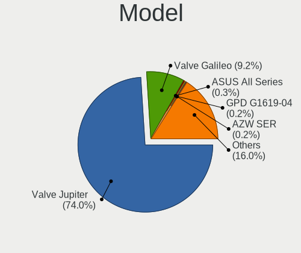
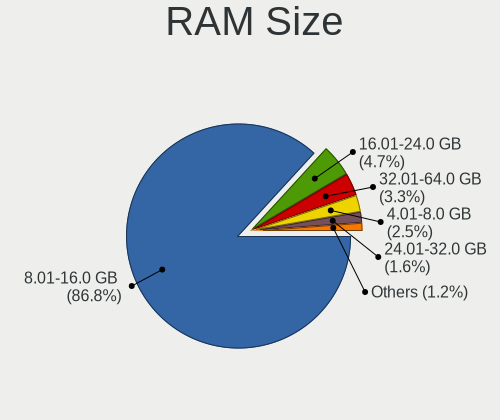
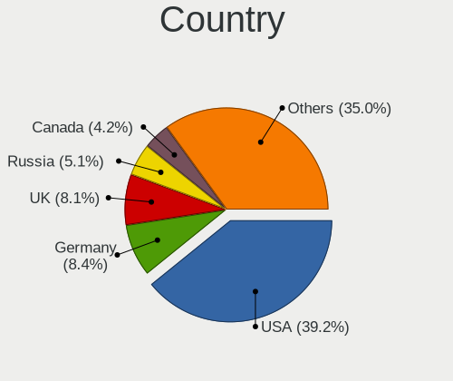
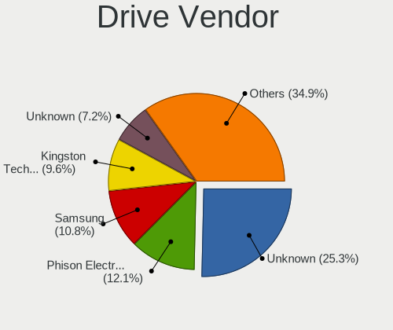
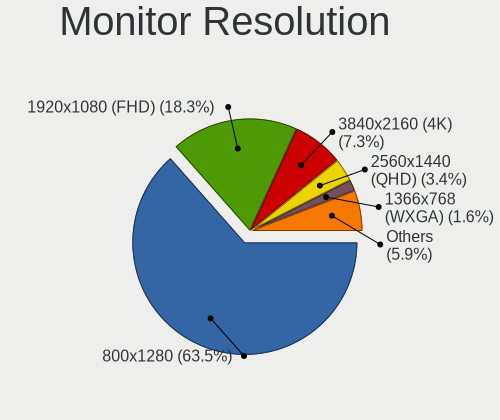
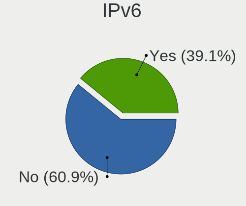
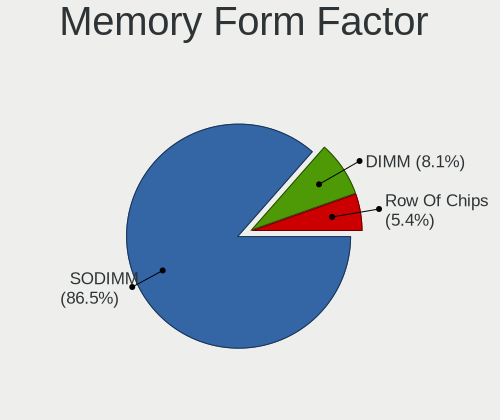
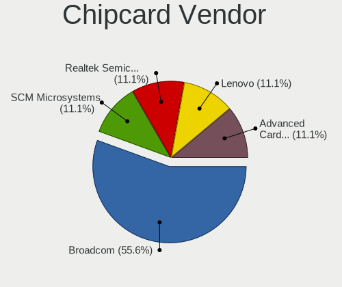
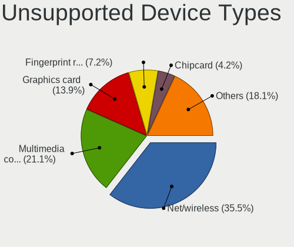

SteamOS - Tested Hardware & Statistics
--------------------------------------

A project to collect tested hardware configurations for SteamOS.

Anyone can contribute to this report by the [hw-probe](https://github.com/linuxhw/hw-probe) tool:

    sudo -E hw-probe -all -upload

Please contribute! Especially if your hardware is rare.

This is a report for all computer types. See also reports for [desktops](/Dist/SteamOS/Desktop/README.md) and [notebooks](/Dist/SteamOS/Notebook/README.md).

Contents
--------

* [ Test Cases ](#test-cases)

* [ System ](#system)
  - [ OS                       ](#os)
  - [ OS Family                ](#os-family)
  - [ Kernel                   ](#kernel)
  - [ Kernel Family            ](#kernel-family)
  - [ Kernel Major Ver.        ](#kernel-major-ver)
  - [ Arch                     ](#arch)
  - [ DE                       ](#de)
  - [ Display Server           ](#display-server)
  - [ Display Manager          ](#display-manager)
  - [ OS Lang                  ](#os-lang)
  - [ Boot Mode                ](#boot-mode)
  - [ Filesystem               ](#filesystem)
  - [ Part. scheme             ](#part-scheme)
  - [ Dual Boot with Linux/BSD ](#dual-boot-with-linuxbsd)
  - [ Dual Boot (Win)          ](#dual-boot-win)

* [ Board ](#board)
  - [ Vendor                   ](#vendor)
  - [ Model                    ](#model)
  - [ Model Family             ](#model-family)
  - [ MFG Year                 ](#mfg-year)
  - [ Form Factor              ](#form-factor)
  - [ Secure Boot              ](#secure-boot)
  - [ Coreboot                 ](#coreboot)
  - [ RAM Size                 ](#ram-size)
  - [ RAM Used                 ](#ram-used)
  - [ Total Drives             ](#total-drives)
  - [ Has CD-ROM               ](#has-cd-rom)
  - [ Has Ethernet             ](#has-ethernet)
  - [ Has WiFi                 ](#has-wifi)
  - [ Has Bluetooth            ](#has-bluetooth)

* [ Location ](#location)
  - [ Country                  ](#country)
  - [ City                     ](#city)

* [ Drives ](#drives)
  - [ Drive Vendor             ](#drive-vendor)
  - [ Drive Model              ](#drive-model)
  - [ HDD Vendor               ](#hdd-vendor)
  - [ SSD Vendor               ](#ssd-vendor)
  - [ Drive Kind               ](#drive-kind)
  - [ Drive Connector          ](#drive-connector)
  - [ Drive Size               ](#drive-size)
  - [ Space Total              ](#space-total)
  - [ Space Used               ](#space-used)
  - [ Malfunc. Drives          ](#malfunc-drives)
  - [ Malfunc. Drive Vendor    ](#malfunc-drive-vendor)
  - [ Malfunc. HDD Vendor      ](#malfunc-hdd-vendor)
  - [ Malfunc. Drive Kind      ](#malfunc-drive-kind)
  - [ Failed Drives            ](#failed-drives)
  - [ Failed Drive Vendor      ](#failed-drive-vendor)
  - [ Drive Status             ](#drive-status)

* [ Storage controller ](#storage-controller)
  - [ Storage Vendor           ](#storage-vendor)
  - [ Storage Model            ](#storage-model)
  - [ Storage Kind             ](#storage-kind)

* [ Processor ](#processor)
  - [ CPU Vendor               ](#cpu-vendor)
  - [ CPU Model                ](#cpu-model)
  - [ CPU Model Family         ](#cpu-model-family)
  - [ CPU Cores                ](#cpu-cores)
  - [ CPU Sockets              ](#cpu-sockets)
  - [ CPU Threads              ](#cpu-threads)
  - [ CPU Op-Modes             ](#cpu-op-modes)
  - [ CPU Microcode            ](#cpu-microcode)
  - [ CPU Microarch            ](#cpu-microarch)

* [ Graphics ](#graphics)
  - [ GPU Vendor               ](#gpu-vendor)
  - [ GPU Model                ](#gpu-model)
  - [ GPU Combo                ](#gpu-combo)
  - [ GPU Driver               ](#gpu-driver)
  - [ GPU Memory               ](#gpu-memory)

* [ Monitor ](#monitor)
  - [ Monitor Vendor           ](#monitor-vendor)
  - [ Monitor Model            ](#monitor-model)
  - [ Monitor Resolution       ](#monitor-resolution)
  - [ Monitor Diagonal         ](#monitor-diagonal)
  - [ Monitor Width            ](#monitor-width)
  - [ Aspect Ratio             ](#aspect-ratio)
  - [ Monitor Area             ](#monitor-area)
  - [ Pixel Density            ](#pixel-density)
  - [ Multiple Monitors        ](#multiple-monitors)

* [ Network ](#network)
  - [ Net Controller Vendor    ](#net-controller-vendor)
  - [ Net Controller Model     ](#net-controller-model)
  - [ Wireless Vendor          ](#wireless-vendor)
  - [ Wireless Model           ](#wireless-model)
  - [ Ethernet Vendor          ](#ethernet-vendor)
  - [ Ethernet Model           ](#ethernet-model)
  - [ Net Controller Kind      ](#net-controller-kind)
  - [ Used Controller          ](#used-controller)
  - [ NICs                     ](#nics)
  - [ IPv6                     ](#ipv6)

* [ Bluetooth ](#bluetooth)
  - [ Bluetooth Vendor         ](#bluetooth-vendor)
  - [ Bluetooth Model          ](#bluetooth-model)

* [ Sound ](#sound)
  - [ Sound Vendor             ](#sound-vendor)
  - [ Sound Model              ](#sound-model)

* [ Memory ](#memory)
  - [ Memory Vendor            ](#memory-vendor)
  - [ Memory Model             ](#memory-model)
  - [ Memory Kind              ](#memory-kind)
  - [ Memory Form Factor       ](#memory-form-factor)
  - [ Memory Size              ](#memory-size)
  - [ Memory Speed             ](#memory-speed)

* [ Printers & scanners ](#printers--scanners)
  - [ Printer Vendor           ](#printer-vendor)
  - [ Printer Model            ](#printer-model)
  - [ Scanner Vendor           ](#scanner-vendor)
  - [ Scanner Model            ](#scanner-model)

* [ Camera ](#camera)
  - [ Camera Vendor            ](#camera-vendor)
  - [ Camera Model             ](#camera-model)

* [ Security ](#security)
  - [ Fingerprint Vendor       ](#fingerprint-vendor)
  - [ Fingerprint Model        ](#fingerprint-model)
  - [ Chipcard Vendor          ](#chipcard-vendor)
  - [ Chipcard Model           ](#chipcard-model)

* [ Unsupported ](#unsupported)
  - [ Unsupported Devices      ](#unsupported-devices)
  - [ Unsupported Device Types ](#unsupported-device-types)

Test Cases
----------

Total: 1901

| Vendor        | Model                       | Form-Factor | Probe                                                      | Date         |
|---------------|-----------------------------|-------------|------------------------------------------------------------|--------------|
| Valve         | Jupiter                     | Notebook    | [ff59f7877a](https://linux-hardware.org/?probe=ff59f7877a) | Feb 02, 2024 |
| Valve         | Galileo                     | Notebook    | [3b44d4da2f](https://linux-hardware.org/?probe=3b44d4da2f) | Feb 02, 2024 |
| Valve         | Galileo                     | Notebook    | [aebc4c73ad](https://linux-hardware.org/?probe=aebc4c73ad) | Feb 01, 2024 |
| Valve         | Jupiter                     | Notebook    | [ab5f4937c1](https://linux-hardware.org/?probe=ab5f4937c1) | Feb 01, 2024 |
| Valve         | Jupiter                     | Notebook    | [238b20b912](https://linux-hardware.org/?probe=238b20b912) | Feb 01, 2024 |
| Valve         | Jupiter                     | Notebook    | [f7647969b5](https://linux-hardware.org/?probe=f7647969b5) | Feb 01, 2024 |
| Valve         | Galileo                     | Notebook    | [c286128e50](https://linux-hardware.org/?probe=c286128e50) | Feb 01, 2024 |
| HP            | ENVY x360 Convertible 13... | Convertible | [ae820ef040](https://linux-hardware.org/?probe=ae820ef040) | Feb 01, 2024 |
| Valve         | Jupiter                     | Notebook    | [282271ee83](https://linux-hardware.org/?probe=282271ee83) | Jan 31, 2024 |
| Valve         | Jupiter                     | Notebook    | [574ab05eb4](https://linux-hardware.org/?probe=574ab05eb4) | Jan 31, 2024 |
| Valve         | Jupiter                     | Notebook    | [1cdbb473c3](https://linux-hardware.org/?probe=1cdbb473c3) | Jan 30, 2024 |
| Valve         | Jupiter                     | Notebook    | [0db5dcce8b](https://linux-hardware.org/?probe=0db5dcce8b) | Jan 30, 2024 |
| HP            | Pavilion Gaming Laptop 1... | Notebook    | [27229e7136](https://linux-hardware.org/?probe=27229e7136) | Jan 30, 2024 |
| QIYIDA        | ED4 V1.1                    | Desktop     | [3583de3c82](https://linux-hardware.org/?probe=3583de3c82) | Jan 30, 2024 |
| Valve         | Jupiter                     | Notebook    | [e9a7ccf69a](https://linux-hardware.org/?probe=e9a7ccf69a) | Jan 29, 2024 |
| Valve         | Jupiter                     | Notebook    | [f3af706ee0](https://linux-hardware.org/?probe=f3af706ee0) | Jan 29, 2024 |
| Valve         | Jupiter                     | Notebook    | [71066ddcbf](https://linux-hardware.org/?probe=71066ddcbf) | Jan 29, 2024 |
| Valve         | Jupiter                     | Notebook    | [72f7a8c4e7](https://linux-hardware.org/?probe=72f7a8c4e7) | Jan 29, 2024 |
| Valve         | Jupiter                     | Notebook    | [d12b2f3bf3](https://linux-hardware.org/?probe=d12b2f3bf3) | Jan 28, 2024 |
| ASRock        | B450 Gaming-ITX/ac          | Desktop     | [b4510875e8](https://linux-hardware.org/?probe=b4510875e8) | Jan 28, 2024 |
| Valve         | Jupiter                     | Notebook    | [7c87eec092](https://linux-hardware.org/?probe=7c87eec092) | Jan 27, 2024 |
| Valve         | Jupiter                     | Notebook    | [7ff59e8f3a](https://linux-hardware.org/?probe=7ff59e8f3a) | Jan 27, 2024 |
| Valve         | Jupiter                     | Notebook    | [8ae43fed66](https://linux-hardware.org/?probe=8ae43fed66) | Jan 27, 2024 |
| Valve         | Jupiter                     | Notebook    | [3e0bcfc51d](https://linux-hardware.org/?probe=3e0bcfc51d) | Jan 26, 2024 |
| Valve         | Jupiter                     | Notebook    | [b69df41d1b](https://linux-hardware.org/?probe=b69df41d1b) | Jan 26, 2024 |
| Valve         | Jupiter                     | Notebook    | [ad91e418c3](https://linux-hardware.org/?probe=ad91e418c3) | Jan 25, 2024 |
| Valve         | Galileo                     | Notebook    | [b9012d8d8c](https://linux-hardware.org/?probe=b9012d8d8c) | Jan 25, 2024 |
| Valve         | Galileo                     | Notebook    | [4d738e6ad2](https://linux-hardware.org/?probe=4d738e6ad2) | Jan 25, 2024 |
| Valve         | Jupiter                     | Notebook    | [56666176ea](https://linux-hardware.org/?probe=56666176ea) | Jan 23, 2024 |
| Valve         | Galileo                     | Notebook    | [55087a9f6f](https://linux-hardware.org/?probe=55087a9f6f) | Jan 23, 2024 |
| Valve         | Jupiter                     | Notebook    | [83f771db1c](https://linux-hardware.org/?probe=83f771db1c) | Jan 23, 2024 |
| Valve         | Jupiter                     | Notebook    | [9ac816140b](https://linux-hardware.org/?probe=9ac816140b) | Jan 23, 2024 |
| Valve         | Galileo                     | Notebook    | [f819a94a66](https://linux-hardware.org/?probe=f819a94a66) | Jan 22, 2024 |
| Valve         | Jupiter                     | Notebook    | [d2a4f1790a](https://linux-hardware.org/?probe=d2a4f1790a) | Jan 22, 2024 |
| Medion        | Deputy P50                  | Notebook    | [57081b7e90](https://linux-hardware.org/?probe=57081b7e90) | Jan 22, 2024 |
| AMI           | Cherry Trail CR             | Notebook    | [873a9b67e1](https://linux-hardware.org/?probe=873a9b67e1) | Jan 22, 2024 |
| Valve         | Jupiter                     | Notebook    | [03734c93e6](https://linux-hardware.org/?probe=03734c93e6) | Jan 21, 2024 |
| Valve         | Jupiter                     | Notebook    | [9e62126d95](https://linux-hardware.org/?probe=9e62126d95) | Jan 21, 2024 |
| Valve         | Jupiter                     | Notebook    | [4d7a6b2c71](https://linux-hardware.org/?probe=4d7a6b2c71) | Jan 21, 2024 |
| Valve         | Jupiter                     | Notebook    | [890477dbac](https://linux-hardware.org/?probe=890477dbac) | Jan 21, 2024 |
| Valve         | Jupiter                     | Notebook    | [f0e5f47e6b](https://linux-hardware.org/?probe=f0e5f47e6b) | Jan 20, 2024 |
| Valve         | Jupiter                     | Notebook    | [e65dcac4a9](https://linux-hardware.org/?probe=e65dcac4a9) | Jan 20, 2024 |
| Valve         | Jupiter                     | Notebook    | [4dd4fc3a4c](https://linux-hardware.org/?probe=4dd4fc3a4c) | Jan 19, 2024 |
| Valve         | Jupiter                     | Notebook    | [a64bc13a23](https://linux-hardware.org/?probe=a64bc13a23) | Jan 19, 2024 |
| ASUSTek       | SABERTOOTH Z170 S           | Desktop     | [953ea23870](https://linux-hardware.org/?probe=953ea23870) | Jan 19, 2024 |
| Valve         | Jupiter                     | Notebook    | [3fac9b5786](https://linux-hardware.org/?probe=3fac9b5786) | Jan 18, 2024 |
| Valve         | Jupiter                     | Notebook    | [d9666cbb26](https://linux-hardware.org/?probe=d9666cbb26) | Jan 18, 2024 |
| MSI           | H310M PRO-VD                | Desktop     | [3cdbce90e0](https://linux-hardware.org/?probe=3cdbce90e0) | Jan 17, 2024 |
| Valve         | Galileo                     | Notebook    | [e11c272188](https://linux-hardware.org/?probe=e11c272188) | Jan 16, 2024 |
| Valve         | Jupiter                     | Notebook    | [1ebf344a00](https://linux-hardware.org/?probe=1ebf344a00) | Jan 16, 2024 |
| Valve         | Jupiter                     | Notebook    | [df98e57037](https://linux-hardware.org/?probe=df98e57037) | Jan 15, 2024 |
| Valve         | Galileo                     | Notebook    | [c9db96cd08](https://linux-hardware.org/?probe=c9db96cd08) | Jan 15, 2024 |
| Valve         | Jupiter                     | Notebook    | [ff4dff4d2f](https://linux-hardware.org/?probe=ff4dff4d2f) | Jan 15, 2024 |
| Valve         | Jupiter                     | Notebook    | [5a872c599e](https://linux-hardware.org/?probe=5a872c599e) | Jan 15, 2024 |
| Valve         | Jupiter                     | Notebook    | [354c998efb](https://linux-hardware.org/?probe=354c998efb) | Jan 15, 2024 |
| ASUSTek       | PRIME A320M-K               | Desktop     | [ffe6ae701f](https://linux-hardware.org/?probe=ffe6ae701f) | Jan 15, 2024 |
| Valve         | Galileo                     | Notebook    | [5d92a542e4](https://linux-hardware.org/?probe=5d92a542e4) | Jan 14, 2024 |
| Valve         | Galileo                     | Notebook    | [48d337c0f3](https://linux-hardware.org/?probe=48d337c0f3) | Jan 14, 2024 |
| Valve         | Jupiter                     | Notebook    | [51d79bc7e2](https://linux-hardware.org/?probe=51d79bc7e2) | Jan 14, 2024 |
| Valve         | Jupiter                     | Notebook    | [4b71896940](https://linux-hardware.org/?probe=4b71896940) | Jan 13, 2024 |
| Lenovo        | IdeaPadFlex 5 14ALC05 82... | Convertible | [52aaf67030](https://linux-hardware.org/?probe=52aaf67030) | Jan 13, 2024 |
| Valve         | Galileo                     | Notebook    | [48f9b2ac8a](https://linux-hardware.org/?probe=48f9b2ac8a) | Jan 13, 2024 |
| Valve         | Jupiter                     | Notebook    | [07ee2b0014](https://linux-hardware.org/?probe=07ee2b0014) | Jan 12, 2024 |
| Valve         | Jupiter                     | Notebook    | [32a7347cc6](https://linux-hardware.org/?probe=32a7347cc6) | Jan 12, 2024 |
| Valve         | Galileo                     | Notebook    | [8e6568f88e](https://linux-hardware.org/?probe=8e6568f88e) | Jan 12, 2024 |
| Valve         | Jupiter                     | Notebook    | [168d28210d](https://linux-hardware.org/?probe=168d28210d) | Jan 12, 2024 |
| Valve         | Jupiter                     | Notebook    | [96faa10437](https://linux-hardware.org/?probe=96faa10437) | Jan 11, 2024 |
| Valve         | Jupiter                     | Notebook    | [ab13227de0](https://linux-hardware.org/?probe=ab13227de0) | Jan 10, 2024 |
| Valve         | Jupiter                     | Notebook    | [bc2f7eea4c](https://linux-hardware.org/?probe=bc2f7eea4c) | Jan 10, 2024 |
| Valve         | Jupiter                     | Notebook    | [941126dfcc](https://linux-hardware.org/?probe=941126dfcc) | Jan 10, 2024 |
| MSI           | B550M PRO-VDH WIFI          | Desktop     | [79504ec34b](https://linux-hardware.org/?probe=79504ec34b) | Jan 09, 2024 |
| Valve         | Jupiter                     | Notebook    | [62bf989a58](https://linux-hardware.org/?probe=62bf989a58) | Jan 09, 2024 |
| Valve         | Jupiter                     | Notebook    | [3462a5ad9f](https://linux-hardware.org/?probe=3462a5ad9f) | Jan 09, 2024 |
| Valve         | Jupiter                     | Notebook    | [400f14241d](https://linux-hardware.org/?probe=400f14241d) | Jan 09, 2024 |
| Valve         | Jupiter                     | Notebook    | [eac99b5d0a](https://linux-hardware.org/?probe=eac99b5d0a) | Jan 09, 2024 |
| Valve         | Galileo                     | Notebook    | [4032bdfc39](https://linux-hardware.org/?probe=4032bdfc39) | Jan 08, 2024 |
| Valve         | Jupiter                     | Notebook    | [bddd9671c1](https://linux-hardware.org/?probe=bddd9671c1) | Jan 08, 2024 |
| Valve         | Galileo                     | Notebook    | [ef6307532c](https://linux-hardware.org/?probe=ef6307532c) | Jan 08, 2024 |
| Valve         | Galileo                     | Notebook    | [e71ef9c36d](https://linux-hardware.org/?probe=e71ef9c36d) | Jan 07, 2024 |
| Valve         | Jupiter                     | Notebook    | [4ee3e89964](https://linux-hardware.org/?probe=4ee3e89964) | Jan 07, 2024 |
| Valve         | Jupiter                     | Notebook    | [67ec614b0e](https://linux-hardware.org/?probe=67ec614b0e) | Jan 07, 2024 |
| MSI           | B450 TOMAHAWK MAX II        | Desktop     | [9c61eb5bab](https://linux-hardware.org/?probe=9c61eb5bab) | Jan 07, 2024 |
| Valve         | Jupiter                     | Notebook    | [1d07e80599](https://linux-hardware.org/?probe=1d07e80599) | Jan 07, 2024 |
| Valve         | Galileo                     | Notebook    | [7365f742df](https://linux-hardware.org/?probe=7365f742df) | Jan 06, 2024 |
| Valve         | Jupiter                     | Notebook    | [da56767d30](https://linux-hardware.org/?probe=da56767d30) | Jan 05, 2024 |
| Valve         | Jupiter                     | Notebook    | [561c912554](https://linux-hardware.org/?probe=561c912554) | Jan 05, 2024 |
| Valve         | Jupiter                     | Notebook    | [3d47c0ba48](https://linux-hardware.org/?probe=3d47c0ba48) | Jan 04, 2024 |
| Valve         | Jupiter                     | Notebook    | [2ccc42584e](https://linux-hardware.org/?probe=2ccc42584e) | Jan 04, 2024 |
| ASUSTek       | TUF Gaming FX705DT_FX705... | Notebook    | [c23d61cde7](https://linux-hardware.org/?probe=c23d61cde7) | Jan 04, 2024 |
| Valve         | Jupiter                     | Notebook    | [2942273257](https://linux-hardware.org/?probe=2942273257) | Jan 04, 2024 |
| Valve         | Jupiter                     | Notebook    | [348b004789](https://linux-hardware.org/?probe=348b004789) | Jan 04, 2024 |
| Valve         | Jupiter                     | Notebook    | [9d4ea07ea6](https://linux-hardware.org/?probe=9d4ea07ea6) | Jan 03, 2024 |
| Valve         | Galileo                     | Notebook    | [1e16b6eb69](https://linux-hardware.org/?probe=1e16b6eb69) | Jan 03, 2024 |
| Valve         | Jupiter                     | Notebook    | [b3ada6c407](https://linux-hardware.org/?probe=b3ada6c407) | Jan 02, 2024 |
| HP            | 15 Notebook PC              | Notebook    | [9eb25ba0bf](https://linux-hardware.org/?probe=9eb25ba0bf) | Jan 02, 2024 |
| Valve         | Jupiter                     | Notebook    | [e381b764b0](https://linux-hardware.org/?probe=e381b764b0) | Jan 02, 2024 |
| Valve         | Jupiter                     | Notebook    | [95183ba54e](https://linux-hardware.org/?probe=95183ba54e) | Jan 01, 2024 |
| Valve         | Jupiter                     | Notebook    | [c9de553faa](https://linux-hardware.org/?probe=c9de553faa) | Jan 01, 2024 |
| Valve         | Jupiter                     | Notebook    | [b16497fbfc](https://linux-hardware.org/?probe=b16497fbfc) | Jan 01, 2024 |
| Valve         | Jupiter                     | Notebook    | [e714aab1f3](https://linux-hardware.org/?probe=e714aab1f3) | Jan 01, 2024 |
| Valve         | Jupiter                     | Notebook    | [ca7a54408f](https://linux-hardware.org/?probe=ca7a54408f) | Dec 31, 2023 |
| Valve         | Jupiter                     | Notebook    | [5be404c400](https://linux-hardware.org/?probe=5be404c400) | Dec 31, 2023 |
| Valve         | Jupiter                     | Notebook    | [e80d5f8a2b](https://linux-hardware.org/?probe=e80d5f8a2b) | Dec 31, 2023 |
| Valve         | Jupiter                     | Notebook    | [c459051f01](https://linux-hardware.org/?probe=c459051f01) | Dec 31, 2023 |
| Valve         | Jupiter                     | Notebook    | [2f8ea60a38](https://linux-hardware.org/?probe=2f8ea60a38) | Dec 30, 2023 |
| Valve         | Jupiter                     | Notebook    | [0254493ea3](https://linux-hardware.org/?probe=0254493ea3) | Dec 29, 2023 |
| ASUSTek       | M5A99FX PRO R2.0            | Desktop     | [c6cd1c43ba](https://linux-hardware.org/?probe=c6cd1c43ba) | Dec 29, 2023 |
| Valve         | Galileo                     | Notebook    | [83bfa965fb](https://linux-hardware.org/?probe=83bfa965fb) | Dec 28, 2023 |
| Valve         | Jupiter                     | Notebook    | [73a4d3fcfd](https://linux-hardware.org/?probe=73a4d3fcfd) | Dec 27, 2023 |
| Valve         | Jupiter                     | Notebook    | [bee71f6f73](https://linux-hardware.org/?probe=bee71f6f73) | Dec 27, 2023 |
| Valve         | Jupiter                     | Notebook    | [eeac675274](https://linux-hardware.org/?probe=eeac675274) | Dec 27, 2023 |
| Valve         | Jupiter                     | Notebook    | [c2f08b6c04](https://linux-hardware.org/?probe=c2f08b6c04) | Dec 26, 2023 |
| HP            | ProBook 455 G3              | Notebook    | [9e47611108](https://linux-hardware.org/?probe=9e47611108) | Dec 26, 2023 |
| ASRock        | X570 Phantom Gaming-ITX/... | Notebook    | [b5b5857360](https://linux-hardware.org/?probe=b5b5857360) | Dec 26, 2023 |
| Valve         | Jupiter                     | Notebook    | [6117a0c576](https://linux-hardware.org/?probe=6117a0c576) | Dec 25, 2023 |
| Valve         | Galileo                     | Notebook    | [e21296767e](https://linux-hardware.org/?probe=e21296767e) | Dec 25, 2023 |
| Valve         | Jupiter                     | Notebook    | [4ab75ea56b](https://linux-hardware.org/?probe=4ab75ea56b) | Dec 25, 2023 |
| Valve         | Jupiter                     | Notebook    | [509364a4ac](https://linux-hardware.org/?probe=509364a4ac) | Dec 25, 2023 |
| Valve         | Jupiter                     | Notebook    | [94cf6bda69](https://linux-hardware.org/?probe=94cf6bda69) | Dec 25, 2023 |
| Valve         | Galileo                     | Notebook    | [99c3c24140](https://linux-hardware.org/?probe=99c3c24140) | Dec 25, 2023 |
| Valve         | Jupiter                     | Notebook    | [6ec124a0c4](https://linux-hardware.org/?probe=6ec124a0c4) | Dec 24, 2023 |
| Valve         | Jupiter                     | Notebook    | [3f9fc8839c](https://linux-hardware.org/?probe=3f9fc8839c) | Dec 24, 2023 |
| Valve         | Jupiter                     | Notebook    | [f57d2e51fe](https://linux-hardware.org/?probe=f57d2e51fe) | Dec 24, 2023 |
| Valve         | Jupiter                     | Notebook    | [4c98f6b6f3](https://linux-hardware.org/?probe=4c98f6b6f3) | Dec 24, 2023 |
| Valve         | Jupiter                     | Notebook    | [c0b15b216d](https://linux-hardware.org/?probe=c0b15b216d) | Dec 24, 2023 |
| Valve         | Jupiter                     | Notebook    | [19f8d4f0b4](https://linux-hardware.org/?probe=19f8d4f0b4) | Dec 24, 2023 |
| Anbernic      | Win600                      | Notebook    | [3b5255f14b](https://linux-hardware.org/?probe=3b5255f14b) | Dec 24, 2023 |
| Valve         | Galileo                     | Notebook    | [aa141b8ea2](https://linux-hardware.org/?probe=aa141b8ea2) | Dec 24, 2023 |
| Anbernic      | Win600                      | Notebook    | [02e1d7adeb](https://linux-hardware.org/?probe=02e1d7adeb) | Dec 23, 2023 |
| Valve         | Jupiter                     | Notebook    | [6fd8f41741](https://linux-hardware.org/?probe=6fd8f41741) | Dec 23, 2023 |
| Valve         | Jupiter                     | Notebook    | [482500f7b0](https://linux-hardware.org/?probe=482500f7b0) | Dec 22, 2023 |
| Valve         | Jupiter                     | Notebook    | [03491495da](https://linux-hardware.org/?probe=03491495da) | Dec 22, 2023 |
| Valve         | Jupiter                     | Notebook    | [4899962b6a](https://linux-hardware.org/?probe=4899962b6a) | Dec 22, 2023 |
| Valve         | Jupiter                     | Notebook    | [f30a4a2d8a](https://linux-hardware.org/?probe=f30a4a2d8a) | Dec 21, 2023 |
| Valve         | Jupiter                     | Notebook    | [6003cb709f](https://linux-hardware.org/?probe=6003cb709f) | Dec 21, 2023 |
| Valve         | Jupiter                     | Notebook    | [186428f160](https://linux-hardware.org/?probe=186428f160) | Dec 21, 2023 |
| Valve         | Jupiter                     | Notebook    | [091511a6c2](https://linux-hardware.org/?probe=091511a6c2) | Dec 20, 2023 |
| Valve         | Jupiter                     | Notebook    | [ceba2299c2](https://linux-hardware.org/?probe=ceba2299c2) | Dec 20, 2023 |
| Valve         | Jupiter                     | Notebook    | [aecbb83cd6](https://linux-hardware.org/?probe=aecbb83cd6) | Dec 20, 2023 |
| Valve         | Jupiter                     | Notebook    | [1265867fcf](https://linux-hardware.org/?probe=1265867fcf) | Dec 19, 2023 |
| Valve         | Jupiter                     | Notebook    | [feae313bc0](https://linux-hardware.org/?probe=feae313bc0) | Dec 19, 2023 |
| Valve         | Jupiter                     | Notebook    | [d6b925353e](https://linux-hardware.org/?probe=d6b925353e) | Dec 18, 2023 |
| Valve         | Jupiter                     | Notebook    | [f8d7e441a5](https://linux-hardware.org/?probe=f8d7e441a5) | Dec 18, 2023 |
| Valve         | Galileo                     | Notebook    | [b79c5fbf78](https://linux-hardware.org/?probe=b79c5fbf78) | Dec 18, 2023 |
| AZW           | SER V2.0                    | Mini pc     | [a16d42c4fb](https://linux-hardware.org/?probe=a16d42c4fb) | Dec 18, 2023 |
| Valve         | Jupiter                     | Notebook    | [b5b29d3c59](https://linux-hardware.org/?probe=b5b29d3c59) | Dec 18, 2023 |
| ASRock        | AB350M-HDV                  | Desktop     | [2860ba102d](https://linux-hardware.org/?probe=2860ba102d) | Dec 18, 2023 |
| Valve         | Jupiter                     | Notebook    | [6235a63aa5](https://linux-hardware.org/?probe=6235a63aa5) | Dec 17, 2023 |
| ASRock        | AB350M-HDV                  | Desktop     | [8d45a13b61](https://linux-hardware.org/?probe=8d45a13b61) | Dec 17, 2023 |
| Valve         | Galileo                     | Notebook    | [c02b71450c](https://linux-hardware.org/?probe=c02b71450c) | Dec 17, 2023 |
| Valve         | Jupiter                     | Notebook    | [0cda5b9141](https://linux-hardware.org/?probe=0cda5b9141) | Dec 17, 2023 |
| Valve         | Jupiter                     | Notebook    | [241ed280af](https://linux-hardware.org/?probe=241ed280af) | Dec 17, 2023 |
| Valve         | Jupiter                     | Notebook    | [d6c8debc47](https://linux-hardware.org/?probe=d6c8debc47) | Dec 16, 2023 |
| Valve         | Jupiter                     | Notebook    | [dfdfbefee5](https://linux-hardware.org/?probe=dfdfbefee5) | Dec 16, 2023 |
| Valve         | Jupiter                     | Notebook    | [298b8b5df0](https://linux-hardware.org/?probe=298b8b5df0) | Dec 16, 2023 |
| Valve         | Jupiter                     | Notebook    | [ee39964f52](https://linux-hardware.org/?probe=ee39964f52) | Dec 15, 2023 |
| Valve         | Galileo                     | Notebook    | [cd8b629d23](https://linux-hardware.org/?probe=cd8b629d23) | Dec 15, 2023 |
| Valve         | Jupiter                     | Notebook    | [bef7a2d5b3](https://linux-hardware.org/?probe=bef7a2d5b3) | Dec 15, 2023 |
| Valve         | Jupiter                     | Notebook    | [4e56fce432](https://linux-hardware.org/?probe=4e56fce432) | Dec 15, 2023 |
| Valve         | Galileo                     | Notebook    | [adb5dc0f2d](https://linux-hardware.org/?probe=adb5dc0f2d) | Dec 14, 2023 |
| Valve         | Jupiter                     | Notebook    | [594141dc7c](https://linux-hardware.org/?probe=594141dc7c) | Dec 14, 2023 |
| Valve         | Jupiter                     | Notebook    | [c2879ac10a](https://linux-hardware.org/?probe=c2879ac10a) | Dec 14, 2023 |
| Valve         | Jupiter                     | Notebook    | [9e2657f1ed](https://linux-hardware.org/?probe=9e2657f1ed) | Dec 14, 2023 |
| Valve         | Jupiter                     | Notebook    | [b746c80979](https://linux-hardware.org/?probe=b746c80979) | Dec 13, 2023 |
| Valve         | Jupiter                     | Notebook    | [4e38f77c8d](https://linux-hardware.org/?probe=4e38f77c8d) | Dec 13, 2023 |
| Valve         | Galileo                     | Notebook    | [719db5099f](https://linux-hardware.org/?probe=719db5099f) | Dec 13, 2023 |
| Valve         | Galileo                     | Notebook    | [835c844aed](https://linux-hardware.org/?probe=835c844aed) | Dec 13, 2023 |
| Valve         | Galileo                     | Notebook    | [d6ea0e047a](https://linux-hardware.org/?probe=d6ea0e047a) | Dec 13, 2023 |
| Valve         | Jupiter                     | Notebook    | [75070d8783](https://linux-hardware.org/?probe=75070d8783) | Dec 12, 2023 |
| Valve         | Galileo                     | Notebook    | [beb6edb04f](https://linux-hardware.org/?probe=beb6edb04f) | Dec 12, 2023 |
| Valve         | Jupiter                     | Notebook    | [3f0800eb70](https://linux-hardware.org/?probe=3f0800eb70) | Dec 11, 2023 |
| Valve         | Galileo                     | Notebook    | [494f369350](https://linux-hardware.org/?probe=494f369350) | Dec 11, 2023 |
| Valve         | Jupiter                     | Notebook    | [449a971a56](https://linux-hardware.org/?probe=449a971a56) | Dec 11, 2023 |
| Valve         | Jupiter                     | Notebook    | [b78720dbf3](https://linux-hardware.org/?probe=b78720dbf3) | Dec 11, 2023 |
| Apple         | MacBookPro15,1              | Notebook    | [9d882fc801](https://linux-hardware.org/?probe=9d882fc801) | Dec 11, 2023 |
| Gigabyte      | B550I AORUS PRO AX          | Notebook    | [9f6ce5cca9](https://linux-hardware.org/?probe=9f6ce5cca9) | Dec 10, 2023 |
| Valve         | Jupiter                     | Notebook    | [7d649cef63](https://linux-hardware.org/?probe=7d649cef63) | Dec 09, 2023 |
| Valve         | Jupiter                     | Notebook    | [f61425f9af](https://linux-hardware.org/?probe=f61425f9af) | Dec 09, 2023 |
| Valve         | Jupiter                     | Notebook    | [60c55f7c8c](https://linux-hardware.org/?probe=60c55f7c8c) | Dec 08, 2023 |
| Valve         | Jupiter                     | Notebook    | [c40a4f6672](https://linux-hardware.org/?probe=c40a4f6672) | Dec 08, 2023 |
| Valve         | Jupiter                     | Notebook    | [afd88ac5ea](https://linux-hardware.org/?probe=afd88ac5ea) | Dec 08, 2023 |
| Valve         | Galileo                     | Notebook    | [0eacb54dca](https://linux-hardware.org/?probe=0eacb54dca) | Dec 08, 2023 |
| Valve         | Jupiter                     | Notebook    | [326f2a7596](https://linux-hardware.org/?probe=326f2a7596) | Dec 08, 2023 |
| Valve         | Jupiter                     | Notebook    | [dfa143c1c0](https://linux-hardware.org/?probe=dfa143c1c0) | Dec 08, 2023 |
| Valve         | Galileo                     | Notebook    | [f72b98880f](https://linux-hardware.org/?probe=f72b98880f) | Dec 07, 2023 |
| Valve         | Jupiter                     | Notebook    | [2c693deae3](https://linux-hardware.org/?probe=2c693deae3) | Dec 07, 2023 |
| Valve         | Jupiter                     | Notebook    | [1a0ea506dc](https://linux-hardware.org/?probe=1a0ea506dc) | Dec 07, 2023 |
| Valve         | Jupiter                     | Notebook    | [602605d28d](https://linux-hardware.org/?probe=602605d28d) | Dec 07, 2023 |
| Valve         | Jupiter                     | Notebook    | [7eec257dd6](https://linux-hardware.org/?probe=7eec257dd6) | Dec 07, 2023 |
| Valve         | Jupiter                     | Notebook    | [bbb500139e](https://linux-hardware.org/?probe=bbb500139e) | Dec 07, 2023 |
| Valve         | Galileo                     | Notebook    | [20b7e72741](https://linux-hardware.org/?probe=20b7e72741) | Dec 06, 2023 |
| Valve         | Jupiter                     | Notebook    | [14e2e0d2b6](https://linux-hardware.org/?probe=14e2e0d2b6) | Dec 06, 2023 |
| ONE-NETBOO... | ONEXPLAYER Mini Pro         | Tablet      | [8fa27cc61f](https://linux-hardware.org/?probe=8fa27cc61f) | Dec 06, 2023 |
| ONE-NETBOO... | ONEXPLAYER Mini Pro         | Tablet      | [4ca7e9fcaf](https://linux-hardware.org/?probe=4ca7e9fcaf) | Dec 06, 2023 |
| Gigabyte      | B560M DS3H V2               | Desktop     | [2fa2dbdf4a](https://linux-hardware.org/?probe=2fa2dbdf4a) | Dec 06, 2023 |
| Valve         | Galileo                     | Notebook    | [4704035dff](https://linux-hardware.org/?probe=4704035dff) | Dec 06, 2023 |
| Valve         | Jupiter                     | Notebook    | [93bf1ceeec](https://linux-hardware.org/?probe=93bf1ceeec) | Dec 05, 2023 |
| Valve         | Jupiter                     | Notebook    | [f7115ec7c0](https://linux-hardware.org/?probe=f7115ec7c0) | Dec 05, 2023 |
| Valve         | Jupiter                     | Notebook    | [2a17ca7efe](https://linux-hardware.org/?probe=2a17ca7efe) | Dec 05, 2023 |
| Valve         | Jupiter                     | Notebook    | [4ffa224365](https://linux-hardware.org/?probe=4ffa224365) | Dec 05, 2023 |
| Valve         | Jupiter                     | Notebook    | [63e8b02453](https://linux-hardware.org/?probe=63e8b02453) | Dec 05, 2023 |
| Valve         | Jupiter                     | Notebook    | [ea1ae6a495](https://linux-hardware.org/?probe=ea1ae6a495) | Dec 04, 2023 |
| Valve         | Galileo                     | Notebook    | [1760875677](https://linux-hardware.org/?probe=1760875677) | Dec 04, 2023 |
| Valve         | Jupiter                     | Notebook    | [286c2304f5](https://linux-hardware.org/?probe=286c2304f5) | Dec 03, 2023 |
| Valve         | Jupiter                     | Notebook    | [21c483ddcf](https://linux-hardware.org/?probe=21c483ddcf) | Dec 03, 2023 |
| Valve         | Jupiter                     | Notebook    | [36af755784](https://linux-hardware.org/?probe=36af755784) | Dec 03, 2023 |
| Valve         | Jupiter                     | Notebook    | [80a3ff932f](https://linux-hardware.org/?probe=80a3ff932f) | Dec 03, 2023 |
| ASRock        | B550M Steel Legend          | Notebook    | [532cab64b5](https://linux-hardware.org/?probe=532cab64b5) | Dec 03, 2023 |
| Valve         | Galileo                     | Notebook    | [7c11f8f225](https://linux-hardware.org/?probe=7c11f8f225) | Dec 02, 2023 |
| Valve         | Galileo                     | Notebook    | [63234eea22](https://linux-hardware.org/?probe=63234eea22) | Dec 02, 2023 |
| Valve         | Jupiter                     | Notebook    | [6a95e96b1b](https://linux-hardware.org/?probe=6a95e96b1b) | Dec 02, 2023 |
| Valve         | Jupiter                     | Notebook    | [e5546145aa](https://linux-hardware.org/?probe=e5546145aa) | Dec 02, 2023 |
| Valve         | Jupiter                     | Notebook    | [dc16a663fa](https://linux-hardware.org/?probe=dc16a663fa) | Dec 02, 2023 |
| Valve         | Jupiter                     | Notebook    | [e6d5beb948](https://linux-hardware.org/?probe=e6d5beb948) | Dec 01, 2023 |
| Valve         | Galileo                     | Notebook    | [3239203d03](https://linux-hardware.org/?probe=3239203d03) | Dec 01, 2023 |
| Valve         | Jupiter                     | Notebook    | [ff8952a98c](https://linux-hardware.org/?probe=ff8952a98c) | Dec 01, 2023 |
| MSI           | MAG B550 TOMAHAWK MAX WI... | Desktop     | [a0e082b7d2](https://linux-hardware.org/?probe=a0e082b7d2) | Dec 01, 2023 |
| Valve         | Galileo                     | Notebook    | [3006af1c16](https://linux-hardware.org/?probe=3006af1c16) | Dec 01, 2023 |
| Valve         | Jupiter                     | Notebook    | [545d093510](https://linux-hardware.org/?probe=545d093510) | Nov 30, 2023 |
| Valve         | Jupiter                     | Notebook    | [2251ba47fb](https://linux-hardware.org/?probe=2251ba47fb) | Nov 30, 2023 |
| Valve         | Jupiter                     | Notebook    | [da673c17c8](https://linux-hardware.org/?probe=da673c17c8) | Nov 29, 2023 |
| Valve         | Jupiter                     | Notebook    | [e92fd78128](https://linux-hardware.org/?probe=e92fd78128) | Nov 29, 2023 |
| Valve         | Jupiter                     | Notebook    | [b5216ccd78](https://linux-hardware.org/?probe=b5216ccd78) | Nov 29, 2023 |
| Valve         | Galileo                     | Notebook    | [f8322860f1](https://linux-hardware.org/?probe=f8322860f1) | Nov 29, 2023 |
| Valve         | Jupiter                     | Notebook    | [2ceef57eaa](https://linux-hardware.org/?probe=2ceef57eaa) | Nov 28, 2023 |
| Valve         | Jupiter                     | Notebook    | [ebc4731c68](https://linux-hardware.org/?probe=ebc4731c68) | Nov 28, 2023 |
| Valve         | Jupiter                     | Notebook    | [9544f59716](https://linux-hardware.org/?probe=9544f59716) | Nov 27, 2023 |
| Valve         | Jupiter                     | Notebook    | [2bf5b349c3](https://linux-hardware.org/?probe=2bf5b349c3) | Nov 27, 2023 |
| Gigabyte      | Z690M AORUS ELITE AX DDR... | Desktop     | [532f8ccb97](https://linux-hardware.org/?probe=532f8ccb97) | Nov 27, 2023 |
| Valve         | Jupiter                     | Notebook    | [d2e56a6b92](https://linux-hardware.org/?probe=d2e56a6b92) | Nov 27, 2023 |
| Valve         | Jupiter                     | Notebook    | [855c477023](https://linux-hardware.org/?probe=855c477023) | Nov 27, 2023 |
| Valve         | Jupiter                     | Notebook    | [2a0b1b3a9b](https://linux-hardware.org/?probe=2a0b1b3a9b) | Nov 27, 2023 |
| Valve         | Jupiter                     | Notebook    | [933ce1aa7d](https://linux-hardware.org/?probe=933ce1aa7d) | Nov 27, 2023 |
| Valve         | Jupiter                     | Notebook    | [c6c33679d8](https://linux-hardware.org/?probe=c6c33679d8) | Nov 26, 2023 |
| Valve         | Jupiter                     | Notebook    | [a208b7bd3a](https://linux-hardware.org/?probe=a208b7bd3a) | Nov 26, 2023 |
| Valve         | Jupiter                     | Notebook    | [2b2f81a5b3](https://linux-hardware.org/?probe=2b2f81a5b3) | Nov 26, 2023 |
| Valve         | Jupiter                     | Notebook    | [95bd4c2832](https://linux-hardware.org/?probe=95bd4c2832) | Nov 26, 2023 |
| Dell          | Precision M4800             | Notebook    | [8712b3ecb9](https://linux-hardware.org/?probe=8712b3ecb9) | Nov 26, 2023 |
| Valve         | Jupiter                     | Notebook    | [fe89edacdc](https://linux-hardware.org/?probe=fe89edacdc) | Nov 26, 2023 |
| Valve         | Jupiter                     | Notebook    | [d760d5c451](https://linux-hardware.org/?probe=d760d5c451) | Nov 26, 2023 |
| Valve         | Jupiter                     | Notebook    | [7f42b09854](https://linux-hardware.org/?probe=7f42b09854) | Nov 26, 2023 |
| Valve         | Jupiter                     | Notebook    | [3e59300230](https://linux-hardware.org/?probe=3e59300230) | Nov 25, 2023 |
| Valve         | Galileo                     | Notebook    | [905889b654](https://linux-hardware.org/?probe=905889b654) | Nov 25, 2023 |
| HP            | 89D8 SMVB                   | Desktop     | [e5bd9d36f3](https://linux-hardware.org/?probe=e5bd9d36f3) | Nov 25, 2023 |
| Valve         | Galileo                     | Notebook    | [15994404a2](https://linux-hardware.org/?probe=15994404a2) | Nov 24, 2023 |
| Valve         | Jupiter                     | Notebook    | [2c7d8106d0](https://linux-hardware.org/?probe=2c7d8106d0) | Nov 24, 2023 |
| Valve         | Jupiter                     | Notebook    | [68d1729e3b](https://linux-hardware.org/?probe=68d1729e3b) | Nov 24, 2023 |
| Valve         | Jupiter                     | Notebook    | [cd4e80c195](https://linux-hardware.org/?probe=cd4e80c195) | Nov 24, 2023 |
| Valve         | Jupiter                     | Notebook    | [cb881f1c27](https://linux-hardware.org/?probe=cb881f1c27) | Nov 24, 2023 |
| Valve         | Jupiter                     | Notebook    | [8ba2f4981d](https://linux-hardware.org/?probe=8ba2f4981d) | Nov 24, 2023 |
| Valve         | Jupiter                     | Notebook    | [0c58fa47b9](https://linux-hardware.org/?probe=0c58fa47b9) | Nov 24, 2023 |
| Valve         | Jupiter                     | Notebook    | [399542e5be](https://linux-hardware.org/?probe=399542e5be) | Nov 24, 2023 |
| Valve         | Galileo                     | Notebook    | [0e0c27070c](https://linux-hardware.org/?probe=0e0c27070c) | Nov 23, 2023 |
| MSI           | MAG X570S TORPEDO MAX       | Desktop     | [829e6fdd78](https://linux-hardware.org/?probe=829e6fdd78) | Nov 23, 2023 |
| Gigabyte      | B650M DS3H                  | Notebook    | [dfcb329b5a](https://linux-hardware.org/?probe=dfcb329b5a) | Nov 23, 2023 |
| Valve         | Jupiter                     | Notebook    | [a4f7cad00f](https://linux-hardware.org/?probe=a4f7cad00f) | Nov 22, 2023 |
| Valve         | Jupiter                     | Notebook    | [bdb118e120](https://linux-hardware.org/?probe=bdb118e120) | Nov 22, 2023 |
| ASUSTek       | ROG Ally RC71L_RC71L        | Tablet      | [ee23ab8a4a](https://linux-hardware.org/?probe=ee23ab8a4a) | Nov 22, 2023 |
| Valve         | Jupiter                     | Notebook    | [678fc160d6](https://linux-hardware.org/?probe=678fc160d6) | Nov 22, 2023 |
| Valve         | Jupiter                     | Notebook    | [157c8167b7](https://linux-hardware.org/?probe=157c8167b7) | Nov 22, 2023 |
| Valve         | Jupiter                     | Notebook    | [525a89cf72](https://linux-hardware.org/?probe=525a89cf72) | Nov 22, 2023 |
| Valve         | Jupiter                     | Notebook    | [2fa43c6f3d](https://linux-hardware.org/?probe=2fa43c6f3d) | Nov 22, 2023 |
| Valve         | Jupiter                     | Notebook    | [b73a5b800d](https://linux-hardware.org/?probe=b73a5b800d) | Nov 22, 2023 |
| Valve         | Jupiter                     | Notebook    | [a81bb49e88](https://linux-hardware.org/?probe=a81bb49e88) | Nov 21, 2023 |
| Gigabyte      | Z690M AORUS ELITE AX DDR... | Desktop     | [887bb8aabe](https://linux-hardware.org/?probe=887bb8aabe) | Nov 21, 2023 |
| Valve         | Jupiter                     | Notebook    | [ba3c14e8e7](https://linux-hardware.org/?probe=ba3c14e8e7) | Nov 21, 2023 |
| Valve         | Jupiter                     | Notebook    | [3bac0a6d11](https://linux-hardware.org/?probe=3bac0a6d11) | Nov 21, 2023 |
| ASUSTek       | ROG STRIX B450-F GAMING     | Desktop     | [32e985afeb](https://linux-hardware.org/?probe=32e985afeb) | Nov 21, 2023 |
| Valve         | Jupiter                     | Notebook    | [0454a567a0](https://linux-hardware.org/?probe=0454a567a0) | Nov 21, 2023 |
| Valve         | Jupiter                     | Notebook    | [57479f92a2](https://linux-hardware.org/?probe=57479f92a2) | Nov 21, 2023 |
| Valve         | Jupiter                     | Notebook    | [e782bdc7ec](https://linux-hardware.org/?probe=e782bdc7ec) | Nov 21, 2023 |
| Valve         | Jupiter                     | Notebook    | [f36d771d28](https://linux-hardware.org/?probe=f36d771d28) | Nov 20, 2023 |
| Valve         | Jupiter                     | Notebook    | [be5497e3a7](https://linux-hardware.org/?probe=be5497e3a7) | Nov 20, 2023 |
| Dell          | 0H1TR9 A00                  | All in one  | [4932d35933](https://linux-hardware.org/?probe=4932d35933) | Nov 20, 2023 |
| Valve         | Jupiter                     | Notebook    | [93c68a0d33](https://linux-hardware.org/?probe=93c68a0d33) | Nov 20, 2023 |
| Valve         | Jupiter                     | Notebook    | [a6240c8d6a](https://linux-hardware.org/?probe=a6240c8d6a) | Nov 20, 2023 |
| Valve         | Jupiter                     | Notebook    | [4d99a400c5](https://linux-hardware.org/?probe=4d99a400c5) | Nov 20, 2023 |
| Valve         | Jupiter                     | Notebook    | [08b0fccf59](https://linux-hardware.org/?probe=08b0fccf59) | Nov 20, 2023 |
| Valve         | Jupiter                     | Notebook    | [b3d483cfb9](https://linux-hardware.org/?probe=b3d483cfb9) | Nov 19, 2023 |
| Gigabyte      | Z690M AORUS ELITE AX DDR... | Desktop     | [e723e12a01](https://linux-hardware.org/?probe=e723e12a01) | Nov 19, 2023 |
| Valve         | Jupiter                     | Notebook    | [e226cd6888](https://linux-hardware.org/?probe=e226cd6888) | Nov 18, 2023 |
| Valve         | Jupiter                     | Notebook    | [d859d4f159](https://linux-hardware.org/?probe=d859d4f159) | Nov 18, 2023 |
| Valve         | Jupiter                     | Notebook    | [82eedfb8be](https://linux-hardware.org/?probe=82eedfb8be) | Nov 18, 2023 |
| Valve         | Jupiter                     | Notebook    | [2c773bdad4](https://linux-hardware.org/?probe=2c773bdad4) | Nov 18, 2023 |
| Valve         | Jupiter                     | Notebook    | [adbc907a31](https://linux-hardware.org/?probe=adbc907a31) | Nov 18, 2023 |
| Valve         | Jupiter                     | Notebook    | [9d693c070e](https://linux-hardware.org/?probe=9d693c070e) | Nov 18, 2023 |
| Valve         | Jupiter                     | Notebook    | [fdddf0d94f](https://linux-hardware.org/?probe=fdddf0d94f) | Nov 18, 2023 |
| Valve         | Jupiter                     | Notebook    | [97695463df](https://linux-hardware.org/?probe=97695463df) | Nov 17, 2023 |
| Valve         | Jupiter                     | Notebook    | [8734420ff1](https://linux-hardware.org/?probe=8734420ff1) | Nov 17, 2023 |
| Valve         | Jupiter                     | Notebook    | [c726569566](https://linux-hardware.org/?probe=c726569566) | Nov 16, 2023 |
| Valve         | Jupiter                     | Notebook    | [521a021c1d](https://linux-hardware.org/?probe=521a021c1d) | Nov 16, 2023 |
| Valve         | Jupiter                     | Notebook    | [10f96b411d](https://linux-hardware.org/?probe=10f96b411d) | Nov 16, 2023 |
| Valve         | Jupiter                     | Notebook    | [af72567b85](https://linux-hardware.org/?probe=af72567b85) | Nov 16, 2023 |
| Valve         | Jupiter                     | Notebook    | [751a8a13dc](https://linux-hardware.org/?probe=751a8a13dc) | Nov 15, 2023 |
| Valve         | Jupiter                     | Notebook    | [821a98f0f9](https://linux-hardware.org/?probe=821a98f0f9) | Nov 15, 2023 |
| Valve         | Jupiter                     | Notebook    | [9f8fc1d4d7](https://linux-hardware.org/?probe=9f8fc1d4d7) | Nov 15, 2023 |
| Valve         | Jupiter                     | Notebook    | [31a965ca9d](https://linux-hardware.org/?probe=31a965ca9d) | Nov 14, 2023 |
| Gigabyte      | B450M GAMING                | Desktop     | [33064ccfdf](https://linux-hardware.org/?probe=33064ccfdf) | Nov 14, 2023 |
| Valve         | Jupiter                     | Notebook    | [638956d8a1](https://linux-hardware.org/?probe=638956d8a1) | Nov 13, 2023 |
| Valve         | Jupiter                     | Notebook    | [acdbd4cb2a](https://linux-hardware.org/?probe=acdbd4cb2a) | Nov 13, 2023 |
| HP            | Pavilion Gaming Laptop 1... | Notebook    | [2802d9278d](https://linux-hardware.org/?probe=2802d9278d) | Nov 13, 2023 |
| Valve         | Jupiter                     | Notebook    | [1f6282ce11](https://linux-hardware.org/?probe=1f6282ce11) | Nov 12, 2023 |
| Valve         | Jupiter                     | Notebook    | [040bcdd741](https://linux-hardware.org/?probe=040bcdd741) | Nov 10, 2023 |
| Valve         | Jupiter                     | Notebook    | [f3e618c03e](https://linux-hardware.org/?probe=f3e618c03e) | Nov 10, 2023 |
| Valve         | Jupiter                     | Notebook    | [ff8cbcd6be](https://linux-hardware.org/?probe=ff8cbcd6be) | Nov 09, 2023 |
| MSI           | Z270 PC MATE                | Desktop     | [e53ba2625b](https://linux-hardware.org/?probe=e53ba2625b) | Nov 09, 2023 |
| Valve         | Jupiter                     | Notebook    | [196bc6a3db](https://linux-hardware.org/?probe=196bc6a3db) | Nov 08, 2023 |
| Gigabyte      | B450M GAMING                | Desktop     | [d788a3221f](https://linux-hardware.org/?probe=d788a3221f) | Nov 08, 2023 |
| Valve         | Jupiter                     | Notebook    | [ca05263192](https://linux-hardware.org/?probe=ca05263192) | Nov 08, 2023 |
| Valve         | Jupiter                     | Notebook    | [98976642aa](https://linux-hardware.org/?probe=98976642aa) | Nov 08, 2023 |
| Valve         | Jupiter                     | Notebook    | [848dfcb217](https://linux-hardware.org/?probe=848dfcb217) | Nov 08, 2023 |
| Valve         | Jupiter                     | Notebook    | [03f6022593](https://linux-hardware.org/?probe=03f6022593) | Nov 07, 2023 |
| Valve         | Jupiter                     | Notebook    | [ef2daabe89](https://linux-hardware.org/?probe=ef2daabe89) | Nov 07, 2023 |
| Valve         | Jupiter                     | Notebook    | [b662e225f4](https://linux-hardware.org/?probe=b662e225f4) | Nov 07, 2023 |
| ASRock        | B550M Pro4                  | Desktop     | [665120f441](https://linux-hardware.org/?probe=665120f441) | Nov 07, 2023 |
| Valve         | Jupiter                     | Notebook    | [21df431e01](https://linux-hardware.org/?probe=21df431e01) | Nov 07, 2023 |
| Valve         | Jupiter                     | Notebook    | [58ecc57dcf](https://linux-hardware.org/?probe=58ecc57dcf) | Nov 07, 2023 |
| ASRock        | B450 Gaming K4              | Desktop     | [166a9aee87](https://linux-hardware.org/?probe=166a9aee87) | Nov 06, 2023 |
| Valve         | Jupiter                     | Notebook    | [c00bcace68](https://linux-hardware.org/?probe=c00bcace68) | Nov 06, 2023 |
| Valve         | Jupiter                     | Notebook    | [aef9c84cf7](https://linux-hardware.org/?probe=aef9c84cf7) | Nov 06, 2023 |
| Valve         | Jupiter                     | Notebook    | [d8ac880948](https://linux-hardware.org/?probe=d8ac880948) | Nov 06, 2023 |
| Valve         | Jupiter                     | Notebook    | [2e74968a1e](https://linux-hardware.org/?probe=2e74968a1e) | Nov 05, 2023 |
| Valve         | Jupiter                     | Notebook    | [edb0760b00](https://linux-hardware.org/?probe=edb0760b00) | Nov 05, 2023 |
| Valve         | Jupiter                     | Notebook    | [555d9146a4](https://linux-hardware.org/?probe=555d9146a4) | Nov 05, 2023 |
| Valve         | Jupiter                     | Notebook    | [4ece1b1597](https://linux-hardware.org/?probe=4ece1b1597) | Nov 05, 2023 |
| Valve         | Jupiter                     | Notebook    | [28e2c2aa38](https://linux-hardware.org/?probe=28e2c2aa38) | Nov 05, 2023 |
| Valve         | Jupiter                     | Notebook    | [af20418f73](https://linux-hardware.org/?probe=af20418f73) | Nov 04, 2023 |
| Valve         | Jupiter                     | Notebook    | [28f8f3e3cd](https://linux-hardware.org/?probe=28f8f3e3cd) | Nov 04, 2023 |
| Valve         | Jupiter                     | Notebook    | [b526accbcd](https://linux-hardware.org/?probe=b526accbcd) | Nov 03, 2023 |
| Valve         | Jupiter                     | Notebook    | [14de2c4b3a](https://linux-hardware.org/?probe=14de2c4b3a) | Nov 02, 2023 |
| Valve         | Jupiter                     | Notebook    | [26b7407b02](https://linux-hardware.org/?probe=26b7407b02) | Nov 02, 2023 |
| Valve         | Jupiter                     | Notebook    | [088df44ddf](https://linux-hardware.org/?probe=088df44ddf) | Nov 01, 2023 |
| Valve         | Jupiter                     | Notebook    | [b5bd58d350](https://linux-hardware.org/?probe=b5bd58d350) | Oct 31, 2023 |
| Valve         | Jupiter                     | Notebook    | [ea0f1bf927](https://linux-hardware.org/?probe=ea0f1bf927) | Oct 31, 2023 |
| HP            | 829A                        | Mini pc     | [af5bd0a62a](https://linux-hardware.org/?probe=af5bd0a62a) | Oct 31, 2023 |
| Valve         | Jupiter                     | Notebook    | [9749e20de1](https://linux-hardware.org/?probe=9749e20de1) | Oct 31, 2023 |
| Valve         | Jupiter                     | Notebook    | [7eda72383a](https://linux-hardware.org/?probe=7eda72383a) | Oct 30, 2023 |
| Valve         | Jupiter                     | Notebook    | [e73e0881d6](https://linux-hardware.org/?probe=e73e0881d6) | Oct 30, 2023 |
| Valve         | Jupiter                     | Notebook    | [ede97625bd](https://linux-hardware.org/?probe=ede97625bd) | Oct 30, 2023 |
| Valve         | Jupiter                     | Notebook    | [8bb009206e](https://linux-hardware.org/?probe=8bb009206e) | Oct 29, 2023 |
| Valve         | Jupiter                     | Notebook    | [bbf3f7c198](https://linux-hardware.org/?probe=bbf3f7c198) | Oct 29, 2023 |
| Valve         | Jupiter                     | Notebook    | [935baa5e6a](https://linux-hardware.org/?probe=935baa5e6a) | Oct 29, 2023 |
| Valve         | Jupiter                     | Notebook    | [3e84a41deb](https://linux-hardware.org/?probe=3e84a41deb) | Oct 28, 2023 |
| Valve         | Jupiter                     | Notebook    | [8eebce7a7b](https://linux-hardware.org/?probe=8eebce7a7b) | Oct 26, 2023 |
| Valve         | Jupiter                     | Notebook    | [a524108535](https://linux-hardware.org/?probe=a524108535) | Oct 26, 2023 |
| Valve         | Jupiter                     | Notebook    | [ae2eee1640](https://linux-hardware.org/?probe=ae2eee1640) | Oct 26, 2023 |
| HP            | Pavilion Laptop 15-eh0xx... | Notebook    | [6c603a7186](https://linux-hardware.org/?probe=6c603a7186) | Oct 26, 2023 |
| HP            | Pavilion Laptop 15-eh0xx... | Notebook    | [7858b6a253](https://linux-hardware.org/?probe=7858b6a253) | Oct 26, 2023 |
| Valve         | Jupiter                     | Notebook    | [38a8824fe8](https://linux-hardware.org/?probe=38a8824fe8) | Oct 25, 2023 |
| Valve         | Jupiter                     | Notebook    | [eda569093f](https://linux-hardware.org/?probe=eda569093f) | Oct 25, 2023 |
| Valve         | Jupiter                     | Notebook    | [0b8471e81a](https://linux-hardware.org/?probe=0b8471e81a) | Oct 25, 2023 |
| HP            | 89D8 SMVB                   | Desktop     | [3672a7681b](https://linux-hardware.org/?probe=3672a7681b) | Oct 24, 2023 |
| Valve         | Jupiter                     | Notebook    | [158b201b0e](https://linux-hardware.org/?probe=158b201b0e) | Oct 24, 2023 |
| Valve         | Jupiter                     | Notebook    | [83d3faf177](https://linux-hardware.org/?probe=83d3faf177) | Oct 23, 2023 |
| Valve         | Jupiter                     | Notebook    | [fa38785b75](https://linux-hardware.org/?probe=fa38785b75) | Oct 23, 2023 |
| Valve         | Jupiter                     | Notebook    | [8e04b76eb0](https://linux-hardware.org/?probe=8e04b76eb0) | Oct 22, 2023 |
| Valve         | Jupiter                     | Notebook    | [1c5a3146ce](https://linux-hardware.org/?probe=1c5a3146ce) | Oct 22, 2023 |
| Shenzhen M... | F7BRC                       | Desktop     | [f61616bfcb](https://linux-hardware.org/?probe=f61616bfcb) | Oct 22, 2023 |
| Valve         | Jupiter                     | Notebook    | [d93782448d](https://linux-hardware.org/?probe=d93782448d) | Oct 21, 2023 |
| Valve         | Jupiter                     | Notebook    | [69762a50c8](https://linux-hardware.org/?probe=69762a50c8) | Oct 21, 2023 |
| Valve         | Jupiter                     | Notebook    | [5c8fbec79f](https://linux-hardware.org/?probe=5c8fbec79f) | Oct 21, 2023 |
| Valve         | Jupiter                     | Notebook    | [3431f785cf](https://linux-hardware.org/?probe=3431f785cf) | Oct 21, 2023 |
| Valve         | Jupiter                     | Notebook    | [3fa710b9ff](https://linux-hardware.org/?probe=3fa710b9ff) | Oct 20, 2023 |
| Valve         | Jupiter                     | Notebook    | [fdbd97d08c](https://linux-hardware.org/?probe=fdbd97d08c) | Oct 20, 2023 |
| Valve         | Jupiter                     | Notebook    | [ca9cd15419](https://linux-hardware.org/?probe=ca9cd15419) | Oct 19, 2023 |
| Valve         | Jupiter                     | Notebook    | [6eab7fbd58](https://linux-hardware.org/?probe=6eab7fbd58) | Oct 18, 2023 |
| Valve         | Jupiter                     | Notebook    | [bcc8229faa](https://linux-hardware.org/?probe=bcc8229faa) | Oct 18, 2023 |
| Valve         | Jupiter                     | Notebook    | [d91ad654e6](https://linux-hardware.org/?probe=d91ad654e6) | Oct 18, 2023 |
| Valve         | Jupiter                     | Notebook    | [4c916d65a8](https://linux-hardware.org/?probe=4c916d65a8) | Oct 18, 2023 |
| Valve         | Jupiter                     | Notebook    | [9a1b2b4816](https://linux-hardware.org/?probe=9a1b2b4816) | Oct 18, 2023 |
| Valve         | Jupiter                     | Notebook    | [08d5fc51ed](https://linux-hardware.org/?probe=08d5fc51ed) | Oct 17, 2023 |
| Valve         | Jupiter                     | Notebook    | [c6e5484c88](https://linux-hardware.org/?probe=c6e5484c88) | Oct 17, 2023 |
| Valve         | Jupiter                     | Notebook    | [1e55c77dc0](https://linux-hardware.org/?probe=1e55c77dc0) | Oct 17, 2023 |
| Gigabyte      | B450 AORUS PRO WIFI-CF      | Desktop     | [ac47775d14](https://linux-hardware.org/?probe=ac47775d14) | Oct 17, 2023 |
| Valve         | Jupiter                     | Notebook    | [54604c764b](https://linux-hardware.org/?probe=54604c764b) | Oct 16, 2023 |
| Valve         | Jupiter                     | Notebook    | [cfbfe426e2](https://linux-hardware.org/?probe=cfbfe426e2) | Oct 16, 2023 |
| Valve         | Jupiter                     | Notebook    | [d8ba22dd7f](https://linux-hardware.org/?probe=d8ba22dd7f) | Oct 16, 2023 |
| Valve         | Jupiter                     | Notebook    | [11ee2fce41](https://linux-hardware.org/?probe=11ee2fce41) | Oct 16, 2023 |
| Valve         | Jupiter                     | Notebook    | [e0e2e64ce4](https://linux-hardware.org/?probe=e0e2e64ce4) | Oct 16, 2023 |
| Valve         | Jupiter                     | Notebook    | [674d290b37](https://linux-hardware.org/?probe=674d290b37) | Oct 15, 2023 |
| Valve         | Jupiter                     | Notebook    | [ec059c9ea7](https://linux-hardware.org/?probe=ec059c9ea7) | Oct 15, 2023 |
| Valve         | Jupiter                     | Notebook    | [9ed8384df0](https://linux-hardware.org/?probe=9ed8384df0) | Oct 15, 2023 |
| Valve         | Jupiter                     | Notebook    | [0d088b07f0](https://linux-hardware.org/?probe=0d088b07f0) | Oct 14, 2023 |
| Valve         | Jupiter                     | Notebook    | [594ab95469](https://linux-hardware.org/?probe=594ab95469) | Oct 13, 2023 |
| Valve         | Jupiter                     | Notebook    | [bc127c6288](https://linux-hardware.org/?probe=bc127c6288) | Oct 13, 2023 |
| Valve         | Jupiter                     | Notebook    | [2bde49db66](https://linux-hardware.org/?probe=2bde49db66) | Oct 11, 2023 |
| Valve         | Jupiter                     | Notebook    | [79652d4b80](https://linux-hardware.org/?probe=79652d4b80) | Oct 10, 2023 |
| Valve         | Jupiter                     | Notebook    | [daeb359dfb](https://linux-hardware.org/?probe=daeb359dfb) | Oct 10, 2023 |
| Valve         | Jupiter                     | Notebook    | [100d2ff5c3](https://linux-hardware.org/?probe=100d2ff5c3) | Oct 10, 2023 |
| Valve         | Jupiter                     | Notebook    | [8746055b62](https://linux-hardware.org/?probe=8746055b62) | Oct 09, 2023 |
| Valve         | Jupiter                     | Notebook    | [ece1acc9c3](https://linux-hardware.org/?probe=ece1acc9c3) | Oct 09, 2023 |
| Valve         | Jupiter                     | Notebook    | [e8f2d96884](https://linux-hardware.org/?probe=e8f2d96884) | Oct 09, 2023 |
| Valve         | Jupiter                     | Notebook    | [19f850d49e](https://linux-hardware.org/?probe=19f850d49e) | Oct 08, 2023 |
| Valve         | Jupiter                     | Notebook    | [83976ddca6](https://linux-hardware.org/?probe=83976ddca6) | Oct 08, 2023 |
| Valve         | Jupiter                     | Notebook    | [86be8c226a](https://linux-hardware.org/?probe=86be8c226a) | Oct 08, 2023 |
| Acer          | Swift SFA16-41              | Notebook    | [9d284c1003](https://linux-hardware.org/?probe=9d284c1003) | Oct 08, 2023 |
| Valve         | Jupiter                     | Notebook    | [aa51056093](https://linux-hardware.org/?probe=aa51056093) | Oct 08, 2023 |
| Valve         | Jupiter                     | Notebook    | [225fbcc2e5](https://linux-hardware.org/?probe=225fbcc2e5) | Oct 08, 2023 |
| Valve         | Jupiter                     | Notebook    | [e88c7ccef3](https://linux-hardware.org/?probe=e88c7ccef3) | Oct 08, 2023 |
| Acer          | Nitro AN515-56              | Notebook    | [6a98464415](https://linux-hardware.org/?probe=6a98464415) | Oct 07, 2023 |
| Valve         | Jupiter                     | Notebook    | [4db1b82d76](https://linux-hardware.org/?probe=4db1b82d76) | Oct 07, 2023 |
| Valve         | Jupiter                     | Notebook    | [7372c13af4](https://linux-hardware.org/?probe=7372c13af4) | Oct 07, 2023 |
| Valve         | Jupiter                     | Notebook    | [19509bb422](https://linux-hardware.org/?probe=19509bb422) | Oct 05, 2023 |
| Valve         | Jupiter                     | Notebook    | [f39bde007d](https://linux-hardware.org/?probe=f39bde007d) | Oct 04, 2023 |
| Valve         | Jupiter                     | Notebook    | [6a0aaac720](https://linux-hardware.org/?probe=6a0aaac720) | Oct 04, 2023 |
| Valve         | Jupiter                     | Notebook    | [0e8526e2df](https://linux-hardware.org/?probe=0e8526e2df) | Oct 04, 2023 |
| Valve         | Jupiter                     | Notebook    | [54eaf1a92d](https://linux-hardware.org/?probe=54eaf1a92d) | Oct 04, 2023 |
| Valve         | Jupiter                     | Notebook    | [4c7b5edf25](https://linux-hardware.org/?probe=4c7b5edf25) | Oct 04, 2023 |
| Gigabyte      | B550M S2H                   | Desktop     | [92cf4d1df2](https://linux-hardware.org/?probe=92cf4d1df2) | Oct 03, 2023 |
| Gigabyte      | B550M S2H                   | Desktop     | [d7efd8ecaa](https://linux-hardware.org/?probe=d7efd8ecaa) | Oct 03, 2023 |
| Valve         | Jupiter                     | Notebook    | [1fc3301438](https://linux-hardware.org/?probe=1fc3301438) | Oct 03, 2023 |
| Valve         | Jupiter                     | Notebook    | [71e7e7bd84](https://linux-hardware.org/?probe=71e7e7bd84) | Oct 03, 2023 |
| Valve         | Jupiter                     | Notebook    | [888143673a](https://linux-hardware.org/?probe=888143673a) | Oct 03, 2023 |
| Valve         | Jupiter                     | Notebook    | [43244b054f](https://linux-hardware.org/?probe=43244b054f) | Oct 03, 2023 |
| Valve         | Jupiter                     | Notebook    | [a37cbce440](https://linux-hardware.org/?probe=a37cbce440) | Oct 02, 2023 |
| Valve         | Jupiter                     | Notebook    | [35dc2f9bbd](https://linux-hardware.org/?probe=35dc2f9bbd) | Oct 02, 2023 |
| HP            | Victus by Gaming Laptop ... | Notebook    | [60a8a7d13f](https://linux-hardware.org/?probe=60a8a7d13f) | Oct 02, 2023 |
| HP            | Victus by Gaming Laptop ... | Notebook    | [28a54d8189](https://linux-hardware.org/?probe=28a54d8189) | Oct 02, 2023 |
| Valve         | Jupiter                     | Notebook    | [bb4a397154](https://linux-hardware.org/?probe=bb4a397154) | Oct 01, 2023 |
| Valve         | Jupiter                     | Notebook    | [1323f200dd](https://linux-hardware.org/?probe=1323f200dd) | Oct 01, 2023 |
| Valve         | Jupiter                     | Notebook    | [c31d1a5288](https://linux-hardware.org/?probe=c31d1a5288) | Oct 01, 2023 |
| Valve         | Jupiter                     | Notebook    | [d64d0a1997](https://linux-hardware.org/?probe=d64d0a1997) | Sep 30, 2023 |
| Valve         | Jupiter                     | Notebook    | [0488b8fd24](https://linux-hardware.org/?probe=0488b8fd24) | Sep 30, 2023 |
| Dell          | 0Y56T3 A01                  | Desktop     | [bfc1d1dd13](https://linux-hardware.org/?probe=bfc1d1dd13) | Sep 30, 2023 |
| Valve         | Jupiter                     | Notebook    | [85eac5b7ce](https://linux-hardware.org/?probe=85eac5b7ce) | Sep 30, 2023 |
| Valve         | Jupiter                     | Notebook    | [1ed8509a3d](https://linux-hardware.org/?probe=1ed8509a3d) | Sep 30, 2023 |
| Valve         | Jupiter                     | Notebook    | [d065544135](https://linux-hardware.org/?probe=d065544135) | Sep 29, 2023 |
| Valve         | Jupiter                     | Notebook    | [c881d3edc2](https://linux-hardware.org/?probe=c881d3edc2) | Sep 29, 2023 |
| Valve         | Jupiter                     | Notebook    | [2f4eb9f823](https://linux-hardware.org/?probe=2f4eb9f823) | Sep 29, 2023 |
| Valve         | Jupiter                     | Notebook    | [937f10463d](https://linux-hardware.org/?probe=937f10463d) | Sep 29, 2023 |
| Valve         | Jupiter                     | Notebook    | [acc0ad7283](https://linux-hardware.org/?probe=acc0ad7283) | Sep 28, 2023 |
| Valve         | Jupiter                     | Notebook    | [39bc0d89fe](https://linux-hardware.org/?probe=39bc0d89fe) | Sep 28, 2023 |
| Valve         | Jupiter                     | Notebook    | [a447ea95b0](https://linux-hardware.org/?probe=a447ea95b0) | Sep 28, 2023 |
| Valve         | Jupiter                     | Notebook    | [b178e71c45](https://linux-hardware.org/?probe=b178e71c45) | Sep 28, 2023 |
| Valve         | Jupiter                     | Notebook    | [0948401e7d](https://linux-hardware.org/?probe=0948401e7d) | Sep 28, 2023 |
| Valve         | Jupiter                     | Notebook    | [8de9bb39df](https://linux-hardware.org/?probe=8de9bb39df) | Sep 28, 2023 |
| Valve         | Jupiter                     | Notebook    | [2c1e6c791d](https://linux-hardware.org/?probe=2c1e6c791d) | Sep 28, 2023 |
| Valve         | Jupiter                     | Notebook    | [277f5aca9b](https://linux-hardware.org/?probe=277f5aca9b) | Sep 26, 2023 |
| ASUSTek       | ROG STRIX Z390-I GAMING     | Desktop     | [3e29eb1d63](https://linux-hardware.org/?probe=3e29eb1d63) | Sep 26, 2023 |
| Valve         | Jupiter                     | Notebook    | [3c758abd49](https://linux-hardware.org/?probe=3c758abd49) | Sep 26, 2023 |
| HP            | Laptop 15-bw0xx             | Notebook    | [ba7c544fbb](https://linux-hardware.org/?probe=ba7c544fbb) | Sep 26, 2023 |
| Valve         | Jupiter                     | Notebook    | [651e61bc4b](https://linux-hardware.org/?probe=651e61bc4b) | Sep 25, 2023 |
| Valve         | Jupiter                     | Notebook    | [7a64b4c44f](https://linux-hardware.org/?probe=7a64b4c44f) | Sep 25, 2023 |
| Valve         | Jupiter                     | Notebook    | [7af512f94c](https://linux-hardware.org/?probe=7af512f94c) | Sep 24, 2023 |
| Dell          | 0KRC95 A01                  | Desktop     | [bfed5cdd27](https://linux-hardware.org/?probe=bfed5cdd27) | Sep 24, 2023 |
| Valve         | Jupiter                     | Notebook    | [610cd4fd42](https://linux-hardware.org/?probe=610cd4fd42) | Sep 23, 2023 |
| Valve         | Jupiter                     | Notebook    | [287bf4d933](https://linux-hardware.org/?probe=287bf4d933) | Sep 23, 2023 |
| Valve         | Jupiter                     | Notebook    | [3889f9ca9d](https://linux-hardware.org/?probe=3889f9ca9d) | Sep 23, 2023 |
| Valve         | Jupiter                     | Notebook    | [b0abd58408](https://linux-hardware.org/?probe=b0abd58408) | Sep 22, 2023 |
| Valve         | Jupiter                     | Notebook    | [dcc631e0fd](https://linux-hardware.org/?probe=dcc631e0fd) | Sep 22, 2023 |
| Valve         | Jupiter                     | Notebook    | [f4582a5754](https://linux-hardware.org/?probe=f4582a5754) | Sep 22, 2023 |
| Valve         | Jupiter                     | Notebook    | [de6ae4f340](https://linux-hardware.org/?probe=de6ae4f340) | Sep 21, 2023 |
| Valve         | Jupiter                     | Notebook    | [9971977392](https://linux-hardware.org/?probe=9971977392) | Sep 21, 2023 |
| Valve         | Jupiter                     | Notebook    | [7247eddba1](https://linux-hardware.org/?probe=7247eddba1) | Sep 21, 2023 |
| Valve         | Jupiter                     | Notebook    | [2b2966eb3d](https://linux-hardware.org/?probe=2b2966eb3d) | Sep 21, 2023 |
| Valve         | Jupiter                     | Notebook    | [2c967e82b6](https://linux-hardware.org/?probe=2c967e82b6) | Sep 21, 2023 |
| Valve         | Jupiter                     | Notebook    | [fc14aeacc1](https://linux-hardware.org/?probe=fc14aeacc1) | Sep 20, 2023 |
| Valve         | Jupiter                     | Notebook    | [458972a2c0](https://linux-hardware.org/?probe=458972a2c0) | Sep 19, 2023 |
| Valve         | Jupiter                     | Notebook    | [c26c68e9a4](https://linux-hardware.org/?probe=c26c68e9a4) | Sep 19, 2023 |
| Valve         | Jupiter                     | Notebook    | [7baec97424](https://linux-hardware.org/?probe=7baec97424) | Sep 19, 2023 |
| Valve         | Jupiter                     | Notebook    | [2c3f76de4d](https://linux-hardware.org/?probe=2c3f76de4d) | Sep 18, 2023 |
| Valve         | Jupiter                     | Notebook    | [9b95215db5](https://linux-hardware.org/?probe=9b95215db5) | Sep 17, 2023 |
| Valve         | Jupiter                     | Notebook    | [ffa55f4f83](https://linux-hardware.org/?probe=ffa55f4f83) | Sep 17, 2023 |
| Valve         | Jupiter                     | Notebook    | [55f9c98103](https://linux-hardware.org/?probe=55f9c98103) | Sep 17, 2023 |
| Valve         | Jupiter                     | Notebook    | [243f46cfa8](https://linux-hardware.org/?probe=243f46cfa8) | Sep 17, 2023 |
| Valve         | Jupiter                     | Notebook    | [3bd1c975cc](https://linux-hardware.org/?probe=3bd1c975cc) | Sep 16, 2023 |
| ASUSTek       | PRIME H610M-A D4            | Desktop     | [6f73b0398c](https://linux-hardware.org/?probe=6f73b0398c) | Sep 16, 2023 |
| ASUSTek       | PRIME H610M-A D4            | Desktop     | [7b10a3651b](https://linux-hardware.org/?probe=7b10a3651b) | Sep 16, 2023 |
| Valve         | Jupiter                     | Notebook    | [17d891df44](https://linux-hardware.org/?probe=17d891df44) | Sep 13, 2023 |
| Valve         | Jupiter                     | Notebook    | [06f7e4ef1b](https://linux-hardware.org/?probe=06f7e4ef1b) | Sep 13, 2023 |
| Valve         | Jupiter                     | Notebook    | [5f155701b1](https://linux-hardware.org/?probe=5f155701b1) | Sep 13, 2023 |
| Valve         | Jupiter                     | Notebook    | [0ddb3447d3](https://linux-hardware.org/?probe=0ddb3447d3) | Sep 13, 2023 |
| Valve         | Jupiter                     | Notebook    | [bee3c23461](https://linux-hardware.org/?probe=bee3c23461) | Sep 12, 2023 |
| Valve         | Jupiter                     | Notebook    | [f6467570d4](https://linux-hardware.org/?probe=f6467570d4) | Sep 11, 2023 |
| Valve         | Jupiter                     | Notebook    | [e4939089f7](https://linux-hardware.org/?probe=e4939089f7) | Sep 11, 2023 |
| Valve         | Jupiter                     | Notebook    | [9f57588968](https://linux-hardware.org/?probe=9f57588968) | Sep 10, 2023 |
| Valve         | Jupiter                     | Notebook    | [3ae7c4440b](https://linux-hardware.org/?probe=3ae7c4440b) | Sep 10, 2023 |
| Valve         | Jupiter                     | Notebook    | [bbbc40365d](https://linux-hardware.org/?probe=bbbc40365d) | Sep 10, 2023 |
| Valve         | Jupiter                     | Notebook    | [9c09efc5b0](https://linux-hardware.org/?probe=9c09efc5b0) | Sep 09, 2023 |
| Valve         | Jupiter                     | Notebook    | [249a085da0](https://linux-hardware.org/?probe=249a085da0) | Sep 09, 2023 |
| Valve         | Jupiter                     | Notebook    | [6a818c55ff](https://linux-hardware.org/?probe=6a818c55ff) | Sep 09, 2023 |
| Valve         | Jupiter                     | Notebook    | [85a4fe79c2](https://linux-hardware.org/?probe=85a4fe79c2) | Sep 07, 2023 |
| Valve         | Jupiter                     | Notebook    | [1b3337e0ad](https://linux-hardware.org/?probe=1b3337e0ad) | Sep 07, 2023 |
| Valve         | Jupiter                     | Notebook    | [ec724ade59](https://linux-hardware.org/?probe=ec724ade59) | Sep 07, 2023 |
| Valve         | Jupiter                     | Notebook    | [d4ca58e970](https://linux-hardware.org/?probe=d4ca58e970) | Sep 07, 2023 |
| Valve         | Jupiter                     | Notebook    | [83b9205283](https://linux-hardware.org/?probe=83b9205283) | Sep 07, 2023 |
| ASUSTek       | ROG Ally RC71L_RC71L        | Tablet      | [89b56b4baf](https://linux-hardware.org/?probe=89b56b4baf) | Sep 06, 2023 |
| Valve         | Jupiter                     | Notebook    | [f9b0d35f75](https://linux-hardware.org/?probe=f9b0d35f75) | Sep 06, 2023 |
| Valve         | Jupiter                     | Notebook    | [8209a15afb](https://linux-hardware.org/?probe=8209a15afb) | Sep 06, 2023 |
| MSI           | MS-7995                     | Notebook    | [3269e143a3](https://linux-hardware.org/?probe=3269e143a3) | Sep 06, 2023 |
| Valve         | Jupiter                     | Notebook    | [da71ec43ea](https://linux-hardware.org/?probe=da71ec43ea) | Sep 06, 2023 |
| Valve         | Jupiter                     | Notebook    | [8ae585f958](https://linux-hardware.org/?probe=8ae585f958) | Sep 05, 2023 |
| Microsoft     | Surface Pro 6               | Tablet      | [1a3b5fb063](https://linux-hardware.org/?probe=1a3b5fb063) | Sep 05, 2023 |
| Valve         | Jupiter                     | Notebook    | [20541373d1](https://linux-hardware.org/?probe=20541373d1) | Sep 04, 2023 |
| Valve         | Jupiter                     | Notebook    | [fb306539b2](https://linux-hardware.org/?probe=fb306539b2) | Sep 04, 2023 |
| Valve         | Jupiter                     | Notebook    | [9e037b28bc](https://linux-hardware.org/?probe=9e037b28bc) | Sep 03, 2023 |
| Valve         | Jupiter                     | Notebook    | [e172cd5895](https://linux-hardware.org/?probe=e172cd5895) | Sep 03, 2023 |
| Valve         | Jupiter                     | Notebook    | [25261ec140](https://linux-hardware.org/?probe=25261ec140) | Sep 03, 2023 |
| Valve         | Jupiter                     | Notebook    | [413ea68e2d](https://linux-hardware.org/?probe=413ea68e2d) | Sep 03, 2023 |
| Valve         | Jupiter                     | Notebook    | [0f61122c7a](https://linux-hardware.org/?probe=0f61122c7a) | Sep 03, 2023 |
| Valve         | Jupiter                     | Notebook    | [6df7fe9dca](https://linux-hardware.org/?probe=6df7fe9dca) | Sep 02, 2023 |
| Valve         | Jupiter                     | Notebook    | [8e59296a5c](https://linux-hardware.org/?probe=8e59296a5c) | Sep 02, 2023 |
| Valve         | Jupiter                     | Notebook    | [df8dfd608f](https://linux-hardware.org/?probe=df8dfd608f) | Sep 02, 2023 |
| Valve         | Jupiter                     | Notebook    | [8313f463cf](https://linux-hardware.org/?probe=8313f463cf) | Sep 02, 2023 |
| Valve         | Jupiter                     | Notebook    | [fd0297e4e0](https://linux-hardware.org/?probe=fd0297e4e0) | Sep 01, 2023 |
| Valve         | Jupiter                     | Notebook    | [4a61e467d0](https://linux-hardware.org/?probe=4a61e467d0) | Aug 31, 2023 |
| Valve         | Jupiter                     | Notebook    | [acd834caed](https://linux-hardware.org/?probe=acd834caed) | Aug 30, 2023 |
| Valve         | Jupiter                     | Notebook    | [1e494aa7bf](https://linux-hardware.org/?probe=1e494aa7bf) | Aug 30, 2023 |
| Valve         | Jupiter                     | Notebook    | [ea71d4832d](https://linux-hardware.org/?probe=ea71d4832d) | Aug 29, 2023 |
| Valve         | Jupiter                     | Notebook    | [b23a3244d0](https://linux-hardware.org/?probe=b23a3244d0) | Aug 29, 2023 |
| Valve         | Jupiter                     | Notebook    | [fff7e4f400](https://linux-hardware.org/?probe=fff7e4f400) | Aug 29, 2023 |
| Valve         | Jupiter                     | Notebook    | [8a68ffe7b0](https://linux-hardware.org/?probe=8a68ffe7b0) | Aug 28, 2023 |
| Valve         | Jupiter                     | Notebook    | [fda85e8d96](https://linux-hardware.org/?probe=fda85e8d96) | Aug 27, 2023 |
| Valve         | Jupiter                     | Notebook    | [11f20f1134](https://linux-hardware.org/?probe=11f20f1134) | Aug 27, 2023 |
| Valve         | Jupiter                     | Notebook    | [4d894addd1](https://linux-hardware.org/?probe=4d894addd1) | Aug 27, 2023 |
| Valve         | Jupiter                     | Notebook    | [41823ead70](https://linux-hardware.org/?probe=41823ead70) | Aug 27, 2023 |
| Valve         | Jupiter                     | Notebook    | [3c1874890b](https://linux-hardware.org/?probe=3c1874890b) | Aug 26, 2023 |
| Valve         | Jupiter                     | Notebook    | [437c3eee58](https://linux-hardware.org/?probe=437c3eee58) | Aug 25, 2023 |
| ASRock        | X570 Phantom Gaming-ITX/... | Notebook    | [2956ecb7bf](https://linux-hardware.org/?probe=2956ecb7bf) | Aug 25, 2023 |
| Valve         | Jupiter                     | Notebook    | [98dce455d0](https://linux-hardware.org/?probe=98dce455d0) | Aug 24, 2023 |
| Valve         | Jupiter                     | Notebook    | [0b773e8e0c](https://linux-hardware.org/?probe=0b773e8e0c) | Aug 24, 2023 |
| Valve         | Jupiter                     | Notebook    | [904e60e2d7](https://linux-hardware.org/?probe=904e60e2d7) | Aug 23, 2023 |
| Valve         | Jupiter                     | Notebook    | [3439659413](https://linux-hardware.org/?probe=3439659413) | Aug 23, 2023 |
| ONE-NETBOO... | ONEXPLAYER 2 PRO ARP23P     | Notebook    | [0005c7836c](https://linux-hardware.org/?probe=0005c7836c) | Aug 22, 2023 |
| Valve         | Jupiter                     | Notebook    | [a83e32b89c](https://linux-hardware.org/?probe=a83e32b89c) | Aug 22, 2023 |
| Apple         | MacBookPro9,2               | Notebook    | [cc8234f447](https://linux-hardware.org/?probe=cc8234f447) | Aug 22, 2023 |
| Gigabyte      | A320M-S2H-CF                | Desktop     | [ac041357b0](https://linux-hardware.org/?probe=ac041357b0) | Aug 21, 2023 |
| Valve         | Jupiter                     | Notebook    | [57038f50cd](https://linux-hardware.org/?probe=57038f50cd) | Aug 20, 2023 |
| Valve         | Jupiter                     | Notebook    | [692495c520](https://linux-hardware.org/?probe=692495c520) | Aug 20, 2023 |
| Valve         | Jupiter                     | Notebook    | [5fd29eeb8a](https://linux-hardware.org/?probe=5fd29eeb8a) | Aug 20, 2023 |
| Valve         | Jupiter                     | Notebook    | [1d87714ed5](https://linux-hardware.org/?probe=1d87714ed5) | Aug 20, 2023 |
| Valve         | Jupiter                     | Notebook    | [0a6ed7bae4](https://linux-hardware.org/?probe=0a6ed7bae4) | Aug 19, 2023 |
| Valve         | Jupiter                     | Notebook    | [1e25ced64f](https://linux-hardware.org/?probe=1e25ced64f) | Aug 18, 2023 |
| Valve         | Jupiter                     | Notebook    | [b2c7c5cb9f](https://linux-hardware.org/?probe=b2c7c5cb9f) | Aug 17, 2023 |
| Valve         | Jupiter                     | Notebook    | [2981eb04ba](https://linux-hardware.org/?probe=2981eb04ba) | Aug 16, 2023 |
| ONE-NETBOO... | ONE XPLAYER                 | Tablet      | [059af4c3fb](https://linux-hardware.org/?probe=059af4c3fb) | Aug 16, 2023 |
| Valve         | Jupiter                     | Notebook    | [013de8bfe6](https://linux-hardware.org/?probe=013de8bfe6) | Aug 16, 2023 |
| Valve         | Jupiter                     | Notebook    | [508611b16c](https://linux-hardware.org/?probe=508611b16c) | Aug 16, 2023 |
| Supermicro    | C7H170-M                    | Server      | [256b379877](https://linux-hardware.org/?probe=256b379877) | Aug 15, 2023 |
| Valve         | Jupiter                     | Notebook    | [590dbcbd7b](https://linux-hardware.org/?probe=590dbcbd7b) | Aug 15, 2023 |
| Valve         | Jupiter                     | Notebook    | [f52ceb7ab6](https://linux-hardware.org/?probe=f52ceb7ab6) | Aug 15, 2023 |
| Gigabyte      | B560M DS3H V2               | Desktop     | [131535162e](https://linux-hardware.org/?probe=131535162e) | Aug 14, 2023 |
| Valve         | Jupiter                     | Notebook    | [ed10f1ef39](https://linux-hardware.org/?probe=ed10f1ef39) | Aug 13, 2023 |
| Valve         | Jupiter                     | Notebook    | [35eb2f8f2d](https://linux-hardware.org/?probe=35eb2f8f2d) | Aug 13, 2023 |
| Valve         | Jupiter                     | Notebook    | [441be5ab4d](https://linux-hardware.org/?probe=441be5ab4d) | Aug 13, 2023 |
| Valve         | Jupiter                     | Notebook    | [9fe8ae1836](https://linux-hardware.org/?probe=9fe8ae1836) | Aug 12, 2023 |
| Valve         | Jupiter                     | Notebook    | [b770999baf](https://linux-hardware.org/?probe=b770999baf) | Aug 12, 2023 |
| Valve         | Jupiter                     | Notebook    | [c34cb54bc8](https://linux-hardware.org/?probe=c34cb54bc8) | Aug 12, 2023 |
| Valve         | Jupiter                     | Notebook    | [61e105aa9d](https://linux-hardware.org/?probe=61e105aa9d) | Aug 12, 2023 |
| Valve         | Jupiter                     | Notebook    | [dbb797aa33](https://linux-hardware.org/?probe=dbb797aa33) | Aug 12, 2023 |
| Valve         | Jupiter                     | Notebook    | [3f6cd697d5](https://linux-hardware.org/?probe=3f6cd697d5) | Aug 12, 2023 |
| Valve         | Jupiter                     | Notebook    | [069bfd618c](https://linux-hardware.org/?probe=069bfd618c) | Aug 11, 2023 |
| Valve         | Jupiter                     | Notebook    | [dad1808c0d](https://linux-hardware.org/?probe=dad1808c0d) | Aug 11, 2023 |
| Valve         | Jupiter                     | Notebook    | [d88c707cfc](https://linux-hardware.org/?probe=d88c707cfc) | Aug 10, 2023 |
| Valve         | Jupiter                     | Notebook    | [613dc3eb7d](https://linux-hardware.org/?probe=613dc3eb7d) | Aug 09, 2023 |
| Valve         | Jupiter                     | Notebook    | [ff196a6c3d](https://linux-hardware.org/?probe=ff196a6c3d) | Aug 08, 2023 |
| Valve         | Jupiter                     | Notebook    | [f674ac251e](https://linux-hardware.org/?probe=f674ac251e) | Aug 06, 2023 |
| Valve         | Jupiter                     | Notebook    | [efbeafcf8f](https://linux-hardware.org/?probe=efbeafcf8f) | Aug 05, 2023 |
| Valve         | Jupiter                     | Notebook    | [6bf7b7dc2b](https://linux-hardware.org/?probe=6bf7b7dc2b) | Aug 05, 2023 |
| Valve         | Jupiter                     | Notebook    | [eadfa77bef](https://linux-hardware.org/?probe=eadfa77bef) | Aug 05, 2023 |
| Valve         | Jupiter                     | Notebook    | [96b8677500](https://linux-hardware.org/?probe=96b8677500) | Aug 05, 2023 |
| Valve         | Jupiter                     | Notebook    | [26e20fe1cf](https://linux-hardware.org/?probe=26e20fe1cf) | Aug 04, 2023 |
| Valve         | Jupiter                     | Notebook    | [0d684621df](https://linux-hardware.org/?probe=0d684621df) | Aug 03, 2023 |
| Valve         | Jupiter                     | Notebook    | [37400e051e](https://linux-hardware.org/?probe=37400e051e) | Aug 03, 2023 |
| Valve         | Jupiter                     | Notebook    | [f928feaff9](https://linux-hardware.org/?probe=f928feaff9) | Aug 02, 2023 |
| Anbernic      | Win600                      | Notebook    | [6d076e4bc9](https://linux-hardware.org/?probe=6d076e4bc9) | Aug 02, 2023 |
| Valve         | Jupiter                     | Notebook    | [896569d1d6](https://linux-hardware.org/?probe=896569d1d6) | Aug 01, 2023 |
| Valve         | Jupiter                     | Notebook    | [02eeabe071](https://linux-hardware.org/?probe=02eeabe071) | Aug 01, 2023 |
| Valve         | Jupiter                     | Notebook    | [6eb487950f](https://linux-hardware.org/?probe=6eb487950f) | Aug 01, 2023 |
| Valve         | Jupiter                     | Notebook    | [6ea9f908cb](https://linux-hardware.org/?probe=6ea9f908cb) | Aug 01, 2023 |
| Valve         | Jupiter                     | Notebook    | [2c25ad9f3a](https://linux-hardware.org/?probe=2c25ad9f3a) | Jul 31, 2023 |
| Valve         | Jupiter                     | Notebook    | [e47da31f03](https://linux-hardware.org/?probe=e47da31f03) | Jul 31, 2023 |
| Valve         | Jupiter                     | Notebook    | [3bc193bd23](https://linux-hardware.org/?probe=3bc193bd23) | Jul 30, 2023 |
| Valve         | Jupiter                     | Notebook    | [db58810c8c](https://linux-hardware.org/?probe=db58810c8c) | Jul 30, 2023 |
| Valve         | Jupiter                     | Notebook    | [82e4fa2fbc](https://linux-hardware.org/?probe=82e4fa2fbc) | Jul 30, 2023 |
| Valve         | Jupiter                     | Notebook    | [9a37bd442d](https://linux-hardware.org/?probe=9a37bd442d) | Jul 30, 2023 |
| Valve         | Jupiter                     | Notebook    | [a3d0515a92](https://linux-hardware.org/?probe=a3d0515a92) | Jul 29, 2023 |
| Valve         | Jupiter                     | Notebook    | [ff714f1791](https://linux-hardware.org/?probe=ff714f1791) | Jul 28, 2023 |
| Valve         | Jupiter                     | Notebook    | [3afdfaee86](https://linux-hardware.org/?probe=3afdfaee86) | Jul 28, 2023 |
| Valve         | Jupiter                     | Notebook    | [8b17f4e7f8](https://linux-hardware.org/?probe=8b17f4e7f8) | Jul 28, 2023 |
| Valve         | Jupiter                     | Notebook    | [f05b93c2c5](https://linux-hardware.org/?probe=f05b93c2c5) | Jul 28, 2023 |
| Valve         | Jupiter                     | Notebook    | [fc294ac015](https://linux-hardware.org/?probe=fc294ac015) | Jul 27, 2023 |
| Valve         | Jupiter                     | Notebook    | [7ca21b7b46](https://linux-hardware.org/?probe=7ca21b7b46) | Jul 26, 2023 |
| Valve         | Jupiter                     | Notebook    | [46476d31e0](https://linux-hardware.org/?probe=46476d31e0) | Jul 26, 2023 |
| Valve         | Jupiter                     | Notebook    | [ece0a7a538](https://linux-hardware.org/?probe=ece0a7a538) | Jul 26, 2023 |
| Gigabyte      | X570 UD                     | Desktop     | [c693096b39](https://linux-hardware.org/?probe=c693096b39) | Jul 26, 2023 |
| Valve         | Jupiter                     | Notebook    | [1adda13639](https://linux-hardware.org/?probe=1adda13639) | Jul 26, 2023 |
| Valve         | Jupiter                     | Notebook    | [8ba9103155](https://linux-hardware.org/?probe=8ba9103155) | Jul 26, 2023 |
| Lenovo        | IdeaPad 330-15IKB 81DE      | Notebook    | [8cde0390c4](https://linux-hardware.org/?probe=8cde0390c4) | Jul 26, 2023 |
| Valve         | Jupiter                     | Notebook    | [bebbacfd8c](https://linux-hardware.org/?probe=bebbacfd8c) | Jul 25, 2023 |
| Valve         | Jupiter                     | Notebook    | [72bde0bc85](https://linux-hardware.org/?probe=72bde0bc85) | Jul 24, 2023 |
| Valve         | Jupiter                     | Notebook    | [4e9a981c7b](https://linux-hardware.org/?probe=4e9a981c7b) | Jul 24, 2023 |
| Valve         | Jupiter                     | Notebook    | [cdf83d0eb8](https://linux-hardware.org/?probe=cdf83d0eb8) | Jul 24, 2023 |
| Valve         | Jupiter                     | Notebook    | [59b11daded](https://linux-hardware.org/?probe=59b11daded) | Jul 24, 2023 |
| Valve         | Jupiter                     | Notebook    | [0e8e6ce1ae](https://linux-hardware.org/?probe=0e8e6ce1ae) | Jul 22, 2023 |
| Valve         | Jupiter                     | Notebook    | [fa8db9f24a](https://linux-hardware.org/?probe=fa8db9f24a) | Jul 22, 2023 |
| Valve         | Jupiter                     | Notebook    | [00ad68f9ea](https://linux-hardware.org/?probe=00ad68f9ea) | Jul 22, 2023 |
| Apple         | MacBookPro8,1               | Notebook    | [75fbfdd46a](https://linux-hardware.org/?probe=75fbfdd46a) | Jul 21, 2023 |
| Valve         | Jupiter                     | Notebook    | [4172f7fd39](https://linux-hardware.org/?probe=4172f7fd39) | Jul 21, 2023 |
| Valve         | Jupiter                     | Notebook    | [4551de298d](https://linux-hardware.org/?probe=4551de298d) | Jul 21, 2023 |
| Valve         | Jupiter                     | Notebook    | [db220d13d6](https://linux-hardware.org/?probe=db220d13d6) | Jul 20, 2023 |
| Valve         | Jupiter                     | Notebook    | [d8b50a466c](https://linux-hardware.org/?probe=d8b50a466c) | Jul 19, 2023 |
| Valve         | Jupiter                     | Notebook    | [6ddba888cf](https://linux-hardware.org/?probe=6ddba888cf) | Jul 19, 2023 |
| Valve         | Jupiter                     | Notebook    | [3abdfed88b](https://linux-hardware.org/?probe=3abdfed88b) | Jul 18, 2023 |
| Valve         | Jupiter                     | Notebook    | [4beb3117df](https://linux-hardware.org/?probe=4beb3117df) | Jul 18, 2023 |
| Valve         | Jupiter                     | Notebook    | [f5c7022902](https://linux-hardware.org/?probe=f5c7022902) | Jul 18, 2023 |
| Valve         | Jupiter                     | Notebook    | [d5af3b1fe2](https://linux-hardware.org/?probe=d5af3b1fe2) | Jul 17, 2023 |
| Samsung       | 300E4C/300E5C/300E7C        | Notebook    | [7278a4ed50](https://linux-hardware.org/?probe=7278a4ed50) | Jul 16, 2023 |
| Samsung       | 300E4C/300E5C/300E7C        | Notebook    | [9b0f9e2480](https://linux-hardware.org/?probe=9b0f9e2480) | Jul 16, 2023 |
| Valve         | Jupiter                     | Notebook    | [5151b41560](https://linux-hardware.org/?probe=5151b41560) | Jul 15, 2023 |
| Valve         | Jupiter                     | Notebook    | [ce85b9f39b](https://linux-hardware.org/?probe=ce85b9f39b) | Jul 15, 2023 |
| Valve         | Jupiter                     | Notebook    | [095261aa8d](https://linux-hardware.org/?probe=095261aa8d) | Jul 13, 2023 |
| Lenovo        | IdeaPad Gaming 3 15ARH7 ... | Notebook    | [6277c7ff61](https://linux-hardware.org/?probe=6277c7ff61) | Jul 13, 2023 |
| Acer          | Nitro AN515-53              | Notebook    | [368352c126](https://linux-hardware.org/?probe=368352c126) | Jul 12, 2023 |
| Valve         | Jupiter                     | Notebook    | [110622383d](https://linux-hardware.org/?probe=110622383d) | Jul 11, 2023 |
| Valve         | Jupiter                     | Notebook    | [822aabfc22](https://linux-hardware.org/?probe=822aabfc22) | Jul 11, 2023 |
| HP            | ENVY x360 2-in-1 Laptop ... | Convertible | [89acb4bc15](https://linux-hardware.org/?probe=89acb4bc15) | Jul 10, 2023 |
| Valve         | Jupiter                     | Notebook    | [5d55bf223d](https://linux-hardware.org/?probe=5d55bf223d) | Jul 10, 2023 |
| Valve         | Jupiter                     | Notebook    | [cd94be4fe3](https://linux-hardware.org/?probe=cd94be4fe3) | Jul 10, 2023 |
| Valve         | Jupiter                     | Notebook    | [969616fa6e](https://linux-hardware.org/?probe=969616fa6e) | Jul 09, 2023 |
| Valve         | Jupiter                     | Notebook    | [77fccecf08](https://linux-hardware.org/?probe=77fccecf08) | Jul 09, 2023 |
| Monster       | ABRA A5 V17.3               | Notebook    | [2b65146842](https://linux-hardware.org/?probe=2b65146842) | Jul 08, 2023 |
| Valve         | Jupiter                     | Notebook    | [b2fd5a2c42](https://linux-hardware.org/?probe=b2fd5a2c42) | Jul 08, 2023 |
| Valve         | Jupiter                     | Notebook    | [7fc70add85](https://linux-hardware.org/?probe=7fc70add85) | Jul 08, 2023 |
| Valve         | Jupiter                     | Notebook    | [fd3d1bc540](https://linux-hardware.org/?probe=fd3d1bc540) | Jul 08, 2023 |
| Valve         | Jupiter                     | Notebook    | [07aa881213](https://linux-hardware.org/?probe=07aa881213) | Jul 07, 2023 |
| Valve         | Jupiter                     | Notebook    | [db404b2507](https://linux-hardware.org/?probe=db404b2507) | Jul 06, 2023 |
| Valve         | Jupiter                     | Notebook    | [6400b6b07c](https://linux-hardware.org/?probe=6400b6b07c) | Jul 06, 2023 |
| Gigabyte      | B550I AORUS PRO AX          | Notebook    | [4ff583eb14](https://linux-hardware.org/?probe=4ff583eb14) | Jul 05, 2023 |
| Valve         | Jupiter                     | Notebook    | [dfb0bd07f1](https://linux-hardware.org/?probe=dfb0bd07f1) | Jul 05, 2023 |
| MSI           | H410M PRO                   | Desktop     | [881d77ac47](https://linux-hardware.org/?probe=881d77ac47) | Jul 04, 2023 |
| Valve         | Jupiter                     | Notebook    | [d62c8c81d4](https://linux-hardware.org/?probe=d62c8c81d4) | Jul 04, 2023 |
| Valve         | Jupiter                     | Notebook    | [a39f1dd1ad](https://linux-hardware.org/?probe=a39f1dd1ad) | Jul 04, 2023 |
| Valve         | Jupiter                     | Notebook    | [8b40767026](https://linux-hardware.org/?probe=8b40767026) | Jul 04, 2023 |
| Dell          | Inspiron 1545               | Notebook    | [5634e7a412](https://linux-hardware.org/?probe=5634e7a412) | Jul 03, 2023 |
| Valve         | Jupiter                     | Notebook    | [a4a8cc1e65](https://linux-hardware.org/?probe=a4a8cc1e65) | Jul 03, 2023 |
| Valve         | Jupiter                     | Notebook    | [fb8590ef39](https://linux-hardware.org/?probe=fb8590ef39) | Jul 03, 2023 |
| Valve         | Jupiter                     | Notebook    | [7863106765](https://linux-hardware.org/?probe=7863106765) | Jul 02, 2023 |
| Valve         | Jupiter                     | Notebook    | [7f3a0ce58f](https://linux-hardware.org/?probe=7f3a0ce58f) | Jul 02, 2023 |
| Valve         | Jupiter                     | Notebook    | [d6be2a190b](https://linux-hardware.org/?probe=d6be2a190b) | Jul 01, 2023 |
| Valve         | Jupiter                     | Notebook    | [5628897658](https://linux-hardware.org/?probe=5628897658) | Jul 01, 2023 |
| Valve         | Jupiter                     | Notebook    | [86984d2e19](https://linux-hardware.org/?probe=86984d2e19) | Jun 30, 2023 |
| Valve         | Jupiter                     | Notebook    | [cd28af9419](https://linux-hardware.org/?probe=cd28af9419) | Jun 30, 2023 |
| Valve         | Jupiter                     | Notebook    | [89d751f07f](https://linux-hardware.org/?probe=89d751f07f) | Jun 30, 2023 |
| Valve         | Jupiter                     | Notebook    | [d8a4613446](https://linux-hardware.org/?probe=d8a4613446) | Jun 29, 2023 |
| ASRock        | H310CM-DVS                  | Desktop     | [46429ac6ae](https://linux-hardware.org/?probe=46429ac6ae) | Jun 29, 2023 |
| Valve         | Jupiter                     | Notebook    | [f6d3a1e787](https://linux-hardware.org/?probe=f6d3a1e787) | Jun 27, 2023 |
| Valve         | Jupiter                     | Notebook    | [0817dd25ff](https://linux-hardware.org/?probe=0817dd25ff) | Jun 27, 2023 |
| Valve         | Jupiter                     | Notebook    | [650287f33d](https://linux-hardware.org/?probe=650287f33d) | Jun 27, 2023 |
| Valve         | Jupiter                     | Notebook    | [563dc53040](https://linux-hardware.org/?probe=563dc53040) | Jun 27, 2023 |
| Valve         | Jupiter                     | Notebook    | [9262a02e0e](https://linux-hardware.org/?probe=9262a02e0e) | Jun 26, 2023 |
| Valve         | Jupiter                     | Notebook    | [5115b6e139](https://linux-hardware.org/?probe=5115b6e139) | Jun 26, 2023 |
| Sony          | VGN-Z520N                   | Notebook    | [d1b8aa8d53](https://linux-hardware.org/?probe=d1b8aa8d53) | Jun 25, 2023 |
| Sony          | VGN-Z520N                   | Notebook    | [093ca7f305](https://linux-hardware.org/?probe=093ca7f305) | Jun 25, 2023 |
| ASUSTek       | H110M-D                     | Desktop     | [f95d5e83f5](https://linux-hardware.org/?probe=f95d5e83f5) | Jun 25, 2023 |
| Lenovo        | Yoga Slim 7 Pro 14ACH5 8... | Notebook    | [e10aa58dda](https://linux-hardware.org/?probe=e10aa58dda) | Jun 24, 2023 |
| Valve         | Jupiter                     | Notebook    | [20678f1d9f](https://linux-hardware.org/?probe=20678f1d9f) | Jun 24, 2023 |
| Valve         | Jupiter                     | Notebook    | [ba0343b607](https://linux-hardware.org/?probe=ba0343b607) | Jun 24, 2023 |
| Valve         | Jupiter                     | Notebook    | [a373e679ae](https://linux-hardware.org/?probe=a373e679ae) | Jun 23, 2023 |
| Valve         | Jupiter                     | Notebook    | [d8f3d630c3](https://linux-hardware.org/?probe=d8f3d630c3) | Jun 23, 2023 |
| Valve         | Jupiter                     | Notebook    | [4da7495332](https://linux-hardware.org/?probe=4da7495332) | Jun 23, 2023 |
| Valve         | Jupiter                     | Notebook    | [73e80c2b31](https://linux-hardware.org/?probe=73e80c2b31) | Jun 23, 2023 |
| Valve         | Jupiter                     | Notebook    | [196d127382](https://linux-hardware.org/?probe=196d127382) | Jun 23, 2023 |
| Valve         | Jupiter                     | Notebook    | [329518de92](https://linux-hardware.org/?probe=329518de92) | Jun 22, 2023 |
| MAXSUN        | MS-H81IL TR M.2             | Desktop     | [72c79949e0](https://linux-hardware.org/?probe=72c79949e0) | Jun 20, 2023 |
| Valve         | Jupiter                     | Notebook    | [576a62665a](https://linux-hardware.org/?probe=576a62665a) | Jun 20, 2023 |
| Dell          | Venue 11 Pro 7140           | Notebook    | [f9bf8920f7](https://linux-hardware.org/?probe=f9bf8920f7) | Jun 20, 2023 |
| Valve         | Jupiter                     | Notebook    | [f4e47bb83e](https://linux-hardware.org/?probe=f4e47bb83e) | Jun 20, 2023 |
| Dell          | Venue 11 Pro 7140           | Notebook    | [c436287876](https://linux-hardware.org/?probe=c436287876) | Jun 20, 2023 |
| Valve         | Jupiter                     | Notebook    | [6858460566](https://linux-hardware.org/?probe=6858460566) | Jun 19, 2023 |
| ASUSTek       | ROG STRIX B550-I GAMING     | Desktop     | [9493891426](https://linux-hardware.org/?probe=9493891426) | Jun 18, 2023 |
| Valve         | Jupiter                     | Notebook    | [9da2af6fe5](https://linux-hardware.org/?probe=9da2af6fe5) | Jun 18, 2023 |
| Dell          | Inspiron 5535               | Notebook    | [88a1d18ea0](https://linux-hardware.org/?probe=88a1d18ea0) | Jun 17, 2023 |
| Valve         | Jupiter                     | Notebook    | [b684643576](https://linux-hardware.org/?probe=b684643576) | Jun 16, 2023 |
| Valve         | Jupiter                     | Notebook    | [28dc5a83fe](https://linux-hardware.org/?probe=28dc5a83fe) | Jun 16, 2023 |
| Valve         | Jupiter                     | Notebook    | [29869b2464](https://linux-hardware.org/?probe=29869b2464) | Jun 15, 2023 |
| Valve         | Jupiter                     | Notebook    | [bdd96d41a7](https://linux-hardware.org/?probe=bdd96d41a7) | Jun 15, 2023 |
| Valve         | Jupiter                     | Notebook    | [dcf3ae5611](https://linux-hardware.org/?probe=dcf3ae5611) | Jun 15, 2023 |
| Valve         | Jupiter                     | Notebook    | [d68b6167ae](https://linux-hardware.org/?probe=d68b6167ae) | Jun 14, 2023 |
| Valve         | Jupiter                     | Notebook    | [f4bace1d39](https://linux-hardware.org/?probe=f4bace1d39) | Jun 13, 2023 |
| Valve         | Jupiter                     | Notebook    | [19d9c2a44a](https://linux-hardware.org/?probe=19d9c2a44a) | Jun 11, 2023 |
| Valve         | Jupiter                     | Notebook    | [b7ffc34483](https://linux-hardware.org/?probe=b7ffc34483) | Jun 11, 2023 |
| Valve         | Jupiter                     | Notebook    | [8c9765a31c](https://linux-hardware.org/?probe=8c9765a31c) | Jun 11, 2023 |
| Valve         | Jupiter                     | Notebook    | [c7e458735d](https://linux-hardware.org/?probe=c7e458735d) | Jun 11, 2023 |
| Valve         | Jupiter                     | Notebook    | [3e31827529](https://linux-hardware.org/?probe=3e31827529) | Jun 11, 2023 |
| Dell          | Precision 5520              | Notebook    | [bcbd324c4b](https://linux-hardware.org/?probe=bcbd324c4b) | Jun 11, 2023 |
| Dell          | Precision 5520              | Notebook    | [ab408edcbd](https://linux-hardware.org/?probe=ab408edcbd) | Jun 11, 2023 |
| Valve         | Jupiter                     | Notebook    | [bcc3eb4ffe](https://linux-hardware.org/?probe=bcc3eb4ffe) | Jun 11, 2023 |
| Valve         | Jupiter                     | Notebook    | [fc47f86c91](https://linux-hardware.org/?probe=fc47f86c91) | Jun 11, 2023 |
| Valve         | Jupiter                     | Notebook    | [d276b58f38](https://linux-hardware.org/?probe=d276b58f38) | Jun 10, 2023 |
| Valve         | Jupiter                     | Notebook    | [d2df298764](https://linux-hardware.org/?probe=d2df298764) | Jun 10, 2023 |
| Valve         | Jupiter                     | Notebook    | [c1e32f24ee](https://linux-hardware.org/?probe=c1e32f24ee) | Jun 10, 2023 |
| Valve         | Jupiter                     | Notebook    | [fab558feb4](https://linux-hardware.org/?probe=fab558feb4) | Jun 10, 2023 |
| Valve         | Jupiter                     | Notebook    | [7a36bdb92a](https://linux-hardware.org/?probe=7a36bdb92a) | Jun 09, 2023 |
| Valve         | Jupiter                     | Notebook    | [628ee9ac88](https://linux-hardware.org/?probe=628ee9ac88) | Jun 09, 2023 |
| Valve         | Jupiter                     | Notebook    | [06f5f2068f](https://linux-hardware.org/?probe=06f5f2068f) | Jun 09, 2023 |
| ASUSTek       | S400CA                      | Notebook    | [25c1d47331](https://linux-hardware.org/?probe=25c1d47331) | Jun 08, 2023 |
| Valve         | Jupiter                     | Notebook    | [b23bc1dc48](https://linux-hardware.org/?probe=b23bc1dc48) | Jun 08, 2023 |
| Gigabyte      | Z170X-Gaming 6              | Desktop     | [21eaab076a](https://linux-hardware.org/?probe=21eaab076a) | Jun 08, 2023 |
| Valve         | Jupiter                     | Notebook    | [f41491d8ac](https://linux-hardware.org/?probe=f41491d8ac) | Jun 08, 2023 |
| ASUSTek       | ROG STRIX B550-F GAMING     | Desktop     | [cc54139aa6](https://linux-hardware.org/?probe=cc54139aa6) | Jun 08, 2023 |
| Valve         | Jupiter                     | Notebook    | [27771c5ea8](https://linux-hardware.org/?probe=27771c5ea8) | Jun 07, 2023 |
| Valve         | Jupiter                     | Notebook    | [7e07a9c15d](https://linux-hardware.org/?probe=7e07a9c15d) | Jun 07, 2023 |
| Valve         | Jupiter                     | Notebook    | [2a6ad8df3c](https://linux-hardware.org/?probe=2a6ad8df3c) | Jun 07, 2023 |
| Valve         | Jupiter                     | Notebook    | [99a7a5bd6e](https://linux-hardware.org/?probe=99a7a5bd6e) | Jun 06, 2023 |
| HP            | 8617                        | Desktop     | [7f5df3475c](https://linux-hardware.org/?probe=7f5df3475c) | Jun 06, 2023 |
| Valve         | Jupiter                     | Notebook    | [0d22bd5256](https://linux-hardware.org/?probe=0d22bd5256) | Jun 06, 2023 |
| Valve         | Jupiter                     | Notebook    | [6e40377338](https://linux-hardware.org/?probe=6e40377338) | Jun 06, 2023 |
| Valve         | Jupiter                     | Notebook    | [4e212c07cc](https://linux-hardware.org/?probe=4e212c07cc) | Jun 06, 2023 |
| ASUSTek       | ROG Ally RC71L_RC71L        | Tablet      | [a71d7442d7](https://linux-hardware.org/?probe=a71d7442d7) | Jun 05, 2023 |
| Valve         | Jupiter                     | Notebook    | [27fda0a97e](https://linux-hardware.org/?probe=27fda0a97e) | Jun 05, 2023 |
| Valve         | Jupiter                     | Notebook    | [aa2925f22f](https://linux-hardware.org/?probe=aa2925f22f) | Jun 05, 2023 |
| Valve         | Jupiter                     | Notebook    | [9c11d12e34](https://linux-hardware.org/?probe=9c11d12e34) | Jun 04, 2023 |
| Valve         | Jupiter                     | Notebook    | [0c81d929ca](https://linux-hardware.org/?probe=0c81d929ca) | Jun 04, 2023 |
| GPD           | G1619-04                    | Notebook    | [fcc919c1c2](https://linux-hardware.org/?probe=fcc919c1c2) | Jun 03, 2023 |
| Valve         | Jupiter                     | Notebook    | [d21eb9432c](https://linux-hardware.org/?probe=d21eb9432c) | Jun 03, 2023 |
| Valve         | Jupiter                     | Notebook    | [fdfee4fc99](https://linux-hardware.org/?probe=fdfee4fc99) | Jun 03, 2023 |
| Valve         | Jupiter                     | Notebook    | [8c33873318](https://linux-hardware.org/?probe=8c33873318) | Jun 03, 2023 |
| Valve         | Jupiter                     | Notebook    | [cf26028872](https://linux-hardware.org/?probe=cf26028872) | Jun 03, 2023 |
| GPD           | G1618-04                    | All in one  | [63ca853c36](https://linux-hardware.org/?probe=63ca853c36) | Jun 03, 2023 |
| Valve         | Jupiter                     | Notebook    | [e7409e91d9](https://linux-hardware.org/?probe=e7409e91d9) | Jun 03, 2023 |
| Valve         | Jupiter                     | Notebook    | [7a616b305a](https://linux-hardware.org/?probe=7a616b305a) | Jun 02, 2023 |
| Valve         | Jupiter                     | Notebook    | [d1fec35ece](https://linux-hardware.org/?probe=d1fec35ece) | Jun 02, 2023 |
| Valve         | Jupiter                     | Notebook    | [49135876a9](https://linux-hardware.org/?probe=49135876a9) | Jun 02, 2023 |
| Valve         | Jupiter                     | Notebook    | [762287e555](https://linux-hardware.org/?probe=762287e555) | Jun 02, 2023 |
| Valve         | Jupiter                     | Notebook    | [6c04c9e646](https://linux-hardware.org/?probe=6c04c9e646) | Jun 02, 2023 |
| Valve         | Jupiter                     | Notebook    | [ab56e219fd](https://linux-hardware.org/?probe=ab56e219fd) | Jun 02, 2023 |
| GPD           | G1619-01                    | Notebook    | [ca7d008d32](https://linux-hardware.org/?probe=ca7d008d32) | Jun 02, 2023 |
| Valve         | Jupiter                     | Notebook    | [a33a5c45ac](https://linux-hardware.org/?probe=a33a5c45ac) | Jun 02, 2023 |
| Valve         | Jupiter                     | Notebook    | [30a2370d6e](https://linux-hardware.org/?probe=30a2370d6e) | Jun 01, 2023 |
| Valve         | Jupiter                     | Notebook    | [ec5403a37e](https://linux-hardware.org/?probe=ec5403a37e) | Jun 01, 2023 |
| Valve         | Jupiter                     | Notebook    | [06000e9b0e](https://linux-hardware.org/?probe=06000e9b0e) | Jun 01, 2023 |
| Valve         | Jupiter                     | Notebook    | [175e48a789](https://linux-hardware.org/?probe=175e48a789) | May 31, 2023 |
| Valve         | Jupiter                     | Notebook    | [f2f00bcfcc](https://linux-hardware.org/?probe=f2f00bcfcc) | May 29, 2023 |
| Valve         | Jupiter                     | Notebook    | [e47423fe9c](https://linux-hardware.org/?probe=e47423fe9c) | May 29, 2023 |
| Valve         | Jupiter                     | Notebook    | [c1d10ab583](https://linux-hardware.org/?probe=c1d10ab583) | May 29, 2023 |
| Valve         | Jupiter                     | Notebook    | [e6e97426e3](https://linux-hardware.org/?probe=e6e97426e3) | May 29, 2023 |
| Valve         | Jupiter                     | Notebook    | [66bff91fdb](https://linux-hardware.org/?probe=66bff91fdb) | May 28, 2023 |
| GPD           | G1619-04                    | Notebook    | [49b9e4edd3](https://linux-hardware.org/?probe=49b9e4edd3) | May 28, 2023 |
| GPD           | G1619-04                    | Notebook    | [caa6b5459d](https://linux-hardware.org/?probe=caa6b5459d) | May 28, 2023 |
| Valve         | Jupiter                     | Notebook    | [242a13f378](https://linux-hardware.org/?probe=242a13f378) | May 27, 2023 |
| HP            | 15                          | Notebook    | [df11918bf5](https://linux-hardware.org/?probe=df11918bf5) | May 26, 2023 |
| Valve         | Jupiter                     | Notebook    | [84756c6406](https://linux-hardware.org/?probe=84756c6406) | May 25, 2023 |
| Valve         | Jupiter                     | Notebook    | [a933a0ea14](https://linux-hardware.org/?probe=a933a0ea14) | May 24, 2023 |
| Dell          | 0J3C2F A00                  | Desktop     | [b7d801d9e5](https://linux-hardware.org/?probe=b7d801d9e5) | May 24, 2023 |
| Valve         | Jupiter                     | Notebook    | [117db8031d](https://linux-hardware.org/?probe=117db8031d) | May 24, 2023 |
| Valve         | Jupiter                     | Notebook    | [3af0dc2cce](https://linux-hardware.org/?probe=3af0dc2cce) | May 24, 2023 |
| Valve         | Jupiter                     | Notebook    | [fd4190f3d7](https://linux-hardware.org/?probe=fd4190f3d7) | May 24, 2023 |
| Valve         | Jupiter                     | Notebook    | [223ab4f15c](https://linux-hardware.org/?probe=223ab4f15c) | May 23, 2023 |
| Dell          | Precision 7510              | Notebook    | [0b6f0b96e9](https://linux-hardware.org/?probe=0b6f0b96e9) | May 23, 2023 |
| Valve         | Jupiter                     | Notebook    | [0213edfe88](https://linux-hardware.org/?probe=0213edfe88) | May 22, 2023 |
| Valve         | Jupiter                     | Notebook    | [c7f1f9d62a](https://linux-hardware.org/?probe=c7f1f9d62a) | May 22, 2023 |
| Valve         | Jupiter                     | Notebook    | [0a03a5a40a](https://linux-hardware.org/?probe=0a03a5a40a) | May 22, 2023 |
| Valve         | Jupiter                     | Notebook    | [f59c4fec2f](https://linux-hardware.org/?probe=f59c4fec2f) | May 20, 2023 |
| Valve         | Jupiter                     | Notebook    | [c6d16a4831](https://linux-hardware.org/?probe=c6d16a4831) | May 20, 2023 |
| Valve         | Jupiter                     | Notebook    | [cf5c419d13](https://linux-hardware.org/?probe=cf5c419d13) | May 20, 2023 |
| Valve         | Jupiter                     | Notebook    | [6b5b728c7e](https://linux-hardware.org/?probe=6b5b728c7e) | May 20, 2023 |
| Valve         | Jupiter                     | Notebook    | [52c421fe83](https://linux-hardware.org/?probe=52c421fe83) | May 20, 2023 |
| Valve         | Jupiter                     | Notebook    | [7d600a9c24](https://linux-hardware.org/?probe=7d600a9c24) | May 19, 2023 |
| Valve         | Jupiter                     | Notebook    | [b57c75520f](https://linux-hardware.org/?probe=b57c75520f) | May 19, 2023 |
| Valve         | Jupiter                     | Notebook    | [0de060a93f](https://linux-hardware.org/?probe=0de060a93f) | May 18, 2023 |
| Valve         | Jupiter                     | Notebook    | [18a67acdf1](https://linux-hardware.org/?probe=18a67acdf1) | May 18, 2023 |
| Valve         | Jupiter                     | Notebook    | [c16624e321](https://linux-hardware.org/?probe=c16624e321) | May 17, 2023 |
| Valve         | Jupiter                     | Notebook    | [a4cdb81f46](https://linux-hardware.org/?probe=a4cdb81f46) | May 16, 2023 |
| Valve         | Jupiter                     | Notebook    | [71e3add4b4](https://linux-hardware.org/?probe=71e3add4b4) | May 16, 2023 |
| Valve         | Jupiter                     | Notebook    | [6c64da33ef](https://linux-hardware.org/?probe=6c64da33ef) | May 16, 2023 |
| Valve         | Jupiter                     | Notebook    | [dca8b16469](https://linux-hardware.org/?probe=dca8b16469) | May 15, 2023 |
| Valve         | Jupiter                     | Notebook    | [6df9aa02d5](https://linux-hardware.org/?probe=6df9aa02d5) | May 14, 2023 |
| Valve         | Jupiter                     | Notebook    | [a130b1b1d0](https://linux-hardware.org/?probe=a130b1b1d0) | May 14, 2023 |
| Gigabyte      | B560M DS3H V2               | Desktop     | [47f3dabdb0](https://linux-hardware.org/?probe=47f3dabdb0) | May 14, 2023 |
| Valve         | Jupiter                     | Notebook    | [9a9b88a86c](https://linux-hardware.org/?probe=9a9b88a86c) | May 14, 2023 |
| Valve         | Jupiter                     | Notebook    | [af70e39629](https://linux-hardware.org/?probe=af70e39629) | May 14, 2023 |
| Valve         | Jupiter                     | Notebook    | [6d8b04de33](https://linux-hardware.org/?probe=6d8b04de33) | May 13, 2023 |
| Valve         | Jupiter                     | Notebook    | [02275a9849](https://linux-hardware.org/?probe=02275a9849) | May 13, 2023 |
| Valve         | Jupiter                     | Notebook    | [d19fe8d808](https://linux-hardware.org/?probe=d19fe8d808) | May 13, 2023 |
| Valve         | Jupiter                     | Notebook    | [abf57f2578](https://linux-hardware.org/?probe=abf57f2578) | May 13, 2023 |
| Valve         | Jupiter                     | Notebook    | [49d110c5d2](https://linux-hardware.org/?probe=49d110c5d2) | May 13, 2023 |
| Valve         | Jupiter                     | Notebook    | [a9795ddfa7](https://linux-hardware.org/?probe=a9795ddfa7) | May 13, 2023 |
| Valve         | Jupiter                     | Notebook    | [0b26ce1a71](https://linux-hardware.org/?probe=0b26ce1a71) | May 12, 2023 |
| Valve         | Jupiter                     | Notebook    | [1a3b8caff1](https://linux-hardware.org/?probe=1a3b8caff1) | May 12, 2023 |
| Valve         | Jupiter                     | Notebook    | [9d7e434968](https://linux-hardware.org/?probe=9d7e434968) | May 12, 2023 |
| Valve         | Jupiter                     | Notebook    | [4b2b4bf799](https://linux-hardware.org/?probe=4b2b4bf799) | May 12, 2023 |
| Valve         | Jupiter                     | Notebook    | [01ee28074b](https://linux-hardware.org/?probe=01ee28074b) | May 12, 2023 |
| Valve         | Jupiter                     | Notebook    | [e89eb08b8d](https://linux-hardware.org/?probe=e89eb08b8d) | May 11, 2023 |
| Valve         | Jupiter                     | Notebook    | [ec8ac0aafd](https://linux-hardware.org/?probe=ec8ac0aafd) | May 11, 2023 |
| Valve         | Jupiter                     | Notebook    | [706456af07](https://linux-hardware.org/?probe=706456af07) | May 11, 2023 |
| Valve         | Jupiter                     | Notebook    | [8a4a20096f](https://linux-hardware.org/?probe=8a4a20096f) | May 11, 2023 |
| Valve         | Jupiter                     | Notebook    | [5bfb32e683](https://linux-hardware.org/?probe=5bfb32e683) | May 11, 2023 |
| Valve         | Jupiter                     | Notebook    | [1285d2af93](https://linux-hardware.org/?probe=1285d2af93) | May 10, 2023 |
| Valve         | Jupiter                     | Notebook    | [e5c9c71313](https://linux-hardware.org/?probe=e5c9c71313) | May 10, 2023 |
| Valve         | Jupiter                     | Notebook    | [21471afcae](https://linux-hardware.org/?probe=21471afcae) | May 09, 2023 |
| Valve         | Jupiter                     | Notebook    | [1324443418](https://linux-hardware.org/?probe=1324443418) | May 09, 2023 |
| Valve         | Jupiter                     | Notebook    | [8cc543c6af](https://linux-hardware.org/?probe=8cc543c6af) | May 09, 2023 |
| Valve         | Jupiter                     | Notebook    | [08aba8925e](https://linux-hardware.org/?probe=08aba8925e) | May 08, 2023 |
| Valve         | Jupiter                     | Notebook    | [e6397e7f9f](https://linux-hardware.org/?probe=e6397e7f9f) | May 08, 2023 |
| Valve         | Jupiter                     | Notebook    | [270eaa3e12](https://linux-hardware.org/?probe=270eaa3e12) | May 07, 2023 |
| Valve         | Jupiter                     | Notebook    | [6769250b94](https://linux-hardware.org/?probe=6769250b94) | May 07, 2023 |
| Valve         | Jupiter                     | Notebook    | [d0eb83c0af](https://linux-hardware.org/?probe=d0eb83c0af) | May 07, 2023 |
| Biostar       | A320MH                      | Notebook    | [5b240feaed](https://linux-hardware.org/?probe=5b240feaed) | May 07, 2023 |
| Valve         | Jupiter                     | Notebook    | [2854045b14](https://linux-hardware.org/?probe=2854045b14) | May 07, 2023 |
| Valve         | Jupiter                     | Notebook    | [17b055eca4](https://linux-hardware.org/?probe=17b055eca4) | May 07, 2023 |
| Valve         | Jupiter                     | Notebook    | [55acf244c5](https://linux-hardware.org/?probe=55acf244c5) | May 06, 2023 |
| ASUSTek       | Z97-DELUXE                  | Desktop     | [c47205c3cb](https://linux-hardware.org/?probe=c47205c3cb) | May 06, 2023 |
| Valve         | Jupiter                     | Notebook    | [42abbac529](https://linux-hardware.org/?probe=42abbac529) | May 05, 2023 |
| Valve         | Jupiter                     | Notebook    | [50656044eb](https://linux-hardware.org/?probe=50656044eb) | May 05, 2023 |
| Valve         | Jupiter                     | Notebook    | [2a9ff9e061](https://linux-hardware.org/?probe=2a9ff9e061) | May 05, 2023 |
| Valve         | Jupiter                     | Notebook    | [04f1f6146c](https://linux-hardware.org/?probe=04f1f6146c) | May 04, 2023 |
| Valve         | Jupiter                     | Notebook    | [1f41754528](https://linux-hardware.org/?probe=1f41754528) | May 03, 2023 |
| Valve         | Jupiter                     | Notebook    | [c2e70cab2c](https://linux-hardware.org/?probe=c2e70cab2c) | May 03, 2023 |
| Valve         | Jupiter                     | Notebook    | [0a6a9a6675](https://linux-hardware.org/?probe=0a6a9a6675) | May 03, 2023 |
| MSI           | GF62 7RE                    | Notebook    | [f238bed93a](https://linux-hardware.org/?probe=f238bed93a) | May 03, 2023 |
| Valve         | Jupiter                     | Notebook    | [c6e5e310b9](https://linux-hardware.org/?probe=c6e5e310b9) | May 02, 2023 |
| Valve         | Jupiter                     | Notebook    | [388caab99a](https://linux-hardware.org/?probe=388caab99a) | May 02, 2023 |
| Valve         | Jupiter                     | Notebook    | [206f95ee6f](https://linux-hardware.org/?probe=206f95ee6f) | May 02, 2023 |
| Valve         | Jupiter                     | Notebook    | [eab445bfa5](https://linux-hardware.org/?probe=eab445bfa5) | May 01, 2023 |
| Valve         | Jupiter                     | Notebook    | [09f9cbd392](https://linux-hardware.org/?probe=09f9cbd392) | May 01, 2023 |
| Valve         | Jupiter                     | Notebook    | [9d8a549c47](https://linux-hardware.org/?probe=9d8a549c47) | May 01, 2023 |
| Valve         | Jupiter                     | Notebook    | [0494e0759f](https://linux-hardware.org/?probe=0494e0759f) | May 01, 2023 |
| Valve         | Jupiter                     | Notebook    | [3bee1a3271](https://linux-hardware.org/?probe=3bee1a3271) | Apr 30, 2023 |
| Valve         | Jupiter                     | Notebook    | [5645561cbb](https://linux-hardware.org/?probe=5645561cbb) | Apr 30, 2023 |
| Valve         | Jupiter                     | Notebook    | [23d976b25f](https://linux-hardware.org/?probe=23d976b25f) | Apr 30, 2023 |
| Valve         | Jupiter                     | Notebook    | [183d16708b](https://linux-hardware.org/?probe=183d16708b) | Apr 29, 2023 |
| Valve         | Jupiter                     | Notebook    | [cf4ff7fcb1](https://linux-hardware.org/?probe=cf4ff7fcb1) | Apr 29, 2023 |
| Lenovo        | Legion 5 17IMH05H 81Y8      | Notebook    | [d435f7df68](https://linux-hardware.org/?probe=d435f7df68) | Apr 29, 2023 |
| Valve         | Jupiter                     | Notebook    | [0958caf898](https://linux-hardware.org/?probe=0958caf898) | Apr 27, 2023 |
| Valve         | Jupiter                     | Notebook    | [72f64e795a](https://linux-hardware.org/?probe=72f64e795a) | Apr 27, 2023 |
| Valve         | Jupiter                     | Notebook    | [4066c253b5](https://linux-hardware.org/?probe=4066c253b5) | Apr 27, 2023 |
| Valve         | Jupiter                     | Notebook    | [823e1bb624](https://linux-hardware.org/?probe=823e1bb624) | Apr 27, 2023 |
| Valve         | Jupiter                     | Notebook    | [ff3e33e935](https://linux-hardware.org/?probe=ff3e33e935) | Apr 26, 2023 |
| Valve         | Jupiter                     | Notebook    | [7ab7e066cf](https://linux-hardware.org/?probe=7ab7e066cf) | Apr 26, 2023 |
| Unknown       | ARM5                        | Mini pc     | [62a7da0cc4](https://linux-hardware.org/?probe=62a7da0cc4) | Apr 26, 2023 |
| Valve         | Jupiter                     | Notebook    | [9b44e9bc2c](https://linux-hardware.org/?probe=9b44e9bc2c) | Apr 25, 2023 |
| Valve         | Jupiter                     | Notebook    | [7c7421ffeb](https://linux-hardware.org/?probe=7c7421ffeb) | Apr 25, 2023 |
| Valve         | Jupiter                     | Notebook    | [78a3abdc19](https://linux-hardware.org/?probe=78a3abdc19) | Apr 25, 2023 |
| ASUSTek       | X99-A                       | Desktop     | [1adc932507](https://linux-hardware.org/?probe=1adc932507) | Apr 24, 2023 |
| Valve         | Jupiter                     | Notebook    | [7501c5e0e4](https://linux-hardware.org/?probe=7501c5e0e4) | Apr 23, 2023 |
| Dell          | Venue 11 Pro 7130 vPro      | Notebook    | [bee909cfcd](https://linux-hardware.org/?probe=bee909cfcd) | Apr 23, 2023 |
| Valve         | Jupiter                     | Notebook    | [637dccb4d9](https://linux-hardware.org/?probe=637dccb4d9) | Apr 23, 2023 |
| Dell          | Venue 11 Pro 7130 vPro      | Notebook    | [c101faa12e](https://linux-hardware.org/?probe=c101faa12e) | Apr 23, 2023 |
| Valve         | Jupiter                     | Notebook    | [1ec068394a](https://linux-hardware.org/?probe=1ec068394a) | Apr 23, 2023 |
| Valve         | Jupiter                     | Notebook    | [b34ccafbdf](https://linux-hardware.org/?probe=b34ccafbdf) | Apr 23, 2023 |
| Valve         | Jupiter                     | Notebook    | [ff8440808f](https://linux-hardware.org/?probe=ff8440808f) | Apr 22, 2023 |
| Valve         | Jupiter                     | Notebook    | [0d6278dd3a](https://linux-hardware.org/?probe=0d6278dd3a) | Apr 22, 2023 |
| Valve         | Jupiter                     | Notebook    | [9091e5efc9](https://linux-hardware.org/?probe=9091e5efc9) | Apr 21, 2023 |
| Valve         | Jupiter                     | Notebook    | [b5be7aa6ff](https://linux-hardware.org/?probe=b5be7aa6ff) | Apr 21, 2023 |
| Valve         | Jupiter                     | Notebook    | [d315f00cd8](https://linux-hardware.org/?probe=d315f00cd8) | Apr 21, 2023 |
| Valve         | Jupiter                     | Notebook    | [d8036610d8](https://linux-hardware.org/?probe=d8036610d8) | Apr 21, 2023 |
| Gigabyte      | Z97X-UD5H                   | Desktop     | [1cb8a5dfb4](https://linux-hardware.org/?probe=1cb8a5dfb4) | Apr 20, 2023 |
| Valve         | Jupiter                     | Notebook    | [a1a3404a4d](https://linux-hardware.org/?probe=a1a3404a4d) | Apr 19, 2023 |
| Valve         | Jupiter                     | Notebook    | [b7ba4129b2](https://linux-hardware.org/?probe=b7ba4129b2) | Apr 19, 2023 |
| Valve         | Jupiter                     | Notebook    | [80792055d4](https://linux-hardware.org/?probe=80792055d4) | Apr 18, 2023 |
| Valve         | Jupiter                     | Notebook    | [b2a94c7310](https://linux-hardware.org/?probe=b2a94c7310) | Apr 18, 2023 |
| Valve         | Jupiter                     | Notebook    | [2d90341b57](https://linux-hardware.org/?probe=2d90341b57) | Apr 18, 2023 |
| Valve         | Jupiter                     | Notebook    | [f19034b20f](https://linux-hardware.org/?probe=f19034b20f) | Apr 18, 2023 |
| Valve         | Jupiter                     | Notebook    | [bc644a6790](https://linux-hardware.org/?probe=bc644a6790) | Apr 18, 2023 |
| Valve         | Jupiter                     | Notebook    | [8a0fce015b](https://linux-hardware.org/?probe=8a0fce015b) | Apr 18, 2023 |
| Gigabyte      | H77N-WIFI                   | Desktop     | [10e158aabd](https://linux-hardware.org/?probe=10e158aabd) | Apr 18, 2023 |
| Valve         | Jupiter                     | Notebook    | [091e0e31c5](https://linux-hardware.org/?probe=091e0e31c5) | Apr 17, 2023 |
| Valve         | Jupiter                     | Notebook    | [f05e3341d3](https://linux-hardware.org/?probe=f05e3341d3) | Apr 17, 2023 |
| Valve         | Jupiter                     | Notebook    | [6c83afd9b3](https://linux-hardware.org/?probe=6c83afd9b3) | Apr 16, 2023 |
| ASUSTek       | ZenBook UX435EG_UX435EG     | Notebook    | [4b338ba7f9](https://linux-hardware.org/?probe=4b338ba7f9) | Apr 15, 2023 |
| Valve         | Jupiter                     | Notebook    | [56768ba5a6](https://linux-hardware.org/?probe=56768ba5a6) | Apr 15, 2023 |
| ASUSTek       | ROG STRIX X670E-E GAMING... | Desktop     | [2391458529](https://linux-hardware.org/?probe=2391458529) | Apr 15, 2023 |
| Valve         | Jupiter                     | Notebook    | [3ae1e8fbd0](https://linux-hardware.org/?probe=3ae1e8fbd0) | Apr 14, 2023 |
| Valve         | Jupiter                     | Notebook    | [c1558fbc72](https://linux-hardware.org/?probe=c1558fbc72) | Apr 14, 2023 |
| ASUSTek       | P8H61-M LX3 PLUS R2.0       | Desktop     | [1146ed168f](https://linux-hardware.org/?probe=1146ed168f) | Apr 14, 2023 |
| Valve         | Jupiter                     | Notebook    | [a79a6b7993](https://linux-hardware.org/?probe=a79a6b7993) | Apr 13, 2023 |
| Valve         | Jupiter                     | Notebook    | [c57d6ab5b7](https://linux-hardware.org/?probe=c57d6ab5b7) | Apr 13, 2023 |
| Valve         | Jupiter                     | Notebook    | [ec3c0a03cc](https://linux-hardware.org/?probe=ec3c0a03cc) | Apr 12, 2023 |
| Valve         | Jupiter                     | Notebook    | [8fdb71aed1](https://linux-hardware.org/?probe=8fdb71aed1) | Apr 12, 2023 |
| Valve         | Jupiter                     | Notebook    | [c9f69e03d8](https://linux-hardware.org/?probe=c9f69e03d8) | Apr 11, 2023 |
| Valve         | Jupiter                     | Notebook    | [32bf664d90](https://linux-hardware.org/?probe=32bf664d90) | Apr 11, 2023 |
| Valve         | Jupiter                     | Notebook    | [965de2bcc4](https://linux-hardware.org/?probe=965de2bcc4) | Apr 11, 2023 |
| ASUSTek       | TUF B365M-PLUS GAMING       | Desktop     | [7c32eb6bf9](https://linux-hardware.org/?probe=7c32eb6bf9) | Apr 11, 2023 |
| ASUSTek       | TUF B365M-PLUS GAMING       | Desktop     | [cabf7adac2](https://linux-hardware.org/?probe=cabf7adac2) | Apr 11, 2023 |
| Valve         | Jupiter                     | Notebook    | [74e55f793a](https://linux-hardware.org/?probe=74e55f793a) | Apr 09, 2023 |
| Valve         | Jupiter                     | Notebook    | [9204ff4289](https://linux-hardware.org/?probe=9204ff4289) | Apr 06, 2023 |
| Valve         | Jupiter                     | Notebook    | [8a5b41fdd5](https://linux-hardware.org/?probe=8a5b41fdd5) | Apr 05, 2023 |
| Valve         | Jupiter                     | Notebook    | [e8a69f8de9](https://linux-hardware.org/?probe=e8a69f8de9) | Apr 05, 2023 |
| Valve         | Jupiter                     | Notebook    | [2d32794500](https://linux-hardware.org/?probe=2d32794500) | Apr 05, 2023 |
| Valve         | Jupiter                     | Notebook    | [8425bb5da3](https://linux-hardware.org/?probe=8425bb5da3) | Apr 04, 2023 |
| Valve         | Jupiter                     | Notebook    | [9ef9150c8c](https://linux-hardware.org/?probe=9ef9150c8c) | Apr 04, 2023 |
| Valve         | Jupiter                     | Notebook    | [a9bc489b15](https://linux-hardware.org/?probe=a9bc489b15) | Apr 04, 2023 |
| HP            | 89D8 SMVB                   | Desktop     | [a9980f1194](https://linux-hardware.org/?probe=a9980f1194) | Apr 04, 2023 |
| Valve         | Jupiter                     | Notebook    | [70eb6c0ec1](https://linux-hardware.org/?probe=70eb6c0ec1) | Apr 04, 2023 |
| Valve         | Jupiter                     | Notebook    | [7a6dcc077f](https://linux-hardware.org/?probe=7a6dcc077f) | Apr 03, 2023 |
| Valve         | Jupiter                     | Notebook    | [38dc8922e4](https://linux-hardware.org/?probe=38dc8922e4) | Apr 03, 2023 |
| Valve         | Jupiter                     | Notebook    | [a3c3e3267a](https://linux-hardware.org/?probe=a3c3e3267a) | Apr 02, 2023 |
| Valve         | Jupiter                     | Notebook    | [774af9fced](https://linux-hardware.org/?probe=774af9fced) | Apr 02, 2023 |
| Valve         | Jupiter                     | Notebook    | [e63270962e](https://linux-hardware.org/?probe=e63270962e) | Apr 02, 2023 |
| Valve         | Jupiter                     | Notebook    | [a30fd8c935](https://linux-hardware.org/?probe=a30fd8c935) | Apr 02, 2023 |
| Valve         | Jupiter                     | Notebook    | [6f3e488e2b](https://linux-hardware.org/?probe=6f3e488e2b) | Apr 01, 2023 |
| Valve         | Jupiter                     | Notebook    | [f9083bca8d](https://linux-hardware.org/?probe=f9083bca8d) | Apr 01, 2023 |
| Valve         | Jupiter                     | Notebook    | [a91aee62d3](https://linux-hardware.org/?probe=a91aee62d3) | Apr 01, 2023 |
| Valve         | Jupiter                     | Notebook    | [2628ea9d8e](https://linux-hardware.org/?probe=2628ea9d8e) | Apr 01, 2023 |
| Valve         | Jupiter                     | Notebook    | [888da0cc87](https://linux-hardware.org/?probe=888da0cc87) | Mar 31, 2023 |
| Valve         | Jupiter                     | Notebook    | [34766581f3](https://linux-hardware.org/?probe=34766581f3) | Mar 31, 2023 |
| Valve         | Jupiter                     | Notebook    | [d5e7a881e6](https://linux-hardware.org/?probe=d5e7a881e6) | Mar 31, 2023 |
| Valve         | Jupiter                     | Notebook    | [5b3718d617](https://linux-hardware.org/?probe=5b3718d617) | Mar 31, 2023 |
| Valve         | Jupiter                     | Notebook    | [078e440a68](https://linux-hardware.org/?probe=078e440a68) | Mar 31, 2023 |
| Valve         | Jupiter                     | Notebook    | [cf4ac240c4](https://linux-hardware.org/?probe=cf4ac240c4) | Mar 30, 2023 |
| Valve         | Jupiter                     | Notebook    | [395ff0d196](https://linux-hardware.org/?probe=395ff0d196) | Mar 29, 2023 |
| Acer          | Nitro N50-610               | Desktop     | [937d1bc73a](https://linux-hardware.org/?probe=937d1bc73a) | Mar 29, 2023 |
| Valve         | Jupiter                     | Notebook    | [889e4e5eef](https://linux-hardware.org/?probe=889e4e5eef) | Mar 29, 2023 |
| Valve         | Jupiter                     | Notebook    | [a63f5d9198](https://linux-hardware.org/?probe=a63f5d9198) | Mar 28, 2023 |
| Valve         | Jupiter                     | Notebook    | [a195a1f983](https://linux-hardware.org/?probe=a195a1f983) | Mar 28, 2023 |
| Valve         | Jupiter                     | Notebook    | [68175ccbea](https://linux-hardware.org/?probe=68175ccbea) | Mar 27, 2023 |
| Valve         | Jupiter                     | Notebook    | [50abca1d7d](https://linux-hardware.org/?probe=50abca1d7d) | Mar 27, 2023 |
| Valve         | Jupiter                     | Notebook    | [b4e942862a](https://linux-hardware.org/?probe=b4e942862a) | Mar 27, 2023 |
| Valve         | Jupiter                     | Notebook    | [1a7531860b](https://linux-hardware.org/?probe=1a7531860b) | Mar 27, 2023 |
| Valve         | Jupiter                     | Notebook    | [1f2e4d7cd8](https://linux-hardware.org/?probe=1f2e4d7cd8) | Mar 26, 2023 |
| Valve         | Jupiter                     | Notebook    | [58c3c0e668](https://linux-hardware.org/?probe=58c3c0e668) | Mar 26, 2023 |
| Valve         | Jupiter                     | Notebook    | [2b40215d5b](https://linux-hardware.org/?probe=2b40215d5b) | Mar 26, 2023 |
| Valve         | Jupiter                     | Notebook    | [3ad7937aaf](https://linux-hardware.org/?probe=3ad7937aaf) | Mar 26, 2023 |
| Valve         | Jupiter                     | Notebook    | [b7c75f2713](https://linux-hardware.org/?probe=b7c75f2713) | Mar 26, 2023 |
| Valve         | Jupiter                     | Notebook    | [6a7628c31d](https://linux-hardware.org/?probe=6a7628c31d) | Mar 25, 2023 |
| Valve         | Jupiter                     | Notebook    | [dc0f21bf9e](https://linux-hardware.org/?probe=dc0f21bf9e) | Mar 24, 2023 |
| ASRock        | X300M-STX                   | Desktop     | [0393d25a9d](https://linux-hardware.org/?probe=0393d25a9d) | Mar 23, 2023 |
| ASRock        | X300M-STX                   | Desktop     | [296411b749](https://linux-hardware.org/?probe=296411b749) | Mar 23, 2023 |
| Valve         | Jupiter                     | Notebook    | [f2fed76f66](https://linux-hardware.org/?probe=f2fed76f66) | Mar 23, 2023 |
| Valve         | Jupiter                     | Notebook    | [a26ed66cf4](https://linux-hardware.org/?probe=a26ed66cf4) | Mar 23, 2023 |
| Valve         | Jupiter                     | Notebook    | [25c02815b0](https://linux-hardware.org/?probe=25c02815b0) | Mar 23, 2023 |
| Valve         | Jupiter                     | Notebook    | [9d1c01a6cd](https://linux-hardware.org/?probe=9d1c01a6cd) | Mar 23, 2023 |
| Valve         | Jupiter                     | Notebook    | [8fc3d21cf8](https://linux-hardware.org/?probe=8fc3d21cf8) | Mar 22, 2023 |
| Intel Clie... | LAPQC71C                    | Notebook    | [9cbe204a59](https://linux-hardware.org/?probe=9cbe204a59) | Mar 22, 2023 |
| Valve         | Jupiter                     | Notebook    | [10f53ece03](https://linux-hardware.org/?probe=10f53ece03) | Mar 21, 2023 |
| Valve         | Jupiter                     | Notebook    | [6107d0ad44](https://linux-hardware.org/?probe=6107d0ad44) | Mar 21, 2023 |
| Valve         | Jupiter                     | Notebook    | [f5883ebc3d](https://linux-hardware.org/?probe=f5883ebc3d) | Mar 21, 2023 |
| Valve         | Jupiter                     | Notebook    | [d6b52894a1](https://linux-hardware.org/?probe=d6b52894a1) | Mar 21, 2023 |
| Valve         | Jupiter                     | Notebook    | [b73f7b46c4](https://linux-hardware.org/?probe=b73f7b46c4) | Mar 20, 2023 |
| Valve         | Jupiter                     | Notebook    | [8b7918d34b](https://linux-hardware.org/?probe=8b7918d34b) | Mar 20, 2023 |
| HP            | 83E9                        | Desktop     | [a93c800fa1](https://linux-hardware.org/?probe=a93c800fa1) | Mar 19, 2023 |
| Valve         | Jupiter                     | Notebook    | [192fe75be4](https://linux-hardware.org/?probe=192fe75be4) | Mar 19, 2023 |
| Valve         | Jupiter                     | Notebook    | [f1790d6f33](https://linux-hardware.org/?probe=f1790d6f33) | Mar 18, 2023 |
| Gigabyte      | F2A68HM-H                   | Desktop     | [a77d320c80](https://linux-hardware.org/?probe=a77d320c80) | Mar 18, 2023 |
| Valve         | Jupiter                     | Notebook    | [0dbb54db92](https://linux-hardware.org/?probe=0dbb54db92) | Mar 17, 2023 |
| Valve         | Jupiter                     | Notebook    | [8f51ab644e](https://linux-hardware.org/?probe=8f51ab644e) | Mar 17, 2023 |
| HP            | Laptop 15-bs0xx             | Notebook    | [f53eccbbe9](https://linux-hardware.org/?probe=f53eccbbe9) | Mar 16, 2023 |
| Valve         | Jupiter                     | Notebook    | [bfdb73f825](https://linux-hardware.org/?probe=bfdb73f825) | Mar 16, 2023 |
| Valve         | Jupiter                     | Notebook    | [0a2038deed](https://linux-hardware.org/?probe=0a2038deed) | Mar 16, 2023 |
| ASUSTek       | PRIME H610M-K D4            | Desktop     | [9f33a01f8d](https://linux-hardware.org/?probe=9f33a01f8d) | Mar 15, 2023 |
| Valve         | Jupiter                     | Notebook    | [36eacafa6f](https://linux-hardware.org/?probe=36eacafa6f) | Mar 15, 2023 |
| Valve         | Jupiter                     | Notebook    | [fc387a787e](https://linux-hardware.org/?probe=fc387a787e) | Mar 15, 2023 |
| Valve         | Jupiter                     | Notebook    | [686a9db96f](https://linux-hardware.org/?probe=686a9db96f) | Mar 15, 2023 |
| Valve         | Jupiter                     | Notebook    | [aa4a922afc](https://linux-hardware.org/?probe=aa4a922afc) | Mar 15, 2023 |
| Valve         | Jupiter                     | Notebook    | [1ad8d706ff](https://linux-hardware.org/?probe=1ad8d706ff) | Mar 14, 2023 |
| ASUSTek       | PRIME Z270M-PLUS            | Desktop     | [5cb3c60db6](https://linux-hardware.org/?probe=5cb3c60db6) | Mar 14, 2023 |
| Valve         | Jupiter                     | Notebook    | [2329bb2492](https://linux-hardware.org/?probe=2329bb2492) | Mar 14, 2023 |
| Valve         | Jupiter                     | Notebook    | [d56d3939f9](https://linux-hardware.org/?probe=d56d3939f9) | Mar 14, 2023 |
| Valve         | Jupiter                     | Notebook    | [db30abe51b](https://linux-hardware.org/?probe=db30abe51b) | Mar 13, 2023 |
| Valve         | Jupiter                     | Notebook    | [95598d1841](https://linux-hardware.org/?probe=95598d1841) | Mar 13, 2023 |
| Valve         | Jupiter                     | Notebook    | [fbf28a7019](https://linux-hardware.org/?probe=fbf28a7019) | Mar 12, 2023 |
| Valve         | Jupiter                     | Notebook    | [0d12931010](https://linux-hardware.org/?probe=0d12931010) | Mar 11, 2023 |
| Valve         | Jupiter                     | Notebook    | [e216007ec7](https://linux-hardware.org/?probe=e216007ec7) | Mar 10, 2023 |
| Valve         | Jupiter                     | Notebook    | [07f6e9ed10](https://linux-hardware.org/?probe=07f6e9ed10) | Mar 10, 2023 |
| HP            | 89D8 SMVB                   | Desktop     | [6b3f831210](https://linux-hardware.org/?probe=6b3f831210) | Mar 10, 2023 |
| Valve         | Jupiter                     | Notebook    | [d4cc4ff572](https://linux-hardware.org/?probe=d4cc4ff572) | Mar 10, 2023 |
| MSI           | MPG B650I EDGE WIFI         | Desktop     | [e2d3c4e17e](https://linux-hardware.org/?probe=e2d3c4e17e) | Mar 10, 2023 |
| ASUSTek       | Maximus VI IMPACT           | Desktop     | [bca54b81fc](https://linux-hardware.org/?probe=bca54b81fc) | Mar 09, 2023 |
| Gigabyte      | AX370-Gaming-CF se1         | Desktop     | [79f1c1822c](https://linux-hardware.org/?probe=79f1c1822c) | Mar 09, 2023 |
| Valve         | Jupiter                     | Notebook    | [c5a71fc610](https://linux-hardware.org/?probe=c5a71fc610) | Mar 08, 2023 |
| Valve         | Jupiter                     | Notebook    | [f4ad14a82a](https://linux-hardware.org/?probe=f4ad14a82a) | Mar 08, 2023 |
| Valve         | Jupiter                     | Notebook    | [1851a5388e](https://linux-hardware.org/?probe=1851a5388e) | Mar 08, 2023 |
| Valve         | Jupiter                     | Notebook    | [258d1635a3](https://linux-hardware.org/?probe=258d1635a3) | Mar 08, 2023 |
| Valve         | Jupiter                     | Notebook    | [00cb6a869a](https://linux-hardware.org/?probe=00cb6a869a) | Mar 07, 2023 |
| ASUSTek       | GL552JX                     | Notebook    | [c8cff8908f](https://linux-hardware.org/?probe=c8cff8908f) | Mar 07, 2023 |
| Valve         | Jupiter                     | Notebook    | [3ade9397b9](https://linux-hardware.org/?probe=3ade9397b9) | Mar 07, 2023 |
| Valve         | Jupiter                     | Notebook    | [3dfbc342b5](https://linux-hardware.org/?probe=3dfbc342b5) | Mar 06, 2023 |
| Gigabyte      | B450 AORUS M                | Desktop     | [e67eb9d235](https://linux-hardware.org/?probe=e67eb9d235) | Mar 06, 2023 |
| Valve         | Jupiter                     | Notebook    | [bbcf9527de](https://linux-hardware.org/?probe=bbcf9527de) | Mar 06, 2023 |
| Valve         | Jupiter                     | Notebook    | [c1caf8b760](https://linux-hardware.org/?probe=c1caf8b760) | Mar 06, 2023 |
| Valve         | Jupiter                     | Notebook    | [f6c973a00f](https://linux-hardware.org/?probe=f6c973a00f) | Mar 06, 2023 |
| Valve         | Jupiter                     | Notebook    | [73eb839f5b](https://linux-hardware.org/?probe=73eb839f5b) | Mar 06, 2023 |
| Valve         | Jupiter                     | Notebook    | [a13544b958](https://linux-hardware.org/?probe=a13544b958) | Mar 05, 2023 |
| ASUSTek       | PRIME A320I-K               | Desktop     | [88e6308c0a](https://linux-hardware.org/?probe=88e6308c0a) | Mar 05, 2023 |
| ASUSTek       | Maximus VI IMPACT           | Desktop     | [53d547f79c](https://linux-hardware.org/?probe=53d547f79c) | Mar 05, 2023 |
| Valve         | Jupiter                     | Notebook    | [367bc56a15](https://linux-hardware.org/?probe=367bc56a15) | Mar 05, 2023 |
| Valve         | Jupiter                     | Notebook    | [c329f5f1c1](https://linux-hardware.org/?probe=c329f5f1c1) | Mar 05, 2023 |
| Valve         | Jupiter                     | Notebook    | [e626e32cd3](https://linux-hardware.org/?probe=e626e32cd3) | Mar 04, 2023 |
| Valve         | Jupiter                     | Notebook    | [b0b2b55298](https://linux-hardware.org/?probe=b0b2b55298) | Mar 04, 2023 |
| Valve         | Jupiter                     | Notebook    | [81593dc022](https://linux-hardware.org/?probe=81593dc022) | Mar 04, 2023 |
| Valve         | Jupiter                     | Notebook    | [65a9e7ef52](https://linux-hardware.org/?probe=65a9e7ef52) | Mar 04, 2023 |
| Valve         | Jupiter                     | Notebook    | [05dc2f9352](https://linux-hardware.org/?probe=05dc2f9352) | Mar 04, 2023 |
| Valve         | Jupiter                     | Notebook    | [d8bcfc3ee4](https://linux-hardware.org/?probe=d8bcfc3ee4) | Mar 04, 2023 |
| Valve         | Jupiter                     | Notebook    | [bd7ae97413](https://linux-hardware.org/?probe=bd7ae97413) | Mar 04, 2023 |
| Valve         | Jupiter                     | Notebook    | [da5eea6a75](https://linux-hardware.org/?probe=da5eea6a75) | Mar 03, 2023 |
| Gigabyte      | B550 GAMING X V2            | Desktop     | [a40e18910c](https://linux-hardware.org/?probe=a40e18910c) | Mar 03, 2023 |
| Valve         | Jupiter                     | Notebook    | [83cbea47d9](https://linux-hardware.org/?probe=83cbea47d9) | Mar 02, 2023 |
| Valve         | Jupiter                     | Notebook    | [6525b5d0a4](https://linux-hardware.org/?probe=6525b5d0a4) | Mar 01, 2023 |
| Valve         | Jupiter                     | Notebook    | [2a2e923df8](https://linux-hardware.org/?probe=2a2e923df8) | Mar 01, 2023 |
| Valve         | Jupiter                     | Notebook    | [4204e99885](https://linux-hardware.org/?probe=4204e99885) | Mar 01, 2023 |
| Valve         | Jupiter                     | Notebook    | [a6c009eb9c](https://linux-hardware.org/?probe=a6c009eb9c) | Mar 01, 2023 |
| Valve         | Jupiter                     | Notebook    | [b1d319c14f](https://linux-hardware.org/?probe=b1d319c14f) | Mar 01, 2023 |
| Valve         | Jupiter                     | Notebook    | [df09052bac](https://linux-hardware.org/?probe=df09052bac) | Mar 01, 2023 |
| Valve         | Jupiter                     | Notebook    | [2143a36dc5](https://linux-hardware.org/?probe=2143a36dc5) | Feb 28, 2023 |
| ASUSTek       | CROSSHAIR VI HERO           | Desktop     | [3e3368d913](https://linux-hardware.org/?probe=3e3368d913) | Feb 28, 2023 |
| ASRock        | B550 Phantom Gaming-ITX/... | Desktop     | [0195132360](https://linux-hardware.org/?probe=0195132360) | Feb 28, 2023 |
| ASRock        | B550 Phantom Gaming-ITX/... | Desktop     | [8cd8d4b833](https://linux-hardware.org/?probe=8cd8d4b833) | Feb 28, 2023 |
| Valve         | Jupiter                     | Notebook    | [ce7b0e507f](https://linux-hardware.org/?probe=ce7b0e507f) | Feb 27, 2023 |
| Valve         | Jupiter                     | Notebook    | [8bfec9ba8d](https://linux-hardware.org/?probe=8bfec9ba8d) | Feb 27, 2023 |
| Valve         | Jupiter                     | Notebook    | [52268bbf2b](https://linux-hardware.org/?probe=52268bbf2b) | Feb 27, 2023 |

...

See full list of test cases in the file [Test_Cases.md](</Dist/SteamOS/All/Test_Cases.md>).

System
------

OS
--

Installed operating systems

| Name                         | Computers | Percent |
|------------------------------|-----------|---------|
| SteamOS 3.4.4                | 179       | 11.46%  |
| SteamOS 3.5.7                | 162       | 10.37%  |
| SteamOS 3.4.6                | 157       | 10.05%  |
| SteamOS 3.4.8                | 145       | 9.28%   |
| SteamOS 3.3.2                | 117       | 7.49%   |
| SteamOS 3.4                  | 108       | 6.91%   |
| SteamOS 3.3.1                | 107       | 6.85%   |
| SteamOS 3.3                  | 87        | 5.57%   |
| SteamOS 3.4.10               | 64        | 4.1%    |
| SteamOS 3.2                  | 59        | 3.78%   |
| SteamOS 3.4.11               | 57        | 3.65%   |
| SteamOS 4                    | 50        | 3.2%    |
| SteamOS 3.5                  | 30        | 1.92%   |
| SteamOS Snapshot             | 26        | 1.66%   |
| SteamOS 3.5.5                | 26        | 1.66%   |
| SteamOS 3.4.2                | 23        | 1.47%   |
| SteamOS                      | 23        | 1.47%   |
| SteamOS Rolling              | 21        | 1.34%   |
| SteamOS 3.1                  | 17        | 1.09%   |
| SteamOS 3.6                  | 15        | 0.96%   |
| SteamOS 3.3.3                | 15        | 0.96%   |
| SteamOS 3.5.1                | 14        | 0.9%    |
| SteamOS 3.2 (steamdeck-main) | 14        | 0.9%    |
| SteamOS 3.5.13               | 8         | 0.51%   |
| SteamOS 3.4.5                | 8         | 0.51%   |
| SteamOS 3.4.3                | 7         | 0.45%   |
| SteamOS 3.5.6                | 3         | 0.19%   |
| SteamOS 3.5.12               | 3         | 0.19%   |
| SteamOS 3.4.9                | 3         | 0.19%   |
| SteamOS 3.5.3                | 2         | 0.13%   |
| SteamOS 3.5.11               | 2         | 0.13%   |
| SteamOS 3.5.10               | 2         | 0.13%   |
| SteamOS 3.4.7                | 2         | 0.13%   |
| SteamOS 1.1.2                | 2         | 0.13%   |
| SteamOS 1.051-prerelease     | 2         | 0.13%   |
| SteamOS 3.5.8                | 1         | 0.06%   |
| SteamOS 1.01-dev_nv          | 1         | 0.06%   |

OS Family
---------

OS without a version

| Name    | Computers | Percent |
|---------|-----------|---------|
| SteamOS | 1431      | 100%    |

Kernel
------

Version of the Linux kernel

| Version                                            | Computers | Percent |
|----------------------------------------------------|-----------|---------|
| 5.13.0-valve36-1-neptune                           | 502       | 32.51%  |
| 5.13.0-valve21.3-1-neptune                         | 191       | 12.37%  |
| 6.1.52-valve9-1-neptune-61                         | 161       | 10.43%  |
| 5.13.0-valve37-1-neptune                           | 127       | 8.23%   |
| 5.13.0-valve21.1-1-neptune-02211-gc54cda5a36f3     | 110       | 7.12%   |
| 5.13.0-valve15-1-neptune-02197-gf6ec7ad3762a       | 54        | 3.5%    |
| 5.13.0-valve21-1-neptune-02209-g2a5bdc1102a0       | 36        | 2.33%   |
| 5.13.0-valve24-1-neptune-02226-g5b8545e4c5a1       | 31        | 2.01%   |
| 6.3.7-zen1-1-zen                                   | 29        | 1.88%   |
| 6.1.52-valve7-1-neptune-61                         | 29        | 1.88%   |
| 5.13.0-valve10.1-2-neptune-dri-02144-g7fffaf925dfb | 24        | 1.55%   |
| 6.1.52-valve2-1-neptune-61                         | 19        | 1.23%   |
| 5.13.0-valve10.3-1-neptune-02176-g5fe416c4acd8     | 19        | 1.23%   |
| 6.4.12-zen1-1-zen                                  | 17        | 1.1%    |
| 5.18.1-arch1_testHoloISO_20220606.1811             | 16        | 1.04%   |
| 5.13.0-valve10.1-1-neptune-02144-g7fffaf925dfb     | 16        | 1.04%   |
| 6.1.52-valve3-1-neptune-61                         | 14        | 0.91%   |
| 5.13.0-valve22-1-neptune-02213-gb68995364335       | 12        | 0.78%   |
| 5.13.0-valve31-1-neptune                           | 11        | 0.71%   |
| 5.13.0-valve35-1-neptune                           | 9         | 0.58%   |
| 6.1.52-valve14-1-neptune-61                        | 8         | 0.52%   |
| 6.1.52-valve10-1-neptune-61                        | 8         | 0.52%   |
| 6.1.21-valve1-3-neptune-61                         | 8         | 0.52%   |
| 6.1.21-valve1-1-neptune-61                         | 8         | 0.52%   |
| 6.1.43-valve1-1-neptune-61                         | 7         | 0.45%   |
| 5.13.0-valve24-1-neptune                           | 7         | 0.45%   |
| 5.13.0-valve21.2-1-neptune                         | 6         | 0.39%   |
| 5.13.0-valve21-1-steamos-02209-g2a5bdc1102a0       | 6         | 0.39%   |
| 5.15.93-1-lts                                      | 5         | 0.32%   |
| 5.13.0-valve14-1-neptune-02195-g5b0f749d00fa       | 5         | 0.32%   |
| 6.1.12-valve2-1-neptune-61                         | 4         | 0.26%   |
| 5.13.0-valve20-1-neptune-02207-gbd986a7e1c7f       | 4         | 0.26%   |
| 6.1.52-valve15-4-neptune-61                        | 3         | 0.19%   |
| 6.1.52-valve12-1-neptune-61                        | 3         | 0.19%   |
| 5.15.79-1-lts                                      | 3         | 0.19%   |
| 5.13.0-valve21-2-neptune-02209-g2a5bdc1102a0       | 3         | 0.19%   |
| 6.1.9-valve2-1-neptune-61                          | 2         | 0.13%   |
| 6.1.52-valve6-1-neptune-61                         | 2         | 0.13%   |
| 6.1.52-valve5-1-neptune-61                         | 2         | 0.13%   |
| 6.1.21-valve1-2-neptune-61                         | 2         | 0.13%   |

Kernel Family
-------------

Linux kernel without a distro release

| Version | Computers | Percent |
|---------|-----------|---------|
| 5.13.0  | 1113      | 75.51%  |
| 6.1.52  | 242       | 16.42%  |
| 6.3.7   | 29        | 1.97%   |
| 6.1.21  | 18        | 1.22%   |
| 6.4.12  | 17        | 1.15%   |
| 5.18.1  | 16        | 1.09%   |
| 6.1.43  | 7         | 0.47%   |
| 6.1.12  | 5         | 0.34%   |
| 5.15.93 | 5         | 0.34%   |
| 5.15.79 | 3         | 0.2%    |
| 6.3.9   | 2         | 0.14%   |
| 6.1.9   | 2         | 0.14%   |
| 6.1.29  | 2         | 0.14%   |
| 6.0.9   | 2         | 0.14%   |
| 5.15.60 | 2         | 0.14%   |
| 5.15.54 | 2         | 0.14%   |
| 6.4.3   | 1         | 0.07%   |
| 6.1.5   | 1         | 0.07%   |
| 6.1.39  | 1         | 0.07%   |
| 6.1.3   | 1         | 0.07%   |
| 6.1.1   | 1         | 0.07%   |
| 6.0.7   | 1         | 0.07%   |
| 5.16.2  | 1         | 0.07%   |

Kernel Major Ver.
-----------------

Linux kernel major version

| Version | Computers | Percent |
|---------|-----------|---------|
| 5.13    | 1113      | 75.66%  |
| 6.1     | 277       | 18.83%  |
| 6.3     | 31        | 2.11%   |
| 6.4     | 18        | 1.22%   |
| 5.18    | 16        | 1.09%   |
| 5.15    | 12        | 0.82%   |
| 6.0     | 3         | 0.2%    |
| 5.16    | 1         | 0.07%   |

Arch
----

OS architecture (x86_64, i586, etc.)

| Name   | Computers | Percent |
|--------|-----------|---------|
| x86_64 | 1431      | 100%    |

DE
--

Desktop Environment

| Name      | Computers | Percent |
|-----------|-----------|---------|
| KDE5      | 1424      | 98.96%  |
| gamescope | 7         | 0.49%   |
| Unknown   | 6         | 0.42%   |
| KDE       | 1         | 0.07%   |
| GNOME     | 1         | 0.07%   |

Display Server
--------------

X11 or Wayland

| Name    | Computers | Percent |
|---------|-----------|---------|
| X11     | 1422      | 99.16%  |
| Tty     | 7         | 0.49%   |
| Wayland | 3         | 0.21%   |
| Unknown | 2         | 0.14%   |

Display Manager
---------------

SDDM, LightDM, etc.

| Name    | Computers | Percent |
|---------|-----------|---------|
| Unknown | 1412      | 98.6%   |
| SDDM    | 20        | 1.4%    |

OS Lang
-------

Language

| Lang         | Computers | Percent |
|--------------|-----------|---------|
| en_US        | 1245      | 86.22%  |
| de_DE        | 31        | 2.15%   |
| ru_RU        | 25        | 1.73%   |
| fr_FR        | 17        | 1.18%   |
| en_GB        | 17        | 1.18%   |
| zh_CN        | 13        | 0.9%    |
| es_ES        | 11        | 0.76%   |
| en_DE        | 11        | 0.76%   |
| C            | 10        | 0.69%   |
| pt_BR        | 9         | 0.62%   |
| pl_PL        | 7         | 0.48%   |
| an_ES        | 7         | 0.48%   |
| it_IT        | 5         | 0.35%   |
| zh_TW        | 2         | 0.14%   |
| ru_UA        | 2         | 0.14%   |
| pt_PT        | 2         | 0.14%   |
| ko_KR        | 2         | 0.14%   |
| es_MX        | 2         | 0.14%   |
| en_NL        | 2         | 0.14%   |
| en_IE        | 2         | 0.14%   |
| en_CA        | 2         | 0.14%   |
| cs_CZ        | 2         | 0.14%   |
| ba_RU        | 2         | 0.14%   |
| sk_SK        | 1         | 0.07%   |
| n_US         | 1         | 0.07%   |
| nl_NL        | 1         | 0.07%   |
| nl_BE        | 1         | 0.07%   |
| ksh_DE       | 1         | 0.07%   |
| hu_HU        | 1         | 0.07%   |
| hr_HR        | 1         | 0.07%   |
| fr_BE        | 1         | 0.07%   |
| et_EE        | 1         | 0.07%   |
| es_UY        | 1         | 0.07%   |
| en_SE        | 1         | 0.07%   |
| en_HK        | 1         | 0.07%   |
| en_GB.UTF-12 | 1         | 0.07%   |
| en_DK        | 1         | 0.07%   |
| en_AU        | 1         | 0.07%   |
| de_AT        | 1         | 0.07%   |

Boot Mode
---------

EFI or BIOS

| Mode | Computers | Percent |
|------|-----------|---------|
| BIOS | 1408      | 98.12%  |
| EFI  | 27        | 1.88%   |

Filesystem
----------

Type of filesystem

| Type  | Computers | Percent |
|-------|-----------|---------|
| Btrfs | 1418      | 99.09%  |
| Tmpfs | 12        | 0.84%   |
| Ext4  | 1         | 0.07%   |

Part. scheme
------------

Scheme of partitioning

| Type    | Computers | Percent |
|---------|-----------|---------|
| Unknown | 1407      | 97.98%  |
| GPT     | 29        | 2.02%   |

Dual Boot with Linux/BSD
------------------------

Hosting more than one Linux/BSD

| Dual boot | Computers | Percent |
|-----------|-----------|---------|
| No        | 1416      | 98.74%  |
| Yes       | 18        | 1.26%   |

Dual Boot (Win)
---------------

Hosting Linux and Windows

| Dual boot | Computers | Percent |
|-----------|-----------|---------|
| No        | 1424      | 99.51%  |
| Yes       | 7         | 0.49%   |

Board
-----

Vendor
------

Motherboard manufacturer

| Name                                 | Computers | Percent |
|--------------------------------------|-----------|---------|
| Valve                                | 1180      | 82.46%  |
| ASUSTek Computer                     | 50        | 3.49%   |
| Gigabyte Technology                  | 32        | 2.24%   |
| Hewlett-Packard                      | 31        | 2.17%   |
| Dell                                 | 22        | 1.54%   |
| MSI                                  | 20        | 1.4%    |
| ASRock                               | 16        | 1.12%   |
| Lenovo                               | 14        | 0.98%   |
| Apple                                | 10        | 0.7%    |
| GPD                                  | 8         | 0.56%   |
| Acer                                 | 7         | 0.49%   |
| AOKZOE                               | 4         | 0.28%   |
| AZW                                  | 3         | 0.21%   |
| Anbernic                             | 3         | 0.21%   |
| Shenzhen Meigao Electronic Equipment | 2         | 0.14%   |
| Samsung Electronics                  | 2         | 0.14%   |
| ONE-NETBOOK TECHNOLOGY               | 2         | 0.14%   |
| ONE-NETBOOK                          | 2         | 0.14%   |
| Microsoft                            | 2         | 0.14%   |
| Biostar                              | 2         | 0.14%   |
| AMI                                  | 2         | 0.14%   |
| Alienware                            | 2         | 0.14%   |
| Unknown                              | 2         | 0.14%   |
| Teclast                              | 1         | 0.07%   |
| Supermicro                           | 1         | 0.07%   |
| Sony                                 | 1         | 0.07%   |
| QIYIDA                               | 1         | 0.07%   |
| Monster                              | 1         | 0.07%   |
| MeLE                                 | 1         | 0.07%   |
| Medion                               | 1         | 0.07%   |
| MAXSUN                               | 1         | 0.07%   |
| Intel                                | 1         | 0.07%   |
| GPU Company                          | 1         | 0.07%   |
| Google                               | 1         | 0.07%   |
| AYANEO                               | 1         | 0.07%   |
| ADVANCE                              | 1         | 0.07%   |

Model
-----

Motherboard model

| Name                                                | Computers | Percent |
|-----------------------------------------------------|-----------|---------|
| Valve Jupiter                                       | 1142      | 79.8%   |
| Valve Galileo                                       | 38        | 2.66%   |
| ASUS All Series                                     | 6         | 0.42%   |
| GPD G1619-04                                        | 5         | 0.35%   |
| Gigabyte B450 AORUS M                               | 4         | 0.28%   |
| AOKZOE A1 AR07                                      | 4         | 0.28%   |
| ASUS ROG STRIX B550-F GAMING                        | 3         | 0.21%   |
| ASUS ROG Ally RC71L_RC71L                           | 3         | 0.21%   |
| Anbernic Win600                                     | 3         | 0.21%   |
| Unknown                                             | 3         | 0.21%   |
| ONE-NETBOOK TECHNOLOGY ONE XPLAYER                  | 2         | 0.14%   |
| MSI MS-7C02                                         | 2         | 0.14%   |
| Lenovo IdeaPadFlex 5 14ALC05 82HU                   | 2         | 0.14%   |
| HP Victus by 15L Gaming Desktop TG02-0xxx           | 2         | 0.14%   |
| HP Pavilion 17                                      | 2         | 0.14%   |
| HP Laptop 15-bs0xx                                  | 2         | 0.14%   |
| Gigabyte B550 GAMING X V2                           | 2         | 0.14%   |
| Dell OptiPlex 9010                                  | 2         | 0.14%   |
| AZW SER                                             | 2         | 0.14%   |
| ASUS PRIME A320M-K                                  | 2         | 0.14%   |
| Apple Macmini7,1                                    | 2         | 0.14%   |
| Apple MacBookPro8,1                                 | 2         | 0.14%   |
| Teclast TbooK 16 Power                              | 1         | 0.07%   |
| Supermicro C7H170-M                                 | 1         | 0.07%   |
| Sony VGN-Z520N                                      | 1         | 0.07%   |
| Shenzhen Meigao Electronic Equipment UM690          | 1         | 0.07%   |
| Shenzhen Meigao Electronic Equipment Mercury series | 1         | 0.07%   |
| Samsung 950XDB/951XDB/950XDY                        | 1         | 0.07%   |
| Samsung 300E4C/300E5C/300E7C                        | 1         | 0.07%   |
| QIYIDA ED4 V1.1                                     | 1         | 0.07%   |
| ONE-NETBOOK ONEXPLAYER Mini Pro                     | 1         | 0.07%   |
| ONE-NETBOOK ONEXPLAYER 2 PRO ARP23P                 | 1         | 0.07%   |
| MSI MS-7D73                                         | 1         | 0.07%   |
| MSI MS-7C95                                         | 1         | 0.07%   |
| MSI MS-7C91                                         | 1         | 0.07%   |
| MSI MS-7C89                                         | 1         | 0.07%   |
| MSI MS-7C37                                         | 1         | 0.07%   |
| MSI MS-7B89                                         | 1         | 0.07%   |
| MSI MS-7B79                                         | 1         | 0.07%   |
| MSI MS-7B33                                         | 1         | 0.07%   |

Model Family
------------

Motherboard model prefix

| Name                       | Computers | Percent |
|----------------------------|-----------|---------|
| Valve Jupiter              | 1142      | 79.8%   |
| Valve Galileo              | 38        | 2.66%   |
| ASUS ROG                   | 12        | 0.84%   |
| HP Pavilion                | 10        | 0.7%    |
| ASUS PRIME                 | 10        | 0.7%    |
| Dell Precision             | 6         | 0.42%   |
| Dell OptiPlex              | 6         | 0.42%   |
| ASUS All                   | 6         | 0.42%   |
| Lenovo IdeaPad             | 5         | 0.35%   |
| HP Laptop                  | 5         | 0.35%   |
| GPD G1619-04               | 5         | 0.35%   |
| Gigabyte B450              | 5         | 0.35%   |
| ASUS TUF                   | 5         | 0.35%   |
| Dell Inspiron              | 4         | 0.28%   |
| AOKZOE A1                  | 4         | 0.28%   |
| Lenovo ThinkCentre         | 3         | 0.21%   |
| HP Victus                  | 3         | 0.21%   |
| HP EliteDesk               | 3         | 0.21%   |
| Gigabyte X570              | 3         | 0.21%   |
| Gigabyte B450M             | 3         | 0.21%   |
| Anbernic Win600            | 3         | 0.21%   |
| Acer Nitro                 | 3         | 0.21%   |
| Acer Aspire                | 3         | 0.21%   |
| Unknown                    | 3         | 0.21%   |
| ONE-NETBOOK TECHNOLOGY ONE | 2         | 0.14%   |
| ONE-NETBOOK ONEXPLAYER     | 2         | 0.14%   |
| MSI MS-7C02                | 2         | 0.14%   |
| Microsoft Surface          | 2         | 0.14%   |
| Lenovo Legion              | 2         | 0.14%   |
| Lenovo IdeaPadFlex         | 2         | 0.14%   |
| HP ProDesk                 | 2         | 0.14%   |
| HP ENVY                    | 2         | 0.14%   |
| HP 15                      | 2         | 0.14%   |
| Gigabyte B560M             | 2         | 0.14%   |
| Gigabyte B550M             | 2         | 0.14%   |
| Gigabyte B550              | 2         | 0.14%   |
| Dell XPS                   | 2         | 0.14%   |
| Dell Venue                 | 2         | 0.14%   |
| Biostar A320MH             | 2         | 0.14%   |
| AZW SER                    | 2         | 0.14%   |

MFG Year
--------

Motherboard manufacture year

| Year    | Computers | Percent |
|---------|-----------|---------|
| 2022    | 910       | 63.59%  |
| 2023    | 302       | 21.1%   |
| 2021    | 43        | 3%      |
| 2020    | 34        | 2.38%   |
| 2018    | 28        | 1.96%   |
| 2017    | 21        | 1.47%   |
| 2019    | 20        | 1.4%    |
| 2013    | 13        | 0.91%   |
| Unknown | 13        | 0.91%   |
| 2016    | 12        | 0.84%   |
| 2012    | 11        | 0.77%   |
| 2014    | 10        | 0.7%    |
| 2015    | 8         | 0.56%   |
| 2011    | 4         | 0.28%   |
| 2009    | 1         | 0.07%   |
| 2008    | 1         | 0.07%   |

Form Factor
-----------

Physical design of the computer

| Name        | Computers | Percent |
|-------------|-----------|---------|
| Notebook    | 1270      | 88.75%  |
| Desktop     | 119       | 8.32%   |
| Tablet      | 15        | 1.05%   |
| Mini pc     | 14        | 0.98%   |
| Convertible | 8         | 0.56%   |
| All in one  | 4         | 0.28%   |
| Server      | 1         | 0.07%   |

Secure Boot
-----------

Enabled or disabled

| State    | Computers | Percent |
|----------|-----------|---------|
| Disabled | 1431      | 100%    |

Coreboot
--------

Have coreboot on board

| Used | Computers | Percent |
|------|-----------|---------|
| No   | 1430      | 99.93%  |
| Yes  | 1         | 0.07%   |

RAM Size
--------

Total RAM memory

| Size in GB  | Computers | Percent |
|-------------|-----------|---------|
| 8.01-16.0   | 1239      | 86.46%  |
| 16.01-24.0  | 78        | 5.44%   |
| 32.01-64.0  | 40        | 2.79%   |
| 4.01-8.0    | 39        | 2.72%   |
| 24.01-32.0  | 17        | 1.19%   |
| 3.01-4.0    | 13        | 0.91%   |
| 64.01-256.0 | 6         | 0.42%   |
| 2.01-3.0    | 1         | 0.07%   |

RAM Used
--------

Used RAM memory

| Used GB   | Computers | Percent |
|-----------|-----------|---------|
| 2.01-3.0  | 540       | 35.34%  |
| 3.01-4.0  | 476       | 31.15%  |
| 4.01-8.0  | 379       | 24.8%   |
| 1.01-2.0  | 96        | 6.28%   |
| 8.01-16.0 | 36        | 2.36%   |
| 0.51-1.0  | 1         | 0.07%   |

Total Drives
------------

Number of drives on board

| Drives | Computers | Percent |
|--------|-----------|---------|
| 2      | 842       | 57.47%  |
| 1      | 520       | 35.49%  |
| 3      | 69        | 4.71%   |
| 4      | 20        | 1.37%   |
| 5      | 9         | 0.61%   |
| 0      | 2         | 0.14%   |
| 11     | 1         | 0.07%   |
| 7      | 1         | 0.07%   |
| 6      | 1         | 0.07%   |

Has CD-ROM
----------

Has CD-ROM on board

| Presented | Computers | Percent |
|-----------|-----------|---------|
| No        | 1389      | 97.06%  |
| Yes       | 42        | 2.94%   |

Has Ethernet
------------

Has Ethernet on board

| Presented | Computers | Percent |
|-----------|-----------|---------|
| No        | 868       | 59.33%  |
| Yes       | 595       | 40.67%  |

Has WiFi
--------

Has WiFi module

| Presented | Computers | Percent |
|-----------|-----------|---------|
| Yes       | 1383      | 96.65%  |
| No        | 48        | 3.35%   |

Has Bluetooth
-------------

Has Bluetooth module

| Presented | Computers | Percent |
|-----------|-----------|---------|
| Yes       | 1308      | 91.28%  |
| No        | 125       | 8.72%   |

Location
--------

Country
-------

Geographic location (country)

| Country      | Computers | Percent |
|--------------|-----------|---------|
| USA          | 568       | 39.58%  |
| UK           | 130       | 9.06%   |
| Germany      | 129       | 8.99%   |
| Russia       | 60        | 4.18%   |
| Canada       | 55        | 3.83%   |
| Spain        | 43        | 3%      |
| France       | 41        | 2.86%   |
| Poland       | 40        | 2.79%   |
| Brazil       | 31        | 2.16%   |
| Netherlands  | 26        | 1.81%   |
| Italy        | 21        | 1.46%   |
| Australia    | 19        | 1.32%   |
| China        | 16        | 1.11%   |
| Austria      | 15        | 1.05%   |
| Sweden       | 11        | 0.77%   |
| Mexico       | 11        | 0.77%   |
| Philippines  | 10        | 0.7%    |
| Hungary      | 10        | 0.7%    |
| Romania      | 9         | 0.63%   |
| Israel       | 9         | 0.63%   |
| Hong Kong    | 8         | 0.56%   |
| Denmark      | 8         | 0.56%   |
| Czechia      | 8         | 0.56%   |
| Ireland      | 7         | 0.49%   |
| Belgium      | 7         | 0.49%   |
| Switzerland  | 6         | 0.42%   |
| Portugal     | 6         | 0.42%   |
| Japan        | 6         | 0.42%   |
| Chile        | 6         | 0.42%   |
| UAE          | 5         | 0.35%   |
| Turkey       | 5         | 0.35%   |
| Taiwan       | 5         | 0.35%   |
| Slovakia     | 5         | 0.35%   |
| Saudi Arabia | 5         | 0.35%   |
| Indonesia    | 5         | 0.35%   |
| Ukraine      | 4         | 0.28%   |
| South Korea  | 4         | 0.28%   |
| Malaysia     | 4         | 0.28%   |
| India        | 4         | 0.28%   |
| Bulgaria     | 4         | 0.28%   |

City
----

Geographic location (city)

| City          | Computers | Percent |
|---------------|-----------|---------|
| Moscow        | 23        | 1.53%   |
| Berlin        | 14        | 0.93%   |
| Seattle       | 11        | 0.73%   |
| Madrid        | 11        | 0.73%   |
| Austin        | 9         | 0.6%    |
| Warsaw        | 8         | 0.53%   |
| Sydney        | 8         | 0.53%   |
| Portland      | 8         | 0.53%   |
| London        | 8         | 0.53%   |
| Dallas        | 8         | 0.53%   |
| Toronto       | 7         | 0.47%   |
| Los Angeles   | 7         | 0.47%   |
| St Petersburg | 6         | 0.4%    |
| Sao Paulo     | 6         | 0.4%    |
| New York      | 6         | 0.4%    |
| Hamburg       | 6         | 0.4%    |
| Flushing      | 6         | 0.4%    |
| Brooklyn      | 6         | 0.4%    |
| Vienna        | 5         | 0.33%   |
| Valencia      | 5         | 0.33%   |
| Santiago      | 5         | 0.33%   |
| Munich        | 5         | 0.33%   |
| Melbourne     | 5         | 0.33%   |
| Manchester    | 5         | 0.33%   |
| Leicester     | 5         | 0.33%   |
| Dubai         | 5         | 0.33%   |
| Denver        | 5         | 0.33%   |
| Chicago       | 5         | 0.33%   |
| Amsterdam     | 5         | 0.33%   |
| Washington    | 4         | 0.27%   |
| Tacoma        | 4         | 0.27%   |
| St Louis      | 4         | 0.27%   |
| San Diego     | 4         | 0.27%   |
| Prague        | 4         | 0.27%   |
| Phoenix       | 4         | 0.27%   |
| Paris         | 4         | 0.27%   |
| Orlando       | 4         | 0.27%   |
| Oklahoma City | 4         | 0.27%   |
| Nuremberg     | 4         | 0.27%   |
| Nottingham    | 4         | 0.27%   |

Drives
------

Drive Vendor
------------

Hard drive vendors

| Vendor                         | Computers | Drives | Percent |
|--------------------------------|-----------|--------|---------|
| Unknown                        | 649       | 751    | 25.95%  |
| Phison Electronics             | 269       | 307    | 10.76%  |
| Samsung Electronics            | 255       | 319    | 10.2%   |
| Kingston Technology Company    | 235       | 276    | 9.4%    |
| O2 Micro                       | 177       | 191    | 7.08%   |
| Unknown                        | 175       | 201    | 7%      |
| Sandisk                        | 107       | 124    | 4.28%   |
| Kingston                       | 103       | 114    | 4.12%   |
| Phison                         | 84        | 87     | 3.36%   |
| Seagate                        | 56        | 69     | 2.24%   |
| Silicon Motion                 | 54        | 60     | 2.16%   |
| WDC                            | 35        | 43     | 1.4%    |
| SK hynix                       | 31        | 41     | 1.24%   |
| KIOXIA                         | 27        | 31     | 1.08%   |
| Micron Technology              | 24        | 25     | 0.96%   |
| Toshiba                        | 23        | 26     | 0.92%   |
| Crucial                        | 21        | 26     | 0.84%   |
| Intel                          | 12        | 14     | 0.48%   |
| MAXIO Technology (Hangzhou)    | 11        | 11     | 0.44%   |
| A-DATA Technology              | 11        | 11     | 0.44%   |
| Micron/Crucial Technology      | 10        | 10     | 0.4%    |
| JMicron Technology             | 10        | 10     | 0.4%    |
| Realtek                        | 9         | 11     | 0.36%   |
| Biwin Storage Technology       | 9         | 9      | 0.36%   |
| PNY                            | 8         | 9      | 0.32%   |
| Apple                          | 7         | 11     | 0.28%   |
| Solid State Storage Technology | 6         | 7      | 0.24%   |
| Realtek Semiconductor          | 6         | 6      | 0.24%   |
| Hitachi                        | 5         | 5      | 0.2%    |
| China                          | 5         | 8      | 0.2%    |
| ASMT                           | 4         | 4      | 0.16%   |
| ADATA Technology               | 4         | 5      | 0.16%   |
| T-FORCE                        | 3         | 3      | 0.12%   |
| SPCC                           | 3         | 5      | 0.12%   |
| SABRENT                        | 3         | 3      | 0.12%   |
| Patriot                        | 3         | 3      | 0.12%   |
| Solid State Storage            | 2         | 2      | 0.08%   |
| Netac                          | 2         | 2      | 0.08%   |
| Mushkin                        | 2         | 2      | 0.08%   |
| KingSpec                       | 2         | 2      | 0.08%   |

Drive Model
-----------

Hard drive models

| Model                                                 | Computers | Percent |
|-------------------------------------------------------|-----------|---------|
| Unknown MMC Card  512GB                               | 281       | 10.93%  |
| Kingston Company OM3PDP3 NVMe SSD 256GB               | 230       | 8.95%   |
| Phison PS5013 E13 NVMe Controller 256GB               | 216       | 8.4%    |
| Unknown                                               | 175       | 6.81%   |
| O2 Micro E2M2 64GB                                    | 163       | 6.34%   |
| Unknown MMC Card  256GB                               | 151       | 5.88%   |
| Samsung MZ9LQ512HBLU-00BVL 512GB                      | 95        | 3.7%    |
| Unknown MMC Card  128GB                               | 79        | 3.07%   |
| Samsung MZ9LQ256HBJD-00BVL 256GB                      | 59        | 2.3%    |
| Phison NVMe SSD Drive 512GB                           | 55        | 2.14%   |
| Kingston NVMe SSD Drive 512GB                         | 42        | 1.63%   |
| Silicon Motion SM2263EN/SM2263XT SSD Controller 128GB | 38        | 1.48%   |
| Kingston NVMe SSD Drive 256GB                         | 32        | 1.25%   |
| Unknown MMC Card  64GB                                | 29        | 1.13%   |
| Sandisk WD PC SN740 SDDPTQD-1T00 1024GB               | 25        | 0.97%   |
| Unknown MMC Card  32GB                                | 24        | 0.93%   |
| Unknown MMC Card  393GB                               | 23        | 0.89%   |
| Phison Sabrent SB-2130-1TB                            | 21        | 0.82%   |
| Phison NVMe SSD Drive 256GB                           | 18        | 0.7%    |
| Sandisk WD PC SN740 SDDPTQE-2T00 2TB                  | 16        | 0.62%   |
| O2 Micro NVMe SSD Drive 64GB                          | 15        | 0.58%   |
| Sandisk WDC PC SN530 SDBPTPZ-1T00 1024GB              | 11        | 0.43%   |
| Unknown MMC Card  16GB                                | 9         | 0.35%   |
| SK hynix BC711 NVMe 256GB                             | 9         | 0.35%   |
| Silicon Motion NVMe SSD Drive 512GB                   | 8         | 0.31%   |
| Phison ESMP001TKB5C3-E19TS 1024GB                     | 8         | 0.31%   |
| MAXIO (Hangzhou) NVMe SSD Controller MAP1202 512GB    | 8         | 0.31%   |
| Unknown MMC Card  500GB                               | 7         | 0.27%   |
| Unknown MMC Card  498GB                               | 7         | 0.27%   |
| Unknown MMC Card  249GB                               | 7         | 0.27%   |
| Samsung NVMe SSD Controller SM981/PM981/PM983 1TB     | 7         | 0.27%   |
| Realtek RTL9210B-CG 1024GB                            | 7         | 0.27%   |
| Micron 2400_MTFDKBK1T0QFM 1024GB                      | 7         | 0.27%   |
| Unknown MMC Card  250GB                               | 6         | 0.23%   |
| Unknown MMC Card  196GB                               | 6         | 0.23%   |
| SK hynix BC711 NVMe 512GB                             | 6         | 0.23%   |
| SK hynix BC511 256GB                                  | 6         | 0.23%   |
| Samsung PM991a NVMe 512GB                             | 6         | 0.23%   |
| Samsung NVMe SSD Controller SM961/PM961/SM963 256GB   | 6         | 0.23%   |
| Samsung MZ9LQ1T0HBLB-00B00 1024GB                     | 6         | 0.23%   |

HDD Vendor
----------

Hard disk drive vendors

| Vendor              | Computers | Drives | Percent |
|---------------------|-----------|--------|---------|
| Seagate             | 53        | 66     | 44.54%  |
| WDC                 | 23        | 28     | 19.33%  |
| Toshiba             | 18        | 20     | 15.13%  |
| Hitachi             | 5         | 5      | 4.2%    |
| Samsung Electronics | 4         | 4      | 3.36%   |
| JMicron Technology  | 4         | 4      | 3.36%   |
| ASMT                | 3         | 3      | 2.52%   |
| Apple               | 3         | 7      | 2.52%   |
| Unknown             | 1         | 1      | 0.84%   |
| TO Exter            | 1         | 1      | 0.84%   |
| SSK                 | 1         | 1      | 0.84%   |
| Maxone              | 1         | 1      | 0.84%   |
| HGST                | 1         | 1      | 0.84%   |
| External            | 1         | 2      | 0.84%   |

SSD Vendor
----------

Solid state drive vendors

| Vendor              | Computers | Drives | Percent |
|---------------------|-----------|--------|---------|
| Samsung Electronics | 38        | 55     | 22.62%  |
| Kingston            | 22        | 25     | 13.1%   |
| Crucial             | 21        | 26     | 12.5%   |
| SanDisk             | 15        | 16     | 8.93%   |
| WDC                 | 13        | 14     | 7.74%   |
| A-DATA Technology   | 9         | 9      | 5.36%   |
| PNY                 | 8         | 9      | 4.76%   |
| China               | 5         | 8      | 2.98%   |
| SPCC                | 3         | 5      | 1.79%   |
| Patriot             | 3         | 3      | 1.79%   |
| SABRENT             | 2         | 2      | 1.19%   |
| Mushkin             | 2         | 2      | 1.19%   |
| KingSpec            | 2         | 2      | 1.19%   |
| Apple               | 2         | 2      | 1.19%   |
| WDC WDB             | 1         | 1      | 0.6%    |
| Verbatim            | 1         | 2      | 0.6%    |
| TrekStor            | 1         | 1      | 0.6%    |
| Transcend           | 1         | 1      | 0.6%    |
| Team                | 1         | 1      | 0.6%    |
| SK hynix            | 1         | 1      | 0.6%    |
| Ramsta              | 1         | 1      | 0.6%    |
| NGFF                | 1         | 1      | 0.6%    |
| Netac               | 1         | 1      | 0.6%    |
| Micron Technology   | 1         | 1      | 0.6%    |
| Lexar 25            | 1         | 1      | 0.6%    |
| Kingchuxing         | 1         | 1      | 0.6%    |
| KEEPDATA            | 1         | 1      | 0.6%    |
| Intenso             | 1         | 1      | 0.6%    |
| Intel               | 1         | 1      | 0.6%    |
| HUSKY               | 1         | 1      | 0.6%    |
| HP Phison           | 1         | 1      | 0.6%    |
| Gigastone           | 1         | 1      | 0.6%    |
| Corsair             | 1         | 1      | 0.6%    |
| ASMT                | 1         | 1      | 0.6%    |
| Apacer              | 1         | 1      | 0.6%    |
| 2.5                 | 1         | 1      | 0.6%    |
| Unknown             | 1         | 1      | 0.6%    |

Drive Kind
----------

HDD or SSD

| Kind    | Computers | Drives | Percent |
|---------|-----------|--------|---------|
| NVMe    | 1334      | 1569   | 55.35%  |
| MMC     | 809       | 940    | 33.57%  |
| SSD     | 141       | 202    | 5.85%   |
| HDD     | 97        | 144    | 4.02%   |
| Unknown | 29        | 31     | 1.2%    |

Drive Connector
---------------

SATA, SAS, NVMe, etc.

| Type | Computers | Drives | Percent |
|------|-----------|--------|---------|
| NVMe | 1334      | 1555   | 56.1%   |
| MMC  | 809       | 940    | 34.02%  |
| SATA | 158       | 294    | 6.64%   |
| SAS  | 77        | 97     | 3.24%   |

Drive Size
----------

Size of hard drive

| Size in TB | Computers | Drives | Percent |
|------------|-----------|--------|---------|
| 0.01-0.5   | 128       | 177    | 50.39%  |
| 0.51-1.0   | 83        | 115    | 32.68%  |
| 1.01-2.0   | 20        | 28     | 7.87%   |
| 3.01-4.0   | 11        | 12     | 4.33%   |
| 4.01-10.0  | 7         | 7      | 2.76%   |
| 2.01-3.0   | 5         | 7      | 1.97%   |

Space Total
-----------

Amount of disk space available on the file system

| Size in GB     | Computers | Percent |
|----------------|-----------|---------|
| 251-500        | 566       | 37.99%  |
| 101-250        | 324       | 21.74%  |
| 501-1000       | 275       | 18.46%  |
| 51-100         | 147       | 9.87%   |
| 1001-2000      | 118       | 7.92%   |
| More than 3000 | 28        | 1.88%   |
| 2001-3000      | 19        | 1.28%   |
| Unknown        | 8         | 0.54%   |
| 21-50          | 4         | 0.27%   |
| 1-20           | 1         | 0.07%   |

Space Used
----------

Amount of used disk space

| Used GB        | Computers | Percent |
|----------------|-----------|---------|
| 101-250        | 412       | 27.25%  |
| 251-500        | 365       | 24.14%  |
| 21-50          | 219       | 14.48%  |
| 1-20           | 169       | 11.18%  |
| 51-100         | 142       | 9.39%   |
| 501-1000       | 137       | 9.06%   |
| 1001-2000      | 44        | 2.91%   |
| 2001-3000      | 10        | 0.66%   |
| Unknown        | 8         | 0.53%   |
| More than 3000 | 6         | 0.4%    |

Malfunc. Drives
---------------

Drive models with a malfunction

| Model                           | Computers | Drives | Percent |
|---------------------------------|-----------|--------|---------|
| Seagate ST500LT012-9WS142 500GB | 1         | 1      | 100%    |

Malfunc. Drive Vendor
---------------------

Vendors of faulty drives

| Vendor  | Computers | Drives | Percent |
|---------|-----------|--------|---------|
| Seagate | 1         | 1      | 100%    |

Malfunc. HDD Vendor
-------------------

Vendors of faulty HDD drives

| Vendor  | Computers | Drives | Percent |
|---------|-----------|--------|---------|
| Seagate | 1         | 1      | 100%    |

Malfunc. Drive Kind
-------------------

Kinds of faulty drives

| Kind | Computers | Drives | Percent |
|------|-----------|--------|---------|
| HDD  | 1         | 1      | 100%    |

Failed Drives
-------------

Failed drive models

Zero info for selected period =(

Failed Drive Vendor
-------------------

Failed drive vendors

Zero info for selected period =(

Drive Status
------------

Number of failed and malfunc. drives

| Status   | Computers | Drives | Percent |
|----------|-----------|--------|---------|
| Detected | 1420      | 2845   | 97.8%   |
| Works    | 31        | 40     | 2.13%   |
| Malfunc  | 1         | 1      | 0.07%   |

Storage controller
------------------

Storage Vendor
--------------

Storage controller vendors

| Vendor                         | Computers | Percent |
|--------------------------------|-----------|---------|
| Phison Electronics             | 349       | 22.36%  |
| Kingston Technology Company    | 308       | 19.73%  |
| Samsung Electronics            | 223       | 14.29%  |
| O2 Micro                       | 177       | 11.34%  |
| Intel                          | 112       | 7.17%   |
| SanDisk                        | 94        | 6.02%   |
| AMD                            | 89        | 5.7%    |
| Silicon Motion                 | 54        | 3.46%   |
| SK hynix                       | 31        | 1.99%   |
| KIOXIA                         | 27        | 1.73%   |
| Micron Technology              | 23        | 1.47%   |
| MAXIO Technology (Hangzhou)    | 11        | 0.7%    |
| Micron/Crucial Technology      | 10        | 0.64%   |
| Biwin Storage Technology       | 10        | 0.64%   |
| Solid State Storage Technology | 8         | 0.51%   |
| Toshiba America Info Systems   | 6         | 0.38%   |
| Realtek Semiconductor          | 6         | 0.38%   |
| ADATA Technology               | 6         | 0.38%   |
| ASMedia Technology             | 4         | 0.26%   |
| Marvell Technology Group       | 3         | 0.19%   |
| INNOGRIT                       | 3         | 0.19%   |
| Apple                          | 2         | 0.13%   |
| Yangtze Memory Technologies    | 1         | 0.06%   |
| Union Memory (Shenzhen)        | 1         | 0.06%   |
| Solidigm                       | 1         | 0.06%   |
| Seagate Technology             | 1         | 0.06%   |
| Netac Technology               | 1         | 0.06%   |

Storage Model
-------------

Storage controller models

| Model                                                                          | Computers | Percent |
|--------------------------------------------------------------------------------|-----------|---------|
| Kingston Company OM3PDP3 NVMe SSD                                              | 297       | 18.38%  |
| Phison PS5013-E13 PCIe3 NVMe Controller (DRAM-less)                            | 286       | 17.7%   |
| Samsung NVMe SSD Controller 980 (DRAM-less)                                    | 196       | 12.13%  |
| O2 Micro FORESEE E2M2 NVMe SSD                                                 | 177       | 10.95%  |
| AMD FCH SATA Controller [AHCI mode]                                            | 62        | 3.84%   |
| Silicon Motion SM2263EN/SM2263XT (DRAM-less) NVMe SSD Controllers              | 50        | 3.09%   |
| Sandisk PC SN740 NVMe SSD (DRAM-less)                                          | 44        | 2.72%   |
| Phison PS5021-E21 PCIe4 NVMe Controller (DRAM-less)                            | 41        | 2.54%   |
| SK hynix Gold P31/BC711/PC711 NVMe Solid State Drive                           | 22        | 1.36%   |
| AMD 400 Series Chipset SATA Controller                                         | 21        | 1.3%    |
| Micron 2400 NVMe SSD (DRAM-less)                                               | 19        | 1.18%   |
| SanDisk IX SN530 NVMe SSD (DRAM-less)                                          | 18        | 1.11%   |
| AMD 500 Series Chipset SATA Controller                                         | 18        | 1.11%   |
| KIOXIA NVMe SSD Controller BG4 (DRAM-less)                                     | 16        | 0.99%   |
| Samsung NVMe SSD Controller SM981/PM981/PM983                                  | 13        | 0.8%    |
| Intel Q170/Q150/B150/H170/H110/Z170/CM236 Chipset SATA Controller [AHCI Mode]  | 13        | 0.8%    |
| KIOXIA NVMe SSD Controller BG5 (DRAM-less)                                     | 11        | 0.68%   |
| Intel Volume Management Device NVMe RAID Controller                            | 11        | 0.68%   |
| Phison PS5019-E19 PCIe4 NVMe Controller (DRAM-less)                            | 9         | 0.56%   |
| Phison E12 NVMe Controller                                                     | 9         | 0.56%   |
| Samsung NVMe SSD Controller SM961/PM961/SM963                                  | 8         | 0.5%    |
| MAXIO (Hangzhou) NVMe SSD Controller MAP1202 (DRAM-less)                       | 8         | 0.5%    |
| Intel 8 Series/C220 Series Chipset Family 6-port SATA Controller 1 [AHCI mode] | 8         | 0.5%    |
| Intel 200 Series PCH SATA controller [AHCI mode]                               | 8         | 0.5%    |
| Biwin Storage KingSpec NX series NVMe SSD (DRAM-less)                          | 8         | 0.5%    |
| SK hynix BC511 NVMe SSD                                                        | 7         | 0.43%   |
| Intel Cannon Lake PCH SATA AHCI Controller                                     | 7         | 0.43%   |
| AMD FCH SATA Controller D                                                      | 7         | 0.43%   |
| Solid State Storage XA1-311024 NVMe SSD M.2                                    | 5         | 0.31%   |
| SanDisk WD PC SN810 / Black SN850 NVMe SSD                                     | 5         | 0.31%   |
| Micron/Crucial P2 [Nick P2] / P3 / P3 Plus NVMe PCIe SSD (DRAM-less)           | 5         | 0.31%   |
| Intel SSD 660P Series                                                          | 5         | 0.31%   |
| Intel SATA Controller [RAID mode]                                              | 5         | 0.31%   |
| AMD 300 Series Chipset SATA Controller                                         | 5         | 0.31%   |
| SanDisk Ultra 3D / WD Blue SN550 NVMe SSD                                      | 4         | 0.25%   |
| SanDisk PC SN530 NVMe SSD (DRAM-less)                                          | 4         | 0.25%   |
| SanDisk PC SN530 NVMe SSD                                                      | 4         | 0.25%   |
| Intel Tiger Lake-LP SATA Controller                                            | 4         | 0.25%   |
| Intel 82801 Mobile SATA Controller [RAID mode]                                 | 4         | 0.25%   |
| Intel 8 Series SATA Controller 1 [AHCI mode]                                   | 4         | 0.25%   |

Storage Kind
------------

Kind of storage controller (IDE, SATA, NVMe, SAS, ...)

| Kind | Computers | Percent |
|------|-----------|---------|
| NVMe | 1334      | 86.57%  |
| SATA | 183       | 11.88%  |
| RAID | 20        | 1.3%    |
| IDE  | 3         | 0.19%   |
| SAS  | 1         | 0.06%   |

Processor
---------

CPU Vendor
----------

Processor vendors

| Vendor | Computers | Percent |
|--------|-----------|---------|
| AMD    | 1307      | 91.33%  |
| Intel  | 124       | 8.67%   |

CPU Model
---------

Processor models

| Model                                     | Computers | Percent |
|-------------------------------------------|-----------|---------|
| AMD Custom APU 0405                       | 1178      | 82.32%  |
| AMD Ryzen 7 6800U with Radeon Graphics    | 12        | 0.84%   |
| AMD Ryzen 5 5600G with Radeon Graphics    | 9         | 0.63%   |
| AMD Ryzen 9 3900X 12-Core Processor       | 5         | 0.35%   |
| Intel Core i7-6700K CPU @ 4.00GHz         | 4         | 0.28%   |
| AMD Ryzen 9 5900X 12-Core Processor       | 4         | 0.28%   |
| AMD Ryzen 5 5600X 6-Core Processor        | 4         | 0.28%   |
| AMD Ryzen 5 4500U with Radeon Graphics    | 4         | 0.28%   |
| AMD Ryzen 5 3600 6-Core Processor         | 4         | 0.28%   |
| AMD Ryzen 5 1600 Six-Core Processor       | 4         | 0.28%   |
| Intel Core i7-7700K CPU @ 4.20GHz         | 3         | 0.21%   |
| Intel Core i7-4790K CPU @ 4.00GHz         | 3         | 0.21%   |
| Intel Core i7-3770 CPU @ 3.40GHz          | 3         | 0.21%   |
| Intel 11th Gen Core i5-1135G7 @ 2.40GHz   | 3         | 0.21%   |
| AMD Ryzen Z1 Extreme                      | 3         | 0.21%   |
| AMD Ryzen 7 5800X 8-Core Processor        | 3         | 0.21%   |
| AMD Ryzen 7 5700U with Radeon Graphics    | 3         | 0.21%   |
| AMD Ryzen 7 4800U with Radeon Graphics    | 3         | 0.21%   |
| AMD Ryzen 5 2600X Six-Core Processor      | 3         | 0.21%   |
| AMD Ryzen 5 2600 Six-Core Processor       | 3         | 0.21%   |
| Intel Core i7-8750H CPU @ 2.20GHz         | 2         | 0.14%   |
| Intel Core i7-8700 CPU @ 3.20GHz          | 2         | 0.14%   |
| Intel Core i5-4590 CPU @ 3.30GHz          | 2         | 0.14%   |
| Intel Core i5-4260U CPU @ 1.40GHz         | 2         | 0.14%   |
| Intel Core i5-2435M CPU @ 2.40GHz         | 2         | 0.14%   |
| Intel Core i5-2400 CPU @ 3.10GHz          | 2         | 0.14%   |
| Intel Core i5-10400F CPU @ 2.90GHz        | 2         | 0.14%   |
| Intel Core i3-9100F CPU @ 3.60GHz         | 2         | 0.14%   |
| Intel Celeron CPU N3060 @ 1.60GHz         | 2         | 0.14%   |
| Intel Atom x7-Z8750 CPU @ 1.60GHz         | 2         | 0.14%   |
| Intel Atom x5-Z8350 CPU @ 1.44GHz         | 2         | 0.14%   |
| Intel 12th Gen Core i3-12100F             | 2         | 0.14%   |
| Intel 11th Gen Core i7-11800H @ 2.30GHz   | 2         | 0.14%   |
| Intel 11th Gen Core i7-1165G7 @ 2.80GHz   | 2         | 0.14%   |
| Intel 11th Gen Core i5-11300H @ 3.10GHz   | 2         | 0.14%   |
| Intel 11th Gen Core i3-1115G4 @ 3.00GHz   | 2         | 0.14%   |
| AMD Ryzen 7 7840U w/ Radeon 780M Graphics | 2         | 0.14%   |
| AMD Ryzen 7 3700X 8-Core Processor        | 2         | 0.14%   |
| AMD Ryzen 7 2700X Eight-Core Processor    | 2         | 0.14%   |
| AMD Ryzen 7 1700 Eight-Core Processor     | 2         | 0.14%   |

CPU Model Family
----------------

Processor model prefix

| Model                  | Computers | Percent |
|------------------------|-----------|---------|
| Other                  | 1208      | 84.42%  |
| AMD Ryzen 5            | 49        | 3.42%   |
| AMD Ryzen 7            | 37        | 2.59%   |
| Intel Core i5          | 36        | 2.52%   |
| Intel Core i7          | 34        | 2.38%   |
| AMD Ryzen 9            | 14        | 0.98%   |
| Intel Core i3          | 9         | 0.63%   |
| Intel Xeon             | 7         | 0.49%   |
| Intel Celeron          | 5         | 0.35%   |
| Intel Atom             | 4         | 0.28%   |
| AMD Ryzen 5 PRO        | 4         | 0.28%   |
| AMD Ryzen 3            | 3         | 0.21%   |
| AMD FX                 | 3         | 0.21%   |
| AMD Athlon             | 3         | 0.21%   |
| AMD A10                | 3         | 0.21%   |
| Intel Pentium Silver   | 2         | 0.14%   |
| Intel Core 2 Duo       | 2         | 0.14%   |
| Intel Core i9          | 1         | 0.07%   |
| AMD Ryzen Threadripper | 1         | 0.07%   |
| AMD Ryzen 7 PRO        | 1         | 0.07%   |
| AMD Embedded           | 1         | 0.07%   |
| AMD E1                 | 1         | 0.07%   |
| AMD Athlon X4          | 1         | 0.07%   |
| AMD A8                 | 1         | 0.07%   |
| AMD A6                 | 1         | 0.07%   |

CPU Cores
---------

Number of processor cores

| Number | Computers | Percent |
|--------|-----------|---------|
| 4      | 1256      | 87.77%  |
| 6      | 64        | 4.47%   |
| 8      | 51        | 3.56%   |
| 2      | 41        | 2.87%   |
| 12     | 13        | 0.91%   |
| 16     | 3         | 0.21%   |
| 3      | 2         | 0.14%   |
| 5      | 1         | 0.07%   |

CPU Sockets
-----------

Number of sockets

| Number | Computers | Percent |
|--------|-----------|---------|
| 1      | 1430      | 99.93%  |
| 2      | 1         | 0.07%   |

CPU Threads
-----------

Threads per core (Hyper-Threading)

| Number | Computers | Percent |
|--------|-----------|---------|
| 2      | 1381      | 96.37%  |
| 1      | 52        | 3.63%   |

CPU Op-Modes
------------

CPU Operation Modes (32-bit, 64-bit)

| Op mode        | Computers | Percent |
|----------------|-----------|---------|
| 32-bit, 64-bit | 1431      | 100%    |

CPU Microcode
-------------

Microcode number

| Number     | Computers | Percent |
|------------|-----------|---------|
| Unknown    | 1408      | 98.12%  |
| 0x08900201 | 16        | 1.11%   |
| 0x0a704103 | 2         | 0.14%   |
| 0x0a404102 | 2         | 0.14%   |
| 0x906e9    | 1         | 0.07%   |
| 0x40651    | 1         | 0.07%   |
| 0x1067a    | 1         | 0.07%   |
| 0x0a704104 | 1         | 0.07%   |
| 0x0a50000c | 1         | 0.07%   |
| 0x08701021 | 1         | 0.07%   |
| 0x08600106 | 1         | 0.07%   |

CPU Microarch
-------------

Microarchitecture

| Name          | Computers | Percent |
|---------------|-----------|---------|
| Unknown       | 1221      | 85.32%  |
| KabyLake      | 33        | 2.31%   |
| Zen 3         | 32        | 2.24%   |
| Zen 2         | 24        | 1.68%   |
| Zen+          | 21        | 1.47%   |
| Haswell       | 21        | 1.47%   |
| Skylake       | 13        | 0.91%   |
| Zen           | 11        | 0.77%   |
| TigerLake     | 11        | 0.77%   |
| IvyBridge     | 8         | 0.56%   |
| SandyBridge   | 7         | 0.49%   |
| Silvermont    | 6         | 0.42%   |
| Piledriver    | 6         | 0.42%   |
| CometLake     | 5         | 0.35%   |
| Goldmont plus | 3         | 0.21%   |
| Excavator     | 3         | 0.21%   |
| Penryn        | 2         | 0.14%   |
| Steamroller   | 1         | 0.07%   |
| Jaguar        | 1         | 0.07%   |
| IceLake       | 1         | 0.07%   |
| Broadwell     | 1         | 0.07%   |

Graphics
--------

GPU Vendor
----------

Vendors of graphics cards

| Vendor | Computers | Percent |
|--------|-----------|---------|
| AMD    | 1334      | 90.44%  |
| Intel  | 79        | 5.36%   |
| Nvidia | 62        | 4.2%    |

GPU Model
---------

Graphics card models

| Model                                                                                    | Computers | Percent |
|------------------------------------------------------------------------------------------|-----------|---------|
| AMD VanGogh [AMD Custom GPU 0405]                                                        | 1142      | 76.9%   |
| AMD Sephiroth [AMD Custom GPU 0405]                                                      | 38        | 2.56%   |
| AMD Ellesmere [Radeon RX 470/480/570/570X/580/580X/590]                                  | 24        | 1.62%   |
| AMD Cezanne [Radeon Vega Series / Radeon Vega Mobile Series]                             | 15        | 1.01%   |
| AMD Rembrandt [Radeon 680M]                                                              | 14        | 0.94%   |
| AMD Navi 22 [Radeon RX 6700/6700 XT/6750 XT / 6800M/6850M XT]                            | 12        | 0.81%   |
| AMD Picasso/Raven 2 [Radeon Vega Series / Radeon Vega Mobile Series]                     | 10        | 0.67%   |
| Intel TigerLake-LP GT2 [Iris Xe Graphics]                                                | 8         | 0.54%   |
| Intel CoffeeLake-S GT2 [UHD Graphics 630]                                                | 8         | 0.54%   |
| AMD Renoir [Radeon RX Vega 6 (Ryzen 4000/5000 Mobile Series)]                            | 7         | 0.47%   |
| AMD Navi 14 [Radeon RX 5500/5500M / Pro 5500M]                                           | 7         | 0.47%   |
| AMD Navi 10 [Radeon RX 5600 OEM/5600 XT / 5700/5700 XT]                                  | 7         | 0.47%   |
| Intel Atom/Celeron/Pentium Processor x5-E8000/J3xxx/N3xxx Integrated Graphics Controller | 6         | 0.4%    |
| AMD Phoenix1                                                                             | 6         | 0.4%    |
| AMD Navi 23 [Radeon RX 6600/6600 XT/6600M]                                               | 6         | 0.4%    |
| AMD Navi 21 [Radeon RX 6800/6800 XT / 6900 XT]                                           | 6         | 0.4%    |
| AMD Lucienne                                                                             | 6         | 0.4%    |
| AMD Lexa PRO [Radeon 540/540X/550/550X / RX 540X/550/550X]                               | 6         | 0.4%    |
| Intel Xeon E3-1200 v3/4th Gen Core Processor Integrated Graphics Controller              | 5         | 0.34%   |
| Intel HD Graphics 530                                                                    | 5         | 0.34%   |
| AMD Navi 24 [Radeon RX 6400/6500 XT/6500M]                                               | 5         | 0.34%   |
| Nvidia TU117M [GeForce GTX 1650 Mobile / Max-Q]                                          | 4         | 0.27%   |
| Nvidia GA107M [GeForce RTX 3050 Mobile]                                                  | 4         | 0.27%   |
| Intel Haswell-ULT Integrated Graphics Controller                                         | 4         | 0.27%   |
| Intel CoffeeLake-H GT2 [UHD Graphics 630]                                                | 4         | 0.27%   |
| Nvidia GP104 [GeForce GTX 1070]                                                          | 3         | 0.2%    |
| Nvidia GM204 [GeForce GTX 970]                                                           | 3         | 0.2%    |
| Intel HD Graphics 630                                                                    | 3         | 0.2%    |
| Intel 3rd Gen Core processor Graphics Controller                                         | 3         | 0.2%    |
| Intel 2nd Generation Core Processor Family Integrated Graphics Controller                | 3         | 0.2%    |
| AMD Vega 10 XL/XT [Radeon RX Vega 56/64]                                                 | 3         | 0.2%    |
| Nvidia TU117 [GeForce GTX 1650]                                                          | 2         | 0.13%   |
| Nvidia TU106M [GeForce RTX 2060 Mobile]                                                  | 2         | 0.13%   |
| Nvidia TU104 [GeForce RTX 2080 Rev. A]                                                   | 2         | 0.13%   |
| Nvidia GP108 [GeForce GT 1030]                                                           | 2         | 0.13%   |
| Nvidia GP107M [GeForce GTX 1050 Ti Mobile]                                               | 2         | 0.13%   |
| Nvidia GP107 [GeForce GTX 1050 Ti]                                                       | 2         | 0.13%   |
| Nvidia GP104 [GeForce GTX 1080]                                                          | 2         | 0.13%   |
| Nvidia GA106 [GeForce RTX 3060 Lite Hash Rate]                                           | 2         | 0.13%   |
| Nvidia GA104M [GeForce RTX 3080 Mobile / Max-Q 8GB/16GB]                                 | 2         | 0.13%   |

GPU Combo
---------

Combinations of graphics cards

| Name           | Computers | Percent |
|----------------|-----------|---------|
| 1 x AMD        | 1312      | 91.49%  |
| 1 x Intel      | 43        | 3%      |
| 1 x Nvidia     | 31        | 2.16%   |
| Intel + Nvidia | 23        | 1.6%    |
| 2 x AMD        | 9         | 0.63%   |
| AMD + Nvidia   | 9         | 0.63%   |
| Intel + AMD    | 6         | 0.42%   |
| Other          | 1         | 0.07%   |

GPU Driver
----------

Free vs proprietary

| Driver      | Computers | Percent |
|-------------|-----------|---------|
| Free        | 1397      | 97.62%  |
| Proprietary | 34        | 2.38%   |

GPU Memory
----------

Total video memory

| Size in GB | Computers | Percent |
|------------|-----------|---------|
| Unknown    | 1384      | 96.38%  |
| 3.01-4.0   | 14        | 0.97%   |
| 0.51-1.0   | 11        | 0.77%   |
| 7.01-8.0   | 10        | 0.7%    |
| 5.01-6.0   | 5         | 0.35%   |
| 2.01-3.0   | 3         | 0.21%   |
| 1.01-2.0   | 3         | 0.21%   |
| 0.01-0.5   | 3         | 0.21%   |
| 8.01-16.0  | 2         | 0.14%   |
| 16.01-24.0 | 1         | 0.07%   |

Monitor
-------

Monitor Vendor
--------------

Monitor vendors

| Vendor               | Computers | Percent |
|----------------------|-----------|---------|
| Valve                | 850       | 52.47%  |
| Analogix             | 167       | 10.31%  |
| Samsung Electronics  | 80        | 4.94%   |
| Goldstar             | 62        | 3.83%   |
| Dell                 | 33        | 2.04%   |
| Acer                 | 32        | 1.98%   |
| AOC                  | 25        | 1.54%   |
| Hewlett-Packard      | 23        | 1.42%   |
| Ancor Communications | 21        | 1.3%    |
| BOE                  | 20        | 1.23%   |
| ASUSTek Computer     | 18        | 1.11%   |
| Sony                 | 17        | 1.05%   |
| Philips              | 17        | 1.05%   |
| Chimei Innolux       | 16        | 0.99%   |
| RTK                  | 13        | 0.8%    |
| BenQ                 | 12        | 0.74%   |
| AU Optronics         | 12        | 0.74%   |
| LG Display           | 11        | 0.68%   |
| Lenovo               | 11        | 0.68%   |
| Vizio                | 10        | 0.62%   |
| Sceptre Tech         | 8         | 0.49%   |
| MSI                  | 8         | 0.49%   |
| Apple                | 8         | 0.49%   |
| ViewSonic            | 7         | 0.43%   |
| Hitachi              | 7         | 0.43%   |
| Unknown (XXX)        | 6         | 0.37%   |
| Toshiba              | 6         | 0.37%   |
| Pixio                | 5         | 0.31%   |
| ONN                  | 5         | 0.31%   |
| JDI                  | 5         | 0.31%   |
| Sharp                | 4         | 0.25%   |
| Panasonic            | 4         | 0.25%   |
| Huion                | 4         | 0.25%   |
| Gigabyte Technology  | 4         | 0.25%   |
| TMX                  | 3         | 0.19%   |
| MSF                  | 3         | 0.19%   |
| Insignia             | 3         | 0.19%   |
| HannStar             | 3         | 0.19%   |
| GreenWood            | 3         | 0.19%   |
| Unknown              | 2         | 0.12%   |

Monitor Model
-------------

Monitor models

| Model                                                                   | Computers | Percent |
|-------------------------------------------------------------------------|-----------|---------|
| Valve ANX7530 U VLV3001 800x1280 100x150mm 7.1-inch                     | 811       | 49.63%  |
| Analogix ANX7530 U ANX7539 800x1280                                     | 167       | 10.22%  |
| Valve ANX7530 U VLV3003 800x1280 100x160mm 7.4-inch                     | 32        | 1.96%   |
| RTK 7911D RTK2A3B 720x1280 720x1280mm 57.8-inch                         | 8         | 0.49%   |
| Goldstar TV SSCR2 GSMC0C8 3840x2160                                     | 8         | 0.49%   |
| Valve ANX7530 U VLV3004 800x1280 100x160mm 7.4-inch                     | 6         | 0.37%   |
| Goldstar FULL HD GSM5B55 1920x1080 480x270mm 21.7-inch                  | 6         | 0.37%   |
| Unknown (XXX) Beyond TV XXX2851 2560x1440 1209x680mm 54.6-inch          | 5         | 0.31%   |
| Samsung Electronics LCD Monitor SAM7017 3840x2160 1872x1053mm 84.6-inch | 5         | 0.31%   |
| JDI GPD1001H JDI0031 2560x1600 890x500mm 40.2-inch                      | 5         | 0.31%   |
| Hitachi HISENSE HEC0030 3840x2160 1872x1053mm 84.6-inch                 | 4         | 0.24%   |
| TMX TL070FVXS01-0 TMX0002 1920x1080 160x100mm 7.4-inch                  | 3         | 0.18%   |
| Samsung Electronics S24F350 SAM0D20 1920x1080 521x293mm 23.5-inch       | 3         | 0.18%   |
| Samsung Electronics C27F390 SAM0D32 1920x1080 598x336mm 27.0-inch       | 3         | 0.18%   |
| Pixio UG27Q WAM2700 2560x1440 597x336mm 27.0-inch                       | 3         | 0.18%   |
| Philips FTV PHL04C3 3840x2160 1440x810mm 65.0-inch                      | 3         | 0.18%   |
| ONN 100002487 ONN0101 1920x1080 517x323mm 24.0-inch                     | 3         | 0.18%   |
| MSF TV080WUM-NL0 MSF1003 1600x2560 113x181mm 8.4-inch                   | 3         | 0.18%   |
| Goldstar ULTRAGEAR GSM5BB2 1920x1080 527x296mm 23.8-inch                | 3         | 0.18%   |
| Goldstar HDR WFHD GSM7714 2560x1080 798x334mm 34.1-inch                 | 3         | 0.18%   |
| Goldstar 27GN7 GSM5B8D 1920x1080 600x303mm 26.5-inch                    | 3         | 0.18%   |
| Ancor Communications ASUS VS247 ACI249A 1920x1080 521x293mm 23.5-inch   | 3         | 0.18%   |
| Vizio E32-C1 VIZ1004 1920x1080 698x392mm 31.5-inch                      | 2         | 0.12%   |
| Vizio E24-C1 VIZ1005 1920x1080 521x293mm 23.5-inch                      | 2         | 0.12%   |
| Vizio D40f-J09 VIZ1044 1920x1080 890x490mm 40.0-inch                    | 2         | 0.12%   |
| Toshiba TV TSB0206 1920x1080                                            | 2         | 0.12%   |
| Sun 48FHD_LCD_TV SCE0301 1920x1080 1280x720mm 57.8-inch                 | 2         | 0.12%   |
| Sony TV *00 SNY7A04 3840x2160 1218x685mm 55.0-inch                      | 2         | 0.12%   |
| Samsung Electronics LCD Monitor SDC4C48 1920x1080 344x194mm 15.5-inch   | 2         | 0.12%   |
| Samsung Electronics LCD Monitor SAM7002 3840x2160 1872x1053mm 84.6-inch | 2         | 0.12%   |
| Samsung Electronics LCD Monitor SAM0F14 3840x2160 1872x1053mm 84.6-inch | 2         | 0.12%   |
| Samsung Electronics LCD Monitor SAM0C3C 1366x768 609x347mm 27.6-inch    | 2         | 0.12%   |
| Samsung Electronics LC24RG50 SAM0F90 1920x1080 530x300mm 24.0-inch      | 2         | 0.12%   |
| Samsung Electronics C49HG9x SAM0E5D 3840x1080 1196x336mm 48.9-inch      | 2         | 0.12%   |
| Samsung Electronics C27R50x SAM0F9D 1920x1080 598x336mm 27.0-inch       | 2         | 0.12%   |
| Samsung Electronics C24F390 SAM0D2C 1920x1080 521x293mm 23.5-inch       | 2         | 0.12%   |
| Philips PHL 243V7 PHLC155 1920x1080 527x296mm 23.8-inch                 | 2         | 0.12%   |
| Philips FTV PHL01EA 1920x1080 1440x810mm 65.0-inch                      | 2         | 0.12%   |
| MStar TV MST0030 1920x1080 708x398mm 32.0-inch                          | 2         | 0.12%   |
| MSI MAG341CQ MSI1462 3440x1440 797x333mm 34.0-inch                      | 2         | 0.12%   |

Monitor Resolution
------------------

Monitor screen resolution

| Resolution         | Computers | Percent |
|--------------------|-----------|---------|
| 800x1280           | 995       | 62.78%  |
| 1920x1080 (FHD)    | 299       | 18.86%  |
| 3840x2160 (4K)     | 120       | 7.57%   |
| 2560x1440 (QHD)    | 53        | 3.34%   |
| 1366x768 (WXGA)    | 25        | 1.58%   |
| 3440x1440          | 18        | 1.14%   |
| 2560x1080          | 12        | 0.76%   |
| 2560x1600          | 11        | 0.69%   |
| 3840x1080          | 5         | 0.32%   |
| 1600x2560          | 5         | 0.32%   |
| 1920x1200 (WUXGA)  | 4         | 0.25%   |
| 1600x900 (HD+)     | 4         | 0.25%   |
| 1440x900 (WXGA+)   | 4         | 0.25%   |
| 1360x768           | 4         | 0.25%   |
| 1280x800 (WXGA)    | 4         | 0.25%   |
| 1680x1050 (WSXGA+) | 3         | 0.19%   |
| 1280x1024 (SXGA)   | 3         | 0.19%   |
| 1024x768 (XGA)     | 3         | 0.19%   |
| 3840x1600          | 2         | 0.13%   |
| 2880x1800          | 2         | 0.13%   |
| 1200x1920          | 2         | 0.13%   |
| 3840x2400          | 1         | 0.06%   |
| 3200x1800 (QHD+)   | 1         | 0.06%   |
| 2880x1920          | 1         | 0.06%   |
| 1920x800           | 1         | 0.06%   |
| 1920x540           | 1         | 0.06%   |
| 1400x1050          | 1         | 0.06%   |
| Unknown            | 1         | 0.06%   |

Monitor Diagonal
----------------

Diagonal size in inches

| Inches  | Computers | Percent |
|---------|-----------|---------|
| 7       | 854       | 52.68%  |
| 3       | 167       | 10.3%   |
| 27      | 94        | 5.8%    |
| 24      | 60        | 3.7%    |
| 15      | 59        | 3.64%   |
| 23      | 57        | 3.52%   |
| 31      | 40        | 2.47%   |
| 21      | 36        | 2.22%   |
| 84      | 27        | 1.67%   |
| 34      | 23        | 1.42%   |
| 72      | 16        | 0.99%   |
| 40      | 15        | 0.93%   |
| 13      | 15        | 0.93%   |
| 54      | 13        | 0.8%    |
| 14      | 12        | 0.74%   |
| 32      | 11        | 0.68%   |
| Unknown | 11        | 0.68%   |
| 57      | 10        | 0.62%   |
| 17      | 9         | 0.56%   |
| 65      | 7         | 0.43%   |
| 55      | 6         | 0.37%   |
| 19      | 6         | 0.37%   |
| 16      | 6         | 0.37%   |
| 8       | 6         | 0.37%   |
| 86      | 4         | 0.25%   |
| 52      | 4         | 0.25%   |
| 48      | 4         | 0.25%   |
| 36      | 4         | 0.25%   |
| 35      | 4         | 0.25%   |
| 18      | 4         | 0.25%   |
| 11      | 4         | 0.25%   |
| 47      | 3         | 0.19%   |
| 85      | 2         | 0.12%   |
| 75      | 2         | 0.12%   |
| 74      | 2         | 0.12%   |
| 64      | 2         | 0.12%   |
| 49      | 2         | 0.12%   |
| 43      | 2         | 0.12%   |
| 42      | 2         | 0.12%   |
| 33      | 2         | 0.12%   |

Monitor Width
-------------

Physical width

| Width in mm | Computers | Percent |
|-------------|-----------|---------|
| 1-100       | 996       | 62.64%  |
| 501-600     | 195       | 12.26%  |
| 301-350     | 75        | 4.72%   |
| 601-700     | 53        | 3.33%   |
| 1501-2000   | 52        | 3.27%   |
| 701-800     | 48        | 3.02%   |
| 401-500     | 46        | 2.89%   |
| 1001-1500   | 45        | 2.83%   |
| 801-900     | 20        | 1.26%   |
| 201-300     | 20        | 1.26%   |
| 351-400     | 15        | 0.94%   |
| Unknown     | 11        | 0.69%   |
| 101-200     | 10        | 0.63%   |
| 901-1000    | 4         | 0.25%   |

Aspect Ratio
------------

Proportional relationship between the width and the height

| Ratio   | Computers | Percent |
|---------|-----------|---------|
| 0.67    | 812       | 51.2%   |
| 16/9    | 475       | 29.95%  |
| 6/5     | 167       | 10.53%  |
| 0.62    | 41        | 2.59%   |
| 16/10   | 31        | 1.95%   |
| 21/9    | 29        | 1.83%   |
| 0.56    | 9         | 0.57%   |
| 32/9    | 6         | 0.38%   |
| 5/4     | 4         | 0.25%   |
| 4/3     | 3         | 0.19%   |
| 0.58    | 3         | 0.19%   |
| 3/2     | 2         | 0.13%   |
| 2.12    | 1         | 0.06%   |
| 1.00    | 1         | 0.06%   |
| 0.63    | 1         | 0.06%   |
| Unknown | 1         | 0.06%   |

Monitor Area
------------

Area in inch

| Area in inch | Computers | Percent |
|----------------|-----------|---------|
| 1-40           | 1006      | 63.03%  |
| 201-250        | 126       | 7.89%   |
| More than 1000 | 96        | 6.02%   |
| 301-350        | 95        | 5.95%   |
| 351-500        | 79        | 4.95%   |
| 101-110        | 60        | 3.76%   |
| 501-1000       | 33        | 2.07%   |
| 251-300        | 26        | 1.63%   |
| 81-90          | 17        | 1.07%   |
| 151-200        | 13        | 0.81%   |
| Unknown        | 11        | 0.69%   |
| 71-80          | 10        | 0.63%   |
| 121-130        | 8         | 0.5%    |
| 141-150        | 5         | 0.31%   |
| 51-60          | 4         | 0.25%   |
| 111-120        | 3         | 0.19%   |
| 91-100         | 3         | 0.19%   |
| 41-50          | 1         | 0.06%   |

Pixel Density
-------------

Pixels per inch

| Density       | Computers | Percent |
|---------------|-----------|---------|
| 161-240       | 865       | 54.68%  |
| 51-100        | 280       | 17.7%   |
| More than 240 | 180       | 11.38%  |
| 101-120       | 112       | 7.08%   |
| 121-160       | 80        | 5.06%   |
| 1-50          | 54        | 3.41%   |
| Unknown       | 11        | 0.7%    |

Multiple Monitors
-----------------

Total monitors connected

| Total | Computers | Percent |
|-------|-----------|---------|
| 1     | 1104      | 75.51%  |
| 2     | 343       | 23.46%  |
| 3     | 14        | 0.96%   |
| 4     | 1         | 0.07%   |

Network
-------

Net Controller Vendor
---------------------

Controller vendors

| Vendor                        | Computers | Percent |
|-------------------------------|-----------|---------|
| Realtek Semiconductor         | 1289      | 72.25%  |
| ASIX Electronics              | 188       | 10.54%  |
| Intel                         | 129       | 7.23%   |
| Qualcomm                      | 38        | 2.13%   |
| MediaTek                      | 23        | 1.29%   |
| Qualcomm Atheros              | 19        | 1.07%   |
| Broadcom                      | 17        | 0.95%   |
| Microsoft                     | 14        | 0.78%   |
| TP-Link                       | 10        | 0.56%   |
| DisplayLink                   | 9         | 0.5%    |
| Broadcom Limited              | 7         | 0.39%   |
| Ralink Technology             | 6         | 0.34%   |
| Samsung Electronics           | 4         | 0.22%   |
| Lenovo                        | 4         | 0.22%   |
| Google                        | 4         | 0.22%   |
| ASUSTek Computer              | 3         | 0.17%   |
| OPPO Electronics              | 2         | 0.11%   |
| Marvell Technology Group      | 2         | 0.11%   |
| Edimax Technology             | 2         | 0.11%   |
| Dell                          | 2         | 0.11%   |
| D-Link                        | 2         | 0.11%   |
| ZyXEL Communications          | 1         | 0.06%   |
| Xiaomi                        | 1         | 0.06%   |
| Raspberry Pi                  | 1         | 0.06%   |
| OnePlus Technology (Shenzhen) | 1         | 0.06%   |
| Linksys                       | 1         | 0.06%   |
| Huawei Technologies           | 1         | 0.06%   |
| Davicom Semiconductor         | 1         | 0.06%   |
| AVM                           | 1         | 0.06%   |
| Aquantia                      | 1         | 0.06%   |
| Apple                         | 1         | 0.06%   |

Net Controller Model
--------------------

Controller models

| Model                                                                  | Computers | Percent |
|------------------------------------------------------------------------|-----------|---------|
| Realtek RTL8822CE 802.11ac PCIe Wireless Network Adapter               | 1145      | 55.96%  |
| Realtek RTL8153 Gigabit Ethernet Adapter                               | 187       | 9.14%   |
| ASIX AX88179 Gigabit Ethernet                                          | 187       | 9.14%   |
| Realtek RTL8111/8168/8211/8411 PCI Express Gigabit Ethernet Controller | 100       | 4.89%   |
| Qualcomm QCNFA765 Wireless Network Adapter                             | 38        | 1.86%   |
| Intel Wi-Fi 6 AX200                                                    | 24        | 1.17%   |
| Realtek RTL8152 Fast Ethernet Adapter                                  | 23        | 1.12%   |
| Intel Wi-Fi 6E(802.11ax) AX210/AX1675* 2x2 [Typhoon Peak]              | 17        | 0.83%   |
| Microsoft Xbox Wireless Adapter for Windows                            | 12        | 0.59%   |
| MediaTek MT7921K (RZ608) Wi-Fi 6E 80MHz                                | 12        | 0.59%   |
| Intel I211 Gigabit Network Connection                                  | 12        | 0.59%   |
| Intel Ethernet Connection (2) I219-V                                   | 12        | 0.59%   |
| Realtek RTL8125 2.5GbE Controller                                      | 10        | 0.49%   |
| Intel Ethernet Controller I225-V                                       | 10        | 0.49%   |
| Intel Wi-Fi 6 AX201                                                    | 9         | 0.44%   |
| Intel Wireless 7265                                                    | 8         | 0.39%   |
| Realtek RTL810xE PCI Express Fast Ethernet controller                  | 7         | 0.34%   |
| Realtek 802.11ac NIC                                                   | 7         | 0.34%   |
| MediaTek MT7922 802.11ax PCI Express Wireless Network Adapter          | 6         | 0.29%   |
| Intel Wireless 8260                                                    | 6         | 0.29%   |
| Intel Dual Band Wireless-AC 3168NGW [Stone Peak]                       | 6         | 0.29%   |
| Intel 82579LM Gigabit Network Connection (Lewisville)                  | 6         | 0.29%   |
| Broadcom BCM4360 802.11ac Dual Band Wireless Network Adapter           | 6         | 0.29%   |
| Realtek RTL8821CE 802.11ac PCIe Wireless Network Adapter               | 5         | 0.24%   |
| Qualcomm Atheros QCA6174 802.11ac Wireless Network Adapter             | 5         | 0.24%   |
| Qualcomm Atheros QCA9377 802.11ac Wireless Network Adapter             | 4         | 0.2%    |
| MediaTek MT7921 802.11ax PCI Express Wireless Network Adapter          | 4         | 0.2%    |
| Intel Wireless 3165                                                    | 4         | 0.2%    |
| Intel Ethernet Connection (2) I218-V                                   | 4         | 0.2%    |
| Broadcom Limited BCM4360 802.11ac Dual Band Wireless Network Adapter   | 4         | 0.2%    |
| Samsung Galaxy series, misc. (tethering mode)                          | 3         | 0.15%   |
| Realtek RTL88x2bu [AC1200 Techkey]                                     | 3         | 0.15%   |
| Realtek RTL8852AE 802.11ax PCIe Wireless Network Adapter               | 3         | 0.15%   |
| Qualcomm Atheros QCA9565 / AR9565 Wireless Network Adapter             | 3         | 0.15%   |
| Qualcomm Atheros AR9485 Wireless Network Adapter                       | 3         | 0.15%   |
| Intel Ethernet Connection I217-LM                                      | 3         | 0.15%   |
| Intel Ethernet Connection (7) I219-V                                   | 3         | 0.15%   |
| Intel Comet Lake PCH CNVi WiFi                                         | 3         | 0.15%   |
| Intel Cannon Lake PCH CNVi WiFi                                        | 3         | 0.15%   |
| DisplayLink Dell Universal Dock D6000                                  | 3         | 0.15%   |

Wireless Vendor
---------------

Wireless vendors

| Vendor                   | Computers | Percent |
|--------------------------|-----------|---------|
| Realtek Semiconductor    | 1176      | 83.17%  |
| Intel                    | 96        | 6.79%   |
| Qualcomm                 | 38        | 2.69%   |
| MediaTek                 | 23        | 1.63%   |
| Qualcomm Atheros         | 16        | 1.13%   |
| Broadcom                 | 15        | 1.06%   |
| Microsoft                | 14        | 0.99%   |
| TP-Link                  | 10        | 0.71%   |
| Broadcom Limited         | 7         | 0.5%    |
| Ralink Technology        | 6         | 0.42%   |
| ASUSTek Computer         | 3         | 0.21%   |
| Edimax Technology        | 2         | 0.14%   |
| Dell                     | 2         | 0.14%   |
| D-Link                   | 2         | 0.14%   |
| ZyXEL Communications     | 1         | 0.07%   |
| Marvell Technology Group | 1         | 0.07%   |
| Linksys                  | 1         | 0.07%   |
| AVM                      | 1         | 0.07%   |

Wireless Model
--------------

Wireless models

| Model                                                                                         | Computers | Percent |
|-----------------------------------------------------------------------------------------------|-----------|---------|
| Realtek RTL8822CE 802.11ac PCIe Wireless Network Adapter                                      | 1145      | 80.75%  |
| Qualcomm QCNFA765 Wireless Network Adapter                                                    | 38        | 2.68%   |
| Intel Wi-Fi 6 AX200                                                                           | 24        | 1.69%   |
| Intel Wi-Fi 6E(802.11ax) AX210/AX1675* 2x2 [Typhoon Peak]                                     | 17        | 1.2%    |
| Microsoft Xbox Wireless Adapter for Windows                                                   | 12        | 0.85%   |
| MediaTek MT7921K (RZ608) Wi-Fi 6E 80MHz                                                       | 12        | 0.85%   |
| Intel Wi-Fi 6 AX201                                                                           | 9         | 0.63%   |
| Intel Wireless 7265                                                                           | 8         | 0.56%   |
| Realtek 802.11ac NIC                                                                          | 7         | 0.49%   |
| MediaTek MT7922 802.11ax PCI Express Wireless Network Adapter                                 | 6         | 0.42%   |
| Intel Wireless 8260                                                                           | 6         | 0.42%   |
| Intel Dual Band Wireless-AC 3168NGW [Stone Peak]                                              | 6         | 0.42%   |
| Broadcom BCM4360 802.11ac Dual Band Wireless Network Adapter                                  | 6         | 0.42%   |
| Realtek RTL8821CE 802.11ac PCIe Wireless Network Adapter                                      | 5         | 0.35%   |
| Qualcomm Atheros QCA6174 802.11ac Wireless Network Adapter                                    | 5         | 0.35%   |
| Qualcomm Atheros QCA9377 802.11ac Wireless Network Adapter                                    | 4         | 0.28%   |
| MediaTek MT7921 802.11ax PCI Express Wireless Network Adapter                                 | 4         | 0.28%   |
| Intel Wireless 3165                                                                           | 4         | 0.28%   |
| Broadcom Limited BCM4360 802.11ac Dual Band Wireless Network Adapter                          | 4         | 0.28%   |
| Realtek RTL88x2bu [AC1200 Techkey]                                                            | 3         | 0.21%   |
| Realtek RTL8852AE 802.11ax PCIe Wireless Network Adapter                                      | 3         | 0.21%   |
| Qualcomm Atheros QCA9565 / AR9565 Wireless Network Adapter                                    | 3         | 0.21%   |
| Qualcomm Atheros AR9485 Wireless Network Adapter                                              | 3         | 0.21%   |
| Intel Comet Lake PCH CNVi WiFi                                                                | 3         | 0.21%   |
| Intel Cannon Lake PCH CNVi WiFi                                                               | 3         | 0.21%   |
| Broadcom BCM4331 802.11a/b/g/n                                                                | 3         | 0.21%   |
| TP-Link TL-WN823N v2/v3 [Realtek RTL8192EU]                                                   | 2         | 0.14%   |
| TP-Link Archer T3U [Realtek RTL8812BU]                                                        | 2         | 0.14%   |
| TP-Link 802.11ac NIC                                                                          | 2         | 0.14%   |
| Realtek RTL8852BE PCIe 802.11ax Wireless Network Controller                                   | 2         | 0.14%   |
| Realtek RTL8812AU 802.11a/b/g/n/ac 2T2R DB WLAN Adapter                                       | 2         | 0.14%   |
| Realtek RTL8188EUS 802.11n Wireless Network Adapter                                           | 2         | 0.14%   |
| Realtek Realtek 8812AU/8821AU 802.11ac WLAN Adapter [USB Wireless Dual-Band Adapter 2.4/5Ghz] | 2         | 0.14%   |
| Ralink RT5370 Wireless Adapter                                                                | 2         | 0.14%   |
| Ralink RT2870/RT3070 Wireless Adapter                                                         | 2         | 0.14%   |
| Microsoft Xbox 360 Wireless Adapter                                                           | 2         | 0.14%   |
| Intel Wireless 8265 / 8275                                                                    | 2         | 0.14%   |
| Intel WiFi Link 5100                                                                          | 2         | 0.14%   |
| Intel Raptor Lake-S PCH CNVi WiFi                                                             | 2         | 0.14%   |
| Intel Dual Band Wireless-AC 3165 Plus Bluetooth                                               | 2         | 0.14%   |

Ethernet Vendor
---------------

Ethernet vendors

| Vendor                        | Computers | Percent |
|-------------------------------|-----------|---------|
| Realtek Semiconductor         | 328       | 52.82%  |
| ASIX Electronics              | 188       | 30.27%  |
| Intel                         | 62        | 9.98%   |
| DisplayLink                   | 9         | 1.45%   |
| Qualcomm Atheros              | 7         | 1.13%   |
| Broadcom                      | 6         | 0.97%   |
| Samsung Electronics           | 4         | 0.64%   |
| Lenovo                        | 4         | 0.64%   |
| Google                        | 4         | 0.64%   |
| OPPO Electronics              | 2         | 0.32%   |
| Xiaomi                        | 1         | 0.16%   |
| OnePlus Technology (Shenzhen) | 1         | 0.16%   |
| MediaTek                      | 1         | 0.16%   |
| Marvell Technology Group      | 1         | 0.16%   |
| Huawei Technologies           | 1         | 0.16%   |
| Davicom Semiconductor         | 1         | 0.16%   |
| Aquantia                      | 1         | 0.16%   |

Ethernet Model
--------------

Ethernet models

| Model                                                                  | Computers | Percent |
|------------------------------------------------------------------------|-----------|---------|
| Realtek RTL8153 Gigabit Ethernet Adapter                               | 187       | 29.87%  |
| ASIX AX88179 Gigabit Ethernet                                          | 187       | 29.87%  |
| Realtek RTL8111/8168/8211/8411 PCI Express Gigabit Ethernet Controller | 100       | 15.97%  |
| Realtek RTL8152 Fast Ethernet Adapter                                  | 23        | 3.67%   |
| Intel I211 Gigabit Network Connection                                  | 12        | 1.92%   |
| Intel Ethernet Connection (2) I219-V                                   | 12        | 1.92%   |
| Realtek RTL8125 2.5GbE Controller                                      | 10        | 1.6%    |
| Intel Ethernet Controller I225-V                                       | 10        | 1.6%    |
| Realtek RTL810xE PCI Express Fast Ethernet controller                  | 7         | 1.12%   |
| Intel 82579LM Gigabit Network Connection (Lewisville)                  | 6         | 0.96%   |
| Intel Ethernet Connection (2) I218-V                                   | 4         | 0.64%   |
| Samsung Galaxy series, misc. (tethering mode)                          | 3         | 0.48%   |
| Intel Ethernet Connection I217-LM                                      | 3         | 0.48%   |
| Intel Ethernet Connection (7) I219-V                                   | 3         | 0.48%   |
| DisplayLink Dell Universal Dock D6000                                  | 3         | 0.48%   |
| Broadcom NetXtreme BCM57766 Gigabit Ethernet PCIe                      | 3         | 0.48%   |
| Broadcom NetXtreme BCM57765 Gigabit Ethernet PCIe                      | 3         | 0.48%   |
| Realtek Killer E2600 GbE Controller                                    | 2         | 0.32%   |
| Qualcomm Atheros Killer E2500 Gigabit Ethernet Controller              | 2         | 0.32%   |
| Qualcomm Atheros Killer E2400 Gigabit Ethernet Controller              | 2         | 0.32%   |
| Qualcomm Atheros AR8161 Gigabit Ethernet                               | 2         | 0.32%   |
| Lenovo USB-C Dock Ethernet                                             | 2         | 0.32%   |
| Intel I210 Gigabit Network Connection                                  | 2         | 0.32%   |
| Intel Ethernet Connection I217-V                                       | 2         | 0.32%   |
| Intel Ethernet Connection (7) I219-LM                                  | 2         | 0.32%   |
| Intel Ethernet Connection (5) I219-LM                                  | 2         | 0.32%   |
| Intel Ethernet Connection (2) I219-LM                                  | 2         | 0.32%   |
| DisplayLink Plugable UD-ULTCDL                                         | 2         | 0.32%   |
| Xiaomi Mi/Redmi series (RNDIS)                                         | 1         | 0.16%   |
| Samsung GT-I9070 (network tethering, USB debugging enabled)            | 1         | 0.16%   |
| Realtek PCIe GbE Family Controller                                     | 1         | 0.16%   |
| Qualcomm Atheros Killer E220x Gigabit Ethernet Controller              | 1         | 0.16%   |
| OPPO SM8350-IDP _SN:361A1B3C                                           | 1         | 0.16%   |
| OPPO RMX3710                                                           | 1         | 0.16%   |
| OnePlus (Shenzhen) Android                                             | 1         | 0.16%   |
| MediaTek moto e22                                                      | 1         | 0.16%   |
| Marvell Group 88E8040 PCI-E Fast Ethernet Controller                   | 1         | 0.16%   |
| Lenovo ThinkPad TBT 3 Dock                                             | 1         | 0.16%   |
| Lenovo ThinkPad Lan                                                    | 1         | 0.16%   |
| Intel Ethernet Controller I219-V                                       | 1         | 0.16%   |

Net Controller Kind
-------------------

Ethernet, WiFi or modem

| Kind     | Computers | Percent |
|----------|-----------|---------|
| WiFi     | 1383      | 69.88%  |
| Ethernet | 594       | 30.02%  |
| Modem    | 2         | 0.1%    |

Used Controller
---------------

Currently used network controller

| Kind     | Computers | Percent |
|----------|-----------|---------|
| WiFi     | 1260      | 82.89%  |
| Ethernet | 260       | 17.11%  |

NICs
----

Total network controllers on board

| Total | Computers | Percent |
|-------|-----------|---------|
| 1     | 1304      | 91.13%  |
| 2     | 115       | 8.04%   |
| 3     | 8         | 0.56%   |
| 0     | 4         | 0.28%   |

IPv6
----

IPv6 vs IPv4

| Used | Computers | Percent |
|------|-----------|---------|
| No   | 894       | 61.49%  |
| Yes  | 560       | 38.51%  |

Bluetooth
---------

Bluetooth Vendor
----------------

Controller vendors

| Vendor                          | Computers | Percent |
|---------------------------------|-----------|---------|
| IMC Networks                    | 1137      | 86.33%  |
| Intel                           | 89        | 6.76%   |
| Cambridge Silicon Radio         | 17        | 1.29%   |
| Realtek Semiconductor           | 16        | 1.21%   |
| MediaTek                        | 11        | 0.84%   |
| Qualcomm Atheros Communications | 10        | 0.76%   |
| Apple                           | 10        | 0.76%   |
| Foxconn / Hon Hai               | 7         | 0.53%   |
| ASUSTek Computer                | 6         | 0.46%   |
| Broadcom                        | 3         | 0.23%   |
| TP-Link                         | 2         | 0.15%   |
| Realtek                         | 2         | 0.15%   |
| Lite-On Technology              | 2         | 0.15%   |
| SINO WEALTH                     | 1         | 0.08%   |
| Marvell Semiconductor           | 1         | 0.08%   |
| Integrated System Solution      | 1         | 0.08%   |
| Dell                            | 1         | 0.08%   |
| Alps Electric                   | 1         | 0.08%   |

Bluetooth Model
---------------

Controller models

| Model                                                 | Computers | Percent |
|-------------------------------------------------------|-----------|---------|
| IMC Networks Bluetooth Radio                          | 1135      | 86.18%  |
| Intel Bluetooth wireless interface                    | 23        | 1.75%   |
| Intel AX200 Bluetooth                                 | 22        | 1.67%   |
| Cambridge Silicon Radio Bluetooth Dongle (HCI mode)   | 17        | 1.29%   |
| Intel AX210 Bluetooth                                 | 15        | 1.14%   |
| Intel AX201 Bluetooth                                 | 14        | 1.06%   |
| Realtek Bluetooth Radio                               | 13        | 0.99%   |
| MediaTek Wireless_Device                              | 11        | 0.84%   |
| Intel Wireless-AC 3168 Bluetooth                      | 6         | 0.46%   |
| Foxconn / Hon Hai Wireless_Device                     | 6         | 0.46%   |
| Apple Bluetooth Host Controller                       | 6         | 0.46%   |
| Qualcomm Atheros  Bluetooth Device                    | 4         | 0.3%    |
| Intel Bluetooth 9460/9560 Jefferson Peak (JfP)        | 4         | 0.3%    |
| Apple Bluetooth USB Host Controller                   | 4         | 0.3%    |
| Realtek  Bluetooth 4.2 Adapter                        | 3         | 0.23%   |
| Qualcomm Atheros QCA61x4 Bluetooth 4.0                | 3         | 0.23%   |
| Intel Centrino Bluetooth Wireless Transceiver         | 3         | 0.23%   |
| ASUS Broadcom BCM20702A0 Bluetooth                    | 3         | 0.23%   |
| TP-Link UB500 Adapter                                 | 2         | 0.15%   |
| Realtek Bluetooth Radio                               | 2         | 0.15%   |
| Qualcomm Atheros AR9462 Bluetooth                     | 2         | 0.15%   |
| Intel Bluetooth Device                                | 2         | 0.15%   |
| Broadcom BCM20702A0 Bluetooth 4.0                     | 2         | 0.15%   |
| ASUS ASUS USB-BT500                                   | 2         | 0.15%   |
| SINO WEALTH RK Bluetooth Keyboar                      | 1         | 0.08%   |
| Qualcomm Atheros AR3012 Bluetooth 4.0                 | 1         | 0.08%   |
| Marvell Bluetooth and Wireless LAN Composite          | 1         | 0.08%   |
| Lite-On Qualcomm Atheros QCA9377 Bluetooth            | 1         | 0.08%   |
| Lite-On Bluetooth Radio                               | 1         | 0.08%   |
| Integrated System Solution KY-BT100 Bluetooth Adapter | 1         | 0.08%   |
| IMC Networks Wireless_Device                          | 1         | 0.08%   |
| IMC Networks Bluetooth Device                         | 1         | 0.08%   |
| Foxconn / Hon Hai BCM20702A0                          | 1         | 0.08%   |
| Dell Broadcom BCM20702A0 Bluetooth                    | 1         | 0.08%   |
| Broadcom BCM20702A0                                   | 1         | 0.08%   |
| ASUS BCM20702A0                                       | 1         | 0.08%   |
| Alps Electric BCM2046 Bluetooth Device                | 1         | 0.08%   |

Sound
-----

Sound Vendor
------------

Sound card vendors

| Vendor                      | Computers | Percent |
|-----------------------------|-----------|---------|
| AMD                         | 1346      | 80.07%  |
| Intel                       | 120       | 7.14%   |
| Nvidia                      | 53        | 3.15%   |
| Logitech                    | 23        | 1.37%   |
| Sony                        | 11        | 0.65%   |
| Realtek Semiconductor       | 10        | 0.59%   |
| Kingston Technology         | 10        | 0.59%   |
| C-Media Electronics         | 10        | 0.59%   |
| Razer USA                   | 8         | 0.48%   |
| Generalplus Technology      | 8         | 0.48%   |
| SteelSeries ApS             | 7         | 0.42%   |
| JMTek                       | 6         | 0.36%   |
| Corsair                     | 6         | 0.36%   |
| Nreal                       | 5         | 0.3%    |
| Lenovo                      | 5         | 0.3%    |
| Hewlett-Packard             | 5         | 0.3%    |
| Focusrite-Novation          | 5         | 0.3%    |
| Apple                       | 4         | 0.24%   |
| Plantronics                 | 3         | 0.18%   |
| Medeli Electronics          | 3         | 0.18%   |
| GN Netcom                   | 3         | 0.18%   |
| Valve Software              | 2         | 0.12%   |
| Tenx Technology             | 2         | 0.12%   |
| FiiO Electronics Technology | 2         | 0.12%   |
| Blue Microphones            | 2         | 0.12%   |
| Yamaha                      | 1         | 0.06%   |
| Texas Instruments           | 1         | 0.06%   |
| Teenage Engineering         | 1         | 0.06%   |
| Silicon Motion              | 1         | 0.06%   |
| Quanta                      | 1         | 0.06%   |
| PreSonus Audio Electronics  | 1         | 0.06%   |
| Nordic Semiconductor ASA    | 1         | 0.06%   |
| MVSILICON.INC.              | 1         | 0.06%   |
| MosArt Semiconductor        | 1         | 0.06%   |
| miniDSP                     | 1         | 0.06%   |
| Micro Star International    | 1         | 0.06%   |
| KTMicro                     | 1         | 0.06%   |
| Creative Labs               | 1         | 0.06%   |
| CMX Systems                 | 1         | 0.06%   |
| Cambridge Silicon Radio     | 1         | 0.06%   |

Sound Model
-----------

Sound card models

| Model                                                                      | Computers | Percent |
|----------------------------------------------------------------------------|-----------|---------|
| AMD Rembrandt Radeon High Definition Audio Controller                      | 1202      | 66.08%  |
| AMD Family 17h/19h HD Audio Controller                                     | 72        | 3.96%   |
| AMD Renoir Radeon High Definition Audio Controller                         | 35        | 1.92%   |
| AMD Navi 21/23 HDMI/DP Audio Controller                                    | 29        | 1.59%   |
| AMD Starship/Matisse HD Audio Controller                                   | 26        | 1.43%   |
| AMD Ellesmere HDMI Audio [Radeon RX 470/480 / 570/580/590]                 | 26        | 1.43%   |
| AMD Family 17h (Models 00h-0fh) HD Audio Controller                        | 18        | 0.99%   |
| AMD Navi 10 HDMI Audio                                                     | 14        | 0.77%   |
| Intel Cannon Lake PCH cAVS                                                 | 12        | 0.66%   |
| Intel Tiger Lake-LP Smart Sound Technology Audio Controller                | 11        | 0.6%    |
| Intel 100 Series/C230 Series Chipset Family HD Audio Controller            | 11        | 0.6%    |
| Realtek Semiconductor USB Audio                                            | 10        | 0.55%   |
| AMD Raven/Raven2/Fenghuang HDMI/DP Audio Controller                        | 10        | 0.55%   |
| AMD Baffin HDMI/DP Audio [Radeon RX 550 640SP / RX 560/560X]               | 10        | 0.55%   |
| Intel 8 Series/C220 Series Chipset High Definition Audio Controller        | 9         | 0.49%   |
| Intel 200 Series PCH HD Audio                                              | 9         | 0.49%   |
| Intel 7 Series/C216 Chipset Family High Definition Audio Controller        | 8         | 0.44%   |
| Generalplus Technology USB Audio Device                                    | 8         | 0.44%   |
| Nvidia GP104 High Definition Audio Controller                              | 7         | 0.38%   |
| Sony DualSense wireless controller (PS5)                                   | 6         | 0.33%   |
| Nvidia TU107 GeForce GTX 1650 High Definition Audio Controller             | 6         | 0.33%   |
| Nvidia GA104 High Definition Audio Controller                              | 6         | 0.33%   |
| JMTek USB PnP Audio Device                                                 | 6         | 0.33%   |
| Intel Xeon E3-1200 v3/4th Gen Core Processor HD Audio Controller           | 6         | 0.33%   |
| Intel Tiger Lake-H HD Audio Controller                                     | 6         | 0.33%   |
| Intel 8 Series HD Audio Controller                                         | 6         | 0.33%   |
| Intel 6 Series/C200 Series Chipset Family High Definition Audio Controller | 6         | 0.33%   |
| Nvidia Audio device                                                        | 5         | 0.27%   |
| Nreal Air                                                                  | 5         | 0.27%   |
| Kingston Technology HyperX 7.1 Audio                                       | 5         | 0.27%   |
| Intel Sunrise Point-LP HD Audio                                            | 5         | 0.27%   |
| Intel Haswell-ULT HD Audio Controller                                      | 5         | 0.27%   |
| Intel CM238 HD Audio Controller                                            | 5         | 0.27%   |
| AMD FCH Azalia Controller                                                  | 5         | 0.27%   |
| Nvidia TU106 High Definition Audio Controller                              | 4         | 0.22%   |
| Nvidia GP107GL High Definition Audio Controller                            | 4         | 0.22%   |
| Logitech G733 Gaming Headset                                               | 4         | 0.22%   |
| AMD Navi 31 HDMI/DP Audio                                                  | 4         | 0.22%   |
| Sony DualShock 4 [CUH-ZCT2x]                                               | 3         | 0.16%   |
| Nvidia GM204 High Definition Audio Controller                              | 3         | 0.16%   |

Memory
------

Memory Vendor
-------------

Memory module vendors

| Vendor              | Computers | Percent |
|---------------------|-----------|---------|
| Samsung Electronics | 16        | 51.61%  |
| Micron Technology   | 7         | 22.58%  |
| SK hynix            | 3         | 9.68%   |
| G.Skill             | 2         | 6.45%   |
| Nanya Technology    | 1         | 3.23%   |
| Kingston            | 1         | 3.23%   |
| Crucial             | 1         | 3.23%   |

Memory Model
------------

Memory module models

| Model                                                      | Computers | Percent |
|------------------------------------------------------------|-----------|---------|
| Samsung RAM K3LK7K70BM-BGCP000 4GB SODIMM LPDDR5 4266MT/s  | 12        | 38.71%  |
| Micron RAM MT62F1G32D4DR-031 WT 4GB SODIMM LPDDR5 6400MT/s | 3         | 9.68%   |
| Samsung RAM K3LKBKB0BM-MGCP 4GB SODIMM LPDDR5 6400MT/s     | 2         | 6.45%   |
| SK hynix RAM HMA81GS6DJR8N-XN 8GB SODIMM DDR4 3200MT/s     | 1         | 3.23%   |
| SK hynix RAM H9JCNNNCP3MLYR-N6E 4GB DIMM LPDDR5 6400MT/s   | 1         | 3.23%   |
| SK hynix RAM H9JCNNNCP3MLCR-N6E 4GB DIMM LPDDR5 6400MT/s   | 1         | 3.23%   |
| Samsung RAM M471A1G44AB0-CWE 8GB SODIMM DDR4 3200MT/s      | 1         | 3.23%   |
| Samsung RAM M4 70T5663QZ3-CF7 2GB SODIMM DDR 2048MT/s      | 1         | 3.23%   |
| Nanya RAM NT2GT64U8HD0BN-AD 2GB SODIMM DDR2 800MT/s        | 1         | 3.23%   |
| Micron RAM MT62F2G32D4DS-026 WT 8GB SODIMM LPDDR5 7500MT/s | 1         | 3.23%   |
| Micron RAM Module 2GB SODIMM DDR3 1600MT/s                 | 1         | 3.23%   |
| Micron RAM 8JTF5126 4HZ1G6D 1 4GB SODIMM DDR3 1600MT/s     | 1         | 3.23%   |
| Micron RAM 4ATF1G64HZ-3G2E1 8GB SODIMM DDR4 3200MT/s       | 1         | 3.23%   |
| Kingston RAM 9905417-054.A00G 4GB SODIMM DDR3 1600MT/s     | 1         | 3.23%   |
| G.Skill RAM F4-3200C16-8GIS 8GB DIMM DDR4 3200MT/s         | 1         | 3.23%   |
| G.Skill RAM F4-2666C19-16GRS 16GB SODIMM DDR4 2667MT/s     | 1         | 3.23%   |
| Crucial RAM CT8G4SFS832A.C8FR 8GB SODIMM DDR4 3200MT/s     | 1         | 3.23%   |

Memory Kind
-----------

Memory module kinds

| Kind   | Computers | Percent |
|--------|-----------|---------|
| LPDDR5 | 20        | 71.43%  |
| DDR4   | 5         | 17.86%  |
| DDR3   | 2         | 7.14%   |
| SDRAM  | 1         | 3.57%   |

Memory Form Factor
------------------

Physical design of the memory module

| Name   | Computers | Percent |
|--------|-----------|---------|
| SODIMM | 25        | 89.29%  |
| DIMM   | 3         | 10.71%  |

Memory Size
-----------

Memory module size

| Size  | Computers | Percent |
|-------|-----------|---------|
| 4096  | 20        | 71.43%  |
| 8192  | 5         | 17.86%  |
| 2048  | 2         | 7.14%   |
| 16384 | 1         | 3.57%   |

Memory Speed
------------

Memory module speed

| Speed | Computers | Percent |
|-------|-----------|---------|
| 4266  | 12        | 42.86%  |
| 6400  | 7         | 25%     |
| 3200  | 4         | 14.29%  |
| 1600  | 2         | 7.14%   |
| 7500  | 1         | 3.57%   |
| 2667  | 1         | 3.57%   |
| 2048  | 1         | 3.57%   |

Printers & scanners
-------------------

Printer Vendor
--------------

Printer device vendors

| Vendor              | Computers | Percent |
|---------------------|-----------|---------|
| Hewlett-Packard     | 2         | 28.57%  |
| Canon               | 2         | 28.57%  |
| Samsung Electronics | 1         | 14.29%  |
| KODAK               | 1         | 14.29%  |
| Dymo-CoStar         | 1         | 14.29%  |

Printer Model
-------------

Printer device models

| Model                       | Computers | Percent |
|-----------------------------|-----------|---------|
| Samsung M2020 Series        | 1         | 14.29%  |
| KODAK ESP 5 AiO             | 1         | 14.29%  |
| HP LaserJet CP1525nw/x      | 1         | 14.29%  |
| HP DeskJet 2700 series      | 1         | 14.29%  |
| Dymo-CoStar LabelWriter 400 | 1         | 14.29%  |
| Canon PIXMA MG3600 Series   | 1         | 14.29%  |
| Canon PIXMA MG2500 Series   | 1         | 14.29%  |

Scanner Vendor
--------------

Scanner device vendors

| Vendor | Computers | Percent |
|--------|-----------|---------|
| Canon  | 1         | 100%    |

Scanner Model
-------------

Scanner device models

| Model                   | Computers | Percent |
|-------------------------|-----------|---------|
| Canon CanoScan LiDE 210 | 1         | 100%    |

Camera
------

Camera Vendor
-------------

Camera device vendors

| Vendor                                 | Computers | Percent |
|----------------------------------------|-----------|---------|
| Logitech                               | 17        | 13.82%  |
| Chicony Electronics                    | 15        | 12.2%   |
| Microdia                               | 11        | 8.94%   |
| Realtek Semiconductor                  | 10        | 8.13%   |
| Apple                                  | 9         | 7.32%   |
| IMC Networks                           | 6         | 4.88%   |
| Cheng Uei Precision Industry (Foxlink) | 6         | 4.88%   |
| Tripath Technology                     | 5         | 4.07%   |
| Sunplus Innovation Technology          | 5         | 4.07%   |
| Quanta                                 | 5         | 4.07%   |
| Samsung Electronics                    | 4         | 3.25%   |
| Bison Electronics                      | 4         | 3.25%   |
| Microsoft                              | 3         | 2.44%   |
| Valve Software                         | 2         | 1.63%   |
| Syntek                                 | 2         | 1.63%   |
| Luxvisions Innotech Limited            | 2         | 1.63%   |
| Generalplus Technology                 | 2         | 1.63%   |
| Alpha Imaging Technology               | 2         | 1.63%   |
| Tobii Technology AB                    | 1         | 0.81%   |
| Suyin                                  | 1         | 0.81%   |
| SunplusIT                              | 1         | 0.81%   |
| Silicon Motion                         | 1         | 0.81%   |
| Shenzhen Kingcome Optoelectronic       | 1         | 0.81%   |
| Ricoh                                  | 1         | 0.81%   |
| Razer USA                              | 1         | 0.81%   |
| Magic Control Technology               | 1         | 0.81%   |
| Lite-On Technology                     | 1         | 0.81%   |
| IPEVO                                  | 1         | 0.81%   |
| Google                                 | 1         | 0.81%   |
| AVerMedia Technologies                 | 1         | 0.81%   |
| Acer                                   | 1         | 0.81%   |

Camera Model
------------

Camera device models

| Model                                                           | Computers | Percent |
|-----------------------------------------------------------------|-----------|---------|
| Tripath USB Camera                                              | 5         | 4.07%   |
| IMC Networks USB2.0 HD UVC WebCam                               | 5         | 4.07%   |
| Samsung Galaxy series, misc. (MTP mode)                         | 4         | 3.25%   |
| Logitech HD Pro Webcam C920                                     | 4         | 3.25%   |
| Apple iPhone 5/5C/5S/6/SE/7/8/X/XR                              | 4         | 3.25%   |
| Microdia Webcam Vitade AF                                       | 3         | 2.44%   |
| Microdia Integrated_Webcam_HD                                   | 3         | 2.44%   |
| Logitech HD Webcam C615                                         | 3         | 2.44%   |
| Chicony HP TrueVision HD Camera                                 | 3         | 2.44%   |
| Chicony HD User Facing                                          | 3         | 2.44%   |
| Bison Integrated Camera                                         | 3         | 2.44%   |
| Apple FaceTime HD Camera                                        | 3         | 2.44%   |
| Valve Software 3D Camera                                        | 2         | 1.63%   |
| Syntek Integrated Camera                                        | 2         | 1.63%   |
| Sunplus Asus Webcam                                             | 2         | 1.63%   |
| Realtek NexiGo N660P FHD Webcam                                 | 2         | 1.63%   |
| Realtek Integrated_Webcam_HD                                    | 2         | 1.63%   |
| Microsoft LifeCam HD-3000                                       | 2         | 1.63%   |
| Logitech HD Webcam C525                                         | 2         | 1.63%   |
| Generalplus GENERAL WEBCAM                                      | 2         | 1.63%   |
| Chicony USB2.0 HD UVC WebCam                                    | 2         | 1.63%   |
| Chicony Integrated Camera                                       | 2         | 1.63%   |
| Cheng Uei Precision Industry (Foxlink) HP Wide Vision HD Camera | 2         | 1.63%   |
| Alpha Imaging Integrated_Webcam_8M                              | 2         | 1.63%   |
| Tobii AB EyeChip                                                | 1         | 0.81%   |
| Suyin HP Truevision HD                                          | 1         | 0.81%   |
| SunplusIT CODi A05020 Webcam                                    | 1         | 0.81%   |
| Sunplus USB 2.0 Camera                                          | 1         | 0.81%   |
| Sunplus Integrated_Webcam_FHD                                   | 1         | 0.81%   |
| Sunplus Dell E5570 integrated webcam                            | 1         | 0.81%   |
| Silicon Motion WebCam SC-13HDL11939N                            | 1         | 0.81%   |
| Shenzhen Kingcome Optoelectronic 720p HD Camera                 | 1         | 0.81%   |
| Ricoh Sony Vaio Integrated Webcam                               | 1         | 0.81%   |
| Realtek USB Camera                                              | 1         | 0.81%   |
| Realtek Integrated_Webcam_FHD                                   | 1         | 0.81%   |
| Realtek Integrated Webcam                                       | 1         | 0.81%   |
| Realtek HP Truevision HD integrated webcam                      | 1         | 0.81%   |
| Realtek Full HD webcam                                          | 1         | 0.81%   |
| Realtek EasyCamera                                              | 1         | 0.81%   |
| Razer USA Razer Kiyo X                                          | 1         | 0.81%   |

Security
--------

Fingerprint Vendor
------------------

Fingerprint sensor vendors

| Vendor                     | Computers | Percent |
|----------------------------|-----------|---------|
| Synaptics                  | 2         | 22.22%  |
| Shenzhen Goodix Technology | 2         | 22.22%  |
| Focal-systems.Corp         | 2         | 22.22%  |
| Elan Microelectronics      | 2         | 22.22%  |
| Upek                       | 1         | 11.11%  |

Fingerprint Model
-----------------

Fingerprint sensor models

| Model                                                  | Computers | Percent |
|--------------------------------------------------------|-----------|---------|
| Focal-systems.Corp FT9201Fingerprint.              | 2         | 22.22%  |
| Upek Biometric Touchchip/Touchstrip Fingerprint Sensor | 1         | 11.11%  |
| Synaptics WBDI                                         | 1         | 11.11%  |
| Synaptics UWP WBDI                                     | 1         | 11.11%  |
| Shenzhen Goodix  FingerPrint Device                    | 1         | 11.11%  |
| Shenzhen Goodix Fingerprint Reader                     | 1         | 11.11%  |
| Elan fingerprint sensor [FeinTech FPS00200]            | 1         | 11.11%  |
| Elan ELAN:Fingerprint                                  | 1         | 11.11%  |

Chipcard Vendor
---------------

Chipcard module vendors

| Vendor                | Computers | Percent |
|-----------------------|-----------|---------|
| Broadcom              | 2         | 50%     |
| SCM Microsystems      | 1         | 25%     |
| Realtek Semiconductor | 1         | 25%     |

Chipcard Model
--------------

Chipcard module models

| Model                                             | Computers | Percent |
|---------------------------------------------------|-----------|---------|
| SCM Microsystems SCR3500 A Contact Reader         | 1         | 25%     |
| Realtek Semiconductor Smart Card Reader Interface | 1         | 25%     |
| Broadcom BCM5880 Secure Applications Processor    | 1         | 25%     |
| Broadcom 5880                                     | 1         | 25%     |

Unsupported
-----------

Unsupported Devices
-------------------

Total unsupported devices on board

| Total | Computers | Percent |
|-------|-----------|---------|
| 0     | 1338      | 93.31%  |
| 1     | 72        | 5.02%   |
| 2     | 22        | 1.53%   |
| 4     | 1         | 0.07%   |
| 3     | 1         | 0.07%   |

Unsupported Device Types
------------------------

Types of unsupported devices

| Type                     | Computers | Percent |
|--------------------------|-----------|---------|
| Net/wireless             | 46        | 37.7%   |
| Multimedia controller    | 24        | 19.67%  |
| Graphics card            | 20        | 16.39%  |
| Fingerprint reader       | 9         | 7.38%   |
| Camera                   | 5         | 4.1%    |
| Unassigned class         | 4         | 3.28%   |
| Net/ethernet             | 3         | 2.46%   |
| Chipcard                 | 3         | 2.46%   |
| Storage/nvme             | 2         | 1.64%   |
| Sound                    | 2         | 1.64%   |
| Modem                    | 1         | 0.82%   |
| Communication controller | 1         | 0.82%   |
| Card reader              | 1         | 0.82%   |
| Bluetooth                | 1         | 0.82%   |

