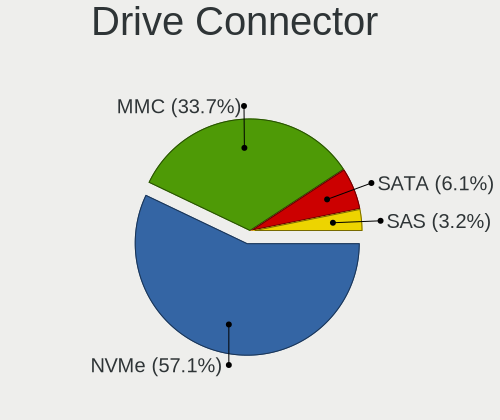
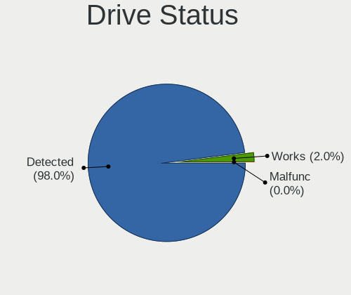
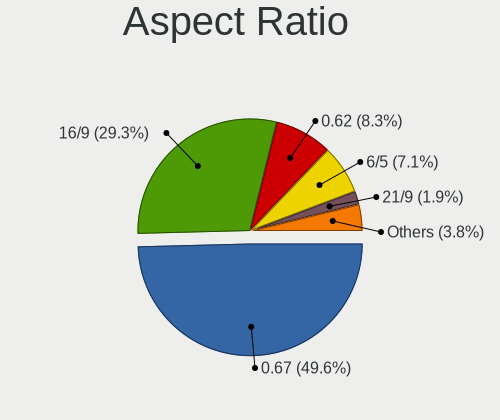
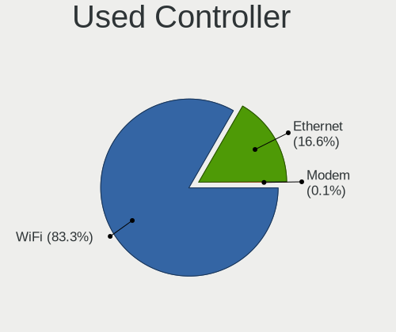

SteamOS - Tested Hardware & Statistics
--------------------------------------

A project to collect tested hardware configurations for SteamOS.

Anyone can contribute to this report by the [hw-probe](https://github.com/linuxhw/hw-probe) tool:

    sudo -E hw-probe -all -upload

Please contribute! Especially if your hardware is rare.

This is a report for all computer types. See also reports for [desktops](/Dist/SteamOS/Desktop/README.md) and [notebooks](/Dist/SteamOS/Notebook/README.md).

Contents
--------

* [ Test Cases ](#test-cases)

* [ System ](#system)
  - [ OS                       ](#os)
  - [ OS Family                ](#os-family)
  - [ Kernel                   ](#kernel)
  - [ Kernel Family            ](#kernel-family)
  - [ Kernel Major Ver.        ](#kernel-major-ver)
  - [ Arch                     ](#arch)
  - [ DE                       ](#de)
  - [ Display Server           ](#display-server)
  - [ Display Manager          ](#display-manager)
  - [ OS Lang                  ](#os-lang)
  - [ Boot Mode                ](#boot-mode)
  - [ Filesystem               ](#filesystem)
  - [ Part. scheme             ](#part-scheme)
  - [ Dual Boot with Linux/BSD ](#dual-boot-with-linuxbsd)
  - [ Dual Boot (Win)          ](#dual-boot-win)

* [ Board ](#board)
  - [ Vendor                   ](#vendor)
  - [ Model                    ](#model)
  - [ Model Family             ](#model-family)
  - [ MFG Year                 ](#mfg-year)
  - [ Form Factor              ](#form-factor)
  - [ Secure Boot              ](#secure-boot)
  - [ Coreboot                 ](#coreboot)
  - [ RAM Size                 ](#ram-size)
  - [ RAM Used                 ](#ram-used)
  - [ Total Drives             ](#total-drives)
  - [ Has CD-ROM               ](#has-cd-rom)
  - [ Has Ethernet             ](#has-ethernet)
  - [ Has WiFi                 ](#has-wifi)
  - [ Has Bluetooth            ](#has-bluetooth)

* [ Location ](#location)
  - [ Country                  ](#country)
  - [ City                     ](#city)

* [ Drives ](#drives)
  - [ Drive Vendor             ](#drive-vendor)
  - [ Drive Model              ](#drive-model)
  - [ HDD Vendor               ](#hdd-vendor)
  - [ SSD Vendor               ](#ssd-vendor)
  - [ Drive Kind               ](#drive-kind)
  - [ Drive Connector          ](#drive-connector)
  - [ Drive Size               ](#drive-size)
  - [ Space Total              ](#space-total)
  - [ Space Used               ](#space-used)
  - [ Malfunc. Drives          ](#malfunc-drives)
  - [ Malfunc. Drive Vendor    ](#malfunc-drive-vendor)
  - [ Malfunc. HDD Vendor      ](#malfunc-hdd-vendor)
  - [ Malfunc. Drive Kind      ](#malfunc-drive-kind)
  - [ Failed Drives            ](#failed-drives)
  - [ Failed Drive Vendor      ](#failed-drive-vendor)
  - [ Drive Status             ](#drive-status)

* [ Storage controller ](#storage-controller)
  - [ Storage Vendor           ](#storage-vendor)
  - [ Storage Model            ](#storage-model)
  - [ Storage Kind             ](#storage-kind)

* [ Processor ](#processor)
  - [ CPU Vendor               ](#cpu-vendor)
  - [ CPU Model                ](#cpu-model)
  - [ CPU Model Family         ](#cpu-model-family)
  - [ CPU Cores                ](#cpu-cores)
  - [ CPU Sockets              ](#cpu-sockets)
  - [ CPU Threads              ](#cpu-threads)
  - [ CPU Op-Modes             ](#cpu-op-modes)
  - [ CPU Microcode            ](#cpu-microcode)
  - [ CPU Microarch            ](#cpu-microarch)

* [ Graphics ](#graphics)
  - [ GPU Vendor               ](#gpu-vendor)
  - [ GPU Model                ](#gpu-model)
  - [ GPU Combo                ](#gpu-combo)
  - [ GPU Driver               ](#gpu-driver)
  - [ GPU Memory               ](#gpu-memory)

* [ Monitor ](#monitor)
  - [ Monitor Vendor           ](#monitor-vendor)
  - [ Monitor Model            ](#monitor-model)
  - [ Monitor Resolution       ](#monitor-resolution)
  - [ Monitor Diagonal         ](#monitor-diagonal)
  - [ Monitor Width            ](#monitor-width)
  - [ Aspect Ratio             ](#aspect-ratio)
  - [ Monitor Area             ](#monitor-area)
  - [ Pixel Density            ](#pixel-density)
  - [ Multiple Monitors        ](#multiple-monitors)

* [ Network ](#network)
  - [ Net Controller Vendor    ](#net-controller-vendor)
  - [ Net Controller Model     ](#net-controller-model)
  - [ Wireless Vendor          ](#wireless-vendor)
  - [ Wireless Model           ](#wireless-model)
  - [ Ethernet Vendor          ](#ethernet-vendor)
  - [ Ethernet Model           ](#ethernet-model)
  - [ Net Controller Kind      ](#net-controller-kind)
  - [ Used Controller          ](#used-controller)
  - [ NICs                     ](#nics)
  - [ IPv6                     ](#ipv6)

* [ Bluetooth ](#bluetooth)
  - [ Bluetooth Vendor         ](#bluetooth-vendor)
  - [ Bluetooth Model          ](#bluetooth-model)

* [ Sound ](#sound)
  - [ Sound Vendor             ](#sound-vendor)
  - [ Sound Model              ](#sound-model)

* [ Memory ](#memory)
  - [ Memory Vendor            ](#memory-vendor)
  - [ Memory Model             ](#memory-model)
  - [ Memory Kind              ](#memory-kind)
  - [ Memory Form Factor       ](#memory-form-factor)
  - [ Memory Size              ](#memory-size)
  - [ Memory Speed             ](#memory-speed)

* [ Printers & scanners ](#printers--scanners)
  - [ Printer Vendor           ](#printer-vendor)
  - [ Printer Model            ](#printer-model)
  - [ Scanner Vendor           ](#scanner-vendor)
  - [ Scanner Model            ](#scanner-model)

* [ Camera ](#camera)
  - [ Camera Vendor            ](#camera-vendor)
  - [ Camera Model             ](#camera-model)

* [ Security ](#security)
  - [ Fingerprint Vendor       ](#fingerprint-vendor)
  - [ Fingerprint Model        ](#fingerprint-model)
  - [ Chipcard Vendor          ](#chipcard-vendor)
  - [ Chipcard Model           ](#chipcard-model)

* [ Unsupported ](#unsupported)
  - [ Unsupported Devices      ](#unsupported-devices)
  - [ Unsupported Device Types ](#unsupported-device-types)

Test Cases
----------

Total: 142

| Vendor        | Model                       | Form-Factor | Probe                                                      | Date         |
|---------------|-----------------------------|-------------|------------------------------------------------------------|--------------|
| Gigabyte      | H310M S2V                   | Desktop     | [329d2071a9](https://linux-hardware.org/?probe=329d2071a9) | Aug 01, 2022 |
| GPD           | G1619-02                    | Notebook    | [c61c4280c8](https://linux-hardware.org/?probe=c61c4280c8) | Jul 31, 2022 |
| Valve         | Jupiter                     | Notebook    | [ee3b662083](https://linux-hardware.org/?probe=ee3b662083) | Jul 30, 2022 |
| Acer          | Aspire A514-54              | Notebook    | [9a18d7476f](https://linux-hardware.org/?probe=9a18d7476f) | Jul 29, 2022 |
| Valve         | Jupiter                     | Notebook    | [225e2c825e](https://linux-hardware.org/?probe=225e2c825e) | Jul 29, 2022 |
| Acer          | Aspire A514-54              | Notebook    | [4a6c9ef157](https://linux-hardware.org/?probe=4a6c9ef157) | Jul 28, 2022 |
| Valve         | Jupiter                     | Notebook    | [dffaa71aed](https://linux-hardware.org/?probe=dffaa71aed) | Jul 28, 2022 |
| Valve         | Jupiter                     | Notebook    | [35608b206c](https://linux-hardware.org/?probe=35608b206c) | Jul 27, 2022 |
| Valve         | Jupiter                     | Notebook    | [e35fa6e699](https://linux-hardware.org/?probe=e35fa6e699) | Jul 27, 2022 |
| Valve         | Jupiter                     | Notebook    | [f43cbe28e9](https://linux-hardware.org/?probe=f43cbe28e9) | Jul 27, 2022 |
| Valve         | Jupiter                     | Notebook    | [d4e4413f9b](https://linux-hardware.org/?probe=d4e4413f9b) | Jul 26, 2022 |
| Valve         | Jupiter                     | Notebook    | [9c34e91c79](https://linux-hardware.org/?probe=9c34e91c79) | Jul 26, 2022 |
| Valve         | Jupiter                     | Notebook    | [b605f923c6](https://linux-hardware.org/?probe=b605f923c6) | Jul 25, 2022 |
| ONE-NETBOO... | ONE XPLAYER                 | Tablet      | [6b300beb70](https://linux-hardware.org/?probe=6b300beb70) | Jul 25, 2022 |
| ASRock        | A520M-ITX/ac                | Desktop     | [876c779461](https://linux-hardware.org/?probe=876c779461) | Jul 25, 2022 |
| ASRock        | B450M-HDV R4.0              | Desktop     | [f2172999c8](https://linux-hardware.org/?probe=f2172999c8) | Jul 24, 2022 |
| ONE-NETBOO... | ONE XPLAYER                 | Tablet      | [ce14e41b96](https://linux-hardware.org/?probe=ce14e41b96) | Jul 24, 2022 |
| Valve         | Jupiter                     | Notebook    | [3e7b7cb8cd](https://linux-hardware.org/?probe=3e7b7cb8cd) | Jul 23, 2022 |
| Alienware     | m17                         | Notebook    | [e14db26b9b](https://linux-hardware.org/?probe=e14db26b9b) | Jul 23, 2022 |
| Valve         | Jupiter                     | Notebook    | [ca07489d53](https://linux-hardware.org/?probe=ca07489d53) | Jul 23, 2022 |
| Valve         | Jupiter                     | Notebook    | [1860c6d71f](https://linux-hardware.org/?probe=1860c6d71f) | Jul 23, 2022 |
| Valve         | Jupiter                     | Notebook    | [2d0db23de3](https://linux-hardware.org/?probe=2d0db23de3) | Jul 23, 2022 |
| Valve         | Jupiter                     | Notebook    | [4aece18875](https://linux-hardware.org/?probe=4aece18875) | Jul 23, 2022 |
| Valve         | Jupiter                     | Notebook    | [44dca72cbb](https://linux-hardware.org/?probe=44dca72cbb) | Jul 22, 2022 |
| Unknown       | Unknown                     | Notebook    | [96af389676](https://linux-hardware.org/?probe=96af389676) | Jul 22, 2022 |
| ASRock        | X570 Extreme4 WiFi ax       | Notebook    | [bc52038c74](https://linux-hardware.org/?probe=bc52038c74) | Jul 21, 2022 |
| Valve         | Jupiter                     | Notebook    | [0cd166bdb1](https://linux-hardware.org/?probe=0cd166bdb1) | Jul 21, 2022 |
| Lenovo        | IdeaPadFlex 5 14ALC05 82... | Convertible | [02c47a57e5](https://linux-hardware.org/?probe=02c47a57e5) | Jul 20, 2022 |
| Valve         | Jupiter                     | Notebook    | [2c1ad04467](https://linux-hardware.org/?probe=2c1ad04467) | Jul 18, 2022 |
| ASUSTek       | EX-A320M-GAMING             | Desktop     | [68884b1723](https://linux-hardware.org/?probe=68884b1723) | Jul 17, 2022 |
| Valve         | Jupiter                     | Notebook    | [7f27efe00e](https://linux-hardware.org/?probe=7f27efe00e) | Jul 17, 2022 |
| HP            | Pavilion 17                 | Notebook    | [722f4eb4a9](https://linux-hardware.org/?probe=722f4eb4a9) | Jul 17, 2022 |
| Valve         | Jupiter                     | Notebook    | [b639365efd](https://linux-hardware.org/?probe=b639365efd) | Jul 16, 2022 |
| Valve         | Jupiter                     | Notebook    | [6c954fab9d](https://linux-hardware.org/?probe=6c954fab9d) | Jul 16, 2022 |
| Valve         | Jupiter                     | Notebook    | [eec9897935](https://linux-hardware.org/?probe=eec9897935) | Jul 15, 2022 |
| Valve         | Jupiter                     | Notebook    | [d4be0d94b4](https://linux-hardware.org/?probe=d4be0d94b4) | Jul 14, 2022 |
| Valve         | Jupiter                     | Notebook    | [d2f117e7f3](https://linux-hardware.org/?probe=d2f117e7f3) | Jul 14, 2022 |
| Dell          | XPS 15 9570                 | Notebook    | [e157e6d524](https://linux-hardware.org/?probe=e157e6d524) | Jul 14, 2022 |
| AYANEO        | NEXT Pro                    | Tablet      | [12b2ede47c](https://linux-hardware.org/?probe=12b2ede47c) | Jul 12, 2022 |
| AYANEO        | NEXT Pro                    | Tablet      | [4dc9fd4b9e](https://linux-hardware.org/?probe=4dc9fd4b9e) | Jul 12, 2022 |
| Valve         | Jupiter                     | Notebook    | [f7d66c8d35](https://linux-hardware.org/?probe=f7d66c8d35) | Jul 10, 2022 |
| Gigabyte      | H170N-WIFI-CF               | Desktop     | [2f3e59dc30](https://linux-hardware.org/?probe=2f3e59dc30) | Jul 09, 2022 |
| Valve         | Jupiter                     | Notebook    | [0c2ea27c49](https://linux-hardware.org/?probe=0c2ea27c49) | Jul 09, 2022 |
| Valve         | Jupiter                     | Notebook    | [98711d54c1](https://linux-hardware.org/?probe=98711d54c1) | Jul 08, 2022 |
| Lenovo        | ThinkBook 13s G3 ACN 20Y... | Notebook    | [c3c73948f5](https://linux-hardware.org/?probe=c3c73948f5) | Jul 08, 2022 |
| Valve         | Jupiter                     | Notebook    | [3ede093138](https://linux-hardware.org/?probe=3ede093138) | Jul 07, 2022 |
| Valve         | Jupiter                     | Notebook    | [458276506d](https://linux-hardware.org/?probe=458276506d) | Jul 06, 2022 |
| Valve         | Jupiter                     | Notebook    | [663562cc6b](https://linux-hardware.org/?probe=663562cc6b) | Jul 06, 2022 |
| Gigabyte      | B550 GAMING X V2            | Desktop     | [61eaf99aca](https://linux-hardware.org/?probe=61eaf99aca) | Jul 05, 2022 |
| Gigabyte      | B550 GAMING X V2            | Desktop     | [812733dd89](https://linux-hardware.org/?probe=812733dd89) | Jul 05, 2022 |
| Valve         | Jupiter                     | Notebook    | [e640bab55c](https://linux-hardware.org/?probe=e640bab55c) | Jul 05, 2022 |
| Valve         | Jupiter                     | Notebook    | [0bd46afcda](https://linux-hardware.org/?probe=0bd46afcda) | Jul 04, 2022 |
| Valve         | Jupiter                     | Notebook    | [766a3583f0](https://linux-hardware.org/?probe=766a3583f0) | Jul 04, 2022 |
| Valve         | Jupiter                     | Notebook    | [ac0c161f66](https://linux-hardware.org/?probe=ac0c161f66) | Jul 02, 2022 |
| Valve         | Jupiter                     | Notebook    | [c591d23b4d](https://linux-hardware.org/?probe=c591d23b4d) | Jul 01, 2022 |
| Gigabyte      | X570 I AORUS PRO WIFI       | Desktop     | [d82f88e20c](https://linux-hardware.org/?probe=d82f88e20c) | Jul 01, 2022 |
| Valve         | Jupiter                     | Notebook    | [bee9822ef6](https://linux-hardware.org/?probe=bee9822ef6) | Jun 30, 2022 |
| Valve         | Jupiter                     | Notebook    | [e98c07bc79](https://linux-hardware.org/?probe=e98c07bc79) | Jun 29, 2022 |
| Valve         | Jupiter                     | Notebook    | [261590e542](https://linux-hardware.org/?probe=261590e542) | Jun 29, 2022 |
| Valve         | Jupiter                     | Notebook    | [7c233f0a07](https://linux-hardware.org/?probe=7c233f0a07) | Jun 29, 2022 |
| HP            | x2 210 G2                   | Tablet      | [812530aed8](https://linux-hardware.org/?probe=812530aed8) | Jun 28, 2022 |
| Valve         | Jupiter                     | Notebook    | [e80815c8d4](https://linux-hardware.org/?probe=e80815c8d4) | Jun 27, 2022 |
| Valve         | Jupiter                     | Notebook    | [65e5ab29fd](https://linux-hardware.org/?probe=65e5ab29fd) | Jun 26, 2022 |
| Valve         | Jupiter                     | Notebook    | [e51f5d8645](https://linux-hardware.org/?probe=e51f5d8645) | Jun 26, 2022 |
| Alienware     | 02XRCM A01                  | Desktop     | [c70647bab0](https://linux-hardware.org/?probe=c70647bab0) | Jun 26, 2022 |
| Valve         | Jupiter                     | Notebook    | [b4dd19f939](https://linux-hardware.org/?probe=b4dd19f939) | Jun 25, 2022 |
| AZW           | SER V01                     | Mini pc     | [295a32d26e](https://linux-hardware.org/?probe=295a32d26e) | Jun 24, 2022 |
| Valve         | Jupiter                     | Notebook    | [c9ed3cf311](https://linux-hardware.org/?probe=c9ed3cf311) | Jun 23, 2022 |
| ASUSTek       | H61M-K                      | Desktop     | [1a568c2e5f](https://linux-hardware.org/?probe=1a568c2e5f) | Jun 23, 2022 |
| ASUSTek       | Q524UQK                     | Convertible | [fd5f128747](https://linux-hardware.org/?probe=fd5f128747) | Jun 23, 2022 |
| Dell          | G15 5510                    | Notebook    | [9c5777f505](https://linux-hardware.org/?probe=9c5777f505) | Jun 23, 2022 |
| Valve         | Jupiter                     | Notebook    | [213fbe4dd2](https://linux-hardware.org/?probe=213fbe4dd2) | Jun 22, 2022 |
| Valve         | Jupiter                     | Notebook    | [262a7f0cd4](https://linux-hardware.org/?probe=262a7f0cd4) | Jun 22, 2022 |
| Valve         | Jupiter                     | Notebook    | [f8722866b2](https://linux-hardware.org/?probe=f8722866b2) | Jun 22, 2022 |
| Valve         | Jupiter                     | Notebook    | [aa18022bce](https://linux-hardware.org/?probe=aa18022bce) | Jun 22, 2022 |
| Valve         | Jupiter                     | Notebook    | [000682313d](https://linux-hardware.org/?probe=000682313d) | Jun 20, 2022 |
| Valve         | Jupiter                     | Notebook    | [363ab9e4ea](https://linux-hardware.org/?probe=363ab9e4ea) | Jun 20, 2022 |
| Valve         | Jupiter                     | Notebook    | [dd5765a418](https://linux-hardware.org/?probe=dd5765a418) | Jun 18, 2022 |
| Valve         | Jupiter                     | Notebook    | [8e293bb4b1](https://linux-hardware.org/?probe=8e293bb4b1) | Jun 17, 2022 |
| Valve         | Jupiter                     | Notebook    | [ff0ce08944](https://linux-hardware.org/?probe=ff0ce08944) | Jun 16, 2022 |
| Valve         | Jupiter                     | Notebook    | [68a581ae0b](https://linux-hardware.org/?probe=68a581ae0b) | Jun 12, 2022 |
| HP            | Pavilion Gaming Laptop 1... | Notebook    | [df3f1b5d8f](https://linux-hardware.org/?probe=df3f1b5d8f) | Jun 11, 2022 |
| Valve         | Jupiter                     | Notebook    | [2353bf0f9d](https://linux-hardware.org/?probe=2353bf0f9d) | Jun 11, 2022 |
| Valve         | Jupiter                     | Notebook    | [17406c8741](https://linux-hardware.org/?probe=17406c8741) | Jun 11, 2022 |
| Apple         | Mac-35C5E08120C7EEAF Mac... | Mini pc     | [7ccfe2d3a7](https://linux-hardware.org/?probe=7ccfe2d3a7) | Jun 10, 2022 |
| Valve         | Jupiter                     | Notebook    | [715e914cba](https://linux-hardware.org/?probe=715e914cba) | Jun 10, 2022 |
| Valve         | Jupiter                     | Notebook    | [cc0a20bb93](https://linux-hardware.org/?probe=cc0a20bb93) | Jun 06, 2022 |
| Valve         | Jupiter                     | Notebook    | [2fb1bfad12](https://linux-hardware.org/?probe=2fb1bfad12) | Jun 04, 2022 |
| Valve         | Jupiter                     | Notebook    | [322bdc2ce3](https://linux-hardware.org/?probe=322bdc2ce3) | Jun 03, 2022 |
| Valve         | Jupiter                     | Notebook    | [780d6b923a](https://linux-hardware.org/?probe=780d6b923a) | Jun 02, 2022 |
| ASUSTek       | ROG STRIX B550-F GAMING     | Desktop     | [b3a08001ed](https://linux-hardware.org/?probe=b3a08001ed) | Jun 01, 2022 |
| ASRock        | B550 PG Velocita            | Desktop     | [0d7f71a24d](https://linux-hardware.org/?probe=0d7f71a24d) | May 30, 2022 |
| ASRock        | B365M Pro4-F                | Desktop     | [afc161c6fb](https://linux-hardware.org/?probe=afc161c6fb) | May 30, 2022 |
| Valve         | Jupiter                     | Notebook    | [f3910c9796](https://linux-hardware.org/?probe=f3910c9796) | May 29, 2022 |
| Valve         | Jupiter                     | Notebook    | [e415de106f](https://linux-hardware.org/?probe=e415de106f) | May 29, 2022 |
| Valve         | Jupiter                     | Notebook    | [0af4b9c805](https://linux-hardware.org/?probe=0af4b9c805) | May 29, 2022 |
| Valve         | Jupiter                     | Notebook    | [06b56d54d4](https://linux-hardware.org/?probe=06b56d54d4) | May 28, 2022 |
| Gigabyte      | B560M AORUS PRO             | Desktop     | [31f246f96e](https://linux-hardware.org/?probe=31f246f96e) | May 27, 2022 |
| Gigabyte      | B560M AORUS PRO             | Desktop     | [1d381d6ec9](https://linux-hardware.org/?probe=1d381d6ec9) | May 27, 2022 |
| Valve         | Jupiter                     | Notebook    | [1e966da4f8](https://linux-hardware.org/?probe=1e966da4f8) | May 27, 2022 |
| Valve         | Jupiter                     | Notebook    | [c716690aa2](https://linux-hardware.org/?probe=c716690aa2) | May 27, 2022 |
| Valve         | Jupiter                     | Notebook    | [43f315aa0c](https://linux-hardware.org/?probe=43f315aa0c) | May 27, 2022 |
| Valve         | Jupiter                     | Notebook    | [643322d821](https://linux-hardware.org/?probe=643322d821) | May 26, 2022 |
| Gigabyte      | Z170XP-SLI-CF               | Desktop     | [d4bef1e450](https://linux-hardware.org/?probe=d4bef1e450) | May 26, 2022 |
| HP            | Pavilion Gaming Laptop 1... | Notebook    | [b672eefb50](https://linux-hardware.org/?probe=b672eefb50) | May 25, 2022 |
| Valve         | Jupiter                     | Notebook    | [dee0bbedd1](https://linux-hardware.org/?probe=dee0bbedd1) | May 25, 2022 |
| HP            | 8158 A01                    | Mini pc     | [0d32a2b2e3](https://linux-hardware.org/?probe=0d32a2b2e3) | May 24, 2022 |
| ASUSTek       | PN50                        | Mini pc     | [da9b5c2be2](https://linux-hardware.org/?probe=da9b5c2be2) | May 24, 2022 |
| Valve         | Jupiter                     | Notebook    | [c34173715a](https://linux-hardware.org/?probe=c34173715a) | May 24, 2022 |
| Valve         | Jupiter                     | Notebook    | [6ca95b630c](https://linux-hardware.org/?probe=6ca95b630c) | May 23, 2022 |
| Valve         | Jupiter                     | Notebook    | [7d3f9c0a5f](https://linux-hardware.org/?probe=7d3f9c0a5f) | May 23, 2022 |
| Acer          | Aspire A315-23              | Notebook    | [b5d37bf4f2](https://linux-hardware.org/?probe=b5d37bf4f2) | May 22, 2022 |
| Samsung       | 950XDB/951XDB/950XDY        | Notebook    | [fc970670a8](https://linux-hardware.org/?probe=fc970670a8) | May 22, 2022 |
| Valve         | Jupiter                     | Notebook    | [595b06f6c9](https://linux-hardware.org/?probe=595b06f6c9) | May 22, 2022 |
| Valve         | Jupiter                     | Notebook    | [d706d00651](https://linux-hardware.org/?probe=d706d00651) | May 21, 2022 |
| Valve         | Jupiter                     | Notebook    | [317e492fa3](https://linux-hardware.org/?probe=317e492fa3) | May 21, 2022 |
| Valve         | Jupiter                     | Notebook    | [f849597120](https://linux-hardware.org/?probe=f849597120) | May 18, 2022 |
| Valve         | Jupiter                     | Notebook    | [48df6e5c71](https://linux-hardware.org/?probe=48df6e5c71) | May 18, 2022 |
| Valve         | Jupiter                     | Notebook    | [9cf4d23a81](https://linux-hardware.org/?probe=9cf4d23a81) | May 13, 2022 |
| Valve         | Jupiter                     | Notebook    | [79f6db1d69](https://linux-hardware.org/?probe=79f6db1d69) | May 08, 2022 |
| Valve         | Jupiter                     | Notebook    | [771539d18d](https://linux-hardware.org/?probe=771539d18d) | May 03, 2022 |
| Valve         | Jupiter                     | Notebook    | [19d2c51aa6](https://linux-hardware.org/?probe=19d2c51aa6) | May 01, 2022 |
| Valve         | Jupiter                     | Notebook    | [1c826aed5e](https://linux-hardware.org/?probe=1c826aed5e) | Apr 30, 2022 |
| Valve         | Jupiter                     | Notebook    | [4c43342014](https://linux-hardware.org/?probe=4c43342014) | Apr 24, 2022 |
| Valve         | Jupiter                     | Notebook    | [8564bded7f](https://linux-hardware.org/?probe=8564bded7f) | Apr 21, 2022 |
| Valve         | Jupiter                     | Notebook    | [d761657c3a](https://linux-hardware.org/?probe=d761657c3a) | Apr 21, 2022 |
| Valve         | Jupiter                     | Notebook    | [f2e59fcb97](https://linux-hardware.org/?probe=f2e59fcb97) | Apr 20, 2022 |
| Valve         | Jupiter                     | Notebook    | [4f23fab4fd](https://linux-hardware.org/?probe=4f23fab4fd) | Apr 17, 2022 |
| Valve         | Jupiter                     | Notebook    | [ed07e93435](https://linux-hardware.org/?probe=ed07e93435) | Apr 16, 2022 |
| Valve         | Jupiter                     | Notebook    | [48aacdeee8](https://linux-hardware.org/?probe=48aacdeee8) | Apr 15, 2022 |
| Valve         | Jupiter                     | Notebook    | [6a042646dd](https://linux-hardware.org/?probe=6a042646dd) | Apr 14, 2022 |
| Valve         | Jupiter                     | Notebook    | [d4c9dba2a1](https://linux-hardware.org/?probe=d4c9dba2a1) | Apr 14, 2022 |
| Valve         | Jupiter                     | Notebook    | [852b6fb53a](https://linux-hardware.org/?probe=852b6fb53a) | Apr 08, 2022 |
| Valve         | Jupiter                     | Notebook    | [6129b15fb5](https://linux-hardware.org/?probe=6129b15fb5) | Apr 05, 2022 |
| Valve         | Jupiter                     | Notebook    | [ec05067a1d](https://linux-hardware.org/?probe=ec05067a1d) | Apr 03, 2022 |
| Valve         | Jupiter                     | Notebook    | [180c84c856](https://linux-hardware.org/?probe=180c84c856) | Apr 02, 2022 |
| Valve         | Jupiter                     | Notebook    | [d8625616de](https://linux-hardware.org/?probe=d8625616de) | Mar 30, 2022 |
| Valve         | Jupiter                     | Notebook    | [d181a912af](https://linux-hardware.org/?probe=d181a912af) | Mar 23, 2022 |
| Valve         | Jupiter                     | Notebook    | [0b6a21cf35](https://linux-hardware.org/?probe=0b6a21cf35) | Mar 18, 2022 |
| Valve         | Jupiter                     | Notebook    | [85328e8f3d](https://linux-hardware.org/?probe=85328e8f3d) | Mar 17, 2022 |
| Valve         | Jupiter                     | Notebook    | [023aea75e1](https://linux-hardware.org/?probe=023aea75e1) | Mar 14, 2022 |
| Valve         | Jupiter                     | Notebook    | [c7f6388908](https://linux-hardware.org/?probe=c7f6388908) | Mar 11, 2022 |

System
------

OS
--

Installed operating systems

| Name                         | Computers | Percent |
|------------------------------|-----------|---------|
| SteamOS 3.2                  | 55        | 44.35%  |
| SteamOS Snapshot             | 26        | 20.97%  |
| SteamOS 3.3                  | 16        | 12.9%   |
| SteamOS 3.2 (steamdeck-main) | 14        | 11.29%  |
| SteamOS 3.1                  | 9         | 7.26%   |
| SteamOS                      | 2         | 1.61%   |
| SteamOS Rolling              | 1         | 0.81%   |
| SteamOS 3.4                  | 1         | 0.81%   |

OS Family
---------

OS without a version

| Name    | Computers | Percent |
|---------|-----------|---------|
| SteamOS | 121       | 100%    |

Kernel
------

Version of the Linux kernel

| Version                                            | Computers | Percent |
|----------------------------------------------------|-----------|---------|
| 5.13.0-valve15-1-neptune-02197-gf6ec7ad3762a       | 51        | 41.13%  |
| 5.13.0-valve10.1-2-neptune-dri-02144-g7fffaf925dfb | 22        | 17.74%  |
| 5.13.0-valve10.1-1-neptune-02144-g7fffaf925dfb     | 16        | 12.9%   |
| 5.13.0-valve10.3-1-neptune-02176-g5fe416c4acd8     | 11        | 8.87%   |
| 5.13.0-valve14-1-neptune-02195-g5b0f749d00fa       | 5         | 4.03%   |
| 5.13.0-valve22-1-neptune-02213-gb68995364335       | 4         | 3.23%   |
| 5.13.0-valve21-1-neptune-02209-g2a5bdc1102a0       | 4         | 3.23%   |
| 5.13.0-valve20-1-neptune-02207-gbd986a7e1c7f       | 4         | 3.23%   |
| 5.18.1-arch1_testHoloISO_20220606.1811             | 3         | 2.42%   |
| 5.13.0-valve21-2-neptune-02209-g2a5bdc1102a0       | 3         | 2.42%   |
| 5.16.2-arch1-1                                     | 1         | 0.81%   |

Kernel Family
-------------

Linux kernel without a distro release

| Version | Computers | Percent |
|---------|-----------|---------|
| 5.13.0  | 117       | 96.69%  |
| 5.18.1  | 3         | 2.48%   |
| 5.16.2  | 1         | 0.83%   |

Kernel Major Ver.
-----------------

Linux kernel major version

| Version | Computers | Percent |
|---------|-----------|---------|
| 5.13    | 117       | 96.69%  |
| 5.18    | 3         | 2.48%   |
| 5.16    | 1         | 0.83%   |

Arch
----

OS architecture (x86_64, i586, etc.)

| Name   | Computers | Percent |
|--------|-----------|---------|
| x86_64 | 121       | 100%    |

DE
--

Desktop Environment

| Name    | Computers | Percent |
|---------|-----------|---------|
| KDE5    | 119       | 98.35%  |
| Unknown | 2         | 1.65%   |

Display Server
--------------

X11 or Wayland

| Name    | Computers | Percent |
|---------|-----------|---------|
| X11     | 120       | 99.17%  |
| Unknown | 1         | 0.83%   |

Display Manager
---------------

SDDM, LightDM, etc.

| Name    | Computers | Percent |
|---------|-----------|---------|
| Unknown | 120       | 99.17%  |
| SDDM    | 1         | 0.83%   |

OS Lang
-------

Language

| Lang  | Computers | Percent |
|-------|-----------|---------|
| en_US | 102       | 84.3%   |
| en_GB | 4         | 3.31%   |
| fr_FR | 3         | 2.48%   |
| an_ES | 3         | 2.48%   |
| pt_PT | 2         | 1.65%   |
| pt_BR | 1         | 0.83%   |
| it_IT | 1         | 0.83%   |
| es_ES | 1         | 0.83%   |
| en_IE | 1         | 0.83%   |
| en_DE | 1         | 0.83%   |
| en_CA | 1         | 0.83%   |
| de_DE | 1         | 0.83%   |

Boot Mode
---------

EFI or BIOS

| Mode | Computers | Percent |
|------|-----------|---------|
| BIOS | 118       | 97.52%  |
| EFI  | 3         | 2.48%   |

Filesystem
----------

Type of filesystem

| Type  | Computers | Percent |
|-------|-----------|---------|
| Btrfs | 121       | 100%    |

Part. scheme
------------

Scheme of partitioning

| Type    | Computers | Percent |
|---------|-----------|---------|
| Unknown | 118       | 97.52%  |
| GPT     | 3         | 2.48%   |

Dual Boot with Linux/BSD
------------------------

Hosting more than one Linux/BSD

| Dual boot | Computers | Percent |
|-----------|-----------|---------|
| No        | 119       | 98.35%  |
| Yes       | 2         | 1.65%   |

Dual Boot (Win)
---------------

Hosting Linux and Windows

| Dual boot | Computers | Percent |
|-----------|-----------|---------|
| No        | 120       | 99.17%  |
| Yes       | 1         | 0.83%   |

Board
-----

Vendor
------

Motherboard manufacturer

| Name                   | Computers | Percent |
|------------------------|-----------|---------|
| Valve                  | 85        | 70.25%  |
| Gigabyte Technology    | 6         | 4.96%   |
| Hewlett-Packard        | 5         | 4.13%   |
| ASUSTek Computer       | 5         | 4.13%   |
| ASRock                 | 5         | 4.13%   |
| Lenovo                 | 2         | 1.65%   |
| Dell                   | 2         | 1.65%   |
| Alienware              | 2         | 1.65%   |
| Acer                   | 2         | 1.65%   |
| Samsung Electronics    | 1         | 0.83%   |
| ONE-NETBOOK TECHNOLOGY | 1         | 0.83%   |
| GPD                    | 1         | 0.83%   |
| AZW                    | 1         | 0.83%   |
| AYANEO                 | 1         | 0.83%   |
| Apple                  | 1         | 0.83%   |
| Unknown                | 1         | 0.83%   |

Model
-----

Motherboard model

| Name                                | Computers | Percent |
|-------------------------------------|-----------|---------|
| Valve Jupiter                       | 85        | 70.25%  |
| Samsung 950XDB/951XDB/950XDY        | 1         | 0.83%   |
| ONE-NETBOOK TECHNOLOGY ONE XPLAYER  | 1         | 0.83%   |
| Lenovo ThinkBook 13s G3 ACN 20YA    | 1         | 0.83%   |
| Lenovo IdeaPadFlex 5 14ALC05 82HU   | 1         | 0.83%   |
| HP x2 210 G2                        | 1         | 0.83%   |
| HP t630 Thin Client                 | 1         | 0.83%   |
| HP Pavilion Gaming Laptop 15-ec2xxx | 1         | 0.83%   |
| HP Pavilion Gaming Laptop 15-dk0xxx | 1         | 0.83%   |
| HP Pavilion 17                      | 1         | 0.83%   |
| GPD G1619-02                        | 1         | 0.83%   |
| Gigabyte X570 I AORUS PRO WIFI      | 1         | 0.83%   |
| Gigabyte MBB-670016                 | 1         | 0.83%   |
| Gigabyte H310M S2V 2.0              | 1         | 0.83%   |
| Gigabyte H170N-WIFI                 | 1         | 0.83%   |
| Gigabyte B560M AORUS PRO            | 1         | 0.83%   |
| Gigabyte B550 GAMING X V2           | 1         | 0.83%   |
| Dell XPS 15 9570                    | 1         | 0.83%   |
| Dell G15 5510                       | 1         | 0.83%   |
| AZW SER                             | 1         | 0.83%   |
| AYANEO NEXT Pro                     | 1         | 0.83%   |
| ASUS ROG STRIX B550-F GAMING        | 1         | 0.83%   |
| ASUS Q524UQK                        | 1         | 0.83%   |
| ASUS MINIPC PN50                    | 1         | 0.83%   |
| ASUS H61M-K                         | 1         | 0.83%   |
| ASUS EX-A320M-GAMING                | 1         | 0.83%   |
| ASRock X570 Extreme4 WiFi ax        | 1         | 0.83%   |
| ASRock B550 PG Velocita             | 1         | 0.83%   |
| ASRock B450M-HDV R4.0               | 1         | 0.83%   |
| ASRock B365M Pro4-F                 | 1         | 0.83%   |
| ASRock A520M-ITX/ac                 | 1         | 0.83%   |
| Apple Macmini7,1                    | 1         | 0.83%   |
| Alienware m17                       | 1         | 0.83%   |
| Alienware Aurora R8                 | 1         | 0.83%   |
| Acer Aspire A514-54                 | 1         | 0.83%   |
| Acer Aspire A315-23                 | 1         | 0.83%   |
| Unknown                             | 1         | 0.83%   |

Model Family
------------

Motherboard model prefix

| Name                       | Computers | Percent |
|----------------------------|-----------|---------|
| Valve Jupiter              | 85        | 70.25%  |
| HP Pavilion                | 3         | 2.48%   |
| Acer Aspire                | 2         | 1.65%   |
| Samsung 950XDB             | 1         | 0.83%   |
| ONE-NETBOOK TECHNOLOGY ONE | 1         | 0.83%   |
| Lenovo ThinkBook           | 1         | 0.83%   |
| Lenovo IdeaPadFlex         | 1         | 0.83%   |
| HP x2                      | 1         | 0.83%   |
| HP t630                    | 1         | 0.83%   |
| GPD G1619-02               | 1         | 0.83%   |
| Gigabyte X570              | 1         | 0.83%   |
| Gigabyte MBB-670016        | 1         | 0.83%   |
| Gigabyte H310M             | 1         | 0.83%   |
| Gigabyte H170N-WIFI        | 1         | 0.83%   |
| Gigabyte B560M             | 1         | 0.83%   |
| Gigabyte B550              | 1         | 0.83%   |
| Dell XPS                   | 1         | 0.83%   |
| Dell G15                   | 1         | 0.83%   |
| AZW SER                    | 1         | 0.83%   |
| AYANEO NEXT                | 1         | 0.83%   |
| ASUS ROG                   | 1         | 0.83%   |
| ASUS Q524UQK               | 1         | 0.83%   |
| ASUS MINIPC                | 1         | 0.83%   |
| ASUS H61M-K                | 1         | 0.83%   |
| ASUS EX-A320M-GAMING       | 1         | 0.83%   |
| ASRock X570                | 1         | 0.83%   |
| ASRock B550                | 1         | 0.83%   |
| ASRock B450M-HDV           | 1         | 0.83%   |
| ASRock B365M               | 1         | 0.83%   |
| ASRock A520M-ITX           | 1         | 0.83%   |
| Apple Macmini7             | 1         | 0.83%   |
| Alienware m17              | 1         | 0.83%   |
| Alienware Aurora           | 1         | 0.83%   |
| Unknown                    | 1         | 0.83%   |

MFG Year
--------

Motherboard manufacture year

| Year    | Computers | Percent |
|---------|-----------|---------|
| 2022    | 76        | 62.81%  |
| Unknown | 12        | 9.92%   |
| 2021    | 10        | 8.26%   |
| 2020    | 8         | 6.61%   |
| 2018    | 5         | 4.13%   |
| 2019    | 4         | 3.31%   |
| 2016    | 2         | 1.65%   |
| 2013    | 2         | 1.65%   |
| 2017    | 1         | 0.83%   |
| 2015    | 1         | 0.83%   |

Form Factor
-----------

Physical design of the computer

| Name        | Computers | Percent |
|-------------|-----------|---------|
| Notebook    | 98        | 80.99%  |
| Desktop     | 14        | 11.57%  |
| Mini pc     | 4         | 3.31%   |
| Tablet      | 3         | 2.48%   |
| Convertible | 2         | 1.65%   |

Secure Boot
-----------

Enabled or disabled

| State    | Computers | Percent |
|----------|-----------|---------|
| Disabled | 121       | 100%    |

Coreboot
--------

Have coreboot on board

| Used | Computers | Percent |
|------|-----------|---------|
| No   | 121       | 100%    |

RAM Size
--------

Total RAM memory

| Size in GB  | Computers | Percent |
|-------------|-----------|---------|
| 8.01-16.0   | 93        | 76.86%  |
| 16.01-24.0  | 12        | 9.92%   |
| 4.01-8.0    | 7         | 5.79%   |
| 32.01-64.0  | 4         | 3.31%   |
| 24.01-32.0  | 3         | 2.48%   |
| 3.01-4.0    | 1         | 0.83%   |
| 64.01-256.0 | 1         | 0.83%   |

RAM Used
--------

Used RAM memory

| Used GB  | Computers | Percent |
|----------|-----------|---------|
| 2.01-3.0 | 65        | 52%     |
| 3.01-4.0 | 26        | 20.8%   |
| 4.01-8.0 | 21        | 16.8%   |
| 1.01-2.0 | 13        | 10.4%   |

Total Drives
------------

Number of drives on board

| Drives | Computers | Percent |
|--------|-----------|---------|
| 2      | 63        | 51.64%  |
| 1      | 46        | 37.7%   |
| 3      | 8         | 6.56%   |
| 4      | 3         | 2.46%   |
| 7      | 1         | 0.82%   |
| 0      | 1         | 0.82%   |

Has CD-ROM
----------

Has CD-ROM on board

| Presented | Computers | Percent |
|-----------|-----------|---------|
| No        | 117       | 96.69%  |
| Yes       | 4         | 3.31%   |

Has Ethernet
------------

Has Ethernet on board

| Presented | Computers | Percent |
|-----------|-----------|---------|
| No        | 75        | 61.98%  |
| Yes       | 46        | 38.02%  |

Has WiFi
--------

Has WiFi module

| Presented | Computers | Percent |
|-----------|-----------|---------|
| Yes       | 116       | 95.87%  |
| No        | 5         | 4.13%   |

Has Bluetooth
-------------

Has Bluetooth module

| Presented | Computers | Percent |
|-----------|-----------|---------|
| Yes       | 114       | 94.21%  |
| No        | 7         | 5.79%   |

Location
--------

Country
-------

Geographic location (country)

| Country     | Computers | Percent |
|-------------|-----------|---------|
| USA         | 54        | 44.63%  |
| UK          | 13        | 10.74%  |
| Germany     | 13        | 10.74%  |
| Spain       | 5         | 4.13%   |
| France      | 5         | 4.13%   |
| Netherlands | 3         | 2.48%   |
| Italy       | 3         | 2.48%   |
| Canada      | 3         | 2.48%   |
| Australia   | 3         | 2.48%   |
| Portugal    | 2         | 1.65%   |
| Brazil      | 2         | 1.65%   |
| Turkey      | 1         | 0.83%   |
| Sweden      | 1         | 0.83%   |
| Slovakia    | 1         | 0.83%   |
| Poland      | 1         | 0.83%   |
| Malaysia    | 1         | 0.83%   |
| Latvia      | 1         | 0.83%   |
| Japan       | 1         | 0.83%   |
| Ireland     | 1         | 0.83%   |
| Hungary     | 1         | 0.83%   |
| Hong Kong   | 1         | 0.83%   |
| Honduras    | 1         | 0.83%   |
| Greece      | 1         | 0.83%   |
| Czechia     | 1         | 0.83%   |
| Belgium     | 1         | 0.83%   |
| Austria     | 1         | 0.83%   |

City
----

Geographic location (city)

| City                   | Computers | Percent |
|------------------------|-----------|---------|
| Portland               | 2         | 1.63%   |
| Colorado Springs       | 2         | 1.63%   |
| Wokingham              | 1         | 0.81%   |
| Whitley Bay            | 1         | 0.81%   |
| Washington             | 1         | 0.81%   |
| Warsaw                 | 1         | 0.81%   |
| Walsall                | 1         | 0.81%   |
| Victoria               | 1         | 0.81%   |
| Tulsa                  | 1         | 0.81%   |
| Tuam                   | 1         | 0.81%   |
| Treviso                | 1         | 0.81%   |
| Torre del Mar          | 1         | 0.81%   |
| Tilburg                | 1         | 0.81%   |
| Thessaloniki           | 1         | 0.81%   |
| Temecula               | 1         | 0.81%   |
| Tegucigalpa            | 1         | 0.81%   |
| Talavera de la Reina   | 1         | 0.81%   |
| Sunnyvale              | 1         | 0.81%   |
| Stockholm              | 1         | 0.81%   |
| St Louis               | 1         | 0.81%   |
| Spanish Fork           | 1         | 0.81%   |
| Southlake              | 1         | 0.81%   |
| South Holland          | 1         | 0.81%   |
| Sindelfingen           | 1         | 0.81%   |
| Shepperton             | 1         | 0.81%   |
| Seri Kembangan         | 1         | 0.81%   |
| Seattle                | 1         | 0.81%   |
| Schwerin               | 1         | 0.81%   |
| Santa Cruz de Tenerife | 1         | 0.81%   |
| San Diego              | 1         | 0.81%   |
| Sacramento             | 1         | 0.81%   |
| Rueil-Malmaison        | 1         | 0.81%   |
| Rome                   | 1         | 0.81%   |
| Rohnert Park           | 1         | 0.81%   |
| Roanoke                | 1         | 0.81%   |
| Riga                   | 1         | 0.81%   |
| Reignier-Esery         | 1         | 0.81%   |
| Portage                | 1         | 0.81%   |
| Phoenix                | 1         | 0.81%   |
| Philadelphia           | 1         | 0.81%   |
| Perth                  | 1         | 0.81%   |
| Palatine               | 1         | 0.81%   |
| Ooltewah               | 1         | 0.81%   |
| Odenton                | 1         | 0.81%   |
| Oakham                 | 1         | 0.81%   |
| Nuremberg              | 1         | 0.81%   |
| Norwich                | 1         | 0.81%   |
| Noble Park             | 1         | 0.81%   |
| Newberg                | 1         | 0.81%   |
| New York               | 1         | 0.81%   |
| Nashville              | 1         | 0.81%   |
| Mooresville            | 1         | 0.81%   |
| Mississauga            | 1         | 0.81%   |
| Midlothian             | 1         | 0.81%   |
| Middle Island          | 1         | 0.81%   |
| Miami                  | 1         | 0.81%   |
| McArthur               | 1         | 0.81%   |
| Mascot                 | 1         | 0.81%   |
| Maplewood              | 1         | 0.81%   |
| Manchester             | 1         | 0.81%   |

Drives
------

Drive Vendor
------------

Hard drive vendors

| Vendor                         | Computers | Drives | Percent |
|--------------------------------|-----------|--------|---------|
| Unknown                        | 43        | 44     | 20.98%  |
| Kingston                       | 38        | 40     | 18.54%  |
| Phison                         | 34        | 34     | 16.59%  |
| Samsung Electronics            | 16        | 21     | 7.8%    |
| Unknown                        | 12        | 13     | 5.85%   |
| O2 Micro                       | 9         | 9      | 4.39%   |
| Seagate                        | 7         | 9      | 3.41%   |
| Silicon Motion                 | 6         | 7      | 2.93%   |
| WDC                            | 5         | 6      | 2.44%   |
| Toshiba                        | 3         | 4      | 1.46%   |
| SanDisk                        | 3         | 3      | 1.46%   |
| PNY                            | 3         | 3      | 1.46%   |
| Crucial                        | 3         | 3      | 1.46%   |
| SK hynix                       | 2         | 2      | 0.98%   |
| Micron/Crucial Technology      | 2         | 2      | 0.98%   |
| KIOXIA                         | 2         | 2      | 0.98%   |
| JMicron Technology             | 2         | 2      | 0.98%   |
| Intel                          | 2         | 2      | 0.98%   |
| ASMT                           | 2         | 2      | 0.98%   |
| ADATA Technology               | 2         | 2      | 0.98%   |
| Union Memory (Shenzhen)        | 1         | 1      | 0.49%   |
| Solid State Storage Technology | 1         | 1      | 0.49%   |
| Realtek Semiconductor          | 1         | 1      | 0.49%   |
| Lexar 25                       | 1         | 1      | 0.49%   |
| HP Phison                      | 1         | 1      | 0.49%   |
| GALAX                          | 1         | 1      | 0.49%   |
| External                       | 1         | 2      | 0.49%   |
| China                          | 1         | 1      | 0.49%   |
| A-DATA Technology              | 1         | 1      | 0.49%   |

Drive Model
-----------

Hard drive models

| Model                                        | Computers | Percent |
|----------------------------------------------|-----------|---------|
| Kingston NVMe SSD Drive 512GB                | 21        | 9.86%   |
| Phison NVMe SSD Drive 512GB                  | 19        | 8.92%   |
| Unknown MMC Card  512GB                      | 17        | 7.98%   |
| Kingston NVMe SSD Drive 256GB                | 14        | 6.57%   |
| Unknown                                      | 12        | 5.63%   |
| Phison NVMe SSD Drive 256GB                  | 11        | 5.16%   |
| O2 Micro NVMe SSD Drive 64GB                 | 9         | 4.23%   |
| Unknown MMC Card  256GB                      | 6         | 2.82%   |
| Unknown MMC Card  64GB                       | 4         | 1.88%   |
| Unknown MMC Card  128GB                      | 4         | 1.88%   |
| Silicon Motion NVMe SSD Drive 256GB          | 4         | 1.88%   |
| Samsung NVMe SSD Drive 512GB                 | 4         | 1.88%   |
| Unknown MMC Card  498GB                      | 3         | 1.41%   |
| Unknown MMC Card  393GB                      | 3         | 1.41%   |
| SK hynix NVMe SSD Drive 256GB                | 2         | 0.94%   |
| SanDisk NVMe SSD Drive 512GB                 | 2         | 0.94%   |
| Samsung SSD 860 EVO 250GB                    | 2         | 0.94%   |
| Samsung NVMe SSD Drive 1TB                   | 2         | 0.94%   |
| JMicron Generic 2TB                          | 2         | 0.94%   |
| Crucial CT1000BX500SSD1 1TB                  | 2         | 0.94%   |
| WDC WDS500G2B0A-00SM50 500GB SSD             | 1         | 0.47%   |
| WDC WD7500BPVT-80HXZT3 752GB                 | 1         | 0.47%   |
| WDC WD5000BPKT-60PK4T0 500GB                 | 1         | 0.47%   |
| WDC WD10SPZX-75Z10T2 1TB                     | 1         | 0.47%   |
| WDC WD10EURX-83UY4Y0 1TB                     | 1         | 0.47%   |
| WDC CH SN530 SDBPTPZ-1T00-1024 930GB         | 1         | 0.47%   |
| Unknown MMC Card  7GB                        | 1         | 0.47%   |
| Unknown MMC Card  500GB                      | 1         | 0.47%   |
| Unknown MMC Card  32GB                       | 1         | 0.47%   |
| Unknown MMC Card  248GB                      | 1         | 0.47%   |
| Unknown MMC Card  1TB                        | 1         | 0.47%   |
| Unknown MMC Card  196GB                      | 1         | 0.47%   |
| Unknown MMC Card  1048GB                     | 1         | 0.47%   |
| Union Memory (Shenzhen) NVMe SSD Drive 128GB | 1         | 0.47%   |
| Toshiba NVMe SSD Drive 256GB                 | 1         | 0.47%   |
| Toshiba MQ01ABD100 1TB                       | 1         | 0.47%   |
| Toshiba MK3275GSX 320GB                      | 1         | 0.47%   |
| Toshiba DT01ACA200 2TB                       | 1         | 0.47%   |
| Solid State Storage NVMe SSD Drive 128GB     | 1         | 0.47%   |
| Silicon Motion NVMe SSD Drive 512GB          | 1         | 0.47%   |
| Silicon Motion NVMe SSD Drive 2TB            | 1         | 0.47%   |
| Seagate ST9320325AS 320GB                    | 1         | 0.47%   |
| Seagate ST6000DM003-2CY186 6TB               | 1         | 0.47%   |
| Seagate ST4000DX001-1CE168 4TB               | 1         | 0.47%   |
| Seagate ST4000DM004-2CV104 4TB               | 1         | 0.47%   |
| Seagate ST3500413AS 500GB                    | 1         | 0.47%   |
| Seagate ST3160318AS 160GB                    | 1         | 0.47%   |
| Seagate ST2000DM008-2FR102 2TB               | 1         | 0.47%   |
| Seagate ST1000LX015-1U7172 1TB               | 1         | 0.47%   |
| Seagate ST1000LM014-1EJ164 1TB               | 1         | 0.47%   |
| SanDisk NVMe SSD Drive 256GB                 | 1         | 0.47%   |
| Samsung SSD CM871 2.5 7mm 128GB              | 1         | 0.47%   |
| Samsung SSD 870 QVO 2TB                      | 1         | 0.47%   |
| Samsung SSD 860 EVO M.2 250GB                | 1         | 0.47%   |
| Samsung SSD 860 EVO 500GB                    | 1         | 0.47%   |
| Samsung SSD 850 EVO mSATA 500GB              | 1         | 0.47%   |
| Samsung SSD 850 EVO 250GB                    | 1         | 0.47%   |
| Samsung SSD 840 Series 120GB                 | 1         | 0.47%   |
| Samsung SSD 840 EVO 250GB                    | 1         | 0.47%   |
| Samsung NVMe SSD Drive 500GB                 | 1         | 0.47%   |

HDD Vendor
----------

Hard disk drive vendors

| Vendor  | Computers | Drives | Percent |
|---------|-----------|--------|---------|
| Seagate | 7         | 9      | 53.85%  |
| WDC     | 3         | 4      | 23.08%  |
| Toshiba | 2         | 3      | 15.38%  |
| ASMT    | 1         | 1      | 7.69%   |

SSD Vendor
----------

Solid state drive vendors

| Vendor              | Computers | Drives | Percent |
|---------------------|-----------|--------|---------|
| Samsung Electronics | 9         | 10     | 37.5%   |
| PNY                 | 3         | 3      | 12.5%   |
| Kingston            | 3         | 3      | 12.5%   |
| Crucial             | 3         | 3      | 12.5%   |
| WDC                 | 1         | 1      | 4.17%   |
| Lexar 25            | 1         | 1      | 4.17%   |
| HP Phison           | 1         | 1      | 4.17%   |
| China               | 1         | 1      | 4.17%   |
| ASMT                | 1         | 1      | 4.17%   |
| A-DATA Technology   | 1         | 1      | 4.17%   |

Drive Kind
----------

HDD or SSD

| Kind    | Computers | Drives | Percent |
|---------|-----------|--------|---------|
| NVMe    | 109       | 120    | 55.9%   |
| MMC     | 54        | 57     | 27.69%  |
| SSD     | 20        | 25     | 10.26%  |
| HDD     | 11        | 17     | 5.64%   |
| Unknown | 1         | 1      | 0.51%   |

Drive Connector
---------------

SATA, SAS, NVMe, etc.

| Type | Computers | Drives | Percent |
|------|-----------|--------|---------|
| NVMe | 109       | 116    | 57.07%  |
| MMC  | 54        | 57     | 28.27%  |
| SATA | 22        | 40     | 11.52%  |
| SAS  | 6         | 7      | 3.14%   |

Drive Size
----------

Size of hard drive

| Size in TB | Computers | Drives | Percent |
|------------|-----------|--------|---------|
| 0.01-0.5   | 20        | 27     | 58.82%  |
| 0.51-1.0   | 8         | 9      | 23.53%  |
| 1.01-2.0   | 3         | 3      | 8.82%   |
| 3.01-4.0   | 2         | 2      | 5.88%   |
| 4.01-10.0  | 1         | 1      | 2.94%   |

Space Total
-----------

Amount of disk space available on the file system

| Size in GB     | Computers | Percent |
|----------------|-----------|---------|
| 251-500        | 49        | 40.5%   |
| 101-250        | 42        | 34.71%  |
| 501-1000       | 13        | 10.74%  |
| 51-100         | 8         | 6.61%   |
| 1001-2000      | 5         | 4.13%   |
| More than 3000 | 3         | 2.48%   |
| 21-50          | 1         | 0.83%   |

Space Used
----------

Amount of used disk space

| Used GB        | Computers | Percent |
|----------------|-----------|---------|
| 101-250        | 45        | 36.59%  |
| 251-500        | 23        | 18.7%   |
| 1-20           | 19        | 15.45%  |
| 21-50          | 18        | 14.63%  |
| 51-100         | 12        | 9.76%   |
| 501-1000       | 4         | 3.25%   |
| More than 3000 | 1         | 0.81%   |
| 2001-3000      | 1         | 0.81%   |

Malfunc. Drives
---------------

Drive models with a malfunction

Zero info for selected period =(

Malfunc. Drive Vendor
---------------------

Vendors of faulty drives

Zero info for selected period =(

Malfunc. HDD Vendor
-------------------

Vendors of faulty HDD drives

Zero info for selected period =(

Malfunc. Drive Kind
-------------------

Kinds of faulty drives

Zero info for selected period =(

Failed Drives
-------------

Failed drive models

Zero info for selected period =(

Failed Drive Vendor
-------------------

Failed drive vendors

Zero info for selected period =(

Drive Status
------------

Number of failed and malfunc. drives

| Status   | Computers | Drives | Percent |
|----------|-----------|--------|---------|
| Detected | 119       | 216    | 97.54%  |
| Works    | 3         | 4      | 2.46%   |

Storage controller
------------------

Storage Vendor
--------------

Storage controller vendors

| Vendor                         | Computers | Percent |
|--------------------------------|-----------|---------|
| Kingston Technology Company    | 35        | 25.36%  |
| Phison Electronics             | 34        | 24.64%  |
| Intel                          | 15        | 10.87%  |
| AMD                            | 14        | 10.14%  |
| Samsung Electronics            | 9         | 6.52%   |
| O2 Micro                       | 9         | 6.52%   |
| Silicon Motion                 | 6         | 4.35%   |
| SanDisk                        | 4         | 2.9%    |
| SK hynix                       | 2         | 1.45%   |
| Micron/Crucial Technology      | 2         | 1.45%   |
| KIOXIA                         | 2         | 1.45%   |
| ADATA Technology               | 2         | 1.45%   |
| Union Memory (Shenzhen)        | 1         | 0.72%   |
| Toshiba America Info Systems   | 1         | 0.72%   |
| Solid State Storage Technology | 1         | 0.72%   |
| Realtek Semiconductor          | 1         | 0.72%   |

Storage Model
-------------

Storage controller models

| Model                                                                         | Computers | Percent |
|-------------------------------------------------------------------------------|-----------|---------|
| Kingston Company OM3PDP3 NVMe SSD                                             | 34        | 23.61%  |
| Phison PS5013 E13 NVMe Controller                                             | 31        | 21.53%  |
| AMD FCH SATA Controller [AHCI mode]                                           | 11        | 7.64%   |
| O2 Micro Non-Volatile memory controller                                       | 9         | 6.25%   |
| Silicon Motion SM2263EN/SM2263XT SSD Controller                               | 5         | 3.47%   |
| Samsung NVMe SSD Controller 980                                               | 5         | 3.47%   |
| AMD 500 Series Chipset SATA Controller                                        | 4         | 2.78%   |
| SanDisk Non-Volatile memory controller                                        | 3         | 2.08%   |
| Samsung NVMe SSD Controller SM981/PM981/PM983                                 | 3         | 2.08%   |
| Intel 82801 Mobile SATA Controller [RAID mode]                                | 3         | 2.08%   |
| Intel 200 Series PCH SATA controller [AHCI mode]                              | 3         | 2.08%   |
| Phison E12 NVMe Controller                                                    | 2         | 1.39%   |
| Micron/Crucial P2 NVMe PCIe SSD                                               | 2         | 1.39%   |
| KIOXIA NVMe SSD Controller BG4                                                | 2         | 1.39%   |
| Intel SSD 660P Series                                                         | 2         | 1.39%   |
| Intel Q170/Q150/B150/H170/H110/Z170/CM236 Chipset SATA Controller [AHCI Mode] | 2         | 1.39%   |
| ADATA Non-Volatile memory controller                                          | 2         | 1.39%   |
| Union Memory (Shenzhen) Non-Volatile memory controller                        | 1         | 0.69%   |
| Toshiba America Info Systems BG3 NVMe SSD Controller                          | 1         | 0.69%   |
| Solid State Storage Non-Volatile memory controller                            | 1         | 0.69%   |
| SK hynix Non-Volatile memory controller                                       | 1         | 0.69%   |
| SK hynix Gold P31 SSD                                                         | 1         | 0.69%   |
| Silicon Motion SM2262/SM2262EN SSD Controller                                 | 1         | 0.69%   |
| SanDisk PC SN530 NVMe SSD                                                     | 1         | 0.69%   |
| Samsung NVMe SSD Controller SM951/PM951                                       | 1         | 0.69%   |
| Samsung NVMe SSD Controller PM9A1/PM9A3/980PRO                                | 1         | 0.69%   |
| Realtek RTS5763DL NVMe SSD Controller                                         | 1         | 0.69%   |
| Phison Electronics Non-Volatile memory controller                             | 1         | 0.69%   |
| Kingston Company Company Non-Volatile memory controller                       | 1         | 0.69%   |
| Intel Volume Management Device NVMe RAID Controller                           | 1         | 0.69%   |
| Intel Tiger Lake-LP SATA Controller                                           | 1         | 0.69%   |
| Intel Sunrise Point-LP SATA Controller [AHCI mode]                            | 1         | 0.69%   |
| Intel 8 Series SATA Controller 1 [AHCI mode]                                  | 1         | 0.69%   |
| Intel 6 Series/C200 Series Chipset Family 6 port Desktop SATA AHCI Controller | 1         | 0.69%   |
| Intel 500 Series Chipset Family SATA AHCI Controller                          | 1         | 0.69%   |
| AMD FCH SATA Controller D                                                     | 1         | 0.69%   |
| AMD FCH IDE Controller                                                        | 1         | 0.69%   |
| AMD 400 Series Chipset SATA Controller                                        | 1         | 0.69%   |

Storage Kind
------------

Kind of storage controller (IDE, SATA, NVMe, SAS, ...)

| Kind | Computers | Percent |
|------|-----------|---------|
| NVMe | 109       | 78.99%  |
| SATA | 24        | 17.39%  |
| RAID | 4         | 2.9%    |
| IDE  | 1         | 0.72%   |

Processor
---------

CPU Vendor
----------

Processor vendors

| Vendor | Computers | Percent |
|--------|-----------|---------|
| AMD    | 104       | 85.95%  |
| Intel  | 17        | 14.05%  |

CPU Model
---------

Processor models

| Model                                         | Computers | Percent |
|-----------------------------------------------|-----------|---------|
| AMD Custom APU 0405                           | 85        | 70.25%  |
| AMD Ryzen 9 3900X 12-Core Processor           | 3         | 2.48%   |
| AMD Ryzen 7 4800U with Radeon Graphics        | 3         | 2.48%   |
| Intel Core i7-8750H CPU @ 2.20GHz             | 2         | 1.65%   |
| Intel Core i7-7500U CPU @ 2.70GHz             | 1         | 0.83%   |
| Intel Core i7-6700K CPU @ 4.00GHz             | 1         | 0.83%   |
| Intel Core i7-4578U CPU @ 3.00GHz             | 1         | 0.83%   |
| Intel Core i7-10870H CPU @ 2.20GHz            | 1         | 0.83%   |
| Intel Core i5-9400 CPU @ 2.90GHz              | 1         | 0.83%   |
| Intel Core i5-9300H CPU @ 2.40GHz             | 1         | 0.83%   |
| Intel Core i5-8500T CPU @ 2.10GHz             | 1         | 0.83%   |
| Intel Core i5-6600 CPU @ 3.30GHz              | 1         | 0.83%   |
| Intel Core i5-2400 CPU @ 3.10GHz              | 1         | 0.83%   |
| Intel Core i3-9100F CPU @ 3.60GHz             | 1         | 0.83%   |
| Intel Atom x5-Z8350 CPU @ 1.44GHz             | 1         | 0.83%   |
| Intel 11th Gen Core i7-1165G7 @ 2.80GHz       | 1         | 0.83%   |
| Intel 11th Gen Core i7-1160G7 @ 1.20GHz       | 1         | 0.83%   |
| Intel 11th Gen Core i5-11400F @ 2.60GHz       | 1         | 0.83%   |
| Intel 11th Gen Core i3-1115G4 @ 3.00GHz       | 1         | 0.83%   |
| AMD Ryzen 7 5825U with Radeon Graphics        | 1         | 0.83%   |
| AMD Ryzen 7 3700X 8-Core Processor            | 1         | 0.83%   |
| AMD Ryzen 5 5600X 6-Core Processor            | 1         | 0.83%   |
| AMD Ryzen 5 5600U with Radeon Graphics        | 1         | 0.83%   |
| AMD Ryzen 5 5600H with Radeon Graphics        | 1         | 0.83%   |
| AMD Ryzen 5 5500U with Radeon Graphics        | 1         | 0.83%   |
| AMD Ryzen 5 4500U with Radeon Graphics        | 1         | 0.83%   |
| AMD Ryzen 5 3600X 6-Core Processor            | 1         | 0.83%   |
| AMD Ryzen 5 3500U with Radeon Vega Mobile Gfx | 1         | 0.83%   |
| AMD Ryzen 5 2600X Six-Core Processor          | 1         | 0.83%   |
| AMD Ryzen 5 1600 Six-Core Processor           | 1         | 0.83%   |
| AMD Embedded G-Series GX-420GI Radeon R7E     | 1         | 0.83%   |
| AMD A8-4500M APU with Radeon HD Graphics      | 1         | 0.83%   |

CPU Model Family
----------------

Processor model prefix

| Model         | Computers | Percent |
|---------------|-----------|---------|
| Other         | 89        | 73.55%  |
| AMD Ryzen 5   | 9         | 7.44%   |
| Intel Core i7 | 6         | 4.96%   |
| Intel Core i5 | 5         | 4.13%   |
| AMD Ryzen 7   | 5         | 4.13%   |
| AMD Ryzen 9   | 3         | 2.48%   |
| Intel Core i3 | 1         | 0.83%   |
| Intel Atom    | 1         | 0.83%   |
| AMD Embedded  | 1         | 0.83%   |
| AMD A8        | 1         | 0.83%   |

CPU Cores
---------

Number of processor cores

| Number | Computers | Percent |
|--------|-----------|---------|
| 4      | 94        | 77.69%  |
| 6      | 12        | 9.92%   |
| 8      | 6         | 4.96%   |
| 2      | 6         | 4.96%   |
| 12     | 3         | 2.48%   |

CPU Sockets
-----------

Number of sockets

| Number | Computers | Percent |
|--------|-----------|---------|
| 1      | 121       | 100%    |

CPU Threads
-----------

Threads per core (Hyper-Threading)

| Number | Computers | Percent |
|--------|-----------|---------|
| 2      | 114       | 94.21%  |
| 1      | 7         | 5.79%   |

CPU Op-Modes
------------

CPU Operation Modes (32-bit, 64-bit)

| Op mode        | Computers | Percent |
|----------------|-----------|---------|
| 32-bit, 64-bit | 121       | 100%    |

CPU Microcode
-------------

Microcode number

| Number     | Computers | Percent |
|------------|-----------|---------|
| Unknown    | 118       | 97.52%  |
| 0x08900201 | 2         | 1.65%   |
| 0x08600106 | 1         | 0.83%   |

CPU Microarch
-------------

Microarchitecture

| Name        | Computers | Percent |
|-------------|-----------|---------|
| Unknown     | 87        | 71.9%   |
| Zen 2       | 9         | 7.44%   |
| KabyLake    | 7         | 5.79%   |
| Zen 3       | 4         | 3.31%   |
| Zen+        | 3         | 2.48%   |
| TigerLake   | 3         | 2.48%   |
| Skylake     | 2         | 1.65%   |
| Silvermont  | 1         | 0.83%   |
| SandyBridge | 1         | 0.83%   |
| Piledriver  | 1         | 0.83%   |
| Haswell     | 1         | 0.83%   |
| Excavator   | 1         | 0.83%   |
| CometLake   | 1         | 0.83%   |

Graphics
--------

GPU Vendor
----------

Vendors of graphics cards

| Vendor | Computers | Percent |
|--------|-----------|---------|
| AMD    | 108       | 83.08%  |
| Intel  | 12        | 9.23%   |
| Nvidia | 10        | 7.69%   |

GPU Model
---------

Graphics card models

| Model                                                                                    | Computers | Percent |
|------------------------------------------------------------------------------------------|-----------|---------|
| AMD VanGogh [AMD Custom GPU 0405]                                                        | 85        | 65.38%  |
| AMD Renoir                                                                               | 4         | 3.08%   |
| Intel CoffeeLake-H GT2 [UHD Graphics 630]                                                | 3         | 2.31%   |
| AMD Ellesmere [Radeon RX 470/480/570/570X/580/580X/590]                                  | 3         | 2.31%   |
| Intel CoffeeLake-S GT2 [UHD Graphics 630]                                                | 2         | 1.54%   |
| AMD Navi 23 [Radeon RX 6600/6600 XT/6600M]                                               | 2         | 1.54%   |
| AMD Navi 22 [Radeon RX 6700/6700 XT/6750 XT / 6800M]                                     | 2         | 1.54%   |
| AMD Navi 10 [Radeon RX 5600 OEM/5600 XT / 5700/5700 XT]                                  | 2         | 1.54%   |
| AMD Cezanne                                                                              | 2         | 1.54%   |
| Nvidia TU117M                                                                            | 1         | 0.77%   |
| Nvidia TU117 [GeForce GTX 1650]                                                          | 1         | 0.77%   |
| Nvidia TU116 [GeForce GTX 1660 Ti]                                                       | 1         | 0.77%   |
| Nvidia TU116 [GeForce GTX 1660 SUPER]                                                    | 1         | 0.77%   |
| Nvidia TU106M [GeForce RTX 2060 Mobile]                                                  | 1         | 0.77%   |
| Nvidia GP107M [GeForce GTX 1050 Ti Mobile]                                               | 1         | 0.77%   |
| Nvidia GP107M [GeForce GTX 1050 3 GB Max-Q]                                              | 1         | 0.77%   |
| Nvidia GM204 [GeForce GTX 970]                                                           | 1         | 0.77%   |
| Nvidia GM107 [GeForce 940MX]                                                             | 1         | 0.77%   |
| Nvidia GA106M [GeForce RTX 3060 Mobile / Max-Q]                                          | 1         | 0.77%   |
| Intel TigerLake-LP GT2 [Iris Xe Graphics]                                                | 1         | 0.77%   |
| Intel Tiger Lake UHD Graphics                                                            | 1         | 0.77%   |
| Intel Tiger Lake Iris Xe Graphics                                                        | 1         | 0.77%   |
| Intel HD Graphics 620                                                                    | 1         | 0.77%   |
| Intel HD Graphics 530                                                                    | 1         | 0.77%   |
| Intel CometLake-H GT2 [UHD Graphics]                                                     | 1         | 0.77%   |
| Intel Atom/Celeron/Pentium Processor x5-E8000/J3xxx/N3xxx Integrated Graphics Controller | 1         | 0.77%   |
| AMD Wani [Radeon R5/R6/R7 Graphics]                                                      | 1         | 0.77%   |
| AMD Trinity [Radeon HD 7640G]                                                            | 1         | 0.77%   |
| AMD Picasso/Raven 2 [Radeon Vega Series / Radeon Vega Mobile Series]                     | 1         | 0.77%   |
| AMD Navi 21 [Radeon RX 6800/6800 XT / 6900 XT]                                           | 1         | 0.77%   |
| AMD Lucienne                                                                             | 1         | 0.77%   |
| AMD Lexa PRO [Radeon 540/540X/550/550X / RX 540X/550/550X]                               | 1         | 0.77%   |
| AMD Cape Verde PRO [Radeon HD 7750/8740 / R7 250E]                                       | 1         | 0.77%   |
| AMD Barcelo                                                                              | 1         | 0.77%   |

GPU Combo
---------

Combinations of graphics cards

| Name           | Computers | Percent |
|----------------|-----------|---------|
| 1 x AMD        | 107       | 88.43%  |
| Intel + Nvidia | 5         | 4.13%   |
| 1 x Nvidia     | 4         | 3.31%   |
| 1 x Intel      | 4         | 3.31%   |
| AMD + Nvidia   | 1         | 0.83%   |

GPU Driver
----------

Free vs proprietary

| Driver      | Computers | Percent |
|-------------|-----------|---------|
| Free        | 113       | 93.39%  |
| Proprietary | 8         | 6.61%   |

GPU Memory
----------

Total video memory

| Size in GB | Computers | Percent |
|------------|-----------|---------|
| Unknown    | 114       | 94.21%  |
| 5.01-6.0   | 2         | 1.65%   |
| 3.01-4.0   | 2         | 1.65%   |
| 0.51-1.0   | 2         | 1.65%   |
| 0.01-0.5   | 1         | 0.83%   |

Monitor
-------

Monitor Vendor
--------------

Monitor vendors

| Vendor               | Computers | Percent |
|----------------------|-----------|---------|
| ANX                  | 83        | 59.29%  |
| Samsung Electronics  | 8         | 5.71%   |
| Goldstar             | 5         | 3.57%   |
| Sony                 | 3         | 2.14%   |
| Philips              | 3         | 2.14%   |
| Chimei Innolux       | 3         | 2.14%   |
| BOE                  | 3         | 2.14%   |
| AU Optronics         | 3         | 2.14%   |
| Vizio                | 2         | 1.43%   |
| MSF                  | 2         | 1.43%   |
| LG Display           | 2         | 1.43%   |
| Dell                 | 2         | 1.43%   |
| AOC                  | 2         | 1.43%   |
| Acer                 | 2         | 1.43%   |
| ___                  | 1         | 0.71%   |
| ZSC                  | 1         | 0.71%   |
| YTH                  | 1         | 0.71%   |
| ViewSonic            | 1         | 0.71%   |
| Valve                | 1         | 0.71%   |
| Unknown              | 1         | 0.71%   |
| TCL                  | 1         | 0.71%   |
| Sun                  | 1         | 0.71%   |
| Sharp                | 1         | 0.71%   |
| Sceptre Tech         | 1         | 0.71%   |
| MSI                  | 1         | 0.71%   |
| Microsoft            | 1         | 0.71%   |
| LTM                  | 1         | 0.71%   |
| Hewlett-Packard      | 1         | 0.71%   |
| EXP                  | 1         | 0.71%   |
| Denver               | 1         | 0.71%   |
| Ancor Communications | 1         | 0.71%   |

Monitor Model
-------------

Monitor models

| Model                                                                  | Computers | Percent |
|------------------------------------------------------------------------|-----------|---------|
| ANX ANX7530 U ANX7539 800x1280                                         | 83        | 58.87%  |
| MSF TV080WUM-NL0 MSF1003 1600x2560 113x181mm 8.4-inch                  | 2         | 1.42%   |
| Goldstar TV SSCR2 GSMC0C8 3840x2160                                    | 2         | 1.42%   |
| ___ LCD TV ___9000 1360x768                                            | 1         | 0.71%   |
| ZSC FHD HDR ZSCBC32 1920x1080 344x195mm 15.6-inch                      | 1         | 0.71%   |
| YTH HS133PC YTH1330 1920x1080 255x220mm 13.3-inch                      | 1         | 0.71%   |
| Vizio D32x-D1 VIZ1005 1920x1080 700x390mm 31.5-inch                    | 1         | 0.71%   |
| Vizio D24f-J09 VIZ1044 1920x1080 521x293mm 23.5-inch                   | 1         | 0.71%   |
| ViewSonic VX3276-QHD VSCE635 2560x1440 698x393mm 31.5-inch             | 1         | 0.71%   |
| Valve ANX7530 U VLV3001 800x1280 100x150mm 7.1-inch                    | 1         | 0.71%   |
| Unknown LCDTV16 9000 1360x768 1600x900mm 72.3-inch                     | 1         | 0.71%   |
| TCL SMART TV TCL6586 3840x2160 1209x680mm 54.6-inch                    | 1         | 0.71%   |
| Sun SCEI MONITOR SCE0301 1920x1080 522x294mm 23.6-inch                 | 1         | 0.71%   |
| Sony TV SNYEE01 1920x1080                                              | 1         | 0.71%   |
| Sony TV *00 SNY8204 3840x2160 1218x685mm 55.0-inch                     | 1         | 0.71%   |
| Sony BW8 MS_9001 1200x1920                                             | 1         | 0.71%   |
| Sharp LCD Monitor SHP149A 1920x1080 344x194mm 15.5-inch                | 1         | 0.71%   |
| Sceptre Tech E22 SPT08D5 1920x1080 409x230mm 18.5-inch                 | 1         | 0.71%   |
| Samsung Electronics T24C300 SAM0A9B 1920x1080 531x299mm 24.0-inch      | 1         | 0.71%   |
| Samsung Electronics SMB2330 SAM0643 1920x1080 510x287mm 23.0-inch      | 1         | 0.71%   |
| Samsung Electronics S27HG5x SAM0E10 2560x1440 598x336mm 27.0-inch      | 1         | 0.71%   |
| Samsung Electronics LCD Monitor SDC4159 1920x1080 344x194mm 15.5-inch  | 1         | 0.71%   |
| Samsung Electronics LCD Monitor SAM0A7E 1920x1080 1060x626mm 48.5-inch | 1         | 0.71%   |
| Samsung Electronics LCD Monitor SAM0A7D 1920x1080 890x500mm 40.2-inch  | 1         | 0.71%   |
| Samsung Electronics LC49G95T SAM7053 3840x1080 1193x336mm 48.8-inch    | 1         | 0.71%   |
| Samsung Electronics C24F390 SAM0D2C 1920x1080 521x293mm 23.5-inch      | 1         | 0.71%   |
| Philips PHL 345B1C PHL093D 3440x1440 797x334mm 34.0-inch               | 1         | 0.71%   |
| Philips PHL 326M6V PHLC193 3840x2160 698x398mm 31.6-inch               | 1         | 0.71%   |
| Philips PHL 223V5 PHLC0CF 1920x1080 477x268mm 21.5-inch                | 1         | 0.71%   |
| MSI MPG321QRF-QD MSI3DB8 2560x1440 708x399mm 32.0-inch                 | 1         | 0.71%   |
| Microsoft Xbox One MSH0001 1920x1080 1210x680mm 54.6-inch              | 1         | 0.71%   |
| LTM LT7911D LTM08E1 1024x768 140x140mm 7.8-inch                        | 1         | 0.71%   |
| LG Display LCD Monitor LGD40A9 1920x1080 309x174mm 14.0-inch           | 1         | 0.71%   |
| LG Display LCD Monitor LGD0372 1600x900 382x215mm 17.3-inch            | 1         | 0.71%   |
| Hewlett-Packard 25x HPN357F 1920x1080 544x303mm 24.5-inch              | 1         | 0.71%   |
| Goldstar ULTRAWIDE GSM76F6 3440x1440 800x335mm 34.1-inch               | 1         | 0.71%   |
| Goldstar ULTRAWIDE GSM5AFB 2560x1080 798x334mm 34.1-inch               | 1         | 0.71%   |
| Goldstar LG ULTRAGEAR GSM775B 1920x1080 700x390mm 31.5-inch            | 1         | 0.71%   |
| Goldstar 27GN7 GSM5B8D 1920x1080 610x360mm 27.9-inch                   | 1         | 0.71%   |
| EXP EPDP17.1127 EXP9632 1920x1080 1150x650mm 52.0-inch                 | 1         | 0.71%   |
| Denver 274K144IGHUCA LHC2700 3840x2160 597x336mm 27.0-inch             | 1         | 0.71%   |
| Dell U2715H DELD069 2560x1440 597x336mm 27.0-inch                      | 1         | 0.71%   |
| Dell E2420H DELF11B 1920x1080 527x296mm 23.8-inch                      | 1         | 0.71%   |
| Chimei Innolux LCD Monitor CMN1738 1920x1080 381x214mm 17.2-inch       | 1         | 0.71%   |
| Chimei Innolux LCD Monitor CMN14D4 1920x1080 309x173mm 13.9-inch       | 1         | 0.71%   |
| Chimei Innolux LCD Monitor CMN13B0 2560x1600 286x178mm 13.3-inch       | 1         | 0.71%   |
| BOE LCD Monitor BOE094D 1920x1080 344x194mm 15.5-inch                  | 1         | 0.71%   |
| BOE LCD Monitor BOE0852 1920x1080 344x194mm 15.5-inch                  | 1         | 0.71%   |
| BOE LCD Monitor BOE065F 1920x1080 344x194mm 15.5-inch                  | 1         | 0.71%   |
| AU Optronics LCD Monitor AUOED8F 1920x1080 344x193mm 15.5-inch         | 1         | 0.71%   |
| AU Optronics LCD Monitor AUO81EC 1366x768 344x193mm 15.5-inch          | 1         | 0.71%   |
| AU Optronics LCD Monitor AUO18D4 1280x800 216x135mm 10.0-inch          | 1         | 0.71%   |
| AOC AG352UCG6 AOC3525 3440x1440 819x346mm 35.0-inch                    | 1         | 0.71%   |
| AOC 27G1G4 AOC2701 1920x1080 598x336mm 27.0-inch                       | 1         | 0.71%   |
| Ancor Communications ASUS VH242H ACI24F3 1920x1080 521x293mm 23.5-inch | 1         | 0.71%   |
| Acer VG240Y S ACR0750 1920x1080 527x296mm 23.8-inch                    | 1         | 0.71%   |
| Acer H236HL ACR0318 1920x1080 509x286mm 23.0-inch                      | 1         | 0.71%   |

Monitor Resolution
------------------

Monitor screen resolution

| Resolution       | Computers | Percent |
|------------------|-----------|---------|
| 800x1280         | 83        | 59.71%  |
| 1920x1080 (FHD)  | 30        | 21.58%  |
| 3840x2160 (4K)   | 6         | 4.32%   |
| 2560x1440 (QHD)  | 5         | 3.6%    |
| 3440x1440        | 3         | 2.16%   |
| 2560x1600        | 2         | 1.44%   |
| 1600x2560        | 2         | 1.44%   |
| 3840x1080        | 1         | 0.72%   |
| 2560x1080        | 1         | 0.72%   |
| 1600x900 (HD+)   | 1         | 0.72%   |
| 1440x900 (WXGA+) | 1         | 0.72%   |
| 1366x768 (WXGA)  | 1         | 0.72%   |
| 1360x768         | 1         | 0.72%   |
| 1280x800 (WXGA)  | 1         | 0.72%   |
| 1024x768 (XGA)   | 1         | 0.72%   |

Monitor Diagonal
----------------

Diagonal size in inches

| Inches  | Computers | Percent |
|---------|-----------|---------|
| Unknown | 84        | 60.43%  |
| 15      | 8         | 5.76%   |
| 23      | 6         | 4.32%   |
| 27      | 5         | 3.6%    |
| 72      | 4         | 2.88%   |
| 31      | 4         | 2.88%   |
| 24      | 3         | 2.16%   |
| 13      | 3         | 2.16%   |
| 8       | 3         | 2.16%   |
| 54      | 2         | 1.44%   |
| 48      | 2         | 1.44%   |
| 34      | 2         | 1.44%   |
| 17      | 2         | 1.44%   |
| 7       | 2         | 1.44%   |
| 65      | 1         | 0.72%   |
| 57      | 1         | 0.72%   |
| 52      | 1         | 0.72%   |
| 40      | 1         | 0.72%   |
| 35      | 1         | 0.72%   |
| 32      | 1         | 0.72%   |
| 21      | 1         | 0.72%   |
| 14      | 1         | 0.72%   |
| 10      | 1         | 0.72%   |

Monitor Width
-------------

Physical width

| Width in mm | Computers | Percent |
|-------------|-----------|---------|
| Unknown     | 84        | 60.43%  |
| 501-600     | 13        | 9.35%   |
| 301-350     | 10        | 7.19%   |
| 1001-1500   | 7         | 5.04%   |
| 601-700     | 5         | 3.6%    |
| 1501-2000   | 4         | 2.88%   |
| 101-200     | 4         | 2.88%   |
| 701-800     | 3         | 2.16%   |
| 201-300     | 3         | 2.16%   |
| 801-900     | 2         | 1.44%   |
| 351-400     | 2         | 1.44%   |
| 401-500     | 1         | 0.72%   |
| 1-100       | 1         | 0.72%   |

Aspect Ratio
------------

Proportional relationship between the width and the height

| Ratio | Computers | Percent |
|-------|-----------|---------|
| 0.62  | 84        | 61.76%  |
| 16/9  | 42        | 30.88%  |
| 21/9  | 3         | 2.21%   |
| 16/10 | 2         | 1.47%   |
| 0.58  | 2         | 1.47%   |
| 32/9  | 1         | 0.74%   |
| 1.00  | 1         | 0.74%   |
| 0.67  | 1         | 0.74%   |

Monitor Area
------------

Area in inch

| Area in inch | Computers | Percent |
|----------------|-----------|---------|
| Unknown        | 84        | 60.43%  |
| More than 1000 | 10        | 7.19%   |
| 201-250        | 9         | 6.47%   |
| 351-500        | 8         | 5.76%   |
| 101-110        | 8         | 5.76%   |
| 1-40           | 5         | 3.6%    |
| 301-350        | 5         | 3.6%    |
| 81-90          | 2         | 1.44%   |
| 71-80          | 2         | 1.44%   |
| 121-130        | 2         | 1.44%   |
| 501-1000       | 2         | 1.44%   |
| 41-50          | 1         | 0.72%   |
| 251-300        | 1         | 0.72%   |

Pixel Density
-------------

Pixels per inch

| Density       | Computers | Percent |
|---------------|-----------|---------|
| Unknown       | 84        | 60.43%  |
| 51-100        | 21        | 15.11%  |
| 121-160       | 12        | 8.63%   |
| 101-120       | 8         | 5.76%   |
| 1-50          | 7         | 5.04%   |
| 161-240       | 6         | 4.32%   |
| More than 240 | 1         | 0.72%   |

Multiple Monitors
-----------------

Total monitors connected

| Total | Computers | Percent |
|-------|-----------|---------|
| 1     | 102       | 83.61%  |
| 2     | 19        | 15.57%  |
| 3     | 1         | 0.82%   |

Network
-------

Net Controller Vendor
---------------------

Controller vendors

| Vendor                        | Computers | Percent |
|-------------------------------|-----------|---------|
| Realtek Semiconductor         | 105       | 70.95%  |
| Intel                         | 19        | 12.84%  |
| ASIX Electronics              | 7         | 4.73%   |
| Qualcomm Atheros              | 5         | 3.38%   |
| MediaTek                      | 3         | 2.03%   |
| Microsoft                     | 2         | 1.35%   |
| TP-Link                       | 1         | 0.68%   |
| OnePlus Technology (Shenzhen) | 1         | 0.68%   |
| Google                        | 1         | 0.68%   |
| DisplayLink                   | 1         | 0.68%   |
| Broadcom Limited              | 1         | 0.68%   |
| Broadcom                      | 1         | 0.68%   |
| AVM                           | 1         | 0.68%   |

Net Controller Model
--------------------

Controller models

| Model                                                             | Computers | Percent |
|-------------------------------------------------------------------|-----------|---------|
| Realtek RTL8822CE 802.11ac PCIe Wireless Network Adapter          | 85        | 50%     |
| Realtek RTL8153 Gigabit Ethernet Adapter                          | 13        | 7.65%   |
| Realtek RTL8111/8168/8411 PCI Express Gigabit Ethernet Controller | 13        | 7.65%   |
| Intel Wi-Fi 6 AX200                                               | 7         | 4.12%   |
| ASIX AX88179 Gigabit Ethernet                                     | 7         | 4.12%   |
| Qualcomm Atheros QCA6174 802.11ac Wireless Network Adapter        | 3         | 1.76%   |
| MediaTek MT7921K (RZ608) Wi-Fi 6E 80MHz                           | 3         | 1.76%   |
| Intel I211 Gigabit Network Connection                             | 3         | 1.76%   |
| Intel Ethernet Controller I225-V                                  | 3         | 1.76%   |
| Intel Ethernet Connection (2) I219-V                              | 3         | 1.76%   |
| Qualcomm Atheros QCA9377 802.11ac Wireless Network Adapter        | 2         | 1.18%   |
| Qualcomm Atheros Killer E2500 Gigabit Ethernet Controller         | 2         | 1.18%   |
| Intel Wireless 8260                                               | 2         | 1.18%   |
| Intel Wireless 7265                                               | 2         | 1.18%   |
| Intel Wi-Fi 6 AX201                                               | 2         | 1.18%   |
| TP-Link 802.11ac NIC                                              | 1         | 0.59%   |
| Realtek RTL88x2bu [AC1200 Techkey]                                | 1         | 0.59%   |
| Realtek RTL8852AE 802.11ax PCIe Wireless Network Adapter          | 1         | 0.59%   |
| Realtek RTL8822BE 802.11a/b/g/n/ac WiFi adapter                   | 1         | 0.59%   |
| Realtek RTL8125 2.5GbE Controller                                 | 1         | 0.59%   |
| Realtek RTL810xE PCI Express Fast Ethernet controller             | 1         | 0.59%   |
| Realtek Killer E2600 Gigabit Ethernet Controller                  | 1         | 0.59%   |
| Realtek 802.11ac NIC                                              | 1         | 0.59%   |
| OnePlus (Shenzhen) OnePlus                                        | 1         | 0.59%   |
| Microsoft XBOX ACC                                                | 1         | 0.59%   |
| Microsoft Xbox 360 Wireless Adapter                               | 1         | 0.59%   |
| Intel Wi-Fi 6 AX210/AX211/AX411 160MHz                            | 1         | 0.59%   |
| Intel Dual Band Wireless-AC 3168NGW [Stone Peak]                  | 1         | 0.59%   |
| Intel Comet Lake PCH CNVi WiFi                                    | 1         | 0.59%   |
| Intel Centrino Advanced-N 6235                                    | 1         | 0.59%   |
| Google Nexus/Pixel Device (tether)                                | 1         | 0.59%   |
| DisplayLink USB-C Hybrid UHD Video Dock                           | 1         | 0.59%   |
| Broadcom NetXtreme BCM57766 Gigabit Ethernet PCIe                 | 1         | 0.59%   |
| Broadcom Limited BCM4360 802.11ac Wireless Network Adapter        | 1         | 0.59%   |
| AVM FRITZ!WLAN AC 860                                             | 1         | 0.59%   |

Wireless Vendor
---------------

Wireless vendors

| Vendor                | Computers | Percent |
|-----------------------|-----------|---------|
| Realtek Semiconductor | 89        | 74.79%  |
| Intel                 | 17        | 14.29%  |
| Qualcomm Atheros      | 5         | 4.2%    |
| MediaTek              | 3         | 2.52%   |
| Microsoft             | 2         | 1.68%   |
| TP-Link               | 1         | 0.84%   |
| Broadcom Limited      | 1         | 0.84%   |
| AVM                   | 1         | 0.84%   |

Wireless Model
--------------

Wireless models

| Model                                                      | Computers | Percent |
|------------------------------------------------------------|-----------|---------|
| Realtek RTL8822CE 802.11ac PCIe Wireless Network Adapter   | 85        | 71.43%  |
| Intel Wi-Fi 6 AX200                                        | 7         | 5.88%   |
| Qualcomm Atheros QCA6174 802.11ac Wireless Network Adapter | 3         | 2.52%   |
| MediaTek MT7921K (RZ608) Wi-Fi 6E 80MHz                    | 3         | 2.52%   |
| Qualcomm Atheros QCA9377 802.11ac Wireless Network Adapter | 2         | 1.68%   |
| Intel Wireless 8260                                        | 2         | 1.68%   |
| Intel Wireless 7265                                        | 2         | 1.68%   |
| Intel Wi-Fi 6 AX201                                        | 2         | 1.68%   |
| TP-Link 802.11ac NIC                                       | 1         | 0.84%   |
| Realtek RTL88x2bu [AC1200 Techkey]                         | 1         | 0.84%   |
| Realtek RTL8852AE 802.11ax PCIe Wireless Network Adapter   | 1         | 0.84%   |
| Realtek RTL8822BE 802.11a/b/g/n/ac WiFi adapter            | 1         | 0.84%   |
| Realtek 802.11ac NIC                                       | 1         | 0.84%   |
| Microsoft XBOX ACC                                         | 1         | 0.84%   |
| Microsoft Xbox 360 Wireless Adapter                        | 1         | 0.84%   |
| Intel Wi-Fi 6 AX210/AX211/AX411 160MHz                     | 1         | 0.84%   |
| Intel Dual Band Wireless-AC 3168NGW [Stone Peak]           | 1         | 0.84%   |
| Intel Comet Lake PCH CNVi WiFi                             | 1         | 0.84%   |
| Intel Centrino Advanced-N 6235                             | 1         | 0.84%   |
| Broadcom Limited BCM4360 802.11ac Wireless Network Adapter | 1         | 0.84%   |
| AVM FRITZ!WLAN AC 860                                      | 1         | 0.84%   |

Ethernet Vendor
---------------

Ethernet vendors

| Vendor                        | Computers | Percent |
|-------------------------------|-----------|---------|
| Realtek Semiconductor         | 28        | 57.14%  |
| Intel                         | 8         | 16.33%  |
| ASIX Electronics              | 7         | 14.29%  |
| Qualcomm Atheros              | 2         | 4.08%   |
| OnePlus Technology (Shenzhen) | 1         | 2.04%   |
| Google                        | 1         | 2.04%   |
| DisplayLink                   | 1         | 2.04%   |
| Broadcom                      | 1         | 2.04%   |

Ethernet Model
--------------

Ethernet models

| Model                                                             | Computers | Percent |
|-------------------------------------------------------------------|-----------|---------|
| Realtek RTL8153 Gigabit Ethernet Adapter                          | 13        | 25.49%  |
| Realtek RTL8111/8168/8411 PCI Express Gigabit Ethernet Controller | 13        | 25.49%  |
| ASIX AX88179 Gigabit Ethernet                                     | 7         | 13.73%  |
| Intel I211 Gigabit Network Connection                             | 3         | 5.88%   |
| Intel Ethernet Controller I225-V                                  | 3         | 5.88%   |
| Intel Ethernet Connection (2) I219-V                              | 3         | 5.88%   |
| Qualcomm Atheros Killer E2500 Gigabit Ethernet Controller         | 2         | 3.92%   |
| Realtek RTL8125 2.5GbE Controller                                 | 1         | 1.96%   |
| Realtek RTL810xE PCI Express Fast Ethernet controller             | 1         | 1.96%   |
| Realtek Killer E2600 Gigabit Ethernet Controller                  | 1         | 1.96%   |
| OnePlus (Shenzhen) OnePlus                                        | 1         | 1.96%   |
| Google Nexus/Pixel Device (tether)                                | 1         | 1.96%   |
| DisplayLink USB-C Hybrid UHD Video Dock                           | 1         | 1.96%   |
| Broadcom NetXtreme BCM57766 Gigabit Ethernet PCIe                 | 1         | 1.96%   |

Net Controller Kind
-------------------

Ethernet, WiFi or modem

| Kind     | Computers | Percent |
|----------|-----------|---------|
| WiFi     | 116       | 71.6%   |
| Ethernet | 46        | 28.4%   |

Used Controller
---------------

Currently used network controller

| Kind     | Computers | Percent |
|----------|-----------|---------|
| WiFi     | 98        | 77.78%  |
| Ethernet | 28        | 22.22%  |

NICs
----

Total network controllers on board

| Total | Computers | Percent |
|-------|-----------|---------|
| 1     | 102       | 84.3%   |
| 2     | 18        | 14.88%  |
| 3     | 1         | 0.83%   |

IPv6
----

IPv6 vs IPv4

| Used | Computers | Percent |
|------|-----------|---------|
| No   | 77        | 63.11%  |
| Yes  | 45        | 36.89%  |

Bluetooth
---------

Bluetooth Vendor
----------------

Controller vendors

| Vendor                          | Computers | Percent |
|---------------------------------|-----------|---------|
| IMC Networks                    | 85        | 74.56%  |
| Intel                           | 16        | 14.04%  |
| Qualcomm Atheros Communications | 4         | 3.51%   |
| Realtek Semiconductor           | 2         | 1.75%   |
| MediaTek                        | 2         | 1.75%   |
| Lite-On Technology              | 1         | 0.88%   |
| Integrated System Solution      | 1         | 0.88%   |
| Cambridge Silicon Radio         | 1         | 0.88%   |
| Broadcom                        | 1         | 0.88%   |
| Apple                           | 1         | 0.88%   |

Bluetooth Model
---------------

Controller models

| Model                                                 | Computers | Percent |
|-------------------------------------------------------|-----------|---------|
| IMC Networks Bluetooth Radio                          | 85        | 74.56%  |
| Intel AX200 Bluetooth                                 | 6         | 5.26%   |
| Qualcomm Atheros  Bluetooth Device                    | 4         | 3.51%   |
| Intel Bluetooth wireless interface                    | 4         | 3.51%   |
| Intel AX201 Bluetooth                                 | 3         | 2.63%   |
| MediaTek Wireless_Device                              | 2         | 1.75%   |
| Realtek  Bluetooth 4.2 Adapter                        | 1         | 0.88%   |
| Realtek Bluetooth Radio                               | 1         | 0.88%   |
| Lite-On Qualcomm Atheros QCA9377 Bluetooth            | 1         | 0.88%   |
| Intel Wireless-AC 3168 Bluetooth                      | 1         | 0.88%   |
| Intel Centrino Bluetooth Wireless Transceiver         | 1         | 0.88%   |
| Intel AX210 Bluetooth                                 | 1         | 0.88%   |
| Integrated System Solution KY-BT100 Bluetooth Adapter | 1         | 0.88%   |
| Cambridge Silicon Radio Bluetooth Dongle (HCI mode)   | 1         | 0.88%   |
| Broadcom BCM20702A0 Bluetooth 4.0                     | 1         | 0.88%   |
| Apple Bluetooth Host Controller                       | 1         | 0.88%   |

Sound
-----

Sound Vendor
------------

Sound card vendors

| Vendor                      | Computers | Percent |
|-----------------------------|-----------|---------|
| AMD                         | 110       | 73.83%  |
| Intel                       | 16        | 10.74%  |
| Nvidia                      | 9         | 6.04%   |
| Kingston Technology         | 2         | 1.34%   |
| C-Media Electronics         | 2         | 1.34%   |
| Blue Microphones            | 2         | 1.34%   |
| Tenx Technology             | 1         | 0.67%   |
| Sony                        | 1         | 0.67%   |
| Razer USA                   | 1         | 0.67%   |
| MosArt Semiconductor        | 1         | 0.67%   |
| Logitech                    | 1         | 0.67%   |
| Lenovo                      | 1         | 0.67%   |
| FiiO Electronics Technology | 1         | 0.67%   |
| Apple                       | 1         | 0.67%   |

Sound Model
-----------

Sound card models

| Model                                                                      | Computers | Percent |
|----------------------------------------------------------------------------|-----------|---------|
| AMD Rembrandt Radeon High Definition Audio Controller                      | 85        | 51.52%  |
| AMD Family 17h/19h HD Audio Controller                                     | 9         | 5.45%   |
| AMD Renoir Radeon High Definition Audio Controller                         | 7         | 4.24%   |
| AMD Starship/Matisse HD Audio Controller                                   | 6         | 3.64%   |
| AMD Navi 21/23 HDMI/DP Audio Controller                                    | 5         | 3.03%   |
| Intel Tiger Lake-LP Smart Sound Technology Audio Controller                | 3         | 1.82%   |
| Intel Cannon Lake PCH cAVS                                                 | 3         | 1.82%   |
| Intel 200 Series PCH HD Audio                                              | 3         | 1.82%   |
| AMD Ellesmere HDMI Audio [Radeon RX 470/480 / 570/580/590]                 | 3         | 1.82%   |
| Nvidia TU116 High Definition Audio Controller                              | 2         | 1.21%   |
| Nvidia TU107 GeForce GTX 1650 High Definition Audio Controller             | 2         | 1.21%   |
| Intel 100 Series/C230 Series Chipset Family HD Audio Controller            | 2         | 1.21%   |
| AMD Navi 10 HDMI Audio                                                     | 2         | 1.21%   |
| AMD Family 17h (Models 00h-0fh) HD Audio Controller                        | 2         | 1.21%   |
| Tenx Technology USB AUDIO                                                  | 1         | 0.61%   |
| Sony DualSense wireless controller (PS5)                                   | 1         | 0.61%   |
| Razer USA Razer Barracuda Pro 2.4                                          | 1         | 0.61%   |
| Nvidia TU106 High Definition Audio Controller                              | 1         | 0.61%   |
| Nvidia GP107GL High Definition Audio Controller                            | 1         | 0.61%   |
| Nvidia GM204 High Definition Audio Controller                              | 1         | 0.61%   |
| Nvidia GM107 High Definition Audio Controller [GeForce 940MX]              | 1         | 0.61%   |
| Nvidia GA106 High Definition Audio Controller                              | 1         | 0.61%   |
| MosArt Semiconductor MosArt USB Audio Device                               | 1         | 0.61%   |
| Logitech Blue Microphones                                                  | 1         | 0.61%   |
| Lenovo ThinkPad USB-C Dock Audio                                           | 1         | 0.61%   |
| Kingston Technology HyperX QuadCast                                        | 1         | 0.61%   |
| Kingston Technology HyperX Cloud Alpha S                                   | 1         | 0.61%   |
| Intel Tiger Lake-H HD Audio Controller                                     | 1         | 0.61%   |
| Intel Sunrise Point-LP HD Audio                                            | 1         | 0.61%   |
| Intel Comet Lake PCH cAVS                                                  | 1         | 0.61%   |
| Intel 8 Series HD Audio Controller                                         | 1         | 0.61%   |
| Intel 6 Series/C200 Series Chipset Family High Definition Audio Controller | 1         | 0.61%   |
| FiiO Electronics Technology FiiO USB DAC-E10                               | 1         | 0.61%   |
| C-Media Electronics Blue Snowball                                          | 1         | 0.61%   |
| C-Media Electronics Audio Adapter (Unitek Y-247A)                          | 1         | 0.61%   |
| Blue Microphones Yeti Stereo Microphone                                    | 1         | 0.61%   |
| Blue Microphones Yeti Nano                                                 | 1         | 0.61%   |
| Apple USB-C to 3.5mm Headphone Jack Adapter                                | 1         | 0.61%   |
| AMD Trinity HDMI Audio Controller                                          | 1         | 0.61%   |
| AMD Raven/Raven2/Fenghuang HDMI/DP Audio Controller                        | 1         | 0.61%   |
| AMD Oland/Hainan/Cape Verde/Pitcairn HDMI Audio [Radeon HD 7000 Series]    | 1         | 0.61%   |
| AMD Kabini HDMI/DP Audio                                                   | 1         | 0.61%   |
| AMD FCH Azalia Controller                                                  | 1         | 0.61%   |
| AMD Family 15h (Models 60h-6fh) Audio Controller                           | 1         | 0.61%   |
| AMD Baffin HDMI/DP Audio [Radeon RX 550 640SP / RX 560/560X]               | 1         | 0.61%   |

Memory
------

Memory Vendor
-------------

Memory module vendors

| Vendor  | Computers | Percent |
|---------|-----------|---------|
| Unknown | 2         | 66.67%  |
| Crucial | 1         | 33.33%  |

Memory Model
------------

Memory module models

| Model                                                  | Computers | Percent |
|--------------------------------------------------------|-----------|---------|
| Unknown                                                | 2         | 66.67%  |
| Crucial RAM CT8G4SFS832A.C8FR 8GB SODIMM DDR4 3200MT/s | 1         | 33.33%  |

Memory Kind
-----------

Memory module kinds

| Kind    | Computers | Percent |
|---------|-----------|---------|
| Unknown | 2         | 66.67%  |
| DDR4    | 1         | 33.33%  |

Memory Form Factor
------------------

Physical design of the memory module

| Name   | Computers | Percent |
|--------|-----------|---------|
| SODIMM | 3         | 100%    |

Memory Size
-----------

Memory module size

| Size | Computers | Percent |
|------|-----------|---------|
| 4096 | 2         | 66.67%  |
| 8192 | 1         | 33.33%  |

Memory Speed
------------

Memory module speed

| Speed | Computers | Percent |
|-------|-----------|---------|
| 4266  | 2         | 66.67%  |
| 3200  | 1         | 33.33%  |

Printers & scanners
-------------------

Printer Vendor
--------------

Printer device vendors

| Vendor          | Computers | Percent |
|-----------------|-----------|---------|
| Hewlett-Packard | 1         | 100%    |

Printer Model
-------------

Printer device models

| Model                | Computers | Percent |
|----------------------|-----------|---------|
| HP Laserjet CP1525nw | 1         | 100%    |

Scanner Vendor
--------------

Scanner device vendors

| Vendor | Computers | Percent |
|--------|-----------|---------|
| Canon  | 1         | 100%    |

Scanner Model
-------------

Scanner device models

| Model                   | Computers | Percent |
|-------------------------|-----------|---------|
| Canon CanoScan LiDE 210 | 1         | 100%    |

Camera
------

Camera Vendor
-------------

Camera device vendors

| Vendor                                 | Computers | Percent |
|----------------------------------------|-----------|---------|
| Sunplus Innovation Technology          | 2         | 11.76%  |
| Realtek Semiconductor                  | 2         | 11.76%  |
| Quanta                                 | 2         | 11.76%  |
| Chicony Electronics                    | 2         | 11.76%  |
| Unknown                                | 1         | 5.88%   |
| Syntek                                 | 1         | 5.88%   |
| Suyin                                  | 1         | 5.88%   |
| Microdia                               | 1         | 5.88%   |
| Magic Control Technology               | 1         | 5.88%   |
| Luxvisions Innotech Limited            | 1         | 5.88%   |
| Logitech                               | 1         | 5.88%   |
| Cheng Uei Precision Industry (Foxlink) | 1         | 5.88%   |
| Apple                                  | 1         | 5.88%   |

Camera Model
------------

Camera device models

| Model                                                   | Computers | Percent |
|---------------------------------------------------------|-----------|---------|
| Unknown 720p HD Camera                                  | 1         | 5.88%   |
| Syntek Integrated Camera                                | 1         | 5.88%   |
| Suyin HP Truevision HD                                  | 1         | 5.88%   |
| Sunplus USB 2.0 Camera                                  | 1         | 5.88%   |
| Sunplus Integrated_Webcam_FHD                           | 1         | 5.88%   |
| Realtek NYK NEMESIS                                     | 1         | 5.88%   |
| Realtek Integrated_Webcam_HD                            | 1         | 5.88%   |
| Quanta VGA WebCam                                       | 1         | 5.88%   |
| Quanta HP Wide Vision HD Camera                         | 1         | 5.88%   |
| Microdia Integrated_Webcam_HD                           | 1         | 5.88%   |
| Magic Control j5 WebCam JVCU100                         | 1         | 5.88%   |
| Luxvisions Innotech Limited HP TrueVision HD Camera     | 1         | 5.88%   |
| Logitech CrystalCam                                     | 1         | 5.88%   |
| Chicony USB2.0 HD UVC WebCam                            | 1         | 5.88%   |
| Chicony HD User Facing                                  | 1         | 5.88%   |
| Cheng Uei Precision Industry (Foxlink) HP TrueVision HD | 1         | 5.88%   |
| Apple iPhone 5/5C/5S/6/SE                               | 1         | 5.88%   |

Security
--------

Fingerprint Vendor
------------------

Fingerprint sensor vendors

| Vendor                     | Computers | Percent |
|----------------------------|-----------|---------|
| Synaptics                  | 1         | 50%     |
| Shenzhen Goodix Technology | 1         | 50%     |

Fingerprint Model
-----------------

Fingerprint sensor models

| Model                               | Computers | Percent |
|-------------------------------------|-----------|---------|
| Shenzhen Goodix  FingerPrint Device | 1         | 50%     |
| Unknown                             | 1         | 50%     |

Chipcard Vendor
---------------

Chipcard module vendors

Zero info for selected period =(

Chipcard Model
--------------

Chipcard module models

Zero info for selected period =(

Unsupported
-----------

Unsupported Devices
-------------------

Total unsupported devices on board

| Total | Computers | Percent |
|-------|-----------|---------|
| 0     | 105       | 86.78%  |
| 1     | 12        | 9.92%   |
| 2     | 4         | 3.31%   |

Unsupported Device Types
------------------------

Types of unsupported devices

| Type                  | Computers | Percent |
|-----------------------|-----------|---------|
| Net/wireless          | 7         | 35%     |
| Multimedia controller | 7         | 35%     |
| Graphics card         | 2         | 10%     |
| Fingerprint reader    | 2         | 10%     |
| Net/ethernet          | 1         | 5%      |
| Modem                 | 1         | 5%      |

