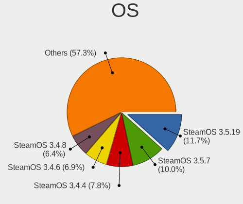
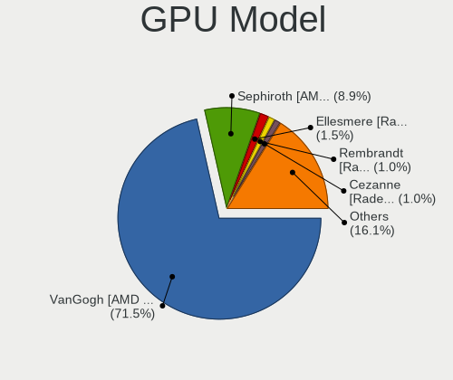
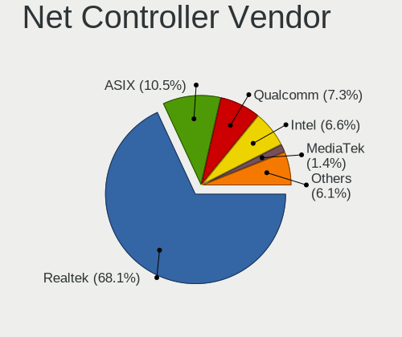
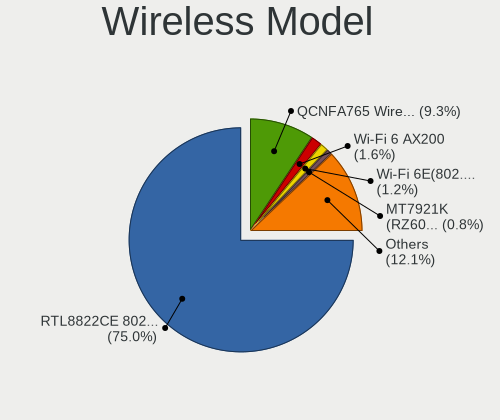
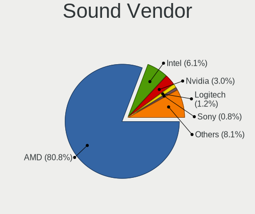

SteamOS - Tested Hardware & Statistics
--------------------------------------

A project to collect tested hardware configurations for SteamOS.

Anyone can contribute to this report by the [hw-probe](https://github.com/linuxhw/hw-probe) tool:

    sudo -E hw-probe -all -upload

Please contribute! Especially if your hardware is rare.

This is a report for all computer types. See also reports for [desktops](/Dist/SteamOS/Desktop/README.md) and [notebooks](/Dist/SteamOS/Notebook/README.md).

Contents
--------

* [ Test Cases ](#test-cases)

* [ System ](#system)
  - [ OS                       ](#os)
  - [ OS Family                ](#os-family)
  - [ Kernel                   ](#kernel)
  - [ Kernel Family            ](#kernel-family)
  - [ Kernel Major Ver.        ](#kernel-major-ver)
  - [ Arch                     ](#arch)
  - [ DE                       ](#de)
  - [ Display Server           ](#display-server)
  - [ Display Manager          ](#display-manager)
  - [ OS Lang                  ](#os-lang)
  - [ Boot Mode                ](#boot-mode)
  - [ Filesystem               ](#filesystem)
  - [ Part. scheme             ](#part-scheme)
  - [ Dual Boot with Linux/BSD ](#dual-boot-with-linuxbsd)
  - [ Dual Boot (Win)          ](#dual-boot-win)

* [ Board ](#board)
  - [ Vendor                   ](#vendor)
  - [ Model                    ](#model)
  - [ Model Family             ](#model-family)
  - [ MFG Year                 ](#mfg-year)
  - [ Form Factor              ](#form-factor)
  - [ Secure Boot              ](#secure-boot)
  - [ Coreboot                 ](#coreboot)
  - [ RAM Size                 ](#ram-size)
  - [ RAM Used                 ](#ram-used)
  - [ Total Drives             ](#total-drives)
  - [ Has CD-ROM               ](#has-cd-rom)
  - [ Has Ethernet             ](#has-ethernet)
  - [ Has WiFi                 ](#has-wifi)
  - [ Has Bluetooth            ](#has-bluetooth)

* [ Location ](#location)
  - [ Country                  ](#country)
  - [ City                     ](#city)

* [ Drives ](#drives)
  - [ Drive Vendor             ](#drive-vendor)
  - [ Drive Model              ](#drive-model)
  - [ HDD Vendor               ](#hdd-vendor)
  - [ SSD Vendor               ](#ssd-vendor)
  - [ Drive Kind               ](#drive-kind)
  - [ Drive Connector          ](#drive-connector)
  - [ Drive Size               ](#drive-size)
  - [ Space Total              ](#space-total)
  - [ Space Used               ](#space-used)
  - [ Malfunc. Drives          ](#malfunc-drives)
  - [ Malfunc. Drive Vendor    ](#malfunc-drive-vendor)
  - [ Malfunc. HDD Vendor      ](#malfunc-hdd-vendor)
  - [ Malfunc. Drive Kind      ](#malfunc-drive-kind)
  - [ Failed Drives            ](#failed-drives)
  - [ Failed Drive Vendor      ](#failed-drive-vendor)
  - [ Drive Status             ](#drive-status)

* [ Storage controller ](#storage-controller)
  - [ Storage Vendor           ](#storage-vendor)
  - [ Storage Model            ](#storage-model)
  - [ Storage Kind             ](#storage-kind)

* [ Processor ](#processor)
  - [ CPU Vendor               ](#cpu-vendor)
  - [ CPU Model                ](#cpu-model)
  - [ CPU Model Family         ](#cpu-model-family)
  - [ CPU Cores                ](#cpu-cores)
  - [ CPU Sockets              ](#cpu-sockets)
  - [ CPU Threads              ](#cpu-threads)
  - [ CPU Op-Modes             ](#cpu-op-modes)
  - [ CPU Microcode            ](#cpu-microcode)
  - [ CPU Microarch            ](#cpu-microarch)

* [ Graphics ](#graphics)
  - [ GPU Vendor               ](#gpu-vendor)
  - [ GPU Model                ](#gpu-model)
  - [ GPU Combo                ](#gpu-combo)
  - [ GPU Driver               ](#gpu-driver)
  - [ GPU Memory               ](#gpu-memory)

* [ Monitor ](#monitor)
  - [ Monitor Vendor           ](#monitor-vendor)
  - [ Monitor Model            ](#monitor-model)
  - [ Monitor Resolution       ](#monitor-resolution)
  - [ Monitor Diagonal         ](#monitor-diagonal)
  - [ Monitor Width            ](#monitor-width)
  - [ Aspect Ratio             ](#aspect-ratio)
  - [ Monitor Area             ](#monitor-area)
  - [ Pixel Density            ](#pixel-density)
  - [ Multiple Monitors        ](#multiple-monitors)

* [ Network ](#network)
  - [ Net Controller Vendor    ](#net-controller-vendor)
  - [ Net Controller Model     ](#net-controller-model)
  - [ Wireless Vendor          ](#wireless-vendor)
  - [ Wireless Model           ](#wireless-model)
  - [ Ethernet Vendor          ](#ethernet-vendor)
  - [ Ethernet Model           ](#ethernet-model)
  - [ Net Controller Kind      ](#net-controller-kind)
  - [ Used Controller          ](#used-controller)
  - [ NICs                     ](#nics)
  - [ IPv6                     ](#ipv6)

* [ Bluetooth ](#bluetooth)
  - [ Bluetooth Vendor         ](#bluetooth-vendor)
  - [ Bluetooth Model          ](#bluetooth-model)

* [ Sound ](#sound)
  - [ Sound Vendor             ](#sound-vendor)
  - [ Sound Model              ](#sound-model)

* [ Memory ](#memory)
  - [ Memory Vendor            ](#memory-vendor)
  - [ Memory Model             ](#memory-model)
  - [ Memory Kind              ](#memory-kind)
  - [ Memory Form Factor       ](#memory-form-factor)
  - [ Memory Size              ](#memory-size)
  - [ Memory Speed             ](#memory-speed)

* [ Printers & scanners ](#printers--scanners)
  - [ Printer Vendor           ](#printer-vendor)
  - [ Printer Model            ](#printer-model)
  - [ Scanner Vendor           ](#scanner-vendor)
  - [ Scanner Model            ](#scanner-model)

* [ Camera ](#camera)
  - [ Camera Vendor            ](#camera-vendor)
  - [ Camera Model             ](#camera-model)

* [ Security ](#security)
  - [ Fingerprint Vendor       ](#fingerprint-vendor)
  - [ Fingerprint Model        ](#fingerprint-model)
  - [ Chipcard Vendor          ](#chipcard-vendor)
  - [ Chipcard Model           ](#chipcard-model)

* [ Unsupported ](#unsupported)
  - [ Unsupported Devices      ](#unsupported-devices)
  - [ Unsupported Device Types ](#unsupported-device-types)

Test Cases
----------

Total: 51

| Vendor   | Model                       | Form-Factor | Probe                                                      | Date         |
|----------|-----------------------------|-------------|------------------------------------------------------------|--------------|
| ASRock   | B550 PG Velocita            | Desktop     | [0d7f71a24d](https://linux-hardware.org/?probe=0d7f71a24d) | May 30, 2022 |
| ASRock   | B365M Pro4-F                | Desktop     | [afc161c6fb](https://linux-hardware.org/?probe=afc161c6fb) | May 30, 2022 |
| Valve    | Jupiter                     | Notebook    | [f3910c9796](https://linux-hardware.org/?probe=f3910c9796) | May 29, 2022 |
| Valve    | Jupiter                     | Notebook    | [e415de106f](https://linux-hardware.org/?probe=e415de106f) | May 29, 2022 |
| Valve    | Jupiter                     | Notebook    | [0af4b9c805](https://linux-hardware.org/?probe=0af4b9c805) | May 29, 2022 |
| Valve    | Jupiter                     | Notebook    | [06b56d54d4](https://linux-hardware.org/?probe=06b56d54d4) | May 28, 2022 |
| Gigabyte | B560M AORUS PRO             | Desktop     | [31f246f96e](https://linux-hardware.org/?probe=31f246f96e) | May 27, 2022 |
| Gigabyte | B560M AORUS PRO             | Desktop     | [1d381d6ec9](https://linux-hardware.org/?probe=1d381d6ec9) | May 27, 2022 |
| Valve    | Jupiter                     | Notebook    | [1e966da4f8](https://linux-hardware.org/?probe=1e966da4f8) | May 27, 2022 |
| Valve    | Jupiter                     | Notebook    | [c716690aa2](https://linux-hardware.org/?probe=c716690aa2) | May 27, 2022 |
| Valve    | Jupiter                     | Notebook    | [43f315aa0c](https://linux-hardware.org/?probe=43f315aa0c) | May 27, 2022 |
| Valve    | Jupiter                     | Notebook    | [643322d821](https://linux-hardware.org/?probe=643322d821) | May 26, 2022 |
| Gigabyte | Z170XP-SLI-CF               | Desktop     | [d4bef1e450](https://linux-hardware.org/?probe=d4bef1e450) | May 26, 2022 |
| HP       | Pavilion Gaming Laptop 1... | Notebook    | [b672eefb50](https://linux-hardware.org/?probe=b672eefb50) | May 25, 2022 |
| Valve    | Jupiter                     | Notebook    | [dee0bbedd1](https://linux-hardware.org/?probe=dee0bbedd1) | May 25, 2022 |
| HP       | 8158 A01                    | Mini pc     | [0d32a2b2e3](https://linux-hardware.org/?probe=0d32a2b2e3) | May 24, 2022 |
| ASUSTek  | PN50                        | Mini pc     | [da9b5c2be2](https://linux-hardware.org/?probe=da9b5c2be2) | May 24, 2022 |
| Valve    | Jupiter                     | Notebook    | [c34173715a](https://linux-hardware.org/?probe=c34173715a) | May 24, 2022 |
| Valve    | Jupiter                     | Notebook    | [6ca95b630c](https://linux-hardware.org/?probe=6ca95b630c) | May 23, 2022 |
| Valve    | Jupiter                     | Notebook    | [7d3f9c0a5f](https://linux-hardware.org/?probe=7d3f9c0a5f) | May 23, 2022 |
| Acer     | Aspire A315-23              | Notebook    | [b5d37bf4f2](https://linux-hardware.org/?probe=b5d37bf4f2) | May 22, 2022 |
| Samsung  | 950XDB/951XDB/950XDY        | Notebook    | [fc970670a8](https://linux-hardware.org/?probe=fc970670a8) | May 22, 2022 |
| Valve    | Jupiter                     | Notebook    | [595b06f6c9](https://linux-hardware.org/?probe=595b06f6c9) | May 22, 2022 |
| Valve    | Jupiter                     | Notebook    | [d706d00651](https://linux-hardware.org/?probe=d706d00651) | May 21, 2022 |
| Valve    | Jupiter                     | Notebook    | [317e492fa3](https://linux-hardware.org/?probe=317e492fa3) | May 21, 2022 |
| Valve    | Jupiter                     | Notebook    | [f849597120](https://linux-hardware.org/?probe=f849597120) | May 18, 2022 |
| Valve    | Jupiter                     | Notebook    | [48df6e5c71](https://linux-hardware.org/?probe=48df6e5c71) | May 18, 2022 |
| Valve    | Jupiter                     | Notebook    | [9cf4d23a81](https://linux-hardware.org/?probe=9cf4d23a81) | May 13, 2022 |
| Valve    | Jupiter                     | Notebook    | [79f6db1d69](https://linux-hardware.org/?probe=79f6db1d69) | May 08, 2022 |
| Valve    | Jupiter                     | Notebook    | [771539d18d](https://linux-hardware.org/?probe=771539d18d) | May 03, 2022 |
| Valve    | Jupiter                     | Notebook    | [19d2c51aa6](https://linux-hardware.org/?probe=19d2c51aa6) | May 01, 2022 |
| Valve    | Jupiter                     | Notebook    | [1c826aed5e](https://linux-hardware.org/?probe=1c826aed5e) | Apr 30, 2022 |
| Valve    | Jupiter                     | Notebook    | [4c43342014](https://linux-hardware.org/?probe=4c43342014) | Apr 24, 2022 |
| Valve    | Jupiter                     | Notebook    | [8564bded7f](https://linux-hardware.org/?probe=8564bded7f) | Apr 21, 2022 |
| Valve    | Jupiter                     | Notebook    | [d761657c3a](https://linux-hardware.org/?probe=d761657c3a) | Apr 21, 2022 |
| Valve    | Jupiter                     | Notebook    | [f2e59fcb97](https://linux-hardware.org/?probe=f2e59fcb97) | Apr 20, 2022 |
| Valve    | Jupiter                     | Notebook    | [4f23fab4fd](https://linux-hardware.org/?probe=4f23fab4fd) | Apr 17, 2022 |
| Valve    | Jupiter                     | Notebook    | [ed07e93435](https://linux-hardware.org/?probe=ed07e93435) | Apr 16, 2022 |
| Valve    | Jupiter                     | Notebook    | [48aacdeee8](https://linux-hardware.org/?probe=48aacdeee8) | Apr 15, 2022 |
| Valve    | Jupiter                     | Notebook    | [6a042646dd](https://linux-hardware.org/?probe=6a042646dd) | Apr 14, 2022 |
| Valve    | Jupiter                     | Notebook    | [d4c9dba2a1](https://linux-hardware.org/?probe=d4c9dba2a1) | Apr 14, 2022 |
| Valve    | Jupiter                     | Notebook    | [852b6fb53a](https://linux-hardware.org/?probe=852b6fb53a) | Apr 08, 2022 |
| Valve    | Jupiter                     | Notebook    | [6129b15fb5](https://linux-hardware.org/?probe=6129b15fb5) | Apr 05, 2022 |
| Valve    | Jupiter                     | Notebook    | [ec05067a1d](https://linux-hardware.org/?probe=ec05067a1d) | Apr 03, 2022 |
| Valve    | Jupiter                     | Notebook    | [180c84c856](https://linux-hardware.org/?probe=180c84c856) | Apr 02, 2022 |
| Valve    | Jupiter                     | Notebook    | [d8625616de](https://linux-hardware.org/?probe=d8625616de) | Mar 30, 2022 |
| Valve    | Jupiter                     | Notebook    | [d181a912af](https://linux-hardware.org/?probe=d181a912af) | Mar 23, 2022 |
| Valve    | Jupiter                     | Notebook    | [0b6a21cf35](https://linux-hardware.org/?probe=0b6a21cf35) | Mar 18, 2022 |
| Valve    | Jupiter                     | Notebook    | [85328e8f3d](https://linux-hardware.org/?probe=85328e8f3d) | Mar 17, 2022 |
| Valve    | Jupiter                     | Notebook    | [023aea75e1](https://linux-hardware.org/?probe=023aea75e1) | Mar 14, 2022 |
| Valve    | Jupiter                     | Notebook    | [c7f6388908](https://linux-hardware.org/?probe=c7f6388908) | Mar 11, 2022 |

System
------

OS
--

Installed operating systems

| Name                         | Computers | Percent |
|------------------------------|-----------|---------|
| SteamOS Snapshot             | 26        | 60.47%  |
| SteamOS 3.2                  | 9         | 20.93%  |
| SteamOS 3.1                  | 7         | 16.28%  |
| SteamOS 3.2 (steamdeck-main) | 1         | 2.33%   |

OS Family
---------

OS without a version

| Name    | Computers | Percent |
|---------|-----------|---------|
| SteamOS | 43        | 100%    |

Kernel
------

Version of the Linux kernel

| Version                                            | Computers | Percent |
|----------------------------------------------------|-----------|---------|
| 5.13.0-valve10.1-1-neptune-02144-g7fffaf925dfb     | 16        | 37.21%  |
| 5.13.0-valve10.3-1-neptune-02176-g5fe416c4acd8     | 9         | 20.93%  |
| 5.13.0-valve10.1-2-neptune-dri-02144-g7fffaf925dfb | 8         | 18.6%   |
| 5.13.0-valve14-1-neptune-02195-g5b0f749d00fa       | 5         | 11.63%  |
| 5.13.0-valve15-1-neptune-02197-gf6ec7ad3762a       | 4         | 9.3%    |
| 5.16.2-arch1-1                                     | 1         | 2.33%   |

Kernel Family
-------------

Linux kernel without a distro release

| Version | Computers | Percent |
|---------|-----------|---------|
| 5.13.0  | 42        | 97.67%  |
| 5.16.2  | 1         | 2.33%   |

Kernel Major Ver.
-----------------

Linux kernel major version

| Version | Computers | Percent |
|---------|-----------|---------|
| 5.13    | 42        | 97.67%  |
| 5.16    | 1         | 2.33%   |

Arch
----

OS architecture (x86_64, i586, etc.)

| Name   | Computers | Percent |
|--------|-----------|---------|
| x86_64 | 43        | 100%    |

DE
--

Desktop Environment

| Name    | Computers | Percent |
|---------|-----------|---------|
| KDE5    | 42        | 97.67%  |
| Unknown | 1         | 2.33%   |

Display Server
--------------

X11 or Wayland

| Name | Computers | Percent |
|------|-----------|---------|
| X11  | 43        | 100%    |

Display Manager
---------------

SDDM, LightDM, etc.

| Name    | Computers | Percent |
|---------|-----------|---------|
| Unknown | 43        | 100%    |

OS Lang
-------

Language

| Lang  | Computers | Percent |
|-------|-----------|---------|
| en_US | 36        | 83.72%  |
| pt_BR | 1         | 2.33%   |
| it_IT | 1         | 2.33%   |
| fr_FR | 1         | 2.33%   |
| es_ES | 1         | 2.33%   |
| en_IE | 1         | 2.33%   |
| en_GB | 1         | 2.33%   |
| an_ES | 1         | 2.33%   |

Boot Mode
---------

EFI or BIOS

| Mode | Computers | Percent |
|------|-----------|---------|
| BIOS | 42        | 97.67%  |
| EFI  | 1         | 2.33%   |

Filesystem
----------

Type of filesystem

| Type  | Computers | Percent |
|-------|-----------|---------|
| Btrfs | 43        | 100%    |

Part. scheme
------------

Scheme of partitioning

| Type    | Computers | Percent |
|---------|-----------|---------|
| Unknown | 42        | 97.67%  |
| GPT     | 1         | 2.33%   |

Dual Boot with Linux/BSD
------------------------

Hosting more than one Linux/BSD

| Dual boot | Computers | Percent |
|-----------|-----------|---------|
| No        | 42        | 97.67%  |
| Yes       | 1         | 2.33%   |

Dual Boot (Win)
---------------

Hosting Linux and Windows

| Dual boot | Computers | Percent |
|-----------|-----------|---------|
| No        | 43        | 100%    |

Board
-----

Vendor
------

Motherboard manufacturer

| Name                | Computers | Percent |
|---------------------|-----------|---------|
| Valve               | 34        | 79.07%  |
| Hewlett-Packard     | 2         | 4.65%   |
| Gigabyte Technology | 2         | 4.65%   |
| ASRock              | 2         | 4.65%   |
| Samsung Electronics | 1         | 2.33%   |
| ASUSTek Computer    | 1         | 2.33%   |
| Acer                | 1         | 2.33%   |

Model
-----

Motherboard model

| Name                                | Computers | Percent |
|-------------------------------------|-----------|---------|
| Valve Jupiter                       | 34        | 79.07%  |
| Samsung 950XDB/951XDB/950XDY        | 1         | 2.33%   |
| HP t630 Thin Client                 | 1         | 2.33%   |
| HP Pavilion Gaming Laptop 15-dk0xxx | 1         | 2.33%   |
| Gigabyte MBB-670016                 | 1         | 2.33%   |
| Gigabyte B560M AORUS PRO            | 1         | 2.33%   |
| ASUS MINIPC PN50                    | 1         | 2.33%   |
| ASRock B550 PG Velocita             | 1         | 2.33%   |
| ASRock B365M Pro4-F                 | 1         | 2.33%   |
| Acer Aspire A315-23                 | 1         | 2.33%   |

Model Family
------------

Motherboard model prefix

| Name                | Computers | Percent |
|---------------------|-----------|---------|
| Valve Jupiter       | 34        | 79.07%  |
| Samsung 950XDB      | 1         | 2.33%   |
| HP t630             | 1         | 2.33%   |
| HP Pavilion         | 1         | 2.33%   |
| Gigabyte MBB-670016 | 1         | 2.33%   |
| Gigabyte B560M      | 1         | 2.33%   |
| ASUS MINIPC         | 1         | 2.33%   |
| ASRock B550         | 1         | 2.33%   |
| ASRock B365M        | 1         | 2.33%   |
| Acer Aspire         | 1         | 2.33%   |

MFG Year
--------

Motherboard manufacture year

| Year    | Computers | Percent |
|---------|-----------|---------|
| 2022    | 23        | 53.49%  |
| Unknown | 12        | 27.91%  |
| 2020    | 3         | 6.98%   |
| 2019    | 2         | 4.65%   |
| 2021    | 1         | 2.33%   |
| 2018    | 1         | 2.33%   |
| 2017    | 1         | 2.33%   |

Form Factor
-----------

Physical design of the computer

| Name     | Computers | Percent |
|----------|-----------|---------|
| Notebook | 37        | 86.05%  |
| Desktop  | 4         | 9.3%    |
| Mini pc  | 2         | 4.65%   |

Secure Boot
-----------

Enabled or disabled

| State    | Computers | Percent |
|----------|-----------|---------|
| Disabled | 43        | 100%    |

Coreboot
--------

Have coreboot on board

| Used | Computers | Percent |
|------|-----------|---------|
| No   | 43        | 100%    |

RAM Size
--------

Total RAM memory

| Size in GB | Computers | Percent |
|------------|-----------|---------|
| 8.01-16.0  | 35        | 81.4%   |
| 16.01-24.0 | 3         | 6.98%   |
| 4.01-8.0   | 2         | 4.65%   |
| 24.01-32.0 | 2         | 4.65%   |
| 32.01-64.0 | 1         | 2.33%   |

RAM Used
--------

Used RAM memory

| Used GB  | Computers | Percent |
|----------|-----------|---------|
| 2.01-3.0 | 19        | 43.18%  |
| 3.01-4.0 | 12        | 27.27%  |
| 4.01-8.0 | 7         | 15.91%  |
| 1.01-2.0 | 6         | 13.64%  |

Total Drives
------------

Number of drives on board

| Drives | Computers | Percent |
|--------|-----------|---------|
| 2      | 29        | 65.91%  |
| 1      | 11        | 25%     |
| 3      | 2         | 4.55%   |
| 7      | 1         | 2.27%   |
| 4      | 1         | 2.27%   |

Has CD-ROM
----------

Has CD-ROM on board

| Presented | Computers | Percent |
|-----------|-----------|---------|
| No        | 42        | 97.67%  |
| Yes       | 1         | 2.33%   |

Has Ethernet
------------

Has Ethernet on board

| Presented | Computers | Percent |
|-----------|-----------|---------|
| No        | 32        | 74.42%  |
| Yes       | 11        | 25.58%  |

Has WiFi
--------

Has WiFi module

| Presented | Computers | Percent |
|-----------|-----------|---------|
| Yes       | 41        | 95.35%  |
| No        | 2         | 4.65%   |

Has Bluetooth
-------------

Has Bluetooth module

| Presented | Computers | Percent |
|-----------|-----------|---------|
| Yes       | 39        | 90.7%   |
| No        | 4         | 9.3%    |

Location
--------

Country
-------

Geographic location (country)

| Country     | Computers | Percent |
|-------------|-----------|---------|
| USA         | 14        | 32.56%  |
| UK          | 8         | 18.6%   |
| Germany     | 5         | 11.63%  |
| Netherlands | 3         | 6.98%   |
| Spain       | 2         | 4.65%   |
| France      | 2         | 4.65%   |
| Poland      | 1         | 2.33%   |
| Latvia      | 1         | 2.33%   |
| Italy       | 1         | 2.33%   |
| Ireland     | 1         | 2.33%   |
| Hungary     | 1         | 2.33%   |
| Canada      | 1         | 2.33%   |
| Brazil      | 1         | 2.33%   |
| Austria     | 1         | 2.33%   |
| Australia   | 1         | 2.33%   |

City
----

Geographic location (city)

| City            | Computers | Percent |
|-----------------|-----------|---------|
| Wokingham       | 1         | 2.27%   |
| Whitley Bay     | 1         | 2.27%   |
| Warsaw          | 1         | 2.27%   |
| Tuam            | 1         | 2.27%   |
| Treviso         | 1         | 2.27%   |
| Torre del Mar   | 1         | 2.27%   |
| Tilburg         | 1         | 2.27%   |
| St Louis        | 1         | 2.27%   |
| Spanish Fork    | 1         | 2.27%   |
| Shepperton      | 1         | 2.27%   |
| Seattle         | 1         | 2.27%   |
| Sacramento      | 1         | 2.27%   |
| Rueil-Malmaison | 1         | 2.27%   |
| Rohnert Park    | 1         | 2.27%   |
| Riga            | 1         | 2.27%   |
| Reignier-Esery  | 1         | 2.27%   |
| Perth           | 1         | 2.27%   |
| Nuremberg       | 1         | 2.27%   |
| Newberg         | 1         | 2.27%   |
| Mooresville     | 1         | 2.27%   |
| Manchester      | 1         | 2.27%   |
| Lodi            | 1         | 2.27%   |
| Leicester       | 1         | 2.27%   |
| Klagenfurt      | 1         | 2.27%   |
| Kenosha         | 1         | 2.27%   |
| Hornsea         | 1         | 2.27%   |
| Heerhugowaard   | 1         | 2.27%   |
| Germantown      | 1         | 2.27%   |
| Dresden         | 1         | 2.27%   |
| Dallas          | 1         | 2.27%   |
| Charlotte       | 1         | 2.27%   |
| Budapest        | 1         | 2.27%   |
| Bromley         | 1         | 2.27%   |
| Bremen          | 1         | 2.27%   |
| Brantford       | 1         | 2.27%   |
| Birmingham      | 1         | 2.27%   |
| Berlin          | 1         | 2.27%   |
| Barakaldo       | 1         | 2.27%   |
| Bamberg         | 1         | 2.27%   |
| Atlanta         | 1         | 2.27%   |
| Arbroath        | 1         | 2.27%   |
| Amsterdam       | 1         | 2.27%   |
| Americana       | 1         | 2.27%   |
| Aliso Viejo     | 1         | 2.27%   |

Drives
------

Drive Vendor
------------

Hard drive vendors

| Vendor                         | Computers | Drives | Percent |
|--------------------------------|-----------|--------|---------|
| Unknown                        | 20        | 20     | 25%     |
| Phison                         | 17        | 17     | 21.25%  |
| Kingston                       | 11        | 11     | 13.75%  |
| Samsung Electronics            | 6         | 11     | 7.5%    |
| Unknown                        | 6         | 6      | 7.5%    |
| O2 Micro                       | 5         | 5      | 6.25%   |
| WDC                            | 3         | 4      | 3.75%   |
| Toshiba                        | 2         | 3      | 2.5%    |
| Silicon Motion                 | 2         | 2      | 2.5%    |
| Union Memory (Shenzhen)        | 1         | 1      | 1.25%   |
| Solid State Storage Technology | 1         | 1      | 1.25%   |
| Seagate                        | 1         | 1      | 1.25%   |
| PNY                            | 1         | 1      | 1.25%   |
| Lexar 25                       | 1         | 1      | 1.25%   |
| JMicron                        | 1         | 1      | 1.25%   |
| HP Phison                      | 1         | 1      | 1.25%   |
| A-DATA Technology              | 1         | 1      | 1.25%   |

Drive Model
-----------

Hard drive models

| Model                                        | Computers | Percent |
|----------------------------------------------|-----------|---------|
| Phison NVMe SSD Drive 512GB                  | 9         | 10.59%  |
| Unknown MMC Card  512GB                      | 8         | 9.41%   |
| Phison NVMe SSD Drive 256GB                  | 6         | 7.06%   |
| Unknown                                      | 6         | 7.06%   |
| O2 Micro NVMe SSD Drive 64GB                 | 5         | 5.88%   |
| Kingston NVMe SSD Drive 512GB                | 5         | 5.88%   |
| Kingston NVMe SSD Drive 256GB                | 5         | 5.88%   |
| Samsung NVMe SSD Drive 512GB                 | 3         | 3.53%   |
| Unknown MMC Card  393GB                      | 2         | 2.35%   |
| Unknown MMC Card  256GB                      | 2         | 2.35%   |
| Silicon Motion NVMe SSD Drive 256GB          | 2         | 2.35%   |
| Samsung SSD 860 EVO 250GB                    | 2         | 2.35%   |
| WDC WD5000BPKT-60PK4T0 500GB                 | 1         | 1.18%   |
| WDC WD10SPZX-75Z10T2 1TB                     | 1         | 1.18%   |
| WDC WD10EURX-83UY4Y0 1TB                     | 1         | 1.18%   |
| WDC CH SN530 SDBPTPZ-1T00-1024 930GB         | 1         | 1.18%   |
| Unknown MMC Card  64GB                       | 1         | 1.18%   |
| Unknown MMC Card  498GB                      | 1         | 1.18%   |
| Unknown MMC Card  32GB                       | 1         | 1.18%   |
| Unknown MMC Card  248GB                      | 1         | 1.18%   |
| Unknown MMC Card  1TB                        | 1         | 1.18%   |
| Unknown MMC Card  196GB                      | 1         | 1.18%   |
| Unknown MMC Card  128GB                      | 1         | 1.18%   |
| Unknown MMC Card  1048GB                     | 1         | 1.18%   |
| Union Memory (Shenzhen) NVMe SSD Drive 128GB | 1         | 1.18%   |
| Toshiba MQ01ABD100 1TB                       | 1         | 1.18%   |
| Toshiba MK3275GSX 320GB                      | 1         | 1.18%   |
| Toshiba KBG30ZMS128G 128GB NVMe SSD          | 1         | 1.18%   |
| Solid State Storage NVMe SSD Drive 128GB     | 1         | 1.18%   |
| Seagate ST3160318AS 160GB                    | 1         | 1.18%   |
| Samsung SSD 850 EVO mSATA 500GB              | 1         | 1.18%   |
| Samsung SSD 850 EVO 250GB                    | 1         | 1.18%   |
| Samsung SSD 840 EVO 250GB                    | 1         | 1.18%   |
| Samsung NVMe SSD Drive 1TB                   | 1         | 1.18%   |
| PNY CS1311 240GB SSD                         | 1         | 1.18%   |
| Phison NVMe SSD Drive 250GB                  | 1         | 1.18%   |
| Phison NVMe SSD Drive 128GB                  | 1         | 1.18%   |
| Lexar 25 6GB SSD                             | 1         | 1.18%   |
| Kingston SA400M8240G 240GB SSD               | 1         | 1.18%   |
| JMicron Generic 128GB                        | 1         | 1.18%   |
| HP Phison PSSBN032GA27MC1 32GB               | 1         | 1.18%   |
| A-DATA SU650 240GB SSD                       | 1         | 1.18%   |

HDD Vendor
----------

Hard disk drive vendors

| Vendor  | Computers | Drives | Percent |
|---------|-----------|--------|---------|
| WDC     | 2         | 3      | 50%     |
| Toshiba | 1         | 2      | 25%     |
| Seagate | 1         | 1      | 25%     |

SSD Vendor
----------

Solid state drive vendors

| Vendor              | Computers | Drives | Percent |
|---------------------|-----------|--------|---------|
| Samsung Electronics | 4         | 5      | 40%     |
| PNY                 | 1         | 1      | 10%     |
| Lexar 25            | 1         | 1      | 10%     |
| Kingston            | 1         | 1      | 10%     |
| JMicron             | 1         | 1      | 10%     |
| HP Phison           | 1         | 1      | 10%     |
| A-DATA Technology   | 1         | 1      | 10%     |

Drive Kind
----------

HDD or SSD

| Kind | Computers | Drives | Percent |
|------|-----------|--------|---------|
| NVMe | 42        | 44     | 54.55%  |
| MMC  | 25        | 26     | 32.47%  |
| SSD  | 8         | 11     | 10.39%  |
| HDD  | 2         | 6      | 2.6%    |

Drive Connector
---------------

SATA, SAS, NVMe, etc.

| Type | Computers | Drives | Percent |
|------|-----------|--------|---------|
| NVMe | 42        | 44     | 55.26%  |
| MMC  | 25        | 26     | 32.89%  |
| SATA | 7         | 15     | 9.21%   |
| SAS  | 2         | 2      | 2.63%   |

Drive Size
----------

Size of hard drive

| Size in TB | Computers | Drives | Percent |
|------------|-----------|--------|---------|
| 0.01-0.5   | 8         | 14     | 80%     |
| 0.51-1.0   | 2         | 3      | 20%     |

Space Total
-----------

Amount of disk space available on the file system

| Size in GB | Computers | Percent |
|------------|-----------|---------|
| 101-250    | 19        | 44.19%  |
| 251-500    | 14        | 32.56%  |
| 501-1000   | 5         | 11.63%  |
| 51-100     | 4         | 9.3%    |
| 21-50      | 1         | 2.33%   |

Space Used
----------

Amount of used disk space

| Used GB  | Computers | Percent |
|----------|-----------|---------|
| 101-250  | 16        | 36.36%  |
| 21-50    | 9         | 20.45%  |
| 1-20     | 8         | 18.18%  |
| 251-500  | 7         | 15.91%  |
| 51-100   | 3         | 6.82%   |
| 501-1000 | 1         | 2.27%   |

Malfunc. Drives
---------------

Drive models with a malfunction

Zero info for selected period =(

Malfunc. Drive Vendor
---------------------

Vendors of faulty drives

Zero info for selected period =(

Malfunc. HDD Vendor
-------------------

Vendors of faulty HDD drives

Zero info for selected period =(

Malfunc. Drive Kind
-------------------

Kinds of faulty drives

Zero info for selected period =(

Failed Drives
-------------

Failed drive models

Zero info for selected period =(

Failed Drive Vendor
-------------------

Failed drive vendors

Zero info for selected period =(

Drive Status
------------

Number of failed and malfunc. drives

| Status   | Computers | Drives | Percent |
|----------|-----------|--------|---------|
| Detected | 43        | 86     | 97.73%  |
| Works    | 1         | 1      | 2.27%   |

Storage controller
------------------

Storage Vendor
--------------

Storage controller vendors

| Vendor                         | Computers | Percent |
|--------------------------------|-----------|---------|
| Phison Electronics             | 17        | 34%     |
| Kingston Technology Company    | 10        | 20%     |
| O2 Micro                       | 5         | 10%     |
| Samsung Electronics            | 4         | 8%      |
| Intel                          | 4         | 8%      |
| AMD                            | 4         | 8%      |
| Silicon Motion                 | 2         | 4%      |
| Union Memory (Shenzhen)        | 1         | 2%      |
| Toshiba America Info Systems   | 1         | 2%      |
| Solid State Storage Technology | 1         | 2%      |
| Sandisk                        | 1         | 2%      |

Storage Model
-------------

Storage controller models

| Model                                                                         | Computers | Percent |
|-------------------------------------------------------------------------------|-----------|---------|
| Phison PS5013 E13 NVMe Controller                                             | 16        | 31.37%  |
| Kingston Company OM3PDP3 NVMe SSD                                             | 10        | 19.61%  |
| O2 Micro Non-Volatile memory controller                                       | 5         | 9.8%    |
| AMD FCH SATA Controller [AHCI mode]                                           | 3         | 5.88%   |
| Silicon Motion SM2263EN/SM2263XT SSD Controller                               | 2         | 3.92%   |
| Samsung NVMe SSD Controller 980                                               | 2         | 3.92%   |
| Union Memory (Shenzhen) Non-Volatile memory controller                        | 1         | 1.96%   |
| Toshiba America Info Systems BG3 NVMe SSD Controller                          | 1         | 1.96%   |
| Solid State Storage Non-Volatile memory controller                            | 1         | 1.96%   |
| Sandisk PC SN530 NVMe SSD                                                     | 1         | 1.96%   |
| Samsung NVMe SSD Controller SM981/PM981/PM983                                 | 1         | 1.96%   |
| Samsung NVMe SSD Controller SM951/PM951                                       | 1         | 1.96%   |
| Samsung NVMe SSD Controller PM9A1/PM9A3/980PRO                                | 1         | 1.96%   |
| Phison Electronics Non-Volatile memory controller                             | 1         | 1.96%   |
| Intel Q170/Q150/B150/H170/H110/Z170/CM236 Chipset SATA Controller [AHCI Mode] | 1         | 1.96%   |
| Intel 82801 Mobile SATA Controller [RAID mode]                                | 1         | 1.96%   |
| Intel 500 Series Chipset Family SATA AHCI Controller                          | 1         | 1.96%   |
| Intel 200 Series PCH SATA controller [AHCI mode]                              | 1         | 1.96%   |
| AMD 500 Series Chipset SATA Controller                                        | 1         | 1.96%   |

Storage Kind
------------

Kind of storage controller (IDE, SATA, NVMe, SAS, ...)

| Kind | Computers | Percent |
|------|-----------|---------|
| NVMe | 42        | 84%     |
| SATA | 7         | 14%     |
| RAID | 1         | 2%      |

Processor
---------

CPU Vendor
----------

Processor vendors

| Vendor | Computers | Percent |
|--------|-----------|---------|
| AMD    | 38        | 88.37%  |
| Intel  | 5         | 11.63%  |

CPU Model
---------

Processor models

| Model                                         | Computers | Percent |
|-----------------------------------------------|-----------|---------|
| AMD Custom APU 0405                           | 34        | 79.07%  |
| Intel Core i7-6700K CPU @ 4.00GHz             | 1         | 2.33%   |
| Intel Core i5-9300H CPU @ 2.40GHz             | 1         | 2.33%   |
| Intel Core i5-8500T CPU @ 2.10GHz             | 1         | 2.33%   |
| Intel 11th Gen Core i7-1165G7 @ 2.80GHz       | 1         | 2.33%   |
| Intel 11th Gen Core i5-11400F @ 2.60GHz       | 1         | 2.33%   |
| AMD Ryzen 9 3900X 12-Core Processor           | 1         | 2.33%   |
| AMD Ryzen 5 4500U with Radeon Graphics        | 1         | 2.33%   |
| AMD Ryzen 5 3500U with Radeon Vega Mobile Gfx | 1         | 2.33%   |
| AMD Embedded G-Series GX-420GI Radeon R7E     | 1         | 2.33%   |

CPU Model Family
----------------

Processor model prefix

| Model         | Computers | Percent |
|---------------|-----------|---------|
| Other         | 36        | 83.72%  |
| Intel Core i5 | 2         | 4.65%   |
| AMD Ryzen 5   | 2         | 4.65%   |
| Intel Core i7 | 1         | 2.33%   |
| AMD Ryzen 9   | 1         | 2.33%   |
| AMD Embedded  | 1         | 2.33%   |

CPU Cores
---------

Number of processor cores

| Number | Computers | Percent |
|--------|-----------|---------|
| 4      | 38        | 88.37%  |
| 6      | 3         | 6.98%   |
| 12     | 1         | 2.33%   |
| 2      | 1         | 2.33%   |

CPU Sockets
-----------

Number of sockets

| Number | Computers | Percent |
|--------|-----------|---------|
| 1      | 43        | 100%    |

CPU Threads
-----------

Threads per core (Hyper-Threading)

| Number | Computers | Percent |
|--------|-----------|---------|
| 2      | 41        | 95.35%  |
| 1      | 2         | 4.65%   |

CPU Op-Modes
------------

CPU Operation Modes (32-bit, 64-bit)

| Op mode        | Computers | Percent |
|----------------|-----------|---------|
| 32-bit, 64-bit | 43        | 100%    |

CPU Microcode
-------------

Microcode number

| Number     | Computers | Percent |
|------------|-----------|---------|
| Unknown    | 42        | 97.67%  |
| 0x08900201 | 1         | 2.33%   |

CPU Microarch
-------------

Microarchitecture

| Name      | Computers | Percent |
|-----------|-----------|---------|
| Unknown   | 35        | 81.4%   |
| Zen 2     | 2         | 4.65%   |
| KabyLake  | 2         | 4.65%   |
| Zen+      | 1         | 2.33%   |
| TigerLake | 1         | 2.33%   |
| Skylake   | 1         | 2.33%   |
| Excavator | 1         | 2.33%   |

Graphics
--------

GPU Vendor
----------

Vendors of graphics cards

| Vendor | Computers | Percent |
|--------|-----------|---------|
| AMD    | 41        | 89.13%  |
| Intel  | 4         | 8.7%    |
| Nvidia | 1         | 2.17%   |

GPU Model
---------

Graphics card models

| Model                                                                | Computers | Percent |
|----------------------------------------------------------------------|-----------|---------|
| AMD VanGogh [AMD Custom GPU 0405]                                    | 34        | 73.91%  |
| Nvidia GP107M [GeForce GTX 1050 3 GB Max-Q]                          | 1         | 2.17%   |
| Intel TigerLake-LP GT2 [Iris Xe Graphics]                            | 1         | 2.17%   |
| Intel HD Graphics 530                                                | 1         | 2.17%   |
| Intel CoffeeLake-S GT2 [UHD Graphics 630]                            | 1         | 2.17%   |
| Intel CoffeeLake-H GT2 [UHD Graphics 630]                            | 1         | 2.17%   |
| AMD Wani [Radeon R5/R6/R7 Graphics]                                  | 1         | 2.17%   |
| AMD Renoir                                                           | 1         | 2.17%   |
| AMD Picasso/Raven 2 [Radeon Vega Series / Radeon Vega Mobile Series] | 1         | 2.17%   |
| AMD Navi 22 [Radeon RX 6700/6700 XT/6750 XT / 6800M]                 | 1         | 2.17%   |
| AMD Navi 21 [Radeon RX 6800/6800 XT / 6900 XT]                       | 1         | 2.17%   |
| AMD Lexa PRO [Radeon 540/540X/550/550X / RX 540X/550/550X]           | 1         | 2.17%   |
| AMD Ellesmere [Radeon RX 470/480/570/570X/580/580X/590]              | 1         | 2.17%   |

GPU Combo
---------

Combinations of graphics cards

| Name           | Computers | Percent |
|----------------|-----------|---------|
| 1 x AMD        | 41        | 95.35%  |
| Intel + Nvidia | 1         | 2.33%   |
| 1 x Intel      | 1         | 2.33%   |

GPU Driver
----------

Free vs proprietary

| Driver | Computers | Percent |
|--------|-----------|---------|
| Free   | 43        | 100%    |

GPU Memory
----------

Total video memory

| Size in GB | Computers | Percent |
|------------|-----------|---------|
| Unknown    | 42        | 97.67%  |
| 0.51-1.0   | 1         | 2.33%   |

Monitor
-------

Monitor Vendor
--------------

Monitor vendors

| Vendor               | Computers | Percent |
|----------------------|-----------|---------|
| ANX                  | 32        | 69.57%  |
| Samsung Electronics  | 3         | 6.52%   |
| ___                  | 1         | 2.17%   |
| Unknown              | 1         | 2.17%   |
| Philips              | 1         | 2.17%   |
| Goldstar             | 1         | 2.17%   |
| EXP                  | 1         | 2.17%   |
| Denver               | 1         | 2.17%   |
| Dell                 | 1         | 2.17%   |
| BOE                  | 1         | 2.17%   |
| AU Optronics         | 1         | 2.17%   |
| Ancor Communications | 1         | 2.17%   |
| Acer                 | 1         | 2.17%   |

Monitor Model
-------------

Monitor models

| Model                                                                  | Computers | Percent |
|------------------------------------------------------------------------|-----------|---------|
| ANX ANX7530 U ANX7539 800x1280                                         | 32        | 69.57%  |
| ___ LCDTV16 ___9000 1360x768                                           | 1         | 2.17%   |
| Unknown LCDTV16 9000 1360x768 1600x900mm 72.3-inch                     | 1         | 2.17%   |
| Samsung Electronics T24C300 SAM0A9B 1920x1080 531x299mm 24.0-inch      | 1         | 2.17%   |
| Samsung Electronics LCD Monitor SDC4159 1920x1080 344x194mm 15.5-inch  | 1         | 2.17%   |
| Samsung Electronics LC49G95T SAM7053 3840x1080 1193x336mm 48.8-inch    | 1         | 2.17%   |
| Philips PHL 345B1C PHL093D 3440x1440 797x334mm 34.0-inch               | 1         | 2.17%   |
| Goldstar TV SSCR GSMC0C8 3840x2160                                     | 1         | 2.17%   |
| EXP EPDP17.1127 EXP9632 1920x1080 1150x650mm 52.0-inch                 | 1         | 2.17%   |
| Denver 274K144IGHUCA LHC2700 3840x2160 597x336mm 27.0-inch             | 1         | 2.17%   |
| Dell U2715H DELD069 2560x1440 597x336mm 27.0-inch                      | 1         | 2.17%   |
| BOE LCD Monitor BOE0852 1920x1080 344x194mm 15.5-inch                  | 1         | 2.17%   |
| AU Optronics LCD Monitor AUO81EC 1366x768 344x193mm 15.5-inch          | 1         | 2.17%   |
| Ancor Communications ASUS VH242H ACI24F3 1920x1080 521x293mm 23.5-inch | 1         | 2.17%   |
| Acer VG240Y S ACR0750 1920x1080 527x296mm 23.8-inch                    | 1         | 2.17%   |

Monitor Resolution
------------------

Monitor screen resolution

| Resolution       | Computers | Percent |
|------------------|-----------|---------|
| 800x1280         | 32        | 69.57%  |
| 1920x1080 (FHD)  | 6         | 13.04%  |
| 3840x2160 (4K)   | 2         | 4.35%   |
| 3840x1080        | 1         | 2.17%   |
| 3440x1440        | 1         | 2.17%   |
| 2560x1440 (QHD)  | 1         | 2.17%   |
| 1440x900 (WXGA+) | 1         | 2.17%   |
| 1366x768 (WXGA)  | 1         | 2.17%   |
| 1360x768         | 1         | 2.17%   |

Monitor Diagonal
----------------

Diagonal size in inches

| Inches  | Computers | Percent |
|---------|-----------|---------|
| Unknown | 33        | 71.74%  |
| 15      | 3         | 6.52%   |
| 72      | 2         | 4.35%   |
| 27      | 2         | 4.35%   |
| 24      | 2         | 4.35%   |
| 52      | 1         | 2.17%   |
| 48      | 1         | 2.17%   |
| 34      | 1         | 2.17%   |
| 23      | 1         | 2.17%   |

Monitor Width
-------------

Physical width

| Width in mm | Computers | Percent |
|-------------|-----------|---------|
| Unknown     | 33        | 71.74%  |
| 501-600     | 5         | 10.87%  |
| 301-350     | 3         | 6.52%   |
| 1501-2000   | 2         | 4.35%   |
| 1001-1500   | 2         | 4.35%   |
| 701-800     | 1         | 2.17%   |

Aspect Ratio
------------

Proportional relationship between the width and the height

| Ratio | Computers | Percent |
|-------|-----------|---------|
| 0.62  | 32        | 71.11%  |
| 16/9  | 11        | 24.44%  |
| 32/9  | 1         | 2.22%   |
| 21/9  | 1         | 2.22%   |

Monitor Area
------------

Area in inch²

| Area in inch² | Computers | Percent |
|----------------|-----------|---------|
| Unknown        | 33        | 71.74%  |
| More than 1000 | 3         | 6.52%   |
| 201-250        | 3         | 6.52%   |
| 101-110        | 3         | 6.52%   |
| 301-350        | 2         | 4.35%   |
| 351-500        | 1         | 2.17%   |
| 501-1000       | 1         | 2.17%   |

Pixel Density
-------------

Pixels per inch

| Density | Computers | Percent |
|---------|-----------|---------|
| Unknown | 33        | 71.74%  |
| 51-100  | 5         | 10.87%  |
| 101-120 | 4         | 8.7%    |
| 1-50    | 2         | 4.35%   |
| 121-160 | 2         | 4.35%   |

Multiple Monitors
-----------------

Total monitors connected

| Total | Computers | Percent |
|-------|-----------|---------|
| 1     | 40        | 93.02%  |
| 2     | 3         | 6.98%   |

Network
-------

Net Controller Vendor
---------------------

Controller vendors

| Vendor                | Computers | Percent |
|-----------------------|-----------|---------|
| Realtek Semiconductor | 39        | 76.47%  |
| Intel                 | 6         | 11.76%  |
| Microsoft             | 2         | 3.92%   |
| Qualcomm Atheros      | 1         | 1.96%   |
| Google                | 1         | 1.96%   |
| DisplayLink           | 1         | 1.96%   |
| AVM                   | 1         | 1.96%   |

Net Controller Model
--------------------

Controller models

| Model                                                             | Computers | Percent |
|-------------------------------------------------------------------|-----------|---------|
| Realtek RTL8822CE 802.11ac PCIe Wireless Network Adapter          | 34        | 61.82%  |
| Realtek RTL8111/8168/8411 PCI Express Gigabit Ethernet Controller | 4         | 7.27%   |
| Intel Wi-Fi 6 AX200                                               | 3         | 5.45%   |
| Realtek RTL8153 Gigabit Ethernet Adapter                          | 2         | 3.64%   |
| Intel Ethernet Connection (2) I219-V                              | 2         | 3.64%   |
| Realtek RTL8822BE 802.11a/b/g/n/ac WiFi adapter                   | 1         | 1.82%   |
| Realtek RTL8125 2.5GbE Controller                                 | 1         | 1.82%   |
| Qualcomm Atheros QCA9377 802.11ac Wireless Network Adapter        | 1         | 1.82%   |
| Microsoft XBOX ACC                                                | 1         | 1.82%   |
| Microsoft Xbox 360 Wireless Adapter                               | 1         | 1.82%   |
| Intel Wi-Fi 6 AX210/AX211/AX411 160MHz                            | 1         | 1.82%   |
| Intel Ethernet Controller I225-V                                  | 1         | 1.82%   |
| Google Nexus/Pixel Device (tether)                                | 1         | 1.82%   |
| DisplayLink USB3.0 5K Graphic Docking                             | 1         | 1.82%   |
| AVM FRITZ!WLAN AC 860                                             | 1         | 1.82%   |

Wireless Vendor
---------------

Wireless vendors

| Vendor                | Computers | Percent |
|-----------------------|-----------|---------|
| Realtek Semiconductor | 35        | 81.4%   |
| Intel                 | 4         | 9.3%    |
| Microsoft             | 2         | 4.65%   |
| Qualcomm Atheros      | 1         | 2.33%   |
| AVM                   | 1         | 2.33%   |

Wireless Model
--------------

Wireless models

| Model                                                      | Computers | Percent |
|------------------------------------------------------------|-----------|---------|
| Realtek RTL8822CE 802.11ac PCIe Wireless Network Adapter   | 34        | 79.07%  |
| Intel Wi-Fi 6 AX200                                        | 3         | 6.98%   |
| Realtek RTL8822BE 802.11a/b/g/n/ac WiFi adapter            | 1         | 2.33%   |
| Qualcomm Atheros QCA9377 802.11ac Wireless Network Adapter | 1         | 2.33%   |
| Microsoft XBOX ACC                                         | 1         | 2.33%   |
| Microsoft Xbox 360 Wireless Adapter                        | 1         | 2.33%   |
| Intel Wi-Fi 6 AX210/AX211/AX411 160MHz                     | 1         | 2.33%   |
| AVM FRITZ!WLAN AC 860                                      | 1         | 2.33%   |

Ethernet Vendor
---------------

Ethernet vendors

| Vendor                | Computers | Percent |
|-----------------------|-----------|---------|
| Realtek Semiconductor | 7         | 58.33%  |
| Intel                 | 3         | 25%     |
| Google                | 1         | 8.33%   |
| DisplayLink           | 1         | 8.33%   |

Ethernet Model
--------------

Ethernet models

| Model                                                             | Computers | Percent |
|-------------------------------------------------------------------|-----------|---------|
| Realtek RTL8111/8168/8411 PCI Express Gigabit Ethernet Controller | 4         | 33.33%  |
| Realtek RTL8153 Gigabit Ethernet Adapter                          | 2         | 16.67%  |
| Intel Ethernet Connection (2) I219-V                              | 2         | 16.67%  |
| Realtek RTL8125 2.5GbE Controller                                 | 1         | 8.33%   |
| Intel Ethernet Controller I225-V                                  | 1         | 8.33%   |
| Google Nexus/Pixel Device (tether)                                | 1         | 8.33%   |
| DisplayLink USB3.0 5K Graphic Docking                             | 1         | 8.33%   |

Net Controller Kind
-------------------

Ethernet, WiFi or modem

| Kind     | Computers | Percent |
|----------|-----------|---------|
| WiFi     | 41        | 78.85%  |
| Ethernet | 11        | 21.15%  |

Used Controller
---------------

Currently used network controller

| Kind     | Computers | Percent |
|----------|-----------|---------|
| WiFi     | 38        | 86.36%  |
| Ethernet | 6         | 13.64%  |

NICs
----

Total network controllers on board

| Total | Computers | Percent |
|-------|-----------|---------|
| 1     | 38        | 88.37%  |
| 2     | 5         | 11.63%  |

IPv6
----

IPv6 vs IPv4

| Used | Computers | Percent |
|------|-----------|---------|
| No   | 30        | 68.18%  |
| Yes  | 14        | 31.82%  |

Bluetooth
---------

Bluetooth Vendor
----------------

Controller vendors

| Vendor                | Computers | Percent |
|-----------------------|-----------|---------|
| IMC Networks          | 34        | 87.18%  |
| Intel                 | 3         | 7.69%   |
| Realtek Semiconductor | 1         | 2.56%   |
| Lite-On Technology    | 1         | 2.56%   |

Bluetooth Model
---------------

Controller models

| Model                                      | Computers | Percent |
|--------------------------------------------|-----------|---------|
| IMC Networks Bluetooth Radio               | 34        | 87.18%  |
| Intel AX200 Bluetooth                      | 2         | 5.13%   |
| Realtek  Bluetooth 4.2 Adapter             | 1         | 2.56%   |
| Lite-On Qualcomm Atheros QCA9377 Bluetooth | 1         | 2.56%   |
| Intel AX210 Bluetooth                      | 1         | 2.56%   |

Sound
-----

Sound Vendor
------------

Sound card vendors

| Vendor              | Computers | Percent |
|---------------------|-----------|---------|
| AMD                 | 41        | 78.85%  |
| Intel               | 5         | 9.62%   |
| Kingston Technology | 2         | 3.85%   |
| Nvidia              | 1         | 1.92%   |
| C-Media Electronics | 1         | 1.92%   |
| Blue Microphones    | 1         | 1.92%   |
| Apple               | 1         | 1.92%   |

Sound Model
-----------

Sound card models

| Model                                                           | Computers | Percent |
|-----------------------------------------------------------------|-----------|---------|
| AMD Rembrandt Radeon High Definition Audio Controller           | 34        | 60.71%  |
| AMD Navi 21/23 HDMI/DP Audio Controller                         | 2         | 3.57%   |
| AMD Family 17h/19h HD Audio Controller                          | 2         | 3.57%   |
| Nvidia GP107GL High Definition Audio Controller                 | 1         | 1.79%   |
| Kingston Technology HyperX QuadCast                             | 1         | 1.79%   |
| Kingston Technology HyperX Cloud Alpha S                        | 1         | 1.79%   |
| Intel Tiger Lake-LP Smart Sound Technology Audio Controller     | 1         | 1.79%   |
| Intel Tiger Lake-H HD Audio Controller                          | 1         | 1.79%   |
| Intel Cannon Lake PCH cAVS                                      | 1         | 1.79%   |
| Intel 200 Series PCH HD Audio                                   | 1         | 1.79%   |
| Intel 100 Series/C230 Series Chipset Family HD Audio Controller | 1         | 1.79%   |
| C-Media Electronics Audio Adapter (Unitek Y-247A)               | 1         | 1.79%   |
| Blue Microphones Yeti Stereo Microphone                         | 1         | 1.79%   |
| Apple USB-C to 3.5mm Headphone Jack Adapter                     | 1         | 1.79%   |
| AMD Starship/Matisse HD Audio Controller                        | 1         | 1.79%   |
| AMD Renoir Radeon High Definition Audio Controller              | 1         | 1.79%   |
| AMD Raven/Raven2/Fenghuang HDMI/DP Audio Controller             | 1         | 1.79%   |
| AMD Kabini HDMI/DP Audio                                        | 1         | 1.79%   |
| AMD Family 15h (Models 60h-6fh) Audio Controller                | 1         | 1.79%   |
| AMD Ellesmere HDMI Audio [Radeon RX 470/480 / 570/580/590]      | 1         | 1.79%   |
| AMD Baffin HDMI/DP Audio [Radeon RX 550 640SP / RX 560/560X]    | 1         | 1.79%   |

Memory
------

Memory Vendor
-------------

Memory module vendors

| Vendor  | Computers | Percent |
|---------|-----------|---------|
| Unknown | 1         | 100%    |

Memory Model
------------

Memory module models

| Model   | Computers | Percent |
|---------|-----------|---------|
| Unknown | 1         | 100%    |

Memory Kind
-----------

Memory module kinds

| Kind    | Computers | Percent |
|---------|-----------|---------|
| Unknown | 1         | 100%    |

Memory Form Factor
------------------

Physical design of the memory module

| Name   | Computers | Percent |
|--------|-----------|---------|
| SODIMM | 1         | 100%    |

Memory Size
-----------

Memory module size

| Size | Computers | Percent |
|------|-----------|---------|
| 4096 | 1         | 100%    |

Memory Speed
------------

Memory module speed

| Speed | Computers | Percent |
|-------|-----------|---------|
| 4266  | 1         | 100%    |

Printers & scanners
-------------------

Printer Vendor
--------------

Printer device vendors

| Vendor          | Computers | Percent |
|-----------------|-----------|---------|
| Hewlett-Packard | 1         | 100%    |

Printer Model
-------------

Printer device models

| Model                | Computers | Percent |
|----------------------|-----------|---------|
| HP Laserjet CP1525nw | 1         | 100%    |

Scanner Vendor
--------------

Scanner device vendors

| Vendor | Computers | Percent |
|--------|-----------|---------|
| Canon  | 1         | 100%    |

Scanner Model
-------------

Scanner device models

| Model                   | Computers | Percent |
|-------------------------|-----------|---------|
| Canon CanoScan LiDE 210 | 1         | 100%    |

Camera
------

Camera Vendor
-------------

Camera device vendors

| Vendor   | Computers | Percent |
|----------|-----------|---------|
| Quanta   | 2         | 50%     |
| Unknown  | 1         | 25%     |
| Logitech | 1         | 25%     |

Camera Model
------------

Camera device models

| Model                           | Computers | Percent |
|---------------------------------|-----------|---------|
| Unknown 720p HD Camera          | 1         | 25%     |
| Quanta VGA WebCam               | 1         | 25%     |
| Quanta HP Wide Vision HD Camera | 1         | 25%     |
| Logitech CrystalCam             | 1         | 25%     |

Security
--------

Fingerprint Vendor
------------------

Fingerprint sensor vendors

Zero info for selected period =(

Fingerprint Model
-----------------

Fingerprint sensor models

Zero info for selected period =(

Chipcard Vendor
---------------

Chipcard module vendors

Zero info for selected period =(

Chipcard Model
--------------

Chipcard module models

Zero info for selected period =(

Unsupported
-----------

Unsupported Devices
-------------------

Total unsupported devices on board

| Total | Computers | Percent |
|-------|-----------|---------|
| 0     | 39        | 90.7%   |
| 1     | 4         | 9.3%    |

Unsupported Device Types
------------------------

Types of unsupported devices

| Type                  | Computers | Percent |
|-----------------------|-----------|---------|
| Net/wireless          | 1         | 25%     |
| Net/ethernet          | 1         | 25%     |
| Multimedia controller | 1         | 25%     |
| Graphics card         | 1         | 25%     |

