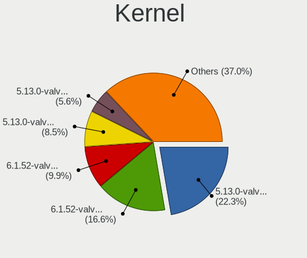
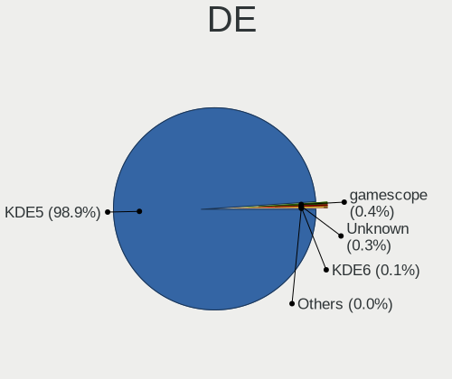
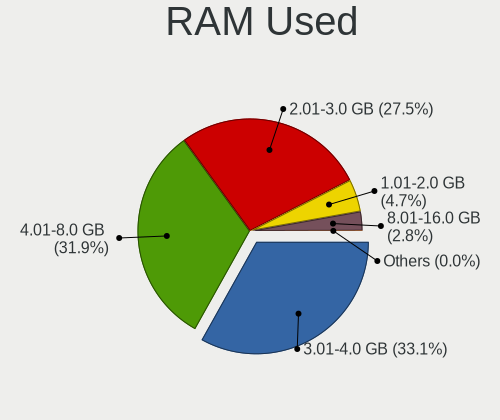
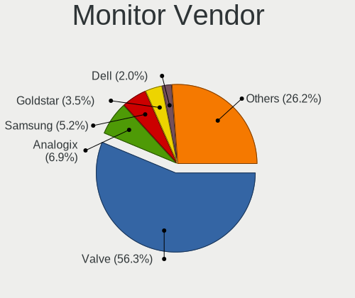
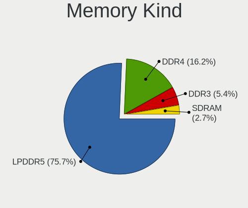
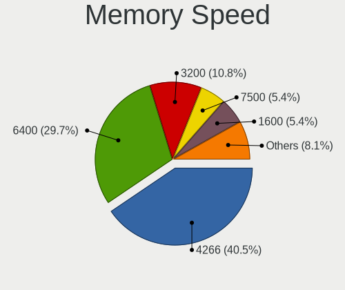

SteamOS - Tested Hardware & Statistics
--------------------------------------

A project to collect tested hardware configurations for SteamOS.

Anyone can contribute to this report by the [hw-probe](https://github.com/linuxhw/hw-probe) tool:

    sudo -E hw-probe -all -upload

Please contribute! Especially if your hardware is rare.

This is a report for all computer types. See also reports for [desktops](/Dist/SteamOS/Desktop/README.md) and [notebooks](/Dist/SteamOS/Notebook/README.md).

Contents
--------

* [ Test Cases ](#test-cases)

* [ System ](#system)
  - [ OS                       ](#os)
  - [ OS Family                ](#os-family)
  - [ Kernel                   ](#kernel)
  - [ Kernel Family            ](#kernel-family)
  - [ Kernel Major Ver.        ](#kernel-major-ver)
  - [ Arch                     ](#arch)
  - [ DE                       ](#de)
  - [ Display Server           ](#display-server)
  - [ Display Manager          ](#display-manager)
  - [ OS Lang                  ](#os-lang)
  - [ Boot Mode                ](#boot-mode)
  - [ Filesystem               ](#filesystem)
  - [ Part. scheme             ](#part-scheme)
  - [ Dual Boot with Linux/BSD ](#dual-boot-with-linuxbsd)
  - [ Dual Boot (Win)          ](#dual-boot-win)

* [ Board ](#board)
  - [ Vendor                   ](#vendor)
  - [ Model                    ](#model)
  - [ Model Family             ](#model-family)
  - [ MFG Year                 ](#mfg-year)
  - [ Form Factor              ](#form-factor)
  - [ Secure Boot              ](#secure-boot)
  - [ Coreboot                 ](#coreboot)
  - [ RAM Size                 ](#ram-size)
  - [ RAM Used                 ](#ram-used)
  - [ Total Drives             ](#total-drives)
  - [ Has CD-ROM               ](#has-cd-rom)
  - [ Has Ethernet             ](#has-ethernet)
  - [ Has WiFi                 ](#has-wifi)
  - [ Has Bluetooth            ](#has-bluetooth)

* [ Location ](#location)
  - [ Country                  ](#country)
  - [ City                     ](#city)

* [ Drives ](#drives)
  - [ Drive Vendor             ](#drive-vendor)
  - [ Drive Model              ](#drive-model)
  - [ HDD Vendor               ](#hdd-vendor)
  - [ SSD Vendor               ](#ssd-vendor)
  - [ Drive Kind               ](#drive-kind)
  - [ Drive Connector          ](#drive-connector)
  - [ Drive Size               ](#drive-size)
  - [ Space Total              ](#space-total)
  - [ Space Used               ](#space-used)
  - [ Malfunc. Drives          ](#malfunc-drives)
  - [ Malfunc. Drive Vendor    ](#malfunc-drive-vendor)
  - [ Malfunc. HDD Vendor      ](#malfunc-hdd-vendor)
  - [ Malfunc. Drive Kind      ](#malfunc-drive-kind)
  - [ Failed Drives            ](#failed-drives)
  - [ Failed Drive Vendor      ](#failed-drive-vendor)
  - [ Drive Status             ](#drive-status)

* [ Storage controller ](#storage-controller)
  - [ Storage Vendor           ](#storage-vendor)
  - [ Storage Model            ](#storage-model)
  - [ Storage Kind             ](#storage-kind)

* [ Processor ](#processor)
  - [ CPU Vendor               ](#cpu-vendor)
  - [ CPU Model                ](#cpu-model)
  - [ CPU Model Family         ](#cpu-model-family)
  - [ CPU Cores                ](#cpu-cores)
  - [ CPU Sockets              ](#cpu-sockets)
  - [ CPU Threads              ](#cpu-threads)
  - [ CPU Op-Modes             ](#cpu-op-modes)
  - [ CPU Microcode            ](#cpu-microcode)
  - [ CPU Microarch            ](#cpu-microarch)

* [ Graphics ](#graphics)
  - [ GPU Vendor               ](#gpu-vendor)
  - [ GPU Model                ](#gpu-model)
  - [ GPU Combo                ](#gpu-combo)
  - [ GPU Driver               ](#gpu-driver)
  - [ GPU Memory               ](#gpu-memory)

* [ Monitor ](#monitor)
  - [ Monitor Vendor           ](#monitor-vendor)
  - [ Monitor Model            ](#monitor-model)
  - [ Monitor Resolution       ](#monitor-resolution)
  - [ Monitor Diagonal         ](#monitor-diagonal)
  - [ Monitor Width            ](#monitor-width)
  - [ Aspect Ratio             ](#aspect-ratio)
  - [ Monitor Area             ](#monitor-area)
  - [ Pixel Density            ](#pixel-density)
  - [ Multiple Monitors        ](#multiple-monitors)

* [ Network ](#network)
  - [ Net Controller Vendor    ](#net-controller-vendor)
  - [ Net Controller Model     ](#net-controller-model)
  - [ Wireless Vendor          ](#wireless-vendor)
  - [ Wireless Model           ](#wireless-model)
  - [ Ethernet Vendor          ](#ethernet-vendor)
  - [ Ethernet Model           ](#ethernet-model)
  - [ Net Controller Kind      ](#net-controller-kind)
  - [ Used Controller          ](#used-controller)
  - [ NICs                     ](#nics)
  - [ IPv6                     ](#ipv6)

* [ Bluetooth ](#bluetooth)
  - [ Bluetooth Vendor         ](#bluetooth-vendor)
  - [ Bluetooth Model          ](#bluetooth-model)

* [ Sound ](#sound)
  - [ Sound Vendor             ](#sound-vendor)
  - [ Sound Model              ](#sound-model)

* [ Memory ](#memory)
  - [ Memory Vendor            ](#memory-vendor)
  - [ Memory Model             ](#memory-model)
  - [ Memory Kind              ](#memory-kind)
  - [ Memory Form Factor       ](#memory-form-factor)
  - [ Memory Size              ](#memory-size)
  - [ Memory Speed             ](#memory-speed)

* [ Printers & scanners ](#printers--scanners)
  - [ Printer Vendor           ](#printer-vendor)
  - [ Printer Model            ](#printer-model)
  - [ Scanner Vendor           ](#scanner-vendor)
  - [ Scanner Model            ](#scanner-model)

* [ Camera ](#camera)
  - [ Camera Vendor            ](#camera-vendor)
  - [ Camera Model             ](#camera-model)

* [ Security ](#security)
  - [ Fingerprint Vendor       ](#fingerprint-vendor)
  - [ Fingerprint Model        ](#fingerprint-model)
  - [ Chipcard Vendor          ](#chipcard-vendor)
  - [ Chipcard Model           ](#chipcard-model)

* [ Unsupported ](#unsupported)
  - [ Unsupported Devices      ](#unsupported-devices)
  - [ Unsupported Device Types ](#unsupported-device-types)

Test Cases
----------

Total: 236

| Vendor        | Model                       | Form-Factor | Probe                                                      | Date         |
|---------------|-----------------------------|-------------|------------------------------------------------------------|--------------|
| ASUSTek       | PRIME A320M-K               | Desktop     | [bdae2c60cd](https://linux-hardware.org/?probe=bdae2c60cd) | Sep 01, 2022 |
| Valve         | Jupiter                     | Notebook    | [6e9790c5e7](https://linux-hardware.org/?probe=6e9790c5e7) | Sep 01, 2022 |
| Valve         | Jupiter                     | Notebook    | [c89533e9a2](https://linux-hardware.org/?probe=c89533e9a2) | Sep 01, 2022 |
| Valve         | Jupiter                     | Notebook    | [c348c06118](https://linux-hardware.org/?probe=c348c06118) | Sep 01, 2022 |
| Valve         | Jupiter                     | Notebook    | [60db4bfa03](https://linux-hardware.org/?probe=60db4bfa03) | Aug 31, 2022 |
| Valve         | Jupiter                     | Notebook    | [5a2483051c](https://linux-hardware.org/?probe=5a2483051c) | Aug 31, 2022 |
| Valve         | Jupiter                     | Notebook    | [0b928ad313](https://linux-hardware.org/?probe=0b928ad313) | Aug 31, 2022 |
| HP            | Pavilion x360 Convertibl... | Convertible | [1f4a6a9ec3](https://linux-hardware.org/?probe=1f4a6a9ec3) | Aug 31, 2022 |
| Valve         | Jupiter                     | Notebook    | [dbc549504c](https://linux-hardware.org/?probe=dbc549504c) | Aug 31, 2022 |
| Valve         | Jupiter                     | Notebook    | [1b38f48059](https://linux-hardware.org/?probe=1b38f48059) | Aug 30, 2022 |
| Apple         | Mac-BE088AF8C5EB4FA2 iMa... | All in one  | [6d2717b230](https://linux-hardware.org/?probe=6d2717b230) | Aug 30, 2022 |
| Valve         | Jupiter                     | Notebook    | [40b9dd39a6](https://linux-hardware.org/?probe=40b9dd39a6) | Aug 30, 2022 |
| Valve         | Jupiter                     | Notebook    | [ea6506cc93](https://linux-hardware.org/?probe=ea6506cc93) | Aug 30, 2022 |
| MSI           | MS-B9201                    | Desktop     | [b5c80c8c2c](https://linux-hardware.org/?probe=b5c80c8c2c) | Aug 29, 2022 |
| Lenovo        | IdeaPad Gaming 3 15ACH6 ... | Notebook    | [844a0c00e2](https://linux-hardware.org/?probe=844a0c00e2) | Aug 29, 2022 |
| Valve         | Jupiter                     | Notebook    | [830c22afde](https://linux-hardware.org/?probe=830c22afde) | Aug 29, 2022 |
| Dell          | XPS 13 9360                 | Notebook    | [1763ee1dd0](https://linux-hardware.org/?probe=1763ee1dd0) | Aug 29, 2022 |
| Valve         | Jupiter                     | Notebook    | [43ec7fb445](https://linux-hardware.org/?probe=43ec7fb445) | Aug 29, 2022 |
| Valve         | Jupiter                     | Notebook    | [3848655fce](https://linux-hardware.org/?probe=3848655fce) | Aug 28, 2022 |
| Gigabyte      | B550 AORUS ELITE AX V2      | Desktop     | [9e3df56c3b](https://linux-hardware.org/?probe=9e3df56c3b) | Aug 28, 2022 |
| Valve         | Jupiter                     | Notebook    | [cd6744821b](https://linux-hardware.org/?probe=cd6744821b) | Aug 27, 2022 |
| Lenovo        | Legion Y740-15IRHg 81UH     | Notebook    | [521dd85c98](https://linux-hardware.org/?probe=521dd85c98) | Aug 26, 2022 |
| Valve         | Jupiter                     | Notebook    | [8027445785](https://linux-hardware.org/?probe=8027445785) | Aug 26, 2022 |
| Dell          | Precision 7720              | Notebook    | [7fafc0e50b](https://linux-hardware.org/?probe=7fafc0e50b) | Aug 26, 2022 |
| Valve         | Jupiter                     | Notebook    | [447edaff49](https://linux-hardware.org/?probe=447edaff49) | Aug 25, 2022 |
| ASUSTek       | PRIME B550-PLUS             | Desktop     | [67b791eb17](https://linux-hardware.org/?probe=67b791eb17) | Aug 25, 2022 |
| Valve         | Jupiter                     | Notebook    | [ebd183fc4b](https://linux-hardware.org/?probe=ebd183fc4b) | Aug 25, 2022 |
| Valve         | Jupiter                     | Notebook    | [b74760105e](https://linux-hardware.org/?probe=b74760105e) | Aug 25, 2022 |
| ASUSTek       | H97-PRO GAMER               | Desktop     | [663bc0a517](https://linux-hardware.org/?probe=663bc0a517) | Aug 25, 2022 |
| Valve         | Jupiter                     | Notebook    | [5064c9f57b](https://linux-hardware.org/?probe=5064c9f57b) | Aug 24, 2022 |
| Valve         | Jupiter                     | Notebook    | [fbef109b91](https://linux-hardware.org/?probe=fbef109b91) | Aug 24, 2022 |
| Valve         | Jupiter                     | Notebook    | [de49ccefa5](https://linux-hardware.org/?probe=de49ccefa5) | Aug 24, 2022 |
| Valve         | Jupiter                     | Notebook    | [4c88b729d3](https://linux-hardware.org/?probe=4c88b729d3) | Aug 23, 2022 |
| ASUSTek       | H97-PRO GAMER               | Desktop     | [e934af2a60](https://linux-hardware.org/?probe=e934af2a60) | Aug 23, 2022 |
| Valve         | Jupiter                     | Notebook    | [ba1940016e](https://linux-hardware.org/?probe=ba1940016e) | Aug 23, 2022 |
| Valve         | Jupiter                     | Notebook    | [161cc0c135](https://linux-hardware.org/?probe=161cc0c135) | Aug 23, 2022 |
| Valve         | Jupiter                     | Notebook    | [078b8e8ff1](https://linux-hardware.org/?probe=078b8e8ff1) | Aug 22, 2022 |
| Valve         | Jupiter                     | Notebook    | [04b0de9007](https://linux-hardware.org/?probe=04b0de9007) | Aug 22, 2022 |
| Valve         | Jupiter                     | Notebook    | [1c25a3bf8a](https://linux-hardware.org/?probe=1c25a3bf8a) | Aug 22, 2022 |
| Valve         | Jupiter                     | Notebook    | [bc83cf9f77](https://linux-hardware.org/?probe=bc83cf9f77) | Aug 21, 2022 |
| Valve         | Jupiter                     | Notebook    | [36124147ef](https://linux-hardware.org/?probe=36124147ef) | Aug 20, 2022 |
| Valve         | Jupiter                     | Notebook    | [eb63fecd35](https://linux-hardware.org/?probe=eb63fecd35) | Aug 19, 2022 |
| Valve         | Jupiter                     | Notebook    | [d6b92d1aa0](https://linux-hardware.org/?probe=d6b92d1aa0) | Aug 19, 2022 |
| Valve         | Jupiter                     | Notebook    | [bff4d1ca46](https://linux-hardware.org/?probe=bff4d1ca46) | Aug 19, 2022 |
| Gigabyte      | AB350-Gaming 3-CF           | Desktop     | [9661c799c9](https://linux-hardware.org/?probe=9661c799c9) | Aug 18, 2022 |
| Valve         | Jupiter                     | Notebook    | [87f3603202](https://linux-hardware.org/?probe=87f3603202) | Aug 18, 2022 |
| Valve         | Jupiter                     | Notebook    | [f0dc30e9f8](https://linux-hardware.org/?probe=f0dc30e9f8) | Aug 17, 2022 |
| Gigabyte      | X570 GAMING X               | Desktop     | [d8e60dcf09](https://linux-hardware.org/?probe=d8e60dcf09) | Aug 17, 2022 |
| Valve         | Jupiter                     | Notebook    | [5f3785b334](https://linux-hardware.org/?probe=5f3785b334) | Aug 16, 2022 |
| Valve         | Jupiter                     | Notebook    | [af4a593873](https://linux-hardware.org/?probe=af4a593873) | Aug 16, 2022 |
| Valve         | Jupiter                     | Notebook    | [c395a0f9db](https://linux-hardware.org/?probe=c395a0f9db) | Aug 16, 2022 |
| Valve         | Jupiter                     | Notebook    | [90ac03e747](https://linux-hardware.org/?probe=90ac03e747) | Aug 15, 2022 |
| Valve         | Jupiter                     | Notebook    | [c3f38697a4](https://linux-hardware.org/?probe=c3f38697a4) | Aug 15, 2022 |
| ASUSTek       | TUF Gaming X570-PLUS        | Desktop     | [53429d945b](https://linux-hardware.org/?probe=53429d945b) | Aug 15, 2022 |
| Valve         | Jupiter                     | Notebook    | [9ab7a2b695](https://linux-hardware.org/?probe=9ab7a2b695) | Aug 15, 2022 |
| Valve         | Jupiter                     | Notebook    | [2adcfce1c0](https://linux-hardware.org/?probe=2adcfce1c0) | Aug 14, 2022 |
| MSI           | MS-B9351                    | Desktop     | [a5b1950761](https://linux-hardware.org/?probe=a5b1950761) | Aug 14, 2022 |
| MSI           | MS-B9351                    | Desktop     | [fbf08d2d76](https://linux-hardware.org/?probe=fbf08d2d76) | Aug 14, 2022 |
| Valve         | Jupiter                     | Notebook    | [e9f1f10a4c](https://linux-hardware.org/?probe=e9f1f10a4c) | Aug 14, 2022 |
| MSI           | B450 TOMAHAWK MAX II        | Desktop     | [dcd9be004c](https://linux-hardware.org/?probe=dcd9be004c) | Aug 13, 2022 |
| Valve         | Jupiter                     | Notebook    | [50596cb93b](https://linux-hardware.org/?probe=50596cb93b) | Aug 13, 2022 |
| ASUSTek       | SABERTOOTH X99              | Desktop     | [54ea6926a0](https://linux-hardware.org/?probe=54ea6926a0) | Aug 13, 2022 |
| HP            | 2B3E                        | All in one  | [1ba4759f2c](https://linux-hardware.org/?probe=1ba4759f2c) | Aug 13, 2022 |
| Valve         | Jupiter                     | Notebook    | [3a1e95f5d5](https://linux-hardware.org/?probe=3a1e95f5d5) | Aug 12, 2022 |
| Valve         | Jupiter                     | Notebook    | [b63f9aedab](https://linux-hardware.org/?probe=b63f9aedab) | Aug 12, 2022 |
| Valve         | Jupiter                     | Notebook    | [822737452b](https://linux-hardware.org/?probe=822737452b) | Aug 12, 2022 |
| Valve         | Jupiter                     | Notebook    | [9839802d27](https://linux-hardware.org/?probe=9839802d27) | Aug 12, 2022 |
| Valve         | Jupiter                     | Notebook    | [6b9bfad898](https://linux-hardware.org/?probe=6b9bfad898) | Aug 12, 2022 |
| Valve         | Jupiter                     | Notebook    | [c6e02c54e7](https://linux-hardware.org/?probe=c6e02c54e7) | Aug 11, 2022 |
| HP            | Laptop 14z-fq0000           | Notebook    | [9c62f8d392](https://linux-hardware.org/?probe=9c62f8d392) | Aug 11, 2022 |
| Microsoft     | Surface Pro 8               | Tablet      | [a5f743f641](https://linux-hardware.org/?probe=a5f743f641) | Aug 10, 2022 |
| Valve         | Jupiter                     | Notebook    | [90e751b5cf](https://linux-hardware.org/?probe=90e751b5cf) | Aug 10, 2022 |
| Valve         | Jupiter                     | Notebook    | [6223a43fe2](https://linux-hardware.org/?probe=6223a43fe2) | Aug 10, 2022 |
| Valve         | Jupiter                     | Notebook    | [2cec170e55](https://linux-hardware.org/?probe=2cec170e55) | Aug 10, 2022 |
| AMI           | Unknown                     | Notebook    | [5cee81ed21](https://linux-hardware.org/?probe=5cee81ed21) | Aug 10, 2022 |
| Valve         | Jupiter                     | Notebook    | [68214f1af2](https://linux-hardware.org/?probe=68214f1af2) | Aug 10, 2022 |
| AMI           | Unknown                     | Notebook    | [7752037bab](https://linux-hardware.org/?probe=7752037bab) | Aug 10, 2022 |
| Valve         | Jupiter                     | Notebook    | [e4914b879a](https://linux-hardware.org/?probe=e4914b879a) | Aug 09, 2022 |
| Valve         | Jupiter                     | Notebook    | [813863fbbf](https://linux-hardware.org/?probe=813863fbbf) | Aug 09, 2022 |
| Valve         | Jupiter                     | Notebook    | [a5b1208abc](https://linux-hardware.org/?probe=a5b1208abc) | Aug 08, 2022 |
| Valve         | Jupiter                     | Notebook    | [a50e78265a](https://linux-hardware.org/?probe=a50e78265a) | Aug 07, 2022 |
| Valve         | Jupiter                     | Notebook    | [d8ef9609a7](https://linux-hardware.org/?probe=d8ef9609a7) | Aug 07, 2022 |
| Dell          | 00F82W A00                  | Desktop     | [8e74c57731](https://linux-hardware.org/?probe=8e74c57731) | Aug 07, 2022 |
| Valve         | Jupiter                     | Notebook    | [ced35212a7](https://linux-hardware.org/?probe=ced35212a7) | Aug 07, 2022 |
| Valve         | Jupiter                     | Notebook    | [64a0d92417](https://linux-hardware.org/?probe=64a0d92417) | Aug 07, 2022 |
| Valve         | Jupiter                     | Notebook    | [b6c7ee76fa](https://linux-hardware.org/?probe=b6c7ee76fa) | Aug 06, 2022 |
| Valve         | Jupiter                     | Notebook    | [6bbc4f3d0a](https://linux-hardware.org/?probe=6bbc4f3d0a) | Aug 05, 2022 |
| Valve         | Jupiter                     | Notebook    | [d15c62e29a](https://linux-hardware.org/?probe=d15c62e29a) | Aug 05, 2022 |
| Valve         | Jupiter                     | Notebook    | [6f76f9d91a](https://linux-hardware.org/?probe=6f76f9d91a) | Aug 05, 2022 |
| Valve         | Jupiter                     | Notebook    | [4403a80bdc](https://linux-hardware.org/?probe=4403a80bdc) | Aug 03, 2022 |
| Valve         | Jupiter                     | Notebook    | [8689254ee7](https://linux-hardware.org/?probe=8689254ee7) | Aug 03, 2022 |
| Valve         | Jupiter                     | Notebook    | [bfddbf1d22](https://linux-hardware.org/?probe=bfddbf1d22) | Aug 02, 2022 |
| Valve         | Jupiter                     | Notebook    | [fdb514a999](https://linux-hardware.org/?probe=fdb514a999) | Aug 01, 2022 |
| Valve         | Jupiter                     | Notebook    | [e4c6300b68](https://linux-hardware.org/?probe=e4c6300b68) | Aug 01, 2022 |
| Gigabyte      | H310M S2V                   | Desktop     | [329d2071a9](https://linux-hardware.org/?probe=329d2071a9) | Aug 01, 2022 |
| GPD           | G1619-02                    | Notebook    | [c61c4280c8](https://linux-hardware.org/?probe=c61c4280c8) | Jul 31, 2022 |
| Valve         | Jupiter                     | Notebook    | [ee3b662083](https://linux-hardware.org/?probe=ee3b662083) | Jul 30, 2022 |
| Acer          | Aspire A514-54              | Notebook    | [9a18d7476f](https://linux-hardware.org/?probe=9a18d7476f) | Jul 29, 2022 |
| Valve         | Jupiter                     | Notebook    | [225e2c825e](https://linux-hardware.org/?probe=225e2c825e) | Jul 29, 2022 |
| Acer          | Aspire A514-54              | Notebook    | [4a6c9ef157](https://linux-hardware.org/?probe=4a6c9ef157) | Jul 28, 2022 |
| Valve         | Jupiter                     | Notebook    | [dffaa71aed](https://linux-hardware.org/?probe=dffaa71aed) | Jul 28, 2022 |
| Valve         | Jupiter                     | Notebook    | [35608b206c](https://linux-hardware.org/?probe=35608b206c) | Jul 27, 2022 |
| Valve         | Jupiter                     | Notebook    | [e35fa6e699](https://linux-hardware.org/?probe=e35fa6e699) | Jul 27, 2022 |
| Valve         | Jupiter                     | Notebook    | [f43cbe28e9](https://linux-hardware.org/?probe=f43cbe28e9) | Jul 27, 2022 |
| Valve         | Jupiter                     | Notebook    | [d4e4413f9b](https://linux-hardware.org/?probe=d4e4413f9b) | Jul 26, 2022 |
| Valve         | Jupiter                     | Notebook    | [9c34e91c79](https://linux-hardware.org/?probe=9c34e91c79) | Jul 26, 2022 |
| Valve         | Jupiter                     | Notebook    | [b605f923c6](https://linux-hardware.org/?probe=b605f923c6) | Jul 25, 2022 |
| ONE-NETBOO... | ONE XPLAYER                 | Tablet      | [6b300beb70](https://linux-hardware.org/?probe=6b300beb70) | Jul 25, 2022 |
| ASRock        | A520M-ITX/ac                | Desktop     | [876c779461](https://linux-hardware.org/?probe=876c779461) | Jul 25, 2022 |
| ASRock        | B450M-HDV R4.0              | Desktop     | [f2172999c8](https://linux-hardware.org/?probe=f2172999c8) | Jul 24, 2022 |
| ONE-NETBOO... | ONE XPLAYER                 | Tablet      | [ce14e41b96](https://linux-hardware.org/?probe=ce14e41b96) | Jul 24, 2022 |
| Valve         | Jupiter                     | Notebook    | [3e7b7cb8cd](https://linux-hardware.org/?probe=3e7b7cb8cd) | Jul 23, 2022 |
| Alienware     | m17                         | Notebook    | [e14db26b9b](https://linux-hardware.org/?probe=e14db26b9b) | Jul 23, 2022 |
| Valve         | Jupiter                     | Notebook    | [ca07489d53](https://linux-hardware.org/?probe=ca07489d53) | Jul 23, 2022 |
| Valve         | Jupiter                     | Notebook    | [1860c6d71f](https://linux-hardware.org/?probe=1860c6d71f) | Jul 23, 2022 |
| Valve         | Jupiter                     | Notebook    | [2d0db23de3](https://linux-hardware.org/?probe=2d0db23de3) | Jul 23, 2022 |
| Valve         | Jupiter                     | Notebook    | [4aece18875](https://linux-hardware.org/?probe=4aece18875) | Jul 23, 2022 |
| Valve         | Jupiter                     | Notebook    | [44dca72cbb](https://linux-hardware.org/?probe=44dca72cbb) | Jul 22, 2022 |
| Unknown       | Unknown                     | Notebook    | [96af389676](https://linux-hardware.org/?probe=96af389676) | Jul 22, 2022 |
| ASRock        | X570 Extreme4 WiFi ax       | Notebook    | [bc52038c74](https://linux-hardware.org/?probe=bc52038c74) | Jul 21, 2022 |
| Valve         | Jupiter                     | Notebook    | [0cd166bdb1](https://linux-hardware.org/?probe=0cd166bdb1) | Jul 21, 2022 |
| Lenovo        | IdeaPadFlex 5 14ALC05 82... | Convertible | [02c47a57e5](https://linux-hardware.org/?probe=02c47a57e5) | Jul 20, 2022 |
| Valve         | Jupiter                     | Notebook    | [2c1ad04467](https://linux-hardware.org/?probe=2c1ad04467) | Jul 18, 2022 |
| ASUSTek       | EX-A320M-GAMING             | Desktop     | [68884b1723](https://linux-hardware.org/?probe=68884b1723) | Jul 17, 2022 |
| Valve         | Jupiter                     | Notebook    | [7f27efe00e](https://linux-hardware.org/?probe=7f27efe00e) | Jul 17, 2022 |
| HP            | Pavilion 17                 | Notebook    | [722f4eb4a9](https://linux-hardware.org/?probe=722f4eb4a9) | Jul 17, 2022 |
| Valve         | Jupiter                     | Notebook    | [b639365efd](https://linux-hardware.org/?probe=b639365efd) | Jul 16, 2022 |
| Valve         | Jupiter                     | Notebook    | [6c954fab9d](https://linux-hardware.org/?probe=6c954fab9d) | Jul 16, 2022 |
| Valve         | Jupiter                     | Notebook    | [eec9897935](https://linux-hardware.org/?probe=eec9897935) | Jul 15, 2022 |
| Valve         | Jupiter                     | Notebook    | [d4be0d94b4](https://linux-hardware.org/?probe=d4be0d94b4) | Jul 14, 2022 |
| Valve         | Jupiter                     | Notebook    | [d2f117e7f3](https://linux-hardware.org/?probe=d2f117e7f3) | Jul 14, 2022 |
| Dell          | XPS 15 9570                 | Notebook    | [e157e6d524](https://linux-hardware.org/?probe=e157e6d524) | Jul 14, 2022 |
| AYANEO        | NEXT Pro                    | Tablet      | [12b2ede47c](https://linux-hardware.org/?probe=12b2ede47c) | Jul 12, 2022 |
| AYANEO        | NEXT Pro                    | Tablet      | [4dc9fd4b9e](https://linux-hardware.org/?probe=4dc9fd4b9e) | Jul 12, 2022 |
| Valve         | Jupiter                     | Notebook    | [f7d66c8d35](https://linux-hardware.org/?probe=f7d66c8d35) | Jul 10, 2022 |
| Gigabyte      | H170N-WIFI-CF               | Desktop     | [2f3e59dc30](https://linux-hardware.org/?probe=2f3e59dc30) | Jul 09, 2022 |
| Valve         | Jupiter                     | Notebook    | [0c2ea27c49](https://linux-hardware.org/?probe=0c2ea27c49) | Jul 09, 2022 |
| Valve         | Jupiter                     | Notebook    | [98711d54c1](https://linux-hardware.org/?probe=98711d54c1) | Jul 08, 2022 |
| Lenovo        | ThinkBook 13s G3 ACN 20Y... | Notebook    | [c3c73948f5](https://linux-hardware.org/?probe=c3c73948f5) | Jul 08, 2022 |
| Valve         | Jupiter                     | Notebook    | [3ede093138](https://linux-hardware.org/?probe=3ede093138) | Jul 07, 2022 |
| Valve         | Jupiter                     | Notebook    | [458276506d](https://linux-hardware.org/?probe=458276506d) | Jul 06, 2022 |
| Valve         | Jupiter                     | Notebook    | [663562cc6b](https://linux-hardware.org/?probe=663562cc6b) | Jul 06, 2022 |
| Gigabyte      | B550 GAMING X V2            | Desktop     | [61eaf99aca](https://linux-hardware.org/?probe=61eaf99aca) | Jul 05, 2022 |
| Gigabyte      | B550 GAMING X V2            | Desktop     | [812733dd89](https://linux-hardware.org/?probe=812733dd89) | Jul 05, 2022 |
| Valve         | Jupiter                     | Notebook    | [e640bab55c](https://linux-hardware.org/?probe=e640bab55c) | Jul 05, 2022 |
| Valve         | Jupiter                     | Notebook    | [0bd46afcda](https://linux-hardware.org/?probe=0bd46afcda) | Jul 04, 2022 |
| Valve         | Jupiter                     | Notebook    | [766a3583f0](https://linux-hardware.org/?probe=766a3583f0) | Jul 04, 2022 |
| Valve         | Jupiter                     | Notebook    | [ac0c161f66](https://linux-hardware.org/?probe=ac0c161f66) | Jul 02, 2022 |
| Valve         | Jupiter                     | Notebook    | [c591d23b4d](https://linux-hardware.org/?probe=c591d23b4d) | Jul 01, 2022 |
| Gigabyte      | X570 I AORUS PRO WIFI       | Desktop     | [d82f88e20c](https://linux-hardware.org/?probe=d82f88e20c) | Jul 01, 2022 |
| Valve         | Jupiter                     | Notebook    | [bee9822ef6](https://linux-hardware.org/?probe=bee9822ef6) | Jun 30, 2022 |
| Valve         | Jupiter                     | Notebook    | [e98c07bc79](https://linux-hardware.org/?probe=e98c07bc79) | Jun 29, 2022 |
| Valve         | Jupiter                     | Notebook    | [261590e542](https://linux-hardware.org/?probe=261590e542) | Jun 29, 2022 |
| Valve         | Jupiter                     | Notebook    | [7c233f0a07](https://linux-hardware.org/?probe=7c233f0a07) | Jun 29, 2022 |
| HP            | x2 210 G2                   | Tablet      | [812530aed8](https://linux-hardware.org/?probe=812530aed8) | Jun 28, 2022 |
| Valve         | Jupiter                     | Notebook    | [e80815c8d4](https://linux-hardware.org/?probe=e80815c8d4) | Jun 27, 2022 |
| Valve         | Jupiter                     | Notebook    | [65e5ab29fd](https://linux-hardware.org/?probe=65e5ab29fd) | Jun 26, 2022 |
| Valve         | Jupiter                     | Notebook    | [e51f5d8645](https://linux-hardware.org/?probe=e51f5d8645) | Jun 26, 2022 |
| Alienware     | 02XRCM A01                  | Desktop     | [c70647bab0](https://linux-hardware.org/?probe=c70647bab0) | Jun 26, 2022 |
| Valve         | Jupiter                     | Notebook    | [b4dd19f939](https://linux-hardware.org/?probe=b4dd19f939) | Jun 25, 2022 |
| AZW           | SER V01                     | Mini pc     | [295a32d26e](https://linux-hardware.org/?probe=295a32d26e) | Jun 24, 2022 |
| Valve         | Jupiter                     | Notebook    | [c9ed3cf311](https://linux-hardware.org/?probe=c9ed3cf311) | Jun 23, 2022 |
| ASUSTek       | H61M-K                      | Desktop     | [1a568c2e5f](https://linux-hardware.org/?probe=1a568c2e5f) | Jun 23, 2022 |
| ASUSTek       | Q524UQK                     | Convertible | [fd5f128747](https://linux-hardware.org/?probe=fd5f128747) | Jun 23, 2022 |
| Dell          | G15 5510                    | Notebook    | [9c5777f505](https://linux-hardware.org/?probe=9c5777f505) | Jun 23, 2022 |
| Valve         | Jupiter                     | Notebook    | [213fbe4dd2](https://linux-hardware.org/?probe=213fbe4dd2) | Jun 22, 2022 |
| Valve         | Jupiter                     | Notebook    | [262a7f0cd4](https://linux-hardware.org/?probe=262a7f0cd4) | Jun 22, 2022 |
| Valve         | Jupiter                     | Notebook    | [f8722866b2](https://linux-hardware.org/?probe=f8722866b2) | Jun 22, 2022 |
| Valve         | Jupiter                     | Notebook    | [aa18022bce](https://linux-hardware.org/?probe=aa18022bce) | Jun 22, 2022 |
| Valve         | Jupiter                     | Notebook    | [000682313d](https://linux-hardware.org/?probe=000682313d) | Jun 20, 2022 |
| Valve         | Jupiter                     | Notebook    | [363ab9e4ea](https://linux-hardware.org/?probe=363ab9e4ea) | Jun 20, 2022 |
| Valve         | Jupiter                     | Notebook    | [dd5765a418](https://linux-hardware.org/?probe=dd5765a418) | Jun 18, 2022 |
| Valve         | Jupiter                     | Notebook    | [8e293bb4b1](https://linux-hardware.org/?probe=8e293bb4b1) | Jun 17, 2022 |
| Valve         | Jupiter                     | Notebook    | [ff0ce08944](https://linux-hardware.org/?probe=ff0ce08944) | Jun 16, 2022 |
| Valve         | Jupiter                     | Notebook    | [68a581ae0b](https://linux-hardware.org/?probe=68a581ae0b) | Jun 12, 2022 |
| HP            | Pavilion Gaming Laptop 1... | Notebook    | [df3f1b5d8f](https://linux-hardware.org/?probe=df3f1b5d8f) | Jun 11, 2022 |
| Valve         | Jupiter                     | Notebook    | [2353bf0f9d](https://linux-hardware.org/?probe=2353bf0f9d) | Jun 11, 2022 |
| Valve         | Jupiter                     | Notebook    | [17406c8741](https://linux-hardware.org/?probe=17406c8741) | Jun 11, 2022 |
| Apple         | Mac-35C5E08120C7EEAF Mac... | Mini pc     | [7ccfe2d3a7](https://linux-hardware.org/?probe=7ccfe2d3a7) | Jun 10, 2022 |
| Valve         | Jupiter                     | Notebook    | [715e914cba](https://linux-hardware.org/?probe=715e914cba) | Jun 10, 2022 |
| Valve         | Jupiter                     | Notebook    | [cc0a20bb93](https://linux-hardware.org/?probe=cc0a20bb93) | Jun 06, 2022 |
| Valve         | Jupiter                     | Notebook    | [2fb1bfad12](https://linux-hardware.org/?probe=2fb1bfad12) | Jun 04, 2022 |
| Valve         | Jupiter                     | Notebook    | [322bdc2ce3](https://linux-hardware.org/?probe=322bdc2ce3) | Jun 03, 2022 |
| Valve         | Jupiter                     | Notebook    | [780d6b923a](https://linux-hardware.org/?probe=780d6b923a) | Jun 02, 2022 |
| ASUSTek       | ROG STRIX B550-F GAMING     | Desktop     | [b3a08001ed](https://linux-hardware.org/?probe=b3a08001ed) | Jun 01, 2022 |
| ASRock        | B550 PG Velocita            | Desktop     | [0d7f71a24d](https://linux-hardware.org/?probe=0d7f71a24d) | May 30, 2022 |
| ASRock        | B365M Pro4-F                | Desktop     | [afc161c6fb](https://linux-hardware.org/?probe=afc161c6fb) | May 30, 2022 |
| Valve         | Jupiter                     | Notebook    | [f3910c9796](https://linux-hardware.org/?probe=f3910c9796) | May 29, 2022 |
| Valve         | Jupiter                     | Notebook    | [e415de106f](https://linux-hardware.org/?probe=e415de106f) | May 29, 2022 |
| Valve         | Jupiter                     | Notebook    | [0af4b9c805](https://linux-hardware.org/?probe=0af4b9c805) | May 29, 2022 |
| Valve         | Jupiter                     | Notebook    | [06b56d54d4](https://linux-hardware.org/?probe=06b56d54d4) | May 28, 2022 |
| Gigabyte      | B560M AORUS PRO             | Desktop     | [31f246f96e](https://linux-hardware.org/?probe=31f246f96e) | May 27, 2022 |
| Gigabyte      | B560M AORUS PRO             | Desktop     | [1d381d6ec9](https://linux-hardware.org/?probe=1d381d6ec9) | May 27, 2022 |
| Valve         | Jupiter                     | Notebook    | [1e966da4f8](https://linux-hardware.org/?probe=1e966da4f8) | May 27, 2022 |
| Valve         | Jupiter                     | Notebook    | [c716690aa2](https://linux-hardware.org/?probe=c716690aa2) | May 27, 2022 |
| Valve         | Jupiter                     | Notebook    | [43f315aa0c](https://linux-hardware.org/?probe=43f315aa0c) | May 27, 2022 |
| Valve         | Jupiter                     | Notebook    | [643322d821](https://linux-hardware.org/?probe=643322d821) | May 26, 2022 |
| Gigabyte      | Z170XP-SLI-CF               | Desktop     | [d4bef1e450](https://linux-hardware.org/?probe=d4bef1e450) | May 26, 2022 |
| HP            | Pavilion Gaming Laptop 1... | Notebook    | [b672eefb50](https://linux-hardware.org/?probe=b672eefb50) | May 25, 2022 |
| Valve         | Jupiter                     | Notebook    | [dee0bbedd1](https://linux-hardware.org/?probe=dee0bbedd1) | May 25, 2022 |
| HP            | 8158 A01                    | Mini pc     | [0d32a2b2e3](https://linux-hardware.org/?probe=0d32a2b2e3) | May 24, 2022 |
| ASUSTek       | PN50                        | Mini pc     | [da9b5c2be2](https://linux-hardware.org/?probe=da9b5c2be2) | May 24, 2022 |
| Valve         | Jupiter                     | Notebook    | [c34173715a](https://linux-hardware.org/?probe=c34173715a) | May 24, 2022 |
| Valve         | Jupiter                     | Notebook    | [6ca95b630c](https://linux-hardware.org/?probe=6ca95b630c) | May 23, 2022 |
| Valve         | Jupiter                     | Notebook    | [7d3f9c0a5f](https://linux-hardware.org/?probe=7d3f9c0a5f) | May 23, 2022 |
| Acer          | Aspire A315-23              | Notebook    | [b5d37bf4f2](https://linux-hardware.org/?probe=b5d37bf4f2) | May 22, 2022 |
| Samsung       | 950XDB/951XDB/950XDY        | Notebook    | [fc970670a8](https://linux-hardware.org/?probe=fc970670a8) | May 22, 2022 |
| Valve         | Jupiter                     | Notebook    | [595b06f6c9](https://linux-hardware.org/?probe=595b06f6c9) | May 22, 2022 |
| Valve         | Jupiter                     | Notebook    | [d706d00651](https://linux-hardware.org/?probe=d706d00651) | May 21, 2022 |
| Valve         | Jupiter                     | Notebook    | [317e492fa3](https://linux-hardware.org/?probe=317e492fa3) | May 21, 2022 |
| Valve         | Jupiter                     | Notebook    | [f849597120](https://linux-hardware.org/?probe=f849597120) | May 18, 2022 |
| Valve         | Jupiter                     | Notebook    | [48df6e5c71](https://linux-hardware.org/?probe=48df6e5c71) | May 18, 2022 |
| Valve         | Jupiter                     | Notebook    | [9cf4d23a81](https://linux-hardware.org/?probe=9cf4d23a81) | May 13, 2022 |
| Valve         | Jupiter                     | Notebook    | [79f6db1d69](https://linux-hardware.org/?probe=79f6db1d69) | May 08, 2022 |
| Valve         | Jupiter                     | Notebook    | [771539d18d](https://linux-hardware.org/?probe=771539d18d) | May 03, 2022 |
| Valve         | Jupiter                     | Notebook    | [19d2c51aa6](https://linux-hardware.org/?probe=19d2c51aa6) | May 01, 2022 |
| Valve         | Jupiter                     | Notebook    | [1c826aed5e](https://linux-hardware.org/?probe=1c826aed5e) | Apr 30, 2022 |
| Valve         | Jupiter                     | Notebook    | [4c43342014](https://linux-hardware.org/?probe=4c43342014) | Apr 24, 2022 |
| Valve         | Jupiter                     | Notebook    | [8564bded7f](https://linux-hardware.org/?probe=8564bded7f) | Apr 21, 2022 |
| Valve         | Jupiter                     | Notebook    | [d761657c3a](https://linux-hardware.org/?probe=d761657c3a) | Apr 21, 2022 |
| Valve         | Jupiter                     | Notebook    | [f2e59fcb97](https://linux-hardware.org/?probe=f2e59fcb97) | Apr 20, 2022 |
| Valve         | Jupiter                     | Notebook    | [4f23fab4fd](https://linux-hardware.org/?probe=4f23fab4fd) | Apr 17, 2022 |
| Valve         | Jupiter                     | Notebook    | [ed07e93435](https://linux-hardware.org/?probe=ed07e93435) | Apr 16, 2022 |
| Valve         | Jupiter                     | Notebook    | [48aacdeee8](https://linux-hardware.org/?probe=48aacdeee8) | Apr 15, 2022 |
| Valve         | Jupiter                     | Notebook    | [6a042646dd](https://linux-hardware.org/?probe=6a042646dd) | Apr 14, 2022 |
| Valve         | Jupiter                     | Notebook    | [d4c9dba2a1](https://linux-hardware.org/?probe=d4c9dba2a1) | Apr 14, 2022 |
| Valve         | Jupiter                     | Notebook    | [852b6fb53a](https://linux-hardware.org/?probe=852b6fb53a) | Apr 08, 2022 |
| Valve         | Jupiter                     | Notebook    | [6129b15fb5](https://linux-hardware.org/?probe=6129b15fb5) | Apr 05, 2022 |
| Valve         | Jupiter                     | Notebook    | [ec05067a1d](https://linux-hardware.org/?probe=ec05067a1d) | Apr 03, 2022 |
| Valve         | Jupiter                     | Notebook    | [180c84c856](https://linux-hardware.org/?probe=180c84c856) | Apr 02, 2022 |
| Valve         | Jupiter                     | Notebook    | [d8625616de](https://linux-hardware.org/?probe=d8625616de) | Mar 30, 2022 |
| Valve         | Jupiter                     | Notebook    | [d181a912af](https://linux-hardware.org/?probe=d181a912af) | Mar 23, 2022 |
| Valve         | Jupiter                     | Notebook    | [0b6a21cf35](https://linux-hardware.org/?probe=0b6a21cf35) | Mar 18, 2022 |
| Valve         | Jupiter                     | Notebook    | [85328e8f3d](https://linux-hardware.org/?probe=85328e8f3d) | Mar 17, 2022 |
| Valve         | Jupiter                     | Notebook    | [023aea75e1](https://linux-hardware.org/?probe=023aea75e1) | Mar 14, 2022 |
| Valve         | Jupiter                     | Notebook    | [c7f6388908](https://linux-hardware.org/?probe=c7f6388908) | Mar 11, 2022 |

System
------

OS
--

Installed operating systems

| Name                         | Computers | Percent |
|------------------------------|-----------|---------|
| SteamOS 3.3                  | 64        | 30.92%  |
| SteamOS 3.2                  | 58        | 28.02%  |
| SteamOS 3.3.1                | 29        | 14.01%  |
| SteamOS Snapshot             | 26        | 12.56%  |
| SteamOS 3.2 (steamdeck-main) | 14        | 6.76%   |
| SteamOS 3.1                  | 10        | 4.83%   |
| SteamOS                      | 3         | 1.45%   |
| SteamOS Rolling              | 2         | 0.97%   |
| SteamOS 3.4                  | 1         | 0.48%   |

OS Family
---------

OS without a version

| Name    | Computers | Percent |
|---------|-----------|---------|
| SteamOS | 204       | 100%    |

Kernel
------

Version of the Linux kernel

| Version                                            | Computers | Percent |
|----------------------------------------------------|-----------|---------|
| 5.13.0-valve15-1-neptune-02197-gf6ec7ad3762a       | 53        | 25.48%  |
| 5.13.0-valve21-1-neptune-02209-g2a5bdc1102a0       | 36        | 17.31%  |
| 5.13.0-valve21.1-1-neptune-02211-gc54cda5a36f3     | 29        | 13.94%  |
| 5.13.0-valve10.1-2-neptune-dri-02144-g7fffaf925dfb | 24        | 11.54%  |
| 5.13.0-valve10.1-1-neptune-02144-g7fffaf925dfb     | 16        | 7.69%   |
| 5.13.0-valve22-1-neptune-02213-gb68995364335       | 12        | 5.77%   |
| 5.13.0-valve10.3-1-neptune-02176-g5fe416c4acd8     | 12        | 5.77%   |
| 5.13.0-valve24-1-neptune-02226-g5b8545e4c5a1       | 7         | 3.37%   |
| 5.13.0-valve14-1-neptune-02195-g5b0f749d00fa       | 5         | 2.4%    |
| 5.18.1-arch1_testHoloISO_20220606.1811             | 4         | 1.92%   |
| 5.13.0-valve20-1-neptune-02207-gbd986a7e1c7f       | 4         | 1.92%   |
| 5.13.0-valve21-2-neptune-02209-g2a5bdc1102a0       | 3         | 1.44%   |
| 5.13.0-valve23-1-neptune-02219-gf0b4ecc8cab6       | 2         | 0.96%   |
| 5.16.2-arch1-1                                     | 1         | 0.48%   |

Kernel Family
-------------

Linux kernel without a distro release

| Version | Computers | Percent |
|---------|-----------|---------|
| 5.13.0  | 199       | 97.55%  |
| 5.18.1  | 4         | 1.96%   |
| 5.16.2  | 1         | 0.49%   |

Kernel Major Ver.
-----------------

Linux kernel major version

| Version | Computers | Percent |
|---------|-----------|---------|
| 5.13    | 199       | 97.55%  |
| 5.18    | 4         | 1.96%   |
| 5.16    | 1         | 0.49%   |

Arch
----

OS architecture (x86_64, i586, etc.)

| Name   | Computers | Percent |
|--------|-----------|---------|
| x86_64 | 204       | 100%    |

DE
--

Desktop Environment

| Name      | Computers | Percent |
|-----------|-----------|---------|
| KDE5      | 200       | 98.04%  |
| gamescope | 2         | 0.98%   |
| Unknown   | 2         | 0.98%   |

Display Server
--------------

X11 or Wayland

| Name    | Computers | Percent |
|---------|-----------|---------|
| X11     | 201       | 98.53%  |
| Wayland | 2         | 0.98%   |
| Unknown | 1         | 0.49%   |

Display Manager
---------------

SDDM, LightDM, etc.

| Name    | Computers | Percent |
|---------|-----------|---------|
| Unknown | 202       | 99.02%  |
| SDDM    | 2         | 0.98%   |

OS Lang
-------

Language

| Lang  | Computers | Percent |
|-------|-----------|---------|
| en_US | 179       | 87.75%  |
| en_GB | 5         | 2.45%   |
| fr_FR | 3         | 1.47%   |
| de_DE | 3         | 1.47%   |
| an_ES | 3         | 1.47%   |
| pt_PT | 2         | 0.98%   |
| zh_CN | 1         | 0.49%   |
| pt_BR | 1         | 0.49%   |
| it_IT | 1         | 0.49%   |
| et_EE | 1         | 0.49%   |
| es_ES | 1         | 0.49%   |
| en_IE | 1         | 0.49%   |
| en_DE | 1         | 0.49%   |
| en_CA | 1         | 0.49%   |
| C     | 1         | 0.49%   |

Boot Mode
---------

EFI or BIOS

| Mode | Computers | Percent |
|------|-----------|---------|
| BIOS | 200       | 98.04%  |
| EFI  | 4         | 1.96%   |

Filesystem
----------

Type of filesystem

| Type  | Computers | Percent |
|-------|-----------|---------|
| Btrfs | 203       | 99.51%  |
| Ext4  | 1         | 0.49%   |

Part. scheme
------------

Scheme of partitioning

| Type    | Computers | Percent |
|---------|-----------|---------|
| Unknown | 200       | 98.04%  |
| GPT     | 4         | 1.96%   |

Dual Boot with Linux/BSD
------------------------

Hosting more than one Linux/BSD

| Dual boot | Computers | Percent |
|-----------|-----------|---------|
| No        | 201       | 98.53%  |
| Yes       | 3         | 1.47%   |

Dual Boot (Win)
---------------

Hosting Linux and Windows

| Dual boot | Computers | Percent |
|-----------|-----------|---------|
| No        | 203       | 99.51%  |
| Yes       | 1         | 0.49%   |

Board
-----

Vendor
------

Motherboard manufacturer

| Name                   | Computers | Percent |
|------------------------|-----------|---------|
| Valve                  | 147       | 72.06%  |
| ASUSTek Computer       | 10        | 4.9%    |
| Hewlett-Packard        | 8         | 3.92%   |
| Gigabyte Technology    | 8         | 3.92%   |
| Dell                   | 5         | 2.45%   |
| ASRock                 | 5         | 2.45%   |
| Lenovo                 | 4         | 1.96%   |
| MSI                    | 3         | 1.47%   |
| Apple                  | 2         | 0.98%   |
| Alienware              | 2         | 0.98%   |
| Acer                   | 2         | 0.98%   |
| Samsung Electronics    | 1         | 0.49%   |
| ONE-NETBOOK TECHNOLOGY | 1         | 0.49%   |
| Microsoft              | 1         | 0.49%   |
| GPD                    | 1         | 0.49%   |
| AZW                    | 1         | 0.49%   |
| AYANEO                 | 1         | 0.49%   |
| AMI                    | 1         | 0.49%   |
| Unknown                | 1         | 0.49%   |

Model
-----

Motherboard model

| Name                                   | Computers | Percent |
|----------------------------------------|-----------|---------|
| Valve Jupiter                          | 147       | 72.06%  |
| ASUS All Series                        | 2         | 0.98%   |
| Unknown                                | 2         | 0.98%   |
| Samsung 950XDB/951XDB/950XDY           | 1         | 0.49%   |
| ONE-NETBOOK TECHNOLOGY ONE XPLAYER     | 1         | 0.49%   |
| MSI MS-7C02                            | 1         | 0.49%   |
| MSI MPG H510 Trident 3 (MS-B935)       | 1         | 0.49%   |
| MSI H310 Gaming Trident3 (MS-B920)     | 1         | 0.49%   |
| Microsoft Surface Pro 8                | 1         | 0.49%   |
| Lenovo ThinkBook 13s G3 ACN 20YA       | 1         | 0.49%   |
| Lenovo Legion Y740-15IRHg 81UH         | 1         | 0.49%   |
| Lenovo IdeaPadFlex 5 14ALC05 82HU      | 1         | 0.49%   |
| Lenovo IdeaPad Gaming 3 15ACH6 82K2    | 1         | 0.49%   |
| HP x2 210 G2                           | 1         | 0.49%   |
| HP t630 Thin Client                    | 1         | 0.49%   |
| HP Pavilion x360 Convertible 14-dy0xxx | 1         | 0.49%   |
| HP Pavilion Gaming Laptop 15-ec2xxx    | 1         | 0.49%   |
| HP Pavilion Gaming Laptop 15-dk0xxx    | 1         | 0.49%   |
| HP Pavilion 17                         | 1         | 0.49%   |
| HP Laptop 14z-fq0000                   | 1         | 0.49%   |
| HP 27-p055na                           | 1         | 0.49%   |
| GPD G1619-02                           | 1         | 0.49%   |
| Gigabyte X570 I AORUS PRO WIFI         | 1         | 0.49%   |
| Gigabyte X570 GAMING X                 | 1         | 0.49%   |
| Gigabyte MBB-670016                    | 1         | 0.49%   |
| Gigabyte H310M S2V 2.0                 | 1         | 0.49%   |
| Gigabyte H170N-WIFI                    | 1         | 0.49%   |
| Gigabyte B560M AORUS PRO               | 1         | 0.49%   |
| Gigabyte B550 GAMING X V2              | 1         | 0.49%   |
| Gigabyte AB350-Gaming 3                | 1         | 0.49%   |
| Dell XPS 15 9570                       | 1         | 0.49%   |
| Dell XPS 13 9360                       | 1         | 0.49%   |
| Dell Precision 7720                    | 1         | 0.49%   |
| Dell OptiPlex 9010                     | 1         | 0.49%   |
| Dell G15 5510                          | 1         | 0.49%   |
| AZW SER                                | 1         | 0.49%   |
| AYANEO NEXT Pro                        | 1         | 0.49%   |
| ASUS TUF Gaming X570-PLUS              | 1         | 0.49%   |
| ASUS ROG STRIX B550-F GAMING           | 1         | 0.49%   |
| ASUS Q524UQK                           | 1         | 0.49%   |
| ASUS PRIME B550-PLUS                   | 1         | 0.49%   |
| ASUS PRIME A320M-K                     | 1         | 0.49%   |
| ASUS MINIPC PN50                       | 1         | 0.49%   |
| ASUS H61M-K                            | 1         | 0.49%   |
| ASUS EX-A320M-GAMING                   | 1         | 0.49%   |
| ASRock X570 Extreme4 WiFi ax           | 1         | 0.49%   |
| ASRock B550 PG Velocita                | 1         | 0.49%   |
| ASRock B450M-HDV R4.0                  | 1         | 0.49%   |
| ASRock B365M Pro4-F                    | 1         | 0.49%   |
| ASRock A520M-ITX/ac                    | 1         | 0.49%   |
| Apple Macmini7,1                       | 1         | 0.49%   |
| Apple iMac18,3                         | 1         | 0.49%   |
| Alienware m17                          | 1         | 0.49%   |
| Alienware Aurora R8                    | 1         | 0.49%   |
| Acer Aspire A514-54                    | 1         | 0.49%   |
| Acer Aspire A315-23                    | 1         | 0.49%   |

Model Family
------------

Motherboard model prefix

| Name                       | Computers | Percent |
|----------------------------|-----------|---------|
| Valve Jupiter              | 147       | 72.06%  |
| HP Pavilion                | 4         | 1.96%   |
| Gigabyte X570              | 2         | 0.98%   |
| Dell XPS                   | 2         | 0.98%   |
| ASUS PRIME                 | 2         | 0.98%   |
| ASUS All                   | 2         | 0.98%   |
| Acer Aspire                | 2         | 0.98%   |
| Unknown                    | 2         | 0.98%   |
| Samsung 950XDB             | 1         | 0.49%   |
| ONE-NETBOOK TECHNOLOGY ONE | 1         | 0.49%   |
| MSI MS-7C02                | 1         | 0.49%   |
| MSI MPG                    | 1         | 0.49%   |
| MSI H310                   | 1         | 0.49%   |
| Microsoft Surface          | 1         | 0.49%   |
| Lenovo ThinkBook           | 1         | 0.49%   |
| Lenovo Legion              | 1         | 0.49%   |
| Lenovo IdeaPadFlex         | 1         | 0.49%   |
| Lenovo IdeaPad             | 1         | 0.49%   |
| HP x2                      | 1         | 0.49%   |
| HP t630                    | 1         | 0.49%   |
| HP Laptop                  | 1         | 0.49%   |
| HP 27-p055na               | 1         | 0.49%   |
| GPD G1619-02               | 1         | 0.49%   |
| Gigabyte MBB-670016        | 1         | 0.49%   |
| Gigabyte H310M             | 1         | 0.49%   |
| Gigabyte H170N-WIFI        | 1         | 0.49%   |
| Gigabyte B560M             | 1         | 0.49%   |
| Gigabyte B550              | 1         | 0.49%   |
| Gigabyte AB350-Gaming      | 1         | 0.49%   |
| Dell Precision             | 1         | 0.49%   |
| Dell OptiPlex              | 1         | 0.49%   |
| Dell G15                   | 1         | 0.49%   |
| AZW SER                    | 1         | 0.49%   |
| AYANEO NEXT                | 1         | 0.49%   |
| ASUS TUF                   | 1         | 0.49%   |
| ASUS ROG                   | 1         | 0.49%   |
| ASUS Q524UQK               | 1         | 0.49%   |
| ASUS MINIPC                | 1         | 0.49%   |
| ASUS H61M-K                | 1         | 0.49%   |
| ASUS EX-A320M-GAMING       | 1         | 0.49%   |
| ASRock X570                | 1         | 0.49%   |
| ASRock B550                | 1         | 0.49%   |
| ASRock B450M-HDV           | 1         | 0.49%   |
| ASRock B365M               | 1         | 0.49%   |
| ASRock A520M-ITX           | 1         | 0.49%   |
| Apple Macmini7             | 1         | 0.49%   |
| Apple iMac18               | 1         | 0.49%   |
| Alienware m17              | 1         | 0.49%   |
| Alienware Aurora           | 1         | 0.49%   |

MFG Year
--------

Motherboard manufacture year

| Year    | Computers | Percent |
|---------|-----------|---------|
| 2022    | 138       | 67.65%  |
| 2021    | 14        | 6.86%   |
| 2020    | 12        | 5.88%   |
| Unknown | 12        | 5.88%   |
| 2019    | 9         | 4.41%   |
| 2018    | 5         | 2.45%   |
| 2016    | 5         | 2.45%   |
| 2017    | 4         | 1.96%   |
| 2013    | 3         | 1.47%   |
| 2015    | 1         | 0.49%   |
| 2014    | 1         | 0.49%   |

Form Factor
-----------

Physical design of the computer

| Name        | Computers | Percent |
|-------------|-----------|---------|
| Notebook    | 166       | 81.37%  |
| Desktop     | 25        | 12.25%  |
| Tablet      | 4         | 1.96%   |
| Mini pc     | 4         | 1.96%   |
| Convertible | 3         | 1.47%   |
| All in one  | 2         | 0.98%   |

Secure Boot
-----------

Enabled or disabled

| State    | Computers | Percent |
|----------|-----------|---------|
| Disabled | 204       | 100%    |

Coreboot
--------

Have coreboot on board

| Used | Computers | Percent |
|------|-----------|---------|
| No   | 204       | 100%    |

RAM Size
--------

Total RAM memory

| Size in GB  | Computers | Percent |
|-------------|-----------|---------|
| 8.01-16.0   | 158       | 77.45%  |
| 16.01-24.0  | 21        | 10.29%  |
| 4.01-8.0    | 10        | 4.9%    |
| 32.01-64.0  | 6         | 2.94%   |
| 24.01-32.0  | 4         | 1.96%   |
| 64.01-256.0 | 3         | 1.47%   |
| 3.01-4.0    | 2         | 0.98%   |

RAM Used
--------

Used RAM memory

| Used GB  | Computers | Percent |
|----------|-----------|---------|
| 2.01-3.0 | 102       | 48.57%  |
| 3.01-4.0 | 51        | 24.29%  |
| 4.01-8.0 | 31        | 14.76%  |
| 1.01-2.0 | 26        | 12.38%  |

Total Drives
------------

Number of drives on board

| Drives | Computers | Percent |
|--------|-----------|---------|
| 2      | 110       | 53.4%   |
| 1      | 78        | 37.86%  |
| 3      | 12        | 5.83%   |
| 4      | 4         | 1.94%   |
| 7      | 1         | 0.49%   |
| 0      | 1         | 0.49%   |

Has CD-ROM
----------

Has CD-ROM on board

| Presented | Computers | Percent |
|-----------|-----------|---------|
| No        | 196       | 96.08%  |
| Yes       | 8         | 3.92%   |

Has Ethernet
------------

Has Ethernet on board

| Presented | Computers | Percent |
|-----------|-----------|---------|
| No        | 126       | 61.46%  |
| Yes       | 79        | 38.54%  |

Has WiFi
--------

Has WiFi module

| Presented | Computers | Percent |
|-----------|-----------|---------|
| Yes       | 193       | 94.61%  |
| No        | 11        | 5.39%   |

Has Bluetooth
-------------

Has Bluetooth module

| Presented | Computers | Percent |
|-----------|-----------|---------|
| Yes       | 188       | 92.16%  |
| No        | 16        | 7.84%   |

Location
--------

Country
-------

Geographic location (country)

| Country     | Computers | Percent |
|-------------|-----------|---------|
| USA         | 99        | 48.53%  |
| UK          | 22        | 10.78%  |
| Germany     | 17        | 8.33%   |
| Canada      | 10        | 4.9%    |
| Spain       | 8         | 3.92%   |
| France      | 6         | 2.94%   |
| Poland      | 4         | 1.96%   |
| Italy       | 4         | 1.96%   |
| Netherlands | 3         | 1.47%   |
| Australia   | 3         | 1.47%   |
| Portugal    | 2         | 0.98%   |
| Oman        | 2         | 0.98%   |
| Czechia     | 2         | 0.98%   |
| Brazil      | 2         | 0.98%   |
| Turkey      | 1         | 0.49%   |
| Sweden      | 1         | 0.49%   |
| Slovakia    | 1         | 0.49%   |
| Russia      | 1         | 0.49%   |
| Romania     | 1         | 0.49%   |
| Malaysia    | 1         | 0.49%   |
| Latvia      | 1         | 0.49%   |
| Kuwait      | 1         | 0.49%   |
| Japan       | 1         | 0.49%   |
| Ireland     | 1         | 0.49%   |
| Hungary     | 1         | 0.49%   |
| Hong Kong   | 1         | 0.49%   |
| Honduras    | 1         | 0.49%   |
| Guatemala   | 1         | 0.49%   |
| Greece      | 1         | 0.49%   |
| Estonia     | 1         | 0.49%   |
| China       | 1         | 0.49%   |
| Cambodia    | 1         | 0.49%   |
| Belgium     | 1         | 0.49%   |
| Austria     | 1         | 0.49%   |

City
----

Geographic location (city)

| City                   | Computers | Percent |
|------------------------|-----------|---------|
| Sunnyvale              | 2         | 0.97%   |
| Seattle                | 2         | 0.97%   |
| Portland               | 2         | 0.97%   |
| Muscat                 | 2         | 0.97%   |
| Miami                  | 2         | 0.97%   |
| Manchester             | 2         | 0.97%   |
| Colorado Springs       | 2         | 0.97%   |
| Brooklyn               | 2         | 0.97%   |
| Bristol                | 2         | 0.97%   |
| Yekaterinburg          | 1         | 0.48%   |
| Wokingham              | 1         | 0.48%   |
| Wise                   | 1         | 0.48%   |
| Whitley Bay            | 1         | 0.48%   |
| Wausau                 | 1         | 0.48%   |
| Washington             | 1         | 0.48%   |
| Warsaw                 | 1         | 0.48%   |
| Walsall                | 1         | 0.48%   |
| Vilas                  | 1         | 0.48%   |
| Victoria               | 1         | 0.48%   |
| Vechelde               | 1         | 0.48%   |
| Ulm                    | 1         | 0.48%   |
| Tulsa                  | 1         | 0.48%   |
| Tuam                   | 1         | 0.48%   |
| Treviso                | 1         | 0.48%   |
| Torre del Mar          | 1         | 0.48%   |
| Toronto                | 1         | 0.48%   |
| Tilburg                | 1         | 0.48%   |
| Thief River Falls      | 1         | 0.48%   |
| Thessaloniki           | 1         | 0.48%   |
| Temecula               | 1         | 0.48%   |
| Tegucigalpa            | 1         | 0.48%   |
| Talavera de la Reina   | 1         | 0.48%   |
| Sylmar                 | 1         | 0.48%   |
| Stuttgart              | 1         | 0.48%   |
| Stockholm              | 1         | 0.48%   |
| Sterling Heights       | 1         | 0.48%   |
| St Louis               | 1         | 0.48%   |
| Spanish Fork           | 1         | 0.48%   |
| Southlake              | 1         | 0.48%   |
| South Holland          | 1         | 0.48%   |
| Skarzysko-Kamienna     | 1         | 0.48%   |
| Sindelfingen           | 1         | 0.48%   |
| Shepperton             | 1         | 0.48%   |
| Seri Kembangan         | 1         | 0.48%   |
| Schwerin               | 1         | 0.48%   |
| Santa Cruz de Tenerife | 1         | 0.48%   |
| Santa Clara            | 1         | 0.48%   |
| San Diego              | 1         | 0.48%   |
| San Antonio            | 1         | 0.48%   |
| Sacramento             | 1         | 0.48%   |
| Rueil-Malmaison        | 1         | 0.48%   |
| Rome                   | 1         | 0.48%   |
| Rohnert Park           | 1         | 0.48%   |
| Rockville              | 1         | 0.48%   |
| Roanoke                | 1         | 0.48%   |
| Ringwood               | 1         | 0.48%   |
| Riga                   | 1         | 0.48%   |
| Reignier-Esery         | 1         | 0.48%   |
| Qubec                | 1         | 0.48%   |
| Przezmierowo           | 1         | 0.48%   |

Drives
------

Drive Vendor
------------

Hard drive vendors

| Vendor                         | Computers | Drives | Percent |
|--------------------------------|-----------|--------|---------|
| Unknown                        | 78        | 80     | 22.67%  |
| Phison                         | 63        | 63     | 18.31%  |
| Kingston                       | 61        | 65     | 17.73%  |
| Samsung Electronics            | 26        | 33     | 7.56%   |
| Unknown                        | 23        | 24     | 6.69%   |
| O2 Micro                       | 12        | 12     | 3.49%   |
| Silicon Motion                 | 11        | 12     | 3.2%    |
| Seagate                        | 9         | 11     | 2.62%   |
| SanDisk                        | 8         | 8      | 2.33%   |
| WDC                            | 7         | 8      | 2.03%   |
| Toshiba                        | 5         | 7      | 1.45%   |
| SK hynix                       | 4         | 4      | 1.16%   |
| PNY                            | 3         | 3      | 0.87%   |
| Micron/Crucial Technology      | 3         | 3      | 0.87%   |
| KIOXIA                         | 3         | 3      | 0.87%   |
| Crucial                        | 3         | 3      | 0.87%   |
| Realtek Semiconductor          | 2         | 2      | 0.58%   |
| JMicron Technology             | 2         | 2      | 0.58%   |
| Intel                          | 2         | 2      | 0.58%   |
| ASMT                           | 2         | 2      | 0.58%   |
| ADATA Technology               | 2         | 2      | 0.58%   |
| A-DATA Technology              | 2         | 2      | 0.58%   |
| Yangtze Memory Technologies    | 1         | 1      | 0.29%   |
| Union Memory (Shenzhen)        | 1         | 1      | 0.29%   |
| TrekStor                       | 1         | 1      | 0.29%   |
| SSK                            | 1         | 1      | 0.29%   |
| Solid State Storage Technology | 1         | 1      | 0.29%   |
| Micron Technology              | 1         | 1      | 0.29%   |
| Lexar 25                       | 1         | 1      | 0.29%   |
| HS-SSD-C100                    | 1         | 1      | 0.29%   |
| HP Phison                      | 1         | 1      | 0.29%   |
| GALAX                          | 1         | 1      | 0.29%   |
| External                       | 1         | 2      | 0.29%   |
| China                          | 1         | 1      | 0.29%   |
| Apple                          | 1         | 1      | 0.29%   |

Drive Model
-----------

Hard drive models

| Model                                        | Computers | Percent |
|----------------------------------------------|-----------|---------|
| Phison NVMe SSD Drive 512GB                  | 41        | 11.58%  |
| Kingston NVMe SSD Drive 512GB                | 31        | 8.76%   |
| Unknown MMC Card  512GB                      | 29        | 8.19%   |
| Kingston NVMe SSD Drive 256GB                | 26        | 7.34%   |
| Unknown                                      | 23        | 6.5%    |
| Phison NVMe SSD Drive 256GB                  | 16        | 4.52%   |
| Unknown MMC Card  128GB                      | 12        | 3.39%   |
| O2 Micro NVMe SSD Drive 64GB                 | 12        | 3.39%   |
| Unknown MMC Card  256GB                      | 11        | 3.11%   |
| Unknown MMC Card  64GB                       | 6         | 1.69%   |
| Silicon Motion NVMe SSD Drive 512GB          | 6         | 1.69%   |
| Unknown MMC Card  393GB                      | 5         | 1.41%   |
| Samsung NVMe SSD Drive 512GB                 | 5         | 1.41%   |
| Samsung NVMe SSD Drive 1TB                   | 5         | 1.41%   |
| Unknown MMC Card  32GB                       | 4         | 1.13%   |
| Silicon Motion NVMe SSD Drive 256GB          | 4         | 1.13%   |
| Unknown MMC Card  498GB                      | 3         | 0.85%   |
| Samsung SM963 2.5" NVMe PCIe SSD 1024GB      | 3         | 0.85%   |
| SK hynix NVMe SSD Drive 256GB                | 2         | 0.56%   |
| SanDisk NVMe SSD Drive 512GB                 | 2         | 0.56%   |
| Samsung SSD 860 EVO 250GB                    | 2         | 0.56%   |
| Realtek NVMe SSD Drive 256GB                 | 2         | 0.56%   |
| KIOXIA NVMe SSD Drive 512GB                  | 2         | 0.56%   |
| JMicron Generic 160GB                        | 2         | 0.56%   |
| Crucial CT1000BX500SSD1 1TB                  | 2         | 0.56%   |
| Yangtze Memory NVMe SSD Drive 1024GB         | 1         | 0.28%   |
| WDC WDS500G2B0A-00SM50 500GB SSD             | 1         | 0.28%   |
| WDC WDBNCE0010PNC 1TB SSD                    | 1         | 0.28%   |
| WDC WD7500BPVT-80HXZT3 752GB                 | 1         | 0.28%   |
| WDC WD5000BPKT-60PK4T0 500GB                 | 1         | 0.28%   |
| WDC WD10SPZX-75Z10T2 1TB                     | 1         | 0.28%   |
| WDC WD10EZEX-00BN5A0 1TB                     | 1         | 0.28%   |
| WDC WD10EURX-83UY4Y0 1TB                     | 1         | 0.28%   |
| WDC CH SN530 SDBPTPZ-1T00-1024 930GB         | 1         | 0.28%   |
| Unknown SK256  256GB                         | 1         | 0.28%   |
| Unknown MMC Card  7GB                        | 1         | 0.28%   |
| Unknown MMC Card  500GB                      | 1         | 0.28%   |
| Unknown MMC Card  250GB                      | 1         | 0.28%   |
| Unknown MMC Card  248GB                      | 1         | 0.28%   |
| Unknown MMC Card  1TB                        | 1         | 0.28%   |
| Unknown MMC Card  196GB                      | 1         | 0.28%   |
| Unknown MMC Card  16GB                       | 1         | 0.28%   |
| Unknown MMC Card  1048GB                     | 1         | 0.28%   |
| Union Memory (Shenzhen) NVMe SSD Drive 128GB | 1         | 0.28%   |
| TrekStor DS picco SSD 128GB                  | 1         | 0.28%   |
| Toshiba NVMe SSD Drive 512GB                 | 1         | 0.28%   |
| Toshiba MQ01ABD100 1TB                       | 1         | 0.28%   |
| Toshiba MK3275GSX 320GB                      | 1         | 0.28%   |
| Toshiba KBG30ZMS128G 128GB NVMe SSD          | 1         | 0.28%   |
| Toshiba HDWD130 3TB                          | 1         | 0.28%   |
| Toshiba DT01ACA200 2TB                       | 1         | 0.28%   |
| SSK Disk 256GB                               | 1         | 0.28%   |
| Solid State Storage NVMe SSD Drive 128GB     | 1         | 0.28%   |
| SK hynix NVMe SSD Drive 512GB                | 1         | 0.28%   |
| SK hynix NVMe SSD Drive 1024GB               | 1         | 0.28%   |
| Silicon Motion NVMe SSD Drive 2TB            | 1         | 0.28%   |
| Seagate ST9320325AS 320GB                    | 1         | 0.28%   |
| Seagate ST6000DM003-2CY186 6TB               | 1         | 0.28%   |
| Seagate ST4000DX001-1CE168 4TB               | 1         | 0.28%   |
| Seagate ST4000DM004-2CV104 4TB               | 1         | 0.28%   |

HDD Vendor
----------

Hard disk drive vendors

| Vendor  | Computers | Drives | Percent |
|---------|-----------|--------|---------|
| Seagate | 9         | 11     | 47.37%  |
| WDC     | 4         | 5      | 21.05%  |
| Toshiba | 3         | 5      | 15.79%  |
| ASMT    | 2         | 2      | 10.53%  |
| Apple   | 1         | 1      | 5.26%   |

SSD Vendor
----------

Solid state drive vendors

| Vendor              | Computers | Drives | Percent |
|---------------------|-----------|--------|---------|
| Samsung Electronics | 12        | 13     | 36.36%  |
| Kingston            | 4         | 4      | 12.12%  |
| PNY                 | 3         | 3      | 9.09%   |
| Crucial             | 3         | 3      | 9.09%   |
| WDC                 | 2         | 2      | 6.06%   |
| JMicron Technology  | 2         | 2      | 6.06%   |
| A-DATA Technology   | 2         | 2      | 6.06%   |
| TrekStor            | 1         | 1      | 3.03%   |
| SanDisk             | 1         | 1      | 3.03%   |
| Lexar 25            | 1         | 1      | 3.03%   |
| HP Phison           | 1         | 1      | 3.03%   |
| China               | 1         | 1      | 3.03%   |

Drive Kind
----------

HDD or SSD

| Kind    | Computers | Drives | Percent |
|---------|-----------|--------|---------|
| NVMe    | 187       | 200    | 55.82%  |
| MMC     | 99        | 103    | 29.55%  |
| SSD     | 28        | 34     | 8.36%   |
| HDD     | 17        | 24     | 5.07%   |
| Unknown | 4         | 4      | 1.19%   |

Drive Connector
---------------

SATA, SAS, NVMe, etc.

| Type | Computers | Drives | Percent |
|------|-----------|--------|---------|
| NVMe | 187       | 198    | 57.19%  |
| MMC  | 99        | 103    | 30.28%  |
| SATA | 32        | 54     | 9.79%   |
| SAS  | 9         | 10     | 2.75%   |

Drive Size
----------

Size of hard drive

| Size in TB | Computers | Drives | Percent |
|------------|-----------|--------|---------|
| 0.01-0.5   | 27        | 35     | 56.25%  |
| 0.51-1.0   | 13        | 14     | 27.08%  |
| 1.01-2.0   | 3         | 3      | 6.25%   |
| 3.01-4.0   | 2         | 2      | 4.17%   |
| 2.01-3.0   | 2         | 3      | 4.17%   |
| 4.01-10.0  | 1         | 1      | 2.08%   |

Space Total
-----------

Amount of disk space available on the file system

| Size in GB     | Computers | Percent |
|----------------|-----------|---------|
| 251-500        | 88        | 43.14%  |
| 101-250        | 64        | 31.37%  |
| 501-1000       | 28        | 13.73%  |
| 51-100         | 12        | 5.88%   |
| 1001-2000      | 7         | 3.43%   |
| More than 3000 | 3         | 1.47%   |
| 21-50          | 1         | 0.49%   |
| 2001-3000      | 1         | 0.49%   |

Space Used
----------

Amount of used disk space

| Used GB        | Computers | Percent |
|----------------|-----------|---------|
| 101-250        | 76        | 36.71%  |
| 251-500        | 43        | 20.77%  |
| 1-20           | 30        | 14.49%  |
| 21-50          | 27        | 13.04%  |
| 51-100         | 24        | 11.59%  |
| 501-1000       | 5         | 2.42%   |
| More than 3000 | 1         | 0.48%   |
| 2001-3000      | 1         | 0.48%   |

Malfunc. Drives
---------------

Drive models with a malfunction

Zero info for selected period =(

Malfunc. Drive Vendor
---------------------

Vendors of faulty drives

Zero info for selected period =(

Malfunc. HDD Vendor
-------------------

Vendors of faulty HDD drives

Zero info for selected period =(

Malfunc. Drive Kind
-------------------

Kinds of faulty drives

Zero info for selected period =(

Failed Drives
-------------

Failed drive models

Zero info for selected period =(

Failed Drive Vendor
-------------------

Failed drive vendors

Zero info for selected period =(

Drive Status
------------

Number of failed and malfunc. drives

| Status   | Computers | Drives | Percent |
|----------|-----------|--------|---------|
| Detected | 202       | 360    | 98.06%  |
| Works    | 4         | 5      | 1.94%   |

Storage controller
------------------

Storage Vendor
--------------

Storage controller vendors

| Vendor                         | Computers | Percent |
|--------------------------------|-----------|---------|
| Phison Electronics             | 63        | 27.16%  |
| Kingston Technology Company    | 57        | 24.57%  |
| Intel                          | 24        | 10.34%  |
| AMD                            | 20        | 8.62%   |
| Samsung Electronics            | 17        | 7.33%   |
| O2 Micro                       | 12        | 5.17%   |
| Silicon Motion                 | 11        | 4.74%   |
| SanDisk                        | 8         | 3.45%   |
| SK hynix                       | 4         | 1.72%   |
| Micron/Crucial Technology      | 3         | 1.29%   |
| KIOXIA                         | 3         | 1.29%   |
| Toshiba America Info Systems   | 2         | 0.86%   |
| Realtek Semiconductor          | 2         | 0.86%   |
| ADATA Technology               | 2         | 0.86%   |
| Yangtze Memory Technologies    | 1         | 0.43%   |
| Union Memory (Shenzhen)        | 1         | 0.43%   |
| Solid State Storage Technology | 1         | 0.43%   |
| Micron Technology              | 1         | 0.43%   |

Storage Model
-------------

Storage controller models

| Model                                                                         | Computers | Percent |
|-------------------------------------------------------------------------------|-----------|---------|
| Phison PS5013 E13 NVMe Controller                                             | 59        | 24.48%  |
| Kingston Company OM3PDP3 NVMe SSD                                             | 56        | 23.24%  |
| AMD FCH SATA Controller [AHCI mode]                                           | 16        | 6.64%   |
| O2 Micro Non-Volatile memory controller                                       | 12        | 4.98%   |
| Silicon Motion SM2263EN/SM2263XT SSD Controller                               | 10        | 4.15%   |
| Samsung NVMe SSD Controller 980                                               | 8         | 3.32%   |
| Samsung NVMe SSD Controller SM981/PM981/PM983                                 | 6         | 2.49%   |
| Intel Q170/Q150/B150/H170/H110/Z170/CM236 Chipset SATA Controller [AHCI Mode] | 5         | 2.07%   |
| AMD 500 Series Chipset SATA Controller                                        | 5         | 2.07%   |
| SanDisk Non-Volatile memory controller                                        | 4         | 1.66%   |
| SK hynix Gold P31 SSD                                                         | 3         | 1.24%   |
| KIOXIA NVMe SSD Controller BG4                                                | 3         | 1.24%   |
| Intel 82801 Mobile SATA Controller [RAID mode]                                | 3         | 1.24%   |
| Intel 200 Series PCH SATA controller [AHCI mode]                              | 3         | 1.24%   |
| SanDisk PC SN530 NVMe SSD                                                     | 2         | 0.83%   |
| Samsung NVMe SSD Controller SM961/PM961/SM963                                 | 2         | 0.83%   |
| Phison Electronics Non-Volatile memory controller                             | 2         | 0.83%   |
| Phison E12 NVMe Controller                                                    | 2         | 0.83%   |
| Micron/Crucial P2 NVMe PCIe SSD                                               | 2         | 0.83%   |
| Intel Volume Management Device NVMe RAID Controller                           | 2         | 0.83%   |
| Intel SSD 660P Series                                                         | 2         | 0.83%   |
| Intel 500 Series Chipset Family SATA AHCI Controller                          | 2         | 0.83%   |
| AMD FCH SATA Controller D                                                     | 2         | 0.83%   |
| AMD 400 Series Chipset SATA Controller                                        | 2         | 0.83%   |
| ADATA Non-Volatile memory controller                                          | 2         | 0.83%   |
| Yangtze Memory Non-Volatile memory controller                                 | 1         | 0.41%   |
| Union Memory (Shenzhen) Non-Volatile memory controller                        | 1         | 0.41%   |
| Toshiba America Info Systems XG4 NVMe SSD Controller                          | 1         | 0.41%   |
| Toshiba America Info Systems BG3 NVMe SSD Controller                          | 1         | 0.41%   |
| Solid State Storage Non-Volatile memory controller                            | 1         | 0.41%   |
| SK hynix Non-Volatile memory controller                                       | 1         | 0.41%   |
| Silicon Motion SM2262/SM2262EN SSD Controller                                 | 1         | 0.41%   |
| SanDisk WD PC SN810 / Black SN850 NVMe SSD                                    | 1         | 0.41%   |
| SanDisk WD Black SN750 / PC SN730 NVMe SSD                                    | 1         | 0.41%   |
| Samsung NVMe SSD Controller SM951/PM951                                       | 1         | 0.41%   |
| Samsung NVMe SSD Controller PM9A1/PM9A3/980PRO                                | 1         | 0.41%   |
| Realtek RTS5763DL NVMe SSD Controller                                         | 1         | 0.41%   |
| Realtek Realtek Non-Volatile memory controller                                | 1         | 0.41%   |
| Micron/Crucial Non-Volatile memory controller                                 | 1         | 0.41%   |
| Micron Non-Volatile memory controller                                         | 1         | 0.41%   |
| Kingston Company Company Non-Volatile memory controller                       | 1         | 0.41%   |
| Intel Tiger Lake-LP SATA Controller                                           | 1         | 0.41%   |
| Intel Sunrise Point-LP SATA Controller [AHCI mode]                            | 1         | 0.41%   |
| Intel SATA Controller [RAID mode]                                             | 1         | 0.41%   |
| Intel Cannon Lake PCH SATA AHCI Controller                                    | 1         | 0.41%   |
| Intel Cannon Lake Mobile PCH SATA AHCI Controller                             | 1         | 0.41%   |
| Intel 9 Series Chipset Family SATA Controller [AHCI Mode]                     | 1         | 0.41%   |
| Intel 8 Series SATA Controller 1 [AHCI mode]                                  | 1         | 0.41%   |
| Intel 6 Series/C200 Series Chipset Family 6 port Desktop SATA AHCI Controller | 1         | 0.41%   |
| AMD FCH IDE Controller                                                        | 1         | 0.41%   |
| AMD 300 Series Chipset SATA Controller                                        | 1         | 0.41%   |

Storage Kind
------------

Kind of storage controller (IDE, SATA, NVMe, SAS, ...)

| Kind | Computers | Percent |
|------|-----------|---------|
| NVMe | 187       | 80.95%  |
| SATA | 37        | 16.02%  |
| RAID | 6         | 2.6%    |
| IDE  | 1         | 0.43%   |

Processor
---------

CPU Vendor
----------

Processor vendors

| Vendor | Computers | Percent |
|--------|-----------|---------|
| AMD    | 174       | 85.29%  |
| Intel  | 30        | 14.71%  |

CPU Model
---------

Processor models

| Model                                         | Computers | Percent |
|-----------------------------------------------|-----------|---------|
| AMD Custom APU 0405                           | 147       | 72.06%  |
| AMD Ryzen 9 3900X 12-Core Processor           | 3         | 1.47%   |
| AMD Ryzen 7 4800U with Radeon Graphics        | 3         | 1.47%   |
| Intel Core i7-8750H CPU @ 2.20GHz             | 2         | 0.98%   |
| Intel 11th Gen Core i5-1135G7 @ 2.40GHz       | 2         | 0.98%   |
| AMD Ryzen 5 5600H with Radeon Graphics        | 2         | 0.98%   |
| AMD Ryzen 5 4500U with Radeon Graphics        | 2         | 0.98%   |
| Intel Xeon CPU E5-1620 v3 @ 3.50GHz           | 1         | 0.49%   |
| Intel Xeon CPU E3-1575M v5 @ 3.00GHz          | 1         | 0.49%   |
| Intel Core i7-9750H CPU @ 2.60GHz             | 1         | 0.49%   |
| Intel Core i7-8700 CPU @ 3.20GHz              | 1         | 0.49%   |
| Intel Core i7-7700K CPU @ 4.20GHz             | 1         | 0.49%   |
| Intel Core i7-7560U CPU @ 2.40GHz             | 1         | 0.49%   |
| Intel Core i7-7500U CPU @ 2.70GHz             | 1         | 0.49%   |
| Intel Core i7-6700K CPU @ 4.00GHz             | 1         | 0.49%   |
| Intel Core i7-4578U CPU @ 3.00GHz             | 1         | 0.49%   |
| Intel Core i7-10870H CPU @ 2.20GHz            | 1         | 0.49%   |
| Intel Core i5-9400 CPU @ 2.90GHz              | 1         | 0.49%   |
| Intel Core i5-9300H CPU @ 2.40GHz             | 1         | 0.49%   |
| Intel Core i5-8500T CPU @ 2.10GHz             | 1         | 0.49%   |
| Intel Core i5-6600 CPU @ 3.30GHz              | 1         | 0.49%   |
| Intel Core i5-6400T CPU @ 2.20GHz             | 1         | 0.49%   |
| Intel Core i5-4590 CPU @ 3.30GHz              | 1         | 0.49%   |
| Intel Core i5-3470 CPU @ 3.20GHz              | 1         | 0.49%   |
| Intel Core i5-2400 CPU @ 3.10GHz              | 1         | 0.49%   |
| Intel Core i3-9100F CPU @ 3.60GHz             | 1         | 0.49%   |
| Intel Atom x7-Z8750 CPU @ 1.60GHz             | 1         | 0.49%   |
| Intel Atom x5-Z8350 CPU @ 1.44GHz             | 1         | 0.49%   |
| Intel 11th Gen Core i7-11700F @ 2.50GHz       | 1         | 0.49%   |
| Intel 11th Gen Core i7-1165G7 @ 2.80GHz       | 1         | 0.49%   |
| Intel 11th Gen Core i7-1160G7 @ 1.20GHz       | 1         | 0.49%   |
| Intel 11th Gen Core i5-11400F @ 2.60GHz       | 1         | 0.49%   |
| Intel 11th Gen Core i3-1115G4 @ 3.00GHz       | 1         | 0.49%   |
| AMD Ryzen 9 5900X 12-Core Processor           | 1         | 0.49%   |
| AMD Ryzen 7 5825U with Radeon Graphics        | 1         | 0.49%   |
| AMD Ryzen 7 5800X 8-Core Processor            | 1         | 0.49%   |
| AMD Ryzen 7 5700G with Radeon Graphics        | 1         | 0.49%   |
| AMD Ryzen 7 3700X 8-Core Processor            | 1         | 0.49%   |
| AMD Ryzen 7 2700 Eight-Core Processor         | 1         | 0.49%   |
| AMD Ryzen 7 1700X Eight-Core Processor        | 1         | 0.49%   |
| AMD Ryzen 5 5600X 6-Core Processor            | 1         | 0.49%   |
| AMD Ryzen 5 5600U with Radeon Graphics        | 1         | 0.49%   |
| AMD Ryzen 5 5500U with Radeon Graphics        | 1         | 0.49%   |
| AMD Ryzen 5 3600X 6-Core Processor            | 1         | 0.49%   |
| AMD Ryzen 5 3500U with Radeon Vega Mobile Gfx | 1         | 0.49%   |
| AMD Ryzen 5 2600X Six-Core Processor          | 1         | 0.49%   |
| AMD Ryzen 5 1600 Six-Core Processor           | 1         | 0.49%   |
| AMD Embedded G-Series GX-420GI Radeon R7E     | 1         | 0.49%   |
| AMD Athlon 3000G with Radeon Vega Graphics    | 1         | 0.49%   |
| AMD A8-4500M APU with Radeon HD Graphics      | 1         | 0.49%   |

CPU Model Family
----------------

Processor model prefix

| Model         | Computers | Percent |
|---------------|-----------|---------|
| Other         | 154       | 75.49%  |
| AMD Ryzen 5   | 11        | 5.39%   |
| Intel Core i7 | 10        | 4.9%    |
| AMD Ryzen 7   | 9         | 4.41%   |
| Intel Core i5 | 8         | 3.92%   |
| AMD Ryzen 9   | 4         | 1.96%   |
| Intel Xeon    | 2         | 0.98%   |
| Intel Atom    | 2         | 0.98%   |
| Intel Core i3 | 1         | 0.49%   |
| AMD Embedded  | 1         | 0.49%   |
| AMD Athlon    | 1         | 0.49%   |
| AMD A8        | 1         | 0.49%   |

CPU Cores
---------

Number of processor cores

| Number | Computers | Percent |
|--------|-----------|---------|
| 4      | 165       | 80.88%  |
| 6      | 16        | 7.84%   |
| 8      | 11        | 5.39%   |
| 2      | 8         | 3.92%   |
| 12     | 4         | 1.96%   |

CPU Sockets
-----------

Number of sockets

| Number | Computers | Percent |
|--------|-----------|---------|
| 1      | 204       | 100%    |

CPU Threads
-----------

Threads per core (Hyper-Threading)

| Number | Computers | Percent |
|--------|-----------|---------|
| 2      | 191       | 93.63%  |
| 1      | 13        | 6.37%   |

CPU Op-Modes
------------

CPU Operation Modes (32-bit, 64-bit)

| Op mode        | Computers | Percent |
|----------------|-----------|---------|
| 32-bit, 64-bit | 204       | 100%    |

CPU Microcode
-------------

Microcode number

| Number     | Computers | Percent |
|------------|-----------|---------|
| Unknown    | 200       | 98.04%  |
| 0x08900201 | 3         | 1.47%   |
| 0x08600106 | 1         | 0.49%   |

CPU Microarch
-------------

Microarchitecture

| Name        | Computers | Percent |
|-------------|-----------|---------|
| Unknown     | 150       | 73.53%  |
| KabyLake    | 11        | 5.39%   |
| Zen 2       | 10        | 4.9%    |
| Zen 3       | 8         | 3.92%   |
| Zen+        | 5         | 2.45%   |
| TigerLake   | 5         | 2.45%   |
| Skylake     | 4         | 1.96%   |
| Haswell     | 3         | 1.47%   |
| Silvermont  | 2         | 0.98%   |
| Zen         | 1         | 0.49%   |
| SandyBridge | 1         | 0.49%   |
| Piledriver  | 1         | 0.49%   |
| IvyBridge   | 1         | 0.49%   |
| Excavator   | 1         | 0.49%   |
| CometLake   | 1         | 0.49%   |

Graphics
--------

GPU Vendor
----------

Vendors of graphics cards

| Vendor | Computers | Percent |
|--------|-----------|---------|
| AMD    | 181       | 83.8%   |
| Intel  | 19        | 8.8%    |
| Nvidia | 16        | 7.41%   |

GPU Model
---------

Graphics card models

| Model                                                                                    | Computers | Percent |
|------------------------------------------------------------------------------------------|-----------|---------|
| AMD VanGogh [AMD Custom GPU 0405]                                                        | 147       | 68.06%  |
| AMD Ellesmere [Radeon RX 470/480/570/570X/580/580X/590]                                  | 6         | 2.78%   |
| AMD Renoir                                                                               | 5         | 2.31%   |
| Intel TigerLake-LP GT2 [Iris Xe Graphics]                                                | 3         | 1.39%   |
| Intel CoffeeLake-S GT2 [UHD Graphics 630]                                                | 3         | 1.39%   |
| Intel CoffeeLake-H GT2 [UHD Graphics 630]                                                | 3         | 1.39%   |
| AMD Navi 23 [Radeon RX 6600/6600 XT/6600M]                                               | 3         | 1.39%   |
| AMD Navi 10 [Radeon RX 5600 OEM/5600 XT / 5700/5700 XT]                                  | 3         | 1.39%   |
| AMD Cezanne                                                                              | 3         | 1.39%   |
| Nvidia GP107 [GeForce GTX 1050 Ti]                                                       | 2         | 0.93%   |
| Nvidia GM204 [GeForce GTX 970]                                                           | 2         | 0.93%   |
| Intel HD Graphics 530                                                                    | 2         | 0.93%   |
| Intel Atom/Celeron/Pentium Processor x5-E8000/J3xxx/N3xxx Integrated Graphics Controller | 2         | 0.93%   |
| AMD Picasso/Raven 2 [Radeon Vega Series / Radeon Vega Mobile Series]                     | 2         | 0.93%   |
| AMD Navi 22 [Radeon RX 6700/6700 XT/6750 XT / 6800M]                                     | 2         | 0.93%   |
| AMD Navi 21 [Radeon RX 6800/6800 XT / 6900 XT]                                           | 2         | 0.93%   |
| Nvidia TU117M                                                                            | 1         | 0.46%   |
| Nvidia TU117 [GeForce GTX 1650]                                                          | 1         | 0.46%   |
| Nvidia TU116 [GeForce GTX 1660 Ti]                                                       | 1         | 0.46%   |
| Nvidia TU116 [GeForce GTX 1660 SUPER]                                                    | 1         | 0.46%   |
| Nvidia TU106M [GeForce RTX 2060 Mobile]                                                  | 1         | 0.46%   |
| Nvidia TU106BM [GeForce RTX 2060 Mobile]                                                 | 1         | 0.46%   |
| Nvidia GP107M [GeForce GTX 1050 Ti Mobile]                                               | 1         | 0.46%   |
| Nvidia GP107M [GeForce GTX 1050 3 GB Max-Q]                                              | 1         | 0.46%   |
| Nvidia GP104GLM [Quadro P4000 Mobile]                                                    | 1         | 0.46%   |
| Nvidia GM107 [GeForce 940MX]                                                             | 1         | 0.46%   |
| Nvidia GA107M [GeForce RTX 3050 Mobile]                                                  | 1         | 0.46%   |
| Nvidia GA106M [GeForce RTX 3060 Mobile / Max-Q]                                          | 1         | 0.46%   |
| Intel Xeon E3-1200 v3/4th Gen Core Processor Integrated Graphics Controller              | 1         | 0.46%   |
| Intel Tiger Lake UHD Graphics                                                            | 1         | 0.46%   |
| Intel Tiger Lake Iris Xe Graphics                                                        | 1         | 0.46%   |
| Intel Iris Plus Graphics 640                                                             | 1         | 0.46%   |
| Intel HD Graphics 620                                                                    | 1         | 0.46%   |
| Intel CometLake-H GT2 [UHD Graphics]                                                     | 1         | 0.46%   |
| AMD Wani [Radeon R5/R6/R7 Graphics]                                                      | 1         | 0.46%   |
| AMD Trinity [Radeon HD 7640G]                                                            | 1         | 0.46%   |
| AMD Navi 14 [Radeon RX 5500/5500M / Pro 5500M]                                           | 1         | 0.46%   |
| AMD Mars [Radeon HD 8670A/8670M/8750M / R7 M370]                                         | 1         | 0.46%   |
| AMD Lucienne                                                                             | 1         | 0.46%   |
| AMD Lexa PRO [Radeon 540/540X/550/550X / RX 540X/550/550X]                               | 1         | 0.46%   |
| AMD Cape Verde PRO [Radeon HD 7750/8740 / R7 250E]                                       | 1         | 0.46%   |
| AMD Barcelo                                                                              | 1         | 0.46%   |

GPU Combo
---------

Combinations of graphics cards

| Name           | Computers | Percent |
|----------------|-----------|---------|
| 1 x AMD        | 178       | 87.25%  |
| 1 x Nvidia     | 9         | 4.41%   |
| 1 x Intel      | 9         | 4.41%   |
| Intel + Nvidia | 5         | 2.45%   |
| AMD + Nvidia   | 2         | 0.98%   |
| Intel + AMD    | 1         | 0.49%   |

GPU Driver
----------

Free vs proprietary

| Driver      | Computers | Percent |
|-------------|-----------|---------|
| Free        | 190       | 93.14%  |
| Proprietary | 14        | 6.86%   |

GPU Memory
----------

Total video memory

| Size in GB | Computers | Percent |
|------------|-----------|---------|
| Unknown    | 191       | 93.63%  |
| 3.01-4.0   | 5         | 2.45%   |
| 5.01-6.0   | 3         | 1.47%   |
| 0.51-1.0   | 3         | 1.47%   |
| 7.01-8.0   | 1         | 0.49%   |
| 0.01-0.5   | 1         | 0.49%   |

Monitor
-------

Monitor Vendor
--------------

Monitor vendors

| Vendor               | Computers | Percent |
|----------------------|-----------|---------|
| ANX                  | 141       | 60.26%  |
| Samsung Electronics  | 10        | 4.27%   |
| Goldstar             | 9         | 3.85%   |
| BOE                  | 6         | 2.56%   |
| Philips              | 5         | 2.14%   |
| Ancor Communications | 5         | 2.14%   |
| Sony                 | 4         | 1.71%   |
| Dell                 | 4         | 1.71%   |
| Chimei Innolux       | 4         | 1.71%   |
| AU Optronics         | 4         | 1.71%   |
| ASUSTek Computer     | 4         | 1.71%   |
| Valve                | 3         | 1.28%   |
| LG Display           | 3         | 1.28%   |
| Acer                 | 3         | 1.28%   |
| Vizio                | 2         | 0.85%   |
| Sharp                | 2         | 0.85%   |
| MSF                  | 2         | 0.85%   |
| Microsoft            | 2         | 0.85%   |
| Hewlett-Packard      | 2         | 0.85%   |
| AOC                  | 2         | 0.85%   |
| ___                  | 1         | 0.43%   |
| ZSC                  | 1         | 0.43%   |
| YTH                  | 1         | 0.43%   |
| ViewSonic            | 1         | 0.43%   |
| Unknown              | 1         | 0.43%   |
| TCL                  | 1         | 0.43%   |
| Sun                  | 1         | 0.43%   |
| Sceptre Tech         | 1         | 0.43%   |
| Pixio                | 1         | 0.43%   |
| MSI                  | 1         | 0.43%   |
| LTM                  | 1         | 0.43%   |
| Huion                | 1         | 0.43%   |
| HannStar             | 1         | 0.43%   |
| EXP                  | 1         | 0.43%   |
| DZX                  | 1         | 0.43%   |
| Denver               | 1         | 0.43%   |
| Apple                | 1         | 0.43%   |

Monitor Model
-------------

Monitor models

| Model                                                                  | Computers | Percent |
|------------------------------------------------------------------------|-----------|---------|
| ANX ANX7530 U ANX7539 800x1280                                         | 141       | 60%     |
| Valve ANX7530 U VLV3001 800x1280 100x150mm 7.1-inch                    | 3         | 1.28%   |
| MSF TV080WUM-NL0 MSF1003 1600x2560 113x181mm 8.4-inch                  | 2         | 0.85%   |
| Microsoft Xbox One MSH0001 1920x1080 1430x800mm 64.5-inch              | 2         | 0.85%   |
| Goldstar TV SSCR2 GSMC0C8 3840x2160                                    | 2         | 0.85%   |
| Chimei Innolux LCD Monitor CMN1738 1920x1080 381x214mm 17.2-inch       | 2         | 0.85%   |
| Ancor Communications MX279 ACI27C3 1920x1080 598x336mm 27.0-inch       | 2         | 0.85%   |
| Ancor Communications ASUS VH242H ACI24F3 1920x1080 521x293mm 23.5-inch | 2         | 0.85%   |
| ___ LCDTV16 ___9000 1360x768                                           | 1         | 0.43%   |
| ZSC FHD HDR ZSCBC32 1920x1080 344x195mm 15.6-inch                      | 1         | 0.43%   |
| YTH HS133PC YTH1330 1920x1080 255x220mm 13.3-inch                      | 1         | 0.43%   |
| Vizio D32x-D1 VIZ1005 1920x1080 700x390mm 31.5-inch                    | 1         | 0.43%   |
| Vizio D24f4-J01 VIZ1044 1920x1080 527x296mm 23.8-inch                  | 1         | 0.43%   |
| ViewSonic VX3276-QHD VSCE635 2560x1440 698x393mm 31.5-inch             | 1         | 0.43%   |
| Unknown LCDTV16 9000 1360x768 1600x900mm 72.3-inch                     | 1         | 0.43%   |
| TCL SMART TV TCL6586 3840x2160 1209x680mm 54.6-inch                    | 1         | 0.43%   |
| Sun SCEI MONITOR SCE0301 1920x1080 522x294mm 23.6-inch                 | 1         | 0.43%   |
| Sony TV SNYEE01 1920x1080                                              | 1         | 0.43%   |
| Sony TV *00 SNY8204 3840x2160 1218x685mm 55.0-inch                     | 1         | 0.43%   |
| Sony TV *00 SNY7A04 3840x2160 1218x685mm 55.0-inch                     | 1         | 0.43%   |
| Sony BW8 MS_9001 1200x1920                                             | 1         | 0.43%   |
| Sharp LCD Monitor SHP149A 1920x1080 344x194mm 15.5-inch                | 1         | 0.43%   |
| Sharp LCD Monitor SHP144A 3200x1800 294x165mm 13.3-inch                | 1         | 0.43%   |
| Sceptre Tech Sceptre E22 SPT08D5 1920x1080 470x300mm 22.0-inch         | 1         | 0.43%   |
| Samsung Electronics T24C300 SAM0A9B 1920x1080 531x299mm 24.0-inch      | 1         | 0.43%   |
| Samsung Electronics SMB2330 SAM0643 1920x1080 510x287mm 23.0-inch      | 1         | 0.43%   |
| Samsung Electronics S27HG5x SAM0E10 2560x1440 598x336mm 27.0-inch      | 1         | 0.43%   |
| Samsung Electronics S24B300 SAM08CC 1920x1080 521x293mm 23.5-inch      | 1         | 0.43%   |
| Samsung Electronics LCD Monitor SDC4159 1920x1080 344x194mm 15.5-inch  | 1         | 0.43%   |
| Samsung Electronics LCD Monitor SAM0A7E 1920x1080 1060x626mm 48.5-inch | 1         | 0.43%   |
| Samsung Electronics LCD Monitor SAM0A7D 1920x1080 890x500mm 40.2-inch  | 1         | 0.43%   |
| Samsung Electronics LC49G95T SAM7053 3840x1080 1193x336mm 48.8-inch    | 1         | 0.43%   |
| Samsung Electronics C49HG9x SAM0E5D 2560x1080 1196x336mm 48.9-inch     | 1         | 0.43%   |
| Samsung Electronics C24F390 SAM0D2C 1920x1080 520x290mm 23.4-inch      | 1         | 0.43%   |
| Pixio PX277P PNS0277 2560x1440 620x370mm 28.4-inch                     | 1         | 0.43%   |
| Philips PHL 345B1C PHL093D 3440x1440 797x334mm 34.0-inch               | 1         | 0.43%   |
| Philips PHL 326M6V PHLC193 3840x2160 698x398mm 31.6-inch               | 1         | 0.43%   |
| Philips PHL 243V5 PHLC0D1 1920x1080 521x293mm 23.5-inch                | 1         | 0.43%   |
| Philips PHL 223V5 PHLC0CF 1920x1080 477x268mm 21.5-inch                | 1         | 0.43%   |
| Philips 197EL PHLC08B 1366x768 410x230mm 18.5-inch                     | 1         | 0.43%   |
| MSI MPG321QRF-QD MSI3DB8 2560x1440 708x399mm 32.0-inch                 | 1         | 0.43%   |
| LTM LT7911D LTM08E1 1024x768 140x140mm 7.8-inch                        | 1         | 0.43%   |
| LG Display LCD Monitor LGD40A9 1920x1080 309x174mm 14.0-inch           | 1         | 0.43%   |
| LG Display LCD Monitor LGD06B1 2880x1920 274x183mm 13.0-inch           | 1         | 0.43%   |
| LG Display LCD Monitor LGD0372 1600x900 382x215mm 17.3-inch            | 1         | 0.43%   |
| Huion GT221 HAT2150 1920x1080 476x267mm 21.5-inch                      | 1         | 0.43%   |
| Hewlett-Packard All-in-One HWP4259 2560x1440 526x296mm 23.8-inch       | 1         | 0.43%   |
| Hewlett-Packard 25x HPN357F 1920x1080 544x303mm 24.5-inch              | 1         | 0.43%   |
| HannStar HF289H HSD190B 1920x1200 610x350mm 27.7-inch                  | 1         | 0.43%   |
| Goldstar ULTRAWIDE GSM76F9 2560x1080 531x298mm 24.0-inch               | 1         | 0.43%   |
| Goldstar ULTRAWIDE GSM76F6 3440x1440 800x335mm 34.1-inch               | 1         | 0.43%   |
| Goldstar ULTRAWIDE GSM5AFB 2560x1080 798x334mm 34.1-inch               | 1         | 0.43%   |
| Goldstar ULTRAGEAR GSM774A 3440x1440 800x335mm 34.1-inch               | 1         | 0.43%   |
| Goldstar LG ULTRAGEAR GSM775B 1920x1080 700x390mm 31.5-inch            | 1         | 0.43%   |
| Goldstar 2D HD TV GSM59CA 1366x768 509x286mm 23.0-inch                 | 1         | 0.43%   |
| Goldstar 27MU67 GSM5B00 3840x2160 600x340mm 27.2-inch                  | 1         | 0.43%   |
| Goldstar 27GN7 GSM5B8D 1920x1080 610x360mm 27.9-inch                   | 1         | 0.43%   |
| EXP EPDP17.1127 EXP9632 1920x1080 1150x650mm 52.0-inch                 | 1         | 0.43%   |
| DZX K3-1 DZX1581 1920x1080 350x190mm 15.7-inch                         | 1         | 0.43%   |
| Denver 274K144IGHUCA LHC2700 3840x2160 597x336mm 27.0-inch             | 1         | 0.43%   |

Monitor Resolution
------------------

Monitor screen resolution

| Resolution        | Computers | Percent |
|-------------------|-----------|---------|
| 800x1280          | 143       | 61.64%  |
| 1920x1080 (FHD)   | 46        | 19.83%  |
| 3840x2160 (4K)    | 10        | 4.31%   |
| 2560x1440 (QHD)   | 9         | 3.88%   |
| 3440x1440         | 4         | 1.72%   |
| 1366x768 (WXGA)   | 3         | 1.29%   |
| 3840x1080         | 2         | 0.86%   |
| 2560x1600         | 2         | 0.86%   |
| 2560x1080         | 2         | 0.86%   |
| 1920x1200 (WUXGA) | 2         | 0.86%   |
| 1600x2560         | 2         | 0.86%   |
| 3200x1800 (QHD+)  | 1         | 0.43%   |
| 2880x1920         | 1         | 0.43%   |
| 1600x900 (HD+)    | 1         | 0.43%   |
| 1440x900 (WXGA+)  | 1         | 0.43%   |
| 1360x768          | 1         | 0.43%   |
| 1280x800 (WXGA)   | 1         | 0.43%   |
| 1024x768 (XGA)    | 1         | 0.43%   |

Monitor Diagonal
----------------

Diagonal size in inches

| Inches  | Computers | Percent |
|---------|-----------|---------|
| Unknown | 142       | 60.94%  |
| 27      | 12        | 5.15%   |
| 23      | 11        | 4.72%   |
| 15      | 11        | 4.72%   |
| 31      | 5         | 2.15%   |
| 24      | 5         | 2.15%   |
| 13      | 5         | 2.15%   |
| 72      | 4         | 1.72%   |
| 34      | 4         | 1.72%   |
| 7       | 4         | 1.72%   |
| 21      | 3         | 1.29%   |
| 17      | 3         | 1.29%   |
| 14      | 3         | 1.29%   |
| 8       | 3         | 1.29%   |
| 64      | 2         | 0.86%   |
| 54      | 2         | 0.86%   |
| 48      | 2         | 0.86%   |
| 65      | 1         | 0.43%   |
| 57      | 1         | 0.43%   |
| 55      | 1         | 0.43%   |
| 52      | 1         | 0.43%   |
| 49      | 1         | 0.43%   |
| 42      | 1         | 0.43%   |
| 40      | 1         | 0.43%   |
| 35      | 1         | 0.43%   |
| 32      | 1         | 0.43%   |
| 28      | 1         | 0.43%   |
| 18      | 1         | 0.43%   |
| 10      | 1         | 0.43%   |

Monitor Width
-------------

Physical width

| Width in mm | Computers | Percent |
|-------------|-----------|---------|
| Unknown     | 142       | 61.21%  |
| 501-600     | 26        | 11.21%  |
| 301-350     | 15        | 6.47%   |
| 1001-1500   | 10        | 4.31%   |
| 601-700     | 8         | 3.45%   |
| 701-800     | 5         | 2.16%   |
| 201-300     | 5         | 2.16%   |
| 401-500     | 4         | 1.72%   |
| 1501-2000   | 4         | 1.72%   |
| 101-200     | 4         | 1.72%   |
| 351-400     | 3         | 1.29%   |
| 1-100       | 3         | 1.29%   |
| 801-900     | 2         | 0.86%   |
| 901-1000    | 1         | 0.43%   |

Aspect Ratio
------------

Proportional relationship between the width and the height

| Ratio | Computers | Percent |
|-------|-----------|---------|
| 0.62  | 142       | 62.28%  |
| 16/9  | 69        | 30.26%  |
| 21/9  | 5         | 2.19%   |
| 16/10 | 3         | 1.32%   |
| 0.67  | 3         | 1.32%   |
| 32/9  | 2         | 0.88%   |
| 0.58  | 2         | 0.88%   |
| 3/2   | 1         | 0.44%   |
| 1.00  | 1         | 0.44%   |

Monitor Area
------------

Area in inch

| Area in inch | Computers | Percent |
|----------------|-----------|---------|
| Unknown        | 142       | 61.21%  |
| 201-250        | 16        | 6.9%    |
| More than 1000 | 12        | 5.17%   |
| 351-500        | 12        | 5.17%   |
| 301-350        | 12        | 5.17%   |
| 101-110        | 11        | 4.74%   |
| 1-40           | 7         | 3.02%   |
| 81-90          | 4         | 1.72%   |
| 71-80          | 4         | 1.72%   |
| 501-1000       | 4         | 1.72%   |
| 121-130        | 3         | 1.29%   |
| 251-300        | 2         | 0.86%   |
| 41-50          | 1         | 0.43%   |
| 151-200        | 1         | 0.43%   |
| 141-150        | 1         | 0.43%   |

Pixel Density
-------------

Pixels per inch

| Density       | Computers | Percent |
|---------------|-----------|---------|
| Unknown       | 142       | 61.21%  |
| 51-100        | 36        | 15.52%  |
| 121-160       | 18        | 7.76%   |
| 101-120       | 15        | 6.47%   |
| 161-240       | 10        | 4.31%   |
| 1-50          | 8         | 3.45%   |
| More than 240 | 3         | 1.29%   |

Multiple Monitors
-----------------

Total monitors connected

| Total | Computers | Percent |
|-------|-----------|---------|
| 1     | 173       | 84.39%  |
| 2     | 30        | 14.63%  |
| 3     | 2         | 0.98%   |

Network
-------

Net Controller Vendor
---------------------

Controller vendors

| Vendor                        | Computers | Percent |
|-------------------------------|-----------|---------|
| Realtek Semiconductor         | 178       | 70.36%  |
| Intel                         | 29        | 11.46%  |
| ASIX Electronics              | 16        | 6.32%   |
| Qualcomm Atheros              | 6         | 2.37%   |
| Broadcom                      | 5         | 1.98%   |
| MediaTek                      | 4         | 1.58%   |
| TP-Link                       | 2         | 0.79%   |
| Microsoft                     | 2         | 0.79%   |
| Google                        | 2         | 0.79%   |
| DisplayLink                   | 2         | 0.79%   |
| Samsung Electronics           | 1         | 0.4%    |
| OnePlus Technology (Shenzhen) | 1         | 0.4%    |
| Lenovo                        | 1         | 0.4%    |
| Huawei Technologies           | 1         | 0.4%    |
| Dell                          | 1         | 0.4%    |
| Broadcom Limited              | 1         | 0.4%    |
| AVM                           | 1         | 0.4%    |

Net Controller Model
--------------------

Controller models

| Model                                                             | Computers | Percent |
|-------------------------------------------------------------------|-----------|---------|
| Realtek RTL8822CE 802.11ac PCIe Wireless Network Adapter          | 147       | 51.58%  |
| Realtek RTL8111/8168/8411 PCI Express Gigabit Ethernet Controller | 22        | 7.72%   |
| Realtek RTL8153 Gigabit Ethernet Adapter                          | 19        | 6.67%   |
| ASIX AX88179 Gigabit Ethernet                                     | 16        | 5.61%   |
| Intel Wi-Fi 6 AX200                                               | 9         | 3.16%   |
| Qualcomm Atheros QCA6174 802.11ac Wireless Network Adapter        | 4         | 1.4%    |
| Intel Ethernet Controller I225-V                                  | 4         | 1.4%    |
| Intel Ethernet Connection (2) I219-V                              | 4         | 1.4%    |
| MediaTek MT7921K (RZ608) Wi-Fi 6E 80MHz                           | 3         | 1.05%   |
| Intel Wireless 7265                                               | 3         | 1.05%   |
| Intel Wi-Fi 6 AX201                                               | 3         | 1.05%   |
| Intel I211 Gigabit Network Connection                             | 3         | 1.05%   |
| Realtek RTL8125 2.5GbE Controller                                 | 2         | 0.7%    |
| Qualcomm Atheros QCA9377 802.11ac Wireless Network Adapter        | 2         | 0.7%    |
| Qualcomm Atheros Killer E2500 Gigabit Ethernet Controller         | 2         | 0.7%    |
| Intel Wireless 8260                                               | 2         | 0.7%    |
| Intel Wi-Fi 6 AX210/AX211/AX411 160MHz                            | 2         | 0.7%    |
| Intel Ethernet Connection (2) I218-V                              | 2         | 0.7%    |
| Intel Cannon Lake PCH CNVi WiFi                                   | 2         | 0.7%    |
| Broadcom NetXtreme BCM57766 Gigabit Ethernet PCIe                 | 2         | 0.7%    |
| Broadcom BCM4360 802.11ac Wireless Network Adapter                | 2         | 0.7%    |
| TP-Link TL-WN823N v2/v3 [Realtek RTL8192EU]                       | 1         | 0.35%   |
| TP-Link Archer T4U ver.3                                          | 1         | 0.35%   |
| Samsung Galaxy series, misc. (tethering mode)                     | 1         | 0.35%   |
| Realtek RTL88x2bu [AC1200 Techkey]                                | 1         | 0.35%   |
| Realtek RTL8852AE 802.11ax PCIe Wireless Network Adapter          | 1         | 0.35%   |
| Realtek RTL8822BE 802.11a/b/g/n/ac WiFi adapter                   | 1         | 0.35%   |
| Realtek RTL810xE PCI Express Fast Ethernet controller             | 1         | 0.35%   |
| Realtek Realtek Network controller                                | 1         | 0.35%   |
| Realtek Killer E2600 Gigabit Ethernet Controller                  | 1         | 0.35%   |
| Realtek 802.11ac NIC                                              | 1         | 0.35%   |
| OnePlus (Shenzhen) OnePlus                                        | 1         | 0.35%   |
| Microsoft XBOX ACC                                                | 1         | 0.35%   |
| Microsoft Xbox 360 Wireless Adapter                               | 1         | 0.35%   |
| MediaTek MT7921 802.11ax PCI Express Wireless Network Adapter     | 1         | 0.35%   |
| Lenovo ThinkPad Lan                                               | 1         | 0.35%   |
| Intel Ethernet Connection (5) I219-LM                             | 1         | 0.35%   |
| Intel Dual Band Wireless-AC 3168NGW [Stone Peak]                  | 1         | 0.35%   |
| Intel Comet Lake PCH CNVi WiFi                                    | 1         | 0.35%   |
| Intel Centrino Advanced-N 6235                                    | 1         | 0.35%   |
| Intel 82579LM Gigabit Network Connection (Lewisville)             | 1         | 0.35%   |
| Huawei JNY-LX1                                                    | 1         | 0.35%   |
| Google Pixel 6                                                    | 1         | 0.35%   |
| Google Nexus/Pixel Device (tether)                                | 1         | 0.35%   |
| DisplayLink USB-C Dual-4K Dock                                    | 1         | 0.35%   |
| DisplayLink Dell Universal Dock D6000                             | 1         | 0.35%   |
| Dell DW5811e Snapdragon X7 LTE                              | 1         | 0.35%   |
| Broadcom Limited BCM4360 802.11ac Wireless Network Adapter        | 1         | 0.35%   |
| Broadcom BCM43602 802.11ac Wireless LAN SoC                       | 1         | 0.35%   |
| Broadcom BCM4356 802.11ac Wireless Network Adapter                | 1         | 0.35%   |
| AVM FRITZ!WLAN AC 860                                             | 1         | 0.35%   |

Wireless Vendor
---------------

Wireless vendors

| Vendor                | Computers | Percent |
|-----------------------|-----------|---------|
| Realtek Semiconductor | 152       | 77.16%  |
| Intel                 | 24        | 12.18%  |
| Qualcomm Atheros      | 6         | 3.05%   |
| MediaTek              | 4         | 2.03%   |
| Broadcom              | 4         | 2.03%   |
| TP-Link               | 2         | 1.02%   |
| Microsoft             | 2         | 1.02%   |
| Dell                  | 1         | 0.51%   |
| Broadcom Limited      | 1         | 0.51%   |
| AVM                   | 1         | 0.51%   |

Wireless Model
--------------

Wireless models

| Model                                                         | Computers | Percent |
|---------------------------------------------------------------|-----------|---------|
| Realtek RTL8822CE 802.11ac PCIe Wireless Network Adapter      | 147       | 74.62%  |
| Intel Wi-Fi 6 AX200                                           | 9         | 4.57%   |
| Qualcomm Atheros QCA6174 802.11ac Wireless Network Adapter    | 4         | 2.03%   |
| MediaTek MT7921K (RZ608) Wi-Fi 6E 80MHz                       | 3         | 1.52%   |
| Intel Wireless 7265                                           | 3         | 1.52%   |
| Intel Wi-Fi 6 AX201                                           | 3         | 1.52%   |
| Qualcomm Atheros QCA9377 802.11ac Wireless Network Adapter    | 2         | 1.02%   |
| Intel Wireless 8260                                           | 2         | 1.02%   |
| Intel Wi-Fi 6 AX210/AX211/AX411 160MHz                        | 2         | 1.02%   |
| Intel Cannon Lake PCH CNVi WiFi                               | 2         | 1.02%   |
| Broadcom BCM4360 802.11ac Wireless Network Adapter            | 2         | 1.02%   |
| TP-Link TL-WN823N v2/v3 [Realtek RTL8192EU]                   | 1         | 0.51%   |
| TP-Link Archer T4U ver.3                                      | 1         | 0.51%   |
| Realtek RTL88x2bu [AC1200 Techkey]                            | 1         | 0.51%   |
| Realtek RTL8852AE 802.11ax PCIe Wireless Network Adapter      | 1         | 0.51%   |
| Realtek RTL8822BE 802.11a/b/g/n/ac WiFi adapter               | 1         | 0.51%   |
| Realtek Realtek Network controller                            | 1         | 0.51%   |
| Realtek 802.11ac NIC                                          | 1         | 0.51%   |
| Microsoft XBOX ACC                                            | 1         | 0.51%   |
| Microsoft Xbox 360 Wireless Adapter                           | 1         | 0.51%   |
| MediaTek MT7921 802.11ax PCI Express Wireless Network Adapter | 1         | 0.51%   |
| Intel Dual Band Wireless-AC 3168NGW [Stone Peak]              | 1         | 0.51%   |
| Intel Comet Lake PCH CNVi WiFi                                | 1         | 0.51%   |
| Intel Centrino Advanced-N 6235                                | 1         | 0.51%   |
| Dell DW5811e Snapdragon X7 LTE                          | 1         | 0.51%   |
| Broadcom Limited BCM4360 802.11ac Wireless Network Adapter    | 1         | 0.51%   |
| Broadcom BCM43602 802.11ac Wireless LAN SoC                   | 1         | 0.51%   |
| Broadcom BCM4356 802.11ac Wireless Network Adapter            | 1         | 0.51%   |
| AVM FRITZ!WLAN AC 860                                         | 1         | 0.51%   |

Ethernet Vendor
---------------

Ethernet vendors

| Vendor                        | Computers | Percent |
|-------------------------------|-----------|---------|
| Realtek Semiconductor         | 44        | 51.16%  |
| ASIX Electronics              | 16        | 18.6%   |
| Intel                         | 14        | 16.28%  |
| Qualcomm Atheros              | 2         | 2.33%   |
| Google                        | 2         | 2.33%   |
| DisplayLink                   | 2         | 2.33%   |
| Broadcom                      | 2         | 2.33%   |
| Samsung Electronics           | 1         | 1.16%   |
| OnePlus Technology (Shenzhen) | 1         | 1.16%   |
| Lenovo                        | 1         | 1.16%   |
| Huawei Technologies           | 1         | 1.16%   |

Ethernet Model
--------------

Ethernet models

| Model                                                             | Computers | Percent |
|-------------------------------------------------------------------|-----------|---------|
| Realtek RTL8111/8168/8411 PCI Express Gigabit Ethernet Controller | 22        | 25%     |
| Realtek RTL8153 Gigabit Ethernet Adapter                          | 19        | 21.59%  |
| ASIX AX88179 Gigabit Ethernet                                     | 16        | 18.18%  |
| Intel Ethernet Controller I225-V                                  | 4         | 4.55%   |
| Intel Ethernet Connection (2) I219-V                              | 4         | 4.55%   |
| Intel I211 Gigabit Network Connection                             | 3         | 3.41%   |
| Realtek RTL8125 2.5GbE Controller                                 | 2         | 2.27%   |
| Qualcomm Atheros Killer E2500 Gigabit Ethernet Controller         | 2         | 2.27%   |
| Intel Ethernet Connection (2) I218-V                              | 2         | 2.27%   |
| Broadcom NetXtreme BCM57766 Gigabit Ethernet PCIe                 | 2         | 2.27%   |
| Samsung Galaxy series, misc. (tethering mode)                     | 1         | 1.14%   |
| Realtek RTL810xE PCI Express Fast Ethernet controller             | 1         | 1.14%   |
| Realtek Killer E2600 Gigabit Ethernet Controller                  | 1         | 1.14%   |
| OnePlus (Shenzhen) OnePlus                                        | 1         | 1.14%   |
| Lenovo ThinkPad Lan                                               | 1         | 1.14%   |
| Intel Ethernet Connection (5) I219-LM                             | 1         | 1.14%   |
| Intel 82579LM Gigabit Network Connection (Lewisville)             | 1         | 1.14%   |
| Huawei JNY-LX1                                                    | 1         | 1.14%   |
| Google Pixel 6                                                    | 1         | 1.14%   |
| Google Nexus/Pixel Device (tether)                                | 1         | 1.14%   |
| DisplayLink USB-C Dual-4K Dock                                    | 1         | 1.14%   |
| DisplayLink Dell Universal Dock D6000                             | 1         | 1.14%   |

Net Controller Kind
-------------------

Ethernet, WiFi or modem

| Kind     | Computers | Percent |
|----------|-----------|---------|
| WiFi     | 193       | 70.96%  |
| Ethernet | 79        | 29.04%  |

Used Controller
---------------

Currently used network controller

| Kind     | Computers | Percent |
|----------|-----------|---------|
| WiFi     | 168       | 77.42%  |
| Ethernet | 49        | 22.58%  |

NICs
----

Total network controllers on board

| Total | Computers | Percent |
|-------|-----------|---------|
| 1     | 175       | 85.78%  |
| 2     | 28        | 13.73%  |
| 3     | 1         | 0.49%   |

IPv6
----

IPv6 vs IPv4

| Used | Computers | Percent |
|------|-----------|---------|
| No   | 133       | 64.88%  |
| Yes  | 72        | 35.12%  |

Bluetooth
---------

Bluetooth Vendor
----------------

Controller vendors

| Vendor                          | Computers | Percent |
|---------------------------------|-----------|---------|
| IMC Networks                    | 147       | 78.19%  |
| Intel                           | 23        | 12.23%  |
| Qualcomm Atheros Communications | 5         | 2.66%   |
| Realtek Semiconductor           | 3         | 1.6%    |
| MediaTek                        | 2         | 1.06%   |
| Apple                           | 2         | 1.06%   |
| TP-Link                         | 1         | 0.53%   |
| Lite-On Technology              | 1         | 0.53%   |
| Integrated System Solution      | 1         | 0.53%   |
| Foxconn / Hon Hai               | 1         | 0.53%   |
| Cambridge Silicon Radio         | 1         | 0.53%   |
| Broadcom                        | 1         | 0.53%   |

Bluetooth Model
---------------

Controller models

| Model                                                 | Computers | Percent |
|-------------------------------------------------------|-----------|---------|
| IMC Networks Bluetooth Radio                          | 147       | 78.19%  |
| Intel AX200 Bluetooth                                 | 8         | 4.26%   |
| Intel Bluetooth wireless interface                    | 5         | 2.66%   |
| Intel AX201 Bluetooth                                 | 4         | 2.13%   |
| Qualcomm Atheros  Bluetooth Device                    | 3         | 1.6%    |
| Realtek Bluetooth Radio                               | 2         | 1.06%   |
| Qualcomm Atheros QCA61x4 Bluetooth 4.0                | 2         | 1.06%   |
| MediaTek Wireless_Device                              | 2         | 1.06%   |
| Intel Bluetooth 9460/9560 Jefferson Peak (JfP)        | 2         | 1.06%   |
| Intel AX210 Bluetooth                                 | 2         | 1.06%   |
| TP-Link UB500 Adapter                                 | 1         | 0.53%   |
| Realtek  Bluetooth 4.2 Adapter                        | 1         | 0.53%   |
| Lite-On Qualcomm Atheros QCA9377 Bluetooth            | 1         | 0.53%   |
| Intel Wireless-AC 3168 Bluetooth                      | 1         | 0.53%   |
| Intel Centrino Bluetooth Wireless Transceiver         | 1         | 0.53%   |
| Integrated System Solution KY-BT100 Bluetooth Adapter | 1         | 0.53%   |
| Foxconn / Hon Hai Wireless_Device                     | 1         | 0.53%   |
| Cambridge Silicon Radio Bluetooth Dongle (HCI mode)   | 1         | 0.53%   |
| Broadcom BCM20702A0 Bluetooth 4.0                     | 1         | 0.53%   |
| Apple Bluetooth USB Host Controller                   | 1         | 0.53%   |
| Apple Bluetooth Host Controller                       | 1         | 0.53%   |

Sound
-----

Sound Vendor
------------

Sound card vendors

| Vendor                      | Computers | Percent |
|-----------------------------|-----------|---------|
| AMD                         | 183       | 74.39%  |
| Intel                       | 28        | 11.38%  |
| Nvidia                      | 14        | 5.69%   |
| Logitech                    | 3         | 1.22%   |
| Kingston Technology         | 2         | 0.81%   |
| C-Media Electronics         | 2         | 0.81%   |
| Blue Microphones            | 2         | 0.81%   |
| Tenx Technology             | 1         | 0.41%   |
| SteelSeries ApS             | 1         | 0.41%   |
| Sony                        | 1         | 0.41%   |
| Razer USA                   | 1         | 0.41%   |
| Quanta                      | 1         | 0.41%   |
| MosArt Semiconductor        | 1         | 0.41%   |
| Lenovo                      | 1         | 0.41%   |
| GN Netcom                   | 1         | 0.41%   |
| FiiO Electronics Technology | 1         | 0.41%   |
| Creative Labs               | 1         | 0.41%   |
| Corsair                     | 1         | 0.41%   |
| Apple                       | 1         | 0.41%   |

Sound Model
-----------

Sound card models

| Model                                                                      | Computers | Percent |
|----------------------------------------------------------------------------|-----------|---------|
| AMD Rembrandt Radeon High Definition Audio Controller                      | 147       | 54.24%  |
| AMD Family 17h/19h HD Audio Controller                                     | 13        | 4.8%    |
| AMD Renoir Radeon High Definition Audio Controller                         | 10        | 3.69%   |
| AMD Starship/Matisse HD Audio Controller                                   | 8         | 2.95%   |
| AMD Navi 21/23 HDMI/DP Audio Controller                                    | 7         | 2.58%   |
| AMD Ellesmere HDMI Audio [Radeon RX 470/480 / 570/580/590]                 | 6         | 2.21%   |
| Intel Tiger Lake-LP Smart Sound Technology Audio Controller                | 5         | 1.85%   |
| Intel Cannon Lake PCH cAVS                                                 | 5         | 1.85%   |
| Intel 100 Series/C230 Series Chipset Family HD Audio Controller            | 4         | 1.48%   |
| AMD Navi 10 HDMI Audio                                                     | 4         | 1.48%   |
| AMD Family 17h (Models 00h-0fh) HD Audio Controller                        | 4         | 1.48%   |
| Nvidia GP107GL High Definition Audio Controller                            | 3         | 1.11%   |
| Intel 200 Series PCH HD Audio                                              | 3         | 1.11%   |
| Nvidia TU116 High Definition Audio Controller                              | 2         | 0.74%   |
| Nvidia TU107 GeForce GTX 1650 High Definition Audio Controller             | 2         | 0.74%   |
| Nvidia TU106 High Definition Audio Controller                              | 2         | 0.74%   |
| Nvidia GM204 High Definition Audio Controller                              | 2         | 0.74%   |
| Intel Tiger Lake-H HD Audio Controller                                     | 2         | 0.74%   |
| Intel Sunrise Point-LP HD Audio                                            | 2         | 0.74%   |
| AMD Raven/Raven2/Fenghuang HDMI/DP Audio Controller                        | 2         | 0.74%   |
| Tenx Technology USB AUDIO                                                  | 1         | 0.37%   |
| SteelSeries ApS SteelSeries Arctis Pro                                     | 1         | 0.37%   |
| Sony DualSense wireless controller (PS5)                                   | 1         | 0.37%   |
| Razer USA Razer Barracuda Pro 2.4                                          | 1         | 0.37%   |
| Quanta USB Audio                                                           | 1         | 0.37%   |
| Nvidia GP104 High Definition Audio Controller                              | 1         | 0.37%   |
| Nvidia GM107 High Definition Audio Controller [GeForce 940MX]              | 1         | 0.37%   |
| Nvidia GA106 High Definition Audio Controller                              | 1         | 0.37%   |
| MosArt Semiconductor MosArt USB Audio Device                               | 1         | 0.37%   |
| Logitech PRO X                                                             | 1         | 0.37%   |
| Logitech G432 Gaming Headset                                               | 1         | 0.37%   |
| Logitech Blue Microphones                                                  | 1         | 0.37%   |
| Lenovo ThinkPad USB-C Dock Audio                                           | 1         | 0.37%   |
| Kingston Technology HyperX QuadCast                                        | 1         | 0.37%   |
| Kingston Technology HyperX Cloud Alpha S                                   | 1         | 0.37%   |
| Intel Xeon E3-1200 v3/4th Gen Core Processor HD Audio Controller           | 1         | 0.37%   |
| Intel Comet Lake PCH cAVS                                                  | 1         | 0.37%   |
| Intel CM238 HD Audio Controller                                            | 1         | 0.37%   |
| Intel C610/X99 series chipset HD Audio Controller                          | 1         | 0.37%   |
| Intel 9 Series Chipset Family HD Audio Controller                          | 1         | 0.37%   |
| Intel 8 Series HD Audio Controller                                         | 1         | 0.37%   |
| Intel 7 Series/C216 Chipset Family High Definition Audio Controller        | 1         | 0.37%   |
| Intel 6 Series/C200 Series Chipset Family High Definition Audio Controller | 1         | 0.37%   |
| GN Netcom Jabra Link 370                                                   | 1         | 0.37%   |
| FiiO Electronics Technology FiiO USB DAC-E10                               | 1         | 0.37%   |
| Creative Labs Sound Core3D [Sound Blaster Recon3D / Z-Series]              | 1         | 0.37%   |
| Corsair VOID ELITE Wireless Gaming Dongle                                  | 1         | 0.37%   |
| C-Media Electronics Blue Snowball                                          | 1         | 0.37%   |
| C-Media Electronics Audio Adapter (Unitek Y-247A)                          | 1         | 0.37%   |
| Blue Microphones Yeti Stereo Microphone                                    | 1         | 0.37%   |
| Blue Microphones Yeti Nano                                                 | 1         | 0.37%   |
| Apple USB-C to 3.5mm Headphone Jack Adapter                                | 1         | 0.37%   |
| AMD Trinity HDMI Audio Controller                                          | 1         | 0.37%   |
| AMD Oland/Hainan/Cape Verde/Pitcairn HDMI Audio [Radeon HD 7000 Series]    | 1         | 0.37%   |
| AMD Kabini HDMI/DP Audio                                                   | 1         | 0.37%   |
| AMD FCH Azalia Controller                                                  | 1         | 0.37%   |
| AMD Family 15h (Models 60h-6fh) Audio Controller                           | 1         | 0.37%   |
| AMD Baffin HDMI/DP Audio [Radeon RX 550 640SP / RX 560/560X]               | 1         | 0.37%   |

Memory
------

Memory Vendor
-------------

Memory module vendors

| Vendor  | Computers | Percent |
|---------|-----------|---------|
| Unknown | 3         | 75%     |
| Crucial | 1         | 25%     |

Memory Model
------------

Memory module models

| Model                                                  | Computers | Percent |
|--------------------------------------------------------|-----------|---------|
| Unknown                                                | 3         | 75%     |
| Crucial RAM CT8G4SFS832A.C8FR 8GB SODIMM DDR4 3200MT/s | 1         | 25%     |

Memory Kind
-----------

Memory module kinds

| Kind   | Computers | Percent |
|--------|-----------|---------|
| LPDDR5 | 3         | 75%     |
| DDR4   | 1         | 25%     |

Memory Form Factor
------------------

Physical design of the memory module

| Name   | Computers | Percent |
|--------|-----------|---------|
| SODIMM | 4         | 100%    |

Memory Size
-----------

Memory module size

| Size | Computers | Percent |
|------|-----------|---------|
| 4096 | 3         | 75%     |
| 8192 | 1         | 25%     |

Memory Speed
------------

Memory module speed

| Speed | Computers | Percent |
|-------|-----------|---------|
| 4266  | 3         | 75%     |
| 3200  | 1         | 25%     |

Printers & scanners
-------------------

Printer Vendor
--------------

Printer device vendors

| Vendor          | Computers | Percent |
|-----------------|-----------|---------|
| Hewlett-Packard | 1         | 100%    |

Printer Model
-------------

Printer device models

| Model                | Computers | Percent |
|----------------------|-----------|---------|
| HP Laserjet CP1525nw | 1         | 100%    |

Scanner Vendor
--------------

Scanner device vendors

| Vendor | Computers | Percent |
|--------|-----------|---------|
| Canon  | 1         | 100%    |

Scanner Model
-------------

Scanner device models

| Model                   | Computers | Percent |
|-------------------------|-----------|---------|
| Canon CanoScan LiDE 210 | 1         | 100%    |

Camera
------

Camera Vendor
-------------

Camera device vendors

| Vendor                                 | Computers | Percent |
|----------------------------------------|-----------|---------|
| Chicony Electronics                    | 6         | 23.08%  |
| Quanta                                 | 3         | 11.54%  |
| Sunplus Innovation Technology          | 2         | 7.69%   |
| Realtek Semiconductor                  | 2         | 7.69%   |
| Microdia                               | 2         | 7.69%   |
| Apple                                  | 2         | 7.69%   |
| Unknown                                | 1         | 3.85%   |
| Syntek                                 | 1         | 3.85%   |
| Suyin                                  | 1         | 3.85%   |
| SunplusIT                              | 1         | 3.85%   |
| Magic Control Technology               | 1         | 3.85%   |
| Luxvisions Innotech Limited            | 1         | 3.85%   |
| Logitech                               | 1         | 3.85%   |
| Cheng Uei Precision Industry (Foxlink) | 1         | 3.85%   |
| Acer                                   | 1         | 3.85%   |

Camera Model
------------

Camera device models

| Model                                                   | Computers | Percent |
|---------------------------------------------------------|-----------|---------|
| Unknown 720p HD Camera                                  | 1         | 3.85%   |
| Syntek Integrated Camera                                | 1         | 3.85%   |
| Suyin HP Truevision HD                                  | 1         | 3.85%   |
| SunplusIT CODi A05020 Webcam                            | 1         | 3.85%   |
| Sunplus USB 2.0 Camera                                  | 1         | 3.85%   |
| Sunplus Integrated_Webcam_FHD                           | 1         | 3.85%   |
| Realtek NexiGo N660P FHD Webcam                         | 1         | 3.85%   |
| Realtek Integrated_Webcam_HD                            | 1         | 3.85%   |
| Quanta VGA WebCam                                       | 1         | 3.85%   |
| Quanta HP Wide Vision HD Camera                         | 1         | 3.85%   |
| Quanta HD Camera                                        | 1         | 3.85%   |
| Microdia Integrated_Webcam_HD                           | 1         | 3.85%   |
| Microdia Integrated Webcam HD                           | 1         | 3.85%   |
| Magic Control j5 WebCam JVCU100                         | 1         | 3.85%   |
| Luxvisions Innotech Limited HP TrueVision HD Camera     | 1         | 3.85%   |
| Logitech CrystalCam                                     | 1         | 3.85%   |
| Chicony USB2.0 HD UVC WebCam                            | 1         | 3.85%   |
| Chicony Integrated Camera (1280x720@30)                 | 1         | 3.85%   |
| Chicony HP Wide Vision HD Camera                        | 1         | 3.85%   |
| Chicony HP TrueVision HD Camera                         | 1         | 3.85%   |
| Chicony HP High Definition 1MP Webcam                   | 1         | 3.85%   |
| Chicony HD User Facing                                  | 1         | 3.85%   |
| Cheng Uei Precision Industry (Foxlink) HP TrueVision HD | 1         | 3.85%   |
| Apple iPhone 5/5C/5S/6/SE                               | 1         | 3.85%   |
| Apple FaceTime HD Camera (Built-in)                     | 1         | 3.85%   |
| Acer Integrated Camera                                  | 1         | 3.85%   |

Security
--------

Fingerprint Vendor
------------------

Fingerprint sensor vendors

| Vendor                     | Computers | Percent |
|----------------------------|-----------|---------|
| Synaptics                  | 1         | 50%     |
| Shenzhen Goodix Technology | 1         | 50%     |

Fingerprint Model
-----------------

Fingerprint sensor models

| Model                               | Computers | Percent |
|-------------------------------------|-----------|---------|
| Shenzhen Goodix  FingerPrint Device | 1         | 50%     |
| Unknown                             | 1         | 50%     |

Chipcard Vendor
---------------

Chipcard module vendors

| Vendor           | Computers | Percent |
|------------------|-----------|---------|
| SCM Microsystems | 1         | 100%    |

Chipcard Model
--------------

Chipcard module models

| Model                                     | Computers | Percent |
|-------------------------------------------|-----------|---------|
| SCM Microsystems SCR3500 A Contact Reader | 1         | 100%    |

Unsupported
-----------

Unsupported Devices
-------------------

Total unsupported devices on board

| Total | Computers | Percent |
|-------|-----------|---------|
| 0     | 184       | 90.2%   |
| 1     | 15        | 7.35%   |
| 2     | 5         | 2.45%   |

Unsupported Device Types
------------------------

Types of unsupported devices

| Type                  | Computers | Percent |
|-----------------------|-----------|---------|
| Net/wireless          | 9         | 34.62%  |
| Multimedia controller | 9         | 34.62%  |
| Graphics card         | 2         | 7.69%   |
| Fingerprint reader    | 2         | 7.69%   |
| Unassigned class      | 1         | 3.85%   |
| Net/ethernet          | 1         | 3.85%   |
| Modem                 | 1         | 3.85%   |
| Chipcard              | 1         | 3.85%   |

