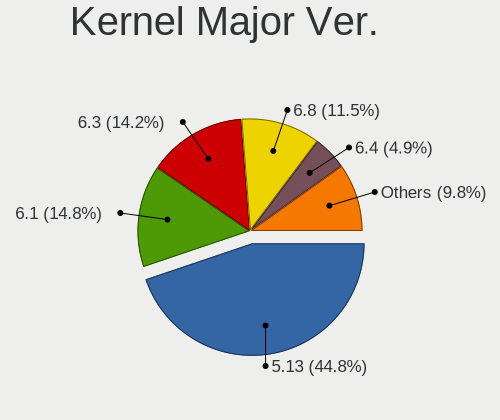
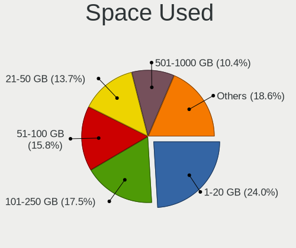
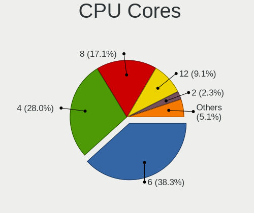
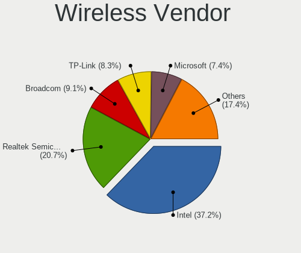

SteamOS - Tested Hardware & Statistics (Desktops)
-------------------------------------------------

A project to collect tested hardware configurations for SteamOS.

Anyone can contribute to this report by the [hw-probe](https://github.com/linuxhw/hw-probe) tool:

    sudo -E hw-probe -all -upload

Please contribute! Especially if your hardware is rare.

Contents
--------

* [ Test Cases ](#test-cases)

* [ System ](#system)
  - [ OS                       ](#os)
  - [ OS Family                ](#os-family)
  - [ Kernel                   ](#kernel)
  - [ Kernel Family            ](#kernel-family)
  - [ Kernel Major Ver.        ](#kernel-major-ver)
  - [ Arch                     ](#arch)
  - [ DE                       ](#de)
  - [ Display Server           ](#display-server)
  - [ Display Manager          ](#display-manager)
  - [ OS Lang                  ](#os-lang)
  - [ Boot Mode                ](#boot-mode)
  - [ Filesystem               ](#filesystem)
  - [ Part. scheme             ](#part-scheme)
  - [ Dual Boot with Linux/BSD ](#dual-boot-with-linuxbsd)
  - [ Dual Boot (Win)          ](#dual-boot-win)

* [ Board ](#board)
  - [ Vendor                   ](#vendor)
  - [ Model                    ](#model)
  - [ Model Family             ](#model-family)
  - [ MFG Year                 ](#mfg-year)
  - [ Form Factor              ](#form-factor)
  - [ Secure Boot              ](#secure-boot)
  - [ Coreboot                 ](#coreboot)
  - [ RAM Size                 ](#ram-size)
  - [ RAM Used                 ](#ram-used)
  - [ Total Drives             ](#total-drives)
  - [ Has CD-ROM               ](#has-cd-rom)
  - [ Has Ethernet             ](#has-ethernet)
  - [ Has WiFi                 ](#has-wifi)
  - [ Has Bluetooth            ](#has-bluetooth)

* [ Location ](#location)
  - [ Country                  ](#country)
  - [ City                     ](#city)

* [ Drives ](#drives)
  - [ Drive Vendor             ](#drive-vendor)
  - [ Drive Model              ](#drive-model)
  - [ HDD Vendor               ](#hdd-vendor)
  - [ SSD Vendor               ](#ssd-vendor)
  - [ Drive Kind               ](#drive-kind)
  - [ Drive Connector          ](#drive-connector)
  - [ Drive Size               ](#drive-size)
  - [ Space Total              ](#space-total)
  - [ Space Used               ](#space-used)
  - [ Malfunc. Drives          ](#malfunc-drives)
  - [ Malfunc. Drive Vendor    ](#malfunc-drive-vendor)
  - [ Malfunc. HDD Vendor      ](#malfunc-hdd-vendor)
  - [ Malfunc. Drive Kind      ](#malfunc-drive-kind)
  - [ Failed Drives            ](#failed-drives)
  - [ Failed Drive Vendor      ](#failed-drive-vendor)
  - [ Drive Status             ](#drive-status)

* [ Storage controller ](#storage-controller)
  - [ Storage Vendor           ](#storage-vendor)
  - [ Storage Model            ](#storage-model)
  - [ Storage Kind             ](#storage-kind)

* [ Processor ](#processor)
  - [ CPU Vendor               ](#cpu-vendor)
  - [ CPU Model                ](#cpu-model)
  - [ CPU Model Family         ](#cpu-model-family)
  - [ CPU Cores                ](#cpu-cores)
  - [ CPU Sockets              ](#cpu-sockets)
  - [ CPU Threads              ](#cpu-threads)
  - [ CPU Op-Modes             ](#cpu-op-modes)
  - [ CPU Microcode            ](#cpu-microcode)
  - [ CPU Microarch            ](#cpu-microarch)

* [ Graphics ](#graphics)
  - [ GPU Vendor               ](#gpu-vendor)
  - [ GPU Model                ](#gpu-model)
  - [ GPU Combo                ](#gpu-combo)
  - [ GPU Driver               ](#gpu-driver)
  - [ GPU Memory               ](#gpu-memory)

* [ Monitor ](#monitor)
  - [ Monitor Vendor           ](#monitor-vendor)
  - [ Monitor Model            ](#monitor-model)
  - [ Monitor Resolution       ](#monitor-resolution)
  - [ Monitor Diagonal         ](#monitor-diagonal)
  - [ Monitor Width            ](#monitor-width)
  - [ Aspect Ratio             ](#aspect-ratio)
  - [ Monitor Area             ](#monitor-area)
  - [ Pixel Density            ](#pixel-density)
  - [ Multiple Monitors        ](#multiple-monitors)

* [ Network ](#network)
  - [ Net Controller Vendor    ](#net-controller-vendor)
  - [ Net Controller Model     ](#net-controller-model)
  - [ Wireless Vendor          ](#wireless-vendor)
  - [ Wireless Model           ](#wireless-model)
  - [ Ethernet Vendor          ](#ethernet-vendor)
  - [ Ethernet Model           ](#ethernet-model)
  - [ Net Controller Kind      ](#net-controller-kind)
  - [ Used Controller          ](#used-controller)
  - [ NICs                     ](#nics)
  - [ IPv6                     ](#ipv6)

* [ Bluetooth ](#bluetooth)
  - [ Bluetooth Vendor         ](#bluetooth-vendor)
  - [ Bluetooth Model          ](#bluetooth-model)

* [ Sound ](#sound)
  - [ Sound Vendor             ](#sound-vendor)
  - [ Sound Model              ](#sound-model)

* [ Memory ](#memory)
  - [ Memory Vendor            ](#memory-vendor)
  - [ Memory Model             ](#memory-model)
  - [ Memory Kind              ](#memory-kind)
  - [ Memory Form Factor       ](#memory-form-factor)
  - [ Memory Size              ](#memory-size)
  - [ Memory Speed             ](#memory-speed)

* [ Printers & scanners ](#printers--scanners)
  - [ Printer Vendor           ](#printer-vendor)
  - [ Printer Model            ](#printer-model)
  - [ Scanner Vendor           ](#scanner-vendor)
  - [ Scanner Model            ](#scanner-model)

* [ Camera ](#camera)
  - [ Camera Vendor            ](#camera-vendor)
  - [ Camera Model             ](#camera-model)

* [ Security ](#security)
  - [ Fingerprint Vendor       ](#fingerprint-vendor)
  - [ Fingerprint Model        ](#fingerprint-model)
  - [ Chipcard Vendor          ](#chipcard-vendor)
  - [ Chipcard Model           ](#chipcard-model)

* [ Unsupported ](#unsupported)
  - [ Unsupported Devices      ](#unsupported-devices)
  - [ Unsupported Device Types ](#unsupported-device-types)

Test Cases
----------

Total: 42

| Vendor    | Model                       | Probe                                                      | Date         |
|-----------|-----------------------------|------------------------------------------------------------|--------------|
| Apple     | Mac-27AD2F918AE68F61 Mac... | [3e25da0356](https://linux-hardware.org/?probe=3e25da0356) | Oct 01, 2022 |
| ASRock    | X570 Phantom Gaming-ITX/... | [5746aa7609](https://linux-hardware.org/?probe=5746aa7609) | Sep 29, 2022 |
| ASUSTek   | CROSSHAIR VI HERO           | [46e48bc4c1](https://linux-hardware.org/?probe=46e48bc4c1) | Sep 28, 2022 |
| ASUSTek   | CROSSHAIR VI HERO           | [7a00d659bd](https://linux-hardware.org/?probe=7a00d659bd) | Sep 24, 2022 |
| ASUSTek   | CROSSHAIR VI HERO           | [696b4e525e](https://linux-hardware.org/?probe=696b4e525e) | Sep 20, 2022 |
| ASUSTek   | CROSSHAIR VI HERO           | [8d8440548e](https://linux-hardware.org/?probe=8d8440548e) | Sep 20, 2022 |
| MSI       | X399 SLI PLUS               | [f686754b27](https://linux-hardware.org/?probe=f686754b27) | Sep 16, 2022 |
| MSI       | X470 GAMING PLUS            | [9919cebdfe](https://linux-hardware.org/?probe=9919cebdfe) | Sep 15, 2022 |
| MSI       | 970A-G46                    | [5f7482fe88](https://linux-hardware.org/?probe=5f7482fe88) | Sep 11, 2022 |
| ASUSTek   | H81M-PLUS                   | [2d99107aa6](https://linux-hardware.org/?probe=2d99107aa6) | Sep 05, 2022 |
| Gigabyte  | B450 AORUS M                | [3ac55201b6](https://linux-hardware.org/?probe=3ac55201b6) | Sep 04, 2022 |
| Dell      | 0HHV7N A00                  | [f4142b2ff8](https://linux-hardware.org/?probe=f4142b2ff8) | Sep 02, 2022 |
| ASUSTek   | PRIME A320M-K               | [bdae2c60cd](https://linux-hardware.org/?probe=bdae2c60cd) | Sep 01, 2022 |
| MSI       | MS-B9201                    | [b5c80c8c2c](https://linux-hardware.org/?probe=b5c80c8c2c) | Aug 29, 2022 |
| Gigabyte  | B550 AORUS ELITE AX V2      | [9e3df56c3b](https://linux-hardware.org/?probe=9e3df56c3b) | Aug 28, 2022 |
| ASUSTek   | PRIME B550-PLUS             | [67b791eb17](https://linux-hardware.org/?probe=67b791eb17) | Aug 25, 2022 |
| ASUSTek   | H97-PRO GAMER               | [663bc0a517](https://linux-hardware.org/?probe=663bc0a517) | Aug 25, 2022 |
| ASUSTek   | H97-PRO GAMER               | [e934af2a60](https://linux-hardware.org/?probe=e934af2a60) | Aug 23, 2022 |
| Gigabyte  | AB350-Gaming 3-CF           | [9661c799c9](https://linux-hardware.org/?probe=9661c799c9) | Aug 18, 2022 |
| Gigabyte  | X570 GAMING X               | [d8e60dcf09](https://linux-hardware.org/?probe=d8e60dcf09) | Aug 17, 2022 |
| ASUSTek   | TUF Gaming X570-PLUS        | [53429d945b](https://linux-hardware.org/?probe=53429d945b) | Aug 15, 2022 |
| MSI       | MS-B9351                    | [a5b1950761](https://linux-hardware.org/?probe=a5b1950761) | Aug 14, 2022 |
| MSI       | MS-B9351                    | [fbf08d2d76](https://linux-hardware.org/?probe=fbf08d2d76) | Aug 14, 2022 |
| MSI       | B450 TOMAHAWK MAX II        | [dcd9be004c](https://linux-hardware.org/?probe=dcd9be004c) | Aug 13, 2022 |
| ASUSTek   | SABERTOOTH X99              | [54ea6926a0](https://linux-hardware.org/?probe=54ea6926a0) | Aug 13, 2022 |
| Dell      | 00F82W A00                  | [8e74c57731](https://linux-hardware.org/?probe=8e74c57731) | Aug 07, 2022 |
| Gigabyte  | H310M S2V                   | [329d2071a9](https://linux-hardware.org/?probe=329d2071a9) | Aug 01, 2022 |
| ASRock    | A520M-ITX/ac                | [876c779461](https://linux-hardware.org/?probe=876c779461) | Jul 25, 2022 |
| ASRock    | B450M-HDV R4.0              | [f2172999c8](https://linux-hardware.org/?probe=f2172999c8) | Jul 24, 2022 |
| ASUSTek   | EX-A320M-GAMING             | [68884b1723](https://linux-hardware.org/?probe=68884b1723) | Jul 17, 2022 |
| Gigabyte  | H170N-WIFI-CF               | [2f3e59dc30](https://linux-hardware.org/?probe=2f3e59dc30) | Jul 09, 2022 |
| Gigabyte  | B550 GAMING X V2            | [61eaf99aca](https://linux-hardware.org/?probe=61eaf99aca) | Jul 05, 2022 |
| Gigabyte  | B550 GAMING X V2            | [812733dd89](https://linux-hardware.org/?probe=812733dd89) | Jul 05, 2022 |
| Gigabyte  | X570 I AORUS PRO WIFI       | [d82f88e20c](https://linux-hardware.org/?probe=d82f88e20c) | Jul 01, 2022 |
| Alienware | 02XRCM A01                  | [c70647bab0](https://linux-hardware.org/?probe=c70647bab0) | Jun 26, 2022 |
| ASUSTek   | H61M-K                      | [1a568c2e5f](https://linux-hardware.org/?probe=1a568c2e5f) | Jun 23, 2022 |
| ASUSTek   | ROG STRIX B550-F GAMING     | [b3a08001ed](https://linux-hardware.org/?probe=b3a08001ed) | Jun 01, 2022 |
| ASRock    | B550 PG Velocita            | [0d7f71a24d](https://linux-hardware.org/?probe=0d7f71a24d) | May 30, 2022 |
| ASRock    | B365M Pro4-F                | [afc161c6fb](https://linux-hardware.org/?probe=afc161c6fb) | May 30, 2022 |
| Gigabyte  | B560M AORUS PRO             | [31f246f96e](https://linux-hardware.org/?probe=31f246f96e) | May 27, 2022 |
| Gigabyte  | B560M AORUS PRO             | [1d381d6ec9](https://linux-hardware.org/?probe=1d381d6ec9) | May 27, 2022 |
| Gigabyte  | Z170XP-SLI-CF               | [d4bef1e450](https://linux-hardware.org/?probe=d4bef1e450) | May 26, 2022 |

System
------

OS
--

Installed operating systems

| Name                         | Desktops | Percent |
|------------------------------|----------|---------|
| SteamOS 3.3                  | 22       | 64.71%  |
| SteamOS 3.2 (steamdeck-main) | 7        | 20.59%  |
| SteamOS Snapshot             | 3        | 8.82%   |
| SteamOS 3.2                  | 1        | 2.94%   |
| SteamOS                      | 1        | 2.94%   |

OS Family
---------

OS without a version

| Name    | Desktops | Percent |
|---------|----------|---------|
| SteamOS | 34       | 100%    |

Kernel
------

Version of the Linux kernel

| Version                                            | Desktops | Percent |
|----------------------------------------------------|----------|---------|
| 5.13.0-valve10.1-2-neptune-dri-02144-g7fffaf925dfb | 11       | 32.35%  |
| 5.13.0-valve24-1-neptune-02226-g5b8545e4c5a1       | 10       | 29.41%  |
| 5.13.0-valve22-1-neptune-02213-gb68995364335       | 7        | 20.59%  |
| 5.18.1-arch1_testHoloISO_20220606.1811             | 2        | 5.88%   |
| 5.13.0-valve23-1-neptune-02219-gf0b4ecc8cab6       | 2        | 5.88%   |
| 5.13.0-valve21-2-neptune-02209-g2a5bdc1102a0       | 1        | 2.94%   |
| 5.13.0-valve21-1-neptune-02209-g2a5bdc1102a0       | 1        | 2.94%   |

Kernel Family
-------------

Linux kernel without a distro release

| Version | Desktops | Percent |
|---------|----------|---------|
| 5.13.0  | 32       | 94.12%  |
| 5.18.1  | 2        | 5.88%   |

Kernel Major Ver.
-----------------

Linux kernel major version

| Version | Desktops | Percent |
|---------|----------|---------|
| 5.13    | 32       | 94.12%  |
| 5.18    | 2        | 5.88%   |

Arch
----

OS architecture (x86_64, i586, etc.)

| Name   | Desktops | Percent |
|--------|----------|---------|
| x86_64 | 34       | 100%    |

DE
--

Desktop Environment

| Name | Desktops | Percent |
|------|----------|---------|
| KDE5 | 34       | 100%    |

Display Server
--------------

X11 or Wayland

| Name | Desktops | Percent |
|------|----------|---------|
| X11  | 34       | 100%    |

Display Manager
---------------

SDDM, LightDM, etc.

| Name    | Desktops | Percent |
|---------|----------|---------|
| Unknown | 34       | 100%    |

OS Lang
-------

Language

| Lang  | Desktops | Percent |
|-------|----------|---------|
| en_US | 29       | 85.29%  |
| pt_PT | 1        | 2.94%   |
| fr_FR | 1        | 2.94%   |
| en_IE | 1        | 2.94%   |
| en_GB | 1        | 2.94%   |
| C     | 1        | 2.94%   |

Boot Mode
---------

EFI or BIOS

| Mode | Desktops | Percent |
|------|----------|---------|
| BIOS | 34       | 100%    |

Filesystem
----------

Type of filesystem

| Type  | Desktops | Percent |
|-------|----------|---------|
| Btrfs | 34       | 100%    |

Part. scheme
------------

Scheme of partitioning

| Type    | Desktops | Percent |
|---------|----------|---------|
| Unknown | 34       | 100%    |

Dual Boot with Linux/BSD
------------------------

Hosting more than one Linux/BSD

| Dual boot | Desktops | Percent |
|-----------|----------|---------|
| No        | 34       | 100%    |

Dual Boot (Win)
---------------

Hosting Linux and Windows

| Dual boot | Desktops | Percent |
|-----------|----------|---------|
| No        | 34       | 100%    |

Board
-----

Vendor
------

Motherboard manufacturer

| Name                | Desktops | Percent |
|---------------------|----------|---------|
| ASUSTek Computer    | 10       | 29.41%  |
| Gigabyte Technology | 9        | 26.47%  |
| MSI                 | 6        | 17.65%  |
| ASRock              | 5        | 14.71%  |
| Dell                | 2        | 5.88%   |
| Apple               | 1        | 2.94%   |
| Alienware           | 1        | 2.94%   |

Model
-----

Motherboard model

| Name                               | Desktops | Percent |
|------------------------------------|----------|---------|
| ASUS All Series                    | 3        | 8.82%   |
| MSI MS-7C02                        | 1        | 2.94%   |
| MSI MS-7B79                        | 1        | 2.94%   |
| MSI MS-7B09                        | 1        | 2.94%   |
| MSI MS-7693                        | 1        | 2.94%   |
| MSI MPG H510 Trident 3 (MS-B935)   | 1        | 2.94%   |
| MSI H310 Gaming Trident3 (MS-B920) | 1        | 2.94%   |
| Gigabyte X570 I AORUS PRO WIFI     | 1        | 2.94%   |
| Gigabyte X570 GAMING X             | 1        | 2.94%   |
| Gigabyte MBB-670016                | 1        | 2.94%   |
| Gigabyte H310M S2V 2.0             | 1        | 2.94%   |
| Gigabyte H170N-WIFI                | 1        | 2.94%   |
| Gigabyte B560M AORUS PRO           | 1        | 2.94%   |
| Gigabyte B550 GAMING X V2          | 1        | 2.94%   |
| Gigabyte B450 AORUS M              | 1        | 2.94%   |
| Gigabyte AB350-Gaming 3            | 1        | 2.94%   |
| Dell Precision Tower 5810          | 1        | 2.94%   |
| Dell OptiPlex 9010                 | 1        | 2.94%   |
| ASUS TUF Gaming X570-PLUS          | 1        | 2.94%   |
| ASUS ROG STRIX B550-F GAMING       | 1        | 2.94%   |
| ASUS PRIME B550-PLUS               | 1        | 2.94%   |
| ASUS PRIME A320M-K                 | 1        | 2.94%   |
| ASUS H61M-K                        | 1        | 2.94%   |
| ASUS EX-A320M-GAMING               | 1        | 2.94%   |
| ASUS CROSSHAIR VI HERO             | 1        | 2.94%   |
| ASRock X570 Phantom Gaming-ITX/TB3 | 1        | 2.94%   |
| ASRock B550 PG Velocita            | 1        | 2.94%   |
| ASRock B450M-HDV R4.0              | 1        | 2.94%   |
| ASRock B365M Pro4-F                | 1        | 2.94%   |
| ASRock A520M-ITX/ac                | 1        | 2.94%   |
| Apple MacPro7,1                    | 1        | 2.94%   |
| Alienware Aurora R8                | 1        | 2.94%   |

Model Family
------------

Motherboard model prefix

| Name                  | Desktops | Percent |
|-----------------------|----------|---------|
| ASUS All              | 3        | 8.82%   |
| Gigabyte X570         | 2        | 5.88%   |
| ASUS PRIME            | 2        | 5.88%   |
| MSI MS-7C02           | 1        | 2.94%   |
| MSI MS-7B79           | 1        | 2.94%   |
| MSI MS-7B09           | 1        | 2.94%   |
| MSI MS-7693           | 1        | 2.94%   |
| MSI MPG               | 1        | 2.94%   |
| MSI H310              | 1        | 2.94%   |
| Gigabyte MBB-670016   | 1        | 2.94%   |
| Gigabyte H310M        | 1        | 2.94%   |
| Gigabyte H170N-WIFI   | 1        | 2.94%   |
| Gigabyte B560M        | 1        | 2.94%   |
| Gigabyte B550         | 1        | 2.94%   |
| Gigabyte B450         | 1        | 2.94%   |
| Gigabyte AB350-Gaming | 1        | 2.94%   |
| Dell Precision        | 1        | 2.94%   |
| Dell OptiPlex         | 1        | 2.94%   |
| ASUS TUF              | 1        | 2.94%   |
| ASUS ROG              | 1        | 2.94%   |
| ASUS H61M-K           | 1        | 2.94%   |
| ASUS EX-A320M-GAMING  | 1        | 2.94%   |
| ASUS CROSSHAIR        | 1        | 2.94%   |
| ASRock X570           | 1        | 2.94%   |
| ASRock B550           | 1        | 2.94%   |
| ASRock B450M-HDV      | 1        | 2.94%   |
| ASRock B365M          | 1        | 2.94%   |
| ASRock A520M-ITX      | 1        | 2.94%   |
| Apple MacPro7         | 1        | 2.94%   |
| Alienware Aurora      | 1        | 2.94%   |

MFG Year
--------

Motherboard manufacture year

| Year | Desktops | Percent |
|------|----------|---------|
| 2020 | 7        | 20.59%  |
| 2018 | 6        | 17.65%  |
| 2019 | 5        | 14.71%  |
| 2022 | 3        | 8.82%   |
| 2021 | 3        | 8.82%   |
| 2017 | 3        | 8.82%   |
| 2013 | 3        | 8.82%   |
| 2016 | 2        | 5.88%   |
| 2014 | 1        | 2.94%   |
| 2012 | 1        | 2.94%   |

Form Factor
-----------

Physical design of the computer

| Name    | Desktops | Percent |
|---------|----------|---------|
| Desktop | 34       | 100%    |

Secure Boot
-----------

Enabled or disabled

| State    | Desktops | Percent |
|----------|----------|---------|
| Disabled | 34       | 100%    |

Coreboot
--------

Have coreboot on board

| Used | Desktops | Percent |
|------|----------|---------|
| No   | 34       | 100%    |

RAM Size
--------

Total RAM memory

| Size in GB  | Desktops | Percent |
|-------------|----------|---------|
| 16.01-24.0  | 19       | 55.88%  |
| 32.01-64.0  | 9        | 26.47%  |
| 64.01-256.0 | 2        | 5.88%   |
| 8.01-16.0   | 2        | 5.88%   |
| 4.01-8.0    | 1        | 2.94%   |
| 24.01-32.0  | 1        | 2.94%   |

RAM Used
--------

Used RAM memory

| Used GB  | Desktops | Percent |
|----------|----------|---------|
| 2.01-3.0 | 18       | 52.94%  |
| 3.01-4.0 | 8        | 23.53%  |
| 4.01-8.0 | 5        | 14.71%  |
| 1.01-2.0 | 3        | 8.82%   |

Total Drives
------------

Number of drives on board

| Drives | Desktops | Percent |
|--------|----------|---------|
| 3      | 9        | 26.47%  |
| 2      | 9        | 26.47%  |
| 1      | 9        | 26.47%  |
| 4      | 3        | 8.82%   |
| 5      | 2        | 5.88%   |
| 7      | 1        | 2.94%   |
| 6      | 1        | 2.94%   |

Has CD-ROM
----------

Has CD-ROM on board

| Presented | Desktops | Percent |
|-----------|----------|---------|
| No        | 31       | 91.18%  |
| Yes       | 3        | 8.82%   |

Has Ethernet
------------

Has Ethernet on board

| Presented | Desktops | Percent |
|-----------|----------|---------|
| Yes       | 34       | 100%    |

Has WiFi
--------

Has WiFi module

| Presented | Desktops | Percent |
|-----------|----------|---------|
| Yes       | 20       | 58.82%  |
| No        | 14       | 41.18%  |

Has Bluetooth
-------------

Has Bluetooth module

| Presented | Desktops | Percent |
|-----------|----------|---------|
| No        | 19       | 55.88%  |
| Yes       | 15       | 44.12%  |

Location
--------

Country
-------

Geographic location (country)

| Country   | Desktops | Percent |
|-----------|----------|---------|
| USA       | 12       | 35.29%  |
| UK        | 5        | 14.71%  |
| France    | 3        | 8.82%   |
| Australia | 3        | 8.82%   |
| Turkey    | 1        | 2.94%   |
| Spain     | 1        | 2.94%   |
| Romania   | 1        | 2.94%   |
| Portugal  | 1        | 2.94%   |
| Poland    | 1        | 2.94%   |
| Oman      | 1        | 2.94%   |
| Latvia    | 1        | 2.94%   |
| Ireland   | 1        | 2.94%   |
| Hong Kong | 1        | 2.94%   |
| Canada    | 1        | 2.94%   |
| Cambodia  | 1        | 2.94%   |

City
----

Geographic location (city)

| City                    | Desktops | Percent |
|-------------------------|----------|---------|
| Walsall                 | 1        | 2.94%   |
| Vilas                   | 1        | 2.94%   |
| Tuam                    | 1        | 2.94%   |
| Targoviste              | 1        | 2.94%   |
| Sterling Heights        | 1        | 2.94%   |
| South Holland           | 1        | 2.94%   |
| Skarzysko-Kamienna      | 1        | 2.94%   |
| Riga                    | 1        | 2.94%   |
| Phnom Penh              | 1        | 2.94%   |
| Perth                   | 1        | 2.94%   |
| Peoria                  | 1        | 2.94%   |
| Paris                   | 1        | 2.94%   |
| Norwich                 | 1        | 2.94%   |
| Noble Park              | 1        | 2.94%   |
| Newcastle-under-Lyme    | 1        | 2.94%   |
| Muscat                  | 1        | 2.94%   |
| Moyeuvre-Grande         | 1        | 2.94%   |
| Milford                 | 1        | 2.94%   |
| Mascot                  | 1        | 2.94%   |
| Loveland                | 1        | 2.94%   |
| Lisbon                  | 1        | 2.94%   |
| Langley                 | 1        | 2.94%   |
| Ivry-sur-Seine          | 1        | 2.94%   |
| Istanbul                | 1        | 2.94%   |
| Hornsea                 | 1        | 2.94%   |
| Henderson               | 1        | 2.94%   |
| Elk Grove               | 1        | 2.94%   |
| Detroit                 | 1        | 2.94%   |
| Dallas                  | 1        | 2.94%   |
| Corning                 | 1        | 2.94%   |
| Chiclana de la Frontera | 1        | 2.94%   |
| Central                 | 1        | 2.94%   |
| Buffalo                 | 1        | 2.94%   |
| Bexleyheath             | 1        | 2.94%   |

Drives
------

Drive Vendor
------------

Hard drive vendors

| Vendor                    | Desktops | Drives | Percent |
|---------------------------|----------|--------|---------|
| Seagate                   | 12       | 14     | 16.22%  |
| Samsung Electronics       | 12       | 19     | 16.22%  |
| WDC                       | 6        | 7      | 8.11%   |
| Kingston                  | 5        | 5      | 6.76%   |
| A-DATA Technology         | 5        | 5      | 6.76%   |
| SanDisk                   | 4        | 6      | 5.41%   |
| Phison                    | 4        | 4      | 5.41%   |
| Crucial                   | 4        | 4      | 5.41%   |
| Toshiba                   | 3        | 5      | 4.05%   |
| Realtek Semiconductor     | 2        | 2      | 2.7%    |
| PNY                       | 2        | 2      | 2.7%    |
| Micron/Crucial Technology | 2        | 2      | 2.7%    |
| China                     | 2        | 3      | 2.7%    |
| Apple                     | 2        | 2      | 2.7%    |
| Unknown                   | 1        | 1      | 1.35%   |
| Union Memory (Shenzhen)   | 1        | 1      | 1.35%   |
| SPCC                      | 1        | 1      | 1.35%   |
| SK hynix                  | 1        | 1      | 1.35%   |
| Phison Electronics        | 1        | 1      | 1.35%   |
| Mushkin                   | 1        | 1      | 1.35%   |
| HS-SSD-C100               | 1        | 1      | 1.35%   |
| GALAX                     | 1        | 1      | 1.35%   |
| Unknown                   | 1        | 1      | 1.35%   |

Drive Model
-----------

Hard drive models

| Model                                        | Desktops | Percent |
|----------------------------------------------|----------|---------|
| Samsung NVMe SSD Drive 1TB                   | 3        | 3.49%   |
| SanDisk NVMe SSD Drive 500GB                 | 2        | 2.33%   |
| Realtek NVMe SSD Drive 256GB                 | 2        | 2.33%   |
| A-DATA SU650 240GB SSD                       | 2        | 2.33%   |
| A-DATA SU630 240GB SSD                       | 2        | 2.33%   |
| WDC WDS500G2B0A-00SM50 500GB SSD             | 1        | 1.16%   |
| WDC WDBNCE5000PNC 500GB SSD                  | 1        | 1.16%   |
| WDC WDBNCE0010PNC 1TB SSD                    | 1        | 1.16%   |
| WDC WD7500BPVT-80HXZT3 752GB                 | 1        | 1.16%   |
| WDC WD5000BPKT-60PK4T0 500GB                 | 1        | 1.16%   |
| WDC WD10EZEX-00BN5A0 1TB                     | 1        | 1.16%   |
| WDC WD10EURX-83UY4Y0 1TB                     | 1        | 1.16%   |
| Unknown NVMe SSD Drive 512GB                 | 1        | 1.16%   |
| Union Memory (Shenzhen) NVMe SSD Drive 128GB | 1        | 1.16%   |
| Toshiba MQ01ABD100 1TB                       | 1        | 1.16%   |
| Toshiba MK3275GSX 320GB                      | 1        | 1.16%   |
| Toshiba HDWD130 3TB                          | 1        | 1.16%   |
| Toshiba DT01ACA200 2TB                       | 1        | 1.16%   |
| SPCC Solid State Disk 1024GB                 | 1        | 1.16%   |
| SK hynix NVMe SSD Drive 256GB                | 1        | 1.16%   |
| Seagate ST9320325AS 320GB                    | 1        | 1.16%   |
| Seagate ST6000DM003-2CY186 6TB               | 1        | 1.16%   |
| Seagate ST4000DX001-1CE168 4TB               | 1        | 1.16%   |
| Seagate ST4000DM004-2CV104 4TB               | 1        | 1.16%   |
| Seagate ST3750640NS 752GB                    | 1        | 1.16%   |
| Seagate ST3500413AS 500GB                    | 1        | 1.16%   |
| Seagate ST3500312CS 500GB                    | 1        | 1.16%   |
| Seagate ST3160318AS 160GB                    | 1        | 1.16%   |
| Seagate ST2000DM008-2FR102 2TB               | 1        | 1.16%   |
| Seagate ST1000LM049-2GH172 1TB               | 1        | 1.16%   |
| Seagate ST1000LM035-1RK172 1TB               | 1        | 1.16%   |
| Seagate ST1000LM014-1EJ164 1TB               | 1        | 1.16%   |
| Seagate ST1000DX001-1CM162 1TB               | 1        | 1.16%   |
| Seagate NVMe SSD Drive 2TB                   | 1        | 1.16%   |
| SanDisk X400 M.2 2280 128GB SSD              | 1        | 1.16%   |
| SanDisk Ultra II 960GB SSD                   | 1        | 1.16%   |
| SanDisk SDSSDHII240G 240GB                   | 1        | 1.16%   |
| SanDisk NVMe SSD Drive 2TB                   | 1        | 1.16%   |
| Samsung SSD 970 EVO Plus 1TB                 | 1        | 1.16%   |
| Samsung SSD 870 QVO 2TB                      | 1        | 1.16%   |

HDD Vendor
----------

Hard disk drive vendors

| Vendor  | Desktops | Drives | Percent |
|---------|----------|--------|---------|
| Seagate | 11       | 13     | 61.11%  |
| WDC     | 3        | 4      | 16.67%  |
| Toshiba | 3        | 5      | 16.67%  |
| Apple   | 1        | 1      | 5.56%   |

SSD Vendor
----------

Solid state drive vendors

| Vendor              | Desktops | Drives | Percent |
|---------------------|----------|--------|---------|
| Samsung Electronics | 10       | 12     | 29.41%  |
| A-DATA Technology   | 5        | 5      | 14.71%  |
| Kingston            | 4        | 4      | 11.76%  |
| Crucial             | 4        | 4      | 11.76%  |
| WDC                 | 3        | 3      | 8.82%   |
| SanDisk             | 2        | 3      | 5.88%   |
| PNY                 | 2        | 2      | 5.88%   |
| China               | 2        | 3      | 5.88%   |
| SPCC                | 1        | 1      | 2.94%   |
| Mushkin             | 1        | 1      | 2.94%   |

Drive Kind
----------

HDD or SSD

| Kind    | Desktops | Drives | Percent |
|---------|----------|--------|---------|
| SSD     | 24       | 38     | 36.92%  |
| NVMe    | 22       | 25     | 33.85%  |
| HDD     | 16       | 23     | 24.62%  |
| Unknown | 3        | 3      | 4.62%   |

Drive Connector
---------------

SATA, SAS, NVMe, etc.

| Type | Desktops | Drives | Percent |
|------|----------|--------|---------|
| SATA | 29       | 62     | 54.72%  |
| NVMe | 22       | 25     | 41.51%  |
| SAS  | 2        | 2      | 3.77%   |

Drive Size
----------

Size of hard drive

| Size in TB | Desktops | Drives | Percent |
|------------|----------|--------|---------|
| 0.01-0.5   | 21       | 34     | 48.84%  |
| 0.51-1.0   | 14       | 17     | 32.56%  |
| 1.01-2.0   | 4        | 5      | 9.3%    |
| 3.01-4.0   | 2        | 2      | 4.65%   |
| 2.01-3.0   | 1        | 2      | 2.33%   |
| 4.01-10.0  | 1        | 1      | 2.33%   |

Space Total
-----------

Amount of disk space available on the file system

| Size in GB     | Desktops | Percent |
|----------------|----------|---------|
| 101-250        | 12       | 35.29%  |
| 251-500        | 7        | 20.59%  |
| 1001-2000      | 6        | 17.65%  |
| 501-1000       | 6        | 17.65%  |
| More than 3000 | 2        | 5.88%   |
| 2001-3000      | 1        | 2.94%   |

Space Used
----------

Amount of used disk space

| Used GB   | Desktops | Percent |
|-----------|----------|---------|
| 1-20      | 18       | 52.94%  |
| 51-100    | 9        | 26.47%  |
| 21-50     | 3        | 8.82%   |
| 101-250   | 2        | 5.88%   |
| 2001-3000 | 1        | 2.94%   |
| 501-1000  | 1        | 2.94%   |

Malfunc. Drives
---------------

Drive models with a malfunction

Zero info for selected period =(

Malfunc. Drive Vendor
---------------------

Vendors of faulty drives

Zero info for selected period =(

Malfunc. HDD Vendor
-------------------

Vendors of faulty HDD drives

Zero info for selected period =(

Malfunc. Drive Kind
-------------------

Kinds of faulty drives

Zero info for selected period =(

Failed Drives
-------------

Failed drive models

Zero info for selected period =(

Failed Drive Vendor
-------------------

Failed drive vendors

Zero info for selected period =(

Drive Status
------------

Number of failed and malfunc. drives

| Status   | Desktops | Drives | Percent |
|----------|----------|--------|---------|
| Detected | 34       | 89     | 100%    |

Storage controller
------------------

Storage Vendor
--------------

Storage controller vendors

| Vendor                      | Desktops | Percent |
|-----------------------------|----------|---------|
| AMD                         | 19       | 33.93%  |
| Intel                       | 14       | 25%     |
| Samsung Electronics         | 5        | 8.93%   |
| Phison Electronics          | 5        | 8.93%   |
| SanDisk                     | 3        | 5.36%   |
| Realtek Semiconductor       | 2        | 3.57%   |
| Micron/Crucial Technology   | 2        | 3.57%   |
| Unknown                     | 1        | 1.79%   |
| Union Memory (Shenzhen)     | 1        | 1.79%   |
| SK hynix                    | 1        | 1.79%   |
| Seagate Technology          | 1        | 1.79%   |
| Kingston Technology Company | 1        | 1.79%   |
| Apple                       | 1        | 1.79%   |

Storage Model
-------------

Storage controller models

| Model                                                                          | Desktops | Percent |
|--------------------------------------------------------------------------------|----------|---------|
| AMD FCH SATA Controller [AHCI mode]                                            | 13       | 19.4%   |
| AMD 500 Series Chipset SATA Controller                                         | 5        | 7.46%   |
| AMD 400 Series Chipset SATA Controller                                         | 4        | 5.97%   |
| Samsung NVMe SSD Controller SM981/PM981/PM983                                  | 3        | 4.48%   |
| Intel 200 Series PCH SATA controller [AHCI mode]                               | 3        | 4.48%   |
| Phison Electronics Non-Volatile memory controller                              | 2        | 2.99%   |
| Phison E12 NVMe Controller                                                     | 2        | 2.99%   |
| Intel Q170/Q150/B150/H170/H110/Z170/CM236 Chipset SATA Controller [AHCI Mode]  | 2        | 2.99%   |
| Intel 500 Series Chipset Family SATA AHCI Controller                           | 2        | 2.99%   |
| AMD FCH SATA Controller D                                                      | 2        | 2.99%   |
| Unknown Non-Volatile memory controller                                         | 1        | 1.49%   |
| Union Memory (Shenzhen) Non-Volatile memory controller                         | 1        | 1.49%   |
| SK hynix Non-Volatile memory controller                                        | 1        | 1.49%   |
| Seagate FireCuda 510 SSD                                                       | 1        | 1.49%   |
| SanDisk WD PC SN810 / Black SN850 NVMe SSD                                     | 1        | 1.49%   |
| SanDisk WD Black SN750 / PC SN730 NVMe SSD                                     | 1        | 1.49%   |
| SanDisk Non-Volatile memory controller                                         | 1        | 1.49%   |
| Samsung NVMe SSD Controller SM961/PM961/SM963                                  | 1        | 1.49%   |
| Samsung NVMe SSD Controller SM951/PM951                                        | 1        | 1.49%   |
| Samsung NVMe SSD Controller PM9A1/PM9A3/980PRO                                 | 1        | 1.49%   |
| Realtek RTS5763DL NVMe SSD Controller                                          | 1        | 1.49%   |
| Realtek Realtek Non-Volatile memory controller                                 | 1        | 1.49%   |
| Phison NVMe Storage Controller                                                 | 1        | 1.49%   |
| Micron/Crucial P2 NVMe PCIe SSD                                                | 1        | 1.49%   |
| Micron/Crucial Non-Volatile memory controller                                  | 1        | 1.49%   |
| Kingston Company Company Non-Volatile memory controller                        | 1        | 1.49%   |
| Intel SATA Controller [RAID mode]                                              | 1        | 1.49%   |
| Intel Cannon Lake PCH SATA AHCI Controller                                     | 1        | 1.49%   |
| Intel C620 Series Chipset Family SATA Controller [AHCI mode]                   | 1        | 1.49%   |
| Intel C610/X99 series chipset sSATA Controller [AHCI mode]                     | 1        | 1.49%   |
| Intel C610/X99 series chipset 6-Port SATA Controller [AHCI mode]               | 1        | 1.49%   |
| Intel 9 Series Chipset Family SATA Controller [AHCI Mode]                      | 1        | 1.49%   |
| Intel 8 Series/C220 Series Chipset Family 6-port SATA Controller 1 [AHCI mode] | 1        | 1.49%   |
| Intel 6 Series/C200 Series Chipset Family 6 port Desktop SATA AHCI Controller  | 1        | 1.49%   |
| Apple ANS2 NVMe Controller                                                     | 1        | 1.49%   |
| AMD X399 Series Chipset SATA Controller                                        | 1        | 1.49%   |
| AMD X370 Series Chipset SATA Controller                                        | 1        | 1.49%   |
| AMD SB7x0/SB8x0/SB9x0 SATA Controller [AHCI mode]                              | 1        | 1.49%   |
| AMD 300 Series Chipset SATA Controller                                         | 1        | 1.49%   |

Storage Kind
------------

Kind of storage controller (IDE, SATA, NVMe, SAS, ...)

| Kind | Desktops | Percent |
|------|----------|---------|
| SATA | 32       | 58.18%  |
| NVMe | 22       | 40%     |
| RAID | 1        | 1.82%   |

Processor
---------

CPU Vendor
----------

Processor vendors

| Vendor | Desktops | Percent |
|--------|----------|---------|
| AMD    | 19       | 55.88%  |
| Intel  | 15       | 44.12%  |

CPU Model
---------

Processor models

| Model                                          | Desktops | Percent |
|------------------------------------------------|----------|---------|
| AMD Ryzen 9 3900X 12-Core Processor            | 3        | 8.82%   |
| AMD Ryzen 5 3600X 6-Core Processor             | 2        | 5.88%   |
| Intel Xeon W-3223 CPU @ 3.50GHz                | 1        | 2.94%   |
| Intel Xeon CPU E5-2630 v3 @ 2.40GHz            | 1        | 2.94%   |
| Intel Xeon CPU E5-1620 v3 @ 3.50GHz            | 1        | 2.94%   |
| Intel Core i7-8700 CPU @ 3.20GHz               | 1        | 2.94%   |
| Intel Core i7-6700K CPU @ 4.00GHz              | 1        | 2.94%   |
| Intel Core i5-9400 CPU @ 2.90GHz               | 1        | 2.94%   |
| Intel Core i5-8500T CPU @ 2.10GHz              | 1        | 2.94%   |
| Intel Core i5-6600 CPU @ 3.30GHz               | 1        | 2.94%   |
| Intel Core i5-4590 CPU @ 3.30GHz               | 1        | 2.94%   |
| Intel Core i5-4440 CPU @ 3.10GHz               | 1        | 2.94%   |
| Intel Core i5-3470 CPU @ 3.20GHz               | 1        | 2.94%   |
| Intel Core i5-2400 CPU @ 3.10GHz               | 1        | 2.94%   |
| Intel Core i3-9100F CPU @ 3.60GHz              | 1        | 2.94%   |
| Intel 11th Gen Core i7-11700F @ 2.50GHz        | 1        | 2.94%   |
| Intel 11th Gen Core i5-11400F @ 2.60GHz        | 1        | 2.94%   |
| AMD Ryzen Threadripper 1950X 16-Core Processor | 1        | 2.94%   |
| AMD Ryzen 9 5900X 12-Core Processor            | 1        | 2.94%   |
| AMD Ryzen 7 5800X 8-Core Processor             | 1        | 2.94%   |
| AMD Ryzen 7 5700G with Radeon Graphics         | 1        | 2.94%   |
| AMD Ryzen 7 3700X 8-Core Processor             | 1        | 2.94%   |
| AMD Ryzen 7 2700 Eight-Core Processor          | 1        | 2.94%   |
| AMD Ryzen 7 1700X Eight-Core Processor         | 1        | 2.94%   |
| AMD Ryzen 5 5600X 6-Core Processor             | 1        | 2.94%   |
| AMD Ryzen 5 5600G with Radeon Graphics         | 1        | 2.94%   |
| AMD Ryzen 5 2600X Six-Core Processor           | 1        | 2.94%   |
| AMD Ryzen 5 2600 Six-Core Processor            | 1        | 2.94%   |
| AMD Ryzen 5 1600 Six-Core Processor            | 1        | 2.94%   |
| AMD FX-8370 Eight-Core Processor               | 1        | 2.94%   |
| AMD Athlon 3000G with Radeon Vega Graphics     | 1        | 2.94%   |

CPU Model Family
----------------

Processor model prefix

| Model                  | Desktops | Percent |
|------------------------|----------|---------|
| Intel Core i5          | 7        | 20.59%  |
| AMD Ryzen 5            | 7        | 20.59%  |
| AMD Ryzen 7            | 5        | 14.71%  |
| AMD Ryzen 9            | 4        | 11.76%  |
| Intel Xeon             | 3        | 8.82%   |
| Other                  | 2        | 5.88%   |
| Intel Core i7          | 2        | 5.88%   |
| Intel Core i3          | 1        | 2.94%   |
| AMD Ryzen Threadripper | 1        | 2.94%   |
| AMD FX                 | 1        | 2.94%   |
| AMD Athlon             | 1        | 2.94%   |

CPU Cores
---------

Number of processor cores

| Number | Desktops | Percent |
|--------|----------|---------|
| 6      | 11       | 32.35%  |
| 8      | 9        | 26.47%  |
| 4      | 9        | 26.47%  |
| 12     | 4        | 11.76%  |
| 2      | 1        | 2.94%   |

CPU Sockets
-----------

Number of sockets

| Number | Desktops | Percent |
|--------|----------|---------|
| 1      | 34       | 100%    |

CPU Threads
-----------

Threads per core (Hyper-Threading)

| Number | Desktops | Percent |
|--------|----------|---------|
| 2      | 26       | 76.47%  |
| 1      | 8        | 23.53%  |

CPU Op-Modes
------------

CPU Operation Modes (32-bit, 64-bit)

| Op mode        | Desktops | Percent |
|----------------|----------|---------|
| 32-bit, 64-bit | 34       | 100%    |

CPU Microcode
-------------

Microcode number

| Number  | Desktops | Percent |
|---------|----------|---------|
| Unknown | 34       | 100%    |

CPU Microarch
-------------

Microarchitecture

| Name        | Desktops | Percent |
|-------------|----------|---------|
| Zen 2       | 6        | 17.65%  |
| Zen+        | 5        | 14.71%  |
| Zen 3       | 5        | 14.71%  |
| KabyLake    | 4        | 11.76%  |
| Haswell     | 4        | 11.76%  |
| Skylake     | 3        | 8.82%   |
| Zen         | 2        | 5.88%   |
| Unknown     | 2        | 5.88%   |
| SandyBridge | 1        | 2.94%   |
| Piledriver  | 1        | 2.94%   |
| IvyBridge   | 1        | 2.94%   |

Graphics
--------

GPU Vendor
----------

Vendors of graphics cards

| Vendor | Desktops | Percent |
|--------|----------|---------|
| AMD    | 23       | 60.53%  |
| Nvidia | 10       | 26.32%  |
| Intel  | 5        | 13.16%  |

GPU Model
---------

Graphics card models

| Model                                                                       | Desktops | Percent |
|-----------------------------------------------------------------------------|----------|---------|
| AMD Ellesmere [Radeon RX 470/480/570/570X/580/580X/590]                     | 6        | 15.79%  |
| Intel CoffeeLake-S GT2 [UHD Graphics 630]                                   | 3        | 7.89%   |
| AMD Navi 23 [Radeon RX 6600/6600 XT/6600M]                                  | 3        | 7.89%   |
| AMD Navi 22 [Radeon RX 6700/6700 XT/6750 XT / 6800M]                        | 3        | 7.89%   |
| AMD Navi 10 [Radeon RX 5600 OEM/5600 XT / 5700/5700 XT]                     | 3        | 7.89%   |
| Nvidia GP107 [GeForce GTX 1050 Ti]                                          | 2        | 5.26%   |
| Nvidia GM204 [GeForce GTX 970]                                              | 2        | 5.26%   |
| AMD Navi 21 [Radeon RX 6800/6800 XT / 6900 XT]                              | 2        | 5.26%   |
| AMD Navi 14 [Radeon RX 5500/5500M / Pro 5500M]                              | 2        | 5.26%   |
| Nvidia TU117 [GeForce GTX 1650]                                             | 1        | 2.63%   |
| Nvidia TU116 [GeForce GTX 1660 Ti]                                          | 1        | 2.63%   |
| Nvidia TU116 [GeForce GTX 1660 SUPER]                                       | 1        | 2.63%   |
| Nvidia GP104 [GeForce GTX 1070]                                             | 1        | 2.63%   |
| Nvidia GA104 [GeForce RTX 3070]                                             | 1        | 2.63%   |
| Nvidia GA102 [GeForce RTX 3090]                                             | 1        | 2.63%   |
| Intel Xeon E3-1200 v3/4th Gen Core Processor Integrated Graphics Controller | 1        | 2.63%   |
| Intel HD Graphics 530                                                       | 1        | 2.63%   |
| AMD Picasso/Raven 2 [Radeon Vega Series / Radeon Vega Mobile Series]        | 1        | 2.63%   |
| AMD Navi 21 Pro-XTA [Radeon Pro W6900X]                                     | 1        | 2.63%   |
| AMD Lexa PRO [Radeon 540/540X/550/550X / RX 540X/550/550X]                  | 1        | 2.63%   |
| AMD Cape Verde PRO [Radeon HD 7750/8740 / R7 250E]                          | 1        | 2.63%   |

GPU Combo
---------

Combinations of graphics cards

| Name       | Desktops | Percent |
|------------|----------|---------|
| 1 x AMD    | 23       | 67.65%  |
| 1 x Nvidia | 10       | 29.41%  |
| 1 x Intel  | 1        | 2.94%   |

GPU Driver
----------

Free vs proprietary

| Driver      | Desktops | Percent |
|-------------|----------|---------|
| Free        | 24       | 70.59%  |
| Proprietary | 10       | 29.41%  |

GPU Memory
----------

Total video memory

| Size in GB | Desktops | Percent |
|------------|----------|---------|
| Unknown    | 24       | 70.59%  |
| 3.01-4.0   | 5        | 14.71%  |
| 7.01-8.0   | 2        | 5.88%   |
| 5.01-6.0   | 2        | 5.88%   |
| 16.01-24.0 | 1        | 2.94%   |

Monitor
-------

Monitor Vendor
--------------

Monitor vendors

| Vendor               | Desktops | Percent |
|----------------------|----------|---------|
| Samsung Electronics  | 5        | 14.29%  |
| Philips              | 3        | 8.57%   |
| Goldstar             | 3        | 8.57%   |
| Dell                 | 3        | 8.57%   |
| Ancor Communications | 3        | 8.57%   |
| Acer                 | 3        | 8.57%   |
| Sony                 | 2        | 5.71%   |
| ASUSTek Computer     | 2        | 5.71%   |
| ___                  | 1        | 2.86%   |
| Wacom                | 1        | 2.86%   |
| ViewSonic            | 1        | 2.86%   |
| Unknown              | 1        | 2.86%   |
| Toshiba              | 1        | 2.86%   |
| Sceptre Tech         | 1        | 2.86%   |
| Pixio                | 1        | 2.86%   |
| MSI                  | 1        | 2.86%   |
| HannStar             | 1        | 2.86%   |
| DZX                  | 1        | 2.86%   |
| BenQ                 | 1        | 2.86%   |

Monitor Model
-------------

Monitor models

| Model                                                                  | Desktops | Percent |
|------------------------------------------------------------------------|----------|---------|
| ___ TV ___9000 1360x768                                                | 1        | 2.78%   |
| Wacom CintiqPro24P WAC1063 3840x2160 522x293mm 23.6-inch               | 1        | 2.78%   |
| ViewSonic VX3276-QHD VSCE635 2560x1440 698x393mm 31.5-inch             | 1        | 2.78%   |
| Unknown LCDTV16 9000 1360x768 1600x900mm 72.3-inch                     | 1        | 2.78%   |
| Toshiba TV TSB010E 1920x1080 1014x573mm 45.9-inch                      | 1        | 2.78%   |
| Sony TV SNYEE01 1920x1080                                              | 1        | 2.78%   |
| Sony TV *00 SNY8204 3840x2160 1218x685mm 55.0-inch                     | 1        | 2.78%   |
| Sceptre Tech E22 SPT08D5 1920x1080 409x230mm 18.5-inch                 | 1        | 2.78%   |
| Samsung Electronics SMB2330 SAM0643 1920x1080 510x287mm 23.0-inch      | 1        | 2.78%   |
| Samsung Electronics LCD Monitor SAM7017 3840x2160 1020x570mm 46.0-inch | 1        | 2.78%   |
| Samsung Electronics LCD Monitor SAM0A7D 1920x1080 1060x626mm 48.5-inch | 1        | 2.78%   |
| Samsung Electronics LC49G95T SAM7053 3840x1080 1193x336mm 48.8-inch    | 1        | 2.78%   |
| Samsung Electronics C24F390 SAM0D2C 1920x1080 521x293mm 23.5-inch      | 1        | 2.78%   |
| Pixio XRGB27WQ WAM2700 2560x1440 530x280mm 23.6-inch                   | 1        | 2.78%   |
| Philips PHL 243V5 PHLC0D1 1920x1080 521x293mm 23.5-inch                | 1        | 2.78%   |
| Philips PHL 223V5 PHLC0CF 1920x1080 477x268mm 21.5-inch                | 1        | 2.78%   |
| Philips 197EL PHLC08B 1366x768 410x230mm 18.5-inch                     | 1        | 2.78%   |
| MSI MAG272C MSI3CA5 1920x1080 598x336mm 27.0-inch                      | 1        | 2.78%   |
| HannStar HF289H HSD190B 1920x1200 610x350mm 27.7-inch                  | 1        | 2.78%   |
| Goldstar ULTRAWIDE GSM5AFB 2560x1080 798x334mm 34.1-inch               | 1        | 2.78%   |
| Goldstar TV SSCR2 GSMC0C8 3840x2160                                    | 1        | 2.78%   |
| Goldstar 2D HD TV GSM59CA 1366x768 509x286mm 23.0-inch                 | 1        | 2.78%   |
| Goldstar 27GN7 GSM5B8D 1920x1080 600x303mm 26.5-inch                   | 1        | 2.78%   |
| DZX K3-1 DZX1581 1920x1080 350x190mm 15.7-inch                         | 1        | 2.78%   |
| Dell P2312H DEL4077 1920x1080 510x287mm 23.0-inch                      | 1        | 2.78%   |
| Dell P2217H DELA0D8 1920x1080 476x267mm 21.5-inch                      | 1        | 2.78%   |
| Dell E2420H DELF11B 1920x1080 527x296mm 23.8-inch                      | 1        | 2.78%   |
| BenQ LCD Monitor BNQ78CA 1920x1080 600x340mm 27.2-inch                 | 1        | 2.78%   |
| ASUSTek Computer VP248 AUS24CB 1920x1080 531x299mm 24.0-inch           | 1        | 2.78%   |
| ASUSTek Computer VG32VQ1B AUS32E0 2560x1440 697x392mm 31.5-inch        | 1        | 2.78%   |
| Ancor Communications VE249 ACI2495 1920x1080 531x299mm 24.0-inch       | 1        | 2.78%   |
| Ancor Communications ROG PG279Q ACI27EC 2560x1440 598x336mm 27.0-inch  | 1        | 2.78%   |
| Ancor Communications MX279 ACI27C3 1920x1080 598x336mm 27.0-inch       | 1        | 2.78%   |
| Acer VG270U ACR06C9 2560x1440 600x340mm 27.2-inch                      | 1        | 2.78%   |
| Acer VG240Y S ACR0750 1920x1080 527x296mm 23.8-inch                    | 1        | 2.78%   |
| Acer H236HL ACR0318 1920x1080 509x286mm 23.0-inch                      | 1        | 2.78%   |

Monitor Resolution
------------------

Monitor screen resolution

| Resolution        | Desktops | Percent |
|-------------------|----------|---------|
| 1920x1080 (FHD)   | 19       | 55.88%  |
| 3840x2160 (4K)    | 5        | 14.71%  |
| 2560x1440 (QHD)   | 4        | 11.76%  |
| 3840x1080         | 1        | 2.94%   |
| 2560x1080         | 1        | 2.94%   |
| 1920x1200 (WUXGA) | 1        | 2.94%   |
| 1440x900 (WXGA+)  | 1        | 2.94%   |
| 1366x768 (WXGA)   | 1        | 2.94%   |
| 1360x768          | 1        | 2.94%   |

Monitor Diagonal
----------------

Diagonal size in inches

| Inches  | Desktops | Percent |
|---------|----------|---------|
| 27      | 8        | 23.53%  |
| 23      | 6        | 17.65%  |
| 24      | 4        | 11.76%  |
| 72      | 3        | 8.82%   |
| 48      | 2        | 5.88%   |
| 31      | 2        | 5.88%   |
| 21      | 2        | 5.88%   |
| 84      | 1        | 2.94%   |
| 65      | 1        | 2.94%   |
| 46      | 1        | 2.94%   |
| 34      | 1        | 2.94%   |
| 18      | 1        | 2.94%   |
| 15      | 1        | 2.94%   |
| Unknown | 1        | 2.94%   |

Monitor Width
-------------

Physical width

| Width in mm | Desktops | Percent |
|-------------|----------|---------|
| 501-600     | 15       | 45.45%  |
| 601-700     | 4        | 12.12%  |
| 1501-2000   | 4        | 12.12%  |
| 1001-1500   | 4        | 12.12%  |
| 401-500     | 3        | 9.09%   |
| 701-800     | 1        | 3.03%   |
| 301-350     | 1        | 3.03%   |
| Unknown     | 1        | 3.03%   |

Aspect Ratio
------------

Proportional relationship between the width and the height

| Ratio | Desktops | Percent |
|-------|----------|---------|
| 16/9  | 29       | 93.55%  |
| 32/9  | 1        | 3.23%   |
| 21/9  | 1        | 3.23%   |

Monitor Area
------------

Area in inch

| Area in inch | Desktops | Percent |
|----------------|----------|---------|
| 201-250        | 12       | 35.29%  |
| 301-350        | 8        | 23.53%  |
| More than 1000 | 6        | 17.65%  |
| 351-500        | 3        | 8.82%   |
| 501-1000       | 2        | 5.88%   |
| 141-150        | 1        | 2.94%   |
| 101-110        | 1        | 2.94%   |
| Unknown        | 1        | 2.94%   |

Pixel Density
-------------

Pixels per inch

| Density | Desktops | Percent |
|---------|----------|---------|
| 51-100  | 21       | 63.64%  |
| 101-120 | 5        | 15.15%  |
| 1-50    | 4        | 12.12%  |
| 161-240 | 1        | 3.03%   |
| 121-160 | 1        | 3.03%   |
| Unknown | 1        | 3.03%   |

Multiple Monitors
-----------------

Total monitors connected

| Total | Desktops | Percent |
|-------|----------|---------|
| 1     | 28       | 82.35%  |
| 2     | 6        | 17.65%  |

Network
-------

Net Controller Vendor
---------------------

Controller vendors

| Vendor                        | Desktops | Percent |
|-------------------------------|----------|---------|
| Realtek Semiconductor         | 20       | 38.46%  |
| Intel                         | 17       | 32.69%  |
| Broadcom                      | 4        | 7.69%   |
| Microsoft                     | 3        | 5.77%   |
| TP-Link                       | 1        | 1.92%   |
| Samsung Electronics           | 1        | 1.92%   |
| Qualcomm Atheros              | 1        | 1.92%   |
| OnePlus Technology (Shenzhen) | 1        | 1.92%   |
| Huawei Technologies           | 1        | 1.92%   |
| Google                        | 1        | 1.92%   |
| Aquantia                      | 1        | 1.92%   |
| Apple                         | 1        | 1.92%   |

Net Controller Model
--------------------

Controller models

| Model                                                             | Desktops | Percent |
|-------------------------------------------------------------------|----------|---------|
| Realtek RTL8111/8168/8411 PCI Express Gigabit Ethernet Controller | 16       | 25%     |
| Intel Wi-Fi 6 AX200                                               | 6        | 9.38%   |
| Intel I211 Gigabit Network Connection                             | 5        | 7.81%   |
| Intel Ethernet Connection (2) I219-V                              | 4        | 6.25%   |
| Intel Ethernet Controller I225-V                                  | 3        | 4.69%   |
| Realtek RTL8125 2.5GbE Controller                                 | 2        | 3.13%   |
| Realtek 802.11ac NIC                                              | 2        | 3.13%   |
| Microsoft XBOX ACC                                                | 2        | 3.13%   |
| Intel Ethernet Connection (2) I218-V                              | 2        | 3.13%   |
| Broadcom BCM4360 802.11ac Wireless Network Adapter                | 2        | 3.13%   |
| TP-Link TL-WN823N v2/v3 [Realtek RTL8192EU]                       | 1        | 1.56%   |
| Samsung Galaxy series, misc. (tethering mode)                     | 1        | 1.56%   |
| Realtek RTL8153 Gigabit Ethernet Adapter                          | 1        | 1.56%   |
| Realtek RTL8152 Fast Ethernet Adapter                             | 1        | 1.56%   |
| Qualcomm Atheros QCA9377 802.11ac Wireless Network Adapter        | 1        | 1.56%   |
| Qualcomm Atheros Killer E2500 Gigabit Ethernet Controller         | 1        | 1.56%   |
| OnePlus (Shenzhen) OnePlus                                        | 1        | 1.56%   |
| Microsoft Xbox 360 Wireless Adapter                               | 1        | 1.56%   |
| Intel Wireless 8260                                               | 1        | 1.56%   |
| Intel Wi-Fi 6 AX210/AX211/AX411 160MHz                            | 1        | 1.56%   |
| Intel Ethernet Connection I217-LM                                 | 1        | 1.56%   |
| Intel Dual Band Wireless-AC 3168NGW [Stone Peak]                  | 1        | 1.56%   |
| Intel Cannon Lake PCH CNVi WiFi                                   | 1        | 1.56%   |
| Intel 82579LM Gigabit Network Connection (Lewisville)             | 1        | 1.56%   |
| Huawei YAL-L21                                                    | 1        | 1.56%   |
| Google Nexus/Pixel Device (tether)                                | 1        | 1.56%   |
| Broadcom Network controller                                       | 1        | 1.56%   |
| Broadcom BCM4364 802.11ac Wireless Network Adapter                | 1        | 1.56%   |
| Aquantia AQC107 NBase-T/IEEE 802.3bz Ethernet Controller [AQtion] | 1        | 1.56%   |
| Apple USB-Serial (0001)                                           | 1        | 1.56%   |

Wireless Vendor
---------------

Wireless vendors

| Vendor                | Desktops | Percent |
|-----------------------|----------|---------|
| Intel                 | 10       | 47.62%  |
| Broadcom              | 4        | 19.05%  |
| Microsoft             | 3        | 14.29%  |
| Realtek Semiconductor | 2        | 9.52%   |
| TP-Link               | 1        | 4.76%   |
| Qualcomm Atheros      | 1        | 4.76%   |

Wireless Model
--------------

Wireless models

| Model                                                      | Desktops | Percent |
|------------------------------------------------------------|----------|---------|
| Intel Wi-Fi 6 AX200                                        | 6        | 28.57%  |
| Realtek 802.11ac NIC                                       | 2        | 9.52%   |
| Microsoft XBOX ACC                                         | 2        | 9.52%   |
| Broadcom BCM4360 802.11ac Wireless Network Adapter         | 2        | 9.52%   |
| TP-Link TL-WN823N v2/v3 [Realtek RTL8192EU]                | 1        | 4.76%   |
| Qualcomm Atheros QCA9377 802.11ac Wireless Network Adapter | 1        | 4.76%   |
| Microsoft Xbox 360 Wireless Adapter                        | 1        | 4.76%   |
| Intel Wireless 8260                                        | 1        | 4.76%   |
| Intel Wi-Fi 6 AX210/AX211/AX411 160MHz                     | 1        | 4.76%   |
| Intel Dual Band Wireless-AC 3168NGW [Stone Peak]           | 1        | 4.76%   |
| Intel Cannon Lake PCH CNVi WiFi                            | 1        | 4.76%   |
| Broadcom Network controller                                | 1        | 4.76%   |
| Broadcom BCM4364 802.11ac Wireless Network Adapter         | 1        | 4.76%   |

Ethernet Vendor
---------------

Ethernet vendors

| Vendor                        | Desktops | Percent |
|-------------------------------|----------|---------|
| Realtek Semiconductor         | 20       | 48.78%  |
| Intel                         | 15       | 36.59%  |
| Samsung Electronics           | 1        | 2.44%   |
| Qualcomm Atheros              | 1        | 2.44%   |
| OnePlus Technology (Shenzhen) | 1        | 2.44%   |
| Huawei Technologies           | 1        | 2.44%   |
| Google                        | 1        | 2.44%   |
| Aquantia                      | 1        | 2.44%   |

Ethernet Model
--------------

Ethernet models

| Model                                                             | Desktops | Percent |
|-------------------------------------------------------------------|----------|---------|
| Realtek RTL8111/8168/8411 PCI Express Gigabit Ethernet Controller | 16       | 38.1%   |
| Intel I211 Gigabit Network Connection                             | 5        | 11.9%   |
| Intel Ethernet Connection (2) I219-V                              | 4        | 9.52%   |
| Intel Ethernet Controller I225-V                                  | 3        | 7.14%   |
| Realtek RTL8125 2.5GbE Controller                                 | 2        | 4.76%   |
| Intel Ethernet Connection (2) I218-V                              | 2        | 4.76%   |
| Samsung Galaxy series, misc. (tethering mode)                     | 1        | 2.38%   |
| Realtek RTL8153 Gigabit Ethernet Adapter                          | 1        | 2.38%   |
| Realtek RTL8152 Fast Ethernet Adapter                             | 1        | 2.38%   |
| Qualcomm Atheros Killer E2500 Gigabit Ethernet Controller         | 1        | 2.38%   |
| OnePlus (Shenzhen) OnePlus                                        | 1        | 2.38%   |
| Intel Ethernet Connection I217-LM                                 | 1        | 2.38%   |
| Intel 82579LM Gigabit Network Connection (Lewisville)             | 1        | 2.38%   |
| Huawei YAL-L21                                                    | 1        | 2.38%   |
| Google Nexus/Pixel Device (tether)                                | 1        | 2.38%   |
| Aquantia AQC107 NBase-T/IEEE 802.3bz Ethernet Controller [AQtion] | 1        | 2.38%   |

Net Controller Kind
-------------------

Ethernet, WiFi or modem

| Kind     | Desktops | Percent |
|----------|----------|---------|
| Ethernet | 34       | 61.82%  |
| WiFi     | 20       | 36.36%  |
| Modem    | 1        | 1.82%   |

Used Controller
---------------

Currently used network controller

| Kind     | Desktops | Percent |
|----------|----------|---------|
| Ethernet | 28       | 77.78%  |
| WiFi     | 8        | 22.22%  |

NICs
----

Total network controllers on board

| Total | Desktops | Percent |
|-------|----------|---------|
| 1     | 18       | 52.94%  |
| 2     | 14       | 41.18%  |
| 3     | 2        | 5.88%   |

IPv6
----

IPv6 vs IPv4

| Used | Desktops | Percent |
|------|----------|---------|
| No   | 25       | 73.53%  |
| Yes  | 9        | 26.47%  |

Bluetooth
---------

Bluetooth Vendor
----------------

Controller vendors

| Vendor                          | Desktops | Percent |
|---------------------------------|----------|---------|
| Intel                           | 9        | 60%     |
| TP-Link                         | 1        | 6.67%   |
| Qualcomm Atheros Communications | 1        | 6.67%   |
| Integrated System Solution      | 1        | 6.67%   |
| Cambridge Silicon Radio         | 1        | 6.67%   |
| Broadcom                        | 1        | 6.67%   |
| ASUSTek Computer                | 1        | 6.67%   |

Bluetooth Model
---------------

Controller models

| Model                                                 | Desktops | Percent |
|-------------------------------------------------------|----------|---------|
| Intel AX200 Bluetooth                                 | 5        | 33.33%  |
| TP-Link UB500 Adapter                                 | 1        | 6.67%   |
| Qualcomm Atheros  Bluetooth Device                    | 1        | 6.67%   |
| Intel Wireless-AC 3168 Bluetooth                      | 1        | 6.67%   |
| Intel Bluetooth wireless interface                    | 1        | 6.67%   |
| Intel Bluetooth 9460/9560 Jefferson Peak (JfP)        | 1        | 6.67%   |
| Intel AX210 Bluetooth                                 | 1        | 6.67%   |
| Integrated System Solution KY-BT100 Bluetooth Adapter | 1        | 6.67%   |
| Cambridge Silicon Radio Bluetooth Dongle (HCI mode)   | 1        | 6.67%   |
| Broadcom BCM20702A0 Bluetooth 4.0                     | 1        | 6.67%   |
| ASUS Broadcom BCM20702A0 Bluetooth                    | 1        | 6.67%   |

Sound
-----

Sound Vendor
------------

Sound card vendors

| Vendor                | Desktops | Percent |
|-----------------------|----------|---------|
| AMD                   | 29       | 43.28%  |
| Intel                 | 14       | 20.9%   |
| Nvidia                | 10       | 14.93%  |
| Logitech              | 4        | 5.97%   |
| Apple                 | 2        | 2.99%   |
| Tenx Technology       | 1        | 1.49%   |
| SteelSeries ApS       | 1        | 1.49%   |
| Realtek Semiconductor | 1        | 1.49%   |
| Quanta                | 1        | 1.49%   |
| Kingston Technology   | 1        | 1.49%   |
| Creative Labs         | 1        | 1.49%   |
| Corsair               | 1        | 1.49%   |
| C-Media Electronics   | 1        | 1.49%   |

Sound Model
-----------

Sound card models

| Model                                                                      | Desktops | Percent |
|----------------------------------------------------------------------------|----------|---------|
| AMD Starship/Matisse HD Audio Controller                                   | 9        | 10.84%  |
| AMD Navi 21/23 HDMI/DP Audio Controller                                    | 9        | 10.84%  |
| AMD Family 17h (Models 00h-0fh) HD Audio Controller                        | 6        | 7.23%   |
| AMD Ellesmere HDMI Audio [Radeon RX 470/480 / 570/580/590]                 | 6        | 7.23%   |
| AMD Navi 10 HDMI Audio                                                     | 5        | 6.02%   |
| Intel 200 Series PCH HD Audio                                              | 3        | 3.61%   |
| AMD Family 17h/19h HD Audio Controller                                     | 3        | 3.61%   |
| Nvidia TU116 High Definition Audio Controller                              | 2        | 2.41%   |
| Nvidia GP107GL High Definition Audio Controller                            | 2        | 2.41%   |
| Nvidia GM204 High Definition Audio Controller                              | 2        | 2.41%   |
| Intel Tiger Lake-H HD Audio Controller                                     | 2        | 2.41%   |
| Intel C610/X99 series chipset HD Audio Controller                          | 2        | 2.41%   |
| Intel 100 Series/C230 Series Chipset Family HD Audio Controller            | 2        | 2.41%   |
| AMD Renoir Radeon High Definition Audio Controller                         | 2        | 2.41%   |
| Tenx Technology USB AUDIO                                                  | 1        | 1.2%    |
| SteelSeries ApS SteelSeries Arctis Pro                                     | 1        | 1.2%    |
| Realtek Semiconductor USB Audio                                            | 1        | 1.2%    |
| Quanta USB Audio                                                           | 1        | 1.2%    |
| Nvidia TU107 GeForce GTX 1650 High Definition Audio Controller             | 1        | 1.2%    |
| Nvidia GP104 High Definition Audio Controller                              | 1        | 1.2%    |
| Nvidia GA104 High Definition Audio Controller                              | 1        | 1.2%    |
| Nvidia GA102 High Definition Audio Controller                              | 1        | 1.2%    |
| Logitech Logitech G PRO X Gaming Headset                                   | 1        | 1.2%    |
| Logitech G733 Gaming Headset                                               | 1        | 1.2%    |
| Logitech G430 Surround Sound Gaming Headset                                | 1        | 1.2%    |
| Logitech Blue Microphones                                                  | 1        | 1.2%    |
| Kingston Technology HyperX Cloud Alpha S                                   | 1        | 1.2%    |
| Intel Xeon E3-1200 v3/4th Gen Core Processor HD Audio Controller           | 1        | 1.2%    |
| Intel Cannon Lake PCH cAVS                                                 | 1        | 1.2%    |
| Intel 9 Series Chipset Family HD Audio Controller                          | 1        | 1.2%    |
| Intel 8 Series/C220 Series Chipset High Definition Audio Controller        | 1        | 1.2%    |
| Intel 7 Series/C216 Chipset Family High Definition Audio Controller        | 1        | 1.2%    |
| Intel 6 Series/C200 Series Chipset Family High Definition Audio Controller | 1        | 1.2%    |
| Creative Labs Sound Core3D [Sound Blaster Recon3D / Z-Series]              | 1        | 1.2%    |
| Corsair VOID ELITE Wireless Gaming Dongle                                  | 1        | 1.2%    |
| C-Media Electronics Blue Snowball                                          | 1        | 1.2%    |
| Apple USB-C to 3.5mm Headphone Jack Adapter                                | 1        | 1.2%    |
| Apple Audio Device                                                         | 1        | 1.2%    |
| AMD SBx00 Azalia (Intel HDA)                                               | 1        | 1.2%    |
| AMD Raven/Raven2/Fenghuang HDMI/DP Audio Controller                        | 1        | 1.2%    |

Memory
------

Memory Vendor
-------------

Memory module vendors

Zero info for selected period =(

Memory Model
------------

Memory module models

Zero info for selected period =(

Memory Kind
-----------

Memory module kinds

Zero info for selected period =(

Memory Form Factor
------------------

Physical design of the memory module

Zero info for selected period =(

Memory Size
-----------

Memory module size

Zero info for selected period =(

Memory Speed
------------

Memory module speed

Zero info for selected period =(

Printers & scanners
-------------------

Printer Vendor
--------------

Printer device vendors

Zero info for selected period =(

Printer Model
-------------

Printer device models

Zero info for selected period =(

Scanner Vendor
--------------

Scanner device vendors

Zero info for selected period =(

Scanner Model
-------------

Scanner device models

Zero info for selected period =(

Camera
------

Camera Vendor
-------------

Camera device vendors

| Vendor                        | Desktops | Percent |
|-------------------------------|----------|---------|
| Sunplus Innovation Technology | 1        | 20%     |
| Quanta                        | 1        | 20%     |
| Magic Control Technology      | 1        | 20%     |
| Logitech                      | 1        | 20%     |
| Apple                         | 1        | 20%     |

Camera Model
------------

Camera device models

| Model                           | Desktops | Percent |
|---------------------------------|----------|---------|
| Sunplus USB 2.0 Camera          | 1        | 20%     |
| Quanta HD Camera                | 1        | 20%     |
| Magic Control j5 WebCam JVCU100 | 1        | 20%     |
| Logitech HD Webcam C525         | 1        | 20%     |
| Apple iPhone5/5C/5S/6           | 1        | 20%     |

Security
--------

Fingerprint Vendor
------------------

Fingerprint sensor vendors

Zero info for selected period =(

Fingerprint Model
-----------------

Fingerprint sensor models

Zero info for selected period =(

Chipcard Vendor
---------------

Chipcard module vendors

Zero info for selected period =(

Chipcard Model
--------------

Chipcard module models

Zero info for selected period =(

Unsupported
-----------

Unsupported Devices
-------------------

Total unsupported devices on board

| Total | Desktops | Percent |
|-------|----------|---------|
| 0     | 28       | 82.35%  |
| 1     | 5        | 14.71%  |
| 4     | 1        | 2.94%   |

Unsupported Device Types
------------------------

Types of unsupported devices

| Type             | Desktops | Percent |
|------------------|----------|---------|
| Net/wireless     | 4        | 44.44%  |
| Unassigned class | 3        | 33.33%  |
| Sound            | 1        | 11.11%  |
| Net/ethernet     | 1        | 11.11%  |

