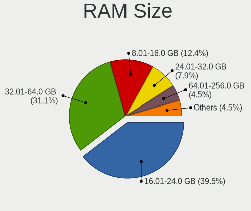
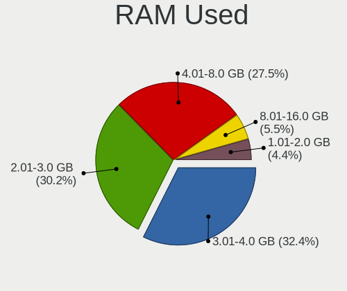
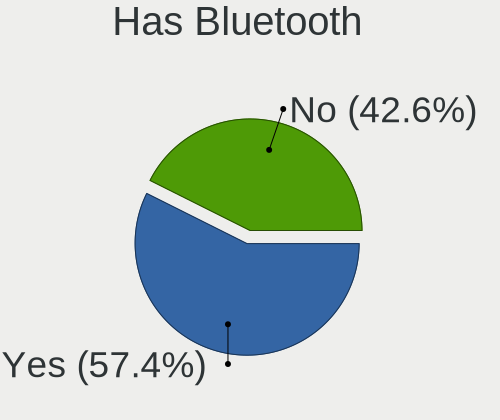
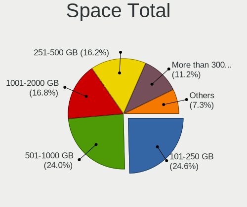
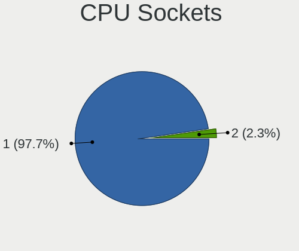
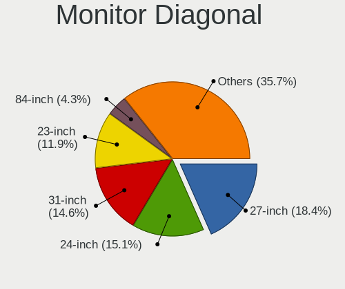

SteamOS - Tested Hardware & Statistics (Desktops)
-------------------------------------------------

A project to collect tested hardware configurations for SteamOS.

Anyone can contribute to this report by the [hw-probe](https://github.com/linuxhw/hw-probe) tool:

    sudo -E hw-probe -all -upload

Please contribute! Especially if your hardware is rare.

Contents
--------

* [ Test Cases ](#test-cases)

* [ System ](#system)
  - [ OS                       ](#os)
  - [ OS Family                ](#os-family)
  - [ Kernel                   ](#kernel)
  - [ Kernel Family            ](#kernel-family)
  - [ Kernel Major Ver.        ](#kernel-major-ver)
  - [ Arch                     ](#arch)
  - [ DE                       ](#de)
  - [ Display Server           ](#display-server)
  - [ Display Manager          ](#display-manager)
  - [ OS Lang                  ](#os-lang)
  - [ Boot Mode                ](#boot-mode)
  - [ Filesystem               ](#filesystem)
  - [ Part. scheme             ](#part-scheme)
  - [ Dual Boot with Linux/BSD ](#dual-boot-with-linuxbsd)
  - [ Dual Boot (Win)          ](#dual-boot-win)

* [ Board ](#board)
  - [ Vendor                   ](#vendor)
  - [ Model                    ](#model)
  - [ Model Family             ](#model-family)
  - [ MFG Year                 ](#mfg-year)
  - [ Form Factor              ](#form-factor)
  - [ Secure Boot              ](#secure-boot)
  - [ Coreboot                 ](#coreboot)
  - [ RAM Size                 ](#ram-size)
  - [ RAM Used                 ](#ram-used)
  - [ Total Drives             ](#total-drives)
  - [ Has CD-ROM               ](#has-cd-rom)
  - [ Has Ethernet             ](#has-ethernet)
  - [ Has WiFi                 ](#has-wifi)
  - [ Has Bluetooth            ](#has-bluetooth)

* [ Location ](#location)
  - [ Country                  ](#country)
  - [ City                     ](#city)

* [ Drives ](#drives)
  - [ Drive Vendor             ](#drive-vendor)
  - [ Drive Model              ](#drive-model)
  - [ HDD Vendor               ](#hdd-vendor)
  - [ SSD Vendor               ](#ssd-vendor)
  - [ Drive Kind               ](#drive-kind)
  - [ Drive Connector          ](#drive-connector)
  - [ Drive Size               ](#drive-size)
  - [ Space Total              ](#space-total)
  - [ Space Used               ](#space-used)
  - [ Malfunc. Drives          ](#malfunc-drives)
  - [ Malfunc. Drive Vendor    ](#malfunc-drive-vendor)
  - [ Malfunc. HDD Vendor      ](#malfunc-hdd-vendor)
  - [ Malfunc. Drive Kind      ](#malfunc-drive-kind)
  - [ Failed Drives            ](#failed-drives)
  - [ Failed Drive Vendor      ](#failed-drive-vendor)
  - [ Drive Status             ](#drive-status)

* [ Storage controller ](#storage-controller)
  - [ Storage Vendor           ](#storage-vendor)
  - [ Storage Model            ](#storage-model)
  - [ Storage Kind             ](#storage-kind)

* [ Processor ](#processor)
  - [ CPU Vendor               ](#cpu-vendor)
  - [ CPU Model                ](#cpu-model)
  - [ CPU Model Family         ](#cpu-model-family)
  - [ CPU Cores                ](#cpu-cores)
  - [ CPU Sockets              ](#cpu-sockets)
  - [ CPU Threads              ](#cpu-threads)
  - [ CPU Op-Modes             ](#cpu-op-modes)
  - [ CPU Microcode            ](#cpu-microcode)
  - [ CPU Microarch            ](#cpu-microarch)

* [ Graphics ](#graphics)
  - [ GPU Vendor               ](#gpu-vendor)
  - [ GPU Model                ](#gpu-model)
  - [ GPU Combo                ](#gpu-combo)
  - [ GPU Driver               ](#gpu-driver)
  - [ GPU Memory               ](#gpu-memory)

* [ Monitor ](#monitor)
  - [ Monitor Vendor           ](#monitor-vendor)
  - [ Monitor Model            ](#monitor-model)
  - [ Monitor Resolution       ](#monitor-resolution)
  - [ Monitor Diagonal         ](#monitor-diagonal)
  - [ Monitor Width            ](#monitor-width)
  - [ Aspect Ratio             ](#aspect-ratio)
  - [ Monitor Area             ](#monitor-area)
  - [ Pixel Density            ](#pixel-density)
  - [ Multiple Monitors        ](#multiple-monitors)

* [ Network ](#network)
  - [ Net Controller Vendor    ](#net-controller-vendor)
  - [ Net Controller Model     ](#net-controller-model)
  - [ Wireless Vendor          ](#wireless-vendor)
  - [ Wireless Model           ](#wireless-model)
  - [ Ethernet Vendor          ](#ethernet-vendor)
  - [ Ethernet Model           ](#ethernet-model)
  - [ Net Controller Kind      ](#net-controller-kind)
  - [ Used Controller          ](#used-controller)
  - [ NICs                     ](#nics)
  - [ IPv6                     ](#ipv6)

* [ Bluetooth ](#bluetooth)
  - [ Bluetooth Vendor         ](#bluetooth-vendor)
  - [ Bluetooth Model          ](#bluetooth-model)

* [ Sound ](#sound)
  - [ Sound Vendor             ](#sound-vendor)
  - [ Sound Model              ](#sound-model)

* [ Memory ](#memory)
  - [ Memory Vendor            ](#memory-vendor)
  - [ Memory Model             ](#memory-model)
  - [ Memory Kind              ](#memory-kind)
  - [ Memory Form Factor       ](#memory-form-factor)
  - [ Memory Size              ](#memory-size)
  - [ Memory Speed             ](#memory-speed)

* [ Printers & scanners ](#printers--scanners)
  - [ Printer Vendor           ](#printer-vendor)
  - [ Printer Model            ](#printer-model)
  - [ Scanner Vendor           ](#scanner-vendor)
  - [ Scanner Model            ](#scanner-model)

* [ Camera ](#camera)
  - [ Camera Vendor            ](#camera-vendor)
  - [ Camera Model             ](#camera-model)

* [ Security ](#security)
  - [ Fingerprint Vendor       ](#fingerprint-vendor)
  - [ Fingerprint Model        ](#fingerprint-model)
  - [ Chipcard Vendor          ](#chipcard-vendor)
  - [ Chipcard Model           ](#chipcard-model)

* [ Unsupported ](#unsupported)
  - [ Unsupported Devices      ](#unsupported-devices)
  - [ Unsupported Device Types ](#unsupported-device-types)

Test Cases
----------

Total: 66

| Vendor    | Model                       | Probe                                                      | Date         |
|-----------|-----------------------------|------------------------------------------------------------|--------------|
| Dell      | 0D6H9T A00                  | [2c34aba28a](https://linux-hardware.org/?probe=2c34aba28a) | Jan 30, 2023 |
| HP        | 8906 SMVB                   | [625d54930d](https://linux-hardware.org/?probe=625d54930d) | Jan 12, 2023 |
| MSI       | MPG X570 GAMING PLUS        | [3b92dd60cf](https://linux-hardware.org/?probe=3b92dd60cf) | Jan 11, 2023 |
| Gigabyte  | B450 AORUS M                | [0851440887](https://linux-hardware.org/?probe=0851440887) | Jan 11, 2023 |
| Gigabyte  | B550M DS3H                  | [3d656e7bfd](https://linux-hardware.org/?probe=3d656e7bfd) | Jan 05, 2023 |
| MSI       | H81M-P33                    | [041ee2fde1](https://linux-hardware.org/?probe=041ee2fde1) | Jan 03, 2023 |
| ASUSTek   | PRIME B450M-A II            | [0842d26251](https://linux-hardware.org/?probe=0842d26251) | Dec 30, 2022 |
| ASUSTek   | PRIME B450M-A II            | [d91b55f9f1](https://linux-hardware.org/?probe=d91b55f9f1) | Dec 30, 2022 |
| Dell      | 0KC9NP A01                  | [0e70489d5c](https://linux-hardware.org/?probe=0e70489d5c) | Dec 16, 2022 |
| ASUSTek   | M80CJ-O                     | [2375dfe19f](https://linux-hardware.org/?probe=2375dfe19f) | Dec 10, 2022 |
| ASUSTek   | ROG CROSSHAIR VIII HERO     | [65ccd1da0e](https://linux-hardware.org/?probe=65ccd1da0e) | Dec 05, 2022 |
| ASUSTek   | TUF Gaming B550M-PLUS       | [c2c53a959d](https://linux-hardware.org/?probe=c2c53a959d) | Dec 03, 2022 |
| ASUSTek   | Z170 PRO GAMING             | [3f642a7844](https://linux-hardware.org/?probe=3f642a7844) | Dec 02, 2022 |
| Gigabyte  | B450M DS3H V2               | [f00a357dbe](https://linux-hardware.org/?probe=f00a357dbe) | Nov 29, 2022 |
| MSI       | 970A-G46                    | [3cd88e88d3](https://linux-hardware.org/?probe=3cd88e88d3) | Nov 28, 2022 |
| Gigabyte  | B450 AORUS M                | [8263c8ba6f](https://linux-hardware.org/?probe=8263c8ba6f) | Nov 28, 2022 |
| ASUSTek   | Z170 PRO GAMING             | [ee234d62ec](https://linux-hardware.org/?probe=ee234d62ec) | Nov 27, 2022 |
| ASUSTek   | PRIME X570-PRO              | [c278b19567](https://linux-hardware.org/?probe=c278b19567) | Nov 20, 2022 |
| HP        | 8626                        | [f2098a2414](https://linux-hardware.org/?probe=f2098a2414) | Nov 19, 2022 |
| HP        | 8626                        | [05ebc14932](https://linux-hardware.org/?probe=05ebc14932) | Nov 19, 2022 |
| Gigabyte  | 970A-DS3P FX                | [85ef5eaf43](https://linux-hardware.org/?probe=85ef5eaf43) | Nov 12, 2022 |
| MSI       | X370 GAMING PLUS            | [a0b134897f](https://linux-hardware.org/?probe=a0b134897f) | Nov 05, 2022 |
| ASUSTek   | CROSSHAIR VI HERO           | [7712ce88c4](https://linux-hardware.org/?probe=7712ce88c4) | Oct 30, 2022 |
| Gigabyte  | B550 GAMING X V2            | [b4ba1b8d5a](https://linux-hardware.org/?probe=b4ba1b8d5a) | Oct 29, 2022 |
| HP        | 8433 11                     | [fed45efc8d](https://linux-hardware.org/?probe=fed45efc8d) | Oct 12, 2022 |
| Gigabyte  | B450M DS3H-CF               | [c1c51b96ef](https://linux-hardware.org/?probe=c1c51b96ef) | Oct 06, 2022 |
| ASUSTek   | ROG STRIX B550-F GAMING     | [aee559f8bf](https://linux-hardware.org/?probe=aee559f8bf) | Oct 04, 2022 |
| Apple     | Mac-27AD2F918AE68F61 Mac... | [3e25da0356](https://linux-hardware.org/?probe=3e25da0356) | Oct 01, 2022 |
| ASUSTek   | CROSSHAIR VI HERO           | [46e48bc4c1](https://linux-hardware.org/?probe=46e48bc4c1) | Sep 28, 2022 |
| ASUSTek   | CROSSHAIR VI HERO           | [8d8440548e](https://linux-hardware.org/?probe=8d8440548e) | Sep 20, 2022 |
| MSI       | X399 SLI PLUS               | [f686754b27](https://linux-hardware.org/?probe=f686754b27) | Sep 16, 2022 |
| MSI       | X470 GAMING PLUS            | [9919cebdfe](https://linux-hardware.org/?probe=9919cebdfe) | Sep 15, 2022 |
| MSI       | 970A-G46                    | [5f7482fe88](https://linux-hardware.org/?probe=5f7482fe88) | Sep 11, 2022 |
| ASUSTek   | H81M-PLUS                   | [2d99107aa6](https://linux-hardware.org/?probe=2d99107aa6) | Sep 05, 2022 |
| Gigabyte  | B450 AORUS M                | [3ac55201b6](https://linux-hardware.org/?probe=3ac55201b6) | Sep 04, 2022 |
| Dell      | 0HHV7N A00                  | [f4142b2ff8](https://linux-hardware.org/?probe=f4142b2ff8) | Sep 02, 2022 |
| ASUSTek   | PRIME A320M-K               | [bdae2c60cd](https://linux-hardware.org/?probe=bdae2c60cd) | Sep 01, 2022 |
| MSI       | MS-B9201                    | [b5c80c8c2c](https://linux-hardware.org/?probe=b5c80c8c2c) | Aug 29, 2022 |
| Gigabyte  | B550 AORUS ELITE AX V2      | [9e3df56c3b](https://linux-hardware.org/?probe=9e3df56c3b) | Aug 28, 2022 |
| ASUSTek   | PRIME B550-PLUS             | [67b791eb17](https://linux-hardware.org/?probe=67b791eb17) | Aug 25, 2022 |
| ASUSTek   | H97-PRO GAMER               | [663bc0a517](https://linux-hardware.org/?probe=663bc0a517) | Aug 25, 2022 |
| ASUSTek   | H97-PRO GAMER               | [e934af2a60](https://linux-hardware.org/?probe=e934af2a60) | Aug 23, 2022 |
| Gigabyte  | AB350-Gaming 3-CF           | [9661c799c9](https://linux-hardware.org/?probe=9661c799c9) | Aug 18, 2022 |
| Gigabyte  | X570 GAMING X               | [d8e60dcf09](https://linux-hardware.org/?probe=d8e60dcf09) | Aug 17, 2022 |
| ASUSTek   | TUF Gaming X570-PLUS        | [53429d945b](https://linux-hardware.org/?probe=53429d945b) | Aug 15, 2022 |
| MSI       | MS-B9351                    | [a5b1950761](https://linux-hardware.org/?probe=a5b1950761) | Aug 14, 2022 |
| MSI       | MS-B9351                    | [fbf08d2d76](https://linux-hardware.org/?probe=fbf08d2d76) | Aug 14, 2022 |
| MSI       | B450 TOMAHAWK MAX II        | [dcd9be004c](https://linux-hardware.org/?probe=dcd9be004c) | Aug 13, 2022 |
| ASUSTek   | SABERTOOTH X99              | [54ea6926a0](https://linux-hardware.org/?probe=54ea6926a0) | Aug 13, 2022 |
| Dell      | 00F82W A00                  | [8e74c57731](https://linux-hardware.org/?probe=8e74c57731) | Aug 07, 2022 |
| Gigabyte  | H310M S2V                   | [329d2071a9](https://linux-hardware.org/?probe=329d2071a9) | Aug 01, 2022 |
| ASRock    | A520M-ITX/ac                | [876c779461](https://linux-hardware.org/?probe=876c779461) | Jul 25, 2022 |
| ASRock    | B450M-HDV R4.0              | [f2172999c8](https://linux-hardware.org/?probe=f2172999c8) | Jul 24, 2022 |
| ASUSTek   | EX-A320M-GAMING             | [68884b1723](https://linux-hardware.org/?probe=68884b1723) | Jul 17, 2022 |
| Gigabyte  | H170N-WIFI-CF               | [2f3e59dc30](https://linux-hardware.org/?probe=2f3e59dc30) | Jul 09, 2022 |
| Gigabyte  | B550 GAMING X V2            | [61eaf99aca](https://linux-hardware.org/?probe=61eaf99aca) | Jul 05, 2022 |
| Gigabyte  | B550 GAMING X V2            | [812733dd89](https://linux-hardware.org/?probe=812733dd89) | Jul 05, 2022 |
| Gigabyte  | X570 I AORUS PRO WIFI       | [d82f88e20c](https://linux-hardware.org/?probe=d82f88e20c) | Jul 01, 2022 |
| Alienware | 02XRCM A01                  | [c70647bab0](https://linux-hardware.org/?probe=c70647bab0) | Jun 26, 2022 |
| ASUSTek   | H61M-K                      | [1a568c2e5f](https://linux-hardware.org/?probe=1a568c2e5f) | Jun 23, 2022 |
| ASUSTek   | ROG STRIX B550-F GAMING     | [b3a08001ed](https://linux-hardware.org/?probe=b3a08001ed) | Jun 01, 2022 |
| ASRock    | B550 PG Velocita            | [0d7f71a24d](https://linux-hardware.org/?probe=0d7f71a24d) | May 30, 2022 |
| ASRock    | B365M Pro4-F                | [afc161c6fb](https://linux-hardware.org/?probe=afc161c6fb) | May 30, 2022 |
| Gigabyte  | B560M AORUS PRO             | [31f246f96e](https://linux-hardware.org/?probe=31f246f96e) | May 27, 2022 |
| Gigabyte  | B560M AORUS PRO             | [1d381d6ec9](https://linux-hardware.org/?probe=1d381d6ec9) | May 27, 2022 |
| Gigabyte  | Z170XP-SLI-CF               | [d4bef1e450](https://linux-hardware.org/?probe=d4bef1e450) | May 26, 2022 |

System
------

OS
--

Installed operating systems

| Name                         | Desktops | Percent |
|------------------------------|----------|---------|
| SteamOS 3.3                  | 24       | 42.86%  |
| SteamOS 3.4                  | 18       | 32.14%  |
| SteamOS 3.2 (steamdeck-main) | 7        | 12.5%   |
| SteamOS Snapshot             | 3        | 5.36%   |
| SteamOS                      | 3        | 5.36%   |
| SteamOS 3.2                  | 1        | 1.79%   |

OS Family
---------

OS without a version

| Name    | Desktops | Percent |
|---------|----------|---------|
| SteamOS | 53       | 100%    |

Kernel
------

Version of the Linux kernel

| Version                                            | Desktops | Percent |
|----------------------------------------------------|----------|---------|
| 5.13.0-valve21.3-1-neptune                         | 13       | 24.07%  |
| 5.13.0-valve10.1-2-neptune-dri-02144-g7fffaf925dfb | 11       | 20.37%  |
| 5.13.0-valve24-1-neptune-02226-g5b8545e4c5a1       | 10       | 18.52%  |
| 5.13.0-valve22-1-neptune-02213-gb68995364335       | 7        | 12.96%  |
| 5.18.1-arch1_testHoloISO_20220606.1811             | 5        | 9.26%   |
| 5.13.0-valve23-1-neptune-02219-gf0b4ecc8cab6       | 2        | 3.7%    |
| 5.15.79-1-lts                                      | 1        | 1.85%   |
| 5.15.60-1-lts                                      | 1        | 1.85%   |
| 5.13.0-valve36-1-neptune                           | 1        | 1.85%   |
| 5.13.0-valve24-1-neptune                           | 1        | 1.85%   |
| 5.13.0-valve21-2-neptune-02209-g2a5bdc1102a0       | 1        | 1.85%   |
| 5.13.0-valve21-1-neptune-02209-g2a5bdc1102a0       | 1        | 1.85%   |

Kernel Family
-------------

Linux kernel without a distro release

| Version | Desktops | Percent |
|---------|----------|---------|
| 5.13.0  | 47       | 87.04%  |
| 5.18.1  | 5        | 9.26%   |
| 5.15.79 | 1        | 1.85%   |
| 5.15.60 | 1        | 1.85%   |

Kernel Major Ver.
-----------------

Linux kernel major version

| Version | Desktops | Percent |
|---------|----------|---------|
| 5.13    | 47       | 87.04%  |
| 5.18    | 5        | 9.26%   |
| 5.15    | 2        | 3.7%    |

Arch
----

OS architecture (x86_64, i586, etc.)

| Name   | Desktops | Percent |
|--------|----------|---------|
| x86_64 | 53       | 100%    |

DE
--

Desktop Environment

| Name | Desktops | Percent |
|------|----------|---------|
| KDE5 | 53       | 100%    |

Display Server
--------------

X11 or Wayland

| Name | Desktops | Percent |
|------|----------|---------|
| X11  | 53       | 100%    |

Display Manager
---------------

SDDM, LightDM, etc.

| Name    | Desktops | Percent |
|---------|----------|---------|
| Unknown | 53       | 100%    |

OS Lang
-------

Language

| Lang  | Desktops | Percent |
|-------|----------|---------|
| en_US | 45       | 83.33%  |
| fr_FR | 3        | 5.56%   |
| pt_PT | 1        | 1.85%   |
| en_IE | 1        | 1.85%   |
| en_GB | 1        | 1.85%   |
| de_DE | 1        | 1.85%   |
| de_AT | 1        | 1.85%   |
| C     | 1        | 1.85%   |

Boot Mode
---------

EFI or BIOS

| Mode | Desktops | Percent |
|------|----------|---------|
| BIOS | 53       | 100%    |

Filesystem
----------

Type of filesystem

| Type  | Desktops | Percent |
|-------|----------|---------|
| Btrfs | 52       | 98.11%  |
| Tmpfs | 1        | 1.89%   |

Part. scheme
------------

Scheme of partitioning

| Type    | Desktops | Percent |
|---------|----------|---------|
| Unknown | 53       | 100%    |

Dual Boot with Linux/BSD
------------------------

Hosting more than one Linux/BSD

| Dual boot | Desktops | Percent |
|-----------|----------|---------|
| No        | 53       | 100%    |

Dual Boot (Win)
---------------

Hosting Linux and Windows

| Dual boot | Desktops | Percent |
|-----------|----------|---------|
| No        | 53       | 100%    |

Board
-----

Vendor
------

Motherboard manufacturer

| Name                | Desktops | Percent |
|---------------------|----------|---------|
| ASUSTek Computer    | 17       | 32.08%  |
| Gigabyte Technology | 14       | 26.42%  |
| MSI                 | 9        | 16.98%  |
| Dell                | 4        | 7.55%   |
| ASRock              | 4        | 7.55%   |
| Hewlett-Packard     | 3        | 5.66%   |
| Apple               | 1        | 1.89%   |
| Alienware           | 1        | 1.89%   |

Model
-----

Motherboard model

| Name                                 | Desktops | Percent |
|--------------------------------------|----------|---------|
| ASUS All Series                      | 3        | 5.66%   |
| Gigabyte B450 AORUS M                | 2        | 3.77%   |
| ASUS ROG STRIX B550-F GAMING         | 2        | 3.77%   |
| MSI MS-7C37                          | 1        | 1.89%   |
| MSI MS-7C02                          | 1        | 1.89%   |
| MSI MS-7B79                          | 1        | 1.89%   |
| MSI MS-7B09                          | 1        | 1.89%   |
| MSI MS-7A33                          | 1        | 1.89%   |
| MSI MS-7817                          | 1        | 1.89%   |
| MSI MS-7693                          | 1        | 1.89%   |
| MSI MPG H510 Trident 3 (MS-B935)     | 1        | 1.89%   |
| MSI H310 Gaming Trident3 (MS-B920)   | 1        | 1.89%   |
| HP ProDesk 405 G4 Desktop Mini       | 1        | 1.89%   |
| HP Pavilion Gaming Desktop TG01-2xxx | 1        | 1.89%   |
| HP Pavilion Gaming Desktop 690-00xx  | 1        | 1.89%   |
| Gigabyte X570 I AORUS PRO WIFI       | 1        | 1.89%   |
| Gigabyte X570 GAMING X               | 1        | 1.89%   |
| Gigabyte MBB-670016                  | 1        | 1.89%   |
| Gigabyte H310M S2V 2.0               | 1        | 1.89%   |
| Gigabyte H170N-WIFI                  | 1        | 1.89%   |
| Gigabyte B560M AORUS PRO             | 1        | 1.89%   |
| Gigabyte B550M DS3H                  | 1        | 1.89%   |
| Gigabyte B550 GAMING X V2            | 1        | 1.89%   |
| Gigabyte B450M DS3H V2               | 1        | 1.89%   |
| Gigabyte B450M DS3H                  | 1        | 1.89%   |
| Gigabyte AB350-Gaming 3              | 1        | 1.89%   |
| Gigabyte 970A-DS3P FX                | 1        | 1.89%   |
| Dell Precision Tower 5810            | 1        | 1.89%   |
| Dell OptiPlex 990                    | 1        | 1.89%   |
| Dell OptiPlex 9020                   | 1        | 1.89%   |
| Dell OptiPlex 9010                   | 1        | 1.89%   |
| ASUS Z170 PRO GAMING                 | 1        | 1.89%   |
| ASUS TUF Gaming X570-PLUS            | 1        | 1.89%   |
| ASUS TUF Gaming B550M-PLUS           | 1        | 1.89%   |
| ASUS ROG CROSSHAIR VIII HERO         | 1        | 1.89%   |
| ASUS PRIME X570-PRO                  | 1        | 1.89%   |
| ASUS PRIME B550-PLUS                 | 1        | 1.89%   |
| ASUS PRIME B450M-A II                | 1        | 1.89%   |
| ASUS PRIME A320M-K                   | 1        | 1.89%   |
| ASUS M80CJ-O                         | 1        | 1.89%   |

Model Family
------------

Motherboard model prefix

| Name                  | Desktops | Percent |
|-----------------------|----------|---------|
| ASUS PRIME            | 4        | 7.55%   |
| Dell OptiPlex         | 3        | 5.66%   |
| ASUS ROG              | 3        | 5.66%   |
| ASUS All              | 3        | 5.66%   |
| HP Pavilion           | 2        | 3.77%   |
| Gigabyte X570         | 2        | 3.77%   |
| Gigabyte B450M        | 2        | 3.77%   |
| Gigabyte B450         | 2        | 3.77%   |
| ASUS TUF              | 2        | 3.77%   |
| MSI MS-7C37           | 1        | 1.89%   |
| MSI MS-7C02           | 1        | 1.89%   |
| MSI MS-7B79           | 1        | 1.89%   |
| MSI MS-7B09           | 1        | 1.89%   |
| MSI MS-7A33           | 1        | 1.89%   |
| MSI MS-7817           | 1        | 1.89%   |
| MSI MS-7693           | 1        | 1.89%   |
| MSI MPG               | 1        | 1.89%   |
| MSI H310              | 1        | 1.89%   |
| HP ProDesk            | 1        | 1.89%   |
| Gigabyte MBB-670016   | 1        | 1.89%   |
| Gigabyte H310M        | 1        | 1.89%   |
| Gigabyte H170N-WIFI   | 1        | 1.89%   |
| Gigabyte B560M        | 1        | 1.89%   |
| Gigabyte B550M        | 1        | 1.89%   |
| Gigabyte B550         | 1        | 1.89%   |
| Gigabyte AB350-Gaming | 1        | 1.89%   |
| Gigabyte 970A-DS3P    | 1        | 1.89%   |
| Dell Precision        | 1        | 1.89%   |
| ASUS Z170             | 1        | 1.89%   |
| ASUS M80CJ-O          | 1        | 1.89%   |
| ASUS H61M-K           | 1        | 1.89%   |
| ASUS EX-A320M-GAMING  | 1        | 1.89%   |
| ASUS CROSSHAIR        | 1        | 1.89%   |
| ASRock B550           | 1        | 1.89%   |
| ASRock B450M-HDV      | 1        | 1.89%   |
| ASRock B365M          | 1        | 1.89%   |
| ASRock A520M-ITX      | 1        | 1.89%   |
| Apple MacPro7         | 1        | 1.89%   |
| Alienware Aurora      | 1        | 1.89%   |

MFG Year
--------

Motherboard manufacture year

| Year | Desktops | Percent |
|------|----------|---------|
| 2020 | 12       | 22.64%  |
| 2018 | 9        | 16.98%  |
| 2019 | 8        | 15.09%  |
| 2021 | 6        | 11.32%  |
| 2017 | 5        | 9.43%   |
| 2013 | 4        | 7.55%   |
| 2016 | 3        | 5.66%   |
| 2015 | 2        | 3.77%   |
| 2022 | 1        | 1.89%   |
| 2014 | 1        | 1.89%   |
| 2012 | 1        | 1.89%   |
| 2011 | 1        | 1.89%   |

Form Factor
-----------

Physical design of the computer

| Name    | Desktops | Percent |
|---------|----------|---------|
| Desktop | 53       | 100%    |

Secure Boot
-----------

Enabled or disabled

| State    | Desktops | Percent |
|----------|----------|---------|
| Disabled | 53       | 100%    |

Coreboot
--------

Have coreboot on board

| Used | Desktops | Percent |
|------|----------|---------|
| No   | 53       | 100%    |

RAM Size
--------

Total RAM memory

| Size in GB  | Desktops | Percent |
|-------------|----------|---------|
| 16.01-24.0  | 27       | 50.94%  |
| 32.01-64.0  | 12       | 22.64%  |
| 8.01-16.0   | 5        | 9.43%   |
| 4.01-8.0    | 3        | 5.66%   |
| 24.01-32.0  | 3        | 5.66%   |
| 64.01-256.0 | 3        | 5.66%   |

RAM Used
--------

Used RAM memory

| Used GB   | Desktops | Percent |
|-----------|----------|---------|
| 2.01-3.0  | 23       | 43.4%   |
| 3.01-4.0  | 13       | 24.53%  |
| 4.01-8.0  | 9        | 16.98%  |
| 1.01-2.0  | 6        | 11.32%  |
| 8.01-16.0 | 2        | 3.77%   |

Total Drives
------------

Number of drives on board

| Drives | Desktops | Percent |
|--------|----------|---------|
| 1      | 17       | 31.48%  |
| 2      | 14       | 25.93%  |
| 3      | 11       | 20.37%  |
| 4      | 6        | 11.11%  |
| 5      | 3        | 5.56%   |
| 11     | 1        | 1.85%   |
| 7      | 1        | 1.85%   |
| 6      | 1        | 1.85%   |

Has CD-ROM
----------

Has CD-ROM on board

| Presented | Desktops | Percent |
|-----------|----------|---------|
| No        | 44       | 83.02%  |
| Yes       | 9        | 16.98%  |

Has Ethernet
------------

Has Ethernet on board

| Presented | Desktops | Percent |
|-----------|----------|---------|
| Yes       | 53       | 100%    |

Has WiFi
--------

Has WiFi module

| Presented | Desktops | Percent |
|-----------|----------|---------|
| Yes       | 32       | 60.38%  |
| No        | 21       | 39.62%  |

Has Bluetooth
-------------

Has Bluetooth module

| Presented | Desktops | Percent |
|-----------|----------|---------|
| No        | 29       | 53.7%   |
| Yes       | 25       | 46.3%   |

Location
--------

Country
-------

Geographic location (country)

| Country      | Desktops | Percent |
|--------------|----------|---------|
| USA          | 21       | 38.89%  |
| UK           | 7        | 12.96%  |
| France       | 5        | 9.26%   |
| Australia    | 4        | 7.41%   |
| Brazil       | 2        | 3.7%    |
| Turkey       | 1        | 1.85%   |
| Spain        | 1        | 1.85%   |
| South Africa | 1        | 1.85%   |
| Romania      | 1        | 1.85%   |
| Portugal     | 1        | 1.85%   |
| Poland       | 1        | 1.85%   |
| Oman         | 1        | 1.85%   |
| Latvia       | 1        | 1.85%   |
| Ireland      | 1        | 1.85%   |
| Hong Kong    | 1        | 1.85%   |
| Germany      | 1        | 1.85%   |
| Denmark      | 1        | 1.85%   |
| Canada       | 1        | 1.85%   |
| Cambodia     | 1        | 1.85%   |
| Austria      | 1        | 1.85%   |

City
----

Geographic location (city)

| City                   | Desktops | Percent |
|------------------------|----------|---------|
| Walsall                | 1        | 1.85%   |
| Vilas                  | 1        | 1.85%   |
| Tuam                   | 1        | 1.85%   |
| Targoviste             | 1        | 1.85%   |
| Sydney                 | 1        | 1.85%   |
| Sterling Heights       | 1        | 1.85%   |
| Skarzysko-Kamienna     | 1        | 1.85%   |
| Siloam Springs         | 1        | 1.85%   |
| Sao Paulo              | 1        | 1.85%   |
| Salford                | 1        | 1.85%   |
| Salem                  | 1        | 1.85%   |
| Riga                   | 1        | 1.85%   |
| Puchberg am Schneeberg | 1        | 1.85%   |
| Phnom Penh             | 1        | 1.85%   |
| Perth                  | 1        | 1.85%   |
| Peoria                 | 1        | 1.85%   |
| Paris                  | 1        | 1.85%   |
| Oklahoma City          | 1        | 1.85%   |
| Norwich                | 1        | 1.85%   |
| Noble Park             | 1        | 1.85%   |
| Newcastle-under-Lyme   | 1        | 1.85%   |
| Muscat                 | 1        | 1.85%   |
| Moyeuvre-Grande        | 1        | 1.85%   |
| Milford                | 1        | 1.85%   |
| Memphis                | 1        | 1.85%   |
| Mascot                 | 1        | 1.85%   |
| Loveland               | 1        | 1.85%   |
| Lisbon                 | 1        | 1.85%   |
| Langley                | 1        | 1.85%   |
| Kraaifontein           | 1        | 1.85%   |
| Kaukauna               | 1        | 1.85%   |
| Johnstone              | 1        | 1.85%   |
| Ivry-sur-Seine         | 1        | 1.85%   |
| Istanbul               | 1        | 1.85%   |
| Hornsea                | 1        | 1.85%   |
| Holtsville             | 1        | 1.85%   |
| Henderson              | 1        | 1.85%   |
| Gujan-Mestras          | 1        | 1.85%   |
| Glostrup Municipality  | 1        | 1.85%   |
| Frankfurt am Main      | 1        | 1.85%   |

Drives
------

Drive Vendor
------------

Hard drive vendors

| Vendor                      | Desktops | Drives | Percent |
|-----------------------------|----------|--------|---------|
| Seagate                     | 18       | 24     | 16.22%  |
| Samsung Electronics         | 14       | 26     | 12.61%  |
| WDC                         | 9        | 12     | 8.11%   |
| Sandisk                     | 9        | 11     | 8.11%   |
| Kingston                    | 9        | 11     | 8.11%   |
| Crucial                     | 8        | 11     | 7.21%   |
| Toshiba                     | 6        | 8      | 5.41%   |
| A-DATA Technology           | 5        | 5      | 4.5%    |
| PNY                         | 4        | 5      | 3.6%    |
| Phison                      | 4        | 5      | 3.6%    |
| Micron/Crucial Technology   | 3        | 3      | 2.7%    |
| SK hynix                    | 2        | 2      | 1.8%    |
| Realtek Semiconductor       | 2        | 2      | 1.8%    |
| Phison Electronics          | 2        | 4      | 1.8%    |
| China                       | 2        | 5      | 1.8%    |
| Unknown                     | 2        | 3      | 1.8%    |
| Unknown                     | 1        | 1      | 0.9%    |
| Union Memory (Shenzhen)     | 1        | 1      | 0.9%    |
| SPCC                        | 1        | 2      | 0.9%    |
| Mushkin                     | 1        | 1      | 0.9%    |
| MAXIO Technology (Hangzhou) | 1        | 1      | 0.9%    |
| Kingston Technology Company | 1        | 1      | 0.9%    |
| Intenso                     | 1        | 1      | 0.9%    |
| Intel                       | 1        | 1      | 0.9%    |
| HS-SSD-C100                 | 1        | 1      | 0.9%    |
| GALAX                       | 1        | 1      | 0.9%    |
| Apple                       | 1        | 1      | 0.9%    |
| ADATA Technology            | 1        | 2      | 0.9%    |

Drive Model
-----------

Hard drive models

| Model                                               | Desktops | Percent |
|-----------------------------------------------------|----------|---------|
| Samsung NVMe SSD Drive 1TB                          | 3        | 2.33%   |
| Crucial CT1000BX500SSD1 1TB                         | 3        | 2.33%   |
| Toshiba MQ01ABD100 1TB                              | 2        | 1.55%   |
| Seagate ST1000LM014-1EJ164 1TB                      | 2        | 1.55%   |
| SanDisk NVMe SSD Drive 500GB                        | 2        | 1.55%   |
| Samsung NVMe SSD Controller SM981/PM981/PM983 500GB | 2        | 1.55%   |
| Realtek NVMe SSD Drive 256GB                        | 2        | 1.55%   |
| PNY CS900 120GB SSD                                 | 2        | 1.55%   |
| Phison E12 NVMe Controller 1TB                      | 2        | 1.55%   |
| Kingston SH103S3120G 120GB SSD                      | 2        | 1.55%   |
| A-DATA SU650 240GB SSD                              | 2        | 1.55%   |
| A-DATA SU630 240GB SSD                              | 2        | 1.55%   |
| Unknown                                             | 2        | 1.55%   |
| WDC WDS500G2B0A-00SM50 500GB SSD                    | 1        | 0.78%   |
| WDC WDBNCE5000PNC 500GB SSD                         | 1        | 0.78%   |
| WDC WDBNCE2500PNC 250GB SSD                         | 1        | 0.78%   |
| WDC WDBNCE0010PNC 1TB SSD                           | 1        | 0.78%   |
| WDC WD7500BPVT-80HXZT3 752GB                        | 1        | 0.78%   |
| WDC WD5000BPKT-60PK4T0 500GB                        | 1        | 0.78%   |
| WDC WD2500AAKX-753CA1 250GB                         | 1        | 0.78%   |
| WDC WD10EZEX-08WN4A0 1TB                            | 1        | 0.78%   |
| WDC WD10EZEX-00BN5A0 1TB                            | 1        | 0.78%   |
| WDC WD10EURX-83UY4Y0 1TB                            | 1        | 0.78%   |
| WDC WD10EURX-63FH1Y0 1TB                            | 1        | 0.78%   |
| WDC WD10EADS-00M2B0 1TB                             | 1        | 0.78%   |
| Unknown NVMe SSD Drive 512GB                        | 1        | 0.78%   |
| Union Memory (Shenzhen) NVMe SSD Drive 128GB        | 1        | 0.78%   |
| Toshiba MK3275GSX 320GB                             | 1        | 0.78%   |
| Toshiba MK1059GSM 1TB                               | 1        | 0.78%   |
| Toshiba HDWD130 3TB                                 | 1        | 0.78%   |
| Toshiba DT01ACA200 2TB                              | 1        | 0.78%   |
| Toshiba DT01ACA100 1TB                              | 1        | 0.78%   |
| SPCC Solid State Disk 1024GB                        | 1        | 0.78%   |
| SK hynix NVMe SSD Drive 256GB                       | 1        | 0.78%   |
| SK hynix BC511 512GB                                | 1        | 0.78%   |
| Seagate ST9320325AS 320GB                           | 1        | 0.78%   |
| Seagate ST6000NM0024-1HT17Z 6TB                     | 1        | 0.78%   |
| Seagate ST6000DM003-2CY186 6TB                      | 1        | 0.78%   |
| Seagate ST500LM021-1KJ152 500GB                     | 1        | 0.78%   |
| Seagate ST4000DX001-1CE168 4TB                      | 1        | 0.78%   |

HDD Vendor
----------

Hard disk drive vendors

| Vendor  | Desktops | Drives | Percent |
|---------|----------|--------|---------|
| Seagate | 17       | 23     | 58.62%  |
| WDC     | 6        | 8      | 20.69%  |
| Toshiba | 6        | 8      | 20.69%  |

SSD Vendor
----------

Solid state drive vendors

| Vendor              | Desktops | Drives | Percent |
|---------------------|----------|--------|---------|
| Samsung Electronics | 10       | 16     | 20.83%  |
| Crucial             | 8        | 11     | 16.67%  |
| Kingston            | 6        | 7      | 12.5%   |
| SanDisk             | 5        | 6      | 10.42%  |
| A-DATA Technology   | 5        | 5      | 10.42%  |
| WDC                 | 4        | 4      | 8.33%   |
| PNY                 | 4        | 5      | 8.33%   |
| China               | 2        | 5      | 4.17%   |
| SPCC                | 1        | 2      | 2.08%   |
| Mushkin             | 1        | 1      | 2.08%   |
| Intenso             | 1        | 1      | 2.08%   |
| Intel               | 1        | 1      | 2.08%   |

Drive Kind
----------

HDD or SSD

| Kind    | Desktops | Drives | Percent |
|---------|----------|--------|---------|
| SSD     | 34       | 64     | 35.79%  |
| NVMe    | 32       | 43     | 33.68%  |
| HDD     | 25       | 39     | 26.32%  |
| Unknown | 4        | 5      | 4.21%   |

Drive Connector
---------------

SATA, SAS, NVMe, etc.

| Type | Desktops | Drives | Percent |
|------|----------|--------|---------|
| SATA | 44       | 101    | 55.7%   |
| NVMe | 32       | 43     | 40.51%  |
| SAS  | 3        | 7      | 3.8%    |

Drive Size
----------

Size of hard drive

| Size in TB | Desktops | Drives | Percent |
|------------|----------|--------|---------|
| 0.01-0.5   | 31       | 55     | 46.97%  |
| 0.51-1.0   | 23       | 30     | 34.85%  |
| 1.01-2.0   | 4        | 8      | 6.06%   |
| 3.01-4.0   | 3        | 4      | 4.55%   |
| 4.01-10.0  | 3        | 3      | 4.55%   |
| 2.01-3.0   | 2        | 3      | 3.03%   |

Space Total
-----------

Amount of disk space available on the file system

| Size in GB     | Desktops | Percent |
|----------------|----------|---------|
| 101-250        | 21       | 39.62%  |
| 501-1000       | 11       | 20.75%  |
| 251-500        | 9        | 16.98%  |
| 1001-2000      | 7        | 13.21%  |
| More than 3000 | 4        | 7.55%   |
| 2001-3000      | 1        | 1.89%   |

Space Used
----------

Amount of used disk space

| Used GB        | Desktops | Percent |
|----------------|----------|---------|
| 1-20           | 25       | 45.45%  |
| 51-100         | 13       | 23.64%  |
| 21-50          | 7        | 12.73%  |
| 101-250        | 6        | 10.91%  |
| More than 3000 | 1        | 1.82%   |
| 2001-3000      | 1        | 1.82%   |
| 1001-2000      | 1        | 1.82%   |
| 501-1000       | 1        | 1.82%   |

Malfunc. Drives
---------------

Drive models with a malfunction

Zero info for selected period =(

Malfunc. Drive Vendor
---------------------

Vendors of faulty drives

Zero info for selected period =(

Malfunc. HDD Vendor
-------------------

Vendors of faulty HDD drives

Zero info for selected period =(

Malfunc. Drive Kind
-------------------

Kinds of faulty drives

Zero info for selected period =(

Failed Drives
-------------

Failed drive models

Zero info for selected period =(

Failed Drive Vendor
-------------------

Failed drive vendors

Zero info for selected period =(

Drive Status
------------

Number of failed and malfunc. drives

| Status   | Desktops | Drives | Percent |
|----------|----------|--------|---------|
| Detected | 53       | 151    | 100%    |

Storage controller
------------------

Storage Vendor
--------------

Storage controller vendors

| Vendor                      | Desktops | Percent |
|-----------------------------|----------|---------|
| AMD                         | 33       | 37.5%   |
| Intel                       | 19       | 21.59%  |
| Samsung Electronics         | 7        | 7.95%   |
| Phison Electronics          | 6        | 6.82%   |
| SanDisk                     | 5        | 5.68%   |
| Kingston Technology Company | 4        | 4.55%   |
| Micron/Crucial Technology   | 3        | 3.41%   |
| SK hynix                    | 2        | 2.27%   |
| Realtek Semiconductor       | 2        | 2.27%   |
| Union Memory (Shenzhen)     | 1        | 1.14%   |
| Seagate Technology          | 1        | 1.14%   |
| MAXIO Technology (Hangzhou) | 1        | 1.14%   |
| INNOGRIT                    | 1        | 1.14%   |
| ASMedia Technology          | 1        | 1.14%   |
| Apple                       | 1        | 1.14%   |
| ADATA Technology            | 1        | 1.14%   |

Storage Model
-------------

Storage controller models

| Model                                                                          | Desktops | Percent |
|--------------------------------------------------------------------------------|----------|---------|
| AMD FCH SATA Controller [AHCI mode]                                            | 21       | 19.63%  |
| AMD 400 Series Chipset SATA Controller                                         | 9        | 8.41%   |
| AMD 500 Series Chipset SATA Controller                                         | 8        | 7.48%   |
| Samsung NVMe SSD Controller SM981/PM981/PM983                                  | 5        | 4.67%   |
| Phison E12 NVMe Controller                                                     | 4        | 3.74%   |
| Intel Q170/Q150/B150/H170/H110/Z170/CM236 Chipset SATA Controller [AHCI Mode]  | 3        | 2.8%    |
| Intel 8 Series/C220 Series Chipset Family 6-port SATA Controller 1 [AHCI mode] | 3        | 2.8%    |
| Intel 200 Series PCH SATA controller [AHCI mode]                               | 3        | 2.8%    |
| AMD 300 Series Chipset SATA Controller                                         | 3        | 2.8%    |
| SanDisk Non-Volatile memory controller                                         | 2        | 1.87%   |
| Phison Electronics Non-Volatile memory controller                              | 2        | 1.87%   |
| Kingston Company Company Non-Volatile memory controller                        | 2        | 1.87%   |
| Kingston Company SNVS2000G [NV1 NVMe PCIe SSD 2TB]                             | 2        | 1.87%   |
| Intel SATA Controller [RAID mode]                                              | 2        | 1.87%   |
| Intel 500 Series Chipset Family SATA AHCI Controller                           | 2        | 1.87%   |
| AMD X370 Series Chipset SATA Controller                                        | 2        | 1.87%   |
| AMD SB7x0/SB8x0/SB9x0 SATA Controller [AHCI mode]                              | 2        | 1.87%   |
| AMD FCH SATA Controller D                                                      | 2        | 1.87%   |
| Union Memory (Shenzhen) Non-Volatile memory controller                         | 1        | 0.93%   |
| SK hynix Non-Volatile memory controller                                        | 1        | 0.93%   |
| SK hynix BC511                                                                 | 1        | 0.93%   |
| Seagate FireCuda 510 SSD                                                       | 1        | 0.93%   |
| SanDisk WD PC SN810 / Black SN850 NVMe SSD                                     | 1        | 0.93%   |
| SanDisk WD Blue SN570 NVMe SSD                                                 | 1        | 0.93%   |
| SanDisk WD Black SN750 / PC SN730 NVMe SSD                                     | 1        | 0.93%   |
| Samsung NVMe SSD Controller SM961/PM961/SM963                                  | 1        | 0.93%   |
| Samsung NVMe SSD Controller SM951/PM951                                        | 1        | 0.93%   |
| Samsung NVMe SSD Controller PM9A1/PM9A3/980PRO                                 | 1        | 0.93%   |
| Realtek RTS5763DL NVMe SSD Controller                                          | 1        | 0.93%   |
| Realtek Realtek Non-Volatile memory controller                                 | 1        | 0.93%   |
| Phison E16 PCIe4 NVMe Controller                                               | 1        | 0.93%   |
| Micron/Crucial P5 Plus NVMe PCIe SSD                                           | 1        | 0.93%   |
| Micron/Crucial P2 NVMe PCIe SSD                                                | 1        | 0.93%   |
| Micron/Crucial NVMe Controller                                                 | 1        | 0.93%   |
| MAXIO (Hangzhou) NVMe SSD Controller MAP1202                                   | 1        | 0.93%   |
| Intel HM170/QM170 Chipset SATA Controller [AHCI Mode]                          | 1        | 0.93%   |
| Intel Cannon Lake PCH SATA AHCI Controller                                     | 1        | 0.93%   |
| Intel C620 Series Chipset Family SATA Controller [AHCI mode]                   | 1        | 0.93%   |
| Intel C610/X99 series chipset sSATA Controller [AHCI mode]                     | 1        | 0.93%   |
| Intel C610/X99 series chipset 6-Port SATA Controller [AHCI mode]               | 1        | 0.93%   |

Storage Kind
------------

Kind of storage controller (IDE, SATA, NVMe, SAS, ...)

| Kind | Desktops | Percent |
|------|----------|---------|
| SATA | 49       | 58.33%  |
| NVMe | 32       | 38.1%   |
| RAID | 3        | 3.57%   |

Processor
---------

CPU Vendor
----------

Processor vendors

| Vendor | Desktops | Percent |
|--------|----------|---------|
| AMD    | 33       | 62.26%  |
| Intel  | 20       | 37.74%  |

CPU Model
---------

Processor models

| Model                                          | Desktops | Percent |
|------------------------------------------------|----------|---------|
| AMD Ryzen 9 5900X 12-Core Processor            | 4        | 7.55%   |
| AMD Ryzen 9 3900X 12-Core Processor            | 3        | 5.66%   |
| Intel Core i7-6700K CPU @ 4.00GHz              | 2        | 3.77%   |
| Intel Core i5-2400 CPU @ 3.10GHz               | 2        | 3.77%   |
| AMD Ryzen 7 3700X 8-Core Processor             | 2        | 3.77%   |
| AMD Ryzen 5 5600X 6-Core Processor             | 2        | 3.77%   |
| AMD Ryzen 5 5600G with Radeon Graphics         | 2        | 3.77%   |
| AMD Ryzen 5 3600X 6-Core Processor             | 2        | 3.77%   |
| AMD Ryzen 5 2600 Six-Core Processor            | 2        | 3.77%   |
| Intel Xeon W-3223 CPU @ 3.50GHz                | 1        | 1.89%   |
| Intel Xeon CPU E5-2630 v3 @ 2.40GHz            | 1        | 1.89%   |
| Intel Xeon CPU E5-1620 v3 @ 3.50GHz            | 1        | 1.89%   |
| Intel Core i7-8700 CPU @ 3.20GHz               | 1        | 1.89%   |
| Intel Core i5-9400 CPU @ 2.90GHz               | 1        | 1.89%   |
| Intel Core i5-8500T CPU @ 2.10GHz              | 1        | 1.89%   |
| Intel Core i5-7300HQ CPU @ 2.50GHz             | 1        | 1.89%   |
| Intel Core i5-6600 CPU @ 3.30GHz               | 1        | 1.89%   |
| Intel Core i5-4590S CPU @ 3.00GHz              | 1        | 1.89%   |
| Intel Core i5-4590 CPU @ 3.30GHz               | 1        | 1.89%   |
| Intel Core i5-4570 CPU @ 3.20GHz               | 1        | 1.89%   |
| Intel Core i5-4440 CPU @ 3.10GHz               | 1        | 1.89%   |
| Intel Core i5-3470 CPU @ 3.20GHz               | 1        | 1.89%   |
| Intel Core i3-9100F CPU @ 3.60GHz              | 1        | 1.89%   |
| Intel 11th Gen Core i7-11700F @ 2.50GHz        | 1        | 1.89%   |
| Intel 11th Gen Core i5-11400F @ 2.60GHz        | 1        | 1.89%   |
| AMD Ryzen Threadripper 1950X 16-Core Processor | 1        | 1.89%   |
| AMD Ryzen 9 3900XT 12-Core Processor           | 1        | 1.89%   |
| AMD Ryzen 7 PRO 5750G with Radeon Graphics     | 1        | 1.89%   |
| AMD Ryzen 7 5800X 8-Core Processor             | 1        | 1.89%   |
| AMD Ryzen 7 5700G with Radeon Graphics         | 1        | 1.89%   |
| AMD Ryzen 7 2700 Eight-Core Processor          | 1        | 1.89%   |
| AMD Ryzen 7 1700X Eight-Core Processor         | 1        | 1.89%   |
| AMD Ryzen 7 1700 Eight-Core Processor          | 1        | 1.89%   |
| AMD Ryzen 5 PRO 2400GE w/ Radeon Vega Graphics | 1        | 1.89%   |
| AMD Ryzen 5 3600 6-Core Processor              | 1        | 1.89%   |
| AMD Ryzen 5 3400G with Radeon Vega Graphics    | 1        | 1.89%   |
| AMD Ryzen 5 2600X Six-Core Processor           | 1        | 1.89%   |
| AMD Ryzen 5 1600 Six-Core Processor            | 1        | 1.89%   |
| AMD FX-8370 Eight-Core Processor               | 1        | 1.89%   |
| AMD FX-6300 Six-Core Processor                 | 1        | 1.89%   |

CPU Model Family
----------------

Processor model prefix

| Model                  | Desktops | Percent |
|------------------------|----------|---------|
| AMD Ryzen 5            | 12       | 22.64%  |
| Intel Core i5          | 11       | 20.75%  |
| AMD Ryzen 9            | 8        | 15.09%  |
| AMD Ryzen 7            | 7        | 13.21%  |
| Intel Xeon             | 3        | 5.66%   |
| Intel Core i7          | 3        | 5.66%   |
| Other                  | 2        | 3.77%   |
| AMD FX                 | 2        | 3.77%   |
| Intel Core i3          | 1        | 1.89%   |
| AMD Ryzen Threadripper | 1        | 1.89%   |
| AMD Ryzen 7 PRO        | 1        | 1.89%   |
| AMD Ryzen 5 PRO        | 1        | 1.89%   |
| AMD Athlon             | 1        | 1.89%   |

CPU Cores
---------

Number of processor cores

| Number | Desktops | Percent |
|--------|----------|---------|
| 4      | 16       | 30.19%  |
| 6      | 15       | 28.3%   |
| 8      | 12       | 22.64%  |
| 12     | 8        | 15.09%  |
| 3      | 1        | 1.89%   |
| 2      | 1        | 1.89%   |

CPU Sockets
-----------

Number of sockets

| Number | Desktops | Percent |
|--------|----------|---------|
| 1      | 53       | 100%    |

CPU Threads
-----------

Threads per core (Hyper-Threading)

| Number | Desktops | Percent |
|--------|----------|---------|
| 2      | 40       | 75.47%  |
| 1      | 13       | 24.53%  |

CPU Op-Modes
------------

CPU Operation Modes (32-bit, 64-bit)

| Op mode        | Desktops | Percent |
|----------------|----------|---------|
| 32-bit, 64-bit | 53       | 100%    |

CPU Microcode
-------------

Microcode number

| Number  | Desktops | Percent |
|---------|----------|---------|
| Unknown | 53       | 100%    |

CPU Microarch
-------------

Microarchitecture

| Name        | Desktops | Percent |
|-------------|----------|---------|
| Zen 3       | 11       | 20.75%  |
| Zen 2       | 9        | 16.98%  |
| Zen+        | 7        | 13.21%  |
| Haswell     | 6        | 11.32%  |
| KabyLake    | 5        | 9.43%   |
| Zen         | 4        | 7.55%   |
| Skylake     | 4        | 7.55%   |
| SandyBridge | 2        | 3.77%   |
| Piledriver  | 2        | 3.77%   |
| Unknown     | 2        | 3.77%   |
| IvyBridge   | 1        | 1.89%   |

Graphics
--------

GPU Vendor
----------

Vendors of graphics cards

| Vendor | Desktops | Percent |
|--------|----------|---------|
| AMD    | 35       | 57.38%  |
| Nvidia | 18       | 29.51%  |
| Intel  | 8        | 13.11%  |

GPU Model
---------

Graphics card models

| Model                                                                       | Desktops | Percent |
|-----------------------------------------------------------------------------|----------|---------|
| AMD Ellesmere [Radeon RX 470/480/570/570X/580/580X/590]                     | 7        | 11.29%  |
| AMD Navi 23 [Radeon RX 6600/6600 XT/6600M]                                  | 4        | 6.45%   |
| Intel Xeon E3-1200 v3/4th Gen Core Processor Integrated Graphics Controller | 3        | 4.84%   |
| Intel CoffeeLake-S GT2 [UHD Graphics 630]                                   | 3        | 4.84%   |
| AMD Navi 22 [Radeon RX 6700/6700 XT/6750 XT / 6800M]                        | 3        | 4.84%   |
| AMD Navi 21 [Radeon RX 6800/6800 XT / 6900 XT]                              | 3        | 4.84%   |
| AMD Navi 14 [Radeon RX 5500/5500M / Pro 5500M]                              | 3        | 4.84%   |
| AMD Navi 10 [Radeon RX 5600 OEM/5600 XT / 5700/5700 XT]                     | 3        | 4.84%   |
| Nvidia GP107 [GeForce GTX 1050 Ti]                                          | 2        | 3.23%   |
| Nvidia GM204 [GeForce GTX 970]                                              | 2        | 3.23%   |
| Nvidia GA106 [GeForce RTX 3060 Lite Hash Rate]                              | 2        | 3.23%   |
| Intel HD Graphics 530                                                       | 2        | 3.23%   |
| AMD Picasso/Raven 2 [Radeon Vega Series / Radeon Vega Mobile Series]        | 2        | 3.23%   |
| AMD Lexa PRO [Radeon 540/540X/550/550X / RX 540X/550/550X]                  | 2        | 3.23%   |
| AMD Cezanne [Radeon Vega Series / Radeon Vega Mobile Series]                | 2        | 3.23%   |
| Nvidia TU117 [GeForce GTX 1650]                                             | 1        | 1.61%   |
| Nvidia TU116 [GeForce GTX 1660 Ti]                                          | 1        | 1.61%   |
| Nvidia TU116 [GeForce GTX 1660 SUPER]                                       | 1        | 1.61%   |
| Nvidia TU106 [GeForce RTX 2060 SUPER]                                       | 1        | 1.61%   |
| Nvidia TU104 [GeForce RTX 2080 Rev. A]                                      | 1        | 1.61%   |
| Nvidia GP108 [GeForce GT 1030]                                              | 1        | 1.61%   |
| Nvidia GP106 [GeForce GTX 1060 3GB]                                         | 1        | 1.61%   |
| Nvidia GP104 [GeForce GTX 1070]                                             | 1        | 1.61%   |
| Nvidia GA104 [GeForce RTX 3070]                                             | 1        | 1.61%   |
| Nvidia GA104 [GeForce RTX 3070 Ti]                                          | 1        | 1.61%   |
| Nvidia GA104 [GeForce RTX 3060]                                             | 1        | 1.61%   |
| Nvidia GA102 [GeForce RTX 3090]                                             | 1        | 1.61%   |
| AMD Vega 10 XL/XT [Radeon RX Vega 56/64]                                    | 1        | 1.61%   |
| AMD Raven Ridge [Radeon Vega Series / Radeon Vega Mobile Series]            | 1        | 1.61%   |
| AMD Oland XT [Radeon HD 8670 / R5 340X OEM / R7 250/350/350X OEM]           | 1        | 1.61%   |
| AMD Navi 21 Pro-XTA [Radeon Pro W6900X]                                     | 1        | 1.61%   |
| AMD Cape Verde PRO [Radeon HD 7750/8740 / R7 250E]                          | 1        | 1.61%   |
| AMD Baffin [Radeon RX 550 640SP / RX 560/560X]                              | 1        | 1.61%   |
| AMD Baffin [Radeon RX 460/560D / Pro 450/455/460/555/555X/560/560X]         | 1        | 1.61%   |

GPU Combo
---------

Combinations of graphics cards

| Name           | Desktops | Percent |
|----------------|----------|---------|
| 1 x AMD        | 33       | 60%     |
| 1 x Nvidia     | 16       | 29.09%  |
| 1 x Intel      | 2        | 3.64%   |
| AMD + Nvidia   | 2        | 3.64%   |
| 2 x AMD        | 1        | 1.82%   |
| Intel + Nvidia | 1        | 1.82%   |

GPU Driver
----------

Free vs proprietary

| Driver      | Desktops | Percent |
|-------------|----------|---------|
| Free        | 37       | 69.81%  |
| Proprietary | 16       | 30.19%  |

GPU Memory
----------

Total video memory

| Size in GB | Desktops | Percent |
|------------|----------|---------|
| Unknown    | 38       | 70.37%  |
| 7.01-8.0   | 5        | 9.26%   |
| 3.01-4.0   | 5        | 9.26%   |
| 5.01-6.0   | 2        | 3.7%    |
| 8.01-16.0  | 2        | 3.7%    |
| 2.01-3.0   | 1        | 1.85%   |
| 16.01-24.0 | 1        | 1.85%   |

Monitor
-------

Monitor Vendor
--------------

Monitor vendors

| Vendor               | Desktops | Percent |
|----------------------|----------|---------|
| Samsung Electronics  | 7        | 13.21%  |
| AOC                  | 5        | 9.43%   |
| Goldstar             | 4        | 7.55%   |
| Acer                 | 4        | 7.55%   |
| ViewSonic            | 3        | 5.66%   |
| Pixio                | 3        | 5.66%   |
| Philips              | 3        | 5.66%   |
| Dell                 | 3        | 5.66%   |
| Ancor Communications | 3        | 5.66%   |
| Toshiba              | 2        | 3.77%   |
| Sony                 | 2        | 3.77%   |
| ASUSTek Computer     | 2        | 3.77%   |
| ___                  | 1        | 1.89%   |
| Wacom                | 1        | 1.89%   |
| Unknown              | 1        | 1.89%   |
| Sun                  | 1        | 1.89%   |
| Sceptre Tech         | 1        | 1.89%   |
| MSI                  | 1        | 1.89%   |
| HJW                  | 1        | 1.89%   |
| Hitachi              | 1        | 1.89%   |
| Hewlett-Packard      | 1        | 1.89%   |
| HannStar             | 1        | 1.89%   |
| DZX                  | 1        | 1.89%   |
| BenQ                 | 1        | 1.89%   |

Monitor Model
-------------

Monitor models

| Model                                                                   | Desktops | Percent |
|-------------------------------------------------------------------------|----------|---------|
| Pixio PX275h WAM2700 2560x1440 600x330mm 27.0-inch                      | 2        | 3.64%   |
| AOC 24B1W1G5 AOC2401 1920x1080 527x296mm 23.8-inch                      | 2        | 3.64%   |
| ___ LCD TV ___9000 1360x768                                             | 1        | 1.82%   |
| Wacom CintiqPro24P WAC1063 3840x2160 522x293mm 23.6-inch                | 1        | 1.82%   |
| ViewSonic VX3276-QHD VSCE635 2560x1440 698x393mm 31.5-inch              | 1        | 1.82%   |
| ViewSonic VX2758 Series VSC35DD 1920x1080 597x336mm 27.0-inch           | 1        | 1.82%   |
| ViewSonic VX2718-2KPC VSCB73A 2560x1440 598x336mm 27.0-inch             | 1        | 1.82%   |
| Unknown LCDTV16 9000 1360x768 1600x900mm 72.3-inch                      | 1        | 1.82%   |
| Toshiba TV TSB0206 1920x1080 1600x1000mm 74.3-inch                      | 1        | 1.82%   |
| Toshiba TV TSB010E 1920x1080 1014x573mm 45.9-inch                       | 1        | 1.82%   |
| Sun SCEI MONITOR SCE0301 1920x1080 522x294mm 23.6-inch                  | 1        | 1.82%   |
| Sony TV SNYEE01 1920x1080                                               | 1        | 1.82%   |
| Sony TV  *00 SNY8204 3840x2160 1220x680mm 55.0-inch                     | 1        | 1.82%   |
| Sceptre Tech E22 SPT08D5 1920x1080 470x300mm 22.0-inch                  | 1        | 1.82%   |
| Samsung Electronics SMB2330 SAM0643 1920x1080 510x287mm 23.0-inch       | 1        | 1.82%   |
| Samsung Electronics S24F350 SAM0D20 1920x1080 521x293mm 23.5-inch       | 1        | 1.82%   |
| Samsung Electronics LCD Monitor SAM7017 3840x2160 1872x1053mm 84.6-inch | 1        | 1.82%   |
| Samsung Electronics LCD Monitor SAM0A7D 1920x1080 1060x626mm 48.5-inch  | 1        | 1.82%   |
| Samsung Electronics LC49G95T SAM7053 3840x1080 1193x336mm 48.8-inch     | 1        | 1.82%   |
| Samsung Electronics LC24RG50 SAM0F90 1920x1080 532x304mm 24.1-inch      | 1        | 1.82%   |
| Samsung Electronics C24F390 SAM0D2C 1920x1080 521x293mm 23.5-inch       | 1        | 1.82%   |
| Pixio UG30 WAM3000 2560x1080 597x336mm 27.0-inch                        | 1        | 1.82%   |
| Philips PHL 243V5 PHLC0D1 1920x1080 521x293mm 23.5-inch                 | 1        | 1.82%   |
| Philips PHL 223V5 PHLC0CF 1920x1080 477x268mm 21.5-inch                 | 1        | 1.82%   |
| Philips 197EL PHLC08B 1366x768 410x230mm 18.5-inch                      | 1        | 1.82%   |
| MSI MAG272C MSI3CA5 1920x1080 598x336mm 27.0-inch                       | 1        | 1.82%   |
| HJW MACROSILICON HJW1836 1680x1050 530x290mm 23.8-inch                  | 1        | 1.82%   |
| Hitachi HISENSE HEC0030 3840x2160 1872x1053mm 84.6-inch                 | 1        | 1.82%   |
| Hewlett-Packard 24o HPN337C 1920x1080 530x300mm 24.0-inch               | 1        | 1.82%   |
| HannStar HF289H HSD190B 1920x1200 610x350mm 27.7-inch                   | 1        | 1.82%   |
| Goldstar TV SSCR2 GSMC0C8 3840x2160                                     | 1        | 1.82%   |
| Goldstar 2D HD LG TV GSM59CA 1366x768 510x290mm 23.1-inch               | 1        | 1.82%   |
| Goldstar 27MP35 GSM5A5B 1920x1080 598x337mm 27.0-inch                   | 1        | 1.82%   |
| Goldstar 23MP55 GSM5A23 1920x1080 510x290mm 23.1-inch                   | 1        | 1.82%   |
| DZX EVP-304 DZX1581 1920x1080 350x200mm 15.9-inch                       | 1        | 1.82%   |
| Dell P2312H DEL4077 1920x1080 510x287mm 23.0-inch                       | 1        | 1.82%   |
| Dell P2217H DELA0D8 1920x1080 476x267mm 21.5-inch                       | 1        | 1.82%   |
| Dell E2420H DELF11B 1920x1080 527x296mm 23.8-inch                       | 1        | 1.82%   |
| BenQ GW2760HS BNQ78CA 1920x1080 598x336mm 27.0-inch                     | 1        | 1.82%   |
| ASUSTek Computer VP248 AUS24CB 1920x1080 531x299mm 24.0-inch            | 1        | 1.82%   |

Monitor Resolution
------------------

Monitor screen resolution

| Resolution         | Desktops | Percent |
|--------------------|----------|---------|
| 1920x1080 (FHD)    | 27       | 51.92%  |
| 3840x2160 (4K)     | 10       | 19.23%  |
| 2560x1440 (QHD)    | 7        | 13.46%  |
| 3840x1080          | 1        | 1.92%   |
| 2560x1080          | 1        | 1.92%   |
| 1920x1200 (WUXGA)  | 1        | 1.92%   |
| 1680x1050 (WSXGA+) | 1        | 1.92%   |
| 1440x900 (WXGA+)   | 1        | 1.92%   |
| 1400x1050          | 1        | 1.92%   |
| 1366x768 (WXGA)    | 1        | 1.92%   |
| 1360x768           | 1        | 1.92%   |

Monitor Diagonal
----------------

Diagonal size in inches

| Inches  | Desktops | Percent |
|---------|----------|---------|
| 27      | 13       | 25%     |
| 23      | 9        | 17.31%  |
| 24      | 8        | 15.38%  |
| 31      | 5        | 9.62%   |
| 72      | 3        | 5.77%   |
| 84      | 2        | 3.85%   |
| 48      | 2        | 3.85%   |
| 21      | 2        | 3.85%   |
| 74      | 1        | 1.92%   |
| 65      | 1        | 1.92%   |
| 57      | 1        | 1.92%   |
| 46      | 1        | 1.92%   |
| 32      | 1        | 1.92%   |
| 18      | 1        | 1.92%   |
| 15      | 1        | 1.92%   |
| Unknown | 1        | 1.92%   |

Monitor Width
-------------

Physical width

| Width in mm | Desktops | Percent |
|-------------|----------|---------|
| 501-600     | 27       | 54%     |
| 601-700     | 6        | 12%     |
| 1501-2000   | 6        | 12%     |
| 1001-1500   | 5        | 10%     |
| 401-500     | 3        | 6%      |
| 701-800     | 1        | 2%      |
| 301-350     | 1        | 2%      |
| Unknown     | 1        | 2%      |

Aspect Ratio
------------

Proportional relationship between the width and the height

| Ratio | Desktops | Percent |
|-------|----------|---------|
| 16/9  | 44       | 89.8%   |
| 16/10 | 4        | 8.16%   |
| 32/9  | 1        | 2.04%   |

Monitor Area
------------

Area in inch

| Area in inch | Desktops | Percent |
|----------------|----------|---------|
| 201-250        | 16       | 30.19%  |
| 301-350        | 13       | 24.53%  |
| More than 1000 | 9        | 16.98%  |
| 351-500        | 6        | 11.32%  |
| 251-300        | 4        | 7.55%   |
| 501-1000       | 2        | 3.77%   |
| 141-150        | 1        | 1.89%   |
| 101-110        | 1        | 1.89%   |
| Unknown        | 1        | 1.89%   |

Pixel Density
-------------

Pixels per inch

| Density | Desktops | Percent |
|---------|----------|---------|
| 51-100  | 33       | 66%     |
| 101-120 | 8        | 16%     |
| 1-50    | 6        | 12%     |
| 161-240 | 1        | 2%      |
| 121-160 | 1        | 2%      |
| Unknown | 1        | 2%      |

Multiple Monitors
-----------------

Total monitors connected

| Total | Desktops | Percent |
|-------|----------|---------|
| 1     | 46       | 85.19%  |
| 2     | 8        | 14.81%  |

Network
-------

Net Controller Vendor
---------------------

Controller vendors

| Vendor                        | Desktops | Percent |
|-------------------------------|----------|---------|
| Realtek Semiconductor         | 35       | 42.68%  |
| Intel                         | 25       | 30.49%  |
| Microsoft                     | 4        | 4.88%   |
| Broadcom                      | 4        | 4.88%   |
| TP-Link                       | 3        | 3.66%   |
| Qualcomm Atheros              | 2        | 2.44%   |
| Samsung Electronics           | 1        | 1.22%   |
| Ralink Technology             | 1        | 1.22%   |
| OPPO Electronics              | 1        | 1.22%   |
| OnePlus Technology (Shenzhen) | 1        | 1.22%   |
| Huawei Technologies           | 1        | 1.22%   |
| Google                        | 1        | 1.22%   |
| D-Link                        | 1        | 1.22%   |
| Aquantia                      | 1        | 1.22%   |
| Apple                         | 1        | 1.22%   |

Net Controller Model
--------------------

Controller models

| Model                                                                                         | Desktops | Percent |
|-----------------------------------------------------------------------------------------------|----------|---------|
| Realtek RTL8111/8168/8411 PCI Express Gigabit Ethernet Controller                             | 29       | 29.59%  |
| Intel Wi-Fi 6 AX200                                                                           | 6        | 6.12%   |
| Intel I211 Gigabit Network Connection                                                         | 6        | 6.12%   |
| Intel Ethernet Connection (2) I219-V                                                          | 5        | 5.1%    |
| Realtek RTL8125 2.5GbE Controller                                                             | 4        | 4.08%   |
| Intel Wi-Fi 6 AX210/AX211/AX411 160MHz                                                        | 4        | 4.08%   |
| Intel Ethernet Controller I225-V                                                              | 4        | 4.08%   |
| Microsoft XBOX ACC                                                                            | 3        | 3.06%   |
| Realtek RTL88x2bu [AC1200 Techkey]                                                            | 2        | 2.04%   |
| Realtek RTL8821CE 802.11ac PCIe Wireless Network Adapter                                      | 2        | 2.04%   |
| Qualcomm Atheros QCA9377 802.11ac Wireless Network Adapter                                    | 2        | 2.04%   |
| Intel Ethernet Connection I217-LM                                                             | 2        | 2.04%   |
| Intel Ethernet Connection (2) I218-V                                                          | 2        | 2.04%   |
| Intel 82579LM Gigabit Network Connection (Lewisville)                                         | 2        | 2.04%   |
| Broadcom BCM4360 802.11ac Wireless Network Adapter                                            | 2        | 2.04%   |
| TP-Link TL-WN823N v2/v3 [Realtek RTL8192EU]                                                   | 1        | 1.02%   |
| TP-Link Archer T9UH v1 [Realtek RTL8814AU]                                                    | 1        | 1.02%   |
| TP-Link AC600 wireless Realtek RTL8811AU [Archer T2U Nano]                                    | 1        | 1.02%   |
| Samsung Galaxy series, misc. (tethering mode)                                                 | 1        | 1.02%   |
| Realtek RTL8153 Gigabit Ethernet Adapter                                                      | 1        | 1.02%   |
| Realtek RTL8152 Fast Ethernet Adapter                                                         | 1        | 1.02%   |
| Realtek Realtek 8812AU/8821AU 802.11ac WLAN Adapter [USB Wireless Dual-Band Adapter 2.4/5Ghz] | 1        | 1.02%   |
| Realtek 802.11ac NIC                                                                          | 1        | 1.02%   |
| Ralink RT5372 Wireless Adapter                                                                | 1        | 1.02%   |
| Qualcomm Atheros Killer E2500 Gigabit Ethernet Controller                                     | 1        | 1.02%   |
| OPPO SDM710-MTP _SN:2396E2D4                                                                  | 1        | 1.02%   |
| OnePlus (Shenzhen) OnePlus                                                                    | 1        | 1.02%   |
| Microsoft Xbox 360 Wireless Adapter                                                           | 1        | 1.02%   |
| Intel Wireless 8260                                                                           | 1        | 1.02%   |
| Intel Dual Band Wireless-AC 3168NGW [Stone Peak]                                              | 1        | 1.02%   |
| Intel Cannon Lake PCH CNVi WiFi                                                               | 1        | 1.02%   |
| Huawei ELS-NX9                                                                                | 1        | 1.02%   |
| Google Nexus/Pixel Device (tether)                                                            | 1        | 1.02%   |
| D-Link 802.11 n WLAN                                                                          | 1        | 1.02%   |
| Broadcom Network controller                                                                   | 1        | 1.02%   |
| Broadcom BCM4364 802.11ac Wireless Network Adapter                                            | 1        | 1.02%   |
| Aquantia AQC107 NBase-T/IEEE 802.3bz Ethernet Controller [AQtion]                             | 1        | 1.02%   |
| Apple USB-Serial (0001)                                                                       | 1        | 1.02%   |

Wireless Vendor
---------------

Wireless vendors

| Vendor                | Desktops | Percent |
|-----------------------|----------|---------|
| Intel                 | 13       | 38.24%  |
| Realtek Semiconductor | 6        | 17.65%  |
| Microsoft             | 4        | 11.76%  |
| Broadcom              | 4        | 11.76%  |
| TP-Link               | 3        | 8.82%   |
| Qualcomm Atheros      | 2        | 5.88%   |
| Ralink Technology     | 1        | 2.94%   |
| D-Link                | 1        | 2.94%   |

Wireless Model
--------------

Wireless models

| Model                                                                                         | Desktops | Percent |
|-----------------------------------------------------------------------------------------------|----------|---------|
| Intel Wi-Fi 6 AX200                                                                           | 6        | 17.65%  |
| Intel Wi-Fi 6 AX210/AX211/AX411 160MHz                                                        | 4        | 11.76%  |
| Microsoft XBOX ACC                                                                            | 3        | 8.82%   |
| Realtek RTL88x2bu [AC1200 Techkey]                                                            | 2        | 5.88%   |
| Realtek RTL8821CE 802.11ac PCIe Wireless Network Adapter                                      | 2        | 5.88%   |
| Qualcomm Atheros QCA9377 802.11ac Wireless Network Adapter                                    | 2        | 5.88%   |
| Broadcom BCM4360 802.11ac Wireless Network Adapter                                            | 2        | 5.88%   |
| TP-Link TL-WN823N v2/v3 [Realtek RTL8192EU]                                                   | 1        | 2.94%   |
| TP-Link Archer T9UH v1 [Realtek RTL8814AU]                                                    | 1        | 2.94%   |
| TP-Link AC600 wireless Realtek RTL8811AU [Archer T2U Nano]                                    | 1        | 2.94%   |
| Realtek Realtek 8812AU/8821AU 802.11ac WLAN Adapter [USB Wireless Dual-Band Adapter 2.4/5Ghz] | 1        | 2.94%   |
| Realtek 802.11ac NIC                                                                          | 1        | 2.94%   |
| Ralink RT5372 Wireless Adapter                                                                | 1        | 2.94%   |
| Microsoft Xbox 360 Wireless Adapter                                                           | 1        | 2.94%   |
| Intel Wireless 8260                                                                           | 1        | 2.94%   |
| Intel Dual Band Wireless-AC 3168NGW [Stone Peak]                                              | 1        | 2.94%   |
| Intel Cannon Lake PCH CNVi WiFi                                                               | 1        | 2.94%   |
| D-Link 802.11 n WLAN                                                                          | 1        | 2.94%   |
| Broadcom Network controller                                                                   | 1        | 2.94%   |
| Broadcom BCM4364 802.11ac Wireless Network Adapter                                            | 1        | 2.94%   |

Ethernet Vendor
---------------

Ethernet vendors

| Vendor                        | Desktops | Percent |
|-------------------------------|----------|---------|
| Realtek Semiconductor         | 35       | 56.45%  |
| Intel                         | 20       | 32.26%  |
| Samsung Electronics           | 1        | 1.61%   |
| Qualcomm Atheros              | 1        | 1.61%   |
| OPPO Electronics              | 1        | 1.61%   |
| OnePlus Technology (Shenzhen) | 1        | 1.61%   |
| Huawei Technologies           | 1        | 1.61%   |
| Google                        | 1        | 1.61%   |
| Aquantia                      | 1        | 1.61%   |

Ethernet Model
--------------

Ethernet models

| Model                                                             | Desktops | Percent |
|-------------------------------------------------------------------|----------|---------|
| Realtek RTL8111/8168/8411 PCI Express Gigabit Ethernet Controller | 29       | 46.03%  |
| Intel I211 Gigabit Network Connection                             | 6        | 9.52%   |
| Intel Ethernet Connection (2) I219-V                              | 5        | 7.94%   |
| Realtek RTL8125 2.5GbE Controller                                 | 4        | 6.35%   |
| Intel Ethernet Controller I225-V                                  | 4        | 6.35%   |
| Intel Ethernet Connection I217-LM                                 | 2        | 3.17%   |
| Intel Ethernet Connection (2) I218-V                              | 2        | 3.17%   |
| Intel 82579LM Gigabit Network Connection (Lewisville)             | 2        | 3.17%   |
| Samsung Galaxy series, misc. (tethering mode)                     | 1        | 1.59%   |
| Realtek RTL8153 Gigabit Ethernet Adapter                          | 1        | 1.59%   |
| Realtek RTL8152 Fast Ethernet Adapter                             | 1        | 1.59%   |
| Qualcomm Atheros Killer E2500 Gigabit Ethernet Controller         | 1        | 1.59%   |
| OPPO SDM710-MTP _SN:2396E2D4                                      | 1        | 1.59%   |
| OnePlus (Shenzhen) OnePlus                                        | 1        | 1.59%   |
| Huawei ELS-NX9                                                    | 1        | 1.59%   |
| Google Nexus/Pixel Device (tether)                                | 1        | 1.59%   |
| Aquantia AQC107 NBase-T/IEEE 802.3bz Ethernet Controller [AQtion] | 1        | 1.59%   |

Net Controller Kind
-------------------

Ethernet, WiFi or modem

| Kind     | Desktops | Percent |
|----------|----------|---------|
| Ethernet | 53       | 61.63%  |
| WiFi     | 32       | 37.21%  |
| Modem    | 1        | 1.16%   |

Used Controller
---------------

Currently used network controller

| Kind     | Desktops | Percent |
|----------|----------|---------|
| Ethernet | 45       | 78.95%  |
| WiFi     | 12       | 21.05%  |

NICs
----

Total network controllers on board

| Total | Desktops | Percent |
|-------|----------|---------|
| 1     | 31       | 58.49%  |
| 2     | 19       | 35.85%  |
| 3     | 3        | 5.66%   |

IPv6
----

IPv6 vs IPv4

| Used | Desktops | Percent |
|------|----------|---------|
| No   | 35       | 66.04%  |
| Yes  | 18       | 33.96%  |

Bluetooth
---------

Bluetooth Vendor
----------------

Controller vendors

| Vendor                          | Desktops | Percent |
|---------------------------------|----------|---------|
| Intel                           | 11       | 42.31%  |
| Realtek Semiconductor           | 3        | 11.54%  |
| Cambridge Silicon Radio         | 3        | 11.54%  |
| ASUSTek Computer                | 3        | 11.54%  |
| Broadcom                        | 2        | 7.69%   |
| TP-Link                         | 1        | 3.85%   |
| Qualcomm Atheros Communications | 1        | 3.85%   |
| Integrated System Solution      | 1        | 3.85%   |
| IMC Networks                    | 1        | 3.85%   |

Bluetooth Model
---------------

Controller models

| Model                                                 | Desktops | Percent |
|-------------------------------------------------------|----------|---------|
| Intel AX200 Bluetooth                                 | 5        | 19.23%  |
| Intel AX210 Bluetooth                                 | 3        | 11.54%  |
| Cambridge Silicon Radio Bluetooth Dongle (HCI mode)   | 3        | 11.54%  |
| Realtek Bluetooth Radio                               | 2        | 7.69%   |
| Broadcom BCM20702A0 Bluetooth 4.0                     | 2        | 7.69%   |
| ASUS Broadcom BCM20702A0 Bluetooth                    | 2        | 7.69%   |
| TP-Link TPuLink UB500 Adapter                         | 1        | 3.85%   |
| Realtek  Bluetooth 4.2 Adapter                        | 1        | 3.85%   |
| Qualcomm Atheros  Bluetooth Device                    | 1        | 3.85%   |
| Intel Wireless-AC 3168 Bluetooth                      | 1        | 3.85%   |
| Intel Bluetooth wireless interface                    | 1        | 3.85%   |
| Intel Bluetooth 9460/9560 Jefferson Peak (JfP)        | 1        | 3.85%   |
| Integrated System Solution KY-BT100 Bluetooth Adapter | 1        | 3.85%   |
| IMC Networks Bluetooth Device                         | 1        | 3.85%   |
| ASUS ASUS USB-BT500                                   | 1        | 3.85%   |

Sound
-----

Sound Vendor
------------

Sound card vendors

| Vendor                | Desktops | Percent |
|-----------------------|----------|---------|
| AMD                   | 45       | 44.12%  |
| Intel                 | 19       | 18.63%  |
| Nvidia                | 18       | 17.65%  |
| Logitech              | 5        | 4.9%    |
| Corsair               | 2        | 1.96%   |
| C-Media Electronics   | 2        | 1.96%   |
| Apple                 | 2        | 1.96%   |
| Valve Software        | 1        | 0.98%   |
| Tenx Technology       | 1        | 0.98%   |
| SteelSeries ApS       | 1        | 0.98%   |
| Realtek Semiconductor | 1        | 0.98%   |
| Quanta                | 1        | 0.98%   |
| Medeli Electronics    | 1        | 0.98%   |
| Kingston Technology   | 1        | 0.98%   |
| JMTek                 | 1        | 0.98%   |
| Creative Labs         | 1        | 0.98%   |

Sound Model
-----------

Sound card models

| Model                                                                      | Desktops | Percent |
|----------------------------------------------------------------------------|----------|---------|
| AMD Starship/Matisse HD Audio Controller                                   | 16       | 12.31%  |
| AMD Navi 21/23 HDMI/DP Audio Controller                                    | 11       | 8.46%   |
| AMD Family 17h (Models 00h-0fh) HD Audio Controller                        | 8        | 6.15%   |
| AMD Family 17h/19h HD Audio Controller                                     | 7        | 5.38%   |
| AMD Ellesmere HDMI Audio [Radeon RX 470/480 / 570/580/590]                 | 7        | 5.38%   |
| AMD Navi 10 HDMI Audio                                                     | 6        | 4.62%   |
| AMD Renoir Radeon High Definition Audio Controller                         | 4        | 3.08%   |
| AMD Baffin HDMI/DP Audio [Radeon RX 550 640SP / RX 560/560X]               | 4        | 3.08%   |
| Nvidia GA104 High Definition Audio Controller                              | 3        | 2.31%   |
| Intel 8 Series/C220 Series Chipset High Definition Audio Controller        | 3        | 2.31%   |
| Intel 200 Series PCH HD Audio                                              | 3        | 2.31%   |
| Intel 100 Series/C230 Series Chipset Family HD Audio Controller            | 3        | 2.31%   |
| AMD Raven/Raven2/Fenghuang HDMI/DP Audio Controller                        | 3        | 2.31%   |
| Nvidia TU116 High Definition Audio Controller                              | 2        | 1.54%   |
| Nvidia GP107GL High Definition Audio Controller                            | 2        | 1.54%   |
| Nvidia GM204 High Definition Audio Controller                              | 2        | 1.54%   |
| Nvidia GA106 High Definition Audio Controller                              | 2        | 1.54%   |
| Intel Xeon E3-1200 v3/4th Gen Core Processor HD Audio Controller           | 2        | 1.54%   |
| Intel Tiger Lake-H HD Audio Controller                                     | 2        | 1.54%   |
| Intel C610/X99 series chipset HD Audio Controller                          | 2        | 1.54%   |
| Intel 6 Series/C200 Series Chipset Family High Definition Audio Controller | 2        | 1.54%   |
| AMD SBx00 Azalia (Intel HDA)                                               | 2        | 1.54%   |
| AMD Oland/Hainan/Cape Verde/Pitcairn HDMI Audio [Radeon HD 7000 Series]    | 2        | 1.54%   |
| Valve Software Valve VR Radio & HMD Mic                                    | 1        | 0.77%   |
| Tenx Technology USB AUDIO                                                  | 1        | 0.77%   |
| SteelSeries ApS SteelSeries Arctis Pro                                     | 1        | 0.77%   |
| Realtek Semiconductor USB Audio                                            | 1        | 0.77%   |
| Quanta USB Audio                                                           | 1        | 0.77%   |
| Nvidia TU107 GeForce GTX 1650 High Definition Audio Controller             | 1        | 0.77%   |
| Nvidia TU106 High Definition Audio Controller                              | 1        | 0.77%   |
| Nvidia TU104 HD Audio Controller                                           | 1        | 0.77%   |
| Nvidia GP108 High Definition Audio Controller                              | 1        | 0.77%   |
| Nvidia GP106 High Definition Audio Controller                              | 1        | 0.77%   |
| Nvidia GP104 High Definition Audio Controller                              | 1        | 0.77%   |
| Nvidia GA102 High Definition Audio Controller                              | 1        | 0.77%   |
| Medeli Electronics AudioPro X5 Microphone                                  | 1        | 0.77%   |
| Logitech PRO X Wireless Gaming Headset                                     | 1        | 0.77%   |
| Logitech PRO X                                                             | 1        | 0.77%   |
| Logitech G733 Gaming Headset                                               | 1        | 0.77%   |
| Logitech G430 Surround Sound Gaming Headset                                | 1        | 0.77%   |

Memory
------

Memory Vendor
-------------

Memory module vendors

Zero info for selected period =(

Memory Model
------------

Memory module models

Zero info for selected period =(

Memory Kind
-----------

Memory module kinds

Zero info for selected period =(

Memory Form Factor
------------------

Physical design of the memory module

Zero info for selected period =(

Memory Size
-----------

Memory module size

Zero info for selected period =(

Memory Speed
------------

Memory module speed

Zero info for selected period =(

Printers & scanners
-------------------

Printer Vendor
--------------

Printer device vendors

Zero info for selected period =(

Printer Model
-------------

Printer device models

Zero info for selected period =(

Scanner Vendor
--------------

Scanner device vendors

Zero info for selected period =(

Scanner Model
-------------

Scanner device models

Zero info for selected period =(

Camera
------

Camera Vendor
-------------

Camera device vendors

| Vendor                        | Desktops | Percent |
|-------------------------------|----------|---------|
| Valve Software                | 1        | 11.11%  |
| Tobii Technology AB           | 1        | 11.11%  |
| Sunplus Innovation Technology | 1        | 11.11%  |
| Quanta                        | 1        | 11.11%  |
| Microdia                      | 1        | 11.11%  |
| Magic Control Technology      | 1        | 11.11%  |
| Logitech                      | 1        | 11.11%  |
| Generalplus Technology        | 1        | 11.11%  |
| Apple                         | 1        | 11.11%  |

Camera Model
------------

Camera device models

| Model                           | Desktops | Percent |
|---------------------------------|----------|---------|
| Valve Software 3D Camera        | 1        | 11.11%  |
| Tobii AB EyeChip                | 1        | 11.11%  |
| Sunplus USB 2.0 Camera          | 1        | 11.11%  |
| Quanta HD Camera                | 1        | 11.11%  |
| Microdia Webcam Vitade AF       | 1        | 11.11%  |
| Magic Control j5 WebCam JVCU100 | 1        | 11.11%  |
| Logitech HD Webcam C525         | 1        | 11.11%  |
| Generalplus GENERAL WEBCAM      | 1        | 11.11%  |
| Apple iPhone 5/5C/5S/6/SE       | 1        | 11.11%  |

Security
--------

Fingerprint Vendor
------------------

Fingerprint sensor vendors

| Vendor                | Desktops | Percent |
|-----------------------|----------|---------|
| Elan Microelectronics | 1        | 100%    |

Fingerprint Model
-----------------

Fingerprint sensor models

| Model                                       | Desktops | Percent |
|---------------------------------------------|----------|---------|
| Elan fingerprint sensor [FeinTech FPS00200] | 1        | 100%    |

Chipcard Vendor
---------------

Chipcard module vendors

Zero info for selected period =(

Chipcard Model
--------------

Chipcard module models

Zero info for selected period =(

Unsupported
-----------

Unsupported Devices
-------------------

Total unsupported devices on board

| Total | Desktops | Percent |
|-------|----------|---------|
| 0     | 42       | 77.78%  |
| 1     | 9        | 16.67%  |
| 2     | 2        | 3.7%    |
| 4     | 1        | 1.85%   |

Unsupported Device Types
------------------------

Types of unsupported devices

| Type                  | Desktops | Percent |
|-----------------------|----------|---------|
| Net/wireless          | 8        | 50%     |
| Unassigned class      | 3        | 18.75%  |
| Sound                 | 1        | 6.25%   |
| Net/ethernet          | 1        | 6.25%   |
| Multimedia controller | 1        | 6.25%   |
| Graphics card         | 1        | 6.25%   |
| Fingerprint reader    | 1        | 6.25%   |

