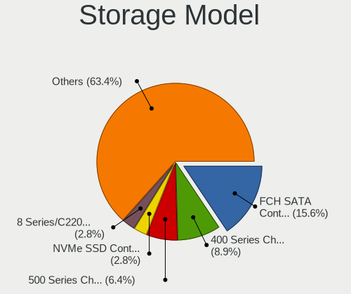
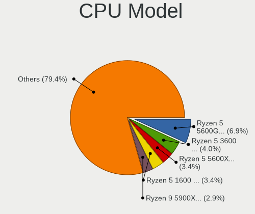
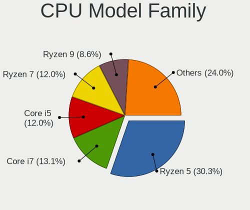
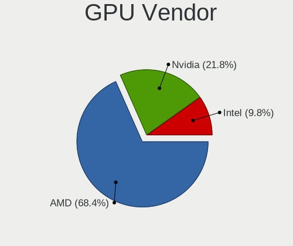
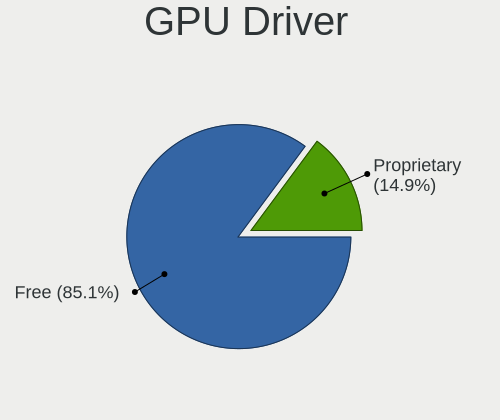
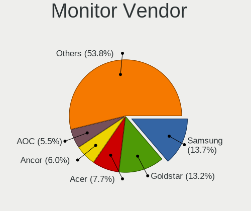
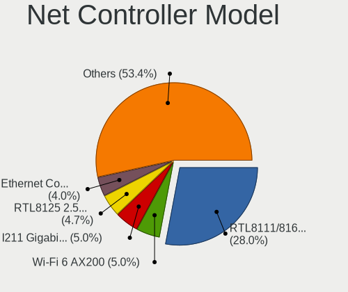
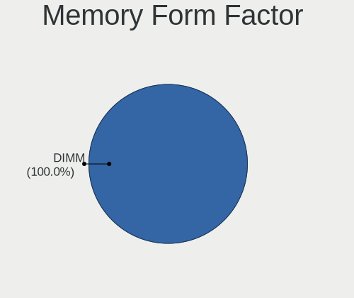

SteamOS - Tested Hardware & Statistics (Desktops)
-------------------------------------------------

A project to collect tested hardware configurations for SteamOS.

Anyone can contribute to this report by the [hw-probe](https://github.com/linuxhw/hw-probe) tool:

    sudo -E hw-probe -all -upload

Please contribute! Especially if your hardware is rare.

Contents
--------

* [ Test Cases ](#test-cases)

* [ System ](#system)
  - [ OS                       ](#os)
  - [ OS Family                ](#os-family)
  - [ Kernel                   ](#kernel)
  - [ Kernel Family            ](#kernel-family)
  - [ Kernel Major Ver.        ](#kernel-major-ver)
  - [ Arch                     ](#arch)
  - [ DE                       ](#de)
  - [ Display Server           ](#display-server)
  - [ Display Manager          ](#display-manager)
  - [ OS Lang                  ](#os-lang)
  - [ Boot Mode                ](#boot-mode)
  - [ Filesystem               ](#filesystem)
  - [ Part. scheme             ](#part-scheme)
  - [ Dual Boot with Linux/BSD ](#dual-boot-with-linuxbsd)
  - [ Dual Boot (Win)          ](#dual-boot-win)

* [ Board ](#board)
  - [ Vendor                   ](#vendor)
  - [ Model                    ](#model)
  - [ Model Family             ](#model-family)
  - [ MFG Year                 ](#mfg-year)
  - [ Form Factor              ](#form-factor)
  - [ Secure Boot              ](#secure-boot)
  - [ Coreboot                 ](#coreboot)
  - [ RAM Size                 ](#ram-size)
  - [ RAM Used                 ](#ram-used)
  - [ Total Drives             ](#total-drives)
  - [ Has CD-ROM               ](#has-cd-rom)
  - [ Has Ethernet             ](#has-ethernet)
  - [ Has WiFi                 ](#has-wifi)
  - [ Has Bluetooth            ](#has-bluetooth)

* [ Location ](#location)
  - [ Country                  ](#country)
  - [ City                     ](#city)

* [ Drives ](#drives)
  - [ Drive Vendor             ](#drive-vendor)
  - [ Drive Model              ](#drive-model)
  - [ HDD Vendor               ](#hdd-vendor)
  - [ SSD Vendor               ](#ssd-vendor)
  - [ Drive Kind               ](#drive-kind)
  - [ Drive Connector          ](#drive-connector)
  - [ Drive Size               ](#drive-size)
  - [ Space Total              ](#space-total)
  - [ Space Used               ](#space-used)
  - [ Malfunc. Drives          ](#malfunc-drives)
  - [ Malfunc. Drive Vendor    ](#malfunc-drive-vendor)
  - [ Malfunc. HDD Vendor      ](#malfunc-hdd-vendor)
  - [ Malfunc. Drive Kind      ](#malfunc-drive-kind)
  - [ Failed Drives            ](#failed-drives)
  - [ Failed Drive Vendor      ](#failed-drive-vendor)
  - [ Drive Status             ](#drive-status)

* [ Storage controller ](#storage-controller)
  - [ Storage Vendor           ](#storage-vendor)
  - [ Storage Model            ](#storage-model)
  - [ Storage Kind             ](#storage-kind)

* [ Processor ](#processor)
  - [ CPU Vendor               ](#cpu-vendor)
  - [ CPU Model                ](#cpu-model)
  - [ CPU Model Family         ](#cpu-model-family)
  - [ CPU Cores                ](#cpu-cores)
  - [ CPU Sockets              ](#cpu-sockets)
  - [ CPU Threads              ](#cpu-threads)
  - [ CPU Op-Modes             ](#cpu-op-modes)
  - [ CPU Microcode            ](#cpu-microcode)
  - [ CPU Microarch            ](#cpu-microarch)

* [ Graphics ](#graphics)
  - [ GPU Vendor               ](#gpu-vendor)
  - [ GPU Model                ](#gpu-model)
  - [ GPU Combo                ](#gpu-combo)
  - [ GPU Driver               ](#gpu-driver)
  - [ GPU Memory               ](#gpu-memory)

* [ Monitor ](#monitor)
  - [ Monitor Vendor           ](#monitor-vendor)
  - [ Monitor Model            ](#monitor-model)
  - [ Monitor Resolution       ](#monitor-resolution)
  - [ Monitor Diagonal         ](#monitor-diagonal)
  - [ Monitor Width            ](#monitor-width)
  - [ Aspect Ratio             ](#aspect-ratio)
  - [ Monitor Area             ](#monitor-area)
  - [ Pixel Density            ](#pixel-density)
  - [ Multiple Monitors        ](#multiple-monitors)

* [ Network ](#network)
  - [ Net Controller Vendor    ](#net-controller-vendor)
  - [ Net Controller Model     ](#net-controller-model)
  - [ Wireless Vendor          ](#wireless-vendor)
  - [ Wireless Model           ](#wireless-model)
  - [ Ethernet Vendor          ](#ethernet-vendor)
  - [ Ethernet Model           ](#ethernet-model)
  - [ Net Controller Kind      ](#net-controller-kind)
  - [ Used Controller          ](#used-controller)
  - [ NICs                     ](#nics)
  - [ IPv6                     ](#ipv6)

* [ Bluetooth ](#bluetooth)
  - [ Bluetooth Vendor         ](#bluetooth-vendor)
  - [ Bluetooth Model          ](#bluetooth-model)

* [ Sound ](#sound)
  - [ Sound Vendor             ](#sound-vendor)
  - [ Sound Model              ](#sound-model)

* [ Memory ](#memory)
  - [ Memory Vendor            ](#memory-vendor)
  - [ Memory Model             ](#memory-model)
  - [ Memory Kind              ](#memory-kind)
  - [ Memory Form Factor       ](#memory-form-factor)
  - [ Memory Size              ](#memory-size)
  - [ Memory Speed             ](#memory-speed)

* [ Printers & scanners ](#printers--scanners)
  - [ Printer Vendor           ](#printer-vendor)
  - [ Printer Model            ](#printer-model)
  - [ Scanner Vendor           ](#scanner-vendor)
  - [ Scanner Model            ](#scanner-model)

* [ Camera ](#camera)
  - [ Camera Vendor            ](#camera-vendor)
  - [ Camera Model             ](#camera-model)

* [ Security ](#security)
  - [ Fingerprint Vendor       ](#fingerprint-vendor)
  - [ Fingerprint Model        ](#fingerprint-model)
  - [ Chipcard Vendor          ](#chipcard-vendor)
  - [ Chipcard Model           ](#chipcard-model)

* [ Unsupported ](#unsupported)
  - [ Unsupported Devices      ](#unsupported-devices)
  - [ Unsupported Device Types ](#unsupported-device-types)

Test Cases
----------

Total: 145

| Vendor        | Model                       | Probe                                                      | Date         |
|---------------|-----------------------------|------------------------------------------------------------|--------------|
| ASUSTek       | M5A99FX PRO R2.0            | [c6cd1c43ba](https://linux-hardware.org/?probe=c6cd1c43ba) | Dec 29, 2023 |
| ASRock        | AB350M-HDV                  | [2860ba102d](https://linux-hardware.org/?probe=2860ba102d) | Dec 18, 2023 |
| ASRock        | AB350M-HDV                  | [8d45a13b61](https://linux-hardware.org/?probe=8d45a13b61) | Dec 17, 2023 |
| Gigabyte      | B560M DS3H V2               | [2fa2dbdf4a](https://linux-hardware.org/?probe=2fa2dbdf4a) | Dec 06, 2023 |
| MSI           | MAG B550 TOMAHAWK MAX WI... | [a0e082b7d2](https://linux-hardware.org/?probe=a0e082b7d2) | Dec 01, 2023 |
| Gigabyte      | Z690M AORUS ELITE AX DDR... | [532f8ccb97](https://linux-hardware.org/?probe=532f8ccb97) | Nov 27, 2023 |
| HP            | 89D8 SMVB                   | [e5bd9d36f3](https://linux-hardware.org/?probe=e5bd9d36f3) | Nov 25, 2023 |
| MSI           | MAG X570S TORPEDO MAX       | [829e6fdd78](https://linux-hardware.org/?probe=829e6fdd78) | Nov 23, 2023 |
| Gigabyte      | Z690M AORUS ELITE AX DDR... | [887bb8aabe](https://linux-hardware.org/?probe=887bb8aabe) | Nov 21, 2023 |
| ASUSTek       | ROG STRIX B450-F GAMING     | [32e985afeb](https://linux-hardware.org/?probe=32e985afeb) | Nov 21, 2023 |
| Gigabyte      | Z690M AORUS ELITE AX DDR... | [e723e12a01](https://linux-hardware.org/?probe=e723e12a01) | Nov 19, 2023 |
| Gigabyte      | B450M GAMING                | [33064ccfdf](https://linux-hardware.org/?probe=33064ccfdf) | Nov 14, 2023 |
| MSI           | Z270 PC MATE                | [e53ba2625b](https://linux-hardware.org/?probe=e53ba2625b) | Nov 09, 2023 |
| Gigabyte      | B450M GAMING                | [d788a3221f](https://linux-hardware.org/?probe=d788a3221f) | Nov 08, 2023 |
| ASRock        | B550M Pro4                  | [665120f441](https://linux-hardware.org/?probe=665120f441) | Nov 07, 2023 |
| ASRock        | B450 Gaming K4              | [166a9aee87](https://linux-hardware.org/?probe=166a9aee87) | Nov 06, 2023 |
| HP            | 89D8 SMVB                   | [3672a7681b](https://linux-hardware.org/?probe=3672a7681b) | Oct 24, 2023 |
| Shenzhen M... | F7BRC                       | [f61616bfcb](https://linux-hardware.org/?probe=f61616bfcb) | Oct 22, 2023 |
| Gigabyte      | B450 AORUS PRO WIFI-CF      | [ac47775d14](https://linux-hardware.org/?probe=ac47775d14) | Oct 17, 2023 |
| Gigabyte      | B550M S2H                   | [92cf4d1df2](https://linux-hardware.org/?probe=92cf4d1df2) | Oct 03, 2023 |
| Gigabyte      | B550M S2H                   | [d7efd8ecaa](https://linux-hardware.org/?probe=d7efd8ecaa) | Oct 03, 2023 |
| Dell          | 0Y56T3 A01                  | [bfc1d1dd13](https://linux-hardware.org/?probe=bfc1d1dd13) | Sep 30, 2023 |
| ASUSTek       | ROG STRIX Z390-I GAMING     | [3e29eb1d63](https://linux-hardware.org/?probe=3e29eb1d63) | Sep 26, 2023 |
| Dell          | 0KRC95 A01                  | [bfed5cdd27](https://linux-hardware.org/?probe=bfed5cdd27) | Sep 24, 2023 |
| ASUSTek       | PRIME H610M-A D4            | [6f73b0398c](https://linux-hardware.org/?probe=6f73b0398c) | Sep 16, 2023 |
| ASUSTek       | PRIME H610M-A D4            | [7b10a3651b](https://linux-hardware.org/?probe=7b10a3651b) | Sep 16, 2023 |
| Gigabyte      | A320M-S2H-CF                | [ac041357b0](https://linux-hardware.org/?probe=ac041357b0) | Aug 21, 2023 |
| Gigabyte      | B560M DS3H V2               | [131535162e](https://linux-hardware.org/?probe=131535162e) | Aug 14, 2023 |
| Gigabyte      | X570 UD                     | [c693096b39](https://linux-hardware.org/?probe=c693096b39) | Jul 26, 2023 |
| MSI           | H410M PRO                   | [881d77ac47](https://linux-hardware.org/?probe=881d77ac47) | Jul 04, 2023 |
| ASRock        | H310CM-DVS                  | [46429ac6ae](https://linux-hardware.org/?probe=46429ac6ae) | Jun 29, 2023 |
| ASUSTek       | H110M-D                     | [f95d5e83f5](https://linux-hardware.org/?probe=f95d5e83f5) | Jun 25, 2023 |
| MAXSUN        | MS-H81IL TR M.2             | [72c79949e0](https://linux-hardware.org/?probe=72c79949e0) | Jun 20, 2023 |
| ASUSTek       | ROG STRIX B550-I GAMING     | [9493891426](https://linux-hardware.org/?probe=9493891426) | Jun 18, 2023 |
| Gigabyte      | Z170X-Gaming 6              | [21eaab076a](https://linux-hardware.org/?probe=21eaab076a) | Jun 08, 2023 |
| ASUSTek       | ROG STRIX B550-F GAMING     | [cc54139aa6](https://linux-hardware.org/?probe=cc54139aa6) | Jun 08, 2023 |
| HP            | 8617                        | [7f5df3475c](https://linux-hardware.org/?probe=7f5df3475c) | Jun 06, 2023 |
| Dell          | 0J3C2F A00                  | [b7d801d9e5](https://linux-hardware.org/?probe=b7d801d9e5) | May 24, 2023 |
| Gigabyte      | B560M DS3H V2               | [47f3dabdb0](https://linux-hardware.org/?probe=47f3dabdb0) | May 14, 2023 |
| ASUSTek       | Z97-DELUXE                  | [c47205c3cb](https://linux-hardware.org/?probe=c47205c3cb) | May 06, 2023 |
| ASUSTek       | X99-A                       | [1adc932507](https://linux-hardware.org/?probe=1adc932507) | Apr 24, 2023 |
| Gigabyte      | Z97X-UD5H                   | [1cb8a5dfb4](https://linux-hardware.org/?probe=1cb8a5dfb4) | Apr 20, 2023 |
| Gigabyte      | H77N-WIFI                   | [10e158aabd](https://linux-hardware.org/?probe=10e158aabd) | Apr 18, 2023 |
| ASUSTek       | ROG STRIX X670E-E GAMING... | [2391458529](https://linux-hardware.org/?probe=2391458529) | Apr 15, 2023 |
| ASUSTek       | P8H61-M LX3 PLUS R2.0       | [1146ed168f](https://linux-hardware.org/?probe=1146ed168f) | Apr 14, 2023 |
| ASUSTek       | TUF B365M-PLUS GAMING       | [7c32eb6bf9](https://linux-hardware.org/?probe=7c32eb6bf9) | Apr 11, 2023 |
| ASUSTek       | TUF B365M-PLUS GAMING       | [cabf7adac2](https://linux-hardware.org/?probe=cabf7adac2) | Apr 11, 2023 |
| HP            | 89D8 SMVB                   | [a9980f1194](https://linux-hardware.org/?probe=a9980f1194) | Apr 04, 2023 |
| Acer          | Nitro N50-610               | [937d1bc73a](https://linux-hardware.org/?probe=937d1bc73a) | Mar 29, 2023 |
| ASRock        | X300M-STX                   | [0393d25a9d](https://linux-hardware.org/?probe=0393d25a9d) | Mar 23, 2023 |
| ASRock        | X300M-STX                   | [296411b749](https://linux-hardware.org/?probe=296411b749) | Mar 23, 2023 |
| HP            | 83E9                        | [a93c800fa1](https://linux-hardware.org/?probe=a93c800fa1) | Mar 19, 2023 |
| Gigabyte      | F2A68HM-H                   | [a77d320c80](https://linux-hardware.org/?probe=a77d320c80) | Mar 18, 2023 |
| ASUSTek       | PRIME H610M-K D4            | [9f33a01f8d](https://linux-hardware.org/?probe=9f33a01f8d) | Mar 15, 2023 |
| ASUSTek       | PRIME Z270M-PLUS            | [5cb3c60db6](https://linux-hardware.org/?probe=5cb3c60db6) | Mar 14, 2023 |
| HP            | 89D8 SMVB                   | [6b3f831210](https://linux-hardware.org/?probe=6b3f831210) | Mar 10, 2023 |
| MSI           | MPG B650I EDGE WIFI         | [e2d3c4e17e](https://linux-hardware.org/?probe=e2d3c4e17e) | Mar 10, 2023 |
| ASUSTek       | Maximus VI IMPACT           | [bca54b81fc](https://linux-hardware.org/?probe=bca54b81fc) | Mar 09, 2023 |
| Gigabyte      | AX370-Gaming-CF se1         | [79f1c1822c](https://linux-hardware.org/?probe=79f1c1822c) | Mar 09, 2023 |
| Gigabyte      | B450 AORUS M                | [e67eb9d235](https://linux-hardware.org/?probe=e67eb9d235) | Mar 06, 2023 |
| ASUSTek       | PRIME A320I-K               | [88e6308c0a](https://linux-hardware.org/?probe=88e6308c0a) | Mar 05, 2023 |
| ASUSTek       | Maximus VI IMPACT           | [53d547f79c](https://linux-hardware.org/?probe=53d547f79c) | Mar 05, 2023 |
| Gigabyte      | B550 GAMING X V2            | [a40e18910c](https://linux-hardware.org/?probe=a40e18910c) | Mar 03, 2023 |
| ASUSTek       | CROSSHAIR VI HERO           | [3e3368d913](https://linux-hardware.org/?probe=3e3368d913) | Feb 28, 2023 |
| ASRock        | B550 Phantom Gaming-ITX/... | [0195132360](https://linux-hardware.org/?probe=0195132360) | Feb 28, 2023 |
| ASRock        | B550 Phantom Gaming-ITX/... | [8cd8d4b833](https://linux-hardware.org/?probe=8cd8d4b833) | Feb 28, 2023 |
| Biostar       | A320MH                      | [b6f7ef6e4a](https://linux-hardware.org/?probe=b6f7ef6e4a) | Feb 23, 2023 |
| Biostar       | A320MH                      | [e80f86a0bf](https://linux-hardware.org/?probe=e80f86a0bf) | Feb 23, 2023 |
| ASRock        | B760M-ITX/D4 WiFi           | [8a29735d16](https://linux-hardware.org/?probe=8a29735d16) | Feb 16, 2023 |
| HP            | 83EC                        | [4757525f5d](https://linux-hardware.org/?probe=4757525f5d) | Feb 15, 2023 |
| Shenzhen M... | F7BFC                       | [08820689e8](https://linux-hardware.org/?probe=08820689e8) | Feb 11, 2023 |
| ASUSTek       | PRIME B250M-PLUS/BR         | [abfd3f65af](https://linux-hardware.org/?probe=abfd3f65af) | Feb 10, 2023 |
| ASRock        | B560 Pro4                   | [0243fe3621](https://linux-hardware.org/?probe=0243fe3621) | Feb 07, 2023 |
| MSI           | B450M MORTAR MAX            | [2f0810d441](https://linux-hardware.org/?probe=2f0810d441) | Feb 05, 2023 |
| Gigabyte      | B450 AORUS M                | [c35fa9b7f5](https://linux-hardware.org/?probe=c35fa9b7f5) | Feb 05, 2023 |
| Gigabyte      | B85M-D3H                    | [903e8715e4](https://linux-hardware.org/?probe=903e8715e4) | Feb 03, 2023 |
| Gigabyte      | B85M-D3H                    | [6013489300](https://linux-hardware.org/?probe=6013489300) | Feb 03, 2023 |
| Dell          | 0F3KHR A00                  | [a088ccf72c](https://linux-hardware.org/?probe=a088ccf72c) | Feb 02, 2023 |
| Dell          | 0F3KHR A00                  | [6c793de699](https://linux-hardware.org/?probe=6c793de699) | Feb 01, 2023 |
| Dell          | 0D6H9T A00                  | [2c34aba28a](https://linux-hardware.org/?probe=2c34aba28a) | Jan 30, 2023 |
| HP            | 8906 SMVB                   | [625d54930d](https://linux-hardware.org/?probe=625d54930d) | Jan 12, 2023 |
| MSI           | MPG X570 GAMING PLUS        | [3b92dd60cf](https://linux-hardware.org/?probe=3b92dd60cf) | Jan 11, 2023 |
| Gigabyte      | B450 AORUS M                | [0851440887](https://linux-hardware.org/?probe=0851440887) | Jan 11, 2023 |
| Gigabyte      | B550M DS3H                  | [3d656e7bfd](https://linux-hardware.org/?probe=3d656e7bfd) | Jan 05, 2023 |
| MSI           | H81M-P33                    | [041ee2fde1](https://linux-hardware.org/?probe=041ee2fde1) | Jan 03, 2023 |
| ASUSTek       | PRIME B450M-A II            | [0842d26251](https://linux-hardware.org/?probe=0842d26251) | Dec 30, 2022 |
| ASUSTek       | PRIME B450M-A II            | [d91b55f9f1](https://linux-hardware.org/?probe=d91b55f9f1) | Dec 30, 2022 |
| Dell          | 0KC9NP A01                  | [0e70489d5c](https://linux-hardware.org/?probe=0e70489d5c) | Dec 16, 2022 |
| ASUSTek       | M80CJ-O                     | [2375dfe19f](https://linux-hardware.org/?probe=2375dfe19f) | Dec 10, 2022 |
| ASUSTek       | ROG CROSSHAIR VIII HERO     | [65ccd1da0e](https://linux-hardware.org/?probe=65ccd1da0e) | Dec 05, 2022 |
| ASUSTek       | TUF Gaming B550M-PLUS       | [c2c53a959d](https://linux-hardware.org/?probe=c2c53a959d) | Dec 03, 2022 |
| ASUSTek       | Z170 PRO GAMING             | [3f642a7844](https://linux-hardware.org/?probe=3f642a7844) | Dec 02, 2022 |
| Gigabyte      | B450M DS3H V2               | [f00a357dbe](https://linux-hardware.org/?probe=f00a357dbe) | Nov 29, 2022 |
| MSI           | 970A-G46                    | [3cd88e88d3](https://linux-hardware.org/?probe=3cd88e88d3) | Nov 28, 2022 |
| Gigabyte      | B450 AORUS M                | [8263c8ba6f](https://linux-hardware.org/?probe=8263c8ba6f) | Nov 28, 2022 |
| ASUSTek       | Z170 PRO GAMING             | [ee234d62ec](https://linux-hardware.org/?probe=ee234d62ec) | Nov 27, 2022 |
| ASUSTek       | PRIME X570-PRO              | [c278b19567](https://linux-hardware.org/?probe=c278b19567) | Nov 20, 2022 |
| HP            | 8626                        | [f2098a2414](https://linux-hardware.org/?probe=f2098a2414) | Nov 19, 2022 |
| HP            | 8626                        | [05ebc14932](https://linux-hardware.org/?probe=05ebc14932) | Nov 19, 2022 |
| Gigabyte      | 970A-DS3P FX                | [85ef5eaf43](https://linux-hardware.org/?probe=85ef5eaf43) | Nov 12, 2022 |
| MSI           | X370 GAMING PLUS            | [a0b134897f](https://linux-hardware.org/?probe=a0b134897f) | Nov 05, 2022 |
| ASUSTek       | CROSSHAIR VI HERO           | [7712ce88c4](https://linux-hardware.org/?probe=7712ce88c4) | Oct 30, 2022 |
| Gigabyte      | B550 GAMING X V2            | [b4ba1b8d5a](https://linux-hardware.org/?probe=b4ba1b8d5a) | Oct 29, 2022 |
| HP            | 8433 11                     | [fed45efc8d](https://linux-hardware.org/?probe=fed45efc8d) | Oct 12, 2022 |
| Gigabyte      | B450M DS3H-CF               | [c1c51b96ef](https://linux-hardware.org/?probe=c1c51b96ef) | Oct 06, 2022 |
| ASUSTek       | ROG STRIX B550-F GAMING     | [aee559f8bf](https://linux-hardware.org/?probe=aee559f8bf) | Oct 04, 2022 |
| Apple         | Mac-27AD2F918AE68F61 Mac... | [3e25da0356](https://linux-hardware.org/?probe=3e25da0356) | Oct 01, 2022 |
| ASUSTek       | CROSSHAIR VI HERO           | [46e48bc4c1](https://linux-hardware.org/?probe=46e48bc4c1) | Sep 28, 2022 |
| ASUSTek       | CROSSHAIR VI HERO           | [8d8440548e](https://linux-hardware.org/?probe=8d8440548e) | Sep 20, 2022 |
| MSI           | X399 SLI PLUS               | [f686754b27](https://linux-hardware.org/?probe=f686754b27) | Sep 16, 2022 |
| MSI           | X470 GAMING PLUS            | [9919cebdfe](https://linux-hardware.org/?probe=9919cebdfe) | Sep 15, 2022 |
| MSI           | 970A-G46                    | [5f7482fe88](https://linux-hardware.org/?probe=5f7482fe88) | Sep 11, 2022 |
| ASUSTek       | H81M-PLUS                   | [2d99107aa6](https://linux-hardware.org/?probe=2d99107aa6) | Sep 05, 2022 |
| Gigabyte      | B450 AORUS M                | [3ac55201b6](https://linux-hardware.org/?probe=3ac55201b6) | Sep 04, 2022 |
| Dell          | 0HHV7N A00                  | [f4142b2ff8](https://linux-hardware.org/?probe=f4142b2ff8) | Sep 02, 2022 |
| ASUSTek       | PRIME A320M-K               | [bdae2c60cd](https://linux-hardware.org/?probe=bdae2c60cd) | Sep 01, 2022 |
| MSI           | MS-B9201                    | [b5c80c8c2c](https://linux-hardware.org/?probe=b5c80c8c2c) | Aug 29, 2022 |
| Gigabyte      | B550 AORUS ELITE AX V2      | [9e3df56c3b](https://linux-hardware.org/?probe=9e3df56c3b) | Aug 28, 2022 |
| ASUSTek       | PRIME B550-PLUS             | [67b791eb17](https://linux-hardware.org/?probe=67b791eb17) | Aug 25, 2022 |
| ASUSTek       | H97-PRO GAMER               | [663bc0a517](https://linux-hardware.org/?probe=663bc0a517) | Aug 25, 2022 |
| ASUSTek       | H97-PRO GAMER               | [e934af2a60](https://linux-hardware.org/?probe=e934af2a60) | Aug 23, 2022 |
| Gigabyte      | AB350-Gaming 3-CF           | [9661c799c9](https://linux-hardware.org/?probe=9661c799c9) | Aug 18, 2022 |
| Gigabyte      | X570 GAMING X               | [d8e60dcf09](https://linux-hardware.org/?probe=d8e60dcf09) | Aug 17, 2022 |
| ASUSTek       | TUF Gaming X570-PLUS        | [53429d945b](https://linux-hardware.org/?probe=53429d945b) | Aug 15, 2022 |
| MSI           | MS-B9351                    | [a5b1950761](https://linux-hardware.org/?probe=a5b1950761) | Aug 14, 2022 |
| MSI           | MS-B9351                    | [fbf08d2d76](https://linux-hardware.org/?probe=fbf08d2d76) | Aug 14, 2022 |
| MSI           | B450 TOMAHAWK MAX II        | [dcd9be004c](https://linux-hardware.org/?probe=dcd9be004c) | Aug 13, 2022 |
| ASUSTek       | SABERTOOTH X99              | [54ea6926a0](https://linux-hardware.org/?probe=54ea6926a0) | Aug 13, 2022 |
| Dell          | 00F82W A00                  | [8e74c57731](https://linux-hardware.org/?probe=8e74c57731) | Aug 07, 2022 |
| Gigabyte      | H310M S2V                   | [329d2071a9](https://linux-hardware.org/?probe=329d2071a9) | Aug 01, 2022 |
| ASRock        | A520M-ITX/ac                | [876c779461](https://linux-hardware.org/?probe=876c779461) | Jul 25, 2022 |
| ASRock        | B450M-HDV R4.0              | [f2172999c8](https://linux-hardware.org/?probe=f2172999c8) | Jul 24, 2022 |
| ASUSTek       | EX-A320M-GAMING             | [68884b1723](https://linux-hardware.org/?probe=68884b1723) | Jul 17, 2022 |
| Gigabyte      | H170N-WIFI-CF               | [2f3e59dc30](https://linux-hardware.org/?probe=2f3e59dc30) | Jul 09, 2022 |
| Gigabyte      | B550 GAMING X V2            | [61eaf99aca](https://linux-hardware.org/?probe=61eaf99aca) | Jul 05, 2022 |
| Gigabyte      | B550 GAMING X V2            | [812733dd89](https://linux-hardware.org/?probe=812733dd89) | Jul 05, 2022 |
| Gigabyte      | X570 I AORUS PRO WIFI       | [d82f88e20c](https://linux-hardware.org/?probe=d82f88e20c) | Jul 01, 2022 |
| Alienware     | 02XRCM A01                  | [c70647bab0](https://linux-hardware.org/?probe=c70647bab0) | Jun 26, 2022 |
| ASUSTek       | H61M-K                      | [1a568c2e5f](https://linux-hardware.org/?probe=1a568c2e5f) | Jun 23, 2022 |
| ASUSTek       | ROG STRIX B550-F GAMING     | [b3a08001ed](https://linux-hardware.org/?probe=b3a08001ed) | Jun 01, 2022 |
| ASRock        | B550 PG Velocita            | [0d7f71a24d](https://linux-hardware.org/?probe=0d7f71a24d) | May 30, 2022 |
| ASRock        | B365M Pro4-F                | [afc161c6fb](https://linux-hardware.org/?probe=afc161c6fb) | May 30, 2022 |
| Gigabyte      | B560M AORUS PRO             | [31f246f96e](https://linux-hardware.org/?probe=31f246f96e) | May 27, 2022 |
| Gigabyte      | B560M AORUS PRO             | [1d381d6ec9](https://linux-hardware.org/?probe=1d381d6ec9) | May 27, 2022 |
| Gigabyte      | Z170XP-SLI-CF               | [d4bef1e450](https://linux-hardware.org/?probe=d4bef1e450) | May 26, 2022 |

System
------

OS
--

Installed operating systems

| Name                         | Desktops | Percent |
|------------------------------|----------|---------|
| SteamOS 3.4                  | 54       | 46.55%  |
| SteamOS 3.3                  | 24       | 20.69%  |
| SteamOS 4                    | 18       | 15.52%  |
| SteamOS 3.2 (steamdeck-main) | 7        | 6.03%   |
| SteamOS                      | 6        | 5.17%   |
| SteamOS Snapshot             | 3        | 2.59%   |
| SteamOS 3.5.7                | 2        | 1.72%   |
| SteamOS Rolling              | 1        | 0.86%   |
| SteamOS 3.2                  | 1        | 0.86%   |

OS Family
---------

OS without a version

| Name    | Desktops | Percent |
|---------|----------|---------|
| SteamOS | 112      | 100%    |

Kernel
------

Version of the Linux kernel

| Version                                            | Desktops | Percent |
|----------------------------------------------------|----------|---------|
| 5.13.0-valve21.3-1-neptune                         | 43       | 37.72%  |
| 5.13.0-valve10.1-2-neptune-dri-02144-g7fffaf925dfb | 11       | 9.65%   |
| 5.13.0-valve24-1-neptune-02226-g5b8545e4c5a1       | 10       | 8.77%   |
| 6.3.7-zen1-1-zen                                   | 8        | 7.02%   |
| 5.13.0-valve22-1-neptune-02213-gb68995364335       | 7        | 6.14%   |
| 6.4.12-zen1-1-zen                                  | 6        | 5.26%   |
| 5.18.1-arch1_testHoloISO_20220606.1811             | 6        | 5.26%   |
| 6.1.21-valve1-1-neptune-61                         | 3        | 2.63%   |
| 5.13.0-valve36-1-neptune                           | 3        | 2.63%   |
| 6.1.52-valve9-1-neptune-61                         | 2        | 1.75%   |
| 6.1.21-valve1-3-neptune-61                         | 2        | 1.75%   |
| 5.13.0-valve23-1-neptune-02219-gf0b4ecc8cab6       | 2        | 1.75%   |
| 5.13.0-valve21-1-steamos-02209-g2a5bdc1102a0       | 2        | 1.75%   |
| 6.3.9-arch1-1                                      | 1        | 0.88%   |
| 6.1.29-valve4-1-neptune-61                         | 1        | 0.88%   |
| 6.1.12-valve2-1-neptune-61                         | 1        | 0.88%   |
| 5.15.93-1-lts                                      | 1        | 0.88%   |
| 5.15.79-1-lts                                      | 1        | 0.88%   |
| 5.15.60-1-lts                                      | 1        | 0.88%   |
| 5.13.0-valve24-1-neptune                           | 1        | 0.88%   |
| 5.13.0-valve21-2-neptune-02209-g2a5bdc1102a0       | 1        | 0.88%   |
| 5.13.0-valve21-1-neptune-02209-g2a5bdc1102a0       | 1        | 0.88%   |

Kernel Family
-------------

Linux kernel without a distro release

| Version | Desktops | Percent |
|---------|----------|---------|
| 5.13.0  | 81       | 71.05%  |
| 6.3.7   | 8        | 7.02%   |
| 6.4.12  | 6        | 5.26%   |
| 5.18.1  | 6        | 5.26%   |
| 6.1.21  | 5        | 4.39%   |
| 6.1.52  | 2        | 1.75%   |
| 6.3.9   | 1        | 0.88%   |
| 6.1.29  | 1        | 0.88%   |
| 6.1.12  | 1        | 0.88%   |
| 5.15.93 | 1        | 0.88%   |
| 5.15.79 | 1        | 0.88%   |
| 5.15.60 | 1        | 0.88%   |

Kernel Major Ver.
-----------------

Linux kernel major version

| Version | Desktops | Percent |
|---------|----------|---------|
| 5.13    | 81       | 71.05%  |
| 6.3     | 9        | 7.89%   |
| 6.1     | 9        | 7.89%   |
| 6.4     | 6        | 5.26%   |
| 5.18    | 6        | 5.26%   |
| 5.15    | 3        | 2.63%   |

Arch
----

OS architecture (x86_64, i586, etc.)

| Name   | Desktops | Percent |
|--------|----------|---------|
| x86_64 | 112      | 100%    |

DE
--

Desktop Environment

| Name | Desktops | Percent |
|------|----------|---------|
| KDE5 | 112      | 100%    |

Display Server
--------------

X11 or Wayland

| Name | Desktops | Percent |
|------|----------|---------|
| X11  | 112      | 100%    |

Display Manager
---------------

SDDM, LightDM, etc.

| Name    | Desktops | Percent |
|---------|----------|---------|
| Unknown | 111      | 99.11%  |
| SDDM    | 1        | 0.89%   |

OS Lang
-------

Language

| Lang  | Desktops | Percent |
|-------|----------|---------|
| en_US | 96       | 84.96%  |
| fr_FR | 4        | 3.54%   |
| pt_BR | 3        | 2.65%   |
| ru_RU | 1        | 0.88%   |
| pt_PT | 1        | 0.88%   |
| pl_PL | 1        | 0.88%   |
| n_US  | 1        | 0.88%   |
| en_IE | 1        | 0.88%   |
| en_GB | 1        | 0.88%   |
| en_DE | 1        | 0.88%   |
| de_DE | 1        | 0.88%   |
| de_AT | 1        | 0.88%   |
| C     | 1        | 0.88%   |

Boot Mode
---------

EFI or BIOS

| Mode | Desktops | Percent |
|------|----------|---------|
| BIOS | 111      | 99.11%  |
| EFI  | 1        | 0.89%   |

Filesystem
----------

Type of filesystem

| Type  | Desktops | Percent |
|-------|----------|---------|
| Btrfs | 106      | 94.64%  |
| Tmpfs | 6        | 5.36%   |

Part. scheme
------------

Scheme of partitioning

| Type    | Desktops | Percent |
|---------|----------|---------|
| Unknown | 111      | 99.11%  |
| GPT     | 1        | 0.89%   |

Dual Boot with Linux/BSD
------------------------

Hosting more than one Linux/BSD

| Dual boot | Desktops | Percent |
|-----------|----------|---------|
| No        | 112      | 100%    |

Dual Boot (Win)
---------------

Hosting Linux and Windows

| Dual boot | Desktops | Percent |
|-----------|----------|---------|
| No        | 112      | 100%    |

Board
-----

Vendor
------

Motherboard manufacturer

| Name                                 | Desktops | Percent |
|--------------------------------------|----------|---------|
| ASUSTek Computer                     | 33       | 29.46%  |
| Gigabyte Technology                  | 30       | 26.79%  |
| MSI                                  | 14       | 12.5%   |
| ASRock                               | 12       | 10.71%  |
| Hewlett-Packard                      | 8        | 7.14%   |
| Dell                                 | 8        | 7.14%   |
| Shenzhen Meigao Electronic Equipment | 2        | 1.79%   |
| MAXSUN                               | 1        | 0.89%   |
| Biostar                              | 1        | 0.89%   |
| Apple                                | 1        | 0.89%   |
| Alienware                            | 1        | 0.89%   |
| Acer                                 | 1        | 0.89%   |

Model
-----

Motherboard model

| Name                                                | Desktops | Percent |
|-----------------------------------------------------|----------|---------|
| ASUS All Series                                     | 6        | 5.36%   |
| Gigabyte B450 AORUS M                               | 4        | 3.57%   |
| ASUS ROG STRIX B550-F GAMING                        | 3        | 2.68%   |
| HP Victus by 15L Gaming Desktop TG02-0xxx           | 2        | 1.79%   |
| Gigabyte B550 GAMING X V2                           | 2        | 1.79%   |
| Dell OptiPlex 9010                                  | 2        | 1.79%   |
| Shenzhen Meigao Electronic Equipment UM690          | 1        | 0.89%   |
| Shenzhen Meigao Electronic Equipment Mercury series | 1        | 0.89%   |
| MSI MS-7D73                                         | 1        | 0.89%   |
| MSI MS-7C91                                         | 1        | 0.89%   |
| MSI MS-7C89                                         | 1        | 0.89%   |
| MSI MS-7C37                                         | 1        | 0.89%   |
| MSI MS-7C02                                         | 1        | 0.89%   |
| MSI MS-7B89                                         | 1        | 0.89%   |
| MSI MS-7B79                                         | 1        | 0.89%   |
| MSI MS-7B09                                         | 1        | 0.89%   |
| MSI MS-7A72                                         | 1        | 0.89%   |
| MSI MS-7A33                                         | 1        | 0.89%   |
| MSI MS-7817                                         | 1        | 0.89%   |
| MSI MS-7693                                         | 1        | 0.89%   |
| MSI MPG H510 Trident 3 (MS-B935)                    | 1        | 0.89%   |
| MSI H310 Gaming Trident3 (MS-B920)                  | 1        | 0.89%   |
| MAXSUN MS-H81IL TR M.2                              | 1        | 0.89%   |
| HP ProDesk 600 G4 MT                                | 1        | 0.89%   |
| HP ProDesk 405 G4 Desktop Mini                      | 1        | 0.89%   |
| HP Pavilion Gaming Desktop TG01-2xxx                | 1        | 0.89%   |
| HP Pavilion Gaming Desktop 690-00xx                 | 1        | 0.89%   |
| HP EliteDesk 705 G5 SFF                             | 1        | 0.89%   |
| HP EliteDesk 705 G4 DM 65W (TAA)                    | 1        | 0.89%   |
| Gigabyte Z97X-UD5H                                  | 1        | 0.89%   |
| Gigabyte Z690M AORUS ELITE AX DDR4                  | 1        | 0.89%   |
| Gigabyte Z170X-Gaming 6                             | 1        | 0.89%   |
| Gigabyte X570 UD                                    | 1        | 0.89%   |
| Gigabyte X570 I AORUS PRO WIFI                      | 1        | 0.89%   |
| Gigabyte X570 GAMING X                              | 1        | 0.89%   |
| Gigabyte MBB-670016                                 | 1        | 0.89%   |
| Gigabyte H77N-WIFI                                  | 1        | 0.89%   |
| Gigabyte H310M S2V 2.0                              | 1        | 0.89%   |
| Gigabyte H170N-WIFI                                 | 1        | 0.89%   |
| Gigabyte F2A68HM-H                                  | 1        | 0.89%   |

Model Family
------------

Motherboard model prefix

| Name                                         | Desktops | Percent |
|----------------------------------------------|----------|---------|
| ASUS PRIME                                   | 9        | 8.04%   |
| ASUS ROG                                     | 7        | 6.25%   |
| Dell OptiPlex                                | 6        | 5.36%   |
| ASUS All                                     | 6        | 5.36%   |
| Gigabyte B450                                | 5        | 4.46%   |
| Gigabyte X570                                | 3        | 2.68%   |
| Gigabyte B450M                               | 3        | 2.68%   |
| ASUS TUF                                     | 3        | 2.68%   |
| HP Victus                                    | 2        | 1.79%   |
| HP ProDesk                                   | 2        | 1.79%   |
| HP Pavilion                                  | 2        | 1.79%   |
| HP EliteDesk                                 | 2        | 1.79%   |
| Gigabyte B560M                               | 2        | 1.79%   |
| Gigabyte B550M                               | 2        | 1.79%   |
| Gigabyte B550                                | 2        | 1.79%   |
| Dell Precision                               | 2        | 1.79%   |
| ASRock B550                                  | 2        | 1.79%   |
| Shenzhen Meigao Electronic Equipment UM690   | 1        | 0.89%   |
| Shenzhen Meigao Electronic Equipment Mercury | 1        | 0.89%   |
| MSI MS-7D73                                  | 1        | 0.89%   |
| MSI MS-7C91                                  | 1        | 0.89%   |
| MSI MS-7C89                                  | 1        | 0.89%   |
| MSI MS-7C37                                  | 1        | 0.89%   |
| MSI MS-7C02                                  | 1        | 0.89%   |
| MSI MS-7B89                                  | 1        | 0.89%   |
| MSI MS-7B79                                  | 1        | 0.89%   |
| MSI MS-7B09                                  | 1        | 0.89%   |
| MSI MS-7A72                                  | 1        | 0.89%   |
| MSI MS-7A33                                  | 1        | 0.89%   |
| MSI MS-7817                                  | 1        | 0.89%   |
| MSI MS-7693                                  | 1        | 0.89%   |
| MSI MPG                                      | 1        | 0.89%   |
| MSI H310                                     | 1        | 0.89%   |
| MAXSUN MS-H81IL                              | 1        | 0.89%   |
| Gigabyte Z97X-UD5H                           | 1        | 0.89%   |
| Gigabyte Z690M                               | 1        | 0.89%   |
| Gigabyte Z170X-Gaming                        | 1        | 0.89%   |
| Gigabyte MBB-670016                          | 1        | 0.89%   |
| Gigabyte H77N-WIFI                           | 1        | 0.89%   |
| Gigabyte H310M                               | 1        | 0.89%   |

MFG Year
--------

Motherboard manufacture year

| Year | Desktops | Percent |
|------|----------|---------|
| 2020 | 22       | 19.64%  |
| 2018 | 20       | 17.86%  |
| 2019 | 12       | 10.71%  |
| 2021 | 11       | 9.82%   |
| 2017 | 10       | 8.93%   |
| 2022 | 8        | 7.14%   |
| 2014 | 8        | 7.14%   |
| 2012 | 6        | 5.36%   |
| 2016 | 5        | 4.46%   |
| 2013 | 5        | 4.46%   |
| 2015 | 2        | 1.79%   |
| 2011 | 2        | 1.79%   |
| 2023 | 1        | 0.89%   |

Form Factor
-----------

Physical design of the computer

| Name    | Desktops | Percent |
|---------|----------|---------|
| Desktop | 112      | 100%    |

Secure Boot
-----------

Enabled or disabled

| State    | Desktops | Percent |
|----------|----------|---------|
| Disabled | 112      | 100%    |

Coreboot
--------

Have coreboot on board

| Used | Desktops | Percent |
|------|----------|---------|
| No   | 112      | 100%    |

RAM Size
--------

Total RAM memory

| Size in GB  | Desktops | Percent |
|-------------|----------|---------|
| 16.01-24.0  | 51       | 45.13%  |
| 32.01-64.0  | 29       | 25.66%  |
| 8.01-16.0   | 15       | 13.27%  |
| 4.01-8.0    | 7        | 6.19%   |
| 24.01-32.0  | 7        | 6.19%   |
| 64.01-256.0 | 4        | 3.54%   |

RAM Used
--------

Used RAM memory

| Used GB   | Desktops | Percent |
|-----------|----------|---------|
| 2.01-3.0  | 43       | 37.72%  |
| 3.01-4.0  | 36       | 31.58%  |
| 4.01-8.0  | 21       | 18.42%  |
| 1.01-2.0  | 8        | 7.02%   |
| 8.01-16.0 | 6        | 5.26%   |

Total Drives
------------

Number of drives on board

| Drives | Desktops | Percent |
|--------|----------|---------|
| 1      | 36       | 31.58%  |
| 2      | 30       | 26.32%  |
| 3      | 25       | 21.93%  |
| 4      | 12       | 10.53%  |
| 5      | 8        | 7.02%   |
| 11     | 1        | 0.88%   |
| 7      | 1        | 0.88%   |
| 6      | 1        | 0.88%   |

Has CD-ROM
----------

Has CD-ROM on board

| Presented | Desktops | Percent |
|-----------|----------|---------|
| No        | 99       | 88.39%  |
| Yes       | 13       | 11.61%  |

Has Ethernet
------------

Has Ethernet on board

| Presented | Desktops | Percent |
|-----------|----------|---------|
| Yes       | 110      | 98.21%  |
| No        | 2        | 1.79%   |

Has WiFi
--------

Has WiFi module

| Presented | Desktops | Percent |
|-----------|----------|---------|
| Yes       | 74       | 66.07%  |
| No        | 38       | 33.93%  |

Has Bluetooth
-------------

Has Bluetooth module

| Presented | Desktops | Percent |
|-----------|----------|---------|
| Yes       | 61       | 53.98%  |
| No        | 52       | 46.02%  |

Location
--------

Country
-------

Geographic location (country)

| Country      | Desktops | Percent |
|--------------|----------|---------|
| USA          | 45       | 39.82%  |
| UK           | 8        | 7.08%   |
| France       | 7        | 6.19%   |
| Brazil       | 7        | 6.19%   |
| Australia    | 5        | 4.42%   |
| Poland       | 4        | 3.54%   |
| Italy        | 3        | 2.65%   |
| Ireland      | 3        | 2.65%   |
| Germany      | 3        | 2.65%   |
| Spain        | 2        | 1.77%   |
| Philippines  | 2        | 1.77%   |
| Canada       | 2        | 1.77%   |
| Vietnam      | 1        | 0.88%   |
| Uzbekistan   | 1        | 0.88%   |
| Turkey       | 1        | 0.88%   |
| Thailand     | 1        | 0.88%   |
| South Africa | 1        | 0.88%   |
| Russia       | 1        | 0.88%   |
| Romania      | 1        | 0.88%   |
| Portugal     | 1        | 0.88%   |
| Peru         | 1        | 0.88%   |
| Oman         | 1        | 0.88%   |
| Malaysia     | 1        | 0.88%   |
| Latvia       | 1        | 0.88%   |
| Japan        | 1        | 0.88%   |
| Israel       | 1        | 0.88%   |
| Iceland      | 1        | 0.88%   |
| Hungary      | 1        | 0.88%   |
| Hong Kong    | 1        | 0.88%   |
| El Salvador  | 1        | 0.88%   |
| Denmark      | 1        | 0.88%   |
| Cambodia     | 1        | 0.88%   |
| Austria      | 1        | 0.88%   |
| Argentina    | 1        | 0.88%   |

City
----

Geographic location (city)

| City                   | Desktops | Percent |
|------------------------|----------|---------|
| Sydney                 | 2        | 1.75%   |
| Sao Paulo              | 2        | 1.75%   |
| San Jose               | 2        | 1.75%   |
| Oklahoma City          | 2        | 1.75%   |
| Gujan-Mestras          | 2        | 1.75%   |
| Dallas                 | 2        | 1.75%   |
| Brasília              | 2        | 1.75%   |
| Zevio                  | 1        | 0.88%   |
| West Bloomfield        | 1        | 0.88%   |
| Walsall                | 1        | 0.88%   |
| Ville Platte           | 1        | 0.88%   |
| Vilas                  | 1        | 0.88%   |
| Tyumen                 | 1        | 0.88%   |
| Tuam                   | 1        | 0.88%   |
| Toronto                | 1        | 0.88%   |
| Tashkent               | 1        | 0.88%   |
| Targoviste             | 1        | 0.88%   |
| Sterling Heights       | 1        | 0.88%   |
| Sparta                 | 1        | 0.88%   |
| Skarzysko-Kamienna     | 1        | 0.88%   |
| Siloam Springs         | 1        | 0.88%   |
| Sassenberg             | 1        | 0.88%   |
| Sant Quirze del Valles | 1        | 0.88%   |
| San Salvador           | 1        | 0.88%   |
| Salford                | 1        | 0.88%   |
| Salem                  | 1        | 0.88%   |
| Riga                   | 1        | 0.88%   |
| Reykjavik              | 1        | 0.88%   |
| Quezon City            | 1        | 0.88%   |
| Puchberg am Schneeberg | 1        | 0.88%   |
| Portsmouth             | 1        | 0.88%   |
| Porto Alegre           | 1        | 0.88%   |
| Portland               | 1        | 0.88%   |
| Phnom Penh             | 1        | 0.88%   |
| Petah Tikva            | 1        | 0.88%   |
| Pesaro                 | 1        | 0.88%   |
| Perth                  | 1        | 0.88%   |
| Peoria                 | 1        | 0.88%   |
| Paris                  | 1        | 0.88%   |
| Ostrów Wielkopolski   | 1        | 0.88%   |

Drives
------

Drive Vendor
------------

Hard drive vendors

| Vendor                      | Desktops | Drives | Percent |
|-----------------------------|----------|--------|---------|
| Seagate                     | 36       | 45     | 15.06%  |
| Samsung Electronics         | 31       | 57     | 12.97%  |
| WDC                         | 28       | 34     | 11.72%  |
| SanDisk                     | 18       | 20     | 7.53%   |
| Kingston                    | 18       | 21     | 7.53%   |
| Toshiba                     | 17       | 19     | 7.11%   |
| Crucial                     | 16       | 20     | 6.69%   |
| Micron/Crucial Technology   | 6        | 6      | 2.51%   |
| Phison Electronics          | 5        | 7      | 2.09%   |
| A-DATA Technology           | 5        | 5      | 2.09%   |
| Realtek Semiconductor       | 4        | 4      | 1.67%   |
| PNY                         | 4        | 5      | 1.67%   |
| Phison                      | 4        | 5      | 1.67%   |
| MAXIO Technology (Hangzhou) | 4        | 4      | 1.67%   |
| Intel                       | 4        | 6      | 1.67%   |
| Unknown                     | 4        | 5      | 1.67%   |
| Hitachi                     | 3        | 3      | 1.26%   |
| China                       | 3        | 6      | 1.26%   |
| SPCC                        | 2        | 4      | 0.84%   |
| SK hynix                    | 2        | 2      | 0.84%   |
| Silicon Motion              | 2        | 2      | 0.84%   |
| Realtek                     | 2        | 2      | 0.84%   |
| Kingston Technology Company | 2        | 2      | 0.84%   |
| Unknown                     | 1        | 1      | 0.42%   |
| Union Memory (Shenzhen)     | 1        | 1      | 0.42%   |
| T-FORCE                     | 1        | 1      | 0.42%   |
| Ramsta                      | 1        | 1      | 0.42%   |
| Patriot                     | 1        | 1      | 0.42%   |
| Mushkin                     | 1        | 1      | 0.42%   |
| Micron Technology           | 1        | 1      | 0.42%   |
| KIOXIA                      | 1        | 1      | 0.42%   |
| KingFast                    | 1        | 1      | 0.42%   |
| Intenso                     | 1        | 1      | 0.42%   |
| HUSKY                       | 1        | 1      | 0.42%   |
| HS-SSD-C100                 | 1        | 1      | 0.42%   |
| Gigastone                   | 1        | 1      | 0.42%   |
| General                     | 1        | 1      | 0.42%   |
| GALAX                       | 1        | 1      | 0.42%   |
| Apple                       | 1        | 1      | 0.42%   |
| Apacer                      | 1        | 1      | 0.42%   |

Drive Model
-----------

Hard drive models

| Model                                                 | Desktops | Percent |
|-------------------------------------------------------|----------|---------|
| Samsung NVMe SSD Controller SM981/PM981/PM983 512GB   | 5        | 1.87%   |
| Samsung NVMe SSD Controller SM961/PM961/SM963 250GB   | 5        | 1.87%   |
| Toshiba DT01ACA100 1TB                                | 4        | 1.49%   |
| MAXIO (Hangzhou) NVMe SSD Controller MAP1202 256GB    | 4        | 1.49%   |
| Kingston SA400S37240G 240GB SSD                       | 4        | 1.49%   |
| Kingston SA400S37120G 120GB SSD                       | 4        | 1.49%   |
| Crucial CT1000BX500SSD1 1TB                           | 4        | 1.49%   |
| Unknown                                               | 4        | 1.49%   |
| Seagate ST500DM002-1BD142 500GB                       | 3        | 1.12%   |
| Seagate ST1000DM010-2EP102 1TB                        | 3        | 1.12%   |
| Samsung SSD 980 1TB                                   | 3        | 1.12%   |
| Samsung NVMe SSD Drive 1TB                            | 3        | 1.12%   |
| Phison E12 NVMe Controller 1TB                        | 3        | 1.12%   |
| WDC WDS500G2B0A-00SM50 500GB SSD                      | 2        | 0.75%   |
| WDC WD10EZEX-08WN4A0 1TB                              | 2        | 0.75%   |
| Toshiba XG6 NVMe SSD Controller 512GB                 | 2        | 0.75%   |
| Toshiba MQ01ABD100 1TB                                | 2        | 0.75%   |
| Silicon Motion SM2263EN/SM2263XT SSD Controller 500GB | 2        | 0.75%   |
| Seagate ST2000DM006-2DM164 2TB                        | 2        | 0.75%   |
| Seagate ST1000LM024 HN-M101MBB 1TB                    | 2        | 0.75%   |
| Seagate ST1000LM014-1EJ164 1TB                        | 2        | 0.75%   |
| SanDisk NVMe SSD Drive 500GB                          | 2        | 0.75%   |
| Samsung SSD 860 EVO 250GB                             | 2        | 0.75%   |
| Samsung SSD 850 EVO 500GB                             | 2        | 0.75%   |
| Samsung SSD 850 EVO 250GB                             | 2        | 0.75%   |
| Samsung SSD 840 EVO 250GB                             | 2        | 0.75%   |
| Realtek NVMe SSD Drive 256GB                          | 2        | 0.75%   |
| PNY CS900 120GB SSD                                   | 2        | 0.75%   |
| Micron/Crucial P2 NVMe PCIe SSD 4TB                   | 2        | 0.75%   |
| Micron/Crucial CT1000P1SSD8 1TB                       | 2        | 0.75%   |
| Kingston SV300S37A120G 120GB SSD                      | 2        | 0.75%   |
| Kingston SH103S3120G 120GB SSD                        | 2        | 0.75%   |
| Crucial CT500MX500SSD1 500GB                          | 2        | 0.75%   |
| Crucial CT250MX500SSD1 250GB                          | 2        | 0.75%   |
| Crucial CT1000MX500SSD1 1TB                           | 2        | 0.75%   |
| A-DATA SU650 240GB SSD                                | 2        | 0.75%   |
| A-DATA SU630 240GB SSD                                | 2        | 0.75%   |
| WDC WDS240G2G0A-00JH30 240GB SSD                      | 1        | 0.37%   |
| WDC WDS200T2B0A-00SM50 2TB SSD                        | 1        | 0.37%   |
| WDC WDS100T2B0B-00YS70 1TB SSD                        | 1        | 0.37%   |

HDD Vendor
----------

Hard disk drive vendors

| Vendor              | Desktops | Drives | Percent |
|---------------------|----------|--------|---------|
| Seagate             | 35       | 44     | 47.3%   |
| WDC                 | 19       | 23     | 25.68%  |
| Toshiba             | 15       | 17     | 20.27%  |
| Hitachi             | 3        | 3      | 4.05%   |
| Samsung Electronics | 2        | 2      | 2.7%    |

SSD Vendor
----------

Solid state drive vendors

| Vendor              | Desktops | Drives | Percent |
|---------------------|----------|--------|---------|
| Samsung Electronics | 20       | 31     | 21.74%  |
| Crucial             | 16       | 20     | 17.39%  |
| Kingston            | 13       | 15     | 14.13%  |
| WDC                 | 10       | 11     | 10.87%  |
| SanDisk             | 9        | 10     | 9.78%   |
| A-DATA Technology   | 5        | 5      | 5.43%   |
| PNY                 | 4        | 5      | 4.35%   |
| China               | 3        | 6      | 3.26%   |
| SPCC                | 2        | 4      | 2.17%   |
| Ramsta              | 1        | 1      | 1.09%   |
| Patriot             | 1        | 1      | 1.09%   |
| Mushkin             | 1        | 1      | 1.09%   |
| Micron Technology   | 1        | 1      | 1.09%   |
| Intenso             | 1        | 1      | 1.09%   |
| Intel               | 1        | 1      | 1.09%   |
| HUSKY               | 1        | 1      | 1.09%   |
| Gigastone           | 1        | 1      | 1.09%   |
| Apacer              | 1        | 1      | 1.09%   |
| 2.5                 | 1        | 1      | 1.09%   |

Drive Kind
----------

HDD or SSD

| Kind    | Desktops | Drives | Percent |
|---------|----------|--------|---------|
| SSD     | 70       | 117    | 34.65%  |
| NVMe    | 67       | 88     | 33.17%  |
| HDD     | 57       | 89     | 28.22%  |
| Unknown | 8        | 10     | 3.96%   |

Drive Connector
---------------

SATA, SAS, NVMe, etc.

| Type | Desktops | Drives | Percent |
|------|----------|--------|---------|
| SATA | 95       | 207    | 56.21%  |
| NVMe | 67       | 86     | 39.64%  |
| SAS  | 7        | 11     | 4.14%   |

Drive Size
----------

Size of hard drive

| Size in TB | Desktops | Drives | Percent |
|------------|----------|--------|---------|
| 0.01-0.5   | 66       | 103    | 46.48%  |
| 0.51-1.0   | 48       | 63     | 33.8%   |
| 1.01-2.0   | 13       | 21     | 9.15%   |
| 3.01-4.0   | 7        | 9      | 4.93%   |
| 2.01-3.0   | 4        | 6      | 2.82%   |
| 4.01-10.0  | 4        | 4      | 2.82%   |

Space Total
-----------

Amount of disk space available on the file system

| Size in GB     | Desktops | Percent |
|----------------|----------|---------|
| 101-250        | 32       | 28.32%  |
| 501-1000       | 26       | 23.01%  |
| 251-500        | 20       | 17.7%   |
| 1001-2000      | 16       | 14.16%  |
| More than 3000 | 11       | 9.73%   |
| 2001-3000      | 3        | 2.65%   |
| Unknown        | 3        | 2.65%   |
| 1-20           | 1        | 0.88%   |
| 51-100         | 1        | 0.88%   |

Space Used
----------

Amount of used disk space

| Used GB        | Desktops | Percent |
|----------------|----------|---------|
| 1-20           | 37       | 32.17%  |
| 51-100         | 22       | 19.13%  |
| 101-250        | 17       | 14.78%  |
| 21-50          | 13       | 11.3%   |
| 501-1000       | 10       | 8.7%    |
| 251-500        | 5        | 4.35%   |
| 1001-2000      | 4        | 3.48%   |
| Unknown        | 3        | 2.61%   |
| More than 3000 | 2        | 1.74%   |
| 2001-3000      | 2        | 1.74%   |

Malfunc. Drives
---------------

Drive models with a malfunction

Zero info for selected period =(

Malfunc. Drive Vendor
---------------------

Vendors of faulty drives

Zero info for selected period =(

Malfunc. HDD Vendor
-------------------

Vendors of faulty HDD drives

Zero info for selected period =(

Malfunc. Drive Kind
-------------------

Kinds of faulty drives

Zero info for selected period =(

Failed Drives
-------------

Failed drive models

Zero info for selected period =(

Failed Drive Vendor
-------------------

Failed drive vendors

Zero info for selected period =(

Drive Status
------------

Number of failed and malfunc. drives

| Status   | Desktops | Drives | Percent |
|----------|----------|--------|---------|
| Detected | 112      | 303    | 99.12%  |
| Works    | 1        | 1      | 0.88%   |

Storage controller
------------------

Storage Vendor
--------------

Storage controller vendors

| Vendor                       | Desktops | Percent |
|------------------------------|----------|---------|
| AMD                          | 60       | 32.26%  |
| Intel                        | 50       | 26.88%  |
| Samsung Electronics          | 18       | 9.68%   |
| SanDisk                      | 10       | 5.38%   |
| Phison Electronics           | 9        | 4.84%   |
| Kingston Technology Company  | 7        | 3.76%   |
| Micron/Crucial Technology    | 6        | 3.23%   |
| Realtek Semiconductor        | 4        | 2.15%   |
| MAXIO Technology (Hangzhou)  | 4        | 2.15%   |
| ASMedia Technology           | 4        | 2.15%   |
| Toshiba America Info Systems | 2        | 1.08%   |
| SK hynix                     | 2        | 1.08%   |
| Silicon Motion               | 2        | 1.08%   |
| Marvell Technology Group     | 2        | 1.08%   |
| Union Memory (Shenzhen)      | 1        | 0.54%   |
| Seagate Technology           | 1        | 0.54%   |
| KIOXIA                       | 1        | 0.54%   |
| INNOGRIT                     | 1        | 0.54%   |
| Apple                        | 1        | 0.54%   |
| ADATA Technology             | 1        | 0.54%   |

Storage Model
-------------

Storage controller models

| Model                                                                          | Desktops | Percent |
|--------------------------------------------------------------------------------|----------|---------|
| AMD FCH SATA Controller [AHCI mode]                                            | 38       | 16.81%  |
| AMD 400 Series Chipset SATA Controller                                         | 19       | 8.41%   |
| AMD 500 Series Chipset SATA Controller                                         | 15       | 6.64%   |
| Samsung NVMe SSD Controller SM981/PM981/PM983                                  | 8        | 3.54%   |
| Intel 200 Series PCH SATA controller [AHCI mode]                               | 7        | 3.1%    |
| Intel 8 Series/C220 Series Chipset Family 6-port SATA Controller 1 [AHCI mode] | 6        | 2.65%   |
| Samsung NVMe SSD Controller SM961/PM961/SM963                                  | 5        | 2.21%   |
| Phison E12 NVMe Controller                                                     | 5        | 2.21%   |
| Intel SATA Controller [RAID mode]                                              | 5        | 2.21%   |
| Intel Q170/Q150/B150/H170/H110/Z170/CM236 Chipset SATA Controller [AHCI Mode]  | 5        | 2.21%   |
| AMD FCH SATA Controller D                                                      | 5        | 2.21%   |
| AMD 300 Series Chipset SATA Controller                                         | 5        | 2.21%   |
| Samsung NVMe SSD Controller 980 (DRAM-less)                                    | 4        | 1.77%   |
| MAXIO (Hangzhou) NVMe SSD Controller MAP1202                                   | 4        | 1.77%   |
| Intel 500 Series Chipset Family SATA AHCI Controller                           | 4        | 1.77%   |
| ASMedia ASM1062 Serial ATA Controller                                          | 4        | 1.77%   |
| Micron/Crucial P2 [Nick P2] / P3 / P3 Plus NVMe PCIe SSD (DRAM-less)           | 3        | 1.33%   |
| Intel Cannon Lake PCH SATA AHCI Controller                                     | 3        | 1.33%   |
| Intel Alder Lake-S PCH SATA Controller [AHCI Mode]                             | 3        | 1.33%   |
| AMD X370 Series Chipset SATA Controller                                        | 3        | 1.33%   |
| AMD SB7x0/SB8x0/SB9x0 SATA Controller [AHCI mode]                              | 3        | 1.33%   |
| Toshiba America Info Systems XG6 NVMe SSD Controller                           | 2        | 0.88%   |
| Silicon Motion SM2263EN/SM2263XT (DRAM-less) NVMe SSD Controllers              | 2        | 0.88%   |
| SanDisk Ultra 3D / WD Blue SN570 NVMe SSD (DRAM-less)                          | 2        | 0.88%   |
| Realtek RTS5763DL NVMe SSD Controller (DRAM-less)                              | 2        | 0.88%   |
| Realtek RTS5762 NVMe SSD Controller                                            | 2        | 0.88%   |
| Phison PS5015-E15 PCIe3 NVMe Controller (DRAM-less)                            | 2        | 0.88%   |
| Micron/Crucial P1 NVMe PCIe SSD[Frampton2]                                     | 2        | 0.88%   |
| Kingston Company NV2 NVMe SSD SM2267XT                                         | 2        | 0.88%   |
| Kingston Company NV1 NVMe SSD E13T                                             | 2        | 0.88%   |
| Intel Volume Management Device NVMe RAID Controller                            | 2        | 0.88%   |
| Intel C610/X99 series chipset 6-Port SATA Controller [AHCI mode]               | 2        | 0.88%   |
| Intel 9 Series Chipset Family SATA Controller [AHCI Mode]                      | 2        | 0.88%   |
| Intel 7 Series/C210 Series Chipset Family 6-port SATA Controller [AHCI mode]   | 2        | 0.88%   |
| Intel 6 Series/C200 Series Chipset Family 6 port Desktop SATA AHCI Controller  | 2        | 0.88%   |
| Union Memory (Shenzhen) AM620 PCIe 3.0 NVMe SSD 128GB                          | 1        | 0.44%   |
| SK hynix PC601 NVMe Solid State Drive                                          | 1        | 0.44%   |
| SK hynix BC511 NVMe SSD                                                        | 1        | 0.44%   |
| Seagate FireCuda/IronWolf 510 SSD                                              | 1        | 0.44%   |
| SanDisk WD PC SN810 / Black SN850 NVMe SSD                                     | 1        | 0.44%   |

Storage Kind
------------

Kind of storage controller (IDE, SATA, NVMe, SAS, ...)

| Kind | Desktops | Percent |
|------|----------|---------|
| SATA | 103      | 57.22%  |
| NVMe | 67       | 37.22%  |
| RAID | 7        | 3.89%   |
| IDE  | 2        | 1.11%   |
| SAS  | 1        | 0.56%   |

Processor
---------

CPU Vendor
----------

Processor vendors

| Vendor | Desktops | Percent |
|--------|----------|---------|
| AMD    | 63       | 56.25%  |
| Intel  | 49       | 43.75%  |

CPU Model
---------

Processor models

| Model                                  | Desktops | Percent |
|----------------------------------------|----------|---------|
| AMD Ryzen 5 5600G with Radeon Graphics | 7        | 6.25%   |
| AMD Ryzen 9 5900X 12-Core Processor    | 4        | 3.57%   |
| AMD Ryzen 9 3900X 12-Core Processor    | 4        | 3.57%   |
| AMD Ryzen 5 3600 6-Core Processor      | 4        | 3.57%   |
| Intel Core i7-6700K CPU @ 4.00GHz      | 3        | 2.68%   |
| Intel Core i7-4790K CPU @ 4.00GHz      | 3        | 2.68%   |
| Intel Core i7-3770 CPU @ 3.40GHz       | 3        | 2.68%   |
| AMD Ryzen 5 5600X 6-Core Processor     | 3        | 2.68%   |
| AMD Ryzen 5 2600X Six-Core Processor   | 3        | 2.68%   |
| AMD Ryzen 5 2600 Six-Core Processor    | 3        | 2.68%   |
| AMD Ryzen 5 1600 Six-Core Processor    | 3        | 2.68%   |
| Intel Core i7-8700 CPU @ 3.20GHz       | 2        | 1.79%   |
| Intel Core i7-7700K CPU @ 4.20GHz      | 2        | 1.79%   |
| Intel Core i5-4590 CPU @ 3.30GHz       | 2        | 1.79%   |
| Intel Core i5-2400 CPU @ 3.10GHz       | 2        | 1.79%   |
| Intel Core i5-10400F CPU @ 2.90GHz     | 2        | 1.79%   |
| Intel Core i3-9100F CPU @ 3.60GHz      | 2        | 1.79%   |
| Intel 12th Gen Core i3-12100F          | 2        | 1.79%   |
| AMD Ryzen 7 5800X 8-Core Processor     | 2        | 1.79%   |
| AMD Ryzen 7 3700X 8-Core Processor     | 2        | 1.79%   |
| AMD Ryzen 7 2700X Eight-Core Processor | 2        | 1.79%   |
| AMD Ryzen 7 1700 Eight-Core Processor  | 2        | 1.79%   |
| AMD Ryzen 5 3600X 6-Core Processor     | 2        | 1.79%   |
| AMD FX-6300 Six-Core Processor         | 2        | 1.79%   |
| Intel Xeon W-3223 CPU @ 3.50GHz        | 1        | 0.89%   |
| Intel Xeon CPU E5-2690 0 @ 2.90GHz     | 1        | 0.89%   |
| Intel Xeon CPU E5-2630 v3 @ 2.40GHz    | 1        | 0.89%   |
| Intel Xeon CPU E5-1620 v3 @ 3.50GHz    | 1        | 0.89%   |
| Intel Xeon CPU E31220 @ 3.10GHz        | 1        | 0.89%   |
| Intel Core i7-8700K CPU @ 3.70GHz      | 1        | 0.89%   |
| Intel Core i7-5820K CPU @ 3.30GHz      | 1        | 0.89%   |
| Intel Core i7-4770K CPU @ 3.50GHz      | 1        | 0.89%   |
| Intel Core i5-9600K CPU @ 3.70GHz      | 1        | 0.89%   |
| Intel Core i5-9400 CPU @ 2.90GHz       | 1        | 0.89%   |
| Intel Core i5-8500T CPU @ 2.10GHz      | 1        | 0.89%   |
| Intel Core i5-7400 CPU @ 3.00GHz       | 1        | 0.89%   |
| Intel Core i5-7300HQ CPU @ 2.50GHz     | 1        | 0.89%   |
| Intel Core i5-6600 CPU @ 3.30GHz       | 1        | 0.89%   |
| Intel Core i5-4590S CPU @ 3.00GHz      | 1        | 0.89%   |
| Intel Core i5-4570 CPU @ 3.20GHz       | 1        | 0.89%   |

CPU Model Family
----------------

Processor model prefix

| Model                  | Desktops | Percent |
|------------------------|----------|---------|
| AMD Ryzen 5            | 29       | 25.89%  |
| Intel Core i5          | 17       | 15.18%  |
| Intel Core i7          | 16       | 14.29%  |
| AMD Ryzen 7            | 12       | 10.71%  |
| AMD Ryzen 9            | 10       | 8.93%   |
| Other                  | 7        | 6.25%   |
| Intel Xeon             | 5        | 4.46%   |
| AMD Ryzen 5 PRO        | 4        | 3.57%   |
| Intel Core i3          | 3        | 2.68%   |
| AMD FX                 | 3        | 2.68%   |
| Intel Celeron          | 1        | 0.89%   |
| AMD Ryzen Threadripper | 1        | 0.89%   |
| AMD Ryzen 7 PRO        | 1        | 0.89%   |
| AMD Ryzen 3            | 1        | 0.89%   |
| AMD Athlon X4          | 1        | 0.89%   |
| AMD Athlon             | 1        | 0.89%   |

CPU Cores
---------

Number of processor cores

| Number | Desktops | Percent |
|--------|----------|---------|
| 6      | 40       | 35.71%  |
| 4      | 36       | 32.14%  |
| 8      | 18       | 16.07%  |
| 12     | 10       | 8.93%   |
| 2      | 4        | 3.57%   |
| 16     | 2        | 1.79%   |
| 3      | 2        | 1.79%   |

CPU Sockets
-----------

Number of sockets

| Number | Desktops | Percent |
|--------|----------|---------|
| 1      | 111      | 99.11%  |
| 2      | 1        | 0.89%   |

CPU Threads
-----------

Threads per core (Hyper-Threading)

| Number | Desktops | Percent |
|--------|----------|---------|
| 2      | 92       | 82.14%  |
| 1      | 20       | 17.86%  |

CPU Op-Modes
------------

CPU Operation Modes (32-bit, 64-bit)

| Op mode        | Desktops | Percent |
|----------------|----------|---------|
| 32-bit, 64-bit | 112      | 100%    |

CPU Microcode
-------------

Microcode number

| Number     | Desktops | Percent |
|------------|----------|---------|
| Unknown    | 111      | 99.11%  |
| 0x08701021 | 1        | 0.89%   |

CPU Microarch
-------------

Microarchitecture

| Name        | Desktops | Percent |
|-------------|----------|---------|
| Zen 3       | 18       | 16.07%  |
| Zen+        | 16       | 14.29%  |
| Zen 2       | 15       | 13.39%  |
| KabyLake    | 13       | 11.61%  |
| Haswell     | 12       | 10.71%  |
| Unknown     | 10       | 8.93%   |
| Zen         | 7        | 6.25%   |
| Skylake     | 5        | 4.46%   |
| IvyBridge   | 5        | 4.46%   |
| SandyBridge | 4        | 3.57%   |
| Piledriver  | 3        | 2.68%   |
| CometLake   | 3        | 2.68%   |
| Steamroller | 1        | 0.89%   |

Graphics
--------

GPU Vendor
----------

Vendors of graphics cards

| Vendor | Desktops | Percent |
|--------|----------|---------|
| AMD    | 81       | 64.29%  |
| Nvidia | 28       | 22.22%  |
| Intel  | 17       | 13.49%  |

GPU Model
---------

Graphics card models

| Model                                                                       | Desktops | Percent |
|-----------------------------------------------------------------------------|----------|---------|
| AMD Ellesmere [Radeon RX 470/480/570/570X/580/580X/590]                     | 19       | 14.29%  |
| AMD Navi 22 [Radeon RX 6700/6700 XT/6750 XT / 6800M/6850M XT]               | 9        | 6.77%   |
| AMD Navi 23 [Radeon RX 6600/6600 XT/6600M]                                  | 6        | 4.51%   |
| AMD Navi 21 [Radeon RX 6800/6800 XT / 6900 XT]                              | 6        | 4.51%   |
| AMD Navi 14 [Radeon RX 5500/5500M / Pro 5500M]                              | 6        | 4.51%   |
| AMD Navi 10 [Radeon RX 5600 OEM/5600 XT / 5700/5700 XT]                     | 6        | 4.51%   |
| AMD Cezanne [Radeon Vega Series / Radeon Vega Mobile Series]                | 6        | 4.51%   |
| Intel Xeon E3-1200 v3/4th Gen Core Processor Integrated Graphics Controller | 5        | 3.76%   |
| Intel CoffeeLake-S GT2 [UHD Graphics 630]                                   | 5        | 3.76%   |
| AMD Lexa PRO [Radeon 540/540X/550/550X / RX 540X/550/550X]                  | 5        | 3.76%   |
| AMD Navi 24 [Radeon RX 6400/6500 XT/6500M]                                  | 4        | 3.01%   |
| Nvidia GP104 [GeForce GTX 1070]                                             | 3        | 2.26%   |
| Nvidia GM204 [GeForce GTX 970]                                              | 3        | 2.26%   |
| AMD Vega 10 XL/XT [Radeon RX Vega 56/64]                                    | 3        | 2.26%   |
| AMD Picasso/Raven 2 [Radeon Vega Series / Radeon Vega Mobile Series]        | 3        | 2.26%   |
| Nvidia TU117 [GeForce GTX 1650]                                             | 2        | 1.5%    |
| Nvidia TU104 [GeForce RTX 2080 Rev. A]                                      | 2        | 1.5%    |
| Nvidia GP108 [GeForce GT 1030]                                              | 2        | 1.5%    |
| Nvidia GP107 [GeForce GTX 1050 Ti]                                          | 2        | 1.5%    |
| Nvidia GA106 [GeForce RTX 3060 Lite Hash Rate]                              | 2        | 1.5%    |
| Intel IvyBridge GT2 [HD Graphics 4000]                                      | 2        | 1.5%    |
| Intel HD Graphics 530                                                       | 2        | 1.5%    |
| AMD Rembrandt [Radeon 680M]                                                 | 2        | 1.5%    |
| AMD Raven Ridge [Radeon Vega Series / Radeon Vega Mobile Series]            | 2        | 1.5%    |
| AMD Baffin [Radeon RX 550 640SP / RX 560/560X]                              | 2        | 1.5%    |
| Nvidia TU116 [GeForce GTX 1660 Ti]                                          | 1        | 0.75%   |
| Nvidia TU116 [GeForce GTX 1660 SUPER]                                       | 1        | 0.75%   |
| Nvidia TU106 [GeForce RTX 2060 SUPER]                                       | 1        | 0.75%   |
| Nvidia GP106 [GeForce GTX 1060 6GB]                                         | 1        | 0.75%   |
| Nvidia GP106 [GeForce GTX 1060 3GB]                                         | 1        | 0.75%   |
| Nvidia GP104 [GeForce GTX 1080]                                             | 1        | 0.75%   |
| Nvidia GM206 [GeForce GTX 960]                                              | 1        | 0.75%   |
| Nvidia GA104 [GeForce RTX 3070]                                             | 1        | 0.75%   |
| Nvidia GA104 [GeForce RTX 3070 Ti]                                          | 1        | 0.75%   |
| Nvidia GA104 [GeForce RTX 3060]                                             | 1        | 0.75%   |
| Nvidia GA104 [GeForce RTX 3060 Ti Lite Hash Rate]                           | 1        | 0.75%   |
| Nvidia GA102 [GeForce RTX 3090]                                             | 1        | 0.75%   |
| Intel Xeon E3-1200 v2/3rd Gen Core processor Graphics Controller            | 1        | 0.75%   |
| Intel HD Graphics 630                                                       | 1        | 0.75%   |
| Intel AlderLake-S GT1                                                       | 1        | 0.75%   |

GPU Combo
---------

Combinations of graphics cards

| Name           | Desktops | Percent |
|----------------|----------|---------|
| 1 x AMD        | 70       | 61.4%   |
| 1 x Nvidia     | 25       | 21.93%  |
| 2 x AMD        | 6        | 5.26%   |
| 1 x Intel      | 5        | 4.39%   |
| Intel + AMD    | 4        | 3.51%   |
| Intel + Nvidia | 2        | 1.75%   |
| AMD + Nvidia   | 2        | 1.75%   |

GPU Driver
----------

Free vs proprietary

| Driver      | Desktops | Percent |
|-------------|----------|---------|
| Free        | 91       | 81.25%  |
| Proprietary | 21       | 18.75%  |

GPU Memory
----------

Total video memory

| Size in GB | Desktops | Percent |
|------------|----------|---------|
| Unknown    | 91       | 80.53%  |
| 3.01-4.0   | 8        | 7.08%   |
| 7.01-8.0   | 6        | 5.31%   |
| 5.01-6.0   | 3        | 2.65%   |
| 8.01-16.0  | 2        | 1.77%   |
| 2.01-3.0   | 1        | 0.88%   |
| 16.01-24.0 | 1        | 0.88%   |
| 1.01-2.0   | 1        | 0.88%   |

Monitor
-------

Monitor Vendor
--------------

Monitor vendors

| Vendor               | Desktops | Percent |
|----------------------|----------|---------|
| Goldstar             | 17       | 15.04%  |
| Samsung Electronics  | 15       | 13.27%  |
| Acer                 | 10       | 8.85%   |
| AOC                  | 7        | 6.19%   |
| Ancor Communications | 7        | 6.19%   |
| Hewlett-Packard      | 5        | 4.42%   |
| Dell                 | 5        | 4.42%   |
| ASUSTek Computer     | 5        | 4.42%   |
| Philips              | 4        | 3.54%   |
| ViewSonic            | 3        | 2.65%   |
| Toshiba              | 3        | 2.65%   |
| Sony                 | 3        | 2.65%   |
| Pixio                | 3        | 2.65%   |
| Unknown (XXX)        | 2        | 1.77%   |
| Sceptre Tech         | 2        | 1.77%   |
| ONN                  | 2        | 1.77%   |
| MSI                  | 2        | 1.77%   |
| Hitachi              | 2        | 1.77%   |
| ___                  | 1        | 0.88%   |
| WIT                  | 1        | 0.88%   |
| Wacom                | 1        | 0.88%   |
| Valve                | 1        | 0.88%   |
| Unknown              | 1        | 0.88%   |
| Sun                  | 1        | 0.88%   |
| RTK                  | 1        | 0.88%   |
| Roku                 | 1        | 0.88%   |
| Insignia             | 1        | 0.88%   |
| Huion                | 1        | 0.88%   |
| HJW                  | 1        | 0.88%   |
| HannStar             | 1        | 0.88%   |
| Gigabyte Technology  | 1        | 0.88%   |
| DZX                  | 1        | 0.88%   |
| BenQ                 | 1        | 0.88%   |
| AOpen                | 1        | 0.88%   |

Monitor Model
-------------

Monitor models

| Model                                                                   | Desktops | Percent |
|-------------------------------------------------------------------------|----------|---------|
| Goldstar FULL HD GSM5B55 1920x1080 480x270mm 21.7-inch                  | 3        | 2.61%   |
| Unknown (XXX) Beyond TV XXX2851 1920x1080 1209x680mm 54.6-inch          | 2        | 1.74%   |
| Toshiba TV TSB0206 1920x1080 890x500mm 40.2-inch                        | 2        | 1.74%   |
| Pixio UG27Q WAM2700 2560x1440 597x336mm 27.0-inch                       | 2        | 1.74%   |
| Hitachi HDMI HEC0030 1920x1080 1150x650mm 52.0-inch                     | 2        | 1.74%   |
| Goldstar HDR WFHD GSM7714 2560x1080 798x334mm 34.1-inch                 | 2        | 1.74%   |
| AOC 24B1W AOC2401 1920x1080 521x293mm 23.5-inch                         | 2        | 1.74%   |
| ___ LCDTV16 ___9000 1360x768                                            | 1        | 0.87%   |
| WIT HDMI WIT0267 1920x1080 531x299mm 24.0-inch                          | 1        | 0.87%   |
| Wacom CintiqPro24P WAC1063 3840x2160 522x293mm 23.6-inch                | 1        | 0.87%   |
| ViewSonic VX3276-QHD VSCE635 2560x1440 698x393mm 31.5-inch              | 1        | 0.87%   |
| ViewSonic VX2758-C-MH VSC35DD 1920x1080 597x336mm 27.0-inch             | 1        | 0.87%   |
| ViewSonic VX2718-2KPC VSCB73A 2560x1440 598x336mm 27.0-inch             | 1        | 0.87%   |
| Valve Index HMD VLV91A8                                                 | 1        | 0.87%   |
| Unknown LCDTV16 9000 1360x768 1600x900mm 72.3-inch                      | 1        | 0.87%   |
| Toshiba TV TSB010E 1920x1080 1014x573mm 45.9-inch                       | 1        | 0.87%   |
| Sun SCEI MONITOR SCE0301 1920x1080 522x294mm 23.6-inch                  | 1        | 0.87%   |
| Sony TV SNYEE01 1920x1080                                               | 1        | 0.87%   |
| Sony TV *00 SNY3F05 3840x2160 1882x1058mm 85.0-inch                     | 1        | 0.87%   |
| Sony TV  *00 SNY8204 3840x2160 1220x680mm 55.0-inch                     | 1        | 0.87%   |
| Sceptre Tech H50 SPT13C0 1920x1080 575x323mm 26.0-inch                  | 1        | 0.87%   |
| Sceptre Tech E225W-1920 SPT08D5 1920x1080 443x249mm 20.0-inch           | 1        | 0.87%   |
| Samsung Electronics U32J59x SAM0F35 3840x2160 697x392mm 31.5-inch       | 1        | 0.87%   |
| Samsung Electronics SMT24A350 SAM07AD 1920x1080 530x300mm 24.0-inch     | 1        | 0.87%   |
| Samsung Electronics SMB2330 SAM0643 1920x1080 510x287mm 23.0-inch       | 1        | 0.87%   |
| Samsung Electronics S24F350 SAM0D20 1920x1080 521x293mm 23.5-inch       | 1        | 0.87%   |
| Samsung Electronics LS27AG30x SAM717B 1920x1080 597x336mm 27.0-inch     | 1        | 0.87%   |
| Samsung Electronics LCD Monitor SAM7269 3840x2160 700x390mm 31.5-inch   | 1        | 0.87%   |
| Samsung Electronics LCD Monitor SAM7218 3840x2160 1872x1053mm 84.6-inch | 1        | 0.87%   |
| Samsung Electronics LCD Monitor SAM7017 3840x2160 1872x1053mm 84.6-inch | 1        | 0.87%   |
| Samsung Electronics LCD Monitor SAM7002 3840x2160 1872x1053mm 84.6-inch | 1        | 0.87%   |
| Samsung Electronics LCD Monitor SAM0A7D 1920x1080 1020x570mm 46.0-inch  | 1        | 0.87%   |
| Samsung Electronics LCD Monitor SAM04FD 1280x720                        | 1        | 0.87%   |
| Samsung Electronics LC49G95T SAM7053 3840x1080 1193x336mm 48.8-inch     | 1        | 0.87%   |
| Samsung Electronics LC24RG50 SAM0F90 1920x1080 530x300mm 24.0-inch      | 1        | 0.87%   |
| Samsung Electronics C32R50x SAM7000 1920x1080 698x393mm 31.5-inch       | 1        | 0.87%   |
| Samsung Electronics C24F390 SAM0D2C 1920x1080 521x293mm 23.5-inch       | 1        | 0.87%   |
| RTK Pi-X1 RTKA2A2 3840x2160 609x355mm 27.8-inch                         | 1        | 0.87%   |
| Roku WR32FE2009 RKU0B01 1920x1080 698x392mm 31.5-inch                   | 1        | 0.87%   |
| Pixio UG30 WAM3000 2560x1080 597x336mm 27.0-inch                        | 1        | 0.87%   |

Monitor Resolution
------------------

Monitor screen resolution

| Resolution         | Desktops | Percent |
|--------------------|----------|---------|
| 1920x1080 (FHD)    | 53       | 49.07%  |
| 3840x2160 (4K)     | 28       | 25.93%  |
| 2560x1440 (QHD)    | 11       | 10.19%  |
| 2560x1080          | 3        | 2.78%   |
| 3840x1080          | 2        | 1.85%   |
| 1920x1200 (WUXGA)  | 2        | 1.85%   |
| 1680x1050 (WSXGA+) | 1        | 0.93%   |
| 1600x900 (HD+)     | 1        | 0.93%   |
| 1440x900 (WXGA+)   | 1        | 0.93%   |
| 1400x1050          | 1        | 0.93%   |
| 1366x768 (WXGA)    | 1        | 0.93%   |
| 1360x768           | 1        | 0.93%   |
| 1280x1024 (SXGA)   | 1        | 0.93%   |
| 1024x768 (XGA)     | 1        | 0.93%   |
| Unknown            | 1        | 0.93%   |

Monitor Diagonal
----------------

Diagonal size in inches

| Inches  | Desktops | Percent |
|---------|----------|---------|
| 27      | 20       | 17.86%  |
| 24      | 17       | 15.18%  |
| 23      | 17       | 15.18%  |
| 31      | 16       | 14.29%  |
| 21      | 7        | 6.25%   |
| 84      | 5        | 4.46%   |
| 72      | 4        | 3.57%   |
| 48      | 3        | 2.68%   |
| 15      | 3        | 2.68%   |
| 74      | 2        | 1.79%   |
| 54      | 2        | 1.79%   |
| 34      | 2        | 1.79%   |
| 19      | 2        | 1.79%   |
| Unknown | 2        | 1.79%   |
| 85      | 1        | 0.89%   |
| 65      | 1        | 0.89%   |
| 57      | 1        | 0.89%   |
| 47      | 1        | 0.89%   |
| 46      | 1        | 0.89%   |
| 40      | 1        | 0.89%   |
| 32      | 1        | 0.89%   |
| 26      | 1        | 0.89%   |
| 20      | 1        | 0.89%   |
| 18      | 1        | 0.89%   |

Monitor Width
-------------

Physical width

| Width in mm | Desktops | Percent |
|-------------|----------|---------|
| 501-600     | 49       | 44.95%  |
| 601-700     | 19       | 17.43%  |
| 1501-2000   | 12       | 11.01%  |
| 401-500     | 9        | 8.26%   |
| 1001-1500   | 9        | 8.26%   |
| 701-800     | 3        | 2.75%   |
| 301-350     | 3        | 2.75%   |
| 351-400     | 2        | 1.83%   |
| Unknown     | 2        | 1.83%   |
| 801-900     | 1        | 0.92%   |

Aspect Ratio
------------

Proportional relationship between the width and the height

| Ratio   | Desktops | Percent |
|---------|----------|---------|
| 16/9    | 90       | 86.54%  |
| 16/10   | 6        | 5.77%   |
| 5/4     | 2        | 1.92%   |
| 32/9    | 2        | 1.92%   |
| 21/9    | 2        | 1.92%   |
| 4/3     | 1        | 0.96%   |
| Unknown | 1        | 0.96%   |

Monitor Area
------------

Area in inch²

| Area in inch² | Desktops | Percent |
|----------------|----------|---------|
| 201-250        | 33       | 29.46%  |
| 301-350        | 20       | 17.86%  |
| 351-500        | 19       | 16.96%  |
| More than 1000 | 17       | 15.18%  |
| 251-300        | 8        | 7.14%   |
| 501-1000       | 5        | 4.46%   |
| 151-200        | 4        | 3.57%   |
| 101-110        | 2        | 1.79%   |
| Unknown        | 2        | 1.79%   |
| 141-150        | 1        | 0.89%   |
| 91-100         | 1        | 0.89%   |

Pixel Density
-------------

Pixels per inch

| Density | Desktops | Percent |
|---------|----------|---------|
| 51-100  | 70       | 66.04%  |
| 101-120 | 16       | 15.09%  |
| 1-50    | 8        | 7.55%   |
| 121-160 | 8        | 7.55%   |
| 161-240 | 2        | 1.89%   |
| Unknown | 2        | 1.89%   |

Multiple Monitors
-----------------

Total monitors connected

| Total | Desktops | Percent |
|-------|----------|---------|
| 1     | 96       | 84.96%  |
| 2     | 17       | 15.04%  |

Network
-------

Net Controller Vendor
---------------------

Controller vendors

| Vendor                        | Desktops | Percent |
|-------------------------------|----------|---------|
| Realtek Semiconductor         | 71       | 39.89%  |
| Intel                         | 61       | 34.27%  |
| Broadcom                      | 8        | 4.49%   |
| TP-Link                       | 6        | 3.37%   |
| Microsoft                     | 6        | 3.37%   |
| Qualcomm Atheros              | 5        | 2.81%   |
| MediaTek                      | 3        | 1.69%   |
| Samsung Electronics           | 2        | 1.12%   |
| Ralink Technology             | 2        | 1.12%   |
| OPPO Electronics              | 2        | 1.12%   |
| D-Link                        | 2        | 1.12%   |
| ASUSTek Computer              | 2        | 1.12%   |
| Xiaomi                        | 1        | 0.56%   |
| OnePlus Technology (Shenzhen) | 1        | 0.56%   |
| Linksys                       | 1        | 0.56%   |
| Huawei Technologies           | 1        | 0.56%   |
| Google                        | 1        | 0.56%   |
| Broadcom Limited              | 1        | 0.56%   |
| Aquantia                      | 1        | 0.56%   |
| Apple                         | 1        | 0.56%   |

Net Controller Model
--------------------

Controller models

| Model                                                                                         | Desktops | Percent |
|-----------------------------------------------------------------------------------------------|----------|---------|
| Realtek RTL8111/8168/8411 PCI Express Gigabit Ethernet Controller                             | 58       | 27.49%  |
| Intel Wi-Fi 6 AX200                                                                           | 12       | 5.69%   |
| Intel Ethernet Connection (2) I219-V                                                          | 10       | 4.74%   |
| Intel I211 Gigabit Network Connection                                                         | 9        | 4.27%   |
| Intel Ethernet Controller I225-V                                                              | 9        | 4.27%   |
| Realtek RTL8125 2.5GbE Controller                                                             | 6        | 2.84%   |
| Intel Wi-Fi 6 AX210/AX211/AX411 160MHz                                                        | 6        | 2.84%   |
| Intel 82579LM Gigabit Network Connection (Lewisville)                                         | 6        | 2.84%   |
| Broadcom BCM4360 802.11ac Dual Band Wireless Network Adapter                                  | 5        | 2.37%   |
| Realtek 802.11ac NIC                                                                          | 4        | 1.9%    |
| Intel Ethernet Connection (2) I218-V                                                          | 4        | 1.9%    |
| Realtek RTL8153 Gigabit Ethernet Adapter                                                      | 3        | 1.42%   |
| Microsoft Xbox Wireless Adapter for Windows                                                   | 3        | 1.42%   |
| Intel Wireless 8260                                                                           | 3        | 1.42%   |
| Intel Wireless 7265                                                                           | 3        | 1.42%   |
| Samsung Galaxy series, misc. (tethering mode)                                                 | 2        | 0.95%   |
| Realtek RTL88x2bu [AC1200 Techkey]                                                            | 2        | 0.95%   |
| Realtek RTL8822CE 802.11ac PCIe Wireless Network Adapter                                      | 2        | 0.95%   |
| Realtek RTL8821CE 802.11ac PCIe Wireless Network Adapter                                      | 2        | 0.95%   |
| Realtek Realtek 8812AU/8821AU 802.11ac WLAN Adapter [USB Wireless Dual-Band Adapter 2.4/5Ghz] | 2        | 0.95%   |
| Qualcomm Atheros QCA9377 802.11ac Wireless Network Adapter                                    | 2        | 0.95%   |
| Microsoft Xbox 360 Wireless Adapter                                                           | 2        | 0.95%   |
| MediaTek MT7921K (RZ608) Wi-Fi 6E 80MHz                                                       | 2        | 0.95%   |
| Intel Ethernet Connection I217-V                                                              | 2        | 0.95%   |
| Intel Ethernet Connection I217-LM                                                             | 2        | 0.95%   |
| Intel Dual Band Wireless-AC 3168NGW [Stone Peak]                                              | 2        | 0.95%   |
| Xiaomi Mi/Redmi series (RNDIS)                                                                | 1        | 0.47%   |
| TP-Link TL-WN823N v2/v3 [Realtek RTL8192EU]                                                   | 1        | 0.47%   |
| TP-Link Archer T9UH v1 [Realtek RTL8814AU]                                                    | 1        | 0.47%   |
| TP-Link Archer T3U [Realtek RTL8812BU]                                                        | 1        | 0.47%   |
| TP-Link Archer T2U PLUS [RTL8821AU]                                                           | 1        | 0.47%   |
| TP-Link AC600 wireless Realtek RTL8811AU [Archer T2U Nano]                                    | 1        | 0.47%   |
| TP-Link 802.11ac WLAN Adapter                                                                 | 1        | 0.47%   |
| Realtek RTL8812AU 802.11a/b/g/n/ac 2T2R DB WLAN Adapter                                       | 1        | 0.47%   |
| Realtek RTL8192EE PCIe Wireless Network Adapter                                               | 1        | 0.47%   |
| Realtek RTL8188FTV 802.11b/g/n 1T1R 2.4G WLAN Adapter                                         | 1        | 0.47%   |
| Realtek RTL8188EUS 802.11n Wireless Network Adapter                                           | 1        | 0.47%   |
| Realtek RTL8188CUS 802.11n WLAN Adapter                                                       | 1        | 0.47%   |
| Realtek RTL8152 Fast Ethernet Adapter                                                         | 1        | 0.47%   |
| Realtek RTL810xE PCI Express Fast Ethernet controller                                         | 1        | 0.47%   |

Wireless Vendor
---------------

Wireless vendors

| Vendor                | Desktops | Percent |
|-----------------------|----------|---------|
| Intel                 | 31       | 38.27%  |
| Realtek Semiconductor | 16       | 19.75%  |
| Broadcom              | 8        | 9.88%   |
| TP-Link               | 6        | 7.41%   |
| Microsoft             | 6        | 7.41%   |
| Qualcomm Atheros      | 3        | 3.7%    |
| MediaTek              | 3        | 3.7%    |
| Ralink Technology     | 2        | 2.47%   |
| D-Link                | 2        | 2.47%   |
| ASUSTek Computer      | 2        | 2.47%   |
| Linksys               | 1        | 1.23%   |
| Broadcom Limited      | 1        | 1.23%   |

Wireless Model
--------------

Wireless models

| Model                                                                                         | Desktops | Percent |
|-----------------------------------------------------------------------------------------------|----------|---------|
| Intel Wi-Fi 6 AX200                                                                           | 12       | 14.63%  |
| Intel Wi-Fi 6 AX210/AX211/AX411 160MHz                                                        | 6        | 7.32%   |
| Broadcom BCM4360 802.11ac Dual Band Wireless Network Adapter                                  | 5        | 6.1%    |
| Realtek 802.11ac NIC                                                                          | 4        | 4.88%   |
| Microsoft Xbox Wireless Adapter for Windows                                                   | 3        | 3.66%   |
| Intel Wireless 8260                                                                           | 3        | 3.66%   |
| Intel Wireless 7265                                                                           | 3        | 3.66%   |
| Realtek RTL88x2bu [AC1200 Techkey]                                                            | 2        | 2.44%   |
| Realtek RTL8822CE 802.11ac PCIe Wireless Network Adapter                                      | 2        | 2.44%   |
| Realtek RTL8821CE 802.11ac PCIe Wireless Network Adapter                                      | 2        | 2.44%   |
| Realtek Realtek 8812AU/8821AU 802.11ac WLAN Adapter [USB Wireless Dual-Band Adapter 2.4/5Ghz] | 2        | 2.44%   |
| Qualcomm Atheros QCA9377 802.11ac Wireless Network Adapter                                    | 2        | 2.44%   |
| Microsoft Xbox 360 Wireless Adapter                                                           | 2        | 2.44%   |
| MediaTek MT7921K (RZ608) Wi-Fi 6E 80MHz                                                       | 2        | 2.44%   |
| Intel Dual Band Wireless-AC 3168NGW [Stone Peak]                                              | 2        | 2.44%   |
| TP-Link TL-WN823N v2/v3 [Realtek RTL8192EU]                                                   | 1        | 1.22%   |
| TP-Link Archer T9UH v1 [Realtek RTL8814AU]                                                    | 1        | 1.22%   |
| TP-Link Archer T3U [Realtek RTL8812BU]                                                        | 1        | 1.22%   |
| TP-Link Archer T2U PLUS [RTL8821AU]                                                           | 1        | 1.22%   |
| TP-Link AC600 wireless Realtek RTL8811AU [Archer T2U Nano]                                    | 1        | 1.22%   |
| TP-Link 802.11ac WLAN Adapter                                                                 | 1        | 1.22%   |
| Realtek RTL8812AU 802.11a/b/g/n/ac 2T2R DB WLAN Adapter                                       | 1        | 1.22%   |
| Realtek RTL8192EE PCIe Wireless Network Adapter                                               | 1        | 1.22%   |
| Realtek RTL8188FTV 802.11b/g/n 1T1R 2.4G WLAN Adapter                                         | 1        | 1.22%   |
| Realtek RTL8188EUS 802.11n Wireless Network Adapter                                           | 1        | 1.22%   |
| Realtek RTL8188CUS 802.11n WLAN Adapter                                                       | 1        | 1.22%   |
| Ralink RT5372 Wireless Adapter                                                                | 1        | 1.22%   |
| Ralink MT7601U Wireless Adapter                                                               | 1        | 1.22%   |
| Qualcomm Atheros AR922X Wireless Network Adapter                                              | 1        | 1.22%   |
| Microsoft Wireless XBox Controller Dongle                                                     | 1        | 1.22%   |
| MediaTek MT7922 802.11ax PCI Express Wireless Network Adapter                                 | 1        | 1.22%   |
| Linksys WUSB300N 802.11bgn Wireless Adapter [Marvell 88W8362+88W8060]                         | 1        | 1.22%   |
| Intel Comet Lake PCH CNVi WiFi                                                                | 1        | 1.22%   |
| Intel Centrino Wireless-N 2230                                                                | 1        | 1.22%   |
| Intel Cannon Lake PCH CNVi WiFi                                                               | 1        | 1.22%   |
| Intel Alder Lake-S PCH CNVi WiFi                                                              | 1        | 1.22%   |
| Intel 700 Series Chipset Family Wi-Fi                                                         | 1        | 1.22%   |
| D-Link AirPlus G DWL-G122 Wireless Adapter(rev.B1) [Ralink RT2571]                            | 1        | 1.22%   |
| D-Link 802.11 n WLAN                                                                          | 1        | 1.22%   |
| Broadcom Network controller                                                                   | 1        | 1.22%   |

Ethernet Vendor
---------------

Ethernet vendors

| Vendor                        | Desktops | Percent |
|-------------------------------|----------|---------|
| Realtek Semiconductor         | 68       | 54.4%   |
| Intel                         | 45       | 36%     |
| Qualcomm Atheros              | 3        | 2.4%    |
| Samsung Electronics           | 2        | 1.6%    |
| OPPO Electronics              | 2        | 1.6%    |
| Xiaomi                        | 1        | 0.8%    |
| OnePlus Technology (Shenzhen) | 1        | 0.8%    |
| Huawei Technologies           | 1        | 0.8%    |
| Google                        | 1        | 0.8%    |
| Aquantia                      | 1        | 0.8%    |

Ethernet Model
--------------

Ethernet models

| Model                                                             | Desktops | Percent |
|-------------------------------------------------------------------|----------|---------|
| Realtek RTL8111/8168/8411 PCI Express Gigabit Ethernet Controller | 58       | 45.31%  |
| Intel Ethernet Connection (2) I219-V                              | 10       | 7.81%   |
| Intel I211 Gigabit Network Connection                             | 9        | 7.03%   |
| Intel Ethernet Controller I225-V                                  | 9        | 7.03%   |
| Realtek RTL8125 2.5GbE Controller                                 | 6        | 4.69%   |
| Intel 82579LM Gigabit Network Connection (Lewisville)             | 6        | 4.69%   |
| Intel Ethernet Connection (2) I218-V                              | 4        | 3.13%   |
| Realtek RTL8153 Gigabit Ethernet Adapter                          | 3        | 2.34%   |
| Samsung Galaxy series, misc. (tethering mode)                     | 2        | 1.56%   |
| Intel Ethernet Connection I217-V                                  | 2        | 1.56%   |
| Intel Ethernet Connection I217-LM                                 | 2        | 1.56%   |
| Xiaomi Mi/Redmi series (RNDIS)                                    | 1        | 0.78%   |
| Realtek RTL8152 Fast Ethernet Adapter                             | 1        | 0.78%   |
| Realtek RTL810xE PCI Express Fast Ethernet controller             | 1        | 0.78%   |
| Qualcomm Atheros Killer E2500 Gigabit Ethernet Controller         | 1        | 0.78%   |
| Qualcomm Atheros Killer E2400 Gigabit Ethernet Controller         | 1        | 0.78%   |
| Qualcomm Atheros Killer E220x Gigabit Ethernet Controller         | 1        | 0.78%   |
| OPPO SM8350-IDP _SN:27BAACC8                                      | 1        | 0.78%   |
| OPPO RMX3710                                                      | 1        | 0.78%   |
| OnePlus (Shenzhen) Android                                        | 1        | 0.78%   |
| Intel Ethernet Connection (7) I219-V                              | 1        | 0.78%   |
| Intel Ethernet Connection (7) I219-LM                             | 1        | 0.78%   |
| Intel Ethernet Connection (17) I219-V                             | 1        | 0.78%   |
| Intel Ethernet Connection (14) I219-V                             | 1        | 0.78%   |
| Intel Ethernet Connection (12) I219-V                             | 1        | 0.78%   |
| Huawei MAR-LX1M                                                   | 1        | 0.78%   |
| Google Nexus/Pixel Device (tether)                                | 1        | 0.78%   |
| Aquantia AQC107 NBase-T/IEEE 802.3bz Ethernet Controller [AQtion] | 1        | 0.78%   |

Net Controller Kind
-------------------

Ethernet, WiFi or modem

| Kind     | Desktops | Percent |
|----------|----------|---------|
| Ethernet | 110      | 59.46%  |
| WiFi     | 74       | 40%     |
| Modem    | 1        | 0.54%   |

Used Controller
---------------

Currently used network controller

| Kind     | Desktops | Percent |
|----------|----------|---------|
| Ethernet | 87       | 75.65%  |
| WiFi     | 28       | 24.35%  |

NICs
----

Total network controllers on board

| Total | Desktops | Percent |
|-------|----------|---------|
| 1     | 61       | 54.46%  |
| 2     | 44       | 39.29%  |
| 3     | 7        | 6.25%   |

IPv6
----

IPv6 vs IPv4

| Used | Desktops | Percent |
|------|----------|---------|
| No   | 76       | 67.86%  |
| Yes  | 36       | 32.14%  |

Bluetooth
---------

Bluetooth Vendor
----------------

Controller vendors

| Vendor                          | Desktops | Percent |
|---------------------------------|----------|---------|
| Intel                           | 29       | 45.31%  |
| Cambridge Silicon Radio         | 12       | 18.75%  |
| Realtek Semiconductor           | 5        | 7.81%   |
| ASUSTek Computer                | 4        | 6.25%   |
| MediaTek                        | 3        | 4.69%   |
| Broadcom                        | 3        | 4.69%   |
| Apple                           | 2        | 3.13%   |
| TP-Link                         | 1        | 1.56%   |
| Realtek                         | 1        | 1.56%   |
| Qualcomm Atheros Communications | 1        | 1.56%   |
| Integrated System Solution      | 1        | 1.56%   |
| IMC Networks                    | 1        | 1.56%   |
| Foxconn / Hon Hai               | 1        | 1.56%   |

Bluetooth Model
---------------

Controller models

| Model                                                 | Desktops | Percent |
|-------------------------------------------------------|----------|---------|
| Cambridge Silicon Radio Bluetooth Dongle (HCI mode)   | 12       | 18.75%  |
| Intel AX200 Bluetooth                                 | 11       | 17.19%  |
| Intel Bluetooth wireless interface                    | 6        | 9.38%   |
| Intel AX210 Bluetooth                                 | 5        | 7.81%   |
| Realtek Bluetooth Radio                               | 4        | 6.25%   |
| MediaTek Wireless_Device                              | 3        | 4.69%   |
| Intel Bluetooth Device                                | 3        | 4.69%   |
| ASUS Broadcom BCM20702A0 Bluetooth                    | 3        | 4.69%   |
| Intel Wireless-AC 3168 Bluetooth                      | 2        | 3.13%   |
| Broadcom BCM20702A0 Bluetooth 4.0                     | 2        | 3.13%   |
| Apple Bluetooth USB Host Controller                   | 2        | 3.13%   |
| TP-Link UB500 Adapter                                 | 1        | 1.56%   |
| Realtek  Bluetooth 4.2 Adapter                        | 1        | 1.56%   |
| Realtek Bluetooth Radio                               | 1        | 1.56%   |
| Qualcomm Atheros  Bluetooth Device                    | 1        | 1.56%   |
| Intel Centrino Bluetooth Wireless Transceiver         | 1        | 1.56%   |
| Intel Bluetooth 9460/9560 Jefferson Peak (JfP)        | 1        | 1.56%   |
| Integrated System Solution KY-BT100 Bluetooth Adapter | 1        | 1.56%   |
| IMC Networks Bluetooth Device                         | 1        | 1.56%   |
| Foxconn / Hon Hai Broadcom BCM20702A1 Bluetooth       | 1        | 1.56%   |
| Broadcom BCM20702A0                                   | 1        | 1.56%   |
| ASUS Bluetooth Device                                 | 1        | 1.56%   |

Sound
-----

Sound Vendor
------------

Sound card vendors

| Vendor                   | Desktops | Percent |
|--------------------------|----------|---------|
| AMD                      | 92       | 44.23%  |
| Intel                    | 49       | 23.56%  |
| Nvidia                   | 28       | 13.46%  |
| Logitech                 | 8        | 3.85%   |
| SteelSeries ApS          | 4        | 1.92%   |
| C-Media Electronics      | 4        | 1.92%   |
| Corsair                  | 3        | 1.44%   |
| Valve Software           | 2        | 0.96%   |
| Razer USA                | 2        | 0.96%   |
| Medeli Electronics       | 2        | 0.96%   |
| Kingston Technology      | 2        | 0.96%   |
| JMTek                    | 2        | 0.96%   |
| Focusrite-Novation       | 2        | 0.96%   |
| Apple                    | 2        | 0.96%   |
| Tenx Technology          | 1        | 0.48%   |
| Sony                     | 1        | 0.48%   |
| Realtek Semiconductor    | 1        | 0.48%   |
| Quanta                   | 1        | 0.48%   |
| Micro Star International | 1        | 0.48%   |
| Creative Labs            | 1        | 0.48%   |

Sound Model
-----------

Sound card models

| Model                                                                      | Desktops | Percent |
|----------------------------------------------------------------------------|----------|---------|
| AMD Navi 21/23 HDMI/DP Audio Controller                                    | 25       | 9.09%   |
| AMD Starship/Matisse HD Audio Controller                                   | 22       | 8%      |
| AMD Family 17h/19h HD Audio Controller                                     | 20       | 7.27%   |
| AMD Ellesmere HDMI Audio [Radeon RX 470/480 / 570/580/590]                 | 20       | 7.27%   |
| AMD Family 17h (Models 00h-0fh) HD Audio Controller                        | 17       | 6.18%   |
| AMD Navi 10 HDMI Audio                                                     | 12       | 4.36%   |
| AMD Renoir Radeon High Definition Audio Controller                         | 11       | 4%      |
| Intel 200 Series PCH HD Audio                                              | 8        | 2.91%   |
| AMD Baffin HDMI/DP Audio [Radeon RX 550 640SP / RX 560/560X]               | 8        | 2.91%   |
| Intel 8 Series/C220 Series Chipset High Definition Audio Controller        | 6        | 2.18%   |
| Intel 100 Series/C230 Series Chipset Family HD Audio Controller            | 5        | 1.82%   |
| AMD Raven/Raven2/Fenghuang HDMI/DP Audio Controller                        | 5        | 1.82%   |
| Nvidia GP104 High Definition Audio Controller                              | 4        | 1.45%   |
| Nvidia GA104 High Definition Audio Controller                              | 4        | 1.45%   |
| Intel Xeon E3-1200 v3/4th Gen Core Processor HD Audio Controller           | 4        | 1.45%   |
| Intel 7 Series/C216 Chipset Family High Definition Audio Controller        | 4        | 1.45%   |
| Intel 6 Series/C200 Series Chipset Family High Definition Audio Controller | 4        | 1.45%   |
| Nvidia GM204 High Definition Audio Controller                              | 3        | 1.09%   |
| Intel Tiger Lake-H HD Audio Controller                                     | 3        | 1.09%   |
| Intel Cannon Lake PCH cAVS                                                 | 3        | 1.09%   |
| Intel C610/X99 series chipset HD Audio Controller                          | 3        | 1.09%   |
| Intel Alder Lake-S HD Audio Controller                                     | 3        | 1.09%   |
| Intel 9 Series Chipset Family HD Audio Controller                          | 3        | 1.09%   |
| AMD Vega 10 HDMI Audio [Radeon Vega 56/64]                                 | 3        | 1.09%   |
| AMD SBx00 Azalia (Intel HDA)                                               | 3        | 1.09%   |
| AMD Rembrandt Radeon High Definition Audio Controller                      | 3        | 1.09%   |
| AMD Oland/Hainan/Cape Verde/Pitcairn HDMI Audio [Radeon HD 7000 Series]    | 3        | 1.09%   |
| Valve Software Valve VR Radio & HMD Mic                                    | 2        | 0.73%   |
| Nvidia TU116 High Definition Audio Controller                              | 2        | 0.73%   |
| Nvidia TU107 GeForce GTX 1650 High Definition Audio Controller             | 2        | 0.73%   |
| Nvidia TU104 HD Audio Controller                                           | 2        | 0.73%   |
| Nvidia GP108 High Definition Audio Controller                              | 2        | 0.73%   |
| Nvidia GP107GL High Definition Audio Controller                            | 2        | 0.73%   |
| Nvidia GP106 High Definition Audio Controller                              | 2        | 0.73%   |
| Nvidia GA106 High Definition Audio Controller                              | 2        | 0.73%   |
| JMTek USB PnP Audio Device                                                 | 2        | 0.73%   |
| C-Media Electronics USB Audio Device                                       | 2        | 0.73%   |
| Tenx Technology USB AUDIO                                                  | 1        | 0.36%   |
| SteelSeries ApS SteelSeries SC2 USB Headset                                | 1        | 0.36%   |
| SteelSeries ApS SteelSeries Arctis Pro                                     | 1        | 0.36%   |

Memory
------

Memory Vendor
-------------

Memory module vendors

| Vendor  | Desktops | Percent |
|---------|----------|---------|
| G.Skill | 1        | 100%    |

Memory Model
------------

Memory module models

| Model                                              | Desktops | Percent |
|----------------------------------------------------|----------|---------|
| G.Skill RAM F4-3200C16-8GIS 8GB DIMM DDR4 3200MT/s | 1        | 100%    |

Memory Kind
-----------

Memory module kinds

| Kind | Desktops | Percent |
|------|----------|---------|
| DDR4 | 1        | 100%    |

Memory Form Factor
------------------

Physical design of the memory module

| Name | Desktops | Percent |
|------|----------|---------|
| DIMM | 1        | 100%    |

Memory Size
-----------

Memory module size

| Size | Desktops | Percent |
|------|----------|---------|
| 8192 | 1        | 100%    |

Memory Speed
------------

Memory module speed

| Speed | Desktops | Percent |
|-------|----------|---------|
| 3200  | 1        | 100%    |

Printers & scanners
-------------------

Printer Vendor
--------------

Printer device vendors

Zero info for selected period =(

Printer Model
-------------

Printer device models

Zero info for selected period =(

Scanner Vendor
--------------

Scanner device vendors

Zero info for selected period =(

Scanner Model
-------------

Scanner device models

Zero info for selected period =(

Camera
------

Camera Vendor
-------------

Camera device vendors

| Vendor                        | Desktops | Percent |
|-------------------------------|----------|---------|
| Logitech                      | 4        | 28.57%  |
| Valve Software                | 2        | 14.29%  |
| Tobii Technology AB           | 1        | 7.14%   |
| Sunplus Innovation Technology | 1        | 7.14%   |
| Quanta                        | 1        | 7.14%   |
| Microdia                      | 1        | 7.14%   |
| Magic Control Technology      | 1        | 7.14%   |
| IPEVO                         | 1        | 7.14%   |
| Generalplus Technology        | 1        | 7.14%   |
| Apple                         | 1        | 7.14%   |

Camera Model
------------

Camera device models

| Model                           | Desktops | Percent |
|---------------------------------|----------|---------|
| Valve Software 3D Camera        | 2        | 14.29%  |
| Tobii AB EyeChip                | 1        | 7.14%   |
| Sunplus USB 2.0 Camera          | 1        | 7.14%   |
| Quanta HD Camera                | 1        | 7.14%   |
| Microdia Webcam Vitade AF       | 1        | 7.14%   |
| Magic Control j5 WebCam JVCU100 | 1        | 7.14%   |
| Logitech HD Webcam C615         | 1        | 7.14%   |
| Logitech HD Webcam C525         | 1        | 7.14%   |
| Logitech HD Pro Webcam C920     | 1        | 7.14%   |
| Logitech B525 HD Webcam         | 1        | 7.14%   |
| IPEVO V4K                       | 1        | 7.14%   |
| Generalplus GENERAL WEBCAM      | 1        | 7.14%   |
| Apple iPhone 5/5C/5S/6/SE       | 1        | 7.14%   |

Security
--------

Fingerprint Vendor
------------------

Fingerprint sensor vendors

| Vendor                | Desktops | Percent |
|-----------------------|----------|---------|
| Elan Microelectronics | 1        | 100%    |

Fingerprint Model
-----------------

Fingerprint sensor models

| Model                                       | Desktops | Percent |
|---------------------------------------------|----------|---------|
| Elan fingerprint sensor [FeinTech FPS00200] | 1        | 100%    |

Chipcard Vendor
---------------

Chipcard module vendors

Zero info for selected period =(

Chipcard Model
--------------

Chipcard module models

Zero info for selected period =(

Unsupported
-----------

Unsupported Devices
-------------------

Total unsupported devices on board

| Total | Desktops | Percent |
|-------|----------|---------|
| 0     | 86       | 75.44%  |
| 1     | 21       | 18.42%  |
| 2     | 6        | 5.26%   |
| 4     | 1        | 0.88%   |

Unsupported Device Types
------------------------

Types of unsupported devices

| Type                     | Desktops | Percent |
|--------------------------|----------|---------|
| Net/wireless             | 22       | 61.11%  |
| Unassigned class         | 4        | 11.11%  |
| Graphics card            | 3        | 8.33%   |
| Net/ethernet             | 2        | 5.56%   |
| Multimedia controller    | 2        | 5.56%   |
| Sound                    | 1        | 2.78%   |
| Fingerprint reader       | 1        | 2.78%   |
| Communication controller | 1        | 2.78%   |

