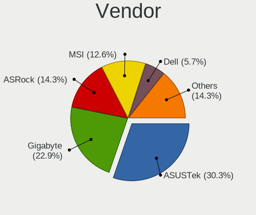
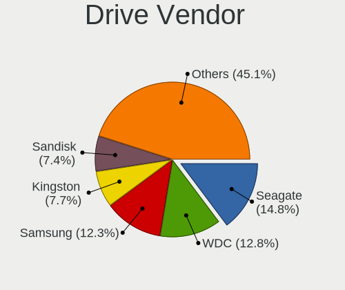
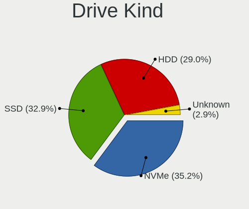

SteamOS - Tested Hardware & Statistics (Desktops)
-------------------------------------------------

A project to collect tested hardware configurations for SteamOS.

Anyone can contribute to this report by the [hw-probe](https://github.com/linuxhw/hw-probe) tool:

    sudo -E hw-probe -all -upload

Please contribute! Especially if your hardware is rare.

Contents
--------

* [ Test Cases ](#test-cases)

* [ System ](#system)
  - [ OS                       ](#os)
  - [ OS Family                ](#os-family)
  - [ Kernel                   ](#kernel)
  - [ Kernel Family            ](#kernel-family)
  - [ Kernel Major Ver.        ](#kernel-major-ver)
  - [ Arch                     ](#arch)
  - [ DE                       ](#de)
  - [ Display Server           ](#display-server)
  - [ Display Manager          ](#display-manager)
  - [ OS Lang                  ](#os-lang)
  - [ Boot Mode                ](#boot-mode)
  - [ Filesystem               ](#filesystem)
  - [ Part. scheme             ](#part-scheme)
  - [ Dual Boot with Linux/BSD ](#dual-boot-with-linuxbsd)
  - [ Dual Boot (Win)          ](#dual-boot-win)

* [ Board ](#board)
  - [ Vendor                   ](#vendor)
  - [ Model                    ](#model)
  - [ Model Family             ](#model-family)
  - [ MFG Year                 ](#mfg-year)
  - [ Form Factor              ](#form-factor)
  - [ Secure Boot              ](#secure-boot)
  - [ Coreboot                 ](#coreboot)
  - [ RAM Size                 ](#ram-size)
  - [ RAM Used                 ](#ram-used)
  - [ Total Drives             ](#total-drives)
  - [ Has CD-ROM               ](#has-cd-rom)
  - [ Has Ethernet             ](#has-ethernet)
  - [ Has WiFi                 ](#has-wifi)
  - [ Has Bluetooth            ](#has-bluetooth)

* [ Location ](#location)
  - [ Country                  ](#country)
  - [ City                     ](#city)

* [ Drives ](#drives)
  - [ Drive Vendor             ](#drive-vendor)
  - [ Drive Model              ](#drive-model)
  - [ HDD Vendor               ](#hdd-vendor)
  - [ SSD Vendor               ](#ssd-vendor)
  - [ Drive Kind               ](#drive-kind)
  - [ Drive Connector          ](#drive-connector)
  - [ Drive Size               ](#drive-size)
  - [ Space Total              ](#space-total)
  - [ Space Used               ](#space-used)
  - [ Malfunc. Drives          ](#malfunc-drives)
  - [ Malfunc. Drive Vendor    ](#malfunc-drive-vendor)
  - [ Malfunc. HDD Vendor      ](#malfunc-hdd-vendor)
  - [ Malfunc. Drive Kind      ](#malfunc-drive-kind)
  - [ Failed Drives            ](#failed-drives)
  - [ Failed Drive Vendor      ](#failed-drive-vendor)
  - [ Drive Status             ](#drive-status)

* [ Storage controller ](#storage-controller)
  - [ Storage Vendor           ](#storage-vendor)
  - [ Storage Model            ](#storage-model)
  - [ Storage Kind             ](#storage-kind)

* [ Processor ](#processor)
  - [ CPU Vendor               ](#cpu-vendor)
  - [ CPU Model                ](#cpu-model)
  - [ CPU Model Family         ](#cpu-model-family)
  - [ CPU Cores                ](#cpu-cores)
  - [ CPU Sockets              ](#cpu-sockets)
  - [ CPU Threads              ](#cpu-threads)
  - [ CPU Op-Modes             ](#cpu-op-modes)
  - [ CPU Microcode            ](#cpu-microcode)
  - [ CPU Microarch            ](#cpu-microarch)

* [ Graphics ](#graphics)
  - [ GPU Vendor               ](#gpu-vendor)
  - [ GPU Model                ](#gpu-model)
  - [ GPU Combo                ](#gpu-combo)
  - [ GPU Driver               ](#gpu-driver)
  - [ GPU Memory               ](#gpu-memory)

* [ Monitor ](#monitor)
  - [ Monitor Vendor           ](#monitor-vendor)
  - [ Monitor Model            ](#monitor-model)
  - [ Monitor Resolution       ](#monitor-resolution)
  - [ Monitor Diagonal         ](#monitor-diagonal)
  - [ Monitor Width            ](#monitor-width)
  - [ Aspect Ratio             ](#aspect-ratio)
  - [ Monitor Area             ](#monitor-area)
  - [ Pixel Density            ](#pixel-density)
  - [ Multiple Monitors        ](#multiple-monitors)

* [ Network ](#network)
  - [ Net Controller Vendor    ](#net-controller-vendor)
  - [ Net Controller Model     ](#net-controller-model)
  - [ Wireless Vendor          ](#wireless-vendor)
  - [ Wireless Model           ](#wireless-model)
  - [ Ethernet Vendor          ](#ethernet-vendor)
  - [ Ethernet Model           ](#ethernet-model)
  - [ Net Controller Kind      ](#net-controller-kind)
  - [ Used Controller          ](#used-controller)
  - [ NICs                     ](#nics)
  - [ IPv6                     ](#ipv6)

* [ Bluetooth ](#bluetooth)
  - [ Bluetooth Vendor         ](#bluetooth-vendor)
  - [ Bluetooth Model          ](#bluetooth-model)

* [ Sound ](#sound)
  - [ Sound Vendor             ](#sound-vendor)
  - [ Sound Model              ](#sound-model)

* [ Memory ](#memory)
  - [ Memory Vendor            ](#memory-vendor)
  - [ Memory Model             ](#memory-model)
  - [ Memory Kind              ](#memory-kind)
  - [ Memory Form Factor       ](#memory-form-factor)
  - [ Memory Size              ](#memory-size)
  - [ Memory Speed             ](#memory-speed)

* [ Printers & scanners ](#printers--scanners)
  - [ Printer Vendor           ](#printer-vendor)
  - [ Printer Model            ](#printer-model)
  - [ Scanner Vendor           ](#scanner-vendor)
  - [ Scanner Model            ](#scanner-model)

* [ Camera ](#camera)
  - [ Camera Vendor            ](#camera-vendor)
  - [ Camera Model             ](#camera-model)

* [ Security ](#security)
  - [ Fingerprint Vendor       ](#fingerprint-vendor)
  - [ Fingerprint Model        ](#fingerprint-model)
  - [ Chipcard Vendor          ](#chipcard-vendor)
  - [ Chipcard Model           ](#chipcard-model)

* [ Unsupported ](#unsupported)
  - [ Unsupported Devices      ](#unsupported-devices)
  - [ Unsupported Device Types ](#unsupported-device-types)

Test Cases
----------

Total: 240

| Vendor        | Model                       | Probe                                                      | Date         |
|---------------|-----------------------------|------------------------------------------------------------|--------------|
| ASUSTek       | PRIME B350-PLUS             | [cb38e7215b](https://linux-hardware.org/?probe=cb38e7215b) | Dec 01, 2024 |
| ASUSTek       | PRIME B450-PLUS             | [14584a3f16](https://linux-hardware.org/?probe=14584a3f16) | Dec 01, 2024 |
| ASUSTek       | TUF B450M-PLUS GAMING       | [b1fc0f41f0](https://linux-hardware.org/?probe=b1fc0f41f0) | Nov 19, 2024 |
| MSI           | B550M PRO-VDH WIFI          | [db873cebfd](https://linux-hardware.org/?probe=db873cebfd) | Nov 08, 2024 |
| ASUSTek       | PRIME B350-PLUS             | [6481acc825](https://linux-hardware.org/?probe=6481acc825) | Oct 10, 2024 |
| Dell          | 0FDY5C A00                  | [2975c3986e](https://linux-hardware.org/?probe=2975c3986e) | Oct 02, 2024 |
| ASUSTek       | TUF Gaming X670E-PLUS WI... | [9e6105fdd5](https://linux-hardware.org/?probe=9e6105fdd5) | Sep 27, 2024 |
| Lenovo        | SDK0E50510 WIN 262507025... | [26d5a61655](https://linux-hardware.org/?probe=26d5a61655) | Sep 25, 2024 |
| ASUSTek       | PRIME B450M-A II            | [07dc4c9a19](https://linux-hardware.org/?probe=07dc4c9a19) | Sep 20, 2024 |
| QIYIDA        | ED4 V1.1                    | [57a88e488a](https://linux-hardware.org/?probe=57a88e488a) | Sep 19, 2024 |
| ASUSTek       | GR8 II-K                    | [d7a4d66200](https://linux-hardware.org/?probe=d7a4d66200) | Sep 16, 2024 |
| ASRock        | B450 Gaming-ITX/ac          | [72fe68b845](https://linux-hardware.org/?probe=72fe68b845) | Sep 12, 2024 |
| Unknown       | Unknown                     | [0e77bc77fb](https://linux-hardware.org/?probe=0e77bc77fb) | Sep 09, 2024 |
| Unknown       | Unknown                     | [6ea3fd02fa](https://linux-hardware.org/?probe=6ea3fd02fa) | Sep 09, 2024 |
| Dell          | 0KWVT8 A03                  | [737215a158](https://linux-hardware.org/?probe=737215a158) | Sep 06, 2024 |
| Intel         | X99                         | [cb1938142e](https://linux-hardware.org/?probe=cb1938142e) | Sep 04, 2024 |
| ASUSTek       | TUF Gaming B650M-PLUS WI... | [709c1de688](https://linux-hardware.org/?probe=709c1de688) | Sep 03, 2024 |
| ASUSTek       | TUF Gaming B650M-PLUS WI... | [07e82620c8](https://linux-hardware.org/?probe=07e82620c8) | Sep 01, 2024 |
| ASRock        | AB350M Pro4                 | [cb21643ddb](https://linux-hardware.org/?probe=cb21643ddb) | Sep 01, 2024 |
| ASRock        | AB350M Pro4                 | [07d5926eb0](https://linux-hardware.org/?probe=07d5926eb0) | Aug 31, 2024 |
| MSI           | MPG Z790I EDGE WIFI         | [befece1a07](https://linux-hardware.org/?probe=befece1a07) | Aug 28, 2024 |
| ASUSTek       | STRIX Z270F GAMING          | [ff71054b4c](https://linux-hardware.org/?probe=ff71054b4c) | Aug 20, 2024 |
| ASUSTek       | STRIX Z270F GAMING          | [1cceda0c67](https://linux-hardware.org/?probe=1cceda0c67) | Aug 20, 2024 |
| MSI           | MAG B550M MORTAR            | [b573981587](https://linux-hardware.org/?probe=b573981587) | Aug 19, 2024 |
| Gigabyte      | X670E AORUS PRO X           | [0182b82b41](https://linux-hardware.org/?probe=0182b82b41) | Aug 17, 2024 |
| Gigabyte      | B550M DS3H                  | [6866176fe2](https://linux-hardware.org/?probe=6866176fe2) | Aug 14, 2024 |
| Gigabyte      | B550M DS3H                  | [bdd81784d4](https://linux-hardware.org/?probe=bdd81784d4) | Aug 14, 2024 |
| JGINYUE       | B450I-GAMING Ver:1.1        | [a51ecd44f8](https://linux-hardware.org/?probe=a51ecd44f8) | Aug 05, 2024 |
| Shenzhen M... | F7BAA                       | [f997d4444d](https://linux-hardware.org/?probe=f997d4444d) | Aug 04, 2024 |
| ASRock        | B550M-C                     | [ff06ba744d](https://linux-hardware.org/?probe=ff06ba744d) | Aug 02, 2024 |
| ASUSTek       | PRIME B650-PLUS             | [b84f2e45ff](https://linux-hardware.org/?probe=b84f2e45ff) | Aug 02, 2024 |
| Lenovo        | 364A                        | [133e44eaa4](https://linux-hardware.org/?probe=133e44eaa4) | Jul 29, 2024 |
| Gigabyte      | AB350M-Gaming 3-CF          | [a3a0bfc94d](https://linux-hardware.org/?probe=a3a0bfc94d) | Jul 23, 2024 |
| Gigabyte      | B450M DS3H WIFI-CF          | [fc4b11232b](https://linux-hardware.org/?probe=fc4b11232b) | Jul 20, 2024 |
| ASRock        | B650M Pro RS WiFi           | [361baaba70](https://linux-hardware.org/?probe=361baaba70) | Jul 20, 2024 |
| ASUSTek       | ROG Maximus Z790 HERO       | [1b64f2a6c6](https://linux-hardware.org/?probe=1b64f2a6c6) | Jul 19, 2024 |
| ASUSTek       | ROG Maximus Z790 HERO       | [e53dd4acab](https://linux-hardware.org/?probe=e53dd4acab) | Jul 19, 2024 |
| ASUSTek       | PRIME B650-PLUS             | [6f8fcf391e](https://linux-hardware.org/?probe=6f8fcf391e) | Jul 19, 2024 |
| Gigabyte      | B85M-D3H                    | [2050081e07](https://linux-hardware.org/?probe=2050081e07) | Jul 15, 2024 |
| Gigabyte      | B85M-D3H                    | [78db81d92d](https://linux-hardware.org/?probe=78db81d92d) | Jul 15, 2024 |
| Shenzhen M... | F7BAA                       | [47f43bfb0b](https://linux-hardware.org/?probe=47f43bfb0b) | Jul 12, 2024 |
| ASRock        | B360M Xtreme                | [77c855ffba](https://linux-hardware.org/?probe=77c855ffba) | Jul 10, 2024 |
| Gigabyte      | B450M GAMING                | [18ea2c08bb](https://linux-hardware.org/?probe=18ea2c08bb) | Jul 09, 2024 |
| MSI           | B450 TOMAHAWK               | [2938398b92](https://linux-hardware.org/?probe=2938398b92) | Jul 08, 2024 |
| Gigabyte      | B450 I AORUS PRO WIFI-CF    | [dcb993f549](https://linux-hardware.org/?probe=dcb993f549) | Jul 05, 2024 |
| ASUSTek       | ROG STRIX B550-F GAMING     | [70a230bac1](https://linux-hardware.org/?probe=70a230bac1) | Jul 02, 2024 |
| ASUSTek       | ROG STRIX B550-F GAMING     | [8b7d65a86c](https://linux-hardware.org/?probe=8b7d65a86c) | Jul 02, 2024 |
| ASUSTek       | PRIME A320M-K               | [5f9980bb04](https://linux-hardware.org/?probe=5f9980bb04) | Jun 25, 2024 |
| ASUSTek       | ROG STRIX B550-I GAMING     | [1758fea944](https://linux-hardware.org/?probe=1758fea944) | Jun 24, 2024 |
| Intel         | X79v2.72 KD V2.0            | [3e1bbdccc8](https://linux-hardware.org/?probe=3e1bbdccc8) | Jun 20, 2024 |
| ASRock        | B660M PG Riptide            | [0eb75d61c6](https://linux-hardware.org/?probe=0eb75d61c6) | May 22, 2024 |
| MSI           | MPG X570 GAMING PLUS        | [810351e380](https://linux-hardware.org/?probe=810351e380) | May 19, 2024 |
| Lenovo        | 1046 SBB1C50523 WIN 3556... | [e10a369f92](https://linux-hardware.org/?probe=e10a369f92) | May 14, 2024 |
| Gigabyte      | B450M GAMING                | [dc7364667b](https://linux-hardware.org/?probe=dc7364667b) | May 05, 2024 |
| ASRock        | B760M PG Lightning/D4       | [50c91b7d78](https://linux-hardware.org/?probe=50c91b7d78) | May 03, 2024 |
| ASRock        | B450 Gaming-ITX/ac          | [4ffacbaeac](https://linux-hardware.org/?probe=4ffacbaeac) | Apr 25, 2024 |
| ASUSTek       | PRIME A320M-K               | [97e9e0c7a1](https://linux-hardware.org/?probe=97e9e0c7a1) | Apr 13, 2024 |
| Gigabyte      | B450M GAMING                | [d0241d517a](https://linux-hardware.org/?probe=d0241d517a) | Apr 08, 2024 |
| ASRock        | X570 Phantom Gaming-ITX/... | [d0447bf92e](https://linux-hardware.org/?probe=d0447bf92e) | Apr 06, 2024 |
| ASRock        | B450M Pro4-F                | [c70e4f20eb](https://linux-hardware.org/?probe=c70e4f20eb) | Apr 05, 2024 |
| ASUSTek       | ROG CROSSHAIR VIII DARK ... | [3fe2ef5687](https://linux-hardware.org/?probe=3fe2ef5687) | Apr 01, 2024 |
| ASUSTek       | ROG CROSSHAIR VIII DARK ... | [24108983ab](https://linux-hardware.org/?probe=24108983ab) | Apr 01, 2024 |
| ASRock        | X570 Phantom Gaming-ITX/... | [1fb1798295](https://linux-hardware.org/?probe=1fb1798295) | Mar 30, 2024 |
| ASRock        | X570 Phantom Gaming 4       | [1cda914d9f](https://linux-hardware.org/?probe=1cda914d9f) | Mar 27, 2024 |
| Gigabyte      | A620M GAMING X AX           | [95dabe0b93](https://linux-hardware.org/?probe=95dabe0b93) | Mar 17, 2024 |
| Gigabyte      | A620M GAMING X AX           | [ac8a1cf30d](https://linux-hardware.org/?probe=ac8a1cf30d) | Mar 16, 2024 |
| MACHINIST     | E5 MR9A PRO MAX V1.1        | [853a2babec](https://linux-hardware.org/?probe=853a2babec) | Mar 16, 2024 |
| QIYIDA        | ED4 V1.1                    | [cbfcb37d83](https://linux-hardware.org/?probe=cbfcb37d83) | Mar 06, 2024 |
| ASRock        | B550M Steel Legend          | [ff01bc4e69](https://linux-hardware.org/?probe=ff01bc4e69) | Mar 03, 2024 |
| ASUSTek       | Z170-A                      | [5c7cfb2969](https://linux-hardware.org/?probe=5c7cfb2969) | Mar 02, 2024 |
| Dell          | 042P49 A02                  | [721c874400](https://linux-hardware.org/?probe=721c874400) | Mar 02, 2024 |
| Gigabyte      | H170M-DS3H-CF               | [e9d405fea6](https://linux-hardware.org/?probe=e9d405fea6) | Mar 02, 2024 |
| Gigabyte      | H170M-DS3H-CF               | [c95130db9f](https://linux-hardware.org/?probe=c95130db9f) | Mar 02, 2024 |
| ASUSTek       | TUF Gaming B450M-PRO II     | [b8d705b208](https://linux-hardware.org/?probe=b8d705b208) | Feb 23, 2024 |
| ASUSTek       | ROG STRIX B650E-I GAMING... | [04b45ee685](https://linux-hardware.org/?probe=04b45ee685) | Feb 21, 2024 |
| Gigabyte      | A520I AC                    | [e0d169ccee](https://linux-hardware.org/?probe=e0d169ccee) | Feb 19, 2024 |
| ASUSTek       | TUF Gaming B550-PLUS        | [2c5e1e36f8](https://linux-hardware.org/?probe=2c5e1e36f8) | Feb 12, 2024 |
| Apple         | Mac-27AD2F918AE68F61 Mac... | [63ed84550f](https://linux-hardware.org/?probe=63ed84550f) | Feb 08, 2024 |
| Apple         | Mac-27AD2F918AE68F61 Mac... | [1e4f204b76](https://linux-hardware.org/?probe=1e4f204b76) | Feb 08, 2024 |
| QIYIDA        | ED4 V1.1                    | [3583de3c82](https://linux-hardware.org/?probe=3583de3c82) | Jan 30, 2024 |
| ASRock        | B450 Gaming-ITX/ac          | [b4510875e8](https://linux-hardware.org/?probe=b4510875e8) | Jan 28, 2024 |
| ASUSTek       | SABERTOOTH Z170 S           | [953ea23870](https://linux-hardware.org/?probe=953ea23870) | Jan 19, 2024 |
| MSI           | H310M PRO-VD                | [3cdbce90e0](https://linux-hardware.org/?probe=3cdbce90e0) | Jan 17, 2024 |
| ASUSTek       | PRIME A320M-K               | [ffe6ae701f](https://linux-hardware.org/?probe=ffe6ae701f) | Jan 15, 2024 |
| MSI           | B550M PRO-VDH WIFI          | [79504ec34b](https://linux-hardware.org/?probe=79504ec34b) | Jan 09, 2024 |
| MSI           | B450 TOMAHAWK MAX II        | [9c61eb5bab](https://linux-hardware.org/?probe=9c61eb5bab) | Jan 07, 2024 |
| ASUSTek       | M5A99FX PRO R2.0            | [c6cd1c43ba](https://linux-hardware.org/?probe=c6cd1c43ba) | Dec 29, 2023 |
| ASRock        | X570 Phantom Gaming-ITX/... | [b5b5857360](https://linux-hardware.org/?probe=b5b5857360) | Dec 26, 2023 |
| ASRock        | AB350M-HDV                  | [2860ba102d](https://linux-hardware.org/?probe=2860ba102d) | Dec 18, 2023 |
| ASRock        | AB350M-HDV                  | [8d45a13b61](https://linux-hardware.org/?probe=8d45a13b61) | Dec 17, 2023 |
| Gigabyte      | B560M DS3H V2               | [2fa2dbdf4a](https://linux-hardware.org/?probe=2fa2dbdf4a) | Dec 06, 2023 |
| MSI           | MAG B550 TOMAHAWK MAX WI... | [a0e082b7d2](https://linux-hardware.org/?probe=a0e082b7d2) | Dec 01, 2023 |
| Gigabyte      | Z690M AORUS ELITE AX DDR... | [532f8ccb97](https://linux-hardware.org/?probe=532f8ccb97) | Nov 27, 2023 |
| HP            | 89D8 SMVB                   | [e5bd9d36f3](https://linux-hardware.org/?probe=e5bd9d36f3) | Nov 25, 2023 |
| MSI           | MAG X570S TORPEDO MAX       | [829e6fdd78](https://linux-hardware.org/?probe=829e6fdd78) | Nov 23, 2023 |
| Gigabyte      | Z690M AORUS ELITE AX DDR... | [887bb8aabe](https://linux-hardware.org/?probe=887bb8aabe) | Nov 21, 2023 |
| ASUSTek       | ROG STRIX B450-F GAMING     | [32e985afeb](https://linux-hardware.org/?probe=32e985afeb) | Nov 21, 2023 |
| Gigabyte      | Z690M AORUS ELITE AX DDR... | [e723e12a01](https://linux-hardware.org/?probe=e723e12a01) | Nov 19, 2023 |
| Gigabyte      | B450M GAMING                | [33064ccfdf](https://linux-hardware.org/?probe=33064ccfdf) | Nov 14, 2023 |
| MSI           | Z270 PC MATE                | [e53ba2625b](https://linux-hardware.org/?probe=e53ba2625b) | Nov 09, 2023 |
| Gigabyte      | B450M GAMING                | [d788a3221f](https://linux-hardware.org/?probe=d788a3221f) | Nov 08, 2023 |
| ASRock        | B550M Pro4                  | [665120f441](https://linux-hardware.org/?probe=665120f441) | Nov 07, 2023 |
| ASRock        | B450 Gaming K4              | [166a9aee87](https://linux-hardware.org/?probe=166a9aee87) | Nov 06, 2023 |
| HP            | 89D8 SMVB                   | [3672a7681b](https://linux-hardware.org/?probe=3672a7681b) | Oct 24, 2023 |
| Shenzhen M... | F7BRC                       | [f61616bfcb](https://linux-hardware.org/?probe=f61616bfcb) | Oct 22, 2023 |
| Gigabyte      | B450 AORUS PRO WIFI-CF      | [ac47775d14](https://linux-hardware.org/?probe=ac47775d14) | Oct 17, 2023 |
| Gigabyte      | B550M S2H                   | [92cf4d1df2](https://linux-hardware.org/?probe=92cf4d1df2) | Oct 03, 2023 |
| Gigabyte      | B550M S2H                   | [d7efd8ecaa](https://linux-hardware.org/?probe=d7efd8ecaa) | Oct 03, 2023 |
| Dell          | 0Y56T3 A01                  | [bfc1d1dd13](https://linux-hardware.org/?probe=bfc1d1dd13) | Sep 30, 2023 |
| ASUSTek       | ROG STRIX Z390-I GAMING     | [3e29eb1d63](https://linux-hardware.org/?probe=3e29eb1d63) | Sep 26, 2023 |
| Dell          | 0KRC95 A01                  | [bfed5cdd27](https://linux-hardware.org/?probe=bfed5cdd27) | Sep 24, 2023 |
| ASUSTek       | PRIME H610M-A D4            | [6f73b0398c](https://linux-hardware.org/?probe=6f73b0398c) | Sep 16, 2023 |
| ASUSTek       | PRIME H610M-A D4            | [7b10a3651b](https://linux-hardware.org/?probe=7b10a3651b) | Sep 16, 2023 |
| ASRock        | X570 Phantom Gaming-ITX/... | [2956ecb7bf](https://linux-hardware.org/?probe=2956ecb7bf) | Aug 25, 2023 |
| Gigabyte      | A320M-S2H-CF                | [ac041357b0](https://linux-hardware.org/?probe=ac041357b0) | Aug 21, 2023 |
| Gigabyte      | B560M DS3H V2               | [131535162e](https://linux-hardware.org/?probe=131535162e) | Aug 14, 2023 |
| Gigabyte      | X570 UD                     | [c693096b39](https://linux-hardware.org/?probe=c693096b39) | Jul 26, 2023 |
| MSI           | H410M PRO                   | [881d77ac47](https://linux-hardware.org/?probe=881d77ac47) | Jul 04, 2023 |
| ASRock        | H310CM-DVS                  | [46429ac6ae](https://linux-hardware.org/?probe=46429ac6ae) | Jun 29, 2023 |
| ASUSTek       | H110M-D                     | [f95d5e83f5](https://linux-hardware.org/?probe=f95d5e83f5) | Jun 25, 2023 |
| MAXSUN        | MS-H81IL TR M.2             | [72c79949e0](https://linux-hardware.org/?probe=72c79949e0) | Jun 20, 2023 |
| ASUSTek       | ROG STRIX B550-I GAMING     | [9493891426](https://linux-hardware.org/?probe=9493891426) | Jun 18, 2023 |
| Gigabyte      | Z170X-Gaming 6              | [21eaab076a](https://linux-hardware.org/?probe=21eaab076a) | Jun 08, 2023 |
| ASUSTek       | ROG STRIX B550-F GAMING     | [cc54139aa6](https://linux-hardware.org/?probe=cc54139aa6) | Jun 08, 2023 |
| HP            | 8617                        | [7f5df3475c](https://linux-hardware.org/?probe=7f5df3475c) | Jun 06, 2023 |
| Dell          | 0J3C2F A00                  | [b7d801d9e5](https://linux-hardware.org/?probe=b7d801d9e5) | May 24, 2023 |
| Gigabyte      | B560M DS3H V2               | [47f3dabdb0](https://linux-hardware.org/?probe=47f3dabdb0) | May 14, 2023 |
| ASUSTek       | Z97-DELUXE                  | [c47205c3cb](https://linux-hardware.org/?probe=c47205c3cb) | May 06, 2023 |
| ASUSTek       | X99-A                       | [1adc932507](https://linux-hardware.org/?probe=1adc932507) | Apr 24, 2023 |
| Gigabyte      | Z97X-UD5H                   | [1cb8a5dfb4](https://linux-hardware.org/?probe=1cb8a5dfb4) | Apr 20, 2023 |
| Gigabyte      | H77N-WIFI                   | [10e158aabd](https://linux-hardware.org/?probe=10e158aabd) | Apr 18, 2023 |
| ASUSTek       | ROG STRIX X670E-E GAMING... | [2391458529](https://linux-hardware.org/?probe=2391458529) | Apr 15, 2023 |
| ASUSTek       | P8H61-M LX3 PLUS R2.0       | [1146ed168f](https://linux-hardware.org/?probe=1146ed168f) | Apr 14, 2023 |
| ASUSTek       | TUF B365M-PLUS GAMING       | [7c32eb6bf9](https://linux-hardware.org/?probe=7c32eb6bf9) | Apr 11, 2023 |
| ASUSTek       | TUF B365M-PLUS GAMING       | [cabf7adac2](https://linux-hardware.org/?probe=cabf7adac2) | Apr 11, 2023 |
| HP            | 89D8 SMVB                   | [a9980f1194](https://linux-hardware.org/?probe=a9980f1194) | Apr 04, 2023 |
| Acer          | Nitro N50-610               | [937d1bc73a](https://linux-hardware.org/?probe=937d1bc73a) | Mar 29, 2023 |
| ASRock        | X300M-STX                   | [0393d25a9d](https://linux-hardware.org/?probe=0393d25a9d) | Mar 23, 2023 |
| ASRock        | X300M-STX                   | [296411b749](https://linux-hardware.org/?probe=296411b749) | Mar 23, 2023 |
| HP            | 83E9                        | [a93c800fa1](https://linux-hardware.org/?probe=a93c800fa1) | Mar 19, 2023 |
| Gigabyte      | F2A68HM-H                   | [a77d320c80](https://linux-hardware.org/?probe=a77d320c80) | Mar 18, 2023 |
| ASUSTek       | PRIME H610M-K D4            | [9f33a01f8d](https://linux-hardware.org/?probe=9f33a01f8d) | Mar 15, 2023 |
| ASUSTek       | PRIME Z270M-PLUS            | [5cb3c60db6](https://linux-hardware.org/?probe=5cb3c60db6) | Mar 14, 2023 |
| HP            | 89D8 SMVB                   | [6b3f831210](https://linux-hardware.org/?probe=6b3f831210) | Mar 10, 2023 |
| MSI           | MPG B650I EDGE WIFI         | [e2d3c4e17e](https://linux-hardware.org/?probe=e2d3c4e17e) | Mar 10, 2023 |
| ASUSTek       | Maximus VI IMPACT           | [bca54b81fc](https://linux-hardware.org/?probe=bca54b81fc) | Mar 09, 2023 |
| Gigabyte      | AX370-Gaming-CF se1         | [79f1c1822c](https://linux-hardware.org/?probe=79f1c1822c) | Mar 09, 2023 |
| Gigabyte      | B450 AORUS M                | [e67eb9d235](https://linux-hardware.org/?probe=e67eb9d235) | Mar 06, 2023 |
| ASUSTek       | PRIME A320I-K               | [88e6308c0a](https://linux-hardware.org/?probe=88e6308c0a) | Mar 05, 2023 |
| ASUSTek       | Maximus VI IMPACT           | [53d547f79c](https://linux-hardware.org/?probe=53d547f79c) | Mar 05, 2023 |
| Gigabyte      | B550 GAMING X V2            | [a40e18910c](https://linux-hardware.org/?probe=a40e18910c) | Mar 03, 2023 |
| ASUSTek       | CROSSHAIR VI HERO           | [3e3368d913](https://linux-hardware.org/?probe=3e3368d913) | Feb 28, 2023 |
| ASRock        | B550 Phantom Gaming-ITX/... | [0195132360](https://linux-hardware.org/?probe=0195132360) | Feb 28, 2023 |
| ASRock        | B550 Phantom Gaming-ITX/... | [8cd8d4b833](https://linux-hardware.org/?probe=8cd8d4b833) | Feb 28, 2023 |
| Biostar       | A320MH                      | [b6f7ef6e4a](https://linux-hardware.org/?probe=b6f7ef6e4a) | Feb 23, 2023 |
| Biostar       | A320MH                      | [e80f86a0bf](https://linux-hardware.org/?probe=e80f86a0bf) | Feb 23, 2023 |
| ASRock        | B760M-ITX/D4 WiFi           | [8a29735d16](https://linux-hardware.org/?probe=8a29735d16) | Feb 16, 2023 |
| HP            | 83EC                        | [4757525f5d](https://linux-hardware.org/?probe=4757525f5d) | Feb 15, 2023 |
| Shenzhen M... | F7BFC                       | [08820689e8](https://linux-hardware.org/?probe=08820689e8) | Feb 11, 2023 |
| ASUSTek       | PRIME B250M-PLUS/BR         | [abfd3f65af](https://linux-hardware.org/?probe=abfd3f65af) | Feb 10, 2023 |
| ASRock        | B560 Pro4                   | [0243fe3621](https://linux-hardware.org/?probe=0243fe3621) | Feb 07, 2023 |
| MSI           | B450M MORTAR MAX            | [2f0810d441](https://linux-hardware.org/?probe=2f0810d441) | Feb 05, 2023 |
| Gigabyte      | B450 AORUS M                | [c35fa9b7f5](https://linux-hardware.org/?probe=c35fa9b7f5) | Feb 05, 2023 |
| Gigabyte      | B85M-D3H                    | [903e8715e4](https://linux-hardware.org/?probe=903e8715e4) | Feb 03, 2023 |
| Gigabyte      | B85M-D3H                    | [6013489300](https://linux-hardware.org/?probe=6013489300) | Feb 03, 2023 |
| Dell          | 0F3KHR A00                  | [a088ccf72c](https://linux-hardware.org/?probe=a088ccf72c) | Feb 02, 2023 |
| Dell          | 0F3KHR A00                  | [6c793de699](https://linux-hardware.org/?probe=6c793de699) | Feb 01, 2023 |
| Dell          | 0D6H9T A00                  | [2c34aba28a](https://linux-hardware.org/?probe=2c34aba28a) | Jan 30, 2023 |
| HP            | 8906 SMVB                   | [625d54930d](https://linux-hardware.org/?probe=625d54930d) | Jan 12, 2023 |
| MSI           | MPG X570 GAMING PLUS        | [3b92dd60cf](https://linux-hardware.org/?probe=3b92dd60cf) | Jan 11, 2023 |
| Gigabyte      | B450 AORUS M                | [0851440887](https://linux-hardware.org/?probe=0851440887) | Jan 11, 2023 |
| Gigabyte      | B550M DS3H                  | [3d656e7bfd](https://linux-hardware.org/?probe=3d656e7bfd) | Jan 05, 2023 |
| MSI           | H81M-P33                    | [041ee2fde1](https://linux-hardware.org/?probe=041ee2fde1) | Jan 03, 2023 |
| ASUSTek       | PRIME B450M-A II            | [0842d26251](https://linux-hardware.org/?probe=0842d26251) | Dec 30, 2022 |
| ASUSTek       | PRIME B450M-A II            | [d91b55f9f1](https://linux-hardware.org/?probe=d91b55f9f1) | Dec 30, 2022 |
| ASRock        | X570 Phantom Gaming-ITX/... | [59bf36837d](https://linux-hardware.org/?probe=59bf36837d) | Dec 18, 2022 |
| ASRock        | X570 Phantom Gaming-ITX/... | [d5279b915a](https://linux-hardware.org/?probe=d5279b915a) | Dec 17, 2022 |
| Dell          | 0KC9NP A01                  | [0e70489d5c](https://linux-hardware.org/?probe=0e70489d5c) | Dec 16, 2022 |
| ASUSTek       | M80CJ-O                     | [2375dfe19f](https://linux-hardware.org/?probe=2375dfe19f) | Dec 10, 2022 |
| ASUSTek       | ROG CROSSHAIR VIII HERO     | [65ccd1da0e](https://linux-hardware.org/?probe=65ccd1da0e) | Dec 05, 2022 |
| ASUSTek       | TUF Gaming B550M-PLUS       | [c2c53a959d](https://linux-hardware.org/?probe=c2c53a959d) | Dec 03, 2022 |
| ASUSTek       | Z170 PRO GAMING             | [3f642a7844](https://linux-hardware.org/?probe=3f642a7844) | Dec 02, 2022 |
| Gigabyte      | B450M DS3H V2               | [f00a357dbe](https://linux-hardware.org/?probe=f00a357dbe) | Nov 29, 2022 |
| MSI           | 970A-G46                    | [3cd88e88d3](https://linux-hardware.org/?probe=3cd88e88d3) | Nov 28, 2022 |
| Gigabyte      | B450 AORUS M                | [8263c8ba6f](https://linux-hardware.org/?probe=8263c8ba6f) | Nov 28, 2022 |
| ASUSTek       | Z170 PRO GAMING             | [ee234d62ec](https://linux-hardware.org/?probe=ee234d62ec) | Nov 27, 2022 |
| ASUSTek       | PRIME X570-PRO              | [c278b19567](https://linux-hardware.org/?probe=c278b19567) | Nov 20, 2022 |
| HP            | 8626                        | [f2098a2414](https://linux-hardware.org/?probe=f2098a2414) | Nov 19, 2022 |
| HP            | 8626                        | [05ebc14932](https://linux-hardware.org/?probe=05ebc14932) | Nov 19, 2022 |
| Gigabyte      | 970A-DS3P FX                | [85ef5eaf43](https://linux-hardware.org/?probe=85ef5eaf43) | Nov 12, 2022 |
| MSI           | X370 GAMING PLUS            | [a0b134897f](https://linux-hardware.org/?probe=a0b134897f) | Nov 05, 2022 |
| ASRock        | X570 Phantom Gaming-ITX/... | [f23e197251](https://linux-hardware.org/?probe=f23e197251) | Nov 05, 2022 |
| ASUSTek       | CROSSHAIR VI HERO           | [7712ce88c4](https://linux-hardware.org/?probe=7712ce88c4) | Oct 30, 2022 |
| Gigabyte      | B550 GAMING X V2            | [b4ba1b8d5a](https://linux-hardware.org/?probe=b4ba1b8d5a) | Oct 29, 2022 |
| ASRock        | X570 Phantom Gaming-ITX/... | [59904b8a87](https://linux-hardware.org/?probe=59904b8a87) | Oct 19, 2022 |
| HP            | 8433 11                     | [fed45efc8d](https://linux-hardware.org/?probe=fed45efc8d) | Oct 12, 2022 |
| ASRock        | X570 Phantom Gaming-ITX/... | [9873ba1845](https://linux-hardware.org/?probe=9873ba1845) | Oct 09, 2022 |
| Gigabyte      | B450M DS3H-CF               | [c1c51b96ef](https://linux-hardware.org/?probe=c1c51b96ef) | Oct 06, 2022 |
| ASRock        | X570 Phantom Gaming-ITX/... | [2e6852099a](https://linux-hardware.org/?probe=2e6852099a) | Oct 06, 2022 |
| ASUSTek       | ROG STRIX B550-F GAMING     | [aee559f8bf](https://linux-hardware.org/?probe=aee559f8bf) | Oct 04, 2022 |
| Apple         | Mac-27AD2F918AE68F61 Mac... | [3e25da0356](https://linux-hardware.org/?probe=3e25da0356) | Oct 01, 2022 |
| ASRock        | X570 Phantom Gaming-ITX/... | [5746aa7609](https://linux-hardware.org/?probe=5746aa7609) | Sep 29, 2022 |
| ASUSTek       | CROSSHAIR VI HERO           | [46e48bc4c1](https://linux-hardware.org/?probe=46e48bc4c1) | Sep 28, 2022 |
| ASUSTek       | CROSSHAIR VI HERO           | [8d8440548e](https://linux-hardware.org/?probe=8d8440548e) | Sep 20, 2022 |
| MSI           | X399 SLI PLUS               | [f686754b27](https://linux-hardware.org/?probe=f686754b27) | Sep 16, 2022 |
| MSI           | X470 GAMING PLUS            | [9919cebdfe](https://linux-hardware.org/?probe=9919cebdfe) | Sep 15, 2022 |
| MSI           | 970A-G46                    | [5f7482fe88](https://linux-hardware.org/?probe=5f7482fe88) | Sep 11, 2022 |
| ASUSTek       | H81M-PLUS                   | [2d99107aa6](https://linux-hardware.org/?probe=2d99107aa6) | Sep 05, 2022 |
| Gigabyte      | B450 AORUS M                | [3ac55201b6](https://linux-hardware.org/?probe=3ac55201b6) | Sep 04, 2022 |
| Dell          | 0HHV7N A00                  | [f4142b2ff8](https://linux-hardware.org/?probe=f4142b2ff8) | Sep 02, 2022 |
| ASUSTek       | PRIME A320M-K               | [bdae2c60cd](https://linux-hardware.org/?probe=bdae2c60cd) | Sep 01, 2022 |
| MSI           | MS-B9201                    | [b5c80c8c2c](https://linux-hardware.org/?probe=b5c80c8c2c) | Aug 29, 2022 |
| Gigabyte      | B550 AORUS ELITE AX V2      | [9e3df56c3b](https://linux-hardware.org/?probe=9e3df56c3b) | Aug 28, 2022 |
| ASUSTek       | PRIME B550-PLUS             | [67b791eb17](https://linux-hardware.org/?probe=67b791eb17) | Aug 25, 2022 |
| ASUSTek       | H97-PRO GAMER               | [663bc0a517](https://linux-hardware.org/?probe=663bc0a517) | Aug 25, 2022 |
| ASUSTek       | H97-PRO GAMER               | [e934af2a60](https://linux-hardware.org/?probe=e934af2a60) | Aug 23, 2022 |
| Gigabyte      | AB350-Gaming 3-CF           | [9661c799c9](https://linux-hardware.org/?probe=9661c799c9) | Aug 18, 2022 |
| Gigabyte      | X570 GAMING X               | [d8e60dcf09](https://linux-hardware.org/?probe=d8e60dcf09) | Aug 17, 2022 |
| ASUSTek       | TUF Gaming X570-PLUS        | [53429d945b](https://linux-hardware.org/?probe=53429d945b) | Aug 15, 2022 |
| MSI           | MS-B9351                    | [a5b1950761](https://linux-hardware.org/?probe=a5b1950761) | Aug 14, 2022 |
| MSI           | MS-B9351                    | [fbf08d2d76](https://linux-hardware.org/?probe=fbf08d2d76) | Aug 14, 2022 |
| MSI           | B450 TOMAHAWK MAX II        | [dcd9be004c](https://linux-hardware.org/?probe=dcd9be004c) | Aug 13, 2022 |
| ASUSTek       | SABERTOOTH X99              | [54ea6926a0](https://linux-hardware.org/?probe=54ea6926a0) | Aug 13, 2022 |
| Dell          | 00F82W A00                  | [8e74c57731](https://linux-hardware.org/?probe=8e74c57731) | Aug 07, 2022 |
| Gigabyte      | H310M S2V                   | [329d2071a9](https://linux-hardware.org/?probe=329d2071a9) | Aug 01, 2022 |
| ASRock        | A520M-ITX/ac                | [876c779461](https://linux-hardware.org/?probe=876c779461) | Jul 25, 2022 |
| ASRock        | B450M-HDV R4.0              | [f2172999c8](https://linux-hardware.org/?probe=f2172999c8) | Jul 24, 2022 |
| ASUSTek       | EX-A320M-GAMING             | [68884b1723](https://linux-hardware.org/?probe=68884b1723) | Jul 17, 2022 |
| Gigabyte      | H170N-WIFI-CF               | [2f3e59dc30](https://linux-hardware.org/?probe=2f3e59dc30) | Jul 09, 2022 |
| Gigabyte      | B550 GAMING X V2            | [61eaf99aca](https://linux-hardware.org/?probe=61eaf99aca) | Jul 05, 2022 |
| Gigabyte      | B550 GAMING X V2            | [812733dd89](https://linux-hardware.org/?probe=812733dd89) | Jul 05, 2022 |
| Gigabyte      | X570 I AORUS PRO WIFI       | [d82f88e20c](https://linux-hardware.org/?probe=d82f88e20c) | Jul 01, 2022 |
| Alienware     | 02XRCM A01                  | [c70647bab0](https://linux-hardware.org/?probe=c70647bab0) | Jun 26, 2022 |
| ASUSTek       | H61M-K                      | [1a568c2e5f](https://linux-hardware.org/?probe=1a568c2e5f) | Jun 23, 2022 |
| ASUSTek       | ROG STRIX B550-F GAMING     | [b3a08001ed](https://linux-hardware.org/?probe=b3a08001ed) | Jun 01, 2022 |
| ASRock        | B550 PG Velocita            | [0d7f71a24d](https://linux-hardware.org/?probe=0d7f71a24d) | May 30, 2022 |
| ASRock        | B365M Pro4-F                | [afc161c6fb](https://linux-hardware.org/?probe=afc161c6fb) | May 30, 2022 |
| Gigabyte      | B560M AORUS PRO             | [31f246f96e](https://linux-hardware.org/?probe=31f246f96e) | May 27, 2022 |
| Gigabyte      | B560M AORUS PRO             | [1d381d6ec9](https://linux-hardware.org/?probe=1d381d6ec9) | May 27, 2022 |
| Gigabyte      | Z170XP-SLI-CF               | [d4bef1e450](https://linux-hardware.org/?probe=d4bef1e450) | May 26, 2022 |

System
------

OS
--

Installed operating systems

| Name                          | Desktops | Percent |
|-------------------------------|----------|---------|
| SteamOS 3.4                   | 54       | 29.03%  |
| SteamOS 4                     | 29       | 15.59%  |
| SteamOS 3.3                   | 25       | 13.44%  |
| SteamOS 1.3-mesa-fixes        | 15       | 8.06%   |
| SteamOS 3.5.7                 | 10       | 5.38%   |
| SteamOS 3.5.19                | 8        | 4.3%    |
| SteamOS 3.2 (steamdeck-main)  | 7        | 3.76%   |
| SteamOS                       | 6        | 3.23%   |
| SteamOS 1.1.2                 | 4        | 2.15%   |
| SteamOS Snapshot              | 3        | 1.61%   |
| SteamOS 1.1.6-prefinal_fixups | 3        | 1.61%   |
| SteamOS 1.1.4                 | 3        | 1.61%   |
| SteamOS Rolling               | 2        | 1.08%   |
| SteamOS 3.5.17                | 2        | 1.08%   |
| SteamOS 1.5-next-fixes        | 2        | 1.08%   |
| SteamOS 1.4-intel-fixes       | 2        | 1.08%   |
| SteamOS 1.1.3                 | 2        | 1.08%   |
| SteamOS 1.01-dev_nv           | 2        | 1.08%   |
| SteamOS 3.2                   | 1        | 0.54%   |
| SteamOS 20240918.0840         | 1        | 0.54%   |
| SteamOS 1.6-fixes             | 1        | 0.54%   |
| SteamOS 1.1.9_beta-final      | 1        | 0.54%   |
| SteamOS 1.1.7_prerc-hotfix    | 1        | 0.54%   |
| SteamOS 1.051-prerelease      | 1        | 0.54%   |
| SteamOS 1.03_3.5.13-dev_nv    | 1        | 0.54%   |

OS Family
---------

OS without a version

| Name    | Desktops | Percent |
|---------|----------|---------|
| SteamOS | 175      | 100%    |

Kernel
------

Version of the Linux kernel

| Version                                            | Desktops | Percent |
|----------------------------------------------------|----------|---------|
| 5.13.0-valve21.3-1-neptune                         | 43       | 23.5%   |
| 6.3.7-zen1-1-zen                                   | 25       | 13.66%  |
| 6.8.5-1-lljy-CFS-gcd11c870c00c                     | 18       | 9.84%   |
| 5.13.0-valve24-1-neptune-02226-g5b8545e4c5a1       | 11       | 6.01%   |
| 5.13.0-valve10.1-2-neptune-dri-02144-g7fffaf925dfb | 11       | 6.01%   |
| 6.1.52-valve9-1-neptune-61                         | 10       | 5.46%   |
| 6.1.52-valve16-1-neptune-61                        | 10       | 5.46%   |
| 6.4.12-zen1-1-zen                                  | 9        | 4.92%   |
| 5.18.1-arch1_testHoloISO_20220606.1811             | 7        | 3.83%   |
| 5.13.0-valve22-1-neptune-02213-gb68995364335       | 7        | 3.83%   |
| 6.7.4-holoiso-beta_lljy-kernel-lljy-g76a2d2abfbba  | 5        | 2.73%   |
| 6.8.8-zen1-1-zen                                   | 3        | 1.64%   |
| 6.1.21-valve1-1-neptune-61                         | 3        | 1.64%   |
| 5.13.0-valve36-1-neptune                           | 3        | 1.64%   |
| 6.1.21-valve1-3-neptune-61                         | 2        | 1.09%   |
| 5.13.0-valve23-1-neptune-02219-gf0b4ecc8cab6       | 2        | 1.09%   |
| 5.13.0-valve21-1-steamos-02209-g2a5bdc1102a0       | 2        | 1.09%   |
| 6.3.9-arch1-1                                      | 1        | 0.55%   |
| 6.10.7-1-lljy-g2fd7b345494a                        | 1        | 0.55%   |
| 6.10.10-5                                          | 1        | 0.55%   |
| 6.1.29-valve4-1-neptune-61                         | 1        | 0.55%   |
| 6.1.12-valve2-1-neptune-61                         | 1        | 0.55%   |
| 6.0.9-valve1-2-neptune-60                          | 1        | 0.55%   |
| 5.15.93-1-lts                                      | 1        | 0.55%   |
| 5.15.79-1-lts                                      | 1        | 0.55%   |
| 5.15.60-1-lts                                      | 1        | 0.55%   |
| 5.13.0-valve24-1-neptune                           | 1        | 0.55%   |
| 5.13.0-valve21-2-neptune-02209-g2a5bdc1102a0       | 1        | 0.55%   |
| 5.13.0-valve21-1-neptune-02209-g2a5bdc1102a0       | 1        | 0.55%   |

Kernel Family
-------------

Linux kernel without a distro release

| Version | Desktops | Percent |
|---------|----------|---------|
| 5.13.0  | 82       | 44.81%  |
| 6.3.7   | 25       | 13.66%  |
| 6.1.52  | 20       | 10.93%  |
| 6.8.5   | 18       | 9.84%   |
| 6.4.12  | 9        | 4.92%   |
| 5.18.1  | 7        | 3.83%   |
| 6.7.4   | 5        | 2.73%   |
| 6.1.21  | 5        | 2.73%   |
| 6.8.8   | 3        | 1.64%   |
| 6.3.9   | 1        | 0.55%   |
| 6.10.7  | 1        | 0.55%   |
| 6.10.10 | 1        | 0.55%   |
| 6.1.29  | 1        | 0.55%   |
| 6.1.12  | 1        | 0.55%   |
| 6.0.9   | 1        | 0.55%   |
| 5.15.93 | 1        | 0.55%   |
| 5.15.79 | 1        | 0.55%   |
| 5.15.60 | 1        | 0.55%   |

Kernel Major Ver.
-----------------

Linux kernel major version

| Version | Desktops | Percent |
|---------|----------|---------|
| 5.13    | 82       | 44.81%  |
| 6.1     | 27       | 14.75%  |
| 6.3     | 26       | 14.21%  |
| 6.8     | 21       | 11.48%  |
| 6.4     | 9        | 4.92%   |
| 5.18    | 7        | 3.83%   |
| 6.7     | 5        | 2.73%   |
| 5.15    | 3        | 1.64%   |
| 6.10    | 2        | 1.09%   |
| 6.0     | 1        | 0.55%   |

Arch
----

OS architecture (x86_64, i586, etc.)

| Name   | Desktops | Percent |
|--------|----------|---------|
| x86_64 | 175      | 100%    |

DE
--

Desktop Environment

| Name | Desktops | Percent |
|------|----------|---------|
| KDE5 | 175      | 100%    |

Display Server
--------------

X11 or Wayland

| Name | Desktops | Percent |
|------|----------|---------|
| X11  | 175      | 100%    |

Display Manager
---------------

SDDM, LightDM, etc.

| Name    | Desktops | Percent |
|---------|----------|---------|
| Unknown | 174      | 99.43%  |
| SDDM    | 1        | 0.57%   |

OS Lang
-------

Language

| Lang  | Desktops | Percent |
|-------|----------|---------|
| en_US | 118      | 66.67%  |
| C     | 28       | 15.82%  |
| pt_BR | 6        | 3.39%   |
| ru_RU | 5        | 2.82%   |
| fr_FR | 5        | 2.82%   |
| es_ES | 2        | 1.13%   |
| de_DE | 2        | 1.13%   |
| pt_PT | 1        | 0.56%   |
| pl_PL | 1        | 0.56%   |
| n_US  | 1        | 0.56%   |
| ja_JP | 1        | 0.56%   |
| hu_HU | 1        | 0.56%   |
| en_IN | 1        | 0.56%   |
| en_IE | 1        | 0.56%   |
| en_GB | 1        | 0.56%   |
| en_DE | 1        | 0.56%   |
| en_AG | 1        | 0.56%   |
| de_AT | 1        | 0.56%   |

Boot Mode
---------

EFI or BIOS

| Mode | Desktops | Percent |
|------|----------|---------|
| BIOS | 174      | 99.43%  |
| EFI  | 1        | 0.57%   |

Filesystem
----------

Type of filesystem

| Type  | Desktops | Percent |
|-------|----------|---------|
| Btrfs | 169      | 96.57%  |
| Tmpfs | 6        | 3.43%   |

Part. scheme
------------

Scheme of partitioning

| Type    | Desktops | Percent |
|---------|----------|---------|
| Unknown | 174      | 98.86%  |
| GPT     | 2        | 1.14%   |

Dual Boot with Linux/BSD
------------------------

Hosting more than one Linux/BSD

| Dual boot | Desktops | Percent |
|-----------|----------|---------|
| No        | 175      | 100%    |

Dual Boot (Win)
---------------

Hosting Linux and Windows

| Dual boot | Desktops | Percent |
|-----------|----------|---------|
| No        | 175      | 100%    |

Board
-----

Vendor
------

Motherboard manufacturer

| Name                                 | Desktops | Percent |
|--------------------------------------|----------|---------|
| ASUSTek Computer                     | 53       | 30.29%  |
| Gigabyte Technology                  | 40       | 22.86%  |
| ASRock                               | 25       | 14.29%  |
| MSI                                  | 22       | 12.57%  |
| Dell                                 | 10       | 5.71%   |
| Hewlett-Packard                      | 8        | 4.57%   |
| Shenzhen Meigao Electronic Equipment | 3        | 1.71%   |
| Lenovo                               | 3        | 1.71%   |
| Intel                                | 2        | 1.14%   |
| Apple                                | 2        | 1.14%   |
| QIYIDA                               | 1        | 0.57%   |
| MAXSUN                               | 1        | 0.57%   |
| MACHINIST                            | 1        | 0.57%   |
| Biostar                              | 1        | 0.57%   |
| Alienware                            | 1        | 0.57%   |
| Acer                                 | 1        | 0.57%   |
| Unknown                              | 1        | 0.57%   |

Model
-----

Motherboard model

| Name                                                | Desktops | Percent |
|-----------------------------------------------------|----------|---------|
| ASUS All Series                                     | 6        | 3.43%   |
| Gigabyte B450 AORUS M                               | 4        | 2.29%   |
| ASUS PRIME A320M-K                                  | 4        | 2.29%   |
| MSI MS-7C02                                         | 3        | 1.71%   |
| Gigabyte B450M GAMING                               | 3        | 1.71%   |
| ASUS ROG STRIX B550-F GAMING                        | 3        | 1.71%   |
| ASRock B450 Gaming-ITX/ac                           | 3        | 1.71%   |
| MSI MS-7C95                                         | 2        | 1.14%   |
| MSI MS-7C37                                         | 2        | 1.14%   |
| HP Victus by 15L Gaming Desktop TG02-0xxx           | 2        | 1.14%   |
| Gigabyte B550M DS3H                                 | 2        | 1.14%   |
| Gigabyte B550 GAMING X V2                           | 2        | 1.14%   |
| Dell OptiPlex 9010                                  | 2        | 1.14%   |
| ASUS ROG STRIX B550-I GAMING                        | 2        | 1.14%   |
| ASUS PRIME B450M-A II                               | 2        | 1.14%   |
| Shenzhen Meigao Electronic Equipment UM690          | 1        | 0.57%   |
| Shenzhen Meigao Electronic Equipment Mercury series | 1        | 0.57%   |
| Shenzhen Meigao Electronic Equipment HX99G          | 1        | 0.57%   |
| QIYIDA ED4 V1.1                                     | 1        | 0.57%   |
| MSI MS-7E03                                         | 1        | 0.57%   |
| MSI MS-7D73                                         | 1        | 0.57%   |
| MSI MS-7C94                                         | 1        | 0.57%   |
| MSI MS-7C91                                         | 1        | 0.57%   |
| MSI MS-7C89                                         | 1        | 0.57%   |
| MSI MS-7B89                                         | 1        | 0.57%   |
| MSI MS-7B79                                         | 1        | 0.57%   |
| MSI MS-7B33                                         | 1        | 0.57%   |
| MSI MS-7B09                                         | 1        | 0.57%   |
| MSI MS-7A72                                         | 1        | 0.57%   |
| MSI MS-7A33                                         | 1        | 0.57%   |
| MSI MS-7817                                         | 1        | 0.57%   |
| MSI MS-7693                                         | 1        | 0.57%   |
| MSI MPG H510 Trident 3 (MS-B935)                    | 1        | 0.57%   |
| MSI H310 Gaming Trident3 (MS-B920)                  | 1        | 0.57%   |
| MAXSUN MS-H81IL TR M.2                              | 1        | 0.57%   |
| MACHINIST E5 MR9A PRO MAX V1.1                      | 1        | 0.57%   |
| Lenovo ThinkStation P700 30A8S0BU0M                 | 1        | 0.57%   |
| Lenovo ThinkStation P620 30E000M9US                 | 1        | 0.57%   |
| Lenovo 364A                                         | 1        | 0.57%   |
| Intel X99                                           | 1        | 0.57%   |

Model Family
------------

Motherboard model prefix

| Name                                         | Desktops | Percent |
|----------------------------------------------|----------|---------|
| ASUS PRIME                                   | 16       | 9.14%   |
| ASUS ROG                                     | 11       | 6.29%   |
| ASUS TUF                                     | 8        | 4.57%   |
| Dell OptiPlex                                | 7        | 4%      |
| Gigabyte B450M                               | 6        | 3.43%   |
| Gigabyte B450                                | 6        | 3.43%   |
| ASUS All                                     | 6        | 3.43%   |
| ASRock B450                                  | 4        | 2.29%   |
| MSI MS-7C02                                  | 3        | 1.71%   |
| Gigabyte X570                                | 3        | 1.71%   |
| Gigabyte B550M                               | 3        | 1.71%   |
| MSI MS-7C95                                  | 2        | 1.14%   |
| MSI MS-7C37                                  | 2        | 1.14%   |
| Lenovo ThinkStation                          | 2        | 1.14%   |
| HP Victus                                    | 2        | 1.14%   |
| HP ProDesk                                   | 2        | 1.14%   |
| HP Pavilion                                  | 2        | 1.14%   |
| HP EliteDesk                                 | 2        | 1.14%   |
| Gigabyte B560M                               | 2        | 1.14%   |
| Gigabyte B550                                | 2        | 1.14%   |
| Dell Precision                               | 2        | 1.14%   |
| ASRock X570                                  | 2        | 1.14%   |
| ASRock B550M                                 | 2        | 1.14%   |
| ASRock B550                                  | 2        | 1.14%   |
| Shenzhen Meigao Electronic Equipment UM690   | 1        | 0.57%   |
| Shenzhen Meigao Electronic Equipment Mercury | 1        | 0.57%   |
| Shenzhen Meigao Electronic Equipment HX99G   | 1        | 0.57%   |
| QIYIDA ED4                                   | 1        | 0.57%   |
| MSI MS-7E03                                  | 1        | 0.57%   |
| MSI MS-7D73                                  | 1        | 0.57%   |
| MSI MS-7C94                                  | 1        | 0.57%   |
| MSI MS-7C91                                  | 1        | 0.57%   |
| MSI MS-7C89                                  | 1        | 0.57%   |
| MSI MS-7B89                                  | 1        | 0.57%   |
| MSI MS-7B79                                  | 1        | 0.57%   |
| MSI MS-7B33                                  | 1        | 0.57%   |
| MSI MS-7B09                                  | 1        | 0.57%   |
| MSI MS-7A72                                  | 1        | 0.57%   |
| MSI MS-7A33                                  | 1        | 0.57%   |
| MSI MS-7817                                  | 1        | 0.57%   |

MFG Year
--------

Motherboard manufacture year

| Year | Desktops | Percent |
|------|----------|---------|
| 2020 | 33       | 18.86%  |
| 2018 | 31       | 17.71%  |
| 2017 | 19       | 10.86%  |
| 2019 | 17       | 9.71%   |
| 2022 | 16       | 9.14%   |
| 2021 | 15       | 8.57%   |
| 2016 | 9        | 5.14%   |
| 2023 | 8        | 4.57%   |
| 2014 | 8        | 4.57%   |
| 2013 | 6        | 3.43%   |
| 2012 | 6        | 3.43%   |
| 2015 | 5        | 2.86%   |
| 2011 | 2        | 1.14%   |

Form Factor
-----------

Physical design of the computer

| Name    | Desktops | Percent |
|---------|----------|---------|
| Desktop | 175      | 100%    |

Secure Boot
-----------

Enabled or disabled

| State    | Desktops | Percent |
|----------|----------|---------|
| Disabled | 175      | 100%    |

Coreboot
--------

Have coreboot on board

| Used | Desktops | Percent |
|------|----------|---------|
| No   | 175      | 100%    |

RAM Size
--------

Total RAM memory

| Size in GB  | Desktops | Percent |
|-------------|----------|---------|
| 16.01-24.0  | 70       | 39.55%  |
| 32.01-64.0  | 55       | 31.07%  |
| 8.01-16.0   | 22       | 12.43%  |
| 24.01-32.0  | 14       | 7.91%   |
| 4.01-8.0    | 8        | 4.52%   |
| 64.01-256.0 | 8        | 4.52%   |

RAM Used
--------

Used RAM memory

| Used GB   | Desktops | Percent |
|-----------|----------|---------|
| 3.01-4.0  | 59       | 32.42%  |
| 2.01-3.0  | 55       | 30.22%  |
| 4.01-8.0  | 50       | 27.47%  |
| 8.01-16.0 | 10       | 5.49%   |
| 1.01-2.0  | 8        | 4.4%    |

Total Drives
------------

Number of drives on board

| Drives | Desktops | Percent |
|--------|----------|---------|
| 1      | 56       | 31.46%  |
| 2      | 49       | 27.53%  |
| 3      | 37       | 20.79%  |
| 4      | 20       | 11.24%  |
| 5      | 12       | 6.74%   |
| 11     | 1        | 0.56%   |
| 8      | 1        | 0.56%   |
| 7      | 1        | 0.56%   |
| 6      | 1        | 0.56%   |

Has CD-ROM
----------

Has CD-ROM on board

| Presented | Desktops | Percent |
|-----------|----------|---------|
| No        | 153      | 87.43%  |
| Yes       | 22       | 12.57%  |

Has Ethernet
------------

Has Ethernet on board

| Presented | Desktops | Percent |
|-----------|----------|---------|
| Yes       | 172      | 98.29%  |
| No        | 3        | 1.71%   |

Has WiFi
--------

Has WiFi module

| Presented | Desktops | Percent |
|-----------|----------|---------|
| Yes       | 110      | 62.86%  |
| No        | 65       | 37.14%  |

Has Bluetooth
-------------

Has Bluetooth module

| Presented | Desktops | Percent |
|-----------|----------|---------|
| Yes       | 101      | 57.39%  |
| No        | 75       | 42.61%  |

Location
--------

Country
-------

Geographic location (country)

| Country      | Desktops | Percent |
|--------------|----------|---------|
| USA          | 69       | 39.2%   |
| Brazil       | 11       | 6.25%   |
| UK           | 9        | 5.11%   |
| France       | 9        | 5.11%   |
| Germany      | 6        | 3.41%   |
| Russia       | 5        | 2.84%   |
| Australia    | 5        | 2.84%   |
| Poland       | 4        | 2.27%   |
| Canada       | 4        | 2.27%   |
| Spain        | 3        | 1.7%    |
| South Africa | 3        | 1.7%    |
| Netherlands  | 3        | 1.7%    |
| Italy        | 3        | 1.7%    |
| Israel       | 3        | 1.7%    |
| Ireland      | 3        | 1.7%    |
| Argentina    | 3        | 1.7%    |
| Philippines  | 2        | 1.14%   |
| Japan        | 2        | 1.14%   |
| Iceland      | 2        | 1.14%   |
| Hong Kong    | 2        | 1.14%   |
| Austria      | 2        | 1.14%   |
| Vietnam      | 1        | 0.57%   |
| Uzbekistan   | 1        | 0.57%   |
| Turkey       | 1        | 0.57%   |
| Thailand     | 1        | 0.57%   |
| Taiwan       | 1        | 0.57%   |
| Slovakia     | 1        | 0.57%   |
| Romania      | 1        | 0.57%   |
| Puerto Rico  | 1        | 0.57%   |
| Portugal     | 1        | 0.57%   |
| Peru         | 1        | 0.57%   |
| Paraguay     | 1        | 0.57%   |
| Oman         | 1        | 0.57%   |
| Malaysia     | 1        | 0.57%   |
| Latvia       | 1        | 0.57%   |
| Kazakhstan   | 1        | 0.57%   |
| Indonesia    | 1        | 0.57%   |
| India        | 1        | 0.57%   |
| Hungary      | 1        | 0.57%   |
| El Salvador  | 1        | 0.57%   |

City
----

Geographic location (city)

| City               | Desktops | Percent |
|--------------------|----------|---------|
| Moscow             | 3        | 1.68%   |
| Tel Aviv           | 2        | 1.12%   |
| Sydney             | 2        | 1.12%   |
| Sao Paulo          | 2        | 1.12%   |
| San Jose           | 2        | 1.12%   |
| Reykjavik          | 2        | 1.12%   |
| Portland           | 2        | 1.12%   |
| Oklahoma City      | 2        | 1.12%   |
| Jersey City        | 2        | 1.12%   |
| Gujan-Mestras      | 2        | 1.12%   |
| Dallas             | 2        | 1.12%   |
| Central            | 2        | 1.12%   |
| Braslia          | 2        | 1.12%   |
| Zwolle             | 1        | 0.56%   |
| Zevio              | 1        | 0.56%   |
| Yingge District    | 1        | 0.56%   |
| Woodway            | 1        | 0.56%   |
| Winssen            | 1        | 0.56%   |
| West Bloomfield    | 1        | 0.56%   |
| Walsall            | 1        | 0.56%   |
| Violaines          | 1        | 0.56%   |
| Ville Platte       | 1        | 0.56%   |
| Vilas              | 1        | 0.56%   |
| Tyumen             | 1        | 0.56%   |
| Tuam               | 1        | 0.56%   |
| Toronto            | 1        | 0.56%   |
| Tashkent           | 1        | 0.56%   |
| Targoviste         | 1        | 0.56%   |
| Syracuse           | 1        | 0.56%   |
| Sundern            | 1        | 0.56%   |
| Sterling Heights   | 1        | 0.56%   |
| St Louis           | 1        | 0.56%   |
| Spokane            | 1        | 0.56%   |
| Spartanburg        | 1        | 0.56%   |
| Sparta             | 1        | 0.56%   |
| South Holland      | 1        | 0.56%   |
| Skarzysko-Kamienna | 1        | 0.56%   |
| Siloam Springs     | 1        | 0.56%   |
| Seattle            | 1        | 0.56%   |
| Sassenberg         | 1        | 0.56%   |

Drives
------

Drive Vendor
------------

Hard drive vendors

| Vendor                      | Desktops | Drives | Percent |
|-----------------------------|----------|--------|---------|
| Seagate                     | 54       | 71     | 14.75%  |
| WDC                         | 47       | 61     | 12.84%  |
| Samsung Electronics         | 45       | 80     | 12.3%   |
| Kingston                    | 28       | 32     | 7.65%   |
| Sandisk                     | 27       | 33     | 7.38%   |
| Crucial                     | 23       | 31     | 6.28%   |
| Toshiba                     | 21       | 24     | 5.74%   |
| Phison Electronics          | 12       | 24     | 3.28%   |
| Micron/Crucial Technology   | 11       | 11     | 3.01%   |
| Silicon Motion              | 7        | 9      | 1.91%   |
| MAXIO Technology (Hangzhou) | 7        | 9      | 1.91%   |
| A-DATA Technology           | 7        | 7      | 1.91%   |
| PNY                         | 6        | 7      | 1.64%   |
| Intel                       | 6        | 8      | 1.64%   |
| China                       | 6        | 9      | 1.64%   |
| SK hynix                    | 5        | 6      | 1.37%   |
| Realtek Semiconductor       | 5        | 5      | 1.37%   |
| Unknown                     | 5        | 6      | 1.37%   |
| Phison                      | 4        | 5      | 1.09%   |
| Hitachi                     | 4        | 4      | 1.09%   |
| Patriot                     | 3        | 3      | 0.82%   |
| Micron Technology           | 3        | 4      | 0.82%   |
| Kingston Technology Company | 3        | 3      | 0.82%   |
| Unknown                     | 2        | 2      | 0.55%   |
| SPCC                        | 2        | 4      | 0.55%   |
| Realtek                     | 2        | 2      | 0.55%   |
| Mushkin                     | 2        | 2      | 0.55%   |
| Apple                       | 2        | 6      | 0.55%   |
| Union Memory (Shenzhen)     | 1        | 1      | 0.27%   |
| T-FORCE                     | 1        | 1      | 0.27%   |
| Solid State Storage         | 1        | 1      | 0.27%   |
| Ramsta                      | 1        | 1      | 0.27%   |
| Maxtor                      | 1        | 1      | 0.27%   |
| LaCie                       | 1        | 1      | 0.27%   |
| KIOXIA                      | 1        | 1      | 0.27%   |
| KingFast                    | 1        | 1      | 0.27%   |
| Intenso                     | 1        | 1      | 0.27%   |
| HUSKY                       | 1        | 1      | 0.27%   |
| HS-SSD-C100                 | 1        | 1      | 0.27%   |
| Gigastone                   | 1        | 1      | 0.27%   |

Drive Model
-----------

Hard drive models

| Model                                                 | Desktops | Percent |
|-------------------------------------------------------|----------|---------|
| Silicon Motion SM2263EN/SM2263XT SSD Controller 256GB | 7        | 1.7%    |
| Samsung NVMe SSD Controller SM981/PM981/PM983 512GB   | 7        | 1.7%    |
| MAXIO (Hangzhou) NVMe SSD Controller MAP1202 512GB    | 6        | 1.46%   |
| Toshiba DT01ACA100 1TB                                | 5        | 1.21%   |
| Samsung NVMe SSD Controller SM961/PM961/SM963 256GB   | 5        | 1.21%   |
| Kingston SA400S37240G 240GB SSD                       | 5        | 1.21%   |
| Crucial CT1000BX500SSD1 1TB                           | 5        | 1.21%   |
| Unknown                                               | 5        | 1.21%   |
| WDC WD10EZEX-08WN4A0 1TB                              | 4        | 0.97%   |
| Seagate ST1000DM010-2EP102 1TB                        | 4        | 0.97%   |
| Samsung SSD 980 1TB                                   | 4        | 0.97%   |
| Micron/Crucial P2 NVMe PCIe SSD 500GB                 | 4        | 0.97%   |
| Kingston SA400S37120G 120GB SSD                       | 4        | 0.97%   |
| Seagate ST500DM002-1BD142 500GB                       | 3        | 0.73%   |
| Seagate ST1000LM024 HN-M101MBB 1TB                    | 3        | 0.73%   |
| Sandisk WD Blue SN570 1TB                             | 3        | 0.73%   |
| Sandisk WD Blue SN550 NVMe SSD 256GB                  | 3        | 0.73%   |
| Samsung SSD 850 EVO 250GB                             | 3        | 0.73%   |
| Samsung NVMe SSD Drive 1TB                            | 3        | 0.73%   |
| Phison E16 PCIe4 NVMe Controller 1TB                  | 3        | 0.73%   |
| Phison E12 NVMe Controller 480GB                      | 3        | 0.73%   |
| Crucial CT500MX500SSD1 500GB                          | 3        | 0.73%   |
| Crucial CT1000MX500SSD1 1TB                           | 3        | 0.73%   |
| WDC WDS500G2B0A-00SM50 500GB SSD                      | 2        | 0.49%   |
| WDC WDS240G2G0A-00JH30 240GB SSD                      | 2        | 0.49%   |
| WDC WDS100T2B0A-00SM50 1TB SSD                        | 2        | 0.49%   |
| WDC WDBNCE2500PNC 250GB SSD                           | 2        | 0.49%   |
| WDC WD10EZEX-00WN4A0 1TB                              | 2        | 0.49%   |
| Toshiba XG6 NVMe SSD Controller 1024GB                | 2        | 0.49%   |
| Toshiba MQ01ABD100 1TB                                | 2        | 0.49%   |
| Seagate ST4000DX001-1CE168 4TB                        | 2        | 0.49%   |
| Seagate ST3500414CS 500GB                             | 2        | 0.49%   |
| Seagate ST3500413AS 500GB                             | 2        | 0.49%   |
| Seagate ST2000DX002-2DV164 2TB                        | 2        | 0.49%   |
| Seagate ST2000DM008-2FR102 2TB                        | 2        | 0.49%   |
| Seagate ST2000DM006-2DM164 2TB                        | 2        | 0.49%   |
| Seagate ST1000VX005-2EZ102 1TB                        | 2        | 0.49%   |
| Seagate ST1000LM035-1RK172 1TB                        | 2        | 0.49%   |
| Seagate ST1000LM014-1EJ164 1TB                        | 2        | 0.49%   |
| Sandisk WD_BLACK SN770 1TB                            | 2        | 0.49%   |

HDD Vendor
----------

Hard disk drive vendors

| Vendor              | Desktops | Drives | Percent |
|---------------------|----------|--------|---------|
| Seagate             | 53       | 69     | 45.69%  |
| WDC                 | 33       | 42     | 28.45%  |
| Toshiba             | 19       | 22     | 16.38%  |
| Samsung Electronics | 4        | 4      | 3.45%   |
| Hitachi             | 4        | 4      | 3.45%   |
| Maxtor              | 1        | 1      | 0.86%   |
| LaCie               | 1        | 1      | 0.86%   |
| Apple               | 1        | 5      | 0.86%   |

SSD Vendor
----------

Solid state drive vendors

| Vendor              | Desktops | Drives | Percent |
|---------------------|----------|--------|---------|
| Samsung Electronics | 25       | 37     | 18.8%   |
| Crucial             | 23       | 31     | 17.29%  |
| Kingston            | 21       | 24     | 15.79%  |
| WDC                 | 18       | 19     | 13.53%  |
| SanDisk             | 10       | 11     | 7.52%   |
| A-DATA Technology   | 7        | 7      | 5.26%   |
| PNY                 | 6        | 7      | 4.51%   |
| China               | 6        | 9      | 4.51%   |
| Patriot             | 3        | 3      | 2.26%   |
| SPCC                | 2        | 4      | 1.5%    |
| Mushkin             | 2        | 2      | 1.5%    |
| Micron Technology   | 2        | 3      | 1.5%    |
| SK hynix            | 1        | 1      | 0.75%   |
| Ramsta              | 1        | 1      | 0.75%   |
| Intenso             | 1        | 1      | 0.75%   |
| Intel               | 1        | 1      | 0.75%   |
| HUSKY               | 1        | 1      | 0.75%   |
| Gigastone           | 1        | 1      | 0.75%   |
| Apacer              | 1        | 1      | 0.75%   |
| 2.5                 | 1        | 1      | 0.75%   |

Drive Kind
----------

HDD or SSD

| Kind    | Desktops | Drives | Percent |
|---------|----------|--------|---------|
| NVMe    | 108      | 162    | 35.18%  |
| SSD     | 101      | 165    | 32.9%   |
| HDD     | 89       | 148    | 28.99%  |
| Unknown | 9        | 11     | 2.93%   |

Drive Connector
---------------

SATA, SAS, NVMe, etc.

| Type | Desktops | Drives | Percent |
|------|----------|--------|---------|
| SATA | 138      | 309    | 53.28%  |
| NVMe | 108      | 156    | 41.7%   |
| SAS  | 13       | 21     | 5.02%   |

Drive Size
----------

Size of hard drive

| Size in TB | Desktops | Drives | Percent |
|------------|----------|--------|---------|
| 0.01-0.5   | 93       | 145    | 43.46%  |
| 0.51-1.0   | 70       | 101    | 32.71%  |
| 1.01-2.0   | 23       | 33     | 10.75%  |
| 3.01-4.0   | 12       | 15     | 5.61%   |
| 4.01-10.0  | 8        | 8      | 3.74%   |
| 2.01-3.0   | 5        | 7      | 2.34%   |
| 10.01-20.0 | 3        | 4      | 1.4%    |

Space Total
-----------

Amount of disk space available on the file system

| Size in GB     | Desktops | Percent |
|----------------|----------|---------|
| 101-250        | 44       | 24.58%  |
| 501-1000       | 43       | 24.02%  |
| 1001-2000      | 30       | 16.76%  |
| 251-500        | 29       | 16.2%   |
| More than 3000 | 20       | 11.17%  |
| 2001-3000      | 6        | 3.35%   |
| Unknown        | 3        | 1.68%   |
| 1-20           | 2        | 1.12%   |
| 21-50          | 1        | 0.56%   |
| 51-100         | 1        | 0.56%   |

Space Used
----------

Amount of used disk space

| Used GB        | Desktops | Percent |
|----------------|----------|---------|
| 1-20           | 44       | 24.04%  |
| 101-250        | 32       | 17.49%  |
| 51-100         | 29       | 15.85%  |
| 21-50          | 25       | 13.66%  |
| 501-1000       | 19       | 10.38%  |
| 251-500        | 11       | 6.01%   |
| 1001-2000      | 10       | 5.46%   |
| More than 3000 | 5        | 2.73%   |
| 2001-3000      | 5        | 2.73%   |
| Unknown        | 3        | 1.64%   |

Malfunc. Drives
---------------

Drive models with a malfunction

Zero info for selected period =(

Malfunc. Drive Vendor
---------------------

Vendors of faulty drives

Zero info for selected period =(

Malfunc. HDD Vendor
-------------------

Vendors of faulty HDD drives

Zero info for selected period =(

Malfunc. Drive Kind
-------------------

Kinds of faulty drives

Zero info for selected period =(

Failed Drives
-------------

Failed drive models

Zero info for selected period =(

Failed Drive Vendor
-------------------

Failed drive vendors

Zero info for selected period =(

Drive Status
------------

Number of failed and malfunc. drives

| Status   | Desktops | Drives | Percent |
|----------|----------|--------|---------|
| Detected | 175      | 484    | 98.87%  |
| Works    | 2        | 2      | 1.13%   |

Storage controller
------------------

Storage Vendor
--------------

Storage controller vendors

| Vendor                         | Desktops | Percent |
|--------------------------------|----------|---------|
| AMD                            | 99       | 33.45%  |
| Intel                          | 72       | 24.32%  |
| Samsung Electronics            | 26       | 8.78%   |
| SanDisk                        | 18       | 6.08%   |
| Phison Electronics             | 16       | 5.41%   |
| Micron/Crucial Technology      | 11       | 3.72%   |
| Kingston Technology Company    | 10       | 3.38%   |
| Silicon Motion                 | 7        | 2.36%   |
| MAXIO Technology (Hangzhou)    | 7        | 2.36%   |
| ASMedia Technology             | 6        | 2.03%   |
| Realtek Semiconductor          | 5        | 1.69%   |
| SK hynix                       | 4        | 1.35%   |
| Marvell Technology Group       | 3        | 1.01%   |
| Toshiba America Info Systems   | 2        | 0.68%   |
| Seagate Technology             | 2        | 0.68%   |
| Union Memory (Shenzhen)        | 1        | 0.34%   |
| Transcend                      | 1        | 0.34%   |
| Solid State Storage Technology | 1        | 0.34%   |
| Micron Technology              | 1        | 0.34%   |
| KIOXIA                         | 1        | 0.34%   |
| INNOGRIT                       | 1        | 0.34%   |
| Apple                          | 1        | 0.34%   |
| ADATA Technology               | 1        | 0.34%   |

Storage Model
-------------

Storage controller models

| Model                                                                          | Desktops | Percent |
|--------------------------------------------------------------------------------|----------|---------|
| AMD FCH SATA Controller [AHCI mode]                                            | 56       | 15.64%  |
| AMD 400 Series Chipset SATA Controller                                         | 32       | 8.94%   |
| AMD 500 Series Chipset SATA Controller                                         | 23       | 6.42%   |
| Samsung NVMe SSD Controller SM981/PM981/PM983                                  | 10       | 2.79%   |
| Intel 8 Series/C220 Series Chipset Family 6-port SATA Controller 1 [AHCI mode] | 10       | 2.79%   |
| Intel 200 Series PCH SATA controller [AHCI mode]                               | 9        | 2.51%   |
| Samsung NVMe SSD Controller 980 (DRAM-less)                                    | 8        | 2.23%   |
| Intel Q170/Q150/B150/H170/H110/Z170/CM236 Chipset SATA Controller [AHCI Mode]  | 8        | 2.23%   |
| AMD A320 Chipset SATA Controller [AHCI mode]                                   | 8        | 2.23%   |
| AMD 300 Series Chipset SATA Controller                                         | 8        | 2.23%   |
| Silicon Motion SM2263EN/SM2263XT (DRAM-less) NVMe SSD Controllers              | 7        | 1.96%   |
| Intel SATA Controller [RAID mode]                                              | 7        | 1.96%   |
| AMD 600 Series Chipset SATA Controller                                         | 7        | 1.96%   |
| MAXIO (Hangzhou) NVMe SSD Controller MAP1202 (DRAM-less)                       | 6        | 1.68%   |
| ASMedia ASM1061/ASM1062 Serial ATA Controller                                  | 6        | 1.68%   |
| Samsung NVMe SSD Controller SM961/PM961/SM963                                  | 5        | 1.4%    |
| Phison E12 NVMe Controller                                                     | 5        | 1.4%    |
| Micron/Crucial P2 [Nick P2] / P3 / P3 Plus NVMe PCIe SSD (DRAM-less)           | 5        | 1.4%    |
| Intel Cannon Lake PCH SATA AHCI Controller                                     | 5        | 1.4%    |
| SanDisk Ultra 3D / WD Blue SN570 NVMe SSD (DRAM-less)                          | 4        | 1.12%   |
| Intel Raptor Lake SATA AHCI Controller                                         | 4        | 1.12%   |
| Intel C610/X99 series chipset 6-Port SATA Controller [AHCI mode]               | 4        | 1.12%   |
| Intel Alder Lake-S PCH SATA Controller [AHCI Mode]                             | 4        | 1.12%   |
| Intel 500 Series Chipset Family SATA AHCI Controller                           | 4        | 1.12%   |
| SanDisk Ultra 3D / WD PC SN530, IX SN530, Blue SN550 NVMe SSD (DRAM-less)      | 3        | 0.84%   |
| Samsung NVMe SSD Controller PM9A1/PM9A3/980PRO                                 | 3        | 0.84%   |
| Realtek RTS5762 NVMe SSD Controller                                            | 3        | 0.84%   |
| Phison E18 PCIe4 NVMe Controller                                               | 3        | 0.84%   |
| Phison E16 PCIe4 NVMe Controller                                               | 3        | 0.84%   |
| Kingston Company NV2 NVMe SSD [SM2267XT] (DRAM-less)                           | 3        | 0.84%   |
| Intel C610/X99 series chipset sSATA Controller [AHCI mode]                     | 3        | 0.84%   |
| AMD X370 Series Chipset SATA Controller                                        | 3        | 0.84%   |
| AMD SB7x0/SB8x0/SB9x0 SATA Controller [AHCI mode]                              | 3        | 0.84%   |
| Toshiba America Info Systems XG6 NVMe SSD Controller                           | 2        | 0.56%   |
| SanDisk WD Green SN350 240GB (DRAM-less) / SN560E NVMe SSD                     | 2        | 0.56%   |
| SanDisk WD Black SN770 / PC SN740 256GB / PC SN560 (DRAM-less) NVMe SSD        | 2        | 0.56%   |
| SanDisk Extreme Pro / WD Black SN750 / PC SN730 / Red SN700 NVMe SSD           | 2        | 0.56%   |
| Samsung NVMe SSD Controller SM951/PM951                                        | 2        | 0.56%   |
| Realtek RTS5763DL NVMe SSD Controller (DRAM-less)                              | 2        | 0.56%   |
| Phison PS5015-E15 PCIe3 NVMe Controller (DRAM-less)                            | 2        | 0.56%   |

Storage Kind
------------

Kind of storage controller (IDE, SATA, NVMe, SAS, ...)

| Kind | Desktops | Percent |
|------|----------|---------|
| SATA | 159      | 56.18%  |
| NVMe | 108      | 38.16%  |
| RAID | 12       | 4.24%   |
| IDE  | 3        | 1.06%   |
| SAS  | 1        | 0.35%   |

Processor
---------

CPU Vendor
----------

Processor vendors

| Vendor | Desktops | Percent |
|--------|----------|---------|
| AMD    | 105      | 60%     |
| Intel  | 70       | 40%     |

CPU Model
---------

Processor models

| Model                                           | Desktops | Percent |
|-------------------------------------------------|----------|---------|
| AMD Ryzen 5 5600G with Radeon Graphics          | 12       | 6.86%   |
| AMD Ryzen 5 3600 6-Core Processor               | 7        | 4%      |
| AMD Ryzen 5 5600X 6-Core Processor              | 6        | 3.43%   |
| AMD Ryzen 5 1600 Six-Core Processor             | 6        | 3.43%   |
| AMD Ryzen 9 5900X 12-Core Processor             | 5        | 2.86%   |
| AMD Ryzen 9 3900X 12-Core Processor             | 5        | 2.86%   |
| AMD Ryzen 7 2700X Eight-Core Processor          | 5        | 2.86%   |
| Intel Core i7-7700K CPU @ 4.20GHz               | 4        | 2.29%   |
| Intel Core i7-6700K CPU @ 4.00GHz               | 4        | 2.29%   |
| AMD Ryzen 5 2600 Six-Core Processor             | 4        | 2.29%   |
| Intel Core i7-4790K CPU @ 4.00GHz               | 3        | 1.71%   |
| Intel Core i7-3770 CPU @ 3.40GHz                | 3        | 1.71%   |
| AMD Ryzen 7 5800X 8-Core Processor              | 3        | 1.71%   |
| AMD Ryzen 5 7600X 6-Core Processor              | 3        | 1.71%   |
| AMD Ryzen 5 3600X 6-Core Processor              | 3        | 1.71%   |
| AMD Ryzen 5 2600X Six-Core Processor            | 3        | 1.71%   |
| Intel Core i7-8700 CPU @ 3.20GHz                | 2        | 1.14%   |
| Intel Core i7-6700 CPU @ 3.40GHz                | 2        | 1.14%   |
| Intel Core i7-4790 CPU @ 3.60GHz                | 2        | 1.14%   |
| Intel Core i5-9400F CPU @ 2.90GHz               | 2        | 1.14%   |
| Intel Core i5-7400 CPU @ 3.00GHz                | 2        | 1.14%   |
| Intel Core i5-4590 CPU @ 3.30GHz                | 2        | 1.14%   |
| Intel Core i5-2400 CPU @ 3.10GHz                | 2        | 1.14%   |
| Intel Core i5-10400F CPU @ 2.90GHz              | 2        | 1.14%   |
| Intel Core i3-9100F CPU @ 3.60GHz               | 2        | 1.14%   |
| Intel 12th Gen Core i3-12100F                   | 2        | 1.14%   |
| AMD Ryzen 9 6900HX with Radeon Graphics         | 2        | 1.14%   |
| AMD Ryzen 7 3700X 8-Core Processor              | 2        | 1.14%   |
| AMD Ryzen 7 1700 Eight-Core Processor           | 2        | 1.14%   |
| AMD Ryzen 5 PRO 2400G with Radeon Vega Graphics | 2        | 1.14%   |
| AMD Ryzen 5 4500 6-Core Processor               | 2        | 1.14%   |
| AMD FX-6300 Six-Core Processor                  | 2        | 1.14%   |
| Intel Xeon W-3223 CPU @ 3.50GHz                 | 1        | 0.57%   |
| Intel Xeon CPU X5650 @ 2.67GHz                  | 1        | 0.57%   |
| Intel Xeon CPU E5-2698 v3 @ 2.30GHz             | 1        | 0.57%   |
| Intel Xeon CPU E5-2690 0 @ 2.90GHz              | 1        | 0.57%   |
| Intel Xeon CPU E5-2680 v4 @ 2.40GHz             | 1        | 0.57%   |
| Intel Xeon CPU E5-2670 v3 @ 2.30GHz             | 1        | 0.57%   |
| Intel Xeon CPU E5-2667 v4 @ 3.20GHz             | 1        | 0.57%   |
| Intel Xeon CPU E5-2650 v2 @ 2.60GHz             | 1        | 0.57%   |

CPU Model Family
----------------

Processor model prefix

| Model                  | Desktops | Percent |
|------------------------|----------|---------|
| AMD Ryzen 5            | 53       | 30.29%  |
| Intel Core i7          | 23       | 13.14%  |
| Intel Core i5          | 21       | 12%     |
| AMD Ryzen 7            | 21       | 12%     |
| AMD Ryzen 9            | 15       | 8.57%   |
| Other                  | 11       | 6.29%   |
| Intel Xeon             | 11       | 6.29%   |
| AMD Ryzen 5 PRO        | 5        | 2.86%   |
| Intel Core i3          | 3        | 1.71%   |
| AMD Ryzen 3            | 3        | 1.71%   |
| AMD FX                 | 3        | 1.71%   |
| AMD Ryzen Threadripper | 2        | 1.14%   |
| Intel Celeron          | 1        | 0.57%   |
| AMD Ryzen 7 PRO        | 1        | 0.57%   |
| AMD Athlon X4          | 1        | 0.57%   |
| AMD Athlon             | 1        | 0.57%   |

CPU Cores
---------

Number of processor cores

| Number | Desktops | Percent |
|--------|----------|---------|
| 6      | 67       | 38.29%  |
| 4      | 49       | 28%     |
| 8      | 30       | 17.14%  |
| 12     | 16       | 9.14%   |
| 2      | 4        | 2.29%   |
| 16     | 3        | 1.71%   |
| 3      | 2        | 1.14%   |
| 32     | 1        | 0.57%   |
| 28     | 1        | 0.57%   |
| 24     | 1        | 0.57%   |
| 14     | 1        | 0.57%   |

CPU Sockets
-----------

Number of sockets

| Number | Desktops | Percent |
|--------|----------|---------|
| 1      | 171      | 97.71%  |
| 2      | 4        | 2.29%   |

CPU Threads
-----------

Threads per core (Hyper-Threading)

| Number | Desktops | Percent |
|--------|----------|---------|
| 2      | 147      | 84%     |
| 1      | 28       | 16%     |

CPU Op-Modes
------------

CPU Operation Modes (32-bit, 64-bit)

| Op mode        | Desktops | Percent |
|----------------|----------|---------|
| 32-bit, 64-bit | 175      | 100%    |

CPU Microcode
-------------

Microcode number

| Number     | Desktops | Percent |
|------------|----------|---------|
| Unknown    | 174      | 99.43%  |
| 0x08701021 | 1        | 0.57%   |

CPU Microarch
-------------

Microarchitecture

| Name        | Desktops | Percent |
|-------------|----------|---------|
| Zen 3       | 32       | 18.29%  |
| Zen+        | 23       | 13.14%  |
| Zen 2       | 23       | 13.14%  |
| Unknown     | 23       | 13.14%  |
| KabyLake    | 18       | 10.29%  |
| Haswell     | 16       | 9.14%   |
| Zen         | 11       | 6.29%   |
| Skylake     | 9        | 5.14%   |
| IvyBridge   | 6        | 3.43%   |
| SandyBridge | 4        | 2.29%   |
| Piledriver  | 3        | 1.71%   |
| CometLake   | 3        | 1.71%   |
| Broadwell   | 2        | 1.14%   |
| Westmere    | 1        | 0.57%   |
| Steamroller | 1        | 0.57%   |

Graphics
--------

GPU Vendor
----------

Vendors of graphics cards

| Vendor | Desktops | Percent |
|--------|----------|---------|
| AMD    | 132      | 68.39%  |
| Nvidia | 42       | 21.76%  |
| Intel  | 19       | 9.84%   |

GPU Model
---------

Graphics card models

| Model                                                                       | Desktops | Percent |
|-----------------------------------------------------------------------------|----------|---------|
| AMD Ellesmere [Radeon RX 470/480/570/570X/580/580X/590]                     | 29       | 14.08%  |
| AMD Navi 22 [Radeon RX 6700/6700 XT/6750 XT / 6800M/6850M XT]               | 15       | 7.28%   |
| AMD Navi 23 [Radeon RX 6600/6600 XT/6600M]                                  | 12       | 5.83%   |
| AMD Navi 10 [Radeon RX 5600 OEM/5600 XT / 5700/5700 XT]                     | 11       | 5.34%   |
| AMD Cezanne [Radeon Vega Series / Radeon Vega Mobile Series]                | 10       | 4.85%   |
| AMD Navi 21 [Radeon RX 6800/6800 XT / 6900 XT]                              | 7        | 3.4%    |
| AMD Lexa PRO [Radeon 540/540X/550/550X / RX 540X/550/550X]                  | 7        | 3.4%    |
| Intel Xeon E3-1200 v3/4th Gen Core Processor Integrated Graphics Controller | 6        | 2.91%   |
| AMD Navi 14 [Radeon RX 5500/5500M / Pro 5500M]                              | 6        | 2.91%   |
| Intel CoffeeLake-S GT2 [UHD Graphics 630]                                   | 5        | 2.43%   |
| AMD Raphael                                                                 | 5        | 2.43%   |
| AMD Navi 24 [Radeon RX 6400/6500 XT/6500M]                                  | 5        | 2.43%   |
| AMD Vega 10 XL/XT [Radeon RX Vega 56/64]                                    | 4        | 1.94%   |
| AMD Navi 33 [Radeon RX 7600/7600 XT/7600M XT/7600S/7700S / PRO W7600]       | 4        | 1.94%   |
| Nvidia GP104 [GeForce GTX 1080]                                             | 3        | 1.46%   |
| Nvidia GP104 [GeForce GTX 1070]                                             | 3        | 1.46%   |
| Nvidia GM204 [GeForce GTX 970]                                              | 3        | 1.46%   |
| AMD Rembrandt [Radeon 680M]                                                 | 3        | 1.46%   |
| AMD Raven Ridge [Radeon Vega Series / Radeon Vega Mobile Series]            | 3        | 1.46%   |
| AMD Picasso/Raven 2 [Radeon Vega Series / Radeon Vega Mobile Series]        | 3        | 1.46%   |
| AMD Navi 32 [Radeon RX 7700 XT / 7800 XT]                                   | 3        | 1.46%   |
| AMD Navi 23 [Radeon RX 6650 XT / 6700S / 6800S]                             | 3        | 1.46%   |
| Nvidia TU117 [GeForce GTX 1650]                                             | 2        | 0.97%   |
| Nvidia TU104 [GeForce RTX 2080 Rev. A]                                      | 2        | 0.97%   |
| Nvidia GP108 [GeForce GT 1030]                                              | 2        | 0.97%   |
| Nvidia GP107 [GeForce GTX 1050 Ti]                                          | 2        | 0.97%   |
| Nvidia GP106 [GeForce GTX 1060 3GB]                                         | 2        | 0.97%   |
| Nvidia GA106 [GeForce RTX 3060 Lite Hash Rate]                              | 2        | 0.97%   |
| Nvidia GA104 [GeForce RTX 3070]                                             | 2        | 0.97%   |
| Nvidia GA104 [GeForce RTX 3070 Ti]                                          | 2        | 0.97%   |
| Nvidia AD102 [GeForce RTX 4090]                                             | 2        | 0.97%   |
| Intel IvyBridge GT2 [HD Graphics 4000]                                      | 2        | 0.97%   |
| Intel HD Graphics 530                                                       | 2        | 0.97%   |
| AMD Polaris 20 XL [Radeon RX 580 2048SP]                                    | 2        | 0.97%   |
| AMD Navi 31 [Radeon RX 7900 XT/7900 XTX/7900 GRE/7900M]                     | 2        | 0.97%   |
| AMD Baffin [Radeon RX 550 640SP / RX 560/560X]                              | 2        | 0.97%   |
| Nvidia TU116 [GeForce GTX 1660]                                             | 1        | 0.49%   |
| Nvidia TU116 [GeForce GTX 1660 Ti]                                          | 1        | 0.49%   |
| Nvidia TU116 [GeForce GTX 1660 SUPER]                                       | 1        | 0.49%   |
| Nvidia TU116 [GeForce GTX 1650]                                             | 1        | 0.49%   |

GPU Combo
---------

Combinations of graphics cards

| Name           | Desktops | Percent |
|----------------|----------|---------|
| 1 x AMD        | 113      | 63.48%  |
| 1 x Nvidia     | 37       | 20.79%  |
| 2 x AMD        | 13       | 7.3%    |
| 1 x Intel      | 5        | 2.81%   |
| Intel + AMD    | 4        | 2.25%   |
| AMD + Nvidia   | 4        | 2.25%   |
| Intel + Nvidia | 2        | 1.12%   |

GPU Driver
----------

Free vs proprietary

| Driver      | Desktops | Percent |
|-------------|----------|---------|
| Free        | 149      | 85.14%  |
| Proprietary | 26       | 14.86%  |

GPU Memory
----------

Total video memory

| Size in GB | Desktops | Percent |
|------------|----------|---------|
| Unknown    | 149      | 84.66%  |
| 7.01-8.0   | 9        | 5.11%   |
| 3.01-4.0   | 9        | 5.11%   |
| 5.01-6.0   | 3        | 1.7%    |
| 16.01-24.0 | 2        | 1.14%   |
| 8.01-16.0  | 2        | 1.14%   |
| 2.01-3.0   | 1        | 0.57%   |
| 1.01-2.0   | 1        | 0.57%   |

Monitor
-------

Monitor Vendor
--------------

Monitor vendors

| Vendor               | Desktops | Percent |
|----------------------|----------|---------|
| Samsung Electronics  | 25       | 13.74%  |
| Goldstar             | 24       | 13.19%  |
| Acer                 | 14       | 7.69%   |
| Ancor Communications | 11       | 6.04%   |
| AOC                  | 10       | 5.49%   |
| Hewlett-Packard      | 9        | 4.95%   |
| Philips              | 7        | 3.85%   |
| Dell                 | 7        | 3.85%   |
| ASUSTek Computer     | 7        | 3.85%   |
| ViewSonic            | 6        | 3.3%    |
| Sony                 | 6        | 3.3%    |
| MSI                  | 5        | 2.75%   |
| Toshiba              | 3        | 1.65%   |
| Sceptre Tech         | 3        | 1.65%   |
| Pixio                | 3        | 1.65%   |
| Hitachi              | 3        | 1.65%   |
| BenQ                 | 3        | 1.65%   |
| Valve                | 2        | 1.1%    |
| Unknown (XXX)        | 2        | 1.1%    |
| RTK                  | 2        | 1.1%    |
| ONN                  | 2        | 1.1%    |
| MStar                | 2        | 1.1%    |
| Gigabyte Technology  | 2        | 1.1%    |
| ___                  | 1        | 0.55%   |
| WIT                  | 1        | 0.55%   |
| Wacom                | 1        | 0.55%   |
| VIE                  | 1        | 0.55%   |
| Unknown              | 1        | 0.55%   |
| Sun                  | 1        | 0.55%   |
| SKG                  | 1        | 0.55%   |
| SANYO                | 1        | 0.55%   |
| SAC                  | 1        | 0.55%   |
| RS                   | 1        | 0.55%   |
| Roku                 | 1        | 0.55%   |
| Panasonic            | 1        | 0.55%   |
| NEX                  | 1        | 0.55%   |
| Mi                   | 1        | 0.55%   |
| Lenovo               | 1        | 0.55%   |
| Insignia             | 1        | 0.55%   |
| Iiyama               | 1        | 0.55%   |

Monitor Model
-------------

Monitor models

| Model                                                                   | Desktops | Percent |
|-------------------------------------------------------------------------|----------|---------|
| Goldstar LG TV SSCR2 GSMC0C8 3840x2160                                  | 3        | 1.57%   |
| Goldstar FULL HD GSM5B55 1920x1080 480x270mm 21.7-inch                  | 3        | 1.57%   |
| Valve Index HMD VLV91A8                                                 | 2        | 1.05%   |
| Unknown (XXX) Beyond TV XXX2851 3840x2160 1210x680mm 54.6-inch          | 2        | 1.05%   |
| Toshiba TV TSB0206 1920x1080 1600x1000mm 74.3-inch                      | 2        | 1.05%   |
| Samsung Electronics S24F350 SAM0D20 1920x1080 521x293mm 23.5-inch       | 2        | 1.05%   |
| Samsung Electronics LCD Monitor SAM7017 3840x2160 1872x1053mm 84.6-inch | 2        | 1.05%   |
| Samsung Electronics LC49G95T SAM7053 3840x1080 1193x336mm 48.8-inch     | 2        | 1.05%   |
| Pixio HDMI WAM2700 2560x1440 597x336mm 27.0-inch                        | 2        | 1.05%   |
| MStar Demo MST0030 1920x1080 708x398mm 32.0-inch                        | 2        | 1.05%   |
| Hitachi HISENSE HEC0030 3840x2160 1872x1053mm 84.6-inch                 | 2        | 1.05%   |
| Goldstar HDR WFHD GSM7714 2560x1080 798x334mm 34.1-inch                 | 2        | 1.05%   |
| AOC Q32E2WG5B AOC3202 2560x1440 698x393mm 31.5-inch                     | 2        | 1.05%   |
| AOC 24B1W1 AOC2401 1920x1080 527x296mm 23.8-inch                        | 2        | 1.05%   |
| ___ LCD TV ___9000 1360x768                                             | 1        | 0.52%   |
| WIT HDMI WIT0267 1920x1080 531x299mm 24.0-inch                          | 1        | 0.52%   |
| Wacom CintiqPro24P WAC1063 3840x2160 522x293mm 23.6-inch                | 1        | 0.52%   |
| ViewSonic XG270QG VSCF838 2560x1440 608x355mm 27.7-inch                 | 1        | 0.52%   |
| ViewSonic VX3276-QHD VSCE635 2560x1440 698x393mm 31.5-inch              | 1        | 0.52%   |
| ViewSonic VX3276-FHD VSCE735 1920x1080 698x393mm 31.5-inch              | 1        | 0.52%   |
| ViewSonic VX2758-C-MH VSC35DD 1920x1080 597x336mm 27.0-inch             | 1        | 0.52%   |
| ViewSonic VX2718-2KPC VSCB73A 2560x1440 598x336mm 27.0-inch             | 1        | 0.52%   |
| ViewSonic VX2452 Series VSCDE2E 1920x1080 521x293mm 23.5-inch           | 1        | 0.52%   |
| VIE AF32AWB VIE2700 2560x1440 597x336mm 27.0-inch                       | 1        | 0.52%   |
| Unknown LCDTV16 9000 1360x768 1600x900mm 72.3-inch                      | 1        | 0.52%   |
| Toshiba TV TSB010E 1920x1080 882x498mm 39.9-inch                        | 1        | 0.52%   |
| Sun SCEI MONITOR SCE0301 1920x1080 522x294mm 23.6-inch                  | 1        | 0.52%   |
| Sony TV SNYEE01 1920x1080                                               | 1        | 0.52%   |
| Sony TV SNY5803 1360x768                                                | 1        | 0.52%   |
| Sony TV SNY3002 1920x1080 886x498mm 40.0-inch                           | 1        | 0.52%   |
| Sony TV SNY2D02 1920x1080 1018x573mm 46.0-inch                          | 1        | 0.52%   |
| Sony TV *00 SNY8204 3840x2160 1218x685mm 55.0-inch                      | 1        | 0.52%   |
| Sony TV *00 SNY3F05 3840x2160 1218x685mm 55.0-inch                      | 1        | 0.52%   |
| SKG AF27H1 SKG2722 1920x1080 600x330mm 27.0-inch                        | 1        | 0.52%   |
| Sceptre Tech Sceptre C35 SPT0DB7 3440x1440 819x346mm 35.0-inch          | 1        | 0.52%   |
| Sceptre Tech E50 SPT13C0 1920x1080 575x323mm 26.0-inch                  | 1        | 0.52%   |
| Sceptre Tech E22 SPT08D5 1920x1080 470x300mm 22.0-inch                  | 1        | 0.52%   |
| SANYO LCD SAN0B60 1440x900 400x225mm 18.1-inch                          | 1        | 0.52%   |
| Samsung Electronics U32J59x SAM0F35 3840x2160 697x392mm 31.5-inch       | 1        | 0.52%   |
| Samsung Electronics T22B300 SAM092D 1920x1080 477x268mm 21.5-inch       | 1        | 0.52%   |

Monitor Resolution
------------------

Monitor screen resolution

| Resolution         | Desktops | Percent |
|--------------------|----------|---------|
| 1920x1080 (FHD)    | 84       | 48%     |
| 3840x2160 (4K)     | 44       | 25.14%  |
| 2560x1440 (QHD)    | 19       | 10.86%  |
| 2560x1080          | 5        | 2.86%   |
| 3440x1440          | 4        | 2.29%   |
| 3840x1080          | 3        | 1.71%   |
| 1366x768 (WXGA)    | 3        | 1.71%   |
| 1920x1200 (WUXGA)  | 2        | 1.14%   |
| 1680x1050 (WSXGA+) | 2        | 1.14%   |
| 1360x768           | 2        | 1.14%   |
| Unknown            | 2        | 1.14%   |
| 1600x900 (HD+)     | 1        | 0.57%   |
| 1440x900 (WXGA+)   | 1        | 0.57%   |
| 1400x1050          | 1        | 0.57%   |
| 1280x1024 (SXGA)   | 1        | 0.57%   |
| 1024x768 (XGA)     | 1        | 0.57%   |

Monitor Diagonal
----------------

Diagonal size in inches

| Inches  | Desktops | Percent |
|---------|----------|---------|
| 27      | 34       | 18.38%  |
| 24      | 28       | 15.14%  |
| 31      | 27       | 14.59%  |
| 23      | 22       | 11.89%  |
| 84      | 8        | 4.32%   |
| 72      | 8        | 4.32%   |
| 34      | 7        | 3.78%   |
| 21      | 7        | 3.78%   |
| 48      | 4        | 2.16%   |
| 18      | 4        | 2.16%   |
| 65      | 3        | 1.62%   |
| 54      | 3        | 1.62%   |
| 52      | 3        | 1.62%   |
| 46      | 3        | 1.62%   |
| 15      | 3        | 1.62%   |
| Unknown | 3        | 1.62%   |
| 74      | 2        | 1.08%   |
| 28      | 2        | 1.08%   |
| 19      | 2        | 1.08%   |
| 85      | 1        | 0.54%   |
| 57      | 1        | 0.54%   |
| 47      | 1        | 0.54%   |
| 43      | 1        | 0.54%   |
| 40      | 1        | 0.54%   |
| 39      | 1        | 0.54%   |
| 35      | 1        | 0.54%   |
| 32      | 1        | 0.54%   |
| 26      | 1        | 0.54%   |
| 25      | 1        | 0.54%   |
| 22      | 1        | 0.54%   |
| 20      | 1        | 0.54%   |

Monitor Width
-------------

Physical width

| Width in mm | Desktops | Percent |
|-------------|----------|---------|
| 501-600     | 73       | 41.24%  |
| 601-700     | 34       | 19.21%  |
| 1501-2000   | 19       | 10.73%  |
| 1001-1500   | 18       | 10.17%  |
| 401-500     | 12       | 6.78%   |
| 701-800     | 8        | 4.52%   |
| 801-900     | 3        | 1.69%   |
| 351-400     | 3        | 1.69%   |
| 301-350     | 3        | 1.69%   |
| Unknown     | 3        | 1.69%   |
| 901-1000    | 1        | 0.56%   |

Aspect Ratio
------------

Proportional relationship between the width and the height

| Ratio   | Desktops | Percent |
|---------|----------|---------|
| 16/9    | 143      | 85.63%  |
| 21/9    | 8        | 4.79%   |
| 16/10   | 8        | 4.79%   |
| 32/9    | 3        | 1.8%    |
| 5/4     | 2        | 1.2%    |
| Unknown | 2        | 1.2%    |
| 4/3     | 1        | 0.6%    |

Monitor Area
------------

Area in inch

| Area in inch | Desktops | Percent |
|----------------|----------|---------|
| 201-250        | 47       | 25.97%  |
| 351-500        | 37       | 20.44%  |
| 301-350        | 34       | 18.78%  |
| More than 1000 | 28       | 15.47%  |
| 251-300        | 10       | 5.52%   |
| 501-1000       | 10       | 5.52%   |
| 151-200        | 5        | 2.76%   |
| 141-150        | 3        | 1.66%   |
| 101-110        | 3        | 1.66%   |
| Unknown        | 3        | 1.66%   |
| 131-140        | 1        | 0.55%   |

Pixel Density
-------------

Pixels per inch

| Density | Desktops | Percent |
|---------|----------|---------|
| 51-100  | 109      | 64.88%  |
| 101-120 | 26       | 15.48%  |
| 1-50    | 16       | 9.52%   |
| 121-160 | 12       | 7.14%   |
| Unknown | 3        | 1.79%   |
| 161-240 | 2        | 1.19%   |

Multiple Monitors
-----------------

Total monitors connected

| Total | Desktops | Percent |
|-------|----------|---------|
| 1     | 150      | 84.75%  |
| 2     | 25       | 14.12%  |
| 3     | 2        | 1.13%   |

Network
-------

Net Controller Vendor
---------------------

Controller vendors

| Vendor                                | Desktops | Percent |
|---------------------------------------|----------|---------|
| Realtek Semiconductor                 | 113      | 42.32%  |
| Intel                                 | 84       | 31.46%  |
| Broadcom                              | 11       | 4.12%   |
| TP-Link                               | 10       | 3.75%   |
| MediaTek                              | 10       | 3.75%   |
| Microsoft                             | 9        | 3.37%   |
| Qualcomm Atheros                      | 6        | 2.25%   |
| Samsung Electronics                   | 4        | 1.5%    |
| Xiaomi                                | 2        | 0.75%   |
| Ralink Technology                     | 2        | 0.75%   |
| OPPO Electronics                      | 2        | 0.75%   |
| D-Link                                | 2        | 0.75%   |
| ASUSTek Computer                      | 2        | 0.75%   |
| Aquantia                              | 2        | 0.75%   |
| OnePlus Technology (Shenzhen)         | 1        | 0.37%   |
| Motorola PCS                          | 1        | 0.37%   |
| Linksys                               | 1        | 0.37%   |
| Huawei Technologies                   | 1        | 0.37%   |
| Google                                | 1        | 0.37%   |
| Broadcom Limited                      | 1        | 0.37%   |
| Apple                                 | 1        | 0.37%   |
| 802.11g Adapter [Linksys WUSB54GC v3] | 1        | 0.37%   |

Net Controller Model
--------------------

Controller models

| Model                                                                                         | Desktops | Percent |
|-----------------------------------------------------------------------------------------------|----------|---------|
| Realtek RTL8111/8168/8211/8411 PCI Express Gigabit Ethernet Controller                        | 90       | 27.95%  |
| Intel Wi-Fi 6 AX200                                                                           | 16       | 4.97%   |
| Intel I211 Gigabit Network Connection                                                         | 16       | 4.97%   |
| Realtek RTL8125 2.5GbE Controller                                                             | 15       | 4.66%   |
| Intel Ethernet Connection (2) I219-V                                                          | 13       | 4.04%   |
| Intel Ethernet Controller I225-V                                                              | 11       | 3.42%   |
| Microsoft Xbox Wireless Adapter for Windows                                                   | 7        | 2.17%   |
| Intel Wi-Fi 6E(802.11ax) AX210/AX1675* 2x2 [Typhoon Peak]                                     | 7        | 2.17%   |
| Intel Dual Band Wireless-AC 3168NGW [Stone Peak]                                              | 7        | 2.17%   |
| Broadcom BCM4360 802.11ac Dual Band Wireless Network Adapter                                  | 7        | 2.17%   |
| Realtek 802.11ac NIC                                                                          | 6        | 1.86%   |
| Intel 82579LM Gigabit Network Connection (Lewisville)                                         | 6        | 1.86%   |
| MediaTek MT7922 802.11ax PCI Express Wireless Network Adapter                                 | 5        | 1.55%   |
| Samsung Galaxy series, misc. (tethering mode)                                                 | 4        | 1.24%   |
| Realtek RTL88x2bu [AC1200 Techkey]                                                            | 4        | 1.24%   |
| Realtek RTL8153 Gigabit Ethernet Adapter                                                      | 4        | 1.24%   |
| MediaTek MT7921K (RZ608) Wi-Fi 6E 80MHz                                                       | 4        | 1.24%   |
| Intel Ethernet Connection (2) I218-V                                                          | 4        | 1.24%   |
| Realtek RTL8821CE 802.11ac PCIe Wireless Network Adapter                                      | 3        | 0.93%   |
| Realtek RTL8188EUS 802.11n Wireless Network Adapter                                           | 3        | 0.93%   |
| Intel Wireless 8260                                                                           | 3        | 0.93%   |
| Intel Wireless 7265                                                                           | 3        | 0.93%   |
| Intel Raptor Lake-S PCH CNVi WiFi                                                             | 3        | 0.93%   |
| Intel Ethernet Controller I226-V                                                              | 3        | 0.93%   |
| Xiaomi Mi/Redmi series (RNDIS)                                                                | 2        | 0.62%   |
| TP-Link TL-WN823N v2/v3 [Realtek RTL8192EU]                                                   | 2        | 0.62%   |
| TP-Link Archer T3U [Realtek RTL8812BU]                                                        | 2        | 0.62%   |
| Realtek RTL8852BE PCIe 802.11ax Wireless Network Controller                                   | 2        | 0.62%   |
| Realtek RTL8822CE 802.11ac PCIe Wireless Network Adapter                                      | 2        | 0.62%   |
| Realtek Realtek 8812AU/8821AU 802.11ac WLAN Adapter [USB Wireless Dual-Band Adapter 2.4/5Ghz] | 2        | 0.62%   |
| Qualcomm Atheros QCA9377 802.11ac Wireless Network Adapter                                    | 2        | 0.62%   |
| Qualcomm Atheros Killer E2400 Gigabit Ethernet Controller                                     | 2        | 0.62%   |
| Microsoft Xbox 360 Wireless Adapter                                                           | 2        | 0.62%   |
| Intel Ethernet Connection I217-V                                                              | 2        | 0.62%   |
| Intel Ethernet Connection I217-LM                                                             | 2        | 0.62%   |
| Intel Ethernet Connection (7) I219-V                                                          | 2        | 0.62%   |
| Intel Cannon Lake PCH CNVi WiFi                                                               | 2        | 0.62%   |
| Aquantia AQtion AQC107 NBase-T/IEEE 802.3an Ethernet Controller [Atlantic 10G]                | 2        | 0.62%   |
| TP-Link TL-WN722N v2/v3 [Realtek RTL8188EUS]                                                  | 1        | 0.31%   |
| TP-Link Archer T9UH v1 [Realtek RTL8814AU]                                                    | 1        | 0.31%   |

Wireless Vendor
---------------

Wireless vendors

| Vendor                                | Desktops | Percent |
|---------------------------------------|----------|---------|
| Intel                                 | 45       | 37.19%  |
| Realtek Semiconductor                 | 25       | 20.66%  |
| Broadcom                              | 11       | 9.09%   |
| TP-Link                               | 10       | 8.26%   |
| Microsoft                             | 9        | 7.44%   |
| MediaTek                              | 8        | 6.61%   |
| Qualcomm Atheros                      | 4        | 3.31%   |
| Ralink Technology                     | 2        | 1.65%   |
| D-Link                                | 2        | 1.65%   |
| ASUSTek Computer                      | 2        | 1.65%   |
| Linksys                               | 1        | 0.83%   |
| Broadcom Limited                      | 1        | 0.83%   |
| 802.11g Adapter [Linksys WUSB54GC v3] | 1        | 0.83%   |

Wireless Model
--------------

Wireless models

| Model                                                                                         | Desktops | Percent |
|-----------------------------------------------------------------------------------------------|----------|---------|
| Intel Wi-Fi 6 AX200                                                                           | 16       | 13.11%  |
| Microsoft Xbox Wireless Adapter for Windows                                                   | 7        | 5.74%   |
| Intel Wi-Fi 6E(802.11ax) AX210/AX1675* 2x2 [Typhoon Peak]                                     | 7        | 5.74%   |
| Intel Dual Band Wireless-AC 3168NGW [Stone Peak]                                              | 7        | 5.74%   |
| Broadcom BCM4360 802.11ac Dual Band Wireless Network Adapter                                  | 7        | 5.74%   |
| Realtek 802.11ac NIC                                                                          | 6        | 4.92%   |
| Realtek RTL88x2bu [AC1200 Techkey]                                                            | 4        | 3.28%   |
| MediaTek MT7921K (RZ608) Wi-Fi 6E 80MHz                                                       | 4        | 3.28%   |
| Realtek RTL8821CE 802.11ac PCIe Wireless Network Adapter                                      | 3        | 2.46%   |
| Realtek RTL8188EUS 802.11n Wireless Network Adapter                                           | 3        | 2.46%   |
| MediaTek MT7922 802.11ax PCI Express Wireless Network Adapter                                 | 3        | 2.46%   |
| Intel Wireless 8260                                                                           | 3        | 2.46%   |
| Intel Wireless 7265                                                                           | 3        | 2.46%   |
| Intel Raptor Lake-S PCH CNVi WiFi                                                             | 3        | 2.46%   |
| TP-Link TL-WN823N v2/v3 [Realtek RTL8192EU]                                                   | 2        | 1.64%   |
| TP-Link Archer T3U [Realtek RTL8812BU]                                                        | 2        | 1.64%   |
| Realtek RTL8822CE 802.11ac PCIe Wireless Network Adapter                                      | 2        | 1.64%   |
| Realtek Realtek 8812AU/8821AU 802.11ac WLAN Adapter [USB Wireless Dual-Band Adapter 2.4/5Ghz] | 2        | 1.64%   |
| Qualcomm Atheros QCA9377 802.11ac Wireless Network Adapter                                    | 2        | 1.64%   |
| Microsoft Xbox 360 Wireless Adapter                                                           | 2        | 1.64%   |
| Intel Cannon Lake PCH CNVi WiFi                                                               | 2        | 1.64%   |
| TP-Link TL-WN722N v2/v3 [Realtek RTL8188EUS]                                                  | 1        | 0.82%   |
| TP-Link Archer T9UH v1 [Realtek RTL8814AU]                                                    | 1        | 0.82%   |
| TP-Link Archer T2U PLUS [RTL8821AU]                                                           | 1        | 0.82%   |
| TP-Link AC600 wireless Realtek RTL8811AU [Archer T2U Nano]                                    | 1        | 0.82%   |
| TP-Link 802.11n NIC                                                                           | 1        | 0.82%   |
| TP-Link 802.11ac WLAN Adapter                                                                 | 1        | 0.82%   |
| Realtek RTL8852CE PCIe 802.11ax Wireless Network Controller                                   | 1        | 0.82%   |
| Realtek RTL8852BE PCIe 802.11ax Wireless Network Controller                                   | 1        | 0.82%   |
| Realtek RTL8812AU 802.11a/b/g/n/ac 2T2R DB WLAN Adapter                                       | 1        | 0.82%   |
| Realtek RTL8192EE PCIe Wireless Network Adapter                                               | 1        | 0.82%   |
| Realtek RTL8188FTV 802.11b/g/n 1T1R 2.4G WLAN Adapter                                         | 1        | 0.82%   |
| Realtek RTL8188CUS 802.11n WLAN Adapter                                                       | 1        | 0.82%   |
| Ralink RT5372 Wireless Adapter                                                                | 1        | 0.82%   |
| Ralink MT7601U Wireless Adapter                                                               | 1        | 0.82%   |
| Qualcomm Atheros QCA6174 802.11ac Wireless Network Adapter                                    | 1        | 0.82%   |
| Qualcomm Atheros AR922X Wireless Network Adapter                                              | 1        | 0.82%   |
| MediaTek MT7921 802.11ax PCI Express Wireless Network Adapter                                 | 1        | 0.82%   |
| Linksys WUSB300N 802.11bgn Wireless Adapter [Marvell 88W8362+88W8060]                         | 1        | 0.82%   |
| Intel Wi-Fi 5(802.11ac) Wireless-AC 9x6x [Thunder Peak]                                       | 1        | 0.82%   |

Ethernet Vendor
---------------

Ethernet vendors

| Vendor                        | Desktops | Percent |
|-------------------------------|----------|---------|
| Realtek Semiconductor         | 110      | 56.7%   |
| Intel                         | 64       | 32.99%  |
| Samsung Electronics           | 4        | 2.06%   |
| Qualcomm Atheros              | 4        | 2.06%   |
| Xiaomi                        | 2        | 1.03%   |
| OPPO Electronics              | 2        | 1.03%   |
| MediaTek                      | 2        | 1.03%   |
| Aquantia                      | 2        | 1.03%   |
| OnePlus Technology (Shenzhen) | 1        | 0.52%   |
| Motorola PCS                  | 1        | 0.52%   |
| Huawei Technologies           | 1        | 0.52%   |
| Google                        | 1        | 0.52%   |

Ethernet Model
--------------

Ethernet models

| Model                                                                          | Desktops | Percent |
|--------------------------------------------------------------------------------|----------|---------|
| Realtek RTL8111/8168/8211/8411 PCI Express Gigabit Ethernet Controller         | 90       | 45.23%  |
| Intel I211 Gigabit Network Connection                                          | 16       | 8.04%   |
| Realtek RTL8125 2.5GbE Controller                                              | 15       | 7.54%   |
| Intel Ethernet Connection (2) I219-V                                           | 13       | 6.53%   |
| Intel Ethernet Controller I225-V                                               | 11       | 5.53%   |
| Intel 82579LM Gigabit Network Connection (Lewisville)                          | 6        | 3.02%   |
| Samsung Galaxy series, misc. (tethering mode)                                  | 4        | 2.01%   |
| Realtek RTL8153 Gigabit Ethernet Adapter                                       | 4        | 2.01%   |
| Intel Ethernet Connection (2) I218-V                                           | 4        | 2.01%   |
| Intel Ethernet Controller I226-V                                               | 3        | 1.51%   |
| Xiaomi Mi/Redmi series (RNDIS)                                                 | 2        | 1.01%   |
| Qualcomm Atheros Killer E2400 Gigabit Ethernet Controller                      | 2        | 1.01%   |
| MediaTek MT7922 802.11ax PCI Express Wireless Network Adapter                  | 2        | 1.01%   |
| Intel Ethernet Connection I217-V                                               | 2        | 1.01%   |
| Intel Ethernet Connection I217-LM                                              | 2        | 1.01%   |
| Intel Ethernet Connection (7) I219-V                                           | 2        | 1.01%   |
| Aquantia AQtion AQC107 NBase-T/IEEE 802.3an Ethernet Controller [Atlantic 10G] | 2        | 1.01%   |
| Realtek RTL8852BE PCIe 802.11ax Wireless Network Controller                    | 1        | 0.5%    |
| Realtek RTL8152 Fast Ethernet Adapter                                          | 1        | 0.5%    |
| Realtek RTL810xE PCI Express Fast Ethernet controller                          | 1        | 0.5%    |
| Qualcomm Atheros Killer E2500 Gigabit Ethernet Controller                      | 1        | 0.5%    |
| Qualcomm Atheros Killer E220x Gigabit Ethernet Controller                      | 1        | 0.5%    |
| OPPO OnePlus Nord 4                                                            | 1        | 0.5%    |
| OPPO CPH2477                                                                   | 1        | 0.5%    |
| OnePlus (Shenzhen) OnePlus                                                     | 1        | 0.5%    |
| Motorola PCS moto g play - 2023                                                | 1        | 0.5%    |
| Intel I210 Gigabit Network Connection                                          | 1        | 0.5%    |
| Intel Ethernet Connection (7) I219-LM                                          | 1        | 0.5%    |
| Intel Ethernet Connection (5) I219-V                                           | 1        | 0.5%    |
| Intel Ethernet Connection (2) I218-LM                                          | 1        | 0.5%    |
| Intel Ethernet Connection (17) I219-V                                          | 1        | 0.5%    |
| Intel Ethernet Connection (14) I219-V                                          | 1        | 0.5%    |
| Intel Ethernet Connection (12) I219-V                                          | 1        | 0.5%    |
| Intel 82574L Gigabit Network Connection                                        | 1        | 0.5%    |
| Huawei FOA-LX9                                                                 | 1        | 0.5%    |
| Google Nexus/Pixel Device (tether)                                             | 1        | 0.5%    |

Net Controller Kind
-------------------

Ethernet, WiFi or modem

| Kind     | Desktops | Percent |
|----------|----------|---------|
| Ethernet | 173      | 60.92%  |
| WiFi     | 110      | 38.73%  |
| Modem    | 1        | 0.35%   |

Used Controller
---------------

Currently used network controller

| Kind     | Desktops | Percent |
|----------|----------|---------|
| Ethernet | 137      | 76.54%  |
| WiFi     | 42       | 23.46%  |

NICs
----

Total network controllers on board

| Total | Desktops | Percent |
|-------|----------|---------|
| 1     | 93       | 53.14%  |
| 2     | 72       | 41.14%  |
| 3     | 9        | 5.14%   |
| 0     | 1        | 0.57%   |

IPv6
----

IPv6 vs IPv4

| Used | Desktops | Percent |
|------|----------|---------|
| No   | 114      | 65.14%  |
| Yes  | 61       | 34.86%  |

Bluetooth
---------

Bluetooth Vendor
----------------

Controller vendors

| Vendor                          | Desktops | Percent |
|---------------------------------|----------|---------|
| Intel                           | 44       | 41.51%  |
| Cambridge Silicon Radio         | 17       | 16.04%  |
| Realtek Semiconductor           | 12       | 11.32%  |
| MediaTek                        | 8        | 7.55%   |
| ASUSTek Computer                | 5        | 4.72%   |
| TP-Link                         | 4        | 3.77%   |
| IMC Networks                    | 3        | 2.83%   |
| Foxconn / Hon Hai               | 3        | 2.83%   |
| Broadcom                        | 3        | 2.83%   |
| Apple                           | 3        | 2.83%   |
| Qualcomm Atheros Communications | 2        | 1.89%   |
| Realtek                         | 1        | 0.94%   |
| Integrated System Solution      | 1        | 0.94%   |

Bluetooth Model
---------------

Controller models

| Model                                                 | Desktops | Percent |
|-------------------------------------------------------|----------|---------|
| Cambridge Silicon Radio Bluetooth Dongle (HCI mode)   | 17       | 16.04%  |
| Intel AX200 Bluetooth                                 | 16       | 15.09%  |
| Realtek Bluetooth Radio                               | 11       | 10.38%  |
| MediaTek Wireless_Device                              | 8        | 7.55%   |
| Intel Wireless-AC 3168 Bluetooth                      | 7        | 6.6%    |
| Intel Bluetooth wireless interface                    | 6        | 5.66%   |
| Intel AX210 Bluetooth                                 | 6        | 5.66%   |
| TP-Link TP-Link Bluetooth USB Adapter                 | 4        | 3.77%   |
| Intel AX211 Bluetooth                                 | 3        | 2.83%   |
| ASUS Broadcom BCM20702A0 Bluetooth                    | 3        | 2.83%   |
| Intel Bluetooth 9460/9560 Jefferson Peak (JfP)        | 2        | 1.89%   |
| Intel AX201 Bluetooth                                 | 2        | 1.89%   |
| IMC Networks Bluetooth Radio                          | 2        | 1.89%   |
| Foxconn / Hon Hai Wireless_Device                     | 2        | 1.89%   |
| Broadcom BCM20702A0 Bluetooth 4.0                     | 2        | 1.89%   |
| Apple Bluetooth Host Controller                       | 2        | 1.89%   |
| Realtek  Bluetooth 4.2 Adapter                        | 1        | 0.94%   |
| Realtek Bluetooth Radio                               | 1        | 0.94%   |
| Qualcomm Atheros  Bluetooth Device                    | 1        | 0.94%   |
| Qualcomm Atheros QCA61x4 Bluetooth 4.0                | 1        | 0.94%   |
| Intel Wireless-AC 9260 Bluetooth Adapter              | 1        | 0.94%   |
| Intel Centrino Bluetooth Wireless Transceiver         | 1        | 0.94%   |
| Integrated System Solution KY-BT100 Bluetooth Adapter | 1        | 0.94%   |
| IMC Networks Bluetooth Device                         | 1        | 0.94%   |
| Foxconn / Hon Hai Broadcom BCM20702A1 Bluetooth       | 1        | 0.94%   |
| Broadcom BCM43142 Bluetooth 4.0                       | 1        | 0.94%   |
| ASUS BCM20702A0                                       | 1        | 0.94%   |
| ASUS ASUS USB-BT500                                   | 1        | 0.94%   |
| Apple Built-in Bluetooth 2.0+EDR HCI                  | 1        | 0.94%   |

Sound
-----

Sound Vendor
------------

Sound card vendors

| Vendor                                       | Desktops | Percent |
|----------------------------------------------|----------|---------|
| AMD                                          | 147      | 44.95%  |
| Intel                                        | 70       | 21.41%  |
| Nvidia                                       | 42       | 12.84%  |
| Logitech                                     | 11       | 3.36%   |
| C-Media Electronics                          | 8        | 2.45%   |
| SteelSeries ApS                              | 4        | 1.22%   |
| Valve Software                               | 3        | 0.92%   |
| Realtek Semiconductor                        | 3        | 0.92%   |
| Razer USA                                    | 3        | 0.92%   |
| Medeli Electronics                           | 3        | 0.92%   |
| Kingston Technology                          | 3        | 0.92%   |
| JMTek                                        | 3        | 0.92%   |
| Focusrite-Novation                           | 3        | 0.92%   |
| Corsair                                      | 3        | 0.92%   |
| Sony                                         | 2        | 0.61%   |
| Micro Star International                     | 2        | 0.61%   |
| Hewlett-Packard                              | 2        | 0.61%   |
| ASUSTek Computer                             | 2        | 0.61%   |
| Apple                                        | 2        | 0.61%   |
| Zoran Co. Personal Media Division (Nogatech) | 1        | 0.31%   |
| Texas Instruments                            | 1        | 0.31%   |
| Tenx Technology                              | 1        | 0.31%   |
| Setek Elektronik                             | 1        | 0.31%   |
| Schiit Audio                                 | 1        | 0.31%   |
| Quanta                                       | 1        | 0.31%   |
| Lenovo                                       | 1        | 0.31%   |
| GN Netcom                                    | 1        | 0.31%   |
| FiiO Electronics Technology                  | 1        | 0.31%   |
| Elgato Systems                               | 1        | 0.31%   |
| Creative Labs                                | 1        | 0.31%   |

Sound Model
-----------

Sound card models

| Model                                                                      | Desktops | Percent |
|----------------------------------------------------------------------------|----------|---------|
| AMD Navi 21/23 HDMI/DP Audio Controller                                    | 42       | 9.55%   |
| AMD Family 17h/19h/1ah HD Audio Controller                                 | 37       | 8.41%   |
| AMD Starship/Matisse HD Audio Controller                                   | 35       | 7.95%   |
| AMD Ellesmere HDMI Audio [Radeon RX 470/480 / 570/580/590]                 | 31       | 7.05%   |
| AMD Family 17h (Models 00h-0fh) HD Audio Controller                        | 25       | 5.68%   |
| AMD Renoir Radeon High Definition Audio Controller                         | 20       | 4.55%   |
| AMD Navi 10 HDMI Audio                                                     | 17       | 3.86%   |
| Intel 8 Series/C220 Series Chipset High Definition Audio Controller        | 10       | 2.27%   |
| Intel 200 Series PCH HD Audio                                              | 10       | 2.27%   |
| Intel 100 Series/C230 Series Chipset Family HD Audio Controller            | 10       | 2.27%   |
| AMD Baffin HDMI/DP Audio [Radeon RX 550 640SP / RX 560/560X]               | 10       | 2.27%   |
| AMD Navi 31 HDMI/DP Audio                                                  | 9        | 2.05%   |
| AMD Rembrandt Radeon High Definition Audio Controller                      | 8        | 1.82%   |
| Nvidia GA104 High Definition Audio Controller                              | 7        | 1.59%   |
| Nvidia GP104 High Definition Audio Controller                              | 6        | 1.36%   |
| AMD Raven/Raven2/Fenghuang HDMI/DP Audio Controller                        | 6        | 1.36%   |
| Intel Xeon E3-1200 v3/4th Gen Core Processor HD Audio Controller           | 5        | 1.14%   |
| Intel Cannon Lake PCH cAVS                                                 | 5        | 1.14%   |
| Intel C610/X99 series chipset HD Audio Controller                          | 5        | 1.14%   |
| Nvidia TU116 High Definition Audio Controller                              | 4        | 0.91%   |
| Intel Raptor Lake High Definition Audio Controller                         | 4        | 0.91%   |
| Intel Alder Lake-S HD Audio Controller                                     | 4        | 0.91%   |
| Intel 7 Series/C216 Chipset Family High Definition Audio Controller        | 4        | 0.91%   |
| Intel 6 Series/C200 Series Chipset Family High Definition Audio Controller | 4        | 0.91%   |
| C-Media Electronics USB Audio Device                                       | 4        | 0.91%   |
| AMD Vega 10 HDMI Audio [Radeon Vega 56/64]                                 | 4        | 0.91%   |
| Valve Software Valve VR Radio & HMD Mic                                    | 3        | 0.68%   |
| Nvidia GP106 High Definition Audio Controller                              | 3        | 0.68%   |
| Nvidia GM204 High Definition Audio Controller                              | 3        | 0.68%   |
| Nvidia GA106 High Definition Audio Controller                              | 3        | 0.68%   |
| JMTek USB PnP Audio Device                                                 | 3        | 0.68%   |
| Intel Tiger Lake-H HD Audio Controller                                     | 3        | 0.68%   |
| Intel 9 Series Chipset Family HD Audio Controller                          | 3        | 0.68%   |
| AMD SBx00 Azalia (Intel HDA)                                               | 3        | 0.68%   |
| AMD Oland/Hainan/Cape Verde/Pitcairn HDMI Audio [Radeon HD 7000 Series]    | 3        | 0.68%   |
| Realtek Semiconductor Captain 400                                          | 2        | 0.45%   |
| Nvidia TU107 GeForce GTX 1650 High Definition Audio Controller             | 2        | 0.45%   |
| Nvidia TU106 High Definition Audio Controller                              | 2        | 0.45%   |
| Nvidia TU104 HD Audio Controller                                           | 2        | 0.45%   |
| Nvidia GP108 High Definition Audio Controller                              | 2        | 0.45%   |

Memory
------

Memory Vendor
-------------

Memory module vendors

| Vendor  | Desktops | Percent |
|---------|----------|---------|
| G.Skill | 1        | 100%    |

Memory Model
------------

Memory module models

| Model                                              | Desktops | Percent |
|----------------------------------------------------|----------|---------|
| G.Skill RAM F4-3200C16-8GIS 8GB DIMM DDR4 3200MT/s | 1        | 100%    |

Memory Kind
-----------

Memory module kinds

| Kind | Desktops | Percent |
|------|----------|---------|
| DDR4 | 1        | 100%    |

Memory Form Factor
------------------

Physical design of the memory module

| Name | Desktops | Percent |
|------|----------|---------|
| DIMM | 1        | 100%    |

Memory Size
-----------

Memory module size

| Size | Desktops | Percent |
|------|----------|---------|
| 8192 | 1        | 100%    |

Memory Speed
------------

Memory module speed

| Speed | Desktops | Percent |
|-------|----------|---------|
| 3200  | 1        | 100%    |

Printers & scanners
-------------------

Printer Vendor
--------------

Printer device vendors

Zero info for selected period =(

Printer Model
-------------

Printer device models

Zero info for selected period =(

Scanner Vendor
--------------

Scanner device vendors

Zero info for selected period =(

Scanner Model
-------------

Scanner device models

Zero info for selected period =(

Camera
------

Camera Vendor
-------------

Camera device vendors

| Vendor                        | Desktops | Percent |
|-------------------------------|----------|---------|
| Logitech                      | 7        | 30.43%  |
| Valve Software                | 3        | 13.04%  |
| Tobii Technology AB           | 2        | 8.7%    |
| Sunplus Innovation Technology | 2        | 8.7%    |
| Microdia                      | 2        | 8.7%    |
| Realtek Semiconductor         | 1        | 4.35%   |
| Razer USA                     | 1        | 4.35%   |
| Quanta                        | 1        | 4.35%   |
| Magic Control Technology      | 1        | 4.35%   |
| IPEVO                         | 1        | 4.35%   |
| Generalplus Technology        | 1        | 4.35%   |
| Apple                         | 1        | 4.35%   |

Camera Model
------------

Camera device models

| Model                              | Desktops | Percent |
|------------------------------------|----------|---------|
| Valve Software 3D Camera           | 3        | 13.04%  |
| Tobii AB EyeChip                   | 2        | 8.7%    |
| Microdia Webcam Vitade AF          | 2        | 8.7%    |
| Sunplus USB 2.0 Camera             | 1        | 4.35%   |
| Sunplus NexiGo N950P 4K Webcam     | 1        | 4.35%   |
| Realtek USB Camera                 | 1        | 4.35%   |
| Razer USA Razer Kiyo Pro           | 1        | 4.35%   |
| Quanta HD Camera                   | 1        | 4.35%   |
| Magic Control j5 WebCam JVCU100    | 1        | 4.35%   |
| Logitech Webcam C930e              | 1        | 4.35%   |
| Logitech Webcam C270               | 1        | 4.35%   |
| Logitech HD Webcam C615            | 1        | 4.35%   |
| Logitech HD Webcam C525            | 1        | 4.35%   |
| Logitech HD Webcam B910            | 1        | 4.35%   |
| Logitech HD Pro Webcam C920        | 1        | 4.35%   |
| Logitech B525 HD Webcam            | 1        | 4.35%   |
| IPEVO V4K                          | 1        | 4.35%   |
| Generalplus GENERAL WEBCAM         | 1        | 4.35%   |
| Apple iPhone 5/5C/5S/6/SE/7/8/X/XR | 1        | 4.35%   |

Security
--------

Fingerprint Vendor
------------------

Fingerprint sensor vendors

| Vendor                | Desktops | Percent |
|-----------------------|----------|---------|
| Elan Microelectronics | 1        | 100%    |

Fingerprint Model
-----------------

Fingerprint sensor models

| Model                                       | Desktops | Percent |
|---------------------------------------------|----------|---------|
| Elan fingerprint sensor [FeinTech FPS00200] | 1        | 100%    |

Chipcard Vendor
---------------

Chipcard module vendors

Zero info for selected period =(

Chipcard Model
--------------

Chipcard module models

Zero info for selected period =(

Unsupported
-----------

Unsupported Devices
-------------------

Total unsupported devices on board

| Total | Desktops | Percent |
|-------|----------|---------|
| 0     | 138      | 77.97%  |
| 1     | 30       | 16.95%  |
| 2     | 8        | 4.52%   |
| 4     | 1        | 0.56%   |

Unsupported Device Types
------------------------

Types of unsupported devices

| Type                     | Desktops | Percent |
|--------------------------|----------|---------|
| Net/wireless             | 27       | 55.1%   |
| Unassigned class         | 6        | 12.24%  |
| Graphics card            | 5        | 10.2%   |
| Net/ethernet             | 2        | 4.08%   |
| Multimedia controller    | 2        | 4.08%   |
| Storage/raid             | 1        | 2.04%   |
| Sound                    | 1        | 2.04%   |
| Network                  | 1        | 2.04%   |
| Fingerprint reader       | 1        | 2.04%   |
| Communication controller | 1        | 2.04%   |
| Camera                   | 1        | 2.04%   |
| Bluetooth                | 1        | 2.04%   |

