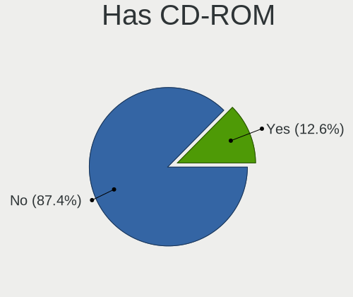

SteamOS - Tested Hardware & Statistics (Desktops)
-------------------------------------------------

A project to collect tested hardware configurations for SteamOS.

Anyone can contribute to this report by the [hw-probe](https://github.com/linuxhw/hw-probe) tool:

    sudo -E hw-probe -all -upload

Please contribute! Especially if your hardware is rare.

Contents
--------

* [ Test Cases ](#test-cases)

* [ System ](#system)
  - [ OS                       ](#os)
  - [ OS Family                ](#os-family)
  - [ Kernel                   ](#kernel)
  - [ Kernel Family            ](#kernel-family)
  - [ Kernel Major Ver.        ](#kernel-major-ver)
  - [ Arch                     ](#arch)
  - [ DE                       ](#de)
  - [ Display Server           ](#display-server)
  - [ Display Manager          ](#display-manager)
  - [ OS Lang                  ](#os-lang)
  - [ Boot Mode                ](#boot-mode)
  - [ Filesystem               ](#filesystem)
  - [ Part. scheme             ](#part-scheme)
  - [ Dual Boot with Linux/BSD ](#dual-boot-with-linuxbsd)
  - [ Dual Boot (Win)          ](#dual-boot-win)

* [ Board ](#board)
  - [ Vendor                   ](#vendor)
  - [ Model                    ](#model)
  - [ Model Family             ](#model-family)
  - [ MFG Year                 ](#mfg-year)
  - [ Form Factor              ](#form-factor)
  - [ Secure Boot              ](#secure-boot)
  - [ Coreboot                 ](#coreboot)
  - [ RAM Size                 ](#ram-size)
  - [ RAM Used                 ](#ram-used)
  - [ Total Drives             ](#total-drives)
  - [ Has CD-ROM               ](#has-cd-rom)
  - [ Has Ethernet             ](#has-ethernet)
  - [ Has WiFi                 ](#has-wifi)
  - [ Has Bluetooth            ](#has-bluetooth)

* [ Location ](#location)
  - [ Country                  ](#country)
  - [ City                     ](#city)

* [ Drives ](#drives)
  - [ Drive Vendor             ](#drive-vendor)
  - [ Drive Model              ](#drive-model)
  - [ HDD Vendor               ](#hdd-vendor)
  - [ SSD Vendor               ](#ssd-vendor)
  - [ Drive Kind               ](#drive-kind)
  - [ Drive Connector          ](#drive-connector)
  - [ Drive Size               ](#drive-size)
  - [ Space Total              ](#space-total)
  - [ Space Used               ](#space-used)
  - [ Malfunc. Drives          ](#malfunc-drives)
  - [ Malfunc. Drive Vendor    ](#malfunc-drive-vendor)
  - [ Malfunc. HDD Vendor      ](#malfunc-hdd-vendor)
  - [ Malfunc. Drive Kind      ](#malfunc-drive-kind)
  - [ Failed Drives            ](#failed-drives)
  - [ Failed Drive Vendor      ](#failed-drive-vendor)
  - [ Drive Status             ](#drive-status)

* [ Storage controller ](#storage-controller)
  - [ Storage Vendor           ](#storage-vendor)
  - [ Storage Model            ](#storage-model)
  - [ Storage Kind             ](#storage-kind)

* [ Processor ](#processor)
  - [ CPU Vendor               ](#cpu-vendor)
  - [ CPU Model                ](#cpu-model)
  - [ CPU Model Family         ](#cpu-model-family)
  - [ CPU Cores                ](#cpu-cores)
  - [ CPU Sockets              ](#cpu-sockets)
  - [ CPU Threads              ](#cpu-threads)
  - [ CPU Op-Modes             ](#cpu-op-modes)
  - [ CPU Microcode            ](#cpu-microcode)
  - [ CPU Microarch            ](#cpu-microarch)

* [ Graphics ](#graphics)
  - [ GPU Vendor               ](#gpu-vendor)
  - [ GPU Model                ](#gpu-model)
  - [ GPU Combo                ](#gpu-combo)
  - [ GPU Driver               ](#gpu-driver)
  - [ GPU Memory               ](#gpu-memory)

* [ Monitor ](#monitor)
  - [ Monitor Vendor           ](#monitor-vendor)
  - [ Monitor Model            ](#monitor-model)
  - [ Monitor Resolution       ](#monitor-resolution)
  - [ Monitor Diagonal         ](#monitor-diagonal)
  - [ Monitor Width            ](#monitor-width)
  - [ Aspect Ratio             ](#aspect-ratio)
  - [ Monitor Area             ](#monitor-area)
  - [ Pixel Density            ](#pixel-density)
  - [ Multiple Monitors        ](#multiple-monitors)

* [ Network ](#network)
  - [ Net Controller Vendor    ](#net-controller-vendor)
  - [ Net Controller Model     ](#net-controller-model)
  - [ Wireless Vendor          ](#wireless-vendor)
  - [ Wireless Model           ](#wireless-model)
  - [ Ethernet Vendor          ](#ethernet-vendor)
  - [ Ethernet Model           ](#ethernet-model)
  - [ Net Controller Kind      ](#net-controller-kind)
  - [ Used Controller          ](#used-controller)
  - [ NICs                     ](#nics)
  - [ IPv6                     ](#ipv6)

* [ Bluetooth ](#bluetooth)
  - [ Bluetooth Vendor         ](#bluetooth-vendor)
  - [ Bluetooth Model          ](#bluetooth-model)

* [ Sound ](#sound)
  - [ Sound Vendor             ](#sound-vendor)
  - [ Sound Model              ](#sound-model)

* [ Memory ](#memory)
  - [ Memory Vendor            ](#memory-vendor)
  - [ Memory Model             ](#memory-model)
  - [ Memory Kind              ](#memory-kind)
  - [ Memory Form Factor       ](#memory-form-factor)
  - [ Memory Size              ](#memory-size)
  - [ Memory Speed             ](#memory-speed)

* [ Printers & scanners ](#printers--scanners)
  - [ Printer Vendor           ](#printer-vendor)
  - [ Printer Model            ](#printer-model)
  - [ Scanner Vendor           ](#scanner-vendor)
  - [ Scanner Model            ](#scanner-model)

* [ Camera ](#camera)
  - [ Camera Vendor            ](#camera-vendor)
  - [ Camera Model             ](#camera-model)

* [ Security ](#security)
  - [ Fingerprint Vendor       ](#fingerprint-vendor)
  - [ Fingerprint Model        ](#fingerprint-model)
  - [ Chipcard Vendor          ](#chipcard-vendor)
  - [ Chipcard Model           ](#chipcard-model)

* [ Unsupported ](#unsupported)
  - [ Unsupported Devices      ](#unsupported-devices)
  - [ Unsupported Device Types ](#unsupported-device-types)

Test Cases
----------

Total: 16

| Vendor    | Model                   | Probe                                                      | Date         |
|-----------|-------------------------|------------------------------------------------------------|--------------|
| Gigabyte  | H310M S2V               | [329d2071a9](https://linux-hardware.org/?probe=329d2071a9) | Aug 01, 2022 |
| ASRock    | A520M-ITX/ac            | [876c779461](https://linux-hardware.org/?probe=876c779461) | Jul 25, 2022 |
| ASRock    | B450M-HDV R4.0          | [f2172999c8](https://linux-hardware.org/?probe=f2172999c8) | Jul 24, 2022 |
| ASUSTek   | EX-A320M-GAMING         | [68884b1723](https://linux-hardware.org/?probe=68884b1723) | Jul 17, 2022 |
| Gigabyte  | H170N-WIFI-CF           | [2f3e59dc30](https://linux-hardware.org/?probe=2f3e59dc30) | Jul 09, 2022 |
| Gigabyte  | B550 GAMING X V2        | [61eaf99aca](https://linux-hardware.org/?probe=61eaf99aca) | Jul 05, 2022 |
| Gigabyte  | B550 GAMING X V2        | [812733dd89](https://linux-hardware.org/?probe=812733dd89) | Jul 05, 2022 |
| Gigabyte  | X570 I AORUS PRO WIFI   | [d82f88e20c](https://linux-hardware.org/?probe=d82f88e20c) | Jul 01, 2022 |
| Alienware | 02XRCM A01              | [c70647bab0](https://linux-hardware.org/?probe=c70647bab0) | Jun 26, 2022 |
| ASUSTek   | H61M-K                  | [1a568c2e5f](https://linux-hardware.org/?probe=1a568c2e5f) | Jun 23, 2022 |
| ASUSTek   | ROG STRIX B550-F GAMING | [b3a08001ed](https://linux-hardware.org/?probe=b3a08001ed) | Jun 01, 2022 |
| ASRock    | B550 PG Velocita        | [0d7f71a24d](https://linux-hardware.org/?probe=0d7f71a24d) | May 30, 2022 |
| ASRock    | B365M Pro4-F            | [afc161c6fb](https://linux-hardware.org/?probe=afc161c6fb) | May 30, 2022 |
| Gigabyte  | B560M AORUS PRO         | [31f246f96e](https://linux-hardware.org/?probe=31f246f96e) | May 27, 2022 |
| Gigabyte  | B560M AORUS PRO         | [1d381d6ec9](https://linux-hardware.org/?probe=1d381d6ec9) | May 27, 2022 |
| Gigabyte  | Z170XP-SLI-CF           | [d4bef1e450](https://linux-hardware.org/?probe=d4bef1e450) | May 26, 2022 |

System
------

OS
--

Installed operating systems

| Name                         | Desktops | Percent |
|------------------------------|----------|---------|
| SteamOS 3.2 (steamdeck-main) | 7        | 50%     |
| SteamOS 3.3                  | 4        | 28.57%  |
| SteamOS Snapshot             | 3        | 21.43%  |

OS Family
---------

OS without a version

| Name    | Desktops | Percent |
|---------|----------|---------|
| SteamOS | 14       | 100%    |

Kernel
------

Version of the Linux kernel

| Version                                            | Desktops | Percent |
|----------------------------------------------------|----------|---------|
| 5.13.0-valve10.1-2-neptune-dri-02144-g7fffaf925dfb | 9        | 64.29%  |
| 5.13.0-valve22-1-neptune-02213-gb68995364335       | 3        | 21.43%  |
| 5.18.1-arch1_testHoloISO_20220606.1811             | 1        | 7.14%   |
| 5.13.0-valve21-2-neptune-02209-g2a5bdc1102a0       | 1        | 7.14%   |

Kernel Family
-------------

Linux kernel without a distro release

| Version | Desktops | Percent |
|---------|----------|---------|
| 5.13.0  | 13       | 92.86%  |
| 5.18.1  | 1        | 7.14%   |

Kernel Major Ver.
-----------------

Linux kernel major version

| Version | Desktops | Percent |
|---------|----------|---------|
| 5.13    | 13       | 92.86%  |
| 5.18    | 1        | 7.14%   |

Arch
----

OS architecture (x86_64, i586, etc.)

| Name   | Desktops | Percent |
|--------|----------|---------|
| x86_64 | 14       | 100%    |

DE
--

Desktop Environment

| Name | Desktops | Percent |
|------|----------|---------|
| KDE5 | 14       | 100%    |

Display Server
--------------

X11 or Wayland

| Name | Desktops | Percent |
|------|----------|---------|
| X11  | 14       | 100%    |

Display Manager
---------------

SDDM, LightDM, etc.

| Name    | Desktops | Percent |
|---------|----------|---------|
| Unknown | 14       | 100%    |

OS Lang
-------

Language

| Lang  | Desktops | Percent |
|-------|----------|---------|
| en_US | 10       | 71.43%  |
| pt_PT | 1        | 7.14%   |
| fr_FR | 1        | 7.14%   |
| en_IE | 1        | 7.14%   |
| en_GB | 1        | 7.14%   |

Boot Mode
---------

EFI or BIOS

| Mode | Desktops | Percent |
|------|----------|---------|
| BIOS | 14       | 100%    |

Filesystem
----------

Type of filesystem

| Type  | Desktops | Percent |
|-------|----------|---------|
| Btrfs | 14       | 100%    |

Part. scheme
------------

Scheme of partitioning

| Type    | Desktops | Percent |
|---------|----------|---------|
| Unknown | 14       | 100%    |

Dual Boot with Linux/BSD
------------------------

Hosting more than one Linux/BSD

| Dual boot | Desktops | Percent |
|-----------|----------|---------|
| No        | 14       | 100%    |

Dual Boot (Win)
---------------

Hosting Linux and Windows

| Dual boot | Desktops | Percent |
|-----------|----------|---------|
| No        | 14       | 100%    |

Board
-----

Vendor
------

Motherboard manufacturer

| Name                | Desktops | Percent |
|---------------------|----------|---------|
| Gigabyte Technology | 6        | 42.86%  |
| ASRock              | 4        | 28.57%  |
| ASUSTek Computer    | 3        | 21.43%  |
| Alienware           | 1        | 7.14%   |

Model
-----

Motherboard model

| Name                           | Desktops | Percent |
|--------------------------------|----------|---------|
| Gigabyte X570 I AORUS PRO WIFI | 1        | 7.14%   |
| Gigabyte MBB-670016            | 1        | 7.14%   |
| Gigabyte H310M S2V 2.0         | 1        | 7.14%   |
| Gigabyte H170N-WIFI            | 1        | 7.14%   |
| Gigabyte B560M AORUS PRO       | 1        | 7.14%   |
| Gigabyte B550 GAMING X V2      | 1        | 7.14%   |
| ASUS ROG STRIX B550-F GAMING   | 1        | 7.14%   |
| ASUS H61M-K                    | 1        | 7.14%   |
| ASUS EX-A320M-GAMING           | 1        | 7.14%   |
| ASRock B550 PG Velocita        | 1        | 7.14%   |
| ASRock B450M-HDV R4.0          | 1        | 7.14%   |
| ASRock B365M Pro4-F            | 1        | 7.14%   |
| ASRock A520M-ITX/ac            | 1        | 7.14%   |
| Alienware Aurora R8            | 1        | 7.14%   |

Model Family
------------

Motherboard model prefix

| Name                 | Desktops | Percent |
|----------------------|----------|---------|
| Gigabyte X570        | 1        | 7.14%   |
| Gigabyte MBB-670016  | 1        | 7.14%   |
| Gigabyte H310M       | 1        | 7.14%   |
| Gigabyte H170N-WIFI  | 1        | 7.14%   |
| Gigabyte B560M       | 1        | 7.14%   |
| Gigabyte B550        | 1        | 7.14%   |
| ASUS ROG             | 1        | 7.14%   |
| ASUS H61M-K          | 1        | 7.14%   |
| ASUS EX-A320M-GAMING | 1        | 7.14%   |
| ASRock B550          | 1        | 7.14%   |
| ASRock B450M-HDV     | 1        | 7.14%   |
| ASRock B365M         | 1        | 7.14%   |
| ASRock A520M-ITX     | 1        | 7.14%   |
| Alienware Aurora     | 1        | 7.14%   |

MFG Year
--------

Motherboard manufacture year

| Year | Desktops | Percent |
|------|----------|---------|
| 2020 | 5        | 35.71%  |
| 2018 | 4        | 28.57%  |
| 2019 | 2        | 14.29%  |
| 2022 | 1        | 7.14%   |
| 2021 | 1        | 7.14%   |
| 2013 | 1        | 7.14%   |

Form Factor
-----------

Physical design of the computer

| Name    | Desktops | Percent |
|---------|----------|---------|
| Desktop | 14       | 100%    |

Secure Boot
-----------

Enabled or disabled

| State    | Desktops | Percent |
|----------|----------|---------|
| Disabled | 14       | 100%    |

Coreboot
--------

Have coreboot on board

| Used | Desktops | Percent |
|------|----------|---------|
| No   | 14       | 100%    |

RAM Size
--------

Total RAM memory

| Size in GB | Desktops | Percent |
|------------|----------|---------|
| 16.01-24.0 | 8        | 57.14%  |
| 32.01-64.0 | 4        | 28.57%  |
| 4.01-8.0   | 1        | 7.14%   |
| 24.01-32.0 | 1        | 7.14%   |

RAM Used
--------

Used RAM memory

| Used GB  | Desktops | Percent |
|----------|----------|---------|
| 2.01-3.0 | 7        | 50%     |
| 4.01-8.0 | 3        | 21.43%  |
| 3.01-4.0 | 3        | 21.43%  |
| 1.01-2.0 | 1        | 7.14%   |

Total Drives
------------

Number of drives on board

| Drives | Desktops | Percent |
|--------|----------|---------|
| 3      | 6        | 42.86%  |
| 2      | 3        | 21.43%  |
| 1      | 3        | 21.43%  |
| 7      | 1        | 7.14%   |
| 4      | 1        | 7.14%   |

Has CD-ROM
----------

Has CD-ROM on board

| Presented | Desktops | Percent |
|-----------|----------|---------|
| No        | 12       | 85.71%  |
| Yes       | 2        | 14.29%  |

Has Ethernet
------------

Has Ethernet on board

| Presented | Desktops | Percent |
|-----------|----------|---------|
| Yes       | 14       | 100%    |

Has WiFi
--------

Has WiFi module

| Presented | Desktops | Percent |
|-----------|----------|---------|
| Yes       | 10       | 71.43%  |
| No        | 4        | 28.57%  |

Has Bluetooth
-------------

Has Bluetooth module

| Presented | Desktops | Percent |
|-----------|----------|---------|
| Yes       | 10       | 71.43%  |
| No        | 4        | 28.57%  |

Location
--------

Country
-------

Geographic location (country)

| Country   | Desktops | Percent |
|-----------|----------|---------|
| USA       | 3        | 21.43%  |
| UK        | 3        | 21.43%  |
| Australia | 3        | 21.43%  |
| Turkey    | 1        | 7.14%   |
| Portugal  | 1        | 7.14%   |
| Ireland   | 1        | 7.14%   |
| Hong Kong | 1        | 7.14%   |
| France    | 1        | 7.14%   |

City
----

Geographic location (city)

| City           | Desktops | Percent |
|----------------|----------|---------|
| Walsall        | 1        | 7.14%   |
| Tuam           | 1        | 7.14%   |
| Perth          | 1        | 7.14%   |
| Norwich        | 1        | 7.14%   |
| Noble Park     | 1        | 7.14%   |
| Mascot         | 1        | 7.14%   |
| Lisbon         | 1        | 7.14%   |
| Ivry-sur-Seine | 1        | 7.14%   |
| Istanbul       | 1        | 7.14%   |
| Hornsea        | 1        | 7.14%   |
| Detroit        | 1        | 7.14%   |
| Dallas         | 1        | 7.14%   |
| Central        | 1        | 7.14%   |
| Buffalo        | 1        | 7.14%   |

Drives
------

Drive Vendor
------------

Hard drive vendors

| Vendor                    | Desktops | Drives | Percent |
|---------------------------|----------|--------|---------|
| Seagate                   | 6        | 8      | 20%     |
| Samsung Electronics       | 5        | 9      | 16.67%  |
| WDC                       | 3        | 4      | 10%     |
| Toshiba                   | 2        | 3      | 6.67%   |
| PNY                       | 2        | 2      | 6.67%   |
| Phison                    | 2        | 2      | 6.67%   |
| Crucial                   | 2        | 2      | 6.67%   |
| Union Memory (Shenzhen)   | 1        | 1      | 3.33%   |
| SK hynix                  | 1        | 1      | 3.33%   |
| Realtek Semiconductor     | 1        | 1      | 3.33%   |
| Micron/Crucial Technology | 1        | 1      | 3.33%   |
| Kingston                  | 1        | 1      | 3.33%   |
| GALAX                     | 1        | 1      | 3.33%   |
| China                     | 1        | 1      | 3.33%   |
| A-DATA Technology         | 1        | 1      | 3.33%   |

Drive Model
-----------

Hard drive models

| Model                                        | Desktops | Percent |
|----------------------------------------------|----------|---------|
| WDC WDS500G2B0A-00SM50 500GB SSD             | 1        | 2.7%    |
| WDC WD7500BPVT-80HXZT3 752GB                 | 1        | 2.7%    |
| WDC WD5000BPKT-60PK4T0 500GB                 | 1        | 2.7%    |
| WDC WD10EURX-83UY4Y0 1TB                     | 1        | 2.7%    |
| Union Memory (Shenzhen) NVMe SSD Drive 128GB | 1        | 2.7%    |
| Toshiba MQ01ABD100 1TB                       | 1        | 2.7%    |
| Toshiba MK3275GSX 320GB                      | 1        | 2.7%    |
| Toshiba DT01ACA200 2TB                       | 1        | 2.7%    |
| SK hynix NVMe SSD Drive 256GB                | 1        | 2.7%    |
| Seagate ST9320325AS 320GB                    | 1        | 2.7%    |
| Seagate ST6000DM003-2CY186 6TB               | 1        | 2.7%    |
| Seagate ST4000DX001-1CE168 4TB               | 1        | 2.7%    |
| Seagate ST4000DM004-2CV104 4TB               | 1        | 2.7%    |
| Seagate ST3500413AS 500GB                    | 1        | 2.7%    |
| Seagate ST3160318AS 160GB                    | 1        | 2.7%    |
| Seagate ST2000DM008-2FR102 2TB               | 1        | 2.7%    |
| Seagate ST1000LM014-1EJ164 1TB               | 1        | 2.7%    |
| Samsung SSD 860 EVO 500GB                    | 1        | 2.7%    |
| Samsung SSD 860 EVO 250GB                    | 1        | 2.7%    |
| Samsung SSD 850 EVO mSATA 500GB              | 1        | 2.7%    |
| Samsung SSD 850 EVO 250GB                    | 1        | 2.7%    |
| Samsung SSD 840 Series 120GB                 | 1        | 2.7%    |
| Samsung SSD 840 EVO 250GB                    | 1        | 2.7%    |
| Samsung NVMe SSD Drive 512GB                 | 1        | 2.7%    |
| Samsung NVMe SSD Drive 1TB                   | 1        | 2.7%    |
| Realtek NVMe SSD Drive 256GB                 | 1        | 2.7%    |
| PNY CS900 120GB SSD                          | 1        | 2.7%    |
| PNY CS1311 240GB SSD                         | 1        | 2.7%    |
| Phison NVMe SSD Drive 250GB                  | 1        | 2.7%    |
| Phison NVMe SSD Drive 1024GB                 | 1        | 2.7%    |
| Micron/Crucial NVMe SSD Drive 2TB            | 1        | 2.7%    |
| Kingston SA400M8120G 120GB SSD               | 1        | 2.7%    |
| GALAX TA1D0120N 120GB                        | 1        | 2.7%    |
| Crucial CT525MX300SSD1 528GB                 | 1        | 2.7%    |
| Crucial CT1000BX500SSD1 1TB                  | 1        | 2.7%    |
| China SSD 120GB                              | 1        | 2.7%    |
| A-DATA SU650 240GB SSD                       | 1        | 2.7%    |

HDD Vendor
----------

Hard disk drive vendors

| Vendor  | Desktops | Drives | Percent |
|---------|----------|--------|---------|
| Seagate | 6        | 8      | 60%     |
| WDC     | 2        | 3      | 20%     |
| Toshiba | 2        | 3      | 20%     |

SSD Vendor
----------

Solid state drive vendors

| Vendor              | Desktops | Drives | Percent |
|---------------------|----------|--------|---------|
| Samsung Electronics | 5        | 6      | 38.46%  |
| PNY                 | 2        | 2      | 15.38%  |
| Crucial             | 2        | 2      | 15.38%  |
| WDC                 | 1        | 1      | 7.69%   |
| Kingston            | 1        | 1      | 7.69%   |
| China               | 1        | 1      | 7.69%   |
| A-DATA Technology   | 1        | 1      | 7.69%   |

Drive Kind
----------

HDD or SSD

| Kind    | Desktops | Drives | Percent |
|---------|----------|--------|---------|
| SSD     | 11       | 14     | 39.29%  |
| NVMe    | 8        | 9      | 28.57%  |
| HDD     | 8        | 14     | 28.57%  |
| Unknown | 1        | 1      | 3.57%   |

Drive Connector
---------------

SATA, SAS, NVMe, etc.

| Type | Desktops | Drives | Percent |
|------|----------|--------|---------|
| SATA | 13       | 29     | 61.9%   |
| NVMe | 8        | 9      | 38.1%   |

Drive Size
----------

Size of hard drive

| Size in TB | Desktops | Drives | Percent |
|------------|----------|--------|---------|
| 0.01-0.5   | 12       | 17     | 54.55%  |
| 0.51-1.0   | 5        | 6      | 22.73%  |
| 3.01-4.0   | 2        | 2      | 9.09%   |
| 1.01-2.0   | 2        | 2      | 9.09%   |
| 4.01-10.0  | 1        | 1      | 4.55%   |

Space Total
-----------

Amount of disk space available on the file system

| Size in GB     | Desktops | Percent |
|----------------|----------|---------|
| 101-250        | 5        | 35.71%  |
| 501-1000       | 3        | 21.43%  |
| More than 3000 | 2        | 14.29%  |
| 251-500        | 2        | 14.29%  |
| 1001-2000      | 2        | 14.29%  |

Space Used
----------

Amount of used disk space

| Used GB   | Desktops | Percent |
|-----------|----------|---------|
| 1-20      | 8        | 57.14%  |
| 51-100    | 3        | 21.43%  |
| 21-50     | 2        | 14.29%  |
| 2001-3000 | 1        | 7.14%   |

Malfunc. Drives
---------------

Drive models with a malfunction

Zero info for selected period =(

Malfunc. Drive Vendor
---------------------

Vendors of faulty drives

Zero info for selected period =(

Malfunc. HDD Vendor
-------------------

Vendors of faulty HDD drives

Zero info for selected period =(

Malfunc. Drive Kind
-------------------

Kinds of faulty drives

Zero info for selected period =(

Failed Drives
-------------

Failed drive models

Zero info for selected period =(

Failed Drive Vendor
-------------------

Failed drive vendors

Zero info for selected period =(

Drive Status
------------

Number of failed and malfunc. drives

| Status   | Desktops | Drives | Percent |
|----------|----------|--------|---------|
| Detected | 14       | 38     | 100%    |

Storage controller
------------------

Storage Vendor
--------------

Storage controller vendors

| Vendor                    | Desktops | Percent |
|---------------------------|----------|---------|
| Intel                     | 7        | 31.82%  |
| AMD                       | 7        | 31.82%  |
| Samsung Electronics       | 2        | 9.09%   |
| Phison Electronics        | 2        | 9.09%   |
| Union Memory (Shenzhen)   | 1        | 4.55%   |
| SK hynix                  | 1        | 4.55%   |
| Realtek Semiconductor     | 1        | 4.55%   |
| Micron/Crucial Technology | 1        | 4.55%   |

Storage Model
-------------

Storage controller models

| Model                                                                         | Desktops | Percent |
|-------------------------------------------------------------------------------|----------|---------|
| AMD FCH SATA Controller [AHCI mode]                                           | 4        | 15.38%  |
| AMD 500 Series Chipset SATA Controller                                        | 4        | 15.38%  |
| Intel 200 Series PCH SATA controller [AHCI mode]                              | 3        | 11.54%  |
| Intel Q170/Q150/B150/H170/H110/Z170/CM236 Chipset SATA Controller [AHCI Mode] | 2        | 7.69%   |
| Union Memory (Shenzhen) Non-Volatile memory controller                        | 1        | 3.85%   |
| SK hynix Non-Volatile memory controller                                       | 1        | 3.85%   |
| Samsung NVMe SSD Controller SM981/PM981/PM983                                 | 1        | 3.85%   |
| Samsung NVMe SSD Controller SM951/PM951                                       | 1        | 3.85%   |
| Samsung NVMe SSD Controller PM9A1/PM9A3/980PRO                                | 1        | 3.85%   |
| Realtek RTS5763DL NVMe SSD Controller                                         | 1        | 3.85%   |
| Phison Electronics Non-Volatile memory controller                             | 1        | 3.85%   |
| Phison E12 NVMe Controller                                                    | 1        | 3.85%   |
| Micron/Crucial P2 NVMe PCIe SSD                                               | 1        | 3.85%   |
| Intel 6 Series/C200 Series Chipset Family 6 port Desktop SATA AHCI Controller | 1        | 3.85%   |
| Intel 500 Series Chipset Family SATA AHCI Controller                          | 1        | 3.85%   |
| AMD FCH SATA Controller D                                                     | 1        | 3.85%   |
| AMD 400 Series Chipset SATA Controller                                        | 1        | 3.85%   |

Storage Kind
------------

Kind of storage controller (IDE, SATA, NVMe, SAS, ...)

| Kind | Desktops | Percent |
|------|----------|---------|
| SATA | 14       | 63.64%  |
| NVMe | 8        | 36.36%  |

Processor
---------

CPU Vendor
----------

Processor vendors

| Vendor | Desktops | Percent |
|--------|----------|---------|
| Intel  | 7        | 50%     |
| AMD    | 7        | 50%     |

CPU Model
---------

Processor models

| Model                                   | Desktops | Percent |
|-----------------------------------------|----------|---------|
| AMD Ryzen 9 3900X 12-Core Processor     | 2        | 14.29%  |
| Intel Core i7-6700K CPU @ 4.00GHz       | 1        | 7.14%   |
| Intel Core i5-9400 CPU @ 2.90GHz        | 1        | 7.14%   |
| Intel Core i5-8500T CPU @ 2.10GHz       | 1        | 7.14%   |
| Intel Core i5-6600 CPU @ 3.30GHz        | 1        | 7.14%   |
| Intel Core i5-2400 CPU @ 3.10GHz        | 1        | 7.14%   |
| Intel Core i3-9100F CPU @ 3.60GHz       | 1        | 7.14%   |
| Intel 11th Gen Core i5-11400F @ 2.60GHz | 1        | 7.14%   |
| AMD Ryzen 7 3700X 8-Core Processor      | 1        | 7.14%   |
| AMD Ryzen 5 5600X 6-Core Processor      | 1        | 7.14%   |
| AMD Ryzen 5 3600X 6-Core Processor      | 1        | 7.14%   |
| AMD Ryzen 5 2600X Six-Core Processor    | 1        | 7.14%   |
| AMD Ryzen 5 1600 Six-Core Processor     | 1        | 7.14%   |

CPU Model Family
----------------

Processor model prefix

| Model         | Desktops | Percent |
|---------------|----------|---------|
| Intel Core i5 | 4        | 28.57%  |
| AMD Ryzen 5   | 4        | 28.57%  |
| AMD Ryzen 9   | 2        | 14.29%  |
| Other         | 1        | 7.14%   |
| Intel Core i7 | 1        | 7.14%   |
| Intel Core i3 | 1        | 7.14%   |
| AMD Ryzen 7   | 1        | 7.14%   |

CPU Cores
---------

Number of processor cores

| Number | Desktops | Percent |
|--------|----------|---------|
| 6      | 7        | 50%     |
| 4      | 4        | 28.57%  |
| 12     | 2        | 14.29%  |
| 8      | 1        | 7.14%   |

CPU Sockets
-----------

Number of sockets

| Number | Desktops | Percent |
|--------|----------|---------|
| 1      | 14       | 100%    |

CPU Threads
-----------

Threads per core (Hyper-Threading)

| Number | Desktops | Percent |
|--------|----------|---------|
| 2      | 9        | 64.29%  |
| 1      | 5        | 35.71%  |

CPU Op-Modes
------------

CPU Operation Modes (32-bit, 64-bit)

| Op mode        | Desktops | Percent |
|----------------|----------|---------|
| 32-bit, 64-bit | 14       | 100%    |

CPU Microcode
-------------

Microcode number

| Number  | Desktops | Percent |
|---------|----------|---------|
| Unknown | 14       | 100%    |

CPU Microarch
-------------

Microarchitecture

| Name        | Desktops | Percent |
|-------------|----------|---------|
| Zen 2       | 4        | 28.57%  |
| KabyLake    | 3        | 21.43%  |
| Zen+        | 2        | 14.29%  |
| Skylake     | 2        | 14.29%  |
| Zen 3       | 1        | 7.14%   |
| SandyBridge | 1        | 7.14%   |
| Unknown     | 1        | 7.14%   |

Graphics
--------

GPU Vendor
----------

Vendors of graphics cards

| Vendor | Desktops | Percent |
|--------|----------|---------|
| AMD    | 10       | 58.82%  |
| Nvidia | 4        | 23.53%  |
| Intel  | 3        | 17.65%  |

GPU Model
---------

Graphics card models

| Model                                                      | Desktops | Percent |
|------------------------------------------------------------|----------|---------|
| AMD Ellesmere [Radeon RX 470/480/570/570X/580/580X/590]    | 3        | 17.65%  |
| Intel CoffeeLake-S GT2 [UHD Graphics 630]                  | 2        | 11.76%  |
| AMD Navi 23 [Radeon RX 6600/6600 XT/6600M]                 | 2        | 11.76%  |
| Nvidia TU117 [GeForce GTX 1650]                            | 1        | 5.88%   |
| Nvidia TU116 [GeForce GTX 1660 Ti]                         | 1        | 5.88%   |
| Nvidia TU116 [GeForce GTX 1660 SUPER]                      | 1        | 5.88%   |
| Nvidia GM204 [GeForce GTX 970]                             | 1        | 5.88%   |
| Intel HD Graphics 530                                      | 1        | 5.88%   |
| AMD Navi 22 [Radeon RX 6700/6700 XT/6750 XT / 6800M]       | 1        | 5.88%   |
| AMD Navi 21 [Radeon RX 6800/6800 XT / 6900 XT]             | 1        | 5.88%   |
| AMD Navi 10 [Radeon RX 5600 OEM/5600 XT / 5700/5700 XT]    | 1        | 5.88%   |
| AMD Lexa PRO [Radeon 540/540X/550/550X / RX 540X/550/550X] | 1        | 5.88%   |
| AMD Cape Verde PRO [Radeon HD 7750/8740 / R7 250E]         | 1        | 5.88%   |

GPU Combo
---------

Combinations of graphics cards

| Name       | Desktops | Percent |
|------------|----------|---------|
| 1 x AMD    | 10       | 71.43%  |
| 1 x Nvidia | 4        | 28.57%  |

GPU Driver
----------

Free vs proprietary

| Driver      | Desktops | Percent |
|-------------|----------|---------|
| Free        | 10       | 71.43%  |
| Proprietary | 4        | 28.57%  |

GPU Memory
----------

Total video memory

| Size in GB | Desktops | Percent |
|------------|----------|---------|
| Unknown    | 10       | 71.43%  |
| 5.01-6.0   | 2        | 14.29%  |
| 3.01-4.0   | 2        | 14.29%  |

Monitor
-------

Monitor Vendor
--------------

Monitor vendors

| Vendor              | Desktops | Percent |
|---------------------|----------|---------|
| Samsung Electronics | 4        | 26.67%  |
| Sony                | 2        | 13.33%  |
| Acer                | 2        | 13.33%  |
| ___                 | 1        | 6.67%   |
| ViewSonic           | 1        | 6.67%   |
| Unknown             | 1        | 6.67%   |
| Sceptre Tech        | 1        | 6.67%   |
| Philips             | 1        | 6.67%   |
| Goldstar            | 1        | 6.67%   |
| Dell                | 1        | 6.67%   |

Monitor Model
-------------

Monitor models

| Model                                                                 | Desktops | Percent |
|-----------------------------------------------------------------------|----------|---------|
| ___ LCD TV ___9000 1360x768                                           | 1        | 6.67%   |
| ViewSonic VX3276-QHD VSCE635 2560x1440 698x393mm 31.5-inch            | 1        | 6.67%   |
| Unknown LCDTV16 9000 1360x768 1600x900mm 72.3-inch                    | 1        | 6.67%   |
| Sony TV SNYEE01 1920x1080                                             | 1        | 6.67%   |
| Sony TV *00 SNY8204 3840x2160 1218x685mm 55.0-inch                    | 1        | 6.67%   |
| Sceptre Tech E22 SPT08D5 1920x1080 409x230mm 18.5-inch                | 1        | 6.67%   |
| Samsung Electronics SMB2330 SAM0643 1920x1080 510x287mm 23.0-inch     | 1        | 6.67%   |
| Samsung Electronics LCD Monitor SAM0A7D 1920x1080 890x500mm 40.2-inch | 1        | 6.67%   |
| Samsung Electronics LC49G95T SAM7053 3840x1080 1193x336mm 48.8-inch   | 1        | 6.67%   |
| Samsung Electronics C24F390 SAM0D2C 1920x1080 521x293mm 23.5-inch     | 1        | 6.67%   |
| Philips PHL 223V5 PHLC0CF 1920x1080 477x268mm 21.5-inch               | 1        | 6.67%   |
| Goldstar TV SSCR2 GSMC0C8 3840x2160                                   | 1        | 6.67%   |
| Dell E2420H DELF11B 1920x1080 527x296mm 23.8-inch                     | 1        | 6.67%   |
| Acer VG240Y S ACR0750 1920x1080 527x296mm 23.8-inch                   | 1        | 6.67%   |
| Acer H236HL ACR0318 1920x1080 509x286mm 23.0-inch                     | 1        | 6.67%   |

Monitor Resolution
------------------

Monitor screen resolution

| Resolution       | Desktops | Percent |
|------------------|----------|---------|
| 1920x1080 (FHD)  | 8        | 57.14%  |
| 3840x2160 (4K)   | 2        | 14.29%  |
| 3840x1080        | 1        | 7.14%   |
| 2560x1440 (QHD)  | 1        | 7.14%   |
| 1440x900 (WXGA+) | 1        | 7.14%   |
| 1360x768         | 1        | 7.14%   |

Monitor Diagonal
----------------

Diagonal size in inches

| Inches  | Desktops | Percent |
|---------|----------|---------|
| 23      | 4        | 28.57%  |
| 72      | 3        | 21.43%  |
| 48      | 2        | 14.29%  |
| 65      | 1        | 7.14%   |
| 31      | 1        | 7.14%   |
| 24      | 1        | 7.14%   |
| 21      | 1        | 7.14%   |
| Unknown | 1        | 7.14%   |

Monitor Width
-------------

Physical width

| Width in mm | Desktops | Percent |
|-------------|----------|---------|
| 501-600     | 5        | 35.71%  |
| 1501-2000   | 3        | 21.43%  |
| 1001-1500   | 3        | 21.43%  |
| 601-700     | 1        | 7.14%   |
| 401-500     | 1        | 7.14%   |
| Unknown     | 1        | 7.14%   |

Aspect Ratio
------------

Proportional relationship between the width and the height

| Ratio | Desktops | Percent |
|-------|----------|---------|
| 16/9  | 12       | 92.31%  |
| 32/9  | 1        | 7.69%   |

Monitor Area
------------

Area in inch²

| Area in inch² | Desktops | Percent |
|----------------|----------|---------|
| 201-250        | 6        | 42.86%  |
| More than 1000 | 5        | 35.71%  |
| 351-500        | 1        | 7.14%   |
| 501-1000       | 1        | 7.14%   |
| Unknown        | 1        | 7.14%   |

Pixel Density
-------------

Pixels per inch

| Density | Desktops | Percent |
|---------|----------|---------|
| 51-100  | 9        | 64.29%  |
| 1-50    | 3        | 21.43%  |
| 101-120 | 1        | 7.14%   |
| Unknown | 1        | 7.14%   |

Multiple Monitors
-----------------

Total monitors connected

| Total | Desktops | Percent |
|-------|----------|---------|
| 1     | 12       | 85.71%  |
| 2     | 2        | 14.29%  |

Network
-------

Net Controller Vendor
---------------------

Controller vendors

| Vendor                        | Desktops | Percent |
|-------------------------------|----------|---------|
| Intel                         | 8        | 42.11%  |
| Realtek Semiconductor         | 7        | 36.84%  |
| Qualcomm Atheros              | 1        | 5.26%   |
| OnePlus Technology (Shenzhen) | 1        | 5.26%   |
| Microsoft                     | 1        | 5.26%   |
| Google                        | 1        | 5.26%   |

Net Controller Model
--------------------

Controller models

| Model                                                             | Desktops | Percent |
|-------------------------------------------------------------------|----------|---------|
| Realtek RTL8111/8168/8411 PCI Express Gigabit Ethernet Controller | 6        | 22.22%  |
| Intel Wi-Fi 6 AX200                                               | 4        | 14.81%  |
| Intel Ethernet Connection (2) I219-V                              | 3        | 11.11%  |
| Intel I211 Gigabit Network Connection                             | 2        | 7.41%   |
| Intel Ethernet Controller I225-V                                  | 2        | 7.41%   |
| Realtek RTL88x2bu [AC1200 Techkey]                                | 1        | 3.7%    |
| Realtek RTL8125 2.5GbE Controller                                 | 1        | 3.7%    |
| Realtek 802.11ac NIC                                              | 1        | 3.7%    |
| Qualcomm Atheros QCA9377 802.11ac Wireless Network Adapter        | 1        | 3.7%    |
| Qualcomm Atheros Killer E2500 Gigabit Ethernet Controller         | 1        | 3.7%    |
| OnePlus (Shenzhen) OnePlus                                        | 1        | 3.7%    |
| Microsoft Xbox 360 Wireless Adapter                               | 1        | 3.7%    |
| Intel Wireless 8260                                               | 1        | 3.7%    |
| Intel Dual Band Wireless-AC 3168NGW [Stone Peak]                  | 1        | 3.7%    |
| Google Nexus/Pixel Device (tether)                                | 1        | 3.7%    |

Wireless Vendor
---------------

Wireless vendors

| Vendor                | Desktops | Percent |
|-----------------------|----------|---------|
| Intel                 | 6        | 60%     |
| Realtek Semiconductor | 2        | 20%     |
| Qualcomm Atheros      | 1        | 10%     |
| Microsoft             | 1        | 10%     |

Wireless Model
--------------

Wireless models

| Model                                                      | Desktops | Percent |
|------------------------------------------------------------|----------|---------|
| Intel Wi-Fi 6 AX200                                        | 4        | 40%     |
| Realtek RTL88x2bu [AC1200 Techkey]                         | 1        | 10%     |
| Realtek 802.11ac NIC                                       | 1        | 10%     |
| Qualcomm Atheros QCA9377 802.11ac Wireless Network Adapter | 1        | 10%     |
| Microsoft Xbox 360 Wireless Adapter                        | 1        | 10%     |
| Intel Wireless 8260                                        | 1        | 10%     |
| Intel Dual Band Wireless-AC 3168NGW [Stone Peak]           | 1        | 10%     |

Ethernet Vendor
---------------

Ethernet vendors

| Vendor                        | Desktops | Percent |
|-------------------------------|----------|---------|
| Realtek Semiconductor         | 7        | 43.75%  |
| Intel                         | 6        | 37.5%   |
| Qualcomm Atheros              | 1        | 6.25%   |
| OnePlus Technology (Shenzhen) | 1        | 6.25%   |
| Google                        | 1        | 6.25%   |

Ethernet Model
--------------

Ethernet models

| Model                                                             | Desktops | Percent |
|-------------------------------------------------------------------|----------|---------|
| Realtek RTL8111/8168/8411 PCI Express Gigabit Ethernet Controller | 6        | 35.29%  |
| Intel Ethernet Connection (2) I219-V                              | 3        | 17.65%  |
| Intel I211 Gigabit Network Connection                             | 2        | 11.76%  |
| Intel Ethernet Controller I225-V                                  | 2        | 11.76%  |
| Realtek RTL8125 2.5GbE Controller                                 | 1        | 5.88%   |
| Qualcomm Atheros Killer E2500 Gigabit Ethernet Controller         | 1        | 5.88%   |
| OnePlus (Shenzhen) OnePlus                                        | 1        | 5.88%   |
| Google Nexus/Pixel Device (tether)                                | 1        | 5.88%   |

Net Controller Kind
-------------------

Ethernet, WiFi or modem

| Kind     | Desktops | Percent |
|----------|----------|---------|
| Ethernet | 14       | 58.33%  |
| WiFi     | 10       | 41.67%  |

Used Controller
---------------

Currently used network controller

| Kind     | Desktops | Percent |
|----------|----------|---------|
| Ethernet | 11       | 73.33%  |
| WiFi     | 4        | 26.67%  |

NICs
----

Total network controllers on board

| Total | Desktops | Percent |
|-------|----------|---------|
| 1     | 7        | 50%     |
| 2     | 6        | 42.86%  |
| 3     | 1        | 7.14%   |

IPv6
----

IPv6 vs IPv4

| Used | Desktops | Percent |
|------|----------|---------|
| No   | 10       | 71.43%  |
| Yes  | 4        | 28.57%  |

Bluetooth
---------

Bluetooth Vendor
----------------

Controller vendors

| Vendor                          | Desktops | Percent |
|---------------------------------|----------|---------|
| Intel                           | 6        | 60%     |
| Qualcomm Atheros Communications | 1        | 10%     |
| Integrated System Solution      | 1        | 10%     |
| Cambridge Silicon Radio         | 1        | 10%     |
| Broadcom                        | 1        | 10%     |

Bluetooth Model
---------------

Controller models

| Model                                                 | Desktops | Percent |
|-------------------------------------------------------|----------|---------|
| Intel AX200 Bluetooth                                 | 4        | 40%     |
| Qualcomm Atheros  Bluetooth Device                    | 1        | 10%     |
| Intel Wireless-AC 3168 Bluetooth                      | 1        | 10%     |
| Intel Bluetooth wireless interface                    | 1        | 10%     |
| Integrated System Solution KY-BT100 Bluetooth Adapter | 1        | 10%     |
| Cambridge Silicon Radio Bluetooth Dongle (HCI mode)   | 1        | 10%     |
| Broadcom BCM20702A0 Bluetooth 4.0                     | 1        | 10%     |

Sound
-----

Sound Vendor
------------

Sound card vendors

| Vendor              | Desktops | Percent |
|---------------------|----------|---------|
| AMD                 | 12       | 42.86%  |
| Intel               | 7        | 25%     |
| Nvidia              | 4        | 14.29%  |
| Tenx Technology     | 1        | 3.57%   |
| Logitech            | 1        | 3.57%   |
| Kingston Technology | 1        | 3.57%   |
| C-Media Electronics | 1        | 3.57%   |
| Apple               | 1        | 3.57%   |

Sound Model
-----------

Sound card models

| Model                                                                      | Desktops | Percent |
|----------------------------------------------------------------------------|----------|---------|
| AMD Starship/Matisse HD Audio Controller                                   | 5        | 15.15%  |
| AMD Navi 21/23 HDMI/DP Audio Controller                                    | 4        | 12.12%  |
| Intel 200 Series PCH HD Audio                                              | 3        | 9.09%   |
| AMD Ellesmere HDMI Audio [Radeon RX 470/480 / 570/580/590]                 | 3        | 9.09%   |
| Nvidia TU116 High Definition Audio Controller                              | 2        | 6.06%   |
| Intel 100 Series/C230 Series Chipset Family HD Audio Controller            | 2        | 6.06%   |
| AMD Family 17h (Models 00h-0fh) HD Audio Controller                        | 2        | 6.06%   |
| Tenx Technology USB AUDIO                                                  | 1        | 3.03%   |
| Nvidia TU107 GeForce GTX 1650 High Definition Audio Controller             | 1        | 3.03%   |
| Nvidia GM204 High Definition Audio Controller                              | 1        | 3.03%   |
| Logitech Blue Microphones                                                  | 1        | 3.03%   |
| Kingston Technology HyperX Cloud Alpha S                                   | 1        | 3.03%   |
| Intel Tiger Lake-H HD Audio Controller                                     | 1        | 3.03%   |
| Intel 6 Series/C200 Series Chipset Family High Definition Audio Controller | 1        | 3.03%   |
| C-Media Electronics Blue Snowball                                          | 1        | 3.03%   |
| Apple USB-C to 3.5mm Headphone Jack Adapter                                | 1        | 3.03%   |
| AMD Oland/Hainan/Cape Verde/Pitcairn HDMI Audio [Radeon HD 7000 Series]    | 1        | 3.03%   |
| AMD Navi 10 HDMI Audio                                                     | 1        | 3.03%   |
| AMD Baffin HDMI/DP Audio [Radeon RX 550 640SP / RX 560/560X]               | 1        | 3.03%   |

Memory
------

Memory Vendor
-------------

Memory module vendors

Zero info for selected period =(

Memory Model
------------

Memory module models

Zero info for selected period =(

Memory Kind
-----------

Memory module kinds

Zero info for selected period =(

Memory Form Factor
------------------

Physical design of the memory module

Zero info for selected period =(

Memory Size
-----------

Memory module size

Zero info for selected period =(

Memory Speed
------------

Memory module speed

Zero info for selected period =(

Printers & scanners
-------------------

Printer Vendor
--------------

Printer device vendors

Zero info for selected period =(

Printer Model
-------------

Printer device models

Zero info for selected period =(

Scanner Vendor
--------------

Scanner device vendors

Zero info for selected period =(

Scanner Model
-------------

Scanner device models

Zero info for selected period =(

Camera
------

Camera Vendor
-------------

Camera device vendors

| Vendor                        | Desktops | Percent |
|-------------------------------|----------|---------|
| Sunplus Innovation Technology | 1        | 33.33%  |
| Magic Control Technology      | 1        | 33.33%  |
| Apple                         | 1        | 33.33%  |

Camera Model
------------

Camera device models

| Model                           | Desktops | Percent |
|---------------------------------|----------|---------|
| Sunplus USB 2.0 Camera          | 1        | 33.33%  |
| Magic Control j5 WebCam JVCU100 | 1        | 33.33%  |
| Apple iPhone 5/5C/5S/6/SE       | 1        | 33.33%  |

Security
--------

Fingerprint Vendor
------------------

Fingerprint sensor vendors

Zero info for selected period =(

Fingerprint Model
-----------------

Fingerprint sensor models

Zero info for selected period =(

Chipcard Vendor
---------------

Chipcard module vendors

Zero info for selected period =(

Chipcard Model
--------------

Chipcard module models

Zero info for selected period =(

Unsupported
-----------

Unsupported Devices
-------------------

Total unsupported devices on board

| Total | Desktops | Percent |
|-------|----------|---------|
| 0     | 11       | 78.57%  |
| 1     | 3        | 21.43%  |

Unsupported Device Types
------------------------

Types of unsupported devices

| Type         | Desktops | Percent |
|--------------|----------|---------|
| Net/wireless | 2        | 66.67%  |
| Net/ethernet | 1        | 33.33%  |

