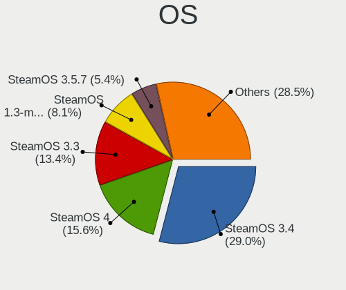
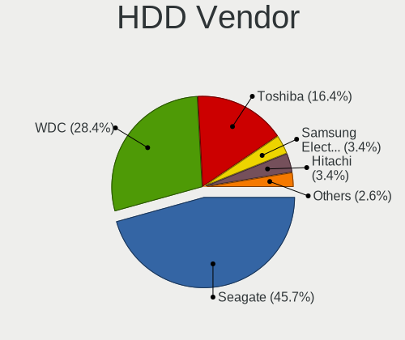
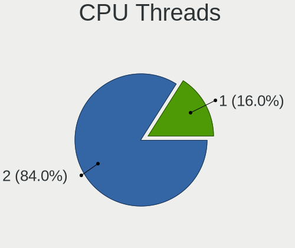

SteamOS - Tested Hardware & Statistics (Desktops)
-------------------------------------------------

A project to collect tested hardware configurations for SteamOS.

Anyone can contribute to this report by the [hw-probe](https://github.com/linuxhw/hw-probe) tool:

    sudo -E hw-probe -all -upload

Please contribute! Especially if your hardware is rare.

Contents
--------

* [ Test Cases ](#test-cases)

* [ System ](#system)
  - [ OS                       ](#os)
  - [ OS Family                ](#os-family)
  - [ Kernel                   ](#kernel)
  - [ Kernel Family            ](#kernel-family)
  - [ Kernel Major Ver.        ](#kernel-major-ver)
  - [ Arch                     ](#arch)
  - [ DE                       ](#de)
  - [ Display Server           ](#display-server)
  - [ Display Manager          ](#display-manager)
  - [ OS Lang                  ](#os-lang)
  - [ Boot Mode                ](#boot-mode)
  - [ Filesystem               ](#filesystem)
  - [ Part. scheme             ](#part-scheme)
  - [ Dual Boot with Linux/BSD ](#dual-boot-with-linuxbsd)
  - [ Dual Boot (Win)          ](#dual-boot-win)

* [ Board ](#board)
  - [ Vendor                   ](#vendor)
  - [ Model                    ](#model)
  - [ Model Family             ](#model-family)
  - [ MFG Year                 ](#mfg-year)
  - [ Form Factor              ](#form-factor)
  - [ Secure Boot              ](#secure-boot)
  - [ Coreboot                 ](#coreboot)
  - [ RAM Size                 ](#ram-size)
  - [ RAM Used                 ](#ram-used)
  - [ Total Drives             ](#total-drives)
  - [ Has CD-ROM               ](#has-cd-rom)
  - [ Has Ethernet             ](#has-ethernet)
  - [ Has WiFi                 ](#has-wifi)
  - [ Has Bluetooth            ](#has-bluetooth)

* [ Location ](#location)
  - [ Country                  ](#country)
  - [ City                     ](#city)

* [ Drives ](#drives)
  - [ Drive Vendor             ](#drive-vendor)
  - [ Drive Model              ](#drive-model)
  - [ HDD Vendor               ](#hdd-vendor)
  - [ SSD Vendor               ](#ssd-vendor)
  - [ Drive Kind               ](#drive-kind)
  - [ Drive Connector          ](#drive-connector)
  - [ Drive Size               ](#drive-size)
  - [ Space Total              ](#space-total)
  - [ Space Used               ](#space-used)
  - [ Malfunc. Drives          ](#malfunc-drives)
  - [ Malfunc. Drive Vendor    ](#malfunc-drive-vendor)
  - [ Malfunc. HDD Vendor      ](#malfunc-hdd-vendor)
  - [ Malfunc. Drive Kind      ](#malfunc-drive-kind)
  - [ Failed Drives            ](#failed-drives)
  - [ Failed Drive Vendor      ](#failed-drive-vendor)
  - [ Drive Status             ](#drive-status)

* [ Storage controller ](#storage-controller)
  - [ Storage Vendor           ](#storage-vendor)
  - [ Storage Model            ](#storage-model)
  - [ Storage Kind             ](#storage-kind)

* [ Processor ](#processor)
  - [ CPU Vendor               ](#cpu-vendor)
  - [ CPU Model                ](#cpu-model)
  - [ CPU Model Family         ](#cpu-model-family)
  - [ CPU Cores                ](#cpu-cores)
  - [ CPU Sockets              ](#cpu-sockets)
  - [ CPU Threads              ](#cpu-threads)
  - [ CPU Op-Modes             ](#cpu-op-modes)
  - [ CPU Microcode            ](#cpu-microcode)
  - [ CPU Microarch            ](#cpu-microarch)

* [ Graphics ](#graphics)
  - [ GPU Vendor               ](#gpu-vendor)
  - [ GPU Model                ](#gpu-model)
  - [ GPU Combo                ](#gpu-combo)
  - [ GPU Driver               ](#gpu-driver)
  - [ GPU Memory               ](#gpu-memory)

* [ Monitor ](#monitor)
  - [ Monitor Vendor           ](#monitor-vendor)
  - [ Monitor Model            ](#monitor-model)
  - [ Monitor Resolution       ](#monitor-resolution)
  - [ Monitor Diagonal         ](#monitor-diagonal)
  - [ Monitor Width            ](#monitor-width)
  - [ Aspect Ratio             ](#aspect-ratio)
  - [ Monitor Area             ](#monitor-area)
  - [ Pixel Density            ](#pixel-density)
  - [ Multiple Monitors        ](#multiple-monitors)

* [ Network ](#network)
  - [ Net Controller Vendor    ](#net-controller-vendor)
  - [ Net Controller Model     ](#net-controller-model)
  - [ Wireless Vendor          ](#wireless-vendor)
  - [ Wireless Model           ](#wireless-model)
  - [ Ethernet Vendor          ](#ethernet-vendor)
  - [ Ethernet Model           ](#ethernet-model)
  - [ Net Controller Kind      ](#net-controller-kind)
  - [ Used Controller          ](#used-controller)
  - [ NICs                     ](#nics)
  - [ IPv6                     ](#ipv6)

* [ Bluetooth ](#bluetooth)
  - [ Bluetooth Vendor         ](#bluetooth-vendor)
  - [ Bluetooth Model          ](#bluetooth-model)

* [ Sound ](#sound)
  - [ Sound Vendor             ](#sound-vendor)
  - [ Sound Model              ](#sound-model)

* [ Memory ](#memory)
  - [ Memory Vendor            ](#memory-vendor)
  - [ Memory Model             ](#memory-model)
  - [ Memory Kind              ](#memory-kind)
  - [ Memory Form Factor       ](#memory-form-factor)
  - [ Memory Size              ](#memory-size)
  - [ Memory Speed             ](#memory-speed)

* [ Printers & scanners ](#printers--scanners)
  - [ Printer Vendor           ](#printer-vendor)
  - [ Printer Model            ](#printer-model)
  - [ Scanner Vendor           ](#scanner-vendor)
  - [ Scanner Model            ](#scanner-model)

* [ Camera ](#camera)
  - [ Camera Vendor            ](#camera-vendor)
  - [ Camera Model             ](#camera-model)

* [ Security ](#security)
  - [ Fingerprint Vendor       ](#fingerprint-vendor)
  - [ Fingerprint Model        ](#fingerprint-model)
  - [ Chipcard Vendor          ](#chipcard-vendor)
  - [ Chipcard Model           ](#chipcard-model)

* [ Unsupported ](#unsupported)
  - [ Unsupported Devices      ](#unsupported-devices)
  - [ Unsupported Device Types ](#unsupported-device-types)

Test Cases
----------

Total: 5

| Vendor   | Model            | Probe                                                      | Date         |
|----------|------------------|------------------------------------------------------------|--------------|
| ASRock   | B550 PG Velocita | [0d7f71a24d](https://linux-hardware.org/?probe=0d7f71a24d) | May 30, 2022 |
| ASRock   | B365M Pro4-F     | [afc161c6fb](https://linux-hardware.org/?probe=afc161c6fb) | May 30, 2022 |
| Gigabyte | B560M AORUS PRO  | [31f246f96e](https://linux-hardware.org/?probe=31f246f96e) | May 27, 2022 |
| Gigabyte | B560M AORUS PRO  | [1d381d6ec9](https://linux-hardware.org/?probe=1d381d6ec9) | May 27, 2022 |
| Gigabyte | Z170XP-SLI-CF    | [d4bef1e450](https://linux-hardware.org/?probe=d4bef1e450) | May 26, 2022 |

System
------

OS
--

Installed operating systems

| Name                         | Desktops | Percent |
|------------------------------|----------|---------|
| SteamOS Snapshot             | 3        | 75%     |
| SteamOS 3.2 (steamdeck-main) | 1        | 25%     |

OS Family
---------

OS without a version

| Name    | Desktops | Percent |
|---------|----------|---------|
| SteamOS | 4        | 100%    |

Kernel
------

Version of the Linux kernel

| Version                                            | Desktops | Percent |
|----------------------------------------------------|----------|---------|
| 5.13.0-valve10.1-2-neptune-dri-02144-g7fffaf925dfb | 4        | 100%    |

Kernel Family
-------------

Linux kernel without a distro release

| Version | Desktops | Percent |
|---------|----------|---------|
| 5.13.0  | 4        | 100%    |

Kernel Major Ver.
-----------------

Linux kernel major version

| Version | Desktops | Percent |
|---------|----------|---------|
| 5.13    | 4        | 100%    |

Arch
----

OS architecture (x86_64, i586, etc.)

| Name   | Desktops | Percent |
|--------|----------|---------|
| x86_64 | 4        | 100%    |

DE
--

Desktop Environment

| Name | Desktops | Percent |
|------|----------|---------|
| KDE5 | 4        | 100%    |

Display Server
--------------

X11 or Wayland

| Name | Desktops | Percent |
|------|----------|---------|
| X11  | 4        | 100%    |

Display Manager
---------------

SDDM, LightDM, etc.

| Name    | Desktops | Percent |
|---------|----------|---------|
| Unknown | 4        | 100%    |

OS Lang
-------

Language

| Lang  | Desktops | Percent |
|-------|----------|---------|
| en_US | 3        | 75%     |
| en_IE | 1        | 25%     |

Boot Mode
---------

EFI or BIOS

| Mode | Desktops | Percent |
|------|----------|---------|
| BIOS | 4        | 100%    |

Filesystem
----------

Type of filesystem

| Type  | Desktops | Percent |
|-------|----------|---------|
| Btrfs | 4        | 100%    |

Part. scheme
------------

Scheme of partitioning

| Type    | Desktops | Percent |
|---------|----------|---------|
| Unknown | 4        | 100%    |

Dual Boot with Linux/BSD
------------------------

Hosting more than one Linux/BSD

| Dual boot | Desktops | Percent |
|-----------|----------|---------|
| No        | 4        | 100%    |

Dual Boot (Win)
---------------

Hosting Linux and Windows

| Dual boot | Desktops | Percent |
|-----------|----------|---------|
| No        | 4        | 100%    |

Board
-----

Vendor
------

Motherboard manufacturer

| Name                | Desktops | Percent |
|---------------------|----------|---------|
| Gigabyte Technology | 2        | 50%     |
| ASRock              | 2        | 50%     |

Model
-----

Motherboard model

| Name                     | Desktops | Percent |
|--------------------------|----------|---------|
| Gigabyte MBB-670016      | 1        | 25%     |
| Gigabyte B560M AORUS PRO | 1        | 25%     |
| ASRock B550 PG Velocita  | 1        | 25%     |
| ASRock B365M Pro4-F      | 1        | 25%     |

Model Family
------------

Motherboard model prefix

| Name                | Desktops | Percent |
|---------------------|----------|---------|
| Gigabyte MBB-670016 | 1        | 25%     |
| Gigabyte B560M      | 1        | 25%     |
| ASRock B550         | 1        | 25%     |
| ASRock B365M        | 1        | 25%     |

MFG Year
--------

Motherboard manufacture year

| Year | Desktops | Percent |
|------|----------|---------|
| 2022 | 1        | 25%     |
| 2020 | 1        | 25%     |
| 2019 | 1        | 25%     |
| 2018 | 1        | 25%     |

Form Factor
-----------

Physical design of the computer

| Name    | Desktops | Percent |
|---------|----------|---------|
| Desktop | 4        | 100%    |

Secure Boot
-----------

Enabled or disabled

| State    | Desktops | Percent |
|----------|----------|---------|
| Disabled | 4        | 100%    |

Coreboot
--------

Have coreboot on board

| Used | Desktops | Percent |
|------|----------|---------|
| No   | 4        | 100%    |

RAM Size
--------

Total RAM memory

| Size in GB | Desktops | Percent |
|------------|----------|---------|
| 16.01-24.0 | 2        | 50%     |
| 32.01-64.0 | 1        | 25%     |
| 24.01-32.0 | 1        | 25%     |

RAM Used
--------

Used RAM memory

| Used GB  | Desktops | Percent |
|----------|----------|---------|
| 4.01-8.0 | 2        | 50%     |
| 2.01-3.0 | 2        | 50%     |

Total Drives
------------

Number of drives on board

| Drives | Desktops | Percent |
|--------|----------|---------|
| 7      | 1        | 25%     |
| 4      | 1        | 25%     |
| 3      | 1        | 25%     |
| 2      | 1        | 25%     |

Has CD-ROM
----------

Has CD-ROM on board

| Presented | Desktops | Percent |
|-----------|----------|---------|
| No        | 4        | 100%    |

Has Ethernet
------------

Has Ethernet on board

| Presented | Desktops | Percent |
|-----------|----------|---------|
| Yes       | 4        | 100%    |

Has WiFi
--------

Has WiFi module

| Presented | Desktops | Percent |
|-----------|----------|---------|
| Yes       | 3        | 75%     |
| No        | 1        | 25%     |

Has Bluetooth
-------------

Has Bluetooth module

| Presented | Desktops | Percent |
|-----------|----------|---------|
| Yes       | 2        | 50%     |
| No        | 2        | 50%     |

Location
--------

Country
-------

Geographic location (country)

| Country   | Desktops | Percent |
|-----------|----------|---------|
| USA       | 1        | 25%     |
| UK        | 1        | 25%     |
| Ireland   | 1        | 25%     |
| Australia | 1        | 25%     |

City
----

Geographic location (city)

| City    | Desktops | Percent |
|---------|----------|---------|
| Tuam    | 1        | 25%     |
| Perth   | 1        | 25%     |
| Hornsea | 1        | 25%     |
| Dallas  | 1        | 25%     |

Drives
------

Drive Vendor
------------

Hard drive vendors

| Vendor                  | Desktops | Drives | Percent |
|-------------------------|----------|--------|---------|
| Samsung Electronics     | 3        | 7      | 30%     |
| WDC                     | 1        | 2      | 10%     |
| Union Memory (Shenzhen) | 1        | 1      | 10%     |
| Toshiba                 | 1        | 2      | 10%     |
| Seagate                 | 1        | 1      | 10%     |
| PNY                     | 1        | 1      | 10%     |
| Phison                  | 1        | 1      | 10%     |
| A-DATA Technology       | 1        | 1      | 10%     |

Drive Model
-----------

Hard drive models

| Model                                        | Desktops | Percent |
|----------------------------------------------|----------|---------|
| WDC WD5000BPKT-60PK4T0 500GB                 | 1        | 6.67%   |
| WDC WD10EURX-83UY4Y0 1TB                     | 1        | 6.67%   |
| Union Memory (Shenzhen) NVMe SSD Drive 128GB | 1        | 6.67%   |
| Toshiba MQ01ABD100 1TB                       | 1        | 6.67%   |
| Toshiba MK3275GSX 320GB                      | 1        | 6.67%   |
| Seagate ST3160318AS 160GB                    | 1        | 6.67%   |
| Samsung SSD 860 EVO 250GB                    | 1        | 6.67%   |
| Samsung SSD 850 EVO mSATA 500GB              | 1        | 6.67%   |
| Samsung SSD 850 EVO 250GB                    | 1        | 6.67%   |
| Samsung SSD 840 EVO 250GB                    | 1        | 6.67%   |
| Samsung NVMe SSD Drive 512GB                 | 1        | 6.67%   |
| Samsung NVMe SSD Drive 1TB                   | 1        | 6.67%   |
| PNY CS1311 240GB SSD                         | 1        | 6.67%   |
| Phison NVMe SSD Drive 250GB                  | 1        | 6.67%   |
| A-DATA SU650 240GB SSD                       | 1        | 6.67%   |

HDD Vendor
----------

Hard disk drive vendors

| Vendor  | Desktops | Drives | Percent |
|---------|----------|--------|---------|
| WDC     | 1        | 2      | 33.33%  |
| Toshiba | 1        | 2      | 33.33%  |
| Seagate | 1        | 1      | 33.33%  |

SSD Vendor
----------

Solid state drive vendors

| Vendor              | Desktops | Drives | Percent |
|---------------------|----------|--------|---------|
| Samsung Electronics | 3        | 4      | 60%     |
| PNY                 | 1        | 1      | 20%     |
| A-DATA Technology   | 1        | 1      | 20%     |

Drive Kind
----------

HDD or SSD

| Kind | Desktops | Drives | Percent |
|------|----------|--------|---------|
| NVMe | 4        | 5      | 44.44%  |
| SSD  | 4        | 6      | 44.44%  |
| HDD  | 1        | 5      | 11.11%  |

Drive Connector
---------------

SATA, SAS, NVMe, etc.

| Type | Desktops | Drives | Percent |
|------|----------|--------|---------|
| NVMe | 4        | 5      | 50%     |
| SATA | 4        | 11     | 50%     |

Drive Size
----------

Size of hard drive

| Size in TB | Desktops | Drives | Percent |
|------------|----------|--------|---------|
| 0.01-0.5   | 4        | 9      | 80%     |
| 0.51-1.0   | 1        | 2      | 20%     |

Space Total
-----------

Amount of disk space available on the file system

| Size in GB | Desktops | Percent |
|------------|----------|---------|
| 101-250    | 3        | 75%     |
| 501-1000   | 1        | 25%     |

Space Used
----------

Amount of used disk space

| Used GB | Desktops | Percent |
|---------|----------|---------|
| 1-20    | 2        | 50%     |
| 51-100  | 2        | 50%     |

Malfunc. Drives
---------------

Drive models with a malfunction

Zero info for selected period =(

Malfunc. Drive Vendor
---------------------

Vendors of faulty drives

Zero info for selected period =(

Malfunc. HDD Vendor
-------------------

Vendors of faulty HDD drives

Zero info for selected period =(

Malfunc. Drive Kind
-------------------

Kinds of faulty drives

Zero info for selected period =(

Failed Drives
-------------

Failed drive models

Zero info for selected period =(

Failed Drive Vendor
-------------------

Failed drive vendors

Zero info for selected period =(

Drive Status
------------

Number of failed and malfunc. drives

| Status   | Desktops | Drives | Percent |
|----------|----------|--------|---------|
| Detected | 4        | 16     | 100%    |

Storage controller
------------------

Storage Vendor
--------------

Storage controller vendors

| Vendor                  | Desktops | Percent |
|-------------------------|----------|---------|
| Intel                   | 3        | 37.5%   |
| Samsung Electronics     | 2        | 25%     |
| Union Memory (Shenzhen) | 1        | 12.5%   |
| Phison Electronics      | 1        | 12.5%   |
| AMD                     | 1        | 12.5%   |

Storage Model
-------------

Storage controller models

| Model                                                                         | Desktops | Percent |
|-------------------------------------------------------------------------------|----------|---------|
| Union Memory (Shenzhen) Non-Volatile memory controller                        | 1        | 11.11%  |
| Samsung NVMe SSD Controller SM981/PM981/PM983                                 | 1        | 11.11%  |
| Samsung NVMe SSD Controller SM951/PM951                                       | 1        | 11.11%  |
| Samsung NVMe SSD Controller PM9A1/PM9A3/980PRO                                | 1        | 11.11%  |
| Phison Electronics Non-Volatile memory controller                             | 1        | 11.11%  |
| Intel Q170/Q150/B150/H170/H110/Z170/CM236 Chipset SATA Controller [AHCI Mode] | 1        | 11.11%  |
| Intel 500 Series Chipset Family SATA AHCI Controller                          | 1        | 11.11%  |
| Intel 200 Series PCH SATA controller [AHCI mode]                              | 1        | 11.11%  |
| AMD 500 Series Chipset SATA Controller                                        | 1        | 11.11%  |

Storage Kind
------------

Kind of storage controller (IDE, SATA, NVMe, SAS, ...)

| Kind | Desktops | Percent |
|------|----------|---------|
| NVMe | 4        | 50%     |
| SATA | 4        | 50%     |

Processor
---------

CPU Vendor
----------

Processor vendors

| Vendor | Desktops | Percent |
|--------|----------|---------|
| Intel  | 3        | 75%     |
| AMD    | 1        | 25%     |

CPU Model
---------

Processor models

| Model                                   | Desktops | Percent |
|-----------------------------------------|----------|---------|
| Intel Core i7-6700K CPU @ 4.00GHz       | 1        | 25%     |
| Intel Core i5-8500T CPU @ 2.10GHz       | 1        | 25%     |
| Intel 11th Gen Core i5-11400F @ 2.60GHz | 1        | 25%     |
| AMD Ryzen 9 3900X 12-Core Processor     | 1        | 25%     |

CPU Model Family
----------------

Processor model prefix

| Model         | Desktops | Percent |
|---------------|----------|---------|
| Other         | 1        | 25%     |
| Intel Core i7 | 1        | 25%     |
| Intel Core i5 | 1        | 25%     |
| AMD Ryzen 9   | 1        | 25%     |

CPU Cores
---------

Number of processor cores

| Number | Desktops | Percent |
|--------|----------|---------|
| 6      | 2        | 50%     |
| 12     | 1        | 25%     |
| 4      | 1        | 25%     |

CPU Sockets
-----------

Number of sockets

| Number | Desktops | Percent |
|--------|----------|---------|
| 1      | 4        | 100%    |

CPU Threads
-----------

Threads per core (Hyper-Threading)

| Number | Desktops | Percent |
|--------|----------|---------|
| 2      | 3        | 75%     |
| 1      | 1        | 25%     |

CPU Op-Modes
------------

CPU Operation Modes (32-bit, 64-bit)

| Op mode        | Desktops | Percent |
|----------------|----------|---------|
| 32-bit, 64-bit | 4        | 100%    |

CPU Microcode
-------------

Microcode number

| Number  | Desktops | Percent |
|---------|----------|---------|
| Unknown | 4        | 100%    |

CPU Microarch
-------------

Microarchitecture

| Name     | Desktops | Percent |
|----------|----------|---------|
| Zen 2    | 1        | 25%     |
| Skylake  | 1        | 25%     |
| KabyLake | 1        | 25%     |
| Unknown  | 1        | 25%     |

Graphics
--------

GPU Vendor
----------

Vendors of graphics cards

| Vendor | Desktops | Percent |
|--------|----------|---------|
| AMD    | 4        | 66.67%  |
| Intel  | 2        | 33.33%  |

GPU Model
---------

Graphics card models

| Model                                                      | Desktops | Percent |
|------------------------------------------------------------|----------|---------|
| Intel HD Graphics 530                                      | 1        | 16.67%  |
| Intel CoffeeLake-S GT2 [UHD Graphics 630]                  | 1        | 16.67%  |
| AMD Navi 22 [Radeon RX 6700/6700 XT/6750 XT / 6800M]       | 1        | 16.67%  |
| AMD Navi 21 [Radeon RX 6800/6800 XT / 6900 XT]             | 1        | 16.67%  |
| AMD Lexa PRO [Radeon 540/540X/550/550X / RX 540X/550/550X] | 1        | 16.67%  |
| AMD Ellesmere [Radeon RX 470/480/570/570X/580/580X/590]    | 1        | 16.67%  |

GPU Combo
---------

Combinations of graphics cards

| Name    | Desktops | Percent |
|---------|----------|---------|
| 1 x AMD | 4        | 100%    |

GPU Driver
----------

Free vs proprietary

| Driver | Desktops | Percent |
|--------|----------|---------|
| Free   | 4        | 100%    |

GPU Memory
----------

Total video memory

| Size in GB | Desktops | Percent |
|------------|----------|---------|
| Unknown    | 4        | 100%    |

Monitor
-------

Monitor Vendor
--------------

Monitor vendors

| Vendor              | Desktops | Percent |
|---------------------|----------|---------|
| ___                 | 1        | 20%     |
| Unknown             | 1        | 20%     |
| Samsung Electronics | 1        | 20%     |
| Goldstar            | 1        | 20%     |
| Acer                | 1        | 20%     |

Monitor Model
-------------

Monitor models

| Model                                                               | Desktops | Percent |
|---------------------------------------------------------------------|----------|---------|
| ___ LCDTV16 ___9000 1360x768                                        | 1        | 20%     |
| Unknown LCDTV16 9000 1360x768 1600x900mm 72.3-inch                  | 1        | 20%     |
| Samsung Electronics LC49G95T SAM7053 3840x1080 1193x336mm 48.8-inch | 1        | 20%     |
| Goldstar TV SSCR GSMC0C8 3840x2160                                  | 1        | 20%     |
| Acer VG240Y S ACR0750 1920x1080 527x296mm 23.8-inch                 | 1        | 20%     |

Monitor Resolution
------------------

Monitor screen resolution

| Resolution       | Desktops | Percent |
|------------------|----------|---------|
| 3840x2160 (4K)   | 1        | 20%     |
| 3840x1080        | 1        | 20%     |
| 1920x1080 (FHD)  | 1        | 20%     |
| 1440x900 (WXGA+) | 1        | 20%     |
| 1360x768         | 1        | 20%     |

Monitor Diagonal
----------------

Diagonal size in inches

| Inches  | Desktops | Percent |
|---------|----------|---------|
| 72      | 2        | 40%     |
| 48      | 1        | 20%     |
| 24      | 1        | 20%     |
| Unknown | 1        | 20%     |

Monitor Width
-------------

Physical width

| Width in mm | Desktops | Percent |
|-------------|----------|---------|
| 1501-2000   | 2        | 40%     |
| 501-600     | 1        | 20%     |
| 1001-1500   | 1        | 20%     |
| Unknown     | 1        | 20%     |

Aspect Ratio
------------

Proportional relationship between the width and the height

| Ratio | Desktops | Percent |
|-------|----------|---------|
| 16/9  | 3        | 75%     |
| 32/9  | 1        | 25%     |

Monitor Area
------------

Area in inch²

| Area in inch² | Desktops | Percent |
|----------------|----------|---------|
| More than 1000 | 2        | 40%     |
| 201-250        | 1        | 20%     |
| 501-1000       | 1        | 20%     |
| Unknown        | 1        | 20%     |

Pixel Density
-------------

Pixels per inch

| Density | Desktops | Percent |
|---------|----------|---------|
| 51-100  | 3        | 60%     |
| 1-50    | 1        | 20%     |
| Unknown | 1        | 20%     |

Multiple Monitors
-----------------

Total monitors connected

| Total | Desktops | Percent |
|-------|----------|---------|
| 1     | 3        | 75%     |
| 2     | 1        | 25%     |

Network
-------

Net Controller Vendor
---------------------

Controller vendors

| Vendor                | Desktops | Percent |
|-----------------------|----------|---------|
| Intel                 | 4        | 57.14%  |
| Realtek Semiconductor | 1        | 14.29%  |
| Microsoft             | 1        | 14.29%  |
| Google                | 1        | 14.29%  |

Net Controller Model
--------------------

Controller models

| Model                                | Desktops | Percent |
|--------------------------------------|----------|---------|
| Intel Wi-Fi 6 AX200                  | 2        | 25%     |
| Intel Ethernet Connection (2) I219-V | 2        | 25%     |
| Realtek RTL8125 2.5GbE Controller    | 1        | 12.5%   |
| Microsoft Xbox 360 Wireless Adapter  | 1        | 12.5%   |
| Intel Ethernet Controller I225-V     | 1        | 12.5%   |
| Google Nexus/Pixel Device (tether)   | 1        | 12.5%   |

Wireless Vendor
---------------

Wireless vendors

| Vendor    | Desktops | Percent |
|-----------|----------|---------|
| Intel     | 2        | 66.67%  |
| Microsoft | 1        | 33.33%  |

Wireless Model
--------------

Wireless models

| Model                               | Desktops | Percent |
|-------------------------------------|----------|---------|
| Intel Wi-Fi 6 AX200                 | 2        | 66.67%  |
| Microsoft Xbox 360 Wireless Adapter | 1        | 33.33%  |

Ethernet Vendor
---------------

Ethernet vendors

| Vendor                | Desktops | Percent |
|-----------------------|----------|---------|
| Intel                 | 3        | 60%     |
| Realtek Semiconductor | 1        | 20%     |
| Google                | 1        | 20%     |

Ethernet Model
--------------

Ethernet models

| Model                                | Desktops | Percent |
|--------------------------------------|----------|---------|
| Intel Ethernet Connection (2) I219-V | 2        | 40%     |
| Realtek RTL8125 2.5GbE Controller    | 1        | 20%     |
| Intel Ethernet Controller I225-V     | 1        | 20%     |
| Google Nexus/Pixel Device (tether)   | 1        | 20%     |

Net Controller Kind
-------------------

Ethernet, WiFi or modem

| Kind     | Desktops | Percent |
|----------|----------|---------|
| Ethernet | 4        | 57.14%  |
| WiFi     | 3        | 42.86%  |

Used Controller
---------------

Currently used network controller

| Kind     | Desktops | Percent |
|----------|----------|---------|
| Ethernet | 3        | 75%     |
| WiFi     | 1        | 25%     |

NICs
----

Total network controllers on board

| Total | Desktops | Percent |
|-------|----------|---------|
| 2     | 2        | 50%     |
| 1     | 2        | 50%     |

IPv6
----

IPv6 vs IPv4

| Used | Desktops | Percent |
|------|----------|---------|
| No   | 4        | 100%    |

Bluetooth
---------

Bluetooth Vendor
----------------

Controller vendors

| Vendor | Desktops | Percent |
|--------|----------|---------|
| Intel  | 2        | 100%    |

Bluetooth Model
---------------

Controller models

| Model                 | Desktops | Percent |
|-----------------------|----------|---------|
| Intel AX200 Bluetooth | 2        | 100%    |

Sound
-----

Sound Vendor
------------

Sound card vendors

| Vendor              | Desktops | Percent |
|---------------------|----------|---------|
| AMD                 | 4        | 44.44%  |
| Intel               | 3        | 33.33%  |
| Kingston Technology | 1        | 11.11%  |
| Apple               | 1        | 11.11%  |

Sound Model
-----------

Sound card models

| Model                                                           | Desktops | Percent |
|-----------------------------------------------------------------|----------|---------|
| AMD Navi 21/23 HDMI/DP Audio Controller                         | 2        | 20%     |
| Kingston Technology HyperX Cloud Alpha S                        | 1        | 10%     |
| Intel Tiger Lake-H HD Audio Controller                          | 1        | 10%     |
| Intel 200 Series PCH HD Audio                                   | 1        | 10%     |
| Intel 100 Series/C230 Series Chipset Family HD Audio Controller | 1        | 10%     |
| Apple USB-C to 3.5mm Headphone Jack Adapter                     | 1        | 10%     |
| AMD Starship/Matisse HD Audio Controller                        | 1        | 10%     |
| AMD Ellesmere HDMI Audio [Radeon RX 470/480 / 570/580/590]      | 1        | 10%     |
| AMD Baffin HDMI/DP Audio [Radeon RX 550 640SP / RX 560/560X]    | 1        | 10%     |

Memory
------

Memory Vendor
-------------

Memory module vendors

Zero info for selected period =(

Memory Model
------------

Memory module models

Zero info for selected period =(

Memory Kind
-----------

Memory module kinds

Zero info for selected period =(

Memory Form Factor
------------------

Physical design of the memory module

Zero info for selected period =(

Memory Size
-----------

Memory module size

Zero info for selected period =(

Memory Speed
------------

Memory module speed

Zero info for selected period =(

Printers & scanners
-------------------

Printer Vendor
--------------

Printer device vendors

Zero info for selected period =(

Printer Model
-------------

Printer device models

Zero info for selected period =(

Scanner Vendor
--------------

Scanner device vendors

Zero info for selected period =(

Scanner Model
-------------

Scanner device models

Zero info for selected period =(

Camera
------

Camera Vendor
-------------

Camera device vendors

Zero info for selected period =(

Camera Model
------------

Camera device models

Zero info for selected period =(

Security
--------

Fingerprint Vendor
------------------

Fingerprint sensor vendors

Zero info for selected period =(

Fingerprint Model
-----------------

Fingerprint sensor models

Zero info for selected period =(

Chipcard Vendor
---------------

Chipcard module vendors

Zero info for selected period =(

Chipcard Model
--------------

Chipcard module models

Zero info for selected period =(

Unsupported
-----------

Unsupported Devices
-------------------

Total unsupported devices on board

| Total | Desktops | Percent |
|-------|----------|---------|
| 0     | 3        | 75%     |
| 1     | 1        | 25%     |

Unsupported Device Types
------------------------

Types of unsupported devices

| Type         | Desktops | Percent |
|--------------|----------|---------|
| Net/ethernet | 1        | 100%    |

