SteamOS - Tested Hardware & Statistics (Notebooks)
--------------------------------------------------

A project to collect tested hardware configurations for SteamOS.

Anyone can contribute to this report by the [hw-probe](https://github.com/linuxhw/hw-probe) tool:

    sudo -E hw-probe -all -upload

Please contribute! Especially if your hardware is rare.

Contents
--------

* [ Test Cases ](#test-cases)

* [ System ](#system)
  - [ OS                       ](#os)
  - [ OS Family                ](#os-family)
  - [ Kernel                   ](#kernel)
  - [ Kernel Family            ](#kernel-family)
  - [ Kernel Major Ver.        ](#kernel-major-ver)
  - [ Arch                     ](#arch)
  - [ DE                       ](#de)
  - [ Display Server           ](#display-server)
  - [ Display Manager          ](#display-manager)
  - [ OS Lang                  ](#os-lang)
  - [ Boot Mode                ](#boot-mode)
  - [ Filesystem               ](#filesystem)
  - [ Part. scheme             ](#part-scheme)
  - [ Dual Boot with Linux/BSD ](#dual-boot-with-linuxbsd)
  - [ Dual Boot (Win)          ](#dual-boot-win)

* [ Board ](#board)
  - [ Vendor                   ](#vendor)
  - [ Model                    ](#model)
  - [ Model Family             ](#model-family)
  - [ MFG Year                 ](#mfg-year)
  - [ Form Factor              ](#form-factor)
  - [ Secure Boot              ](#secure-boot)
  - [ Coreboot                 ](#coreboot)
  - [ RAM Size                 ](#ram-size)
  - [ RAM Used                 ](#ram-used)
  - [ Total Drives             ](#total-drives)
  - [ Has CD-ROM               ](#has-cd-rom)
  - [ Has Ethernet             ](#has-ethernet)
  - [ Has WiFi                 ](#has-wifi)
  - [ Has Bluetooth            ](#has-bluetooth)

* [ Location ](#location)
  - [ Country                  ](#country)
  - [ City                     ](#city)

* [ Drives ](#drives)
  - [ Drive Vendor             ](#drive-vendor)
  - [ Drive Model              ](#drive-model)
  - [ HDD Vendor               ](#hdd-vendor)
  - [ SSD Vendor               ](#ssd-vendor)
  - [ Drive Kind               ](#drive-kind)
  - [ Drive Connector          ](#drive-connector)
  - [ Drive Size               ](#drive-size)
  - [ Space Total              ](#space-total)
  - [ Space Used               ](#space-used)
  - [ Malfunc. Drives          ](#malfunc-drives)
  - [ Malfunc. Drive Vendor    ](#malfunc-drive-vendor)
  - [ Malfunc. HDD Vendor      ](#malfunc-hdd-vendor)
  - [ Malfunc. Drive Kind      ](#malfunc-drive-kind)
  - [ Failed Drives            ](#failed-drives)
  - [ Failed Drive Vendor      ](#failed-drive-vendor)
  - [ Drive Status             ](#drive-status)

* [ Storage controller ](#storage-controller)
  - [ Storage Vendor           ](#storage-vendor)
  - [ Storage Model            ](#storage-model)
  - [ Storage Kind             ](#storage-kind)

* [ Processor ](#processor)
  - [ CPU Vendor               ](#cpu-vendor)
  - [ CPU Model                ](#cpu-model)
  - [ CPU Model Family         ](#cpu-model-family)
  - [ CPU Cores                ](#cpu-cores)
  - [ CPU Sockets              ](#cpu-sockets)
  - [ CPU Threads              ](#cpu-threads)
  - [ CPU Op-Modes             ](#cpu-op-modes)
  - [ CPU Microcode            ](#cpu-microcode)
  - [ CPU Microarch            ](#cpu-microarch)

* [ Graphics ](#graphics)
  - [ GPU Vendor               ](#gpu-vendor)
  - [ GPU Model                ](#gpu-model)
  - [ GPU Combo                ](#gpu-combo)
  - [ GPU Driver               ](#gpu-driver)
  - [ GPU Memory               ](#gpu-memory)

* [ Monitor ](#monitor)
  - [ Monitor Vendor           ](#monitor-vendor)
  - [ Monitor Model            ](#monitor-model)
  - [ Monitor Resolution       ](#monitor-resolution)
  - [ Monitor Diagonal         ](#monitor-diagonal)
  - [ Monitor Width            ](#monitor-width)
  - [ Aspect Ratio             ](#aspect-ratio)
  - [ Monitor Area             ](#monitor-area)
  - [ Pixel Density            ](#pixel-density)
  - [ Multiple Monitors        ](#multiple-monitors)

* [ Network ](#network)
  - [ Net Controller Vendor    ](#net-controller-vendor)
  - [ Net Controller Model     ](#net-controller-model)
  - [ Wireless Vendor          ](#wireless-vendor)
  - [ Wireless Model           ](#wireless-model)
  - [ Ethernet Vendor          ](#ethernet-vendor)
  - [ Ethernet Model           ](#ethernet-model)
  - [ Net Controller Kind      ](#net-controller-kind)
  - [ Used Controller          ](#used-controller)
  - [ NICs                     ](#nics)
  - [ IPv6                     ](#ipv6)

* [ Bluetooth ](#bluetooth)
  - [ Bluetooth Vendor         ](#bluetooth-vendor)
  - [ Bluetooth Model          ](#bluetooth-model)

* [ Sound ](#sound)
  - [ Sound Vendor             ](#sound-vendor)
  - [ Sound Model              ](#sound-model)

* [ Memory ](#memory)
  - [ Memory Vendor            ](#memory-vendor)
  - [ Memory Model             ](#memory-model)
  - [ Memory Kind              ](#memory-kind)
  - [ Memory Form Factor       ](#memory-form-factor)
  - [ Memory Size              ](#memory-size)
  - [ Memory Speed             ](#memory-speed)

* [ Printers & scanners ](#printers--scanners)
  - [ Printer Vendor           ](#printer-vendor)
  - [ Printer Model            ](#printer-model)
  - [ Scanner Vendor           ](#scanner-vendor)
  - [ Scanner Model            ](#scanner-model)

* [ Camera ](#camera)
  - [ Camera Vendor            ](#camera-vendor)
  - [ Camera Model             ](#camera-model)

* [ Security ](#security)
  - [ Fingerprint Vendor       ](#fingerprint-vendor)
  - [ Fingerprint Model        ](#fingerprint-model)
  - [ Chipcard Vendor          ](#chipcard-vendor)
  - [ Chipcard Model           ](#chipcard-model)

* [ Unsupported ](#unsupported)
  - [ Unsupported Devices      ](#unsupported-devices)
  - [ Unsupported Device Types ](#unsupported-device-types)

Test Cases
----------

Total: 2997

| Vendor        | Model                       | Probe                                                      | Date         |
|---------------|-----------------------------|------------------------------------------------------------|--------------|
| Apple         | MacBookPro13,3              | [c88f9d2f52](https://linux-hardware.org/?probe=c88f9d2f52) | Jan 03, 2026 |
| Valve         | Jupiter                     | [d968817ad5](https://linux-hardware.org/?probe=d968817ad5) | Jan 02, 2026 |
| Valve         | Jupiter                     | [95e25faceb](https://linux-hardware.org/?probe=95e25faceb) | Dec 29, 2025 |
| Valve         | Jupiter                     | [2097cefe26](https://linux-hardware.org/?probe=2097cefe26) | Dec 28, 2025 |
| Valve         | Galileo                     | [ebc5c77c10](https://linux-hardware.org/?probe=ebc5c77c10) | Dec 26, 2025 |
| Valve         | Galileo                     | [3d2d400a6f](https://linux-hardware.org/?probe=3d2d400a6f) | Dec 26, 2025 |
| Valve         | Galileo                     | [b64a0c405c](https://linux-hardware.org/?probe=b64a0c405c) | Dec 26, 2025 |
| Valve         | Galileo                     | [d6a05d530f](https://linux-hardware.org/?probe=d6a05d530f) | Dec 25, 2025 |
| HP            | Victus by Gaming Laptop ... | [fd414f0f51](https://linux-hardware.org/?probe=fd414f0f51) | Dec 24, 2025 |
| HP            | Victus by Gaming Laptop ... | [53bdd29466](https://linux-hardware.org/?probe=53bdd29466) | Dec 24, 2025 |
| Valve         | Jupiter                     | [c120adeee1](https://linux-hardware.org/?probe=c120adeee1) | Dec 24, 2025 |
| ASUSTek       | Unknown                     | [a985b4d9c1](https://linux-hardware.org/?probe=a985b4d9c1) | Dec 23, 2025 |
| Valve         | Galileo                     | [bb95975eda](https://linux-hardware.org/?probe=bb95975eda) | Dec 22, 2025 |
| Valve         | Jupiter                     | [3251fc35ec](https://linux-hardware.org/?probe=3251fc35ec) | Dec 22, 2025 |
| Valve         | Galileo                     | [7feb61bc04](https://linux-hardware.org/?probe=7feb61bc04) | Dec 21, 2025 |
| Valve         | Galileo                     | [2a482e6dc8](https://linux-hardware.org/?probe=2a482e6dc8) | Dec 20, 2025 |
| Valve         | Galileo                     | [7b926eda21](https://linux-hardware.org/?probe=7b926eda21) | Dec 20, 2025 |
| Valve         | Jupiter                     | [4a7038a092](https://linux-hardware.org/?probe=4a7038a092) | Dec 18, 2025 |
| Valve         | Galileo                     | [d52fbb6f1e](https://linux-hardware.org/?probe=d52fbb6f1e) | Dec 17, 2025 |
| Valve         | Jupiter                     | [0979f7a589](https://linux-hardware.org/?probe=0979f7a589) | Dec 17, 2025 |
| Valve         | Galileo                     | [f6142bee56](https://linux-hardware.org/?probe=f6142bee56) | Dec 17, 2025 |
| Valve         | Galileo                     | [5185d74017](https://linux-hardware.org/?probe=5185d74017) | Dec 17, 2025 |
| Valve         | Galileo                     | [f15e0b5bab](https://linux-hardware.org/?probe=f15e0b5bab) | Dec 16, 2025 |
| Valve         | Jupiter                     | [b082df9f12](https://linux-hardware.org/?probe=b082df9f12) | Dec 15, 2025 |
| Valve         | Galileo                     | [325705058b](https://linux-hardware.org/?probe=325705058b) | Dec 15, 2025 |
| Valve         | Jupiter                     | [bc39afd444](https://linux-hardware.org/?probe=bc39afd444) | Dec 15, 2025 |
| Valve         | Galileo                     | [b11bbe1d77](https://linux-hardware.org/?probe=b11bbe1d77) | Dec 14, 2025 |
| Alienware     | m17 R5 AMD                  | [a5623003bb](https://linux-hardware.org/?probe=a5623003bb) | Dec 14, 2025 |
| HP            | ProBook 650 G2              | [6173f3c73f](https://linux-hardware.org/?probe=6173f3c73f) | Dec 13, 2025 |
| Valve         | Galileo                     | [0ae76b949a](https://linux-hardware.org/?probe=0ae76b949a) | Dec 12, 2025 |
| Valve         | Galileo                     | [346ca194fa](https://linux-hardware.org/?probe=346ca194fa) | Dec 11, 2025 |
| Valve         | Galileo                     | [666ec22bef](https://linux-hardware.org/?probe=666ec22bef) | Dec 11, 2025 |
| Valve         | Jupiter                     | [d8a4cbfdb5](https://linux-hardware.org/?probe=d8a4cbfdb5) | Dec 10, 2025 |
| Valve         | Galileo                     | [7b148ea180](https://linux-hardware.org/?probe=7b148ea180) | Dec 09, 2025 |
| ASUSTek       | ASUS TUF Gaming A15 FA50... | [26679dc045](https://linux-hardware.org/?probe=26679dc045) | Dec 08, 2025 |
| HP            | Pavilion Gaming Laptop      | [a1cdae3c27](https://linux-hardware.org/?probe=a1cdae3c27) | Dec 07, 2025 |
| Valve         | Galileo                     | [0cd9248d98](https://linux-hardware.org/?probe=0cd9248d98) | Dec 07, 2025 |
| Valve         | Galileo                     | [a1a5a87094](https://linux-hardware.org/?probe=a1a5a87094) | Dec 06, 2025 |
| Valve         | Galileo                     | [38f5110171](https://linux-hardware.org/?probe=38f5110171) | Dec 05, 2025 |
| Valve         | Jupiter                     | [221ee8a07a](https://linux-hardware.org/?probe=221ee8a07a) | Dec 05, 2025 |
| Valve         | Galileo                     | [7519dcd4df](https://linux-hardware.org/?probe=7519dcd4df) | Dec 04, 2025 |
| Valve         | Jupiter                     | [bbaddb7a9a](https://linux-hardware.org/?probe=bbaddb7a9a) | Dec 04, 2025 |
| Valve         | Jupiter                     | [c31a776381](https://linux-hardware.org/?probe=c31a776381) | Dec 04, 2025 |
| Valve         | Galileo                     | [d9b2361459](https://linux-hardware.org/?probe=d9b2361459) | Dec 03, 2025 |
| Valve         | Jupiter                     | [2bf0e02b60](https://linux-hardware.org/?probe=2bf0e02b60) | Dec 03, 2025 |
| Valve         | Jupiter                     | [5d08c0801e](https://linux-hardware.org/?probe=5d08c0801e) | Nov 29, 2025 |
| Valve         | Jupiter                     | [aa93ff05ef](https://linux-hardware.org/?probe=aa93ff05ef) | Nov 26, 2025 |
| HP            | ProBook 650 G2              | [aab4967751](https://linux-hardware.org/?probe=aab4967751) | Nov 26, 2025 |
| Valve         | Jupiter                     | [4153f8428f](https://linux-hardware.org/?probe=4153f8428f) | Nov 26, 2025 |
| HP            | EliteBook 840 G3            | [fafb55537f](https://linux-hardware.org/?probe=fafb55537f) | Nov 26, 2025 |
| HP            | EliteBook 840 G3            | [b185f18303](https://linux-hardware.org/?probe=b185f18303) | Nov 26, 2025 |
| HP            | Pavilion Notebook           | [31e6209be5](https://linux-hardware.org/?probe=31e6209be5) | Nov 24, 2025 |
| Valve         | Jupiter                     | [354d0a239b](https://linux-hardware.org/?probe=354d0a239b) | Nov 23, 2025 |
| Valve         | Jupiter                     | [75db3bfc74](https://linux-hardware.org/?probe=75db3bfc74) | Nov 23, 2025 |
| Valve         | Jupiter                     | [c1f3172427](https://linux-hardware.org/?probe=c1f3172427) | Nov 22, 2025 |
| Valve         | Jupiter                     | [ebb78c561c](https://linux-hardware.org/?probe=ebb78c561c) | Nov 21, 2025 |
| Valve         | Jupiter                     | [237cb8caab](https://linux-hardware.org/?probe=237cb8caab) | Nov 21, 2025 |
| Valve         | Galileo                     | [63c50fb68a](https://linux-hardware.org/?probe=63c50fb68a) | Nov 21, 2025 |
| Valve         | Jupiter                     | [61b544e3ce](https://linux-hardware.org/?probe=61b544e3ce) | Nov 20, 2025 |
| Valve         | Galileo                     | [1085cdc0eb](https://linux-hardware.org/?probe=1085cdc0eb) | Nov 19, 2025 |
| Acer          | Nitro AN515-44              | [a793bee3ff](https://linux-hardware.org/?probe=a793bee3ff) | Nov 18, 2025 |
| Acer          | Nitro AN515-44              | [7dc0d4b4c9](https://linux-hardware.org/?probe=7dc0d4b4c9) | Nov 18, 2025 |
| Valve         | Galileo                     | [875e62b474](https://linux-hardware.org/?probe=875e62b474) | Nov 18, 2025 |
| Valve         | Jupiter                     | [92eeb09795](https://linux-hardware.org/?probe=92eeb09795) | Nov 16, 2025 |
| Valve         | Galileo                     | [7cf661038e](https://linux-hardware.org/?probe=7cf661038e) | Nov 16, 2025 |
| Valve         | Jupiter                     | [22142eb006](https://linux-hardware.org/?probe=22142eb006) | Nov 15, 2025 |
| Valve         | Jupiter                     | [59b9e323ec](https://linux-hardware.org/?probe=59b9e323ec) | Nov 15, 2025 |
| Valve         | Jupiter                     | [b81914cfbb](https://linux-hardware.org/?probe=b81914cfbb) | Nov 15, 2025 |
| Valve         | Galileo                     | [3f64a16be8](https://linux-hardware.org/?probe=3f64a16be8) | Nov 15, 2025 |
| Valve         | Galileo                     | [aef52cd176](https://linux-hardware.org/?probe=aef52cd176) | Nov 15, 2025 |
| Valve         | Galileo                     | [fc0c4a761b](https://linux-hardware.org/?probe=fc0c4a761b) | Nov 15, 2025 |
| Valve         | Galileo                     | [67b5b7e108](https://linux-hardware.org/?probe=67b5b7e108) | Nov 15, 2025 |
| Valve         | Galileo                     | [262eb1a867](https://linux-hardware.org/?probe=262eb1a867) | Nov 15, 2025 |
| Valve         | Galileo                     | [2694f60016](https://linux-hardware.org/?probe=2694f60016) | Nov 14, 2025 |
| Valve         | Galileo                     | [8f1ae541ca](https://linux-hardware.org/?probe=8f1ae541ca) | Nov 14, 2025 |
| Valve         | Jupiter                     | [d0ffd7ed7a](https://linux-hardware.org/?probe=d0ffd7ed7a) | Nov 13, 2025 |
| Valve         | Galileo                     | [d9eb46f795](https://linux-hardware.org/?probe=d9eb46f795) | Nov 09, 2025 |
| Valve         | Jupiter                     | [e2c90c5823](https://linux-hardware.org/?probe=e2c90c5823) | Nov 08, 2025 |
| Valve         | Jupiter                     | [ef7e15a304](https://linux-hardware.org/?probe=ef7e15a304) | Nov 07, 2025 |
| Valve         | Galileo                     | [2beb891053](https://linux-hardware.org/?probe=2beb891053) | Nov 06, 2025 |
| Valve         | Galileo                     | [74e1177cc7](https://linux-hardware.org/?probe=74e1177cc7) | Nov 05, 2025 |
| Valve         | Jupiter                     | [0aaf638dd2](https://linux-hardware.org/?probe=0aaf638dd2) | Nov 04, 2025 |
| Valve         | Jupiter                     | [715face598](https://linux-hardware.org/?probe=715face598) | Nov 04, 2025 |
| Valve         | Jupiter                     | [e453a9046c](https://linux-hardware.org/?probe=e453a9046c) | Nov 02, 2025 |
| Valve         | Galileo                     | [6262c22f3f](https://linux-hardware.org/?probe=6262c22f3f) | Nov 02, 2025 |
| Valve         | Galileo                     | [50e0f313a5](https://linux-hardware.org/?probe=50e0f313a5) | Nov 02, 2025 |
| ASUSTek       | ROG STRIX B650E-E GAMING... | [80c85090ee](https://linux-hardware.org/?probe=80c85090ee) | Nov 01, 2025 |
| Valve         | Galileo                     | [45f4f43de8](https://linux-hardware.org/?probe=45f4f43de8) | Nov 01, 2025 |
| Valve         | Galileo                     | [7cc5d989e5](https://linux-hardware.org/?probe=7cc5d989e5) | Oct 31, 2025 |
| Valve         | Galileo                     | [d1458a7801](https://linux-hardware.org/?probe=d1458a7801) | Oct 31, 2025 |
| Valve         | Galileo                     | [700e111512](https://linux-hardware.org/?probe=700e111512) | Oct 31, 2025 |
| Unknown       | Unknown                     | [ccc4185511](https://linux-hardware.org/?probe=ccc4185511) | Oct 30, 2025 |
| Valve         | Jupiter                     | [b8730d6b19](https://linux-hardware.org/?probe=b8730d6b19) | Oct 29, 2025 |
| Valve         | Jupiter                     | [993a125257](https://linux-hardware.org/?probe=993a125257) | Oct 27, 2025 |
| HP            | Laptop 17-ak0xx             | [a9607800f8](https://linux-hardware.org/?probe=a9607800f8) | Oct 27, 2025 |
| Valve         | Galileo                     | [9114f5e64d](https://linux-hardware.org/?probe=9114f5e64d) | Oct 26, 2025 |
| Valve         | Galileo                     | [0865739ff6](https://linux-hardware.org/?probe=0865739ff6) | Oct 26, 2025 |
| Valve         | Galileo                     | [2d1fbf95af](https://linux-hardware.org/?probe=2d1fbf95af) | Oct 26, 2025 |
| Valve         | Galileo                     | [8946ad5e60](https://linux-hardware.org/?probe=8946ad5e60) | Oct 26, 2025 |
| Valve         | Galileo                     | [77093ff5a3](https://linux-hardware.org/?probe=77093ff5a3) | Oct 26, 2025 |
| Valve         | Galileo                     | [f955540e36](https://linux-hardware.org/?probe=f955540e36) | Oct 25, 2025 |
| Valve         | Galileo                     | [e000705220](https://linux-hardware.org/?probe=e000705220) | Oct 24, 2025 |
| Valve         | Galileo                     | [2968e2b7b7](https://linux-hardware.org/?probe=2968e2b7b7) | Oct 24, 2025 |
| Valve         | Galileo                     | [8d0a9a009d](https://linux-hardware.org/?probe=8d0a9a009d) | Oct 24, 2025 |
| Valve         | Jupiter                     | [653c8d378a](https://linux-hardware.org/?probe=653c8d378a) | Oct 24, 2025 |
| Valve         | Jupiter                     | [e7efbfc15e](https://linux-hardware.org/?probe=e7efbfc15e) | Oct 22, 2025 |
| Valve         | Galileo                     | [a65c35cfca](https://linux-hardware.org/?probe=a65c35cfca) | Oct 21, 2025 |
| Apple         | MacBookPro15,1              | [a45ebbe116](https://linux-hardware.org/?probe=a45ebbe116) | Oct 20, 2025 |
| Valve         | Galileo                     | [53c8e4bffc](https://linux-hardware.org/?probe=53c8e4bffc) | Oct 20, 2025 |
| Apple         | MacBookPro15,1              | [26aa92fbbd](https://linux-hardware.org/?probe=26aa92fbbd) | Oct 20, 2025 |
| Valve         | Jupiter                     | [46b3fa00da](https://linux-hardware.org/?probe=46b3fa00da) | Oct 20, 2025 |
| Valve         | Galileo                     | [6e9a8ef940](https://linux-hardware.org/?probe=6e9a8ef940) | Oct 19, 2025 |
| Valve         | Galileo                     | [a5ade88af6](https://linux-hardware.org/?probe=a5ade88af6) | Oct 19, 2025 |
| Valve         | Jupiter                     | [d8a6cbde3e](https://linux-hardware.org/?probe=d8a6cbde3e) | Oct 18, 2025 |
| Valve         | Jupiter                     | [b2aa7d91db](https://linux-hardware.org/?probe=b2aa7d91db) | Oct 18, 2025 |
| Valve         | Jupiter                     | [4a05a5ff1e](https://linux-hardware.org/?probe=4a05a5ff1e) | Oct 16, 2025 |
| Valve         | Jupiter                     | [24e7877353](https://linux-hardware.org/?probe=24e7877353) | Oct 16, 2025 |
| Valve         | Galileo                     | [7b7aee8237](https://linux-hardware.org/?probe=7b7aee8237) | Oct 16, 2025 |
| Valve         | Galileo                     | [5df8c159f3](https://linux-hardware.org/?probe=5df8c159f3) | Oct 15, 2025 |
| Valve         | Galileo                     | [be24c66f05](https://linux-hardware.org/?probe=be24c66f05) | Oct 15, 2025 |
| ASUSTek       | VivoBook_ASUSLaptop X150... | [e37d12c12c](https://linux-hardware.org/?probe=e37d12c12c) | Oct 15, 2025 |
| Valve         | Galileo                     | [7c36ec1ce2](https://linux-hardware.org/?probe=7c36ec1ce2) | Oct 13, 2025 |
| Valve         | Jupiter                     | [0de695e721](https://linux-hardware.org/?probe=0de695e721) | Oct 12, 2025 |
| Valve         | Galileo                     | [5fb5e35cb8](https://linux-hardware.org/?probe=5fb5e35cb8) | Oct 07, 2025 |
| Valve         | Jupiter                     | [2a9a80188f](https://linux-hardware.org/?probe=2a9a80188f) | Oct 07, 2025 |
| Valve         | Jupiter                     | [7e26d1a858](https://linux-hardware.org/?probe=7e26d1a858) | Oct 07, 2025 |
| Valve         | Galileo                     | [8000f4d5a9](https://linux-hardware.org/?probe=8000f4d5a9) | Oct 06, 2025 |
| Valve         | Galileo                     | [6da8316450](https://linux-hardware.org/?probe=6da8316450) | Oct 05, 2025 |
| Valve         | Jupiter                     | [403d1ddc4d](https://linux-hardware.org/?probe=403d1ddc4d) | Oct 05, 2025 |
| Valve         | Galileo                     | [25afccadd5](https://linux-hardware.org/?probe=25afccadd5) | Oct 05, 2025 |
| Valve         | Jupiter                     | [f224c94d93](https://linux-hardware.org/?probe=f224c94d93) | Oct 05, 2025 |
| Valve         | Galileo                     | [cc117322d0](https://linux-hardware.org/?probe=cc117322d0) | Oct 04, 2025 |
| Valve         | Jupiter                     | [4d9d4b8825](https://linux-hardware.org/?probe=4d9d4b8825) | Oct 04, 2025 |
| Valve         | Galileo                     | [1e5b930e15](https://linux-hardware.org/?probe=1e5b930e15) | Oct 03, 2025 |
| Valve         | Galileo                     | [d7b946fe8b](https://linux-hardware.org/?probe=d7b946fe8b) | Oct 02, 2025 |
| Valve         | Jupiter                     | [361220c64d](https://linux-hardware.org/?probe=361220c64d) | Sep 30, 2025 |
| Valve         | Galileo                     | [46aa4a892d](https://linux-hardware.org/?probe=46aa4a892d) | Sep 27, 2025 |
| Valve         | Galileo                     | [fb3f820bcf](https://linux-hardware.org/?probe=fb3f820bcf) | Sep 27, 2025 |
| Valve         | Jupiter                     | [053084e9d2](https://linux-hardware.org/?probe=053084e9d2) | Sep 27, 2025 |
| Valve         | Galileo                     | [ec2c04e339](https://linux-hardware.org/?probe=ec2c04e339) | Sep 26, 2025 |
| Valve         | Galileo                     | [21fb943a58](https://linux-hardware.org/?probe=21fb943a58) | Sep 25, 2025 |
| Valve         | Jupiter                     | [f98c2719ef](https://linux-hardware.org/?probe=f98c2719ef) | Sep 25, 2025 |
| Valve         | Jupiter                     | [51152c5ca0](https://linux-hardware.org/?probe=51152c5ca0) | Sep 23, 2025 |
| Valve         | Jupiter                     | [4ba23ea730](https://linux-hardware.org/?probe=4ba23ea730) | Sep 22, 2025 |
| Valve         | Jupiter                     | [bc8dd43b57](https://linux-hardware.org/?probe=bc8dd43b57) | Sep 20, 2025 |
| Valve         | Galileo                     | [b20e2c119a](https://linux-hardware.org/?probe=b20e2c119a) | Sep 20, 2025 |
| Valve         | Jupiter                     | [bc4bcca10c](https://linux-hardware.org/?probe=bc4bcca10c) | Sep 18, 2025 |
| HP            | Pavilion Gaming Laptop 1... | [2cfd90dbe9](https://linux-hardware.org/?probe=2cfd90dbe9) | Sep 16, 2025 |
| HP            | Notebook                    | [00b05739b2](https://linux-hardware.org/?probe=00b05739b2) | Sep 14, 2025 |
| Valve         | Jupiter                     | [b281c4df83](https://linux-hardware.org/?probe=b281c4df83) | Sep 14, 2025 |
| Valve         | Galileo                     | [77a1990704](https://linux-hardware.org/?probe=77a1990704) | Sep 12, 2025 |
| Valve         | Jupiter                     | [0fbc5d9191](https://linux-hardware.org/?probe=0fbc5d9191) | Sep 12, 2025 |
| Valve         | Jupiter                     | [9e56539e87](https://linux-hardware.org/?probe=9e56539e87) | Sep 12, 2025 |
| Valve         | Jupiter                     | [e7a1508584](https://linux-hardware.org/?probe=e7a1508584) | Sep 12, 2025 |
| Valve         | Jupiter                     | [6a85514ac9](https://linux-hardware.org/?probe=6a85514ac9) | Sep 11, 2025 |
| Valve         | Jupiter                     | [72954d6dd2](https://linux-hardware.org/?probe=72954d6dd2) | Sep 09, 2025 |
| Valve         | Jupiter                     | [d862726d7c](https://linux-hardware.org/?probe=d862726d7c) | Sep 08, 2025 |
| Lenovo        | ThinkPad T490 20N3S88U0F    | [3f6562f4e5](https://linux-hardware.org/?probe=3f6562f4e5) | Sep 08, 2025 |
| Valve         | Galileo                     | [3bf876e8a6](https://linux-hardware.org/?probe=3bf876e8a6) | Sep 07, 2025 |
| Valve         | Jupiter                     | [b005925bf7](https://linux-hardware.org/?probe=b005925bf7) | Sep 07, 2025 |
| Valve         | Galileo                     | [d8af439831](https://linux-hardware.org/?probe=d8af439831) | Sep 06, 2025 |
| Valve         | Galileo                     | [2cf1a8f8aa](https://linux-hardware.org/?probe=2cf1a8f8aa) | Sep 06, 2025 |
| Valve         | Galileo                     | [260ad25f0e](https://linux-hardware.org/?probe=260ad25f0e) | Sep 06, 2025 |
| Valve         | Galileo                     | [73e9067db7](https://linux-hardware.org/?probe=73e9067db7) | Sep 06, 2025 |
| Valve         | Galileo                     | [8a625329bf](https://linux-hardware.org/?probe=8a625329bf) | Sep 05, 2025 |
| Valve         | Galileo                     | [da87336f06](https://linux-hardware.org/?probe=da87336f06) | Sep 05, 2025 |
| Valve         | Jupiter                     | [643f2de8a5](https://linux-hardware.org/?probe=643f2de8a5) | Sep 05, 2025 |
| Valve         | Galileo                     | [8e4babbe21](https://linux-hardware.org/?probe=8e4babbe21) | Sep 05, 2025 |
| Valve         | Jupiter                     | [3d8e895568](https://linux-hardware.org/?probe=3d8e895568) | Sep 05, 2025 |
| GPD           | G1618-04                    | [0460beac8f](https://linux-hardware.org/?probe=0460beac8f) | Sep 03, 2025 |
| Valve         | Jupiter                     | [ab81dc5018](https://linux-hardware.org/?probe=ab81dc5018) | Sep 03, 2025 |
| Valve         | Galileo                     | [11fd8da967](https://linux-hardware.org/?probe=11fd8da967) | Sep 01, 2025 |
| Valve         | Jupiter                     | [11735d2523](https://linux-hardware.org/?probe=11735d2523) | Aug 31, 2025 |
| Valve         | Galileo                     | [9f3b401f28](https://linux-hardware.org/?probe=9f3b401f28) | Aug 31, 2025 |
| Valve         | Galileo                     | [cab08746bb](https://linux-hardware.org/?probe=cab08746bb) | Aug 28, 2025 |
| ASUSTek       | Vivobook Go E1504FA_E150... | [dcb47bcd7a](https://linux-hardware.org/?probe=dcb47bcd7a) | Aug 27, 2025 |
| Valve         | Jupiter                     | [27fe43b1c3](https://linux-hardware.org/?probe=27fe43b1c3) | Aug 24, 2025 |
| Valve         | Jupiter                     | [601f5df277](https://linux-hardware.org/?probe=601f5df277) | Aug 24, 2025 |
| Valve         | Galileo                     | [ea619e3fa2](https://linux-hardware.org/?probe=ea619e3fa2) | Aug 24, 2025 |
| Valve         | Jupiter                     | [04e073b66d](https://linux-hardware.org/?probe=04e073b66d) | Aug 24, 2025 |
| Valve         | Jupiter                     | [93dee1e791](https://linux-hardware.org/?probe=93dee1e791) | Aug 24, 2025 |
| Valve         | Jupiter                     | [4578190ac1](https://linux-hardware.org/?probe=4578190ac1) | Aug 23, 2025 |
| Valve         | Jupiter                     | [544d84baa9](https://linux-hardware.org/?probe=544d84baa9) | Aug 23, 2025 |
| Valve         | Jupiter                     | [2d47f4a114](https://linux-hardware.org/?probe=2d47f4a114) | Aug 23, 2025 |
| Valve         | Jupiter                     | [a41a595678](https://linux-hardware.org/?probe=a41a595678) | Aug 23, 2025 |
| Valve         | Jupiter                     | [0779f4467f](https://linux-hardware.org/?probe=0779f4467f) | Aug 21, 2025 |
| Valve         | Jupiter                     | [6f35e10b0b](https://linux-hardware.org/?probe=6f35e10b0b) | Aug 21, 2025 |
| Valve         | Galileo                     | [9ff05d8a2c](https://linux-hardware.org/?probe=9ff05d8a2c) | Aug 21, 2025 |
| Valve         | Jupiter                     | [597a9d07b6](https://linux-hardware.org/?probe=597a9d07b6) | Aug 19, 2025 |
| Valve         | Galileo                     | [52f7ed8ad4](https://linux-hardware.org/?probe=52f7ed8ad4) | Aug 19, 2025 |
| Valve         | Jupiter                     | [6010fd02c9](https://linux-hardware.org/?probe=6010fd02c9) | Aug 18, 2025 |
| Valve         | Jupiter                     | [b0bcd1e648](https://linux-hardware.org/?probe=b0bcd1e648) | Aug 17, 2025 |
| Valve         | Galileo                     | [5b47d805ef](https://linux-hardware.org/?probe=5b47d805ef) | Aug 17, 2025 |
| Valve         | Jupiter                     | [3e8302b9f9](https://linux-hardware.org/?probe=3e8302b9f9) | Aug 15, 2025 |
| Valve         | Jupiter                     | [54622d7be4](https://linux-hardware.org/?probe=54622d7be4) | Aug 14, 2025 |
| Valve         | Jupiter                     | [57564f584f](https://linux-hardware.org/?probe=57564f584f) | Aug 13, 2025 |
| Valve         | Jupiter                     | [397680e109](https://linux-hardware.org/?probe=397680e109) | Aug 13, 2025 |
| Valve         | Jupiter                     | [d1bc99e1e1](https://linux-hardware.org/?probe=d1bc99e1e1) | Aug 13, 2025 |
| Valve         | Jupiter                     | [60ac526adf](https://linux-hardware.org/?probe=60ac526adf) | Aug 13, 2025 |
| Valve         | Galileo                     | [4abc06bfa9](https://linux-hardware.org/?probe=4abc06bfa9) | Aug 12, 2025 |
| Valve         | Galileo                     | [8bbfb43a9f](https://linux-hardware.org/?probe=8bbfb43a9f) | Aug 11, 2025 |
| Valve         | Jupiter                     | [f8fa85e7d1](https://linux-hardware.org/?probe=f8fa85e7d1) | Aug 09, 2025 |
| Valve         | Galileo                     | [86b3668117](https://linux-hardware.org/?probe=86b3668117) | Aug 09, 2025 |
| ASUSTek       | ROG Zephyrus G14 GA402RJ... | [4bca717507](https://linux-hardware.org/?probe=4bca717507) | Aug 09, 2025 |
| Valve         | Jupiter                     | [867cf166c1](https://linux-hardware.org/?probe=867cf166c1) | Aug 08, 2025 |
| Valve         | Jupiter                     | [80ed3c3f44](https://linux-hardware.org/?probe=80ed3c3f44) | Aug 08, 2025 |
| Valve         | Galileo                     | [3b74ab8d00](https://linux-hardware.org/?probe=3b74ab8d00) | Aug 07, 2025 |
| Valve         | Jupiter                     | [a0d7bc01a8](https://linux-hardware.org/?probe=a0d7bc01a8) | Aug 07, 2025 |
| Valve         | Jupiter                     | [2387149a28](https://linux-hardware.org/?probe=2387149a28) | Aug 07, 2025 |
| Valve         | Jupiter                     | [01a28e0185](https://linux-hardware.org/?probe=01a28e0185) | Aug 02, 2025 |
| Valve         | Galileo                     | [2cf4951afb](https://linux-hardware.org/?probe=2cf4951afb) | Aug 01, 2025 |
| Valve         | Galileo                     | [021ba27759](https://linux-hardware.org/?probe=021ba27759) | Jul 31, 2025 |
| Valve         | Jupiter                     | [5587999bc8](https://linux-hardware.org/?probe=5587999bc8) | Jul 30, 2025 |
| Valve         | Jupiter                     | [e292fb9e7e](https://linux-hardware.org/?probe=e292fb9e7e) | Jul 28, 2025 |
| Valve         | Galileo                     | [bffd235e8f](https://linux-hardware.org/?probe=bffd235e8f) | Jul 28, 2025 |
| Valve         | Jupiter                     | [95133717b1](https://linux-hardware.org/?probe=95133717b1) | Jul 28, 2025 |
| Valve         | Jupiter                     | [069df37cf0](https://linux-hardware.org/?probe=069df37cf0) | Jul 28, 2025 |
| Valve         | Jupiter                     | [91845a8b96](https://linux-hardware.org/?probe=91845a8b96) | Jul 28, 2025 |
| Valve         | Jupiter                     | [6ff7a3970e](https://linux-hardware.org/?probe=6ff7a3970e) | Jul 24, 2025 |
| Valve         | Jupiter                     | [3c7817dc66](https://linux-hardware.org/?probe=3c7817dc66) | Jul 23, 2025 |
| Valve         | Galileo                     | [44dbeea50f](https://linux-hardware.org/?probe=44dbeea50f) | Jul 22, 2025 |
| Valve         | Galileo                     | [4b596f486f](https://linux-hardware.org/?probe=4b596f486f) | Jul 21, 2025 |
| Valve         | Jupiter                     | [8bfddb4aa9](https://linux-hardware.org/?probe=8bfddb4aa9) | Jul 20, 2025 |
| Valve         | Jupiter                     | [bc2e7e9f52](https://linux-hardware.org/?probe=bc2e7e9f52) | Jul 20, 2025 |
| Valve         | Galileo                     | [2a0e416b40](https://linux-hardware.org/?probe=2a0e416b40) | Jul 20, 2025 |
| Valve         | Jupiter                     | [45e73a650a](https://linux-hardware.org/?probe=45e73a650a) | Jul 18, 2025 |
| Valve         | Jupiter                     | [3b6bdbf3f1](https://linux-hardware.org/?probe=3b6bdbf3f1) | Jul 17, 2025 |
| Valve         | Jupiter                     | [4caef1fcb3](https://linux-hardware.org/?probe=4caef1fcb3) | Jul 16, 2025 |
| Valve         | Jupiter                     | [636ab57ff1](https://linux-hardware.org/?probe=636ab57ff1) | Jul 16, 2025 |
| Valve         | Galileo                     | [88d070844f](https://linux-hardware.org/?probe=88d070844f) | Jul 16, 2025 |
| Valve         | Jupiter                     | [38e9f87e43](https://linux-hardware.org/?probe=38e9f87e43) | Jul 15, 2025 |
| Valve         | Jupiter                     | [0a545c38b2](https://linux-hardware.org/?probe=0a545c38b2) | Jul 15, 2025 |
| Valve         | Jupiter                     | [dafca7c1a5](https://linux-hardware.org/?probe=dafca7c1a5) | Jul 15, 2025 |
| Lenovo        | ThinkPad T14 Gen 5 21MC0... | [e8aa93beb4](https://linux-hardware.org/?probe=e8aa93beb4) | Jul 15, 2025 |
| Valve         | Galileo                     | [aa15748501](https://linux-hardware.org/?probe=aa15748501) | Jul 14, 2025 |
| Valve         | Jupiter                     | [c1c753cfe4](https://linux-hardware.org/?probe=c1c753cfe4) | Jul 14, 2025 |
| Valve         | Galileo                     | [f621354788](https://linux-hardware.org/?probe=f621354788) | Jul 13, 2025 |
| Terrans Fo... | Handle 5 Ver                | [8ed61b0e80](https://linux-hardware.org/?probe=8ed61b0e80) | Jul 12, 2025 |
| Valve         | Jupiter                     | [d074b63988](https://linux-hardware.org/?probe=d074b63988) | Jul 12, 2025 |
| Valve         | Jupiter                     | [594023ac75](https://linux-hardware.org/?probe=594023ac75) | Jul 12, 2025 |
| Valve         | Galileo                     | [d49384b3af](https://linux-hardware.org/?probe=d49384b3af) | Jul 11, 2025 |
| Valve         | Galileo                     | [b6cd174cdc](https://linux-hardware.org/?probe=b6cd174cdc) | Jul 10, 2025 |
| MSI           | Bravo 15 C7VFK              | [b36b2c5cf0](https://linux-hardware.org/?probe=b36b2c5cf0) | Jul 10, 2025 |
| Valve         | Galileo                     | [f0b54f25ea](https://linux-hardware.org/?probe=f0b54f25ea) | Jul 10, 2025 |
| Valve         | Jupiter                     | [1c2764d965](https://linux-hardware.org/?probe=1c2764d965) | Jul 10, 2025 |
| Valve         | Galileo                     | [0f88192cb5](https://linux-hardware.org/?probe=0f88192cb5) | Jul 10, 2025 |
| Valve         | Jupiter                     | [427b42d60c](https://linux-hardware.org/?probe=427b42d60c) | Jul 08, 2025 |
| HP            | Victus by Gaming Laptop ... | [3652f91997](https://linux-hardware.org/?probe=3652f91997) | Jul 08, 2025 |
| Valve         | Galileo                     | [6ad29371f4](https://linux-hardware.org/?probe=6ad29371f4) | Jul 07, 2025 |
| Valve         | Jupiter                     | [fe76e6367d](https://linux-hardware.org/?probe=fe76e6367d) | Jul 07, 2025 |
| Acer          | Nitro AN515-45              | [1c23f97481](https://linux-hardware.org/?probe=1c23f97481) | Jul 07, 2025 |
| Valve         | Jupiter                     | [d0944dd80a](https://linux-hardware.org/?probe=d0944dd80a) | Jul 06, 2025 |
| Valve         | Galileo                     | [1f6ccc788a](https://linux-hardware.org/?probe=1f6ccc788a) | Jul 05, 2025 |
| Valve         | Galileo                     | [ee17e8ff58](https://linux-hardware.org/?probe=ee17e8ff58) | Jul 05, 2025 |
| Valve         | Jupiter                     | [93b4480304](https://linux-hardware.org/?probe=93b4480304) | Jul 05, 2025 |
| Valve         | Jupiter                     | [eb1cc26a3f](https://linux-hardware.org/?probe=eb1cc26a3f) | Jul 04, 2025 |
| Valve         | Galileo                     | [fbd00c8f42](https://linux-hardware.org/?probe=fbd00c8f42) | Jul 04, 2025 |
| Valve         | Jupiter                     | [5ce4bb2452](https://linux-hardware.org/?probe=5ce4bb2452) | Jul 03, 2025 |
| ASUSTek       | ASUS TUF Gaming A16 FA61... | [d873e2b6bd](https://linux-hardware.org/?probe=d873e2b6bd) | Jul 03, 2025 |
| Valve         | Jupiter                     | [dd93a4cc00](https://linux-hardware.org/?probe=dd93a4cc00) | Jul 02, 2025 |
| HP            | Victus by Gaming Laptop ... | [a3728455b9](https://linux-hardware.org/?probe=a3728455b9) | Jul 01, 2025 |
| Valve         | Galileo                     | [1a5cb1cdb2](https://linux-hardware.org/?probe=1a5cb1cdb2) | Jul 01, 2025 |
| Valve         | Galileo                     | [9ad8f339a2](https://linux-hardware.org/?probe=9ad8f339a2) | Jul 01, 2025 |
| Valve         | Galileo                     | [c4306bb885](https://linux-hardware.org/?probe=c4306bb885) | Jun 30, 2025 |
| Valve         | Jupiter                     | [d386d29211](https://linux-hardware.org/?probe=d386d29211) | Jun 29, 2025 |
| Valve         | Jupiter                     | [70cc3d9cd4](https://linux-hardware.org/?probe=70cc3d9cd4) | Jun 29, 2025 |
| Valve         | Jupiter                     | [fe7b757f1c](https://linux-hardware.org/?probe=fe7b757f1c) | Jun 27, 2025 |
| ONE-NETBOO... | ONEXPLAYER X1 mini          | [517a6d5085](https://linux-hardware.org/?probe=517a6d5085) | Jun 27, 2025 |
| HP            | Laptop 15-db0xxx            | [90f24212e3](https://linux-hardware.org/?probe=90f24212e3) | Jun 26, 2025 |
| Valve         | Jupiter                     | [12cf92430d](https://linux-hardware.org/?probe=12cf92430d) | Jun 26, 2025 |
| Valve         | Jupiter                     | [713e7d12b5](https://linux-hardware.org/?probe=713e7d12b5) | Jun 24, 2025 |
| Valve         | Jupiter                     | [f18b5c0c6f](https://linux-hardware.org/?probe=f18b5c0c6f) | Jun 22, 2025 |
| Valve         | Galileo                     | [d40e085301](https://linux-hardware.org/?probe=d40e085301) | Jun 22, 2025 |
| Valve         | Galileo                     | [7d3548ed4e](https://linux-hardware.org/?probe=7d3548ed4e) | Jun 20, 2025 |
| Valve         | Jupiter                     | [7d75b57f06](https://linux-hardware.org/?probe=7d75b57f06) | Jun 20, 2025 |
| Valve         | Galileo                     | [dbdfe0ac0d](https://linux-hardware.org/?probe=dbdfe0ac0d) | Jun 20, 2025 |
| Valve         | Jupiter                     | [9c407ec749](https://linux-hardware.org/?probe=9c407ec749) | Jun 19, 2025 |
| Valve         | Galileo                     | [69a0222978](https://linux-hardware.org/?probe=69a0222978) | Jun 19, 2025 |
| Lenovo        | ThinkBook 16 G6+ AHP 21L... | [92e9cfa132](https://linux-hardware.org/?probe=92e9cfa132) | Jun 18, 2025 |
| Valve         | Jupiter                     | [bb9c96509f](https://linux-hardware.org/?probe=bb9c96509f) | Jun 18, 2025 |
| HP            | Pavilion Laptop 15-eh0xx... | [17ccc073dc](https://linux-hardware.org/?probe=17ccc073dc) | Jun 17, 2025 |
| Valve         | Jupiter                     | [c3aca39bac](https://linux-hardware.org/?probe=c3aca39bac) | Jun 17, 2025 |
| Valve         | Galileo                     | [567e621448](https://linux-hardware.org/?probe=567e621448) | Jun 16, 2025 |
| Valve         | Jupiter                     | [47dd52c87c](https://linux-hardware.org/?probe=47dd52c87c) | Jun 16, 2025 |
| Valve         | Jupiter                     | [2ff882adb2](https://linux-hardware.org/?probe=2ff882adb2) | Jun 16, 2025 |
| Valve         | Galileo                     | [9e9471957e](https://linux-hardware.org/?probe=9e9471957e) | Jun 15, 2025 |
| Valve         | Jupiter                     | [4e3e1ef074](https://linux-hardware.org/?probe=4e3e1ef074) | Jun 14, 2025 |
| Valve         | Jupiter                     | [6f54d6dc67](https://linux-hardware.org/?probe=6f54d6dc67) | Jun 14, 2025 |
| Valve         | Galileo                     | [3474cbf69e](https://linux-hardware.org/?probe=3474cbf69e) | Jun 14, 2025 |
| Valve         | Jupiter                     | [81b14ff42a](https://linux-hardware.org/?probe=81b14ff42a) | Jun 13, 2025 |
| Valve         | Jupiter                     | [c9f0b3d305](https://linux-hardware.org/?probe=c9f0b3d305) | Jun 12, 2025 |
| Valve         | Galileo                     | [4321ea88ef](https://linux-hardware.org/?probe=4321ea88ef) | Jun 11, 2025 |
| Valve         | Galileo                     | [5a5e4f3bd8](https://linux-hardware.org/?probe=5a5e4f3bd8) | Jun 11, 2025 |
| Lenovo        | IdeaPad Gaming 3 15ACH6 ... | [0bc00dfaac](https://linux-hardware.org/?probe=0bc00dfaac) | Jun 10, 2025 |
| Valve         | Galileo                     | [3b02268526](https://linux-hardware.org/?probe=3b02268526) | Jun 10, 2025 |
| Valve         | Galileo                     | [cfcddaad38](https://linux-hardware.org/?probe=cfcddaad38) | Jun 10, 2025 |
| Valve         | Jupiter                     | [fbe5578bea](https://linux-hardware.org/?probe=fbe5578bea) | Jun 10, 2025 |
| Valve         | Galileo                     | [e2647c049c](https://linux-hardware.org/?probe=e2647c049c) | Jun 10, 2025 |
| Valve         | Jupiter                     | [629e8a9020](https://linux-hardware.org/?probe=629e8a9020) | Jun 09, 2025 |
| ONE-NETBOO... | ONEXPLAYER 2 PRO ARP23P     | [cfb9cdeeb4](https://linux-hardware.org/?probe=cfb9cdeeb4) | Jun 09, 2025 |
| Valve         | Galileo                     | [d50d18aae1](https://linux-hardware.org/?probe=d50d18aae1) | Jun 09, 2025 |
| Valve         | Galileo                     | [10441c3d0c](https://linux-hardware.org/?probe=10441c3d0c) | Jun 09, 2025 |
| Lenovo        | IdeaPad Gaming 3 15ACH6 ... | [62da3dd054](https://linux-hardware.org/?probe=62da3dd054) | Jun 09, 2025 |
| Valve         | Jupiter                     | [487e689b85](https://linux-hardware.org/?probe=487e689b85) | Jun 09, 2025 |
| Valve         | Jupiter                     | [0ac202ae62](https://linux-hardware.org/?probe=0ac202ae62) | Jun 08, 2025 |
| Valve         | Galileo                     | [5bb9ffa1b2](https://linux-hardware.org/?probe=5bb9ffa1b2) | Jun 08, 2025 |
| Valve         | Jupiter                     | [9d3295e64a](https://linux-hardware.org/?probe=9d3295e64a) | Jun 07, 2025 |
| Valve         | Galileo                     | [99396ddf3c](https://linux-hardware.org/?probe=99396ddf3c) | Jun 07, 2025 |
| Valve         | Galileo                     | [10f67f372e](https://linux-hardware.org/?probe=10f67f372e) | Jun 06, 2025 |
| ASUSTek       | ZenBook UX425IA_UM425IA     | [5d2afd376b](https://linux-hardware.org/?probe=5d2afd376b) | Jun 06, 2025 |
| Valve         | Jupiter                     | [0818a4024a](https://linux-hardware.org/?probe=0818a4024a) | Jun 03, 2025 |
| Valve         | Galileo                     | [27e2a49485](https://linux-hardware.org/?probe=27e2a49485) | Jun 03, 2025 |
| Valve         | Jupiter                     | [922fbba824](https://linux-hardware.org/?probe=922fbba824) | Jun 01, 2025 |
| Valve         | Jupiter                     | [e37427404b](https://linux-hardware.org/?probe=e37427404b) | Jun 01, 2025 |
| Valve         | Jupiter                     | [b7a252d4c0](https://linux-hardware.org/?probe=b7a252d4c0) | Jun 01, 2025 |
| Valve         | Jupiter                     | [aae1a20171](https://linux-hardware.org/?probe=aae1a20171) | Jun 01, 2025 |
| Valve         | Jupiter                     | [05f38790c5](https://linux-hardware.org/?probe=05f38790c5) | Jun 01, 2025 |
| Valve         | Galileo                     | [770c1cb2d5](https://linux-hardware.org/?probe=770c1cb2d5) | May 31, 2025 |
| Valve         | Galileo                     | [a9e09473a9](https://linux-hardware.org/?probe=a9e09473a9) | May 31, 2025 |
| Valve         | Galileo                     | [a56d99c085](https://linux-hardware.org/?probe=a56d99c085) | May 31, 2025 |
| Valve         | Jupiter                     | [ecb902c552](https://linux-hardware.org/?probe=ecb902c552) | May 29, 2025 |
| Valve         | Galileo                     | [144db2f584](https://linux-hardware.org/?probe=144db2f584) | May 28, 2025 |
| Valve         | Galileo                     | [993c52fe6b](https://linux-hardware.org/?probe=993c52fe6b) | May 28, 2025 |
| Valve         | Galileo                     | [978d7417bc](https://linux-hardware.org/?probe=978d7417bc) | May 28, 2025 |
| Valve         | Jupiter                     | [6854ee86fd](https://linux-hardware.org/?probe=6854ee86fd) | May 28, 2025 |
| Valve         | Galileo                     | [5dfdd57ccf](https://linux-hardware.org/?probe=5dfdd57ccf) | May 27, 2025 |
| Valve         | Jupiter                     | [93b560e0a5](https://linux-hardware.org/?probe=93b560e0a5) | May 27, 2025 |
| Valve         | Jupiter                     | [7ac5ad5b08](https://linux-hardware.org/?probe=7ac5ad5b08) | May 26, 2025 |
| ASUSTek       | ASUS TUF Gaming A15 FA50... | [7e19557765](https://linux-hardware.org/?probe=7e19557765) | May 25, 2025 |
| Valve         | Jupiter                     | [c99882037c](https://linux-hardware.org/?probe=c99882037c) | May 25, 2025 |
| Dell          | Inspiron 14 5425            | [b11ffb1a06](https://linux-hardware.org/?probe=b11ffb1a06) | May 25, 2025 |
| Valve         | Jupiter                     | [196e923874](https://linux-hardware.org/?probe=196e923874) | May 24, 2025 |
| Valve         | Galileo                     | [04a006106b](https://linux-hardware.org/?probe=04a006106b) | May 24, 2025 |
| ASUSTek       | ROG Zephyrus G14 GA402RJ... | [4bbac2334e](https://linux-hardware.org/?probe=4bbac2334e) | May 24, 2025 |
| Lenovo        | Legion 5 15ACH6H 82JU       | [1ed5fc582c](https://linux-hardware.org/?probe=1ed5fc582c) | May 23, 2025 |
| Valve         | Jupiter                     | [22547f5566](https://linux-hardware.org/?probe=22547f5566) | May 23, 2025 |
| Valve         | Jupiter                     | [b4bc413825](https://linux-hardware.org/?probe=b4bc413825) | May 23, 2025 |
| Valve         | Jupiter                     | [20a8202c95](https://linux-hardware.org/?probe=20a8202c95) | May 22, 2025 |
| Valve         | Jupiter                     | [d4ca03869f](https://linux-hardware.org/?probe=d4ca03869f) | May 21, 2025 |
| Valve         | Jupiter                     | [a0073faac2](https://linux-hardware.org/?probe=a0073faac2) | May 18, 2025 |
| Valve         | Jupiter                     | [9942a75cab](https://linux-hardware.org/?probe=9942a75cab) | May 17, 2025 |
| Valve         | Jupiter                     | [c5b4390a30](https://linux-hardware.org/?probe=c5b4390a30) | May 16, 2025 |
| Valve         | Jupiter                     | [bd383dc719](https://linux-hardware.org/?probe=bd383dc719) | May 14, 2025 |
| Valve         | Jupiter                     | [6d79f1d7bb](https://linux-hardware.org/?probe=6d79f1d7bb) | May 14, 2025 |
| Valve         | Galileo                     | [356fcc1566](https://linux-hardware.org/?probe=356fcc1566) | May 13, 2025 |
| Valve         | Jupiter                     | [004f9b08be](https://linux-hardware.org/?probe=004f9b08be) | May 13, 2025 |
| Valve         | Galileo                     | [656c5c2d33](https://linux-hardware.org/?probe=656c5c2d33) | May 13, 2025 |
| Alienware     | 13 R3                       | [b9c9b99ae5](https://linux-hardware.org/?probe=b9c9b99ae5) | May 11, 2025 |
| Valve         | Jupiter                     | [0d07c585a3](https://linux-hardware.org/?probe=0d07c585a3) | May 11, 2025 |
| Valve         | Galileo                     | [5d1228b712](https://linux-hardware.org/?probe=5d1228b712) | May 10, 2025 |
| Valve         | Jupiter                     | [d37c0df88f](https://linux-hardware.org/?probe=d37c0df88f) | May 08, 2025 |
| Valve         | Jupiter                     | [06ab92d04c](https://linux-hardware.org/?probe=06ab92d04c) | May 07, 2025 |
| Valve         | Jupiter                     | [9919a6d73e](https://linux-hardware.org/?probe=9919a6d73e) | May 06, 2025 |
| Valve         | Jupiter                     | [2f3ad41c6e](https://linux-hardware.org/?probe=2f3ad41c6e) | May 05, 2025 |
| Valve         | Jupiter                     | [a477c5f30c](https://linux-hardware.org/?probe=a477c5f30c) | May 05, 2025 |
| Valve         | Galileo                     | [988ac29dac](https://linux-hardware.org/?probe=988ac29dac) | May 04, 2025 |
| Valve         | Galileo                     | [00881fcf75](https://linux-hardware.org/?probe=00881fcf75) | May 03, 2025 |
| Valve         | Jupiter                     | [da8a2fa438](https://linux-hardware.org/?probe=da8a2fa438) | May 01, 2025 |
| Valve         | Galileo                     | [1048aa02f0](https://linux-hardware.org/?probe=1048aa02f0) | Apr 29, 2025 |
| Valve         | Galileo                     | [619c52806d](https://linux-hardware.org/?probe=619c52806d) | Apr 28, 2025 |
| Valve         | Jupiter                     | [26705755af](https://linux-hardware.org/?probe=26705755af) | Apr 28, 2025 |
| Valve         | Galileo                     | [e64a0a2003](https://linux-hardware.org/?probe=e64a0a2003) | Apr 27, 2025 |
| Valve         | Jupiter                     | [d13c5cf641](https://linux-hardware.org/?probe=d13c5cf641) | Apr 26, 2025 |
| Valve         | Galileo                     | [aa3f5b1b3e](https://linux-hardware.org/?probe=aa3f5b1b3e) | Apr 26, 2025 |
| Valve         | Jupiter                     | [fb0f98a028](https://linux-hardware.org/?probe=fb0f98a028) | Apr 26, 2025 |
| Valve         | Jupiter                     | [5d0837c1be](https://linux-hardware.org/?probe=5d0837c1be) | Apr 26, 2025 |
| Valve         | Jupiter                     | [9eb0bb5c51](https://linux-hardware.org/?probe=9eb0bb5c51) | Apr 25, 2025 |
| Acer          | Aspire A515-41G             | [0a40f3519b](https://linux-hardware.org/?probe=0a40f3519b) | Apr 24, 2025 |
| Valve         | Galileo                     | [ff89632260](https://linux-hardware.org/?probe=ff89632260) | Apr 24, 2025 |
| Valve         | Jupiter                     | [1b7971a9d0](https://linux-hardware.org/?probe=1b7971a9d0) | Apr 23, 2025 |
| Valve         | Galileo                     | [9626411ff2](https://linux-hardware.org/?probe=9626411ff2) | Apr 23, 2025 |
| Valve         | Galileo                     | [b4b7a7be89](https://linux-hardware.org/?probe=b4b7a7be89) | Apr 22, 2025 |
| Valve         | Galileo                     | [f1e3aa4a02](https://linux-hardware.org/?probe=f1e3aa4a02) | Apr 22, 2025 |
| Valve         | Jupiter                     | [429f152750](https://linux-hardware.org/?probe=429f152750) | Apr 22, 2025 |
| Valve         | Jupiter                     | [46c7742c2b](https://linux-hardware.org/?probe=46c7742c2b) | Apr 20, 2025 |
| Valve         | Jupiter                     | [6b4828ae51](https://linux-hardware.org/?probe=6b4828ae51) | Apr 19, 2025 |
| Valve         | Galileo                     | [5ef4ab2e74](https://linux-hardware.org/?probe=5ef4ab2e74) | Apr 19, 2025 |
| Valve         | Galileo                     | [44968ededc](https://linux-hardware.org/?probe=44968ededc) | Apr 19, 2025 |
| Valve         | Jupiter                     | [39d4aa1208](https://linux-hardware.org/?probe=39d4aa1208) | Apr 18, 2025 |
| Valve         | Jupiter                     | [6db523cd42](https://linux-hardware.org/?probe=6db523cd42) | Apr 17, 2025 |
| Valve         | Jupiter                     | [adb130fa31](https://linux-hardware.org/?probe=adb130fa31) | Apr 17, 2025 |
| Valve         | Jupiter                     | [ea0e16f47f](https://linux-hardware.org/?probe=ea0e16f47f) | Apr 16, 2025 |
| Valve         | Galileo                     | [960c180286](https://linux-hardware.org/?probe=960c180286) | Apr 15, 2025 |
| Valve         | Galileo                     | [af97339091](https://linux-hardware.org/?probe=af97339091) | Apr 14, 2025 |
| Valve         | Galileo                     | [8cb20c77ca](https://linux-hardware.org/?probe=8cb20c77ca) | Apr 13, 2025 |
| Lenovo        | IdeaPad Gaming 3 15ACH6 ... | [67e4ad372b](https://linux-hardware.org/?probe=67e4ad372b) | Apr 13, 2025 |
| Valve         | Jupiter                     | [af9fb845ff](https://linux-hardware.org/?probe=af9fb845ff) | Apr 13, 2025 |
| MSI           | MPG B550 GAMING EDGE WIF... | [14bd71c1a2](https://linux-hardware.org/?probe=14bd71c1a2) | Apr 12, 2025 |
| Valve         | Jupiter                     | [b1ad9f7e94](https://linux-hardware.org/?probe=b1ad9f7e94) | Apr 12, 2025 |
| Valve         | Jupiter                     | [989657a625](https://linux-hardware.org/?probe=989657a625) | Apr 11, 2025 |
| Valve         | Jupiter                     | [a55c26687c](https://linux-hardware.org/?probe=a55c26687c) | Apr 11, 2025 |
| Valve         | Galileo                     | [d037c6283a](https://linux-hardware.org/?probe=d037c6283a) | Apr 11, 2025 |
| Valve         | Jupiter                     | [626e6c4455](https://linux-hardware.org/?probe=626e6c4455) | Apr 10, 2025 |
| Valve         | Galileo                     | [af13e0f760](https://linux-hardware.org/?probe=af13e0f760) | Apr 10, 2025 |
| Valve         | Jupiter                     | [25c21d31f3](https://linux-hardware.org/?probe=25c21d31f3) | Apr 08, 2025 |
| Valve         | Jupiter                     | [723f7ca000](https://linux-hardware.org/?probe=723f7ca000) | Apr 08, 2025 |
| Valve         | Jupiter                     | [381dcd0dcc](https://linux-hardware.org/?probe=381dcd0dcc) | Apr 07, 2025 |
| Valve         | Jupiter                     | [4d6279d5f9](https://linux-hardware.org/?probe=4d6279d5f9) | Apr 07, 2025 |
| Valve         | Jupiter                     | [53ed05af57](https://linux-hardware.org/?probe=53ed05af57) | Apr 06, 2025 |
| Valve         | Jupiter                     | [5fd011fb0f](https://linux-hardware.org/?probe=5fd011fb0f) | Apr 06, 2025 |
| Valve         | Jupiter                     | [519ca88b8b](https://linux-hardware.org/?probe=519ca88b8b) | Apr 06, 2025 |
| Valve         | Jupiter                     | [398d466374](https://linux-hardware.org/?probe=398d466374) | Apr 04, 2025 |
| Valve         | Jupiter                     | [b18e901866](https://linux-hardware.org/?probe=b18e901866) | Apr 04, 2025 |
| Valve         | Jupiter                     | [c3e02f94de](https://linux-hardware.org/?probe=c3e02f94de) | Apr 04, 2025 |
| Valve         | Galileo                     | [95ed5eb038](https://linux-hardware.org/?probe=95ed5eb038) | Apr 04, 2025 |
| Valve         | Jupiter                     | [7ee3ba0030](https://linux-hardware.org/?probe=7ee3ba0030) | Apr 04, 2025 |
| Valve         | Galileo                     | [15a65e5a72](https://linux-hardware.org/?probe=15a65e5a72) | Apr 03, 2025 |
| Valve         | Galileo                     | [2c473db21a](https://linux-hardware.org/?probe=2c473db21a) | Apr 03, 2025 |
| Valve         | Galileo                     | [0ae573e382](https://linux-hardware.org/?probe=0ae573e382) | Apr 01, 2025 |
| Valve         | Jupiter                     | [db8ee1c46c](https://linux-hardware.org/?probe=db8ee1c46c) | Mar 31, 2025 |
| Valve         | Galileo                     | [c81020a6cb](https://linux-hardware.org/?probe=c81020a6cb) | Mar 31, 2025 |
| Valve         | Galileo                     | [bb60a18bec](https://linux-hardware.org/?probe=bb60a18bec) | Mar 31, 2025 |
| Valve         | Jupiter                     | [46b962273d](https://linux-hardware.org/?probe=46b962273d) | Mar 30, 2025 |
| Valve         | Jupiter                     | [670bc47ccb](https://linux-hardware.org/?probe=670bc47ccb) | Mar 30, 2025 |
| Valve         | Galileo                     | [4edf347c7f](https://linux-hardware.org/?probe=4edf347c7f) | Mar 30, 2025 |
| Valve         | Galileo                     | [ea1a7b464c](https://linux-hardware.org/?probe=ea1a7b464c) | Mar 30, 2025 |
| Valve         | Jupiter                     | [befab34040](https://linux-hardware.org/?probe=befab34040) | Mar 30, 2025 |
| Lenovo        | IdeaPad Slim 3 15ABR8 82... | [33209d9482](https://linux-hardware.org/?probe=33209d9482) | Mar 30, 2025 |
| Lenovo        | IdeaPad Slim 3 15ABR8 82... | [be72f31717](https://linux-hardware.org/?probe=be72f31717) | Mar 30, 2025 |
| Valve         | Galileo                     | [73862fbfe6](https://linux-hardware.org/?probe=73862fbfe6) | Mar 30, 2025 |
| Valve         | Galileo                     | [08f137adbc](https://linux-hardware.org/?probe=08f137adbc) | Mar 30, 2025 |
| Valve         | Galileo                     | [bdeb79eb61](https://linux-hardware.org/?probe=bdeb79eb61) | Mar 30, 2025 |
| Apple         | MacBookAir8,1               | [88d8521e90](https://linux-hardware.org/?probe=88d8521e90) | Mar 29, 2025 |
| Valve         | Galileo                     | [c694aae3f5](https://linux-hardware.org/?probe=c694aae3f5) | Mar 29, 2025 |
| Valve         | Jupiter                     | [22eaeeb9a3](https://linux-hardware.org/?probe=22eaeeb9a3) | Mar 28, 2025 |
| Valve         | Jupiter                     | [80ab6e14ad](https://linux-hardware.org/?probe=80ab6e14ad) | Mar 28, 2025 |
| Valve         | Jupiter                     | [b5f5630efc](https://linux-hardware.org/?probe=b5f5630efc) | Mar 28, 2025 |
| Valve         | Jupiter                     | [13bbf623b5](https://linux-hardware.org/?probe=13bbf623b5) | Mar 27, 2025 |
| MSI           | Alpha 15 B5EEK              | [59919481b4](https://linux-hardware.org/?probe=59919481b4) | Mar 26, 2025 |
| Valve         | Galileo                     | [629cd1aa2f](https://linux-hardware.org/?probe=629cd1aa2f) | Mar 26, 2025 |
| MSI           | Alpha 15 B5EEK              | [5da203e9d7](https://linux-hardware.org/?probe=5da203e9d7) | Mar 26, 2025 |
| Valve         | Jupiter                     | [ada1d2e31b](https://linux-hardware.org/?probe=ada1d2e31b) | Mar 25, 2025 |
| Acer          | Aspire A315-24P             | [f47d07ef94](https://linux-hardware.org/?probe=f47d07ef94) | Mar 25, 2025 |
| Valve         | Jupiter                     | [7eae527364](https://linux-hardware.org/?probe=7eae527364) | Mar 24, 2025 |
| Valve         | Galileo                     | [74817cea15](https://linux-hardware.org/?probe=74817cea15) | Mar 24, 2025 |
| Lenovo        | IdeaPad 3 14ALC6 82KT       | [842b3da424](https://linux-hardware.org/?probe=842b3da424) | Mar 24, 2025 |
| Valve         | Jupiter                     | [b05593e6d5](https://linux-hardware.org/?probe=b05593e6d5) | Mar 23, 2025 |
| Valve         | Galileo                     | [9b2cfd14b3](https://linux-hardware.org/?probe=9b2cfd14b3) | Mar 23, 2025 |
| Valve         | Galileo                     | [e24a8e3e4f](https://linux-hardware.org/?probe=e24a8e3e4f) | Mar 22, 2025 |
| Valve         | Jupiter                     | [f7d4b1b417](https://linux-hardware.org/?probe=f7d4b1b417) | Mar 21, 2025 |
| Valve         | Jupiter                     | [a551bc1ae8](https://linux-hardware.org/?probe=a551bc1ae8) | Mar 21, 2025 |
| Valve         | Jupiter                     | [2e9cf100e1](https://linux-hardware.org/?probe=2e9cf100e1) | Mar 21, 2025 |
| Valve         | Jupiter                     | [2a1294aaf2](https://linux-hardware.org/?probe=2a1294aaf2) | Mar 20, 2025 |
| Valve         | Jupiter                     | [ee1dc210f8](https://linux-hardware.org/?probe=ee1dc210f8) | Mar 20, 2025 |
| Valve         | Galileo                     | [ef74540cf9](https://linux-hardware.org/?probe=ef74540cf9) | Mar 18, 2025 |
| Valve         | Jupiter                     | [070606ebaa](https://linux-hardware.org/?probe=070606ebaa) | Mar 18, 2025 |
| Valve         | Galileo                     | [f62f910bae](https://linux-hardware.org/?probe=f62f910bae) | Mar 18, 2025 |
| Valve         | Galileo                     | [de81e14f15](https://linux-hardware.org/?probe=de81e14f15) | Mar 16, 2025 |
| Valve         | Galileo                     | [8f139d287e](https://linux-hardware.org/?probe=8f139d287e) | Mar 15, 2025 |
| Valve         | Jupiter                     | [a9bf3a669b](https://linux-hardware.org/?probe=a9bf3a669b) | Mar 12, 2025 |
| Valve         | Galileo                     | [898ee36e89](https://linux-hardware.org/?probe=898ee36e89) | Mar 11, 2025 |
| Valve         | Jupiter                     | [5b7104f136](https://linux-hardware.org/?probe=5b7104f136) | Mar 10, 2025 |
| Valve         | Jupiter                     | [43dee4e66b](https://linux-hardware.org/?probe=43dee4e66b) | Mar 09, 2025 |
| Valve         | Galileo                     | [47b8fec233](https://linux-hardware.org/?probe=47b8fec233) | Mar 07, 2025 |
| Valve         | Galileo                     | [b3df12fae8](https://linux-hardware.org/?probe=b3df12fae8) | Mar 07, 2025 |
| Valve         | Galileo                     | [e50b15bce1](https://linux-hardware.org/?probe=e50b15bce1) | Mar 06, 2025 |
| Valve         | Jupiter                     | [748714ed0f](https://linux-hardware.org/?probe=748714ed0f) | Mar 05, 2025 |
| Valve         | Jupiter                     | [a8a3876e1a](https://linux-hardware.org/?probe=a8a3876e1a) | Mar 05, 2025 |
| Valve         | Galileo                     | [2a477b8476](https://linux-hardware.org/?probe=2a477b8476) | Mar 05, 2025 |
| Valve         | Galileo                     | [1e2a8327ed](https://linux-hardware.org/?probe=1e2a8327ed) | Mar 05, 2025 |
| Valve         | Jupiter                     | [f582183196](https://linux-hardware.org/?probe=f582183196) | Mar 04, 2025 |
| Valve         | Jupiter                     | [a84ac552a6](https://linux-hardware.org/?probe=a84ac552a6) | Feb 28, 2025 |
| Valve         | Jupiter                     | [5b4011ed39](https://linux-hardware.org/?probe=5b4011ed39) | Feb 28, 2025 |
| Valve         | Jupiter                     | [80f77d6f3b](https://linux-hardware.org/?probe=80f77d6f3b) | Feb 26, 2025 |
| Valve         | Jupiter                     | [bb7ebe9031](https://linux-hardware.org/?probe=bb7ebe9031) | Feb 23, 2025 |
| Valve         | Galileo                     | [48126511b0](https://linux-hardware.org/?probe=48126511b0) | Feb 22, 2025 |
| Valve         | Galileo                     | [b783170749](https://linux-hardware.org/?probe=b783170749) | Feb 22, 2025 |
| Valve         | Jupiter                     | [f59aa7c174](https://linux-hardware.org/?probe=f59aa7c174) | Feb 22, 2025 |
| Valve         | Jupiter                     | [b83e3894f9](https://linux-hardware.org/?probe=b83e3894f9) | Feb 22, 2025 |
| Valve         | Galileo                     | [0e563c8cdd](https://linux-hardware.org/?probe=0e563c8cdd) | Feb 21, 2025 |
| Valve         | Jupiter                     | [659e5a2dcc](https://linux-hardware.org/?probe=659e5a2dcc) | Feb 21, 2025 |
| Valve         | Galileo                     | [92d44aa0be](https://linux-hardware.org/?probe=92d44aa0be) | Feb 21, 2025 |
| Valve         | Jupiter                     | [b532f85e91](https://linux-hardware.org/?probe=b532f85e91) | Feb 20, 2025 |
| Valve         | Jupiter                     | [afd51431c4](https://linux-hardware.org/?probe=afd51431c4) | Feb 20, 2025 |
| HP            | Victus by Gaming Laptop ... | [f3936c5e67](https://linux-hardware.org/?probe=f3936c5e67) | Feb 20, 2025 |
| Dell          | Latitude E6540              | [9315aad041](https://linux-hardware.org/?probe=9315aad041) | Feb 20, 2025 |
| Dell          | Latitude E6540              | [5e97a334a9](https://linux-hardware.org/?probe=5e97a334a9) | Feb 20, 2025 |
| Valve         | Jupiter                     | [a17b8389e3](https://linux-hardware.org/?probe=a17b8389e3) | Feb 20, 2025 |
| Valve         | Jupiter                     | [5635c6c42f](https://linux-hardware.org/?probe=5635c6c42f) | Feb 19, 2025 |
| Valve         | Jupiter                     | [4338221772](https://linux-hardware.org/?probe=4338221772) | Feb 18, 2025 |
| Valve         | Jupiter                     | [487bdb30dd](https://linux-hardware.org/?probe=487bdb30dd) | Feb 17, 2025 |
| Valve         | Jupiter                     | [1182c1cc7a](https://linux-hardware.org/?probe=1182c1cc7a) | Feb 17, 2025 |
| Valve         | Galileo                     | [98b4080ee0](https://linux-hardware.org/?probe=98b4080ee0) | Feb 16, 2025 |
| Valve         | Galileo                     | [eeb4408fea](https://linux-hardware.org/?probe=eeb4408fea) | Feb 16, 2025 |
| Valve         | Jupiter                     | [d2905f2ca9](https://linux-hardware.org/?probe=d2905f2ca9) | Feb 16, 2025 |
| Valve         | Jupiter                     | [21a54b2a07](https://linux-hardware.org/?probe=21a54b2a07) | Feb 13, 2025 |
| Valve         | Jupiter                     | [eb37f79cf8](https://linux-hardware.org/?probe=eb37f79cf8) | Feb 12, 2025 |
| Valve         | Jupiter                     | [5ddefd7704](https://linux-hardware.org/?probe=5ddefd7704) | Feb 09, 2025 |
| Valve         | Jupiter                     | [41e713a10a](https://linux-hardware.org/?probe=41e713a10a) | Feb 09, 2025 |
| Valve         | Jupiter                     | [ba78ed1415](https://linux-hardware.org/?probe=ba78ed1415) | Feb 08, 2025 |
| Valve         | Galileo                     | [8534ad091c](https://linux-hardware.org/?probe=8534ad091c) | Feb 07, 2025 |
| Valve         | Galileo                     | [8cba68b80e](https://linux-hardware.org/?probe=8cba68b80e) | Feb 07, 2025 |
| Valve         | Galileo                     | [f167ba9d30](https://linux-hardware.org/?probe=f167ba9d30) | Feb 07, 2025 |
| Valve         | Galileo                     | [32d0ffe2a6](https://linux-hardware.org/?probe=32d0ffe2a6) | Feb 06, 2025 |
| HP            | ProBook 440 G8 Notebook ... | [c949911a77](https://linux-hardware.org/?probe=c949911a77) | Feb 06, 2025 |
| Valve         | Galileo                     | [d8a4d85510](https://linux-hardware.org/?probe=d8a4d85510) | Feb 06, 2025 |
| HP            | ProBook 440 G8 Notebook ... | [80fb188fbf](https://linux-hardware.org/?probe=80fb188fbf) | Feb 06, 2025 |
| Valve         | Jupiter                     | [fef010efda](https://linux-hardware.org/?probe=fef010efda) | Feb 06, 2025 |
| Valve         | Jupiter                     | [1a3fb148f4](https://linux-hardware.org/?probe=1a3fb148f4) | Feb 04, 2025 |
| Valve         | Jupiter                     | [14a10cad49](https://linux-hardware.org/?probe=14a10cad49) | Feb 04, 2025 |
| Valve         | Jupiter                     | [ebc03703aa](https://linux-hardware.org/?probe=ebc03703aa) | Feb 02, 2025 |
| Valve         | Jupiter                     | [786415186f](https://linux-hardware.org/?probe=786415186f) | Feb 01, 2025 |
| Valve         | Galileo                     | [c3ed1e8b0a](https://linux-hardware.org/?probe=c3ed1e8b0a) | Feb 01, 2025 |
| Valve         | Galileo                     | [e4b8475c4e](https://linux-hardware.org/?probe=e4b8475c4e) | Jan 31, 2025 |
| Valve         | Jupiter                     | [62d7a89d85](https://linux-hardware.org/?probe=62d7a89d85) | Jan 31, 2025 |
| Valve         | Galileo                     | [d181a8cff6](https://linux-hardware.org/?probe=d181a8cff6) | Jan 30, 2025 |
| Valve         | Galileo                     | [01a6bb8ad3](https://linux-hardware.org/?probe=01a6bb8ad3) | Jan 29, 2025 |
| Valve         | Jupiter                     | [d91d89ec2b](https://linux-hardware.org/?probe=d91d89ec2b) | Jan 29, 2025 |
| Valve         | Jupiter                     | [4b8bb2c706](https://linux-hardware.org/?probe=4b8bb2c706) | Jan 29, 2025 |
| Valve         | Jupiter                     | [aeae145d96](https://linux-hardware.org/?probe=aeae145d96) | Jan 28, 2025 |
| Valve         | Jupiter                     | [9fffe8607a](https://linux-hardware.org/?probe=9fffe8607a) | Jan 28, 2025 |
| Valve         | Jupiter                     | [a7da0d9c33](https://linux-hardware.org/?probe=a7da0d9c33) | Jan 27, 2025 |
| Valve         | Jupiter                     | [1ff5dc372a](https://linux-hardware.org/?probe=1ff5dc372a) | Jan 27, 2025 |
| Valve         | Galileo                     | [194b156ad2](https://linux-hardware.org/?probe=194b156ad2) | Jan 27, 2025 |
| Valve         | Jupiter                     | [8ad00cb9d3](https://linux-hardware.org/?probe=8ad00cb9d3) | Jan 27, 2025 |
| Valve         | Jupiter                     | [51913aa491](https://linux-hardware.org/?probe=51913aa491) | Jan 27, 2025 |
| Valve         | Jupiter                     | [0a300274db](https://linux-hardware.org/?probe=0a300274db) | Jan 26, 2025 |
| Valve         | Jupiter                     | [d21085f9ef](https://linux-hardware.org/?probe=d21085f9ef) | Jan 26, 2025 |
| Valve         | Jupiter                     | [270a56219e](https://linux-hardware.org/?probe=270a56219e) | Jan 26, 2025 |
| Valve         | Jupiter                     | [86028bb604](https://linux-hardware.org/?probe=86028bb604) | Jan 25, 2025 |
| Valve         | Galileo                     | [df07c9513a](https://linux-hardware.org/?probe=df07c9513a) | Jan 24, 2025 |
| Valve         | Jupiter                     | [9e3428ed5d](https://linux-hardware.org/?probe=9e3428ed5d) | Jan 24, 2025 |
| Valve         | Jupiter                     | [44997fb633](https://linux-hardware.org/?probe=44997fb633) | Jan 23, 2025 |
| Valve         | Galileo                     | [6299a7d84d](https://linux-hardware.org/?probe=6299a7d84d) | Jan 22, 2025 |
| Valve         | Jupiter                     | [65e548185f](https://linux-hardware.org/?probe=65e548185f) | Jan 21, 2025 |
| Valve         | Jupiter                     | [2b86091682](https://linux-hardware.org/?probe=2b86091682) | Jan 21, 2025 |
| Valve         | Galileo                     | [bf3b562d63](https://linux-hardware.org/?probe=bf3b562d63) | Jan 21, 2025 |
| Valve         | Jupiter                     | [6bcbb5a692](https://linux-hardware.org/?probe=6bcbb5a692) | Jan 21, 2025 |
| HP            | Pavilion Gaming Laptop 1... | [fc3f403256](https://linux-hardware.org/?probe=fc3f403256) | Jan 19, 2025 |
| Valve         | Jupiter                     | [1bcbd5a73e](https://linux-hardware.org/?probe=1bcbd5a73e) | Jan 19, 2025 |
| Valve         | Galileo                     | [61150adb6e](https://linux-hardware.org/?probe=61150adb6e) | Jan 18, 2025 |
| Valve         | Galileo                     | [42132915f4](https://linux-hardware.org/?probe=42132915f4) | Jan 18, 2025 |
| Valve         | Jupiter                     | [cfc38846c2](https://linux-hardware.org/?probe=cfc38846c2) | Jan 18, 2025 |
| Valve         | Jupiter                     | [25f1fcbe40](https://linux-hardware.org/?probe=25f1fcbe40) | Jan 18, 2025 |
| Valve         | Galileo                     | [fc2a179798](https://linux-hardware.org/?probe=fc2a179798) | Jan 17, 2025 |
| MSI           | GS65 Stealth 9SF            | [435b1b0517](https://linux-hardware.org/?probe=435b1b0517) | Jan 16, 2025 |
| Valve         | Jupiter                     | [cdfd09bb35](https://linux-hardware.org/?probe=cdfd09bb35) | Jan 12, 2025 |
| Valve         | Jupiter                     | [5b2fabbee0](https://linux-hardware.org/?probe=5b2fabbee0) | Jan 12, 2025 |
| Valve         | Jupiter                     | [cf40d2b972](https://linux-hardware.org/?probe=cf40d2b972) | Jan 11, 2025 |
| Valve         | Jupiter                     | [5f5a5352f9](https://linux-hardware.org/?probe=5f5a5352f9) | Jan 11, 2025 |
| Valve         | Jupiter                     | [69502919dc](https://linux-hardware.org/?probe=69502919dc) | Jan 10, 2025 |
| Valve         | Jupiter                     | [c3308265b9](https://linux-hardware.org/?probe=c3308265b9) | Jan 09, 2025 |
| Valve         | Jupiter                     | [4a71492e1f](https://linux-hardware.org/?probe=4a71492e1f) | Jan 09, 2025 |
| Valve         | Galileo                     | [0373c86bc7](https://linux-hardware.org/?probe=0373c86bc7) | Jan 08, 2025 |
| Valve         | Jupiter                     | [3a534af475](https://linux-hardware.org/?probe=3a534af475) | Jan 07, 2025 |
| Valve         | Jupiter                     | [c66a5fbdb5](https://linux-hardware.org/?probe=c66a5fbdb5) | Jan 06, 2025 |
| Valve         | Jupiter                     | [7832966c13](https://linux-hardware.org/?probe=7832966c13) | Jan 06, 2025 |
| Valve         | Jupiter                     | [360fca691b](https://linux-hardware.org/?probe=360fca691b) | Jan 06, 2025 |
| Valve         | Galileo                     | [dff6a36e92](https://linux-hardware.org/?probe=dff6a36e92) | Jan 06, 2025 |
| Valve         | Jupiter                     | [586cabc574](https://linux-hardware.org/?probe=586cabc574) | Jan 06, 2025 |
| Lenovo        | IdeaPad Gaming 3 15ACH6 ... | [271c85b332](https://linux-hardware.org/?probe=271c85b332) | Jan 05, 2025 |
| Valve         | Jupiter                     | [6773d7420e](https://linux-hardware.org/?probe=6773d7420e) | Jan 05, 2025 |
| Valve         | Jupiter                     | [7b2eb9a0e9](https://linux-hardware.org/?probe=7b2eb9a0e9) | Jan 05, 2025 |
| Valve         | Jupiter                     | [5786386be1](https://linux-hardware.org/?probe=5786386be1) | Jan 04, 2025 |
| Valve         | Jupiter                     | [5f851271c3](https://linux-hardware.org/?probe=5f851271c3) | Jan 03, 2025 |
| Valve         | Jupiter                     | [4588bcf961](https://linux-hardware.org/?probe=4588bcf961) | Jan 03, 2025 |
| Valve         | Jupiter                     | [7d460209df](https://linux-hardware.org/?probe=7d460209df) | Jan 03, 2025 |
| Valve         | Jupiter                     | [d8901f7e5b](https://linux-hardware.org/?probe=d8901f7e5b) | Jan 02, 2025 |
| Valve         | Jupiter                     | [699dafa117](https://linux-hardware.org/?probe=699dafa117) | Jan 02, 2025 |
| Valve         | Jupiter                     | [c55e30f87f](https://linux-hardware.org/?probe=c55e30f87f) | Jan 01, 2025 |
| Valve         | Galileo                     | [e1cfe6798d](https://linux-hardware.org/?probe=e1cfe6798d) | Dec 31, 2024 |
| Valve         | Galileo                     | [d2e95667cf](https://linux-hardware.org/?probe=d2e95667cf) | Dec 30, 2024 |
| Valve         | Galileo                     | [d942a63123](https://linux-hardware.org/?probe=d942a63123) | Dec 30, 2024 |
| Valve         | Jupiter                     | [4eb06472bd](https://linux-hardware.org/?probe=4eb06472bd) | Dec 29, 2024 |
| Valve         | Jupiter                     | [0f665464e0](https://linux-hardware.org/?probe=0f665464e0) | Dec 29, 2024 |
| Lenovo        | K14 Gen 1 21CUS0DF00        | [48ba2722d7](https://linux-hardware.org/?probe=48ba2722d7) | Dec 29, 2024 |
| Valve         | Jupiter                     | [9361016877](https://linux-hardware.org/?probe=9361016877) | Dec 29, 2024 |
| Valve         | Jupiter                     | [7ae5afa5ea](https://linux-hardware.org/?probe=7ae5afa5ea) | Dec 28, 2024 |
| Valve         | Galileo                     | [b45df4045a](https://linux-hardware.org/?probe=b45df4045a) | Dec 28, 2024 |
| MSI           | Katana A15 AI B8VE          | [2dc1c3f9ae](https://linux-hardware.org/?probe=2dc1c3f9ae) | Dec 27, 2024 |
| MSI           | Katana A15 AI B8VE          | [ae92e3f945](https://linux-hardware.org/?probe=ae92e3f945) | Dec 27, 2024 |
| Valve         | Jupiter                     | [f13430f9ec](https://linux-hardware.org/?probe=f13430f9ec) | Dec 27, 2024 |
| Valve         | Jupiter                     | [9c8684e346](https://linux-hardware.org/?probe=9c8684e346) | Dec 27, 2024 |
| Valve         | Galileo                     | [c1ae30e981](https://linux-hardware.org/?probe=c1ae30e981) | Dec 27, 2024 |
| Valve         | Jupiter                     | [ccfb809cc8](https://linux-hardware.org/?probe=ccfb809cc8) | Dec 26, 2024 |
| Valve         | Galileo                     | [80b78f46d2](https://linux-hardware.org/?probe=80b78f46d2) | Dec 26, 2024 |
| Valve         | Galileo                     | [9f19e784e4](https://linux-hardware.org/?probe=9f19e784e4) | Dec 26, 2024 |
| Valve         | Jupiter                     | [adf8b11851](https://linux-hardware.org/?probe=adf8b11851) | Dec 26, 2024 |
| Valve         | Jupiter                     | [b2a0e79409](https://linux-hardware.org/?probe=b2a0e79409) | Dec 25, 2024 |
| Valve         | Galileo                     | [c74d7133c4](https://linux-hardware.org/?probe=c74d7133c4) | Dec 25, 2024 |
| Valve         | Jupiter                     | [b795ac1fcd](https://linux-hardware.org/?probe=b795ac1fcd) | Dec 25, 2024 |
| Valve         | Jupiter                     | [fb4323604f](https://linux-hardware.org/?probe=fb4323604f) | Dec 25, 2024 |
| Valve         | Jupiter                     | [7f72a25dab](https://linux-hardware.org/?probe=7f72a25dab) | Dec 24, 2024 |
| Valve         | Galileo                     | [b70e46f7f0](https://linux-hardware.org/?probe=b70e46f7f0) | Dec 22, 2024 |
| Valve         | Galileo                     | [ec69f4be51](https://linux-hardware.org/?probe=ec69f4be51) | Dec 21, 2024 |
| Valve         | Galileo                     | [324e8e320b](https://linux-hardware.org/?probe=324e8e320b) | Dec 21, 2024 |
| Valve         | Jupiter                     | [fbe2a34804](https://linux-hardware.org/?probe=fbe2a34804) | Dec 20, 2024 |
| Valve         | Jupiter                     | [96ec07b5d4](https://linux-hardware.org/?probe=96ec07b5d4) | Dec 20, 2024 |
| Valve         | Jupiter                     | [9b99dd7185](https://linux-hardware.org/?probe=9b99dd7185) | Dec 19, 2024 |
| Valve         | Galileo                     | [45a67a7577](https://linux-hardware.org/?probe=45a67a7577) | Dec 19, 2024 |
| Valve         | Galileo                     | [edfdc80209](https://linux-hardware.org/?probe=edfdc80209) | Dec 18, 2024 |
| Valve         | Galileo                     | [92b2090648](https://linux-hardware.org/?probe=92b2090648) | Dec 17, 2024 |
| Valve         | Galileo                     | [860b42a1d3](https://linux-hardware.org/?probe=860b42a1d3) | Dec 17, 2024 |
| Valve         | Jupiter                     | [23d9275334](https://linux-hardware.org/?probe=23d9275334) | Dec 17, 2024 |
| Valve         | Jupiter                     | [507ba3c279](https://linux-hardware.org/?probe=507ba3c279) | Dec 17, 2024 |
| Valve         | Jupiter                     | [cb6ebf4600](https://linux-hardware.org/?probe=cb6ebf4600) | Dec 16, 2024 |
| Valve         | Jupiter                     | [246668e9eb](https://linux-hardware.org/?probe=246668e9eb) | Dec 16, 2024 |
| Valve         | Galileo                     | [b74863c36c](https://linux-hardware.org/?probe=b74863c36c) | Dec 15, 2024 |
| Valve         | Jupiter                     | [120418f0e3](https://linux-hardware.org/?probe=120418f0e3) | Dec 15, 2024 |
| Valve         | Jupiter                     | [3b34c56811](https://linux-hardware.org/?probe=3b34c56811) | Dec 15, 2024 |
| Valve         | Jupiter                     | [f0f29070ae](https://linux-hardware.org/?probe=f0f29070ae) | Dec 15, 2024 |
| Valve         | Jupiter                     | [7f3601393d](https://linux-hardware.org/?probe=7f3601393d) | Dec 15, 2024 |
| Valve         | Jupiter                     | [2f36d7df07](https://linux-hardware.org/?probe=2f36d7df07) | Dec 13, 2024 |
| Valve         | Galileo                     | [79f765f659](https://linux-hardware.org/?probe=79f765f659) | Dec 13, 2024 |
| Valve         | Jupiter                     | [24bbbbae23](https://linux-hardware.org/?probe=24bbbbae23) | Dec 13, 2024 |
| Valve         | Jupiter                     | [63ff703069](https://linux-hardware.org/?probe=63ff703069) | Dec 12, 2024 |
| Valve         | Jupiter                     | [62a914e297](https://linux-hardware.org/?probe=62a914e297) | Dec 11, 2024 |
| Valve         | Jupiter                     | [a9e67f8e9c](https://linux-hardware.org/?probe=a9e67f8e9c) | Dec 11, 2024 |
| Valve         | Galileo                     | [b2cbfb3cf8](https://linux-hardware.org/?probe=b2cbfb3cf8) | Dec 11, 2024 |
| Valve         | Jupiter                     | [676c01342e](https://linux-hardware.org/?probe=676c01342e) | Dec 11, 2024 |
| Valve         | Jupiter                     | [483676eaaa](https://linux-hardware.org/?probe=483676eaaa) | Dec 10, 2024 |
| Valve         | Galileo                     | [43f1ef2e9b](https://linux-hardware.org/?probe=43f1ef2e9b) | Dec 09, 2024 |
| Valve         | Jupiter                     | [b81aceb033](https://linux-hardware.org/?probe=b81aceb033) | Dec 09, 2024 |
| Valve         | Galileo                     | [3ca96a14e6](https://linux-hardware.org/?probe=3ca96a14e6) | Dec 09, 2024 |
| Valve         | Jupiter                     | [adf22162c5](https://linux-hardware.org/?probe=adf22162c5) | Dec 08, 2024 |
| Valve         | Jupiter                     | [ef940ccf9e](https://linux-hardware.org/?probe=ef940ccf9e) | Dec 08, 2024 |
| Valve         | Jupiter                     | [b1d1e201ac](https://linux-hardware.org/?probe=b1d1e201ac) | Dec 08, 2024 |
| Valve         | Galileo                     | [cff59fadd6](https://linux-hardware.org/?probe=cff59fadd6) | Dec 07, 2024 |
| Valve         | Galileo                     | [b2e558b6d3](https://linux-hardware.org/?probe=b2e558b6d3) | Dec 07, 2024 |
| Valve         | Galileo                     | [cabb8134bf](https://linux-hardware.org/?probe=cabb8134bf) | Dec 06, 2024 |
| Valve         | Jupiter                     | [71db1ec209](https://linux-hardware.org/?probe=71db1ec209) | Dec 06, 2024 |
| Valve         | Jupiter                     | [2fbfef599f](https://linux-hardware.org/?probe=2fbfef599f) | Dec 06, 2024 |
| Valve         | Jupiter                     | [ed49188fcb](https://linux-hardware.org/?probe=ed49188fcb) | Dec 04, 2024 |
| Valve         | Galileo                     | [79c8763d17](https://linux-hardware.org/?probe=79c8763d17) | Dec 02, 2024 |
| Valve         | Galileo                     | [93e70f8f51](https://linux-hardware.org/?probe=93e70f8f51) | Dec 01, 2024 |
| Valve         | Galileo                     | [d08c4aac64](https://linux-hardware.org/?probe=d08c4aac64) | Nov 29, 2024 |
| Valve         | Galileo                     | [13c5cb5602](https://linux-hardware.org/?probe=13c5cb5602) | Nov 28, 2024 |
| Valve         | Jupiter                     | [82f1b41d19](https://linux-hardware.org/?probe=82f1b41d19) | Nov 27, 2024 |
| Valve         | Jupiter                     | [41901475f6](https://linux-hardware.org/?probe=41901475f6) | Nov 27, 2024 |
| Valve         | Jupiter                     | [6597b78dae](https://linux-hardware.org/?probe=6597b78dae) | Nov 27, 2024 |
| Valve         | Galileo                     | [1d7f88265d](https://linux-hardware.org/?probe=1d7f88265d) | Nov 26, 2024 |
| Valve         | Galileo                     | [d91eb8bcf7](https://linux-hardware.org/?probe=d91eb8bcf7) | Nov 26, 2024 |
| Valve         | Jupiter                     | [211b17a37a](https://linux-hardware.org/?probe=211b17a37a) | Nov 25, 2024 |
| Valve         | Jupiter                     | [202fad7ad9](https://linux-hardware.org/?probe=202fad7ad9) | Nov 24, 2024 |
| Valve         | Jupiter                     | [99d0e12698](https://linux-hardware.org/?probe=99d0e12698) | Nov 24, 2024 |
| Valve         | Galileo                     | [df851043c9](https://linux-hardware.org/?probe=df851043c9) | Nov 24, 2024 |
| Valve         | Jupiter                     | [4bf52db455](https://linux-hardware.org/?probe=4bf52db455) | Nov 23, 2024 |
| Valve         | Jupiter                     | [af03db7c27](https://linux-hardware.org/?probe=af03db7c27) | Nov 23, 2024 |
| Dell          | Latitude 5430               | [cbb4970afb](https://linux-hardware.org/?probe=cbb4970afb) | Nov 23, 2024 |
| Valve         | Jupiter                     | [e0e7192eba](https://linux-hardware.org/?probe=e0e7192eba) | Nov 22, 2024 |
| HP            | Victus by Gaming Laptop ... | [e67448179d](https://linux-hardware.org/?probe=e67448179d) | Nov 22, 2024 |
| Dell          | Latitude 5430               | [7123ed49f7](https://linux-hardware.org/?probe=7123ed49f7) | Nov 22, 2024 |
| Valve         | Jupiter                     | [01d5857ef9](https://linux-hardware.org/?probe=01d5857ef9) | Nov 22, 2024 |
| Valve         | Jupiter                     | [c182c36dba](https://linux-hardware.org/?probe=c182c36dba) | Nov 22, 2024 |
| Valve         | Galileo                     | [675c70d8dd](https://linux-hardware.org/?probe=675c70d8dd) | Nov 22, 2024 |
| Valve         | Galileo                     | [6e6122bf10](https://linux-hardware.org/?probe=6e6122bf10) | Nov 22, 2024 |
| Valve         | Galileo                     | [918ab68150](https://linux-hardware.org/?probe=918ab68150) | Nov 21, 2024 |
| Valve         | Jupiter                     | [228a34d78e](https://linux-hardware.org/?probe=228a34d78e) | Nov 21, 2024 |
| Valve         | Jupiter                     | [ac34137963](https://linux-hardware.org/?probe=ac34137963) | Nov 21, 2024 |
| Valve         | Jupiter                     | [3011f248cc](https://linux-hardware.org/?probe=3011f248cc) | Nov 21, 2024 |
| Valve         | Galileo                     | [c7d8b70b76](https://linux-hardware.org/?probe=c7d8b70b76) | Nov 19, 2024 |
| Valve         | Jupiter                     | [76f910e120](https://linux-hardware.org/?probe=76f910e120) | Nov 19, 2024 |
| Valve         | Jupiter                     | [fc95853dd8](https://linux-hardware.org/?probe=fc95853dd8) | Nov 19, 2024 |
| Valve         | Jupiter                     | [c07ea0753c](https://linux-hardware.org/?probe=c07ea0753c) | Nov 17, 2024 |
| Valve         | Jupiter                     | [5e6f8b0b19](https://linux-hardware.org/?probe=5e6f8b0b19) | Nov 14, 2024 |
| Valve         | Jupiter                     | [1caa8b41f8](https://linux-hardware.org/?probe=1caa8b41f8) | Nov 14, 2024 |
| Valve         | Galileo                     | [fd4e0a6266](https://linux-hardware.org/?probe=fd4e0a6266) | Nov 14, 2024 |
| Valve         | Jupiter                     | [158bfeec61](https://linux-hardware.org/?probe=158bfeec61) | Nov 13, 2024 |
| Valve         | Jupiter                     | [77c6929edc](https://linux-hardware.org/?probe=77c6929edc) | Nov 13, 2024 |
| Valve         | Galileo                     | [59e09fa093](https://linux-hardware.org/?probe=59e09fa093) | Nov 13, 2024 |
| Valve         | Jupiter                     | [7e2bf5246b](https://linux-hardware.org/?probe=7e2bf5246b) | Nov 12, 2024 |
| Valve         | Jupiter                     | [14aba31e19](https://linux-hardware.org/?probe=14aba31e19) | Nov 12, 2024 |
| Valve         | Jupiter                     | [d837e0a19f](https://linux-hardware.org/?probe=d837e0a19f) | Nov 12, 2024 |
| Valve         | Jupiter                     | [d99256d583](https://linux-hardware.org/?probe=d99256d583) | Nov 11, 2024 |
| MSI           | GF63 Thin 11SC              | [ae90933824](https://linux-hardware.org/?probe=ae90933824) | Nov 11, 2024 |
| MSI           | GF63 Thin 11SC              | [8ee9854eca](https://linux-hardware.org/?probe=8ee9854eca) | Nov 10, 2024 |
| Valve         | Jupiter                     | [bc6dab074b](https://linux-hardware.org/?probe=bc6dab074b) | Nov 10, 2024 |
| Valve         | Jupiter                     | [58bc3fd29d](https://linux-hardware.org/?probe=58bc3fd29d) | Nov 10, 2024 |
| Valve         | Jupiter                     | [f811772f91](https://linux-hardware.org/?probe=f811772f91) | Nov 09, 2024 |
| Valve         | Jupiter                     | [709ca74058](https://linux-hardware.org/?probe=709ca74058) | Nov 09, 2024 |
| Valve         | Jupiter                     | [fd09d3aa1f](https://linux-hardware.org/?probe=fd09d3aa1f) | Nov 08, 2024 |
| Valve         | Jupiter                     | [e121f7e4c8](https://linux-hardware.org/?probe=e121f7e4c8) | Nov 08, 2024 |
| Valve         | Jupiter                     | [0959d23059](https://linux-hardware.org/?probe=0959d23059) | Nov 08, 2024 |
| Valve         | Jupiter                     | [03f86ae260](https://linux-hardware.org/?probe=03f86ae260) | Nov 07, 2024 |
| Valve         | Jupiter                     | [1f8e59f5f3](https://linux-hardware.org/?probe=1f8e59f5f3) | Nov 07, 2024 |
| Valve         | Jupiter                     | [f53913cff8](https://linux-hardware.org/?probe=f53913cff8) | Nov 07, 2024 |
| Valve         | Jupiter                     | [44366fc1ea](https://linux-hardware.org/?probe=44366fc1ea) | Nov 06, 2024 |
| Valve         | Jupiter                     | [3303b99e5b](https://linux-hardware.org/?probe=3303b99e5b) | Nov 06, 2024 |
| Valve         | Galileo                     | [9a91afe08a](https://linux-hardware.org/?probe=9a91afe08a) | Nov 05, 2024 |
| Valve         | Jupiter                     | [fd2f3ef339](https://linux-hardware.org/?probe=fd2f3ef339) | Nov 05, 2024 |
| Valve         | Jupiter                     | [d4a4913c3f](https://linux-hardware.org/?probe=d4a4913c3f) | Nov 02, 2024 |
| Valve         | Jupiter                     | [b2b7dd85c2](https://linux-hardware.org/?probe=b2b7dd85c2) | Nov 02, 2024 |
| Valve         | Jupiter                     | [6c907b73a0](https://linux-hardware.org/?probe=6c907b73a0) | Nov 02, 2024 |
| Valve         | Jupiter                     | [841e474828](https://linux-hardware.org/?probe=841e474828) | Nov 02, 2024 |
| Valve         | Galileo                     | [1903569037](https://linux-hardware.org/?probe=1903569037) | Nov 01, 2024 |
| Valve         | Jupiter                     | [21f659115d](https://linux-hardware.org/?probe=21f659115d) | Nov 01, 2024 |
| Valve         | Jupiter                     | [8a5b502e6a](https://linux-hardware.org/?probe=8a5b502e6a) | Oct 31, 2024 |
| Valve         | Jupiter                     | [a3d6710722](https://linux-hardware.org/?probe=a3d6710722) | Oct 30, 2024 |
| Valve         | Jupiter                     | [b0b7fe3be6](https://linux-hardware.org/?probe=b0b7fe3be6) | Oct 30, 2024 |
| Valve         | Jupiter                     | [60613a7f13](https://linux-hardware.org/?probe=60613a7f13) | Oct 30, 2024 |
| Valve         | Jupiter                     | [9975d4d5b2](https://linux-hardware.org/?probe=9975d4d5b2) | Oct 30, 2024 |
| Valve         | Galileo                     | [68c748ec7b](https://linux-hardware.org/?probe=68c748ec7b) | Oct 29, 2024 |
| Valve         | Galileo                     | [eb2265793c](https://linux-hardware.org/?probe=eb2265793c) | Oct 29, 2024 |
| Valve         | Galileo                     | [c601d4f6cf](https://linux-hardware.org/?probe=c601d4f6cf) | Oct 29, 2024 |
| Valve         | Jupiter                     | [225bf78915](https://linux-hardware.org/?probe=225bf78915) | Oct 28, 2024 |
| Valve         | Jupiter                     | [9da334fd4b](https://linux-hardware.org/?probe=9da334fd4b) | Oct 27, 2024 |
| Valve         | Galileo                     | [e93312d73e](https://linux-hardware.org/?probe=e93312d73e) | Oct 27, 2024 |
| Acer          | Nitro AN515-44              | [7d770e159c](https://linux-hardware.org/?probe=7d770e159c) | Oct 27, 2024 |
| Valve         | Jupiter                     | [d174ca7015](https://linux-hardware.org/?probe=d174ca7015) | Oct 26, 2024 |
| Valve         | Jupiter                     | [e0047b5e92](https://linux-hardware.org/?probe=e0047b5e92) | Oct 23, 2024 |
| Valve         | Galileo                     | [3c5b93427d](https://linux-hardware.org/?probe=3c5b93427d) | Oct 22, 2024 |
| Valve         | Jupiter                     | [b40269dd83](https://linux-hardware.org/?probe=b40269dd83) | Oct 22, 2024 |
| Valve         | Jupiter                     | [5ad2363702](https://linux-hardware.org/?probe=5ad2363702) | Oct 22, 2024 |
| Valve         | Jupiter                     | [4c527e81c9](https://linux-hardware.org/?probe=4c527e81c9) | Oct 22, 2024 |
| Valve         | Jupiter                     | [b6f3c1b874](https://linux-hardware.org/?probe=b6f3c1b874) | Oct 21, 2024 |
| Valve         | Jupiter                     | [d445573740](https://linux-hardware.org/?probe=d445573740) | Oct 21, 2024 |
| Valve         | Jupiter                     | [63401adb43](https://linux-hardware.org/?probe=63401adb43) | Oct 21, 2024 |
| Valve         | Jupiter                     | [e5d63f0a37](https://linux-hardware.org/?probe=e5d63f0a37) | Oct 21, 2024 |
| Valve         | Jupiter                     | [63da83d9d0](https://linux-hardware.org/?probe=63da83d9d0) | Oct 20, 2024 |
| Valve         | Jupiter                     | [45ee9ed099](https://linux-hardware.org/?probe=45ee9ed099) | Oct 20, 2024 |
| Valve         | Jupiter                     | [33929e23ed](https://linux-hardware.org/?probe=33929e23ed) | Oct 20, 2024 |
| Valve         | Jupiter                     | [920099bf75](https://linux-hardware.org/?probe=920099bf75) | Oct 20, 2024 |
| Valve         | Jupiter                     | [2ec35611ed](https://linux-hardware.org/?probe=2ec35611ed) | Oct 19, 2024 |
| Valve         | Jupiter                     | [8eacd0551d](https://linux-hardware.org/?probe=8eacd0551d) | Oct 19, 2024 |
| Valve         | Jupiter                     | [5e6e73d7d0](https://linux-hardware.org/?probe=5e6e73d7d0) | Oct 19, 2024 |
| Valve         | Galileo                     | [04566e19f7](https://linux-hardware.org/?probe=04566e19f7) | Oct 19, 2024 |
| Valve         | Jupiter                     | [c857c25534](https://linux-hardware.org/?probe=c857c25534) | Oct 18, 2024 |
| Valve         | Galileo                     | [6fcae86bfc](https://linux-hardware.org/?probe=6fcae86bfc) | Oct 16, 2024 |
| Valve         | Galileo                     | [63a52c61c4](https://linux-hardware.org/?probe=63a52c61c4) | Oct 14, 2024 |
| Valve         | Galileo                     | [f1ddf3e7f6](https://linux-hardware.org/?probe=f1ddf3e7f6) | Oct 14, 2024 |
| Valve         | Galileo                     | [23e2beaac2](https://linux-hardware.org/?probe=23e2beaac2) | Oct 14, 2024 |
| Valve         | Jupiter                     | [5a883c2366](https://linux-hardware.org/?probe=5a883c2366) | Oct 13, 2024 |
| Valve         | Jupiter                     | [2e2320aaa0](https://linux-hardware.org/?probe=2e2320aaa0) | Oct 13, 2024 |
| Valve         | Jupiter                     | [d69953f1a7](https://linux-hardware.org/?probe=d69953f1a7) | Oct 13, 2024 |
| Valve         | Jupiter                     | [dd814ebab8](https://linux-hardware.org/?probe=dd814ebab8) | Oct 11, 2024 |
| Valve         | Jupiter                     | [2cc13c14ff](https://linux-hardware.org/?probe=2cc13c14ff) | Oct 11, 2024 |
| Valve         | Galileo                     | [772619a68f](https://linux-hardware.org/?probe=772619a68f) | Oct 11, 2024 |
| Valve         | Galileo                     | [df3b9380db](https://linux-hardware.org/?probe=df3b9380db) | Oct 11, 2024 |
| Valve         | Galileo                     | [36d203ab8a](https://linux-hardware.org/?probe=36d203ab8a) | Oct 10, 2024 |
| Valve         | Jupiter                     | [ea91cd0b04](https://linux-hardware.org/?probe=ea91cd0b04) | Oct 09, 2024 |
| Valve         | Jupiter                     | [d9e32fbd56](https://linux-hardware.org/?probe=d9e32fbd56) | Oct 09, 2024 |
| Valve         | Jupiter                     | [e40215b793](https://linux-hardware.org/?probe=e40215b793) | Oct 08, 2024 |
| Valve         | Jupiter                     | [a805cc579d](https://linux-hardware.org/?probe=a805cc579d) | Oct 08, 2024 |
| Valve         | Jupiter                     | [3ea99e78e1](https://linux-hardware.org/?probe=3ea99e78e1) | Oct 08, 2024 |
| Valve         | Jupiter                     | [ca1c672297](https://linux-hardware.org/?probe=ca1c672297) | Oct 07, 2024 |
| Valve         | Galileo                     | [db5a96a4c7](https://linux-hardware.org/?probe=db5a96a4c7) | Oct 07, 2024 |
| Valve         | Jupiter                     | [0bf769af9a](https://linux-hardware.org/?probe=0bf769af9a) | Oct 07, 2024 |
| Valve         | Jupiter                     | [99f6a817e8](https://linux-hardware.org/?probe=99f6a817e8) | Oct 06, 2024 |
| Valve         | Jupiter                     | [370c6c0007](https://linux-hardware.org/?probe=370c6c0007) | Oct 06, 2024 |
| Valve         | Jupiter                     | [979b04a3ab](https://linux-hardware.org/?probe=979b04a3ab) | Oct 06, 2024 |
| Valve         | Jupiter                     | [1989d5320d](https://linux-hardware.org/?probe=1989d5320d) | Oct 05, 2024 |
| ASUSTek       | ROG Zephyrus G14 GA401II... | [86664c2cf3](https://linux-hardware.org/?probe=86664c2cf3) | Oct 05, 2024 |
| Valve         | Jupiter                     | [bad1281ef5](https://linux-hardware.org/?probe=bad1281ef5) | Oct 05, 2024 |
| Valve         | Jupiter                     | [65e207a462](https://linux-hardware.org/?probe=65e207a462) | Oct 04, 2024 |
| ASUSTek       | ASUS TUF Gaming F15 FX50... | [0ccee521d6](https://linux-hardware.org/?probe=0ccee521d6) | Oct 04, 2024 |
| Valve         | Jupiter                     | [35bec4da6c](https://linux-hardware.org/?probe=35bec4da6c) | Oct 04, 2024 |
| Valve         | Jupiter                     | [98801dba2b](https://linux-hardware.org/?probe=98801dba2b) | Oct 04, 2024 |
| Valve         | Galileo                     | [a8bc5582e6](https://linux-hardware.org/?probe=a8bc5582e6) | Oct 03, 2024 |
| Valve         | Jupiter                     | [5900be6c19](https://linux-hardware.org/?probe=5900be6c19) | Oct 03, 2024 |
| Valve         | Jupiter                     | [f98b374914](https://linux-hardware.org/?probe=f98b374914) | Oct 03, 2024 |
| Valve         | Jupiter                     | [f72decd0b9](https://linux-hardware.org/?probe=f72decd0b9) | Oct 02, 2024 |
| HUAWEI        | BOM-WXX9                    | [c23e41e809](https://linux-hardware.org/?probe=c23e41e809) | Oct 02, 2024 |
| Valve         | Jupiter                     | [1779729d2b](https://linux-hardware.org/?probe=1779729d2b) | Oct 02, 2024 |
| Valve         | Jupiter                     | [2940d61004](https://linux-hardware.org/?probe=2940d61004) | Oct 02, 2024 |
| Valve         | Jupiter                     | [27563b6975](https://linux-hardware.org/?probe=27563b6975) | Oct 01, 2024 |
| Valve         | Jupiter                     | [3c3d65b534](https://linux-hardware.org/?probe=3c3d65b534) | Oct 01, 2024 |
| Valve         | Jupiter                     | [93ca7d99ed](https://linux-hardware.org/?probe=93ca7d99ed) | Sep 30, 2024 |
| Valve         | Jupiter                     | [8da5ea058b](https://linux-hardware.org/?probe=8da5ea058b) | Sep 29, 2024 |
| Valve         | Jupiter                     | [3b4228b0a8](https://linux-hardware.org/?probe=3b4228b0a8) | Sep 29, 2024 |
| Valve         | Jupiter                     | [8648722c09](https://linux-hardware.org/?probe=8648722c09) | Sep 29, 2024 |
| Valve         | Jupiter                     | [768ea67256](https://linux-hardware.org/?probe=768ea67256) | Sep 29, 2024 |
| Valve         | Galileo                     | [477b1133ae](https://linux-hardware.org/?probe=477b1133ae) | Sep 28, 2024 |
| Valve         | Jupiter                     | [aeeb11bdf0](https://linux-hardware.org/?probe=aeeb11bdf0) | Sep 28, 2024 |
| Valve         | Galileo                     | [c82a27eaec](https://linux-hardware.org/?probe=c82a27eaec) | Sep 27, 2024 |
| Valve         | Galileo                     | [b277c3ef80](https://linux-hardware.org/?probe=b277c3ef80) | Sep 26, 2024 |
| Valve         | Jupiter                     | [6601d8e1d4](https://linux-hardware.org/?probe=6601d8e1d4) | Sep 26, 2024 |
| Valve         | Jupiter                     | [d9d44448bb](https://linux-hardware.org/?probe=d9d44448bb) | Sep 25, 2024 |
| Valve         | Jupiter                     | [79fd38469f](https://linux-hardware.org/?probe=79fd38469f) | Sep 24, 2024 |
| Valve         | Jupiter                     | [53f14c8959](https://linux-hardware.org/?probe=53f14c8959) | Sep 24, 2024 |
| Valve         | Galileo                     | [5dbf0a6bc5](https://linux-hardware.org/?probe=5dbf0a6bc5) | Sep 24, 2024 |
| Valve         | Galileo                     | [8ab5e110e2](https://linux-hardware.org/?probe=8ab5e110e2) | Sep 24, 2024 |
| Valve         | Galileo                     | [c863bb9916](https://linux-hardware.org/?probe=c863bb9916) | Sep 24, 2024 |
| Valve         | Jupiter                     | [9a260645fb](https://linux-hardware.org/?probe=9a260645fb) | Sep 23, 2024 |
| Valve         | Galileo                     | [8a2afaa250](https://linux-hardware.org/?probe=8a2afaa250) | Sep 22, 2024 |
| Valve         | Jupiter                     | [973335ffcd](https://linux-hardware.org/?probe=973335ffcd) | Sep 21, 2024 |
| Valve         | Galileo                     | [992862f220](https://linux-hardware.org/?probe=992862f220) | Sep 20, 2024 |
| Valve         | Galileo                     | [abb70c0daa](https://linux-hardware.org/?probe=abb70c0daa) | Sep 18, 2024 |
| Valve         | Jupiter                     | [2936fd354a](https://linux-hardware.org/?probe=2936fd354a) | Sep 18, 2024 |
| Valve         | Jupiter                     | [86fdf5655d](https://linux-hardware.org/?probe=86fdf5655d) | Sep 15, 2024 |
| Valve         | Jupiter                     | [858c073c1e](https://linux-hardware.org/?probe=858c073c1e) | Sep 15, 2024 |
| Valve         | Jupiter                     | [eedc2c681f](https://linux-hardware.org/?probe=eedc2c681f) | Sep 15, 2024 |
| Valve         | Jupiter                     | [2997a5ca44](https://linux-hardware.org/?probe=2997a5ca44) | Sep 14, 2024 |
| Valve         | Galileo                     | [22dbd35551](https://linux-hardware.org/?probe=22dbd35551) | Sep 14, 2024 |
| Valve         | Jupiter                     | [1d1a8ff915](https://linux-hardware.org/?probe=1d1a8ff915) | Sep 14, 2024 |
| Valve         | Galileo                     | [5416889c08](https://linux-hardware.org/?probe=5416889c08) | Sep 14, 2024 |
| Valve         | Galileo                     | [eeb76e5318](https://linux-hardware.org/?probe=eeb76e5318) | Sep 13, 2024 |
| Valve         | Galileo                     | [2bde8a5931](https://linux-hardware.org/?probe=2bde8a5931) | Sep 13, 2024 |
| Valve         | Jupiter                     | [de8469ded0](https://linux-hardware.org/?probe=de8469ded0) | Sep 13, 2024 |
| Valve         | Jupiter                     | [f1e5915a56](https://linux-hardware.org/?probe=f1e5915a56) | Sep 13, 2024 |
| Valve         | Galileo                     | [0bd0a69491](https://linux-hardware.org/?probe=0bd0a69491) | Sep 12, 2024 |
| Valve         | Jupiter                     | [46870d6ecc](https://linux-hardware.org/?probe=46870d6ecc) | Sep 12, 2024 |
| Valve         | Jupiter                     | [e07df1fb70](https://linux-hardware.org/?probe=e07df1fb70) | Sep 11, 2024 |
| Valve         | Galileo                     | [eeed33b4c4](https://linux-hardware.org/?probe=eeed33b4c4) | Sep 09, 2024 |
| Valve         | Galileo                     | [972b28cbc9](https://linux-hardware.org/?probe=972b28cbc9) | Sep 08, 2024 |
| Valve         | Galileo                     | [7f727c54c9](https://linux-hardware.org/?probe=7f727c54c9) | Sep 08, 2024 |
| Valve         | Galileo                     | [c5b1328aa0](https://linux-hardware.org/?probe=c5b1328aa0) | Sep 08, 2024 |
| Valve         | Jupiter                     | [8c37e0ced7](https://linux-hardware.org/?probe=8c37e0ced7) | Sep 08, 2024 |
| Apple         | MacBookPro15,1              | [70759ce2d6](https://linux-hardware.org/?probe=70759ce2d6) | Sep 08, 2024 |
| Apple         | MacBookPro15,1              | [719e065b1a](https://linux-hardware.org/?probe=719e065b1a) | Sep 08, 2024 |
| Valve         | Jupiter                     | [749c1a9107](https://linux-hardware.org/?probe=749c1a9107) | Sep 07, 2024 |
| Valve         | Jupiter                     | [708c2f4588](https://linux-hardware.org/?probe=708c2f4588) | Sep 07, 2024 |
| Valve         | Galileo                     | [405c8c012c](https://linux-hardware.org/?probe=405c8c012c) | Sep 07, 2024 |
| Valve         | Jupiter                     | [14b176dee2](https://linux-hardware.org/?probe=14b176dee2) | Sep 07, 2024 |
| Valve         | Jupiter                     | [bcb696a01c](https://linux-hardware.org/?probe=bcb696a01c) | Sep 07, 2024 |
| Valve         | Galileo                     | [947f9c3752](https://linux-hardware.org/?probe=947f9c3752) | Sep 06, 2024 |
| Valve         | Galileo                     | [cd1ff09df0](https://linux-hardware.org/?probe=cd1ff09df0) | Sep 06, 2024 |
| Valve         | Jupiter                     | [96d9e41b2c](https://linux-hardware.org/?probe=96d9e41b2c) | Sep 06, 2024 |
| ONE-NETBOO... | ONEXPLAYER 2 ARP23 Ver.1... | [9d4c7f50f3](https://linux-hardware.org/?probe=9d4c7f50f3) | Sep 05, 2024 |
| ONE-NETBOO... | ONEXPLAYER 2 ARP23 Ver.1... | [a57db85eec](https://linux-hardware.org/?probe=a57db85eec) | Sep 05, 2024 |
| Valve         | Jupiter                     | [6c3cc50159](https://linux-hardware.org/?probe=6c3cc50159) | Sep 05, 2024 |
| Valve         | Jupiter                     | [6701bd7646](https://linux-hardware.org/?probe=6701bd7646) | Sep 05, 2024 |
| Valve         | Galileo                     | [e046c21d5d](https://linux-hardware.org/?probe=e046c21d5d) | Sep 04, 2024 |
| Valve         | Jupiter                     | [eec8034fe9](https://linux-hardware.org/?probe=eec8034fe9) | Sep 04, 2024 |
| Valve         | Galileo                     | [2e9ee3c9c4](https://linux-hardware.org/?probe=2e9ee3c9c4) | Sep 02, 2024 |
| Valve         | Jupiter                     | [ef47bd111b](https://linux-hardware.org/?probe=ef47bd111b) | Sep 01, 2024 |
| Valve         | Jupiter                     | [c8cb9ebca0](https://linux-hardware.org/?probe=c8cb9ebca0) | Sep 01, 2024 |
| Valve         | Jupiter                     | [60fa984831](https://linux-hardware.org/?probe=60fa984831) | Sep 01, 2024 |
| Valve         | Galileo                     | [a5f332f085](https://linux-hardware.org/?probe=a5f332f085) | Sep 01, 2024 |
| Valve         | Jupiter                     | [a5c6081620](https://linux-hardware.org/?probe=a5c6081620) | Sep 01, 2024 |
| Valve         | Jupiter                     | [909ac8e9f1](https://linux-hardware.org/?probe=909ac8e9f1) | Aug 31, 2024 |
| Valve         | Jupiter                     | [2037b82683](https://linux-hardware.org/?probe=2037b82683) | Aug 30, 2024 |
| Valve         | Galileo                     | [a77fcccef5](https://linux-hardware.org/?probe=a77fcccef5) | Aug 30, 2024 |
| Valve         | Jupiter                     | [38523d49eb](https://linux-hardware.org/?probe=38523d49eb) | Aug 29, 2024 |
| Valve         | Jupiter                     | [a5dc4542d4](https://linux-hardware.org/?probe=a5dc4542d4) | Aug 29, 2024 |
| Valve         | Galileo                     | [b8d77aa175](https://linux-hardware.org/?probe=b8d77aa175) | Aug 29, 2024 |
| Valve         | Galileo                     | [72ef15cff5](https://linux-hardware.org/?probe=72ef15cff5) | Aug 29, 2024 |
| Valve         | Jupiter                     | [79b44d89aa](https://linux-hardware.org/?probe=79b44d89aa) | Aug 29, 2024 |
| Valve         | Jupiter                     | [72a6ce8827](https://linux-hardware.org/?probe=72a6ce8827) | Aug 28, 2024 |
| Valve         | Jupiter                     | [cdfa0ca346](https://linux-hardware.org/?probe=cdfa0ca346) | Aug 28, 2024 |
| Valve         | Jupiter                     | [2ea4673f0e](https://linux-hardware.org/?probe=2ea4673f0e) | Aug 28, 2024 |
| Valve         | Galileo                     | [71ce12da6b](https://linux-hardware.org/?probe=71ce12da6b) | Aug 27, 2024 |
| Valve         | Galileo                     | [8f13ce096b](https://linux-hardware.org/?probe=8f13ce096b) | Aug 27, 2024 |
| Valve         | Galileo                     | [135e9f012e](https://linux-hardware.org/?probe=135e9f012e) | Aug 26, 2024 |
| Valve         | Jupiter                     | [e301eba8d6](https://linux-hardware.org/?probe=e301eba8d6) | Aug 26, 2024 |
| Valve         | Galileo                     | [f835c659b4](https://linux-hardware.org/?probe=f835c659b4) | Aug 26, 2024 |
| Valve         | Jupiter                     | [f8ceed077b](https://linux-hardware.org/?probe=f8ceed077b) | Aug 25, 2024 |
| Valve         | Jupiter                     | [8327c9d2da](https://linux-hardware.org/?probe=8327c9d2da) | Aug 25, 2024 |
| Valve         | Galileo                     | [b876dad1ae](https://linux-hardware.org/?probe=b876dad1ae) | Aug 25, 2024 |
| Valve         | Jupiter                     | [f586184770](https://linux-hardware.org/?probe=f586184770) | Aug 24, 2024 |
| Valve         | Jupiter                     | [eec8a2799b](https://linux-hardware.org/?probe=eec8a2799b) | Aug 24, 2024 |
| Valve         | Jupiter                     | [ce5ec75cd3](https://linux-hardware.org/?probe=ce5ec75cd3) | Aug 23, 2024 |
| Valve         | Galileo                     | [8f9e373748](https://linux-hardware.org/?probe=8f9e373748) | Aug 23, 2024 |
| Valve         | Jupiter                     | [124cf78dc4](https://linux-hardware.org/?probe=124cf78dc4) | Aug 23, 2024 |
| Valve         | Jupiter                     | [d9cd6bebc7](https://linux-hardware.org/?probe=d9cd6bebc7) | Aug 23, 2024 |
| Valve         | Jupiter                     | [804c8de645](https://linux-hardware.org/?probe=804c8de645) | Aug 23, 2024 |
| Valve         | Jupiter                     | [e7cf12d289](https://linux-hardware.org/?probe=e7cf12d289) | Aug 21, 2024 |
| Valve         | Galileo                     | [e308116ec5](https://linux-hardware.org/?probe=e308116ec5) | Aug 21, 2024 |
| Valve         | Jupiter                     | [018a72ea27](https://linux-hardware.org/?probe=018a72ea27) | Aug 20, 2024 |
| Valve         | Jupiter                     | [2d0a0de254](https://linux-hardware.org/?probe=2d0a0de254) | Aug 20, 2024 |
| Valve         | Jupiter                     | [aeb49efec1](https://linux-hardware.org/?probe=aeb49efec1) | Aug 20, 2024 |
| Valve         | Jupiter                     | [e89225da18](https://linux-hardware.org/?probe=e89225da18) | Aug 20, 2024 |
| Valve         | Jupiter                     | [b230861d43](https://linux-hardware.org/?probe=b230861d43) | Aug 19, 2024 |
| Valve         | Jupiter                     | [9682fb547b](https://linux-hardware.org/?probe=9682fb547b) | Aug 19, 2024 |
| Valve         | Galileo                     | [9ab8a63f8e](https://linux-hardware.org/?probe=9ab8a63f8e) | Aug 18, 2024 |
| Valve         | Jupiter                     | [1ac487a1f3](https://linux-hardware.org/?probe=1ac487a1f3) | Aug 18, 2024 |
| Valve         | Jupiter                     | [5086032317](https://linux-hardware.org/?probe=5086032317) | Aug 18, 2024 |
| Valve         | Galileo                     | [7f06be1644](https://linux-hardware.org/?probe=7f06be1644) | Aug 18, 2024 |
| Valve         | Galileo                     | [07009ffd33](https://linux-hardware.org/?probe=07009ffd33) | Aug 18, 2024 |
| Valve         | Jupiter                     | [27a29cca1a](https://linux-hardware.org/?probe=27a29cca1a) | Aug 18, 2024 |
| Valve         | Jupiter                     | [d888a53e4e](https://linux-hardware.org/?probe=d888a53e4e) | Aug 18, 2024 |
| Valve         | Galileo                     | [2ee8cf64bf](https://linux-hardware.org/?probe=2ee8cf64bf) | Aug 17, 2024 |
| Valve         | Jupiter                     | [7cf94a8418](https://linux-hardware.org/?probe=7cf94a8418) | Aug 16, 2024 |
| Valve         | Jupiter                     | [c2c96a7641](https://linux-hardware.org/?probe=c2c96a7641) | Aug 16, 2024 |
| Valve         | Jupiter                     | [10f3e1bca7](https://linux-hardware.org/?probe=10f3e1bca7) | Aug 15, 2024 |
| Valve         | Jupiter                     | [27dfedf4e0](https://linux-hardware.org/?probe=27dfedf4e0) | Aug 15, 2024 |
| Valve         | Jupiter                     | [4a329e739e](https://linux-hardware.org/?probe=4a329e739e) | Aug 14, 2024 |
| Valve         | Jupiter                     | [10ab7a64bc](https://linux-hardware.org/?probe=10ab7a64bc) | Aug 14, 2024 |
| Valve         | Jupiter                     | [256d85532a](https://linux-hardware.org/?probe=256d85532a) | Aug 13, 2024 |
| Valve         | Jupiter                     | [17b52afc47](https://linux-hardware.org/?probe=17b52afc47) | Aug 13, 2024 |
| AYANEO        | AB05-AMD                    | [02faa3b46c](https://linux-hardware.org/?probe=02faa3b46c) | Aug 13, 2024 |
| Valve         | Jupiter                     | [9de056a428](https://linux-hardware.org/?probe=9de056a428) | Aug 12, 2024 |
| Valve         | Jupiter                     | [6149439ea6](https://linux-hardware.org/?probe=6149439ea6) | Aug 12, 2024 |
| Valve         | Jupiter                     | [77dfc77c5f](https://linux-hardware.org/?probe=77dfc77c5f) | Aug 11, 2024 |
| Valve         | Jupiter                     | [492a7be38c](https://linux-hardware.org/?probe=492a7be38c) | Aug 11, 2024 |
| Valve         | Jupiter                     | [970eaf56d1](https://linux-hardware.org/?probe=970eaf56d1) | Aug 10, 2024 |
| Valve         | Jupiter                     | [02c0bbefd7](https://linux-hardware.org/?probe=02c0bbefd7) | Aug 10, 2024 |
| Valve         | Galileo                     | [207810999c](https://linux-hardware.org/?probe=207810999c) | Aug 10, 2024 |
| Valve         | Jupiter                     | [e1a39d93fc](https://linux-hardware.org/?probe=e1a39d93fc) | Aug 10, 2024 |
| Valve         | Jupiter                     | [12921125a4](https://linux-hardware.org/?probe=12921125a4) | Aug 10, 2024 |
| Valve         | Jupiter                     | [548d0048d4](https://linux-hardware.org/?probe=548d0048d4) | Aug 10, 2024 |
| Valve         | Jupiter                     | [9a05cb0410](https://linux-hardware.org/?probe=9a05cb0410) | Aug 09, 2024 |
| Valve         | Jupiter                     | [2345802b02](https://linux-hardware.org/?probe=2345802b02) | Aug 09, 2024 |
| Valve         | Jupiter                     | [ec60ec441b](https://linux-hardware.org/?probe=ec60ec441b) | Aug 09, 2024 |
| Valve         | Jupiter                     | [c7b59219b7](https://linux-hardware.org/?probe=c7b59219b7) | Aug 08, 2024 |
| Valve         | Galileo                     | [1b2c7d183d](https://linux-hardware.org/?probe=1b2c7d183d) | Aug 08, 2024 |
| Valve         | Jupiter                     | [f3be9e3a4d](https://linux-hardware.org/?probe=f3be9e3a4d) | Aug 08, 2024 |
| Valve         | Galileo                     | [255bf14975](https://linux-hardware.org/?probe=255bf14975) | Aug 08, 2024 |
| Valve         | Jupiter                     | [644bccbed5](https://linux-hardware.org/?probe=644bccbed5) | Aug 07, 2024 |
| Valve         | Galileo                     | [120ecc4cd1](https://linux-hardware.org/?probe=120ecc4cd1) | Aug 07, 2024 |
| Valve         | Jupiter                     | [10557734f4](https://linux-hardware.org/?probe=10557734f4) | Aug 07, 2024 |
| GPD           | WIN2                        | [1fe989fad1](https://linux-hardware.org/?probe=1fe989fad1) | Aug 06, 2024 |
| Valve         | Jupiter                     | [351c25c227](https://linux-hardware.org/?probe=351c25c227) | Aug 06, 2024 |
| Valve         | Jupiter                     | [b9e860d80b](https://linux-hardware.org/?probe=b9e860d80b) | Aug 06, 2024 |
| Valve         | Jupiter                     | [990f43a660](https://linux-hardware.org/?probe=990f43a660) | Aug 06, 2024 |
| ONE-NETBOO... | ONEXPLAYER 2 ARP23 Ver.1... | [24119bdb5e](https://linux-hardware.org/?probe=24119bdb5e) | Aug 05, 2024 |
| Valve         | Galileo                     | [fbde556732](https://linux-hardware.org/?probe=fbde556732) | Aug 05, 2024 |
| Valve         | Jupiter                     | [8908b97b57](https://linux-hardware.org/?probe=8908b97b57) | Aug 05, 2024 |
| Valve         | Galileo                     | [e184b99807](https://linux-hardware.org/?probe=e184b99807) | Aug 05, 2024 |
| Valve         | Jupiter                     | [185cee5333](https://linux-hardware.org/?probe=185cee5333) | Aug 04, 2024 |
| Valve         | Jupiter                     | [f12b84e716](https://linux-hardware.org/?probe=f12b84e716) | Aug 04, 2024 |
| Valve         | Jupiter                     | [6afe9c392f](https://linux-hardware.org/?probe=6afe9c392f) | Aug 04, 2024 |
| Valve         | Jupiter                     | [856ad22873](https://linux-hardware.org/?probe=856ad22873) | Aug 03, 2024 |
| Valve         | Jupiter                     | [a6aed47a91](https://linux-hardware.org/?probe=a6aed47a91) | Aug 03, 2024 |
| Valve         | Jupiter                     | [d8d1ff3d09](https://linux-hardware.org/?probe=d8d1ff3d09) | Aug 03, 2024 |
| Valve         | Galileo                     | [de27ed2ec2](https://linux-hardware.org/?probe=de27ed2ec2) | Aug 02, 2024 |
| Valve         | Jupiter                     | [dd6f3a47ef](https://linux-hardware.org/?probe=dd6f3a47ef) | Aug 01, 2024 |
| Valve         | Galileo                     | [aeffe451a6](https://linux-hardware.org/?probe=aeffe451a6) | Aug 01, 2024 |
| Valve         | Jupiter                     | [02d553659b](https://linux-hardware.org/?probe=02d553659b) | Jul 31, 2024 |
| Valve         | Galileo                     | [e0ce22958f](https://linux-hardware.org/?probe=e0ce22958f) | Jul 31, 2024 |
| Valve         | Galileo                     | [688d586fb6](https://linux-hardware.org/?probe=688d586fb6) | Jul 30, 2024 |
| Valve         | Jupiter                     | [d816b9a92e](https://linux-hardware.org/?probe=d816b9a92e) | Jul 30, 2024 |
| Valve         | Jupiter                     | [a994738f0f](https://linux-hardware.org/?probe=a994738f0f) | Jul 30, 2024 |
| Valve         | Galileo                     | [f19dfd6066](https://linux-hardware.org/?probe=f19dfd6066) | Jul 29, 2024 |
| Valve         | Galileo                     | [c62dd4aca9](https://linux-hardware.org/?probe=c62dd4aca9) | Jul 29, 2024 |
| Valve         | Galileo                     | [f4a8db2e5f](https://linux-hardware.org/?probe=f4a8db2e5f) | Jul 29, 2024 |
| Valve         | Jupiter                     | [dda27ff4b2](https://linux-hardware.org/?probe=dda27ff4b2) | Jul 29, 2024 |
| Valve         | Galileo                     | [7486fe2e2d](https://linux-hardware.org/?probe=7486fe2e2d) | Jul 28, 2024 |
| Valve         | Galileo                     | [82a9ab9d05](https://linux-hardware.org/?probe=82a9ab9d05) | Jul 27, 2024 |
| Valve         | Jupiter                     | [da6fe0b872](https://linux-hardware.org/?probe=da6fe0b872) | Jul 27, 2024 |
| Valve         | Galileo                     | [60cad61bb9](https://linux-hardware.org/?probe=60cad61bb9) | Jul 27, 2024 |
| Valve         | Jupiter                     | [0ea5661d08](https://linux-hardware.org/?probe=0ea5661d08) | Jul 27, 2024 |
| Valve         | Galileo                     | [f2e7281501](https://linux-hardware.org/?probe=f2e7281501) | Jul 26, 2024 |
| Valve         | Jupiter                     | [d08c520219](https://linux-hardware.org/?probe=d08c520219) | Jul 26, 2024 |
| Lenovo        | ThinkPad E14 Gen 3 20YD0... | [6649de3bc7](https://linux-hardware.org/?probe=6649de3bc7) | Jul 26, 2024 |
| Valve         | Jupiter                     | [d0bfc7d5a0](https://linux-hardware.org/?probe=d0bfc7d5a0) | Jul 26, 2024 |
| Valve         | Jupiter                     | [58e34d4736](https://linux-hardware.org/?probe=58e34d4736) | Jul 25, 2024 |
| Valve         | Galileo                     | [43c9ef5682](https://linux-hardware.org/?probe=43c9ef5682) | Jul 25, 2024 |
| Valve         | Jupiter                     | [79e199cee3](https://linux-hardware.org/?probe=79e199cee3) | Jul 24, 2024 |
| Valve         | Jupiter                     | [29e717369c](https://linux-hardware.org/?probe=29e717369c) | Jul 24, 2024 |
| Valve         | Jupiter                     | [2581b68fdf](https://linux-hardware.org/?probe=2581b68fdf) | Jul 24, 2024 |
| Valve         | Jupiter                     | [b2f955f6c2](https://linux-hardware.org/?probe=b2f955f6c2) | Jul 22, 2024 |
| Valve         | Jupiter                     | [aba58db410](https://linux-hardware.org/?probe=aba58db410) | Jul 21, 2024 |
| Valve         | Galileo                     | [4ca73c7dbf](https://linux-hardware.org/?probe=4ca73c7dbf) | Jul 21, 2024 |
| Valve         | Jupiter                     | [23181349eb](https://linux-hardware.org/?probe=23181349eb) | Jul 21, 2024 |
| Valve         | Jupiter                     | [d3da433858](https://linux-hardware.org/?probe=d3da433858) | Jul 20, 2024 |
| Valve         | Jupiter                     | [267ae5ae8a](https://linux-hardware.org/?probe=267ae5ae8a) | Jul 20, 2024 |
| Valve         | Galileo                     | [84094f6c95](https://linux-hardware.org/?probe=84094f6c95) | Jul 19, 2024 |
| Valve         | Jupiter                     | [a8baa7b80b](https://linux-hardware.org/?probe=a8baa7b80b) | Jul 19, 2024 |
| Valve         | Galileo                     | [e881789efd](https://linux-hardware.org/?probe=e881789efd) | Jul 18, 2024 |
| Valve         | Jupiter                     | [0af4c8e33d](https://linux-hardware.org/?probe=0af4c8e33d) | Jul 18, 2024 |
| Valve         | Jupiter                     | [7cc0040262](https://linux-hardware.org/?probe=7cc0040262) | Jul 18, 2024 |
| Valve         | Jupiter                     | [d40f3907f4](https://linux-hardware.org/?probe=d40f3907f4) | Jul 16, 2024 |
| Valve         | Jupiter                     | [5a49a17e87](https://linux-hardware.org/?probe=5a49a17e87) | Jul 16, 2024 |
| Valve         | Jupiter                     | [dd85ac2d89](https://linux-hardware.org/?probe=dd85ac2d89) | Jul 15, 2024 |
| Valve         | Jupiter                     | [6cb4efdd20](https://linux-hardware.org/?probe=6cb4efdd20) | Jul 15, 2024 |
| Valve         | Jupiter                     | [97d9904f80](https://linux-hardware.org/?probe=97d9904f80) | Jul 14, 2024 |
| Valve         | Galileo                     | [3a21bcbb8c](https://linux-hardware.org/?probe=3a21bcbb8c) | Jul 13, 2024 |
| Valve         | Jupiter                     | [b7c421b2b6](https://linux-hardware.org/?probe=b7c421b2b6) | Jul 13, 2024 |
| Valve         | Jupiter                     | [1af6c9569b](https://linux-hardware.org/?probe=1af6c9569b) | Jul 13, 2024 |
| Valve         | Jupiter                     | [20aeaa8455](https://linux-hardware.org/?probe=20aeaa8455) | Jul 13, 2024 |
| Valve         | Galileo                     | [b515ad6719](https://linux-hardware.org/?probe=b515ad6719) | Jul 11, 2024 |
| Valve         | Jupiter                     | [6659109c2c](https://linux-hardware.org/?probe=6659109c2c) | Jul 11, 2024 |
| Valve         | Jupiter                     | [be4d4121bd](https://linux-hardware.org/?probe=be4d4121bd) | Jul 10, 2024 |
| Valve         | Jupiter                     | [81d661f85e](https://linux-hardware.org/?probe=81d661f85e) | Jul 10, 2024 |
| Valve         | Jupiter                     | [eed14819ad](https://linux-hardware.org/?probe=eed14819ad) | Jul 08, 2024 |
| Valve         | Jupiter                     | [e840ba5076](https://linux-hardware.org/?probe=e840ba5076) | Jul 08, 2024 |
| Valve         | Jupiter                     | [4d58b03e0d](https://linux-hardware.org/?probe=4d58b03e0d) | Jul 07, 2024 |
| Valve         | Galileo                     | [243f001450](https://linux-hardware.org/?probe=243f001450) | Jul 07, 2024 |
| Valve         | Jupiter                     | [71881f2726](https://linux-hardware.org/?probe=71881f2726) | Jul 07, 2024 |
| Valve         | Jupiter                     | [13b3507e44](https://linux-hardware.org/?probe=13b3507e44) | Jul 06, 2024 |
| Valve         | Galileo                     | [faad9ed361](https://linux-hardware.org/?probe=faad9ed361) | Jul 06, 2024 |
| Valve         | Galileo                     | [187ecb8c3e](https://linux-hardware.org/?probe=187ecb8c3e) | Jul 06, 2024 |
| Valve         | Jupiter                     | [4cd27dceef](https://linux-hardware.org/?probe=4cd27dceef) | Jul 05, 2024 |
| Valve         | Jupiter                     | [eb90d739f5](https://linux-hardware.org/?probe=eb90d739f5) | Jul 05, 2024 |
| Valve         | Galileo                     | [a726f50e50](https://linux-hardware.org/?probe=a726f50e50) | Jul 05, 2024 |
| Valve         | Jupiter                     | [7fb4affa2d](https://linux-hardware.org/?probe=7fb4affa2d) | Jul 04, 2024 |
| Valve         | Jupiter                     | [041da22739](https://linux-hardware.org/?probe=041da22739) | Jul 04, 2024 |
| Valve         | Jupiter                     | [d7c3a3e7a5](https://linux-hardware.org/?probe=d7c3a3e7a5) | Jul 04, 2024 |
| Valve         | Jupiter                     | [3767477a96](https://linux-hardware.org/?probe=3767477a96) | Jul 04, 2024 |
| Valve         | Galileo                     | [f856d038b7](https://linux-hardware.org/?probe=f856d038b7) | Jul 03, 2024 |
| Valve         | Galileo                     | [f5bd2681fd](https://linux-hardware.org/?probe=f5bd2681fd) | Jul 03, 2024 |
| Valve         | Jupiter                     | [1ccb426afe](https://linux-hardware.org/?probe=1ccb426afe) | Jul 03, 2024 |
| Valve         | Jupiter                     | [53d7faf568](https://linux-hardware.org/?probe=53d7faf568) | Jul 02, 2024 |
| Valve         | Jupiter                     | [30ac050b8c](https://linux-hardware.org/?probe=30ac050b8c) | Jul 02, 2024 |
| Valve         | Galileo                     | [16323ec624](https://linux-hardware.org/?probe=16323ec624) | Jul 02, 2024 |
| Valve         | Jupiter                     | [e5b0fecc14](https://linux-hardware.org/?probe=e5b0fecc14) | Jul 01, 2024 |
| Valve         | Jupiter                     | [622fb82f08](https://linux-hardware.org/?probe=622fb82f08) | Jul 01, 2024 |
| Valve         | Jupiter                     | [b664521485](https://linux-hardware.org/?probe=b664521485) | Jul 01, 2024 |
| Valve         | Jupiter                     | [cc1f6b21fd](https://linux-hardware.org/?probe=cc1f6b21fd) | Jul 01, 2024 |
| Valve         | Jupiter                     | [7f92ab53ad](https://linux-hardware.org/?probe=7f92ab53ad) | Jul 01, 2024 |
| Valve         | Jupiter                     | [162c4ed949](https://linux-hardware.org/?probe=162c4ed949) | Jun 29, 2024 |
| Valve         | Jupiter                     | [d3bd81f97d](https://linux-hardware.org/?probe=d3bd81f97d) | Jun 29, 2024 |
| Valve         | Jupiter                     | [2997938de8](https://linux-hardware.org/?probe=2997938de8) | Jun 28, 2024 |
| Valve         | Jupiter                     | [f8b7ac5efe](https://linux-hardware.org/?probe=f8b7ac5efe) | Jun 28, 2024 |
| Valve         | Jupiter                     | [6c57d46723](https://linux-hardware.org/?probe=6c57d46723) | Jun 27, 2024 |
| Valve         | Jupiter                     | [03f1dde349](https://linux-hardware.org/?probe=03f1dde349) | Jun 27, 2024 |
| Valve         | Jupiter                     | [6c9bd171e9](https://linux-hardware.org/?probe=6c9bd171e9) | Jun 25, 2024 |
| Valve         | Jupiter                     | [cca5086065](https://linux-hardware.org/?probe=cca5086065) | Jun 25, 2024 |
| Valve         | Jupiter                     | [49ade9d97b](https://linux-hardware.org/?probe=49ade9d97b) | Jun 24, 2024 |
| Valve         | Jupiter                     | [fed4c964d0](https://linux-hardware.org/?probe=fed4c964d0) | Jun 23, 2024 |
| Valve         | Jupiter                     | [6f6d21c0a6](https://linux-hardware.org/?probe=6f6d21c0a6) | Jun 23, 2024 |
| Valve         | Galileo                     | [d7697545d4](https://linux-hardware.org/?probe=d7697545d4) | Jun 22, 2024 |
| Valve         | Jupiter                     | [39adbfce1d](https://linux-hardware.org/?probe=39adbfce1d) | Jun 22, 2024 |
| Valve         | Jupiter                     | [ae5ea1127e](https://linux-hardware.org/?probe=ae5ea1127e) | Jun 22, 2024 |
| Valve         | Jupiter                     | [cfb741b75a](https://linux-hardware.org/?probe=cfb741b75a) | Jun 22, 2024 |
| Valve         | Galileo                     | [e60f736bad](https://linux-hardware.org/?probe=e60f736bad) | Jun 21, 2024 |
| Valve         | Galileo                     | [ddfbd408a0](https://linux-hardware.org/?probe=ddfbd408a0) | Jun 20, 2024 |
| Valve         | Jupiter                     | [f547ae57cb](https://linux-hardware.org/?probe=f547ae57cb) | Jun 20, 2024 |
| Valve         | Galileo                     | [af0962fcf0](https://linux-hardware.org/?probe=af0962fcf0) | Jun 20, 2024 |
| Valve         | Galileo                     | [b0adc5fb82](https://linux-hardware.org/?probe=b0adc5fb82) | Jun 19, 2024 |
| Valve         | Galileo                     | [8c250eb26f](https://linux-hardware.org/?probe=8c250eb26f) | Jun 19, 2024 |

...

See full list of test cases in the file [Test_Cases.md](</Dist/SteamOS/Notebook/Test_Cases.md>).

System
------

OS
--

Installed operating systems

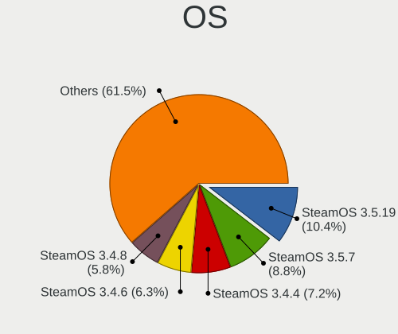

| Name             | Notebooks | Percent |
|------------------|-----------|---------|
| SteamOS 3.5.19   | 261       | 10.44%  |
| SteamOS 3.5.7    | 220       | 8.8%    |
| SteamOS 3.4.4    | 179       | 7.16%   |
| SteamOS 3.4.6    | 157       | 6.28%   |
| SteamOS 3.4.8    | 146       | 5.84%   |
| SteamOS 3.6.20   | 121       | 4.84%   |
| SteamOS 3.3.2    | 117       | 4.68%   |
| SteamOS 3.5.17   | 108       | 4.32%   |
| SteamOS 3.3.1    | 107       | 4.28%   |
| SteamOS 3.7.13   | 73        | 2.92%   |
| SteamOS 3.4.10   | 64        | 2.56%   |
| SteamOS 3.6.24   | 62        | 2.48%   |
| SteamOS 3.2      | 58        | 2.32%   |
| SteamOS 3.4.11   | 57        | 2.28%   |
| SteamOS 3.7.8    | 53        | 2.12%   |
| SteamOS 3.3      | 52        | 2.08%   |
| SteamOS 3.7.17   | 48        | 1.92%   |
| SteamOS 3.7.15   | 44        | 1.76%   |
| SteamOS 3.4      | 44        | 1.76%   |
| SteamOS 3.6.21   | 38        | 1.52%   |
| SteamOS 3.6.22   | 34        | 1.36%   |
| SteamOS 3.5      | 30        | 1.2%    |
| SteamOS 3.6      | 27        | 1.08%   |
| SteamOS 3.5.5    | 26        | 1.04%   |
| SteamOS Rolling  | 25        | 1%      |
| SteamOS 3.7      | 24        | 0.96%   |
| SteamOS 3.4.2    | 23        | 0.92%   |
| SteamOS Snapshot | 21        | 0.84%   |
| SteamOS 4        | 21        | 0.84%   |
| SteamOS 3.1      | 17        | 0.68%   |
| SteamOS 3.6.9    | 16        | 0.64%   |
| SteamOS 3.3.3    | 15        | 0.6%    |
| SteamOS 3.7.14   | 14        | 0.56%   |
| SteamOS 3.6.19   | 14        | 0.56%   |
| SteamOS 3.5.1    | 14        | 0.56%   |
| SteamOS          | 14        | 0.56%   |
| SteamOS 3.6.8    | 12        | 0.48%   |
| SteamOS 3.8      | 11        | 0.44%   |
| SteamOS 3.7.9    | 9         | 0.36%   |
| SteamOS 3.5.13   | 9         | 0.36%   |

OS Family
---------

OS without a version

| Name    | Notebooks | Percent |
|---------|-----------|---------|
| SteamOS | 2190      | 100%    |

Kernel
------

Version of the Linux kernel

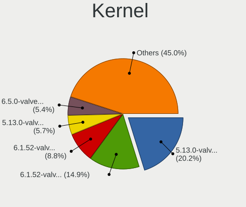

| Version                                            | Notebooks | Percent |
|----------------------------------------------------|-----------|---------|
| 5.13.0-valve36-1-neptune                           | 499       | 20.19%  |
| 6.1.52-valve16-1-neptune-61                        | 368       | 14.89%  |
| 6.1.52-valve9-1-neptune-61                         | 217       | 8.78%   |
| 5.13.0-valve21.3-1-neptune                         | 141       | 5.71%   |
| 6.5.0-valve22-1-neptune-65-g9a338ed8a75e           | 134       | 5.42%   |
| 6.5.0-valve23-1-neptune-65-g385b5e207ae2           | 133       | 5.38%   |
| 5.13.0-valve37-1-neptune                           | 127       | 5.14%   |
| 5.13.0-valve21.1-1-neptune-02211-gc54cda5a36f3     | 110       | 4.45%   |
| 6.11.11-valve24-2-neptune-611-gfd0dd251480d        | 95        | 3.84%   |
| 6.11.11-valve19-1-neptune-611-g88b36d49a5e3        | 69        | 2.79%   |
| 6.11.11-valve14-1-neptune-611-g96885212a919        | 59        | 2.39%   |
| 5.13.0-valve15-1-neptune-02197-gf6ec7ad3762a       | 54        | 2.19%   |
| 5.13.0-valve21-1-neptune-02209-g2a5bdc1102a0       | 35        | 1.42%   |
| 6.1.52-valve7-1-neptune-61                         | 29        | 1.17%   |
| 6.1.52-valve2-1-neptune-61                         | 19        | 0.77%   |
| 5.13.0-valve10.3-1-neptune-02176-g5fe416c4acd8     | 19        | 0.77%   |
| 6.11.11-valve20-1-neptune-611-gd35c3ed359a0        | 18        | 0.73%   |
| 6.8.5-1-lljy-CFS-gcd11c870c00c                     | 17        | 0.69%   |
| 6.3.7-zen1-1-zen                                   | 16        | 0.65%   |
| 5.13.0-valve10.1-1-neptune-02144-g7fffaf925dfb     | 16        | 0.65%   |
| 6.5.0-valve16-2-neptune-65-gc9ad4106624e           | 15        | 0.61%   |
| 6.1.52-valve3-1-neptune-61                         | 14        | 0.57%   |
| 5.13.0-valve24-1-neptune-02226-g5b8545e4c5a1       | 14        | 0.57%   |
| 6.5.0-valve12-1-neptune-65-g1889664e19fc           | 13        | 0.53%   |
| 6.5.0-valve21-1-neptune-65-g33487bf05ed3           | 12        | 0.49%   |
| 6.1.52-valve14-1-neptune-61                        | 12        | 0.49%   |
| 5.13.0-valve31-1-neptune                           | 11        | 0.45%   |
| 6.11.11-valve26-1-neptune-611-gb3afa9aa9ae7        | 10        | 0.4%    |
| 6.5.0-valve19-1-neptune-65-g8e4b171a9b33           | 9         | 0.36%   |
| 6.11.11-valve17-1-neptune-611-g027868a0ac03        | 9         | 0.36%   |
| 6.1.52-valve10-1-neptune-61                        | 8         | 0.32%   |
| 5.13.0-valve35-1-neptune                           | 8         | 0.32%   |
| 6.5.0-valve5-1-neptune-65-g6efe817cc486            | 7         | 0.28%   |
| 6.1.43-valve1-1-neptune-61                         | 7         | 0.28%   |
| 5.13.0-valve10.1-2-neptune-dri-02144-g7fffaf925dfb | 7         | 0.28%   |
| 6.5.0-valve13-1-neptune-65-gd5e176bdacb0           | 6         | 0.24%   |
| 5.18.1-arch1_testHoloISO_20220606.1811             | 6         | 0.24%   |
| 5.13.0-valve24-1-neptune                           | 6         | 0.24%   |
| 5.13.0-valve21.2-1-neptune                         | 6         | 0.24%   |
| 6.8.12-valve7-1-neptune-68-g8c3c3d4f5307           | 5         | 0.2%    |

Kernel Family
-------------

Linux kernel without a distro release

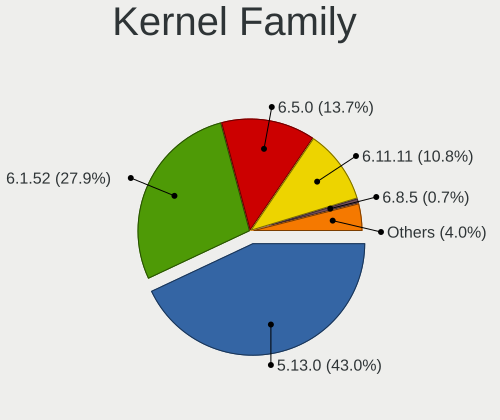

| Version | Notebooks | Percent |
|---------|-----------|---------|
| 5.13.0  | 1008      | 43%     |
| 6.1.52  | 653       | 27.86%  |
| 6.5.0   | 320       | 13.65%  |
| 6.11.11 | 253       | 10.79%  |
| 6.8.5   | 17        | 0.73%   |
| 6.3.7   | 16        | 0.68%   |
| 6.8.12  | 12        | 0.51%   |
| 6.1.21  | 11        | 0.47%   |
| 6.1.43  | 7         | 0.3%    |
| 5.18.1  | 6         | 0.26%   |
| 6.4.12  | 5         | 0.21%   |
| 6.16.12 | 5         | 0.21%   |
| 6.15.8  | 3         | 0.13%   |
| 6.10.7  | 3         | 0.13%   |
| 6.1.12  | 3         | 0.13%   |
| 5.15.93 | 3         | 0.13%   |
| 6.16.7  | 2         | 0.09%   |
| 6.1.9   | 2         | 0.09%   |
| 5.15.79 | 2         | 0.09%   |
| 5.15.54 | 2         | 0.09%   |
| 6.4.3   | 1         | 0.04%   |
| 6.4.0   | 1         | 0.04%   |
| 6.15.11 | 1         | 0.04%   |
| 6.13.7  | 1         | 0.04%   |
| 6.13.10 | 1         | 0.04%   |
| 6.11.6  | 1         | 0.04%   |
| 6.10.4  | 1         | 0.04%   |
| 6.1.5   | 1         | 0.04%   |
| 6.1.39  | 1         | 0.04%   |
| 6.1.29  | 1         | 0.04%   |
| 6.0.7   | 1         | 0.04%   |

Kernel Major Ver.
-----------------

Linux kernel major version

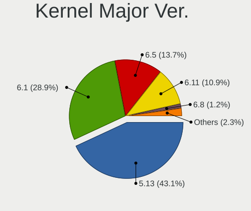

| Version | Notebooks | Percent |
|---------|-----------|---------|
| 5.13    | 1008      | 43.1%   |
| 6.1     | 675       | 28.86%  |
| 6.5     | 320       | 13.68%  |
| 6.11    | 254       | 10.86%  |
| 6.8     | 29        | 1.24%   |
| 6.3     | 16        | 0.68%   |
| 6.16    | 7         | 0.3%    |
| 5.15    | 7         | 0.3%    |
| 6.4     | 6         | 0.26%   |
| 5.18    | 6         | 0.26%   |
| 6.15    | 4         | 0.17%   |
| 6.10    | 4         | 0.17%   |
| 6.13    | 2         | 0.09%   |
| 6.0     | 1         | 0.04%   |

Arch
----

OS architecture (x86_64, i586, etc.)

| Name   | Notebooks | Percent |
|--------|-----------|---------|
| x86_64 | 2190      | 100%    |

DE
--

Desktop Environment

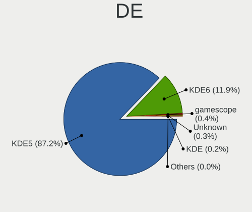

| Name      | Notebooks | Percent |
|-----------|-----------|---------|
| KDE5      | 1946      | 87.19%  |
| KDE6      | 265       | 11.87%  |
| gamescope | 9         | 0.4%    |
| Unknown   | 6         | 0.27%   |
| KDE       | 5         | 0.22%   |
| GNOME     | 1         | 0.04%   |

Display Server
--------------

X11 or Wayland

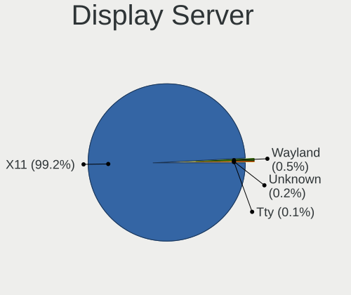

| Name    | Notebooks | Percent |
|---------|-----------|---------|
| X11     | 2177      | 99.18%  |
| Wayland | 12        | 0.55%   |
| Unknown | 4         | 0.18%   |
| Tty     | 2         | 0.09%   |

Display Manager
---------------

SDDM, LightDM, etc.

| Name    | Notebooks | Percent |
|---------|-----------|---------|
| Unknown | 2167      | 98.86%  |
| SDDM    | 25        | 1.14%   |

OS Lang
-------

Language

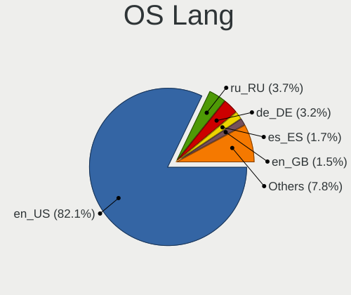

| Lang         | Notebooks | Percent |
|--------------|-----------|---------|
| en_US        | 1821      | 82.14%  |
| ru_RU        | 81        | 3.65%   |
| de_DE        | 71        | 3.2%    |
| es_ES        | 37        | 1.67%   |
| en_GB        | 33        | 1.49%   |
| fr_FR        | 26        | 1.17%   |
| C            | 24        | 1.08%   |
| zh_CN        | 22        | 0.99%   |
| pl_PL        | 20        | 0.9%    |
| pt_BR        | 13        | 0.59%   |
| en_DE        | 11        | 0.5%    |
| it_IT        | 8         | 0.36%   |
| an_ES        | 7         | 0.32%   |
| cs_CZ        | 5         | 0.23%   |
| ko_KR        | 4         | 0.18%   |
| zh_TW        | 2         | 0.09%   |
| tr_TR        | 2         | 0.09%   |
| sv_SE        | 2         | 0.09%   |
| ru_UA        | 2         | 0.09%   |
| hu_HU        | 2         | 0.09%   |
| es_MX        | 2         | 0.09%   |
| en_NL        | 2         | 0.09%   |
| en_CA        | 2         | 0.09%   |
| ba_RU        | 2         | 0.09%   |
| sk_SK        | 1         | 0.05%   |
| pl           | 1         | 0.05%   |
| nl_NL        | 1         | 0.05%   |
| nl_BE        | 1         | 0.05%   |
| nb_NO        | 1         | 0.05%   |
| ksh_DE       | 1         | 0.05%   |
| hr_HR        | 1         | 0.05%   |
| fr_BE        | 1         | 0.05%   |
| et_EE        | 1         | 0.05%   |
| es_UY        | 1         | 0.05%   |
| en_SE        | 1         | 0.05%   |
| en_IE        | 1         | 0.05%   |
| en_HK        | 1         | 0.05%   |
| en_GB.UTF-12 | 1         | 0.05%   |
| en_DK        | 1         | 0.05%   |
| en_AU        | 1         | 0.05%   |

Boot Mode
---------

EFI or BIOS

| Mode | Notebooks | Percent |
|------|-----------|---------|
| BIOS | 2161      | 98.45%  |
| EFI  | 34        | 1.55%   |

Filesystem
----------

Type of filesystem

| Type  | Notebooks | Percent |
|-------|-----------|---------|
| Btrfs | 2182      | 99.63%  |
| Tmpfs | 6         | 0.27%   |
| Ext4  | 2         | 0.09%   |

Part. scheme
------------

Scheme of partitioning

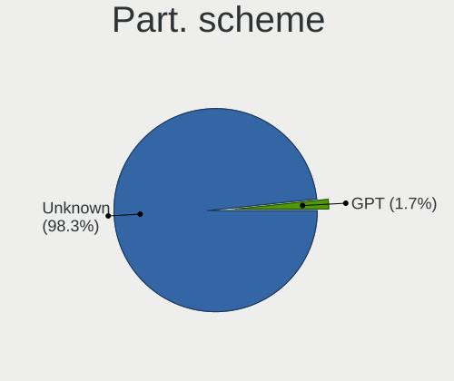

| Type    | Notebooks | Percent |
|---------|-----------|---------|
| Unknown | 2158      | 98.31%  |
| GPT     | 37        | 1.69%   |

Dual Boot with Linux/BSD
------------------------

Hosting more than one Linux/BSD

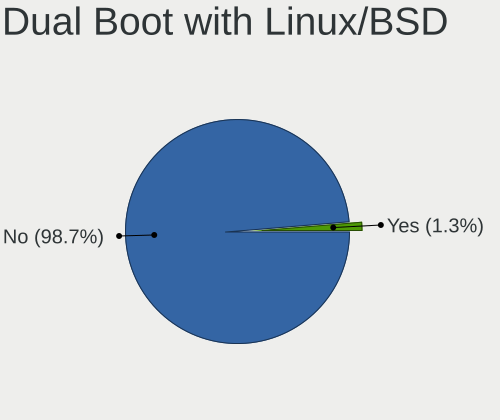

| Dual boot | Notebooks | Percent |
|-----------|-----------|---------|
| No        | 2165      | 98.68%  |
| Yes       | 29        | 1.32%   |

Dual Boot (Win)
---------------

Hosting Linux and Windows

| Dual boot | Notebooks | Percent |
|-----------|-----------|---------|
| No        | 2187      | 99.86%  |
| Yes       | 3         | 0.14%   |

Board
-----

Vendor
------

Motherboard manufacturer

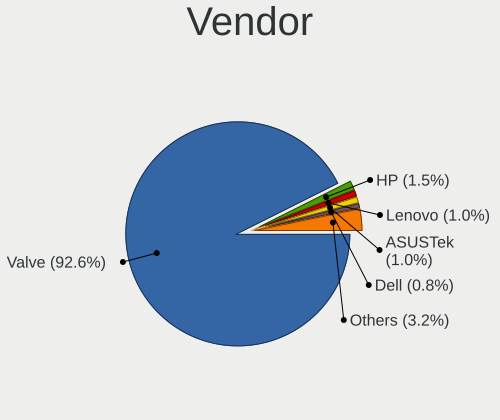

| Name                | Notebooks | Percent |
|---------------------|-----------|---------|
| Valve               | 2028      | 92.6%   |
| Hewlett-Packard     | 32        | 1.46%   |
| Lenovo              | 21        | 0.96%   |
| ASUSTek Computer    | 21        | 0.96%   |
| Dell                | 17        | 0.78%   |
| MSI                 | 10        | 0.46%   |
| Apple               | 10        | 0.46%   |
| Acer                | 10        | 0.46%   |
| GPD                 | 9         | 0.41%   |
| ONE-NETBOOK         | 4         | 0.18%   |
| Gigabyte Technology | 3         | 0.14%   |
| Anbernic            | 3         | 0.14%   |
| Alienware           | 3         | 0.14%   |
| Samsung Electronics | 2         | 0.09%   |
| ASRock              | 2         | 0.09%   |
| AMI                 | 2         | 0.09%   |
| Unknown             | 2         | 0.09%   |
| Terrans Force       | 1         | 0.05%   |
| Sony                | 1         | 0.05%   |
| Monster             | 1         | 0.05%   |
| Medion              | 1         | 0.05%   |
| HUAWEI              | 1         | 0.05%   |
| GPU Company         | 1         | 0.05%   |
| Google              | 1         | 0.05%   |
| Biostar             | 1         | 0.05%   |
| AZW                 | 1         | 0.05%   |
| AYANEO              | 1         | 0.05%   |
| ADVANCE             | 1         | 0.05%   |

Model
-----

Motherboard model

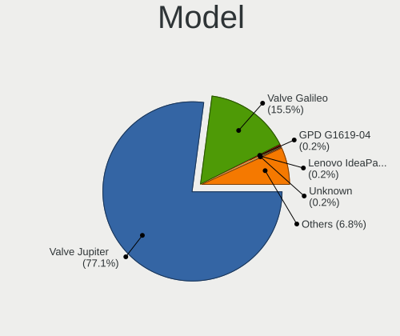

| Name                                  | Notebooks | Percent |
|---------------------------------------|-----------|---------|
| Valve Jupiter                         | 1688      | 77.08%  |
| Valve Galileo                         | 340       | 15.53%  |
| GPD G1619-04                          | 5         | 0.23%   |
| Lenovo IdeaPad Gaming 3 15ACH6 82K2   | 4         | 0.18%   |
| Unknown                               | 4         | 0.18%   |
| Apple MacBookPro15,1                  | 3         | 0.14%   |
| Anbernic Win600                       | 3         | 0.14%   |
| ONE-NETBOOK ONEXPLAYER 2 ARP23        | 2         | 0.09%   |
| HP Pavilion Laptop 15-eh0xxx          | 2         | 0.09%   |
| HP Pavilion 17                        | 2         | 0.09%   |
| HP Laptop 15s-eq2xxx                  | 2         | 0.09%   |
| HP Laptop 15-bs0xx                    | 2         | 0.09%   |
| ASUS ROG Zephyrus G14 GA402RJ_GA402RJ | 2         | 0.09%   |
| Apple MacBookPro8,1                   | 2         | 0.09%   |
| Acer Nitro AN515-44                   | 2         | 0.09%   |
| Terrans Force Handle 5                | 1         | 0.05%   |
| Sony VGN-Z520N                        | 1         | 0.05%   |
| Samsung 950XDB/951XDB/950XDY          | 1         | 0.05%   |
| Samsung 300E4C/300E5C/300E7C          | 1         | 0.05%   |
| ONE-NETBOOK ONEXPLAYER X1 mini        | 1         | 0.05%   |
| ONE-NETBOOK ONEXPLAYER 2 PRO ARP23P   | 1         | 0.05%   |
| MSI MS-7C91                           | 1         | 0.05%   |
| MSI MS-7995                           | 1         | 0.05%   |
| MSI Katana A15 AI B8VE                | 1         | 0.05%   |
| MSI Katana 15 B13VFK                  | 1         | 0.05%   |
| MSI GS65 Stealth 9SF                  | 1         | 0.05%   |
| MSI GP66 Leopard 11UH                 | 1         | 0.05%   |
| MSI GF63 Thin 11SC                    | 1         | 0.05%   |
| MSI GF62 7RE                          | 1         | 0.05%   |
| MSI Bravo 15 C7VFK                    | 1         | 0.05%   |
| MSI Alpha 15 B5EEK                    | 1         | 0.05%   |
| Monster ABRA A5 V17.3                 | 1         | 0.05%   |
| Medion Deputy P50                     | 1         | 0.05%   |
| Lenovo Yoga Slim 7 Pro 14ACH5 82MS    | 1         | 0.05%   |
| Lenovo ThinkPad T490 20N3S88U0F       | 1         | 0.05%   |
| Lenovo ThinkPad T14 Gen 5 21MC003UUS  | 1         | 0.05%   |
| Lenovo ThinkPad E14 Gen 3 20YD000JBO  | 1         | 0.05%   |
| Lenovo ThinkBook 16 G6+ AHP 21LG      | 1         | 0.05%   |
| Lenovo ThinkBook 13s G3 ACN 20YA      | 1         | 0.05%   |
| Lenovo Legion Y740-15IRHg 81UH        | 1         | 0.05%   |

Model Family
------------

Motherboard model prefix

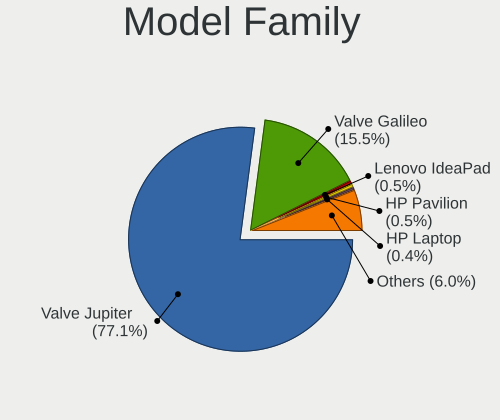

| Name                   | Notebooks | Percent |
|------------------------|-----------|---------|
| Valve Jupiter          | 1688      | 77.08%  |
| Valve Galileo          | 340       | 15.53%  |
| Lenovo IdeaPad         | 11        | 0.5%    |
| HP Pavilion            | 11        | 0.5%    |
| HP Laptop              | 9         | 0.41%   |
| ASUS ROG               | 6         | 0.27%   |
| HP Victus              | 5         | 0.23%   |
| GPD G1619-04           | 5         | 0.23%   |
| Dell Precision         | 5         | 0.23%   |
| Dell Inspiron          | 5         | 0.23%   |
| ASUS ASUS              | 5         | 0.23%   |
| Acer Nitro             | 5         | 0.23%   |
| ONE-NETBOOK ONEXPLAYER | 4         | 0.18%   |
| Acer Aspire            | 4         | 0.18%   |
| Unknown                | 4         | 0.18%   |
| Lenovo ThinkPad        | 3         | 0.14%   |
| Lenovo Legion          | 3         | 0.14%   |
| HP ProBook             | 3         | 0.14%   |
| Apple MacBookPro15     | 3         | 0.14%   |
| Anbernic Win600        | 3         | 0.14%   |
| MSI Katana             | 2         | 0.09%   |
| Lenovo ThinkBook       | 2         | 0.09%   |
| HP 15                  | 2         | 0.09%   |
| Dell XPS               | 2         | 0.09%   |
| Dell Venue             | 2         | 0.09%   |
| Dell Latitude          | 2         | 0.09%   |
| ASUS ZenBook           | 2         | 0.09%   |
| ASUS Vivobook          | 2         | 0.09%   |
| ASUS TUF               | 2         | 0.09%   |
| Apple MacBookPro8      | 2         | 0.09%   |
| Apple MacBookAir6      | 2         | 0.09%   |
| Alienware m17          | 2         | 0.09%   |
| Terrans Force Handle   | 1         | 0.05%   |
| Sony VGN-Z520N         | 1         | 0.05%   |
| Samsung 950XDB         | 1         | 0.05%   |
| Samsung 300E4C         | 1         | 0.05%   |
| MSI MS-7C91            | 1         | 0.05%   |
| MSI MS-7995            | 1         | 0.05%   |
| MSI GS65               | 1         | 0.05%   |
| MSI GP66               | 1         | 0.05%   |

MFG Year
--------

Motherboard manufacture year

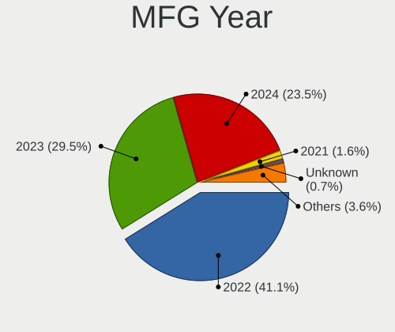

| Year    | Notebooks | Percent |
|---------|-----------|---------|
| 2022    | 901       | 41.14%  |
| 2023    | 645       | 29.45%  |
| 2024    | 514       | 23.47%  |
| 2021    | 35        | 1.6%    |
| Unknown | 16        | 0.73%   |
| 2020    | 14        | 0.64%   |
| 2018    | 11        | 0.5%    |
| 2017    | 10        | 0.46%   |
| 2019    | 9         | 0.41%   |
| 2013    | 9         | 0.41%   |
| 2012    | 7         | 0.32%   |
| 2016    | 5         | 0.23%   |
| 2015    | 5         | 0.23%   |
| 2025    | 3         | 0.14%   |
| 2014    | 2         | 0.09%   |
| 2011    | 2         | 0.09%   |
| 2009    | 1         | 0.05%   |
| 2008    | 1         | 0.05%   |

Form Factor
-----------

Physical design of the computer

| Name     | Notebooks | Percent |
|----------|-----------|---------|
| Notebook | 2190      | 100%    |

Secure Boot
-----------

Enabled or disabled

| State    | Notebooks | Percent |
|----------|-----------|---------|
| Disabled | 2190      | 100%    |

Coreboot
--------

Have coreboot on board

| Used | Notebooks | Percent |
|------|-----------|---------|
| No   | 2189      | 99.95%  |
| Yes  | 1         | 0.05%   |

RAM Size
--------

Total RAM memory

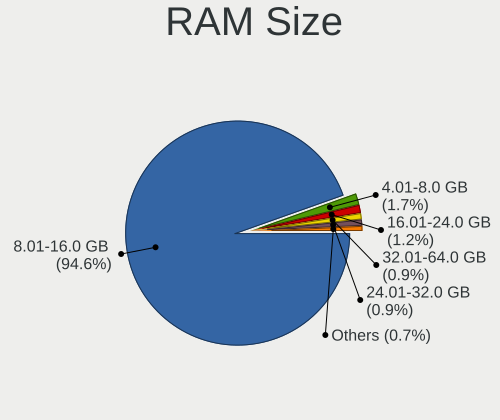

| Size in GB  | Notebooks | Percent |
|-------------|-----------|---------|
| 8.01-16.0   | 2071      | 94.57%  |
| 4.01-8.0    | 37        | 1.69%   |
| 16.01-24.0  | 26        | 1.19%   |
| 32.01-64.0  | 20        | 0.91%   |
| 24.01-32.0  | 20        | 0.91%   |
| 3.01-4.0    | 14        | 0.64%   |
| 2.01-3.0    | 1         | 0.05%   |
| 64.01-256.0 | 1         | 0.05%   |

RAM Used
--------

Used RAM memory

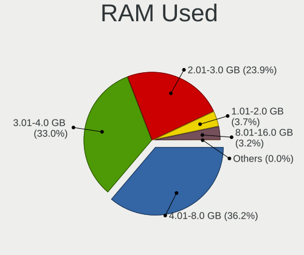

| Used GB   | Notebooks | Percent |
|-----------|-----------|---------|
| 4.01-8.0  | 870       | 36.17%  |
| 3.01-4.0  | 793       | 32.97%  |
| 2.01-3.0  | 574       | 23.87%  |
| 1.01-2.0  | 89        | 3.7%    |
| 8.01-16.0 | 78        | 3.24%   |
| 0.51-1.0  | 1         | 0.04%   |

Total Drives
------------

Number of drives on board

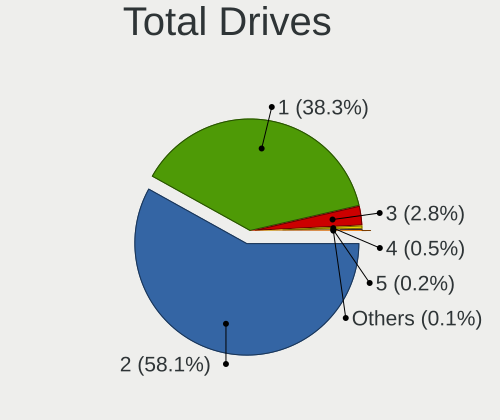

| Drives | Notebooks | Percent |
|--------|-----------|---------|
| 2      | 1320      | 58.07%  |
| 1      | 871       | 38.32%  |
| 3      | 64        | 2.82%   |
| 4      | 11        | 0.48%   |
| 5      | 4         | 0.18%   |
| 0      | 2         | 0.09%   |
| 6      | 1         | 0.04%   |

Has CD-ROM
----------

Has CD-ROM on board

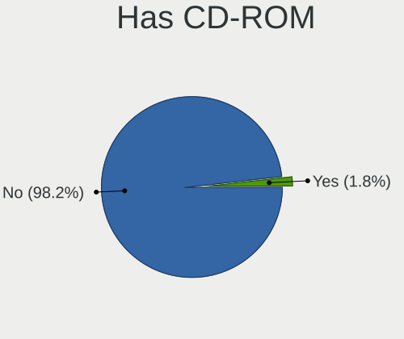

| Presented | Notebooks | Percent |
|-----------|-----------|---------|
| No        | 2153      | 98.22%  |
| Yes       | 39        | 1.78%   |

Has Ethernet
------------

Has Ethernet on board

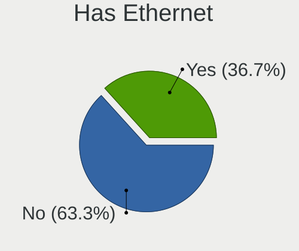

| Presented | Notebooks | Percent |
|-----------|-----------|---------|
| No        | 1434      | 63.28%  |
| Yes       | 832       | 36.72%  |

Has WiFi
--------

Has WiFi module

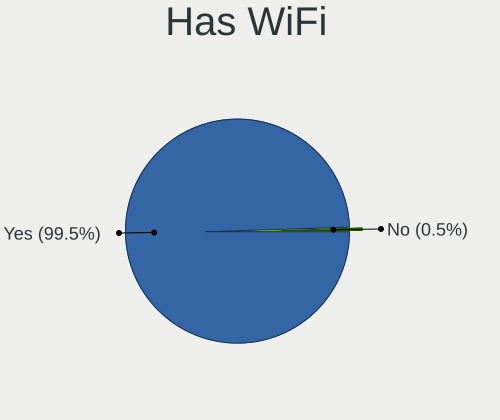

| Presented | Notebooks | Percent |
|-----------|-----------|---------|
| Yes       | 2179      | 99.5%   |
| No        | 11        | 0.5%    |

Has Bluetooth
-------------

Has Bluetooth module

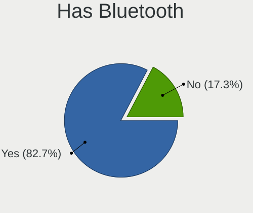

| Presented | Notebooks | Percent |
|-----------|-----------|---------|
| Yes       | 1814      | 82.72%  |
| No        | 379       | 17.28%  |

Location
--------

Country
-------

Geographic location (country)

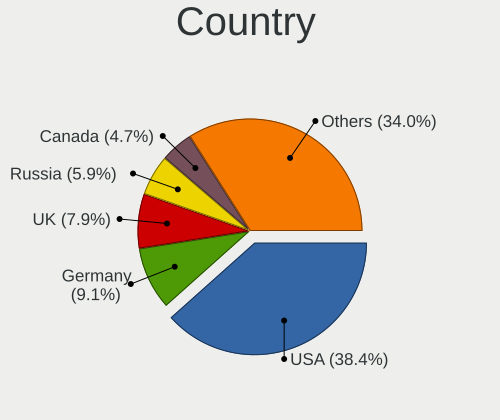

| Country      | Notebooks | Percent |
|--------------|-----------|---------|
| USA          | 844       | 38.4%   |
| Germany      | 200       | 9.1%    |
| UK           | 173       | 7.87%   |
| Russia       | 130       | 5.91%   |
| Canada       | 103       | 4.69%   |
| Poland       | 63        | 2.87%   |
| France       | 62        | 2.82%   |
| Spain        | 52        | 2.37%   |
| Brazil       | 48        | 2.18%   |
| Netherlands  | 37        | 1.68%   |
| Australia    | 33        | 1.5%    |
| Mexico       | 29        | 1.32%   |
| Italy        | 25        | 1.14%   |
| China        | 24        | 1.09%   |
| Hungary      | 19        | 0.86%   |
| Austria      | 18        | 0.82%   |
| Sweden       | 17        | 0.77%   |
| Philippines  | 17        | 0.77%   |
| Czechia      | 16        | 0.73%   |
| Ukraine      | 12        | 0.55%   |
| UAE          | 12        | 0.55%   |
| Saudi Arabia | 12        | 0.55%   |
| Romania      | 12        | 0.55%   |
| Israel       | 12        | 0.55%   |
| Indonesia    | 12        | 0.55%   |
| Chile        | 11        | 0.5%    |
| Belgium      | 11        | 0.5%    |
| Switzerland  | 9         | 0.41%   |
| South Korea  | 9         | 0.41%   |
| Ireland      | 9         | 0.41%   |
| Slovakia     | 8         | 0.36%   |
| Portugal     | 8         | 0.36%   |
| Japan        | 8         | 0.36%   |
| India        | 8         | 0.36%   |
| Finland      | 8         | 0.36%   |
| New Zealand  | 7         | 0.32%   |
| Denmark      | 7         | 0.32%   |
| Turkey       | 6         | 0.27%   |
| Taiwan       | 6         | 0.27%   |
| Bulgaria     | 6         | 0.27%   |

City
----

Geographic location (city)

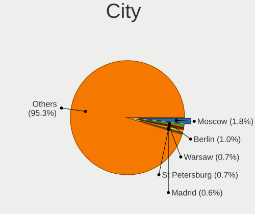

| City          | Notebooks | Percent |
|---------------|-----------|---------|
| Moscow        | 41        | 1.76%   |
| Berlin        | 23        | 0.99%   |
| Warsaw        | 16        | 0.69%   |
| St Petersburg | 16        | 0.69%   |
| Madrid        | 14        | 0.6%    |
| Chicago       | 14        | 0.6%    |
| Seattle       | 12        | 0.52%   |
| Dallas        | 12        | 0.52%   |
| Austin        | 12        | 0.52%   |
| Toronto       | 11        | 0.47%   |
| Melbourne     | 11        | 0.47%   |
| Los Angeles   | 10        | 0.43%   |
| Prague        | 9         | 0.39%   |
| Portland      | 9         | 0.39%   |
| London        | 9         | 0.39%   |
| Hamburg       | 9         | 0.39%   |
| Flushing      | 9         | 0.39%   |
| Dubai         | 9         | 0.39%   |
| Budapest      | 9         | 0.39%   |
| Atlanta       | 9         | 0.39%   |
| Vienna        | 8         | 0.34%   |
| The Bronx     | 8         | 0.34%   |
| Sydney        | 8         | 0.34%   |
| Santiago      | 8         | 0.34%   |
| New York      | 8         | 0.34%   |
| Denver        | 8         | 0.34%   |
| Las Vegas     | 7         | 0.3%    |
| Indianapolis  | 7         | 0.3%    |
| Brooklyn      | 7         | 0.3%    |
| Brisbane      | 7         | 0.3%    |
| San Antonio   | 6         | 0.26%   |
| Poznan        | 6         | 0.26%   |
| Munich        | 6         | 0.26%   |
| Manchester    | 6         | 0.26%   |
| Lima          | 6         | 0.26%   |
| Jakarta       | 6         | 0.26%   |
| Edmonton      | 6         | 0.26%   |
| Cologne       | 6         | 0.26%   |
| Athens        | 6         | 0.26%   |
| Amsterdam     | 6         | 0.26%   |

Drives
------

Drive Vendor
------------

Hard drive vendors

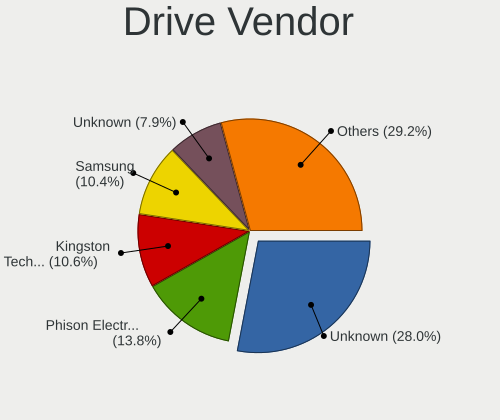

| Vendor                         | Notebooks | Drives | Percent |
|--------------------------------|-----------|--------|---------|
| Unknown                        | 1038      | 1252   | 28.02%  |
| Phison Electronics             | 511       | 611    | 13.79%  |
| Kingston Technology Company    | 393       | 476    | 10.61%  |
| Samsung Electronics            | 387       | 459    | 10.45%  |
| Unknown                        | 294       | 351    | 7.94%   |
| O2 Micro                       | 246       | 280    | 6.64%   |
| Sandisk                        | 163       | 197    | 4.4%    |
| Kingston                       | 122       | 134    | 3.29%   |
| Micron Technology              | 106       | 122    | 2.86%   |
| Phison                         | 84        | 87     | 2.27%   |
| Silicon Motion                 | 66        | 74     | 1.78%   |
| SK hynix                       | 45        | 61     | 1.21%   |
| KIOXIA                         | 34        | 39     | 0.92%   |
| Seagate                        | 29        | 38     | 0.78%   |
| MAXIO Technology (Hangzhou)    | 20        | 24     | 0.54%   |
| JMicron Technology             | 17        | 17     | 0.46%   |
| Realtek                        | 14        | 18     | 0.38%   |
| Micron/Crucial Technology      | 7         | 7      | 0.19%   |
| Biwin Storage Technology       | 7         | 9      | 0.19%   |
| Toshiba                        | 6         | 6      | 0.16%   |
| Solid State Storage Technology | 6         | 7      | 0.16%   |
| SABRENT                        | 6         | 6      | 0.16%   |
| Apple                          | 6         | 6      | 0.16%   |
| A-DATA Technology              | 6         | 6      | 0.16%   |
| WDC                            | 5         | 5      | 0.13%   |
| Intel                          | 4         | 4      | 0.11%   |
| ASMT                           | 4         | 5      | 0.11%   |
| SSK                            | 3         | 3      | 0.08%   |
| Shenzhen Longsys Electronics   | 3         | 3      | 0.08%   |
| ADATA Technology               | 3         | 3      | 0.08%   |
| Timetec                        | 2         | 3      | 0.05%   |
| SPCC                           | 2         | 2      | 0.05%   |
| Solid State Storage            | 2         | 2      | 0.05%   |
| Realtek Semiconductor          | 2         | 2      | 0.05%   |
| Patriot                        | 2         | 2      | 0.05%   |
| Netac                          | 2         | 2      | 0.05%   |
| Maxone                         | 2         | 2      | 0.05%   |
| KingSpec                       | 2         | 2      | 0.05%   |
| Intenso                        | 2         | 2      | 0.05%   |
| Hitachi                        | 2         | 2      | 0.05%   |

Drive Model
-----------

Hard drive models

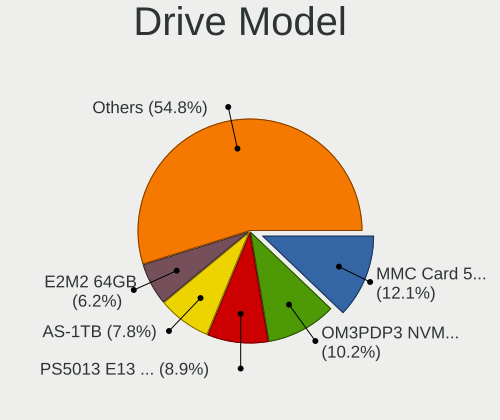

| Model                                                 | Notebooks | Percent |
|-------------------------------------------------------|-----------|---------|
| Unknown MMC Card  512GB                               | 457       | 12.13%  |
| Kingston Company OM3PDP3 NVMe SSD 256GB               | 385       | 10.22%  |
| Phison PS5013 E13 NVMe Controller 500GB               | 334       | 8.87%   |
| Unknown                                               | 294       | 7.8%    |
| O2 Micro E2M2 64GB                                    | 232       | 6.16%   |
| Unknown MMC Card  256GB                               | 229       | 6.08%   |
| Samsung MZ9LQ512HBLU-00BVL 512GB                      | 165       | 4.38%   |
| Unknown MMC Card  128GB                               | 129       | 3.42%   |
| Samsung MZ9LQ256HBJD-00BVL 256GB                      | 94        | 2.5%    |
| Phison NVMe SSD Drive 512GB                           | 54        | 1.43%   |
| Micron 2400_MTFDKBK1T0QFM 1024GB                      | 51        | 1.35%   |
| Unknown MMC Card  64GB                                | 50        | 1.33%   |
| Sandisk WD PC SN740 SDDPTQD-1T00 1024GB               | 47        | 1.25%   |
| Silicon Motion SM2263EN/SM2263XT SSD Controller 512GB | 45        | 1.19%   |
| Kingston NVMe SSD Drive 512GB                         | 42        | 1.11%   |
| Phison Sabrent SB-2130-1TB                            | 40        | 1.06%   |
| Unknown MMC Card  32GB                                | 38        | 1.01%   |
| Phison ESMP001TKB5C3-E19TS 1024GB                     | 35        | 0.93%   |
| Sandisk WD PC SN740 SDDPTQE-2T00 2TB                  | 32        | 0.85%   |
| Kingston NVMe SSD Drive 256GB                         | 32        | 0.85%   |
| Unknown MMC Card  393GB                               | 30        | 0.8%    |
| Samsung MZ9L41T0HBLB-00AVL 1024GB                     | 30        | 0.8%    |
| Phison ESMP512GHV7C3-E21TS 512GB                      | 23        | 0.61%   |
| Micron 2400_MTFDKBK512QFM 512GB                       | 19        | 0.5%    |
| Kingston OM3PGP41024P-A0 1TB                          | 19        | 0.5%    |
| Phison NVMe SSD Drive 256GB                           | 18        | 0.48%   |
| Unknown MMC Card  1TB                                 | 17        | 0.45%   |
| Phison ESMP001TMN48C3-E21TS 1024GB                    | 17        | 0.45%   |
| Phison Corsair MP600 MINI 2TB                         | 17        | 0.45%   |
| Unknown MMC Card  250GB                               | 15        | 0.4%    |
| O2 Micro NVMe SSD Drive 64GB                          | 15        | 0.4%    |
| Kingston OM3PGP4512Q-A0 512GB                         | 15        | 0.4%    |
| Unknown MMC Card  16GB                                | 14        | 0.37%   |
| Sandisk WDC PC SN530 SDBPTPZ-1T00 1024GB              | 14        | 0.37%   |
| Samsung MZ9LQ1T0HBLB-00B00 1024GB                     | 14        | 0.37%   |
| MAXIO (Hangzhou) NVMe SSD Controller MAP1202 2TB      | 13        | 0.35%   |
| Unknown MMC Card  249GB                               | 11        | 0.29%   |
| Realtek RTL9210B-CG 500GB                             | 11        | 0.29%   |
| Micron 2400_MTFDKBK2T0QFM 2TB                         | 11        | 0.29%   |
| SK hynix BC711 NVMe 256GB                             | 10        | 0.27%   |

HDD Vendor
----------

Hard disk drive vendors

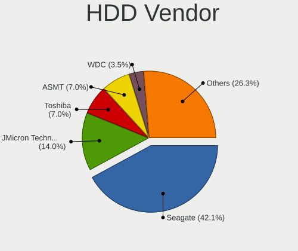

| Vendor              | Notebooks | Drives | Percent |
|---------------------|-----------|--------|---------|
| Seagate             | 24        | 31     | 42.11%  |
| JMicron Technology  | 8         | 8      | 14.04%  |
| Toshiba             | 4         | 4      | 7.02%   |
| ASMT                | 4         | 5      | 7.02%   |
| WDC                 | 2         | 2      | 3.51%   |
| Maxone              | 2         | 2      | 3.51%   |
| Intenso             | 2         | 2      | 3.51%   |
| Hitachi             | 2         | 2      | 3.51%   |
| HGST                | 2         | 2      | 3.51%   |
| External            | 2         | 3      | 3.51%   |
| Unknown             | 1         | 1      | 1.75%   |
| TO Exter            | 1         | 1      | 1.75%   |
| StoreJet            | 1         | 1      | 1.75%   |
| SSK                 | 1         | 1      | 1.75%   |
| Samsung Electronics | 1         | 1      | 1.75%   |

SSD Vendor
----------

Solid state drive vendors

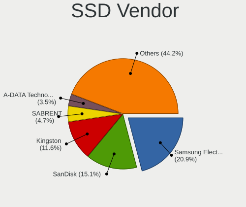

| Vendor              | Notebooks | Drives | Percent |
|---------------------|-----------|--------|---------|
| Samsung Electronics | 18        | 21     | 20.93%  |
| SanDisk             | 13        | 13     | 15.12%  |
| Kingston            | 10        | 11     | 11.63%  |
| SABRENT             | 4         | 4      | 4.65%   |
| A-DATA Technology   | 3         | 3      | 3.49%   |
| WDC                 | 2         | 2      | 2.33%   |
| Patriot             | 2         | 2      | 2.33%   |
| Micron Technology   | 2         | 2      | 2.33%   |
| KingSpec            | 2         | 2      | 2.33%   |
| GLOWAY              | 2         | 2      | 2.33%   |
| Crucial             | 2         | 2      | 2.33%   |
| China               | 2         | 2      | 2.33%   |
| Apple               | 2         | 2      | 2.33%   |
| Unknown             | 2         | 2      | 2.33%   |
| ZOTAC               | 1         | 1      | 1.16%   |
| WDC WDB             | 1         | 1      | 1.16%   |
| Verbatim            | 1         | 2      | 1.16%   |
| Union Memory        | 1         | 1      | 1.16%   |
| TrekStor            | 1         | 1      | 1.16%   |
| SPCC                | 1         | 1      | 1.16%   |
| SK hynix            | 1         | 1      | 1.16%   |
| PNY                 | 1         | 1      | 1.16%   |
| NGFF                | 1         | 1      | 1.16%   |
| Netac               | 1         | 1      | 1.16%   |
| Mushkin             | 1         | 1      | 1.16%   |
| LITEON              | 1         | 1      | 1.16%   |
| Lexar 25            | 1         | 1      | 1.16%   |
| Kingchuxing         | 1         | 1      | 1.16%   |
| KEEPDATA            | 1         | 1      | 1.16%   |
| INTEL SS            | 1         | 1      | 1.16%   |
| Gigabyte Technology | 1         | 1      | 1.16%   |
| Dell                | 1         | 1      | 1.16%   |
| CT1000P3            | 1         | 1      | 1.16%   |
| BIWIN               | 1         | 1      | 1.16%   |

Drive Kind
----------

HDD or SSD

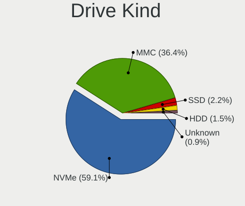

| Kind    | Notebooks | Drives | Percent |
|---------|-----------|--------|---------|
| NVMe    | 2138      | 2601   | 59.06%  |
| MMC     | 1317      | 1593   | 36.38%  |
| SSD     | 80        | 91     | 2.21%   |
| HDD     | 53        | 66     | 1.46%   |
| Unknown | 32        | 34     | 0.88%   |

Drive Connector
---------------

SATA, SAS, NVMe, etc.

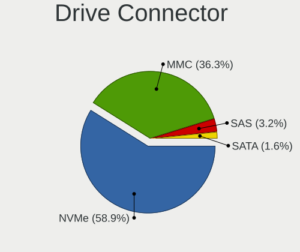

| Type | Notebooks | Drives | Percent |
|------|-----------|--------|---------|
| NVMe | 2138      | 2568   | 58.91%  |
| MMC  | 1317      | 1593   | 36.29%  |
| SAS  | 115       | 145    | 3.17%   |
| SATA | 59        | 79     | 1.63%   |

Drive Size
----------

Size of hard drive

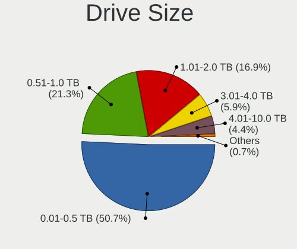

| Size in TB | Notebooks | Drives | Percent |
|------------|-----------|--------|---------|
| 0.01-0.5   | 69        | 80     | 50.74%  |
| 0.51-1.0   | 29        | 32     | 21.32%  |
| 1.01-2.0   | 23        | 29     | 16.91%  |
| 3.01-4.0   | 8         | 9      | 5.88%   |
| 4.01-10.0  | 6         | 6      | 4.41%   |
| 10.01-20.0 | 1         | 1      | 0.74%   |

Space Total
-----------

Amount of disk space available on the file system

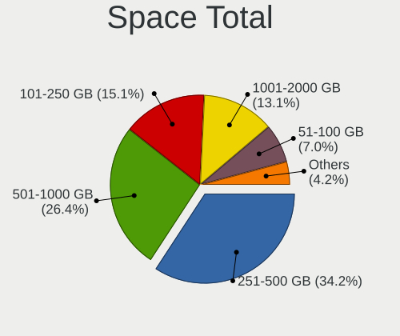

| Size in GB     | Notebooks | Percent |
|----------------|-----------|---------|
| 251-500        | 796       | 34.22%  |
| 501-1000       | 614       | 26.4%   |
| 101-250        | 352       | 15.13%  |
| 1001-2000      | 304       | 13.07%  |
| 51-100         | 163       | 7.01%   |
| 2001-3000      | 53        | 2.28%   |
| More than 3000 | 35        | 1.5%    |
| Unknown        | 5         | 0.21%   |
| 21-50          | 4         | 0.17%   |

Space Used
----------

Amount of used disk space

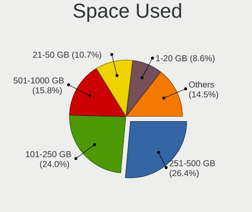

| Used GB        | Notebooks | Percent |
|----------------|-----------|---------|
| 251-500        | 628       | 26.44%  |
| 101-250        | 569       | 23.96%  |
| 501-1000       | 375       | 15.79%  |
| 21-50          | 255       | 10.74%  |
| 1-20           | 204       | 8.59%   |
| 51-100         | 173       | 7.28%   |
| 1001-2000      | 138       | 5.81%   |
| 2001-3000      | 21        | 0.88%   |
| More than 3000 | 7         | 0.29%   |
| Unknown        | 5         | 0.21%   |

Malfunc. Drives
---------------

Drive models with a malfunction

| Model                           | Notebooks | Drives | Percent |
|---------------------------------|-----------|--------|---------|
| Seagate ST500LT012-9WS142 500GB | 1         | 1      | 100%    |

Malfunc. Drive Vendor
---------------------

Vendors of faulty drives

| Vendor  | Notebooks | Drives | Percent |
|---------|-----------|--------|---------|
| Seagate | 1         | 1      | 100%    |

Malfunc. HDD Vendor
-------------------

Vendors of faulty HDD drives

| Vendor  | Notebooks | Drives | Percent |
|---------|-----------|--------|---------|
| Seagate | 1         | 1      | 100%    |

Malfunc. Drive Kind
-------------------

Kinds of faulty drives

| Kind | Notebooks | Drives | Percent |
|------|-----------|--------|---------|
| HDD  | 1         | 1      | 100%    |

Failed Drives
-------------

Failed drive models

Zero info for selected period =(

Failed Drive Vendor
-------------------

Failed drive vendors

Zero info for selected period =(

Drive Status
------------

Number of failed and malfunc. drives

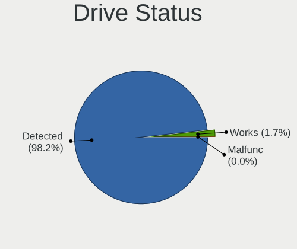

| Status   | Notebooks | Drives | Percent |
|----------|-----------|--------|---------|
| Detected | 2175      | 4338   | 98.24%  |
| Works    | 38        | 46     | 1.72%   |
| Malfunc  | 1         | 1      | 0.05%   |

Storage controller
------------------

Storage Vendor
--------------

Storage controller vendors

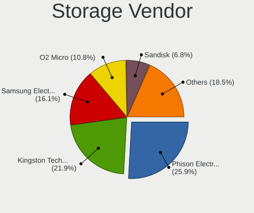

| Vendor                         | Notebooks | Percent |
|--------------------------------|-----------|---------|
| Phison Electronics             | 587       | 25.87%  |
| Kingston Technology Company    | 497       | 21.9%   |
| Samsung Electronics            | 365       | 16.09%  |
| O2 Micro                       | 246       | 10.84%  |
| Sandisk                        | 155       | 6.83%   |
| Micron Technology              | 104       | 4.58%   |
| Silicon Motion                 | 66        | 2.91%   |
| Intel                          | 55        | 2.42%   |
| SK hynix                       | 45        | 1.98%   |
| AMD                            | 40        | 1.76%   |
| KIOXIA                         | 34        | 1.5%    |
| MAXIO Technology (Hangzhou)    | 20        | 0.88%   |
| Solid State Storage Technology | 8         | 0.35%   |
| INNOGRIT                       | 8         | 0.35%   |
| Micron/Crucial Technology      | 7         | 0.31%   |
| Biwin Storage Technology       | 7         | 0.31%   |
| ADATA Technology               | 6         | 0.26%   |
| Apple                          | 4         | 0.18%   |
| Toshiba America Info Systems   | 3         | 0.13%   |
| Shenzhen Longsys Electronics   | 3         | 0.13%   |
| Solidigm                       | 2         | 0.09%   |
| Realtek Semiconductor          | 2         | 0.09%   |
| Yangtze Memory Technologies    | 1         | 0.04%   |
| TenaFe                         | 1         | 0.04%   |
| Netac Technology               | 1         | 0.04%   |
| Marvell Technology Group       | 1         | 0.04%   |
| ASMedia Technology             | 1         | 0.04%   |

Storage Model
-------------

Storage controller models

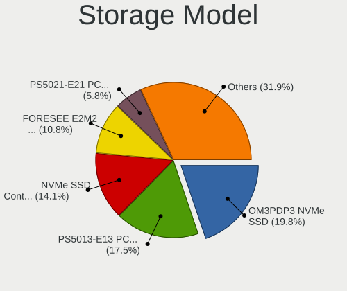

| Model                                                                         | Notebooks | Percent |
|-------------------------------------------------------------------------------|-----------|---------|
| Kingston Company OM3PDP3 NVMe SSD                                             | 452       | 19.81%  |
| Phison PS5013-E13 PCIe3 NVMe Controller (DRAM-less)                           | 400       | 17.53%  |
| Samsung NVMe SSD Controller 980 (DRAM-less)                                   | 322       | 14.11%  |
| O2 Micro FORESEE E2M2 NVMe SSD                                                | 246       | 10.78%  |
| Phison PS5021-E21 PCIe4 NVMe Controller (DRAM-less)                           | 133       | 5.83%   |
| Sandisk PC SN740 NVMe SSD (DRAM-less)                                         | 89        | 3.9%    |
| Micron 2400 NVMe SSD (DRAM-less)                                              | 85        | 3.72%   |
| Silicon Motion SM2263EN/SM2263XT (DRAM-less) NVMe SSD Controllers             | 57        | 2.5%    |
| Phison PS5019-E19 PCIe4 NVMe Controller (DRAM-less)                           | 43        | 1.88%   |
| Kingston Company OM3PGP4 NVMe SSD (DRAM-less)                                 | 34        | 1.49%   |
| AMD FCH SATA Controller [AHCI mode]                                           | 33        | 1.45%   |
| Samsung NVMe SSD Controller PM9B1 (DRAM-less)                                 | 31        | 1.36%   |
| SK hynix Gold P31/BC711/PC711 NVMe Solid State Drive                          | 28        | 1.23%   |
| SanDisk IX SN530 NVMe SSD / microSD Express Card (DRAM-less)                  | 22        | 0.96%   |
| KIOXIA NVMe SSD Controller BG4 (DRAM-less)                                    | 20        | 0.88%   |
| KIOXIA NVMe SSD Controller BG5 (DRAM-less)                                    | 14        | 0.61%   |
| MAXIO (Hangzhou) NVMe SSD Controller MAP1202 (DRAM-less)                      | 13        | 0.57%   |
| Sandisk WD Black SN770M NVMe SSD (DRAM-less)                                  | 12        | 0.53%   |
| SK hynix BC511 NVMe SSD                                                       | 11        | 0.48%   |
| Micron 2500 NVMe SSD (DRAM-less)                                              | 11        | 0.48%   |
| Intel Volume Management Device NVMe RAID Controller                           | 10        | 0.44%   |
| Phison PS5027-E27T PCIe4 NVMe Controller (DRAM-less)                          | 8         | 0.35%   |
| Silicon Motion SM2269XT (DRAM-less) NVMe SSD Controller                       | 7         | 0.31%   |
| MAXIO (Hangzhou) NVMe SSD Controller MAP1602 (DRAM-less)                      | 7         | 0.31%   |
| Intel 82801 Mobile SATA Controller [RAID mode]                                | 7         | 0.31%   |
| SanDisk WD SN560/SN740/SN770/SN5000 NVMe SSD                                  | 6         | 0.26%   |
| SanDisk Ultra 3D / WD PC SN530, IX SN530, Blue SN550 NVMe SSD (DRAM-less)     | 6         | 0.26%   |
| Intel Sunrise Point-LP SATA Controller [AHCI mode]                            | 6         | 0.26%   |
| Biwin Storage KingSpec NX series NVMe SSD (DRAM-less)                         | 6         | 0.26%   |
| Solid State Storage XA1-311024 NVMe SSD M.2                                   | 5         | 0.22%   |
| SanDisk WD PC SN810 / Black SN850 NVMe SSD                                    | 5         | 0.22%   |
| Samsung NVMe SSD Controller SM981/PM981/PM983                                 | 5         | 0.22%   |
| Intel 7 Series Chipset Family 6-port SATA Controller [AHCI mode]              | 5         | 0.22%   |
| SanDisk PC SN530 NVMe SSD (DRAM-less)                                         | 4         | 0.18%   |
| SanDisk PC SN530 NVMe SSD                                                     | 4         | 0.18%   |
| Intel Tiger Lake-LP SATA Controller                                           | 4         | 0.18%   |
| Intel Q170/Q150/B150/H170/H110/Z170/CM236 Chipset SATA Controller [AHCI Mode] | 4         | 0.18%   |
| INNOGRIT NVMe SSD Controller IG5216 [Shasta+] (DRAM-less)                     | 4         | 0.18%   |
| Apple ANS2 NVMe Controller                                                    | 4         | 0.18%   |
| AMD 600 Series Chipset SATA Controller                                        | 4         | 0.18%   |

Storage Kind
------------

Kind of storage controller (IDE, SATA, NVMe, SAS, ...)

| Kind | Notebooks | Percent |
|------|-----------|---------|
| NVMe | 2140      | 95.54%  |
| SATA | 83        | 3.71%   |
| RAID | 16        | 0.71%   |
| IDE  | 1         | 0.04%   |

Processor
---------

CPU Vendor
----------

Processor vendors

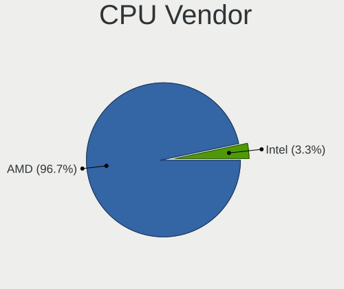

| Vendor | Notebooks | Percent |
|--------|-----------|---------|
| AMD    | 2117      | 96.67%  |
| Intel  | 73        | 3.33%   |

CPU Model
---------

Processor models

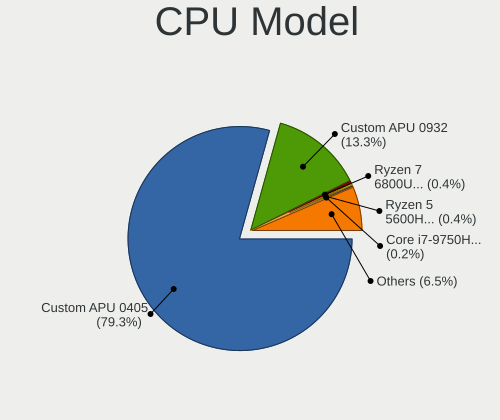

| Model                                         | Notebooks | Percent |
|-----------------------------------------------|-----------|---------|
| AMD Custom APU 0405                           | 1741      | 79.32%  |
| AMD Custom APU 0932                           | 292       | 13.3%   |
| AMD Ryzen 7 6800U with Radeon Graphics        | 8         | 0.36%   |
| AMD Ryzen 5 5600H with Radeon Graphics        | 8         | 0.36%   |
| Intel Core i7-9750H CPU @ 2.60GHz             | 4         | 0.18%   |
| AMD Ryzen 7 7840U w/ Radeon 780M Graphics     | 3         | 0.14%   |
| AMD Ryzen 7 5700U with Radeon Graphics        | 3         | 0.14%   |
| Intel Core i9-9880H CPU @ 2.30GHz             | 2         | 0.09%   |
| Intel Core i7-8750H CPU @ 2.20GHz             | 2         | 0.09%   |
| Intel Core i7-7700HQ CPU @ 2.80GHz            | 2         | 0.09%   |
| Intel Core i5-8300H CPU @ 2.30GHz             | 2         | 0.09%   |
| Intel Core i5-4260U CPU @ 1.40GHz             | 2         | 0.09%   |
| Intel Core i5-2435M CPU @ 2.40GHz             | 2         | 0.09%   |
| Intel Celeron CPU N3060 @ 1.60GHz             | 2         | 0.09%   |
| Intel 12th Gen Core i3-1215U                  | 2         | 0.09%   |
| Intel 11th Gen Core i7-11800H @ 2.30GHz       | 2         | 0.09%   |
| Intel 11th Gen Core i7-1165G7 @ 2.80GHz       | 2         | 0.09%   |
| Intel 11th Gen Core i5-11400H @ 2.70GHz       | 2         | 0.09%   |
| Intel 11th Gen Core i5-11300H @ 3.10GHz       | 2         | 0.09%   |
| Intel 11th Gen Core i3-1115G4 @ 3.00GHz       | 2         | 0.09%   |
| AMD Ryzen 9 6900HS with Radeon Graphics       | 2         | 0.09%   |
| AMD Ryzen 7 8845HS w/ Radeon 780M Graphics    | 2         | 0.09%   |
| AMD Ryzen 7 7735HS with Radeon Graphics       | 2         | 0.09%   |
| AMD Ryzen 7 4800H with Radeon Graphics        | 2         | 0.09%   |
| AMD Ryzen 5 7535HS with Radeon Graphics       | 2         | 0.09%   |
| AMD Ryzen 5 5500U with Radeon Graphics        | 2         | 0.09%   |
| AMD Ryzen 5 4600H with Radeon Graphics        | 2         | 0.09%   |
| AMD Ryzen 5 4500U with Radeon Graphics        | 2         | 0.09%   |
| AMD Ryzen 5 3550H with Radeon Vega Mobile Gfx | 2         | 0.09%   |
| AMD Athlon Silver 3050e with Radeon Graphics  | 2         | 0.09%   |
| Intel Xeon CPU E3-1575M v5 @ 3.00GHz          | 1         | 0.05%   |
| Intel Processor 5Y10 CPU @ 0.80GHz            | 1         | 0.05%   |
| Intel Pentium Silver N5030 CPU @ 1.10GHz      | 1         | 0.05%   |
| Intel Pentium Gold 7505 @ 2.00GHz             | 1         | 0.05%   |
| Intel Core m3-8100Y CPU @ 1.10GHz             | 1         | 0.05%   |
| Intel Core i7-8665U CPU @ 1.90GHz             | 1         | 0.05%   |
| Intel Core i7-7820HQ CPU @ 2.90GHz            | 1         | 0.05%   |
| Intel Core i7-7560U CPU @ 2.40GHz             | 1         | 0.05%   |
| Intel Core i7-6920HQ CPU @ 2.90GHz            | 1         | 0.05%   |
| Intel Core i7-6820HQ CPU @ 2.70GHz            | 1         | 0.05%   |

CPU Model Family
----------------

Processor model prefix

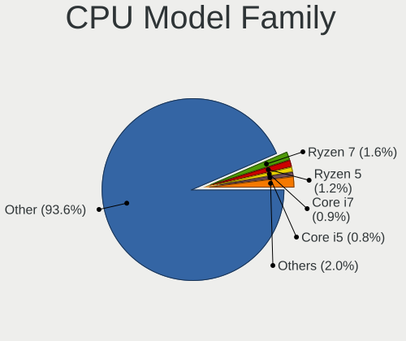

| Model                | Notebooks | Percent |
|----------------------|-----------|---------|
| Other                | 2049      | 93.56%  |
| AMD Ryzen 7          | 34        | 1.55%   |
| AMD Ryzen 5          | 27        | 1.23%   |
| Intel Core i7        | 20        | 0.91%   |
| Intel Core i5        | 17        | 0.78%   |
| AMD Ryzen 9          | 8         | 0.37%   |
| Intel Core i3        | 4         | 0.18%   |
| AMD Ryzen 3          | 4         | 0.18%   |
| Intel Celeron        | 3         | 0.14%   |
| AMD A6               | 3         | 0.14%   |
| AMD A10              | 3         | 0.14%   |
| Intel Core i9        | 2         | 0.09%   |
| Intel Core 2 Duo     | 2         | 0.09%   |
| Intel Atom           | 2         | 0.09%   |
| AMD Athlon           | 2         | 0.09%   |
| Intel Xeon           | 1         | 0.05%   |
| Intel Pentium Silver | 1         | 0.05%   |
| Intel Pentium Gold   | 1         | 0.05%   |
| Intel Core m3        | 1         | 0.05%   |
| AMD Ryzen 7 PRO      | 1         | 0.05%   |
| AMD Ryzen 5 PRO      | 1         | 0.05%   |
| AMD E2               | 1         | 0.05%   |
| AMD E1               | 1         | 0.05%   |
| AMD A8               | 1         | 0.05%   |
| AMD A12              | 1         | 0.05%   |

CPU Cores
---------

Number of processor cores

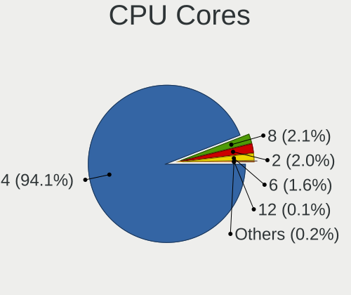

| Number | Notebooks | Percent |
|--------|-----------|---------|
| 4      | 2062      | 94.11%  |
| 8      | 45        | 2.05%   |
| 2      | 43        | 1.96%   |
| 6      | 34        | 1.55%   |
| 12     | 3         | 0.14%   |
| 10     | 2         | 0.09%   |
| 16     | 1         | 0.05%   |
| 3      | 1         | 0.05%   |

CPU Sockets
-----------

Number of sockets

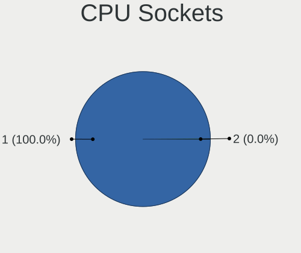

| Number | Notebooks | Percent |
|--------|-----------|---------|
| 1      | 2189      | 99.95%  |
| 2      | 1         | 0.05%   |

CPU Threads
-----------

Threads per core (Hyper-Threading)

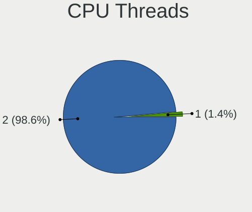

| Number | Notebooks | Percent |
|--------|-----------|---------|
| 2      | 2161      | 98.59%  |
| 1      | 31        | 1.41%   |

CPU Op-Modes
------------

CPU Operation Modes (32-bit, 64-bit)

| Op mode        | Notebooks | Percent |
|----------------|-----------|---------|
| 32-bit, 64-bit | 2190      | 100%    |

CPU Microcode
-------------

Microcode number

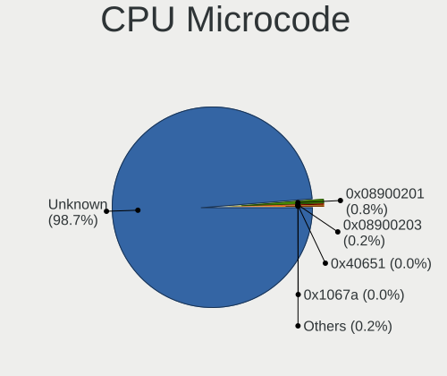

| Number     | Notebooks | Percent |
|------------|-----------|---------|
| Unknown    | 2166      | 98.72%  |
| 0x08900201 | 17        | 0.77%   |
| 0x08900203 | 4         | 0.18%   |
| 0x40651    | 1         | 0.05%   |
| 0x1067a    | 1         | 0.05%   |
| 0x0a704103 | 1         | 0.05%   |
| 0x0a50000c | 1         | 0.05%   |
| 0x0a404102 | 1         | 0.05%   |
| 0x08901003 | 1         | 0.05%   |
| 0x08901001 | 1         | 0.05%   |

CPU Microarch
-------------

Microarchitecture

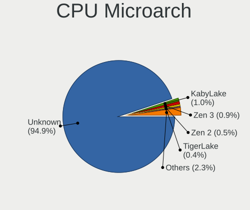

| Name          | Notebooks | Percent |
|---------------|-----------|---------|
| Unknown       | 2078      | 94.89%  |
| KabyLake      | 22        | 1%      |
| Zen 3         | 19        | 0.87%   |
| Zen 2         | 12        | 0.55%   |
| TigerLake     | 9         | 0.41%   |
| Haswell       | 7         | 0.32%   |
| Excavator     | 7         | 0.32%   |
| Skylake       | 6         | 0.27%   |
| Zen+          | 5         | 0.23%   |
| Silvermont    | 4         | 0.18%   |
| IvyBridge     | 4         | 0.18%   |
| Zen           | 3         | 0.14%   |
| SandyBridge   | 3         | 0.14%   |
| Piledriver    | 3         | 0.14%   |
| Penryn        | 2         | 0.09%   |
| CometLake     | 2         | 0.09%   |
| Jaguar        | 1         | 0.05%   |
| IceLake       | 1         | 0.05%   |
| Goldmont plus | 1         | 0.05%   |
| Broadwell     | 1         | 0.05%   |

Graphics
--------

GPU Vendor
----------

Vendors of graphics cards

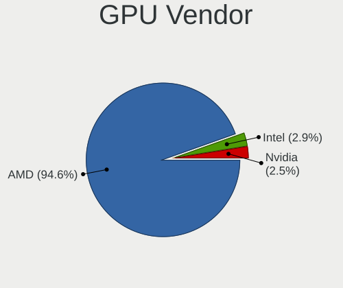

| Vendor | Notebooks | Percent |
|--------|-----------|---------|
| AMD    | 2122      | 94.56%  |
| Intel  | 65        | 2.9%    |
| Nvidia | 57        | 2.54%   |

GPU Model
---------

Graphics card models

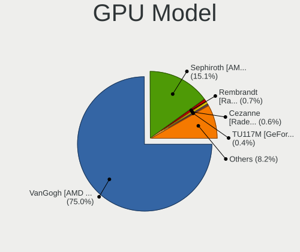

| Model                                                                                    | Notebooks | Percent |
|------------------------------------------------------------------------------------------|-----------|---------|
| AMD VanGogh [AMD Custom GPU 0405]                                                        | 1688      | 74.96%  |
| AMD Sephiroth [AMD Custom GPU 0405]                                                      | 340       | 15.1%   |
| AMD Rembrandt [Radeon 680M]                                                              | 16        | 0.71%   |
| AMD Cezanne [Radeon Vega Series / Radeon Vega Mobile Series]                             | 13        | 0.58%   |
| Nvidia TU117M [GeForce GTX 1650 Mobile / Max-Q]                                          | 10        | 0.44%   |
| AMD Renoir [Radeon Vega Series / Radeon Vega Mobile Series]                              | 10        | 0.44%   |
| AMD Picasso/Raven 2 [Radeon Vega Series / Radeon Vega Mobile Series]                     | 8         | 0.36%   |
| Nvidia GA107M [GeForce RTX 3050 Mobile]                                                  | 7         | 0.31%   |
| Intel CoffeeLake-H GT2 [UHD Graphics 630]                                                | 7         | 0.31%   |
| AMD Lucienne                                                                             | 6         | 0.27%   |
| AMD HawkPoint1                                                                           | 6         | 0.27%   |
| Intel TigerLake-LP GT2 [Iris Xe Graphics]                                                | 5         | 0.22%   |
| AMD Stoney [Radeon R2/R3/R4/R5 Graphics]                                                 | 5         | 0.22%   |
| AMD Phoenix1                                                                             | 5         | 0.22%   |
| Nvidia GA106M [GeForce RTX 3060 Mobile / Max-Q]                                          | 4         | 0.18%   |
| Intel TigerLake-H GT1 [UHD Graphics]                                                     | 4         | 0.18%   |
| Intel Atom/Celeron/Pentium Processor x5-E8000/J3xxx/N3xxx Integrated Graphics Controller | 4         | 0.18%   |
| Intel 3rd Gen Core processor Graphics Controller                                         | 4         | 0.18%   |
| AMD Baffin [Radeon RX 460/560D / Pro 450/455/460/555/555X/560/560X]                      | 4         | 0.18%   |
| Nvidia AD107M [GeForce RTX 4060 Max-Q / Mobile]                                          | 3         | 0.13%   |
| Intel Tiger Lake-LP GT2 [UHD Graphics G4]                                                | 3         | 0.13%   |
| Intel Kaby Lake-H GT2 [HD Graphics 630]                                                  | 3         | 0.13%   |
| Intel Haswell-ULT Integrated Graphics Controller                                         | 3         | 0.13%   |
| Intel 4th Gen Core Processor Integrated Graphics Controller                              | 3         | 0.13%   |
| Intel 2nd Generation Core Processor Family Integrated Graphics Controller                | 3         | 0.13%   |
| AMD Raphael                                                                              | 3         | 0.13%   |
| Nvidia TU106M [GeForce RTX 2060 Mobile]                                                  | 2         | 0.09%   |
| Nvidia GP107M [GeForce GTX 1050 Ti Mobile]                                               | 2         | 0.09%   |
| Nvidia GP107M [GeForce GTX 1050 Mobile]                                                  | 2         | 0.09%   |
| Nvidia GA104M [GeForce RTX 3080 Mobile / Max-Q 8GB/16GB]                                 | 2         | 0.09%   |
| Nvidia AD106M [GeForce RTX 4070 Max-Q / Mobile]                                          | 2         | 0.09%   |
| Intel Skylake-U GT2 [HD Graphics 520]                                                    | 2         | 0.09%   |
| Intel Skylake-H GT2 [HD Graphics 530]                                                    | 2         | 0.09%   |
| Intel Mobile 4 Series Chipset Integrated Graphics Controller                             | 2         | 0.09%   |
| Intel Kaby Lake-U GT2 [HD Graphics 620]                                                  | 2         | 0.09%   |
| Intel CometLake-H GT2 [UHD Graphics]                                                     | 2         | 0.09%   |
| Intel Alder Lake-UP3 GT1 [UHD Graphics]                                                  | 2         | 0.09%   |
| AMD Wani [Radeon R5/R6/R7 Graphics]                                                      | 2         | 0.09%   |
| AMD Navi 33 [Radeon RX 7600/7600 XT/7600M XT/7600S/7700S / PRO W7600]                    | 2         | 0.09%   |
| AMD Navi 31 [Radeon RX 7900 XT/7900 XTX/7900 GRE/7900M]                                  | 2         | 0.09%   |

GPU Combo
---------

Combinations of graphics cards

| Name           | Notebooks | Percent |
|----------------|-----------|---------|
| 1 x AMD        | 2087      | 95.3%   |
| 1 x Intel      | 35        | 1.6%    |
| Intel + Nvidia | 27        | 1.23%   |
| AMD + Nvidia   | 25        | 1.14%   |
| 2 x AMD        | 8         | 0.37%   |
| 1 x Nvidia     | 5         | 0.23%   |
| Intel + AMD    | 2         | 0.09%   |
| Other          | 1         | 0.05%   |

GPU Driver
----------

Free vs proprietary

| Driver      | Notebooks | Percent |
|-------------|-----------|---------|
| Free        | 2183      | 99.63%  |
| Proprietary | 8         | 0.37%   |

GPU Memory
----------

Total video memory

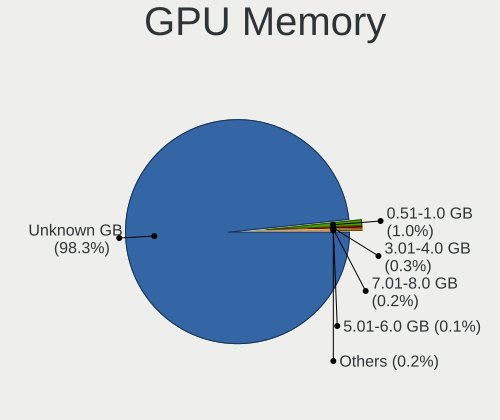

| Size in GB | Notebooks | Percent |
|------------|-----------|---------|
| Unknown    | 2158      | 98.31%  |
| 0.51-1.0   | 21        | 0.96%   |
| 3.01-4.0   | 6         | 0.27%   |
| 7.01-8.0   | 4         | 0.18%   |
| 5.01-6.0   | 2         | 0.09%   |
| 2.01-3.0   | 2         | 0.09%   |
| 1.01-2.0   | 1         | 0.05%   |
| 0.01-0.5   | 1         | 0.05%   |

Monitor
-------

Monitor Vendor
--------------

Monitor vendors

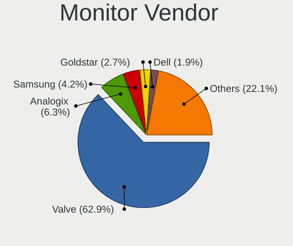

| Vendor               | Notebooks | Percent |
|----------------------|-----------|---------|
| Valve                | 1678      | 62.94%  |
| Analogix             | 167       | 6.26%   |
| Samsung Electronics  | 111       | 4.16%   |
| Goldstar             | 71        | 2.66%   |
| Dell                 | 50        | 1.88%   |
| BOE                  | 32        | 1.2%    |
| Acer                 | 32        | 1.2%    |
| Chimei Innolux       | 30        | 1.13%   |
| Hewlett-Packard      | 28        | 1.05%   |
| AOC                  | 27        | 1.01%   |
| ASUSTek Computer     | 22        | 0.83%   |
| Philips              | 21        | 0.79%   |
| AU Optronics         | 20        | 0.75%   |
| MSI                  | 19        | 0.71%   |
| BenQ                 | 19        | 0.71%   |
| Ancor Communications | 18        | 0.68%   |
| Vizio                | 16        | 0.6%    |
| Sony                 | 15        | 0.56%   |
| Lenovo               | 14        | 0.53%   |
| Apple                | 12        | 0.45%   |
| RTK                  | 11        | 0.41%   |
| LG Display           | 11        | 0.41%   |
| Gigabyte Technology  | 10        | 0.38%   |
| Sceptre Tech         | 9         | 0.34%   |
| PANDA                | 9         | 0.34%   |
| Unknown (XXX)        | 7         | 0.26%   |
| Sharp                | 7         | 0.26%   |
| Hitachi              | 7         | 0.26%   |
| ViewSonic            | 6         | 0.23%   |
| Panasonic            | 6         | 0.23%   |
| Toshiba              | 5         | 0.19%   |
| JDI                  | 5         | 0.19%   |
| Huion                | 5         | 0.19%   |
| GreenWood            | 5         | 0.19%   |
| DHD                  | 5         | 0.19%   |
| Vestel Elektronik    | 4         | 0.15%   |
| UGD                  | 4         | 0.15%   |
| SGT                  | 4         | 0.15%   |
| Roku                 | 4         | 0.15%   |
| Pixio                | 4         | 0.15%   |

Monitor Model
-------------

Monitor models

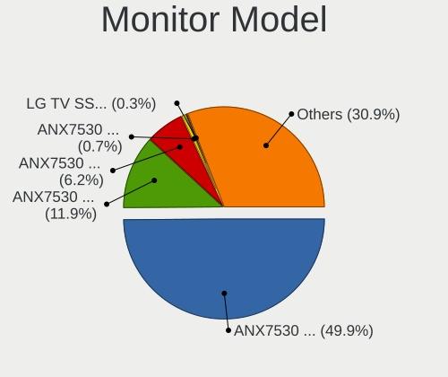

| Model                                                                   | Notebooks | Percent |
|-------------------------------------------------------------------------|-----------|---------|
| Valve ANX7530 U VLV3001 800x1280 100x150mm 7.1-inch                     | 1338      | 49.89%  |
| Valve ANX7530 U VLV3003 800x1280 100x160mm 7.4-inch                     | 320       | 11.93%  |
| Analogix ANX7530 U ANX7539 720x1280                                     | 167       | 6.23%   |
| Valve ANX7530 U VLV3004 800x1280 100x160mm 7.4-inch                     | 19        | 0.71%   |
| Goldstar LG TV SSCR2 GSMC0C8 3840x2160                                  | 8         | 0.3%    |
| PANDA LCD Monitor NCP004D 1920x1080 344x194mm 15.5-inch                 | 6         | 0.22%   |
| Philips FTV PHL04C3 1920x1080 1440x810mm 65.0-inch                      | 5         | 0.19%   |
| JDI GPD1001H JDI0031 2560x1600 890x500mm 40.2-inch                      | 5         | 0.19%   |
| Vestel Elektronik 40UHD_LCD_TV VES3700 3840x2160 880x500mm 39.8-inch    | 4         | 0.15%   |
| Samsung Electronics C24F390 SAM0D2C 1920x1080 521x293mm 23.5-inch       | 4         | 0.15%   |
| RTK XP-PEN RTK2A3B 1920x1080 531x299mm 24.0-inch                        | 4         | 0.15%   |
| DHD DeckHD-1200p DHD4001 1200x1920 100x150mm 7.1-inch                   | 4         | 0.15%   |
| Unknown (XXX) Beyond TV XXX2851 3840x2160 1209x680mm 54.6-inch          | 3         | 0.11%   |
| Sceptre Tech Sceptre F24 SPT09AB 1920x1080 530x290mm 23.8-inch          | 3         | 0.11%   |
| Samsung Electronics S24F350 SAM0D20 1920x1080 521x293mm 23.5-inch       | 3         | 0.11%   |
| Samsung Electronics LCD Monitor SAM7017 3840x2160 1872x1053mm 84.6-inch | 3         | 0.11%   |
| Samsung Electronics LCD Monitor SAM0F14 1920x540                        | 3         | 0.11%   |
| Samsung Electronics LCD Monitor SAM0C3C 1366x768 609x347mm 27.6-inch    | 3         | 0.11%   |
| Samsung Electronics LCD Monitor SAM0C39 1920x1080 885x498mm 40.0-inch   | 3         | 0.11%   |
| Samsung Electronics C27F390 SAM0D32 1920x1080 598x336mm 27.0-inch       | 3         | 0.11%   |
| RTK HX150T RTK1920 1920x1080 344x195mm 15.6-inch                        | 3         | 0.11%   |
| Panasonic TV MEIA296 1920x1080 698x392mm 31.5-inch                      | 3         | 0.11%   |
| MSI Optix MAG27CQ MSI1462 2560x1440 597x336mm 27.0-inch                 | 3         | 0.11%   |
| Hitachi HISENSE HEC002F 3840x2160 1872x1053mm 84.6-inch                 | 3         | 0.11%   |
| Goldstar FULL HD GSM5BDF 1920x1080 480x270mm 21.7-inch                  | 3         | 0.11%   |
| Goldstar FULL HD GSM5B55 1920x1080 480x270mm 21.7-inch                  | 3         | 0.11%   |
| Chimei Innolux LCD Monitor CMN1521 1920x1080 344x193mm 15.5-inch        | 3         | 0.11%   |
| BOE FLQ8423-24L0 BOE1003 1600x2560 113x181mm 8.4-inch                   | 3         | 0.11%   |
| AU Optronics LCD Monitor AUO21ED 1920x1080 344x193mm 15.5-inch          | 3         | 0.11%   |
| Apple Color LCD APPA040 2880x1800 331x207mm 15.4-inch                   | 3         | 0.11%   |
| AOC 27G2G4 AOC2702 1920x1080 598x336mm 27.0-inch                        | 3         | 0.11%   |
| Ancor Communications ASUS VH242H ACI24F3 1920x1080 521x293mm 23.5-inch  | 3         | 0.11%   |
| Acer SB220Q ACR06AB 1920x1080 476x268mm 21.5-inch                       | 3         | 0.11%   |
| Vizio V505-J09 VIZ1039 3840x2160 1096x616mm 49.5-inch                   | 2         | 0.07%   |
| Vizio E500i-B1 VIZ1004 1920x1080 1095x616mm 49.5-inch                   | 2         | 0.07%   |
| Vizio D24f-J09 VIZ1044 1920x1080 521x293mm 23.5-inch                    | 2         | 0.07%   |
| Vizio D24-D1 VIZ1005 1920x1080 521x293mm 23.5-inch                      | 2         | 0.07%   |
| Unknown (XXX) Beyond TV XXX9221 1920x1080 1209x680mm 54.6-inch          | 2         | 0.07%   |
| TMX TL140ADXP01 TMX1481 2560x1600 301x188mm 14.0-inch                   | 2         | 0.07%   |
| Sony TV *30 SNYB105 3840x2160 1218x685mm 55.0-inch                      | 2         | 0.07%   |

Monitor Resolution
------------------

Monitor screen resolution

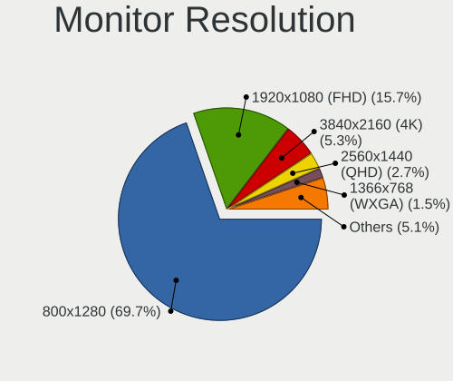

| Resolution         | Notebooks | Percent |
|--------------------|-----------|---------|
| 800x1280           | 1819      | 69.69%  |
| 1920x1080 (FHD)    | 410       | 15.71%  |
| 3840x2160 (4K)     | 138       | 5.29%   |
| 2560x1440 (QHD)    | 70        | 2.68%   |
| 1366x768 (WXGA)    | 40        | 1.53%   |
| 3440x1440          | 30        | 1.15%   |
| 2560x1600          | 14        | 0.54%   |
| 2560x1080          | 13        | 0.5%    |
| 1920x1200 (WUXGA)  | 9         | 0.34%   |
| 1600x900 (HD+)     | 6         | 0.23%   |
| 2880x1800          | 5         | 0.19%   |
| 1600x2560          | 5         | 0.19%   |
| 1360x768           | 5         | 0.19%   |
| 1200x1920          | 5         | 0.19%   |
| 3840x1080          | 4         | 0.15%   |
| 1920x540           | 4         | 0.15%   |
| 1680x1050 (WSXGA+) | 4         | 0.15%   |
| 1440x900 (WXGA+)   | 4         | 0.15%   |
| 3840x1600          | 3         | 0.11%   |
| 2160x1440          | 3         | 0.11%   |
| 1280x800 (WXGA)    | 3         | 0.11%   |
| 1280x1024 (SXGA)   | 3         | 0.11%   |
| 1920x800           | 2         | 0.08%   |
| 1080x1920          | 2         | 0.08%   |
| 1024x768 (XGA)     | 2         | 0.08%   |
| 504x315            | 1         | 0.04%   |
| 480x1920           | 1         | 0.04%   |
| 3840x2400          | 1         | 0.04%   |
| 3200x1800 (QHD+)   | 1         | 0.04%   |
| 2160x3840          | 1         | 0.04%   |
| 1600x1200          | 1         | 0.04%   |
| Unknown            | 1         | 0.04%   |

Monitor Diagonal
----------------

Diagonal size in inches

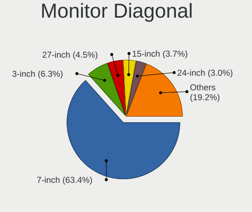

| Inches  | Notebooks | Percent |
|---------|-----------|---------|
| 7       | 1683      | 63.37%  |
| 3       | 167       | 6.29%   |
| 27      | 120       | 4.52%   |
| 15      | 98        | 3.69%   |
| 24      | 79        | 2.97%   |
| 23      | 56        | 2.11%   |
| 31      | 50        | 1.88%   |
| 21      | 50        | 1.88%   |
| 84      | 35        | 1.32%   |
| 34      | 34        | 1.28%   |
| 54      | 24        | 0.9%    |
| 14      | 21        | 0.79%   |
| 32      | 19        | 0.72%   |
| Unknown | 19        | 0.72%   |
| 40      | 16        | 0.6%    |
| 13      | 16        | 0.6%    |
| 72      | 14        | 0.53%   |
| 17      | 13        | 0.49%   |
| 16      | 12        | 0.45%   |
| 65      | 9         | 0.34%   |
| 11      | 8         | 0.3%    |
| 63      | 7         | 0.26%   |
| 8       | 7         | 0.26%   |
| 36      | 6         | 0.23%   |
| 26      | 6         | 0.23%   |
| 18      | 6         | 0.23%   |
| 86      | 5         | 0.19%   |
| 57      | 5         | 0.19%   |
| 49      | 5         | 0.19%   |
| 42      | 5         | 0.19%   |
| 35      | 5         | 0.19%   |
| 22      | 5         | 0.19%   |
| 19      | 5         | 0.19%   |
| 74      | 4         | 0.15%   |
| 64      | 4         | 0.15%   |
| 52      | 4         | 0.15%   |
| 75      | 3         | 0.11%   |
| 55      | 3         | 0.11%   |
| 47      | 3         | 0.11%   |
| 33      | 3         | 0.11%   |

Monitor Width
-------------

Physical width

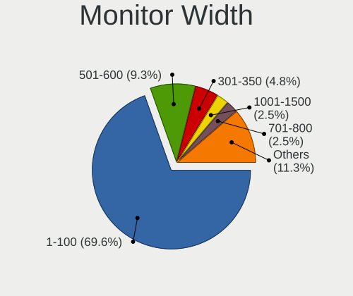

| Width in mm | Notebooks | Percent |
|-------------|-----------|---------|
| 1-100       | 1823      | 69.58%  |
| 501-600     | 244       | 9.31%   |
| 301-350     | 126       | 4.81%   |
| 701-800     | 65        | 2.48%   |
| 1001-1500   | 65        | 2.48%   |
| 601-700     | 64        | 2.44%   |
| 401-500     | 64        | 2.44%   |
| 1501-2000   | 61        | 2.33%   |
| 801-900     | 26        | 0.99%   |
| 351-400     | 23        | 0.88%   |
| 201-300     | 23        | 0.88%   |
| Unknown     | 19        | 0.73%   |
| 101-200     | 10        | 0.38%   |
| 901-1000    | 7         | 0.27%   |

Aspect Ratio
------------

Proportional relationship between the width and the height

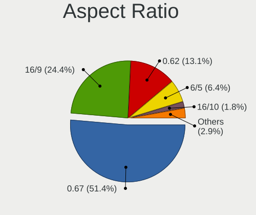

| Ratio | Notebooks | Percent |
|-------|-----------|---------|
| 0.67  | 1343      | 51.38%  |
| 16/9  | 638       | 24.41%  |
| 0.62  | 343       | 13.12%  |
| 6/5   | 167       | 6.39%   |
| 16/10 | 48        | 1.84%   |
| 21/9  | 44        | 1.68%   |
| 0.56  | 8         | 0.31%   |
| 32/9  | 7         | 0.27%   |
| 4/3   | 4         | 0.15%   |
| 5/4   | 3         | 0.11%   |
| 0.63  | 3         | 0.11%   |
| 3/2   | 2         | 0.08%   |
| 2.64  | 1         | 0.04%   |
| 2.12  | 1         | 0.04%   |
| 1.00  | 1         | 0.04%   |
| 0.25  | 1         | 0.04%   |

Monitor Area
------------

Area in inch²

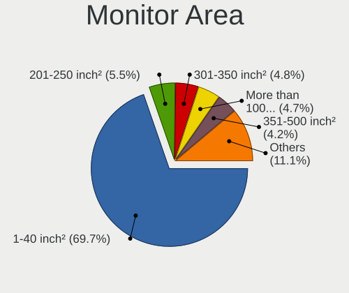

| Area in inch² | Notebooks | Percent |
|----------------|-----------|---------|
| 1-40           | 1831      | 69.7%   |
| 201-250        | 144       | 5.48%   |
| 301-350        | 126       | 4.8%    |
| More than 1000 | 123       | 4.68%   |
| 351-500        | 111       | 4.23%   |
| 101-110        | 104       | 3.96%   |
| 501-1000       | 40        | 1.52%   |
| 251-300        | 33        | 1.26%   |
| 81-90          | 27        | 1.03%   |
| 151-200        | 25        | 0.95%   |
| Unknown        | 19        | 0.72%   |
| 121-130        | 11        | 0.42%   |
| 71-80          | 10        | 0.38%   |
| 51-60          | 8         | 0.3%    |
| 141-150        | 8         | 0.3%    |
| 111-120        | 6         | 0.23%   |
| 91-100         | 1         | 0.04%   |

Pixel Density
-------------

Pixels per inch

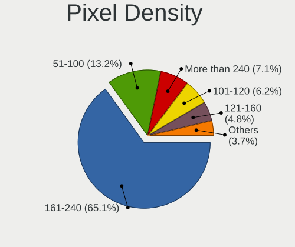

| Density       | Notebooks | Percent |
|---------------|-----------|---------|
| 161-240       | 1696      | 65.08%  |
| 51-100        | 343       | 13.16%  |
| More than 240 | 184       | 7.06%   |
| 101-120       | 162       | 6.22%   |
| 121-160       | 124       | 4.76%   |
| 1-50          | 78        | 2.99%   |
| Unknown       | 19        | 0.73%   |

Multiple Monitors
-----------------

Total monitors connected

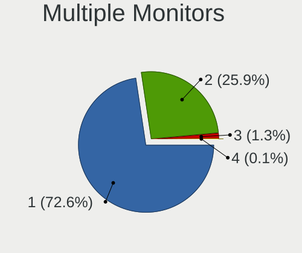

| Total | Notebooks | Percent |
|-------|-----------|---------|
| 1     | 1638      | 72.64%  |
| 2     | 584       | 25.9%   |
| 3     | 30        | 1.33%   |
| 4     | 3         | 0.13%   |

Network
-------

Net Controller Vendor
---------------------

Controller vendors

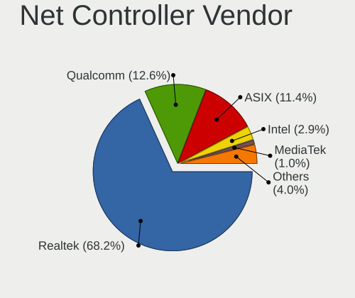

| Vendor                                 | Notebooks | Percent |
|----------------------------------------|-----------|---------|
| Realtek Semiconductor                  | 1848      | 68.24%  |
| Qualcomm                               | 341       | 12.59%  |
| ASIX Electronics                       | 308       | 11.37%  |
| Intel                                  | 78        | 2.88%   |
| MediaTek                               | 26        | 0.96%   |
| Qualcomm Atheros                       | 18        | 0.66%   |
| DisplayLink                            | 18        | 0.66%   |
| TP-Link                                | 9         | 0.33%   |
| Broadcom                               | 9         | 0.33%   |
| Microsoft                              | 8         | 0.3%    |
| Lenovo                                 | 6         | 0.22%   |
| Samsung Electronics                    | 4         | 0.15%   |
| Ralink Technology                      | 4         | 0.15%   |
| Broadcom Limited                       | 4         | 0.15%   |
| ASUSTek Computer                       | 4         | 0.15%   |
| Google                                 | 3         | 0.11%   |
| Dell                                   | 3         | 0.11%   |
| ZTE WCDMA Technologies MSM             | 2         | 0.07%   |
| QinHeng Electronics                    | 2         | 0.07%   |
| Edimax Technology                      | 2         | 0.07%   |
| ZyXEL Communications                   | 1         | 0.04%   |
| Xiaomi                                 | 1         | 0.04%   |
| STMicroelectronics                     | 1         | 0.04%   |
| Sony Ericsson Mobile Communications AB | 1         | 0.04%   |
| Shenzhen Goodix Technology             | 1         | 0.04%   |
| Raspberry Pi                           | 1         | 0.04%   |
| OnePlus Technology (Shenzhen)          | 1         | 0.04%   |
| Marvell Technology Group               | 1         | 0.04%   |
| Davicom Semiconductor                  | 1         | 0.04%   |
| AVM                                    | 1         | 0.04%   |
| Artery                                 | 1         | 0.04%   |

Net Controller Model
--------------------

Controller models

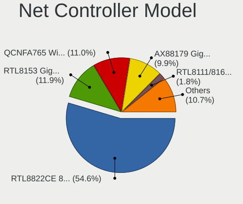

| Model                                                                  | Notebooks | Percent |
|------------------------------------------------------------------------|-----------|---------|
| Realtek RTL8822CE 802.11ac PCIe Wireless Network Adapter               | 1685      | 54.6%   |
| Realtek RTL8153 Gigabit Ethernet Adapter                               | 367       | 11.89%  |
| Qualcomm QCNFA765 Wireless Network Adapter                             | 340       | 11.02%  |
| ASIX AX88179 Gigabit Ethernet                                          | 307       | 9.95%   |
| Realtek RTL8111/8168/8211/8411 PCI Express Gigabit Ethernet Controller | 56        | 1.81%   |
| Realtek RTL8152 Fast Ethernet Adapter                                  | 40        | 1.3%    |
| Intel Wi-Fi 6E(802.11ax) AX210/AX1675* 2x2 [Typhoon Peak]              | 17        | 0.55%   |
| MediaTek MT7921 802.11ax PCIe Wireless Network Adapter [Filogic 330]   | 14        | 0.45%   |
| Intel Wi-Fi 6 AX200                                                    | 13        | 0.42%   |
| Realtek RTL810xE PCI Express Fast Ethernet controller                  | 8         | 0.26%   |
| Realtek RTL8125 2.5GbE Controller                                      | 7         | 0.23%   |
| MediaTek MT7922 802.11ax PCI Express Wireless Network Adapter          | 7         | 0.23%   |
| Intel Wi-Fi 6 AX201                                                    | 7         | 0.23%   |
| Realtek RTL8852AE 802.11ax PCIe Wireless Network Adapter               | 6         | 0.19%   |
| Realtek 802.11ac NIC                                                   | 6         | 0.19%   |
| Qualcomm Atheros QCA6174 802.11ac Wireless Network Adapter             | 6         | 0.19%   |
| Microsoft Wireless XBox Controller Dongle                              | 6         | 0.19%   |
| Realtek RTL8852BE PCIe 802.11ax Wireless Network Controller            | 5         | 0.16%   |
| Realtek Killer E2600 GbE Controller                                    | 5         | 0.16%   |
| Realtek RTL8821CE 802.11ac PCIe Wireless Network Adapter               | 4         | 0.13%   |
| Qualcomm Atheros QCA9377 802.11ac Wireless Network Adapter             | 4         | 0.13%   |
| Lenovo USB-C Dock Ethernet                                             | 4         | 0.13%   |
| Intel Wireless 8260                                                    | 4         | 0.13%   |
| Intel Wireless 7265                                                    | 4         | 0.13%   |
| Intel Wireless 3165                                                    | 4         | 0.13%   |
| Intel Cannon Lake PCH CNVi WiFi                                        | 4         | 0.13%   |
| DisplayLink Dell Universal Dock D6000                                  | 4         | 0.13%   |
| TP-Link 802.11ac NIC                                                   | 3         | 0.1%    |
| Samsung Galaxy series, misc. (tethering mode)                          | 3         | 0.1%    |
| Realtek RTL8822BE 802.11a/b/g/n/ac WiFi adapter                        | 3         | 0.1%    |
| Realtek RTL8723DE Wireless Network Adapter                             | 3         | 0.1%    |
| Qualcomm Atheros QCA9565 / AR9565 Wireless Network Adapter             | 3         | 0.1%    |
| Qualcomm Atheros Killer E2500 Gigabit Ethernet Controller              | 3         | 0.1%    |
| Qualcomm Atheros AR9485 Wireless Network Adapter                       | 3         | 0.1%    |
| Intel Dual Band Wireless-AC 3168NGW [Stone Peak]                       | 3         | 0.1%    |
| Google Pixel 9a                                                        | 3         | 0.1%    |
| DisplayLink USB-C Triple-4K Dock                                       | 3         | 0.1%    |
| DisplayLink Plugable UD-3900Z                                          | 3         | 0.1%    |
| Broadcom NetXtreme BCM57765 Gigabit Ethernet PCIe                      | 3         | 0.1%    |
| Broadcom BCM4364 802.11ac Wireless Network Adapter                     | 3         | 0.1%    |

Wireless Vendor
---------------

Wireless vendors

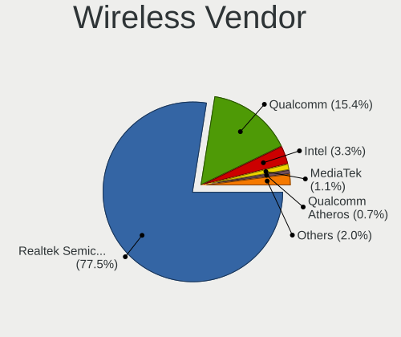

| Vendor                | Notebooks | Percent |
|-----------------------|-----------|---------|
| Realtek Semiconductor | 1714      | 77.49%  |
| Qualcomm              | 340       | 15.37%  |
| Intel                 | 73        | 3.3%    |
| MediaTek              | 24        | 1.08%   |
| Qualcomm Atheros      | 16        | 0.72%   |
| TP-Link               | 9         | 0.41%   |
| Broadcom              | 9         | 0.41%   |
| Microsoft             | 8         | 0.36%   |
| Ralink Technology     | 4         | 0.18%   |
| Broadcom Limited      | 4         | 0.18%   |
| ASUSTek Computer      | 4         | 0.18%   |
| Dell                  | 3         | 0.14%   |
| Edimax Technology     | 2         | 0.09%   |
| ZyXEL Communications  | 1         | 0.05%   |
| AVM                   | 1         | 0.05%   |

Wireless Model
--------------

Wireless models

| Model                                                                | Notebooks | Percent |
|----------------------------------------------------------------------|-----------|---------|
| Realtek RTL8822CE 802.11ac PCIe Wireless Network Adapter             | 1685      | 75.94%  |
| Qualcomm QCNFA765 Wireless Network Adapter                           | 340       | 15.32%  |
| Intel Wi-Fi 6E(802.11ax) AX210/AX1675* 2x2 [Typhoon Peak]            | 17        | 0.77%   |
| MediaTek MT7921 802.11ax PCIe Wireless Network Adapter [Filogic 330] | 14        | 0.63%   |
| Intel Wi-Fi 6 AX200                                                  | 13        | 0.59%   |
| Intel Wi-Fi 6 AX201                                                  | 7         | 0.32%   |
| Realtek RTL8852AE 802.11ax PCIe Wireless Network Adapter             | 6         | 0.27%   |
| Realtek 802.11ac NIC                                                 | 6         | 0.27%   |
| Qualcomm Atheros QCA6174 802.11ac Wireless Network Adapter           | 6         | 0.27%   |
| Microsoft Wireless XBox Controller Dongle                            | 6         | 0.27%   |
| MediaTek MT7922 802.11ax PCI Express Wireless Network Adapter        | 6         | 0.27%   |
| Realtek RTL8852BE PCIe 802.11ax Wireless Network Controller          | 5         | 0.23%   |
| Realtek RTL8821CE 802.11ac PCIe Wireless Network Adapter             | 4         | 0.18%   |
| Qualcomm Atheros QCA9377 802.11ac Wireless Network Adapter           | 4         | 0.18%   |
| Intel Wireless 8260                                                  | 4         | 0.18%   |
| Intel Wireless 7265                                                  | 4         | 0.18%   |
| Intel Wireless 3165                                                  | 4         | 0.18%   |
| Intel Cannon Lake PCH CNVi WiFi                                      | 4         | 0.18%   |
| TP-Link 802.11ac NIC                                                 | 3         | 0.14%   |
| Realtek RTL8822BE 802.11a/b/g/n/ac WiFi adapter                      | 3         | 0.14%   |
| Realtek RTL8723DE Wireless Network Adapter                           | 3         | 0.14%   |
| Qualcomm Atheros QCA9565 / AR9565 Wireless Network Adapter           | 3         | 0.14%   |
| Qualcomm Atheros AR9485 Wireless Network Adapter                     | 3         | 0.14%   |
| Intel Dual Band Wireless-AC 3168NGW [Stone Peak]                     | 3         | 0.14%   |
| Broadcom BCM4364 802.11ac Wireless Network Adapter                   | 3         | 0.14%   |
| Broadcom BCM4331 802.11a/b/g/n                                       | 3         | 0.14%   |
| TP-Link AC600 wireless Realtek RTL8811AU [Archer T2U Nano]           | 2         | 0.09%   |
| Realtek RTL8814AU 802.11a/b/g/n/ac Wireless Adapter                  | 2         | 0.09%   |
| Realtek RTL8812AU 802.11a/b/g/n/ac 2T2R DB WLAN Adapter              | 2         | 0.09%   |
| Realtek RTL8188EE Wireless Network Adapter                           | 2         | 0.09%   |
| Ralink RT5370 Wireless Adapter                                       | 2         | 0.09%   |
| Ralink RT2870/RT3070 Wireless Adapter                                | 2         | 0.09%   |
| MediaTek MT7902 802.11ax PCIe Wireless Network Adapter [Filogic 310] | 2         | 0.09%   |
| Intel WiFi Link 5100                                                 | 2         | 0.09%   |
| Intel Tiger Lake PCH CNVi WiFi                                       | 2         | 0.09%   |
| Intel Comet Lake PCH CNVi WiFi                                       | 2         | 0.09%   |
| Intel Centrino Advanced-N 6235                                       | 2         | 0.09%   |
| Broadcom Limited BCM4360 802.11ac Dual Band Wireless Network Adapter | 2         | 0.09%   |
| ASUS USB-N14 802.11b/g/n (2x2) Wireless Adapter [Ralink RT5372]      | 2         | 0.09%   |
| ZyXEL 802.11ax WLAN Adapter                                          | 1         | 0.05%   |

Ethernet Vendor
---------------

Ethernet vendors

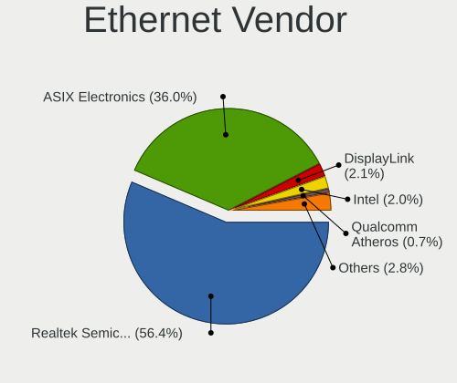

| Vendor                                 | Notebooks | Percent |
|----------------------------------------|-----------|---------|
| Realtek Semiconductor                  | 483       | 56.43%  |
| ASIX Electronics                       | 308       | 35.98%  |
| DisplayLink                            | 18        | 2.1%    |
| Intel                                  | 17        | 1.99%   |
| Qualcomm Atheros                       | 6         | 0.7%    |
| Lenovo                                 | 6         | 0.7%    |
| Samsung Electronics                    | 4         | 0.47%   |
| Google                                 | 3         | 0.35%   |
| Broadcom                               | 3         | 0.35%   |
| MediaTek                               | 2         | 0.23%   |
| Xiaomi                                 | 1         | 0.12%   |
| Sony Ericsson Mobile Communications AB | 1         | 0.12%   |
| Qualcomm                               | 1         | 0.12%   |
| OnePlus Technology (Shenzhen)          | 1         | 0.12%   |
| Marvell Technology Group               | 1         | 0.12%   |
| Davicom Semiconductor                  | 1         | 0.12%   |

Ethernet Model
--------------

Ethernet models

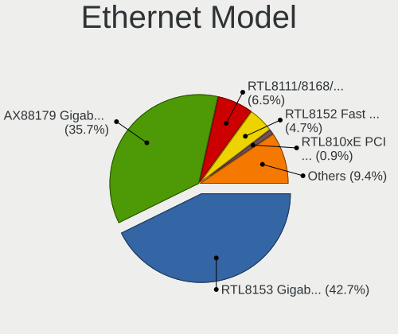

| Model                                                                  | Notebooks | Percent |
|------------------------------------------------------------------------|-----------|---------|
| Realtek RTL8153 Gigabit Ethernet Adapter                               | 367       | 42.72%  |
| ASIX AX88179 Gigabit Ethernet                                          | 307       | 35.74%  |
| Realtek RTL8111/8168/8211/8411 PCI Express Gigabit Ethernet Controller | 56        | 6.52%   |
| Realtek RTL8152 Fast Ethernet Adapter                                  | 40        | 4.66%   |
| Realtek RTL810xE PCI Express Fast Ethernet controller                  | 8         | 0.93%   |
| Realtek RTL8125 2.5GbE Controller                                      | 7         | 0.81%   |
| Realtek Killer E2600 GbE Controller                                    | 5         | 0.58%   |
| Lenovo USB-C Dock Ethernet                                             | 4         | 0.47%   |
| DisplayLink Dell Universal Dock D6000                                  | 4         | 0.47%   |
| Samsung Galaxy series, misc. (tethering mode)                          | 3         | 0.35%   |
| Qualcomm Atheros Killer E2500 Gigabit Ethernet Controller              | 3         | 0.35%   |
| Google Pixel 9a                                                        | 3         | 0.35%   |
| DisplayLink USB-C Triple-4K Dock                                       | 3         | 0.35%   |
| DisplayLink Plugable UD-3900Z                                          | 3         | 0.35%   |
| Broadcom NetXtreme BCM57765 Gigabit Ethernet PCIe                      | 3         | 0.35%   |
| Realtek USB 10/100/1G/2.5 LAN                                          | 2         | 0.23%   |
| Qualcomm Atheros AR8161 Gigabit Ethernet                               | 2         | 0.23%   |
| Intel I211 Gigabit Network Connection                                  | 2         | 0.23%   |
| Intel Ethernet Controller I225-V                                       | 2         | 0.23%   |
| Intel Ethernet Connection I217-LM                                      | 2         | 0.23%   |
| Xiaomi Mi/Redmi series (RNDIS + ADB)                                   | 1         | 0.12%   |
| Sony Ericsson Mobile AB XQ-EC54                                        | 1         | 0.12%   |
| Samsung GT-I9070 (network tethering, USB debugging enabled)            | 1         | 0.12%   |
| Realtek PCIe GbE Family Controller                                     | 1         | 0.12%   |
| Qualcomm Nokia X30 5G                                                  | 1         | 0.12%   |
| Qualcomm Atheros Killer E2400 Gigabit Ethernet Controller              | 1         | 0.12%   |
| OnePlus (Shenzhen) BE2029                                              | 1         | 0.12%   |
| MediaTek MT7922 802.11ax PCI Express Wireless Network Adapter          | 1         | 0.12%   |
| MediaTek A015                                                          | 1         | 0.12%   |
| Marvell Group 88E8040 PCI-E Fast Ethernet Controller                   | 1         | 0.12%   |
| Lenovo ThinkPad TBT 3 Dock                                             | 1         | 0.12%   |
| Lenovo ThinkPad Lan                                                    | 1         | 0.12%   |
| Intel Ethernet Controller I226-V                                       | 1         | 0.12%   |
| Intel Ethernet Controller I219-V                                       | 1         | 0.12%   |
| Intel Ethernet Connection I219-V                                       | 1         | 0.12%   |
| Intel Ethernet Connection I219-LM                                      | 1         | 0.12%   |
| Intel Ethernet Connection (6) I219-LM                                  | 1         | 0.12%   |
| Intel Ethernet Connection (5) I219-LM                                  | 1         | 0.12%   |
| Intel Ethernet Connection (2) I219-LM                                  | 1         | 0.12%   |
| Intel Ethernet Connection (16) I219-LM                                 | 1         | 0.12%   |

Net Controller Kind
-------------------

Ethernet, WiFi or modem

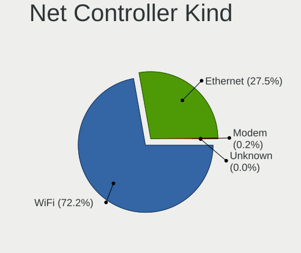

| Kind     | Notebooks | Percent |
|----------|-----------|---------|
| WiFi     | 2179      | 72.2%   |
| Ethernet | 831       | 27.53%  |
| Modem    | 7         | 0.23%   |
| Unknown  | 1         | 0.03%   |

Used Controller
---------------

Currently used network controller

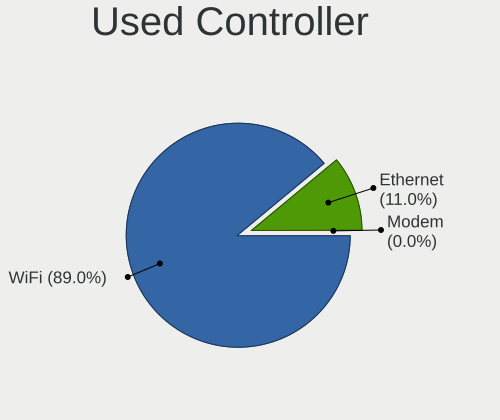

| Kind     | Notebooks | Percent |
|----------|-----------|---------|
| WiFi     | 2082      | 88.97%  |
| Ethernet | 257       | 10.98%  |
| Modem    | 1         | 0.04%   |

NICs
----

Total network controllers on board

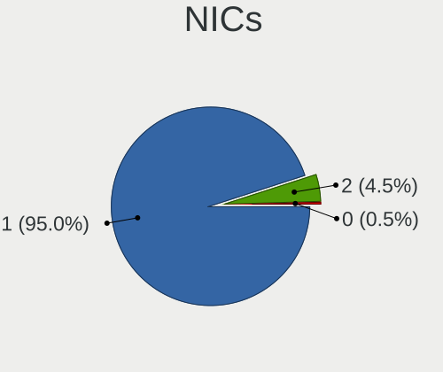

| Total | Notebooks | Percent |
|-------|-----------|---------|
| 1     | 2081      | 95.02%  |
| 2     | 99        | 4.52%   |
| 0     | 10        | 0.46%   |

IPv6
----

IPv6 vs IPv4

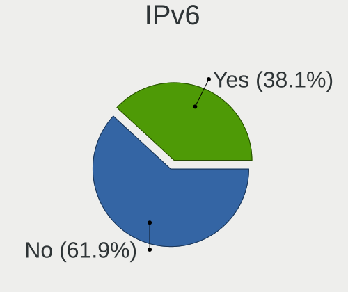

| Used | Notebooks | Percent |
|------|-----------|---------|
| No   | 1390      | 61.86%  |
| Yes  | 857       | 38.14%  |

Bluetooth
---------

Bluetooth Vendor
----------------

Controller vendors

| Vendor                          | Notebooks | Percent |
|---------------------------------|-----------|---------|
| IMC Networks                    | 1681      | 92.01%  |
| Intel                           | 68        | 3.72%   |
| Realtek Semiconductor           | 23        | 1.26%   |
| Foxconn / Hon Hai               | 12        | 0.66%   |
| Qualcomm Atheros Communications | 11        | 0.6%    |
| Lite-On Technology              | 5         | 0.27%   |
| Apple                           | 5         | 0.27%   |
| Cambridge Silicon Radio         | 4         | 0.22%   |
| SINO WEALTH                     | 3         | 0.16%   |
| MediaTek                        | 3         | 0.16%   |
| ASUSTek Computer                | 3         | 0.16%   |
| Realtek                         | 2         | 0.11%   |
| Dell                            | 2         | 0.11%   |
| Broadcom                        | 2         | 0.11%   |
| HTC (High Tech Computer)        | 1         | 0.05%   |
| Alps Electric                   | 1         | 0.05%   |
| AICSemi                         | 1         | 0.05%   |

Bluetooth Model
---------------

Controller models

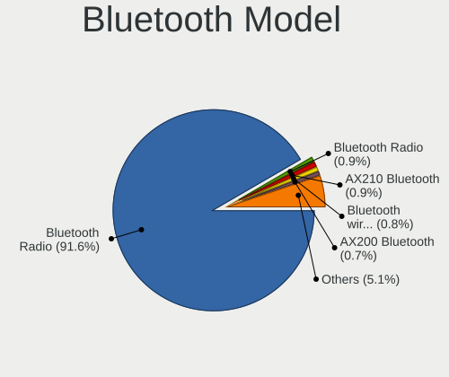

| Model                                                                | Notebooks | Percent |
|----------------------------------------------------------------------|-----------|---------|
| IMC Networks Bluetooth Radio                                         | 1674      | 91.63%  |
| Realtek Bluetooth Radio                                              | 16        | 0.88%   |
| Intel AX210 Bluetooth                                                | 16        | 0.88%   |
| Intel Bluetooth wireless interface                                   | 14        | 0.77%   |
| Intel AX200 Bluetooth                                                | 13        | 0.71%   |
| Intel AX201 Bluetooth                                                | 12        | 0.66%   |
| IMC Networks Wireless_Device                                         | 7         | 0.38%   |
| Realtek  Bluetooth 4.2 Adapter                                       | 6         | 0.33%   |
| Qualcomm Atheros  Bluetooth Device                                   | 5         | 0.27%   |
| Intel Bluetooth 9460/9560 Jefferson Peak (JfP)                       | 5         | 0.27%   |
| Foxconn / Hon Hai MediaTek Bluetooth Adapter                         | 5         | 0.27%   |
| Foxconn / Hon Hai Wireless_Device                                    | 4         | 0.22%   |
| Cambridge Silicon Radio Bluetooth Dongle (HCI mode)                  | 4         | 0.22%   |
| Qualcomm Atheros QCA61x4 Bluetooth 4.0                               | 3         | 0.16%   |
| MediaTek Wireless_Device                                             | 3         | 0.16%   |
| Intel Wireless-AC 3168 Bluetooth                                     | 3         | 0.16%   |
| Intel Centrino Bluetooth Wireless Transceiver                        | 3         | 0.16%   |
| Apple Bluetooth USB Host Controller                                  | 3         | 0.16%   |
| SINO WEALTH Bluetooth Keyboard                                       | 2         | 0.11%   |
| Realtek Bluetooth Radio                                              | 2         | 0.11%   |
| Qualcomm Atheros AR9462 Bluetooth                                    | 2         | 0.11%   |
| Lite-On Wireless_Device                                              | 2         | 0.11%   |
| Lite-On Qualcomm Atheros QCA9377 Bluetooth                           | 2         | 0.11%   |
| Intel Bluetooth Device                                               | 2         | 0.11%   |
| Foxconn / Hon Hai MediaTek MT7921 Bluetooth                          | 2         | 0.11%   |
| Apple Bluetooth Host Controller                                      | 2         | 0.11%   |
| SINO WEALTH RK Bluetooth Keyboar                                     | 1         | 0.05%   |
| Realtek 802.11ac WLAN Adapter                                        | 1         | 0.05%   |
| Qualcomm Atheros AR3012 Bluetooth 4.0                                | 1         | 0.05%   |
| Lite-On Bluetooth Radio                                              | 1         | 0.05%   |
| HTC (High Tech Computer) Vive Hub Bluetooth 4.1 (Broadcom BCM920703) | 1         | 0.05%   |
| Foxconn / Hon Hai Bluetooth Radio                                    | 1         | 0.05%   |
| Dell Broadcom BCM20702A0 Bluetooth                                   | 1         | 0.05%   |
| Dell BCM20702A0 Bluetooth Module                                     | 1         | 0.05%   |
| Broadcom BCM20702A0 Bluetooth 4.0                                    | 1         | 0.05%   |
| Broadcom BCM20702A0                                                  | 1         | 0.05%   |
| ASUS Broadcom BCM20702A0 Bluetooth                                   | 1         | 0.05%   |
| ASUS Bluetooth Radio                                                 | 1         | 0.05%   |
| ASUS ASUS USB-BT500                                                  | 1         | 0.05%   |
| Alps Electric BCM2046 Bluetooth Device                               | 1         | 0.05%   |

Sound
-----

Sound Vendor
------------

Sound card vendors

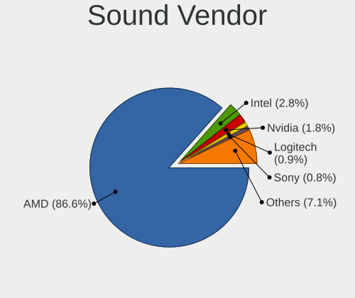

| Vendor                     | Notebooks | Percent |
|----------------------------|-----------|---------|
| AMD                        | 2122      | 86.58%  |
| Intel                      | 69        | 2.82%   |
| Nvidia                     | 44        | 1.8%    |
| Logitech                   | 23        | 0.94%   |
| Sony                       | 19        | 0.78%   |
| Generalplus Technology     | 13        | 0.53%   |
| Realtek Semiconductor      | 12        | 0.49%   |
| Razer USA                  | 12        | 0.49%   |
| Hewlett-Packard            | 12        | 0.49%   |
| C-Media Electronics        | 11        | 0.45%   |
| Lenovo                     | 8         | 0.33%   |
| Kingston Technology        | 8         | 0.33%   |
| Nreal                      | 7         | 0.29%   |
| Plantronics                | 6         | 0.24%   |
| Apple                      | 6         | 0.24%   |
| SteelSeries ApS            | 5         | 0.2%    |
| JMTek                      | 5         | 0.2%    |
| Corsair                    | 5         | 0.2%    |
| Focusrite-Novation         | 4         | 0.16%   |
| Texas Instruments          | 3         | 0.12%   |
| Silicon Motion             | 3         | 0.12%   |
| GN Netcom                  | 3         | 0.12%   |
| Blue Microphones           | 3         | 0.12%   |
| BEHRINGER International    | 3         | 0.12%   |
| Nordic Semiconductor ASA   | 2         | 0.08%   |
| Native Instruments         | 2         | 0.08%   |
| Medeli Electronics         | 2         | 0.08%   |
| KTMicro                    | 2         | 0.08%   |
| Jieli Technology           | 2         | 0.08%   |
| ASUSTek Computer           | 2         | 0.08%   |
| Astro Gaming               | 2         | 0.08%   |
| Antlion Audio              | 2         | 0.08%   |
| Unknown                    | 2         | 0.08%   |
| Yamaha                     | 1         | 0.04%   |
| Walmart                    | 1         | 0.04%   |
| Universal Audio            | 1         | 0.04%   |
| Tenx Technology            | 1         | 0.04%   |
| Teenage Engineering        | 1         | 0.04%   |
| SHI GANTECH                | 1         | 0.04%   |
| PreSonus Audio Electronics | 1         | 0.04%   |

Sound Model
-----------

Sound card models

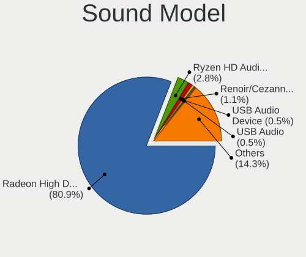

| Model                                                               | Notebooks | Percent |
|---------------------------------------------------------------------|-----------|---------|
| AMD Radeon High Definition Audio Controller                         | 2060      | 80.88%  |
| AMD Ryzen HD Audio Controller                                       | 71        | 2.79%   |
| AMD Renoir/Cezanne HDMI/DP Audio Controller                         | 27        | 1.06%   |
| Generalplus Technology USB Audio Device                             | 13        | 0.51%   |
| Realtek Semiconductor USB Audio                                     | 12        | 0.47%   |
| Sony DualSense wireless controller (PS5)                            | 11        | 0.43%   |
| Nvidia TU107 GeForce GTX 1650 High Definition Audio Controller      | 9         | 0.35%   |
| Intel Tiger Lake-LP Smart Sound Technology Audio Controller         | 9         | 0.35%   |
| Hewlett-Packard USB Audio                                           | 9         | 0.35%   |
| Intel Sunrise Point-LP HD Audio                                     | 8         | 0.31%   |
| Intel Cannon Lake PCH cAVS                                          | 8         | 0.31%   |
| Nreal Air                                                           | 7         | 0.27%   |
| AMD Navi 21/23 HDMI/DP Audio Controller                             | 7         | 0.27%   |
| AMD Family 15h (Models 60h-6fh) Audio Controller                    | 7         | 0.27%   |
| Nvidia GA107 High Definition Audio Controller                       | 6         | 0.24%   |
| AMD Raven/Raven2/Fenghuang HDMI/DP Audio Controller                 | 6         | 0.24%   |
| Kingston Technology HyperX 7.1 Audio                                | 5         | 0.2%    |
| JMTek USB PnP Audio Device                                          | 5         | 0.2%    |
| Intel Tiger Lake-H HD Audio Controller                              | 5         | 0.2%    |
| Intel 7 Series/C216 Chipset Family High Definition Audio Controller | 5         | 0.2%    |
| AMD High Definition Audio Controller                                | 5         | 0.2%    |
| Nvidia TU106 High Definition Audio Controller                       | 4         | 0.16%   |
| Nvidia AD107 High Definition Audio Controller                       | 4         | 0.16%   |
| Logitech G733 Gaming Headset                                        | 4         | 0.16%   |
| Lenovo ThinkPad USB-C Dock Gen2 USB Audio                           | 4         | 0.16%   |
| Intel Haswell-ULT HD Audio Controller                               | 4         | 0.16%   |
| Intel CM238 HD Audio Controller                                     | 4         | 0.16%   |
| Intel 8 Series HD Audio Controller                                  | 4         | 0.16%   |
| Apple Audio Device                                                  | 4         | 0.16%   |
| AMD Starship/Matisse HD Audio Controller                            | 4         | 0.16%   |
| AMD Navi 31 HDMI/DP Audio                                           | 4         | 0.16%   |
| AMD FCH Azalia Controller                                           | 4         | 0.16%   |
| AMD Baffin HDMI/DP Audio [Radeon RX 550 640SP / RX 560/560X]        | 4         | 0.16%   |
| Texas Instruments PCM2902 Audio Codec                               | 3         | 0.12%   |
| Sony DualSense Edge Wireless Controller                             | 3         | 0.12%   |
| Silicon Motion SMI USB Display                                      | 3         | 0.12%   |
| Nvidia GP107GL High Definition Audio Controller                     | 3         | 0.12%   |
| Nvidia GA106 High Definition Audio Controller                       | 3         | 0.12%   |
| Nvidia GA104 High Definition Audio Controller                       | 3         | 0.12%   |
| Logitech G435 Wireless Gaming Headset                               | 3         | 0.12%   |

Memory
------

Memory Vendor
-------------

Memory module vendors

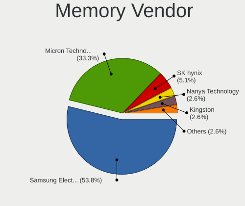

| Vendor              | Notebooks | Percent |
|---------------------|-----------|---------|
| Samsung Electronics | 21        | 53.85%  |
| Micron Technology   | 13        | 33.33%  |
| SK hynix            | 2         | 5.13%   |
| Nanya Technology    | 1         | 2.56%   |
| Kingston            | 1         | 2.56%   |
| Unknown             | 1         | 2.56%   |

Memory Model
------------

Memory module models

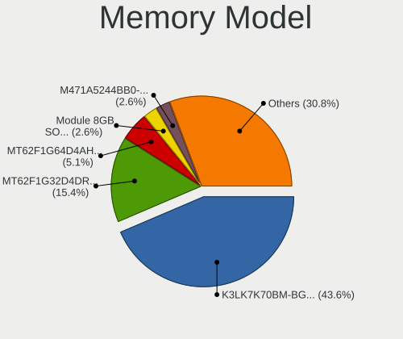

| Model                                                       | Notebooks | Percent |
|-------------------------------------------------------------|-----------|---------|
| Samsung RAM K3LK7K70BM-BGCP000 4GiB SODIMM LPDDR5 4266MT/s  | 17        | 43.59%  |
| Micron RAM MT62F1G32D4DR-031 WT 4GB SODIMM LPDDR5 6400MT/s  | 6         | 15.38%  |
| Micron RAM MT62F1G64D4AH-023 WT 4GB SODIMM LPDDR5 4266MT/s  | 2         | 5.13%   |
| SK hynix RAM Module 8GB SODIMM DDR4 2133MT/s                | 1         | 2.56%   |
| SK hynix RAM H9JCNNNCP3MLYR-N6E 4GB DIMM LPDDR5 6400MT/s    | 1         | 2.56%   |
| Samsung RAM Module 8GB SODIMM DDR4 2133MT/s                 | 1         | 2.56%   |
| Samsung RAM M471A5244BB0-CRC 4GB SODIMM DDR4 2667MT/s       | 1         | 2.56%   |
| Samsung RAM M471A1G44AB0-CWE 8GiB SODIMM DDR4 3200MT/s      | 1         | 2.56%   |
| Samsung RAM M4 70T5663QZ3-CF7 2GB SODIMM DDR2 2048MT/s      | 1         | 2.56%   |
| Nanya RAM NT2GT64U8HD0BN-AD 2GB SODIMM DDR 800MT/s          | 1         | 2.56%   |
| Micron RAM MT62F2G32D4DS-026 WT 8GiB SODIMM LPDDR5 7500MT/s | 1         | 2.56%   |
| Micron RAM Module 2GB SODIMM DDR3 1600MT/s                  | 1         | 2.56%   |
| Micron RAM 8JTF5126 4HZ1G6D 1 4GB SODIMM DDR3 1600MT/s      | 1         | 2.56%   |
| Micron RAM 4ATF1G64HZ-3G2E1 8GB SODIMM DDR4 3200MT/s        | 1         | 2.56%   |
| Micron RAM 16ATS2G64HZ-2G6B1 16GB SODIMM DDR4 2400MT/s      | 1         | 2.56%   |
| Kingston RAM 9905417-054.A00G 4GB SODIMM DDR3 1600MT/s      | 1         | 2.56%   |
| Unknown                                                     | 1         | 2.56%   |

Memory Kind
-----------

Memory module kinds

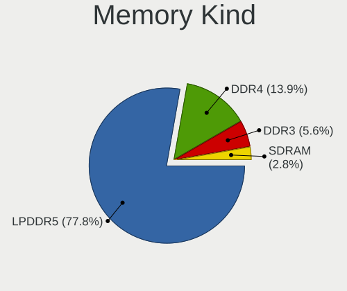

| Kind   | Notebooks | Percent |
|--------|-----------|---------|
| LPDDR5 | 28        | 77.78%  |
| DDR4   | 5         | 13.89%  |
| DDR3   | 2         | 5.56%   |
| SDRAM  | 1         | 2.78%   |

Memory Form Factor
------------------

Physical design of the memory module

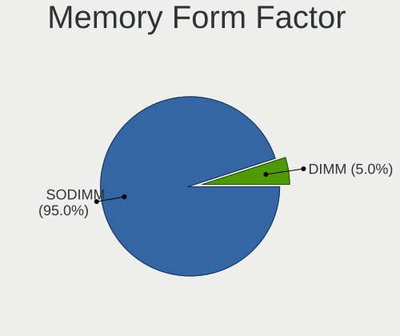

| Name   | Notebooks | Percent |
|--------|-----------|---------|
| SODIMM | 35        | 97.22%  |
| DIMM   | 1         | 2.78%   |

Memory Size
-----------

Memory module size

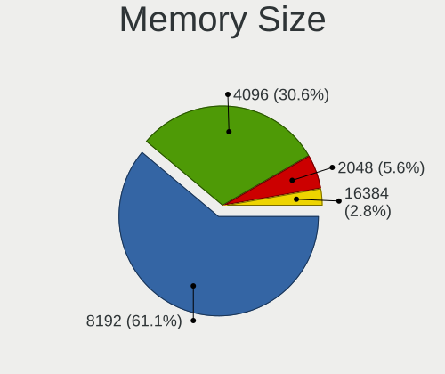

| Size  | Notebooks | Percent |
|-------|-----------|---------|
| 8192  | 22        | 61.11%  |
| 4096  | 11        | 30.56%  |
| 2048  | 2         | 5.56%   |
| 16384 | 1         | 2.78%   |

Memory Speed
------------

Memory module speed

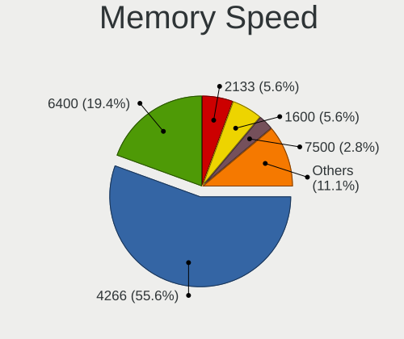

| Speed | Notebooks | Percent |
|-------|-----------|---------|
| 4266  | 20        | 55.56%  |
| 6400  | 7         | 19.44%  |
| 2133  | 2         | 5.56%   |
| 1600  | 2         | 5.56%   |
| 7500  | 1         | 2.78%   |
| 3200  | 1         | 2.78%   |
| 2667  | 1         | 2.78%   |
| 2400  | 1         | 2.78%   |
| 2048  | 1         | 2.78%   |

Printers & scanners
-------------------

Printer Vendor
--------------

Printer device vendors

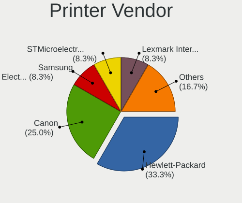

| Vendor                | Notebooks | Percent |
|-----------------------|-----------|---------|
| Hewlett-Packard       | 4         | 33.33%  |
| Canon                 | 3         | 25%     |
| STMicroelectronics    | 1         | 8.33%   |
| Samsung Electronics   | 1         | 8.33%   |
| Lexmark International | 1         | 8.33%   |
| KODAK                 | 1         | 8.33%   |
| Dymo-CoStar           | 1         | 8.33%   |

Printer Model
-------------

Printer device models

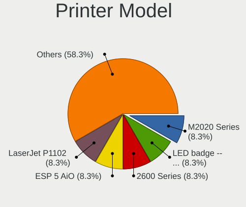

| Model                                                     | Notebooks | Percent |
|-----------------------------------------------------------|-----------|---------|
| STMicroelectronics LED badge -- mini LED display -- 11x44 | 1         | 8.33%   |
| Samsung M2020 Series                                      | 1         | 8.33%   |
| Lexmark International 2600 Series                         | 1         | 8.33%   |
| KODAK ESP 5 AiO                                           | 1         | 8.33%   |
| HP LaserJet P1102                                         | 1         | 8.33%   |
| HP LaserJet CP1525nw/x                                    | 1         | 8.33%   |
| HP LaserJet 1200                                          | 1         | 8.33%   |
| HP DeskJet 2700 series                                    | 1         | 8.33%   |
| Dymo-CoStar LabelWriter 400                               | 1         | 8.33%   |
| Canon PIXMA MG3600 Series                                 | 1         | 8.33%   |
| Canon PIXMA MG2500 Series                                 | 1         | 8.33%   |
| Canon LiDE 400                                            | 1         | 8.33%   |

Scanner Vendor
--------------

Scanner device vendors

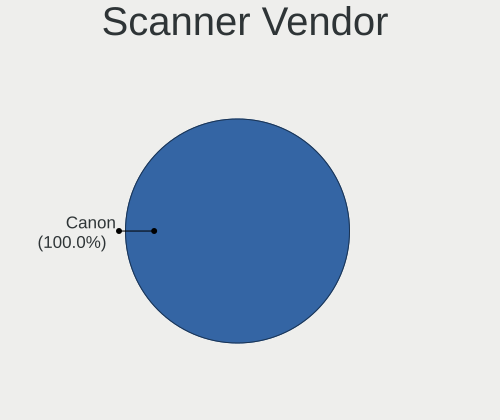

| Vendor | Notebooks | Percent |
|--------|-----------|---------|
| Canon  | 1         | 100%    |

Scanner Model
-------------

Scanner device models

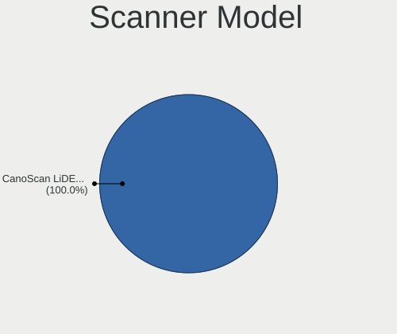

| Model                   | Notebooks | Percent |
|-------------------------|-----------|---------|
| Canon CanoScan LiDE 210 | 1         | 100%    |

Camera
------

Camera Vendor
-------------

Camera device vendors

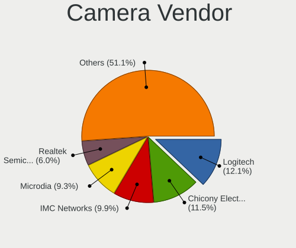

| Vendor                                 | Notebooks | Percent |
|----------------------------------------|-----------|---------|
| Logitech                               | 22        | 12.09%  |
| Chicony Electronics                    | 21        | 11.54%  |
| IMC Networks                           | 18        | 9.89%   |
| Microdia                               | 17        | 9.34%   |
| Realtek Semiconductor                  | 11        | 6.04%   |
| Luxvisions Innotech Limited            | 10        | 5.49%   |
| Bison Electronics                      | 9         | 4.95%   |
| Quanta                                 | 8         | 4.4%    |
| Apple                                  | 8         | 4.4%    |
| Sunplus Innovation Technology          | 6         | 3.3%    |
| Cheng Uei Precision Industry (Foxlink) | 6         | 3.3%    |
| Tripath Technology                     | 5         | 2.75%   |
| Samsung Electronics                    | 5         | 2.75%   |
| Syntek                                 | 4         | 2.2%    |
| Microsoft                              | 4         | 2.2%    |
| SunplusIT                              | 2         | 1.1%    |
| Sonix Technology                       | 2         | 1.1%    |
| Razer USA                              | 2         | 1.1%    |
| MacroSilicon                           | 2         | 1.1%    |
| Generalplus Technology                 | 2         | 1.1%    |
| Alpha Imaging Technology               | 2         | 1.1%    |
| Suyin                                  | 1         | 0.55%   |
| Silicon Motion                         | 1         | 0.55%   |
| Shenzhen Kingcome Optoelectronic       | 1         | 0.55%   |
| Ricoh                                  | 1         | 0.55%   |
| Remo Tech                              | 1         | 0.55%   |
| Lite-On Technology                     | 1         | 0.55%   |
| Linux Foundation                       | 1         | 0.55%   |
| KYE Systems (Mouse Systems)            | 1         | 0.55%   |
| Jieli Technology                       | 1         | 0.55%   |
| HTC (High Tech Computer)               | 1         | 0.55%   |
| Google                                 | 1         | 0.55%   |
| Goodong                                | 1         | 0.55%   |
| Foxlink                                | 1         | 0.55%   |
| AVerMedia Technologies                 | 1         | 0.55%   |
| Anker PowerConf C200                   | 1         | 0.55%   |
| Actions Microelectronics               | 1         | 0.55%   |

Camera Model
------------

Camera device models

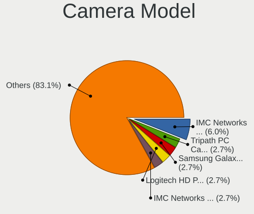

| Model                                                           | Notebooks | Percent |
|-----------------------------------------------------------------|-----------|---------|
| IMC Networks USB2.0 HD UVC WebCam                               | 11        | 6.01%   |
| Tripath PC Camera                                               | 5         | 2.73%   |
| Samsung Galaxy series, misc. (MTP mode)                         | 5         | 2.73%   |
| Logitech HD Pro Webcam C920                                     | 5         | 2.73%   |
| IMC Networks Integrated Camera                                  | 5         | 2.73%   |
| Bison HD Webcam                                                 | 5         | 2.73%   |
| Syntek Integrated Camera                                        | 4         | 2.19%   |
| Microdia Webcam Vitade AF                                       | 4         | 2.19%   |
| Microdia Integrated_Webcam_HD                                   | 4         | 2.19%   |
| Logitech Webcam C270                                            | 4         | 2.19%   |
| Chicony Integrated Camera                                       | 4         | 2.19%   |
| Chicony HP TrueVision HD Camera                                 | 4         | 2.19%   |
| Chicony HD User Facing                                          | 4         | 2.19%   |
| Apple iPhone 5/5C/5S/6/SE/7/8/X                                 | 4         | 2.19%   |
| Luxvisions Innotech Limited HP Wide Vision HD Camera            | 3         | 1.64%   |
| Luxvisions Innotech Limited HP TrueVision HD Camera             | 3         | 1.64%   |
| Bison Integrated Camera                                         | 3         | 1.64%   |
| Apple FaceTime HD Camera                                        | 3         | 1.64%   |
| Sunplus Integrated_Webcam_FHD                                   | 2         | 1.09%   |
| Sunplus Asus Webcam                                             | 2         | 1.09%   |
| Realtek Thronmax Stream Go Pro Webcam                           | 2         | 1.09%   |
| Realtek Integrated_Webcam_HD                                    | 2         | 1.09%   |
| Quanta HP Wide Vision HD Camera                                 | 2         | 1.09%   |
| Quanta HD User Facing                                           | 2         | 1.09%   |
| Microsoft LifeCam HD-3000                                       | 2         | 1.09%   |
| Microdia Integrated Webcam                                      | 2         | 1.09%   |
| MacroSilicon USB Video                                          | 2         | 1.09%   |
| Luxvisions Innotech Limited Integrated Camera                   | 2         | 1.09%   |
| Logitech Logitech Webcam C925e                                  | 2         | 1.09%   |
| Logitech HD Webcam C615                                         | 2         | 1.09%   |
| Logitech C920 PRO HD Webcam                                     | 2         | 1.09%   |
| Generalplus GENERAL WEBCAM                                      | 2         | 1.09%   |
| Cheng Uei Precision Industry (Foxlink) HP Wide Vision HD Camera | 2         | 1.09%   |
| Cheng Uei Precision Industry (Foxlink) HP HD Camera             | 2         | 1.09%   |
| Apple iSight in LED Cinema Display                              | 2         | 1.09%   |
| Alpha Imaging Integrated_Webcam_8M                              | 2         | 1.09%   |
| Suyin HP Truevision HD                                          | 1         | 0.55%   |
| SunplusIT Depstech webcam                                       | 1         | 0.55%   |
| SunplusIT CODi A05020 Webcam                                    | 1         | 0.55%   |
| Sunplus USB Camera                                              | 1         | 0.55%   |

Security
--------

Fingerprint Vendor
------------------

Fingerprint sensor vendors

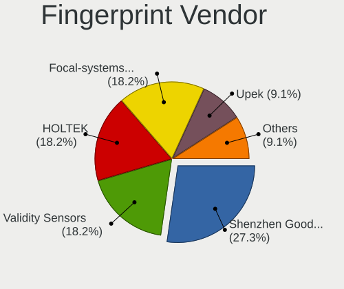

| Vendor                     | Notebooks | Percent |
|----------------------------|-----------|---------|
| Shenzhen Goodix Technology | 3         | 27.27%  |
| Validity Sensors           | 2         | 18.18%  |
| HOLTEK                     | 2         | 18.18%  |
| Focal-systems.Corp         | 2         | 18.18%  |
| Upek                       | 1         | 9.09%   |
| Synaptics                  | 1         | 9.09%   |

Fingerprint Model
-----------------

Fingerprint sensor models

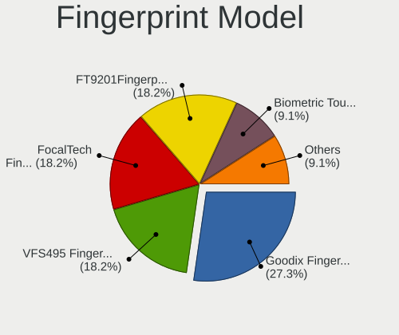

| Model                                                  | Notebooks | Percent |
|--------------------------------------------------------|-----------|---------|
| Shenzhen Goodix  FingerPrint Device                    | 3         | 27.27%  |
| Validity Sensors VFS495 Fingerprint Reader             | 2         | 18.18%  |
| HOLTEK FocalTech Fingerprint Device                    | 2         | 18.18%  |
| Focal-systems.Corp FT9201Fingerprint.                  | 2         | 18.18%  |
| Upek Biometric Touchchip/Touchstrip Fingerprint Sensor | 1         | 9.09%   |
| Synaptics Prometheus MIS Touch Fingerprint Reader      | 1         | 9.09%   |

Chipcard Vendor
---------------

Chipcard module vendors

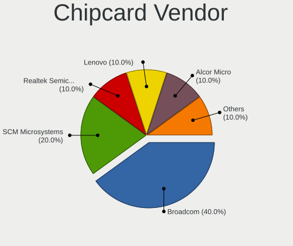

| Vendor                | Notebooks | Percent |
|-----------------------|-----------|---------|
| Broadcom              | 4         | 40%     |
| SCM Microsystems      | 2         | 20%     |
| Realtek Semiconductor | 1         | 10%     |
| Lenovo                | 1         | 10%     |
| Alcor Micro           | 1         | 10%     |
| Advanced Card Systems | 1         | 10%     |

Chipcard Model
--------------

Chipcard module models

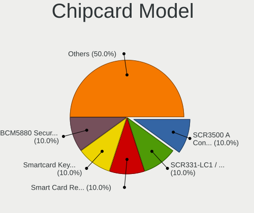

| Model                                                                        | Notebooks | Percent |
|------------------------------------------------------------------------------|-----------|---------|
| SCM Microsystems SCR3500 A Contact Reader                                    | 1         | 10%     |
| SCM Microsystems SCR331-LC1 / SCR3310 SmartCard Reader                       | 1         | 10%     |
| Realtek Semiconductor Smart Card Reader Interface                            | 1         | 10%     |
| Lenovo Smartcard Keyboard                                                    | 1         | 10%     |
| Broadcom BCM5880 Secure Applications Processor with fingerprint swipe sensor | 1         | 10%     |
| Broadcom BCM5880 Secure Applications Processor                               | 1         | 10%     |
| Broadcom BCM58200 ControlVault 3 (FingerPrint sensor + Contacted SmartCard)  | 1         | 10%     |
| Broadcom 5880                                                                | 1         | 10%     |
| Alcor Micro AU9540 Smartcard Reader                                          | 1         | 10%     |
| Advanced Card Systems ACR39U                                                 | 1         | 10%     |

Unsupported
-----------

Unsupported Devices
-------------------

Total unsupported devices on board

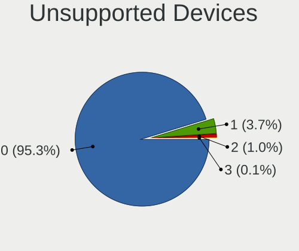

| Total | Notebooks | Percent |
|-------|-----------|---------|
| 0     | 2088      | 95.26%  |
| 1     | 81        | 3.7%    |
| 2     | 21        | 0.96%   |
| 3     | 2         | 0.09%   |

Unsupported Device Types
------------------------

Types of unsupported devices

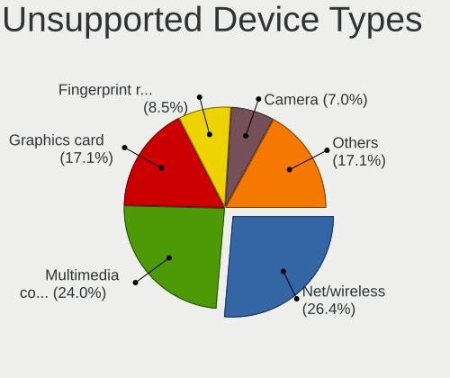

| Type                  | Notebooks | Percent |
|-----------------------|-----------|---------|
| Net/wireless          | 34        | 26.36%  |
| Multimedia controller | 31        | 24.03%  |
| Graphics card         | 22        | 17.05%  |
| Fingerprint reader    | 11        | 8.53%   |
| Camera                | 9         | 6.98%   |
| Chipcard              | 8         | 6.2%    |
| Sound                 | 5         | 3.88%   |
| Storage/nvme          | 3         | 2.33%   |
| Card reader           | 3         | 2.33%   |
| Net/ethernet          | 1         | 0.78%   |
| Modem                 | 1         | 0.78%   |
| Bluetooth             | 1         | 0.78%   |

