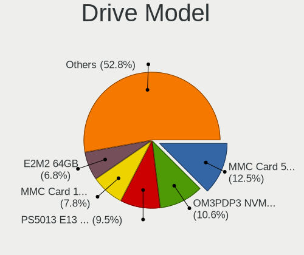
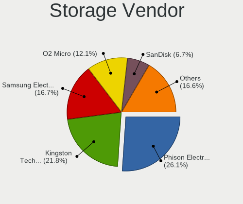

SteamOS - Tested Hardware & Statistics (Notebooks)
--------------------------------------------------

A project to collect tested hardware configurations for SteamOS.

Anyone can contribute to this report by the [hw-probe](https://github.com/linuxhw/hw-probe) tool:

    sudo -E hw-probe -all -upload

Please contribute! Especially if your hardware is rare.

Contents
--------

* [ Test Cases ](#test-cases)

* [ System ](#system)
  - [ OS                       ](#os)
  - [ OS Family                ](#os-family)
  - [ Kernel                   ](#kernel)
  - [ Kernel Family            ](#kernel-family)
  - [ Kernel Major Ver.        ](#kernel-major-ver)
  - [ Arch                     ](#arch)
  - [ DE                       ](#de)
  - [ Display Server           ](#display-server)
  - [ Display Manager          ](#display-manager)
  - [ OS Lang                  ](#os-lang)
  - [ Boot Mode                ](#boot-mode)
  - [ Filesystem               ](#filesystem)
  - [ Part. scheme             ](#part-scheme)
  - [ Dual Boot with Linux/BSD ](#dual-boot-with-linuxbsd)
  - [ Dual Boot (Win)          ](#dual-boot-win)

* [ Board ](#board)
  - [ Vendor                   ](#vendor)
  - [ Model                    ](#model)
  - [ Model Family             ](#model-family)
  - [ MFG Year                 ](#mfg-year)
  - [ Form Factor              ](#form-factor)
  - [ Secure Boot              ](#secure-boot)
  - [ Coreboot                 ](#coreboot)
  - [ RAM Size                 ](#ram-size)
  - [ RAM Used                 ](#ram-used)
  - [ Total Drives             ](#total-drives)
  - [ Has CD-ROM               ](#has-cd-rom)
  - [ Has Ethernet             ](#has-ethernet)
  - [ Has WiFi                 ](#has-wifi)
  - [ Has Bluetooth            ](#has-bluetooth)

* [ Location ](#location)
  - [ Country                  ](#country)
  - [ City                     ](#city)

* [ Drives ](#drives)
  - [ Drive Vendor             ](#drive-vendor)
  - [ Drive Model              ](#drive-model)
  - [ HDD Vendor               ](#hdd-vendor)
  - [ SSD Vendor               ](#ssd-vendor)
  - [ Drive Kind               ](#drive-kind)
  - [ Drive Connector          ](#drive-connector)
  - [ Drive Size               ](#drive-size)
  - [ Space Total              ](#space-total)
  - [ Space Used               ](#space-used)
  - [ Malfunc. Drives          ](#malfunc-drives)
  - [ Malfunc. Drive Vendor    ](#malfunc-drive-vendor)
  - [ Malfunc. HDD Vendor      ](#malfunc-hdd-vendor)
  - [ Malfunc. Drive Kind      ](#malfunc-drive-kind)
  - [ Failed Drives            ](#failed-drives)
  - [ Failed Drive Vendor      ](#failed-drive-vendor)
  - [ Drive Status             ](#drive-status)

* [ Storage controller ](#storage-controller)
  - [ Storage Vendor           ](#storage-vendor)
  - [ Storage Model            ](#storage-model)
  - [ Storage Kind             ](#storage-kind)

* [ Processor ](#processor)
  - [ CPU Vendor               ](#cpu-vendor)
  - [ CPU Model                ](#cpu-model)
  - [ CPU Model Family         ](#cpu-model-family)
  - [ CPU Cores                ](#cpu-cores)
  - [ CPU Sockets              ](#cpu-sockets)
  - [ CPU Threads              ](#cpu-threads)
  - [ CPU Op-Modes             ](#cpu-op-modes)
  - [ CPU Microcode            ](#cpu-microcode)
  - [ CPU Microarch            ](#cpu-microarch)

* [ Graphics ](#graphics)
  - [ GPU Vendor               ](#gpu-vendor)
  - [ GPU Model                ](#gpu-model)
  - [ GPU Combo                ](#gpu-combo)
  - [ GPU Driver               ](#gpu-driver)
  - [ GPU Memory               ](#gpu-memory)

* [ Monitor ](#monitor)
  - [ Monitor Vendor           ](#monitor-vendor)
  - [ Monitor Model            ](#monitor-model)
  - [ Monitor Resolution       ](#monitor-resolution)
  - [ Monitor Diagonal         ](#monitor-diagonal)
  - [ Monitor Width            ](#monitor-width)
  - [ Aspect Ratio             ](#aspect-ratio)
  - [ Monitor Area             ](#monitor-area)
  - [ Pixel Density            ](#pixel-density)
  - [ Multiple Monitors        ](#multiple-monitors)

* [ Network ](#network)
  - [ Net Controller Vendor    ](#net-controller-vendor)
  - [ Net Controller Model     ](#net-controller-model)
  - [ Wireless Vendor          ](#wireless-vendor)
  - [ Wireless Model           ](#wireless-model)
  - [ Ethernet Vendor          ](#ethernet-vendor)
  - [ Ethernet Model           ](#ethernet-model)
  - [ Net Controller Kind      ](#net-controller-kind)
  - [ Used Controller          ](#used-controller)
  - [ NICs                     ](#nics)
  - [ IPv6                     ](#ipv6)

* [ Bluetooth ](#bluetooth)
  - [ Bluetooth Vendor         ](#bluetooth-vendor)
  - [ Bluetooth Model          ](#bluetooth-model)

* [ Sound ](#sound)
  - [ Sound Vendor             ](#sound-vendor)
  - [ Sound Model              ](#sound-model)

* [ Memory ](#memory)
  - [ Memory Vendor            ](#memory-vendor)
  - [ Memory Model             ](#memory-model)
  - [ Memory Kind              ](#memory-kind)
  - [ Memory Form Factor       ](#memory-form-factor)
  - [ Memory Size              ](#memory-size)
  - [ Memory Speed             ](#memory-speed)

* [ Printers & scanners ](#printers--scanners)
  - [ Printer Vendor           ](#printer-vendor)
  - [ Printer Model            ](#printer-model)
  - [ Scanner Vendor           ](#scanner-vendor)
  - [ Scanner Model            ](#scanner-model)

* [ Camera ](#camera)
  - [ Camera Vendor            ](#camera-vendor)
  - [ Camera Model             ](#camera-model)

* [ Security ](#security)
  - [ Fingerprint Vendor       ](#fingerprint-vendor)
  - [ Fingerprint Model        ](#fingerprint-model)
  - [ Chipcard Vendor          ](#chipcard-vendor)
  - [ Chipcard Model           ](#chipcard-model)

* [ Unsupported ](#unsupported)
  - [ Unsupported Devices      ](#unsupported-devices)
  - [ Unsupported Device Types ](#unsupported-device-types)

Test Cases
----------

Total: 2449

| Vendor        | Model                       | Probe                                                      | Date         |
|---------------|-----------------------------|------------------------------------------------------------|--------------|
| Valve         | Galileo                     | [dff6a36e92](https://linux-hardware.org/?probe=dff6a36e92) | Jan 06, 2025 |
| Valve         | Jupiter                     | [586cabc574](https://linux-hardware.org/?probe=586cabc574) | Jan 06, 2025 |
| Lenovo        | IdeaPad Gaming 3 15ACH6 ... | [271c85b332](https://linux-hardware.org/?probe=271c85b332) | Jan 05, 2025 |
| Valve         | Jupiter                     | [6773d7420e](https://linux-hardware.org/?probe=6773d7420e) | Jan 05, 2025 |
| Valve         | Jupiter                     | [7b2eb9a0e9](https://linux-hardware.org/?probe=7b2eb9a0e9) | Jan 05, 2025 |
| Valve         | Jupiter                     | [5786386be1](https://linux-hardware.org/?probe=5786386be1) | Jan 04, 2025 |
| Valve         | Jupiter                     | [5f851271c3](https://linux-hardware.org/?probe=5f851271c3) | Jan 03, 2025 |
| Valve         | Jupiter                     | [4588bcf961](https://linux-hardware.org/?probe=4588bcf961) | Jan 03, 2025 |
| Valve         | Jupiter                     | [7d460209df](https://linux-hardware.org/?probe=7d460209df) | Jan 03, 2025 |
| Valve         | Jupiter                     | [d8901f7e5b](https://linux-hardware.org/?probe=d8901f7e5b) | Jan 02, 2025 |
| Valve         | Jupiter                     | [699dafa117](https://linux-hardware.org/?probe=699dafa117) | Jan 02, 2025 |
| Valve         | Jupiter                     | [c55e30f87f](https://linux-hardware.org/?probe=c55e30f87f) | Jan 01, 2025 |
| Valve         | Galileo                     | [e1cfe6798d](https://linux-hardware.org/?probe=e1cfe6798d) | Dec 31, 2024 |
| Valve         | Galileo                     | [d2e95667cf](https://linux-hardware.org/?probe=d2e95667cf) | Dec 30, 2024 |
| Valve         | Galileo                     | [d942a63123](https://linux-hardware.org/?probe=d942a63123) | Dec 30, 2024 |
| Valve         | Jupiter                     | [4eb06472bd](https://linux-hardware.org/?probe=4eb06472bd) | Dec 29, 2024 |
| Valve         | Jupiter                     | [0f665464e0](https://linux-hardware.org/?probe=0f665464e0) | Dec 29, 2024 |
| Lenovo        | K14 Gen 1 21CUS0DF00        | [48ba2722d7](https://linux-hardware.org/?probe=48ba2722d7) | Dec 29, 2024 |
| Valve         | Jupiter                     | [9361016877](https://linux-hardware.org/?probe=9361016877) | Dec 29, 2024 |
| Valve         | Jupiter                     | [7ae5afa5ea](https://linux-hardware.org/?probe=7ae5afa5ea) | Dec 28, 2024 |
| Valve         | Galileo                     | [b45df4045a](https://linux-hardware.org/?probe=b45df4045a) | Dec 28, 2024 |
| MSI           | Katana A15 AI B8VE          | [2dc1c3f9ae](https://linux-hardware.org/?probe=2dc1c3f9ae) | Dec 27, 2024 |
| MSI           | Katana A15 AI B8VE          | [ae92e3f945](https://linux-hardware.org/?probe=ae92e3f945) | Dec 27, 2024 |
| Valve         | Jupiter                     | [f13430f9ec](https://linux-hardware.org/?probe=f13430f9ec) | Dec 27, 2024 |
| Valve         | Jupiter                     | [9c8684e346](https://linux-hardware.org/?probe=9c8684e346) | Dec 27, 2024 |
| Valve         | Galileo                     | [c1ae30e981](https://linux-hardware.org/?probe=c1ae30e981) | Dec 27, 2024 |
| Valve         | Jupiter                     | [ccfb809cc8](https://linux-hardware.org/?probe=ccfb809cc8) | Dec 26, 2024 |
| Valve         | Galileo                     | [80b78f46d2](https://linux-hardware.org/?probe=80b78f46d2) | Dec 26, 2024 |
| Valve         | Galileo                     | [9f19e784e4](https://linux-hardware.org/?probe=9f19e784e4) | Dec 26, 2024 |
| Valve         | Jupiter                     | [adf8b11851](https://linux-hardware.org/?probe=adf8b11851) | Dec 26, 2024 |
| Valve         | Jupiter                     | [b2a0e79409](https://linux-hardware.org/?probe=b2a0e79409) | Dec 25, 2024 |
| Valve         | Galileo                     | [c74d7133c4](https://linux-hardware.org/?probe=c74d7133c4) | Dec 25, 2024 |
| Valve         | Jupiter                     | [b795ac1fcd](https://linux-hardware.org/?probe=b795ac1fcd) | Dec 25, 2024 |
| Valve         | Jupiter                     | [fb4323604f](https://linux-hardware.org/?probe=fb4323604f) | Dec 25, 2024 |
| Valve         | Jupiter                     | [7f72a25dab](https://linux-hardware.org/?probe=7f72a25dab) | Dec 24, 2024 |
| Valve         | Galileo                     | [b70e46f7f0](https://linux-hardware.org/?probe=b70e46f7f0) | Dec 22, 2024 |
| Valve         | Galileo                     | [ec69f4be51](https://linux-hardware.org/?probe=ec69f4be51) | Dec 21, 2024 |
| Valve         | Galileo                     | [324e8e320b](https://linux-hardware.org/?probe=324e8e320b) | Dec 21, 2024 |
| Valve         | Jupiter                     | [fbe2a34804](https://linux-hardware.org/?probe=fbe2a34804) | Dec 20, 2024 |
| Valve         | Jupiter                     | [96ec07b5d4](https://linux-hardware.org/?probe=96ec07b5d4) | Dec 20, 2024 |
| Valve         | Jupiter                     | [9b99dd7185](https://linux-hardware.org/?probe=9b99dd7185) | Dec 19, 2024 |
| Valve         | Galileo                     | [45a67a7577](https://linux-hardware.org/?probe=45a67a7577) | Dec 19, 2024 |
| Valve         | Galileo                     | [edfdc80209](https://linux-hardware.org/?probe=edfdc80209) | Dec 18, 2024 |
| Valve         | Galileo                     | [92b2090648](https://linux-hardware.org/?probe=92b2090648) | Dec 17, 2024 |
| Valve         | Galileo                     | [860b42a1d3](https://linux-hardware.org/?probe=860b42a1d3) | Dec 17, 2024 |
| Valve         | Jupiter                     | [23d9275334](https://linux-hardware.org/?probe=23d9275334) | Dec 17, 2024 |
| Valve         | Jupiter                     | [507ba3c279](https://linux-hardware.org/?probe=507ba3c279) | Dec 17, 2024 |
| Valve         | Jupiter                     | [cb6ebf4600](https://linux-hardware.org/?probe=cb6ebf4600) | Dec 16, 2024 |
| Valve         | Jupiter                     | [246668e9eb](https://linux-hardware.org/?probe=246668e9eb) | Dec 16, 2024 |
| Valve         | Galileo                     | [b74863c36c](https://linux-hardware.org/?probe=b74863c36c) | Dec 15, 2024 |
| Valve         | Jupiter                     | [120418f0e3](https://linux-hardware.org/?probe=120418f0e3) | Dec 15, 2024 |
| Valve         | Jupiter                     | [3b34c56811](https://linux-hardware.org/?probe=3b34c56811) | Dec 15, 2024 |
| Valve         | Jupiter                     | [f0f29070ae](https://linux-hardware.org/?probe=f0f29070ae) | Dec 15, 2024 |
| Valve         | Jupiter                     | [7f3601393d](https://linux-hardware.org/?probe=7f3601393d) | Dec 15, 2024 |
| Valve         | Jupiter                     | [2f36d7df07](https://linux-hardware.org/?probe=2f36d7df07) | Dec 13, 2024 |
| Valve         | Galileo                     | [79f765f659](https://linux-hardware.org/?probe=79f765f659) | Dec 13, 2024 |
| Valve         | Jupiter                     | [24bbbbae23](https://linux-hardware.org/?probe=24bbbbae23) | Dec 13, 2024 |
| Valve         | Jupiter                     | [63ff703069](https://linux-hardware.org/?probe=63ff703069) | Dec 12, 2024 |
| Valve         | Jupiter                     | [62a914e297](https://linux-hardware.org/?probe=62a914e297) | Dec 11, 2024 |
| Valve         | Jupiter                     | [a9e67f8e9c](https://linux-hardware.org/?probe=a9e67f8e9c) | Dec 11, 2024 |
| Valve         | Galileo                     | [b2cbfb3cf8](https://linux-hardware.org/?probe=b2cbfb3cf8) | Dec 11, 2024 |
| Valve         | Jupiter                     | [676c01342e](https://linux-hardware.org/?probe=676c01342e) | Dec 11, 2024 |
| Valve         | Jupiter                     | [483676eaaa](https://linux-hardware.org/?probe=483676eaaa) | Dec 10, 2024 |
| Valve         | Galileo                     | [43f1ef2e9b](https://linux-hardware.org/?probe=43f1ef2e9b) | Dec 09, 2024 |
| Valve         | Jupiter                     | [b81aceb033](https://linux-hardware.org/?probe=b81aceb033) | Dec 09, 2024 |
| Valve         | Galileo                     | [3ca96a14e6](https://linux-hardware.org/?probe=3ca96a14e6) | Dec 09, 2024 |
| Valve         | Jupiter                     | [adf22162c5](https://linux-hardware.org/?probe=adf22162c5) | Dec 08, 2024 |
| Valve         | Jupiter                     | [ef940ccf9e](https://linux-hardware.org/?probe=ef940ccf9e) | Dec 08, 2024 |
| Valve         | Jupiter                     | [b1d1e201ac](https://linux-hardware.org/?probe=b1d1e201ac) | Dec 08, 2024 |
| Valve         | Galileo                     | [cff59fadd6](https://linux-hardware.org/?probe=cff59fadd6) | Dec 07, 2024 |
| Valve         | Galileo                     | [b2e558b6d3](https://linux-hardware.org/?probe=b2e558b6d3) | Dec 07, 2024 |
| Valve         | Galileo                     | [cabb8134bf](https://linux-hardware.org/?probe=cabb8134bf) | Dec 06, 2024 |
| Valve         | Jupiter                     | [71db1ec209](https://linux-hardware.org/?probe=71db1ec209) | Dec 06, 2024 |
| Valve         | Jupiter                     | [2fbfef599f](https://linux-hardware.org/?probe=2fbfef599f) | Dec 06, 2024 |
| Valve         | Jupiter                     | [ed49188fcb](https://linux-hardware.org/?probe=ed49188fcb) | Dec 04, 2024 |
| Valve         | Galileo                     | [79c8763d17](https://linux-hardware.org/?probe=79c8763d17) | Dec 02, 2024 |
| Valve         | Galileo                     | [93e70f8f51](https://linux-hardware.org/?probe=93e70f8f51) | Dec 01, 2024 |
| Valve         | Galileo                     | [d08c4aac64](https://linux-hardware.org/?probe=d08c4aac64) | Nov 29, 2024 |
| Valve         | Galileo                     | [13c5cb5602](https://linux-hardware.org/?probe=13c5cb5602) | Nov 28, 2024 |
| Valve         | Jupiter                     | [82f1b41d19](https://linux-hardware.org/?probe=82f1b41d19) | Nov 27, 2024 |
| Valve         | Jupiter                     | [41901475f6](https://linux-hardware.org/?probe=41901475f6) | Nov 27, 2024 |
| Valve         | Jupiter                     | [6597b78dae](https://linux-hardware.org/?probe=6597b78dae) | Nov 27, 2024 |
| Valve         | Galileo                     | [1d7f88265d](https://linux-hardware.org/?probe=1d7f88265d) | Nov 26, 2024 |
| Valve         | Galileo                     | [d91eb8bcf7](https://linux-hardware.org/?probe=d91eb8bcf7) | Nov 26, 2024 |
| Valve         | Jupiter                     | [211b17a37a](https://linux-hardware.org/?probe=211b17a37a) | Nov 25, 2024 |
| Valve         | Jupiter                     | [202fad7ad9](https://linux-hardware.org/?probe=202fad7ad9) | Nov 24, 2024 |
| Valve         | Jupiter                     | [99d0e12698](https://linux-hardware.org/?probe=99d0e12698) | Nov 24, 2024 |
| Valve         | Galileo                     | [df851043c9](https://linux-hardware.org/?probe=df851043c9) | Nov 24, 2024 |
| Valve         | Jupiter                     | [4bf52db455](https://linux-hardware.org/?probe=4bf52db455) | Nov 23, 2024 |
| Valve         | Jupiter                     | [af03db7c27](https://linux-hardware.org/?probe=af03db7c27) | Nov 23, 2024 |
| Dell          | Latitude 5430               | [cbb4970afb](https://linux-hardware.org/?probe=cbb4970afb) | Nov 23, 2024 |
| Valve         | Jupiter                     | [e0e7192eba](https://linux-hardware.org/?probe=e0e7192eba) | Nov 22, 2024 |
| HP            | Victus by Gaming Laptop ... | [e67448179d](https://linux-hardware.org/?probe=e67448179d) | Nov 22, 2024 |
| Dell          | Latitude 5430               | [7123ed49f7](https://linux-hardware.org/?probe=7123ed49f7) | Nov 22, 2024 |
| Valve         | Jupiter                     | [01d5857ef9](https://linux-hardware.org/?probe=01d5857ef9) | Nov 22, 2024 |
| Valve         | Jupiter                     | [c182c36dba](https://linux-hardware.org/?probe=c182c36dba) | Nov 22, 2024 |
| Valve         | Galileo                     | [675c70d8dd](https://linux-hardware.org/?probe=675c70d8dd) | Nov 22, 2024 |
| Valve         | Galileo                     | [6e6122bf10](https://linux-hardware.org/?probe=6e6122bf10) | Nov 22, 2024 |
| Valve         | Galileo                     | [918ab68150](https://linux-hardware.org/?probe=918ab68150) | Nov 21, 2024 |
| Valve         | Jupiter                     | [228a34d78e](https://linux-hardware.org/?probe=228a34d78e) | Nov 21, 2024 |
| Valve         | Jupiter                     | [ac34137963](https://linux-hardware.org/?probe=ac34137963) | Nov 21, 2024 |
| Valve         | Jupiter                     | [3011f248cc](https://linux-hardware.org/?probe=3011f248cc) | Nov 21, 2024 |
| Valve         | Galileo                     | [c7d8b70b76](https://linux-hardware.org/?probe=c7d8b70b76) | Nov 19, 2024 |
| Valve         | Jupiter                     | [76f910e120](https://linux-hardware.org/?probe=76f910e120) | Nov 19, 2024 |
| Valve         | Jupiter                     | [fc95853dd8](https://linux-hardware.org/?probe=fc95853dd8) | Nov 19, 2024 |
| Valve         | Jupiter                     | [c07ea0753c](https://linux-hardware.org/?probe=c07ea0753c) | Nov 17, 2024 |
| Valve         | Jupiter                     | [5e6f8b0b19](https://linux-hardware.org/?probe=5e6f8b0b19) | Nov 14, 2024 |
| Valve         | Jupiter                     | [1caa8b41f8](https://linux-hardware.org/?probe=1caa8b41f8) | Nov 14, 2024 |
| Valve         | Galileo                     | [fd4e0a6266](https://linux-hardware.org/?probe=fd4e0a6266) | Nov 14, 2024 |
| Valve         | Jupiter                     | [158bfeec61](https://linux-hardware.org/?probe=158bfeec61) | Nov 13, 2024 |
| Valve         | Jupiter                     | [77c6929edc](https://linux-hardware.org/?probe=77c6929edc) | Nov 13, 2024 |
| Valve         | Galileo                     | [59e09fa093](https://linux-hardware.org/?probe=59e09fa093) | Nov 13, 2024 |
| Valve         | Jupiter                     | [7e2bf5246b](https://linux-hardware.org/?probe=7e2bf5246b) | Nov 12, 2024 |
| Valve         | Jupiter                     | [14aba31e19](https://linux-hardware.org/?probe=14aba31e19) | Nov 12, 2024 |
| Valve         | Jupiter                     | [d837e0a19f](https://linux-hardware.org/?probe=d837e0a19f) | Nov 12, 2024 |
| Valve         | Jupiter                     | [d99256d583](https://linux-hardware.org/?probe=d99256d583) | Nov 11, 2024 |
| MSI           | GF63 Thin 11SC              | [ae90933824](https://linux-hardware.org/?probe=ae90933824) | Nov 11, 2024 |
| MSI           | GF63 Thin 11SC              | [8ee9854eca](https://linux-hardware.org/?probe=8ee9854eca) | Nov 10, 2024 |
| Valve         | Jupiter                     | [bc6dab074b](https://linux-hardware.org/?probe=bc6dab074b) | Nov 10, 2024 |
| Valve         | Jupiter                     | [58bc3fd29d](https://linux-hardware.org/?probe=58bc3fd29d) | Nov 10, 2024 |
| Valve         | Jupiter                     | [f811772f91](https://linux-hardware.org/?probe=f811772f91) | Nov 09, 2024 |
| Valve         | Jupiter                     | [709ca74058](https://linux-hardware.org/?probe=709ca74058) | Nov 09, 2024 |
| Valve         | Jupiter                     | [fd09d3aa1f](https://linux-hardware.org/?probe=fd09d3aa1f) | Nov 08, 2024 |
| Valve         | Jupiter                     | [e121f7e4c8](https://linux-hardware.org/?probe=e121f7e4c8) | Nov 08, 2024 |
| Valve         | Jupiter                     | [0959d23059](https://linux-hardware.org/?probe=0959d23059) | Nov 08, 2024 |
| Valve         | Jupiter                     | [03f86ae260](https://linux-hardware.org/?probe=03f86ae260) | Nov 07, 2024 |
| Valve         | Jupiter                     | [1f8e59f5f3](https://linux-hardware.org/?probe=1f8e59f5f3) | Nov 07, 2024 |
| Valve         | Jupiter                     | [f53913cff8](https://linux-hardware.org/?probe=f53913cff8) | Nov 07, 2024 |
| Valve         | Jupiter                     | [44366fc1ea](https://linux-hardware.org/?probe=44366fc1ea) | Nov 06, 2024 |
| Valve         | Jupiter                     | [3303b99e5b](https://linux-hardware.org/?probe=3303b99e5b) | Nov 06, 2024 |
| Valve         | Galileo                     | [9a91afe08a](https://linux-hardware.org/?probe=9a91afe08a) | Nov 05, 2024 |
| Valve         | Jupiter                     | [fd2f3ef339](https://linux-hardware.org/?probe=fd2f3ef339) | Nov 05, 2024 |
| Valve         | Jupiter                     | [d4a4913c3f](https://linux-hardware.org/?probe=d4a4913c3f) | Nov 02, 2024 |
| Valve         | Jupiter                     | [b2b7dd85c2](https://linux-hardware.org/?probe=b2b7dd85c2) | Nov 02, 2024 |
| Valve         | Jupiter                     | [6c907b73a0](https://linux-hardware.org/?probe=6c907b73a0) | Nov 02, 2024 |
| Valve         | Jupiter                     | [841e474828](https://linux-hardware.org/?probe=841e474828) | Nov 02, 2024 |
| Valve         | Galileo                     | [1903569037](https://linux-hardware.org/?probe=1903569037) | Nov 01, 2024 |
| Valve         | Jupiter                     | [21f659115d](https://linux-hardware.org/?probe=21f659115d) | Nov 01, 2024 |
| Valve         | Jupiter                     | [8a5b502e6a](https://linux-hardware.org/?probe=8a5b502e6a) | Oct 31, 2024 |
| Valve         | Jupiter                     | [a3d6710722](https://linux-hardware.org/?probe=a3d6710722) | Oct 30, 2024 |
| Valve         | Jupiter                     | [b0b7fe3be6](https://linux-hardware.org/?probe=b0b7fe3be6) | Oct 30, 2024 |
| Valve         | Jupiter                     | [60613a7f13](https://linux-hardware.org/?probe=60613a7f13) | Oct 30, 2024 |
| Valve         | Jupiter                     | [9975d4d5b2](https://linux-hardware.org/?probe=9975d4d5b2) | Oct 30, 2024 |
| Valve         | Galileo                     | [68c748ec7b](https://linux-hardware.org/?probe=68c748ec7b) | Oct 29, 2024 |
| Valve         | Galileo                     | [eb2265793c](https://linux-hardware.org/?probe=eb2265793c) | Oct 29, 2024 |
| Valve         | Galileo                     | [c601d4f6cf](https://linux-hardware.org/?probe=c601d4f6cf) | Oct 29, 2024 |
| Valve         | Jupiter                     | [225bf78915](https://linux-hardware.org/?probe=225bf78915) | Oct 28, 2024 |
| Valve         | Jupiter                     | [9da334fd4b](https://linux-hardware.org/?probe=9da334fd4b) | Oct 27, 2024 |
| Valve         | Galileo                     | [e93312d73e](https://linux-hardware.org/?probe=e93312d73e) | Oct 27, 2024 |
| Acer          | Nitro AN515-44              | [7d770e159c](https://linux-hardware.org/?probe=7d770e159c) | Oct 27, 2024 |
| Valve         | Jupiter                     | [d174ca7015](https://linux-hardware.org/?probe=d174ca7015) | Oct 26, 2024 |
| Valve         | Jupiter                     | [e0047b5e92](https://linux-hardware.org/?probe=e0047b5e92) | Oct 23, 2024 |
| Valve         | Galileo                     | [3c5b93427d](https://linux-hardware.org/?probe=3c5b93427d) | Oct 22, 2024 |
| Valve         | Jupiter                     | [b40269dd83](https://linux-hardware.org/?probe=b40269dd83) | Oct 22, 2024 |
| Valve         | Jupiter                     | [5ad2363702](https://linux-hardware.org/?probe=5ad2363702) | Oct 22, 2024 |
| Valve         | Jupiter                     | [4c527e81c9](https://linux-hardware.org/?probe=4c527e81c9) | Oct 22, 2024 |
| Valve         | Jupiter                     | [b6f3c1b874](https://linux-hardware.org/?probe=b6f3c1b874) | Oct 21, 2024 |
| Valve         | Jupiter                     | [d445573740](https://linux-hardware.org/?probe=d445573740) | Oct 21, 2024 |
| Valve         | Jupiter                     | [63401adb43](https://linux-hardware.org/?probe=63401adb43) | Oct 21, 2024 |
| Valve         | Jupiter                     | [e5d63f0a37](https://linux-hardware.org/?probe=e5d63f0a37) | Oct 21, 2024 |
| Valve         | Jupiter                     | [63da83d9d0](https://linux-hardware.org/?probe=63da83d9d0) | Oct 20, 2024 |
| Valve         | Jupiter                     | [45ee9ed099](https://linux-hardware.org/?probe=45ee9ed099) | Oct 20, 2024 |
| Valve         | Jupiter                     | [33929e23ed](https://linux-hardware.org/?probe=33929e23ed) | Oct 20, 2024 |
| Valve         | Jupiter                     | [920099bf75](https://linux-hardware.org/?probe=920099bf75) | Oct 20, 2024 |
| Valve         | Jupiter                     | [2ec35611ed](https://linux-hardware.org/?probe=2ec35611ed) | Oct 19, 2024 |
| Valve         | Jupiter                     | [8eacd0551d](https://linux-hardware.org/?probe=8eacd0551d) | Oct 19, 2024 |
| Valve         | Jupiter                     | [5e6e73d7d0](https://linux-hardware.org/?probe=5e6e73d7d0) | Oct 19, 2024 |
| Valve         | Galileo                     | [04566e19f7](https://linux-hardware.org/?probe=04566e19f7) | Oct 19, 2024 |
| Valve         | Jupiter                     | [c857c25534](https://linux-hardware.org/?probe=c857c25534) | Oct 18, 2024 |
| Valve         | Galileo                     | [6fcae86bfc](https://linux-hardware.org/?probe=6fcae86bfc) | Oct 16, 2024 |
| Valve         | Galileo                     | [63a52c61c4](https://linux-hardware.org/?probe=63a52c61c4) | Oct 14, 2024 |
| Valve         | Galileo                     | [f1ddf3e7f6](https://linux-hardware.org/?probe=f1ddf3e7f6) | Oct 14, 2024 |
| Valve         | Galileo                     | [23e2beaac2](https://linux-hardware.org/?probe=23e2beaac2) | Oct 14, 2024 |
| Valve         | Jupiter                     | [5a883c2366](https://linux-hardware.org/?probe=5a883c2366) | Oct 13, 2024 |
| Valve         | Jupiter                     | [2e2320aaa0](https://linux-hardware.org/?probe=2e2320aaa0) | Oct 13, 2024 |
| Valve         | Jupiter                     | [d69953f1a7](https://linux-hardware.org/?probe=d69953f1a7) | Oct 13, 2024 |
| Valve         | Jupiter                     | [dd814ebab8](https://linux-hardware.org/?probe=dd814ebab8) | Oct 11, 2024 |
| Valve         | Jupiter                     | [2cc13c14ff](https://linux-hardware.org/?probe=2cc13c14ff) | Oct 11, 2024 |
| Valve         | Galileo                     | [772619a68f](https://linux-hardware.org/?probe=772619a68f) | Oct 11, 2024 |
| Valve         | Galileo                     | [df3b9380db](https://linux-hardware.org/?probe=df3b9380db) | Oct 11, 2024 |
| Valve         | Galileo                     | [36d203ab8a](https://linux-hardware.org/?probe=36d203ab8a) | Oct 10, 2024 |
| Valve         | Jupiter                     | [ea91cd0b04](https://linux-hardware.org/?probe=ea91cd0b04) | Oct 09, 2024 |
| Valve         | Jupiter                     | [d9e32fbd56](https://linux-hardware.org/?probe=d9e32fbd56) | Oct 09, 2024 |
| Valve         | Jupiter                     | [e40215b793](https://linux-hardware.org/?probe=e40215b793) | Oct 08, 2024 |
| Valve         | Jupiter                     | [a805cc579d](https://linux-hardware.org/?probe=a805cc579d) | Oct 08, 2024 |
| Valve         | Jupiter                     | [3ea99e78e1](https://linux-hardware.org/?probe=3ea99e78e1) | Oct 08, 2024 |
| Valve         | Jupiter                     | [ca1c672297](https://linux-hardware.org/?probe=ca1c672297) | Oct 07, 2024 |
| Valve         | Galileo                     | [db5a96a4c7](https://linux-hardware.org/?probe=db5a96a4c7) | Oct 07, 2024 |
| Valve         | Jupiter                     | [0bf769af9a](https://linux-hardware.org/?probe=0bf769af9a) | Oct 07, 2024 |
| Valve         | Jupiter                     | [99f6a817e8](https://linux-hardware.org/?probe=99f6a817e8) | Oct 06, 2024 |
| Valve         | Jupiter                     | [370c6c0007](https://linux-hardware.org/?probe=370c6c0007) | Oct 06, 2024 |
| Valve         | Jupiter                     | [979b04a3ab](https://linux-hardware.org/?probe=979b04a3ab) | Oct 06, 2024 |
| Valve         | Jupiter                     | [1989d5320d](https://linux-hardware.org/?probe=1989d5320d) | Oct 05, 2024 |
| ASUSTek       | ROG Zephyrus G14 GA401II... | [86664c2cf3](https://linux-hardware.org/?probe=86664c2cf3) | Oct 05, 2024 |
| Valve         | Jupiter                     | [bad1281ef5](https://linux-hardware.org/?probe=bad1281ef5) | Oct 05, 2024 |
| Valve         | Jupiter                     | [65e207a462](https://linux-hardware.org/?probe=65e207a462) | Oct 04, 2024 |
| ASUSTek       | ASUS TUF Gaming F15 FX50... | [0ccee521d6](https://linux-hardware.org/?probe=0ccee521d6) | Oct 04, 2024 |
| Valve         | Jupiter                     | [35bec4da6c](https://linux-hardware.org/?probe=35bec4da6c) | Oct 04, 2024 |
| Valve         | Jupiter                     | [98801dba2b](https://linux-hardware.org/?probe=98801dba2b) | Oct 04, 2024 |
| Valve         | Galileo                     | [a8bc5582e6](https://linux-hardware.org/?probe=a8bc5582e6) | Oct 03, 2024 |
| Valve         | Jupiter                     | [5900be6c19](https://linux-hardware.org/?probe=5900be6c19) | Oct 03, 2024 |
| Valve         | Jupiter                     | [f98b374914](https://linux-hardware.org/?probe=f98b374914) | Oct 03, 2024 |
| Valve         | Jupiter                     | [f72decd0b9](https://linux-hardware.org/?probe=f72decd0b9) | Oct 02, 2024 |
| HUAWEI        | BOM-WXX9                    | [c23e41e809](https://linux-hardware.org/?probe=c23e41e809) | Oct 02, 2024 |
| Valve         | Jupiter                     | [1779729d2b](https://linux-hardware.org/?probe=1779729d2b) | Oct 02, 2024 |
| Valve         | Jupiter                     | [2940d61004](https://linux-hardware.org/?probe=2940d61004) | Oct 02, 2024 |
| Valve         | Jupiter                     | [27563b6975](https://linux-hardware.org/?probe=27563b6975) | Oct 01, 2024 |
| Valve         | Jupiter                     | [3c3d65b534](https://linux-hardware.org/?probe=3c3d65b534) | Oct 01, 2024 |
| Valve         | Jupiter                     | [93ca7d99ed](https://linux-hardware.org/?probe=93ca7d99ed) | Sep 30, 2024 |
| Valve         | Jupiter                     | [8da5ea058b](https://linux-hardware.org/?probe=8da5ea058b) | Sep 29, 2024 |
| Valve         | Jupiter                     | [3b4228b0a8](https://linux-hardware.org/?probe=3b4228b0a8) | Sep 29, 2024 |
| Valve         | Jupiter                     | [8648722c09](https://linux-hardware.org/?probe=8648722c09) | Sep 29, 2024 |
| Valve         | Jupiter                     | [768ea67256](https://linux-hardware.org/?probe=768ea67256) | Sep 29, 2024 |
| Valve         | Galileo                     | [477b1133ae](https://linux-hardware.org/?probe=477b1133ae) | Sep 28, 2024 |
| Valve         | Jupiter                     | [aeeb11bdf0](https://linux-hardware.org/?probe=aeeb11bdf0) | Sep 28, 2024 |
| Valve         | Galileo                     | [c82a27eaec](https://linux-hardware.org/?probe=c82a27eaec) | Sep 27, 2024 |
| Valve         | Galileo                     | [b277c3ef80](https://linux-hardware.org/?probe=b277c3ef80) | Sep 26, 2024 |
| Valve         | Jupiter                     | [6601d8e1d4](https://linux-hardware.org/?probe=6601d8e1d4) | Sep 26, 2024 |
| Valve         | Jupiter                     | [d9d44448bb](https://linux-hardware.org/?probe=d9d44448bb) | Sep 25, 2024 |
| Valve         | Jupiter                     | [79fd38469f](https://linux-hardware.org/?probe=79fd38469f) | Sep 24, 2024 |
| Valve         | Jupiter                     | [53f14c8959](https://linux-hardware.org/?probe=53f14c8959) | Sep 24, 2024 |
| Valve         | Galileo                     | [5dbf0a6bc5](https://linux-hardware.org/?probe=5dbf0a6bc5) | Sep 24, 2024 |
| Valve         | Galileo                     | [8ab5e110e2](https://linux-hardware.org/?probe=8ab5e110e2) | Sep 24, 2024 |
| Valve         | Galileo                     | [c863bb9916](https://linux-hardware.org/?probe=c863bb9916) | Sep 24, 2024 |
| Valve         | Jupiter                     | [9a260645fb](https://linux-hardware.org/?probe=9a260645fb) | Sep 23, 2024 |
| Valve         | Galileo                     | [8a2afaa250](https://linux-hardware.org/?probe=8a2afaa250) | Sep 22, 2024 |
| Valve         | Jupiter                     | [973335ffcd](https://linux-hardware.org/?probe=973335ffcd) | Sep 21, 2024 |
| Valve         | Galileo                     | [992862f220](https://linux-hardware.org/?probe=992862f220) | Sep 20, 2024 |
| Valve         | Galileo                     | [abb70c0daa](https://linux-hardware.org/?probe=abb70c0daa) | Sep 18, 2024 |
| Valve         | Jupiter                     | [2936fd354a](https://linux-hardware.org/?probe=2936fd354a) | Sep 18, 2024 |
| Valve         | Jupiter                     | [86fdf5655d](https://linux-hardware.org/?probe=86fdf5655d) | Sep 15, 2024 |
| Valve         | Jupiter                     | [858c073c1e](https://linux-hardware.org/?probe=858c073c1e) | Sep 15, 2024 |
| Valve         | Jupiter                     | [eedc2c681f](https://linux-hardware.org/?probe=eedc2c681f) | Sep 15, 2024 |
| Valve         | Jupiter                     | [2997a5ca44](https://linux-hardware.org/?probe=2997a5ca44) | Sep 14, 2024 |
| Valve         | Galileo                     | [22dbd35551](https://linux-hardware.org/?probe=22dbd35551) | Sep 14, 2024 |
| Valve         | Jupiter                     | [1d1a8ff915](https://linux-hardware.org/?probe=1d1a8ff915) | Sep 14, 2024 |
| Valve         | Galileo                     | [5416889c08](https://linux-hardware.org/?probe=5416889c08) | Sep 14, 2024 |
| Valve         | Galileo                     | [eeb76e5318](https://linux-hardware.org/?probe=eeb76e5318) | Sep 13, 2024 |
| Valve         | Galileo                     | [2bde8a5931](https://linux-hardware.org/?probe=2bde8a5931) | Sep 13, 2024 |
| Valve         | Jupiter                     | [de8469ded0](https://linux-hardware.org/?probe=de8469ded0) | Sep 13, 2024 |
| Valve         | Jupiter                     | [f1e5915a56](https://linux-hardware.org/?probe=f1e5915a56) | Sep 13, 2024 |
| Valve         | Galileo                     | [0bd0a69491](https://linux-hardware.org/?probe=0bd0a69491) | Sep 12, 2024 |
| Valve         | Jupiter                     | [46870d6ecc](https://linux-hardware.org/?probe=46870d6ecc) | Sep 12, 2024 |
| Valve         | Jupiter                     | [e07df1fb70](https://linux-hardware.org/?probe=e07df1fb70) | Sep 11, 2024 |
| Valve         | Galileo                     | [eeed33b4c4](https://linux-hardware.org/?probe=eeed33b4c4) | Sep 09, 2024 |
| Valve         | Galileo                     | [972b28cbc9](https://linux-hardware.org/?probe=972b28cbc9) | Sep 08, 2024 |
| Valve         | Galileo                     | [7f727c54c9](https://linux-hardware.org/?probe=7f727c54c9) | Sep 08, 2024 |
| Valve         | Galileo                     | [c5b1328aa0](https://linux-hardware.org/?probe=c5b1328aa0) | Sep 08, 2024 |
| Valve         | Jupiter                     | [8c37e0ced7](https://linux-hardware.org/?probe=8c37e0ced7) | Sep 08, 2024 |
| Apple         | MacBookPro15,1              | [70759ce2d6](https://linux-hardware.org/?probe=70759ce2d6) | Sep 08, 2024 |
| Apple         | MacBookPro15,1              | [719e065b1a](https://linux-hardware.org/?probe=719e065b1a) | Sep 08, 2024 |
| Valve         | Jupiter                     | [749c1a9107](https://linux-hardware.org/?probe=749c1a9107) | Sep 07, 2024 |
| Valve         | Jupiter                     | [708c2f4588](https://linux-hardware.org/?probe=708c2f4588) | Sep 07, 2024 |
| Valve         | Galileo                     | [405c8c012c](https://linux-hardware.org/?probe=405c8c012c) | Sep 07, 2024 |
| Valve         | Jupiter                     | [14b176dee2](https://linux-hardware.org/?probe=14b176dee2) | Sep 07, 2024 |
| Valve         | Jupiter                     | [bcb696a01c](https://linux-hardware.org/?probe=bcb696a01c) | Sep 07, 2024 |
| Valve         | Galileo                     | [947f9c3752](https://linux-hardware.org/?probe=947f9c3752) | Sep 06, 2024 |
| Valve         | Galileo                     | [cd1ff09df0](https://linux-hardware.org/?probe=cd1ff09df0) | Sep 06, 2024 |
| Valve         | Jupiter                     | [96d9e41b2c](https://linux-hardware.org/?probe=96d9e41b2c) | Sep 06, 2024 |
| ONE-NETBOO... | ONEXPLAYER 2 ARP23 Ver.1... | [9d4c7f50f3](https://linux-hardware.org/?probe=9d4c7f50f3) | Sep 05, 2024 |
| ONE-NETBOO... | ONEXPLAYER 2 ARP23 Ver.1... | [a57db85eec](https://linux-hardware.org/?probe=a57db85eec) | Sep 05, 2024 |
| Valve         | Jupiter                     | [6c3cc50159](https://linux-hardware.org/?probe=6c3cc50159) | Sep 05, 2024 |
| Valve         | Jupiter                     | [6701bd7646](https://linux-hardware.org/?probe=6701bd7646) | Sep 05, 2024 |
| Valve         | Galileo                     | [e046c21d5d](https://linux-hardware.org/?probe=e046c21d5d) | Sep 04, 2024 |
| Valve         | Jupiter                     | [eec8034fe9](https://linux-hardware.org/?probe=eec8034fe9) | Sep 04, 2024 |
| Valve         | Galileo                     | [2e9ee3c9c4](https://linux-hardware.org/?probe=2e9ee3c9c4) | Sep 02, 2024 |
| Valve         | Jupiter                     | [ef47bd111b](https://linux-hardware.org/?probe=ef47bd111b) | Sep 01, 2024 |
| Valve         | Jupiter                     | [c8cb9ebca0](https://linux-hardware.org/?probe=c8cb9ebca0) | Sep 01, 2024 |
| Valve         | Jupiter                     | [60fa984831](https://linux-hardware.org/?probe=60fa984831) | Sep 01, 2024 |
| Valve         | Galileo                     | [a5f332f085](https://linux-hardware.org/?probe=a5f332f085) | Sep 01, 2024 |
| Valve         | Jupiter                     | [a5c6081620](https://linux-hardware.org/?probe=a5c6081620) | Sep 01, 2024 |
| Valve         | Jupiter                     | [909ac8e9f1](https://linux-hardware.org/?probe=909ac8e9f1) | Aug 31, 2024 |
| Valve         | Jupiter                     | [2037b82683](https://linux-hardware.org/?probe=2037b82683) | Aug 30, 2024 |
| Valve         | Galileo                     | [a77fcccef5](https://linux-hardware.org/?probe=a77fcccef5) | Aug 30, 2024 |
| Valve         | Jupiter                     | [38523d49eb](https://linux-hardware.org/?probe=38523d49eb) | Aug 29, 2024 |
| Valve         | Jupiter                     | [a5dc4542d4](https://linux-hardware.org/?probe=a5dc4542d4) | Aug 29, 2024 |
| Valve         | Galileo                     | [b8d77aa175](https://linux-hardware.org/?probe=b8d77aa175) | Aug 29, 2024 |
| Valve         | Galileo                     | [72ef15cff5](https://linux-hardware.org/?probe=72ef15cff5) | Aug 29, 2024 |
| Valve         | Jupiter                     | [79b44d89aa](https://linux-hardware.org/?probe=79b44d89aa) | Aug 29, 2024 |
| Valve         | Jupiter                     | [72a6ce8827](https://linux-hardware.org/?probe=72a6ce8827) | Aug 28, 2024 |
| Valve         | Jupiter                     | [cdfa0ca346](https://linux-hardware.org/?probe=cdfa0ca346) | Aug 28, 2024 |
| Valve         | Jupiter                     | [2ea4673f0e](https://linux-hardware.org/?probe=2ea4673f0e) | Aug 28, 2024 |
| Valve         | Galileo                     | [71ce12da6b](https://linux-hardware.org/?probe=71ce12da6b) | Aug 27, 2024 |
| Valve         | Galileo                     | [8f13ce096b](https://linux-hardware.org/?probe=8f13ce096b) | Aug 27, 2024 |
| Valve         | Galileo                     | [135e9f012e](https://linux-hardware.org/?probe=135e9f012e) | Aug 26, 2024 |
| Valve         | Jupiter                     | [e301eba8d6](https://linux-hardware.org/?probe=e301eba8d6) | Aug 26, 2024 |
| Valve         | Galileo                     | [f835c659b4](https://linux-hardware.org/?probe=f835c659b4) | Aug 26, 2024 |
| Valve         | Jupiter                     | [f8ceed077b](https://linux-hardware.org/?probe=f8ceed077b) | Aug 25, 2024 |
| Valve         | Jupiter                     | [8327c9d2da](https://linux-hardware.org/?probe=8327c9d2da) | Aug 25, 2024 |
| Valve         | Galileo                     | [b876dad1ae](https://linux-hardware.org/?probe=b876dad1ae) | Aug 25, 2024 |
| Valve         | Jupiter                     | [f586184770](https://linux-hardware.org/?probe=f586184770) | Aug 24, 2024 |
| Valve         | Jupiter                     | [eec8a2799b](https://linux-hardware.org/?probe=eec8a2799b) | Aug 24, 2024 |
| Valve         | Jupiter                     | [ce5ec75cd3](https://linux-hardware.org/?probe=ce5ec75cd3) | Aug 23, 2024 |
| Valve         | Galileo                     | [8f9e373748](https://linux-hardware.org/?probe=8f9e373748) | Aug 23, 2024 |
| Valve         | Jupiter                     | [124cf78dc4](https://linux-hardware.org/?probe=124cf78dc4) | Aug 23, 2024 |
| Valve         | Jupiter                     | [d9cd6bebc7](https://linux-hardware.org/?probe=d9cd6bebc7) | Aug 23, 2024 |
| Valve         | Jupiter                     | [804c8de645](https://linux-hardware.org/?probe=804c8de645) | Aug 23, 2024 |
| Valve         | Jupiter                     | [e7cf12d289](https://linux-hardware.org/?probe=e7cf12d289) | Aug 21, 2024 |
| Valve         | Galileo                     | [e308116ec5](https://linux-hardware.org/?probe=e308116ec5) | Aug 21, 2024 |
| Valve         | Jupiter                     | [018a72ea27](https://linux-hardware.org/?probe=018a72ea27) | Aug 20, 2024 |
| Valve         | Jupiter                     | [2d0a0de254](https://linux-hardware.org/?probe=2d0a0de254) | Aug 20, 2024 |
| Valve         | Jupiter                     | [aeb49efec1](https://linux-hardware.org/?probe=aeb49efec1) | Aug 20, 2024 |
| Valve         | Jupiter                     | [e89225da18](https://linux-hardware.org/?probe=e89225da18) | Aug 20, 2024 |
| Valve         | Jupiter                     | [b230861d43](https://linux-hardware.org/?probe=b230861d43) | Aug 19, 2024 |
| Valve         | Jupiter                     | [9682fb547b](https://linux-hardware.org/?probe=9682fb547b) | Aug 19, 2024 |
| Valve         | Galileo                     | [9ab8a63f8e](https://linux-hardware.org/?probe=9ab8a63f8e) | Aug 18, 2024 |
| Valve         | Jupiter                     | [1ac487a1f3](https://linux-hardware.org/?probe=1ac487a1f3) | Aug 18, 2024 |
| Valve         | Jupiter                     | [5086032317](https://linux-hardware.org/?probe=5086032317) | Aug 18, 2024 |
| Valve         | Galileo                     | [7f06be1644](https://linux-hardware.org/?probe=7f06be1644) | Aug 18, 2024 |
| Valve         | Galileo                     | [07009ffd33](https://linux-hardware.org/?probe=07009ffd33) | Aug 18, 2024 |
| Valve         | Jupiter                     | [27a29cca1a](https://linux-hardware.org/?probe=27a29cca1a) | Aug 18, 2024 |
| Valve         | Jupiter                     | [d888a53e4e](https://linux-hardware.org/?probe=d888a53e4e) | Aug 18, 2024 |
| Valve         | Galileo                     | [2ee8cf64bf](https://linux-hardware.org/?probe=2ee8cf64bf) | Aug 17, 2024 |
| Valve         | Jupiter                     | [7cf94a8418](https://linux-hardware.org/?probe=7cf94a8418) | Aug 16, 2024 |
| Valve         | Jupiter                     | [c2c96a7641](https://linux-hardware.org/?probe=c2c96a7641) | Aug 16, 2024 |
| Valve         | Jupiter                     | [10f3e1bca7](https://linux-hardware.org/?probe=10f3e1bca7) | Aug 15, 2024 |
| Valve         | Jupiter                     | [27dfedf4e0](https://linux-hardware.org/?probe=27dfedf4e0) | Aug 15, 2024 |
| Valve         | Jupiter                     | [4a329e739e](https://linux-hardware.org/?probe=4a329e739e) | Aug 14, 2024 |
| Valve         | Jupiter                     | [10ab7a64bc](https://linux-hardware.org/?probe=10ab7a64bc) | Aug 14, 2024 |
| Valve         | Jupiter                     | [256d85532a](https://linux-hardware.org/?probe=256d85532a) | Aug 13, 2024 |
| Valve         | Jupiter                     | [17b52afc47](https://linux-hardware.org/?probe=17b52afc47) | Aug 13, 2024 |
| AYANEO        | AB05-AMD                    | [02faa3b46c](https://linux-hardware.org/?probe=02faa3b46c) | Aug 13, 2024 |
| Valve         | Jupiter                     | [9de056a428](https://linux-hardware.org/?probe=9de056a428) | Aug 12, 2024 |
| Valve         | Jupiter                     | [6149439ea6](https://linux-hardware.org/?probe=6149439ea6) | Aug 12, 2024 |
| Valve         | Jupiter                     | [77dfc77c5f](https://linux-hardware.org/?probe=77dfc77c5f) | Aug 11, 2024 |
| Valve         | Jupiter                     | [492a7be38c](https://linux-hardware.org/?probe=492a7be38c) | Aug 11, 2024 |
| Valve         | Jupiter                     | [970eaf56d1](https://linux-hardware.org/?probe=970eaf56d1) | Aug 10, 2024 |
| Valve         | Jupiter                     | [02c0bbefd7](https://linux-hardware.org/?probe=02c0bbefd7) | Aug 10, 2024 |
| Valve         | Galileo                     | [207810999c](https://linux-hardware.org/?probe=207810999c) | Aug 10, 2024 |
| Valve         | Jupiter                     | [e1a39d93fc](https://linux-hardware.org/?probe=e1a39d93fc) | Aug 10, 2024 |
| Valve         | Jupiter                     | [12921125a4](https://linux-hardware.org/?probe=12921125a4) | Aug 10, 2024 |
| Valve         | Jupiter                     | [548d0048d4](https://linux-hardware.org/?probe=548d0048d4) | Aug 10, 2024 |
| Valve         | Jupiter                     | [9a05cb0410](https://linux-hardware.org/?probe=9a05cb0410) | Aug 09, 2024 |
| Valve         | Jupiter                     | [2345802b02](https://linux-hardware.org/?probe=2345802b02) | Aug 09, 2024 |
| Valve         | Jupiter                     | [ec60ec441b](https://linux-hardware.org/?probe=ec60ec441b) | Aug 09, 2024 |
| Valve         | Jupiter                     | [c7b59219b7](https://linux-hardware.org/?probe=c7b59219b7) | Aug 08, 2024 |
| Valve         | Galileo                     | [1b2c7d183d](https://linux-hardware.org/?probe=1b2c7d183d) | Aug 08, 2024 |
| Valve         | Jupiter                     | [f3be9e3a4d](https://linux-hardware.org/?probe=f3be9e3a4d) | Aug 08, 2024 |
| Valve         | Galileo                     | [255bf14975](https://linux-hardware.org/?probe=255bf14975) | Aug 08, 2024 |
| Valve         | Jupiter                     | [644bccbed5](https://linux-hardware.org/?probe=644bccbed5) | Aug 07, 2024 |
| Valve         | Galileo                     | [120ecc4cd1](https://linux-hardware.org/?probe=120ecc4cd1) | Aug 07, 2024 |
| Valve         | Jupiter                     | [10557734f4](https://linux-hardware.org/?probe=10557734f4) | Aug 07, 2024 |
| GPD           | WIN2                        | [1fe989fad1](https://linux-hardware.org/?probe=1fe989fad1) | Aug 06, 2024 |
| Valve         | Jupiter                     | [351c25c227](https://linux-hardware.org/?probe=351c25c227) | Aug 06, 2024 |
| Valve         | Jupiter                     | [b9e860d80b](https://linux-hardware.org/?probe=b9e860d80b) | Aug 06, 2024 |
| Valve         | Jupiter                     | [990f43a660](https://linux-hardware.org/?probe=990f43a660) | Aug 06, 2024 |
| ONE-NETBOO... | ONEXPLAYER 2 ARP23 Ver.1... | [24119bdb5e](https://linux-hardware.org/?probe=24119bdb5e) | Aug 05, 2024 |
| Valve         | Galileo                     | [fbde556732](https://linux-hardware.org/?probe=fbde556732) | Aug 05, 2024 |
| Valve         | Jupiter                     | [8908b97b57](https://linux-hardware.org/?probe=8908b97b57) | Aug 05, 2024 |
| Valve         | Galileo                     | [e184b99807](https://linux-hardware.org/?probe=e184b99807) | Aug 05, 2024 |
| Valve         | Jupiter                     | [185cee5333](https://linux-hardware.org/?probe=185cee5333) | Aug 04, 2024 |
| Valve         | Jupiter                     | [f12b84e716](https://linux-hardware.org/?probe=f12b84e716) | Aug 04, 2024 |
| Valve         | Jupiter                     | [6afe9c392f](https://linux-hardware.org/?probe=6afe9c392f) | Aug 04, 2024 |
| Valve         | Jupiter                     | [856ad22873](https://linux-hardware.org/?probe=856ad22873) | Aug 03, 2024 |
| Valve         | Jupiter                     | [a6aed47a91](https://linux-hardware.org/?probe=a6aed47a91) | Aug 03, 2024 |
| Valve         | Jupiter                     | [d8d1ff3d09](https://linux-hardware.org/?probe=d8d1ff3d09) | Aug 03, 2024 |
| Valve         | Galileo                     | [de27ed2ec2](https://linux-hardware.org/?probe=de27ed2ec2) | Aug 02, 2024 |
| Valve         | Jupiter                     | [dd6f3a47ef](https://linux-hardware.org/?probe=dd6f3a47ef) | Aug 01, 2024 |
| Valve         | Galileo                     | [aeffe451a6](https://linux-hardware.org/?probe=aeffe451a6) | Aug 01, 2024 |
| Valve         | Jupiter                     | [02d553659b](https://linux-hardware.org/?probe=02d553659b) | Jul 31, 2024 |
| Valve         | Galileo                     | [e0ce22958f](https://linux-hardware.org/?probe=e0ce22958f) | Jul 31, 2024 |
| Valve         | Galileo                     | [688d586fb6](https://linux-hardware.org/?probe=688d586fb6) | Jul 30, 2024 |
| Valve         | Jupiter                     | [d816b9a92e](https://linux-hardware.org/?probe=d816b9a92e) | Jul 30, 2024 |
| Valve         | Jupiter                     | [a994738f0f](https://linux-hardware.org/?probe=a994738f0f) | Jul 30, 2024 |
| Valve         | Galileo                     | [f19dfd6066](https://linux-hardware.org/?probe=f19dfd6066) | Jul 29, 2024 |
| Valve         | Galileo                     | [c62dd4aca9](https://linux-hardware.org/?probe=c62dd4aca9) | Jul 29, 2024 |
| Valve         | Galileo                     | [f4a8db2e5f](https://linux-hardware.org/?probe=f4a8db2e5f) | Jul 29, 2024 |
| Valve         | Jupiter                     | [dda27ff4b2](https://linux-hardware.org/?probe=dda27ff4b2) | Jul 29, 2024 |
| Valve         | Galileo                     | [7486fe2e2d](https://linux-hardware.org/?probe=7486fe2e2d) | Jul 28, 2024 |
| Valve         | Galileo                     | [82a9ab9d05](https://linux-hardware.org/?probe=82a9ab9d05) | Jul 27, 2024 |
| Valve         | Jupiter                     | [da6fe0b872](https://linux-hardware.org/?probe=da6fe0b872) | Jul 27, 2024 |
| Valve         | Galileo                     | [60cad61bb9](https://linux-hardware.org/?probe=60cad61bb9) | Jul 27, 2024 |
| Valve         | Jupiter                     | [0ea5661d08](https://linux-hardware.org/?probe=0ea5661d08) | Jul 27, 2024 |
| Valve         | Galileo                     | [f2e7281501](https://linux-hardware.org/?probe=f2e7281501) | Jul 26, 2024 |
| Valve         | Jupiter                     | [d08c520219](https://linux-hardware.org/?probe=d08c520219) | Jul 26, 2024 |
| Lenovo        | ThinkPad E14 Gen 3 20YD0... | [6649de3bc7](https://linux-hardware.org/?probe=6649de3bc7) | Jul 26, 2024 |
| Valve         | Jupiter                     | [d0bfc7d5a0](https://linux-hardware.org/?probe=d0bfc7d5a0) | Jul 26, 2024 |
| Valve         | Jupiter                     | [58e34d4736](https://linux-hardware.org/?probe=58e34d4736) | Jul 25, 2024 |
| Valve         | Galileo                     | [43c9ef5682](https://linux-hardware.org/?probe=43c9ef5682) | Jul 25, 2024 |
| Valve         | Jupiter                     | [79e199cee3](https://linux-hardware.org/?probe=79e199cee3) | Jul 24, 2024 |
| Valve         | Jupiter                     | [29e717369c](https://linux-hardware.org/?probe=29e717369c) | Jul 24, 2024 |
| Valve         | Jupiter                     | [2581b68fdf](https://linux-hardware.org/?probe=2581b68fdf) | Jul 24, 2024 |
| Valve         | Jupiter                     | [b2f955f6c2](https://linux-hardware.org/?probe=b2f955f6c2) | Jul 22, 2024 |
| Valve         | Jupiter                     | [aba58db410](https://linux-hardware.org/?probe=aba58db410) | Jul 21, 2024 |
| Valve         | Galileo                     | [4ca73c7dbf](https://linux-hardware.org/?probe=4ca73c7dbf) | Jul 21, 2024 |
| Valve         | Jupiter                     | [23181349eb](https://linux-hardware.org/?probe=23181349eb) | Jul 21, 2024 |
| Valve         | Jupiter                     | [d3da433858](https://linux-hardware.org/?probe=d3da433858) | Jul 20, 2024 |
| Valve         | Jupiter                     | [267ae5ae8a](https://linux-hardware.org/?probe=267ae5ae8a) | Jul 20, 2024 |
| Valve         | Galileo                     | [84094f6c95](https://linux-hardware.org/?probe=84094f6c95) | Jul 19, 2024 |
| Valve         | Jupiter                     | [a8baa7b80b](https://linux-hardware.org/?probe=a8baa7b80b) | Jul 19, 2024 |
| Valve         | Galileo                     | [e881789efd](https://linux-hardware.org/?probe=e881789efd) | Jul 18, 2024 |
| Valve         | Jupiter                     | [0af4c8e33d](https://linux-hardware.org/?probe=0af4c8e33d) | Jul 18, 2024 |
| Valve         | Jupiter                     | [7cc0040262](https://linux-hardware.org/?probe=7cc0040262) | Jul 18, 2024 |
| Valve         | Jupiter                     | [d40f3907f4](https://linux-hardware.org/?probe=d40f3907f4) | Jul 16, 2024 |
| Valve         | Jupiter                     | [5a49a17e87](https://linux-hardware.org/?probe=5a49a17e87) | Jul 16, 2024 |
| Valve         | Jupiter                     | [dd85ac2d89](https://linux-hardware.org/?probe=dd85ac2d89) | Jul 15, 2024 |
| Valve         | Jupiter                     | [6cb4efdd20](https://linux-hardware.org/?probe=6cb4efdd20) | Jul 15, 2024 |
| Valve         | Jupiter                     | [97d9904f80](https://linux-hardware.org/?probe=97d9904f80) | Jul 14, 2024 |
| Valve         | Galileo                     | [3a21bcbb8c](https://linux-hardware.org/?probe=3a21bcbb8c) | Jul 13, 2024 |
| Valve         | Jupiter                     | [b7c421b2b6](https://linux-hardware.org/?probe=b7c421b2b6) | Jul 13, 2024 |
| Valve         | Jupiter                     | [1af6c9569b](https://linux-hardware.org/?probe=1af6c9569b) | Jul 13, 2024 |
| Valve         | Jupiter                     | [20aeaa8455](https://linux-hardware.org/?probe=20aeaa8455) | Jul 13, 2024 |
| Valve         | Galileo                     | [b515ad6719](https://linux-hardware.org/?probe=b515ad6719) | Jul 11, 2024 |
| Valve         | Jupiter                     | [6659109c2c](https://linux-hardware.org/?probe=6659109c2c) | Jul 11, 2024 |
| Valve         | Jupiter                     | [be4d4121bd](https://linux-hardware.org/?probe=be4d4121bd) | Jul 10, 2024 |
| Valve         | Jupiter                     | [81d661f85e](https://linux-hardware.org/?probe=81d661f85e) | Jul 10, 2024 |
| Valve         | Jupiter                     | [eed14819ad](https://linux-hardware.org/?probe=eed14819ad) | Jul 08, 2024 |
| Valve         | Jupiter                     | [e840ba5076](https://linux-hardware.org/?probe=e840ba5076) | Jul 08, 2024 |
| Valve         | Jupiter                     | [4d58b03e0d](https://linux-hardware.org/?probe=4d58b03e0d) | Jul 07, 2024 |
| Valve         | Galileo                     | [243f001450](https://linux-hardware.org/?probe=243f001450) | Jul 07, 2024 |
| Valve         | Jupiter                     | [71881f2726](https://linux-hardware.org/?probe=71881f2726) | Jul 07, 2024 |
| Valve         | Jupiter                     | [13b3507e44](https://linux-hardware.org/?probe=13b3507e44) | Jul 06, 2024 |
| Valve         | Galileo                     | [faad9ed361](https://linux-hardware.org/?probe=faad9ed361) | Jul 06, 2024 |
| Valve         | Galileo                     | [187ecb8c3e](https://linux-hardware.org/?probe=187ecb8c3e) | Jul 06, 2024 |
| Valve         | Jupiter                     | [4cd27dceef](https://linux-hardware.org/?probe=4cd27dceef) | Jul 05, 2024 |
| Valve         | Jupiter                     | [eb90d739f5](https://linux-hardware.org/?probe=eb90d739f5) | Jul 05, 2024 |
| Valve         | Galileo                     | [a726f50e50](https://linux-hardware.org/?probe=a726f50e50) | Jul 05, 2024 |
| Valve         | Jupiter                     | [7fb4affa2d](https://linux-hardware.org/?probe=7fb4affa2d) | Jul 04, 2024 |
| Valve         | Jupiter                     | [041da22739](https://linux-hardware.org/?probe=041da22739) | Jul 04, 2024 |
| Valve         | Jupiter                     | [d7c3a3e7a5](https://linux-hardware.org/?probe=d7c3a3e7a5) | Jul 04, 2024 |
| Valve         | Jupiter                     | [3767477a96](https://linux-hardware.org/?probe=3767477a96) | Jul 04, 2024 |
| Valve         | Galileo                     | [f856d038b7](https://linux-hardware.org/?probe=f856d038b7) | Jul 03, 2024 |
| Valve         | Galileo                     | [f5bd2681fd](https://linux-hardware.org/?probe=f5bd2681fd) | Jul 03, 2024 |
| Valve         | Jupiter                     | [1ccb426afe](https://linux-hardware.org/?probe=1ccb426afe) | Jul 03, 2024 |
| Valve         | Jupiter                     | [53d7faf568](https://linux-hardware.org/?probe=53d7faf568) | Jul 02, 2024 |
| Valve         | Jupiter                     | [30ac050b8c](https://linux-hardware.org/?probe=30ac050b8c) | Jul 02, 2024 |
| Valve         | Galileo                     | [16323ec624](https://linux-hardware.org/?probe=16323ec624) | Jul 02, 2024 |
| Valve         | Jupiter                     | [e5b0fecc14](https://linux-hardware.org/?probe=e5b0fecc14) | Jul 01, 2024 |
| Valve         | Jupiter                     | [622fb82f08](https://linux-hardware.org/?probe=622fb82f08) | Jul 01, 2024 |
| Valve         | Jupiter                     | [b664521485](https://linux-hardware.org/?probe=b664521485) | Jul 01, 2024 |
| Valve         | Jupiter                     | [cc1f6b21fd](https://linux-hardware.org/?probe=cc1f6b21fd) | Jul 01, 2024 |
| Valve         | Jupiter                     | [7f92ab53ad](https://linux-hardware.org/?probe=7f92ab53ad) | Jul 01, 2024 |
| Valve         | Jupiter                     | [162c4ed949](https://linux-hardware.org/?probe=162c4ed949) | Jun 29, 2024 |
| Valve         | Jupiter                     | [d3bd81f97d](https://linux-hardware.org/?probe=d3bd81f97d) | Jun 29, 2024 |
| Valve         | Jupiter                     | [2997938de8](https://linux-hardware.org/?probe=2997938de8) | Jun 28, 2024 |
| Valve         | Jupiter                     | [f8b7ac5efe](https://linux-hardware.org/?probe=f8b7ac5efe) | Jun 28, 2024 |
| Valve         | Jupiter                     | [6c57d46723](https://linux-hardware.org/?probe=6c57d46723) | Jun 27, 2024 |
| Valve         | Jupiter                     | [03f1dde349](https://linux-hardware.org/?probe=03f1dde349) | Jun 27, 2024 |
| Valve         | Jupiter                     | [6c9bd171e9](https://linux-hardware.org/?probe=6c9bd171e9) | Jun 25, 2024 |
| Valve         | Jupiter                     | [cca5086065](https://linux-hardware.org/?probe=cca5086065) | Jun 25, 2024 |
| Valve         | Jupiter                     | [49ade9d97b](https://linux-hardware.org/?probe=49ade9d97b) | Jun 24, 2024 |
| Valve         | Jupiter                     | [fed4c964d0](https://linux-hardware.org/?probe=fed4c964d0) | Jun 23, 2024 |
| Valve         | Jupiter                     | [6f6d21c0a6](https://linux-hardware.org/?probe=6f6d21c0a6) | Jun 23, 2024 |
| Valve         | Galileo                     | [d7697545d4](https://linux-hardware.org/?probe=d7697545d4) | Jun 22, 2024 |
| Valve         | Jupiter                     | [39adbfce1d](https://linux-hardware.org/?probe=39adbfce1d) | Jun 22, 2024 |
| Valve         | Jupiter                     | [ae5ea1127e](https://linux-hardware.org/?probe=ae5ea1127e) | Jun 22, 2024 |
| Valve         | Jupiter                     | [cfb741b75a](https://linux-hardware.org/?probe=cfb741b75a) | Jun 22, 2024 |
| Valve         | Galileo                     | [e60f736bad](https://linux-hardware.org/?probe=e60f736bad) | Jun 21, 2024 |
| Valve         | Galileo                     | [ddfbd408a0](https://linux-hardware.org/?probe=ddfbd408a0) | Jun 20, 2024 |
| Valve         | Jupiter                     | [f547ae57cb](https://linux-hardware.org/?probe=f547ae57cb) | Jun 20, 2024 |
| Valve         | Galileo                     | [af0962fcf0](https://linux-hardware.org/?probe=af0962fcf0) | Jun 20, 2024 |
| Valve         | Galileo                     | [b0adc5fb82](https://linux-hardware.org/?probe=b0adc5fb82) | Jun 19, 2024 |
| Valve         | Galileo                     | [8c250eb26f](https://linux-hardware.org/?probe=8c250eb26f) | Jun 19, 2024 |
| Valve         | Jupiter                     | [dd17653792](https://linux-hardware.org/?probe=dd17653792) | Jun 19, 2024 |
| Valve         | Jupiter                     | [cc34802c81](https://linux-hardware.org/?probe=cc34802c81) | Jun 19, 2024 |
| Valve         | Jupiter                     | [49d9ce63bf](https://linux-hardware.org/?probe=49d9ce63bf) | Jun 19, 2024 |
| Valve         | Jupiter                     | [87dfe9ba14](https://linux-hardware.org/?probe=87dfe9ba14) | Jun 18, 2024 |
| Valve         | Jupiter                     | [0fa52f5fa6](https://linux-hardware.org/?probe=0fa52f5fa6) | Jun 18, 2024 |
| Valve         | Jupiter                     | [3efb253506](https://linux-hardware.org/?probe=3efb253506) | Jun 18, 2024 |
| Valve         | Jupiter                     | [42e411679d](https://linux-hardware.org/?probe=42e411679d) | Jun 17, 2024 |
| Valve         | Jupiter                     | [1c05546f6c](https://linux-hardware.org/?probe=1c05546f6c) | Jun 16, 2024 |
| Valve         | Jupiter                     | [a2c47b5a90](https://linux-hardware.org/?probe=a2c47b5a90) | Jun 16, 2024 |
| Valve         | Jupiter                     | [f2f1d90b24](https://linux-hardware.org/?probe=f2f1d90b24) | Jun 16, 2024 |
| Valve         | Galileo                     | [fe78f4bfd1](https://linux-hardware.org/?probe=fe78f4bfd1) | Jun 16, 2024 |
| Valve         | Jupiter                     | [907d762be9](https://linux-hardware.org/?probe=907d762be9) | Jun 16, 2024 |
| Valve         | Galileo                     | [0dcc255711](https://linux-hardware.org/?probe=0dcc255711) | Jun 14, 2024 |
| Valve         | Galileo                     | [adf863c3a8](https://linux-hardware.org/?probe=adf863c3a8) | Jun 14, 2024 |
| Dell          | Inspiron 3180               | [0cc66cd822](https://linux-hardware.org/?probe=0cc66cd822) | Jun 13, 2024 |
| Dell          | Inspiron 3180               | [d51459ccc3](https://linux-hardware.org/?probe=d51459ccc3) | Jun 13, 2024 |
| Valve         | Galileo                     | [620d5dea49](https://linux-hardware.org/?probe=620d5dea49) | Jun 12, 2024 |
| Valve         | Jupiter                     | [0cb758c7b4](https://linux-hardware.org/?probe=0cb758c7b4) | Jun 11, 2024 |
| Valve         | Jupiter                     | [b98f157084](https://linux-hardware.org/?probe=b98f157084) | Jun 11, 2024 |
| Valve         | Jupiter                     | [abd2069262](https://linux-hardware.org/?probe=abd2069262) | Jun 10, 2024 |
| Valve         | Jupiter                     | [924b735a6d](https://linux-hardware.org/?probe=924b735a6d) | Jun 10, 2024 |
| Valve         | Galileo                     | [3ee31a0659](https://linux-hardware.org/?probe=3ee31a0659) | Jun 10, 2024 |
| Valve         | Jupiter                     | [ec19627536](https://linux-hardware.org/?probe=ec19627536) | Jun 09, 2024 |
| Valve         | Jupiter                     | [7b33fffe4b](https://linux-hardware.org/?probe=7b33fffe4b) | Jun 09, 2024 |
| Valve         | Jupiter                     | [3e9a82f12b](https://linux-hardware.org/?probe=3e9a82f12b) | Jun 08, 2024 |
| MSI           | Katana 15 B13VFK            | [b4ee376d73](https://linux-hardware.org/?probe=b4ee376d73) | Jun 08, 2024 |
| Valve         | Jupiter                     | [93c31a60b8](https://linux-hardware.org/?probe=93c31a60b8) | Jun 07, 2024 |
| Valve         | Jupiter                     | [9ded2c684c](https://linux-hardware.org/?probe=9ded2c684c) | Jun 07, 2024 |
| Valve         | Jupiter                     | [f5acb21b8a](https://linux-hardware.org/?probe=f5acb21b8a) | Jun 07, 2024 |
| Valve         | Galileo                     | [fa868c6988](https://linux-hardware.org/?probe=fa868c6988) | Jun 06, 2024 |
| Valve         | Galileo                     | [c1cd10e2c9](https://linux-hardware.org/?probe=c1cd10e2c9) | Jun 05, 2024 |
| Valve         | Jupiter                     | [f05a7b1ffd](https://linux-hardware.org/?probe=f05a7b1ffd) | Jun 05, 2024 |
| Valve         | Jupiter                     | [151aa4e844](https://linux-hardware.org/?probe=151aa4e844) | Jun 03, 2024 |
| Valve         | Jupiter                     | [c80349bff9](https://linux-hardware.org/?probe=c80349bff9) | Jun 03, 2024 |
| Valve         | Galileo                     | [6637bae1b1](https://linux-hardware.org/?probe=6637bae1b1) | Jun 02, 2024 |
| Valve         | Jupiter                     | [025c412f84](https://linux-hardware.org/?probe=025c412f84) | Jun 02, 2024 |
| Valve         | Jupiter                     | [34cb62e145](https://linux-hardware.org/?probe=34cb62e145) | Jun 02, 2024 |
| Valve         | Jupiter                     | [c611821678](https://linux-hardware.org/?probe=c611821678) | Jun 02, 2024 |
| Valve         | Jupiter                     | [47287ea332](https://linux-hardware.org/?probe=47287ea332) | Jun 01, 2024 |
| Valve         | Jupiter                     | [27f5ec8379](https://linux-hardware.org/?probe=27f5ec8379) | Jun 01, 2024 |
| Valve         | Jupiter                     | [0158910bc1](https://linux-hardware.org/?probe=0158910bc1) | May 31, 2024 |
| Valve         | Jupiter                     | [a5fb0c22da](https://linux-hardware.org/?probe=a5fb0c22da) | May 31, 2024 |
| Valve         | Galileo                     | [86653d2909](https://linux-hardware.org/?probe=86653d2909) | May 30, 2024 |
| Valve         | Galileo                     | [b964e07797](https://linux-hardware.org/?probe=b964e07797) | May 30, 2024 |
| Valve         | Galileo                     | [b569820c9e](https://linux-hardware.org/?probe=b569820c9e) | May 30, 2024 |
| Valve         | Jupiter                     | [7358b6d0aa](https://linux-hardware.org/?probe=7358b6d0aa) | May 30, 2024 |
| Valve         | Galileo                     | [34c9edbb55](https://linux-hardware.org/?probe=34c9edbb55) | May 30, 2024 |
| Valve         | Galileo                     | [4502f2febd](https://linux-hardware.org/?probe=4502f2febd) | May 30, 2024 |
| Valve         | Jupiter                     | [44a1aa1433](https://linux-hardware.org/?probe=44a1aa1433) | May 27, 2024 |
| Valve         | Jupiter                     | [1ddb224c47](https://linux-hardware.org/?probe=1ddb224c47) | May 27, 2024 |
| Valve         | Galileo                     | [66613e5eb2](https://linux-hardware.org/?probe=66613e5eb2) | May 27, 2024 |
| Valve         | Galileo                     | [917f59b1a1](https://linux-hardware.org/?probe=917f59b1a1) | May 26, 2024 |
| Valve         | Jupiter                     | [d6527daec7](https://linux-hardware.org/?probe=d6527daec7) | May 26, 2024 |
| Valve         | Jupiter                     | [ba4e5166ce](https://linux-hardware.org/?probe=ba4e5166ce) | May 25, 2024 |
| Valve         | Jupiter                     | [f3cac40a5a](https://linux-hardware.org/?probe=f3cac40a5a) | May 25, 2024 |
| Valve         | Jupiter                     | [e03f67a310](https://linux-hardware.org/?probe=e03f67a310) | May 22, 2024 |
| Valve         | Jupiter                     | [4080a2a217](https://linux-hardware.org/?probe=4080a2a217) | May 22, 2024 |
| Valve         | Jupiter                     | [19a4c0ceba](https://linux-hardware.org/?probe=19a4c0ceba) | May 22, 2024 |
| Valve         | Jupiter                     | [cff66de9ee](https://linux-hardware.org/?probe=cff66de9ee) | May 21, 2024 |
| Valve         | Jupiter                     | [68e9550bca](https://linux-hardware.org/?probe=68e9550bca) | May 21, 2024 |
| Valve         | Jupiter                     | [db74964be4](https://linux-hardware.org/?probe=db74964be4) | May 21, 2024 |
| HP            | Laptop 14-dk0xxx            | [c12ef32789](https://linux-hardware.org/?probe=c12ef32789) | May 20, 2024 |
| Valve         | Galileo                     | [1c500922b5](https://linux-hardware.org/?probe=1c500922b5) | May 19, 2024 |
| Valve         | Galileo                     | [9549cb7d85](https://linux-hardware.org/?probe=9549cb7d85) | May 19, 2024 |
| Valve         | Galileo                     | [a85c23cf18](https://linux-hardware.org/?probe=a85c23cf18) | May 19, 2024 |
| Valve         | Jupiter                     | [599aec1e4e](https://linux-hardware.org/?probe=599aec1e4e) | May 19, 2024 |
| Valve         | Jupiter                     | [5e15e8c17b](https://linux-hardware.org/?probe=5e15e8c17b) | May 19, 2024 |
| Valve         | Jupiter                     | [d84cfa7d7f](https://linux-hardware.org/?probe=d84cfa7d7f) | May 18, 2024 |
| Valve         | Galileo                     | [ed4a40c18a](https://linux-hardware.org/?probe=ed4a40c18a) | May 18, 2024 |
| Valve         | Jupiter                     | [5de837e78c](https://linux-hardware.org/?probe=5de837e78c) | May 18, 2024 |
| Valve         | Jupiter                     | [29fae4b082](https://linux-hardware.org/?probe=29fae4b082) | May 18, 2024 |
| Valve         | Galileo                     | [058f6d665d](https://linux-hardware.org/?probe=058f6d665d) | May 18, 2024 |
| Valve         | Jupiter                     | [e3272728de](https://linux-hardware.org/?probe=e3272728de) | May 18, 2024 |
| Valve         | Jupiter                     | [cab7d8548c](https://linux-hardware.org/?probe=cab7d8548c) | May 18, 2024 |
| Valve         | Jupiter                     | [90c4df117d](https://linux-hardware.org/?probe=90c4df117d) | May 18, 2024 |
| Valve         | Galileo                     | [9b5fd55552](https://linux-hardware.org/?probe=9b5fd55552) | May 17, 2024 |
| Valve         | Jupiter                     | [617b6ab231](https://linux-hardware.org/?probe=617b6ab231) | May 17, 2024 |
| Valve         | Jupiter                     | [edfda63f37](https://linux-hardware.org/?probe=edfda63f37) | May 17, 2024 |
| Valve         | Galileo                     | [7b44b5dc29](https://linux-hardware.org/?probe=7b44b5dc29) | May 16, 2024 |
| Valve         | Jupiter                     | [ea34e4adf2](https://linux-hardware.org/?probe=ea34e4adf2) | May 15, 2024 |
| Valve         | Jupiter                     | [ba91321fa0](https://linux-hardware.org/?probe=ba91321fa0) | May 14, 2024 |
| Valve         | Jupiter                     | [08f916fd15](https://linux-hardware.org/?probe=08f916fd15) | May 14, 2024 |
| Valve         | Jupiter                     | [073c85e73d](https://linux-hardware.org/?probe=073c85e73d) | May 14, 2024 |
| Valve         | Jupiter                     | [be3c00adec](https://linux-hardware.org/?probe=be3c00adec) | May 14, 2024 |
| Valve         | Jupiter                     | [e3c466308b](https://linux-hardware.org/?probe=e3c466308b) | May 14, 2024 |
| Valve         | Jupiter                     | [23799f6a79](https://linux-hardware.org/?probe=23799f6a79) | May 13, 2024 |
| Valve         | Galileo                     | [3b501f9708](https://linux-hardware.org/?probe=3b501f9708) | May 13, 2024 |
| Valve         | Jupiter                     | [dde2589857](https://linux-hardware.org/?probe=dde2589857) | May 13, 2024 |
| Valve         | Jupiter                     | [9523a351f6](https://linux-hardware.org/?probe=9523a351f6) | May 13, 2024 |
| Valve         | Jupiter                     | [ac6ebe5faa](https://linux-hardware.org/?probe=ac6ebe5faa) | May 13, 2024 |
| Valve         | Jupiter                     | [f10720d561](https://linux-hardware.org/?probe=f10720d561) | May 11, 2024 |
| Valve         | Galileo                     | [974b158130](https://linux-hardware.org/?probe=974b158130) | May 11, 2024 |
| Valve         | Jupiter                     | [18a1991ac9](https://linux-hardware.org/?probe=18a1991ac9) | May 10, 2024 |
| Valve         | Jupiter                     | [7fd798adce](https://linux-hardware.org/?probe=7fd798adce) | May 10, 2024 |
| Valve         | Jupiter                     | [358d9efd2f](https://linux-hardware.org/?probe=358d9efd2f) | May 10, 2024 |
| Valve         | Jupiter                     | [a7a182f08f](https://linux-hardware.org/?probe=a7a182f08f) | May 09, 2024 |
| Valve         | Jupiter                     | [99879342f6](https://linux-hardware.org/?probe=99879342f6) | May 09, 2024 |
| Valve         | Jupiter                     | [18c9c24ecb](https://linux-hardware.org/?probe=18c9c24ecb) | May 09, 2024 |
| Valve         | Jupiter                     | [fadecff7cd](https://linux-hardware.org/?probe=fadecff7cd) | May 08, 2024 |
| Valve         | Jupiter                     | [c0eded1dbf](https://linux-hardware.org/?probe=c0eded1dbf) | May 08, 2024 |
| Valve         | Jupiter                     | [cdb467c650](https://linux-hardware.org/?probe=cdb467c650) | May 08, 2024 |
| Valve         | Galileo                     | [9b9caa6850](https://linux-hardware.org/?probe=9b9caa6850) | May 07, 2024 |
| Valve         | Galileo                     | [af20242820](https://linux-hardware.org/?probe=af20242820) | May 06, 2024 |
| Valve         | Jupiter                     | [9a90343d3e](https://linux-hardware.org/?probe=9a90343d3e) | May 06, 2024 |
| Valve         | Jupiter                     | [829ef0c2ba](https://linux-hardware.org/?probe=829ef0c2ba) | May 06, 2024 |
| Valve         | Jupiter                     | [728da6c7b1](https://linux-hardware.org/?probe=728da6c7b1) | May 05, 2024 |
| Valve         | Jupiter                     | [5f8e391778](https://linux-hardware.org/?probe=5f8e391778) | May 04, 2024 |
| Valve         | Jupiter                     | [9a03d01cbc](https://linux-hardware.org/?probe=9a03d01cbc) | May 03, 2024 |
| Valve         | Jupiter                     | [912546851a](https://linux-hardware.org/?probe=912546851a) | May 01, 2024 |
| Valve         | Galileo                     | [fc102d1c7f](https://linux-hardware.org/?probe=fc102d1c7f) | May 01, 2024 |
| Valve         | Jupiter                     | [5266501940](https://linux-hardware.org/?probe=5266501940) | Apr 30, 2024 |
| Valve         | Jupiter                     | [20eca8966f](https://linux-hardware.org/?probe=20eca8966f) | Apr 28, 2024 |
| Valve         | Jupiter                     | [4360127fcb](https://linux-hardware.org/?probe=4360127fcb) | Apr 28, 2024 |
| Valve         | Jupiter                     | [42fe2e9ed4](https://linux-hardware.org/?probe=42fe2e9ed4) | Apr 28, 2024 |
| Valve         | Jupiter                     | [db12022c45](https://linux-hardware.org/?probe=db12022c45) | Apr 27, 2024 |
| Valve         | Jupiter                     | [2b383bd91e](https://linux-hardware.org/?probe=2b383bd91e) | Apr 27, 2024 |
| Valve         | Jupiter                     | [7a58749308](https://linux-hardware.org/?probe=7a58749308) | Apr 27, 2024 |
| Valve         | Jupiter                     | [bca2851ff6](https://linux-hardware.org/?probe=bca2851ff6) | Apr 27, 2024 |
| Valve         | Jupiter                     | [93f380bf3e](https://linux-hardware.org/?probe=93f380bf3e) | Apr 27, 2024 |
| Valve         | Jupiter                     | [2c0ec8539f](https://linux-hardware.org/?probe=2c0ec8539f) | Apr 26, 2024 |
| Valve         | Jupiter                     | [49fd8e0c8f](https://linux-hardware.org/?probe=49fd8e0c8f) | Apr 26, 2024 |
| Valve         | Jupiter                     | [3b3674f61e](https://linux-hardware.org/?probe=3b3674f61e) | Apr 26, 2024 |
| Valve         | Jupiter                     | [5430bf31d1](https://linux-hardware.org/?probe=5430bf31d1) | Apr 26, 2024 |
| Valve         | Jupiter                     | [81ec451d66](https://linux-hardware.org/?probe=81ec451d66) | Apr 26, 2024 |
| Valve         | Jupiter                     | [4cad19c61a](https://linux-hardware.org/?probe=4cad19c61a) | Apr 25, 2024 |
| Valve         | Jupiter                     | [61762f3b53](https://linux-hardware.org/?probe=61762f3b53) | Apr 24, 2024 |
| Valve         | Jupiter                     | [8b69a30a9d](https://linux-hardware.org/?probe=8b69a30a9d) | Apr 23, 2024 |
| Valve         | Jupiter                     | [7c8a53ecb1](https://linux-hardware.org/?probe=7c8a53ecb1) | Apr 23, 2024 |
| Valve         | Jupiter                     | [53f25f4dba](https://linux-hardware.org/?probe=53f25f4dba) | Apr 22, 2024 |
| Valve         | Jupiter                     | [665861dbf9](https://linux-hardware.org/?probe=665861dbf9) | Apr 22, 2024 |
| Valve         | Galileo                     | [3baa035f72](https://linux-hardware.org/?probe=3baa035f72) | Apr 21, 2024 |
| Valve         | Jupiter                     | [bc9b5cbcc5](https://linux-hardware.org/?probe=bc9b5cbcc5) | Apr 20, 2024 |
| Valve         | Jupiter                     | [3d82c7c0ee](https://linux-hardware.org/?probe=3d82c7c0ee) | Apr 20, 2024 |
| Valve         | Jupiter                     | [8cbd37a2d2](https://linux-hardware.org/?probe=8cbd37a2d2) | Apr 19, 2024 |
| Valve         | Galileo                     | [c3c28433cd](https://linux-hardware.org/?probe=c3c28433cd) | Apr 19, 2024 |
| Valve         | Jupiter                     | [38ab9d1cca](https://linux-hardware.org/?probe=38ab9d1cca) | Apr 18, 2024 |
| Valve         | Jupiter                     | [46fe84935f](https://linux-hardware.org/?probe=46fe84935f) | Apr 18, 2024 |
| Valve         | Jupiter                     | [85092eabaa](https://linux-hardware.org/?probe=85092eabaa) | Apr 18, 2024 |
| Valve         | Jupiter                     | [541aacb1a1](https://linux-hardware.org/?probe=541aacb1a1) | Apr 17, 2024 |
| Valve         | Jupiter                     | [37f71f57a0](https://linux-hardware.org/?probe=37f71f57a0) | Apr 17, 2024 |
| Valve         | Jupiter                     | [04d302c0e5](https://linux-hardware.org/?probe=04d302c0e5) | Apr 16, 2024 |
| Valve         | Jupiter                     | [d5c75e66f1](https://linux-hardware.org/?probe=d5c75e66f1) | Apr 16, 2024 |
| Valve         | Jupiter                     | [7de67bf8c5](https://linux-hardware.org/?probe=7de67bf8c5) | Apr 16, 2024 |
| Valve         | Jupiter                     | [211106f4c1](https://linux-hardware.org/?probe=211106f4c1) | Apr 14, 2024 |
| Valve         | Jupiter                     | [0043fe12b0](https://linux-hardware.org/?probe=0043fe12b0) | Apr 13, 2024 |
| Valve         | Jupiter                     | [8b4172f55b](https://linux-hardware.org/?probe=8b4172f55b) | Apr 13, 2024 |
| Valve         | Jupiter                     | [64cab9101d](https://linux-hardware.org/?probe=64cab9101d) | Apr 12, 2024 |
| Valve         | Jupiter                     | [c5c95abb79](https://linux-hardware.org/?probe=c5c95abb79) | Apr 12, 2024 |
| Valve         | Jupiter                     | [5f44467298](https://linux-hardware.org/?probe=5f44467298) | Apr 11, 2024 |
| Valve         | Jupiter                     | [a75cf3dc0f](https://linux-hardware.org/?probe=a75cf3dc0f) | Apr 10, 2024 |
| Valve         | Jupiter                     | [6f2b093298](https://linux-hardware.org/?probe=6f2b093298) | Apr 09, 2024 |
| Valve         | Jupiter                     | [a80d8086f4](https://linux-hardware.org/?probe=a80d8086f4) | Apr 09, 2024 |
| Valve         | Galileo                     | [942bd1a16a](https://linux-hardware.org/?probe=942bd1a16a) | Apr 08, 2024 |
| Valve         | Galileo                     | [9ce0365088](https://linux-hardware.org/?probe=9ce0365088) | Apr 08, 2024 |
| Valve         | Jupiter                     | [36089b579d](https://linux-hardware.org/?probe=36089b579d) | Apr 07, 2024 |
| Valve         | Jupiter                     | [8cd7c7653a](https://linux-hardware.org/?probe=8cd7c7653a) | Apr 07, 2024 |
| Valve         | Jupiter                     | [6fb589032f](https://linux-hardware.org/?probe=6fb589032f) | Apr 07, 2024 |
| Valve         | Jupiter                     | [ca414b0905](https://linux-hardware.org/?probe=ca414b0905) | Apr 07, 2024 |
| Valve         | Jupiter                     | [80b0985ecd](https://linux-hardware.org/?probe=80b0985ecd) | Apr 07, 2024 |
| Valve         | Jupiter                     | [1cd9cc4807](https://linux-hardware.org/?probe=1cd9cc4807) | Apr 07, 2024 |
| Valve         | Jupiter                     | [70c2145a5e](https://linux-hardware.org/?probe=70c2145a5e) | Apr 06, 2024 |
| Valve         | Jupiter                     | [2e89c99bcd](https://linux-hardware.org/?probe=2e89c99bcd) | Apr 06, 2024 |
| Valve         | Jupiter                     | [bf17940c69](https://linux-hardware.org/?probe=bf17940c69) | Apr 06, 2024 |
| Valve         | Jupiter                     | [04c5de9351](https://linux-hardware.org/?probe=04c5de9351) | Apr 05, 2024 |
| Valve         | Jupiter                     | [a981f41f5c](https://linux-hardware.org/?probe=a981f41f5c) | Apr 05, 2024 |
| Valve         | Jupiter                     | [806dd327bf](https://linux-hardware.org/?probe=806dd327bf) | Apr 05, 2024 |
| Valve         | Jupiter                     | [e7ac70b5b9](https://linux-hardware.org/?probe=e7ac70b5b9) | Apr 04, 2024 |
| Valve         | Galileo                     | [968d4e6589](https://linux-hardware.org/?probe=968d4e6589) | Apr 03, 2024 |
| Valve         | Jupiter                     | [450a01c984](https://linux-hardware.org/?probe=450a01c984) | Apr 03, 2024 |
| Valve         | Jupiter                     | [a9bb9ace67](https://linux-hardware.org/?probe=a9bb9ace67) | Apr 03, 2024 |
| Valve         | Galileo                     | [0e73d5c7db](https://linux-hardware.org/?probe=0e73d5c7db) | Apr 03, 2024 |
| Valve         | Jupiter                     | [3f58323ccb](https://linux-hardware.org/?probe=3f58323ccb) | Apr 02, 2024 |
| Valve         | Jupiter                     | [780ff142f3](https://linux-hardware.org/?probe=780ff142f3) | Apr 01, 2024 |
| Valve         | Jupiter                     | [83291b94be](https://linux-hardware.org/?probe=83291b94be) | Mar 31, 2024 |
| Valve         | Jupiter                     | [16cef49100](https://linux-hardware.org/?probe=16cef49100) | Mar 31, 2024 |
| Valve         | Galileo                     | [f1d07303d3](https://linux-hardware.org/?probe=f1d07303d3) | Mar 30, 2024 |
| Valve         | Jupiter                     | [65e56cbf7d](https://linux-hardware.org/?probe=65e56cbf7d) | Mar 30, 2024 |
| Valve         | Jupiter                     | [1a14e1128b](https://linux-hardware.org/?probe=1a14e1128b) | Mar 29, 2024 |
| Valve         | Galileo                     | [cf3139b931](https://linux-hardware.org/?probe=cf3139b931) | Mar 29, 2024 |
| Valve         | Jupiter                     | [b2242c7939](https://linux-hardware.org/?probe=b2242c7939) | Mar 28, 2024 |
| Valve         | Jupiter                     | [735b182e71](https://linux-hardware.org/?probe=735b182e71) | Mar 27, 2024 |
| Valve         | Jupiter                     | [767300c112](https://linux-hardware.org/?probe=767300c112) | Mar 27, 2024 |
| Valve         | Jupiter                     | [6ded41cc7e](https://linux-hardware.org/?probe=6ded41cc7e) | Mar 26, 2024 |
| Valve         | Jupiter                     | [99fec85b50](https://linux-hardware.org/?probe=99fec85b50) | Mar 25, 2024 |
| Valve         | Jupiter                     | [28b02c08d8](https://linux-hardware.org/?probe=28b02c08d8) | Mar 25, 2024 |
| Valve         | Jupiter                     | [8c039323e6](https://linux-hardware.org/?probe=8c039323e6) | Mar 24, 2024 |
| Valve         | Jupiter                     | [4342049244](https://linux-hardware.org/?probe=4342049244) | Mar 24, 2024 |
| Valve         | Jupiter                     | [b61c5a739b](https://linux-hardware.org/?probe=b61c5a739b) | Mar 24, 2024 |
| Valve         | Galileo                     | [edb753ac8d](https://linux-hardware.org/?probe=edb753ac8d) | Mar 24, 2024 |
| Valve         | Jupiter                     | [d2155ef727](https://linux-hardware.org/?probe=d2155ef727) | Mar 23, 2024 |
| Valve         | Jupiter                     | [a4d5199429](https://linux-hardware.org/?probe=a4d5199429) | Mar 23, 2024 |
| Valve         | Galileo                     | [5e7e2c39df](https://linux-hardware.org/?probe=5e7e2c39df) | Mar 22, 2024 |
| Valve         | Galileo                     | [14e646cf21](https://linux-hardware.org/?probe=14e646cf21) | Mar 22, 2024 |
| Valve         | Jupiter                     | [4de44d6cdd](https://linux-hardware.org/?probe=4de44d6cdd) | Mar 22, 2024 |
| Valve         | Jupiter                     | [3984f68c68](https://linux-hardware.org/?probe=3984f68c68) | Mar 22, 2024 |
| Valve         | Galileo                     | [cd0fb4513f](https://linux-hardware.org/?probe=cd0fb4513f) | Mar 21, 2024 |
| Valve         | Jupiter                     | [799336fb6f](https://linux-hardware.org/?probe=799336fb6f) | Mar 21, 2024 |
| Valve         | Galileo                     | [21dd2b032b](https://linux-hardware.org/?probe=21dd2b032b) | Mar 20, 2024 |
| Valve         | Jupiter                     | [00d8e6290f](https://linux-hardware.org/?probe=00d8e6290f) | Mar 20, 2024 |
| Valve         | Galileo                     | [f27bde39ca](https://linux-hardware.org/?probe=f27bde39ca) | Mar 20, 2024 |
| Valve         | Jupiter                     | [fdd201eb62](https://linux-hardware.org/?probe=fdd201eb62) | Mar 20, 2024 |
| Valve         | Jupiter                     | [5c3d9869b4](https://linux-hardware.org/?probe=5c3d9869b4) | Mar 20, 2024 |
| Valve         | Jupiter                     | [ff5812e646](https://linux-hardware.org/?probe=ff5812e646) | Mar 20, 2024 |
| Valve         | Galileo                     | [0bbc97ddea](https://linux-hardware.org/?probe=0bbc97ddea) | Mar 19, 2024 |
| Valve         | Galileo                     | [085b9b9244](https://linux-hardware.org/?probe=085b9b9244) | Mar 19, 2024 |
| Valve         | Jupiter                     | [869100ba40](https://linux-hardware.org/?probe=869100ba40) | Mar 19, 2024 |
| Valve         | Jupiter                     | [0f1ba4ef31](https://linux-hardware.org/?probe=0f1ba4ef31) | Mar 18, 2024 |
| Valve         | Jupiter                     | [4d0b384f4d](https://linux-hardware.org/?probe=4d0b384f4d) | Mar 17, 2024 |
| Valve         | Jupiter                     | [ebb293f4f2](https://linux-hardware.org/?probe=ebb293f4f2) | Mar 16, 2024 |
| Valve         | Galileo                     | [1b0c67a809](https://linux-hardware.org/?probe=1b0c67a809) | Mar 16, 2024 |
| Valve         | Galileo                     | [94545cd73f](https://linux-hardware.org/?probe=94545cd73f) | Mar 16, 2024 |
| Valve         | Jupiter                     | [5592371b6d](https://linux-hardware.org/?probe=5592371b6d) | Mar 15, 2024 |
| Valve         | Jupiter                     | [ed1ff78792](https://linux-hardware.org/?probe=ed1ff78792) | Mar 14, 2024 |
| Valve         | Jupiter                     | [930838ef76](https://linux-hardware.org/?probe=930838ef76) | Mar 14, 2024 |
| Valve         | Galileo                     | [ce3a2505b6](https://linux-hardware.org/?probe=ce3a2505b6) | Mar 14, 2024 |
| Valve         | Jupiter                     | [c3514740e2](https://linux-hardware.org/?probe=c3514740e2) | Mar 14, 2024 |
| Valve         | Jupiter                     | [14ec218ad2](https://linux-hardware.org/?probe=14ec218ad2) | Mar 14, 2024 |
| Valve         | Jupiter                     | [850f86c442](https://linux-hardware.org/?probe=850f86c442) | Mar 13, 2024 |
| Valve         | Galileo                     | [a55314d630](https://linux-hardware.org/?probe=a55314d630) | Mar 13, 2024 |
| Valve         | Jupiter                     | [14ed8497d8](https://linux-hardware.org/?probe=14ed8497d8) | Mar 12, 2024 |
| Valve         | Galileo                     | [fd1ccf71a2](https://linux-hardware.org/?probe=fd1ccf71a2) | Mar 12, 2024 |
| Valve         | Jupiter                     | [19c2d88d48](https://linux-hardware.org/?probe=19c2d88d48) | Mar 11, 2024 |
| Valve         | Jupiter                     | [ee85c6e7e9](https://linux-hardware.org/?probe=ee85c6e7e9) | Mar 11, 2024 |
| Valve         | Jupiter                     | [0a31a36586](https://linux-hardware.org/?probe=0a31a36586) | Mar 10, 2024 |
| Valve         | Galileo                     | [d816b83ec2](https://linux-hardware.org/?probe=d816b83ec2) | Mar 10, 2024 |
| Gigabyte      | B650 GAMING X AX            | [3ee6829e26](https://linux-hardware.org/?probe=3ee6829e26) | Mar 10, 2024 |
| Valve         | Jupiter                     | [af7786fb34](https://linux-hardware.org/?probe=af7786fb34) | Mar 10, 2024 |
| Valve         | Jupiter                     | [d38b45b5d5](https://linux-hardware.org/?probe=d38b45b5d5) | Mar 10, 2024 |
| Valve         | Jupiter                     | [f8cd449a7b](https://linux-hardware.org/?probe=f8cd449a7b) | Mar 09, 2024 |
| Valve         | Galileo                     | [1b9852cbf9](https://linux-hardware.org/?probe=1b9852cbf9) | Mar 09, 2024 |
| Valve         | Jupiter                     | [b69d18360e](https://linux-hardware.org/?probe=b69d18360e) | Mar 08, 2024 |
| Valve         | Galileo                     | [b2d15e9047](https://linux-hardware.org/?probe=b2d15e9047) | Mar 08, 2024 |
| Valve         | Jupiter                     | [035ae9a246](https://linux-hardware.org/?probe=035ae9a246) | Mar 08, 2024 |
| Valve         | Galileo                     | [7ae1784e3b](https://linux-hardware.org/?probe=7ae1784e3b) | Mar 06, 2024 |
| Valve         | Jupiter                     | [677470b88d](https://linux-hardware.org/?probe=677470b88d) | Mar 06, 2024 |
| Valve         | Jupiter                     | [1af9e94fb7](https://linux-hardware.org/?probe=1af9e94fb7) | Mar 05, 2024 |
| Valve         | Galileo                     | [88afcecdbe](https://linux-hardware.org/?probe=88afcecdbe) | Mar 05, 2024 |
| Valve         | Jupiter                     | [f1068af6ca](https://linux-hardware.org/?probe=f1068af6ca) | Mar 03, 2024 |
| Valve         | Jupiter                     | [3937ff45d4](https://linux-hardware.org/?probe=3937ff45d4) | Mar 03, 2024 |
| Valve         | Galileo                     | [fd78eb29e4](https://linux-hardware.org/?probe=fd78eb29e4) | Mar 02, 2024 |
| Valve         | Jupiter                     | [eecf1f7620](https://linux-hardware.org/?probe=eecf1f7620) | Mar 02, 2024 |
| Valve         | Jupiter                     | [8a19c9b077](https://linux-hardware.org/?probe=8a19c9b077) | Mar 02, 2024 |
| Valve         | Jupiter                     | [b455b30583](https://linux-hardware.org/?probe=b455b30583) | Mar 02, 2024 |
| Valve         | Jupiter                     | [8b06ba52f8](https://linux-hardware.org/?probe=8b06ba52f8) | Mar 02, 2024 |
| Valve         | Jupiter                     | [b2228e6857](https://linux-hardware.org/?probe=b2228e6857) | Mar 02, 2024 |
| Valve         | Jupiter                     | [febb7c9dec](https://linux-hardware.org/?probe=febb7c9dec) | Mar 01, 2024 |
| Valve         | Jupiter                     | [610fa788bb](https://linux-hardware.org/?probe=610fa788bb) | Mar 01, 2024 |
| Valve         | Jupiter                     | [a3062daa4e](https://linux-hardware.org/?probe=a3062daa4e) | Mar 01, 2024 |
| Valve         | Jupiter                     | [25aac8bc03](https://linux-hardware.org/?probe=25aac8bc03) | Mar 01, 2024 |
| Valve         | Galileo                     | [63cd4fe821](https://linux-hardware.org/?probe=63cd4fe821) | Feb 29, 2024 |
| Valve         | Jupiter                     | [30c94fd159](https://linux-hardware.org/?probe=30c94fd159) | Feb 29, 2024 |
| Valve         | Jupiter                     | [2f381a7a43](https://linux-hardware.org/?probe=2f381a7a43) | Feb 29, 2024 |
| Valve         | Jupiter                     | [ecfc325c0f](https://linux-hardware.org/?probe=ecfc325c0f) | Feb 29, 2024 |
| Valve         | Galileo                     | [341298d11f](https://linux-hardware.org/?probe=341298d11f) | Feb 28, 2024 |
| Valve         | Galileo                     | [d8f5007f65](https://linux-hardware.org/?probe=d8f5007f65) | Feb 27, 2024 |
| Valve         | Galileo                     | [10c68c0f8b](https://linux-hardware.org/?probe=10c68c0f8b) | Feb 27, 2024 |
| Valve         | Galileo                     | [1eecc5bac8](https://linux-hardware.org/?probe=1eecc5bac8) | Feb 27, 2024 |
| Lenovo        | IdeaPad 130-15AST 81H5      | [14d015f400](https://linux-hardware.org/?probe=14d015f400) | Feb 26, 2024 |
| Valve         | Galileo                     | [de70e171dc](https://linux-hardware.org/?probe=de70e171dc) | Feb 25, 2024 |
| Valve         | Jupiter                     | [a559534ad7](https://linux-hardware.org/?probe=a559534ad7) | Feb 25, 2024 |
| Valve         | Jupiter                     | [ac52b6fbea](https://linux-hardware.org/?probe=ac52b6fbea) | Feb 25, 2024 |
| Valve         | Jupiter                     | [4da56c1b32](https://linux-hardware.org/?probe=4da56c1b32) | Feb 24, 2024 |
| Valve         | Galileo                     | [222802e961](https://linux-hardware.org/?probe=222802e961) | Feb 24, 2024 |
| Valve         | Jupiter                     | [c54b01f190](https://linux-hardware.org/?probe=c54b01f190) | Feb 23, 2024 |
| Valve         | Jupiter                     | [723e90e0ad](https://linux-hardware.org/?probe=723e90e0ad) | Feb 23, 2024 |
| Valve         | Jupiter                     | [17b0edd6f8](https://linux-hardware.org/?probe=17b0edd6f8) | Feb 23, 2024 |
| Valve         | Galileo                     | [f4c12237df](https://linux-hardware.org/?probe=f4c12237df) | Feb 22, 2024 |
| Valve         | Jupiter                     | [4a80cf0f13](https://linux-hardware.org/?probe=4a80cf0f13) | Feb 22, 2024 |
| Valve         | Jupiter                     | [fa56f61268](https://linux-hardware.org/?probe=fa56f61268) | Feb 21, 2024 |
| Valve         | Jupiter                     | [e0565441ff](https://linux-hardware.org/?probe=e0565441ff) | Feb 21, 2024 |
| Valve         | Jupiter                     | [cdcf85f04c](https://linux-hardware.org/?probe=cdcf85f04c) | Feb 21, 2024 |
| Valve         | Jupiter                     | [e493063cc7](https://linux-hardware.org/?probe=e493063cc7) | Feb 21, 2024 |
| Valve         | Jupiter                     | [61c3ec125c](https://linux-hardware.org/?probe=61c3ec125c) | Feb 20, 2024 |
| HP            | Laptop 14-fq0xxx            | [852d20d6f7](https://linux-hardware.org/?probe=852d20d6f7) | Feb 20, 2024 |
| HP            | Laptop 15s-eq2xxx           | [63c3d36c4b](https://linux-hardware.org/?probe=63c3d36c4b) | Feb 19, 2024 |
| Valve         | Jupiter                     | [1e4fe945b9](https://linux-hardware.org/?probe=1e4fe945b9) | Feb 19, 2024 |
| Valve         | Jupiter                     | [259bfa3fd6](https://linux-hardware.org/?probe=259bfa3fd6) | Feb 18, 2024 |
| Valve         | Jupiter                     | [fc900c86f1](https://linux-hardware.org/?probe=fc900c86f1) | Feb 18, 2024 |
| Valve         | Galileo                     | [aabc3c448c](https://linux-hardware.org/?probe=aabc3c448c) | Feb 18, 2024 |
| Valve         | Jupiter                     | [1fea584115](https://linux-hardware.org/?probe=1fea584115) | Feb 17, 2024 |
| Valve         | Jupiter                     | [d575568ecc](https://linux-hardware.org/?probe=d575568ecc) | Feb 17, 2024 |
| Valve         | Jupiter                     | [51257484fe](https://linux-hardware.org/?probe=51257484fe) | Feb 17, 2024 |
| Valve         | Jupiter                     | [51f10c1fc1](https://linux-hardware.org/?probe=51f10c1fc1) | Feb 16, 2024 |
| Valve         | Jupiter                     | [db182bfb66](https://linux-hardware.org/?probe=db182bfb66) | Feb 16, 2024 |
| Valve         | Galileo                     | [e8ff67fb4c](https://linux-hardware.org/?probe=e8ff67fb4c) | Feb 16, 2024 |
| Valve         | Jupiter                     | [4014dc3070](https://linux-hardware.org/?probe=4014dc3070) | Feb 15, 2024 |
| Valve         | Jupiter                     | [3cc9a72587](https://linux-hardware.org/?probe=3cc9a72587) | Feb 15, 2024 |
| Valve         | Jupiter                     | [71c7cf074b](https://linux-hardware.org/?probe=71c7cf074b) | Feb 12, 2024 |
| Valve         | Jupiter                     | [4bfb818f2f](https://linux-hardware.org/?probe=4bfb818f2f) | Feb 12, 2024 |
| Valve         | Jupiter                     | [ffaf97c4b5](https://linux-hardware.org/?probe=ffaf97c4b5) | Feb 12, 2024 |
| Valve         | Jupiter                     | [b87bcc0c74](https://linux-hardware.org/?probe=b87bcc0c74) | Feb 12, 2024 |
| Valve         | Galileo                     | [19586b27b1](https://linux-hardware.org/?probe=19586b27b1) | Feb 11, 2024 |
| Valve         | Jupiter                     | [715d0ca807](https://linux-hardware.org/?probe=715d0ca807) | Feb 10, 2024 |
| Valve         | Jupiter                     | [43e2aaa664](https://linux-hardware.org/?probe=43e2aaa664) | Feb 10, 2024 |
| Valve         | Jupiter                     | [fe45dc1492](https://linux-hardware.org/?probe=fe45dc1492) | Feb 10, 2024 |
| Valve         | Jupiter                     | [7753a449fe](https://linux-hardware.org/?probe=7753a449fe) | Feb 09, 2024 |
| Valve         | Jupiter                     | [b2758be2c2](https://linux-hardware.org/?probe=b2758be2c2) | Feb 08, 2024 |
| Valve         | Jupiter                     | [e2f2d83b90](https://linux-hardware.org/?probe=e2f2d83b90) | Feb 08, 2024 |
| Valve         | Galileo                     | [11d7631320](https://linux-hardware.org/?probe=11d7631320) | Feb 08, 2024 |
| Valve         | Jupiter                     | [85375b8312](https://linux-hardware.org/?probe=85375b8312) | Feb 07, 2024 |
| Valve         | Jupiter                     | [da9c1d2875](https://linux-hardware.org/?probe=da9c1d2875) | Feb 07, 2024 |
| Valve         | Jupiter                     | [624ed1cc79](https://linux-hardware.org/?probe=624ed1cc79) | Feb 07, 2024 |
| Valve         | Jupiter                     | [f01021ead3](https://linux-hardware.org/?probe=f01021ead3) | Feb 07, 2024 |
| Valve         | Galileo                     | [2ec00ae541](https://linux-hardware.org/?probe=2ec00ae541) | Feb 06, 2024 |
| HP            | Laptop 15s-eq2xxx           | [9b1ea3c33b](https://linux-hardware.org/?probe=9b1ea3c33b) | Feb 06, 2024 |
| Valve         | Jupiter                     | [aed70e45ab](https://linux-hardware.org/?probe=aed70e45ab) | Feb 06, 2024 |
| Valve         | Jupiter                     | [aa0a520e23](https://linux-hardware.org/?probe=aa0a520e23) | Feb 06, 2024 |
| Valve         | Jupiter                     | [1564fac4f6](https://linux-hardware.org/?probe=1564fac4f6) | Feb 04, 2024 |
| Dell          | Precision M6700             | [c35af6db34](https://linux-hardware.org/?probe=c35af6db34) | Feb 04, 2024 |
| Valve         | Jupiter                     | [ae2cb6e513](https://linux-hardware.org/?probe=ae2cb6e513) | Feb 04, 2024 |
| Valve         | Jupiter                     | [a9f76ff5b1](https://linux-hardware.org/?probe=a9f76ff5b1) | Feb 04, 2024 |
| Valve         | Jupiter                     | [6c300e05f5](https://linux-hardware.org/?probe=6c300e05f5) | Feb 03, 2024 |
| Valve         | Jupiter                     | [5823a5e361](https://linux-hardware.org/?probe=5823a5e361) | Feb 03, 2024 |
| HP            | Pavilion Gaming Laptop 1... | [f0f4ead532](https://linux-hardware.org/?probe=f0f4ead532) | Feb 03, 2024 |
| Valve         | Jupiter                     | [658987799e](https://linux-hardware.org/?probe=658987799e) | Feb 03, 2024 |
| Valve         | Jupiter                     | [ff59f7877a](https://linux-hardware.org/?probe=ff59f7877a) | Feb 02, 2024 |
| Valve         | Galileo                     | [3b44d4da2f](https://linux-hardware.org/?probe=3b44d4da2f) | Feb 02, 2024 |
| Valve         | Galileo                     | [aebc4c73ad](https://linux-hardware.org/?probe=aebc4c73ad) | Feb 01, 2024 |
| Valve         | Jupiter                     | [ab5f4937c1](https://linux-hardware.org/?probe=ab5f4937c1) | Feb 01, 2024 |
| Valve         | Jupiter                     | [238b20b912](https://linux-hardware.org/?probe=238b20b912) | Feb 01, 2024 |
| Valve         | Jupiter                     | [f7647969b5](https://linux-hardware.org/?probe=f7647969b5) | Feb 01, 2024 |
| Valve         | Galileo                     | [c286128e50](https://linux-hardware.org/?probe=c286128e50) | Feb 01, 2024 |
| Valve         | Jupiter                     | [282271ee83](https://linux-hardware.org/?probe=282271ee83) | Jan 31, 2024 |
| Valve         | Jupiter                     | [574ab05eb4](https://linux-hardware.org/?probe=574ab05eb4) | Jan 31, 2024 |
| Valve         | Jupiter                     | [1cdbb473c3](https://linux-hardware.org/?probe=1cdbb473c3) | Jan 30, 2024 |
| Valve         | Jupiter                     | [0db5dcce8b](https://linux-hardware.org/?probe=0db5dcce8b) | Jan 30, 2024 |
| HP            | Pavilion Gaming Laptop 1... | [27229e7136](https://linux-hardware.org/?probe=27229e7136) | Jan 30, 2024 |
| Valve         | Jupiter                     | [e9a7ccf69a](https://linux-hardware.org/?probe=e9a7ccf69a) | Jan 29, 2024 |
| Valve         | Jupiter                     | [f3af706ee0](https://linux-hardware.org/?probe=f3af706ee0) | Jan 29, 2024 |
| Valve         | Jupiter                     | [71066ddcbf](https://linux-hardware.org/?probe=71066ddcbf) | Jan 29, 2024 |
| Valve         | Jupiter                     | [72f7a8c4e7](https://linux-hardware.org/?probe=72f7a8c4e7) | Jan 29, 2024 |
| Valve         | Jupiter                     | [d12b2f3bf3](https://linux-hardware.org/?probe=d12b2f3bf3) | Jan 28, 2024 |
| Valve         | Jupiter                     | [7c87eec092](https://linux-hardware.org/?probe=7c87eec092) | Jan 27, 2024 |
| Valve         | Jupiter                     | [7ff59e8f3a](https://linux-hardware.org/?probe=7ff59e8f3a) | Jan 27, 2024 |
| Valve         | Jupiter                     | [8ae43fed66](https://linux-hardware.org/?probe=8ae43fed66) | Jan 27, 2024 |
| Valve         | Jupiter                     | [3e0bcfc51d](https://linux-hardware.org/?probe=3e0bcfc51d) | Jan 26, 2024 |
| Valve         | Jupiter                     | [b69df41d1b](https://linux-hardware.org/?probe=b69df41d1b) | Jan 26, 2024 |
| Valve         | Jupiter                     | [ad91e418c3](https://linux-hardware.org/?probe=ad91e418c3) | Jan 25, 2024 |
| Valve         | Galileo                     | [b9012d8d8c](https://linux-hardware.org/?probe=b9012d8d8c) | Jan 25, 2024 |
| Valve         | Galileo                     | [4d738e6ad2](https://linux-hardware.org/?probe=4d738e6ad2) | Jan 25, 2024 |
| Valve         | Jupiter                     | [56666176ea](https://linux-hardware.org/?probe=56666176ea) | Jan 23, 2024 |
| Valve         | Galileo                     | [55087a9f6f](https://linux-hardware.org/?probe=55087a9f6f) | Jan 23, 2024 |
| Valve         | Jupiter                     | [83f771db1c](https://linux-hardware.org/?probe=83f771db1c) | Jan 23, 2024 |
| Valve         | Jupiter                     | [9ac816140b](https://linux-hardware.org/?probe=9ac816140b) | Jan 23, 2024 |
| Valve         | Galileo                     | [f819a94a66](https://linux-hardware.org/?probe=f819a94a66) | Jan 22, 2024 |
| Valve         | Jupiter                     | [d2a4f1790a](https://linux-hardware.org/?probe=d2a4f1790a) | Jan 22, 2024 |
| Medion        | Deputy P50                  | [57081b7e90](https://linux-hardware.org/?probe=57081b7e90) | Jan 22, 2024 |
| AMI           | Cherry Trail CR             | [873a9b67e1](https://linux-hardware.org/?probe=873a9b67e1) | Jan 22, 2024 |
| Valve         | Jupiter                     | [03734c93e6](https://linux-hardware.org/?probe=03734c93e6) | Jan 21, 2024 |
| Valve         | Jupiter                     | [9e62126d95](https://linux-hardware.org/?probe=9e62126d95) | Jan 21, 2024 |
| Valve         | Jupiter                     | [4d7a6b2c71](https://linux-hardware.org/?probe=4d7a6b2c71) | Jan 21, 2024 |
| Valve         | Jupiter                     | [890477dbac](https://linux-hardware.org/?probe=890477dbac) | Jan 21, 2024 |
| Valve         | Jupiter                     | [f0e5f47e6b](https://linux-hardware.org/?probe=f0e5f47e6b) | Jan 20, 2024 |
| Valve         | Jupiter                     | [e65dcac4a9](https://linux-hardware.org/?probe=e65dcac4a9) | Jan 20, 2024 |
| Valve         | Jupiter                     | [4dd4fc3a4c](https://linux-hardware.org/?probe=4dd4fc3a4c) | Jan 19, 2024 |
| Valve         | Jupiter                     | [a64bc13a23](https://linux-hardware.org/?probe=a64bc13a23) | Jan 19, 2024 |
| Valve         | Jupiter                     | [3fac9b5786](https://linux-hardware.org/?probe=3fac9b5786) | Jan 18, 2024 |
| Valve         | Jupiter                     | [d9666cbb26](https://linux-hardware.org/?probe=d9666cbb26) | Jan 18, 2024 |
| Valve         | Galileo                     | [e11c272188](https://linux-hardware.org/?probe=e11c272188) | Jan 16, 2024 |
| Valve         | Jupiter                     | [1ebf344a00](https://linux-hardware.org/?probe=1ebf344a00) | Jan 16, 2024 |
| Valve         | Jupiter                     | [df98e57037](https://linux-hardware.org/?probe=df98e57037) | Jan 15, 2024 |
| Valve         | Galileo                     | [c9db96cd08](https://linux-hardware.org/?probe=c9db96cd08) | Jan 15, 2024 |
| Valve         | Jupiter                     | [ff4dff4d2f](https://linux-hardware.org/?probe=ff4dff4d2f) | Jan 15, 2024 |
| Valve         | Jupiter                     | [5a872c599e](https://linux-hardware.org/?probe=5a872c599e) | Jan 15, 2024 |
| Valve         | Jupiter                     | [354c998efb](https://linux-hardware.org/?probe=354c998efb) | Jan 15, 2024 |
| Valve         | Galileo                     | [5d92a542e4](https://linux-hardware.org/?probe=5d92a542e4) | Jan 14, 2024 |
| Valve         | Galileo                     | [48d337c0f3](https://linux-hardware.org/?probe=48d337c0f3) | Jan 14, 2024 |
| Valve         | Jupiter                     | [51d79bc7e2](https://linux-hardware.org/?probe=51d79bc7e2) | Jan 14, 2024 |
| Valve         | Jupiter                     | [4b71896940](https://linux-hardware.org/?probe=4b71896940) | Jan 13, 2024 |
| Valve         | Galileo                     | [48f9b2ac8a](https://linux-hardware.org/?probe=48f9b2ac8a) | Jan 13, 2024 |
| Valve         | Jupiter                     | [07ee2b0014](https://linux-hardware.org/?probe=07ee2b0014) | Jan 12, 2024 |
| Valve         | Jupiter                     | [32a7347cc6](https://linux-hardware.org/?probe=32a7347cc6) | Jan 12, 2024 |
| Valve         | Galileo                     | [8e6568f88e](https://linux-hardware.org/?probe=8e6568f88e) | Jan 12, 2024 |
| Valve         | Jupiter                     | [168d28210d](https://linux-hardware.org/?probe=168d28210d) | Jan 12, 2024 |
| Valve         | Jupiter                     | [96faa10437](https://linux-hardware.org/?probe=96faa10437) | Jan 11, 2024 |
| Valve         | Jupiter                     | [ab13227de0](https://linux-hardware.org/?probe=ab13227de0) | Jan 10, 2024 |
| Valve         | Jupiter                     | [bc2f7eea4c](https://linux-hardware.org/?probe=bc2f7eea4c) | Jan 10, 2024 |
| Valve         | Jupiter                     | [941126dfcc](https://linux-hardware.org/?probe=941126dfcc) | Jan 10, 2024 |
| Valve         | Jupiter                     | [62bf989a58](https://linux-hardware.org/?probe=62bf989a58) | Jan 09, 2024 |
| Valve         | Jupiter                     | [3462a5ad9f](https://linux-hardware.org/?probe=3462a5ad9f) | Jan 09, 2024 |
| Valve         | Jupiter                     | [400f14241d](https://linux-hardware.org/?probe=400f14241d) | Jan 09, 2024 |
| Valve         | Jupiter                     | [eac99b5d0a](https://linux-hardware.org/?probe=eac99b5d0a) | Jan 09, 2024 |
| Valve         | Galileo                     | [4032bdfc39](https://linux-hardware.org/?probe=4032bdfc39) | Jan 08, 2024 |
| Valve         | Jupiter                     | [bddd9671c1](https://linux-hardware.org/?probe=bddd9671c1) | Jan 08, 2024 |
| Valve         | Galileo                     | [ef6307532c](https://linux-hardware.org/?probe=ef6307532c) | Jan 08, 2024 |
| Valve         | Galileo                     | [e71ef9c36d](https://linux-hardware.org/?probe=e71ef9c36d) | Jan 07, 2024 |
| Valve         | Jupiter                     | [4ee3e89964](https://linux-hardware.org/?probe=4ee3e89964) | Jan 07, 2024 |
| Valve         | Jupiter                     | [67ec614b0e](https://linux-hardware.org/?probe=67ec614b0e) | Jan 07, 2024 |
| Valve         | Jupiter                     | [1d07e80599](https://linux-hardware.org/?probe=1d07e80599) | Jan 07, 2024 |
| Valve         | Galileo                     | [7365f742df](https://linux-hardware.org/?probe=7365f742df) | Jan 06, 2024 |
| Valve         | Jupiter                     | [da56767d30](https://linux-hardware.org/?probe=da56767d30) | Jan 05, 2024 |
| Valve         | Jupiter                     | [561c912554](https://linux-hardware.org/?probe=561c912554) | Jan 05, 2024 |
| Valve         | Jupiter                     | [3d47c0ba48](https://linux-hardware.org/?probe=3d47c0ba48) | Jan 04, 2024 |
| Valve         | Jupiter                     | [2ccc42584e](https://linux-hardware.org/?probe=2ccc42584e) | Jan 04, 2024 |
| ASUSTek       | TUF Gaming FX705DT_FX705... | [c23d61cde7](https://linux-hardware.org/?probe=c23d61cde7) | Jan 04, 2024 |
| Valve         | Jupiter                     | [2942273257](https://linux-hardware.org/?probe=2942273257) | Jan 04, 2024 |
| Valve         | Jupiter                     | [348b004789](https://linux-hardware.org/?probe=348b004789) | Jan 04, 2024 |
| Valve         | Jupiter                     | [9d4ea07ea6](https://linux-hardware.org/?probe=9d4ea07ea6) | Jan 03, 2024 |
| Valve         | Galileo                     | [1e16b6eb69](https://linux-hardware.org/?probe=1e16b6eb69) | Jan 03, 2024 |
| Valve         | Jupiter                     | [b3ada6c407](https://linux-hardware.org/?probe=b3ada6c407) | Jan 02, 2024 |
| HP            | 15 Notebook PC              | [9eb25ba0bf](https://linux-hardware.org/?probe=9eb25ba0bf) | Jan 02, 2024 |
| Valve         | Jupiter                     | [e381b764b0](https://linux-hardware.org/?probe=e381b764b0) | Jan 02, 2024 |
| Valve         | Jupiter                     | [95183ba54e](https://linux-hardware.org/?probe=95183ba54e) | Jan 01, 2024 |
| Valve         | Jupiter                     | [c9de553faa](https://linux-hardware.org/?probe=c9de553faa) | Jan 01, 2024 |
| Valve         | Jupiter                     | [b16497fbfc](https://linux-hardware.org/?probe=b16497fbfc) | Jan 01, 2024 |
| Valve         | Jupiter                     | [e714aab1f3](https://linux-hardware.org/?probe=e714aab1f3) | Jan 01, 2024 |
| Valve         | Jupiter                     | [ca7a54408f](https://linux-hardware.org/?probe=ca7a54408f) | Dec 31, 2023 |
| Valve         | Jupiter                     | [5be404c400](https://linux-hardware.org/?probe=5be404c400) | Dec 31, 2023 |
| Valve         | Jupiter                     | [e80d5f8a2b](https://linux-hardware.org/?probe=e80d5f8a2b) | Dec 31, 2023 |
| Valve         | Jupiter                     | [c459051f01](https://linux-hardware.org/?probe=c459051f01) | Dec 31, 2023 |
| Valve         | Jupiter                     | [2f8ea60a38](https://linux-hardware.org/?probe=2f8ea60a38) | Dec 30, 2023 |
| Valve         | Jupiter                     | [0254493ea3](https://linux-hardware.org/?probe=0254493ea3) | Dec 29, 2023 |
| Valve         | Galileo                     | [83bfa965fb](https://linux-hardware.org/?probe=83bfa965fb) | Dec 28, 2023 |
| Valve         | Jupiter                     | [73a4d3fcfd](https://linux-hardware.org/?probe=73a4d3fcfd) | Dec 27, 2023 |
| Valve         | Jupiter                     | [bee71f6f73](https://linux-hardware.org/?probe=bee71f6f73) | Dec 27, 2023 |
| Valve         | Jupiter                     | [eeac675274](https://linux-hardware.org/?probe=eeac675274) | Dec 27, 2023 |
| Valve         | Jupiter                     | [c2f08b6c04](https://linux-hardware.org/?probe=c2f08b6c04) | Dec 26, 2023 |
| HP            | ProBook 455 G3              | [9e47611108](https://linux-hardware.org/?probe=9e47611108) | Dec 26, 2023 |
| Valve         | Jupiter                     | [6117a0c576](https://linux-hardware.org/?probe=6117a0c576) | Dec 25, 2023 |
| Valve         | Galileo                     | [e21296767e](https://linux-hardware.org/?probe=e21296767e) | Dec 25, 2023 |
| Valve         | Jupiter                     | [4ab75ea56b](https://linux-hardware.org/?probe=4ab75ea56b) | Dec 25, 2023 |
| Valve         | Jupiter                     | [509364a4ac](https://linux-hardware.org/?probe=509364a4ac) | Dec 25, 2023 |
| Valve         | Jupiter                     | [94cf6bda69](https://linux-hardware.org/?probe=94cf6bda69) | Dec 25, 2023 |
| Valve         | Galileo                     | [99c3c24140](https://linux-hardware.org/?probe=99c3c24140) | Dec 25, 2023 |
| Valve         | Jupiter                     | [6ec124a0c4](https://linux-hardware.org/?probe=6ec124a0c4) | Dec 24, 2023 |
| Valve         | Jupiter                     | [3f9fc8839c](https://linux-hardware.org/?probe=3f9fc8839c) | Dec 24, 2023 |
| Valve         | Jupiter                     | [f57d2e51fe](https://linux-hardware.org/?probe=f57d2e51fe) | Dec 24, 2023 |
| Valve         | Jupiter                     | [4c98f6b6f3](https://linux-hardware.org/?probe=4c98f6b6f3) | Dec 24, 2023 |
| Valve         | Jupiter                     | [c0b15b216d](https://linux-hardware.org/?probe=c0b15b216d) | Dec 24, 2023 |
| Valve         | Jupiter                     | [19f8d4f0b4](https://linux-hardware.org/?probe=19f8d4f0b4) | Dec 24, 2023 |
| Anbernic      | Win600                      | [3b5255f14b](https://linux-hardware.org/?probe=3b5255f14b) | Dec 24, 2023 |
| Valve         | Galileo                     | [aa141b8ea2](https://linux-hardware.org/?probe=aa141b8ea2) | Dec 24, 2023 |
| Anbernic      | Win600                      | [02e1d7adeb](https://linux-hardware.org/?probe=02e1d7adeb) | Dec 23, 2023 |
| Valve         | Jupiter                     | [6fd8f41741](https://linux-hardware.org/?probe=6fd8f41741) | Dec 23, 2023 |
| Valve         | Jupiter                     | [482500f7b0](https://linux-hardware.org/?probe=482500f7b0) | Dec 22, 2023 |
| Valve         | Jupiter                     | [03491495da](https://linux-hardware.org/?probe=03491495da) | Dec 22, 2023 |
| Valve         | Jupiter                     | [4899962b6a](https://linux-hardware.org/?probe=4899962b6a) | Dec 22, 2023 |
| Valve         | Jupiter                     | [f30a4a2d8a](https://linux-hardware.org/?probe=f30a4a2d8a) | Dec 21, 2023 |
| Valve         | Jupiter                     | [6003cb709f](https://linux-hardware.org/?probe=6003cb709f) | Dec 21, 2023 |
| Valve         | Jupiter                     | [186428f160](https://linux-hardware.org/?probe=186428f160) | Dec 21, 2023 |
| Valve         | Jupiter                     | [091511a6c2](https://linux-hardware.org/?probe=091511a6c2) | Dec 20, 2023 |
| Valve         | Jupiter                     | [ceba2299c2](https://linux-hardware.org/?probe=ceba2299c2) | Dec 20, 2023 |
| Valve         | Jupiter                     | [aecbb83cd6](https://linux-hardware.org/?probe=aecbb83cd6) | Dec 20, 2023 |
| Valve         | Jupiter                     | [1265867fcf](https://linux-hardware.org/?probe=1265867fcf) | Dec 19, 2023 |
| Valve         | Jupiter                     | [feae313bc0](https://linux-hardware.org/?probe=feae313bc0) | Dec 19, 2023 |
| Valve         | Jupiter                     | [d6b925353e](https://linux-hardware.org/?probe=d6b925353e) | Dec 18, 2023 |
| Valve         | Jupiter                     | [f8d7e441a5](https://linux-hardware.org/?probe=f8d7e441a5) | Dec 18, 2023 |
| Valve         | Galileo                     | [b79c5fbf78](https://linux-hardware.org/?probe=b79c5fbf78) | Dec 18, 2023 |
| Valve         | Jupiter                     | [b5b29d3c59](https://linux-hardware.org/?probe=b5b29d3c59) | Dec 18, 2023 |
| Valve         | Jupiter                     | [6235a63aa5](https://linux-hardware.org/?probe=6235a63aa5) | Dec 17, 2023 |
| Valve         | Galileo                     | [c02b71450c](https://linux-hardware.org/?probe=c02b71450c) | Dec 17, 2023 |
| Valve         | Jupiter                     | [0cda5b9141](https://linux-hardware.org/?probe=0cda5b9141) | Dec 17, 2023 |
| Valve         | Jupiter                     | [241ed280af](https://linux-hardware.org/?probe=241ed280af) | Dec 17, 2023 |
| Valve         | Jupiter                     | [d6c8debc47](https://linux-hardware.org/?probe=d6c8debc47) | Dec 16, 2023 |
| Valve         | Jupiter                     | [dfdfbefee5](https://linux-hardware.org/?probe=dfdfbefee5) | Dec 16, 2023 |
| Valve         | Jupiter                     | [298b8b5df0](https://linux-hardware.org/?probe=298b8b5df0) | Dec 16, 2023 |
| Valve         | Jupiter                     | [ee39964f52](https://linux-hardware.org/?probe=ee39964f52) | Dec 15, 2023 |
| Valve         | Galileo                     | [cd8b629d23](https://linux-hardware.org/?probe=cd8b629d23) | Dec 15, 2023 |
| Valve         | Jupiter                     | [bef7a2d5b3](https://linux-hardware.org/?probe=bef7a2d5b3) | Dec 15, 2023 |
| Valve         | Jupiter                     | [4e56fce432](https://linux-hardware.org/?probe=4e56fce432) | Dec 15, 2023 |
| Valve         | Galileo                     | [adb5dc0f2d](https://linux-hardware.org/?probe=adb5dc0f2d) | Dec 14, 2023 |
| Valve         | Jupiter                     | [594141dc7c](https://linux-hardware.org/?probe=594141dc7c) | Dec 14, 2023 |
| Valve         | Jupiter                     | [c2879ac10a](https://linux-hardware.org/?probe=c2879ac10a) | Dec 14, 2023 |
| Valve         | Jupiter                     | [9e2657f1ed](https://linux-hardware.org/?probe=9e2657f1ed) | Dec 14, 2023 |
| Valve         | Jupiter                     | [b746c80979](https://linux-hardware.org/?probe=b746c80979) | Dec 13, 2023 |
| Valve         | Jupiter                     | [4e38f77c8d](https://linux-hardware.org/?probe=4e38f77c8d) | Dec 13, 2023 |
| Valve         | Galileo                     | [719db5099f](https://linux-hardware.org/?probe=719db5099f) | Dec 13, 2023 |
| Valve         | Galileo                     | [835c844aed](https://linux-hardware.org/?probe=835c844aed) | Dec 13, 2023 |
| Valve         | Galileo                     | [d6ea0e047a](https://linux-hardware.org/?probe=d6ea0e047a) | Dec 13, 2023 |
| Valve         | Jupiter                     | [75070d8783](https://linux-hardware.org/?probe=75070d8783) | Dec 12, 2023 |
| Valve         | Galileo                     | [beb6edb04f](https://linux-hardware.org/?probe=beb6edb04f) | Dec 12, 2023 |
| Valve         | Jupiter                     | [3f0800eb70](https://linux-hardware.org/?probe=3f0800eb70) | Dec 11, 2023 |
| Valve         | Galileo                     | [494f369350](https://linux-hardware.org/?probe=494f369350) | Dec 11, 2023 |
| Valve         | Jupiter                     | [449a971a56](https://linux-hardware.org/?probe=449a971a56) | Dec 11, 2023 |
| Valve         | Jupiter                     | [b78720dbf3](https://linux-hardware.org/?probe=b78720dbf3) | Dec 11, 2023 |
| Apple         | MacBookPro15,1              | [9d882fc801](https://linux-hardware.org/?probe=9d882fc801) | Dec 11, 2023 |
| Gigabyte      | B550I AORUS PRO AX          | [9f6ce5cca9](https://linux-hardware.org/?probe=9f6ce5cca9) | Dec 10, 2023 |
| Valve         | Jupiter                     | [7d649cef63](https://linux-hardware.org/?probe=7d649cef63) | Dec 09, 2023 |
| Valve         | Jupiter                     | [f61425f9af](https://linux-hardware.org/?probe=f61425f9af) | Dec 09, 2023 |
| Valve         | Jupiter                     | [60c55f7c8c](https://linux-hardware.org/?probe=60c55f7c8c) | Dec 08, 2023 |
| Valve         | Jupiter                     | [c40a4f6672](https://linux-hardware.org/?probe=c40a4f6672) | Dec 08, 2023 |
| Valve         | Jupiter                     | [afd88ac5ea](https://linux-hardware.org/?probe=afd88ac5ea) | Dec 08, 2023 |
| Valve         | Galileo                     | [0eacb54dca](https://linux-hardware.org/?probe=0eacb54dca) | Dec 08, 2023 |
| Valve         | Jupiter                     | [326f2a7596](https://linux-hardware.org/?probe=326f2a7596) | Dec 08, 2023 |
| Valve         | Jupiter                     | [dfa143c1c0](https://linux-hardware.org/?probe=dfa143c1c0) | Dec 08, 2023 |
| Valve         | Galileo                     | [f72b98880f](https://linux-hardware.org/?probe=f72b98880f) | Dec 07, 2023 |
| Valve         | Jupiter                     | [2c693deae3](https://linux-hardware.org/?probe=2c693deae3) | Dec 07, 2023 |
| Valve         | Jupiter                     | [1a0ea506dc](https://linux-hardware.org/?probe=1a0ea506dc) | Dec 07, 2023 |
| Valve         | Jupiter                     | [602605d28d](https://linux-hardware.org/?probe=602605d28d) | Dec 07, 2023 |
| Valve         | Jupiter                     | [7eec257dd6](https://linux-hardware.org/?probe=7eec257dd6) | Dec 07, 2023 |
| Valve         | Jupiter                     | [bbb500139e](https://linux-hardware.org/?probe=bbb500139e) | Dec 07, 2023 |
| Valve         | Galileo                     | [20b7e72741](https://linux-hardware.org/?probe=20b7e72741) | Dec 06, 2023 |
| Valve         | Jupiter                     | [14e2e0d2b6](https://linux-hardware.org/?probe=14e2e0d2b6) | Dec 06, 2023 |
| Valve         | Galileo                     | [4704035dff](https://linux-hardware.org/?probe=4704035dff) | Dec 06, 2023 |
| Valve         | Jupiter                     | [93bf1ceeec](https://linux-hardware.org/?probe=93bf1ceeec) | Dec 05, 2023 |
| Valve         | Jupiter                     | [f7115ec7c0](https://linux-hardware.org/?probe=f7115ec7c0) | Dec 05, 2023 |
| Valve         | Jupiter                     | [2a17ca7efe](https://linux-hardware.org/?probe=2a17ca7efe) | Dec 05, 2023 |
| Valve         | Jupiter                     | [4ffa224365](https://linux-hardware.org/?probe=4ffa224365) | Dec 05, 2023 |
| Valve         | Jupiter                     | [63e8b02453](https://linux-hardware.org/?probe=63e8b02453) | Dec 05, 2023 |
| Valve         | Jupiter                     | [ea1ae6a495](https://linux-hardware.org/?probe=ea1ae6a495) | Dec 04, 2023 |
| Valve         | Galileo                     | [1760875677](https://linux-hardware.org/?probe=1760875677) | Dec 04, 2023 |
| Valve         | Jupiter                     | [286c2304f5](https://linux-hardware.org/?probe=286c2304f5) | Dec 03, 2023 |
| Valve         | Jupiter                     | [21c483ddcf](https://linux-hardware.org/?probe=21c483ddcf) | Dec 03, 2023 |
| Valve         | Jupiter                     | [36af755784](https://linux-hardware.org/?probe=36af755784) | Dec 03, 2023 |
| Valve         | Jupiter                     | [80a3ff932f](https://linux-hardware.org/?probe=80a3ff932f) | Dec 03, 2023 |
| ASRock        | B550M Steel Legend          | [532cab64b5](https://linux-hardware.org/?probe=532cab64b5) | Dec 03, 2023 |
| Valve         | Galileo                     | [7c11f8f225](https://linux-hardware.org/?probe=7c11f8f225) | Dec 02, 2023 |
| Valve         | Galileo                     | [63234eea22](https://linux-hardware.org/?probe=63234eea22) | Dec 02, 2023 |
| Valve         | Jupiter                     | [6a95e96b1b](https://linux-hardware.org/?probe=6a95e96b1b) | Dec 02, 2023 |
| Valve         | Jupiter                     | [e5546145aa](https://linux-hardware.org/?probe=e5546145aa) | Dec 02, 2023 |
| Valve         | Jupiter                     | [dc16a663fa](https://linux-hardware.org/?probe=dc16a663fa) | Dec 02, 2023 |
| Valve         | Jupiter                     | [e6d5beb948](https://linux-hardware.org/?probe=e6d5beb948) | Dec 01, 2023 |
| Valve         | Galileo                     | [3239203d03](https://linux-hardware.org/?probe=3239203d03) | Dec 01, 2023 |
| Valve         | Jupiter                     | [ff8952a98c](https://linux-hardware.org/?probe=ff8952a98c) | Dec 01, 2023 |
| Valve         | Galileo                     | [3006af1c16](https://linux-hardware.org/?probe=3006af1c16) | Dec 01, 2023 |
| Valve         | Jupiter                     | [545d093510](https://linux-hardware.org/?probe=545d093510) | Nov 30, 2023 |
| Valve         | Jupiter                     | [2251ba47fb](https://linux-hardware.org/?probe=2251ba47fb) | Nov 30, 2023 |
| Valve         | Jupiter                     | [da673c17c8](https://linux-hardware.org/?probe=da673c17c8) | Nov 29, 2023 |
| Valve         | Jupiter                     | [e92fd78128](https://linux-hardware.org/?probe=e92fd78128) | Nov 29, 2023 |
| Valve         | Jupiter                     | [b5216ccd78](https://linux-hardware.org/?probe=b5216ccd78) | Nov 29, 2023 |
| Valve         | Galileo                     | [f8322860f1](https://linux-hardware.org/?probe=f8322860f1) | Nov 29, 2023 |
| Valve         | Jupiter                     | [2ceef57eaa](https://linux-hardware.org/?probe=2ceef57eaa) | Nov 28, 2023 |
| Valve         | Jupiter                     | [ebc4731c68](https://linux-hardware.org/?probe=ebc4731c68) | Nov 28, 2023 |
| Valve         | Jupiter                     | [9544f59716](https://linux-hardware.org/?probe=9544f59716) | Nov 27, 2023 |
| Valve         | Jupiter                     | [2bf5b349c3](https://linux-hardware.org/?probe=2bf5b349c3) | Nov 27, 2023 |
| Valve         | Jupiter                     | [d2e56a6b92](https://linux-hardware.org/?probe=d2e56a6b92) | Nov 27, 2023 |
| Valve         | Jupiter                     | [855c477023](https://linux-hardware.org/?probe=855c477023) | Nov 27, 2023 |
| Valve         | Jupiter                     | [2a0b1b3a9b](https://linux-hardware.org/?probe=2a0b1b3a9b) | Nov 27, 2023 |
| Valve         | Jupiter                     | [933ce1aa7d](https://linux-hardware.org/?probe=933ce1aa7d) | Nov 27, 2023 |
| Valve         | Jupiter                     | [c6c33679d8](https://linux-hardware.org/?probe=c6c33679d8) | Nov 26, 2023 |
| Valve         | Jupiter                     | [a208b7bd3a](https://linux-hardware.org/?probe=a208b7bd3a) | Nov 26, 2023 |
| Valve         | Jupiter                     | [2b2f81a5b3](https://linux-hardware.org/?probe=2b2f81a5b3) | Nov 26, 2023 |
| Valve         | Jupiter                     | [95bd4c2832](https://linux-hardware.org/?probe=95bd4c2832) | Nov 26, 2023 |
| Dell          | Precision M4800             | [8712b3ecb9](https://linux-hardware.org/?probe=8712b3ecb9) | Nov 26, 2023 |
| Valve         | Jupiter                     | [fe89edacdc](https://linux-hardware.org/?probe=fe89edacdc) | Nov 26, 2023 |
| Valve         | Jupiter                     | [d760d5c451](https://linux-hardware.org/?probe=d760d5c451) | Nov 26, 2023 |
| Valve         | Jupiter                     | [7f42b09854](https://linux-hardware.org/?probe=7f42b09854) | Nov 26, 2023 |
| Valve         | Jupiter                     | [3e59300230](https://linux-hardware.org/?probe=3e59300230) | Nov 25, 2023 |
| Valve         | Galileo                     | [905889b654](https://linux-hardware.org/?probe=905889b654) | Nov 25, 2023 |
| Valve         | Galileo                     | [15994404a2](https://linux-hardware.org/?probe=15994404a2) | Nov 24, 2023 |
| Valve         | Jupiter                     | [2c7d8106d0](https://linux-hardware.org/?probe=2c7d8106d0) | Nov 24, 2023 |
| Valve         | Jupiter                     | [68d1729e3b](https://linux-hardware.org/?probe=68d1729e3b) | Nov 24, 2023 |
| Valve         | Jupiter                     | [cd4e80c195](https://linux-hardware.org/?probe=cd4e80c195) | Nov 24, 2023 |
| Valve         | Jupiter                     | [cb881f1c27](https://linux-hardware.org/?probe=cb881f1c27) | Nov 24, 2023 |
| Valve         | Jupiter                     | [8ba2f4981d](https://linux-hardware.org/?probe=8ba2f4981d) | Nov 24, 2023 |
| Valve         | Jupiter                     | [0c58fa47b9](https://linux-hardware.org/?probe=0c58fa47b9) | Nov 24, 2023 |
| Valve         | Jupiter                     | [399542e5be](https://linux-hardware.org/?probe=399542e5be) | Nov 24, 2023 |
| Valve         | Galileo                     | [0e0c27070c](https://linux-hardware.org/?probe=0e0c27070c) | Nov 23, 2023 |

...

See full list of test cases in the file [Test_Cases.md](</Dist/SteamOS/Notebook/Test_Cases.md>).

System
------

OS
--

Installed operating systems

| Name                   | Notebooks | Percent |
|------------------------|-----------|---------|
| SteamOS 3.5.19         | 257       | 12.61%  |
| SteamOS 3.5.7          | 217       | 10.65%  |
| SteamOS 3.4.4          | 179       | 8.78%   |
| SteamOS 3.4.6          | 157       | 7.7%    |
| SteamOS 3.4.8          | 146       | 7.16%   |
| SteamOS 3.3.2          | 117       | 5.74%   |
| SteamOS 3.5.17         | 107       | 5.25%   |
| SteamOS 3.3.1          | 107       | 5.25%   |
| SteamOS 3.6.20         | 87        | 4.27%   |
| SteamOS 3.4.10         | 64        | 3.14%   |
| SteamOS 3.2            | 58        | 2.85%   |
| SteamOS 3.4.11         | 57        | 2.8%    |
| SteamOS 3.3            | 52        | 2.55%   |
| SteamOS 3.4            | 44        | 2.16%   |
| SteamOS 3.5            | 30        | 1.47%   |
| SteamOS 3.6            | 27        | 1.32%   |
| SteamOS 3.5.5          | 26        | 1.28%   |
| SteamOS 3.4.2          | 23        | 1.13%   |
| SteamOS Snapshot       | 21        | 1.03%   |
| SteamOS 3.7            | 21        | 1.03%   |
| SteamOS 4              | 20        | 0.98%   |
| SteamOS Rolling        | 18        | 0.88%   |
| SteamOS 3.1            | 17        | 0.83%   |
| SteamOS 3.6.9          | 16        | 0.79%   |
| SteamOS 3.3.3          | 15        | 0.74%   |
| SteamOS 3.6.19         | 14        | 0.69%   |
| SteamOS 3.5.1          | 14        | 0.69%   |
| SteamOS                | 14        | 0.69%   |
| SteamOS 3.6.8          | 12        | 0.59%   |
| SteamOS 3.5.13         | 9         | 0.44%   |
| SteamOS 3.6.21         | 8         | 0.39%   |
| SteamOS 3.6.17         | 8         | 0.39%   |
| SteamOS 3.4.5          | 8         | 0.39%   |
| SteamOS 3.4.3          | 7         | 0.34%   |
| SteamOS 3.6.3          | 5         | 0.25%   |
| SteamOS 1.5-next-fixes | 5         | 0.25%   |
| SteamOS 3.6.12         | 4         | 0.2%    |
| SteamOS 1.3-mesa-fixes | 4         | 0.2%    |
| SteamOS 3.5.6          | 3         | 0.15%   |
| SteamOS 3.5.15         | 3         | 0.15%   |

OS Family
---------

OS without a version

| Name    | Notebooks | Percent |
|---------|-----------|---------|
| SteamOS | 1808      | 100%    |

Kernel
------

Version of the Linux kernel

| Version                                            | Notebooks | Percent |
|----------------------------------------------------|-----------|---------|
| 5.13.0-valve36-1-neptune                           | 499       | 24.76%  |
| 6.1.52-valve16-1-neptune-61                        | 363       | 18.01%  |
| 6.1.52-valve9-1-neptune-61                         | 214       | 10.62%  |
| 5.13.0-valve21.3-1-neptune                         | 141       | 7%      |
| 5.13.0-valve37-1-neptune                           | 127       | 6.3%    |
| 5.13.0-valve21.1-1-neptune-02211-gc54cda5a36f3     | 110       | 5.46%   |
| 6.5.0-valve22-1-neptune-65-g9a338ed8a75e           | 100       | 4.96%   |
| 5.13.0-valve15-1-neptune-02197-gf6ec7ad3762a       | 54        | 2.68%   |
| 5.13.0-valve21-1-neptune-02209-g2a5bdc1102a0       | 35        | 1.74%   |
| 6.1.52-valve7-1-neptune-61                         | 29        | 1.44%   |
| 6.1.52-valve2-1-neptune-61                         | 19        | 0.94%   |
| 5.13.0-valve10.3-1-neptune-02176-g5fe416c4acd8     | 19        | 0.94%   |
| 5.13.0-valve10.1-1-neptune-02144-g7fffaf925dfb     | 16        | 0.79%   |
| 6.5.0-valve16-2-neptune-65-gc9ad4106624e           | 15        | 0.74%   |
| 6.3.7-zen1-1-zen                                   | 15        | 0.74%   |
| 6.1.52-valve3-1-neptune-61                         | 14        | 0.69%   |
| 5.13.0-valve24-1-neptune-02226-g5b8545e4c5a1       | 14        | 0.69%   |
| 6.5.0-valve12-1-neptune-65-g1889664e19fc           | 13        | 0.65%   |
| 6.5.0-valve21-1-neptune-65-g33487bf05ed3           | 12        | 0.6%    |
| 6.1.52-valve14-1-neptune-61                        | 12        | 0.6%    |
| 6.8.5-1-lljy-CFS-gcd11c870c00c                     | 11        | 0.55%   |
| 5.13.0-valve31-1-neptune                           | 11        | 0.55%   |
| 6.5.0-valve23-1-neptune-65-g385b5e207ae2           | 9         | 0.45%   |
| 6.5.0-valve19-1-neptune-65-g8e4b171a9b33           | 9         | 0.45%   |
| 6.1.52-valve10-1-neptune-61                        | 8         | 0.4%    |
| 5.13.0-valve35-1-neptune                           | 8         | 0.4%    |
| 6.5.0-valve5-1-neptune-65-g6efe817cc486            | 7         | 0.35%   |
| 6.1.43-valve1-1-neptune-61                         | 7         | 0.35%   |
| 5.13.0-valve10.1-2-neptune-dri-02144-g7fffaf925dfb | 7         | 0.35%   |
| 6.5.0-valve13-1-neptune-65-gd5e176bdacb0           | 6         | 0.3%    |
| 5.18.1-arch1_testHoloISO_20220606.1811             | 6         | 0.3%    |
| 5.13.0-valve24-1-neptune                           | 6         | 0.3%    |
| 5.13.0-valve21.2-1-neptune                         | 6         | 0.3%    |
| 6.4.12-zen1-1-zen                                  | 5         | 0.25%   |
| 6.1.52-valve19-1-neptune-61                        | 5         | 0.25%   |
| 6.1.52-valve15-4-neptune-61                        | 5         | 0.25%   |
| 6.1.21-valve1-3-neptune-61                         | 5         | 0.25%   |
| 5.13.0-valve14-1-neptune-02195-g5b0f749d00fa       | 5         | 0.25%   |
| 6.1.21-valve1-1-neptune-61                         | 4         | 0.2%    |
| 5.13.0-valve20-1-neptune-02207-gbd986a7e1c7f       | 4         | 0.2%    |

Kernel Family
-------------

Linux kernel without a distro release

| Version | Notebooks | Percent |
|---------|-----------|---------|
| 5.13.0  | 1008      | 52.75%  |
| 6.1.52  | 645       | 33.75%  |
| 6.5.0   | 172       | 9%      |
| 6.3.7   | 15        | 0.78%   |
| 6.8.5   | 11        | 0.58%   |
| 6.1.21  | 11        | 0.58%   |
| 6.8.12  | 8         | 0.42%   |
| 6.1.43  | 7         | 0.37%   |
| 5.18.1  | 6         | 0.31%   |
| 6.4.12  | 5         | 0.26%   |
| 6.10.7  | 3         | 0.16%   |
| 6.1.12  | 3         | 0.16%   |
| 5.15.93 | 3         | 0.16%   |
| 6.1.9   | 2         | 0.1%    |
| 5.15.79 | 2         | 0.1%    |
| 5.15.54 | 2         | 0.1%    |
| 6.4.3   | 1         | 0.05%   |
| 6.4.0   | 1         | 0.05%   |
| 6.11.6  | 1         | 0.05%   |
| 6.10.4  | 1         | 0.05%   |
| 6.1.5   | 1         | 0.05%   |
| 6.1.39  | 1         | 0.05%   |
| 6.1.29  | 1         | 0.05%   |
| 6.0.7   | 1         | 0.05%   |

Kernel Major Ver.
-----------------

Linux kernel major version

| Version | Notebooks | Percent |
|---------|-----------|---------|
| 5.13    | 1008      | 52.89%  |
| 6.1     | 667       | 34.99%  |
| 6.5     | 172       | 9.02%   |
| 6.8     | 19        | 1%      |
| 6.3     | 15        | 0.79%   |
| 5.15    | 7         | 0.37%   |
| 6.4     | 6         | 0.31%   |
| 5.18    | 6         | 0.31%   |
| 6.10    | 4         | 0.21%   |
| 6.11    | 1         | 0.05%   |
| 6.0     | 1         | 0.05%   |

Arch
----

OS architecture (x86_64, i586, etc.)

| Name   | Notebooks | Percent |
|--------|-----------|---------|
| x86_64 | 1808      | 100%    |

DE
--

Desktop Environment

| Name      | Notebooks | Percent |
|-----------|-----------|---------|
| KDE5      | 1795      | 98.79%  |
| gamescope | 9         | 0.5%    |
| Unknown   | 6         | 0.33%   |
| KDE6      | 3         | 0.17%   |
| KDE       | 3         | 0.17%   |
| GNOME     | 1         | 0.06%   |

Display Server
--------------

X11 or Wayland

| Name    | Notebooks | Percent |
|---------|-----------|---------|
| X11     | 1803      | 99.5%   |
| Wayland | 5         | 0.28%   |
| Tty     | 2         | 0.11%   |
| Unknown | 2         | 0.11%   |

Display Manager
---------------

SDDM, LightDM, etc.

| Name    | Notebooks | Percent |
|---------|-----------|---------|
| Unknown | 1791      | 99%     |
| SDDM    | 18        | 1%      |

OS Lang
-------

Language

| Lang         | Notebooks | Percent |
|--------------|-----------|---------|
| en_US        | 1534      | 83.87%  |
| de_DE        | 50        | 2.73%   |
| ru_RU        | 49        | 2.68%   |
| en_GB        | 27        | 1.48%   |
| es_ES        | 24        | 1.31%   |
| fr_FR        | 23        | 1.26%   |
| C            | 18        | 0.98%   |
| zh_CN        | 17        | 0.93%   |
| pl_PL        | 14        | 0.77%   |
| pt_BR        | 11        | 0.6%    |
| en_DE        | 11        | 0.6%    |
| it_IT        | 7         | 0.38%   |
| an_ES        | 7         | 0.38%   |
| ko_KR        | 4         | 0.22%   |
| cs_CZ        | 4         | 0.22%   |
| zh_TW        | 2         | 0.11%   |
| ru_UA        | 2         | 0.11%   |
| es_MX        | 2         | 0.11%   |
| en_NL        | 2         | 0.11%   |
| en_CA        | 2         | 0.11%   |
| ba_RU        | 2         | 0.11%   |
| tr_TR        | 1         | 0.05%   |
| sk_SK        | 1         | 0.05%   |
| pl           | 1         | 0.05%   |
| nl_NL        | 1         | 0.05%   |
| nl_BE        | 1         | 0.05%   |
| ksh_DE       | 1         | 0.05%   |
| hu_HU        | 1         | 0.05%   |
| hr_HR        | 1         | 0.05%   |
| fr_BE        | 1         | 0.05%   |
| et_EE        | 1         | 0.05%   |
| es_UY        | 1         | 0.05%   |
| en_SE        | 1         | 0.05%   |
| en_IE        | 1         | 0.05%   |
| en_HK        | 1         | 0.05%   |
| en_GB.UTF-12 | 1         | 0.05%   |
| en_DK        | 1         | 0.05%   |
| en_AU        | 1         | 0.05%   |

Boot Mode
---------

EFI or BIOS

| Mode | Notebooks | Percent |
|------|-----------|---------|
| BIOS | 1785      | 98.51%  |
| EFI  | 27        | 1.49%   |

Filesystem
----------

Type of filesystem

| Type  | Notebooks | Percent |
|-------|-----------|---------|
| Btrfs | 1800      | 99.56%  |
| Tmpfs | 6         | 0.33%   |
| Ext4  | 2         | 0.11%   |

Part. scheme
------------

Scheme of partitioning

| Type    | Notebooks | Percent |
|---------|-----------|---------|
| Unknown | 1784      | 98.45%  |
| GPT     | 28        | 1.55%   |

Dual Boot with Linux/BSD
------------------------

Hosting more than one Linux/BSD

| Dual boot | Notebooks | Percent |
|-----------|-----------|---------|
| No        | 1788      | 98.73%  |
| Yes       | 23        | 1.27%   |

Dual Boot (Win)
---------------

Hosting Linux and Windows

| Dual boot | Notebooks | Percent |
|-----------|-----------|---------|
| No        | 1805      | 99.83%  |
| Yes       | 3         | 0.17%   |

Board
-----

Vendor
------

Motherboard manufacturer

| Name                | Notebooks | Percent |
|---------------------|-----------|---------|
| Valve               | 1696      | 93.81%  |
| Hewlett-Packard     | 19        | 1.05%   |
| Dell                | 15        | 0.83%   |
| Lenovo              | 13        | 0.72%   |
| ASUSTek Computer    | 11        | 0.61%   |
| GPD                 | 8         | 0.44%   |
| Apple               | 7         | 0.39%   |
| MSI                 | 6         | 0.33%   |
| Acer                | 6         | 0.33%   |
| ONE-NETBOOK         | 3         | 0.17%   |
| Gigabyte Technology | 3         | 0.17%   |
| Anbernic            | 3         | 0.17%   |
| Samsung Electronics | 2         | 0.11%   |
| ASRock              | 2         | 0.11%   |
| AMI                 | 2         | 0.11%   |
| Sony                | 1         | 0.06%   |
| Monster             | 1         | 0.06%   |
| Medion              | 1         | 0.06%   |
| HUAWEI              | 1         | 0.06%   |
| GPU Company         | 1         | 0.06%   |
| Google              | 1         | 0.06%   |
| Biostar             | 1         | 0.06%   |
| AZW                 | 1         | 0.06%   |
| AYANEO              | 1         | 0.06%   |
| Alienware           | 1         | 0.06%   |
| ADVANCE             | 1         | 0.06%   |
| Unknown             | 1         | 0.06%   |

Model
-----

Motherboard model

| Name                                 | Notebooks | Percent |
|--------------------------------------|-----------|---------|
| Valve Jupiter                        | 1508      | 83.41%  |
| Valve Galileo                        | 188       | 10.4%   |
| GPD G1619-04                         | 5         | 0.28%   |
| Anbernic Win600                      | 3         | 0.17%   |
| ONE-NETBOOK ONEXPLAYER 2 ARP23       | 2         | 0.11%   |
| Lenovo IdeaPad Gaming 3 15ACH6 82K2  | 2         | 0.11%   |
| HP Pavilion 17                       | 2         | 0.11%   |
| HP Laptop 15s-eq2xxx                 | 2         | 0.11%   |
| HP Laptop 15-bs0xx                   | 2         | 0.11%   |
| Apple MacBookPro8,1                  | 2         | 0.11%   |
| Apple MacBookPro15,1                 | 2         | 0.11%   |
| Unknown                              | 2         | 0.11%   |
| Sony VGN-Z520N                       | 1         | 0.06%   |
| Samsung 950XDB/951XDB/950XDY         | 1         | 0.06%   |
| Samsung 300E4C/300E5C/300E7C         | 1         | 0.06%   |
| ONE-NETBOOK ONEXPLAYER 2 PRO ARP23P  | 1         | 0.06%   |
| MSI MS-7995                          | 1         | 0.06%   |
| MSI Katana A15 AI B8VE               | 1         | 0.06%   |
| MSI Katana 15 B13VFK                 | 1         | 0.06%   |
| MSI GP66 Leopard 11UH                | 1         | 0.06%   |
| MSI GF63 Thin 11SC                   | 1         | 0.06%   |
| MSI GF62 7RE                         | 1         | 0.06%   |
| Monster ABRA A5 V17.3                | 1         | 0.06%   |
| Medion Deputy P50                    | 1         | 0.06%   |
| Lenovo Yoga Slim 7 Pro 14ACH5 82MS   | 1         | 0.06%   |
| Lenovo ThinkPad E14 Gen 3 20YD000JBO | 1         | 0.06%   |
| Lenovo ThinkBook 13s G3 ACN 20YA     | 1         | 0.06%   |
| Lenovo Legion Y740-15IRHg 81UH       | 1         | 0.06%   |
| Lenovo Legion 5 17IMH05H 81Y8        | 1         | 0.06%   |
| Lenovo K14 Gen 1 21CUS0DF00          | 1         | 0.06%   |
| Lenovo IdeaPad Gaming 3 15ARH7 82SB  | 1         | 0.06%   |
| Lenovo IdeaPad 330-15IKB 81DE        | 1         | 0.06%   |
| Lenovo IdeaPad 3 15ITL6 82H8         | 1         | 0.06%   |
| Lenovo IdeaPad 130-15AST 81H5        | 1         | 0.06%   |
| Lenovo IdeaPad 1 14IAU7 82QC         | 1         | 0.06%   |
| HUAWEI BOM-WXX9                      | 1         | 0.06%   |
| HP Victus by Gaming Laptop 16-s0xxx  | 1         | 0.06%   |
| HP Victus by Gaming Laptop 15-fb2xxx | 1         | 0.06%   |
| HP ProBook 455 G3                    | 1         | 0.06%   |
| HP Pavilion Laptop 15-eh1xxx         | 1         | 0.06%   |

Model Family
------------

Motherboard model prefix

| Name                   | Notebooks | Percent |
|------------------------|-----------|---------|
| Valve Jupiter          | 1508      | 83.41%  |
| Valve Galileo          | 188       | 10.4%   |
| Lenovo IdeaPad         | 7         | 0.39%   |
| HP Pavilion            | 7         | 0.39%   |
| HP Laptop              | 7         | 0.39%   |
| GPD G1619-04           | 5         | 0.28%   |
| Dell Precision         | 5         | 0.28%   |
| Dell Inspiron          | 4         | 0.22%   |
| ONE-NETBOOK ONEXPLAYER | 3         | 0.17%   |
| ASUS ROG               | 3         | 0.17%   |
| Anbernic Win600        | 3         | 0.17%   |
| Acer Nitro             | 3         | 0.17%   |
| MSI Katana             | 2         | 0.11%   |
| Lenovo Legion          | 2         | 0.11%   |
| HP Victus              | 2         | 0.11%   |
| HP 15                  | 2         | 0.11%   |
| Dell XPS               | 2         | 0.11%   |
| Dell Venue             | 2         | 0.11%   |
| ASUS TUF               | 2         | 0.11%   |
| ASUS ASUS              | 2         | 0.11%   |
| Apple MacBookPro8      | 2         | 0.11%   |
| Apple MacBookPro15     | 2         | 0.11%   |
| Apple MacBookAir6      | 2         | 0.11%   |
| Acer Aspire            | 2         | 0.11%   |
| Unknown                | 2         | 0.11%   |
| Sony VGN-Z520N         | 1         | 0.06%   |
| Samsung 950XDB         | 1         | 0.06%   |
| Samsung 300E4C         | 1         | 0.06%   |
| MSI MS-7995            | 1         | 0.06%   |
| MSI GP66               | 1         | 0.06%   |
| MSI GF63               | 1         | 0.06%   |
| MSI GF62               | 1         | 0.06%   |
| Monster ABRA           | 1         | 0.06%   |
| Medion Deputy          | 1         | 0.06%   |
| Lenovo Yoga            | 1         | 0.06%   |
| Lenovo ThinkPad        | 1         | 0.06%   |
| Lenovo ThinkBook       | 1         | 0.06%   |
| Lenovo K14             | 1         | 0.06%   |
| HUAWEI BOM-WXX9        | 1         | 0.06%   |
| HP ProBook             | 1         | 0.06%   |

MFG Year
--------

Motherboard manufacture year

| Year    | Notebooks | Percent |
|---------|-----------|---------|
| 2022    | 894       | 49.45%  |
| 2023    | 633       | 35.01%  |
| 2024    | 182       | 10.07%  |
| 2021    | 28        | 1.55%   |
| Unknown | 15        | 0.83%   |
| 2020    | 8         | 0.44%   |
| 2018    | 8         | 0.44%   |
| 2013    | 8         | 0.44%   |
| 2019    | 7         | 0.39%   |
| 2017    | 7         | 0.39%   |
| 2012    | 6         | 0.33%   |
| 2015    | 4         | 0.22%   |
| 2016    | 2         | 0.11%   |
| 2014    | 2         | 0.11%   |
| 2011    | 2         | 0.11%   |
| 2009    | 1         | 0.06%   |
| 2008    | 1         | 0.06%   |

Form Factor
-----------

Physical design of the computer

| Name     | Notebooks | Percent |
|----------|-----------|---------|
| Notebook | 1808      | 100%    |

Secure Boot
-----------

Enabled or disabled

| State    | Notebooks | Percent |
|----------|-----------|---------|
| Disabled | 1808      | 100%    |

Coreboot
--------

Have coreboot on board

| Used | Notebooks | Percent |
|------|-----------|---------|
| No   | 1807      | 99.94%  |
| Yes  | 1         | 0.06%   |

RAM Size
--------

Total RAM memory

| Size in GB  | Notebooks | Percent |
|-------------|-----------|---------|
| 8.01-16.0   | 1725      | 95.41%  |
| 4.01-8.0    | 28        | 1.55%   |
| 16.01-24.0  | 19        | 1.05%   |
| 3.01-4.0    | 12        | 0.66%   |
| 24.01-32.0  | 12        | 0.66%   |
| 32.01-64.0  | 10        | 0.55%   |
| 2.01-3.0    | 1         | 0.06%   |
| 64.01-256.0 | 1         | 0.06%   |

RAM Used
--------

Used RAM memory

| Used GB   | Notebooks | Percent |
|-----------|-----------|---------|
| 3.01-4.0  | 662       | 33.47%  |
| 4.01-8.0  | 645       | 32.61%  |
| 2.01-3.0  | 534       | 27%     |
| 1.01-2.0  | 86        | 4.35%   |
| 8.01-16.0 | 50        | 2.53%   |
| 0.51-1.0  | 1         | 0.05%   |

Total Drives
------------

Number of drives on board

| Drives | Notebooks | Percent |
|--------|-----------|---------|
| 2      | 1117      | 59.73%  |
| 1      | 685       | 36.63%  |
| 3      | 53        | 2.83%   |
| 4      | 10        | 0.53%   |
| 5      | 2         | 0.11%   |
| 0      | 2         | 0.11%   |
| 6      | 1         | 0.05%   |

Has CD-ROM
----------

Has CD-ROM on board

| Presented | Notebooks | Percent |
|-----------|-----------|---------|
| No        | 1775      | 98.07%  |
| Yes       | 35        | 1.93%   |

Has Ethernet
------------

Has Ethernet on board

| Presented | Notebooks | Percent |
|-----------|-----------|---------|
| No        | 1195      | 64.01%  |
| Yes       | 672       | 35.99%  |

Has WiFi
--------

Has WiFi module

| Presented | Notebooks | Percent |
|-----------|-----------|---------|
| Yes       | 1803      | 99.72%  |
| No        | 5         | 0.28%   |

Has Bluetooth
-------------

Has Bluetooth module

| Presented | Notebooks | Percent |
|-----------|-----------|---------|
| Yes       | 1592      | 87.96%  |
| No        | 218       | 12.04%  |

Location
--------

Country
-------

Geographic location (country)

| Country      | Notebooks | Percent |
|--------------|-----------|---------|
| USA          | 707       | 39%     |
| Germany      | 165       | 9.1%    |
| UK           | 152       | 8.38%   |
| Russia       | 98        | 5.41%   |
| Canada       | 81        | 4.47%   |
| Poland       | 50        | 2.76%   |
| France       | 50        | 2.76%   |
| Spain        | 45        | 2.48%   |
| Brazil       | 37        | 2.04%   |
| Netherlands  | 32        | 1.77%   |
| Australia    | 24        | 1.32%   |
| Italy        | 22        | 1.21%   |
| Mexico       | 21        | 1.16%   |
| China        | 19        | 1.05%   |
| Austria      | 16        | 0.88%   |
| Sweden       | 15        | 0.83%   |
| Philippines  | 15        | 0.83%   |
| Hungary      | 15        | 0.83%   |
| Czechia      | 12        | 0.66%   |
| Ukraine      | 10        | 0.55%   |
| UAE          | 10        | 0.55%   |
| Saudi Arabia | 10        | 0.55%   |
| Romania      | 10        | 0.55%   |
| Israel       | 10        | 0.55%   |
| Chile        | 10        | 0.55%   |
| Belgium      | 10        | 0.55%   |
| Switzerland  | 8         | 0.44%   |
| South Korea  | 8         | 0.44%   |
| Slovakia     | 8         | 0.44%   |
| Ireland      | 8         | 0.44%   |
| Indonesia    | 8         | 0.44%   |
| Japan        | 7         | 0.39%   |
| Denmark      | 7         | 0.39%   |
| Taiwan       | 6         | 0.33%   |
| Portugal     | 6         | 0.33%   |
| Finland      | 6         | 0.33%   |
| Turkey       | 5         | 0.28%   |
| New Zealand  | 5         | 0.28%   |
| Malaysia     | 5         | 0.28%   |
| Bulgaria     | 5         | 0.28%   |

City
----

Geographic location (city)

| City                | Notebooks | Percent |
|---------------------|-----------|---------|
| Moscow              | 34        | 1.78%   |
| Berlin              | 17        | 0.89%   |
| St Petersburg       | 13        | 0.68%   |
| Warsaw              | 12        | 0.63%   |
| Seattle             | 12        | 0.63%   |
| Madrid              | 12        | 0.63%   |
| Austin              | 11        | 0.58%   |
| Los Angeles         | 10        | 0.52%   |
| Dallas              | 10        | 0.52%   |
| Melbourne           | 9         | 0.47%   |
| Chicago             | 9         | 0.47%   |
| Toronto             | 8         | 0.42%   |
| Portland            | 8         | 0.42%   |
| London              | 8         | 0.42%   |
| Flushing            | 8         | 0.42%   |
| Dubai               | 8         | 0.42%   |
| Sydney              | 7         | 0.37%   |
| Santiago            | 7         | 0.37%   |
| Indianapolis        | 7         | 0.37%   |
| Hamburg             | 7         | 0.37%   |
| Denver              | 7         | 0.37%   |
| Budapest            | 7         | 0.37%   |
| Brooklyn            | 7         | 0.37%   |
| Atlanta             | 7         | 0.37%   |
| Prague              | 6         | 0.31%   |
| New York            | 6         | 0.31%   |
| Munich              | 6         | 0.31%   |
| Amsterdam           | 6         | 0.31%   |
| Vienna              | 5         | 0.26%   |
| Valencia            | 5         | 0.26%   |
| The Bronx           | 5         | 0.26%   |
| Tacoma              | 5         | 0.26%   |
| Poznan              | 5         | 0.26%   |
| Nuremberg           | 5         | 0.26%   |
| Newcastle upon Tyne | 5         | 0.26%   |
| Minneapolis         | 5         | 0.26%   |
| Manchester          | 5         | 0.26%   |
| Leicester           | 5         | 0.26%   |
| Las Vegas           | 5         | 0.26%   |
| Cologne             | 5         | 0.26%   |

Drives
------

Drive Vendor
------------

Hard drive vendors

| Vendor                         | Notebooks | Drives | Percent |
|--------------------------------|-----------|--------|---------|
| Unknown                        | 886       | 1049   | 28.67%  |
| Phison Electronics             | 414       | 490    | 13.4%   |
| Kingston Technology Company    | 336       | 399    | 10.87%  |
| Samsung Electronics            | 327       | 382    | 10.58%  |
| Unknown                        | 246       | 293    | 7.96%   |
| O2 Micro                       | 226       | 252    | 7.31%   |
| Sandisk                        | 130       | 155    | 4.21%   |
| Kingston                       | 88        | 96     | 2.85%   |
| Phison                         | 80        | 82     | 2.59%   |
| Silicon Motion                 | 63        | 70     | 2.04%   |
| Micron Technology              | 59        | 67     | 1.91%   |
| SK hynix                       | 37        | 52     | 1.2%    |
| KIOXIA                         | 28        | 31     | 0.91%   |
| Seagate                        | 24        | 31     | 0.78%   |
| MAXIO Technology (Hangzhou)    | 14        | 18     | 0.45%   |
| Realtek                        | 13        | 17     | 0.42%   |
| JMicron Technology             | 13        | 13     | 0.42%   |
| Biwin Storage Technology       | 7         | 8      | 0.23%   |
| Solid State Storage Technology | 6         | 7      | 0.19%   |
| A-DATA Technology              | 6         | 6      | 0.19%   |
| WDC                            | 5         | 5      | 0.16%   |
| Toshiba                        | 5         | 5      | 0.16%   |
| SABRENT                        | 5         | 5      | 0.16%   |
| Intel                          | 4         | 4      | 0.13%   |
| Apple                          | 4         | 4      | 0.13%   |
| Micron/Crucial Technology      | 3         | 3      | 0.1%    |
| ASMT                           | 3         | 4      | 0.1%    |
| Timetec                        | 2         | 2      | 0.06%   |
| Solid State Storage            | 2         | 2      | 0.06%   |
| Patriot                        | 2         | 2      | 0.06%   |
| Netac                          | 2         | 2      | 0.06%   |
| KingSpec                       | 2         | 2      | 0.06%   |
| Hitachi                        | 2         | 2      | 0.06%   |
| HGST                           | 2         | 2      | 0.06%   |
| GLOWAY                         | 2         | 2      | 0.06%   |
| Crucial                        | 2         | 2      | 0.06%   |
| China                          | 2         | 2      | 0.06%   |
| ADATA Technology               | 2         | 2      | 0.06%   |
| Yangtze Memory Technologies    | 1         | 1      | 0.03%   |
| WD_BLACK                       | 1         | 1      | 0.03%   |

Drive Model
-----------

Hard drive models

| Model                                                 | Notebooks | Percent |
|-------------------------------------------------------|-----------|---------|
| Unknown MMC Card  512GB                               | 392       | 12.49%  |
| Kingston Company OM3PDP3 NVMe SSD 512GB               | 332       | 10.58%  |
| Phison PS5013 E13 NVMe Controller 512GB               | 298       | 9.5%    |
| Unknown                                               | 246       | 7.84%   |
| O2 Micro E2M2 64GB                                    | 212       | 6.76%   |
| Unknown MMC Card  256GB                               | 195       | 6.21%   |
| Samsung MZ9LQ512HBLU-00BVL 512GB                      | 144       | 4.59%   |
| Unknown MMC Card  128GB                               | 108       | 3.44%   |
| Samsung MZ9LQ256HBJD-00BVL 256GB                      | 87        | 2.77%   |
| Phison NVMe SSD Drive 512GB                           | 54        | 1.72%   |
| Silicon Motion SM2263EN/SM2263XT SSD Controller 256GB | 44        | 1.4%    |
| Kingston NVMe SSD Drive 512GB                         | 42        | 1.34%   |
| Unknown MMC Card  64GB                                | 41        | 1.31%   |
| Sandisk WD PC SN740 SDDPTQD-1T00 1024GB               | 39        | 1.24%   |
| Unknown MMC Card  32GB                                | 34        | 1.08%   |
| Phison Sabrent SB-2130-1TB                            | 32        | 1.02%   |
| Kingston NVMe SSD Drive 256GB                         | 32        | 1.02%   |
| Sandisk WD PC SN740 SDDPTQE-2T00 2TB                  | 30        | 0.96%   |
| Phison ESMP001TKB5C3-E19TS 1024GB                     | 30        | 0.96%   |
| Micron 2400_MTFDKBK1T0QFM 1024GB                      | 28        | 0.89%   |
| Unknown MMC Card  393GB                               | 26        | 0.83%   |
| Samsung MZ9L41T0HBLB-00AVL 1024GB                     | 23        | 0.73%   |
| Phison NVMe SSD Drive 256GB                           | 18        | 0.57%   |
| O2 Micro NVMe SSD Drive 64GB                          | 15        | 0.48%   |
| Unknown MMC Card  250GB                               | 13        | 0.41%   |
| Unknown MMC Card  1TB                                 | 13        | 0.41%   |
| Sandisk WDC PC SN530 SDBPTPZ-1T00 1024GB              | 13        | 0.41%   |
| Unknown MMC Card  16GB                                | 12        | 0.38%   |
| Phison Corsair MP600 MINI 1TB                         | 11        | 0.35%   |
| Micron 2400_MTFDKBK512QFM 512GB                       | 11        | 0.35%   |
| Unknown MMC Card  249GB                               | 10        | 0.32%   |
| SK hynix BC711 NVMe 256GB                             | 10        | 0.32%   |
| Realtek RTL9210B-CG 500GB                             | 10        | 0.32%   |
| MAXIO (Hangzhou) NVMe SSD Controller MAP1202 512GB    | 10        | 0.32%   |
| Unknown MMC Card  500GB                               | 9         | 0.29%   |
| Samsung MZ9LQ1T0HBLB-00B00 1024GB                     | 9         | 0.29%   |
| Micron 2400_MTFDKBK2T0QFM 2TB                         | 9         | 0.29%   |
| Unknown MMC Card  196GB                               | 8         | 0.25%   |
| SK hynix BC511 512GB                                  | 8         | 0.25%   |
| Silicon Motion NVMe SSD Drive 512GB                   | 8         | 0.25%   |

HDD Vendor
----------

Hard disk drive vendors

| Vendor              | Notebooks | Drives | Percent |
|---------------------|-----------|--------|---------|
| Seagate             | 19        | 25     | 43.18%  |
| JMicron Technology  | 6         | 6      | 13.64%  |
| Toshiba             | 3         | 3      | 6.82%   |
| SABRENT             | 3         | 3      | 6.82%   |
| WDC                 | 2         | 2      | 4.55%   |
| Hitachi             | 2         | 2      | 4.55%   |
| HGST                | 2         | 2      | 4.55%   |
| Unknown             | 1         | 1      | 2.27%   |
| TO Exter            | 1         | 1      | 2.27%   |
| StoreJet            | 1         | 1      | 2.27%   |
| Samsung Electronics | 1         | 1      | 2.27%   |
| Maxone              | 1         | 1      | 2.27%   |
| External            | 1         | 2      | 2.27%   |
| ASMT                | 1         | 1      | 2.27%   |

SSD Vendor
----------

Solid state drive vendors

| Vendor              | Notebooks | Drives | Percent |
|---------------------|-----------|--------|---------|
| Samsung Electronics | 16        | 18     | 21.92%  |
| SanDisk             | 9         | 9      | 12.33%  |
| Kingston            | 8         | 9      | 10.96%  |
| A-DATA Technology   | 3         | 3      | 4.11%   |
| WDC                 | 2         | 2      | 2.74%   |
| Patriot             | 2         | 2      | 2.74%   |
| Micron Technology   | 2         | 2      | 2.74%   |
| KingSpec            | 2         | 2      | 2.74%   |
| GLOWAY              | 2         | 2      | 2.74%   |
| Crucial             | 2         | 2      | 2.74%   |
| China               | 2         | 2      | 2.74%   |
| ASMT                | 2         | 3      | 2.74%   |
| Apple               | 2         | 2      | 2.74%   |
| Unknown             | 2         | 2      | 2.74%   |
| WDC WDB             | 1         | 1      | 1.37%   |
| Verbatim            | 1         | 2      | 1.37%   |
| Union Memory        | 1         | 1      | 1.37%   |
| TrekStor            | 1         | 1      | 1.37%   |
| SPCC                | 1         | 1      | 1.37%   |
| SK hynix            | 1         | 1      | 1.37%   |
| SABRENT             | 1         | 1      | 1.37%   |
| PNY                 | 1         | 1      | 1.37%   |
| NGFF                | 1         | 1      | 1.37%   |
| Netac               | 1         | 1      | 1.37%   |
| Mushkin             | 1         | 1      | 1.37%   |
| Lexar 25            | 1         | 1      | 1.37%   |
| Kingchuxing         | 1         | 1      | 1.37%   |
| KEEPDATA            | 1         | 1      | 1.37%   |
| INTEL SS            | 1         | 1      | 1.37%   |
| Dell                | 1         | 1      | 1.37%   |
| BIWIN               | 1         | 1      | 1.37%   |

Drive Kind
----------

HDD or SSD

| Kind    | Notebooks | Drives | Percent |
|---------|-----------|--------|---------|
| NVMe    | 1764      | 2121   | 58.43%  |
| MMC     | 1119      | 1333   | 37.07%  |
| SSD     | 69        | 78     | 2.29%   |
| HDD     | 41        | 51     | 1.36%   |
| Unknown | 26        | 27     | 0.86%   |

Drive Connector
---------------

SATA, SAS, NVMe, etc.

| Type | Notebooks | Drives | Percent |
|------|-----------|--------|---------|
| NVMe | 1764      | 2097   | 58.37%  |
| MMC  | 1119      | 1333   | 37.03%  |
| SAS  | 91        | 118    | 3.01%   |
| SATA | 48        | 62     | 1.59%   |

Drive Size
----------

Size of hard drive

| Size in TB | Notebooks | Drives | Percent |
|------------|-----------|--------|---------|
| 0.01-0.5   | 54        | 61     | 48.21%  |
| 0.51-1.0   | 29        | 34     | 25.89%  |
| 1.01-2.0   | 18        | 22     | 16.07%  |
| 4.01-10.0  | 6         | 6      | 5.36%   |
| 3.01-4.0   | 4         | 5      | 3.57%   |
| 10.01-20.0 | 1         | 1      | 0.89%   |

Space Total
-----------

Amount of disk space available on the file system

| Size in GB     | Notebooks | Percent |
|----------------|-----------|---------|
| 251-500        | 701       | 36.61%  |
| 501-1000       | 452       | 23.6%   |
| 101-250        | 326       | 17.02%  |
| 1001-2000      | 214       | 11.17%  |
| 51-100         | 153       | 7.99%   |
| 2001-3000      | 38        | 1.98%   |
| More than 3000 | 22        | 1.15%   |
| Unknown        | 5         | 0.26%   |
| 21-50          | 4         | 0.21%   |

Space Used
----------

Amount of used disk space

| Used GB        | Notebooks | Percent |
|----------------|-----------|---------|
| 251-500        | 523       | 26.81%  |
| 101-250        | 508       | 26.04%  |
| 501-1000       | 268       | 13.74%  |
| 21-50          | 235       | 12.05%  |
| 1-20           | 158       | 8.1%    |
| 51-100         | 143       | 7.33%   |
| 1001-2000      | 93        | 4.77%   |
| 2001-3000      | 14        | 0.72%   |
| Unknown        | 5         | 0.26%   |
| More than 3000 | 4         | 0.21%   |

Malfunc. Drives
---------------

Drive models with a malfunction

| Model                           | Notebooks | Drives | Percent |
|---------------------------------|-----------|--------|---------|
| Seagate ST500LT012-9WS142 500GB | 1         | 1      | 100%    |

Malfunc. Drive Vendor
---------------------

Vendors of faulty drives

| Vendor  | Notebooks | Drives | Percent |
|---------|-----------|--------|---------|
| Seagate | 1         | 1      | 100%    |

Malfunc. HDD Vendor
-------------------

Vendors of faulty HDD drives

| Vendor  | Notebooks | Drives | Percent |
|---------|-----------|--------|---------|
| Seagate | 1         | 1      | 100%    |

Malfunc. Drive Kind
-------------------

Kinds of faulty drives

| Kind | Notebooks | Drives | Percent |
|------|-----------|--------|---------|
| HDD  | 1         | 1      | 100%    |

Failed Drives
-------------

Failed drive models

Zero info for selected period =(

Failed Drive Vendor
-------------------

Failed drive vendors

Zero info for selected period =(

Drive Status
------------

Number of failed and malfunc. drives

| Status   | Notebooks | Drives | Percent |
|----------|-----------|--------|---------|
| Detected | 1796      | 3571   | 98.25%  |
| Works    | 31        | 38     | 1.7%    |
| Malfunc  | 1         | 1      | 0.05%   |

Storage controller
------------------

Storage Vendor
--------------

Storage controller vendors

| Vendor                         | Notebooks | Percent |
|--------------------------------|-----------|---------|
| Phison Electronics             | 486       | 26.07%  |
| Kingston Technology Company    | 407       | 21.83%  |
| Samsung Electronics            | 312       | 16.74%  |
| O2 Micro                       | 226       | 12.12%  |
| SanDisk                        | 124       | 6.65%   |
| Silicon Motion                 | 63        | 3.38%   |
| Micron Technology              | 57        | 3.06%   |
| Intel                          | 46        | 2.47%   |
| SK hynix                       | 37        | 1.98%   |
| KIOXIA                         | 28        | 1.5%    |
| AMD                            | 25        | 1.34%   |
| MAXIO Technology (Hangzhou)    | 14        | 0.75%   |
| Solid State Storage Technology | 8         | 0.43%   |
| Biwin Storage Technology       | 7         | 0.38%   |
| INNOGRIT                       | 5         | 0.27%   |
| ADATA Technology               | 5         | 0.27%   |
| Toshiba America Info Systems   | 3         | 0.16%   |
| Micron/Crucial Technology      | 3         | 0.16%   |
| Apple                          | 2         | 0.11%   |
| Yangtze Memory Technologies    | 1         | 0.05%   |
| Solidigm                       | 1         | 0.05%   |
| Shenzhen Longsys Electronics   | 1         | 0.05%   |
| Realtek Semiconductor          | 1         | 0.05%   |
| Netac Technology               | 1         | 0.05%   |
| Marvell Technology Group       | 1         | 0.05%   |

Storage Model
-------------

Storage controller models

| Model                                                                         | Notebooks | Percent |
|-------------------------------------------------------------------------------|-----------|---------|
| Kingston Company OM3PDP3 NVMe SSD                                             | 399       | 21.29%  |
| Phison PS5013-E13 PCIe3 NVMe Controller (DRAM-less)                           | 364       | 19.42%  |
| Samsung NVMe SSD Controller 980 (DRAM-less)                                   | 281       | 14.99%  |
| O2 Micro FORESEE E2M2 NVMe SSD                                                | 226       | 12.06%  |
| Phison PS5021-E21 PCIe4 NVMe Controller (DRAM-less)                           | 85        | 4.54%   |
| Sandisk PC SN740 NVMe SSD (DRAM-less)                                         | 77        | 4.11%   |
| Silicon Motion SM2263EN/SM2263XT (DRAM-less) NVMe SSD Controllers             | 56        | 2.99%   |
| Micron 2400 NVMe SSD (DRAM-less)                                              | 52        | 2.77%   |
| Phison PS5019-E19 PCIe4 NVMe Controller (DRAM-less)                           | 34        | 1.81%   |
| SK hynix Gold P31/BC711/PC711 NVMe Solid State Drive                          | 25        | 1.33%   |
| Samsung NVMe SSD Controller PM9B1 (DRAM-less)                                 | 24        | 1.28%   |
| AMD FCH SATA Controller [AHCI mode]                                           | 21        | 1.12%   |
| SanDisk IX SN530 NVMe SSD (DRAM-less)                                         | 20        | 1.07%   |
| KIOXIA NVMe SSD Controller BG4 (DRAM-less)                                    | 15        | 0.8%    |
| KIOXIA NVMe SSD Controller BG5 (DRAM-less)                                    | 13        | 0.69%   |
| SK hynix BC511 NVMe SSD                                                       | 10        | 0.53%   |
| MAXIO (Hangzhou) NVMe SSD Controller MAP1202 (DRAM-less)                      | 10        | 0.53%   |
| Intel Volume Management Device NVMe RAID Controller                           | 8         | 0.43%   |
| Sandisk WD Black SN770M NVMe SSD (DRAM-less)                                  | 6         | 0.32%   |
| Biwin Storage KingSpec NX series NVMe SSD (DRAM-less)                         | 6         | 0.32%   |
| Solid State Storage XA1-311024 NVMe SSD M.2                                   | 5         | 0.27%   |
| Silicon Motion SM2269XT (DRAM-less) NVMe SSD Controller                       | 5         | 0.27%   |
| SanDisk WD PC SN810 / Black SN850 NVMe SSD                                    | 5         | 0.27%   |
| Intel 7 Series Chipset Family 6-port SATA Controller [AHCI mode]              | 5         | 0.27%   |
| SanDisk Ultra 3D / WD PC SN530, IX SN530, Blue SN550 NVMe SSD (DRAM-less)     | 4         | 0.21%   |
| SanDisk PC SN530 NVMe SSD                                                     | 4         | 0.21%   |
| MAXIO (Hangzhou) NVMe SSD Controller MAP1602 (DRAM-less)                      | 4         | 0.21%   |
| Intel Tiger Lake-LP SATA Controller                                           | 4         | 0.21%   |
| Intel Q170/Q150/B150/H170/H110/Z170/CM236 Chipset SATA Controller [AHCI Mode] | 4         | 0.21%   |
| Intel 82801 Mobile SATA Controller [RAID mode]                                | 4         | 0.21%   |
| ADATA IM2P33F3 NVMe SSD (DRAM-less)                                           | 4         | 0.21%   |
| Solid State Storage CL1-3D256-Q11 NVMe SSD M.2                                | 3         | 0.16%   |
| SanDisk PC SN530 NVMe SSD (DRAM-less)                                         | 3         | 0.16%   |
| Samsung NVMe SSD Controller SM981/PM981/PM983                                 | 3         | 0.16%   |
| Phison E12 NVMe Controller                                                    | 3         | 0.16%   |
| Micron 2200S NVMe SSD [Cassandra]                                             | 3         | 0.16%   |
| Kingston Company OM3PGP4 NVMe SSD                                             | 3         | 0.16%   |
| Intel Sunrise Point-LP SATA Controller [AHCI mode]                            | 3         | 0.16%   |
| Intel SSD 660P Series                                                         | 3         | 0.16%   |
| INNOGRIT NVMe SSD Controller IG5216 (DRAM-less)                               | 3         | 0.16%   |

Storage Kind
------------

Kind of storage controller (IDE, SATA, NVMe, SAS, ...)

| Kind | Notebooks | Percent |
|------|-----------|---------|
| NVMe | 1766      | 95.87%  |
| SATA | 63        | 3.42%   |
| RAID | 12        | 0.65%   |
| IDE  | 1         | 0.05%   |

Processor
---------

CPU Vendor
----------

Processor vendors

| Vendor | Notebooks | Percent |
|--------|-----------|---------|
| AMD    | 1749      | 96.74%  |
| Intel  | 59        | 3.26%   |

CPU Model
---------

Processor models

| Model                                         | Notebooks | Percent |
|-----------------------------------------------|-----------|---------|
| AMD Custom APU 0405                           | 1561      | 86.15%  |
| AMD Custom APU 0932                           | 139       | 7.67%   |
| AMD Ryzen 7 6800U with Radeon Graphics        | 8         | 0.44%   |
| AMD Ryzen 7 5700U with Radeon Graphics        | 3         | 0.17%   |
| AMD Ryzen 5 5600H with Radeon Graphics        | 3         | 0.17%   |
| Intel Core i9-9880H CPU @ 2.30GHz             | 2         | 0.11%   |
| Intel Core i7-8750H CPU @ 2.20GHz             | 2         | 0.11%   |
| Intel Core i5-4260U CPU @ 1.40GHz             | 2         | 0.11%   |
| Intel Core i5-2435M CPU @ 2.40GHz             | 2         | 0.11%   |
| Intel Celeron CPU N3060 @ 1.60GHz             | 2         | 0.11%   |
| Intel 11th Gen Core i7-11800H @ 2.30GHz       | 2         | 0.11%   |
| Intel 11th Gen Core i7-1165G7 @ 2.80GHz       | 2         | 0.11%   |
| Intel 11th Gen Core i5-11400H @ 2.70GHz       | 2         | 0.11%   |
| Intel 11th Gen Core i5-11300H @ 3.10GHz       | 2         | 0.11%   |
| Intel 11th Gen Core i3-1115G4 @ 3.00GHz       | 2         | 0.11%   |
| AMD Ryzen 7 7840U w/ Radeon 780M Graphics     | 2         | 0.11%   |
| AMD Ryzen 5 4500U with Radeon Graphics        | 2         | 0.11%   |
| AMD Ryzen 5 3550H with Radeon Vega Mobile Gfx | 2         | 0.11%   |
| AMD Athlon Silver 3050e with Radeon Graphics  | 2         | 0.11%   |
| Intel Xeon CPU E3-1575M v5 @ 3.00GHz          | 1         | 0.06%   |
| Intel Processor 5Y10 CPU @ 0.80GHz            | 1         | 0.06%   |
| Intel Pentium Silver N5030 CPU @ 1.10GHz      | 1         | 0.06%   |
| Intel Core m3-8100Y CPU @ 1.10GHz             | 1         | 0.06%   |
| Intel Core i7-9750H CPU @ 2.60GHz             | 1         | 0.06%   |
| Intel Core i7-7820HQ CPU @ 2.90GHz            | 1         | 0.06%   |
| Intel Core i7-7700HQ CPU @ 2.80GHz            | 1         | 0.06%   |
| Intel Core i7-7560U CPU @ 2.40GHz             | 1         | 0.06%   |
| Intel Core i7-6920HQ CPU @ 2.90GHz            | 1         | 0.06%   |
| Intel Core i7-4800MQ CPU @ 2.70GHz            | 1         | 0.06%   |
| Intel Core i7-4720HQ CPU @ 2.60GHz            | 1         | 0.06%   |
| Intel Core i7-3840QM CPU @ 2.80GHz            | 1         | 0.06%   |
| Intel Core i7-2670QM CPU @ 2.20GHz            | 1         | 0.06%   |
| Intel Core i7-10870H CPU @ 2.20GHz            | 1         | 0.06%   |
| Intel Core i7-10750H CPU @ 2.60GHz            | 1         | 0.06%   |
| Intel Core i5-9300H CPU @ 2.40GHz             | 1         | 0.06%   |
| Intel Core i5-8300H CPU @ 2.30GHz             | 1         | 0.06%   |
| Intel Core i5-8259U CPU @ 2.30GHz             | 1         | 0.06%   |
| Intel Core i5-4300Y CPU @ 1.60GHz             | 1         | 0.06%   |
| Intel Core i5-3317U CPU @ 1.70GHz             | 1         | 0.06%   |
| Intel Core i5-3230M CPU @ 2.60GHz             | 1         | 0.06%   |

CPU Model Family
----------------

Processor model prefix

| Model                | Notebooks | Percent |
|----------------------|-----------|---------|
| Other                | 1716      | 94.91%  |
| AMD Ryzen 7          | 22        | 1.22%   |
| Intel Core i7        | 13        | 0.72%   |
| AMD Ryzen 5          | 13        | 0.72%   |
| Intel Core i5        | 12        | 0.66%   |
| Intel Core i3        | 4         | 0.22%   |
| AMD Ryzen 9          | 4         | 0.22%   |
| Intel Celeron        | 3         | 0.17%   |
| AMD A10              | 3         | 0.17%   |
| Intel Core i9        | 2         | 0.11%   |
| Intel Core 2 Duo     | 2         | 0.11%   |
| Intel Atom           | 2         | 0.11%   |
| AMD Ryzen 3          | 2         | 0.11%   |
| AMD Athlon           | 2         | 0.11%   |
| AMD A6               | 2         | 0.11%   |
| Intel Xeon           | 1         | 0.06%   |
| Intel Pentium Silver | 1         | 0.06%   |
| Intel Core m3        | 1         | 0.06%   |
| AMD Ryzen 5 PRO      | 1         | 0.06%   |
| AMD E1               | 1         | 0.06%   |
| AMD A8               | 1         | 0.06%   |

CPU Cores
---------

Number of processor cores

| Number | Notebooks | Percent |
|--------|-----------|---------|
| 4      | 1722      | 95.19%  |
| 2      | 35        | 1.93%   |
| 8      | 29        | 1.6%    |
| 6      | 17        | 0.94%   |
| 12     | 2         | 0.11%   |
| 10     | 2         | 0.11%   |
| 16     | 1         | 0.06%   |
| 3      | 1         | 0.06%   |

CPU Sockets
-----------

Number of sockets

| Number | Notebooks | Percent |
|--------|-----------|---------|
| 1      | 1808      | 100%    |

CPU Threads
-----------

Threads per core (Hyper-Threading)

| Number | Notebooks | Percent |
|--------|-----------|---------|
| 2      | 1786      | 98.67%  |
| 1      | 24        | 1.33%   |

CPU Op-Modes
------------

CPU Operation Modes (32-bit, 64-bit)

| Op mode        | Notebooks | Percent |
|----------------|-----------|---------|
| 32-bit, 64-bit | 1808      | 100%    |

CPU Microcode
-------------

Microcode number

| Number     | Notebooks | Percent |
|------------|-----------|---------|
| Unknown    | 1786      | 98.57%  |
| 0x08900201 | 17        | 0.94%   |
| 0x08900203 | 3         | 0.17%   |
| 0x40651    | 1         | 0.06%   |
| 0x1067a    | 1         | 0.06%   |
| 0x0a704103 | 1         | 0.06%   |
| 0x0a50000c | 1         | 0.06%   |
| 0x0a404102 | 1         | 0.06%   |
| 0x08901001 | 1         | 0.06%   |

CPU Microarch
-------------

Microarchitecture

| Name          | Notebooks | Percent |
|---------------|-----------|---------|
| Unknown       | 1727      | 95.52%  |
| KabyLake      | 14        | 0.77%   |
| Zen 3         | 9         | 0.5%    |
| TigerLake     | 8         | 0.44%   |
| Zen 2         | 7         | 0.39%   |
| Haswell       | 6         | 0.33%   |
| Zen+          | 5         | 0.28%   |
| Silvermont    | 4         | 0.22%   |
| IvyBridge     | 4         | 0.22%   |
| Excavator     | 4         | 0.22%   |
| Zen           | 3         | 0.17%   |
| Skylake       | 3         | 0.17%   |
| SandyBridge   | 3         | 0.17%   |
| Piledriver    | 3         | 0.17%   |
| Penryn        | 2         | 0.11%   |
| CometLake     | 2         | 0.11%   |
| Jaguar        | 1         | 0.06%   |
| IceLake       | 1         | 0.06%   |
| Goldmont plus | 1         | 0.06%   |
| Broadwell     | 1         | 0.06%   |

Graphics
--------

GPU Vendor
----------

Vendors of graphics cards

| Vendor | Notebooks | Percent |
|--------|-----------|---------|
| AMD    | 1751      | 95.01%  |
| Intel  | 52        | 2.82%   |
| Nvidia | 40        | 2.17%   |

GPU Model
---------

Graphics card models

| Model                                                                                    | Notebooks | Percent |
|------------------------------------------------------------------------------------------|-----------|---------|
| AMD VanGogh [AMD Custom GPU 0405]                                                        | 1508      | 81.73%  |
| AMD Sephiroth [AMD Custom GPU 0405]                                                      | 188       | 10.19%  |
| AMD Rembrandt [Radeon 680M]                                                              | 10        | 0.54%   |
| AMD Picasso/Raven 2 [Radeon Vega Series / Radeon Vega Mobile Series]                     | 8         | 0.43%   |
| AMD Cezanne [Radeon Vega Series / Radeon Vega Mobile Series]                             | 7         | 0.38%   |
| Nvidia TU117M [GeForce GTX 1650 Mobile / Max-Q]                                          | 6         | 0.33%   |
| Nvidia GA107M [GeForce RTX 3050 Mobile]                                                  | 5         | 0.27%   |
| Intel TigerLake-LP GT2 [Iris Xe Graphics]                                                | 5         | 0.27%   |
| AMD Renoir [Radeon Vega Series / Radeon Vega Mobile Series]                              | 5         | 0.27%   |
| AMD Lucienne                                                                             | 5         | 0.27%   |
| Intel TigerLake-H GT1 [UHD Graphics]                                                     | 4         | 0.22%   |
| Intel CoffeeLake-H GT2 [UHD Graphics 630]                                                | 4         | 0.22%   |
| Intel Atom/Celeron/Pentium Processor x5-E8000/J3xxx/N3xxx Integrated Graphics Controller | 4         | 0.22%   |
| Intel 3rd Gen Core processor Graphics Controller                                         | 4         | 0.22%   |
| Intel Haswell-ULT Integrated Graphics Controller                                         | 3         | 0.16%   |
| Intel 2nd Generation Core Processor Family Integrated Graphics Controller                | 3         | 0.16%   |
| AMD Stoney [Radeon R2/R3/R4/R5 Graphics]                                                 | 3         | 0.16%   |
| AMD Phoenix1                                                                             | 3         | 0.16%   |
| Nvidia TU106M [GeForce RTX 2060 Mobile]                                                  | 2         | 0.11%   |
| Nvidia GP107M [GeForce GTX 1050 Ti Mobile]                                               | 2         | 0.11%   |
| Nvidia GA104M [GeForce RTX 3080 Mobile / Max-Q 8GB/16GB]                                 | 2         | 0.11%   |
| Nvidia AD107M [GeForce RTX 4060 Max-Q / Mobile]                                          | 2         | 0.11%   |
| Intel Tiger Lake-LP GT2 [UHD Graphics G4]                                                | 2         | 0.11%   |
| Intel Mobile 4 Series Chipset Integrated Graphics Controller                             | 2         | 0.11%   |
| Intel HD Graphics 630                                                                    | 2         | 0.11%   |
| Intel CometLake-H GT2 [UHD Graphics]                                                     | 2         | 0.11%   |
| Intel 4th Gen Core Processor Integrated Graphics Controller                              | 2         | 0.11%   |
| AMD Raphael                                                                              | 2         | 0.11%   |
| AMD Navi 31 [Radeon RX 7900 XT/7900 XTX/7900 GRE/7900M]                                  | 2         | 0.11%   |
| AMD Baffin [Radeon RX 460/560D / Pro 450/455/460/555/555X/560/560X]                      | 2         | 0.11%   |
| Nvidia TU117M [GeForce MX450]                                                            | 1         | 0.05%   |
| Nvidia TU117M [GeForce GTX 1650 Ti Mobile]                                               | 1         | 0.05%   |
| Nvidia TU116M [GeForce GTX 1650 Ti Mobile]                                               | 1         | 0.05%   |
| Nvidia TU106BM [GeForce RTX 2060 Mobile]                                                 | 1         | 0.05%   |
| Nvidia GP107M [GeForce GTX 1050 Mobile]                                                  | 1         | 0.05%   |
| Nvidia GP107M [GeForce GTX 1050 3 GB Max-Q]                                              | 1         | 0.05%   |
| Nvidia GP104GLM [Quadro P4000 Mobile]                                                    | 1         | 0.05%   |
| Nvidia GP104 [GeForce GTX 1060 6GB]                                                      | 1         | 0.05%   |
| Nvidia GM107M [GeForce GTX 950M]                                                         | 1         | 0.05%   |
| Nvidia GM107GLM [Quadro M2000M]                                                          | 1         | 0.05%   |

GPU Combo
---------

Combinations of graphics cards

| Name           | Notebooks | Percent |
|----------------|-----------|---------|
| 1 x AMD        | 1737      | 96.07%  |
| 1 x Intel      | 28        | 1.55%   |
| Intel + Nvidia | 23        | 1.27%   |
| AMD + Nvidia   | 12        | 0.66%   |
| 1 x Nvidia     | 5         | 0.28%   |
| 2 x AMD        | 2         | 0.11%   |
| Other          | 1         | 0.06%   |

GPU Driver
----------

Free vs proprietary

| Driver      | Notebooks | Percent |
|-------------|-----------|---------|
| Free        | 1797      | 99.34%  |
| Proprietary | 12        | 0.66%   |

GPU Memory
----------

Total video memory

| Size in GB | Notebooks | Percent |
|------------|-----------|---------|
| Unknown    | 1780      | 98.23%  |
| 0.51-1.0   | 16        | 0.88%   |
| 3.01-4.0   | 6         | 0.33%   |
| 7.01-8.0   | 4         | 0.22%   |
| 5.01-6.0   | 2         | 0.11%   |
| 2.01-3.0   | 2         | 0.11%   |
| 1.01-2.0   | 1         | 0.06%   |
| 0.01-0.5   | 1         | 0.06%   |

Monitor
-------

Monitor Vendor
--------------

Monitor vendors

| Vendor               | Notebooks | Percent |
|----------------------|-----------|---------|
| Valve                | 1351      | 62.32%  |
| Analogix             | 167       | 7.7%    |
| Samsung Electronics  | 95        | 4.38%   |
| Goldstar             | 59        | 2.72%   |
| Dell                 | 40        | 1.85%   |
| BOE                  | 26        | 1.2%    |
| AOC                  | 25        | 1.15%   |
| Acer                 | 25        | 1.15%   |
| Hewlett-Packard      | 24        | 1.11%   |
| ASUSTek Computer     | 18        | 0.83%   |
| Ancor Communications | 17        | 0.78%   |
| Chimei Innolux       | 16        | 0.74%   |
| Vizio                | 15        | 0.69%   |
| Philips              | 15        | 0.69%   |
| BenQ                 | 14        | 0.65%   |
| AU Optronics         | 14        | 0.65%   |
| Sony                 | 13        | 0.6%    |
| MSI                  | 12        | 0.55%   |
| Lenovo               | 12        | 0.55%   |
| Sceptre Tech         | 9         | 0.42%   |
| LG Display           | 9         | 0.42%   |
| Apple                | 9         | 0.42%   |
| RTK                  | 7         | 0.32%   |
| Sharp                | 6         | 0.28%   |
| ViewSonic            | 5         | 0.23%   |
| Toshiba              | 5         | 0.23%   |
| PANDA                | 5         | 0.23%   |
| Panasonic            | 5         | 0.23%   |
| JDI                  | 5         | 0.23%   |
| Huion                | 5         | 0.23%   |
| Hitachi              | 5         | 0.23%   |
| GreenWood            | 5         | 0.23%   |
| Gigabyte Technology  | 5         | 0.23%   |
| Unknown (XXX)        | 4         | 0.18%   |
| SGT                  | 4         | 0.18%   |
| Pixio                | 4         | 0.18%   |
| UGD                  | 3         | 0.14%   |
| ONN                  | 3         | 0.14%   |
| Onkyo                | 3         | 0.14%   |
| LTM                  | 3         | 0.14%   |

Monitor Model
-------------

Monitor models

| Model                                                                   | Notebooks | Percent |
|-------------------------------------------------------------------------|-----------|---------|
| Valve ANX7530 U VLV3001 800x1280 100x150mm 7.1-inch                     | 1163      | 53.35%  |
| Valve ANX7530 U VLV3003 800x1280 100x160mm 7.4-inch                     | 173       | 7.94%   |
| Analogix ANX7530 U ANX7539 800x1280                                     | 167       | 7.66%   |
| Valve ANX7530 U VLV3004 800x1280 100x160mm 7.4-inch                     | 15        | 0.69%   |
| Goldstar LG TV SSCR2 GSMC0C8 3840x2160                                  | 8         | 0.37%   |
| JDI GPD1001H JDI0031 2560x1600 890x500mm 40.2-inch                      | 5         | 0.23%   |
| RTK FHD RTK2A3B 1920x1080 531x299mm 24.0-inch                           | 4         | 0.18%   |
| Sceptre Tech Sceptre F24 SPT09AB 1920x1080 526x296mm 23.8-inch          | 3         | 0.14%   |
| Samsung Electronics LCD Monitor SAM7017 3840x2160 1872x1053mm 84.6-inch | 3         | 0.14%   |
| Samsung Electronics LCD Monitor SAM0F14 3840x2160 1872x1053mm 84.6-inch | 3         | 0.14%   |
| Samsung Electronics LCD Monitor SAM0C3C 1366x768 609x347mm 27.6-inch    | 3         | 0.14%   |
| Samsung Electronics C27F390 SAM0D32 1920x1080 600x340mm 27.2-inch       | 3         | 0.14%   |
| Samsung Electronics C24F390 SAM0D2C 1920x1080 521x293mm 23.5-inch       | 3         | 0.14%   |
| Philips FTV PHL04C3 1920x1080 1440x810mm 65.0-inch                      | 3         | 0.14%   |
| PANDA LCD Monitor NCP004D 1920x1080 344x194mm 15.5-inch                 | 3         | 0.14%   |
| Goldstar FULL HD GSM5B55 1920x1080 480x270mm 21.7-inch                  | 3         | 0.14%   |
| BOE FLQ8423-24L0 BOE1003 1600x2560 113x181mm 8.4-inch                   | 3         | 0.14%   |
| AOC Q27G2WG4 AOC2702 2560x1440 597x336mm 27.0-inch                      | 3         | 0.14%   |
| Acer SB220Q ACR06AB 1920x1080 476x268mm 21.5-inch                       | 3         | 0.14%   |
| Vizio V435-H1 VIZ1039 3840x2160 941x529mm 42.5-inch                     | 2         | 0.09%   |
| Vizio D48-D0 VIZ1004 1920x1080 1070x610mm 48.5-inch                     | 2         | 0.09%   |
| Vizio D43f-J04 VIZ1044 1920x1080 527x296mm 23.8-inch                    | 2         | 0.09%   |
| Vizio D32x-D1 VIZ1005 1920x1080 698x392mm 31.5-inch                     | 2         | 0.09%   |
| Vestel Elektronik 49FHD_LCD_TV VES3700 1920x1080 1280x720mm 57.8-inch   | 2         | 0.09%   |
| Unknown (XXX) Beyond TV XXX2851 3840x2160 1210x680mm 54.6-inch          | 2         | 0.09%   |
| Samsung Electronics S24F350 SAM0D20 1920x1080 521x293mm 23.5-inch       | 2         | 0.09%   |
| Samsung Electronics LCD Monitor SDC4C48 1920x1080 239x134mm 10.8-inch   | 2         | 0.09%   |
| Samsung Electronics LCD Monitor SAM7109 1920x800 600x340mm 27.2-inch    | 2         | 0.09%   |
| Samsung Electronics LC32G5xT SAM7088 2560x1440 698x393mm 31.5-inch      | 2         | 0.09%   |
| Samsung Electronics C49HG9x SAM0E5D 3840x1080 1196x336mm 48.9-inch      | 2         | 0.09%   |
| Samsung Electronics C32R50x SAM7000 1920x1080 698x393mm 31.5-inch       | 2         | 0.09%   |
| Samsung Electronics C27R50x SAM0F9D 1920x1080 598x336mm 27.0-inch       | 2         | 0.09%   |
| Pixio HDMI WAM2700 2560x1440 597x336mm 27.0-inch                        | 2         | 0.09%   |
| Philips PHL 243V7 PHLC155 1920x1080 527x296mm 23.8-inch                 | 2         | 0.09%   |
| Panasonic TV MEIA296 1920x1080 698x392mm 31.5-inch                      | 2         | 0.09%   |
| ONN 100002487 ONN0101 1920x1080 517x323mm 24.0-inch                     | 2         | 0.09%   |
| Nreal Air Air MRG3132 1920x1080 1920x1080mm 86.7-inch                   | 2         | 0.09%   |
| MStar Demo MST0030 1920x1080 708x398mm 32.0-inch                        | 2         | 0.09%   |
| MSI Optix MAG27CQ MSI1462 2560x1440 597x336mm 27.0-inch                 | 2         | 0.09%   |
| Microsoft Xbox One MSH0001 1920x1080 600x340mm 27.2-inch                | 2         | 0.09%   |

Monitor Resolution
------------------

Monitor screen resolution

| Resolution         | Notebooks | Percent |
|--------------------|-----------|---------|
| 800x1280           | 1492      | 70.34%  |
| 1920x1080 (FHD)    | 324       | 15.28%  |
| 3840x2160 (4K)     | 115       | 5.42%   |
| 2560x1440 (QHD)    | 55        | 2.59%   |
| 1366x768 (WXGA)    | 34        | 1.6%    |
| 3440x1440          | 25        | 1.18%   |
| 2560x1080          | 11        | 0.52%   |
| 2560x1600          | 10        | 0.47%   |
| 1360x768           | 5         | 0.24%   |
| 1920x1200 (WUXGA)  | 4         | 0.19%   |
| 1600x900 (HD+)     | 4         | 0.19%   |
| 1600x2560          | 4         | 0.19%   |
| 1440x900 (WXGA+)   | 4         | 0.19%   |
| 3840x1080          | 3         | 0.14%   |
| 2880x1800          | 3         | 0.14%   |
| 1920x540           | 3         | 0.14%   |
| 1680x1050 (WSXGA+) | 3         | 0.14%   |
| 1280x800 (WXGA)    | 3         | 0.14%   |
| 1280x1024 (SXGA)   | 3         | 0.14%   |
| 1200x1920          | 3         | 0.14%   |
| 3840x1600          | 2         | 0.09%   |
| 1920x800           | 2         | 0.09%   |
| 1024x768 (XGA)     | 2         | 0.09%   |
| 504x315            | 1         | 0.05%   |
| 480x1920           | 1         | 0.05%   |
| 3840x2400          | 1         | 0.05%   |
| 3200x1800 (QHD+)   | 1         | 0.05%   |
| 2160x3840          | 1         | 0.05%   |
| 1600x1200          | 1         | 0.05%   |
| 1080x1920          | 1         | 0.05%   |

Monitor Diagonal
----------------

Diagonal size in inches

| Inches  | Notebooks | Percent |
|---------|-----------|---------|
| 7       | 1355      | 62.67%  |
| 3       | 167       | 7.72%   |
| 27      | 99        | 4.58%   |
| 15      | 68        | 3.15%   |
| 24      | 59        | 2.73%   |
| 23      | 48        | 2.22%   |
| 31      | 42        | 1.94%   |
| 21      | 41        | 1.9%    |
| 34      | 29        | 1.34%   |
| 84      | 28        | 1.3%    |
| 54      | 22        | 1.02%   |
| 32      | 17        | 0.79%   |
| 40      | 16        | 0.74%   |
| 14      | 15        | 0.69%   |
| 72      | 14        | 0.65%   |
| 13      | 13        | 0.6%    |
| Unknown | 13        | 0.6%    |
| 16      | 12        | 0.56%   |
| 17      | 10        | 0.46%   |
| 65      | 7         | 0.32%   |
| 11      | 7         | 0.32%   |
| 86      | 5         | 0.23%   |
| 57      | 5         | 0.23%   |
| 36      | 5         | 0.23%   |
| 19      | 5         | 0.23%   |
| 8       | 5         | 0.23%   |
| 49      | 4         | 0.19%   |
| 18      | 4         | 0.19%   |
| 69      | 3         | 0.14%   |
| 64      | 3         | 0.14%   |
| 55      | 3         | 0.14%   |
| 52      | 3         | 0.14%   |
| 42      | 3         | 0.14%   |
| 35      | 3         | 0.14%   |
| 29      | 3         | 0.14%   |
| 22      | 3         | 0.14%   |
| 75      | 2         | 0.09%   |
| 60      | 2         | 0.09%   |
| 47      | 2         | 0.09%   |
| 43      | 2         | 0.09%   |

Monitor Width
-------------

Physical width

| Width in mm | Notebooks | Percent |
|-------------|-----------|---------|
| 1-100       | 1495      | 70.29%  |
| 501-600     | 195       | 9.17%   |
| 301-350     | 88        | 4.14%   |
| 701-800     | 56        | 2.63%   |
| 601-700     | 54        | 2.54%   |
| 1501-2000   | 52        | 2.44%   |
| 401-500     | 51        | 2.4%    |
| 1001-1500   | 49        | 2.3%    |
| 801-900     | 22        | 1.03%   |
| 201-300     | 21        | 0.99%   |
| 351-400     | 18        | 0.85%   |
| Unknown     | 13        | 0.61%   |
| 101-200     | 7         | 0.33%   |
| 901-1000    | 6         | 0.28%   |

Aspect Ratio
------------

Proportional relationship between the width and the height

| Ratio | Notebooks | Percent |
|-------|-----------|---------|
| 0.67  | 1166      | 54.74%  |
| 16/9  | 511       | 23.99%  |
| 0.62  | 192       | 9.01%   |
| 6/5   | 167       | 7.84%   |
| 21/9  | 36        | 1.69%   |
| 16/10 | 32        | 1.5%    |
| 0.56  | 7         | 0.33%   |
| 32/9  | 5         | 0.23%   |
| 4/3   | 4         | 0.19%   |
| 5/4   | 3         | 0.14%   |
| 3/2   | 2         | 0.09%   |
| 2.64  | 1         | 0.05%   |
| 2.12  | 1         | 0.05%   |
| 1.00  | 1         | 0.05%   |
| 0.63  | 1         | 0.05%   |
| 0.25  | 1         | 0.05%   |

Monitor Area
------------

Area in inch

| Area in inch | Notebooks | Percent |
|----------------|-----------|---------|
| 1-40           | 1501      | 70.37%  |
| 201-250        | 115       | 5.39%   |
| 301-350        | 102       | 4.78%   |
| More than 1000 | 99        | 4.64%   |
| 351-500        | 93        | 4.36%   |
| 101-110        | 74        | 3.47%   |
| 501-1000       | 35        | 1.64%   |
| 251-300        | 25        | 1.17%   |
| 151-200        | 20        | 0.94%   |
| 81-90          | 19        | 0.89%   |
| Unknown        | 13        | 0.61%   |
| 71-80          | 9         | 0.42%   |
| 121-130        | 8         | 0.38%   |
| 51-60          | 7         | 0.33%   |
| 141-150        | 6         | 0.28%   |
| 111-120        | 6         | 0.28%   |
| 91-100         | 1         | 0.05%   |

Pixel Density
-------------

Pixels per inch

| Density       | Notebooks | Percent |
|---------------|-----------|---------|
| 161-240       | 1360      | 64.21%  |
| 51-100        | 288       | 13.6%   |
| More than 240 | 179       | 8.45%   |
| 101-120       | 126       | 5.95%   |
| 121-160       | 90        | 4.25%   |
| 1-50          | 62        | 2.93%   |
| Unknown       | 13        | 0.61%   |

Multiple Monitors
-----------------

Total monitors connected

| Total | Notebooks | Percent |
|-------|-----------|---------|
| 1     | 1349      | 72.76%  |
| 2     | 479       | 25.84%  |
| 3     | 24        | 1.29%   |
| 4     | 2         | 0.11%   |

Network
-------

Net Controller Vendor
---------------------

Controller vendors

| Vendor                        | Notebooks | Percent |
|-------------------------------|-----------|---------|
| Realtek Semiconductor         | 1609      | 72.54%  |
| ASIX Electronics              | 266       | 11.99%  |
| Qualcomm                      | 188       | 8.48%   |
| Intel                         | 62        | 2.8%    |
| DisplayLink                   | 15        | 0.68%   |
| Qualcomm Atheros              | 14        | 0.63%   |
| MediaTek                      | 9         | 0.41%   |
| Microsoft                     | 8         | 0.36%   |
| TP-Link                       | 6         | 0.27%   |
| Broadcom                      | 6         | 0.27%   |
| Lenovo                        | 5         | 0.23%   |
| Ralink Technology             | 4         | 0.18%   |
| Broadcom Limited              | 4         | 0.18%   |
| ASUSTek Computer              | 4         | 0.18%   |
| Samsung Electronics           | 3         | 0.14%   |
| Google                        | 2         | 0.09%   |
| Edimax Technology             | 2         | 0.09%   |
| Dell                          | 2         | 0.09%   |
| ZyXEL Communications          | 1         | 0.05%   |
| ZTE WCDMA Technologies MSM    | 1         | 0.05%   |
| STMicroelectronics            | 1         | 0.05%   |
| Raspberry Pi                  | 1         | 0.05%   |
| OnePlus Technology (Shenzhen) | 1         | 0.05%   |
| Marvell Technology Group      | 1         | 0.05%   |
| Davicom Semiconductor         | 1         | 0.05%   |
| AVM                           | 1         | 0.05%   |
| ArteryTek                     | 1         | 0.05%   |

Net Controller Model
--------------------

Controller models

| Model                                                                  | Notebooks | Percent |
|------------------------------------------------------------------------|-----------|---------|
| Realtek RTL8822CE 802.11ac PCIe Wireless Network Adapter               | 1505      | 59.46%  |
| Realtek RTL8153 Gigabit Ethernet Adapter                               | 292       | 11.54%  |
| ASIX AX88179 Gigabit Ethernet                                          | 265       | 10.47%  |
| Qualcomm QCNFA765 Wireless Network Adapter                             | 188       | 7.43%   |
| Realtek RTL8111/8168/8211/8411 PCI Express Gigabit Ethernet Controller | 37        | 1.46%   |
| Realtek RTL8152 Fast Ethernet Adapter                                  | 32        | 1.26%   |
| Intel Wi-Fi 6E(802.11ax) AX210/AX1675* 2x2 [Typhoon Peak]              | 14        | 0.55%   |
| Intel Wi-Fi 6 AX200                                                    | 9         | 0.36%   |
| Realtek RTL810xE PCI Express Fast Ethernet controller                  | 7         | 0.28%   |
| Microsoft Xbox Wireless Adapter for Windows                            | 7         | 0.28%   |
| Intel Wi-Fi 6 AX201                                                    | 7         | 0.28%   |
| Realtek 802.11ac NIC                                                   | 6         | 0.24%   |
| Realtek RTL8852AE 802.11ax PCIe Wireless Network Adapter               | 5         | 0.2%    |
| Realtek RTL8125 2.5GbE Controller                                      | 5         | 0.2%    |
| MediaTek MT7921 802.11ax PCI Express Wireless Network Adapter          | 5         | 0.2%    |
| Qualcomm Atheros QCA6174 802.11ac Wireless Network Adapter             | 4         | 0.16%   |
| Intel Wireless 7265                                                    | 4         | 0.16%   |
| Intel Wireless 3165                                                    | 4         | 0.16%   |
| DisplayLink Dell Universal Dock D6000                                  | 4         | 0.16%   |
| TP-Link 802.11ac NIC                                                   | 3         | 0.12%   |
| Realtek RTL8821CE 802.11ac PCIe Wireless Network Adapter               | 3         | 0.12%   |
| Realtek Killer E2600 GbE Controller                                    | 3         | 0.12%   |
| Qualcomm Atheros QCA9565 / AR9565 Wireless Network Adapter             | 3         | 0.12%   |
| Qualcomm Atheros QCA9377 802.11ac Wireless Network Adapter             | 3         | 0.12%   |
| Qualcomm Atheros AR9485 Wireless Network Adapter                       | 3         | 0.12%   |
| Lenovo USB-C Dock Ethernet                                             | 3         | 0.12%   |
| Intel Dual Band Wireless-AC 3168NGW [Stone Peak]                       | 3         | 0.12%   |
| DisplayLink USB 4K Graphic Docking                                     | 3         | 0.12%   |
| Broadcom NetXtreme BCM57765 Gigabit Ethernet PCIe                      | 3         | 0.12%   |
| Broadcom BCM4331 802.11a/b/g/n                                         | 3         | 0.12%   |
| Samsung Galaxy series, misc. (tethering mode)                          | 2         | 0.08%   |
| Realtek RTL8852BE PCIe 802.11ax Wireless Network Controller            | 2         | 0.08%   |
| Realtek RTL8814AU 802.11a/b/g/n/ac Wireless Adapter                    | 2         | 0.08%   |
| Ralink RT5370 Wireless Adapter                                         | 2         | 0.08%   |
| Ralink RT2870/RT3070 Wireless Adapter                                  | 2         | 0.08%   |
| Qualcomm Atheros AR8161 Gigabit Ethernet                               | 2         | 0.08%   |
| MediaTek MT7922 802.11ax PCI Express Wireless Network Adapter          | 2         | 0.08%   |
| Intel Wireless 8260                                                    | 2         | 0.08%   |
| Intel WiFi Link 5100                                                   | 2         | 0.08%   |
| Intel Tiger Lake PCH CNVi WiFi                                         | 2         | 0.08%   |

Wireless Vendor
---------------

Wireless vendors

| Vendor                | Notebooks | Percent |
|-----------------------|-----------|---------|
| Realtek Semiconductor | 1524      | 83.14%  |
| Qualcomm              | 188       | 10.26%  |
| Intel                 | 61        | 3.33%   |
| Qualcomm Atheros      | 13        | 0.71%   |
| MediaTek              | 9         | 0.49%   |
| Microsoft             | 8         | 0.44%   |
| TP-Link               | 6         | 0.33%   |
| Broadcom              | 6         | 0.33%   |
| Ralink Technology     | 4         | 0.22%   |
| Broadcom Limited      | 4         | 0.22%   |
| ASUSTek Computer      | 4         | 0.22%   |
| Edimax Technology     | 2         | 0.11%   |
| Dell                  | 2         | 0.11%   |
| ZyXEL Communications  | 1         | 0.05%   |
| AVM                   | 1         | 0.05%   |

Wireless Model
--------------

Wireless models

| Model                                                                | Notebooks | Percent |
|----------------------------------------------------------------------|-----------|---------|
| Realtek RTL8822CE 802.11ac PCIe Wireless Network Adapter             | 1505      | 81.84%  |
| Qualcomm QCNFA765 Wireless Network Adapter                           | 188       | 10.22%  |
| Intel Wi-Fi 6E(802.11ax) AX210/AX1675* 2x2 [Typhoon Peak]            | 14        | 0.76%   |
| Intel Wi-Fi 6 AX200                                                  | 9         | 0.49%   |
| Microsoft Xbox Wireless Adapter for Windows                          | 7         | 0.38%   |
| Intel Wi-Fi 6 AX201                                                  | 7         | 0.38%   |
| Realtek 802.11ac NIC                                                 | 6         | 0.33%   |
| Realtek RTL8852AE 802.11ax PCIe Wireless Network Adapter             | 5         | 0.27%   |
| MediaTek MT7921 802.11ax PCI Express Wireless Network Adapter        | 5         | 0.27%   |
| Qualcomm Atheros QCA6174 802.11ac Wireless Network Adapter           | 4         | 0.22%   |
| Intel Wireless 7265                                                  | 4         | 0.22%   |
| Intel Wireless 3165                                                  | 4         | 0.22%   |
| TP-Link 802.11ac NIC                                                 | 3         | 0.16%   |
| Realtek RTL8821CE 802.11ac PCIe Wireless Network Adapter             | 3         | 0.16%   |
| Qualcomm Atheros QCA9565 / AR9565 Wireless Network Adapter           | 3         | 0.16%   |
| Qualcomm Atheros QCA9377 802.11ac Wireless Network Adapter           | 3         | 0.16%   |
| Qualcomm Atheros AR9485 Wireless Network Adapter                     | 3         | 0.16%   |
| Intel Dual Band Wireless-AC 3168NGW [Stone Peak]                     | 3         | 0.16%   |
| Broadcom BCM4331 802.11a/b/g/n                                       | 3         | 0.16%   |
| Realtek RTL8852BE PCIe 802.11ax Wireless Network Controller          | 2         | 0.11%   |
| Realtek RTL8814AU 802.11a/b/g/n/ac Wireless Adapter                  | 2         | 0.11%   |
| Ralink RT5370 Wireless Adapter                                       | 2         | 0.11%   |
| Ralink RT2870/RT3070 Wireless Adapter                                | 2         | 0.11%   |
| MediaTek MT7922 802.11ax PCI Express Wireless Network Adapter        | 2         | 0.11%   |
| Intel Wireless 8260                                                  | 2         | 0.11%   |
| Intel WiFi Link 5100                                                 | 2         | 0.11%   |
| Intel Tiger Lake PCH CNVi WiFi                                       | 2         | 0.11%   |
| Intel Comet Lake PCH CNVi WiFi                                       | 2         | 0.11%   |
| Intel Cannon Lake PCH CNVi WiFi                                      | 2         | 0.11%   |
| Intel Alder Lake-P PCH CNVi WiFi                                     | 2         | 0.11%   |
| Broadcom Limited BCM4360 802.11ac Dual Band Wireless Network Adapter | 2         | 0.11%   |
| Broadcom BCM4364 802.11ac Wireless Network Adapter                   | 2         | 0.11%   |
| ASUS USB-N14 802.11b/g/n (2x2) Wireless Adapter [Ralink RT5372]      | 2         | 0.11%   |
| ZyXEL 802.11ax WLAN Adapter                                          | 1         | 0.05%   |
| TP-Link TL-WN823N v2/v3 [Realtek RTL8192EU]                          | 1         | 0.05%   |
| TP-Link Archer T9UH v1 [Realtek RTL8814AU]                           | 1         | 0.05%   |
| TP-Link Archer T4U ver.3                                             | 1         | 0.05%   |
| Realtek RTL88x2bu [AC1200 Techkey]                                   | 1         | 0.05%   |
| Realtek RTL8852CE PCIe 802.11ax Wireless Network Controller          | 1         | 0.05%   |
| Realtek RTL8822BE 802.11a/b/g/n/ac WiFi adapter                      | 1         | 0.05%   |

Ethernet Vendor
---------------

Ethernet vendors

| Vendor                        | Notebooks | Percent |
|-------------------------------|-----------|---------|
| Realtek Semiconductor         | 377       | 54.96%  |
| ASIX Electronics              | 266       | 38.78%  |
| DisplayLink                   | 15        | 2.19%   |
| Intel                         | 9         | 1.31%   |
| Lenovo                        | 5         | 0.73%   |
| Qualcomm Atheros              | 4         | 0.58%   |
| Broadcom                      | 3         | 0.44%   |
| Samsung Electronics           | 2         | 0.29%   |
| Google                        | 2         | 0.29%   |
| OnePlus Technology (Shenzhen) | 1         | 0.15%   |
| Marvell Technology Group      | 1         | 0.15%   |
| Davicom Semiconductor         | 1         | 0.15%   |

Ethernet Model
--------------

Ethernet models

| Model                                                                  | Notebooks | Percent |
|------------------------------------------------------------------------|-----------|---------|
| Realtek RTL8153 Gigabit Ethernet Adapter                               | 292       | 42.5%   |
| ASIX AX88179 Gigabit Ethernet                                          | 265       | 38.57%  |
| Realtek RTL8111/8168/8211/8411 PCI Express Gigabit Ethernet Controller | 37        | 5.39%   |
| Realtek RTL8152 Fast Ethernet Adapter                                  | 32        | 4.66%   |
| Realtek RTL810xE PCI Express Fast Ethernet controller                  | 7         | 1.02%   |
| Realtek RTL8125 2.5GbE Controller                                      | 5         | 0.73%   |
| DisplayLink Dell Universal Dock D6000                                  | 4         | 0.58%   |
| Realtek Killer E2600 GbE Controller                                    | 3         | 0.44%   |
| Lenovo USB-C Dock Ethernet                                             | 3         | 0.44%   |
| DisplayLink USB 4K Graphic Docking                                     | 3         | 0.44%   |
| Broadcom NetXtreme BCM57765 Gigabit Ethernet PCIe                      | 3         | 0.44%   |
| Samsung Galaxy series, misc. (tethering mode)                          | 2         | 0.29%   |
| Qualcomm Atheros AR8161 Gigabit Ethernet                               | 2         | 0.29%   |
| DisplayLink Plugable UD-3900C                                          | 2         | 0.29%   |
| Realtek USB 10/100/1G/2.5G LAN                                         | 1         | 0.15%   |
| Realtek PCIe GbE Family Controller                                     | 1         | 0.15%   |
| Qualcomm Atheros Killer E2500 Gigabit Ethernet Controller              | 1         | 0.15%   |
| Qualcomm Atheros Killer E2400 Gigabit Ethernet Controller              | 1         | 0.15%   |
| OnePlus (Shenzhen) OnePlus                                             | 1         | 0.15%   |
| Marvell Group 88E8040 PCI-E Fast Ethernet Controller                   | 1         | 0.15%   |
| Lenovo ThinkPad TBT 3 Dock                                             | 1         | 0.15%   |
| Lenovo ThinkPad Lan                                                    | 1         | 0.15%   |
| Intel I211 Gigabit Network Connection                                  | 1         | 0.15%   |
| Intel Ethernet Controller I225-V                                       | 1         | 0.15%   |
| Intel Ethernet Controller I219-V                                       | 1         | 0.15%   |
| Intel Ethernet Connection I217-LM                                      | 1         | 0.15%   |
| Intel Ethernet Connection (5) I219-LM                                  | 1         | 0.15%   |
| Intel Ethernet Connection (2) I219-LM                                  | 1         | 0.15%   |
| Intel Ethernet Connection (16) I219-LM                                 | 1         | 0.15%   |
| Intel 82579LM Gigabit Network Connection (Lewisville)                  | 1         | 0.15%   |
| Intel 82567LM Gigabit Network Connection                               | 1         | 0.15%   |
| Google Pixel 6a                                                        | 1         | 0.15%   |
| Google Pixel 6                                                         | 1         | 0.15%   |
| DisplayLink ThinkPad USB 3.0 Ultra Dock                                | 1         | 0.15%   |
| DisplayLink Targus USB3.0 DV2K Dock w Power                            | 1         | 0.15%   |
| DisplayLink PR09 DisplayPort Dock                                      | 1         | 0.15%   |
| DisplayLink LAPDOCK                                                    | 1         | 0.15%   |
| DisplayLink Kensington SD4700P Dual Video Dock                         | 1         | 0.15%   |
| DisplayLink Dell Universal Hybrid Video Dock                           | 1         | 0.15%   |
| Davicom DM9621A USB To FastEther                                       | 1         | 0.15%   |

Net Controller Kind
-------------------

Ethernet, WiFi or modem

| Kind     | Notebooks | Percent |
|----------|-----------|---------|
| WiFi     | 1803      | 72.73%  |
| Ethernet | 671       | 27.07%  |
| Modem    | 5         | 0.2%    |

Used Controller
---------------

Currently used network controller

| Kind     | Notebooks | Percent |
|----------|-----------|---------|
| WiFi     | 1728      | 89.58%  |
| Ethernet | 199       | 10.32%  |
| Modem    | 2         | 0.1%    |

NICs
----

Total network controllers on board

| Total | Notebooks | Percent |
|-------|-----------|---------|
| 1     | 1737      | 96.07%  |
| 2     | 66        | 3.65%   |
| 0     | 5         | 0.28%   |

IPv6
----

IPv6 vs IPv4

| Used | Notebooks | Percent |
|------|-----------|---------|
| No   | 1112      | 60.08%  |
| Yes  | 739       | 39.92%  |

Bluetooth
---------

Bluetooth Vendor
----------------

Controller vendors

| Vendor                          | Notebooks | Percent |
|---------------------------------|-----------|---------|
| IMC Networks                    | 1498      | 93.51%  |
| Intel                           | 56        | 3.5%    |
| Realtek Semiconductor           | 13        | 0.81%   |
| Qualcomm Atheros Communications | 9         | 0.56%   |
| Apple                           | 5         | 0.31%   |
| SINO WEALTH                     | 3         | 0.19%   |
| Foxconn / Hon Hai               | 3         | 0.19%   |
| Cambridge Silicon Radio         | 3         | 0.19%   |
| Realtek                         | 2         | 0.12%   |
| MediaTek                        | 2         | 0.12%   |
| Dell                            | 2         | 0.12%   |
| Broadcom                        | 2         | 0.12%   |
| Lite-On Technology              | 1         | 0.06%   |
| HTC (High Tech Computer)        | 1         | 0.06%   |
| ASUSTek Computer                | 1         | 0.06%   |
| Alps Electric                   | 1         | 0.06%   |

Bluetooth Model
---------------

Controller models

| Model                                                                | Notebooks | Percent |
|----------------------------------------------------------------------|-----------|---------|
| IMC Networks Bluetooth Radio                                         | 1496      | 93.38%  |
| Intel AX210 Bluetooth                                                | 13        | 0.81%   |
| Intel Bluetooth wireless interface                                   | 12        | 0.75%   |
| Intel AX201 Bluetooth                                                | 12        | 0.75%   |
| Realtek Bluetooth Radio                                              | 11        | 0.69%   |
| Intel AX200 Bluetooth                                                | 9         | 0.56%   |
| Qualcomm Atheros  Bluetooth Device                                   | 4         | 0.25%   |
| Intel Wireless-AC 3168 Bluetooth                                     | 3         | 0.19%   |
| Intel Bluetooth 9460/9560 Jefferson Peak (JfP)                       | 3         | 0.19%   |
| Cambridge Silicon Radio Bluetooth Dongle (HCI mode)                  | 3         | 0.19%   |
| Apple Bluetooth USB Host Controller                                  | 3         | 0.19%   |
| SINO WEALTH RK Bluetooth Keyboar                                     | 2         | 0.12%   |
| Realtek  Bluetooth 4.2 Adapter                                       | 2         | 0.12%   |
| Realtek Bluetooth Radio                                              | 2         | 0.12%   |
| Qualcomm Atheros QCA61x4 Bluetooth 4.0                               | 2         | 0.12%   |
| Qualcomm Atheros AR9462 Bluetooth                                    | 2         | 0.12%   |
| MediaTek Wireless_Device                                             | 2         | 0.12%   |
| Intel Centrino Bluetooth Wireless Transceiver                        | 2         | 0.12%   |
| Intel AX211 Bluetooth                                                | 2         | 0.12%   |
| IMC Networks Wireless_Device                                         | 2         | 0.12%   |
| Foxconn / Hon Hai MediaTek Bluetooth Adapter                         | 2         | 0.12%   |
| Apple Bluetooth Host Controller                                      | 2         | 0.12%   |
| SINO WEALTH RK Bluetooth Keyboard                                    | 1         | 0.06%   |
| Qualcomm Atheros AR3012 Bluetooth 4.0                                | 1         | 0.06%   |
| Lite-On Qualcomm Atheros QCA9377 Bluetooth                           | 1         | 0.06%   |
| HTC (High Tech Computer) Vive Hub Bluetooth 4.1 (Broadcom BCM920703) | 1         | 0.06%   |
| Foxconn / Hon Hai Wireless_Device                                    | 1         | 0.06%   |
| Dell Broadcom BCM20702A0 Bluetooth                                   | 1         | 0.06%   |
| Dell BCM20702A0 Bluetooth Module                                     | 1         | 0.06%   |
| Broadcom BCM20702A0 Bluetooth 4.0                                    | 1         | 0.06%   |
| Broadcom BCM20702A0                                                  | 1         | 0.06%   |
| ASUS ASUS USB-BT500                                                  | 1         | 0.06%   |
| Alps Electric BCM2046 Bluetooth Device                               | 1         | 0.06%   |

Sound
-----

Sound Vendor
------------

Sound card vendors

| Vendor                     | Notebooks | Percent |
|----------------------------|-----------|---------|
| AMD                        | 1752      | 87.25%  |
| Intel                      | 56        | 2.79%   |
| Nvidia                     | 29        | 1.44%   |
| Logitech                   | 17        | 0.85%   |
| Sony                       | 16        | 0.8%    |
| Razer USA                  | 11        | 0.55%   |
| Generalplus Technology     | 11        | 0.55%   |
| Realtek Semiconductor      | 10        | 0.5%    |
| C-Media Electronics        | 10        | 0.5%    |
| Kingston Technology        | 8         | 0.4%    |
| Nreal                      | 6         | 0.3%    |
| Lenovo                     | 6         | 0.3%    |
| Hewlett-Packard            | 6         | 0.3%    |
| Plantronics                | 5         | 0.25%   |
| Corsair                    | 5         | 0.25%   |
| SteelSeries ApS            | 4         | 0.2%    |
| JMTek                      | 4         | 0.2%    |
| Apple                      | 4         | 0.2%    |
| KTMicro                    | 3         | 0.15%   |
| GN Netcom                  | 3         | 0.15%   |
| Focusrite-Novation         | 3         | 0.15%   |
| Blue Microphones           | 3         | 0.15%   |
| BEHRINGER International    | 3         | 0.15%   |
| Silicon Motion             | 2         | 0.1%    |
| Jieli Technology           | 2         | 0.1%    |
| Antlion Audio              | 2         | 0.1%    |
| Unknown                    | 2         | 0.1%    |
| Yamaha                     | 1         | 0.05%   |
| Walmart                    | 1         | 0.05%   |
| Universal Audio            | 1         | 0.05%   |
| Texas Instruments          | 1         | 0.05%   |
| Tenx Technology            | 1         | 0.05%   |
| Teenage Engineering        | 1         | 0.05%   |
| SHI GANTECH                | 1         | 0.05%   |
| PreSonus Audio Electronics | 1         | 0.05%   |
| Nordic Semiconductor ASA   | 1         | 0.05%   |
| Native Instruments         | 1         | 0.05%   |
| MVSILICON.INC.             | 1         | 0.05%   |
| MosArt Semiconductor       | 1         | 0.05%   |
| miniDSP                    | 1         | 0.05%   |

Sound Model
-----------

Sound card models

| Model                                                                      | Notebooks | Percent |
|----------------------------------------------------------------------------|-----------|---------|
| AMD Rembrandt Radeon High Definition Audio Controller                      | 1712      | 82.87%  |
| AMD Family 17h/19h/1ah HD Audio Controller                                 | 41        | 1.98%   |
| AMD Renoir Radeon High Definition Audio Controller                         | 16        | 0.77%   |
| Generalplus Technology USB Audio Device                                    | 11        | 0.53%   |
| Realtek Semiconductor USB Audio                                            | 10        | 0.48%   |
| Sony DualSense wireless controller (PS5)                                   | 8         | 0.39%   |
| Intel Tiger Lake-LP Smart Sound Technology Audio Controller                | 8         | 0.39%   |
| Nreal Air                                                                  | 6         | 0.29%   |
| AMD Raven/Raven2/Fenghuang HDMI/DP Audio Controller                        | 6         | 0.29%   |
| Nvidia TU107 GeForce GTX 1650 High Definition Audio Controller             | 5         | 0.24%   |
| Kingston Technology HyperX 7.1 Audio                                       | 5         | 0.24%   |
| Intel Tiger Lake-H HD Audio Controller                                     | 5         | 0.24%   |
| Intel Cannon Lake PCH cAVS                                                 | 5         | 0.24%   |
| Intel 7 Series/C216 Chipset Family High Definition Audio Controller        | 5         | 0.24%   |
| Nvidia GA107 High Definition Audio Controller                              | 4         | 0.19%   |
| JMTek USB PnP Audio Device                                                 | 4         | 0.19%   |
| Intel Sunrise Point-LP HD Audio                                            | 4         | 0.19%   |
| Intel Haswell-ULT HD Audio Controller                                      | 4         | 0.19%   |
| Intel 8 Series HD Audio Controller                                         | 4         | 0.19%   |
| Hewlett-Packard USB Audio                                                  | 4         | 0.19%   |
| AMD FCH Azalia Controller                                                  | 4         | 0.19%   |
| AMD Family 15h (Models 60h-6fh) Audio Controller                           | 4         | 0.19%   |
| Sony DualSense Edge Wireless Controller                                    | 3         | 0.15%   |
| Nvidia TU106 High Definition Audio Controller                              | 3         | 0.15%   |
| Nvidia AD107 High Definition Audio Controller                              | 3         | 0.15%   |
| Logitech G733 Gaming Headset                                               | 3         | 0.15%   |
| Logitech G432 Gaming Headset                                               | 3         | 0.15%   |
| Lenovo ThinkPad USB-C Dock Gen2 USB Audio                                  | 3         | 0.15%   |
| Intel CM238 HD Audio Controller                                            | 3         | 0.15%   |
| C-Media Electronics Audio Adapter (Unitek Y-247A)                          | 3         | 0.15%   |
| AMD Trinity HDMI Audio Controller                                          | 3         | 0.15%   |
| AMD Starship/Matisse HD Audio Controller                                   | 3         | 0.15%   |
| AMD High Definition Audio Controller                                       | 3         | 0.15%   |
| SteelSeries ApS SteelSeries Arctis 7                                       | 2         | 0.1%    |
| Sony Wireless Headset                                                      | 2         | 0.1%    |
| Sony DualShock 4 [CUH-ZCT2x]                                               | 2         | 0.1%    |
| Silicon Motion SMI USB Display                                             | 2         | 0.1%    |
| Razer USA RC30-026902, Gaming Headset [Nari Essential, Wireless, Receiver] | 2         | 0.1%    |
| Razer USA Razer Barracuda X 2.4                                            | 2         | 0.1%    |
| Nvidia GP107GL High Definition Audio Controller                            | 2         | 0.1%    |

Memory
------

Memory Vendor
-------------

Memory module vendors

| Vendor              | Notebooks | Percent |
|---------------------|-----------|---------|
| Samsung Electronics | 16        | 53.33%  |
| Micron Technology   | 11        | 36.67%  |
| SK hynix            | 1         | 3.33%   |
| Nanya Technology    | 1         | 3.33%   |
| Kingston            | 1         | 3.33%   |

Memory Model
------------

Memory module models

| Model                                                      | Notebooks | Percent |
|------------------------------------------------------------|-----------|---------|
| Samsung RAM K3LK7K70BM-BGCP000 4096MB SODIMM 4266MT/s      | 14        | 46.67%  |
| Micron RAM MT62F1G32D4DR-031 WT 4GB SODIMM LPDDR5 6400MT/s | 5         | 16.67%  |
| SK hynix RAM H9JCNNNCP3MLYR-N6E 4GB DIMM LPDDR5 6400MT/s   | 1         | 3.33%   |
| Samsung RAM M471A1G44AB0-CWE 8GB SODIMM DDR4 3200MT/s      | 1         | 3.33%   |
| Samsung RAM M4 70T5663QZ3-CF7 2GB SODIMM DDR2 2048MT/s     | 1         | 3.33%   |
| Nanya RAM NT2GT64U8HD0BN-AD 2GB SODIMM DDR 800MT/s         | 1         | 3.33%   |
| Micron RAM MT62F2G32D4DS-026 WT 8GB SODIMM LPDDR5 7500MT/s | 1         | 3.33%   |
| Micron RAM MT62F1G64D4AH-023 WT 4GB SODIMM LPDDR5 4266MT/s | 1         | 3.33%   |
| Micron RAM Module 2GB SODIMM DDR3 1600MT/s                 | 1         | 3.33%   |
| Micron RAM 8JTF5126 4HZ1G6D 1 4GB SODIMM DDR3 1600MT/s     | 1         | 3.33%   |
| Micron RAM 4ATF1G64HZ-3G2E1 8GB SODIMM DDR4 3200MT/s       | 1         | 3.33%   |
| Micron RAM 16ATS2G64HZ-2G6B1 16GB SODIMM DDR4 2400MT/s     | 1         | 3.33%   |
| Kingston RAM 9905417-054.A00G 4GB SODIMM DDR3 1600MT/s     | 1         | 3.33%   |

Memory Kind
-----------

Memory module kinds

| Kind   | Notebooks | Percent |
|--------|-----------|---------|
| LPDDR5 | 22        | 81.48%  |
| DDR4   | 2         | 7.41%   |
| DDR3   | 2         | 7.41%   |
| SDRAM  | 1         | 3.7%    |

Memory Form Factor
------------------

Physical design of the memory module

| Name   | Notebooks | Percent |
|--------|-----------|---------|
| SODIMM | 26        | 96.3%   |
| DIMM   | 1         | 3.7%    |

Memory Size
-----------

Memory module size

| Size  | Notebooks | Percent |
|-------|-----------|---------|
| 4096  | 22        | 81.48%  |
| 8192  | 2         | 7.41%   |
| 2048  | 2         | 7.41%   |
| 16384 | 1         | 3.7%    |

Memory Speed
------------

Memory module speed

| Speed | Notebooks | Percent |
|-------|-----------|---------|
| 4266  | 15        | 55.56%  |
| 6400  | 6         | 22.22%  |
| 1600  | 2         | 7.41%   |
| 7500  | 1         | 3.7%    |
| 3200  | 1         | 3.7%    |
| 2400  | 1         | 3.7%    |
| 2048  | 1         | 3.7%    |

Printers & scanners
-------------------

Printer Vendor
--------------

Printer device vendors

| Vendor                | Notebooks | Percent |
|-----------------------|-----------|---------|
| Hewlett-Packard       | 3         | 30%     |
| Canon                 | 3         | 30%     |
| Samsung Electronics   | 1         | 10%     |
| Lexmark International | 1         | 10%     |
| KODAK                 | 1         | 10%     |
| Dymo-CoStar           | 1         | 10%     |

Printer Model
-------------

Printer device models

| Model                             | Notebooks | Percent |
|-----------------------------------|-----------|---------|
| Samsung M2020 Series              | 1         | 10%     |
| Lexmark International 2600 Series | 1         | 10%     |
| KODAK ESP 5 AiO                   | 1         | 10%     |
| HP LaserJet P1102                 | 1         | 10%     |
| HP LaserJet CP1525nw/x            | 1         | 10%     |
| HP DeskJet 2700 series            | 1         | 10%     |
| Dymo-CoStar LabelWriter 400       | 1         | 10%     |
| Canon PIXMA MG3600 Series         | 1         | 10%     |
| Canon PIXMA MG2500 Series         | 1         | 10%     |
| Canon LiDE 400                    | 1         | 10%     |

Scanner Vendor
--------------

Scanner device vendors

| Vendor | Notebooks | Percent |
|--------|-----------|---------|
| Canon  | 1         | 100%    |

Scanner Model
-------------

Scanner device models

| Model                   | Notebooks | Percent |
|-------------------------|-----------|---------|
| Canon CanoScan LiDE 210 | 1         | 100%    |

Camera
------

Camera Vendor
-------------

Camera device vendors

| Vendor                                 | Notebooks | Percent |
|----------------------------------------|-----------|---------|
| Logitech                               | 19        | 14.29%  |
| Microdia                               | 14        | 10.53%  |
| Chicony Electronics                    | 13        | 9.77%   |
| Realtek Semiconductor                  | 10        | 7.52%   |
| IMC Networks                           | 9         | 6.77%   |
| Apple                                  | 8         | 6.02%   |
| Quanta                                 | 6         | 4.51%   |
| Tripath Technology                     | 5         | 3.76%   |
| Sunplus Innovation Technology          | 5         | 3.76%   |
| Samsung Electronics                    | 5         | 3.76%   |
| Luxvisions Innotech Limited            | 5         | 3.76%   |
| Cheng Uei Precision Industry (Foxlink) | 5         | 3.76%   |
| Microsoft                              | 3         | 2.26%   |
| Bison Electronics                      | 3         | 2.26%   |
| Acer                                   | 3         | 2.26%   |
| Syntek                                 | 2         | 1.5%    |
| SunplusIT                              | 2         | 1.5%    |
| Razer USA                              | 2         | 1.5%    |
| Alpha Imaging Technology               | 2         | 1.5%    |
| Suyin                                  | 1         | 0.75%   |
| Silicon Motion                         | 1         | 0.75%   |
| Shenzhen Kingcome Optoelectronic       | 1         | 0.75%   |
| Ricoh                                  | 1         | 0.75%   |
| Remo Tech                              | 1         | 0.75%   |
| MacroSilicon                           | 1         | 0.75%   |
| Lite-On Technology                     | 1         | 0.75%   |
| Jieli Technology                       | 1         | 0.75%   |
| HTC (High Tech Computer)               | 1         | 0.75%   |
| Google                                 | 1         | 0.75%   |
| Generalplus Technology                 | 1         | 0.75%   |
| AVerMedia Technologies                 | 1         | 0.75%   |

Camera Model
------------

Camera device models

| Model                                                           | Notebooks | Percent |
|-----------------------------------------------------------------|-----------|---------|
| Logitech HD Pro Webcam C920                                     | 6         | 4.48%   |
| Tripath USB Camera                                              | 5         | 3.73%   |
| Samsung Galaxy series, misc. (MTP mode)                         | 5         | 3.73%   |
| IMC Networks USB2.0 HD UVC WebCam                               | 5         | 3.73%   |
| Microdia Webcam Vitade AF                                       | 4         | 2.99%   |
| Apple iPhone 5/5C/5S/6/SE/7/8/X/XR                              | 4         | 2.99%   |
| Microdia Integrated_Webcam_HD                                   | 3         | 2.24%   |
| Logitech Webcam C270                                            | 3         | 2.24%   |
| Chicony Integrated Camera                                       | 3         | 2.24%   |
| Chicony HP TrueVision HD Camera                                 | 3         | 2.24%   |
| Chicony HD User Facing                                          | 3         | 2.24%   |
| Apple FaceTime HD Camera                                        | 3         | 2.24%   |
| Syntek Integrated Camera                                        | 2         | 1.49%   |
| Sunplus Integrated_Webcam_FHD                                   | 2         | 1.49%   |
| Sunplus Asus Webcam                                             | 2         | 1.49%   |
| Realtek NexiGo N660P FHD Webcam                                 | 2         | 1.49%   |
| Realtek Integrated_Webcam_HD                                    | 2         | 1.49%   |
| Microsoft LifeCam HD-3000                                       | 2         | 1.49%   |
| Microdia Integrated Webcam                                      | 2         | 1.49%   |
| Luxvisions Innotech Limited HP TrueVision HD Camera             | 2         | 1.49%   |
| Logitech HD Webcam C615                                         | 2         | 1.49%   |
| IMC Networks Integrated Camera                                  | 2         | 1.49%   |
| Cheng Uei Precision Industry (Foxlink) HP Wide Vision HD Camera | 2         | 1.49%   |
| Bison HD Webcam                                                 | 2         | 1.49%   |
| Apple iSight in LED Cinema Display                              | 2         | 1.49%   |
| Alpha Imaging Integrated_Webcam_8M                              | 2         | 1.49%   |
| Acer Integrated Camera                                          | 2         | 1.49%   |
| Suyin HP Truevision HD                                          | 1         | 0.75%   |
| SunplusIT Depstech webcam                                       | 1         | 0.75%   |
| SunplusIT CODi A05020 Webcam                                    | 1         | 0.75%   |
| Sunplus Dell E5570 integrated webcam                            | 1         | 0.75%   |
| Silicon Motion WebCam SC-13HDL11939N                            | 1         | 0.75%   |
| Shenzhen Kingcome Optoelectronic 720p HD Camera                 | 1         | 0.75%   |
| Ricoh Sony Vaio Integrated Webcam                               | 1         | 0.75%   |
| Remo Tech OBSBOT Tiny 4K                                        | 1         | 0.75%   |
| Realtek USB2.0 camera                                           | 1         | 0.75%   |
| Realtek Integrated_Webcam_FHD                                   | 1         | 0.75%   |
| Realtek Integrated Webcam                                       | 1         | 0.75%   |
| Realtek HP Truevision HD integrated webcam                      | 1         | 0.75%   |
| Realtek FULL HD 1080P Webcam                                    | 1         | 0.75%   |

Security
--------

Fingerprint Vendor
------------------

Fingerprint sensor vendors

| Vendor                     | Notebooks | Percent |
|----------------------------|-----------|---------|
| Shenzhen Goodix Technology | 3         | 60%     |
| Upek                       | 1         | 20%     |
| Focal-systems.Corp         | 1         | 20%     |

Fingerprint Model
-----------------

Fingerprint sensor models

| Model                                                  | Notebooks | Percent |
|--------------------------------------------------------|-----------|---------|
| Shenzhen Goodix  FingerPrint Device                    | 3         | 60%     |
| Upek Biometric Touchchip/Touchstrip Fingerprint Sensor | 1         | 20%     |
| Focal-systems.Corp FT9201Fingerprint.              | 1         | 20%     |

Chipcard Vendor
---------------

Chipcard module vendors

| Vendor                | Notebooks | Percent |
|-----------------------|-----------|---------|
| Broadcom              | 4         | 50%     |
| SCM Microsystems      | 1         | 12.5%   |
| Realtek Semiconductor | 1         | 12.5%   |
| Lenovo                | 1         | 12.5%   |
| Advanced Card Systems | 1         | 12.5%   |

Chipcard Model
--------------

Chipcard module models

| Model                                                                        | Notebooks | Percent |
|------------------------------------------------------------------------------|-----------|---------|
| SCM Microsystems SCR3500 A Contact Reader                                    | 1         | 12.5%   |
| Realtek Semiconductor Smart Card Reader Interface                            | 1         | 12.5%   |
| Lenovo Smartcard Keyboard                                                    | 1         | 12.5%   |
| Broadcom BCM5880 Secure Applications Processor with fingerprint swipe sensor | 1         | 12.5%   |
| Broadcom BCM5880 Secure Applications Processor                               | 1         | 12.5%   |
| Broadcom 5880                                                                | 1         | 12.5%   |
| Broadcom 58200                                                               | 1         | 12.5%   |
| Advanced Card Systems ACR39U                                                 | 1         | 12.5%   |

Unsupported
-----------

Unsupported Devices
-------------------

Total unsupported devices on board

| Total | Notebooks | Percent |
|-------|-----------|---------|
| 0     | 1740      | 96.19%  |
| 1     | 53        | 2.93%   |
| 2     | 15        | 0.83%   |
| 3     | 1         | 0.06%   |

Unsupported Device Types
------------------------

Types of unsupported devices

| Type                  | Notebooks | Percent |
|-----------------------|-----------|---------|
| Net/wireless          | 25        | 29.07%  |
| Multimedia controller | 17        | 19.77%  |
| Graphics card         | 17        | 19.77%  |
| Chipcard              | 6         | 6.98%   |
| Camera                | 6         | 6.98%   |
| Fingerprint reader    | 5         | 5.81%   |
| Storage/nvme          | 3         | 3.49%   |
| Sound                 | 3         | 3.49%   |
| Card reader           | 2         | 2.33%   |
| Net/ethernet          | 1         | 1.16%   |
| Modem                 | 1         | 1.16%   |

