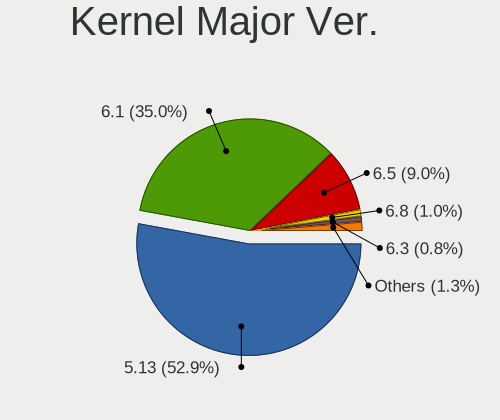
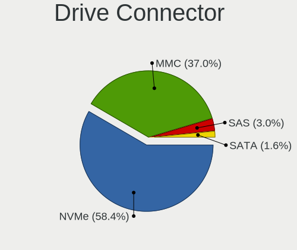
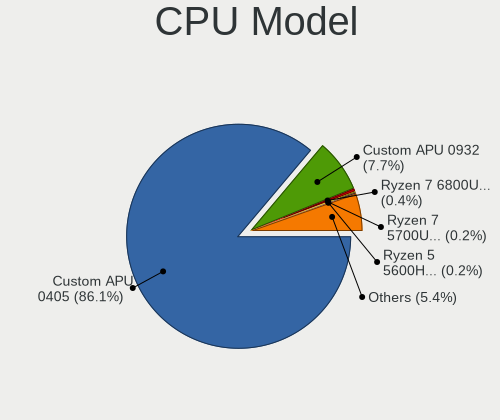
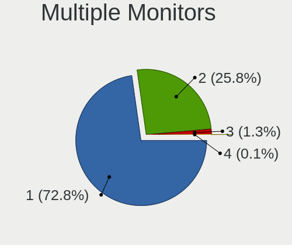
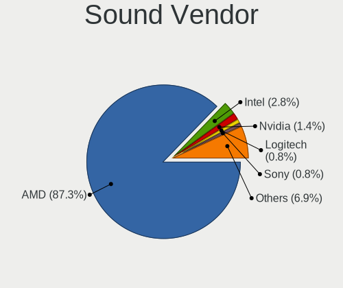
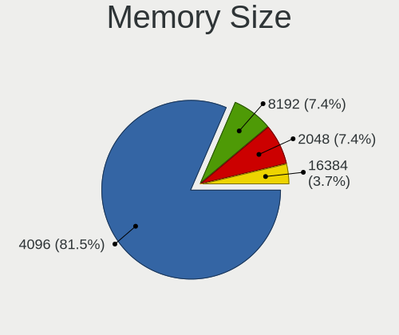
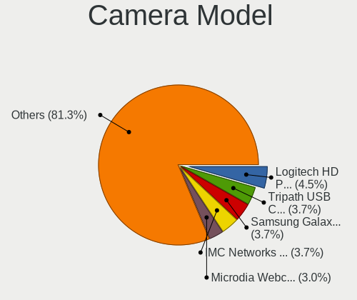
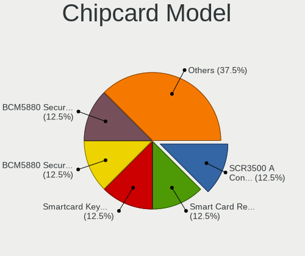

SteamOS - Tested Hardware & Statistics (Notebooks)
--------------------------------------------------

A project to collect tested hardware configurations for SteamOS.

Anyone can contribute to this report by the [hw-probe](https://github.com/linuxhw/hw-probe) tool:

    sudo -E hw-probe -all -upload

Please contribute! Especially if your hardware is rare.

Contents
--------

* [ Test Cases ](#test-cases)

* [ System ](#system)
  - [ OS                       ](#os)
  - [ OS Family                ](#os-family)
  - [ Kernel                   ](#kernel)
  - [ Kernel Family            ](#kernel-family)
  - [ Kernel Major Ver.        ](#kernel-major-ver)
  - [ Arch                     ](#arch)
  - [ DE                       ](#de)
  - [ Display Server           ](#display-server)
  - [ Display Manager          ](#display-manager)
  - [ OS Lang                  ](#os-lang)
  - [ Boot Mode                ](#boot-mode)
  - [ Filesystem               ](#filesystem)
  - [ Part. scheme             ](#part-scheme)
  - [ Dual Boot with Linux/BSD ](#dual-boot-with-linuxbsd)
  - [ Dual Boot (Win)          ](#dual-boot-win)

* [ Board ](#board)
  - [ Vendor                   ](#vendor)
  - [ Model                    ](#model)
  - [ Model Family             ](#model-family)
  - [ MFG Year                 ](#mfg-year)
  - [ Form Factor              ](#form-factor)
  - [ Secure Boot              ](#secure-boot)
  - [ Coreboot                 ](#coreboot)
  - [ RAM Size                 ](#ram-size)
  - [ RAM Used                 ](#ram-used)
  - [ Total Drives             ](#total-drives)
  - [ Has CD-ROM               ](#has-cd-rom)
  - [ Has Ethernet             ](#has-ethernet)
  - [ Has WiFi                 ](#has-wifi)
  - [ Has Bluetooth            ](#has-bluetooth)

* [ Location ](#location)
  - [ Country                  ](#country)
  - [ City                     ](#city)

* [ Drives ](#drives)
  - [ Drive Vendor             ](#drive-vendor)
  - [ Drive Model              ](#drive-model)
  - [ HDD Vendor               ](#hdd-vendor)
  - [ SSD Vendor               ](#ssd-vendor)
  - [ Drive Kind               ](#drive-kind)
  - [ Drive Connector          ](#drive-connector)
  - [ Drive Size               ](#drive-size)
  - [ Space Total              ](#space-total)
  - [ Space Used               ](#space-used)
  - [ Malfunc. Drives          ](#malfunc-drives)
  - [ Malfunc. Drive Vendor    ](#malfunc-drive-vendor)
  - [ Malfunc. HDD Vendor      ](#malfunc-hdd-vendor)
  - [ Malfunc. Drive Kind      ](#malfunc-drive-kind)
  - [ Failed Drives            ](#failed-drives)
  - [ Failed Drive Vendor      ](#failed-drive-vendor)
  - [ Drive Status             ](#drive-status)

* [ Storage controller ](#storage-controller)
  - [ Storage Vendor           ](#storage-vendor)
  - [ Storage Model            ](#storage-model)
  - [ Storage Kind             ](#storage-kind)

* [ Processor ](#processor)
  - [ CPU Vendor               ](#cpu-vendor)
  - [ CPU Model                ](#cpu-model)
  - [ CPU Model Family         ](#cpu-model-family)
  - [ CPU Cores                ](#cpu-cores)
  - [ CPU Sockets              ](#cpu-sockets)
  - [ CPU Threads              ](#cpu-threads)
  - [ CPU Op-Modes             ](#cpu-op-modes)
  - [ CPU Microcode            ](#cpu-microcode)
  - [ CPU Microarch            ](#cpu-microarch)

* [ Graphics ](#graphics)
  - [ GPU Vendor               ](#gpu-vendor)
  - [ GPU Model                ](#gpu-model)
  - [ GPU Combo                ](#gpu-combo)
  - [ GPU Driver               ](#gpu-driver)
  - [ GPU Memory               ](#gpu-memory)

* [ Monitor ](#monitor)
  - [ Monitor Vendor           ](#monitor-vendor)
  - [ Monitor Model            ](#monitor-model)
  - [ Monitor Resolution       ](#monitor-resolution)
  - [ Monitor Diagonal         ](#monitor-diagonal)
  - [ Monitor Width            ](#monitor-width)
  - [ Aspect Ratio             ](#aspect-ratio)
  - [ Monitor Area             ](#monitor-area)
  - [ Pixel Density            ](#pixel-density)
  - [ Multiple Monitors        ](#multiple-monitors)

* [ Network ](#network)
  - [ Net Controller Vendor    ](#net-controller-vendor)
  - [ Net Controller Model     ](#net-controller-model)
  - [ Wireless Vendor          ](#wireless-vendor)
  - [ Wireless Model           ](#wireless-model)
  - [ Ethernet Vendor          ](#ethernet-vendor)
  - [ Ethernet Model           ](#ethernet-model)
  - [ Net Controller Kind      ](#net-controller-kind)
  - [ Used Controller          ](#used-controller)
  - [ NICs                     ](#nics)
  - [ IPv6                     ](#ipv6)

* [ Bluetooth ](#bluetooth)
  - [ Bluetooth Vendor         ](#bluetooth-vendor)
  - [ Bluetooth Model          ](#bluetooth-model)

* [ Sound ](#sound)
  - [ Sound Vendor             ](#sound-vendor)
  - [ Sound Model              ](#sound-model)

* [ Memory ](#memory)
  - [ Memory Vendor            ](#memory-vendor)
  - [ Memory Model             ](#memory-model)
  - [ Memory Kind              ](#memory-kind)
  - [ Memory Form Factor       ](#memory-form-factor)
  - [ Memory Size              ](#memory-size)
  - [ Memory Speed             ](#memory-speed)

* [ Printers & scanners ](#printers--scanners)
  - [ Printer Vendor           ](#printer-vendor)
  - [ Printer Model            ](#printer-model)
  - [ Scanner Vendor           ](#scanner-vendor)
  - [ Scanner Model            ](#scanner-model)

* [ Camera ](#camera)
  - [ Camera Vendor            ](#camera-vendor)
  - [ Camera Model             ](#camera-model)

* [ Security ](#security)
  - [ Fingerprint Vendor       ](#fingerprint-vendor)
  - [ Fingerprint Model        ](#fingerprint-model)
  - [ Chipcard Vendor          ](#chipcard-vendor)
  - [ Chipcard Model           ](#chipcard-model)

* [ Unsupported ](#unsupported)
  - [ Unsupported Devices      ](#unsupported-devices)
  - [ Unsupported Device Types ](#unsupported-device-types)

Test Cases
----------

Total: 191

| Vendor    | Model                       | Probe                                                      | Date         |
|-----------|-----------------------------|------------------------------------------------------------|--------------|
| Valve     | Jupiter                     | [6e9790c5e7](https://linux-hardware.org/?probe=6e9790c5e7) | Sep 01, 2022 |
| Valve     | Jupiter                     | [c89533e9a2](https://linux-hardware.org/?probe=c89533e9a2) | Sep 01, 2022 |
| Valve     | Jupiter                     | [c348c06118](https://linux-hardware.org/?probe=c348c06118) | Sep 01, 2022 |
| Valve     | Jupiter                     | [60db4bfa03](https://linux-hardware.org/?probe=60db4bfa03) | Aug 31, 2022 |
| Valve     | Jupiter                     | [5a2483051c](https://linux-hardware.org/?probe=5a2483051c) | Aug 31, 2022 |
| Valve     | Jupiter                     | [0b928ad313](https://linux-hardware.org/?probe=0b928ad313) | Aug 31, 2022 |
| Valve     | Jupiter                     | [dbc549504c](https://linux-hardware.org/?probe=dbc549504c) | Aug 31, 2022 |
| Valve     | Jupiter                     | [1b38f48059](https://linux-hardware.org/?probe=1b38f48059) | Aug 30, 2022 |
| Valve     | Jupiter                     | [40b9dd39a6](https://linux-hardware.org/?probe=40b9dd39a6) | Aug 30, 2022 |
| Valve     | Jupiter                     | [ea6506cc93](https://linux-hardware.org/?probe=ea6506cc93) | Aug 30, 2022 |
| Lenovo    | IdeaPad Gaming 3 15ACH6 ... | [844a0c00e2](https://linux-hardware.org/?probe=844a0c00e2) | Aug 29, 2022 |
| Valve     | Jupiter                     | [830c22afde](https://linux-hardware.org/?probe=830c22afde) | Aug 29, 2022 |
| Dell      | XPS 13 9360                 | [1763ee1dd0](https://linux-hardware.org/?probe=1763ee1dd0) | Aug 29, 2022 |
| Valve     | Jupiter                     | [43ec7fb445](https://linux-hardware.org/?probe=43ec7fb445) | Aug 29, 2022 |
| Valve     | Jupiter                     | [3848655fce](https://linux-hardware.org/?probe=3848655fce) | Aug 28, 2022 |
| Valve     | Jupiter                     | [cd6744821b](https://linux-hardware.org/?probe=cd6744821b) | Aug 27, 2022 |
| Lenovo    | Legion Y740-15IRHg 81UH     | [521dd85c98](https://linux-hardware.org/?probe=521dd85c98) | Aug 26, 2022 |
| Valve     | Jupiter                     | [8027445785](https://linux-hardware.org/?probe=8027445785) | Aug 26, 2022 |
| Dell      | Precision 7720              | [7fafc0e50b](https://linux-hardware.org/?probe=7fafc0e50b) | Aug 26, 2022 |
| Valve     | Jupiter                     | [447edaff49](https://linux-hardware.org/?probe=447edaff49) | Aug 25, 2022 |
| Valve     | Jupiter                     | [ebd183fc4b](https://linux-hardware.org/?probe=ebd183fc4b) | Aug 25, 2022 |
| Valve     | Jupiter                     | [b74760105e](https://linux-hardware.org/?probe=b74760105e) | Aug 25, 2022 |
| Valve     | Jupiter                     | [5064c9f57b](https://linux-hardware.org/?probe=5064c9f57b) | Aug 24, 2022 |
| Valve     | Jupiter                     | [fbef109b91](https://linux-hardware.org/?probe=fbef109b91) | Aug 24, 2022 |
| Valve     | Jupiter                     | [de49ccefa5](https://linux-hardware.org/?probe=de49ccefa5) | Aug 24, 2022 |
| Valve     | Jupiter                     | [4c88b729d3](https://linux-hardware.org/?probe=4c88b729d3) | Aug 23, 2022 |
| Valve     | Jupiter                     | [ba1940016e](https://linux-hardware.org/?probe=ba1940016e) | Aug 23, 2022 |
| Valve     | Jupiter                     | [161cc0c135](https://linux-hardware.org/?probe=161cc0c135) | Aug 23, 2022 |
| Valve     | Jupiter                     | [078b8e8ff1](https://linux-hardware.org/?probe=078b8e8ff1) | Aug 22, 2022 |
| Valve     | Jupiter                     | [04b0de9007](https://linux-hardware.org/?probe=04b0de9007) | Aug 22, 2022 |
| Valve     | Jupiter                     | [1c25a3bf8a](https://linux-hardware.org/?probe=1c25a3bf8a) | Aug 22, 2022 |
| Valve     | Jupiter                     | [bc83cf9f77](https://linux-hardware.org/?probe=bc83cf9f77) | Aug 21, 2022 |
| Valve     | Jupiter                     | [36124147ef](https://linux-hardware.org/?probe=36124147ef) | Aug 20, 2022 |
| Valve     | Jupiter                     | [eb63fecd35](https://linux-hardware.org/?probe=eb63fecd35) | Aug 19, 2022 |
| Valve     | Jupiter                     | [d6b92d1aa0](https://linux-hardware.org/?probe=d6b92d1aa0) | Aug 19, 2022 |
| Valve     | Jupiter                     | [bff4d1ca46](https://linux-hardware.org/?probe=bff4d1ca46) | Aug 19, 2022 |
| Valve     | Jupiter                     | [87f3603202](https://linux-hardware.org/?probe=87f3603202) | Aug 18, 2022 |
| Valve     | Jupiter                     | [f0dc30e9f8](https://linux-hardware.org/?probe=f0dc30e9f8) | Aug 17, 2022 |
| Valve     | Jupiter                     | [5f3785b334](https://linux-hardware.org/?probe=5f3785b334) | Aug 16, 2022 |
| Valve     | Jupiter                     | [af4a593873](https://linux-hardware.org/?probe=af4a593873) | Aug 16, 2022 |
| Valve     | Jupiter                     | [c395a0f9db](https://linux-hardware.org/?probe=c395a0f9db) | Aug 16, 2022 |
| Valve     | Jupiter                     | [90ac03e747](https://linux-hardware.org/?probe=90ac03e747) | Aug 15, 2022 |
| Valve     | Jupiter                     | [c3f38697a4](https://linux-hardware.org/?probe=c3f38697a4) | Aug 15, 2022 |
| Valve     | Jupiter                     | [9ab7a2b695](https://linux-hardware.org/?probe=9ab7a2b695) | Aug 15, 2022 |
| Valve     | Jupiter                     | [2adcfce1c0](https://linux-hardware.org/?probe=2adcfce1c0) | Aug 14, 2022 |
| Valve     | Jupiter                     | [e9f1f10a4c](https://linux-hardware.org/?probe=e9f1f10a4c) | Aug 14, 2022 |
| Valve     | Jupiter                     | [50596cb93b](https://linux-hardware.org/?probe=50596cb93b) | Aug 13, 2022 |
| Valve     | Jupiter                     | [3a1e95f5d5](https://linux-hardware.org/?probe=3a1e95f5d5) | Aug 12, 2022 |
| Valve     | Jupiter                     | [b63f9aedab](https://linux-hardware.org/?probe=b63f9aedab) | Aug 12, 2022 |
| Valve     | Jupiter                     | [822737452b](https://linux-hardware.org/?probe=822737452b) | Aug 12, 2022 |
| Valve     | Jupiter                     | [9839802d27](https://linux-hardware.org/?probe=9839802d27) | Aug 12, 2022 |
| Valve     | Jupiter                     | [6b9bfad898](https://linux-hardware.org/?probe=6b9bfad898) | Aug 12, 2022 |
| Valve     | Jupiter                     | [c6e02c54e7](https://linux-hardware.org/?probe=c6e02c54e7) | Aug 11, 2022 |
| HP        | Laptop 14z-fq0000           | [9c62f8d392](https://linux-hardware.org/?probe=9c62f8d392) | Aug 11, 2022 |
| Valve     | Jupiter                     | [90e751b5cf](https://linux-hardware.org/?probe=90e751b5cf) | Aug 10, 2022 |
| Valve     | Jupiter                     | [6223a43fe2](https://linux-hardware.org/?probe=6223a43fe2) | Aug 10, 2022 |
| Valve     | Jupiter                     | [2cec170e55](https://linux-hardware.org/?probe=2cec170e55) | Aug 10, 2022 |
| AMI       | Unknown                     | [5cee81ed21](https://linux-hardware.org/?probe=5cee81ed21) | Aug 10, 2022 |
| Valve     | Jupiter                     | [68214f1af2](https://linux-hardware.org/?probe=68214f1af2) | Aug 10, 2022 |
| AMI       | Unknown                     | [7752037bab](https://linux-hardware.org/?probe=7752037bab) | Aug 10, 2022 |
| Valve     | Jupiter                     | [e4914b879a](https://linux-hardware.org/?probe=e4914b879a) | Aug 09, 2022 |
| Valve     | Jupiter                     | [813863fbbf](https://linux-hardware.org/?probe=813863fbbf) | Aug 09, 2022 |
| Valve     | Jupiter                     | [a5b1208abc](https://linux-hardware.org/?probe=a5b1208abc) | Aug 08, 2022 |
| Valve     | Jupiter                     | [a50e78265a](https://linux-hardware.org/?probe=a50e78265a) | Aug 07, 2022 |
| Valve     | Jupiter                     | [d8ef9609a7](https://linux-hardware.org/?probe=d8ef9609a7) | Aug 07, 2022 |
| Valve     | Jupiter                     | [ced35212a7](https://linux-hardware.org/?probe=ced35212a7) | Aug 07, 2022 |
| Valve     | Jupiter                     | [64a0d92417](https://linux-hardware.org/?probe=64a0d92417) | Aug 07, 2022 |
| Valve     | Jupiter                     | [b6c7ee76fa](https://linux-hardware.org/?probe=b6c7ee76fa) | Aug 06, 2022 |
| Valve     | Jupiter                     | [6bbc4f3d0a](https://linux-hardware.org/?probe=6bbc4f3d0a) | Aug 05, 2022 |
| Valve     | Jupiter                     | [d15c62e29a](https://linux-hardware.org/?probe=d15c62e29a) | Aug 05, 2022 |
| Valve     | Jupiter                     | [6f76f9d91a](https://linux-hardware.org/?probe=6f76f9d91a) | Aug 05, 2022 |
| Valve     | Jupiter                     | [4403a80bdc](https://linux-hardware.org/?probe=4403a80bdc) | Aug 03, 2022 |
| Valve     | Jupiter                     | [8689254ee7](https://linux-hardware.org/?probe=8689254ee7) | Aug 03, 2022 |
| Valve     | Jupiter                     | [bfddbf1d22](https://linux-hardware.org/?probe=bfddbf1d22) | Aug 02, 2022 |
| Valve     | Jupiter                     | [fdb514a999](https://linux-hardware.org/?probe=fdb514a999) | Aug 01, 2022 |
| Valve     | Jupiter                     | [e4c6300b68](https://linux-hardware.org/?probe=e4c6300b68) | Aug 01, 2022 |
| GPD       | G1619-02                    | [c61c4280c8](https://linux-hardware.org/?probe=c61c4280c8) | Jul 31, 2022 |
| Valve     | Jupiter                     | [ee3b662083](https://linux-hardware.org/?probe=ee3b662083) | Jul 30, 2022 |
| Acer      | Aspire A514-54              | [9a18d7476f](https://linux-hardware.org/?probe=9a18d7476f) | Jul 29, 2022 |
| Valve     | Jupiter                     | [225e2c825e](https://linux-hardware.org/?probe=225e2c825e) | Jul 29, 2022 |
| Acer      | Aspire A514-54              | [4a6c9ef157](https://linux-hardware.org/?probe=4a6c9ef157) | Jul 28, 2022 |
| Valve     | Jupiter                     | [dffaa71aed](https://linux-hardware.org/?probe=dffaa71aed) | Jul 28, 2022 |
| Valve     | Jupiter                     | [35608b206c](https://linux-hardware.org/?probe=35608b206c) | Jul 27, 2022 |
| Valve     | Jupiter                     | [e35fa6e699](https://linux-hardware.org/?probe=e35fa6e699) | Jul 27, 2022 |
| Valve     | Jupiter                     | [f43cbe28e9](https://linux-hardware.org/?probe=f43cbe28e9) | Jul 27, 2022 |
| Valve     | Jupiter                     | [d4e4413f9b](https://linux-hardware.org/?probe=d4e4413f9b) | Jul 26, 2022 |
| Valve     | Jupiter                     | [9c34e91c79](https://linux-hardware.org/?probe=9c34e91c79) | Jul 26, 2022 |
| Valve     | Jupiter                     | [b605f923c6](https://linux-hardware.org/?probe=b605f923c6) | Jul 25, 2022 |
| Valve     | Jupiter                     | [3e7b7cb8cd](https://linux-hardware.org/?probe=3e7b7cb8cd) | Jul 23, 2022 |
| Alienware | m17                         | [e14db26b9b](https://linux-hardware.org/?probe=e14db26b9b) | Jul 23, 2022 |
| Valve     | Jupiter                     | [ca07489d53](https://linux-hardware.org/?probe=ca07489d53) | Jul 23, 2022 |
| Valve     | Jupiter                     | [1860c6d71f](https://linux-hardware.org/?probe=1860c6d71f) | Jul 23, 2022 |
| Valve     | Jupiter                     | [2d0db23de3](https://linux-hardware.org/?probe=2d0db23de3) | Jul 23, 2022 |
| Valve     | Jupiter                     | [4aece18875](https://linux-hardware.org/?probe=4aece18875) | Jul 23, 2022 |
| Valve     | Jupiter                     | [44dca72cbb](https://linux-hardware.org/?probe=44dca72cbb) | Jul 22, 2022 |
| Unknown   | Unknown                     | [96af389676](https://linux-hardware.org/?probe=96af389676) | Jul 22, 2022 |
| ASRock    | X570 Extreme4 WiFi ax       | [bc52038c74](https://linux-hardware.org/?probe=bc52038c74) | Jul 21, 2022 |
| Valve     | Jupiter                     | [0cd166bdb1](https://linux-hardware.org/?probe=0cd166bdb1) | Jul 21, 2022 |
| Valve     | Jupiter                     | [2c1ad04467](https://linux-hardware.org/?probe=2c1ad04467) | Jul 18, 2022 |
| Valve     | Jupiter                     | [7f27efe00e](https://linux-hardware.org/?probe=7f27efe00e) | Jul 17, 2022 |
| HP        | Pavilion 17                 | [722f4eb4a9](https://linux-hardware.org/?probe=722f4eb4a9) | Jul 17, 2022 |
| Valve     | Jupiter                     | [b639365efd](https://linux-hardware.org/?probe=b639365efd) | Jul 16, 2022 |
| Valve     | Jupiter                     | [6c954fab9d](https://linux-hardware.org/?probe=6c954fab9d) | Jul 16, 2022 |
| Valve     | Jupiter                     | [eec9897935](https://linux-hardware.org/?probe=eec9897935) | Jul 15, 2022 |
| Valve     | Jupiter                     | [d4be0d94b4](https://linux-hardware.org/?probe=d4be0d94b4) | Jul 14, 2022 |
| Valve     | Jupiter                     | [d2f117e7f3](https://linux-hardware.org/?probe=d2f117e7f3) | Jul 14, 2022 |
| Dell      | XPS 15 9570                 | [e157e6d524](https://linux-hardware.org/?probe=e157e6d524) | Jul 14, 2022 |
| Valve     | Jupiter                     | [f7d66c8d35](https://linux-hardware.org/?probe=f7d66c8d35) | Jul 10, 2022 |
| Valve     | Jupiter                     | [0c2ea27c49](https://linux-hardware.org/?probe=0c2ea27c49) | Jul 09, 2022 |
| Valve     | Jupiter                     | [98711d54c1](https://linux-hardware.org/?probe=98711d54c1) | Jul 08, 2022 |
| Lenovo    | ThinkBook 13s G3 ACN 20Y... | [c3c73948f5](https://linux-hardware.org/?probe=c3c73948f5) | Jul 08, 2022 |
| Valve     | Jupiter                     | [3ede093138](https://linux-hardware.org/?probe=3ede093138) | Jul 07, 2022 |
| Valve     | Jupiter                     | [458276506d](https://linux-hardware.org/?probe=458276506d) | Jul 06, 2022 |
| Valve     | Jupiter                     | [663562cc6b](https://linux-hardware.org/?probe=663562cc6b) | Jul 06, 2022 |
| Valve     | Jupiter                     | [e640bab55c](https://linux-hardware.org/?probe=e640bab55c) | Jul 05, 2022 |
| Valve     | Jupiter                     | [0bd46afcda](https://linux-hardware.org/?probe=0bd46afcda) | Jul 04, 2022 |
| Valve     | Jupiter                     | [766a3583f0](https://linux-hardware.org/?probe=766a3583f0) | Jul 04, 2022 |
| Valve     | Jupiter                     | [ac0c161f66](https://linux-hardware.org/?probe=ac0c161f66) | Jul 02, 2022 |
| Valve     | Jupiter                     | [c591d23b4d](https://linux-hardware.org/?probe=c591d23b4d) | Jul 01, 2022 |
| Valve     | Jupiter                     | [bee9822ef6](https://linux-hardware.org/?probe=bee9822ef6) | Jun 30, 2022 |
| Valve     | Jupiter                     | [e98c07bc79](https://linux-hardware.org/?probe=e98c07bc79) | Jun 29, 2022 |
| Valve     | Jupiter                     | [261590e542](https://linux-hardware.org/?probe=261590e542) | Jun 29, 2022 |
| Valve     | Jupiter                     | [7c233f0a07](https://linux-hardware.org/?probe=7c233f0a07) | Jun 29, 2022 |
| Valve     | Jupiter                     | [e80815c8d4](https://linux-hardware.org/?probe=e80815c8d4) | Jun 27, 2022 |
| Valve     | Jupiter                     | [65e5ab29fd](https://linux-hardware.org/?probe=65e5ab29fd) | Jun 26, 2022 |
| Valve     | Jupiter                     | [e51f5d8645](https://linux-hardware.org/?probe=e51f5d8645) | Jun 26, 2022 |
| Valve     | Jupiter                     | [b4dd19f939](https://linux-hardware.org/?probe=b4dd19f939) | Jun 25, 2022 |
| Valve     | Jupiter                     | [c9ed3cf311](https://linux-hardware.org/?probe=c9ed3cf311) | Jun 23, 2022 |
| Dell      | G15 5510                    | [9c5777f505](https://linux-hardware.org/?probe=9c5777f505) | Jun 23, 2022 |
| Valve     | Jupiter                     | [213fbe4dd2](https://linux-hardware.org/?probe=213fbe4dd2) | Jun 22, 2022 |
| Valve     | Jupiter                     | [262a7f0cd4](https://linux-hardware.org/?probe=262a7f0cd4) | Jun 22, 2022 |
| Valve     | Jupiter                     | [f8722866b2](https://linux-hardware.org/?probe=f8722866b2) | Jun 22, 2022 |
| Valve     | Jupiter                     | [aa18022bce](https://linux-hardware.org/?probe=aa18022bce) | Jun 22, 2022 |
| Valve     | Jupiter                     | [000682313d](https://linux-hardware.org/?probe=000682313d) | Jun 20, 2022 |
| Valve     | Jupiter                     | [363ab9e4ea](https://linux-hardware.org/?probe=363ab9e4ea) | Jun 20, 2022 |
| Valve     | Jupiter                     | [dd5765a418](https://linux-hardware.org/?probe=dd5765a418) | Jun 18, 2022 |
| Valve     | Jupiter                     | [8e293bb4b1](https://linux-hardware.org/?probe=8e293bb4b1) | Jun 17, 2022 |
| Valve     | Jupiter                     | [ff0ce08944](https://linux-hardware.org/?probe=ff0ce08944) | Jun 16, 2022 |
| Valve     | Jupiter                     | [68a581ae0b](https://linux-hardware.org/?probe=68a581ae0b) | Jun 12, 2022 |
| HP        | Pavilion Gaming Laptop 1... | [df3f1b5d8f](https://linux-hardware.org/?probe=df3f1b5d8f) | Jun 11, 2022 |
| Valve     | Jupiter                     | [2353bf0f9d](https://linux-hardware.org/?probe=2353bf0f9d) | Jun 11, 2022 |
| Valve     | Jupiter                     | [17406c8741](https://linux-hardware.org/?probe=17406c8741) | Jun 11, 2022 |
| Valve     | Jupiter                     | [715e914cba](https://linux-hardware.org/?probe=715e914cba) | Jun 10, 2022 |
| Valve     | Jupiter                     | [cc0a20bb93](https://linux-hardware.org/?probe=cc0a20bb93) | Jun 06, 2022 |
| Valve     | Jupiter                     | [2fb1bfad12](https://linux-hardware.org/?probe=2fb1bfad12) | Jun 04, 2022 |
| Valve     | Jupiter                     | [322bdc2ce3](https://linux-hardware.org/?probe=322bdc2ce3) | Jun 03, 2022 |
| Valve     | Jupiter                     | [780d6b923a](https://linux-hardware.org/?probe=780d6b923a) | Jun 02, 2022 |
| Valve     | Jupiter                     | [f3910c9796](https://linux-hardware.org/?probe=f3910c9796) | May 29, 2022 |
| Valve     | Jupiter                     | [e415de106f](https://linux-hardware.org/?probe=e415de106f) | May 29, 2022 |
| Valve     | Jupiter                     | [0af4b9c805](https://linux-hardware.org/?probe=0af4b9c805) | May 29, 2022 |
| Valve     | Jupiter                     | [06b56d54d4](https://linux-hardware.org/?probe=06b56d54d4) | May 28, 2022 |
| Valve     | Jupiter                     | [1e966da4f8](https://linux-hardware.org/?probe=1e966da4f8) | May 27, 2022 |
| Valve     | Jupiter                     | [c716690aa2](https://linux-hardware.org/?probe=c716690aa2) | May 27, 2022 |
| Valve     | Jupiter                     | [43f315aa0c](https://linux-hardware.org/?probe=43f315aa0c) | May 27, 2022 |
| Valve     | Jupiter                     | [643322d821](https://linux-hardware.org/?probe=643322d821) | May 26, 2022 |
| HP        | Pavilion Gaming Laptop 1... | [b672eefb50](https://linux-hardware.org/?probe=b672eefb50) | May 25, 2022 |
| Valve     | Jupiter                     | [dee0bbedd1](https://linux-hardware.org/?probe=dee0bbedd1) | May 25, 2022 |
| Valve     | Jupiter                     | [c34173715a](https://linux-hardware.org/?probe=c34173715a) | May 24, 2022 |
| Valve     | Jupiter                     | [6ca95b630c](https://linux-hardware.org/?probe=6ca95b630c) | May 23, 2022 |
| Valve     | Jupiter                     | [7d3f9c0a5f](https://linux-hardware.org/?probe=7d3f9c0a5f) | May 23, 2022 |
| Acer      | Aspire A315-23              | [b5d37bf4f2](https://linux-hardware.org/?probe=b5d37bf4f2) | May 22, 2022 |
| Samsung   | 950XDB/951XDB/950XDY        | [fc970670a8](https://linux-hardware.org/?probe=fc970670a8) | May 22, 2022 |
| Valve     | Jupiter                     | [595b06f6c9](https://linux-hardware.org/?probe=595b06f6c9) | May 22, 2022 |
| Valve     | Jupiter                     | [d706d00651](https://linux-hardware.org/?probe=d706d00651) | May 21, 2022 |
| Valve     | Jupiter                     | [317e492fa3](https://linux-hardware.org/?probe=317e492fa3) | May 21, 2022 |
| Valve     | Jupiter                     | [f849597120](https://linux-hardware.org/?probe=f849597120) | May 18, 2022 |
| Valve     | Jupiter                     | [48df6e5c71](https://linux-hardware.org/?probe=48df6e5c71) | May 18, 2022 |
| Valve     | Jupiter                     | [9cf4d23a81](https://linux-hardware.org/?probe=9cf4d23a81) | May 13, 2022 |
| Valve     | Jupiter                     | [79f6db1d69](https://linux-hardware.org/?probe=79f6db1d69) | May 08, 2022 |
| Valve     | Jupiter                     | [771539d18d](https://linux-hardware.org/?probe=771539d18d) | May 03, 2022 |
| Valve     | Jupiter                     | [19d2c51aa6](https://linux-hardware.org/?probe=19d2c51aa6) | May 01, 2022 |
| Valve     | Jupiter                     | [1c826aed5e](https://linux-hardware.org/?probe=1c826aed5e) | Apr 30, 2022 |
| Valve     | Jupiter                     | [4c43342014](https://linux-hardware.org/?probe=4c43342014) | Apr 24, 2022 |
| Valve     | Jupiter                     | [8564bded7f](https://linux-hardware.org/?probe=8564bded7f) | Apr 21, 2022 |
| Valve     | Jupiter                     | [d761657c3a](https://linux-hardware.org/?probe=d761657c3a) | Apr 21, 2022 |
| Valve     | Jupiter                     | [f2e59fcb97](https://linux-hardware.org/?probe=f2e59fcb97) | Apr 20, 2022 |
| Valve     | Jupiter                     | [4f23fab4fd](https://linux-hardware.org/?probe=4f23fab4fd) | Apr 17, 2022 |
| Valve     | Jupiter                     | [ed07e93435](https://linux-hardware.org/?probe=ed07e93435) | Apr 16, 2022 |
| Valve     | Jupiter                     | [48aacdeee8](https://linux-hardware.org/?probe=48aacdeee8) | Apr 15, 2022 |
| Valve     | Jupiter                     | [6a042646dd](https://linux-hardware.org/?probe=6a042646dd) | Apr 14, 2022 |
| Valve     | Jupiter                     | [d4c9dba2a1](https://linux-hardware.org/?probe=d4c9dba2a1) | Apr 14, 2022 |
| Valve     | Jupiter                     | [852b6fb53a](https://linux-hardware.org/?probe=852b6fb53a) | Apr 08, 2022 |
| Valve     | Jupiter                     | [6129b15fb5](https://linux-hardware.org/?probe=6129b15fb5) | Apr 05, 2022 |
| Valve     | Jupiter                     | [ec05067a1d](https://linux-hardware.org/?probe=ec05067a1d) | Apr 03, 2022 |
| Valve     | Jupiter                     | [180c84c856](https://linux-hardware.org/?probe=180c84c856) | Apr 02, 2022 |
| Valve     | Jupiter                     | [d8625616de](https://linux-hardware.org/?probe=d8625616de) | Mar 30, 2022 |
| Valve     | Jupiter                     | [d181a912af](https://linux-hardware.org/?probe=d181a912af) | Mar 23, 2022 |
| Valve     | Jupiter                     | [0b6a21cf35](https://linux-hardware.org/?probe=0b6a21cf35) | Mar 18, 2022 |
| Valve     | Jupiter                     | [85328e8f3d](https://linux-hardware.org/?probe=85328e8f3d) | Mar 17, 2022 |
| Valve     | Jupiter                     | [023aea75e1](https://linux-hardware.org/?probe=023aea75e1) | Mar 14, 2022 |
| Valve     | Jupiter                     | [c7f6388908](https://linux-hardware.org/?probe=c7f6388908) | Mar 11, 2022 |

System
------

OS
--

Installed operating systems

| Name                         | Notebooks | Percent |
|------------------------------|-----------|---------|
| SteamOS 3.2                  | 57        | 33.73%  |
| SteamOS 3.3                  | 45        | 26.63%  |
| SteamOS 3.3.1                | 29        | 17.16%  |
| SteamOS Snapshot             | 21        | 12.43%  |
| SteamOS 3.1                  | 10        | 5.92%   |
| SteamOS 3.2 (steamdeck-main) | 3         | 1.78%   |
| SteamOS                      | 2         | 1.18%   |
| SteamOS Rolling              | 1         | 0.59%   |
| SteamOS 3.4                  | 1         | 0.59%   |

OS Family
---------

OS without a version

| Name    | Notebooks | Percent |
|---------|-----------|---------|
| SteamOS | 166       | 100%    |

Kernel
------

Version of the Linux kernel

| Version                                            | Notebooks | Percent |
|----------------------------------------------------|-----------|---------|
| 5.13.0-valve15-1-neptune-02197-gf6ec7ad3762a       | 53        | 31.18%  |
| 5.13.0-valve21-1-neptune-02209-g2a5bdc1102a0       | 35        | 20.59%  |
| 5.13.0-valve21.1-1-neptune-02211-gc54cda5a36f3     | 29        | 17.06%  |
| 5.13.0-valve10.1-1-neptune-02144-g7fffaf925dfb     | 16        | 9.41%   |
| 5.13.0-valve10.3-1-neptune-02176-g5fe416c4acd8     | 12        | 7.06%   |
| 5.13.0-valve10.1-2-neptune-dri-02144-g7fffaf925dfb | 7         | 4.12%   |
| 5.13.0-valve14-1-neptune-02195-g5b0f749d00fa       | 5         | 2.94%   |
| 5.13.0-valve24-1-neptune-02226-g5b8545e4c5a1       | 4         | 2.35%   |
| 5.13.0-valve20-1-neptune-02207-gbd986a7e1c7f       | 4         | 2.35%   |
| 5.13.0-valve22-1-neptune-02213-gb68995364335       | 3         | 1.76%   |
| 5.18.1-arch1_testHoloISO_20220606.1811             | 1         | 0.59%   |
| 5.13.0-valve21-2-neptune-02209-g2a5bdc1102a0       | 1         | 0.59%   |

Kernel Family
-------------

Linux kernel without a distro release

| Version | Notebooks | Percent |
|---------|-----------|---------|
| 5.13.0  | 165       | 99.4%   |
| 5.18.1  | 1         | 0.6%    |

Kernel Major Ver.
-----------------

Linux kernel major version

| Version | Notebooks | Percent |
|---------|-----------|---------|
| 5.13    | 165       | 99.4%   |
| 5.18    | 1         | 0.6%    |

Arch
----

OS architecture (x86_64, i586, etc.)

| Name   | Notebooks | Percent |
|--------|-----------|---------|
| x86_64 | 166       | 100%    |

DE
--

Desktop Environment

| Name      | Notebooks | Percent |
|-----------|-----------|---------|
| KDE5      | 162       | 97.59%  |
| gamescope | 2         | 1.2%    |
| Unknown   | 2         | 1.2%    |

Display Server
--------------

X11 or Wayland

| Name    | Notebooks | Percent |
|---------|-----------|---------|
| X11     | 163       | 98.19%  |
| Wayland | 2         | 1.2%    |
| Unknown | 1         | 0.6%    |

Display Manager
---------------

SDDM, LightDM, etc.

| Name    | Notebooks | Percent |
|---------|-----------|---------|
| Unknown | 165       | 99.4%   |
| SDDM    | 1         | 0.6%    |

OS Lang
-------

Language

| Lang  | Notebooks | Percent |
|-------|-----------|---------|
| en_US | 147       | 88.55%  |
| en_GB | 4         | 2.41%   |
| de_DE | 3         | 1.81%   |
| an_ES | 3         | 1.81%   |
| fr_FR | 2         | 1.2%    |
| zh_CN | 1         | 0.6%    |
| pt_BR | 1         | 0.6%    |
| it_IT | 1         | 0.6%    |
| et_EE | 1         | 0.6%    |
| es_ES | 1         | 0.6%    |
| en_DE | 1         | 0.6%    |
| en_CA | 1         | 0.6%    |

Boot Mode
---------

EFI or BIOS

| Mode | Notebooks | Percent |
|------|-----------|---------|
| BIOS | 163       | 98.19%  |
| EFI  | 3         | 1.81%   |

Filesystem
----------

Type of filesystem

| Type  | Notebooks | Percent |
|-------|-----------|---------|
| Btrfs | 165       | 99.4%   |
| Ext4  | 1         | 0.6%    |

Part. scheme
------------

Scheme of partitioning

| Type    | Notebooks | Percent |
|---------|-----------|---------|
| Unknown | 163       | 98.19%  |
| GPT     | 3         | 1.81%   |

Dual Boot with Linux/BSD
------------------------

Hosting more than one Linux/BSD

| Dual boot | Notebooks | Percent |
|-----------|-----------|---------|
| No        | 163       | 98.19%  |
| Yes       | 3         | 1.81%   |

Dual Boot (Win)
---------------

Hosting Linux and Windows

| Dual boot | Notebooks | Percent |
|-----------|-----------|---------|
| No        | 166       | 100%    |

Board
-----

Vendor
------

Motherboard manufacturer

| Name                | Notebooks | Percent |
|---------------------|-----------|---------|
| Valve               | 147       | 88.55%  |
| Hewlett-Packard     | 4         | 2.41%   |
| Dell                | 4         | 2.41%   |
| Lenovo              | 3         | 1.81%   |
| Acer                | 2         | 1.2%    |
| Samsung Electronics | 1         | 0.6%    |
| GPD                 | 1         | 0.6%    |
| ASRock              | 1         | 0.6%    |
| AMI                 | 1         | 0.6%    |
| Alienware           | 1         | 0.6%    |
| Unknown             | 1         | 0.6%    |

Model
-----

Motherboard model

| Name                                | Notebooks | Percent |
|-------------------------------------|-----------|---------|
| Valve Jupiter                       | 147       | 88.55%  |
| Unknown                             | 2         | 1.2%    |
| Samsung 950XDB/951XDB/950XDY        | 1         | 0.6%    |
| Lenovo ThinkBook 13s G3 ACN 20YA    | 1         | 0.6%    |
| Lenovo Legion Y740-15IRHg 81UH      | 1         | 0.6%    |
| Lenovo IdeaPad Gaming 3 15ACH6 82K2 | 1         | 0.6%    |
| HP Pavilion Gaming Laptop 15-ec2xxx | 1         | 0.6%    |
| HP Pavilion Gaming Laptop 15-dk0xxx | 1         | 0.6%    |
| HP Pavilion 17                      | 1         | 0.6%    |
| HP Laptop 14z-fq0000                | 1         | 0.6%    |
| GPD G1619-02                        | 1         | 0.6%    |
| Dell XPS 15 9570                    | 1         | 0.6%    |
| Dell XPS 13 9360                    | 1         | 0.6%    |
| Dell Precision 7720                 | 1         | 0.6%    |
| Dell G15 5510                       | 1         | 0.6%    |
| ASRock X570 Extreme4 WiFi ax        | 1         | 0.6%    |
| Alienware m17                       | 1         | 0.6%    |
| Acer Aspire A514-54                 | 1         | 0.6%    |
| Acer Aspire A315-23                 | 1         | 0.6%    |

Model Family
------------

Motherboard model prefix

| Name             | Notebooks | Percent |
|------------------|-----------|---------|
| Valve Jupiter    | 147       | 88.55%  |
| HP Pavilion      | 3         | 1.81%   |
| Dell XPS         | 2         | 1.2%    |
| Acer Aspire      | 2         | 1.2%    |
| Unknown          | 2         | 1.2%    |
| Samsung 950XDB   | 1         | 0.6%    |
| Lenovo ThinkBook | 1         | 0.6%    |
| Lenovo Legion    | 1         | 0.6%    |
| Lenovo IdeaPad   | 1         | 0.6%    |
| HP Laptop        | 1         | 0.6%    |
| GPD G1619-02     | 1         | 0.6%    |
| Dell Precision   | 1         | 0.6%    |
| Dell G15         | 1         | 0.6%    |
| ASRock X570      | 1         | 0.6%    |
| Alienware m17    | 1         | 0.6%    |

MFG Year
--------

Motherboard manufacture year

| Year    | Notebooks | Percent |
|---------|-----------|---------|
| 2022    | 135       | 81.33%  |
| Unknown | 12        | 7.23%   |
| 2021    | 8         | 4.82%   |
| 2020    | 3         | 1.81%   |
| 2019    | 3         | 1.81%   |
| 2017    | 2         | 1.2%    |
| 2018    | 1         | 0.6%    |
| 2016    | 1         | 0.6%    |
| 2013    | 1         | 0.6%    |

Form Factor
-----------

Physical design of the computer

| Name     | Notebooks | Percent |
|----------|-----------|---------|
| Notebook | 166       | 100%    |

Secure Boot
-----------

Enabled or disabled

| State    | Notebooks | Percent |
|----------|-----------|---------|
| Disabled | 166       | 100%    |

Coreboot
--------

Have coreboot on board

| Used | Notebooks | Percent |
|------|-----------|---------|
| No   | 166       | 100%    |

RAM Size
--------

Total RAM memory

| Size in GB  | Notebooks | Percent |
|-------------|-----------|---------|
| 8.01-16.0   | 152       | 91.57%  |
| 16.01-24.0  | 6         | 3.61%   |
| 4.01-8.0    | 5         | 3.01%   |
| 3.01-4.0    | 1         | 0.6%    |
| 24.01-32.0  | 1         | 0.6%    |
| 64.01-256.0 | 1         | 0.6%    |

RAM Used
--------

Used RAM memory

| Used GB  | Notebooks | Percent |
|----------|-----------|---------|
| 2.01-3.0 | 83        | 48.26%  |
| 3.01-4.0 | 42        | 24.42%  |
| 4.01-8.0 | 26        | 15.12%  |
| 1.01-2.0 | 21        | 12.21%  |

Total Drives
------------

Number of drives on board

| Drives | Notebooks | Percent |
|--------|-----------|---------|
| 2      | 97        | 57.74%  |
| 1      | 64        | 38.1%   |
| 3      | 5         | 2.98%   |
| 4      | 1         | 0.6%    |
| 0      | 1         | 0.6%    |

Has CD-ROM
----------

Has CD-ROM on board

| Presented | Notebooks | Percent |
|-----------|-----------|---------|
| No        | 161       | 96.99%  |
| Yes       | 5         | 3.01%   |

Has Ethernet
------------

Has Ethernet on board

| Presented | Notebooks | Percent |
|-----------|-----------|---------|
| No        | 121       | 72.46%  |
| Yes       | 46        | 27.54%  |

Has WiFi
--------

Has WiFi module

| Presented | Notebooks | Percent |
|-----------|-----------|---------|
| Yes       | 166       | 100%    |

Has Bluetooth
-------------

Has Bluetooth module

| Presented | Notebooks | Percent |
|-----------|-----------|---------|
| Yes       | 165       | 99.4%   |
| No        | 1         | 0.6%    |

Location
--------

Country
-------

Geographic location (country)

| Country     | Notebooks | Percent |
|-------------|-----------|---------|
| USA         | 87        | 52.41%  |
| Germany     | 17        | 10.24%  |
| UK          | 16        | 9.64%   |
| Canada      | 9         | 5.42%   |
| Spain       | 5         | 3.01%   |
| Italy       | 4         | 2.41%   |
| France      | 4         | 2.41%   |
| Poland      | 3         | 1.81%   |
| Netherlands | 2         | 1.2%    |
| Czechia     | 2         | 1.2%    |
| Brazil      | 2         | 1.2%    |
| Sweden      | 1         | 0.6%    |
| Slovakia    | 1         | 0.6%    |
| Russia      | 1         | 0.6%    |
| Romania     | 1         | 0.6%    |
| Oman        | 1         | 0.6%    |
| Malaysia    | 1         | 0.6%    |
| Latvia      | 1         | 0.6%    |
| Japan       | 1         | 0.6%    |
| Hungary     | 1         | 0.6%    |
| Guatemala   | 1         | 0.6%    |
| Greece      | 1         | 0.6%    |
| Estonia     | 1         | 0.6%    |
| China       | 1         | 0.6%    |
| Belgium     | 1         | 0.6%    |
| Austria     | 1         | 0.6%    |

City
----

Geographic location (city)

| City                   | Notebooks | Percent |
|------------------------|-----------|---------|
| Sunnyvale              | 2         | 1.18%   |
| Seattle                | 2         | 1.18%   |
| Manchester             | 2         | 1.18%   |
| Colorado Springs       | 2         | 1.18%   |
| Brooklyn               | 2         | 1.18%   |
| Bristol                | 2         | 1.18%   |
| Yekaterinburg          | 1         | 0.59%   |
| Wokingham              | 1         | 0.59%   |
| Whitley Bay            | 1         | 0.59%   |
| Wausau                 | 1         | 0.59%   |
| Washington             | 1         | 0.59%   |
| Warsaw                 | 1         | 0.59%   |
| Victoria               | 1         | 0.59%   |
| Vechelde               | 1         | 0.59%   |
| Ulm                    | 1         | 0.59%   |
| Tulsa                  | 1         | 0.59%   |
| Treviso                | 1         | 0.59%   |
| Torre del Mar          | 1         | 0.59%   |
| Toronto                | 1         | 0.59%   |
| Thief River Falls      | 1         | 0.59%   |
| Thessaloniki           | 1         | 0.59%   |
| Temecula               | 1         | 0.59%   |
| Sylmar                 | 1         | 0.59%   |
| Stuttgart              | 1         | 0.59%   |
| Stockholm              | 1         | 0.59%   |
| St Louis               | 1         | 0.59%   |
| Spanish Fork           | 1         | 0.59%   |
| Southlake              | 1         | 0.59%   |
| Sindelfingen           | 1         | 0.59%   |
| Shepperton             | 1         | 0.59%   |
| Seri Kembangan         | 1         | 0.59%   |
| Schwerin               | 1         | 0.59%   |
| Santa Cruz de Tenerife | 1         | 0.59%   |
| Santa Clara            | 1         | 0.59%   |
| San Diego              | 1         | 0.59%   |
| San Antonio            | 1         | 0.59%   |
| Sacramento             | 1         | 0.59%   |
| Rueil-Malmaison        | 1         | 0.59%   |
| Rome                   | 1         | 0.59%   |
| Rohnert Park           | 1         | 0.59%   |
| Rockville              | 1         | 0.59%   |
| Roanoke                | 1         | 0.59%   |
| Ringwood               | 1         | 0.59%   |
| Riga                   | 1         | 0.59%   |
| Reignier-Esery         | 1         | 0.59%   |
| Québec                | 1         | 0.59%   |
| Przezmierowo           | 1         | 0.59%   |
| Prague                 | 1         | 0.59%   |
| Poznan                 | 1         | 0.59%   |
| Portland               | 1         | 0.59%   |
| Portage                | 1         | 0.59%   |
| Phoenix                | 1         | 0.59%   |
| Philadelphia           | 1         | 0.59%   |
| Pärnu                 | 1         | 0.59%   |
| Park City              | 1         | 0.59%   |
| Palatine               | 1         | 0.59%   |
| Ottawa                 | 1         | 0.59%   |
| Ooltewah               | 1         | 0.59%   |
| Oklahoma City          | 1         | 0.59%   |
| Odenton                | 1         | 0.59%   |

Drives
------

Drive Vendor
------------

Hard drive vendors

| Vendor                         | Notebooks | Drives | Percent |
|--------------------------------|-----------|--------|---------|
| Unknown                        | 76        | 77     | 27.54%  |
| Phison                         | 59        | 59     | 21.38%  |
| Kingston                       | 57        | 61     | 20.65%  |
| Unknown                        | 22        | 23     | 7.97%   |
| Samsung Electronics            | 12        | 13     | 4.35%   |
| O2 Micro                       | 12        | 12     | 4.35%   |
| Silicon Motion                 | 10        | 11     | 3.62%   |
| SanDisk                        | 4         | 4      | 1.45%   |
| SK hynix                       | 3         | 3      | 1.09%   |
| WDC                            | 2         | 2      | 0.72%   |
| Toshiba                        | 2         | 2      | 0.72%   |
| KIOXIA                         | 2         | 2      | 0.72%   |
| JMicron Technology             | 2         | 2      | 0.72%   |
| ADATA Technology               | 2         | 2      | 0.72%   |
| Yangtze Memory Technologies    | 1         | 1      | 0.36%   |
| TrekStor                       | 1         | 1      | 0.36%   |
| SSK                            | 1         | 1      | 0.36%   |
| Solid State Storage Technology | 1         | 1      | 0.36%   |
| Seagate                        | 1         | 1      | 0.36%   |
| Micron/Crucial Technology      | 1         | 1      | 0.36%   |
| Micron Technology              | 1         | 1      | 0.36%   |
| Lexar 25                       | 1         | 1      | 0.36%   |
| External                       | 1         | 2      | 0.36%   |
| Crucial                        | 1         | 1      | 0.36%   |
| ASMT                           | 1         | 1      | 0.36%   |

Drive Model
-----------

Hard drive models

| Model                                    | Notebooks | Percent |
|------------------------------------------|-----------|---------|
| Phison NVMe SSD Drive 512GB              | 41        | 14.86%  |
| Kingston NVMe SSD Drive 512GB            | 31        | 11.23%  |
| Unknown MMC Card  512GB                  | 29        | 10.51%  |
| Kingston NVMe SSD Drive 256GB            | 26        | 9.42%   |
| Unknown                                  | 22        | 7.97%   |
| Phison NVMe SSD Drive 256GB              | 16        | 5.8%    |
| O2 Micro NVMe SSD Drive 64GB             | 12        | 4.35%   |
| Unknown MMC Card  256GB                  | 11        | 3.99%   |
| Unknown MMC Card  128GB                  | 11        | 3.99%   |
| Silicon Motion NVMe SSD Drive 512GB      | 6         | 2.17%   |
| Unknown MMC Card  64GB                   | 5         | 1.81%   |
| Unknown MMC Card  393GB                  | 5         | 1.81%   |
| Unknown MMC Card  32GB                   | 4         | 1.45%   |
| Silicon Motion NVMe SSD Drive 256GB      | 4         | 1.45%   |
| Unknown MMC Card  498GB                  | 3         | 1.09%   |
| Samsung SM963 2.5" NVMe PCIe SSD 1024GB  | 3         | 1.09%   |
| Samsung NVMe SSD Drive 512GB             | 3         | 1.09%   |
| SanDisk NVMe SSD Drive 512GB             | 2         | 0.72%   |
| JMicron Generic 160GB                    | 2         | 0.72%   |
| Yangtze Memory NVMe SSD Drive 1024GB     | 1         | 0.36%   |
| WDC WD10SPZX-75Z10T2 1TB                 | 1         | 0.36%   |
| WDC CH SN530 SDBPTPZ-1T00-1024 930GB     | 1         | 0.36%   |
| Unknown SK256  256GB                     | 1         | 0.36%   |
| Unknown MMC Card  500GB                  | 1         | 0.36%   |
| Unknown MMC Card  250GB                  | 1         | 0.36%   |
| Unknown MMC Card  248GB                  | 1         | 0.36%   |
| Unknown MMC Card  1TB                    | 1         | 0.36%   |
| Unknown MMC Card  196GB                  | 1         | 0.36%   |
| Unknown MMC Card  16GB                   | 1         | 0.36%   |
| Unknown MMC Card  1048GB                 | 1         | 0.36%   |
| TrekStor DS picco SSD 128GB              | 1         | 0.36%   |
| Toshiba NVMe SSD Drive 512GB             | 1         | 0.36%   |
| Toshiba KBG30ZMS128G 128GB NVMe SSD      | 1         | 0.36%   |
| SSK Disk 256GB                           | 1         | 0.36%   |
| Solid State Storage NVMe SSD Drive 128GB | 1         | 0.36%   |
| SK hynix NVMe SSD Drive 512GB            | 1         | 0.36%   |
| SK hynix NVMe SSD Drive 256GB            | 1         | 0.36%   |
| SK hynix NVMe SSD Drive 1024GB           | 1         | 0.36%   |
| Seagate ST1000LX015-1U7172 1TB           | 1         | 0.36%   |
| SanDisk NVMe SSD Drive 1TB               | 1         | 0.36%   |
| Sandisk Microsoft Xbox Series X 930GB    | 1         | 0.36%   |
| Samsung SSD CM871 2.5 7mm 128GB          | 1         | 0.36%   |
| Samsung SSD 860 EVO M.2 250GB            | 1         | 0.36%   |
| Samsung SM963 2.5" NVMe PCIe SSD 128GB   | 1         | 0.36%   |
| Samsung PSSD T7 1TB                      | 1         | 0.36%   |
| Samsung NVMe SSD Drive 500GB             | 1         | 0.36%   |
| Samsung MZ9LQ1T0HBLB-00B 1TB             | 1         | 0.36%   |
| Phison NVMe SSD Drive 1TB                | 1         | 0.36%   |
| Phison ESMP512GKB4C3-E13TS 512GB         | 1         | 0.36%   |
| Micron/Crucial NVMe SSD Drive 500GB      | 1         | 0.36%   |
| Micron NVMe SSD Drive 512GB              | 1         | 0.36%   |
| Lexar 25 6GB SSD                         | 1         | 0.36%   |
| KIOXIA NVMe SSD Drive 512GB              | 1         | 0.36%   |
| KIOXIA NVMe SSD Drive 256GB              | 1         | 0.36%   |
| External USB3.0 1TB                      | 1         | 0.36%   |
| Crucial CT1000BX500SSD1 1TB              | 1         | 0.36%   |
| ASMT 2235 160GB                          | 1         | 0.36%   |
| ADATA NVMe SSD Drive 512GB               | 1         | 0.36%   |
| ADATA NVMe SSD Drive 256GB               | 1         | 0.36%   |

HDD Vendor
----------

Hard disk drive vendors

| Vendor  | Notebooks | Drives | Percent |
|---------|-----------|--------|---------|
| WDC     | 1         | 1      | 33.33%  |
| Seagate | 1         | 1      | 33.33%  |
| ASMT    | 1         | 1      | 33.33%  |

SSD Vendor
----------

Solid state drive vendors

| Vendor              | Notebooks | Drives | Percent |
|---------------------|-----------|--------|---------|
| Samsung Electronics | 3         | 3      | 37.5%   |
| JMicron Technology  | 2         | 2      | 25%     |
| TrekStor            | 1         | 1      | 12.5%   |
| Lexar 25            | 1         | 1      | 12.5%   |
| Crucial             | 1         | 1      | 12.5%   |

Drive Kind
----------

HDD or SSD

| Kind    | Notebooks | Drives | Percent |
|---------|-----------|--------|---------|
| NVMe    | 162       | 173    | 60%     |
| MMC     | 97        | 100    | 35.93%  |
| SSD     | 7         | 8      | 2.59%   |
| HDD     | 3         | 3      | 1.11%   |
| Unknown | 1         | 1      | 0.37%   |

Drive Connector
---------------

SATA, SAS, NVMe, etc.

| Type | Notebooks | Drives | Percent |
|------|-----------|--------|---------|
| NVMe | 162       | 171    | 59.78%  |
| MMC  | 97        | 100    | 35.79%  |
| SAS  | 8         | 9      | 2.95%   |
| SATA | 4         | 5      | 1.48%   |

Drive Size
----------

Size of hard drive

| Size in TB | Notebooks | Drives | Percent |
|------------|-----------|--------|---------|
| 0.01-0.5   | 7         | 7      | 63.64%  |
| 0.51-1.0   | 4         | 4      | 36.36%  |

Space Total
-----------

Amount of disk space available on the file system

| Size in GB | Notebooks | Percent |
|------------|-----------|---------|
| 251-500    | 82        | 49.4%   |
| 101-250    | 51        | 30.72%  |
| 501-1000   | 21        | 12.65%  |
| 51-100     | 11        | 6.63%   |
| 1001-2000  | 1         | 0.6%    |

Space Used
----------

Amount of used disk space

| Used GB  | Notebooks | Percent |
|----------|-----------|---------|
| 101-250  | 73        | 43.2%   |
| 251-500  | 42        | 24.85%  |
| 21-50    | 24        | 14.2%   |
| 51-100   | 14        | 8.28%   |
| 1-20     | 12        | 7.1%    |
| 501-1000 | 4         | 2.37%   |

Malfunc. Drives
---------------

Drive models with a malfunction

Zero info for selected period =(

Malfunc. Drive Vendor
---------------------

Vendors of faulty drives

Zero info for selected period =(

Malfunc. HDD Vendor
-------------------

Vendors of faulty HDD drives

Zero info for selected period =(

Malfunc. Drive Kind
-------------------

Kinds of faulty drives

Zero info for selected period =(

Failed Drives
-------------

Failed drive models

Zero info for selected period =(

Failed Drive Vendor
-------------------

Failed drive vendors

Zero info for selected period =(

Drive Status
------------

Number of failed and malfunc. drives

| Status   | Notebooks | Drives | Percent |
|----------|-----------|--------|---------|
| Detected | 165       | 282    | 98.21%  |
| Works    | 3         | 3      | 1.79%   |

Storage controller
------------------

Storage Vendor
--------------

Storage controller vendors

| Vendor                         | Notebooks | Percent |
|--------------------------------|-----------|---------|
| Phison Electronics             | 59        | 33.71%  |
| Kingston Technology Company    | 57        | 32.57%  |
| O2 Micro                       | 12        | 6.86%   |
| Silicon Motion                 | 10        | 5.71%   |
| Samsung Electronics            | 9         | 5.14%   |
| Intel                          | 6         | 3.43%   |
| SanDisk                        | 5         | 2.86%   |
| AMD                            | 4         | 2.29%   |
| SK hynix                       | 3         | 1.71%   |
| Toshiba America Info Systems   | 2         | 1.14%   |
| KIOXIA                         | 2         | 1.14%   |
| ADATA Technology               | 2         | 1.14%   |
| Yangtze Memory Technologies    | 1         | 0.57%   |
| Solid State Storage Technology | 1         | 0.57%   |
| Micron/Crucial Technology      | 1         | 0.57%   |
| Micron Technology              | 1         | 0.57%   |

Storage Model
-------------

Storage controller models

| Model                                                                         | Notebooks | Percent |
|-------------------------------------------------------------------------------|-----------|---------|
| Phison PS5013 E13 NVMe Controller                                             | 58        | 32.77%  |
| Kingston Company OM3PDP3 NVMe SSD                                             | 56        | 31.64%  |
| O2 Micro Non-Volatile memory controller                                       | 12        | 6.78%   |
| Silicon Motion SM2263EN/SM2263XT SSD Controller                               | 10        | 5.65%   |
| Samsung NVMe SSD Controller 980                                               | 6         | 3.39%   |
| AMD FCH SATA Controller [AHCI mode]                                           | 4         | 2.26%   |
| SK hynix Gold P31 SSD                                                         | 3         | 1.69%   |
| Intel 82801 Mobile SATA Controller [RAID mode]                                | 3         | 1.69%   |
| SanDisk PC SN530 NVMe SSD                                                     | 2         | 1.13%   |
| SanDisk Non-Volatile memory controller                                        | 2         | 1.13%   |
| Samsung NVMe SSD Controller SM981/PM981/PM983                                 | 2         | 1.13%   |
| KIOXIA NVMe SSD Controller BG4                                                | 2         | 1.13%   |
| ADATA Non-Volatile memory controller                                          | 2         | 1.13%   |
| Yangtze Memory Non-Volatile memory controller                                 | 1         | 0.56%   |
| Toshiba America Info Systems XG4 NVMe SSD Controller                          | 1         | 0.56%   |
| Toshiba America Info Systems BG3 NVMe SSD Controller                          | 1         | 0.56%   |
| Solid State Storage Non-Volatile memory controller                            | 1         | 0.56%   |
| SanDisk WD PC SN810 / Black SN850 NVMe SSD                                    | 1         | 0.56%   |
| Samsung NVMe SSD Controller SM961/PM961/SM963                                 | 1         | 0.56%   |
| Phison E12 NVMe Controller                                                    | 1         | 0.56%   |
| Micron/Crucial P2 NVMe PCIe SSD                                               | 1         | 0.56%   |
| Micron Non-Volatile memory controller                                         | 1         | 0.56%   |
| Kingston Company Company Non-Volatile memory controller                       | 1         | 0.56%   |
| Intel Volume Management Device NVMe RAID Controller                           | 1         | 0.56%   |
| Intel Tiger Lake-LP SATA Controller                                           | 1         | 0.56%   |
| Intel Q170/Q150/B150/H170/H110/Z170/CM236 Chipset SATA Controller [AHCI Mode] | 1         | 0.56%   |
| Intel Cannon Lake Mobile PCH SATA AHCI Controller                             | 1         | 0.56%   |
| AMD FCH IDE Controller                                                        | 1         | 0.56%   |

Storage Kind
------------

Kind of storage controller (IDE, SATA, NVMe, SAS, ...)

| Kind | Notebooks | Percent |
|------|-----------|---------|
| NVMe | 162       | 93.1%   |
| SATA | 7         | 4.02%   |
| RAID | 4         | 2.3%    |
| IDE  | 1         | 0.57%   |

Processor
---------

CPU Vendor
----------

Processor vendors

| Vendor | Notebooks | Percent |
|--------|-----------|---------|
| AMD    | 155       | 93.37%  |
| Intel  | 11        | 6.63%   |

CPU Model
---------

Processor models

| Model                                         | Notebooks | Percent |
|-----------------------------------------------|-----------|---------|
| AMD Custom APU 0405                           | 147       | 88.55%  |
| Intel Core i7-8750H CPU @ 2.20GHz             | 2         | 1.2%    |
| AMD Ryzen 5 5600H with Radeon Graphics        | 2         | 1.2%    |
| Intel Xeon CPU E3-1575M v5 @ 3.00GHz          | 1         | 0.6%    |
| Intel Core i7-9750H CPU @ 2.60GHz             | 1         | 0.6%    |
| Intel Core i7-7560U CPU @ 2.40GHz             | 1         | 0.6%    |
| Intel Core i7-10870H CPU @ 2.20GHz            | 1         | 0.6%    |
| Intel Core i5-9300H CPU @ 2.40GHz             | 1         | 0.6%    |
| Intel Atom x7-Z8750 CPU @ 1.60GHz             | 1         | 0.6%    |
| Intel 11th Gen Core i7-1165G7 @ 2.80GHz       | 1         | 0.6%    |
| Intel 11th Gen Core i7-1160G7 @ 1.20GHz       | 1         | 0.6%    |
| Intel 11th Gen Core i3-1115G4 @ 3.00GHz       | 1         | 0.6%    |
| AMD Ryzen 9 3900X 12-Core Processor           | 1         | 0.6%    |
| AMD Ryzen 7 4800U with Radeon Graphics        | 1         | 0.6%    |
| AMD Ryzen 5 5600U with Radeon Graphics        | 1         | 0.6%    |
| AMD Ryzen 5 4500U with Radeon Graphics        | 1         | 0.6%    |
| AMD Ryzen 5 3500U with Radeon Vega Mobile Gfx | 1         | 0.6%    |
| AMD A8-4500M APU with Radeon HD Graphics      | 1         | 0.6%    |

CPU Model Family
----------------

Processor model prefix

| Model         | Notebooks | Percent |
|---------------|-----------|---------|
| Other         | 150       | 90.36%  |
| Intel Core i7 | 5         | 3.01%   |
| AMD Ryzen 5   | 5         | 3.01%   |
| Intel Xeon    | 1         | 0.6%    |
| Intel Core i5 | 1         | 0.6%    |
| Intel Atom    | 1         | 0.6%    |
| AMD Ryzen 9   | 1         | 0.6%    |
| AMD Ryzen 7   | 1         | 0.6%    |
| AMD A8        | 1         | 0.6%    |

CPU Cores
---------

Number of processor cores

| Number | Notebooks | Percent |
|--------|-----------|---------|
| 4      | 153       | 92.17%  |
| 6      | 6         | 3.61%   |
| 2      | 4         | 2.41%   |
| 8      | 2         | 1.2%    |
| 12     | 1         | 0.6%    |

CPU Sockets
-----------

Number of sockets

| Number | Notebooks | Percent |
|--------|-----------|---------|
| 1      | 166       | 100%    |

CPU Threads
-----------

Threads per core (Hyper-Threading)

| Number | Notebooks | Percent |
|--------|-----------|---------|
| 2      | 163       | 98.19%  |
| 1      | 3         | 1.81%   |

CPU Op-Modes
------------

CPU Operation Modes (32-bit, 64-bit)

| Op mode        | Notebooks | Percent |
|----------------|-----------|---------|
| 32-bit, 64-bit | 166       | 100%    |

CPU Microcode
-------------

Microcode number

| Number     | Notebooks | Percent |
|------------|-----------|---------|
| Unknown    | 163       | 98.19%  |
| 0x08900201 | 3         | 1.81%   |

CPU Microarch
-------------

Microarchitecture

| Name       | Notebooks | Percent |
|------------|-----------|---------|
| Unknown    | 147       | 88.55%  |
| KabyLake   | 5         | 3.01%   |
| Zen 3      | 3         | 1.81%   |
| Zen 2      | 3         | 1.81%   |
| TigerLake  | 3         | 1.81%   |
| Zen+       | 1         | 0.6%    |
| Skylake    | 1         | 0.6%    |
| Silvermont | 1         | 0.6%    |
| Piledriver | 1         | 0.6%    |
| CometLake  | 1         | 0.6%    |

Graphics
--------

GPU Vendor
----------

Vendors of graphics cards

| Vendor | Notebooks | Percent |
|--------|-----------|---------|
| AMD    | 155       | 90.12%  |
| Intel  | 9         | 5.23%   |
| Nvidia | 8         | 4.65%   |

GPU Model
---------

Graphics card models

| Model                                                                                    | Notebooks | Percent |
|------------------------------------------------------------------------------------------|-----------|---------|
| AMD VanGogh [AMD Custom GPU 0405]                                                        | 147       | 85.47%  |
| Intel CoffeeLake-H GT2 [UHD Graphics 630]                                                | 3         | 1.74%   |
| AMD Cezanne                                                                              | 3         | 1.74%   |
| AMD Renoir                                                                               | 2         | 1.16%   |
| Nvidia TU117M                                                                            | 1         | 0.58%   |
| Nvidia TU106M [GeForce RTX 2060 Mobile]                                                  | 1         | 0.58%   |
| Nvidia TU106BM [GeForce RTX 2060 Mobile]                                                 | 1         | 0.58%   |
| Nvidia GP107M [GeForce GTX 1050 Ti Mobile]                                               | 1         | 0.58%   |
| Nvidia GP107M [GeForce GTX 1050 3 GB Max-Q]                                              | 1         | 0.58%   |
| Nvidia GP104GLM [Quadro P4000 Mobile]                                                    | 1         | 0.58%   |
| Nvidia GA107M [GeForce RTX 3050 Mobile]                                                  | 1         | 0.58%   |
| Nvidia GA106M [GeForce RTX 3060 Mobile / Max-Q]                                          | 1         | 0.58%   |
| Intel TigerLake-LP GT2 [Iris Xe Graphics]                                                | 1         | 0.58%   |
| Intel Tiger Lake UHD Graphics                                                            | 1         | 0.58%   |
| Intel Tiger Lake Iris Xe Graphics                                                        | 1         | 0.58%   |
| Intel Iris Plus Graphics 640                                                             | 1         | 0.58%   |
| Intel CometLake-H GT2 [UHD Graphics]                                                     | 1         | 0.58%   |
| Intel Atom/Celeron/Pentium Processor x5-E8000/J3xxx/N3xxx Integrated Graphics Controller | 1         | 0.58%   |
| AMD Trinity [Radeon HD 7640G]                                                            | 1         | 0.58%   |
| AMD Picasso/Raven 2 [Radeon Vega Series / Radeon Vega Mobile Series]                     | 1         | 0.58%   |
| AMD Navi 10 [Radeon RX 5600 OEM/5600 XT / 5700/5700 XT]                                  | 1         | 0.58%   |

GPU Combo
---------

Combinations of graphics cards

| Name           | Notebooks | Percent |
|----------------|-----------|---------|
| 1 x AMD        | 153       | 92.17%  |
| 1 x Intel      | 5         | 3.01%   |
| Intel + Nvidia | 4         | 2.41%   |
| 1 x Nvidia     | 2         | 1.2%    |
| AMD + Nvidia   | 2         | 1.2%    |

GPU Driver
----------

Free vs proprietary

| Driver      | Notebooks | Percent |
|-------------|-----------|---------|
| Free        | 160       | 96.39%  |
| Proprietary | 6         | 3.61%   |

GPU Memory
----------

Total video memory

| Size in GB | Notebooks | Percent |
|------------|-----------|---------|
| Unknown    | 161       | 96.99%  |
| 0.51-1.0   | 3         | 1.81%   |
| 7.01-8.0   | 1         | 0.6%    |
| 5.01-6.0   | 1         | 0.6%    |

Monitor
-------

Monitor Vendor
--------------

Monitor vendors

| Vendor               | Notebooks | Percent |
|----------------------|-----------|---------|
| ANX                  | 141       | 72.31%  |
| Goldstar             | 6         | 3.08%   |
| Samsung Electronics  | 5         | 2.56%   |
| Chimei Innolux       | 4         | 2.05%   |
| BOE                  | 4         | 2.05%   |
| Ancor Communications | 4         | 2.05%   |
| Valve                | 3         | 1.54%   |
| AU Optronics         | 3         | 1.54%   |
| Vizio                | 2         | 1.03%   |
| Sony                 | 2         | 1.03%   |
| Sharp                | 2         | 1.03%   |
| Philips              | 2         | 1.03%   |
| Microsoft            | 2         | 1.03%   |
| ASUSTek Computer     | 2         | 1.03%   |
| AOC                  | 2         | 1.03%   |
| ZSC                  | 1         | 0.51%   |
| YTH                  | 1         | 0.51%   |
| TCL                  | 1         | 0.51%   |
| Sun                  | 1         | 0.51%   |
| Pixio                | 1         | 0.51%   |
| LTM                  | 1         | 0.51%   |
| LG Display           | 1         | 0.51%   |
| Huion                | 1         | 0.51%   |
| Hewlett-Packard      | 1         | 0.51%   |
| EXP                  | 1         | 0.51%   |
| Dell                 | 1         | 0.51%   |

Monitor Model
-------------

Monitor models

| Model                                                                   | Notebooks | Percent |
|-------------------------------------------------------------------------|-----------|---------|
| ANX ANX7530 U ANX7539 800x1280                                          | 141       | 72.31%  |
| Valve ANX7530 U VLV3001 800x1280 100x150mm 7.1-inch                     | 3         | 1.54%   |
| Microsoft Xbox One MSH0001 1920x1080 1430x800mm 64.5-inch               | 2         | 1.03%   |
| Chimei Innolux LCD Monitor CMN1738 1920x1080 381x214mm 17.2-inch        | 2         | 1.03%   |
| Ancor Communications ASUS VH242H ACI24F3 1920x1080 521x293mm 23.5-inch  | 2         | 1.03%   |
| ZSC FHD HDR ZSCBC32 1920x1080 344x195mm 15.6-inch                       | 1         | 0.51%   |
| YTH HS133PC YTH1330 1920x1080 255x220mm 13.3-inch                       | 1         | 0.51%   |
| Vizio D32x-D1 VIZ1005 1920x1080 700x390mm 31.5-inch                     | 1         | 0.51%   |
| Vizio D24f4-J01 VIZ1044 1920x1080 527x296mm 23.8-inch                   | 1         | 0.51%   |
| TCL SMART TV TCL6586 3840x2160 1209x680mm 54.6-inch                     | 1         | 0.51%   |
| Sun SCEI MONITOR SCE0301 1920x1080 522x294mm 23.6-inch                  | 1         | 0.51%   |
| Sony TV *00 SNY7A04 3840x2160 1218x685mm 55.0-inch                      | 1         | 0.51%   |
| Sony BW8 MS_9001 1200x1920                                              | 1         | 0.51%   |
| Sharp LCD Monitor SHP149A 1920x1080 344x194mm 15.5-inch                 | 1         | 0.51%   |
| Sharp LCD Monitor SHP144A 3200x1800 294x165mm 13.3-inch                 | 1         | 0.51%   |
| Samsung Electronics S27HG5x SAM0E10 2560x1440 598x336mm 27.0-inch       | 1         | 0.51%   |
| Samsung Electronics S24B300 SAM08CC 1920x1080 521x293mm 23.5-inch       | 1         | 0.51%   |
| Samsung Electronics LCD Monitor SDC4159 1920x1080 344x194mm 15.5-inch   | 1         | 0.51%   |
| Samsung Electronics LCD Monitor SAM0A7E 1920x1080 1060x626mm 48.5-inch  | 1         | 0.51%   |
| Samsung Electronics C49HG9x SAM0E5D 2560x1080 1196x336mm 48.9-inch      | 1         | 0.51%   |
| Pixio PX277P PNS0277 2560x1440 620x370mm 28.4-inch                      | 1         | 0.51%   |
| Philips PHL 345B1C PHL093D 3440x1440 797x334mm 34.0-inch                | 1         | 0.51%   |
| Philips PHL 326M6V PHLC193 3840x2160 698x398mm 31.6-inch                | 1         | 0.51%   |
| LTM LT7911D LTM08E1 1024x768 140x140mm 7.8-inch                         | 1         | 0.51%   |
| LG Display LCD Monitor LGD0372 1600x900 382x215mm 17.3-inch             | 1         | 0.51%   |
| Huion GT221 HAT2150 1920x1080 476x267mm 21.5-inch                       | 1         | 0.51%   |
| Hewlett-Packard 25x HPN357F 1920x1080 544x303mm 24.5-inch               | 1         | 0.51%   |
| Goldstar ULTRAWIDE GSM76F9 2560x1080 531x298mm 24.0-inch                | 1         | 0.51%   |
| Goldstar ULTRAWIDE GSM76F6 3440x1440 800x335mm 34.1-inch                | 1         | 0.51%   |
| Goldstar ULTRAGEAR GSM774A 3440x1440 800x335mm 34.1-inch                | 1         | 0.51%   |
| Goldstar TV SSCR2 GSMC0C8 3840x2160                                     | 1         | 0.51%   |
| Goldstar LG ULTRAGEAR GSM775B 1920x1080 700x390mm 31.5-inch             | 1         | 0.51%   |
| Goldstar 27MU67 GSM5B00 3840x2160 600x340mm 27.2-inch                   | 1         | 0.51%   |
| EXP EPDP17.1127 EXP9632 1920x1080 1150x650mm 52.0-inch                  | 1         | 0.51%   |
| Dell U2715H DELD069 2560x1440 597x336mm 27.0-inch                       | 1         | 0.51%   |
| Chimei Innolux LCD Monitor CMN14D4 1920x1080 309x173mm 13.9-inch        | 1         | 0.51%   |
| Chimei Innolux LCD Monitor CMN13B0 2560x1600 286x178mm 13.3-inch        | 1         | 0.51%   |
| BOE LCD Monitor BOE094E 1366x768 309x174mm 14.0-inch                    | 1         | 0.51%   |
| BOE LCD Monitor BOE094D 1920x1080 344x194mm 15.5-inch                   | 1         | 0.51%   |
| BOE LCD Monitor BOE0852 1920x1080 344x194mm 15.5-inch                   | 1         | 0.51%   |
| BOE LCD Monitor BOE083B 1920x1080 344x193mm 15.5-inch                   | 1         | 0.51%   |
| AU Optronics LCD Monitor AUOED8F 1920x1080 344x193mm 15.5-inch          | 1         | 0.51%   |
| AU Optronics LCD Monitor AUO81EC 1366x768 344x193mm 15.5-inch           | 1         | 0.51%   |
| AU Optronics LCD Monitor AUO21ED 1920x1080 344x193mm 15.5-inch          | 1         | 0.51%   |
| ASUSTek Computer PG43U AUS43A1 3840x2160 941x529mm 42.5-inch            | 1         | 0.51%   |
| ASUSTek Computer PA248QV AUS2487 1920x1200 520x320mm 24.0-inch          | 1         | 0.51%   |
| AOC Q27G1WG4 AOC2701 2560x1440 597x336mm 27.0-inch                      | 1         | 0.51%   |
| AOC AG352UCG6 AOC3525 3440x1440 819x346mm 35.0-inch                     | 1         | 0.51%   |
| Ancor Communications MX279 ACI27C3 1920x1080 598x336mm 27.0-inch        | 1         | 0.51%   |
| Ancor Communications ASUS VG278HE ACI27E3 1920x1080 598x336mm 27.0-inch | 1         | 0.51%   |

Monitor Resolution
------------------

Monitor screen resolution

| Resolution        | Notebooks | Percent |
|-------------------|-----------|---------|
| 800x1280          | 143       | 73.71%  |
| 1920x1080 (FHD)   | 27        | 13.92%  |
| 3840x2160 (4K)    | 6         | 3.09%   |
| 3440x1440         | 4         | 2.06%   |
| 2560x1440 (QHD)   | 4         | 2.06%   |
| 2560x1600         | 2         | 1.03%   |
| 1366x768 (WXGA)   | 2         | 1.03%   |
| 3840x1080         | 1         | 0.52%   |
| 3200x1800 (QHD+)  | 1         | 0.52%   |
| 2560x1080         | 1         | 0.52%   |
| 1920x1200 (WUXGA) | 1         | 0.52%   |
| 1600x900 (HD+)    | 1         | 0.52%   |
| 1024x768 (XGA)    | 1         | 0.52%   |

Monitor Diagonal
----------------

Diagonal size in inches

| Inches  | Notebooks | Percent |
|---------|-----------|---------|
| Unknown | 141       | 72.31%  |
| 15      | 9         | 4.62%   |
| 27      | 6         | 3.08%   |
| 23      | 4         | 2.05%   |
| 13      | 4         | 2.05%   |
| 7       | 4         | 2.05%   |
| 34      | 3         | 1.54%   |
| 31      | 3         | 1.54%   |
| 17      | 3         | 1.54%   |
| 64      | 2         | 1.03%   |
| 54      | 2         | 1.03%   |
| 24      | 2         | 1.03%   |
| 72      | 1         | 0.51%   |
| 57      | 1         | 0.51%   |
| 55      | 1         | 0.51%   |
| 52      | 1         | 0.51%   |
| 49      | 1         | 0.51%   |
| 42      | 1         | 0.51%   |
| 40      | 1         | 0.51%   |
| 35      | 1         | 0.51%   |
| 28      | 1         | 0.51%   |
| 21      | 1         | 0.51%   |
| 14      | 1         | 0.51%   |
| 8       | 1         | 0.51%   |

Monitor Width
-------------

Physical width

| Width in mm | Notebooks | Percent |
|-------------|-----------|---------|
| Unknown     | 141       | 72.68%  |
| 501-600     | 12        | 6.19%   |
| 301-350     | 11        | 5.67%   |
| 1001-1500   | 7         | 3.61%   |
| 601-700     | 4         | 2.06%   |
| 701-800     | 3         | 1.55%   |
| 351-400     | 3         | 1.55%   |
| 201-300     | 3         | 1.55%   |
| 1-100       | 3         | 1.55%   |
| 801-900     | 2         | 1.03%   |
| 101-200     | 2         | 1.03%   |
| 401-500     | 1         | 0.52%   |
| 1501-2000   | 1         | 0.52%   |
| 901-1000    | 1         | 0.52%   |

Aspect Ratio
------------

Proportional relationship between the width and the height

| Ratio | Notebooks | Percent |
|-------|-----------|---------|
| 0.62  | 142       | 73.96%  |
| 16/9  | 39        | 20.31%  |
| 21/9  | 4         | 2.08%   |
| 0.67  | 3         | 1.56%   |
| 16/10 | 2         | 1.04%   |
| 32/9  | 1         | 0.52%   |
| 1.00  | 1         | 0.52%   |

Monitor Area
------------

Area in inch²

| Area in inch² | Notebooks | Percent |
|----------------|-----------|---------|
| Unknown        | 141       | 72.68%  |
| 101-110        | 9         | 4.64%   |
| 351-500        | 8         | 4.12%   |
| More than 1000 | 7         | 3.61%   |
| 301-350        | 6         | 3.09%   |
| 1-40           | 5         | 2.58%   |
| 201-250        | 4         | 2.06%   |
| 71-80          | 3         | 1.55%   |
| 121-130        | 3         | 1.55%   |
| 501-1000       | 3         | 1.55%   |
| 81-90          | 2         | 1.03%   |
| 251-300        | 2         | 1.03%   |
| 151-200        | 1         | 0.52%   |

Pixel Density
-------------

Pixels per inch

| Density       | Notebooks | Percent |
|---------------|-----------|---------|
| Unknown       | 141       | 72.31%  |
| 51-100        | 17        | 8.72%   |
| 121-160       | 12        | 6.15%   |
| 101-120       | 11        | 5.64%   |
| 161-240       | 7         | 3.59%   |
| 1-50          | 5         | 2.56%   |
| More than 240 | 2         | 1.03%   |

Multiple Monitors
-----------------

Total monitors connected

| Total | Notebooks | Percent |
|-------|-----------|---------|
| 1     | 140       | 83.83%  |
| 2     | 25        | 14.97%  |
| 3     | 2         | 1.2%    |

Network
-------

Net Controller Vendor
---------------------

Controller vendors

| Vendor                | Notebooks | Percent |
|-----------------------|-----------|---------|
| Realtek Semiconductor | 158       | 80.2%   |
| ASIX Electronics      | 15        | 7.61%   |
| Intel                 | 11        | 5.58%   |
| Qualcomm Atheros      | 4         | 2.03%   |
| DisplayLink           | 2         | 1.02%   |
| TP-Link               | 1         | 0.51%   |
| MediaTek              | 1         | 0.51%   |
| Lenovo                | 1         | 0.51%   |
| Google                | 1         | 0.51%   |
| Dell                  | 1         | 0.51%   |
| Broadcom              | 1         | 0.51%   |
| AVM                   | 1         | 0.51%   |

Net Controller Model
--------------------

Controller models

| Model                                                             | Notebooks | Percent |
|-------------------------------------------------------------------|-----------|---------|
| Realtek RTL8822CE 802.11ac PCIe Wireless Network Adapter          | 147       | 67.43%  |
| Realtek RTL8153 Gigabit Ethernet Adapter                          | 18        | 8.26%   |
| ASIX AX88179 Gigabit Ethernet                                     | 15        | 6.88%   |
| Realtek RTL8111/8168/8411 PCI Express Gigabit Ethernet Controller | 6         | 2.75%   |
| Intel Wi-Fi 6 AX200                                               | 4         | 1.83%   |
| Qualcomm Atheros QCA6174 802.11ac Wireless Network Adapter        | 3         | 1.38%   |
| Intel Wi-Fi 6 AX201                                               | 2         | 0.92%   |
| TP-Link Archer T4U ver.3                                          | 1         | 0.46%   |
| Realtek RTL8852AE 802.11ax PCIe Wireless Network Adapter          | 1         | 0.46%   |
| Realtek RTL8822BE 802.11a/b/g/n/ac WiFi adapter                   | 1         | 0.46%   |
| Realtek RTL810xE PCI Express Fast Ethernet controller             | 1         | 0.46%   |
| Realtek Killer E2600 Gigabit Ethernet Controller                  | 1         | 0.46%   |
| Qualcomm Atheros QCA9377 802.11ac Wireless Network Adapter        | 1         | 0.46%   |
| Qualcomm Atheros Killer E2500 Gigabit Ethernet Controller         | 1         | 0.46%   |
| MediaTek MT7921 802.11ax PCI Express Wireless Network Adapter     | 1         | 0.46%   |
| Lenovo ThinkPad Lan                                               | 1         | 0.46%   |
| Intel Wireless 7265                                               | 1         | 0.46%   |
| Intel Wi-Fi 6 AX210/AX211/AX411 160MHz                            | 1         | 0.46%   |
| Intel I211 Gigabit Network Connection                             | 1         | 0.46%   |
| Intel Ethernet Controller I225-V                                  | 1         | 0.46%   |
| Intel Ethernet Connection (5) I219-LM                             | 1         | 0.46%   |
| Intel Comet Lake PCH CNVi WiFi                                    | 1         | 0.46%   |
| Intel Centrino Advanced-N 6235                                    | 1         | 0.46%   |
| Intel Cannon Lake PCH CNVi WiFi                                   | 1         | 0.46%   |
| Google Pixel 6                                                    | 1         | 0.46%   |
| DisplayLink USB-C Dual-4K Dock                                    | 1         | 0.46%   |
| DisplayLink Dell Universal Dock D6000                             | 1         | 0.46%   |
| Dell DW5811e Snapdragon™ X7 LTE                              | 1         | 0.46%   |
| Broadcom BCM4356 802.11ac Wireless Network Adapter                | 1         | 0.46%   |
| AVM FRITZ!WLAN AC 860                                             | 1         | 0.46%   |

Wireless Vendor
---------------

Wireless vendors

| Vendor                | Notebooks | Percent |
|-----------------------|-----------|---------|
| Realtek Semiconductor | 149       | 88.17%  |
| Intel                 | 11        | 6.51%   |
| Qualcomm Atheros      | 4         | 2.37%   |
| TP-Link               | 1         | 0.59%   |
| MediaTek              | 1         | 0.59%   |
| Dell                  | 1         | 0.59%   |
| Broadcom              | 1         | 0.59%   |
| AVM                   | 1         | 0.59%   |

Wireless Model
--------------

Wireless models

| Model                                                         | Notebooks | Percent |
|---------------------------------------------------------------|-----------|---------|
| Realtek RTL8822CE 802.11ac PCIe Wireless Network Adapter      | 147       | 86.98%  |
| Intel Wi-Fi 6 AX200                                           | 4         | 2.37%   |
| Qualcomm Atheros QCA6174 802.11ac Wireless Network Adapter    | 3         | 1.78%   |
| Intel Wi-Fi 6 AX201                                           | 2         | 1.18%   |
| TP-Link Archer T4U ver.3                                      | 1         | 0.59%   |
| Realtek RTL8852AE 802.11ax PCIe Wireless Network Adapter      | 1         | 0.59%   |
| Realtek RTL8822BE 802.11a/b/g/n/ac WiFi adapter               | 1         | 0.59%   |
| Qualcomm Atheros QCA9377 802.11ac Wireless Network Adapter    | 1         | 0.59%   |
| MediaTek MT7921 802.11ax PCI Express Wireless Network Adapter | 1         | 0.59%   |
| Intel Wireless 7265                                           | 1         | 0.59%   |
| Intel Wi-Fi 6 AX210/AX211/AX411 160MHz                        | 1         | 0.59%   |
| Intel Comet Lake PCH CNVi WiFi                                | 1         | 0.59%   |
| Intel Centrino Advanced-N 6235                                | 1         | 0.59%   |
| Intel Cannon Lake PCH CNVi WiFi                               | 1         | 0.59%   |
| Dell DW5811e Snapdragon™ X7 LTE                          | 1         | 0.59%   |
| Broadcom BCM4356 802.11ac Wireless Network Adapter            | 1         | 0.59%   |
| AVM FRITZ!WLAN AC 860                                         | 1         | 0.59%   |

Ethernet Vendor
---------------

Ethernet vendors

| Vendor                | Notebooks | Percent |
|-----------------------|-----------|---------|
| Realtek Semiconductor | 25        | 52.08%  |
| ASIX Electronics      | 15        | 31.25%  |
| Intel                 | 3         | 6.25%   |
| DisplayLink           | 2         | 4.17%   |
| Qualcomm Atheros      | 1         | 2.08%   |
| Lenovo                | 1         | 2.08%   |
| Google                | 1         | 2.08%   |

Ethernet Model
--------------

Ethernet models

| Model                                                             | Notebooks | Percent |
|-------------------------------------------------------------------|-----------|---------|
| Realtek RTL8153 Gigabit Ethernet Adapter                          | 18        | 36.73%  |
| ASIX AX88179 Gigabit Ethernet                                     | 15        | 30.61%  |
| Realtek RTL8111/8168/8411 PCI Express Gigabit Ethernet Controller | 6         | 12.24%  |
| Realtek RTL810xE PCI Express Fast Ethernet controller             | 1         | 2.04%   |
| Realtek Killer E2600 Gigabit Ethernet Controller                  | 1         | 2.04%   |
| Qualcomm Atheros Killer E2500 Gigabit Ethernet Controller         | 1         | 2.04%   |
| Lenovo ThinkPad Lan                                               | 1         | 2.04%   |
| Intel I211 Gigabit Network Connection                             | 1         | 2.04%   |
| Intel Ethernet Controller I225-V                                  | 1         | 2.04%   |
| Intel Ethernet Connection (5) I219-LM                             | 1         | 2.04%   |
| Google Pixel 6                                                    | 1         | 2.04%   |
| DisplayLink USB-C Dual-4K Dock                                    | 1         | 2.04%   |
| DisplayLink Dell Universal Dock D6000                             | 1         | 2.04%   |

Net Controller Kind
-------------------

Ethernet, WiFi or modem

| Kind     | Notebooks | Percent |
|----------|-----------|---------|
| WiFi     | 166       | 78.3%   |
| Ethernet | 46        | 21.7%   |

Used Controller
---------------

Currently used network controller

| Kind     | Notebooks | Percent |
|----------|-----------|---------|
| WiFi     | 156       | 87.64%  |
| Ethernet | 22        | 12.36%  |

NICs
----

Total network controllers on board

| Total | Notebooks | Percent |
|-------|-----------|---------|
| 1     | 154       | 92.77%  |
| 2     | 12        | 7.23%   |

IPv6
----

IPv6 vs IPv4

| Used | Notebooks | Percent |
|------|-----------|---------|
| No   | 104       | 62.28%  |
| Yes  | 63        | 37.72%  |

Bluetooth
---------

Bluetooth Vendor
----------------

Controller vendors

| Vendor                          | Notebooks | Percent |
|---------------------------------|-----------|---------|
| IMC Networks                    | 147       | 89.09%  |
| Intel                           | 11        | 6.67%   |
| Qualcomm Atheros Communications | 3         | 1.82%   |
| Realtek Semiconductor           | 2         | 1.21%   |
| Lite-On Technology              | 1         | 0.61%   |
| Foxconn / Hon Hai               | 1         | 0.61%   |

Bluetooth Model
---------------

Controller models

| Model                                          | Notebooks | Percent |
|------------------------------------------------|-----------|---------|
| IMC Networks Bluetooth Radio                   | 147       | 89.09%  |
| Intel AX200 Bluetooth                          | 4         | 2.42%   |
| Intel AX201 Bluetooth                          | 3         | 1.82%   |
| Qualcomm Atheros  Bluetooth Device             | 2         | 1.21%   |
| Realtek  Bluetooth 4.2 Adapter                 | 1         | 0.61%   |
| Realtek Bluetooth Radio                        | 1         | 0.61%   |
| Qualcomm Atheros QCA61x4 Bluetooth 4.0         | 1         | 0.61%   |
| Lite-On Qualcomm Atheros QCA9377 Bluetooth     | 1         | 0.61%   |
| Intel Centrino Bluetooth Wireless Transceiver  | 1         | 0.61%   |
| Intel Bluetooth wireless interface             | 1         | 0.61%   |
| Intel Bluetooth 9460/9560 Jefferson Peak (JfP) | 1         | 0.61%   |
| Intel AX210 Bluetooth                          | 1         | 0.61%   |
| Foxconn / Hon Hai Wireless_Device              | 1         | 0.61%   |

Sound
-----

Sound Vendor
------------

Sound card vendors

| Vendor               | Notebooks | Percent |
|----------------------|-----------|---------|
| AMD                  | 155       | 85.64%  |
| Intel                | 10        | 5.52%   |
| Nvidia               | 6         | 3.31%   |
| Blue Microphones     | 2         | 1.1%    |
| Sony                 | 1         | 0.55%   |
| Razer USA            | 1         | 0.55%   |
| MosArt Semiconductor | 1         | 0.55%   |
| Logitech             | 1         | 0.55%   |
| Lenovo               | 1         | 0.55%   |
| Kingston Technology  | 1         | 0.55%   |
| GN Netcom            | 1         | 0.55%   |
| C-Media Electronics  | 1         | 0.55%   |

Sound Model
-----------

Sound card models

| Model                                                          | Notebooks | Percent |
|----------------------------------------------------------------|-----------|---------|
| AMD Rembrandt Radeon High Definition Audio Controller          | 147       | 78.19%  |
| AMD Family 17h/19h HD Audio Controller                         | 6         | 3.19%   |
| Intel Cannon Lake PCH cAVS                                     | 4         | 2.13%   |
| AMD Renoir Radeon High Definition Audio Controller             | 4         | 2.13%   |
| Intel Tiger Lake-LP Smart Sound Technology Audio Controller    | 3         | 1.6%    |
| Nvidia TU106 High Definition Audio Controller                  | 2         | 1.06%   |
| Sony DualSense wireless controller (PS5)                       | 1         | 0.53%   |
| Razer USA Razer Barracuda Pro 2.4                              | 1         | 0.53%   |
| Nvidia TU107 GeForce GTX 1650 High Definition Audio Controller | 1         | 0.53%   |
| Nvidia GP107GL High Definition Audio Controller                | 1         | 0.53%   |
| Nvidia GP104 High Definition Audio Controller                  | 1         | 0.53%   |
| Nvidia GA106 High Definition Audio Controller                  | 1         | 0.53%   |
| MosArt Semiconductor MosArt USB Audio Device                   | 1         | 0.53%   |
| Logitech G432 Gaming Headset                                   | 1         | 0.53%   |
| Lenovo ThinkPad USB-C Dock Audio                               | 1         | 0.53%   |
| Kingston Technology HyperX QuadCast                            | 1         | 0.53%   |
| Intel Sunrise Point-LP HD Audio                                | 1         | 0.53%   |
| Intel Comet Lake PCH cAVS                                      | 1         | 0.53%   |
| Intel CM238 HD Audio Controller                                | 1         | 0.53%   |
| GN Netcom Jabra Link 370                                       | 1         | 0.53%   |
| C-Media Electronics Audio Adapter (Unitek Y-247A)              | 1         | 0.53%   |
| Blue Microphones Yeti Stereo Microphone                        | 1         | 0.53%   |
| Blue Microphones Yeti Nano                                     | 1         | 0.53%   |
| AMD Trinity HDMI Audio Controller                              | 1         | 0.53%   |
| AMD Starship/Matisse HD Audio Controller                       | 1         | 0.53%   |
| AMD Raven/Raven2/Fenghuang HDMI/DP Audio Controller            | 1         | 0.53%   |
| AMD Navi 10 HDMI Audio                                         | 1         | 0.53%   |
| AMD FCH Azalia Controller                                      | 1         | 0.53%   |

Memory
------

Memory Vendor
-------------

Memory module vendors

| Vendor  | Notebooks | Percent |
|---------|-----------|---------|
| Unknown | 3         | 100%    |

Memory Model
------------

Memory module models

| Model   | Notebooks | Percent |
|---------|-----------|---------|
| Unknown | 3         | 100%    |

Memory Kind
-----------

Memory module kinds

| Kind   | Notebooks | Percent |
|--------|-----------|---------|
| LPDDR5 | 3         | 100%    |

Memory Form Factor
------------------

Physical design of the memory module

| Name   | Notebooks | Percent |
|--------|-----------|---------|
| SODIMM | 3         | 100%    |

Memory Size
-----------

Memory module size

| Size | Notebooks | Percent |
|------|-----------|---------|
| 4096 | 3         | 100%    |

Memory Speed
------------

Memory module speed

| Speed | Notebooks | Percent |
|-------|-----------|---------|
| 4266  | 3         | 100%    |

Printers & scanners
-------------------

Printer Vendor
--------------

Printer device vendors

| Vendor          | Notebooks | Percent |
|-----------------|-----------|---------|
| Hewlett-Packard | 1         | 100%    |

Printer Model
-------------

Printer device models

| Model                | Notebooks | Percent |
|----------------------|-----------|---------|
| HP Laserjet CP1525nw | 1         | 100%    |

Scanner Vendor
--------------

Scanner device vendors

| Vendor | Notebooks | Percent |
|--------|-----------|---------|
| Canon  | 1         | 100%    |

Scanner Model
-------------

Scanner device models

| Model                   | Notebooks | Percent |
|-------------------------|-----------|---------|
| Canon CanoScan LiDE 210 | 1         | 100%    |

Camera
------

Camera Vendor
-------------

Camera device vendors

| Vendor                        | Notebooks | Percent |
|-------------------------------|-----------|---------|
| Chicony Electronics           | 3         | 17.65%  |
| Realtek Semiconductor         | 2         | 11.76%  |
| Quanta                        | 2         | 11.76%  |
| Microdia                      | 2         | 11.76%  |
| Unknown                       | 1         | 5.88%   |
| Syntek                        | 1         | 5.88%   |
| Suyin                         | 1         | 5.88%   |
| SunplusIT                     | 1         | 5.88%   |
| Sunplus Innovation Technology | 1         | 5.88%   |
| Luxvisions Innotech Limited   | 1         | 5.88%   |
| Logitech                      | 1         | 5.88%   |
| Acer                          | 1         | 5.88%   |

Camera Model
------------

Camera device models

| Model                                               | Notebooks | Percent |
|-----------------------------------------------------|-----------|---------|
| Unknown 720p HD Camera                              | 1         | 5.88%   |
| Syntek Integrated Camera                            | 1         | 5.88%   |
| Suyin HP Truevision HD                              | 1         | 5.88%   |
| SunplusIT CODi A05020 Webcam                        | 1         | 5.88%   |
| Sunplus Integrated_Webcam_FHD                       | 1         | 5.88%   |
| Realtek NexiGo N660P FHD Webcam                     | 1         | 5.88%   |
| Realtek Integrated_Webcam_HD                        | 1         | 5.88%   |
| Quanta VGA WebCam                                   | 1         | 5.88%   |
| Quanta HP Wide Vision HD Camera                     | 1         | 5.88%   |
| Microdia Integrated_Webcam_HD                       | 1         | 5.88%   |
| Microdia Integrated Webcam HD                       | 1         | 5.88%   |
| Luxvisions Innotech Limited HP TrueVision HD Camera | 1         | 5.88%   |
| Logitech CrystalCam                                 | 1         | 5.88%   |
| Chicony Integrated Camera (1280x720@30)             | 1         | 5.88%   |
| Chicony HP TrueVision HD Camera                     | 1         | 5.88%   |
| Chicony HD User Facing                              | 1         | 5.88%   |
| Acer Integrated Camera                              | 1         | 5.88%   |

Security
--------

Fingerprint Vendor
------------------

Fingerprint sensor vendors

| Vendor                     | Notebooks | Percent |
|----------------------------|-----------|---------|
| Shenzhen Goodix Technology | 1         | 100%    |

Fingerprint Model
-----------------

Fingerprint sensor models

| Model                               | Notebooks | Percent |
|-------------------------------------|-----------|---------|
| Shenzhen Goodix  FingerPrint Device | 1         | 100%    |

Chipcard Vendor
---------------

Chipcard module vendors

| Vendor           | Notebooks | Percent |
|------------------|-----------|---------|
| SCM Microsystems | 1         | 100%    |

Chipcard Model
--------------

Chipcard module models

| Model                                     | Notebooks | Percent |
|-------------------------------------------|-----------|---------|
| SCM Microsystems SCR3500 A Contact Reader | 1         | 100%    |

Unsupported
-----------

Unsupported Devices
-------------------

Total unsupported devices on board

| Total | Notebooks | Percent |
|-------|-----------|---------|
| 0     | 157       | 94.58%  |
| 1     | 6         | 3.61%   |
| 2     | 3         | 1.81%   |

Unsupported Device Types
------------------------

Types of unsupported devices

| Type                  | Notebooks | Percent |
|-----------------------|-----------|---------|
| Net/wireless          | 4         | 33.33%  |
| Multimedia controller | 3         | 25%     |
| Graphics card         | 2         | 16.67%  |
| Modem                 | 1         | 8.33%   |
| Fingerprint reader    | 1         | 8.33%   |
| Chipcard              | 1         | 8.33%   |

