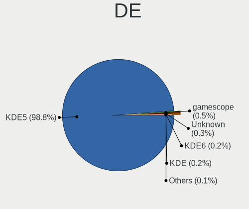
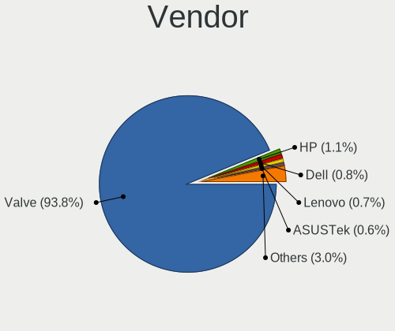
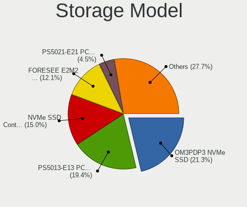
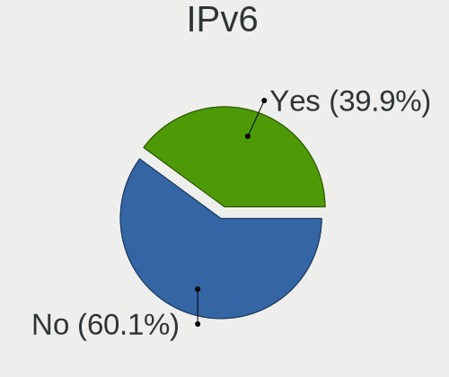
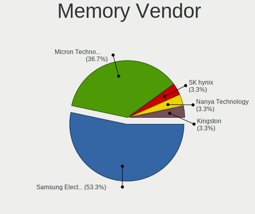

SteamOS - Tested Hardware & Statistics (Notebooks)
--------------------------------------------------

A project to collect tested hardware configurations for SteamOS.

Anyone can contribute to this report by the [hw-probe](https://github.com/linuxhw/hw-probe) tool:

    sudo -E hw-probe -all -upload

Please contribute! Especially if your hardware is rare.

Contents
--------

* [ Test Cases ](#test-cases)

* [ System ](#system)
  - [ OS                       ](#os)
  - [ OS Family                ](#os-family)
  - [ Kernel                   ](#kernel)
  - [ Kernel Family            ](#kernel-family)
  - [ Kernel Major Ver.        ](#kernel-major-ver)
  - [ Arch                     ](#arch)
  - [ DE                       ](#de)
  - [ Display Server           ](#display-server)
  - [ Display Manager          ](#display-manager)
  - [ OS Lang                  ](#os-lang)
  - [ Boot Mode                ](#boot-mode)
  - [ Filesystem               ](#filesystem)
  - [ Part. scheme             ](#part-scheme)
  - [ Dual Boot with Linux/BSD ](#dual-boot-with-linuxbsd)
  - [ Dual Boot (Win)          ](#dual-boot-win)

* [ Board ](#board)
  - [ Vendor                   ](#vendor)
  - [ Model                    ](#model)
  - [ Model Family             ](#model-family)
  - [ MFG Year                 ](#mfg-year)
  - [ Form Factor              ](#form-factor)
  - [ Secure Boot              ](#secure-boot)
  - [ Coreboot                 ](#coreboot)
  - [ RAM Size                 ](#ram-size)
  - [ RAM Used                 ](#ram-used)
  - [ Total Drives             ](#total-drives)
  - [ Has CD-ROM               ](#has-cd-rom)
  - [ Has Ethernet             ](#has-ethernet)
  - [ Has WiFi                 ](#has-wifi)
  - [ Has Bluetooth            ](#has-bluetooth)

* [ Location ](#location)
  - [ Country                  ](#country)
  - [ City                     ](#city)

* [ Drives ](#drives)
  - [ Drive Vendor             ](#drive-vendor)
  - [ Drive Model              ](#drive-model)
  - [ HDD Vendor               ](#hdd-vendor)
  - [ SSD Vendor               ](#ssd-vendor)
  - [ Drive Kind               ](#drive-kind)
  - [ Drive Connector          ](#drive-connector)
  - [ Drive Size               ](#drive-size)
  - [ Space Total              ](#space-total)
  - [ Space Used               ](#space-used)
  - [ Malfunc. Drives          ](#malfunc-drives)
  - [ Malfunc. Drive Vendor    ](#malfunc-drive-vendor)
  - [ Malfunc. HDD Vendor      ](#malfunc-hdd-vendor)
  - [ Malfunc. Drive Kind      ](#malfunc-drive-kind)
  - [ Failed Drives            ](#failed-drives)
  - [ Failed Drive Vendor      ](#failed-drive-vendor)
  - [ Drive Status             ](#drive-status)

* [ Storage controller ](#storage-controller)
  - [ Storage Vendor           ](#storage-vendor)
  - [ Storage Model            ](#storage-model)
  - [ Storage Kind             ](#storage-kind)

* [ Processor ](#processor)
  - [ CPU Vendor               ](#cpu-vendor)
  - [ CPU Model                ](#cpu-model)
  - [ CPU Model Family         ](#cpu-model-family)
  - [ CPU Cores                ](#cpu-cores)
  - [ CPU Sockets              ](#cpu-sockets)
  - [ CPU Threads              ](#cpu-threads)
  - [ CPU Op-Modes             ](#cpu-op-modes)
  - [ CPU Microcode            ](#cpu-microcode)
  - [ CPU Microarch            ](#cpu-microarch)

* [ Graphics ](#graphics)
  - [ GPU Vendor               ](#gpu-vendor)
  - [ GPU Model                ](#gpu-model)
  - [ GPU Combo                ](#gpu-combo)
  - [ GPU Driver               ](#gpu-driver)
  - [ GPU Memory               ](#gpu-memory)

* [ Monitor ](#monitor)
  - [ Monitor Vendor           ](#monitor-vendor)
  - [ Monitor Model            ](#monitor-model)
  - [ Monitor Resolution       ](#monitor-resolution)
  - [ Monitor Diagonal         ](#monitor-diagonal)
  - [ Monitor Width            ](#monitor-width)
  - [ Aspect Ratio             ](#aspect-ratio)
  - [ Monitor Area             ](#monitor-area)
  - [ Pixel Density            ](#pixel-density)
  - [ Multiple Monitors        ](#multiple-monitors)

* [ Network ](#network)
  - [ Net Controller Vendor    ](#net-controller-vendor)
  - [ Net Controller Model     ](#net-controller-model)
  - [ Wireless Vendor          ](#wireless-vendor)
  - [ Wireless Model           ](#wireless-model)
  - [ Ethernet Vendor          ](#ethernet-vendor)
  - [ Ethernet Model           ](#ethernet-model)
  - [ Net Controller Kind      ](#net-controller-kind)
  - [ Used Controller          ](#used-controller)
  - [ NICs                     ](#nics)
  - [ IPv6                     ](#ipv6)

* [ Bluetooth ](#bluetooth)
  - [ Bluetooth Vendor         ](#bluetooth-vendor)
  - [ Bluetooth Model          ](#bluetooth-model)

* [ Sound ](#sound)
  - [ Sound Vendor             ](#sound-vendor)
  - [ Sound Model              ](#sound-model)

* [ Memory ](#memory)
  - [ Memory Vendor            ](#memory-vendor)
  - [ Memory Model             ](#memory-model)
  - [ Memory Kind              ](#memory-kind)
  - [ Memory Form Factor       ](#memory-form-factor)
  - [ Memory Size              ](#memory-size)
  - [ Memory Speed             ](#memory-speed)

* [ Printers & scanners ](#printers--scanners)
  - [ Printer Vendor           ](#printer-vendor)
  - [ Printer Model            ](#printer-model)
  - [ Scanner Vendor           ](#scanner-vendor)
  - [ Scanner Model            ](#scanner-model)

* [ Camera ](#camera)
  - [ Camera Vendor            ](#camera-vendor)
  - [ Camera Model             ](#camera-model)

* [ Security ](#security)
  - [ Fingerprint Vendor       ](#fingerprint-vendor)
  - [ Fingerprint Model        ](#fingerprint-model)
  - [ Chipcard Vendor          ](#chipcard-vendor)
  - [ Chipcard Model           ](#chipcard-model)

* [ Unsupported ](#unsupported)
  - [ Unsupported Devices      ](#unsupported-devices)
  - [ Unsupported Device Types ](#unsupported-device-types)

Test Cases
----------

Total: 1605

| Vendor        | Model                       | Probe                                                      | Date         |
|---------------|-----------------------------|------------------------------------------------------------|--------------|
| HP            | 15 Notebook PC              | [9eb25ba0bf](https://linux-hardware.org/?probe=9eb25ba0bf) | Jan 02, 2024 |
| Valve         | Jupiter                     | [e381b764b0](https://linux-hardware.org/?probe=e381b764b0) | Jan 02, 2024 |
| Valve         | Jupiter                     | [95183ba54e](https://linux-hardware.org/?probe=95183ba54e) | Jan 01, 2024 |
| Valve         | Jupiter                     | [c9de553faa](https://linux-hardware.org/?probe=c9de553faa) | Jan 01, 2024 |
| Valve         | Jupiter                     | [b16497fbfc](https://linux-hardware.org/?probe=b16497fbfc) | Jan 01, 2024 |
| Valve         | Jupiter                     | [e714aab1f3](https://linux-hardware.org/?probe=e714aab1f3) | Jan 01, 2024 |
| Valve         | Jupiter                     | [ca7a54408f](https://linux-hardware.org/?probe=ca7a54408f) | Dec 31, 2023 |
| Valve         | Jupiter                     | [5be404c400](https://linux-hardware.org/?probe=5be404c400) | Dec 31, 2023 |
| Valve         | Jupiter                     | [e80d5f8a2b](https://linux-hardware.org/?probe=e80d5f8a2b) | Dec 31, 2023 |
| Valve         | Jupiter                     | [c459051f01](https://linux-hardware.org/?probe=c459051f01) | Dec 31, 2023 |
| Valve         | Jupiter                     | [2f8ea60a38](https://linux-hardware.org/?probe=2f8ea60a38) | Dec 30, 2023 |
| Valve         | Jupiter                     | [0254493ea3](https://linux-hardware.org/?probe=0254493ea3) | Dec 29, 2023 |
| Valve         | Galileo                     | [83bfa965fb](https://linux-hardware.org/?probe=83bfa965fb) | Dec 28, 2023 |
| Valve         | Jupiter                     | [73a4d3fcfd](https://linux-hardware.org/?probe=73a4d3fcfd) | Dec 27, 2023 |
| Valve         | Jupiter                     | [bee71f6f73](https://linux-hardware.org/?probe=bee71f6f73) | Dec 27, 2023 |
| Valve         | Jupiter                     | [eeac675274](https://linux-hardware.org/?probe=eeac675274) | Dec 27, 2023 |
| Valve         | Jupiter                     | [c2f08b6c04](https://linux-hardware.org/?probe=c2f08b6c04) | Dec 26, 2023 |
| HP            | ProBook 455 G3              | [9e47611108](https://linux-hardware.org/?probe=9e47611108) | Dec 26, 2023 |
| ASRock        | X570 Phantom Gaming-ITX/... | [b5b5857360](https://linux-hardware.org/?probe=b5b5857360) | Dec 26, 2023 |
| Valve         | Jupiter                     | [6117a0c576](https://linux-hardware.org/?probe=6117a0c576) | Dec 25, 2023 |
| Valve         | Galileo                     | [e21296767e](https://linux-hardware.org/?probe=e21296767e) | Dec 25, 2023 |
| Valve         | Jupiter                     | [4ab75ea56b](https://linux-hardware.org/?probe=4ab75ea56b) | Dec 25, 2023 |
| Valve         | Jupiter                     | [509364a4ac](https://linux-hardware.org/?probe=509364a4ac) | Dec 25, 2023 |
| Valve         | Jupiter                     | [94cf6bda69](https://linux-hardware.org/?probe=94cf6bda69) | Dec 25, 2023 |
| Valve         | Galileo                     | [99c3c24140](https://linux-hardware.org/?probe=99c3c24140) | Dec 25, 2023 |
| Valve         | Jupiter                     | [6ec124a0c4](https://linux-hardware.org/?probe=6ec124a0c4) | Dec 24, 2023 |
| Valve         | Jupiter                     | [3f9fc8839c](https://linux-hardware.org/?probe=3f9fc8839c) | Dec 24, 2023 |
| Valve         | Jupiter                     | [f57d2e51fe](https://linux-hardware.org/?probe=f57d2e51fe) | Dec 24, 2023 |
| Valve         | Jupiter                     | [4c98f6b6f3](https://linux-hardware.org/?probe=4c98f6b6f3) | Dec 24, 2023 |
| Valve         | Jupiter                     | [c0b15b216d](https://linux-hardware.org/?probe=c0b15b216d) | Dec 24, 2023 |
| Valve         | Jupiter                     | [19f8d4f0b4](https://linux-hardware.org/?probe=19f8d4f0b4) | Dec 24, 2023 |
| Anbernic      | Win600                      | [3b5255f14b](https://linux-hardware.org/?probe=3b5255f14b) | Dec 24, 2023 |
| Valve         | Galileo                     | [aa141b8ea2](https://linux-hardware.org/?probe=aa141b8ea2) | Dec 24, 2023 |
| Anbernic      | Win600                      | [02e1d7adeb](https://linux-hardware.org/?probe=02e1d7adeb) | Dec 23, 2023 |
| Valve         | Jupiter                     | [6fd8f41741](https://linux-hardware.org/?probe=6fd8f41741) | Dec 23, 2023 |
| Valve         | Jupiter                     | [482500f7b0](https://linux-hardware.org/?probe=482500f7b0) | Dec 22, 2023 |
| Valve         | Jupiter                     | [03491495da](https://linux-hardware.org/?probe=03491495da) | Dec 22, 2023 |
| Valve         | Jupiter                     | [4899962b6a](https://linux-hardware.org/?probe=4899962b6a) | Dec 22, 2023 |
| Valve         | Jupiter                     | [f30a4a2d8a](https://linux-hardware.org/?probe=f30a4a2d8a) | Dec 21, 2023 |
| Valve         | Jupiter                     | [6003cb709f](https://linux-hardware.org/?probe=6003cb709f) | Dec 21, 2023 |
| Valve         | Jupiter                     | [186428f160](https://linux-hardware.org/?probe=186428f160) | Dec 21, 2023 |
| Valve         | Jupiter                     | [091511a6c2](https://linux-hardware.org/?probe=091511a6c2) | Dec 20, 2023 |
| Valve         | Jupiter                     | [ceba2299c2](https://linux-hardware.org/?probe=ceba2299c2) | Dec 20, 2023 |
| Valve         | Jupiter                     | [aecbb83cd6](https://linux-hardware.org/?probe=aecbb83cd6) | Dec 20, 2023 |
| Valve         | Jupiter                     | [1265867fcf](https://linux-hardware.org/?probe=1265867fcf) | Dec 19, 2023 |
| Valve         | Jupiter                     | [feae313bc0](https://linux-hardware.org/?probe=feae313bc0) | Dec 19, 2023 |
| Valve         | Jupiter                     | [d6b925353e](https://linux-hardware.org/?probe=d6b925353e) | Dec 18, 2023 |
| Valve         | Jupiter                     | [f8d7e441a5](https://linux-hardware.org/?probe=f8d7e441a5) | Dec 18, 2023 |
| Valve         | Galileo                     | [b79c5fbf78](https://linux-hardware.org/?probe=b79c5fbf78) | Dec 18, 2023 |
| Valve         | Jupiter                     | [b5b29d3c59](https://linux-hardware.org/?probe=b5b29d3c59) | Dec 18, 2023 |
| Valve         | Jupiter                     | [6235a63aa5](https://linux-hardware.org/?probe=6235a63aa5) | Dec 17, 2023 |
| Valve         | Galileo                     | [c02b71450c](https://linux-hardware.org/?probe=c02b71450c) | Dec 17, 2023 |
| Valve         | Jupiter                     | [0cda5b9141](https://linux-hardware.org/?probe=0cda5b9141) | Dec 17, 2023 |
| Valve         | Jupiter                     | [241ed280af](https://linux-hardware.org/?probe=241ed280af) | Dec 17, 2023 |
| Valve         | Jupiter                     | [d6c8debc47](https://linux-hardware.org/?probe=d6c8debc47) | Dec 16, 2023 |
| Valve         | Jupiter                     | [dfdfbefee5](https://linux-hardware.org/?probe=dfdfbefee5) | Dec 16, 2023 |
| Valve         | Jupiter                     | [298b8b5df0](https://linux-hardware.org/?probe=298b8b5df0) | Dec 16, 2023 |
| Valve         | Jupiter                     | [ee39964f52](https://linux-hardware.org/?probe=ee39964f52) | Dec 15, 2023 |
| Valve         | Galileo                     | [cd8b629d23](https://linux-hardware.org/?probe=cd8b629d23) | Dec 15, 2023 |
| Valve         | Jupiter                     | [bef7a2d5b3](https://linux-hardware.org/?probe=bef7a2d5b3) | Dec 15, 2023 |
| Valve         | Jupiter                     | [4e56fce432](https://linux-hardware.org/?probe=4e56fce432) | Dec 15, 2023 |
| Valve         | Galileo                     | [adb5dc0f2d](https://linux-hardware.org/?probe=adb5dc0f2d) | Dec 14, 2023 |
| Valve         | Jupiter                     | [594141dc7c](https://linux-hardware.org/?probe=594141dc7c) | Dec 14, 2023 |
| Valve         | Jupiter                     | [c2879ac10a](https://linux-hardware.org/?probe=c2879ac10a) | Dec 14, 2023 |
| Valve         | Jupiter                     | [9e2657f1ed](https://linux-hardware.org/?probe=9e2657f1ed) | Dec 14, 2023 |
| Valve         | Jupiter                     | [b746c80979](https://linux-hardware.org/?probe=b746c80979) | Dec 13, 2023 |
| Valve         | Jupiter                     | [4e38f77c8d](https://linux-hardware.org/?probe=4e38f77c8d) | Dec 13, 2023 |
| Valve         | Galileo                     | [719db5099f](https://linux-hardware.org/?probe=719db5099f) | Dec 13, 2023 |
| Valve         | Galileo                     | [835c844aed](https://linux-hardware.org/?probe=835c844aed) | Dec 13, 2023 |
| Valve         | Galileo                     | [d6ea0e047a](https://linux-hardware.org/?probe=d6ea0e047a) | Dec 13, 2023 |
| Valve         | Jupiter                     | [75070d8783](https://linux-hardware.org/?probe=75070d8783) | Dec 12, 2023 |
| Valve         | Galileo                     | [beb6edb04f](https://linux-hardware.org/?probe=beb6edb04f) | Dec 12, 2023 |
| Valve         | Jupiter                     | [3f0800eb70](https://linux-hardware.org/?probe=3f0800eb70) | Dec 11, 2023 |
| Valve         | Galileo                     | [494f369350](https://linux-hardware.org/?probe=494f369350) | Dec 11, 2023 |
| Valve         | Jupiter                     | [449a971a56](https://linux-hardware.org/?probe=449a971a56) | Dec 11, 2023 |
| Valve         | Jupiter                     | [b78720dbf3](https://linux-hardware.org/?probe=b78720dbf3) | Dec 11, 2023 |
| Apple         | MacBookPro15,1              | [9d882fc801](https://linux-hardware.org/?probe=9d882fc801) | Dec 11, 2023 |
| Gigabyte      | B550I AORUS PRO AX          | [9f6ce5cca9](https://linux-hardware.org/?probe=9f6ce5cca9) | Dec 10, 2023 |
| Valve         | Jupiter                     | [7d649cef63](https://linux-hardware.org/?probe=7d649cef63) | Dec 09, 2023 |
| Valve         | Jupiter                     | [f61425f9af](https://linux-hardware.org/?probe=f61425f9af) | Dec 09, 2023 |
| Valve         | Jupiter                     | [60c55f7c8c](https://linux-hardware.org/?probe=60c55f7c8c) | Dec 08, 2023 |
| Valve         | Jupiter                     | [c40a4f6672](https://linux-hardware.org/?probe=c40a4f6672) | Dec 08, 2023 |
| Valve         | Jupiter                     | [afd88ac5ea](https://linux-hardware.org/?probe=afd88ac5ea) | Dec 08, 2023 |
| Valve         | Galileo                     | [0eacb54dca](https://linux-hardware.org/?probe=0eacb54dca) | Dec 08, 2023 |
| Valve         | Jupiter                     | [326f2a7596](https://linux-hardware.org/?probe=326f2a7596) | Dec 08, 2023 |
| Valve         | Jupiter                     | [dfa143c1c0](https://linux-hardware.org/?probe=dfa143c1c0) | Dec 08, 2023 |
| Valve         | Galileo                     | [f72b98880f](https://linux-hardware.org/?probe=f72b98880f) | Dec 07, 2023 |
| Valve         | Jupiter                     | [2c693deae3](https://linux-hardware.org/?probe=2c693deae3) | Dec 07, 2023 |
| Valve         | Jupiter                     | [1a0ea506dc](https://linux-hardware.org/?probe=1a0ea506dc) | Dec 07, 2023 |
| Valve         | Jupiter                     | [602605d28d](https://linux-hardware.org/?probe=602605d28d) | Dec 07, 2023 |
| Valve         | Jupiter                     | [7eec257dd6](https://linux-hardware.org/?probe=7eec257dd6) | Dec 07, 2023 |
| Valve         | Jupiter                     | [bbb500139e](https://linux-hardware.org/?probe=bbb500139e) | Dec 07, 2023 |
| Valve         | Galileo                     | [20b7e72741](https://linux-hardware.org/?probe=20b7e72741) | Dec 06, 2023 |
| Valve         | Jupiter                     | [14e2e0d2b6](https://linux-hardware.org/?probe=14e2e0d2b6) | Dec 06, 2023 |
| Valve         | Galileo                     | [4704035dff](https://linux-hardware.org/?probe=4704035dff) | Dec 06, 2023 |
| Valve         | Jupiter                     | [93bf1ceeec](https://linux-hardware.org/?probe=93bf1ceeec) | Dec 05, 2023 |
| Valve         | Jupiter                     | [f7115ec7c0](https://linux-hardware.org/?probe=f7115ec7c0) | Dec 05, 2023 |
| Valve         | Jupiter                     | [2a17ca7efe](https://linux-hardware.org/?probe=2a17ca7efe) | Dec 05, 2023 |
| Valve         | Jupiter                     | [4ffa224365](https://linux-hardware.org/?probe=4ffa224365) | Dec 05, 2023 |
| Valve         | Jupiter                     | [63e8b02453](https://linux-hardware.org/?probe=63e8b02453) | Dec 05, 2023 |
| Valve         | Jupiter                     | [ea1ae6a495](https://linux-hardware.org/?probe=ea1ae6a495) | Dec 04, 2023 |
| Valve         | Galileo                     | [1760875677](https://linux-hardware.org/?probe=1760875677) | Dec 04, 2023 |
| Valve         | Jupiter                     | [286c2304f5](https://linux-hardware.org/?probe=286c2304f5) | Dec 03, 2023 |
| Valve         | Jupiter                     | [21c483ddcf](https://linux-hardware.org/?probe=21c483ddcf) | Dec 03, 2023 |
| Valve         | Jupiter                     | [36af755784](https://linux-hardware.org/?probe=36af755784) | Dec 03, 2023 |
| Valve         | Jupiter                     | [80a3ff932f](https://linux-hardware.org/?probe=80a3ff932f) | Dec 03, 2023 |
| ASRock        | B550M Steel Legend          | [532cab64b5](https://linux-hardware.org/?probe=532cab64b5) | Dec 03, 2023 |
| Valve         | Galileo                     | [7c11f8f225](https://linux-hardware.org/?probe=7c11f8f225) | Dec 02, 2023 |
| Valve         | Galileo                     | [63234eea22](https://linux-hardware.org/?probe=63234eea22) | Dec 02, 2023 |
| Valve         | Jupiter                     | [6a95e96b1b](https://linux-hardware.org/?probe=6a95e96b1b) | Dec 02, 2023 |
| Valve         | Jupiter                     | [e5546145aa](https://linux-hardware.org/?probe=e5546145aa) | Dec 02, 2023 |
| Valve         | Jupiter                     | [dc16a663fa](https://linux-hardware.org/?probe=dc16a663fa) | Dec 02, 2023 |
| Valve         | Jupiter                     | [e6d5beb948](https://linux-hardware.org/?probe=e6d5beb948) | Dec 01, 2023 |
| Valve         | Galileo                     | [3239203d03](https://linux-hardware.org/?probe=3239203d03) | Dec 01, 2023 |
| Valve         | Jupiter                     | [ff8952a98c](https://linux-hardware.org/?probe=ff8952a98c) | Dec 01, 2023 |
| Valve         | Galileo                     | [3006af1c16](https://linux-hardware.org/?probe=3006af1c16) | Dec 01, 2023 |
| Valve         | Jupiter                     | [545d093510](https://linux-hardware.org/?probe=545d093510) | Nov 30, 2023 |
| Valve         | Jupiter                     | [2251ba47fb](https://linux-hardware.org/?probe=2251ba47fb) | Nov 30, 2023 |
| Valve         | Jupiter                     | [da673c17c8](https://linux-hardware.org/?probe=da673c17c8) | Nov 29, 2023 |
| Valve         | Jupiter                     | [e92fd78128](https://linux-hardware.org/?probe=e92fd78128) | Nov 29, 2023 |
| Valve         | Jupiter                     | [b5216ccd78](https://linux-hardware.org/?probe=b5216ccd78) | Nov 29, 2023 |
| Valve         | Galileo                     | [f8322860f1](https://linux-hardware.org/?probe=f8322860f1) | Nov 29, 2023 |
| Valve         | Jupiter                     | [2ceef57eaa](https://linux-hardware.org/?probe=2ceef57eaa) | Nov 28, 2023 |
| Valve         | Jupiter                     | [ebc4731c68](https://linux-hardware.org/?probe=ebc4731c68) | Nov 28, 2023 |
| Valve         | Jupiter                     | [9544f59716](https://linux-hardware.org/?probe=9544f59716) | Nov 27, 2023 |
| Valve         | Jupiter                     | [2bf5b349c3](https://linux-hardware.org/?probe=2bf5b349c3) | Nov 27, 2023 |
| Valve         | Jupiter                     | [d2e56a6b92](https://linux-hardware.org/?probe=d2e56a6b92) | Nov 27, 2023 |
| Valve         | Jupiter                     | [855c477023](https://linux-hardware.org/?probe=855c477023) | Nov 27, 2023 |
| Valve         | Jupiter                     | [2a0b1b3a9b](https://linux-hardware.org/?probe=2a0b1b3a9b) | Nov 27, 2023 |
| Valve         | Jupiter                     | [933ce1aa7d](https://linux-hardware.org/?probe=933ce1aa7d) | Nov 27, 2023 |
| Valve         | Jupiter                     | [c6c33679d8](https://linux-hardware.org/?probe=c6c33679d8) | Nov 26, 2023 |
| Valve         | Jupiter                     | [a208b7bd3a](https://linux-hardware.org/?probe=a208b7bd3a) | Nov 26, 2023 |
| Valve         | Jupiter                     | [2b2f81a5b3](https://linux-hardware.org/?probe=2b2f81a5b3) | Nov 26, 2023 |
| Valve         | Jupiter                     | [95bd4c2832](https://linux-hardware.org/?probe=95bd4c2832) | Nov 26, 2023 |
| Dell          | Precision M4800             | [8712b3ecb9](https://linux-hardware.org/?probe=8712b3ecb9) | Nov 26, 2023 |
| Valve         | Jupiter                     | [fe89edacdc](https://linux-hardware.org/?probe=fe89edacdc) | Nov 26, 2023 |
| Valve         | Jupiter                     | [d760d5c451](https://linux-hardware.org/?probe=d760d5c451) | Nov 26, 2023 |
| Valve         | Jupiter                     | [7f42b09854](https://linux-hardware.org/?probe=7f42b09854) | Nov 26, 2023 |
| Valve         | Jupiter                     | [3e59300230](https://linux-hardware.org/?probe=3e59300230) | Nov 25, 2023 |
| Valve         | Galileo                     | [905889b654](https://linux-hardware.org/?probe=905889b654) | Nov 25, 2023 |
| Valve         | Galileo                     | [15994404a2](https://linux-hardware.org/?probe=15994404a2) | Nov 24, 2023 |
| Valve         | Jupiter                     | [2c7d8106d0](https://linux-hardware.org/?probe=2c7d8106d0) | Nov 24, 2023 |
| Valve         | Jupiter                     | [68d1729e3b](https://linux-hardware.org/?probe=68d1729e3b) | Nov 24, 2023 |
| Valve         | Jupiter                     | [cd4e80c195](https://linux-hardware.org/?probe=cd4e80c195) | Nov 24, 2023 |
| Valve         | Jupiter                     | [cb881f1c27](https://linux-hardware.org/?probe=cb881f1c27) | Nov 24, 2023 |
| Valve         | Jupiter                     | [8ba2f4981d](https://linux-hardware.org/?probe=8ba2f4981d) | Nov 24, 2023 |
| Valve         | Jupiter                     | [0c58fa47b9](https://linux-hardware.org/?probe=0c58fa47b9) | Nov 24, 2023 |
| Valve         | Jupiter                     | [399542e5be](https://linux-hardware.org/?probe=399542e5be) | Nov 24, 2023 |
| Valve         | Galileo                     | [0e0c27070c](https://linux-hardware.org/?probe=0e0c27070c) | Nov 23, 2023 |
| Gigabyte      | B650M DS3H                  | [dfcb329b5a](https://linux-hardware.org/?probe=dfcb329b5a) | Nov 23, 2023 |
| Valve         | Jupiter                     | [a4f7cad00f](https://linux-hardware.org/?probe=a4f7cad00f) | Nov 22, 2023 |
| Valve         | Jupiter                     | [bdb118e120](https://linux-hardware.org/?probe=bdb118e120) | Nov 22, 2023 |
| Valve         | Jupiter                     | [678fc160d6](https://linux-hardware.org/?probe=678fc160d6) | Nov 22, 2023 |
| Valve         | Jupiter                     | [157c8167b7](https://linux-hardware.org/?probe=157c8167b7) | Nov 22, 2023 |
| Valve         | Jupiter                     | [525a89cf72](https://linux-hardware.org/?probe=525a89cf72) | Nov 22, 2023 |
| Valve         | Jupiter                     | [2fa43c6f3d](https://linux-hardware.org/?probe=2fa43c6f3d) | Nov 22, 2023 |
| Valve         | Jupiter                     | [b73a5b800d](https://linux-hardware.org/?probe=b73a5b800d) | Nov 22, 2023 |
| Valve         | Jupiter                     | [a81bb49e88](https://linux-hardware.org/?probe=a81bb49e88) | Nov 21, 2023 |
| Valve         | Jupiter                     | [ba3c14e8e7](https://linux-hardware.org/?probe=ba3c14e8e7) | Nov 21, 2023 |
| Valve         | Jupiter                     | [3bac0a6d11](https://linux-hardware.org/?probe=3bac0a6d11) | Nov 21, 2023 |
| Valve         | Jupiter                     | [0454a567a0](https://linux-hardware.org/?probe=0454a567a0) | Nov 21, 2023 |
| Valve         | Jupiter                     | [57479f92a2](https://linux-hardware.org/?probe=57479f92a2) | Nov 21, 2023 |
| Valve         | Jupiter                     | [e782bdc7ec](https://linux-hardware.org/?probe=e782bdc7ec) | Nov 21, 2023 |
| Valve         | Jupiter                     | [f36d771d28](https://linux-hardware.org/?probe=f36d771d28) | Nov 20, 2023 |
| Valve         | Jupiter                     | [be5497e3a7](https://linux-hardware.org/?probe=be5497e3a7) | Nov 20, 2023 |
| Valve         | Jupiter                     | [93c68a0d33](https://linux-hardware.org/?probe=93c68a0d33) | Nov 20, 2023 |
| Valve         | Jupiter                     | [a6240c8d6a](https://linux-hardware.org/?probe=a6240c8d6a) | Nov 20, 2023 |
| Valve         | Jupiter                     | [4d99a400c5](https://linux-hardware.org/?probe=4d99a400c5) | Nov 20, 2023 |
| Valve         | Jupiter                     | [08b0fccf59](https://linux-hardware.org/?probe=08b0fccf59) | Nov 20, 2023 |
| Valve         | Jupiter                     | [b3d483cfb9](https://linux-hardware.org/?probe=b3d483cfb9) | Nov 19, 2023 |
| Valve         | Jupiter                     | [e226cd6888](https://linux-hardware.org/?probe=e226cd6888) | Nov 18, 2023 |
| Valve         | Jupiter                     | [d859d4f159](https://linux-hardware.org/?probe=d859d4f159) | Nov 18, 2023 |
| Valve         | Jupiter                     | [82eedfb8be](https://linux-hardware.org/?probe=82eedfb8be) | Nov 18, 2023 |
| Valve         | Jupiter                     | [2c773bdad4](https://linux-hardware.org/?probe=2c773bdad4) | Nov 18, 2023 |
| Valve         | Jupiter                     | [adbc907a31](https://linux-hardware.org/?probe=adbc907a31) | Nov 18, 2023 |
| Valve         | Jupiter                     | [9d693c070e](https://linux-hardware.org/?probe=9d693c070e) | Nov 18, 2023 |
| Valve         | Jupiter                     | [fdddf0d94f](https://linux-hardware.org/?probe=fdddf0d94f) | Nov 18, 2023 |
| Valve         | Jupiter                     | [97695463df](https://linux-hardware.org/?probe=97695463df) | Nov 17, 2023 |
| Valve         | Jupiter                     | [8734420ff1](https://linux-hardware.org/?probe=8734420ff1) | Nov 17, 2023 |
| Valve         | Jupiter                     | [c726569566](https://linux-hardware.org/?probe=c726569566) | Nov 16, 2023 |
| Valve         | Jupiter                     | [521a021c1d](https://linux-hardware.org/?probe=521a021c1d) | Nov 16, 2023 |
| Valve         | Jupiter                     | [10f96b411d](https://linux-hardware.org/?probe=10f96b411d) | Nov 16, 2023 |
| Valve         | Jupiter                     | [af72567b85](https://linux-hardware.org/?probe=af72567b85) | Nov 16, 2023 |
| Valve         | Jupiter                     | [751a8a13dc](https://linux-hardware.org/?probe=751a8a13dc) | Nov 15, 2023 |
| Valve         | Jupiter                     | [821a98f0f9](https://linux-hardware.org/?probe=821a98f0f9) | Nov 15, 2023 |
| Valve         | Jupiter                     | [9f8fc1d4d7](https://linux-hardware.org/?probe=9f8fc1d4d7) | Nov 15, 2023 |
| Valve         | Jupiter                     | [31a965ca9d](https://linux-hardware.org/?probe=31a965ca9d) | Nov 14, 2023 |
| Valve         | Jupiter                     | [638956d8a1](https://linux-hardware.org/?probe=638956d8a1) | Nov 13, 2023 |
| Valve         | Jupiter                     | [acdbd4cb2a](https://linux-hardware.org/?probe=acdbd4cb2a) | Nov 13, 2023 |
| HP            | Pavilion Gaming Laptop 1... | [2802d9278d](https://linux-hardware.org/?probe=2802d9278d) | Nov 13, 2023 |
| Valve         | Jupiter                     | [1f6282ce11](https://linux-hardware.org/?probe=1f6282ce11) | Nov 12, 2023 |
| Valve         | Jupiter                     | [040bcdd741](https://linux-hardware.org/?probe=040bcdd741) | Nov 10, 2023 |
| Valve         | Jupiter                     | [f3e618c03e](https://linux-hardware.org/?probe=f3e618c03e) | Nov 10, 2023 |
| Valve         | Jupiter                     | [ff8cbcd6be](https://linux-hardware.org/?probe=ff8cbcd6be) | Nov 09, 2023 |
| Valve         | Jupiter                     | [196bc6a3db](https://linux-hardware.org/?probe=196bc6a3db) | Nov 08, 2023 |
| Valve         | Jupiter                     | [ca05263192](https://linux-hardware.org/?probe=ca05263192) | Nov 08, 2023 |
| Valve         | Jupiter                     | [98976642aa](https://linux-hardware.org/?probe=98976642aa) | Nov 08, 2023 |
| Valve         | Jupiter                     | [848dfcb217](https://linux-hardware.org/?probe=848dfcb217) | Nov 08, 2023 |
| Valve         | Jupiter                     | [03f6022593](https://linux-hardware.org/?probe=03f6022593) | Nov 07, 2023 |
| Valve         | Jupiter                     | [ef2daabe89](https://linux-hardware.org/?probe=ef2daabe89) | Nov 07, 2023 |
| Valve         | Jupiter                     | [b662e225f4](https://linux-hardware.org/?probe=b662e225f4) | Nov 07, 2023 |
| Valve         | Jupiter                     | [21df431e01](https://linux-hardware.org/?probe=21df431e01) | Nov 07, 2023 |
| Valve         | Jupiter                     | [58ecc57dcf](https://linux-hardware.org/?probe=58ecc57dcf) | Nov 07, 2023 |
| Valve         | Jupiter                     | [c00bcace68](https://linux-hardware.org/?probe=c00bcace68) | Nov 06, 2023 |
| Valve         | Jupiter                     | [aef9c84cf7](https://linux-hardware.org/?probe=aef9c84cf7) | Nov 06, 2023 |
| Valve         | Jupiter                     | [d8ac880948](https://linux-hardware.org/?probe=d8ac880948) | Nov 06, 2023 |
| Valve         | Jupiter                     | [2e74968a1e](https://linux-hardware.org/?probe=2e74968a1e) | Nov 05, 2023 |
| Valve         | Jupiter                     | [edb0760b00](https://linux-hardware.org/?probe=edb0760b00) | Nov 05, 2023 |
| Valve         | Jupiter                     | [555d9146a4](https://linux-hardware.org/?probe=555d9146a4) | Nov 05, 2023 |
| Valve         | Jupiter                     | [4ece1b1597](https://linux-hardware.org/?probe=4ece1b1597) | Nov 05, 2023 |
| Valve         | Jupiter                     | [28e2c2aa38](https://linux-hardware.org/?probe=28e2c2aa38) | Nov 05, 2023 |
| Valve         | Jupiter                     | [af20418f73](https://linux-hardware.org/?probe=af20418f73) | Nov 04, 2023 |
| Valve         | Jupiter                     | [28f8f3e3cd](https://linux-hardware.org/?probe=28f8f3e3cd) | Nov 04, 2023 |
| Valve         | Jupiter                     | [b526accbcd](https://linux-hardware.org/?probe=b526accbcd) | Nov 03, 2023 |
| Valve         | Jupiter                     | [14de2c4b3a](https://linux-hardware.org/?probe=14de2c4b3a) | Nov 02, 2023 |
| Valve         | Jupiter                     | [26b7407b02](https://linux-hardware.org/?probe=26b7407b02) | Nov 02, 2023 |
| Valve         | Jupiter                     | [088df44ddf](https://linux-hardware.org/?probe=088df44ddf) | Nov 01, 2023 |
| Valve         | Jupiter                     | [b5bd58d350](https://linux-hardware.org/?probe=b5bd58d350) | Oct 31, 2023 |
| Valve         | Jupiter                     | [ea0f1bf927](https://linux-hardware.org/?probe=ea0f1bf927) | Oct 31, 2023 |
| Valve         | Jupiter                     | [9749e20de1](https://linux-hardware.org/?probe=9749e20de1) | Oct 31, 2023 |
| Valve         | Jupiter                     | [7eda72383a](https://linux-hardware.org/?probe=7eda72383a) | Oct 30, 2023 |
| Valve         | Jupiter                     | [e73e0881d6](https://linux-hardware.org/?probe=e73e0881d6) | Oct 30, 2023 |
| Valve         | Jupiter                     | [ede97625bd](https://linux-hardware.org/?probe=ede97625bd) | Oct 30, 2023 |
| Valve         | Jupiter                     | [8bb009206e](https://linux-hardware.org/?probe=8bb009206e) | Oct 29, 2023 |
| Valve         | Jupiter                     | [bbf3f7c198](https://linux-hardware.org/?probe=bbf3f7c198) | Oct 29, 2023 |
| Valve         | Jupiter                     | [935baa5e6a](https://linux-hardware.org/?probe=935baa5e6a) | Oct 29, 2023 |
| Valve         | Jupiter                     | [3e84a41deb](https://linux-hardware.org/?probe=3e84a41deb) | Oct 28, 2023 |
| Valve         | Jupiter                     | [8eebce7a7b](https://linux-hardware.org/?probe=8eebce7a7b) | Oct 26, 2023 |
| Valve         | Jupiter                     | [a524108535](https://linux-hardware.org/?probe=a524108535) | Oct 26, 2023 |
| Valve         | Jupiter                     | [ae2eee1640](https://linux-hardware.org/?probe=ae2eee1640) | Oct 26, 2023 |
| HP            | Pavilion Laptop 15-eh0xx... | [6c603a7186](https://linux-hardware.org/?probe=6c603a7186) | Oct 26, 2023 |
| HP            | Pavilion Laptop 15-eh0xx... | [7858b6a253](https://linux-hardware.org/?probe=7858b6a253) | Oct 26, 2023 |
| Valve         | Jupiter                     | [38a8824fe8](https://linux-hardware.org/?probe=38a8824fe8) | Oct 25, 2023 |
| Valve         | Jupiter                     | [eda569093f](https://linux-hardware.org/?probe=eda569093f) | Oct 25, 2023 |
| Valve         | Jupiter                     | [0b8471e81a](https://linux-hardware.org/?probe=0b8471e81a) | Oct 25, 2023 |
| Valve         | Jupiter                     | [158b201b0e](https://linux-hardware.org/?probe=158b201b0e) | Oct 24, 2023 |
| Valve         | Jupiter                     | [83d3faf177](https://linux-hardware.org/?probe=83d3faf177) | Oct 23, 2023 |
| Valve         | Jupiter                     | [fa38785b75](https://linux-hardware.org/?probe=fa38785b75) | Oct 23, 2023 |
| Valve         | Jupiter                     | [8e04b76eb0](https://linux-hardware.org/?probe=8e04b76eb0) | Oct 22, 2023 |
| Valve         | Jupiter                     | [1c5a3146ce](https://linux-hardware.org/?probe=1c5a3146ce) | Oct 22, 2023 |
| Valve         | Jupiter                     | [d93782448d](https://linux-hardware.org/?probe=d93782448d) | Oct 21, 2023 |
| Valve         | Jupiter                     | [69762a50c8](https://linux-hardware.org/?probe=69762a50c8) | Oct 21, 2023 |
| Valve         | Jupiter                     | [5c8fbec79f](https://linux-hardware.org/?probe=5c8fbec79f) | Oct 21, 2023 |
| Valve         | Jupiter                     | [3431f785cf](https://linux-hardware.org/?probe=3431f785cf) | Oct 21, 2023 |
| Valve         | Jupiter                     | [3fa710b9ff](https://linux-hardware.org/?probe=3fa710b9ff) | Oct 20, 2023 |
| Valve         | Jupiter                     | [fdbd97d08c](https://linux-hardware.org/?probe=fdbd97d08c) | Oct 20, 2023 |
| Valve         | Jupiter                     | [ca9cd15419](https://linux-hardware.org/?probe=ca9cd15419) | Oct 19, 2023 |
| Valve         | Jupiter                     | [6eab7fbd58](https://linux-hardware.org/?probe=6eab7fbd58) | Oct 18, 2023 |
| Valve         | Jupiter                     | [bcc8229faa](https://linux-hardware.org/?probe=bcc8229faa) | Oct 18, 2023 |
| Valve         | Jupiter                     | [d91ad654e6](https://linux-hardware.org/?probe=d91ad654e6) | Oct 18, 2023 |
| Valve         | Jupiter                     | [4c916d65a8](https://linux-hardware.org/?probe=4c916d65a8) | Oct 18, 2023 |
| Valve         | Jupiter                     | [9a1b2b4816](https://linux-hardware.org/?probe=9a1b2b4816) | Oct 18, 2023 |
| Valve         | Jupiter                     | [08d5fc51ed](https://linux-hardware.org/?probe=08d5fc51ed) | Oct 17, 2023 |
| Valve         | Jupiter                     | [c6e5484c88](https://linux-hardware.org/?probe=c6e5484c88) | Oct 17, 2023 |
| Valve         | Jupiter                     | [1e55c77dc0](https://linux-hardware.org/?probe=1e55c77dc0) | Oct 17, 2023 |
| Valve         | Jupiter                     | [54604c764b](https://linux-hardware.org/?probe=54604c764b) | Oct 16, 2023 |
| Valve         | Jupiter                     | [cfbfe426e2](https://linux-hardware.org/?probe=cfbfe426e2) | Oct 16, 2023 |
| Valve         | Jupiter                     | [d8ba22dd7f](https://linux-hardware.org/?probe=d8ba22dd7f) | Oct 16, 2023 |
| Valve         | Jupiter                     | [11ee2fce41](https://linux-hardware.org/?probe=11ee2fce41) | Oct 16, 2023 |
| Valve         | Jupiter                     | [e0e2e64ce4](https://linux-hardware.org/?probe=e0e2e64ce4) | Oct 16, 2023 |
| Valve         | Jupiter                     | [674d290b37](https://linux-hardware.org/?probe=674d290b37) | Oct 15, 2023 |
| Valve         | Jupiter                     | [ec059c9ea7](https://linux-hardware.org/?probe=ec059c9ea7) | Oct 15, 2023 |
| Valve         | Jupiter                     | [9ed8384df0](https://linux-hardware.org/?probe=9ed8384df0) | Oct 15, 2023 |
| Valve         | Jupiter                     | [0d088b07f0](https://linux-hardware.org/?probe=0d088b07f0) | Oct 14, 2023 |
| Valve         | Jupiter                     | [594ab95469](https://linux-hardware.org/?probe=594ab95469) | Oct 13, 2023 |
| Valve         | Jupiter                     | [bc127c6288](https://linux-hardware.org/?probe=bc127c6288) | Oct 13, 2023 |
| Valve         | Jupiter                     | [2bde49db66](https://linux-hardware.org/?probe=2bde49db66) | Oct 11, 2023 |
| Valve         | Jupiter                     | [79652d4b80](https://linux-hardware.org/?probe=79652d4b80) | Oct 10, 2023 |
| Valve         | Jupiter                     | [daeb359dfb](https://linux-hardware.org/?probe=daeb359dfb) | Oct 10, 2023 |
| Valve         | Jupiter                     | [100d2ff5c3](https://linux-hardware.org/?probe=100d2ff5c3) | Oct 10, 2023 |
| Valve         | Jupiter                     | [8746055b62](https://linux-hardware.org/?probe=8746055b62) | Oct 09, 2023 |
| Valve         | Jupiter                     | [ece1acc9c3](https://linux-hardware.org/?probe=ece1acc9c3) | Oct 09, 2023 |
| Valve         | Jupiter                     | [e8f2d96884](https://linux-hardware.org/?probe=e8f2d96884) | Oct 09, 2023 |
| Valve         | Jupiter                     | [19f850d49e](https://linux-hardware.org/?probe=19f850d49e) | Oct 08, 2023 |
| Valve         | Jupiter                     | [83976ddca6](https://linux-hardware.org/?probe=83976ddca6) | Oct 08, 2023 |
| Valve         | Jupiter                     | [86be8c226a](https://linux-hardware.org/?probe=86be8c226a) | Oct 08, 2023 |
| Acer          | Swift SFA16-41              | [9d284c1003](https://linux-hardware.org/?probe=9d284c1003) | Oct 08, 2023 |
| Valve         | Jupiter                     | [aa51056093](https://linux-hardware.org/?probe=aa51056093) | Oct 08, 2023 |
| Valve         | Jupiter                     | [225fbcc2e5](https://linux-hardware.org/?probe=225fbcc2e5) | Oct 08, 2023 |
| Valve         | Jupiter                     | [e88c7ccef3](https://linux-hardware.org/?probe=e88c7ccef3) | Oct 08, 2023 |
| Acer          | Nitro AN515-56              | [6a98464415](https://linux-hardware.org/?probe=6a98464415) | Oct 07, 2023 |
| Valve         | Jupiter                     | [4db1b82d76](https://linux-hardware.org/?probe=4db1b82d76) | Oct 07, 2023 |
| Valve         | Jupiter                     | [7372c13af4](https://linux-hardware.org/?probe=7372c13af4) | Oct 07, 2023 |
| Valve         | Jupiter                     | [19509bb422](https://linux-hardware.org/?probe=19509bb422) | Oct 05, 2023 |
| Valve         | Jupiter                     | [f39bde007d](https://linux-hardware.org/?probe=f39bde007d) | Oct 04, 2023 |
| Valve         | Jupiter                     | [6a0aaac720](https://linux-hardware.org/?probe=6a0aaac720) | Oct 04, 2023 |
| Valve         | Jupiter                     | [0e8526e2df](https://linux-hardware.org/?probe=0e8526e2df) | Oct 04, 2023 |
| Valve         | Jupiter                     | [54eaf1a92d](https://linux-hardware.org/?probe=54eaf1a92d) | Oct 04, 2023 |
| Valve         | Jupiter                     | [4c7b5edf25](https://linux-hardware.org/?probe=4c7b5edf25) | Oct 04, 2023 |
| Valve         | Jupiter                     | [1fc3301438](https://linux-hardware.org/?probe=1fc3301438) | Oct 03, 2023 |
| Valve         | Jupiter                     | [71e7e7bd84](https://linux-hardware.org/?probe=71e7e7bd84) | Oct 03, 2023 |
| Valve         | Jupiter                     | [888143673a](https://linux-hardware.org/?probe=888143673a) | Oct 03, 2023 |
| Valve         | Jupiter                     | [43244b054f](https://linux-hardware.org/?probe=43244b054f) | Oct 03, 2023 |
| Valve         | Jupiter                     | [a37cbce440](https://linux-hardware.org/?probe=a37cbce440) | Oct 02, 2023 |
| Valve         | Jupiter                     | [35dc2f9bbd](https://linux-hardware.org/?probe=35dc2f9bbd) | Oct 02, 2023 |
| HP            | Victus by Gaming Laptop ... | [60a8a7d13f](https://linux-hardware.org/?probe=60a8a7d13f) | Oct 02, 2023 |
| HP            | Victus by Gaming Laptop ... | [28a54d8189](https://linux-hardware.org/?probe=28a54d8189) | Oct 02, 2023 |
| Valve         | Jupiter                     | [bb4a397154](https://linux-hardware.org/?probe=bb4a397154) | Oct 01, 2023 |
| Valve         | Jupiter                     | [1323f200dd](https://linux-hardware.org/?probe=1323f200dd) | Oct 01, 2023 |
| Valve         | Jupiter                     | [c31d1a5288](https://linux-hardware.org/?probe=c31d1a5288) | Oct 01, 2023 |
| Valve         | Jupiter                     | [d64d0a1997](https://linux-hardware.org/?probe=d64d0a1997) | Sep 30, 2023 |
| Valve         | Jupiter                     | [0488b8fd24](https://linux-hardware.org/?probe=0488b8fd24) | Sep 30, 2023 |
| Valve         | Jupiter                     | [85eac5b7ce](https://linux-hardware.org/?probe=85eac5b7ce) | Sep 30, 2023 |
| Valve         | Jupiter                     | [1ed8509a3d](https://linux-hardware.org/?probe=1ed8509a3d) | Sep 30, 2023 |
| Valve         | Jupiter                     | [d065544135](https://linux-hardware.org/?probe=d065544135) | Sep 29, 2023 |
| Valve         | Jupiter                     | [c881d3edc2](https://linux-hardware.org/?probe=c881d3edc2) | Sep 29, 2023 |
| Valve         | Jupiter                     | [2f4eb9f823](https://linux-hardware.org/?probe=2f4eb9f823) | Sep 29, 2023 |
| Valve         | Jupiter                     | [937f10463d](https://linux-hardware.org/?probe=937f10463d) | Sep 29, 2023 |
| Valve         | Jupiter                     | [acc0ad7283](https://linux-hardware.org/?probe=acc0ad7283) | Sep 28, 2023 |
| Valve         | Jupiter                     | [39bc0d89fe](https://linux-hardware.org/?probe=39bc0d89fe) | Sep 28, 2023 |
| Valve         | Jupiter                     | [a447ea95b0](https://linux-hardware.org/?probe=a447ea95b0) | Sep 28, 2023 |
| Valve         | Jupiter                     | [b178e71c45](https://linux-hardware.org/?probe=b178e71c45) | Sep 28, 2023 |
| Valve         | Jupiter                     | [0948401e7d](https://linux-hardware.org/?probe=0948401e7d) | Sep 28, 2023 |
| Valve         | Jupiter                     | [8de9bb39df](https://linux-hardware.org/?probe=8de9bb39df) | Sep 28, 2023 |
| Valve         | Jupiter                     | [2c1e6c791d](https://linux-hardware.org/?probe=2c1e6c791d) | Sep 28, 2023 |
| Valve         | Jupiter                     | [277f5aca9b](https://linux-hardware.org/?probe=277f5aca9b) | Sep 26, 2023 |
| Valve         | Jupiter                     | [3c758abd49](https://linux-hardware.org/?probe=3c758abd49) | Sep 26, 2023 |
| HP            | Laptop 15-bw0xx             | [ba7c544fbb](https://linux-hardware.org/?probe=ba7c544fbb) | Sep 26, 2023 |
| Valve         | Jupiter                     | [651e61bc4b](https://linux-hardware.org/?probe=651e61bc4b) | Sep 25, 2023 |
| Valve         | Jupiter                     | [7a64b4c44f](https://linux-hardware.org/?probe=7a64b4c44f) | Sep 25, 2023 |
| Valve         | Jupiter                     | [7af512f94c](https://linux-hardware.org/?probe=7af512f94c) | Sep 24, 2023 |
| Valve         | Jupiter                     | [610cd4fd42](https://linux-hardware.org/?probe=610cd4fd42) | Sep 23, 2023 |
| Valve         | Jupiter                     | [287bf4d933](https://linux-hardware.org/?probe=287bf4d933) | Sep 23, 2023 |
| Valve         | Jupiter                     | [3889f9ca9d](https://linux-hardware.org/?probe=3889f9ca9d) | Sep 23, 2023 |
| Valve         | Jupiter                     | [b0abd58408](https://linux-hardware.org/?probe=b0abd58408) | Sep 22, 2023 |
| Valve         | Jupiter                     | [dcc631e0fd](https://linux-hardware.org/?probe=dcc631e0fd) | Sep 22, 2023 |
| Valve         | Jupiter                     | [f4582a5754](https://linux-hardware.org/?probe=f4582a5754) | Sep 22, 2023 |
| Valve         | Jupiter                     | [de6ae4f340](https://linux-hardware.org/?probe=de6ae4f340) | Sep 21, 2023 |
| Valve         | Jupiter                     | [9971977392](https://linux-hardware.org/?probe=9971977392) | Sep 21, 2023 |
| Valve         | Jupiter                     | [7247eddba1](https://linux-hardware.org/?probe=7247eddba1) | Sep 21, 2023 |
| Valve         | Jupiter                     | [2b2966eb3d](https://linux-hardware.org/?probe=2b2966eb3d) | Sep 21, 2023 |
| Valve         | Jupiter                     | [2c967e82b6](https://linux-hardware.org/?probe=2c967e82b6) | Sep 21, 2023 |
| Valve         | Jupiter                     | [fc14aeacc1](https://linux-hardware.org/?probe=fc14aeacc1) | Sep 20, 2023 |
| Valve         | Jupiter                     | [458972a2c0](https://linux-hardware.org/?probe=458972a2c0) | Sep 19, 2023 |
| Valve         | Jupiter                     | [c26c68e9a4](https://linux-hardware.org/?probe=c26c68e9a4) | Sep 19, 2023 |
| Valve         | Jupiter                     | [7baec97424](https://linux-hardware.org/?probe=7baec97424) | Sep 19, 2023 |
| Valve         | Jupiter                     | [2c3f76de4d](https://linux-hardware.org/?probe=2c3f76de4d) | Sep 18, 2023 |
| Valve         | Jupiter                     | [9b95215db5](https://linux-hardware.org/?probe=9b95215db5) | Sep 17, 2023 |
| Valve         | Jupiter                     | [ffa55f4f83](https://linux-hardware.org/?probe=ffa55f4f83) | Sep 17, 2023 |
| Valve         | Jupiter                     | [55f9c98103](https://linux-hardware.org/?probe=55f9c98103) | Sep 17, 2023 |
| Valve         | Jupiter                     | [243f46cfa8](https://linux-hardware.org/?probe=243f46cfa8) | Sep 17, 2023 |
| Valve         | Jupiter                     | [3bd1c975cc](https://linux-hardware.org/?probe=3bd1c975cc) | Sep 16, 2023 |
| Valve         | Jupiter                     | [17d891df44](https://linux-hardware.org/?probe=17d891df44) | Sep 13, 2023 |
| Valve         | Jupiter                     | [06f7e4ef1b](https://linux-hardware.org/?probe=06f7e4ef1b) | Sep 13, 2023 |
| Valve         | Jupiter                     | [5f155701b1](https://linux-hardware.org/?probe=5f155701b1) | Sep 13, 2023 |
| Valve         | Jupiter                     | [0ddb3447d3](https://linux-hardware.org/?probe=0ddb3447d3) | Sep 13, 2023 |
| Valve         | Jupiter                     | [bee3c23461](https://linux-hardware.org/?probe=bee3c23461) | Sep 12, 2023 |
| Valve         | Jupiter                     | [f6467570d4](https://linux-hardware.org/?probe=f6467570d4) | Sep 11, 2023 |
| Valve         | Jupiter                     | [e4939089f7](https://linux-hardware.org/?probe=e4939089f7) | Sep 11, 2023 |
| Valve         | Jupiter                     | [9f57588968](https://linux-hardware.org/?probe=9f57588968) | Sep 10, 2023 |
| Valve         | Jupiter                     | [3ae7c4440b](https://linux-hardware.org/?probe=3ae7c4440b) | Sep 10, 2023 |
| Valve         | Jupiter                     | [bbbc40365d](https://linux-hardware.org/?probe=bbbc40365d) | Sep 10, 2023 |
| Valve         | Jupiter                     | [9c09efc5b0](https://linux-hardware.org/?probe=9c09efc5b0) | Sep 09, 2023 |
| Valve         | Jupiter                     | [249a085da0](https://linux-hardware.org/?probe=249a085da0) | Sep 09, 2023 |
| Valve         | Jupiter                     | [6a818c55ff](https://linux-hardware.org/?probe=6a818c55ff) | Sep 09, 2023 |
| Valve         | Jupiter                     | [85a4fe79c2](https://linux-hardware.org/?probe=85a4fe79c2) | Sep 07, 2023 |
| Valve         | Jupiter                     | [1b3337e0ad](https://linux-hardware.org/?probe=1b3337e0ad) | Sep 07, 2023 |
| Valve         | Jupiter                     | [ec724ade59](https://linux-hardware.org/?probe=ec724ade59) | Sep 07, 2023 |
| Valve         | Jupiter                     | [d4ca58e970](https://linux-hardware.org/?probe=d4ca58e970) | Sep 07, 2023 |
| Valve         | Jupiter                     | [83b9205283](https://linux-hardware.org/?probe=83b9205283) | Sep 07, 2023 |
| Valve         | Jupiter                     | [f9b0d35f75](https://linux-hardware.org/?probe=f9b0d35f75) | Sep 06, 2023 |
| Valve         | Jupiter                     | [8209a15afb](https://linux-hardware.org/?probe=8209a15afb) | Sep 06, 2023 |
| MSI           | MS-7995                     | [3269e143a3](https://linux-hardware.org/?probe=3269e143a3) | Sep 06, 2023 |
| Valve         | Jupiter                     | [da71ec43ea](https://linux-hardware.org/?probe=da71ec43ea) | Sep 06, 2023 |
| Valve         | Jupiter                     | [8ae585f958](https://linux-hardware.org/?probe=8ae585f958) | Sep 05, 2023 |
| Valve         | Jupiter                     | [20541373d1](https://linux-hardware.org/?probe=20541373d1) | Sep 04, 2023 |
| Valve         | Jupiter                     | [fb306539b2](https://linux-hardware.org/?probe=fb306539b2) | Sep 04, 2023 |
| Valve         | Jupiter                     | [9e037b28bc](https://linux-hardware.org/?probe=9e037b28bc) | Sep 03, 2023 |
| Valve         | Jupiter                     | [e172cd5895](https://linux-hardware.org/?probe=e172cd5895) | Sep 03, 2023 |
| Valve         | Jupiter                     | [25261ec140](https://linux-hardware.org/?probe=25261ec140) | Sep 03, 2023 |
| Valve         | Jupiter                     | [413ea68e2d](https://linux-hardware.org/?probe=413ea68e2d) | Sep 03, 2023 |
| Valve         | Jupiter                     | [0f61122c7a](https://linux-hardware.org/?probe=0f61122c7a) | Sep 03, 2023 |
| Valve         | Jupiter                     | [6df7fe9dca](https://linux-hardware.org/?probe=6df7fe9dca) | Sep 02, 2023 |
| Valve         | Jupiter                     | [8e59296a5c](https://linux-hardware.org/?probe=8e59296a5c) | Sep 02, 2023 |
| Valve         | Jupiter                     | [df8dfd608f](https://linux-hardware.org/?probe=df8dfd608f) | Sep 02, 2023 |
| Valve         | Jupiter                     | [8313f463cf](https://linux-hardware.org/?probe=8313f463cf) | Sep 02, 2023 |
| Valve         | Jupiter                     | [fd0297e4e0](https://linux-hardware.org/?probe=fd0297e4e0) | Sep 01, 2023 |
| Valve         | Jupiter                     | [4a61e467d0](https://linux-hardware.org/?probe=4a61e467d0) | Aug 31, 2023 |
| Valve         | Jupiter                     | [acd834caed](https://linux-hardware.org/?probe=acd834caed) | Aug 30, 2023 |
| Valve         | Jupiter                     | [1e494aa7bf](https://linux-hardware.org/?probe=1e494aa7bf) | Aug 30, 2023 |
| Valve         | Jupiter                     | [ea71d4832d](https://linux-hardware.org/?probe=ea71d4832d) | Aug 29, 2023 |
| Valve         | Jupiter                     | [b23a3244d0](https://linux-hardware.org/?probe=b23a3244d0) | Aug 29, 2023 |
| Valve         | Jupiter                     | [fff7e4f400](https://linux-hardware.org/?probe=fff7e4f400) | Aug 29, 2023 |
| Valve         | Jupiter                     | [8a68ffe7b0](https://linux-hardware.org/?probe=8a68ffe7b0) | Aug 28, 2023 |
| Valve         | Jupiter                     | [fda85e8d96](https://linux-hardware.org/?probe=fda85e8d96) | Aug 27, 2023 |
| Valve         | Jupiter                     | [11f20f1134](https://linux-hardware.org/?probe=11f20f1134) | Aug 27, 2023 |
| Valve         | Jupiter                     | [4d894addd1](https://linux-hardware.org/?probe=4d894addd1) | Aug 27, 2023 |
| Valve         | Jupiter                     | [41823ead70](https://linux-hardware.org/?probe=41823ead70) | Aug 27, 2023 |
| Valve         | Jupiter                     | [3c1874890b](https://linux-hardware.org/?probe=3c1874890b) | Aug 26, 2023 |
| Valve         | Jupiter                     | [437c3eee58](https://linux-hardware.org/?probe=437c3eee58) | Aug 25, 2023 |
| ASRock        | X570 Phantom Gaming-ITX/... | [2956ecb7bf](https://linux-hardware.org/?probe=2956ecb7bf) | Aug 25, 2023 |
| Valve         | Jupiter                     | [98dce455d0](https://linux-hardware.org/?probe=98dce455d0) | Aug 24, 2023 |
| Valve         | Jupiter                     | [0b773e8e0c](https://linux-hardware.org/?probe=0b773e8e0c) | Aug 24, 2023 |
| Valve         | Jupiter                     | [904e60e2d7](https://linux-hardware.org/?probe=904e60e2d7) | Aug 23, 2023 |
| Valve         | Jupiter                     | [3439659413](https://linux-hardware.org/?probe=3439659413) | Aug 23, 2023 |
| ONE-NETBOO... | ONEXPLAYER 2 PRO ARP23P     | [0005c7836c](https://linux-hardware.org/?probe=0005c7836c) | Aug 22, 2023 |
| Valve         | Jupiter                     | [a83e32b89c](https://linux-hardware.org/?probe=a83e32b89c) | Aug 22, 2023 |
| Apple         | MacBookPro9,2               | [cc8234f447](https://linux-hardware.org/?probe=cc8234f447) | Aug 22, 2023 |
| Valve         | Jupiter                     | [57038f50cd](https://linux-hardware.org/?probe=57038f50cd) | Aug 20, 2023 |
| Valve         | Jupiter                     | [692495c520](https://linux-hardware.org/?probe=692495c520) | Aug 20, 2023 |
| Valve         | Jupiter                     | [5fd29eeb8a](https://linux-hardware.org/?probe=5fd29eeb8a) | Aug 20, 2023 |
| Valve         | Jupiter                     | [1d87714ed5](https://linux-hardware.org/?probe=1d87714ed5) | Aug 20, 2023 |
| Valve         | Jupiter                     | [0a6ed7bae4](https://linux-hardware.org/?probe=0a6ed7bae4) | Aug 19, 2023 |
| Valve         | Jupiter                     | [1e25ced64f](https://linux-hardware.org/?probe=1e25ced64f) | Aug 18, 2023 |
| Valve         | Jupiter                     | [b2c7c5cb9f](https://linux-hardware.org/?probe=b2c7c5cb9f) | Aug 17, 2023 |
| Valve         | Jupiter                     | [2981eb04ba](https://linux-hardware.org/?probe=2981eb04ba) | Aug 16, 2023 |
| Valve         | Jupiter                     | [013de8bfe6](https://linux-hardware.org/?probe=013de8bfe6) | Aug 16, 2023 |
| Valve         | Jupiter                     | [508611b16c](https://linux-hardware.org/?probe=508611b16c) | Aug 16, 2023 |
| Valve         | Jupiter                     | [590dbcbd7b](https://linux-hardware.org/?probe=590dbcbd7b) | Aug 15, 2023 |
| Valve         | Jupiter                     | [f52ceb7ab6](https://linux-hardware.org/?probe=f52ceb7ab6) | Aug 15, 2023 |
| Valve         | Jupiter                     | [ed10f1ef39](https://linux-hardware.org/?probe=ed10f1ef39) | Aug 13, 2023 |
| Valve         | Jupiter                     | [35eb2f8f2d](https://linux-hardware.org/?probe=35eb2f8f2d) | Aug 13, 2023 |
| Valve         | Jupiter                     | [441be5ab4d](https://linux-hardware.org/?probe=441be5ab4d) | Aug 13, 2023 |
| Valve         | Jupiter                     | [9fe8ae1836](https://linux-hardware.org/?probe=9fe8ae1836) | Aug 12, 2023 |
| Valve         | Jupiter                     | [b770999baf](https://linux-hardware.org/?probe=b770999baf) | Aug 12, 2023 |
| Valve         | Jupiter                     | [c34cb54bc8](https://linux-hardware.org/?probe=c34cb54bc8) | Aug 12, 2023 |
| Valve         | Jupiter                     | [61e105aa9d](https://linux-hardware.org/?probe=61e105aa9d) | Aug 12, 2023 |
| Valve         | Jupiter                     | [dbb797aa33](https://linux-hardware.org/?probe=dbb797aa33) | Aug 12, 2023 |
| Valve         | Jupiter                     | [3f6cd697d5](https://linux-hardware.org/?probe=3f6cd697d5) | Aug 12, 2023 |
| Valve         | Jupiter                     | [069bfd618c](https://linux-hardware.org/?probe=069bfd618c) | Aug 11, 2023 |
| Valve         | Jupiter                     | [dad1808c0d](https://linux-hardware.org/?probe=dad1808c0d) | Aug 11, 2023 |
| Valve         | Jupiter                     | [d88c707cfc](https://linux-hardware.org/?probe=d88c707cfc) | Aug 10, 2023 |
| Valve         | Jupiter                     | [613dc3eb7d](https://linux-hardware.org/?probe=613dc3eb7d) | Aug 09, 2023 |
| Valve         | Jupiter                     | [ff196a6c3d](https://linux-hardware.org/?probe=ff196a6c3d) | Aug 08, 2023 |
| Valve         | Jupiter                     | [f674ac251e](https://linux-hardware.org/?probe=f674ac251e) | Aug 06, 2023 |
| Valve         | Jupiter                     | [efbeafcf8f](https://linux-hardware.org/?probe=efbeafcf8f) | Aug 05, 2023 |
| Valve         | Jupiter                     | [6bf7b7dc2b](https://linux-hardware.org/?probe=6bf7b7dc2b) | Aug 05, 2023 |
| Valve         | Jupiter                     | [eadfa77bef](https://linux-hardware.org/?probe=eadfa77bef) | Aug 05, 2023 |
| Valve         | Jupiter                     | [96b8677500](https://linux-hardware.org/?probe=96b8677500) | Aug 05, 2023 |
| Valve         | Jupiter                     | [26e20fe1cf](https://linux-hardware.org/?probe=26e20fe1cf) | Aug 04, 2023 |
| Valve         | Jupiter                     | [0d684621df](https://linux-hardware.org/?probe=0d684621df) | Aug 03, 2023 |
| Valve         | Jupiter                     | [37400e051e](https://linux-hardware.org/?probe=37400e051e) | Aug 03, 2023 |
| Valve         | Jupiter                     | [f928feaff9](https://linux-hardware.org/?probe=f928feaff9) | Aug 02, 2023 |
| Anbernic      | Win600                      | [6d076e4bc9](https://linux-hardware.org/?probe=6d076e4bc9) | Aug 02, 2023 |
| Valve         | Jupiter                     | [896569d1d6](https://linux-hardware.org/?probe=896569d1d6) | Aug 01, 2023 |
| Valve         | Jupiter                     | [02eeabe071](https://linux-hardware.org/?probe=02eeabe071) | Aug 01, 2023 |
| Valve         | Jupiter                     | [6eb487950f](https://linux-hardware.org/?probe=6eb487950f) | Aug 01, 2023 |
| Valve         | Jupiter                     | [6ea9f908cb](https://linux-hardware.org/?probe=6ea9f908cb) | Aug 01, 2023 |
| Valve         | Jupiter                     | [2c25ad9f3a](https://linux-hardware.org/?probe=2c25ad9f3a) | Jul 31, 2023 |
| Valve         | Jupiter                     | [e47da31f03](https://linux-hardware.org/?probe=e47da31f03) | Jul 31, 2023 |
| Valve         | Jupiter                     | [3bc193bd23](https://linux-hardware.org/?probe=3bc193bd23) | Jul 30, 2023 |
| Valve         | Jupiter                     | [db58810c8c](https://linux-hardware.org/?probe=db58810c8c) | Jul 30, 2023 |
| Valve         | Jupiter                     | [82e4fa2fbc](https://linux-hardware.org/?probe=82e4fa2fbc) | Jul 30, 2023 |
| Valve         | Jupiter                     | [9a37bd442d](https://linux-hardware.org/?probe=9a37bd442d) | Jul 30, 2023 |
| Valve         | Jupiter                     | [a3d0515a92](https://linux-hardware.org/?probe=a3d0515a92) | Jul 29, 2023 |
| Valve         | Jupiter                     | [ff714f1791](https://linux-hardware.org/?probe=ff714f1791) | Jul 28, 2023 |
| Valve         | Jupiter                     | [3afdfaee86](https://linux-hardware.org/?probe=3afdfaee86) | Jul 28, 2023 |
| Valve         | Jupiter                     | [8b17f4e7f8](https://linux-hardware.org/?probe=8b17f4e7f8) | Jul 28, 2023 |
| Valve         | Jupiter                     | [f05b93c2c5](https://linux-hardware.org/?probe=f05b93c2c5) | Jul 28, 2023 |
| Valve         | Jupiter                     | [fc294ac015](https://linux-hardware.org/?probe=fc294ac015) | Jul 27, 2023 |
| Valve         | Jupiter                     | [7ca21b7b46](https://linux-hardware.org/?probe=7ca21b7b46) | Jul 26, 2023 |
| Valve         | Jupiter                     | [46476d31e0](https://linux-hardware.org/?probe=46476d31e0) | Jul 26, 2023 |
| Valve         | Jupiter                     | [ece0a7a538](https://linux-hardware.org/?probe=ece0a7a538) | Jul 26, 2023 |
| Valve         | Jupiter                     | [1adda13639](https://linux-hardware.org/?probe=1adda13639) | Jul 26, 2023 |
| Valve         | Jupiter                     | [8ba9103155](https://linux-hardware.org/?probe=8ba9103155) | Jul 26, 2023 |
| Lenovo        | IdeaPad 330-15IKB 81DE      | [8cde0390c4](https://linux-hardware.org/?probe=8cde0390c4) | Jul 26, 2023 |
| Valve         | Jupiter                     | [bebbacfd8c](https://linux-hardware.org/?probe=bebbacfd8c) | Jul 25, 2023 |
| Valve         | Jupiter                     | [72bde0bc85](https://linux-hardware.org/?probe=72bde0bc85) | Jul 24, 2023 |
| Valve         | Jupiter                     | [4e9a981c7b](https://linux-hardware.org/?probe=4e9a981c7b) | Jul 24, 2023 |
| Valve         | Jupiter                     | [cdf83d0eb8](https://linux-hardware.org/?probe=cdf83d0eb8) | Jul 24, 2023 |
| Valve         | Jupiter                     | [59b11daded](https://linux-hardware.org/?probe=59b11daded) | Jul 24, 2023 |
| Valve         | Jupiter                     | [0e8e6ce1ae](https://linux-hardware.org/?probe=0e8e6ce1ae) | Jul 22, 2023 |
| Valve         | Jupiter                     | [fa8db9f24a](https://linux-hardware.org/?probe=fa8db9f24a) | Jul 22, 2023 |
| Valve         | Jupiter                     | [00ad68f9ea](https://linux-hardware.org/?probe=00ad68f9ea) | Jul 22, 2023 |
| Apple         | MacBookPro8,1               | [75fbfdd46a](https://linux-hardware.org/?probe=75fbfdd46a) | Jul 21, 2023 |
| Valve         | Jupiter                     | [4172f7fd39](https://linux-hardware.org/?probe=4172f7fd39) | Jul 21, 2023 |
| Valve         | Jupiter                     | [4551de298d](https://linux-hardware.org/?probe=4551de298d) | Jul 21, 2023 |
| Valve         | Jupiter                     | [db220d13d6](https://linux-hardware.org/?probe=db220d13d6) | Jul 20, 2023 |
| Valve         | Jupiter                     | [d8b50a466c](https://linux-hardware.org/?probe=d8b50a466c) | Jul 19, 2023 |
| Valve         | Jupiter                     | [6ddba888cf](https://linux-hardware.org/?probe=6ddba888cf) | Jul 19, 2023 |
| Valve         | Jupiter                     | [3abdfed88b](https://linux-hardware.org/?probe=3abdfed88b) | Jul 18, 2023 |
| Valve         | Jupiter                     | [4beb3117df](https://linux-hardware.org/?probe=4beb3117df) | Jul 18, 2023 |
| Valve         | Jupiter                     | [f5c7022902](https://linux-hardware.org/?probe=f5c7022902) | Jul 18, 2023 |
| Valve         | Jupiter                     | [d5af3b1fe2](https://linux-hardware.org/?probe=d5af3b1fe2) | Jul 17, 2023 |
| Samsung       | 300E4C/300E5C/300E7C        | [7278a4ed50](https://linux-hardware.org/?probe=7278a4ed50) | Jul 16, 2023 |
| Samsung       | 300E4C/300E5C/300E7C        | [9b0f9e2480](https://linux-hardware.org/?probe=9b0f9e2480) | Jul 16, 2023 |
| Valve         | Jupiter                     | [5151b41560](https://linux-hardware.org/?probe=5151b41560) | Jul 15, 2023 |
| Valve         | Jupiter                     | [ce85b9f39b](https://linux-hardware.org/?probe=ce85b9f39b) | Jul 15, 2023 |
| Valve         | Jupiter                     | [095261aa8d](https://linux-hardware.org/?probe=095261aa8d) | Jul 13, 2023 |
| Lenovo        | IdeaPad Gaming 3 15ARH7 ... | [6277c7ff61](https://linux-hardware.org/?probe=6277c7ff61) | Jul 13, 2023 |
| Acer          | Nitro AN515-53              | [368352c126](https://linux-hardware.org/?probe=368352c126) | Jul 12, 2023 |
| Valve         | Jupiter                     | [110622383d](https://linux-hardware.org/?probe=110622383d) | Jul 11, 2023 |
| Valve         | Jupiter                     | [822aabfc22](https://linux-hardware.org/?probe=822aabfc22) | Jul 11, 2023 |
| Valve         | Jupiter                     | [5d55bf223d](https://linux-hardware.org/?probe=5d55bf223d) | Jul 10, 2023 |
| Valve         | Jupiter                     | [cd94be4fe3](https://linux-hardware.org/?probe=cd94be4fe3) | Jul 10, 2023 |
| Valve         | Jupiter                     | [969616fa6e](https://linux-hardware.org/?probe=969616fa6e) | Jul 09, 2023 |
| Valve         | Jupiter                     | [77fccecf08](https://linux-hardware.org/?probe=77fccecf08) | Jul 09, 2023 |
| Monster       | ABRA A5 V17.3               | [2b65146842](https://linux-hardware.org/?probe=2b65146842) | Jul 08, 2023 |
| Valve         | Jupiter                     | [b2fd5a2c42](https://linux-hardware.org/?probe=b2fd5a2c42) | Jul 08, 2023 |
| Valve         | Jupiter                     | [7fc70add85](https://linux-hardware.org/?probe=7fc70add85) | Jul 08, 2023 |
| Valve         | Jupiter                     | [fd3d1bc540](https://linux-hardware.org/?probe=fd3d1bc540) | Jul 08, 2023 |
| Valve         | Jupiter                     | [07aa881213](https://linux-hardware.org/?probe=07aa881213) | Jul 07, 2023 |
| Valve         | Jupiter                     | [db404b2507](https://linux-hardware.org/?probe=db404b2507) | Jul 06, 2023 |
| Valve         | Jupiter                     | [6400b6b07c](https://linux-hardware.org/?probe=6400b6b07c) | Jul 06, 2023 |
| Gigabyte      | B550I AORUS PRO AX          | [4ff583eb14](https://linux-hardware.org/?probe=4ff583eb14) | Jul 05, 2023 |
| Valve         | Jupiter                     | [dfb0bd07f1](https://linux-hardware.org/?probe=dfb0bd07f1) | Jul 05, 2023 |
| Valve         | Jupiter                     | [d62c8c81d4](https://linux-hardware.org/?probe=d62c8c81d4) | Jul 04, 2023 |
| Valve         | Jupiter                     | [a39f1dd1ad](https://linux-hardware.org/?probe=a39f1dd1ad) | Jul 04, 2023 |
| Valve         | Jupiter                     | [8b40767026](https://linux-hardware.org/?probe=8b40767026) | Jul 04, 2023 |
| Dell          | Inspiron 1545               | [5634e7a412](https://linux-hardware.org/?probe=5634e7a412) | Jul 03, 2023 |
| Valve         | Jupiter                     | [a4a8cc1e65](https://linux-hardware.org/?probe=a4a8cc1e65) | Jul 03, 2023 |
| Valve         | Jupiter                     | [fb8590ef39](https://linux-hardware.org/?probe=fb8590ef39) | Jul 03, 2023 |
| Valve         | Jupiter                     | [7863106765](https://linux-hardware.org/?probe=7863106765) | Jul 02, 2023 |
| Valve         | Jupiter                     | [7f3a0ce58f](https://linux-hardware.org/?probe=7f3a0ce58f) | Jul 02, 2023 |
| Valve         | Jupiter                     | [d6be2a190b](https://linux-hardware.org/?probe=d6be2a190b) | Jul 01, 2023 |
| Valve         | Jupiter                     | [5628897658](https://linux-hardware.org/?probe=5628897658) | Jul 01, 2023 |
| Valve         | Jupiter                     | [86984d2e19](https://linux-hardware.org/?probe=86984d2e19) | Jun 30, 2023 |
| Valve         | Jupiter                     | [cd28af9419](https://linux-hardware.org/?probe=cd28af9419) | Jun 30, 2023 |
| Valve         | Jupiter                     | [89d751f07f](https://linux-hardware.org/?probe=89d751f07f) | Jun 30, 2023 |
| Valve         | Jupiter                     | [d8a4613446](https://linux-hardware.org/?probe=d8a4613446) | Jun 29, 2023 |
| Valve         | Jupiter                     | [f6d3a1e787](https://linux-hardware.org/?probe=f6d3a1e787) | Jun 27, 2023 |
| Valve         | Jupiter                     | [0817dd25ff](https://linux-hardware.org/?probe=0817dd25ff) | Jun 27, 2023 |
| Valve         | Jupiter                     | [650287f33d](https://linux-hardware.org/?probe=650287f33d) | Jun 27, 2023 |
| Valve         | Jupiter                     | [563dc53040](https://linux-hardware.org/?probe=563dc53040) | Jun 27, 2023 |
| Valve         | Jupiter                     | [9262a02e0e](https://linux-hardware.org/?probe=9262a02e0e) | Jun 26, 2023 |
| Valve         | Jupiter                     | [5115b6e139](https://linux-hardware.org/?probe=5115b6e139) | Jun 26, 2023 |
| Sony          | VGN-Z520N                   | [d1b8aa8d53](https://linux-hardware.org/?probe=d1b8aa8d53) | Jun 25, 2023 |
| Sony          | VGN-Z520N                   | [093ca7f305](https://linux-hardware.org/?probe=093ca7f305) | Jun 25, 2023 |
| Lenovo        | Yoga Slim 7 Pro 14ACH5 8... | [e10aa58dda](https://linux-hardware.org/?probe=e10aa58dda) | Jun 24, 2023 |
| Valve         | Jupiter                     | [20678f1d9f](https://linux-hardware.org/?probe=20678f1d9f) | Jun 24, 2023 |
| Valve         | Jupiter                     | [ba0343b607](https://linux-hardware.org/?probe=ba0343b607) | Jun 24, 2023 |
| Valve         | Jupiter                     | [a373e679ae](https://linux-hardware.org/?probe=a373e679ae) | Jun 23, 2023 |
| Valve         | Jupiter                     | [d8f3d630c3](https://linux-hardware.org/?probe=d8f3d630c3) | Jun 23, 2023 |
| Valve         | Jupiter                     | [4da7495332](https://linux-hardware.org/?probe=4da7495332) | Jun 23, 2023 |
| Valve         | Jupiter                     | [73e80c2b31](https://linux-hardware.org/?probe=73e80c2b31) | Jun 23, 2023 |
| Valve         | Jupiter                     | [196d127382](https://linux-hardware.org/?probe=196d127382) | Jun 23, 2023 |
| Valve         | Jupiter                     | [329518de92](https://linux-hardware.org/?probe=329518de92) | Jun 22, 2023 |
| Valve         | Jupiter                     | [576a62665a](https://linux-hardware.org/?probe=576a62665a) | Jun 20, 2023 |
| Dell          | Venue 11 Pro 7140           | [f9bf8920f7](https://linux-hardware.org/?probe=f9bf8920f7) | Jun 20, 2023 |
| Valve         | Jupiter                     | [f4e47bb83e](https://linux-hardware.org/?probe=f4e47bb83e) | Jun 20, 2023 |
| Dell          | Venue 11 Pro 7140           | [c436287876](https://linux-hardware.org/?probe=c436287876) | Jun 20, 2023 |
| Valve         | Jupiter                     | [6858460566](https://linux-hardware.org/?probe=6858460566) | Jun 19, 2023 |
| Valve         | Jupiter                     | [9da2af6fe5](https://linux-hardware.org/?probe=9da2af6fe5) | Jun 18, 2023 |
| Dell          | Inspiron 5535               | [88a1d18ea0](https://linux-hardware.org/?probe=88a1d18ea0) | Jun 17, 2023 |
| Valve         | Jupiter                     | [b684643576](https://linux-hardware.org/?probe=b684643576) | Jun 16, 2023 |
| Valve         | Jupiter                     | [28dc5a83fe](https://linux-hardware.org/?probe=28dc5a83fe) | Jun 16, 2023 |
| Valve         | Jupiter                     | [29869b2464](https://linux-hardware.org/?probe=29869b2464) | Jun 15, 2023 |
| Valve         | Jupiter                     | [bdd96d41a7](https://linux-hardware.org/?probe=bdd96d41a7) | Jun 15, 2023 |
| Valve         | Jupiter                     | [dcf3ae5611](https://linux-hardware.org/?probe=dcf3ae5611) | Jun 15, 2023 |
| Valve         | Jupiter                     | [d68b6167ae](https://linux-hardware.org/?probe=d68b6167ae) | Jun 14, 2023 |
| Valve         | Jupiter                     | [f4bace1d39](https://linux-hardware.org/?probe=f4bace1d39) | Jun 13, 2023 |
| Valve         | Jupiter                     | [19d9c2a44a](https://linux-hardware.org/?probe=19d9c2a44a) | Jun 11, 2023 |
| Valve         | Jupiter                     | [b7ffc34483](https://linux-hardware.org/?probe=b7ffc34483) | Jun 11, 2023 |
| Valve         | Jupiter                     | [8c9765a31c](https://linux-hardware.org/?probe=8c9765a31c) | Jun 11, 2023 |
| Valve         | Jupiter                     | [c7e458735d](https://linux-hardware.org/?probe=c7e458735d) | Jun 11, 2023 |
| Valve         | Jupiter                     | [3e31827529](https://linux-hardware.org/?probe=3e31827529) | Jun 11, 2023 |
| Dell          | Precision 5520              | [bcbd324c4b](https://linux-hardware.org/?probe=bcbd324c4b) | Jun 11, 2023 |
| Dell          | Precision 5520              | [ab408edcbd](https://linux-hardware.org/?probe=ab408edcbd) | Jun 11, 2023 |
| Valve         | Jupiter                     | [bcc3eb4ffe](https://linux-hardware.org/?probe=bcc3eb4ffe) | Jun 11, 2023 |
| Valve         | Jupiter                     | [fc47f86c91](https://linux-hardware.org/?probe=fc47f86c91) | Jun 11, 2023 |
| Valve         | Jupiter                     | [d276b58f38](https://linux-hardware.org/?probe=d276b58f38) | Jun 10, 2023 |
| Valve         | Jupiter                     | [d2df298764](https://linux-hardware.org/?probe=d2df298764) | Jun 10, 2023 |
| Valve         | Jupiter                     | [c1e32f24ee](https://linux-hardware.org/?probe=c1e32f24ee) | Jun 10, 2023 |
| Valve         | Jupiter                     | [fab558feb4](https://linux-hardware.org/?probe=fab558feb4) | Jun 10, 2023 |
| Valve         | Jupiter                     | [7a36bdb92a](https://linux-hardware.org/?probe=7a36bdb92a) | Jun 09, 2023 |
| Valve         | Jupiter                     | [628ee9ac88](https://linux-hardware.org/?probe=628ee9ac88) | Jun 09, 2023 |
| Valve         | Jupiter                     | [06f5f2068f](https://linux-hardware.org/?probe=06f5f2068f) | Jun 09, 2023 |
| ASUSTek       | S400CA                      | [25c1d47331](https://linux-hardware.org/?probe=25c1d47331) | Jun 08, 2023 |
| Valve         | Jupiter                     | [b23bc1dc48](https://linux-hardware.org/?probe=b23bc1dc48) | Jun 08, 2023 |
| Valve         | Jupiter                     | [f41491d8ac](https://linux-hardware.org/?probe=f41491d8ac) | Jun 08, 2023 |
| Valve         | Jupiter                     | [27771c5ea8](https://linux-hardware.org/?probe=27771c5ea8) | Jun 07, 2023 |
| Valve         | Jupiter                     | [7e07a9c15d](https://linux-hardware.org/?probe=7e07a9c15d) | Jun 07, 2023 |
| Valve         | Jupiter                     | [2a6ad8df3c](https://linux-hardware.org/?probe=2a6ad8df3c) | Jun 07, 2023 |
| Valve         | Jupiter                     | [99a7a5bd6e](https://linux-hardware.org/?probe=99a7a5bd6e) | Jun 06, 2023 |
| Valve         | Jupiter                     | [0d22bd5256](https://linux-hardware.org/?probe=0d22bd5256) | Jun 06, 2023 |
| Valve         | Jupiter                     | [6e40377338](https://linux-hardware.org/?probe=6e40377338) | Jun 06, 2023 |
| Valve         | Jupiter                     | [4e212c07cc](https://linux-hardware.org/?probe=4e212c07cc) | Jun 06, 2023 |
| Valve         | Jupiter                     | [27fda0a97e](https://linux-hardware.org/?probe=27fda0a97e) | Jun 05, 2023 |
| Valve         | Jupiter                     | [aa2925f22f](https://linux-hardware.org/?probe=aa2925f22f) | Jun 05, 2023 |
| Valve         | Jupiter                     | [9c11d12e34](https://linux-hardware.org/?probe=9c11d12e34) | Jun 04, 2023 |
| Valve         | Jupiter                     | [0c81d929ca](https://linux-hardware.org/?probe=0c81d929ca) | Jun 04, 2023 |
| GPD           | G1619-04                    | [fcc919c1c2](https://linux-hardware.org/?probe=fcc919c1c2) | Jun 03, 2023 |
| Valve         | Jupiter                     | [d21eb9432c](https://linux-hardware.org/?probe=d21eb9432c) | Jun 03, 2023 |
| Valve         | Jupiter                     | [fdfee4fc99](https://linux-hardware.org/?probe=fdfee4fc99) | Jun 03, 2023 |
| Valve         | Jupiter                     | [8c33873318](https://linux-hardware.org/?probe=8c33873318) | Jun 03, 2023 |
| Valve         | Jupiter                     | [cf26028872](https://linux-hardware.org/?probe=cf26028872) | Jun 03, 2023 |
| Valve         | Jupiter                     | [e7409e91d9](https://linux-hardware.org/?probe=e7409e91d9) | Jun 03, 2023 |
| Valve         | Jupiter                     | [7a616b305a](https://linux-hardware.org/?probe=7a616b305a) | Jun 02, 2023 |
| Valve         | Jupiter                     | [d1fec35ece](https://linux-hardware.org/?probe=d1fec35ece) | Jun 02, 2023 |
| Valve         | Jupiter                     | [49135876a9](https://linux-hardware.org/?probe=49135876a9) | Jun 02, 2023 |
| Valve         | Jupiter                     | [762287e555](https://linux-hardware.org/?probe=762287e555) | Jun 02, 2023 |
| Valve         | Jupiter                     | [6c04c9e646](https://linux-hardware.org/?probe=6c04c9e646) | Jun 02, 2023 |
| Valve         | Jupiter                     | [ab56e219fd](https://linux-hardware.org/?probe=ab56e219fd) | Jun 02, 2023 |
| GPD           | G1619-01                    | [ca7d008d32](https://linux-hardware.org/?probe=ca7d008d32) | Jun 02, 2023 |
| Valve         | Jupiter                     | [a33a5c45ac](https://linux-hardware.org/?probe=a33a5c45ac) | Jun 02, 2023 |
| Valve         | Jupiter                     | [30a2370d6e](https://linux-hardware.org/?probe=30a2370d6e) | Jun 01, 2023 |
| Valve         | Jupiter                     | [ec5403a37e](https://linux-hardware.org/?probe=ec5403a37e) | Jun 01, 2023 |
| Valve         | Jupiter                     | [06000e9b0e](https://linux-hardware.org/?probe=06000e9b0e) | Jun 01, 2023 |
| Valve         | Jupiter                     | [175e48a789](https://linux-hardware.org/?probe=175e48a789) | May 31, 2023 |
| Valve         | Jupiter                     | [f2f00bcfcc](https://linux-hardware.org/?probe=f2f00bcfcc) | May 29, 2023 |
| Valve         | Jupiter                     | [e47423fe9c](https://linux-hardware.org/?probe=e47423fe9c) | May 29, 2023 |
| Valve         | Jupiter                     | [c1d10ab583](https://linux-hardware.org/?probe=c1d10ab583) | May 29, 2023 |
| Valve         | Jupiter                     | [e6e97426e3](https://linux-hardware.org/?probe=e6e97426e3) | May 29, 2023 |
| Valve         | Jupiter                     | [66bff91fdb](https://linux-hardware.org/?probe=66bff91fdb) | May 28, 2023 |
| GPD           | G1619-04                    | [49b9e4edd3](https://linux-hardware.org/?probe=49b9e4edd3) | May 28, 2023 |
| GPD           | G1619-04                    | [caa6b5459d](https://linux-hardware.org/?probe=caa6b5459d) | May 28, 2023 |
| Valve         | Jupiter                     | [242a13f378](https://linux-hardware.org/?probe=242a13f378) | May 27, 2023 |
| HP            | 15                          | [df11918bf5](https://linux-hardware.org/?probe=df11918bf5) | May 26, 2023 |
| Valve         | Jupiter                     | [84756c6406](https://linux-hardware.org/?probe=84756c6406) | May 25, 2023 |
| Valve         | Jupiter                     | [a933a0ea14](https://linux-hardware.org/?probe=a933a0ea14) | May 24, 2023 |
| Valve         | Jupiter                     | [117db8031d](https://linux-hardware.org/?probe=117db8031d) | May 24, 2023 |
| Valve         | Jupiter                     | [3af0dc2cce](https://linux-hardware.org/?probe=3af0dc2cce) | May 24, 2023 |
| Valve         | Jupiter                     | [fd4190f3d7](https://linux-hardware.org/?probe=fd4190f3d7) | May 24, 2023 |
| Valve         | Jupiter                     | [223ab4f15c](https://linux-hardware.org/?probe=223ab4f15c) | May 23, 2023 |
| Dell          | Precision 7510              | [0b6f0b96e9](https://linux-hardware.org/?probe=0b6f0b96e9) | May 23, 2023 |
| Valve         | Jupiter                     | [0213edfe88](https://linux-hardware.org/?probe=0213edfe88) | May 22, 2023 |
| Valve         | Jupiter                     | [c7f1f9d62a](https://linux-hardware.org/?probe=c7f1f9d62a) | May 22, 2023 |
| Valve         | Jupiter                     | [0a03a5a40a](https://linux-hardware.org/?probe=0a03a5a40a) | May 22, 2023 |
| Valve         | Jupiter                     | [f59c4fec2f](https://linux-hardware.org/?probe=f59c4fec2f) | May 20, 2023 |
| Valve         | Jupiter                     | [c6d16a4831](https://linux-hardware.org/?probe=c6d16a4831) | May 20, 2023 |
| Valve         | Jupiter                     | [cf5c419d13](https://linux-hardware.org/?probe=cf5c419d13) | May 20, 2023 |
| Valve         | Jupiter                     | [6b5b728c7e](https://linux-hardware.org/?probe=6b5b728c7e) | May 20, 2023 |
| Valve         | Jupiter                     | [52c421fe83](https://linux-hardware.org/?probe=52c421fe83) | May 20, 2023 |
| Valve         | Jupiter                     | [7d600a9c24](https://linux-hardware.org/?probe=7d600a9c24) | May 19, 2023 |
| Valve         | Jupiter                     | [b57c75520f](https://linux-hardware.org/?probe=b57c75520f) | May 19, 2023 |
| Valve         | Jupiter                     | [0de060a93f](https://linux-hardware.org/?probe=0de060a93f) | May 18, 2023 |
| Valve         | Jupiter                     | [18a67acdf1](https://linux-hardware.org/?probe=18a67acdf1) | May 18, 2023 |
| Valve         | Jupiter                     | [c16624e321](https://linux-hardware.org/?probe=c16624e321) | May 17, 2023 |
| Valve         | Jupiter                     | [a4cdb81f46](https://linux-hardware.org/?probe=a4cdb81f46) | May 16, 2023 |
| Valve         | Jupiter                     | [71e3add4b4](https://linux-hardware.org/?probe=71e3add4b4) | May 16, 2023 |
| Valve         | Jupiter                     | [6c64da33ef](https://linux-hardware.org/?probe=6c64da33ef) | May 16, 2023 |
| Valve         | Jupiter                     | [dca8b16469](https://linux-hardware.org/?probe=dca8b16469) | May 15, 2023 |
| Valve         | Jupiter                     | [6df9aa02d5](https://linux-hardware.org/?probe=6df9aa02d5) | May 14, 2023 |
| Valve         | Jupiter                     | [a130b1b1d0](https://linux-hardware.org/?probe=a130b1b1d0) | May 14, 2023 |
| Valve         | Jupiter                     | [9a9b88a86c](https://linux-hardware.org/?probe=9a9b88a86c) | May 14, 2023 |
| Valve         | Jupiter                     | [af70e39629](https://linux-hardware.org/?probe=af70e39629) | May 14, 2023 |
| Valve         | Jupiter                     | [6d8b04de33](https://linux-hardware.org/?probe=6d8b04de33) | May 13, 2023 |
| Valve         | Jupiter                     | [02275a9849](https://linux-hardware.org/?probe=02275a9849) | May 13, 2023 |
| Valve         | Jupiter                     | [d19fe8d808](https://linux-hardware.org/?probe=d19fe8d808) | May 13, 2023 |
| Valve         | Jupiter                     | [abf57f2578](https://linux-hardware.org/?probe=abf57f2578) | May 13, 2023 |
| Valve         | Jupiter                     | [49d110c5d2](https://linux-hardware.org/?probe=49d110c5d2) | May 13, 2023 |
| Valve         | Jupiter                     | [a9795ddfa7](https://linux-hardware.org/?probe=a9795ddfa7) | May 13, 2023 |
| Valve         | Jupiter                     | [0b26ce1a71](https://linux-hardware.org/?probe=0b26ce1a71) | May 12, 2023 |
| Valve         | Jupiter                     | [1a3b8caff1](https://linux-hardware.org/?probe=1a3b8caff1) | May 12, 2023 |
| Valve         | Jupiter                     | [9d7e434968](https://linux-hardware.org/?probe=9d7e434968) | May 12, 2023 |
| Valve         | Jupiter                     | [4b2b4bf799](https://linux-hardware.org/?probe=4b2b4bf799) | May 12, 2023 |
| Valve         | Jupiter                     | [01ee28074b](https://linux-hardware.org/?probe=01ee28074b) | May 12, 2023 |
| Valve         | Jupiter                     | [e89eb08b8d](https://linux-hardware.org/?probe=e89eb08b8d) | May 11, 2023 |
| Valve         | Jupiter                     | [ec8ac0aafd](https://linux-hardware.org/?probe=ec8ac0aafd) | May 11, 2023 |
| Valve         | Jupiter                     | [706456af07](https://linux-hardware.org/?probe=706456af07) | May 11, 2023 |
| Valve         | Jupiter                     | [8a4a20096f](https://linux-hardware.org/?probe=8a4a20096f) | May 11, 2023 |
| Valve         | Jupiter                     | [5bfb32e683](https://linux-hardware.org/?probe=5bfb32e683) | May 11, 2023 |
| Valve         | Jupiter                     | [1285d2af93](https://linux-hardware.org/?probe=1285d2af93) | May 10, 2023 |
| Valve         | Jupiter                     | [e5c9c71313](https://linux-hardware.org/?probe=e5c9c71313) | May 10, 2023 |
| Valve         | Jupiter                     | [21471afcae](https://linux-hardware.org/?probe=21471afcae) | May 09, 2023 |
| Valve         | Jupiter                     | [1324443418](https://linux-hardware.org/?probe=1324443418) | May 09, 2023 |
| Valve         | Jupiter                     | [8cc543c6af](https://linux-hardware.org/?probe=8cc543c6af) | May 09, 2023 |
| Valve         | Jupiter                     | [08aba8925e](https://linux-hardware.org/?probe=08aba8925e) | May 08, 2023 |
| Valve         | Jupiter                     | [e6397e7f9f](https://linux-hardware.org/?probe=e6397e7f9f) | May 08, 2023 |
| Valve         | Jupiter                     | [270eaa3e12](https://linux-hardware.org/?probe=270eaa3e12) | May 07, 2023 |
| Valve         | Jupiter                     | [6769250b94](https://linux-hardware.org/?probe=6769250b94) | May 07, 2023 |
| Valve         | Jupiter                     | [d0eb83c0af](https://linux-hardware.org/?probe=d0eb83c0af) | May 07, 2023 |
| Biostar       | A320MH                      | [5b240feaed](https://linux-hardware.org/?probe=5b240feaed) | May 07, 2023 |
| Valve         | Jupiter                     | [2854045b14](https://linux-hardware.org/?probe=2854045b14) | May 07, 2023 |
| Valve         | Jupiter                     | [17b055eca4](https://linux-hardware.org/?probe=17b055eca4) | May 07, 2023 |
| Valve         | Jupiter                     | [55acf244c5](https://linux-hardware.org/?probe=55acf244c5) | May 06, 2023 |
| Valve         | Jupiter                     | [42abbac529](https://linux-hardware.org/?probe=42abbac529) | May 05, 2023 |
| Valve         | Jupiter                     | [50656044eb](https://linux-hardware.org/?probe=50656044eb) | May 05, 2023 |
| Valve         | Jupiter                     | [2a9ff9e061](https://linux-hardware.org/?probe=2a9ff9e061) | May 05, 2023 |
| Valve         | Jupiter                     | [04f1f6146c](https://linux-hardware.org/?probe=04f1f6146c) | May 04, 2023 |
| Valve         | Jupiter                     | [1f41754528](https://linux-hardware.org/?probe=1f41754528) | May 03, 2023 |
| Valve         | Jupiter                     | [c2e70cab2c](https://linux-hardware.org/?probe=c2e70cab2c) | May 03, 2023 |
| Valve         | Jupiter                     | [0a6a9a6675](https://linux-hardware.org/?probe=0a6a9a6675) | May 03, 2023 |
| MSI           | GF62 7RE                    | [f238bed93a](https://linux-hardware.org/?probe=f238bed93a) | May 03, 2023 |
| Valve         | Jupiter                     | [c6e5e310b9](https://linux-hardware.org/?probe=c6e5e310b9) | May 02, 2023 |
| Valve         | Jupiter                     | [388caab99a](https://linux-hardware.org/?probe=388caab99a) | May 02, 2023 |
| Valve         | Jupiter                     | [206f95ee6f](https://linux-hardware.org/?probe=206f95ee6f) | May 02, 2023 |
| Valve         | Jupiter                     | [eab445bfa5](https://linux-hardware.org/?probe=eab445bfa5) | May 01, 2023 |
| Valve         | Jupiter                     | [09f9cbd392](https://linux-hardware.org/?probe=09f9cbd392) | May 01, 2023 |
| Valve         | Jupiter                     | [9d8a549c47](https://linux-hardware.org/?probe=9d8a549c47) | May 01, 2023 |
| Valve         | Jupiter                     | [0494e0759f](https://linux-hardware.org/?probe=0494e0759f) | May 01, 2023 |
| Valve         | Jupiter                     | [3bee1a3271](https://linux-hardware.org/?probe=3bee1a3271) | Apr 30, 2023 |
| Valve         | Jupiter                     | [5645561cbb](https://linux-hardware.org/?probe=5645561cbb) | Apr 30, 2023 |
| Valve         | Jupiter                     | [23d976b25f](https://linux-hardware.org/?probe=23d976b25f) | Apr 30, 2023 |
| Valve         | Jupiter                     | [183d16708b](https://linux-hardware.org/?probe=183d16708b) | Apr 29, 2023 |
| Valve         | Jupiter                     | [cf4ff7fcb1](https://linux-hardware.org/?probe=cf4ff7fcb1) | Apr 29, 2023 |
| Lenovo        | Legion 5 17IMH05H 81Y8      | [d435f7df68](https://linux-hardware.org/?probe=d435f7df68) | Apr 29, 2023 |
| Valve         | Jupiter                     | [0958caf898](https://linux-hardware.org/?probe=0958caf898) | Apr 27, 2023 |
| Valve         | Jupiter                     | [72f64e795a](https://linux-hardware.org/?probe=72f64e795a) | Apr 27, 2023 |
| Valve         | Jupiter                     | [4066c253b5](https://linux-hardware.org/?probe=4066c253b5) | Apr 27, 2023 |
| Valve         | Jupiter                     | [823e1bb624](https://linux-hardware.org/?probe=823e1bb624) | Apr 27, 2023 |
| Valve         | Jupiter                     | [ff3e33e935](https://linux-hardware.org/?probe=ff3e33e935) | Apr 26, 2023 |
| Valve         | Jupiter                     | [7ab7e066cf](https://linux-hardware.org/?probe=7ab7e066cf) | Apr 26, 2023 |
| Valve         | Jupiter                     | [9b44e9bc2c](https://linux-hardware.org/?probe=9b44e9bc2c) | Apr 25, 2023 |
| Valve         | Jupiter                     | [7c7421ffeb](https://linux-hardware.org/?probe=7c7421ffeb) | Apr 25, 2023 |
| Valve         | Jupiter                     | [78a3abdc19](https://linux-hardware.org/?probe=78a3abdc19) | Apr 25, 2023 |
| Valve         | Jupiter                     | [7501c5e0e4](https://linux-hardware.org/?probe=7501c5e0e4) | Apr 23, 2023 |
| Dell          | Venue 11 Pro 7130 vPro      | [bee909cfcd](https://linux-hardware.org/?probe=bee909cfcd) | Apr 23, 2023 |
| Valve         | Jupiter                     | [637dccb4d9](https://linux-hardware.org/?probe=637dccb4d9) | Apr 23, 2023 |
| Dell          | Venue 11 Pro 7130 vPro      | [c101faa12e](https://linux-hardware.org/?probe=c101faa12e) | Apr 23, 2023 |
| Valve         | Jupiter                     | [1ec068394a](https://linux-hardware.org/?probe=1ec068394a) | Apr 23, 2023 |
| Valve         | Jupiter                     | [b34ccafbdf](https://linux-hardware.org/?probe=b34ccafbdf) | Apr 23, 2023 |
| Valve         | Jupiter                     | [ff8440808f](https://linux-hardware.org/?probe=ff8440808f) | Apr 22, 2023 |
| Valve         | Jupiter                     | [0d6278dd3a](https://linux-hardware.org/?probe=0d6278dd3a) | Apr 22, 2023 |
| Valve         | Jupiter                     | [9091e5efc9](https://linux-hardware.org/?probe=9091e5efc9) | Apr 21, 2023 |
| Valve         | Jupiter                     | [b5be7aa6ff](https://linux-hardware.org/?probe=b5be7aa6ff) | Apr 21, 2023 |
| Valve         | Jupiter                     | [d315f00cd8](https://linux-hardware.org/?probe=d315f00cd8) | Apr 21, 2023 |
| Valve         | Jupiter                     | [d8036610d8](https://linux-hardware.org/?probe=d8036610d8) | Apr 21, 2023 |
| Valve         | Jupiter                     | [a1a3404a4d](https://linux-hardware.org/?probe=a1a3404a4d) | Apr 19, 2023 |
| Valve         | Jupiter                     | [b7ba4129b2](https://linux-hardware.org/?probe=b7ba4129b2) | Apr 19, 2023 |
| Valve         | Jupiter                     | [80792055d4](https://linux-hardware.org/?probe=80792055d4) | Apr 18, 2023 |
| Valve         | Jupiter                     | [b2a94c7310](https://linux-hardware.org/?probe=b2a94c7310) | Apr 18, 2023 |
| Valve         | Jupiter                     | [2d90341b57](https://linux-hardware.org/?probe=2d90341b57) | Apr 18, 2023 |
| Valve         | Jupiter                     | [f19034b20f](https://linux-hardware.org/?probe=f19034b20f) | Apr 18, 2023 |
| Valve         | Jupiter                     | [bc644a6790](https://linux-hardware.org/?probe=bc644a6790) | Apr 18, 2023 |
| Valve         | Jupiter                     | [8a0fce015b](https://linux-hardware.org/?probe=8a0fce015b) | Apr 18, 2023 |
| Valve         | Jupiter                     | [091e0e31c5](https://linux-hardware.org/?probe=091e0e31c5) | Apr 17, 2023 |
| Valve         | Jupiter                     | [f05e3341d3](https://linux-hardware.org/?probe=f05e3341d3) | Apr 17, 2023 |
| Valve         | Jupiter                     | [6c83afd9b3](https://linux-hardware.org/?probe=6c83afd9b3) | Apr 16, 2023 |
| ASUSTek       | ZenBook UX435EG_UX435EG     | [4b338ba7f9](https://linux-hardware.org/?probe=4b338ba7f9) | Apr 15, 2023 |
| Valve         | Jupiter                     | [56768ba5a6](https://linux-hardware.org/?probe=56768ba5a6) | Apr 15, 2023 |
| Valve         | Jupiter                     | [3ae1e8fbd0](https://linux-hardware.org/?probe=3ae1e8fbd0) | Apr 14, 2023 |
| Valve         | Jupiter                     | [c1558fbc72](https://linux-hardware.org/?probe=c1558fbc72) | Apr 14, 2023 |
| Valve         | Jupiter                     | [a79a6b7993](https://linux-hardware.org/?probe=a79a6b7993) | Apr 13, 2023 |
| Valve         | Jupiter                     | [c57d6ab5b7](https://linux-hardware.org/?probe=c57d6ab5b7) | Apr 13, 2023 |
| Valve         | Jupiter                     | [ec3c0a03cc](https://linux-hardware.org/?probe=ec3c0a03cc) | Apr 12, 2023 |
| Valve         | Jupiter                     | [8fdb71aed1](https://linux-hardware.org/?probe=8fdb71aed1) | Apr 12, 2023 |
| Valve         | Jupiter                     | [c9f69e03d8](https://linux-hardware.org/?probe=c9f69e03d8) | Apr 11, 2023 |
| Valve         | Jupiter                     | [32bf664d90](https://linux-hardware.org/?probe=32bf664d90) | Apr 11, 2023 |
| Valve         | Jupiter                     | [965de2bcc4](https://linux-hardware.org/?probe=965de2bcc4) | Apr 11, 2023 |
| Valve         | Jupiter                     | [74e55f793a](https://linux-hardware.org/?probe=74e55f793a) | Apr 09, 2023 |
| Valve         | Jupiter                     | [9204ff4289](https://linux-hardware.org/?probe=9204ff4289) | Apr 06, 2023 |
| Valve         | Jupiter                     | [8a5b41fdd5](https://linux-hardware.org/?probe=8a5b41fdd5) | Apr 05, 2023 |
| Valve         | Jupiter                     | [e8a69f8de9](https://linux-hardware.org/?probe=e8a69f8de9) | Apr 05, 2023 |
| Valve         | Jupiter                     | [2d32794500](https://linux-hardware.org/?probe=2d32794500) | Apr 05, 2023 |
| Valve         | Jupiter                     | [8425bb5da3](https://linux-hardware.org/?probe=8425bb5da3) | Apr 04, 2023 |
| Valve         | Jupiter                     | [9ef9150c8c](https://linux-hardware.org/?probe=9ef9150c8c) | Apr 04, 2023 |
| Valve         | Jupiter                     | [a9bc489b15](https://linux-hardware.org/?probe=a9bc489b15) | Apr 04, 2023 |
| Valve         | Jupiter                     | [70eb6c0ec1](https://linux-hardware.org/?probe=70eb6c0ec1) | Apr 04, 2023 |
| Valve         | Jupiter                     | [7a6dcc077f](https://linux-hardware.org/?probe=7a6dcc077f) | Apr 03, 2023 |
| Valve         | Jupiter                     | [38dc8922e4](https://linux-hardware.org/?probe=38dc8922e4) | Apr 03, 2023 |
| Valve         | Jupiter                     | [a3c3e3267a](https://linux-hardware.org/?probe=a3c3e3267a) | Apr 02, 2023 |
| Valve         | Jupiter                     | [774af9fced](https://linux-hardware.org/?probe=774af9fced) | Apr 02, 2023 |
| Valve         | Jupiter                     | [e63270962e](https://linux-hardware.org/?probe=e63270962e) | Apr 02, 2023 |
| Valve         | Jupiter                     | [a30fd8c935](https://linux-hardware.org/?probe=a30fd8c935) | Apr 02, 2023 |
| Valve         | Jupiter                     | [6f3e488e2b](https://linux-hardware.org/?probe=6f3e488e2b) | Apr 01, 2023 |
| Valve         | Jupiter                     | [f9083bca8d](https://linux-hardware.org/?probe=f9083bca8d) | Apr 01, 2023 |
| Valve         | Jupiter                     | [a91aee62d3](https://linux-hardware.org/?probe=a91aee62d3) | Apr 01, 2023 |
| Valve         | Jupiter                     | [2628ea9d8e](https://linux-hardware.org/?probe=2628ea9d8e) | Apr 01, 2023 |
| Valve         | Jupiter                     | [888da0cc87](https://linux-hardware.org/?probe=888da0cc87) | Mar 31, 2023 |
| Valve         | Jupiter                     | [34766581f3](https://linux-hardware.org/?probe=34766581f3) | Mar 31, 2023 |
| Valve         | Jupiter                     | [d5e7a881e6](https://linux-hardware.org/?probe=d5e7a881e6) | Mar 31, 2023 |
| Valve         | Jupiter                     | [5b3718d617](https://linux-hardware.org/?probe=5b3718d617) | Mar 31, 2023 |
| Valve         | Jupiter                     | [078e440a68](https://linux-hardware.org/?probe=078e440a68) | Mar 31, 2023 |
| Valve         | Jupiter                     | [cf4ac240c4](https://linux-hardware.org/?probe=cf4ac240c4) | Mar 30, 2023 |
| Valve         | Jupiter                     | [395ff0d196](https://linux-hardware.org/?probe=395ff0d196) | Mar 29, 2023 |
| Valve         | Jupiter                     | [889e4e5eef](https://linux-hardware.org/?probe=889e4e5eef) | Mar 29, 2023 |
| Valve         | Jupiter                     | [a63f5d9198](https://linux-hardware.org/?probe=a63f5d9198) | Mar 28, 2023 |
| Valve         | Jupiter                     | [a195a1f983](https://linux-hardware.org/?probe=a195a1f983) | Mar 28, 2023 |
| Valve         | Jupiter                     | [68175ccbea](https://linux-hardware.org/?probe=68175ccbea) | Mar 27, 2023 |
| Valve         | Jupiter                     | [50abca1d7d](https://linux-hardware.org/?probe=50abca1d7d) | Mar 27, 2023 |
| Valve         | Jupiter                     | [b4e942862a](https://linux-hardware.org/?probe=b4e942862a) | Mar 27, 2023 |
| Valve         | Jupiter                     | [1a7531860b](https://linux-hardware.org/?probe=1a7531860b) | Mar 27, 2023 |
| Valve         | Jupiter                     | [1f2e4d7cd8](https://linux-hardware.org/?probe=1f2e4d7cd8) | Mar 26, 2023 |
| Valve         | Jupiter                     | [58c3c0e668](https://linux-hardware.org/?probe=58c3c0e668) | Mar 26, 2023 |
| Valve         | Jupiter                     | [2b40215d5b](https://linux-hardware.org/?probe=2b40215d5b) | Mar 26, 2023 |
| Valve         | Jupiter                     | [3ad7937aaf](https://linux-hardware.org/?probe=3ad7937aaf) | Mar 26, 2023 |
| Valve         | Jupiter                     | [b7c75f2713](https://linux-hardware.org/?probe=b7c75f2713) | Mar 26, 2023 |
| Valve         | Jupiter                     | [6a7628c31d](https://linux-hardware.org/?probe=6a7628c31d) | Mar 25, 2023 |
| Valve         | Jupiter                     | [dc0f21bf9e](https://linux-hardware.org/?probe=dc0f21bf9e) | Mar 24, 2023 |
| Valve         | Jupiter                     | [f2fed76f66](https://linux-hardware.org/?probe=f2fed76f66) | Mar 23, 2023 |
| Valve         | Jupiter                     | [a26ed66cf4](https://linux-hardware.org/?probe=a26ed66cf4) | Mar 23, 2023 |
| Valve         | Jupiter                     | [25c02815b0](https://linux-hardware.org/?probe=25c02815b0) | Mar 23, 2023 |
| Valve         | Jupiter                     | [9d1c01a6cd](https://linux-hardware.org/?probe=9d1c01a6cd) | Mar 23, 2023 |
| Valve         | Jupiter                     | [8fc3d21cf8](https://linux-hardware.org/?probe=8fc3d21cf8) | Mar 22, 2023 |
| Intel Clie... | LAPQC71C                    | [9cbe204a59](https://linux-hardware.org/?probe=9cbe204a59) | Mar 22, 2023 |
| Valve         | Jupiter                     | [10f53ece03](https://linux-hardware.org/?probe=10f53ece03) | Mar 21, 2023 |
| Valve         | Jupiter                     | [6107d0ad44](https://linux-hardware.org/?probe=6107d0ad44) | Mar 21, 2023 |
| Valve         | Jupiter                     | [f5883ebc3d](https://linux-hardware.org/?probe=f5883ebc3d) | Mar 21, 2023 |
| Valve         | Jupiter                     | [d6b52894a1](https://linux-hardware.org/?probe=d6b52894a1) | Mar 21, 2023 |
| Valve         | Jupiter                     | [b73f7b46c4](https://linux-hardware.org/?probe=b73f7b46c4) | Mar 20, 2023 |
| Valve         | Jupiter                     | [8b7918d34b](https://linux-hardware.org/?probe=8b7918d34b) | Mar 20, 2023 |
| Valve         | Jupiter                     | [192fe75be4](https://linux-hardware.org/?probe=192fe75be4) | Mar 19, 2023 |
| Valve         | Jupiter                     | [f1790d6f33](https://linux-hardware.org/?probe=f1790d6f33) | Mar 18, 2023 |
| Valve         | Jupiter                     | [0dbb54db92](https://linux-hardware.org/?probe=0dbb54db92) | Mar 17, 2023 |
| Valve         | Jupiter                     | [8f51ab644e](https://linux-hardware.org/?probe=8f51ab644e) | Mar 17, 2023 |
| HP            | Laptop 15-bs0xx             | [f53eccbbe9](https://linux-hardware.org/?probe=f53eccbbe9) | Mar 16, 2023 |
| Valve         | Jupiter                     | [bfdb73f825](https://linux-hardware.org/?probe=bfdb73f825) | Mar 16, 2023 |
| Valve         | Jupiter                     | [0a2038deed](https://linux-hardware.org/?probe=0a2038deed) | Mar 16, 2023 |
| Valve         | Jupiter                     | [36eacafa6f](https://linux-hardware.org/?probe=36eacafa6f) | Mar 15, 2023 |
| Valve         | Jupiter                     | [fc387a787e](https://linux-hardware.org/?probe=fc387a787e) | Mar 15, 2023 |
| Valve         | Jupiter                     | [686a9db96f](https://linux-hardware.org/?probe=686a9db96f) | Mar 15, 2023 |
| Valve         | Jupiter                     | [aa4a922afc](https://linux-hardware.org/?probe=aa4a922afc) | Mar 15, 2023 |
| Valve         | Jupiter                     | [1ad8d706ff](https://linux-hardware.org/?probe=1ad8d706ff) | Mar 14, 2023 |
| Valve         | Jupiter                     | [2329bb2492](https://linux-hardware.org/?probe=2329bb2492) | Mar 14, 2023 |
| Valve         | Jupiter                     | [d56d3939f9](https://linux-hardware.org/?probe=d56d3939f9) | Mar 14, 2023 |
| Valve         | Jupiter                     | [db30abe51b](https://linux-hardware.org/?probe=db30abe51b) | Mar 13, 2023 |
| Valve         | Jupiter                     | [95598d1841](https://linux-hardware.org/?probe=95598d1841) | Mar 13, 2023 |
| Valve         | Jupiter                     | [fbf28a7019](https://linux-hardware.org/?probe=fbf28a7019) | Mar 12, 2023 |
| Valve         | Jupiter                     | [0d12931010](https://linux-hardware.org/?probe=0d12931010) | Mar 11, 2023 |
| Valve         | Jupiter                     | [e216007ec7](https://linux-hardware.org/?probe=e216007ec7) | Mar 10, 2023 |
| Valve         | Jupiter                     | [07f6e9ed10](https://linux-hardware.org/?probe=07f6e9ed10) | Mar 10, 2023 |
| Valve         | Jupiter                     | [d4cc4ff572](https://linux-hardware.org/?probe=d4cc4ff572) | Mar 10, 2023 |
| Valve         | Jupiter                     | [c5a71fc610](https://linux-hardware.org/?probe=c5a71fc610) | Mar 08, 2023 |
| Valve         | Jupiter                     | [f4ad14a82a](https://linux-hardware.org/?probe=f4ad14a82a) | Mar 08, 2023 |
| Valve         | Jupiter                     | [1851a5388e](https://linux-hardware.org/?probe=1851a5388e) | Mar 08, 2023 |
| Valve         | Jupiter                     | [258d1635a3](https://linux-hardware.org/?probe=258d1635a3) | Mar 08, 2023 |
| Valve         | Jupiter                     | [00cb6a869a](https://linux-hardware.org/?probe=00cb6a869a) | Mar 07, 2023 |
| ASUSTek       | GL552JX                     | [c8cff8908f](https://linux-hardware.org/?probe=c8cff8908f) | Mar 07, 2023 |
| Valve         | Jupiter                     | [3ade9397b9](https://linux-hardware.org/?probe=3ade9397b9) | Mar 07, 2023 |
| Valve         | Jupiter                     | [3dfbc342b5](https://linux-hardware.org/?probe=3dfbc342b5) | Mar 06, 2023 |
| Valve         | Jupiter                     | [bbcf9527de](https://linux-hardware.org/?probe=bbcf9527de) | Mar 06, 2023 |
| Valve         | Jupiter                     | [c1caf8b760](https://linux-hardware.org/?probe=c1caf8b760) | Mar 06, 2023 |
| Valve         | Jupiter                     | [f6c973a00f](https://linux-hardware.org/?probe=f6c973a00f) | Mar 06, 2023 |
| Valve         | Jupiter                     | [73eb839f5b](https://linux-hardware.org/?probe=73eb839f5b) | Mar 06, 2023 |
| Valve         | Jupiter                     | [a13544b958](https://linux-hardware.org/?probe=a13544b958) | Mar 05, 2023 |
| Valve         | Jupiter                     | [367bc56a15](https://linux-hardware.org/?probe=367bc56a15) | Mar 05, 2023 |
| Valve         | Jupiter                     | [c329f5f1c1](https://linux-hardware.org/?probe=c329f5f1c1) | Mar 05, 2023 |
| Valve         | Jupiter                     | [e626e32cd3](https://linux-hardware.org/?probe=e626e32cd3) | Mar 04, 2023 |
| Valve         | Jupiter                     | [b0b2b55298](https://linux-hardware.org/?probe=b0b2b55298) | Mar 04, 2023 |
| Valve         | Jupiter                     | [81593dc022](https://linux-hardware.org/?probe=81593dc022) | Mar 04, 2023 |
| Valve         | Jupiter                     | [65a9e7ef52](https://linux-hardware.org/?probe=65a9e7ef52) | Mar 04, 2023 |
| Valve         | Jupiter                     | [05dc2f9352](https://linux-hardware.org/?probe=05dc2f9352) | Mar 04, 2023 |
| Valve         | Jupiter                     | [d8bcfc3ee4](https://linux-hardware.org/?probe=d8bcfc3ee4) | Mar 04, 2023 |
| Valve         | Jupiter                     | [bd7ae97413](https://linux-hardware.org/?probe=bd7ae97413) | Mar 04, 2023 |
| Valve         | Jupiter                     | [da5eea6a75](https://linux-hardware.org/?probe=da5eea6a75) | Mar 03, 2023 |
| Valve         | Jupiter                     | [83cbea47d9](https://linux-hardware.org/?probe=83cbea47d9) | Mar 02, 2023 |
| Valve         | Jupiter                     | [6525b5d0a4](https://linux-hardware.org/?probe=6525b5d0a4) | Mar 01, 2023 |
| Valve         | Jupiter                     | [2a2e923df8](https://linux-hardware.org/?probe=2a2e923df8) | Mar 01, 2023 |
| Valve         | Jupiter                     | [4204e99885](https://linux-hardware.org/?probe=4204e99885) | Mar 01, 2023 |
| Valve         | Jupiter                     | [a6c009eb9c](https://linux-hardware.org/?probe=a6c009eb9c) | Mar 01, 2023 |
| Valve         | Jupiter                     | [b1d319c14f](https://linux-hardware.org/?probe=b1d319c14f) | Mar 01, 2023 |
| Valve         | Jupiter                     | [df09052bac](https://linux-hardware.org/?probe=df09052bac) | Mar 01, 2023 |
| Valve         | Jupiter                     | [2143a36dc5](https://linux-hardware.org/?probe=2143a36dc5) | Feb 28, 2023 |
| Valve         | Jupiter                     | [ce7b0e507f](https://linux-hardware.org/?probe=ce7b0e507f) | Feb 27, 2023 |
| Valve         | Jupiter                     | [8bfec9ba8d](https://linux-hardware.org/?probe=8bfec9ba8d) | Feb 27, 2023 |
| Valve         | Jupiter                     | [52268bbf2b](https://linux-hardware.org/?probe=52268bbf2b) | Feb 27, 2023 |
| Valve         | Jupiter                     | [13b7bbbaa7](https://linux-hardware.org/?probe=13b7bbbaa7) | Feb 26, 2023 |
| Valve         | Jupiter                     | [1f41a1d44d](https://linux-hardware.org/?probe=1f41a1d44d) | Feb 26, 2023 |
| Valve         | Jupiter                     | [1b7321e88d](https://linux-hardware.org/?probe=1b7321e88d) | Feb 26, 2023 |
| Valve         | Jupiter                     | [f7289abeb1](https://linux-hardware.org/?probe=f7289abeb1) | Feb 26, 2023 |
| Valve         | Jupiter                     | [c8006c3bd5](https://linux-hardware.org/?probe=c8006c3bd5) | Feb 26, 2023 |
| Valve         | Jupiter                     | [c498b6050f](https://linux-hardware.org/?probe=c498b6050f) | Feb 25, 2023 |
| Valve         | Jupiter                     | [6e877dffe8](https://linux-hardware.org/?probe=6e877dffe8) | Feb 25, 2023 |
| Valve         | Jupiter                     | [0ec37b6ef2](https://linux-hardware.org/?probe=0ec37b6ef2) | Feb 25, 2023 |
| Valve         | Jupiter                     | [df96e94417](https://linux-hardware.org/?probe=df96e94417) | Feb 24, 2023 |
| Valve         | Jupiter                     | [08585b6c97](https://linux-hardware.org/?probe=08585b6c97) | Feb 24, 2023 |
| Valve         | Jupiter                     | [e2f06dcb4a](https://linux-hardware.org/?probe=e2f06dcb4a) | Feb 24, 2023 |
| Valve         | Jupiter                     | [8679998ec0](https://linux-hardware.org/?probe=8679998ec0) | Feb 23, 2023 |
| Valve         | Jupiter                     | [ed92b67969](https://linux-hardware.org/?probe=ed92b67969) | Feb 22, 2023 |
| Valve         | Jupiter                     | [b6f7c77e33](https://linux-hardware.org/?probe=b6f7c77e33) | Feb 22, 2023 |
| Valve         | Jupiter                     | [b63e3b45e8](https://linux-hardware.org/?probe=b63e3b45e8) | Feb 22, 2023 |
| Valve         | Jupiter                     | [f2e4fff4ad](https://linux-hardware.org/?probe=f2e4fff4ad) | Feb 22, 2023 |
| Valve         | Jupiter                     | [5e92cdeee7](https://linux-hardware.org/?probe=5e92cdeee7) | Feb 22, 2023 |
| Valve         | Jupiter                     | [e16dedb7b1](https://linux-hardware.org/?probe=e16dedb7b1) | Feb 21, 2023 |
| ASUSTek       | TUF Gaming FX505DT_FX505... | [21c2630c57](https://linux-hardware.org/?probe=21c2630c57) | Feb 21, 2023 |
| Valve         | Jupiter                     | [d4f23e8a92](https://linux-hardware.org/?probe=d4f23e8a92) | Feb 21, 2023 |
| ASUSTek       | TUF Gaming FX505DT_FX505... | [d51436d679](https://linux-hardware.org/?probe=d51436d679) | Feb 21, 2023 |
| Valve         | Jupiter                     | [9c3004823f](https://linux-hardware.org/?probe=9c3004823f) | Feb 20, 2023 |
| Valve         | Jupiter                     | [ea61d2236a](https://linux-hardware.org/?probe=ea61d2236a) | Feb 20, 2023 |
| Valve         | Jupiter                     | [74b6676de3](https://linux-hardware.org/?probe=74b6676de3) | Feb 19, 2023 |
| Valve         | Jupiter                     | [3543a34ca0](https://linux-hardware.org/?probe=3543a34ca0) | Feb 19, 2023 |
| Valve         | Jupiter                     | [87ab38d6c8](https://linux-hardware.org/?probe=87ab38d6c8) | Feb 18, 2023 |
| Valve         | Jupiter                     | [f547e9585f](https://linux-hardware.org/?probe=f547e9585f) | Feb 18, 2023 |
| Valve         | Jupiter                     | [30327e7c1d](https://linux-hardware.org/?probe=30327e7c1d) | Feb 17, 2023 |
| Valve         | Jupiter                     | [9f63fbafbe](https://linux-hardware.org/?probe=9f63fbafbe) | Feb 16, 2023 |
| Valve         | Jupiter                     | [dcbdade16a](https://linux-hardware.org/?probe=dcbdade16a) | Feb 16, 2023 |
| HP            | Pavilion Laptop 15-eh1xx... | [a2f0d72507](https://linux-hardware.org/?probe=a2f0d72507) | Feb 15, 2023 |
| Valve         | Jupiter                     | [4963dad787](https://linux-hardware.org/?probe=4963dad787) | Feb 15, 2023 |
| Dell          | Inspiron 3542               | [646bdeb455](https://linux-hardware.org/?probe=646bdeb455) | Feb 15, 2023 |
| Valve         | Jupiter                     | [4560eecacf](https://linux-hardware.org/?probe=4560eecacf) | Feb 14, 2023 |
| Valve         | Jupiter                     | [0c496bbe9d](https://linux-hardware.org/?probe=0c496bbe9d) | Feb 14, 2023 |
| Valve         | Jupiter                     | [c3f554a4bf](https://linux-hardware.org/?probe=c3f554a4bf) | Feb 14, 2023 |
| Valve         | Jupiter                     | [4ba93ea14d](https://linux-hardware.org/?probe=4ba93ea14d) | Feb 14, 2023 |
| Valve         | Jupiter                     | [e362a7551c](https://linux-hardware.org/?probe=e362a7551c) | Feb 14, 2023 |
| Valve         | Jupiter                     | [1df562d2d8](https://linux-hardware.org/?probe=1df562d2d8) | Feb 13, 2023 |
| Valve         | Jupiter                     | [e5f4ad1053](https://linux-hardware.org/?probe=e5f4ad1053) | Feb 12, 2023 |
| Valve         | Jupiter                     | [5629f3ed8c](https://linux-hardware.org/?probe=5629f3ed8c) | Feb 12, 2023 |
| Valve         | Jupiter                     | [c6ed267983](https://linux-hardware.org/?probe=c6ed267983) | Feb 12, 2023 |
| Valve         | Jupiter                     | [10084e1b16](https://linux-hardware.org/?probe=10084e1b16) | Feb 12, 2023 |
| Valve         | Jupiter                     | [f7f81a6832](https://linux-hardware.org/?probe=f7f81a6832) | Feb 11, 2023 |
| Valve         | Jupiter                     | [9c458e5a66](https://linux-hardware.org/?probe=9c458e5a66) | Feb 11, 2023 |
| Valve         | Jupiter                     | [477e8ca3c2](https://linux-hardware.org/?probe=477e8ca3c2) | Feb 11, 2023 |
| Valve         | Jupiter                     | [a25b3850e1](https://linux-hardware.org/?probe=a25b3850e1) | Feb 11, 2023 |
| Valve         | Jupiter                     | [b071a8d7a9](https://linux-hardware.org/?probe=b071a8d7a9) | Feb 11, 2023 |
| Valve         | Jupiter                     | [081d9e5294](https://linux-hardware.org/?probe=081d9e5294) | Feb 11, 2023 |
| Valve         | Jupiter                     | [65226bc442](https://linux-hardware.org/?probe=65226bc442) | Feb 10, 2023 |
| Valve         | Jupiter                     | [0d098c87bc](https://linux-hardware.org/?probe=0d098c87bc) | Feb 10, 2023 |
| Valve         | Jupiter                     | [96e636e3b3](https://linux-hardware.org/?probe=96e636e3b3) | Feb 09, 2023 |
| Valve         | Jupiter                     | [8a08e16963](https://linux-hardware.org/?probe=8a08e16963) | Feb 09, 2023 |
| Valve         | Jupiter                     | [6c3494fe78](https://linux-hardware.org/?probe=6c3494fe78) | Feb 09, 2023 |
| Valve         | Jupiter                     | [ce0bad32f4](https://linux-hardware.org/?probe=ce0bad32f4) | Feb 09, 2023 |
| Valve         | Jupiter                     | [26cb195bab](https://linux-hardware.org/?probe=26cb195bab) | Feb 08, 2023 |
| Valve         | Jupiter                     | [f7f1655bc2](https://linux-hardware.org/?probe=f7f1655bc2) | Feb 08, 2023 |
| Valve         | Jupiter                     | [df167dd152](https://linux-hardware.org/?probe=df167dd152) | Feb 08, 2023 |
| Valve         | Jupiter                     | [870ba1caa7](https://linux-hardware.org/?probe=870ba1caa7) | Feb 07, 2023 |
| Valve         | Jupiter                     | [b376c55e80](https://linux-hardware.org/?probe=b376c55e80) | Feb 07, 2023 |
| ASUSTek       | ASUS TUF Dash F15 FX516P... | [7bc16e17ef](https://linux-hardware.org/?probe=7bc16e17ef) | Feb 07, 2023 |
| HP            | Laptop 15s-eq2xxx           | [4a647dd6b9](https://linux-hardware.org/?probe=4a647dd6b9) | Feb 07, 2023 |
| Valve         | Jupiter                     | [75cb761a8e](https://linux-hardware.org/?probe=75cb761a8e) | Feb 07, 2023 |
| Valve         | Jupiter                     | [edc8beac1f](https://linux-hardware.org/?probe=edc8beac1f) | Feb 06, 2023 |
| Valve         | Jupiter                     | [8156d0c062](https://linux-hardware.org/?probe=8156d0c062) | Feb 06, 2023 |
| Valve         | Jupiter                     | [8a1998f130](https://linux-hardware.org/?probe=8a1998f130) | Feb 05, 2023 |
| Valve         | Jupiter                     | [173a705760](https://linux-hardware.org/?probe=173a705760) | Feb 05, 2023 |
| Valve         | Jupiter                     | [5b61f2b8c5](https://linux-hardware.org/?probe=5b61f2b8c5) | Feb 05, 2023 |
| Valve         | Jupiter                     | [47a9f4fb0d](https://linux-hardware.org/?probe=47a9f4fb0d) | Feb 05, 2023 |
| Valve         | Jupiter                     | [ad995db5a9](https://linux-hardware.org/?probe=ad995db5a9) | Feb 05, 2023 |
| Valve         | Jupiter                     | [9a22daa5b7](https://linux-hardware.org/?probe=9a22daa5b7) | Feb 04, 2023 |
| Valve         | Jupiter                     | [0d29ba6c52](https://linux-hardware.org/?probe=0d29ba6c52) | Feb 04, 2023 |
| Valve         | Jupiter                     | [481c84b24b](https://linux-hardware.org/?probe=481c84b24b) | Feb 04, 2023 |
| Valve         | Jupiter                     | [6a631e84c8](https://linux-hardware.org/?probe=6a631e84c8) | Feb 04, 2023 |
| Valve         | Jupiter                     | [d78de63927](https://linux-hardware.org/?probe=d78de63927) | Feb 04, 2023 |
| Valve         | Jupiter                     | [8dee1d9415](https://linux-hardware.org/?probe=8dee1d9415) | Feb 03, 2023 |
| Valve         | Jupiter                     | [75208bbb30](https://linux-hardware.org/?probe=75208bbb30) | Feb 03, 2023 |
| Valve         | Jupiter                     | [f0309f442d](https://linux-hardware.org/?probe=f0309f442d) | Feb 03, 2023 |
| Valve         | Jupiter                     | [f5c378ced1](https://linux-hardware.org/?probe=f5c378ced1) | Feb 03, 2023 |
| Valve         | Jupiter                     | [888e91da04](https://linux-hardware.org/?probe=888e91da04) | Feb 03, 2023 |
| Valve         | Jupiter                     | [50727dbbde](https://linux-hardware.org/?probe=50727dbbde) | Feb 02, 2023 |
| Valve         | Jupiter                     | [13077754a1](https://linux-hardware.org/?probe=13077754a1) | Feb 02, 2023 |
| Valve         | Jupiter                     | [d39cbb99f1](https://linux-hardware.org/?probe=d39cbb99f1) | Feb 02, 2023 |
| ASUSTek       | N56VB                       | [d5b5c983c9](https://linux-hardware.org/?probe=d5b5c983c9) | Feb 02, 2023 |
| Valve         | Jupiter                     | [593206879a](https://linux-hardware.org/?probe=593206879a) | Feb 02, 2023 |
| Valve         | Jupiter                     | [09c9b01e9b](https://linux-hardware.org/?probe=09c9b01e9b) | Feb 01, 2023 |
| Valve         | Jupiter                     | [eab7cc51cd](https://linux-hardware.org/?probe=eab7cc51cd) | Feb 01, 2023 |
| Valve         | Jupiter                     | [304c2a8ce3](https://linux-hardware.org/?probe=304c2a8ce3) | Feb 01, 2023 |
| Valve         | Jupiter                     | [6debcb8087](https://linux-hardware.org/?probe=6debcb8087) | Feb 01, 2023 |
| Valve         | Jupiter                     | [584a69fbac](https://linux-hardware.org/?probe=584a69fbac) | Jan 31, 2023 |
| Valve         | Jupiter                     | [9568a6f43d](https://linux-hardware.org/?probe=9568a6f43d) | Jan 30, 2023 |
| Valve         | Jupiter                     | [9623640b5d](https://linux-hardware.org/?probe=9623640b5d) | Jan 30, 2023 |
| Valve         | Jupiter                     | [e48701a8e1](https://linux-hardware.org/?probe=e48701a8e1) | Jan 30, 2023 |
| Valve         | Jupiter                     | [935a50bce1](https://linux-hardware.org/?probe=935a50bce1) | Jan 30, 2023 |
| Valve         | Jupiter                     | [91ef57c9e5](https://linux-hardware.org/?probe=91ef57c9e5) | Jan 29, 2023 |
| Valve         | Jupiter                     | [f439aa5179](https://linux-hardware.org/?probe=f439aa5179) | Jan 29, 2023 |
| Valve         | Jupiter                     | [9fdd992e96](https://linux-hardware.org/?probe=9fdd992e96) | Jan 29, 2023 |
| Valve         | Jupiter                     | [4a823b2eef](https://linux-hardware.org/?probe=4a823b2eef) | Jan 28, 2023 |
| Valve         | Jupiter                     | [5ea763da5f](https://linux-hardware.org/?probe=5ea763da5f) | Jan 28, 2023 |
| Valve         | Jupiter                     | [be17d6fd70](https://linux-hardware.org/?probe=be17d6fd70) | Jan 27, 2023 |
| Valve         | Jupiter                     | [0323a2bd47](https://linux-hardware.org/?probe=0323a2bd47) | Jan 27, 2023 |
| Valve         | Jupiter                     | [44f513f83b](https://linux-hardware.org/?probe=44f513f83b) | Jan 26, 2023 |
| Valve         | Jupiter                     | [cb8c4c9711](https://linux-hardware.org/?probe=cb8c4c9711) | Jan 26, 2023 |
| Valve         | Jupiter                     | [076783b777](https://linux-hardware.org/?probe=076783b777) | Jan 26, 2023 |
| Valve         | Jupiter                     | [19921f7bd1](https://linux-hardware.org/?probe=19921f7bd1) | Jan 26, 2023 |
| Valve         | Jupiter                     | [c4a13a66ed](https://linux-hardware.org/?probe=c4a13a66ed) | Jan 25, 2023 |
| Valve         | Jupiter                     | [e6a43dd88c](https://linux-hardware.org/?probe=e6a43dd88c) | Jan 25, 2023 |
| Valve         | Jupiter                     | [64a96949c7](https://linux-hardware.org/?probe=64a96949c7) | Jan 25, 2023 |
| Valve         | Jupiter                     | [449d868e7f](https://linux-hardware.org/?probe=449d868e7f) | Jan 25, 2023 |
| Valve         | Jupiter                     | [ba217c947c](https://linux-hardware.org/?probe=ba217c947c) | Jan 25, 2023 |
| Valve         | Jupiter                     | [83d050bdbe](https://linux-hardware.org/?probe=83d050bdbe) | Jan 25, 2023 |
| Valve         | Jupiter                     | [ffd9523db2](https://linux-hardware.org/?probe=ffd9523db2) | Jan 25, 2023 |
| Valve         | Jupiter                     | [9cdb614599](https://linux-hardware.org/?probe=9cdb614599) | Jan 25, 2023 |
| Valve         | Jupiter                     | [fa5dba8dc2](https://linux-hardware.org/?probe=fa5dba8dc2) | Jan 25, 2023 |
| Valve         | Jupiter                     | [8c427938e2](https://linux-hardware.org/?probe=8c427938e2) | Jan 24, 2023 |
| Valve         | Jupiter                     | [5ca72b0d88](https://linux-hardware.org/?probe=5ca72b0d88) | Jan 24, 2023 |
| Valve         | Jupiter                     | [509a842501](https://linux-hardware.org/?probe=509a842501) | Jan 23, 2023 |
| HP            | Laptop 15-bs0xx             | [04f317d2eb](https://linux-hardware.org/?probe=04f317d2eb) | Jan 23, 2023 |
| Valve         | Jupiter                     | [1a9bed0cf3](https://linux-hardware.org/?probe=1a9bed0cf3) | Jan 23, 2023 |
| Valve         | Jupiter                     | [f1553073f5](https://linux-hardware.org/?probe=f1553073f5) | Jan 23, 2023 |
| Valve         | Jupiter                     | [f7b3f22d28](https://linux-hardware.org/?probe=f7b3f22d28) | Jan 23, 2023 |
| Valve         | Jupiter                     | [5302a3d5c0](https://linux-hardware.org/?probe=5302a3d5c0) | Jan 22, 2023 |
| Valve         | Jupiter                     | [17f32c85b3](https://linux-hardware.org/?probe=17f32c85b3) | Jan 22, 2023 |
| Valve         | Jupiter                     | [c0f67c5a46](https://linux-hardware.org/?probe=c0f67c5a46) | Jan 22, 2023 |
| Valve         | Jupiter                     | [19415c4e86](https://linux-hardware.org/?probe=19415c4e86) | Jan 22, 2023 |
| Valve         | Jupiter                     | [c87d98cab1](https://linux-hardware.org/?probe=c87d98cab1) | Jan 21, 2023 |
| Valve         | Jupiter                     | [c464fc36a9](https://linux-hardware.org/?probe=c464fc36a9) | Jan 21, 2023 |
| Valve         | Jupiter                     | [3866c39013](https://linux-hardware.org/?probe=3866c39013) | Jan 20, 2023 |
| Valve         | Jupiter                     | [5d73100448](https://linux-hardware.org/?probe=5d73100448) | Jan 20, 2023 |
| Valve         | Jupiter                     | [e29a7a31ae](https://linux-hardware.org/?probe=e29a7a31ae) | Jan 20, 2023 |
| Valve         | Jupiter                     | [808500518b](https://linux-hardware.org/?probe=808500518b) | Jan 19, 2023 |
| Valve         | Jupiter                     | [68dcd57886](https://linux-hardware.org/?probe=68dcd57886) | Jan 19, 2023 |
| Valve         | Jupiter                     | [b2778fd350](https://linux-hardware.org/?probe=b2778fd350) | Jan 19, 2023 |
| Valve         | Jupiter                     | [e9ac3c25b8](https://linux-hardware.org/?probe=e9ac3c25b8) | Jan 19, 2023 |
| Valve         | Jupiter                     | [70fdb87eeb](https://linux-hardware.org/?probe=70fdb87eeb) | Jan 18, 2023 |
| Valve         | Jupiter                     | [f40693d253](https://linux-hardware.org/?probe=f40693d253) | Jan 18, 2023 |
| ASUSTek       | ROG Zephyrus G15 GA503QR... | [74e5b3d0bf](https://linux-hardware.org/?probe=74e5b3d0bf) | Jan 17, 2023 |
| Valve         | Jupiter                     | [efadc3d4d1](https://linux-hardware.org/?probe=efadc3d4d1) | Jan 17, 2023 |
| Valve         | Jupiter                     | [bd55cae677](https://linux-hardware.org/?probe=bd55cae677) | Jan 17, 2023 |
| Valve         | Jupiter                     | [a75cdaa463](https://linux-hardware.org/?probe=a75cdaa463) | Jan 16, 2023 |
| Valve         | Jupiter                     | [2b355faaee](https://linux-hardware.org/?probe=2b355faaee) | Jan 16, 2023 |
| Valve         | Jupiter                     | [b927a3e937](https://linux-hardware.org/?probe=b927a3e937) | Jan 16, 2023 |
| Valve         | Jupiter                     | [2b476ca470](https://linux-hardware.org/?probe=2b476ca470) | Jan 16, 2023 |
| Valve         | Jupiter                     | [e4f87dd361](https://linux-hardware.org/?probe=e4f87dd361) | Jan 16, 2023 |
| Valve         | Jupiter                     | [5d228e798d](https://linux-hardware.org/?probe=5d228e798d) | Jan 16, 2023 |
| Valve         | Jupiter                     | [a5af650906](https://linux-hardware.org/?probe=a5af650906) | Jan 16, 2023 |
| Valve         | Jupiter                     | [309088a4f1](https://linux-hardware.org/?probe=309088a4f1) | Jan 16, 2023 |
| Valve         | Jupiter                     | [4bda80131d](https://linux-hardware.org/?probe=4bda80131d) | Jan 15, 2023 |
| Valve         | Jupiter                     | [c9bc8bf29b](https://linux-hardware.org/?probe=c9bc8bf29b) | Jan 15, 2023 |
| Valve         | Jupiter                     | [8830efc64d](https://linux-hardware.org/?probe=8830efc64d) | Jan 15, 2023 |
| Valve         | Jupiter                     | [8b81e51022](https://linux-hardware.org/?probe=8b81e51022) | Jan 14, 2023 |
| Valve         | Jupiter                     | [53b2d510d6](https://linux-hardware.org/?probe=53b2d510d6) | Jan 14, 2023 |
| Valve         | Jupiter                     | [4d74819919](https://linux-hardware.org/?probe=4d74819919) | Jan 14, 2023 |
| Valve         | Jupiter                     | [6bb4d8fd16](https://linux-hardware.org/?probe=6bb4d8fd16) | Jan 14, 2023 |
| Valve         | Jupiter                     | [1d6d24841f](https://linux-hardware.org/?probe=1d6d24841f) | Jan 14, 2023 |
| Valve         | Jupiter                     | [020abf67f6](https://linux-hardware.org/?probe=020abf67f6) | Jan 14, 2023 |
| Valve         | Jupiter                     | [2e29029823](https://linux-hardware.org/?probe=2e29029823) | Jan 14, 2023 |
| Valve         | Jupiter                     | [1f7292d1e8](https://linux-hardware.org/?probe=1f7292d1e8) | Jan 13, 2023 |
| Valve         | Jupiter                     | [41e26fa7a1](https://linux-hardware.org/?probe=41e26fa7a1) | Jan 13, 2023 |
| Valve         | Jupiter                     | [599dc8d4af](https://linux-hardware.org/?probe=599dc8d4af) | Jan 12, 2023 |
| Valve         | Jupiter                     | [2bc765ce38](https://linux-hardware.org/?probe=2bc765ce38) | Jan 12, 2023 |
| Valve         | Jupiter                     | [f5d6baad93](https://linux-hardware.org/?probe=f5d6baad93) | Jan 12, 2023 |
| Valve         | Jupiter                     | [7e8a3b18b7](https://linux-hardware.org/?probe=7e8a3b18b7) | Jan 11, 2023 |
| Valve         | Jupiter                     | [d390e11930](https://linux-hardware.org/?probe=d390e11930) | Jan 11, 2023 |
| Valve         | Jupiter                     | [a181d83115](https://linux-hardware.org/?probe=a181d83115) | Jan 11, 2023 |
| Valve         | Jupiter                     | [8955775398](https://linux-hardware.org/?probe=8955775398) | Jan 11, 2023 |
| Valve         | Jupiter                     | [afc2621953](https://linux-hardware.org/?probe=afc2621953) | Jan 11, 2023 |
| Valve         | Jupiter                     | [6bfa934fb6](https://linux-hardware.org/?probe=6bfa934fb6) | Jan 11, 2023 |
| Valve         | Jupiter                     | [23f9746034](https://linux-hardware.org/?probe=23f9746034) | Jan 10, 2023 |
| Valve         | Jupiter                     | [f11c09c9aa](https://linux-hardware.org/?probe=f11c09c9aa) | Jan 10, 2023 |
| Valve         | Jupiter                     | [fe67b085d1](https://linux-hardware.org/?probe=fe67b085d1) | Jan 10, 2023 |
| Valve         | Jupiter                     | [311f1e050e](https://linux-hardware.org/?probe=311f1e050e) | Jan 10, 2023 |
| Valve         | Jupiter                     | [57b570af42](https://linux-hardware.org/?probe=57b570af42) | Jan 09, 2023 |
| Valve         | Jupiter                     | [43d7105537](https://linux-hardware.org/?probe=43d7105537) | Jan 09, 2023 |

...

See full list of test cases in the file [Test_Cases.md](</Dist/SteamOS/Notebook/Test_Cases.md>).

System
------

OS
--

Installed operating systems

| Name                         | Notebooks | Percent |
|------------------------------|-----------|---------|
| SteamOS 3.4.4                | 179       | 13.52%  |
| SteamOS 3.4.6                | 157       | 11.86%  |
| SteamOS 3.4.8                | 145       | 10.95%  |
| SteamOS 3.3.2                | 117       | 8.84%   |
| SteamOS 3.3.1                | 107       | 8.08%   |
| SteamOS 3.5.7                | 103       | 7.78%   |
| SteamOS 3.4.10               | 64        | 4.83%   |
| SteamOS 3.2                  | 58        | 4.38%   |
| SteamOS 3.4.11               | 57        | 4.31%   |
| SteamOS 3.3                  | 53        | 4%      |
| SteamOS 3.4                  | 44        | 3.32%   |
| SteamOS 3.5                  | 30        | 2.27%   |
| SteamOS 3.5.5                | 26        | 1.96%   |
| SteamOS 3.4.2                | 23        | 1.74%   |
| SteamOS Snapshot             | 21        | 1.59%   |
| SteamOS 4                    | 18        | 1.36%   |
| SteamOS 3.1                  | 17        | 1.28%   |
| SteamOS 3.3.3                | 15        | 1.13%   |
| SteamOS Rolling              | 14        | 1.06%   |
| SteamOS                      | 14        | 1.06%   |
| SteamOS 3.5.1                | 13        | 0.98%   |
| SteamOS 3.6                  | 12        | 0.91%   |
| SteamOS 3.4.5                | 8         | 0.6%    |
| SteamOS 3.4.3                | 7         | 0.53%   |
| SteamOS 3.5.6                | 3         | 0.23%   |
| SteamOS 3.4.9                | 3         | 0.23%   |
| SteamOS 3.2 (steamdeck-main) | 3         | 0.23%   |
| SteamOS 3.5.3                | 2         | 0.15%   |
| SteamOS 3.5.12               | 2         | 0.15%   |
| SteamOS 3.5.11               | 2         | 0.15%   |
| SteamOS 3.5.10               | 2         | 0.15%   |
| SteamOS 3.4.7                | 2         | 0.15%   |
| SteamOS 1.051-prerelease     | 2         | 0.15%   |
| SteamOS 3.5.8                | 1         | 0.08%   |

OS Family
---------

OS without a version

| Name    | Notebooks | Percent |
|---------|-----------|---------|
| SteamOS | 1205      | 100%    |

Kernel
------

Version of the Linux kernel

| Version                                            | Notebooks | Percent |
|----------------------------------------------------|-----------|---------|
| 5.13.0-valve36-1-neptune                           | 498       | 38.13%  |
| 5.13.0-valve21.3-1-neptune                         | 141       | 10.8%   |
| 5.13.0-valve37-1-neptune                           | 127       | 9.72%   |
| 5.13.0-valve21.1-1-neptune-02211-gc54cda5a36f3     | 110       | 8.42%   |
| 6.1.52-valve9-1-neptune-61                         | 102       | 7.81%   |
| 5.13.0-valve15-1-neptune-02197-gf6ec7ad3762a       | 54        | 4.13%   |
| 5.13.0-valve21-1-neptune-02209-g2a5bdc1102a0       | 35        | 2.68%   |
| 6.1.52-valve7-1-neptune-61                         | 29        | 2.22%   |
| 6.1.52-valve2-1-neptune-61                         | 19        | 1.45%   |
| 5.13.0-valve10.3-1-neptune-02176-g5fe416c4acd8     | 19        | 1.45%   |
| 5.13.0-valve10.1-1-neptune-02144-g7fffaf925dfb     | 16        | 1.23%   |
| 5.13.0-valve24-1-neptune-02226-g5b8545e4c5a1       | 15        | 1.15%   |
| 6.1.52-valve3-1-neptune-61                         | 13        | 1%      |
| 6.3.7-zen1-1-zen                                   | 11        | 0.84%   |
| 5.13.0-valve31-1-neptune                           | 11        | 0.84%   |
| 5.13.0-valve35-1-neptune                           | 9         | 0.69%   |
| 6.1.52-valve10-1-neptune-61                        | 7         | 0.54%   |
| 6.1.43-valve1-1-neptune-61                         | 7         | 0.54%   |
| 5.18.1-arch1_testHoloISO_20220606.1811             | 7         | 0.54%   |
| 5.13.0-valve10.1-2-neptune-dri-02144-g7fffaf925dfb | 7         | 0.54%   |
| 5.13.0-valve24-1-neptune                           | 6         | 0.46%   |
| 5.13.0-valve21.2-1-neptune                         | 6         | 0.46%   |
| 6.4.12-zen1-1-zen                                  | 5         | 0.38%   |
| 6.1.21-valve1-3-neptune-61                         | 5         | 0.38%   |
| 5.13.0-valve14-1-neptune-02195-g5b0f749d00fa       | 5         | 0.38%   |
| 6.1.21-valve1-1-neptune-61                         | 4         | 0.31%   |
| 5.13.0-valve20-1-neptune-02207-gbd986a7e1c7f       | 4         | 0.31%   |
| 6.1.12-valve2-1-neptune-61                         | 3         | 0.23%   |
| 5.15.93-1-lts                                      | 3         | 0.23%   |
| 5.13.0-valve22-1-neptune-02213-gb68995364335       | 3         | 0.23%   |
| 5.13.0-valve21-1-steamos-02209-g2a5bdc1102a0       | 3         | 0.23%   |
| 6.1.9-valve2-1-neptune-61                          | 2         | 0.15%   |
| 6.1.52-valve6-1-neptune-61                         | 2         | 0.15%   |
| 6.1.52-valve5-1-neptune-61                         | 2         | 0.15%   |
| 6.1.52-valve12-1-neptune-61                        | 2         | 0.15%   |
| 6.1.21-valve1-2-neptune-61                         | 2         | 0.15%   |
| 5.15.79-1-lts                                      | 2         | 0.15%   |
| 5.15.54-1-lts                                      | 2         | 0.15%   |
| 6.4.3-arch1-2                                      | 1         | 0.08%   |
| 6.3.9-zen1-1-zen                                   | 1         | 0.08%   |

Kernel Family
-------------

Linux kernel without a distro release

| Version | Notebooks | Percent |
|---------|-----------|---------|
| 5.13.0  | 1008      | 81.29%  |
| 6.1.52  | 173       | 13.95%  |
| 6.3.7   | 11        | 0.89%   |
| 6.1.21  | 11        | 0.89%   |
| 6.1.43  | 7         | 0.56%   |
| 5.18.1  | 7         | 0.56%   |
| 6.4.12  | 5         | 0.4%    |
| 6.1.12  | 3         | 0.24%   |
| 5.15.93 | 3         | 0.24%   |
| 6.1.9   | 2         | 0.16%   |
| 5.15.79 | 2         | 0.16%   |
| 5.15.54 | 2         | 0.16%   |
| 6.4.3   | 1         | 0.08%   |
| 6.3.9   | 1         | 0.08%   |
| 6.1.5   | 1         | 0.08%   |
| 6.1.39  | 1         | 0.08%   |
| 6.1.29  | 1         | 0.08%   |
| 6.0.7   | 1         | 0.08%   |

Kernel Major Ver.
-----------------

Linux kernel major version

| Version | Notebooks | Percent |
|---------|-----------|---------|
| 5.13    | 1008      | 81.49%  |
| 6.1     | 196       | 15.84%  |
| 6.3     | 12        | 0.97%   |
| 5.18    | 7         | 0.57%   |
| 5.15    | 7         | 0.57%   |
| 6.4     | 6         | 0.49%   |
| 6.0     | 1         | 0.08%   |

Arch
----

OS architecture (x86_64, i586, etc.)

| Name   | Notebooks | Percent |
|--------|-----------|---------|
| x86_64 | 1205      | 100%    |

DE
--

Desktop Environment

| Name      | Notebooks | Percent |
|-----------|-----------|---------|
| KDE5      | 1199      | 98.85%  |
| gamescope | 7         | 0.58%   |
| Unknown   | 6         | 0.49%   |
| GNOME     | 1         | 0.08%   |

Display Server
--------------

X11 or Wayland

| Name    | Notebooks | Percent |
|---------|-----------|---------|
| X11     | 1201      | 99.42%  |
| Wayland | 3         | 0.25%   |
| Tty     | 2         | 0.17%   |
| Unknown | 2         | 0.17%   |

Display Manager
---------------

SDDM, LightDM, etc.

| Name    | Notebooks | Percent |
|---------|-----------|---------|
| Unknown | 1193      | 98.92%  |
| SDDM    | 13        | 1.08%   |

OS Lang
-------

Language

| Lang         | Notebooks | Percent |
|--------------|-----------|---------|
| en_US        | 1054      | 86.68%  |
| de_DE        | 29        | 2.38%   |
| ru_RU        | 21        | 1.73%   |
| en_GB        | 15        | 1.23%   |
| fr_FR        | 12        | 0.99%   |
| zh_CN        | 10        | 0.82%   |
| es_ES        | 10        | 0.82%   |
| en_DE        | 10        | 0.82%   |
| an_ES        | 7         | 0.58%   |
| C            | 6         | 0.49%   |
| pl_PL        | 5         | 0.41%   |
| it_IT        | 4         | 0.33%   |
| pt_BR        | 3         | 0.25%   |
| ru_UA        | 2         | 0.16%   |
| ko_KR        | 2         | 0.16%   |
| es_MX        | 2         | 0.16%   |
| en_NL        | 2         | 0.16%   |
| en_CA        | 2         | 0.16%   |
| cs_CZ        | 2         | 0.16%   |
| ba_RU        | 2         | 0.16%   |
| zh_TW        | 1         | 0.08%   |
| sk_SK        | 1         | 0.08%   |
| nl_NL        | 1         | 0.08%   |
| nl_BE        | 1         | 0.08%   |
| ksh_DE       | 1         | 0.08%   |
| hu_HU        | 1         | 0.08%   |
| hr_HR        | 1         | 0.08%   |
| fr_BE        | 1         | 0.08%   |
| et_EE        | 1         | 0.08%   |
| es_UY        | 1         | 0.08%   |
| en_SE        | 1         | 0.08%   |
| en_IE        | 1         | 0.08%   |
| en_HK        | 1         | 0.08%   |
| en_GB.UTF-12 | 1         | 0.08%   |
| en_DK        | 1         | 0.08%   |
| en_AU        | 1         | 0.08%   |

Boot Mode
---------

EFI or BIOS

| Mode | Notebooks | Percent |
|------|-----------|---------|
| BIOS | 1190      | 98.43%  |
| EFI  | 19        | 1.57%   |

Filesystem
----------

Type of filesystem

| Type  | Notebooks | Percent |
|-------|-----------|---------|
| Btrfs | 1198      | 99.42%  |
| Tmpfs | 6         | 0.5%    |
| Ext4  | 1         | 0.08%   |

Part. scheme
------------

Scheme of partitioning

| Type    | Notebooks | Percent |
|---------|-----------|---------|
| Unknown | 1189      | 98.26%  |
| GPT     | 21        | 1.74%   |

Dual Boot with Linux/BSD
------------------------

Hosting more than one Linux/BSD

| Dual boot | Notebooks | Percent |
|-----------|-----------|---------|
| No        | 1191      | 98.59%  |
| Yes       | 17        | 1.41%   |

Dual Boot (Win)
---------------

Hosting Linux and Windows

| Dual boot | Notebooks | Percent |
|-----------|-----------|---------|
| No        | 1202      | 99.75%  |
| Yes       | 3         | 0.25%   |

Board
-----

Vendor
------

Motherboard manufacturer

| Name                | Notebooks | Percent |
|---------------------|-----------|---------|
| Valve               | 1119      | 92.86%  |
| Hewlett-Packard     | 15        | 1.24%   |
| Dell                | 12        | 1%      |
| Lenovo              | 9         | 0.75%   |
| ASUSTek Computer    | 8         | 0.66%   |
| GPD                 | 7         | 0.58%   |
| Apple               | 6         | 0.5%    |
| Acer                | 5         | 0.41%   |
| MSI                 | 3         | 0.25%   |
| ASRock              | 3         | 0.25%   |
| Anbernic            | 3         | 0.25%   |
| Samsung Electronics | 2         | 0.17%   |
| Gigabyte Technology | 2         | 0.17%   |
| Sony                | 1         | 0.08%   |
| ONE-NETBOOK         | 1         | 0.08%   |
| Monster             | 1         | 0.08%   |
| GPU Company         | 1         | 0.08%   |
| Google              | 1         | 0.08%   |
| Biostar             | 1         | 0.08%   |
| AZW                 | 1         | 0.08%   |
| AMI                 | 1         | 0.08%   |
| Alienware           | 1         | 0.08%   |
| ADVANCE             | 1         | 0.08%   |
| Unknown             | 1         | 0.08%   |

Model
-----

Motherboard model

| Name                                | Notebooks | Percent |
|-------------------------------------|-----------|---------|
| Valve Jupiter                       | 1095      | 90.87%  |
| Valve Galileo                       | 24        | 1.99%   |
| GPD G1619-04                        | 5         | 0.41%   |
| Anbernic Win600                     | 3         | 0.25%   |
| HP Pavilion 17                      | 2         | 0.17%   |
| HP Laptop 15-bs0xx                  | 2         | 0.17%   |
| Apple MacBookPro8,1                 | 2         | 0.17%   |
| Unknown                             | 2         | 0.17%   |
| Sony VGN-Z520N                      | 1         | 0.08%   |
| Samsung 950XDB/951XDB/950XDY        | 1         | 0.08%   |
| Samsung 300E4C/300E5C/300E7C        | 1         | 0.08%   |
| ONE-NETBOOK ONEXPLAYER 2 PRO ARP23P | 1         | 0.08%   |
| MSI MS-7995                         | 1         | 0.08%   |
| MSI GP66 Leopard 11UH               | 1         | 0.08%   |
| MSI GF62 7RE                        | 1         | 0.08%   |
| Monster ABRA A5 V17.3               | 1         | 0.08%   |
| Lenovo Yoga Slim 7 Pro 14ACH5 82MS  | 1         | 0.08%   |
| Lenovo ThinkBook 13s G3 ACN 20YA    | 1         | 0.08%   |
| Lenovo Legion Y740-15IRHg 81UH      | 1         | 0.08%   |
| Lenovo Legion 5 17IMH05H 81Y8       | 1         | 0.08%   |
| Lenovo IdeaPad Gaming 3 15ARH7 82SB | 1         | 0.08%   |
| Lenovo IdeaPad Gaming 3 15ACH6 82K2 | 1         | 0.08%   |
| Lenovo IdeaPad 330-15IKB 81DE       | 1         | 0.08%   |
| Lenovo IdeaPad 3 15ITL6 82H8        | 1         | 0.08%   |
| Lenovo IdeaPad 1 14IAU7 82QC        | 1         | 0.08%   |
| HP Victus by Gaming Laptop 16-s0xxx | 1         | 0.08%   |
| HP ProBook 455 G3                   | 1         | 0.08%   |
| HP Pavilion Laptop 15-eh1xxx        | 1         | 0.08%   |
| HP Pavilion Laptop 15-eh0xxx        | 1         | 0.08%   |
| HP Pavilion Gaming Laptop 15-ec2xxx | 1         | 0.08%   |
| HP Pavilion Gaming Laptop 15-dk0xxx | 1         | 0.08%   |
| HP Laptop 15s-eq2xxx                | 1         | 0.08%   |
| HP Laptop 15-bw0xx                  | 1         | 0.08%   |
| HP Laptop 14z-fq0000                | 1         | 0.08%   |
| HP 15 Notebook PC                   | 1         | 0.08%   |
| HP 15                               | 1         | 0.08%   |
| GPU Company GWNR71517               | 1         | 0.08%   |
| GPD G1619-02                        | 1         | 0.08%   |
| GPD G1619-01                        | 1         | 0.08%   |
| Google Droid                        | 1         | 0.08%   |

Model Family
------------

Motherboard model prefix

| Name                   | Notebooks | Percent |
|------------------------|-----------|---------|
| Valve Jupiter          | 1095      | 90.87%  |
| Valve Galileo          | 24        | 1.99%   |
| HP Pavilion            | 6         | 0.5%    |
| Lenovo IdeaPad         | 5         | 0.41%   |
| HP Laptop              | 5         | 0.41%   |
| GPD G1619-04           | 5         | 0.41%   |
| Dell Precision         | 4         | 0.33%   |
| Dell Inspiron          | 3         | 0.25%   |
| Anbernic Win600        | 3         | 0.25%   |
| Lenovo Legion          | 2         | 0.17%   |
| HP 15                  | 2         | 0.17%   |
| Dell XPS               | 2         | 0.17%   |
| Dell Venue             | 2         | 0.17%   |
| ASUS ROG               | 2         | 0.17%   |
| ASRock X570            | 2         | 0.17%   |
| Apple MacBookPro8      | 2         | 0.17%   |
| Apple MacBookAir6      | 2         | 0.17%   |
| Acer Nitro             | 2         | 0.17%   |
| Acer Aspire            | 2         | 0.17%   |
| Unknown                | 2         | 0.17%   |
| Sony VGN-Z520N         | 1         | 0.08%   |
| Samsung 950XDB         | 1         | 0.08%   |
| Samsung 300E4C         | 1         | 0.08%   |
| ONE-NETBOOK ONEXPLAYER | 1         | 0.08%   |
| MSI MS-7995            | 1         | 0.08%   |
| MSI GP66               | 1         | 0.08%   |
| MSI GF62               | 1         | 0.08%   |
| Monster ABRA           | 1         | 0.08%   |
| Lenovo Yoga            | 1         | 0.08%   |
| Lenovo ThinkBook       | 1         | 0.08%   |
| HP Victus              | 1         | 0.08%   |
| HP ProBook             | 1         | 0.08%   |
| GPU Company GWNR71517  | 1         | 0.08%   |
| GPD G1619-02           | 1         | 0.08%   |
| GPD G1619-01           | 1         | 0.08%   |
| Google Droid           | 1         | 0.08%   |
| Gigabyte B650M         | 1         | 0.08%   |
| Gigabyte B550I         | 1         | 0.08%   |
| Dell G15               | 1         | 0.08%   |
| Biostar A320MH         | 1         | 0.08%   |

MFG Year
--------

Motherboard manufacture year

| Year    | Notebooks | Percent |
|---------|-----------|---------|
| 2022    | 893       | 74.11%  |
| 2023    | 233       | 19.34%  |
| 2021    | 21        | 1.74%   |
| Unknown | 13        | 1.08%   |
| 2013    | 8         | 0.66%   |
| 2017    | 7         | 0.58%   |
| 2020    | 6         | 0.5%    |
| 2019    | 4         | 0.33%   |
| 2018    | 4         | 0.33%   |
| 2012    | 4         | 0.33%   |
| 2016    | 3         | 0.25%   |
| 2015    | 3         | 0.25%   |
| 2014    | 2         | 0.17%   |
| 2011    | 2         | 0.17%   |
| 2009    | 1         | 0.08%   |
| 2008    | 1         | 0.08%   |

Form Factor
-----------

Physical design of the computer

| Name     | Notebooks | Percent |
|----------|-----------|---------|
| Notebook | 1205      | 100%    |

Secure Boot
-----------

Enabled or disabled

| State    | Notebooks | Percent |
|----------|-----------|---------|
| Disabled | 1205      | 100%    |

Coreboot
--------

Have coreboot on board

| Used | Notebooks | Percent |
|------|-----------|---------|
| No   | 1204      | 99.92%  |
| Yes  | 1         | 0.08%   |

RAM Size
--------

Total RAM memory

| Size in GB  | Notebooks | Percent |
|-------------|-----------|---------|
| 8.01-16.0   | 1143      | 94.78%  |
| 4.01-8.0    | 18        | 1.49%   |
| 16.01-24.0  | 18        | 1.49%   |
| 3.01-4.0    | 11        | 0.91%   |
| 32.01-64.0  | 7         | 0.58%   |
| 24.01-32.0  | 7         | 0.58%   |
| 2.01-3.0    | 1         | 0.08%   |
| 64.01-256.0 | 1         | 0.08%   |

RAM Used
--------

Used RAM memory

| Used GB   | Notebooks | Percent |
|-----------|-----------|---------|
| 2.01-3.0  | 473       | 36.55%  |
| 3.01-4.0  | 395       | 30.53%  |
| 4.01-8.0  | 320       | 24.73%  |
| 1.01-2.0  | 77        | 5.95%   |
| 8.01-16.0 | 28        | 2.16%   |
| 0.51-1.0  | 1         | 0.08%   |

Total Drives
------------

Number of drives on board

| Drives | Notebooks | Percent |
|--------|-----------|---------|
| 2      | 761       | 61.47%  |
| 1      | 428       | 34.57%  |
| 3      | 40        | 3.23%   |
| 4      | 6         | 0.48%   |
| 0      | 2         | 0.16%   |
| 5      | 1         | 0.08%   |

Has CD-ROM
----------

Has CD-ROM on board

| Presented | Notebooks | Percent |
|-----------|-----------|---------|
| No        | 1181      | 98.01%  |
| Yes       | 24        | 1.99%   |

Has Ethernet
------------

Has Ethernet on board

| Presented | Notebooks | Percent |
|-----------|-----------|---------|
| No        | 810       | 65.59%  |
| Yes       | 425       | 34.41%  |

Has WiFi
--------

Has WiFi module

| Presented | Notebooks | Percent |
|-----------|-----------|---------|
| Yes       | 1201      | 99.67%  |
| No        | 4         | 0.33%   |

Has Bluetooth
-------------

Has Bluetooth module

| Presented | Notebooks | Percent |
|-----------|-----------|---------|
| Yes       | 1159      | 96.1%   |
| No        | 47        | 3.9%    |

Location
--------

Country
-------

Geographic location (country)

| Country      | Notebooks | Percent |
|--------------|-----------|---------|
| USA          | 479       | 39.65%  |
| Germany      | 122       | 10.1%   |
| UK           | 112       | 9.27%   |
| Russia       | 55        | 4.55%   |
| Canada       | 52        | 4.3%    |
| Spain        | 35        | 2.9%    |
| Poland       | 33        | 2.73%   |
| France       | 33        | 2.73%   |
| Netherlands  | 24        | 1.99%   |
| Brazil       | 20        | 1.66%   |
| Italy        | 17        | 1.41%   |
| Australia    | 13        | 1.08%   |
| Austria      | 12        | 0.99%   |
| Mexico       | 11        | 0.91%   |
| China        | 10        | 0.83%   |
| Sweden       | 9         | 0.75%   |
| Hungary      | 9         | 0.75%   |
| Romania      | 8         | 0.66%   |
| Israel       | 8         | 0.66%   |
| Czechia      | 8         | 0.66%   |
| Philippines  | 7         | 0.58%   |
| Belgium      | 7         | 0.58%   |
| Switzerland  | 6         | 0.5%    |
| Denmark      | 6         | 0.5%    |
| UAE          | 5         | 0.41%   |
| Taiwan       | 5         | 0.41%   |
| Saudi Arabia | 5         | 0.41%   |
| Chile        | 5         | 0.41%   |
| South Korea  | 4         | 0.33%   |
| Slovakia     | 4         | 0.33%   |
| Japan        | 4         | 0.33%   |
| Ireland      | 4         | 0.33%   |
| Indonesia    | 4         | 0.33%   |
| Hong Kong    | 4         | 0.33%   |
| Bulgaria     | 4         | 0.33%   |
| Ukraine      | 3         | 0.25%   |
| Turkey       | 3         | 0.25%   |
| Portugal     | 3         | 0.25%   |
| New Zealand  | 3         | 0.25%   |
| Malaysia     | 3         | 0.25%   |

City
----

Geographic location (city)

| City                | Notebooks | Percent |
|---------------------|-----------|---------|
| Moscow              | 21        | 1.65%   |
| Berlin              | 13        | 1.02%   |
| Seattle             | 11        | 0.87%   |
| Madrid              | 10        | 0.79%   |
| Austin              | 9         | 0.71%   |
| London              | 8         | 0.63%   |
| Warsaw              | 7         | 0.55%   |
| Los Angeles         | 7         | 0.55%   |
| Toronto             | 6         | 0.47%   |
| Sydney              | 6         | 0.47%   |
| St Petersburg       | 6         | 0.47%   |
| Hamburg             | 6         | 0.47%   |
| Flushing            | 6         | 0.47%   |
| Portland            | 5         | 0.39%   |
| New York            | 5         | 0.39%   |
| Munich              | 5         | 0.39%   |
| Manchester          | 5         | 0.39%   |
| Leicester           | 5         | 0.39%   |
| Dubai               | 5         | 0.39%   |
| Denver              | 5         | 0.39%   |
| Chicago             | 5         | 0.39%   |
| Brooklyn            | 5         | 0.39%   |
| Amsterdam           | 5         | 0.39%   |
| Washington          | 4         | 0.32%   |
| Vienna              | 4         | 0.32%   |
| Valencia            | 4         | 0.32%   |
| Tacoma              | 4         | 0.32%   |
| Sao Paulo           | 4         | 0.32%   |
| Santiago            | 4         | 0.32%   |
| San Diego           | 4         | 0.32%   |
| Prague              | 4         | 0.32%   |
| Phoenix             | 4         | 0.32%   |
| Nuremberg           | 4         | 0.32%   |
| Newcastle upon Tyne | 4         | 0.32%   |
| Melbourne           | 4         | 0.32%   |
| Lodz                | 4         | 0.32%   |
| Indianapolis        | 4         | 0.32%   |
| Dresden             | 4         | 0.32%   |
| Dallas              | 4         | 0.32%   |
| Cologne             | 4         | 0.32%   |

Drives
------

Drive Vendor
------------

Hard drive vendors

| Vendor                         | Notebooks | Drives | Percent |
|--------------------------------|-----------|--------|---------|
| Unknown                        | 610       | 706    | 29.28%  |
| Phison Electronics             | 240       | 275    | 11.52%  |
| Kingston Technology Company    | 222       | 261    | 10.66%  |
| Samsung Electronics            | 205       | 238    | 9.84%   |
| O2 Micro                       | 167       | 180    | 8.02%   |
| Unknown                        | 163       | 187    | 7.83%   |
| Kingston                       | 82        | 90     | 3.94%   |
| Sandisk                        | 79        | 92     | 3.79%   |
| Phison                         | 79        | 81     | 3.79%   |
| Silicon Motion                 | 48        | 53     | 2.3%    |
| SK hynix                       | 28        | 38     | 1.34%   |
| KIOXIA                         | 22        | 25     | 1.06%   |
| Micron Technology              | 18        | 18     | 0.86%   |
| Seagate                        | 16        | 20     | 0.77%   |
| JMicron Technology             | 10        | 10     | 0.48%   |
| Realtek                        | 7         | 9      | 0.34%   |
| WDC                            | 5         | 5      | 0.24%   |
| Toshiba                        | 5         | 5      | 0.24%   |
| Solid State Storage Technology | 5         | 6      | 0.24%   |
| MAXIO Technology (Hangzhou)    | 5         | 5      | 0.24%   |
| Intel                          | 4         | 4      | 0.19%   |
| Biwin Storage Technology       | 4         | 4      | 0.19%   |
| Apple                          | 4         | 8      | 0.19%   |
| A-DATA Technology              | 4         | 4      | 0.19%   |
| Crucial                        | 3         | 4      | 0.14%   |
| ASMT                           | 3         | 3      | 0.14%   |
| Solid State Storage            | 2         | 2      | 0.1%    |
| SABRENT                        | 2         | 2      | 0.1%    |
| Patriot                        | 2         | 2      | 0.1%    |
| Netac                          | 2         | 2      | 0.1%    |
| Micron/Crucial Technology      | 2         | 2      | 0.1%    |
| KingSpec                       | 2         | 2      | 0.1%    |
| Hitachi                        | 2         | 2      | 0.1%    |
| GLOWAY                         | 2         | 2      | 0.1%    |
| China                          | 2         | 2      | 0.1%    |
| ADATA Technology               | 2         | 2      | 0.1%    |
| Yangtze Memory Technologies    | 1         | 1      | 0.05%   |
| WDC WDB                        | 1         | 1      | 0.05%   |
| W800S                          | 1         | 1      | 0.05%   |
| Verbatim                       | 1         | 2      | 0.05%   |

Drive Model
-----------

Hard drive models

| Model                                                 | Notebooks | Percent |
|-------------------------------------------------------|-----------|---------|
| Unknown MMC Card  512GB                               | 268       | 12.67%  |
| Kingston Company OM3PDP3 NVMe SSD 512GB               | 219       | 10.35%  |
| Phison PS5013 E13 NVMe Controller 512GB               | 203       | 9.6%    |
| Unknown                                               | 163       | 7.71%   |
| O2 Micro E2M2 64GB                                    | 153       | 7.23%   |
| Unknown MMC Card  256GB                               | 143       | 6.76%   |
| Samsung MZ9LQ512HBLU-00BVL 512GB                      | 91        | 4.3%    |
| Unknown MMC Card  128GB                               | 76        | 3.59%   |
| Samsung MZ9LQ256HBJD-00BVL 256GB                      | 58        | 2.74%   |
| Phison NVMe SSD Drive 512GB                           | 54        | 2.55%   |
| Kingston NVMe SSD Drive 512GB                         | 42        | 1.99%   |
| Silicon Motion SM2263EN/SM2263XT SSD Controller 500GB | 33        | 1.56%   |
| Kingston NVMe SSD Drive 256GB                         | 32        | 1.51%   |
| Unknown MMC Card  64GB                                | 25        | 1.18%   |
| Sandisk WD PC SN740 SDDPTQD-1T00 1024GB               | 24        | 1.13%   |
| Unknown MMC Card  393GB                               | 23        | 1.09%   |
| Unknown MMC Card  32GB                                | 23        | 1.09%   |
| Phison Sabrent SB-2130-1TB                            | 19        | 0.9%    |
| Phison NVMe SSD Drive 256GB                           | 18        | 0.85%   |
| O2 Micro NVMe SSD Drive 64GB                          | 15        | 0.71%   |
| Sandisk WD PC SN740 SDDPTQE-2T00 2TB                  | 13        | 0.61%   |
| Sandisk WDC PC SN530 SDBPTPZ-1T00 1024GB              | 11        | 0.52%   |
| SK hynix BC711 NVMe 256GB                             | 9         | 0.43%   |
| Silicon Motion NVMe SSD Drive 512GB                   | 8         | 0.38%   |
| Unknown MMC Card  500GB                               | 7         | 0.33%   |
| Unknown MMC Card  16GB                                | 7         | 0.33%   |
| Unknown MMC Card  498GB                               | 6         | 0.28%   |
| Unknown MMC Card  249GB                               | 6         | 0.28%   |
| Unknown MMC Card  196GB                               | 6         | 0.28%   |
| SK hynix BC711 NVMe 512GB                             | 6         | 0.28%   |
| Samsung PM991a NVMe 512GB                             | 6         | 0.28%   |
| Realtek RTL9210B-CG 500GB                             | 6         | 0.28%   |
| Micron 2400_MTFDKBK1T0QFM 1024GB                      | 6         | 0.28%   |
| Unknown MMC Card  250GB                               | 5         | 0.24%   |
| SK hynix BC511 512GB                                  | 5         | 0.24%   |
| Silicon Motion NVMe SSD Drive 256GB                   | 5         | 0.24%   |
| Samsung MZ9LQ1T0HBLB-00B00 1024GB                     | 5         | 0.24%   |
| Phison Corsair MP600 MINI 1TB                         | 5         | 0.24%   |
| Micron 2400_MTFDKBK2T0QFM 2TB                         | 5         | 0.24%   |
| KIOXIA KBG40ZNS512G NVMe 512GB                        | 5         | 0.24%   |

HDD Vendor
----------

Hard disk drive vendors

| Vendor              | Notebooks | Drives | Percent |
|---------------------|-----------|--------|---------|
| Seagate             | 14        | 18     | 41.18%  |
| Toshiba             | 3         | 3      | 8.82%   |
| ASMT                | 3         | 3      | 8.82%   |
| WDC                 | 2         | 2      | 5.88%   |
| SABRENT             | 2         | 2      | 5.88%   |
| Hitachi             | 2         | 2      | 5.88%   |
| Unknown             | 1         | 1      | 2.94%   |
| TO Exter            | 1         | 1      | 2.94%   |
| SSK                 | 1         | 1      | 2.94%   |
| Samsung Electronics | 1         | 1      | 2.94%   |
| Maxone              | 1         | 1      | 2.94%   |
| HGST                | 1         | 1      | 2.94%   |
| External            | 1         | 2      | 2.94%   |
| Apple               | 1         | 5      | 2.94%   |

SSD Vendor
----------

Solid state drive vendors

| Vendor              | Notebooks | Drives | Percent |
|---------------------|-----------|--------|---------|
| Samsung Electronics | 14        | 19     | 24.14%  |
| SanDisk             | 6         | 6      | 10.34%  |
| Kingston            | 6         | 7      | 10.34%  |
| JMicron Technology  | 4         | 4      | 6.9%    |
| Crucial             | 3         | 4      | 5.17%   |
| WDC                 | 2         | 2      | 3.45%   |
| Patriot             | 2         | 2      | 3.45%   |
| KingSpec            | 2         | 2      | 3.45%   |
| China               | 2         | 2      | 3.45%   |
| Apple               | 2         | 2      | 3.45%   |
| A-DATA Technology   | 2         | 2      | 3.45%   |
| WDC WDB             | 1         | 1      | 1.72%   |
| Verbatim            | 1         | 2      | 1.72%   |
| TrekStor            | 1         | 1      | 1.72%   |
| SPCC                | 1         | 1      | 1.72%   |
| SK hynix            | 1         | 1      | 1.72%   |
| PNY                 | 1         | 1      | 1.72%   |
| NGFF                | 1         | 1      | 1.72%   |
| Netac               | 1         | 1      | 1.72%   |
| Mushkin             | 1         | 1      | 1.72%   |
| Lexar 25            | 1         | 1      | 1.72%   |
| Kingchuxing         | 1         | 1      | 1.72%   |
| KEEPDATA            | 1         | 1      | 1.72%   |
| Unknown             | 1         | 1      | 1.72%   |

Drive Kind
----------

HDD or SSD

| Kind    | Notebooks | Drives | Percent |
|---------|-----------|--------|---------|
| NVMe    | 1167      | 1365   | 57.37%  |
| MMC     | 764       | 887    | 37.56%  |
| SSD     | 54        | 66     | 2.65%   |
| HDD     | 31        | 43     | 1.52%   |
| Unknown | 18        | 18     | 0.88%   |

Drive Connector
---------------

SATA, SAS, NVMe, etc.

| Type | Notebooks | Drives | Percent |
|------|-----------|--------|---------|
| NVMe | 1167      | 1354   | 57.32%  |
| MMC  | 764       | 887    | 37.52%  |
| SAS  | 63        | 78     | 3.09%   |
| SATA | 42        | 60     | 2.06%   |

Drive Size
----------

Size of hard drive

| Size in TB | Notebooks | Drives | Percent |
|------------|-----------|--------|---------|
| 0.01-0.5   | 40        | 45     | 45.98%  |
| 0.51-1.0   | 25        | 40     | 28.74%  |
| 1.01-2.0   | 16        | 18     | 18.39%  |
| 4.01-10.0  | 4         | 4      | 4.6%    |
| 3.01-4.0   | 2         | 2      | 2.3%    |

Space Total
-----------

Amount of disk space available on the file system

| Size in GB     | Notebooks | Percent |
|----------------|-----------|---------|
| 251-500        | 523       | 41.64%  |
| 101-250        | 268       | 21.34%  |
| 501-1000       | 205       | 16.32%  |
| 51-100         | 139       | 11.07%  |
| 1001-2000      | 87        | 6.93%   |
| More than 3000 | 15        | 1.19%   |
| 2001-3000      | 13        | 1.04%   |
| Unknown        | 5         | 0.4%    |
| 21-50          | 1         | 0.08%   |

Space Used
----------

Amount of used disk space

| Used GB        | Notebooks | Percent |
|----------------|-----------|---------|
| 101-250        | 373       | 29.25%  |
| 251-500        | 338       | 26.51%  |
| 21-50          | 192       | 15.06%  |
| 501-1000       | 108       | 8.47%   |
| 51-100         | 108       | 8.47%   |
| 1-20           | 106       | 8.31%   |
| 1001-2000      | 37        | 2.9%    |
| 2001-3000      | 5         | 0.39%   |
| Unknown        | 5         | 0.39%   |
| More than 3000 | 3         | 0.24%   |

Malfunc. Drives
---------------

Drive models with a malfunction

| Model                           | Notebooks | Drives | Percent |
|---------------------------------|-----------|--------|---------|
| Seagate ST500LT012-9WS142 500GB | 1         | 1      | 100%    |

Malfunc. Drive Vendor
---------------------

Vendors of faulty drives

| Vendor  | Notebooks | Drives | Percent |
|---------|-----------|--------|---------|
| Seagate | 1         | 1      | 100%    |

Malfunc. HDD Vendor
-------------------

Vendors of faulty HDD drives

| Vendor  | Notebooks | Drives | Percent |
|---------|-----------|--------|---------|
| Seagate | 1         | 1      | 100%    |

Malfunc. Drive Kind
-------------------

Kinds of faulty drives

| Kind | Notebooks | Drives | Percent |
|------|-----------|--------|---------|
| HDD  | 1         | 1      | 100%    |

Failed Drives
-------------

Failed drive models

Zero info for selected period =(

Failed Drive Vendor
-------------------

Failed drive vendors

Zero info for selected period =(

Drive Status
------------

Number of failed and malfunc. drives

| Status   | Notebooks | Drives | Percent |
|----------|-----------|--------|---------|
| Detected | 1197      | 2350   | 98.03%  |
| Works    | 23        | 28     | 1.88%   |
| Malfunc  | 1         | 1      | 0.08%   |

Storage controller
------------------

Storage Vendor
--------------

Storage controller vendors

| Vendor                         | Notebooks | Percent |
|--------------------------------|-----------|---------|
| Phison Electronics             | 315       | 25.26%  |
| Kingston Technology Company    | 290       | 23.26%  |
| Samsung Electronics            | 192       | 15.4%   |
| O2 Micro                       | 167       | 13.39%  |
| Sandisk                        | 74        | 5.93%   |
| Silicon Motion                 | 48        | 3.85%   |
| Intel                          | 41        | 3.29%   |
| SK hynix                       | 28        | 2.25%   |
| KIOXIA                         | 22        | 1.76%   |
| AMD                            | 19        | 1.52%   |
| Micron Technology              | 18        | 1.44%   |
| Solid State Storage Technology | 7         | 0.56%   |
| MAXIO Technology (Hangzhou)    | 5         | 0.4%    |
| Biwin Storage Technology       | 4         | 0.32%   |
| ADATA Technology               | 4         | 0.32%   |
| Toshiba America Info Systems   | 3         | 0.24%   |
| Micron/Crucial Technology      | 2         | 0.16%   |
| INNOGRIT                       | 2         | 0.16%   |
| Yangtze Memory Technologies    | 1         | 0.08%   |
| Solidigm                       | 1         | 0.08%   |
| Realtek Semiconductor          | 1         | 0.08%   |
| Netac Technology               | 1         | 0.08%   |
| Marvell Technology Group       | 1         | 0.08%   |
| Apple                          | 1         | 0.08%   |

Storage Model
-------------

Storage controller models

| Model                                                                            | Notebooks | Percent |
|----------------------------------------------------------------------------------|-----------|---------|
| Kingston Company OM3PDP3 NVMe SSD                                                | 286       | 22.77%  |
| Phison PS5013-E13 PCIe3 NVMe Controller (DRAM-less)                              | 272       | 21.66%  |
| Samsung NVMe SSD Controller 980 (DRAM-less)                                      | 183       | 14.57%  |
| O2 Micro FORESEE E2M2 NVMe SSD                                                   | 167       | 13.3%   |
| Silicon Motion SM2263EN/SM2263XT (DRAM-less) NVMe SSD Controllers                | 45        | 3.58%   |
| Sandisk PC SN740 NVMe SSD (DRAM-less)                                            | 39        | 3.11%   |
| Phison PS5021-E21 PCIe4 NVMe Controller (DRAM-less)                              | 35        | 2.79%   |
| SK hynix Gold P31/BC711/PC711 NVMe Solid State Drive                             | 21        | 1.67%   |
| SanDisk IX SN530 NVMe SSD (DRAM-less)                                            | 18        | 1.43%   |
| AMD FCH SATA Controller [AHCI mode]                                              | 17        | 1.35%   |
| Micron 2400 NVMe SSD (DRAM-less)                                                 | 15        | 1.19%   |
| KIOXIA NVMe SSD Controller BG5 (DRAM-less)                                       | 11        | 0.88%   |
| KIOXIA NVMe SSD Controller BG4 (DRAM-less)                                       | 11        | 0.88%   |
| SK hynix BC511 NVMe SSD                                                          | 6         | 0.48%   |
| Intel Volume Management Device NVMe RAID Controller                              | 6         | 0.48%   |
| Solid State Storage Non-Volatile memory controller                               | 4         | 0.32%   |
| SanDisk WD PC SN810 / Black SN850 NVMe SSD                                       | 4         | 0.32%   |
| SanDisk PC SN530 NVMe SSD                                                        | 4         | 0.32%   |
| Phison PS5019-E19 PCIe4 NVMe Controller (DRAM-less)                              | 4         | 0.32%   |
| Intel Q170/Q150/B150/H170/H110/Z170/CM236 Chipset SATA Controller [AHCI Mode]    | 4         | 0.32%   |
| Intel 82801 Mobile SATA Controller [RAID mode]                                   | 4         | 0.32%   |
| Intel 7 Series Chipset Family 6-port SATA Controller [AHCI mode]                 | 4         | 0.32%   |
| Solid State Storage CL1-3D256-Q11 NVMe SSD M.2                                   | 3         | 0.24%   |
| SanDisk Ultra 3D / WD Blue SN550 NVMe SSD                                        | 3         | 0.24%   |
| SanDisk PC SN530 NVMe SSD (DRAM-less)                                            | 3         | 0.24%   |
| Samsung NVMe SSD Controller SM981/PM981/PM983                                    | 3         | 0.24%   |
| Phison E12 NVMe Controller                                                       | 3         | 0.24%   |
| MAXIO (Hangzhou) NVMe SSD Controller MAP1202                                     | 3         | 0.24%   |
| Intel Tiger Lake-LP SATA Controller                                              | 3         | 0.24%   |
| Intel SSD 660P Series                                                            | 3         | 0.24%   |
| Biwin Storage Non-Volatile memory controller                                     | 3         | 0.24%   |
| ADATA IM2P33F3 NVMe SSD (DRAM-less)                                              | 3         | 0.24%   |
| Silicon Motion SM2269XT (DRAM-less) NVMe SSD Controller                          | 2         | 0.16%   |
| Samsung NVMe SSD Controller PM9B1 (DRAM-less)                                    | 2         | 0.16%   |
| Samsung NVMe SSD Controller PM9A1/PM9A3/980PRO                                   | 2         | 0.16%   |
| MAXIO (Hangzhou) NVMe SSD Controller MAP1602                                     | 2         | 0.16%   |
| Intel Sunrise Point-LP SATA Controller [AHCI mode]                               | 2         | 0.16%   |
| Intel Cannon Lake Mobile PCH SATA AHCI Controller                                | 2         | 0.16%   |
| Intel Atom/Celeron/Pentium Processor x5-E8000/J3xxx/N3xxx Series SATA Controller | 2         | 0.16%   |
| Intel 82801IBM/IEM (ICH9M/ICH9M-E) 4 port SATA Controller [AHCI mode]            | 2         | 0.16%   |

Storage Kind
------------

Kind of storage controller (IDE, SATA, NVMe, SAS, ...)

| Kind | Notebooks | Percent |
|------|-----------|---------|
| NVMe | 1168      | 94.81%  |
| SATA | 53        | 4.3%    |
| RAID | 10        | 0.81%   |
| IDE  | 1         | 0.08%   |

Processor
---------

CPU Vendor
----------

Processor vendors

| Vendor | Notebooks | Percent |
|--------|-----------|---------|
| AMD    | 1156      | 95.93%  |
| Intel  | 49        | 4.07%   |

CPU Model
---------

Processor models

| Model                                        | Notebooks | Percent |
|----------------------------------------------|-----------|---------|
| AMD Custom APU 0405                          | 1119      | 92.86%  |
| AMD Ryzen 7 6800U with Radeon Graphics       | 5         | 0.41%   |
| Intel Core i7-8750H CPU @ 2.20GHz            | 2         | 0.17%   |
| Intel Core i5-4260U CPU @ 1.40GHz            | 2         | 0.17%   |
| Intel Core i5-2435M CPU @ 2.40GHz            | 2         | 0.17%   |
| Intel Celeron CPU N3060 @ 1.60GHz            | 2         | 0.17%   |
| Intel 11th Gen Core i7-11800H @ 2.30GHz      | 2         | 0.17%   |
| Intel 11th Gen Core i7-1165G7 @ 2.80GHz      | 2         | 0.17%   |
| Intel 11th Gen Core i5-11300H @ 3.10GHz      | 2         | 0.17%   |
| Intel 11th Gen Core i3-1115G4 @ 3.00GHz      | 2         | 0.17%   |
| AMD Ryzen 7 7840U w/ Radeon 780M Graphics    | 2         | 0.17%   |
| AMD Ryzen 5 5600H with Radeon Graphics       | 2         | 0.17%   |
| AMD Ryzen 5 4500U with Radeon Graphics       | 2         | 0.17%   |
| AMD Athlon Silver 3050e with Radeon Graphics | 2         | 0.17%   |
| Intel Xeon CPU E3-1575M v5 @ 3.00GHz         | 1         | 0.08%   |
| Intel Processor 5Y10 CPU @ 0.80GHz           | 1         | 0.08%   |
| Intel Pentium Silver N5030 CPU @ 1.10GHz     | 1         | 0.08%   |
| Intel Core i9-9880H CPU @ 2.30GHz            | 1         | 0.08%   |
| Intel Core i7-9750H CPU @ 2.60GHz            | 1         | 0.08%   |
| Intel Core i7-7820HQ CPU @ 2.90GHz           | 1         | 0.08%   |
| Intel Core i7-7700HQ CPU @ 2.80GHz           | 1         | 0.08%   |
| Intel Core i7-7560U CPU @ 2.40GHz            | 1         | 0.08%   |
| Intel Core i7-6920HQ CPU @ 2.90GHz           | 1         | 0.08%   |
| Intel Core i7-4800MQ CPU @ 2.70GHz           | 1         | 0.08%   |
| Intel Core i7-4720HQ CPU @ 2.60GHz           | 1         | 0.08%   |
| Intel Core i7-2670QM CPU @ 2.20GHz           | 1         | 0.08%   |
| Intel Core i7-10870H CPU @ 2.20GHz           | 1         | 0.08%   |
| Intel Core i7-10750H CPU @ 2.60GHz           | 1         | 0.08%   |
| Intel Core i5-9300H CPU @ 2.40GHz            | 1         | 0.08%   |
| Intel Core i5-8300H CPU @ 2.30GHz            | 1         | 0.08%   |
| Intel Core i5-8259U CPU @ 2.30GHz            | 1         | 0.08%   |
| Intel Core i5-4300Y CPU @ 1.60GHz            | 1         | 0.08%   |
| Intel Core i5-3317U CPU @ 1.70GHz            | 1         | 0.08%   |
| Intel Core i5-3230M CPU @ 2.60GHz            | 1         | 0.08%   |
| Intel Core i5-3210M CPU @ 2.50GHz            | 1         | 0.08%   |
| Intel Core i5-1035G7 CPU @ 1.20GHz           | 1         | 0.08%   |
| Intel Core i3-8130U CPU @ 2.20GHz            | 1         | 0.08%   |
| Intel Core i3-7100U CPU @ 2.40GHz            | 1         | 0.08%   |
| Intel Core i3-6100 CPU @ 3.70GHz             | 1         | 0.08%   |
| Intel Core i3-4030U CPU @ 1.90GHz            | 1         | 0.08%   |

CPU Model Family
----------------

Processor model prefix

| Model                | Notebooks | Percent |
|----------------------|-----------|---------|
| Other                | 1132      | 93.94%  |
| AMD Ryzen 7          | 13        | 1.08%   |
| Intel Core i7        | 12        | 1%      |
| Intel Core i5        | 12        | 1%      |
| AMD Ryzen 5          | 10        | 0.83%   |
| Intel Core i3        | 4         | 0.33%   |
| AMD Ryzen 9          | 4         | 0.33%   |
| Intel Celeron        | 3         | 0.25%   |
| AMD A10              | 3         | 0.25%   |
| Intel Core 2 Duo     | 2         | 0.17%   |
| AMD Athlon           | 2         | 0.17%   |
| Intel Xeon           | 1         | 0.08%   |
| Intel Pentium Silver | 1         | 0.08%   |
| Intel Core i9        | 1         | 0.08%   |
| Intel Atom           | 1         | 0.08%   |
| AMD Ryzen 3          | 1         | 0.08%   |
| AMD E1               | 1         | 0.08%   |
| AMD A8               | 1         | 0.08%   |
| AMD A6               | 1         | 0.08%   |

CPU Cores
---------

Number of processor cores

| Number | Notebooks | Percent |
|--------|-----------|---------|
| 4      | 1141      | 94.69%  |
| 2      | 31        | 2.57%   |
| 8      | 19        | 1.58%   |
| 6      | 12        | 1%      |
| 12     | 2         | 0.17%   |

CPU Sockets
-----------

Number of sockets

| Number | Notebooks | Percent |
|--------|-----------|---------|
| 1      | 1205      | 100%    |

CPU Threads
-----------

Threads per core (Hyper-Threading)

| Number | Notebooks | Percent |
|--------|-----------|---------|
| 2      | 1190      | 98.59%  |
| 1      | 17        | 1.41%   |

CPU Op-Modes
------------

CPU Operation Modes (32-bit, 64-bit)

| Op mode        | Notebooks | Percent |
|----------------|-----------|---------|
| 32-bit, 64-bit | 1205      | 100%    |

CPU Microcode
-------------

Microcode number

| Number     | Notebooks | Percent |
|------------|-----------|---------|
| Unknown    | 1189      | 98.35%  |
| 0x08900201 | 15        | 1.24%   |
| 0x40651    | 1         | 0.08%   |
| 0x1067a    | 1         | 0.08%   |
| 0x0a704103 | 1         | 0.08%   |
| 0x0a50000c | 1         | 0.08%   |
| 0x0a404102 | 1         | 0.08%   |

CPU Microarch
-------------

Microarchitecture

| Name          | Notebooks | Percent |
|---------------|-----------|---------|
| Unknown       | 1136      | 94.27%  |
| KabyLake      | 12        | 1%      |
| Zen 3         | 8         | 0.66%   |
| TigerLake     | 7         | 0.58%   |
| Haswell       | 6         | 0.5%    |
| Zen 2         | 5         | 0.41%   |
| Zen+          | 3         | 0.25%   |
| Zen           | 3         | 0.25%   |
| Skylake       | 3         | 0.25%   |
| Silvermont    | 3         | 0.25%   |
| SandyBridge   | 3         | 0.25%   |
| Piledriver    | 3         | 0.25%   |
| IvyBridge     | 3         | 0.25%   |
| Penryn        | 2         | 0.17%   |
| Excavator     | 2         | 0.17%   |
| CometLake     | 2         | 0.17%   |
| Jaguar        | 1         | 0.08%   |
| IceLake       | 1         | 0.08%   |
| Goldmont plus | 1         | 0.08%   |
| Broadwell     | 1         | 0.08%   |

Graphics
--------

GPU Vendor
----------

Vendors of graphics cards

| Vendor | Notebooks | Percent |
|--------|-----------|---------|
| AMD    | 1157      | 94.14%  |
| Intel  | 44        | 3.58%   |
| Nvidia | 28        | 2.28%   |

GPU Model
---------

Graphics card models

| Model                                                                                    | Notebooks | Percent |
|------------------------------------------------------------------------------------------|-----------|---------|
| AMD VanGogh [AMD Custom GPU 0405]                                                        | 1095      | 88.95%  |
| AMD VGA compatible controller                                                            | 24        | 1.95%   |
| AMD Rembrandt [Radeon 680M]                                                              | 6         | 0.49%   |
| AMD Picasso/Raven 2 [Radeon Vega Series / Radeon Vega Mobile Series]                     | 6         | 0.49%   |
| AMD Cezanne [Radeon Vega Series / Radeon Vega Mobile Series]                             | 6         | 0.49%   |
| Intel TigerLake-LP GT2 [Iris Xe Graphics]                                                | 4         | 0.32%   |
| Intel CoffeeLake-H GT2 [UHD Graphics 630]                                                | 4         | 0.32%   |
| Nvidia TU117M [GeForce GTX 1650 Mobile / Max-Q]                                          | 3         | 0.24%   |
| Nvidia GA107M [GeForce RTX 3050 Mobile]                                                  | 3         | 0.24%   |
| Intel Haswell-ULT Integrated Graphics Controller                                         | 3         | 0.24%   |
| Intel Atom/Celeron/Pentium Processor x5-E8000/J3xxx/N3xxx Integrated Graphics Controller | 3         | 0.24%   |
| Intel 3rd Gen Core processor Graphics Controller                                         | 3         | 0.24%   |
| Intel 2nd Generation Core Processor Family Integrated Graphics Controller                | 3         | 0.24%   |
| AMD Renoir [Radeon RX Vega 6 (Ryzen 4000/5000 Mobile Series)]                            | 3         | 0.24%   |
| AMD Phoenix1                                                                             | 3         | 0.24%   |
| Nvidia TU106M [GeForce RTX 2060 Mobile]                                                  | 2         | 0.16%   |
| Nvidia GP107M [GeForce GTX 1050 Ti Mobile]                                               | 2         | 0.16%   |
| Nvidia GA104M [GeForce RTX 3080 Mobile / Max-Q 8GB/16GB]                                 | 2         | 0.16%   |
| Intel TigerLake-H GT1 [UHD Graphics]                                                     | 2         | 0.16%   |
| Intel Tiger Lake-LP GT2 [UHD Graphics G4]                                                | 2         | 0.16%   |
| Intel Mobile 4 Series Chipset Integrated Graphics Controller                             | 2         | 0.16%   |
| Intel HD Graphics 630                                                                    | 2         | 0.16%   |
| Intel CometLake-H GT2 [UHD Graphics]                                                     | 2         | 0.16%   |
| Intel 4th Gen Core Processor Integrated Graphics Controller                              | 2         | 0.16%   |
| AMD Navi 31 [Radeon RX 7900 XT/7900 XTX]                                                 | 2         | 0.16%   |
| AMD Navi 22 [Radeon RX 6700/6700 XT/6750 XT / 6800M/6850M XT]                            | 2         | 0.16%   |
| AMD Lucienne                                                                             | 2         | 0.16%   |
| Nvidia TU117M [GeForce MX450]                                                            | 1         | 0.08%   |
| Nvidia TU106BM [GeForce RTX 2060 Mobile]                                                 | 1         | 0.08%   |
| Nvidia GP107M [GeForce GTX 1050 Mobile]                                                  | 1         | 0.08%   |
| Nvidia GP107M [GeForce GTX 1050 3 GB Max-Q]                                              | 1         | 0.08%   |
| Nvidia GP104GLM [Quadro P4000 Mobile]                                                    | 1         | 0.08%   |
| Nvidia GP104 [GeForce GTX 1060 6GB]                                                      | 1         | 0.08%   |
| Nvidia GM107M [GeForce GTX 950M]                                                         | 1         | 0.08%   |
| Nvidia GM107GLM [Quadro M2000M]                                                          | 1         | 0.08%   |
| Nvidia GM107GLM [Quadro M1200 Mobile]                                                    | 1         | 0.08%   |
| Nvidia GK107M [GeForce GT 740M]                                                          | 1         | 0.08%   |
| Nvidia GK107GLM [Quadro K1100M]                                                          | 1         | 0.08%   |
| Nvidia GA107M [GeForce RTX 3050 Ti Mobile]                                               | 1         | 0.08%   |
| Nvidia GA106M [GeForce RTX 3060 Mobile / Max-Q]                                          | 1         | 0.08%   |

GPU Combo
---------

Combinations of graphics cards

| Name           | Notebooks | Percent |
|----------------|-----------|---------|
| 1 x AMD        | 1150      | 95.36%  |
| 1 x Intel      | 25        | 2.07%   |
| Intel + Nvidia | 18        | 1.49%   |
| AMD + Nvidia   | 6         | 0.5%    |
| 1 x Nvidia     | 4         | 0.33%   |
| 2 x AMD        | 2         | 0.17%   |
| Other          | 1         | 0.08%   |

GPU Driver
----------

Free vs proprietary

| Driver      | Notebooks | Percent |
|-------------|-----------|---------|
| Free        | 1195      | 99.17%  |
| Proprietary | 10        | 0.83%   |

GPU Memory
----------

Total video memory

| Size in GB | Notebooks | Percent |
|------------|-----------|---------|
| Unknown    | 1186      | 98.1%   |
| 0.51-1.0   | 10        | 0.83%   |
| 3.01-4.0   | 4         | 0.33%   |
| 7.01-8.0   | 3         | 0.25%   |
| 5.01-6.0   | 2         | 0.17%   |
| 2.01-3.0   | 2         | 0.17%   |
| 1.01-2.0   | 1         | 0.08%   |
| 0.01-0.5   | 1         | 0.08%   |

Monitor
-------

Monitor Vendor
--------------

Monitor vendors

| Vendor               | Notebooks | Percent |
|----------------------|-----------|---------|
| Valve                | 792       | 57.47%  |
| Analogix             | 167       | 12.12%  |
| Samsung Electronics  | 56        | 4.06%   |
| Goldstar             | 41        | 2.98%   |
| Dell                 | 28        | 2.03%   |
| Acer                 | 19        | 1.38%   |
| AOC                  | 16        | 1.16%   |
| Chimei Innolux       | 14        | 1.02%   |
| BOE                  | 14        | 1.02%   |
| Ancor Communications | 14        | 1.02%   |
| Hewlett-Packard      | 13        | 0.94%   |
| Philips              | 12        | 0.87%   |
| Lenovo               | 11        | 0.8%    |
| BenQ                 | 11        | 0.8%    |
| ASUSTek Computer     | 11        | 0.8%    |
| Vizio                | 10        | 0.73%   |
| Sony                 | 10        | 0.73%   |
| AU Optronics         | 10        | 0.73%   |
| RTK                  | 7         | 0.51%   |
| LG Display           | 7         | 0.51%   |
| Apple                | 7         | 0.51%   |
| MSI                  | 5         | 0.36%   |
| JDI                  | 5         | 0.36%   |
| ViewSonic            | 4         | 0.29%   |
| Sharp                | 4         | 0.29%   |
| Sceptre Tech         | 4         | 0.29%   |
| Toshiba              | 3         | 0.22%   |
| Panasonic            | 3         | 0.22%   |
| Huion                | 3         | 0.22%   |
| Hitachi              | 3         | 0.22%   |
| GreenWood            | 3         | 0.22%   |
| Gigabyte Technology  | 3         | 0.22%   |
| Unknown (XXX)        | 2         | 0.15%   |
| SGT                  | 2         | 0.15%   |
| RGT                  | 2         | 0.15%   |
| Pixio                | 2         | 0.15%   |
| PANDA                | 2         | 0.15%   |
| ONN                  | 2         | 0.15%   |
| MStar                | 2         | 0.15%   |
| Microsoft            | 2         | 0.15%   |

Monitor Model
-------------

Monitor models

| Model                                                                   | Notebooks | Percent |
|-------------------------------------------------------------------------|-----------|---------|
| Valve ANX7530 U VLV3001 800x1280 100x150mm 7.1-inch                     | 768       | 55.33%  |
| Analogix ANX7530 U ANX7539 800x1280                                     | 167       | 12.03%  |
| Valve ANX7530 U VLV3003 800x1280 100x160mm 7.4-inch                     | 19        | 1.37%   |
| Goldstar TV SSCR2 GSMC0C8 3840x2160                                     | 6         | 0.43%   |
| Valve ANX7530 U VLV3004 800x1280 100x160mm 7.4-inch                     | 5         | 0.36%   |
| JDI GPD1001H JDI0031 2560x1600 890x500mm 40.2-inch                      | 5         | 0.36%   |
| RTK 7911D RTK2A3B 720x1280 720x1280mm 57.8-inch                         | 4         | 0.29%   |
| Samsung Electronics LCD Monitor SAM7017 3840x2160 1872x1053mm 84.6-inch | 3         | 0.22%   |
| Samsung Electronics C27F390 SAM0D32 1920x1080 598x336mm 27.0-inch       | 3         | 0.22%   |
| Philips FTV PHL04C3 1920x1080 1440x810mm 65.0-inch                      | 3         | 0.22%   |
| Goldstar FULL HD GSM5B55 1920x1080 480x270mm 21.7-inch                  | 3         | 0.22%   |
| Vizio E480i-C2 VIZ1004 1920x1080 477x268mm 21.5-inch                    | 2         | 0.14%   |
| Vizio E24-C1 VIZ1005 1920x1080 521x293mm 23.5-inch                      | 2         | 0.14%   |
| Vizio D40f-J09 VIZ1044 1920x1080 890x490mm 40.0-inch                    | 2         | 0.14%   |
| Unknown (XXX) Beyond TV XXX2851 1920x1080 1209x680mm 54.6-inch          | 2         | 0.14%   |
| Samsung Electronics S24F350 SAM0D20 1920x1080 521x293mm 23.5-inch       | 2         | 0.14%   |
| Samsung Electronics LCD Monitor SDC4C48 1920x1080 344x194mm 15.5-inch   | 2         | 0.14%   |
| Samsung Electronics LCD Monitor SAM0F14 3840x2160 1872x1053mm 84.6-inch | 2         | 0.14%   |
| Samsung Electronics LCD Monitor SAM0C3C 1366x768 609x347mm 27.6-inch    | 2         | 0.14%   |
| Samsung Electronics C49HG9x SAM0E5D 3840x1080 1196x336mm 48.9-inch      | 2         | 0.14%   |
| Samsung Electronics C27R50x SAM0F9D 1920x1080 598x336mm 27.0-inch       | 2         | 0.14%   |
| Philips PHL 243V7 PHLC155 1920x1080 527x296mm 23.8-inch                 | 2         | 0.14%   |
| ONN ONA18HO015 ONN0101 1920x1080 698x393mm 31.5-inch                    | 2         | 0.14%   |
| MStar TV MST0030 1920x1080 708x398mm 32.0-inch                          | 2         | 0.14%   |
| MSI Optix MAG27CQ MSI1462 2560x1440 597x336mm 27.0-inch                 | 2         | 0.14%   |
| Microsoft Xbox One MSH0001 1920x1080 700x390mm 31.5-inch                | 2         | 0.14%   |
| Lenovo LEN G34w-10 LEN66A1 3440x1440 800x330mm 34.1-inch                | 2         | 0.14%   |
| Hitachi HISENSE HEC002F 3840x2160 1872x1053mm 84.6-inch                 | 2         | 0.14%   |
| Goldstar ULTRAGEAR GSM774A 3440x1440 800x335mm 34.1-inch                | 2         | 0.14%   |
| Goldstar ULTRAGEAR GSM5BB2 1920x1080 527x296mm 23.8-inch                | 2         | 0.14%   |
| Goldstar Ultra HD GSM5B08 3840x2160 600x340mm 27.2-inch                 | 2         | 0.14%   |
| Goldstar 27GN7 GSM5B8D 1920x1080 600x303mm 26.5-inch                    | 2         | 0.14%   |
| Gigabyte Technology G34WQC A GBT3403 3440x1440 797x334mm 34.0-inch      | 2         | 0.14%   |
| Dell U2722D DEL422F 2560x1440 597x336mm 27.0-inch                       | 2         | 0.14%   |
| Dell S2721HGF DEL41E8 1920x1080 600x340mm 27.2-inch                     | 2         | 0.14%   |
| Dell S2721DS DELA19D 2560x1440 597x336mm 27.0-inch                      | 2         | 0.14%   |
| Chimei Innolux LCD Monitor CMN1738 1920x1080 381x214mm 17.2-inch        | 2         | 0.14%   |
| BenQ GW2780 BNQ78E6 1920x1080 598x336mm 27.0-inch                       | 2         | 0.14%   |
| AU Optronics LCD Monitor AUO21ED 1920x1080 344x193mm 15.5-inch          | 2         | 0.14%   |
| Apple Color LCD APP9CC7 1280x800 286x179mm 13.3-inch                    | 2         | 0.14%   |

Monitor Resolution
------------------

Monitor screen resolution

| Resolution         | Notebooks | Percent |
|--------------------|-----------|---------|
| 800x1280           | 938       | 69.53%  |
| 1920x1080 (FHD)    | 206       | 15.27%  |
| 3840x2160 (4K)     | 77        | 5.71%   |
| 2560x1440 (QHD)    | 35        | 2.59%   |
| 1366x768 (WXGA)    | 24        | 1.78%   |
| 3440x1440          | 17        | 1.26%   |
| 2560x1600          | 11        | 0.82%   |
| 2560x1080          | 8         | 0.59%   |
| 3840x1080          | 3         | 0.22%   |
| 1600x900 (HD+)     | 3         | 0.22%   |
| 1440x900 (WXGA+)   | 3         | 0.22%   |
| 1280x800 (WXGA)    | 3         | 0.22%   |
| 3840x1600          | 2         | 0.15%   |
| 2880x1800          | 2         | 0.15%   |
| 1920x1200 (WUXGA)  | 2         | 0.15%   |
| 1680x1050 (WSXGA+) | 2         | 0.15%   |
| 1600x2560          | 2         | 0.15%   |
| 1360x768           | 2         | 0.15%   |
| 1280x1024 (SXGA)   | 2         | 0.15%   |
| 1024x768 (XGA)     | 2         | 0.15%   |
| 3840x2400          | 1         | 0.07%   |
| 3200x1800 (QHD+)   | 1         | 0.07%   |
| 1920x800           | 1         | 0.07%   |
| 1920x540           | 1         | 0.07%   |
| 1200x1920          | 1         | 0.07%   |

Monitor Diagonal
----------------

Diagonal size in inches

| Inches  | Notebooks | Percent |
|---------|-----------|---------|
| 7       | 794       | 57.62%  |
| 3       | 167       | 12.12%  |
| 27      | 66        | 4.79%   |
| 15      | 51        | 3.7%    |
| 24      | 37        | 2.69%   |
| 23      | 34        | 2.47%   |
| 21      | 27        | 1.96%   |
| 31      | 21        | 1.52%   |
| 34      | 20        | 1.45%   |
| 84      | 19        | 1.38%   |
| 40      | 13        | 0.94%   |
| 72      | 10        | 0.73%   |
| 13      | 10        | 0.73%   |
| 14      | 9         | 0.65%   |
| 54      | 8         | 0.58%   |
| 32      | 7         | 0.51%   |
| 17      | 7         | 0.51%   |
| 16      | 6         | 0.44%   |
| 65      | 5         | 0.36%   |
| 57      | 5         | 0.36%   |
| 55      | 5         | 0.36%   |
| Unknown | 5         | 0.36%   |
| 86      | 4         | 0.29%   |
| 36      | 4         | 0.29%   |
| 19      | 4         | 0.29%   |
| 11      | 4         | 0.29%   |
| 52      | 3         | 0.22%   |
| 35      | 3         | 0.22%   |
| 18      | 3         | 0.22%   |
| 8       | 3         | 0.22%   |
| 64      | 2         | 0.15%   |
| 49      | 2         | 0.15%   |
| 47      | 2         | 0.15%   |
| 43      | 2         | 0.15%   |
| 42      | 2         | 0.15%   |
| 33      | 2         | 0.15%   |
| 25      | 2         | 0.15%   |
| 22      | 2         | 0.15%   |
| 75      | 1         | 0.07%   |
| 69      | 1         | 0.07%   |

Monitor Width
-------------

Physical width

| Width in mm | Notebooks | Percent |
|-------------|-----------|---------|
| 1-100       | 939       | 69.5%   |
| 501-600     | 128       | 9.47%   |
| 301-350     | 63        | 4.66%   |
| 701-800     | 37        | 2.74%   |
| 401-500     | 35        | 2.59%   |
| 1501-2000   | 33        | 2.44%   |
| 601-700     | 30        | 2.22%   |
| 1001-1500   | 30        | 2.22%   |
| 801-900     | 17        | 1.26%   |
| 201-300     | 15        | 1.11%   |
| 351-400     | 11        | 0.81%   |
| Unknown     | 5         | 0.37%   |
| 101-200     | 4         | 0.3%    |
| 901-1000    | 4         | 0.3%    |

Aspect Ratio
------------

Proportional relationship between the width and the height

| Ratio | Notebooks | Percent |
|-------|-----------|---------|
| 0.67  | 769       | 56.75%  |
| 16/9  | 332       | 24.5%   |
| 6/5   | 167       | 12.32%  |
| 0.62  | 26        | 1.92%   |
| 21/9  | 25        | 1.85%   |
| 16/10 | 19        | 1.4%    |
| 0.56  | 5         | 0.37%   |
| 32/9  | 4         | 0.3%    |
| 5/4   | 2         | 0.15%   |
| 4/3   | 2         | 0.15%   |
| 3/2   | 1         | 0.07%   |
| 2.12  | 1         | 0.07%   |
| 1.00  | 1         | 0.07%   |
| 0.63  | 1         | 0.07%   |

Monitor Area
------------

Area in inch

| Area in inch | Notebooks | Percent |
|----------------|-----------|---------|
| 1-40           | 943       | 69.65%  |
| 201-250        | 83        | 6.13%   |
| 301-350        | 67        | 4.95%   |
| More than 1000 | 62        | 4.58%   |
| 101-110        | 53        | 3.91%   |
| 351-500        | 52        | 3.84%   |
| 501-1000       | 27        | 1.99%   |
| 251-300        | 16        | 1.18%   |
| 81-90          | 13        | 0.96%   |
| 151-200        | 8         | 0.59%   |
| 71-80          | 6         | 0.44%   |
| 121-130        | 6         | 0.44%   |
| Unknown        | 5         | 0.37%   |
| 51-60          | 4         | 0.3%    |
| 141-150        | 4         | 0.3%    |
| 111-120        | 3         | 0.22%   |
| 91-100         | 2         | 0.15%   |

Pixel Density
-------------

Pixels per inch

| Density       | Notebooks | Percent |
|---------------|-----------|---------|
| 161-240       | 799       | 59.23%  |
| 51-100        | 183       | 13.57%  |
| More than 240 | 175       | 12.97%  |
| 101-120       | 90        | 6.67%   |
| 121-160       | 61        | 4.52%   |
| 1-50          | 36        | 2.67%   |
| Unknown       | 5         | 0.37%   |

Multiple Monitors
-----------------

Total monitors connected

| Total | Notebooks | Percent |
|-------|-----------|---------|
| 1     | 915       | 74.21%  |
| 2     | 304       | 24.66%  |
| 3     | 13        | 1.05%   |
| 4     | 1         | 0.08%   |

Network
-------

Net Controller Vendor
---------------------

Controller vendors

| Vendor                   | Notebooks | Percent |
|--------------------------|-----------|---------|
| Realtek Semiconductor    | 1145      | 78.42%  |
| ASIX Electronics         | 178       | 12.19%  |
| Intel                    | 48        | 3.29%   |
| Qualcomm                 | 24        | 1.64%   |
| Qualcomm Atheros         | 13        | 0.89%   |
| Microsoft                | 7         | 0.48%   |
| DisplayLink              | 7         | 0.48%   |
| MediaTek                 | 6         | 0.41%   |
| Broadcom                 | 5         | 0.34%   |
| Ralink Technology        | 4         | 0.27%   |
| Lenovo                   | 4         | 0.27%   |
| Broadcom Limited         | 4         | 0.27%   |
| TP-Link                  | 3         | 0.21%   |
| Google                   | 2         | 0.14%   |
| Edimax Technology        | 2         | 0.14%   |
| Dell                     | 2         | 0.14%   |
| ZyXEL Communications     | 1         | 0.07%   |
| Samsung Electronics      | 1         | 0.07%   |
| Raspberry Pi             | 1         | 0.07%   |
| Marvell Technology Group | 1         | 0.07%   |
| AVM                      | 1         | 0.07%   |
| ASUSTek Computer         | 1         | 0.07%   |

Net Controller Model
--------------------

Controller models

| Model                                                                | Notebooks | Percent |
|----------------------------------------------------------------------|-----------|---------|
| Realtek RTL8822CE 802.11ac PCIe Wireless Network Adapter             | 1094      | 65.82%  |
| ASIX AX88179 Gigabit Ethernet                                        | 177       | 10.65%  |
| Realtek RTL8153 Gigabit Ethernet Adapter                             | 168       | 10.11%  |
| Realtek RTL8111/8168/8411 PCI Express Gigabit Ethernet Controller    | 26        | 1.56%   |
| Qualcomm QCNFA765 Wireless Network Adapter                           | 24        | 1.44%   |
| Realtek RTL8152 Fast Ethernet Adapter                                | 21        | 1.26%   |
| Intel Wi-Fi 6 AX210/AX211/AX411 160MHz                               | 9         | 0.54%   |
| Intel Wi-Fi 6 AX200                                                  | 8         | 0.48%   |
| Realtek RTL810xE PCI Express Fast Ethernet controller                | 6         | 0.36%   |
| Microsoft Wireless XBox Controller Dongle                            | 6         | 0.36%   |
| Intel Wi-Fi 6 AX201                                                  | 6         | 0.36%   |
| Realtek RTL8125 2.5GbE Controller                                    | 4         | 0.24%   |
| Qualcomm Atheros QCA6174 802.11ac Wireless Network Adapter           | 4         | 0.24%   |
| Intel Wireless 3165                                                  | 4         | 0.24%   |
| Realtek RTL8852AE 802.11ax PCIe Wireless Network Adapter             | 3         | 0.18%   |
| Realtek 802.11ac NIC                                                 | 3         | 0.18%   |
| Qualcomm Atheros QCA9565 / AR9565 Wireless Network Adapter           | 3         | 0.18%   |
| Qualcomm Atheros AR9485 Wireless Network Adapter                     | 3         | 0.18%   |
| MediaTek MT7921 802.11ax PCI Express Wireless Network Adapter        | 3         | 0.18%   |
| Intel Wireless 7265                                                  | 3         | 0.18%   |
| DisplayLink Dell Universal Dock D6000                                | 3         | 0.18%   |
| Broadcom NetXtreme BCM57765 Gigabit Ethernet PCIe                    | 3         | 0.18%   |
| Broadcom BCM4331 802.11a/b/g/n                                       | 3         | 0.18%   |
| Realtek Killer E2600 Gigabit Ethernet Controller                     | 2         | 0.12%   |
| Ralink RT5370 Wireless Adapter                                       | 2         | 0.12%   |
| Ralink RT2870/RT3070 Wireless Adapter                                | 2         | 0.12%   |
| Qualcomm Atheros QCA9377 802.11ac Wireless Network Adapter           | 2         | 0.12%   |
| Qualcomm Atheros AR8161 Gigabit Ethernet                             | 2         | 0.12%   |
| Lenovo USB-C Dock Ethernet                                           | 2         | 0.12%   |
| Intel Wireless 8260                                                  | 2         | 0.12%   |
| Intel WiFi Link 5100                                                 | 2         | 0.12%   |
| Intel I211 Gigabit Network Connection                                | 2         | 0.12%   |
| Intel Dual Band Wireless-AC 3168NGW [Stone Peak]                     | 2         | 0.12%   |
| Intel Comet Lake PCH CNVi WiFi                                       | 2         | 0.12%   |
| Intel Cannon Lake PCH CNVi WiFi                                      | 2         | 0.12%   |
| Broadcom Limited BCM4360 802.11ac Dual Band Wireless Network Adapter | 2         | 0.12%   |
| ZyXEL 802.11ax WLAN Adapter                                          | 1         | 0.06%   |
| TP-Link TL-WN823N v2/v3 [Realtek RTL8192EU]                          | 1         | 0.06%   |
| TP-Link Archer T4U ver.3                                             | 1         | 0.06%   |
| TP-Link 802.11ac NIC                                                 | 1         | 0.06%   |

Wireless Vendor
---------------

Wireless vendors

| Vendor                | Notebooks | Percent |
|-----------------------|-----------|---------|
| Realtek Semiconductor | 1104      | 90.34%  |
| Intel                 | 47        | 3.85%   |
| Qualcomm              | 24        | 1.96%   |
| Qualcomm Atheros      | 12        | 0.98%   |
| Microsoft             | 7         | 0.57%   |
| MediaTek              | 6         | 0.49%   |
| Broadcom              | 5         | 0.41%   |
| Ralink Technology     | 4         | 0.33%   |
| Broadcom Limited      | 4         | 0.33%   |
| TP-Link               | 3         | 0.25%   |
| Dell                  | 2         | 0.16%   |
| ZyXEL Communications  | 1         | 0.08%   |
| Edimax Technology     | 1         | 0.08%   |
| AVM                   | 1         | 0.08%   |
| ASUSTek Computer      | 1         | 0.08%   |

Wireless Model
--------------

Wireless models

| Model                                                                | Notebooks | Percent |
|----------------------------------------------------------------------|-----------|---------|
| Realtek RTL8822CE 802.11ac PCIe Wireless Network Adapter             | 1094      | 89.31%  |
| Qualcomm QCNFA765 Wireless Network Adapter                           | 24        | 1.96%   |
| Intel Wi-Fi 6 AX210/AX211/AX411 160MHz                               | 9         | 0.73%   |
| Intel Wi-Fi 6 AX200                                                  | 8         | 0.65%   |
| Microsoft Wireless XBox Controller Dongle                            | 6         | 0.49%   |
| Intel Wi-Fi 6 AX201                                                  | 6         | 0.49%   |
| Qualcomm Atheros QCA6174 802.11ac Wireless Network Adapter           | 4         | 0.33%   |
| Intel Wireless 3165                                                  | 4         | 0.33%   |
| Realtek RTL8852AE 802.11ax PCIe Wireless Network Adapter             | 3         | 0.24%   |
| Realtek 802.11ac NIC                                                 | 3         | 0.24%   |
| Qualcomm Atheros QCA9565 / AR9565 Wireless Network Adapter           | 3         | 0.24%   |
| Qualcomm Atheros AR9485 Wireless Network Adapter                     | 3         | 0.24%   |
| MediaTek MT7921 802.11ax PCI Express Wireless Network Adapter        | 3         | 0.24%   |
| Intel Wireless 7265                                                  | 3         | 0.24%   |
| Broadcom BCM4331 802.11a/b/g/n                                       | 3         | 0.24%   |
| Ralink RT5370 Wireless Adapter                                       | 2         | 0.16%   |
| Ralink RT2870/RT3070 Wireless Adapter                                | 2         | 0.16%   |
| Qualcomm Atheros QCA9377 802.11ac Wireless Network Adapter           | 2         | 0.16%   |
| Intel Wireless 8260                                                  | 2         | 0.16%   |
| Intel WiFi Link 5100                                                 | 2         | 0.16%   |
| Intel Dual Band Wireless-AC 3168NGW [Stone Peak]                     | 2         | 0.16%   |
| Intel Comet Lake PCH CNVi WiFi                                       | 2         | 0.16%   |
| Intel Cannon Lake PCH CNVi WiFi                                      | 2         | 0.16%   |
| Broadcom Limited BCM4360 802.11ac Dual Band Wireless Network Adapter | 2         | 0.16%   |
| ZyXEL 802.11ax WLAN Adapter                                          | 1         | 0.08%   |
| TP-Link TL-WN823N v2/v3 [Realtek RTL8192EU]                          | 1         | 0.08%   |
| TP-Link Archer T4U ver.3                                             | 1         | 0.08%   |
| TP-Link 802.11ac NIC                                                 | 1         | 0.08%   |
| Realtek RTL88x2bu [AC1200 Techkey]                                   | 1         | 0.08%   |
| Realtek RTL8852BE PCIe 802.11ax Wireless Network Controller          | 1         | 0.08%   |
| Realtek RTL8822BE 802.11a/b/g/n/ac WiFi adapter                      | 1         | 0.08%   |
| Realtek RTL8821CE 802.11ac PCIe Wireless Network Adapter             | 1         | 0.08%   |
| Realtek RTL8812AU 802.11a/b/g/n/ac 2T2R DB WLAN Adapter              | 1         | 0.08%   |
| Realtek RTL8723DE Wireless Network Adapter                           | 1         | 0.08%   |
| Realtek RTL8188EE Wireless Network Adapter                           | 1         | 0.08%   |
| Microsoft Xbox Wireless Adapter for Windows                          | 1         | 0.08%   |
| MediaTek MT7922 802.11ax PCI Express Wireless Network Adapter        | 1         | 0.08%   |
| MediaTek MT7921K (RZ608) Wi-Fi 6E 80MHz                              | 1         | 0.08%   |
| MediaTek MT7612U 802.11a/b/g/n/ac Wireless Adapter                   | 1         | 0.08%   |
| Intel Wireless 8265 / 8275                                           | 1         | 0.08%   |

Ethernet Vendor
---------------

Ethernet vendors

| Vendor                   | Notebooks | Percent |
|--------------------------|-----------|---------|
| Realtek Semiconductor    | 227       | 52.18%  |
| ASIX Electronics         | 178       | 40.92%  |
| Intel                    | 7         | 1.61%   |
| DisplayLink              | 7         | 1.61%   |
| Qualcomm Atheros         | 4         | 0.92%   |
| Lenovo                   | 4         | 0.92%   |
| Broadcom                 | 3         | 0.69%   |
| Google                   | 2         | 0.46%   |
| Samsung Electronics      | 1         | 0.23%   |
| Marvell Technology Group | 1         | 0.23%   |
| Edimax Technology        | 1         | 0.23%   |

Ethernet Model
--------------

Ethernet models

| Model                                                             | Notebooks | Percent |
|-------------------------------------------------------------------|-----------|---------|
| ASIX AX88179 Gigabit Ethernet                                     | 177       | 40.6%   |
| Realtek RTL8153 Gigabit Ethernet Adapter                          | 168       | 38.53%  |
| Realtek RTL8111/8168/8411 PCI Express Gigabit Ethernet Controller | 26        | 5.96%   |
| Realtek RTL8152 Fast Ethernet Adapter                             | 21        | 4.82%   |
| Realtek RTL810xE PCI Express Fast Ethernet controller             | 6         | 1.38%   |
| Realtek RTL8125 2.5GbE Controller                                 | 4         | 0.92%   |
| DisplayLink Dell Universal Dock D6000                             | 3         | 0.69%   |
| Broadcom NetXtreme BCM57765 Gigabit Ethernet PCIe                 | 3         | 0.69%   |
| Realtek Killer E2600 Gigabit Ethernet Controller                  | 2         | 0.46%   |
| Qualcomm Atheros AR8161 Gigabit Ethernet                          | 2         | 0.46%   |
| Lenovo USB-C Dock Ethernet                                        | 2         | 0.46%   |
| Intel I211 Gigabit Network Connection                             | 2         | 0.46%   |
| Samsung Galaxy series, misc. (tethering mode)                     | 1         | 0.23%   |
| Realtek PCIe GbE Family Controller                                | 1         | 0.23%   |
| Qualcomm Atheros Killer E2500 Gigabit Ethernet Controller         | 1         | 0.23%   |
| Qualcomm Atheros Killer E2400 Gigabit Ethernet Controller         | 1         | 0.23%   |
| Marvell Group 88E8040 PCI-E Fast Ethernet Controller              | 1         | 0.23%   |
| Lenovo ThinkPad TBT 3 Dock                                        | 1         | 0.23%   |
| Lenovo ThinkPad Lan                                               | 1         | 0.23%   |
| Intel Ethernet Controller I225-V                                  | 1         | 0.23%   |
| Intel Ethernet Connection I217-LM                                 | 1         | 0.23%   |
| Intel Ethernet Connection (5) I219-LM                             | 1         | 0.23%   |
| Intel Ethernet Connection (2) I219-LM                             | 1         | 0.23%   |
| Intel 82567LM Gigabit Network Connection                          | 1         | 0.23%   |
| Google Pixel 7 Pro                                                | 1         | 0.23%   |
| Google Pixel 7                                                    | 1         | 0.23%   |
| Edimax AC600 USB                                                  | 1         | 0.23%   |
| DisplayLink USB3.0 5K Graphic Docking                             | 1         | 0.23%   |
| DisplayLink USB 3.0 Dual Video Dock                               | 1         | 0.23%   |
| DisplayLink ThinkPad USB 3.0 Ultra Dock                           | 1         | 0.23%   |
| DisplayLink Plugable UD-3900                                      | 1         | 0.23%   |
| ASIX AX88772B                                                     | 1         | 0.23%   |

Net Controller Kind
-------------------

Ethernet, WiFi or modem

| Kind     | Notebooks | Percent |
|----------|-----------|---------|
| WiFi     | 1201      | 73.86%  |
| Ethernet | 424       | 26.08%  |
| Modem    | 1         | 0.06%   |

Used Controller
---------------

Currently used network controller

| Kind     | Notebooks | Percent |
|----------|-----------|---------|
| WiFi     | 1146      | 89.25%  |
| Ethernet | 138       | 10.75%  |

NICs
----

Total network controllers on board

| Total | Notebooks | Percent |
|-------|-----------|---------|
| 1     | 1153      | 95.68%  |
| 2     | 50        | 4.15%   |
| 0     | 2         | 0.17%   |

IPv6
----

IPv6 vs IPv4

| Used | Notebooks | Percent |
|------|-----------|---------|
| No   | 737       | 60.16%  |
| Yes  | 488       | 39.84%  |

Bluetooth
---------

Bluetooth Vendor
----------------

Controller vendors

| Vendor                          | Notebooks | Percent |
|---------------------------------|-----------|---------|
| IMC Networks                    | 1089      | 93.48%  |
| Intel                           | 43        | 3.69%   |
| Realtek Semiconductor           | 8         | 0.69%   |
| Qualcomm Atheros Communications | 8         | 0.69%   |
| Apple                           | 5         | 0.43%   |
| Foxconn / Hon Hai               | 2         | 0.17%   |
| Cambridge Silicon Radio         | 2         | 0.17%   |
| SINO WEALTH                     | 1         | 0.09%   |
| Realtek                         | 1         | 0.09%   |
| MediaTek                        | 1         | 0.09%   |
| Lite-On Technology              | 1         | 0.09%   |
| Dell                            | 1         | 0.09%   |
| Broadcom                        | 1         | 0.09%   |
| ASUSTek Computer                | 1         | 0.09%   |
| Alps Electric                   | 1         | 0.09%   |

Bluetooth Model
---------------

Controller models

| Model                                               | Notebooks | Percent |
|-----------------------------------------------------|-----------|---------|
| IMC Networks 802.11ac WLAN Adapter                  | 1087      | 93.3%   |
| Intel Bluetooth wireless interface                  | 11        | 0.94%   |
| Intel Bluetooth Device                              | 9         | 0.77%   |
| Intel AX210 Bluetooth                               | 8         | 0.69%   |
| Intel AX200 Bluetooth                               | 8         | 0.69%   |
| Realtek Bluetooth Radio                             | 5         | 0.43%   |
| Qualcomm Atheros  Bluetooth Device                  | 3         | 0.26%   |
| Intel Bluetooth 9460/9560 Jefferson Peak (JfP)      | 3         | 0.26%   |
| Apple Bluetooth USB Host Controller                 | 3         | 0.26%   |
| Realtek  Bluetooth 4.2 Adapter                      | 2         | 0.17%   |
| Qualcomm Atheros QCA61x4 Bluetooth 4.0              | 2         | 0.17%   |
| Qualcomm Atheros AR9462 Bluetooth                   | 2         | 0.17%   |
| Intel Wireless-AC 3168 Bluetooth                    | 2         | 0.17%   |
| Intel Centrino Bluetooth Wireless Transceiver       | 2         | 0.17%   |
| Cambridge Silicon Radio Bluetooth Dongle (HCI mode) | 2         | 0.17%   |
| Apple Bluetooth Host Controller                     | 2         | 0.17%   |
| SINO WEALTH RK Bluetooth Keyboar                    | 1         | 0.09%   |
| Realtek Bluetooth 5.1 Radio                         | 1         | 0.09%   |
| Realtek Bluetooth Radio                             | 1         | 0.09%   |
| Qualcomm Atheros AR3012 Bluetooth 4.0               | 1         | 0.09%   |
| MediaTek Wireless_Device                            | 1         | 0.09%   |
| Lite-On Qualcomm Atheros QCA9377 Bluetooth          | 1         | 0.09%   |
| IMC Networks Wireless_Device                        | 1         | 0.09%   |
| IMC Networks Bluetooth Radio                        | 1         | 0.09%   |
| Foxconn / Hon Hai Wireless_Device                   | 1         | 0.09%   |
| Foxconn / Hon Hai MediaTek Bluetooth Adapter        | 1         | 0.09%   |
| Dell Broadcom BCM20702A0 Bluetooth                  | 1         | 0.09%   |
| Broadcom BCM20702A0                                 | 1         | 0.09%   |
| ASUS Bluetooth Device                               | 1         | 0.09%   |
| Alps Electric BCM2046 Bluetooth Device              | 1         | 0.09%   |

Sound
-----

Sound Vendor
------------

Sound card vendors

| Vendor                      | Notebooks | Percent |
|-----------------------------|-----------|---------|
| AMD                         | 1158      | 86.35%  |
| Intel                       | 48        | 3.58%   |
| Nvidia                      | 20        | 1.49%   |
| Logitech                    | 14        | 1.04%   |
| Sony                        | 9         | 0.67%   |
| Realtek Semiconductor       | 9         | 0.67%   |
| Kingston Technology         | 8         | 0.6%    |
| Generalplus Technology      | 7         | 0.52%   |
| C-Media Electronics         | 6         | 0.45%   |
| Razer USA                   | 5         | 0.37%   |
| Nreal                       | 5         | 0.37%   |
| Lenovo                      | 5         | 0.37%   |
| Hewlett-Packard             | 5         | 0.37%   |
| SteelSeries ApS             | 3         | 0.22%   |
| Plantronics                 | 3         | 0.22%   |
| JMTek                       | 3         | 0.22%   |
| GN Netcom                   | 3         | 0.22%   |
| Corsair                     | 3         | 0.22%   |
| Focusrite-Novation          | 2         | 0.15%   |
| Blue Microphones            | 2         | 0.15%   |
| Apple                       | 2         | 0.15%   |
| Yamaha                      | 1         | 0.07%   |
| Texas Instruments           | 1         | 0.07%   |
| Tenx Technology             | 1         | 0.07%   |
| Teenage Engineering         | 1         | 0.07%   |
| Silicon Motion              | 1         | 0.07%   |
| PreSonus Audio Electronics  | 1         | 0.07%   |
| Nordic Semiconductor ASA    | 1         | 0.07%   |
| MVSILICON.INC.              | 1         | 0.07%   |
| MosArt Semiconductor        | 1         | 0.07%   |
| miniDSP                     | 1         | 0.07%   |
| KTMicro                     | 1         | 0.07%   |
| FiiO Electronics Technology | 1         | 0.07%   |
| CMX Systems                 | 1         | 0.07%   |
| Cambridge Silicon Radio     | 1         | 0.07%   |
| BR23                        | 1         | 0.07%   |
| Bose                        | 1         | 0.07%   |
| BEHRINGER International     | 1         | 0.07%   |
| Atrix                       | 1         | 0.07%   |
| Astro Gaming                | 1         | 0.07%   |

Sound Model
-----------

Sound card models

| Model                                                               | Notebooks | Percent |
|---------------------------------------------------------------------|-----------|---------|
| AMD Rembrandt Radeon High Definition Audio Controller               | 1129      | 81.58%  |
| AMD Family 17h/19h HD Audio Controller                              | 28        | 2.02%   |
| AMD Renoir Radeon High Definition Audio Controller                  | 11        | 0.79%   |
| Realtek Semiconductor USB Audio                                     | 9         | 0.65%   |
| Intel Tiger Lake-LP Smart Sound Technology Audio Controller         | 7         | 0.51%   |
| Generalplus Technology USB Audio Device                             | 7         | 0.51%   |
| Sony DualSense wireless controller (PS5)                            | 5         | 0.36%   |
| Nreal Air                                                           | 5         | 0.36%   |
| Kingston Technology HyperX 7.1 Audio                                | 5         | 0.36%   |
| Intel Cannon Lake PCH cAVS                                          | 5         | 0.36%   |
| AMD Raven/Raven2/Fenghuang HDMI/DP Audio Controller                 | 5         | 0.36%   |
| Nvidia Audio device                                                 | 4         | 0.29%   |
| Intel Haswell-ULT HD Audio Controller                               | 4         | 0.29%   |
| Intel 8 Series HD Audio Controller                                  | 4         | 0.29%   |
| Intel 7 Series/C216 Chipset Family High Definition Audio Controller | 4         | 0.29%   |
| AMD FCH Azalia Controller                                           | 4         | 0.29%   |
| Nvidia TU107 GeForce GTX 1650 High Definition Audio Controller      | 3         | 0.22%   |
| Nvidia TU106 High Definition Audio Controller                       | 3         | 0.22%   |
| Logitech G733 Gaming Headset                                        | 3         | 0.22%   |
| Logitech G432 Gaming Headset                                        | 3         | 0.22%   |
| JMTek USB PnP Audio Device                                          | 3         | 0.22%   |
| Intel Tiger Lake-H HD Audio Controller                              | 3         | 0.22%   |
| Intel Sunrise Point-LP HD Audio                                     | 3         | 0.22%   |
| Intel CM238 HD Audio Controller                                     | 3         | 0.22%   |
| Hewlett-Packard USB Audio                                           | 3         | 0.22%   |
| C-Media Electronics Audio Adapter (Unitek Y-247A)                   | 3         | 0.22%   |
| AMD Trinity HDMI Audio Controller                                   | 3         | 0.22%   |
| AMD Starship/Matisse HD Audio Controller                            | 3         | 0.22%   |
| SteelSeries ApS SteelSeries Arctis 7                                | 2         | 0.14%   |
| Sony DualShock 4 [CUH-ZCT2x]                                        | 2         | 0.14%   |
| Sony DualSense Edge Wireless Controller                             | 2         | 0.14%   |
| Nvidia GP107GL High Definition Audio Controller                     | 2         | 0.14%   |
| Nvidia GP104 High Definition Audio Controller                       | 2         | 0.14%   |
| Nvidia GK107 HDMI Audio Controller                                  | 2         | 0.14%   |
| Nvidia GA104 High Definition Audio Controller                       | 2         | 0.14%   |
| Logitech G935 Gaming Headset                                        | 2         | 0.14%   |
| Logitech Blue Microphones                                           | 2         | 0.14%   |
| Lenovo ThinkPad USB-C Dock Gen2 USB Audio                           | 2         | 0.14%   |
| Intel Xeon E3-1200 v3/4th Gen Core Processor HD Audio Controller    | 2         | 0.14%   |
| Intel Comet Lake PCH cAVS                                           | 2         | 0.14%   |

Memory
------

Memory Vendor
-------------

Memory module vendors

| Vendor              | Notebooks | Percent |
|---------------------|-----------|---------|
| Samsung Electronics | 13        | 59.09%  |
| Micron Technology   | 6         | 27.27%  |
| SK hynix            | 1         | 4.55%   |
| Nanya Technology    | 1         | 4.55%   |
| Kingston            | 1         | 4.55%   |

Memory Model
------------

Memory module models

| Model                                                      | Notebooks | Percent |
|------------------------------------------------------------|-----------|---------|
| Samsung RAM K3LK7K70BM-BGCP000 4GB SODIMM LPDDR5 4266MT/s  | 11        | 50%     |
| Micron RAM MT62F1G32D4DR-031 WT 4GB SODIMM LPDDR5 6400MT/s | 2         | 9.09%   |
| SK hynix RAM H9JCNNNCP3MLYR-N6E 4GB DIMM LPDDR5 6400MT/s   | 1         | 4.55%   |
| Samsung RAM M471A1G44AB0-CWE 8GB SODIMM DDR4 3200MT/s      | 1         | 4.55%   |
| Samsung RAM M4 70T5663QZ3-CF7 2GB SODIMM DDR2 2048MT/s     | 1         | 4.55%   |
| Nanya RAM NT2GT64U8HD0BN-AD 2GB SODIMM DDR 800MT/s         | 1         | 4.55%   |
| Micron RAM MT62F2G32D4DS-026 WT 8GB SODIMM LPDDR5 7500MT/s | 1         | 4.55%   |
| Micron RAM Module 2GB SODIMM DDR3 1600MT/s                 | 1         | 4.55%   |
| Micron RAM 8JTF5126 4HZ1G6D 1 4GB SODIMM DDR3 1600MT/s     | 1         | 4.55%   |
| Micron RAM 4ATF1G64HZ-3G2E1 8GB SODIMM DDR4 3200MT/s       | 1         | 4.55%   |
| Kingston RAM 9905417-054.A00G 4GB SODIMM DDR3 1600MT/s     | 1         | 4.55%   |

Memory Kind
-----------

Memory module kinds

| Kind   | Notebooks | Percent |
|--------|-----------|---------|
| LPDDR5 | 15        | 78.95%  |
| DDR3   | 2         | 10.53%  |
| SDRAM  | 1         | 5.26%   |
| DDR4   | 1         | 5.26%   |

Memory Form Factor
------------------

Physical design of the memory module

| Name   | Notebooks | Percent |
|--------|-----------|---------|
| SODIMM | 18        | 94.74%  |
| DIMM   | 1         | 5.26%   |

Memory Size
-----------

Memory module size

| Size | Notebooks | Percent |
|------|-----------|---------|
| 4096 | 15        | 78.95%  |
| 8192 | 2         | 10.53%  |
| 2048 | 2         | 10.53%  |

Memory Speed
------------

Memory module speed

| Speed | Notebooks | Percent |
|-------|-----------|---------|
| 4266  | 11        | 57.89%  |
| 6400  | 3         | 15.79%  |
| 1600  | 2         | 10.53%  |
| 7500  | 1         | 5.26%   |
| 3200  | 1         | 5.26%   |
| 2048  | 1         | 5.26%   |

Printers & scanners
-------------------

Printer Vendor
--------------

Printer device vendors

| Vendor              | Notebooks | Percent |
|---------------------|-----------|---------|
| Hewlett-Packard     | 2         | 28.57%  |
| Canon               | 2         | 28.57%  |
| Samsung Electronics | 1         | 14.29%  |
| KODAK               | 1         | 14.29%  |
| Dymo-CoStar         | 1         | 14.29%  |

Printer Model
-------------

Printer device models

| Model                       | Notebooks | Percent |
|-----------------------------|-----------|---------|
| Samsung M2020 Series        | 1         | 14.29%  |
| KODAK ESP 5 AiO             | 1         | 14.29%  |
| HP LaserJet CP1525nw/x      | 1         | 14.29%  |
| HP DeskJet 2700 series      | 1         | 14.29%  |
| Dymo-CoStar LabelWriter 400 | 1         | 14.29%  |
| Canon PIXMA MG3600 Series   | 1         | 14.29%  |
| Canon PIXMA MG2500 Series   | 1         | 14.29%  |

Scanner Vendor
--------------

Scanner device vendors

| Vendor | Notebooks | Percent |
|--------|-----------|---------|
| Canon  | 1         | 100%    |

Scanner Model
-------------

Scanner device models

| Model                   | Notebooks | Percent |
|-------------------------|-----------|---------|
| Canon CanoScan LiDE 210 | 1         | 100%    |

Camera
------

Camera Vendor
-------------

Camera device vendors

| Vendor                                 | Notebooks | Percent |
|----------------------------------------|-----------|---------|
| Chicony Electronics                    | 11        | 11.7%   |
| Logitech                               | 10        | 10.64%  |
| Realtek Semiconductor                  | 9         | 9.57%   |
| Microdia                               | 9         | 9.57%   |
| Apple                                  | 7         | 7.45%   |
| Tripath Technology                     | 5         | 5.32%   |
| Cheng Uei Precision Industry (Foxlink) | 5         | 5.32%   |
| Sunplus Innovation Technology          | 4         | 4.26%   |
| Samsung Electronics                    | 4         | 4.26%   |
| Quanta                                 | 4         | 4.26%   |
| IMC Networks                           | 4         | 4.26%   |
| Microsoft                              | 3         | 3.19%   |
| Bison Electronics                      | 3         | 3.19%   |
| Luxvisions Innotech Limited            | 2         | 2.13%   |
| Alpha Imaging Technology               | 2         | 2.13%   |
| Acer                                   | 2         | 2.13%   |
| Syntek                                 | 1         | 1.06%   |
| Suyin                                  | 1         | 1.06%   |
| SunplusIT                              | 1         | 1.06%   |
| Silicon Motion                         | 1         | 1.06%   |
| Shenzhen Kingcome Optoelectronic       | 1         | 1.06%   |
| Ricoh                                  | 1         | 1.06%   |
| Razer USA                              | 1         | 1.06%   |
| Google                                 | 1         | 1.06%   |
| Generalplus Technology                 | 1         | 1.06%   |
| AVerMedia Technologies                 | 1         | 1.06%   |

Camera Model
------------

Camera device models

| Model                                                           | Notebooks | Percent |
|-----------------------------------------------------------------|-----------|---------|
| Tripath USB Camera                                              | 5         | 5.32%   |
| Samsung Galaxy series, misc. (MTP mode)                         | 4         | 4.26%   |
| Microdia Integrated_Webcam_HD                                   | 3         | 3.19%   |
| Logitech HD Pro Webcam C920                                     | 3         | 3.19%   |
| IMC Networks USB2.0 HD UVC WebCam                               | 3         | 3.19%   |
| Chicony HP TrueVision HD Camera                                 | 3         | 3.19%   |
| Chicony HD User Facing                                          | 3         | 3.19%   |
| Apple iPhone 5/5C/5S/6/SE                                       | 3         | 3.19%   |
| Apple FaceTime HD Camera                                        | 3         | 3.19%   |
| Sunplus ASUS USB2.0 Webcam                                      | 2         | 2.13%   |
| Realtek NexiGo N960E FHD Webcam                                 | 2         | 2.13%   |
| Microsoft LifeCam HD-3000                                       | 2         | 2.13%   |
| Microdia Webcam Vitade AF                                       | 2         | 2.13%   |
| Logitech HD Webcam C615                                         | 2         | 2.13%   |
| Chicony Integrated Camera                                       | 2         | 2.13%   |
| Cheng Uei Precision Industry (Foxlink) HP Wide Vision HD Camera | 2         | 2.13%   |
| Bison Integrated Camera                                         | 2         | 2.13%   |
| Alpha Imaging Integrated_Webcam_8M                              | 2         | 2.13%   |
| Syntek Integrated Camera                                        | 1         | 1.06%   |
| Suyin HP Truevision HD                                          | 1         | 1.06%   |
| SunplusIT CODi A05020 Webcam                                    | 1         | 1.06%   |
| Sunplus Integrated_Webcam_FHD                                   | 1         | 1.06%   |
| Sunplus Dell E5570 integrated webcam                            | 1         | 1.06%   |
| Silicon Motion WebCam SC-13HDL11939N                            | 1         | 1.06%   |
| Shenzhen Kingcome Optoelectronic 720p HD Camera                 | 1         | 1.06%   |
| Ricoh Sony Vaio Integrated Webcam                               | 1         | 1.06%   |
| Realtek USB camera                                              | 1         | 1.06%   |
| Realtek Integrated_Webcam_HD                                    | 1         | 1.06%   |
| Realtek Integrated_Webcam_FHD                                   | 1         | 1.06%   |
| Realtek Integrated Webcam                                       | 1         | 1.06%   |
| Realtek HP Truevision HD integrated webcam                      | 1         | 1.06%   |
| Realtek Full HD webcam                                          | 1         | 1.06%   |
| Realtek EasyCamera                                              | 1         | 1.06%   |
| Razer USA Razer Kiyo X                                          | 1         | 1.06%   |
| Quanta VGA WebCam                                               | 1         | 1.06%   |
| Quanta HP Wide Vision HD Camera                                 | 1         | 1.06%   |
| Quanta HD Webcam                                                | 1         | 1.06%   |
| Quanta Acer FHD User Facing                                     | 1         | 1.06%   |
| Microsoft Microsoft LifeCam Studio                            | 1         | 1.06%   |
| Microdia Integrated Webcam HD                                   | 1         | 1.06%   |

Security
--------

Fingerprint Vendor
------------------

Fingerprint sensor vendors

| Vendor                     | Notebooks | Percent |
|----------------------------|-----------|---------|
| Upek                       | 1         | 33.33%  |
| Shenzhen Goodix Technology | 1         | 33.33%  |
| Focal-systems.Corp         | 1         | 33.33%  |

Fingerprint Model
-----------------

Fingerprint sensor models

| Model                                                  | Notebooks | Percent |
|--------------------------------------------------------|-----------|---------|
| Upek Biometric Touchchip/Touchstrip Fingerprint Sensor | 1         | 33.33%  |
| Shenzhen Goodix  FingerPrint Device                    | 1         | 33.33%  |
| Focal-systems.Corp FT9201Fingerprint.                  | 1         | 33.33%  |

Chipcard Vendor
---------------

Chipcard module vendors

| Vendor                | Notebooks | Percent |
|-----------------------|-----------|---------|
| Broadcom              | 2         | 50%     |
| SCM Microsystems      | 1         | 25%     |
| Realtek Semiconductor | 1         | 25%     |

Chipcard Model
--------------

Chipcard module models

| Model                                             | Notebooks | Percent |
|---------------------------------------------------|-----------|---------|
| SCM Microsystems SCR3500 A Contact Reader         | 1         | 25%     |
| Realtek Semiconductor Smart Card Reader Interface | 1         | 25%     |
| Broadcom BCM5880 Secure Applications Processor    | 1         | 25%     |
| Broadcom 5880                                     | 1         | 25%     |

Unsupported
-----------

Unsupported Devices
-------------------

Total unsupported devices on board

| Total | Notebooks | Percent |
|-------|-----------|---------|
| 0     | 1160      | 96.19%  |
| 1     | 34        | 2.82%   |
| 2     | 11        | 0.91%   |
| 3     | 1         | 0.08%   |

Unsupported Device Types
------------------------

Types of unsupported devices

| Type                  | Notebooks | Percent |
|-----------------------|-----------|---------|
| Net/wireless          | 16        | 27.12%  |
| Graphics card         | 16        | 27.12%  |
| Multimedia controller | 10        | 16.95%  |
| Camera                | 5         | 8.47%   |
| Fingerprint reader    | 3         | 5.08%   |
| Chipcard              | 3         | 5.08%   |
| Storage/nvme          | 2         | 3.39%   |
| Sound                 | 1         | 1.69%   |
| Net/ethernet          | 1         | 1.69%   |
| Modem                 | 1         | 1.69%   |
| Card reader           | 1         | 1.69%   |

