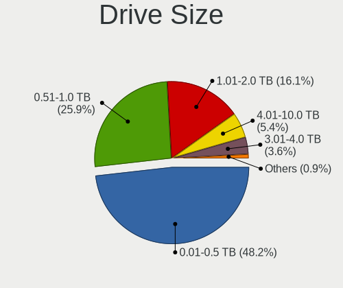
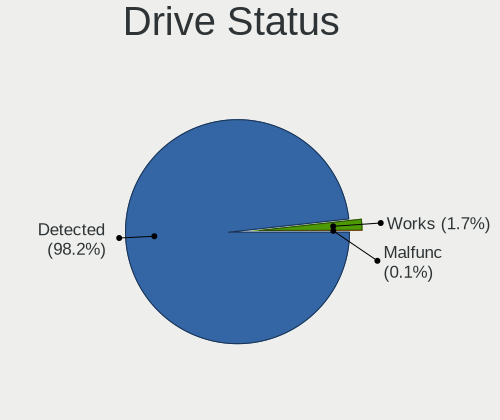
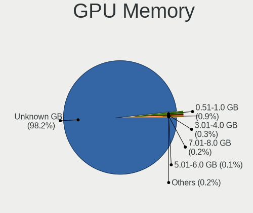
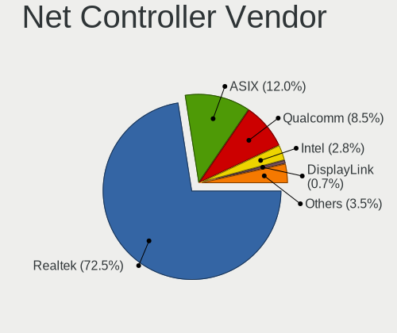
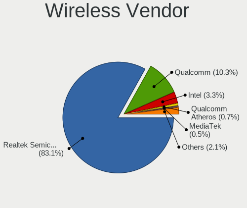

SteamOS - Tested Hardware & Statistics (Notebooks)
--------------------------------------------------

A project to collect tested hardware configurations for SteamOS.

Anyone can contribute to this report by the [hw-probe](https://github.com/linuxhw/hw-probe) tool:

    sudo -E hw-probe -all -upload

Please contribute! Especially if your hardware is rare.

Contents
--------

* [ Test Cases ](#test-cases)

* [ System ](#system)
  - [ OS                       ](#os)
  - [ OS Family                ](#os-family)
  - [ Kernel                   ](#kernel)
  - [ Kernel Family            ](#kernel-family)
  - [ Kernel Major Ver.        ](#kernel-major-ver)
  - [ Arch                     ](#arch)
  - [ DE                       ](#de)
  - [ Display Server           ](#display-server)
  - [ Display Manager          ](#display-manager)
  - [ OS Lang                  ](#os-lang)
  - [ Boot Mode                ](#boot-mode)
  - [ Filesystem               ](#filesystem)
  - [ Part. scheme             ](#part-scheme)
  - [ Dual Boot with Linux/BSD ](#dual-boot-with-linuxbsd)
  - [ Dual Boot (Win)          ](#dual-boot-win)

* [ Board ](#board)
  - [ Vendor                   ](#vendor)
  - [ Model                    ](#model)
  - [ Model Family             ](#model-family)
  - [ MFG Year                 ](#mfg-year)
  - [ Form Factor              ](#form-factor)
  - [ Secure Boot              ](#secure-boot)
  - [ Coreboot                 ](#coreboot)
  - [ RAM Size                 ](#ram-size)
  - [ RAM Used                 ](#ram-used)
  - [ Total Drives             ](#total-drives)
  - [ Has CD-ROM               ](#has-cd-rom)
  - [ Has Ethernet             ](#has-ethernet)
  - [ Has WiFi                 ](#has-wifi)
  - [ Has Bluetooth            ](#has-bluetooth)

* [ Location ](#location)
  - [ Country                  ](#country)
  - [ City                     ](#city)

* [ Drives ](#drives)
  - [ Drive Vendor             ](#drive-vendor)
  - [ Drive Model              ](#drive-model)
  - [ HDD Vendor               ](#hdd-vendor)
  - [ SSD Vendor               ](#ssd-vendor)
  - [ Drive Kind               ](#drive-kind)
  - [ Drive Connector          ](#drive-connector)
  - [ Drive Size               ](#drive-size)
  - [ Space Total              ](#space-total)
  - [ Space Used               ](#space-used)
  - [ Malfunc. Drives          ](#malfunc-drives)
  - [ Malfunc. Drive Vendor    ](#malfunc-drive-vendor)
  - [ Malfunc. HDD Vendor      ](#malfunc-hdd-vendor)
  - [ Malfunc. Drive Kind      ](#malfunc-drive-kind)
  - [ Failed Drives            ](#failed-drives)
  - [ Failed Drive Vendor      ](#failed-drive-vendor)
  - [ Drive Status             ](#drive-status)

* [ Storage controller ](#storage-controller)
  - [ Storage Vendor           ](#storage-vendor)
  - [ Storage Model            ](#storage-model)
  - [ Storage Kind             ](#storage-kind)

* [ Processor ](#processor)
  - [ CPU Vendor               ](#cpu-vendor)
  - [ CPU Model                ](#cpu-model)
  - [ CPU Model Family         ](#cpu-model-family)
  - [ CPU Cores                ](#cpu-cores)
  - [ CPU Sockets              ](#cpu-sockets)
  - [ CPU Threads              ](#cpu-threads)
  - [ CPU Op-Modes             ](#cpu-op-modes)
  - [ CPU Microcode            ](#cpu-microcode)
  - [ CPU Microarch            ](#cpu-microarch)

* [ Graphics ](#graphics)
  - [ GPU Vendor               ](#gpu-vendor)
  - [ GPU Model                ](#gpu-model)
  - [ GPU Combo                ](#gpu-combo)
  - [ GPU Driver               ](#gpu-driver)
  - [ GPU Memory               ](#gpu-memory)

* [ Monitor ](#monitor)
  - [ Monitor Vendor           ](#monitor-vendor)
  - [ Monitor Model            ](#monitor-model)
  - [ Monitor Resolution       ](#monitor-resolution)
  - [ Monitor Diagonal         ](#monitor-diagonal)
  - [ Monitor Width            ](#monitor-width)
  - [ Aspect Ratio             ](#aspect-ratio)
  - [ Monitor Area             ](#monitor-area)
  - [ Pixel Density            ](#pixel-density)
  - [ Multiple Monitors        ](#multiple-monitors)

* [ Network ](#network)
  - [ Net Controller Vendor    ](#net-controller-vendor)
  - [ Net Controller Model     ](#net-controller-model)
  - [ Wireless Vendor          ](#wireless-vendor)
  - [ Wireless Model           ](#wireless-model)
  - [ Ethernet Vendor          ](#ethernet-vendor)
  - [ Ethernet Model           ](#ethernet-model)
  - [ Net Controller Kind      ](#net-controller-kind)
  - [ Used Controller          ](#used-controller)
  - [ NICs                     ](#nics)
  - [ IPv6                     ](#ipv6)

* [ Bluetooth ](#bluetooth)
  - [ Bluetooth Vendor         ](#bluetooth-vendor)
  - [ Bluetooth Model          ](#bluetooth-model)

* [ Sound ](#sound)
  - [ Sound Vendor             ](#sound-vendor)
  - [ Sound Model              ](#sound-model)

* [ Memory ](#memory)
  - [ Memory Vendor            ](#memory-vendor)
  - [ Memory Model             ](#memory-model)
  - [ Memory Kind              ](#memory-kind)
  - [ Memory Form Factor       ](#memory-form-factor)
  - [ Memory Size              ](#memory-size)
  - [ Memory Speed             ](#memory-speed)

* [ Printers & scanners ](#printers--scanners)
  - [ Printer Vendor           ](#printer-vendor)
  - [ Printer Model            ](#printer-model)
  - [ Scanner Vendor           ](#scanner-vendor)
  - [ Scanner Model            ](#scanner-model)

* [ Camera ](#camera)
  - [ Camera Vendor            ](#camera-vendor)
  - [ Camera Model             ](#camera-model)

* [ Security ](#security)
  - [ Fingerprint Vendor       ](#fingerprint-vendor)
  - [ Fingerprint Model        ](#fingerprint-model)
  - [ Chipcard Vendor          ](#chipcard-vendor)
  - [ Chipcard Model           ](#chipcard-model)

* [ Unsupported ](#unsupported)
  - [ Unsupported Devices      ](#unsupported-devices)
  - [ Unsupported Device Types ](#unsupported-device-types)

Test Cases
----------

Total: 573

| Vendor        | Model                       | Probe                                                      | Date         |
|---------------|-----------------------------|------------------------------------------------------------|--------------|
| Valve         | Jupiter                     | [97da60caa9](https://linux-hardware.org/?probe=97da60caa9) | Dec 31, 2022 |
| Valve         | Jupiter                     | [1922673e86](https://linux-hardware.org/?probe=1922673e86) | Dec 31, 2022 |
| Valve         | Jupiter                     | [b5b95e62a1](https://linux-hardware.org/?probe=b5b95e62a1) | Dec 31, 2022 |
| Valve         | Jupiter                     | [206fed6963](https://linux-hardware.org/?probe=206fed6963) | Dec 31, 2022 |
| Valve         | Jupiter                     | [61cb7375d1](https://linux-hardware.org/?probe=61cb7375d1) | Dec 31, 2022 |
| Valve         | Jupiter                     | [82b86d954a](https://linux-hardware.org/?probe=82b86d954a) | Dec 30, 2022 |
| Valve         | Jupiter                     | [294144217a](https://linux-hardware.org/?probe=294144217a) | Dec 30, 2022 |
| Valve         | Jupiter                     | [d66944e019](https://linux-hardware.org/?probe=d66944e019) | Dec 30, 2022 |
| Valve         | Jupiter                     | [7efd41e9e3](https://linux-hardware.org/?probe=7efd41e9e3) | Dec 30, 2022 |
| Valve         | Jupiter                     | [d35711a607](https://linux-hardware.org/?probe=d35711a607) | Dec 30, 2022 |
| Valve         | Jupiter                     | [617508d444](https://linux-hardware.org/?probe=617508d444) | Dec 30, 2022 |
| GPU Compan... | GWNR71517                   | [d8b5801637](https://linux-hardware.org/?probe=d8b5801637) | Dec 30, 2022 |
| Valve         | Jupiter                     | [ba8c4aff6e](https://linux-hardware.org/?probe=ba8c4aff6e) | Dec 30, 2022 |
| Valve         | Jupiter                     | [6723dd2f21](https://linux-hardware.org/?probe=6723dd2f21) | Dec 30, 2022 |
| Valve         | Jupiter                     | [15c60654b3](https://linux-hardware.org/?probe=15c60654b3) | Dec 30, 2022 |
| ASUSTek       | N56VB                       | [6201ddc028](https://linux-hardware.org/?probe=6201ddc028) | Dec 30, 2022 |
| Anbernic      | Win600                      | [db576ded28](https://linux-hardware.org/?probe=db576ded28) | Dec 29, 2022 |
| Valve         | Jupiter                     | [135a0237fc](https://linux-hardware.org/?probe=135a0237fc) | Dec 29, 2022 |
| Valve         | Jupiter                     | [a89e87f342](https://linux-hardware.org/?probe=a89e87f342) | Dec 28, 2022 |
| Valve         | Jupiter                     | [15cbe24d03](https://linux-hardware.org/?probe=15cbe24d03) | Dec 28, 2022 |
| Valve         | Jupiter                     | [08161cc2cd](https://linux-hardware.org/?probe=08161cc2cd) | Dec 28, 2022 |
| Valve         | Jupiter                     | [42288a62eb](https://linux-hardware.org/?probe=42288a62eb) | Dec 27, 2022 |
| Valve         | Jupiter                     | [bcdce3240d](https://linux-hardware.org/?probe=bcdce3240d) | Dec 27, 2022 |
| Valve         | Jupiter                     | [db0586ef7b](https://linux-hardware.org/?probe=db0586ef7b) | Dec 27, 2022 |
| Valve         | Jupiter                     | [a1ab930dc6](https://linux-hardware.org/?probe=a1ab930dc6) | Dec 27, 2022 |
| Valve         | Jupiter                     | [d244a4aa10](https://linux-hardware.org/?probe=d244a4aa10) | Dec 27, 2022 |
| Valve         | Jupiter                     | [894e79d316](https://linux-hardware.org/?probe=894e79d316) | Dec 27, 2022 |
| Valve         | Jupiter                     | [488d26f3e8](https://linux-hardware.org/?probe=488d26f3e8) | Dec 27, 2022 |
| Valve         | Jupiter                     | [add22bd3b7](https://linux-hardware.org/?probe=add22bd3b7) | Dec 27, 2022 |
| Valve         | Jupiter                     | [1c516dc209](https://linux-hardware.org/?probe=1c516dc209) | Dec 26, 2022 |
| Valve         | Jupiter                     | [32b2d1e76f](https://linux-hardware.org/?probe=32b2d1e76f) | Dec 26, 2022 |
| Valve         | Jupiter                     | [b0805a1b7c](https://linux-hardware.org/?probe=b0805a1b7c) | Dec 26, 2022 |
| Valve         | Jupiter                     | [fff4225748](https://linux-hardware.org/?probe=fff4225748) | Dec 26, 2022 |
| Valve         | Jupiter                     | [bb4ffda53d](https://linux-hardware.org/?probe=bb4ffda53d) | Dec 26, 2022 |
| Valve         | Jupiter                     | [e9811949dd](https://linux-hardware.org/?probe=e9811949dd) | Dec 26, 2022 |
| Valve         | Jupiter                     | [8194c72bb9](https://linux-hardware.org/?probe=8194c72bb9) | Dec 25, 2022 |
| Anbernic      | Win600                      | [f7759a13d8](https://linux-hardware.org/?probe=f7759a13d8) | Dec 25, 2022 |
| Valve         | Jupiter                     | [1aae0084d4](https://linux-hardware.org/?probe=1aae0084d4) | Dec 25, 2022 |
| Valve         | Jupiter                     | [f30e8d06be](https://linux-hardware.org/?probe=f30e8d06be) | Dec 25, 2022 |
| Valve         | Jupiter                     | [10e4624475](https://linux-hardware.org/?probe=10e4624475) | Dec 25, 2022 |
| Valve         | Jupiter                     | [91be8cc560](https://linux-hardware.org/?probe=91be8cc560) | Dec 25, 2022 |
| Valve         | Jupiter                     | [f8ff1f6342](https://linux-hardware.org/?probe=f8ff1f6342) | Dec 25, 2022 |
| Valve         | Jupiter                     | [003a215a22](https://linux-hardware.org/?probe=003a215a22) | Dec 24, 2022 |
| Valve         | Jupiter                     | [5b87445985](https://linux-hardware.org/?probe=5b87445985) | Dec 24, 2022 |
| Valve         | Jupiter                     | [1f016d2cf5](https://linux-hardware.org/?probe=1f016d2cf5) | Dec 24, 2022 |
| Valve         | Jupiter                     | [f500094797](https://linux-hardware.org/?probe=f500094797) | Dec 24, 2022 |
| Valve         | Jupiter                     | [a38f241e2e](https://linux-hardware.org/?probe=a38f241e2e) | Dec 24, 2022 |
| Valve         | Jupiter                     | [91952198ca](https://linux-hardware.org/?probe=91952198ca) | Dec 24, 2022 |
| Valve         | Jupiter                     | [934295d2a1](https://linux-hardware.org/?probe=934295d2a1) | Dec 23, 2022 |
| Valve         | Jupiter                     | [5c07d82410](https://linux-hardware.org/?probe=5c07d82410) | Dec 23, 2022 |
| Valve         | Jupiter                     | [fc52b9e656](https://linux-hardware.org/?probe=fc52b9e656) | Dec 23, 2022 |
| Valve         | Jupiter                     | [87476c80d3](https://linux-hardware.org/?probe=87476c80d3) | Dec 23, 2022 |
| Valve         | Jupiter                     | [5ba4679f20](https://linux-hardware.org/?probe=5ba4679f20) | Dec 23, 2022 |
| Valve         | Jupiter                     | [0bea978cf7](https://linux-hardware.org/?probe=0bea978cf7) | Dec 21, 2022 |
| Valve         | Jupiter                     | [81b966f449](https://linux-hardware.org/?probe=81b966f449) | Dec 21, 2022 |
| Valve         | Jupiter                     | [90331ea7da](https://linux-hardware.org/?probe=90331ea7da) | Dec 21, 2022 |
| Valve         | Jupiter                     | [9a358caee7](https://linux-hardware.org/?probe=9a358caee7) | Dec 21, 2022 |
| Valve         | Jupiter                     | [0c29352a52](https://linux-hardware.org/?probe=0c29352a52) | Dec 20, 2022 |
| Valve         | Jupiter                     | [74518c805f](https://linux-hardware.org/?probe=74518c805f) | Dec 20, 2022 |
| Valve         | Jupiter                     | [dc2e1253e8](https://linux-hardware.org/?probe=dc2e1253e8) | Dec 20, 2022 |
| Valve         | Jupiter                     | [2f061a6d8d](https://linux-hardware.org/?probe=2f061a6d8d) | Dec 20, 2022 |
| Valve         | Jupiter                     | [51f420480a](https://linux-hardware.org/?probe=51f420480a) | Dec 19, 2022 |
| Valve         | Jupiter                     | [c50891856e](https://linux-hardware.org/?probe=c50891856e) | Dec 19, 2022 |
| Valve         | Jupiter                     | [154e9217e5](https://linux-hardware.org/?probe=154e9217e5) | Dec 19, 2022 |
| ASRock        | X570 Phantom Gaming-ITX/... | [59bf36837d](https://linux-hardware.org/?probe=59bf36837d) | Dec 18, 2022 |
| Valve         | Jupiter                     | [b62a6e3e64](https://linux-hardware.org/?probe=b62a6e3e64) | Dec 18, 2022 |
| Valve         | Jupiter                     | [9c513daaf3](https://linux-hardware.org/?probe=9c513daaf3) | Dec 17, 2022 |
| Valve         | Jupiter                     | [72f897b9d3](https://linux-hardware.org/?probe=72f897b9d3) | Dec 17, 2022 |
| Valve         | Jupiter                     | [5fee494e26](https://linux-hardware.org/?probe=5fee494e26) | Dec 17, 2022 |
| Valve         | Jupiter                     | [a560caaec5](https://linux-hardware.org/?probe=a560caaec5) | Dec 17, 2022 |
| ASRock        | X570 Phantom Gaming-ITX/... | [d5279b915a](https://linux-hardware.org/?probe=d5279b915a) | Dec 17, 2022 |
| Valve         | Jupiter                     | [d47eae36fe](https://linux-hardware.org/?probe=d47eae36fe) | Dec 17, 2022 |
| Valve         | Jupiter                     | [4a37142af9](https://linux-hardware.org/?probe=4a37142af9) | Dec 16, 2022 |
| Valve         | Jupiter                     | [26aae3342c](https://linux-hardware.org/?probe=26aae3342c) | Dec 16, 2022 |
| Valve         | Jupiter                     | [8d134a7f1e](https://linux-hardware.org/?probe=8d134a7f1e) | Dec 16, 2022 |
| Valve         | Jupiter                     | [2014e95862](https://linux-hardware.org/?probe=2014e95862) | Dec 16, 2022 |
| Valve         | Jupiter                     | [70f2102c25](https://linux-hardware.org/?probe=70f2102c25) | Dec 16, 2022 |
| Valve         | Jupiter                     | [bb07a9abda](https://linux-hardware.org/?probe=bb07a9abda) | Dec 16, 2022 |
| Valve         | Jupiter                     | [24182862cd](https://linux-hardware.org/?probe=24182862cd) | Dec 15, 2022 |
| Valve         | Jupiter                     | [f89644c711](https://linux-hardware.org/?probe=f89644c711) | Dec 15, 2022 |
| Valve         | Jupiter                     | [db677ea07b](https://linux-hardware.org/?probe=db677ea07b) | Dec 14, 2022 |
| Valve         | Jupiter                     | [cfe8d55199](https://linux-hardware.org/?probe=cfe8d55199) | Dec 14, 2022 |
| Valve         | Jupiter                     | [2f2528fad3](https://linux-hardware.org/?probe=2f2528fad3) | Dec 14, 2022 |
| Valve         | Jupiter                     | [9330717977](https://linux-hardware.org/?probe=9330717977) | Dec 14, 2022 |
| Valve         | Jupiter                     | [e5d3f1d216](https://linux-hardware.org/?probe=e5d3f1d216) | Dec 13, 2022 |
| Valve         | Jupiter                     | [a2f1af21a0](https://linux-hardware.org/?probe=a2f1af21a0) | Dec 13, 2022 |
| Valve         | Jupiter                     | [a505c76dfa](https://linux-hardware.org/?probe=a505c76dfa) | Dec 13, 2022 |
| Valve         | Jupiter                     | [008a4d9a91](https://linux-hardware.org/?probe=008a4d9a91) | Dec 13, 2022 |
| Valve         | Jupiter                     | [5236eb1349](https://linux-hardware.org/?probe=5236eb1349) | Dec 12, 2022 |
| Valve         | Jupiter                     | [6d937728a7](https://linux-hardware.org/?probe=6d937728a7) | Dec 12, 2022 |
| Valve         | Jupiter                     | [708d1f0ed9](https://linux-hardware.org/?probe=708d1f0ed9) | Dec 11, 2022 |
| Valve         | Jupiter                     | [ce3ee9584d](https://linux-hardware.org/?probe=ce3ee9584d) | Dec 11, 2022 |
| Valve         | Jupiter                     | [eb1fa1afb7](https://linux-hardware.org/?probe=eb1fa1afb7) | Dec 11, 2022 |
| Valve         | Jupiter                     | [0dcaa4653d](https://linux-hardware.org/?probe=0dcaa4653d) | Dec 11, 2022 |
| Valve         | Jupiter                     | [fae62b5114](https://linux-hardware.org/?probe=fae62b5114) | Dec 11, 2022 |
| Valve         | Jupiter                     | [26c1e67dff](https://linux-hardware.org/?probe=26c1e67dff) | Dec 11, 2022 |
| Valve         | Jupiter                     | [e143b181a1](https://linux-hardware.org/?probe=e143b181a1) | Dec 11, 2022 |
| Valve         | Jupiter                     | [e8e7f4358d](https://linux-hardware.org/?probe=e8e7f4358d) | Dec 10, 2022 |
| Valve         | Jupiter                     | [71cc18156c](https://linux-hardware.org/?probe=71cc18156c) | Dec 10, 2022 |
| Valve         | Jupiter                     | [dd762c59e0](https://linux-hardware.org/?probe=dd762c59e0) | Dec 10, 2022 |
| Valve         | Jupiter                     | [a863b95a85](https://linux-hardware.org/?probe=a863b95a85) | Dec 10, 2022 |
| Valve         | Jupiter                     | [1e314d59ee](https://linux-hardware.org/?probe=1e314d59ee) | Dec 09, 2022 |
| Valve         | Jupiter                     | [8a3cf19a14](https://linux-hardware.org/?probe=8a3cf19a14) | Dec 09, 2022 |
| Valve         | Jupiter                     | [d41bef1f84](https://linux-hardware.org/?probe=d41bef1f84) | Dec 09, 2022 |
| Valve         | Jupiter                     | [bb28de043b](https://linux-hardware.org/?probe=bb28de043b) | Dec 08, 2022 |
| Valve         | Jupiter                     | [9fc6ea26bb](https://linux-hardware.org/?probe=9fc6ea26bb) | Dec 07, 2022 |
| Valve         | Jupiter                     | [70cd36710e](https://linux-hardware.org/?probe=70cd36710e) | Dec 06, 2022 |
| Valve         | Jupiter                     | [6fcb4cb441](https://linux-hardware.org/?probe=6fcb4cb441) | Dec 06, 2022 |
| Valve         | Jupiter                     | [a609c3558a](https://linux-hardware.org/?probe=a609c3558a) | Dec 06, 2022 |
| Valve         | Jupiter                     | [f8d6f4c18b](https://linux-hardware.org/?probe=f8d6f4c18b) | Dec 06, 2022 |
| Valve         | Jupiter                     | [19f5d58b52](https://linux-hardware.org/?probe=19f5d58b52) | Dec 06, 2022 |
| Valve         | Jupiter                     | [989c933ecf](https://linux-hardware.org/?probe=989c933ecf) | Dec 06, 2022 |
| Valve         | Jupiter                     | [69e8f9815d](https://linux-hardware.org/?probe=69e8f9815d) | Dec 05, 2022 |
| Valve         | Jupiter                     | [dfbfb35d21](https://linux-hardware.org/?probe=dfbfb35d21) | Dec 05, 2022 |
| Valve         | Jupiter                     | [13c990586f](https://linux-hardware.org/?probe=13c990586f) | Dec 05, 2022 |
| Valve         | Jupiter                     | [6f8cd51355](https://linux-hardware.org/?probe=6f8cd51355) | Dec 05, 2022 |
| Valve         | Jupiter                     | [a1975d14f5](https://linux-hardware.org/?probe=a1975d14f5) | Dec 04, 2022 |
| Valve         | Jupiter                     | [51e2277a91](https://linux-hardware.org/?probe=51e2277a91) | Dec 04, 2022 |
| Valve         | Jupiter                     | [d8890572a5](https://linux-hardware.org/?probe=d8890572a5) | Dec 03, 2022 |
| Valve         | Jupiter                     | [68e389a838](https://linux-hardware.org/?probe=68e389a838) | Dec 03, 2022 |
| Valve         | Jupiter                     | [f54147a5ba](https://linux-hardware.org/?probe=f54147a5ba) | Dec 02, 2022 |
| Valve         | Jupiter                     | [4f32d4f1c2](https://linux-hardware.org/?probe=4f32d4f1c2) | Dec 02, 2022 |
| Valve         | Jupiter                     | [ec26a28bff](https://linux-hardware.org/?probe=ec26a28bff) | Dec 01, 2022 |
| Valve         | Jupiter                     | [a9299c074e](https://linux-hardware.org/?probe=a9299c074e) | Nov 29, 2022 |
| Valve         | Jupiter                     | [0f40429822](https://linux-hardware.org/?probe=0f40429822) | Nov 29, 2022 |
| Valve         | Jupiter                     | [de1a950876](https://linux-hardware.org/?probe=de1a950876) | Nov 29, 2022 |
| Apple         | MacBookAir6,2               | [ed4692d2a7](https://linux-hardware.org/?probe=ed4692d2a7) | Nov 28, 2022 |
| Valve         | Jupiter                     | [637e97b132](https://linux-hardware.org/?probe=637e97b132) | Nov 28, 2022 |
| Valve         | Jupiter                     | [f0d9943604](https://linux-hardware.org/?probe=f0d9943604) | Nov 28, 2022 |
| Valve         | Jupiter                     | [81b0ea6c7a](https://linux-hardware.org/?probe=81b0ea6c7a) | Nov 27, 2022 |
| Valve         | Jupiter                     | [1d12c5839a](https://linux-hardware.org/?probe=1d12c5839a) | Nov 27, 2022 |
| Valve         | Jupiter                     | [bee2852cb0](https://linux-hardware.org/?probe=bee2852cb0) | Nov 27, 2022 |
| Valve         | Jupiter                     | [ea37f7d713](https://linux-hardware.org/?probe=ea37f7d713) | Nov 26, 2022 |
| Valve         | Jupiter                     | [caf4a9c4d8](https://linux-hardware.org/?probe=caf4a9c4d8) | Nov 26, 2022 |
| Valve         | Jupiter                     | [c17d27ef9b](https://linux-hardware.org/?probe=c17d27ef9b) | Nov 26, 2022 |
| Valve         | Jupiter                     | [0a172d85fd](https://linux-hardware.org/?probe=0a172d85fd) | Nov 26, 2022 |
| Valve         | Jupiter                     | [7412d8b03b](https://linux-hardware.org/?probe=7412d8b03b) | Nov 26, 2022 |
| Valve         | Jupiter                     | [24d078fe91](https://linux-hardware.org/?probe=24d078fe91) | Nov 26, 2022 |
| Valve         | Jupiter                     | [5751db0994](https://linux-hardware.org/?probe=5751db0994) | Nov 24, 2022 |
| Valve         | Jupiter                     | [29f6c597e4](https://linux-hardware.org/?probe=29f6c597e4) | Nov 23, 2022 |
| Valve         | Jupiter                     | [6049221fab](https://linux-hardware.org/?probe=6049221fab) | Nov 23, 2022 |
| Valve         | Jupiter                     | [4c3a9fe5ae](https://linux-hardware.org/?probe=4c3a9fe5ae) | Nov 23, 2022 |
| Valve         | Jupiter                     | [575ab984df](https://linux-hardware.org/?probe=575ab984df) | Nov 21, 2022 |
| Valve         | Jupiter                     | [1e7b9730a4](https://linux-hardware.org/?probe=1e7b9730a4) | Nov 21, 2022 |
| Valve         | Jupiter                     | [e9f2caddf6](https://linux-hardware.org/?probe=e9f2caddf6) | Nov 21, 2022 |
| Valve         | Jupiter                     | [dd6f589d44](https://linux-hardware.org/?probe=dd6f589d44) | Nov 20, 2022 |
| Valve         | Jupiter                     | [0e77de9dba](https://linux-hardware.org/?probe=0e77de9dba) | Nov 20, 2022 |
| HP            | Pavilion 17                 | [1d4d49c9e4](https://linux-hardware.org/?probe=1d4d49c9e4) | Nov 19, 2022 |
| Valve         | Jupiter                     | [c89535828a](https://linux-hardware.org/?probe=c89535828a) | Nov 19, 2022 |
| Valve         | Jupiter                     | [5932954a14](https://linux-hardware.org/?probe=5932954a14) | Nov 19, 2022 |
| Valve         | Jupiter                     | [d7c9c529b6](https://linux-hardware.org/?probe=d7c9c529b6) | Nov 18, 2022 |
| Valve         | Jupiter                     | [d008ed40fe](https://linux-hardware.org/?probe=d008ed40fe) | Nov 17, 2022 |
| Valve         | Jupiter                     | [01e0010535](https://linux-hardware.org/?probe=01e0010535) | Nov 16, 2022 |
| Valve         | Jupiter                     | [4ab915f825](https://linux-hardware.org/?probe=4ab915f825) | Nov 15, 2022 |
| Valve         | Jupiter                     | [92eb4009f3](https://linux-hardware.org/?probe=92eb4009f3) | Nov 14, 2022 |
| Valve         | Jupiter                     | [0bd1833d8c](https://linux-hardware.org/?probe=0bd1833d8c) | Nov 13, 2022 |
| Valve         | Jupiter                     | [f90da254ff](https://linux-hardware.org/?probe=f90da254ff) | Nov 13, 2022 |
| Valve         | Jupiter                     | [0046f0e15d](https://linux-hardware.org/?probe=0046f0e15d) | Nov 13, 2022 |
| Valve         | Jupiter                     | [649043bb19](https://linux-hardware.org/?probe=649043bb19) | Nov 13, 2022 |
| Valve         | Jupiter                     | [5c1a39b012](https://linux-hardware.org/?probe=5c1a39b012) | Nov 13, 2022 |
| Valve         | Jupiter                     | [62e925fd8a](https://linux-hardware.org/?probe=62e925fd8a) | Nov 12, 2022 |
| Valve         | Jupiter                     | [829b573205](https://linux-hardware.org/?probe=829b573205) | Nov 12, 2022 |
| Valve         | Jupiter                     | [ed3f6fb61d](https://linux-hardware.org/?probe=ed3f6fb61d) | Nov 12, 2022 |
| Valve         | Jupiter                     | [c1805091ef](https://linux-hardware.org/?probe=c1805091ef) | Nov 12, 2022 |
| Valve         | Jupiter                     | [54bca16c61](https://linux-hardware.org/?probe=54bca16c61) | Nov 11, 2022 |
| Valve         | Jupiter                     | [34582d82a1](https://linux-hardware.org/?probe=34582d82a1) | Nov 10, 2022 |
| Valve         | Jupiter                     | [6227fbbebb](https://linux-hardware.org/?probe=6227fbbebb) | Nov 10, 2022 |
| ASUSTek       | ROG Zephyrus G15 GA503QR... | [2067c76d7b](https://linux-hardware.org/?probe=2067c76d7b) | Nov 09, 2022 |
| Valve         | Jupiter                     | [340ef95fd9](https://linux-hardware.org/?probe=340ef95fd9) | Nov 08, 2022 |
| Valve         | Jupiter                     | [5673f6f505](https://linux-hardware.org/?probe=5673f6f505) | Nov 08, 2022 |
| Valve         | Jupiter                     | [020eadb15a](https://linux-hardware.org/?probe=020eadb15a) | Nov 08, 2022 |
| Valve         | Jupiter                     | [3e3e947f9e](https://linux-hardware.org/?probe=3e3e947f9e) | Nov 08, 2022 |
| Valve         | Jupiter                     | [1991a35643](https://linux-hardware.org/?probe=1991a35643) | Nov 08, 2022 |
| GPD           | G1619-04                    | [0c0542ac2e](https://linux-hardware.org/?probe=0c0542ac2e) | Nov 07, 2022 |
| Valve         | Jupiter                     | [88af410b70](https://linux-hardware.org/?probe=88af410b70) | Nov 07, 2022 |
| GPD           | G1619-04                    | [ce6d16840e](https://linux-hardware.org/?probe=ce6d16840e) | Nov 07, 2022 |
| Valve         | Jupiter                     | [695f4b6a83](https://linux-hardware.org/?probe=695f4b6a83) | Nov 06, 2022 |
| Valve         | Jupiter                     | [5800bb0b18](https://linux-hardware.org/?probe=5800bb0b18) | Nov 06, 2022 |
| Valve         | Jupiter                     | [9e7987531b](https://linux-hardware.org/?probe=9e7987531b) | Nov 06, 2022 |
| Valve         | Jupiter                     | [2cc3a0b5de](https://linux-hardware.org/?probe=2cc3a0b5de) | Nov 06, 2022 |
| Valve         | Jupiter                     | [df94c19aa6](https://linux-hardware.org/?probe=df94c19aa6) | Nov 06, 2022 |
| Valve         | Jupiter                     | [55420be889](https://linux-hardware.org/?probe=55420be889) | Nov 05, 2022 |
| Valve         | Jupiter                     | [55293ff823](https://linux-hardware.org/?probe=55293ff823) | Nov 05, 2022 |
| ASRock        | X570 Phantom Gaming-ITX/... | [f23e197251](https://linux-hardware.org/?probe=f23e197251) | Nov 05, 2022 |
| Valve         | Jupiter                     | [946d382a37](https://linux-hardware.org/?probe=946d382a37) | Nov 05, 2022 |
| Valve         | Jupiter                     | [5c5b229108](https://linux-hardware.org/?probe=5c5b229108) | Nov 05, 2022 |
| Valve         | Jupiter                     | [62160ec2e5](https://linux-hardware.org/?probe=62160ec2e5) | Nov 03, 2022 |
| Apple         | MacBookPro8,1               | [b4f9d04f4d](https://linux-hardware.org/?probe=b4f9d04f4d) | Nov 03, 2022 |
| Valve         | Jupiter                     | [1757bc1f5a](https://linux-hardware.org/?probe=1757bc1f5a) | Nov 03, 2022 |
| Valve         | Jupiter                     | [f6295954bc](https://linux-hardware.org/?probe=f6295954bc) | Nov 02, 2022 |
| Valve         | Jupiter                     | [13e280e72f](https://linux-hardware.org/?probe=13e280e72f) | Nov 02, 2022 |
| Valve         | Jupiter                     | [99521b7f24](https://linux-hardware.org/?probe=99521b7f24) | Nov 02, 2022 |
| Valve         | Jupiter                     | [cf9998e9b9](https://linux-hardware.org/?probe=cf9998e9b9) | Nov 01, 2022 |
| Valve         | Jupiter                     | [9d237f0d30](https://linux-hardware.org/?probe=9d237f0d30) | Oct 31, 2022 |
| Valve         | Jupiter                     | [92b732ad9a](https://linux-hardware.org/?probe=92b732ad9a) | Oct 31, 2022 |
| Valve         | Jupiter                     | [d4c562a178](https://linux-hardware.org/?probe=d4c562a178) | Oct 30, 2022 |
| Valve         | Jupiter                     | [2d381c1626](https://linux-hardware.org/?probe=2d381c1626) | Oct 30, 2022 |
| Valve         | Jupiter                     | [dfc3eee826](https://linux-hardware.org/?probe=dfc3eee826) | Oct 29, 2022 |
| Valve         | Jupiter                     | [0405c29890](https://linux-hardware.org/?probe=0405c29890) | Oct 29, 2022 |
| Valve         | Jupiter                     | [127bd00558](https://linux-hardware.org/?probe=127bd00558) | Oct 28, 2022 |
| Valve         | Jupiter                     | [7cc988201b](https://linux-hardware.org/?probe=7cc988201b) | Oct 28, 2022 |
| Valve         | Jupiter                     | [746fdbcdec](https://linux-hardware.org/?probe=746fdbcdec) | Oct 26, 2022 |
| Valve         | Jupiter                     | [088235cbff](https://linux-hardware.org/?probe=088235cbff) | Oct 26, 2022 |
| Google        | Droid                       | [c8e4007ce4](https://linux-hardware.org/?probe=c8e4007ce4) | Oct 26, 2022 |
| Valve         | Jupiter                     | [dc86de125e](https://linux-hardware.org/?probe=dc86de125e) | Oct 25, 2022 |
| Valve         | Jupiter                     | [98a9dbc46f](https://linux-hardware.org/?probe=98a9dbc46f) | Oct 25, 2022 |
| Valve         | Jupiter                     | [c12839567e](https://linux-hardware.org/?probe=c12839567e) | Oct 25, 2022 |
| Valve         | Jupiter                     | [6ed87cbcfb](https://linux-hardware.org/?probe=6ed87cbcfb) | Oct 25, 2022 |
| Valve         | Jupiter                     | [fe664e172e](https://linux-hardware.org/?probe=fe664e172e) | Oct 24, 2022 |
| Valve         | Jupiter                     | [1963771551](https://linux-hardware.org/?probe=1963771551) | Oct 24, 2022 |
| Valve         | Jupiter                     | [e474d0929b](https://linux-hardware.org/?probe=e474d0929b) | Oct 24, 2022 |
| Valve         | Jupiter                     | [6e4712d276](https://linux-hardware.org/?probe=6e4712d276) | Oct 23, 2022 |
| Valve         | Jupiter                     | [719742423c](https://linux-hardware.org/?probe=719742423c) | Oct 23, 2022 |
| Valve         | Jupiter                     | [3e696c2b87](https://linux-hardware.org/?probe=3e696c2b87) | Oct 23, 2022 |
| Valve         | Jupiter                     | [b05efe341f](https://linux-hardware.org/?probe=b05efe341f) | Oct 22, 2022 |
| Valve         | Jupiter                     | [39c064d0df](https://linux-hardware.org/?probe=39c064d0df) | Oct 22, 2022 |
| Valve         | Jupiter                     | [302efb993a](https://linux-hardware.org/?probe=302efb993a) | Oct 22, 2022 |
| ADVANCE       | PS5077                      | [998e544711](https://linux-hardware.org/?probe=998e544711) | Oct 22, 2022 |
| ADVANCE       | PS5077                      | [97bfff0fc6](https://linux-hardware.org/?probe=97bfff0fc6) | Oct 22, 2022 |
| Valve         | Jupiter                     | [024fdc987b](https://linux-hardware.org/?probe=024fdc987b) | Oct 21, 2022 |
| Valve         | Jupiter                     | [13c98e0adc](https://linux-hardware.org/?probe=13c98e0adc) | Oct 21, 2022 |
| Valve         | Jupiter                     | [2582be110d](https://linux-hardware.org/?probe=2582be110d) | Oct 21, 2022 |
| MSI           | GP66 Leopard 11UH           | [9485d1e744](https://linux-hardware.org/?probe=9485d1e744) | Oct 20, 2022 |
| Valve         | Jupiter                     | [6249475f24](https://linux-hardware.org/?probe=6249475f24) | Oct 20, 2022 |
| Valve         | Jupiter                     | [7cb825e738](https://linux-hardware.org/?probe=7cb825e738) | Oct 20, 2022 |
| Valve         | Jupiter                     | [ea0d3e9186](https://linux-hardware.org/?probe=ea0d3e9186) | Oct 20, 2022 |
| Valve         | Jupiter                     | [a314a908eb](https://linux-hardware.org/?probe=a314a908eb) | Oct 20, 2022 |
| Valve         | Jupiter                     | [53e7ae8cd4](https://linux-hardware.org/?probe=53e7ae8cd4) | Oct 20, 2022 |
| Valve         | Jupiter                     | [bdca0279e2](https://linux-hardware.org/?probe=bdca0279e2) | Oct 20, 2022 |
| Valve         | Jupiter                     | [3fada6964f](https://linux-hardware.org/?probe=3fada6964f) | Oct 19, 2022 |
| ASRock        | X570 Phantom Gaming-ITX/... | [59904b8a87](https://linux-hardware.org/?probe=59904b8a87) | Oct 19, 2022 |
| Lenovo        | IdeaPad 1 14IAU7 82QC       | [429cfdd3df](https://linux-hardware.org/?probe=429cfdd3df) | Oct 19, 2022 |
| Valve         | Jupiter                     | [982d4175a3](https://linux-hardware.org/?probe=982d4175a3) | Oct 19, 2022 |
| Valve         | Jupiter                     | [1e000a30c5](https://linux-hardware.org/?probe=1e000a30c5) | Oct 18, 2022 |
| Valve         | Jupiter                     | [a52a79aad6](https://linux-hardware.org/?probe=a52a79aad6) | Oct 18, 2022 |
| Valve         | Jupiter                     | [0a198cb541](https://linux-hardware.org/?probe=0a198cb541) | Oct 18, 2022 |
| Valve         | Jupiter                     | [fb6fa1c746](https://linux-hardware.org/?probe=fb6fa1c746) | Oct 17, 2022 |
| Valve         | Jupiter                     | [1c513b151b](https://linux-hardware.org/?probe=1c513b151b) | Oct 17, 2022 |
| Valve         | Jupiter                     | [992d2b539a](https://linux-hardware.org/?probe=992d2b539a) | Oct 17, 2022 |
| Valve         | Jupiter                     | [0526c93d55](https://linux-hardware.org/?probe=0526c93d55) | Oct 17, 2022 |
| Valve         | Jupiter                     | [8a5f4671f1](https://linux-hardware.org/?probe=8a5f4671f1) | Oct 17, 2022 |
| Valve         | Jupiter                     | [281229d9ba](https://linux-hardware.org/?probe=281229d9ba) | Oct 16, 2022 |
| Valve         | Jupiter                     | [dde3144879](https://linux-hardware.org/?probe=dde3144879) | Oct 16, 2022 |
| Valve         | Jupiter                     | [7559400f9a](https://linux-hardware.org/?probe=7559400f9a) | Oct 15, 2022 |
| Valve         | Jupiter                     | [022a7cab63](https://linux-hardware.org/?probe=022a7cab63) | Oct 15, 2022 |
| Valve         | Jupiter                     | [bd47ebea62](https://linux-hardware.org/?probe=bd47ebea62) | Oct 15, 2022 |
| Valve         | Jupiter                     | [627b9225cb](https://linux-hardware.org/?probe=627b9225cb) | Oct 15, 2022 |
| Valve         | Jupiter                     | [9ed7280a28](https://linux-hardware.org/?probe=9ed7280a28) | Oct 14, 2022 |
| Valve         | Jupiter                     | [2d38b191e7](https://linux-hardware.org/?probe=2d38b191e7) | Oct 14, 2022 |
| Valve         | Jupiter                     | [e5f2c8aaae](https://linux-hardware.org/?probe=e5f2c8aaae) | Oct 14, 2022 |
| Valve         | Jupiter                     | [261a0464f4](https://linux-hardware.org/?probe=261a0464f4) | Oct 14, 2022 |
| AZW           | MINI S                      | [d12969169f](https://linux-hardware.org/?probe=d12969169f) | Oct 14, 2022 |
| Valve         | Jupiter                     | [cb0355ddf3](https://linux-hardware.org/?probe=cb0355ddf3) | Oct 13, 2022 |
| Valve         | Jupiter                     | [ec6c38cc2e](https://linux-hardware.org/?probe=ec6c38cc2e) | Oct 13, 2022 |
| Valve         | Jupiter                     | [62bdf474b3](https://linux-hardware.org/?probe=62bdf474b3) | Oct 11, 2022 |
| Valve         | Jupiter                     | [6da0b199d1](https://linux-hardware.org/?probe=6da0b199d1) | Oct 10, 2022 |
| Valve         | Jupiter                     | [c06c56de15](https://linux-hardware.org/?probe=c06c56de15) | Oct 10, 2022 |
| Valve         | Jupiter                     | [4c324f424d](https://linux-hardware.org/?probe=4c324f424d) | Oct 10, 2022 |
| Lenovo        | IdeaPad 3 15ITL6 82H8       | [2e1db47b63](https://linux-hardware.org/?probe=2e1db47b63) | Oct 10, 2022 |
| Valve         | Jupiter                     | [a5c71515b9](https://linux-hardware.org/?probe=a5c71515b9) | Oct 09, 2022 |
| Valve         | Jupiter                     | [eb5a512250](https://linux-hardware.org/?probe=eb5a512250) | Oct 09, 2022 |
| ASRock        | X570 Phantom Gaming-ITX/... | [9873ba1845](https://linux-hardware.org/?probe=9873ba1845) | Oct 09, 2022 |
| Valve         | Jupiter                     | [34b991043f](https://linux-hardware.org/?probe=34b991043f) | Oct 09, 2022 |
| Valve         | Jupiter                     | [c5c31bcc13](https://linux-hardware.org/?probe=c5c31bcc13) | Oct 08, 2022 |
| Valve         | Jupiter                     | [30d44ab77b](https://linux-hardware.org/?probe=30d44ab77b) | Oct 08, 2022 |
| Valve         | Jupiter                     | [2d8b46d523](https://linux-hardware.org/?probe=2d8b46d523) | Oct 07, 2022 |
| Valve         | Jupiter                     | [e064c0c3be](https://linux-hardware.org/?probe=e064c0c3be) | Oct 07, 2022 |
| Valve         | Jupiter                     | [ee7a8c8340](https://linux-hardware.org/?probe=ee7a8c8340) | Oct 07, 2022 |
| Valve         | Jupiter                     | [1ebf39c097](https://linux-hardware.org/?probe=1ebf39c097) | Oct 07, 2022 |
| Valve         | Jupiter                     | [8dcc3b36a0](https://linux-hardware.org/?probe=8dcc3b36a0) | Oct 06, 2022 |
| ASRock        | X570 Phantom Gaming-ITX/... | [2e6852099a](https://linux-hardware.org/?probe=2e6852099a) | Oct 06, 2022 |
| Valve         | Jupiter                     | [28900801aa](https://linux-hardware.org/?probe=28900801aa) | Oct 06, 2022 |
| Valve         | Jupiter                     | [9222d376ab](https://linux-hardware.org/?probe=9222d376ab) | Oct 06, 2022 |
| Valve         | Jupiter                     | [4905b59499](https://linux-hardware.org/?probe=4905b59499) | Oct 06, 2022 |
| Valve         | Jupiter                     | [64f5b28613](https://linux-hardware.org/?probe=64f5b28613) | Oct 06, 2022 |
| Valve         | Jupiter                     | [641bcdd8c5](https://linux-hardware.org/?probe=641bcdd8c5) | Oct 05, 2022 |
| Valve         | Jupiter                     | [471bd7e244](https://linux-hardware.org/?probe=471bd7e244) | Oct 05, 2022 |
| Valve         | Jupiter                     | [2f421c5aa6](https://linux-hardware.org/?probe=2f421c5aa6) | Oct 05, 2022 |
| Valve         | Jupiter                     | [c1206634aa](https://linux-hardware.org/?probe=c1206634aa) | Oct 05, 2022 |
| Valve         | Jupiter                     | [889099ff63](https://linux-hardware.org/?probe=889099ff63) | Oct 05, 2022 |
| Valve         | Jupiter                     | [ac2707d2e6](https://linux-hardware.org/?probe=ac2707d2e6) | Oct 05, 2022 |
| Valve         | Jupiter                     | [9dd9e70e1f](https://linux-hardware.org/?probe=9dd9e70e1f) | Oct 04, 2022 |
| Valve         | Jupiter                     | [70f65d68fc](https://linux-hardware.org/?probe=70f65d68fc) | Oct 04, 2022 |
| Valve         | Jupiter                     | [4bc40da6ce](https://linux-hardware.org/?probe=4bc40da6ce) | Oct 04, 2022 |
| Valve         | Jupiter                     | [047b9291b1](https://linux-hardware.org/?probe=047b9291b1) | Oct 03, 2022 |
| Valve         | Jupiter                     | [6bc437ef3d](https://linux-hardware.org/?probe=6bc437ef3d) | Oct 03, 2022 |
| Valve         | Jupiter                     | [c411f31824](https://linux-hardware.org/?probe=c411f31824) | Oct 03, 2022 |
| Valve         | Jupiter                     | [e051d6a0a9](https://linux-hardware.org/?probe=e051d6a0a9) | Oct 02, 2022 |
| Apple         | MacBookAir6,1               | [f5e8b6c1eb](https://linux-hardware.org/?probe=f5e8b6c1eb) | Oct 02, 2022 |
| Apple         | MacBookAir6,1               | [8e5a2bb3a6](https://linux-hardware.org/?probe=8e5a2bb3a6) | Oct 02, 2022 |
| Valve         | Jupiter                     | [5692645981](https://linux-hardware.org/?probe=5692645981) | Oct 02, 2022 |
| Valve         | Jupiter                     | [12f0d9358a](https://linux-hardware.org/?probe=12f0d9358a) | Oct 01, 2022 |
| Valve         | Jupiter                     | [9ea6c15d28](https://linux-hardware.org/?probe=9ea6c15d28) | Oct 01, 2022 |
| Valve         | Jupiter                     | [dab0a00c02](https://linux-hardware.org/?probe=dab0a00c02) | Sep 30, 2022 |
| Valve         | Jupiter                     | [4d1b722861](https://linux-hardware.org/?probe=4d1b722861) | Sep 30, 2022 |
| Valve         | Jupiter                     | [e9737fcadf](https://linux-hardware.org/?probe=e9737fcadf) | Sep 30, 2022 |
| Valve         | Jupiter                     | [5e7ec518d4](https://linux-hardware.org/?probe=5e7ec518d4) | Sep 30, 2022 |
| Valve         | Jupiter                     | [a031955ffb](https://linux-hardware.org/?probe=a031955ffb) | Sep 30, 2022 |
| ASRock        | X570 Phantom Gaming-ITX/... | [5746aa7609](https://linux-hardware.org/?probe=5746aa7609) | Sep 29, 2022 |
| Valve         | Jupiter                     | [66731152dd](https://linux-hardware.org/?probe=66731152dd) | Sep 29, 2022 |
| Valve         | Jupiter                     | [679b3600fa](https://linux-hardware.org/?probe=679b3600fa) | Sep 29, 2022 |
| Valve         | Jupiter                     | [92b774ed77](https://linux-hardware.org/?probe=92b774ed77) | Sep 29, 2022 |
| Valve         | Jupiter                     | [9de5371096](https://linux-hardware.org/?probe=9de5371096) | Sep 28, 2022 |
| Valve         | Jupiter                     | [bdc84f1b9b](https://linux-hardware.org/?probe=bdc84f1b9b) | Sep 28, 2022 |
| Valve         | Jupiter                     | [4c7799c515](https://linux-hardware.org/?probe=4c7799c515) | Sep 28, 2022 |
| GPD           | G1619-04                    | [9e99ae15fb](https://linux-hardware.org/?probe=9e99ae15fb) | Sep 27, 2022 |
| Valve         | Jupiter                     | [9a2af6352a](https://linux-hardware.org/?probe=9a2af6352a) | Sep 27, 2022 |
| Valve         | Jupiter                     | [0f1c8fad1c](https://linux-hardware.org/?probe=0f1c8fad1c) | Sep 26, 2022 |
| Valve         | Jupiter                     | [c3305d9bff](https://linux-hardware.org/?probe=c3305d9bff) | Sep 26, 2022 |
| Valve         | Jupiter                     | [8c94cd9bd3](https://linux-hardware.org/?probe=8c94cd9bd3) | Sep 26, 2022 |
| Valve         | Jupiter                     | [ebf3e70cf7](https://linux-hardware.org/?probe=ebf3e70cf7) | Sep 25, 2022 |
| Valve         | Jupiter                     | [315719a312](https://linux-hardware.org/?probe=315719a312) | Sep 25, 2022 |
| Valve         | Jupiter                     | [f5183f3eed](https://linux-hardware.org/?probe=f5183f3eed) | Sep 24, 2022 |
| Valve         | Jupiter                     | [6ddd668003](https://linux-hardware.org/?probe=6ddd668003) | Sep 24, 2022 |
| Valve         | Jupiter                     | [b70be12594](https://linux-hardware.org/?probe=b70be12594) | Sep 24, 2022 |
| Valve         | Jupiter                     | [c81b14b950](https://linux-hardware.org/?probe=c81b14b950) | Sep 23, 2022 |
| Valve         | Jupiter                     | [d03b845c90](https://linux-hardware.org/?probe=d03b845c90) | Sep 23, 2022 |
| Valve         | Jupiter                     | [ca6d2abcd9](https://linux-hardware.org/?probe=ca6d2abcd9) | Sep 23, 2022 |
| Valve         | Jupiter                     | [0b88f458d2](https://linux-hardware.org/?probe=0b88f458d2) | Sep 22, 2022 |
| Valve         | Jupiter                     | [ce15d6d4bb](https://linux-hardware.org/?probe=ce15d6d4bb) | Sep 22, 2022 |
| Valve         | Jupiter                     | [f9230d9e82](https://linux-hardware.org/?probe=f9230d9e82) | Sep 21, 2022 |
| Valve         | Jupiter                     | [a39be03b34](https://linux-hardware.org/?probe=a39be03b34) | Sep 21, 2022 |
| Valve         | Jupiter                     | [7bc45b1077](https://linux-hardware.org/?probe=7bc45b1077) | Sep 21, 2022 |
| Valve         | Jupiter                     | [721ede2e11](https://linux-hardware.org/?probe=721ede2e11) | Sep 20, 2022 |
| Valve         | Jupiter                     | [83ed33f7e6](https://linux-hardware.org/?probe=83ed33f7e6) | Sep 20, 2022 |
| Valve         | Jupiter                     | [e60653a4c7](https://linux-hardware.org/?probe=e60653a4c7) | Sep 20, 2022 |
| Valve         | Jupiter                     | [090e33f643](https://linux-hardware.org/?probe=090e33f643) | Sep 20, 2022 |
| Valve         | Jupiter                     | [919ae4fe6c](https://linux-hardware.org/?probe=919ae4fe6c) | Sep 19, 2022 |
| Valve         | Jupiter                     | [5ed6e54010](https://linux-hardware.org/?probe=5ed6e54010) | Sep 19, 2022 |
| Valve         | Jupiter                     | [52352bab7a](https://linux-hardware.org/?probe=52352bab7a) | Sep 19, 2022 |
| Valve         | Jupiter                     | [84051314e8](https://linux-hardware.org/?probe=84051314e8) | Sep 19, 2022 |
| Valve         | Jupiter                     | [de74f87be5](https://linux-hardware.org/?probe=de74f87be5) | Sep 18, 2022 |
| Valve         | Jupiter                     | [8273135785](https://linux-hardware.org/?probe=8273135785) | Sep 18, 2022 |
| Valve         | Jupiter                     | [4b802a9fe9](https://linux-hardware.org/?probe=4b802a9fe9) | Sep 18, 2022 |
| Valve         | Jupiter                     | [e65c41605f](https://linux-hardware.org/?probe=e65c41605f) | Sep 18, 2022 |
| Valve         | Jupiter                     | [b2a1aea8e2](https://linux-hardware.org/?probe=b2a1aea8e2) | Sep 17, 2022 |
| Valve         | Jupiter                     | [b667f00856](https://linux-hardware.org/?probe=b667f00856) | Sep 17, 2022 |
| Valve         | Jupiter                     | [221fd3ae1c](https://linux-hardware.org/?probe=221fd3ae1c) | Sep 17, 2022 |
| Valve         | Jupiter                     | [c4dd2bf91f](https://linux-hardware.org/?probe=c4dd2bf91f) | Sep 17, 2022 |
| Valve         | Jupiter                     | [0db4b64dcd](https://linux-hardware.org/?probe=0db4b64dcd) | Sep 16, 2022 |
| Valve         | Jupiter                     | [4540c4e930](https://linux-hardware.org/?probe=4540c4e930) | Sep 16, 2022 |
| Valve         | Jupiter                     | [47ac328960](https://linux-hardware.org/?probe=47ac328960) | Sep 16, 2022 |
| Valve         | Jupiter                     | [28a40721a8](https://linux-hardware.org/?probe=28a40721a8) | Sep 16, 2022 |
| Valve         | Jupiter                     | [44056051c4](https://linux-hardware.org/?probe=44056051c4) | Sep 16, 2022 |
| Valve         | Jupiter                     | [9adc000021](https://linux-hardware.org/?probe=9adc000021) | Sep 15, 2022 |
| Valve         | Jupiter                     | [9493095ab1](https://linux-hardware.org/?probe=9493095ab1) | Sep 15, 2022 |
| Valve         | Jupiter                     | [9817414c4e](https://linux-hardware.org/?probe=9817414c4e) | Sep 14, 2022 |
| Valve         | Jupiter                     | [0925a55100](https://linux-hardware.org/?probe=0925a55100) | Sep 13, 2022 |
| Valve         | Jupiter                     | [b2b312e843](https://linux-hardware.org/?probe=b2b312e843) | Sep 12, 2022 |
| Valve         | Jupiter                     | [694e9a60ad](https://linux-hardware.org/?probe=694e9a60ad) | Sep 11, 2022 |
| Valve         | Jupiter                     | [438ec3fe41](https://linux-hardware.org/?probe=438ec3fe41) | Sep 11, 2022 |
| Valve         | Jupiter                     | [17ddfcd578](https://linux-hardware.org/?probe=17ddfcd578) | Sep 11, 2022 |
| Valve         | Jupiter                     | [1dc4620833](https://linux-hardware.org/?probe=1dc4620833) | Sep 10, 2022 |
| Valve         | Jupiter                     | [2c95ed7c92](https://linux-hardware.org/?probe=2c95ed7c92) | Sep 10, 2022 |
| Valve         | Jupiter                     | [17eea2b641](https://linux-hardware.org/?probe=17eea2b641) | Sep 09, 2022 |
| Valve         | Jupiter                     | [49694d92f6](https://linux-hardware.org/?probe=49694d92f6) | Sep 09, 2022 |
| Valve         | Jupiter                     | [48df4850fe](https://linux-hardware.org/?probe=48df4850fe) | Sep 09, 2022 |
| Valve         | Jupiter                     | [c63b3ff391](https://linux-hardware.org/?probe=c63b3ff391) | Sep 09, 2022 |
| Valve         | Jupiter                     | [cb5ede9c6f](https://linux-hardware.org/?probe=cb5ede9c6f) | Sep 09, 2022 |
| Valve         | Jupiter                     | [9fce9d23c8](https://linux-hardware.org/?probe=9fce9d23c8) | Sep 09, 2022 |
| Valve         | Jupiter                     | [7d45c49609](https://linux-hardware.org/?probe=7d45c49609) | Sep 08, 2022 |
| ASUSTek       | ROG Zephyrus S17 GX703HS... | [041c6dac05](https://linux-hardware.org/?probe=041c6dac05) | Sep 08, 2022 |
| Valve         | Jupiter                     | [3c4865fc8c](https://linux-hardware.org/?probe=3c4865fc8c) | Sep 08, 2022 |
| Valve         | Jupiter                     | [1669287cbb](https://linux-hardware.org/?probe=1669287cbb) | Sep 07, 2022 |
| Valve         | Jupiter                     | [47baad2eed](https://linux-hardware.org/?probe=47baad2eed) | Sep 07, 2022 |
| Valve         | Jupiter                     | [eb15307366](https://linux-hardware.org/?probe=eb15307366) | Sep 07, 2022 |
| Valve         | Jupiter                     | [8cd669599d](https://linux-hardware.org/?probe=8cd669599d) | Sep 07, 2022 |
| Valve         | Jupiter                     | [090d406ac3](https://linux-hardware.org/?probe=090d406ac3) | Sep 07, 2022 |
| Valve         | Jupiter                     | [3f0eb4cd71](https://linux-hardware.org/?probe=3f0eb4cd71) | Sep 06, 2022 |
| Valve         | Jupiter                     | [04c7e44198](https://linux-hardware.org/?probe=04c7e44198) | Sep 05, 2022 |
| Valve         | Jupiter                     | [584ea1ade0](https://linux-hardware.org/?probe=584ea1ade0) | Sep 05, 2022 |
| Valve         | Jupiter                     | [bf34e42b02](https://linux-hardware.org/?probe=bf34e42b02) | Sep 04, 2022 |
| Valve         | Jupiter                     | [f9942c8a6b](https://linux-hardware.org/?probe=f9942c8a6b) | Sep 04, 2022 |
| Valve         | Jupiter                     | [93771f5a6b](https://linux-hardware.org/?probe=93771f5a6b) | Sep 04, 2022 |
| Valve         | Jupiter                     | [08728d3dc1](https://linux-hardware.org/?probe=08728d3dc1) | Sep 04, 2022 |
| Valve         | Jupiter                     | [a8038907ed](https://linux-hardware.org/?probe=a8038907ed) | Sep 03, 2022 |
| Valve         | Jupiter                     | [f35ef3a2e1](https://linux-hardware.org/?probe=f35ef3a2e1) | Sep 03, 2022 |
| Valve         | Jupiter                     | [e12248df34](https://linux-hardware.org/?probe=e12248df34) | Sep 03, 2022 |
| Valve         | Jupiter                     | [ad3ce497e7](https://linux-hardware.org/?probe=ad3ce497e7) | Sep 02, 2022 |
| Valve         | Jupiter                     | [c0094f39c5](https://linux-hardware.org/?probe=c0094f39c5) | Sep 02, 2022 |
| Valve         | Jupiter                     | [b3b1ffd7ff](https://linux-hardware.org/?probe=b3b1ffd7ff) | Sep 02, 2022 |
| Valve         | Jupiter                     | [3fdc8df5b2](https://linux-hardware.org/?probe=3fdc8df5b2) | Sep 02, 2022 |
| Valve         | Jupiter                     | [6e9790c5e7](https://linux-hardware.org/?probe=6e9790c5e7) | Sep 01, 2022 |
| Valve         | Jupiter                     | [c89533e9a2](https://linux-hardware.org/?probe=c89533e9a2) | Sep 01, 2022 |
| Valve         | Jupiter                     | [c348c06118](https://linux-hardware.org/?probe=c348c06118) | Sep 01, 2022 |
| Valve         | Jupiter                     | [60db4bfa03](https://linux-hardware.org/?probe=60db4bfa03) | Aug 31, 2022 |
| Valve         | Jupiter                     | [5a2483051c](https://linux-hardware.org/?probe=5a2483051c) | Aug 31, 2022 |
| Valve         | Jupiter                     | [0b928ad313](https://linux-hardware.org/?probe=0b928ad313) | Aug 31, 2022 |
| Valve         | Jupiter                     | [dbc549504c](https://linux-hardware.org/?probe=dbc549504c) | Aug 31, 2022 |
| Valve         | Jupiter                     | [1b38f48059](https://linux-hardware.org/?probe=1b38f48059) | Aug 30, 2022 |
| Valve         | Jupiter                     | [40b9dd39a6](https://linux-hardware.org/?probe=40b9dd39a6) | Aug 30, 2022 |
| Valve         | Jupiter                     | [ea6506cc93](https://linux-hardware.org/?probe=ea6506cc93) | Aug 30, 2022 |
| Lenovo        | IdeaPad Gaming 3 15ACH6 ... | [844a0c00e2](https://linux-hardware.org/?probe=844a0c00e2) | Aug 29, 2022 |
| Valve         | Jupiter                     | [830c22afde](https://linux-hardware.org/?probe=830c22afde) | Aug 29, 2022 |
| Dell          | XPS 13 9360                 | [1763ee1dd0](https://linux-hardware.org/?probe=1763ee1dd0) | Aug 29, 2022 |
| Valve         | Jupiter                     | [43ec7fb445](https://linux-hardware.org/?probe=43ec7fb445) | Aug 29, 2022 |
| Valve         | Jupiter                     | [3848655fce](https://linux-hardware.org/?probe=3848655fce) | Aug 28, 2022 |
| Valve         | Jupiter                     | [cd6744821b](https://linux-hardware.org/?probe=cd6744821b) | Aug 27, 2022 |
| Lenovo        | Legion Y740-15IRHg 81UH     | [521dd85c98](https://linux-hardware.org/?probe=521dd85c98) | Aug 26, 2022 |
| Valve         | Jupiter                     | [8027445785](https://linux-hardware.org/?probe=8027445785) | Aug 26, 2022 |
| Dell          | Precision 7720              | [7fafc0e50b](https://linux-hardware.org/?probe=7fafc0e50b) | Aug 26, 2022 |
| Valve         | Jupiter                     | [447edaff49](https://linux-hardware.org/?probe=447edaff49) | Aug 25, 2022 |
| Valve         | Jupiter                     | [ebd183fc4b](https://linux-hardware.org/?probe=ebd183fc4b) | Aug 25, 2022 |
| Valve         | Jupiter                     | [b74760105e](https://linux-hardware.org/?probe=b74760105e) | Aug 25, 2022 |
| Valve         | Jupiter                     | [5064c9f57b](https://linux-hardware.org/?probe=5064c9f57b) | Aug 24, 2022 |
| Valve         | Jupiter                     | [fbef109b91](https://linux-hardware.org/?probe=fbef109b91) | Aug 24, 2022 |
| Valve         | Jupiter                     | [de49ccefa5](https://linux-hardware.org/?probe=de49ccefa5) | Aug 24, 2022 |
| Valve         | Jupiter                     | [4c88b729d3](https://linux-hardware.org/?probe=4c88b729d3) | Aug 23, 2022 |
| Valve         | Jupiter                     | [ba1940016e](https://linux-hardware.org/?probe=ba1940016e) | Aug 23, 2022 |
| Valve         | Jupiter                     | [161cc0c135](https://linux-hardware.org/?probe=161cc0c135) | Aug 23, 2022 |
| Valve         | Jupiter                     | [078b8e8ff1](https://linux-hardware.org/?probe=078b8e8ff1) | Aug 22, 2022 |
| Valve         | Jupiter                     | [04b0de9007](https://linux-hardware.org/?probe=04b0de9007) | Aug 22, 2022 |
| Valve         | Jupiter                     | [1c25a3bf8a](https://linux-hardware.org/?probe=1c25a3bf8a) | Aug 22, 2022 |
| Valve         | Jupiter                     | [bc83cf9f77](https://linux-hardware.org/?probe=bc83cf9f77) | Aug 21, 2022 |
| Valve         | Jupiter                     | [36124147ef](https://linux-hardware.org/?probe=36124147ef) | Aug 20, 2022 |
| Valve         | Jupiter                     | [eb63fecd35](https://linux-hardware.org/?probe=eb63fecd35) | Aug 19, 2022 |
| Valve         | Jupiter                     | [d6b92d1aa0](https://linux-hardware.org/?probe=d6b92d1aa0) | Aug 19, 2022 |
| Valve         | Jupiter                     | [bff4d1ca46](https://linux-hardware.org/?probe=bff4d1ca46) | Aug 19, 2022 |
| Valve         | Jupiter                     | [87f3603202](https://linux-hardware.org/?probe=87f3603202) | Aug 18, 2022 |
| Valve         | Jupiter                     | [f0dc30e9f8](https://linux-hardware.org/?probe=f0dc30e9f8) | Aug 17, 2022 |
| Valve         | Jupiter                     | [5f3785b334](https://linux-hardware.org/?probe=5f3785b334) | Aug 16, 2022 |
| Valve         | Jupiter                     | [af4a593873](https://linux-hardware.org/?probe=af4a593873) | Aug 16, 2022 |
| Valve         | Jupiter                     | [c395a0f9db](https://linux-hardware.org/?probe=c395a0f9db) | Aug 16, 2022 |
| Valve         | Jupiter                     | [90ac03e747](https://linux-hardware.org/?probe=90ac03e747) | Aug 15, 2022 |
| Valve         | Jupiter                     | [c3f38697a4](https://linux-hardware.org/?probe=c3f38697a4) | Aug 15, 2022 |
| Valve         | Jupiter                     | [9ab7a2b695](https://linux-hardware.org/?probe=9ab7a2b695) | Aug 15, 2022 |
| Valve         | Jupiter                     | [2adcfce1c0](https://linux-hardware.org/?probe=2adcfce1c0) | Aug 14, 2022 |
| Valve         | Jupiter                     | [e9f1f10a4c](https://linux-hardware.org/?probe=e9f1f10a4c) | Aug 14, 2022 |
| Valve         | Jupiter                     | [50596cb93b](https://linux-hardware.org/?probe=50596cb93b) | Aug 13, 2022 |
| Valve         | Jupiter                     | [3a1e95f5d5](https://linux-hardware.org/?probe=3a1e95f5d5) | Aug 12, 2022 |
| Valve         | Jupiter                     | [b63f9aedab](https://linux-hardware.org/?probe=b63f9aedab) | Aug 12, 2022 |
| Valve         | Jupiter                     | [822737452b](https://linux-hardware.org/?probe=822737452b) | Aug 12, 2022 |
| Valve         | Jupiter                     | [9839802d27](https://linux-hardware.org/?probe=9839802d27) | Aug 12, 2022 |
| Valve         | Jupiter                     | [6b9bfad898](https://linux-hardware.org/?probe=6b9bfad898) | Aug 12, 2022 |
| Valve         | Jupiter                     | [c6e02c54e7](https://linux-hardware.org/?probe=c6e02c54e7) | Aug 11, 2022 |
| HP            | Laptop 14z-fq0000           | [9c62f8d392](https://linux-hardware.org/?probe=9c62f8d392) | Aug 11, 2022 |
| Valve         | Jupiter                     | [90e751b5cf](https://linux-hardware.org/?probe=90e751b5cf) | Aug 10, 2022 |
| Valve         | Jupiter                     | [6223a43fe2](https://linux-hardware.org/?probe=6223a43fe2) | Aug 10, 2022 |
| Valve         | Jupiter                     | [2cec170e55](https://linux-hardware.org/?probe=2cec170e55) | Aug 10, 2022 |
| AMI           | Unknown                     | [5cee81ed21](https://linux-hardware.org/?probe=5cee81ed21) | Aug 10, 2022 |
| Valve         | Jupiter                     | [68214f1af2](https://linux-hardware.org/?probe=68214f1af2) | Aug 10, 2022 |
| AMI           | Unknown                     | [7752037bab](https://linux-hardware.org/?probe=7752037bab) | Aug 10, 2022 |
| Valve         | Jupiter                     | [e4914b879a](https://linux-hardware.org/?probe=e4914b879a) | Aug 09, 2022 |
| Valve         | Jupiter                     | [813863fbbf](https://linux-hardware.org/?probe=813863fbbf) | Aug 09, 2022 |
| Valve         | Jupiter                     | [a5b1208abc](https://linux-hardware.org/?probe=a5b1208abc) | Aug 08, 2022 |
| Valve         | Jupiter                     | [a50e78265a](https://linux-hardware.org/?probe=a50e78265a) | Aug 07, 2022 |
| Valve         | Jupiter                     | [d8ef9609a7](https://linux-hardware.org/?probe=d8ef9609a7) | Aug 07, 2022 |
| Valve         | Jupiter                     | [ced35212a7](https://linux-hardware.org/?probe=ced35212a7) | Aug 07, 2022 |
| Valve         | Jupiter                     | [64a0d92417](https://linux-hardware.org/?probe=64a0d92417) | Aug 07, 2022 |
| Valve         | Jupiter                     | [b6c7ee76fa](https://linux-hardware.org/?probe=b6c7ee76fa) | Aug 06, 2022 |
| Valve         | Jupiter                     | [6bbc4f3d0a](https://linux-hardware.org/?probe=6bbc4f3d0a) | Aug 05, 2022 |
| Valve         | Jupiter                     | [d15c62e29a](https://linux-hardware.org/?probe=d15c62e29a) | Aug 05, 2022 |
| Valve         | Jupiter                     | [6f76f9d91a](https://linux-hardware.org/?probe=6f76f9d91a) | Aug 05, 2022 |
| Valve         | Jupiter                     | [4403a80bdc](https://linux-hardware.org/?probe=4403a80bdc) | Aug 03, 2022 |
| Valve         | Jupiter                     | [8689254ee7](https://linux-hardware.org/?probe=8689254ee7) | Aug 03, 2022 |
| Valve         | Jupiter                     | [bfddbf1d22](https://linux-hardware.org/?probe=bfddbf1d22) | Aug 02, 2022 |
| Valve         | Jupiter                     | [fdb514a999](https://linux-hardware.org/?probe=fdb514a999) | Aug 01, 2022 |
| Valve         | Jupiter                     | [e4c6300b68](https://linux-hardware.org/?probe=e4c6300b68) | Aug 01, 2022 |
| GPD           | G1619-02                    | [c61c4280c8](https://linux-hardware.org/?probe=c61c4280c8) | Jul 31, 2022 |
| Valve         | Jupiter                     | [ee3b662083](https://linux-hardware.org/?probe=ee3b662083) | Jul 30, 2022 |
| Acer          | Aspire A514-54              | [9a18d7476f](https://linux-hardware.org/?probe=9a18d7476f) | Jul 29, 2022 |
| Valve         | Jupiter                     | [225e2c825e](https://linux-hardware.org/?probe=225e2c825e) | Jul 29, 2022 |
| Acer          | Aspire A514-54              | [4a6c9ef157](https://linux-hardware.org/?probe=4a6c9ef157) | Jul 28, 2022 |
| Valve         | Jupiter                     | [dffaa71aed](https://linux-hardware.org/?probe=dffaa71aed) | Jul 28, 2022 |
| Valve         | Jupiter                     | [35608b206c](https://linux-hardware.org/?probe=35608b206c) | Jul 27, 2022 |
| Valve         | Jupiter                     | [e35fa6e699](https://linux-hardware.org/?probe=e35fa6e699) | Jul 27, 2022 |
| Valve         | Jupiter                     | [f43cbe28e9](https://linux-hardware.org/?probe=f43cbe28e9) | Jul 27, 2022 |
| Valve         | Jupiter                     | [d4e4413f9b](https://linux-hardware.org/?probe=d4e4413f9b) | Jul 26, 2022 |
| Valve         | Jupiter                     | [9c34e91c79](https://linux-hardware.org/?probe=9c34e91c79) | Jul 26, 2022 |
| Valve         | Jupiter                     | [b605f923c6](https://linux-hardware.org/?probe=b605f923c6) | Jul 25, 2022 |
| Valve         | Jupiter                     | [3e7b7cb8cd](https://linux-hardware.org/?probe=3e7b7cb8cd) | Jul 23, 2022 |
| Alienware     | m17                         | [e14db26b9b](https://linux-hardware.org/?probe=e14db26b9b) | Jul 23, 2022 |
| Valve         | Jupiter                     | [ca07489d53](https://linux-hardware.org/?probe=ca07489d53) | Jul 23, 2022 |
| Valve         | Jupiter                     | [1860c6d71f](https://linux-hardware.org/?probe=1860c6d71f) | Jul 23, 2022 |
| Valve         | Jupiter                     | [2d0db23de3](https://linux-hardware.org/?probe=2d0db23de3) | Jul 23, 2022 |
| Valve         | Jupiter                     | [4aece18875](https://linux-hardware.org/?probe=4aece18875) | Jul 23, 2022 |
| Valve         | Jupiter                     | [44dca72cbb](https://linux-hardware.org/?probe=44dca72cbb) | Jul 22, 2022 |
| Unknown       | Unknown                     | [96af389676](https://linux-hardware.org/?probe=96af389676) | Jul 22, 2022 |
| ASRock        | X570 Extreme4 WiFi ax       | [bc52038c74](https://linux-hardware.org/?probe=bc52038c74) | Jul 21, 2022 |
| Valve         | Jupiter                     | [0cd166bdb1](https://linux-hardware.org/?probe=0cd166bdb1) | Jul 21, 2022 |
| Valve         | Jupiter                     | [2c1ad04467](https://linux-hardware.org/?probe=2c1ad04467) | Jul 18, 2022 |
| Valve         | Jupiter                     | [7f27efe00e](https://linux-hardware.org/?probe=7f27efe00e) | Jul 17, 2022 |
| HP            | Pavilion 17                 | [722f4eb4a9](https://linux-hardware.org/?probe=722f4eb4a9) | Jul 17, 2022 |
| Valve         | Jupiter                     | [b639365efd](https://linux-hardware.org/?probe=b639365efd) | Jul 16, 2022 |
| Valve         | Jupiter                     | [6c954fab9d](https://linux-hardware.org/?probe=6c954fab9d) | Jul 16, 2022 |
| Valve         | Jupiter                     | [eec9897935](https://linux-hardware.org/?probe=eec9897935) | Jul 15, 2022 |
| Valve         | Jupiter                     | [d4be0d94b4](https://linux-hardware.org/?probe=d4be0d94b4) | Jul 14, 2022 |
| Valve         | Jupiter                     | [d2f117e7f3](https://linux-hardware.org/?probe=d2f117e7f3) | Jul 14, 2022 |
| Dell          | XPS 15 9570                 | [e157e6d524](https://linux-hardware.org/?probe=e157e6d524) | Jul 14, 2022 |
| Valve         | Jupiter                     | [f7d66c8d35](https://linux-hardware.org/?probe=f7d66c8d35) | Jul 10, 2022 |
| Valve         | Jupiter                     | [0c2ea27c49](https://linux-hardware.org/?probe=0c2ea27c49) | Jul 09, 2022 |
| Valve         | Jupiter                     | [98711d54c1](https://linux-hardware.org/?probe=98711d54c1) | Jul 08, 2022 |
| Lenovo        | ThinkBook 13s G3 ACN 20Y... | [c3c73948f5](https://linux-hardware.org/?probe=c3c73948f5) | Jul 08, 2022 |
| Valve         | Jupiter                     | [3ede093138](https://linux-hardware.org/?probe=3ede093138) | Jul 07, 2022 |
| Valve         | Jupiter                     | [458276506d](https://linux-hardware.org/?probe=458276506d) | Jul 06, 2022 |
| Valve         | Jupiter                     | [663562cc6b](https://linux-hardware.org/?probe=663562cc6b) | Jul 06, 2022 |
| Valve         | Jupiter                     | [e640bab55c](https://linux-hardware.org/?probe=e640bab55c) | Jul 05, 2022 |
| Valve         | Jupiter                     | [0bd46afcda](https://linux-hardware.org/?probe=0bd46afcda) | Jul 04, 2022 |
| Valve         | Jupiter                     | [766a3583f0](https://linux-hardware.org/?probe=766a3583f0) | Jul 04, 2022 |
| Valve         | Jupiter                     | [ac0c161f66](https://linux-hardware.org/?probe=ac0c161f66) | Jul 02, 2022 |
| Valve         | Jupiter                     | [c591d23b4d](https://linux-hardware.org/?probe=c591d23b4d) | Jul 01, 2022 |
| Valve         | Jupiter                     | [bee9822ef6](https://linux-hardware.org/?probe=bee9822ef6) | Jun 30, 2022 |
| Valve         | Jupiter                     | [e98c07bc79](https://linux-hardware.org/?probe=e98c07bc79) | Jun 29, 2022 |
| Valve         | Jupiter                     | [261590e542](https://linux-hardware.org/?probe=261590e542) | Jun 29, 2022 |
| Valve         | Jupiter                     | [7c233f0a07](https://linux-hardware.org/?probe=7c233f0a07) | Jun 29, 2022 |
| Valve         | Jupiter                     | [e80815c8d4](https://linux-hardware.org/?probe=e80815c8d4) | Jun 27, 2022 |
| Valve         | Jupiter                     | [65e5ab29fd](https://linux-hardware.org/?probe=65e5ab29fd) | Jun 26, 2022 |
| Valve         | Jupiter                     | [e51f5d8645](https://linux-hardware.org/?probe=e51f5d8645) | Jun 26, 2022 |
| Valve         | Jupiter                     | [b4dd19f939](https://linux-hardware.org/?probe=b4dd19f939) | Jun 25, 2022 |
| Valve         | Jupiter                     | [c9ed3cf311](https://linux-hardware.org/?probe=c9ed3cf311) | Jun 23, 2022 |
| Dell          | G15 5510                    | [9c5777f505](https://linux-hardware.org/?probe=9c5777f505) | Jun 23, 2022 |
| Valve         | Jupiter                     | [213fbe4dd2](https://linux-hardware.org/?probe=213fbe4dd2) | Jun 22, 2022 |
| Valve         | Jupiter                     | [262a7f0cd4](https://linux-hardware.org/?probe=262a7f0cd4) | Jun 22, 2022 |
| Valve         | Jupiter                     | [f8722866b2](https://linux-hardware.org/?probe=f8722866b2) | Jun 22, 2022 |
| Valve         | Jupiter                     | [aa18022bce](https://linux-hardware.org/?probe=aa18022bce) | Jun 22, 2022 |
| Valve         | Jupiter                     | [000682313d](https://linux-hardware.org/?probe=000682313d) | Jun 20, 2022 |
| Valve         | Jupiter                     | [363ab9e4ea](https://linux-hardware.org/?probe=363ab9e4ea) | Jun 20, 2022 |
| Valve         | Jupiter                     | [dd5765a418](https://linux-hardware.org/?probe=dd5765a418) | Jun 18, 2022 |
| Valve         | Jupiter                     | [8e293bb4b1](https://linux-hardware.org/?probe=8e293bb4b1) | Jun 17, 2022 |
| Valve         | Jupiter                     | [ff0ce08944](https://linux-hardware.org/?probe=ff0ce08944) | Jun 16, 2022 |
| Valve         | Jupiter                     | [68a581ae0b](https://linux-hardware.org/?probe=68a581ae0b) | Jun 12, 2022 |
| HP            | Pavilion Gaming Laptop 1... | [df3f1b5d8f](https://linux-hardware.org/?probe=df3f1b5d8f) | Jun 11, 2022 |
| Valve         | Jupiter                     | [2353bf0f9d](https://linux-hardware.org/?probe=2353bf0f9d) | Jun 11, 2022 |
| Valve         | Jupiter                     | [17406c8741](https://linux-hardware.org/?probe=17406c8741) | Jun 11, 2022 |
| Valve         | Jupiter                     | [715e914cba](https://linux-hardware.org/?probe=715e914cba) | Jun 10, 2022 |
| Valve         | Jupiter                     | [cc0a20bb93](https://linux-hardware.org/?probe=cc0a20bb93) | Jun 06, 2022 |
| Valve         | Jupiter                     | [2fb1bfad12](https://linux-hardware.org/?probe=2fb1bfad12) | Jun 04, 2022 |
| Valve         | Jupiter                     | [322bdc2ce3](https://linux-hardware.org/?probe=322bdc2ce3) | Jun 03, 2022 |
| Valve         | Jupiter                     | [780d6b923a](https://linux-hardware.org/?probe=780d6b923a) | Jun 02, 2022 |
| Valve         | Jupiter                     | [f3910c9796](https://linux-hardware.org/?probe=f3910c9796) | May 29, 2022 |
| Valve         | Jupiter                     | [e415de106f](https://linux-hardware.org/?probe=e415de106f) | May 29, 2022 |
| Valve         | Jupiter                     | [0af4b9c805](https://linux-hardware.org/?probe=0af4b9c805) | May 29, 2022 |
| Valve         | Jupiter                     | [06b56d54d4](https://linux-hardware.org/?probe=06b56d54d4) | May 28, 2022 |
| Valve         | Jupiter                     | [1e966da4f8](https://linux-hardware.org/?probe=1e966da4f8) | May 27, 2022 |
| Valve         | Jupiter                     | [c716690aa2](https://linux-hardware.org/?probe=c716690aa2) | May 27, 2022 |
| Valve         | Jupiter                     | [43f315aa0c](https://linux-hardware.org/?probe=43f315aa0c) | May 27, 2022 |
| Valve         | Jupiter                     | [643322d821](https://linux-hardware.org/?probe=643322d821) | May 26, 2022 |
| HP            | Pavilion Gaming Laptop 1... | [b672eefb50](https://linux-hardware.org/?probe=b672eefb50) | May 25, 2022 |
| Valve         | Jupiter                     | [dee0bbedd1](https://linux-hardware.org/?probe=dee0bbedd1) | May 25, 2022 |
| Valve         | Jupiter                     | [c34173715a](https://linux-hardware.org/?probe=c34173715a) | May 24, 2022 |
| Valve         | Jupiter                     | [6ca95b630c](https://linux-hardware.org/?probe=6ca95b630c) | May 23, 2022 |
| Valve         | Jupiter                     | [7d3f9c0a5f](https://linux-hardware.org/?probe=7d3f9c0a5f) | May 23, 2022 |
| Acer          | Aspire A315-23              | [b5d37bf4f2](https://linux-hardware.org/?probe=b5d37bf4f2) | May 22, 2022 |
| Samsung       | 950XDB/951XDB/950XDY        | [fc970670a8](https://linux-hardware.org/?probe=fc970670a8) | May 22, 2022 |
| Valve         | Jupiter                     | [595b06f6c9](https://linux-hardware.org/?probe=595b06f6c9) | May 22, 2022 |
| Valve         | Jupiter                     | [d706d00651](https://linux-hardware.org/?probe=d706d00651) | May 21, 2022 |
| Valve         | Jupiter                     | [317e492fa3](https://linux-hardware.org/?probe=317e492fa3) | May 21, 2022 |
| Valve         | Jupiter                     | [f849597120](https://linux-hardware.org/?probe=f849597120) | May 18, 2022 |
| Valve         | Jupiter                     | [48df6e5c71](https://linux-hardware.org/?probe=48df6e5c71) | May 18, 2022 |
| Valve         | Jupiter                     | [9cf4d23a81](https://linux-hardware.org/?probe=9cf4d23a81) | May 13, 2022 |
| Valve         | Jupiter                     | [79f6db1d69](https://linux-hardware.org/?probe=79f6db1d69) | May 08, 2022 |
| Valve         | Jupiter                     | [771539d18d](https://linux-hardware.org/?probe=771539d18d) | May 03, 2022 |
| Valve         | Jupiter                     | [19d2c51aa6](https://linux-hardware.org/?probe=19d2c51aa6) | May 01, 2022 |
| Valve         | Jupiter                     | [1c826aed5e](https://linux-hardware.org/?probe=1c826aed5e) | Apr 30, 2022 |
| Valve         | Jupiter                     | [4c43342014](https://linux-hardware.org/?probe=4c43342014) | Apr 24, 2022 |
| Valve         | Jupiter                     | [8564bded7f](https://linux-hardware.org/?probe=8564bded7f) | Apr 21, 2022 |
| Valve         | Jupiter                     | [d761657c3a](https://linux-hardware.org/?probe=d761657c3a) | Apr 21, 2022 |
| Valve         | Jupiter                     | [f2e59fcb97](https://linux-hardware.org/?probe=f2e59fcb97) | Apr 20, 2022 |
| Valve         | Jupiter                     | [4f23fab4fd](https://linux-hardware.org/?probe=4f23fab4fd) | Apr 17, 2022 |
| Valve         | Jupiter                     | [ed07e93435](https://linux-hardware.org/?probe=ed07e93435) | Apr 16, 2022 |
| Valve         | Jupiter                     | [48aacdeee8](https://linux-hardware.org/?probe=48aacdeee8) | Apr 15, 2022 |
| Valve         | Jupiter                     | [6a042646dd](https://linux-hardware.org/?probe=6a042646dd) | Apr 14, 2022 |
| Valve         | Jupiter                     | [d4c9dba2a1](https://linux-hardware.org/?probe=d4c9dba2a1) | Apr 14, 2022 |
| Valve         | Jupiter                     | [852b6fb53a](https://linux-hardware.org/?probe=852b6fb53a) | Apr 08, 2022 |
| Valve         | Jupiter                     | [6129b15fb5](https://linux-hardware.org/?probe=6129b15fb5) | Apr 05, 2022 |
| Valve         | Jupiter                     | [ec05067a1d](https://linux-hardware.org/?probe=ec05067a1d) | Apr 03, 2022 |
| Valve         | Jupiter                     | [180c84c856](https://linux-hardware.org/?probe=180c84c856) | Apr 02, 2022 |
| Valve         | Jupiter                     | [d8625616de](https://linux-hardware.org/?probe=d8625616de) | Mar 30, 2022 |
| Valve         | Jupiter                     | [d181a912af](https://linux-hardware.org/?probe=d181a912af) | Mar 23, 2022 |
| Valve         | Jupiter                     | [0b6a21cf35](https://linux-hardware.org/?probe=0b6a21cf35) | Mar 18, 2022 |
| Valve         | Jupiter                     | [85328e8f3d](https://linux-hardware.org/?probe=85328e8f3d) | Mar 17, 2022 |
| Valve         | Jupiter                     | [023aea75e1](https://linux-hardware.org/?probe=023aea75e1) | Mar 14, 2022 |
| Valve         | Jupiter                     | [c7f6388908](https://linux-hardware.org/?probe=c7f6388908) | Mar 11, 2022 |

...

See full list of test cases in the file [Test_Cases.md](</Dist/SteamOS/Notebook/Test_Cases.md>).

System
------

OS
--

Installed operating systems

| Name                         | Notebooks | Percent |
|------------------------------|-----------|---------|
| SteamOS 3.3.2                | 116       | 24.73%  |
| SteamOS 3.3.1                | 107       | 22.81%  |
| SteamOS 3.2                  | 58        | 12.37%  |
| SteamOS 3.3                  | 53        | 11.3%   |
| SteamOS 3.4                  | 29        | 6.18%   |
| SteamOS Snapshot             | 21        | 4.48%   |
| SteamOS 3.4.2                | 21        | 4.48%   |
| SteamOS 3.3.3                | 14        | 2.99%   |
| SteamOS 3.1                  | 13        | 2.77%   |
| SteamOS 3.4.4                | 10        | 2.13%   |
| SteamOS 3.4.3                | 7         | 1.49%   |
| SteamOS Rolling              | 6         | 1.28%   |
| SteamOS                      | 6         | 1.28%   |
| SteamOS 3.5                  | 4         | 0.85%   |
| SteamOS 3.2 (steamdeck-main) | 3         | 0.64%   |
| SteamOS 4                    | 1         | 0.21%   |

OS Family
---------

OS without a version

| Name    | Notebooks | Percent |
|---------|-----------|---------|
| SteamOS | 445       | 100%    |

Kernel
------

Version of the Linux kernel

| Version                                            | Notebooks | Percent |
|----------------------------------------------------|-----------|---------|
| 5.13.0-valve21.3-1-neptune                         | 128       | 27.23%  |
| 5.13.0-valve21.1-1-neptune-02211-gc54cda5a36f3     | 110       | 23.4%   |
| 5.13.0-valve15-1-neptune-02197-gf6ec7ad3762a       | 54        | 11.49%  |
| 5.13.0-valve36-1-neptune                           | 38        | 8.09%   |
| 5.13.0-valve21-1-neptune-02209-g2a5bdc1102a0       | 35        | 7.45%   |
| 5.13.0-valve10.1-1-neptune-02144-g7fffaf925dfb     | 16        | 3.4%    |
| 5.13.0-valve24-1-neptune-02226-g5b8545e4c5a1       | 15        | 3.19%   |
| 5.13.0-valve10.3-1-neptune-02176-g5fe416c4acd8     | 15        | 3.19%   |
| 5.13.0-valve31-1-neptune                           | 11        | 2.34%   |
| 5.13.0-valve35-1-neptune                           | 9         | 1.91%   |
| 5.13.0-valve10.1-2-neptune-dri-02144-g7fffaf925dfb | 7         | 1.49%   |
| 5.13.0-valve24-1-neptune                           | 6         | 1.28%   |
| 5.13.0-valve21.2-1-neptune                         | 6         | 1.28%   |
| 5.13.0-valve14-1-neptune-02195-g5b0f749d00fa       | 5         | 1.06%   |
| 5.13.0-valve20-1-neptune-02207-gbd986a7e1c7f       | 4         | 0.85%   |
| 5.18.1-arch1_testHoloISO_20220606.1811             | 3         | 0.64%   |
| 5.13.0-valve22-1-neptune-02213-gb68995364335       | 3         | 0.64%   |
| 5.15.54-1-lts                                      | 2         | 0.43%   |
| 6.0.7-zen3-xanmod1-1                               | 1         | 0.21%   |
| 5.15.79-1-lts                                      | 1         | 0.21%   |
| 5.13.0-valve21-2-neptune-02209-g2a5bdc1102a0       | 1         | 0.21%   |

Kernel Family
-------------

Linux kernel without a distro release

| Version | Notebooks | Percent |
|---------|-----------|---------|
| 5.13.0  | 439       | 98.43%  |
| 5.18.1  | 3         | 0.67%   |
| 5.15.54 | 2         | 0.45%   |
| 6.0.7   | 1         | 0.22%   |
| 5.15.79 | 1         | 0.22%   |

Kernel Major Ver.
-----------------

Linux kernel major version

| Version | Notebooks | Percent |
|---------|-----------|---------|
| 5.13    | 439       | 98.43%  |
| 5.18    | 3         | 0.67%   |
| 5.15    | 3         | 0.67%   |
| 6.0     | 1         | 0.22%   |

Arch
----

OS architecture (x86_64, i586, etc.)

| Name   | Notebooks | Percent |
|--------|-----------|---------|
| x86_64 | 445       | 100%    |

DE
--

Desktop Environment

| Name      | Notebooks | Percent |
|-----------|-----------|---------|
| KDE5      | 440       | 98.65%  |
| Unknown   | 3         | 0.67%   |
| gamescope | 2         | 0.45%   |
| GNOME     | 1         | 0.22%   |

Display Server
--------------

X11 or Wayland

| Name    | Notebooks | Percent |
|---------|-----------|---------|
| X11     | 441       | 98.88%  |
| Wayland | 3         | 0.67%   |
| Unknown | 2         | 0.45%   |

Display Manager
---------------

SDDM, LightDM, etc.

| Name    | Notebooks | Percent |
|---------|-----------|---------|
| Unknown | 440       | 98.88%  |
| SDDM    | 5         | 1.12%   |

OS Lang
-------

Language

| Lang         | Notebooks | Percent |
|--------------|-----------|---------|
| en_US        | 379       | 84.98%  |
| en_GB        | 11        | 2.47%   |
| de_DE        | 11        | 2.47%   |
| fr_FR        | 7         | 1.57%   |
| en_DE        | 5         | 1.12%   |
| an_ES        | 5         | 1.12%   |
| zh_CN        | 3         | 0.67%   |
| ru_RU        | 3         | 0.67%   |
| es_ES        | 3         | 0.67%   |
| it_IT        | 2         | 0.45%   |
| en_NL        | 2         | 0.45%   |
| sk_SK        | 1         | 0.22%   |
| pt_BR        | 1         | 0.22%   |
| pl_PL        | 1         | 0.22%   |
| nl_NL        | 1         | 0.22%   |
| nl_BE        | 1         | 0.22%   |
| ksh_DE       | 1         | 0.22%   |
| hr_HR        | 1         | 0.22%   |
| fr_BE        | 1         | 0.22%   |
| et_EE        | 1         | 0.22%   |
| es_MX        | 1         | 0.22%   |
| en_SE        | 1         | 0.22%   |
| en_HK        | 1         | 0.22%   |
| en_GB.UTF-12 | 1         | 0.22%   |
| en_CA        | 1         | 0.22%   |
| ba_RU        | 1         | 0.22%   |

Boot Mode
---------

EFI or BIOS

| Mode | Notebooks | Percent |
|------|-----------|---------|
| BIOS | 437       | 98.2%   |
| EFI  | 8         | 1.8%    |

Filesystem
----------

Type of filesystem

| Type  | Notebooks | Percent |
|-------|-----------|---------|
| Btrfs | 444       | 99.78%  |
| Ext4  | 1         | 0.22%   |

Part. scheme
------------

Scheme of partitioning

| Type    | Notebooks | Percent |
|---------|-----------|---------|
| Unknown | 437       | 97.98%  |
| GPT     | 9         | 2.02%   |

Dual Boot with Linux/BSD
------------------------

Hosting more than one Linux/BSD

| Dual boot | Notebooks | Percent |
|-----------|-----------|---------|
| No        | 438       | 98.43%  |
| Yes       | 7         | 1.57%   |

Dual Boot (Win)
---------------

Hosting Linux and Windows

| Dual boot | Notebooks | Percent |
|-----------|-----------|---------|
| No        | 445       | 100%    |

Board
-----

Vendor
------

Motherboard manufacturer

| Name                | Notebooks | Percent |
|---------------------|-----------|---------|
| Valve               | 407       | 91.46%  |
| Lenovo              | 5         | 1.12%   |
| Hewlett-Packard     | 5         | 1.12%   |
| GPD                 | 4         | 0.9%    |
| Dell                | 4         | 0.9%    |
| ASUSTek Computer    | 3         | 0.67%   |
| Apple               | 3         | 0.67%   |
| ASRock              | 2         | 0.45%   |
| Acer                | 2         | 0.45%   |
| Samsung Electronics | 1         | 0.22%   |
| MSI                 | 1         | 0.22%   |
| GPU Company         | 1         | 0.22%   |
| Google              | 1         | 0.22%   |
| AZW                 | 1         | 0.22%   |
| Anbernic            | 1         | 0.22%   |
| AMI                 | 1         | 0.22%   |
| Alienware           | 1         | 0.22%   |
| ADVANCE             | 1         | 0.22%   |
| Unknown             | 1         | 0.22%   |

Model
-----

Motherboard model

| Name                                   | Notebooks | Percent |
|----------------------------------------|-----------|---------|
| Valve Jupiter                          | 407       | 91.46%  |
| GPD G1619-04                           | 3         | 0.67%   |
| HP Pavilion 17                         | 2         | 0.45%   |
| Unknown                                | 2         | 0.45%   |
| Samsung 950XDB/951XDB/950XDY           | 1         | 0.22%   |
| MSI GP66 Leopard 11UH                  | 1         | 0.22%   |
| Lenovo ThinkBook 13s G3 ACN 20YA       | 1         | 0.22%   |
| Lenovo Legion Y740-15IRHg 81UH         | 1         | 0.22%   |
| Lenovo IdeaPad Gaming 3 15ACH6 82K2    | 1         | 0.22%   |
| Lenovo IdeaPad 3 15ITL6 82H8           | 1         | 0.22%   |
| Lenovo IdeaPad 1 14IAU7 82QC           | 1         | 0.22%   |
| HP Pavilion Gaming Laptop 15-ec2xxx    | 1         | 0.22%   |
| HP Pavilion Gaming Laptop 15-dk0xxx    | 1         | 0.22%   |
| HP Laptop 14z-fq0000                   | 1         | 0.22%   |
| GPU Company GWNR71517                  | 1         | 0.22%   |
| GPD G1619-02                           | 1         | 0.22%   |
| Google Droid                           | 1         | 0.22%   |
| Dell XPS 15 9570                       | 1         | 0.22%   |
| Dell XPS 13 9360                       | 1         | 0.22%   |
| Dell Precision 7720                    | 1         | 0.22%   |
| Dell G15 5510                          | 1         | 0.22%   |
| AZW MINI S                             | 1         | 0.22%   |
| ASUS ROG Zephyrus S17 GX703HSD_GX703HS | 1         | 0.22%   |
| ASUS ROG Zephyrus G15 GA503QR_GA503QR  | 1         | 0.22%   |
| ASUS N56VB                             | 1         | 0.22%   |
| ASRock X570 Phantom Gaming-ITX/TB3     | 1         | 0.22%   |
| ASRock X570 Extreme4 WiFi ax           | 1         | 0.22%   |
| Apple MacBookPro8,1                    | 1         | 0.22%   |
| Apple MacBookAir6,2                    | 1         | 0.22%   |
| Apple MacBookAir6,1                    | 1         | 0.22%   |
| Anbernic Win600                        | 1         | 0.22%   |
| Alienware m17                          | 1         | 0.22%   |
| ADVANCE PS5077                         | 1         | 0.22%   |
| Acer Aspire A514-54                    | 1         | 0.22%   |
| Acer Aspire A315-23                    | 1         | 0.22%   |

Model Family
------------

Motherboard model prefix

| Name                  | Notebooks | Percent |
|-----------------------|-----------|---------|
| Valve Jupiter         | 407       | 91.46%  |
| HP Pavilion           | 4         | 0.9%    |
| Lenovo IdeaPad        | 3         | 0.67%   |
| GPD G1619-04          | 3         | 0.67%   |
| Dell XPS              | 2         | 0.45%   |
| ASUS ROG              | 2         | 0.45%   |
| ASRock X570           | 2         | 0.45%   |
| Apple MacBookAir6     | 2         | 0.45%   |
| Acer Aspire           | 2         | 0.45%   |
| Unknown               | 2         | 0.45%   |
| Samsung 950XDB        | 1         | 0.22%   |
| MSI GP66              | 1         | 0.22%   |
| Lenovo ThinkBook      | 1         | 0.22%   |
| Lenovo Legion         | 1         | 0.22%   |
| HP Laptop             | 1         | 0.22%   |
| GPU Company GWNR71517 | 1         | 0.22%   |
| GPD G1619-02          | 1         | 0.22%   |
| Google Droid          | 1         | 0.22%   |
| Dell Precision        | 1         | 0.22%   |
| Dell G15              | 1         | 0.22%   |
| AZW MINI              | 1         | 0.22%   |
| ASUS N56VB            | 1         | 0.22%   |
| Apple MacBookPro8     | 1         | 0.22%   |
| Anbernic Win600       | 1         | 0.22%   |
| Alienware m17         | 1         | 0.22%   |
| ADVANCE PS5077        | 1         | 0.22%   |

MFG Year
--------

Motherboard manufacture year

| Year    | Notebooks | Percent |
|---------|-----------|---------|
| 2022    | 403       | 90.56%  |
| 2021    | 14        | 3.15%   |
| Unknown | 12        | 2.7%    |
| 2013    | 4         | 0.9%    |
| 2020    | 3         | 0.67%   |
| 2019    | 3         | 0.67%   |
| 2017    | 2         | 0.45%   |
| 2018    | 1         | 0.22%   |
| 2016    | 1         | 0.22%   |
| 2014    | 1         | 0.22%   |
| 2011    | 1         | 0.22%   |

Form Factor
-----------

Physical design of the computer

| Name     | Notebooks | Percent |
|----------|-----------|---------|
| Notebook | 445       | 100%    |

Secure Boot
-----------

Enabled or disabled

| State    | Notebooks | Percent |
|----------|-----------|---------|
| Disabled | 445       | 100%    |

Coreboot
--------

Have coreboot on board

| Used | Notebooks | Percent |
|------|-----------|---------|
| No   | 444       | 99.78%  |
| Yes  | 1         | 0.22%   |

RAM Size
--------

Total RAM memory

| Size in GB  | Notebooks | Percent |
|-------------|-----------|---------|
| 8.01-16.0   | 417       | 93.71%  |
| 4.01-8.0    | 12        | 2.7%    |
| 16.01-24.0  | 7         | 1.57%   |
| 3.01-4.0    | 3         | 0.67%   |
| 24.01-32.0  | 3         | 0.67%   |
| 32.01-64.0  | 2         | 0.45%   |
| 64.01-256.0 | 1         | 0.22%   |

RAM Used
--------

Used RAM memory

| Used GB   | Notebooks | Percent |
|-----------|-----------|---------|
| 2.01-3.0  | 235       | 50.54%  |
| 3.01-4.0  | 109       | 23.44%  |
| 4.01-8.0  | 65        | 13.98%  |
| 1.01-2.0  | 53        | 11.4%   |
| 8.01-16.0 | 3         | 0.65%   |

Total Drives
------------

Number of drives on board

| Drives | Notebooks | Percent |
|--------|-----------|---------|
| 2      | 270       | 59.73%  |
| 1      | 164       | 36.28%  |
| 3      | 15        | 3.32%   |
| 0      | 2         | 0.44%   |
| 4      | 1         | 0.22%   |

Has CD-ROM
----------

Has CD-ROM on board

| Presented | Notebooks | Percent |
|-----------|-----------|---------|
| No        | 437       | 98.2%   |
| Yes       | 8         | 1.8%    |

Has Ethernet
------------

Has Ethernet on board

| Presented | Notebooks | Percent |
|-----------|-----------|---------|
| No        | 305       | 67.78%  |
| Yes       | 145       | 32.22%  |

Has WiFi
--------

Has WiFi module

| Presented | Notebooks | Percent |
|-----------|-----------|---------|
| Yes       | 445       | 100%    |

Has Bluetooth
-------------

Has Bluetooth module

| Presented | Notebooks | Percent |
|-----------|-----------|---------|
| Yes       | 439       | 98.65%  |
| No        | 6         | 1.35%   |

Location
--------

Country
-------

Geographic location (country)

| Country     | Notebooks | Percent |
|-------------|-----------|---------|
| USA         | 203       | 45.62%  |
| UK          | 52        | 11.69%  |
| Germany     | 50        | 11.24%  |
| Canada      | 20        | 4.49%   |
| France      | 15        | 3.37%   |
| Spain       | 14        | 3.15%   |
| Netherlands | 11        | 2.47%   |
| Poland      | 8         | 1.8%    |
| Russia      | 6         | 1.35%   |
| Italy       | 5         | 1.12%   |
| Austria     | 5         | 1.12%   |
| Sweden      | 4         | 0.9%    |
| Romania     | 4         | 0.9%    |
| Brazil      | 4         | 0.9%    |
| Belgium     | 4         | 0.9%    |
| Mexico      | 3         | 0.67%   |
| Czechia     | 3         | 0.67%   |
| China       | 3         | 0.67%   |
| Slovakia    | 2         | 0.45%   |
| Moldova     | 2         | 0.45%   |
| Hungary     | 2         | 0.45%   |
| Estonia     | 2         | 0.45%   |
| Denmark     | 2         | 0.45%   |
| Bulgaria    | 2         | 0.45%   |
| Vietnam     | 1         | 0.22%   |
| UAE         | 1         | 0.22%   |
| Switzerland | 1         | 0.22%   |
| South Korea | 1         | 0.22%   |
| Peru        | 1         | 0.22%   |
| Palestine   | 1         | 0.22%   |
| Oman        | 1         | 0.22%   |
| Malaysia    | 1         | 0.22%   |
| Latvia      | 1         | 0.22%   |
| Japan       | 1         | 0.22%   |
| Ireland     | 1         | 0.22%   |
| Indonesia   | 1         | 0.22%   |
| Hong Kong   | 1         | 0.22%   |
| Guatemala   | 1         | 0.22%   |
| Greece      | 1         | 0.22%   |
| Finland     | 1         | 0.22%   |

City
----

Geographic location (city)

| City                | Notebooks | Percent |
|---------------------|-----------|---------|
| Austin              | 5         | 1.09%   |
| Seattle             | 4         | 0.87%   |
| Los Angeles         | 4         | 0.87%   |
| London              | 4         | 0.87%   |
| Valencia            | 3         | 0.65%   |
| Portland            | 3         | 0.65%   |
| Newcastle upon Tyne | 3         | 0.65%   |
| Madrid              | 3         | 0.65%   |
| Kansas City         | 3         | 0.65%   |
| Colorado Springs    | 3         | 0.65%   |
| Cologne             | 3         | 0.65%   |
| Brooklyn            | 3         | 0.65%   |
| Berlin              | 3         | 0.65%   |
| Washington          | 2         | 0.44%   |
| Warsaw              | 2         | 0.44%   |
| Sunnyvale           | 2         | 0.44%   |
| Stuttgart           | 2         | 0.44%   |
| San Antonio         | 2         | 0.44%   |
| Rotterdam           | 2         | 0.44%   |
| Queens              | 2         | 0.44%   |
| Prague              | 2         | 0.44%   |
| Phoenix             | 2         | 0.44%   |
| Oxford              | 2         | 0.44%   |
| Nottingham          | 2         | 0.44%   |
| North Shields       | 2         | 0.44%   |
| Norfolk             | 2         | 0.44%   |
| Moscow              | 2         | 0.44%   |
| Mississauga         | 2         | 0.44%   |
| Minneapolis         | 2         | 0.44%   |
| Manchester          | 2         | 0.44%   |
| Leipzig             | 2         | 0.44%   |
| Knoxville           | 2         | 0.44%   |
| Gothenburg          | 2         | 0.44%   |
| Germantown          | 2         | 0.44%   |
| Edinburgh           | 2         | 0.44%   |
| Dresden             | 2         | 0.44%   |
| Columbus            | 2         | 0.44%   |
| Charlotte           | 2         | 0.44%   |
| Calgary             | 2         | 0.44%   |
| Bristol             | 2         | 0.44%   |

Drives
------

Drive Vendor
------------

Hard drive vendors

| Vendor                         | Notebooks | Drives | Percent |
|--------------------------------|-----------|--------|---------|
| Unknown                        | 223       | 246    | 29.46%  |
| Kingston                       | 77        | 84     | 10.17%  |
| Phison                         | 75        | 77     | 9.91%   |
| Kingston Technology Company    | 70        | 73     | 9.25%   |
| Samsung Electronics            | 60        | 66     | 7.93%   |
| Phison Electronics             | 57        | 63     | 7.53%   |
| Unknown                        | 55        | 59     | 7.27%   |
| O2 Micro                       | 44        | 47     | 5.81%   |
| Silicon Motion                 | 20        | 21     | 2.64%   |
| Sandisk                        | 18        | 21     | 2.38%   |
| SK hynix                       | 10        | 15     | 1.32%   |
| KIOXIA                         | 7         | 7      | 0.92%   |
| Solid State Storage Technology | 4         | 5      | 0.53%   |
| Seagate                        | 3         | 3      | 0.4%    |
| JMicron Technology             | 3         | 3      | 0.4%    |
| Apple                          | 3         | 6      | 0.4%    |
| WDC                            | 2         | 2      | 0.26%   |
| Toshiba                        | 2         | 2      | 0.26%   |
| Realtek                        | 2         | 2      | 0.26%   |
| KingSpec                       | 2         | 2      | 0.26%   |
| ADATA Technology               | 2         | 2      | 0.26%   |
| A-DATA Technology              | 2         | 2      | 0.26%   |
| Yangtze Memory Technologies    | 1         | 1      | 0.13%   |
| W800S                          | 1         | 1      | 0.13%   |
| TrekStor                       | 1         | 1      | 0.13%   |
| SSK                            | 1         | 1      | 0.13%   |
| PNY                            | 1         | 1      | 0.13%   |
| NGFF                           | 1         | 1      | 0.13%   |
| Micron/Crucial Technology      | 1         | 1      | 0.13%   |
| Micron Technology              | 1         | 1      | 0.13%   |
| Lexar 25                       | 1         | 1      | 0.13%   |
| Intel                          | 1         | 1      | 0.13%   |
| Inateck                        | 1         | 1      | 0.13%   |
| External                       | 1         | 2      | 0.13%   |
| Crucial                        | 1         | 1      | 0.13%   |
| China                          | 1         | 1      | 0.13%   |
| Biwin Storage Technology       | 1         | 1      | 0.13%   |
| ASMT                           | 1         | 1      | 0.13%   |

Drive Model
-----------

Hard drive models

| Model                                                  | Notebooks | Percent |
|--------------------------------------------------------|-----------|---------|
| Unknown MMC Card  512GB                                | 92        | 11.99%  |
| Kingston Company OM3PDP3 NVMe SSD 512GB                | 70        | 9.13%   |
| Phison PS5013 E13 NVMe Controller 512GB                | 56        | 7.3%    |
| Unknown                                                | 55        | 7.17%   |
| Phison NVMe SSD Drive 512GB                            | 54        | 7.04%   |
| Unknown MMC Card  256GB                                | 48        | 6.26%   |
| Kingston NVMe SSD Drive 512GB                          | 42        | 5.48%   |
| Unknown MMC Card  128GB                                | 32        | 4.17%   |
| Kingston NVMe SSD Drive 256GB                          | 32        | 4.17%   |
| O2 Micro E2M2 64GB                                     | 30        | 3.91%   |
| Samsung MZ9LQ512HBLU-00BVL 512GB                       | 18        | 2.35%   |
| Samsung MZ9LQ256HBJD-00BVL 256GB                       | 18        | 2.35%   |
| Phison NVMe SSD Drive 256GB                            | 18        | 2.35%   |
| O2 Micro NVMe SSD Drive 64GB                           | 15        | 1.96%   |
| Unknown MMC Card  393GB                                | 11        | 1.43%   |
| Unknown MMC Card  32GB                                 | 9         | 1.17%   |
| Unknown MMC Card  64GB                                 | 8         | 1.04%   |
| Silicon Motion NVMe SSD Drive 512GB                    | 8         | 1.04%   |
| Silicon Motion SM2263EN/SM2263XT SSD Controller 1024GB | 7         | 0.91%   |
| Silicon Motion NVMe SSD Drive 256GB                    | 5         | 0.65%   |
| Sandisk WDC PC SN530 SDBPTPZ-1T00 1024GB               | 5         | 0.65%   |
| Unknown MMC Card  500GB                                | 4         | 0.52%   |
| SK hynix BC711 NVMe 256GB                              | 4         | 0.52%   |
| Unknown MMC Card  498GB                                | 3         | 0.39%   |
| Unknown MMC Card  16GB                                 | 3         | 0.39%   |
| Sandisk PC SN530 NVMe WDC 256GB                        | 3         | 0.39%   |
| Samsung NVMe SSD Drive 512GB                           | 3         | 0.39%   |
| Samsung NVMe SSD Drive 1024GB                          | 3         | 0.39%   |
| Unknown MMC Card  250GB                                | 2         | 0.26%   |
| Unknown MMC Card  196GB                                | 2         | 0.26%   |
| Unknown MMC Card  1073GB                               | 2         | 0.26%   |
| SK hynix NVMe SSD Drive 1024GB                         | 2         | 0.26%   |
| Sandisk WDC PC SN530 SDBPMPZ-256G-1101 256GB           | 2         | 0.26%   |
| SanDisk NVMe SSD Drive 512GB                           | 2         | 0.26%   |
| Samsung PSSD T7 1TB                                    | 2         | 0.26%   |
| Samsung PM991a NVMe 512GB                              | 2         | 0.26%   |
| Samsung MZVLQ1T0HALB-00000 1024GB                      | 2         | 0.26%   |
| Samsung MZ9LQ1T0HBLB-00B 1024GB                        | 2         | 0.26%   |
| Phison ESMP512GKB4C3-E13TS 512GB                       | 2         | 0.26%   |
| KIOXIA KBG40ZNS512G NVMe 512GB                         | 2         | 0.26%   |

HDD Vendor
----------

Hard disk drive vendors

| Vendor  | Notebooks | Drives | Percent |
|---------|-----------|--------|---------|
| Seagate | 3         | 3      | 60%     |
| WDC     | 1         | 1      | 20%     |
| Apple   | 1         | 4      | 20%     |

SSD Vendor
----------

Solid state drive vendors

| Vendor              | Notebooks | Drives | Percent |
|---------------------|-----------|--------|---------|
| Samsung Electronics | 6         | 9      | 28.57%  |
| KingSpec            | 2         | 2      | 9.52%   |
| JMicron Technology  | 2         | 2      | 9.52%   |
| Apple               | 2         | 2      | 9.52%   |
| TrekStor            | 1         | 1      | 4.76%   |
| SanDisk             | 1         | 1      | 4.76%   |
| PNY                 | 1         | 1      | 4.76%   |
| NGFF                | 1         | 1      | 4.76%   |
| Lexar 25            | 1         | 1      | 4.76%   |
| Kingston            | 1         | 1      | 4.76%   |
| Crucial             | 1         | 1      | 4.76%   |
| China               | 1         | 1      | 4.76%   |
| ASMT                | 1         | 1      | 4.76%   |

Drive Kind
----------

HDD or SSD

| Kind    | Notebooks | Drives | Percent |
|---------|-----------|--------|---------|
| NVMe    | 430       | 485    | 58.66%  |
| MMC     | 275       | 304    | 37.52%  |
| SSD     | 19        | 24     | 2.59%   |
| HDD     | 5         | 8      | 0.68%   |
| Unknown | 4         | 4      | 0.55%   |

Drive Connector
---------------

SATA, SAS, NVMe, etc.

| Type | Notebooks | Drives | Percent |
|------|-----------|--------|---------|
| NVMe | 430       | 480    | 58.34%  |
| MMC  | 275       | 304    | 37.31%  |
| SAS  | 18        | 22     | 2.44%   |
| SATA | 14        | 19     | 1.9%    |

Drive Size
----------

Size of hard drive

| Size in TB | Notebooks | Drives | Percent |
|------------|-----------|--------|---------|
| 0.01-0.5   | 13        | 14     | 54.17%  |
| 0.51-1.0   | 9         | 16     | 37.5%   |
| 1.01-2.0   | 2         | 2      | 8.33%   |

Space Total
-----------

Amount of disk space available on the file system

| Size in GB     | Notebooks | Percent |
|----------------|-----------|---------|
| 251-500        | 220       | 48.78%  |
| 101-250        | 126       | 27.94%  |
| 501-1000       | 46        | 10.2%   |
| 51-100         | 40        | 8.87%   |
| 1001-2000      | 15        | 3.33%   |
| More than 3000 | 3         | 0.67%   |
| 2001-3000      | 1         | 0.22%   |

Space Used
----------

Amount of used disk space

| Used GB        | Notebooks | Percent |
|----------------|-----------|---------|
| 101-250        | 169       | 36.98%  |
| 251-500        | 126       | 27.57%  |
| 21-50          | 64        | 14%     |
| 51-100         | 42        | 9.19%   |
| 1-20           | 35        | 7.66%   |
| 501-1000       | 16        | 3.5%    |
| 1001-2000      | 4         | 0.88%   |
| More than 3000 | 1         | 0.22%   |

Malfunc. Drives
---------------

Drive models with a malfunction

Zero info for selected period =(

Malfunc. Drive Vendor
---------------------

Vendors of faulty drives

Zero info for selected period =(

Malfunc. HDD Vendor
-------------------

Vendors of faulty HDD drives

Zero info for selected period =(

Malfunc. Drive Kind
-------------------

Kinds of faulty drives

Zero info for selected period =(

Failed Drives
-------------

Failed drive models

Zero info for selected period =(

Failed Drive Vendor
-------------------

Failed drive vendors

Zero info for selected period =(

Drive Status
------------

Number of failed and malfunc. drives

| Status   | Notebooks | Drives | Percent |
|----------|-----------|--------|---------|
| Detected | 442       | 817    | 98.22%  |
| Works    | 8         | 8      | 1.78%   |

Storage controller
------------------

Storage Vendor
--------------

Storage controller vendors

| Vendor                         | Notebooks | Percent |
|--------------------------------|-----------|---------|
| Kingston Technology Company    | 141       | 30.52%  |
| Phison Electronics             | 129       | 27.92%  |
| Samsung Electronics            | 55        | 11.9%   |
| O2 Micro                       | 44        | 9.52%   |
| Silicon Motion                 | 20        | 4.33%   |
| Sandisk                        | 18        | 3.9%    |
| Intel                          | 14        | 3.03%   |
| SK hynix                       | 10        | 2.16%   |
| AMD                            | 8         | 1.73%   |
| KIOXIA                         | 7         | 1.52%   |
| Solid State Storage Technology | 4         | 0.87%   |
| ADATA Technology               | 4         | 0.87%   |
| Toshiba America Info Systems   | 3         | 0.65%   |
| Yangtze Memory Technologies    | 1         | 0.22%   |
| Micron/Crucial Technology      | 1         | 0.22%   |
| Micron Technology              | 1         | 0.22%   |
| Marvell Technology Group       | 1         | 0.22%   |
| Biwin Storage Technology       | 1         | 0.22%   |

Storage Model
-------------

Storage controller models

| Model                                                                         | Notebooks | Percent |
|-------------------------------------------------------------------------------|-----------|---------|
| Kingston Company OM3PDP3 NVMe SSD                                             | 140       | 30.11%  |
| Phison PS5013 E13 NVMe Controller                                             | 126       | 27.1%   |
| Samsung NVMe SSD Controller 980                                               | 51        | 10.97%  |
| O2 Micro Non-Volatile memory controller                                       | 44        | 9.46%   |
| Silicon Motion SM2263EN/SM2263XT SSD Controller                               | 20        | 4.3%    |
| SanDisk Non-Volatile memory controller                                        | 13        | 2.8%    |
| SK hynix Gold P31/PC711 NVMe Solid State Drive                                | 10        | 2.15%   |
| AMD FCH SATA Controller [AHCI mode]                                           | 8         | 1.72%   |
| KIOXIA NVMe SSD Controller BG4                                                | 6         | 1.29%   |
| Solid State Storage Non-Volatile memory controller                            | 4         | 0.86%   |
| Intel Volume Management Device NVMe RAID Controller                           | 3         | 0.65%   |
| Intel 82801 Mobile SATA Controller [RAID mode]                                | 3         | 0.65%   |
| ADATA Non-Volatile memory controller                                          | 3         | 0.65%   |
| SanDisk WD PC SN810 / Black SN850 NVMe SSD                                    | 2         | 0.43%   |
| SanDisk PC SN530 NVMe SSD                                                     | 2         | 0.43%   |
| Samsung NVMe SSD Controller SM981/PM981/PM983                                 | 2         | 0.43%   |
| Phison E12 NVMe Controller                                                    | 2         | 0.43%   |
| Intel Tiger Lake-LP SATA Controller                                           | 2         | 0.43%   |
| Yangtze Memory Non-Volatile memory controller                                 | 1         | 0.22%   |
| Toshiba America Info Systems XG4 NVMe SSD Controller                          | 1         | 0.22%   |
| Toshiba America Info Systems Toshiba America Info SATA controller             | 1         | 0.22%   |
| Toshiba America Info Systems BG3 NVMe SSD Controller                          | 1         | 0.22%   |
| SanDisk WD Blue SN550 NVMe SSD                                                | 1         | 0.22%   |
| Samsung NVMe SSD Controller SM961/PM961/SM963                                 | 1         | 0.22%   |
| Samsung NVMe SSD Controller PM9A1/PM9A3/980PRO                                | 1         | 0.22%   |
| Phison NVMe Storage Controller                                                | 1         | 0.22%   |
| Micron/Crucial P2 NVMe PCIe SSD                                               | 1         | 0.22%   |
| Micron Non-Volatile memory controller                                         | 1         | 0.22%   |
| Marvell Group 88SS9183 PCIe SSD Controller                                    | 1         | 0.22%   |
| KIOXIA Non-Volatile memory controller                                         | 1         | 0.22%   |
| Kingston Company Company Non-Volatile memory controller                       | 1         | 0.22%   |
| Intel SSD 660P Series                                                         | 1         | 0.22%   |
| Intel Q170/Q150/B150/H170/H110/Z170/CM236 Chipset SATA Controller [AHCI Mode] | 1         | 0.22%   |
| Intel Jasper Lake SATA AHCI Controller                                        | 1         | 0.22%   |
| Intel Cannon Point-LP SATA Controller [AHCI Mode]                             | 1         | 0.22%   |
| Intel Cannon Lake Mobile PCH SATA AHCI Controller                             | 1         | 0.22%   |
| Intel Alder Lake-P SATA AHCI Controller                                       | 1         | 0.22%   |
| Intel 7 Series Chipset Family 6-port SATA Controller [AHCI mode]              | 1         | 0.22%   |
| Intel 6 Series/C200 Series Chipset Family 6 port Mobile SATA AHCI Controller  | 1         | 0.22%   |
| Biwin Storage Non-Volatile memory controller                                  | 1         | 0.22%   |

Storage Kind
------------

Kind of storage controller (IDE, SATA, NVMe, SAS, ...)

| Kind | Notebooks | Percent |
|------|-----------|---------|
| NVMe | 431       | 94.31%  |
| SATA | 19        | 4.16%   |
| RAID | 6         | 1.31%   |
| IDE  | 1         | 0.22%   |

Processor
---------

CPU Vendor
----------

Processor vendors

| Vendor | Notebooks | Percent |
|--------|-----------|---------|
| AMD    | 423       | 95.06%  |
| Intel  | 22        | 4.94%   |

CPU Model
---------

Processor models

| Model                                         | Notebooks | Percent |
|-----------------------------------------------|-----------|---------|
| AMD Custom APU 0405                           | 407       | 91.46%  |
| AMD Ryzen 7 6800U with Radeon Graphics        | 3         | 0.67%   |
| Intel Core i7-8750H CPU @ 2.20GHz             | 2         | 0.45%   |
| Intel Core i5-4260U CPU @ 1.40GHz             | 2         | 0.45%   |
| Intel 11th Gen Core i3-1115G4 @ 3.00GHz       | 2         | 0.45%   |
| AMD Ryzen 5 5600H with Radeon Graphics        | 2         | 0.45%   |
| Intel Xeon CPU E3-1575M v5 @ 3.00GHz          | 1         | 0.22%   |
| Intel Pentium Silver N5030 CPU @ 1.10GHz      | 1         | 0.22%   |
| Intel Core i7-9750H CPU @ 2.60GHz             | 1         | 0.22%   |
| Intel Core i7-7560U CPU @ 2.40GHz             | 1         | 0.22%   |
| Intel Core i7-10870H CPU @ 2.20GHz            | 1         | 0.22%   |
| Intel Core i5-9300H CPU @ 2.40GHz             | 1         | 0.22%   |
| Intel Core i5-8259U CPU @ 2.30GHz             | 1         | 0.22%   |
| Intel Core i5-3230M CPU @ 2.60GHz             | 1         | 0.22%   |
| Intel Core i5-2435M CPU @ 2.40GHz             | 1         | 0.22%   |
| Intel Celeron N5095 @ 2.00GHz                 | 1         | 0.22%   |
| Intel Atom x7-Z8750 CPU @ 1.60GHz             | 1         | 0.22%   |
| Intel 12th Gen Core i3-1215U                  | 1         | 0.22%   |
| Intel 11th Gen Core i9-11900H @ 2.50GHz       | 1         | 0.22%   |
| Intel 11th Gen Core i7-11800H @ 2.30GHz       | 1         | 0.22%   |
| Intel 11th Gen Core i7-1165G7 @ 2.80GHz       | 1         | 0.22%   |
| Intel 11th Gen Core i7-1160G7 @ 1.20GHz       | 1         | 0.22%   |
| AMD Ryzen 9 5900HS with Radeon Graphics       | 1         | 0.22%   |
| AMD Ryzen 9 3900X 12-Core Processor           | 1         | 0.22%   |
| AMD Ryzen 7 4800U with Radeon Graphics        | 1         | 0.22%   |
| AMD Ryzen 7 3700U with Radeon Vega Mobile Gfx | 1         | 0.22%   |
| AMD Ryzen 5 5600U with Radeon Graphics        | 1         | 0.22%   |
| AMD Ryzen 5 5600G with Radeon Graphics        | 1         | 0.22%   |
| AMD Ryzen 5 4500U with Radeon Graphics        | 1         | 0.22%   |
| AMD Ryzen 5 3500U with Radeon Vega Mobile Gfx | 1         | 0.22%   |
| AMD Athlon Silver 3050e with Radeon Graphics  | 1         | 0.22%   |
| AMD A8-4500M APU with Radeon HD Graphics      | 1         | 0.22%   |
| AMD A10-5750M APU with Radeon HD Graphics     | 1         | 0.22%   |

CPU Model Family
----------------

Processor model prefix

| Model                | Notebooks | Percent |
|----------------------|-----------|---------|
| Other                | 414       | 93.03%  |
| Intel Core i5        | 6         | 1.35%   |
| AMD Ryzen 5          | 6         | 1.35%   |
| Intel Core i7        | 5         | 1.12%   |
| AMD Ryzen 7          | 5         | 1.12%   |
| AMD Ryzen 9          | 2         | 0.45%   |
| Intel Xeon           | 1         | 0.22%   |
| Intel Pentium Silver | 1         | 0.22%   |
| Intel Celeron        | 1         | 0.22%   |
| Intel Atom           | 1         | 0.22%   |
| AMD Athlon           | 1         | 0.22%   |
| AMD A8               | 1         | 0.22%   |
| AMD A10              | 1         | 0.22%   |

CPU Cores
---------

Number of processor cores

| Number | Notebooks | Percent |
|--------|-----------|---------|
| 4      | 417       | 93.71%  |
| 2      | 11        | 2.47%   |
| 8      | 8         | 1.8%    |
| 6      | 8         | 1.8%    |
| 12     | 1         | 0.22%   |

CPU Sockets
-----------

Number of sockets

| Number | Notebooks | Percent |
|--------|-----------|---------|
| 1      | 445       | 100%    |

CPU Threads
-----------

Threads per core (Hyper-Threading)

| Number | Notebooks | Percent |
|--------|-----------|---------|
| 2      | 441       | 98.66%  |
| 1      | 6         | 1.34%   |

CPU Op-Modes
------------

CPU Operation Modes (32-bit, 64-bit)

| Op mode        | Notebooks | Percent |
|----------------|-----------|---------|
| 32-bit, 64-bit | 445       | 100%    |

CPU Microcode
-------------

Microcode number

| Number     | Notebooks | Percent |
|------------|-----------|---------|
| Unknown    | 437       | 98.2%   |
| 0x08900201 | 7         | 1.57%   |
| 0x0a50000c | 1         | 0.22%   |

CPU Microarch
-------------

Microarchitecture

| Name          | Notebooks | Percent |
|---------------|-----------|---------|
| Unknown       | 414       | 93.03%  |
| KabyLake      | 6         | 1.35%   |
| Zen 3         | 5         | 1.12%   |
| TigerLake     | 4         | 0.9%    |
| Zen 2         | 3         | 0.67%   |
| Zen+          | 2         | 0.45%   |
| Piledriver    | 2         | 0.45%   |
| Haswell       | 2         | 0.45%   |
| Zen           | 1         | 0.22%   |
| Skylake       | 1         | 0.22%   |
| Silvermont    | 1         | 0.22%   |
| SandyBridge   | 1         | 0.22%   |
| IvyBridge     | 1         | 0.22%   |
| Goldmont plus | 1         | 0.22%   |
| CometLake     | 1         | 0.22%   |

Graphics
--------

GPU Vendor
----------

Vendors of graphics cards

| Vendor | Notebooks | Percent |
|--------|-----------|---------|
| AMD    | 423       | 93.17%  |
| Intel  | 19        | 4.19%   |
| Nvidia | 12        | 2.64%   |

GPU Model
---------

Graphics card models

| Model                                                                                    | Notebooks | Percent |
|------------------------------------------------------------------------------------------|-----------|---------|
| AMD VanGogh [AMD Custom GPU 0405]                                                        | 407       | 89.65%  |
| AMD Cezanne [Radeon Vega Series / Radeon Vega Mobile Series]                             | 4         | 0.88%   |
| Intel CoffeeLake-H GT2 [UHD Graphics 630]                                                | 3         | 0.66%   |
| AMD Rembrandt [Radeon 680M]                                                              | 3         | 0.66%   |
| AMD Picasso/Raven 2 [Radeon Vega Series / Radeon Vega Mobile Series]                     | 3         | 0.66%   |
| Nvidia GA104M [GeForce RTX 3080 Mobile / Max-Q 8GB/16GB]                                 | 2         | 0.44%   |
| Intel Tiger Lake-LP GT2 [UHD Graphics G4]                                                | 2         | 0.44%   |
| Intel Haswell-ULT Integrated Graphics Controller                                         | 2         | 0.44%   |
| AMD Renoir                                                                               | 2         | 0.44%   |
| Nvidia TU117M                                                                            | 1         | 0.22%   |
| Nvidia TU106M [GeForce RTX 2060 Mobile]                                                  | 1         | 0.22%   |
| Nvidia TU106BM [GeForce RTX 2060 Mobile]                                                 | 1         | 0.22%   |
| Nvidia GP107M [GeForce GTX 1050 Ti Mobile]                                               | 1         | 0.22%   |
| Nvidia GP107M [GeForce GTX 1050 3 GB Max-Q]                                              | 1         | 0.22%   |
| Nvidia GP104GLM [Quadro P4000 Mobile]                                                    | 1         | 0.22%   |
| Nvidia GK107M [GeForce GT 740M]                                                          | 1         | 0.22%   |
| Nvidia GA107M [GeForce RTX 3050 Mobile]                                                  | 1         | 0.22%   |
| Nvidia GA106M [GeForce RTX 3060 Mobile / Max-Q]                                          | 1         | 0.22%   |
| Nvidia GA104M [GeForce RTX 3070 Mobile / Max-Q]                                          | 1         | 0.22%   |
| Intel TigerLake-LP GT2 [Iris Xe Graphics]                                                | 1         | 0.22%   |
| Intel TigerLake-H GT1 [UHD Graphics]                                                     | 1         | 0.22%   |
| Intel Tiger Lake-UP4 GT2 [Iris Xe Graphics]                                              | 1         | 0.22%   |
| Intel JasperLake [UHD Graphics]                                                          | 1         | 0.22%   |
| Intel Iris Plus Graphics 640                                                             | 1         | 0.22%   |
| Intel GeminiLake [UHD Graphics 605]                                                      | 1         | 0.22%   |
| Intel CometLake-H GT2 [UHD Graphics]                                                     | 1         | 0.22%   |
| Intel CoffeeLake-U GT3e [Iris Plus Graphics 655]                                         | 1         | 0.22%   |
| Intel Atom/Celeron/Pentium Processor x5-E8000/J3xxx/N3xxx Integrated Graphics Controller | 1         | 0.22%   |
| Intel Alder Lake-UP3 GT1 [UHD Graphics]                                                  | 1         | 0.22%   |
| Intel 3rd Gen Core processor Graphics Controller                                         | 1         | 0.22%   |
| Intel 2nd Generation Core Processor Family Integrated Graphics Controller                | 1         | 0.22%   |
| AMD Trinity [Radeon HD 7640G]                                                            | 1         | 0.22%   |
| AMD Richland [Radeon HD 8650G]                                                           | 1         | 0.22%   |
| AMD Navi 22 [Radeon RX 6700/6700 XT/6750 XT / 6800M]                                     | 1         | 0.22%   |
| AMD Navi 10 [Radeon RX 5600 OEM/5600 XT / 5700/5700 XT]                                  | 1         | 0.22%   |

GPU Combo
---------

Combinations of graphics cards

| Name           | Notebooks | Percent |
|----------------|-----------|---------|
| 1 x AMD        | 420       | 94.38%  |
| 1 x Intel      | 12        | 2.7%    |
| Intel + Nvidia | 6         | 1.35%   |
| 1 x Nvidia     | 3         | 0.67%   |
| AMD + Nvidia   | 3         | 0.67%   |
| Other          | 1         | 0.22%   |

GPU Driver
----------

Free vs proprietary

| Driver      | Notebooks | Percent |
|-------------|-----------|---------|
| Free        | 437       | 98.2%   |
| Proprietary | 8         | 1.8%    |

GPU Memory
----------

Total video memory

| Size in GB | Notebooks | Percent |
|------------|-----------|---------|
| Unknown    | 434       | 97.53%  |
| 0.51-1.0   | 6         | 1.35%   |
| 7.01-8.0   | 2         | 0.45%   |
| 5.01-6.0   | 1         | 0.22%   |
| 1.01-2.0   | 1         | 0.22%   |
| 0.01-0.5   | 1         | 0.22%   |

Monitor
-------

Monitor Vendor
--------------

Monitor vendors

| Vendor               | Notebooks | Percent |
|----------------------|-----------|---------|
| ANX                  | 189       | 33.27%  |
| Analogix             | 154       | 27.11%  |
| Valve                | 74        | 13.03%  |
| Samsung Electronics  | 17        | 2.99%   |
| Goldstar             | 17        | 2.99%   |
| Dell                 | 10        | 1.76%   |
| Ancor Communications | 7         | 1.23%   |
| Vizio                | 6         | 1.06%   |
| Chimei Innolux       | 6         | 1.06%   |
| BOE                  | 6         | 1.06%   |
| ASUSTek Computer     | 6         | 1.06%   |
| Hewlett-Packard      | 5         | 0.88%   |
| Acer                 | 5         | 0.88%   |
| BenQ                 | 4         | 0.7%    |
| AU Optronics         | 4         | 0.7%    |
| AOC                  | 4         | 0.7%    |
| Sharp                | 3         | 0.53%   |
| RTK                  | 3         | 0.53%   |
| Philips              | 3         | 0.53%   |
| Lenovo               | 3         | 0.53%   |
| JDI                  | 3         | 0.53%   |
| Apple                | 3         | 0.53%   |
| ViewSonic            | 2         | 0.35%   |
| Sony                 | 2         | 0.35%   |
| Microsoft            | 2         | 0.35%   |
| LG Display           | 2         | 0.35%   |
| Insignia             | 2         | 0.35%   |
| Huion                | 2         | 0.35%   |
| ZSC                  | 1         | 0.18%   |
| YTH                  | 1         | 0.18%   |
| TCL                  | 1         | 0.18%   |
| Sun                  | 1         | 0.18%   |
| SGT                  | 1         | 0.18%   |
| SANYO                | 1         | 0.18%   |
| Pixio                | 1         | 0.18%   |
| PANDA                | 1         | 0.18%   |
| NRL                  | 1         | 0.18%   |
| NEC Computers        | 1         | 0.18%   |
| MSI                  | 1         | 0.18%   |
| LTM                  | 1         | 0.18%   |

Monitor Model
-------------

Monitor models

| Model                                                                   | Notebooks | Percent |
|-------------------------------------------------------------------------|-----------|---------|
| ANX ANX7530 U ANX7539 800x1280                                          | 189       | 33.04%  |
| Analogix ANX7530 U ANX7539 800x1280                                     | 154       | 26.92%  |
| Valve ANX7530 U VLV3001 800x1280 100x150mm 7.1-inch                     | 74        | 12.94%  |
| JDI GPD1001H JDI0031 2560x1600 890x500mm 40.2-inch                      | 3         | 0.52%   |
| Goldstar TV SSCR2 GSMC0C8 3840x2160                                     | 3         | 0.52%   |
| Vizio E50-C1 VIZ1004 1920x1080 1095x616mm 49.5-inch                     | 2         | 0.35%   |
| Samsung Electronics C49HG9x SAM0E5D 3840x1080 1196x336mm 48.9-inch      | 2         | 0.35%   |
| RTK 7911D RTK2A3B 720x1280 720x1280mm 57.8-inch                         | 2         | 0.35%   |
| Microsoft Xbox One MSH0001 1920x1080 520x290mm 23.4-inch                | 2         | 0.35%   |
| Goldstar ULTRAGEAR GSM774A 3440x1440 800x335mm 34.1-inch                | 2         | 0.35%   |
| Dell S2721DS DELA19D 2560x1440 597x336mm 27.0-inch                      | 2         | 0.35%   |
| Chimei Innolux LCD Monitor CMN1738 1920x1080 381x214mm 17.2-inch        | 2         | 0.35%   |
| Ancor Communications ASUS VH242H ACI24F3 1920x1080 521x293mm 23.5-inch  | 2         | 0.35%   |
| ZSC FHD HDR ZSCBC32 1920x1080 344x195mm 15.6-inch                       | 1         | 0.17%   |
| YTH HS133PC YTH1330 1920x1080 255x220mm 13.3-inch                       | 1         | 0.17%   |
| Vizio VW37L HDTV40A VIZ0035 1366x768 780x520mm 36.9-inch                | 1         | 0.17%   |
| Vizio M65Q6-J09 VIZ1039 3840x2160 1428x803mm 64.5-inch                  | 1         | 0.17%   |
| Vizio E241i-B1 VIZ1005 1920x1080 521x293mm 23.5-inch                    | 1         | 0.17%   |
| Vizio D24f4-J01 VIZ1044 1920x1080 527x296mm 23.8-inch                   | 1         | 0.17%   |
| ViewSonic VX2858Sml VSCD02F 1920x1080 621x341mm 27.9-inch               | 1         | 0.17%   |
| ViewSonic VX2452 Series VSCDE2E 1920x1080 521x293mm 23.5-inch           | 1         | 0.17%   |
| TCL SMART TV TCL6586 3840x2160 1209x680mm 54.6-inch                     | 1         | 0.17%   |
| Sun SCEI MONITOR SCE0301 1920x1080 522x294mm 23.6-inch                  | 1         | 0.17%   |
| Sony TV *00 SNY7A04 3840x2160 1218x685mm 55.0-inch                      | 1         | 0.17%   |
| Sony BW8 MS_9001 1600x2560 113x181mm 8.4-inch                           | 1         | 0.17%   |
| Sharp LQ156M1JW03 SHP155D 1920x1080 344x194mm 15.5-inch                 | 1         | 0.17%   |
| Sharp LCD Monitor SHP149A 1920x1080 344x194mm 15.5-inch                 | 1         | 0.17%   |
| Sharp LCD Monitor SHP144A 3200x1800 294x165mm 13.3-inch                 | 1         | 0.17%   |
| SGT MDS-133F02 SGT6DB6 1920x1080 294x166mm 13.3-inch                    | 1         | 0.17%   |
| SANYO LCD SAN0B75 1920x540                                              | 1         | 0.17%   |
| Samsung Electronics S34J55x SAM0F71 3440x1440 800x330mm 34.1-inch       | 1         | 0.17%   |
| Samsung Electronics S34J55x SAM0F70 3440x1440 797x333mm 34.0-inch       | 1         | 0.17%   |
| Samsung Electronics S27HG5x SAM0E10 2560x1440 598x336mm 27.0-inch       | 1         | 0.17%   |
| Samsung Electronics S27A750D SAM0798 1920x1080 598x336mm 27.0-inch      | 1         | 0.17%   |
| Samsung Electronics S24B300 SAM08CC 1920x1080 521x293mm 23.5-inch       | 1         | 0.17%   |
| Samsung Electronics LS27AG55x SAM71E0 2560x1440 597x336mm 27.0-inch     | 1         | 0.17%   |
| Samsung Electronics LCD Monitor SDC4159 1920x1080 344x194mm 15.5-inch   | 1         | 0.17%   |
| Samsung Electronics LCD Monitor SAM71B5 3840x2160 1020x570mm 46.0-inch  | 1         | 0.17%   |
| Samsung Electronics LCD Monitor SAM7103 3840x2160 700x390mm 31.5-inch   | 1         | 0.17%   |
| Samsung Electronics LCD Monitor SAM7017 3840x2160 1872x1053mm 84.6-inch | 1         | 0.17%   |

Monitor Resolution
------------------

Monitor screen resolution

| Resolution        | Notebooks | Percent |
|-------------------|-----------|---------|
| 800x1280          | 402       | 72.96%  |
| 1920x1080 (FHD)   | 73        | 13.25%  |
| 3840x2160 (4K)    | 23        | 4.17%   |
| 2560x1440 (QHD)   | 15        | 2.72%   |
| 3440x1440         | 10        | 1.81%   |
| 2560x1600         | 5         | 0.91%   |
| 2560x1080         | 5         | 0.91%   |
| 1366x768 (WXGA)   | 4         | 0.73%   |
| 3840x1080         | 2         | 0.36%   |
| 1600x900 (HD+)    | 2         | 0.36%   |
| 1440x900 (WXGA+)  | 2         | 0.36%   |
| 1024x768 (XGA)    | 2         | 0.36%   |
| 3840x1600         | 1         | 0.18%   |
| 3200x1800 (QHD+)  | 1         | 0.18%   |
| 1920x540          | 1         | 0.18%   |
| 1920x1200 (WUXGA) | 1         | 0.18%   |
| 1280x800 (WXGA)   | 1         | 0.18%   |
| 1280x1024 (SXGA)  | 1         | 0.18%   |

Monitor Diagonal
----------------

Diagonal size in inches

| Inches  | Notebooks | Percent |
|---------|-----------|---------|
| Unknown | 339       | 60.21%  |
| 7       | 75        | 13.32%  |
| 27      | 21        | 3.73%   |
| 15      | 21        | 3.73%   |
| 34      | 13        | 2.31%   |
| 23      | 11        | 1.95%   |
| 21      | 10        | 1.78%   |
| 24      | 9         | 1.6%    |
| 13      | 7         | 1.24%   |
| 17      | 6         | 1.07%   |
| 84      | 4         | 0.71%   |
| 49      | 4         | 0.71%   |
| 40      | 4         | 0.71%   |
| 31      | 4         | 0.71%   |
| 14      | 4         | 0.71%   |
| 72      | 3         | 0.53%   |
| 57      | 3         | 0.53%   |
| 36      | 3         | 0.53%   |
| 64      | 2         | 0.36%   |
| 54      | 2         | 0.36%   |
| 86      | 1         | 0.18%   |
| 69      | 1         | 0.18%   |
| 65      | 1         | 0.18%   |
| 61      | 1         | 0.18%   |
| 55      | 1         | 0.18%   |
| 52      | 1         | 0.18%   |
| 47      | 1         | 0.18%   |
| 46      | 1         | 0.18%   |
| 43      | 1         | 0.18%   |
| 42      | 1         | 0.18%   |
| 37      | 1         | 0.18%   |
| 35      | 1         | 0.18%   |
| 32      | 1         | 0.18%   |
| 28      | 1         | 0.18%   |
| 26      | 1         | 0.18%   |
| 19      | 1         | 0.18%   |
| 11      | 1         | 0.18%   |
| 8       | 1         | 0.18%   |

Monitor Width
-------------

Physical width

| Width in mm | Notebooks | Percent |
|-------------|-----------|---------|
| Unknown     | 339       | 60.32%  |
| 1-100       | 74        | 13.17%  |
| 501-600     | 38        | 6.76%   |
| 301-350     | 26        | 4.63%   |
| 701-800     | 19        | 3.38%   |
| 1001-1500   | 14        | 2.49%   |
| 401-500     | 11        | 1.96%   |
| 601-700     | 9         | 1.6%    |
| 1501-2000   | 9         | 1.6%    |
| 201-300     | 8         | 1.42%   |
| 801-900     | 6         | 1.07%   |
| 351-400     | 5         | 0.89%   |
| 101-200     | 2         | 0.36%   |
| 901-1000    | 2         | 0.36%   |

Aspect Ratio
------------

Proportional relationship between the width and the height

| Ratio | Notebooks | Percent |
|-------|-----------|---------|
| 0.62  | 339       | 60.97%  |
| 16/9  | 113       | 20.32%  |
| 0.67  | 74        | 13.31%  |
| 21/9  | 15        | 2.7%    |
| 16/10 | 6         | 1.08%   |
| 32/9  | 3         | 0.54%   |
| 0.56  | 2         | 0.36%   |
| 5/4   | 1         | 0.18%   |
| 4/3   | 1         | 0.18%   |
| 3/2   | 1         | 0.18%   |
| 1.00  | 1         | 0.18%   |

Monitor Area
------------

Area in inch

| Area in inch | Notebooks | Percent |
|----------------|-----------|---------|
| Unknown        | 339       | 60.32%  |
| 1-40           | 76        | 13.52%  |
| 201-250        | 23        | 4.09%   |
| 301-350        | 22        | 3.91%   |
| More than 1000 | 21        | 3.74%   |
| 351-500        | 21        | 3.74%   |
| 101-110        | 20        | 3.56%   |
| 501-1000       | 13        | 2.31%   |
| 81-90          | 6         | 1.07%   |
| 251-300        | 6         | 1.07%   |
| 121-130        | 5         | 0.89%   |
| 71-80          | 4         | 0.71%   |
| 151-200        | 2         | 0.36%   |
| 91-100         | 2         | 0.36%   |
| 51-60          | 1         | 0.18%   |
| 141-150        | 1         | 0.18%   |

Pixel Density
-------------

Pixels per inch

| Density       | Notebooks | Percent |
|---------------|-----------|---------|
| Unknown       | 339       | 60.86%  |
| 161-240       | 80        | 14.36%  |
| 51-100        | 52        | 9.34%   |
| 101-120       | 39        | 7%      |
| 121-160       | 31        | 5.57%   |
| 1-50          | 14        | 2.51%   |
| More than 240 | 2         | 0.36%   |

Multiple Monitors
-----------------

Total monitors connected

| Total | Notebooks | Percent |
|-------|-----------|---------|
| 1     | 345       | 76.67%  |
| 2     | 100       | 22.22%  |
| 3     | 4         | 0.89%   |
| 4     | 1         | 0.22%   |

Network
-------

Net Controller Vendor
---------------------

Controller vendors

| Vendor                | Notebooks | Percent |
|-----------------------|-----------|---------|
| Realtek Semiconductor | 425       | 78.27%  |
| ASIX Electronics      | 65        | 11.97%  |
| Intel                 | 24        | 4.42%   |
| Qualcomm Atheros      | 5         | 0.92%   |
| DisplayLink           | 4         | 0.74%   |
| TP-Link               | 3         | 0.55%   |
| Ralink Technology     | 2         | 0.37%   |
| Microsoft             | 2         | 0.37%   |
| MediaTek              | 2         | 0.37%   |
| Lenovo                | 2         | 0.37%   |
| Broadcom Limited      | 2         | 0.37%   |
| Broadcom              | 2         | 0.37%   |
| Samsung Electronics   | 1         | 0.18%   |
| Google                | 1         | 0.18%   |
| Edimax Technology     | 1         | 0.18%   |
| Dell                  | 1         | 0.18%   |
| AVM                   | 1         | 0.18%   |

Net Controller Model
--------------------

Controller models

| Model                                                             | Notebooks | Percent |
|-------------------------------------------------------------------|-----------|---------|
| Realtek RTL8822CE 802.11ac PCIe Wireless Network Adapter          | 407       | 67.27%  |
| ASIX AX88179 Gigabit Ethernet                                     | 65        | 10.74%  |
| Realtek RTL8153 Gigabit Ethernet Adapter                          | 53        | 8.76%   |
| Realtek RTL8111/8168/8411 PCI Express Gigabit Ethernet Controller | 10        | 1.65%   |
| Intel Wi-Fi 6 AX200                                               | 6         | 0.99%   |
| Intel Wi-Fi 6 AX210/AX211/AX411 160MHz                            | 5         | 0.83%   |
| Realtek RTL8152 Fast Ethernet Adapter                             | 3         | 0.5%    |
| Qualcomm Atheros QCA6174 802.11ac Wireless Network Adapter        | 3         | 0.5%    |
| Intel Wi-Fi 6 AX201                                               | 3         | 0.5%    |
| Realtek RTL810xE PCI Express Fast Ethernet controller             | 2         | 0.33%   |
| MediaTek MT7921 802.11ax PCI Express Wireless Network Adapter     | 2         | 0.33%   |
| Intel Wireless 3165                                               | 2         | 0.33%   |
| Intel I211 Gigabit Network Connection                             | 2         | 0.33%   |
| DisplayLink Dell Universal Dock D6000                             | 2         | 0.33%   |
| Broadcom Limited BCM4360 802.11ac Wireless Network Adapter        | 2         | 0.33%   |
| TP-Link TL-WN823N v2/v3 [Realtek RTL8192EU]                       | 1         | 0.17%   |
| TP-Link Archer T4U ver.3                                          | 1         | 0.17%   |
| TP-Link 802.11ac NIC                                              | 1         | 0.17%   |
| Samsung Galaxy series, misc. (tethering mode)                     | 1         | 0.17%   |
| Realtek RTL8852AE 802.11ax PCIe Wireless Network Adapter          | 1         | 0.17%   |
| Realtek RTL8822BE 802.11a/b/g/n/ac WiFi adapter                   | 1         | 0.17%   |
| Realtek RTL8125 2.5GbE Controller                                 | 1         | 0.17%   |
| Realtek Killer E2600 Gigabit Ethernet Controller                  | 1         | 0.17%   |
| Realtek 802.11ac+Bluetooth 5.0 Adapter                            | 1         | 0.17%   |
| Realtek 802.11ac NIC                                              | 1         | 0.17%   |
| Ralink RT5370 Wireless Adapter                                    | 1         | 0.17%   |
| Ralink RT2870/RT3070 Wireless Adapter                             | 1         | 0.17%   |
| Qualcomm Atheros QCA9377 802.11ac Wireless Network Adapter        | 1         | 0.17%   |
| Qualcomm Atheros Killer E2500 Gigabit Ethernet Controller         | 1         | 0.17%   |
| Qualcomm Atheros AR8161 Gigabit Ethernet                          | 1         | 0.17%   |
| Microsoft XBOX ACC                                                | 1         | 0.17%   |
| Microsoft Wireless XBox Controller Dongle                         | 1         | 0.17%   |
| Lenovo USB-C Dock Ethernet                                        | 1         | 0.17%   |
| Lenovo ThinkPad Lan                                               | 1         | 0.17%   |
| Intel Wireless 7265                                               | 1         | 0.17%   |
| Intel WiFi Link 5100                                              | 1         | 0.17%   |
| Intel Gemini Lake PCH CNVi WiFi                                   | 1         | 0.17%   |
| Intel Ethernet Controller I225-V                                  | 1         | 0.17%   |
| Intel Ethernet Connection (5) I219-LM                             | 1         | 0.17%   |
| Intel Comet Lake PCH CNVi WiFi                                    | 1         | 0.17%   |

Wireless Vendor
---------------

Wireless vendors

| Vendor                | Notebooks | Percent |
|-----------------------|-----------|---------|
| Realtek Semiconductor | 411       | 90.33%  |
| Intel                 | 24        | 5.27%   |
| Qualcomm Atheros      | 4         | 0.88%   |
| TP-Link               | 3         | 0.66%   |
| Ralink Technology     | 2         | 0.44%   |
| Microsoft             | 2         | 0.44%   |
| MediaTek              | 2         | 0.44%   |
| Broadcom Limited      | 2         | 0.44%   |
| Broadcom              | 2         | 0.44%   |
| Edimax Technology     | 1         | 0.22%   |
| Dell                  | 1         | 0.22%   |
| AVM                   | 1         | 0.22%   |

Wireless Model
--------------

Wireless models

| Model                                                         | Notebooks | Percent |
|---------------------------------------------------------------|-----------|---------|
| Realtek RTL8822CE 802.11ac PCIe Wireless Network Adapter      | 407       | 89.45%  |
| Intel Wi-Fi 6 AX200                                           | 6         | 1.32%   |
| Intel Wi-Fi 6 AX210/AX211/AX411 160MHz                        | 5         | 1.1%    |
| Qualcomm Atheros QCA6174 802.11ac Wireless Network Adapter    | 3         | 0.66%   |
| Intel Wi-Fi 6 AX201                                           | 3         | 0.66%   |
| MediaTek MT7921 802.11ax PCI Express Wireless Network Adapter | 2         | 0.44%   |
| Intel Wireless 3165                                           | 2         | 0.44%   |
| Broadcom Limited BCM4360 802.11ac Wireless Network Adapter    | 2         | 0.44%   |
| TP-Link TL-WN823N v2/v3 [Realtek RTL8192EU]                   | 1         | 0.22%   |
| TP-Link Archer T4U ver.3                                      | 1         | 0.22%   |
| TP-Link 802.11ac NIC                                          | 1         | 0.22%   |
| Realtek RTL8852AE 802.11ax PCIe Wireless Network Adapter      | 1         | 0.22%   |
| Realtek RTL8822BE 802.11a/b/g/n/ac WiFi adapter               | 1         | 0.22%   |
| Realtek 802.11ac+Bluetooth 5.0 Adapter                        | 1         | 0.22%   |
| Realtek 802.11ac NIC                                          | 1         | 0.22%   |
| Ralink RT5370 Wireless Adapter                                | 1         | 0.22%   |
| Ralink RT2870/RT3070 Wireless Adapter                         | 1         | 0.22%   |
| Qualcomm Atheros QCA9377 802.11ac Wireless Network Adapter    | 1         | 0.22%   |
| Microsoft XBOX ACC                                            | 1         | 0.22%   |
| Microsoft Wireless XBox Controller Dongle                     | 1         | 0.22%   |
| Intel Wireless 7265                                           | 1         | 0.22%   |
| Intel WiFi Link 5100                                          | 1         | 0.22%   |
| Intel Gemini Lake PCH CNVi WiFi                               | 1         | 0.22%   |
| Intel Comet Lake PCH CNVi WiFi                                | 1         | 0.22%   |
| Intel Centrino Wireless-N 2230                                | 1         | 0.22%   |
| Intel Centrino Advanced-N 6235                                | 1         | 0.22%   |
| Intel Cannon Lake PCH CNVi WiFi                               | 1         | 0.22%   |
| Intel Alder Lake-P PCH CNVi WiFi                              | 1         | 0.22%   |
| Edimax AC600 USB                                              | 1         | 0.22%   |
| Dell DW5811e Snapdragon X7 LTE                          | 1         | 0.22%   |
| Broadcom BCM4356 802.11ac Wireless Network Adapter            | 1         | 0.22%   |
| Broadcom BCM4331 802.11a/b/g/n                                | 1         | 0.22%   |
| AVM FRITZ!WLAN AC 860                                         | 1         | 0.22%   |

Ethernet Vendor
---------------

Ethernet vendors

| Vendor                | Notebooks | Percent |
|-----------------------|-----------|---------|
| Realtek Semiconductor | 69        | 46.31%  |
| ASIX Electronics      | 65        | 43.62%  |
| Intel                 | 4         | 2.68%   |
| DisplayLink           | 4         | 2.68%   |
| Qualcomm Atheros      | 2         | 1.34%   |
| Lenovo                | 2         | 1.34%   |
| Samsung Electronics   | 1         | 0.67%   |
| Google                | 1         | 0.67%   |
| Broadcom              | 1         | 0.67%   |

Ethernet Model
--------------

Ethernet models

| Model                                                             | Notebooks | Percent |
|-------------------------------------------------------------------|-----------|---------|
| ASIX AX88179 Gigabit Ethernet                                     | 65        | 43.33%  |
| Realtek RTL8153 Gigabit Ethernet Adapter                          | 53        | 35.33%  |
| Realtek RTL8111/8168/8411 PCI Express Gigabit Ethernet Controller | 10        | 6.67%   |
| Realtek RTL8152 Fast Ethernet Adapter                             | 3         | 2%      |
| Realtek RTL810xE PCI Express Fast Ethernet controller             | 2         | 1.33%   |
| Intel I211 Gigabit Network Connection                             | 2         | 1.33%   |
| DisplayLink Dell Universal Dock D6000                             | 2         | 1.33%   |
| Samsung Galaxy series, misc. (tethering mode)                     | 1         | 0.67%   |
| Realtek RTL8125 2.5GbE Controller                                 | 1         | 0.67%   |
| Realtek Killer E2600 Gigabit Ethernet Controller                  | 1         | 0.67%   |
| Qualcomm Atheros Killer E2500 Gigabit Ethernet Controller         | 1         | 0.67%   |
| Qualcomm Atheros AR8161 Gigabit Ethernet                          | 1         | 0.67%   |
| Lenovo USB-C Dock Ethernet                                        | 1         | 0.67%   |
| Lenovo ThinkPad Lan                                               | 1         | 0.67%   |
| Intel Ethernet Controller I225-V                                  | 1         | 0.67%   |
| Intel Ethernet Connection (5) I219-LM                             | 1         | 0.67%   |
| Google Pixel 6a                                                   | 1         | 0.67%   |
| DisplayLink ThinkPad USB 3.0 Ultra Dock                           | 1         | 0.67%   |
| DisplayLink 6950                                                  | 1         | 0.67%   |
| Broadcom NetXtreme BCM57765 Gigabit Ethernet PCIe                 | 1         | 0.67%   |

Net Controller Kind
-------------------

Ethernet, WiFi or modem

| Kind     | Notebooks | Percent |
|----------|-----------|---------|
| WiFi     | 445       | 75.55%  |
| Ethernet | 144       | 24.45%  |

Used Controller
---------------

Currently used network controller

| Kind     | Notebooks | Percent |
|----------|-----------|---------|
| WiFi     | 425       | 88.73%  |
| Ethernet | 54        | 11.27%  |

NICs
----

Total network controllers on board

| Total | Notebooks | Percent |
|-------|-----------|---------|
| 1     | 424       | 95.28%  |
| 2     | 20        | 4.49%   |
| 0     | 1         | 0.22%   |

IPv6
----

IPv6 vs IPv4

| Used | Notebooks | Percent |
|------|-----------|---------|
| No   | 289       | 64.22%  |
| Yes  | 161       | 35.78%  |

Bluetooth
---------

Bluetooth Vendor
----------------

Controller vendors

| Vendor                          | Notebooks | Percent |
|---------------------------------|-----------|---------|
| IMC Networks                    | 407       | 92.08%  |
| Intel                           | 22        | 4.98%   |
| Realtek Semiconductor           | 3         | 0.68%   |
| Qualcomm Atheros Communications | 3         | 0.68%   |
| Apple                           | 3         | 0.68%   |
| SINO WEALTH                     | 1         | 0.23%   |
| Lite-On Technology              | 1         | 0.23%   |
| Foxconn / Hon Hai               | 1         | 0.23%   |
| ASUSTek Computer                | 1         | 0.23%   |

Bluetooth Model
---------------

Controller models

| Model                                          | Notebooks | Percent |
|------------------------------------------------|-----------|---------|
| IMC Networks Bluetooth Radio                   | 407       | 92.08%  |
| Intel AX200 Bluetooth                          | 6         | 1.36%   |
| Intel AX210 Bluetooth                          | 5         | 1.13%   |
| Intel AX201 Bluetooth                          | 4         | 0.9%    |
| Intel Bluetooth wireless interface             | 3         | 0.68%   |
| Qualcomm Atheros  Bluetooth Device             | 2         | 0.45%   |
| Intel Centrino Bluetooth Wireless Transceiver  | 2         | 0.45%   |
| Intel Bluetooth 9460/9560 Jefferson Peak (JfP) | 2         | 0.45%   |
| Apple Bluetooth USB Host Controller            | 2         | 0.45%   |
| SINO WEALTH RK Bluetooth Keyboar               | 1         | 0.23%   |
| Realtek  Bluetooth 4.2 Adapter                 | 1         | 0.23%   |
| Realtek Bluetooth Radio                        | 1         | 0.23%   |
| Realtek Bluetooth 5.1 Radio                    | 1         | 0.23%   |
| Qualcomm Atheros QCA61x4 Bluetooth 4.0         | 1         | 0.23%   |
| Lite-On Qualcomm Atheros QCA9377 Bluetooth     | 1         | 0.23%   |
| Foxconn / Hon Hai Wireless_Device              | 1         | 0.23%   |
| ASUS Bluetooth Device                          | 1         | 0.23%   |
| Apple Bluetooth Host Controller                | 1         | 0.23%   |

Sound
-----

Sound Vendor
------------

Sound card vendors

| Vendor                      | Notebooks | Percent |
|-----------------------------|-----------|---------|
| AMD                         | 423       | 86.68%  |
| Intel                       | 21        | 4.3%    |
| Nvidia                      | 9         | 1.84%   |
| Realtek Semiconductor       | 4         | 0.82%   |
| Lenovo                      | 3         | 0.61%   |
| Sony                        | 2         | 0.41%   |
| Logitech                    | 2         | 0.41%   |
| Kingston Technology         | 2         | 0.41%   |
| JMTek                       | 2         | 0.41%   |
| GN Netcom                   | 2         | 0.41%   |
| Generalplus Technology      | 2         | 0.41%   |
| Corsair                     | 2         | 0.41%   |
| C-Media Electronics         | 2         | 0.41%   |
| Blue Microphones            | 2         | 0.41%   |
| Tenx Technology             | 1         | 0.2%    |
| SteelSeries ApS             | 1         | 0.2%    |
| Razer USA                   | 1         | 0.2%    |
| Plantronics                 | 1         | 0.2%    |
| Nreal                       | 1         | 0.2%    |
| MosArt Semiconductor        | 1         | 0.2%    |
| KTMicro                     | 1         | 0.2%    |
| Hewlett-Packard             | 1         | 0.2%    |
| FiiO Electronics Technology | 1         | 0.2%    |
| Alesis                      | 1         | 0.2%    |

Sound Model
-----------

Sound card models

| Model                                                          | Notebooks | Percent |
|----------------------------------------------------------------|-----------|---------|
| AMD Rembrandt Radeon High Definition Audio Controller          | 410       | 81.03%  |
| AMD Family 17h/19h HD Audio Controller                         | 13        | 2.57%   |
| AMD Renoir Radeon High Definition Audio Controller             | 6         | 1.19%   |
| Realtek Semiconductor USB Audio                                | 4         | 0.79%   |
| Intel Tiger Lake-LP Smart Sound Technology Audio Controller    | 4         | 0.79%   |
| Intel Cannon Lake PCH cAVS                                     | 4         | 0.79%   |
| AMD Raven/Raven2/Fenghuang HDMI/DP Audio Controller            | 3         | 0.59%   |
| Sony DualSense wireless controller (PS5)                       | 2         | 0.4%    |
| Nvidia TU106 High Definition Audio Controller                  | 2         | 0.4%    |
| Nvidia GA104 High Definition Audio Controller                  | 2         | 0.4%    |
| JMTek USB PnP Audio Device                                     | 2         | 0.4%    |
| Intel Tiger Lake-H HD Audio Controller                         | 2         | 0.4%    |
| Intel Haswell-ULT HD Audio Controller                          | 2         | 0.4%    |
| Intel 8 Series HD Audio Controller                             | 2         | 0.4%    |
| Generalplus Technology USB Audio Device                        | 2         | 0.4%    |
| AMD Trinity HDMI Audio Controller                              | 2         | 0.4%    |
| AMD FCH Azalia Controller                                      | 2         | 0.4%    |
| Tenx Technology USB AUDIO                                      | 1         | 0.2%    |
| SteelSeries ApS SteelSeries Arctis 7                           | 1         | 0.2%    |
| Razer USA Razer Barracuda Pro 2.4                              | 1         | 0.2%    |
| Plantronics Savi 8200 Office Series                            | 1         | 0.2%    |
| Nvidia TU107 GeForce GTX 1650 High Definition Audio Controller | 1         | 0.2%    |
| Nvidia GP107GL High Definition Audio Controller                | 1         | 0.2%    |
| Nvidia GP104 High Definition Audio Controller                  | 1         | 0.2%    |
| Nvidia GK107 HDMI Audio Controller                             | 1         | 0.2%    |
| Nvidia GA106 High Definition Audio Controller                  | 1         | 0.2%    |
| Nreal Air                                                      | 1         | 0.2%    |
| MosArt Semiconductor MosArt USB Audio Device                   | 1         | 0.2%    |
| Logitech G935 Gaming Headset                                   | 1         | 0.2%    |
| Logitech G432 Gaming Headset                                   | 1         | 0.2%    |
| Lenovo ThinkPad USB-C Dock Gen2 USB Audio                      | 1         | 0.2%    |
| Lenovo ThinkPad USB-C Dock Audio                               | 1         | 0.2%    |
| Lenovo ThinkPad Thunderbolt 4 Dock USB Audio                   | 1         | 0.2%    |
| KTMicro TX 96Khz USB Audio                                     | 1         | 0.2%    |
| Kingston Technology HyperX QuadCast                            | 1         | 0.2%    |
| Kingston Technology HyperX 7.1 Audio                           | 1         | 0.2%    |
| Intel Sunrise Point-LP HD Audio                                | 1         | 0.2%    |
| Intel Jasper Lake HD Audio                                     | 1         | 0.2%    |
| Intel Comet Lake PCH cAVS                                      | 1         | 0.2%    |
| Intel CM238 HD Audio Controller                                | 1         | 0.2%    |

Memory
------

Memory Vendor
-------------

Memory module vendors

| Vendor              | Notebooks | Percent |
|---------------------|-----------|---------|
| Unknown             | 7         | 77.78%  |
| Samsung Electronics | 1         | 11.11%  |
| Micron Technology   | 1         | 11.11%  |

Memory Model
------------

Memory module models

| Model                                                 | Notebooks | Percent |
|-------------------------------------------------------|-----------|---------|
| Unknown                                               | 7         | 77.78%  |
| Samsung RAM M471A1G44AB0-CWE 8GB SODIMM DDR4 3200MT/s | 1         | 11.11%  |
| Micron RAM 4ATF1G64HZ-3G2E1 8GB SODIMM DDR4 3200MT/s  | 1         | 11.11%  |

Memory Kind
-----------

Memory module kinds

| Kind   | Notebooks | Percent |
|--------|-----------|---------|
| LPDDR5 | 7         | 87.5%   |
| DDR4   | 1         | 12.5%   |

Memory Form Factor
------------------

Physical design of the memory module

| Name   | Notebooks | Percent |
|--------|-----------|---------|
| SODIMM | 8         | 100%    |

Memory Size
-----------

Memory module size

| Size | Notebooks | Percent |
|------|-----------|---------|
| 4096 | 7         | 87.5%   |
| 8192 | 1         | 12.5%   |

Memory Speed
------------

Memory module speed

| Speed | Notebooks | Percent |
|-------|-----------|---------|
| 4266  | 7         | 87.5%   |
| 3200  | 1         | 12.5%   |

Printers & scanners
-------------------

Printer Vendor
--------------

Printer device vendors

| Vendor          | Notebooks | Percent |
|-----------------|-----------|---------|
| Hewlett-Packard | 1         | 50%     |
| Dymo-CoStar     | 1         | 50%     |

Printer Model
-------------

Printer device models

| Model                       | Notebooks | Percent |
|-----------------------------|-----------|---------|
| HP Laserjet CP1525nw        | 1         | 50%     |
| Dymo-CoStar LabelWriter 400 | 1         | 50%     |

Scanner Vendor
--------------

Scanner device vendors

| Vendor | Notebooks | Percent |
|--------|-----------|---------|
| Canon  | 1         | 100%    |

Scanner Model
-------------

Scanner device models

| Model                   | Notebooks | Percent |
|-------------------------|-----------|---------|
| Canon CanoScan LiDE 210 | 1         | 100%    |

Camera
------

Camera Vendor
-------------

Camera device vendors

| Vendor                                 | Notebooks | Percent |
|----------------------------------------|-----------|---------|
| Logitech                               | 5         | 13.16%  |
| Chicony Electronics                    | 5         | 13.16%  |
| Tripath Technology                     | 3         | 7.89%   |
| Realtek Semiconductor                  | 3         | 7.89%   |
| Microdia                               | 3         | 7.89%   |
| Apple                                  | 3         | 7.89%   |
| Acer                                   | 3         | 7.89%   |
| Sunplus Innovation Technology          | 2         | 5.26%   |
| Quanta                                 | 2         | 5.26%   |
| Unknown                                | 1         | 2.63%   |
| Syntek                                 | 1         | 2.63%   |
| Suyin                                  | 1         | 2.63%   |
| SunplusIT                              | 1         | 2.63%   |
| Samsung Electronics                    | 1         | 2.63%   |
| Luxvisions Innotech Limited            | 1         | 2.63%   |
| IMC Networks                           | 1         | 2.63%   |
| Cheng Uei Precision Industry (Foxlink) | 1         | 2.63%   |
| AVerMedia Technologies                 | 1         | 2.63%   |

Camera Model
------------

Camera device models

| Model                                                                         | Notebooks | Percent |
|-------------------------------------------------------------------------------|-----------|---------|
| Tripath PC Camera                                                             | 3         | 7.89%   |
| Microdia Integrated_Webcam_HD                                                 | 2         | 5.26%   |
| Logitech HD Pro Webcam C920                                                   | 2         | 5.26%   |
| Chicony HD User Facing                                                        | 2         | 5.26%   |
| Apple iPhone5/5C/5S/6                                                         | 2         | 5.26%   |
| Acer Integrated Camera                                                        | 2         | 5.26%   |
| Unknown 720p HD Camera                                                        | 1         | 2.63%   |
| Syntek Integrated Camera                                                      | 1         | 2.63%   |
| Suyin HP Truevision HD                                                        | 1         | 2.63%   |
| SunplusIT CODi A05020 Webcam                                                  | 1         | 2.63%   |
| Sunplus Integrated_Webcam_FHD                                                 | 1         | 2.63%   |
| Sunplus Asus Webcam                                                           | 1         | 2.63%   |
| Samsung Galaxy A5 (MTP)                                                       | 1         | 2.63%   |
| Realtek USB2.0 camera                                                         | 1         | 2.63%   |
| Realtek NexiGo N660P FHD Webcam                                               | 1         | 2.63%   |
| Realtek Integrated_Webcam_HD                                                  | 1         | 2.63%   |
| Quanta VGA WebCam                                                             | 1         | 2.63%   |
| Quanta HP Wide Vision HD Camera                                               | 1         | 2.63%   |
| Microdia Webcam Vitade AF                                                     | 1         | 2.63%   |
| Luxvisions Innotech Limited HP TrueVision HD Camera                           | 1         | 2.63%   |
| Logitech Webcam C930e                                                         | 1         | 2.63%   |
| Logitech HD Webcam C615                                                       | 1         | 2.63%   |
| Logitech CrystalCam                                                           | 1         | 2.63%   |
| IMC Networks USB2.0 HD UVC WebCam                                             | 1         | 2.63%   |
| Chicony Integrated Camera (1280x720@30)                                       | 1         | 2.63%   |
| Chicony Integrated Camera                                                     | 1         | 2.63%   |
| Chicony HP TrueVision HD Camera                                               | 1         | 2.63%   |
| Cheng Uei Precision Industry (Foxlink) SunplusIT INC. HP Truevision HD Webcam | 1         | 2.63%   |
| AVerMedia Live Streamer CAM 313                                               | 1         | 2.63%   |
| Apple FaceTime HD Camera                                                      | 1         | 2.63%   |
| Acer HD Webcam                                                                | 1         | 2.63%   |

Security
--------

Fingerprint Vendor
------------------

Fingerprint sensor vendors

| Vendor                     | Notebooks | Percent |
|----------------------------|-----------|---------|
| Shenzhen Goodix Technology | 1         | 50%     |
| Focal-systems.Corp         | 1         | 50%     |

Fingerprint Model
-----------------

Fingerprint sensor models

| Model                                 | Notebooks | Percent |
|---------------------------------------|-----------|---------|
| Shenzhen Goodix  FingerPrint Device   | 1         | 50%     |
| Focal-systems.Corp FT9201Fingerprint. | 1         | 50%     |

Chipcard Vendor
---------------

Chipcard module vendors

| Vendor           | Notebooks | Percent |
|------------------|-----------|---------|
| SCM Microsystems | 1         | 100%    |

Chipcard Model
--------------

Chipcard module models

| Model                                     | Notebooks | Percent |
|-------------------------------------------|-----------|---------|
| SCM Microsystems SCR3500 A Contact Reader | 1         | 100%    |

Unsupported
-----------

Unsupported Devices
-------------------

Total unsupported devices on board

| Total | Notebooks | Percent |
|-------|-----------|---------|
| 0     | 425       | 95.51%  |
| 1     | 15        | 3.37%   |
| 2     | 5         | 1.12%   |

Unsupported Device Types
------------------------

Types of unsupported devices

| Type                  | Notebooks | Percent |
|-----------------------|-----------|---------|
| Multimedia controller | 9         | 37.5%   |
| Net/wireless          | 7         | 29.17%  |
| Graphics card         | 3         | 12.5%   |
| Fingerprint reader    | 2         | 8.33%   |
| Storage/nvme          | 1         | 4.17%   |
| Modem                 | 1         | 4.17%   |
| Chipcard              | 1         | 4.17%   |

