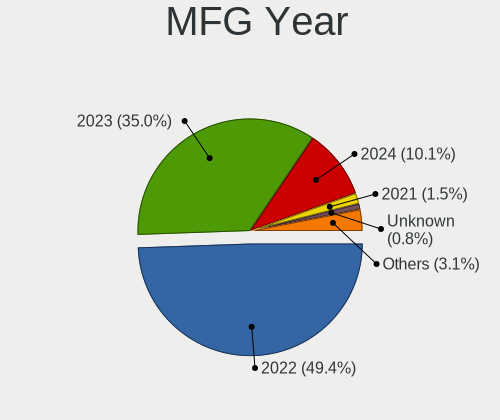
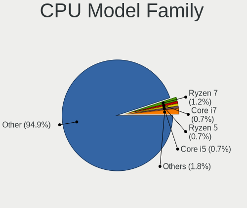
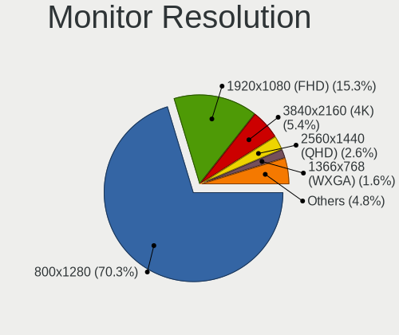
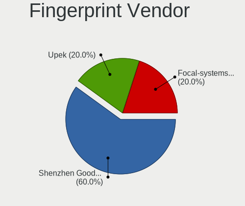

SteamOS - Tested Hardware & Statistics (Notebooks)
--------------------------------------------------

A project to collect tested hardware configurations for SteamOS.

Anyone can contribute to this report by the [hw-probe](https://github.com/linuxhw/hw-probe) tool:

    sudo -E hw-probe -all -upload

Please contribute! Especially if your hardware is rare.

Contents
--------

* [ Test Cases ](#test-cases)

* [ System ](#system)
  - [ OS                       ](#os)
  - [ OS Family                ](#os-family)
  - [ Kernel                   ](#kernel)
  - [ Kernel Family            ](#kernel-family)
  - [ Kernel Major Ver.        ](#kernel-major-ver)
  - [ Arch                     ](#arch)
  - [ DE                       ](#de)
  - [ Display Server           ](#display-server)
  - [ Display Manager          ](#display-manager)
  - [ OS Lang                  ](#os-lang)
  - [ Boot Mode                ](#boot-mode)
  - [ Filesystem               ](#filesystem)
  - [ Part. scheme             ](#part-scheme)
  - [ Dual Boot with Linux/BSD ](#dual-boot-with-linuxbsd)
  - [ Dual Boot (Win)          ](#dual-boot-win)

* [ Board ](#board)
  - [ Vendor                   ](#vendor)
  - [ Model                    ](#model)
  - [ Model Family             ](#model-family)
  - [ MFG Year                 ](#mfg-year)
  - [ Form Factor              ](#form-factor)
  - [ Secure Boot              ](#secure-boot)
  - [ Coreboot                 ](#coreboot)
  - [ RAM Size                 ](#ram-size)
  - [ RAM Used                 ](#ram-used)
  - [ Total Drives             ](#total-drives)
  - [ Has CD-ROM               ](#has-cd-rom)
  - [ Has Ethernet             ](#has-ethernet)
  - [ Has WiFi                 ](#has-wifi)
  - [ Has Bluetooth            ](#has-bluetooth)

* [ Location ](#location)
  - [ Country                  ](#country)
  - [ City                     ](#city)

* [ Drives ](#drives)
  - [ Drive Vendor             ](#drive-vendor)
  - [ Drive Model              ](#drive-model)
  - [ HDD Vendor               ](#hdd-vendor)
  - [ SSD Vendor               ](#ssd-vendor)
  - [ Drive Kind               ](#drive-kind)
  - [ Drive Connector          ](#drive-connector)
  - [ Drive Size               ](#drive-size)
  - [ Space Total              ](#space-total)
  - [ Space Used               ](#space-used)
  - [ Malfunc. Drives          ](#malfunc-drives)
  - [ Malfunc. Drive Vendor    ](#malfunc-drive-vendor)
  - [ Malfunc. HDD Vendor      ](#malfunc-hdd-vendor)
  - [ Malfunc. Drive Kind      ](#malfunc-drive-kind)
  - [ Failed Drives            ](#failed-drives)
  - [ Failed Drive Vendor      ](#failed-drive-vendor)
  - [ Drive Status             ](#drive-status)

* [ Storage controller ](#storage-controller)
  - [ Storage Vendor           ](#storage-vendor)
  - [ Storage Model            ](#storage-model)
  - [ Storage Kind             ](#storage-kind)

* [ Processor ](#processor)
  - [ CPU Vendor               ](#cpu-vendor)
  - [ CPU Model                ](#cpu-model)
  - [ CPU Model Family         ](#cpu-model-family)
  - [ CPU Cores                ](#cpu-cores)
  - [ CPU Sockets              ](#cpu-sockets)
  - [ CPU Threads              ](#cpu-threads)
  - [ CPU Op-Modes             ](#cpu-op-modes)
  - [ CPU Microcode            ](#cpu-microcode)
  - [ CPU Microarch            ](#cpu-microarch)

* [ Graphics ](#graphics)
  - [ GPU Vendor               ](#gpu-vendor)
  - [ GPU Model                ](#gpu-model)
  - [ GPU Combo                ](#gpu-combo)
  - [ GPU Driver               ](#gpu-driver)
  - [ GPU Memory               ](#gpu-memory)

* [ Monitor ](#monitor)
  - [ Monitor Vendor           ](#monitor-vendor)
  - [ Monitor Model            ](#monitor-model)
  - [ Monitor Resolution       ](#monitor-resolution)
  - [ Monitor Diagonal         ](#monitor-diagonal)
  - [ Monitor Width            ](#monitor-width)
  - [ Aspect Ratio             ](#aspect-ratio)
  - [ Monitor Area             ](#monitor-area)
  - [ Pixel Density            ](#pixel-density)
  - [ Multiple Monitors        ](#multiple-monitors)

* [ Network ](#network)
  - [ Net Controller Vendor    ](#net-controller-vendor)
  - [ Net Controller Model     ](#net-controller-model)
  - [ Wireless Vendor          ](#wireless-vendor)
  - [ Wireless Model           ](#wireless-model)
  - [ Ethernet Vendor          ](#ethernet-vendor)
  - [ Ethernet Model           ](#ethernet-model)
  - [ Net Controller Kind      ](#net-controller-kind)
  - [ Used Controller          ](#used-controller)
  - [ NICs                     ](#nics)
  - [ IPv6                     ](#ipv6)

* [ Bluetooth ](#bluetooth)
  - [ Bluetooth Vendor         ](#bluetooth-vendor)
  - [ Bluetooth Model          ](#bluetooth-model)

* [ Sound ](#sound)
  - [ Sound Vendor             ](#sound-vendor)
  - [ Sound Model              ](#sound-model)

* [ Memory ](#memory)
  - [ Memory Vendor            ](#memory-vendor)
  - [ Memory Model             ](#memory-model)
  - [ Memory Kind              ](#memory-kind)
  - [ Memory Form Factor       ](#memory-form-factor)
  - [ Memory Size              ](#memory-size)
  - [ Memory Speed             ](#memory-speed)

* [ Printers & scanners ](#printers--scanners)
  - [ Printer Vendor           ](#printer-vendor)
  - [ Printer Model            ](#printer-model)
  - [ Scanner Vendor           ](#scanner-vendor)
  - [ Scanner Model            ](#scanner-model)

* [ Camera ](#camera)
  - [ Camera Vendor            ](#camera-vendor)
  - [ Camera Model             ](#camera-model)

* [ Security ](#security)
  - [ Fingerprint Vendor       ](#fingerprint-vendor)
  - [ Fingerprint Model        ](#fingerprint-model)
  - [ Chipcard Vendor          ](#chipcard-vendor)
  - [ Chipcard Model           ](#chipcard-model)

* [ Unsupported ](#unsupported)
  - [ Unsupported Devices      ](#unsupported-devices)
  - [ Unsupported Device Types ](#unsupported-device-types)

Test Cases
----------

Total: 115

| Vendor    | Model                       | Probe                                                      | Date         |
|-----------|-----------------------------|------------------------------------------------------------|--------------|
| GPD       | G1619-02                    | [c61c4280c8](https://linux-hardware.org/?probe=c61c4280c8) | Jul 31, 2022 |
| Valve     | Jupiter                     | [ee3b662083](https://linux-hardware.org/?probe=ee3b662083) | Jul 30, 2022 |
| Acer      | Aspire A514-54              | [9a18d7476f](https://linux-hardware.org/?probe=9a18d7476f) | Jul 29, 2022 |
| Valve     | Jupiter                     | [225e2c825e](https://linux-hardware.org/?probe=225e2c825e) | Jul 29, 2022 |
| Acer      | Aspire A514-54              | [4a6c9ef157](https://linux-hardware.org/?probe=4a6c9ef157) | Jul 28, 2022 |
| Valve     | Jupiter                     | [dffaa71aed](https://linux-hardware.org/?probe=dffaa71aed) | Jul 28, 2022 |
| Valve     | Jupiter                     | [35608b206c](https://linux-hardware.org/?probe=35608b206c) | Jul 27, 2022 |
| Valve     | Jupiter                     | [e35fa6e699](https://linux-hardware.org/?probe=e35fa6e699) | Jul 27, 2022 |
| Valve     | Jupiter                     | [f43cbe28e9](https://linux-hardware.org/?probe=f43cbe28e9) | Jul 27, 2022 |
| Valve     | Jupiter                     | [d4e4413f9b](https://linux-hardware.org/?probe=d4e4413f9b) | Jul 26, 2022 |
| Valve     | Jupiter                     | [9c34e91c79](https://linux-hardware.org/?probe=9c34e91c79) | Jul 26, 2022 |
| Valve     | Jupiter                     | [b605f923c6](https://linux-hardware.org/?probe=b605f923c6) | Jul 25, 2022 |
| Valve     | Jupiter                     | [3e7b7cb8cd](https://linux-hardware.org/?probe=3e7b7cb8cd) | Jul 23, 2022 |
| Alienware | m17                         | [e14db26b9b](https://linux-hardware.org/?probe=e14db26b9b) | Jul 23, 2022 |
| Valve     | Jupiter                     | [ca07489d53](https://linux-hardware.org/?probe=ca07489d53) | Jul 23, 2022 |
| Valve     | Jupiter                     | [1860c6d71f](https://linux-hardware.org/?probe=1860c6d71f) | Jul 23, 2022 |
| Valve     | Jupiter                     | [2d0db23de3](https://linux-hardware.org/?probe=2d0db23de3) | Jul 23, 2022 |
| Valve     | Jupiter                     | [4aece18875](https://linux-hardware.org/?probe=4aece18875) | Jul 23, 2022 |
| Valve     | Jupiter                     | [44dca72cbb](https://linux-hardware.org/?probe=44dca72cbb) | Jul 22, 2022 |
| Unknown   | Unknown                     | [96af389676](https://linux-hardware.org/?probe=96af389676) | Jul 22, 2022 |
| ASRock    | X570 Extreme4 WiFi ax       | [bc52038c74](https://linux-hardware.org/?probe=bc52038c74) | Jul 21, 2022 |
| Valve     | Jupiter                     | [0cd166bdb1](https://linux-hardware.org/?probe=0cd166bdb1) | Jul 21, 2022 |
| Valve     | Jupiter                     | [2c1ad04467](https://linux-hardware.org/?probe=2c1ad04467) | Jul 18, 2022 |
| Valve     | Jupiter                     | [7f27efe00e](https://linux-hardware.org/?probe=7f27efe00e) | Jul 17, 2022 |
| HP        | Pavilion 17                 | [722f4eb4a9](https://linux-hardware.org/?probe=722f4eb4a9) | Jul 17, 2022 |
| Valve     | Jupiter                     | [b639365efd](https://linux-hardware.org/?probe=b639365efd) | Jul 16, 2022 |
| Valve     | Jupiter                     | [6c954fab9d](https://linux-hardware.org/?probe=6c954fab9d) | Jul 16, 2022 |
| Valve     | Jupiter                     | [eec9897935](https://linux-hardware.org/?probe=eec9897935) | Jul 15, 2022 |
| Valve     | Jupiter                     | [d4be0d94b4](https://linux-hardware.org/?probe=d4be0d94b4) | Jul 14, 2022 |
| Valve     | Jupiter                     | [d2f117e7f3](https://linux-hardware.org/?probe=d2f117e7f3) | Jul 14, 2022 |
| Dell      | XPS 15 9570                 | [e157e6d524](https://linux-hardware.org/?probe=e157e6d524) | Jul 14, 2022 |
| Valve     | Jupiter                     | [f7d66c8d35](https://linux-hardware.org/?probe=f7d66c8d35) | Jul 10, 2022 |
| Valve     | Jupiter                     | [0c2ea27c49](https://linux-hardware.org/?probe=0c2ea27c49) | Jul 09, 2022 |
| Valve     | Jupiter                     | [98711d54c1](https://linux-hardware.org/?probe=98711d54c1) | Jul 08, 2022 |
| Lenovo    | ThinkBook 13s G3 ACN 20Y... | [c3c73948f5](https://linux-hardware.org/?probe=c3c73948f5) | Jul 08, 2022 |
| Valve     | Jupiter                     | [3ede093138](https://linux-hardware.org/?probe=3ede093138) | Jul 07, 2022 |
| Valve     | Jupiter                     | [458276506d](https://linux-hardware.org/?probe=458276506d) | Jul 06, 2022 |
| Valve     | Jupiter                     | [663562cc6b](https://linux-hardware.org/?probe=663562cc6b) | Jul 06, 2022 |
| Valve     | Jupiter                     | [e640bab55c](https://linux-hardware.org/?probe=e640bab55c) | Jul 05, 2022 |
| Valve     | Jupiter                     | [0bd46afcda](https://linux-hardware.org/?probe=0bd46afcda) | Jul 04, 2022 |
| Valve     | Jupiter                     | [766a3583f0](https://linux-hardware.org/?probe=766a3583f0) | Jul 04, 2022 |
| Valve     | Jupiter                     | [ac0c161f66](https://linux-hardware.org/?probe=ac0c161f66) | Jul 02, 2022 |
| Valve     | Jupiter                     | [c591d23b4d](https://linux-hardware.org/?probe=c591d23b4d) | Jul 01, 2022 |
| Valve     | Jupiter                     | [bee9822ef6](https://linux-hardware.org/?probe=bee9822ef6) | Jun 30, 2022 |
| Valve     | Jupiter                     | [e98c07bc79](https://linux-hardware.org/?probe=e98c07bc79) | Jun 29, 2022 |
| Valve     | Jupiter                     | [261590e542](https://linux-hardware.org/?probe=261590e542) | Jun 29, 2022 |
| Valve     | Jupiter                     | [7c233f0a07](https://linux-hardware.org/?probe=7c233f0a07) | Jun 29, 2022 |
| Valve     | Jupiter                     | [e80815c8d4](https://linux-hardware.org/?probe=e80815c8d4) | Jun 27, 2022 |
| Valve     | Jupiter                     | [65e5ab29fd](https://linux-hardware.org/?probe=65e5ab29fd) | Jun 26, 2022 |
| Valve     | Jupiter                     | [e51f5d8645](https://linux-hardware.org/?probe=e51f5d8645) | Jun 26, 2022 |
| Valve     | Jupiter                     | [b4dd19f939](https://linux-hardware.org/?probe=b4dd19f939) | Jun 25, 2022 |
| Valve     | Jupiter                     | [c9ed3cf311](https://linux-hardware.org/?probe=c9ed3cf311) | Jun 23, 2022 |
| Dell      | G15 5510                    | [9c5777f505](https://linux-hardware.org/?probe=9c5777f505) | Jun 23, 2022 |
| Valve     | Jupiter                     | [213fbe4dd2](https://linux-hardware.org/?probe=213fbe4dd2) | Jun 22, 2022 |
| Valve     | Jupiter                     | [262a7f0cd4](https://linux-hardware.org/?probe=262a7f0cd4) | Jun 22, 2022 |
| Valve     | Jupiter                     | [f8722866b2](https://linux-hardware.org/?probe=f8722866b2) | Jun 22, 2022 |
| Valve     | Jupiter                     | [aa18022bce](https://linux-hardware.org/?probe=aa18022bce) | Jun 22, 2022 |
| Valve     | Jupiter                     | [000682313d](https://linux-hardware.org/?probe=000682313d) | Jun 20, 2022 |
| Valve     | Jupiter                     | [363ab9e4ea](https://linux-hardware.org/?probe=363ab9e4ea) | Jun 20, 2022 |
| Valve     | Jupiter                     | [dd5765a418](https://linux-hardware.org/?probe=dd5765a418) | Jun 18, 2022 |
| Valve     | Jupiter                     | [8e293bb4b1](https://linux-hardware.org/?probe=8e293bb4b1) | Jun 17, 2022 |
| Valve     | Jupiter                     | [ff0ce08944](https://linux-hardware.org/?probe=ff0ce08944) | Jun 16, 2022 |
| Valve     | Jupiter                     | [68a581ae0b](https://linux-hardware.org/?probe=68a581ae0b) | Jun 12, 2022 |
| HP        | Pavilion Gaming Laptop 1... | [df3f1b5d8f](https://linux-hardware.org/?probe=df3f1b5d8f) | Jun 11, 2022 |
| Valve     | Jupiter                     | [2353bf0f9d](https://linux-hardware.org/?probe=2353bf0f9d) | Jun 11, 2022 |
| Valve     | Jupiter                     | [17406c8741](https://linux-hardware.org/?probe=17406c8741) | Jun 11, 2022 |
| Valve     | Jupiter                     | [715e914cba](https://linux-hardware.org/?probe=715e914cba) | Jun 10, 2022 |
| Valve     | Jupiter                     | [cc0a20bb93](https://linux-hardware.org/?probe=cc0a20bb93) | Jun 06, 2022 |
| Valve     | Jupiter                     | [2fb1bfad12](https://linux-hardware.org/?probe=2fb1bfad12) | Jun 04, 2022 |
| Valve     | Jupiter                     | [322bdc2ce3](https://linux-hardware.org/?probe=322bdc2ce3) | Jun 03, 2022 |
| Valve     | Jupiter                     | [780d6b923a](https://linux-hardware.org/?probe=780d6b923a) | Jun 02, 2022 |
| Valve     | Jupiter                     | [f3910c9796](https://linux-hardware.org/?probe=f3910c9796) | May 29, 2022 |
| Valve     | Jupiter                     | [e415de106f](https://linux-hardware.org/?probe=e415de106f) | May 29, 2022 |
| Valve     | Jupiter                     | [0af4b9c805](https://linux-hardware.org/?probe=0af4b9c805) | May 29, 2022 |
| Valve     | Jupiter                     | [06b56d54d4](https://linux-hardware.org/?probe=06b56d54d4) | May 28, 2022 |
| Valve     | Jupiter                     | [1e966da4f8](https://linux-hardware.org/?probe=1e966da4f8) | May 27, 2022 |
| Valve     | Jupiter                     | [c716690aa2](https://linux-hardware.org/?probe=c716690aa2) | May 27, 2022 |
| Valve     | Jupiter                     | [43f315aa0c](https://linux-hardware.org/?probe=43f315aa0c) | May 27, 2022 |
| Valve     | Jupiter                     | [643322d821](https://linux-hardware.org/?probe=643322d821) | May 26, 2022 |
| HP        | Pavilion Gaming Laptop 1... | [b672eefb50](https://linux-hardware.org/?probe=b672eefb50) | May 25, 2022 |
| Valve     | Jupiter                     | [dee0bbedd1](https://linux-hardware.org/?probe=dee0bbedd1) | May 25, 2022 |
| Valve     | Jupiter                     | [c34173715a](https://linux-hardware.org/?probe=c34173715a) | May 24, 2022 |
| Valve     | Jupiter                     | [6ca95b630c](https://linux-hardware.org/?probe=6ca95b630c) | May 23, 2022 |
| Valve     | Jupiter                     | [7d3f9c0a5f](https://linux-hardware.org/?probe=7d3f9c0a5f) | May 23, 2022 |
| Acer      | Aspire A315-23              | [b5d37bf4f2](https://linux-hardware.org/?probe=b5d37bf4f2) | May 22, 2022 |
| Samsung   | 950XDB/951XDB/950XDY        | [fc970670a8](https://linux-hardware.org/?probe=fc970670a8) | May 22, 2022 |
| Valve     | Jupiter                     | [595b06f6c9](https://linux-hardware.org/?probe=595b06f6c9) | May 22, 2022 |
| Valve     | Jupiter                     | [d706d00651](https://linux-hardware.org/?probe=d706d00651) | May 21, 2022 |
| Valve     | Jupiter                     | [317e492fa3](https://linux-hardware.org/?probe=317e492fa3) | May 21, 2022 |
| Valve     | Jupiter                     | [f849597120](https://linux-hardware.org/?probe=f849597120) | May 18, 2022 |
| Valve     | Jupiter                     | [48df6e5c71](https://linux-hardware.org/?probe=48df6e5c71) | May 18, 2022 |
| Valve     | Jupiter                     | [9cf4d23a81](https://linux-hardware.org/?probe=9cf4d23a81) | May 13, 2022 |
| Valve     | Jupiter                     | [79f6db1d69](https://linux-hardware.org/?probe=79f6db1d69) | May 08, 2022 |
| Valve     | Jupiter                     | [771539d18d](https://linux-hardware.org/?probe=771539d18d) | May 03, 2022 |
| Valve     | Jupiter                     | [19d2c51aa6](https://linux-hardware.org/?probe=19d2c51aa6) | May 01, 2022 |
| Valve     | Jupiter                     | [1c826aed5e](https://linux-hardware.org/?probe=1c826aed5e) | Apr 30, 2022 |
| Valve     | Jupiter                     | [4c43342014](https://linux-hardware.org/?probe=4c43342014) | Apr 24, 2022 |
| Valve     | Jupiter                     | [8564bded7f](https://linux-hardware.org/?probe=8564bded7f) | Apr 21, 2022 |
| Valve     | Jupiter                     | [d761657c3a](https://linux-hardware.org/?probe=d761657c3a) | Apr 21, 2022 |
| Valve     | Jupiter                     | [f2e59fcb97](https://linux-hardware.org/?probe=f2e59fcb97) | Apr 20, 2022 |
| Valve     | Jupiter                     | [4f23fab4fd](https://linux-hardware.org/?probe=4f23fab4fd) | Apr 17, 2022 |
| Valve     | Jupiter                     | [ed07e93435](https://linux-hardware.org/?probe=ed07e93435) | Apr 16, 2022 |
| Valve     | Jupiter                     | [48aacdeee8](https://linux-hardware.org/?probe=48aacdeee8) | Apr 15, 2022 |
| Valve     | Jupiter                     | [6a042646dd](https://linux-hardware.org/?probe=6a042646dd) | Apr 14, 2022 |
| Valve     | Jupiter                     | [d4c9dba2a1](https://linux-hardware.org/?probe=d4c9dba2a1) | Apr 14, 2022 |
| Valve     | Jupiter                     | [852b6fb53a](https://linux-hardware.org/?probe=852b6fb53a) | Apr 08, 2022 |
| Valve     | Jupiter                     | [6129b15fb5](https://linux-hardware.org/?probe=6129b15fb5) | Apr 05, 2022 |
| Valve     | Jupiter                     | [ec05067a1d](https://linux-hardware.org/?probe=ec05067a1d) | Apr 03, 2022 |
| Valve     | Jupiter                     | [180c84c856](https://linux-hardware.org/?probe=180c84c856) | Apr 02, 2022 |
| Valve     | Jupiter                     | [d8625616de](https://linux-hardware.org/?probe=d8625616de) | Mar 30, 2022 |
| Valve     | Jupiter                     | [d181a912af](https://linux-hardware.org/?probe=d181a912af) | Mar 23, 2022 |
| Valve     | Jupiter                     | [0b6a21cf35](https://linux-hardware.org/?probe=0b6a21cf35) | Mar 18, 2022 |
| Valve     | Jupiter                     | [85328e8f3d](https://linux-hardware.org/?probe=85328e8f3d) | Mar 17, 2022 |
| Valve     | Jupiter                     | [023aea75e1](https://linux-hardware.org/?probe=023aea75e1) | Mar 14, 2022 |
| Valve     | Jupiter                     | [c7f6388908](https://linux-hardware.org/?probe=c7f6388908) | Mar 11, 2022 |

System
------

OS
--

Installed operating systems

| Name                         | Notebooks | Percent |
|------------------------------|-----------|---------|
| SteamOS 3.2                  | 55        | 54.46%  |
| SteamOS Snapshot             | 21        | 20.79%  |
| SteamOS 3.3                  | 10        | 9.9%    |
| SteamOS 3.1                  | 9         | 8.91%   |
| SteamOS 3.2 (steamdeck-main) | 3         | 2.97%   |
| SteamOS                      | 2         | 1.98%   |
| SteamOS 3.4                  | 1         | 0.99%   |

OS Family
---------

OS without a version

| Name    | Notebooks | Percent |
|---------|-----------|---------|
| SteamOS | 98        | 100%    |

Kernel
------

Version of the Linux kernel

| Version                                            | Notebooks | Percent |
|----------------------------------------------------|-----------|---------|
| 5.13.0-valve15-1-neptune-02197-gf6ec7ad3762a       | 51        | 50.5%   |
| 5.13.0-valve10.1-1-neptune-02144-g7fffaf925dfb     | 16        | 15.84%  |
| 5.13.0-valve10.3-1-neptune-02176-g5fe416c4acd8     | 11        | 10.89%  |
| 5.13.0-valve10.1-2-neptune-dri-02144-g7fffaf925dfb | 7         | 6.93%   |
| 5.13.0-valve14-1-neptune-02195-g5b0f749d00fa       | 5         | 4.95%   |
| 5.13.0-valve21-1-neptune-02209-g2a5bdc1102a0       | 4         | 3.96%   |
| 5.13.0-valve20-1-neptune-02207-gbd986a7e1c7f       | 4         | 3.96%   |
| 5.18.1-arch1_testHoloISO_20220606.1811             | 1         | 0.99%   |
| 5.13.0-valve22-1-neptune-02213-gb68995364335       | 1         | 0.99%   |
| 5.13.0-valve21-2-neptune-02209-g2a5bdc1102a0       | 1         | 0.99%   |

Kernel Family
-------------

Linux kernel without a distro release

| Version | Notebooks | Percent |
|---------|-----------|---------|
| 5.13.0  | 97        | 98.98%  |
| 5.18.1  | 1         | 1.02%   |

Kernel Major Ver.
-----------------

Linux kernel major version

| Version | Notebooks | Percent |
|---------|-----------|---------|
| 5.13    | 97        | 98.98%  |
| 5.18    | 1         | 1.02%   |

Arch
----

OS architecture (x86_64, i586, etc.)

| Name   | Notebooks | Percent |
|--------|-----------|---------|
| x86_64 | 98        | 100%    |

DE
--

Desktop Environment

| Name    | Notebooks | Percent |
|---------|-----------|---------|
| KDE5    | 96        | 97.96%  |
| Unknown | 2         | 2.04%   |

Display Server
--------------

X11 or Wayland

| Name    | Notebooks | Percent |
|---------|-----------|---------|
| X11     | 97        | 98.98%  |
| Unknown | 1         | 1.02%   |

Display Manager
---------------

SDDM, LightDM, etc.

| Name    | Notebooks | Percent |
|---------|-----------|---------|
| Unknown | 98        | 100%    |

OS Lang
-------

Language

| Lang  | Notebooks | Percent |
|-------|-----------|---------|
| en_US | 84        | 85.71%  |
| en_GB | 3         | 3.06%   |
| an_ES | 3         | 3.06%   |
| fr_FR | 2         | 2.04%   |
| pt_BR | 1         | 1.02%   |
| it_IT | 1         | 1.02%   |
| es_ES | 1         | 1.02%   |
| en_DE | 1         | 1.02%   |
| en_CA | 1         | 1.02%   |
| de_DE | 1         | 1.02%   |

Boot Mode
---------

EFI or BIOS

| Mode | Notebooks | Percent |
|------|-----------|---------|
| BIOS | 96        | 97.96%  |
| EFI  | 2         | 2.04%   |

Filesystem
----------

Type of filesystem

| Type  | Notebooks | Percent |
|-------|-----------|---------|
| Btrfs | 98        | 100%    |

Part. scheme
------------

Scheme of partitioning

| Type    | Notebooks | Percent |
|---------|-----------|---------|
| Unknown | 96        | 97.96%  |
| GPT     | 2         | 2.04%   |

Dual Boot with Linux/BSD
------------------------

Hosting more than one Linux/BSD

| Dual boot | Notebooks | Percent |
|-----------|-----------|---------|
| No        | 96        | 97.96%  |
| Yes       | 2         | 2.04%   |

Dual Boot (Win)
---------------

Hosting Linux and Windows

| Dual boot | Notebooks | Percent |
|-----------|-----------|---------|
| No        | 98        | 100%    |

Board
-----

Vendor
------

Motherboard manufacturer

| Name                | Notebooks | Percent |
|---------------------|-----------|---------|
| Valve               | 85        | 86.73%  |
| Hewlett-Packard     | 3         | 3.06%   |
| Dell                | 2         | 2.04%   |
| Acer                | 2         | 2.04%   |
| Samsung Electronics | 1         | 1.02%   |
| Lenovo              | 1         | 1.02%   |
| GPD                 | 1         | 1.02%   |
| ASRock              | 1         | 1.02%   |
| Alienware           | 1         | 1.02%   |
| Unknown             | 1         | 1.02%   |

Model
-----

Motherboard model

| Name                                | Notebooks | Percent |
|-------------------------------------|-----------|---------|
| Valve Jupiter                       | 85        | 86.73%  |
| Samsung 950XDB/951XDB/950XDY        | 1         | 1.02%   |
| Lenovo ThinkBook 13s G3 ACN 20YA    | 1         | 1.02%   |
| HP Pavilion Gaming Laptop 15-ec2xxx | 1         | 1.02%   |
| HP Pavilion Gaming Laptop 15-dk0xxx | 1         | 1.02%   |
| HP Pavilion 17                      | 1         | 1.02%   |
| GPD G1619-02                        | 1         | 1.02%   |
| Dell XPS 15 9570                    | 1         | 1.02%   |
| Dell G15 5510                       | 1         | 1.02%   |
| ASRock X570 Extreme4 WiFi ax        | 1         | 1.02%   |
| Alienware m17                       | 1         | 1.02%   |
| Acer Aspire A514-54                 | 1         | 1.02%   |
| Acer Aspire A315-23                 | 1         | 1.02%   |
| Unknown                             | 1         | 1.02%   |

Model Family
------------

Motherboard model prefix

| Name             | Notebooks | Percent |
|------------------|-----------|---------|
| Valve Jupiter    | 85        | 86.73%  |
| HP Pavilion      | 3         | 3.06%   |
| Acer Aspire      | 2         | 2.04%   |
| Samsung 950XDB   | 1         | 1.02%   |
| Lenovo ThinkBook | 1         | 1.02%   |
| GPD G1619-02     | 1         | 1.02%   |
| Dell XPS         | 1         | 1.02%   |
| Dell G15         | 1         | 1.02%   |
| ASRock X570      | 1         | 1.02%   |
| Alienware m17    | 1         | 1.02%   |
| Unknown          | 1         | 1.02%   |

MFG Year
--------

Motherboard manufacture year

| Year    | Notebooks | Percent |
|---------|-----------|---------|
| 2022    | 73        | 74.49%  |
| Unknown | 12        | 12.24%  |
| 2021    | 7         | 7.14%   |
| 2020    | 2         | 2.04%   |
| 2019    | 2         | 2.04%   |
| 2018    | 1         | 1.02%   |
| 2013    | 1         | 1.02%   |

Form Factor
-----------

Physical design of the computer

| Name     | Notebooks | Percent |
|----------|-----------|---------|
| Notebook | 98        | 100%    |

Secure Boot
-----------

Enabled or disabled

| State    | Notebooks | Percent |
|----------|-----------|---------|
| Disabled | 98        | 100%    |

Coreboot
--------

Have coreboot on board

| Used | Notebooks | Percent |
|------|-----------|---------|
| No   | 98        | 100%    |

RAM Size
--------

Total RAM memory

| Size in GB  | Notebooks | Percent |
|-------------|-----------|---------|
| 8.01-16.0   | 89        | 90.82%  |
| 4.01-8.0    | 4         | 4.08%   |
| 16.01-24.0  | 4         | 4.08%   |
| 64.01-256.0 | 1         | 1.02%   |

RAM Used
--------

Used RAM memory

| Used GB  | Notebooks | Percent |
|----------|-----------|---------|
| 2.01-3.0 | 54        | 52.94%  |
| 3.01-4.0 | 22        | 21.57%  |
| 4.01-8.0 | 17        | 16.67%  |
| 1.01-2.0 | 9         | 8.82%   |

Total Drives
------------

Number of drives on board

| Drives | Notebooks | Percent |
|--------|-----------|---------|
| 2      | 56        | 56.57%  |
| 1      | 39        | 39.39%  |
| 3      | 2         | 2.02%   |
| 4      | 1         | 1.01%   |
| 0      | 1         | 1.01%   |

Has CD-ROM
----------

Has CD-ROM on board

| Presented | Notebooks | Percent |
|-----------|-----------|---------|
| No        | 96        | 97.96%  |
| Yes       | 2         | 2.04%   |

Has Ethernet
------------

Has Ethernet on board

| Presented | Notebooks | Percent |
|-----------|-----------|---------|
| No        | 71        | 72.45%  |
| Yes       | 27        | 27.55%  |

Has WiFi
--------

Has WiFi module

| Presented | Notebooks | Percent |
|-----------|-----------|---------|
| Yes       | 98        | 100%    |

Has Bluetooth
-------------

Has Bluetooth module

| Presented | Notebooks | Percent |
|-----------|-----------|---------|
| Yes       | 98        | 100%    |

Location
--------

Country
-------

Geographic location (country)

| Country     | Notebooks | Percent |
|-------------|-----------|---------|
| USA         | 47        | 47.96%  |
| Germany     | 13        | 13.27%  |
| UK          | 9         | 9.18%   |
| Spain       | 4         | 4.08%   |
| France      | 4         | 4.08%   |
| Italy       | 3         | 3.06%   |
| Canada      | 3         | 3.06%   |
| Netherlands | 2         | 2.04%   |
| Brazil      | 2         | 2.04%   |
| Sweden      | 1         | 1.02%   |
| Slovakia    | 1         | 1.02%   |
| Poland      | 1         | 1.02%   |
| Malaysia    | 1         | 1.02%   |
| Latvia      | 1         | 1.02%   |
| Japan       | 1         | 1.02%   |
| Hungary     | 1         | 1.02%   |
| Greece      | 1         | 1.02%   |
| Czechia     | 1         | 1.02%   |
| Belgium     | 1         | 1.02%   |
| Austria     | 1         | 1.02%   |

City
----

Geographic location (city)

| City                   | Notebooks | Percent |
|------------------------|-----------|---------|
| Colorado Springs       | 2         | 2%      |
| Wokingham              | 1         | 1%      |
| Whitley Bay            | 1         | 1%      |
| Washington             | 1         | 1%      |
| Warsaw                 | 1         | 1%      |
| Victoria               | 1         | 1%      |
| Tulsa                  | 1         | 1%      |
| Treviso                | 1         | 1%      |
| Torre del Mar          | 1         | 1%      |
| Thessaloniki           | 1         | 1%      |
| Temecula               | 1         | 1%      |
| Sunnyvale              | 1         | 1%      |
| Stockholm              | 1         | 1%      |
| St Louis               | 1         | 1%      |
| Spanish Fork           | 1         | 1%      |
| Southlake              | 1         | 1%      |
| Sindelfingen           | 1         | 1%      |
| Shepperton             | 1         | 1%      |
| Seri Kembangan         | 1         | 1%      |
| Seattle                | 1         | 1%      |
| Schwerin               | 1         | 1%      |
| Santa Cruz de Tenerife | 1         | 1%      |
| San Diego              | 1         | 1%      |
| Sacramento             | 1         | 1%      |
| Rueil-Malmaison        | 1         | 1%      |
| Rome                   | 1         | 1%      |
| Rohnert Park           | 1         | 1%      |
| Roanoke                | 1         | 1%      |
| Riga                   | 1         | 1%      |
| Reignier-Esery         | 1         | 1%      |
| Portland               | 1         | 1%      |
| Portage                | 1         | 1%      |
| Phoenix                | 1         | 1%      |
| Philadelphia           | 1         | 1%      |
| Palatine               | 1         | 1%      |
| Ooltewah               | 1         | 1%      |
| Odenton                | 1         | 1%      |
| Oakham                 | 1         | 1%      |
| Nuremberg              | 1         | 1%      |
| Newberg                | 1         | 1%      |
| New York               | 1         | 1%      |
| Nashville              | 1         | 1%      |
| Mooresville            | 1         | 1%      |
| Mississauga            | 1         | 1%      |
| Midlothian             | 1         | 1%      |
| Middle Island          | 1         | 1%      |
| McArthur               | 1         | 1%      |
| Maplewood              | 1         | 1%      |
| Manchester             | 1         | 1%      |
| Lodi                   | 1         | 1%      |
| Leicester              | 1         | 1%      |
| Lansing                | 1         | 1%      |
| Kyle                   | 1         | 1%      |
| Knoxville              | 1         | 1%      |
| Klagenfurt             | 1         | 1%      |
| Kenosha                | 1         | 1%      |
| Kansas City            | 1         | 1%      |
| Iwakuni                | 1         | 1%      |
| Iserlohn               | 1         | 1%      |
| Indianapolis           | 1         | 1%      |

Drives
------

Drive Vendor
------------

Hard drive vendors

| Vendor                         | Notebooks | Drives | Percent |
|--------------------------------|-----------|--------|---------|
| Unknown                        | 41        | 41     | 25.63%  |
| Kingston                       | 35        | 37     | 21.88%  |
| Phison                         | 31        | 31     | 19.38%  |
| Unknown                        | 12        | 13     | 7.5%    |
| O2 Micro                       | 9         | 9      | 5.63%   |
| Samsung Electronics            | 8         | 9      | 5%      |
| Silicon Motion                 | 5         | 6      | 3.13%   |
| WDC                            | 2         | 2      | 1.25%   |
| SanDisk                        | 2         | 2      | 1.25%   |
| KIOXIA                         | 2         | 2      | 1.25%   |
| JMicron Technology             | 2         | 2      | 1.25%   |
| ADATA Technology               | 2         | 2      | 1.25%   |
| Toshiba                        | 1         | 1      | 0.63%   |
| Solid State Storage Technology | 1         | 1      | 0.63%   |
| SK hynix                       | 1         | 1      | 0.63%   |
| Seagate                        | 1         | 1      | 0.63%   |
| Micron/Crucial Technology      | 1         | 1      | 0.63%   |
| Lexar 25                       | 1         | 1      | 0.63%   |
| External                       | 1         | 2      | 0.63%   |
| Crucial                        | 1         | 1      | 0.63%   |
| ASMT                           | 1         | 1      | 0.63%   |

Drive Model
-----------

Hard drive models

| Model                                    | Notebooks | Percent |
|------------------------------------------|-----------|---------|
| Kingston NVMe SSD Drive 512GB            | 21        | 13.13%  |
| Phison NVMe SSD Drive 512GB              | 19        | 11.88%  |
| Unknown MMC Card  512GB                  | 17        | 10.63%  |
| Kingston NVMe SSD Drive 256GB            | 14        | 8.75%   |
| Unknown                                  | 12        | 7.5%    |
| Phison NVMe SSD Drive 256GB              | 11        | 6.88%   |
| O2 Micro NVMe SSD Drive 64GB             | 9         | 5.63%   |
| Unknown MMC Card  256GB                  | 6         | 3.75%   |
| Silicon Motion NVMe SSD Drive 256GB      | 4         | 2.5%    |
| Unknown MMC Card  64GB                   | 3         | 1.88%   |
| Unknown MMC Card  498GB                  | 3         | 1.88%   |
| Unknown MMC Card  393GB                  | 3         | 1.88%   |
| Unknown MMC Card  128GB                  | 3         | 1.88%   |
| Samsung NVMe SSD Drive 512GB             | 3         | 1.88%   |
| SanDisk NVMe SSD Drive 512GB             | 2         | 1.25%   |
| JMicron Generic 2TB                      | 2         | 1.25%   |
| WDC WD10SPZX-75Z10T2 1TB                 | 1         | 0.63%   |
| WDC CH SN530 SDBPTPZ-1T00-1024 930GB     | 1         | 0.63%   |
| Unknown MMC Card  500GB                  | 1         | 0.63%   |
| Unknown MMC Card  32GB                   | 1         | 0.63%   |
| Unknown MMC Card  248GB                  | 1         | 0.63%   |
| Unknown MMC Card  1TB                    | 1         | 0.63%   |
| Unknown MMC Card  196GB                  | 1         | 0.63%   |
| Unknown MMC Card  1048GB                 | 1         | 0.63%   |
| Toshiba NVMe SSD Drive 256GB             | 1         | 0.63%   |
| Solid State Storage NVMe SSD Drive 128GB | 1         | 0.63%   |
| SK hynix NVMe SSD Drive 256GB            | 1         | 0.63%   |
| Silicon Motion NVMe SSD Drive 512GB      | 1         | 0.63%   |
| Seagate ST1000LX015-1U7172 1TB           | 1         | 0.63%   |
| Samsung SSD CM871 2.5 7mm 128GB          | 1         | 0.63%   |
| Samsung SSD 860 EVO M.2 250GB            | 1         | 0.63%   |
| Samsung NVMe SSD Drive 500GB             | 1         | 0.63%   |
| Samsung NVMe SSD Drive 1024GB            | 1         | 0.63%   |
| Samsung MZ9LQ1T0HBLB-00B 1TB             | 1         | 0.63%   |
| Phison NVMe SSD Drive 1TB                | 1         | 0.63%   |
| Micron/Crucial NVMe SSD Drive 500GB      | 1         | 0.63%   |
| Lexar 25 6GB SSD                         | 1         | 0.63%   |
| KIOXIA NVMe SSD Drive 512GB              | 1         | 0.63%   |
| KIOXIA NVMe SSD Drive 256GB              | 1         | 0.63%   |
| External USB3.0 1TB                      | 1         | 0.63%   |
| Crucial CT1000BX500SSD1 1TB              | 1         | 0.63%   |
| ASMT 2235 160GB                          | 1         | 0.63%   |
| ADATA NVMe SSD Drive 512GB               | 1         | 0.63%   |
| ADATA NVMe SSD Drive 256GB               | 1         | 0.63%   |

HDD Vendor
----------

Hard disk drive vendors

| Vendor  | Notebooks | Drives | Percent |
|---------|-----------|--------|---------|
| WDC     | 1         | 1      | 33.33%  |
| Seagate | 1         | 1      | 33.33%  |
| ASMT    | 1         | 1      | 33.33%  |

SSD Vendor
----------

Solid state drive vendors

| Vendor              | Notebooks | Drives | Percent |
|---------------------|-----------|--------|---------|
| Samsung Electronics | 2         | 2      | 50%     |
| Lexar 25            | 1         | 1      | 25%     |
| Crucial             | 1         | 1      | 25%     |

Drive Kind
----------

HDD or SSD

| Kind | Notebooks | Drives | Percent |
|------|-----------|--------|---------|
| NVMe | 95        | 105    | 61.69%  |
| MMC  | 52        | 54     | 33.77%  |
| SSD  | 4         | 4      | 2.6%    |
| HDD  | 3         | 3      | 1.95%   |

Drive Connector
---------------

SATA, SAS, NVMe, etc.

| Type | Notebooks | Drives | Percent |
|------|-----------|--------|---------|
| NVMe | 95        | 101    | 60.9%   |
| MMC  | 52        | 54     | 33.33%  |
| SAS  | 5         | 6      | 3.21%   |
| SATA | 4         | 5      | 2.56%   |

Drive Size
----------

Size of hard drive

| Size in TB | Notebooks | Drives | Percent |
|------------|-----------|--------|---------|
| 0.01-0.5   | 4         | 4      | 57.14%  |
| 0.51-1.0   | 3         | 3      | 42.86%  |

Space Total
-----------

Amount of disk space available on the file system

| Size in GB | Notebooks | Percent |
|------------|-----------|---------|
| 251-500    | 46        | 46.94%  |
| 101-250    | 34        | 34.69%  |
| 501-1000   | 10        | 10.2%   |
| 51-100     | 7         | 7.14%   |
| 1001-2000  | 1         | 1.02%   |

Space Used
----------

Amount of used disk space

| Used GB  | Notebooks | Percent |
|----------|-----------|---------|
| 101-250  | 44        | 44%     |
| 251-500  | 22        | 22%     |
| 21-50    | 16        | 16%     |
| 51-100   | 8         | 8%      |
| 1-20     | 7         | 7%      |
| 501-1000 | 3         | 3%      |

Malfunc. Drives
---------------

Drive models with a malfunction

Zero info for selected period =(

Malfunc. Drive Vendor
---------------------

Vendors of faulty drives

Zero info for selected period =(

Malfunc. HDD Vendor
-------------------

Vendors of faulty HDD drives

Zero info for selected period =(

Malfunc. Drive Kind
-------------------

Kinds of faulty drives

Zero info for selected period =(

Failed Drives
-------------

Failed drive models

Zero info for selected period =(

Failed Drive Vendor
-------------------

Failed drive vendors

Zero info for selected period =(

Drive Status
------------

Number of failed and malfunc. drives

| Status   | Notebooks | Drives | Percent |
|----------|-----------|--------|---------|
| Detected | 97        | 164    | 97.98%  |
| Works    | 2         | 2      | 2.02%   |

Storage controller
------------------

Storage Vendor
--------------

Storage controller vendors

| Vendor                         | Notebooks | Percent |
|--------------------------------|-----------|---------|
| Kingston Technology Company    | 35        | 33.33%  |
| Phison Electronics             | 31        | 29.52%  |
| O2 Micro                       | 9         | 8.57%   |
| Samsung Electronics            | 6         | 5.71%   |
| Silicon Motion                 | 5         | 4.76%   |
| Intel                          | 4         | 3.81%   |
| AMD                            | 4         | 3.81%   |
| SanDisk                        | 3         | 2.86%   |
| KIOXIA                         | 2         | 1.9%    |
| ADATA Technology               | 2         | 1.9%    |
| Toshiba America Info Systems   | 1         | 0.95%   |
| Solid State Storage Technology | 1         | 0.95%   |
| SK hynix                       | 1         | 0.95%   |
| Micron/Crucial Technology      | 1         | 0.95%   |

Storage Model
-------------

Storage controller models

| Model                                                   | Notebooks | Percent |
|---------------------------------------------------------|-----------|---------|
| Kingston Company OM3PDP3 NVMe SSD                       | 34        | 31.78%  |
| Phison PS5013 E13 NVMe Controller                       | 30        | 28.04%  |
| O2 Micro Non-Volatile memory controller                 | 9         | 8.41%   |
| Silicon Motion SM2263EN/SM2263XT SSD Controller         | 5         | 4.67%   |
| Samsung NVMe SSD Controller 980                         | 5         | 4.67%   |
| AMD FCH SATA Controller [AHCI mode]                     | 4         | 3.74%   |
| Intel 82801 Mobile SATA Controller [RAID mode]          | 3         | 2.8%    |
| SanDisk Non-Volatile memory controller                  | 2         | 1.87%   |
| KIOXIA NVMe SSD Controller BG4                          | 2         | 1.87%   |
| ADATA Non-Volatile memory controller                    | 2         | 1.87%   |
| Toshiba America Info Systems BG3 NVMe SSD Controller    | 1         | 0.93%   |
| Solid State Storage Non-Volatile memory controller      | 1         | 0.93%   |
| SK hynix Gold P31 SSD                                   | 1         | 0.93%   |
| SanDisk PC SN530 NVMe SSD                               | 1         | 0.93%   |
| Samsung NVMe SSD Controller SM981/PM981/PM983           | 1         | 0.93%   |
| Phison E12 NVMe Controller                              | 1         | 0.93%   |
| Micron/Crucial P2 NVMe PCIe SSD                         | 1         | 0.93%   |
| Kingston Company Company Non-Volatile memory controller | 1         | 0.93%   |
| Intel Volume Management Device NVMe RAID Controller     | 1         | 0.93%   |
| Intel Tiger Lake-LP SATA Controller                     | 1         | 0.93%   |
| AMD FCH IDE Controller                                  | 1         | 0.93%   |

Storage Kind
------------

Kind of storage controller (IDE, SATA, NVMe, SAS, ...)

| Kind | Notebooks | Percent |
|------|-----------|---------|
| NVMe | 95        | 90.48%  |
| SATA | 5         | 4.76%   |
| RAID | 4         | 3.81%   |
| IDE  | 1         | 0.95%   |

Processor
---------

CPU Vendor
----------

Processor vendors

| Vendor | Notebooks | Percent |
|--------|-----------|---------|
| AMD    | 91        | 92.86%  |
| Intel  | 7         | 7.14%   |

CPU Model
---------

Processor models

| Model                                         | Notebooks | Percent |
|-----------------------------------------------|-----------|---------|
| AMD Custom APU 0405                           | 85        | 86.73%  |
| Intel Core i7-8750H CPU @ 2.20GHz             | 2         | 2.04%   |
| Intel Core i7-10870H CPU @ 2.20GHz            | 1         | 1.02%   |
| Intel Core i5-9300H CPU @ 2.40GHz             | 1         | 1.02%   |
| Intel 11th Gen Core i7-1165G7 @ 2.80GHz       | 1         | 1.02%   |
| Intel 11th Gen Core i7-1160G7 @ 1.20GHz       | 1         | 1.02%   |
| Intel 11th Gen Core i3-1115G4 @ 3.00GHz       | 1         | 1.02%   |
| AMD Ryzen 9 3900X 12-Core Processor           | 1         | 1.02%   |
| AMD Ryzen 7 4800U with Radeon Graphics        | 1         | 1.02%   |
| AMD Ryzen 5 5600U with Radeon Graphics        | 1         | 1.02%   |
| AMD Ryzen 5 5600H with Radeon Graphics        | 1         | 1.02%   |
| AMD Ryzen 5 3500U with Radeon Vega Mobile Gfx | 1         | 1.02%   |
| AMD A8-4500M APU with Radeon HD Graphics      | 1         | 1.02%   |

CPU Model Family
----------------

Processor model prefix

| Model         | Notebooks | Percent |
|---------------|-----------|---------|
| Other         | 88        | 89.8%   |
| Intel Core i7 | 3         | 3.06%   |
| AMD Ryzen 5   | 3         | 3.06%   |
| Intel Core i5 | 1         | 1.02%   |
| AMD Ryzen 9   | 1         | 1.02%   |
| AMD Ryzen 7   | 1         | 1.02%   |
| AMD A8        | 1         | 1.02%   |

CPU Cores
---------

Number of processor cores

| Number | Notebooks | Percent |
|--------|-----------|---------|
| 4      | 89        | 90.82%  |
| 6      | 3         | 3.06%   |
| 2      | 3         | 3.06%   |
| 8      | 2         | 2.04%   |
| 12     | 1         | 1.02%   |

CPU Sockets
-----------

Number of sockets

| Number | Notebooks | Percent |
|--------|-----------|---------|
| 1      | 98        | 100%    |

CPU Threads
-----------

Threads per core (Hyper-Threading)

| Number | Notebooks | Percent |
|--------|-----------|---------|
| 2      | 98        | 100%    |

CPU Op-Modes
------------

CPU Operation Modes (32-bit, 64-bit)

| Op mode        | Notebooks | Percent |
|----------------|-----------|---------|
| 32-bit, 64-bit | 98        | 100%    |

CPU Microcode
-------------

Microcode number

| Number     | Notebooks | Percent |
|------------|-----------|---------|
| Unknown    | 96        | 97.96%  |
| 0x08900201 | 2         | 2.04%   |

CPU Microarch
-------------

Microarchitecture

| Name       | Notebooks | Percent |
|------------|-----------|---------|
| Unknown    | 85        | 86.73%  |
| TigerLake  | 3         | 3.06%   |
| KabyLake   | 3         | 3.06%   |
| Zen 3      | 2         | 2.04%   |
| Zen 2      | 2         | 2.04%   |
| Zen+       | 1         | 1.02%   |
| Piledriver | 1         | 1.02%   |
| CometLake  | 1         | 1.02%   |

Graphics
--------

GPU Vendor
----------

Vendors of graphics cards

| Vendor | Notebooks | Percent |
|--------|-----------|---------|
| AMD    | 91        | 88.35%  |
| Intel  | 7         | 6.8%    |
| Nvidia | 5         | 4.85%   |

GPU Model
---------

Graphics card models

| Model                                                                | Notebooks | Percent |
|----------------------------------------------------------------------|-----------|---------|
| AMD VanGogh [AMD Custom GPU 0405]                                    | 85        | 82.52%  |
| Intel CoffeeLake-H GT2 [UHD Graphics 630]                            | 3         | 2.91%   |
| AMD Cezanne                                                          | 2         | 1.94%   |
| Nvidia TU117M                                                        | 1         | 0.97%   |
| Nvidia TU106M [GeForce RTX 2060 Mobile]                              | 1         | 0.97%   |
| Nvidia GP107M [GeForce GTX 1050 Ti Mobile]                           | 1         | 0.97%   |
| Nvidia GP107M [GeForce GTX 1050 3 GB Max-Q]                          | 1         | 0.97%   |
| Nvidia GA106M [GeForce RTX 3060 Mobile / Max-Q]                      | 1         | 0.97%   |
| Intel TigerLake-LP GT2 [Iris Xe Graphics]                            | 1         | 0.97%   |
| Intel Tiger Lake UHD Graphics                                        | 1         | 0.97%   |
| Intel Tiger Lake Iris Xe Graphics                                    | 1         | 0.97%   |
| Intel CometLake-H GT2 [UHD Graphics]                                 | 1         | 0.97%   |
| AMD Trinity [Radeon HD 7640G]                                        | 1         | 0.97%   |
| AMD Renoir                                                           | 1         | 0.97%   |
| AMD Picasso/Raven 2 [Radeon Vega Series / Radeon Vega Mobile Series] | 1         | 0.97%   |
| AMD Navi 10 [Radeon RX 5600 OEM/5600 XT / 5700/5700 XT]              | 1         | 0.97%   |

GPU Combo
---------

Combinations of graphics cards

| Name           | Notebooks | Percent |
|----------------|-----------|---------|
| 1 x AMD        | 90        | 91.84%  |
| Intel + Nvidia | 4         | 4.08%   |
| 1 x Intel      | 3         | 3.06%   |
| AMD + Nvidia   | 1         | 1.02%   |

GPU Driver
----------

Free vs proprietary

| Driver      | Notebooks | Percent |
|-------------|-----------|---------|
| Free        | 95        | 96.94%  |
| Proprietary | 3         | 3.06%   |

GPU Memory
----------

Total video memory

| Size in GB | Notebooks | Percent |
|------------|-----------|---------|
| Unknown    | 96        | 97.96%  |
| 0.51-1.0   | 2         | 2.04%   |

Monitor
-------

Monitor Vendor
--------------

Monitor vendors

| Vendor               | Notebooks | Percent |
|----------------------|-----------|---------|
| ANX                  | 83        | 71.55%  |
| Samsung Electronics  | 3         | 2.59%   |
| Goldstar             | 3         | 2.59%   |
| Chimei Innolux       | 3         | 2.59%   |
| Vizio                | 2         | 1.72%   |
| Philips              | 2         | 1.72%   |
| BOE                  | 2         | 1.72%   |
| AU Optronics         | 2         | 1.72%   |
| AOC                  | 2         | 1.72%   |
| ZSC                  | 1         | 0.86%   |
| YTH                  | 1         | 0.86%   |
| Valve                | 1         | 0.86%   |
| TCL                  | 1         | 0.86%   |
| Sun                  | 1         | 0.86%   |
| Sony                 | 1         | 0.86%   |
| Sharp                | 1         | 0.86%   |
| Microsoft            | 1         | 0.86%   |
| LTM                  | 1         | 0.86%   |
| LG Display           | 1         | 0.86%   |
| Hewlett-Packard      | 1         | 0.86%   |
| EXP                  | 1         | 0.86%   |
| Dell                 | 1         | 0.86%   |
| Ancor Communications | 1         | 0.86%   |

Monitor Model
-------------

Monitor models

| Model                                                                  | Notebooks | Percent |
|------------------------------------------------------------------------|-----------|---------|
| ANX ANX7530 U ANX7539 800x1280                                         | 83        | 71.55%  |
| ZSC FHD HDR ZSCBC32 1920x1080 344x195mm 15.6-inch                      | 1         | 0.86%   |
| YTH HS133PC YTH1330 1920x1080 255x220mm 13.3-inch                      | 1         | 0.86%   |
| Vizio D32x-D1 VIZ1005 1920x1080 700x390mm 31.5-inch                    | 1         | 0.86%   |
| Vizio D24f-J09 VIZ1044 1920x1080 521x293mm 23.5-inch                   | 1         | 0.86%   |
| Valve ANX7530 U VLV3001 800x1280 100x150mm 7.1-inch                    | 1         | 0.86%   |
| TCL SMART TV TCL6586 3840x2160 1209x680mm 54.6-inch                    | 1         | 0.86%   |
| Sun SCEI MONITOR SCE0301 1920x1080 522x294mm 23.6-inch                 | 1         | 0.86%   |
| Sony BW8 MS_9001 1200x1920                                             | 1         | 0.86%   |
| Sharp LCD Monitor SHP149A 1920x1080 344x194mm 15.5-inch                | 1         | 0.86%   |
| Samsung Electronics S27HG5x SAM0E10 2560x1440 598x336mm 27.0-inch      | 1         | 0.86%   |
| Samsung Electronics LCD Monitor SDC4159 1920x1080 344x194mm 15.5-inch  | 1         | 0.86%   |
| Samsung Electronics LCD Monitor SAM0A7E 1920x1080 1060x626mm 48.5-inch | 1         | 0.86%   |
| Philips PHL 345B1C PHL093D 3440x1440 797x334mm 34.0-inch               | 1         | 0.86%   |
| Philips PHL 326M6V PHLC193 3840x2160 698x398mm 31.6-inch               | 1         | 0.86%   |
| Microsoft Xbox One MSH0001 1920x1080 1210x680mm 54.6-inch              | 1         | 0.86%   |
| LTM LT7911D LTM08E1 1024x768 140x140mm 7.8-inch                        | 1         | 0.86%   |
| LG Display LCD Monitor LGD0372 1600x900 382x215mm 17.3-inch            | 1         | 0.86%   |
| Hewlett-Packard 25x HPN357F 1920x1080 544x303mm 24.5-inch              | 1         | 0.86%   |
| Goldstar ULTRAWIDE GSM76F6 3440x1440 800x335mm 34.1-inch               | 1         | 0.86%   |
| Goldstar TV SSCR2 GSMC0C8 3840x2160                                    | 1         | 0.86%   |
| Goldstar LG ULTRAGEAR GSM775B 1920x1080 700x390mm 31.5-inch            | 1         | 0.86%   |
| EXP EPDP17.1127 EXP9632 1920x1080 1150x650mm 52.0-inch                 | 1         | 0.86%   |
| Dell U2715H DELD069 2560x1440 597x336mm 27.0-inch                      | 1         | 0.86%   |
| Chimei Innolux LCD Monitor CMN1738 1920x1080 381x214mm 17.2-inch       | 1         | 0.86%   |
| Chimei Innolux LCD Monitor CMN14D4 1920x1080 309x173mm 13.9-inch       | 1         | 0.86%   |
| Chimei Innolux LCD Monitor CMN13B0 2560x1600 286x178mm 13.3-inch       | 1         | 0.86%   |
| BOE LCD Monitor BOE094D 1920x1080 344x194mm 15.5-inch                  | 1         | 0.86%   |
| BOE LCD Monitor BOE0852 1920x1080 344x194mm 15.5-inch                  | 1         | 0.86%   |
| AU Optronics LCD Monitor AUOED8F 1920x1080 344x193mm 15.5-inch         | 1         | 0.86%   |
| AU Optronics LCD Monitor AUO81EC 1366x768 344x193mm 15.5-inch          | 1         | 0.86%   |
| AOC AG352UCG6 AOC3525 3440x1440 819x346mm 35.0-inch                    | 1         | 0.86%   |
| AOC 27G1G4 AOC2701 1920x1080 598x336mm 27.0-inch                       | 1         | 0.86%   |
| Ancor Communications ASUS VH242H ACI24F3 1920x1080 521x293mm 23.5-inch | 1         | 0.86%   |

Monitor Resolution
------------------

Monitor screen resolution

| Resolution      | Notebooks | Percent |
|-----------------|-----------|---------|
| 800x1280        | 83        | 72.17%  |
| 1920x1080 (FHD) | 18        | 15.65%  |
| 3840x2160 (4K)  | 3         | 2.61%   |
| 3440x1440       | 3         | 2.61%   |
| 2560x1440 (QHD) | 3         | 2.61%   |
| 2560x1600       | 2         | 1.74%   |
| 1600x900 (HD+)  | 1         | 0.87%   |
| 1366x768 (WXGA) | 1         | 0.87%   |
| 1024x768 (XGA)  | 1         | 0.87%   |

Monitor Diagonal
----------------

Diagonal size in inches

| Inches  | Notebooks | Percent |
|---------|-----------|---------|
| Unknown | 83        | 72.17%  |
| 15      | 7         | 6.09%   |
| 31      | 3         | 2.61%   |
| 27      | 3         | 2.61%   |
| 13      | 3         | 2.61%   |
| 54      | 2         | 1.74%   |
| 23      | 2         | 1.74%   |
| 17      | 2         | 1.74%   |
| 7       | 2         | 1.74%   |
| 72      | 1         | 0.87%   |
| 57      | 1         | 0.87%   |
| 52      | 1         | 0.87%   |
| 40      | 1         | 0.87%   |
| 35      | 1         | 0.87%   |
| 34      | 1         | 0.87%   |
| 24      | 1         | 0.87%   |
| 8       | 1         | 0.87%   |

Monitor Width
-------------

Physical width

| Width in mm | Notebooks | Percent |
|-------------|-----------|---------|
| Unknown     | 83        | 72.17%  |
| 301-350     | 8         | 6.96%   |
| 501-600     | 6         | 5.22%   |
| 1001-1500   | 4         | 3.48%   |
| 601-700     | 3         | 2.61%   |
| 801-900     | 2         | 1.74%   |
| 351-400     | 2         | 1.74%   |
| 201-300     | 2         | 1.74%   |
| 101-200     | 2         | 1.74%   |
| 701-800     | 1         | 0.87%   |
| 1501-2000   | 1         | 0.87%   |
| 1-100       | 1         | 0.87%   |

Aspect Ratio
------------

Proportional relationship between the width and the height

| Ratio | Notebooks | Percent |
|-------|-----------|---------|
| 0.62  | 84        | 74.34%  |
| 16/9  | 24        | 21.24%  |
| 21/9  | 2         | 1.77%   |
| 16/10 | 1         | 0.88%   |
| 1.00  | 1         | 0.88%   |
| 0.67  | 1         | 0.88%   |

Monitor Area
------------

Area in inch

| Area in inch | Notebooks | Percent |
|----------------|-----------|---------|
| Unknown        | 83        | 72.17%  |
| 101-110        | 7         | 6.09%   |
| More than 1000 | 5         | 4.35%   |
| 351-500        | 5         | 4.35%   |
| 1-40           | 3         | 2.61%   |
| 301-350        | 3         | 2.61%   |
| 71-80          | 2         | 1.74%   |
| 201-250        | 2         | 1.74%   |
| 121-130        | 2         | 1.74%   |
| 81-90          | 1         | 0.87%   |
| 251-300        | 1         | 0.87%   |
| 501-1000       | 1         | 0.87%   |

Pixel Density
-------------

Pixels per inch

| Density       | Notebooks | Percent |
|---------------|-----------|---------|
| Unknown       | 83        | 71.55%  |
| 121-160       | 9         | 7.76%   |
| 51-100        | 9         | 7.76%   |
| 101-120       | 6         | 5.17%   |
| 1-50          | 4         | 3.45%   |
| 161-240       | 4         | 3.45%   |
| More than 240 | 1         | 0.86%   |

Multiple Monitors
-----------------

Total monitors connected

| Total | Notebooks | Percent |
|-------|-----------|---------|
| 1     | 82        | 82.83%  |
| 2     | 16        | 16.16%  |
| 3     | 1         | 1.01%   |

Network
-------

Net Controller Vendor
---------------------

Controller vendors

| Vendor                | Notebooks | Percent |
|-----------------------|-----------|---------|
| Realtek Semiconductor | 94        | 81.74%  |
| Intel                 | 8         | 6.96%   |
| ASIX Electronics      | 7         | 6.09%   |
| Qualcomm Atheros      | 3         | 2.61%   |
| TP-Link               | 1         | 0.87%   |
| DisplayLink           | 1         | 0.87%   |
| AVM                   | 1         | 0.87%   |

Net Controller Model
--------------------

Controller models

| Model                                                             | Notebooks | Percent |
|-------------------------------------------------------------------|-----------|---------|
| Realtek RTL8822CE 802.11ac PCIe Wireless Network Adapter          | 85        | 65.89%  |
| Realtek RTL8153 Gigabit Ethernet Adapter                          | 12        | 9.3%    |
| ASIX AX88179 Gigabit Ethernet                                     | 7         | 5.43%   |
| Realtek RTL8111/8168/8411 PCI Express Gigabit Ethernet Controller | 4         | 3.1%    |
| Qualcomm Atheros QCA6174 802.11ac Wireless Network Adapter        | 2         | 1.55%   |
| Intel Wi-Fi 6 AX201                                               | 2         | 1.55%   |
| Intel Wi-Fi 6 AX200                                               | 2         | 1.55%   |
| TP-Link 802.11ac NIC                                              | 1         | 0.78%   |
| Realtek RTL8852AE 802.11ax PCIe Wireless Network Adapter          | 1         | 0.78%   |
| Realtek RTL8822BE 802.11a/b/g/n/ac WiFi adapter                   | 1         | 0.78%   |
| Realtek RTL810xE PCI Express Fast Ethernet controller             | 1         | 0.78%   |
| Realtek Killer E2600 Gigabit Ethernet Controller                  | 1         | 0.78%   |
| Qualcomm Atheros QCA9377 802.11ac Wireless Network Adapter        | 1         | 0.78%   |
| Qualcomm Atheros Killer E2500 Gigabit Ethernet Controller         | 1         | 0.78%   |
| Intel Wireless 7265                                               | 1         | 0.78%   |
| Intel Wi-Fi 6 AX210/AX211/AX411 160MHz                            | 1         | 0.78%   |
| Intel I211 Gigabit Network Connection                             | 1         | 0.78%   |
| Intel Ethernet Controller I225-V                                  | 1         | 0.78%   |
| Intel Comet Lake PCH CNVi WiFi                                    | 1         | 0.78%   |
| Intel Centrino Advanced-N 6235                                    | 1         | 0.78%   |
| DisplayLink USB-C Hybrid UHD Video Dock                           | 1         | 0.78%   |
| AVM FRITZ!WLAN AC 860                                             | 1         | 0.78%   |

Wireless Vendor
---------------

Wireless vendors

| Vendor                | Notebooks | Percent |
|-----------------------|-----------|---------|
| Realtek Semiconductor | 87        | 87%     |
| Intel                 | 8         | 8%      |
| Qualcomm Atheros      | 3         | 3%      |
| TP-Link               | 1         | 1%      |
| AVM                   | 1         | 1%      |

Wireless Model
--------------

Wireless models

| Model                                                      | Notebooks | Percent |
|------------------------------------------------------------|-----------|---------|
| Realtek RTL8822CE 802.11ac PCIe Wireless Network Adapter   | 85        | 85%     |
| Qualcomm Atheros QCA6174 802.11ac Wireless Network Adapter | 2         | 2%      |
| Intel Wi-Fi 6 AX201                                        | 2         | 2%      |
| Intel Wi-Fi 6 AX200                                        | 2         | 2%      |
| TP-Link 802.11ac NIC                                       | 1         | 1%      |
| Realtek RTL8852AE 802.11ax PCIe Wireless Network Adapter   | 1         | 1%      |
| Realtek RTL8822BE 802.11a/b/g/n/ac WiFi adapter            | 1         | 1%      |
| Qualcomm Atheros QCA9377 802.11ac Wireless Network Adapter | 1         | 1%      |
| Intel Wireless 7265                                        | 1         | 1%      |
| Intel Wi-Fi 6 AX210/AX211/AX411 160MHz                     | 1         | 1%      |
| Intel Comet Lake PCH CNVi WiFi                             | 1         | 1%      |
| Intel Centrino Advanced-N 6235                             | 1         | 1%      |
| AVM FRITZ!WLAN AC 860                                      | 1         | 1%      |

Ethernet Vendor
---------------

Ethernet vendors

| Vendor                | Notebooks | Percent |
|-----------------------|-----------|---------|
| Realtek Semiconductor | 17        | 60.71%  |
| ASIX Electronics      | 7         | 25%     |
| Intel                 | 2         | 7.14%   |
| Qualcomm Atheros      | 1         | 3.57%   |
| DisplayLink           | 1         | 3.57%   |

Ethernet Model
--------------

Ethernet models

| Model                                                             | Notebooks | Percent |
|-------------------------------------------------------------------|-----------|---------|
| Realtek RTL8153 Gigabit Ethernet Adapter                          | 12        | 41.38%  |
| ASIX AX88179 Gigabit Ethernet                                     | 7         | 24.14%  |
| Realtek RTL8111/8168/8411 PCI Express Gigabit Ethernet Controller | 4         | 13.79%  |
| Realtek RTL810xE PCI Express Fast Ethernet controller             | 1         | 3.45%   |
| Realtek Killer E2600 Gigabit Ethernet Controller                  | 1         | 3.45%   |
| Qualcomm Atheros Killer E2500 Gigabit Ethernet Controller         | 1         | 3.45%   |
| Intel I211 Gigabit Network Connection                             | 1         | 3.45%   |
| Intel Ethernet Controller I225-V                                  | 1         | 3.45%   |
| DisplayLink USB-C Hybrid UHD Video Dock                           | 1         | 3.45%   |

Net Controller Kind
-------------------

Ethernet, WiFi or modem

| Kind     | Notebooks | Percent |
|----------|-----------|---------|
| WiFi     | 98        | 78.4%   |
| Ethernet | 27        | 21.6%   |

Used Controller
---------------

Currently used network controller

| Kind     | Notebooks | Percent |
|----------|-----------|---------|
| WiFi     | 90        | 88.24%  |
| Ethernet | 12        | 11.76%  |

NICs
----

Total network controllers on board

| Total | Notebooks | Percent |
|-------|-----------|---------|
| 1     | 89        | 90.82%  |
| 2     | 9         | 9.18%   |

IPv6
----

IPv6 vs IPv4

| Used | Notebooks | Percent |
|------|-----------|---------|
| No   | 60        | 60.61%  |
| Yes  | 39        | 39.39%  |

Bluetooth
---------

Bluetooth Vendor
----------------

Controller vendors

| Vendor                          | Notebooks | Percent |
|---------------------------------|-----------|---------|
| IMC Networks                    | 85        | 86.73%  |
| Intel                           | 8         | 8.16%   |
| Realtek Semiconductor           | 2         | 2.04%   |
| Qualcomm Atheros Communications | 2         | 2.04%   |
| Lite-On Technology              | 1         | 1.02%   |

Bluetooth Model
---------------

Controller models

| Model                                         | Notebooks | Percent |
|-----------------------------------------------|-----------|---------|
| IMC Networks Bluetooth Radio                  | 85        | 86.73%  |
| Intel AX201 Bluetooth                         | 3         | 3.06%   |
| Qualcomm Atheros  Bluetooth Device            | 2         | 2.04%   |
| Intel AX200 Bluetooth                         | 2         | 2.04%   |
| Realtek  Bluetooth 4.2 Adapter                | 1         | 1.02%   |
| Realtek Bluetooth Radio                       | 1         | 1.02%   |
| Lite-On Qualcomm Atheros QCA9377 Bluetooth    | 1         | 1.02%   |
| Intel Centrino Bluetooth Wireless Transceiver | 1         | 1.02%   |
| Intel Bluetooth wireless interface            | 1         | 1.02%   |
| Intel AX210 Bluetooth                         | 1         | 1.02%   |

Sound
-----

Sound Vendor
------------

Sound card vendors

| Vendor               | Notebooks | Percent |
|----------------------|-----------|---------|
| AMD                  | 91        | 82.73%  |
| Intel                | 7         | 6.36%   |
| Nvidia               | 4         | 3.64%   |
| Blue Microphones     | 2         | 1.82%   |
| Sony                 | 1         | 0.91%   |
| Razer USA            | 1         | 0.91%   |
| MosArt Semiconductor | 1         | 0.91%   |
| Lenovo               | 1         | 0.91%   |
| Kingston Technology  | 1         | 0.91%   |
| C-Media Electronics  | 1         | 0.91%   |

Sound Model
-----------

Sound card models

| Model                                                          | Notebooks | Percent |
|----------------------------------------------------------------|-----------|---------|
| AMD Rembrandt Radeon High Definition Audio Controller          | 85        | 73.91%  |
| AMD Family 17h/19h HD Audio Controller                         | 4         | 3.48%   |
| Intel Tiger Lake-LP Smart Sound Technology Audio Controller    | 3         | 2.61%   |
| Intel Cannon Lake PCH cAVS                                     | 3         | 2.61%   |
| AMD Renoir Radeon High Definition Audio Controller             | 2         | 1.74%   |
| Sony DualSense wireless controller (PS5)                       | 1         | 0.87%   |
| Razer USA Razer Barracuda Pro 2.4                              | 1         | 0.87%   |
| Nvidia TU107 GeForce GTX 1650 High Definition Audio Controller | 1         | 0.87%   |
| Nvidia TU106 High Definition Audio Controller                  | 1         | 0.87%   |
| Nvidia GP107GL High Definition Audio Controller                | 1         | 0.87%   |
| Nvidia GA106 High Definition Audio Controller                  | 1         | 0.87%   |
| MosArt Semiconductor MosArt USB Audio Device                   | 1         | 0.87%   |
| Lenovo ThinkPad USB-C Dock Audio                               | 1         | 0.87%   |
| Kingston Technology HyperX QuadCast                            | 1         | 0.87%   |
| Intel Comet Lake PCH cAVS                                      | 1         | 0.87%   |
| C-Media Electronics Audio Adapter (Unitek Y-247A)              | 1         | 0.87%   |
| Blue Microphones Yeti Stereo Microphone                        | 1         | 0.87%   |
| Blue Microphones Yeti Nano                                     | 1         | 0.87%   |
| AMD Trinity HDMI Audio Controller                              | 1         | 0.87%   |
| AMD Starship/Matisse HD Audio Controller                       | 1         | 0.87%   |
| AMD Raven/Raven2/Fenghuang HDMI/DP Audio Controller            | 1         | 0.87%   |
| AMD Navi 10 HDMI Audio                                         | 1         | 0.87%   |
| AMD FCH Azalia Controller                                      | 1         | 0.87%   |

Memory
------

Memory Vendor
-------------

Memory module vendors

| Vendor  | Notebooks | Percent |
|---------|-----------|---------|
| Unknown | 2         | 100%    |

Memory Model
------------

Memory module models

| Model   | Notebooks | Percent |
|---------|-----------|---------|
| Unknown | 2         | 100%    |

Memory Kind
-----------

Memory module kinds

| Kind    | Notebooks | Percent |
|---------|-----------|---------|
| Unknown | 2         | 100%    |

Memory Form Factor
------------------

Physical design of the memory module

| Name   | Notebooks | Percent |
|--------|-----------|---------|
| SODIMM | 2         | 100%    |

Memory Size
-----------

Memory module size

| Size | Notebooks | Percent |
|------|-----------|---------|
| 4096 | 2         | 100%    |

Memory Speed
------------

Memory module speed

| Speed | Notebooks | Percent |
|-------|-----------|---------|
| 4266  | 2         | 100%    |

Printers & scanners
-------------------

Printer Vendor
--------------

Printer device vendors

| Vendor          | Notebooks | Percent |
|-----------------|-----------|---------|
| Hewlett-Packard | 1         | 100%    |

Printer Model
-------------

Printer device models

| Model                | Notebooks | Percent |
|----------------------|-----------|---------|
| HP Laserjet CP1525nw | 1         | 100%    |

Scanner Vendor
--------------

Scanner device vendors

| Vendor | Notebooks | Percent |
|--------|-----------|---------|
| Canon  | 1         | 100%    |

Scanner Model
-------------

Scanner device models

| Model                   | Notebooks | Percent |
|-------------------------|-----------|---------|
| Canon CanoScan LiDE 210 | 1         | 100%    |

Camera
------

Camera Vendor
-------------

Camera device vendors

| Vendor                        | Notebooks | Percent |
|-------------------------------|-----------|---------|
| Realtek Semiconductor         | 2         | 16.67%  |
| Quanta                        | 2         | 16.67%  |
| Unknown                       | 1         | 8.33%   |
| Syntek                        | 1         | 8.33%   |
| Suyin                         | 1         | 8.33%   |
| Sunplus Innovation Technology | 1         | 8.33%   |
| Microdia                      | 1         | 8.33%   |
| Luxvisions Innotech Limited   | 1         | 8.33%   |
| Logitech                      | 1         | 8.33%   |
| Chicony Electronics           | 1         | 8.33%   |

Camera Model
------------

Camera device models

| Model                                               | Notebooks | Percent |
|-----------------------------------------------------|-----------|---------|
| Unknown 720p HD Camera                              | 1         | 8.33%   |
| Syntek Integrated Camera                            | 1         | 8.33%   |
| Suyin HP Truevision HD                              | 1         | 8.33%   |
| Sunplus Integrated_Webcam_FHD                       | 1         | 8.33%   |
| Realtek NYK NEMESIS                                 | 1         | 8.33%   |
| Realtek Integrated_Webcam_HD                        | 1         | 8.33%   |
| Quanta VGA WebCam                                   | 1         | 8.33%   |
| Quanta HP Wide Vision HD Camera                     | 1         | 8.33%   |
| Microdia Integrated_Webcam_HD                       | 1         | 8.33%   |
| Luxvisions Innotech Limited HP TrueVision HD Camera | 1         | 8.33%   |
| Logitech CrystalCam                                 | 1         | 8.33%   |
| Chicony HD User Facing                              | 1         | 8.33%   |

Security
--------

Fingerprint Vendor
------------------

Fingerprint sensor vendors

| Vendor                     | Notebooks | Percent |
|----------------------------|-----------|---------|
| Shenzhen Goodix Technology | 1         | 100%    |

Fingerprint Model
-----------------

Fingerprint sensor models

| Model                               | Notebooks | Percent |
|-------------------------------------|-----------|---------|
| Shenzhen Goodix  FingerPrint Device | 1         | 100%    |

Chipcard Vendor
---------------

Chipcard module vendors

Zero info for selected period =(

Chipcard Model
--------------

Chipcard module models

Zero info for selected period =(

Unsupported
-----------

Unsupported Devices
-------------------

Total unsupported devices on board

| Total | Notebooks | Percent |
|-------|-----------|---------|
| 0     | 91        | 92.86%  |
| 1     | 5         | 5.1%    |
| 2     | 2         | 2.04%   |

Unsupported Device Types
------------------------

Types of unsupported devices

| Type                  | Notebooks | Percent |
|-----------------------|-----------|---------|
| Net/wireless          | 3         | 33.33%  |
| Multimedia controller | 2         | 22.22%  |
| Graphics card         | 2         | 22.22%  |
| Modem                 | 1         | 11.11%  |
| Fingerprint reader    | 1         | 11.11%  |

