SteamOS - Tested Hardware & Statistics
--------------------------------------

A project to collect tested hardware configurations for SteamOS.

Anyone can contribute to this report by the [hw-probe](https://github.com/linuxhw/hw-probe) tool:

    sudo -E hw-probe -all -upload

Please contribute! Especially if your hardware is rare.

This is a report for all computer types. See also reports for [desktops](/Dist/SteamOS/Desktop/README.md) and [notebooks](/Dist/SteamOS/Notebook/README.md).

Contents
--------

* [ Test Cases ](#test-cases)

* [ System ](#system)
  - [ OS                       ](#os)
  - [ OS Family                ](#os-family)
  - [ Kernel                   ](#kernel)
  - [ Kernel Family            ](#kernel-family)
  - [ Kernel Major Ver.        ](#kernel-major-ver)
  - [ Arch                     ](#arch)
  - [ DE                       ](#de)
  - [ Display Server           ](#display-server)
  - [ Display Manager          ](#display-manager)
  - [ OS Lang                  ](#os-lang)
  - [ Boot Mode                ](#boot-mode)
  - [ Filesystem               ](#filesystem)
  - [ Part. scheme             ](#part-scheme)
  - [ Dual Boot with Linux/BSD ](#dual-boot-with-linuxbsd)
  - [ Dual Boot (Win)          ](#dual-boot-win)

* [ Board ](#board)
  - [ Vendor                   ](#vendor)
  - [ Model                    ](#model)
  - [ Model Family             ](#model-family)
  - [ MFG Year                 ](#mfg-year)
  - [ Form Factor              ](#form-factor)
  - [ Secure Boot              ](#secure-boot)
  - [ Coreboot                 ](#coreboot)
  - [ RAM Size                 ](#ram-size)
  - [ RAM Used                 ](#ram-used)
  - [ Total Drives             ](#total-drives)
  - [ Has CD-ROM               ](#has-cd-rom)
  - [ Has Ethernet             ](#has-ethernet)
  - [ Has WiFi                 ](#has-wifi)
  - [ Has Bluetooth            ](#has-bluetooth)

* [ Location ](#location)
  - [ Country                  ](#country)
  - [ City                     ](#city)

* [ Drives ](#drives)
  - [ Drive Vendor             ](#drive-vendor)
  - [ Drive Model              ](#drive-model)
  - [ HDD Vendor               ](#hdd-vendor)
  - [ SSD Vendor               ](#ssd-vendor)
  - [ Drive Kind               ](#drive-kind)
  - [ Drive Connector          ](#drive-connector)
  - [ Drive Size               ](#drive-size)
  - [ Space Total              ](#space-total)
  - [ Space Used               ](#space-used)
  - [ Malfunc. Drives          ](#malfunc-drives)
  - [ Malfunc. Drive Vendor    ](#malfunc-drive-vendor)
  - [ Malfunc. HDD Vendor      ](#malfunc-hdd-vendor)
  - [ Malfunc. Drive Kind      ](#malfunc-drive-kind)
  - [ Failed Drives            ](#failed-drives)
  - [ Failed Drive Vendor      ](#failed-drive-vendor)
  - [ Drive Status             ](#drive-status)

* [ Storage controller ](#storage-controller)
  - [ Storage Vendor           ](#storage-vendor)
  - [ Storage Model            ](#storage-model)
  - [ Storage Kind             ](#storage-kind)

* [ Processor ](#processor)
  - [ CPU Vendor               ](#cpu-vendor)
  - [ CPU Model                ](#cpu-model)
  - [ CPU Model Family         ](#cpu-model-family)
  - [ CPU Cores                ](#cpu-cores)
  - [ CPU Sockets              ](#cpu-sockets)
  - [ CPU Threads              ](#cpu-threads)
  - [ CPU Op-Modes             ](#cpu-op-modes)
  - [ CPU Microcode            ](#cpu-microcode)
  - [ CPU Microarch            ](#cpu-microarch)

* [ Graphics ](#graphics)
  - [ GPU Vendor               ](#gpu-vendor)
  - [ GPU Model                ](#gpu-model)
  - [ GPU Combo                ](#gpu-combo)
  - [ GPU Driver               ](#gpu-driver)
  - [ GPU Memory               ](#gpu-memory)

* [ Monitor ](#monitor)
  - [ Monitor Vendor           ](#monitor-vendor)
  - [ Monitor Model            ](#monitor-model)
  - [ Monitor Resolution       ](#monitor-resolution)
  - [ Monitor Diagonal         ](#monitor-diagonal)
  - [ Monitor Width            ](#monitor-width)
  - [ Aspect Ratio             ](#aspect-ratio)
  - [ Monitor Area             ](#monitor-area)
  - [ Pixel Density            ](#pixel-density)
  - [ Multiple Monitors        ](#multiple-monitors)

* [ Network ](#network)
  - [ Net Controller Vendor    ](#net-controller-vendor)
  - [ Net Controller Model     ](#net-controller-model)
  - [ Wireless Vendor          ](#wireless-vendor)
  - [ Wireless Model           ](#wireless-model)
  - [ Ethernet Vendor          ](#ethernet-vendor)
  - [ Ethernet Model           ](#ethernet-model)
  - [ Net Controller Kind      ](#net-controller-kind)
  - [ Used Controller          ](#used-controller)
  - [ NICs                     ](#nics)
  - [ IPv6                     ](#ipv6)

* [ Bluetooth ](#bluetooth)
  - [ Bluetooth Vendor         ](#bluetooth-vendor)
  - [ Bluetooth Model          ](#bluetooth-model)

* [ Sound ](#sound)
  - [ Sound Vendor             ](#sound-vendor)
  - [ Sound Model              ](#sound-model)

* [ Memory ](#memory)
  - [ Memory Vendor            ](#memory-vendor)
  - [ Memory Model             ](#memory-model)
  - [ Memory Kind              ](#memory-kind)
  - [ Memory Form Factor       ](#memory-form-factor)
  - [ Memory Size              ](#memory-size)
  - [ Memory Speed             ](#memory-speed)

* [ Printers & scanners ](#printers--scanners)
  - [ Printer Vendor           ](#printer-vendor)
  - [ Printer Model            ](#printer-model)
  - [ Scanner Vendor           ](#scanner-vendor)
  - [ Scanner Model            ](#scanner-model)

* [ Camera ](#camera)
  - [ Camera Vendor            ](#camera-vendor)
  - [ Camera Model             ](#camera-model)

* [ Security ](#security)
  - [ Fingerprint Vendor       ](#fingerprint-vendor)
  - [ Fingerprint Model        ](#fingerprint-model)
  - [ Chipcard Vendor          ](#chipcard-vendor)
  - [ Chipcard Model           ](#chipcard-model)

* [ Unsupported ](#unsupported)
  - [ Unsupported Devices      ](#unsupported-devices)
  - [ Unsupported Device Types ](#unsupported-device-types)

Test Cases
----------

Total: 1481

| Vendor        | Model                       | Form-Factor | Probe                                                      | Date         |
|---------------|-----------------------------|-------------|------------------------------------------------------------|--------------|
| Valve         | Jupiter                     | Notebook    | [c31d1a5288](https://linux-hardware.org/?probe=c31d1a5288) | Oct 01, 2023 |
| Valve         | Jupiter                     | Notebook    | [d64d0a1997](https://linux-hardware.org/?probe=d64d0a1997) | Sep 30, 2023 |
| Valve         | Jupiter                     | Notebook    | [0488b8fd24](https://linux-hardware.org/?probe=0488b8fd24) | Sep 30, 2023 |
| Dell          | 0Y56T3 A01                  | Desktop     | [bfc1d1dd13](https://linux-hardware.org/?probe=bfc1d1dd13) | Sep 30, 2023 |
| Valve         | Jupiter                     | Notebook    | [85eac5b7ce](https://linux-hardware.org/?probe=85eac5b7ce) | Sep 30, 2023 |
| Valve         | Jupiter                     | Notebook    | [1ed8509a3d](https://linux-hardware.org/?probe=1ed8509a3d) | Sep 30, 2023 |
| Valve         | Jupiter                     | Notebook    | [d065544135](https://linux-hardware.org/?probe=d065544135) | Sep 29, 2023 |
| Valve         | Jupiter                     | Notebook    | [c881d3edc2](https://linux-hardware.org/?probe=c881d3edc2) | Sep 29, 2023 |
| Valve         | Jupiter                     | Notebook    | [2f4eb9f823](https://linux-hardware.org/?probe=2f4eb9f823) | Sep 29, 2023 |
| Valve         | Jupiter                     | Notebook    | [937f10463d](https://linux-hardware.org/?probe=937f10463d) | Sep 29, 2023 |
| Valve         | Jupiter                     | Notebook    | [acc0ad7283](https://linux-hardware.org/?probe=acc0ad7283) | Sep 28, 2023 |
| Valve         | Jupiter                     | Notebook    | [39bc0d89fe](https://linux-hardware.org/?probe=39bc0d89fe) | Sep 28, 2023 |
| Valve         | Jupiter                     | Notebook    | [a447ea95b0](https://linux-hardware.org/?probe=a447ea95b0) | Sep 28, 2023 |
| Valve         | Jupiter                     | Notebook    | [b178e71c45](https://linux-hardware.org/?probe=b178e71c45) | Sep 28, 2023 |
| Valve         | Jupiter                     | Notebook    | [0948401e7d](https://linux-hardware.org/?probe=0948401e7d) | Sep 28, 2023 |
| Valve         | Jupiter                     | Notebook    | [8de9bb39df](https://linux-hardware.org/?probe=8de9bb39df) | Sep 28, 2023 |
| Valve         | Jupiter                     | Notebook    | [2c1e6c791d](https://linux-hardware.org/?probe=2c1e6c791d) | Sep 28, 2023 |
| Valve         | Jupiter                     | Notebook    | [277f5aca9b](https://linux-hardware.org/?probe=277f5aca9b) | Sep 26, 2023 |
| ASUSTek       | ROG STRIX Z390-I GAMING     | Desktop     | [3e29eb1d63](https://linux-hardware.org/?probe=3e29eb1d63) | Sep 26, 2023 |
| Valve         | Jupiter                     | Notebook    | [3c758abd49](https://linux-hardware.org/?probe=3c758abd49) | Sep 26, 2023 |
| HP            | Laptop 15-bw0xx             | Notebook    | [ba7c544fbb](https://linux-hardware.org/?probe=ba7c544fbb) | Sep 26, 2023 |
| Valve         | Jupiter                     | Notebook    | [651e61bc4b](https://linux-hardware.org/?probe=651e61bc4b) | Sep 25, 2023 |
| Valve         | Jupiter                     | Notebook    | [7a64b4c44f](https://linux-hardware.org/?probe=7a64b4c44f) | Sep 25, 2023 |
| Valve         | Jupiter                     | Notebook    | [7af512f94c](https://linux-hardware.org/?probe=7af512f94c) | Sep 24, 2023 |
| Dell          | 0KRC95 A01                  | Desktop     | [bfed5cdd27](https://linux-hardware.org/?probe=bfed5cdd27) | Sep 24, 2023 |
| Valve         | Jupiter                     | Notebook    | [610cd4fd42](https://linux-hardware.org/?probe=610cd4fd42) | Sep 23, 2023 |
| Valve         | Jupiter                     | Notebook    | [287bf4d933](https://linux-hardware.org/?probe=287bf4d933) | Sep 23, 2023 |
| Valve         | Jupiter                     | Notebook    | [3889f9ca9d](https://linux-hardware.org/?probe=3889f9ca9d) | Sep 23, 2023 |
| Valve         | Jupiter                     | Notebook    | [b0abd58408](https://linux-hardware.org/?probe=b0abd58408) | Sep 22, 2023 |
| Valve         | Jupiter                     | Notebook    | [dcc631e0fd](https://linux-hardware.org/?probe=dcc631e0fd) | Sep 22, 2023 |
| Valve         | Jupiter                     | Notebook    | [f4582a5754](https://linux-hardware.org/?probe=f4582a5754) | Sep 22, 2023 |
| Valve         | Jupiter                     | Notebook    | [de6ae4f340](https://linux-hardware.org/?probe=de6ae4f340) | Sep 21, 2023 |
| Valve         | Jupiter                     | Notebook    | [9971977392](https://linux-hardware.org/?probe=9971977392) | Sep 21, 2023 |
| Valve         | Jupiter                     | Notebook    | [7247eddba1](https://linux-hardware.org/?probe=7247eddba1) | Sep 21, 2023 |
| Valve         | Jupiter                     | Notebook    | [2b2966eb3d](https://linux-hardware.org/?probe=2b2966eb3d) | Sep 21, 2023 |
| Valve         | Jupiter                     | Notebook    | [2c967e82b6](https://linux-hardware.org/?probe=2c967e82b6) | Sep 21, 2023 |
| Valve         | Jupiter                     | Notebook    | [fc14aeacc1](https://linux-hardware.org/?probe=fc14aeacc1) | Sep 20, 2023 |
| Valve         | Jupiter                     | Notebook    | [458972a2c0](https://linux-hardware.org/?probe=458972a2c0) | Sep 19, 2023 |
| Valve         | Jupiter                     | Notebook    | [c26c68e9a4](https://linux-hardware.org/?probe=c26c68e9a4) | Sep 19, 2023 |
| Valve         | Jupiter                     | Notebook    | [7baec97424](https://linux-hardware.org/?probe=7baec97424) | Sep 19, 2023 |
| Valve         | Jupiter                     | Notebook    | [2c3f76de4d](https://linux-hardware.org/?probe=2c3f76de4d) | Sep 18, 2023 |
| Valve         | Jupiter                     | Notebook    | [9b95215db5](https://linux-hardware.org/?probe=9b95215db5) | Sep 17, 2023 |
| Valve         | Jupiter                     | Notebook    | [ffa55f4f83](https://linux-hardware.org/?probe=ffa55f4f83) | Sep 17, 2023 |
| Valve         | Jupiter                     | Notebook    | [55f9c98103](https://linux-hardware.org/?probe=55f9c98103) | Sep 17, 2023 |
| Valve         | Jupiter                     | Notebook    | [243f46cfa8](https://linux-hardware.org/?probe=243f46cfa8) | Sep 17, 2023 |
| Valve         | Jupiter                     | Notebook    | [3bd1c975cc](https://linux-hardware.org/?probe=3bd1c975cc) | Sep 16, 2023 |
| ASUSTek       | PRIME H610M-A D4            | Desktop     | [6f73b0398c](https://linux-hardware.org/?probe=6f73b0398c) | Sep 16, 2023 |
| ASUSTek       | PRIME H610M-A D4            | Desktop     | [7b10a3651b](https://linux-hardware.org/?probe=7b10a3651b) | Sep 16, 2023 |
| Valve         | Jupiter                     | Notebook    | [17d891df44](https://linux-hardware.org/?probe=17d891df44) | Sep 13, 2023 |
| Valve         | Jupiter                     | Notebook    | [06f7e4ef1b](https://linux-hardware.org/?probe=06f7e4ef1b) | Sep 13, 2023 |
| Valve         | Jupiter                     | Notebook    | [5f155701b1](https://linux-hardware.org/?probe=5f155701b1) | Sep 13, 2023 |
| Valve         | Jupiter                     | Notebook    | [0ddb3447d3](https://linux-hardware.org/?probe=0ddb3447d3) | Sep 13, 2023 |
| Valve         | Jupiter                     | Notebook    | [bee3c23461](https://linux-hardware.org/?probe=bee3c23461) | Sep 12, 2023 |
| Valve         | Jupiter                     | Notebook    | [f6467570d4](https://linux-hardware.org/?probe=f6467570d4) | Sep 11, 2023 |
| Valve         | Jupiter                     | Notebook    | [e4939089f7](https://linux-hardware.org/?probe=e4939089f7) | Sep 11, 2023 |
| Valve         | Jupiter                     | Notebook    | [9f57588968](https://linux-hardware.org/?probe=9f57588968) | Sep 10, 2023 |
| Valve         | Jupiter                     | Notebook    | [3ae7c4440b](https://linux-hardware.org/?probe=3ae7c4440b) | Sep 10, 2023 |
| Valve         | Jupiter                     | Notebook    | [bbbc40365d](https://linux-hardware.org/?probe=bbbc40365d) | Sep 10, 2023 |
| Valve         | Jupiter                     | Notebook    | [9c09efc5b0](https://linux-hardware.org/?probe=9c09efc5b0) | Sep 09, 2023 |
| Valve         | Jupiter                     | Notebook    | [249a085da0](https://linux-hardware.org/?probe=249a085da0) | Sep 09, 2023 |
| Valve         | Jupiter                     | Notebook    | [6a818c55ff](https://linux-hardware.org/?probe=6a818c55ff) | Sep 09, 2023 |
| Valve         | Jupiter                     | Notebook    | [85a4fe79c2](https://linux-hardware.org/?probe=85a4fe79c2) | Sep 07, 2023 |
| Valve         | Jupiter                     | Notebook    | [1b3337e0ad](https://linux-hardware.org/?probe=1b3337e0ad) | Sep 07, 2023 |
| Valve         | Jupiter                     | Notebook    | [ec724ade59](https://linux-hardware.org/?probe=ec724ade59) | Sep 07, 2023 |
| Valve         | Jupiter                     | Notebook    | [d4ca58e970](https://linux-hardware.org/?probe=d4ca58e970) | Sep 07, 2023 |
| Valve         | Jupiter                     | Notebook    | [83b9205283](https://linux-hardware.org/?probe=83b9205283) | Sep 07, 2023 |
| ASUSTek       | ROG Ally RC71L_RC71L        | Tablet      | [89b56b4baf](https://linux-hardware.org/?probe=89b56b4baf) | Sep 06, 2023 |
| Valve         | Jupiter                     | Notebook    | [f9b0d35f75](https://linux-hardware.org/?probe=f9b0d35f75) | Sep 06, 2023 |
| Valve         | Jupiter                     | Notebook    | [8209a15afb](https://linux-hardware.org/?probe=8209a15afb) | Sep 06, 2023 |
| MSI           | MS-7995                     | Notebook    | [3269e143a3](https://linux-hardware.org/?probe=3269e143a3) | Sep 06, 2023 |
| Valve         | Jupiter                     | Notebook    | [da71ec43ea](https://linux-hardware.org/?probe=da71ec43ea) | Sep 06, 2023 |
| Valve         | Jupiter                     | Notebook    | [8ae585f958](https://linux-hardware.org/?probe=8ae585f958) | Sep 05, 2023 |
| Microsoft     | Surface Pro 6               | Tablet      | [1a3b5fb063](https://linux-hardware.org/?probe=1a3b5fb063) | Sep 05, 2023 |
| Valve         | Jupiter                     | Notebook    | [20541373d1](https://linux-hardware.org/?probe=20541373d1) | Sep 04, 2023 |
| Valve         | Jupiter                     | Notebook    | [fb306539b2](https://linux-hardware.org/?probe=fb306539b2) | Sep 04, 2023 |
| Valve         | Jupiter                     | Notebook    | [9e037b28bc](https://linux-hardware.org/?probe=9e037b28bc) | Sep 03, 2023 |
| Valve         | Jupiter                     | Notebook    | [e172cd5895](https://linux-hardware.org/?probe=e172cd5895) | Sep 03, 2023 |
| Valve         | Jupiter                     | Notebook    | [25261ec140](https://linux-hardware.org/?probe=25261ec140) | Sep 03, 2023 |
| Valve         | Jupiter                     | Notebook    | [413ea68e2d](https://linux-hardware.org/?probe=413ea68e2d) | Sep 03, 2023 |
| Valve         | Jupiter                     | Notebook    | [0f61122c7a](https://linux-hardware.org/?probe=0f61122c7a) | Sep 03, 2023 |
| Valve         | Jupiter                     | Notebook    | [6df7fe9dca](https://linux-hardware.org/?probe=6df7fe9dca) | Sep 02, 2023 |
| Valve         | Jupiter                     | Notebook    | [8e59296a5c](https://linux-hardware.org/?probe=8e59296a5c) | Sep 02, 2023 |
| Valve         | Jupiter                     | Notebook    | [df8dfd608f](https://linux-hardware.org/?probe=df8dfd608f) | Sep 02, 2023 |
| Valve         | Jupiter                     | Notebook    | [8313f463cf](https://linux-hardware.org/?probe=8313f463cf) | Sep 02, 2023 |
| Valve         | Jupiter                     | Notebook    | [fd0297e4e0](https://linux-hardware.org/?probe=fd0297e4e0) | Sep 01, 2023 |
| Valve         | Jupiter                     | Notebook    | [4a61e467d0](https://linux-hardware.org/?probe=4a61e467d0) | Aug 31, 2023 |
| Valve         | Jupiter                     | Notebook    | [acd834caed](https://linux-hardware.org/?probe=acd834caed) | Aug 30, 2023 |
| Valve         | Jupiter                     | Notebook    | [1e494aa7bf](https://linux-hardware.org/?probe=1e494aa7bf) | Aug 30, 2023 |
| Valve         | Jupiter                     | Notebook    | [ea71d4832d](https://linux-hardware.org/?probe=ea71d4832d) | Aug 29, 2023 |
| Valve         | Jupiter                     | Notebook    | [b23a3244d0](https://linux-hardware.org/?probe=b23a3244d0) | Aug 29, 2023 |
| Valve         | Jupiter                     | Notebook    | [fff7e4f400](https://linux-hardware.org/?probe=fff7e4f400) | Aug 29, 2023 |
| Valve         | Jupiter                     | Notebook    | [8a68ffe7b0](https://linux-hardware.org/?probe=8a68ffe7b0) | Aug 28, 2023 |
| Valve         | Jupiter                     | Notebook    | [fda85e8d96](https://linux-hardware.org/?probe=fda85e8d96) | Aug 27, 2023 |
| Valve         | Jupiter                     | Notebook    | [11f20f1134](https://linux-hardware.org/?probe=11f20f1134) | Aug 27, 2023 |
| Valve         | Jupiter                     | Notebook    | [4d894addd1](https://linux-hardware.org/?probe=4d894addd1) | Aug 27, 2023 |
| Valve         | Jupiter                     | Notebook    | [41823ead70](https://linux-hardware.org/?probe=41823ead70) | Aug 27, 2023 |
| Valve         | Jupiter                     | Notebook    | [3c1874890b](https://linux-hardware.org/?probe=3c1874890b) | Aug 26, 2023 |
| Valve         | Jupiter                     | Notebook    | [437c3eee58](https://linux-hardware.org/?probe=437c3eee58) | Aug 25, 2023 |
| ASRock        | X570 Phantom Gaming-ITX/... | Notebook    | [2956ecb7bf](https://linux-hardware.org/?probe=2956ecb7bf) | Aug 25, 2023 |
| Valve         | Jupiter                     | Notebook    | [98dce455d0](https://linux-hardware.org/?probe=98dce455d0) | Aug 24, 2023 |
| Valve         | Jupiter                     | Notebook    | [0b773e8e0c](https://linux-hardware.org/?probe=0b773e8e0c) | Aug 24, 2023 |
| Valve         | Jupiter                     | Notebook    | [904e60e2d7](https://linux-hardware.org/?probe=904e60e2d7) | Aug 23, 2023 |
| Valve         | Jupiter                     | Notebook    | [3439659413](https://linux-hardware.org/?probe=3439659413) | Aug 23, 2023 |
| ONE-NETBOO... | ONEXPLAYER 2 PRO ARP23P     | Notebook    | [0005c7836c](https://linux-hardware.org/?probe=0005c7836c) | Aug 22, 2023 |
| Valve         | Jupiter                     | Notebook    | [a83e32b89c](https://linux-hardware.org/?probe=a83e32b89c) | Aug 22, 2023 |
| Apple         | MacBookPro9,2               | Notebook    | [cc8234f447](https://linux-hardware.org/?probe=cc8234f447) | Aug 22, 2023 |
| Gigabyte      | A320M-S2H-CF                | Desktop     | [ac041357b0](https://linux-hardware.org/?probe=ac041357b0) | Aug 21, 2023 |
| Valve         | Jupiter                     | Notebook    | [57038f50cd](https://linux-hardware.org/?probe=57038f50cd) | Aug 20, 2023 |
| Valve         | Jupiter                     | Notebook    | [692495c520](https://linux-hardware.org/?probe=692495c520) | Aug 20, 2023 |
| Valve         | Jupiter                     | Notebook    | [5fd29eeb8a](https://linux-hardware.org/?probe=5fd29eeb8a) | Aug 20, 2023 |
| Valve         | Jupiter                     | Notebook    | [1d87714ed5](https://linux-hardware.org/?probe=1d87714ed5) | Aug 20, 2023 |
| Valve         | Jupiter                     | Notebook    | [0a6ed7bae4](https://linux-hardware.org/?probe=0a6ed7bae4) | Aug 19, 2023 |
| Valve         | Jupiter                     | Notebook    | [1e25ced64f](https://linux-hardware.org/?probe=1e25ced64f) | Aug 18, 2023 |
| Valve         | Jupiter                     | Notebook    | [b2c7c5cb9f](https://linux-hardware.org/?probe=b2c7c5cb9f) | Aug 17, 2023 |
| Valve         | Jupiter                     | Notebook    | [2981eb04ba](https://linux-hardware.org/?probe=2981eb04ba) | Aug 16, 2023 |
| ONE-NETBOO... | ONE XPLAYER                 | Tablet      | [059af4c3fb](https://linux-hardware.org/?probe=059af4c3fb) | Aug 16, 2023 |
| Valve         | Jupiter                     | Notebook    | [013de8bfe6](https://linux-hardware.org/?probe=013de8bfe6) | Aug 16, 2023 |
| Valve         | Jupiter                     | Notebook    | [508611b16c](https://linux-hardware.org/?probe=508611b16c) | Aug 16, 2023 |
| Supermicro    | C7H170-M                    | Server      | [256b379877](https://linux-hardware.org/?probe=256b379877) | Aug 15, 2023 |
| Valve         | Jupiter                     | Notebook    | [590dbcbd7b](https://linux-hardware.org/?probe=590dbcbd7b) | Aug 15, 2023 |
| Valve         | Jupiter                     | Notebook    | [f52ceb7ab6](https://linux-hardware.org/?probe=f52ceb7ab6) | Aug 15, 2023 |
| Gigabyte      | B560M DS3H V2               | Desktop     | [131535162e](https://linux-hardware.org/?probe=131535162e) | Aug 14, 2023 |
| Valve         | Jupiter                     | Notebook    | [ed10f1ef39](https://linux-hardware.org/?probe=ed10f1ef39) | Aug 13, 2023 |
| Valve         | Jupiter                     | Notebook    | [35eb2f8f2d](https://linux-hardware.org/?probe=35eb2f8f2d) | Aug 13, 2023 |
| Valve         | Jupiter                     | Notebook    | [441be5ab4d](https://linux-hardware.org/?probe=441be5ab4d) | Aug 13, 2023 |
| Valve         | Jupiter                     | Notebook    | [9fe8ae1836](https://linux-hardware.org/?probe=9fe8ae1836) | Aug 12, 2023 |
| Valve         | Jupiter                     | Notebook    | [b770999baf](https://linux-hardware.org/?probe=b770999baf) | Aug 12, 2023 |
| Valve         | Jupiter                     | Notebook    | [c34cb54bc8](https://linux-hardware.org/?probe=c34cb54bc8) | Aug 12, 2023 |
| Valve         | Jupiter                     | Notebook    | [61e105aa9d](https://linux-hardware.org/?probe=61e105aa9d) | Aug 12, 2023 |
| Valve         | Jupiter                     | Notebook    | [dbb797aa33](https://linux-hardware.org/?probe=dbb797aa33) | Aug 12, 2023 |
| Valve         | Jupiter                     | Notebook    | [3f6cd697d5](https://linux-hardware.org/?probe=3f6cd697d5) | Aug 12, 2023 |
| Valve         | Jupiter                     | Notebook    | [069bfd618c](https://linux-hardware.org/?probe=069bfd618c) | Aug 11, 2023 |
| Valve         | Jupiter                     | Notebook    | [dad1808c0d](https://linux-hardware.org/?probe=dad1808c0d) | Aug 11, 2023 |
| Valve         | Jupiter                     | Notebook    | [d88c707cfc](https://linux-hardware.org/?probe=d88c707cfc) | Aug 10, 2023 |
| Valve         | Jupiter                     | Notebook    | [613dc3eb7d](https://linux-hardware.org/?probe=613dc3eb7d) | Aug 09, 2023 |
| Valve         | Jupiter                     | Notebook    | [ff196a6c3d](https://linux-hardware.org/?probe=ff196a6c3d) | Aug 08, 2023 |
| Valve         | Jupiter                     | Notebook    | [f674ac251e](https://linux-hardware.org/?probe=f674ac251e) | Aug 06, 2023 |
| Valve         | Jupiter                     | Notebook    | [efbeafcf8f](https://linux-hardware.org/?probe=efbeafcf8f) | Aug 05, 2023 |
| Valve         | Jupiter                     | Notebook    | [6bf7b7dc2b](https://linux-hardware.org/?probe=6bf7b7dc2b) | Aug 05, 2023 |
| Valve         | Jupiter                     | Notebook    | [eadfa77bef](https://linux-hardware.org/?probe=eadfa77bef) | Aug 05, 2023 |
| Valve         | Jupiter                     | Notebook    | [96b8677500](https://linux-hardware.org/?probe=96b8677500) | Aug 05, 2023 |
| Valve         | Jupiter                     | Notebook    | [26e20fe1cf](https://linux-hardware.org/?probe=26e20fe1cf) | Aug 04, 2023 |
| Valve         | Jupiter                     | Notebook    | [0d684621df](https://linux-hardware.org/?probe=0d684621df) | Aug 03, 2023 |
| Valve         | Jupiter                     | Notebook    | [37400e051e](https://linux-hardware.org/?probe=37400e051e) | Aug 03, 2023 |
| Valve         | Jupiter                     | Notebook    | [f928feaff9](https://linux-hardware.org/?probe=f928feaff9) | Aug 02, 2023 |
| Anbernic      | Win600                      | Notebook    | [6d076e4bc9](https://linux-hardware.org/?probe=6d076e4bc9) | Aug 02, 2023 |
| Valve         | Jupiter                     | Notebook    | [896569d1d6](https://linux-hardware.org/?probe=896569d1d6) | Aug 01, 2023 |
| Valve         | Jupiter                     | Notebook    | [02eeabe071](https://linux-hardware.org/?probe=02eeabe071) | Aug 01, 2023 |
| Valve         | Jupiter                     | Notebook    | [6eb487950f](https://linux-hardware.org/?probe=6eb487950f) | Aug 01, 2023 |
| Valve         | Jupiter                     | Notebook    | [6ea9f908cb](https://linux-hardware.org/?probe=6ea9f908cb) | Aug 01, 2023 |
| Valve         | Jupiter                     | Notebook    | [2c25ad9f3a](https://linux-hardware.org/?probe=2c25ad9f3a) | Jul 31, 2023 |
| Valve         | Jupiter                     | Notebook    | [e47da31f03](https://linux-hardware.org/?probe=e47da31f03) | Jul 31, 2023 |
| Valve         | Jupiter                     | Notebook    | [3bc193bd23](https://linux-hardware.org/?probe=3bc193bd23) | Jul 30, 2023 |
| Valve         | Jupiter                     | Notebook    | [db58810c8c](https://linux-hardware.org/?probe=db58810c8c) | Jul 30, 2023 |
| Valve         | Jupiter                     | Notebook    | [82e4fa2fbc](https://linux-hardware.org/?probe=82e4fa2fbc) | Jul 30, 2023 |
| Valve         | Jupiter                     | Notebook    | [9a37bd442d](https://linux-hardware.org/?probe=9a37bd442d) | Jul 30, 2023 |
| Valve         | Jupiter                     | Notebook    | [a3d0515a92](https://linux-hardware.org/?probe=a3d0515a92) | Jul 29, 2023 |
| Valve         | Jupiter                     | Notebook    | [ff714f1791](https://linux-hardware.org/?probe=ff714f1791) | Jul 28, 2023 |
| Valve         | Jupiter                     | Notebook    | [3afdfaee86](https://linux-hardware.org/?probe=3afdfaee86) | Jul 28, 2023 |
| Valve         | Jupiter                     | Notebook    | [8b17f4e7f8](https://linux-hardware.org/?probe=8b17f4e7f8) | Jul 28, 2023 |
| Valve         | Jupiter                     | Notebook    | [f05b93c2c5](https://linux-hardware.org/?probe=f05b93c2c5) | Jul 28, 2023 |
| Valve         | Jupiter                     | Notebook    | [fc294ac015](https://linux-hardware.org/?probe=fc294ac015) | Jul 27, 2023 |
| Valve         | Jupiter                     | Notebook    | [7ca21b7b46](https://linux-hardware.org/?probe=7ca21b7b46) | Jul 26, 2023 |
| Valve         | Jupiter                     | Notebook    | [46476d31e0](https://linux-hardware.org/?probe=46476d31e0) | Jul 26, 2023 |
| Valve         | Jupiter                     | Notebook    | [ece0a7a538](https://linux-hardware.org/?probe=ece0a7a538) | Jul 26, 2023 |
| Gigabyte      | X570 UD                     | Desktop     | [c693096b39](https://linux-hardware.org/?probe=c693096b39) | Jul 26, 2023 |
| Valve         | Jupiter                     | Notebook    | [1adda13639](https://linux-hardware.org/?probe=1adda13639) | Jul 26, 2023 |
| Valve         | Jupiter                     | Notebook    | [8ba9103155](https://linux-hardware.org/?probe=8ba9103155) | Jul 26, 2023 |
| Lenovo        | IdeaPad 330-15IKB 81DE      | Notebook    | [8cde0390c4](https://linux-hardware.org/?probe=8cde0390c4) | Jul 26, 2023 |
| Valve         | Jupiter                     | Notebook    | [bebbacfd8c](https://linux-hardware.org/?probe=bebbacfd8c) | Jul 25, 2023 |
| Valve         | Jupiter                     | Notebook    | [72bde0bc85](https://linux-hardware.org/?probe=72bde0bc85) | Jul 24, 2023 |
| Valve         | Jupiter                     | Notebook    | [4e9a981c7b](https://linux-hardware.org/?probe=4e9a981c7b) | Jul 24, 2023 |
| Valve         | Jupiter                     | Notebook    | [cdf83d0eb8](https://linux-hardware.org/?probe=cdf83d0eb8) | Jul 24, 2023 |
| Valve         | Jupiter                     | Notebook    | [59b11daded](https://linux-hardware.org/?probe=59b11daded) | Jul 24, 2023 |
| Valve         | Jupiter                     | Notebook    | [0e8e6ce1ae](https://linux-hardware.org/?probe=0e8e6ce1ae) | Jul 22, 2023 |
| Valve         | Jupiter                     | Notebook    | [fa8db9f24a](https://linux-hardware.org/?probe=fa8db9f24a) | Jul 22, 2023 |
| Valve         | Jupiter                     | Notebook    | [00ad68f9ea](https://linux-hardware.org/?probe=00ad68f9ea) | Jul 22, 2023 |
| Apple         | MacBookPro8,1               | Notebook    | [75fbfdd46a](https://linux-hardware.org/?probe=75fbfdd46a) | Jul 21, 2023 |
| Valve         | Jupiter                     | Notebook    | [4172f7fd39](https://linux-hardware.org/?probe=4172f7fd39) | Jul 21, 2023 |
| Valve         | Jupiter                     | Notebook    | [4551de298d](https://linux-hardware.org/?probe=4551de298d) | Jul 21, 2023 |
| Valve         | Jupiter                     | Notebook    | [db220d13d6](https://linux-hardware.org/?probe=db220d13d6) | Jul 20, 2023 |
| Valve         | Jupiter                     | Notebook    | [d8b50a466c](https://linux-hardware.org/?probe=d8b50a466c) | Jul 19, 2023 |
| Valve         | Jupiter                     | Notebook    | [6ddba888cf](https://linux-hardware.org/?probe=6ddba888cf) | Jul 19, 2023 |
| Valve         | Jupiter                     | Notebook    | [3abdfed88b](https://linux-hardware.org/?probe=3abdfed88b) | Jul 18, 2023 |
| Valve         | Jupiter                     | Notebook    | [4beb3117df](https://linux-hardware.org/?probe=4beb3117df) | Jul 18, 2023 |
| Valve         | Jupiter                     | Notebook    | [f5c7022902](https://linux-hardware.org/?probe=f5c7022902) | Jul 18, 2023 |
| Valve         | Jupiter                     | Notebook    | [d5af3b1fe2](https://linux-hardware.org/?probe=d5af3b1fe2) | Jul 17, 2023 |
| Samsung       | 300E4C/300E5C/300E7C        | Notebook    | [7278a4ed50](https://linux-hardware.org/?probe=7278a4ed50) | Jul 16, 2023 |
| Samsung       | 300E4C/300E5C/300E7C        | Notebook    | [9b0f9e2480](https://linux-hardware.org/?probe=9b0f9e2480) | Jul 16, 2023 |
| Valve         | Jupiter                     | Notebook    | [5151b41560](https://linux-hardware.org/?probe=5151b41560) | Jul 15, 2023 |
| Valve         | Jupiter                     | Notebook    | [ce85b9f39b](https://linux-hardware.org/?probe=ce85b9f39b) | Jul 15, 2023 |
| Valve         | Jupiter                     | Notebook    | [095261aa8d](https://linux-hardware.org/?probe=095261aa8d) | Jul 13, 2023 |
| Lenovo        | IdeaPad Gaming 3 15ARH7 ... | Notebook    | [6277c7ff61](https://linux-hardware.org/?probe=6277c7ff61) | Jul 13, 2023 |
| Acer          | Nitro AN515-53              | Notebook    | [368352c126](https://linux-hardware.org/?probe=368352c126) | Jul 12, 2023 |
| Valve         | Jupiter                     | Notebook    | [110622383d](https://linux-hardware.org/?probe=110622383d) | Jul 11, 2023 |
| Valve         | Jupiter                     | Notebook    | [822aabfc22](https://linux-hardware.org/?probe=822aabfc22) | Jul 11, 2023 |
| HP            | ENVY x360 2-in-1 Laptop ... | Convertible | [89acb4bc15](https://linux-hardware.org/?probe=89acb4bc15) | Jul 10, 2023 |
| Valve         | Jupiter                     | Notebook    | [5d55bf223d](https://linux-hardware.org/?probe=5d55bf223d) | Jul 10, 2023 |
| Valve         | Jupiter                     | Notebook    | [cd94be4fe3](https://linux-hardware.org/?probe=cd94be4fe3) | Jul 10, 2023 |
| Valve         | Jupiter                     | Notebook    | [969616fa6e](https://linux-hardware.org/?probe=969616fa6e) | Jul 09, 2023 |
| Valve         | Jupiter                     | Notebook    | [77fccecf08](https://linux-hardware.org/?probe=77fccecf08) | Jul 09, 2023 |
| Monster       | ABRA A5 V17.3               | Notebook    | [2b65146842](https://linux-hardware.org/?probe=2b65146842) | Jul 08, 2023 |
| Valve         | Jupiter                     | Notebook    | [b2fd5a2c42](https://linux-hardware.org/?probe=b2fd5a2c42) | Jul 08, 2023 |
| Valve         | Jupiter                     | Notebook    | [7fc70add85](https://linux-hardware.org/?probe=7fc70add85) | Jul 08, 2023 |
| Valve         | Jupiter                     | Notebook    | [fd3d1bc540](https://linux-hardware.org/?probe=fd3d1bc540) | Jul 08, 2023 |
| Valve         | Jupiter                     | Notebook    | [07aa881213](https://linux-hardware.org/?probe=07aa881213) | Jul 07, 2023 |
| Valve         | Jupiter                     | Notebook    | [db404b2507](https://linux-hardware.org/?probe=db404b2507) | Jul 06, 2023 |
| Valve         | Jupiter                     | Notebook    | [6400b6b07c](https://linux-hardware.org/?probe=6400b6b07c) | Jul 06, 2023 |
| Gigabyte      | B550I AORUS PRO AX          | Notebook    | [4ff583eb14](https://linux-hardware.org/?probe=4ff583eb14) | Jul 05, 2023 |
| Valve         | Jupiter                     | Notebook    | [dfb0bd07f1](https://linux-hardware.org/?probe=dfb0bd07f1) | Jul 05, 2023 |
| MSI           | H410M PRO                   | Desktop     | [881d77ac47](https://linux-hardware.org/?probe=881d77ac47) | Jul 04, 2023 |
| Valve         | Jupiter                     | Notebook    | [d62c8c81d4](https://linux-hardware.org/?probe=d62c8c81d4) | Jul 04, 2023 |
| Valve         | Jupiter                     | Notebook    | [a39f1dd1ad](https://linux-hardware.org/?probe=a39f1dd1ad) | Jul 04, 2023 |
| Valve         | Jupiter                     | Notebook    | [8b40767026](https://linux-hardware.org/?probe=8b40767026) | Jul 04, 2023 |
| Dell          | Inspiron 1545               | Notebook    | [5634e7a412](https://linux-hardware.org/?probe=5634e7a412) | Jul 03, 2023 |
| Valve         | Jupiter                     | Notebook    | [a4a8cc1e65](https://linux-hardware.org/?probe=a4a8cc1e65) | Jul 03, 2023 |
| Valve         | Jupiter                     | Notebook    | [fb8590ef39](https://linux-hardware.org/?probe=fb8590ef39) | Jul 03, 2023 |
| Valve         | Jupiter                     | Notebook    | [7863106765](https://linux-hardware.org/?probe=7863106765) | Jul 02, 2023 |
| Valve         | Jupiter                     | Notebook    | [7f3a0ce58f](https://linux-hardware.org/?probe=7f3a0ce58f) | Jul 02, 2023 |
| Valve         | Jupiter                     | Notebook    | [d6be2a190b](https://linux-hardware.org/?probe=d6be2a190b) | Jul 01, 2023 |
| Valve         | Jupiter                     | Notebook    | [5628897658](https://linux-hardware.org/?probe=5628897658) | Jul 01, 2023 |
| Valve         | Jupiter                     | Notebook    | [86984d2e19](https://linux-hardware.org/?probe=86984d2e19) | Jun 30, 2023 |
| Valve         | Jupiter                     | Notebook    | [cd28af9419](https://linux-hardware.org/?probe=cd28af9419) | Jun 30, 2023 |
| Valve         | Jupiter                     | Notebook    | [89d751f07f](https://linux-hardware.org/?probe=89d751f07f) | Jun 30, 2023 |
| Valve         | Jupiter                     | Notebook    | [d8a4613446](https://linux-hardware.org/?probe=d8a4613446) | Jun 29, 2023 |
| ASRock        | H310CM-DVS                  | Desktop     | [46429ac6ae](https://linux-hardware.org/?probe=46429ac6ae) | Jun 29, 2023 |
| Valve         | Jupiter                     | Notebook    | [f6d3a1e787](https://linux-hardware.org/?probe=f6d3a1e787) | Jun 27, 2023 |
| Valve         | Jupiter                     | Notebook    | [0817dd25ff](https://linux-hardware.org/?probe=0817dd25ff) | Jun 27, 2023 |
| Valve         | Jupiter                     | Notebook    | [650287f33d](https://linux-hardware.org/?probe=650287f33d) | Jun 27, 2023 |
| Valve         | Jupiter                     | Notebook    | [563dc53040](https://linux-hardware.org/?probe=563dc53040) | Jun 27, 2023 |
| Valve         | Jupiter                     | Notebook    | [9262a02e0e](https://linux-hardware.org/?probe=9262a02e0e) | Jun 26, 2023 |
| Valve         | Jupiter                     | Notebook    | [5115b6e139](https://linux-hardware.org/?probe=5115b6e139) | Jun 26, 2023 |
| Sony          | VGN-Z520N                   | Notebook    | [d1b8aa8d53](https://linux-hardware.org/?probe=d1b8aa8d53) | Jun 25, 2023 |
| Sony          | VGN-Z520N                   | Notebook    | [093ca7f305](https://linux-hardware.org/?probe=093ca7f305) | Jun 25, 2023 |
| ASUSTek       | H110M-D                     | Desktop     | [f95d5e83f5](https://linux-hardware.org/?probe=f95d5e83f5) | Jun 25, 2023 |
| Lenovo        | Yoga Slim 7 Pro 14ACH5 8... | Notebook    | [e10aa58dda](https://linux-hardware.org/?probe=e10aa58dda) | Jun 24, 2023 |
| Valve         | Jupiter                     | Notebook    | [20678f1d9f](https://linux-hardware.org/?probe=20678f1d9f) | Jun 24, 2023 |
| Valve         | Jupiter                     | Notebook    | [ba0343b607](https://linux-hardware.org/?probe=ba0343b607) | Jun 24, 2023 |
| Valve         | Jupiter                     | Notebook    | [a373e679ae](https://linux-hardware.org/?probe=a373e679ae) | Jun 23, 2023 |
| Valve         | Jupiter                     | Notebook    | [d8f3d630c3](https://linux-hardware.org/?probe=d8f3d630c3) | Jun 23, 2023 |
| Valve         | Jupiter                     | Notebook    | [4da7495332](https://linux-hardware.org/?probe=4da7495332) | Jun 23, 2023 |
| Valve         | Jupiter                     | Notebook    | [73e80c2b31](https://linux-hardware.org/?probe=73e80c2b31) | Jun 23, 2023 |
| Valve         | Jupiter                     | Notebook    | [196d127382](https://linux-hardware.org/?probe=196d127382) | Jun 23, 2023 |
| Valve         | Jupiter                     | Notebook    | [329518de92](https://linux-hardware.org/?probe=329518de92) | Jun 22, 2023 |
| MAXSUN        | MS-H81IL TR M.2             | Desktop     | [72c79949e0](https://linux-hardware.org/?probe=72c79949e0) | Jun 20, 2023 |
| Valve         | Jupiter                     | Notebook    | [576a62665a](https://linux-hardware.org/?probe=576a62665a) | Jun 20, 2023 |
| Dell          | Venue 11 Pro 7140           | Notebook    | [f9bf8920f7](https://linux-hardware.org/?probe=f9bf8920f7) | Jun 20, 2023 |
| Valve         | Jupiter                     | Notebook    | [f4e47bb83e](https://linux-hardware.org/?probe=f4e47bb83e) | Jun 20, 2023 |
| Dell          | Venue 11 Pro 7140           | Notebook    | [c436287876](https://linux-hardware.org/?probe=c436287876) | Jun 20, 2023 |
| Valve         | Jupiter                     | Notebook    | [6858460566](https://linux-hardware.org/?probe=6858460566) | Jun 19, 2023 |
| ASUSTek       | ROG STRIX B550-I GAMING     | Desktop     | [9493891426](https://linux-hardware.org/?probe=9493891426) | Jun 18, 2023 |
| Valve         | Jupiter                     | Notebook    | [9da2af6fe5](https://linux-hardware.org/?probe=9da2af6fe5) | Jun 18, 2023 |
| Dell          | Inspiron 5535               | Notebook    | [88a1d18ea0](https://linux-hardware.org/?probe=88a1d18ea0) | Jun 17, 2023 |
| Valve         | Jupiter                     | Notebook    | [b684643576](https://linux-hardware.org/?probe=b684643576) | Jun 16, 2023 |
| Valve         | Jupiter                     | Notebook    | [28dc5a83fe](https://linux-hardware.org/?probe=28dc5a83fe) | Jun 16, 2023 |
| Valve         | Jupiter                     | Notebook    | [29869b2464](https://linux-hardware.org/?probe=29869b2464) | Jun 15, 2023 |
| Valve         | Jupiter                     | Notebook    | [bdd96d41a7](https://linux-hardware.org/?probe=bdd96d41a7) | Jun 15, 2023 |
| Valve         | Jupiter                     | Notebook    | [dcf3ae5611](https://linux-hardware.org/?probe=dcf3ae5611) | Jun 15, 2023 |
| Valve         | Jupiter                     | Notebook    | [d68b6167ae](https://linux-hardware.org/?probe=d68b6167ae) | Jun 14, 2023 |
| Valve         | Jupiter                     | Notebook    | [f4bace1d39](https://linux-hardware.org/?probe=f4bace1d39) | Jun 13, 2023 |
| Valve         | Jupiter                     | Notebook    | [19d9c2a44a](https://linux-hardware.org/?probe=19d9c2a44a) | Jun 11, 2023 |
| Valve         | Jupiter                     | Notebook    | [b7ffc34483](https://linux-hardware.org/?probe=b7ffc34483) | Jun 11, 2023 |
| Valve         | Jupiter                     | Notebook    | [8c9765a31c](https://linux-hardware.org/?probe=8c9765a31c) | Jun 11, 2023 |
| Valve         | Jupiter                     | Notebook    | [c7e458735d](https://linux-hardware.org/?probe=c7e458735d) | Jun 11, 2023 |
| Valve         | Jupiter                     | Notebook    | [3e31827529](https://linux-hardware.org/?probe=3e31827529) | Jun 11, 2023 |
| Dell          | Precision 5520              | Notebook    | [bcbd324c4b](https://linux-hardware.org/?probe=bcbd324c4b) | Jun 11, 2023 |
| Dell          | Precision 5520              | Notebook    | [ab408edcbd](https://linux-hardware.org/?probe=ab408edcbd) | Jun 11, 2023 |
| Valve         | Jupiter                     | Notebook    | [bcc3eb4ffe](https://linux-hardware.org/?probe=bcc3eb4ffe) | Jun 11, 2023 |
| Valve         | Jupiter                     | Notebook    | [fc47f86c91](https://linux-hardware.org/?probe=fc47f86c91) | Jun 11, 2023 |
| Valve         | Jupiter                     | Notebook    | [d276b58f38](https://linux-hardware.org/?probe=d276b58f38) | Jun 10, 2023 |
| Valve         | Jupiter                     | Notebook    | [d2df298764](https://linux-hardware.org/?probe=d2df298764) | Jun 10, 2023 |
| Valve         | Jupiter                     | Notebook    | [c1e32f24ee](https://linux-hardware.org/?probe=c1e32f24ee) | Jun 10, 2023 |
| Valve         | Jupiter                     | Notebook    | [fab558feb4](https://linux-hardware.org/?probe=fab558feb4) | Jun 10, 2023 |
| Valve         | Jupiter                     | Notebook    | [7a36bdb92a](https://linux-hardware.org/?probe=7a36bdb92a) | Jun 09, 2023 |
| Valve         | Jupiter                     | Notebook    | [628ee9ac88](https://linux-hardware.org/?probe=628ee9ac88) | Jun 09, 2023 |
| Valve         | Jupiter                     | Notebook    | [06f5f2068f](https://linux-hardware.org/?probe=06f5f2068f) | Jun 09, 2023 |
| ASUSTek       | S400CA                      | Notebook    | [25c1d47331](https://linux-hardware.org/?probe=25c1d47331) | Jun 08, 2023 |
| Valve         | Jupiter                     | Notebook    | [b23bc1dc48](https://linux-hardware.org/?probe=b23bc1dc48) | Jun 08, 2023 |
| Gigabyte      | Z170X-Gaming 6              | Desktop     | [21eaab076a](https://linux-hardware.org/?probe=21eaab076a) | Jun 08, 2023 |
| Valve         | Jupiter                     | Notebook    | [f41491d8ac](https://linux-hardware.org/?probe=f41491d8ac) | Jun 08, 2023 |
| ASUSTek       | ROG STRIX B550-F GAMING     | Desktop     | [cc54139aa6](https://linux-hardware.org/?probe=cc54139aa6) | Jun 08, 2023 |
| Valve         | Jupiter                     | Notebook    | [27771c5ea8](https://linux-hardware.org/?probe=27771c5ea8) | Jun 07, 2023 |
| Valve         | Jupiter                     | Notebook    | [7e07a9c15d](https://linux-hardware.org/?probe=7e07a9c15d) | Jun 07, 2023 |
| Valve         | Jupiter                     | Notebook    | [2a6ad8df3c](https://linux-hardware.org/?probe=2a6ad8df3c) | Jun 07, 2023 |
| Valve         | Jupiter                     | Notebook    | [99a7a5bd6e](https://linux-hardware.org/?probe=99a7a5bd6e) | Jun 06, 2023 |
| HP            | 8617                        | Desktop     | [7f5df3475c](https://linux-hardware.org/?probe=7f5df3475c) | Jun 06, 2023 |
| Valve         | Jupiter                     | Notebook    | [0d22bd5256](https://linux-hardware.org/?probe=0d22bd5256) | Jun 06, 2023 |
| Valve         | Jupiter                     | Notebook    | [6e40377338](https://linux-hardware.org/?probe=6e40377338) | Jun 06, 2023 |
| Valve         | Jupiter                     | Notebook    | [4e212c07cc](https://linux-hardware.org/?probe=4e212c07cc) | Jun 06, 2023 |
| ASUSTek       | ROG Ally RC71L_RC71L        | Tablet      | [a71d7442d7](https://linux-hardware.org/?probe=a71d7442d7) | Jun 05, 2023 |
| Valve         | Jupiter                     | Notebook    | [27fda0a97e](https://linux-hardware.org/?probe=27fda0a97e) | Jun 05, 2023 |
| Valve         | Jupiter                     | Notebook    | [aa2925f22f](https://linux-hardware.org/?probe=aa2925f22f) | Jun 05, 2023 |
| Valve         | Jupiter                     | Notebook    | [9c11d12e34](https://linux-hardware.org/?probe=9c11d12e34) | Jun 04, 2023 |
| Valve         | Jupiter                     | Notebook    | [0c81d929ca](https://linux-hardware.org/?probe=0c81d929ca) | Jun 04, 2023 |
| GPD           | G1619-04                    | Notebook    | [fcc919c1c2](https://linux-hardware.org/?probe=fcc919c1c2) | Jun 03, 2023 |
| Valve         | Jupiter                     | Notebook    | [d21eb9432c](https://linux-hardware.org/?probe=d21eb9432c) | Jun 03, 2023 |
| Valve         | Jupiter                     | Notebook    | [fdfee4fc99](https://linux-hardware.org/?probe=fdfee4fc99) | Jun 03, 2023 |
| Valve         | Jupiter                     | Notebook    | [8c33873318](https://linux-hardware.org/?probe=8c33873318) | Jun 03, 2023 |
| Valve         | Jupiter                     | Notebook    | [cf26028872](https://linux-hardware.org/?probe=cf26028872) | Jun 03, 2023 |
| GPD           | G1618-04                    | All in one  | [63ca853c36](https://linux-hardware.org/?probe=63ca853c36) | Jun 03, 2023 |
| Valve         | Jupiter                     | Notebook    | [e7409e91d9](https://linux-hardware.org/?probe=e7409e91d9) | Jun 03, 2023 |
| Valve         | Jupiter                     | Notebook    | [7a616b305a](https://linux-hardware.org/?probe=7a616b305a) | Jun 02, 2023 |
| Valve         | Jupiter                     | Notebook    | [d1fec35ece](https://linux-hardware.org/?probe=d1fec35ece) | Jun 02, 2023 |
| Valve         | Jupiter                     | Notebook    | [49135876a9](https://linux-hardware.org/?probe=49135876a9) | Jun 02, 2023 |
| Valve         | Jupiter                     | Notebook    | [762287e555](https://linux-hardware.org/?probe=762287e555) | Jun 02, 2023 |
| Valve         | Jupiter                     | Notebook    | [6c04c9e646](https://linux-hardware.org/?probe=6c04c9e646) | Jun 02, 2023 |
| Valve         | Jupiter                     | Notebook    | [ab56e219fd](https://linux-hardware.org/?probe=ab56e219fd) | Jun 02, 2023 |
| GPD           | G1619-01                    | Notebook    | [ca7d008d32](https://linux-hardware.org/?probe=ca7d008d32) | Jun 02, 2023 |
| Valve         | Jupiter                     | Notebook    | [a33a5c45ac](https://linux-hardware.org/?probe=a33a5c45ac) | Jun 02, 2023 |
| Valve         | Jupiter                     | Notebook    | [30a2370d6e](https://linux-hardware.org/?probe=30a2370d6e) | Jun 01, 2023 |
| Valve         | Jupiter                     | Notebook    | [ec5403a37e](https://linux-hardware.org/?probe=ec5403a37e) | Jun 01, 2023 |
| Valve         | Jupiter                     | Notebook    | [06000e9b0e](https://linux-hardware.org/?probe=06000e9b0e) | Jun 01, 2023 |
| Valve         | Jupiter                     | Notebook    | [175e48a789](https://linux-hardware.org/?probe=175e48a789) | May 31, 2023 |
| Valve         | Jupiter                     | Notebook    | [f2f00bcfcc](https://linux-hardware.org/?probe=f2f00bcfcc) | May 29, 2023 |
| Valve         | Jupiter                     | Notebook    | [e47423fe9c](https://linux-hardware.org/?probe=e47423fe9c) | May 29, 2023 |
| Valve         | Jupiter                     | Notebook    | [c1d10ab583](https://linux-hardware.org/?probe=c1d10ab583) | May 29, 2023 |
| Valve         | Jupiter                     | Notebook    | [e6e97426e3](https://linux-hardware.org/?probe=e6e97426e3) | May 29, 2023 |
| Valve         | Jupiter                     | Notebook    | [66bff91fdb](https://linux-hardware.org/?probe=66bff91fdb) | May 28, 2023 |
| GPD           | G1619-04                    | Notebook    | [49b9e4edd3](https://linux-hardware.org/?probe=49b9e4edd3) | May 28, 2023 |
| GPD           | G1619-04                    | Notebook    | [caa6b5459d](https://linux-hardware.org/?probe=caa6b5459d) | May 28, 2023 |
| Valve         | Jupiter                     | Notebook    | [242a13f378](https://linux-hardware.org/?probe=242a13f378) | May 27, 2023 |
| HP            | 15                          | Notebook    | [df11918bf5](https://linux-hardware.org/?probe=df11918bf5) | May 26, 2023 |
| Valve         | Jupiter                     | Notebook    | [84756c6406](https://linux-hardware.org/?probe=84756c6406) | May 25, 2023 |
| Valve         | Jupiter                     | Notebook    | [a933a0ea14](https://linux-hardware.org/?probe=a933a0ea14) | May 24, 2023 |
| Dell          | 0J3C2F A00                  | Desktop     | [b7d801d9e5](https://linux-hardware.org/?probe=b7d801d9e5) | May 24, 2023 |
| Valve         | Jupiter                     | Notebook    | [117db8031d](https://linux-hardware.org/?probe=117db8031d) | May 24, 2023 |
| Valve         | Jupiter                     | Notebook    | [3af0dc2cce](https://linux-hardware.org/?probe=3af0dc2cce) | May 24, 2023 |
| Valve         | Jupiter                     | Notebook    | [fd4190f3d7](https://linux-hardware.org/?probe=fd4190f3d7) | May 24, 2023 |
| Valve         | Jupiter                     | Notebook    | [223ab4f15c](https://linux-hardware.org/?probe=223ab4f15c) | May 23, 2023 |
| Dell          | Precision 7510              | Notebook    | [0b6f0b96e9](https://linux-hardware.org/?probe=0b6f0b96e9) | May 23, 2023 |
| Valve         | Jupiter                     | Notebook    | [0213edfe88](https://linux-hardware.org/?probe=0213edfe88) | May 22, 2023 |
| Valve         | Jupiter                     | Notebook    | [c7f1f9d62a](https://linux-hardware.org/?probe=c7f1f9d62a) | May 22, 2023 |
| Valve         | Jupiter                     | Notebook    | [0a03a5a40a](https://linux-hardware.org/?probe=0a03a5a40a) | May 22, 2023 |
| Valve         | Jupiter                     | Notebook    | [f59c4fec2f](https://linux-hardware.org/?probe=f59c4fec2f) | May 20, 2023 |
| Valve         | Jupiter                     | Notebook    | [c6d16a4831](https://linux-hardware.org/?probe=c6d16a4831) | May 20, 2023 |
| Valve         | Jupiter                     | Notebook    | [cf5c419d13](https://linux-hardware.org/?probe=cf5c419d13) | May 20, 2023 |
| Valve         | Jupiter                     | Notebook    | [6b5b728c7e](https://linux-hardware.org/?probe=6b5b728c7e) | May 20, 2023 |
| Valve         | Jupiter                     | Notebook    | [52c421fe83](https://linux-hardware.org/?probe=52c421fe83) | May 20, 2023 |
| Valve         | Jupiter                     | Notebook    | [7d600a9c24](https://linux-hardware.org/?probe=7d600a9c24) | May 19, 2023 |
| Valve         | Jupiter                     | Notebook    | [b57c75520f](https://linux-hardware.org/?probe=b57c75520f) | May 19, 2023 |
| Valve         | Jupiter                     | Notebook    | [0de060a93f](https://linux-hardware.org/?probe=0de060a93f) | May 18, 2023 |
| Valve         | Jupiter                     | Notebook    | [18a67acdf1](https://linux-hardware.org/?probe=18a67acdf1) | May 18, 2023 |
| Valve         | Jupiter                     | Notebook    | [c16624e321](https://linux-hardware.org/?probe=c16624e321) | May 17, 2023 |
| Valve         | Jupiter                     | Notebook    | [a4cdb81f46](https://linux-hardware.org/?probe=a4cdb81f46) | May 16, 2023 |
| Valve         | Jupiter                     | Notebook    | [71e3add4b4](https://linux-hardware.org/?probe=71e3add4b4) | May 16, 2023 |
| Valve         | Jupiter                     | Notebook    | [6c64da33ef](https://linux-hardware.org/?probe=6c64da33ef) | May 16, 2023 |
| Valve         | Jupiter                     | Notebook    | [dca8b16469](https://linux-hardware.org/?probe=dca8b16469) | May 15, 2023 |
| Valve         | Jupiter                     | Notebook    | [6df9aa02d5](https://linux-hardware.org/?probe=6df9aa02d5) | May 14, 2023 |
| Valve         | Jupiter                     | Notebook    | [a130b1b1d0](https://linux-hardware.org/?probe=a130b1b1d0) | May 14, 2023 |
| Gigabyte      | B560M DS3H V2               | Desktop     | [47f3dabdb0](https://linux-hardware.org/?probe=47f3dabdb0) | May 14, 2023 |
| Valve         | Jupiter                     | Notebook    | [9a9b88a86c](https://linux-hardware.org/?probe=9a9b88a86c) | May 14, 2023 |
| Valve         | Jupiter                     | Notebook    | [af70e39629](https://linux-hardware.org/?probe=af70e39629) | May 14, 2023 |
| Valve         | Jupiter                     | Notebook    | [6d8b04de33](https://linux-hardware.org/?probe=6d8b04de33) | May 13, 2023 |
| Valve         | Jupiter                     | Notebook    | [02275a9849](https://linux-hardware.org/?probe=02275a9849) | May 13, 2023 |
| Valve         | Jupiter                     | Notebook    | [d19fe8d808](https://linux-hardware.org/?probe=d19fe8d808) | May 13, 2023 |
| Valve         | Jupiter                     | Notebook    | [abf57f2578](https://linux-hardware.org/?probe=abf57f2578) | May 13, 2023 |
| Valve         | Jupiter                     | Notebook    | [49d110c5d2](https://linux-hardware.org/?probe=49d110c5d2) | May 13, 2023 |
| Valve         | Jupiter                     | Notebook    | [a9795ddfa7](https://linux-hardware.org/?probe=a9795ddfa7) | May 13, 2023 |
| Valve         | Jupiter                     | Notebook    | [0b26ce1a71](https://linux-hardware.org/?probe=0b26ce1a71) | May 12, 2023 |
| Valve         | Jupiter                     | Notebook    | [1a3b8caff1](https://linux-hardware.org/?probe=1a3b8caff1) | May 12, 2023 |
| Valve         | Jupiter                     | Notebook    | [9d7e434968](https://linux-hardware.org/?probe=9d7e434968) | May 12, 2023 |
| Valve         | Jupiter                     | Notebook    | [4b2b4bf799](https://linux-hardware.org/?probe=4b2b4bf799) | May 12, 2023 |
| Valve         | Jupiter                     | Notebook    | [01ee28074b](https://linux-hardware.org/?probe=01ee28074b) | May 12, 2023 |
| Valve         | Jupiter                     | Notebook    | [e89eb08b8d](https://linux-hardware.org/?probe=e89eb08b8d) | May 11, 2023 |
| Valve         | Jupiter                     | Notebook    | [ec8ac0aafd](https://linux-hardware.org/?probe=ec8ac0aafd) | May 11, 2023 |
| Valve         | Jupiter                     | Notebook    | [706456af07](https://linux-hardware.org/?probe=706456af07) | May 11, 2023 |
| Valve         | Jupiter                     | Notebook    | [8a4a20096f](https://linux-hardware.org/?probe=8a4a20096f) | May 11, 2023 |
| Valve         | Jupiter                     | Notebook    | [5bfb32e683](https://linux-hardware.org/?probe=5bfb32e683) | May 11, 2023 |
| Valve         | Jupiter                     | Notebook    | [1285d2af93](https://linux-hardware.org/?probe=1285d2af93) | May 10, 2023 |
| Valve         | Jupiter                     | Notebook    | [e5c9c71313](https://linux-hardware.org/?probe=e5c9c71313) | May 10, 2023 |
| Valve         | Jupiter                     | Notebook    | [21471afcae](https://linux-hardware.org/?probe=21471afcae) | May 09, 2023 |
| Valve         | Jupiter                     | Notebook    | [1324443418](https://linux-hardware.org/?probe=1324443418) | May 09, 2023 |
| Valve         | Jupiter                     | Notebook    | [8cc543c6af](https://linux-hardware.org/?probe=8cc543c6af) | May 09, 2023 |
| Valve         | Jupiter                     | Notebook    | [08aba8925e](https://linux-hardware.org/?probe=08aba8925e) | May 08, 2023 |
| Valve         | Jupiter                     | Notebook    | [e6397e7f9f](https://linux-hardware.org/?probe=e6397e7f9f) | May 08, 2023 |
| Valve         | Jupiter                     | Notebook    | [270eaa3e12](https://linux-hardware.org/?probe=270eaa3e12) | May 07, 2023 |
| Valve         | Jupiter                     | Notebook    | [6769250b94](https://linux-hardware.org/?probe=6769250b94) | May 07, 2023 |
| Valve         | Jupiter                     | Notebook    | [d0eb83c0af](https://linux-hardware.org/?probe=d0eb83c0af) | May 07, 2023 |
| Biostar       | A320MH                      | Notebook    | [5b240feaed](https://linux-hardware.org/?probe=5b240feaed) | May 07, 2023 |
| Valve         | Jupiter                     | Notebook    | [2854045b14](https://linux-hardware.org/?probe=2854045b14) | May 07, 2023 |
| Valve         | Jupiter                     | Notebook    | [17b055eca4](https://linux-hardware.org/?probe=17b055eca4) | May 07, 2023 |
| Valve         | Jupiter                     | Notebook    | [55acf244c5](https://linux-hardware.org/?probe=55acf244c5) | May 06, 2023 |
| ASUSTek       | Z97-DELUXE                  | Desktop     | [c47205c3cb](https://linux-hardware.org/?probe=c47205c3cb) | May 06, 2023 |
| Valve         | Jupiter                     | Notebook    | [42abbac529](https://linux-hardware.org/?probe=42abbac529) | May 05, 2023 |
| Valve         | Jupiter                     | Notebook    | [50656044eb](https://linux-hardware.org/?probe=50656044eb) | May 05, 2023 |
| Valve         | Jupiter                     | Notebook    | [2a9ff9e061](https://linux-hardware.org/?probe=2a9ff9e061) | May 05, 2023 |
| Valve         | Jupiter                     | Notebook    | [04f1f6146c](https://linux-hardware.org/?probe=04f1f6146c) | May 04, 2023 |
| Valve         | Jupiter                     | Notebook    | [1f41754528](https://linux-hardware.org/?probe=1f41754528) | May 03, 2023 |
| Valve         | Jupiter                     | Notebook    | [c2e70cab2c](https://linux-hardware.org/?probe=c2e70cab2c) | May 03, 2023 |
| Valve         | Jupiter                     | Notebook    | [0a6a9a6675](https://linux-hardware.org/?probe=0a6a9a6675) | May 03, 2023 |
| MSI           | GF62 7RE                    | Notebook    | [f238bed93a](https://linux-hardware.org/?probe=f238bed93a) | May 03, 2023 |
| Valve         | Jupiter                     | Notebook    | [c6e5e310b9](https://linux-hardware.org/?probe=c6e5e310b9) | May 02, 2023 |
| Valve         | Jupiter                     | Notebook    | [388caab99a](https://linux-hardware.org/?probe=388caab99a) | May 02, 2023 |
| Valve         | Jupiter                     | Notebook    | [206f95ee6f](https://linux-hardware.org/?probe=206f95ee6f) | May 02, 2023 |
| Valve         | Jupiter                     | Notebook    | [eab445bfa5](https://linux-hardware.org/?probe=eab445bfa5) | May 01, 2023 |
| Valve         | Jupiter                     | Notebook    | [09f9cbd392](https://linux-hardware.org/?probe=09f9cbd392) | May 01, 2023 |
| Valve         | Jupiter                     | Notebook    | [9d8a549c47](https://linux-hardware.org/?probe=9d8a549c47) | May 01, 2023 |
| Valve         | Jupiter                     | Notebook    | [0494e0759f](https://linux-hardware.org/?probe=0494e0759f) | May 01, 2023 |
| Valve         | Jupiter                     | Notebook    | [3bee1a3271](https://linux-hardware.org/?probe=3bee1a3271) | Apr 30, 2023 |
| Valve         | Jupiter                     | Notebook    | [5645561cbb](https://linux-hardware.org/?probe=5645561cbb) | Apr 30, 2023 |
| Valve         | Jupiter                     | Notebook    | [23d976b25f](https://linux-hardware.org/?probe=23d976b25f) | Apr 30, 2023 |
| Valve         | Jupiter                     | Notebook    | [183d16708b](https://linux-hardware.org/?probe=183d16708b) | Apr 29, 2023 |
| Valve         | Jupiter                     | Notebook    | [cf4ff7fcb1](https://linux-hardware.org/?probe=cf4ff7fcb1) | Apr 29, 2023 |
| Lenovo        | Legion 5 17IMH05H 81Y8      | Notebook    | [d435f7df68](https://linux-hardware.org/?probe=d435f7df68) | Apr 29, 2023 |
| Valve         | Jupiter                     | Notebook    | [0958caf898](https://linux-hardware.org/?probe=0958caf898) | Apr 27, 2023 |
| Valve         | Jupiter                     | Notebook    | [72f64e795a](https://linux-hardware.org/?probe=72f64e795a) | Apr 27, 2023 |
| Valve         | Jupiter                     | Notebook    | [4066c253b5](https://linux-hardware.org/?probe=4066c253b5) | Apr 27, 2023 |
| Valve         | Jupiter                     | Notebook    | [823e1bb624](https://linux-hardware.org/?probe=823e1bb624) | Apr 27, 2023 |
| Valve         | Jupiter                     | Notebook    | [ff3e33e935](https://linux-hardware.org/?probe=ff3e33e935) | Apr 26, 2023 |
| Valve         | Jupiter                     | Notebook    | [7ab7e066cf](https://linux-hardware.org/?probe=7ab7e066cf) | Apr 26, 2023 |
| Unknown       | ARM5                        | Mini pc     | [62a7da0cc4](https://linux-hardware.org/?probe=62a7da0cc4) | Apr 26, 2023 |
| Valve         | Jupiter                     | Notebook    | [9b44e9bc2c](https://linux-hardware.org/?probe=9b44e9bc2c) | Apr 25, 2023 |
| Valve         | Jupiter                     | Notebook    | [7c7421ffeb](https://linux-hardware.org/?probe=7c7421ffeb) | Apr 25, 2023 |
| Valve         | Jupiter                     | Notebook    | [78a3abdc19](https://linux-hardware.org/?probe=78a3abdc19) | Apr 25, 2023 |
| ASUSTek       | X99-A                       | Desktop     | [1adc932507](https://linux-hardware.org/?probe=1adc932507) | Apr 24, 2023 |
| Valve         | Jupiter                     | Notebook    | [7501c5e0e4](https://linux-hardware.org/?probe=7501c5e0e4) | Apr 23, 2023 |
| Dell          | Venue 11 Pro 7130 vPro      | Notebook    | [bee909cfcd](https://linux-hardware.org/?probe=bee909cfcd) | Apr 23, 2023 |
| Valve         | Jupiter                     | Notebook    | [637dccb4d9](https://linux-hardware.org/?probe=637dccb4d9) | Apr 23, 2023 |
| Dell          | Venue 11 Pro 7130 vPro      | Notebook    | [c101faa12e](https://linux-hardware.org/?probe=c101faa12e) | Apr 23, 2023 |
| Valve         | Jupiter                     | Notebook    | [1ec068394a](https://linux-hardware.org/?probe=1ec068394a) | Apr 23, 2023 |
| Valve         | Jupiter                     | Notebook    | [b34ccafbdf](https://linux-hardware.org/?probe=b34ccafbdf) | Apr 23, 2023 |
| Valve         | Jupiter                     | Notebook    | [ff8440808f](https://linux-hardware.org/?probe=ff8440808f) | Apr 22, 2023 |
| Valve         | Jupiter                     | Notebook    | [0d6278dd3a](https://linux-hardware.org/?probe=0d6278dd3a) | Apr 22, 2023 |
| Valve         | Jupiter                     | Notebook    | [9091e5efc9](https://linux-hardware.org/?probe=9091e5efc9) | Apr 21, 2023 |
| Valve         | Jupiter                     | Notebook    | [b5be7aa6ff](https://linux-hardware.org/?probe=b5be7aa6ff) | Apr 21, 2023 |
| Valve         | Jupiter                     | Notebook    | [d315f00cd8](https://linux-hardware.org/?probe=d315f00cd8) | Apr 21, 2023 |
| Valve         | Jupiter                     | Notebook    | [d8036610d8](https://linux-hardware.org/?probe=d8036610d8) | Apr 21, 2023 |
| Gigabyte      | Z97X-UD5H                   | Desktop     | [1cb8a5dfb4](https://linux-hardware.org/?probe=1cb8a5dfb4) | Apr 20, 2023 |
| Valve         | Jupiter                     | Notebook    | [a1a3404a4d](https://linux-hardware.org/?probe=a1a3404a4d) | Apr 19, 2023 |
| Valve         | Jupiter                     | Notebook    | [b7ba4129b2](https://linux-hardware.org/?probe=b7ba4129b2) | Apr 19, 2023 |
| Valve         | Jupiter                     | Notebook    | [80792055d4](https://linux-hardware.org/?probe=80792055d4) | Apr 18, 2023 |
| Valve         | Jupiter                     | Notebook    | [b2a94c7310](https://linux-hardware.org/?probe=b2a94c7310) | Apr 18, 2023 |
| Valve         | Jupiter                     | Notebook    | [2d90341b57](https://linux-hardware.org/?probe=2d90341b57) | Apr 18, 2023 |
| Valve         | Jupiter                     | Notebook    | [f19034b20f](https://linux-hardware.org/?probe=f19034b20f) | Apr 18, 2023 |
| Valve         | Jupiter                     | Notebook    | [bc644a6790](https://linux-hardware.org/?probe=bc644a6790) | Apr 18, 2023 |
| Valve         | Jupiter                     | Notebook    | [8a0fce015b](https://linux-hardware.org/?probe=8a0fce015b) | Apr 18, 2023 |
| Gigabyte      | H77N-WIFI                   | Desktop     | [10e158aabd](https://linux-hardware.org/?probe=10e158aabd) | Apr 18, 2023 |
| Valve         | Jupiter                     | Notebook    | [091e0e31c5](https://linux-hardware.org/?probe=091e0e31c5) | Apr 17, 2023 |
| Valve         | Jupiter                     | Notebook    | [f05e3341d3](https://linux-hardware.org/?probe=f05e3341d3) | Apr 17, 2023 |
| Valve         | Jupiter                     | Notebook    | [6c83afd9b3](https://linux-hardware.org/?probe=6c83afd9b3) | Apr 16, 2023 |
| ASUSTek       | ZenBook UX435EG_UX435EG     | Notebook    | [4b338ba7f9](https://linux-hardware.org/?probe=4b338ba7f9) | Apr 15, 2023 |
| Valve         | Jupiter                     | Notebook    | [56768ba5a6](https://linux-hardware.org/?probe=56768ba5a6) | Apr 15, 2023 |
| ASUSTek       | ROG STRIX X670E-E GAMING... | Desktop     | [2391458529](https://linux-hardware.org/?probe=2391458529) | Apr 15, 2023 |
| Valve         | Jupiter                     | Notebook    | [3ae1e8fbd0](https://linux-hardware.org/?probe=3ae1e8fbd0) | Apr 14, 2023 |
| Valve         | Jupiter                     | Notebook    | [c1558fbc72](https://linux-hardware.org/?probe=c1558fbc72) | Apr 14, 2023 |
| ASUSTek       | P8H61-M LX3 PLUS R2.0       | Desktop     | [1146ed168f](https://linux-hardware.org/?probe=1146ed168f) | Apr 14, 2023 |
| Valve         | Jupiter                     | Notebook    | [a79a6b7993](https://linux-hardware.org/?probe=a79a6b7993) | Apr 13, 2023 |
| Valve         | Jupiter                     | Notebook    | [c57d6ab5b7](https://linux-hardware.org/?probe=c57d6ab5b7) | Apr 13, 2023 |
| Valve         | Jupiter                     | Notebook    | [ec3c0a03cc](https://linux-hardware.org/?probe=ec3c0a03cc) | Apr 12, 2023 |
| Valve         | Jupiter                     | Notebook    | [8fdb71aed1](https://linux-hardware.org/?probe=8fdb71aed1) | Apr 12, 2023 |
| Valve         | Jupiter                     | Notebook    | [c9f69e03d8](https://linux-hardware.org/?probe=c9f69e03d8) | Apr 11, 2023 |
| Valve         | Jupiter                     | Notebook    | [32bf664d90](https://linux-hardware.org/?probe=32bf664d90) | Apr 11, 2023 |
| Valve         | Jupiter                     | Notebook    | [965de2bcc4](https://linux-hardware.org/?probe=965de2bcc4) | Apr 11, 2023 |
| ASUSTek       | TUF B365M-PLUS GAMING       | Desktop     | [7c32eb6bf9](https://linux-hardware.org/?probe=7c32eb6bf9) | Apr 11, 2023 |
| ASUSTek       | TUF B365M-PLUS GAMING       | Desktop     | [cabf7adac2](https://linux-hardware.org/?probe=cabf7adac2) | Apr 11, 2023 |
| Valve         | Jupiter                     | Notebook    | [74e55f793a](https://linux-hardware.org/?probe=74e55f793a) | Apr 09, 2023 |
| Valve         | Jupiter                     | Notebook    | [9204ff4289](https://linux-hardware.org/?probe=9204ff4289) | Apr 06, 2023 |
| Valve         | Jupiter                     | Notebook    | [8a5b41fdd5](https://linux-hardware.org/?probe=8a5b41fdd5) | Apr 05, 2023 |
| Valve         | Jupiter                     | Notebook    | [e8a69f8de9](https://linux-hardware.org/?probe=e8a69f8de9) | Apr 05, 2023 |
| Valve         | Jupiter                     | Notebook    | [2d32794500](https://linux-hardware.org/?probe=2d32794500) | Apr 05, 2023 |
| Valve         | Jupiter                     | Notebook    | [8425bb5da3](https://linux-hardware.org/?probe=8425bb5da3) | Apr 04, 2023 |
| Valve         | Jupiter                     | Notebook    | [9ef9150c8c](https://linux-hardware.org/?probe=9ef9150c8c) | Apr 04, 2023 |
| Valve         | Jupiter                     | Notebook    | [a9bc489b15](https://linux-hardware.org/?probe=a9bc489b15) | Apr 04, 2023 |
| HP            | 89D8 SMVB                   | Desktop     | [a9980f1194](https://linux-hardware.org/?probe=a9980f1194) | Apr 04, 2023 |
| Valve         | Jupiter                     | Notebook    | [70eb6c0ec1](https://linux-hardware.org/?probe=70eb6c0ec1) | Apr 04, 2023 |
| Valve         | Jupiter                     | Notebook    | [7a6dcc077f](https://linux-hardware.org/?probe=7a6dcc077f) | Apr 03, 2023 |
| Valve         | Jupiter                     | Notebook    | [38dc8922e4](https://linux-hardware.org/?probe=38dc8922e4) | Apr 03, 2023 |
| Valve         | Jupiter                     | Notebook    | [a3c3e3267a](https://linux-hardware.org/?probe=a3c3e3267a) | Apr 02, 2023 |
| Valve         | Jupiter                     | Notebook    | [774af9fced](https://linux-hardware.org/?probe=774af9fced) | Apr 02, 2023 |
| Valve         | Jupiter                     | Notebook    | [e63270962e](https://linux-hardware.org/?probe=e63270962e) | Apr 02, 2023 |
| Valve         | Jupiter                     | Notebook    | [a30fd8c935](https://linux-hardware.org/?probe=a30fd8c935) | Apr 02, 2023 |
| Valve         | Jupiter                     | Notebook    | [6f3e488e2b](https://linux-hardware.org/?probe=6f3e488e2b) | Apr 01, 2023 |
| Valve         | Jupiter                     | Notebook    | [f9083bca8d](https://linux-hardware.org/?probe=f9083bca8d) | Apr 01, 2023 |
| Valve         | Jupiter                     | Notebook    | [a91aee62d3](https://linux-hardware.org/?probe=a91aee62d3) | Apr 01, 2023 |
| Valve         | Jupiter                     | Notebook    | [2628ea9d8e](https://linux-hardware.org/?probe=2628ea9d8e) | Apr 01, 2023 |
| Valve         | Jupiter                     | Notebook    | [888da0cc87](https://linux-hardware.org/?probe=888da0cc87) | Mar 31, 2023 |
| Valve         | Jupiter                     | Notebook    | [34766581f3](https://linux-hardware.org/?probe=34766581f3) | Mar 31, 2023 |
| Valve         | Jupiter                     | Notebook    | [d5e7a881e6](https://linux-hardware.org/?probe=d5e7a881e6) | Mar 31, 2023 |
| Valve         | Jupiter                     | Notebook    | [5b3718d617](https://linux-hardware.org/?probe=5b3718d617) | Mar 31, 2023 |
| Valve         | Jupiter                     | Notebook    | [078e440a68](https://linux-hardware.org/?probe=078e440a68) | Mar 31, 2023 |
| Valve         | Jupiter                     | Notebook    | [cf4ac240c4](https://linux-hardware.org/?probe=cf4ac240c4) | Mar 30, 2023 |
| Valve         | Jupiter                     | Notebook    | [395ff0d196](https://linux-hardware.org/?probe=395ff0d196) | Mar 29, 2023 |
| Acer          | Nitro N50-610               | Desktop     | [937d1bc73a](https://linux-hardware.org/?probe=937d1bc73a) | Mar 29, 2023 |
| Valve         | Jupiter                     | Notebook    | [889e4e5eef](https://linux-hardware.org/?probe=889e4e5eef) | Mar 29, 2023 |
| Valve         | Jupiter                     | Notebook    | [a63f5d9198](https://linux-hardware.org/?probe=a63f5d9198) | Mar 28, 2023 |
| Valve         | Jupiter                     | Notebook    | [a195a1f983](https://linux-hardware.org/?probe=a195a1f983) | Mar 28, 2023 |
| Valve         | Jupiter                     | Notebook    | [68175ccbea](https://linux-hardware.org/?probe=68175ccbea) | Mar 27, 2023 |
| Valve         | Jupiter                     | Notebook    | [50abca1d7d](https://linux-hardware.org/?probe=50abca1d7d) | Mar 27, 2023 |
| Valve         | Jupiter                     | Notebook    | [b4e942862a](https://linux-hardware.org/?probe=b4e942862a) | Mar 27, 2023 |
| Valve         | Jupiter                     | Notebook    | [1a7531860b](https://linux-hardware.org/?probe=1a7531860b) | Mar 27, 2023 |
| Valve         | Jupiter                     | Notebook    | [1f2e4d7cd8](https://linux-hardware.org/?probe=1f2e4d7cd8) | Mar 26, 2023 |
| Valve         | Jupiter                     | Notebook    | [58c3c0e668](https://linux-hardware.org/?probe=58c3c0e668) | Mar 26, 2023 |
| Valve         | Jupiter                     | Notebook    | [2b40215d5b](https://linux-hardware.org/?probe=2b40215d5b) | Mar 26, 2023 |
| Valve         | Jupiter                     | Notebook    | [3ad7937aaf](https://linux-hardware.org/?probe=3ad7937aaf) | Mar 26, 2023 |
| Valve         | Jupiter                     | Notebook    | [b7c75f2713](https://linux-hardware.org/?probe=b7c75f2713) | Mar 26, 2023 |
| Valve         | Jupiter                     | Notebook    | [6a7628c31d](https://linux-hardware.org/?probe=6a7628c31d) | Mar 25, 2023 |
| Valve         | Jupiter                     | Notebook    | [dc0f21bf9e](https://linux-hardware.org/?probe=dc0f21bf9e) | Mar 24, 2023 |
| ASRock        | X300M-STX                   | Desktop     | [0393d25a9d](https://linux-hardware.org/?probe=0393d25a9d) | Mar 23, 2023 |
| ASRock        | X300M-STX                   | Desktop     | [296411b749](https://linux-hardware.org/?probe=296411b749) | Mar 23, 2023 |
| Valve         | Jupiter                     | Notebook    | [f2fed76f66](https://linux-hardware.org/?probe=f2fed76f66) | Mar 23, 2023 |
| Valve         | Jupiter                     | Notebook    | [a26ed66cf4](https://linux-hardware.org/?probe=a26ed66cf4) | Mar 23, 2023 |
| Valve         | Jupiter                     | Notebook    | [25c02815b0](https://linux-hardware.org/?probe=25c02815b0) | Mar 23, 2023 |
| Valve         | Jupiter                     | Notebook    | [9d1c01a6cd](https://linux-hardware.org/?probe=9d1c01a6cd) | Mar 23, 2023 |
| Valve         | Jupiter                     | Notebook    | [8fc3d21cf8](https://linux-hardware.org/?probe=8fc3d21cf8) | Mar 22, 2023 |
| Intel Clie... | LAPQC71C                    | Notebook    | [9cbe204a59](https://linux-hardware.org/?probe=9cbe204a59) | Mar 22, 2023 |
| Valve         | Jupiter                     | Notebook    | [10f53ece03](https://linux-hardware.org/?probe=10f53ece03) | Mar 21, 2023 |
| Valve         | Jupiter                     | Notebook    | [6107d0ad44](https://linux-hardware.org/?probe=6107d0ad44) | Mar 21, 2023 |
| Valve         | Jupiter                     | Notebook    | [f5883ebc3d](https://linux-hardware.org/?probe=f5883ebc3d) | Mar 21, 2023 |
| Valve         | Jupiter                     | Notebook    | [d6b52894a1](https://linux-hardware.org/?probe=d6b52894a1) | Mar 21, 2023 |
| Valve         | Jupiter                     | Notebook    | [b73f7b46c4](https://linux-hardware.org/?probe=b73f7b46c4) | Mar 20, 2023 |
| Valve         | Jupiter                     | Notebook    | [8b7918d34b](https://linux-hardware.org/?probe=8b7918d34b) | Mar 20, 2023 |
| HP            | 83E9                        | Desktop     | [a93c800fa1](https://linux-hardware.org/?probe=a93c800fa1) | Mar 19, 2023 |
| Valve         | Jupiter                     | Notebook    | [192fe75be4](https://linux-hardware.org/?probe=192fe75be4) | Mar 19, 2023 |
| Valve         | Jupiter                     | Notebook    | [f1790d6f33](https://linux-hardware.org/?probe=f1790d6f33) | Mar 18, 2023 |
| Gigabyte      | F2A68HM-H                   | Desktop     | [a77d320c80](https://linux-hardware.org/?probe=a77d320c80) | Mar 18, 2023 |
| Valve         | Jupiter                     | Notebook    | [0dbb54db92](https://linux-hardware.org/?probe=0dbb54db92) | Mar 17, 2023 |
| Valve         | Jupiter                     | Notebook    | [8f51ab644e](https://linux-hardware.org/?probe=8f51ab644e) | Mar 17, 2023 |
| HP            | Laptop 15-bs0xx             | Notebook    | [f53eccbbe9](https://linux-hardware.org/?probe=f53eccbbe9) | Mar 16, 2023 |
| Valve         | Jupiter                     | Notebook    | [bfdb73f825](https://linux-hardware.org/?probe=bfdb73f825) | Mar 16, 2023 |
| Valve         | Jupiter                     | Notebook    | [0a2038deed](https://linux-hardware.org/?probe=0a2038deed) | Mar 16, 2023 |
| ASUSTek       | PRIME H610M-K D4            | Desktop     | [9f33a01f8d](https://linux-hardware.org/?probe=9f33a01f8d) | Mar 15, 2023 |
| Valve         | Jupiter                     | Notebook    | [36eacafa6f](https://linux-hardware.org/?probe=36eacafa6f) | Mar 15, 2023 |
| Valve         | Jupiter                     | Notebook    | [fc387a787e](https://linux-hardware.org/?probe=fc387a787e) | Mar 15, 2023 |
| Valve         | Jupiter                     | Notebook    | [686a9db96f](https://linux-hardware.org/?probe=686a9db96f) | Mar 15, 2023 |
| Valve         | Jupiter                     | Notebook    | [aa4a922afc](https://linux-hardware.org/?probe=aa4a922afc) | Mar 15, 2023 |
| Valve         | Jupiter                     | Notebook    | [1ad8d706ff](https://linux-hardware.org/?probe=1ad8d706ff) | Mar 14, 2023 |
| ASUSTek       | PRIME Z270M-PLUS            | Desktop     | [5cb3c60db6](https://linux-hardware.org/?probe=5cb3c60db6) | Mar 14, 2023 |
| Valve         | Jupiter                     | Notebook    | [2329bb2492](https://linux-hardware.org/?probe=2329bb2492) | Mar 14, 2023 |
| Valve         | Jupiter                     | Notebook    | [d56d3939f9](https://linux-hardware.org/?probe=d56d3939f9) | Mar 14, 2023 |
| Valve         | Jupiter                     | Notebook    | [db30abe51b](https://linux-hardware.org/?probe=db30abe51b) | Mar 13, 2023 |
| Valve         | Jupiter                     | Notebook    | [95598d1841](https://linux-hardware.org/?probe=95598d1841) | Mar 13, 2023 |
| Valve         | Jupiter                     | Notebook    | [fbf28a7019](https://linux-hardware.org/?probe=fbf28a7019) | Mar 12, 2023 |
| Valve         | Jupiter                     | Notebook    | [0d12931010](https://linux-hardware.org/?probe=0d12931010) | Mar 11, 2023 |
| Valve         | Jupiter                     | Notebook    | [e216007ec7](https://linux-hardware.org/?probe=e216007ec7) | Mar 10, 2023 |
| Valve         | Jupiter                     | Notebook    | [07f6e9ed10](https://linux-hardware.org/?probe=07f6e9ed10) | Mar 10, 2023 |
| HP            | 89D8 SMVB                   | Desktop     | [6b3f831210](https://linux-hardware.org/?probe=6b3f831210) | Mar 10, 2023 |
| Valve         | Jupiter                     | Notebook    | [d4cc4ff572](https://linux-hardware.org/?probe=d4cc4ff572) | Mar 10, 2023 |
| MSI           | MPG B650I EDGE WIFI         | Desktop     | [e2d3c4e17e](https://linux-hardware.org/?probe=e2d3c4e17e) | Mar 10, 2023 |
| ASUSTek       | Maximus VI IMPACT           | Desktop     | [bca54b81fc](https://linux-hardware.org/?probe=bca54b81fc) | Mar 09, 2023 |
| Gigabyte      | AX370-Gaming-CF se1         | Desktop     | [79f1c1822c](https://linux-hardware.org/?probe=79f1c1822c) | Mar 09, 2023 |
| Valve         | Jupiter                     | Notebook    | [c5a71fc610](https://linux-hardware.org/?probe=c5a71fc610) | Mar 08, 2023 |
| Valve         | Jupiter                     | Notebook    | [f4ad14a82a](https://linux-hardware.org/?probe=f4ad14a82a) | Mar 08, 2023 |
| Valve         | Jupiter                     | Notebook    | [1851a5388e](https://linux-hardware.org/?probe=1851a5388e) | Mar 08, 2023 |
| Valve         | Jupiter                     | Notebook    | [258d1635a3](https://linux-hardware.org/?probe=258d1635a3) | Mar 08, 2023 |
| Valve         | Jupiter                     | Notebook    | [00cb6a869a](https://linux-hardware.org/?probe=00cb6a869a) | Mar 07, 2023 |
| ASUSTek       | GL552JX                     | Notebook    | [c8cff8908f](https://linux-hardware.org/?probe=c8cff8908f) | Mar 07, 2023 |
| Valve         | Jupiter                     | Notebook    | [3ade9397b9](https://linux-hardware.org/?probe=3ade9397b9) | Mar 07, 2023 |
| Valve         | Jupiter                     | Notebook    | [3dfbc342b5](https://linux-hardware.org/?probe=3dfbc342b5) | Mar 06, 2023 |
| Gigabyte      | B450 AORUS M                | Desktop     | [e67eb9d235](https://linux-hardware.org/?probe=e67eb9d235) | Mar 06, 2023 |
| Valve         | Jupiter                     | Notebook    | [bbcf9527de](https://linux-hardware.org/?probe=bbcf9527de) | Mar 06, 2023 |
| Valve         | Jupiter                     | Notebook    | [c1caf8b760](https://linux-hardware.org/?probe=c1caf8b760) | Mar 06, 2023 |
| Valve         | Jupiter                     | Notebook    | [f6c973a00f](https://linux-hardware.org/?probe=f6c973a00f) | Mar 06, 2023 |
| Valve         | Jupiter                     | Notebook    | [73eb839f5b](https://linux-hardware.org/?probe=73eb839f5b) | Mar 06, 2023 |
| Valve         | Jupiter                     | Notebook    | [a13544b958](https://linux-hardware.org/?probe=a13544b958) | Mar 05, 2023 |
| ASUSTek       | PRIME A320I-K               | Desktop     | [88e6308c0a](https://linux-hardware.org/?probe=88e6308c0a) | Mar 05, 2023 |
| ASUSTek       | Maximus VI IMPACT           | Desktop     | [53d547f79c](https://linux-hardware.org/?probe=53d547f79c) | Mar 05, 2023 |
| Valve         | Jupiter                     | Notebook    | [367bc56a15](https://linux-hardware.org/?probe=367bc56a15) | Mar 05, 2023 |
| Valve         | Jupiter                     | Notebook    | [c329f5f1c1](https://linux-hardware.org/?probe=c329f5f1c1) | Mar 05, 2023 |
| Valve         | Jupiter                     | Notebook    | [e626e32cd3](https://linux-hardware.org/?probe=e626e32cd3) | Mar 04, 2023 |
| Valve         | Jupiter                     | Notebook    | [b0b2b55298](https://linux-hardware.org/?probe=b0b2b55298) | Mar 04, 2023 |
| Valve         | Jupiter                     | Notebook    | [81593dc022](https://linux-hardware.org/?probe=81593dc022) | Mar 04, 2023 |
| Valve         | Jupiter                     | Notebook    | [65a9e7ef52](https://linux-hardware.org/?probe=65a9e7ef52) | Mar 04, 2023 |
| Valve         | Jupiter                     | Notebook    | [05dc2f9352](https://linux-hardware.org/?probe=05dc2f9352) | Mar 04, 2023 |
| Valve         | Jupiter                     | Notebook    | [d8bcfc3ee4](https://linux-hardware.org/?probe=d8bcfc3ee4) | Mar 04, 2023 |
| Valve         | Jupiter                     | Notebook    | [bd7ae97413](https://linux-hardware.org/?probe=bd7ae97413) | Mar 04, 2023 |
| Valve         | Jupiter                     | Notebook    | [da5eea6a75](https://linux-hardware.org/?probe=da5eea6a75) | Mar 03, 2023 |
| Gigabyte      | B550 GAMING X V2            | Desktop     | [a40e18910c](https://linux-hardware.org/?probe=a40e18910c) | Mar 03, 2023 |
| Valve         | Jupiter                     | Notebook    | [83cbea47d9](https://linux-hardware.org/?probe=83cbea47d9) | Mar 02, 2023 |
| Valve         | Jupiter                     | Notebook    | [6525b5d0a4](https://linux-hardware.org/?probe=6525b5d0a4) | Mar 01, 2023 |
| Valve         | Jupiter                     | Notebook    | [2a2e923df8](https://linux-hardware.org/?probe=2a2e923df8) | Mar 01, 2023 |
| Valve         | Jupiter                     | Notebook    | [4204e99885](https://linux-hardware.org/?probe=4204e99885) | Mar 01, 2023 |
| Valve         | Jupiter                     | Notebook    | [a6c009eb9c](https://linux-hardware.org/?probe=a6c009eb9c) | Mar 01, 2023 |
| Valve         | Jupiter                     | Notebook    | [b1d319c14f](https://linux-hardware.org/?probe=b1d319c14f) | Mar 01, 2023 |
| Valve         | Jupiter                     | Notebook    | [df09052bac](https://linux-hardware.org/?probe=df09052bac) | Mar 01, 2023 |
| Valve         | Jupiter                     | Notebook    | [2143a36dc5](https://linux-hardware.org/?probe=2143a36dc5) | Feb 28, 2023 |
| ASUSTek       | CROSSHAIR VI HERO           | Desktop     | [3e3368d913](https://linux-hardware.org/?probe=3e3368d913) | Feb 28, 2023 |
| ASRock        | B550 Phantom Gaming-ITX/... | Desktop     | [0195132360](https://linux-hardware.org/?probe=0195132360) | Feb 28, 2023 |
| ASRock        | B550 Phantom Gaming-ITX/... | Desktop     | [8cd8d4b833](https://linux-hardware.org/?probe=8cd8d4b833) | Feb 28, 2023 |
| Valve         | Jupiter                     | Notebook    | [ce7b0e507f](https://linux-hardware.org/?probe=ce7b0e507f) | Feb 27, 2023 |
| Valve         | Jupiter                     | Notebook    | [8bfec9ba8d](https://linux-hardware.org/?probe=8bfec9ba8d) | Feb 27, 2023 |
| Valve         | Jupiter                     | Notebook    | [52268bbf2b](https://linux-hardware.org/?probe=52268bbf2b) | Feb 27, 2023 |
| Valve         | Jupiter                     | Notebook    | [13b7bbbaa7](https://linux-hardware.org/?probe=13b7bbbaa7) | Feb 26, 2023 |
| Valve         | Jupiter                     | Notebook    | [1f41a1d44d](https://linux-hardware.org/?probe=1f41a1d44d) | Feb 26, 2023 |
| Valve         | Jupiter                     | Notebook    | [1b7321e88d](https://linux-hardware.org/?probe=1b7321e88d) | Feb 26, 2023 |
| Valve         | Jupiter                     | Notebook    | [f7289abeb1](https://linux-hardware.org/?probe=f7289abeb1) | Feb 26, 2023 |
| Valve         | Jupiter                     | Notebook    | [c8006c3bd5](https://linux-hardware.org/?probe=c8006c3bd5) | Feb 26, 2023 |
| Valve         | Jupiter                     | Notebook    | [c498b6050f](https://linux-hardware.org/?probe=c498b6050f) | Feb 25, 2023 |
| Valve         | Jupiter                     | Notebook    | [6e877dffe8](https://linux-hardware.org/?probe=6e877dffe8) | Feb 25, 2023 |
| Valve         | Jupiter                     | Notebook    | [0ec37b6ef2](https://linux-hardware.org/?probe=0ec37b6ef2) | Feb 25, 2023 |
| Valve         | Jupiter                     | Notebook    | [df96e94417](https://linux-hardware.org/?probe=df96e94417) | Feb 24, 2023 |
| Valve         | Jupiter                     | Notebook    | [08585b6c97](https://linux-hardware.org/?probe=08585b6c97) | Feb 24, 2023 |
| Valve         | Jupiter                     | Notebook    | [e2f06dcb4a](https://linux-hardware.org/?probe=e2f06dcb4a) | Feb 24, 2023 |
| Valve         | Jupiter                     | Notebook    | [8679998ec0](https://linux-hardware.org/?probe=8679998ec0) | Feb 23, 2023 |
| MeLE          | Rev GMLR1                   | Mini pc     | [df4e457563](https://linux-hardware.org/?probe=df4e457563) | Feb 23, 2023 |
| Biostar       | A320MH                      | Desktop     | [b6f7ef6e4a](https://linux-hardware.org/?probe=b6f7ef6e4a) | Feb 23, 2023 |
| Biostar       | A320MH                      | Desktop     | [e80f86a0bf](https://linux-hardware.org/?probe=e80f86a0bf) | Feb 23, 2023 |
| Valve         | Jupiter                     | Notebook    | [ed92b67969](https://linux-hardware.org/?probe=ed92b67969) | Feb 22, 2023 |
| Valve         | Jupiter                     | Notebook    | [b6f7c77e33](https://linux-hardware.org/?probe=b6f7c77e33) | Feb 22, 2023 |
| Valve         | Jupiter                     | Notebook    | [b63e3b45e8](https://linux-hardware.org/?probe=b63e3b45e8) | Feb 22, 2023 |
| Valve         | Jupiter                     | Notebook    | [f2e4fff4ad](https://linux-hardware.org/?probe=f2e4fff4ad) | Feb 22, 2023 |
| Valve         | Jupiter                     | Notebook    | [5e92cdeee7](https://linux-hardware.org/?probe=5e92cdeee7) | Feb 22, 2023 |
| Valve         | Jupiter                     | Notebook    | [e16dedb7b1](https://linux-hardware.org/?probe=e16dedb7b1) | Feb 21, 2023 |
| ASUSTek       | TUF Gaming FX505DT_FX505... | Notebook    | [21c2630c57](https://linux-hardware.org/?probe=21c2630c57) | Feb 21, 2023 |
| Valve         | Jupiter                     | Notebook    | [d4f23e8a92](https://linux-hardware.org/?probe=d4f23e8a92) | Feb 21, 2023 |
| ASUSTek       | TUF Gaming FX505DT_FX505... | Notebook    | [d51436d679](https://linux-hardware.org/?probe=d51436d679) | Feb 21, 2023 |
| Valve         | Jupiter                     | Notebook    | [9c3004823f](https://linux-hardware.org/?probe=9c3004823f) | Feb 20, 2023 |
| Valve         | Jupiter                     | Notebook    | [ea61d2236a](https://linux-hardware.org/?probe=ea61d2236a) | Feb 20, 2023 |
| Valve         | Jupiter                     | Notebook    | [74b6676de3](https://linux-hardware.org/?probe=74b6676de3) | Feb 19, 2023 |
| Valve         | Jupiter                     | Notebook    | [3543a34ca0](https://linux-hardware.org/?probe=3543a34ca0) | Feb 19, 2023 |
| Valve         | Jupiter                     | Notebook    | [87ab38d6c8](https://linux-hardware.org/?probe=87ab38d6c8) | Feb 18, 2023 |
| AOKZOE        | A1 AR07                     | Tablet      | [fe54acc90f](https://linux-hardware.org/?probe=fe54acc90f) | Feb 18, 2023 |
| Valve         | Jupiter                     | Notebook    | [f547e9585f](https://linux-hardware.org/?probe=f547e9585f) | Feb 18, 2023 |
| Valve         | Jupiter                     | Notebook    | [30327e7c1d](https://linux-hardware.org/?probe=30327e7c1d) | Feb 17, 2023 |
| Valve         | Jupiter                     | Notebook    | [9f63fbafbe](https://linux-hardware.org/?probe=9f63fbafbe) | Feb 16, 2023 |
| Valve         | Jupiter                     | Notebook    | [dcbdade16a](https://linux-hardware.org/?probe=dcbdade16a) | Feb 16, 2023 |
| ASRock        | B760M-ITX/D4 WiFi           | Desktop     | [8a29735d16](https://linux-hardware.org/?probe=8a29735d16) | Feb 16, 2023 |
| Microsoft     | Surface Book                | Tablet      | [05e1b05a68](https://linux-hardware.org/?probe=05e1b05a68) | Feb 15, 2023 |
| HP            | Pavilion Laptop 15-eh1xx... | Notebook    | [a2f0d72507](https://linux-hardware.org/?probe=a2f0d72507) | Feb 15, 2023 |
| Valve         | Jupiter                     | Notebook    | [4963dad787](https://linux-hardware.org/?probe=4963dad787) | Feb 15, 2023 |
| Dell          | Inspiron 3542               | Notebook    | [646bdeb455](https://linux-hardware.org/?probe=646bdeb455) | Feb 15, 2023 |
| HP            | 83EC                        | Desktop     | [4757525f5d](https://linux-hardware.org/?probe=4757525f5d) | Feb 15, 2023 |
| Valve         | Jupiter                     | Notebook    | [4560eecacf](https://linux-hardware.org/?probe=4560eecacf) | Feb 14, 2023 |
| Valve         | Jupiter                     | Notebook    | [0c496bbe9d](https://linux-hardware.org/?probe=0c496bbe9d) | Feb 14, 2023 |
| Valve         | Jupiter                     | Notebook    | [c3f554a4bf](https://linux-hardware.org/?probe=c3f554a4bf) | Feb 14, 2023 |
| Valve         | Jupiter                     | Notebook    | [4ba93ea14d](https://linux-hardware.org/?probe=4ba93ea14d) | Feb 14, 2023 |
| Valve         | Jupiter                     | Notebook    | [e362a7551c](https://linux-hardware.org/?probe=e362a7551c) | Feb 14, 2023 |
| Valve         | Jupiter                     | Notebook    | [1df562d2d8](https://linux-hardware.org/?probe=1df562d2d8) | Feb 13, 2023 |
| Valve         | Jupiter                     | Notebook    | [e5f4ad1053](https://linux-hardware.org/?probe=e5f4ad1053) | Feb 12, 2023 |
| Valve         | Jupiter                     | Notebook    | [5629f3ed8c](https://linux-hardware.org/?probe=5629f3ed8c) | Feb 12, 2023 |
| Valve         | Jupiter                     | Notebook    | [c6ed267983](https://linux-hardware.org/?probe=c6ed267983) | Feb 12, 2023 |
| Valve         | Jupiter                     | Notebook    | [10084e1b16](https://linux-hardware.org/?probe=10084e1b16) | Feb 12, 2023 |
| Valve         | Jupiter                     | Notebook    | [f7f81a6832](https://linux-hardware.org/?probe=f7f81a6832) | Feb 11, 2023 |
| Shenzhen M... | F7BFC                       | Desktop     | [08820689e8](https://linux-hardware.org/?probe=08820689e8) | Feb 11, 2023 |
| Valve         | Jupiter                     | Notebook    | [9c458e5a66](https://linux-hardware.org/?probe=9c458e5a66) | Feb 11, 2023 |
| Valve         | Jupiter                     | Notebook    | [477e8ca3c2](https://linux-hardware.org/?probe=477e8ca3c2) | Feb 11, 2023 |
| Valve         | Jupiter                     | Notebook    | [a25b3850e1](https://linux-hardware.org/?probe=a25b3850e1) | Feb 11, 2023 |
| Valve         | Jupiter                     | Notebook    | [b071a8d7a9](https://linux-hardware.org/?probe=b071a8d7a9) | Feb 11, 2023 |
| Valve         | Jupiter                     | Notebook    | [081d9e5294](https://linux-hardware.org/?probe=081d9e5294) | Feb 11, 2023 |
| ASUSTek       | PRIME B250M-PLUS/BR         | Desktop     | [abfd3f65af](https://linux-hardware.org/?probe=abfd3f65af) | Feb 10, 2023 |
| Valve         | Jupiter                     | Notebook    | [65226bc442](https://linux-hardware.org/?probe=65226bc442) | Feb 10, 2023 |
| Valve         | Jupiter                     | Notebook    | [0d098c87bc](https://linux-hardware.org/?probe=0d098c87bc) | Feb 10, 2023 |
| Valve         | Jupiter                     | Notebook    | [96e636e3b3](https://linux-hardware.org/?probe=96e636e3b3) | Feb 09, 2023 |
| Valve         | Jupiter                     | Notebook    | [8a08e16963](https://linux-hardware.org/?probe=8a08e16963) | Feb 09, 2023 |
| Valve         | Jupiter                     | Notebook    | [6c3494fe78](https://linux-hardware.org/?probe=6c3494fe78) | Feb 09, 2023 |
| Valve         | Jupiter                     | Notebook    | [ce0bad32f4](https://linux-hardware.org/?probe=ce0bad32f4) | Feb 09, 2023 |
| Valve         | Jupiter                     | Notebook    | [26cb195bab](https://linux-hardware.org/?probe=26cb195bab) | Feb 08, 2023 |
| Valve         | Jupiter                     | Notebook    | [f7f1655bc2](https://linux-hardware.org/?probe=f7f1655bc2) | Feb 08, 2023 |
| Valve         | Jupiter                     | Notebook    | [df167dd152](https://linux-hardware.org/?probe=df167dd152) | Feb 08, 2023 |
| Valve         | Jupiter                     | Notebook    | [870ba1caa7](https://linux-hardware.org/?probe=870ba1caa7) | Feb 07, 2023 |
| Valve         | Jupiter                     | Notebook    | [b376c55e80](https://linux-hardware.org/?probe=b376c55e80) | Feb 07, 2023 |
| ASRock        | B560 Pro4                   | Desktop     | [0243fe3621](https://linux-hardware.org/?probe=0243fe3621) | Feb 07, 2023 |
| ASUSTek       | ASUS TUF Dash F15 FX516P... | Notebook    | [7bc16e17ef](https://linux-hardware.org/?probe=7bc16e17ef) | Feb 07, 2023 |
| HP            | Laptop 15s-eq2xxx           | Notebook    | [4a647dd6b9](https://linux-hardware.org/?probe=4a647dd6b9) | Feb 07, 2023 |
| Valve         | Jupiter                     | Notebook    | [75cb761a8e](https://linux-hardware.org/?probe=75cb761a8e) | Feb 07, 2023 |
| Valve         | Jupiter                     | Notebook    | [edc8beac1f](https://linux-hardware.org/?probe=edc8beac1f) | Feb 06, 2023 |
| Valve         | Jupiter                     | Notebook    | [8156d0c062](https://linux-hardware.org/?probe=8156d0c062) | Feb 06, 2023 |
| Valve         | Jupiter                     | Notebook    | [8a1998f130](https://linux-hardware.org/?probe=8a1998f130) | Feb 05, 2023 |
| MSI           | B450M MORTAR MAX            | Desktop     | [2f0810d441](https://linux-hardware.org/?probe=2f0810d441) | Feb 05, 2023 |
| Valve         | Jupiter                     | Notebook    | [173a705760](https://linux-hardware.org/?probe=173a705760) | Feb 05, 2023 |
| Valve         | Jupiter                     | Notebook    | [5b61f2b8c5](https://linux-hardware.org/?probe=5b61f2b8c5) | Feb 05, 2023 |
| Gigabyte      | B450 AORUS M                | Desktop     | [c35fa9b7f5](https://linux-hardware.org/?probe=c35fa9b7f5) | Feb 05, 2023 |
| Valve         | Jupiter                     | Notebook    | [47a9f4fb0d](https://linux-hardware.org/?probe=47a9f4fb0d) | Feb 05, 2023 |
| Valve         | Jupiter                     | Notebook    | [ad995db5a9](https://linux-hardware.org/?probe=ad995db5a9) | Feb 05, 2023 |
| Valve         | Jupiter                     | Notebook    | [9a22daa5b7](https://linux-hardware.org/?probe=9a22daa5b7) | Feb 04, 2023 |
| Valve         | Jupiter                     | Notebook    | [0d29ba6c52](https://linux-hardware.org/?probe=0d29ba6c52) | Feb 04, 2023 |
| Valve         | Jupiter                     | Notebook    | [481c84b24b](https://linux-hardware.org/?probe=481c84b24b) | Feb 04, 2023 |
| Valve         | Jupiter                     | Notebook    | [6a631e84c8](https://linux-hardware.org/?probe=6a631e84c8) | Feb 04, 2023 |
| Valve         | Jupiter                     | Notebook    | [d78de63927](https://linux-hardware.org/?probe=d78de63927) | Feb 04, 2023 |
| Valve         | Jupiter                     | Notebook    | [8dee1d9415](https://linux-hardware.org/?probe=8dee1d9415) | Feb 03, 2023 |
| Valve         | Jupiter                     | Notebook    | [75208bbb30](https://linux-hardware.org/?probe=75208bbb30) | Feb 03, 2023 |
| Gigabyte      | B85M-D3H                    | Desktop     | [903e8715e4](https://linux-hardware.org/?probe=903e8715e4) | Feb 03, 2023 |
| Gigabyte      | B85M-D3H                    | Desktop     | [6013489300](https://linux-hardware.org/?probe=6013489300) | Feb 03, 2023 |
| Valve         | Jupiter                     | Notebook    | [f0309f442d](https://linux-hardware.org/?probe=f0309f442d) | Feb 03, 2023 |
| Valve         | Jupiter                     | Notebook    | [f5c378ced1](https://linux-hardware.org/?probe=f5c378ced1) | Feb 03, 2023 |
| Valve         | Jupiter                     | Notebook    | [888e91da04](https://linux-hardware.org/?probe=888e91da04) | Feb 03, 2023 |
| Valve         | Jupiter                     | Notebook    | [50727dbbde](https://linux-hardware.org/?probe=50727dbbde) | Feb 02, 2023 |
| Valve         | Jupiter                     | Notebook    | [13077754a1](https://linux-hardware.org/?probe=13077754a1) | Feb 02, 2023 |
| Dell          | 0F3KHR A00                  | Desktop     | [a088ccf72c](https://linux-hardware.org/?probe=a088ccf72c) | Feb 02, 2023 |
| Valve         | Jupiter                     | Notebook    | [d39cbb99f1](https://linux-hardware.org/?probe=d39cbb99f1) | Feb 02, 2023 |
| ASUSTek       | N56VB                       | Notebook    | [d5b5c983c9](https://linux-hardware.org/?probe=d5b5c983c9) | Feb 02, 2023 |
| Valve         | Jupiter                     | Notebook    | [593206879a](https://linux-hardware.org/?probe=593206879a) | Feb 02, 2023 |
| Dell          | 0F3KHR A00                  | Desktop     | [6c793de699](https://linux-hardware.org/?probe=6c793de699) | Feb 01, 2023 |
| Valve         | Jupiter                     | Notebook    | [09c9b01e9b](https://linux-hardware.org/?probe=09c9b01e9b) | Feb 01, 2023 |
| Dell          | Inspiron 7306 2n1           | Convertible | [782559ae77](https://linux-hardware.org/?probe=782559ae77) | Feb 01, 2023 |
| Valve         | Jupiter                     | Notebook    | [eab7cc51cd](https://linux-hardware.org/?probe=eab7cc51cd) | Feb 01, 2023 |
| Valve         | Jupiter                     | Notebook    | [304c2a8ce3](https://linux-hardware.org/?probe=304c2a8ce3) | Feb 01, 2023 |
| Valve         | Jupiter                     | Notebook    | [6debcb8087](https://linux-hardware.org/?probe=6debcb8087) | Feb 01, 2023 |
| Valve         | Jupiter                     | Notebook    | [584a69fbac](https://linux-hardware.org/?probe=584a69fbac) | Jan 31, 2023 |
| Valve         | Jupiter                     | Notebook    | [9568a6f43d](https://linux-hardware.org/?probe=9568a6f43d) | Jan 30, 2023 |
| Valve         | Jupiter                     | Notebook    | [9623640b5d](https://linux-hardware.org/?probe=9623640b5d) | Jan 30, 2023 |
| Dell          | 0D6H9T A00                  | Desktop     | [2c34aba28a](https://linux-hardware.org/?probe=2c34aba28a) | Jan 30, 2023 |
| Valve         | Jupiter                     | Notebook    | [e48701a8e1](https://linux-hardware.org/?probe=e48701a8e1) | Jan 30, 2023 |
| Valve         | Jupiter                     | Notebook    | [935a50bce1](https://linux-hardware.org/?probe=935a50bce1) | Jan 30, 2023 |
| Valve         | Jupiter                     | Notebook    | [91ef57c9e5](https://linux-hardware.org/?probe=91ef57c9e5) | Jan 29, 2023 |
| Valve         | Jupiter                     | Notebook    | [f439aa5179](https://linux-hardware.org/?probe=f439aa5179) | Jan 29, 2023 |
| Valve         | Jupiter                     | Notebook    | [9fdd992e96](https://linux-hardware.org/?probe=9fdd992e96) | Jan 29, 2023 |
| Valve         | Jupiter                     | Notebook    | [4a823b2eef](https://linux-hardware.org/?probe=4a823b2eef) | Jan 28, 2023 |
| Valve         | Jupiter                     | Notebook    | [5ea763da5f](https://linux-hardware.org/?probe=5ea763da5f) | Jan 28, 2023 |
| Valve         | Jupiter                     | Notebook    | [be17d6fd70](https://linux-hardware.org/?probe=be17d6fd70) | Jan 27, 2023 |
| Valve         | Jupiter                     | Notebook    | [0323a2bd47](https://linux-hardware.org/?probe=0323a2bd47) | Jan 27, 2023 |
| Valve         | Jupiter                     | Notebook    | [44f513f83b](https://linux-hardware.org/?probe=44f513f83b) | Jan 26, 2023 |
| Valve         | Jupiter                     | Notebook    | [cb8c4c9711](https://linux-hardware.org/?probe=cb8c4c9711) | Jan 26, 2023 |
| Valve         | Jupiter                     | Notebook    | [076783b777](https://linux-hardware.org/?probe=076783b777) | Jan 26, 2023 |
| Valve         | Jupiter                     | Notebook    | [19921f7bd1](https://linux-hardware.org/?probe=19921f7bd1) | Jan 26, 2023 |
| Valve         | Jupiter                     | Notebook    | [c4a13a66ed](https://linux-hardware.org/?probe=c4a13a66ed) | Jan 25, 2023 |
| Valve         | Jupiter                     | Notebook    | [e6a43dd88c](https://linux-hardware.org/?probe=e6a43dd88c) | Jan 25, 2023 |
| Valve         | Jupiter                     | Notebook    | [64a96949c7](https://linux-hardware.org/?probe=64a96949c7) | Jan 25, 2023 |
| Valve         | Jupiter                     | Notebook    | [449d868e7f](https://linux-hardware.org/?probe=449d868e7f) | Jan 25, 2023 |
| Valve         | Jupiter                     | Notebook    | [ba217c947c](https://linux-hardware.org/?probe=ba217c947c) | Jan 25, 2023 |
| Valve         | Jupiter                     | Notebook    | [83d050bdbe](https://linux-hardware.org/?probe=83d050bdbe) | Jan 25, 2023 |
| Valve         | Jupiter                     | Notebook    | [ffd9523db2](https://linux-hardware.org/?probe=ffd9523db2) | Jan 25, 2023 |
| Valve         | Jupiter                     | Notebook    | [9cdb614599](https://linux-hardware.org/?probe=9cdb614599) | Jan 25, 2023 |
| Valve         | Jupiter                     | Notebook    | [fa5dba8dc2](https://linux-hardware.org/?probe=fa5dba8dc2) | Jan 25, 2023 |
| Valve         | Jupiter                     | Notebook    | [8c427938e2](https://linux-hardware.org/?probe=8c427938e2) | Jan 24, 2023 |
| Valve         | Jupiter                     | Notebook    | [5ca72b0d88](https://linux-hardware.org/?probe=5ca72b0d88) | Jan 24, 2023 |
| Valve         | Jupiter                     | Notebook    | [509a842501](https://linux-hardware.org/?probe=509a842501) | Jan 23, 2023 |
| HP            | Laptop 15-bs0xx             | Notebook    | [04f317d2eb](https://linux-hardware.org/?probe=04f317d2eb) | Jan 23, 2023 |
| Valve         | Jupiter                     | Notebook    | [1a9bed0cf3](https://linux-hardware.org/?probe=1a9bed0cf3) | Jan 23, 2023 |
| Valve         | Jupiter                     | Notebook    | [f1553073f5](https://linux-hardware.org/?probe=f1553073f5) | Jan 23, 2023 |
| Valve         | Jupiter                     | Notebook    | [f7b3f22d28](https://linux-hardware.org/?probe=f7b3f22d28) | Jan 23, 2023 |
| Acer          | Aspire C24-960              | All in one  | [ff5e69ca71](https://linux-hardware.org/?probe=ff5e69ca71) | Jan 22, 2023 |
| Valve         | Jupiter                     | Notebook    | [5302a3d5c0](https://linux-hardware.org/?probe=5302a3d5c0) | Jan 22, 2023 |
| Valve         | Jupiter                     | Notebook    | [17f32c85b3](https://linux-hardware.org/?probe=17f32c85b3) | Jan 22, 2023 |
| Valve         | Jupiter                     | Notebook    | [c0f67c5a46](https://linux-hardware.org/?probe=c0f67c5a46) | Jan 22, 2023 |
| Dell          | 012KND A00                  | Mini pc     | [07934bf70a](https://linux-hardware.org/?probe=07934bf70a) | Jan 22, 2023 |
| Valve         | Jupiter                     | Notebook    | [19415c4e86](https://linux-hardware.org/?probe=19415c4e86) | Jan 22, 2023 |
| Valve         | Jupiter                     | Notebook    | [c87d98cab1](https://linux-hardware.org/?probe=c87d98cab1) | Jan 21, 2023 |
| Valve         | Jupiter                     | Notebook    | [c464fc36a9](https://linux-hardware.org/?probe=c464fc36a9) | Jan 21, 2023 |
| Valve         | Jupiter                     | Notebook    | [3866c39013](https://linux-hardware.org/?probe=3866c39013) | Jan 20, 2023 |
| Valve         | Jupiter                     | Notebook    | [5d73100448](https://linux-hardware.org/?probe=5d73100448) | Jan 20, 2023 |
| Valve         | Jupiter                     | Notebook    | [e29a7a31ae](https://linux-hardware.org/?probe=e29a7a31ae) | Jan 20, 2023 |
| Valve         | Jupiter                     | Notebook    | [808500518b](https://linux-hardware.org/?probe=808500518b) | Jan 19, 2023 |
| Valve         | Jupiter                     | Notebook    | [68dcd57886](https://linux-hardware.org/?probe=68dcd57886) | Jan 19, 2023 |
| ASUSTek       | VivoBook_ASUSLaptop TP42... | Convertible | [8d587841e7](https://linux-hardware.org/?probe=8d587841e7) | Jan 19, 2023 |
| Valve         | Jupiter                     | Notebook    | [b2778fd350](https://linux-hardware.org/?probe=b2778fd350) | Jan 19, 2023 |
| Valve         | Jupiter                     | Notebook    | [e9ac3c25b8](https://linux-hardware.org/?probe=e9ac3c25b8) | Jan 19, 2023 |
| Valve         | Jupiter                     | Notebook    | [70fdb87eeb](https://linux-hardware.org/?probe=70fdb87eeb) | Jan 18, 2023 |
| Valve         | Jupiter                     | Notebook    | [f40693d253](https://linux-hardware.org/?probe=f40693d253) | Jan 18, 2023 |
| ASUSTek       | ROG Zephyrus G15 GA503QR... | Notebook    | [74e5b3d0bf](https://linux-hardware.org/?probe=74e5b3d0bf) | Jan 17, 2023 |
| Valve         | Jupiter                     | Notebook    | [efadc3d4d1](https://linux-hardware.org/?probe=efadc3d4d1) | Jan 17, 2023 |
| Valve         | Jupiter                     | Notebook    | [bd55cae677](https://linux-hardware.org/?probe=bd55cae677) | Jan 17, 2023 |
| Valve         | Jupiter                     | Notebook    | [a75cdaa463](https://linux-hardware.org/?probe=a75cdaa463) | Jan 16, 2023 |
| Valve         | Jupiter                     | Notebook    | [2b355faaee](https://linux-hardware.org/?probe=2b355faaee) | Jan 16, 2023 |
| Valve         | Jupiter                     | Notebook    | [b927a3e937](https://linux-hardware.org/?probe=b927a3e937) | Jan 16, 2023 |
| Valve         | Jupiter                     | Notebook    | [2b476ca470](https://linux-hardware.org/?probe=2b476ca470) | Jan 16, 2023 |
| Valve         | Jupiter                     | Notebook    | [e4f87dd361](https://linux-hardware.org/?probe=e4f87dd361) | Jan 16, 2023 |
| ASUSTek       | VivoBook_ASUSLaptop TP42... | Convertible | [7d18a2465e](https://linux-hardware.org/?probe=7d18a2465e) | Jan 16, 2023 |
| Valve         | Jupiter                     | Notebook    | [5d228e798d](https://linux-hardware.org/?probe=5d228e798d) | Jan 16, 2023 |
| Valve         | Jupiter                     | Notebook    | [a5af650906](https://linux-hardware.org/?probe=a5af650906) | Jan 16, 2023 |
| Valve         | Jupiter                     | Notebook    | [309088a4f1](https://linux-hardware.org/?probe=309088a4f1) | Jan 16, 2023 |
| Valve         | Jupiter                     | Notebook    | [4bda80131d](https://linux-hardware.org/?probe=4bda80131d) | Jan 15, 2023 |
| Valve         | Jupiter                     | Notebook    | [c9bc8bf29b](https://linux-hardware.org/?probe=c9bc8bf29b) | Jan 15, 2023 |
| Valve         | Jupiter                     | Notebook    | [8830efc64d](https://linux-hardware.org/?probe=8830efc64d) | Jan 15, 2023 |
| Valve         | Jupiter                     | Notebook    | [8b81e51022](https://linux-hardware.org/?probe=8b81e51022) | Jan 14, 2023 |
| Valve         | Jupiter                     | Notebook    | [53b2d510d6](https://linux-hardware.org/?probe=53b2d510d6) | Jan 14, 2023 |
| Valve         | Jupiter                     | Notebook    | [4d74819919](https://linux-hardware.org/?probe=4d74819919) | Jan 14, 2023 |
| Valve         | Jupiter                     | Notebook    | [6bb4d8fd16](https://linux-hardware.org/?probe=6bb4d8fd16) | Jan 14, 2023 |
| Valve         | Jupiter                     | Notebook    | [1d6d24841f](https://linux-hardware.org/?probe=1d6d24841f) | Jan 14, 2023 |
| Valve         | Jupiter                     | Notebook    | [020abf67f6](https://linux-hardware.org/?probe=020abf67f6) | Jan 14, 2023 |
| Valve         | Jupiter                     | Notebook    | [2e29029823](https://linux-hardware.org/?probe=2e29029823) | Jan 14, 2023 |
| Dell          | 012KND A00                  | Mini pc     | [64e4227954](https://linux-hardware.org/?probe=64e4227954) | Jan 14, 2023 |
| Dell          | 012KND A00                  | Mini pc     | [9265fe14df](https://linux-hardware.org/?probe=9265fe14df) | Jan 14, 2023 |
| Valve         | Jupiter                     | Notebook    | [1f7292d1e8](https://linux-hardware.org/?probe=1f7292d1e8) | Jan 13, 2023 |
| Microsoft     | Surface Book                | Tablet      | [fdc7859b2d](https://linux-hardware.org/?probe=fdc7859b2d) | Jan 13, 2023 |
| Microsoft     | Surface Book                | Tablet      | [f175208dd6](https://linux-hardware.org/?probe=f175208dd6) | Jan 13, 2023 |
| Valve         | Jupiter                     | Notebook    | [41e26fa7a1](https://linux-hardware.org/?probe=41e26fa7a1) | Jan 13, 2023 |
| Valve         | Jupiter                     | Notebook    | [599dc8d4af](https://linux-hardware.org/?probe=599dc8d4af) | Jan 12, 2023 |
| Valve         | Jupiter                     | Notebook    | [2bc765ce38](https://linux-hardware.org/?probe=2bc765ce38) | Jan 12, 2023 |
| Valve         | Jupiter                     | Notebook    | [f5d6baad93](https://linux-hardware.org/?probe=f5d6baad93) | Jan 12, 2023 |
| HP            | 8906 SMVB                   | Desktop     | [625d54930d](https://linux-hardware.org/?probe=625d54930d) | Jan 12, 2023 |
| Valve         | Jupiter                     | Notebook    | [7e8a3b18b7](https://linux-hardware.org/?probe=7e8a3b18b7) | Jan 11, 2023 |
| Valve         | Jupiter                     | Notebook    | [d390e11930](https://linux-hardware.org/?probe=d390e11930) | Jan 11, 2023 |
| Valve         | Jupiter                     | Notebook    | [a181d83115](https://linux-hardware.org/?probe=a181d83115) | Jan 11, 2023 |
| MSI           | MPG X570 GAMING PLUS        | Desktop     | [3b92dd60cf](https://linux-hardware.org/?probe=3b92dd60cf) | Jan 11, 2023 |
| Valve         | Jupiter                     | Notebook    | [8955775398](https://linux-hardware.org/?probe=8955775398) | Jan 11, 2023 |
| Valve         | Jupiter                     | Notebook    | [afc2621953](https://linux-hardware.org/?probe=afc2621953) | Jan 11, 2023 |
| Gigabyte      | B450 AORUS M                | Desktop     | [0851440887](https://linux-hardware.org/?probe=0851440887) | Jan 11, 2023 |
| Valve         | Jupiter                     | Notebook    | [6bfa934fb6](https://linux-hardware.org/?probe=6bfa934fb6) | Jan 11, 2023 |
| Valve         | Jupiter                     | Notebook    | [23f9746034](https://linux-hardware.org/?probe=23f9746034) | Jan 10, 2023 |
| Valve         | Jupiter                     | Notebook    | [f11c09c9aa](https://linux-hardware.org/?probe=f11c09c9aa) | Jan 10, 2023 |
| Valve         | Jupiter                     | Notebook    | [fe67b085d1](https://linux-hardware.org/?probe=fe67b085d1) | Jan 10, 2023 |
| Valve         | Jupiter                     | Notebook    | [311f1e050e](https://linux-hardware.org/?probe=311f1e050e) | Jan 10, 2023 |
| Valve         | Jupiter                     | Notebook    | [57b570af42](https://linux-hardware.org/?probe=57b570af42) | Jan 09, 2023 |
| Valve         | Jupiter                     | Notebook    | [43d7105537](https://linux-hardware.org/?probe=43d7105537) | Jan 09, 2023 |
| Valve         | Jupiter                     | Notebook    | [dc137d0d08](https://linux-hardware.org/?probe=dc137d0d08) | Jan 09, 2023 |
| Valve         | Jupiter                     | Notebook    | [73e8740cb9](https://linux-hardware.org/?probe=73e8740cb9) | Jan 08, 2023 |
| Valve         | Jupiter                     | Notebook    | [4c96ccba44](https://linux-hardware.org/?probe=4c96ccba44) | Jan 08, 2023 |
| Valve         | Jupiter                     | Notebook    | [59f2bff3a5](https://linux-hardware.org/?probe=59f2bff3a5) | Jan 08, 2023 |
| Valve         | Jupiter                     | Notebook    | [14b499664c](https://linux-hardware.org/?probe=14b499664c) | Jan 07, 2023 |
| Valve         | Jupiter                     | Notebook    | [17c9c6288e](https://linux-hardware.org/?probe=17c9c6288e) | Jan 07, 2023 |
| Valve         | Jupiter                     | Notebook    | [b2f1245f97](https://linux-hardware.org/?probe=b2f1245f97) | Jan 07, 2023 |
| Valve         | Jupiter                     | Notebook    | [9356263dfc](https://linux-hardware.org/?probe=9356263dfc) | Jan 07, 2023 |
| Valve         | Jupiter                     | Notebook    | [1a636bc896](https://linux-hardware.org/?probe=1a636bc896) | Jan 07, 2023 |
| Valve         | Jupiter                     | Notebook    | [3f9c0877e2](https://linux-hardware.org/?probe=3f9c0877e2) | Jan 06, 2023 |
| Valve         | Jupiter                     | Notebook    | [2289b124fa](https://linux-hardware.org/?probe=2289b124fa) | Jan 06, 2023 |
| Valve         | Jupiter                     | Notebook    | [aa4288024c](https://linux-hardware.org/?probe=aa4288024c) | Jan 05, 2023 |
| Valve         | Jupiter                     | Notebook    | [3ce1a1d086](https://linux-hardware.org/?probe=3ce1a1d086) | Jan 05, 2023 |
| Valve         | Jupiter                     | Notebook    | [3afe7af896](https://linux-hardware.org/?probe=3afe7af896) | Jan 05, 2023 |
| Gigabyte      | B550M DS3H                  | Desktop     | [3d656e7bfd](https://linux-hardware.org/?probe=3d656e7bfd) | Jan 05, 2023 |
| Valve         | Jupiter                     | Notebook    | [fbc100d971](https://linux-hardware.org/?probe=fbc100d971) | Jan 04, 2023 |
| Valve         | Jupiter                     | Notebook    | [e47684954b](https://linux-hardware.org/?probe=e47684954b) | Jan 04, 2023 |
| Microsoft     | Surface Book                | Tablet      | [7ac23d772f](https://linux-hardware.org/?probe=7ac23d772f) | Jan 04, 2023 |
| MSI           | H81M-P33                    | Desktop     | [041ee2fde1](https://linux-hardware.org/?probe=041ee2fde1) | Jan 03, 2023 |
| Valve         | Jupiter                     | Notebook    | [695155af69](https://linux-hardware.org/?probe=695155af69) | Jan 03, 2023 |
| Valve         | Jupiter                     | Notebook    | [75cabfba4d](https://linux-hardware.org/?probe=75cabfba4d) | Jan 03, 2023 |
| Valve         | Jupiter                     | Notebook    | [70b2e771b7](https://linux-hardware.org/?probe=70b2e771b7) | Jan 03, 2023 |
| Valve         | Jupiter                     | Notebook    | [77cc17c28c](https://linux-hardware.org/?probe=77cc17c28c) | Jan 02, 2023 |
| Valve         | Jupiter                     | Notebook    | [ae42b505d4](https://linux-hardware.org/?probe=ae42b505d4) | Jan 02, 2023 |
| Valve         | Jupiter                     | Notebook    | [72a2446cd3](https://linux-hardware.org/?probe=72a2446cd3) | Jan 02, 2023 |
| Valve         | Jupiter                     | Notebook    | [45c18f6aa3](https://linux-hardware.org/?probe=45c18f6aa3) | Jan 02, 2023 |
| Valve         | Jupiter                     | Notebook    | [5789dd07b3](https://linux-hardware.org/?probe=5789dd07b3) | Jan 02, 2023 |
| Valve         | Jupiter                     | Notebook    | [dc3612b4e1](https://linux-hardware.org/?probe=dc3612b4e1) | Jan 01, 2023 |
| Valve         | Jupiter                     | Notebook    | [1dedff3ad9](https://linux-hardware.org/?probe=1dedff3ad9) | Jan 01, 2023 |
| Valve         | Jupiter                     | Notebook    | [b06ca7641d](https://linux-hardware.org/?probe=b06ca7641d) | Jan 01, 2023 |
| Valve         | Jupiter                     | Notebook    | [1746d989dd](https://linux-hardware.org/?probe=1746d989dd) | Jan 01, 2023 |
| Valve         | Jupiter                     | Notebook    | [59c2b490e8](https://linux-hardware.org/?probe=59c2b490e8) | Jan 01, 2023 |
| Valve         | Jupiter                     | Notebook    | [9195b33771](https://linux-hardware.org/?probe=9195b33771) | Jan 01, 2023 |
| Valve         | Jupiter                     | Notebook    | [10366e2627](https://linux-hardware.org/?probe=10366e2627) | Jan 01, 2023 |
| Valve         | Jupiter                     | Notebook    | [97da60caa9](https://linux-hardware.org/?probe=97da60caa9) | Dec 31, 2022 |
| Valve         | Jupiter                     | Notebook    | [1922673e86](https://linux-hardware.org/?probe=1922673e86) | Dec 31, 2022 |
| Valve         | Jupiter                     | Notebook    | [b5b95e62a1](https://linux-hardware.org/?probe=b5b95e62a1) | Dec 31, 2022 |
| Valve         | Jupiter                     | Notebook    | [206fed6963](https://linux-hardware.org/?probe=206fed6963) | Dec 31, 2022 |
| Valve         | Jupiter                     | Notebook    | [61cb7375d1](https://linux-hardware.org/?probe=61cb7375d1) | Dec 31, 2022 |
| Valve         | Jupiter                     | Notebook    | [82b86d954a](https://linux-hardware.org/?probe=82b86d954a) | Dec 30, 2022 |
| Valve         | Jupiter                     | Notebook    | [294144217a](https://linux-hardware.org/?probe=294144217a) | Dec 30, 2022 |
| Valve         | Jupiter                     | Notebook    | [d66944e019](https://linux-hardware.org/?probe=d66944e019) | Dec 30, 2022 |
| Valve         | Jupiter                     | Notebook    | [7efd41e9e3](https://linux-hardware.org/?probe=7efd41e9e3) | Dec 30, 2022 |
| Valve         | Jupiter                     | Notebook    | [d35711a607](https://linux-hardware.org/?probe=d35711a607) | Dec 30, 2022 |
| Valve         | Jupiter                     | Notebook    | [617508d444](https://linux-hardware.org/?probe=617508d444) | Dec 30, 2022 |
| GPU Compan... | GWNR71517                   | Notebook    | [d8b5801637](https://linux-hardware.org/?probe=d8b5801637) | Dec 30, 2022 |
| Valve         | Jupiter                     | Notebook    | [ba8c4aff6e](https://linux-hardware.org/?probe=ba8c4aff6e) | Dec 30, 2022 |
| Valve         | Jupiter                     | Notebook    | [6723dd2f21](https://linux-hardware.org/?probe=6723dd2f21) | Dec 30, 2022 |
| ASUSTek       | PRIME B450M-A II            | Desktop     | [0842d26251](https://linux-hardware.org/?probe=0842d26251) | Dec 30, 2022 |
| ASUSTek       | PRIME B450M-A II            | Desktop     | [d91b55f9f1](https://linux-hardware.org/?probe=d91b55f9f1) | Dec 30, 2022 |
| Valve         | Jupiter                     | Notebook    | [15c60654b3](https://linux-hardware.org/?probe=15c60654b3) | Dec 30, 2022 |
| ASUSTek       | N56VB                       | Notebook    | [6201ddc028](https://linux-hardware.org/?probe=6201ddc028) | Dec 30, 2022 |
| Anbernic      | Win600                      | Notebook    | [db576ded28](https://linux-hardware.org/?probe=db576ded28) | Dec 29, 2022 |
| Valve         | Jupiter                     | Notebook    | [135a0237fc](https://linux-hardware.org/?probe=135a0237fc) | Dec 29, 2022 |
| Valve         | Jupiter                     | Notebook    | [a89e87f342](https://linux-hardware.org/?probe=a89e87f342) | Dec 28, 2022 |
| Valve         | Jupiter                     | Notebook    | [15cbe24d03](https://linux-hardware.org/?probe=15cbe24d03) | Dec 28, 2022 |
| Valve         | Jupiter                     | Notebook    | [08161cc2cd](https://linux-hardware.org/?probe=08161cc2cd) | Dec 28, 2022 |
| Valve         | Jupiter                     | Notebook    | [42288a62eb](https://linux-hardware.org/?probe=42288a62eb) | Dec 27, 2022 |
| Valve         | Jupiter                     | Notebook    | [bcdce3240d](https://linux-hardware.org/?probe=bcdce3240d) | Dec 27, 2022 |
| Valve         | Jupiter                     | Notebook    | [db0586ef7b](https://linux-hardware.org/?probe=db0586ef7b) | Dec 27, 2022 |
| Teclast       | TbooK 16 Power              | Tablet      | [c8a0dcd956](https://linux-hardware.org/?probe=c8a0dcd956) | Dec 27, 2022 |
| Valve         | Jupiter                     | Notebook    | [a1ab930dc6](https://linux-hardware.org/?probe=a1ab930dc6) | Dec 27, 2022 |
| Valve         | Jupiter                     | Notebook    | [d244a4aa10](https://linux-hardware.org/?probe=d244a4aa10) | Dec 27, 2022 |
| Valve         | Jupiter                     | Notebook    | [894e79d316](https://linux-hardware.org/?probe=894e79d316) | Dec 27, 2022 |
| Valve         | Jupiter                     | Notebook    | [488d26f3e8](https://linux-hardware.org/?probe=488d26f3e8) | Dec 27, 2022 |
| Valve         | Jupiter                     | Notebook    | [add22bd3b7](https://linux-hardware.org/?probe=add22bd3b7) | Dec 27, 2022 |
| Valve         | Jupiter                     | Notebook    | [1c516dc209](https://linux-hardware.org/?probe=1c516dc209) | Dec 26, 2022 |
| Valve         | Jupiter                     | Notebook    | [32b2d1e76f](https://linux-hardware.org/?probe=32b2d1e76f) | Dec 26, 2022 |
| Valve         | Jupiter                     | Notebook    | [b0805a1b7c](https://linux-hardware.org/?probe=b0805a1b7c) | Dec 26, 2022 |
| Valve         | Jupiter                     | Notebook    | [fff4225748](https://linux-hardware.org/?probe=fff4225748) | Dec 26, 2022 |
| Valve         | Jupiter                     | Notebook    | [bb4ffda53d](https://linux-hardware.org/?probe=bb4ffda53d) | Dec 26, 2022 |
| Valve         | Jupiter                     | Notebook    | [e9811949dd](https://linux-hardware.org/?probe=e9811949dd) | Dec 26, 2022 |
| Valve         | Jupiter                     | Notebook    | [8194c72bb9](https://linux-hardware.org/?probe=8194c72bb9) | Dec 25, 2022 |
| Anbernic      | Win600                      | Notebook    | [f7759a13d8](https://linux-hardware.org/?probe=f7759a13d8) | Dec 25, 2022 |
| Valve         | Jupiter                     | Notebook    | [1aae0084d4](https://linux-hardware.org/?probe=1aae0084d4) | Dec 25, 2022 |
| Valve         | Jupiter                     | Notebook    | [f30e8d06be](https://linux-hardware.org/?probe=f30e8d06be) | Dec 25, 2022 |
| Valve         | Jupiter                     | Notebook    | [10e4624475](https://linux-hardware.org/?probe=10e4624475) | Dec 25, 2022 |
| Valve         | Jupiter                     | Notebook    | [91be8cc560](https://linux-hardware.org/?probe=91be8cc560) | Dec 25, 2022 |
| Valve         | Jupiter                     | Notebook    | [f8ff1f6342](https://linux-hardware.org/?probe=f8ff1f6342) | Dec 25, 2022 |
| Valve         | Jupiter                     | Notebook    | [003a215a22](https://linux-hardware.org/?probe=003a215a22) | Dec 24, 2022 |
| Valve         | Jupiter                     | Notebook    | [5b87445985](https://linux-hardware.org/?probe=5b87445985) | Dec 24, 2022 |
| Valve         | Jupiter                     | Notebook    | [1f016d2cf5](https://linux-hardware.org/?probe=1f016d2cf5) | Dec 24, 2022 |
| Valve         | Jupiter                     | Notebook    | [f500094797](https://linux-hardware.org/?probe=f500094797) | Dec 24, 2022 |
| Valve         | Jupiter                     | Notebook    | [a38f241e2e](https://linux-hardware.org/?probe=a38f241e2e) | Dec 24, 2022 |
| Valve         | Jupiter                     | Notebook    | [91952198ca](https://linux-hardware.org/?probe=91952198ca) | Dec 24, 2022 |
| Valve         | Jupiter                     | Notebook    | [934295d2a1](https://linux-hardware.org/?probe=934295d2a1) | Dec 23, 2022 |
| Valve         | Jupiter                     | Notebook    | [5c07d82410](https://linux-hardware.org/?probe=5c07d82410) | Dec 23, 2022 |
| Valve         | Jupiter                     | Notebook    | [fc52b9e656](https://linux-hardware.org/?probe=fc52b9e656) | Dec 23, 2022 |
| Valve         | Jupiter                     | Notebook    | [87476c80d3](https://linux-hardware.org/?probe=87476c80d3) | Dec 23, 2022 |
| Valve         | Jupiter                     | Notebook    | [5ba4679f20](https://linux-hardware.org/?probe=5ba4679f20) | Dec 23, 2022 |
| Valve         | Jupiter                     | Notebook    | [0bea978cf7](https://linux-hardware.org/?probe=0bea978cf7) | Dec 21, 2022 |
| Valve         | Jupiter                     | Notebook    | [81b966f449](https://linux-hardware.org/?probe=81b966f449) | Dec 21, 2022 |
| Valve         | Jupiter                     | Notebook    | [90331ea7da](https://linux-hardware.org/?probe=90331ea7da) | Dec 21, 2022 |
| Valve         | Jupiter                     | Notebook    | [9a358caee7](https://linux-hardware.org/?probe=9a358caee7) | Dec 21, 2022 |
| Valve         | Jupiter                     | Notebook    | [0c29352a52](https://linux-hardware.org/?probe=0c29352a52) | Dec 20, 2022 |
| Valve         | Jupiter                     | Notebook    | [74518c805f](https://linux-hardware.org/?probe=74518c805f) | Dec 20, 2022 |
| Valve         | Jupiter                     | Notebook    | [dc2e1253e8](https://linux-hardware.org/?probe=dc2e1253e8) | Dec 20, 2022 |
| Valve         | Jupiter                     | Notebook    | [2f061a6d8d](https://linux-hardware.org/?probe=2f061a6d8d) | Dec 20, 2022 |
| Valve         | Jupiter                     | Notebook    | [51f420480a](https://linux-hardware.org/?probe=51f420480a) | Dec 19, 2022 |
| Valve         | Jupiter                     | Notebook    | [c50891856e](https://linux-hardware.org/?probe=c50891856e) | Dec 19, 2022 |
| Valve         | Jupiter                     | Notebook    | [154e9217e5](https://linux-hardware.org/?probe=154e9217e5) | Dec 19, 2022 |
| ASRock        | X570 Phantom Gaming-ITX/... | Notebook    | [59bf36837d](https://linux-hardware.org/?probe=59bf36837d) | Dec 18, 2022 |
| Valve         | Jupiter                     | Notebook    | [b62a6e3e64](https://linux-hardware.org/?probe=b62a6e3e64) | Dec 18, 2022 |
| Valve         | Jupiter                     | Notebook    | [9c513daaf3](https://linux-hardware.org/?probe=9c513daaf3) | Dec 17, 2022 |
| Valve         | Jupiter                     | Notebook    | [72f897b9d3](https://linux-hardware.org/?probe=72f897b9d3) | Dec 17, 2022 |
| Valve         | Jupiter                     | Notebook    | [5fee494e26](https://linux-hardware.org/?probe=5fee494e26) | Dec 17, 2022 |
| Valve         | Jupiter                     | Notebook    | [a560caaec5](https://linux-hardware.org/?probe=a560caaec5) | Dec 17, 2022 |
| ASRock        | X570 Phantom Gaming-ITX/... | Notebook    | [d5279b915a](https://linux-hardware.org/?probe=d5279b915a) | Dec 17, 2022 |
| Valve         | Jupiter                     | Notebook    | [d47eae36fe](https://linux-hardware.org/?probe=d47eae36fe) | Dec 17, 2022 |
| Valve         | Jupiter                     | Notebook    | [4a37142af9](https://linux-hardware.org/?probe=4a37142af9) | Dec 16, 2022 |
| Valve         | Jupiter                     | Notebook    | [26aae3342c](https://linux-hardware.org/?probe=26aae3342c) | Dec 16, 2022 |
| Valve         | Jupiter                     | Notebook    | [8d134a7f1e](https://linux-hardware.org/?probe=8d134a7f1e) | Dec 16, 2022 |
| Valve         | Jupiter                     | Notebook    | [2014e95862](https://linux-hardware.org/?probe=2014e95862) | Dec 16, 2022 |
| Valve         | Jupiter                     | Notebook    | [70f2102c25](https://linux-hardware.org/?probe=70f2102c25) | Dec 16, 2022 |
| Dell          | 0KC9NP A01                  | Desktop     | [0e70489d5c](https://linux-hardware.org/?probe=0e70489d5c) | Dec 16, 2022 |
| Valve         | Jupiter                     | Notebook    | [bb07a9abda](https://linux-hardware.org/?probe=bb07a9abda) | Dec 16, 2022 |
| Apple         | Mac-35C5E08120C7EEAF Mac... | Mini pc     | [bc3635620b](https://linux-hardware.org/?probe=bc3635620b) | Dec 15, 2022 |
| Valve         | Jupiter                     | Notebook    | [24182862cd](https://linux-hardware.org/?probe=24182862cd) | Dec 15, 2022 |
| Valve         | Jupiter                     | Notebook    | [f89644c711](https://linux-hardware.org/?probe=f89644c711) | Dec 15, 2022 |
| Valve         | Jupiter                     | Notebook    | [db677ea07b](https://linux-hardware.org/?probe=db677ea07b) | Dec 14, 2022 |
| Valve         | Jupiter                     | Notebook    | [cfe8d55199](https://linux-hardware.org/?probe=cfe8d55199) | Dec 14, 2022 |
| Valve         | Jupiter                     | Notebook    | [2f2528fad3](https://linux-hardware.org/?probe=2f2528fad3) | Dec 14, 2022 |
| Valve         | Jupiter                     | Notebook    | [9330717977](https://linux-hardware.org/?probe=9330717977) | Dec 14, 2022 |
| Apple         | Mac-35C5E08120C7EEAF Mac... | Mini pc     | [39a9464c10](https://linux-hardware.org/?probe=39a9464c10) | Dec 14, 2022 |
| Valve         | Jupiter                     | Notebook    | [e5d3f1d216](https://linux-hardware.org/?probe=e5d3f1d216) | Dec 13, 2022 |
| Valve         | Jupiter                     | Notebook    | [a2f1af21a0](https://linux-hardware.org/?probe=a2f1af21a0) | Dec 13, 2022 |
| Valve         | Jupiter                     | Notebook    | [a505c76dfa](https://linux-hardware.org/?probe=a505c76dfa) | Dec 13, 2022 |
| Valve         | Jupiter                     | Notebook    | [008a4d9a91](https://linux-hardware.org/?probe=008a4d9a91) | Dec 13, 2022 |
| Valve         | Jupiter                     | Notebook    | [5236eb1349](https://linux-hardware.org/?probe=5236eb1349) | Dec 12, 2022 |
| Valve         | Jupiter                     | Notebook    | [6d937728a7](https://linux-hardware.org/?probe=6d937728a7) | Dec 12, 2022 |
| Valve         | Jupiter                     | Notebook    | [708d1f0ed9](https://linux-hardware.org/?probe=708d1f0ed9) | Dec 11, 2022 |
| Valve         | Jupiter                     | Notebook    | [ce3ee9584d](https://linux-hardware.org/?probe=ce3ee9584d) | Dec 11, 2022 |
| Valve         | Jupiter                     | Notebook    | [eb1fa1afb7](https://linux-hardware.org/?probe=eb1fa1afb7) | Dec 11, 2022 |
| Valve         | Jupiter                     | Notebook    | [0dcaa4653d](https://linux-hardware.org/?probe=0dcaa4653d) | Dec 11, 2022 |
| Valve         | Jupiter                     | Notebook    | [fae62b5114](https://linux-hardware.org/?probe=fae62b5114) | Dec 11, 2022 |
| Valve         | Jupiter                     | Notebook    | [26c1e67dff](https://linux-hardware.org/?probe=26c1e67dff) | Dec 11, 2022 |
| Valve         | Jupiter                     | Notebook    | [e143b181a1](https://linux-hardware.org/?probe=e143b181a1) | Dec 11, 2022 |
| ASUSTek       | M80CJ-O                     | Desktop     | [2375dfe19f](https://linux-hardware.org/?probe=2375dfe19f) | Dec 10, 2022 |
| Valve         | Jupiter                     | Notebook    | [e8e7f4358d](https://linux-hardware.org/?probe=e8e7f4358d) | Dec 10, 2022 |
| Valve         | Jupiter                     | Notebook    | [71cc18156c](https://linux-hardware.org/?probe=71cc18156c) | Dec 10, 2022 |
| Valve         | Jupiter                     | Notebook    | [dd762c59e0](https://linux-hardware.org/?probe=dd762c59e0) | Dec 10, 2022 |
| Valve         | Jupiter                     | Notebook    | [a863b95a85](https://linux-hardware.org/?probe=a863b95a85) | Dec 10, 2022 |
| Valve         | Jupiter                     | Notebook    | [1e314d59ee](https://linux-hardware.org/?probe=1e314d59ee) | Dec 09, 2022 |
| Valve         | Jupiter                     | Notebook    | [8a3cf19a14](https://linux-hardware.org/?probe=8a3cf19a14) | Dec 09, 2022 |
| Valve         | Jupiter                     | Notebook    | [d41bef1f84](https://linux-hardware.org/?probe=d41bef1f84) | Dec 09, 2022 |
| Valve         | Jupiter                     | Notebook    | [bb28de043b](https://linux-hardware.org/?probe=bb28de043b) | Dec 08, 2022 |
| Valve         | Jupiter                     | Notebook    | [9fc6ea26bb](https://linux-hardware.org/?probe=9fc6ea26bb) | Dec 07, 2022 |
| Valve         | Jupiter                     | Notebook    | [70cd36710e](https://linux-hardware.org/?probe=70cd36710e) | Dec 06, 2022 |
| Valve         | Jupiter                     | Notebook    | [6fcb4cb441](https://linux-hardware.org/?probe=6fcb4cb441) | Dec 06, 2022 |
| Valve         | Jupiter                     | Notebook    | [a609c3558a](https://linux-hardware.org/?probe=a609c3558a) | Dec 06, 2022 |
| Valve         | Jupiter                     | Notebook    | [f8d6f4c18b](https://linux-hardware.org/?probe=f8d6f4c18b) | Dec 06, 2022 |
| Valve         | Jupiter                     | Notebook    | [19f5d58b52](https://linux-hardware.org/?probe=19f5d58b52) | Dec 06, 2022 |
| Valve         | Jupiter                     | Notebook    | [989c933ecf](https://linux-hardware.org/?probe=989c933ecf) | Dec 06, 2022 |
| Valve         | Jupiter                     | Notebook    | [69e8f9815d](https://linux-hardware.org/?probe=69e8f9815d) | Dec 05, 2022 |
| Valve         | Jupiter                     | Notebook    | [dfbfb35d21](https://linux-hardware.org/?probe=dfbfb35d21) | Dec 05, 2022 |
| Valve         | Jupiter                     | Notebook    | [13c990586f](https://linux-hardware.org/?probe=13c990586f) | Dec 05, 2022 |
| Valve         | Jupiter                     | Notebook    | [6f8cd51355](https://linux-hardware.org/?probe=6f8cd51355) | Dec 05, 2022 |
| ASUSTek       | ROG CROSSHAIR VIII HERO     | Desktop     | [65ccd1da0e](https://linux-hardware.org/?probe=65ccd1da0e) | Dec 05, 2022 |
| Valve         | Jupiter                     | Notebook    | [a1975d14f5](https://linux-hardware.org/?probe=a1975d14f5) | Dec 04, 2022 |
| Valve         | Jupiter                     | Notebook    | [51e2277a91](https://linux-hardware.org/?probe=51e2277a91) | Dec 04, 2022 |
| Valve         | Jupiter                     | Notebook    | [d8890572a5](https://linux-hardware.org/?probe=d8890572a5) | Dec 03, 2022 |
| Valve         | Jupiter                     | Notebook    | [68e389a838](https://linux-hardware.org/?probe=68e389a838) | Dec 03, 2022 |
| ASUSTek       | TUF Gaming B550M-PLUS       | Desktop     | [c2c53a959d](https://linux-hardware.org/?probe=c2c53a959d) | Dec 03, 2022 |
| Valve         | Jupiter                     | Notebook    | [f54147a5ba](https://linux-hardware.org/?probe=f54147a5ba) | Dec 02, 2022 |
| Valve         | Jupiter                     | Notebook    | [4f32d4f1c2](https://linux-hardware.org/?probe=4f32d4f1c2) | Dec 02, 2022 |
| ASUSTek       | Z170 PRO GAMING             | Desktop     | [3f642a7844](https://linux-hardware.org/?probe=3f642a7844) | Dec 02, 2022 |
| Valve         | Jupiter                     | Notebook    | [ec26a28bff](https://linux-hardware.org/?probe=ec26a28bff) | Dec 01, 2022 |
| Gigabyte      | B450M DS3H V2               | Desktop     | [f00a357dbe](https://linux-hardware.org/?probe=f00a357dbe) | Nov 29, 2022 |
| Valve         | Jupiter                     | Notebook    | [a9299c074e](https://linux-hardware.org/?probe=a9299c074e) | Nov 29, 2022 |
| Valve         | Jupiter                     | Notebook    | [0f40429822](https://linux-hardware.org/?probe=0f40429822) | Nov 29, 2022 |
| Valve         | Jupiter                     | Notebook    | [de1a950876](https://linux-hardware.org/?probe=de1a950876) | Nov 29, 2022 |
| MSI           | 970A-G46                    | Desktop     | [3cd88e88d3](https://linux-hardware.org/?probe=3cd88e88d3) | Nov 28, 2022 |
| Apple         | MacBookAir6,2               | Notebook    | [ed4692d2a7](https://linux-hardware.org/?probe=ed4692d2a7) | Nov 28, 2022 |
| Valve         | Jupiter                     | Notebook    | [637e97b132](https://linux-hardware.org/?probe=637e97b132) | Nov 28, 2022 |
| Gigabyte      | B450 AORUS M                | Desktop     | [8263c8ba6f](https://linux-hardware.org/?probe=8263c8ba6f) | Nov 28, 2022 |
| Valve         | Jupiter                     | Notebook    | [f0d9943604](https://linux-hardware.org/?probe=f0d9943604) | Nov 28, 2022 |
| Valve         | Jupiter                     | Notebook    | [81b0ea6c7a](https://linux-hardware.org/?probe=81b0ea6c7a) | Nov 27, 2022 |
| ASUSTek       | Z170 PRO GAMING             | Desktop     | [ee234d62ec](https://linux-hardware.org/?probe=ee234d62ec) | Nov 27, 2022 |
| Valve         | Jupiter                     | Notebook    | [1d12c5839a](https://linux-hardware.org/?probe=1d12c5839a) | Nov 27, 2022 |
| Valve         | Jupiter                     | Notebook    | [bee2852cb0](https://linux-hardware.org/?probe=bee2852cb0) | Nov 27, 2022 |
| Valve         | Jupiter                     | Notebook    | [ea37f7d713](https://linux-hardware.org/?probe=ea37f7d713) | Nov 26, 2022 |
| Valve         | Jupiter                     | Notebook    | [caf4a9c4d8](https://linux-hardware.org/?probe=caf4a9c4d8) | Nov 26, 2022 |
| Valve         | Jupiter                     | Notebook    | [c17d27ef9b](https://linux-hardware.org/?probe=c17d27ef9b) | Nov 26, 2022 |
| Valve         | Jupiter                     | Notebook    | [0a172d85fd](https://linux-hardware.org/?probe=0a172d85fd) | Nov 26, 2022 |
| Valve         | Jupiter                     | Notebook    | [7412d8b03b](https://linux-hardware.org/?probe=7412d8b03b) | Nov 26, 2022 |
| Valve         | Jupiter                     | Notebook    | [24d078fe91](https://linux-hardware.org/?probe=24d078fe91) | Nov 26, 2022 |
| Valve         | Jupiter                     | Notebook    | [5751db0994](https://linux-hardware.org/?probe=5751db0994) | Nov 24, 2022 |
| Valve         | Jupiter                     | Notebook    | [29f6c597e4](https://linux-hardware.org/?probe=29f6c597e4) | Nov 23, 2022 |
| Valve         | Jupiter                     | Notebook    | [6049221fab](https://linux-hardware.org/?probe=6049221fab) | Nov 23, 2022 |
| Valve         | Jupiter                     | Notebook    | [4c3a9fe5ae](https://linux-hardware.org/?probe=4c3a9fe5ae) | Nov 23, 2022 |
| Valve         | Jupiter                     | Notebook    | [575ab984df](https://linux-hardware.org/?probe=575ab984df) | Nov 21, 2022 |
| Valve         | Jupiter                     | Notebook    | [1e7b9730a4](https://linux-hardware.org/?probe=1e7b9730a4) | Nov 21, 2022 |
| Valve         | Jupiter                     | Notebook    | [e9f2caddf6](https://linux-hardware.org/?probe=e9f2caddf6) | Nov 21, 2022 |
| Valve         | Jupiter                     | Notebook    | [dd6f589d44](https://linux-hardware.org/?probe=dd6f589d44) | Nov 20, 2022 |
| Valve         | Jupiter                     | Notebook    | [0e77de9dba](https://linux-hardware.org/?probe=0e77de9dba) | Nov 20, 2022 |
| ASUSTek       | PRIME X570-PRO              | Desktop     | [c278b19567](https://linux-hardware.org/?probe=c278b19567) | Nov 20, 2022 |
| HP            | 8626                        | Desktop     | [f2098a2414](https://linux-hardware.org/?probe=f2098a2414) | Nov 19, 2022 |
| HP            | 8626                        | Desktop     | [05ebc14932](https://linux-hardware.org/?probe=05ebc14932) | Nov 19, 2022 |
| HP            | Pavilion 17                 | Notebook    | [1d4d49c9e4](https://linux-hardware.org/?probe=1d4d49c9e4) | Nov 19, 2022 |
| Valve         | Jupiter                     | Notebook    | [c89535828a](https://linux-hardware.org/?probe=c89535828a) | Nov 19, 2022 |
| Valve         | Jupiter                     | Notebook    | [5932954a14](https://linux-hardware.org/?probe=5932954a14) | Nov 19, 2022 |
| Valve         | Jupiter                     | Notebook    | [d7c9c529b6](https://linux-hardware.org/?probe=d7c9c529b6) | Nov 18, 2022 |
| Valve         | Jupiter                     | Notebook    | [d008ed40fe](https://linux-hardware.org/?probe=d008ed40fe) | Nov 17, 2022 |
| Valve         | Jupiter                     | Notebook    | [01e0010535](https://linux-hardware.org/?probe=01e0010535) | Nov 16, 2022 |
| Valve         | Jupiter                     | Notebook    | [4ab915f825](https://linux-hardware.org/?probe=4ab915f825) | Nov 15, 2022 |
| Lenovo        | 3135 SDK0J40697 WIN 3305... | Mini pc     | [48916ecbfa](https://linux-hardware.org/?probe=48916ecbfa) | Nov 14, 2022 |
| Valve         | Jupiter                     | Notebook    | [92eb4009f3](https://linux-hardware.org/?probe=92eb4009f3) | Nov 14, 2022 |
| Valve         | Jupiter                     | Notebook    | [0bd1833d8c](https://linux-hardware.org/?probe=0bd1833d8c) | Nov 13, 2022 |
| Valve         | Jupiter                     | Notebook    | [f90da254ff](https://linux-hardware.org/?probe=f90da254ff) | Nov 13, 2022 |
| Valve         | Jupiter                     | Notebook    | [0046f0e15d](https://linux-hardware.org/?probe=0046f0e15d) | Nov 13, 2022 |
| Valve         | Jupiter                     | Notebook    | [649043bb19](https://linux-hardware.org/?probe=649043bb19) | Nov 13, 2022 |
| Valve         | Jupiter                     | Notebook    | [5c1a39b012](https://linux-hardware.org/?probe=5c1a39b012) | Nov 13, 2022 |
| Valve         | Jupiter                     | Notebook    | [62e925fd8a](https://linux-hardware.org/?probe=62e925fd8a) | Nov 12, 2022 |
| Valve         | Jupiter                     | Notebook    | [829b573205](https://linux-hardware.org/?probe=829b573205) | Nov 12, 2022 |
| Valve         | Jupiter                     | Notebook    | [ed3f6fb61d](https://linux-hardware.org/?probe=ed3f6fb61d) | Nov 12, 2022 |
| Valve         | Jupiter                     | Notebook    | [c1805091ef](https://linux-hardware.org/?probe=c1805091ef) | Nov 12, 2022 |
| Gigabyte      | 970A-DS3P FX                | Desktop     | [85ef5eaf43](https://linux-hardware.org/?probe=85ef5eaf43) | Nov 12, 2022 |

...

See full list of test cases in the file [Test_Cases.md](</Dist/SteamOS/All/Test_Cases.md>).

System
------

OS
--

Installed operating systems

| Name                         | Computers | Percent |
|------------------------------|-----------|---------|
| SteamOS 3.4.4                | 178       | 14.77%  |
| SteamOS 3.4.6                | 156       | 12.95%  |
| SteamOS 3.4.8                | 141       | 11.7%   |
| SteamOS 3.3.2                | 117       | 9.71%   |
| SteamOS 3.3.1                | 107       | 8.88%   |
| SteamOS 3.4                  | 106       | 8.8%    |
| SteamOS 3.3                  | 87        | 7.22%   |
| SteamOS 3.2                  | 59        | 4.9%    |
| SteamOS 3.4.10               | 51        | 4.23%   |
| SteamOS Snapshot             | 26        | 2.16%   |
| SteamOS 3.5                  | 24        | 1.99%   |
| SteamOS 3.4.2                | 23        | 1.91%   |
| SteamOS                      | 23        | 1.91%   |
| SteamOS 4                    | 22        | 1.83%   |
| SteamOS Rolling              | 18        | 1.49%   |
| SteamOS 3.1                  | 16        | 1.33%   |
| SteamOS 3.3.3                | 15        | 1.24%   |
| SteamOS 3.2 (steamdeck-main) | 14        | 1.16%   |
| SteamOS 3.4.5                | 8         | 0.66%   |
| SteamOS 3.4.3                | 7         | 0.58%   |
| SteamOS 3.4.9                | 3         | 0.25%   |
| SteamOS 3.6                  | 2         | 0.17%   |
| SteamOS 3.4.7                | 2         | 0.17%   |

OS Family
---------

OS without a version

| Name    | Computers | Percent |
|---------|-----------|---------|
| SteamOS | 1113      | 100%    |

Kernel
------

Version of the Linux kernel

| Version                                            | Computers | Percent |
|----------------------------------------------------|-----------|---------|
| 5.13.0-valve36-1-neptune                           | 497       | 41.84%  |
| 5.13.0-valve21.3-1-neptune                         | 189       | 15.91%  |
| 5.13.0-valve21.1-1-neptune-02211-gc54cda5a36f3     | 110       | 9.26%   |
| 5.13.0-valve37-1-neptune                           | 59        | 4.97%   |
| 5.13.0-valve15-1-neptune-02197-gf6ec7ad3762a       | 54        | 4.55%   |
| 5.13.0-valve21-1-neptune-02209-g2a5bdc1102a0       | 36        | 3.03%   |
| 5.13.0-valve24-1-neptune-02226-g5b8545e4c5a1       | 31        | 2.61%   |
| 5.13.0-valve10.1-2-neptune-dri-02144-g7fffaf925dfb | 24        | 2.02%   |
| 5.13.0-valve10.3-1-neptune-02176-g5fe416c4acd8     | 18        | 1.52%   |
| 5.18.1-arch1_testHoloISO_20220606.1811             | 16        | 1.35%   |
| 5.13.0-valve10.1-1-neptune-02144-g7fffaf925dfb     | 16        | 1.35%   |
| 5.13.0-valve22-1-neptune-02213-gb68995364335       | 12        | 1.01%   |
| 5.13.0-valve31-1-neptune                           | 11        | 0.93%   |
| 5.13.0-valve35-1-neptune                           | 9         | 0.76%   |
| 6.1.21-valve1-3-neptune-61                         | 8         | 0.67%   |
| 6.1.21-valve1-1-neptune-61                         | 8         | 0.67%   |
| 6.3.7-zen1-1-zen                                   | 7         | 0.59%   |
| 6.1.43-valve1-1-neptune-61                         | 7         | 0.59%   |
| 5.13.0-valve24-1-neptune                           | 7         | 0.59%   |
| 6.1.52-valve2-1-neptune-61                         | 6         | 0.51%   |
| 5.13.0-valve21.2-1-neptune                         | 6         | 0.51%   |
| 5.13.0-valve21-1-steamos-02209-g2a5bdc1102a0       | 6         | 0.51%   |
| 5.15.93-1-lts                                      | 5         | 0.42%   |
| 5.13.0-valve14-1-neptune-02195-g5b0f749d00fa       | 5         | 0.42%   |
| 6.1.12-valve2-1-neptune-61                         | 4         | 0.34%   |
| 5.13.0-valve20-1-neptune-02207-gbd986a7e1c7f       | 4         | 0.34%   |
| 6.4.12-zen1-1-zen                                  | 3         | 0.25%   |
| 5.15.79-1-lts                                      | 3         | 0.25%   |
| 5.13.0-valve21-2-neptune-02209-g2a5bdc1102a0       | 3         | 0.25%   |
| 6.1.9-valve2-1-neptune-61                          | 2         | 0.17%   |
| 6.1.21-valve1-2-neptune-61                         | 2         | 0.17%   |
| 6.0.9-valve1-2-neptune                             | 2         | 0.17%   |
| 5.15.60-1-lts                                      | 2         | 0.17%   |
| 5.15.54-1-lts                                      | 2         | 0.17%   |
| 5.13.0-valve23-1-neptune-02219-gf0b4ecc8cab6       | 2         | 0.17%   |
| 6.4.3-arch1-2                                      | 1         | 0.08%   |
| 6.3.9-zen1-1-zen                                   | 1         | 0.08%   |
| 6.3.9-arch1-1                                      | 1         | 0.08%   |
| 6.1.5-zen3-xanmod1-1.1                             | 1         | 0.08%   |
| 6.1.39-valve1-1-neptune-61                         | 1         | 0.08%   |

Kernel Family
-------------

Linux kernel without a distro release

| Version | Computers | Percent |
|---------|-----------|---------|
| 5.13.0  | 1041      | 92.12%  |
| 6.1.21  | 18        | 1.59%   |
| 5.18.1  | 16        | 1.42%   |
| 6.3.7   | 7         | 0.62%   |
| 6.1.43  | 7         | 0.62%   |
| 6.1.52  | 6         | 0.53%   |
| 6.1.12  | 5         | 0.44%   |
| 5.15.93 | 5         | 0.44%   |
| 6.4.12  | 3         | 0.27%   |
| 5.15.79 | 3         | 0.27%   |
| 6.3.9   | 2         | 0.18%   |
| 6.1.9   | 2         | 0.18%   |
| 6.1.29  | 2         | 0.18%   |
| 6.0.9   | 2         | 0.18%   |
| 5.15.60 | 2         | 0.18%   |
| 5.15.54 | 2         | 0.18%   |
| 6.4.3   | 1         | 0.09%   |
| 6.1.5   | 1         | 0.09%   |
| 6.1.39  | 1         | 0.09%   |
| 6.1.3   | 1         | 0.09%   |
| 6.1.1   | 1         | 0.09%   |
| 6.0.7   | 1         | 0.09%   |
| 5.16.2  | 1         | 0.09%   |

Kernel Major Ver.
-----------------

Linux kernel major version

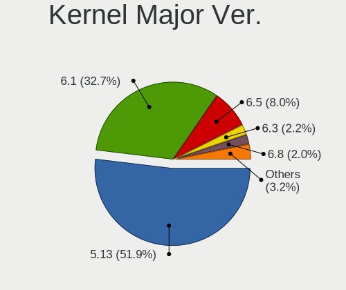

| Version | Computers | Percent |
|---------|-----------|---------|
| 5.13    | 1041      | 92.37%  |
| 6.1     | 41        | 3.64%   |
| 5.18    | 16        | 1.42%   |
| 5.15    | 12        | 1.06%   |
| 6.3     | 9         | 0.8%    |
| 6.4     | 4         | 0.35%   |
| 6.0     | 3         | 0.27%   |
| 5.16    | 1         | 0.09%   |

Arch
----

OS architecture (x86_64, i586, etc.)

| Name   | Computers | Percent |
|--------|-----------|---------|
| x86_64 | 1113      | 100%    |

DE
--

Desktop Environment

| Name      | Computers | Percent |
|-----------|-----------|---------|
| KDE5      | 1107      | 98.93%  |
| Unknown   | 6         | 0.54%   |
| gamescope | 5         | 0.45%   |
| GNOME     | 1         | 0.09%   |

Display Server
--------------

X11 or Wayland

| Name    | Computers | Percent |
|---------|-----------|---------|
| X11     | 1105      | 99.01%  |
| Tty     | 6         | 0.54%   |
| Wayland | 3         | 0.27%   |
| Unknown | 2         | 0.18%   |

Display Manager
---------------

SDDM, LightDM, etc.

| Name    | Computers | Percent |
|---------|-----------|---------|
| Unknown | 1097      | 98.47%  |
| SDDM    | 17        | 1.53%   |

OS Lang
-------

Language

| Lang         | Computers | Percent |
|--------------|-----------|---------|
| en_US        | 982       | 87.52%  |
| de_DE        | 22        | 1.96%   |
| en_GB        | 14        | 1.25%   |
| ru_RU        | 12        | 1.07%   |
| fr_FR        | 12        | 1.07%   |
| en_DE        | 11        | 0.98%   |
| zh_CN        | 10        | 0.89%   |
| es_ES        | 8         | 0.71%   |
| an_ES        | 7         | 0.62%   |
| pl_PL        | 4         | 0.36%   |
| pt_BR        | 3         | 0.27%   |
| it_IT        | 3         | 0.27%   |
| C            | 3         | 0.27%   |
| ru_UA        | 2         | 0.18%   |
| pt_PT        | 2         | 0.18%   |
| ko_KR        | 2         | 0.18%   |
| es_MX        | 2         | 0.18%   |
| en_NL        | 2         | 0.18%   |
| en_CA        | 2         | 0.18%   |
| ba_RU        | 2         | 0.18%   |
| zh_TW        | 1         | 0.09%   |
| sk_SK        | 1         | 0.09%   |
| n_US         | 1         | 0.09%   |
| nl_NL        | 1         | 0.09%   |
| nl_BE        | 1         | 0.09%   |
| ksh_DE       | 1         | 0.09%   |
| hr_HR        | 1         | 0.09%   |
| fr_BE        | 1         | 0.09%   |
| et_EE        | 1         | 0.09%   |
| es_UY        | 1         | 0.09%   |
| en_SE        | 1         | 0.09%   |
| en_IE        | 1         | 0.09%   |
| en_HK        | 1         | 0.09%   |
| en_GB.UTF-12 | 1         | 0.09%   |
| en_DK        | 1         | 0.09%   |
| en_AU        | 1         | 0.09%   |
| de_AT        | 1         | 0.09%   |

Boot Mode
---------

EFI or BIOS

| Mode | Computers | Percent |
|------|-----------|---------|
| BIOS | 1094      | 97.94%  |
| EFI  | 23        | 2.06%   |

Filesystem
----------

Type of filesystem

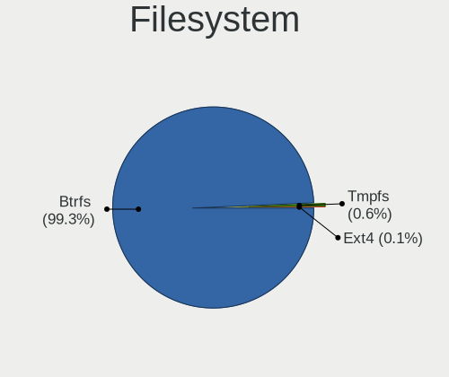

| Type  | Computers | Percent |
|-------|-----------|---------|
| Btrfs | 1101      | 98.92%  |
| Tmpfs | 11        | 0.99%   |
| Ext4  | 1         | 0.09%   |

Part. scheme
------------

Scheme of partitioning

| Type    | Computers | Percent |
|---------|-----------|---------|
| Unknown | 1093      | 97.76%  |
| GPT     | 25        | 2.24%   |

Dual Boot with Linux/BSD
------------------------

Hosting more than one Linux/BSD

| Dual boot | Computers | Percent |
|-----------|-----------|---------|
| No        | 1100      | 98.57%  |
| Yes       | 16        | 1.43%   |

Dual Boot (Win)
---------------

Hosting Linux and Windows

| Dual boot | Computers | Percent |
|-----------|-----------|---------|
| No        | 1106      | 99.37%  |
| Yes       | 7         | 0.63%   |

Board
-----

Vendor
------

Motherboard manufacturer

| Name                                 | Computers | Percent |
|--------------------------------------|-----------|---------|
| Valve                                | 903       | 81.13%  |
| ASUSTek Computer                     | 44        | 3.95%   |
| Gigabyte Technology                  | 27        | 2.43%   |
| Hewlett-Packard                      | 23        | 2.07%   |
| Dell                                 | 21        | 1.89%   |
| MSI                                  | 15        | 1.35%   |
| Lenovo                               | 13        | 1.17%   |
| ASRock                               | 11        | 0.99%   |
| Apple                                | 9         | 0.81%   |
| GPD                                  | 8         | 0.72%   |
| Acer                                 | 5         | 0.45%   |
| AOKZOE                               | 4         | 0.36%   |
| Samsung Electronics                  | 2         | 0.18%   |
| ONE-NETBOOK TECHNOLOGY               | 2         | 0.18%   |
| Microsoft                            | 2         | 0.18%   |
| Biostar                              | 2         | 0.18%   |
| AZW                                  | 2         | 0.18%   |
| Anbernic                             | 2         | 0.18%   |
| Alienware                            | 2         | 0.18%   |
| Unknown                              | 2         | 0.18%   |
| Teclast                              | 1         | 0.09%   |
| Supermicro                           | 1         | 0.09%   |
| Sony                                 | 1         | 0.09%   |
| Shenzhen Meigao Electronic Equipment | 1         | 0.09%   |
| ONE-NETBOOK                          | 1         | 0.09%   |
| Monster                              | 1         | 0.09%   |
| MeLE                                 | 1         | 0.09%   |
| MAXSUN                               | 1         | 0.09%   |
| Intel                                | 1         | 0.09%   |
| GPU Company                          | 1         | 0.09%   |
| Google                               | 1         | 0.09%   |
| AYANEO                               | 1         | 0.09%   |
| AMI                                  | 1         | 0.09%   |
| ADVANCE                              | 1         | 0.09%   |

Model
-----

Motherboard model

| Name                                       | Computers | Percent |
|--------------------------------------------|-----------|---------|
| Valve Jupiter                              | 903       | 81.13%  |
| ASUS All Series                            | 6         | 0.54%   |
| GPD G1619-04                               | 5         | 0.45%   |
| Gigabyte B450 AORUS M                      | 4         | 0.36%   |
| AOKZOE A1 AR07                             | 4         | 0.36%   |
| ASUS ROG STRIX B550-F GAMING               | 3         | 0.27%   |
| Unknown                                    | 3         | 0.27%   |
| ONE-NETBOOK TECHNOLOGY ONE XPLAYER         | 2         | 0.18%   |
| HP Pavilion 17                             | 2         | 0.18%   |
| HP Laptop 15-bs0xx                         | 2         | 0.18%   |
| Gigabyte B550 GAMING X V2                  | 2         | 0.18%   |
| Dell OptiPlex 9010                         | 2         | 0.18%   |
| ASUS ROG Ally RC71L_RC71L                  | 2         | 0.18%   |
| Apple Macmini7,1                           | 2         | 0.18%   |
| Apple MacBookPro8,1                        | 2         | 0.18%   |
| Anbernic Win600                            | 2         | 0.18%   |
| Teclast TbooK 16 Power                     | 1         | 0.09%   |
| Supermicro C7H170-M                        | 1         | 0.09%   |
| Sony VGN-Z520N                             | 1         | 0.09%   |
| Shenzhen Meigao Electronic Equipment UM690 | 1         | 0.09%   |
| Samsung 950XDB/951XDB/950XDY               | 1         | 0.09%   |
| Samsung 300E4C/300E5C/300E7C               | 1         | 0.09%   |
| ONE-NETBOOK ONEXPLAYER 2 PRO ARP23P        | 1         | 0.09%   |
| MSI MS-7D73                                | 1         | 0.09%   |
| MSI MS-7C89                                | 1         | 0.09%   |
| MSI MS-7C37                                | 1         | 0.09%   |
| MSI MS-7C02                                | 1         | 0.09%   |
| MSI MS-7B89                                | 1         | 0.09%   |
| MSI MS-7B79                                | 1         | 0.09%   |
| MSI MS-7B09                                | 1         | 0.09%   |
| MSI MS-7A33                                | 1         | 0.09%   |
| MSI MS-7995                                | 1         | 0.09%   |
| MSI MS-7817                                | 1         | 0.09%   |
| MSI MS-7693                                | 1         | 0.09%   |
| MSI MPG H510 Trident 3 (MS-B935)           | 1         | 0.09%   |
| MSI H310 Gaming Trident3 (MS-B920)         | 1         | 0.09%   |
| MSI GP66 Leopard 11UH                      | 1         | 0.09%   |
| MSI GF62 7RE                               | 1         | 0.09%   |
| Monster ABRA A5 V17.3                      | 1         | 0.09%   |
| Microsoft Surface Pro 8                    | 1         | 0.09%   |

Model Family
------------

Motherboard model prefix

| Name                                       | Computers | Percent |
|--------------------------------------------|-----------|---------|
| Valve Jupiter                              | 903       | 81.13%  |
| ASUS ROG                                   | 10        | 0.9%    |
| ASUS PRIME                                 | 9         | 0.81%   |
| HP Pavilion                                | 8         | 0.72%   |
| Dell OptiPlex                              | 6         | 0.54%   |
| ASUS All                                   | 6         | 0.54%   |
| Lenovo IdeaPad                             | 5         | 0.45%   |
| HP Laptop                                  | 5         | 0.45%   |
| GPD G1619-04                               | 5         | 0.45%   |
| Dell Precision                             | 5         | 0.45%   |
| Gigabyte B450                              | 4         | 0.36%   |
| Dell Inspiron                              | 4         | 0.36%   |
| ASUS TUF                                   | 4         | 0.36%   |
| AOKZOE A1                                  | 4         | 0.36%   |
| Lenovo ThinkCentre                         | 3         | 0.27%   |
| Gigabyte X570                              | 3         | 0.27%   |
| Acer Aspire                                | 3         | 0.27%   |
| Unknown                                    | 3         | 0.27%   |
| ONE-NETBOOK TECHNOLOGY ONE                 | 2         | 0.18%   |
| Microsoft Surface                          | 2         | 0.18%   |
| Lenovo Legion                              | 2         | 0.18%   |
| HP ProDesk                                 | 2         | 0.18%   |
| HP EliteDesk                               | 2         | 0.18%   |
| Gigabyte B560M                             | 2         | 0.18%   |
| Gigabyte B550                              | 2         | 0.18%   |
| Gigabyte B450M                             | 2         | 0.18%   |
| Dell XPS                                   | 2         | 0.18%   |
| Dell Venue                                 | 2         | 0.18%   |
| Biostar A320MH                             | 2         | 0.18%   |
| ASRock X570                                | 2         | 0.18%   |
| ASRock B550                                | 2         | 0.18%   |
| Apple Macmini7                             | 2         | 0.18%   |
| Apple MacBookPro8                          | 2         | 0.18%   |
| Apple MacBookAir6                          | 2         | 0.18%   |
| Anbernic Win600                            | 2         | 0.18%   |
| Acer Nitro                                 | 2         | 0.18%   |
| Teclast TbooK                              | 1         | 0.09%   |
| Supermicro C7H170-M                        | 1         | 0.09%   |
| Sony VGN-Z520N                             | 1         | 0.09%   |
| Shenzhen Meigao Electronic Equipment UM690 | 1         | 0.09%   |

MFG Year
--------

Motherboard manufacture year

| Year    | Computers | Percent |
|---------|-----------|---------|
| 2022    | 891       | 80.05%  |
| 2021    | 39        | 3.5%    |
| 2023    | 33        | 2.96%   |
| 2020    | 27        | 2.43%   |
| 2018    | 21        | 1.89%   |
| 2019    | 19        | 1.71%   |
| 2017    | 18        | 1.62%   |
| 2013    | 13        | 1.17%   |
| Unknown | 12        | 1.08%   |
| 2014    | 10        | 0.9%    |
| 2016    | 9         | 0.81%   |
| 2012    | 8         | 0.72%   |
| 2015    | 7         | 0.63%   |
| 2011    | 4         | 0.36%   |
| 2009    | 1         | 0.09%   |
| 2008    | 1         | 0.09%   |

Form Factor
-----------

Physical design of the computer

| Name        | Computers | Percent |
|-------------|-----------|---------|
| Notebook    | 978       | 87.87%  |
| Desktop     | 99        | 8.89%   |
| Tablet      | 13        | 1.17%   |
| Mini pc     | 12        | 1.08%   |
| Convertible | 6         | 0.54%   |
| All in one  | 4         | 0.36%   |
| Server      | 1         | 0.09%   |

Secure Boot
-----------

Enabled or disabled

| State    | Computers | Percent |
|----------|-----------|---------|
| Disabled | 1113      | 100%    |

Coreboot
--------

Have coreboot on board

| Used | Computers | Percent |
|------|-----------|---------|
| No   | 1112      | 99.91%  |
| Yes  | 1         | 0.09%   |

RAM Size
--------

Total RAM memory

| Size in GB  | Computers | Percent |
|-------------|-----------|---------|
| 8.01-16.0   | 953       | 85.55%  |
| 16.01-24.0  | 67        | 6.01%   |
| 4.01-8.0    | 33        | 2.96%   |
| 32.01-64.0  | 31        | 2.78%   |
| 24.01-32.0  | 12        | 1.08%   |
| 3.01-4.0    | 11        | 0.99%   |
| 64.01-256.0 | 6         | 0.54%   |
| 2.01-3.0    | 1         | 0.09%   |

RAM Used
--------

Used RAM memory

| Used GB   | Computers | Percent |
|-----------|-----------|---------|
| 2.01-3.0  | 494       | 41.65%  |
| 3.01-4.0  | 336       | 28.33%  |
| 4.01-8.0  | 244       | 20.57%  |
| 1.01-2.0  | 88        | 7.42%   |
| 8.01-16.0 | 23        | 1.94%   |
| 0.51-1.0  | 1         | 0.08%   |

Total Drives
------------

Number of drives on board

| Drives | Computers | Percent |
|--------|-----------|---------|
| 2      | 660       | 57.89%  |
| 1      | 395       | 34.65%  |
| 3      | 58        | 5.09%   |
| 4      | 18        | 1.58%   |
| 5      | 4         | 0.35%   |
| 0      | 2         | 0.18%   |
| 11     | 1         | 0.09%   |
| 7      | 1         | 0.09%   |
| 6      | 1         | 0.09%   |

Has CD-ROM
----------

Has CD-ROM on board

| Presented | Computers | Percent |
|-----------|-----------|---------|
| No        | 1078      | 96.86%  |
| Yes       | 35        | 3.14%   |

Has Ethernet
------------

Has Ethernet on board

| Presented | Computers | Percent |
|-----------|-----------|---------|
| No        | 670       | 59.03%  |
| Yes       | 465       | 40.97%  |

Has WiFi
--------

Has WiFi module

| Presented | Computers | Percent |
|-----------|-----------|---------|
| Yes       | 1075      | 96.59%  |
| No        | 38        | 3.41%   |

Has Bluetooth
-------------

Has Bluetooth module

| Presented | Computers | Percent |
|-----------|-----------|---------|
| Yes       | 1045      | 93.81%  |
| No        | 69        | 6.19%   |

Location
--------

Country
-------

Geographic location (country)

| Country      | Computers | Percent |
|--------------|-----------|---------|
| USA          | 452       | 40.5%   |
| UK           | 106       | 9.5%    |
| Germany      | 105       | 9.41%   |
| Canada       | 42        | 3.76%   |
| Spain        | 37        | 3.32%   |
| Russia       | 33        | 2.96%   |
| France       | 32        | 2.87%   |
| Poland       | 27        | 2.42%   |
| Netherlands  | 24        | 2.15%   |
| Brazil       | 19        | 1.7%    |
| Italy        | 16        | 1.43%   |
| China        | 14        | 1.25%   |
| Austria      | 13        | 1.16%   |
| Australia    | 13        | 1.16%   |
| Sweden       | 9         | 0.81%   |
| Mexico       | 9         | 0.81%   |
| Romania      | 8         | 0.72%   |
| Philippines  | 7         | 0.63%   |
| Belgium      | 7         | 0.63%   |
| Israel       | 6         | 0.54%   |
| Ireland      | 6         | 0.54%   |
| Hong Kong    | 6         | 0.54%   |
| Denmark      | 6         | 0.54%   |
| Czechia      | 6         | 0.54%   |
| UAE          | 5         | 0.45%   |
| Switzerland  | 5         | 0.45%   |
| Hungary      | 5         | 0.45%   |
| Turkey       | 4         | 0.36%   |
| Taiwan       | 4         | 0.36%   |
| South Korea  | 4         | 0.36%   |
| Saudi Arabia | 4         | 0.36%   |
| Portugal     | 4         | 0.36%   |
| Japan        | 4         | 0.36%   |
| Chile        | 4         | 0.36%   |
| Vietnam      | 3         | 0.27%   |
| Ukraine      | 3         | 0.27%   |
| Thailand     | 3         | 0.27%   |
| Slovakia     | 3         | 0.27%   |
| Peru         | 3         | 0.27%   |
| Malaysia     | 3         | 0.27%   |

City
----

Geographic location (city)

| City                | Computers | Percent |
|---------------------|-----------|---------|
| Moscow              | 15        | 1.29%   |
| Madrid              | 11        | 0.95%   |
| Berlin              | 11        | 0.95%   |
| Seattle             | 10        | 0.86%   |
| Austin              | 8         | 0.69%   |
| Warsaw              | 6         | 0.52%   |
| Sydney              | 6         | 0.52%   |
| Portland            | 6         | 0.52%   |
| London              | 6         | 0.52%   |
| Sao Paulo           | 5         | 0.43%   |
| Los Angeles         | 5         | 0.43%   |
| Hamburg             | 5         | 0.43%   |
| Dubai               | 5         | 0.43%   |
| Dallas              | 5         | 0.43%   |
| Brooklyn            | 5         | 0.43%   |
| Amsterdam           | 5         | 0.43%   |
| Washington          | 4         | 0.34%   |
| Vienna              | 4         | 0.34%   |
| Prague              | 4         | 0.34%   |
| Nottingham          | 4         | 0.34%   |
| Newcastle upon Tyne | 4         | 0.34%   |
| Lodz                | 4         | 0.34%   |
| Frankfurt am Main   | 4         | 0.34%   |
| Denver              | 4         | 0.34%   |
| Columbus            | 4         | 0.34%   |
| Cologne             | 4         | 0.34%   |
| Chicago             | 4         | 0.34%   |
| Albuquerque         | 4         | 0.34%   |
| Valencia            | 3         | 0.26%   |
| Toronto             | 3         | 0.26%   |
| Tacoma              | 3         | 0.26%   |
| St Petersburg       | 3         | 0.26%   |
| Santiago            | 3         | 0.26%   |
| San Antonio         | 3         | 0.26%   |
| Richmond            | 3         | 0.26%   |
| Quezon City         | 3         | 0.26%   |
| Phoenix             | 3         | 0.26%   |
| Ottawa              | 3         | 0.26%   |
| Nuremberg           | 3         | 0.26%   |
| Norfolk             | 3         | 0.26%   |

Drives
------

Drive Vendor
------------

Hard drive vendors

| Vendor                         | Computers | Drives | Percent |
|--------------------------------|-----------|--------|---------|
| Unknown                        | 511       | 587    | 26.12%  |
| Samsung Electronics            | 204       | 252    | 10.43%  |
| Kingston Technology Company    | 186       | 215    | 9.51%   |
| Phison Electronics             | 183       | 209    | 9.36%   |
| O2 Micro                       | 139       | 150    | 7.11%   |
| Unknown                        | 132       | 153    | 6.75%   |
| Kingston                       | 97        | 108    | 4.96%   |
| Phison                         | 82        | 85     | 4.19%   |
| Sandisk                        | 71        | 83     | 3.63%   |
| Seagate                        | 47        | 58     | 2.4%    |
| Silicon Motion                 | 45        | 51     | 2.3%    |
| WDC                            | 26        | 32     | 1.33%   |
| SK hynix                       | 25        | 35     | 1.28%   |
| KIOXIA                         | 23        | 27     | 1.18%   |
| Toshiba                        | 21        | 24     | 1.07%   |
| Crucial                        | 18        | 22     | 0.92%   |
| Intel                          | 10        | 11     | 0.51%   |
| Realtek                        | 9         | 11     | 0.46%   |
| JMicron Technology             | 9         | 9      | 0.46%   |
| A-DATA Technology              | 9         | 9      | 0.46%   |
| PNY                            | 8         | 9      | 0.41%   |
| Micron/Crucial Technology      | 8         | 8      | 0.41%   |
| Biwin Storage Technology       | 8         | 8      | 0.41%   |
| Micron Technology              | 6         | 6      | 0.31%   |
| MAXIO Technology (Hangzhou)    | 6         | 6      | 0.31%   |
| Apple                          | 6         | 10     | 0.31%   |
| Solid State Storage Technology | 5         | 6      | 0.26%   |
| China                          | 4         | 7      | 0.2%    |
| ADATA Technology               | 4         | 5      | 0.2%    |
| T-FORCE                        | 3         | 3      | 0.15%   |
| Realtek Semiconductor          | 3         | 3      | 0.15%   |
| Hitachi                        | 3         | 3      | 0.15%   |
| SPCC                           | 2         | 4      | 0.1%    |
| SABRENT                        | 2         | 2      | 0.1%    |
| Netac                          | 2         | 2      | 0.1%    |
| Mushkin                        | 2         | 2      | 0.1%    |
| KingSpec                       | 2         | 2      | 0.1%    |
| Intenso                        | 2         | 2      | 0.1%    |
| ASMT                           | 2         | 2      | 0.1%    |
| Yangtze Memory Technologies    | 1         | 1      | 0.05%   |

Drive Model
-----------

Hard drive models

| Model                                                 | Computers | Percent |
|-------------------------------------------------------|-----------|---------|
| Unknown MMC Card  512GB                               | 222       | 11.03%  |
| Kingston Company OM3PDP3 NVMe SSD 512GB               | 181       | 8.99%   |
| Phison PS5013 E13 NVMe Controller 512GB               | 155       | 7.7%    |
| Unknown                                               | 132       | 6.56%   |
| O2 Micro E2M2 64GB                                    | 125       | 6.21%   |
| Unknown MMC Card  256GB                               | 118       | 5.86%   |
| Samsung MZ9LQ512HBLU-00BVL 512GB                      | 75        | 3.73%   |
| Unknown MMC Card  128GB                               | 69        | 3.43%   |
| Phison NVMe SSD Drive 512GB                           | 55        | 2.73%   |
| Samsung MZ9LQ256HBJD-00BVL 256GB                      | 48        | 2.38%   |
| Kingston NVMe SSD Drive 512GB                         | 42        | 2.09%   |
| Kingston NVMe SSD Drive 256GB                         | 32        | 1.59%   |
| Silicon Motion SM2263EN/SM2263XT SSD Controller 512GB | 31        | 1.54%   |
| Unknown MMC Card  393GB                               | 22        | 1.09%   |
| Unknown MMC Card  64GB                                | 20        | 0.99%   |
| Phison NVMe SSD Drive 256GB                           | 18        | 0.89%   |
| Unknown MMC Card  32GB                                | 17        | 0.84%   |
| Sandisk WD PC SN740 SDDPTQD-1T00 1024GB               | 15        | 0.75%   |
| Phison Sabrent SB-2130-1TB                            | 15        | 0.75%   |
| O2 Micro NVMe SSD Drive 64GB                          | 15        | 0.75%   |
| Silicon Motion NVMe SSD Drive 512GB                   | 8         | 0.4%    |
| Sandisk WDC PC SN530 SDBPTPZ-1T00 1024GB              | 8         | 0.4%    |
| Unknown MMC Card  500GB                               | 7         | 0.35%   |
| Unknown MMC Card  16GB                                | 7         | 0.35%   |
| Sandisk WD PC SN740 SDDPTQE-2T00 2TB                  | 7         | 0.35%   |
| Samsung NVMe SSD Controller SM981/PM981/PM983 256GB   | 7         | 0.35%   |
| Realtek RTL9210B-CG 2TB                               | 7         | 0.35%   |
| Unknown MMC Card  498GB                               | 6         | 0.3%    |
| SK hynix BC511 512GB                                  | 6         | 0.3%    |
| Unknown MMC Card  249GB                               | 5         | 0.25%   |
| Unknown MMC Card  196GB                               | 5         | 0.25%   |
| SK hynix BC711 NVMe 512GB                             | 5         | 0.25%   |
| SK hynix BC711 NVMe 256GB                             | 5         | 0.25%   |
| Silicon Motion NVMe SSD Drive 256GB                   | 5         | 0.25%   |
| Samsung PM991a NVMe 512GB                             | 5         | 0.25%   |
| Samsung NVMe SSD Drive 512GB                          | 5         | 0.25%   |
| Samsung NVMe SSD Drive 1TB                            | 5         | 0.25%   |
| Samsung NVMe SSD Controller SM961/PM961/SM963 500GB   | 5         | 0.25%   |
| KIOXIA KBG40ZNS512G NVMe 512GB                        | 5         | 0.25%   |
| JMicron Tech 250GB                                    | 5         | 0.25%   |

HDD Vendor
----------

Hard disk drive vendors

| Vendor              | Computers | Drives | Percent |
|---------------------|-----------|--------|---------|
| Seagate             | 44        | 55     | 47.83%  |
| Toshiba             | 16        | 18     | 17.39%  |
| WDC                 | 15        | 19     | 16.3%   |
| Hitachi             | 3         | 3      | 3.26%   |
| Apple               | 3         | 7      | 3.26%   |
| Samsung Electronics | 2         | 2      | 2.17%   |
| SABRENT             | 2         | 2      | 2.17%   |
| ASMT                | 2         | 2      | 2.17%   |
| Unknown             | 1         | 1      | 1.09%   |
| SSK                 | 1         | 1      | 1.09%   |
| Maxone              | 1         | 1      | 1.09%   |
| HGST                | 1         | 1      | 1.09%   |
| External            | 1         | 2      | 1.09%   |

SSD Vendor
----------

Solid state drive vendors

| Vendor              | Computers | Drives | Percent |
|---------------------|-----------|--------|---------|
| Samsung Electronics | 33        | 47     | 23.08%  |
| Crucial             | 18        | 22     | 12.59%  |
| Kingston            | 17        | 20     | 11.89%  |
| SanDisk             | 13        | 14     | 9.09%   |
| WDC                 | 11        | 12     | 7.69%   |
| PNY                 | 8         | 9      | 5.59%   |
| A-DATA Technology   | 7         | 7      | 4.9%    |
| JMicron Technology  | 4         | 4      | 2.8%    |
| China               | 4         | 7      | 2.8%    |
| SPCC                | 2         | 4      | 1.4%    |
| Mushkin             | 2         | 2      | 1.4%    |
| KingSpec            | 2         | 2      | 1.4%    |
| Apple               | 2         | 2      | 1.4%    |
| Verbatim            | 1         | 2      | 0.7%    |
| TrekStor            | 1         | 1      | 0.7%    |
| TO Exter            | 1         | 1      | 0.7%    |
| Team                | 1         | 1      | 0.7%    |
| SK hynix            | 1         | 1      | 0.7%    |
| Ramsta              | 1         | 1      | 0.7%    |
| Patriot             | 1         | 1      | 0.7%    |
| NGFF                | 1         | 1      | 0.7%    |
| Netac               | 1         | 1      | 0.7%    |
| Lexar 25            | 1         | 1      | 0.7%    |
| Kingchuxing         | 1         | 1      | 0.7%    |
| KEEPDATA            | 1         | 1      | 0.7%    |
| Intenso             | 1         | 1      | 0.7%    |
| Intel               | 1         | 1      | 0.7%    |
| HP Phison           | 1         | 1      | 0.7%    |
| Gigastone           | 1         | 1      | 0.7%    |
| CT1000P3            | 1         | 1      | 0.7%    |
| Corsair             | 1         | 1      | 0.7%    |
| 2.5                 | 1         | 1      | 0.7%    |
| Unknown             | 1         | 1      | 0.7%    |

Drive Kind
----------

HDD or SSD

| Kind    | Computers | Drives | Percent |
|---------|-----------|--------|---------|
| NVMe    | 1029      | 1212   | 54.85%  |
| MMC     | 629       | 731    | 33.53%  |
| SSD     | 116       | 173    | 6.18%   |
| HDD     | 79        | 114    | 4.21%   |
| Unknown | 23        | 25     | 1.23%   |

Drive Connector
---------------

SATA, SAS, NVMe, etc.

| Type | Computers | Drives | Percent |
|------|-----------|--------|---------|
| NVMe | 1029      | 1199   | 55.56%  |
| MMC  | 629       | 731    | 33.96%  |
| SATA | 134       | 248    | 7.24%   |
| SAS  | 60        | 77     | 3.24%   |

Drive Size
----------

Size of hard drive

| Size in TB | Computers | Drives | Percent |
|------------|-----------|--------|---------|
| 0.01-0.5   | 103       | 143    | 49.52%  |
| 0.51-1.0   | 69        | 97     | 33.17%  |
| 1.01-2.0   | 17        | 25     | 8.17%   |
| 3.01-4.0   | 8         | 9      | 3.85%   |
| 4.01-10.0  | 6         | 6      | 2.88%   |
| 2.01-3.0   | 5         | 7      | 2.4%    |

Space Total
-----------

Amount of disk space available on the file system

| Size in GB     | Computers | Percent |
|----------------|-----------|---------|
| 251-500        | 486       | 42.33%  |
| 101-250        | 266       | 23.17%  |
| 501-1000       | 163       | 14.2%   |
| 51-100         | 126       | 10.98%  |
| 1001-2000      | 64        | 5.57%   |
| More than 3000 | 22        | 1.92%   |
| 2001-3000      | 11        | 0.96%   |
| Unknown        | 7         | 0.61%   |
| 21-50          | 3         | 0.26%   |

Space Used
----------

Amount of used disk space

| Used GB        | Computers | Percent |
|----------------|-----------|---------|
| 101-250        | 326       | 28.01%  |
| 251-500        | 291       | 25%     |
| 21-50          | 185       | 15.89%  |
| 1-20           | 134       | 11.51%  |
| 51-100         | 119       | 10.22%  |
| 501-1000       | 75        | 6.44%   |
| 1001-2000      | 18        | 1.55%   |
| Unknown        | 7         | 0.6%    |
| 2001-3000      | 5         | 0.43%   |
| More than 3000 | 4         | 0.34%   |

Malfunc. Drives
---------------

Drive models with a malfunction

| Model                           | Computers | Drives | Percent |
|---------------------------------|-----------|--------|---------|
| Seagate ST500LT012-9WS142 500GB | 1         | 1      | 100%    |

Malfunc. Drive Vendor
---------------------

Vendors of faulty drives

| Vendor  | Computers | Drives | Percent |
|---------|-----------|--------|---------|
| Seagate | 1         | 1      | 100%    |

Malfunc. HDD Vendor
-------------------

Vendors of faulty HDD drives

| Vendor  | Computers | Drives | Percent |
|---------|-----------|--------|---------|
| Seagate | 1         | 1      | 100%    |

Malfunc. Drive Kind
-------------------

Kinds of faulty drives

| Kind | Computers | Drives | Percent |
|------|-----------|--------|---------|
| HDD  | 1         | 1      | 100%    |

Failed Drives
-------------

Failed drive models

Zero info for selected period =(

Failed Drive Vendor
-------------------

Failed drive vendors

Zero info for selected period =(

Drive Status
------------

Number of failed and malfunc. drives

| Status   | Computers | Drives | Percent |
|----------|-----------|--------|---------|
| Detected | 1103      | 2222   | 97.61%  |
| Works    | 26        | 32     | 2.3%    |
| Malfunc  | 1         | 1      | 0.09%   |

Storage controller
------------------

Storage Vendor
--------------

Storage controller vendors

| Vendor                         | Computers | Percent |
|--------------------------------|-----------|---------|
| Phison Electronics             | 261       | 21.41%  |
| Kingston Technology Company    | 258       | 21.16%  |
| Samsung Electronics            | 178       | 14.6%   |
| O2 Micro                       | 139       | 11.4%   |
| Intel                          | 100       | 8.2%    |
| AMD                            | 70        | 5.74%   |
| SanDisk                        | 60        | 4.92%   |
| Silicon Motion                 | 45        | 3.69%   |
| SK hynix                       | 25        | 2.05%   |
| KIOXIA                         | 23        | 1.89%   |
| Biwin Storage Technology       | 9         | 0.74%   |
| Micron/Crucial Technology      | 8         | 0.66%   |
| Toshiba America Info Systems   | 6         | 0.49%   |
| Solid State Storage Technology | 6         | 0.49%   |
| Micron Technology              | 6         | 0.49%   |
| MAXIO Technology (Hangzhou)    | 6         | 0.49%   |
| ADATA Technology               | 6         | 0.49%   |
| Realtek Semiconductor          | 3         | 0.25%   |
| Marvell Technology Group       | 2         | 0.16%   |
| ASMedia Technology             | 2         | 0.16%   |
| Yangtze Memory Technologies    | 1         | 0.08%   |
| Union Memory (Shenzhen)        | 1         | 0.08%   |
| Seagate Technology             | 1         | 0.08%   |
| Netac Technology               | 1         | 0.08%   |
| INNOGRIT                       | 1         | 0.08%   |
| Apple                          | 1         | 0.08%   |

Storage Model
-------------

Storage controller models

| Model                                                                          | Computers | Percent |
|--------------------------------------------------------------------------------|-----------|---------|
| Kingston Company OM3PDP3 NVMe SSD                                              | 248       | 19.65%  |
| Phison PS5013 E13 NVMe Controller                                              | 225       | 17.83%  |
| Samsung NVMe SSD Controller 980                                                | 155       | 12.28%  |
| O2 Micro FORESEE E2M2 NVMe SSD                                                 | 139       | 11.01%  |
| AMD FCH SATA Controller [AHCI mode]                                            | 51        | 4.04%   |
| Silicon Motion SM2263EN/SM2263XT (DRAM-less) NVMe SSD Controllers              | 43        | 3.41%   |
| Sandisk PC SN740 NVMe SSD (DRAM-less)                                          | 24        | 1.9%    |
| Phison PS5021-E21 PCIe4 NVMe Controller (DRAM-less)                            | 23        | 1.82%   |
| SK hynix Gold P31/BC711/PC711 NVMe Solid State Drive                           | 16        | 1.27%   |
| SanDisk IX SN530 NVMe SSD (DRAM-less)                                          | 14        | 1.11%   |
| KIOXIA NVMe SSD Controller BG4 (DRAM-less)                                     | 14        | 1.11%   |
| AMD 400 Series Chipset SATA Controller                                         | 14        | 1.11%   |
| Samsung NVMe SSD Controller SM981/PM981/PM983                                  | 13        | 1.03%   |
| AMD 500 Series Chipset SATA Controller                                         | 13        | 1.03%   |
| Intel Q170/Q150/B150/H170/H110/Z170/CM236 Chipset SATA Controller [AHCI Mode]  | 12        | 0.95%   |
| KIOXIA NVMe SSD Controller BG5 (DRAM-less)                                     | 9         | 0.71%   |
| Phison E12 NVMe Controller                                                     | 8         | 0.63%   |
| Intel Volume Management Device NVMe RAID Controller                            | 8         | 0.63%   |
| SK hynix BC511 NVMe SSD                                                        | 7         | 0.55%   |
| Samsung NVMe SSD Controller SM961/PM961/SM963                                  | 7         | 0.55%   |
| Intel 8 Series/C220 Series Chipset Family 6-port SATA Controller 1 [AHCI mode] | 7         | 0.55%   |
| Intel 200 Series PCH SATA controller [AHCI mode]                               | 7         | 0.55%   |
| Biwin Storage Non-Volatile memory controller                                   | 7         | 0.55%   |
| Intel Cannon Lake PCH SATA AHCI Controller                                     | 6         | 0.48%   |
| AMD FCH SATA Controller D                                                      | 6         | 0.48%   |
| Micron/Crucial P2 [Nick P2] / P3 / P3 Plus NVMe PCIe SSD (DRAM-less)           | 5         | 0.4%    |
| Intel SSD 660P Series                                                          | 5         | 0.4%    |
| Solid State Storage Non-Volatile memory controller                             | 4         | 0.32%   |
| SanDisk WD PC SN810 / Black SN850 NVMe SSD                                     | 4         | 0.32%   |
| SanDisk PC SN530 NVMe SSD (DRAM-less)                                          | 4         | 0.32%   |
| Micron 2400 NVMe SSD (DRAM-less)                                               | 4         | 0.32%   |
| MAXIO (Hangzhou) NVMe SSD Controller MAP1202                                   | 4         | 0.32%   |
| Kingston Company Company Non-Volatile memory controller                        | 4         | 0.32%   |
| Intel SATA Controller [RAID mode]                                              | 4         | 0.32%   |
| Intel 8 Series SATA Controller 1 [AHCI mode]                                   | 4         | 0.32%   |
| Intel 7 Series Chipset Family 6-port SATA Controller [AHCI mode]               | 4         | 0.32%   |
| Intel 500 Series Chipset Family SATA AHCI Controller                           | 4         | 0.32%   |
| AMD 300 Series Chipset SATA Controller                                         | 4         | 0.32%   |
| Silicon Motion SM2262/SM2262EN SSD Controller                                  | 3         | 0.24%   |
| SanDisk WD Black SN750 / PC SN730 NVMe SSD                                     | 3         | 0.24%   |

Storage Kind
------------

Kind of storage controller (IDE, SATA, NVMe, SAS, ...)

| Kind | Computers | Percent |
|------|-----------|---------|
| NVMe | 1028      | 85.45%  |
| SATA | 155       | 12.88%  |
| RAID | 16        | 1.33%   |
| IDE  | 3         | 0.25%   |
| SAS  | 1         | 0.08%   |

Processor
---------

CPU Vendor
----------

Processor vendors

| Vendor | Computers | Percent |
|--------|-----------|---------|
| AMD    | 1002      | 90.03%  |
| Intel  | 111       | 9.97%   |

CPU Model
---------

Processor models

| Model                                     | Computers | Percent |
|-------------------------------------------|-----------|---------|
| AMD Custom APU 0405                       | 903       | 81.13%  |
| AMD Ryzen 7 6800U with Radeon Graphics    | 9         | 0.81%   |
| AMD Ryzen 5 5600G with Radeon Graphics    | 7         | 0.63%   |
| AMD Ryzen 9 3900X 12-Core Processor       | 5         | 0.45%   |
| AMD Ryzen 9 5900X 12-Core Processor       | 4         | 0.36%   |
| Intel Core i7-6700K CPU @ 4.00GHz         | 3         | 0.27%   |
| Intel Core i7-4790K CPU @ 4.00GHz         | 3         | 0.27%   |
| Intel Core i7-3770 CPU @ 3.40GHz          | 3         | 0.27%   |
| Intel 11th Gen Core i5-1135G7 @ 2.40GHz   | 3         | 0.27%   |
| AMD Ryzen 7 5800X 8-Core Processor        | 3         | 0.27%   |
| AMD Ryzen 7 4800U with Radeon Graphics    | 3         | 0.27%   |
| AMD Ryzen 5 2600 Six-Core Processor       | 3         | 0.27%   |
| Intel Core i7-8750H CPU @ 2.20GHz         | 2         | 0.18%   |
| Intel Core i7-8700 CPU @ 3.20GHz          | 2         | 0.18%   |
| Intel Core i7-7700K CPU @ 4.20GHz         | 2         | 0.18%   |
| Intel Core i5-4590 CPU @ 3.30GHz          | 2         | 0.18%   |
| Intel Core i5-4260U CPU @ 1.40GHz         | 2         | 0.18%   |
| Intel Core i5-2435M CPU @ 2.40GHz         | 2         | 0.18%   |
| Intel Core i5-2400 CPU @ 3.10GHz          | 2         | 0.18%   |
| Intel Core i5-10400F CPU @ 2.90GHz        | 2         | 0.18%   |
| Intel Core i3-9100F CPU @ 3.60GHz         | 2         | 0.18%   |
| Intel Atom x7-Z8750 CPU @ 1.60GHz         | 2         | 0.18%   |
| Intel 12th Gen Core i3-12100F             | 2         | 0.18%   |
| Intel 11th Gen Core i7-11800H @ 2.30GHz   | 2         | 0.18%   |
| Intel 11th Gen Core i7-1165G7 @ 2.80GHz   | 2         | 0.18%   |
| Intel 11th Gen Core i3-1115G4 @ 3.00GHz   | 2         | 0.18%   |
| AMD Ryzen Z1 Extreme                      | 2         | 0.18%   |
| AMD Ryzen 7 7840U w/ Radeon 780M Graphics | 2         | 0.18%   |
| AMD Ryzen 7 5700U with Radeon Graphics    | 2         | 0.18%   |
| AMD Ryzen 7 3700X 8-Core Processor        | 2         | 0.18%   |
| AMD Ryzen 7 1700 Eight-Core Processor     | 2         | 0.18%   |
| AMD Ryzen 5 5600X 6-Core Processor        | 2         | 0.18%   |
| AMD Ryzen 5 5600U with Radeon Graphics    | 2         | 0.18%   |
| AMD Ryzen 5 5600H with Radeon Graphics    | 2         | 0.18%   |
| AMD Ryzen 5 5500U with Radeon Graphics    | 2         | 0.18%   |
| AMD Ryzen 5 4500U with Radeon Graphics    | 2         | 0.18%   |
| AMD Ryzen 5 3600X 6-Core Processor        | 2         | 0.18%   |
| AMD Ryzen 5 3600 6-Core Processor         | 2         | 0.18%   |
| AMD Ryzen 5 2600X Six-Core Processor      | 2         | 0.18%   |
| AMD Ryzen 5 1600 Six-Core Processor       | 2         | 0.18%   |

CPU Model Family
----------------

Processor model prefix

| Model                  | Computers | Percent |
|------------------------|-----------|---------|
| Other                  | 926       | 83.2%   |
| AMD Ryzen 5            | 36        | 3.23%   |
| Intel Core i5          | 34        | 3.05%   |
| Intel Core i7          | 31        | 2.79%   |
| AMD Ryzen 7            | 29        | 2.61%   |
| AMD Ryzen 9            | 13        | 1.17%   |
| Intel Core i3          | 9         | 0.81%   |
| Intel Xeon             | 6         | 0.54%   |
| Intel Celeron          | 4         | 0.36%   |
| Intel Atom             | 3         | 0.27%   |
| AMD Ryzen 5 PRO        | 3         | 0.27%   |
| Intel Pentium Silver   | 2         | 0.18%   |
| Intel Core 2 Duo       | 2         | 0.18%   |
| AMD Ryzen 3            | 2         | 0.18%   |
| AMD FX                 | 2         | 0.18%   |
| AMD Athlon             | 2         | 0.18%   |
| AMD A10                | 2         | 0.18%   |
| AMD Ryzen Threadripper | 1         | 0.09%   |
| AMD Ryzen 7 PRO        | 1         | 0.09%   |
| AMD Embedded           | 1         | 0.09%   |
| AMD E1                 | 1         | 0.09%   |
| AMD Athlon X4          | 1         | 0.09%   |
| AMD A8                 | 1         | 0.09%   |
| AMD A6                 | 1         | 0.09%   |

CPU Cores
---------

Number of processor cores

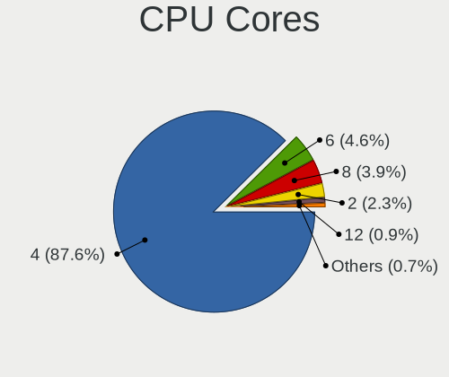

| Number | Computers | Percent |
|--------|-----------|---------|
| 4      | 970       | 87.15%  |
| 6      | 50        | 4.49%   |
| 8      | 42        | 3.77%   |
| 2      | 38        | 3.41%   |
| 12     | 11        | 0.99%   |
| 16     | 1         | 0.09%   |
| 3      | 1         | 0.09%   |

CPU Sockets
-----------

Number of sockets

| Number | Computers | Percent |
|--------|-----------|---------|
| 1      | 1112      | 99.91%  |
| 2      | 1         | 0.09%   |

CPU Threads
-----------

Threads per core (Hyper-Threading)

| Number | Computers | Percent |
|--------|-----------|---------|
| 2      | 1070      | 95.96%  |
| 1      | 45        | 4.04%   |

CPU Op-Modes
------------

CPU Operation Modes (32-bit, 64-bit)

| Op mode        | Computers | Percent |
|----------------|-----------|---------|
| 32-bit, 64-bit | 1113      | 100%    |

CPU Microcode
-------------

Microcode number

| Number     | Computers | Percent |
|------------|-----------|---------|
| Unknown    | 1094      | 97.94%  |
| 0x08900201 | 14        | 1.25%   |
| 0x0a704103 | 2         | 0.18%   |
| 0x0a404102 | 2         | 0.18%   |
| 0x906e9    | 1         | 0.09%   |
| 0x40651    | 1         | 0.09%   |
| 0x1067a    | 1         | 0.09%   |
| 0x0a50000c | 1         | 0.09%   |
| 0x08600106 | 1         | 0.09%   |

CPU Microarch
-------------

Microarchitecture

| Name          | Computers | Percent |
|---------------|-----------|---------|
| Unknown       | 935       | 84.01%  |
| KabyLake      | 30        | 2.7%    |
| Zen 3         | 26        | 2.34%   |
| Haswell       | 19        | 1.71%   |
| Zen 2         | 18        | 1.62%   |
| Zen+          | 16        | 1.44%   |
| Skylake       | 11        | 0.99%   |
| Zen           | 9         | 0.81%   |
| TigerLake     | 9         | 0.81%   |
| IvyBridge     | 8         | 0.72%   |
| SandyBridge   | 7         | 0.63%   |
| Piledriver    | 5         | 0.45%   |
| CometLake     | 5         | 0.45%   |
| Silvermont    | 4         | 0.36%   |
| Goldmont plus | 3         | 0.27%   |
| Penryn        | 2         | 0.18%   |
| Excavator     | 2         | 0.18%   |
| Steamroller   | 1         | 0.09%   |
| Jaguar        | 1         | 0.09%   |
| IceLake       | 1         | 0.09%   |
| Broadwell     | 1         | 0.09%   |

Graphics
--------

GPU Vendor
----------

Vendors of graphics cards

| Vendor | Computers | Percent |
|--------|-----------|---------|
| AMD    | 1026      | 89.14%  |
| Intel  | 72        | 6.26%   |
| Nvidia | 53        | 4.6%    |

GPU Model
---------

Graphics card models

| Model                                                                                    | Computers | Percent |
|------------------------------------------------------------------------------------------|-----------|---------|
| AMD VanGogh [AMD Custom GPU 0405]                                                        | 903       | 78.11%  |
| AMD Ellesmere [Radeon RX 470/480/570/570X/580/580X/590]                                  | 19        | 1.64%   |
| AMD Rembrandt [Radeon 680M]                                                              | 11        | 0.95%   |
| AMD Navi 22 [Radeon RX 6700/6700 XT/6750 XT / 6800M/6850M XT]                            | 11        | 0.95%   |
| AMD Cezanne [Radeon Vega Series / Radeon Vega Mobile Series]                             | 11        | 0.95%   |
| Intel CoffeeLake-S GT2 [UHD Graphics 630]                                                | 8         | 0.69%   |
| AMD Picasso/Raven 2 [Radeon Vega Series / Radeon Vega Mobile Series]                     | 8         | 0.69%   |
| AMD Navi 14 [Radeon RX 5500/5500M / Pro 5500M]                                           | 7         | 0.61%   |
| Intel TigerLake-LP GT2 [Iris Xe Graphics]                                                | 6         | 0.52%   |
| AMD Navi 10 [Radeon RX 5600 OEM/5600 XT / 5700/5700 XT]                                  | 6         | 0.52%   |
| Intel Xeon E3-1200 v3/4th Gen Core Processor Integrated Graphics Controller              | 5         | 0.43%   |
| AMD Renoir                                                                               | 5         | 0.43%   |
| AMD Navi 23 [Radeon RX 6600/6600 XT/6600M]                                               | 5         | 0.43%   |
| AMD Lucienne                                                                             | 5         | 0.43%   |
| Intel HD Graphics 530                                                                    | 4         | 0.35%   |
| Intel Haswell-ULT Integrated Graphics Controller                                         | 4         | 0.35%   |
| Intel CoffeeLake-H GT2 [UHD Graphics 630]                                                | 4         | 0.35%   |
| Intel Atom/Celeron/Pentium Processor x5-E8000/J3xxx/N3xxx Integrated Graphics Controller | 4         | 0.35%   |
| AMD Phoenix1                                                                             | 4         | 0.35%   |
| AMD Navi 24 [Radeon RX 6400/6500 XT/6500M]                                               | 4         | 0.35%   |
| AMD Navi 21 [Radeon RX 6800/6800 XT / 6900 XT]                                           | 4         | 0.35%   |
| AMD Lexa PRO [Radeon 540/540X/550/550X / RX 540X/550/550X]                               | 4         | 0.35%   |
| Nvidia GP104 [GeForce GTX 1070]                                                          | 3         | 0.26%   |
| Nvidia GM204 [GeForce GTX 970]                                                           | 3         | 0.26%   |
| Nvidia GA107M [GeForce RTX 3050 Mobile]                                                  | 3         | 0.26%   |
| Intel HD Graphics 630                                                                    | 3         | 0.26%   |
| Intel 3rd Gen Core processor Graphics Controller                                         | 3         | 0.26%   |
| Intel 2nd Generation Core Processor Family Integrated Graphics Controller                | 3         | 0.26%   |
| AMD Vega 10 XL/XT [Radeon RX Vega 56/64]                                                 | 3         | 0.26%   |
| Nvidia TU117 [GeForce GTX 1650]                                                          | 2         | 0.17%   |
| Nvidia TU106M [GeForce RTX 2060 Mobile]                                                  | 2         | 0.17%   |
| Nvidia TU104 [GeForce RTX 2080 Rev. A]                                                   | 2         | 0.17%   |
| Nvidia GP108 [GeForce GT 1030]                                                           | 2         | 0.17%   |
| Nvidia GP107M [GeForce GTX 1050 Ti Mobile]                                               | 2         | 0.17%   |
| Nvidia GP107 [GeForce GTX 1050 Ti]                                                       | 2         | 0.17%   |
| Nvidia GA106 [GeForce RTX 3060 Lite Hash Rate]                                           | 2         | 0.17%   |
| Nvidia GA104M [GeForce RTX 3080 Mobile / Max-Q 8GB/16GB]                                 | 2         | 0.17%   |
| Intel TigerLake-H GT1 [UHD Graphics]                                                     | 2         | 0.17%   |
| Intel Tiger Lake-LP GT2 [UHD Graphics G4]                                                | 2         | 0.17%   |
| Intel Mobile 4 Series Chipset Integrated Graphics Controller                             | 2         | 0.17%   |

GPU Combo
---------

Combinations of graphics cards

| Name           | Computers | Percent |
|----------------|-----------|---------|
| 1 x AMD        | 1010      | 90.58%  |
| 1 x Intel      | 40        | 3.59%   |
| 1 x Nvidia     | 27        | 2.42%   |
| Intel + Nvidia | 20        | 1.79%   |
| AMD + Nvidia   | 7         | 0.63%   |
| 2 x AMD        | 5         | 0.45%   |
| Intel + AMD    | 5         | 0.45%   |
| Other          | 1         | 0.09%   |

GPU Driver
----------

Free vs proprietary

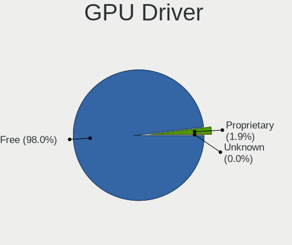

| Driver      | Computers | Percent |
|-------------|-----------|---------|
| Free        | 1081      | 97.12%  |
| Proprietary | 32        | 2.88%   |

GPU Memory
----------

Total video memory

| Size in GB | Computers | Percent |
|------------|-----------|---------|
| Unknown    | 1071      | 95.8%   |
| 3.01-4.0   | 12        | 1.07%   |
| 7.01-8.0   | 9         | 0.81%   |
| 0.51-1.0   | 9         | 0.81%   |
| 5.01-6.0   | 5         | 0.45%   |
| 2.01-3.0   | 3         | 0.27%   |
| 1.01-2.0   | 3         | 0.27%   |
| 0.01-0.5   | 3         | 0.27%   |
| 8.01-16.0  | 2         | 0.18%   |
| 16.01-24.0 | 1         | 0.09%   |

Monitor
-------

Monitor Vendor
--------------

Monitor vendors

| Vendor               | Computers | Percent |
|----------------------|-----------|---------|
| Valve                | 580       | 47.42%  |
| Analogix             | 167       | 13.65%  |
| Samsung Electronics  | 65        | 5.31%   |
| Goldstar             | 48        | 3.92%   |
| Dell                 | 30        | 2.45%   |
| Acer                 | 26        | 2.13%   |
| AOC                  | 19        | 1.55%   |
| Hewlett-Packard      | 18        | 1.47%   |
| Ancor Communications | 17        | 1.39%   |
| BOE                  | 15        | 1.23%   |
| Chimei Innolux       | 14        | 1.14%   |
| Sony                 | 13        | 1.06%   |
| ASUSTek Computer     | 13        | 1.06%   |
| Philips              | 12        | 0.98%   |
| BenQ                 | 10        | 0.82%   |
| Vizio                | 9         | 0.74%   |
| RTK                  | 9         | 0.74%   |
| LG Display           | 9         | 0.74%   |
| AU Optronics         | 9         | 0.74%   |
| MSI                  | 8         | 0.65%   |
| Lenovo               | 8         | 0.65%   |
| Apple                | 7         | 0.57%   |
| ViewSonic            | 6         | 0.49%   |
| Sceptre Tech         | 5         | 0.41%   |
| Pixio                | 5         | 0.41%   |
| JDI                  | 5         | 0.41%   |
| Hitachi              | 5         | 0.41%   |
| Toshiba              | 4         | 0.33%   |
| Sharp                | 4         | 0.33%   |
| Huion                | 4         | 0.33%   |
| Gigabyte Technology  | 4         | 0.33%   |
| Panasonic            | 3         | 0.25%   |
| ONN                  | 3         | 0.25%   |
| MSF                  | 3         | 0.25%   |
| Insignia             | 3         | 0.25%   |
| Unknown (XXX)        | 2         | 0.16%   |
| Unknown              | 2         | 0.16%   |
| TMX                  | 2         | 0.16%   |
| Sun                  | 2         | 0.16%   |
| Roku                 | 2         | 0.16%   |

Monitor Model
-------------

Monitor models

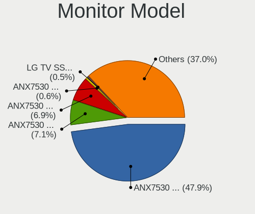

| Model                                                                   | Computers | Percent |
|-------------------------------------------------------------------------|-----------|---------|
| Valve ANX7530 U VLV3001 800x1280 100x150mm 7.1-inch                     | 579       | 46.84%  |
| Analogix ANX7530 U ANX7539 800x1280                                     | 167       | 13.51%  |
| RTK FHD HDR RTK2A3B 1920x1080 344x195mm 15.6-inch                       | 7         | 0.57%   |
| Goldstar FULL HD GSM5B55 1920x1080 480x270mm 21.7-inch                  | 6         | 0.49%   |
| JDI GPD1001H JDI0031 2560x1600 890x500mm 40.2-inch                      | 5         | 0.4%    |
| Goldstar LG TV SSCR2 GSMC0C8 3840x2160                                  | 4         | 0.32%   |
| Samsung Electronics S24F350 SAM0D20 1920x1080 521x293mm 23.5-inch       | 3         | 0.24%   |
| Samsung Electronics LCD Monitor SAM7017 3840x2160 1872x1053mm 84.6-inch | 3         | 0.24%   |
| Samsung Electronics C27F390 SAM0D32 1920x1080 598x336mm 27.0-inch       | 3         | 0.24%   |
| Pixio U27I4K WAM2700 3840x2160 600x330mm 27.0-inch                      | 3         | 0.24%   |
| Philips FTV PHL04C3 3840x2160 1440x810mm 65.0-inch                      | 3         | 0.24%   |
| MSF TV080WUM-NL0 MSF1003 1600x2560 113x181mm 8.4-inch                   | 3         | 0.24%   |
| Hitachi Hisense HEC0030 1920x1080 580x330mm 26.3-inch                   | 3         | 0.24%   |
| Goldstar HDR WFHD GSM7714 2560x1080 798x334mm 34.1-inch                 | 3         | 0.24%   |
| Goldstar 27GN7 GSM5B8D 1920x1080 600x303mm 26.5-inch                    | 3         | 0.24%   |
| Vizio E500i-A1 VIZ1004 1920x1080 1095x616mm 49.5-inch                   | 2         | 0.16%   |
| Vizio D43f-J04 VIZ1044 1920x1080 527x296mm 23.8-inch                    | 2         | 0.16%   |
| Unknown (XXX) Beyond TV XXX2851 3840x2160 1209x680mm 54.6-inch          | 2         | 0.16%   |
| TMX TL070FVXS01-0 TMX0002 1920x1080 160x100mm 7.4-inch                  | 2         | 0.16%   |
| Sun SCEI MONITOR SCE0301 1920x1080 522x294mm 23.6-inch                  | 2         | 0.16%   |
| Sony TV *00 SNY7A04 3840x2160 1218x685mm 55.0-inch                      | 2         | 0.16%   |
| Samsung Electronics LCD Monitor SDC4C48 1920x1080 239x134mm 10.8-inch   | 2         | 0.16%   |
| Samsung Electronics LCD Monitor SAM7002 3840x2160 1420x800mm 64.2-inch  | 2         | 0.16%   |
| Samsung Electronics LCD Monitor SAM0F14 3840x2160 1872x1053mm 84.6-inch | 2         | 0.16%   |
| Samsung Electronics LCD Monitor SAM0C3C 1360x768 700x390mm 31.5-inch    | 2         | 0.16%   |
| Samsung Electronics LC24RG50 SAM0F90 1920x1080 532x304mm 24.1-inch      | 2         | 0.16%   |
| Samsung Electronics C49HG9x SAM0E5D 1920x1080 1200x340mm 49.1-inch      | 2         | 0.16%   |
| Samsung Electronics C27R50x SAM0F9D 1920x1080 598x336mm 27.0-inch       | 2         | 0.16%   |
| Samsung Electronics C24F390 SAM0D2C 1920x1080 521x293mm 23.5-inch       | 2         | 0.16%   |
| ONN 100002480 ONN0101 1920x1080 474x296mm 22.0-inch                     | 2         | 0.16%   |
| MSI Optix MAG27C MSI1462 1920x1080 598x336mm 27.0-inch                  | 2         | 0.16%   |
| Microsoft Xbox One MSH0001 1920x1080 520x290mm 23.4-inch                | 2         | 0.16%   |
| Insignia 48DR420NA16 BBY3253 1920x1080 1054x591mm 47.6-inch             | 2         | 0.16%   |
| Huion Kamvas 13 HAT1330 1920x1080 294x165mm 13.3-inch                   | 2         | 0.16%   |
| Hitachi HISENSE HEC002F 3840x2160 1872x1053mm 84.6-inch                 | 2         | 0.16%   |
| Goldstar ULTRAWIDE GSM5AFB 2560x1080 798x334mm 34.1-inch                | 2         | 0.16%   |
| Goldstar ULTRAGEAR GSM774A 3440x1440 800x335mm 34.1-inch                | 2         | 0.16%   |
| Goldstar ULTRAGEAR GSM5BB2 1920x1080 527x296mm 23.8-inch                | 2         | 0.16%   |
| Goldstar Ultra HD GSM5B08 3840x2160 600x340mm 27.2-inch                 | 2         | 0.16%   |
| Gigabyte Technology G34WQC A GBT3403 3440x1440 797x334mm 34.0-inch      | 2         | 0.16%   |

Monitor Resolution
------------------

Monitor screen resolution

| Resolution         | Computers | Percent |
|--------------------|-----------|---------|
| 800x1280           | 728       | 60.97%  |
| 1920x1080 (FHD)    | 228       | 19.1%   |
| 3840x2160 (4K)     | 96        | 8.04%   |
| 2560x1440 (QHD)    | 41        | 3.43%   |
| 1366x768 (WXGA)    | 21        | 1.76%   |
| 3440x1440          | 16        | 1.34%   |
| 2560x1080          | 12        | 1.01%   |
| 2560x1600          | 9         | 0.75%   |
| 1600x2560          | 5         | 0.42%   |
| 3840x1080          | 4         | 0.34%   |
| 1920x1200 (WUXGA)  | 4         | 0.34%   |
| 1440x900 (WXGA+)   | 4         | 0.34%   |
| 1280x800 (WXGA)    | 4         | 0.34%   |
| 1600x900 (HD+)     | 3         | 0.25%   |
| 1360x768           | 3         | 0.25%   |
| 1024x768 (XGA)     | 3         | 0.25%   |
| 3840x1600          | 2         | 0.17%   |
| 1680x1050 (WSXGA+) | 2         | 0.17%   |
| 1280x1024 (SXGA)   | 2         | 0.17%   |
| 3200x1800 (QHD+)   | 1         | 0.08%   |
| 2880x1920          | 1         | 0.08%   |
| 2880x1800          | 1         | 0.08%   |
| 1920x800           | 1         | 0.08%   |
| 1920x540           | 1         | 0.08%   |
| 1400x1050          | 1         | 0.08%   |
| Unknown            | 1         | 0.08%   |

Monitor Diagonal
----------------

Diagonal size in inches

| Inches  | Computers | Percent |
|---------|-----------|---------|
| 7       | 582       | 47.55%  |
| 3       | 167       | 13.64%  |
| 27      | 79        | 6.45%   |
| 15      | 48        | 3.92%   |
| 23      | 47        | 3.84%   |
| 24      | 46        | 3.76%   |
| 31      | 34        | 2.78%   |
| 21      | 27        | 2.21%   |
| 34      | 22        | 1.8%    |
| 84      | 19        | 1.55%   |
| 13      | 13        | 1.06%   |
| 72      | 10        | 0.82%   |
| 40      | 10        | 0.82%   |
| 14      | 10        | 0.82%   |
| 57      | 9         | 0.74%   |
| 17      | 8         | 0.65%   |
| 55      | 6         | 0.49%   |
| 54      | 6         | 0.49%   |
| 8       | 6         | 0.49%   |
| Unknown | 6         | 0.49%   |
| 65      | 5         | 0.41%   |
| 32      | 5         | 0.41%   |
| 49      | 4         | 0.33%   |
| 36      | 4         | 0.33%   |
| 18      | 4         | 0.33%   |
| 11      | 4         | 0.33%   |
| 86      | 3         | 0.25%   |
| 48      | 3         | 0.25%   |
| 47      | 3         | 0.25%   |
| 35      | 3         | 0.25%   |
| 19      | 3         | 0.25%   |
| 16      | 3         | 0.25%   |
| 75      | 2         | 0.16%   |
| 64      | 2         | 0.16%   |
| 52      | 2         | 0.16%   |
| 43      | 2         | 0.16%   |
| 42      | 2         | 0.16%   |
| 26      | 2         | 0.16%   |
| 25      | 2         | 0.16%   |
| 74      | 1         | 0.08%   |

Monitor Width
-------------

Physical width

| Width in mm | Computers | Percent |
|-------------|-----------|---------|
| 1-100       | 728       | 60.87%  |
| 501-600     | 157       | 13.13%  |
| 301-350     | 61        | 5.1%    |
| 601-700     | 46        | 3.85%   |
| 701-800     | 39        | 3.26%   |
| 401-500     | 35        | 2.93%   |
| 1001-1500   | 35        | 2.93%   |
| 1501-2000   | 34        | 2.84%   |
| 201-300     | 18        | 1.51%   |
| 801-900     | 14        | 1.17%   |
| 351-400     | 10        | 0.84%   |
| 101-200     | 9         | 0.75%   |
| Unknown     | 6         | 0.5%    |
| 901-1000    | 4         | 0.33%   |

Aspect Ratio
------------

Proportional relationship between the width and the height

| Ratio   | Computers | Percent |
|---------|-----------|---------|
| 0.67    | 579       | 48.41%  |
| 16/9    | 370       | 30.94%  |
| 6/5     | 167       | 13.96%  |
| 21/9    | 27        | 2.26%   |
| 16/10   | 24        | 2.01%   |
| 0.56    | 8         | 0.67%   |
| 32/9    | 5         | 0.42%   |
| 4/3     | 3         | 0.25%   |
| 0.58    | 3         | 0.25%   |
| 5/4     | 2         | 0.17%   |
| 3/2     | 2         | 0.17%   |
| 0.62    | 2         | 0.17%   |
| 2.12    | 1         | 0.08%   |
| 1.00    | 1         | 0.08%   |
| 0.63    | 1         | 0.08%   |
| Unknown | 1         | 0.08%   |

Monitor Area
------------

Area in inch

| Area in inch | Computers | Percent |
|----------------|-----------|---------|
| 1-40           | 737       | 61.31%  |
| 201-250        | 101       | 8.4%    |
| 301-350        | 80        | 6.66%   |
| More than 1000 | 68        | 5.66%   |
| 351-500        | 65        | 5.41%   |
| 101-110        | 47        | 3.91%   |
| 501-1000       | 26        | 2.16%   |
| 251-300        | 21        | 1.75%   |
| 81-90          | 15        | 1.25%   |
| 71-80          | 8         | 0.67%   |
| 121-130        | 7         | 0.58%   |
| 151-200        | 6         | 0.5%    |
| Unknown        | 6         | 0.5%    |
| 141-150        | 5         | 0.42%   |
| 51-60          | 4         | 0.33%   |
| 91-100         | 3         | 0.25%   |
| 111-120        | 2         | 0.17%   |
| 41-50          | 1         | 0.08%   |

Pixel Density
-------------

Pixels per inch

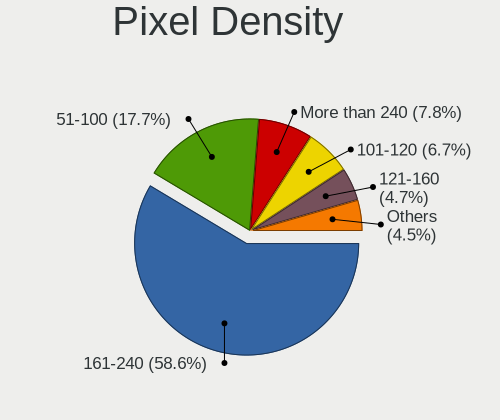

| Density       | Computers | Percent |
|---------------|-----------|---------|
| 161-240       | 592       | 49.71%  |
| 51-100        | 214       | 17.97%  |
| More than 240 | 177       | 14.86%  |
| 101-120       | 93        | 7.81%   |
| 121-160       | 67        | 5.63%   |
| 1-50          | 42        | 3.53%   |
| Unknown       | 6         | 0.5%    |

Multiple Monitors
-----------------

Total monitors connected

| Total | Computers | Percent |
|-------|-----------|---------|
| 1     | 858       | 75.59%  |
| 2     | 265       | 23.35%  |
| 3     | 11        | 0.97%   |
| 4     | 1         | 0.09%   |

Network
-------

Net Controller Vendor
---------------------

Controller vendors

| Vendor                        | Computers | Percent |
|-------------------------------|-----------|---------|
| Realtek Semiconductor         | 1019      | 73.15%  |
| ASIX Electronics              | 145       | 10.41%  |
| Intel                         | 111       | 7.97%   |
| Qualcomm Atheros              | 18        | 1.29%   |
| MediaTek                      | 16        | 1.15%   |
| Broadcom                      | 15        | 1.08%   |
| Microsoft                     | 12        | 0.86%   |
| TP-Link                       | 9         | 0.65%   |
| Ralink Technology             | 6         | 0.43%   |
| DisplayLink                   | 6         | 0.43%   |
| Broadcom Limited              | 5         | 0.36%   |
| Google                        | 4         | 0.29%   |
| Samsung Electronics           | 3         | 0.22%   |
| Lenovo                        | 3         | 0.22%   |
| ASUSTek Computer              | 3         | 0.22%   |
| OPPO Electronics              | 2         | 0.14%   |
| Marvell Technology Group      | 2         | 0.14%   |
| Edimax Technology             | 2         | 0.14%   |
| Dell                          | 2         | 0.14%   |
| D-Link                        | 2         | 0.14%   |
| ZyXEL Communications          | 1         | 0.07%   |
| Raspberry Pi                  | 1         | 0.07%   |
| OnePlus Technology (Shenzhen) | 1         | 0.07%   |
| Linksys                       | 1         | 0.07%   |
| Huawei Technologies           | 1         | 0.07%   |
| AVM                           | 1         | 0.07%   |
| Aquantia                      | 1         | 0.07%   |
| Apple                         | 1         | 0.07%   |

Net Controller Model
--------------------

Controller models

| Model                                                             | Computers | Percent |
|-------------------------------------------------------------------|-----------|---------|
| Realtek RTL8822CE 802.11ac PCIe Wireless Network Adapter          | 906       | 56.7%   |
| ASIX AX88179 Gigabit Ethernet                                     | 144       | 9.01%   |
| Realtek RTL8153 Gigabit Ethernet Adapter                          | 142       | 8.89%   |
| Realtek RTL8111/8168/8411 PCI Express Gigabit Ethernet Controller | 84        | 5.26%   |
| Intel Wi-Fi 6 AX200                                               | 21        | 1.31%   |
| Realtek RTL8152 Fast Ethernet Adapter                             | 14        | 0.88%   |
| Intel Wi-Fi 6 AX210/AX211/AX411 160MHz                            | 14        | 0.88%   |
| MediaTek MT7921K (RZ608) Wi-Fi 6E 80MHz                           | 10        | 0.63%   |
| Intel Ethernet Connection (2) I219-V                              | 10        | 0.63%   |
| Intel I211 Gigabit Network Connection                             | 9         | 0.56%   |
| Intel Ethernet Controller I225-V                                  | 9         | 0.56%   |
| Intel Wireless 7265                                               | 8         | 0.5%    |
| Realtek RTL8125 2.5GbE Controller                                 | 7         | 0.44%   |
| Intel Wi-Fi 6 AX201                                               | 7         | 0.44%   |
| Realtek RTL810xE PCI Express Fast Ethernet controller             | 6         | 0.38%   |
| Intel Wireless 8260                                               | 6         | 0.38%   |
| Intel 82579LM Gigabit Network Connection (Lewisville)             | 6         | 0.38%   |
| Qualcomm Atheros QCA6174 802.11ac Wireless Network Adapter        | 5         | 0.31%   |
| Microsoft Xbox Wireless Adapter for Windows                       | 5         | 0.31%   |
| Microsoft Wireless XBox Controller Dongle                         | 5         | 0.31%   |
| Broadcom BCM4360 802.11ac Wireless Network Adapter                | 5         | 0.31%   |
| Realtek RTL8821CE 802.11ac PCIe Wireless Network Adapter          | 4         | 0.25%   |
| Realtek 802.11ac NIC                                              | 4         | 0.25%   |
| Qualcomm Atheros QCA9377 802.11ac Wireless Network Adapter        | 4         | 0.25%   |
| MediaTek MT7922 802.11ax PCI Express Wireless Network Adapter     | 4         | 0.25%   |
| Intel Ethernet Connection (2) I218-V                              | 4         | 0.25%   |
| Intel Dual Band Wireless-AC 3168NGW [Stone Peak]                  | 4         | 0.25%   |
| Broadcom Limited BCM4360 802.11ac Wireless Network Adapter        | 4         | 0.25%   |
| Samsung Galaxy series, misc. (tethering mode)                     | 3         | 0.19%   |
| Realtek RTL88x2bu [AC1200 Techkey]                                | 3         | 0.19%   |
| Realtek RTL8852AE 802.11ax PCIe Wireless Network Adapter          | 3         | 0.19%   |
| Qualcomm Atheros QCA9565 / AR9565 Wireless Network Adapter        | 3         | 0.19%   |
| Qualcomm Atheros AR9485 Wireless Network Adapter                  | 3         | 0.19%   |
| Intel Wireless 3165                                               | 3         | 0.19%   |
| Intel Ethernet Connection (7) I219-V                              | 3         | 0.19%   |
| Intel Comet Lake PCH CNVi WiFi                                    | 3         | 0.19%   |
| Intel Cannon Lake PCH CNVi WiFi                                   | 3         | 0.19%   |
| DisplayLink Dell Universal Dock D6000                             | 3         | 0.19%   |
| Broadcom NetXtreme BCM57766 Gigabit Ethernet PCIe                 | 3         | 0.19%   |
| Broadcom NetXtreme BCM57765 Gigabit Ethernet PCIe                 | 3         | 0.19%   |

Wireless Vendor
---------------

Wireless vendors

| Vendor                   | Computers | Percent |
|--------------------------|-----------|---------|
| Realtek Semiconductor    | 930       | 84.47%  |
| Intel                    | 83        | 7.54%   |
| MediaTek                 | 16        | 1.45%   |
| Qualcomm Atheros         | 15        | 1.36%   |
| Broadcom                 | 13        | 1.18%   |
| Microsoft                | 12        | 1.09%   |
| TP-Link                  | 9         | 0.82%   |
| Ralink Technology        | 6         | 0.54%   |
| Broadcom Limited         | 5         | 0.45%   |
| ASUSTek Computer         | 3         | 0.27%   |
| Edimax Technology        | 2         | 0.18%   |
| D-Link                   | 2         | 0.18%   |
| ZyXEL Communications     | 1         | 0.09%   |
| Marvell Technology Group | 1         | 0.09%   |
| Linksys                  | 1         | 0.09%   |
| Dell                     | 1         | 0.09%   |
| AVM                      | 1         | 0.09%   |

Wireless Model
--------------

Wireless models

| Model                                                         | Computers | Percent |
|---------------------------------------------------------------|-----------|---------|
| Realtek RTL8822CE 802.11ac PCIe Wireless Network Adapter      | 906       | 82.14%  |
| Intel Wi-Fi 6 AX200                                           | 21        | 1.9%    |
| Intel Wi-Fi 6 AX210/AX211/AX411 160MHz                        | 14        | 1.27%   |
| MediaTek MT7921K (RZ608) Wi-Fi 6E 80MHz                       | 10        | 0.91%   |
| Intel Wireless 7265                                           | 8         | 0.73%   |
| Intel Wi-Fi 6 AX201                                           | 7         | 0.63%   |
| Intel Wireless 8260                                           | 6         | 0.54%   |
| Qualcomm Atheros QCA6174 802.11ac Wireless Network Adapter    | 5         | 0.45%   |
| Microsoft Xbox Wireless Adapter for Windows                   | 5         | 0.45%   |
| Microsoft Wireless XBox Controller Dongle                     | 5         | 0.45%   |
| Broadcom BCM4360 802.11ac Wireless Network Adapter            | 5         | 0.45%   |
| Realtek RTL8821CE 802.11ac PCIe Wireless Network Adapter      | 4         | 0.36%   |
| Realtek 802.11ac NIC                                          | 4         | 0.36%   |
| Qualcomm Atheros QCA9377 802.11ac Wireless Network Adapter    | 4         | 0.36%   |
| MediaTek MT7922 802.11ax PCI Express Wireless Network Adapter | 4         | 0.36%   |
| Intel Dual Band Wireless-AC 3168NGW [Stone Peak]              | 4         | 0.36%   |
| Broadcom Limited BCM4360 802.11ac Wireless Network Adapter    | 4         | 0.36%   |
| Realtek RTL88x2bu [AC1200 Techkey]                            | 3         | 0.27%   |
| Realtek RTL8852AE 802.11ax PCIe Wireless Network Adapter      | 3         | 0.27%   |
| Qualcomm Atheros QCA9565 / AR9565 Wireless Network Adapter    | 3         | 0.27%   |
| Qualcomm Atheros AR9485 Wireless Network Adapter              | 3         | 0.27%   |
| Intel Wireless 3165                                           | 3         | 0.27%   |
| Intel Comet Lake PCH CNVi WiFi                                | 3         | 0.27%   |
| Intel Cannon Lake PCH CNVi WiFi                               | 3         | 0.27%   |
| Broadcom BCM4331 802.11a/b/g/n                                | 3         | 0.27%   |
| TP-Link TL-WN823N v2/v3 [Realtek RTL8192EU]                   | 2         | 0.18%   |
| Realtek RTL8852BE PCIe 802.11ax Wireless Network Controller   | 2         | 0.18%   |
| Realtek RTL8812AU 802.11a/b/g/n/ac 2T2R DB WLAN Adapter       | 2         | 0.18%   |
| Ralink RT5370 Wireless Adapter                                | 2         | 0.18%   |
| Ralink RT2870/RT3070 Wireless Adapter                         | 2         | 0.18%   |
| Microsoft Xbox 360 Wireless Adapter                           | 2         | 0.18%   |
| MediaTek MT7921 802.11ax PCI Express Wireless Network Adapter | 2         | 0.18%   |
| Intel Wireless 8265 / 8275                                    | 2         | 0.18%   |
| Intel WiFi Link 5100                                          | 2         | 0.18%   |
| Intel Dual Band Wireless-AC 3165 Plus Bluetooth               | 2         | 0.18%   |
| Intel Centrino Wireless-N 2230                                | 2         | 0.18%   |
| ZyXEL 802.11ax WLAN Adapter                                   | 1         | 0.09%   |
| TP-Link Archer T9UH v1 [Realtek RTL8814AU]                    | 1         | 0.09%   |
| TP-Link Archer T4U ver.3                                      | 1         | 0.09%   |
| TP-Link Archer T3U [Realtek RTL8812BU]                        | 1         | 0.09%   |

Ethernet Vendor
---------------

Ethernet vendors

| Vendor                        | Computers | Percent |
|-------------------------------|-----------|---------|
| Realtek Semiconductor         | 254       | 52.05%  |
| ASIX Electronics              | 145       | 29.71%  |
| Intel                         | 53        | 10.86%  |
| Qualcomm Atheros              | 7         | 1.43%   |
| DisplayLink                   | 6         | 1.23%   |
| Broadcom                      | 6         | 1.23%   |
| Google                        | 4         | 0.82%   |
| Samsung Electronics           | 3         | 0.61%   |
| Lenovo                        | 3         | 0.61%   |
| OPPO Electronics              | 2         | 0.41%   |
| OnePlus Technology (Shenzhen) | 1         | 0.2%    |
| MediaTek                      | 1         | 0.2%    |
| Marvell Technology Group      | 1         | 0.2%    |
| Huawei Technologies           | 1         | 0.2%    |
| Aquantia                      | 1         | 0.2%    |

Ethernet Model
--------------

Ethernet models

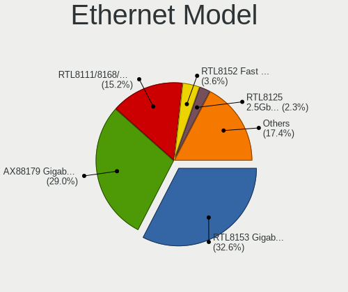

| Model                                                             | Computers | Percent |
|-------------------------------------------------------------------|-----------|---------|
| ASIX AX88179 Gigabit Ethernet                                     | 144       | 29.27%  |
| Realtek RTL8153 Gigabit Ethernet Adapter                          | 142       | 28.86%  |
| Realtek RTL8111/8168/8411 PCI Express Gigabit Ethernet Controller | 84        | 17.07%  |
| Realtek RTL8152 Fast Ethernet Adapter                             | 14        | 2.85%   |
| Intel Ethernet Connection (2) I219-V                              | 10        | 2.03%   |
| Intel I211 Gigabit Network Connection                             | 9         | 1.83%   |
| Intel Ethernet Controller I225-V                                  | 9         | 1.83%   |
| Realtek RTL8125 2.5GbE Controller                                 | 7         | 1.42%   |
| Realtek RTL810xE PCI Express Fast Ethernet controller             | 6         | 1.22%   |
| Intel 82579LM Gigabit Network Connection (Lewisville)             | 6         | 1.22%   |
| Intel Ethernet Connection (2) I218-V                              | 4         | 0.81%   |
| Samsung Galaxy series, misc. (tethering mode)                     | 3         | 0.61%   |
| Intel Ethernet Connection (7) I219-V                              | 3         | 0.61%   |
| DisplayLink Dell Universal Dock D6000                             | 3         | 0.61%   |
| Broadcom NetXtreme BCM57766 Gigabit Ethernet PCIe                 | 3         | 0.61%   |
| Broadcom NetXtreme BCM57765 Gigabit Ethernet PCIe                 | 3         | 0.61%   |
| Qualcomm Atheros Killer E2500 Gigabit Ethernet Controller         | 2         | 0.41%   |
| Qualcomm Atheros Killer E2400 Gigabit Ethernet Controller         | 2         | 0.41%   |
| Qualcomm Atheros AR8161 Gigabit Ethernet                          | 2         | 0.41%   |
| Intel I210 Gigabit Network Connection                             | 2         | 0.41%   |
| Intel Ethernet Connection I217-V                                  | 2         | 0.41%   |
| Intel Ethernet Connection I217-LM                                 | 2         | 0.41%   |
| Intel Ethernet Connection (7) I219-LM                             | 2         | 0.41%   |
| Intel Ethernet Connection (2) I219-LM                             | 2         | 0.41%   |
| Realtek PCIe GbE Family Controller                                | 1         | 0.2%    |
| Realtek Killer E2600 Gigabit Ethernet Controller                  | 1         | 0.2%    |
| Qualcomm Atheros Killer E220x Gigabit Ethernet Controller         | 1         | 0.2%    |
| OPPO KALAMA-MTP_CID:0437_SN:7EF55BBA                              | 1         | 0.2%    |
| OPPO 8                                                            | 1         | 0.2%    |
| OnePlus (Shenzhen) OnePlus                                        | 1         | 0.2%    |
| MediaTek Infinix HOT 11S NFC                                      | 1         | 0.2%    |
| Marvell Group 88E8040 PCI-E Fast Ethernet Controller              | 1         | 0.2%    |
| Lenovo USB-C Dock Ethernet                                        | 1         | 0.2%    |
| Lenovo ThinkPad TBT 3 Dock                                        | 1         | 0.2%    |
| Lenovo ThinkPad Lan                                               | 1         | 0.2%    |
| Intel Ethernet Connection (5) I219-LM                             | 1         | 0.2%    |
| Intel Ethernet Connection (17) I219-V                             | 1         | 0.2%    |
| Intel Ethernet Connection (14) I219-V                             | 1         | 0.2%    |
| Intel Ethernet Connection (12) I219-V                             | 1         | 0.2%    |
| Intel 82567LM Gigabit Network Connection                          | 1         | 0.2%    |

Net Controller Kind
-------------------

Ethernet, WiFi or modem

| Kind     | Computers | Percent |
|----------|-----------|---------|
| WiFi     | 1075      | 69.71%  |
| Ethernet | 464       | 30.09%  |
| Modem    | 2         | 0.13%   |
| Unknown  | 1         | 0.06%   |

Used Controller
---------------

Currently used network controller

| Kind     | Computers | Percent |
|----------|-----------|---------|
| WiFi     | 971       | 81.46%  |
| Ethernet | 221       | 18.54%  |

NICs
----

Total network controllers on board

| Total | Computers | Percent |
|-------|-----------|---------|
| 1     | 1005      | 90.3%   |
| 2     | 98        | 8.81%   |
| 3     | 8         | 0.72%   |
| 0     | 2         | 0.18%   |

IPv6
----

IPv6 vs IPv4

| Used | Computers | Percent |
|------|-----------|---------|
| No   | 694       | 61.74%  |
| Yes  | 430       | 38.26%  |

Bluetooth
---------

Bluetooth Vendor
----------------

Controller vendors

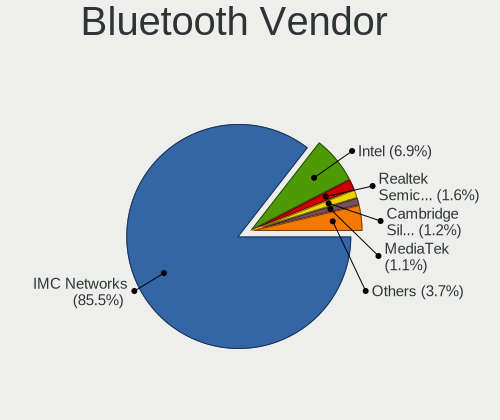

| Vendor                          | Computers | Percent |
|---------------------------------|-----------|---------|
| IMC Networks                    | 900       | 85.55%  |
| Intel                           | 77        | 7.32%   |
| Realtek Semiconductor           | 14        | 1.33%   |
| Cambridge Silicon Radio         | 11        | 1.05%   |
| Qualcomm Atheros Communications | 10        | 0.95%   |
| Apple                           | 10        | 0.95%   |
| MediaTek                        | 9         | 0.86%   |
| ASUSTek Computer                | 6         | 0.57%   |
| Foxconn / Hon Hai               | 5         | 0.48%   |
| Lite-On Technology              | 2         | 0.19%   |
| Broadcom                        | 2         | 0.19%   |
| TP-Link                         | 1         | 0.1%    |
| SINO WEALTH                     | 1         | 0.1%    |
| Realtek                         | 1         | 0.1%    |
| Marvell Semiconductor           | 1         | 0.1%    |
| Integrated System Solution      | 1         | 0.1%    |
| Alps Electric                   | 1         | 0.1%    |

Bluetooth Model
---------------

Controller models

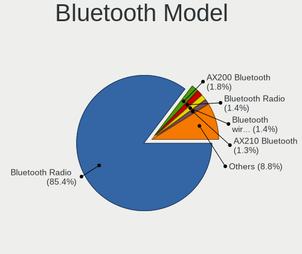

| Model                                                 | Computers | Percent |
|-------------------------------------------------------|-----------|---------|
| IMC Networks Bluetooth Radio                          | 899       | 85.46%  |
| Intel Bluetooth wireless interface                    | 22        | 2.09%   |
| Intel AX200 Bluetooth                                 | 19        | 1.81%   |
| Intel AX210 Bluetooth                                 | 13        | 1.24%   |
| Realtek Bluetooth Radio                               | 11        | 1.05%   |
| Intel AX201 Bluetooth                                 | 11        | 1.05%   |
| Cambridge Silicon Radio Bluetooth Dongle (HCI mode)   | 11        | 1.05%   |
| MediaTek Wireless_Device                              | 9         | 0.86%   |
| Apple Bluetooth Host Controller                       | 6         | 0.57%   |
| Qualcomm Atheros  Bluetooth Device                    | 4         | 0.38%   |
| Intel Wireless-AC 3168 Bluetooth                      | 4         | 0.38%   |
| Intel Bluetooth 9460/9560 Jefferson Peak (JfP)        | 4         | 0.38%   |
| Apple Bluetooth USB Host Controller                   | 4         | 0.38%   |
| Realtek  Bluetooth 4.2 Adapter                        | 3         | 0.29%   |
| Qualcomm Atheros QCA61x4 Bluetooth 4.0                | 3         | 0.29%   |
| Intel Centrino Bluetooth Wireless Transceiver         | 3         | 0.29%   |
| Foxconn / Hon Hai Wireless_Device                     | 3         | 0.29%   |
| ASUS Broadcom BCM20702A0 Bluetooth                    | 3         | 0.29%   |
| Qualcomm Atheros AR9462 Bluetooth                     | 2         | 0.19%   |
| Broadcom BCM20702A0 Bluetooth 4.0                     | 2         | 0.19%   |
| ASUS ASUS USB-BT500                                   | 2         | 0.19%   |
| TP-Link UB5A Adapter                                  | 1         | 0.1%    |
| SINO WEALTH RK Bluetooth Keyboar                      | 1         | 0.1%    |
| Realtek Bluetooth Radio                               | 1         | 0.1%    |
| Qualcomm Atheros AR3012 Bluetooth 4.0                 | 1         | 0.1%    |
| Marvell Bluetooth and Wireless LAN Composite          | 1         | 0.1%    |
| Lite-On Qualcomm Atheros QCA9377 Bluetooth            | 1         | 0.1%    |
| Lite-On Bluetooth Radio                               | 1         | 0.1%    |
| Intel Bluetooth Device                                | 1         | 0.1%    |
| Integrated System Solution KY-BT100 Bluetooth Adapter | 1         | 0.1%    |
| IMC Networks Bluetooth Device                         | 1         | 0.1%    |
| Foxconn / Hon Hai MediaTek Bluetooth Adapter          | 1         | 0.1%    |
| Foxconn / Hon Hai Broadcom BCM20702A1 Bluetooth       | 1         | 0.1%    |
| ASUS BCM20702A0                                       | 1         | 0.1%    |
| Alps Electric BCM2046 Bluetooth Device                | 1         | 0.1%    |

Sound
-----

Sound Vendor
------------

Sound card vendors

| Vendor                      | Computers | Percent |
|-----------------------------|-----------|---------|
| AMD                         | 1036      | 78.25%  |
| Intel                       | 108       | 8.16%   |
| Nvidia                      | 45        | 3.4%    |
| Logitech                    | 20        | 1.51%   |
| C-Media Electronics         | 10        | 0.76%   |
| Realtek Semiconductor       | 9         | 0.68%   |
| Kingston Technology         | 9         | 0.68%   |
| SteelSeries ApS             | 7         | 0.53%   |
| Sony                        | 7         | 0.53%   |
| Generalplus Technology      | 6         | 0.45%   |
| Razer USA                   | 5         | 0.38%   |
| JMTek                       | 5         | 0.38%   |
| Hewlett-Packard             | 5         | 0.38%   |
| Nreal                       | 4         | 0.3%    |
| Lenovo                      | 4         | 0.3%    |
| Corsair                     | 4         | 0.3%    |
| Plantronics                 | 3         | 0.23%   |
| GN Netcom                   | 3         | 0.23%   |
| Focusrite-Novation          | 3         | 0.23%   |
| Apple                       | 3         | 0.23%   |
| Valve Software              | 2         | 0.15%   |
| Tenx Technology             | 2         | 0.15%   |
| Medeli Electronics          | 2         | 0.15%   |
| FiiO Electronics Technology | 2         | 0.15%   |
| Blue Microphones            | 2         | 0.15%   |
| Texas Instruments           | 1         | 0.08%   |
| Silicon Motion              | 1         | 0.08%   |
| Quanta                      | 1         | 0.08%   |
| PreSonus Audio Electronics  | 1         | 0.08%   |
| Nordic Semiconductor ASA    | 1         | 0.08%   |
| MosArt Semiconductor        | 1         | 0.08%   |
| miniDSP                     | 1         | 0.08%   |
| Micro Star International    | 1         | 0.08%   |
| KTMicro                     | 1         | 0.08%   |
| Creative Labs               | 1         | 0.08%   |
| CMX Systems                 | 1         | 0.08%   |
| Cambridge Silicon Radio     | 1         | 0.08%   |
| BR23                        | 1         | 0.08%   |
| Bose                        | 1         | 0.08%   |
| BEHRINGER International     | 1         | 0.08%   |

Sound Model
-----------

Sound card models

| Model                                                                      | Computers | Percent |
|----------------------------------------------------------------------------|-----------|---------|
| AMD Rembrandt Radeon High Definition Audio Controller                      | 919       | 64.27%  |
| AMD Family 17h/19h HD Audio Controller                                     | 55        | 3.85%   |
| AMD Renoir Radeon High Definition Audio Controller                         | 27        | 1.89%   |
| AMD Navi 21/23 HDMI/DP Audio Controller                                    | 25        | 1.75%   |
| AMD Starship/Matisse HD Audio Controller                                   | 21        | 1.47%   |
| AMD Ellesmere HDMI Audio [Radeon RX 470/480 / 570/580/590]                 | 20        | 1.4%    |
| AMD Family 17h (Models 00h-0fh) HD Audio Controller                        | 14        | 0.98%   |
| AMD Navi 10 HDMI Audio                                                     | 13        | 0.91%   |
| Intel Cannon Lake PCH cAVS                                                 | 11        | 0.77%   |
| Intel 100 Series/C230 Series Chipset Family HD Audio Controller            | 10        | 0.7%    |
| Realtek Semiconductor USB Audio                                            | 9         | 0.63%   |
| Intel Tiger Lake-LP Smart Sound Technology Audio Controller                | 9         | 0.63%   |
| AMD Raven/Raven2/Fenghuang HDMI/DP Audio Controller                        | 9         | 0.63%   |
| Intel 7 Series/C216 Chipset Family High Definition Audio Controller        | 8         | 0.56%   |
| Intel 8 Series/C220 Series Chipset High Definition Audio Controller        | 7         | 0.49%   |
| Intel 200 Series PCH HD Audio                                              | 7         | 0.49%   |
| Nvidia GA104 High Definition Audio Controller                              | 6         | 0.42%   |
| Intel Tiger Lake-H HD Audio Controller                                     | 6         | 0.42%   |
| Intel 8 Series HD Audio Controller                                         | 6         | 0.42%   |
| Intel 6 Series/C200 Series Chipset Family High Definition Audio Controller | 6         | 0.42%   |
| Generalplus Technology USB Audio Device                                    | 6         | 0.42%   |
| AMD Baffin HDMI/DP Audio [Radeon RX 550 640SP / RX 560/560X]               | 6         | 0.42%   |
| Nvidia GP104 High Definition Audio Controller                              | 5         | 0.35%   |
| JMTek USB PnP Audio Device                                                 | 5         | 0.35%   |
| Intel Xeon E3-1200 v3/4th Gen Core Processor HD Audio Controller           | 5         | 0.35%   |
| Intel Sunrise Point-LP HD Audio                                            | 5         | 0.35%   |
| Intel Haswell-ULT HD Audio Controller                                      | 5         | 0.35%   |
| Intel CM238 HD Audio Controller                                            | 5         | 0.35%   |
| AMD FCH Azalia Controller                                                  | 5         | 0.35%   |
| Sony DualSense wireless controller (PS5)                                   | 4         | 0.28%   |
| Nvidia TU107 GeForce GTX 1650 High Definition Audio Controller             | 4         | 0.28%   |
| Nvidia TU106 High Definition Audio Controller                              | 4         | 0.28%   |
| Nvidia GP107GL High Definition Audio Controller                            | 4         | 0.28%   |
| Nreal Air                                                                  | 4         | 0.28%   |
| Logitech G733 Gaming Headset                                               | 4         | 0.28%   |
| Kingston Technology HyperX 7.1 Audio                                       | 4         | 0.28%   |
| Nvidia GM204 High Definition Audio Controller                              | 3         | 0.21%   |
| Nvidia GM107 High Definition Audio Controller [GeForce 940MX]              | 3         | 0.21%   |
| Nvidia GA106 High Definition Audio Controller                              | 3         | 0.21%   |
| Nvidia Audio device                                                        | 3         | 0.21%   |

Memory
------

Memory Vendor
-------------

Memory module vendors

| Vendor              | Computers | Percent |
|---------------------|-----------|---------|
| Samsung Electronics | 14        | 51.85%  |
| Micron Technology   | 6         | 22.22%  |
| SK hynix            | 3         | 11.11%  |
| Nanya Technology    | 1         | 3.7%    |
| Kingston            | 1         | 3.7%    |
| G.Skill             | 1         | 3.7%    |
| Crucial             | 1         | 3.7%    |

Memory Model
------------

Memory module models

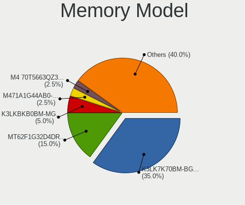

| Model                                                      | Computers | Percent |
|------------------------------------------------------------|-----------|---------|
| Samsung RAM K3LK7K70BM-BGCP000 4GB SODIMM LPDDR5 4266MT/s  | 10        | 37.04%  |
| Samsung RAM K3LKBKB0BM-MGCP 4GB SODIMM LPDDR5 6400MT/s     | 2         | 7.41%   |
| Micron RAM MT62F1G32D4DR-031 WT 4GB SODIMM LPDDR5 6400MT/s | 2         | 7.41%   |
| SK hynix RAM HMA81GS6DJR8N-XN 8192MB SODIMM DDR4 3200MT/s  | 1         | 3.7%    |
| SK hynix RAM H9JCNNNCP3MLYR-N6E 4GB DIMM LPDDR5 6400MT/s   | 1         | 3.7%    |
| SK hynix RAM H9JCNNNCP3MLCR-N6E 4GB DIMM LPDDR5 6400MT/s   | 1         | 3.7%    |
| Samsung RAM M471A1G44AB0-CWE 8GB SODIMM DDR4 3200MT/s      | 1         | 3.7%    |
| Samsung RAM M4 70T5663QZ3-CF7 2GB SODIMM DDR2 2048MT/s     | 1         | 3.7%    |
| Nanya RAM NT2GT64U8HD0BN-AD 2GB SODIMM DDR2 800MT/s        | 1         | 3.7%    |
| Micron RAM MT62F2G32D4DS-026 WT 4GB SODIMM LPDDR5 7500MT/s | 1         | 3.7%    |
| Micron RAM Module 2GB SODIMM DDR3 1600MT/s                 | 1         | 3.7%    |
| Micron RAM 8JTF5126 4HZ1G6D 1 4GB SODIMM DDR3 1600MT/s     | 1         | 3.7%    |
| Micron RAM 4ATF1G64HZ-3G2E1 8GB SODIMM DDR4 3200MT/s       | 1         | 3.7%    |
| Kingston RAM 9905417-054.A00G 4GB SODIMM DDR3 1600MT/s     | 1         | 3.7%    |
| G.Skill RAM F4-2666C19-16GRS 16GB SODIMM DDR4 2667MT/s     | 1         | 3.7%    |
| Crucial RAM CT8G4SFS832A.C8FR 8GB SODIMM DDR4 3200MT/s     | 1         | 3.7%    |

Memory Kind
-----------

Memory module kinds

| Kind   | Computers | Percent |
|--------|-----------|---------|
| LPDDR5 | 17        | 70.83%  |
| DDR4   | 4         | 16.67%  |
| DDR3   | 2         | 8.33%   |
| SDRAM  | 1         | 4.17%   |

Memory Form Factor
------------------

Physical design of the memory module

| Name   | Computers | Percent |
|--------|-----------|---------|
| SODIMM | 22        | 91.67%  |
| DIMM   | 2         | 8.33%   |

Memory Size
-----------

Memory module size

| Size  | Computers | Percent |
|-------|-----------|---------|
| 4096  | 17        | 70.83%  |
| 8192  | 4         | 16.67%  |
| 2048  | 2         | 8.33%   |
| 16384 | 1         | 4.17%   |

Memory Speed
------------

Memory module speed

| Speed | Computers | Percent |
|-------|-----------|---------|
| 4266  | 10        | 41.67%  |
| 6400  | 6         | 25%     |
| 3200  | 3         | 12.5%   |
| 1600  | 2         | 8.33%   |
| 7500  | 1         | 4.17%   |
| 2667  | 1         | 4.17%   |
| 2048  | 1         | 4.17%   |

Printers & scanners
-------------------

Printer Vendor
--------------

Printer device vendors

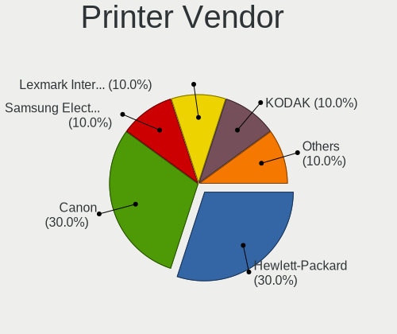

| Vendor          | Computers | Percent |
|-----------------|-----------|---------|
| Hewlett-Packard | 1         | 33.33%  |
| Dymo-CoStar     | 1         | 33.33%  |
| Canon           | 1         | 33.33%  |

Printer Model
-------------

Printer device models

| Model                       | Computers | Percent |
|-----------------------------|-----------|---------|
| HP Laserjet CP1525nw        | 1         | 33.33%  |
| Dymo-CoStar LabelWriter 400 | 1         | 33.33%  |
| Canon PIXMA MG2500 Series   | 1         | 33.33%  |

Scanner Vendor
--------------

Scanner device vendors

| Vendor | Computers | Percent |
|--------|-----------|---------|
| Canon  | 1         | 100%    |

Scanner Model
-------------

Scanner device models

| Model                   | Computers | Percent |
|-------------------------|-----------|---------|
| Canon CanoScan LiDE 210 | 1         | 100%    |

Camera
------

Camera Vendor
-------------

Camera device vendors

| Vendor                                 | Computers | Percent |
|----------------------------------------|-----------|---------|
| Logitech                               | 13        | 12.62%  |
| Chicony Electronics                    | 13        | 12.62%  |
| Realtek Semiconductor                  | 10        | 9.71%   |
| Microdia                               | 9         | 8.74%   |
| Apple                                  | 8         | 7.77%   |
| Tripath Technology                     | 5         | 4.85%   |
| Sunplus Innovation Technology          | 5         | 4.85%   |
| IMC Networks                           | 5         | 4.85%   |
| Quanta                                 | 4         | 3.88%   |
| Cheng Uei Precision Industry (Foxlink) | 4         | 3.88%   |
| Bison Electronics                      | 4         | 3.88%   |
| Samsung Electronics                    | 3         | 2.91%   |
| Valve Software                         | 2         | 1.94%   |
| Alpha Imaging Technology               | 2         | 1.94%   |
| Tobii Technology AB                    | 1         | 0.97%   |
| Syntek                                 | 1         | 0.97%   |
| Suyin                                  | 1         | 0.97%   |
| SunplusIT                              | 1         | 0.97%   |
| Silicon Motion                         | 1         | 0.97%   |
| Shenzhen Kingcome Optoelectronic       | 1         | 0.97%   |
| Ricoh                                  | 1         | 0.97%   |
| Razer USA                              | 1         | 0.97%   |
| Microsoft                              | 1         | 0.97%   |
| Magic Control Technology               | 1         | 0.97%   |
| Luxvisions Innotech Limited            | 1         | 0.97%   |
| IPEVO                                  | 1         | 0.97%   |
| Google                                 | 1         | 0.97%   |
| Generalplus Technology                 | 1         | 0.97%   |
| AVerMedia Technologies                 | 1         | 0.97%   |
| Acer                                   | 1         | 0.97%   |

Camera Model
------------

Camera device models

| Model                                           | Computers | Percent |
|-------------------------------------------------|-----------|---------|
| Tripath PC Camera                               | 5         | 4.85%   |
| Logitech HD Pro Webcam C920                     | 5         | 4.85%   |
| IMC Networks USB2.0 HD UVC WebCam               | 4         | 3.88%   |
| Samsung Galaxy series, misc. (MTP mode)         | 3         | 2.91%   |
| Microdia Webcam Vitade AF                       | 3         | 2.91%   |
| Microdia Integrated_Webcam_HD                   | 3         | 2.91%   |
| Logitech HD Webcam C615                         | 3         | 2.91%   |
| Chicony HP TrueVision HD Camera                 | 3         | 2.91%   |
| Bison Integrated Camera                         | 3         | 2.91%   |
| Apple iPhone 5/5C/5S/6/SE/7/8/X/XR              | 3         | 2.91%   |
| Apple FaceTime HD Camera                        | 3         | 2.91%   |
| Valve Software 3D Camera                        | 2         | 1.94%   |
| Sunplus Asus Webcam                             | 2         | 1.94%   |
| Realtek Streamplify CAM                         | 2         | 1.94%   |
| Realtek Integrated_Webcam_HD                    | 2         | 1.94%   |
| Logitech HD Webcam C525                         | 2         | 1.94%   |
| Chicony USB2.0 HD UVC WebCam                    | 2         | 1.94%   |
| Chicony Integrated Camera                       | 2         | 1.94%   |
| Chicony HD User Facing                          | 2         | 1.94%   |
| Alpha Imaging Integrated_Webcam_8M              | 2         | 1.94%   |
| Tobii AB EyeChip                                | 1         | 0.97%   |
| Syntek Integrated Camera                        | 1         | 0.97%   |
| Suyin HP Truevision HD                          | 1         | 0.97%   |
| SunplusIT CODi A05020 Webcam                    | 1         | 0.97%   |
| Sunplus USB 2.0 Camera                          | 1         | 0.97%   |
| Sunplus Integrated_Webcam_FHD                   | 1         | 0.97%   |
| Sunplus Dell E5570 integrated webcam            | 1         | 0.97%   |
| Silicon Motion WebCam SC-13HDL11939N            | 1         | 0.97%   |
| Shenzhen Kingcome Optoelectronic 720p HD Camera | 1         | 0.97%   |
| Ricoh Sony Vaio Integrated Webcam               | 1         | 0.97%   |
| Realtek USB2.0 camera                           | 1         | 0.97%   |
| Realtek Integrated_Webcam_FHD                   | 1         | 0.97%   |
| Realtek Integrated Webcam                       | 1         | 0.97%   |
| Realtek HP Truevision HD integrated webcam      | 1         | 0.97%   |
| Realtek Full HD webcam                          | 1         | 0.97%   |
| Realtek EasyCamera                              | 1         | 0.97%   |
| Razer USA Razer Kiyo X                          | 1         | 0.97%   |
| Quanta VGA WebCam                               | 1         | 0.97%   |
| Quanta HP Wide Vision HD Camera                 | 1         | 0.97%   |
| Quanta HD Webcam                                | 1         | 0.97%   |

Security
--------

Fingerprint Vendor
------------------

Fingerprint sensor vendors

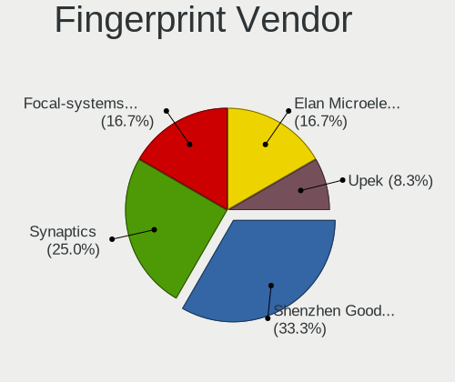

| Vendor                     | Computers | Percent |
|----------------------------|-----------|---------|
| Focal-systems.Corp         | 2         | 28.57%  |
| Elan Microelectronics      | 2         | 28.57%  |
| Upek                       | 1         | 14.29%  |
| Synaptics                  | 1         | 14.29%  |
| Shenzhen Goodix Technology | 1         | 14.29%  |

Fingerprint Model
-----------------

Fingerprint sensor models

| Model                                                  | Computers | Percent |
|--------------------------------------------------------|-----------|---------|
| Focal-systems.Corp FT9201Fingerprint.                  | 2         | 28.57%  |
| Upek Biometric Touchchip/Touchstrip Fingerprint Sensor | 1         | 14.29%  |
| Synaptics WBDI                                         | 1         | 14.29%  |
| Shenzhen Goodix  FingerPrint Device                    | 1         | 14.29%  |
| Elan fingerprint sensor [FeinTech FPS00200]            | 1         | 14.29%  |
| Elan ELAN:Fingerprint                                  | 1         | 14.29%  |

Chipcard Vendor
---------------

Chipcard module vendors

| Vendor                | Computers | Percent |
|-----------------------|-----------|---------|
| SCM Microsystems      | 1         | 33.33%  |
| Realtek Semiconductor | 1         | 33.33%  |
| Broadcom              | 1         | 33.33%  |

Chipcard Model
--------------

Chipcard module models

| Model                                             | Computers | Percent |
|---------------------------------------------------|-----------|---------|
| SCM Microsystems SCR3500 A Contact Reader         | 1         | 33.33%  |
| Realtek Semiconductor Smart Card Reader Interface | 1         | 33.33%  |
| Broadcom 5880                                     | 1         | 33.33%  |

Unsupported
-----------

Unsupported Devices
-------------------

Total unsupported devices on board

| Total | Computers | Percent |
|-------|-----------|---------|
| 0     | 1033      | 92.56%  |
| 1     | 61        | 5.47%   |
| 2     | 20        | 1.79%   |
| 4     | 1         | 0.09%   |
| 3     | 1         | 0.09%   |

Unsupported Device Types
------------------------

Types of unsupported devices

| Type                     | Computers | Percent |
|--------------------------|-----------|---------|
| Net/wireless             | 41        | 38.32%  |
| Multimedia controller    | 23        | 21.5%   |
| Graphics card            | 18        | 16.82%  |
| Fingerprint reader       | 7         | 6.54%   |
| Unassigned class         | 4         | 3.74%   |
| Camera                   | 4         | 3.74%   |
| Net/ethernet             | 3         | 2.8%    |
| Storage/nvme             | 2         | 1.87%   |
| Chipcard                 | 2         | 1.87%   |
| Sound                    | 1         | 0.93%   |
| Modem                    | 1         | 0.93%   |
| Communication controller | 1         | 0.93%   |

