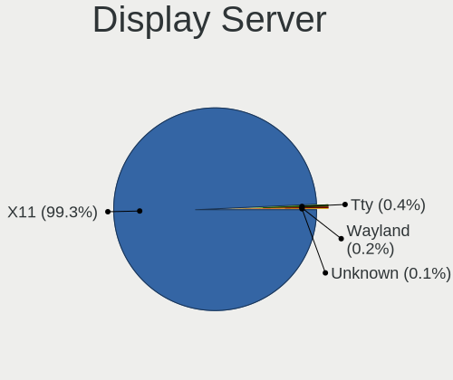
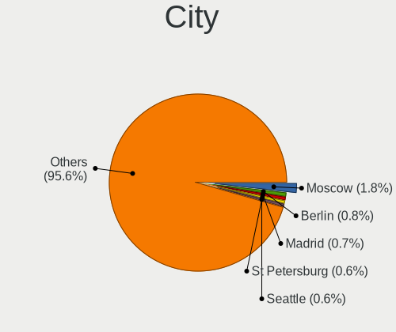
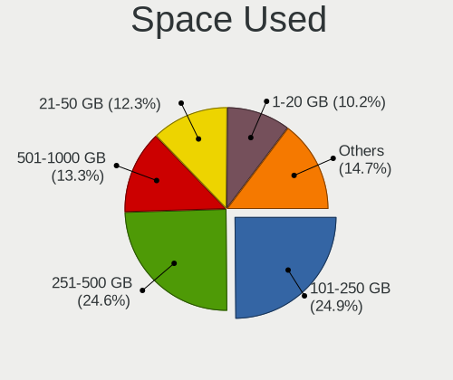
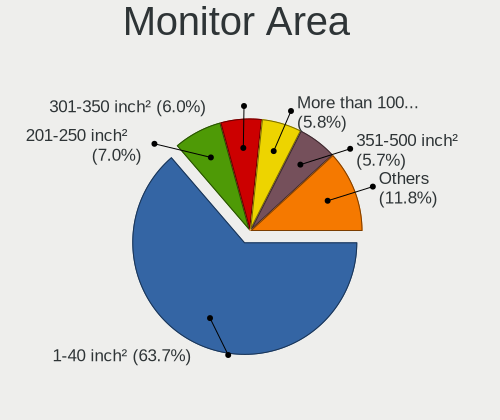
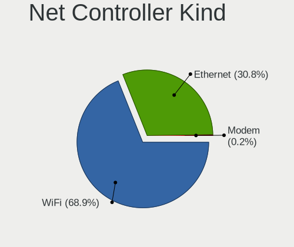
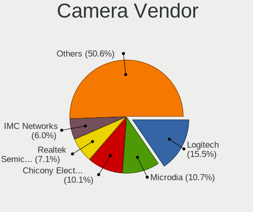

SteamOS - Tested Hardware & Statistics
--------------------------------------

A project to collect tested hardware configurations for SteamOS.

Anyone can contribute to this report by the [hw-probe](https://github.com/linuxhw/hw-probe) tool:

    sudo -E hw-probe -all -upload

Please contribute! Especially if your hardware is rare.

This is a report for all computer types. See also reports for [desktops](/Dist/SteamOS/Desktop/README.md) and [notebooks](/Dist/SteamOS/Notebook/README.md).

Contents
--------

* [ Test Cases ](#test-cases)

* [ System ](#system)
  - [ OS                       ](#os)
  - [ OS Family                ](#os-family)
  - [ Kernel                   ](#kernel)
  - [ Kernel Family            ](#kernel-family)
  - [ Kernel Major Ver.        ](#kernel-major-ver)
  - [ Arch                     ](#arch)
  - [ DE                       ](#de)
  - [ Display Server           ](#display-server)
  - [ Display Manager          ](#display-manager)
  - [ OS Lang                  ](#os-lang)
  - [ Boot Mode                ](#boot-mode)
  - [ Filesystem               ](#filesystem)
  - [ Part. scheme             ](#part-scheme)
  - [ Dual Boot with Linux/BSD ](#dual-boot-with-linuxbsd)
  - [ Dual Boot (Win)          ](#dual-boot-win)

* [ Board ](#board)
  - [ Vendor                   ](#vendor)
  - [ Model                    ](#model)
  - [ Model Family             ](#model-family)
  - [ MFG Year                 ](#mfg-year)
  - [ Form Factor              ](#form-factor)
  - [ Secure Boot              ](#secure-boot)
  - [ Coreboot                 ](#coreboot)
  - [ RAM Size                 ](#ram-size)
  - [ RAM Used                 ](#ram-used)
  - [ Total Drives             ](#total-drives)
  - [ Has CD-ROM               ](#has-cd-rom)
  - [ Has Ethernet             ](#has-ethernet)
  - [ Has WiFi                 ](#has-wifi)
  - [ Has Bluetooth            ](#has-bluetooth)

* [ Location ](#location)
  - [ Country                  ](#country)
  - [ City                     ](#city)

* [ Drives ](#drives)
  - [ Drive Vendor             ](#drive-vendor)
  - [ Drive Model              ](#drive-model)
  - [ HDD Vendor               ](#hdd-vendor)
  - [ SSD Vendor               ](#ssd-vendor)
  - [ Drive Kind               ](#drive-kind)
  - [ Drive Connector          ](#drive-connector)
  - [ Drive Size               ](#drive-size)
  - [ Space Total              ](#space-total)
  - [ Space Used               ](#space-used)
  - [ Malfunc. Drives          ](#malfunc-drives)
  - [ Malfunc. Drive Vendor    ](#malfunc-drive-vendor)
  - [ Malfunc. HDD Vendor      ](#malfunc-hdd-vendor)
  - [ Malfunc. Drive Kind      ](#malfunc-drive-kind)
  - [ Failed Drives            ](#failed-drives)
  - [ Failed Drive Vendor      ](#failed-drive-vendor)
  - [ Drive Status             ](#drive-status)

* [ Storage controller ](#storage-controller)
  - [ Storage Vendor           ](#storage-vendor)
  - [ Storage Model            ](#storage-model)
  - [ Storage Kind             ](#storage-kind)

* [ Processor ](#processor)
  - [ CPU Vendor               ](#cpu-vendor)
  - [ CPU Model                ](#cpu-model)
  - [ CPU Model Family         ](#cpu-model-family)
  - [ CPU Cores                ](#cpu-cores)
  - [ CPU Sockets              ](#cpu-sockets)
  - [ CPU Threads              ](#cpu-threads)
  - [ CPU Op-Modes             ](#cpu-op-modes)
  - [ CPU Microcode            ](#cpu-microcode)
  - [ CPU Microarch            ](#cpu-microarch)

* [ Graphics ](#graphics)
  - [ GPU Vendor               ](#gpu-vendor)
  - [ GPU Model                ](#gpu-model)
  - [ GPU Combo                ](#gpu-combo)
  - [ GPU Driver               ](#gpu-driver)
  - [ GPU Memory               ](#gpu-memory)

* [ Monitor ](#monitor)
  - [ Monitor Vendor           ](#monitor-vendor)
  - [ Monitor Model            ](#monitor-model)
  - [ Monitor Resolution       ](#monitor-resolution)
  - [ Monitor Diagonal         ](#monitor-diagonal)
  - [ Monitor Width            ](#monitor-width)
  - [ Aspect Ratio             ](#aspect-ratio)
  - [ Monitor Area             ](#monitor-area)
  - [ Pixel Density            ](#pixel-density)
  - [ Multiple Monitors        ](#multiple-monitors)

* [ Network ](#network)
  - [ Net Controller Vendor    ](#net-controller-vendor)
  - [ Net Controller Model     ](#net-controller-model)
  - [ Wireless Vendor          ](#wireless-vendor)
  - [ Wireless Model           ](#wireless-model)
  - [ Ethernet Vendor          ](#ethernet-vendor)
  - [ Ethernet Model           ](#ethernet-model)
  - [ Net Controller Kind      ](#net-controller-kind)
  - [ Used Controller          ](#used-controller)
  - [ NICs                     ](#nics)
  - [ IPv6                     ](#ipv6)

* [ Bluetooth ](#bluetooth)
  - [ Bluetooth Vendor         ](#bluetooth-vendor)
  - [ Bluetooth Model          ](#bluetooth-model)

* [ Sound ](#sound)
  - [ Sound Vendor             ](#sound-vendor)
  - [ Sound Model              ](#sound-model)

* [ Memory ](#memory)
  - [ Memory Vendor            ](#memory-vendor)
  - [ Memory Model             ](#memory-model)
  - [ Memory Kind              ](#memory-kind)
  - [ Memory Form Factor       ](#memory-form-factor)
  - [ Memory Size              ](#memory-size)
  - [ Memory Speed             ](#memory-speed)

* [ Printers & scanners ](#printers--scanners)
  - [ Printer Vendor           ](#printer-vendor)
  - [ Printer Model            ](#printer-model)
  - [ Scanner Vendor           ](#scanner-vendor)
  - [ Scanner Model            ](#scanner-model)

* [ Camera ](#camera)
  - [ Camera Vendor            ](#camera-vendor)
  - [ Camera Model             ](#camera-model)

* [ Security ](#security)
  - [ Fingerprint Vendor       ](#fingerprint-vendor)
  - [ Fingerprint Model        ](#fingerprint-model)
  - [ Chipcard Vendor          ](#chipcard-vendor)
  - [ Chipcard Model           ](#chipcard-model)

* [ Unsupported ](#unsupported)
  - [ Unsupported Devices      ](#unsupported-devices)
  - [ Unsupported Device Types ](#unsupported-device-types)

Test Cases
----------

Total: 2153

| Vendor        | Model                       | Form-Factor | Probe                                                      | Date         |
|---------------|-----------------------------|-------------|------------------------------------------------------------|--------------|
| Valve         | Jupiter                     | Notebook    | [99879342f6](https://linux-hardware.org/?probe=99879342f6) | May 09, 2024 |
| Valve         | Jupiter                     | Notebook    | [18c9c24ecb](https://linux-hardware.org/?probe=18c9c24ecb) | May 09, 2024 |
| Valve         | Jupiter                     | Notebook    | [fadecff7cd](https://linux-hardware.org/?probe=fadecff7cd) | May 08, 2024 |
| Valve         | Jupiter                     | Notebook    | [c0eded1dbf](https://linux-hardware.org/?probe=c0eded1dbf) | May 08, 2024 |
| Valve         | Jupiter                     | Notebook    | [cdb467c650](https://linux-hardware.org/?probe=cdb467c650) | May 08, 2024 |
| Valve         | Galileo                     | Notebook    | [9b9caa6850](https://linux-hardware.org/?probe=9b9caa6850) | May 07, 2024 |
| Valve         | Galileo                     | Notebook    | [af20242820](https://linux-hardware.org/?probe=af20242820) | May 06, 2024 |
| Valve         | Jupiter                     | Notebook    | [9a90343d3e](https://linux-hardware.org/?probe=9a90343d3e) | May 06, 2024 |
| Valve         | Jupiter                     | Notebook    | [829ef0c2ba](https://linux-hardware.org/?probe=829ef0c2ba) | May 06, 2024 |
| Valve         | Jupiter                     | Notebook    | [728da6c7b1](https://linux-hardware.org/?probe=728da6c7b1) | May 05, 2024 |
| Gigabyte      | B450M GAMING                | Desktop     | [dc7364667b](https://linux-hardware.org/?probe=dc7364667b) | May 05, 2024 |
| Valve         | Jupiter                     | Notebook    | [5f8e391778](https://linux-hardware.org/?probe=5f8e391778) | May 04, 2024 |
| ASRock        | B760M PG Lightning/D4       | Desktop     | [50c91b7d78](https://linux-hardware.org/?probe=50c91b7d78) | May 03, 2024 |
| Valve         | Jupiter                     | Notebook    | [9a03d01cbc](https://linux-hardware.org/?probe=9a03d01cbc) | May 03, 2024 |
| Valve         | Jupiter                     | Notebook    | [912546851a](https://linux-hardware.org/?probe=912546851a) | May 01, 2024 |
| Valve         | Galileo                     | Notebook    | [fc102d1c7f](https://linux-hardware.org/?probe=fc102d1c7f) | May 01, 2024 |
| ONE-NETBOO... | ONE XPLAYER                 | Tablet      | [68cb77a084](https://linux-hardware.org/?probe=68cb77a084) | May 01, 2024 |
| Valve         | Jupiter                     | Notebook    | [5266501940](https://linux-hardware.org/?probe=5266501940) | Apr 30, 2024 |
| Valve         | Jupiter                     | Notebook    | [20eca8966f](https://linux-hardware.org/?probe=20eca8966f) | Apr 28, 2024 |
| Valve         | Jupiter                     | Notebook    | [4360127fcb](https://linux-hardware.org/?probe=4360127fcb) | Apr 28, 2024 |
| Valve         | Jupiter                     | Notebook    | [42fe2e9ed4](https://linux-hardware.org/?probe=42fe2e9ed4) | Apr 28, 2024 |
| Valve         | Jupiter                     | Notebook    | [db12022c45](https://linux-hardware.org/?probe=db12022c45) | Apr 27, 2024 |
| Valve         | Jupiter                     | Notebook    | [2b383bd91e](https://linux-hardware.org/?probe=2b383bd91e) | Apr 27, 2024 |
| Valve         | Jupiter                     | Notebook    | [7a58749308](https://linux-hardware.org/?probe=7a58749308) | Apr 27, 2024 |
| Valve         | Jupiter                     | Notebook    | [bca2851ff6](https://linux-hardware.org/?probe=bca2851ff6) | Apr 27, 2024 |
| Valve         | Jupiter                     | Notebook    | [93f380bf3e](https://linux-hardware.org/?probe=93f380bf3e) | Apr 27, 2024 |
| Valve         | Jupiter                     | Notebook    | [2c0ec8539f](https://linux-hardware.org/?probe=2c0ec8539f) | Apr 26, 2024 |
| Valve         | Jupiter                     | Notebook    | [49fd8e0c8f](https://linux-hardware.org/?probe=49fd8e0c8f) | Apr 26, 2024 |
| Valve         | Jupiter                     | Notebook    | [3b3674f61e](https://linux-hardware.org/?probe=3b3674f61e) | Apr 26, 2024 |
| Valve         | Jupiter                     | Notebook    | [5430bf31d1](https://linux-hardware.org/?probe=5430bf31d1) | Apr 26, 2024 |
| Valve         | Jupiter                     | Notebook    | [81ec451d66](https://linux-hardware.org/?probe=81ec451d66) | Apr 26, 2024 |
| ASRock        | B450 Gaming-ITX/ac          | Desktop     | [4ffacbaeac](https://linux-hardware.org/?probe=4ffacbaeac) | Apr 25, 2024 |
| Valve         | Jupiter                     | Notebook    | [4cad19c61a](https://linux-hardware.org/?probe=4cad19c61a) | Apr 25, 2024 |
| Valve         | Jupiter                     | Notebook    | [61762f3b53](https://linux-hardware.org/?probe=61762f3b53) | Apr 24, 2024 |
| Valve         | Jupiter                     | Notebook    | [8b69a30a9d](https://linux-hardware.org/?probe=8b69a30a9d) | Apr 23, 2024 |
| Valve         | Jupiter                     | Notebook    | [7c8a53ecb1](https://linux-hardware.org/?probe=7c8a53ecb1) | Apr 23, 2024 |
| Valve         | Jupiter                     | Notebook    | [53f25f4dba](https://linux-hardware.org/?probe=53f25f4dba) | Apr 22, 2024 |
| Valve         | Jupiter                     | Notebook    | [665861dbf9](https://linux-hardware.org/?probe=665861dbf9) | Apr 22, 2024 |
| Valve         | Galileo                     | Notebook    | [3baa035f72](https://linux-hardware.org/?probe=3baa035f72) | Apr 21, 2024 |
| Valve         | Jupiter                     | Notebook    | [bc9b5cbcc5](https://linux-hardware.org/?probe=bc9b5cbcc5) | Apr 20, 2024 |
| Valve         | Jupiter                     | Notebook    | [3d82c7c0ee](https://linux-hardware.org/?probe=3d82c7c0ee) | Apr 20, 2024 |
| ONE-NETBOO... | ONEXPLAYER Mini Pro         | Tablet      | [2b95c1e3b2](https://linux-hardware.org/?probe=2b95c1e3b2) | Apr 20, 2024 |
| Valve         | Jupiter                     | Notebook    | [8cbd37a2d2](https://linux-hardware.org/?probe=8cbd37a2d2) | Apr 19, 2024 |
| Valve         | Galileo                     | Notebook    | [c3c28433cd](https://linux-hardware.org/?probe=c3c28433cd) | Apr 19, 2024 |
| ONE-NETBOO... | ONEXPLAYER Mini Pro         | Tablet      | [4c54b3eac4](https://linux-hardware.org/?probe=4c54b3eac4) | Apr 19, 2024 |
| Valve         | Jupiter                     | Notebook    | [38ab9d1cca](https://linux-hardware.org/?probe=38ab9d1cca) | Apr 18, 2024 |
| Valve         | Jupiter                     | Notebook    | [46fe84935f](https://linux-hardware.org/?probe=46fe84935f) | Apr 18, 2024 |
| Valve         | Jupiter                     | Notebook    | [85092eabaa](https://linux-hardware.org/?probe=85092eabaa) | Apr 18, 2024 |
| Valve         | Jupiter                     | Notebook    | [541aacb1a1](https://linux-hardware.org/?probe=541aacb1a1) | Apr 17, 2024 |
| Valve         | Jupiter                     | Notebook    | [37f71f57a0](https://linux-hardware.org/?probe=37f71f57a0) | Apr 17, 2024 |
| Valve         | Jupiter                     | Notebook    | [04d302c0e5](https://linux-hardware.org/?probe=04d302c0e5) | Apr 16, 2024 |
| Valve         | Jupiter                     | Notebook    | [d5c75e66f1](https://linux-hardware.org/?probe=d5c75e66f1) | Apr 16, 2024 |
| Valve         | Jupiter                     | Notebook    | [7de67bf8c5](https://linux-hardware.org/?probe=7de67bf8c5) | Apr 16, 2024 |
| Valve         | Jupiter                     | Notebook    | [211106f4c1](https://linux-hardware.org/?probe=211106f4c1) | Apr 14, 2024 |
| Valve         | Jupiter                     | Notebook    | [0043fe12b0](https://linux-hardware.org/?probe=0043fe12b0) | Apr 13, 2024 |
| ASUSTek       | PRIME A320M-K               | Desktop     | [97e9e0c7a1](https://linux-hardware.org/?probe=97e9e0c7a1) | Apr 13, 2024 |
| Valve         | Jupiter                     | Notebook    | [8b4172f55b](https://linux-hardware.org/?probe=8b4172f55b) | Apr 13, 2024 |
| Valve         | Jupiter                     | Notebook    | [64cab9101d](https://linux-hardware.org/?probe=64cab9101d) | Apr 12, 2024 |
| Valve         | Jupiter                     | Notebook    | [c5c95abb79](https://linux-hardware.org/?probe=c5c95abb79) | Apr 12, 2024 |
| Valve         | Jupiter                     | Notebook    | [5f44467298](https://linux-hardware.org/?probe=5f44467298) | Apr 11, 2024 |
| Valve         | Jupiter                     | Notebook    | [a75cf3dc0f](https://linux-hardware.org/?probe=a75cf3dc0f) | Apr 10, 2024 |
| Valve         | Jupiter                     | Notebook    | [6f2b093298](https://linux-hardware.org/?probe=6f2b093298) | Apr 09, 2024 |
| Valve         | Jupiter                     | Notebook    | [a80d8086f4](https://linux-hardware.org/?probe=a80d8086f4) | Apr 09, 2024 |
| Valve         | Galileo                     | Notebook    | [942bd1a16a](https://linux-hardware.org/?probe=942bd1a16a) | Apr 08, 2024 |
| Valve         | Galileo                     | Notebook    | [9ce0365088](https://linux-hardware.org/?probe=9ce0365088) | Apr 08, 2024 |
| Gigabyte      | B450M GAMING                | Desktop     | [d0241d517a](https://linux-hardware.org/?probe=d0241d517a) | Apr 08, 2024 |
| Valve         | Jupiter                     | Notebook    | [36089b579d](https://linux-hardware.org/?probe=36089b579d) | Apr 07, 2024 |
| Valve         | Jupiter                     | Notebook    | [8cd7c7653a](https://linux-hardware.org/?probe=8cd7c7653a) | Apr 07, 2024 |
| Valve         | Jupiter                     | Notebook    | [6fb589032f](https://linux-hardware.org/?probe=6fb589032f) | Apr 07, 2024 |
| Valve         | Jupiter                     | Notebook    | [ca414b0905](https://linux-hardware.org/?probe=ca414b0905) | Apr 07, 2024 |
| Valve         | Jupiter                     | Notebook    | [80b0985ecd](https://linux-hardware.org/?probe=80b0985ecd) | Apr 07, 2024 |
| Valve         | Jupiter                     | Notebook    | [1cd9cc4807](https://linux-hardware.org/?probe=1cd9cc4807) | Apr 07, 2024 |
| Unknown       | X570 Phantom Gaming-ITX/... | Notebook    | [d0447bf92e](https://linux-hardware.org/?probe=d0447bf92e) | Apr 06, 2024 |
| Valve         | Jupiter                     | Notebook    | [70c2145a5e](https://linux-hardware.org/?probe=70c2145a5e) | Apr 06, 2024 |
| Valve         | Jupiter                     | Notebook    | [2e89c99bcd](https://linux-hardware.org/?probe=2e89c99bcd) | Apr 06, 2024 |
| Valve         | Jupiter                     | Notebook    | [bf17940c69](https://linux-hardware.org/?probe=bf17940c69) | Apr 06, 2024 |
| Valve         | Jupiter                     | Notebook    | [04c5de9351](https://linux-hardware.org/?probe=04c5de9351) | Apr 05, 2024 |
| Valve         | Jupiter                     | Notebook    | [a981f41f5c](https://linux-hardware.org/?probe=a981f41f5c) | Apr 05, 2024 |
| Valve         | Jupiter                     | Notebook    | [806dd327bf](https://linux-hardware.org/?probe=806dd327bf) | Apr 05, 2024 |
| ASRock        | B450M Pro4-F                | Desktop     | [c70e4f20eb](https://linux-hardware.org/?probe=c70e4f20eb) | Apr 05, 2024 |
| Valve         | Jupiter                     | Notebook    | [e7ac70b5b9](https://linux-hardware.org/?probe=e7ac70b5b9) | Apr 04, 2024 |
| Valve         | Galileo                     | Notebook    | [968d4e6589](https://linux-hardware.org/?probe=968d4e6589) | Apr 03, 2024 |
| Valve         | Jupiter                     | Notebook    | [450a01c984](https://linux-hardware.org/?probe=450a01c984) | Apr 03, 2024 |
| Valve         | Jupiter                     | Notebook    | [a9bb9ace67](https://linux-hardware.org/?probe=a9bb9ace67) | Apr 03, 2024 |
| Valve         | Galileo                     | Notebook    | [0e73d5c7db](https://linux-hardware.org/?probe=0e73d5c7db) | Apr 03, 2024 |
| Valve         | Jupiter                     | Notebook    | [3f58323ccb](https://linux-hardware.org/?probe=3f58323ccb) | Apr 02, 2024 |
| Valve         | Jupiter                     | Notebook    | [780ff142f3](https://linux-hardware.org/?probe=780ff142f3) | Apr 01, 2024 |
| ASUSTek       | ROG CROSSHAIR VIII DARK ... | Desktop     | [3fe2ef5687](https://linux-hardware.org/?probe=3fe2ef5687) | Apr 01, 2024 |
| ASUSTek       | ROG CROSSHAIR VIII DARK ... | Desktop     | [24108983ab](https://linux-hardware.org/?probe=24108983ab) | Apr 01, 2024 |
| ONE-NETBOO... | ONEXPLAYER Mini Pro         | Tablet      | [4dd7031fb5](https://linux-hardware.org/?probe=4dd7031fb5) | Mar 31, 2024 |
| Valve         | Jupiter                     | Notebook    | [83291b94be](https://linux-hardware.org/?probe=83291b94be) | Mar 31, 2024 |
| Valve         | Jupiter                     | Notebook    | [16cef49100](https://linux-hardware.org/?probe=16cef49100) | Mar 31, 2024 |
| Valve         | Galileo                     | Notebook    | [f1d07303d3](https://linux-hardware.org/?probe=f1d07303d3) | Mar 30, 2024 |
| Unknown       | X570 Phantom Gaming-ITX/... | Notebook    | [1fb1798295](https://linux-hardware.org/?probe=1fb1798295) | Mar 30, 2024 |
| Valve         | Jupiter                     | Notebook    | [65e56cbf7d](https://linux-hardware.org/?probe=65e56cbf7d) | Mar 30, 2024 |
| Valve         | Jupiter                     | Notebook    | [1a14e1128b](https://linux-hardware.org/?probe=1a14e1128b) | Mar 29, 2024 |
| Valve         | Galileo                     | Notebook    | [cf3139b931](https://linux-hardware.org/?probe=cf3139b931) | Mar 29, 2024 |
| Valve         | Jupiter                     | Notebook    | [b2242c7939](https://linux-hardware.org/?probe=b2242c7939) | Mar 28, 2024 |
| Valve         | Jupiter                     | Notebook    | [735b182e71](https://linux-hardware.org/?probe=735b182e71) | Mar 27, 2024 |
| ASRock        | X570 Phantom Gaming 4       | Desktop     | [1cda914d9f](https://linux-hardware.org/?probe=1cda914d9f) | Mar 27, 2024 |
| Valve         | Jupiter                     | Notebook    | [767300c112](https://linux-hardware.org/?probe=767300c112) | Mar 27, 2024 |
| Valve         | Jupiter                     | Notebook    | [6ded41cc7e](https://linux-hardware.org/?probe=6ded41cc7e) | Mar 26, 2024 |
| Valve         | Jupiter                     | Notebook    | [99fec85b50](https://linux-hardware.org/?probe=99fec85b50) | Mar 25, 2024 |
| Valve         | Jupiter                     | Notebook    | [28b02c08d8](https://linux-hardware.org/?probe=28b02c08d8) | Mar 25, 2024 |
| Valve         | Jupiter                     | Notebook    | [8c039323e6](https://linux-hardware.org/?probe=8c039323e6) | Mar 24, 2024 |
| Valve         | Jupiter                     | Notebook    | [4342049244](https://linux-hardware.org/?probe=4342049244) | Mar 24, 2024 |
| Valve         | Jupiter                     | Notebook    | [b61c5a739b](https://linux-hardware.org/?probe=b61c5a739b) | Mar 24, 2024 |
| Valve         | Galileo                     | Notebook    | [edb753ac8d](https://linux-hardware.org/?probe=edb753ac8d) | Mar 24, 2024 |
| Valve         | Jupiter                     | Notebook    | [d2155ef727](https://linux-hardware.org/?probe=d2155ef727) | Mar 23, 2024 |
| Valve         | Jupiter                     | Notebook    | [a4d5199429](https://linux-hardware.org/?probe=a4d5199429) | Mar 23, 2024 |
| Valve         | Galileo                     | Notebook    | [5e7e2c39df](https://linux-hardware.org/?probe=5e7e2c39df) | Mar 22, 2024 |
| Valve         | Galileo                     | Notebook    | [14e646cf21](https://linux-hardware.org/?probe=14e646cf21) | Mar 22, 2024 |
| Valve         | Jupiter                     | Notebook    | [4de44d6cdd](https://linux-hardware.org/?probe=4de44d6cdd) | Mar 22, 2024 |
| Valve         | Jupiter                     | Notebook    | [3984f68c68](https://linux-hardware.org/?probe=3984f68c68) | Mar 22, 2024 |
| Valve         | Galileo                     | Notebook    | [cd0fb4513f](https://linux-hardware.org/?probe=cd0fb4513f) | Mar 21, 2024 |
| Valve         | Jupiter                     | Notebook    | [799336fb6f](https://linux-hardware.org/?probe=799336fb6f) | Mar 21, 2024 |
| Valve         | Galileo                     | Notebook    | [21dd2b032b](https://linux-hardware.org/?probe=21dd2b032b) | Mar 20, 2024 |
| Valve         | Jupiter                     | Notebook    | [00d8e6290f](https://linux-hardware.org/?probe=00d8e6290f) | Mar 20, 2024 |
| Valve         | Galileo                     | Notebook    | [f27bde39ca](https://linux-hardware.org/?probe=f27bde39ca) | Mar 20, 2024 |
| Valve         | Jupiter                     | Notebook    | [fdd201eb62](https://linux-hardware.org/?probe=fdd201eb62) | Mar 20, 2024 |
| Valve         | Jupiter                     | Notebook    | [5c3d9869b4](https://linux-hardware.org/?probe=5c3d9869b4) | Mar 20, 2024 |
| Valve         | Jupiter                     | Notebook    | [ff5812e646](https://linux-hardware.org/?probe=ff5812e646) | Mar 20, 2024 |
| Valve         | Galileo                     | Notebook    | [0bbc97ddea](https://linux-hardware.org/?probe=0bbc97ddea) | Mar 19, 2024 |
| Valve         | Galileo                     | Notebook    | [085b9b9244](https://linux-hardware.org/?probe=085b9b9244) | Mar 19, 2024 |
| Valve         | Jupiter                     | Notebook    | [869100ba40](https://linux-hardware.org/?probe=869100ba40) | Mar 19, 2024 |
| Valve         | Jupiter                     | Notebook    | [0f1ba4ef31](https://linux-hardware.org/?probe=0f1ba4ef31) | Mar 18, 2024 |
| Valve         | Jupiter                     | Notebook    | [4d0b384f4d](https://linux-hardware.org/?probe=4d0b384f4d) | Mar 17, 2024 |
| Gigabyte      | A620M GAMING X AX           | Desktop     | [95dabe0b93](https://linux-hardware.org/?probe=95dabe0b93) | Mar 17, 2024 |
| Valve         | Jupiter                     | Notebook    | [ebb293f4f2](https://linux-hardware.org/?probe=ebb293f4f2) | Mar 16, 2024 |
| Valve         | Galileo                     | Notebook    | [1b0c67a809](https://linux-hardware.org/?probe=1b0c67a809) | Mar 16, 2024 |
| Gigabyte      | A620M GAMING X AX           | Desktop     | [ac8a1cf30d](https://linux-hardware.org/?probe=ac8a1cf30d) | Mar 16, 2024 |
| Valve         | Galileo                     | Notebook    | [94545cd73f](https://linux-hardware.org/?probe=94545cd73f) | Mar 16, 2024 |
| MACHINIST     | E5 MR9A PRO MAX V1.1        | Desktop     | [853a2babec](https://linux-hardware.org/?probe=853a2babec) | Mar 16, 2024 |
| Valve         | Jupiter                     | Notebook    | [5592371b6d](https://linux-hardware.org/?probe=5592371b6d) | Mar 15, 2024 |
| Valve         | Jupiter                     | Notebook    | [ed1ff78792](https://linux-hardware.org/?probe=ed1ff78792) | Mar 14, 2024 |
| Valve         | Jupiter                     | Notebook    | [930838ef76](https://linux-hardware.org/?probe=930838ef76) | Mar 14, 2024 |
| Valve         | Galileo                     | Notebook    | [ce3a2505b6](https://linux-hardware.org/?probe=ce3a2505b6) | Mar 14, 2024 |
| Valve         | Jupiter                     | Notebook    | [c3514740e2](https://linux-hardware.org/?probe=c3514740e2) | Mar 14, 2024 |
| Valve         | Jupiter                     | Notebook    | [14ec218ad2](https://linux-hardware.org/?probe=14ec218ad2) | Mar 14, 2024 |
| Valve         | Jupiter                     | Notebook    | [850f86c442](https://linux-hardware.org/?probe=850f86c442) | Mar 13, 2024 |
| Valve         | Galileo                     | Notebook    | [a55314d630](https://linux-hardware.org/?probe=a55314d630) | Mar 13, 2024 |
| Valve         | Jupiter                     | Notebook    | [14ed8497d8](https://linux-hardware.org/?probe=14ed8497d8) | Mar 12, 2024 |
| Valve         | Galileo                     | Notebook    | [fd1ccf71a2](https://linux-hardware.org/?probe=fd1ccf71a2) | Mar 12, 2024 |
| Valve         | Jupiter                     | Notebook    | [19c2d88d48](https://linux-hardware.org/?probe=19c2d88d48) | Mar 11, 2024 |
| Valve         | Jupiter                     | Notebook    | [ee85c6e7e9](https://linux-hardware.org/?probe=ee85c6e7e9) | Mar 11, 2024 |
| Valve         | Jupiter                     | Notebook    | [0a31a36586](https://linux-hardware.org/?probe=0a31a36586) | Mar 10, 2024 |
| Valve         | Galileo                     | Notebook    | [d816b83ec2](https://linux-hardware.org/?probe=d816b83ec2) | Mar 10, 2024 |
| Gigabyte      | B650 GAMING X AX            | Notebook    | [3ee6829e26](https://linux-hardware.org/?probe=3ee6829e26) | Mar 10, 2024 |
| Valve         | Jupiter                     | Notebook    | [af7786fb34](https://linux-hardware.org/?probe=af7786fb34) | Mar 10, 2024 |
| AZW           | SER V1.0                    | Mini pc     | [541d122eed](https://linux-hardware.org/?probe=541d122eed) | Mar 10, 2024 |
| Valve         | Jupiter                     | Notebook    | [d38b45b5d5](https://linux-hardware.org/?probe=d38b45b5d5) | Mar 10, 2024 |
| Valve         | Jupiter                     | Notebook    | [f8cd449a7b](https://linux-hardware.org/?probe=f8cd449a7b) | Mar 09, 2024 |
| Valve         | Galileo                     | Notebook    | [1b9852cbf9](https://linux-hardware.org/?probe=1b9852cbf9) | Mar 09, 2024 |
| Valve         | Jupiter                     | Notebook    | [b69d18360e](https://linux-hardware.org/?probe=b69d18360e) | Mar 08, 2024 |
| Valve         | Galileo                     | Notebook    | [b2d15e9047](https://linux-hardware.org/?probe=b2d15e9047) | Mar 08, 2024 |
| Valve         | Jupiter                     | Notebook    | [035ae9a246](https://linux-hardware.org/?probe=035ae9a246) | Mar 08, 2024 |
| Valve         | Galileo                     | Notebook    | [7ae1784e3b](https://linux-hardware.org/?probe=7ae1784e3b) | Mar 06, 2024 |
| Valve         | Jupiter                     | Notebook    | [677470b88d](https://linux-hardware.org/?probe=677470b88d) | Mar 06, 2024 |
| QIYIDA        | ED4 V1.1                    | Desktop     | [cbfcb37d83](https://linux-hardware.org/?probe=cbfcb37d83) | Mar 06, 2024 |
| Valve         | Jupiter                     | Notebook    | [1af9e94fb7](https://linux-hardware.org/?probe=1af9e94fb7) | Mar 05, 2024 |
| Valve         | Galileo                     | Notebook    | [88afcecdbe](https://linux-hardware.org/?probe=88afcecdbe) | Mar 05, 2024 |
| Valve         | Jupiter                     | Notebook    | [f1068af6ca](https://linux-hardware.org/?probe=f1068af6ca) | Mar 03, 2024 |
| ASRock        | B550M Steel Legend          | Desktop     | [ff01bc4e69](https://linux-hardware.org/?probe=ff01bc4e69) | Mar 03, 2024 |
| Valve         | Jupiter                     | Notebook    | [3937ff45d4](https://linux-hardware.org/?probe=3937ff45d4) | Mar 03, 2024 |
| ASUSTek       | Z170-A                      | Desktop     | [5c7cfb2969](https://linux-hardware.org/?probe=5c7cfb2969) | Mar 02, 2024 |
| Valve         | Galileo                     | Notebook    | [fd78eb29e4](https://linux-hardware.org/?probe=fd78eb29e4) | Mar 02, 2024 |
| Valve         | Jupiter                     | Notebook    | [eecf1f7620](https://linux-hardware.org/?probe=eecf1f7620) | Mar 02, 2024 |
| Valve         | Jupiter                     | Notebook    | [8a19c9b077](https://linux-hardware.org/?probe=8a19c9b077) | Mar 02, 2024 |
| Dell          | 042P49 A02                  | Desktop     | [721c874400](https://linux-hardware.org/?probe=721c874400) | Mar 02, 2024 |
| Valve         | Jupiter                     | Notebook    | [b455b30583](https://linux-hardware.org/?probe=b455b30583) | Mar 02, 2024 |
| Valve         | Jupiter                     | Notebook    | [8b06ba52f8](https://linux-hardware.org/?probe=8b06ba52f8) | Mar 02, 2024 |
| Gigabyte      | H170M-DS3H-CF               | Desktop     | [e9d405fea6](https://linux-hardware.org/?probe=e9d405fea6) | Mar 02, 2024 |
| Gigabyte      | H170M-DS3H-CF               | Desktop     | [c95130db9f](https://linux-hardware.org/?probe=c95130db9f) | Mar 02, 2024 |
| Valve         | Jupiter                     | Notebook    | [b2228e6857](https://linux-hardware.org/?probe=b2228e6857) | Mar 02, 2024 |
| Valve         | Jupiter                     | Notebook    | [febb7c9dec](https://linux-hardware.org/?probe=febb7c9dec) | Mar 01, 2024 |
| Valve         | Jupiter                     | Notebook    | [610fa788bb](https://linux-hardware.org/?probe=610fa788bb) | Mar 01, 2024 |
| Valve         | Jupiter                     | Notebook    | [a3062daa4e](https://linux-hardware.org/?probe=a3062daa4e) | Mar 01, 2024 |
| Valve         | Jupiter                     | Notebook    | [25aac8bc03](https://linux-hardware.org/?probe=25aac8bc03) | Mar 01, 2024 |
| Valve         | Galileo                     | Notebook    | [63cd4fe821](https://linux-hardware.org/?probe=63cd4fe821) | Feb 29, 2024 |
| Valve         | Jupiter                     | Notebook    | [30c94fd159](https://linux-hardware.org/?probe=30c94fd159) | Feb 29, 2024 |
| Valve         | Jupiter                     | Notebook    | [2f381a7a43](https://linux-hardware.org/?probe=2f381a7a43) | Feb 29, 2024 |
| Valve         | Jupiter                     | Notebook    | [ecfc325c0f](https://linux-hardware.org/?probe=ecfc325c0f) | Feb 29, 2024 |
| Valve         | Galileo                     | Notebook    | [341298d11f](https://linux-hardware.org/?probe=341298d11f) | Feb 28, 2024 |
| Valve         | Galileo                     | Notebook    | [d8f5007f65](https://linux-hardware.org/?probe=d8f5007f65) | Feb 27, 2024 |
| Valve         | Galileo                     | Notebook    | [10c68c0f8b](https://linux-hardware.org/?probe=10c68c0f8b) | Feb 27, 2024 |
| Valve         | Galileo                     | Notebook    | [1eecc5bac8](https://linux-hardware.org/?probe=1eecc5bac8) | Feb 27, 2024 |
| Lenovo        | IdeaPad 130-15AST 81H5      | Notebook    | [14d015f400](https://linux-hardware.org/?probe=14d015f400) | Feb 26, 2024 |
| Valve         | Galileo                     | Notebook    | [de70e171dc](https://linux-hardware.org/?probe=de70e171dc) | Feb 25, 2024 |
| Valve         | Jupiter                     | Notebook    | [a559534ad7](https://linux-hardware.org/?probe=a559534ad7) | Feb 25, 2024 |
| Valve         | Jupiter                     | Notebook    | [ac52b6fbea](https://linux-hardware.org/?probe=ac52b6fbea) | Feb 25, 2024 |
| Valve         | Jupiter                     | Notebook    | [4da56c1b32](https://linux-hardware.org/?probe=4da56c1b32) | Feb 24, 2024 |
| Valve         | Galileo                     | Notebook    | [222802e961](https://linux-hardware.org/?probe=222802e961) | Feb 24, 2024 |
| Valve         | Jupiter                     | Notebook    | [c54b01f190](https://linux-hardware.org/?probe=c54b01f190) | Feb 23, 2024 |
| Valve         | Jupiter                     | Notebook    | [723e90e0ad](https://linux-hardware.org/?probe=723e90e0ad) | Feb 23, 2024 |
| ASUSTek       | TUF Gaming B450M-PRO II     | Desktop     | [b8d705b208](https://linux-hardware.org/?probe=b8d705b208) | Feb 23, 2024 |
| Valve         | Jupiter                     | Notebook    | [17b0edd6f8](https://linux-hardware.org/?probe=17b0edd6f8) | Feb 23, 2024 |
| Valve         | Galileo                     | Notebook    | [f4c12237df](https://linux-hardware.org/?probe=f4c12237df) | Feb 22, 2024 |
| Valve         | Jupiter                     | Notebook    | [4a80cf0f13](https://linux-hardware.org/?probe=4a80cf0f13) | Feb 22, 2024 |
| ASUSTek       | ROG STRIX B650E-I GAMING... | Desktop     | [04b45ee685](https://linux-hardware.org/?probe=04b45ee685) | Feb 21, 2024 |
| Valve         | Jupiter                     | Notebook    | [fa56f61268](https://linux-hardware.org/?probe=fa56f61268) | Feb 21, 2024 |
| Valve         | Jupiter                     | Notebook    | [e0565441ff](https://linux-hardware.org/?probe=e0565441ff) | Feb 21, 2024 |
| Valve         | Jupiter                     | Notebook    | [cdcf85f04c](https://linux-hardware.org/?probe=cdcf85f04c) | Feb 21, 2024 |
| Lenovo        | Yoga 510-14AST 80S9         | Convertible | [f9d1325a38](https://linux-hardware.org/?probe=f9d1325a38) | Feb 21, 2024 |
| Valve         | Jupiter                     | Notebook    | [e493063cc7](https://linux-hardware.org/?probe=e493063cc7) | Feb 21, 2024 |
| Valve         | Jupiter                     | Notebook    | [61c3ec125c](https://linux-hardware.org/?probe=61c3ec125c) | Feb 20, 2024 |
| HP            | Laptop 14-fq0xxx            | Notebook    | [852d20d6f7](https://linux-hardware.org/?probe=852d20d6f7) | Feb 20, 2024 |
| HP            | Laptop 15s-eq2xxx           | Notebook    | [63c3d36c4b](https://linux-hardware.org/?probe=63c3d36c4b) | Feb 19, 2024 |
| Gigabyte      | A520I AC                    | Desktop     | [e0d169ccee](https://linux-hardware.org/?probe=e0d169ccee) | Feb 19, 2024 |
| Valve         | Jupiter                     | Notebook    | [1e4fe945b9](https://linux-hardware.org/?probe=1e4fe945b9) | Feb 19, 2024 |
| Valve         | Jupiter                     | Notebook    | [259bfa3fd6](https://linux-hardware.org/?probe=259bfa3fd6) | Feb 18, 2024 |
| Valve         | Jupiter                     | Notebook    | [fc900c86f1](https://linux-hardware.org/?probe=fc900c86f1) | Feb 18, 2024 |
| Valve         | Galileo                     | Notebook    | [aabc3c448c](https://linux-hardware.org/?probe=aabc3c448c) | Feb 18, 2024 |
| Valve         | Jupiter                     | Notebook    | [1fea584115](https://linux-hardware.org/?probe=1fea584115) | Feb 17, 2024 |
| Valve         | Jupiter                     | Notebook    | [d575568ecc](https://linux-hardware.org/?probe=d575568ecc) | Feb 17, 2024 |
| Valve         | Jupiter                     | Notebook    | [51257484fe](https://linux-hardware.org/?probe=51257484fe) | Feb 17, 2024 |
| Valve         | Jupiter                     | Notebook    | [51f10c1fc1](https://linux-hardware.org/?probe=51f10c1fc1) | Feb 16, 2024 |
| Valve         | Jupiter                     | Notebook    | [db182bfb66](https://linux-hardware.org/?probe=db182bfb66) | Feb 16, 2024 |
| Valve         | Galileo                     | Notebook    | [e8ff67fb4c](https://linux-hardware.org/?probe=e8ff67fb4c) | Feb 16, 2024 |
| Valve         | Jupiter                     | Notebook    | [4014dc3070](https://linux-hardware.org/?probe=4014dc3070) | Feb 15, 2024 |
| Valve         | Jupiter                     | Notebook    | [3cc9a72587](https://linux-hardware.org/?probe=3cc9a72587) | Feb 15, 2024 |
| Valve         | Jupiter                     | Notebook    | [71c7cf074b](https://linux-hardware.org/?probe=71c7cf074b) | Feb 12, 2024 |
| Valve         | Jupiter                     | Notebook    | [4bfb818f2f](https://linux-hardware.org/?probe=4bfb818f2f) | Feb 12, 2024 |
| Valve         | Jupiter                     | Notebook    | [ffaf97c4b5](https://linux-hardware.org/?probe=ffaf97c4b5) | Feb 12, 2024 |
| ASUSTek       | TUF Gaming B550-PLUS        | Desktop     | [2c5e1e36f8](https://linux-hardware.org/?probe=2c5e1e36f8) | Feb 12, 2024 |
| Valve         | Jupiter                     | Notebook    | [b87bcc0c74](https://linux-hardware.org/?probe=b87bcc0c74) | Feb 12, 2024 |
| Valve         | Galileo                     | Notebook    | [19586b27b1](https://linux-hardware.org/?probe=19586b27b1) | Feb 11, 2024 |
| Valve         | Jupiter                     | Notebook    | [715d0ca807](https://linux-hardware.org/?probe=715d0ca807) | Feb 10, 2024 |
| Valve         | Jupiter                     | Notebook    | [43e2aaa664](https://linux-hardware.org/?probe=43e2aaa664) | Feb 10, 2024 |
| Valve         | Jupiter                     | Notebook    | [fe45dc1492](https://linux-hardware.org/?probe=fe45dc1492) | Feb 10, 2024 |
| Valve         | Jupiter                     | Notebook    | [7753a449fe](https://linux-hardware.org/?probe=7753a449fe) | Feb 09, 2024 |
| Valve         | Jupiter                     | Notebook    | [b2758be2c2](https://linux-hardware.org/?probe=b2758be2c2) | Feb 08, 2024 |
| Valve         | Jupiter                     | Notebook    | [e2f2d83b90](https://linux-hardware.org/?probe=e2f2d83b90) | Feb 08, 2024 |
| Valve         | Galileo                     | Notebook    | [11d7631320](https://linux-hardware.org/?probe=11d7631320) | Feb 08, 2024 |
| Apple         | Mac-27AD2F918AE68F61 Mac... | Desktop     | [63ed84550f](https://linux-hardware.org/?probe=63ed84550f) | Feb 08, 2024 |
| Apple         | Mac-27AD2F918AE68F61 Mac... | Desktop     | [1e4f204b76](https://linux-hardware.org/?probe=1e4f204b76) | Feb 08, 2024 |
| Valve         | Jupiter                     | Notebook    | [85375b8312](https://linux-hardware.org/?probe=85375b8312) | Feb 07, 2024 |
| Valve         | Jupiter                     | Notebook    | [da9c1d2875](https://linux-hardware.org/?probe=da9c1d2875) | Feb 07, 2024 |
| Valve         | Jupiter                     | Notebook    | [624ed1cc79](https://linux-hardware.org/?probe=624ed1cc79) | Feb 07, 2024 |
| Valve         | Jupiter                     | Notebook    | [f01021ead3](https://linux-hardware.org/?probe=f01021ead3) | Feb 07, 2024 |
| Valve         | Galileo                     | Notebook    | [2ec00ae541](https://linux-hardware.org/?probe=2ec00ae541) | Feb 06, 2024 |
| HP            | Laptop 15s-eq2xxx           | Notebook    | [9b1ea3c33b](https://linux-hardware.org/?probe=9b1ea3c33b) | Feb 06, 2024 |
| Valve         | Jupiter                     | Notebook    | [aed70e45ab](https://linux-hardware.org/?probe=aed70e45ab) | Feb 06, 2024 |
| Valve         | Jupiter                     | Notebook    | [aa0a520e23](https://linux-hardware.org/?probe=aa0a520e23) | Feb 06, 2024 |
| Valve         | Jupiter                     | Notebook    | [1564fac4f6](https://linux-hardware.org/?probe=1564fac4f6) | Feb 04, 2024 |
| AZW           | SER V2.0                    | Mini pc     | [a3b4d9b128](https://linux-hardware.org/?probe=a3b4d9b128) | Feb 04, 2024 |
| Dell          | Precision M6700             | Notebook    | [c35af6db34](https://linux-hardware.org/?probe=c35af6db34) | Feb 04, 2024 |
| Valve         | Jupiter                     | Notebook    | [ae2cb6e513](https://linux-hardware.org/?probe=ae2cb6e513) | Feb 04, 2024 |
| Valve         | Jupiter                     | Notebook    | [a9f76ff5b1](https://linux-hardware.org/?probe=a9f76ff5b1) | Feb 04, 2024 |
| Valve         | Jupiter                     | Notebook    | [6c300e05f5](https://linux-hardware.org/?probe=6c300e05f5) | Feb 03, 2024 |
| Valve         | Jupiter                     | Notebook    | [5823a5e361](https://linux-hardware.org/?probe=5823a5e361) | Feb 03, 2024 |
| HP            | Pavilion Gaming Laptop 1... | Notebook    | [f0f4ead532](https://linux-hardware.org/?probe=f0f4ead532) | Feb 03, 2024 |
| Valve         | Jupiter                     | Notebook    | [658987799e](https://linux-hardware.org/?probe=658987799e) | Feb 03, 2024 |
| Valve         | Jupiter                     | Notebook    | [ff59f7877a](https://linux-hardware.org/?probe=ff59f7877a) | Feb 02, 2024 |
| Valve         | Galileo                     | Notebook    | [3b44d4da2f](https://linux-hardware.org/?probe=3b44d4da2f) | Feb 02, 2024 |
| Valve         | Galileo                     | Notebook    | [aebc4c73ad](https://linux-hardware.org/?probe=aebc4c73ad) | Feb 01, 2024 |
| Valve         | Jupiter                     | Notebook    | [ab5f4937c1](https://linux-hardware.org/?probe=ab5f4937c1) | Feb 01, 2024 |
| Valve         | Jupiter                     | Notebook    | [238b20b912](https://linux-hardware.org/?probe=238b20b912) | Feb 01, 2024 |
| Valve         | Jupiter                     | Notebook    | [f7647969b5](https://linux-hardware.org/?probe=f7647969b5) | Feb 01, 2024 |
| Valve         | Galileo                     | Notebook    | [c286128e50](https://linux-hardware.org/?probe=c286128e50) | Feb 01, 2024 |
| HP            | ENVY x360 Convertible 13... | Convertible | [ae820ef040](https://linux-hardware.org/?probe=ae820ef040) | Feb 01, 2024 |
| Valve         | Jupiter                     | Notebook    | [282271ee83](https://linux-hardware.org/?probe=282271ee83) | Jan 31, 2024 |
| Valve         | Jupiter                     | Notebook    | [574ab05eb4](https://linux-hardware.org/?probe=574ab05eb4) | Jan 31, 2024 |
| Valve         | Jupiter                     | Notebook    | [1cdbb473c3](https://linux-hardware.org/?probe=1cdbb473c3) | Jan 30, 2024 |
| Valve         | Jupiter                     | Notebook    | [0db5dcce8b](https://linux-hardware.org/?probe=0db5dcce8b) | Jan 30, 2024 |
| HP            | Pavilion Gaming Laptop 1... | Notebook    | [27229e7136](https://linux-hardware.org/?probe=27229e7136) | Jan 30, 2024 |
| QIYIDA        | ED4 V1.1                    | Desktop     | [3583de3c82](https://linux-hardware.org/?probe=3583de3c82) | Jan 30, 2024 |
| Valve         | Jupiter                     | Notebook    | [e9a7ccf69a](https://linux-hardware.org/?probe=e9a7ccf69a) | Jan 29, 2024 |
| Valve         | Jupiter                     | Notebook    | [f3af706ee0](https://linux-hardware.org/?probe=f3af706ee0) | Jan 29, 2024 |
| Valve         | Jupiter                     | Notebook    | [71066ddcbf](https://linux-hardware.org/?probe=71066ddcbf) | Jan 29, 2024 |
| Valve         | Jupiter                     | Notebook    | [72f7a8c4e7](https://linux-hardware.org/?probe=72f7a8c4e7) | Jan 29, 2024 |
| Valve         | Jupiter                     | Notebook    | [d12b2f3bf3](https://linux-hardware.org/?probe=d12b2f3bf3) | Jan 28, 2024 |
| ASRock        | B450 Gaming-ITX/ac          | Desktop     | [b4510875e8](https://linux-hardware.org/?probe=b4510875e8) | Jan 28, 2024 |
| Valve         | Jupiter                     | Notebook    | [7c87eec092](https://linux-hardware.org/?probe=7c87eec092) | Jan 27, 2024 |
| Valve         | Jupiter                     | Notebook    | [7ff59e8f3a](https://linux-hardware.org/?probe=7ff59e8f3a) | Jan 27, 2024 |
| Valve         | Jupiter                     | Notebook    | [8ae43fed66](https://linux-hardware.org/?probe=8ae43fed66) | Jan 27, 2024 |
| Valve         | Jupiter                     | Notebook    | [3e0bcfc51d](https://linux-hardware.org/?probe=3e0bcfc51d) | Jan 26, 2024 |
| Valve         | Jupiter                     | Notebook    | [b69df41d1b](https://linux-hardware.org/?probe=b69df41d1b) | Jan 26, 2024 |
| Valve         | Jupiter                     | Notebook    | [ad91e418c3](https://linux-hardware.org/?probe=ad91e418c3) | Jan 25, 2024 |
| Valve         | Galileo                     | Notebook    | [b9012d8d8c](https://linux-hardware.org/?probe=b9012d8d8c) | Jan 25, 2024 |
| Valve         | Galileo                     | Notebook    | [4d738e6ad2](https://linux-hardware.org/?probe=4d738e6ad2) | Jan 25, 2024 |
| Valve         | Jupiter                     | Notebook    | [56666176ea](https://linux-hardware.org/?probe=56666176ea) | Jan 23, 2024 |
| Valve         | Galileo                     | Notebook    | [55087a9f6f](https://linux-hardware.org/?probe=55087a9f6f) | Jan 23, 2024 |
| Valve         | Jupiter                     | Notebook    | [83f771db1c](https://linux-hardware.org/?probe=83f771db1c) | Jan 23, 2024 |
| Valve         | Jupiter                     | Notebook    | [9ac816140b](https://linux-hardware.org/?probe=9ac816140b) | Jan 23, 2024 |
| Valve         | Galileo                     | Notebook    | [f819a94a66](https://linux-hardware.org/?probe=f819a94a66) | Jan 22, 2024 |
| Valve         | Jupiter                     | Notebook    | [d2a4f1790a](https://linux-hardware.org/?probe=d2a4f1790a) | Jan 22, 2024 |
| Medion        | Deputy P50                  | Notebook    | [57081b7e90](https://linux-hardware.org/?probe=57081b7e90) | Jan 22, 2024 |
| AMI           | Cherry Trail CR             | Notebook    | [873a9b67e1](https://linux-hardware.org/?probe=873a9b67e1) | Jan 22, 2024 |
| Valve         | Jupiter                     | Notebook    | [03734c93e6](https://linux-hardware.org/?probe=03734c93e6) | Jan 21, 2024 |
| Valve         | Jupiter                     | Notebook    | [9e62126d95](https://linux-hardware.org/?probe=9e62126d95) | Jan 21, 2024 |
| Valve         | Jupiter                     | Notebook    | [4d7a6b2c71](https://linux-hardware.org/?probe=4d7a6b2c71) | Jan 21, 2024 |
| Valve         | Jupiter                     | Notebook    | [890477dbac](https://linux-hardware.org/?probe=890477dbac) | Jan 21, 2024 |
| Valve         | Jupiter                     | Notebook    | [f0e5f47e6b](https://linux-hardware.org/?probe=f0e5f47e6b) | Jan 20, 2024 |
| Valve         | Jupiter                     | Notebook    | [e65dcac4a9](https://linux-hardware.org/?probe=e65dcac4a9) | Jan 20, 2024 |
| Valve         | Jupiter                     | Notebook    | [4dd4fc3a4c](https://linux-hardware.org/?probe=4dd4fc3a4c) | Jan 19, 2024 |
| Valve         | Jupiter                     | Notebook    | [a64bc13a23](https://linux-hardware.org/?probe=a64bc13a23) | Jan 19, 2024 |
| ASUSTek       | SABERTOOTH Z170 S           | Desktop     | [953ea23870](https://linux-hardware.org/?probe=953ea23870) | Jan 19, 2024 |
| Valve         | Jupiter                     | Notebook    | [3fac9b5786](https://linux-hardware.org/?probe=3fac9b5786) | Jan 18, 2024 |
| Valve         | Jupiter                     | Notebook    | [d9666cbb26](https://linux-hardware.org/?probe=d9666cbb26) | Jan 18, 2024 |
| MSI           | H310M PRO-VD                | Desktop     | [3cdbce90e0](https://linux-hardware.org/?probe=3cdbce90e0) | Jan 17, 2024 |
| Valve         | Galileo                     | Notebook    | [e11c272188](https://linux-hardware.org/?probe=e11c272188) | Jan 16, 2024 |
| Valve         | Jupiter                     | Notebook    | [1ebf344a00](https://linux-hardware.org/?probe=1ebf344a00) | Jan 16, 2024 |
| Valve         | Jupiter                     | Notebook    | [df98e57037](https://linux-hardware.org/?probe=df98e57037) | Jan 15, 2024 |
| Valve         | Galileo                     | Notebook    | [c9db96cd08](https://linux-hardware.org/?probe=c9db96cd08) | Jan 15, 2024 |
| Valve         | Jupiter                     | Notebook    | [ff4dff4d2f](https://linux-hardware.org/?probe=ff4dff4d2f) | Jan 15, 2024 |
| Valve         | Jupiter                     | Notebook    | [5a872c599e](https://linux-hardware.org/?probe=5a872c599e) | Jan 15, 2024 |
| Valve         | Jupiter                     | Notebook    | [354c998efb](https://linux-hardware.org/?probe=354c998efb) | Jan 15, 2024 |
| ASUSTek       | PRIME A320M-K               | Desktop     | [ffe6ae701f](https://linux-hardware.org/?probe=ffe6ae701f) | Jan 15, 2024 |
| Valve         | Galileo                     | Notebook    | [5d92a542e4](https://linux-hardware.org/?probe=5d92a542e4) | Jan 14, 2024 |
| Valve         | Galileo                     | Notebook    | [48d337c0f3](https://linux-hardware.org/?probe=48d337c0f3) | Jan 14, 2024 |
| Valve         | Jupiter                     | Notebook    | [51d79bc7e2](https://linux-hardware.org/?probe=51d79bc7e2) | Jan 14, 2024 |
| Valve         | Jupiter                     | Notebook    | [4b71896940](https://linux-hardware.org/?probe=4b71896940) | Jan 13, 2024 |
| Lenovo        | IdeaPadFlex 5 14ALC05 82... | Convertible | [52aaf67030](https://linux-hardware.org/?probe=52aaf67030) | Jan 13, 2024 |
| Valve         | Galileo                     | Notebook    | [48f9b2ac8a](https://linux-hardware.org/?probe=48f9b2ac8a) | Jan 13, 2024 |
| Valve         | Jupiter                     | Notebook    | [07ee2b0014](https://linux-hardware.org/?probe=07ee2b0014) | Jan 12, 2024 |
| Valve         | Jupiter                     | Notebook    | [32a7347cc6](https://linux-hardware.org/?probe=32a7347cc6) | Jan 12, 2024 |
| Valve         | Galileo                     | Notebook    | [8e6568f88e](https://linux-hardware.org/?probe=8e6568f88e) | Jan 12, 2024 |
| Valve         | Jupiter                     | Notebook    | [168d28210d](https://linux-hardware.org/?probe=168d28210d) | Jan 12, 2024 |
| Valve         | Jupiter                     | Notebook    | [96faa10437](https://linux-hardware.org/?probe=96faa10437) | Jan 11, 2024 |
| Valve         | Jupiter                     | Notebook    | [ab13227de0](https://linux-hardware.org/?probe=ab13227de0) | Jan 10, 2024 |
| Valve         | Jupiter                     | Notebook    | [bc2f7eea4c](https://linux-hardware.org/?probe=bc2f7eea4c) | Jan 10, 2024 |
| Valve         | Jupiter                     | Notebook    | [941126dfcc](https://linux-hardware.org/?probe=941126dfcc) | Jan 10, 2024 |
| MSI           | B550M PRO-VDH WIFI          | Desktop     | [79504ec34b](https://linux-hardware.org/?probe=79504ec34b) | Jan 09, 2024 |
| Valve         | Jupiter                     | Notebook    | [62bf989a58](https://linux-hardware.org/?probe=62bf989a58) | Jan 09, 2024 |
| Valve         | Jupiter                     | Notebook    | [3462a5ad9f](https://linux-hardware.org/?probe=3462a5ad9f) | Jan 09, 2024 |
| Valve         | Jupiter                     | Notebook    | [400f14241d](https://linux-hardware.org/?probe=400f14241d) | Jan 09, 2024 |
| Valve         | Jupiter                     | Notebook    | [eac99b5d0a](https://linux-hardware.org/?probe=eac99b5d0a) | Jan 09, 2024 |
| Valve         | Galileo                     | Notebook    | [4032bdfc39](https://linux-hardware.org/?probe=4032bdfc39) | Jan 08, 2024 |
| Valve         | Jupiter                     | Notebook    | [bddd9671c1](https://linux-hardware.org/?probe=bddd9671c1) | Jan 08, 2024 |
| Valve         | Galileo                     | Notebook    | [ef6307532c](https://linux-hardware.org/?probe=ef6307532c) | Jan 08, 2024 |
| Valve         | Galileo                     | Notebook    | [e71ef9c36d](https://linux-hardware.org/?probe=e71ef9c36d) | Jan 07, 2024 |
| Valve         | Jupiter                     | Notebook    | [4ee3e89964](https://linux-hardware.org/?probe=4ee3e89964) | Jan 07, 2024 |
| Valve         | Jupiter                     | Notebook    | [67ec614b0e](https://linux-hardware.org/?probe=67ec614b0e) | Jan 07, 2024 |
| MSI           | B450 TOMAHAWK MAX II        | Desktop     | [9c61eb5bab](https://linux-hardware.org/?probe=9c61eb5bab) | Jan 07, 2024 |
| Valve         | Jupiter                     | Notebook    | [1d07e80599](https://linux-hardware.org/?probe=1d07e80599) | Jan 07, 2024 |
| Valve         | Galileo                     | Notebook    | [7365f742df](https://linux-hardware.org/?probe=7365f742df) | Jan 06, 2024 |
| Valve         | Jupiter                     | Notebook    | [da56767d30](https://linux-hardware.org/?probe=da56767d30) | Jan 05, 2024 |
| Valve         | Jupiter                     | Notebook    | [561c912554](https://linux-hardware.org/?probe=561c912554) | Jan 05, 2024 |
| Valve         | Jupiter                     | Notebook    | [3d47c0ba48](https://linux-hardware.org/?probe=3d47c0ba48) | Jan 04, 2024 |
| Valve         | Jupiter                     | Notebook    | [2ccc42584e](https://linux-hardware.org/?probe=2ccc42584e) | Jan 04, 2024 |
| ASUSTek       | TUF Gaming FX705DT_FX705... | Notebook    | [c23d61cde7](https://linux-hardware.org/?probe=c23d61cde7) | Jan 04, 2024 |
| Valve         | Jupiter                     | Notebook    | [2942273257](https://linux-hardware.org/?probe=2942273257) | Jan 04, 2024 |
| Valve         | Jupiter                     | Notebook    | [348b004789](https://linux-hardware.org/?probe=348b004789) | Jan 04, 2024 |
| Valve         | Jupiter                     | Notebook    | [9d4ea07ea6](https://linux-hardware.org/?probe=9d4ea07ea6) | Jan 03, 2024 |
| Valve         | Galileo                     | Notebook    | [1e16b6eb69](https://linux-hardware.org/?probe=1e16b6eb69) | Jan 03, 2024 |
| Valve         | Jupiter                     | Notebook    | [b3ada6c407](https://linux-hardware.org/?probe=b3ada6c407) | Jan 02, 2024 |
| HP            | 15 Notebook PC              | Notebook    | [9eb25ba0bf](https://linux-hardware.org/?probe=9eb25ba0bf) | Jan 02, 2024 |
| Valve         | Jupiter                     | Notebook    | [e381b764b0](https://linux-hardware.org/?probe=e381b764b0) | Jan 02, 2024 |
| Valve         | Jupiter                     | Notebook    | [95183ba54e](https://linux-hardware.org/?probe=95183ba54e) | Jan 01, 2024 |
| Valve         | Jupiter                     | Notebook    | [c9de553faa](https://linux-hardware.org/?probe=c9de553faa) | Jan 01, 2024 |
| Valve         | Jupiter                     | Notebook    | [b16497fbfc](https://linux-hardware.org/?probe=b16497fbfc) | Jan 01, 2024 |
| Valve         | Jupiter                     | Notebook    | [e714aab1f3](https://linux-hardware.org/?probe=e714aab1f3) | Jan 01, 2024 |
| Valve         | Jupiter                     | Notebook    | [ca7a54408f](https://linux-hardware.org/?probe=ca7a54408f) | Dec 31, 2023 |
| Valve         | Jupiter                     | Notebook    | [5be404c400](https://linux-hardware.org/?probe=5be404c400) | Dec 31, 2023 |
| Valve         | Jupiter                     | Notebook    | [e80d5f8a2b](https://linux-hardware.org/?probe=e80d5f8a2b) | Dec 31, 2023 |
| Valve         | Jupiter                     | Notebook    | [c459051f01](https://linux-hardware.org/?probe=c459051f01) | Dec 31, 2023 |
| Valve         | Jupiter                     | Notebook    | [2f8ea60a38](https://linux-hardware.org/?probe=2f8ea60a38) | Dec 30, 2023 |
| Valve         | Jupiter                     | Notebook    | [0254493ea3](https://linux-hardware.org/?probe=0254493ea3) | Dec 29, 2023 |
| ASUSTek       | M5A99FX PRO R2.0            | Desktop     | [c6cd1c43ba](https://linux-hardware.org/?probe=c6cd1c43ba) | Dec 29, 2023 |
| Valve         | Galileo                     | Notebook    | [83bfa965fb](https://linux-hardware.org/?probe=83bfa965fb) | Dec 28, 2023 |
| Valve         | Jupiter                     | Notebook    | [73a4d3fcfd](https://linux-hardware.org/?probe=73a4d3fcfd) | Dec 27, 2023 |
| Valve         | Jupiter                     | Notebook    | [bee71f6f73](https://linux-hardware.org/?probe=bee71f6f73) | Dec 27, 2023 |
| Valve         | Jupiter                     | Notebook    | [eeac675274](https://linux-hardware.org/?probe=eeac675274) | Dec 27, 2023 |
| Valve         | Jupiter                     | Notebook    | [c2f08b6c04](https://linux-hardware.org/?probe=c2f08b6c04) | Dec 26, 2023 |
| HP            | ProBook 455 G3              | Notebook    | [9e47611108](https://linux-hardware.org/?probe=9e47611108) | Dec 26, 2023 |
| Unknown       | X570 Phantom Gaming-ITX/... | Notebook    | [b5b5857360](https://linux-hardware.org/?probe=b5b5857360) | Dec 26, 2023 |
| Valve         | Jupiter                     | Notebook    | [6117a0c576](https://linux-hardware.org/?probe=6117a0c576) | Dec 25, 2023 |
| Valve         | Galileo                     | Notebook    | [e21296767e](https://linux-hardware.org/?probe=e21296767e) | Dec 25, 2023 |
| Valve         | Jupiter                     | Notebook    | [4ab75ea56b](https://linux-hardware.org/?probe=4ab75ea56b) | Dec 25, 2023 |
| Valve         | Jupiter                     | Notebook    | [509364a4ac](https://linux-hardware.org/?probe=509364a4ac) | Dec 25, 2023 |
| Valve         | Jupiter                     | Notebook    | [94cf6bda69](https://linux-hardware.org/?probe=94cf6bda69) | Dec 25, 2023 |
| Valve         | Galileo                     | Notebook    | [99c3c24140](https://linux-hardware.org/?probe=99c3c24140) | Dec 25, 2023 |
| Valve         | Jupiter                     | Notebook    | [6ec124a0c4](https://linux-hardware.org/?probe=6ec124a0c4) | Dec 24, 2023 |
| Valve         | Jupiter                     | Notebook    | [3f9fc8839c](https://linux-hardware.org/?probe=3f9fc8839c) | Dec 24, 2023 |
| Valve         | Jupiter                     | Notebook    | [f57d2e51fe](https://linux-hardware.org/?probe=f57d2e51fe) | Dec 24, 2023 |
| Valve         | Jupiter                     | Notebook    | [4c98f6b6f3](https://linux-hardware.org/?probe=4c98f6b6f3) | Dec 24, 2023 |
| Valve         | Jupiter                     | Notebook    | [c0b15b216d](https://linux-hardware.org/?probe=c0b15b216d) | Dec 24, 2023 |
| Valve         | Jupiter                     | Notebook    | [19f8d4f0b4](https://linux-hardware.org/?probe=19f8d4f0b4) | Dec 24, 2023 |
| Anbernic      | Win600                      | Notebook    | [3b5255f14b](https://linux-hardware.org/?probe=3b5255f14b) | Dec 24, 2023 |
| Valve         | Galileo                     | Notebook    | [aa141b8ea2](https://linux-hardware.org/?probe=aa141b8ea2) | Dec 24, 2023 |
| Anbernic      | Win600                      | Notebook    | [02e1d7adeb](https://linux-hardware.org/?probe=02e1d7adeb) | Dec 23, 2023 |
| Valve         | Jupiter                     | Notebook    | [6fd8f41741](https://linux-hardware.org/?probe=6fd8f41741) | Dec 23, 2023 |
| Valve         | Jupiter                     | Notebook    | [482500f7b0](https://linux-hardware.org/?probe=482500f7b0) | Dec 22, 2023 |
| Valve         | Jupiter                     | Notebook    | [03491495da](https://linux-hardware.org/?probe=03491495da) | Dec 22, 2023 |
| Valve         | Jupiter                     | Notebook    | [4899962b6a](https://linux-hardware.org/?probe=4899962b6a) | Dec 22, 2023 |
| Valve         | Jupiter                     | Notebook    | [f30a4a2d8a](https://linux-hardware.org/?probe=f30a4a2d8a) | Dec 21, 2023 |
| Valve         | Jupiter                     | Notebook    | [6003cb709f](https://linux-hardware.org/?probe=6003cb709f) | Dec 21, 2023 |
| Valve         | Jupiter                     | Notebook    | [186428f160](https://linux-hardware.org/?probe=186428f160) | Dec 21, 2023 |
| Valve         | Jupiter                     | Notebook    | [091511a6c2](https://linux-hardware.org/?probe=091511a6c2) | Dec 20, 2023 |
| Valve         | Jupiter                     | Notebook    | [ceba2299c2](https://linux-hardware.org/?probe=ceba2299c2) | Dec 20, 2023 |
| Valve         | Jupiter                     | Notebook    | [aecbb83cd6](https://linux-hardware.org/?probe=aecbb83cd6) | Dec 20, 2023 |
| Valve         | Jupiter                     | Notebook    | [1265867fcf](https://linux-hardware.org/?probe=1265867fcf) | Dec 19, 2023 |
| Valve         | Jupiter                     | Notebook    | [feae313bc0](https://linux-hardware.org/?probe=feae313bc0) | Dec 19, 2023 |
| Valve         | Jupiter                     | Notebook    | [d6b925353e](https://linux-hardware.org/?probe=d6b925353e) | Dec 18, 2023 |
| Valve         | Jupiter                     | Notebook    | [f8d7e441a5](https://linux-hardware.org/?probe=f8d7e441a5) | Dec 18, 2023 |
| Valve         | Galileo                     | Notebook    | [b79c5fbf78](https://linux-hardware.org/?probe=b79c5fbf78) | Dec 18, 2023 |
| AZW           | SER V2.0                    | Mini pc     | [a16d42c4fb](https://linux-hardware.org/?probe=a16d42c4fb) | Dec 18, 2023 |
| Valve         | Jupiter                     | Notebook    | [b5b29d3c59](https://linux-hardware.org/?probe=b5b29d3c59) | Dec 18, 2023 |
| ASRock        | AB350M-HDV                  | Desktop     | [2860ba102d](https://linux-hardware.org/?probe=2860ba102d) | Dec 18, 2023 |
| Valve         | Jupiter                     | Notebook    | [6235a63aa5](https://linux-hardware.org/?probe=6235a63aa5) | Dec 17, 2023 |
| ASRock        | AB350M-HDV                  | Desktop     | [8d45a13b61](https://linux-hardware.org/?probe=8d45a13b61) | Dec 17, 2023 |
| Valve         | Galileo                     | Notebook    | [c02b71450c](https://linux-hardware.org/?probe=c02b71450c) | Dec 17, 2023 |
| Valve         | Jupiter                     | Notebook    | [0cda5b9141](https://linux-hardware.org/?probe=0cda5b9141) | Dec 17, 2023 |
| Valve         | Jupiter                     | Notebook    | [241ed280af](https://linux-hardware.org/?probe=241ed280af) | Dec 17, 2023 |
| Valve         | Jupiter                     | Notebook    | [d6c8debc47](https://linux-hardware.org/?probe=d6c8debc47) | Dec 16, 2023 |
| Valve         | Jupiter                     | Notebook    | [dfdfbefee5](https://linux-hardware.org/?probe=dfdfbefee5) | Dec 16, 2023 |
| Valve         | Jupiter                     | Notebook    | [298b8b5df0](https://linux-hardware.org/?probe=298b8b5df0) | Dec 16, 2023 |
| Valve         | Jupiter                     | Notebook    | [ee39964f52](https://linux-hardware.org/?probe=ee39964f52) | Dec 15, 2023 |
| Valve         | Galileo                     | Notebook    | [cd8b629d23](https://linux-hardware.org/?probe=cd8b629d23) | Dec 15, 2023 |
| Valve         | Jupiter                     | Notebook    | [bef7a2d5b3](https://linux-hardware.org/?probe=bef7a2d5b3) | Dec 15, 2023 |
| Valve         | Jupiter                     | Notebook    | [4e56fce432](https://linux-hardware.org/?probe=4e56fce432) | Dec 15, 2023 |
| Valve         | Galileo                     | Notebook    | [adb5dc0f2d](https://linux-hardware.org/?probe=adb5dc0f2d) | Dec 14, 2023 |
| Valve         | Jupiter                     | Notebook    | [594141dc7c](https://linux-hardware.org/?probe=594141dc7c) | Dec 14, 2023 |
| Valve         | Jupiter                     | Notebook    | [c2879ac10a](https://linux-hardware.org/?probe=c2879ac10a) | Dec 14, 2023 |
| Valve         | Jupiter                     | Notebook    | [9e2657f1ed](https://linux-hardware.org/?probe=9e2657f1ed) | Dec 14, 2023 |
| Valve         | Jupiter                     | Notebook    | [b746c80979](https://linux-hardware.org/?probe=b746c80979) | Dec 13, 2023 |
| Valve         | Jupiter                     | Notebook    | [4e38f77c8d](https://linux-hardware.org/?probe=4e38f77c8d) | Dec 13, 2023 |
| Valve         | Galileo                     | Notebook    | [719db5099f](https://linux-hardware.org/?probe=719db5099f) | Dec 13, 2023 |
| Valve         | Galileo                     | Notebook    | [835c844aed](https://linux-hardware.org/?probe=835c844aed) | Dec 13, 2023 |
| Valve         | Galileo                     | Notebook    | [d6ea0e047a](https://linux-hardware.org/?probe=d6ea0e047a) | Dec 13, 2023 |
| Valve         | Jupiter                     | Notebook    | [75070d8783](https://linux-hardware.org/?probe=75070d8783) | Dec 12, 2023 |
| Valve         | Galileo                     | Notebook    | [beb6edb04f](https://linux-hardware.org/?probe=beb6edb04f) | Dec 12, 2023 |
| Valve         | Jupiter                     | Notebook    | [3f0800eb70](https://linux-hardware.org/?probe=3f0800eb70) | Dec 11, 2023 |
| Valve         | Galileo                     | Notebook    | [494f369350](https://linux-hardware.org/?probe=494f369350) | Dec 11, 2023 |
| Valve         | Jupiter                     | Notebook    | [449a971a56](https://linux-hardware.org/?probe=449a971a56) | Dec 11, 2023 |
| Valve         | Jupiter                     | Notebook    | [b78720dbf3](https://linux-hardware.org/?probe=b78720dbf3) | Dec 11, 2023 |
| Apple         | MacBookPro15,1              | Notebook    | [9d882fc801](https://linux-hardware.org/?probe=9d882fc801) | Dec 11, 2023 |
| Gigabyte      | B550I AORUS PRO AX          | Notebook    | [9f6ce5cca9](https://linux-hardware.org/?probe=9f6ce5cca9) | Dec 10, 2023 |
| Valve         | Jupiter                     | Notebook    | [7d649cef63](https://linux-hardware.org/?probe=7d649cef63) | Dec 09, 2023 |
| Valve         | Jupiter                     | Notebook    | [f61425f9af](https://linux-hardware.org/?probe=f61425f9af) | Dec 09, 2023 |
| Valve         | Jupiter                     | Notebook    | [60c55f7c8c](https://linux-hardware.org/?probe=60c55f7c8c) | Dec 08, 2023 |
| Valve         | Jupiter                     | Notebook    | [c40a4f6672](https://linux-hardware.org/?probe=c40a4f6672) | Dec 08, 2023 |
| Valve         | Jupiter                     | Notebook    | [afd88ac5ea](https://linux-hardware.org/?probe=afd88ac5ea) | Dec 08, 2023 |
| Valve         | Galileo                     | Notebook    | [0eacb54dca](https://linux-hardware.org/?probe=0eacb54dca) | Dec 08, 2023 |
| Valve         | Jupiter                     | Notebook    | [326f2a7596](https://linux-hardware.org/?probe=326f2a7596) | Dec 08, 2023 |
| Valve         | Jupiter                     | Notebook    | [dfa143c1c0](https://linux-hardware.org/?probe=dfa143c1c0) | Dec 08, 2023 |
| Valve         | Galileo                     | Notebook    | [f72b98880f](https://linux-hardware.org/?probe=f72b98880f) | Dec 07, 2023 |
| Valve         | Jupiter                     | Notebook    | [2c693deae3](https://linux-hardware.org/?probe=2c693deae3) | Dec 07, 2023 |
| Valve         | Jupiter                     | Notebook    | [1a0ea506dc](https://linux-hardware.org/?probe=1a0ea506dc) | Dec 07, 2023 |
| Valve         | Jupiter                     | Notebook    | [602605d28d](https://linux-hardware.org/?probe=602605d28d) | Dec 07, 2023 |
| Valve         | Jupiter                     | Notebook    | [7eec257dd6](https://linux-hardware.org/?probe=7eec257dd6) | Dec 07, 2023 |
| Valve         | Jupiter                     | Notebook    | [bbb500139e](https://linux-hardware.org/?probe=bbb500139e) | Dec 07, 2023 |
| Valve         | Galileo                     | Notebook    | [20b7e72741](https://linux-hardware.org/?probe=20b7e72741) | Dec 06, 2023 |
| Valve         | Jupiter                     | Notebook    | [14e2e0d2b6](https://linux-hardware.org/?probe=14e2e0d2b6) | Dec 06, 2023 |
| ONE-NETBOO... | ONEXPLAYER Mini Pro         | Tablet      | [8fa27cc61f](https://linux-hardware.org/?probe=8fa27cc61f) | Dec 06, 2023 |
| ONE-NETBOO... | ONEXPLAYER Mini Pro         | Tablet      | [4ca7e9fcaf](https://linux-hardware.org/?probe=4ca7e9fcaf) | Dec 06, 2023 |
| Gigabyte      | B560M DS3H V2               | Desktop     | [2fa2dbdf4a](https://linux-hardware.org/?probe=2fa2dbdf4a) | Dec 06, 2023 |
| Valve         | Galileo                     | Notebook    | [4704035dff](https://linux-hardware.org/?probe=4704035dff) | Dec 06, 2023 |
| Valve         | Jupiter                     | Notebook    | [93bf1ceeec](https://linux-hardware.org/?probe=93bf1ceeec) | Dec 05, 2023 |
| Valve         | Jupiter                     | Notebook    | [f7115ec7c0](https://linux-hardware.org/?probe=f7115ec7c0) | Dec 05, 2023 |
| Valve         | Jupiter                     | Notebook    | [2a17ca7efe](https://linux-hardware.org/?probe=2a17ca7efe) | Dec 05, 2023 |
| Valve         | Jupiter                     | Notebook    | [4ffa224365](https://linux-hardware.org/?probe=4ffa224365) | Dec 05, 2023 |
| Valve         | Jupiter                     | Notebook    | [63e8b02453](https://linux-hardware.org/?probe=63e8b02453) | Dec 05, 2023 |
| Valve         | Jupiter                     | Notebook    | [ea1ae6a495](https://linux-hardware.org/?probe=ea1ae6a495) | Dec 04, 2023 |
| Valve         | Galileo                     | Notebook    | [1760875677](https://linux-hardware.org/?probe=1760875677) | Dec 04, 2023 |
| Valve         | Jupiter                     | Notebook    | [286c2304f5](https://linux-hardware.org/?probe=286c2304f5) | Dec 03, 2023 |
| Valve         | Jupiter                     | Notebook    | [21c483ddcf](https://linux-hardware.org/?probe=21c483ddcf) | Dec 03, 2023 |
| Valve         | Jupiter                     | Notebook    | [36af755784](https://linux-hardware.org/?probe=36af755784) | Dec 03, 2023 |
| Valve         | Jupiter                     | Notebook    | [80a3ff932f](https://linux-hardware.org/?probe=80a3ff932f) | Dec 03, 2023 |
| ASRock        | B550M Steel Legend          | Notebook    | [532cab64b5](https://linux-hardware.org/?probe=532cab64b5) | Dec 03, 2023 |
| Valve         | Galileo                     | Notebook    | [7c11f8f225](https://linux-hardware.org/?probe=7c11f8f225) | Dec 02, 2023 |
| Valve         | Galileo                     | Notebook    | [63234eea22](https://linux-hardware.org/?probe=63234eea22) | Dec 02, 2023 |
| Valve         | Jupiter                     | Notebook    | [6a95e96b1b](https://linux-hardware.org/?probe=6a95e96b1b) | Dec 02, 2023 |
| Valve         | Jupiter                     | Notebook    | [e5546145aa](https://linux-hardware.org/?probe=e5546145aa) | Dec 02, 2023 |
| Valve         | Jupiter                     | Notebook    | [dc16a663fa](https://linux-hardware.org/?probe=dc16a663fa) | Dec 02, 2023 |
| Valve         | Jupiter                     | Notebook    | [e6d5beb948](https://linux-hardware.org/?probe=e6d5beb948) | Dec 01, 2023 |
| Valve         | Galileo                     | Notebook    | [3239203d03](https://linux-hardware.org/?probe=3239203d03) | Dec 01, 2023 |
| Valve         | Jupiter                     | Notebook    | [ff8952a98c](https://linux-hardware.org/?probe=ff8952a98c) | Dec 01, 2023 |
| MSI           | MAG B550 TOMAHAWK MAX WI... | Desktop     | [a0e082b7d2](https://linux-hardware.org/?probe=a0e082b7d2) | Dec 01, 2023 |
| Valve         | Galileo                     | Notebook    | [3006af1c16](https://linux-hardware.org/?probe=3006af1c16) | Dec 01, 2023 |
| Valve         | Jupiter                     | Notebook    | [545d093510](https://linux-hardware.org/?probe=545d093510) | Nov 30, 2023 |
| Valve         | Jupiter                     | Notebook    | [2251ba47fb](https://linux-hardware.org/?probe=2251ba47fb) | Nov 30, 2023 |
| Valve         | Jupiter                     | Notebook    | [da673c17c8](https://linux-hardware.org/?probe=da673c17c8) | Nov 29, 2023 |
| Valve         | Jupiter                     | Notebook    | [e92fd78128](https://linux-hardware.org/?probe=e92fd78128) | Nov 29, 2023 |
| Valve         | Jupiter                     | Notebook    | [b5216ccd78](https://linux-hardware.org/?probe=b5216ccd78) | Nov 29, 2023 |
| Valve         | Galileo                     | Notebook    | [f8322860f1](https://linux-hardware.org/?probe=f8322860f1) | Nov 29, 2023 |
| Valve         | Jupiter                     | Notebook    | [2ceef57eaa](https://linux-hardware.org/?probe=2ceef57eaa) | Nov 28, 2023 |
| Valve         | Jupiter                     | Notebook    | [ebc4731c68](https://linux-hardware.org/?probe=ebc4731c68) | Nov 28, 2023 |
| Valve         | Jupiter                     | Notebook    | [9544f59716](https://linux-hardware.org/?probe=9544f59716) | Nov 27, 2023 |
| Valve         | Jupiter                     | Notebook    | [2bf5b349c3](https://linux-hardware.org/?probe=2bf5b349c3) | Nov 27, 2023 |
| Gigabyte      | Z690M AORUS ELITE AX DDR... | Desktop     | [532f8ccb97](https://linux-hardware.org/?probe=532f8ccb97) | Nov 27, 2023 |
| Valve         | Jupiter                     | Notebook    | [d2e56a6b92](https://linux-hardware.org/?probe=d2e56a6b92) | Nov 27, 2023 |
| Valve         | Jupiter                     | Notebook    | [855c477023](https://linux-hardware.org/?probe=855c477023) | Nov 27, 2023 |
| Valve         | Jupiter                     | Notebook    | [2a0b1b3a9b](https://linux-hardware.org/?probe=2a0b1b3a9b) | Nov 27, 2023 |
| Valve         | Jupiter                     | Notebook    | [933ce1aa7d](https://linux-hardware.org/?probe=933ce1aa7d) | Nov 27, 2023 |
| Valve         | Jupiter                     | Notebook    | [c6c33679d8](https://linux-hardware.org/?probe=c6c33679d8) | Nov 26, 2023 |
| Valve         | Jupiter                     | Notebook    | [a208b7bd3a](https://linux-hardware.org/?probe=a208b7bd3a) | Nov 26, 2023 |
| Valve         | Jupiter                     | Notebook    | [2b2f81a5b3](https://linux-hardware.org/?probe=2b2f81a5b3) | Nov 26, 2023 |
| Valve         | Jupiter                     | Notebook    | [95bd4c2832](https://linux-hardware.org/?probe=95bd4c2832) | Nov 26, 2023 |
| Dell          | Precision M4800             | Notebook    | [8712b3ecb9](https://linux-hardware.org/?probe=8712b3ecb9) | Nov 26, 2023 |
| Valve         | Jupiter                     | Notebook    | [fe89edacdc](https://linux-hardware.org/?probe=fe89edacdc) | Nov 26, 2023 |
| Valve         | Jupiter                     | Notebook    | [d760d5c451](https://linux-hardware.org/?probe=d760d5c451) | Nov 26, 2023 |
| Valve         | Jupiter                     | Notebook    | [7f42b09854](https://linux-hardware.org/?probe=7f42b09854) | Nov 26, 2023 |
| Valve         | Jupiter                     | Notebook    | [3e59300230](https://linux-hardware.org/?probe=3e59300230) | Nov 25, 2023 |
| Valve         | Galileo                     | Notebook    | [905889b654](https://linux-hardware.org/?probe=905889b654) | Nov 25, 2023 |
| HP            | 89D8 SMVB                   | Desktop     | [e5bd9d36f3](https://linux-hardware.org/?probe=e5bd9d36f3) | Nov 25, 2023 |
| Valve         | Galileo                     | Notebook    | [15994404a2](https://linux-hardware.org/?probe=15994404a2) | Nov 24, 2023 |
| Valve         | Jupiter                     | Notebook    | [2c7d8106d0](https://linux-hardware.org/?probe=2c7d8106d0) | Nov 24, 2023 |
| Valve         | Jupiter                     | Notebook    | [68d1729e3b](https://linux-hardware.org/?probe=68d1729e3b) | Nov 24, 2023 |
| Valve         | Jupiter                     | Notebook    | [cd4e80c195](https://linux-hardware.org/?probe=cd4e80c195) | Nov 24, 2023 |
| Valve         | Jupiter                     | Notebook    | [cb881f1c27](https://linux-hardware.org/?probe=cb881f1c27) | Nov 24, 2023 |
| Valve         | Jupiter                     | Notebook    | [8ba2f4981d](https://linux-hardware.org/?probe=8ba2f4981d) | Nov 24, 2023 |
| Valve         | Jupiter                     | Notebook    | [0c58fa47b9](https://linux-hardware.org/?probe=0c58fa47b9) | Nov 24, 2023 |
| Valve         | Jupiter                     | Notebook    | [399542e5be](https://linux-hardware.org/?probe=399542e5be) | Nov 24, 2023 |
| Valve         | Galileo                     | Notebook    | [0e0c27070c](https://linux-hardware.org/?probe=0e0c27070c) | Nov 23, 2023 |
| MSI           | MAG X570S TORPEDO MAX       | Desktop     | [829e6fdd78](https://linux-hardware.org/?probe=829e6fdd78) | Nov 23, 2023 |
| Gigabyte      | B650M DS3H                  | Notebook    | [dfcb329b5a](https://linux-hardware.org/?probe=dfcb329b5a) | Nov 23, 2023 |
| Valve         | Jupiter                     | Notebook    | [a4f7cad00f](https://linux-hardware.org/?probe=a4f7cad00f) | Nov 22, 2023 |
| Valve         | Jupiter                     | Notebook    | [bdb118e120](https://linux-hardware.org/?probe=bdb118e120) | Nov 22, 2023 |
| ASUSTek       | ROG Ally RC71L_RC71L        | Tablet      | [ee23ab8a4a](https://linux-hardware.org/?probe=ee23ab8a4a) | Nov 22, 2023 |
| Valve         | Jupiter                     | Notebook    | [678fc160d6](https://linux-hardware.org/?probe=678fc160d6) | Nov 22, 2023 |
| Valve         | Jupiter                     | Notebook    | [157c8167b7](https://linux-hardware.org/?probe=157c8167b7) | Nov 22, 2023 |
| Valve         | Jupiter                     | Notebook    | [525a89cf72](https://linux-hardware.org/?probe=525a89cf72) | Nov 22, 2023 |
| Valve         | Jupiter                     | Notebook    | [2fa43c6f3d](https://linux-hardware.org/?probe=2fa43c6f3d) | Nov 22, 2023 |
| Valve         | Jupiter                     | Notebook    | [b73a5b800d](https://linux-hardware.org/?probe=b73a5b800d) | Nov 22, 2023 |
| Valve         | Jupiter                     | Notebook    | [a81bb49e88](https://linux-hardware.org/?probe=a81bb49e88) | Nov 21, 2023 |
| Gigabyte      | Z690M AORUS ELITE AX DDR... | Desktop     | [887bb8aabe](https://linux-hardware.org/?probe=887bb8aabe) | Nov 21, 2023 |
| Valve         | Jupiter                     | Notebook    | [ba3c14e8e7](https://linux-hardware.org/?probe=ba3c14e8e7) | Nov 21, 2023 |
| Valve         | Jupiter                     | Notebook    | [3bac0a6d11](https://linux-hardware.org/?probe=3bac0a6d11) | Nov 21, 2023 |
| ASUSTek       | ROG STRIX B450-F GAMING     | Desktop     | [32e985afeb](https://linux-hardware.org/?probe=32e985afeb) | Nov 21, 2023 |
| Valve         | Jupiter                     | Notebook    | [0454a567a0](https://linux-hardware.org/?probe=0454a567a0) | Nov 21, 2023 |
| Valve         | Jupiter                     | Notebook    | [57479f92a2](https://linux-hardware.org/?probe=57479f92a2) | Nov 21, 2023 |
| Valve         | Jupiter                     | Notebook    | [e782bdc7ec](https://linux-hardware.org/?probe=e782bdc7ec) | Nov 21, 2023 |
| Valve         | Jupiter                     | Notebook    | [f36d771d28](https://linux-hardware.org/?probe=f36d771d28) | Nov 20, 2023 |
| Valve         | Jupiter                     | Notebook    | [be5497e3a7](https://linux-hardware.org/?probe=be5497e3a7) | Nov 20, 2023 |
| Dell          | 0H1TR9 A00                  | All in one  | [4932d35933](https://linux-hardware.org/?probe=4932d35933) | Nov 20, 2023 |
| Valve         | Jupiter                     | Notebook    | [93c68a0d33](https://linux-hardware.org/?probe=93c68a0d33) | Nov 20, 2023 |
| Valve         | Jupiter                     | Notebook    | [a6240c8d6a](https://linux-hardware.org/?probe=a6240c8d6a) | Nov 20, 2023 |
| Valve         | Jupiter                     | Notebook    | [4d99a400c5](https://linux-hardware.org/?probe=4d99a400c5) | Nov 20, 2023 |
| Valve         | Jupiter                     | Notebook    | [08b0fccf59](https://linux-hardware.org/?probe=08b0fccf59) | Nov 20, 2023 |
| Valve         | Jupiter                     | Notebook    | [b3d483cfb9](https://linux-hardware.org/?probe=b3d483cfb9) | Nov 19, 2023 |
| Gigabyte      | Z690M AORUS ELITE AX DDR... | Desktop     | [e723e12a01](https://linux-hardware.org/?probe=e723e12a01) | Nov 19, 2023 |
| Valve         | Jupiter                     | Notebook    | [e226cd6888](https://linux-hardware.org/?probe=e226cd6888) | Nov 18, 2023 |
| Valve         | Jupiter                     | Notebook    | [d859d4f159](https://linux-hardware.org/?probe=d859d4f159) | Nov 18, 2023 |
| Valve         | Jupiter                     | Notebook    | [82eedfb8be](https://linux-hardware.org/?probe=82eedfb8be) | Nov 18, 2023 |
| Valve         | Jupiter                     | Notebook    | [2c773bdad4](https://linux-hardware.org/?probe=2c773bdad4) | Nov 18, 2023 |
| Valve         | Jupiter                     | Notebook    | [adbc907a31](https://linux-hardware.org/?probe=adbc907a31) | Nov 18, 2023 |
| Valve         | Jupiter                     | Notebook    | [9d693c070e](https://linux-hardware.org/?probe=9d693c070e) | Nov 18, 2023 |
| Valve         | Jupiter                     | Notebook    | [fdddf0d94f](https://linux-hardware.org/?probe=fdddf0d94f) | Nov 18, 2023 |
| Valve         | Jupiter                     | Notebook    | [97695463df](https://linux-hardware.org/?probe=97695463df) | Nov 17, 2023 |
| Valve         | Jupiter                     | Notebook    | [8734420ff1](https://linux-hardware.org/?probe=8734420ff1) | Nov 17, 2023 |
| Valve         | Jupiter                     | Notebook    | [c726569566](https://linux-hardware.org/?probe=c726569566) | Nov 16, 2023 |
| Valve         | Jupiter                     | Notebook    | [521a021c1d](https://linux-hardware.org/?probe=521a021c1d) | Nov 16, 2023 |
| Valve         | Jupiter                     | Notebook    | [10f96b411d](https://linux-hardware.org/?probe=10f96b411d) | Nov 16, 2023 |
| Valve         | Jupiter                     | Notebook    | [af72567b85](https://linux-hardware.org/?probe=af72567b85) | Nov 16, 2023 |
| Valve         | Jupiter                     | Notebook    | [751a8a13dc](https://linux-hardware.org/?probe=751a8a13dc) | Nov 15, 2023 |
| Valve         | Jupiter                     | Notebook    | [821a98f0f9](https://linux-hardware.org/?probe=821a98f0f9) | Nov 15, 2023 |
| Valve         | Jupiter                     | Notebook    | [9f8fc1d4d7](https://linux-hardware.org/?probe=9f8fc1d4d7) | Nov 15, 2023 |
| Valve         | Jupiter                     | Notebook    | [31a965ca9d](https://linux-hardware.org/?probe=31a965ca9d) | Nov 14, 2023 |
| Gigabyte      | B450M GAMING                | Desktop     | [33064ccfdf](https://linux-hardware.org/?probe=33064ccfdf) | Nov 14, 2023 |
| Valve         | Jupiter                     | Notebook    | [638956d8a1](https://linux-hardware.org/?probe=638956d8a1) | Nov 13, 2023 |
| Valve         | Jupiter                     | Notebook    | [acdbd4cb2a](https://linux-hardware.org/?probe=acdbd4cb2a) | Nov 13, 2023 |
| HP            | Pavilion Gaming Laptop 1... | Notebook    | [2802d9278d](https://linux-hardware.org/?probe=2802d9278d) | Nov 13, 2023 |
| Valve         | Jupiter                     | Notebook    | [1f6282ce11](https://linux-hardware.org/?probe=1f6282ce11) | Nov 12, 2023 |
| Valve         | Jupiter                     | Notebook    | [040bcdd741](https://linux-hardware.org/?probe=040bcdd741) | Nov 10, 2023 |
| Valve         | Jupiter                     | Notebook    | [f3e618c03e](https://linux-hardware.org/?probe=f3e618c03e) | Nov 10, 2023 |
| Valve         | Jupiter                     | Notebook    | [ff8cbcd6be](https://linux-hardware.org/?probe=ff8cbcd6be) | Nov 09, 2023 |
| MSI           | Z270 PC MATE                | Desktop     | [e53ba2625b](https://linux-hardware.org/?probe=e53ba2625b) | Nov 09, 2023 |
| Valve         | Jupiter                     | Notebook    | [196bc6a3db](https://linux-hardware.org/?probe=196bc6a3db) | Nov 08, 2023 |
| Gigabyte      | B450M GAMING                | Desktop     | [d788a3221f](https://linux-hardware.org/?probe=d788a3221f) | Nov 08, 2023 |
| Valve         | Jupiter                     | Notebook    | [ca05263192](https://linux-hardware.org/?probe=ca05263192) | Nov 08, 2023 |
| Valve         | Jupiter                     | Notebook    | [98976642aa](https://linux-hardware.org/?probe=98976642aa) | Nov 08, 2023 |
| Valve         | Jupiter                     | Notebook    | [848dfcb217](https://linux-hardware.org/?probe=848dfcb217) | Nov 08, 2023 |
| Valve         | Jupiter                     | Notebook    | [03f6022593](https://linux-hardware.org/?probe=03f6022593) | Nov 07, 2023 |
| Valve         | Jupiter                     | Notebook    | [ef2daabe89](https://linux-hardware.org/?probe=ef2daabe89) | Nov 07, 2023 |
| Valve         | Jupiter                     | Notebook    | [b662e225f4](https://linux-hardware.org/?probe=b662e225f4) | Nov 07, 2023 |
| ASRock        | B550M Pro4                  | Desktop     | [665120f441](https://linux-hardware.org/?probe=665120f441) | Nov 07, 2023 |
| Valve         | Jupiter                     | Notebook    | [21df431e01](https://linux-hardware.org/?probe=21df431e01) | Nov 07, 2023 |
| Valve         | Jupiter                     | Notebook    | [58ecc57dcf](https://linux-hardware.org/?probe=58ecc57dcf) | Nov 07, 2023 |
| ASRock        | B450 Gaming K4              | Desktop     | [166a9aee87](https://linux-hardware.org/?probe=166a9aee87) | Nov 06, 2023 |
| Valve         | Jupiter                     | Notebook    | [c00bcace68](https://linux-hardware.org/?probe=c00bcace68) | Nov 06, 2023 |
| Valve         | Jupiter                     | Notebook    | [aef9c84cf7](https://linux-hardware.org/?probe=aef9c84cf7) | Nov 06, 2023 |
| Valve         | Jupiter                     | Notebook    | [d8ac880948](https://linux-hardware.org/?probe=d8ac880948) | Nov 06, 2023 |
| Valve         | Jupiter                     | Notebook    | [2e74968a1e](https://linux-hardware.org/?probe=2e74968a1e) | Nov 05, 2023 |
| Valve         | Jupiter                     | Notebook    | [edb0760b00](https://linux-hardware.org/?probe=edb0760b00) | Nov 05, 2023 |
| Valve         | Jupiter                     | Notebook    | [555d9146a4](https://linux-hardware.org/?probe=555d9146a4) | Nov 05, 2023 |
| Valve         | Jupiter                     | Notebook    | [4ece1b1597](https://linux-hardware.org/?probe=4ece1b1597) | Nov 05, 2023 |
| Valve         | Jupiter                     | Notebook    | [28e2c2aa38](https://linux-hardware.org/?probe=28e2c2aa38) | Nov 05, 2023 |
| Valve         | Jupiter                     | Notebook    | [af20418f73](https://linux-hardware.org/?probe=af20418f73) | Nov 04, 2023 |
| Valve         | Jupiter                     | Notebook    | [28f8f3e3cd](https://linux-hardware.org/?probe=28f8f3e3cd) | Nov 04, 2023 |
| Valve         | Jupiter                     | Notebook    | [b526accbcd](https://linux-hardware.org/?probe=b526accbcd) | Nov 03, 2023 |
| Valve         | Jupiter                     | Notebook    | [14de2c4b3a](https://linux-hardware.org/?probe=14de2c4b3a) | Nov 02, 2023 |
| Valve         | Jupiter                     | Notebook    | [26b7407b02](https://linux-hardware.org/?probe=26b7407b02) | Nov 02, 2023 |
| Valve         | Jupiter                     | Notebook    | [088df44ddf](https://linux-hardware.org/?probe=088df44ddf) | Nov 01, 2023 |
| Valve         | Jupiter                     | Notebook    | [b5bd58d350](https://linux-hardware.org/?probe=b5bd58d350) | Oct 31, 2023 |
| Valve         | Jupiter                     | Notebook    | [ea0f1bf927](https://linux-hardware.org/?probe=ea0f1bf927) | Oct 31, 2023 |
| HP            | 829A                        | Mini pc     | [af5bd0a62a](https://linux-hardware.org/?probe=af5bd0a62a) | Oct 31, 2023 |
| Valve         | Jupiter                     | Notebook    | [9749e20de1](https://linux-hardware.org/?probe=9749e20de1) | Oct 31, 2023 |
| Valve         | Jupiter                     | Notebook    | [7eda72383a](https://linux-hardware.org/?probe=7eda72383a) | Oct 30, 2023 |
| Valve         | Jupiter                     | Notebook    | [e73e0881d6](https://linux-hardware.org/?probe=e73e0881d6) | Oct 30, 2023 |
| Valve         | Jupiter                     | Notebook    | [ede97625bd](https://linux-hardware.org/?probe=ede97625bd) | Oct 30, 2023 |
| Valve         | Jupiter                     | Notebook    | [8bb009206e](https://linux-hardware.org/?probe=8bb009206e) | Oct 29, 2023 |
| Valve         | Jupiter                     | Notebook    | [bbf3f7c198](https://linux-hardware.org/?probe=bbf3f7c198) | Oct 29, 2023 |
| Valve         | Jupiter                     | Notebook    | [935baa5e6a](https://linux-hardware.org/?probe=935baa5e6a) | Oct 29, 2023 |
| Valve         | Jupiter                     | Notebook    | [3e84a41deb](https://linux-hardware.org/?probe=3e84a41deb) | Oct 28, 2023 |
| Valve         | Jupiter                     | Notebook    | [8eebce7a7b](https://linux-hardware.org/?probe=8eebce7a7b) | Oct 26, 2023 |
| Valve         | Jupiter                     | Notebook    | [a524108535](https://linux-hardware.org/?probe=a524108535) | Oct 26, 2023 |
| Valve         | Jupiter                     | Notebook    | [ae2eee1640](https://linux-hardware.org/?probe=ae2eee1640) | Oct 26, 2023 |
| HP            | Pavilion Laptop 15-eh0xx... | Notebook    | [6c603a7186](https://linux-hardware.org/?probe=6c603a7186) | Oct 26, 2023 |
| HP            | Pavilion Laptop 15-eh0xx... | Notebook    | [7858b6a253](https://linux-hardware.org/?probe=7858b6a253) | Oct 26, 2023 |
| Valve         | Jupiter                     | Notebook    | [38a8824fe8](https://linux-hardware.org/?probe=38a8824fe8) | Oct 25, 2023 |
| Valve         | Jupiter                     | Notebook    | [eda569093f](https://linux-hardware.org/?probe=eda569093f) | Oct 25, 2023 |
| Valve         | Jupiter                     | Notebook    | [0b8471e81a](https://linux-hardware.org/?probe=0b8471e81a) | Oct 25, 2023 |
| HP            | 89D8 SMVB                   | Desktop     | [3672a7681b](https://linux-hardware.org/?probe=3672a7681b) | Oct 24, 2023 |
| Valve         | Jupiter                     | Notebook    | [158b201b0e](https://linux-hardware.org/?probe=158b201b0e) | Oct 24, 2023 |
| Valve         | Jupiter                     | Notebook    | [83d3faf177](https://linux-hardware.org/?probe=83d3faf177) | Oct 23, 2023 |
| Valve         | Jupiter                     | Notebook    | [fa38785b75](https://linux-hardware.org/?probe=fa38785b75) | Oct 23, 2023 |
| Valve         | Jupiter                     | Notebook    | [8e04b76eb0](https://linux-hardware.org/?probe=8e04b76eb0) | Oct 22, 2023 |
| Valve         | Jupiter                     | Notebook    | [1c5a3146ce](https://linux-hardware.org/?probe=1c5a3146ce) | Oct 22, 2023 |
| Shenzhen M... | F7BRC                       | Desktop     | [f61616bfcb](https://linux-hardware.org/?probe=f61616bfcb) | Oct 22, 2023 |
| Valve         | Jupiter                     | Notebook    | [d93782448d](https://linux-hardware.org/?probe=d93782448d) | Oct 21, 2023 |
| Valve         | Jupiter                     | Notebook    | [69762a50c8](https://linux-hardware.org/?probe=69762a50c8) | Oct 21, 2023 |
| Valve         | Jupiter                     | Notebook    | [5c8fbec79f](https://linux-hardware.org/?probe=5c8fbec79f) | Oct 21, 2023 |
| Valve         | Jupiter                     | Notebook    | [3431f785cf](https://linux-hardware.org/?probe=3431f785cf) | Oct 21, 2023 |
| Valve         | Jupiter                     | Notebook    | [3fa710b9ff](https://linux-hardware.org/?probe=3fa710b9ff) | Oct 20, 2023 |
| Valve         | Jupiter                     | Notebook    | [fdbd97d08c](https://linux-hardware.org/?probe=fdbd97d08c) | Oct 20, 2023 |
| Valve         | Jupiter                     | Notebook    | [ca9cd15419](https://linux-hardware.org/?probe=ca9cd15419) | Oct 19, 2023 |
| Valve         | Jupiter                     | Notebook    | [6eab7fbd58](https://linux-hardware.org/?probe=6eab7fbd58) | Oct 18, 2023 |
| Valve         | Jupiter                     | Notebook    | [bcc8229faa](https://linux-hardware.org/?probe=bcc8229faa) | Oct 18, 2023 |
| Valve         | Jupiter                     | Notebook    | [d91ad654e6](https://linux-hardware.org/?probe=d91ad654e6) | Oct 18, 2023 |
| Valve         | Jupiter                     | Notebook    | [4c916d65a8](https://linux-hardware.org/?probe=4c916d65a8) | Oct 18, 2023 |
| Valve         | Jupiter                     | Notebook    | [9a1b2b4816](https://linux-hardware.org/?probe=9a1b2b4816) | Oct 18, 2023 |
| Valve         | Jupiter                     | Notebook    | [08d5fc51ed](https://linux-hardware.org/?probe=08d5fc51ed) | Oct 17, 2023 |
| Valve         | Jupiter                     | Notebook    | [c6e5484c88](https://linux-hardware.org/?probe=c6e5484c88) | Oct 17, 2023 |
| Valve         | Jupiter                     | Notebook    | [1e55c77dc0](https://linux-hardware.org/?probe=1e55c77dc0) | Oct 17, 2023 |
| Gigabyte      | B450 AORUS PRO WIFI-CF      | Desktop     | [ac47775d14](https://linux-hardware.org/?probe=ac47775d14) | Oct 17, 2023 |
| Valve         | Jupiter                     | Notebook    | [54604c764b](https://linux-hardware.org/?probe=54604c764b) | Oct 16, 2023 |
| Valve         | Jupiter                     | Notebook    | [cfbfe426e2](https://linux-hardware.org/?probe=cfbfe426e2) | Oct 16, 2023 |
| Valve         | Jupiter                     | Notebook    | [d8ba22dd7f](https://linux-hardware.org/?probe=d8ba22dd7f) | Oct 16, 2023 |
| Valve         | Jupiter                     | Notebook    | [11ee2fce41](https://linux-hardware.org/?probe=11ee2fce41) | Oct 16, 2023 |
| Valve         | Jupiter                     | Notebook    | [e0e2e64ce4](https://linux-hardware.org/?probe=e0e2e64ce4) | Oct 16, 2023 |
| Valve         | Jupiter                     | Notebook    | [674d290b37](https://linux-hardware.org/?probe=674d290b37) | Oct 15, 2023 |
| Valve         | Jupiter                     | Notebook    | [ec059c9ea7](https://linux-hardware.org/?probe=ec059c9ea7) | Oct 15, 2023 |
| Valve         | Jupiter                     | Notebook    | [9ed8384df0](https://linux-hardware.org/?probe=9ed8384df0) | Oct 15, 2023 |
| Valve         | Jupiter                     | Notebook    | [0d088b07f0](https://linux-hardware.org/?probe=0d088b07f0) | Oct 14, 2023 |
| Valve         | Jupiter                     | Notebook    | [594ab95469](https://linux-hardware.org/?probe=594ab95469) | Oct 13, 2023 |
| Valve         | Jupiter                     | Notebook    | [bc127c6288](https://linux-hardware.org/?probe=bc127c6288) | Oct 13, 2023 |
| Valve         | Jupiter                     | Notebook    | [2bde49db66](https://linux-hardware.org/?probe=2bde49db66) | Oct 11, 2023 |
| Valve         | Jupiter                     | Notebook    | [79652d4b80](https://linux-hardware.org/?probe=79652d4b80) | Oct 10, 2023 |
| Valve         | Jupiter                     | Notebook    | [daeb359dfb](https://linux-hardware.org/?probe=daeb359dfb) | Oct 10, 2023 |
| Valve         | Jupiter                     | Notebook    | [100d2ff5c3](https://linux-hardware.org/?probe=100d2ff5c3) | Oct 10, 2023 |
| Valve         | Jupiter                     | Notebook    | [8746055b62](https://linux-hardware.org/?probe=8746055b62) | Oct 09, 2023 |
| Valve         | Jupiter                     | Notebook    | [ece1acc9c3](https://linux-hardware.org/?probe=ece1acc9c3) | Oct 09, 2023 |
| Valve         | Jupiter                     | Notebook    | [e8f2d96884](https://linux-hardware.org/?probe=e8f2d96884) | Oct 09, 2023 |
| Valve         | Jupiter                     | Notebook    | [19f850d49e](https://linux-hardware.org/?probe=19f850d49e) | Oct 08, 2023 |
| Valve         | Jupiter                     | Notebook    | [83976ddca6](https://linux-hardware.org/?probe=83976ddca6) | Oct 08, 2023 |
| Valve         | Jupiter                     | Notebook    | [86be8c226a](https://linux-hardware.org/?probe=86be8c226a) | Oct 08, 2023 |
| Acer          | Swift SFA16-41              | Notebook    | [9d284c1003](https://linux-hardware.org/?probe=9d284c1003) | Oct 08, 2023 |
| Valve         | Jupiter                     | Notebook    | [aa51056093](https://linux-hardware.org/?probe=aa51056093) | Oct 08, 2023 |
| Valve         | Jupiter                     | Notebook    | [225fbcc2e5](https://linux-hardware.org/?probe=225fbcc2e5) | Oct 08, 2023 |
| Valve         | Jupiter                     | Notebook    | [e88c7ccef3](https://linux-hardware.org/?probe=e88c7ccef3) | Oct 08, 2023 |
| Acer          | Nitro AN515-56              | Notebook    | [6a98464415](https://linux-hardware.org/?probe=6a98464415) | Oct 07, 2023 |
| Valve         | Jupiter                     | Notebook    | [4db1b82d76](https://linux-hardware.org/?probe=4db1b82d76) | Oct 07, 2023 |
| Valve         | Jupiter                     | Notebook    | [7372c13af4](https://linux-hardware.org/?probe=7372c13af4) | Oct 07, 2023 |
| Valve         | Jupiter                     | Notebook    | [19509bb422](https://linux-hardware.org/?probe=19509bb422) | Oct 05, 2023 |
| Valve         | Jupiter                     | Notebook    | [f39bde007d](https://linux-hardware.org/?probe=f39bde007d) | Oct 04, 2023 |
| Valve         | Jupiter                     | Notebook    | [6a0aaac720](https://linux-hardware.org/?probe=6a0aaac720) | Oct 04, 2023 |
| Valve         | Jupiter                     | Notebook    | [0e8526e2df](https://linux-hardware.org/?probe=0e8526e2df) | Oct 04, 2023 |
| Valve         | Jupiter                     | Notebook    | [54eaf1a92d](https://linux-hardware.org/?probe=54eaf1a92d) | Oct 04, 2023 |
| Valve         | Jupiter                     | Notebook    | [4c7b5edf25](https://linux-hardware.org/?probe=4c7b5edf25) | Oct 04, 2023 |
| Gigabyte      | B550M S2H                   | Desktop     | [92cf4d1df2](https://linux-hardware.org/?probe=92cf4d1df2) | Oct 03, 2023 |
| Gigabyte      | B550M S2H                   | Desktop     | [d7efd8ecaa](https://linux-hardware.org/?probe=d7efd8ecaa) | Oct 03, 2023 |
| Valve         | Jupiter                     | Notebook    | [1fc3301438](https://linux-hardware.org/?probe=1fc3301438) | Oct 03, 2023 |
| Valve         | Jupiter                     | Notebook    | [71e7e7bd84](https://linux-hardware.org/?probe=71e7e7bd84) | Oct 03, 2023 |
| Valve         | Jupiter                     | Notebook    | [888143673a](https://linux-hardware.org/?probe=888143673a) | Oct 03, 2023 |
| Valve         | Jupiter                     | Notebook    | [43244b054f](https://linux-hardware.org/?probe=43244b054f) | Oct 03, 2023 |
| Valve         | Jupiter                     | Notebook    | [a37cbce440](https://linux-hardware.org/?probe=a37cbce440) | Oct 02, 2023 |
| Valve         | Jupiter                     | Notebook    | [35dc2f9bbd](https://linux-hardware.org/?probe=35dc2f9bbd) | Oct 02, 2023 |
| HP            | Victus by Gaming Laptop ... | Notebook    | [60a8a7d13f](https://linux-hardware.org/?probe=60a8a7d13f) | Oct 02, 2023 |
| HP            | Victus by Gaming Laptop ... | Notebook    | [28a54d8189](https://linux-hardware.org/?probe=28a54d8189) | Oct 02, 2023 |
| Valve         | Jupiter                     | Notebook    | [bb4a397154](https://linux-hardware.org/?probe=bb4a397154) | Oct 01, 2023 |
| Valve         | Jupiter                     | Notebook    | [1323f200dd](https://linux-hardware.org/?probe=1323f200dd) | Oct 01, 2023 |
| Valve         | Jupiter                     | Notebook    | [c31d1a5288](https://linux-hardware.org/?probe=c31d1a5288) | Oct 01, 2023 |
| Valve         | Jupiter                     | Notebook    | [d64d0a1997](https://linux-hardware.org/?probe=d64d0a1997) | Sep 30, 2023 |
| Valve         | Jupiter                     | Notebook    | [0488b8fd24](https://linux-hardware.org/?probe=0488b8fd24) | Sep 30, 2023 |
| Dell          | 0Y56T3 A01                  | Desktop     | [bfc1d1dd13](https://linux-hardware.org/?probe=bfc1d1dd13) | Sep 30, 2023 |
| Valve         | Jupiter                     | Notebook    | [85eac5b7ce](https://linux-hardware.org/?probe=85eac5b7ce) | Sep 30, 2023 |
| Valve         | Jupiter                     | Notebook    | [1ed8509a3d](https://linux-hardware.org/?probe=1ed8509a3d) | Sep 30, 2023 |
| Valve         | Jupiter                     | Notebook    | [d065544135](https://linux-hardware.org/?probe=d065544135) | Sep 29, 2023 |
| Valve         | Jupiter                     | Notebook    | [c881d3edc2](https://linux-hardware.org/?probe=c881d3edc2) | Sep 29, 2023 |
| Valve         | Jupiter                     | Notebook    | [2f4eb9f823](https://linux-hardware.org/?probe=2f4eb9f823) | Sep 29, 2023 |
| Valve         | Jupiter                     | Notebook    | [937f10463d](https://linux-hardware.org/?probe=937f10463d) | Sep 29, 2023 |
| Valve         | Jupiter                     | Notebook    | [acc0ad7283](https://linux-hardware.org/?probe=acc0ad7283) | Sep 28, 2023 |
| Valve         | Jupiter                     | Notebook    | [39bc0d89fe](https://linux-hardware.org/?probe=39bc0d89fe) | Sep 28, 2023 |
| Valve         | Jupiter                     | Notebook    | [a447ea95b0](https://linux-hardware.org/?probe=a447ea95b0) | Sep 28, 2023 |
| Valve         | Jupiter                     | Notebook    | [b178e71c45](https://linux-hardware.org/?probe=b178e71c45) | Sep 28, 2023 |
| Valve         | Jupiter                     | Notebook    | [0948401e7d](https://linux-hardware.org/?probe=0948401e7d) | Sep 28, 2023 |
| Valve         | Jupiter                     | Notebook    | [8de9bb39df](https://linux-hardware.org/?probe=8de9bb39df) | Sep 28, 2023 |
| Valve         | Jupiter                     | Notebook    | [2c1e6c791d](https://linux-hardware.org/?probe=2c1e6c791d) | Sep 28, 2023 |
| Valve         | Jupiter                     | Notebook    | [277f5aca9b](https://linux-hardware.org/?probe=277f5aca9b) | Sep 26, 2023 |
| ASUSTek       | ROG STRIX Z390-I GAMING     | Desktop     | [3e29eb1d63](https://linux-hardware.org/?probe=3e29eb1d63) | Sep 26, 2023 |
| Valve         | Jupiter                     | Notebook    | [3c758abd49](https://linux-hardware.org/?probe=3c758abd49) | Sep 26, 2023 |
| HP            | Laptop 15-bw0xx             | Notebook    | [ba7c544fbb](https://linux-hardware.org/?probe=ba7c544fbb) | Sep 26, 2023 |
| Valve         | Jupiter                     | Notebook    | [651e61bc4b](https://linux-hardware.org/?probe=651e61bc4b) | Sep 25, 2023 |
| Valve         | Jupiter                     | Notebook    | [7a64b4c44f](https://linux-hardware.org/?probe=7a64b4c44f) | Sep 25, 2023 |
| Valve         | Jupiter                     | Notebook    | [7af512f94c](https://linux-hardware.org/?probe=7af512f94c) | Sep 24, 2023 |
| Dell          | 0KRC95 A01                  | Desktop     | [bfed5cdd27](https://linux-hardware.org/?probe=bfed5cdd27) | Sep 24, 2023 |
| Valve         | Jupiter                     | Notebook    | [610cd4fd42](https://linux-hardware.org/?probe=610cd4fd42) | Sep 23, 2023 |
| Valve         | Jupiter                     | Notebook    | [287bf4d933](https://linux-hardware.org/?probe=287bf4d933) | Sep 23, 2023 |
| Valve         | Jupiter                     | Notebook    | [3889f9ca9d](https://linux-hardware.org/?probe=3889f9ca9d) | Sep 23, 2023 |
| Valve         | Jupiter                     | Notebook    | [b0abd58408](https://linux-hardware.org/?probe=b0abd58408) | Sep 22, 2023 |
| Valve         | Jupiter                     | Notebook    | [dcc631e0fd](https://linux-hardware.org/?probe=dcc631e0fd) | Sep 22, 2023 |
| Valve         | Jupiter                     | Notebook    | [f4582a5754](https://linux-hardware.org/?probe=f4582a5754) | Sep 22, 2023 |
| Valve         | Jupiter                     | Notebook    | [de6ae4f340](https://linux-hardware.org/?probe=de6ae4f340) | Sep 21, 2023 |
| Valve         | Jupiter                     | Notebook    | [9971977392](https://linux-hardware.org/?probe=9971977392) | Sep 21, 2023 |
| Valve         | Jupiter                     | Notebook    | [7247eddba1](https://linux-hardware.org/?probe=7247eddba1) | Sep 21, 2023 |
| Valve         | Jupiter                     | Notebook    | [2b2966eb3d](https://linux-hardware.org/?probe=2b2966eb3d) | Sep 21, 2023 |
| Valve         | Jupiter                     | Notebook    | [2c967e82b6](https://linux-hardware.org/?probe=2c967e82b6) | Sep 21, 2023 |
| Valve         | Jupiter                     | Notebook    | [fc14aeacc1](https://linux-hardware.org/?probe=fc14aeacc1) | Sep 20, 2023 |
| Valve         | Jupiter                     | Notebook    | [458972a2c0](https://linux-hardware.org/?probe=458972a2c0) | Sep 19, 2023 |
| Valve         | Jupiter                     | Notebook    | [c26c68e9a4](https://linux-hardware.org/?probe=c26c68e9a4) | Sep 19, 2023 |
| Valve         | Jupiter                     | Notebook    | [7baec97424](https://linux-hardware.org/?probe=7baec97424) | Sep 19, 2023 |
| Valve         | Jupiter                     | Notebook    | [2c3f76de4d](https://linux-hardware.org/?probe=2c3f76de4d) | Sep 18, 2023 |
| Valve         | Jupiter                     | Notebook    | [9b95215db5](https://linux-hardware.org/?probe=9b95215db5) | Sep 17, 2023 |
| Valve         | Jupiter                     | Notebook    | [ffa55f4f83](https://linux-hardware.org/?probe=ffa55f4f83) | Sep 17, 2023 |
| Valve         | Jupiter                     | Notebook    | [55f9c98103](https://linux-hardware.org/?probe=55f9c98103) | Sep 17, 2023 |
| Valve         | Jupiter                     | Notebook    | [243f46cfa8](https://linux-hardware.org/?probe=243f46cfa8) | Sep 17, 2023 |
| Valve         | Jupiter                     | Notebook    | [3bd1c975cc](https://linux-hardware.org/?probe=3bd1c975cc) | Sep 16, 2023 |
| ASUSTek       | PRIME H610M-A D4            | Desktop     | [6f73b0398c](https://linux-hardware.org/?probe=6f73b0398c) | Sep 16, 2023 |
| ASUSTek       | PRIME H610M-A D4            | Desktop     | [7b10a3651b](https://linux-hardware.org/?probe=7b10a3651b) | Sep 16, 2023 |
| Valve         | Jupiter                     | Notebook    | [17d891df44](https://linux-hardware.org/?probe=17d891df44) | Sep 13, 2023 |
| Valve         | Jupiter                     | Notebook    | [06f7e4ef1b](https://linux-hardware.org/?probe=06f7e4ef1b) | Sep 13, 2023 |
| Valve         | Jupiter                     | Notebook    | [5f155701b1](https://linux-hardware.org/?probe=5f155701b1) | Sep 13, 2023 |
| Valve         | Jupiter                     | Notebook    | [0ddb3447d3](https://linux-hardware.org/?probe=0ddb3447d3) | Sep 13, 2023 |
| Valve         | Jupiter                     | Notebook    | [bee3c23461](https://linux-hardware.org/?probe=bee3c23461) | Sep 12, 2023 |
| Valve         | Jupiter                     | Notebook    | [f6467570d4](https://linux-hardware.org/?probe=f6467570d4) | Sep 11, 2023 |
| Valve         | Jupiter                     | Notebook    | [e4939089f7](https://linux-hardware.org/?probe=e4939089f7) | Sep 11, 2023 |
| Valve         | Jupiter                     | Notebook    | [9f57588968](https://linux-hardware.org/?probe=9f57588968) | Sep 10, 2023 |
| Valve         | Jupiter                     | Notebook    | [3ae7c4440b](https://linux-hardware.org/?probe=3ae7c4440b) | Sep 10, 2023 |
| Valve         | Jupiter                     | Notebook    | [bbbc40365d](https://linux-hardware.org/?probe=bbbc40365d) | Sep 10, 2023 |
| Valve         | Jupiter                     | Notebook    | [9c09efc5b0](https://linux-hardware.org/?probe=9c09efc5b0) | Sep 09, 2023 |
| Valve         | Jupiter                     | Notebook    | [249a085da0](https://linux-hardware.org/?probe=249a085da0) | Sep 09, 2023 |
| Valve         | Jupiter                     | Notebook    | [6a818c55ff](https://linux-hardware.org/?probe=6a818c55ff) | Sep 09, 2023 |
| Valve         | Jupiter                     | Notebook    | [85a4fe79c2](https://linux-hardware.org/?probe=85a4fe79c2) | Sep 07, 2023 |
| Valve         | Jupiter                     | Notebook    | [1b3337e0ad](https://linux-hardware.org/?probe=1b3337e0ad) | Sep 07, 2023 |
| Valve         | Jupiter                     | Notebook    | [ec724ade59](https://linux-hardware.org/?probe=ec724ade59) | Sep 07, 2023 |
| Valve         | Jupiter                     | Notebook    | [d4ca58e970](https://linux-hardware.org/?probe=d4ca58e970) | Sep 07, 2023 |
| Valve         | Jupiter                     | Notebook    | [83b9205283](https://linux-hardware.org/?probe=83b9205283) | Sep 07, 2023 |
| ASUSTek       | ROG Ally RC71L_RC71L        | Tablet      | [89b56b4baf](https://linux-hardware.org/?probe=89b56b4baf) | Sep 06, 2023 |
| Valve         | Jupiter                     | Notebook    | [f9b0d35f75](https://linux-hardware.org/?probe=f9b0d35f75) | Sep 06, 2023 |
| Valve         | Jupiter                     | Notebook    | [8209a15afb](https://linux-hardware.org/?probe=8209a15afb) | Sep 06, 2023 |
| MSI           | MS-7995                     | Notebook    | [3269e143a3](https://linux-hardware.org/?probe=3269e143a3) | Sep 06, 2023 |
| Valve         | Jupiter                     | Notebook    | [da71ec43ea](https://linux-hardware.org/?probe=da71ec43ea) | Sep 06, 2023 |
| Valve         | Jupiter                     | Notebook    | [8ae585f958](https://linux-hardware.org/?probe=8ae585f958) | Sep 05, 2023 |
| Microsoft     | Surface Pro 6               | Tablet      | [1a3b5fb063](https://linux-hardware.org/?probe=1a3b5fb063) | Sep 05, 2023 |
| Valve         | Jupiter                     | Notebook    | [20541373d1](https://linux-hardware.org/?probe=20541373d1) | Sep 04, 2023 |
| Valve         | Jupiter                     | Notebook    | [fb306539b2](https://linux-hardware.org/?probe=fb306539b2) | Sep 04, 2023 |
| Valve         | Jupiter                     | Notebook    | [9e037b28bc](https://linux-hardware.org/?probe=9e037b28bc) | Sep 03, 2023 |
| Valve         | Jupiter                     | Notebook    | [e172cd5895](https://linux-hardware.org/?probe=e172cd5895) | Sep 03, 2023 |
| Valve         | Jupiter                     | Notebook    | [25261ec140](https://linux-hardware.org/?probe=25261ec140) | Sep 03, 2023 |
| Valve         | Jupiter                     | Notebook    | [413ea68e2d](https://linux-hardware.org/?probe=413ea68e2d) | Sep 03, 2023 |
| Valve         | Jupiter                     | Notebook    | [0f61122c7a](https://linux-hardware.org/?probe=0f61122c7a) | Sep 03, 2023 |
| Valve         | Jupiter                     | Notebook    | [6df7fe9dca](https://linux-hardware.org/?probe=6df7fe9dca) | Sep 02, 2023 |
| Valve         | Jupiter                     | Notebook    | [8e59296a5c](https://linux-hardware.org/?probe=8e59296a5c) | Sep 02, 2023 |
| Valve         | Jupiter                     | Notebook    | [df8dfd608f](https://linux-hardware.org/?probe=df8dfd608f) | Sep 02, 2023 |
| Valve         | Jupiter                     | Notebook    | [8313f463cf](https://linux-hardware.org/?probe=8313f463cf) | Sep 02, 2023 |
| Valve         | Jupiter                     | Notebook    | [fd0297e4e0](https://linux-hardware.org/?probe=fd0297e4e0) | Sep 01, 2023 |
| Valve         | Jupiter                     | Notebook    | [4a61e467d0](https://linux-hardware.org/?probe=4a61e467d0) | Aug 31, 2023 |
| Valve         | Jupiter                     | Notebook    | [acd834caed](https://linux-hardware.org/?probe=acd834caed) | Aug 30, 2023 |
| Valve         | Jupiter                     | Notebook    | [1e494aa7bf](https://linux-hardware.org/?probe=1e494aa7bf) | Aug 30, 2023 |
| Valve         | Jupiter                     | Notebook    | [ea71d4832d](https://linux-hardware.org/?probe=ea71d4832d) | Aug 29, 2023 |
| Valve         | Jupiter                     | Notebook    | [b23a3244d0](https://linux-hardware.org/?probe=b23a3244d0) | Aug 29, 2023 |
| Valve         | Jupiter                     | Notebook    | [fff7e4f400](https://linux-hardware.org/?probe=fff7e4f400) | Aug 29, 2023 |
| Valve         | Jupiter                     | Notebook    | [8a68ffe7b0](https://linux-hardware.org/?probe=8a68ffe7b0) | Aug 28, 2023 |
| Valve         | Jupiter                     | Notebook    | [fda85e8d96](https://linux-hardware.org/?probe=fda85e8d96) | Aug 27, 2023 |
| Valve         | Jupiter                     | Notebook    | [11f20f1134](https://linux-hardware.org/?probe=11f20f1134) | Aug 27, 2023 |
| Valve         | Jupiter                     | Notebook    | [4d894addd1](https://linux-hardware.org/?probe=4d894addd1) | Aug 27, 2023 |
| Valve         | Jupiter                     | Notebook    | [41823ead70](https://linux-hardware.org/?probe=41823ead70) | Aug 27, 2023 |
| Valve         | Jupiter                     | Notebook    | [3c1874890b](https://linux-hardware.org/?probe=3c1874890b) | Aug 26, 2023 |
| Valve         | Jupiter                     | Notebook    | [437c3eee58](https://linux-hardware.org/?probe=437c3eee58) | Aug 25, 2023 |
| Unknown       | X570 Phantom Gaming-ITX/... | Notebook    | [2956ecb7bf](https://linux-hardware.org/?probe=2956ecb7bf) | Aug 25, 2023 |
| Valve         | Jupiter                     | Notebook    | [98dce455d0](https://linux-hardware.org/?probe=98dce455d0) | Aug 24, 2023 |
| Valve         | Jupiter                     | Notebook    | [0b773e8e0c](https://linux-hardware.org/?probe=0b773e8e0c) | Aug 24, 2023 |
| Valve         | Jupiter                     | Notebook    | [904e60e2d7](https://linux-hardware.org/?probe=904e60e2d7) | Aug 23, 2023 |
| Valve         | Jupiter                     | Notebook    | [3439659413](https://linux-hardware.org/?probe=3439659413) | Aug 23, 2023 |
| ONE-NETBOO... | ONEXPLAYER 2 PRO ARP23P     | Notebook    | [0005c7836c](https://linux-hardware.org/?probe=0005c7836c) | Aug 22, 2023 |
| Valve         | Jupiter                     | Notebook    | [a83e32b89c](https://linux-hardware.org/?probe=a83e32b89c) | Aug 22, 2023 |
| Apple         | MacBookPro9,2               | Notebook    | [cc8234f447](https://linux-hardware.org/?probe=cc8234f447) | Aug 22, 2023 |
| Gigabyte      | A320M-S2H-CF                | Desktop     | [ac041357b0](https://linux-hardware.org/?probe=ac041357b0) | Aug 21, 2023 |
| Valve         | Jupiter                     | Notebook    | [57038f50cd](https://linux-hardware.org/?probe=57038f50cd) | Aug 20, 2023 |
| Valve         | Jupiter                     | Notebook    | [692495c520](https://linux-hardware.org/?probe=692495c520) | Aug 20, 2023 |
| Valve         | Jupiter                     | Notebook    | [5fd29eeb8a](https://linux-hardware.org/?probe=5fd29eeb8a) | Aug 20, 2023 |
| Valve         | Jupiter                     | Notebook    | [1d87714ed5](https://linux-hardware.org/?probe=1d87714ed5) | Aug 20, 2023 |
| Valve         | Jupiter                     | Notebook    | [0a6ed7bae4](https://linux-hardware.org/?probe=0a6ed7bae4) | Aug 19, 2023 |
| Valve         | Jupiter                     | Notebook    | [1e25ced64f](https://linux-hardware.org/?probe=1e25ced64f) | Aug 18, 2023 |
| Valve         | Jupiter                     | Notebook    | [b2c7c5cb9f](https://linux-hardware.org/?probe=b2c7c5cb9f) | Aug 17, 2023 |
| Valve         | Jupiter                     | Notebook    | [2981eb04ba](https://linux-hardware.org/?probe=2981eb04ba) | Aug 16, 2023 |
| ONE-NETBOO... | ONE XPLAYER                 | Tablet      | [059af4c3fb](https://linux-hardware.org/?probe=059af4c3fb) | Aug 16, 2023 |
| Valve         | Jupiter                     | Notebook    | [013de8bfe6](https://linux-hardware.org/?probe=013de8bfe6) | Aug 16, 2023 |
| Valve         | Jupiter                     | Notebook    | [508611b16c](https://linux-hardware.org/?probe=508611b16c) | Aug 16, 2023 |
| Supermicro    | C7H170-M                    | Server      | [256b379877](https://linux-hardware.org/?probe=256b379877) | Aug 15, 2023 |
| Valve         | Jupiter                     | Notebook    | [590dbcbd7b](https://linux-hardware.org/?probe=590dbcbd7b) | Aug 15, 2023 |
| Valve         | Jupiter                     | Notebook    | [f52ceb7ab6](https://linux-hardware.org/?probe=f52ceb7ab6) | Aug 15, 2023 |
| Gigabyte      | B560M DS3H V2               | Desktop     | [131535162e](https://linux-hardware.org/?probe=131535162e) | Aug 14, 2023 |
| Valve         | Jupiter                     | Notebook    | [ed10f1ef39](https://linux-hardware.org/?probe=ed10f1ef39) | Aug 13, 2023 |
| Valve         | Jupiter                     | Notebook    | [35eb2f8f2d](https://linux-hardware.org/?probe=35eb2f8f2d) | Aug 13, 2023 |
| Valve         | Jupiter                     | Notebook    | [441be5ab4d](https://linux-hardware.org/?probe=441be5ab4d) | Aug 13, 2023 |
| Valve         | Jupiter                     | Notebook    | [9fe8ae1836](https://linux-hardware.org/?probe=9fe8ae1836) | Aug 12, 2023 |
| Valve         | Jupiter                     | Notebook    | [b770999baf](https://linux-hardware.org/?probe=b770999baf) | Aug 12, 2023 |
| Valve         | Jupiter                     | Notebook    | [c34cb54bc8](https://linux-hardware.org/?probe=c34cb54bc8) | Aug 12, 2023 |
| Valve         | Jupiter                     | Notebook    | [61e105aa9d](https://linux-hardware.org/?probe=61e105aa9d) | Aug 12, 2023 |
| Valve         | Jupiter                     | Notebook    | [dbb797aa33](https://linux-hardware.org/?probe=dbb797aa33) | Aug 12, 2023 |
| Valve         | Jupiter                     | Notebook    | [3f6cd697d5](https://linux-hardware.org/?probe=3f6cd697d5) | Aug 12, 2023 |
| Valve         | Jupiter                     | Notebook    | [069bfd618c](https://linux-hardware.org/?probe=069bfd618c) | Aug 11, 2023 |
| Valve         | Jupiter                     | Notebook    | [dad1808c0d](https://linux-hardware.org/?probe=dad1808c0d) | Aug 11, 2023 |
| Valve         | Jupiter                     | Notebook    | [d88c707cfc](https://linux-hardware.org/?probe=d88c707cfc) | Aug 10, 2023 |
| Valve         | Jupiter                     | Notebook    | [613dc3eb7d](https://linux-hardware.org/?probe=613dc3eb7d) | Aug 09, 2023 |
| Valve         | Jupiter                     | Notebook    | [ff196a6c3d](https://linux-hardware.org/?probe=ff196a6c3d) | Aug 08, 2023 |
| Valve         | Jupiter                     | Notebook    | [f674ac251e](https://linux-hardware.org/?probe=f674ac251e) | Aug 06, 2023 |
| Valve         | Jupiter                     | Notebook    | [efbeafcf8f](https://linux-hardware.org/?probe=efbeafcf8f) | Aug 05, 2023 |
| Valve         | Jupiter                     | Notebook    | [6bf7b7dc2b](https://linux-hardware.org/?probe=6bf7b7dc2b) | Aug 05, 2023 |
| Valve         | Jupiter                     | Notebook    | [eadfa77bef](https://linux-hardware.org/?probe=eadfa77bef) | Aug 05, 2023 |
| Valve         | Jupiter                     | Notebook    | [96b8677500](https://linux-hardware.org/?probe=96b8677500) | Aug 05, 2023 |
| Valve         | Jupiter                     | Notebook    | [26e20fe1cf](https://linux-hardware.org/?probe=26e20fe1cf) | Aug 04, 2023 |
| Valve         | Jupiter                     | Notebook    | [0d684621df](https://linux-hardware.org/?probe=0d684621df) | Aug 03, 2023 |
| Valve         | Jupiter                     | Notebook    | [37400e051e](https://linux-hardware.org/?probe=37400e051e) | Aug 03, 2023 |
| Valve         | Jupiter                     | Notebook    | [f928feaff9](https://linux-hardware.org/?probe=f928feaff9) | Aug 02, 2023 |
| Anbernic      | Win600                      | Notebook    | [6d076e4bc9](https://linux-hardware.org/?probe=6d076e4bc9) | Aug 02, 2023 |
| Valve         | Jupiter                     | Notebook    | [896569d1d6](https://linux-hardware.org/?probe=896569d1d6) | Aug 01, 2023 |
| Valve         | Jupiter                     | Notebook    | [02eeabe071](https://linux-hardware.org/?probe=02eeabe071) | Aug 01, 2023 |
| Valve         | Jupiter                     | Notebook    | [6eb487950f](https://linux-hardware.org/?probe=6eb487950f) | Aug 01, 2023 |
| Valve         | Jupiter                     | Notebook    | [6ea9f908cb](https://linux-hardware.org/?probe=6ea9f908cb) | Aug 01, 2023 |
| Valve         | Jupiter                     | Notebook    | [2c25ad9f3a](https://linux-hardware.org/?probe=2c25ad9f3a) | Jul 31, 2023 |
| Valve         | Jupiter                     | Notebook    | [e47da31f03](https://linux-hardware.org/?probe=e47da31f03) | Jul 31, 2023 |
| Valve         | Jupiter                     | Notebook    | [3bc193bd23](https://linux-hardware.org/?probe=3bc193bd23) | Jul 30, 2023 |
| Valve         | Jupiter                     | Notebook    | [db58810c8c](https://linux-hardware.org/?probe=db58810c8c) | Jul 30, 2023 |
| Valve         | Jupiter                     | Notebook    | [82e4fa2fbc](https://linux-hardware.org/?probe=82e4fa2fbc) | Jul 30, 2023 |
| Valve         | Jupiter                     | Notebook    | [9a37bd442d](https://linux-hardware.org/?probe=9a37bd442d) | Jul 30, 2023 |
| Valve         | Jupiter                     | Notebook    | [a3d0515a92](https://linux-hardware.org/?probe=a3d0515a92) | Jul 29, 2023 |
| Valve         | Jupiter                     | Notebook    | [ff714f1791](https://linux-hardware.org/?probe=ff714f1791) | Jul 28, 2023 |
| Valve         | Jupiter                     | Notebook    | [3afdfaee86](https://linux-hardware.org/?probe=3afdfaee86) | Jul 28, 2023 |
| Valve         | Jupiter                     | Notebook    | [8b17f4e7f8](https://linux-hardware.org/?probe=8b17f4e7f8) | Jul 28, 2023 |
| Valve         | Jupiter                     | Notebook    | [f05b93c2c5](https://linux-hardware.org/?probe=f05b93c2c5) | Jul 28, 2023 |
| Valve         | Jupiter                     | Notebook    | [fc294ac015](https://linux-hardware.org/?probe=fc294ac015) | Jul 27, 2023 |
| Valve         | Jupiter                     | Notebook    | [7ca21b7b46](https://linux-hardware.org/?probe=7ca21b7b46) | Jul 26, 2023 |
| Valve         | Jupiter                     | Notebook    | [46476d31e0](https://linux-hardware.org/?probe=46476d31e0) | Jul 26, 2023 |
| Valve         | Jupiter                     | Notebook    | [ece0a7a538](https://linux-hardware.org/?probe=ece0a7a538) | Jul 26, 2023 |
| Gigabyte      | X570 UD                     | Desktop     | [c693096b39](https://linux-hardware.org/?probe=c693096b39) | Jul 26, 2023 |
| Valve         | Jupiter                     | Notebook    | [1adda13639](https://linux-hardware.org/?probe=1adda13639) | Jul 26, 2023 |
| Valve         | Jupiter                     | Notebook    | [8ba9103155](https://linux-hardware.org/?probe=8ba9103155) | Jul 26, 2023 |
| Lenovo        | IdeaPad 330-15IKB 81DE      | Notebook    | [8cde0390c4](https://linux-hardware.org/?probe=8cde0390c4) | Jul 26, 2023 |
| Valve         | Jupiter                     | Notebook    | [bebbacfd8c](https://linux-hardware.org/?probe=bebbacfd8c) | Jul 25, 2023 |
| Valve         | Jupiter                     | Notebook    | [72bde0bc85](https://linux-hardware.org/?probe=72bde0bc85) | Jul 24, 2023 |
| Valve         | Jupiter                     | Notebook    | [4e9a981c7b](https://linux-hardware.org/?probe=4e9a981c7b) | Jul 24, 2023 |
| Valve         | Jupiter                     | Notebook    | [cdf83d0eb8](https://linux-hardware.org/?probe=cdf83d0eb8) | Jul 24, 2023 |
| Valve         | Jupiter                     | Notebook    | [59b11daded](https://linux-hardware.org/?probe=59b11daded) | Jul 24, 2023 |
| Valve         | Jupiter                     | Notebook    | [0e8e6ce1ae](https://linux-hardware.org/?probe=0e8e6ce1ae) | Jul 22, 2023 |
| Valve         | Jupiter                     | Notebook    | [fa8db9f24a](https://linux-hardware.org/?probe=fa8db9f24a) | Jul 22, 2023 |
| Valve         | Jupiter                     | Notebook    | [00ad68f9ea](https://linux-hardware.org/?probe=00ad68f9ea) | Jul 22, 2023 |
| Apple         | MacBookPro8,1               | Notebook    | [75fbfdd46a](https://linux-hardware.org/?probe=75fbfdd46a) | Jul 21, 2023 |
| Valve         | Jupiter                     | Notebook    | [4172f7fd39](https://linux-hardware.org/?probe=4172f7fd39) | Jul 21, 2023 |
| Valve         | Jupiter                     | Notebook    | [4551de298d](https://linux-hardware.org/?probe=4551de298d) | Jul 21, 2023 |
| Valve         | Jupiter                     | Notebook    | [db220d13d6](https://linux-hardware.org/?probe=db220d13d6) | Jul 20, 2023 |
| Valve         | Jupiter                     | Notebook    | [d8b50a466c](https://linux-hardware.org/?probe=d8b50a466c) | Jul 19, 2023 |
| Valve         | Jupiter                     | Notebook    | [6ddba888cf](https://linux-hardware.org/?probe=6ddba888cf) | Jul 19, 2023 |
| Valve         | Jupiter                     | Notebook    | [3abdfed88b](https://linux-hardware.org/?probe=3abdfed88b) | Jul 18, 2023 |
| Valve         | Jupiter                     | Notebook    | [4beb3117df](https://linux-hardware.org/?probe=4beb3117df) | Jul 18, 2023 |
| Valve         | Jupiter                     | Notebook    | [f5c7022902](https://linux-hardware.org/?probe=f5c7022902) | Jul 18, 2023 |
| Valve         | Jupiter                     | Notebook    | [d5af3b1fe2](https://linux-hardware.org/?probe=d5af3b1fe2) | Jul 17, 2023 |
| Samsung       | 300E4C/300E5C/300E7C        | Notebook    | [7278a4ed50](https://linux-hardware.org/?probe=7278a4ed50) | Jul 16, 2023 |
| Samsung       | 300E4C/300E5C/300E7C        | Notebook    | [9b0f9e2480](https://linux-hardware.org/?probe=9b0f9e2480) | Jul 16, 2023 |
| Valve         | Jupiter                     | Notebook    | [5151b41560](https://linux-hardware.org/?probe=5151b41560) | Jul 15, 2023 |
| Valve         | Jupiter                     | Notebook    | [ce85b9f39b](https://linux-hardware.org/?probe=ce85b9f39b) | Jul 15, 2023 |
| Valve         | Jupiter                     | Notebook    | [095261aa8d](https://linux-hardware.org/?probe=095261aa8d) | Jul 13, 2023 |
| Lenovo        | IdeaPad Gaming 3 15ARH7 ... | Notebook    | [6277c7ff61](https://linux-hardware.org/?probe=6277c7ff61) | Jul 13, 2023 |
| Acer          | Nitro AN515-53              | Notebook    | [368352c126](https://linux-hardware.org/?probe=368352c126) | Jul 12, 2023 |
| Valve         | Jupiter                     | Notebook    | [110622383d](https://linux-hardware.org/?probe=110622383d) | Jul 11, 2023 |
| Valve         | Jupiter                     | Notebook    | [822aabfc22](https://linux-hardware.org/?probe=822aabfc22) | Jul 11, 2023 |
| HP            | ENVY x360 2-in-1 Laptop ... | Convertible | [89acb4bc15](https://linux-hardware.org/?probe=89acb4bc15) | Jul 10, 2023 |
| Valve         | Jupiter                     | Notebook    | [5d55bf223d](https://linux-hardware.org/?probe=5d55bf223d) | Jul 10, 2023 |
| Valve         | Jupiter                     | Notebook    | [cd94be4fe3](https://linux-hardware.org/?probe=cd94be4fe3) | Jul 10, 2023 |
| Valve         | Jupiter                     | Notebook    | [969616fa6e](https://linux-hardware.org/?probe=969616fa6e) | Jul 09, 2023 |
| Valve         | Jupiter                     | Notebook    | [77fccecf08](https://linux-hardware.org/?probe=77fccecf08) | Jul 09, 2023 |
| Monster       | ABRA A5 V17.3               | Notebook    | [2b65146842](https://linux-hardware.org/?probe=2b65146842) | Jul 08, 2023 |
| Valve         | Jupiter                     | Notebook    | [b2fd5a2c42](https://linux-hardware.org/?probe=b2fd5a2c42) | Jul 08, 2023 |
| Valve         | Jupiter                     | Notebook    | [7fc70add85](https://linux-hardware.org/?probe=7fc70add85) | Jul 08, 2023 |
| Valve         | Jupiter                     | Notebook    | [fd3d1bc540](https://linux-hardware.org/?probe=fd3d1bc540) | Jul 08, 2023 |
| Valve         | Jupiter                     | Notebook    | [07aa881213](https://linux-hardware.org/?probe=07aa881213) | Jul 07, 2023 |
| Valve         | Jupiter                     | Notebook    | [db404b2507](https://linux-hardware.org/?probe=db404b2507) | Jul 06, 2023 |
| Valve         | Jupiter                     | Notebook    | [6400b6b07c](https://linux-hardware.org/?probe=6400b6b07c) | Jul 06, 2023 |
| Gigabyte      | B550I AORUS PRO AX          | Notebook    | [4ff583eb14](https://linux-hardware.org/?probe=4ff583eb14) | Jul 05, 2023 |
| Valve         | Jupiter                     | Notebook    | [dfb0bd07f1](https://linux-hardware.org/?probe=dfb0bd07f1) | Jul 05, 2023 |
| MSI           | H410M PRO                   | Desktop     | [881d77ac47](https://linux-hardware.org/?probe=881d77ac47) | Jul 04, 2023 |
| Valve         | Jupiter                     | Notebook    | [d62c8c81d4](https://linux-hardware.org/?probe=d62c8c81d4) | Jul 04, 2023 |
| Valve         | Jupiter                     | Notebook    | [a39f1dd1ad](https://linux-hardware.org/?probe=a39f1dd1ad) | Jul 04, 2023 |
| Valve         | Jupiter                     | Notebook    | [8b40767026](https://linux-hardware.org/?probe=8b40767026) | Jul 04, 2023 |
| Dell          | Inspiron 1545               | Notebook    | [5634e7a412](https://linux-hardware.org/?probe=5634e7a412) | Jul 03, 2023 |
| Valve         | Jupiter                     | Notebook    | [a4a8cc1e65](https://linux-hardware.org/?probe=a4a8cc1e65) | Jul 03, 2023 |
| Valve         | Jupiter                     | Notebook    | [fb8590ef39](https://linux-hardware.org/?probe=fb8590ef39) | Jul 03, 2023 |
| Valve         | Jupiter                     | Notebook    | [7863106765](https://linux-hardware.org/?probe=7863106765) | Jul 02, 2023 |
| Valve         | Jupiter                     | Notebook    | [7f3a0ce58f](https://linux-hardware.org/?probe=7f3a0ce58f) | Jul 02, 2023 |
| Valve         | Jupiter                     | Notebook    | [d6be2a190b](https://linux-hardware.org/?probe=d6be2a190b) | Jul 01, 2023 |
| Valve         | Jupiter                     | Notebook    | [5628897658](https://linux-hardware.org/?probe=5628897658) | Jul 01, 2023 |
| Valve         | Jupiter                     | Notebook    | [86984d2e19](https://linux-hardware.org/?probe=86984d2e19) | Jun 30, 2023 |
| Valve         | Jupiter                     | Notebook    | [cd28af9419](https://linux-hardware.org/?probe=cd28af9419) | Jun 30, 2023 |
| Valve         | Jupiter                     | Notebook    | [89d751f07f](https://linux-hardware.org/?probe=89d751f07f) | Jun 30, 2023 |
| Valve         | Jupiter                     | Notebook    | [d8a4613446](https://linux-hardware.org/?probe=d8a4613446) | Jun 29, 2023 |
| ASRock        | H310CM-DVS                  | Desktop     | [46429ac6ae](https://linux-hardware.org/?probe=46429ac6ae) | Jun 29, 2023 |
| Valve         | Jupiter                     | Notebook    | [f6d3a1e787](https://linux-hardware.org/?probe=f6d3a1e787) | Jun 27, 2023 |
| Valve         | Jupiter                     | Notebook    | [0817dd25ff](https://linux-hardware.org/?probe=0817dd25ff) | Jun 27, 2023 |
| Valve         | Jupiter                     | Notebook    | [650287f33d](https://linux-hardware.org/?probe=650287f33d) | Jun 27, 2023 |
| Valve         | Jupiter                     | Notebook    | [563dc53040](https://linux-hardware.org/?probe=563dc53040) | Jun 27, 2023 |
| Valve         | Jupiter                     | Notebook    | [9262a02e0e](https://linux-hardware.org/?probe=9262a02e0e) | Jun 26, 2023 |
| Valve         | Jupiter                     | Notebook    | [5115b6e139](https://linux-hardware.org/?probe=5115b6e139) | Jun 26, 2023 |
| Sony          | VGN-Z520N                   | Notebook    | [d1b8aa8d53](https://linux-hardware.org/?probe=d1b8aa8d53) | Jun 25, 2023 |
| Sony          | VGN-Z520N                   | Notebook    | [093ca7f305](https://linux-hardware.org/?probe=093ca7f305) | Jun 25, 2023 |
| ASUSTek       | H110M-D                     | Desktop     | [f95d5e83f5](https://linux-hardware.org/?probe=f95d5e83f5) | Jun 25, 2023 |
| Lenovo        | Yoga Slim 7 Pro 14ACH5 8... | Notebook    | [e10aa58dda](https://linux-hardware.org/?probe=e10aa58dda) | Jun 24, 2023 |
| Valve         | Jupiter                     | Notebook    | [20678f1d9f](https://linux-hardware.org/?probe=20678f1d9f) | Jun 24, 2023 |
| Valve         | Jupiter                     | Notebook    | [ba0343b607](https://linux-hardware.org/?probe=ba0343b607) | Jun 24, 2023 |
| Valve         | Jupiter                     | Notebook    | [a373e679ae](https://linux-hardware.org/?probe=a373e679ae) | Jun 23, 2023 |
| Valve         | Jupiter                     | Notebook    | [d8f3d630c3](https://linux-hardware.org/?probe=d8f3d630c3) | Jun 23, 2023 |
| Valve         | Jupiter                     | Notebook    | [4da7495332](https://linux-hardware.org/?probe=4da7495332) | Jun 23, 2023 |
| Valve         | Jupiter                     | Notebook    | [73e80c2b31](https://linux-hardware.org/?probe=73e80c2b31) | Jun 23, 2023 |
| Valve         | Jupiter                     | Notebook    | [196d127382](https://linux-hardware.org/?probe=196d127382) | Jun 23, 2023 |
| Valve         | Jupiter                     | Notebook    | [329518de92](https://linux-hardware.org/?probe=329518de92) | Jun 22, 2023 |
| MAXSUN        | MS-H81IL TR M.2             | Desktop     | [72c79949e0](https://linux-hardware.org/?probe=72c79949e0) | Jun 20, 2023 |
| Valve         | Jupiter                     | Notebook    | [576a62665a](https://linux-hardware.org/?probe=576a62665a) | Jun 20, 2023 |
| Dell          | Venue 11 Pro 7140           | Notebook    | [f9bf8920f7](https://linux-hardware.org/?probe=f9bf8920f7) | Jun 20, 2023 |
| Valve         | Jupiter                     | Notebook    | [f4e47bb83e](https://linux-hardware.org/?probe=f4e47bb83e) | Jun 20, 2023 |
| Dell          | Venue 11 Pro 7140           | Notebook    | [c436287876](https://linux-hardware.org/?probe=c436287876) | Jun 20, 2023 |
| Valve         | Jupiter                     | Notebook    | [6858460566](https://linux-hardware.org/?probe=6858460566) | Jun 19, 2023 |
| ASUSTek       | ROG STRIX B550-I GAMING     | Desktop     | [9493891426](https://linux-hardware.org/?probe=9493891426) | Jun 18, 2023 |
| Valve         | Jupiter                     | Notebook    | [9da2af6fe5](https://linux-hardware.org/?probe=9da2af6fe5) | Jun 18, 2023 |
| Dell          | Inspiron 5535               | Notebook    | [88a1d18ea0](https://linux-hardware.org/?probe=88a1d18ea0) | Jun 17, 2023 |
| Valve         | Jupiter                     | Notebook    | [b684643576](https://linux-hardware.org/?probe=b684643576) | Jun 16, 2023 |
| Valve         | Jupiter                     | Notebook    | [28dc5a83fe](https://linux-hardware.org/?probe=28dc5a83fe) | Jun 16, 2023 |
| Valve         | Jupiter                     | Notebook    | [29869b2464](https://linux-hardware.org/?probe=29869b2464) | Jun 15, 2023 |
| Valve         | Jupiter                     | Notebook    | [bdd96d41a7](https://linux-hardware.org/?probe=bdd96d41a7) | Jun 15, 2023 |
| Valve         | Jupiter                     | Notebook    | [dcf3ae5611](https://linux-hardware.org/?probe=dcf3ae5611) | Jun 15, 2023 |
| Valve         | Jupiter                     | Notebook    | [d68b6167ae](https://linux-hardware.org/?probe=d68b6167ae) | Jun 14, 2023 |
| Valve         | Jupiter                     | Notebook    | [f4bace1d39](https://linux-hardware.org/?probe=f4bace1d39) | Jun 13, 2023 |
| Valve         | Jupiter                     | Notebook    | [19d9c2a44a](https://linux-hardware.org/?probe=19d9c2a44a) | Jun 11, 2023 |
| Valve         | Jupiter                     | Notebook    | [b7ffc34483](https://linux-hardware.org/?probe=b7ffc34483) | Jun 11, 2023 |
| Valve         | Jupiter                     | Notebook    | [8c9765a31c](https://linux-hardware.org/?probe=8c9765a31c) | Jun 11, 2023 |
| Valve         | Jupiter                     | Notebook    | [c7e458735d](https://linux-hardware.org/?probe=c7e458735d) | Jun 11, 2023 |
| Valve         | Jupiter                     | Notebook    | [3e31827529](https://linux-hardware.org/?probe=3e31827529) | Jun 11, 2023 |
| Dell          | Precision 5520              | Notebook    | [bcbd324c4b](https://linux-hardware.org/?probe=bcbd324c4b) | Jun 11, 2023 |
| Dell          | Precision 5520              | Notebook    | [ab408edcbd](https://linux-hardware.org/?probe=ab408edcbd) | Jun 11, 2023 |
| Valve         | Jupiter                     | Notebook    | [bcc3eb4ffe](https://linux-hardware.org/?probe=bcc3eb4ffe) | Jun 11, 2023 |
| Valve         | Jupiter                     | Notebook    | [fc47f86c91](https://linux-hardware.org/?probe=fc47f86c91) | Jun 11, 2023 |
| Valve         | Jupiter                     | Notebook    | [d276b58f38](https://linux-hardware.org/?probe=d276b58f38) | Jun 10, 2023 |
| Valve         | Jupiter                     | Notebook    | [d2df298764](https://linux-hardware.org/?probe=d2df298764) | Jun 10, 2023 |
| Valve         | Jupiter                     | Notebook    | [c1e32f24ee](https://linux-hardware.org/?probe=c1e32f24ee) | Jun 10, 2023 |
| Valve         | Jupiter                     | Notebook    | [fab558feb4](https://linux-hardware.org/?probe=fab558feb4) | Jun 10, 2023 |
| Valve         | Jupiter                     | Notebook    | [7a36bdb92a](https://linux-hardware.org/?probe=7a36bdb92a) | Jun 09, 2023 |
| Valve         | Jupiter                     | Notebook    | [628ee9ac88](https://linux-hardware.org/?probe=628ee9ac88) | Jun 09, 2023 |
| Valve         | Jupiter                     | Notebook    | [06f5f2068f](https://linux-hardware.org/?probe=06f5f2068f) | Jun 09, 2023 |
| ASUSTek       | S400CA                      | Notebook    | [25c1d47331](https://linux-hardware.org/?probe=25c1d47331) | Jun 08, 2023 |
| Valve         | Jupiter                     | Notebook    | [b23bc1dc48](https://linux-hardware.org/?probe=b23bc1dc48) | Jun 08, 2023 |
| Gigabyte      | Z170X-Gaming 6              | Desktop     | [21eaab076a](https://linux-hardware.org/?probe=21eaab076a) | Jun 08, 2023 |
| Valve         | Jupiter                     | Notebook    | [f41491d8ac](https://linux-hardware.org/?probe=f41491d8ac) | Jun 08, 2023 |
| ASUSTek       | ROG STRIX B550-F GAMING     | Desktop     | [cc54139aa6](https://linux-hardware.org/?probe=cc54139aa6) | Jun 08, 2023 |
| Valve         | Jupiter                     | Notebook    | [27771c5ea8](https://linux-hardware.org/?probe=27771c5ea8) | Jun 07, 2023 |
| Valve         | Jupiter                     | Notebook    | [7e07a9c15d](https://linux-hardware.org/?probe=7e07a9c15d) | Jun 07, 2023 |
| Valve         | Jupiter                     | Notebook    | [2a6ad8df3c](https://linux-hardware.org/?probe=2a6ad8df3c) | Jun 07, 2023 |
| Valve         | Jupiter                     | Notebook    | [99a7a5bd6e](https://linux-hardware.org/?probe=99a7a5bd6e) | Jun 06, 2023 |
| HP            | 8617                        | Desktop     | [7f5df3475c](https://linux-hardware.org/?probe=7f5df3475c) | Jun 06, 2023 |
| Valve         | Jupiter                     | Notebook    | [0d22bd5256](https://linux-hardware.org/?probe=0d22bd5256) | Jun 06, 2023 |
| Valve         | Jupiter                     | Notebook    | [6e40377338](https://linux-hardware.org/?probe=6e40377338) | Jun 06, 2023 |
| Valve         | Jupiter                     | Notebook    | [4e212c07cc](https://linux-hardware.org/?probe=4e212c07cc) | Jun 06, 2023 |
| ASUSTek       | ROG Ally RC71L_RC71L        | Tablet      | [a71d7442d7](https://linux-hardware.org/?probe=a71d7442d7) | Jun 05, 2023 |
| Valve         | Jupiter                     | Notebook    | [27fda0a97e](https://linux-hardware.org/?probe=27fda0a97e) | Jun 05, 2023 |
| Valve         | Jupiter                     | Notebook    | [aa2925f22f](https://linux-hardware.org/?probe=aa2925f22f) | Jun 05, 2023 |
| Valve         | Jupiter                     | Notebook    | [9c11d12e34](https://linux-hardware.org/?probe=9c11d12e34) | Jun 04, 2023 |
| Valve         | Jupiter                     | Notebook    | [0c81d929ca](https://linux-hardware.org/?probe=0c81d929ca) | Jun 04, 2023 |
| GPD           | G1619-04                    | Notebook    | [fcc919c1c2](https://linux-hardware.org/?probe=fcc919c1c2) | Jun 03, 2023 |
| Valve         | Jupiter                     | Notebook    | [d21eb9432c](https://linux-hardware.org/?probe=d21eb9432c) | Jun 03, 2023 |
| Valve         | Jupiter                     | Notebook    | [fdfee4fc99](https://linux-hardware.org/?probe=fdfee4fc99) | Jun 03, 2023 |
| Valve         | Jupiter                     | Notebook    | [8c33873318](https://linux-hardware.org/?probe=8c33873318) | Jun 03, 2023 |
| Valve         | Jupiter                     | Notebook    | [cf26028872](https://linux-hardware.org/?probe=cf26028872) | Jun 03, 2023 |
| GPD           | G1618-04                    | All in one  | [63ca853c36](https://linux-hardware.org/?probe=63ca853c36) | Jun 03, 2023 |
| Valve         | Jupiter                     | Notebook    | [e7409e91d9](https://linux-hardware.org/?probe=e7409e91d9) | Jun 03, 2023 |
| Valve         | Jupiter                     | Notebook    | [7a616b305a](https://linux-hardware.org/?probe=7a616b305a) | Jun 02, 2023 |
| Valve         | Jupiter                     | Notebook    | [d1fec35ece](https://linux-hardware.org/?probe=d1fec35ece) | Jun 02, 2023 |
| Valve         | Jupiter                     | Notebook    | [49135876a9](https://linux-hardware.org/?probe=49135876a9) | Jun 02, 2023 |
| Valve         | Jupiter                     | Notebook    | [762287e555](https://linux-hardware.org/?probe=762287e555) | Jun 02, 2023 |
| Valve         | Jupiter                     | Notebook    | [6c04c9e646](https://linux-hardware.org/?probe=6c04c9e646) | Jun 02, 2023 |
| Valve         | Jupiter                     | Notebook    | [ab56e219fd](https://linux-hardware.org/?probe=ab56e219fd) | Jun 02, 2023 |
| GPD           | G1619-01                    | Notebook    | [ca7d008d32](https://linux-hardware.org/?probe=ca7d008d32) | Jun 02, 2023 |
| Valve         | Jupiter                     | Notebook    | [a33a5c45ac](https://linux-hardware.org/?probe=a33a5c45ac) | Jun 02, 2023 |
| Valve         | Jupiter                     | Notebook    | [30a2370d6e](https://linux-hardware.org/?probe=30a2370d6e) | Jun 01, 2023 |
| Valve         | Jupiter                     | Notebook    | [ec5403a37e](https://linux-hardware.org/?probe=ec5403a37e) | Jun 01, 2023 |
| Valve         | Jupiter                     | Notebook    | [06000e9b0e](https://linux-hardware.org/?probe=06000e9b0e) | Jun 01, 2023 |
| Valve         | Jupiter                     | Notebook    | [175e48a789](https://linux-hardware.org/?probe=175e48a789) | May 31, 2023 |
| Valve         | Jupiter                     | Notebook    | [f2f00bcfcc](https://linux-hardware.org/?probe=f2f00bcfcc) | May 29, 2023 |
| Valve         | Jupiter                     | Notebook    | [e47423fe9c](https://linux-hardware.org/?probe=e47423fe9c) | May 29, 2023 |
| Valve         | Jupiter                     | Notebook    | [c1d10ab583](https://linux-hardware.org/?probe=c1d10ab583) | May 29, 2023 |
| Valve         | Jupiter                     | Notebook    | [e6e97426e3](https://linux-hardware.org/?probe=e6e97426e3) | May 29, 2023 |
| Valve         | Jupiter                     | Notebook    | [66bff91fdb](https://linux-hardware.org/?probe=66bff91fdb) | May 28, 2023 |
| GPD           | G1619-04                    | Notebook    | [49b9e4edd3](https://linux-hardware.org/?probe=49b9e4edd3) | May 28, 2023 |
| GPD           | G1619-04                    | Notebook    | [caa6b5459d](https://linux-hardware.org/?probe=caa6b5459d) | May 28, 2023 |
| Valve         | Jupiter                     | Notebook    | [242a13f378](https://linux-hardware.org/?probe=242a13f378) | May 27, 2023 |
| HP            | 15                          | Notebook    | [df11918bf5](https://linux-hardware.org/?probe=df11918bf5) | May 26, 2023 |
| Valve         | Jupiter                     | Notebook    | [84756c6406](https://linux-hardware.org/?probe=84756c6406) | May 25, 2023 |
| Valve         | Jupiter                     | Notebook    | [a933a0ea14](https://linux-hardware.org/?probe=a933a0ea14) | May 24, 2023 |
| Dell          | 0J3C2F A00                  | Desktop     | [b7d801d9e5](https://linux-hardware.org/?probe=b7d801d9e5) | May 24, 2023 |
| Valve         | Jupiter                     | Notebook    | [117db8031d](https://linux-hardware.org/?probe=117db8031d) | May 24, 2023 |
| Valve         | Jupiter                     | Notebook    | [3af0dc2cce](https://linux-hardware.org/?probe=3af0dc2cce) | May 24, 2023 |
| Valve         | Jupiter                     | Notebook    | [fd4190f3d7](https://linux-hardware.org/?probe=fd4190f3d7) | May 24, 2023 |
| Valve         | Jupiter                     | Notebook    | [223ab4f15c](https://linux-hardware.org/?probe=223ab4f15c) | May 23, 2023 |

...

See full list of test cases in the file [Test_Cases.md](</Dist/SteamOS/All/Test_Cases.md>).

System
------

OS
--

Installed operating systems

| Name                          | Computers | Percent |
|-------------------------------|-----------|---------|
| SteamOS 3.5.7                 | 215       | 12.08%  |
| SteamOS 3.4.4                 | 179       | 10.06%  |
| SteamOS 3.4.6                 | 157       | 8.82%   |
| SteamOS 3.4.8                 | 145       | 8.15%   |
| SteamOS 3.3.2                 | 117       | 6.57%   |
| SteamOS 3.4                   | 108       | 6.07%   |
| SteamOS 3.5.17                | 107       | 6.01%   |
| SteamOS 3.3.1                 | 107       | 6.01%   |
| SteamOS 3.3                   | 87        | 4.89%   |
| SteamOS 3.4.10                | 64        | 3.6%    |
| SteamOS 3.2                   | 59        | 3.31%   |
| SteamOS 3.4.11                | 57        | 3.2%    |
| SteamOS 4                     | 51        | 2.87%   |
| SteamOS 3.5                   | 30        | 1.69%   |
| SteamOS Snapshot              | 26        | 1.46%   |
| SteamOS 3.6                   | 26        | 1.46%   |
| SteamOS 3.5.5                 | 26        | 1.46%   |
| SteamOS 3.4.2                 | 23        | 1.29%   |
| SteamOS                       | 23        | 1.29%   |
| SteamOS Rolling               | 21        | 1.18%   |
| SteamOS 3.5.19                | 19        | 1.07%   |
| SteamOS 3.1                   | 17        | 0.96%   |
| SteamOS 3.3.3                 | 15        | 0.84%   |
| SteamOS 3.5.1                 | 14        | 0.79%   |
| SteamOS 3.2 (steamdeck-main)  | 14        | 0.79%   |
| SteamOS 3.5.13                | 9         | 0.51%   |
| SteamOS 3.4.5                 | 8         | 0.45%   |
| SteamOS 3.4.3                 | 7         | 0.39%   |
| SteamOS 1.1.2                 | 7         | 0.39%   |
| SteamOS 1.1.4                 | 4         | 0.22%   |
| SteamOS 3.5.6                 | 3         | 0.17%   |
| SteamOS 3.5.15                | 3         | 0.17%   |
| SteamOS 3.5.12                | 3         | 0.17%   |
| SteamOS 3.4.9                 | 3         | 0.17%   |
| SteamOS 1.1.6-prefinal_fixups | 3         | 0.17%   |
| SteamOS 1.1.3                 | 3         | 0.17%   |
| SteamOS 3.5.3                 | 2         | 0.11%   |
| SteamOS 3.5.14                | 2         | 0.11%   |
| SteamOS 3.5.11                | 2         | 0.11%   |
| SteamOS 3.5.10                | 2         | 0.11%   |

OS Family
---------

OS without a version

| Name    | Computers | Percent |
|---------|-----------|---------|
| SteamOS | 1616      | 100%    |

Kernel
------

Version of the Linux kernel

| Version                                            | Computers | Percent |
|----------------------------------------------------|-----------|---------|
| 5.13.0-valve36-1-neptune                           | 502       | 28.52%  |
| 6.1.52-valve9-1-neptune-61                         | 213       | 12.1%   |
| 5.13.0-valve21.3-1-neptune                         | 191       | 10.85%  |
| 6.1.52-valve16-1-neptune-61                        | 129       | 7.33%   |
| 5.13.0-valve37-1-neptune                           | 127       | 7.22%   |
| 5.13.0-valve21.1-1-neptune-02211-gc54cda5a36f3     | 110       | 6.25%   |
| 5.13.0-valve15-1-neptune-02197-gf6ec7ad3762a       | 54        | 3.07%   |
| 6.3.7-zen1-1-zen                                   | 42        | 2.39%   |
| 5.13.0-valve21-1-neptune-02209-g2a5bdc1102a0       | 36        | 2.05%   |
| 5.13.0-valve24-1-neptune-02226-g5b8545e4c5a1       | 31        | 1.76%   |
| 6.1.52-valve7-1-neptune-61                         | 29        | 1.65%   |
| 5.13.0-valve10.1-2-neptune-dri-02144-g7fffaf925dfb | 24        | 1.36%   |
| 6.1.52-valve2-1-neptune-61                         | 19        | 1.08%   |
| 5.13.0-valve10.3-1-neptune-02176-g5fe416c4acd8     | 19        | 1.08%   |
| 6.4.12-zen1-1-zen                                  | 17        | 0.97%   |
| 5.18.1-arch1_testHoloISO_20220606.1811             | 16        | 0.91%   |
| 5.13.0-valve10.1-1-neptune-02144-g7fffaf925dfb     | 16        | 0.91%   |
| 6.1.52-valve3-1-neptune-61                         | 14        | 0.8%    |
| 6.1.52-valve14-1-neptune-61                        | 12        | 0.68%   |
| 5.13.0-valve22-1-neptune-02213-gb68995364335       | 12        | 0.68%   |
| 5.13.0-valve31-1-neptune                           | 11        | 0.63%   |
| 6.1.52-valve10-1-neptune-61                        | 8         | 0.45%   |
| 6.1.21-valve1-3-neptune-61                         | 8         | 0.45%   |
| 6.1.21-valve1-1-neptune-61                         | 8         | 0.45%   |
| 5.13.0-valve35-1-neptune                           | 8         | 0.45%   |
| 6.1.43-valve1-1-neptune-61                         | 7         | 0.4%    |
| 5.13.0-valve24-1-neptune                           | 7         | 0.4%    |
| 5.13.0-valve21.2-1-neptune                         | 6         | 0.34%   |
| 5.13.0-valve21-1-steamos-02209-g2a5bdc1102a0       | 6         | 0.34%   |
| 6.7.4-holoiso-beta_lljy-kernel-lljy-g76a2d2abfbba  | 5         | 0.28%   |
| 6.1.52-valve19-1-neptune-61                        | 5         | 0.28%   |
| 6.1.52-valve15-4-neptune-61                        | 5         | 0.28%   |
| 5.15.93-1-lts                                      | 5         | 0.28%   |
| 5.13.0-valve14-1-neptune-02195-g5b0f749d00fa       | 5         | 0.28%   |
| 6.1.12-valve2-1-neptune-61                         | 4         | 0.23%   |
| 5.13.0-valve20-1-neptune-02207-gbd986a7e1c7f       | 4         | 0.23%   |
| 6.1.52-valve17-1-neptune-61                        | 3         | 0.17%   |
| 6.1.52-valve12-1-neptune-61                        | 3         | 0.17%   |
| 5.15.79-1-lts                                      | 3         | 0.17%   |
| 5.13.0-valve21-2-neptune-02209-g2a5bdc1102a0       | 3         | 0.17%   |

Kernel Family
-------------

Linux kernel without a distro release

| Version | Computers | Percent |
|---------|-----------|---------|
| 5.13.0  | 1113      | 66.65%  |
| 6.1.52  | 416       | 24.91%  |
| 6.3.7   | 42        | 2.51%   |
| 6.1.21  | 18        | 1.08%   |
| 6.4.12  | 17        | 1.02%   |
| 5.18.1  | 16        | 0.96%   |
| 6.1.43  | 7         | 0.42%   |
| 6.7.4   | 5         | 0.3%    |
| 6.1.12  | 5         | 0.3%    |
| 5.15.93 | 5         | 0.3%    |
| 6.0.9   | 3         | 0.18%   |
| 5.15.79 | 3         | 0.18%   |
| 6.5.0   | 2         | 0.12%   |
| 6.1.9   | 2         | 0.12%   |
| 6.1.29  | 2         | 0.12%   |
| 5.15.60 | 2         | 0.12%   |
| 5.15.54 | 2         | 0.12%   |
| 6.8.8   | 1         | 0.06%   |
| 6.4.3   | 1         | 0.06%   |
| 6.4.0   | 1         | 0.06%   |
| 6.3.9   | 1         | 0.06%   |
| 6.1.5   | 1         | 0.06%   |
| 6.1.39  | 1         | 0.06%   |
| 6.1.3   | 1         | 0.06%   |
| 6.1.1   | 1         | 0.06%   |
| 6.0.7   | 1         | 0.06%   |
| 5.16.2  | 1         | 0.06%   |

Kernel Major Ver.
-----------------

Linux kernel major version

| Version | Computers | Percent |
|---------|-----------|---------|
| 5.13    | 1113      | 66.81%  |
| 6.1     | 451       | 27.07%  |
| 6.3     | 43        | 2.58%   |
| 6.4     | 18        | 1.08%   |
| 5.18    | 16        | 0.96%   |
| 5.15    | 12        | 0.72%   |
| 6.7     | 5         | 0.3%    |
| 6.0     | 4         | 0.24%   |
| 6.5     | 2         | 0.12%   |
| 6.8     | 1         | 0.06%   |
| 5.16    | 1         | 0.06%   |

Arch
----

OS architecture (x86_64, i586, etc.)

| Name   | Computers | Percent |
|--------|-----------|---------|
| x86_64 | 1616      | 100%    |

DE
--

Desktop Environment

| Name      | Computers | Percent |
|-----------|-----------|---------|
| KDE5      | 1608      | 99.01%  |
| gamescope | 8         | 0.49%   |
| Unknown   | 6         | 0.37%   |
| KDE       | 1         | 0.06%   |
| GNOME     | 1         | 0.06%   |

Display Server
--------------

X11 or Wayland

| Name    | Computers | Percent |
|---------|-----------|---------|
| X11     | 1606      | 99.2%   |
| Tty     | 7         | 0.43%   |
| Wayland | 4         | 0.25%   |
| Unknown | 2         | 0.12%   |

Display Manager
---------------

SDDM, LightDM, etc.

| Name    | Computers | Percent |
|---------|-----------|---------|
| Unknown | 1597      | 98.76%  |
| SDDM    | 20        | 1.24%   |

OS Lang
-------

Language

| Lang         | Computers | Percent |
|--------------|-----------|---------|
| en_US        | 1382      | 84.47%  |
| de_DE        | 41        | 2.51%   |
| ru_RU        | 29        | 1.77%   |
| C            | 24        | 1.47%   |
| fr_FR        | 20        | 1.22%   |
| en_GB        | 20        | 1.22%   |
| es_ES        | 18        | 1.1%    |
| zh_CN        | 14        | 0.86%   |
| pt_BR        | 14        | 0.86%   |
| en_DE        | 12        | 0.73%   |
| pl_PL        | 9         | 0.55%   |
| an_ES        | 7         | 0.43%   |
| it_IT        | 6         | 0.37%   |
| zh_TW        | 3         | 0.18%   |
| ko_KR        | 3         | 0.18%   |
| cs_CZ        | 3         | 0.18%   |
| ru_UA        | 2         | 0.12%   |
| pt_PT        | 2         | 0.12%   |
| es_MX        | 2         | 0.12%   |
| en_NL        | 2         | 0.12%   |
| en_IE        | 2         | 0.12%   |
| en_CA        | 2         | 0.12%   |
| ba_RU        | 2         | 0.12%   |
| sk_SK        | 1         | 0.06%   |
| pl           | 1         | 0.06%   |
| n_US         | 1         | 0.06%   |
| nl_NL        | 1         | 0.06%   |
| nl_BE        | 1         | 0.06%   |
| ksh_DE       | 1         | 0.06%   |
| hu_HU        | 1         | 0.06%   |
| hr_HR        | 1         | 0.06%   |
| fr_BE        | 1         | 0.06%   |
| et_EE        | 1         | 0.06%   |
| es_UY        | 1         | 0.06%   |
| en_SE        | 1         | 0.06%   |
| en_HK        | 1         | 0.06%   |
| en_GB.UTF-12 | 1         | 0.06%   |
| en_DK        | 1         | 0.06%   |
| en_AU        | 1         | 0.06%   |
| de_AT        | 1         | 0.06%   |

Boot Mode
---------

EFI or BIOS

| Mode | Computers | Percent |
|------|-----------|---------|
| BIOS | 1593      | 98.33%  |
| EFI  | 27        | 1.67%   |

Filesystem
----------

Type of filesystem

| Type  | Computers | Percent |
|-------|-----------|---------|
| Btrfs | 1603      | 99.2%   |
| Tmpfs | 12        | 0.74%   |
| Ext4  | 1         | 0.06%   |

Part. scheme
------------

Scheme of partitioning

| Type    | Computers | Percent |
|---------|-----------|---------|
| Unknown | 1592      | 98.21%  |
| GPT     | 29        | 1.79%   |

Dual Boot with Linux/BSD
------------------------

Hosting more than one Linux/BSD

| Dual boot | Computers | Percent |
|-----------|-----------|---------|
| No        | 1601      | 98.89%  |
| Yes       | 18        | 1.11%   |

Dual Boot (Win)
---------------

Hosting Linux and Windows

| Dual boot | Computers | Percent |
|-----------|-----------|---------|
| No        | 1609      | 99.57%  |
| Yes       | 7         | 0.43%   |

Board
-----

Vendor
------

Motherboard manufacturer

| Name                                 | Computers | Percent |
|--------------------------------------|-----------|---------|
| Valve                                | 1338      | 82.8%   |
| ASUSTek Computer                     | 56        | 3.47%   |
| Gigabyte Technology                  | 38        | 2.35%   |
| Hewlett-Packard                      | 32        | 1.98%   |
| Dell                                 | 23        | 1.42%   |
| MSI                                  | 20        | 1.24%   |
| ASRock                               | 20        | 1.24%   |
| Lenovo                               | 16        | 0.99%   |
| Apple                                | 11        | 0.68%   |
| GPD                                  | 8         | 0.5%    |
| Acer                                 | 7         | 0.43%   |
| AZW                                  | 5         | 0.31%   |
| AOKZOE                               | 4         | 0.25%   |
| ONE-NETBOOK TECHNOLOGY               | 3         | 0.19%   |
| ONE-NETBOOK                          | 3         | 0.19%   |
| Anbernic                             | 3         | 0.19%   |
| Unknown                              | 3         | 0.19%   |
| Shenzhen Meigao Electronic Equipment | 2         | 0.12%   |
| Samsung Electronics                  | 2         | 0.12%   |
| Microsoft                            | 2         | 0.12%   |
| Biostar                              | 2         | 0.12%   |
| AMI                                  | 2         | 0.12%   |
| Alienware                            | 2         | 0.12%   |
| Teclast                              | 1         | 0.06%   |
| Supermicro                           | 1         | 0.06%   |
| Sony                                 | 1         | 0.06%   |
| QIYIDA                               | 1         | 0.06%   |
| Monster                              | 1         | 0.06%   |
| MeLE                                 | 1         | 0.06%   |
| Medion                               | 1         | 0.06%   |
| MAXSUN                               | 1         | 0.06%   |
| MACHINIST                            | 1         | 0.06%   |
| Intel                                | 1         | 0.06%   |
| GPU Company                          | 1         | 0.06%   |
| Google                               | 1         | 0.06%   |
| AYANEO                               | 1         | 0.06%   |
| ADVANCE                              | 1         | 0.06%   |

Model
-----

Motherboard model

| Name                                                | Computers | Percent |
|-----------------------------------------------------|-----------|---------|
| Valve Jupiter                                       | 1262      | 78.09%  |
| Valve Galileo                                       | 76        | 4.7%    |
| ASUS All Series                                     | 6         | 0.37%   |
| GPD G1619-04                                        | 5         | 0.31%   |
| Gigabyte B450 AORUS M                               | 4         | 0.25%   |
| AZW SER                                             | 4         | 0.25%   |
| AOKZOE A1 AR07                                      | 4         | 0.25%   |
| Unknown                                             | 4         | 0.25%   |
| ONE-NETBOOK TECHNOLOGY ONE XPLAYER                  | 3         | 0.19%   |
| Gigabyte B450M GAMING                               | 3         | 0.19%   |
| ASUS ROG STRIX B550-F GAMING                        | 3         | 0.19%   |
| ASUS ROG Ally RC71L_RC71L                           | 3         | 0.19%   |
| ASUS PRIME A320M-K                                  | 3         | 0.19%   |
| Anbernic Win600                                     | 3         | 0.19%   |
| ONE-NETBOOK ONEXPLAYER Mini Pro                     | 2         | 0.12%   |
| MSI MS-7C02                                         | 2         | 0.12%   |
| Lenovo IdeaPadFlex 5 14ALC05 82HU                   | 2         | 0.12%   |
| HP Victus by 15L Gaming Desktop TG02-0xxx           | 2         | 0.12%   |
| HP Pavilion 17                                      | 2         | 0.12%   |
| HP Laptop 15s-eq2xxx                                | 2         | 0.12%   |
| HP Laptop 15-bs0xx                                  | 2         | 0.12%   |
| Gigabyte B550 GAMING X V2                           | 2         | 0.12%   |
| Dell OptiPlex 9010                                  | 2         | 0.12%   |
| ASRock B550M Steel Legend                           | 2         | 0.12%   |
| ASRock B450 Gaming-ITX/ac                           | 2         | 0.12%   |
| Apple Macmini7,1                                    | 2         | 0.12%   |
| Apple MacBookPro8,1                                 | 2         | 0.12%   |
| Teclast TbooK 16 Power                              | 1         | 0.06%   |
| Supermicro C7H170-M                                 | 1         | 0.06%   |
| Sony VGN-Z520N                                      | 1         | 0.06%   |
| Shenzhen Meigao Electronic Equipment UM690          | 1         | 0.06%   |
| Shenzhen Meigao Electronic Equipment Mercury series | 1         | 0.06%   |
| Samsung 950XDB/951XDB/950XDY                        | 1         | 0.06%   |
| Samsung 300E4C/300E5C/300E7C                        | 1         | 0.06%   |
| QIYIDA ED4 V1.1                                     | 1         | 0.06%   |
| ONE-NETBOOK ONEXPLAYER 2 PRO ARP23P                 | 1         | 0.06%   |
| MSI MS-7D73                                         | 1         | 0.06%   |
| MSI MS-7C95                                         | 1         | 0.06%   |
| MSI MS-7C91                                         | 1         | 0.06%   |
| MSI MS-7C89                                         | 1         | 0.06%   |

Model Family
------------

Motherboard model prefix

| Name                       | Computers | Percent |
|----------------------------|-----------|---------|
| Valve Jupiter              | 1262      | 78.09%  |
| Valve Galileo              | 76        | 4.7%    |
| ASUS ROG                   | 14        | 0.87%   |
| ASUS PRIME                 | 11        | 0.68%   |
| HP Pavilion                | 10        | 0.62%   |
| Dell Precision             | 7         | 0.43%   |
| ASUS TUF                   | 7         | 0.43%   |
| Lenovo IdeaPad             | 6         | 0.37%   |
| HP Laptop                  | 6         | 0.37%   |
| Dell OptiPlex              | 6         | 0.37%   |
| ASUS All                   | 6         | 0.37%   |
| GPD G1619-04               | 5         | 0.31%   |
| Gigabyte B450M             | 5         | 0.31%   |
| Gigabyte B450              | 5         | 0.31%   |
| Dell Inspiron              | 4         | 0.25%   |
| AZW SER                    | 4         | 0.25%   |
| AOKZOE A1                  | 4         | 0.25%   |
| Unknown                    | 4         | 0.25%   |
| ONE-NETBOOK TECHNOLOGY ONE | 3         | 0.19%   |
| ONE-NETBOOK ONEXPLAYER     | 3         | 0.19%   |
| Lenovo ThinkCentre         | 3         | 0.19%   |
| HP Victus                  | 3         | 0.19%   |
| HP EliteDesk               | 3         | 0.19%   |
| Gigabyte X570              | 3         | 0.19%   |
| ASRock B550M               | 3         | 0.19%   |
| ASRock B450                | 3         | 0.19%   |
| Anbernic Win600            | 3         | 0.19%   |
| Acer Nitro                 | 3         | 0.19%   |
| Acer Aspire                | 3         | 0.19%   |
| MSI MS-7C02                | 2         | 0.12%   |
| Microsoft Surface          | 2         | 0.12%   |
| Lenovo Yoga                | 2         | 0.12%   |
| Lenovo Legion              | 2         | 0.12%   |
| Lenovo IdeaPadFlex         | 2         | 0.12%   |
| HP ProDesk                 | 2         | 0.12%   |
| HP ENVY                    | 2         | 0.12%   |
| HP 15                      | 2         | 0.12%   |
| Gigabyte B560M             | 2         | 0.12%   |
| Gigabyte B550M             | 2         | 0.12%   |
| Gigabyte B550              | 2         | 0.12%   |

MFG Year
--------

Motherboard manufacture year

| Year    | Computers | Percent |
|---------|-----------|---------|
| 2022    | 915       | 56.62%  |
| 2023    | 457       | 28.28%  |
| 2021    | 46        | 2.85%   |
| 2020    | 37        | 2.29%   |
| 2018    | 32        | 1.98%   |
| 2017    | 24        | 1.49%   |
| 2019    | 22        | 1.36%   |
| Unknown | 14        | 0.87%   |
| 2013    | 13        | 0.8%    |
| 2016    | 12        | 0.74%   |
| 2012    | 12        | 0.74%   |
| 2014    | 10        | 0.62%   |
| 2015    | 9         | 0.56%   |
| 2024    | 7         | 0.43%   |
| 2011    | 4         | 0.25%   |
| 2009    | 1         | 0.06%   |
| 2008    | 1         | 0.06%   |

Form Factor
-----------

Physical design of the computer

| Name        | Computers | Percent |
|-------------|-----------|---------|
| Notebook    | 1432      | 88.61%  |
| Desktop     | 137       | 8.48%   |
| Tablet      | 17        | 1.05%   |
| Mini pc     | 16        | 0.99%   |
| Convertible | 9         | 0.56%   |
| All in one  | 4         | 0.25%   |
| Server      | 1         | 0.06%   |

Secure Boot
-----------

Enabled or disabled

| State    | Computers | Percent |
|----------|-----------|---------|
| Disabled | 1616      | 100%    |

Coreboot
--------

Have coreboot on board

| Used | Computers | Percent |
|------|-----------|---------|
| No   | 1615      | 99.94%  |
| Yes  | 1         | 0.06%   |

RAM Size
--------

Total RAM memory

| Size in GB  | Computers | Percent |
|-------------|-----------|---------|
| 8.01-16.0   | 1402      | 86.65%  |
| 16.01-24.0  | 86        | 5.32%   |
| 32.01-64.0  | 47        | 2.9%    |
| 4.01-8.0    | 41        | 2.53%   |
| 24.01-32.0  | 20        | 1.24%   |
| 3.01-4.0    | 13        | 0.8%    |
| 64.01-256.0 | 8         | 0.49%   |
| 2.01-3.0    | 1         | 0.06%   |

RAM Used
--------

Used RAM memory

| Used GB   | Computers | Percent |
|-----------|-----------|---------|
| 2.01-3.0  | 556       | 32.06%  |
| 3.01-4.0  | 555       | 32.01%  |
| 4.01-8.0  | 478       | 27.57%  |
| 1.01-2.0  | 99        | 5.71%   |
| 8.01-16.0 | 45        | 2.6%    |
| 0.51-1.0  | 1         | 0.06%   |

Total Drives
------------

Number of drives on board

| Drives | Computers | Percent |
|--------|-----------|---------|
| 2      | 952       | 57.35%  |
| 1      | 592       | 35.66%  |
| 3      | 76        | 4.58%   |
| 4      | 24        | 1.45%   |
| 5      | 10        | 0.6%    |
| 0      | 2         | 0.12%   |
| 11     | 1         | 0.06%   |
| 8      | 1         | 0.06%   |
| 7      | 1         | 0.06%   |
| 6      | 1         | 0.06%   |

Has CD-ROM
----------

Has CD-ROM on board

| Presented | Computers | Percent |
|-----------|-----------|---------|
| No        | 1570      | 97.09%  |
| Yes       | 47        | 2.91%   |

Has Ethernet
------------

Has Ethernet on board

| Presented | Computers | Percent |
|-----------|-----------|---------|
| No        | 967       | 58.54%  |
| Yes       | 685       | 41.46%  |

Has WiFi
--------

Has WiFi module

| Presented | Computers | Percent |
|-----------|-----------|---------|
| Yes       | 1559      | 96.47%  |
| No        | 57        | 3.53%   |

Has Bluetooth
-------------

Has Bluetooth module

| Presented | Computers | Percent |
|-----------|-----------|---------|
| Yes       | 1446      | 89.37%  |
| No        | 172       | 10.63%  |

Location
--------

Country
-------

Geographic location (country)

| Country      | Computers | Percent |
|--------------|-----------|---------|
| USA          | 636       | 39.26%  |
| Germany      | 144       | 8.89%   |
| UK           | 142       | 8.77%   |
| Russia       | 68        | 4.2%    |
| Canada       | 64        | 3.95%   |
| Poland       | 45        | 2.78%   |
| France       | 45        | 2.78%   |
| Spain        | 44        | 2.72%   |
| Brazil       | 40        | 2.47%   |
| Netherlands  | 31        | 1.91%   |
| Italy        | 23        | 1.42%   |
| Australia    | 21        | 1.3%    |
| China        | 18        | 1.11%   |
| Mexico       | 17        | 1.05%   |
| Austria      | 17        | 1.05%   |
| Sweden       | 12        | 0.74%   |
| Philippines  | 11        | 0.68%   |
| Czechia      | 11        | 0.68%   |
| Israel       | 10        | 0.62%   |
| Hungary      | 10        | 0.62%   |
| Romania      | 9         | 0.56%   |
| Ireland      | 9         | 0.56%   |
| Belgium      | 9         | 0.56%   |
| Hong Kong    | 8         | 0.49%   |
| Denmark      | 8         | 0.49%   |
| Chile        | 8         | 0.49%   |
| UAE          | 7         | 0.43%   |
| Japan        | 7         | 0.43%   |
| Taiwan       | 6         | 0.37%   |
| Switzerland  | 6         | 0.37%   |
| South Korea  | 6         | 0.37%   |
| Slovakia     | 6         | 0.37%   |
| Saudi Arabia | 6         | 0.37%   |
| Portugal     | 6         | 0.37%   |
| Indonesia    | 6         | 0.37%   |
| Ukraine      | 5         | 0.31%   |
| Turkey       | 5         | 0.31%   |
| Malaysia     | 5         | 0.31%   |
| India        | 5         | 0.31%   |
| Finland      | 5         | 0.31%   |

City
----

Geographic location (city)

| City          | Computers | Percent |
|---------------|-----------|---------|
| Moscow        | 26        | 1.53%   |
| Berlin        | 14        | 0.83%   |
| Seattle       | 12        | 0.71%   |
| Madrid        | 12        | 0.71%   |
| Austin        | 10        | 0.59%   |
| Portland      | 9         | 0.53%   |
| Dallas        | 9         | 0.53%   |
| Warsaw        | 8         | 0.47%   |
| Sydney        | 8         | 0.47%   |
| Los Angeles   | 8         | 0.47%   |
| London        | 8         | 0.47%   |
| Flushing      | 8         | 0.47%   |
| Toronto       | 7         | 0.41%   |
| St Petersburg | 7         | 0.41%   |
| Santiago      | 7         | 0.41%   |
| Chicago       | 7         | 0.41%   |
| Brooklyn      | 7         | 0.41%   |
| Sao Paulo     | 6         | 0.35%   |
| Prague        | 6         | 0.35%   |
| New York      | 6         | 0.35%   |
| Munich        | 6         | 0.35%   |
| Melbourne     | 6         | 0.35%   |
| Hamburg       | 6         | 0.35%   |
| Dubai         | 6         | 0.35%   |
| Denver        | 6         | 0.35%   |
| Amsterdam     | 6         | 0.35%   |
| Vienna        | 5         | 0.29%   |
| Valencia      | 5         | 0.29%   |
| Paris         | 5         | 0.29%   |
| Nuremberg     | 5         | 0.29%   |
| Minneapolis   | 5         | 0.29%   |
| Manchester    | 5         | 0.29%   |
| Leicester     | 5         | 0.29%   |
| Indianapolis  | 5         | 0.29%   |
| Washington    | 4         | 0.24%   |
| Tacoma        | 4         | 0.24%   |
| St Louis      | 4         | 0.24%   |
| San Diego     | 4         | 0.24%   |
| Richmond      | 4         | 0.24%   |
| Poznan        | 4         | 0.24%   |

Drives
------

Drive Vendor
------------

Hard drive vendors

| Vendor                         | Computers | Drives | Percent |
|--------------------------------|-----------|--------|---------|
| Unknown                        | 735       | 851    | 26.05%  |
| Phison Electronics             | 311       | 364    | 11.02%  |
| Samsung Electronics            | 284       | 357    | 10.06%  |
| Kingston Technology Company    | 273       | 320    | 9.67%   |
| O2 Micro                       | 204       | 222    | 7.23%   |
| Unknown                        | 194       | 229    | 6.87%   |
| Sandisk                        | 122       | 141    | 4.32%   |
| Kingston                       | 110       | 122    | 3.9%    |
| Phison                         | 84        | 87     | 2.98%   |
| Seagate                        | 65        | 82     | 2.3%    |
| Silicon Motion                 | 60        | 67     | 2.13%   |
| WDC                            | 42        | 51     | 1.49%   |
| Micron Technology              | 34        | 37     | 1.2%    |
| SK hynix                       | 31        | 43     | 1.1%    |
| KIOXIA                         | 27        | 31     | 0.96%   |
| Toshiba                        | 25        | 28     | 0.89%   |
| Crucial                        | 22        | 28     | 0.78%   |
| MAXIO Technology (Hangzhou)    | 16        | 18     | 0.57%   |
| Micron/Crucial Technology      | 13        | 13     | 0.46%   |
| Intel                          | 12        | 14     | 0.43%   |
| A-DATA Technology              | 12        | 12     | 0.43%   |
| JMicron Technology             | 11        | 11     | 0.39%   |
| Realtek                        | 10        | 13     | 0.35%   |
| PNY                            | 10        | 11     | 0.35%   |
| Biwin Storage Technology       | 10        | 10     | 0.35%   |
| Apple                          | 7         | 11     | 0.25%   |
| Solid State Storage Technology | 6         | 7      | 0.21%   |
| Realtek Semiconductor          | 6         | 6      | 0.21%   |
| SPCC                           | 5         | 7      | 0.18%   |
| Hitachi                        | 5         | 5      | 0.18%   |
| China                          | 5         | 8      | 0.18%   |
| SABRENT                        | 4         | 4      | 0.14%   |
| Patriot                        | 4         | 4      | 0.14%   |
| ASMT                           | 4         | 5      | 0.14%   |
| ADATA Technology               | 4         | 5      | 0.14%   |
| T-FORCE                        | 3         | 3      | 0.11%   |
| Mushkin                        | 3         | 3      | 0.11%   |
| Solid State Storage            | 2         | 2      | 0.07%   |
| Netac                          | 2         | 2      | 0.07%   |
| KingSpec                       | 2         | 2      | 0.07%   |

Drive Model
-----------

Hard drive models

| Model                                                 | Computers | Percent |
|-------------------------------------------------------|-----------|---------|
| Unknown MMC Card  512GB                               | 320       | 11.04%  |
| Kingston Company OM3PDP3 NVMe SSD 512GB               | 268       | 9.24%   |
| Phison PS5013 E13 NVMe Controller 512GB               | 241       | 8.31%   |
| Unknown                                               | 194       | 6.69%   |
| O2 Micro E2M2 64GB                                    | 190       | 6.55%   |
| Unknown MMC Card  256GB                               | 167       | 5.76%   |
| Samsung MZ9LQ512HBLU-00BVL 512GB                      | 106       | 3.66%   |
| Unknown MMC Card  128GB                               | 94        | 3.24%   |
| Samsung MZ9LQ256HBJD-00BVL 256GB                      | 64        | 2.21%   |
| Phison NVMe SSD Drive 512GB                           | 55        | 1.9%    |
| Silicon Motion SM2263EN/SM2263XT SSD Controller 256GB | 44        | 1.52%   |
| Kingston NVMe SSD Drive 512GB                         | 42        | 1.45%   |
| Kingston NVMe SSD Drive 256GB                         | 32        | 1.1%    |
| Unknown MMC Card  64GB                                | 31        | 1.07%   |
| Sandisk WD PC SN740 SDDPTQD-1T00 1024GB               | 28        | 0.97%   |
| Unknown MMC Card  32GB                                | 26        | 0.9%    |
| Phison Sabrent SB-2130-1TB                            | 25        | 0.86%   |
| Unknown MMC Card  393GB                               | 23        | 0.79%   |
| Sandisk WD PC SN740 SDDPTQE-2T00 2TB                  | 20        | 0.69%   |
| Phison NVMe SSD Drive 256GB                           | 18        | 0.62%   |
| O2 Micro NVMe SSD Drive 64GB                          | 15        | 0.52%   |
| Phison ESMP001TKB5C3-E19TS 1024GB                     | 13        | 0.45%   |
| Sandisk WDC PC SN530 SDBPTPZ-1T00 1024GB              | 12        | 0.41%   |
| Micron 2400_MTFDKBK1T0QFM 1024GB                      | 12        | 0.41%   |
| MAXIO (Hangzhou) NVMe SSD Controller MAP1202 256GB    | 12        | 0.41%   |
| Unknown MMC Card  16GB                                | 11        | 0.38%   |
| SK hynix BC711 NVMe 256GB                             | 9         | 0.31%   |
| Unknown MMC Card  250GB                               | 8         | 0.28%   |
| Unknown MMC Card  249GB                               | 8         | 0.28%   |
| Unknown MMC Card  196GB                               | 8         | 0.28%   |
| Silicon Motion NVMe SSD Drive 512GB                   | 8         | 0.28%   |
| Realtek RTL9210B-CG 512GB                             | 8         | 0.28%   |
| Micron 2400_MTFDKBK512QFM 512GB                       | 8         | 0.28%   |
| Unknown MMC Card  500GB                               | 7         | 0.24%   |
| Unknown MMC Card  498GB                               | 7         | 0.24%   |
| Unknown MMC Card  1TB                                 | 7         | 0.24%   |
| Samsung NVMe SSD Controller SM981/PM981/PM983 1TB     | 7         | 0.24%   |
| Samsung MZ9LQ1T0HBLB-00B00 1024GB                     | 7         | 0.24%   |
| Samsung MZ9L41T0HBLB-00AVL 1024GB                     | 7         | 0.24%   |
| Phison Corsair MP600 MINI 1TB                         | 7         | 0.24%   |

HDD Vendor
----------

Hard disk drive vendors

| Vendor              | Computers | Drives | Percent |
|---------------------|-----------|--------|---------|
| Seagate             | 61        | 78     | 44.2%   |
| WDC                 | 27        | 33     | 19.57%  |
| Toshiba             | 20        | 22     | 14.49%  |
| JMicron Technology  | 5         | 5      | 3.62%   |
| Hitachi             | 5         | 5      | 3.62%   |
| Samsung Electronics | 4         | 4      | 2.9%    |
| ASMT                | 4         | 5      | 2.9%    |
| SABRENT             | 3         | 3      | 2.17%   |
| Apple               | 3         | 7      | 2.17%   |
| HGST                | 2         | 2      | 1.45%   |
| Unknown             | 1         | 1      | 0.72%   |
| TO Exter            | 1         | 1      | 0.72%   |
| StoreJet            | 1         | 1      | 0.72%   |
| Maxone              | 1         | 1      | 0.72%   |

SSD Vendor
----------

Solid state drive vendors

| Vendor              | Computers | Drives | Percent |
|---------------------|-----------|--------|---------|
| Samsung Electronics | 38        | 54     | 20.32%  |
| Kingston            | 26        | 29     | 13.9%   |
| Crucial             | 22        | 28     | 11.76%  |
| WDC                 | 16        | 17     | 8.56%   |
| SanDisk             | 16        | 17     | 8.56%   |
| PNY                 | 10        | 11     | 5.35%   |
| A-DATA Technology   | 9         | 9      | 4.81%   |
| SPCC                | 5         | 7      | 2.67%   |
| China               | 5         | 8      | 2.67%   |
| Patriot             | 4         | 4      | 2.14%   |
| Mushkin             | 3         | 3      | 1.6%    |
| Micron Technology   | 2         | 2      | 1.07%   |
| KingSpec            | 2         | 2      | 1.07%   |
| GLOWAY              | 2         | 2      | 1.07%   |
| Apple               | 2         | 2      | 1.07%   |
| Unknown             | 2         | 2      | 1.07%   |
| WDC WDB             | 1         | 1      | 0.53%   |
| Verbatim            | 1         | 2      | 0.53%   |
| Union Memory        | 1         | 1      | 0.53%   |
| TrekStor            | 1         | 1      | 0.53%   |
| Transcend           | 1         | 1      | 0.53%   |
| Team                | 1         | 1      | 0.53%   |
| SSK                 | 1         | 1      | 0.53%   |
| SK hynix            | 1         | 1      | 0.53%   |
| Ramsta              | 1         | 1      | 0.53%   |
| NGFF                | 1         | 1      | 0.53%   |
| Netac               | 1         | 1      | 0.53%   |
| Lexar 25            | 1         | 1      | 0.53%   |
| Kingchuxing         | 1         | 1      | 0.53%   |
| KEEPDATA            | 1         | 1      | 0.53%   |
| Intenso             | 1         | 1      | 0.53%   |
| Intel               | 1         | 1      | 0.53%   |
| HUSKY               | 1         | 1      | 0.53%   |
| HP Phison           | 1         | 1      | 0.53%   |
| Gigastone           | 1         | 1      | 0.53%   |
| External            | 1         | 2      | 0.53%   |
| Corsair             | 1         | 1      | 0.53%   |
| Apacer              | 1         | 1      | 0.53%   |
| 2.5                 | 1         | 1      | 0.53%   |

Drive Kind
----------

HDD or SSD

| Kind    | Computers | Drives | Percent |
|---------|-----------|--------|---------|
| NVMe    | 1510      | 1798   | 55.54%  |
| MMC     | 913       | 1065   | 33.58%  |
| SSD     | 157       | 222    | 5.77%   |
| HDD     | 112       | 168    | 4.12%   |
| Unknown | 27        | 30     | 0.99%   |

Drive Connector
---------------

SATA, SAS, NVMe, etc.

| Type | Computers | Drives | Percent |
|------|-----------|--------|---------|
| NVMe | 1510      | 1776   | 56.28%  |
| MMC  | 913       | 1065   | 34.03%  |
| SATA | 177       | 334    | 6.6%    |
| SAS  | 83        | 108    | 3.09%   |

Drive Size
----------

Size of hard drive

| Size in TB | Computers | Drives | Percent |
|------------|-----------|--------|---------|
| 0.01-0.5   | 137       | 191    | 47.74%  |
| 0.51-1.0   | 89        | 122    | 31.01%  |
| 1.01-2.0   | 31        | 42     | 10.8%   |
| 3.01-4.0   | 16        | 18     | 5.57%   |
| 4.01-10.0  | 7         | 7      | 2.44%   |
| 2.01-3.0   | 5         | 7      | 1.74%   |
| 10.01-20.0 | 2         | 3      | 0.7%    |

Space Total
-----------

Amount of disk space available on the file system

| Size in GB     | Computers | Percent |
|----------------|-----------|---------|
| 251-500        | 618       | 36.57%  |
| 101-250        | 345       | 20.41%  |
| 501-1000       | 344       | 20.36%  |
| 1001-2000      | 157       | 9.29%   |
| 51-100         | 153       | 9.05%   |
| More than 3000 | 30        | 1.78%   |
| 2001-3000      | 29        | 1.72%   |
| Unknown        | 8         | 0.47%   |
| 21-50          | 5         | 0.3%    |
| 1-20           | 1         | 0.06%   |

Space Used
----------

Amount of used disk space

| Used GB        | Computers | Percent |
|----------------|-----------|---------|
| 101-250        | 460       | 26.81%  |
| 251-500        | 410       | 23.89%  |
| 21-50          | 240       | 13.99%  |
| 501-1000       | 188       | 10.96%  |
| 1-20           | 183       | 10.66%  |
| 51-100         | 154       | 8.97%   |
| 1001-2000      | 55        | 3.21%   |
| 2001-3000      | 11        | 0.64%   |
| Unknown        | 8         | 0.47%   |
| More than 3000 | 7         | 0.41%   |

Malfunc. Drives
---------------

Drive models with a malfunction

| Model                           | Computers | Drives | Percent |
|---------------------------------|-----------|--------|---------|
| Seagate ST500LT012-9WS142 500GB | 1         | 1      | 100%    |

Malfunc. Drive Vendor
---------------------

Vendors of faulty drives

| Vendor  | Computers | Drives | Percent |
|---------|-----------|--------|---------|
| Seagate | 1         | 1      | 100%    |

Malfunc. HDD Vendor
-------------------

Vendors of faulty HDD drives

| Vendor  | Computers | Drives | Percent |
|---------|-----------|--------|---------|
| Seagate | 1         | 1      | 100%    |

Malfunc. Drive Kind
-------------------

Kinds of faulty drives

| Kind | Computers | Drives | Percent |
|------|-----------|--------|---------|
| HDD  | 1         | 1      | 100%    |

Failed Drives
-------------

Failed drive models

Zero info for selected period =(

Failed Drive Vendor
-------------------

Failed drive vendors

Zero info for selected period =(

Drive Status
------------

Number of failed and malfunc. drives

| Status   | Computers | Drives | Percent |
|----------|-----------|--------|---------|
| Detected | 1605      | 3242   | 98.05%  |
| Works    | 31        | 40     | 1.89%   |
| Malfunc  | 1         | 1      | 0.06%   |

Storage controller
------------------

Storage Vendor
--------------

Storage controller vendors

| Vendor                         | Computers | Percent |
|--------------------------------|-----------|---------|
| Phison Electronics             | 391       | 22.18%  |
| Kingston Technology Company    | 349       | 19.8%   |
| Samsung Electronics            | 250       | 14.18%  |
| O2 Micro                       | 204       | 11.57%  |
| Intel                          | 118       | 6.69%   |
| SanDisk                        | 108       | 6.13%   |
| AMD                            | 106       | 6.01%   |
| Silicon Motion                 | 60        | 3.4%    |
| Micron Technology              | 32        | 1.82%   |
| SK hynix                       | 31        | 1.76%   |
| KIOXIA                         | 27        | 1.53%   |
| MAXIO Technology (Hangzhou)    | 16        | 0.91%   |
| Micron/Crucial Technology      | 13        | 0.74%   |
| Biwin Storage Technology       | 11        | 0.62%   |
| Solid State Storage Technology | 8         | 0.45%   |
| ADATA Technology               | 7         | 0.4%    |
| Toshiba America Info Systems   | 6         | 0.34%   |
| Realtek Semiconductor          | 6         | 0.34%   |
| INNOGRIT                       | 5         | 0.28%   |
| Marvell Technology Group       | 4         | 0.23%   |
| ASMedia Technology             | 4         | 0.23%   |
| Apple                          | 2         | 0.11%   |
| Yangtze Memory Technologies    | 1         | 0.06%   |
| Union Memory (Shenzhen)        | 1         | 0.06%   |
| Solidigm                       | 1         | 0.06%   |
| Seagate Technology             | 1         | 0.06%   |
| Netac Technology               | 1         | 0.06%   |

Storage Model
-------------

Storage controller models

| Model                                                                          | Computers | Percent |
|--------------------------------------------------------------------------------|-----------|---------|
| Kingston Company OM3PDP3 NVMe SSD                                              | 335       | 18.39%  |
| Phison PS5013-E13 PCIe3 NVMe Controller (DRAM-less)                            | 311       | 17.07%  |
| Samsung NVMe SSD Controller 980 (DRAM-less)                                    | 216       | 11.86%  |
| O2 Micro FORESEE E2M2 NVMe SSD                                                 | 204       | 11.2%   |
| AMD FCH SATA Controller [AHCI mode]                                            | 71        | 3.9%    |
| Silicon Motion SM2263EN/SM2263XT (DRAM-less) NVMe SSD Controllers              | 56        | 3.07%   |
| Sandisk PC SN740 NVMe SSD (DRAM-less)                                          | 51        | 2.8%    |
| Phison PS5021-E21 PCIe4 NVMe Controller (DRAM-less)                            | 51        | 2.8%    |
| Micron 2400 NVMe SSD (DRAM-less)                                               | 28        | 1.54%   |
| AMD 400 Series Chipset SATA Controller                                         | 25        | 1.37%   |
| SK hynix Gold P31/BC711/PC711 NVMe Solid State Drive                           | 22        | 1.21%   |
| AMD 500 Series Chipset SATA Controller                                         | 21        | 1.15%   |
| SanDisk IX SN530 NVMe SSD (DRAM-less)                                          | 19        | 1.04%   |
| KIOXIA NVMe SSD Controller BG4 (DRAM-less)                                     | 16        | 0.88%   |
| Phison PS5019-E19 PCIe4 NVMe Controller (DRAM-less)                            | 15        | 0.82%   |
| Intel Q170/Q150/B150/H170/H110/Z170/CM236 Chipset SATA Controller [AHCI Mode]  | 14        | 0.77%   |
| Samsung NVMe SSD Controller SM981/PM981/PM983                                  | 13        | 0.71%   |
| MAXIO (Hangzhou) NVMe SSD Controller MAP1202 (DRAM-less)                       | 12        | 0.66%   |
| KIOXIA NVMe SSD Controller BG5 (DRAM-less)                                     | 11        | 0.6%    |
| Intel Volume Management Device NVMe RAID Controller                            | 11        | 0.6%    |
| Phison E12 NVMe Controller                                                     | 9         | 0.49%   |
| Intel 8 Series/C220 Series Chipset Family 6-port SATA Controller 1 [AHCI mode] | 9         | 0.49%   |
| Biwin Storage KingSpec NX series NVMe SSD (DRAM-less)                          | 9         | 0.49%   |
| Samsung NVMe SSD Controller SM961/PM961/SM963                                  | 8         | 0.44%   |
| Samsung NVMe SSD Controller PM9B1 (DRAM-less)                                  | 8         | 0.44%   |
| Micron/Crucial P2 [Nick P2] / P3 / P3 Plus NVMe PCIe SSD (DRAM-less)           | 8         | 0.44%   |
| Intel 200 Series PCH SATA controller [AHCI mode]                               | 8         | 0.44%   |
| AMD FCH SATA Controller D                                                      | 8         | 0.44%   |
| SK hynix BC511 NVMe SSD                                                        | 7         | 0.38%   |
| Intel Cannon Lake PCH SATA AHCI Controller                                     | 7         | 0.38%   |
| SanDisk WD PC SN810 / Black SN850 NVMe SSD                                     | 6         | 0.33%   |
| Intel SATA Controller [RAID mode]                                              | 6         | 0.33%   |
| Solid State Storage XA1-311024 NVMe SSD M.2                                    | 5         | 0.27%   |
| Sandisk WD Black SN770M NVMe SSD (DRAM-less)                                   | 5         | 0.27%   |
| SanDisk Ultra 3D / WD Blue SN550 NVMe SSD                                      | 5         | 0.27%   |
| Intel SSD 660P Series                                                          | 5         | 0.27%   |
| Intel 7 Series Chipset Family 6-port SATA Controller [AHCI mode]               | 5         | 0.27%   |
| AMD 600 Series Chipset SATA Controller                                         | 5         | 0.27%   |
| AMD 300 Series Chipset SATA Controller                                         | 5         | 0.27%   |
| SanDisk PC SN530 NVMe SSD (DRAM-less)                                          | 4         | 0.22%   |

Storage Kind
------------

Kind of storage controller (IDE, SATA, NVMe, SAS, ...)

| Kind | Computers | Percent |
|------|-----------|---------|
| NVMe | 1510      | 86.78%  |
| SATA | 204       | 11.72%  |
| RAID | 22        | 1.26%   |
| IDE  | 3         | 0.17%   |
| SAS  | 1         | 0.06%   |

Processor
---------

CPU Vendor
----------

Processor vendors

| Vendor | Computers | Percent |
|--------|-----------|---------|
| AMD    | 1486      | 91.96%  |
| Intel  | 130       | 8.04%   |

CPU Model
---------

Processor models

| Model                                     | Computers | Percent |
|-------------------------------------------|-----------|---------|
| AMD Custom APU 0405                       | 1312      | 81.09%  |
| AMD Custom APU 0932                       | 28        | 1.73%   |
| AMD Ryzen 7 6800U with Radeon Graphics    | 13        | 0.8%    |
| AMD Ryzen 5 5600G with Radeon Graphics    | 11        | 0.68%   |
| AMD Ryzen 9 3900X 12-Core Processor       | 6         | 0.37%   |
| AMD Ryzen 5 5600X 6-Core Processor        | 5         | 0.31%   |
| Intel Core i7-7700K CPU @ 4.20GHz         | 4         | 0.25%   |
| Intel Core i7-6700K CPU @ 4.00GHz         | 4         | 0.25%   |
| AMD Ryzen 9 5900X 12-Core Processor       | 4         | 0.25%   |
| AMD Ryzen 7 5700U with Radeon Graphics    | 4         | 0.25%   |
| AMD Ryzen 7 4800U with Radeon Graphics    | 4         | 0.25%   |
| AMD Ryzen 5 4500U with Radeon Graphics    | 4         | 0.25%   |
| AMD Ryzen 5 3600 6-Core Processor         | 4         | 0.25%   |
| AMD Ryzen 5 2600 Six-Core Processor       | 4         | 0.25%   |
| AMD Ryzen 5 1600 Six-Core Processor       | 4         | 0.25%   |
| Intel Core i7-4790K CPU @ 4.00GHz         | 3         | 0.19%   |
| Intel Core i7-3770 CPU @ 3.40GHz          | 3         | 0.19%   |
| Intel 11th Gen Core i5-1135G7 @ 2.40GHz   | 3         | 0.19%   |
| AMD Ryzen Z1 Extreme                      | 3         | 0.19%   |
| AMD Ryzen 7 5800X 8-Core Processor        | 3         | 0.19%   |
| AMD Ryzen 7 2700X Eight-Core Processor    | 3         | 0.19%   |
| AMD Ryzen 5 2600X Six-Core Processor      | 3         | 0.19%   |
| Intel Core i7-8750H CPU @ 2.20GHz         | 2         | 0.12%   |
| Intel Core i7-8700 CPU @ 3.20GHz          | 2         | 0.12%   |
| Intel Core i5-4590 CPU @ 3.30GHz          | 2         | 0.12%   |
| Intel Core i5-4260U CPU @ 1.40GHz         | 2         | 0.12%   |
| Intel Core i5-2435M CPU @ 2.40GHz         | 2         | 0.12%   |
| Intel Core i5-2400 CPU @ 3.10GHz          | 2         | 0.12%   |
| Intel Core i5-10400F CPU @ 2.90GHz        | 2         | 0.12%   |
| Intel Core i3-9100F CPU @ 3.60GHz         | 2         | 0.12%   |
| Intel Celeron CPU N3060 @ 1.60GHz         | 2         | 0.12%   |
| Intel Atom x7-Z8750 CPU @ 1.60GHz         | 2         | 0.12%   |
| Intel Atom x5-Z8350 CPU @ 1.44GHz         | 2         | 0.12%   |
| Intel 12th Gen Core i3-12100F             | 2         | 0.12%   |
| Intel 11th Gen Core i7-11800H @ 2.30GHz   | 2         | 0.12%   |
| Intel 11th Gen Core i7-1165G7 @ 2.80GHz   | 2         | 0.12%   |
| Intel 11th Gen Core i5-11300H @ 3.10GHz   | 2         | 0.12%   |
| Intel 11th Gen Core i3-1115G4 @ 3.00GHz   | 2         | 0.12%   |
| AMD Ryzen 7 7840U w/ Radeon 780M Graphics | 2         | 0.12%   |
| AMD Ryzen 7 5800H with Radeon Graphics    | 2         | 0.12%   |

CPU Model Family
----------------

Processor model prefix

| Model                  | Computers | Percent |
|------------------------|-----------|---------|
| Other                  | 1369      | 84.72%  |
| AMD Ryzen 5            | 57        | 3.53%   |
| AMD Ryzen 7            | 46        | 2.85%   |
| Intel Core i5          | 37        | 2.29%   |
| Intel Core i7          | 36        | 2.23%   |
| AMD Ryzen 9            | 16        | 0.99%   |
| Intel Xeon             | 9         | 0.56%   |
| Intel Core i3          | 9         | 0.56%   |
| Intel Celeron          | 5         | 0.31%   |
| Intel Atom             | 4         | 0.25%   |
| AMD Ryzen 5 PRO        | 4         | 0.25%   |
| AMD Ryzen 3            | 3         | 0.19%   |
| AMD FX                 | 3         | 0.19%   |
| AMD Athlon             | 3         | 0.19%   |
| AMD A10                | 3         | 0.19%   |
| Intel Pentium Silver   | 2         | 0.12%   |
| Intel Core 2 Duo       | 2         | 0.12%   |
| Intel Core i9          | 1         | 0.06%   |
| AMD Ryzen Threadripper | 1         | 0.06%   |
| AMD Ryzen 7 PRO        | 1         | 0.06%   |
| AMD Embedded           | 1         | 0.06%   |
| AMD E1                 | 1         | 0.06%   |
| AMD Athlon X4          | 1         | 0.06%   |
| AMD A8                 | 1         | 0.06%   |
| AMD A6                 | 1         | 0.06%   |

CPU Cores
---------

Number of processor cores

| Number | Computers | Percent |
|--------|-----------|---------|
| 4      | 1417      | 87.69%  |
| 6      | 73        | 4.52%   |
| 8      | 61        | 3.77%   |
| 2      | 43        | 2.66%   |
| 12     | 15        | 0.93%   |
| 16     | 4         | 0.25%   |
| 3      | 2         | 0.12%   |
| 5      | 1         | 0.06%   |

CPU Sockets
-----------

Number of sockets

| Number | Computers | Percent |
|--------|-----------|---------|
| 1      | 1614      | 99.88%  |
| 2      | 2         | 0.12%   |

CPU Threads
-----------

Threads per core (Hyper-Threading)

| Number | Computers | Percent |
|--------|-----------|---------|
| 2      | 1561      | 96.48%  |
| 1      | 57        | 3.52%   |

CPU Op-Modes
------------

CPU Operation Modes (32-bit, 64-bit)

| Op mode        | Computers | Percent |
|----------------|-----------|---------|
| 32-bit, 64-bit | 1616      | 100%    |

CPU Microcode
-------------

Microcode number

| Number     | Computers | Percent |
|------------|-----------|---------|
| Unknown    | 1593      | 98.33%  |
| 0x08900201 | 16        | 0.99%   |
| 0x0a704103 | 2         | 0.12%   |
| 0x0a404102 | 2         | 0.12%   |
| 0x906e9    | 1         | 0.06%   |
| 0x40651    | 1         | 0.06%   |
| 0x1067a    | 1         | 0.06%   |
| 0x0a704104 | 1         | 0.06%   |
| 0x0a50000c | 1         | 0.06%   |
| 0x08701021 | 1         | 0.06%   |
| 0x08600106 | 1         | 0.06%   |

CPU Microarch
-------------

Microarchitecture

| Name          | Computers | Percent |
|---------------|-----------|---------|
| Unknown       | 1385      | 85.71%  |
| Zen 3         | 39        | 2.41%   |
| KabyLake      | 34        | 2.1%    |
| Zen 2         | 29        | 1.79%   |
| Zen+          | 23        | 1.42%   |
| Haswell       | 21        | 1.3%    |
| Skylake       | 14        | 0.87%   |
| Zen           | 11        | 0.68%   |
| TigerLake     | 11        | 0.68%   |
| IvyBridge     | 9         | 0.56%   |
| SandyBridge   | 7         | 0.43%   |
| Silvermont    | 6         | 0.37%   |
| Piledriver    | 6         | 0.37%   |
| Excavator     | 5         | 0.31%   |
| CometLake     | 5         | 0.31%   |
| Goldmont plus | 3         | 0.19%   |
| Penryn        | 2         | 0.12%   |
| Broadwell     | 2         | 0.12%   |
| Westmere      | 1         | 0.06%   |
| Steamroller   | 1         | 0.06%   |
| Jaguar        | 1         | 0.06%   |
| IceLake       | 1         | 0.06%   |

Graphics
--------

GPU Vendor
----------

Vendors of graphics cards

| Vendor | Computers | Percent |
|--------|-----------|---------|
| AMD    | 1513      | 90.98%  |
| Intel  | 80        | 4.81%   |
| Nvidia | 70        | 4.21%   |

GPU Model
---------

Graphics card models

| Model                                                                                    | Computers | Percent |
|------------------------------------------------------------------------------------------|-----------|---------|
| AMD VanGogh [AMD Custom GPU 0405]                                                        | 1262      | 75.39%  |
| AMD Sephiroth [AMD Custom GPU 0405]                                                      | 76        | 4.54%   |
| AMD Ellesmere [Radeon RX 470/480/570/570X/580/580X/590]                                  | 25        | 1.49%   |
| AMD Cezanne [Radeon Vega Series / Radeon Vega Mobile Series]                             | 19        | 1.14%   |
| AMD Rembrandt [Radeon 680M]                                                              | 15        | 0.9%    |
| AMD Navi 22 [Radeon RX 6700/6700 XT/6750 XT / 6800M/6850M XT]                            | 14        | 0.84%   |
| AMD Picasso/Raven 2 [Radeon Vega Series / Radeon Vega Mobile Series]                     | 10        | 0.6%    |
| AMD Renoir [Radeon RX Vega 6 (Ryzen 4000/5000 Mobile Series)]                            | 9         | 0.54%   |
| AMD Navi 10 [Radeon RX 5600 OEM/5600 XT / 5700/5700 XT]                                  | 9         | 0.54%   |
| Intel TigerLake-LP GT2 [Iris Xe Graphics]                                                | 8         | 0.48%   |
| Intel CoffeeLake-S GT2 [UHD Graphics 630]                                                | 8         | 0.48%   |
| AMD Navi 23 [Radeon RX 6600/6600 XT/6600M]                                               | 7         | 0.42%   |
| AMD Navi 14 [Radeon RX 5500/5500M / Pro 5500M]                                           | 7         | 0.42%   |
| AMD Lucienne                                                                             | 7         | 0.42%   |
| AMD Lexa PRO [Radeon 540/540X/550/550X / RX 540X/550/550X]                               | 7         | 0.42%   |
| Intel Atom/Celeron/Pentium Processor x5-E8000/J3xxx/N3xxx Integrated Graphics Controller | 6         | 0.36%   |
| AMD Phoenix1                                                                             | 6         | 0.36%   |
| AMD Navi 21 [Radeon RX 6800/6800 XT / 6900 XT]                                           | 6         | 0.36%   |
| Intel Xeon E3-1200 v3/4th Gen Core Processor Integrated Graphics Controller              | 5         | 0.3%    |
| Intel HD Graphics 530                                                                    | 5         | 0.3%    |
| AMD Navi 24 [Radeon RX 6400/6500 XT/6500M]                                               | 5         | 0.3%    |
| Nvidia TU117M [GeForce GTX 1650 Mobile / Max-Q]                                          | 4         | 0.24%   |
| Nvidia GA107M [GeForce RTX 3050 Mobile]                                                  | 4         | 0.24%   |
| Intel Haswell-ULT Integrated Graphics Controller                                         | 4         | 0.24%   |
| Intel CoffeeLake-H GT2 [UHD Graphics 630]                                                | 4         | 0.24%   |
| Intel 3rd Gen Core processor Graphics Controller                                         | 4         | 0.24%   |
| AMD Vega 10 XL/XT [Radeon RX Vega 56/64]                                                 | 4         | 0.24%   |
| AMD Raphael                                                                              | 4         | 0.24%   |
| Nvidia GP104 [GeForce GTX 1070]                                                          | 3         | 0.18%   |
| Nvidia GM204 [GeForce GTX 970]                                                           | 3         | 0.18%   |
| Intel HD Graphics 630                                                                    | 3         | 0.18%   |
| Intel 2nd Generation Core Processor Family Integrated Graphics Controller                | 3         | 0.18%   |
| AMD Stoney [Radeon R2/R3/R4/R5 Graphics]                                                 | 3         | 0.18%   |
| Nvidia TU117 [GeForce GTX 1650]                                                          | 2         | 0.12%   |
| Nvidia TU106M [GeForce RTX 2060 Mobile]                                                  | 2         | 0.12%   |
| Nvidia TU104 [GeForce RTX 2080 Rev. A]                                                   | 2         | 0.12%   |
| Nvidia GP108 [GeForce GT 1030]                                                           | 2         | 0.12%   |
| Nvidia GP107M [GeForce GTX 1050 Ti Mobile]                                               | 2         | 0.12%   |
| Nvidia GP107 [GeForce GTX 1050 Ti]                                                       | 2         | 0.12%   |
| Nvidia GP104 [GeForce GTX 1080]                                                          | 2         | 0.12%   |

GPU Combo
---------

Combinations of graphics cards

| Name           | Computers | Percent |
|----------------|-----------|---------|
| 1 x AMD        | 1487      | 91.85%  |
| 1 x Intel      | 43        | 2.66%   |
| 1 x Nvidia     | 36        | 2.22%   |
| Intel + Nvidia | 24        | 1.48%   |
| 2 x AMD        | 11        | 0.68%   |
| AMD + Nvidia   | 11        | 0.68%   |
| Intel + AMD    | 6         | 0.37%   |
| Other          | 1         | 0.06%   |

GPU Driver
----------

Free vs proprietary

| Driver      | Computers | Percent |
|-------------|-----------|---------|
| Free        | 1580      | 97.71%  |
| Proprietary | 37        | 2.29%   |

GPU Memory
----------

Total video memory

| Size in GB | Computers | Percent |
|------------|-----------|---------|
| Unknown    | 1566      | 96.61%  |
| 3.01-4.0   | 15        | 0.93%   |
| 7.01-8.0   | 12        | 0.74%   |
| 0.51-1.0   | 11        | 0.68%   |
| 5.01-6.0   | 5         | 0.31%   |
| 2.01-3.0   | 3         | 0.19%   |
| 1.01-2.0   | 3         | 0.19%   |
| 0.01-0.5   | 3         | 0.19%   |
| 8.01-16.0  | 2         | 0.12%   |
| 16.01-24.0 | 1         | 0.06%   |

Monitor
-------

Monitor Vendor
--------------

Monitor vendors

| Vendor               | Computers | Percent |
|----------------------|-----------|---------|
| Valve                | 1001      | 54.02%  |
| Analogix             | 167       | 9.01%   |
| Samsung Electronics  | 90        | 4.86%   |
| Goldstar             | 71        | 3.83%   |
| Dell                 | 37        | 2%      |
| Acer                 | 35        | 1.89%   |
| AOC                  | 28        | 1.51%   |
| Hewlett-Packard      | 27        | 1.46%   |
| BOE                  | 22        | 1.19%   |
| Ancor Communications | 22        | 1.19%   |
| ASUSTek Computer     | 21        | 1.13%   |
| Sony                 | 19        | 1.03%   |
| Philips              | 18        | 0.97%   |
| Chimei Innolux       | 16        | 0.86%   |
| AU Optronics         | 14        | 0.76%   |
| Vizio                | 13        | 0.7%    |
| RTK                  | 13        | 0.7%    |
| LG Display           | 12        | 0.65%   |
| BenQ                 | 12        | 0.65%   |
| Lenovo               | 11        | 0.59%   |
| MSI                  | 10        | 0.54%   |
| Sceptre Tech         | 9         | 0.49%   |
| ViewSonic            | 8         | 0.43%   |
| Hitachi              | 8         | 0.43%   |
| Apple                | 8         | 0.43%   |
| Toshiba              | 7         | 0.38%   |
| Panasonic            | 7         | 0.38%   |
| Unknown (XXX)        | 6         | 0.32%   |
| Pixio                | 6         | 0.32%   |
| ONN                  | 5         | 0.27%   |
| JDI                  | 5         | 0.27%   |
| Insignia             | 5         | 0.27%   |
| Gigabyte Technology  | 5         | 0.27%   |
| Sharp                | 4         | 0.22%   |
| SGT                  | 4         | 0.22%   |
| MSF                  | 4         | 0.22%   |
| Huion                | 4         | 0.22%   |
| GreenWood            | 4         | 0.22%   |
| TMX                  | 3         | 0.16%   |
| MStar                | 3         | 0.16%   |

Monitor Model
-------------

Monitor models

| Model                                                                   | Computers | Percent |
|-------------------------------------------------------------------------|-----------|---------|
| Valve ANX7530 U VLV3001 800x1280 100x150mm 7.1-inch                     | 923       | 49.36%  |
| Analogix ANX7530 U ANX7539 800x1280                                     | 167       | 8.93%   |
| Valve ANX7530 U VLV3003 800x1280 100x160mm 7.4-inch                     | 67        | 3.58%   |
| Valve ANX7530 U VLV3004 800x1280 100x160mm 7.4-inch                     | 9         | 0.48%   |
| RTK 7911D RTK2A3B 720x1280 720x1280mm 57.8-inch                         | 8         | 0.43%   |
| Goldstar TV SSCR2 GSMC0C8 3840x2160                                     | 8         | 0.43%   |
| Goldstar FULL HD GSM5B55 1920x1080 480x270mm 21.7-inch                  | 6         | 0.32%   |
| Unknown (XXX) Beyond TV XXX2851 3840x2160 1209x680mm 54.6-inch          | 5         | 0.27%   |
| Samsung Electronics LCD Monitor SAM7017 3840x2160 1872x1053mm 84.6-inch | 5         | 0.27%   |
| JDI GPD1001H JDI0031 2560x1600 890x500mm 40.2-inch                      | 5         | 0.27%   |
| MSF TV080WUM-NL0 MSF1003 1600x2560 113x181mm 8.4-inch                   | 4         | 0.21%   |
| Hitachi HISENSE HEC0030 3840x2160 1872x1053mm 84.6-inch                 | 4         | 0.21%   |
| Vizio V555-J01 VIZ1039 3840x2160 1209x680mm 54.6-inch                   | 3         | 0.16%   |
| Toshiba TV TSB0206 1920x1080                                            | 3         | 0.16%   |
| TMX TL070FVXS01-0 TMX0002 1920x1080 160x100mm 7.4-inch                  | 3         | 0.16%   |
| Samsung Electronics S24F350 SAM0D20 1920x1080 521x293mm 23.5-inch       | 3         | 0.16%   |
| Samsung Electronics LCD Monitor SAM0C3C 1366x768 609x347mm 27.6-inch    | 3         | 0.16%   |
| Samsung Electronics C27F390 SAM0D32 1920x1080 598x336mm 27.0-inch       | 3         | 0.16%   |
| Samsung Electronics C24F390 SAM0D2C 1920x1080 521x293mm 23.5-inch       | 3         | 0.16%   |
| Pixio OZDSP27IPS WAM2700 2560x1440 597x336mm 27.0-inch                  | 3         | 0.16%   |
| Philips FTV PHL04C3 3840x2160 1440x810mm 65.0-inch                      | 3         | 0.16%   |
| Panasonic TV MEIA296 1920x1080 698x392mm 31.5-inch                      | 3         | 0.16%   |
| ONN ONA18HO015 ONN0101 1920x1080 698x393mm 31.5-inch                    | 3         | 0.16%   |
| MStar TV MST0030 1920x1080 708x398mm 32.0-inch                          | 3         | 0.16%   |
| Goldstar ULTRAGEAR GSM5BB2 1920x1080 527x296mm 23.8-inch                | 3         | 0.16%   |
| Goldstar ULTRAGEAR GSM5B8D 1920x1080 600x303mm 26.5-inch                | 3         | 0.16%   |
| Goldstar HDR WFHD GSM7714 2560x1080 798x334mm 34.1-inch                 | 3         | 0.16%   |
| AOC Q32G2WG3 AOC3202 2560x1440 697x392mm 31.5-inch                      | 3         | 0.16%   |
| AOC 27G2G3 AOC2702 1920x1080 598x336mm 27.0-inch                        | 3         | 0.16%   |
| Ancor Communications ASUS VS247 ACI249A 1920x1080 521x293mm 23.5-inch   | 3         | 0.16%   |
| Vizio M322i-B1 VIZ1005 1920x1080 698x392mm 31.5-inch                    | 2         | 0.11%   |
| Vizio E500i-A1 VIZ1004 1920x1080 1095x616mm 49.5-inch                   | 2         | 0.11%   |
| Vizio D40f-J09 VIZ1044 1920x1080 890x490mm 40.0-inch                    | 2         | 0.11%   |
| Vestel Elektronik 22W_LCD_TV VES3700 1920x540                           | 2         | 0.11%   |
| Valve Index HMD VLV91A8 2880x1600                                       | 2         | 0.11%   |
| Sun SCEI MONITOR SCE0301 1920x1080 522x294mm 23.6-inch                  | 2         | 0.11%   |
| Sony TV *00 SNY7A04 3840x2160 1218x685mm 55.0-inch                      | 2         | 0.11%   |
| Sceptre Tech Sceptre F24 SPT09AB 1920x1080 530x290mm 23.8-inch          | 2         | 0.11%   |
| Samsung Electronics LCD Monitor SDC4C48 1920x1080 344x194mm 15.5-inch   | 2         | 0.11%   |
| Samsung Electronics LCD Monitor SAM7002 3840x2160 1872x1053mm 84.6-inch | 2         | 0.11%   |

Monitor Resolution
------------------

Monitor screen resolution

| Resolution         | Computers | Percent |
|--------------------|-----------|---------|
| 800x1280           | 1145      | 63.26%  |
| 1920x1080 (FHD)    | 333       | 18.4%   |
| 3840x2160 (4K)     | 138       | 7.62%   |
| 2560x1440 (QHD)    | 62        | 3.43%   |
| 1366x768 (WXGA)    | 28        | 1.55%   |
| 3440x1440          | 19        | 1.05%   |
| 2560x1080          | 14        | 0.77%   |
| 2560x1600          | 10        | 0.55%   |
| 1600x2560          | 6         | 0.33%   |
| 3840x1080          | 5         | 0.28%   |
| 1920x1200 (WUXGA)  | 5         | 0.28%   |
| 1440x900 (WXGA+)   | 5         | 0.28%   |
| 1360x768           | 5         | 0.28%   |
| 1200x1920          | 5         | 0.28%   |
| 1680x1050 (WSXGA+) | 4         | 0.22%   |
| 1600x900 (HD+)     | 4         | 0.22%   |
| 1280x800 (WXGA)    | 4         | 0.22%   |
| 1280x1024 (SXGA)   | 3         | 0.17%   |
| 1024x768 (XGA)     | 3         | 0.17%   |
| 3840x1600          | 2         | 0.11%   |
| 2880x1800          | 2         | 0.11%   |
| Unknown            | 2         | 0.11%   |
| 3840x2400          | 1         | 0.06%   |
| 3200x1800 (QHD+)   | 1         | 0.06%   |
| 2880x1920          | 1         | 0.06%   |
| 1920x800           | 1         | 0.06%   |
| 1920x540           | 1         | 0.06%   |
| 1400x1050          | 1         | 0.06%   |

Monitor Diagonal
----------------

Diagonal size in inches

| Inches  | Computers | Percent |
|---------|-----------|---------|
| 7       | 1006      | 54.29%  |
| 3       | 167       | 9.01%   |
| 27      | 103       | 5.56%   |
| 24      | 69        | 3.72%   |
| 23      | 65        | 3.51%   |
| 15      | 62        | 3.35%   |
| 31      | 49        | 2.64%   |
| 21      | 39        | 2.1%    |
| 84      | 32        | 1.73%   |
| 34      | 26        | 1.4%    |
| 72      | 18        | 0.97%   |
| 54      | 16        | 0.86%   |
| 13      | 16        | 0.86%   |
| 40      | 15        | 0.81%   |
| 32      | 14        | 0.76%   |
| Unknown | 13        | 0.7%    |
| 14      | 12        | 0.65%   |
| 57      | 10        | 0.54%   |
| 17      | 10        | 0.54%   |
| 65      | 8         | 0.43%   |
| 16      | 8         | 0.43%   |
| 8       | 7         | 0.38%   |
| 19      | 6         | 0.32%   |
| 55      | 5         | 0.27%   |
| 52      | 5         | 0.27%   |
| 36      | 5         | 0.27%   |
| 18      | 5         | 0.27%   |
| 86      | 4         | 0.22%   |
| 48      | 4         | 0.22%   |
| 35      | 4         | 0.22%   |
| 26      | 4         | 0.22%   |
| 11      | 4         | 0.22%   |
| 74      | 3         | 0.16%   |
| 69      | 3         | 0.16%   |
| 47      | 3         | 0.16%   |
| 25      | 3         | 0.16%   |
| 22      | 3         | 0.16%   |
| 85      | 2         | 0.11%   |
| 75      | 2         | 0.11%   |
| 64      | 2         | 0.11%   |

Monitor Width
-------------

Physical width

| Width in mm | Computers | Percent |
|-------------|-----------|---------|
| 1-100       | 1148      | 63.18%  |
| 501-600     | 219       | 12.05%  |
| 301-350     | 79        | 4.35%   |
| 601-700     | 65        | 3.58%   |
| 1501-2000   | 62        | 3.41%   |
| 701-800     | 55        | 3.03%   |
| 401-500     | 50        | 2.75%   |
| 1001-1500   | 50        | 2.75%   |
| 801-900     | 22        | 1.21%   |
| 201-300     | 20        | 1.1%    |
| 351-400     | 19        | 1.05%   |
| Unknown     | 13        | 0.72%   |
| 101-200     | 11        | 0.61%   |
| 901-1000    | 4         | 0.22%   |

Aspect Ratio
------------

Proportional relationship between the width and the height

| Ratio   | Computers | Percent |
|---------|-----------|---------|
| 0.67    | 926       | 51.13%  |
| 16/9    | 537       | 29.65%  |
| 6/5     | 167       | 9.22%   |
| 0.62    | 80        | 4.42%   |
| 16/10   | 36        | 1.99%   |
| 21/9    | 32        | 1.77%   |
| 0.56    | 9         | 0.5%    |
| 32/9    | 6         | 0.33%   |
| 5/4     | 4         | 0.22%   |
| 0.58    | 4         | 0.22%   |
| 4/3     | 3         | 0.17%   |
| 3/2     | 2         | 0.11%   |
| Unknown | 2         | 0.11%   |
| 2.12    | 1         | 0.06%   |
| 1.00    | 1         | 0.06%   |
| 0.63    | 1         | 0.06%   |

Monitor Area
------------

Area in inch

| Area in inch | Computers | Percent |
|----------------|-----------|---------|
| 1-40           | 1159      | 63.51%  |
| 201-250        | 140       | 7.67%   |
| More than 1000 | 109       | 5.97%   |
| 301-350        | 106       | 5.81%   |
| 351-500        | 96        | 5.26%   |
| 101-110        | 64        | 3.51%   |
| 501-1000       | 37        | 2.03%   |
| 251-300        | 30        | 1.64%   |
| 81-90          | 18        | 0.99%   |
| 151-200        | 16        | 0.88%   |
| Unknown        | 13        | 0.71%   |
| 71-80          | 10        | 0.55%   |
| 121-130        | 9         | 0.49%   |
| 141-150        | 5         | 0.27%   |
| 51-60          | 4         | 0.22%   |
| 111-120        | 4         | 0.22%   |
| 91-100         | 3         | 0.16%   |
| 41-50          | 1         | 0.05%   |
| 131-140        | 1         | 0.05%   |

Pixel Density
-------------

Pixels per inch

| Density       | Computers | Percent |
|---------------|-----------|---------|
| 161-240       | 1016      | 56.26%  |
| 51-100        | 320       | 17.72%  |
| More than 240 | 182       | 10.08%  |
| 101-120       | 124       | 6.87%   |
| 121-160       | 90        | 4.98%   |
| 1-50          | 61        | 3.38%   |
| Unknown       | 13        | 0.72%   |

Multiple Monitors
-----------------

Total monitors connected

| Total | Computers | Percent |
|-------|-----------|---------|
| 1     | 1241      | 75.3%   |
| 2     | 390       | 23.67%  |
| 3     | 15        | 0.91%   |
| 4     | 2         | 0.12%   |

Network
-------

Net Controller Vendor
---------------------

Controller vendors

| Vendor                                | Computers | Percent |
|---------------------------------------|-----------|---------|
| Realtek Semiconductor                 | 1433      | 70.91%  |
| ASIX Electronics                      | 214       | 10.59%  |
| Intel                                 | 140       | 6.93%   |
| Qualcomm                              | 76        | 3.76%   |
| MediaTek                              | 25        | 1.24%   |
| Qualcomm Atheros                      | 21        | 1.04%   |
| Broadcom                              | 18        | 0.89%   |
| Microsoft                             | 15        | 0.74%   |
| TP-Link                               | 13        | 0.64%   |
| DisplayLink                           | 12        | 0.59%   |
| Broadcom Limited                      | 7         | 0.35%   |
| Ralink Technology                     | 6         | 0.3%    |
| Samsung Electronics                   | 5         | 0.25%   |
| Lenovo                                | 5         | 0.25%   |
| Google                                | 4         | 0.2%    |
| ASUSTek Computer                      | 4         | 0.2%    |
| OPPO Electronics                      | 2         | 0.1%    |
| OnePlus Technology (Shenzhen)         | 2         | 0.1%    |
| Marvell Technology Group              | 2         | 0.1%    |
| Edimax Technology                     | 2         | 0.1%    |
| Dell                                  | 2         | 0.1%    |
| D-Link                                | 2         | 0.1%    |
| ZyXEL Communications                  | 1         | 0.05%   |
| Xiaomi                                | 1         | 0.05%   |
| Raspberry Pi                          | 1         | 0.05%   |
| Linksys                               | 1         | 0.05%   |
| Huawei Technologies                   | 1         | 0.05%   |
| Davicom Semiconductor                 | 1         | 0.05%   |
| AVM                                   | 1         | 0.05%   |
| Artery Technology                     | 1         | 0.05%   |
| Aquantia                              | 1         | 0.05%   |
| Apple                                 | 1         | 0.05%   |
| 802.11g Adapter [Linksys WUSB54GC v3] | 1         | 0.05%   |

Net Controller Model
--------------------

Controller models

| Model                                                                  | Computers | Percent |
|------------------------------------------------------------------------|-----------|---------|
| Realtek RTL8822CE 802.11ac PCIe Wireless Network Adapter               | 1264      | 54.37%  |
| Realtek RTL8153 Gigabit Ethernet Adapter                               | 221       | 9.51%   |
| ASIX AX88179 Gigabit Ethernet                                          | 213       | 9.16%   |
| Realtek RTL8111/8168/8211/8411 PCI Express Gigabit Ethernet Controller | 113       | 4.86%   |
| Qualcomm QCNFA765 Wireless Network Adapter                             | 76        | 3.27%   |
| Intel Wi-Fi 6 AX200                                                    | 27        | 1.16%   |
| Realtek RTL8152 Fast Ethernet Adapter                                  | 25        | 1.08%   |
| Intel Wi-Fi 6E(802.11ax) AX210/AX1675* 2x2 [Typhoon Peak]              | 19        | 0.82%   |
| Intel I211 Gigabit Network Connection                                  | 15        | 0.65%   |
| Realtek RTL8125 2.5GbE Controller                                      | 14        | 0.6%    |
| MediaTek MT7921K (RZ608) Wi-Fi 6E 80MHz                                | 13        | 0.56%   |
| Intel Ethernet Connection (2) I219-V                                   | 13        | 0.56%   |
| Intel Ethernet Controller I225-V                                       | 11        | 0.47%   |
| Realtek 802.11ac NIC                                                   | 9         | 0.39%   |
| Intel Wi-Fi 6 AX201                                                    | 9         | 0.39%   |
| Realtek RTL810xE PCI Express Fast Ethernet controller                  | 8         | 0.34%   |
| Intel Wireless 7265                                                    | 8         | 0.34%   |
| Realtek RTL8821CE 802.11ac PCIe Wireless Network Adapter               | 7         | 0.3%    |
| Microsoft Xbox Wireless Adapter for Windows                            | 7         | 0.3%    |
| MediaTek MT7922 802.11ax PCI Express Wireless Network Adapter          | 7         | 0.3%    |
| Intel Dual Band Wireless-AC 3168NGW [Stone Peak]                       | 7         | 0.3%    |
| Intel 82579LM Gigabit Network Connection (Lewisville)                  | 7         | 0.3%    |
| Broadcom BCM4360 802.11ac Dual Band Wireless Network Adapter           | 7         | 0.3%    |
| Qualcomm Atheros QCA9377 802.11ac Wireless Network Adapter             | 6         | 0.26%   |
| Intel Wireless 8260                                                    | 6         | 0.26%   |
| Qualcomm Atheros QCA6174 802.11ac Wireless Network Adapter             | 5         | 0.22%   |
| Microsoft XBOX ACC                                                     | 5         | 0.22%   |
| Samsung Galaxy series, misc. (tethering mode)                          | 4         | 0.17%   |
| MediaTek MT7921 802.11ax PCI Express Wireless Network Adapter          | 4         | 0.17%   |
| Intel Wireless 3165                                                    | 4         | 0.17%   |
| Intel Ethernet Connection (2) I218-V                                   | 4         | 0.17%   |
| Broadcom Limited BCM4360 802.11ac Dual Band Wireless Network Adapter   | 4         | 0.17%   |
| Realtek RTL88x2bu [AC1200 Techkey]                                     | 3         | 0.13%   |
| Realtek RTL8852AE 802.11ax PCIe Wireless Network Adapter               | 3         | 0.13%   |
| Realtek RTL8188EUS 802.11n Wireless Network Adapter                    | 3         | 0.13%   |
| Qualcomm Atheros QCA9565 / AR9565 Wireless Network Adapter             | 3         | 0.13%   |
| Qualcomm Atheros AR9485 Wireless Network Adapter                       | 3         | 0.13%   |
| Microsoft Xbox 360 Wireless Adapter                                    | 3         | 0.13%   |
| Lenovo USB-C Dock Ethernet                                             | 3         | 0.13%   |
| Intel Ethernet Connection I217-LM                                      | 3         | 0.13%   |

Wireless Vendor
---------------

Wireless vendors

| Vendor                                | Computers | Percent |
|---------------------------------------|-----------|---------|
| Realtek Semiconductor                 | 1301      | 81.52%  |
| Intel                                 | 104       | 6.52%   |
| Qualcomm                              | 76        | 4.76%   |
| MediaTek                              | 25        | 1.57%   |
| Qualcomm Atheros                      | 18        | 1.13%   |
| Broadcom                              | 16        | 1%      |
| Microsoft                             | 15        | 0.94%   |
| TP-Link                               | 13        | 0.81%   |
| Broadcom Limited                      | 7         | 0.44%   |
| Ralink Technology                     | 6         | 0.38%   |
| ASUSTek Computer                      | 4         | 0.25%   |
| Edimax Technology                     | 2         | 0.13%   |
| Dell                                  | 2         | 0.13%   |
| D-Link                                | 2         | 0.13%   |
| ZyXEL Communications                  | 1         | 0.06%   |
| Marvell Technology Group              | 1         | 0.06%   |
| Linksys                               | 1         | 0.06%   |
| AVM                                   | 1         | 0.06%   |
| 802.11g Adapter [Linksys WUSB54GC v3] | 1         | 0.06%   |

Wireless Model
--------------

Wireless models

| Model                                                                                         | Computers | Percent |
|-----------------------------------------------------------------------------------------------|-----------|---------|
| Realtek RTL8822CE 802.11ac PCIe Wireless Network Adapter                                      | 1264      | 78.85%  |
| Qualcomm QCNFA765 Wireless Network Adapter                                                    | 76        | 4.74%   |
| Intel Wi-Fi 6 AX200                                                                           | 27        | 1.68%   |
| Intel Wi-Fi 6E(802.11ax) AX210/AX1675* 2x2 [Typhoon Peak]                                     | 19        | 1.19%   |
| MediaTek MT7921K (RZ608) Wi-Fi 6E 80MHz                                                       | 13        | 0.81%   |
| Realtek 802.11ac NIC                                                                          | 9         | 0.56%   |
| Intel Wi-Fi 6 AX201                                                                           | 9         | 0.56%   |
| Intel Wireless 7265                                                                           | 8         | 0.5%    |
| Realtek RTL8821CE 802.11ac PCIe Wireless Network Adapter                                      | 7         | 0.44%   |
| Microsoft Xbox Wireless Adapter for Windows                                                   | 7         | 0.44%   |
| MediaTek MT7922 802.11ax PCI Express Wireless Network Adapter                                 | 7         | 0.44%   |
| Intel Dual Band Wireless-AC 3168NGW [Stone Peak]                                              | 7         | 0.44%   |
| Broadcom BCM4360 802.11ac Dual Band Wireless Network Adapter                                  | 7         | 0.44%   |
| Qualcomm Atheros QCA9377 802.11ac Wireless Network Adapter                                    | 6         | 0.37%   |
| Intel Wireless 8260                                                                           | 6         | 0.37%   |
| Qualcomm Atheros QCA6174 802.11ac Wireless Network Adapter                                    | 5         | 0.31%   |
| Microsoft XBOX ACC                                                                            | 5         | 0.31%   |
| MediaTek MT7921 802.11ax PCI Express Wireless Network Adapter                                 | 4         | 0.25%   |
| Intel Wireless 3165                                                                           | 4         | 0.25%   |
| Broadcom Limited BCM4360 802.11ac Dual Band Wireless Network Adapter                          | 4         | 0.25%   |
| Realtek RTL88x2bu [AC1200 Techkey]                                                            | 3         | 0.19%   |
| Realtek RTL8852AE 802.11ax PCIe Wireless Network Adapter                                      | 3         | 0.19%   |
| Realtek RTL8188EUS 802.11n Wireless Network Adapter                                           | 3         | 0.19%   |
| Qualcomm Atheros QCA9565 / AR9565 Wireless Network Adapter                                    | 3         | 0.19%   |
| Qualcomm Atheros AR9485 Wireless Network Adapter                                              | 3         | 0.19%   |
| Microsoft Xbox 360 Wireless Adapter                                                           | 3         | 0.19%   |
| Intel Comet Lake PCH CNVi WiFi                                                                | 3         | 0.19%   |
| Intel Cannon Lake PCH CNVi WiFi                                                               | 3         | 0.19%   |
| Broadcom BCM4331 802.11a/b/g/n                                                                | 3         | 0.19%   |
| TP-Link TL-WN823N v2/v3 [Realtek RTL8192EU]                                                   | 2         | 0.12%   |
| TP-Link Archer T9UH v1 [Realtek RTL8814AU]                                                    | 2         | 0.12%   |
| TP-Link Archer T3U [Realtek RTL8812BU]                                                        | 2         | 0.12%   |
| TP-Link 802.11ac NIC                                                                          | 2         | 0.12%   |
| Realtek RTL8852CE PCIe 802.11ax Wireless Network Controller                                   | 2         | 0.12%   |
| Realtek RTL8852BE PCIe 802.11ax Wireless Network Controller                                   | 2         | 0.12%   |
| Realtek RTL8814AU 802.11a/b/g/n/ac Wireless Adapter                                           | 2         | 0.12%   |
| Realtek RTL8812AU 802.11a/b/g/n/ac 2T2R DB WLAN Adapter                                       | 2         | 0.12%   |
| Realtek Realtek 8812AU/8821AU 802.11ac WLAN Adapter [USB Wireless Dual-Band Adapter 2.4/5Ghz] | 2         | 0.12%   |
| Ralink RT5370 Wireless Adapter                                                                | 2         | 0.12%   |
| Ralink RT2870/RT3070 Wireless Adapter                                                         | 2         | 0.12%   |

Ethernet Vendor
---------------

Ethernet vendors

| Vendor                        | Computers | Percent |
|-------------------------------|-----------|---------|
| Realtek Semiconductor         | 382       | 53.5%   |
| ASIX Electronics              | 214       | 29.97%  |
| Intel                         | 69        | 9.66%   |
| DisplayLink                   | 12        | 1.68%   |
| Qualcomm Atheros              | 7         | 0.98%   |
| Broadcom                      | 6         | 0.84%   |
| Samsung Electronics           | 5         | 0.7%    |
| Lenovo                        | 5         | 0.7%    |
| Google                        | 4         | 0.56%   |
| OPPO Electronics              | 2         | 0.28%   |
| OnePlus Technology (Shenzhen) | 2         | 0.28%   |
| Xiaomi                        | 1         | 0.14%   |
| MediaTek                      | 1         | 0.14%   |
| Marvell Technology Group      | 1         | 0.14%   |
| Huawei Technologies           | 1         | 0.14%   |
| Davicom Semiconductor         | 1         | 0.14%   |
| Aquantia                      | 1         | 0.14%   |

Ethernet Model
--------------

Ethernet models

| Model                                                                  | Computers | Percent |
|------------------------------------------------------------------------|-----------|---------|
| Realtek RTL8153 Gigabit Ethernet Adapter                               | 221       | 30.74%  |
| ASIX AX88179 Gigabit Ethernet                                          | 213       | 29.62%  |
| Realtek RTL8111/8168/8211/8411 PCI Express Gigabit Ethernet Controller | 113       | 15.72%  |
| Realtek RTL8152 Fast Ethernet Adapter                                  | 25        | 3.48%   |
| Intel I211 Gigabit Network Connection                                  | 15        | 2.09%   |
| Realtek RTL8125 2.5GbE Controller                                      | 14        | 1.95%   |
| Intel Ethernet Connection (2) I219-V                                   | 13        | 1.81%   |
| Intel Ethernet Controller I225-V                                       | 11        | 1.53%   |
| Realtek RTL810xE PCI Express Fast Ethernet controller                  | 8         | 1.11%   |
| Intel 82579LM Gigabit Network Connection (Lewisville)                  | 7         | 0.97%   |
| Samsung Galaxy series, misc. (tethering mode)                          | 4         | 0.56%   |
| Intel Ethernet Connection (2) I218-V                                   | 4         | 0.56%   |
| Lenovo USB-C Dock Ethernet                                             | 3         | 0.42%   |
| Intel Ethernet Connection I217-LM                                      | 3         | 0.42%   |
| Intel Ethernet Connection (7) I219-V                                   | 3         | 0.42%   |
| DisplayLink Dell Universal Dock D6000                                  | 3         | 0.42%   |
| Broadcom NetXtreme BCM57766 Gigabit Ethernet PCIe                      | 3         | 0.42%   |
| Broadcom NetXtreme BCM57765 Gigabit Ethernet PCIe                      | 3         | 0.42%   |
| Realtek Killer E2600 GbE Controller                                    | 2         | 0.28%   |
| Qualcomm Atheros Killer E2500 Gigabit Ethernet Controller              | 2         | 0.28%   |
| Qualcomm Atheros Killer E2400 Gigabit Ethernet Controller              | 2         | 0.28%   |
| Qualcomm Atheros AR8161 Gigabit Ethernet                               | 2         | 0.28%   |
| OnePlus (Shenzhen) OnePlus                                             | 2         | 0.28%   |
| Intel I210 Gigabit Network Connection                                  | 2         | 0.28%   |
| Intel Ethernet Connection I217-V                                       | 2         | 0.28%   |
| Intel Ethernet Connection (7) I219-LM                                  | 2         | 0.28%   |
| Intel Ethernet Connection (5) I219-LM                                  | 2         | 0.28%   |
| Intel Ethernet Connection (2) I219-LM                                  | 2         | 0.28%   |
| DisplayLink Plugable UD-3900                                           | 2         | 0.28%   |
| DisplayLink DL-Dock                                                    | 2         | 0.28%   |
| Xiaomi Mi/Redmi series (RNDIS)                                         | 1         | 0.14%   |
| Samsung GT-I9070 (network tethering, USB debugging enabled)            | 1         | 0.14%   |
| Realtek PCIe GbE Family Controller                                     | 1         | 0.14%   |
| Qualcomm Atheros Killer E220x Gigabit Ethernet Controller              | 1         | 0.14%   |
| OPPO SM8350-MTP _SN:9338D66C                                           | 1         | 0.14%   |
| OPPO CPH2591                                                           | 1         | 0.14%   |
| MediaTek Infinix NOTE 30 VIP                                           | 1         | 0.14%   |
| Marvell Group 88E8040 PCI-E Fast Ethernet Controller                   | 1         | 0.14%   |
| Lenovo ThinkPad TBT 3 Dock                                             | 1         | 0.14%   |
| Lenovo ThinkPad Lan                                                    | 1         | 0.14%   |

Net Controller Kind
-------------------

Ethernet, WiFi or modem

| Kind     | Computers | Percent |
|----------|-----------|---------|
| WiFi     | 1559      | 69.41%  |
| Ethernet | 684       | 30.45%  |
| Modem    | 3         | 0.13%   |

Used Controller
---------------

Currently used network controller

| Kind     | Computers | Percent |
|----------|-----------|---------|
| WiFi     | 1425      | 83.19%  |
| Ethernet | 288       | 16.81%  |

NICs
----

Total network controllers on board

| Total | Computers | Percent |
|-------|-----------|---------|
| 1     | 1475      | 91.27%  |
| 2     | 127       | 7.86%   |
| 3     | 10        | 0.62%   |
| 0     | 4         | 0.25%   |

IPv6
----

IPv6 vs IPv4

| Used | Computers | Percent |
|------|-----------|---------|
| No   | 1000      | 60.79%  |
| Yes  | 645       | 39.21%  |

Bluetooth
---------

Bluetooth Vendor
----------------

Controller vendors

| Vendor                          | Computers | Percent |
|---------------------------------|-----------|---------|
| IMC Networks                    | 1256      | 86.09%  |
| Intel                           | 96        | 6.58%   |
| Cambridge Silicon Radio         | 20        | 1.37%   |
| Realtek Semiconductor           | 19        | 1.3%    |
| Qualcomm Atheros Communications | 12        | 0.82%   |
| MediaTek                        | 12        | 0.82%   |
| Apple                           | 11        | 0.75%   |
| Foxconn / Hon Hai               | 8         | 0.55%   |
| ASUSTek Computer                | 6         | 0.41%   |
| TP-Link                         | 4         | 0.27%   |
| Broadcom                        | 3         | 0.21%   |
| SINO WEALTH                     | 2         | 0.14%   |
| Realtek                         | 2         | 0.14%   |
| Lite-On Technology              | 2         | 0.14%   |
| Dell                            | 2         | 0.14%   |
| Marvell Semiconductor           | 1         | 0.07%   |
| Integrated System Solution      | 1         | 0.07%   |
| HTC (High Tech Computer)        | 1         | 0.07%   |
| Alps Electric                   | 1         | 0.07%   |

Bluetooth Model
---------------

Controller models

| Model                                                                | Computers | Percent |
|----------------------------------------------------------------------|-----------|---------|
| IMC Networks Bluetooth Radio                                         | 1254      | 85.95%  |
| Intel AX200 Bluetooth                                                | 25        | 1.71%   |
| Cambridge Silicon Radio Bluetooth Dongle (HCI mode)                  | 20        | 1.37%   |
| Intel AX210 Bluetooth                                                | 17        | 1.17%   |
| Intel Bluetooth wireless interface                                   | 15        | 1.03%   |
| Intel AX201 Bluetooth                                                | 14        | 0.96%   |
| Realtek Bluetooth Radio                                              | 13        | 0.89%   |
| MediaTek Wireless_Device                                             | 12        | 0.82%   |
| Intel Bluetooth Device                                               | 8         | 0.55%   |
| Intel Wireless-AC 3168 Bluetooth                                     | 7         | 0.48%   |
| Qualcomm Atheros  Bluetooth Device                                   | 6         | 0.41%   |
| Apple Bluetooth Host Controller                                      | 6         | 0.41%   |
| Foxconn / Hon Hai Wireless_Device                                    | 5         | 0.34%   |
| TP-Link UB500 Adapter                                                | 4         | 0.27%   |
| Realtek 802.11ac WLAN Adapter                                        | 4         | 0.27%   |
| Intel Bluetooth 9460/9560 Jefferson Peak (JfP)                       | 4         | 0.27%   |
| Apple Bluetooth USB Host Controller                                  | 4         | 0.27%   |
| Qualcomm Atheros QCA61x4 Bluetooth 4.0                               | 3         | 0.21%   |
| Intel Centrino Bluetooth Wireless Transceiver                        | 3         | 0.21%   |
| ASUS Broadcom BCM20702A0 Bluetooth                                   | 3         | 0.21%   |
| SINO WEALTH RK Bluetooth Keyboar                                     | 2         | 0.14%   |
| Realtek  Bluetooth 4.2 Adapter                                       | 2         | 0.14%   |
| Realtek Bluetooth Radio                                              | 2         | 0.14%   |
| Qualcomm Atheros AR9462 Bluetooth                                    | 2         | 0.14%   |
| Intel AX211 Bluetooth                                                | 2         | 0.14%   |
| Foxconn / Hon Hai MediaTek Bluetooth Adapter                         | 2         | 0.14%   |
| Broadcom BCM20702A0 Bluetooth 4.0                                    | 2         | 0.14%   |
| ASUS ASUS USB-BT500                                                  | 2         | 0.14%   |
| Qualcomm Atheros AR3012 Bluetooth 4.0                                | 1         | 0.07%   |
| Marvell Bluetooth and Wireless LAN Composite                         | 1         | 0.07%   |
| Lite-On Qualcomm Atheros QCA9377 Bluetooth                           | 1         | 0.07%   |
| Lite-On Bluetooth Radio                                              | 1         | 0.07%   |
| Intel Wireless-AC 9260 Bluetooth Adapter                             | 1         | 0.07%   |
| Integrated System Solution KY-BT100 Bluetooth Adapter                | 1         | 0.07%   |
| IMC Networks Wireless_Device                                         | 1         | 0.07%   |
| IMC Networks Bluetooth Device                                        | 1         | 0.07%   |
| HTC (High Tech Computer) Vive Hub Bluetooth 4.1 (Broadcom BCM920703) | 1         | 0.07%   |
| Foxconn / Hon Hai Broadcom BCM20702A1 Bluetooth                      | 1         | 0.07%   |
| Dell Broadcom BCM20702A0 Bluetooth                                   | 1         | 0.07%   |
| Dell BCM20702A0 Bluetooth Module                                     | 1         | 0.07%   |

Sound
-----

Sound Vendor
------------

Sound card vendors

| Vendor                      | Computers | Percent |
|-----------------------------|-----------|---------|
| AMD                         | 1527      | 80.28%  |
| Intel                       | 126       | 6.62%   |
| Nvidia                      | 61        | 3.21%   |
| Logitech                    | 25        | 1.31%   |
| C-Media Electronics         | 13        | 0.68%   |
| Sony                        | 12        | 0.63%   |
| Realtek Semiconductor       | 11        | 0.58%   |
| Kingston Technology         | 11        | 0.58%   |
| Razer USA                   | 10        | 0.53%   |
| Generalplus Technology      | 8         | 0.42%   |
| SteelSeries ApS             | 7         | 0.37%   |
| Hewlett-Packard             | 7         | 0.37%   |
| Corsair                     | 7         | 0.37%   |
| Lenovo                      | 6         | 0.32%   |
| JMTek                       | 6         | 0.32%   |
| Nreal                       | 5         | 0.26%   |
| Focusrite-Novation          | 5         | 0.26%   |
| Apple                       | 4         | 0.21%   |
| Valve Software              | 3         | 0.16%   |
| Plantronics                 | 3         | 0.16%   |
| Medeli Electronics          | 3         | 0.16%   |
| GN Netcom                   | 3         | 0.16%   |
| Blue Microphones            | 3         | 0.16%   |
| Tenx Technology             | 2         | 0.11%   |
| FiiO Electronics Technology | 2         | 0.11%   |
| Antlion Audio               | 2         | 0.11%   |
| Yamaha                      | 1         | 0.05%   |
| Universal Audio             | 1         | 0.05%   |
| Texas Instruments           | 1         | 0.05%   |
| Teenage Engineering         | 1         | 0.05%   |
| Silicon Motion              | 1         | 0.05%   |
| SHI GANTECH                 | 1         | 0.05%   |
| Quanta                      | 1         | 0.05%   |
| PreSonus Audio Electronics  | 1         | 0.05%   |
| Nordic Semiconductor ASA    | 1         | 0.05%   |
| Native Instruments          | 1         | 0.05%   |
| MVSILICON.INC.              | 1         | 0.05%   |
| MosArt Semiconductor        | 1         | 0.05%   |
| miniDSP                     | 1         | 0.05%   |
| Micro Star International    | 1         | 0.05%   |

Sound Model
-----------

Sound card models

| Model                                                                      | Computers | Percent |
|----------------------------------------------------------------------------|-----------|---------|
| AMD Rembrandt Radeon High Definition Audio Controller                      | 1363      | 66.2%   |
| AMD Family 17h/19h HD Audio Controller                                     | 83        | 4.03%   |
| AMD Renoir Radeon High Definition Audio Controller                         | 43        | 2.09%   |
| AMD Navi 21/23 HDMI/DP Audio Controller                                    | 33        | 1.6%    |
| AMD Starship/Matisse HD Audio Controller                                   | 31        | 1.51%   |
| AMD Ellesmere HDMI Audio [Radeon RX 470/480 / 570/580/590]                 | 27        | 1.31%   |
| AMD Family 17h (Models 00h-0fh) HD Audio Controller                        | 20        | 0.97%   |
| AMD Navi 10 HDMI Audio                                                     | 16        | 0.78%   |
| Intel 100 Series/C230 Series Chipset Family HD Audio Controller            | 13        | 0.63%   |
| Intel Cannon Lake PCH cAVS                                                 | 12        | 0.58%   |
| Intel Tiger Lake-LP Smart Sound Technology Audio Controller                | 11        | 0.53%   |
| AMD Baffin HDMI/DP Audio [Radeon RX 550 640SP / RX 560/560X]               | 11        | 0.53%   |
| Realtek Semiconductor USB Audio                                            | 10        | 0.49%   |
| Intel 8 Series/C220 Series Chipset High Definition Audio Controller        | 10        | 0.49%   |
| AMD Raven/Raven2/Fenghuang HDMI/DP Audio Controller                        | 10        | 0.49%   |
| Intel 7 Series/C216 Chipset Family High Definition Audio Controller        | 9         | 0.44%   |
| Intel 200 Series PCH HD Audio                                              | 9         | 0.44%   |
| Generalplus Technology USB Audio Device                                    | 8         | 0.39%   |
| Nvidia GP104 High Definition Audio Controller                              | 7         | 0.34%   |
| Nvidia GA104 High Definition Audio Controller                              | 7         | 0.34%   |
| Sony DualSense wireless controller (PS5)                                   | 6         | 0.29%   |
| Nvidia TU107 GeForce GTX 1650 High Definition Audio Controller             | 6         | 0.29%   |
| Nvidia Audio device                                                        | 6         | 0.29%   |
| JMTek USB PnP Audio Device                                                 | 6         | 0.29%   |
| Intel Xeon E3-1200 v3/4th Gen Core Processor HD Audio Controller           | 6         | 0.29%   |
| Intel Tiger Lake-H HD Audio Controller                                     | 6         | 0.29%   |
| Intel 8 Series HD Audio Controller                                         | 6         | 0.29%   |
| Intel 6 Series/C200 Series Chipset Family High Definition Audio Controller | 6         | 0.29%   |
| Nvidia TU106 High Definition Audio Controller                              | 5         | 0.24%   |
| Nreal Air                                                                  | 5         | 0.24%   |
| Logitech G733 Gaming Headset                                               | 5         | 0.24%   |
| Kingston Technology HyperX 7.1 Audio                                       | 5         | 0.24%   |
| Intel Sunrise Point-LP HD Audio                                            | 5         | 0.24%   |
| Intel Haswell-ULT HD Audio Controller                                      | 5         | 0.24%   |
| Intel CM238 HD Audio Controller                                            | 5         | 0.24%   |
| AMD Navi 31 HDMI/DP Audio                                                  | 5         | 0.24%   |
| AMD FCH Azalia Controller                                                  | 5         | 0.24%   |
| AMD Family 15h (Models 60h-6fh) Audio Controller                           | 5         | 0.24%   |
| Nvidia TU116 High Definition Audio Controller                              | 4         | 0.19%   |
| Nvidia GP107GL High Definition Audio Controller                            | 4         | 0.19%   |

Memory
------

Memory Vendor
-------------

Memory module vendors

| Vendor              | Computers | Percent |
|---------------------|-----------|---------|
| Samsung Electronics | 16        | 51.61%  |
| Micron Technology   | 7         | 22.58%  |
| SK hynix            | 3         | 9.68%   |
| G.Skill             | 2         | 6.45%   |
| Nanya Technology    | 1         | 3.23%   |
| Kingston            | 1         | 3.23%   |
| Crucial             | 1         | 3.23%   |

Memory Model
------------

Memory module models

| Model                                                      | Computers | Percent |
|------------------------------------------------------------|-----------|---------|
| Samsung RAM K3LK7K70BM-BGCP000 4096MB SODIMM 4266MT/s      | 12        | 38.71%  |
| Micron RAM MT62F1G32D4DR-031 WT 4GB SODIMM LPDDR5 6400MT/s | 3         | 9.68%   |
| Samsung RAM K3LKBKB0BM-MGCP 4GB SODIMM LPDDR5 6400MT/s     | 2         | 6.45%   |
| SK hynix RAM HMA81GS6DJR8N-XN 8192MB SODIMM DDR4 3200MT/s  | 1         | 3.23%   |
| SK hynix RAM H9JCNNNCP3MLYR-N6E 4GB DIMM LPDDR5 6400MT/s   | 1         | 3.23%   |
| SK hynix RAM H9JCNNNCP3MLCR-N6E 4GB DIMM LPDDR5 6400MT/s   | 1         | 3.23%   |
| Samsung RAM M471A1G44AB0-CWE 8192MB SODIMM DDR4 3200MT/s   | 1         | 3.23%   |
| Samsung RAM M4 70T5663QZ3-CF7 2GB SODIMM DDR2 2048MT/s     | 1         | 3.23%   |
| Nanya RAM NT2GT64U8HD0BN-AD 2GB SODIMM DDR2 800MT/s        | 1         | 3.23%   |
| Micron RAM MT62F2G32D4DS-026 WT 8GB SODIMM LPDDR5 7500MT/s | 1         | 3.23%   |
| Micron RAM Module 2GB SODIMM DDR3 1600MT/s                 | 1         | 3.23%   |
| Micron RAM 8JTF5126 4HZ1G6D 1 4GB SODIMM DDR3 1600MT/s     | 1         | 3.23%   |
| Micron RAM 4ATF1G64HZ-3G2E1 8GB SODIMM DDR4 3200MT/s       | 1         | 3.23%   |
| Kingston RAM 9905417-054.A00G 4GB SODIMM DDR3 1600MT/s     | 1         | 3.23%   |
| G.Skill RAM F4-3200C16-8GIS 8GB DIMM DDR4 3200MT/s         | 1         | 3.23%   |
| G.Skill RAM F4-2666C19-16GRS 16GB SODIMM DDR4 2667MT/s     | 1         | 3.23%   |
| Crucial RAM CT8G4SFS832A.C8FR 8GB SODIMM DDR4 3200MT/s     | 1         | 3.23%   |

Memory Kind
-----------

Memory module kinds

| Kind   | Computers | Percent |
|--------|-----------|---------|
| LPDDR5 | 20        | 71.43%  |
| DDR4   | 5         | 17.86%  |
| DDR3   | 2         | 7.14%   |
| SDRAM  | 1         | 3.57%   |

Memory Form Factor
------------------

Physical design of the memory module

| Name   | Computers | Percent |
|--------|-----------|---------|
| SODIMM | 25        | 89.29%  |
| DIMM   | 3         | 10.71%  |

Memory Size
-----------

Memory module size

| Size  | Computers | Percent |
|-------|-----------|---------|
| 4096  | 20        | 71.43%  |
| 8192  | 5         | 17.86%  |
| 2048  | 2         | 7.14%   |
| 16384 | 1         | 3.57%   |

Memory Speed
------------

Memory module speed

| Speed | Computers | Percent |
|-------|-----------|---------|
| 4266  | 12        | 42.86%  |
| 6400  | 7         | 25%     |
| 3200  | 4         | 14.29%  |
| 1600  | 2         | 7.14%   |
| 7500  | 1         | 3.57%   |
| 2667  | 1         | 3.57%   |
| 2048  | 1         | 3.57%   |

Printers & scanners
-------------------

Printer Vendor
--------------

Printer device vendors

| Vendor              | Computers | Percent |
|---------------------|-----------|---------|
| Canon               | 3         | 37.5%   |
| Hewlett-Packard     | 2         | 25%     |
| Samsung Electronics | 1         | 12.5%   |
| KODAK               | 1         | 12.5%   |
| Dymo-CoStar         | 1         | 12.5%   |

Printer Model
-------------

Printer device models

| Model                       | Computers | Percent |
|-----------------------------|-----------|---------|
| Samsung M2020 Series        | 1         | 12.5%   |
| KODAK ESP 5 AiO             | 1         | 12.5%   |
| HP LaserJet CP1525nw/x      | 1         | 12.5%   |
| HP DeskJet 2700 series      | 1         | 12.5%   |
| Dymo-CoStar LabelWriter 400 | 1         | 12.5%   |
| Canon PIXMA MG3600 Series   | 1         | 12.5%   |
| Canon PIXMA MG2500 Series   | 1         | 12.5%   |
| Canon LiDE 400              | 1         | 12.5%   |

Scanner Vendor
--------------

Scanner device vendors

| Vendor | Computers | Percent |
|--------|-----------|---------|
| Canon  | 1         | 100%    |

Scanner Model
-------------

Scanner device models

| Model                   | Computers | Percent |
|-------------------------|-----------|---------|
| Canon CanoScan LiDE 210 | 1         | 100%    |

Camera
------

Camera Vendor
-------------

Camera device vendors

| Vendor                                 | Computers | Percent |
|----------------------------------------|-----------|---------|
| Logitech                               | 21        | 15.22%  |
| Microdia                               | 15        | 10.87%  |
| Chicony Electronics                    | 15        | 10.87%  |
| Realtek Semiconductor                  | 11        | 7.97%   |
| Apple                                  | 9         | 6.52%   |
| IMC Networks                           | 7         | 5.07%   |
| Cheng Uei Precision Industry (Foxlink) | 6         | 4.35%   |
| Tripath Technology                     | 5         | 3.62%   |
| Sunplus Innovation Technology          | 5         | 3.62%   |
| Quanta                                 | 5         | 3.62%   |
| Samsung Electronics                    | 4         | 2.9%    |
| Bison Electronics                      | 4         | 2.9%    |
| Valve Software                         | 3         | 2.17%   |
| Microsoft                              | 3         | 2.17%   |
| Luxvisions Innotech Limited            | 3         | 2.17%   |
| Syntek                                 | 2         | 1.45%   |
| Razer USA                              | 2         | 1.45%   |
| Generalplus Technology                 | 2         | 1.45%   |
| Alpha Imaging Technology               | 2         | 1.45%   |
| Acer                                   | 2         | 1.45%   |
| Tobii Technology AB                    | 1         | 0.72%   |
| Suyin                                  | 1         | 0.72%   |
| SunplusIT                              | 1         | 0.72%   |
| Silicon Motion                         | 1         | 0.72%   |
| Shenzhen Kingcome Optoelectronic       | 1         | 0.72%   |
| Ricoh                                  | 1         | 0.72%   |
| Magic Control Technology               | 1         | 0.72%   |
| Lite-On Technology                     | 1         | 0.72%   |
| IPEVO                                  | 1         | 0.72%   |
| HTC (High Tech Computer)               | 1         | 0.72%   |
| Google                                 | 1         | 0.72%   |
| AVerMedia Technologies                 | 1         | 0.72%   |

Camera Model
------------

Camera device models

| Model                                                           | Computers | Percent |
|-----------------------------------------------------------------|-----------|---------|
| Tripath USB Camera                                              | 5         | 3.62%   |
| Microdia Webcam Vitade AF                                       | 5         | 3.62%   |
| Logitech HD Pro Webcam C920                                     | 5         | 3.62%   |
| IMC Networks USB2.0 HD UVC WebCam                               | 5         | 3.62%   |
| Samsung Galaxy series, misc. (MTP mode)                         | 4         | 2.9%    |
| Apple iPhone 5/5C/5S/6/SE/7/8/X                                 | 4         | 2.9%    |
| Valve Software 3D Camera                                        | 3         | 2.17%   |
| Microdia Integrated_Webcam_HD                                   | 3         | 2.17%   |
| Logitech HD Webcam C615                                         | 3         | 2.17%   |
| Chicony HP TrueVision HD Camera                                 | 3         | 2.17%   |
| Chicony HD User Facing                                          | 3         | 2.17%   |
| Apple FaceTime HD Camera                                        | 3         | 2.17%   |
| Syntek Integrated Camera                                        | 2         | 1.45%   |
| Sunplus Asus Webcam                                             | 2         | 1.45%   |
| Realtek USB Camera                                              | 2         | 1.45%   |
| Realtek Thronmax Stream Go Pro Webcam                           | 2         | 1.45%   |
| Realtek Integrated_Webcam_HD                                    | 2         | 1.45%   |
| Microsoft LifeCam HD-3000                                       | 2         | 1.45%   |
| Microdia USB 2.0 Camera                                         | 2         | 1.45%   |
| Microdia Integrated Webcam                                      | 2         | 1.45%   |
| Luxvisions Innotech Limited HP TrueVision HD Camera             | 2         | 1.45%   |
| Logitech Webcam C270                                            | 2         | 1.45%   |
| Logitech HD Webcam C525                                         | 2         | 1.45%   |
| Generalplus CAMERA - UVC                                        | 2         | 1.45%   |
| Chicony USB2.0 HD UVC WebCam                                    | 2         | 1.45%   |
| Chicony Integrated Camera                                       | 2         | 1.45%   |
| Cheng Uei Precision Industry (Foxlink) HP Wide Vision HD Camera | 2         | 1.45%   |
| Alpha Imaging Integrated_Webcam_8M                              | 2         | 1.45%   |
| Acer Integrated Camera                                          | 2         | 1.45%   |
| Tobii AB EyeChip                                                | 1         | 0.72%   |
| Suyin HP Truevision HD                                          | 1         | 0.72%   |
| SunplusIT CODi A05020 Webcam                                    | 1         | 0.72%   |
| Sunplus USB 2.0 Camera                                          | 1         | 0.72%   |
| Sunplus Integrated_Webcam_FHD                                   | 1         | 0.72%   |
| Sunplus Dell E5570 integrated webcam                            | 1         | 0.72%   |
| Silicon Motion WebCam SC-13HDL11939N                            | 1         | 0.72%   |
| Shenzhen Kingcome Optoelectronic 720p HD Camera                 | 1         | 0.72%   |
| Ricoh Sony Vaio Integrated Webcam                               | 1         | 0.72%   |
| Realtek Integrated_Webcam_FHD                                   | 1         | 0.72%   |
| Realtek Integrated Webcam                                       | 1         | 0.72%   |

Security
--------

Fingerprint Vendor
------------------

Fingerprint sensor vendors

| Vendor                     | Computers | Percent |
|----------------------------|-----------|---------|
| Synaptics                  | 2         | 22.22%  |
| Shenzhen Goodix Technology | 2         | 22.22%  |
| Focal-systems.Corp         | 2         | 22.22%  |
| Elan Microelectronics      | 2         | 22.22%  |
| Upek                       | 1         | 11.11%  |

Fingerprint Model
-----------------

Fingerprint sensor models

| Model                                                  | Computers | Percent |
|--------------------------------------------------------|-----------|---------|
| Focal-systems.Corp FT9201Fingerprint.                  | 2         | 22.22%  |
| Upek Biometric Touchchip/Touchstrip Fingerprint Sensor | 1         | 11.11%  |
| Synaptics WBDI                                         | 1         | 11.11%  |
| Synaptics UWP WBDI                                     | 1         | 11.11%  |
| Shenzhen Goodix  FingerPrint Device                    | 1         | 11.11%  |
| Shenzhen Goodix Fingerprint Reader                     | 1         | 11.11%  |
| Elan fingerprint sensor [FeinTech FPS00200]            | 1         | 11.11%  |
| Elan ELAN:Fingerprint                                  | 1         | 11.11%  |

Chipcard Vendor
---------------

Chipcard module vendors

| Vendor                | Computers | Percent |
|-----------------------|-----------|---------|
| Broadcom              | 3         | 50%     |
| SCM Microsystems      | 1         | 16.67%  |
| Realtek Semiconductor | 1         | 16.67%  |
| Lenovo                | 1         | 16.67%  |

Chipcard Model
--------------

Chipcard module models

| Model                                                                        | Computers | Percent |
|------------------------------------------------------------------------------|-----------|---------|
| SCM Microsystems SCR3500 A Contact Reader                                    | 1         | 16.67%  |
| Realtek Semiconductor Smart Card Reader Interface                            | 1         | 16.67%  |
| Lenovo Smartcard Keyboard                                                    | 1         | 16.67%  |
| Broadcom BCM5880 Secure Applications Processor with fingerprint swipe sensor | 1         | 16.67%  |
| Broadcom BCM5880 Secure Applications Processor                               | 1         | 16.67%  |
| Broadcom 5880                                                                | 1         | 16.67%  |

Unsupported
-----------

Unsupported Devices
-------------------

Total unsupported devices on board

| Total | Computers | Percent |
|-------|-----------|---------|
| 0     | 1511      | 93.33%  |
| 1     | 84        | 5.19%   |
| 2     | 22        | 1.36%   |
| 4     | 1         | 0.06%   |
| 3     | 1         | 0.06%   |

Unsupported Device Types
------------------------

Types of unsupported devices

| Type                     | Computers | Percent |
|--------------------------|-----------|---------|
| Net/wireless             | 52        | 38.81%  |
| Multimedia controller    | 27        | 20.15%  |
| Graphics card            | 21        | 15.67%  |
| Fingerprint reader       | 9         | 6.72%   |
| Camera                   | 5         | 3.73%   |
| Unassigned class         | 4         | 2.99%   |
| Chipcard                 | 4         | 2.99%   |
| Net/ethernet             | 3         | 2.24%   |
| Storage/nvme             | 2         | 1.49%   |
| Sound                    | 2         | 1.49%   |
| Card reader              | 2         | 1.49%   |
| Modem                    | 1         | 0.75%   |
| Communication controller | 1         | 0.75%   |
| Bluetooth                | 1         | 0.75%   |

