TUXEDO OS - Tested Hardware & Statistics
----------------------------------------

A project to collect tested hardware configurations for TUXEDO OS.

Anyone can contribute to this report by the [hw-probe](https://github.com/linuxhw/hw-probe) tool:

    sudo -E hw-probe -all -upload

Please contribute! Especially if your hardware is rare.

This is a report for all computer types. See also reports for [desktops](/Dist/TUXEDO_OS/Desktop/README.md) and [notebooks](/Dist/TUXEDO_OS/Notebook/README.md).

Contents
--------

* [ Test Cases ](#test-cases)

* [ System ](#system)
  - [ OS                       ](#os)
  - [ OS Family                ](#os-family)
  - [ Kernel                   ](#kernel)
  - [ Kernel Family            ](#kernel-family)
  - [ Kernel Major Ver.        ](#kernel-major-ver)
  - [ Arch                     ](#arch)
  - [ DE                       ](#de)
  - [ Display Server           ](#display-server)
  - [ Display Manager          ](#display-manager)
  - [ OS Lang                  ](#os-lang)
  - [ Boot Mode                ](#boot-mode)
  - [ Filesystem               ](#filesystem)
  - [ Part. scheme             ](#part-scheme)
  - [ Dual Boot with Linux/BSD ](#dual-boot-with-linuxbsd)
  - [ Dual Boot (Win)          ](#dual-boot-win)

* [ Board ](#board)
  - [ Vendor                   ](#vendor)
  - [ Model                    ](#model)
  - [ Model Family             ](#model-family)
  - [ MFG Year                 ](#mfg-year)
  - [ Form Factor              ](#form-factor)
  - [ Secure Boot              ](#secure-boot)
  - [ Coreboot                 ](#coreboot)
  - [ RAM Size                 ](#ram-size)
  - [ RAM Used                 ](#ram-used)
  - [ Total Drives             ](#total-drives)
  - [ Has CD-ROM               ](#has-cd-rom)
  - [ Has Ethernet             ](#has-ethernet)
  - [ Has WiFi                 ](#has-wifi)
  - [ Has Bluetooth            ](#has-bluetooth)

* [ Location ](#location)
  - [ Country                  ](#country)
  - [ City                     ](#city)

* [ Drives ](#drives)
  - [ Drive Vendor             ](#drive-vendor)
  - [ Drive Model              ](#drive-model)
  - [ HDD Vendor               ](#hdd-vendor)
  - [ SSD Vendor               ](#ssd-vendor)
  - [ Drive Kind               ](#drive-kind)
  - [ Drive Connector          ](#drive-connector)
  - [ Drive Size               ](#drive-size)
  - [ Space Total              ](#space-total)
  - [ Space Used               ](#space-used)
  - [ Malfunc. Drives          ](#malfunc-drives)
  - [ Malfunc. Drive Vendor    ](#malfunc-drive-vendor)
  - [ Malfunc. HDD Vendor      ](#malfunc-hdd-vendor)
  - [ Malfunc. Drive Kind      ](#malfunc-drive-kind)
  - [ Failed Drives            ](#failed-drives)
  - [ Failed Drive Vendor      ](#failed-drive-vendor)
  - [ Drive Status             ](#drive-status)

* [ Storage controller ](#storage-controller)
  - [ Storage Vendor           ](#storage-vendor)
  - [ Storage Model            ](#storage-model)
  - [ Storage Kind             ](#storage-kind)

* [ Processor ](#processor)
  - [ CPU Vendor               ](#cpu-vendor)
  - [ CPU Model                ](#cpu-model)
  - [ CPU Model Family         ](#cpu-model-family)
  - [ CPU Cores                ](#cpu-cores)
  - [ CPU Sockets              ](#cpu-sockets)
  - [ CPU Threads              ](#cpu-threads)
  - [ CPU Op-Modes             ](#cpu-op-modes)
  - [ CPU Microcode            ](#cpu-microcode)
  - [ CPU Microarch            ](#cpu-microarch)

* [ Graphics ](#graphics)
  - [ GPU Vendor               ](#gpu-vendor)
  - [ GPU Model                ](#gpu-model)
  - [ GPU Combo                ](#gpu-combo)
  - [ GPU Driver               ](#gpu-driver)
  - [ GPU Memory               ](#gpu-memory)

* [ Monitor ](#monitor)
  - [ Monitor Vendor           ](#monitor-vendor)
  - [ Monitor Model            ](#monitor-model)
  - [ Monitor Resolution       ](#monitor-resolution)
  - [ Monitor Diagonal         ](#monitor-diagonal)
  - [ Monitor Width            ](#monitor-width)
  - [ Aspect Ratio             ](#aspect-ratio)
  - [ Monitor Area             ](#monitor-area)
  - [ Pixel Density            ](#pixel-density)
  - [ Multiple Monitors        ](#multiple-monitors)

* [ Network ](#network)
  - [ Net Controller Vendor    ](#net-controller-vendor)
  - [ Net Controller Model     ](#net-controller-model)
  - [ Wireless Vendor          ](#wireless-vendor)
  - [ Wireless Model           ](#wireless-model)
  - [ Ethernet Vendor          ](#ethernet-vendor)
  - [ Ethernet Model           ](#ethernet-model)
  - [ Net Controller Kind      ](#net-controller-kind)
  - [ Used Controller          ](#used-controller)
  - [ NICs                     ](#nics)
  - [ IPv6                     ](#ipv6)

* [ Bluetooth ](#bluetooth)
  - [ Bluetooth Vendor         ](#bluetooth-vendor)
  - [ Bluetooth Model          ](#bluetooth-model)

* [ Sound ](#sound)
  - [ Sound Vendor             ](#sound-vendor)
  - [ Sound Model              ](#sound-model)

* [ Memory ](#memory)
  - [ Memory Vendor            ](#memory-vendor)
  - [ Memory Model             ](#memory-model)
  - [ Memory Kind              ](#memory-kind)
  - [ Memory Form Factor       ](#memory-form-factor)
  - [ Memory Size              ](#memory-size)
  - [ Memory Speed             ](#memory-speed)

* [ Printers & scanners ](#printers--scanners)
  - [ Printer Vendor           ](#printer-vendor)
  - [ Printer Model            ](#printer-model)
  - [ Scanner Vendor           ](#scanner-vendor)
  - [ Scanner Model            ](#scanner-model)

* [ Camera ](#camera)
  - [ Camera Vendor            ](#camera-vendor)
  - [ Camera Model             ](#camera-model)

* [ Security ](#security)
  - [ Fingerprint Vendor       ](#fingerprint-vendor)
  - [ Fingerprint Model        ](#fingerprint-model)
  - [ Chipcard Vendor          ](#chipcard-vendor)
  - [ Chipcard Model           ](#chipcard-model)

* [ Unsupported ](#unsupported)
  - [ Unsupported Devices      ](#unsupported-devices)
  - [ Unsupported Device Types ](#unsupported-device-types)

Test Cases
----------

Total: 78

| Vendor        | Model                       | Form-Factor | Probe                                                      | Date         |
|---------------|-----------------------------|-------------|------------------------------------------------------------|--------------|
| TUXEDO        | Pulse 15 Gen1               | Notebook    | [b15b3b6025](https://linux-hardware.org/?probe=b15b3b6025) | Jun 30, 2023 |
| TUXEDO        | InfinityBook S 15/17 Gen... | Notebook    | [ed4a581e3e](https://linux-hardware.org/?probe=ed4a581e3e) | Jun 28, 2023 |
| MSI           | GE75 Raider 10SF            | Notebook    | [c2a5aeb291](https://linux-hardware.org/?probe=c2a5aeb291) | Jun 28, 2023 |
| TUXEDO        | P64_HJ,HK1                  | Notebook    | [4c542d50e7](https://linux-hardware.org/?probe=4c542d50e7) | Jun 27, 2023 |
| BESSTAR Te... | X400                        | Notebook    | [8e98b345cf](https://linux-hardware.org/?probe=8e98b345cf) | Jun 26, 2023 |
| Acer          | Swift SFX14-51G             | Notebook    | [c8f3981a52](https://linux-hardware.org/?probe=c8f3981a52) | Jun 23, 2023 |
| Lenovo        | Yoga S740-15IRH 81NX        | Notebook    | [6fb60cf84a](https://linux-hardware.org/?probe=6fb60cf84a) | Jun 18, 2023 |
| ASRock        | H170M Pro4                  | Desktop     | [818c9bc358](https://linux-hardware.org/?probe=818c9bc358) | Jun 14, 2023 |
| Lenovo        | ThinkPad P1 Gen 3 20TJS1... | Notebook    | [c47936b50c](https://linux-hardware.org/?probe=c47936b50c) | Jun 09, 2023 |
| Dell          | Venue 11 Pro 7130 vPro      | Notebook    | [c16266c1c9](https://linux-hardware.org/?probe=c16266c1c9) | Jun 04, 2023 |
| Apple         | MacBookAir7,2               | Notebook    | [f75fb35204](https://linux-hardware.org/?probe=f75fb35204) | May 28, 2023 |
| ASUSTek       | K55VJ                       | Notebook    | [66c9773a5f](https://linux-hardware.org/?probe=66c9773a5f) | May 26, 2023 |
| ASUSTek       | K55VJ                       | Notebook    | [65cc5e45b0](https://linux-hardware.org/?probe=65cc5e45b0) | May 26, 2023 |
| Lenovo        | G580 20150                  | Notebook    | [5acf485cbf](https://linux-hardware.org/?probe=5acf485cbf) | May 20, 2023 |
| Lenovo        | 30D9 SDK0J40697 WIN 3305... | Desktop     | [7332acbb0e](https://linux-hardware.org/?probe=7332acbb0e) | May 15, 2023 |
| MSI           | PRO Z690-A WIFI DDR4        | Desktop     | [6142fe7fbd](https://linux-hardware.org/?probe=6142fe7fbd) | May 14, 2023 |
| TUXEDO        | Polaris 15 AMD Gen1         | Notebook    | [81e75bd6e7](https://linux-hardware.org/?probe=81e75bd6e7) | May 11, 2023 |
| Lenovo        | IdeaPad N581 7505           | Notebook    | [5d340c1aa2](https://linux-hardware.org/?probe=5d340c1aa2) | May 04, 2023 |
| HP            | Pavilion dv6                | Notebook    | [be01072653](https://linux-hardware.org/?probe=be01072653) | May 03, 2023 |
| TUXEDO        | Stellaris/Polaris AMD Ge... | Notebook    | [756500f10b](https://linux-hardware.org/?probe=756500f10b) | May 03, 2023 |
| HP            | Pavilion dv6                | Notebook    | [87f0c054fa](https://linux-hardware.org/?probe=87f0c054fa) | May 03, 2023 |
| TUXEDO        | InfinityBook Pro 14 Gen6    | Notebook    | [58bb30861d](https://linux-hardware.org/?probe=58bb30861d) | Apr 29, 2023 |
| Dell          | Inspiron 16 5630            | Notebook    | [7bfe5bb892](https://linux-hardware.org/?probe=7bfe5bb892) | Apr 27, 2023 |
| Dell          | Latitude 7530               | Notebook    | [17140d3871](https://linux-hardware.org/?probe=17140d3871) | Apr 24, 2023 |
| TUXEDO        | Pulse 15 Gen2               | Notebook    | [fd2ad16b59](https://linux-hardware.org/?probe=fd2ad16b59) | Apr 22, 2023 |
| Fanless Mi... | Rev GMLR1                   | Mini pc     | [04a458482b](https://linux-hardware.org/?probe=04a458482b) | Apr 19, 2023 |
| Dell          | Vostro 3550                 | Notebook    | [3b77631ed6](https://linux-hardware.org/?probe=3b77631ed6) | Apr 04, 2023 |
| Unknown       | Unknown                     | Notebook    | [22c0e4cdec](https://linux-hardware.org/?probe=22c0e4cdec) | Apr 02, 2023 |
| HP            | ENVY x360 Convertible 13... | Convertible | [aabb4d79b8](https://linux-hardware.org/?probe=aabb4d79b8) | Apr 01, 2023 |
| Lenovo        | ThinkPad T490 20N3SBU219    | Notebook    | [b8e8125150](https://linux-hardware.org/?probe=b8e8125150) | Mar 27, 2023 |
| TUXEDO        | InfinityBook Pro Gen7 (M... | Notebook    | [885b757cdc](https://linux-hardware.org/?probe=885b757cdc) | Mar 24, 2023 |
| HP            | 2B3E                        | All in one  | [c6dd260a92](https://linux-hardware.org/?probe=c6dd260a92) | Mar 22, 2023 |
| TUXEDO        | InfinityBook Pro Gen7 (M... | Notebook    | [5e01f2c134](https://linux-hardware.org/?probe=5e01f2c134) | Mar 22, 2023 |
| Gigabyte      | H81M-HD3                    | Desktop     | [8aaef31933](https://linux-hardware.org/?probe=8aaef31933) | Mar 19, 2023 |
| TUXEDO        | Polaris AMD Gen3 (CZN)      | Notebook    | [0db668b5ec](https://linux-hardware.org/?probe=0db668b5ec) | Mar 18, 2023 |
| TUXEDO        | InfinityBook S 15/17 Gen... | Notebook    | [094b530ce7](https://linux-hardware.org/?probe=094b530ce7) | Mar 18, 2023 |
| TUXEDO        | Pulse 15 Gen1               | Notebook    | [e7dd32b931](https://linux-hardware.org/?probe=e7dd32b931) | Mar 15, 2023 |
| TUXEDO        | Pulse 15 Gen1               | Notebook    | [557a08d242](https://linux-hardware.org/?probe=557a08d242) | Mar 15, 2023 |
| TUXEDO        | InfinityBook Pro 14 Gen6    | Notebook    | [3fcbfecb5a](https://linux-hardware.org/?probe=3fcbfecb5a) | Mar 14, 2023 |
| Dell          | 051FJ8 A02                  | Desktop     | [4c5eee300d](https://linux-hardware.org/?probe=4c5eee300d) | Mar 13, 2023 |
| Dell          | Precision 7720              | Notebook    | [dbe0d4c5c4](https://linux-hardware.org/?probe=dbe0d4c5c4) | Mar 12, 2023 |
| Dell          | Vostro 3550                 | Notebook    | [40a0328a5f](https://linux-hardware.org/?probe=40a0328a5f) | Mar 11, 2023 |
| TUXEDO        | XMG FUSION 15 (XFU15L19)    | Notebook    | [3cde6f345c](https://linux-hardware.org/?probe=3cde6f345c) | Mar 10, 2023 |
| ASUSTek       | TUF Gaming H470-PRO         | Desktop     | [769cd87ebd](https://linux-hardware.org/?probe=769cd87ebd) | Mar 07, 2023 |
| ASUSTek       | TUF Gaming H470-PRO         | Desktop     | [e1846f2a68](https://linux-hardware.org/?probe=e1846f2a68) | Mar 07, 2023 |
| MSI           | MAG B560M MORTAR WIFI       | Desktop     | [886aa04456](https://linux-hardware.org/?probe=886aa04456) | Mar 07, 2023 |
| Fujitsu       | LIFEBOOK U7412              | Notebook    | [980dd72471](https://linux-hardware.org/?probe=980dd72471) | Mar 06, 2023 |
| MSI           | MAG B560M MORTAR WIFI       | Desktop     | [9088ef4d11](https://linux-hardware.org/?probe=9088ef4d11) | Mar 06, 2023 |
| TUXEDO        | Pulse 15 Gen2               | Notebook    | [7a21cf8349](https://linux-hardware.org/?probe=7a21cf8349) | Mar 05, 2023 |
| TUXEDO        | InfinityBook Pro Gen7 (M... | Notebook    | [20d14c7576](https://linux-hardware.org/?probe=20d14c7576) | Mar 04, 2023 |
| ASUSTek       | P8H61-M LX                  | Desktop     | [01f7386d8c](https://linux-hardware.org/?probe=01f7386d8c) | Mar 02, 2023 |
| Lenovo        | G50-80 80E5                 | Notebook    | [d7bb021829](https://linux-hardware.org/?probe=d7bb021829) | Feb 27, 2023 |
| Dell          | Vostro 3550                 | Notebook    | [1e1da6a575](https://linux-hardware.org/?probe=1e1da6a575) | Feb 24, 2023 |
| Dell          | Vostro 3550                 | Notebook    | [497a8d66e5](https://linux-hardware.org/?probe=497a8d66e5) | Feb 22, 2023 |
| Dell          | Precision 7720              | Notebook    | [2f7837d5b6](https://linux-hardware.org/?probe=2f7837d5b6) | Feb 21, 2023 |
| ASRock        | Z270M-ITX/ac                | Desktop     | [4f507f4e5a](https://linux-hardware.org/?probe=4f507f4e5a) | Feb 20, 2023 |
| TUXEDO        | Stellaris/Polaris AMD Ge... | Notebook    | [ccd78843fc](https://linux-hardware.org/?probe=ccd78843fc) | Feb 16, 2023 |
| ASUSTek       | PRIME H410M-K               | Desktop     | [7cc71e6021](https://linux-hardware.org/?probe=7cc71e6021) | Feb 12, 2023 |
| HP            | EliteBook 2570p             | Notebook    | [ed14b057dd](https://linux-hardware.org/?probe=ed14b057dd) | Feb 09, 2023 |
| HP            | 2B34                        | Desktop     | [3376fc38b3](https://linux-hardware.org/?probe=3376fc38b3) | Feb 05, 2023 |
| TUXEDO        | InfinityBook Pro Gen7 (M... | Notebook    | [4a2fcb6bd0](https://linux-hardware.org/?probe=4a2fcb6bd0) | Jan 31, 2023 |
| HP            | OMEN Laptop 15-en0xxx       | Notebook    | [e163d98802](https://linux-hardware.org/?probe=e163d98802) | Jan 28, 2023 |
| ASUSTek       | Zephyrus G GU502DU_GA502... | Notebook    | [fa53a29f7e](https://linux-hardware.org/?probe=fa53a29f7e) | Jan 01, 2023 |
| HP            | 8906 SMVB                   | Desktop     | [aeb826326b](https://linux-hardware.org/?probe=aeb826326b) | Dec 20, 2022 |
| ASUSTek       | ROG Strix G713RW_G713RW     | Notebook    | [731b31c845](https://linux-hardware.org/?probe=731b31c845) | Dec 02, 2022 |
| TUXEDO        | N13xWU                      | Notebook    | [55935f091d](https://linux-hardware.org/?probe=55935f091d) | Dec 01, 2022 |
| TUXEDO        | Unknown                     | Notebook    | [fd06ca029c](https://linux-hardware.org/?probe=fd06ca029c) | Nov 29, 2022 |
| Lenovo        | ThinkPad T460 20FMS07000    | Notebook    | [5043f6c54e](https://linux-hardware.org/?probe=5043f6c54e) | Nov 20, 2022 |
| HP            | EliteBook 820 G2            | Notebook    | [5d82e9f6ac](https://linux-hardware.org/?probe=5d82e9f6ac) | Nov 19, 2022 |
| HP            | EliteBook 820 G2            | Notebook    | [9d20af2c30](https://linux-hardware.org/?probe=9d20af2c30) | Nov 19, 2022 |
| Lenovo        | ThinkPad X200 Tablet 745... | Notebook    | [d58eb8b2f0](https://linux-hardware.org/?probe=d58eb8b2f0) | Oct 30, 2022 |
| Lenovo        | ThinkPad X200 Tablet 745... | Notebook    | [032bc01698](https://linux-hardware.org/?probe=032bc01698) | Oct 30, 2022 |
| TUXEDO        | Unknown                     | Notebook    | [99555fc4eb](https://linux-hardware.org/?probe=99555fc4eb) | Oct 28, 2022 |
| Lenovo        | Legion 5 15ACH6H 82JU       | Notebook    | [251892471f](https://linux-hardware.org/?probe=251892471f) | Oct 26, 2022 |
| ASUSTek       | BU201LAV                    | Notebook    | [9d1fe7cb6f](https://linux-hardware.org/?probe=9d1fe7cb6f) | Oct 19, 2022 |
| Apple         | MacBookPro8,1               | Notebook    | [36e033aa01](https://linux-hardware.org/?probe=36e033aa01) | Oct 09, 2022 |
| Notebook      | W65_W67RB                   | Notebook    | [dc57cb32d4](https://linux-hardware.org/?probe=dc57cb32d4) | Oct 07, 2022 |
| Acer          | TravelMate 8572T            | Notebook    | [6abaaf4aa6](https://linux-hardware.org/?probe=6abaaf4aa6) | Oct 03, 2022 |

System
------

OS
--

Installed operating systems

| Name            | Computers | Percent |
|-----------------|-----------|---------|
| TUXEDO OS 22.04 | 62        | 100%    |

OS Family
---------

OS without a version

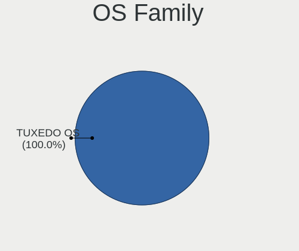

| Name      | Computers | Percent |
|-----------|-----------|---------|
| TUXEDO OS | 62        | 100%    |

Kernel
------

Version of the Linux kernel

| Version             | Computers | Percent |
|---------------------|-----------|---------|
| 6.1.0-1009-tuxedo   | 16        | 24.62%  |
| 6.2.0-10005-tuxedo  | 11        | 16.92%  |
| 6.2.0-10007-tuxedo  | 10        | 15.38%  |
| 5.15.0-10058-tuxedo | 7         | 10.77%  |
| 6.2.0-10010-tuxedo  | 4         | 6.15%   |
| 5.15.0-10048-tuxedo | 4         | 6.15%   |
| 5.15.0-10053-tuxedo | 3         | 4.62%   |
| 5.15.0-10052-tuxedo | 3         | 4.62%   |
| 5.15.0-10057-tuxedo | 2         | 3.08%   |
| 5.15.0-10056-tuxedo | 2         | 3.08%   |
| 5.15.0-10050-tuxedo | 2         | 3.08%   |
| 6.0.0-1010-oem      | 1         | 1.54%   |

Kernel Family
-------------

Linux kernel without a distro release

| Version | Computers | Percent |
|---------|-----------|---------|
| 6.2.0   | 25        | 38.46%  |
| 5.15.0  | 23        | 35.38%  |
| 6.1.0   | 16        | 24.62%  |
| 6.0.0   | 1         | 1.54%   |

Kernel Major Ver.
-----------------

Linux kernel major version

| Version | Computers | Percent |
|---------|-----------|---------|
| 6.2     | 25        | 38.46%  |
| 5.15    | 23        | 35.38%  |
| 6.1     | 16        | 24.62%  |
| 6.0     | 1         | 1.54%   |

Arch
----

OS architecture (x86_64, i586, etc.)

| Name   | Computers | Percent |
|--------|-----------|---------|
| x86_64 | 62        | 100%    |

DE
--

Desktop Environment

| Name | Computers | Percent |
|------|-----------|---------|
| KDE5 | 62        | 100%    |

Display Server
--------------

X11 or Wayland

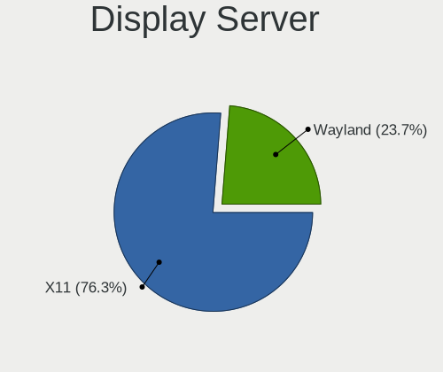

| Name    | Computers | Percent |
|---------|-----------|---------|
| X11     | 61        | 98.39%  |
| Wayland | 1         | 1.61%   |

Display Manager
---------------

SDDM, LightDM, etc.

| Name    | Computers | Percent |
|---------|-----------|---------|
| Unknown | 51        | 80.95%  |
| SDDM    | 12        | 19.05%  |

OS Lang
-------

Language

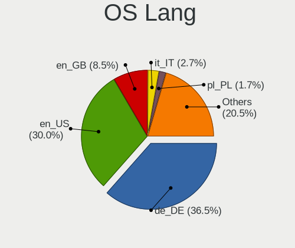

| Lang  | Computers | Percent |
|-------|-----------|---------|
| de_DE | 31        | 50%     |
| en_US | 14        | 22.58%  |
| en_GB | 4         | 6.45%   |
| pl_PL | 2         | 3.23%   |
| fr_FR | 2         | 3.23%   |
| en_ZA | 2         | 3.23%   |
| pt_PT | 1         | 1.61%   |
| es_ES | 1         | 1.61%   |
| en_DK | 1         | 1.61%   |
| en_AU | 1         | 1.61%   |
| en_AG | 1         | 1.61%   |
| de_CH | 1         | 1.61%   |
| de_AT | 1         | 1.61%   |

Boot Mode
---------

EFI or BIOS

| Mode | Computers | Percent |
|------|-----------|---------|
| BIOS | 51        | 82.26%  |
| EFI  | 11        | 17.74%  |

Filesystem
----------

Type of filesystem

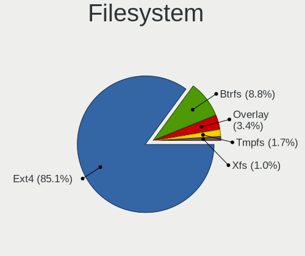

| Type    | Computers | Percent |
|---------|-----------|---------|
| Ext4    | 55        | 88.71%  |
| Btrfs   | 5         | 8.06%   |
| Tmpfs   | 1         | 1.61%   |
| Overlay | 1         | 1.61%   |

Part. scheme
------------

Scheme of partitioning

| Type    | Computers | Percent |
|---------|-----------|---------|
| Unknown | 51        | 80.95%  |
| GPT     | 11        | 17.46%  |
| MBR     | 1         | 1.59%   |

Dual Boot with Linux/BSD
------------------------

Hosting more than one Linux/BSD

| Dual boot | Computers | Percent |
|-----------|-----------|---------|
| No        | 59        | 93.65%  |
| Yes       | 4         | 6.35%   |

Dual Boot (Win)
---------------

Hosting Linux and Windows

| Dual boot | Computers | Percent |
|-----------|-----------|---------|
| No        | 59        | 93.65%  |
| Yes       | 4         | 6.35%   |

Board
-----

Vendor
------

Motherboard manufacturer

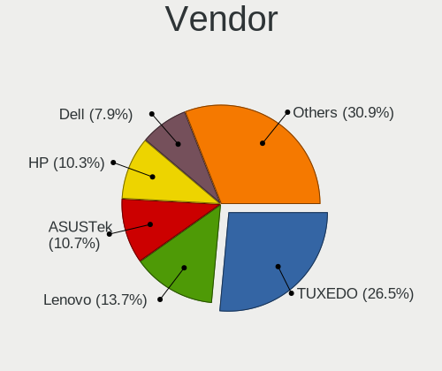

| Name                | Computers | Percent |
|---------------------|-----------|---------|
| TUXEDO              | 19        | 30.65%  |
| Lenovo              | 8         | 12.9%   |
| Hewlett-Packard     | 7         | 11.29%  |
| ASUSTek Computer    | 7         | 11.29%  |
| Dell                | 6         | 9.68%   |
| MSI                 | 3         | 4.84%   |
| ASRock              | 2         | 3.23%   |
| Apple               | 2         | 3.23%   |
| Acer                | 2         | 3.23%   |
| Notebook            | 1         | 1.61%   |
| Gigabyte Technology | 1         | 1.61%   |
| Fujitsu             | 1         | 1.61%   |
| Fanless Mini PC     | 1         | 1.61%   |
| BESSTAR Tech        | 1         | 1.61%   |
| Unknown             | 1         | 1.61%   |

Model
-----

Motherboard model

| Name                                 | Computers | Percent |
|--------------------------------------|-----------|---------|
| Unknown                              | 3         | 4.84%   |
| TUXEDO Stellaris/Polaris AMD Gen4    | 2         | 3.23%   |
| TUXEDO Pulse 15 Gen2                 | 2         | 3.23%   |
| TUXEDO Pulse 15 Gen1                 | 2         | 3.23%   |
| TUXEDO InfinityBook S 15/17 Gen7     | 2         | 3.23%   |
| TUXEDO InfinityBook Pro 14 Gen6      | 2         | 3.23%   |
| TUXEDO XMG FUSION 15 (XFU15L19)      | 1         | 1.61%   |
| TUXEDO Polaris AMD Gen3 (CZN)        | 1         | 1.61%   |
| TUXEDO Polaris 15 AMD Gen1           | 1         | 1.61%   |
| TUXEDO P64_HJ,HK1                    | 1         | 1.61%   |
| TUXEDO N13xWU                        | 1         | 1.61%   |
| TUXEDO InfinityBook Pro Gen7 (MK2)   | 1         | 1.61%   |
| TUXEDO InfinityBook Pro Gen7 (MK1)   | 1         | 1.61%   |
| Notebook W65_W67RB                   | 1         | 1.61%   |
| MSI MS-7D25                          | 1         | 1.61%   |
| MSI MS-7D17                          | 1         | 1.61%   |
| MSI GE75 Raider 10SF                 | 1         | 1.61%   |
| Lenovo Yoga S740-15IRH 81NX          | 1         | 1.61%   |
| Lenovo ThinkPad X200 Tablet 7450WN9  | 1         | 1.61%   |
| Lenovo ThinkPad T490 20N3SBU219      | 1         | 1.61%   |
| Lenovo ThinkPad P1 Gen 3 20TJS1W700  | 1         | 1.61%   |
| Lenovo ThinkCentre M700 10GSS05X48   | 1         | 1.61%   |
| Lenovo Legion 5 15ACH6H 82JU         | 1         | 1.61%   |
| Lenovo IdeaPad N581 7505             | 1         | 1.61%   |
| Lenovo G50-80 80E5                   | 1         | 1.61%   |
| HP Pavilion Gaming Desktop TG01-2xxx | 1         | 1.61%   |
| HP Pavilion dv6                      | 1         | 1.61%   |
| HP OMEN Laptop 15-en0xxx             | 1         | 1.61%   |
| HP ENVY x360 Convertible 13-ar0xxx   | 1         | 1.61%   |
| HP EliteBook 820 G2                  | 1         | 1.61%   |
| HP EliteBook 2570p                   | 1         | 1.61%   |
| HP 280 G1 MT                         | 1         | 1.61%   |
| Gigabyte H81M-HD3                    | 1         | 1.61%   |
| Fujitsu LIFEBOOK U7412               | 1         | 1.61%   |
| Fanless Mini PC PCG35 GLK            | 1         | 1.61%   |
| Dell Vostro 3550                     | 1         | 1.61%   |
| Dell Venue 11 Pro 7130 vPro          | 1         | 1.61%   |
| Dell Precision 7720                  | 1         | 1.61%   |
| Dell OptiPlex 9010                   | 1         | 1.61%   |
| Dell Latitude 7530                   | 1         | 1.61%   |

Model Family
------------

Motherboard model prefix

| Name                  | Computers | Percent |
|-----------------------|-----------|---------|
| TUXEDO InfinityBook   | 6         | 9.68%   |
| TUXEDO Pulse          | 4         | 6.45%   |
| Lenovo ThinkPad       | 3         | 4.84%   |
| Unknown               | 3         | 4.84%   |
| TUXEDO Stellaris      | 2         | 3.23%   |
| TUXEDO Polaris        | 2         | 3.23%   |
| HP Pavilion           | 2         | 3.23%   |
| HP EliteBook          | 2         | 3.23%   |
| TUXEDO XMG            | 1         | 1.61%   |
| TUXEDO P64            | 1         | 1.61%   |
| TUXEDO N13xWU         | 1         | 1.61%   |
| Notebook W65          | 1         | 1.61%   |
| MSI MS-7D25           | 1         | 1.61%   |
| MSI MS-7D17           | 1         | 1.61%   |
| MSI GE75              | 1         | 1.61%   |
| Lenovo Yoga           | 1         | 1.61%   |
| Lenovo ThinkCentre    | 1         | 1.61%   |
| Lenovo Legion         | 1         | 1.61%   |
| Lenovo IdeaPad        | 1         | 1.61%   |
| Lenovo G50-80         | 1         | 1.61%   |
| HP OMEN               | 1         | 1.61%   |
| HP ENVY               | 1         | 1.61%   |
| HP 280                | 1         | 1.61%   |
| Gigabyte H81M-HD3     | 1         | 1.61%   |
| Fujitsu LIFEBOOK      | 1         | 1.61%   |
| Fanless Mini PC PCG35 | 1         | 1.61%   |
| Dell Vostro           | 1         | 1.61%   |
| Dell Venue            | 1         | 1.61%   |
| Dell Precision        | 1         | 1.61%   |
| Dell OptiPlex         | 1         | 1.61%   |
| Dell Latitude         | 1         | 1.61%   |
| Dell Inspiron         | 1         | 1.61%   |
| BESSTAR Tech X400     | 1         | 1.61%   |
| ASUS Zephyrus         | 1         | 1.61%   |
| ASUS TUF              | 1         | 1.61%   |
| ASUS ROG              | 1         | 1.61%   |
| ASUS PRIME            | 1         | 1.61%   |
| ASUS P8H61-M          | 1         | 1.61%   |
| ASUS K55VJ            | 1         | 1.61%   |
| ASUS BU201LAV         | 1         | 1.61%   |

MFG Year
--------

Motherboard manufacture year

| Year | Computers | Percent |
|------|-----------|---------|
| 2022 | 12        | 19.35%  |
| 2021 | 9         | 14.52%  |
| 2020 | 8         | 12.9%   |
| 2015 | 7         | 11.29%  |
| 2019 | 6         | 9.68%   |
| 2017 | 3         | 4.84%   |
| 2012 | 3         | 4.84%   |
| 2011 | 3         | 4.84%   |
| 2023 | 2         | 3.23%   |
| 2016 | 2         | 3.23%   |
| 2014 | 2         | 3.23%   |
| 2013 | 2         | 3.23%   |
| 2010 | 1         | 1.61%   |
| 2009 | 1         | 1.61%   |
| 2008 | 1         | 1.61%   |

Form Factor
-----------

Physical design of the computer

| Name        | Computers | Percent |
|-------------|-----------|---------|
| Notebook    | 48        | 77.42%  |
| Desktop     | 12        | 19.35%  |
| Convertible | 1         | 1.61%   |
| Mini pc     | 1         | 1.61%   |

Secure Boot
-----------

Enabled or disabled

| State    | Computers | Percent |
|----------|-----------|---------|
| Disabled | 62        | 100%    |

Coreboot
--------

Have coreboot on board

| Used | Computers | Percent |
|------|-----------|---------|
| No   | 62        | 100%    |

RAM Size
--------

Total RAM memory

| Size in GB  | Computers | Percent |
|-------------|-----------|---------|
| 32.01-64.0  | 13        | 20.97%  |
| 8.01-16.0   | 13        | 20.97%  |
| 16.01-24.0  | 11        | 17.74%  |
| 4.01-8.0    | 10        | 16.13%  |
| 3.01-4.0    | 7         | 11.29%  |
| 64.01-256.0 | 5         | 8.06%   |
| 24.01-32.0  | 3         | 4.84%   |

RAM Used
--------

Used RAM memory

| Used GB    | Computers | Percent |
|------------|-----------|---------|
| 4.01-8.0   | 18        | 28.57%  |
| 2.01-3.0   | 17        | 26.98%  |
| 1.01-2.0   | 15        | 23.81%  |
| 3.01-4.0   | 9         | 14.29%  |
| 16.01-24.0 | 2         | 3.17%   |
| 8.01-16.0  | 2         | 3.17%   |

Total Drives
------------

Number of drives on board

| Drives | Computers | Percent |
|--------|-----------|---------|
| 1      | 31        | 49.21%  |
| 2      | 26        | 41.27%  |
| 4      | 3         | 4.76%   |
| 3      | 2         | 3.17%   |
| 5      | 1         | 1.59%   |

Has CD-ROM
----------

Has CD-ROM on board

| Presented | Computers | Percent |
|-----------|-----------|---------|
| No        | 48        | 77.42%  |
| Yes       | 14        | 22.58%  |

Has Ethernet
------------

Has Ethernet on board

| Presented | Computers | Percent |
|-----------|-----------|---------|
| Yes       | 52        | 83.87%  |
| No        | 10        | 16.13%  |

Has WiFi
--------

Has WiFi module

| Presented | Computers | Percent |
|-----------|-----------|---------|
| Yes       | 56        | 90.32%  |
| No        | 6         | 9.68%   |

Has Bluetooth
-------------

Has Bluetooth module

| Presented | Computers | Percent |
|-----------|-----------|---------|
| Yes       | 51        | 82.26%  |
| No        | 11        | 17.74%  |

Location
--------

Country
-------

Geographic location (country)

| Country      | Computers | Percent |
|--------------|-----------|---------|
| Germany      | 31        | 50%     |
| USA          | 7         | 11.29%  |
| UK           | 3         | 4.84%   |
| Switzerland  | 3         | 4.84%   |
| South Africa | 2         | 3.23%   |
| Portugal     | 2         | 3.23%   |
| Poland       | 2         | 3.23%   |
| France       | 2         | 3.23%   |
| Austria      | 2         | 3.23%   |
| Turkey       | 1         | 1.61%   |
| Spain        | 1         | 1.61%   |
| Romania      | 1         | 1.61%   |
| Netherlands  | 1         | 1.61%   |
| Egypt        | 1         | 1.61%   |
| Denmark      | 1         | 1.61%   |
| Czechia      | 1         | 1.61%   |
| Australia    | 1         | 1.61%   |

City
----

Geographic location (city)

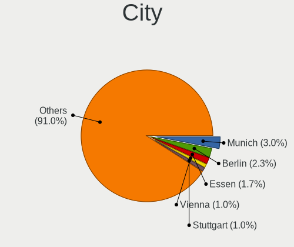

| City               | Computers | Percent |
|--------------------|-----------|---------|
| Zurich             | 2         | 3.23%   |
| Vienna             | 2         | 3.23%   |
| Schweinfurt        | 2         | 3.23%   |
| Munich             | 2         | 3.23%   |
| Leipzig            | 2         | 3.23%   |
| Zalău             | 1         | 1.61%   |
| Zabrze             | 1         | 1.61%   |
| Watertown          | 1         | 1.61%   |
| Walsall            | 1         | 1.61%   |
| Stuttgart          | 1         | 1.61%   |
| Stockstadt am Main | 1         | 1.61%   |
| Seattle            | 1         | 1.61%   |
| Rio Maior          | 1         | 1.61%   |
| Reno               | 1         | 1.61%   |
| Rennes             | 1         | 1.61%   |
| Redcar             | 1         | 1.61%   |
| Prague             | 1         | 1.61%   |
| Perrysburg         | 1         | 1.61%   |
| Paris              | 1         | 1.61%   |
| Offenbach          | 1         | 1.61%   |
| Nuremberg          | 1         | 1.61%   |
| Neuwied            | 1         | 1.61%   |
| Mannheim           | 1         | 1.61%   |
| Lucerne            | 1         | 1.61%   |
| Lublin             | 1         | 1.61%   |
| Lippstadt          | 1         | 1.61%   |
| Langenhagen        | 1         | 1.61%   |
| Laage              | 1         | 1.61%   |
| Johannesburg       | 1         | 1.61%   |
| Jessen             | 1         | 1.61%   |
| Istanbul           | 1         | 1.61%   |
| Husum              | 1         | 1.61%   |
| Herzberg           | 1         | 1.61%   |
| Heilbronn          | 1         | 1.61%   |
| Hamburg            | 1         | 1.61%   |
| Gorebridge         | 1         | 1.61%   |
| Gainesville        | 1         | 1.61%   |
| Friedrichstadt     | 1         | 1.61%   |
| Frankfurt am Main  | 1         | 1.61%   |
| Ethridge           | 1         | 1.61%   |

Drives
------

Drive Vendor
------------

Hard drive vendors

| Vendor                      | Computers | Drives | Percent |
|-----------------------------|-----------|--------|---------|
| Samsung Electronics         | 31        | 39     | 33.33%  |
| Seagate                     | 11        | 12     | 11.83%  |
| SanDisk                     | 8         | 9      | 8.6%    |
| WDC                         | 4         | 5      | 4.3%    |
| Hitachi                     | 4         | 6      | 4.3%    |
| Toshiba                     | 2         | 2      | 2.15%   |
| SPCC                        | 2         | 2      | 2.15%   |
| SK hynix                    | 2         | 3      | 2.15%   |
| Phison Electronics          | 2         | 2      | 2.15%   |
| Micron Technology           | 2         | 2      | 2.15%   |
| Kingston                    | 2         | 2      | 2.15%   |
| GOODRAM                     | 2         | 2      | 2.15%   |
| USB3.0                      | 1         | 1      | 1.08%   |
| Unknown                     | 1         | 1      | 1.08%   |
| Silicon Motion              | 1         | 2      | 1.08%   |
| OWC                         | 1         | 1      | 1.08%   |
| LITEONIT                    | 1         | 1      | 1.08%   |
| Lite-On Technology          | 1         | 1      | 1.08%   |
| Kingston Technology Company | 1         | 1      | 1.08%   |
| Kingchuxing                 | 1         | 1      | 1.08%   |
| Intenso                     | 1         | 1      | 1.08%   |
| Intel                       | 1         | 1      | 1.08%   |
| HS-SSD-E100                 | 1         | 1      | 1.08%   |
| Hikvision                   | 1         | 2      | 1.08%   |
| HGST HTS                    | 1         | 1      | 1.08%   |
| HGST                        | 1         | 1      | 1.08%   |
| CT1000BX                    | 1         | 1      | 1.08%   |
| Crucial                     | 1         | 1      | 1.08%   |
| China                       | 1         | 1      | 1.08%   |
| ASMT                        | 1         | 1      | 1.08%   |
| Apple                       | 1         | 1      | 1.08%   |
| Apacer                      | 1         | 1      | 1.08%   |
| Unknown                     | 1         | 1      | 1.08%   |

Drive Model
-----------

Hard drive models

| Model                                               | Computers | Percent |
|-----------------------------------------------------|-----------|---------|
| Samsung NVMe SSD Controller SM981/PM981/PM983 250GB | 6         | 6.06%   |
| Samsung NVMe SSD Controller PM9A1/PM9A3/980PRO 2TB  | 6         | 6.06%   |
| Samsung SSD 980 1TB                                 | 5         | 5.05%   |
| Samsung SSD 980 500GB                               | 4         | 4.04%   |
| Sandisk WD Black SN750 / PC SN730 NVMe SSD 500GB    | 3         | 3.03%   |
| Samsung SSD 980 PRO 500GB                           | 2         | 2.02%   |
| Samsung SSD 980 PRO 1TB                             | 2         | 2.02%   |
| Samsung SSD 970 EVO Plus 1TB                        | 2         | 2.02%   |
| Samsung SSD 850 EVO 500GB                           | 2         | 2.02%   |
| Hitachi HTS727550A9E364 500GB                       | 2         | 2.02%   |
| WDC WD80EAZZ-00BKLB0 8TB                            | 1         | 1.01%   |
| WDC WD3200BPVT-24JJ5T0 320GB                        | 1         | 1.01%   |
| WDC WD20EZRZ-00Z5HB0 2TB                            | 1         | 1.01%   |
| WDC WD10JPVX-11JC3T0 1TB                            | 1         | 1.01%   |
| WDC WD Elements SE SSD 1TB                          | 1         | 1.01%   |
| USB3.0 Super Speed 1TB                              | 1         | 1.01%   |
| Unknown MMC Card  2GB                               | 1         | 1.01%   |
| Toshiba XG4 NVMe SSD Controller 256GB               | 1         | 1.01%   |
| Toshiba MQ01ABD100 1TB                              | 1         | 1.01%   |
| SPCC M.2 SSD 256GB                                  | 1         | 1.01%   |
| SPCC M.2 PCIe SSD 1TB                               | 1         | 1.01%   |
| SK hynix SKHynix_HFS001TDE9X084N 1024GB             | 1         | 1.01%   |
| SK hynix SC311 SATA 256GB SSD                       | 1         | 1.01%   |
| Silicon Motion SM2262/SM2262EN SSD Controller 480GB | 1         | 1.01%   |
| Seagate ST500LT012-1DG142 500GB                     | 1         | 1.01%   |
| Seagate ST500LM034-2GH17A 500GB                     | 1         | 1.01%   |
| Seagate ST500DM002-1BD142 500GB                     | 1         | 1.01%   |
| Seagate ST3500413AS 500GB                           | 1         | 1.01%   |
| Seagate ST2000LM015-2E8174 2TB                      | 1         | 1.01%   |
| Seagate ST2000LM007-1R8174 2TB                      | 1         | 1.01%   |
| Seagate ST1000LM048-2E7172 1TB                      | 1         | 1.01%   |
| Seagate ST1000LM035-1RK172 1TB                      | 1         | 1.01%   |
| Seagate ST1000DX001-1NS162-SSHD 1TB                 | 1         | 1.01%   |
| Seagate ST1000DM010-2EP102 1TB                      | 1         | 1.01%   |
| Seagate Expansion 1TB                               | 1         | 1.01%   |
| Seagate BarraCuda Q5 ZP500CV30001 500GB             | 1         | 1.01%   |
| Sandisk WD PC SN735 SDBPNHH-1T00-1002 1024GB        | 1         | 1.01%   |
| Sandisk WD Black SN850 1TB                          | 1         | 1.01%   |
| Sandisk Ultra 3D NVMe 1TB                           | 1         | 1.01%   |
| SanDisk SDSSDA240G 240GB                            | 1         | 1.01%   |

HDD Vendor
----------

Hard disk drive vendors

| Vendor   | Computers | Drives | Percent |
|----------|-----------|--------|---------|
| Seagate  | 10        | 11     | 47.62%  |
| Hitachi  | 4         | 6      | 19.05%  |
| WDC      | 3         | 4      | 14.29%  |
| USB3.0   | 1         | 1      | 4.76%   |
| Toshiba  | 1         | 1      | 4.76%   |
| HGST HTS | 1         | 1      | 4.76%   |
| HGST     | 1         | 1      | 4.76%   |

SSD Vendor
----------

Solid state drive vendors

| Vendor              | Computers | Drives | Percent |
|---------------------|-----------|--------|---------|
| Samsung Electronics | 5         | 6      | 21.74%  |
| SanDisk             | 2         | 2      | 8.7%    |
| GOODRAM             | 2         | 2      | 8.7%    |
| WDC                 | 1         | 1      | 4.35%   |
| SPCC                | 1         | 1      | 4.35%   |
| SK hynix            | 1         | 2      | 4.35%   |
| OWC                 | 1         | 1      | 4.35%   |
| Micron Technology   | 1         | 1      | 4.35%   |
| LITEONIT            | 1         | 1      | 4.35%   |
| Kingston            | 1         | 1      | 4.35%   |
| Intenso             | 1         | 1      | 4.35%   |
| CT1000BX            | 1         | 1      | 4.35%   |
| Crucial             | 1         | 1      | 4.35%   |
| China               | 1         | 1      | 4.35%   |
| ASMT                | 1         | 1      | 4.35%   |
| Apple               | 1         | 1      | 4.35%   |
| Apacer              | 1         | 1      | 4.35%   |

Drive Kind
----------

HDD or SSD

| Kind    | Computers | Drives | Percent |
|---------|-----------|--------|---------|
| NVMe    | 40        | 55     | 47.06%  |
| HDD     | 21        | 25     | 24.71%  |
| SSD     | 20        | 25     | 23.53%  |
| MMC     | 2         | 2      | 2.35%   |
| Unknown | 2         | 2      | 2.35%   |

Drive Connector
---------------

SATA, SAS, NVMe, etc.

| Type | Computers | Drives | Percent |
|------|-----------|--------|---------|
| NVMe | 40        | 55     | 50%     |
| SATA | 33        | 46     | 41.25%  |
| SAS  | 5         | 6      | 6.25%   |
| MMC  | 2         | 2      | 2.5%    |

Drive Size
----------

Size of hard drive

| Size in TB | Computers | Drives | Percent |
|------------|-----------|--------|---------|
| 0.01-0.5   | 21        | 28     | 50%     |
| 0.51-1.0   | 16        | 17     | 38.1%   |
| 1.01-2.0   | 4         | 4      | 9.52%   |
| 4.01-10.0  | 1         | 1      | 2.38%   |

Space Total
-----------

Amount of disk space available on the file system

| Size in GB     | Computers | Percent |
|----------------|-----------|---------|
| 501-1000       | 19        | 30.65%  |
| 251-500        | 13        | 20.97%  |
| 101-250        | 13        | 20.97%  |
| 1001-2000      | 6         | 9.68%   |
| 2001-3000      | 3         | 4.84%   |
| 21-50          | 2         | 3.23%   |
| 1-20           | 2         | 3.23%   |
| Unknown        | 2         | 3.23%   |
| More than 3000 | 1         | 1.61%   |
| 51-100         | 1         | 1.61%   |

Space Used
----------

Amount of used disk space

| Used GB   | Computers | Percent |
|-----------|-----------|---------|
| 1-20      | 20        | 31.25%  |
| 21-50     | 18        | 28.13%  |
| 101-250   | 11        | 17.19%  |
| 251-500   | 5         | 7.81%   |
| 51-100    | 5         | 7.81%   |
| 501-1000  | 2         | 3.13%   |
| Unknown   | 2         | 3.13%   |
| 1001-2000 | 1         | 1.56%   |

Malfunc. Drives
---------------

Drive models with a malfunction

Zero info for selected period =(

Malfunc. Drive Vendor
---------------------

Vendors of faulty drives

Zero info for selected period =(

Malfunc. HDD Vendor
-------------------

Vendors of faulty HDD drives

Zero info for selected period =(

Malfunc. Drive Kind
-------------------

Kinds of faulty drives

Zero info for selected period =(

Failed Drives
-------------

Failed drive models

Zero info for selected period =(

Failed Drive Vendor
-------------------

Failed drive vendors

Zero info for selected period =(

Drive Status
------------

Number of failed and malfunc. drives

| Status   | Computers | Drives | Percent |
|----------|-----------|--------|---------|
| Detected | 52        | 90     | 81.25%  |
| Works    | 12        | 19     | 18.75%  |

Storage controller
------------------

Storage Vendor
--------------

Storage controller vendors

| Vendor                       | Computers | Percent |
|------------------------------|-----------|---------|
| Intel                        | 36        | 41.38%  |
| Samsung Electronics          | 28        | 32.18%  |
| SanDisk                      | 6         | 6.9%    |
| AMD                          | 6         | 6.9%    |
| Silicon Motion               | 2         | 2.3%    |
| Phison Electronics           | 2         | 2.3%    |
| Kingston Technology Company  | 2         | 2.3%    |
| Toshiba America Info Systems | 1         | 1.15%   |
| SK hynix                     | 1         | 1.15%   |
| Seagate Technology           | 1         | 1.15%   |
| Micron Technology            | 1         | 1.15%   |
| Lite-On Technology           | 1         | 1.15%   |

Storage Model
-------------

Storage controller models

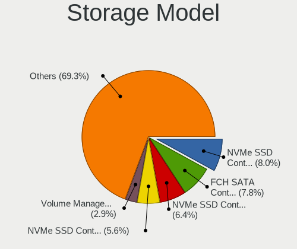

| Model                                                                                   | Computers | Percent |
|-----------------------------------------------------------------------------------------|-----------|---------|
| Samsung NVMe SSD Controller PM9A1/PM9A3/980PRO                                          | 10        | 11.11%  |
| Samsung NVMe SSD Controller 980                                                         | 9         | 10%     |
| Samsung NVMe SSD Controller SM981/PM981/PM983                                           | 8         | 8.89%   |
| AMD FCH SATA Controller [AHCI mode]                                                     | 6         | 6.67%   |
| Intel 7 Series Chipset Family 6-port SATA Controller [AHCI mode]                        | 4         | 4.44%   |
| SanDisk WD Black SN750 / PC SN730 NVMe SSD                                              | 3         | 3.33%   |
| Intel Cannon Lake Mobile PCH SATA AHCI Controller                                       | 3         | 3.33%   |
| Intel 6 Series/C200 Series Chipset Family 6 port Mobile SATA AHCI Controller            | 3         | 3.33%   |
| Silicon Motion SM2262/SM2262EN SSD Controller                                           | 2         | 2.22%   |
| SanDisk WD Blue SN570 NVMe SSD 1TB                                                      | 2         | 2.22%   |
| Kingston Company Company Non-Volatile memory controller                                 | 2         | 2.22%   |
| Intel Wildcat Point-LP SATA Controller [AHCI Mode]                                      | 2         | 2.22%   |
| Intel Q170/Q150/B150/H170/H110/Z170/CM236 Chipset SATA Controller [AHCI Mode]           | 2         | 2.22%   |
| Intel HM170/QM170 Chipset SATA Controller [AHCI Mode]                                   | 2         | 2.22%   |
| Intel 8 Series/C220 Series Chipset Family 6-port SATA Controller 1 [AHCI mode]          | 2         | 2.22%   |
| Intel 8 Series SATA Controller 1 [AHCI mode]                                            | 2         | 2.22%   |
| Intel 400 Series Chipset Family SATA AHCI Controller                                    | 2         | 2.22%   |
| Toshiba America Info Systems XG4 NVMe SSD Controller                                    | 1         | 1.11%   |
| SK hynix Gold P31/BC711/PC711 NVMe Solid State Drive                                    | 1         | 1.11%   |
| Seagate Non-Volatile memory controller                                                  | 1         | 1.11%   |
| SanDisk WD PC SN810 / Black SN850 NVMe SSD                                              | 1         | 1.11%   |
| SanDisk Non-Volatile memory controller                                                  | 1         | 1.11%   |
| Samsung Electronics SATA controller                                                     | 1         | 1.11%   |
| Phison PS5013 E13 NVMe Controller                                                       | 1         | 1.11%   |
| Phison E16 PCIe4 NVMe Controller                                                        | 1         | 1.11%   |
| Micron 2450 NVMe SSD (DRAM-less)                                                        | 1         | 1.11%   |
| Lite-On Non-Volatile memory controller                                                  | 1         | 1.11%   |
| Intel Volume Management Device NVMe RAID Controller Intel Corporation                   | 1         | 1.11%   |
| Intel Volume Management Device NVMe RAID Controller                                     | 1         | 1.11%   |
| Intel SSD 660P Series                                                                   | 1         | 1.11%   |
| Intel SATA Controller [RAID mode]                                                       | 1         | 1.11%   |
| Intel Comet Lake PCH-H RAID                                                             | 1         | 1.11%   |
| Intel Celeron/Pentium Silver Processor SATA Controller                                  | 1         | 1.11%   |
| Intel Alder Lake-S PCH SATA Controller [AHCI Mode]                                      | 1         | 1.11%   |
| Intel 82801IBM/IEM (ICH9M/ICH9M-E) 4 port SATA Controller [AHCI mode]                   | 1         | 1.11%   |
| Intel 82801 Mobile SATA Controller [RAID mode]                                          | 1         | 1.11%   |
| Intel 7 Series/C210 Series Chipset Family 6-port SATA Controller [AHCI mode]            | 1         | 1.11%   |
| Intel 6 Series/C200 Series Chipset Family Desktop SATA Controller (IDE mode, ports 4-5) | 1         | 1.11%   |
| Intel 6 Series/C200 Series Chipset Family Desktop SATA Controller (IDE mode, ports 0-3) | 1         | 1.11%   |
| Intel 500 Series Chipset Family SATA AHCI Controller                                    | 1         | 1.11%   |

Storage Kind
------------

Kind of storage controller (IDE, SATA, NVMe, SAS, ...)

| Kind | Computers | Percent |
|------|-----------|---------|
| NVMe | 40        | 48.78%  |
| SATA | 36        | 43.9%   |
| RAID | 5         | 6.1%    |
| IDE  | 1         | 1.22%   |

Processor
---------

CPU Vendor
----------

Processor vendors

| Vendor | Computers | Percent |
|--------|-----------|---------|
| Intel  | 47        | 75.81%  |
| AMD    | 15        | 24.19%  |

CPU Model
---------

Processor models

| Model                                   | Computers | Percent |
|-----------------------------------------|-----------|---------|
| Intel Core i7-9750H CPU @ 2.60GHz       | 2         | 3.23%   |
| Intel Core i5-9300H CPU @ 2.40GHz       | 2         | 3.23%   |
| Intel Core i5-3470 CPU @ 3.20GHz        | 2         | 3.23%   |
| Intel 12th Gen Core i7-12700H           | 2         | 3.23%   |
| Intel 12th Gen Core i5-1240P            | 2         | 3.23%   |
| Intel 11th Gen Core i7-11370H @ 3.30GHz | 2         | 3.23%   |
| AMD Ryzen 7 6800H with Radeon Graphics  | 2         | 3.23%   |
| AMD Ryzen 7 5700U with Radeon Graphics  | 2         | 3.23%   |
| AMD Ryzen 7 4800H with Radeon Graphics  | 2         | 3.23%   |
| AMD Ryzen 5 4600H with Radeon Graphics  | 2         | 3.23%   |
| Intel Xeon W-10855M CPU @ 2.80GHz       | 1         | 1.61%   |
| Intel Pentium CPU G3420 @ 3.20GHz       | 1         | 1.61%   |
| Intel Pentium CPU 2020M @ 2.40GHz       | 1         | 1.61%   |
| Intel Core i7-8550U CPU @ 1.80GHz       | 1         | 1.61%   |
| Intel Core i7-7820HQ CPU @ 2.90GHz      | 1         | 1.61%   |
| Intel Core i7-7700HQ CPU @ 2.80GHz      | 1         | 1.61%   |
| Intel Core i7-6700HQ CPU @ 2.60GHz      | 1         | 1.61%   |
| Intel Core i7-5600U CPU @ 2.60GHz       | 1         | 1.61%   |
| Intel Core i7-5500U CPU @ 2.40GHz       | 1         | 1.61%   |
| Intel Core i7-4650U CPU @ 1.70GHz       | 1         | 1.61%   |
| Intel Core i7-3720QM CPU @ 2.60GHz      | 1         | 1.61%   |
| Intel Core i7-3630QM CPU @ 2.40GHz      | 1         | 1.61%   |
| Intel Core i7-2670QM CPU @ 2.20GHz      | 1         | 1.61%   |
| Intel Core i7-2620M CPU @ 2.70GHz       | 1         | 1.61%   |
| Intel Core i7-10750H CPU @ 2.60GHz      | 1         | 1.61%   |
| Intel Core i5-8365U CPU @ 1.60GHz       | 1         | 1.61%   |
| Intel Core i5-7600T CPU @ 2.80GHz       | 1         | 1.61%   |
| Intel Core i5-5250U CPU @ 1.60GHz       | 1         | 1.61%   |
| Intel Core i5-4590S CPU @ 3.00GHz       | 1         | 1.61%   |
| Intel Core i5-4300Y CPU @ 1.60GHz       | 1         | 1.61%   |
| Intel Core i5-2450M CPU @ 2.50GHz       | 1         | 1.61%   |
| Intel Core i5-10400F CPU @ 2.90GHz      | 1         | 1.61%   |
| Intel Core i5-10400 CPU @ 2.90GHz       | 1         | 1.61%   |
| Intel Core i5 CPU M 540 @ 2.53GHz       | 1         | 1.61%   |
| Intel Core i3-6300 CPU @ 3.80GHz        | 1         | 1.61%   |
| Intel Core i3-6100 CPU @ 3.70GHz        | 1         | 1.61%   |
| Intel Core 2 Duo CPU L9400 @ 1.86GHz    | 1         | 1.61%   |
| Intel Celeron J4125 CPU @ 2.00GHz       | 1         | 1.61%   |
| Intel Celeron CPU 1037U @ 1.80GHz       | 1         | 1.61%   |
| Intel 13th Gen Core i7-1360P            | 1         | 1.61%   |

CPU Model Family
----------------

Processor model prefix

| Model            | Computers | Percent |
|------------------|-----------|---------|
| Intel Core i7    | 14        | 22.58%  |
| Intel Core i5    | 13        | 20.97%  |
| Other            | 12        | 19.35%  |
| AMD Ryzen 7      | 9         | 14.52%  |
| AMD Ryzen 5      | 4         | 6.45%   |
| Intel Pentium    | 2         | 3.23%   |
| Intel Core i3    | 2         | 3.23%   |
| Intel Celeron    | 2         | 3.23%   |
| Intel Xeon       | 1         | 1.61%   |
| Intel Core 2 Duo | 1         | 1.61%   |
| AMD Ryzen 9      | 1         | 1.61%   |
| AMD Ryzen 5 PRO  | 1         | 1.61%   |

CPU Cores
---------

Number of processor cores

| Number | Computers | Percent |
|--------|-----------|---------|
| 4      | 19        | 30.65%  |
| 2      | 14        | 22.58%  |
| 6      | 11        | 17.74%  |
| 8      | 10        | 16.13%  |
| 12     | 4         | 6.45%   |
| 14     | 2         | 3.23%   |
| 16     | 1         | 1.61%   |
| 10     | 1         | 1.61%   |

CPU Sockets
-----------

Number of sockets

| Number | Computers | Percent |
|--------|-----------|---------|
| 1      | 62        | 100%    |

CPU Threads
-----------

Threads per core (Hyper-Threading)

| Number | Computers | Percent |
|--------|-----------|---------|
| 2      | 53        | 85.48%  |
| 1      | 9         | 14.52%  |

CPU Op-Modes
------------

CPU Operation Modes (32-bit, 64-bit)

| Op mode        | Computers | Percent |
|----------------|-----------|---------|
| 32-bit, 64-bit | 62        | 100%    |

CPU Microcode
-------------

Microcode number

| Number     | Computers | Percent |
|------------|-----------|---------|
| Unknown    | 55        | 87.3%   |
| 0xa0653    | 1         | 1.59%   |
| 0x906ea    | 1         | 1.59%   |
| 0x906e9    | 1         | 1.59%   |
| 0x906a4    | 1         | 1.59%   |
| 0x906a3    | 1         | 1.59%   |
| 0x806c1    | 1         | 1.59%   |
| 0x306d4    | 1         | 1.59%   |
| 0x0a50000d | 1         | 1.59%   |

CPU Microarch
-------------

Microarchitecture

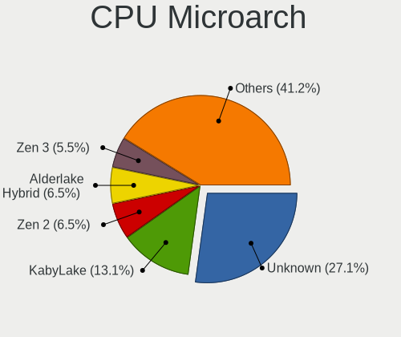

| Name             | Computers | Percent |
|------------------|-----------|---------|
| Unknown          | 12        | 19.35%  |
| KabyLake         | 9         | 14.52%  |
| IvyBridge        | 6         | 9.68%   |
| Zen 2            | 5         | 8.06%   |
| Haswell          | 4         | 6.45%   |
| CometLake        | 4         | 6.45%   |
| Zen 3            | 3         | 4.84%   |
| Skylake          | 3         | 4.84%   |
| SandyBridge      | 3         | 4.84%   |
| Broadwell        | 3         | 4.84%   |
| Alderlake Hybrid | 3         | 4.84%   |
| Zen+             | 2         | 3.23%   |
| TigerLake        | 2         | 3.23%   |
| Westmere         | 1         | 1.61%   |
| Penryn           | 1         | 1.61%   |
| Goldmont plus    | 1         | 1.61%   |

Graphics
--------

GPU Vendor
----------

Vendors of graphics cards

| Vendor | Computers | Percent |
|--------|-----------|---------|
| Intel  | 43        | 51.81%  |
| Nvidia | 22        | 26.51%  |
| AMD    | 18        | 21.69%  |

GPU Model
---------

Graphics card models

| Model                                                                       | Computers | Percent |
|-----------------------------------------------------------------------------|-----------|---------|
| Intel Alder Lake-P Integrated Graphics Controller                           | 5         | 6.02%   |
| AMD Renoir                                                                  | 5         | 6.02%   |
| Nvidia TU116M [GeForce GTX 1660 Ti Mobile]                                  | 4         | 4.82%   |
| Nvidia GA106M [GeForce RTX 3060 Mobile / Max-Q]                             | 4         | 4.82%   |
| Intel CoffeeLake-H GT2 [UHD Graphics 630]                                   | 4         | 4.82%   |
| Intel 3rd Gen Core processor Graphics Controller                            | 4         | 4.82%   |
| Intel HD Graphics 630                                                       | 3         | 3.61%   |
| Intel HD Graphics 530                                                       | 3         | 3.61%   |
| Intel 2nd Generation Core Processor Family Integrated Graphics Controller   | 3         | 3.61%   |
| AMD Rembrandt [Radeon 680M]                                                 | 3         | 3.61%   |
| AMD Cezanne [Radeon Vega Series / Radeon Vega Mobile Series]                | 3         | 3.61%   |
| Nvidia GA104 [Geforce RTX 3070 Ti Laptop GPU]                               | 2         | 2.41%   |
| Intel Xeon E3-1200 v3/4th Gen Core Processor Integrated Graphics Controller | 2         | 2.41%   |
| Intel Xeon E3-1200 v2/3rd Gen Core processor Graphics Controller            | 2         | 2.41%   |
| Intel TigerLake-LP GT2 [Iris Xe Graphics]                                   | 2         | 2.41%   |
| Intel HD Graphics 5500                                                      | 2         | 2.41%   |
| AMD Picasso/Raven 2 [Radeon Vega Series / Radeon Vega Mobile Series]        | 2         | 2.41%   |
| AMD Lucienne                                                                | 2         | 2.41%   |
| Nvidia TU117M [GeForce GTX 1650 Mobile / Max-Q]                             | 1         | 1.2%    |
| Nvidia TU117GLM [Quadro T2000 Mobile / Max-Q]                               | 1         | 1.2%    |
| Nvidia TU106M [GeForce RTX 2070 Mobile / Max-Q Refresh]                     | 1         | 1.2%    |
| Nvidia TU106M [GeForce RTX 2060 Mobile]                                     | 1         | 1.2%    |
| Nvidia TU106 [GeForce RTX 2070]                                             | 1         | 1.2%    |
| Nvidia GP108 [GeForce GT 1030]                                              | 1         | 1.2%    |
| Nvidia GP107M [GeForce GTX 1050 Ti Mobile]                                  | 1         | 1.2%    |
| Nvidia GP106 [GeForce GTX 1060 6GB]                                         | 1         | 1.2%    |
| Nvidia GM108M [GeForce 940M]                                                | 1         | 1.2%    |
| Nvidia GF117M [GeForce 610M/710M/810M/820M / GT 620M/625M/630M/720M]        | 1         | 1.2%    |
| Nvidia GF108M [GeForce GT 635M]                                             | 1         | 1.2%    |
| Nvidia GA107M [GeForce RTX 3050 Mobile]                                     | 1         | 1.2%    |
| Intel WhiskeyLake-U GT2 [UHD Graphics 620]                                  | 1         | 1.2%    |
| Intel UHD Graphics 620                                                      | 1         | 1.2%    |
| Intel Raptor Lake-P [Iris Xe Graphics]                                      | 1         | 1.2%    |
| Intel Mobile 4 Series Chipset Integrated Graphics Controller                | 1         | 1.2%    |
| Intel HD Graphics 6000                                                      | 1         | 1.2%    |
| Intel Haswell-ULT Integrated Graphics Controller [HD Graphics]              | 1         | 1.2%    |
| Intel Haswell-ULT Integrated Graphics Controller                            | 1         | 1.2%    |
| Intel GeminiLake [UHD Graphics 600]                                         | 1         | 1.2%    |
| Intel Core Processor Integrated Graphics Controller                         | 1         | 1.2%    |
| Intel CometLake-H GT2 [UHD Graphics]                                        | 1         | 1.2%    |

GPU Combo
---------

Combinations of graphics cards

| Name           | Computers | Percent |
|----------------|-----------|---------|
| 1 x Intel      | 30        | 47.62%  |
| Intel + Nvidia | 10        | 15.87%  |
| AMD + Nvidia   | 8         | 12.7%   |
| 1 x AMD        | 8         | 12.7%   |
| 1 x Nvidia     | 4         | 6.35%   |
| Intel + AMD    | 3         | 4.76%   |

GPU Driver
----------

Free vs proprietary

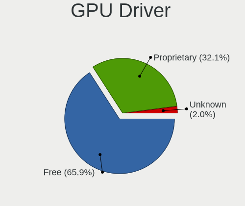

| Driver      | Computers | Percent |
|-------------|-----------|---------|
| Free        | 42        | 67.74%  |
| Proprietary | 20        | 32.26%  |

GPU Memory
----------

Total video memory

| Size in GB | Computers | Percent |
|------------|-----------|---------|
| Unknown    | 43        | 68.25%  |
| 5.01-6.0   | 9         | 14.29%  |
| 7.01-8.0   | 4         | 6.35%   |
| 3.01-4.0   | 3         | 4.76%   |
| 1.01-2.0   | 3         | 4.76%   |
| 0.01-0.5   | 1         | 1.59%   |

Monitor
-------

Monitor Vendor
--------------

Monitor vendors

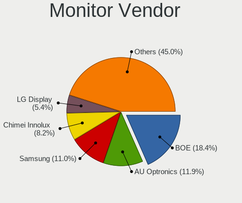

| Vendor              | Computers | Percent |
|---------------------|-----------|---------|
| BOE                 | 16        | 21.92%  |
| AU Optronics        | 10        | 13.7%   |
| Samsung Electronics | 8         | 10.96%  |
| LG Display          | 5         | 6.85%   |
| Dell                | 3         | 4.11%   |
| CSO                 | 3         | 4.11%   |
| Chimei Innolux      | 3         | 4.11%   |
| Acer                | 3         | 4.11%   |
| Iiyama              | 2         | 2.74%   |
| Goldstar            | 2         | 2.74%   |
| BenQ                | 2         | 2.74%   |
| Apple               | 2         | 2.74%   |
| AOC                 | 2         | 2.74%   |
| Yamaha              | 1         | 1.37%   |
| ViewSonic           | 1         | 1.37%   |
| Sharp               | 1         | 1.37%   |
| SGT                 | 1         | 1.37%   |
| RTK                 | 1         | 1.37%   |
| Philips             | 1         | 1.37%   |
| PANDA               | 1         | 1.37%   |
| Lenovo              | 1         | 1.37%   |
| InfoVision          | 1         | 1.37%   |
| Hewlett-Packard     | 1         | 1.37%   |
| Eizo                | 1         | 1.37%   |
| ASUSTek Computer    | 1         | 1.37%   |

Monitor Model
-------------

Monitor models

| Model                                                                   | Computers | Percent |
|-------------------------------------------------------------------------|-----------|---------|
| CSO LCD Monitor CSO1402 2880x1800 302x188mm 14.0-inch                   | 3         | 3.95%   |
| BOE LCD Monitor BOE0974 2560x1440 344x194mm 15.5-inch                   | 3         | 3.95%   |
| BOE LCD Monitor BOE084D 1920x1080 344x193mm 15.5-inch                   | 2         | 2.63%   |
| BOE LCD Monitor BOE07D8 1920x1080 344x194mm 15.5-inch                   | 2         | 2.63%   |
| AU Optronics LCD Monitor AUO206C 1366x768 277x156mm 12.5-inch           | 2         | 2.63%   |
| Yamaha RX-V473 YMH3171 1920x540                                         | 1         | 1.32%   |
| ViewSonic VX2757 VSCF931 1920x1080 598x336mm 27.0-inch                  | 1         | 1.32%   |
| Sharp LQ156M1JW01 SHP14C3 1920x1080 344x194mm 15.5-inch                 | 1         | 1.32%   |
| SGT HS156PC SGT9156 1920x1080 345x194mm 15.6-inch                       | 1         | 1.32%   |
| Samsung Electronics SAMTRON STN0022 1280x1024 376x301mm 19.0-inch       | 1         | 1.32%   |
| Samsung Electronics S24D330 SAM0D92 1920x1080 531x299mm 24.0-inch       | 1         | 1.32%   |
| Samsung Electronics LCD Monitor SEC4251 1366x768 344x194mm 15.5-inch    | 1         | 1.32%   |
| Samsung Electronics LCD Monitor SDC4C48 1920x1080 409x230mm 18.5-inch   | 1         | 1.32%   |
| Samsung Electronics LCD Monitor SDC4852 1920x1080 344x194mm 15.5-inch   | 1         | 1.32%   |
| Samsung Electronics LCD Monitor SDC4141 3840x2160 344x194mm 15.5-inch   | 1         | 1.32%   |
| Samsung Electronics LCD Monitor SAM7103 3840x2160 700x390mm 31.5-inch   | 1         | 1.32%   |
| Samsung Electronics LCD Monitor SAM0DEE 3840x2160 1872x1053mm 84.6-inch | 1         | 1.32%   |
| Samsung Electronics C27F390 SAM0D32 1920x1080 598x336mm 27.0-inch       | 1         | 1.32%   |
| Samsung Electronics C24F390 SAM0D2C 1920x1080 521x293mm 23.5-inch       | 1         | 1.32%   |
| RTK Wimaxit FHD RTK5A5B 1920x1080 344x195mm 15.6-inch                   | 1         | 1.32%   |
| Philips 170S4 PHL0818 1280x1024 338x270mm 17.0-inch                     | 1         | 1.32%   |
| PANDA LCD Monitor NCP002D 1920x1080 344x194mm 15.5-inch                 | 1         | 1.32%   |
| LG Display LCD Monitor LGD0621 1920x1080 382x215mm 17.3-inch            | 1         | 1.32%   |
| LG Display LCD Monitor LGD05FE 1920x1080 344x194mm 15.5-inch            | 1         | 1.32%   |
| LG Display LCD Monitor LGD0545 3200x1800 293x165mm 13.2-inch            | 1         | 1.32%   |
| LG Display LCD Monitor LGD0437 1920x1080 276x156mm 12.5-inch            | 1         | 1.32%   |
| LG Display LCD Monitor LGD033A 1366x768 344x194mm 15.5-inch             | 1         | 1.32%   |
| Lenovo LCD Monitor LEN4011 1280x800 260x170mm 12.2-inch                 | 1         | 1.32%   |
| InfoVision LCD Monitor IVO3414 1920x1080 294x165mm 13.3-inch            | 1         | 1.32%   |
| Iiyama PL3466WQ IVM7627 3440x1440 795x334mm 33.9-inch                   | 1         | 1.32%   |
| Iiyama PL2290 IVM562C 1920x1080 476x268mm 21.5-inch                     | 1         | 1.32%   |
| Hewlett-Packard LA2405 HWP284C 1920x1200 518x324mm 24.1-inch            | 1         | 1.32%   |
| Goldstar W2261 GSM56CF 1920x1080 477x268mm 21.5-inch                    | 1         | 1.32%   |
| Goldstar E2041 GSM4EC9 1600x900 443x249mm 20.0-inch                     | 1         | 1.32%   |
| Eizo EV2736W ENC2383 2560x1440 597x336mm 27.0-inch                      | 1         | 1.32%   |
| Dell U2715H DELD066 2560x1440 597x336mm 27.0-inch                       | 1         | 1.32%   |
| Dell U2415 DELA0BC 1920x1200 518x324mm 24.1-inch                        | 1         | 1.32%   |
| Dell SE2419HR DELF113 1920x1080 527x296mm 23.8-inch                     | 1         | 1.32%   |
| Dell S2421HN DEL41F2 1920x1080 527x296mm 23.8-inch                      | 1         | 1.32%   |
| Chimei Innolux LCD Monitor CMN176E 1920x1080 381x214mm 17.2-inch        | 1         | 1.32%   |

Monitor Resolution
------------------

Monitor screen resolution

| Resolution         | Computers | Percent |
|--------------------|-----------|---------|
| 1920x1080 (FHD)    | 32        | 45.71%  |
| 2560x1440 (QHD)    | 9         | 12.86%  |
| 1366x768 (WXGA)    | 8         | 11.43%  |
| 3840x2160 (4K)     | 4         | 5.71%   |
| 2880x1800          | 3         | 4.29%   |
| 1920x1200 (WUXGA)  | 2         | 2.86%   |
| 1280x800 (WXGA)    | 2         | 2.86%   |
| 1280x1024 (SXGA)   | 2         | 2.86%   |
| 3440x1440          | 1         | 1.43%   |
| 3200x1800 (QHD+)   | 1         | 1.43%   |
| 2560x1600          | 1         | 1.43%   |
| 2240x1400          | 1         | 1.43%   |
| 1920x540           | 1         | 1.43%   |
| 1680x1050 (WSXGA+) | 1         | 1.43%   |
| 1600x900 (HD+)     | 1         | 1.43%   |
| 1440x900 (WXGA+)   | 1         | 1.43%   |

Monitor Diagonal
----------------

Diagonal size in inches

| Inches  | Computers | Percent |
|---------|-----------|---------|
| 15      | 24        | 32%     |
| 27      | 7         | 9.33%   |
| 13      | 7         | 9.33%   |
| 17      | 6         | 8%      |
| 24      | 4         | 5.33%   |
| 14      | 4         | 5.33%   |
| 12      | 4         | 5.33%   |
| 16      | 3         | 4%      |
| 40      | 2         | 2.67%   |
| 23      | 2         | 2.67%   |
| 22      | 2         | 2.67%   |
| 21      | 2         | 2.67%   |
| 84      | 1         | 1.33%   |
| 43      | 1         | 1.33%   |
| 33      | 1         | 1.33%   |
| 31      | 1         | 1.33%   |
| 20      | 1         | 1.33%   |
| 19      | 1         | 1.33%   |
| 18      | 1         | 1.33%   |
| Unknown | 1         | 1.33%   |

Monitor Width
-------------

Physical width

| Width in mm | Computers | Percent |
|-------------|-----------|---------|
| 301-350     | 32        | 43.84%  |
| 501-600     | 12        | 16.44%  |
| 201-300     | 9         | 12.33%  |
| 351-400     | 7         | 9.59%   |
| 401-500     | 6         | 8.22%   |
| 801-900     | 2         | 2.74%   |
| 701-800     | 1         | 1.37%   |
| 601-700     | 1         | 1.37%   |
| 1501-2000   | 1         | 1.37%   |
| 901-1000    | 1         | 1.37%   |
| Unknown     | 1         | 1.37%   |

Aspect Ratio
------------

Proportional relationship between the width and the height

| Ratio | Computers | Percent |
|-------|-----------|---------|
| 16/9  | 50        | 75.76%  |
| 16/10 | 11        | 16.67%  |
| 5/4   | 2         | 3.03%   |
| 32/9  | 1         | 1.52%   |
| 3/2   | 1         | 1.52%   |
| 21/9  | 1         | 1.52%   |

Monitor Area
------------

Area in inch²

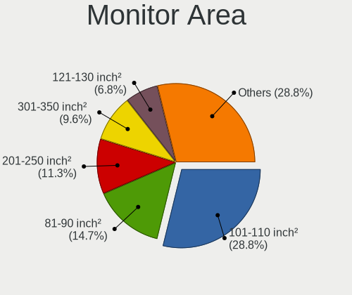

| Area in inch² | Computers | Percent |
|----------------|-----------|---------|
| 101-110        | 24        | 32.43%  |
| 81-90          | 9         | 12.16%  |
| 301-350        | 7         | 9.46%   |
| 201-250        | 6         | 8.11%   |
| 121-130        | 5         | 6.76%   |
| 61-70          | 4         | 5.41%   |
| 151-200        | 4         | 5.41%   |
| 111-120        | 3         | 4.05%   |
| 501-1000       | 3         | 4.05%   |
| 71-80          | 2         | 2.7%    |
| 351-500        | 2         | 2.7%    |
| 141-150        | 2         | 2.7%    |
| More than 1000 | 1         | 1.35%   |
| 251-300        | 1         | 1.35%   |
| Unknown        | 1         | 1.35%   |

Pixel Density
-------------

Pixels per inch

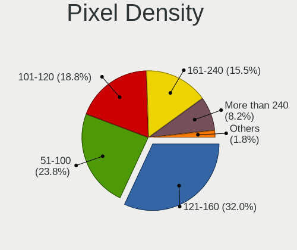

| Density       | Computers | Percent |
|---------------|-----------|---------|
| 121-160       | 25        | 34.72%  |
| 101-120       | 16        | 22.22%  |
| 51-100        | 16        | 22.22%  |
| 161-240       | 9         | 12.5%   |
| More than 240 | 5         | 6.94%   |
| Unknown       | 1         | 1.39%   |

Multiple Monitors
-----------------

Total monitors connected

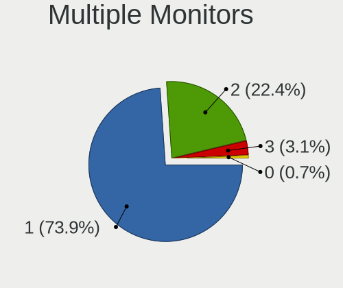

| Total | Computers | Percent |
|-------|-----------|---------|
| 1     | 45        | 72.58%  |
| 2     | 16        | 25.81%  |
| 3     | 1         | 1.61%   |

Network
-------

Net Controller Vendor
---------------------

Controller vendors

| Vendor                            | Computers | Percent |
|-----------------------------------|-----------|---------|
| Intel                             | 45        | 42.86%  |
| Realtek Semiconductor             | 36        | 34.29%  |
| Qualcomm Atheros                  | 6         | 5.71%   |
| Ralink Technology                 | 3         | 2.86%   |
| Huawei Technologies               | 3         | 2.86%   |
| Broadcom Limited                  | 3         | 2.86%   |
| DisplayLink                       | 2         | 1.9%    |
| Broadcom                          | 2         | 1.9%    |
| TP-Link                           | 1         | 0.95%   |
| MediaTek                          | 1         | 0.95%   |
| Ericsson Business Mobile Networks | 1         | 0.95%   |
| D-Link                            | 1         | 0.95%   |
| ASIX Electronics                  | 1         | 0.95%   |

Net Controller Model
--------------------

Controller models

| Model                                                             | Computers | Percent |
|-------------------------------------------------------------------|-----------|---------|
| Realtek RTL8111/8168/8411 PCI Express Gigabit Ethernet Controller | 28        | 23.93%  |
| Intel Wi-Fi 6 AX200                                               | 13        | 11.11%  |
| Realtek RTL8125 2.5GbE Controller                                 | 5         | 4.27%   |
| Intel Alder Lake-P PCH CNVi WiFi                                  | 5         | 4.27%   |
| Realtek RTL8821CE 802.11ac PCIe Wireless Network Adapter          | 2         | 1.71%   |
| Ralink RT2870/RT3070 Wireless Adapter                             | 2         | 1.71%   |
| Qualcomm Atheros AR9485 Wireless Network Adapter                  | 2         | 1.71%   |
| Intel Wireless 8265 / 8275                                        | 2         | 1.71%   |
| Intel Wireless 3165                                               | 2         | 1.71%   |
| Intel Wireless 3160                                               | 2         | 1.71%   |
| Intel Wi-Fi 6 AX201                                               | 2         | 1.71%   |
| Intel Ethernet Connection (2) I219-V                              | 2         | 1.71%   |
| Intel Comet Lake PCH CNVi WiFi                                    | 2         | 1.71%   |
| Intel 82579LM Gigabit Network Connection (Lewisville)             | 2         | 1.71%   |
| Huawei ME936 LTE/HSDPA+ 4G modem                                  | 2         | 1.71%   |
| TP-Link TL-WN823N v2/v3 [Realtek RTL8192EU]                       | 1         | 0.85%   |
| Realtek RTL8822CE 802.11ac PCIe Wireless Network Adapter          | 1         | 0.85%   |
| Realtek RTL8822BE 802.11a/b/g/n/ac WiFi adapter                   | 1         | 0.85%   |
| Realtek RTL8153 Gigabit Ethernet Adapter                          | 1         | 0.85%   |
| Realtek 802.11ac NIC                                              | 1         | 0.85%   |
| Ralink MT7601U Wireless Adapter                                   | 1         | 0.85%   |
| Qualcomm Atheros QCA6174 802.11ac Wireless Network Adapter        | 1         | 0.85%   |
| Qualcomm Atheros Killer E2500 Gigabit Ethernet Controller         | 1         | 0.85%   |
| Qualcomm Atheros AR9227 Wireless Network Adapter                  | 1         | 0.85%   |
| Qualcomm Atheros AR8161 Gigabit Ethernet                          | 1         | 0.85%   |
| MediaTek MT7922 802.11ax PCI Express Wireless Network Adapter     | 1         | 0.85%   |
| Intel Wireless-AC 9260                                            | 1         | 0.85%   |
| Intel Wireless 7260                                               | 1         | 0.85%   |
| Intel Wi-Fi 6 AX210/AX211/AX411 160MHz                            | 1         | 0.85%   |
| Intel Ultimate N WiFi Link 5300                                   | 1         | 0.85%   |
| Intel I211 Gigabit Network Connection                             | 1         | 0.85%   |
| Intel Ethernet Controller I225-V                                  | 1         | 0.85%   |
| Intel Ethernet Connection I218-LM                                 | 1         | 0.85%   |
| Intel Ethernet Connection (6) I219-LM                             | 1         | 0.85%   |
| Intel Ethernet Connection (5) I219-LM                             | 1         | 0.85%   |
| Intel Ethernet Connection (3) I218-LM                             | 1         | 0.85%   |
| Intel Ethernet Connection (16) I219-LM                            | 1         | 0.85%   |
| Intel Ethernet Connection (11) I219-V                             | 1         | 0.85%   |
| Intel Centrino Wireless-N 1030 [Rainbow Peak]                     | 1         | 0.85%   |
| Intel Centrino Advanced-N 6205 [Taylor Peak]                      | 1         | 0.85%   |

Wireless Vendor
---------------

Wireless vendors

| Vendor                | Computers | Percent |
|-----------------------|-----------|---------|
| Intel                 | 39        | 67.24%  |
| Realtek Semiconductor | 5         | 8.62%   |
| Qualcomm Atheros      | 4         | 6.9%    |
| Ralink Technology     | 3         | 5.17%   |
| Broadcom Limited      | 2         | 3.45%   |
| Broadcom              | 2         | 3.45%   |
| TP-Link               | 1         | 1.72%   |
| MediaTek              | 1         | 1.72%   |
| D-Link                | 1         | 1.72%   |

Wireless Model
--------------

Wireless models

| Model                                                                | Computers | Percent |
|----------------------------------------------------------------------|-----------|---------|
| Intel Wi-Fi 6 AX200                                                  | 13        | 22.41%  |
| Intel Alder Lake-P PCH CNVi WiFi                                     | 5         | 8.62%   |
| Realtek RTL8821CE 802.11ac PCIe Wireless Network Adapter             | 2         | 3.45%   |
| Ralink RT2870/RT3070 Wireless Adapter                                | 2         | 3.45%   |
| Qualcomm Atheros AR9485 Wireless Network Adapter                     | 2         | 3.45%   |
| Intel Wireless 8265 / 8275                                           | 2         | 3.45%   |
| Intel Wireless 3165                                                  | 2         | 3.45%   |
| Intel Wireless 3160                                                  | 2         | 3.45%   |
| Intel Wi-Fi 6 AX201                                                  | 2         | 3.45%   |
| Intel Comet Lake PCH CNVi WiFi                                       | 2         | 3.45%   |
| TP-Link TL-WN823N v2/v3 [Realtek RTL8192EU]                          | 1         | 1.72%   |
| Realtek RTL8822CE 802.11ac PCIe Wireless Network Adapter             | 1         | 1.72%   |
| Realtek RTL8822BE 802.11a/b/g/n/ac WiFi adapter                      | 1         | 1.72%   |
| Realtek 802.11ac NIC                                                 | 1         | 1.72%   |
| Ralink MT7601U Wireless Adapter                                      | 1         | 1.72%   |
| Qualcomm Atheros QCA6174 802.11ac Wireless Network Adapter           | 1         | 1.72%   |
| Qualcomm Atheros AR9227 Wireless Network Adapter                     | 1         | 1.72%   |
| MediaTek MT7922 802.11ax PCI Express Wireless Network Adapter        | 1         | 1.72%   |
| Intel Wireless-AC 9260                                               | 1         | 1.72%   |
| Intel Wireless 7260                                                  | 1         | 1.72%   |
| Intel Wi-Fi 6 AX210/AX211/AX411 160MHz                               | 1         | 1.72%   |
| Intel Ultimate N WiFi Link 5300                                      | 1         | 1.72%   |
| Intel Centrino Wireless-N 1030 [Rainbow Peak]                        | 1         | 1.72%   |
| Intel Centrino Advanced-N 6205 [Taylor Peak]                         | 1         | 1.72%   |
| Intel Centrino Advanced-N 6200                                       | 1         | 1.72%   |
| Intel Cannon Point-LP CNVi [Wireless-AC]                             | 1         | 1.72%   |
| Intel Cannon Lake PCH CNVi WiFi                                      | 1         | 1.72%   |
| Intel Alder Lake-U CNVi: Wireless-AC                                 | 1         | 1.72%   |
| Intel Alder Lake-S PCH CNVi WiFi                                     | 1         | 1.72%   |
| D-Link DWA-131 Wireless N Nano Adapter (Rev. E1) [Realtek RTL8192EU] | 1         | 1.72%   |
| Broadcom Limited BCM4360 802.11ac Wireless Network Adapter           | 1         | 1.72%   |
| Broadcom Limited BCM4313 802.11bgn Wireless Network Adapter          | 1         | 1.72%   |
| Broadcom BCM4331 802.11a/b/g/n                                       | 1         | 1.72%   |
| Broadcom BCM4313 802.11bgn Wireless Network Adapter                  | 1         | 1.72%   |

Ethernet Vendor
---------------

Ethernet vendors

| Vendor                | Computers | Percent |
|-----------------------|-----------|---------|
| Realtek Semiconductor | 34        | 62.96%  |
| Intel                 | 13        | 24.07%  |
| Qualcomm Atheros      | 2         | 3.7%    |
| DisplayLink           | 2         | 3.7%    |
| Broadcom Limited      | 1         | 1.85%   |
| Broadcom              | 1         | 1.85%   |
| ASIX Electronics      | 1         | 1.85%   |

Ethernet Model
--------------

Ethernet models

| Model                                                             | Computers | Percent |
|-------------------------------------------------------------------|-----------|---------|
| Realtek RTL8111/8168/8411 PCI Express Gigabit Ethernet Controller | 28        | 50.91%  |
| Realtek RTL8125 2.5GbE Controller                                 | 5         | 9.09%   |
| Intel Ethernet Connection (2) I219-V                              | 2         | 3.64%   |
| Intel 82579LM Gigabit Network Connection (Lewisville)             | 2         | 3.64%   |
| Realtek RTL8153 Gigabit Ethernet Adapter                          | 1         | 1.82%   |
| Qualcomm Atheros Killer E2500 Gigabit Ethernet Controller         | 1         | 1.82%   |
| Qualcomm Atheros AR8161 Gigabit Ethernet                          | 1         | 1.82%   |
| Intel I211 Gigabit Network Connection                             | 1         | 1.82%   |
| Intel Ethernet Controller I225-V                                  | 1         | 1.82%   |
| Intel Ethernet Connection I218-LM                                 | 1         | 1.82%   |
| Intel Ethernet Connection (6) I219-LM                             | 1         | 1.82%   |
| Intel Ethernet Connection (5) I219-LM                             | 1         | 1.82%   |
| Intel Ethernet Connection (3) I218-LM                             | 1         | 1.82%   |
| Intel Ethernet Connection (16) I219-LM                            | 1         | 1.82%   |
| Intel Ethernet Connection (11) I219-V                             | 1         | 1.82%   |
| Intel 82574L Gigabit Network Connection                           | 1         | 1.82%   |
| Intel 82567LM Gigabit Network Connection                          | 1         | 1.82%   |
| DisplayLink USB3.0 5K Graphic Docking                             | 1         | 1.82%   |
| DisplayLink Plugable UD-3900                                      | 1         | 1.82%   |
| Broadcom NetXtreme BCM57765 Gigabit Ethernet PCIe                 | 1         | 1.82%   |
| Broadcom Limited NetXtreme BCM57760 Gigabit Ethernet PCIe         | 1         | 1.82%   |
| ASIX AX88179 Gigabit Ethernet                                     | 1         | 1.82%   |

Net Controller Kind
-------------------

Ethernet, WiFi or modem

| Kind     | Computers | Percent |
|----------|-----------|---------|
| WiFi     | 56        | 50%     |
| Ethernet | 52        | 46.43%  |
| Modem    | 4         | 3.57%   |

Used Controller
---------------

Currently used network controller

| Kind     | Computers | Percent |
|----------|-----------|---------|
| WiFi     | 41        | 65.08%  |
| Ethernet | 22        | 34.92%  |

NICs
----

Total network controllers on board

| Total | Computers | Percent |
|-------|-----------|---------|
| 2     | 38        | 61.29%  |
| 1     | 20        | 32.26%  |
| 3     | 3         | 4.84%   |
| 0     | 1         | 1.61%   |

IPv6
----

IPv6 vs IPv4

| Used | Computers | Percent |
|------|-----------|---------|
| Yes  | 33        | 53.23%  |
| No   | 29        | 46.77%  |

Bluetooth
---------

Bluetooth Vendor
----------------

Controller vendors

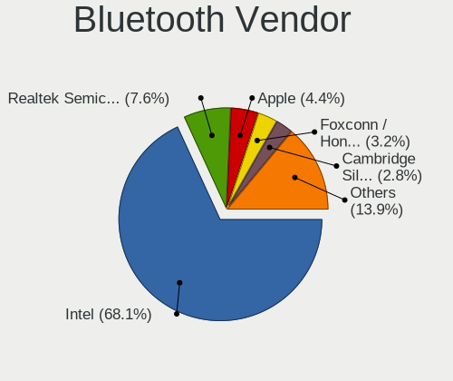

| Vendor                          | Computers | Percent |
|---------------------------------|-----------|---------|
| Intel                           | 37        | 71.15%  |
| Realtek Semiconductor           | 3         | 5.77%   |
| Foxconn / Hon Hai               | 3         | 5.77%   |
| Cambridge Silicon Radio         | 3         | 5.77%   |
| Apple                           | 2         | 3.85%   |
| Qualcomm Atheros Communications | 1         | 1.92%   |
| IMC Networks                    | 1         | 1.92%   |
| Broadcom                        | 1         | 1.92%   |
| ASUSTek Computer                | 1         | 1.92%   |

Bluetooth Model
---------------

Controller models

| Model                                               | Computers | Percent |
|-----------------------------------------------------|-----------|---------|
| Intel AX200 Bluetooth                               | 13        | 25%     |
| Intel Bluetooth wireless interface                  | 8         | 15.38%  |
| Intel AX201 Bluetooth                               | 6         | 11.54%  |
| Intel Bluetooth Device                              | 5         | 9.62%   |
| Cambridge Silicon Radio Bluetooth Dongle (HCI mode) | 3         | 5.77%   |
| Realtek Bluetooth Radio                             | 2         | 3.85%   |
| Intel Bluetooth 9460/9560 Jefferson Peak (JfP)      | 2         | 3.85%   |
| Realtek  Bluetooth 4.2 Adapter                      | 1         | 1.92%   |
| Qualcomm Atheros  Bluetooth Device                  | 1         | 1.92%   |
| Intel Wireless-AC 9260 Bluetooth Adapter            | 1         | 1.92%   |
| Intel Centrino Advanced-N 6230 Bluetooth adapter    | 1         | 1.92%   |
| Intel AX210 Bluetooth                               | 1         | 1.92%   |
| IMC Networks Bluetooth Radio                        | 1         | 1.92%   |
| Foxconn / Hon Hai Wireless_Device                   | 1         | 1.92%   |
| Foxconn / Hon Hai Broadcom BCM20702 Bluetooth       | 1         | 1.92%   |
| Foxconn / Hon Hai Acer Bluetooth module             | 1         | 1.92%   |
| Broadcom HP Portable SoftSailing                    | 1         | 1.92%   |
| ASUS ASUS USB-BT500                                 | 1         | 1.92%   |
| Apple Bluetooth USB Host Controller                 | 1         | 1.92%   |
| Apple Bluetooth Host Controller                     | 1         | 1.92%   |

Sound
-----

Sound Vendor
------------

Sound card vendors

| Vendor                                 | Computers | Percent |
|----------------------------------------|-----------|---------|
| Intel                                  | 46        | 54.76%  |
| Nvidia                                 | 18        | 21.43%  |
| AMD                                    | 16        | 19.05%  |
| Sony Ericsson Mobile Communications AB | 1         | 1.19%   |
| Kingston Technology                    | 1         | 1.19%   |
| JMTek                                  | 1         | 1.19%   |
| GN Netcom                              | 1         | 1.19%   |

Sound Model
-----------

Sound card models

| Model                                                                      | Computers | Percent |
|----------------------------------------------------------------------------|-----------|---------|
| AMD Family 17h/19h HD Audio Controller                                     | 15        | 15.31%  |
| Intel Alder Lake PCH-P High Definition Audio Controller                    | 7         | 7.14%   |
| AMD Renoir Radeon High Definition Audio Controller                         | 6         | 6.12%   |
| Intel 7 Series/C216 Chipset Family High Definition Audio Controller        | 5         | 5.1%    |
| Nvidia TU116 High Definition Audio Controller                              | 4         | 4.08%   |
| Nvidia GA106 High Definition Audio Controller                              | 4         | 4.08%   |
| Intel 6 Series/C200 Series Chipset Family High Definition Audio Controller | 4         | 4.08%   |
| Nvidia TU106 High Definition Audio Controller                              | 3         | 3.06%   |
| Intel Wildcat Point-LP High Definition Audio Controller                    | 3         | 3.06%   |
| Intel Comet Lake PCH cAVS                                                  | 3         | 3.06%   |
| Intel Cannon Lake PCH cAVS                                                 | 3         | 3.06%   |
| Intel Broadwell-U Audio Controller                                         | 3         | 3.06%   |
| Intel 100 Series/C230 Series Chipset Family HD Audio Controller            | 3         | 3.06%   |
| Nvidia GA104 High Definition Audio Controller                              | 2         | 2.04%   |
| Intel Tiger Lake-LP Smart Sound Technology Audio Controller                | 2         | 2.04%   |
| Intel Haswell-ULT HD Audio Controller                                      | 2         | 2.04%   |
| Intel CM238 HD Audio Controller                                            | 2         | 2.04%   |
| Intel 8 Series/C220 Series Chipset High Definition Audio Controller        | 2         | 2.04%   |
| Intel 8 Series HD Audio Controller                                         | 2         | 2.04%   |
| AMD Raven/Raven2/Fenghuang HDMI/DP Audio Controller                        | 2         | 2.04%   |
| Sony Ericsson Mobile Communications AB XQ-AU52                             | 1         | 1.02%   |
| Nvidia TU107 GeForce GTX 1650 High Definition Audio Controller             | 1         | 1.02%   |
| Nvidia GP108 High Definition Audio Controller                              | 1         | 1.02%   |
| Nvidia GP107GL High Definition Audio Controller                            | 1         | 1.02%   |
| Nvidia GP106 High Definition Audio Controller                              | 1         | 1.02%   |
| Nvidia GF108 High Definition Audio Controller                              | 1         | 1.02%   |
| Kingston Technology HyperX QuadCast S                                      | 1         | 1.02%   |
| JMTek SADES Audio Device                                                   | 1         | 1.02%   |
| Intel Xeon E3-1200 v3/4th Gen Core Processor HD Audio Controller           | 1         | 1.02%   |
| Intel Tiger Lake-H HD Audio Controller                                     | 1         | 1.02%   |
| Intel Sunrise Point-LP HD Audio                                            | 1         | 1.02%   |
| Intel Comet Lake PCH-V cAVS                                                | 1         | 1.02%   |
| Intel Celeron/Pentium Silver Processor High Definition Audio               | 1         | 1.02%   |
| Intel Cannon Point-LP High Definition Audio Controller                     | 1         | 1.02%   |
| Intel Alder Lake-U cAVS (Audio, Voice, Speech)                             | 1         | 1.02%   |
| Intel Alder Lake-S HD Audio Controller                                     | 1         | 1.02%   |
| Intel 82801I (ICH9 Family) HD Audio Controller                             | 1         | 1.02%   |
| Intel 5 Series/3400 Series Chipset High Definition Audio                   | 1         | 1.02%   |
| Intel 200 Series PCH HD Audio                                              | 1         | 1.02%   |
| GN Netcom Jabra Link 380                                                   | 1         | 1.02%   |

Memory
------

Memory Vendor
-------------

Memory module vendors

| Vendor              | Computers | Percent |
|---------------------|-----------|---------|
| Samsung Electronics | 6         | 31.58%  |
| SK hynix            | 5         | 26.32%  |
| Unknown             | 2         | 10.53%  |
| Unknown (ABCD)      | 1         | 5.26%   |
| Micron Technology   | 1         | 5.26%   |
| KLEVV               | 1         | 5.26%   |
| Elpida              | 1         | 5.26%   |
| Crucial             | 1         | 5.26%   |
| ASint Technology    | 1         | 5.26%   |

Memory Model
------------

Memory module models

| Model                                                          | Computers | Percent |
|----------------------------------------------------------------|-----------|---------|
| Samsung RAM M471A4G43AB1-CWE 32GB SODIMM DDR4 3200MT/s         | 2         | 10.53%  |
| Unknown                                                        | 2         | 10.53%  |
| Unknown (ABCD) RAM 123456789012345678 2GB DIMM LPDDR4 2400MT/s | 1         | 5.26%   |
| SK hynix RAM Module 4GB SODIMM DDR3 1600MT/s                   | 1         | 5.26%   |
| SK hynix RAM HMT41GS6BFR8A-PB 8GB SODIMM DDR3 1600MT/s         | 1         | 5.26%   |
| SK hynix RAM HMT351S6CFR8C-PB 4GB SODIMM DDR3 1600MT/s         | 1         | 5.26%   |
| SK hynix RAM HMAA1GS6CJR6N-XN 8GB SODIMM DDR4 3200MT/s         | 1         | 5.26%   |
| SK hynix RAM HMA81GS6AFR8N-UH 8GB SODIMM DDR4 2667MT/s         | 1         | 5.26%   |
| Samsung RAM M471A2K43EB1-CWE 16GB SODIMM DDR4 3200MT/s         | 1         | 5.26%   |
| Samsung RAM M471A2K43DB1-CWE 16GB SODIMM DDR4 3200MT/s         | 1         | 5.26%   |
| Samsung RAM M471A2K43CB1-CTD 16GB SODIMM DDR4 8400MT/s         | 1         | 5.26%   |
| Samsung RAM M471A1K43DB1-CWE 8GB SODIMM DDR4 3200MT/s          | 1         | 5.26%   |
| Micron RAM 8ATF2G64AZ-3G2E1 16GB DIMM DDR4 3200MT/s            | 1         | 5.26%   |
| KLEVV RAM KD48GU880-32A160X 8GB DIMM DDR4 2666MT/s             | 1         | 5.26%   |
| Elpida RAM EBJ21UE8BDS0-AE-F 2GB SODIMM DDR3 1067MT/s          | 1         | 5.26%   |
| Crucial RAM CT16G4DFRA32A.C8FE 16GB DIMM DDR4 3200MT/s         | 1         | 5.26%   |
| ASint RAM SSZ302G08-GGNHC 2GB SODIMM DDR3 1600MT/s             | 1         | 5.26%   |

Memory Kind
-----------

Memory module kinds

| Kind   | Computers | Percent |
|--------|-----------|---------|
| DDR4   | 10        | 62.5%   |
| DDR3   | 4         | 25%     |
| LPDDR5 | 1         | 6.25%   |
| LPDDR4 | 1         | 6.25%   |

Memory Form Factor
------------------

Physical design of the memory module

| Name         | Computers | Percent |
|--------------|-----------|---------|
| SODIMM       | 12        | 75%     |
| DIMM         | 3         | 18.75%  |
| Row Of Chips | 1         | 6.25%   |

Memory Size
-----------

Memory module size

| Size  | Computers | Percent |
|-------|-----------|---------|
| 16384 | 6         | 33.33%  |
| 8192  | 5         | 27.78%  |
| 2048  | 3         | 16.67%  |
| 32768 | 2         | 11.11%  |
| 4096  | 2         | 11.11%  |

Memory Speed
------------

Memory module speed

| Speed | Computers | Percent |
|-------|-----------|---------|
| 3200  | 7         | 43.75%  |
| 1600  | 3         | 18.75%  |
| 8400  | 1         | 6.25%   |
| 6400  | 1         | 6.25%   |
| 2667  | 1         | 6.25%   |
| 2666  | 1         | 6.25%   |
| 2400  | 1         | 6.25%   |
| 1067  | 1         | 6.25%   |

Printers & scanners
-------------------

Printer Vendor
--------------

Printer device vendors

| Vendor              | Computers | Percent |
|---------------------|-----------|---------|
| Prolific Technology | 1         | 100%    |

Printer Model
-------------

Printer device models

| Model                         | Computers | Percent |
|-------------------------------|-----------|---------|
| Prolific PL2305 Parallel Port | 1         | 100%    |

Scanner Vendor
--------------

Scanner device vendors

Zero info for selected period =(

Scanner Model
-------------

Scanner device models

Zero info for selected period =(

Camera
------

Camera Vendor
-------------

Camera device vendors

| Vendor                                 | Computers | Percent |
|----------------------------------------|-----------|---------|
| Chicony Electronics                    | 20        | 50%     |
| Suyin                                  | 2         | 5%      |
| Sunplus Innovation Technology          | 2         | 5%      |
| Microdia                               | 2         | 5%      |
| IMC Networks                           | 2         | 5%      |
| Bison Electronics                      | 2         | 5%      |
| Acer                                   | 2         | 5%      |
| Sony Ericsson Mobile Communications AB | 1         | 2.5%    |
| Ricoh                                  | 1         | 2.5%    |
| Realtek Semiconductor                  | 1         | 2.5%    |
| Luxvisions Innotech Limited            | 1         | 2.5%    |
| Lite-On Technology                     | 1         | 2.5%    |
| Generalplus Technology                 | 1         | 2.5%    |
| Apple                                  | 1         | 2.5%    |
| Alpha Imaging Technology               | 1         | 2.5%    |

Camera Model
------------

Camera device models

| Model                                                | Computers | Percent |
|------------------------------------------------------|-----------|---------|
| Chicony Integrated IR Camera                         | 5         | 12.5%   |
| Chicony HD Webcam                                    | 3         | 7.5%    |
| Chicony FHD Webcam                                   | 3         | 7.5%    |
| IMC Networks Integrated Camera                       | 2         | 5%      |
| Chicony USB2.0 Camera                                | 2         | 5%      |
| Chicony Integrated Camera                            | 2         | 5%      |
| Suyin RGBIR Camera                                   | 1         | 2.5%    |
| Suyin HP TrueVision HD                               | 1         | 2.5%    |
| Sunplus Integrated_Webcam_HD                         | 1         | 2.5%    |
| Sunplus Asus Webcam                                  | 1         | 2.5%    |
| Sony Ericsson Mobile AB XQ-CC54                      | 1         | 2.5%    |
| Ricoh Laptop_Integrated_Webcam_FHD                   | 1         | 2.5%    |
| Realtek Integrated Webcam                            | 1         | 2.5%    |
| Microdia Sonix USB 2.0 Camera                        | 1         | 2.5%    |
| Microdia Integrated_Webcam_FHD                       | 1         | 2.5%    |
| Luxvisions Innotech Limited HP Wide Vision HD Camera | 1         | 2.5%    |
| Lite-On HP Wide Vision HD Camera                     | 1         | 2.5%    |
| Generalplus WEB CAM                                  | 1         | 2.5%    |
| Chicony USB2.0 HD UVC WebCam                         | 1         | 2.5%    |
| Chicony USB 2.0 Camera                               | 1         | 2.5%    |
| Chicony FJ Camera                                    | 1         | 2.5%    |
| Chicony ACER FHD User Facing                         | 1         | 2.5%    |
| Chicony 1.3M Webcam                                  | 1         | 2.5%    |
| Bison Lenovo EasyCamera                              | 1         | 2.5%    |
| Bison HD Webcam                                      | 1         | 2.5%    |
| Apple FaceTime HD Camera                             | 1         | 2.5%    |
| Alpha Imaging Integrated_Webcam_8M                   | 1         | 2.5%    |
| Acer Lenovo Integrated Webcam                        | 1         | 2.5%    |
| Acer HD Webcam                                       | 1         | 2.5%    |

Security
--------

Fingerprint Vendor
------------------

Fingerprint sensor vendors

| Vendor                | Computers | Percent |
|-----------------------|-----------|---------|
| Synaptics             | 5         | 50%     |
| Validity Sensors      | 4         | 40%     |
| LighTuning Technology | 1         | 10%     |

Fingerprint Model
-----------------

Fingerprint sensor models

| Model                                             | Computers | Percent |
|---------------------------------------------------|-----------|---------|
| Synaptics UWP WBDI                                | 2         | 20%     |
| Synaptics Prometheus MIS Touch Fingerprint Reader | 2         | 20%     |
| Validity Sensors VFS495 Fingerprint Reader        | 1         | 10%     |
| Validity Sensors VFS491                           | 1         | 10%     |
| Validity Sensors VFS Fingerprint sensor           | 1         | 10%     |
| Validity Sensors Fingerprint scanner              | 1         | 10%     |
| Synaptics WBDI                                    | 1         | 10%     |
| LighTuning Fingerprint Reader                     | 1         | 10%     |

Chipcard Vendor
---------------

Chipcard module vendors

| Vendor      | Computers | Percent |
|-------------|-----------|---------|
| Broadcom    | 2         | 50%     |
| Alcor Micro | 2         | 50%     |

Chipcard Model
--------------

Chipcard module models

| Model                               | Computers | Percent |
|-------------------------------------|-----------|---------|
| Alcor Micro AU9540 Smartcard Reader | 2         | 50%     |
| Broadcom 5880                       | 1         | 25%     |
| Broadcom 58200                      | 1         | 25%     |

Unsupported
-----------

Unsupported Devices
-------------------

Total unsupported devices on board

| Total | Computers | Percent |
|-------|-----------|---------|
| 0     | 37        | 59.68%  |
| 1     | 24        | 38.71%  |
| 3     | 1         | 1.61%   |

Unsupported Device Types
------------------------

Types of unsupported devices

| Type                  | Computers | Percent |
|-----------------------|-----------|---------|
| Fingerprint reader    | 10        | 35.71%  |
| Multimedia controller | 8         | 28.57%  |
| Chipcard              | 4         | 14.29%  |
| Net/wireless          | 2         | 7.14%   |
| Graphics card         | 2         | 7.14%   |
| Modem                 | 1         | 3.57%   |
| Camera                | 1         | 3.57%   |

