TUXEDO OS - Tested Hardware & Statistics
----------------------------------------

A project to collect tested hardware configurations for TUXEDO OS.

Anyone can contribute to this report by the [hw-probe](https://github.com/linuxhw/hw-probe) tool:

    sudo -E hw-probe -all -upload

Please contribute! Especially if your hardware is rare.

This is a report for all computer types. See also reports for [desktops](/Dist/TUXEDO_OS/Desktop/README.md) and [notebooks](/Dist/TUXEDO_OS/Notebook/README.md).

Contents
--------

* [ Test Cases ](#test-cases)

* [ System ](#system)
  - [ OS                       ](#os)
  - [ OS Family                ](#os-family)
  - [ Kernel                   ](#kernel)
  - [ Kernel Family            ](#kernel-family)
  - [ Kernel Major Ver.        ](#kernel-major-ver)
  - [ Arch                     ](#arch)
  - [ DE                       ](#de)
  - [ Display Server           ](#display-server)
  - [ Display Manager          ](#display-manager)
  - [ OS Lang                  ](#os-lang)
  - [ Boot Mode                ](#boot-mode)
  - [ Filesystem               ](#filesystem)
  - [ Part. scheme             ](#part-scheme)
  - [ Dual Boot with Linux/BSD ](#dual-boot-with-linuxbsd)
  - [ Dual Boot (Win)          ](#dual-boot-win)

* [ Board ](#board)
  - [ Vendor                   ](#vendor)
  - [ Model                    ](#model)
  - [ Model Family             ](#model-family)
  - [ MFG Year                 ](#mfg-year)
  - [ Form Factor              ](#form-factor)
  - [ Secure Boot              ](#secure-boot)
  - [ Coreboot                 ](#coreboot)
  - [ RAM Size                 ](#ram-size)
  - [ RAM Used                 ](#ram-used)
  - [ Total Drives             ](#total-drives)
  - [ Has CD-ROM               ](#has-cd-rom)
  - [ Has Ethernet             ](#has-ethernet)
  - [ Has WiFi                 ](#has-wifi)
  - [ Has Bluetooth            ](#has-bluetooth)

* [ Location ](#location)
  - [ Country                  ](#country)
  - [ City                     ](#city)

* [ Drives ](#drives)
  - [ Drive Vendor             ](#drive-vendor)
  - [ Drive Model              ](#drive-model)
  - [ HDD Vendor               ](#hdd-vendor)
  - [ SSD Vendor               ](#ssd-vendor)
  - [ Drive Kind               ](#drive-kind)
  - [ Drive Connector          ](#drive-connector)
  - [ Drive Size               ](#drive-size)
  - [ Space Total              ](#space-total)
  - [ Space Used               ](#space-used)
  - [ Malfunc. Drives          ](#malfunc-drives)
  - [ Malfunc. Drive Vendor    ](#malfunc-drive-vendor)
  - [ Malfunc. HDD Vendor      ](#malfunc-hdd-vendor)
  - [ Malfunc. Drive Kind      ](#malfunc-drive-kind)
  - [ Failed Drives            ](#failed-drives)
  - [ Failed Drive Vendor      ](#failed-drive-vendor)
  - [ Drive Status             ](#drive-status)

* [ Storage controller ](#storage-controller)
  - [ Storage Vendor           ](#storage-vendor)
  - [ Storage Model            ](#storage-model)
  - [ Storage Kind             ](#storage-kind)

* [ Processor ](#processor)
  - [ CPU Vendor               ](#cpu-vendor)
  - [ CPU Model                ](#cpu-model)
  - [ CPU Model Family         ](#cpu-model-family)
  - [ CPU Cores                ](#cpu-cores)
  - [ CPU Sockets              ](#cpu-sockets)
  - [ CPU Threads              ](#cpu-threads)
  - [ CPU Op-Modes             ](#cpu-op-modes)
  - [ CPU Microcode            ](#cpu-microcode)
  - [ CPU Microarch            ](#cpu-microarch)

* [ Graphics ](#graphics)
  - [ GPU Vendor               ](#gpu-vendor)
  - [ GPU Model                ](#gpu-model)
  - [ GPU Combo                ](#gpu-combo)
  - [ GPU Driver               ](#gpu-driver)
  - [ GPU Memory               ](#gpu-memory)

* [ Monitor ](#monitor)
  - [ Monitor Vendor           ](#monitor-vendor)
  - [ Monitor Model            ](#monitor-model)
  - [ Monitor Resolution       ](#monitor-resolution)
  - [ Monitor Diagonal         ](#monitor-diagonal)
  - [ Monitor Width            ](#monitor-width)
  - [ Aspect Ratio             ](#aspect-ratio)
  - [ Monitor Area             ](#monitor-area)
  - [ Pixel Density            ](#pixel-density)
  - [ Multiple Monitors        ](#multiple-monitors)

* [ Network ](#network)
  - [ Net Controller Vendor    ](#net-controller-vendor)
  - [ Net Controller Model     ](#net-controller-model)
  - [ Wireless Vendor          ](#wireless-vendor)
  - [ Wireless Model           ](#wireless-model)
  - [ Ethernet Vendor          ](#ethernet-vendor)
  - [ Ethernet Model           ](#ethernet-model)
  - [ Net Controller Kind      ](#net-controller-kind)
  - [ Used Controller          ](#used-controller)
  - [ NICs                     ](#nics)
  - [ IPv6                     ](#ipv6)

* [ Bluetooth ](#bluetooth)
  - [ Bluetooth Vendor         ](#bluetooth-vendor)
  - [ Bluetooth Model          ](#bluetooth-model)

* [ Sound ](#sound)
  - [ Sound Vendor             ](#sound-vendor)
  - [ Sound Model              ](#sound-model)

* [ Memory ](#memory)
  - [ Memory Vendor            ](#memory-vendor)
  - [ Memory Model             ](#memory-model)
  - [ Memory Kind              ](#memory-kind)
  - [ Memory Form Factor       ](#memory-form-factor)
  - [ Memory Size              ](#memory-size)
  - [ Memory Speed             ](#memory-speed)

* [ Printers & scanners ](#printers--scanners)
  - [ Printer Vendor           ](#printer-vendor)
  - [ Printer Model            ](#printer-model)
  - [ Scanner Vendor           ](#scanner-vendor)
  - [ Scanner Model            ](#scanner-model)

* [ Camera ](#camera)
  - [ Camera Vendor            ](#camera-vendor)
  - [ Camera Model             ](#camera-model)

* [ Security ](#security)
  - [ Fingerprint Vendor       ](#fingerprint-vendor)
  - [ Fingerprint Model        ](#fingerprint-model)
  - [ Chipcard Vendor          ](#chipcard-vendor)
  - [ Chipcard Model           ](#chipcard-model)

* [ Unsupported ](#unsupported)
  - [ Unsupported Devices      ](#unsupported-devices)
  - [ Unsupported Device Types ](#unsupported-device-types)

Test Cases
----------

Total: 168

| Vendor        | Model                       | Form-Factor | Probe                                                      | Date         |
|---------------|-----------------------------|-------------|------------------------------------------------------------|--------------|
| TUXEDO        | Polaris AMD Gen5            | Notebook    | [aa5447c317](https://linux-hardware.org/?probe=aa5447c317) | Jan 01, 2024 |
| ASRock        | H170M Pro4                  | Desktop     | [27e24a6ef3](https://linux-hardware.org/?probe=27e24a6ef3) | Dec 30, 2023 |
| Samsung       | RC530/RC730                 | Notebook    | [866c256904](https://linux-hardware.org/?probe=866c256904) | Dec 30, 2023 |
| Samsung       | RC530/RC730                 | Notebook    | [db448e5732](https://linux-hardware.org/?probe=db448e5732) | Dec 29, 2023 |
| TUXEDO        | Polaris AMD Gen5            | Notebook    | [46ad5a6b29](https://linux-hardware.org/?probe=46ad5a6b29) | Dec 28, 2023 |
| TUXEDO        | InfinityBook S 15 Gen6      | Notebook    | [54961dd296](https://linux-hardware.org/?probe=54961dd296) | Dec 25, 2023 |
| TUXEDO        | Polaris AMD Gen5            | Notebook    | [f63c59d851](https://linux-hardware.org/?probe=f63c59d851) | Dec 24, 2023 |
| Lenovo        | Legion 5 15IAH7H 82RB       | Notebook    | [57d4ccc05e](https://linux-hardware.org/?probe=57d4ccc05e) | Dec 21, 2023 |
| Lenovo        | Yoga 530-14IKB 81EK         | Convertible | [c7acd610c0](https://linux-hardware.org/?probe=c7acd610c0) | Dec 20, 2023 |
| TUXEDO        | Polaris AMD Gen5            | Notebook    | [84a93dbb91](https://linux-hardware.org/?probe=84a93dbb91) | Dec 19, 2023 |
| ECS           | GeForce 8000 series         | Desktop     | [d436bb4acc](https://linux-hardware.org/?probe=d436bb4acc) | Dec 19, 2023 |
| MSI           | PRO H410M-B                 | Desktop     | [0729c86d23](https://linux-hardware.org/?probe=0729c86d23) | Dec 15, 2023 |
| Apple         | MacBookAir6,2               | Notebook    | [31426d7740](https://linux-hardware.org/?probe=31426d7740) | Dec 15, 2023 |
| ASUSTek       | PRIME B450-PLUS             | Desktop     | [7e201ea559](https://linux-hardware.org/?probe=7e201ea559) | Dec 11, 2023 |
| TUXEDO        | InfinityBook Pro Gen7 (M... | Notebook    | [627ee4cb32](https://linux-hardware.org/?probe=627ee4cb32) | Dec 11, 2023 |
| Acer          | Swift SF314-52              | Notebook    | [ed93047829](https://linux-hardware.org/?probe=ed93047829) | Dec 01, 2023 |
| Dell          | Inspiron 3558               | Notebook    | [936fe9e153](https://linux-hardware.org/?probe=936fe9e153) | Nov 28, 2023 |
| Lenovo        | ThinkPad P14s Gen 2a 21A... | Notebook    | [4c071e2ab0](https://linux-hardware.org/?probe=4c071e2ab0) | Nov 27, 2023 |
| TUXEDO        | Stellaris Intel Gen5        | Notebook    | [16cc1f3183](https://linux-hardware.org/?probe=16cc1f3183) | Nov 26, 2023 |
| Acer          | Nitro AN517-55              | Notebook    | [c34bec8c5f](https://linux-hardware.org/?probe=c34bec8c5f) | Nov 21, 2023 |
| HP            | Pavilion Laptop 15-eg0xx... | Notebook    | [3e6fcc9388](https://linux-hardware.org/?probe=3e6fcc9388) | Nov 19, 2023 |
| TUXEDO        | InfinityBook S 15/17 Gen... | Notebook    | [629ca85bd5](https://linux-hardware.org/?probe=629ca85bd5) | Nov 18, 2023 |
| TUXEDO        | InfinityBook S 15/17 Gen... | Notebook    | [1a6683483d](https://linux-hardware.org/?probe=1a6683483d) | Nov 18, 2023 |
| TUXEDO        | Polaris 15 AMD Gen1         | Notebook    | [a08b139fa8](https://linux-hardware.org/?probe=a08b139fa8) | Nov 12, 2023 |
| ASUSTek       | PRIME A320M-K               | Desktop     | [5f06f30bd3](https://linux-hardware.org/?probe=5f06f30bd3) | Nov 09, 2023 |
| MSI           | MPG Z390 GAMING PRO CARB... | Desktop     | [414894f4aa](https://linux-hardware.org/?probe=414894f4aa) | Nov 08, 2023 |
| ASUSTek       | PRIME A320M-K               | Desktop     | [3fb2d2a6f0](https://linux-hardware.org/?probe=3fb2d2a6f0) | Nov 06, 2023 |
| Lenovo        | ThinkPad P50 20EQS42M00     | Notebook    | [f4761a87e1](https://linux-hardware.org/?probe=f4761a87e1) | Nov 06, 2023 |
| TUXEDO        | Pulse 15 Gen1               | Notebook    | [4a5e89566c](https://linux-hardware.org/?probe=4a5e89566c) | Nov 05, 2023 |
| Lenovo        | IdeaPad Pro 5 14APH8 83A... | Notebook    | [0845a0ec43](https://linux-hardware.org/?probe=0845a0ec43) | Nov 03, 2023 |
| TUXEDO        | Aura 15 Gen2                | Notebook    | [ca743b4e40](https://linux-hardware.org/?probe=ca743b4e40) | Nov 01, 2023 |
| Dell          | Precision 5480              | Notebook    | [0d66f24fe1](https://linux-hardware.org/?probe=0d66f24fe1) | Oct 25, 2023 |
| Notebook      | NP5x_NP6x_NP7xHP            | Notebook    | [017d43654d](https://linux-hardware.org/?probe=017d43654d) | Oct 22, 2023 |
| MSI           | X570-A PRO                  | Desktop     | [78df342ad3](https://linux-hardware.org/?probe=78df342ad3) | Oct 21, 2023 |
| TUXEDO        | XMG FUSION 15 (XFU15L19)    | Notebook    | [af44d01ae9](https://linux-hardware.org/?probe=af44d01ae9) | Oct 19, 2023 |
| Gigabyte      | B560M AORUS PRO AX          | Desktop     | [5573fff3e6](https://linux-hardware.org/?probe=5573fff3e6) | Oct 17, 2023 |
| Dell          | Latitude E6540              | Notebook    | [78c4b71781](https://linux-hardware.org/?probe=78c4b71781) | Oct 04, 2023 |
| Dell          | Latitude E6540              | Notebook    | [290b4bd42e](https://linux-hardware.org/?probe=290b4bd42e) | Oct 03, 2023 |
| Lenovo        | ThinkBook 14 G2 ARE 20VF    | Notebook    | [886b5140ec](https://linux-hardware.org/?probe=886b5140ec) | Oct 03, 2023 |
| Lenovo        | ThinkPad T490s 20NYS3Y60... | Notebook    | [294e5069a4](https://linux-hardware.org/?probe=294e5069a4) | Oct 01, 2023 |
| Lenovo        | ThinkPad T490s 20NYS3Y60... | Notebook    | [9452219aa3](https://linux-hardware.org/?probe=9452219aa3) | Oct 01, 2023 |
| MSI           | Prestige 15 A10SC           | Notebook    | [6e53cd8a65](https://linux-hardware.org/?probe=6e53cd8a65) | Sep 30, 2023 |
| Metabox       | Prime-X X170KM              | Notebook    | [8ab33a8bd3](https://linux-hardware.org/?probe=8ab33a8bd3) | Sep 30, 2023 |
| TUXEDO        | Stellaris Intel Gen5        | Notebook    | [6d981e4890](https://linux-hardware.org/?probe=6d981e4890) | Sep 29, 2023 |
| Dell          | Inspiron 14 5420            | Notebook    | [ade3d11822](https://linux-hardware.org/?probe=ade3d11822) | Sep 24, 2023 |
| Schenker      | VISION 15 E23 (SVS15E23)    | Notebook    | [d905d3589d](https://linux-hardware.org/?probe=d905d3589d) | Sep 24, 2023 |
| Lenovo        | ThinkBook 14 G2 ARE 20VF    | Notebook    | [147b087f20](https://linux-hardware.org/?probe=147b087f20) | Sep 23, 2023 |
| ASRock        | A520M-HVS                   | Desktop     | [0a29d5f7f6](https://linux-hardware.org/?probe=0a29d5f7f6) | Sep 22, 2023 |
| Chuwi         | MiniBook X                  | Notebook    | [50d0819b3b](https://linux-hardware.org/?probe=50d0819b3b) | Sep 20, 2023 |
| ASRock        | A520M-HVS                   | Desktop     | [2a7bf627ba](https://linux-hardware.org/?probe=2a7bf627ba) | Sep 19, 2023 |
| TUXEDO        | InfinityBook Pro Gen7 (M... | Notebook    | [a4f7b61af6](https://linux-hardware.org/?probe=a4f7b61af6) | Sep 18, 2023 |
| HP            | Laptop 15-db1xxx            | Notebook    | [804223592d](https://linux-hardware.org/?probe=804223592d) | Sep 17, 2023 |
| HP            | Pavilion dv5                | Notebook    | [2c55682860](https://linux-hardware.org/?probe=2c55682860) | Sep 15, 2023 |
| HP            | Pavilion dv5                | Notebook    | [8d25f8969b](https://linux-hardware.org/?probe=8d25f8969b) | Sep 15, 2023 |
| ASUSTek       | ROG STRIX Z590-A GAMING ... | Desktop     | [6d7c6c42f5](https://linux-hardware.org/?probe=6d7c6c42f5) | Sep 14, 2023 |
| ASUSTek       | ROG STRIX Z590-A GAMING ... | Desktop     | [fe64bd3017](https://linux-hardware.org/?probe=fe64bd3017) | Sep 13, 2023 |
| Lenovo        | ThinkPad P50 20EQS37F00     | Notebook    | [0eaf502e28](https://linux-hardware.org/?probe=0eaf502e28) | Sep 12, 2023 |
| TUXEDO        | Stellaris Intel Gen5        | Notebook    | [a28ff634a0](https://linux-hardware.org/?probe=a28ff634a0) | Sep 11, 2023 |
| TUXEDO        | Stellaris Intel Gen5        | Notebook    | [28283f9fcf](https://linux-hardware.org/?probe=28283f9fcf) | Sep 11, 2023 |
| HP            | ZBook 14u G5                | Notebook    | [9ff135c2a6](https://linux-hardware.org/?probe=9ff135c2a6) | Sep 09, 2023 |
| Apple         | MacBookPro9,2               | Notebook    | [abb6dcaeb2](https://linux-hardware.org/?probe=abb6dcaeb2) | Sep 09, 2023 |
| Apple         | MacBookPro9,2               | Notebook    | [1e6219cb6e](https://linux-hardware.org/?probe=1e6219cb6e) | Sep 09, 2023 |
| MSI           | MAG B560M MORTAR WIFI       | Desktop     | [376e22722b](https://linux-hardware.org/?probe=376e22722b) | Sep 05, 2023 |
| MSI           | MAG B560M MORTAR WIFI       | Desktop     | [388f380783](https://linux-hardware.org/?probe=388f380783) | Sep 02, 2023 |
| TUXEDO        | InfinityBook S 15 Gen6      | Notebook    | [c53e992822](https://linux-hardware.org/?probe=c53e992822) | Aug 26, 2023 |
| ASUSTek       | PRIME B450-PLUS             | Desktop     | [679cf99998](https://linux-hardware.org/?probe=679cf99998) | Aug 19, 2023 |
| ASUSTek       | PRIME B450-PLUS             | Desktop     | [cd3074537b](https://linux-hardware.org/?probe=cd3074537b) | Aug 15, 2023 |
| TUXEDO        | Polaris AMD Gen3 (CZN)      | Notebook    | [b6e2112ccb](https://linux-hardware.org/?probe=b6e2112ccb) | Aug 13, 2023 |
| Dell          | Precision 7750              | Notebook    | [cebb7f5165](https://linux-hardware.org/?probe=cebb7f5165) | Aug 06, 2023 |
| TUXEDO        | N7x0WU                      | Notebook    | [1c2cb06178](https://linux-hardware.org/?probe=1c2cb06178) | Aug 06, 2023 |
| ASUSTek       | ROG STRIX B550-I GAMING     | Desktop     | [01846991de](https://linux-hardware.org/?probe=01846991de) | Aug 04, 2023 |
| TUXEDO        | XMG FUSION 15 (XFU15L19)    | Notebook    | [64e640ff2b](https://linux-hardware.org/?probe=64e640ff2b) | Aug 04, 2023 |
| TUXEDO        | Aura 15 Gen2                | Notebook    | [07d668ee3d](https://linux-hardware.org/?probe=07d668ee3d) | Aug 03, 2023 |
| TUXEDO        | InfinityBook Pro Gen7 (M... | Notebook    | [c6078d0836](https://linux-hardware.org/?probe=c6078d0836) | Aug 02, 2023 |
| Lenovo        | ThinkPad E580 20KS003SUS    | Notebook    | [9b8485b740](https://linux-hardware.org/?probe=9b8485b740) | Aug 01, 2023 |
| ASUSTek       | PRIME B450-PLUS             | Desktop     | [fde0e0e94f](https://linux-hardware.org/?probe=fde0e0e94f) | Jul 29, 2023 |
| HP            | Notebook                    | Notebook    | [beef8e7fce](https://linux-hardware.org/?probe=beef8e7fce) | Jul 25, 2023 |
| HP            | Notebook                    | Notebook    | [4746f66332](https://linux-hardware.org/?probe=4746f66332) | Jul 23, 2023 |
| Lenovo        | ThinkPad 20JB002BUS         | Tablet      | [ac659620e6](https://linux-hardware.org/?probe=ac659620e6) | Jul 20, 2023 |
| Lenovo        | G580 20150                  | Notebook    | [bcd1c01ad6](https://linux-hardware.org/?probe=bcd1c01ad6) | Jul 15, 2023 |
| Lenovo        | G580 20150                  | Notebook    | [390008fe3c](https://linux-hardware.org/?probe=390008fe3c) | Jul 15, 2023 |
| HP            | Laptop 15-dw3xxx            | Notebook    | [fd0926d15b](https://linux-hardware.org/?probe=fd0926d15b) | Jul 14, 2023 |
| TUXEDO        | InfinityBook S 15/17 Gen... | Notebook    | [26fda3b894](https://linux-hardware.org/?probe=26fda3b894) | Jul 14, 2023 |
| Dell          | Latitude E6530              | Notebook    | [25cbd87821](https://linux-hardware.org/?probe=25cbd87821) | Jul 13, 2023 |
| Apple         | MacBookPro8,1               | Notebook    | [29a9ad60a6](https://linux-hardware.org/?probe=29a9ad60a6) | Jul 13, 2023 |
| TUXEDO        | InfinityBook S 15/17 Gen... | Notebook    | [2015dd83cb](https://linux-hardware.org/?probe=2015dd83cb) | Jul 12, 2023 |
| TUXEDO        | Stellaris AMD Gen3 (CZN)    | Notebook    | [54ac55c49e](https://linux-hardware.org/?probe=54ac55c49e) | Jul 07, 2023 |
| TUXEDO        | Stellaris AMD Gen3 (CZN)    | Notebook    | [296474a1b1](https://linux-hardware.org/?probe=296474a1b1) | Jul 07, 2023 |
| TUXEDO        | Book XUX7 Gen13             | Notebook    | [e480e61359](https://linux-hardware.org/?probe=e480e61359) | Jul 06, 2023 |
| TUXEDO        | InfinityBook S 15/17 Gen... | Notebook    | [3d599df965](https://linux-hardware.org/?probe=3d599df965) | Jul 02, 2023 |
| TUXEDO        | Pulse 15 Gen1               | Notebook    | [b15b3b6025](https://linux-hardware.org/?probe=b15b3b6025) | Jun 30, 2023 |
| TUXEDO        | InfinityBook S 15/17 Gen... | Notebook    | [ed4a581e3e](https://linux-hardware.org/?probe=ed4a581e3e) | Jun 28, 2023 |
| MSI           | GE75 Raider 10SF            | Notebook    | [c2a5aeb291](https://linux-hardware.org/?probe=c2a5aeb291) | Jun 28, 2023 |
| TUXEDO        | P64_HJ,HK1                  | Notebook    | [4c542d50e7](https://linux-hardware.org/?probe=4c542d50e7) | Jun 27, 2023 |
| BESSTAR Te... | X400                        | Notebook    | [8e98b345cf](https://linux-hardware.org/?probe=8e98b345cf) | Jun 26, 2023 |
| Acer          | Swift SFX14-51G             | Notebook    | [c8f3981a52](https://linux-hardware.org/?probe=c8f3981a52) | Jun 23, 2023 |
| Lenovo        | Yoga S740-15IRH 81NX        | Notebook    | [6fb60cf84a](https://linux-hardware.org/?probe=6fb60cf84a) | Jun 18, 2023 |
| ASRock        | H170M Pro4                  | Desktop     | [818c9bc358](https://linux-hardware.org/?probe=818c9bc358) | Jun 14, 2023 |
| Lenovo        | ThinkPad P1 Gen 3 20TJS1... | Notebook    | [c47936b50c](https://linux-hardware.org/?probe=c47936b50c) | Jun 09, 2023 |
| Dell          | Venue 11 Pro 7130 vPro      | Notebook    | [c16266c1c9](https://linux-hardware.org/?probe=c16266c1c9) | Jun 04, 2023 |
| Apple         | MacBookAir7,2               | Notebook    | [f75fb35204](https://linux-hardware.org/?probe=f75fb35204) | May 28, 2023 |
| ASUSTek       | K55VJ                       | Notebook    | [66c9773a5f](https://linux-hardware.org/?probe=66c9773a5f) | May 26, 2023 |
| ASUSTek       | K55VJ                       | Notebook    | [65cc5e45b0](https://linux-hardware.org/?probe=65cc5e45b0) | May 26, 2023 |
| Lenovo        | G580 20150                  | Notebook    | [5acf485cbf](https://linux-hardware.org/?probe=5acf485cbf) | May 20, 2023 |
| Lenovo        | 30D9 SDK0J40697 WIN 3305... | Desktop     | [7332acbb0e](https://linux-hardware.org/?probe=7332acbb0e) | May 15, 2023 |
| MSI           | PRO Z690-A WIFI DDR4        | Desktop     | [6142fe7fbd](https://linux-hardware.org/?probe=6142fe7fbd) | May 14, 2023 |
| TUXEDO        | Polaris 15 AMD Gen1         | Notebook    | [81e75bd6e7](https://linux-hardware.org/?probe=81e75bd6e7) | May 11, 2023 |
| Lenovo        | IdeaPad N581 7505           | Notebook    | [5d340c1aa2](https://linux-hardware.org/?probe=5d340c1aa2) | May 04, 2023 |
| HP            | Pavilion dv6                | Notebook    | [be01072653](https://linux-hardware.org/?probe=be01072653) | May 03, 2023 |
| TUXEDO        | Stellaris/Polaris AMD Ge... | Notebook    | [756500f10b](https://linux-hardware.org/?probe=756500f10b) | May 03, 2023 |
| HP            | Pavilion dv6                | Notebook    | [87f0c054fa](https://linux-hardware.org/?probe=87f0c054fa) | May 03, 2023 |
| TUXEDO        | InfinityBook Pro 14 Gen6    | Notebook    | [58bb30861d](https://linux-hardware.org/?probe=58bb30861d) | Apr 29, 2023 |
| Dell          | Inspiron 16 5630            | Notebook    | [7bfe5bb892](https://linux-hardware.org/?probe=7bfe5bb892) | Apr 27, 2023 |
| Dell          | Latitude 7530               | Notebook    | [17140d3871](https://linux-hardware.org/?probe=17140d3871) | Apr 24, 2023 |
| TUXEDO        | Pulse 15 Gen2               | Notebook    | [fd2ad16b59](https://linux-hardware.org/?probe=fd2ad16b59) | Apr 22, 2023 |
| Fanless Mi... | Rev GMLR1                   | Mini pc     | [04a458482b](https://linux-hardware.org/?probe=04a458482b) | Apr 19, 2023 |
| Dell          | Vostro 3550                 | Notebook    | [3b77631ed6](https://linux-hardware.org/?probe=3b77631ed6) | Apr 04, 2023 |
| Unknown       | Unknown                     | Notebook    | [22c0e4cdec](https://linux-hardware.org/?probe=22c0e4cdec) | Apr 02, 2023 |
| HP            | ENVY x360 Convertible 13... | Convertible | [aabb4d79b8](https://linux-hardware.org/?probe=aabb4d79b8) | Apr 01, 2023 |
| Lenovo        | ThinkPad T490 20N3SBU219    | Notebook    | [b8e8125150](https://linux-hardware.org/?probe=b8e8125150) | Mar 27, 2023 |
| TUXEDO        | InfinityBook Pro Gen7 (M... | Notebook    | [885b757cdc](https://linux-hardware.org/?probe=885b757cdc) | Mar 24, 2023 |
| HP            | 2B3E                        | All in one  | [c6dd260a92](https://linux-hardware.org/?probe=c6dd260a92) | Mar 22, 2023 |
| TUXEDO        | InfinityBook Pro Gen7 (M... | Notebook    | [5e01f2c134](https://linux-hardware.org/?probe=5e01f2c134) | Mar 22, 2023 |
| Gigabyte      | H81M-HD3                    | Desktop     | [8aaef31933](https://linux-hardware.org/?probe=8aaef31933) | Mar 19, 2023 |
| TUXEDO        | Polaris AMD Gen3 (CZN)      | Notebook    | [0db668b5ec](https://linux-hardware.org/?probe=0db668b5ec) | Mar 18, 2023 |
| TUXEDO        | InfinityBook S 15/17 Gen... | Notebook    | [094b530ce7](https://linux-hardware.org/?probe=094b530ce7) | Mar 18, 2023 |
| TUXEDO        | Pulse 15 Gen1               | Notebook    | [e7dd32b931](https://linux-hardware.org/?probe=e7dd32b931) | Mar 15, 2023 |
| TUXEDO        | Pulse 15 Gen1               | Notebook    | [557a08d242](https://linux-hardware.org/?probe=557a08d242) | Mar 15, 2023 |
| TUXEDO        | InfinityBook Pro 14 Gen6    | Notebook    | [3fcbfecb5a](https://linux-hardware.org/?probe=3fcbfecb5a) | Mar 14, 2023 |
| Dell          | 051FJ8 A02                  | Desktop     | [4c5eee300d](https://linux-hardware.org/?probe=4c5eee300d) | Mar 13, 2023 |
| Dell          | Precision 7720              | Notebook    | [dbe0d4c5c4](https://linux-hardware.org/?probe=dbe0d4c5c4) | Mar 12, 2023 |
| Dell          | Vostro 3550                 | Notebook    | [40a0328a5f](https://linux-hardware.org/?probe=40a0328a5f) | Mar 11, 2023 |
| TUXEDO        | XMG FUSION 15 (XFU15L19)    | Notebook    | [3cde6f345c](https://linux-hardware.org/?probe=3cde6f345c) | Mar 10, 2023 |
| ASUSTek       | TUF Gaming H470-PRO         | Desktop     | [769cd87ebd](https://linux-hardware.org/?probe=769cd87ebd) | Mar 07, 2023 |
| ASUSTek       | TUF Gaming H470-PRO         | Desktop     | [e1846f2a68](https://linux-hardware.org/?probe=e1846f2a68) | Mar 07, 2023 |
| MSI           | MAG B560M MORTAR WIFI       | Desktop     | [886aa04456](https://linux-hardware.org/?probe=886aa04456) | Mar 07, 2023 |
| Fujitsu       | LIFEBOOK U7412              | Notebook    | [980dd72471](https://linux-hardware.org/?probe=980dd72471) | Mar 06, 2023 |
| MSI           | MAG B560M MORTAR WIFI       | Desktop     | [9088ef4d11](https://linux-hardware.org/?probe=9088ef4d11) | Mar 06, 2023 |
| TUXEDO        | Pulse 15 Gen2               | Notebook    | [7a21cf8349](https://linux-hardware.org/?probe=7a21cf8349) | Mar 05, 2023 |
| TUXEDO        | InfinityBook Pro Gen7 (M... | Notebook    | [20d14c7576](https://linux-hardware.org/?probe=20d14c7576) | Mar 04, 2023 |
| ASUSTek       | P8H61-M LX                  | Desktop     | [01f7386d8c](https://linux-hardware.org/?probe=01f7386d8c) | Mar 02, 2023 |
| Lenovo        | G50-80 80E5                 | Notebook    | [d7bb021829](https://linux-hardware.org/?probe=d7bb021829) | Feb 27, 2023 |
| Dell          | Vostro 3550                 | Notebook    | [1e1da6a575](https://linux-hardware.org/?probe=1e1da6a575) | Feb 24, 2023 |
| Dell          | Vostro 3550                 | Notebook    | [497a8d66e5](https://linux-hardware.org/?probe=497a8d66e5) | Feb 22, 2023 |
| Dell          | Precision 7720              | Notebook    | [2f7837d5b6](https://linux-hardware.org/?probe=2f7837d5b6) | Feb 21, 2023 |
| ASRock        | Z270M-ITX/ac                | Desktop     | [4f507f4e5a](https://linux-hardware.org/?probe=4f507f4e5a) | Feb 20, 2023 |
| TUXEDO        | Stellaris/Polaris AMD Ge... | Notebook    | [ccd78843fc](https://linux-hardware.org/?probe=ccd78843fc) | Feb 16, 2023 |
| ASUSTek       | PRIME H410M-K               | Desktop     | [7cc71e6021](https://linux-hardware.org/?probe=7cc71e6021) | Feb 12, 2023 |
| HP            | EliteBook 2570p             | Notebook    | [ed14b057dd](https://linux-hardware.org/?probe=ed14b057dd) | Feb 09, 2023 |
| HP            | 2B34                        | Desktop     | [3376fc38b3](https://linux-hardware.org/?probe=3376fc38b3) | Feb 05, 2023 |
| TUXEDO        | InfinityBook Pro Gen7 (M... | Notebook    | [4a2fcb6bd0](https://linux-hardware.org/?probe=4a2fcb6bd0) | Jan 31, 2023 |
| HP            | OMEN Laptop 15-en0xxx       | Notebook    | [e163d98802](https://linux-hardware.org/?probe=e163d98802) | Jan 28, 2023 |
| ASUSTek       | Zephyrus G GU502DU_GA502... | Notebook    | [fa53a29f7e](https://linux-hardware.org/?probe=fa53a29f7e) | Jan 01, 2023 |
| HP            | 8906 SMVB                   | Desktop     | [aeb826326b](https://linux-hardware.org/?probe=aeb826326b) | Dec 20, 2022 |
| ASUSTek       | ROG Strix G713RW_G713RW     | Notebook    | [731b31c845](https://linux-hardware.org/?probe=731b31c845) | Dec 02, 2022 |
| TUXEDO        | N13xWU                      | Notebook    | [55935f091d](https://linux-hardware.org/?probe=55935f091d) | Dec 01, 2022 |
| TUXEDO        | Unknown                     | Notebook    | [fd06ca029c](https://linux-hardware.org/?probe=fd06ca029c) | Nov 29, 2022 |
| Lenovo        | ThinkPad T460 20FMS07000    | Notebook    | [5043f6c54e](https://linux-hardware.org/?probe=5043f6c54e) | Nov 20, 2022 |
| HP            | EliteBook 820 G2            | Notebook    | [5d82e9f6ac](https://linux-hardware.org/?probe=5d82e9f6ac) | Nov 19, 2022 |
| HP            | EliteBook 820 G2            | Notebook    | [9d20af2c30](https://linux-hardware.org/?probe=9d20af2c30) | Nov 19, 2022 |
| Lenovo        | ThinkPad X200 Tablet 745... | Notebook    | [d58eb8b2f0](https://linux-hardware.org/?probe=d58eb8b2f0) | Oct 30, 2022 |
| Lenovo        | ThinkPad X200 Tablet 745... | Notebook    | [032bc01698](https://linux-hardware.org/?probe=032bc01698) | Oct 30, 2022 |
| TUXEDO        | Unknown                     | Notebook    | [99555fc4eb](https://linux-hardware.org/?probe=99555fc4eb) | Oct 28, 2022 |
| Lenovo        | Legion 5 15ACH6H 82JU       | Notebook    | [251892471f](https://linux-hardware.org/?probe=251892471f) | Oct 26, 2022 |
| ASUSTek       | BU201LAV                    | Notebook    | [9d1fe7cb6f](https://linux-hardware.org/?probe=9d1fe7cb6f) | Oct 19, 2022 |
| Apple         | MacBookPro8,1               | Notebook    | [36e033aa01](https://linux-hardware.org/?probe=36e033aa01) | Oct 09, 2022 |
| Notebook      | W65_W67RB                   | Notebook    | [dc57cb32d4](https://linux-hardware.org/?probe=dc57cb32d4) | Oct 07, 2022 |
| Acer          | TravelMate 8572T            | Notebook    | [6abaaf4aa6](https://linux-hardware.org/?probe=6abaaf4aa6) | Oct 03, 2022 |

System
------

OS
--

Installed operating systems

| Name            | Computers | Percent |
|-----------------|-----------|---------|
| TUXEDO OS 22.04 | 128       | 100%    |

OS Family
---------

OS without a version

| Name      | Computers | Percent |
|-----------|-----------|---------|
| TUXEDO OS | 128       | 100%    |

Kernel
------

Version of the Linux kernel

| Version              | Computers | Percent |
|----------------------|-----------|---------|
| 6.1.0-1009-tuxedo    | 17        | 12.32%  |
| 6.2.0-10018-tuxedo   | 14        | 10.14%  |
| 6.2.0-10022-tuxedo   | 13        | 9.42%   |
| 6.2.0-10007-tuxedo   | 12        | 8.7%    |
| 6.2.0-10005-tuxedo   | 11        | 7.97%   |
| 6.5.0-10010-tuxedo   | 10        | 7.25%   |
| 6.2.0-10011-tuxedo   | 9         | 6.52%   |
| 6.5.0-10008-tuxedo   | 7         | 5.07%   |
| 5.15.0-10058-tuxedo  | 7         | 5.07%   |
| 6.5.0-10006-tuxedo   | 6         | 4.35%   |
| 6.2.0-10010-tuxedo   | 6         | 4.35%   |
| 6.2.0-10027-tuxedo   | 5         | 3.62%   |
| 5.15.0-10048-tuxedo  | 4         | 2.9%    |
| 5.15.0-10053-tuxedo  | 3         | 2.17%   |
| 5.15.0-10052-tuxedo  | 3         | 2.17%   |
| 6.5.0-10013-tuxedo   | 2         | 1.45%   |
| 5.15.0-10057-tuxedo  | 2         | 1.45%   |
| 5.15.0-10056-tuxedo  | 2         | 1.45%   |
| 5.15.0-10050-tuxedo  | 2         | 1.45%   |
| 6.5.4-060504-generic | 1         | 0.72%   |
| 6.2.0-10014-tuxedo   | 1         | 0.72%   |
| 6.0.0-1010-oem       | 1         | 0.72%   |

Kernel Family
-------------

Linux kernel without a distro release

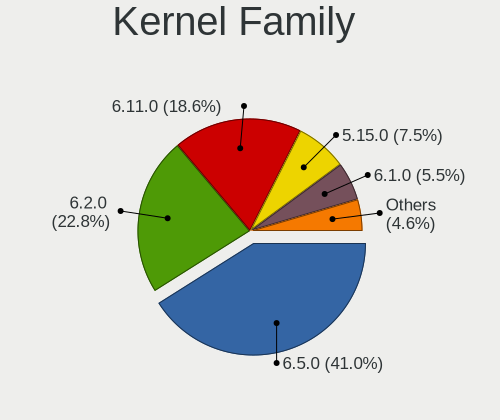

| Version | Computers | Percent |
|---------|-----------|---------|
| 6.2.0   | 71        | 51.82%  |
| 6.5.0   | 24        | 17.52%  |
| 5.15.0  | 23        | 16.79%  |
| 6.1.0   | 17        | 12.41%  |
| 6.5.4   | 1         | 0.73%   |
| 6.0.0   | 1         | 0.73%   |

Kernel Major Ver.
-----------------

Linux kernel major version

| Version | Computers | Percent |
|---------|-----------|---------|
| 6.2     | 71        | 51.82%  |
| 6.5     | 25        | 18.25%  |
| 5.15    | 23        | 16.79%  |
| 6.1     | 17        | 12.41%  |
| 6.0     | 1         | 0.73%   |

Arch
----

OS architecture (x86_64, i586, etc.)

| Name   | Computers | Percent |
|--------|-----------|---------|
| x86_64 | 128       | 100%    |

DE
--

Desktop Environment

| Name       | Computers | Percent |
|------------|-----------|---------|
| KDE5       | 127       | 99.22%  |
| X-Cinnamon | 1         | 0.78%   |

Display Server
--------------

X11 or Wayland

| Name    | Computers | Percent |
|---------|-----------|---------|
| X11     | 124       | 96.12%  |
| Wayland | 5         | 3.88%   |

Display Manager
---------------

SDDM, LightDM, etc.

| Name    | Computers | Percent |
|---------|-----------|---------|
| Unknown | 101       | 77.69%  |
| SDDM    | 29        | 22.31%  |

OS Lang
-------

Language

| Lang  | Computers | Percent |
|-------|-----------|---------|
| de_DE | 55        | 42.97%  |
| en_US | 31        | 24.22%  |
| en_GB | 9         | 7.03%   |
| it_IT | 4         | 3.13%   |
| pl_PL | 3         | 2.34%   |
| en_ZA | 3         | 2.34%   |
| en_AU | 3         | 2.34%   |
| en_AG | 3         | 2.34%   |
| pt_PT | 2         | 1.56%   |
| nb_NO | 2         | 1.56%   |
| hu_HU | 2         | 1.56%   |
| fr_FR | 2         | 1.56%   |
| pt_BR | 1         | 0.78%   |
| nl_BE | 1         | 0.78%   |
| et_EE | 1         | 0.78%   |
| es_ES | 1         | 0.78%   |
| en_IN | 1         | 0.78%   |
| en_DK | 1         | 0.78%   |
| en_CA | 1         | 0.78%   |
| de_CH | 1         | 0.78%   |
| de_AT | 1         | 0.78%   |

Boot Mode
---------

EFI or BIOS

| Mode | Computers | Percent |
|------|-----------|---------|
| BIOS | 103       | 79.84%  |
| EFI  | 26        | 20.16%  |

Filesystem
----------

Type of filesystem

| Type    | Computers | Percent |
|---------|-----------|---------|
| Ext4    | 110       | 85.27%  |
| Btrfs   | 10        | 7.75%   |
| Tmpfs   | 4         | 3.1%    |
| Overlay | 3         | 2.33%   |
| Xfs     | 2         | 1.55%   |

Part. scheme
------------

Scheme of partitioning

| Type    | Computers | Percent |
|---------|-----------|---------|
| Unknown | 101       | 77.69%  |
| GPT     | 27        | 20.77%  |
| MBR     | 2         | 1.54%   |

Dual Boot with Linux/BSD
------------------------

Hosting more than one Linux/BSD

| Dual boot | Computers | Percent |
|-----------|-----------|---------|
| No        | 123       | 95.35%  |
| Yes       | 6         | 4.65%   |

Dual Boot (Win)
---------------

Hosting Linux and Windows

| Dual boot | Computers | Percent |
|-----------|-----------|---------|
| No        | 120       | 93.02%  |
| Yes       | 9         | 6.98%   |

Board
-----

Vendor
------

Motherboard manufacturer

| Name                | Computers | Percent |
|---------------------|-----------|---------|
| TUXEDO              | 38        | 29.69%  |
| Lenovo              | 19        | 14.84%  |
| Dell                | 13        | 10.16%  |
| ASUSTek Computer    | 13        | 10.16%  |
| Hewlett-Packard     | 12        | 9.38%   |
| MSI                 | 8         | 6.25%   |
| Apple               | 5         | 3.91%   |
| Acer                | 4         | 3.13%   |
| ASRock              | 3         | 2.34%   |
| Notebook            | 2         | 1.56%   |
| Gigabyte Technology | 2         | 1.56%   |
| Schenker            | 1         | 0.78%   |
| Samsung Electronics | 1         | 0.78%   |
| Metabox             | 1         | 0.78%   |
| Fujitsu             | 1         | 0.78%   |
| Fanless Mini PC     | 1         | 0.78%   |
| ECS                 | 1         | 0.78%   |
| Chuwi               | 1         | 0.78%   |
| BESSTAR Tech        | 1         | 0.78%   |
| Unknown             | 1         | 0.78%   |

Model
-----

Motherboard model

| Name                                | Computers | Percent |
|-------------------------------------|-----------|---------|
| TUXEDO InfinityBook S 15/17 Gen7    | 4         | 3.13%   |
| TUXEDO Stellaris Intel Gen5         | 3         | 2.34%   |
| TUXEDO InfinityBook Pro Gen7 (MK1)  | 3         | 2.34%   |
| ASUS PRIME B450-PLUS                | 3         | 2.34%   |
| Unknown                             | 3         | 2.34%   |
| TUXEDO XMG FUSION 15 (XFU15L19)     | 2         | 1.56%   |
| TUXEDO Stellaris/Polaris AMD Gen4   | 2         | 1.56%   |
| TUXEDO Pulse 15 Gen2                | 2         | 1.56%   |
| TUXEDO Pulse 15 Gen1                | 2         | 1.56%   |
| TUXEDO Polaris AMD Gen5             | 2         | 1.56%   |
| TUXEDO Polaris 15 AMD Gen1          | 2         | 1.56%   |
| TUXEDO InfinityBook S 15 Gen6       | 2         | 1.56%   |
| TUXEDO InfinityBook Pro Gen7 (MK2)  | 2         | 1.56%   |
| TUXEDO InfinityBook Pro 14 Gen6     | 2         | 1.56%   |
| TUXEDO Aura 15 Gen2                 | 2         | 1.56%   |
| MSI MS-7D17                         | 2         | 1.56%   |
| Dell Latitude E6540                 | 2         | 1.56%   |
| Apple MacBookPro8,1                 | 2         | 1.56%   |
| TUXEDO Stellaris AMD Gen3 (CZN)     | 1         | 0.78%   |
| TUXEDO Polaris AMD Gen3 (CZN)       | 1         | 0.78%   |
| TUXEDO P64_HJ,HK1                   | 1         | 0.78%   |
| TUXEDO N7x0WU                       | 1         | 0.78%   |
| TUXEDO N13xWU                       | 1         | 0.78%   |
| TUXEDO Book XUX7 Gen13              | 1         | 0.78%   |
| Schenker VISION 15 E23 (SVS15E23)   | 1         | 0.78%   |
| Samsung RC530/RC730                 | 1         | 0.78%   |
| Notebook W65_W67RB                  | 1         | 0.78%   |
| Notebook NP5x_NP6x_NP7xHP           | 1         | 0.78%   |
| MSI Prestige 15 A10SC               | 1         | 0.78%   |
| MSI MS-7D82                         | 1         | 0.78%   |
| MSI MS-7D25                         | 1         | 0.78%   |
| MSI MS-7C37                         | 1         | 0.78%   |
| MSI MS-7B17                         | 1         | 0.78%   |
| MSI GE75 Raider 10SF                | 1         | 0.78%   |
| Metabox Prime-X X170KM              | 1         | 0.78%   |
| Lenovo Yoga S740-15IRH 81NX         | 1         | 0.78%   |
| Lenovo Yoga 530-14IKB 81EK          | 1         | 0.78%   |
| Lenovo ThinkPad X200 Tablet 7450WN9 | 1         | 0.78%   |
| Lenovo ThinkPad T490s 20NYS3Y600    | 1         | 0.78%   |
| Lenovo ThinkPad T490 20N3SBU219     | 1         | 0.78%   |

Model Family
------------

Motherboard model prefix

| Name                | Computers | Percent |
|---------------------|-----------|---------|
| TUXEDO InfinityBook | 13        | 10.16%  |
| Lenovo ThinkPad     | 9         | 7.03%   |
| TUXEDO Stellaris    | 6         | 4.69%   |
| TUXEDO Polaris      | 5         | 3.91%   |
| ASUS PRIME          | 5         | 3.91%   |
| TUXEDO Pulse        | 4         | 3.13%   |
| Dell Latitude       | 4         | 3.13%   |
| HP Pavilion         | 3         | 2.34%   |
| Dell Precision      | 3         | 2.34%   |
| Dell Inspiron       | 3         | 2.34%   |
| ASUS ROG            | 3         | 2.34%   |
| Unknown             | 3         | 2.34%   |
| TUXEDO XMG          | 2         | 1.56%   |
| TUXEDO Aura         | 2         | 1.56%   |
| MSI MS-7D17         | 2         | 1.56%   |
| Lenovo Yoga         | 2         | 1.56%   |
| Lenovo Legion       | 2         | 1.56%   |
| Lenovo IdeaPad      | 2         | 1.56%   |
| HP Laptop           | 2         | 1.56%   |
| HP EliteBook        | 2         | 1.56%   |
| Apple MacBookPro8   | 2         | 1.56%   |
| Acer Swift          | 2         | 1.56%   |
| TUXEDO P64          | 1         | 0.78%   |
| TUXEDO N7x0WU       | 1         | 0.78%   |
| TUXEDO N13xWU       | 1         | 0.78%   |
| TUXEDO Book         | 1         | 0.78%   |
| Schenker VISION     | 1         | 0.78%   |
| Samsung RC530       | 1         | 0.78%   |
| Notebook W65        | 1         | 0.78%   |
| Notebook NP5x       | 1         | 0.78%   |
| MSI Prestige        | 1         | 0.78%   |
| MSI MS-7D82         | 1         | 0.78%   |
| MSI MS-7D25         | 1         | 0.78%   |
| MSI MS-7C37         | 1         | 0.78%   |
| MSI MS-7B17         | 1         | 0.78%   |
| MSI GE75            | 1         | 0.78%   |
| Metabox Prime-X     | 1         | 0.78%   |
| Lenovo ThinkCentre  | 1         | 0.78%   |
| Lenovo ThinkBook    | 1         | 0.78%   |
| Lenovo G580         | 1         | 0.78%   |

MFG Year
--------

Motherboard manufacture year

| Year | Computers | Percent |
|------|-----------|---------|
| 2022 | 26        | 20.31%  |
| 2020 | 18        | 14.06%  |
| 2021 | 15        | 11.72%  |
| 2023 | 10        | 7.81%   |
| 2019 | 10        | 7.81%   |
| 2015 | 9         | 7.03%   |
| 2018 | 7         | 5.47%   |
| 2017 | 6         | 4.69%   |
| 2012 | 6         | 4.69%   |
| 2013 | 5         | 3.91%   |
| 2011 | 5         | 3.91%   |
| 2014 | 3         | 2.34%   |
| 2008 | 3         | 2.34%   |
| 2016 | 2         | 1.56%   |
| 2010 | 1         | 0.78%   |
| 2009 | 1         | 0.78%   |
| 2007 | 1         | 0.78%   |

Form Factor
-----------

Physical design of the computer

| Name        | Computers | Percent |
|-------------|-----------|---------|
| Notebook    | 99        | 77.34%  |
| Desktop     | 25        | 19.53%  |
| Convertible | 2         | 1.56%   |
| Tablet      | 1         | 0.78%   |
| Mini pc     | 1         | 0.78%   |

Secure Boot
-----------

Enabled or disabled

| State    | Computers | Percent |
|----------|-----------|---------|
| Disabled | 128       | 100%    |

Coreboot
--------

Have coreboot on board

| Used | Computers | Percent |
|------|-----------|---------|
| No   | 128       | 100%    |

RAM Size
--------

Total RAM memory

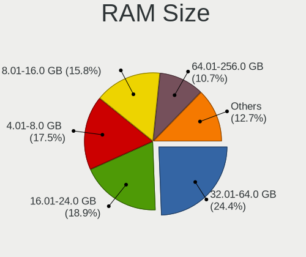

| Size in GB  | Computers | Percent |
|-------------|-----------|---------|
| 32.01-64.0  | 30        | 23.44%  |
| 16.01-24.0  | 27        | 21.09%  |
| 4.01-8.0    | 20        | 15.63%  |
| 8.01-16.0   | 20        | 15.63%  |
| 64.01-256.0 | 14        | 10.94%  |
| 3.01-4.0    | 10        | 7.81%   |
| 24.01-32.0  | 7         | 5.47%   |

RAM Used
--------

Used RAM memory

| Used GB    | Computers | Percent |
|------------|-----------|---------|
| 4.01-8.0   | 45        | 33.09%  |
| 2.01-3.0   | 32        | 23.53%  |
| 1.01-2.0   | 27        | 19.85%  |
| 3.01-4.0   | 18        | 13.24%  |
| 8.01-16.0  | 11        | 8.09%   |
| 16.01-24.0 | 3         | 2.21%   |

Total Drives
------------

Number of drives on board

| Drives | Computers | Percent |
|--------|-----------|---------|
| 1      | 65        | 50.39%  |
| 2      | 43        | 33.33%  |
| 4      | 8         | 6.2%    |
| 3      | 8         | 6.2%    |
| 5      | 3         | 2.33%   |
| 6      | 1         | 0.78%   |
| 0      | 1         | 0.78%   |

Has CD-ROM
----------

Has CD-ROM on board

| Presented | Computers | Percent |
|-----------|-----------|---------|
| No        | 103       | 80.47%  |
| Yes       | 25        | 19.53%  |

Has Ethernet
------------

Has Ethernet on board

| Presented | Computers | Percent |
|-----------|-----------|---------|
| Yes       | 107       | 83.59%  |
| No        | 21        | 16.41%  |

Has WiFi
--------

Has WiFi module

| Presented | Computers | Percent |
|-----------|-----------|---------|
| Yes       | 117       | 91.41%  |
| No        | 11        | 8.59%   |

Has Bluetooth
-------------

Has Bluetooth module

| Presented | Computers | Percent |
|-----------|-----------|---------|
| Yes       | 106       | 82.17%  |
| No        | 23        | 17.83%  |

Location
--------

Country
-------

Geographic location (country)

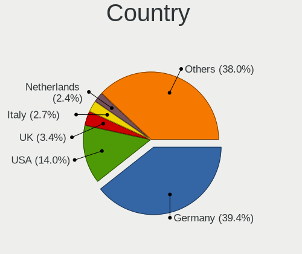

| Country                | Computers | Percent |
|------------------------|-----------|---------|
| Germany                | 61        | 47.66%  |
| USA                    | 15        | 11.72%  |
| UK                     | 5         | 3.91%   |
| Switzerland            | 4         | 3.13%   |
| Italy                  | 4         | 3.13%   |
| South Africa           | 3         | 2.34%   |
| Portugal               | 3         | 2.34%   |
| Poland                 | 3         | 2.34%   |
| France                 | 3         | 2.34%   |
| Austria                | 3         | 2.34%   |
| Australia              | 3         | 2.34%   |
| Spain                  | 2         | 1.56%   |
| Norway                 | 2         | 1.56%   |
| Netherlands            | 2         | 1.56%   |
| Turkey                 | 1         | 0.78%   |
| Tunisia                | 1         | 0.78%   |
| Romania                | 1         | 0.78%   |
| India                  | 1         | 0.78%   |
| Hungary                | 1         | 0.78%   |
| Estonia                | 1         | 0.78%   |
| Egypt                  | 1         | 0.78%   |
| Denmark                | 1         | 0.78%   |
| Czechia                | 1         | 0.78%   |
| Canada                 | 1         | 0.78%   |
| Bulgaria               | 1         | 0.78%   |
| Brazil                 | 1         | 0.78%   |
| Bosnia and Herzegovina | 1         | 0.78%   |
| Belgium                | 1         | 0.78%   |
| Aruba                  | 1         | 0.78%   |

City
----

Geographic location (city)

| City                   | Computers | Percent |
|------------------------|-----------|---------|
| Munich                 | 6         | 4.62%   |
| Vienna                 | 3         | 2.31%   |
| Zurich                 | 2         | 1.54%   |
| Schweinfurt            | 2         | 1.54%   |
| Nuremberg              | 2         | 1.54%   |
| Lucerne                | 2         | 1.54%   |
| Leipzig                | 2         | 1.54%   |
| Langevag               | 2         | 1.54%   |
| Kiel                   | 2         | 1.54%   |
| Johannesburg           | 2         | 1.54%   |
| Hürth                 | 2         | 1.54%   |
| Hamburg                | 2         | 1.54%   |
| Duisburg               | 2         | 1.54%   |
| Brisbane               | 2         | 1.54%   |
| Berlin                 | 2         | 1.54%   |
| Zalău                 | 1         | 0.77%   |
| Zabrze                 | 1         | 0.77%   |
| Wembley                | 1         | 0.77%   |
| Watertown              | 1         | 0.77%   |
| Warsaw                 | 1         | 0.77%   |
| Walsall                | 1         | 0.77%   |
| Venlo                  | 1         | 0.77%   |
| Vallejo                | 1         | 0.77%   |
| Ulm                    | 1         | 0.77%   |
| Teslic                 | 1         | 0.77%   |
| Tallinn                | 1         | 0.77%   |
| Stuttgart              | 1         | 0.77%   |
| Stockstadt am Main     | 1         | 0.77%   |
| Stimpfach              | 1         | 0.77%   |
| Sousse                 | 1         | 0.77%   |
| Solymar                | 1         | 0.77%   |
| Solingen               | 1         | 0.77%   |
| Sistov                 | 1         | 0.77%   |
| Seattle                | 1         | 0.77%   |
| Schwarzenberg          | 1         | 0.77%   |
| Santhià               | 1         | 0.77%   |
| Santa Cruz de Tenerife | 1         | 0.77%   |
| Sankt Wendel           | 1         | 0.77%   |
| San Diego              | 1         | 0.77%   |
| Rome                   | 1         | 0.77%   |

Drives
------

Drive Vendor
------------

Hard drive vendors

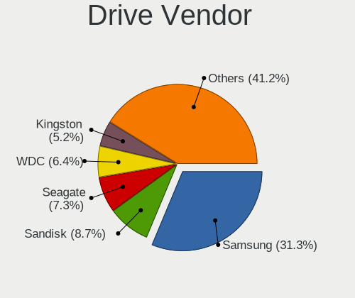

| Vendor                      | Computers | Drives | Percent |
|-----------------------------|-----------|--------|---------|
| Samsung Electronics         | 67        | 99     | 35.08%  |
| Seagate                     | 18        | 23     | 9.42%   |
| SanDisk                     | 17        | 21     | 8.9%    |
| Kingston                    | 10        | 10     | 5.24%   |
| WDC                         | 8         | 9      | 4.19%   |
| SK hynix                    | 6         | 7      | 3.14%   |
| Hitachi                     | 6         | 9      | 3.14%   |
| Toshiba                     | 4         | 5      | 2.09%   |
| Unknown                     | 3         | 3      | 1.57%   |
| SPCC                        | 3         | 3      | 1.57%   |
| Micron/Crucial Technology   | 3         | 5      | 1.57%   |
| Micron Technology           | 3         | 4      | 1.57%   |
| Intel                       | 3         | 3      | 1.57%   |
| Phison Electronics          | 2         | 2      | 1.05%   |
| Phison                      | 2         | 4      | 1.05%   |
| Netac                       | 2         | 2      | 1.05%   |
| Kingston Technology Company | 2         | 2      | 1.05%   |
| Intenso                     | 2         | 2      | 1.05%   |
| GOODRAM                     | 2         | 2      | 1.05%   |
| Crucial                     | 2         | 2      | 1.05%   |
| Apple                       | 2         | 2      | 1.05%   |
| USB3.0                      | 1         | 1      | 0.52%   |
| Transcend                   | 1         | 1      | 0.52%   |
| Silicon Motion              | 1         | 2      | 0.52%   |
| OWC                         | 1         | 1      | 0.52%   |
| LITEONIT                    | 1         | 1      | 0.52%   |
| Lite-On Technology          | 1         | 1      | 0.52%   |
| Lenovo                      | 1         | 1      | 0.52%   |
| KIOXIA                      | 1         | 1      | 0.52%   |
| KingFast                    | 1         | 1      | 0.52%   |
| Kingchuxing                 | 1         | 1      | 0.52%   |
| HS-SSD-E100                 | 1         | 1      | 0.52%   |
| HS-SSD-E                    | 1         | 1      | 0.52%   |
| Hikvision                   | 1         | 2      | 0.52%   |
| HGST HTS                    | 1         | 1      | 0.52%   |
| HGST                        | 1         | 2      | 0.52%   |
| CT1000BX                    | 1         | 1      | 0.52%   |
| China                       | 1         | 1      | 0.52%   |
| ASMT                        | 1         | 1      | 0.52%   |
| ASMedia                     | 1         | 2      | 0.52%   |

Drive Model
-----------

Hard drive models

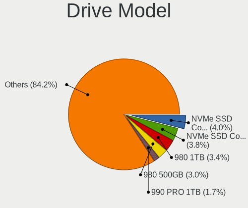

| Model                                               | Computers | Percent |
|-----------------------------------------------------|-----------|---------|
| Samsung NVMe SSD Controller SM981/PM981/PM983 512GB | 13        | 6.16%   |
| Samsung NVMe SSD Controller PM9A1/PM9A3/980PRO 2TB  | 11        | 5.21%   |
| Samsung SSD 980 500GB                               | 9         | 4.27%   |
| Samsung SSD 980 1TB                                 | 8         | 3.79%   |
| Sandisk WD Black SN750 / PC SN730 NVMe SSD 2TB      | 5         | 2.37%   |
| Samsung SSD 980 PRO 1TB                             | 3         | 1.42%   |
| Samsung SSD 970 EVO Plus 1TB                        | 3         | 1.42%   |
| Micron/Crucial P2 NVMe PCIe SSD 4TB                 | 3         | 1.42%   |
| Kingston SA400S37240G 240GB SSD                     | 3         | 1.42%   |
| Seagate ST3500418AS 500GB                           | 2         | 0.95%   |
| Seagate ST1000VT001-1RE172 1TB                      | 2         | 0.95%   |
| Seagate ST1000DM010-2EP102 1TB                      | 2         | 0.95%   |
| Sandisk WD Blue SN570 1TB                           | 2         | 0.95%   |
| Sandisk WD Black SN850 1024GB                       | 2         | 0.95%   |
| SanDisk SSD PLUS 120GB                              | 2         | 0.95%   |
| SanDisk SDSSDA240G 240GB                            | 2         | 0.95%   |
| Samsung SSD 990 PRO 2TB                             | 2         | 0.95%   |
| Samsung SSD 990 PRO 1TB                             | 2         | 0.95%   |
| Samsung SSD 980 PRO 500GB                           | 2         | 0.95%   |
| Samsung SSD 980 PRO 2TB                             | 2         | 0.95%   |
| Samsung SSD 860 EVO 250GB                           | 2         | 0.95%   |
| Samsung SSD 850 EVO 500GB                           | 2         | 0.95%   |
| Samsung SSD 850 EVO 1TB                             | 2         | 0.95%   |
| Intenso SSD SATAIII 512GB                           | 2         | 0.95%   |
| Hitachi HTS727550A9E364 500GB                       | 2         | 0.95%   |
| Hitachi HCS545050GLA380 500GB                       | 2         | 0.95%   |
| WDC WD80EAZZ-00BKLB0 8TB                            | 1         | 0.47%   |
| WDC WD5000AAKX-60U6AA0 500GB                        | 1         | 0.47%   |
| WDC WD3200BPVT-24JJ5T0 320GB                        | 1         | 0.47%   |
| WDC WD20EZRZ-00Z5HB0 2TB                            | 1         | 0.47%   |
| WDC WD20EZRX-00D8PB0 2TB                            | 1         | 0.47%   |
| WDC WD10JPVX-22JC3T0 1TB                            | 1         | 0.47%   |
| WDC WD10JPVX-11JC3T0 1TB                            | 1         | 0.47%   |
| WDC WD10EZEX-00BN5A0 1TB                            | 1         | 0.47%   |
| WDC WD Elements SE SSD 2TB                          | 1         | 0.47%   |
| USB3.0 Super Speed 1TB                              | 1         | 0.47%   |
| Unknown MMC Card  64GB                              | 1         | 0.47%   |
| Unknown MMC Card  2GB                               | 1         | 0.47%   |
| Unknown MMC Card  256GB                             | 1         | 0.47%   |
| Transcend TS512GSSD230S 512GB                       | 1         | 0.47%   |

HDD Vendor
----------

Hard disk drive vendors

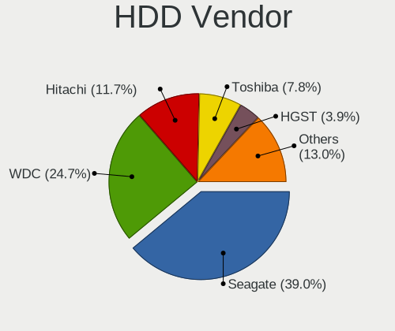

| Vendor              | Computers | Drives | Percent |
|---------------------|-----------|--------|---------|
| Seagate             | 17        | 22     | 45.95%  |
| WDC                 | 7         | 8      | 18.92%  |
| Hitachi             | 6         | 9      | 16.22%  |
| Toshiba             | 2         | 2      | 5.41%   |
| Samsung Electronics | 2         | 2      | 5.41%   |
| USB3.0              | 1         | 1      | 2.7%    |
| HGST HTS            | 1         | 1      | 2.7%    |
| HGST                | 1         | 2      | 2.7%    |

SSD Vendor
----------

Solid state drive vendors

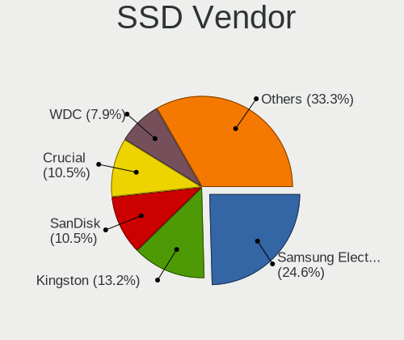

| Vendor              | Computers | Drives | Percent |
|---------------------|-----------|--------|---------|
| Samsung Electronics | 14        | 17     | 28.57%  |
| Kingston            | 7         | 7      | 14.29%  |
| SanDisk             | 5         | 6      | 10.2%   |
| SPCC                | 2         | 2      | 4.08%   |
| Netac               | 2         | 2      | 4.08%   |
| Intenso             | 2         | 2      | 4.08%   |
| GOODRAM             | 2         | 2      | 4.08%   |
| Crucial             | 2         | 2      | 4.08%   |
| Apple               | 2         | 2      | 4.08%   |
| WDC                 | 1         | 1      | 2.04%   |
| Transcend           | 1         | 1      | 2.04%   |
| SK hynix            | 1         | 2      | 2.04%   |
| OWC                 | 1         | 1      | 2.04%   |
| Micron Technology   | 1         | 1      | 2.04%   |
| LITEONIT            | 1         | 1      | 2.04%   |
| CT1000BX            | 1         | 1      | 2.04%   |
| China               | 1         | 1      | 2.04%   |
| ASMT                | 1         | 1      | 2.04%   |
| Apacer              | 1         | 1      | 2.04%   |
| A-DATA Technology   | 1         | 2      | 2.04%   |

Drive Kind
----------

HDD or SSD

| Kind    | Computers | Drives | Percent |
|---------|-----------|--------|---------|
| NVMe    | 89        | 137    | 51.45%  |
| SSD     | 41        | 55     | 23.7%   |
| HDD     | 34        | 47     | 19.65%  |
| Unknown | 5         | 6      | 2.89%   |
| MMC     | 4         | 4      | 2.31%   |

Drive Connector
---------------

SATA, SAS, NVMe, etc.

| Type | Computers | Drives | Percent |
|------|-----------|--------|---------|
| NVMe | 89        | 137    | 55.63%  |
| SATA | 59        | 98     | 36.88%  |
| SAS  | 8         | 10     | 5%      |
| MMC  | 4         | 4      | 2.5%    |

Drive Size
----------

Size of hard drive

| Size in TB | Computers | Drives | Percent |
|------------|-----------|--------|---------|
| 0.01-0.5   | 39        | 57     | 50.65%  |
| 0.51-1.0   | 29        | 35     | 37.66%  |
| 1.01-2.0   | 6         | 7      | 7.79%   |
| 4.01-10.0  | 3         | 3      | 3.9%    |

Space Total
-----------

Amount of disk space available on the file system

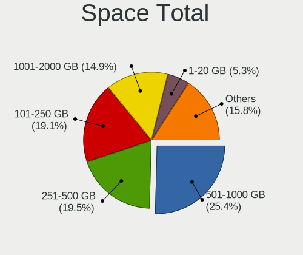

| Size in GB     | Computers | Percent |
|----------------|-----------|---------|
| 501-1000       | 35        | 26.72%  |
| 101-250        | 25        | 19.08%  |
| 251-500        | 23        | 17.56%  |
| 1001-2000      | 20        | 15.27%  |
| 2001-3000      | 7         | 5.34%   |
| 1-20           | 7         | 5.34%   |
| More than 3000 | 5         | 3.82%   |
| 21-50          | 3         | 2.29%   |
| 51-100         | 3         | 2.29%   |
| Unknown        | 3         | 2.29%   |

Space Used
----------

Amount of used disk space

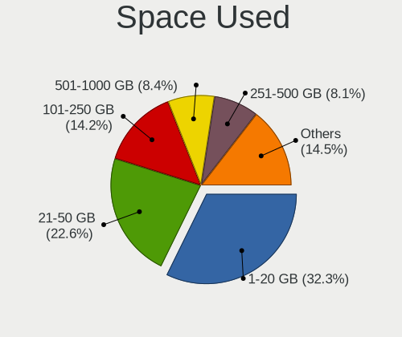

| Used GB        | Computers | Percent |
|----------------|-----------|---------|
| 1-20           | 42        | 31.58%  |
| 21-50          | 34        | 25.56%  |
| 101-250        | 16        | 12.03%  |
| 501-1000       | 12        | 9.02%   |
| 51-100         | 11        | 8.27%   |
| 251-500        | 8         | 6.02%   |
| 1001-2000      | 5         | 3.76%   |
| Unknown        | 3         | 2.26%   |
| More than 3000 | 1         | 0.75%   |
| 2001-3000      | 1         | 0.75%   |

Malfunc. Drives
---------------

Drive models with a malfunction

Zero info for selected period =(

Malfunc. Drive Vendor
---------------------

Vendors of faulty drives

Zero info for selected period =(

Malfunc. HDD Vendor
-------------------

Vendors of faulty HDD drives

Zero info for selected period =(

Malfunc. Drive Kind
-------------------

Kinds of faulty drives

Zero info for selected period =(

Failed Drives
-------------

Failed drive models

Zero info for selected period =(

Failed Drive Vendor
-------------------

Failed drive vendors

Zero info for selected period =(

Drive Status
------------

Number of failed and malfunc. drives

| Status   | Computers | Drives | Percent |
|----------|-----------|--------|---------|
| Detected | 101       | 205    | 77.1%   |
| Works    | 30        | 44     | 22.9%   |

Storage controller
------------------

Storage Vendor
--------------

Storage controller vendors

| Vendor                       | Computers | Percent |
|------------------------------|-----------|---------|
| Intel                        | 62        | 34.44%  |
| Samsung Electronics          | 56        | 31.11%  |
| AMD                          | 19        | 10.56%  |
| SanDisk                      | 12        | 6.67%   |
| SK hynix                     | 5         | 2.78%   |
| Kingston Technology Company  | 5         | 2.78%   |
| Phison Electronics           | 4         | 2.22%   |
| Micron/Crucial Technology    | 3         | 1.67%   |
| Toshiba America Info Systems | 2         | 1.11%   |
| Silicon Motion               | 2         | 1.11%   |
| Micron Technology            | 2         | 1.11%   |
| Seagate Technology           | 1         | 0.56%   |
| Nvidia                       | 1         | 0.56%   |
| Marvell Technology Group     | 1         | 0.56%   |
| Lite-On Technology           | 1         | 0.56%   |
| Lenovo                       | 1         | 0.56%   |
| KIOXIA                       | 1         | 0.56%   |
| ASMedia Technology           | 1         | 0.56%   |
| ADATA Technology             | 1         | 0.56%   |

Storage Model
-------------

Storage controller models

| Model                                                                          | Computers | Percent |
|--------------------------------------------------------------------------------|-----------|---------|
| Samsung NVMe SSD Controller SM981/PM981/PM983                                  | 17        | 8.59%   |
| Samsung NVMe SSD Controller PM9A1/PM9A3/980PRO                                 | 17        | 8.59%   |
| Samsung NVMe SSD Controller 980 (DRAM-less)                                    | 17        | 8.59%   |
| AMD FCH SATA Controller [AHCI mode]                                            | 16        | 8.08%   |
| Intel 7 Series Chipset Family 6-port SATA Controller [AHCI mode]               | 7         | 3.54%   |
| Intel 500 Series Chipset Family SATA AHCI Controller                           | 7         | 3.54%   |
| Intel Volume Management Device NVMe RAID Controller                            | 6         | 3.03%   |
| SanDisk Extreme Pro / WD Black SN750 / PC SN730 / Red SN700 NVMe SSD           | 5         | 2.53%   |
| Intel 6 Series/C200 Series Chipset Family 6 port Mobile SATA AHCI Controller   | 5         | 2.53%   |
| SanDisk Ultra 3D / WD Blue SN570 NVMe SSD (DRAM-less)                          | 4         | 2.02%   |
| Intel Q170/Q150/B150/H170/H110/Z170/CM236 Chipset SATA Controller [AHCI Mode]  | 4         | 2.02%   |
| Intel Cannon Lake Mobile PCH SATA AHCI Controller                              | 4         | 2.02%   |
| AMD 400 Series Chipset SATA Controller                                         | 4         | 2.02%   |
| SK hynix Gold P31/BC711/PC711 NVMe Solid State Drive                           | 3         | 1.52%   |
| Samsung NVMe SSD Controller SM961/PM961/SM963                                  | 3         | 1.52%   |
| Samsung NVMe SSD Controller S4LV008[Pascal]                                    | 3         | 1.52%   |
| Micron/Crucial P2 [Nick P2] / P3 / P3 Plus NVMe PCIe SSD (DRAM-less)           | 3         | 1.52%   |
| Intel Wildcat Point-LP SATA Controller [AHCI Mode]                             | 3         | 1.52%   |
| Intel 82801 Mobile SATA Controller [RAID mode]                                 | 3         | 1.52%   |
| Silicon Motion SM2262/SM2262EN SSD Controller                                  | 2         | 1.01%   |
| SanDisk WD PC SN810 / Black SN850 NVMe SSD                                     | 2         | 1.01%   |
| Phison E16 PCIe4 NVMe Controller                                               | 2         | 1.01%   |
| Kingston Company NV1 NVMe SSD SM2263XT                                         | 2         | 1.01%   |
| Intel Sunrise Point-LP SATA Controller [AHCI mode]                             | 2         | 1.01%   |
| Intel HM170/QM170 Chipset SATA Controller [AHCI Mode]                          | 2         | 1.01%   |
| Intel 8 Series/C220 Series Chipset Family 6-port SATA Controller 1 [AHCI mode] | 2         | 1.01%   |
| Intel 8 Series SATA Controller 1 [AHCI mode]                                   | 2         | 1.01%   |
| Intel 400 Series Chipset Family SATA AHCI Controller                           | 2         | 1.01%   |
| AMD 500 Series Chipset SATA Controller                                         | 2         | 1.01%   |
| Toshiba America Info Systems XG4 NVMe SSD Controller                           | 1         | 0.51%   |
| Toshiba America Info Systems BG3 x2 NVMe SSD Controller (DRAM-less)            | 1         | 0.51%   |
| SK hynix PC401 NVMe Solid State Drive 256GB                                    | 1         | 0.51%   |
| SK hynix BC901 NVMe Solid State Drive (DRAM-less)                              | 1         | 0.51%   |
| Seagate BarraCuda Q5 NVMe SSD (DRAM-less)                                      | 1         | 0.51%   |
| SanDisk WD Black SN770 / PC SN740 256GB / PC SN560 (DRAM-less) NVMe SSD        | 1         | 0.51%   |
| SanDisk PC SN735 NVMe SSD (DRAM-less)                                          | 1         | 0.51%   |
| SanDisk PC SN530 NVMe SSD (DRAM-less)                                          | 1         | 0.51%   |
| Samsung S4LN058A01[SSUBX] AHCI SSD Controller (Apple slot)                     | 1         | 0.51%   |
| Phison PS5013-E13 PCIe3 NVMe Controller (DRAM-less)                            | 1         | 0.51%   |
| Phison E12 NVMe Controller                                                     | 1         | 0.51%   |

Storage Kind
------------

Kind of storage controller (IDE, SATA, NVMe, SAS, ...)

| Kind | Computers | Percent |
|------|-----------|---------|
| NVMe | 89        | 50.57%  |
| SATA | 72        | 40.91%  |
| RAID | 12        | 6.82%   |
| IDE  | 3         | 1.7%    |

Processor
---------

CPU Vendor
----------

Processor vendors

| Vendor | Computers | Percent |
|--------|-----------|---------|
| Intel  | 93        | 72.66%  |
| AMD    | 35        | 27.34%  |

CPU Model
---------

Processor models

| Model                                         | Computers | Percent |
|-----------------------------------------------|-----------|---------|
| Intel 12th Gen Core i7-12700H                 | 6         | 4.69%   |
| Intel 12th Gen Core i7-1260P                  | 4         | 3.13%   |
| Intel Core i7-9750H CPU @ 2.60GHz             | 3         | 2.34%   |
| Intel Core i7-8550U CPU @ 1.80GHz             | 3         | 2.34%   |
| Intel 13th Gen Core i9-13900HX                | 3         | 2.34%   |
| Intel 11th Gen Core i7-11370H @ 3.30GHz       | 3         | 2.34%   |
| AMD Ryzen 7 4800H with Radeon Graphics        | 3         | 2.34%   |
| Intel Core i7-4810MQ CPU @ 2.80GHz            | 2         | 1.56%   |
| Intel Core i7-3720QM CPU @ 2.60GHz            | 2         | 1.56%   |
| Intel Core i7-2670QM CPU @ 2.20GHz            | 2         | 1.56%   |
| Intel Core i7-2620M CPU @ 2.70GHz             | 2         | 1.56%   |
| Intel Core i5-9300H CPU @ 2.40GHz             | 2         | 1.56%   |
| Intel Core i5-8365U CPU @ 1.60GHz             | 2         | 1.56%   |
| Intel Core i5-8250U CPU @ 1.60GHz             | 2         | 1.56%   |
| Intel Core i5-3470 CPU @ 3.20GHz              | 2         | 1.56%   |
| Intel Core i5-3210M CPU @ 2.50GHz             | 2         | 1.56%   |
| Intel 12th Gen Core i7-1255U                  | 2         | 1.56%   |
| Intel 12th Gen Core i5-1240P                  | 2         | 1.56%   |
| AMD Ryzen 7 7840HS w/ Radeon 780M Graphics    | 2         | 1.56%   |
| AMD Ryzen 7 6800H with Radeon Graphics        | 2         | 1.56%   |
| AMD Ryzen 7 5700U with Radeon Graphics        | 2         | 1.56%   |
| AMD Ryzen 5 5600G with Radeon Graphics        | 2         | 1.56%   |
| AMD Ryzen 5 4600H with Radeon Graphics        | 2         | 1.56%   |
| AMD Ryzen 5 3500U with Radeon Vega Mobile Gfx | 2         | 1.56%   |
| Intel Xeon W-10855M CPU @ 2.80GHz             | 1         | 0.78%   |
| Intel Xeon CPU E3-1505M v5 @ 2.80GHz          | 1         | 0.78%   |
| Intel Pentium CPU G3420 @ 3.20GHz             | 1         | 0.78%   |
| Intel Pentium CPU 2020M @ 2.40GHz             | 1         | 0.78%   |
| Intel N100                                    | 1         | 0.78%   |
| Intel Core i9-10900KF CPU @ 3.70GHz           | 1         | 0.78%   |
| Intel Core i7-8700K CPU @ 3.70GHz             | 1         | 0.78%   |
| Intel Core i7-7Y75 CPU @ 1.30GHz              | 1         | 0.78%   |
| Intel Core i7-7820HQ CPU @ 2.90GHz            | 1         | 0.78%   |
| Intel Core i7-7700HQ CPU @ 2.80GHz            | 1         | 0.78%   |
| Intel Core i7-6820HQ CPU @ 2.70GHz            | 1         | 0.78%   |
| Intel Core i7-6700HQ CPU @ 2.60GHz            | 1         | 0.78%   |
| Intel Core i7-5600U CPU @ 2.60GHz             | 1         | 0.78%   |
| Intel Core i7-5500U CPU @ 2.40GHz             | 1         | 0.78%   |
| Intel Core i7-4650U CPU @ 1.70GHz             | 1         | 0.78%   |
| Intel Core i7-3630QM CPU @ 2.40GHz            | 1         | 0.78%   |

CPU Model Family
----------------

Processor model prefix

| Model            | Computers | Percent |
|------------------|-----------|---------|
| Other            | 33        | 25.78%  |
| Intel Core i7    | 27        | 21.09%  |
| Intel Core i5    | 21        | 16.41%  |
| AMD Ryzen 7      | 16        | 12.5%   |
| AMD Ryzen 5      | 10        | 7.81%   |
| Intel Core i3    | 4         | 3.13%   |
| Intel Xeon       | 2         | 1.56%   |
| Intel Pentium    | 2         | 1.56%   |
| Intel Celeron    | 2         | 1.56%   |
| AMD Ryzen 9      | 2         | 1.56%   |
| AMD Ryzen 3      | 2         | 1.56%   |
| Intel Core i9    | 1         | 0.78%   |
| Intel Core 2 Duo | 1         | 0.78%   |
| AMD Turion II    | 1         | 0.78%   |
| AMD Ryzen 7 PRO  | 1         | 0.78%   |
| AMD Ryzen 5 PRO  | 1         | 0.78%   |
| AMD Phenom II X2 | 1         | 0.78%   |
| AMD A8           | 1         | 0.78%   |

CPU Cores
---------

Number of processor cores

| Number | Computers | Percent |
|--------|-----------|---------|
| 4      | 39        | 30.47%  |
| 6      | 23        | 17.97%  |
| 2      | 23        | 17.97%  |
| 8      | 21        | 16.41%  |
| 12     | 8         | 6.25%   |
| 14     | 7         | 5.47%   |
| 24     | 3         | 2.34%   |
| 10     | 3         | 2.34%   |
| 16     | 1         | 0.78%   |

CPU Sockets
-----------

Number of sockets

| Number | Computers | Percent |
|--------|-----------|---------|
| 1      | 128       | 100%    |

CPU Threads
-----------

Threads per core (Hyper-Threading)

| Number | Computers | Percent |
|--------|-----------|---------|
| 2      | 114       | 89.06%  |
| 1      | 14        | 10.94%  |

CPU Op-Modes
------------

CPU Operation Modes (32-bit, 64-bit)

| Op mode        | Computers | Percent |
|----------------|-----------|---------|
| 32-bit, 64-bit | 128       | 100%    |

CPU Microcode
-------------

Microcode number

| Number     | Computers | Percent |
|------------|-----------|---------|
| Unknown    | 115       | 88.46%  |
| 0x906a4    | 2         | 1.54%   |
| 0xa0653    | 1         | 0.77%   |
| 0x906ea    | 1         | 0.77%   |
| 0x906e9    | 1         | 0.77%   |
| 0x906a3    | 1         | 0.77%   |
| 0x806c1    | 1         | 0.77%   |
| 0x306d4    | 1         | 0.77%   |
| 0x0a704103 | 1         | 0.77%   |
| 0x0a704101 | 1         | 0.77%   |
| 0x0a50000d | 1         | 0.77%   |
| 0x0a50000c | 1         | 0.77%   |
| 0x08701030 | 1         | 0.77%   |
| 0x08608103 | 1         | 0.77%   |
| 0x010000c8 | 1         | 0.77%   |

CPU Microarch
-------------

Microarchitecture

| Name             | Computers | Percent |
|------------------|-----------|---------|
| Unknown          | 28        | 21.88%  |
| KabyLake         | 18        | 14.06%  |
| Zen 2            | 10        | 7.81%   |
| IvyBridge        | 9         | 7.03%   |
| CometLake        | 9         | 7.03%   |
| Alderlake Hybrid | 9         | 7.03%   |
| Zen 3            | 7         | 5.47%   |
| Haswell          | 7         | 5.47%   |
| TigerLake        | 5         | 3.91%   |
| Skylake          | 5         | 3.91%   |
| SandyBridge      | 5         | 3.91%   |
| Zen+             | 4         | 3.13%   |
| Broadwell        | 4         | 3.13%   |
| K10              | 2         | 1.56%   |
| Zen              | 1         | 0.78%   |
| Westmere         | 1         | 0.78%   |
| Puma             | 1         | 0.78%   |
| Penryn           | 1         | 0.78%   |
| Gracemont        | 1         | 0.78%   |
| Goldmont plus    | 1         | 0.78%   |

Graphics
--------

GPU Vendor
----------

Vendors of graphics cards

| Vendor | Computers | Percent |
|--------|-----------|---------|
| Intel  | 83        | 48.26%  |
| Nvidia | 54        | 31.4%   |
| AMD    | 35        | 20.35%  |

GPU Model
---------

Graphics card models

| Model                                                                       | Computers | Percent |
|-----------------------------------------------------------------------------|-----------|---------|
| Intel Alder Lake-P GT2 [Iris Xe Graphics]                                   | 13        | 7.51%   |
| Intel 3rd Gen Core processor Graphics Controller                            | 7         | 4.05%   |
| AMD Renoir [Radeon RX Vega 6 (Ryzen 4000/5000 Mobile Series)]               | 7         | 4.05%   |
| Nvidia GA106M [GeForce RTX 3060 Mobile / Max-Q]                             | 6         | 3.47%   |
| AMD Cezanne [Radeon Vega Series / Radeon Vega Mobile Series]                | 6         | 3.47%   |
| Nvidia TU116M [GeForce GTX 1660 Ti Mobile]                                  | 5         | 2.89%   |
| Intel UHD Graphics 620                                                      | 5         | 2.89%   |
| Intel TigerLake-LP GT2 [Iris Xe Graphics]                                   | 5         | 2.89%   |
| Intel CoffeeLake-H GT2 [UHD Graphics 630]                                   | 5         | 2.89%   |
| Intel 2nd Generation Core Processor Family Integrated Graphics Controller   | 5         | 2.89%   |
| Intel HD Graphics 530                                                       | 4         | 2.31%   |
| AMD Lucienne                                                                | 4         | 2.31%   |
| Nvidia GP108 [GeForce GT 1030]                                              | 3         | 1.73%   |
| Nvidia GA104M [GeForce RTX 3080 Mobile / Max-Q 8GB/16GB]                    | 3         | 1.73%   |
| Nvidia GA104 [Geforce RTX 3070 Ti Laptop GPU]                               | 3         | 1.73%   |
| Intel Raptor Lake-S UHD Graphics                                            | 3         | 1.73%   |
| Intel HD Graphics 630                                                       | 3         | 1.73%   |
| Intel HD Graphics 5500                                                      | 3         | 1.73%   |
| AMD Rembrandt [Radeon 680M]                                                 | 3         | 1.73%   |
| AMD Picasso/Raven 2 [Radeon Vega Series / Radeon Vega Mobile Series]        | 3         | 1.73%   |
| AMD Phoenix1                                                                | 3         | 1.73%   |
| Nvidia TU117M [GeForce GTX 1650 Mobile / Max-Q]                             | 2         | 1.16%   |
| Nvidia TU106M [GeForce RTX 2060 Mobile]                                     | 2         | 1.16%   |
| Nvidia GF108M [GeForce GT 635M]                                             | 2         | 1.16%   |
| Nvidia GA107M [GeForce RTX 3050 Mobile]                                     | 2         | 1.16%   |
| Nvidia AD107M [GeForce RTX 4060 Max-Q / Mobile]                             | 2         | 1.16%   |
| Nvidia AD106M [GeForce RTX 4070 Max-Q / Mobile]                             | 2         | 1.16%   |
| Intel Xeon E3-1200 v3/4th Gen Core Processor Integrated Graphics Controller | 2         | 1.16%   |
| Intel Xeon E3-1200 v2/3rd Gen Core processor Graphics Controller            | 2         | 1.16%   |
| Intel WhiskeyLake-U GT2 [UHD Graphics 620]                                  | 2         | 1.16%   |
| Intel Raptor Lake-P [Iris Xe Graphics]                                      | 2         | 1.16%   |
| Intel Haswell-ULT Integrated Graphics Controller                            | 2         | 1.16%   |
| Intel CometLake-H GT2 [UHD Graphics]                                        | 2         | 1.16%   |
| Intel Alder Lake-UP3 GT2 [Iris Xe Graphics]                                 | 2         | 1.16%   |
| Intel 4th Gen Core Processor Integrated Graphics Controller                 | 2         | 1.16%   |
| AMD Mars XTX [Radeon HD 8790M]                                              | 2         | 1.16%   |
| Nvidia TU117GLM [Quadro T2000 Mobile / Max-Q]                               | 1         | 0.58%   |
| Nvidia TU116 [GeForce GTX 1660 SUPER]                                       | 1         | 0.58%   |
| Nvidia TU116 [GeForce GTX 1650]                                             | 1         | 0.58%   |
| Nvidia TU106M [GeForce RTX 2070 Mobile / Max-Q Refresh]                     | 1         | 0.58%   |

GPU Combo
---------

Combinations of graphics cards

| Name           | Computers | Percent |
|----------------|-----------|---------|
| 1 x Intel      | 50        | 38.76%  |
| Intel + Nvidia | 26        | 20.16%  |
| 1 x AMD        | 19        | 14.73%  |
| 1 x Nvidia     | 17        | 13.18%  |
| AMD + Nvidia   | 11        | 8.53%   |
| Intel + AMD    | 6         | 4.65%   |

GPU Driver
----------

Free vs proprietary

| Driver      | Computers | Percent |
|-------------|-----------|---------|
| Free        | 81        | 63.28%  |
| Proprietary | 46        | 35.94%  |
| Unknown     | 1         | 0.78%   |

GPU Memory
----------

Total video memory

| Size in GB | Computers | Percent |
|------------|-----------|---------|
| Unknown    | 85        | 65.89%  |
| 5.01-6.0   | 14        | 10.85%  |
| 7.01-8.0   | 11        | 8.53%   |
| 3.01-4.0   | 8         | 6.2%    |
| 1.01-2.0   | 5         | 3.88%   |
| 8.01-16.0  | 4         | 3.1%    |
| 0.01-0.5   | 2         | 1.55%   |

Monitor
-------

Monitor Vendor
--------------

Monitor vendors

| Vendor              | Computers | Percent |
|---------------------|-----------|---------|
| BOE                 | 40        | 26.14%  |
| Samsung Electronics | 19        | 12.42%  |
| AU Optronics        | 18        | 11.76%  |
| LG Display          | 8         | 5.23%   |
| Chimei Innolux      | 8         | 5.23%   |
| Acer                | 8         | 5.23%   |
| Dell                | 6         | 3.92%   |
| CSO                 | 6         | 3.92%   |
| Hewlett-Packard     | 5         | 3.27%   |
| Goldstar            | 5         | 3.27%   |
| Apple               | 5         | 3.27%   |
| BenQ                | 4         | 2.61%   |
| AOC                 | 4         | 2.61%   |
| Sharp               | 2         | 1.31%   |
| Lenovo              | 2         | 1.31%   |
| Iiyama              | 2         | 1.31%   |
| Yamaha              | 1         | 0.65%   |
| ViewSonic           | 1         | 0.65%   |
| Sony                | 1         | 0.65%   |
| SGT                 | 1         | 0.65%   |
| RTK                 | 1         | 0.65%   |
| Philips             | 1         | 0.65%   |
| PANDA               | 1         | 0.65%   |
| InfoVision          | 1         | 0.65%   |
| Fujitsu Siemens     | 1         | 0.65%   |
| Eizo                | 1         | 0.65%   |
| ASUSTek Computer    | 1         | 0.65%   |

Monitor Model
-------------

Monitor models

| Model                                                                   | Computers | Percent |
|-------------------------------------------------------------------------|-----------|---------|
| BOE LCD Monitor BOE07D8 1920x1080 344x194mm 15.5-inch                   | 6         | 3.7%    |
| CSO LCD Monitor CSO1402 2880x1800 302x188mm 14.0-inch                   | 5         | 3.09%   |
| BOE LCD Monitor BOE0974 2560x1440 344x194mm 15.5-inch                   | 4         | 2.47%   |
| BOE LCD Monitor BOE084D 1920x1080 344x193mm 15.5-inch                   | 4         | 2.47%   |
| BOE LCD Monitor BOE0AF0 2560x1600 344x215mm 16.0-inch                   | 3         | 1.85%   |
| Dell SE2419HR DELF113 1920x1080 527x296mm 23.8-inch                     | 2         | 1.23%   |
| Chimei Innolux LCD Monitor CMN15BA 1920x1080 344x194mm 15.5-inch        | 2         | 1.23%   |
| BOE LCD Monitor BOE0B40 2560x1440 344x194mm 15.5-inch                   | 2         | 1.23%   |
| BOE LCD Monitor BOE0A3B 2560x1600 344x215mm 16.0-inch                   | 2         | 1.23%   |
| BOE LCD Monitor BOE07C9 1920x1080 309x173mm 13.9-inch                   | 2         | 1.23%   |
| BOE LCD Monitor BOE0747 1920x1080 344x194mm 15.5-inch                   | 2         | 1.23%   |
| AU Optronics LCD Monitor AUO403D 1920x1080 309x173mm 13.9-inch          | 2         | 1.23%   |
| AU Optronics LCD Monitor AUO206C 1366x768 277x156mm 12.5-inch           | 2         | 1.23%   |
| Apple LCD Monitor APP9CC3 1280x800 286x179mm 13.3-inch                  | 2         | 1.23%   |
| Acer EK240Y ACR0758 1920x1080 520x320mm 24.0-inch                       | 2         | 1.23%   |
| Yamaha RX-V473 YMH3171 1920x540                                         | 1         | 0.62%   |
| ViewSonic VX2757 VSCF931 1920x1080 598x336mm 27.0-inch                  | 1         | 0.62%   |
| Sony TV SNY4803 1920x1080 930x523mm 42.0-inch                           | 1         | 0.62%   |
| Sharp LQ156M1JW01 SHP14C3 1920x1080 344x194mm 15.5-inch                 | 1         | 0.62%   |
| Sharp LCD Monitor SHP143B 3840x2160 346x194mm 15.6-inch                 | 1         | 0.62%   |
| SGT HS156PC SGT9156 1920x1080 345x194mm 15.6-inch                       | 1         | 0.62%   |
| Samsung Electronics U32J59x SAM0F52 3840x2160 697x392mm 31.5-inch       | 1         | 0.62%   |
| Samsung Electronics SyncMaster SAM0486 1920x1080                        | 1         | 0.62%   |
| Samsung Electronics SyncMaster SAM0274 1440x900 410x257mm 19.1-inch     | 1         | 0.62%   |
| Samsung Electronics SMB1930HD SAM0708 1360x768 410x230mm 18.5-inch      | 1         | 0.62%   |
| Samsung Electronics SAMTRON STN0022 1280x1024 380x300mm 19.1-inch       | 1         | 0.62%   |
| Samsung Electronics S27C36x SAM7315 1920x1080 598x336mm 27.0-inch       | 1         | 0.62%   |
| Samsung Electronics S24R35A SAM729F 1920x1080 527x296mm 23.8-inch       | 1         | 0.62%   |
| Samsung Electronics S24D330 SAM0D92 1920x1080 531x299mm 24.0-inch       | 1         | 0.62%   |
| Samsung Electronics S22F350 SAM0D1A 1920x1080 477x268mm 21.5-inch       | 1         | 0.62%   |
| Samsung Electronics LCD Monitor SEC4252 1366x768 344x194mm 15.5-inch    | 1         | 0.62%   |
| Samsung Electronics LCD Monitor SEC4251 1366x768 344x194mm 15.5-inch    | 1         | 0.62%   |
| Samsung Electronics LCD Monitor SEC3245 1366x768 344x194mm 15.5-inch    | 1         | 0.62%   |
| Samsung Electronics LCD Monitor SDC4C48 1920x1080 344x194mm 15.5-inch   | 1         | 0.62%   |
| Samsung Electronics LCD Monitor SDC4852 1366x768 344x194mm 15.5-inch    | 1         | 0.62%   |
| Samsung Electronics LCD Monitor SDC424D 2160x1440 254x169mm 12.0-inch   | 1         | 0.62%   |
| Samsung Electronics LCD Monitor SDC4141 1366x768 344x194mm 15.5-inch    | 1         | 0.62%   |
| Samsung Electronics LCD Monitor SAM7103 3840x2160 950x540mm 43.0-inch   | 1         | 0.62%   |
| Samsung Electronics LCD Monitor SAM0DEE 3840x2160 1872x1053mm 84.6-inch | 1         | 0.62%   |
| Samsung Electronics LCD Monitor SAM07C0 1920x1080 480x270mm 21.7-inch   | 1         | 0.62%   |

Monitor Resolution
------------------

Monitor screen resolution

| Resolution         | Computers | Percent |
|--------------------|-----------|---------|
| 1920x1080 (FHD)    | 69        | 47.59%  |
| 2560x1440 (QHD)    | 15        | 10.34%  |
| 1366x768 (WXGA)    | 13        | 8.97%   |
| 3840x2160 (4K)     | 8         | 5.52%   |
| 2880x1800          | 6         | 4.14%   |
| 1920x1200 (WUXGA)  | 6         | 4.14%   |
| 2560x1600          | 5         | 3.45%   |
| 1600x900 (HD+)     | 4         | 2.76%   |
| 1280x800 (WXGA)    | 4         | 2.76%   |
| 1440x900 (WXGA+)   | 3         | 2.07%   |
| 1280x1024 (SXGA)   | 2         | 1.38%   |
| 3840x1080          | 1         | 0.69%   |
| 3440x1440          | 1         | 0.69%   |
| 3200x1800 (QHD+)   | 1         | 0.69%   |
| 2560x1080          | 1         | 0.69%   |
| 2240x1400          | 1         | 0.69%   |
| 2160x1440          | 1         | 0.69%   |
| 1920x540           | 1         | 0.69%   |
| 1680x1050 (WSXGA+) | 1         | 0.69%   |
| 1360x768           | 1         | 0.69%   |
| Unknown            | 1         | 0.69%   |

Monitor Diagonal
----------------

Diagonal size in inches

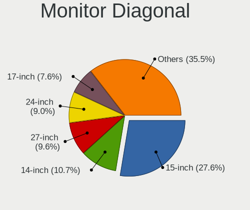

| Inches  | Computers | Percent |
|---------|-----------|---------|
| 15      | 50        | 31.85%  |
| 14      | 15        | 9.55%   |
| 24      | 14        | 8.92%   |
| 27      | 13        | 8.28%   |
| 17      | 11        | 7.01%   |
| 13      | 11        | 7.01%   |
| 16      | 7         | 4.46%   |
| 12      | 5         | 3.18%   |
| 23      | 4         | 2.55%   |
| 21      | 4         | 2.55%   |
| 31      | 3         | 1.91%   |
| 20      | 3         | 1.91%   |
| Unknown | 3         | 1.91%   |
| 40      | 2         | 1.27%   |
| 22      | 2         | 1.27%   |
| 19      | 2         | 1.27%   |
| 18      | 2         | 1.27%   |
| 84      | 1         | 0.64%   |
| 60      | 1         | 0.64%   |
| 46      | 1         | 0.64%   |
| 43      | 1         | 0.64%   |
| 34      | 1         | 0.64%   |
| 33      | 1         | 0.64%   |

Monitor Width
-------------

Physical width

| Width in mm | Computers | Percent |
|-------------|-----------|---------|
| 301-350     | 74        | 48.68%  |
| 501-600     | 27        | 17.76%  |
| 201-300     | 13        | 8.55%   |
| 401-500     | 12        | 7.89%   |
| 351-400     | 12        | 7.89%   |
| 801-900     | 3         | 1.97%   |
| 601-700     | 3         | 1.97%   |
| Unknown     | 3         | 1.97%   |
| 1001-1500   | 2         | 1.32%   |
| 701-800     | 1         | 0.66%   |
| 1501-2000   | 1         | 0.66%   |
| 901-1000    | 1         | 0.66%   |

Aspect Ratio
------------

Proportional relationship between the width and the height

| Ratio   | Computers | Percent |
|---------|-----------|---------|
| 16/9    | 103       | 75.74%  |
| 16/10   | 25        | 18.38%  |
| 5/4     | 2         | 1.47%   |
| 3/2     | 2         | 1.47%   |
| 21/9    | 2         | 1.47%   |
| 32/9    | 1         | 0.74%   |
| Unknown | 1         | 0.74%   |

Monitor Area
------------

Area in inch²

| Area in inch² | Computers | Percent |
|----------------|-----------|---------|
| 101-110        | 50        | 31.85%  |
| 81-90          | 23        | 14.65%  |
| 201-250        | 14        | 8.92%   |
| 301-350        | 13        | 8.28%   |
| 121-130        | 10        | 6.37%   |
| 151-200        | 8         | 5.1%    |
| 251-300        | 7         | 4.46%   |
| 111-120        | 7         | 4.46%   |
| 61-70          | 5         | 3.18%   |
| 351-500        | 5         | 3.18%   |
| 501-1000       | 4         | 2.55%   |
| 71-80          | 3         | 1.91%   |
| 141-150        | 3         | 1.91%   |
| Unknown        | 3         | 1.91%   |
| More than 1000 | 2         | 1.27%   |

Pixel Density
-------------

Pixels per inch

| Density       | Computers | Percent |
|---------------|-----------|---------|
| 121-160       | 54        | 36%     |
| 51-100        | 33        | 22%     |
| 101-120       | 29        | 19.33%  |
| 161-240       | 19        | 12.67%  |
| More than 240 | 10        | 6.67%   |
| Unknown       | 3         | 2%      |
| 1-50          | 2         | 1.33%   |

Multiple Monitors
-----------------

Total monitors connected

| Total | Computers | Percent |
|-------|-----------|---------|
| 1     | 93        | 72.66%  |
| 2     | 28        | 21.88%  |
| 3     | 6         | 4.69%   |
| 0     | 1         | 0.78%   |

Network
-------

Net Controller Vendor
---------------------

Controller vendors

| Vendor                            | Computers | Percent |
|-----------------------------------|-----------|---------|
| Intel                             | 91        | 42.92%  |
| Realtek Semiconductor             | 78        | 36.79%  |
| Qualcomm Atheros                  | 8         | 3.77%   |
| Broadcom                          | 6         | 2.83%   |
| Ralink Technology                 | 5         | 2.36%   |
| Broadcom Limited                  | 5         | 2.36%   |
| Huawei Technologies               | 4         | 1.89%   |
| MediaTek                          | 3         | 1.42%   |
| TP-Link                           | 2         | 0.94%   |
| DisplayLink                       | 2         | 0.94%   |
| ASIX Electronics                  | 2         | 0.94%   |
| Sierra Wireless                   | 1         | 0.47%   |
| Samsung Electronics               | 1         | 0.47%   |
| Lenovo                            | 1         | 0.47%   |
| Ericsson Business Mobile Networks | 1         | 0.47%   |
| Dell                              | 1         | 0.47%   |
| D-Link                            | 1         | 0.47%   |

Net Controller Model
--------------------

Controller models

| Model                                                                | Computers | Percent |
|----------------------------------------------------------------------|-----------|---------|
| Realtek RTL8111/8168/8411 PCI Express Gigabit Ethernet Controller    | 55        | 22.63%  |
| Intel Wi-Fi 6 AX200                                                  | 27        | 11.11%  |
| Intel Alder Lake-P PCH CNVi WiFi                                     | 12        | 4.94%   |
| Realtek RTL8125 2.5GbE Controller                                    | 10        | 4.12%   |
| Realtek RTL8153 Gigabit Ethernet Adapter                             | 5         | 2.06%   |
| Intel Wireless 8265 / 8275                                           | 5         | 2.06%   |
| Intel Wi-Fi 6 AX201                                                  | 4         | 1.65%   |
| Intel Ethernet Controller I225-V                                     | 4         | 1.65%   |
| Realtek RTL8822BE 802.11a/b/g/n/ac WiFi adapter                      | 3         | 1.23%   |
| Ralink RT2870/RT3070 Wireless Adapter                                | 3         | 1.23%   |
| Intel Wireless 3160                                                  | 3         | 1.23%   |
| Intel Wi-Fi 6 AX210/AX211/AX411 160MHz                               | 3         | 1.23%   |
| Intel Comet Lake PCH CNVi WiFi                                       | 3         | 1.23%   |
| Intel 82579LM Gigabit Network Connection (Lewisville)                | 3         | 1.23%   |
| Intel 700 Series Chipset Family Wi-Fi                                | 3         | 1.23%   |
| Huawei ME936 LTE/HSDPA+ 4G modem                                     | 3         | 1.23%   |
| Broadcom NetXtreme BCM57765 Gigabit Ethernet PCIe                    | 3         | 1.23%   |
| Broadcom BCM4331 802.11a/b/g/n                                       | 3         | 1.23%   |
| Realtek RTL8822CE 802.11ac PCIe Wireless Network Adapter             | 2         | 0.82%   |
| Realtek RTL8821CE 802.11ac PCIe Wireless Network Adapter             | 2         | 0.82%   |
| Realtek RTL810xE PCI Express Fast Ethernet controller                | 2         | 0.82%   |
| Realtek Killer E3000 2.5GbE Controller                               | 2         | 0.82%   |
| Qualcomm Atheros AR9485 Wireless Network Adapter                     | 2         | 0.82%   |
| MediaTek MT7922 802.11ax PCI Express Wireless Network Adapter        | 2         | 0.82%   |
| Intel Wireless-AC 9260                                               | 2         | 0.82%   |
| Intel Wireless 8260                                                  | 2         | 0.82%   |
| Intel Wireless 3165                                                  | 2         | 0.82%   |
| Intel Raptor Lake PCH CNVi WiFi                                      | 2         | 0.82%   |
| Intel Ethernet Connection I217-LM                                    | 2         | 0.82%   |
| Intel Ethernet Connection (6) I219-LM                                | 2         | 0.82%   |
| Intel Ethernet Connection (2) I219-V                                 | 2         | 0.82%   |
| Intel Ethernet Connection (2) I219-LM                                | 2         | 0.82%   |
| Intel Centrino Advanced-N 6235                                       | 2         | 0.82%   |
| Intel Centrino Advanced-N 6205 [Taylor Peak]                         | 2         | 0.82%   |
| Intel Cannon Point-LP CNVi [Wireless-AC]                             | 2         | 0.82%   |
| Intel Cannon Lake PCH CNVi WiFi                                      | 2         | 0.82%   |
| Broadcom Limited BCM4360 802.11ac Dual Band Wireless Network Adapter | 2         | 0.82%   |
| Broadcom Limited BCM4313 802.11bgn Wireless Network Adapter          | 2         | 0.82%   |
| ASIX AX88179 Gigabit Ethernet                                        | 2         | 0.82%   |
| TP-Link TL-WN823N v2/v3 [Realtek RTL8192EU]                          | 1         | 0.41%   |

Wireless Vendor
---------------

Wireless vendors

| Vendor                | Computers | Percent |
|-----------------------|-----------|---------|
| Intel                 | 85        | 69.67%  |
| Realtek Semiconductor | 11        | 9.02%   |
| Ralink Technology     | 5         | 4.1%    |
| Qualcomm Atheros      | 5         | 4.1%    |
| Broadcom              | 5         | 4.1%    |
| Broadcom Limited      | 4         | 3.28%   |
| MediaTek              | 3         | 2.46%   |
| TP-Link               | 2         | 1.64%   |
| Sierra Wireless       | 1         | 0.82%   |
| D-Link                | 1         | 0.82%   |

Wireless Model
--------------

Wireless models

| Model                                                                 | Computers | Percent |
|-----------------------------------------------------------------------|-----------|---------|
| Intel Wi-Fi 6 AX200                                                   | 27        | 22.13%  |
| Intel Alder Lake-P PCH CNVi WiFi                                      | 12        | 9.84%   |
| Intel Wireless 8265 / 8275                                            | 5         | 4.1%    |
| Intel Wi-Fi 6 AX201                                                   | 4         | 3.28%   |
| Realtek RTL8822BE 802.11a/b/g/n/ac WiFi adapter                       | 3         | 2.46%   |
| Ralink RT2870/RT3070 Wireless Adapter                                 | 3         | 2.46%   |
| Intel Wireless 3160                                                   | 3         | 2.46%   |
| Intel Wi-Fi 6 AX210/AX211/AX411 160MHz                                | 3         | 2.46%   |
| Intel Comet Lake PCH CNVi WiFi                                        | 3         | 2.46%   |
| Intel 700 Series Chipset Family Wi-Fi                                 | 3         | 2.46%   |
| Broadcom BCM4331 802.11a/b/g/n                                        | 3         | 2.46%   |
| Realtek RTL8822CE 802.11ac PCIe Wireless Network Adapter              | 2         | 1.64%   |
| Realtek RTL8821CE 802.11ac PCIe Wireless Network Adapter              | 2         | 1.64%   |
| Qualcomm Atheros AR9485 Wireless Network Adapter                      | 2         | 1.64%   |
| MediaTek MT7922 802.11ax PCI Express Wireless Network Adapter         | 2         | 1.64%   |
| Intel Wireless-AC 9260                                                | 2         | 1.64%   |
| Intel Wireless 8260                                                   | 2         | 1.64%   |
| Intel Wireless 3165                                                   | 2         | 1.64%   |
| Intel Raptor Lake PCH CNVi WiFi                                       | 2         | 1.64%   |
| Intel Centrino Advanced-N 6235                                        | 2         | 1.64%   |
| Intel Centrino Advanced-N 6205 [Taylor Peak]                          | 2         | 1.64%   |
| Intel Cannon Point-LP CNVi [Wireless-AC]                              | 2         | 1.64%   |
| Intel Cannon Lake PCH CNVi WiFi                                       | 2         | 1.64%   |
| Broadcom Limited BCM4360 802.11ac Dual Band Wireless Network Adapter  | 2         | 1.64%   |
| Broadcom Limited BCM4313 802.11bgn Wireless Network Adapter           | 2         | 1.64%   |
| TP-Link TL-WN823N v2/v3 [Realtek RTL8192EU]                           | 1         | 0.82%   |
| TP-Link TL-WN722N v2/v3 [Realtek RTL8188EUS]                          | 1         | 0.82%   |
| Sierra Wireless EM7455 Qualcomm Snapdragon X7 LTE-A                   | 1         | 0.82%   |
| Realtek RTL88x2bu [AC1200 Techkey]                                    | 1         | 0.82%   |
| Realtek RTL8852AE 802.11ax PCIe Wireless Network Adapter              | 1         | 0.82%   |
| Realtek RTL8723DE Wireless Network Adapter                            | 1         | 0.82%   |
| Realtek 802.11ac NIC                                                  | 1         | 0.82%   |
| Ralink MT7601U Wireless Adapter                                       | 1         | 0.82%   |
| Ralink Airlink101 AWLL6070 802.11bgn Wireless Adapter [Ralink RT2770] | 1         | 0.82%   |
| Qualcomm Atheros QCA6174 802.11ac Wireless Network Adapter            | 1         | 0.82%   |
| Qualcomm Atheros AR9285 Wireless Network Adapter (PCI-Express)        | 1         | 0.82%   |
| Qualcomm Atheros AR9227 Wireless Network Adapter                      | 1         | 0.82%   |
| MediaTek MT7921K (RZ608) Wi-Fi 6E 80MHz                               | 1         | 0.82%   |
| Intel Wireless 7265                                                   | 1         | 0.82%   |
| Intel Wireless 7260                                                   | 1         | 0.82%   |

Ethernet Vendor
---------------

Ethernet vendors

| Vendor                | Computers | Percent |
|-----------------------|-----------|---------|
| Realtek Semiconductor | 74        | 65.49%  |
| Intel                 | 25        | 22.12%  |
| Broadcom              | 4         | 3.54%   |
| Qualcomm Atheros      | 3         | 2.65%   |
| DisplayLink           | 2         | 1.77%   |
| ASIX Electronics      | 2         | 1.77%   |
| Samsung Electronics   | 1         | 0.88%   |
| Lenovo                | 1         | 0.88%   |
| Broadcom Limited      | 1         | 0.88%   |

Ethernet Model
--------------

Ethernet models

| Model                                                             | Computers | Percent |
|-------------------------------------------------------------------|-----------|---------|
| Realtek RTL8111/8168/8411 PCI Express Gigabit Ethernet Controller | 55        | 47.83%  |
| Realtek RTL8125 2.5GbE Controller                                 | 10        | 8.7%    |
| Realtek RTL8153 Gigabit Ethernet Adapter                          | 5         | 4.35%   |
| Intel Ethernet Controller I225-V                                  | 4         | 3.48%   |
| Intel 82579LM Gigabit Network Connection (Lewisville)             | 3         | 2.61%   |
| Broadcom NetXtreme BCM57765 Gigabit Ethernet PCIe                 | 3         | 2.61%   |
| Realtek RTL810xE PCI Express Fast Ethernet controller             | 2         | 1.74%   |
| Realtek Killer E3000 2.5GbE Controller                            | 2         | 1.74%   |
| Intel Ethernet Connection I217-LM                                 | 2         | 1.74%   |
| Intel Ethernet Connection (6) I219-LM                             | 2         | 1.74%   |
| Intel Ethernet Connection (2) I219-V                              | 2         | 1.74%   |
| Intel Ethernet Connection (2) I219-LM                             | 2         | 1.74%   |
| ASIX AX88179 Gigabit Ethernet                                     | 2         | 1.74%   |
| Samsung Galaxy series, misc. (tethering mode)                     | 1         | 0.87%   |
| Realtek Killer E2600 Gigabit Ethernet Controller                  | 1         | 0.87%   |
| Qualcomm Atheros Killer E2500 Gigabit Ethernet Controller         | 1         | 0.87%   |
| Qualcomm Atheros AR8162 Fast Ethernet                             | 1         | 0.87%   |
| Qualcomm Atheros AR8161 Gigabit Ethernet                          | 1         | 0.87%   |
| Lenovo ThinkPad TBT 3 Dock                                        | 1         | 0.87%   |
| Intel I211 Gigabit Network Connection                             | 1         | 0.87%   |
| Intel Ethernet Connection I218-LM                                 | 1         | 0.87%   |
| Intel Ethernet Connection (7) I219-V                              | 1         | 0.87%   |
| Intel Ethernet Connection (5) I219-LM                             | 1         | 0.87%   |
| Intel Ethernet Connection (4) I219-V                              | 1         | 0.87%   |
| Intel Ethernet Connection (3) I218-LM                             | 1         | 0.87%   |
| Intel Ethernet Connection (16) I219-LM                            | 1         | 0.87%   |
| Intel Ethernet Connection (11) I219-V                             | 1         | 0.87%   |
| Intel Ethernet Connection (11) I219-LM                            | 1         | 0.87%   |
| Intel 82574L Gigabit Network Connection                           | 1         | 0.87%   |
| Intel 82567LM Gigabit Network Connection                          | 1         | 0.87%   |
| DisplayLink USB3.0 5K Graphic Docking                             | 1         | 0.87%   |
| DisplayLink Plugable UD-3900                                      | 1         | 0.87%   |
| Broadcom NetXtreme II BCM5706 Gigabit Ethernet                    | 1         | 0.87%   |
| Broadcom Limited NetXtreme BCM57760 Gigabit Ethernet PCIe         | 1         | 0.87%   |

Net Controller Kind
-------------------

Ethernet, WiFi or modem

| Kind     | Computers | Percent |
|----------|-----------|---------|
| WiFi     | 117       | 50.87%  |
| Ethernet | 107       | 46.52%  |
| Modem    | 6         | 2.61%   |

Used Controller
---------------

Currently used network controller

| Kind     | Computers | Percent |
|----------|-----------|---------|
| WiFi     | 84        | 62.69%  |
| Ethernet | 50        | 37.31%  |

NICs
----

Total network controllers on board

| Total | Computers | Percent |
|-------|-----------|---------|
| 2     | 83        | 64.84%  |
| 1     | 38        | 29.69%  |
| 3     | 5         | 3.91%   |
| 0     | 2         | 1.56%   |

IPv6
----

IPv6 vs IPv4

| Used | Computers | Percent |
|------|-----------|---------|
| No   | 70        | 54.26%  |
| Yes  | 59        | 45.74%  |

Bluetooth
---------

Bluetooth Vendor
----------------

Controller vendors

| Vendor                          | Computers | Percent |
|---------------------------------|-----------|---------|
| Intel                           | 79        | 73.83%  |
| Realtek Semiconductor           | 7         | 6.54%   |
| Apple                           | 5         | 4.67%   |
| Foxconn / Hon Hai               | 4         | 3.74%   |
| Cambridge Silicon Radio         | 4         | 3.74%   |
| Broadcom                        | 2         | 1.87%   |
| Qualcomm Atheros Communications | 1         | 0.93%   |
| MediaTek                        | 1         | 0.93%   |
| IMC Networks                    | 1         | 0.93%   |
| Dell                            | 1         | 0.93%   |
| ASUSTek Computer                | 1         | 0.93%   |
| Unknown                         | 1         | 0.93%   |

Bluetooth Model
---------------

Controller models

| Model                                               | Computers | Percent |
|-----------------------------------------------------|-----------|---------|
| Intel Bluetooth Device                              | 27        | 25.23%  |
| Intel AX200 Bluetooth                               | 26        | 24.3%   |
| Intel Bluetooth wireless interface                  | 14        | 13.08%  |
| Intel Bluetooth 9460/9560 Jefferson Peak (JfP)      | 4         | 3.74%   |
| Cambridge Silicon Radio Bluetooth Dongle (HCI mode) | 4         | 3.74%   |
| Realtek Bluetooth Radio                             | 3         | 2.8%    |
| Apple Bluetooth USB Host Controller                 | 3         | 2.8%    |
| Realtek RTL8822BE Bluetooth 4.2 Adapter             | 2         | 1.87%   |
| Realtek  Bluetooth 4.2 Adapter                      | 2         | 1.87%   |
| Intel Wireless-AC 9260 Bluetooth Adapter            | 2         | 1.87%   |
| Intel Centrino Bluetooth Wireless Transceiver       | 2         | 1.87%   |
| Intel Centrino Advanced-N 6230 Bluetooth adapter    | 2         | 1.87%   |
| Intel AX210 Bluetooth                               | 2         | 1.87%   |
| Apple Bluetooth Host Controller                     | 2         | 1.87%   |
| Qualcomm Atheros  Bluetooth Device                  | 1         | 0.93%   |
| MediaTek Wireless_Device                            | 1         | 0.93%   |
| IMC Networks Bluetooth Radio                        | 1         | 0.93%   |
| Foxconn / Hon Hai Wireless_Device                   | 1         | 0.93%   |
| Foxconn / Hon Hai Broadcom BCM20702 Bluetooth       | 1         | 0.93%   |
| Foxconn / Hon Hai Bluetooth Adapter                 | 1         | 0.93%   |
| Foxconn / Hon Hai Acer Bluetooth module             | 1         | 0.93%   |
| Dell BCM20702A0 Bluetooth Module                    | 1         | 0.93%   |
| Broadcom HP Portable SoftSailing                    | 1         | 0.93%   |
| Broadcom BCM43142A0 Bluetooth 4.0                   | 1         | 0.93%   |
| ASUS Bluetooth Device                               | 1         | 0.93%   |
| Unknown                                             | 1         | 0.93%   |

Sound
-----

Sound Vendor
------------

Sound card vendors

| Vendor                                 | Computers | Percent |
|----------------------------------------|-----------|---------|
| Intel                                  | 90        | 48.91%  |
| Nvidia                                 | 47        | 25.54%  |
| AMD                                    | 34        | 18.48%  |
| Razer USA                              | 2         | 1.09%   |
| Lenovo                                 | 2         | 1.09%   |
| Valve Software                         | 1         | 0.54%   |
| Sony Ericsson Mobile Communications AB | 1         | 0.54%   |
| Logitech                               | 1         | 0.54%   |
| Kingston Technology                    | 1         | 0.54%   |
| JMTek                                  | 1         | 0.54%   |
| GN Netcom                              | 1         | 0.54%   |
| Creative Technology                    | 1         | 0.54%   |
| Creative Labs                          | 1         | 0.54%   |
| C-Media Electronics                    | 1         | 0.54%   |

Sound Model
-----------

Sound card models

| Model                                                                      | Computers | Percent |
|----------------------------------------------------------------------------|-----------|---------|
| AMD Family 17h/19h HD Audio Controller                                     | 28        | 12.96%  |
| Intel Alder Lake PCH-P High Definition Audio Controller                    | 16        | 7.41%   |
| AMD Renoir Radeon High Definition Audio Controller                         | 13        | 6.02%   |
| Intel 7 Series/C216 Chipset Family High Definition Audio Controller        | 8         | 3.7%    |
| Nvidia TU116 High Definition Audio Controller                              | 7         | 3.24%   |
| Nvidia GA104 High Definition Audio Controller                              | 7         | 3.24%   |
| Intel Sunrise Point-LP HD Audio                                            | 7         | 3.24%   |
| Nvidia GA106 High Definition Audio Controller                              | 6         | 2.78%   |
| Nvidia Audio device                                                        | 6         | 2.78%   |
| Intel 6 Series/C200 Series Chipset Family High Definition Audio Controller | 6         | 2.78%   |
| Nvidia TU106 High Definition Audio Controller                              | 5         | 2.31%   |
| Intel Cannon Lake PCH cAVS                                                 | 5         | 2.31%   |
| Intel 100 Series/C230 Series Chipset Family HD Audio Controller            | 5         | 2.31%   |
| Intel Wildcat Point-LP High Definition Audio Controller                    | 4         | 1.85%   |
| Intel Tiger Lake-LP Smart Sound Technology Audio Controller                | 4         | 1.85%   |
| Intel Tiger Lake-H HD Audio Controller                                     | 4         | 1.85%   |
| Intel Comet Lake PCH cAVS                                                  | 4         | 1.85%   |
| Intel Broadwell-U Audio Controller                                         | 4         | 1.85%   |
| Intel 8 Series/C220 Series Chipset High Definition Audio Controller        | 4         | 1.85%   |
| Nvidia GP108 High Definition Audio Controller                              | 3         | 1.39%   |
| Nvidia GF108 High Definition Audio Controller                              | 3         | 1.39%   |
| Intel Xeon E3-1200 v3/4th Gen Core Processor HD Audio Controller           | 3         | 1.39%   |
| Intel Smart Sound Technology (SST) Audio Controller                        | 3         | 1.39%   |
| Intel Haswell-ULT HD Audio Controller                                      | 3         | 1.39%   |
| Intel 8 Series HD Audio Controller                                         | 3         | 1.39%   |
| Intel 700 Series Chipset Family Precise Touch and Stylus Port #1           | 3         | 1.39%   |
| AMD Raven/Raven2/Fenghuang HDMI/DP Audio Controller                        | 3         | 1.39%   |
| Nvidia GP107GL High Definition Audio Controller                            | 2         | 0.93%   |
| Nvidia GM107 High Definition Audio Controller [GeForce 940MX]              | 2         | 0.93%   |
| Nvidia GK208 HDMI/DP Audio Controller                                      | 2         | 0.93%   |
| Intel Raptor Lake-P/U/H cAVS                                               | 2         | 0.93%   |
| Intel CM238 HD Audio Controller                                            | 2         | 0.93%   |
| Intel Cannon Point-LP High Definition Audio Controller                     | 2         | 0.93%   |
| AMD Family 17h (Models 00h-0fh) HD Audio Controller                        | 2         | 0.93%   |
| Valve Software Valve VR Radio & HMD Mic                                    | 1         | 0.46%   |
| Sony Ericsson Mobile Communications AB XQ-AU52                             | 1         | 0.46%   |
| Razer USA RC30-026902, Gaming Headset [Nari Essential, Wireless, Receiver] | 1         | 0.46%   |
| Razer USA Razer Seiren Mini                                                | 1         | 0.46%   |
| Nvidia TU107 GeForce GTX 1650 High Definition Audio Controller             | 1         | 0.46%   |
| Nvidia TU102 High Definition Audio Controller                              | 1         | 0.46%   |

Memory
------

Memory Vendor
-------------

Memory module vendors

| Vendor              | Computers | Percent |
|---------------------|-----------|---------|
| Samsung Electronics | 15        | 36.59%  |
| SK hynix            | 10        | 24.39%  |
| Micron Technology   | 6         | 14.63%  |
| Unknown             | 3         | 7.32%   |
| Unknown (ABCD)      | 1         | 2.44%   |
| Team                | 1         | 2.44%   |
| KLEVV               | 1         | 2.44%   |
| Kingston            | 1         | 2.44%   |
| Elpida              | 1         | 2.44%   |
| Crucial             | 1         | 2.44%   |
| ASint Technology    | 1         | 2.44%   |

Memory Model
------------

Memory module models

| Model                                                            | Computers | Percent |
|------------------------------------------------------------------|-----------|---------|
| Samsung RAM M471A4G43AB1-CWE 32GB SODIMM DDR4 3200MT/s           | 5         | 11.9%   |
| Unknown                                                          | 3         | 7.14%   |
| Samsung RAM M471A2K43CB1-CTD 16GB SODIMM DDR4 8400MT/s           | 2         | 4.76%   |
| Samsung RAM M471A1K43DB1-CWE 8GB SODIMM DDR4 3200MT/s            | 2         | 4.76%   |
| Unknown (ABCD) RAM 123456789012345678 2GB DIMM LPDDR4 2400MT/s   | 1         | 2.38%   |
| Team RAM TEAMGROUP-SD4-3200 16GB SODIMM DDR4 3200MT/s            | 1         | 2.38%   |
| SK hynix RAM Module 4GB SODIMM DDR3 1600MT/s                     | 1         | 2.38%   |
| SK hynix RAM HMT41GS6BFR8A-PB 8GB SODIMM DDR3 1600MT/s           | 1         | 2.38%   |
| SK hynix RAM HMT351S6CFR8C-PB 4GB SODIMM DDR3 1600MT/s           | 1         | 2.38%   |
| SK hynix RAM HMCG88AGBSA092N 32GB SODIMM DDR5 5600MT/s           | 1         | 2.38%   |
| SK hynix RAM HMCG78AGBSA092N 16GB SODIMM DDR5 5600MT/s           | 1         | 2.38%   |
| SK hynix RAM HMCG66AGBSA095N 8GB SODIMM DDR5 5600MT/s            | 1         | 2.38%   |
| SK hynix RAM HMAA1GS6CJR6N-XN 8GB SODIMM DDR4 3200MT/s           | 1         | 2.38%   |
| SK hynix RAM HMA82GS6AFR8N-UH 16GB SODIMM DDR4 2667MT/s          | 1         | 2.38%   |
| SK hynix RAM HMA81GS6JJR8N-VK 8GB SODIMM DDR4 2667MT/s           | 1         | 2.38%   |
| SK hynix RAM HMA81GS6CJR8N-VK 8GB SODIMM DDR4 2667MT/s           | 1         | 2.38%   |
| SK hynix RAM HMA81GS6AFR8N-UH 8GB SODIMM DDR4 2667MT/s           | 1         | 2.38%   |
| Samsung RAM Module 3GB Row Of Chips LPDDR5 6400MT/s              | 1         | 2.38%   |
| Samsung RAM M471A2K43EB1-CWE 16GB SODIMM DDR4 3200MT/s           | 1         | 2.38%   |
| Samsung RAM M471A2K43DB1-CWE 16GB SODIMM DDR4 3200MT/s           | 1         | 2.38%   |
| Samsung RAM M471A2K43BB1-CPB 16GB SODIMM DDR4 2133MT/s           | 1         | 2.38%   |
| Samsung RAM M471A1G44BB0-CWE 8GB SODIMM DDR4 3200MT/s            | 1         | 2.38%   |
| Samsung RAM M425R4GA3BB0-CQKOL 32GB SODIMM DDR5 4800MT/s         | 1         | 2.38%   |
| Micron RAM MT62F1G32D2DS-026 WT 2GB Row Of Chips LPDDR5 6400MT/s | 1         | 2.38%   |
| Micron RAM MT52L1G32D4PG-107 8GB Chip LPDDR3 1867MT/s            | 1         | 2.38%   |
| Micron RAM Module 2GB Row Of Chips LPDDR5 6400MT/s               | 1         | 2.38%   |
| Micron RAM 8ATF2G64AZ-3G2E1 16GB DIMM DDR4 3200MT/s              | 1         | 2.38%   |
| Micron RAM 8ATF1G64HZ-2G3B1 8GB SODIMM DDR4 2400MT/s             | 1         | 2.38%   |
| Micron RAM 16KTF51264HZ-1G6M1 4GB SODIMM DDR3 1600MT/s           | 1         | 2.38%   |
| KLEVV RAM KD48GU880-32A160X 8GB DIMM DDR4 2666MT/s               | 1         | 2.38%   |
| Kingston RAM KHX3200C16D4/8GX 8GB DIMM DDR4 3733MT/s             | 1         | 2.38%   |
| Elpida RAM EBJ21UE8BDS0-AE-F 2048MB SODIMM DDR3 1067MT/s         | 1         | 2.38%   |
| Crucial RAM CT16G4DFRA32A.C8FE 16GB DIMM DDR4 3200MT/s           | 1         | 2.38%   |
| ASint RAM SSZ302G08-GGNHC 2GB SODIMM DDR3 1600MT/s               | 1         | 2.38%   |

Memory Kind
-----------

Memory module kinds

| Kind   | Computers | Percent |
|--------|-----------|---------|
| DDR4   | 20        | 55.56%  |
| LPDDR5 | 5         | 13.89%  |
| DDR3   | 5         | 13.89%  |
| DDR5   | 4         | 11.11%  |
| LPDDR4 | 1         | 2.78%   |
| LPDDR3 | 1         | 2.78%   |

Memory Form Factor
------------------

Physical design of the memory module

| Name         | Computers | Percent |
|--------------|-----------|---------|
| SODIMM       | 26        | 72.22%  |
| Row Of Chips | 5         | 13.89%  |
| DIMM         | 4         | 11.11%  |
| Chip         | 1         | 2.78%   |

Memory Size
-----------

Memory module size

| Size  | Computers | Percent |
|-------|-----------|---------|
| 8192  | 13        | 33.33%  |
| 16384 | 9         | 23.08%  |
| 32768 | 8         | 20.51%  |
| 4096  | 4         | 10.26%  |
| 2048  | 4         | 10.26%  |
| 3072  | 1         | 2.56%   |

Memory Speed
------------

Memory module speed

| Speed | Computers | Percent |
|-------|-----------|---------|
| 3200  | 13        | 34.21%  |
| 6400  | 5         | 13.16%  |
| 1600  | 4         | 10.53%  |
| 5600  | 3         | 7.89%   |
| 2667  | 3         | 7.89%   |
| 8400  | 2         | 5.26%   |
| 2400  | 2         | 5.26%   |
| 4800  | 1         | 2.63%   |
| 3733  | 1         | 2.63%   |
| 2666  | 1         | 2.63%   |
| 2133  | 1         | 2.63%   |
| 1867  | 1         | 2.63%   |
| 1067  | 1         | 2.63%   |

Printers & scanners
-------------------

Printer Vendor
--------------

Printer device vendors

| Vendor              | Computers | Percent |
|---------------------|-----------|---------|
| Prolific Technology | 1         | 100%    |

Printer Model
-------------

Printer device models

| Model                         | Computers | Percent |
|-------------------------------|-----------|---------|
| Prolific PL2305 Parallel Port | 1         | 100%    |

Scanner Vendor
--------------

Scanner device vendors

| Vendor | Computers | Percent |
|--------|-----------|---------|
| Canon  | 1         | 100%    |

Scanner Model
-------------

Scanner device models

| Model                   | Computers | Percent |
|-------------------------|-----------|---------|
| Canon CanoScan LiDE 110 | 1         | 100%    |

Camera
------

Camera Vendor
-------------

Camera device vendors

| Vendor                                 | Computers | Percent |
|----------------------------------------|-----------|---------|
| Chicony Electronics                    | 42        | 44.68%  |
| Bison Electronics                      | 8         | 8.51%   |
| Microdia                               | 7         | 7.45%   |
| IMC Networks                           | 4         | 4.26%   |
| Acer                                   | 4         | 4.26%   |
| Suyin                                  | 3         | 3.19%   |
| Sunplus Innovation Technology          | 3         | 3.19%   |
| Logitech                               | 3         | 3.19%   |
| Lite-On Technology                     | 3         | 3.19%   |
| Apple                                  | 3         | 3.19%   |
| Valve Software                         | 1         | 1.06%   |
| Unknown                                | 1         | 1.06%   |
| Syntek                                 | 1         | 1.06%   |
| Sony Ericsson Mobile Communications AB | 1         | 1.06%   |
| Silicon Motion                         | 1         | 1.06%   |
| Ricoh                                  | 1         | 1.06%   |
| Realtek Semiconductor                  | 1         | 1.06%   |
| Luxvisions Innotech Limited            | 1         | 1.06%   |
| Lenovo                                 | 1         | 1.06%   |
| KYE Systems (Mouse Systems)            | 1         | 1.06%   |
| Importek                               | 1         | 1.06%   |
| HYGD-220831-A                          | 1         | 1.06%   |
| Generalplus Technology                 | 1         | 1.06%   |
| Alpha Imaging Technology               | 1         | 1.06%   |

Camera Model
------------

Camera device models

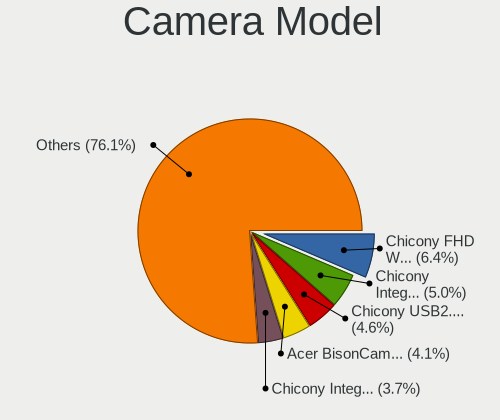

| Model                                                | Computers | Percent |
|------------------------------------------------------|-----------|---------|
| Chicony FHD Webcam                                   | 9         | 9.57%   |
| Chicony USB2.0 Camera                                | 7         | 7.45%   |
| Chicony HD Webcam                                    | 7         | 7.45%   |
| Chicony Integrated IR Camera                         | 6         | 6.38%   |
| IMC Networks Integrated Camera                       | 4         | 4.26%   |
| Acer BisonCam,NB Pro                                 | 4         | 4.26%   |
| Chicony Integrated Camera                            | 3         | 3.19%   |
| Bison HD Webcam                                      | 3         | 3.19%   |
| Apple FaceTime HD Camera                             | 3         | 3.19%   |
| Microdia Laptop_Integrated_Webcam_HD                 | 2         | 2.13%   |
| Microdia Integrated_Webcam_FHD                       | 2         | 2.13%   |
| Bison Lenovo EasyCamera                              | 2         | 2.13%   |
| Valve Software 3D Camera                             | 1         | 1.06%   |
| Unknown HD camera                                    | 1         | 1.06%   |
| Syntek Integrated Camera                             | 1         | 1.06%   |
| Suyin RGBIR Camera                                   | 1         | 1.06%   |
| Suyin Integrated_Webcam_HD                           | 1         | 1.06%   |
| Suyin HP TrueVision HD                               | 1         | 1.06%   |
| Sunplus SPCA2281 Web Camera                          | 1         | 1.06%   |
| Sunplus Integrated_Webcam_HD                         | 1         | 1.06%   |
| Sunplus ASUS USB2.0 Webcam                           | 1         | 1.06%   |
| Sony Ericsson Mobile AB XQ-CC54                      | 1         | 1.06%   |
| Silicon Motion WebCam SCB-1100N                      | 1         | 1.06%   |
| Ricoh Laptop_Integrated_Webcam_FHD                   | 1         | 1.06%   |
| Realtek Integrated Webcam                            | 1         | 1.06%   |
| Microdia Sonix USB 2.0 Camera                        | 1         | 1.06%   |
| Microdia Laptop_Integrated_Webcam_E4HD               | 1         | 1.06%   |
| Microdia Integrated_Webcam_HD                        | 1         | 1.06%   |
| Luxvisions Innotech Limited HP Wide Vision HD Camera | 1         | 1.06%   |
| Logitech HD Pro Webcam C920                          | 1         | 1.06%   |
| Logitech BRIO Ultra HD Webcam                        | 1         | 1.06%   |
| Logitech Brio 500                                    | 1         | 1.06%   |
| Lite-On Integrated Camera                            | 1         | 1.06%   |
| Lite-On HP Wide Vision HD Camera                     | 1         | 1.06%   |
| Lite-On HP Webcam                                    | 1         | 1.06%   |
| Lenovo FHD Webcam                                    | 1         | 1.06%   |
| KYE Systems (Mouse Systems) Genius Webcam            | 1         | 1.06%   |
| Importek HP Webcam                                   | 1         | 1.06%   |
| HYGD-220831-A Hy-Usb2.0-1*MIC                        | 1         | 1.06%   |
| Generalplus WEB CAM                                  | 1         | 1.06%   |

Security
--------

Fingerprint Vendor
------------------

Fingerprint sensor vendors

| Vendor                | Computers | Percent |
|-----------------------|-----------|---------|
| Synaptics             | 11        | 55%     |
| Validity Sensors      | 7         | 35%     |
| LighTuning Technology | 2         | 10%     |

Fingerprint Model
-----------------

Fingerprint sensor models

| Model                                                                      | Computers | Percent |
|----------------------------------------------------------------------------|-----------|---------|
| Synaptics Prometheus MIS Touch Fingerprint Reader                          | 3         | 15%     |
| Validity Sensors VFS7500 Touch Fingerprint Sensor                          | 2         | 10%     |
| Unknown                                                                    | 2         | 10%     |
| Validity Sensors VFS495 Fingerprint Reader                                 | 1         | 5%      |
| Validity Sensors VFS491                                                    | 1         | 5%      |
| Validity Sensors VFS Fingerprint sensor                                    | 1         | 5%      |
| Validity Sensors Synaptics VFS7552 Touch Fingerprint Sensor with PurePrint | 1         | 5%      |
| Validity Sensors Fingerprint scanner                                       | 1         | 5%      |
| Synaptics WBDI Fingerprint Reader USB 086                                  | 1         | 5%      |
| Synaptics WBDI                                                             | 1         | 5%      |
| Synaptics UWP WBDI                                                         | 1         | 5%      |
| Synaptics TouchPad                                                         | 1         | 5%      |
| Synaptics  WBDI                                                            | 1         | 5%      |
| Synaptics Metallica MOH Touch Fingerprint Reader                           | 1         | 5%      |
| LighTuning Fingerprint Reader                                              | 1         | 5%      |
| LighTuning EgisTec Touch Fingerprint Sensor                                | 1         | 5%      |

Chipcard Vendor
---------------

Chipcard module vendors

| Vendor      | Computers | Percent |
|-------------|-----------|---------|
| Broadcom    | 4         | 57.14%  |
| Alcor Micro | 3         | 42.86%  |

Chipcard Model
--------------

Chipcard module models

| Model                                                                        | Computers | Percent |
|------------------------------------------------------------------------------|-----------|---------|
| Alcor Micro AU9540 Smartcard Reader                                          | 3         | 42.86%  |
| Broadcom 58200                                                               | 2         | 28.57%  |
| Broadcom BCM5880 Secure Applications Processor with fingerprint swipe sensor | 1         | 14.29%  |
| Broadcom 5880                                                                | 1         | 14.29%  |

Unsupported
-----------

Unsupported Devices
-------------------

Total unsupported devices on board

| Total | Computers | Percent |
|-------|-----------|---------|
| 0     | 78        | 60.94%  |
| 1     | 48        | 37.5%   |
| 3     | 1         | 0.78%   |
| 2     | 1         | 0.78%   |

Unsupported Device Types
------------------------

Types of unsupported devices

| Type                  | Computers | Percent |
|-----------------------|-----------|---------|
| Fingerprint reader    | 20        | 37.04%  |
| Multimedia controller | 14        | 25.93%  |
| Graphics card         | 7         | 12.96%  |
| Chipcard              | 7         | 12.96%  |
| Net/wireless          | 3         | 5.56%   |
| Modem                 | 1         | 1.85%   |
| Card reader           | 1         | 1.85%   |
| Camera                | 1         | 1.85%   |

