TUXEDO OS - Tested Hardware & Statistics (Desktops)
---------------------------------------------------

A project to collect tested hardware configurations for TUXEDO OS.

Anyone can contribute to this report by the [hw-probe](https://github.com/linuxhw/hw-probe) tool:

    sudo -E hw-probe -all -upload

Please contribute! Especially if your hardware is rare.

Contents
--------

* [ Test Cases ](#test-cases)

* [ System ](#system)
  - [ OS                       ](#os)
  - [ OS Family                ](#os-family)
  - [ Kernel                   ](#kernel)
  - [ Kernel Family            ](#kernel-family)
  - [ Kernel Major Ver.        ](#kernel-major-ver)
  - [ Arch                     ](#arch)
  - [ DE                       ](#de)
  - [ Display Server           ](#display-server)
  - [ Display Manager          ](#display-manager)
  - [ OS Lang                  ](#os-lang)
  - [ Boot Mode                ](#boot-mode)
  - [ Filesystem               ](#filesystem)
  - [ Part. scheme             ](#part-scheme)
  - [ Dual Boot with Linux/BSD ](#dual-boot-with-linuxbsd)
  - [ Dual Boot (Win)          ](#dual-boot-win)

* [ Board ](#board)
  - [ Vendor                   ](#vendor)
  - [ Model                    ](#model)
  - [ Model Family             ](#model-family)
  - [ MFG Year                 ](#mfg-year)
  - [ Form Factor              ](#form-factor)
  - [ Secure Boot              ](#secure-boot)
  - [ Coreboot                 ](#coreboot)
  - [ RAM Size                 ](#ram-size)
  - [ RAM Used                 ](#ram-used)
  - [ Total Drives             ](#total-drives)
  - [ Has CD-ROM               ](#has-cd-rom)
  - [ Has Ethernet             ](#has-ethernet)
  - [ Has WiFi                 ](#has-wifi)
  - [ Has Bluetooth            ](#has-bluetooth)

* [ Location ](#location)
  - [ Country                  ](#country)
  - [ City                     ](#city)

* [ Drives ](#drives)
  - [ Drive Vendor             ](#drive-vendor)
  - [ Drive Model              ](#drive-model)
  - [ HDD Vendor               ](#hdd-vendor)
  - [ SSD Vendor               ](#ssd-vendor)
  - [ Drive Kind               ](#drive-kind)
  - [ Drive Connector          ](#drive-connector)
  - [ Drive Size               ](#drive-size)
  - [ Space Total              ](#space-total)
  - [ Space Used               ](#space-used)
  - [ Malfunc. Drives          ](#malfunc-drives)
  - [ Malfunc. Drive Vendor    ](#malfunc-drive-vendor)
  - [ Malfunc. HDD Vendor      ](#malfunc-hdd-vendor)
  - [ Malfunc. Drive Kind      ](#malfunc-drive-kind)
  - [ Failed Drives            ](#failed-drives)
  - [ Failed Drive Vendor      ](#failed-drive-vendor)
  - [ Drive Status             ](#drive-status)

* [ Storage controller ](#storage-controller)
  - [ Storage Vendor           ](#storage-vendor)
  - [ Storage Model            ](#storage-model)
  - [ Storage Kind             ](#storage-kind)

* [ Processor ](#processor)
  - [ CPU Vendor               ](#cpu-vendor)
  - [ CPU Model                ](#cpu-model)
  - [ CPU Model Family         ](#cpu-model-family)
  - [ CPU Cores                ](#cpu-cores)
  - [ CPU Sockets              ](#cpu-sockets)
  - [ CPU Threads              ](#cpu-threads)
  - [ CPU Op-Modes             ](#cpu-op-modes)
  - [ CPU Microcode            ](#cpu-microcode)
  - [ CPU Microarch            ](#cpu-microarch)

* [ Graphics ](#graphics)
  - [ GPU Vendor               ](#gpu-vendor)
  - [ GPU Model                ](#gpu-model)
  - [ GPU Combo                ](#gpu-combo)
  - [ GPU Driver               ](#gpu-driver)
  - [ GPU Memory               ](#gpu-memory)

* [ Monitor ](#monitor)
  - [ Monitor Vendor           ](#monitor-vendor)
  - [ Monitor Model            ](#monitor-model)
  - [ Monitor Resolution       ](#monitor-resolution)
  - [ Monitor Diagonal         ](#monitor-diagonal)
  - [ Monitor Width            ](#monitor-width)
  - [ Aspect Ratio             ](#aspect-ratio)
  - [ Monitor Area             ](#monitor-area)
  - [ Pixel Density            ](#pixel-density)
  - [ Multiple Monitors        ](#multiple-monitors)

* [ Network ](#network)
  - [ Net Controller Vendor    ](#net-controller-vendor)
  - [ Net Controller Model     ](#net-controller-model)
  - [ Wireless Vendor          ](#wireless-vendor)
  - [ Wireless Model           ](#wireless-model)
  - [ Ethernet Vendor          ](#ethernet-vendor)
  - [ Ethernet Model           ](#ethernet-model)
  - [ Net Controller Kind      ](#net-controller-kind)
  - [ Used Controller          ](#used-controller)
  - [ NICs                     ](#nics)
  - [ IPv6                     ](#ipv6)

* [ Bluetooth ](#bluetooth)
  - [ Bluetooth Vendor         ](#bluetooth-vendor)
  - [ Bluetooth Model          ](#bluetooth-model)

* [ Sound ](#sound)
  - [ Sound Vendor             ](#sound-vendor)
  - [ Sound Model              ](#sound-model)

* [ Memory ](#memory)
  - [ Memory Vendor            ](#memory-vendor)
  - [ Memory Model             ](#memory-model)
  - [ Memory Kind              ](#memory-kind)
  - [ Memory Form Factor       ](#memory-form-factor)
  - [ Memory Size              ](#memory-size)
  - [ Memory Speed             ](#memory-speed)

* [ Printers & scanners ](#printers--scanners)
  - [ Printer Vendor           ](#printer-vendor)
  - [ Printer Model            ](#printer-model)
  - [ Scanner Vendor           ](#scanner-vendor)
  - [ Scanner Model            ](#scanner-model)

* [ Camera ](#camera)
  - [ Camera Vendor            ](#camera-vendor)
  - [ Camera Model             ](#camera-model)

* [ Security ](#security)
  - [ Fingerprint Vendor       ](#fingerprint-vendor)
  - [ Fingerprint Model        ](#fingerprint-model)
  - [ Chipcard Vendor          ](#chipcard-vendor)
  - [ Chipcard Model           ](#chipcard-model)

* [ Unsupported ](#unsupported)
  - [ Unsupported Devices      ](#unsupported-devices)
  - [ Unsupported Device Types ](#unsupported-device-types)

Test Cases
----------

Total: 163

| Vendor        | Model                       | Probe                                                      | Date         |
|---------------|-----------------------------|------------------------------------------------------------|--------------|
| HC Technol... | HCAR5000-MI                 | [183a2dd574](https://linux-hardware.org/?probe=183a2dd574) | Dec 26, 2025 |
| Fujitsu       | D3220-A1 S26361-D3220-A1    | [de2b28a135](https://linux-hardware.org/?probe=de2b28a135) | Dec 25, 2025 |
| GEEKOM        | A7                          | [c5234f6d27](https://linux-hardware.org/?probe=c5234f6d27) | Dec 18, 2025 |
| GEEKOM        | A7                          | [637da2bb1c](https://linux-hardware.org/?probe=637da2bb1c) | Dec 18, 2025 |
| ASUSTek       | Z97-K/USB                   | [20d39bb27d](https://linux-hardware.org/?probe=20d39bb27d) | Dec 12, 2025 |
| Gigabyte      | H81M-S2H                    | [da168628f2](https://linux-hardware.org/?probe=da168628f2) | Dec 07, 2025 |
| Gigabyte      | X670E AORUS MASTER          | [90f69ea3c3](https://linux-hardware.org/?probe=90f69ea3c3) | Dec 04, 2025 |
| ASUSTek       | ROG Maximus Z690 HERO       | [aa09a8e3e8](https://linux-hardware.org/?probe=aa09a8e3e8) | Nov 23, 2025 |
| ASUSTek       | ROG STRIX X870E-E GAMING... | [708b84463b](https://linux-hardware.org/?probe=708b84463b) | Nov 22, 2025 |
| MSI           | MPG X670E CARBON WIFI       | [cd55248be8](https://linux-hardware.org/?probe=cd55248be8) | Nov 16, 2025 |
| MSI           | IONA                        | [2ec6cc0628](https://linux-hardware.org/?probe=2ec6cc0628) | Nov 15, 2025 |
| Simply NUC    | CBM3r9MS                    | [4a489980eb](https://linux-hardware.org/?probe=4a489980eb) | Nov 02, 2025 |
| MSI           | MAG B550M MORTAR            | [7ce7f1a9e8](https://linux-hardware.org/?probe=7ce7f1a9e8) | Oct 27, 2025 |
| ASRock        | H510M-HVS R2.0              | [a929d2f31d](https://linux-hardware.org/?probe=a929d2f31d) | Oct 24, 2025 |
| MSI           | MAG B650 TOMAHAWK WIFI      | [34972e35a1](https://linux-hardware.org/?probe=34972e35a1) | Oct 19, 2025 |
| ASUSTek       | TUF B450M-PLUS GAMING       | [5d5f36ad2c](https://linux-hardware.org/?probe=5d5f36ad2c) | Oct 19, 2025 |
| AZW           | EQ                          | [e3bbac8ecd](https://linux-hardware.org/?probe=e3bbac8ecd) | Oct 17, 2025 |
| ASUSTek       | P8Z77-V LE PLUS             | [960b0771cc](https://linux-hardware.org/?probe=960b0771cc) | Sep 26, 2025 |
| MSI           | B550-A PRO                  | [be1e75a1da](https://linux-hardware.org/?probe=be1e75a1da) | Sep 25, 2025 |
| ASRock        | 4X4-5000 Series             | [6ba77a9ec1](https://linux-hardware.org/?probe=6ba77a9ec1) | Sep 23, 2025 |
| ASRock        | 4X4-5000 Series             | [ab188f8e91](https://linux-hardware.org/?probe=ab188f8e91) | Sep 23, 2025 |
| ASUSTek       | TUF B450M-PLUS GAMING       | [b091d39836](https://linux-hardware.org/?probe=b091d39836) | Sep 22, 2025 |
| MSI           | MS-B9311                    | [adf73da028](https://linux-hardware.org/?probe=adf73da028) | Sep 15, 2025 |
| Lenovo        | SHARKBAY NOK                | [55badf2d7d](https://linux-hardware.org/?probe=55badf2d7d) | Sep 15, 2025 |
| Lenovo        | SHARKBAY NOK                | [701d9fd714](https://linux-hardware.org/?probe=701d9fd714) | Sep 15, 2025 |
| ASUSTek       | PRIME B550M-K               | [e2d050b3e2](https://linux-hardware.org/?probe=e2d050b3e2) | Sep 08, 2025 |
| Gigabyte      | B550 GAMING X V2            | [e0839a21f0](https://linux-hardware.org/?probe=e0839a21f0) | Aug 14, 2025 |
| ASRock        | X370 Gaming K4              | [342bcbec10](https://linux-hardware.org/?probe=342bcbec10) | Aug 11, 2025 |
| ASUSTek       | H81M-K                      | [c68a51771e](https://linux-hardware.org/?probe=c68a51771e) | Aug 03, 2025 |
| ASUSTek       | H81M-K                      | [87ad681afe](https://linux-hardware.org/?probe=87ad681afe) | Aug 03, 2025 |
| Gigabyte      | B650 EAGLE AX               | [eb60e844eb](https://linux-hardware.org/?probe=eb60e844eb) | Jul 20, 2025 |
| ASRock        | B650M-H/M.2+                | [36fdecb3d7](https://linux-hardware.org/?probe=36fdecb3d7) | Jul 13, 2025 |
| Google        | Teemo                       | [ee0e2af7b6](https://linux-hardware.org/?probe=ee0e2af7b6) | Jul 11, 2025 |
| ASUSTek       | H81M-K                      | [7c2618151b](https://linux-hardware.org/?probe=7c2618151b) | Jul 10, 2025 |
| HP            | 18E9                        | [f2f6d76ca7](https://linux-hardware.org/?probe=f2f6d76ca7) | Jul 08, 2025 |
| ASUSTek       | H81M-K                      | [4750b690b2](https://linux-hardware.org/?probe=4750b690b2) | Jul 05, 2025 |
| Dell          | 0M6C7G A00                  | [66f25a313d](https://linux-hardware.org/?probe=66f25a313d) | Jun 17, 2025 |
| ASRock Ind... | 4X4-KRK Series              | [913af99fa4](https://linux-hardware.org/?probe=913af99fa4) | Jun 13, 2025 |
| MSI           | PRO Z790-A MAX WIFI         | [23e0fd6a64](https://linux-hardware.org/?probe=23e0fd6a64) | Jun 03, 2025 |
| Alienware     | 0TYR0X A01                  | [a40099c463](https://linux-hardware.org/?probe=a40099c463) | May 30, 2025 |
| ASRock        | B650M-H/M.2+                | [ae4c875144](https://linux-hardware.org/?probe=ae4c875144) | May 21, 2025 |
| Dell          | 0XCR8D A00                  | [2282081e24](https://linux-hardware.org/?probe=2282081e24) | May 16, 2025 |
| ASUSTek       | P8B75-M LE                  | [590043f79e](https://linux-hardware.org/?probe=590043f79e) | May 13, 2025 |
| ASUSTek       | P8B75-M LE                  | [b609b3495c](https://linux-hardware.org/?probe=b609b3495c) | May 12, 2025 |
| ASUSTek       | ROG STRIX X670E-A GAMING... | [1f6b3722c0](https://linux-hardware.org/?probe=1f6b3722c0) | May 04, 2025 |
| Dell          | 0M6C7G A00                  | [f51f1b5baf](https://linux-hardware.org/?probe=f51f1b5baf) | May 02, 2025 |
| Gigabyte      | H87M-D3H                    | [e4d635cc1b](https://linux-hardware.org/?probe=e4d635cc1b) | May 01, 2025 |
| Gigabyte      | H87M-D3H                    | [f075057eb2](https://linux-hardware.org/?probe=f075057eb2) | May 01, 2025 |
| Unknown       | Unknown                     | [bb389c9c11](https://linux-hardware.org/?probe=bb389c9c11) | Apr 23, 2025 |
| ASUSTek       | TUF Gaming B650-PLUS        | [a687689fa3](https://linux-hardware.org/?probe=a687689fa3) | Apr 17, 2025 |
| ASUSTek       | PRIME H770-PLUS D4          | [76a890fcf6](https://linux-hardware.org/?probe=76a890fcf6) | Apr 13, 2025 |
| ASUSTek       | TUF Gaming X870-PLUS WIF... | [23fb08b1a5](https://linux-hardware.org/?probe=23fb08b1a5) | Apr 10, 2025 |
| ASRock        | B650M-H/M.2+                | [288a602c2a](https://linux-hardware.org/?probe=288a602c2a) | Apr 07, 2025 |
| ASRock        | B650M-H/M.2+                | [ba55d0d46c](https://linux-hardware.org/?probe=ba55d0d46c) | Apr 07, 2025 |
| HP            | 212B                        | [10992a84d3](https://linux-hardware.org/?probe=10992a84d3) | Apr 06, 2025 |
| Gigabyte      | M68MT-S2                    | [59abddfbfa](https://linux-hardware.org/?probe=59abddfbfa) | Apr 03, 2025 |
| Gigabyte      | B550 AORUS ELITE AX V2      | [5318f0902c](https://linux-hardware.org/?probe=5318f0902c) | Mar 22, 2025 |
| ASUSTek       | PRIME B450-PLUS             | [d6b424f29d](https://linux-hardware.org/?probe=d6b424f29d) | Mar 19, 2025 |
| ASUSTek       | PRIME B450-PLUS             | [d62667d9be](https://linux-hardware.org/?probe=d62667d9be) | Mar 19, 2025 |
| MSI           | MAG B760M MORTAR WIFI II    | [945b0c6772](https://linux-hardware.org/?probe=945b0c6772) | Mar 17, 2025 |
| MSI           | MAG B760M MORTAR WIFI II    | [fea92b0ec7](https://linux-hardware.org/?probe=fea92b0ec7) | Mar 14, 2025 |
| MSI           | B450 GAMING PLUS MAX        | [49ff37f5db](https://linux-hardware.org/?probe=49ff37f5db) | Mar 12, 2025 |
| ASUSTek       | STRIX Z270E GAMING          | [bda9d94175](https://linux-hardware.org/?probe=bda9d94175) | Mar 12, 2025 |
| Gigabyte      | Z97-HD3                     | [4d9b13465f](https://linux-hardware.org/?probe=4d9b13465f) | Mar 04, 2025 |
| ASUSTek       | H110M-K                     | [e73edd49cc](https://linux-hardware.org/?probe=e73edd49cc) | Mar 01, 2025 |
| MSI           | B450 GAMING PLUS MAX        | [521dfa0d4d](https://linux-hardware.org/?probe=521dfa0d4d) | Feb 19, 2025 |
| MSI           | MAG B650M MORTAR WIFI       | [19ebe2e349](https://linux-hardware.org/?probe=19ebe2e349) | Feb 18, 2025 |
| Unknown       | Unknown                     | [c71f336b50](https://linux-hardware.org/?probe=c71f336b50) | Feb 06, 2025 |
| MSI           | MAG B650M MORTAR WIFI       | [6d9e54aeef](https://linux-hardware.org/?probe=6d9e54aeef) | Feb 02, 2025 |
| ASUSTek       | M5A78L-M LE                 | [3d7fef7e01](https://linux-hardware.org/?probe=3d7fef7e01) | Jan 30, 2025 |
| MSI           | MPG X670E CARBON WIFI       | [7acfa10166](https://linux-hardware.org/?probe=7acfa10166) | Jan 25, 2025 |
| MSI           | MPG X670E CARBON WIFI       | [5dfdfbe9db](https://linux-hardware.org/?probe=5dfdfbe9db) | Jan 23, 2025 |
| MSI           | H81M-P33                    | [7f66cf1eb3](https://linux-hardware.org/?probe=7f66cf1eb3) | Jan 19, 2025 |
| ASUSTek       | BM6820_BM6620_BP6320-8      | [f01c6a5473](https://linux-hardware.org/?probe=f01c6a5473) | Jan 08, 2025 |
| ASRock        | Z790 PG SONIC               | [89df77f290](https://linux-hardware.org/?probe=89df77f290) | Dec 30, 2024 |
| MSI           | B450M MORTAR TITANIUM       | [2bbf71e498](https://linux-hardware.org/?probe=2bbf71e498) | Dec 28, 2024 |
| MSI           | B450 GAMING PLUS MAX        | [b0e7a232a0](https://linux-hardware.org/?probe=b0e7a232a0) | Dec 27, 2024 |
| Gigabyte      | B650I AX                    | [65f34ef743](https://linux-hardware.org/?probe=65f34ef743) | Dec 26, 2024 |
| MSI           | MAG X670E TOMAHAWK WIFI     | [0c7d813e39](https://linux-hardware.org/?probe=0c7d813e39) | Dec 06, 2024 |
| HP            | 83EF                        | [278db40f6f](https://linux-hardware.org/?probe=278db40f6f) | Nov 19, 2024 |
| Gateway       | DX4380G                     | [c118cf8638](https://linux-hardware.org/?probe=c118cf8638) | Nov 10, 2024 |
| MSI           | MAG B760M MORTAR WIFI II    | [8d97c445f0](https://linux-hardware.org/?probe=8d97c445f0) | Nov 09, 2024 |
| MSI           | MAG B650 TOMAHAWK WIFI      | [20bf647a5f](https://linux-hardware.org/?probe=20bf647a5f) | Nov 05, 2024 |
| MSI           | MAG B760M MORTAR WIFI II    | [18739102aa](https://linux-hardware.org/?probe=18739102aa) | Nov 04, 2024 |
| ASUSTek       | Q87M-E                      | [7bb5cd6743](https://linux-hardware.org/?probe=7bb5cd6743) | Nov 03, 2024 |
| MSI           | MAG B760M MORTAR WIFI II    | [fbd9656df0](https://linux-hardware.org/?probe=fbd9656df0) | Oct 20, 2024 |
| Lenovo        | Win8 Pro DPK TPG            | [aef71f8423](https://linux-hardware.org/?probe=aef71f8423) | Oct 20, 2024 |
| ASRock Ind... | 4X4-7000 Series/D5          | [21b280d23f](https://linux-hardware.org/?probe=21b280d23f) | Oct 19, 2024 |
| ASUSTek       | PRIME B365M-A               | [f9fa15c644](https://linux-hardware.org/?probe=f9fa15c644) | Sep 30, 2024 |
| ASUSTek       | TUF Gaming X570-PLUS        | [43c3525484](https://linux-hardware.org/?probe=43c3525484) | Sep 27, 2024 |
| ASUSTek       | PRIME B365M-A               | [3e6e0c2ca1](https://linux-hardware.org/?probe=3e6e0c2ca1) | Sep 23, 2024 |
| ASUSTek       | PRIME Z790-P WIFI           | [e590ad2ca7](https://linux-hardware.org/?probe=e590ad2ca7) | Sep 16, 2024 |
| MSI           | 760GM-P23                   | [5c16d614d1](https://linux-hardware.org/?probe=5c16d614d1) | Sep 14, 2024 |
| MSI           | 760GM-P23                   | [eef1ade403](https://linux-hardware.org/?probe=eef1ade403) | Sep 14, 2024 |
| Lenovo        | 3708 SDK0J40700 WIN 3258... | [5912a6f725](https://linux-hardware.org/?probe=5912a6f725) | Sep 10, 2024 |
| Lenovo        | 3708 SDK0J40700 WIN 3258... | [b66c075ba2](https://linux-hardware.org/?probe=b66c075ba2) | Sep 10, 2024 |
| HP            | 0B4Ch D                     | [f6ff455f2f](https://linux-hardware.org/?probe=f6ff455f2f) | Sep 09, 2024 |
| Gigabyte      | F2A88XM-HD3P                | [4bd6ddaefe](https://linux-hardware.org/?probe=4bd6ddaefe) | Aug 14, 2024 |
| HP            | 83E9                        | [625a98ef6b](https://linux-hardware.org/?probe=625a98ef6b) | Aug 01, 2024 |
| Gigabyte      | X570 AORUS ELITE            | [5c1f59210c](https://linux-hardware.org/?probe=5c1f59210c) | Jun 23, 2024 |
| Gigabyte      | Z490 GAMING X               | [ebeac6e170](https://linux-hardware.org/?probe=ebeac6e170) | Jun 15, 2024 |
| HP            | 8906 SMVB                   | [55d3baa441](https://linux-hardware.org/?probe=55d3baa441) | Jun 13, 2024 |
| ASUSTek       | PRIME Z590-A                | [1cdac728c2](https://linux-hardware.org/?probe=1cdac728c2) | Jun 07, 2024 |
| ASUSTek       | TUF Gaming X570-PLUS        | [a677078578](https://linux-hardware.org/?probe=a677078578) | Jun 01, 2024 |
| MSI           | K9N6PGM2-V2                 | [eed93354a4](https://linux-hardware.org/?probe=eed93354a4) | May 31, 2024 |
| ASRock        | H170M Pro4                  | [73689aad40](https://linux-hardware.org/?probe=73689aad40) | May 28, 2024 |
| Lenovo        | SHARKBAY NOK                | [682d9af576](https://linux-hardware.org/?probe=682d9af576) | May 27, 2024 |
| Trigkey       | Green G5                    | [e17c087905](https://linux-hardware.org/?probe=e17c087905) | May 22, 2024 |
| MSI           | MAG B660M MORTAR WIFI DD... | [09fdc490e4](https://linux-hardware.org/?probe=09fdc490e4) | May 22, 2024 |
| MSI           | MAG B660M MORTAR WIFI DD... | [c304190fdc](https://linux-hardware.org/?probe=c304190fdc) | May 19, 2024 |
| Gigabyte      | F2A88XM-HD3P                | [2f6a85fbfd](https://linux-hardware.org/?probe=2f6a85fbfd) | May 19, 2024 |
| Gigabyte      | F2A88XM-HD3P                | [7980bbe8d1](https://linux-hardware.org/?probe=7980bbe8d1) | May 17, 2024 |
| ASUSTek       | ROG STRIX B550-F GAMING     | [d6444fea5a](https://linux-hardware.org/?probe=d6444fea5a) | May 16, 2024 |
| MSI           | PRO B760-P WIFI DDR4        | [35d60afe01](https://linux-hardware.org/?probe=35d60afe01) | May 07, 2024 |
| Gigabyte      | A320M-S2H-CF                | [962196d889](https://linux-hardware.org/?probe=962196d889) | May 02, 2024 |
| Gigabyte      | A320M-S2H-CF                | [fd5584ca3b](https://linux-hardware.org/?probe=fd5584ca3b) | May 02, 2024 |
| ASUSTek       | ROG STRIX B550-F GAMING     | [9bb8151528](https://linux-hardware.org/?probe=9bb8151528) | May 01, 2024 |
| Acer          | Aspire XC-710 V:1.1         | [b6e8461941](https://linux-hardware.org/?probe=b6e8461941) | Apr 05, 2024 |
| Gigabyte      | Z590M GAMING X              | [0012e0f378](https://linux-hardware.org/?probe=0012e0f378) | Mar 20, 2024 |
| Gigabyte      | Z590M GAMING X              | [c04f68437c](https://linux-hardware.org/?probe=c04f68437c) | Mar 20, 2024 |
| Dell          | 0PXWHK A00                  | [67b3d9e0e0](https://linux-hardware.org/?probe=67b3d9e0e0) | Mar 20, 2024 |
| Acer          | Aspire XC-710 V:1.1         | [949b3c7713](https://linux-hardware.org/?probe=949b3c7713) | Mar 17, 2024 |
| ASRock        | H470M-HDV/M.2               | [e9c20372c1](https://linux-hardware.org/?probe=e9c20372c1) | Mar 12, 2024 |
| Gigabyte      | H61M-DS2                    | [68d8ddbe50](https://linux-hardware.org/?probe=68d8ddbe50) | Mar 04, 2024 |
| Gigabyte      | Z490 AORUS ELITE AC         | [31c62326ca](https://linux-hardware.org/?probe=31c62326ca) | Feb 19, 2024 |
| Lenovo        | Win8 Pro DPK TPG            | [eba58b31de](https://linux-hardware.org/?probe=eba58b31de) | Feb 16, 2024 |
| ASRock        | Z690 Extreme WiFi 6E        | [5889cc7c2c](https://linux-hardware.org/?probe=5889cc7c2c) | Feb 13, 2024 |
| HP            | 2AA7 H                      | [4dbc7b0fe9](https://linux-hardware.org/?probe=4dbc7b0fe9) | Jan 30, 2024 |
| ASUSTek       | ROG STRIX B550-I GAMING     | [c766c9daaf](https://linux-hardware.org/?probe=c766c9daaf) | Jan 22, 2024 |
| BESSTAR Te... | HM80                        | [3d9f1350b3](https://linux-hardware.org/?probe=3d9f1350b3) | Jan 14, 2024 |
| ASRock        | H170M Pro4                  | [27e24a6ef3](https://linux-hardware.org/?probe=27e24a6ef3) | Dec 30, 2023 |
| ECS           | GeForce 8000 series         | [d436bb4acc](https://linux-hardware.org/?probe=d436bb4acc) | Dec 19, 2023 |
| MSI           | PRO H410M-B                 | [0729c86d23](https://linux-hardware.org/?probe=0729c86d23) | Dec 15, 2023 |
| ASUSTek       | PRIME B450-PLUS             | [7e201ea559](https://linux-hardware.org/?probe=7e201ea559) | Dec 11, 2023 |
| ASUSTek       | PRIME A320M-K               | [5f06f30bd3](https://linux-hardware.org/?probe=5f06f30bd3) | Nov 09, 2023 |
| MSI           | MPG Z390 GAMING PRO CARB... | [414894f4aa](https://linux-hardware.org/?probe=414894f4aa) | Nov 08, 2023 |
| ASUSTek       | PRIME A320M-K               | [3fb2d2a6f0](https://linux-hardware.org/?probe=3fb2d2a6f0) | Nov 06, 2023 |
| MSI           | X570-A PRO                  | [78df342ad3](https://linux-hardware.org/?probe=78df342ad3) | Oct 21, 2023 |
| Gigabyte      | B560M AORUS PRO AX          | [5573fff3e6](https://linux-hardware.org/?probe=5573fff3e6) | Oct 17, 2023 |
| ASRock        | A520M-HVS                   | [0a29d5f7f6](https://linux-hardware.org/?probe=0a29d5f7f6) | Sep 22, 2023 |
| ASRock        | A520M-HVS                   | [2a7bf627ba](https://linux-hardware.org/?probe=2a7bf627ba) | Sep 19, 2023 |
| ASUSTek       | ROG STRIX Z590-A GAMING ... | [6d7c6c42f5](https://linux-hardware.org/?probe=6d7c6c42f5) | Sep 14, 2023 |
| ASUSTek       | ROG STRIX Z590-A GAMING ... | [fe64bd3017](https://linux-hardware.org/?probe=fe64bd3017) | Sep 13, 2023 |
| MSI           | MAG B560M MORTAR WIFI       | [376e22722b](https://linux-hardware.org/?probe=376e22722b) | Sep 05, 2023 |
| MSI           | MAG B560M MORTAR WIFI       | [388f380783](https://linux-hardware.org/?probe=388f380783) | Sep 02, 2023 |
| ASUSTek       | PRIME B450-PLUS             | [679cf99998](https://linux-hardware.org/?probe=679cf99998) | Aug 19, 2023 |
| ASUSTek       | PRIME B450-PLUS             | [cd3074537b](https://linux-hardware.org/?probe=cd3074537b) | Aug 15, 2023 |
| ASUSTek       | ROG STRIX B550-I GAMING     | [01846991de](https://linux-hardware.org/?probe=01846991de) | Aug 04, 2023 |
| ASUSTek       | PRIME B450-PLUS             | [fde0e0e94f](https://linux-hardware.org/?probe=fde0e0e94f) | Jul 29, 2023 |
| ASRock        | H170M Pro4                  | [818c9bc358](https://linux-hardware.org/?probe=818c9bc358) | Jun 14, 2023 |
| Lenovo        | 30D9 SDK0J40697 WIN 3305... | [7332acbb0e](https://linux-hardware.org/?probe=7332acbb0e) | May 15, 2023 |
| MSI           | PRO Z690-A WIFI DDR4        | [6142fe7fbd](https://linux-hardware.org/?probe=6142fe7fbd) | May 14, 2023 |
| Gigabyte      | H81M-HD3                    | [8aaef31933](https://linux-hardware.org/?probe=8aaef31933) | Mar 19, 2023 |
| Dell          | 051FJ8 A02                  | [4c5eee300d](https://linux-hardware.org/?probe=4c5eee300d) | Mar 13, 2023 |
| ASUSTek       | TUF Gaming H470-PRO         | [769cd87ebd](https://linux-hardware.org/?probe=769cd87ebd) | Mar 07, 2023 |
| ASUSTek       | TUF Gaming H470-PRO         | [e1846f2a68](https://linux-hardware.org/?probe=e1846f2a68) | Mar 07, 2023 |
| MSI           | MAG B560M MORTAR WIFI       | [886aa04456](https://linux-hardware.org/?probe=886aa04456) | Mar 07, 2023 |
| MSI           | MAG B560M MORTAR WIFI       | [9088ef4d11](https://linux-hardware.org/?probe=9088ef4d11) | Mar 06, 2023 |
| ASUSTek       | P8H61-M LX                  | [01f7386d8c](https://linux-hardware.org/?probe=01f7386d8c) | Mar 02, 2023 |
| ASRock        | Z270M-ITX/ac                | [4f507f4e5a](https://linux-hardware.org/?probe=4f507f4e5a) | Feb 20, 2023 |
| ASUSTek       | PRIME H410M-K               | [7cc71e6021](https://linux-hardware.org/?probe=7cc71e6021) | Feb 12, 2023 |
| HP            | 2B34                        | [3376fc38b3](https://linux-hardware.org/?probe=3376fc38b3) | Feb 05, 2023 |
| HP            | 8906 SMVB                   | [aeb826326b](https://linux-hardware.org/?probe=aeb826326b) | Dec 20, 2022 |

System
------

OS
--

Installed operating systems

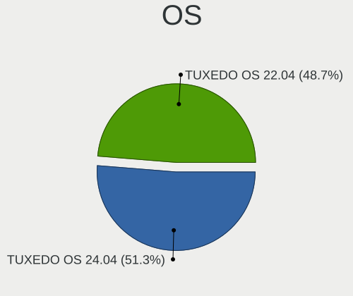

| Name            | Desktops | Percent |
|-----------------|----------|---------|
| TUXEDO OS 24.04 | 60       | 51.28%  |
| TUXEDO OS 22.04 | 57       | 48.72%  |

OS Family
---------

OS without a version

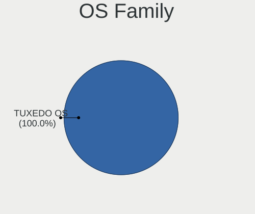

| Name      | Desktops | Percent |
|-----------|----------|---------|
| TUXEDO OS | 117      | 100%    |

Kernel
------

Version of the Linux kernel

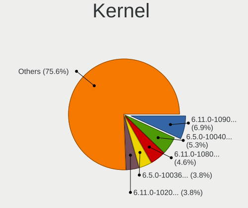

| Version              | Desktops | Percent |
|----------------------|----------|---------|
| 6.11.0-109019-tuxedo | 9        | 6.87%   |
| 6.5.0-10040-tuxedo   | 7        | 5.34%   |
| 6.11.0-108013-tuxedo | 6        | 4.58%   |
| 6.5.0-10036-tuxedo   | 5        | 3.82%   |
| 6.11.0-102007-tuxedo | 5        | 3.82%   |
| 6.5.0-10027-tuxedo   | 4        | 3.05%   |
| 6.5.0-10022-tuxedo   | 4        | 3.05%   |
| 6.5.0-10013-tuxedo   | 4        | 3.05%   |
| 6.2.0-10018-tuxedo   | 4        | 3.05%   |
| 6.14.0-112033-tuxedo | 4        | 3.05%   |
| 6.14.0-111029-tuxedo | 4        | 3.05%   |
| 6.11.0-120029-tuxedo | 4        | 3.05%   |
| 6.11.0-112021-tuxedo | 4        | 3.05%   |
| 6.11.0-108014-tuxedo | 4        | 3.05%   |
| 6.1.0-1009-tuxedo    | 4        | 3.05%   |
| 6.5.0-10010-tuxedo   | 3        | 2.29%   |
| 6.2.0-10007-tuxedo   | 3        | 2.29%   |
| 6.14.0-110029-tuxedo | 3        | 2.29%   |
| 6.11.0-118028-tuxedo | 3        | 2.29%   |
| 6.11.0-118026-tuxedo | 3        | 2.29%   |
| 6.11.0-109018-tuxedo | 3        | 2.29%   |
| 6.11.0-105009-tuxedo | 3        | 2.29%   |
| 6.11.0-103009-tuxedo | 3        | 2.29%   |
| 5.15.0-10058-tuxedo  | 3        | 2.29%   |
| 6.5.0-10043-tuxedo   | 2        | 1.53%   |
| 6.5.0-10006-tuxedo   | 2        | 1.53%   |
| 6.2.0-10027-tuxedo   | 2        | 1.53%   |
| 6.2.0-10022-tuxedo   | 2        | 1.53%   |
| 6.14.0-117036-tuxedo | 2        | 1.53%   |
| 6.14.0-116036-tuxedo | 2        | 1.53%   |
| 6.14.0-115036-tuxedo | 2        | 1.53%   |
| 6.11.0-116025-tuxedo | 2        | 1.53%   |
| 6.11.0-114024-tuxedo | 2        | 1.53%   |
| 6.11.0-107011-tuxedo | 2        | 1.53%   |
| 6.11.0-100005-tuxedo | 2        | 1.53%   |
| 6.8.0-101041-tuxedo  | 1        | 0.76%   |
| 6.14.0-119037-tuxedo | 1        | 0.76%   |
| 6.14.0-114034-tuxedo | 1        | 0.76%   |
| 6.14.0-113033-tuxedo | 1        | 0.76%   |
| 6.11.0-121029-tuxedo | 1        | 0.76%   |

Kernel Family
-------------

Linux kernel without a distro release

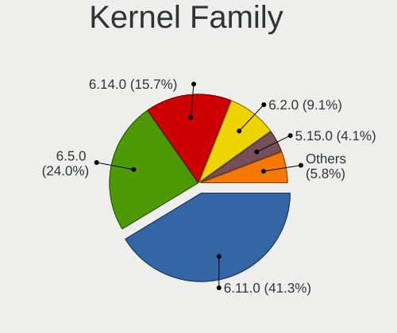

| Version | Desktops | Percent |
|---------|----------|---------|
| 6.11.0  | 50       | 41.32%  |
| 6.5.0   | 29       | 23.97%  |
| 6.14.0  | 19       | 15.7%   |
| 6.2.0   | 11       | 9.09%   |
| 5.15.0  | 5        | 4.13%   |
| 6.1.0   | 4        | 3.31%   |
| 6.8.0   | 1        | 0.83%   |
| 6.10.9  | 1        | 0.83%   |
| 6.10.0  | 1        | 0.83%   |

Kernel Major Ver.
-----------------

Linux kernel major version

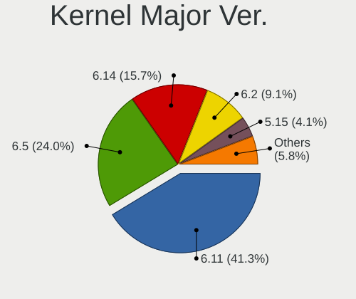

| Version | Desktops | Percent |
|---------|----------|---------|
| 6.11    | 50       | 41.32%  |
| 6.5     | 29       | 23.97%  |
| 6.14    | 19       | 15.7%   |
| 6.2     | 11       | 9.09%   |
| 5.15    | 5        | 4.13%   |
| 6.1     | 4        | 3.31%   |
| 6.10    | 2        | 1.65%   |
| 6.8     | 1        | 0.83%   |

Arch
----

OS architecture (x86_64, i586, etc.)

| Name   | Desktops | Percent |
|--------|----------|---------|
| x86_64 | 117      | 100%    |

DE
--

Desktop Environment

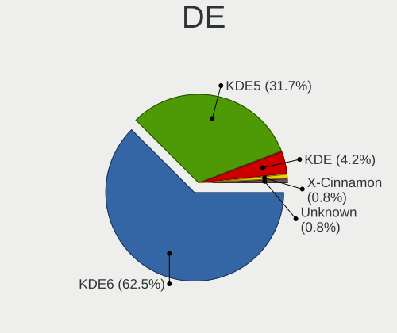

| Name       | Desktops | Percent |
|------------|----------|---------|
| KDE6       | 75       | 62.5%   |
| KDE5       | 38       | 31.67%  |
| KDE        | 5        | 4.17%   |
| X-Cinnamon | 1        | 0.83%   |
| Unknown    | 1        | 0.83%   |

Display Server
--------------

X11 or Wayland

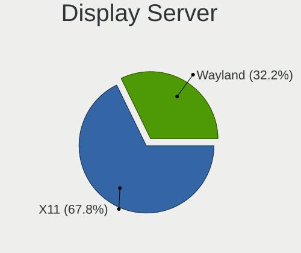

| Name    | Desktops | Percent |
|---------|----------|---------|
| X11     | 82       | 67.77%  |
| Wayland | 39       | 32.23%  |

Display Manager
---------------

SDDM, LightDM, etc.

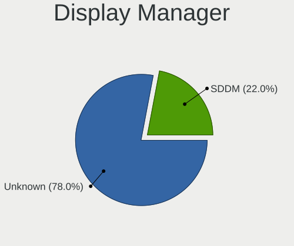

| Name    | Desktops | Percent |
|---------|----------|---------|
| Unknown | 92       | 77.97%  |
| SDDM    | 26       | 22.03%  |

OS Lang
-------

Language

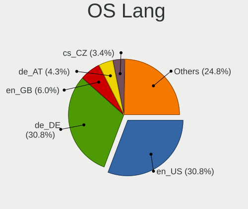

| Lang  | Desktops | Percent |
|-------|----------|---------|
| en_US | 36       | 30.77%  |
| de_DE | 36       | 30.77%  |
| en_GB | 7        | 5.98%   |
| de_AT | 5        | 4.27%   |
| cs_CZ | 4        | 3.42%   |
| it_IT | 3        | 2.56%   |
| en_ZA | 3        | 2.56%   |
| pl_PL | 2        | 1.71%   |
| es_ES | 2        | 1.71%   |
| en_IN | 2        | 1.71%   |
| en_CA | 2        | 1.71%   |
| en_AU | 2        | 1.71%   |
| de_CH | 2        | 1.71%   |
| zh_TW | 1        | 0.85%   |
| ru_RU | 1        | 0.85%   |
| pt_PT | 1        | 0.85%   |
| nl_NL | 1        | 0.85%   |
| hu_HU | 1        | 0.85%   |
| fr_FR | 1        | 0.85%   |
| fr_BE | 1        | 0.85%   |
| fi_FI | 1        | 0.85%   |
| es_MX | 1        | 0.85%   |
| en_IE | 1        | 0.85%   |
| en_AG | 1        | 0.85%   |

Boot Mode
---------

EFI or BIOS

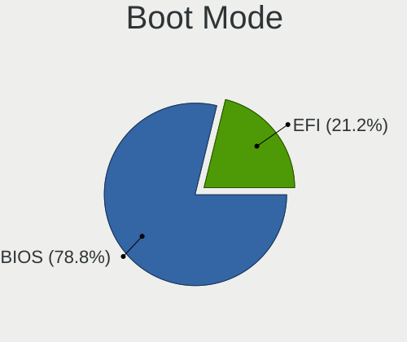

| Mode | Desktops | Percent |
|------|----------|---------|
| BIOS | 93       | 78.81%  |
| EFI  | 25       | 21.19%  |

Filesystem
----------

Type of filesystem

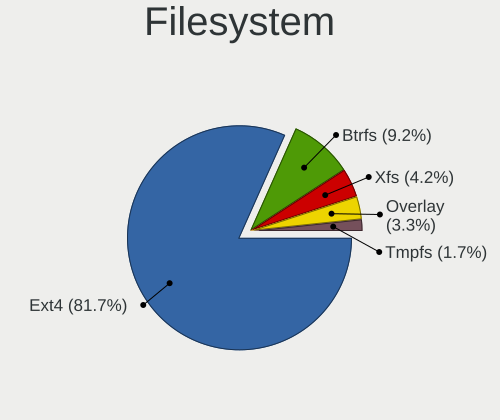

| Type    | Desktops | Percent |
|---------|----------|---------|
| Ext4    | 98       | 81.67%  |
| Btrfs   | 11       | 9.17%   |
| Xfs     | 5        | 4.17%   |
| Overlay | 4        | 3.33%   |
| Tmpfs   | 2        | 1.67%   |

Part. scheme
------------

Scheme of partitioning

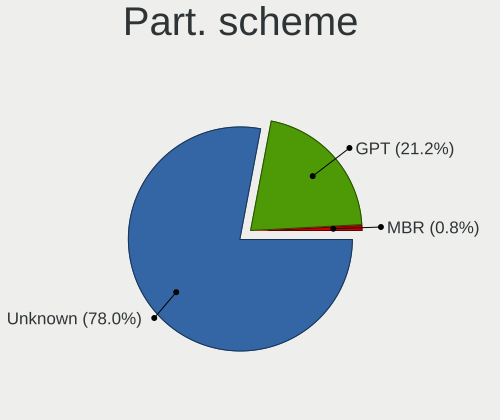

| Type    | Desktops | Percent |
|---------|----------|---------|
| Unknown | 92       | 77.97%  |
| GPT     | 25       | 21.19%  |
| MBR     | 1        | 0.85%   |

Dual Boot with Linux/BSD
------------------------

Hosting more than one Linux/BSD

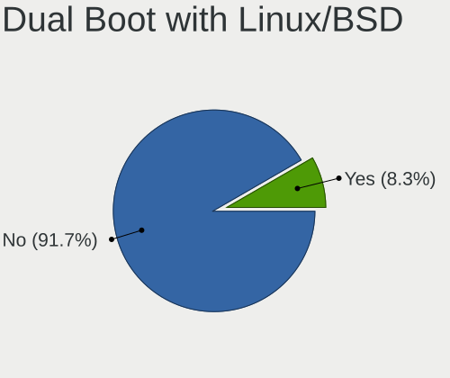

| Dual boot | Desktops | Percent |
|-----------|----------|---------|
| No        | 110      | 93.22%  |
| Yes       | 8        | 6.78%   |

Dual Boot (Win)
---------------

Hosting Linux and Windows

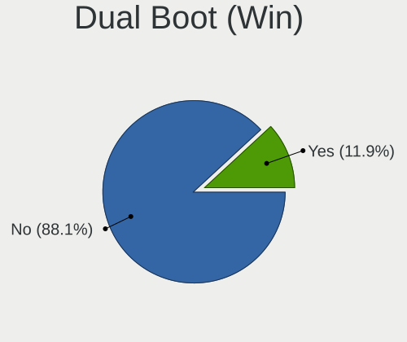

| Dual boot | Desktops | Percent |
|-----------|----------|---------|
| No        | 104      | 88.14%  |
| Yes       | 14       | 11.86%  |

Board
-----

Vendor
------

Motherboard manufacturer

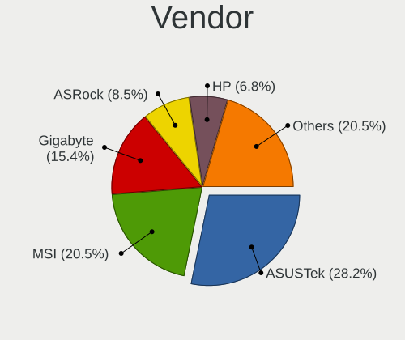

| Name                | Desktops | Percent |
|---------------------|----------|---------|
| ASUSTek Computer    | 33       | 28.21%  |
| MSI                 | 24       | 20.51%  |
| Gigabyte Technology | 18       | 15.38%  |
| ASRock              | 10       | 8.55%   |
| Hewlett-Packard     | 8        | 6.84%   |
| Lenovo              | 5        | 4.27%   |
| Dell                | 4        | 3.42%   |
| ASRock Industrial   | 2        | 1.71%   |
| Unknown             | 2        | 1.71%   |
| Trigkey             | 1        | 0.85%   |
| Simply NUC          | 1        | 0.85%   |
| HC Technology.      | 1        | 0.85%   |
| Google              | 1        | 0.85%   |
| GEEKOM              | 1        | 0.85%   |
| Gateway             | 1        | 0.85%   |
| ECS                 | 1        | 0.85%   |
| BESSTAR Tech        | 1        | 0.85%   |
| AZW                 | 1        | 0.85%   |
| Alienware           | 1        | 0.85%   |
| Acer                | 1        | 0.85%   |

Model
-----

Motherboard model

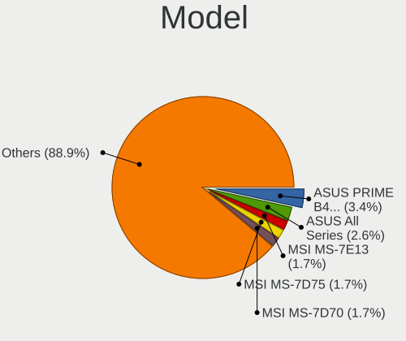

| Name                                                  | Desktops | Percent |
|-------------------------------------------------------|----------|---------|
| ASUS PRIME B450-PLUS                                  | 4        | 3.42%   |
| ASUS All Series                                       | 3        | 2.56%   |
| MSI MS-7E13                                           | 2        | 1.71%   |
| MSI MS-7D75                                           | 2        | 1.71%   |
| MSI MS-7D70                                           | 2        | 1.71%   |
| MSI MS-7D17                                           | 2        | 1.71%   |
| ASUS ROG STRIX B550-I GAMING                          | 2        | 1.71%   |
| Unknown                                               | 2        | 1.71%   |
| Trigkey Green G5                                      | 1        | 0.85%   |
| Simply NUC CBM3r9MS                                   | 1        | 0.85%   |
| MSI MS-7E12                                           | 1        | 0.85%   |
| MSI MS-7E07                                           | 1        | 0.85%   |
| MSI MS-7D82                                           | 1        | 0.85%   |
| MSI MS-7D76                                           | 1        | 0.85%   |
| MSI MS-7D42                                           | 1        | 0.85%   |
| MSI MS-7D25                                           | 1        | 0.85%   |
| MSI MS-7C94                                           | 1        | 0.85%   |
| MSI MS-7C56                                           | 1        | 0.85%   |
| MSI MS-7C37                                           | 1        | 0.85%   |
| MSI MS-7B89                                           | 1        | 0.85%   |
| MSI MS-7B86                                           | 1        | 0.85%   |
| MSI MS-7B17                                           | 1        | 0.85%   |
| MSI MS-7817                                           | 1        | 0.85%   |
| MSI MS-7641                                           | 1        | 0.85%   |
| MSI MS-7309                                           | 1        | 0.85%   |
| MSI MEG Z590 Aegis Ti5 (MS-B931)                      | 1        | 0.85%   |
| Lenovo ThinkCentre M72e 0896C5G                       | 1        | 0.85%   |
| Lenovo ThinkCentre M700 10GSS05X48                    | 1        | 0.85%   |
| Lenovo SHARKBAY NOK                                   | 1        | 0.85%   |
| Lenovo S500 10HSA00HAU                                | 1        | 0.85%   |
| Lenovo IdeaCentre 3 07ADA05 Enter the machine type an | 1        | 0.85%   |
| HP Z440 Workstation                                   | 1        | 0.85%   |
| HP Z400 Workstation                                   | 1        | 0.85%   |
| HP ProDesk 600 G4 DM                                  | 1        | 0.85%   |
| HP ProDesk 400 G1 SFF                                 | 1        | 0.85%   |
| HP Pavilion Gaming Desktop TG01-2xxx                  | 1        | 0.85%   |
| HP F01                                                | 1        | 0.85%   |
| HP EliteDesk 705 G4 DM 35W (TAA)                      | 1        | 0.85%   |
| HP 280 G1 MT                                          | 1        | 0.85%   |
| HC Technology. HCAR5000-MI                            | 1        | 0.85%   |

Model Family
------------

Motherboard model prefix

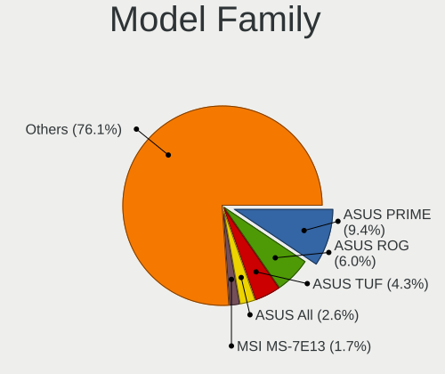

| Name                | Desktops | Percent |
|---------------------|----------|---------|
| ASUS PRIME          | 11       | 9.4%    |
| ASUS ROG            | 7        | 5.98%   |
| ASUS TUF            | 5        | 4.27%   |
| ASUS All            | 3        | 2.56%   |
| MSI MS-7E13         | 2        | 1.71%   |
| MSI MS-7D75         | 2        | 1.71%   |
| MSI MS-7D70         | 2        | 1.71%   |
| MSI MS-7D17         | 2        | 1.71%   |
| Lenovo ThinkCentre  | 2        | 1.71%   |
| HP ProDesk          | 2        | 1.71%   |
| Gigabyte Z490       | 2        | 1.71%   |
| Gigabyte B550       | 2        | 1.71%   |
| Dell OptiPlex       | 2        | 1.71%   |
| Unknown             | 2        | 1.71%   |
| Trigkey Green       | 1        | 0.85%   |
| Simply NUC CBM3r9MS | 1        | 0.85%   |
| MSI MS-7E12         | 1        | 0.85%   |
| MSI MS-7E07         | 1        | 0.85%   |
| MSI MS-7D82         | 1        | 0.85%   |
| MSI MS-7D76         | 1        | 0.85%   |
| MSI MS-7D42         | 1        | 0.85%   |
| MSI MS-7D25         | 1        | 0.85%   |
| MSI MS-7C94         | 1        | 0.85%   |
| MSI MS-7C56         | 1        | 0.85%   |
| MSI MS-7C37         | 1        | 0.85%   |
| MSI MS-7B89         | 1        | 0.85%   |
| MSI MS-7B86         | 1        | 0.85%   |
| MSI MS-7B17         | 1        | 0.85%   |
| MSI MS-7817         | 1        | 0.85%   |
| MSI MS-7641         | 1        | 0.85%   |
| MSI MS-7309         | 1        | 0.85%   |
| MSI MEG             | 1        | 0.85%   |
| Lenovo SHARKBAY     | 1        | 0.85%   |
| Lenovo S500         | 1        | 0.85%   |
| Lenovo IdeaCentre   | 1        | 0.85%   |
| HP Z440             | 1        | 0.85%   |
| HP Z400             | 1        | 0.85%   |
| HP Pavilion         | 1        | 0.85%   |
| HP F01              | 1        | 0.85%   |
| HP EliteDesk        | 1        | 0.85%   |

MFG Year
--------

Motherboard manufacture year

| Year | Desktops | Percent |
|------|----------|---------|
| 2022 | 16       | 13.68%  |
| 2021 | 16       | 13.68%  |
| 2020 | 15       | 12.82%  |
| 2023 | 10       | 8.55%   |
| 2018 | 9        | 7.69%   |
| 2013 | 8        | 6.84%   |
| 2024 | 7        | 5.98%   |
| 2019 | 6        | 5.13%   |
| 2015 | 6        | 5.13%   |
| 2012 | 6        | 5.13%   |
| 2014 | 5        | 4.27%   |
| 2011 | 4        | 3.42%   |
| 2017 | 2        | 1.71%   |
| 2016 | 2        | 1.71%   |
| 2010 | 2        | 1.71%   |
| 2025 | 1        | 0.85%   |
| 2009 | 1        | 0.85%   |
| 2008 | 1        | 0.85%   |

Form Factor
-----------

Physical design of the computer

| Name    | Desktops | Percent |
|---------|----------|---------|
| Desktop | 117      | 100%    |

Secure Boot
-----------

Enabled or disabled

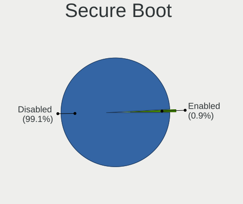

| State    | Desktops | Percent |
|----------|----------|---------|
| Disabled | 116      | 99.15%  |
| Enabled  | 1        | 0.85%   |

Coreboot
--------

Have coreboot on board

| Used | Desktops | Percent |
|------|----------|---------|
| No   | 116      | 99.15%  |
| Yes  | 1        | 0.85%   |

RAM Size
--------

Total RAM memory

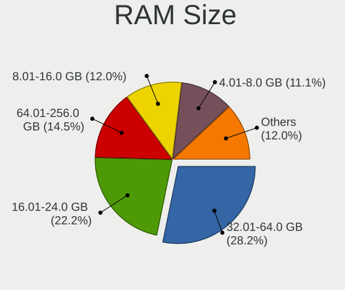

| Size in GB  | Desktops | Percent |
|-------------|----------|---------|
| 32.01-64.0  | 33       | 28.21%  |
| 16.01-24.0  | 26       | 22.22%  |
| 64.01-256.0 | 17       | 14.53%  |
| 8.01-16.0   | 14       | 11.97%  |
| 4.01-8.0    | 13       | 11.11%  |
| 3.01-4.0    | 8        | 6.84%   |
| 24.01-32.0  | 6        | 5.13%   |

RAM Used
--------

Used RAM memory

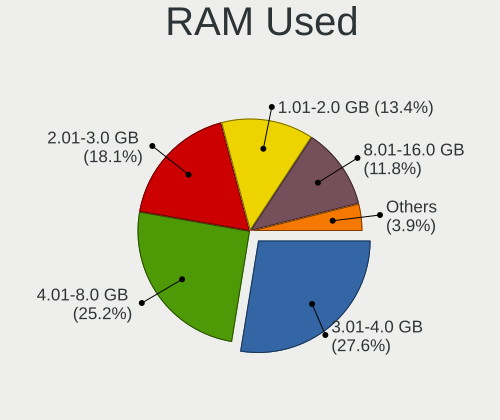

| Used GB    | Desktops | Percent |
|------------|----------|---------|
| 3.01-4.0   | 35       | 27.56%  |
| 4.01-8.0   | 32       | 25.2%   |
| 2.01-3.0   | 23       | 18.11%  |
| 1.01-2.0   | 17       | 13.39%  |
| 8.01-16.0  | 15       | 11.81%  |
| 16.01-24.0 | 3        | 2.36%   |
| 32.01-64.0 | 1        | 0.79%   |
| 24.01-32.0 | 1        | 0.79%   |

Total Drives
------------

Number of drives on board

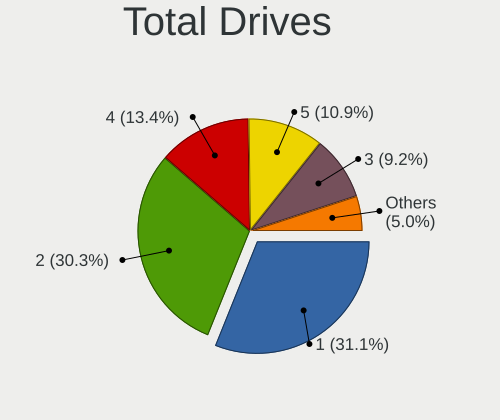

| Drives | Desktops | Percent |
|--------|----------|---------|
| 1      | 37       | 31.09%  |
| 2      | 36       | 30.25%  |
| 4      | 16       | 13.45%  |
| 5      | 13       | 10.92%  |
| 3      | 11       | 9.24%   |
| 6      | 3        | 2.52%   |
| 7      | 2        | 1.68%   |
| 8      | 1        | 0.84%   |

Has CD-ROM
----------

Has CD-ROM on board

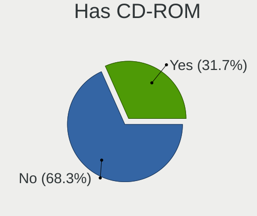

| Presented | Desktops | Percent |
|-----------|----------|---------|
| No        | 82       | 68.33%  |
| Yes       | 38       | 31.67%  |

Has Ethernet
------------

Has Ethernet on board

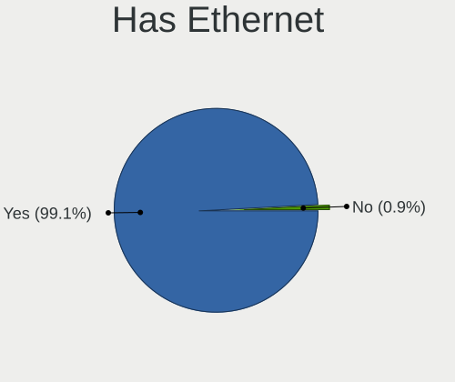

| Presented | Desktops | Percent |
|-----------|----------|---------|
| Yes       | 116      | 99.15%  |
| No        | 1        | 0.85%   |

Has WiFi
--------

Has WiFi module

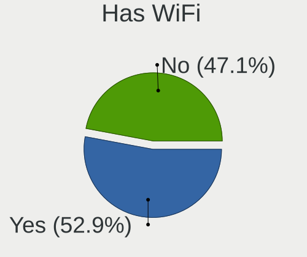

| Presented | Desktops | Percent |
|-----------|----------|---------|
| Yes       | 63       | 52.94%  |
| No        | 56       | 47.06%  |

Has Bluetooth
-------------

Has Bluetooth module

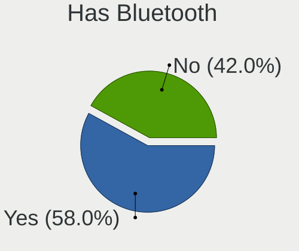

| Presented | Desktops | Percent |
|-----------|----------|---------|
| Yes       | 69       | 57.98%  |
| No        | 50       | 42.02%  |

Location
--------

Country
-------

Geographic location (country)

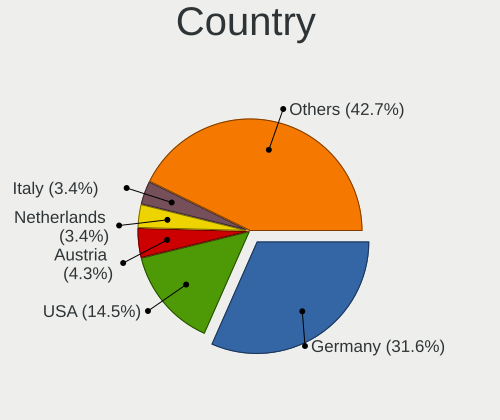

| Country      | Desktops | Percent |
|--------------|----------|---------|
| Germany      | 37       | 31.62%  |
| USA          | 17       | 14.53%  |
| Austria      | 5        | 4.27%   |
| Netherlands  | 4        | 3.42%   |
| Italy        | 4        | 3.42%   |
| Czechia      | 4        | 3.42%   |
| UK           | 3        | 2.56%   |
| South Africa | 3        | 2.56%   |
| Romania      | 3        | 2.56%   |
| India        | 3        | 2.56%   |
| France       | 3        | 2.56%   |
| Canada       | 3        | 2.56%   |
| Australia    | 3        | 2.56%   |
| Thailand     | 2        | 1.71%   |
| Taiwan       | 2        | 1.71%   |
| Switzerland  | 2        | 1.71%   |
| Spain        | 2        | 1.71%   |
| Poland       | 2        | 1.71%   |
| China        | 2        | 1.71%   |
| Argentina    | 2        | 1.71%   |
| Sweden       | 1        | 0.85%   |
| Portugal     | 1        | 0.85%   |
| Moldova      | 1        | 0.85%   |
| Mexico       | 1        | 0.85%   |
| Ireland      | 1        | 0.85%   |
| Iceland      | 1        | 0.85%   |
| Hungary      | 1        | 0.85%   |
| Finland      | 1        | 0.85%   |
| Egypt        | 1        | 0.85%   |
| Belgium      | 1        | 0.85%   |
| Aruba        | 1        | 0.85%   |

City
----

Geographic location (city)

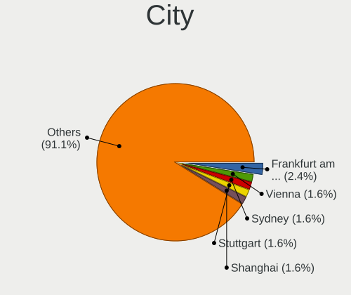

| City              | Desktops | Percent |
|-------------------|----------|---------|
| Frankfurt am Main | 3        | 2.42%   |
| Vienna            | 2        | 1.61%   |
| Sydney            | 2        | 1.61%   |
| Stuttgart         | 2        | 1.61%   |
| Shanghai          | 2        | 1.61%   |
| Kunovice          | 2        | 1.61%   |
| Hürth            | 2        | 1.61%   |
| Hamburg           | 2        | 1.61%   |
| Düsseldorf       | 2        | 1.61%   |
| Buenos Aires      | 2        | 1.61%   |
| Berlin            | 2        | 1.61%   |
| Bangkok           | 2        | 1.61%   |
| Zurich            | 1        | 0.81%   |
| Zalău            | 1        | 0.81%   |
| Wuppertal         | 1        | 0.81%   |
| Wieselburg        | 1        | 0.81%   |
| Ulm               | 1        | 0.81%   |
| Tucson            | 1        | 0.81%   |
| Thann             | 1        | 0.81%   |
| Taichung          | 1        | 0.81%   |
| Szolnok           | 1        | 0.81%   |
| Sun City          | 1        | 0.81%   |
| Straubing         | 1        | 0.81%   |
| Stimpfach         | 1        | 0.81%   |
| Shelby            | 1        | 0.81%   |
| Salt Lake City    | 1        | 0.81%   |
| Reykjanesbaer     | 1        | 0.81%   |
| Reutlingen        | 1        | 0.81%   |
| Ravensburg        | 1        | 0.81%   |
| Puebla City       | 1        | 0.81%   |
| Prague            | 1        | 0.81%   |
| Poznan            | 1        | 0.81%   |
| Poechlarn         | 1        | 0.81%   |
| Plymouth          | 1        | 0.81%   |
| Plauen            | 1        | 0.81%   |
| Pirna             | 1        | 0.81%   |
| Petrvald          | 1        | 0.81%   |
| Peterborough      | 1        | 0.81%   |
| Pepinster         | 1        | 0.81%   |
| Peitz             | 1        | 0.81%   |

Drives
------

Drive Vendor
------------

Hard drive vendors

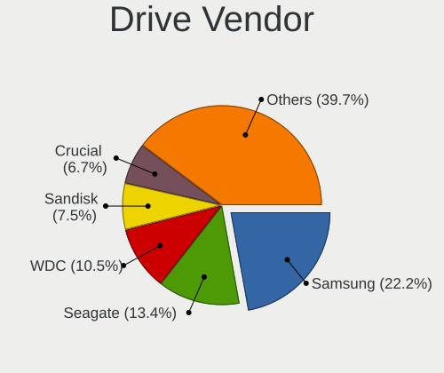

| Vendor                       | Desktops | Drives | Percent |
|------------------------------|----------|--------|---------|
| Samsung Electronics          | 53       | 90     | 22.18%  |
| Seagate                      | 32       | 47     | 13.39%  |
| WDC                          | 25       | 41     | 10.46%  |
| Sandisk                      | 18       | 26     | 7.53%   |
| Crucial                      | 16       | 22     | 6.69%   |
| Kingston                     | 12       | 16     | 5.02%   |
| Hitachi                      | 6        | 9      | 2.51%   |
| SK hynix                     | 5        | 6      | 2.09%   |
| Micron/Crucial Technology    | 5        | 9      | 2.09%   |
| Micron Technology            | 5        | 6      | 2.09%   |
| Intel                        | 4        | 4      | 1.67%   |
| Unknown                      | 3        | 4      | 1.26%   |
| Toshiba                      | 3        | 4      | 1.26%   |
| Phison Electronics           | 3        | 3      | 1.26%   |
| Intenso                      | 3        | 4      | 1.26%   |
| Transcend                    | 2        | 3      | 0.84%   |
| SPCC                         | 2        | 2      | 0.84%   |
| Silicon Motion               | 2        | 3      | 0.84%   |
| Shenzhen Longsys Electronics | 2        | 3      | 0.84%   |
| ORICO                        | 2        | 2      | 0.84%   |
| Kingston Technology Company  | 2        | 2      | 0.84%   |
| JMicron Technology           | 2        | 2      | 0.84%   |
| HGST HTS                     | 2        | 2      | 0.84%   |
| GOODRAM                      | 2        | 2      | 0.84%   |
| China                        | 2        | 2      | 0.84%   |
| ASMT                         | 2        | 2      | 0.84%   |
| Apacer                       | 2        | 2      | 0.84%   |
| A-DATA Technology            | 2        | 3      | 0.84%   |
| WALRAM                       | 1        | 1      | 0.42%   |
| USB                          | 1        | 1      | 0.42%   |
| PNY                          | 1        | 1      | 0.42%   |
| Pioneer                      | 1        | 1      | 0.42%   |
| Phison                       | 1        | 1      | 0.42%   |
| Netac                        | 1        | 1      | 0.42%   |
| MSI                          | 1        | 1      | 0.42%   |
| Lite-On Technology           | 1        | 1      | 0.42%   |
| KingFast                     | 1        | 1      | 0.42%   |
| HS-SSD-WAVE(S)               | 1        | 1      | 0.42%   |
| HS-SSD-E100                  | 1        | 1      | 0.42%   |
| HS-SSD-E                     | 1        | 1      | 0.42%   |

Drive Model
-----------

Hard drive models

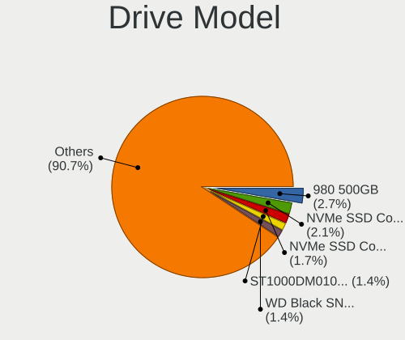

| Model                                                | Desktops | Percent |
|------------------------------------------------------|----------|---------|
| Samsung SSD 980 500GB                                | 8        | 2.75%   |
| Samsung NVMe SSD Controller PM9A1/PM9A3/980PRO 1TB   | 6        | 2.06%   |
| Samsung NVMe SSD Controller SM981/PM981/PM983 1TB    | 5        | 1.72%   |
| Seagate ST1000DM010-2EP102 1TB                       | 4        | 1.37%   |
| Sandisk WD Black SN750 / PC SN730 NVMe SSD 500GB     | 4        | 1.37%   |
| Samsung SSD 990 PRO 2TB                              | 4        | 1.37%   |
| Crucial CT1000MX500SSD1 1TB                          | 4        | 1.37%   |
| Crucial CT1000BX500SSD1 1TB                          | 4        | 1.37%   |
| Seagate ST3500418AS 500GB                            | 3        | 1.03%   |
| Samsung SSD 990 PRO 1TB                              | 3        | 1.03%   |
| Samsung SSD 980 1TB                                  | 3        | 1.03%   |
| Samsung SSD 860 EVO 500GB                            | 3        | 1.03%   |
| Samsung SSD 860 EVO 1TB                              | 3        | 1.03%   |
| Micron/Crucial P2 NVMe PCIe SSD 2TB                  | 3        | 1.03%   |
| Kingston SA400S37960G 960GB SSD                      | 3        | 1.03%   |
| Kingston SA400S37240G 240GB SSD                      | 3        | 1.03%   |
| WDC WD10EZEX-08WN4A0 1TB                             | 2        | 0.69%   |
| Silicon Motion SM2262/SM2262EN SSD Controller 960GB  | 2        | 0.69%   |
| Seagate ST500DM002-1BD142 500GB                      | 2        | 0.69%   |
| Seagate ST4000DM004-2U9104 4TB                       | 2        | 0.69%   |
| Seagate ST1000VT001-1RE172 1TB                       | 2        | 0.69%   |
| Sandisk WD_BLACK SN770 2TB                           | 2        | 0.69%   |
| Sandisk WD Black SN850 1TB                           | 2        | 0.69%   |
| SanDisk SSD PLUS 120GB                               | 2        | 0.69%   |
| Samsung SSD 990 PRO with Heatsink 2TB                | 2        | 0.69%   |
| Samsung SSD 990 EVO 1TB                              | 2        | 0.69%   |
| Samsung SSD 9100 PRO 2TB                             | 2        | 0.69%   |
| Samsung SSD 870 EVO 2TB                              | 2        | 0.69%   |
| Samsung SSD 860 EVO 250GB                            | 2        | 0.69%   |
| Samsung SSD 850 EVO 500GB                            | 2        | 0.69%   |
| Samsung SSD 750 EVO 250GB                            | 2        | 0.69%   |
| Samsung NVMe SSD Controller SM961/PM961/SM963 1024GB | 2        | 0.69%   |
| Phison E16 PCIe4 NVMe Controller 1TB                 | 2        | 0.69%   |
| ORICO 512GB                                          | 2        | 0.69%   |
| Micron CT1000P3PSSD8 1TB                             | 2        | 0.69%   |
| Kingston SV300S37A120G 120GB SSD                     | 2        | 0.69%   |
| Intel SSDSC2CT180A3 180GB                            | 2        | 0.69%   |
| Hitachi HCS545050GLA380 500GB                        | 2        | 0.69%   |
| Crucial CT500MX500SSD1 500GB                         | 2        | 0.69%   |
| Crucial CT480BX500SSD1 480GB                         | 2        | 0.69%   |

HDD Vendor
----------

Hard disk drive vendors

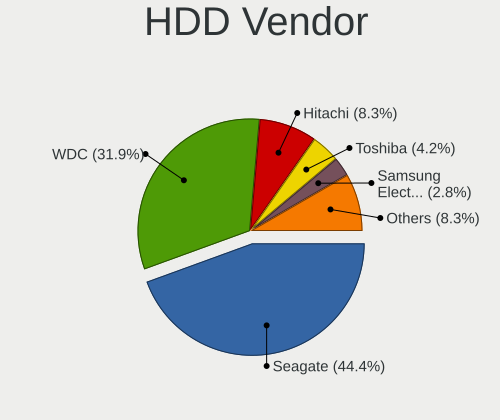

| Vendor              | Desktops | Drives | Percent |
|---------------------|----------|--------|---------|
| Seagate             | 32       | 47     | 44.44%  |
| WDC                 | 23       | 35     | 31.94%  |
| Hitachi             | 6        | 9      | 8.33%   |
| Toshiba             | 3        | 4      | 4.17%   |
| Samsung Electronics | 2        | 2      | 2.78%   |
| HGST HTS            | 2        | 2      | 2.78%   |
| Unknown             | 1        | 2      | 1.39%   |
| JMicron Technology  | 1        | 1      | 1.39%   |
| Intenso             | 1        | 1      | 1.39%   |
| HGST                | 1        | 3      | 1.39%   |

SSD Vendor
----------

Solid state drive vendors

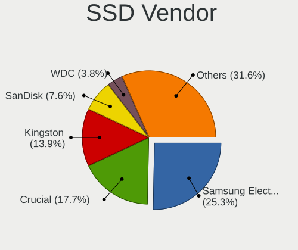

| Vendor              | Desktops | Drives | Percent |
|---------------------|----------|--------|---------|
| Samsung Electronics | 20       | 27     | 25.32%  |
| Crucial             | 14       | 17     | 17.72%  |
| Kingston            | 11       | 15     | 13.92%  |
| SanDisk             | 6        | 8      | 7.59%   |
| WDC                 | 3        | 6      | 3.8%    |
| Intel               | 3        | 3      | 3.8%    |
| SPCC                | 2        | 2      | 2.53%   |
| GOODRAM             | 2        | 2      | 2.53%   |
| China               | 2        | 2      | 2.53%   |
| ASMT                | 2        | 2      | 2.53%   |
| Apacer              | 2        | 2      | 2.53%   |
| Transcend           | 1        | 2      | 1.27%   |
| PNY                 | 1        | 1      | 1.27%   |
| Pioneer             | 1        | 1      | 1.27%   |
| Netac               | 1        | 1      | 1.27%   |
| MSI                 | 1        | 1      | 1.27%   |
| Micron Technology   | 1        | 1      | 1.27%   |
| Intenso             | 1        | 1      | 1.27%   |
| EVM                 | 1        | 1      | 1.27%   |
| Emtec               | 1        | 1      | 1.27%   |
| CT1000P3            | 1        | 1      | 1.27%   |
| AirDisk             | 1        | 1      | 1.27%   |
| A-DATA Technology   | 1        | 2      | 1.27%   |

Drive Kind
----------

HDD or SSD

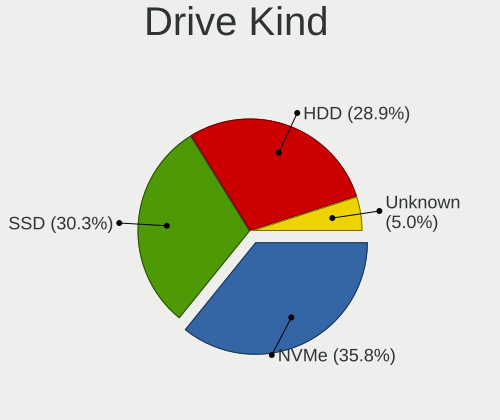

| Kind    | Desktops | Drives | Percent |
|---------|----------|--------|---------|
| NVMe    | 72       | 128    | 35.82%  |
| SSD     | 61       | 100    | 30.35%  |
| HDD     | 58       | 106    | 28.86%  |
| Unknown | 10       | 11     | 4.98%   |

Drive Connector
---------------

SATA, SAS, NVMe, etc.

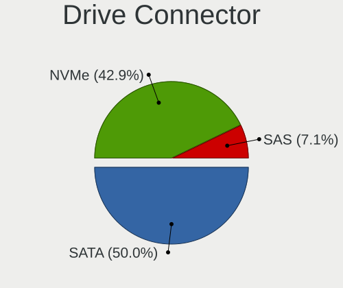

| Type | Desktops | Drives | Percent |
|------|----------|--------|---------|
| SATA | 84       | 200    | 50%     |
| NVMe | 72       | 128    | 42.86%  |
| SAS  | 12       | 17     | 7.14%   |

Drive Size
----------

Size of hard drive

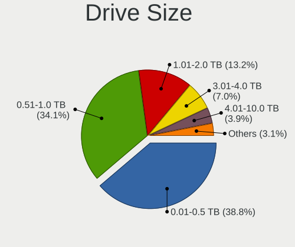

| Size in TB | Desktops | Drives | Percent |
|------------|----------|--------|---------|
| 0.01-0.5   | 50       | 92     | 38.76%  |
| 0.51-1.0   | 44       | 60     | 34.11%  |
| 1.01-2.0   | 17       | 27     | 13.18%  |
| 3.01-4.0   | 9        | 16     | 6.98%   |
| 4.01-10.0  | 5        | 6      | 3.88%   |
| 2.01-3.0   | 3        | 4      | 2.33%   |
| 10.01-20.0 | 1        | 1      | 0.78%   |

Space Total
-----------

Amount of disk space available on the file system

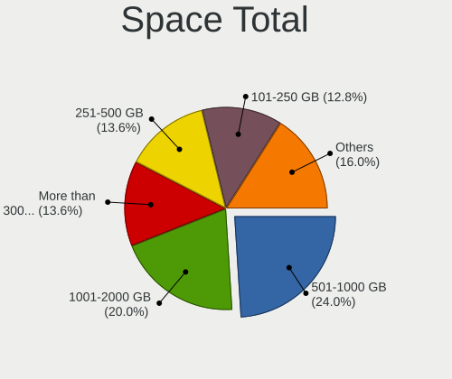

| Size in GB     | Desktops | Percent |
|----------------|----------|---------|
| 501-1000       | 30       | 24%     |
| 1001-2000      | 25       | 20%     |
| More than 3000 | 17       | 13.6%   |
| 251-500        | 17       | 13.6%   |
| 101-250        | 16       | 12.8%   |
| 2001-3000      | 6        | 4.8%    |
| 1-20           | 5        | 4%      |
| 51-100         | 5        | 4%      |
| 21-50          | 2        | 1.6%    |
| Unknown        | 2        | 1.6%    |

Space Used
----------

Amount of used disk space

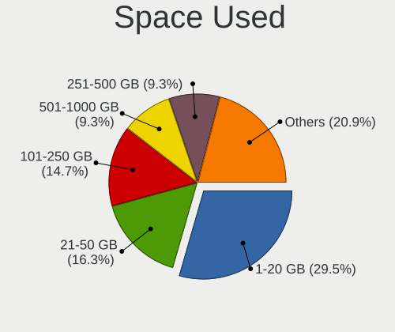

| Used GB        | Desktops | Percent |
|----------------|----------|---------|
| 1-20           | 38       | 29.46%  |
| 21-50          | 21       | 16.28%  |
| 101-250        | 19       | 14.73%  |
| 251-500        | 12       | 9.3%    |
| 501-1000       | 12       | 9.3%    |
| 1001-2000      | 8        | 6.2%    |
| 51-100         | 8        | 6.2%    |
| More than 3000 | 6        | 4.65%   |
| 2001-3000      | 3        | 2.33%   |
| Unknown        | 2        | 1.55%   |

Malfunc. Drives
---------------

Drive models with a malfunction

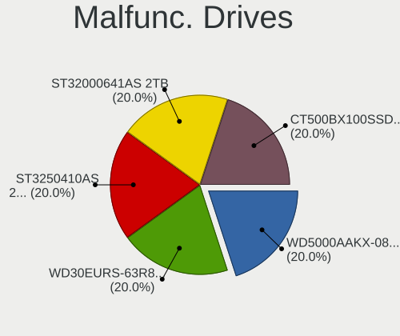

| Model                        | Desktops | Drives | Percent |
|------------------------------|----------|--------|---------|
| WDC WD5000AAKX-083CA1 500GB  | 1        | 1      | 20%     |
| WDC WD30EURS-63R8UY0 3TB     | 1        | 1      | 20%     |
| Seagate ST3250410AS 250GB    | 1        | 1      | 20%     |
| Seagate ST32000641AS 2TB     | 1        | 1      | 20%     |
| Crucial CT500BX100SSD1 500GB | 1        | 1      | 20%     |

Malfunc. Drive Vendor
---------------------

Vendors of faulty drives

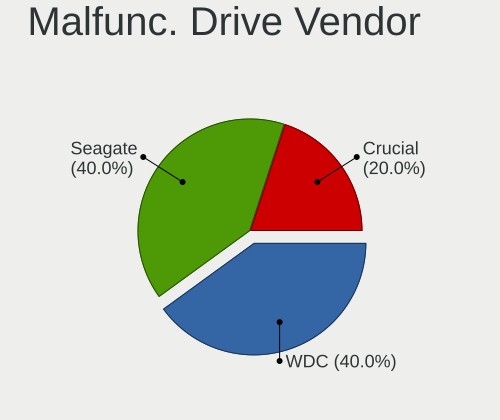

| Vendor  | Desktops | Drives | Percent |
|---------|----------|--------|---------|
| WDC     | 2        | 2      | 40%     |
| Seagate | 2        | 2      | 40%     |
| Crucial | 1        | 1      | 20%     |

Malfunc. HDD Vendor
-------------------

Vendors of faulty HDD drives

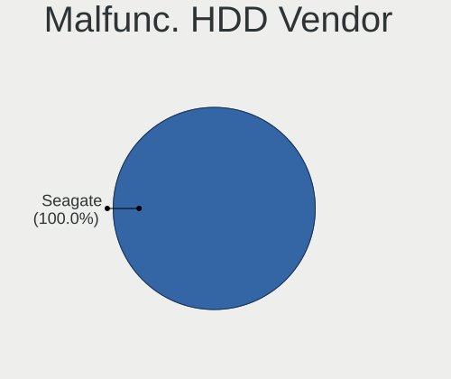

| Vendor  | Desktops | Drives | Percent |
|---------|----------|--------|---------|
| WDC     | 2        | 2      | 50%     |
| Seagate | 2        | 2      | 50%     |

Malfunc. Drive Kind
-------------------

Kinds of faulty drives

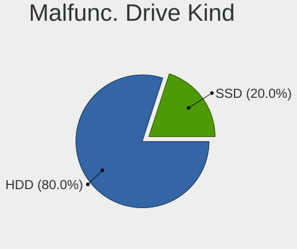

| Kind | Desktops | Drives | Percent |
|------|----------|--------|---------|
| HDD  | 4        | 4      | 80%     |
| SSD  | 1        | 1      | 20%     |

Failed Drives
-------------

Failed drive models

Zero info for selected period =(

Failed Drive Vendor
-------------------

Failed drive vendors

Zero info for selected period =(

Drive Status
------------

Number of failed and malfunc. drives

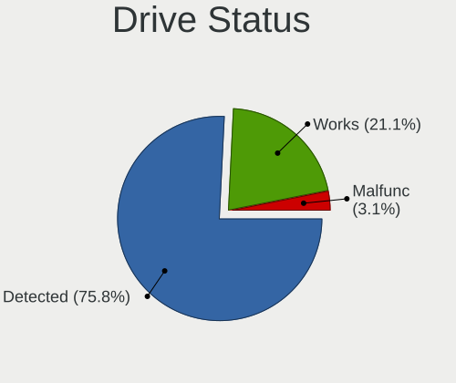

| Status   | Desktops | Drives | Percent |
|----------|----------|--------|---------|
| Detected | 97       | 286    | 75.78%  |
| Works    | 27       | 54     | 21.09%  |
| Malfunc  | 4        | 5      | 3.13%   |

Storage controller
------------------

Storage Vendor
--------------

Storage controller vendors

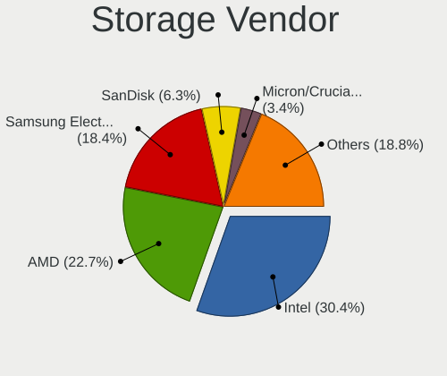

| Vendor                       | Desktops | Percent |
|------------------------------|----------|---------|
| Intel                        | 63       | 30.43%  |
| AMD                          | 47       | 22.71%  |
| Samsung Electronics          | 38       | 18.36%  |
| SanDisk                      | 13       | 6.28%   |
| Micron/Crucial Technology    | 7        | 3.38%   |
| ASMedia Technology           | 7        | 3.38%   |
| SK hynix                     | 5        | 2.42%   |
| Micron Technology            | 5        | 2.42%   |
| Phison Electronics           | 4        | 1.93%   |
| Nvidia                       | 3        | 1.45%   |
| Kingston Technology Company  | 3        | 1.45%   |
| Silicon Motion               | 2        | 0.97%   |
| Shenzhen Longsys Electronics | 2        | 0.97%   |
| INNOGRIT                     | 2        | 0.97%   |
| Transcend                    | 1        | 0.48%   |
| MAXIO Technology (Hangzhou)  | 1        | 0.48%   |
| Marvell Technology Group     | 1        | 0.48%   |
| Lite-On Technology           | 1        | 0.48%   |
| ADATA Technology             | 1        | 0.48%   |
| Adaptec                      | 1        | 0.48%   |

Storage Model
-------------

Storage controller models

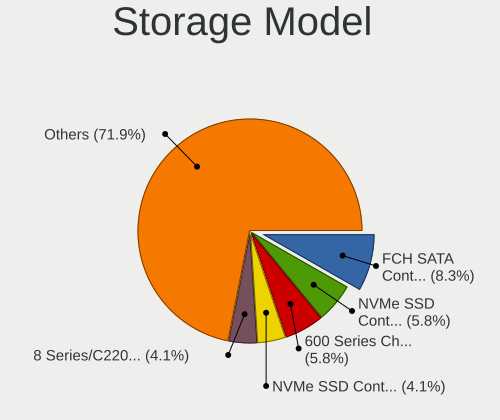

| Model                                                                          | Desktops | Percent |
|--------------------------------------------------------------------------------|----------|---------|
| AMD FCH SATA Controller [AHCI mode]                                            | 20       | 8.26%   |
| Samsung NVMe SSD Controller 980 (DRAM-less)                                    | 14       | 5.79%   |
| AMD 600 Series Chipset SATA Controller                                         | 14       | 5.79%   |
| Samsung NVMe SSD Controller S4LV008[Pascal]                                    | 10       | 4.13%   |
| Intel 8 Series/C220 Series Chipset Family 6-port SATA Controller 1 [AHCI mode] | 10       | 4.13%   |
| Samsung NVMe SSD Controller PM9A1/PM9A3/980PRO                                 | 9        | 3.72%   |
| AMD 500 Series Chipset SATA Controller                                         | 9        | 3.72%   |
| Intel 500 Series Chipset Family SATA AHCI Controller                           | 8        | 3.31%   |
| AMD 400 Series Chipset SATA Controller                                         | 8        | 3.31%   |
| ASMedia ASM1061/ASM1062 Serial ATA Controller                                  | 7        | 2.89%   |
| Samsung NVMe SSD Controller SM981/PM981/PM983                                  | 6        | 2.48%   |
| Intel Raptor Lake SATA AHCI Controller                                         | 6        | 2.48%   |
| SK hynix Gold P31/BC711/PC711 NVMe Solid State Drive                           | 4        | 1.65%   |
| SanDisk WD SN560/SN740/SN770/SN5000 NVMe SSD                                   | 4        | 1.65%   |
| SanDisk Extreme Pro / WD Black SN750 / PC SN730 / Red SN700 NVMe SSD           | 4        | 1.65%   |
| Samsung NVMe SSD Controller PM9C1a (DRAM-less)                                 | 4        | 1.65%   |
| Micron/Crucial P2 [Nick P2] / P3 / P3 Plus NVMe PCIe SSD (DRAM-less)           | 4        | 1.65%   |
| Intel SATA Controller [RAID mode]                                              | 4        | 1.65%   |
| Intel Q170/Q150/B150/H170/H110/Z170/CM236 Chipset SATA Controller [AHCI Mode]  | 4        | 1.65%   |
| Intel Comet Lake SATA AHCI Controller                                          | 4        | 1.65%   |
| Intel Alder Lake-S PCH SATA Controller [AHCI Mode]                             | 4        | 1.65%   |
| Sandisk WD Black SN850X NVMe SSD                                               | 3        | 1.24%   |
| Phison E16 PCIe4 NVMe Controller                                               | 3        | 1.24%   |
| Micron 2550 NVMe SSD (DRAM-less)                                               | 3        | 1.24%   |
| Intel 6 Series/C200 Series Chipset Family 6 port Desktop SATA AHCI Controller  | 3        | 1.24%   |
| Intel 200 Series PCH SATA controller [AHCI mode]                               | 3        | 1.24%   |
| Silicon Motion SM2262/SM2262EN SSD Controller                                  | 2        | 0.83%   |
| Shenzhen Longsys Lexar NM790 / Patriot Viper VP4300 Lite NVMe SSD (DRAM-less)  | 2        | 0.83%   |
| SanDisk WD PC SN810 / Black SN850 NVMe SSD                                     | 2        | 0.83%   |
| Samsung NVMe SSD Controller SM961/PM961/SM963                                  | 2        | 0.83%   |
| Samsung NVMe SSD 9100 PRO [PM9E1]                                              | 2        | 0.83%   |
| Nvidia MCP61 SATA Controller                                                   | 2        | 0.83%   |
| Micron/Crucial P5 Plus NVMe PCIe SSD                                           | 2        | 0.83%   |
| Intel Cannon Lake PCH SATA AHCI Controller                                     | 2        | 0.83%   |
| Intel Alder Lake-N SATA AHCI Controller                                        | 2        | 0.83%   |
| Intel 9 Series Chipset Family SATA Controller [AHCI Mode]                      | 2        | 0.83%   |
| Intel 7 Series/C210 Series Chipset Family 6-port SATA Controller [AHCI mode]   | 2        | 0.83%   |
| AMD SB7x0/SB8x0/SB9x0 SATA Controller [IDE mode]                               | 2        | 0.83%   |
| AMD SB7x0/SB8x0/SB9x0 IDE Controller                                           | 2        | 0.83%   |
| AMD A320 Chipset SATA Controller [AHCI mode]                                   | 2        | 0.83%   |

Storage Kind
------------

Kind of storage controller (IDE, SATA, NVMe, SAS, ...)

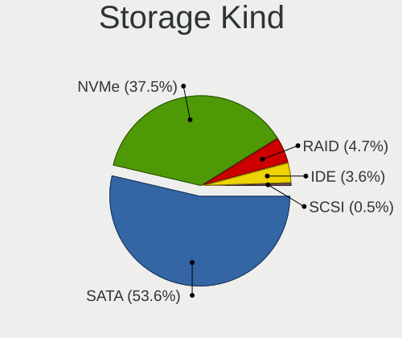

| Kind | Desktops | Percent |
|------|----------|---------|
| SATA | 103      | 53.65%  |
| NVMe | 72       | 37.5%   |
| RAID | 9        | 4.69%   |
| IDE  | 7        | 3.65%   |
| SCSI | 1        | 0.52%   |

Processor
---------

CPU Vendor
----------

Processor vendors

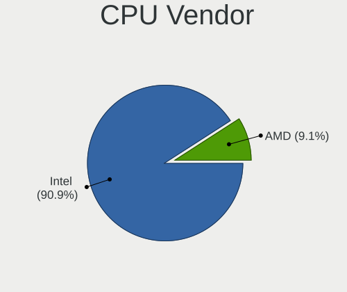

| Vendor | Desktops | Percent |
|--------|----------|---------|
| Intel  | 63       | 53.85%  |
| AMD    | 54       | 46.15%  |

CPU Model
---------

Processor models

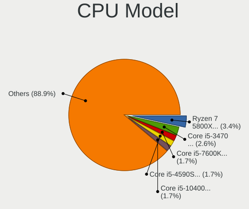

| Model                                      | Desktops | Percent |
|--------------------------------------------|----------|---------|
| AMD Ryzen 7 5800X 8-Core Processor         | 4        | 3.42%   |
| Intel Core i5-3470 CPU @ 3.20GHz           | 3        | 2.56%   |
| Intel Core i5-7600K CPU @ 3.80GHz          | 2        | 1.71%   |
| Intel Core i5-4590S CPU @ 3.00GHz          | 2        | 1.71%   |
| Intel Core i5-10400F CPU @ 2.90GHz         | 2        | 1.71%   |
| Intel 11th Gen Core i7-11700K @ 3.60GHz    | 2        | 1.71%   |
| AMD Ryzen 9 7950X3D 16-Core Processor      | 2        | 1.71%   |
| AMD Ryzen 9 7940HS w/ Radeon 780M Graphics | 2        | 1.71%   |
| AMD Ryzen 7 7800X3D 8-Core Processor       | 2        | 1.71%   |
| AMD Ryzen 7 7700 8-Core Processor          | 2        | 1.71%   |
| AMD Ryzen 5 5600G with Radeon Graphics     | 2        | 1.71%   |
| AMD Ryzen 5 3600X 6-Core Processor         | 2        | 1.71%   |
| AMD Ryzen 5 3600 6-Core Processor          | 2        | 1.71%   |
| AMD Ryzen 5 1600 Six-Core Processor        | 2        | 1.71%   |
| Intel Xeon CPU W3550 @ 3.07GHz             | 1        | 0.85%   |
| Intel Xeon CPU E5-2696 v3 @ 2.30GHz        | 1        | 0.85%   |
| Intel Xeon CPU E3-1270 v3 @ 3.50GHz        | 1        | 0.85%   |
| Intel Xeon CPU E3-1241 v3 @ 3.50GHz        | 1        | 0.85%   |
| Intel Pentium CPU G4520 @ 3.60GHz          | 1        | 0.85%   |
| Intel Pentium CPU G3420 @ 3.20GHz          | 1        | 0.85%   |
| Intel Pentium CPU G3260 @ 3.30GHz          | 1        | 0.85%   |
| Intel Pentium CPU G3220 @ 3.00GHz          | 1        | 0.85%   |
| Intel N100                                 | 1        | 0.85%   |
| Intel Core i9-10850K CPU @ 3.60GHz         | 1        | 0.85%   |
| Intel Core i7-9700K CPU @ 3.60GHz          | 1        | 0.85%   |
| Intel Core i7-8700K CPU @ 3.70GHz          | 1        | 0.85%   |
| Intel Core i7-8700 CPU @ 3.20GHz           | 1        | 0.85%   |
| Intel Core i7-8550U CPU @ 1.80GHz          | 1        | 0.85%   |
| Intel Core i7-4790K CPU @ 4.00GHz          | 1        | 0.85%   |
| Intel Core i7-4790 CPU @ 3.60GHz           | 1        | 0.85%   |
| Intel Core i7-4770 CPU @ 3.40GHz           | 1        | 0.85%   |
| Intel Core i7-3770 CPU @ 3.40GHz           | 1        | 0.85%   |
| Intel Core i7-14700                        | 1        | 0.85%   |
| Intel Core i7-10700K CPU @ 3.80GHz         | 1        | 0.85%   |
| Intel Core i7-10700 CPU @ 2.90GHz          | 1        | 0.85%   |
| Intel Core i5-8500T CPU @ 2.10GHz          | 1        | 0.85%   |
| Intel Core i5-7600T CPU @ 2.80GHz          | 1        | 0.85%   |
| Intel Core i5-6400 CPU @ 2.70GHz           | 1        | 0.85%   |
| Intel Core i5-4590 CPU @ 3.30GHz           | 1        | 0.85%   |
| Intel Core i5-4460S CPU @ 2.90GHz          | 1        | 0.85%   |

CPU Model Family
----------------

Processor model prefix

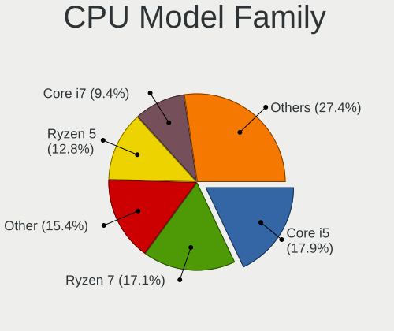

| Model            | Desktops | Percent |
|------------------|----------|---------|
| Intel Core i5    | 21       | 17.95%  |
| AMD Ryzen 7      | 20       | 17.09%  |
| Other            | 18       | 15.38%  |
| AMD Ryzen 5      | 15       | 12.82%  |
| Intel Core i7    | 11       | 9.4%    |
| AMD Ryzen 9      | 7        | 5.98%   |
| Intel Xeon       | 4        | 3.42%   |
| Intel Pentium    | 4        | 3.42%   |
| Intel Core i3    | 4        | 3.42%   |
| AMD Ryzen 3      | 3        | 2.56%   |
| AMD FX           | 2        | 1.71%   |
| AMD A6           | 2        | 1.71%   |
| Intel Core i9    | 1        | 0.85%   |
| Intel Celeron    | 1        | 0.85%   |
| AMD Ryzen 5 PRO  | 1        | 0.85%   |
| AMD Phenom II X2 | 1        | 0.85%   |
| AMD Athlon II X4 | 1        | 0.85%   |
| AMD Athlon 64 X2 | 1        | 0.85%   |

CPU Cores
---------

Number of processor cores

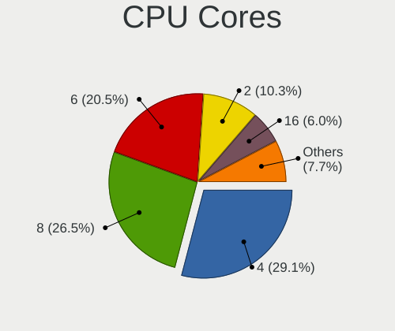

| Number | Desktops | Percent |
|--------|----------|---------|
| 4      | 34       | 29.06%  |
| 8      | 31       | 26.5%   |
| 6      | 24       | 20.51%  |
| 2      | 12       | 10.26%  |
| 16     | 7        | 5.98%   |
| 12     | 5        | 4.27%   |
| 20     | 1        | 0.85%   |
| 18     | 1        | 0.85%   |
| 10     | 1        | 0.85%   |
| 1      | 1        | 0.85%   |

CPU Sockets
-----------

Number of sockets

| Number | Desktops | Percent |
|--------|----------|---------|
| 1      | 117      | 100%    |

CPU Threads
-----------

Threads per core (Hyper-Threading)

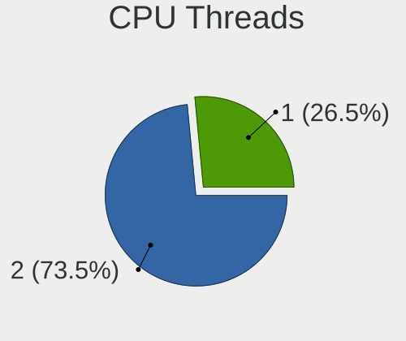

| Number | Desktops | Percent |
|--------|----------|---------|
| 2      | 86       | 73.5%   |
| 1      | 31       | 26.5%   |

CPU Op-Modes
------------

CPU Operation Modes (32-bit, 64-bit)

| Op mode        | Desktops | Percent |
|----------------|----------|---------|
| 32-bit, 64-bit | 117      | 100%    |

CPU Microcode
-------------

Microcode number

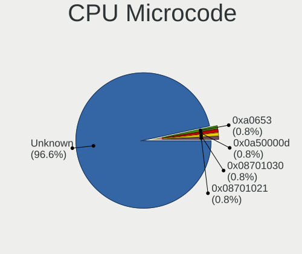

| Number     | Desktops | Percent |
|------------|----------|---------|
| Unknown    | 114      | 96.61%  |
| 0xa0653    | 1        | 0.85%   |
| 0x0a50000d | 1        | 0.85%   |
| 0x08701030 | 1        | 0.85%   |
| 0x08701021 | 1        | 0.85%   |

CPU Microarch
-------------

Microarchitecture

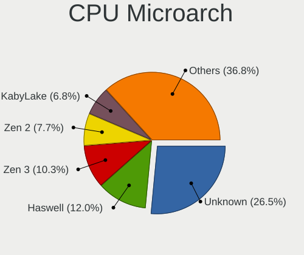

| Name             | Desktops | Percent |
|------------------|----------|---------|
| Unknown          | 31       | 26.5%   |
| Haswell          | 14       | 11.97%  |
| Zen 3            | 12       | 10.26%  |
| Zen 2            | 9        | 7.69%   |
| KabyLake         | 8        | 6.84%   |
| CometLake        | 8        | 6.84%   |
| IvyBridge        | 6        | 5.13%   |
| Alderlake Hybrid | 5        | 4.27%   |
| Zen              | 4        | 3.42%   |
| Skylake          | 4        | 3.42%   |
| Zen+             | 3        | 2.56%   |
| Piledriver       | 2        | 1.71%   |
| K10              | 2        | 1.71%   |
| Bulldozer        | 2        | 1.71%   |
| Westmere         | 1        | 0.85%   |
| SandyBridge      | 1        | 0.85%   |
| Nehalem          | 1        | 0.85%   |
| K8 Hammer        | 1        | 0.85%   |
| Icelake          | 1        | 0.85%   |
| Gracemont        | 1        | 0.85%   |
| Goldmont plus    | 1        | 0.85%   |

Graphics
--------

GPU Vendor
----------

Vendors of graphics cards

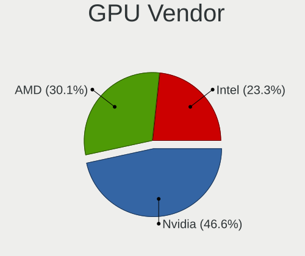

| Vendor | Desktops | Percent |
|--------|----------|---------|
| Nvidia | 62       | 46.62%  |
| AMD    | 40       | 30.08%  |
| Intel  | 31       | 23.31%  |

GPU Model
---------

Graphics card models

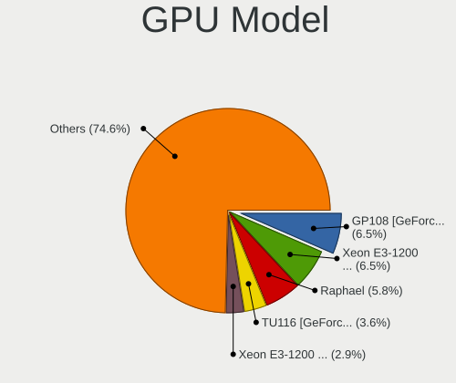

| Model                                                                       | Desktops | Percent |
|-----------------------------------------------------------------------------|----------|---------|
| Nvidia GP108 [GeForce GT 1030]                                              | 9        | 6.52%   |
| Intel Xeon E3-1200 v3/4th Gen Core Processor Integrated Graphics Controller | 9        | 6.52%   |
| AMD Raphael                                                                 | 8        | 5.8%    |
| Nvidia TU116 [GeForce GTX 1660 SUPER]                                       | 5        | 3.62%   |
| Intel Xeon E3-1200 v2/3rd Gen Core processor Graphics Controller            | 4        | 2.9%    |
| Intel Alder Lake-S GT1 [UHD Graphics 770]                                   | 4        | 2.9%    |
| AMD Cezanne [Radeon Vega Series / Radeon Vega Mobile Series]                | 4        | 2.9%    |
| Nvidia GP106 [GeForce GTX 1060 3GB]                                         | 3        | 2.17%   |
| Nvidia GA104 [GeForce RTX 3070 Lite Hash Rate]                              | 3        | 2.17%   |
| AMD Phoenix1                                                                | 3        | 2.17%   |
| Nvidia TU116 [GeForce GTX 1650]                                             | 2        | 1.45%   |
| Nvidia TU106 [GeForce RTX 2070]                                             | 2        | 1.45%   |
| Nvidia GP107 [GeForce GTX 1050 Ti]                                          | 2        | 1.45%   |
| Nvidia GP106 [GeForce GTX 1060 6GB]                                         | 2        | 1.45%   |
| Nvidia GP104 [GeForce GTX 1070]                                             | 2        | 1.45%   |
| Nvidia GP102 [GeForce GTX 1080 Ti]                                          | 2        | 1.45%   |
| Nvidia GK208B [GeForce GT 730]                                              | 2        | 1.45%   |
| Nvidia GK208B [GeForce GT 710]                                              | 2        | 1.45%   |
| Nvidia GA106 [GeForce RTX 3060 Lite Hash Rate]                              | 2        | 1.45%   |
| Nvidia GA102 [GeForce RTX 3080]                                             | 2        | 1.45%   |
| Nvidia C61 [GeForce 7025 / nForce 630a]                                     | 2        | 1.45%   |
| Nvidia AD102 [GeForce RTX 4090]                                             | 2        | 1.45%   |
| Intel Skylake-S GT2 [HD Graphics 530]                                       | 2        | 1.45%   |
| Intel RocketLake-S GT1 [UHD Graphics 750]                                   | 2        | 1.45%   |
| Intel Alder Lake-N [UHD Graphics]                                           | 2        | 1.45%   |
| AMD Raven Ridge [Radeon Vega Series / Radeon Vega Mobile Series]            | 2        | 1.45%   |
| AMD Picasso/Raven 2 [Radeon Vega Series / Radeon Vega Mobile Series]        | 2        | 1.45%   |
| AMD Navi 31 [Radeon RX 7900 XT/7900 XTX/7900 GRE/7900M]                     | 2        | 1.45%   |
| AMD Granite Ridge [Radeon Graphics]                                         | 2        | 1.45%   |
| Nvidia TU106 [GeForce RTX 2060 Rev. A]                                      | 1        | 0.72%   |
| Nvidia TU104 [GeForce RTX 2080 Rev. A]                                      | 1        | 0.72%   |
| Nvidia TU104 [GeForce RTX 2070 SUPER]                                       | 1        | 0.72%   |
| Nvidia TU102 [GeForce RTX 2080 Ti Rev. A]                                   | 1        | 0.72%   |
| Nvidia GT218 [GeForce 210]                                                  | 1        | 0.72%   |
| Nvidia GP104 [GeForce GTX 1080]                                             | 1        | 0.72%   |
| Nvidia GK208 [GeForce GT 720]                                               | 1        | 0.72%   |
| Nvidia GK106 [GeForce GTX 660]                                              | 1        | 0.72%   |
| Nvidia GF119 [GeForce GT 620 OEM]                                           | 1        | 0.72%   |
| Nvidia GB203 [GeForce RTX 5080]                                             | 1        | 0.72%   |
| Nvidia GB203 [GeForce RTX 5070 Ti]                                          | 1        | 0.72%   |

GPU Combo
---------

Combinations of graphics cards

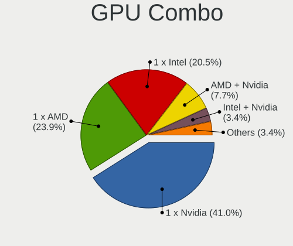

| Name           | Desktops | Percent |
|----------------|----------|---------|
| 1 x Nvidia     | 48       | 41.03%  |
| 1 x AMD        | 28       | 23.93%  |
| 1 x Intel      | 24       | 20.51%  |
| AMD + Nvidia   | 9        | 7.69%   |
| Intel + Nvidia | 4        | 3.42%   |
| 2 x AMD        | 2        | 1.71%   |
| 2 x Nvidia     | 1        | 0.85%   |
| Intel + AMD    | 1        | 0.85%   |

GPU Driver
----------

Free vs proprietary

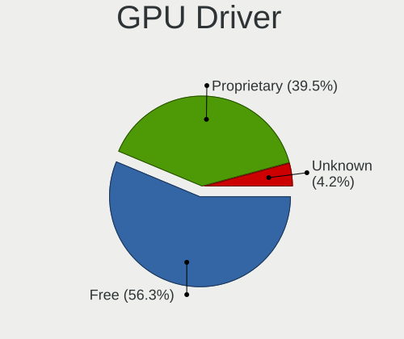

| Driver      | Desktops | Percent |
|-------------|----------|---------|
| Free        | 67       | 56.3%   |
| Proprietary | 47       | 39.5%   |
| Unknown     | 5        | 4.2%    |

GPU Memory
----------

Total video memory

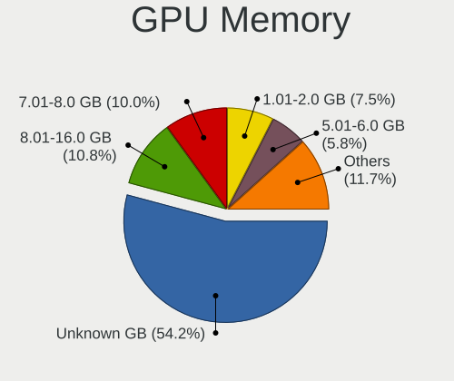

| Size in GB | Desktops | Percent |
|------------|----------|---------|
| Unknown    | 65       | 54.17%  |
| 8.01-16.0  | 13       | 10.83%  |
| 7.01-8.0   | 12       | 10%     |
| 1.01-2.0   | 9        | 7.5%    |
| 5.01-6.0   | 7        | 5.83%   |
| 16.01-24.0 | 4        | 3.33%   |
| 0.01-0.5   | 4        | 3.33%   |
| 2.01-3.0   | 3        | 2.5%    |
| 3.01-4.0   | 2        | 1.67%   |
| 0.51-1.0   | 1        | 0.83%   |

Monitor
-------

Monitor Vendor
--------------

Monitor vendors

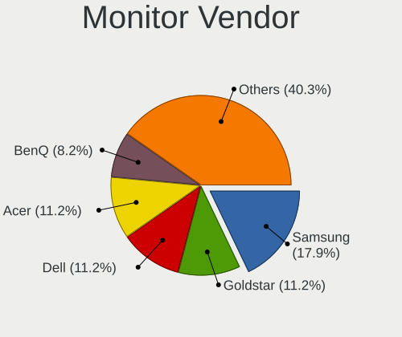

| Vendor               | Desktops | Percent |
|----------------------|----------|---------|
| Samsung Electronics  | 24       | 17.91%  |
| Goldstar             | 15       | 11.19%  |
| Dell                 | 15       | 11.19%  |
| Acer                 | 15       | 11.19%  |
| BenQ                 | 11       | 8.21%   |
| ASUSTek Computer     | 8        | 5.97%   |
| Hewlett-Packard      | 7        | 5.22%   |
| Ancor Communications | 5        | 3.73%   |
| Lenovo               | 4        | 2.99%   |
| ViewSonic            | 3        | 2.24%   |
| Philips              | 3        | 2.24%   |
| MSI                  | 3        | 2.24%   |
| Eizo                 | 3        | 2.24%   |
| AOC                  | 3        | 2.24%   |
| NEC Computers        | 2        | 1.49%   |
| Medion               | 2        | 1.49%   |
| Iiyama               | 2        | 1.49%   |
| Vizio                | 1        | 0.75%   |
| Onkyo                | 1        | 0.75%   |
| IOD                  | 1        | 0.75%   |
| HUAWEI               | 1        | 0.75%   |
| HKC                  | 1        | 0.75%   |
| HannStar             | 1        | 0.75%   |
| Gigabyte Technology  | 1        | 0.75%   |
| CHD                  | 1        | 0.75%   |
| BANGHO               | 1        | 0.75%   |

Monitor Model
-------------

Monitor models

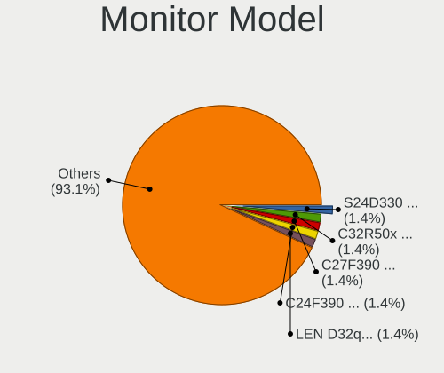

| Model                                                                    | Desktops | Percent |
|--------------------------------------------------------------------------|----------|---------|
| Samsung Electronics S24D330 SAM0D92 1920x1080 531x299mm 24.0-inch        | 2        | 1.39%   |
| Samsung Electronics C32R50x SAM7000 1920x1080 698x393mm 31.5-inch        | 2        | 1.39%   |
| Samsung Electronics C27F390 SAM0D32 1920x1080 598x336mm 27.0-inch        | 2        | 1.39%   |
| Samsung Electronics C24F390 SAM0D2C 1920x1080 521x293mm 23.5-inch        | 2        | 1.39%   |
| Lenovo LEN D32q-20B LEN65F7 2560x1440 698x393mm 31.5-inch                | 2        | 1.39%   |
| Goldstar 27GL850 GSM5B7F 2560x1440 597x336mm 27.0-inch                   | 2        | 1.39%   |
| Dell SE2419HR DELF113 1920x1080 527x296mm 23.8-inch                      | 2        | 1.39%   |
| BenQ GL2460 BNQ78CE 1920x1080 531x299mm 24.0-inch                        | 2        | 1.39%   |
| Acer QG241Y ACR079C 1920x1080 527x296mm 23.8-inch                        | 2        | 1.39%   |
| Acer EK240Y ACR0758 1920x1080 531x299mm 24.0-inch                        | 2        | 1.39%   |
| Vizio V505-J09 VIZ1039 3840x2160 1096x616mm 49.5-inch                    | 1        | 0.69%   |
| ViewSonic VX3211-2K VSCF634 2560x1440 698x392mm 31.5-inch                | 1        | 0.69%   |
| ViewSonic VX2757 VSCF931 1920x1080 598x336mm 27.0-inch                   | 1        | 0.69%   |
| ViewSonic VP2780 SERIES VSC9C30 3840x2160 597x336mm 27.0-inch            | 1        | 0.69%   |
| Samsung Electronics SyncMaster SAM0587 1920x1200 518x324mm 24.1-inch     | 1        | 0.69%   |
| Samsung Electronics SyncMaster SAM0486 1920x1080                         | 1        | 0.69%   |
| Samsung Electronics SyncMaster SAM02B6 1920x1200 518x324mm 24.1-inch     | 1        | 0.69%   |
| Samsung Electronics SyncMaster SAM0274 1440x900 410x257mm 19.1-inch      | 1        | 0.69%   |
| Samsung Electronics SMB1930HD SAM0708 1360x768 410x230mm 18.5-inch       | 1        | 0.69%   |
| Samsung Electronics S34CG50 SAM730B 3440x1440 798x334mm 34.1-inch        | 1        | 0.69%   |
| Samsung Electronics S24R35A SAM729F 1920x1080 521x293mm 23.5-inch        | 1        | 0.69%   |
| Samsung Electronics S22F350 SAM0D1A 1920x1080 477x268mm 21.5-inch        | 1        | 0.69%   |
| Samsung Electronics Odyssey G95SC SAME019 3840x1080 1193x336mm 48.8-inch | 1        | 0.69%   |
| Samsung Electronics Odyssey G40B SAM7275 1920x1080 544x303mm 24.5-inch   | 1        | 0.69%   |
| Samsung Electronics LU28R55 SAM1017 3840x2160 632x360mm 28.6-inch        | 1        | 0.69%   |
| Samsung Electronics LS32AG55x SAM71E3 2560x1440 698x393mm 31.5-inch      | 1        | 0.69%   |
| Samsung Electronics LS28AG700N SAM7176 3840x2160 632x360mm 28.6-inch     | 1        | 0.69%   |
| Samsung Electronics LS27C36x SAM7315 1920x1080 598x336mm 27.0-inch       | 1        | 0.69%   |
| Samsung Electronics LF24T35 SAM707D 1920x1080 528x297mm 23.9-inch        | 1        | 0.69%   |
| Samsung Electronics LCD Monitor SAM7016 3840x2160 1872x1053mm 84.6-inch  | 1        | 0.69%   |
| Samsung Electronics LCD Monitor SAM0B30 1920x1080 885x498mm 40.0-inch    | 1        | 0.69%   |
| Samsung Electronics LCD Monitor SAM07C0 1920x1080 890x500mm 40.2-inch    | 1        | 0.69%   |
| Samsung Electronics LC27T55 SAM701E 1920x1080 609x349mm 27.6-inch        | 1        | 0.69%   |
| Philips PHL 246V5 PHLC0C5 1920x1080 531x299mm 24.0-inch                  | 1        | 0.69%   |
| Philips 228CLH PHLC08A 1920x1080 477x268mm 21.5-inch                     | 1        | 0.69%   |
| Philips 170S4 PHL0818 1280x1024 340x270mm 17.1-inch                      | 1        | 0.69%   |
| Onkyo TX-NR809 ONK0B82 1920x540                                          | 1        | 0.69%   |
| NEC Computers LCD2470WNX NEC66E5 1920x1200 518x324mm 24.1-inch           | 1        | 0.69%   |
| NEC Computers EA305WMi NEC2BAC 2560x1600 641x401mm 29.8-inch             | 1        | 0.69%   |
| MSI MAG323UPF MSI3DC7 3840x2160 708x399mm 32.0-inch                      | 1        | 0.69%   |

Monitor Resolution
------------------

Monitor screen resolution

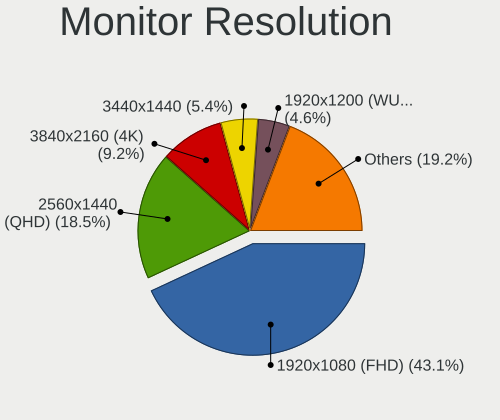

| Resolution         | Desktops | Percent |
|--------------------|----------|---------|
| 1920x1080 (FHD)    | 56       | 43.08%  |
| 2560x1440 (QHD)    | 24       | 18.46%  |
| 3840x2160 (4K)     | 12       | 9.23%   |
| 3440x1440          | 7        | 5.38%   |
| 1920x1200 (WUXGA)  | 6        | 4.62%   |
| 1280x1024 (SXGA)   | 5        | 3.85%   |
| 1440x900 (WXGA+)   | 4        | 3.08%   |
| 3840x1080          | 3        | 2.31%   |
| 2560x1080          | 3        | 2.31%   |
| 1680x1050 (WSXGA+) | 2        | 1.54%   |
| 1600x900 (HD+)     | 2        | 1.54%   |
| 3840x1600          | 1        | 0.77%   |
| 2560x1600          | 1        | 0.77%   |
| 1920x540           | 1        | 0.77%   |
| 1600x1200          | 1        | 0.77%   |
| 1360x768           | 1        | 0.77%   |
| Unknown            | 1        | 0.77%   |

Monitor Diagonal
----------------

Diagonal size in inches

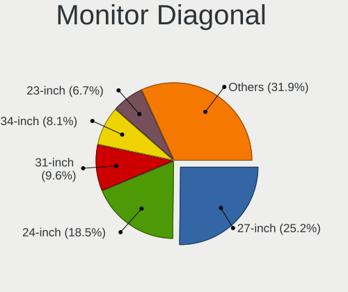

| Inches  | Desktops | Percent |
|---------|----------|---------|
| 27      | 34       | 25.19%  |
| 24      | 25       | 18.52%  |
| 31      | 13       | 9.63%   |
| 34      | 11       | 8.15%   |
| 23      | 9        | 6.67%   |
| 21      | 8        | 5.93%   |
| 19      | 8        | 5.93%   |
| 20      | 3        | 2.22%   |
| Unknown | 3        | 2.22%   |
| 40      | 2        | 1.48%   |
| 28      | 2        | 1.48%   |
| 25      | 2        | 1.48%   |
| 22      | 2        | 1.48%   |
| 84      | 1        | 0.74%   |
| 74      | 1        | 0.74%   |
| 72      | 1        | 0.74%   |
| 63      | 1        | 0.74%   |
| 54      | 1        | 0.74%   |
| 49      | 1        | 0.74%   |
| 48      | 1        | 0.74%   |
| 46      | 1        | 0.74%   |
| 37      | 1        | 0.74%   |
| 32      | 1        | 0.74%   |
| 29      | 1        | 0.74%   |
| 18      | 1        | 0.74%   |
| 17      | 1        | 0.74%   |

Monitor Width
-------------

Physical width

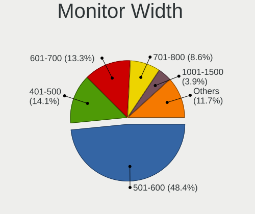

| Width in mm | Desktops | Percent |
|-------------|----------|---------|
| 501-600     | 62       | 48.44%  |
| 401-500     | 18       | 14.06%  |
| 601-700     | 17       | 13.28%  |
| 701-800     | 11       | 8.59%   |
| 1001-1500   | 5        | 3.91%   |
| 801-900     | 4        | 3.13%   |
| 351-400     | 4        | 3.13%   |
| 1501-2000   | 3        | 2.34%   |
| Unknown     | 3        | 2.34%   |
| 301-350     | 1        | 0.78%   |

Aspect Ratio
------------

Proportional relationship between the width and the height

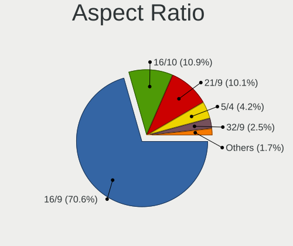

| Ratio   | Desktops | Percent |
|---------|----------|---------|
| 16/9    | 84       | 70.59%  |
| 16/10   | 13       | 10.92%  |
| 21/9    | 12       | 10.08%  |
| 5/4     | 5        | 4.2%    |
| 32/9    | 3        | 2.52%   |
| 4/3     | 1        | 0.84%   |
| Unknown | 1        | 0.84%   |

Monitor Area
------------

Area in inch²

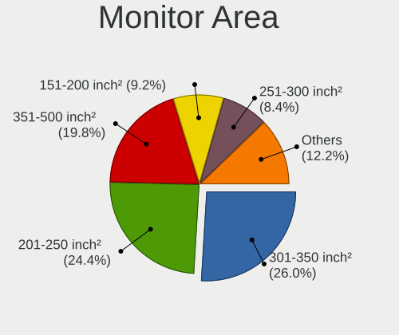

| Area in inch² | Desktops | Percent |
|----------------|----------|---------|
| 301-350        | 34       | 25.95%  |
| 201-250        | 32       | 24.43%  |
| 351-500        | 26       | 19.85%  |
| 151-200        | 12       | 9.16%   |
| 251-300        | 11       | 8.4%    |
| 501-1000       | 6        | 4.58%   |
| More than 1000 | 5        | 3.82%   |
| Unknown        | 3        | 2.29%   |
| 141-150        | 2        | 1.53%   |

Pixel Density
-------------

Pixels per inch

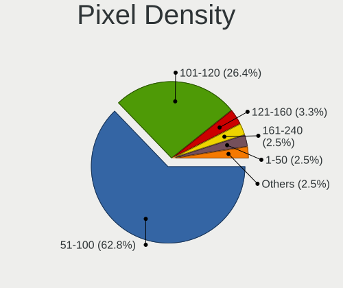

| Density | Desktops | Percent |
|---------|----------|---------|
| 51-100  | 76       | 62.81%  |
| 101-120 | 32       | 26.45%  |
| 121-160 | 4        | 3.31%   |
| 1-50    | 3        | 2.48%   |
| 161-240 | 3        | 2.48%   |
| Unknown | 3        | 2.48%   |

Multiple Monitors
-----------------

Total monitors connected

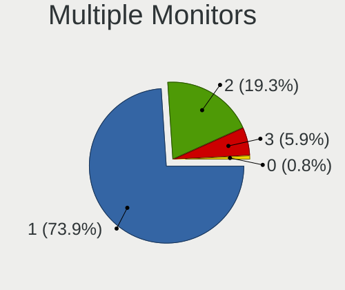

| Total | Desktops | Percent |
|-------|----------|---------|
| 1     | 88       | 73.95%  |
| 2     | 23       | 19.33%  |
| 3     | 7        | 5.88%   |
| 0     | 1        | 0.84%   |

Network
-------

Net Controller Vendor
---------------------

Controller vendors

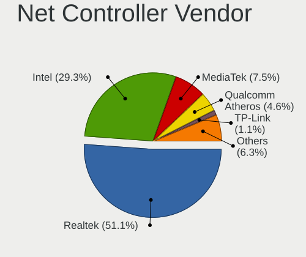

| Vendor                | Desktops | Percent |
|-----------------------|----------|---------|
| Realtek Semiconductor | 89       | 51.15%  |
| Intel                 | 51       | 29.31%  |
| MediaTek              | 13       | 7.47%   |
| Qualcomm Atheros      | 8        | 4.6%    |
| TP-Link               | 2        | 1.15%   |
| Ralink Technology     | 2        | 1.15%   |
| D-Link                | 2        | 1.15%   |
| Broadcom              | 2        | 1.15%   |
| Qualcomm Technologies | 1        | 0.57%   |
| Nvidia                | 1        | 0.57%   |
| Motorola PCS          | 1        | 0.57%   |
| Microsoft             | 1        | 0.57%   |
| ASUSTek Computer      | 1        | 0.57%   |

Net Controller Model
--------------------

Controller models

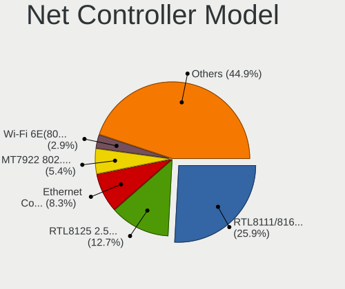

| Model                                                                  | Desktops | Percent |
|------------------------------------------------------------------------|----------|---------|
| Realtek RTL8111/8168/8211/8411 PCI Express Gigabit Ethernet Controller | 53       | 25.85%  |
| Realtek RTL8125 2.5GbE Controller                                      | 26       | 12.68%  |
| Intel Ethernet Controller I225-V                                       | 17       | 8.29%   |
| MediaTek MT7922 802.11ax PCI Express Wireless Network Adapter          | 11       | 5.37%   |
| Intel Wi-Fi 6E(802.11ax) AX210/AX1675* 2x2 [Typhoon Peak]              | 6        | 2.93%   |
| Intel Wi-Fi 6 AX200                                                    | 6        | 2.93%   |
| Realtek RTL8153 Gigabit Ethernet Adapter                               | 4        | 1.95%   |
| Intel Alder Lake-S PCH CNVi WiFi                                       | 4        | 1.95%   |
| Realtek RTL8852CE PCIe 802.11ax Wireless Network Controller            | 3        | 1.46%   |
| Qualcomm Atheros QCA9377 802.11ac Wireless Network Adapter             | 3        | 1.46%   |
| Intel I211 Gigabit Network Connection                                  | 3        | 1.46%   |
| Intel Ethernet Connection (2) I219-V                                   | 3        | 1.46%   |
| Intel Ethernet Connection (11) I219-V                                  | 3        | 1.46%   |
| Intel 700 Series Chipset CNVi WiFi                                     | 3        | 1.46%   |
| Realtek RTL8821CE 802.11ac PCIe Wireless Network Adapter               | 2        | 0.98%   |
| Realtek Killer E2600 GbE Controller                                    | 2        | 0.98%   |
| Realtek 802.11ac NIC                                                   | 2        | 0.98%   |
| Qualcomm Atheros QCA6174 802.11ac Wireless Network Adapter             | 2        | 0.98%   |
| Intel Wi-Fi 5(802.11ac) Wireless-AC 9x6x [Thunder Peak]                | 2        | 0.98%   |
| Intel Ethernet Connection I217-LM                                      | 2        | 0.98%   |
| Intel Cannon Lake PCH CNVi WiFi                                        | 2        | 0.98%   |
| Intel Alder Lake-N PCH CNVi WiFi                                       | 2        | 0.98%   |
| TP-Link TL-WN722N v2/v3 [Realtek RTL8188EUS]                           | 1        | 0.49%   |
| TP-Link 802.11ac WLAN Adapter                                          | 1        | 0.49%   |
| Realtek RTL88x2bu [AC1200 Techkey]                                     | 1        | 0.49%   |
| Realtek RTL8852BE PCIe 802.11ax Wireless Network Controller            | 1        | 0.49%   |
| Realtek RTL8192EU 802.11b/g/n WLAN Adapter                             | 1        | 0.49%   |
| Realtek RTL8188EUS 802.11n Wireless Network Adapter                    | 1        | 0.49%   |
| Realtek RTL8188CUS 802.11n WLAN Adapter                                | 1        | 0.49%   |
| Realtek RTL8126 5GbE Controller                                        | 1        | 0.49%   |
| Realtek RTL8111/8168/8411 PCI Express Gigabit Ethernet Controller      | 1        | 0.49%   |
| Realtek RTL810xE PCI Express Fast Ethernet controller                  | 1        | 0.49%   |
| Realtek Killer E3000 2.5GbE Controller                                 | 1        | 0.49%   |
| Ralink RT5370 Wireless Adapter                                         | 1        | 0.49%   |
| Ralink Airlink101 AWLL6070 802.11bgn Wireless Adapter [Ralink RT2770]  | 1        | 0.49%   |
| Qualcomm WCN785x Wi-Fi 7(802.11be) 320MHz 2x2 [FastConnect 7800]       | 1        | 0.49%   |
| Qualcomm Atheros AR9462 Wireless Network Adapter                       | 1        | 0.49%   |
| Qualcomm Atheros AR922X Wireless Network Adapter                       | 1        | 0.49%   |
| Qualcomm Atheros AR9227 Wireless Network Adapter                       | 1        | 0.49%   |
| Nvidia MCP61 Ethernet                                                  | 1        | 0.49%   |

Wireless Vendor
---------------

Wireless vendors

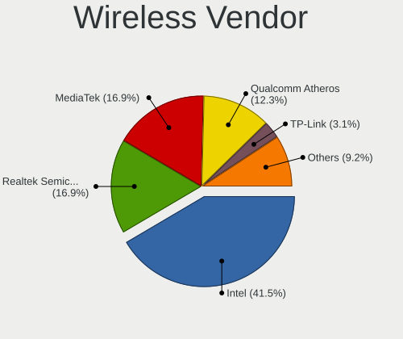

| Vendor                | Desktops | Percent |
|-----------------------|----------|---------|
| Intel                 | 27       | 41.54%  |
| Realtek Semiconductor | 11       | 16.92%  |
| MediaTek              | 11       | 16.92%  |
| Qualcomm Atheros      | 8        | 12.31%  |
| TP-Link               | 2        | 3.08%   |
| Ralink Technology     | 2        | 3.08%   |
| D-Link                | 2        | 3.08%   |
| Microsoft             | 1        | 1.54%   |
| ASUSTek Computer      | 1        | 1.54%   |

Wireless Model
--------------

Wireless models

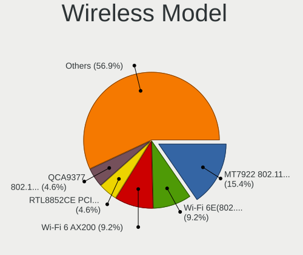

| Model                                                                           | Desktops | Percent |
|---------------------------------------------------------------------------------|----------|---------|
| MediaTek MT7922 802.11ax PCI Express Wireless Network Adapter                   | 10       | 15.38%  |
| Intel Wi-Fi 6E(802.11ax) AX210/AX1675* 2x2 [Typhoon Peak]                       | 6        | 9.23%   |
| Intel Wi-Fi 6 AX200                                                             | 6        | 9.23%   |
| Realtek RTL8852CE PCIe 802.11ax Wireless Network Controller                     | 3        | 4.62%   |
| Qualcomm Atheros QCA9377 802.11ac Wireless Network Adapter                      | 3        | 4.62%   |
| Intel 700 Series Chipset CNVi WiFi                                              | 3        | 4.62%   |
| Realtek RTL8821CE 802.11ac PCIe Wireless Network Adapter                        | 2        | 3.08%   |
| Realtek 802.11ac NIC                                                            | 2        | 3.08%   |
| Qualcomm Atheros QCA6174 802.11ac Wireless Network Adapter                      | 2        | 3.08%   |
| Intel Wi-Fi 5(802.11ac) Wireless-AC 9x6x [Thunder Peak]                         | 2        | 3.08%   |
| Intel Cannon Lake PCH CNVi WiFi                                                 | 2        | 3.08%   |
| Intel Alder Lake-N PCH CNVi WiFi                                                | 2        | 3.08%   |
| TP-Link TL-WN722N v2/v3 [Realtek RTL8188EUS]                                    | 1        | 1.54%   |
| TP-Link 802.11ac WLAN Adapter                                                   | 1        | 1.54%   |
| Realtek RTL88x2bu [AC1200 Techkey]                                              | 1        | 1.54%   |
| Realtek RTL8192EU 802.11b/g/n WLAN Adapter                                      | 1        | 1.54%   |
| Realtek RTL8188EUS 802.11n Wireless Network Adapter                             | 1        | 1.54%   |
| Realtek RTL8188CUS 802.11n WLAN Adapter                                         | 1        | 1.54%   |
| Ralink RT5370 Wireless Adapter                                                  | 1        | 1.54%   |
| Ralink Airlink101 AWLL6070 802.11bgn Wireless Adapter [Ralink RT2770]           | 1        | 1.54%   |
| Qualcomm Atheros AR9462 Wireless Network Adapter                                | 1        | 1.54%   |
| Qualcomm Atheros AR922X Wireless Network Adapter                                | 1        | 1.54%   |
| Qualcomm Atheros AR9227 Wireless Network Adapter                                | 1        | 1.54%   |
| Microsoft Xbox Wireless Adapter for Windows                                     | 1        | 1.54%   |
| MediaTek MT7927 802.11be 320MHz 2x2 PCIe Wireless Network Adapter [Filogic 380] | 1        | 1.54%   |
| Intel Wireless 8260                                                             | 1        | 1.54%   |
| Intel Wireless 7265                                                             | 1        | 1.54%   |
| Intel Wireless 3165                                                             | 1        | 1.54%   |
| Intel Wireless 3160                                                             | 1        | 1.54%   |
| Intel Comet Lake PCH CNVi WiFi                                                  | 1        | 1.54%   |
| Intel Alder Lake-S PCH CNVi WiFi                                                | 1        | 1.54%   |
| D-Link DWA-131 Wireless N Nano Adapter (Rev. E1) [Realtek RTL8192EU]            | 1        | 1.54%   |
| D-Link 11ac adapter                                                             | 1        | 1.54%   |
| ASUS 802.11ac NIC                                                               | 1        | 1.54%   |

Ethernet Vendor
---------------

Ethernet vendors

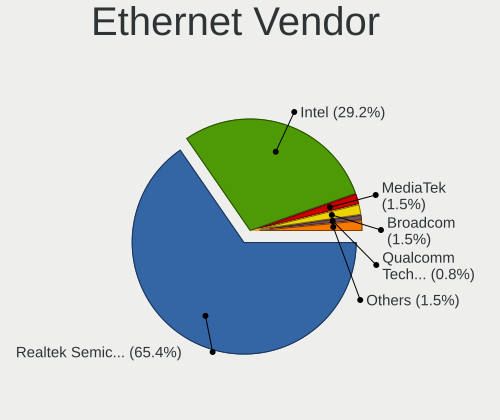

| Vendor                | Desktops | Percent |
|-----------------------|----------|---------|
| Realtek Semiconductor | 85       | 65.38%  |
| Intel                 | 38       | 29.23%  |
| MediaTek              | 2        | 1.54%   |
| Broadcom              | 2        | 1.54%   |
| Qualcomm Technologies | 1        | 0.77%   |
| Nvidia                | 1        | 0.77%   |
| Motorola PCS          | 1        | 0.77%   |

Ethernet Model
--------------

Ethernet models

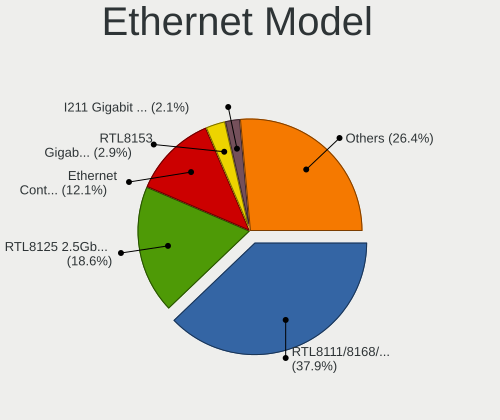

| Model                                                                           | Desktops | Percent |
|---------------------------------------------------------------------------------|----------|---------|
| Realtek RTL8111/8168/8211/8411 PCI Express Gigabit Ethernet Controller          | 53       | 37.86%  |
| Realtek RTL8125 2.5GbE Controller                                               | 26       | 18.57%  |
| Intel Ethernet Controller I225-V                                                | 17       | 12.14%  |
| Realtek RTL8153 Gigabit Ethernet Adapter                                        | 4        | 2.86%   |
| Intel I211 Gigabit Network Connection                                           | 3        | 2.14%   |
| Intel Ethernet Connection (2) I219-V                                            | 3        | 2.14%   |
| Intel Ethernet Connection (11) I219-V                                           | 3        | 2.14%   |
| Intel Alder Lake-S PCH CNVi WiFi                                                | 3        | 2.14%   |
| Realtek Killer E2600 GbE Controller                                             | 2        | 1.43%   |
| Intel Ethernet Connection I217-LM                                               | 2        | 1.43%   |
| Realtek RTL8852BE PCIe 802.11ax Wireless Network Controller                     | 1        | 0.71%   |
| Realtek RTL8126 5GbE Controller                                                 | 1        | 0.71%   |
| Realtek RTL8111/8168/8411 PCI Express Gigabit Ethernet Controller               | 1        | 0.71%   |
| Realtek RTL810xE PCI Express Fast Ethernet controller                           | 1        | 0.71%   |
| Realtek Killer E3000 2.5GbE Controller                                          | 1        | 0.71%   |
| Qualcomm WCN785x Wi-Fi 7(802.11be) 320MHz 2x2 [FastConnect 7800]                | 1        | 0.71%   |
| Nvidia MCP61 Ethernet                                                           | 1        | 0.71%   |
| Motorola PCS moto g100 pro                                                      | 1        | 0.71%   |
| MediaTek MT7925 802.11be 160MHz 2x2 PCIe Wireless Network Adapter [Filogic 360] | 1        | 0.71%   |
| MediaTek MT7922 802.11ax PCI Express Wireless Network Adapter                   | 1        | 0.71%   |
| Intel Ethernet Controller I226-V                                                | 1        | 0.71%   |
| Intel Ethernet Connection I217-V                                                | 1        | 0.71%   |
| Intel Ethernet Connection (7) I219-V                                            | 1        | 0.71%   |
| Intel Ethernet Connection (7) I219-LM                                           | 1        | 0.71%   |
| Intel Ethernet Connection (2) I218-LM                                           | 1        | 0.71%   |
| Intel Ethernet Connection (17) I219-V                                           | 1        | 0.71%   |
| Intel Ethernet Connection (10) I219-V                                           | 1        | 0.71%   |
| Intel 82599 10 Gigabit Network Connection                                       | 1        | 0.71%   |
| Intel 82580 Gigabit Network Connection                                          | 1        | 0.71%   |
| Intel 82579V Gigabit Network Connection                                         | 1        | 0.71%   |
| Intel 82579LM Gigabit Network Connection (Lewisville)                           | 1        | 0.71%   |
| Intel 82576 Gigabit Network Connection                                          | 1        | 0.71%   |
| Broadcom NetXtreme II BCM5706 Gigabit Ethernet                                  | 1        | 0.71%   |
| Broadcom NetXtreme BCM5764M Gigabit Ethernet PCIe                               | 1        | 0.71%   |

Net Controller Kind
-------------------

Ethernet, WiFi or modem

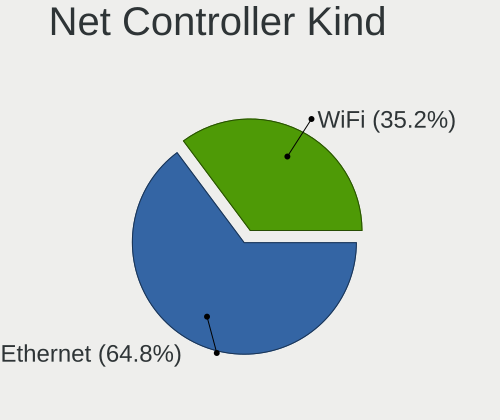

| Kind     | Desktops | Percent |
|----------|----------|---------|
| Ethernet | 116      | 64.8%   |
| WiFi     | 63       | 35.2%   |

Used Controller
---------------

Currently used network controller

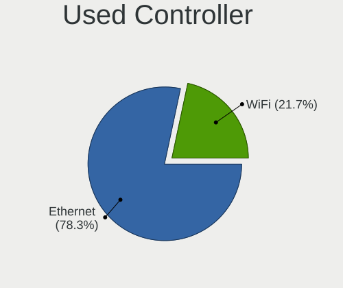

| Kind     | Desktops | Percent |
|----------|----------|---------|
| Ethernet | 94       | 78.33%  |
| WiFi     | 26       | 21.67%  |

NICs
----

Total network controllers on board

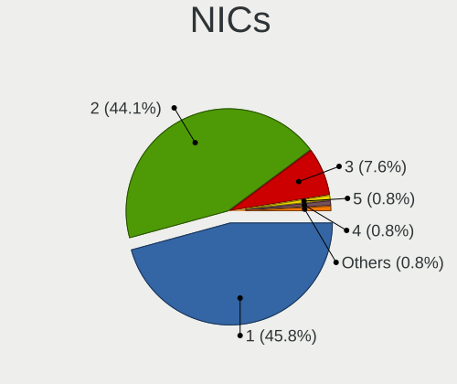

| Total | Desktops | Percent |
|-------|----------|---------|
| 1     | 54       | 45.76%  |
| 2     | 52       | 44.07%  |
| 3     | 9        | 7.63%   |
| 5     | 1        | 0.85%   |
| 4     | 1        | 0.85%   |
| 0     | 1        | 0.85%   |

IPv6
----

IPv6 vs IPv4

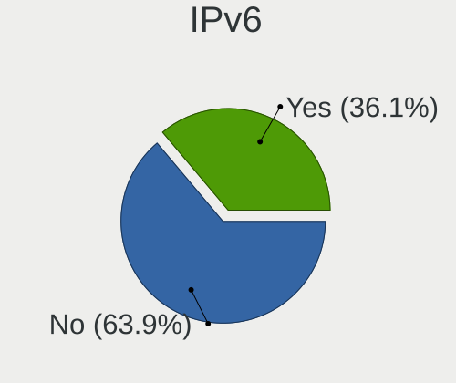

| Used | Desktops | Percent |
|------|----------|---------|
| No   | 76       | 63.87%  |
| Yes  | 43       | 36.13%  |

Bluetooth
---------

Bluetooth Vendor
----------------

Controller vendors

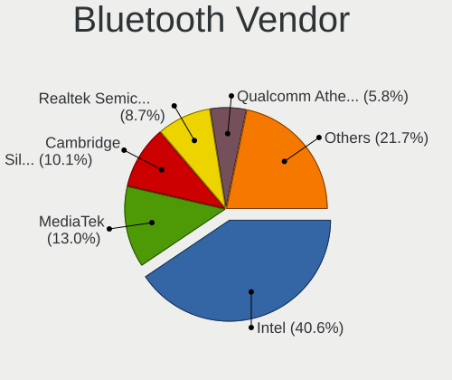

| Vendor                          | Desktops | Percent |
|---------------------------------|----------|---------|
| Intel                           | 28       | 40.58%  |
| MediaTek                        | 9        | 13.04%  |
| Cambridge Silicon Radio         | 7        | 10.14%  |
| Realtek Semiconductor           | 6        | 8.7%    |
| Qualcomm Atheros Communications | 4        | 5.8%    |
| TP-Link                         | 3        | 4.35%   |
| IMC Networks                    | 3        | 4.35%   |
| Foxconn / Hon Hai               | 3        | 4.35%   |
| ASUSTek Computer                | 2        | 2.9%    |
| Realtek                         | 1        | 1.45%   |
| Edimax Technology               | 1        | 1.45%   |
| Broadcom                        | 1        | 1.45%   |
| Unknown                         | 1        | 1.45%   |

Bluetooth Model
---------------

Controller models

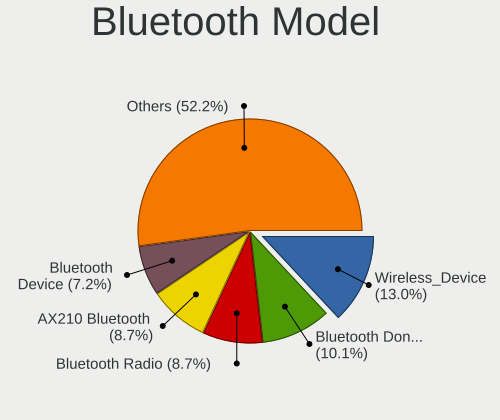

| Model                                               | Desktops | Percent |
|-----------------------------------------------------|----------|---------|
| MediaTek Wireless_Device                            | 9        | 13.04%  |
| Cambridge Silicon Radio Bluetooth Dongle (HCI mode) | 7        | 10.14%  |
| Realtek Bluetooth Radio                             | 6        | 8.7%    |
| Intel AX210 Bluetooth                               | 6        | 8.7%    |
| Intel Bluetooth Device                              | 5        | 7.25%   |
| Intel Bluetooth wireless interface                  | 4        | 5.8%    |
| Intel AX201 Bluetooth                               | 4        | 5.8%    |
| Intel AX200 Bluetooth                               | 4        | 5.8%    |
| TP-Link TP-T@- UB500 Adapter                        | 3        | 4.35%   |
| Qualcomm Atheros  Bluetooth Device                  | 3        | 4.35%   |
| Intel Bluetooth 9460/9560 Jefferson Peak (JfP)      | 3        | 4.35%   |
| Intel Wireless-AC 9260 Bluetooth Adapter            | 2        | 2.9%    |
| IMC Networks Wireless_Device                        | 2        | 2.9%    |
| Foxconn / Hon Hai Wireless_Device                   | 2        | 2.9%    |
| Realtek Bluetooth Radio                             | 1        | 1.45%   |
| Qualcomm Atheros QCA61x4 Bluetooth 4.0              | 1        | 1.45%   |
| IMC Networks Bluetooth Radio                        | 1        | 1.45%   |
| Foxconn / Hon Hai Bluetooth Device                  | 1        | 1.45%   |
| Edimax Bluetooth Device                             | 1        | 1.45%   |
| Broadcom HP Bluethunder                             | 1        | 1.45%   |
| ASUS Qualcomm Bluetooth 4.1                         | 1        | 1.45%   |
| ASUS Broadcom BCM20702A0 Bluetooth                  | 1        | 1.45%   |
| Unknown                                             | 1        | 1.45%   |

Sound
-----

Sound Vendor
------------

Sound card vendors

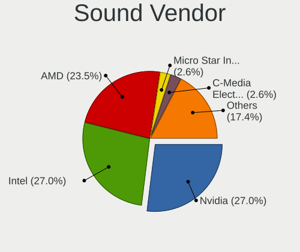

| Vendor                               | Desktops | Percent |
|--------------------------------------|----------|---------|
| Nvidia                               | 62       | 26.96%  |
| Intel                                | 62       | 26.96%  |
| AMD                                  | 54       | 23.48%  |
| Micro Star International             | 6        | 2.61%   |
| C-Media Electronics                  | 6        | 2.61%   |
| Logitech                             | 5        | 2.17%   |
| Creative Labs                        | 4        | 1.74%   |
| Hewlett-Packard                      | 3        | 1.3%    |
| Corsair                              | 3        | 1.3%    |
| ASUSTek Computer                     | 3        | 1.3%    |
| Thesycon Systemsoftware & Consulting | 2        | 0.87%   |
| SteelSeries ApS                      | 2        | 0.87%   |
| Realtek Semiconductor                | 2        | 0.87%   |
| Razer USA                            | 2        | 0.87%   |
| YZ Technology                        | 1        | 0.43%   |
| Valve Software                       | 1        | 0.43%   |
| Turtle Beach                         | 1        | 0.43%   |
| Texas Instruments                    | 1        | 0.43%   |
| MV-SILICON                           | 1        | 0.43%   |
| JMTek                                | 1        | 0.43%   |
| GYROCOM C&C                          | 1        | 0.43%   |
| GHW-136D-20231007                    | 1        | 0.43%   |
| Focusrite-Novation                   | 1        | 0.43%   |
| DSEA A/S                             | 1        | 0.43%   |
| Creative Technology                  | 1        | 0.43%   |
| Bose                                 | 1        | 0.43%   |
| Audio-Technica                       | 1        | 0.43%   |
| Astro Gaming                         | 1        | 0.43%   |

Sound Model
-----------

Sound card models

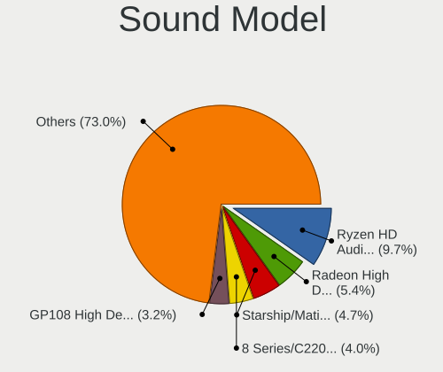

| Model                                                                                           | Desktops | Percent |
|-------------------------------------------------------------------------------------------------|----------|---------|
| AMD Ryzen HD Audio Controller                                                                   | 27       | 9.71%   |
| AMD Radeon High Definition Audio Controller                                                     | 15       | 5.4%    |
| AMD Starship/Matisse HD Audio Controller                                                        | 13       | 4.68%   |
| Intel 8 Series/C220 Series Chipset High Definition Audio Controller                             | 11       | 3.96%   |
| Nvidia GP108 High Definition Audio Controller                                                   | 9        | 3.24%   |
| Nvidia TU116 High Definition Audio Controller                                                   | 7        | 2.52%   |
| AMD Renoir/Cezanne HDMI/DP Audio Controller                                                     | 7        | 2.52%   |
| Micro Star International USB Audio                                                              | 6        | 2.16%   |
| Intel Xeon E3-1200 v3/4th Gen Core Processor HD Audio Controller                                | 6        | 2.16%   |
| Intel Tiger Lake-H HD Audio Controller                                                          | 6        | 2.16%   |
| Intel Raptor Lake High Definition Audio Controller                                              | 6        | 2.16%   |
| Nvidia GP106 High Definition Audio Controller                                                   | 5        | 1.8%    |
| Nvidia GK208 HDMI/DP Audio Controller                                                           | 5        | 1.8%    |
| Intel Comet Lake PCH cAVS                                                                       | 5        | 1.8%    |
| Intel 200 Series PCH HD Audio                                                                   | 5        | 1.8%    |
| Nvidia GA104 High Definition Audio Controller                                                   | 4        | 1.44%   |
| Nvidia GA102 High Definition Audio Controller                                                   | 4        | 1.44%   |
| Intel Alder Lake-S HD Audio Controller                                                          | 4        | 1.44%   |
| Intel 6 Series/C200 Series Chipset Family High Definition Audio Controller                      | 4        | 1.44%   |
| Intel 100 Series/C230 Series Chipset Family HD Audio Controller                                 | 4        | 1.44%   |
| AMD Raven/Raven2/Fenghuang HDMI/DP Audio Controller                                             | 4        | 1.44%   |
| Nvidia TU106 High Definition Audio Controller                                                   | 3        | 1.08%   |
| Nvidia GP104 High Definition Audio Controller                                                   | 3        | 1.08%   |
| Intel 7 Series/C216 Chipset Family High Definition Audio Controller                             | 3        | 1.08%   |
| Creative Labs CA0132 Sound Core3D [Sound Blaster Recon3D / Z-Series / Sound BlasterX AE-5 Plus] | 3        | 1.08%   |
| ASUSTek Computer USB Audio                                                                      | 3        | 1.08%   |
| AMD Navi 31 HDMI/DP Audio                                                                       | 3        | 1.08%   |
| AMD Navi 21/23 HDMI/DP Audio Controller                                                         | 3        | 1.08%   |
| AMD Family 17h (Models 00h-0fh) HD Audio Controller                                             | 3        | 1.08%   |
| Nvidia TU104 HD Audio Controller                                                                | 2        | 0.72%   |
| Nvidia MCP61 High Definition Audio                                                              | 2        | 0.72%   |
| Nvidia GP107GL High Definition Audio Controller                                                 | 2        | 0.72%   |
| Nvidia GP102 HDMI Audio Controller                                                              | 2        | 0.72%   |
| Nvidia GB203 High Definition Audio Controller                                                   | 2        | 0.72%   |
| Nvidia GA106 High Definition Audio Controller                                                   | 2        | 0.72%   |
| Nvidia AD106M High Definition Audio Controller                                                  | 2        | 0.72%   |
| Nvidia AD104 High Definition Audio Controller                                                   | 2        | 0.72%   |
| Nvidia AD102 High Definition Audio Controller                                                   | 2        | 0.72%   |
| Intel Smart Sound Technology (SST) Audio Controller                                             | 2        | 0.72%   |
| Intel Cannon Lake PCH cAVS                                                                      | 2        | 0.72%   |

Memory
------

Memory Vendor
-------------

Memory module vendors

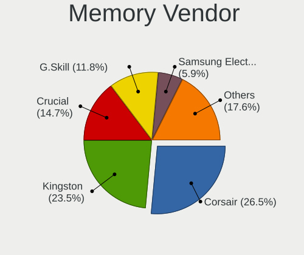

| Vendor              | Desktops | Percent |
|---------------------|----------|---------|
| Corsair             | 9        | 26.47%  |
| Kingston            | 8        | 23.53%  |
| Crucial             | 5        | 14.71%  |
| G.Skill             | 4        | 11.76%  |
| Samsung Electronics | 2        | 5.88%   |
| Team                | 1        | 2.94%   |
| Micron Technology   | 1        | 2.94%   |
| Lexar Co Limited    | 1        | 2.94%   |
| KLEVV               | 1        | 2.94%   |
| A-DATA Technology   | 1        | 2.94%   |
| Unknown             | 1        | 2.94%   |

Memory Model
------------

Memory module models

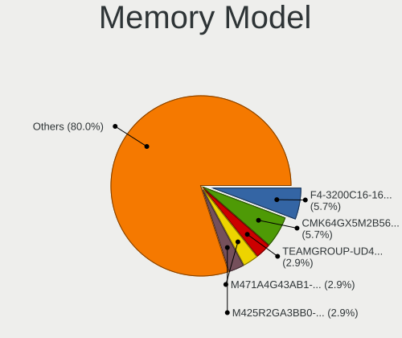

| Model                                                         | Desktops | Percent |
|---------------------------------------------------------------|----------|---------|
| G.Skill RAM F4-3200C16-16GIS 16GB DIMM DDR4 3600MT/s          | 2        | 5.71%   |
| Corsair RAM CMK64GX5M2B5600C40 32GB DIMM DDR5 5600MT/s        | 2        | 5.71%   |
| Team RAM TEAMGROUP-UD4-3200 8GB DIMM DDR4 3733MT/s            | 1        | 2.86%   |
| Samsung RAM M471A4G43AB1-CWE 32GB SODIMM DDR4 3200MT/s        | 1        | 2.86%   |
| Samsung RAM M425R2GA3BB0-CQKOL 16GB SODIMM DDR5 4800MT/s      | 1        | 2.86%   |
| Micron RAM 8ATF2G64AZ-3G2E1 16GB DIMM DDR4 3200MT/s           | 1        | 2.86%   |
| Lexar Co Limited RAM LD5FU016G-6000GA 16GB DIMM DDR5 4800MT/s | 1        | 2.86%   |
| KLEVV RAM KD48GU880-32A160X 8GB DIMM DDR4 2666MT/s            | 1        | 2.86%   |
| Kingston RAM KHX3200C16D4/8GX 8GB DIMM DDR4 3733MT/s          | 1        | 2.86%   |
| Kingston RAM KHX2400C15D4/4G 4GB DIMM DDR4 3151MT/s           | 1        | 2.86%   |
| Kingston RAM KF556S40-32 32GB SODIMM DDR5 5600MT/s            | 1        | 2.86%   |
| Kingston RAM KF552C40-16 16GB DIMM DDR5 5400MT/s              | 1        | 2.86%   |
| Kingston RAM 99U5471-020.A00LF 4GB DIMM 1600MT/s              | 1        | 2.86%   |
| Kingston RAM 9965669-031.A00G 16GB DIMM DDR4 3200MT/s         | 1        | 2.86%   |
| Kingston RAM 9905801-150.A00G 8GB SODIMM DDR5 5600MT/s        | 1        | 2.86%   |
| Kingston RAM 9905789-165.A00G 48GB SODIMM DDR5 5600MT/s       | 1        | 2.86%   |
| Kingston RAM 9905584-032.A00LF 4GB DIMM DDR3 1600MT/s         | 1        | 2.86%   |
| G.Skill RAM F5-5600S4040A32G 32GB SODIMM DDR5 5600MT/s        | 1        | 2.86%   |
| G.Skill RAM F5-5600J4040C16G 16GB DIMM DDR5 5600MT/s          | 1        | 2.86%   |
| Crucial RAM CT16G56C46S5.M8G1 16GB SODIMM DDR5 5600MT/s       | 1        | 2.86%   |
| Crucial RAM CT16G4DFRA32A.C8FE 16GB DIMM DDR4 3600MT/s        | 1        | 2.86%   |
| Crucial RAM CT102472BD160B.M18 8GB DIMM DDR3 1600MT/s         | 1        | 2.86%   |
| Crucial RAM CT102464BD160B.M16 8GB DIMM DDR3 1600MT/s         | 1        | 2.86%   |
| Crucial RAM BLS4G3D1609DS1S00. 4GB DIMM DDR3 1600MT/s         | 1        | 2.86%   |
| Corsair RAM CMX8GX3M2A1333C9 4GB DIMM DDR3 1333MT/s           | 1        | 2.86%   |
| Corsair RAM CMW32GX4M2Z3600C18 16GB DIMM DDR4 3733MT/s        | 1        | 2.86%   |
| Corsair RAM CMT16GX4M2C3200C16 8GB DIMM DDR4 3200MT/s         | 1        | 2.86%   |
| Corsair RAM CMSX16GX4M2A2400C16 8GB SODIMM DDR4 2400MT/s      | 1        | 2.86%   |
| Corsair RAM CMK16GX4M2B3200C16 8GB DIMM DDR4 3600MT/s         | 1        | 2.86%   |
| Corsair RAM CMH64GX5M2Y6400C32 32GB DIMM DDR5 6400MT/s        | 1        | 2.86%   |
| Corsair RAM CMH32GX5M2B6400C32 16GB DIMM DDR5 6400MT/s        | 1        | 2.86%   |
| A-DATA RAM AX5U6400C3232G-BLARWH 32GB DIMM DDR5 4800MT/s      | 1        | 2.86%   |
| Unknown                                                       | 1        | 2.86%   |

Memory Kind
-----------

Memory module kinds

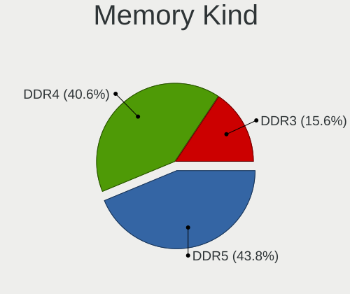

| Kind | Desktops | Percent |
|------|----------|---------|
| DDR5 | 14       | 43.75%  |
| DDR4 | 13       | 40.63%  |
| DDR3 | 5        | 15.63%  |

Memory Form Factor
------------------

Physical design of the memory module

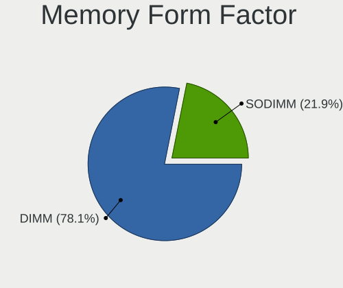

| Name   | Desktops | Percent |
|--------|----------|---------|
| DIMM   | 25       | 78.13%  |
| SODIMM | 7        | 21.88%  |

Memory Size
-----------

Memory module size

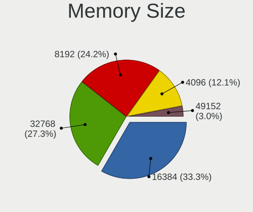

| Size  | Desktops | Percent |
|-------|----------|---------|
| 16384 | 11       | 33.33%  |
| 32768 | 9        | 27.27%  |
| 8192  | 8        | 24.24%  |
| 4096  | 4        | 12.12%  |
| 49152 | 1        | 3.03%   |

Memory Speed
------------

Memory module speed

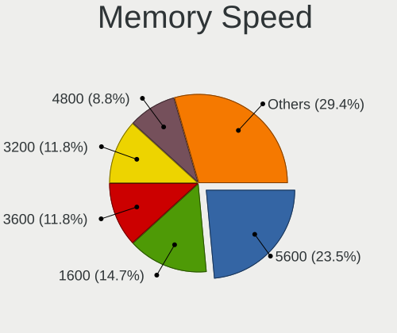

| Speed | Desktops | Percent |
|-------|----------|---------|
| 5600  | 8        | 23.53%  |
| 1600  | 5        | 14.71%  |
| 3600  | 4        | 11.76%  |
| 3200  | 4        | 11.76%  |
| 4800  | 3        | 8.82%   |
| 3733  | 3        | 8.82%   |
| 6400  | 2        | 5.88%   |
| 5400  | 1        | 2.94%   |
| 3151  | 1        | 2.94%   |
| 2666  | 1        | 2.94%   |
| 2400  | 1        | 2.94%   |
| 1333  | 1        | 2.94%   |

Printers & scanners
-------------------

Printer Vendor
--------------

Printer device vendors

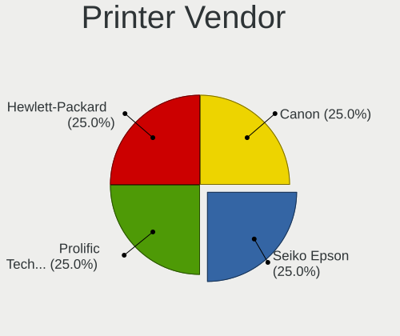

| Vendor              | Desktops | Percent |
|---------------------|----------|---------|
| Seiko Epson         | 1        | 25%     |
| Prolific Technology | 1        | 25%     |
| Hewlett-Packard     | 1        | 25%     |
| Canon               | 1        | 25%     |

Printer Model
-------------

Printer device models

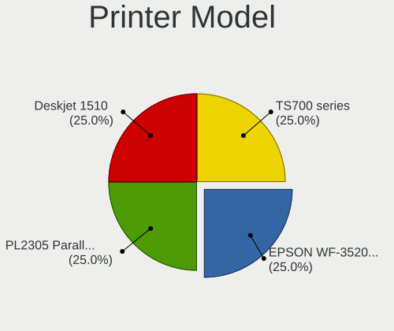

| Model                            | Desktops | Percent |
|----------------------------------|----------|---------|
| Seiko Epson EPSON WF-3520 Series | 1        | 25%     |
| Prolific PL2305 Parallel Port    | 1        | 25%     |
| HP Deskjet 1510                  | 1        | 25%     |
| Canon TS700 series               | 1        | 25%     |

Scanner Vendor
--------------

Scanner device vendors

| Vendor | Desktops | Percent |
|--------|----------|---------|
| Canon  | 1        | 100%    |

Scanner Model
-------------

Scanner device models

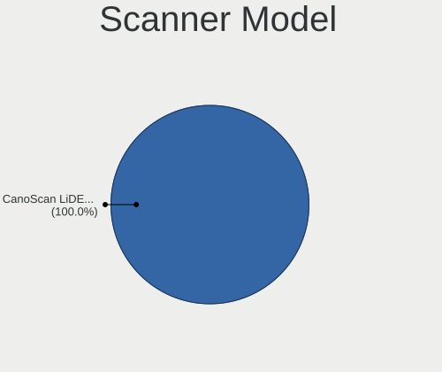

| Model                   | Desktops | Percent |
|-------------------------|----------|---------|
| Canon CanoScan LiDE 110 | 1        | 100%    |

Camera
------

Camera Vendor
-------------

Camera device vendors

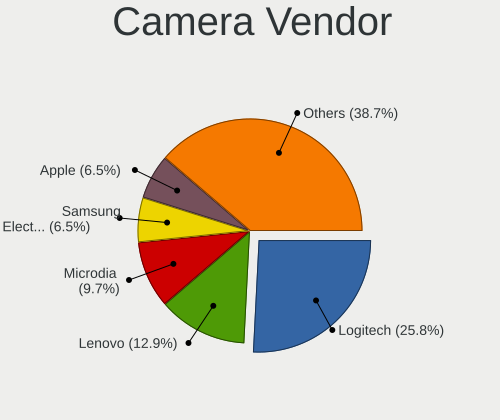

| Vendor                                 | Desktops | Percent |
|----------------------------------------|----------|---------|
| Logitech                               | 8        | 25.81%  |
| Lenovo                                 | 4        | 12.9%   |
| Microdia                               | 3        | 9.68%   |
| Samsung Electronics                    | 2        | 6.45%   |
| Apple                                  | 2        | 6.45%   |
| webcam                                 | 1        | 3.23%   |
| Valve Software                         | 1        | 3.23%   |
| Sunplus Innovation Technology          | 1        | 3.23%   |
| Sony Ericsson Mobile Communications AB | 1        | 3.23%   |
| Razer USA                              | 1        | 3.23%   |
| MacroSilicon                           | 1        | 3.23%   |
| Linux Foundation                       | 1        | 3.23%   |
| KYE Systems (Mouse Systems)            | 1        | 3.23%   |
| Huawei Technologies                    | 1        | 3.23%   |
| Creative Technology                    | 1        | 3.23%   |
| Chicony Electronics                    | 1        | 3.23%   |
| Anker Innovations Limited              | 1        | 3.23%   |

Camera Model
------------

Camera device models

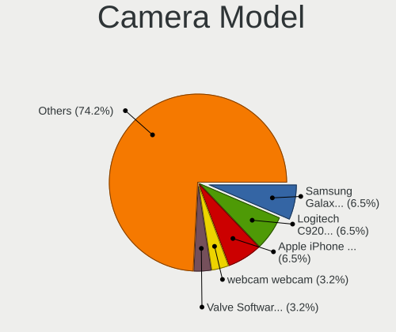

| Model                                                 | Desktops | Percent |
|-------------------------------------------------------|----------|---------|
| Samsung Galaxy series, misc. (MTP mode)               | 2        | 6.45%   |
| Logitech C920 PRO HD Webcam                           | 2        | 6.45%   |
| Apple iPhone 5/5C/5S/6/SE/7/8/X                       | 2        | 6.45%   |
| webcam webcam                                         | 1        | 3.23%   |
| Valve Software 3D Camera                              | 1        | 3.23%   |
| Sunplus SPCA2281 Web Camera                           | 1        | 3.23%   |
| Sony Ericsson Mobile AB XQ-CC54                       | 1        | 3.23%   |
| Razer USA Gaming Webcam [Kiyo]                        | 1        | 3.23%   |
| Microdia Sonix USB 2.0 Camera                         | 1        | 3.23%   |
| Microdia Integrated Camera                            | 1        | 3.23%   |
| Microdia Camera                                       | 1        | 3.23%   |
| MacroSilicon USB Video                                | 1        | 3.23%   |
| Logitech Webcam C310                                  | 1        | 3.23%   |
| Logitech Webcam C270                                  | 1        | 3.23%   |
| Logitech QuickCam Pro 9000                            | 1        | 3.23%   |
| Logitech Logi Webcam C920e                            | 1        | 3.23%   |
| Logitech HD Webcam C615                               | 1        | 3.23%   |
| Logitech HD Pro Webcam C920                           | 1        | 3.23%   |
| Linux Foundation NexiGo N970P 4K Camera               | 1        | 3.23%   |
| Lenovo Lenovo Performance Camera                      | 1        | 3.23%   |
| Lenovo Lenovo FHD Webcam Audio                        | 1        | 3.23%   |
| Lenovo Lenovo 50 Monitor Camera                       | 1        | 3.23%   |
| Lenovo 500 RGB Camera                                 | 1        | 3.23%   |
| KYE Systems (Mouse Systems) USB 2.0 HD1080P PC Camera | 1        | 3.23%   |
| Huawei HiCamera                                       | 1        | 3.23%   |
| Creative Live! Cam Sync HD [VF0770]                   | 1        | 3.23%   |
| Chicony HP High Definition Webcam                     | 1        | 3.23%   |
| Anker Innovations Limited AnkerWork C310 Webcam       | 1        | 3.23%   |

Security
--------

Fingerprint Vendor
------------------

Fingerprint sensor vendors

Zero info for selected period =(

Fingerprint Model
-----------------

Fingerprint sensor models

Zero info for selected period =(

Chipcard Vendor
---------------

Chipcard module vendors

Zero info for selected period =(

Chipcard Model
--------------

Chipcard module models

Zero info for selected period =(

Unsupported
-----------

Unsupported Devices
-------------------

Total unsupported devices on board

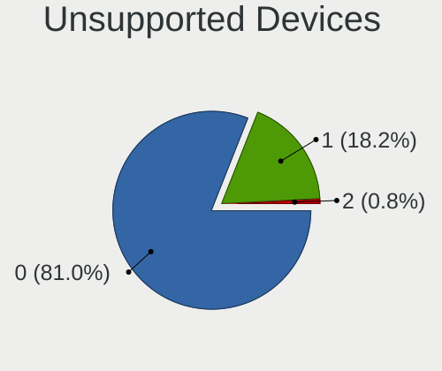

| Total | Desktops | Percent |
|-------|----------|---------|
| 0     | 98       | 80.99%  |
| 1     | 22       | 18.18%  |
| 2     | 1        | 0.83%   |

Unsupported Device Types
------------------------

Types of unsupported devices

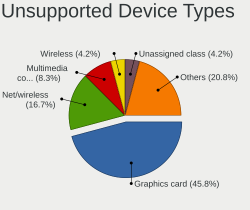

| Type                     | Desktops | Percent |
|--------------------------|----------|---------|
| Graphics card            | 11       | 45.83%  |
| Net/wireless             | 4        | 16.67%  |
| Multimedia controller    | 2        | 8.33%   |
| Wireless                 | 1        | 4.17%   |
| Unassigned class         | 1        | 4.17%   |
| Storage/raid             | 1        | 4.17%   |
| Network                  | 1        | 4.17%   |
| Communication controller | 1        | 4.17%   |
| Card reader              | 1        | 4.17%   |
| Camera                   | 1        | 4.17%   |

