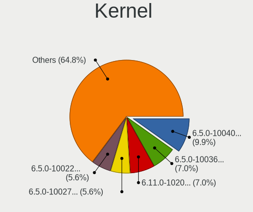
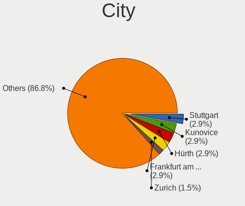
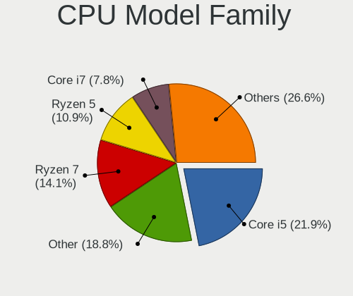
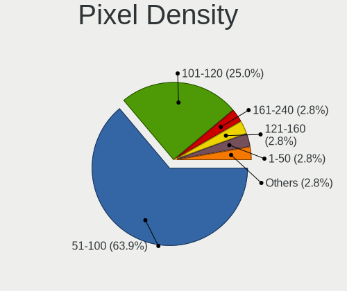

TUXEDO OS - Tested Hardware & Statistics (Desktops)
---------------------------------------------------

A project to collect tested hardware configurations for TUXEDO OS.

Anyone can contribute to this report by the [hw-probe](https://github.com/linuxhw/hw-probe) tool:

    sudo -E hw-probe -all -upload

Please contribute! Especially if your hardware is rare.

Contents
--------

* [ Test Cases ](#test-cases)

* [ System ](#system)
  - [ OS                       ](#os)
  - [ OS Family                ](#os-family)
  - [ Kernel                   ](#kernel)
  - [ Kernel Family            ](#kernel-family)
  - [ Kernel Major Ver.        ](#kernel-major-ver)
  - [ Arch                     ](#arch)
  - [ DE                       ](#de)
  - [ Display Server           ](#display-server)
  - [ Display Manager          ](#display-manager)
  - [ OS Lang                  ](#os-lang)
  - [ Boot Mode                ](#boot-mode)
  - [ Filesystem               ](#filesystem)
  - [ Part. scheme             ](#part-scheme)
  - [ Dual Boot with Linux/BSD ](#dual-boot-with-linuxbsd)
  - [ Dual Boot (Win)          ](#dual-boot-win)

* [ Board ](#board)
  - [ Vendor                   ](#vendor)
  - [ Model                    ](#model)
  - [ Model Family             ](#model-family)
  - [ MFG Year                 ](#mfg-year)
  - [ Form Factor              ](#form-factor)
  - [ Secure Boot              ](#secure-boot)
  - [ Coreboot                 ](#coreboot)
  - [ RAM Size                 ](#ram-size)
  - [ RAM Used                 ](#ram-used)
  - [ Total Drives             ](#total-drives)
  - [ Has CD-ROM               ](#has-cd-rom)
  - [ Has Ethernet             ](#has-ethernet)
  - [ Has WiFi                 ](#has-wifi)
  - [ Has Bluetooth            ](#has-bluetooth)

* [ Location ](#location)
  - [ Country                  ](#country)
  - [ City                     ](#city)

* [ Drives ](#drives)
  - [ Drive Vendor             ](#drive-vendor)
  - [ Drive Model              ](#drive-model)
  - [ HDD Vendor               ](#hdd-vendor)
  - [ SSD Vendor               ](#ssd-vendor)
  - [ Drive Kind               ](#drive-kind)
  - [ Drive Connector          ](#drive-connector)
  - [ Drive Size               ](#drive-size)
  - [ Space Total              ](#space-total)
  - [ Space Used               ](#space-used)
  - [ Malfunc. Drives          ](#malfunc-drives)
  - [ Malfunc. Drive Vendor    ](#malfunc-drive-vendor)
  - [ Malfunc. HDD Vendor      ](#malfunc-hdd-vendor)
  - [ Malfunc. Drive Kind      ](#malfunc-drive-kind)
  - [ Failed Drives            ](#failed-drives)
  - [ Failed Drive Vendor      ](#failed-drive-vendor)
  - [ Drive Status             ](#drive-status)

* [ Storage controller ](#storage-controller)
  - [ Storage Vendor           ](#storage-vendor)
  - [ Storage Model            ](#storage-model)
  - [ Storage Kind             ](#storage-kind)

* [ Processor ](#processor)
  - [ CPU Vendor               ](#cpu-vendor)
  - [ CPU Model                ](#cpu-model)
  - [ CPU Model Family         ](#cpu-model-family)
  - [ CPU Cores                ](#cpu-cores)
  - [ CPU Sockets              ](#cpu-sockets)
  - [ CPU Threads              ](#cpu-threads)
  - [ CPU Op-Modes             ](#cpu-op-modes)
  - [ CPU Microcode            ](#cpu-microcode)
  - [ CPU Microarch            ](#cpu-microarch)

* [ Graphics ](#graphics)
  - [ GPU Vendor               ](#gpu-vendor)
  - [ GPU Model                ](#gpu-model)
  - [ GPU Combo                ](#gpu-combo)
  - [ GPU Driver               ](#gpu-driver)
  - [ GPU Memory               ](#gpu-memory)

* [ Monitor ](#monitor)
  - [ Monitor Vendor           ](#monitor-vendor)
  - [ Monitor Model            ](#monitor-model)
  - [ Monitor Resolution       ](#monitor-resolution)
  - [ Monitor Diagonal         ](#monitor-diagonal)
  - [ Monitor Width            ](#monitor-width)
  - [ Aspect Ratio             ](#aspect-ratio)
  - [ Monitor Area             ](#monitor-area)
  - [ Pixel Density            ](#pixel-density)
  - [ Multiple Monitors        ](#multiple-monitors)

* [ Network ](#network)
  - [ Net Controller Vendor    ](#net-controller-vendor)
  - [ Net Controller Model     ](#net-controller-model)
  - [ Wireless Vendor          ](#wireless-vendor)
  - [ Wireless Model           ](#wireless-model)
  - [ Ethernet Vendor          ](#ethernet-vendor)
  - [ Ethernet Model           ](#ethernet-model)
  - [ Net Controller Kind      ](#net-controller-kind)
  - [ Used Controller          ](#used-controller)
  - [ NICs                     ](#nics)
  - [ IPv6                     ](#ipv6)

* [ Bluetooth ](#bluetooth)
  - [ Bluetooth Vendor         ](#bluetooth-vendor)
  - [ Bluetooth Model          ](#bluetooth-model)

* [ Sound ](#sound)
  - [ Sound Vendor             ](#sound-vendor)
  - [ Sound Model              ](#sound-model)

* [ Memory ](#memory)
  - [ Memory Vendor            ](#memory-vendor)
  - [ Memory Model             ](#memory-model)
  - [ Memory Kind              ](#memory-kind)
  - [ Memory Form Factor       ](#memory-form-factor)
  - [ Memory Size              ](#memory-size)
  - [ Memory Speed             ](#memory-speed)

* [ Printers & scanners ](#printers--scanners)
  - [ Printer Vendor           ](#printer-vendor)
  - [ Printer Model            ](#printer-model)
  - [ Scanner Vendor           ](#scanner-vendor)
  - [ Scanner Model            ](#scanner-model)

* [ Camera ](#camera)
  - [ Camera Vendor            ](#camera-vendor)
  - [ Camera Model             ](#camera-model)

* [ Security ](#security)
  - [ Fingerprint Vendor       ](#fingerprint-vendor)
  - [ Fingerprint Model        ](#fingerprint-model)
  - [ Chipcard Vendor          ](#chipcard-vendor)
  - [ Chipcard Model           ](#chipcard-model)

* [ Unsupported ](#unsupported)
  - [ Unsupported Devices      ](#unsupported-devices)
  - [ Unsupported Device Types ](#unsupported-device-types)

Test Cases
----------

Total: 89

| Vendor        | Model                       | Probe                                                      | Date         |
|---------------|-----------------------------|------------------------------------------------------------|--------------|
| ASRock        | Z790 PG SONIC               | [89df77f290](https://linux-hardware.org/?probe=89df77f290) | Dec 30, 2024 |
| MSI           | B450M MORTAR TITANIUM       | [2bbf71e498](https://linux-hardware.org/?probe=2bbf71e498) | Dec 28, 2024 |
| MSI           | B450 GAMING PLUS MAX        | [b0e7a232a0](https://linux-hardware.org/?probe=b0e7a232a0) | Dec 27, 2024 |
| Gigabyte      | B650I AX                    | [65f34ef743](https://linux-hardware.org/?probe=65f34ef743) | Dec 26, 2024 |
| MSI           | MAG X670E TOMAHAWK WIFI     | [0c7d813e39](https://linux-hardware.org/?probe=0c7d813e39) | Dec 06, 2024 |
| HP            | 83EF                        | [278db40f6f](https://linux-hardware.org/?probe=278db40f6f) | Nov 19, 2024 |
| Gateway       | DX4380G                     | [c118cf8638](https://linux-hardware.org/?probe=c118cf8638) | Nov 10, 2024 |
| MSI           | MAG B760M MORTAR WIFI II    | [8d97c445f0](https://linux-hardware.org/?probe=8d97c445f0) | Nov 09, 2024 |
| MSI           | MAG B650 TOMAHAWK WIFI      | [20bf647a5f](https://linux-hardware.org/?probe=20bf647a5f) | Nov 05, 2024 |
| MSI           | MAG B760M MORTAR WIFI II    | [18739102aa](https://linux-hardware.org/?probe=18739102aa) | Nov 04, 2024 |
| ASUSTek       | Q87M-E                      | [7bb5cd6743](https://linux-hardware.org/?probe=7bb5cd6743) | Nov 03, 2024 |
| MSI           | MAG B760M MORTAR WIFI II    | [fbd9656df0](https://linux-hardware.org/?probe=fbd9656df0) | Oct 20, 2024 |
| Lenovo        | Win8 Pro DPK TPG            | [aef71f8423](https://linux-hardware.org/?probe=aef71f8423) | Oct 20, 2024 |
| ASRock Ind... | 4X4-7000 Series/D5          | [21b280d23f](https://linux-hardware.org/?probe=21b280d23f) | Oct 19, 2024 |
| ASUSTek       | PRIME B365M-A               | [f9fa15c644](https://linux-hardware.org/?probe=f9fa15c644) | Sep 30, 2024 |
| ASUSTek       | TUF Gaming X570-PLUS        | [43c3525484](https://linux-hardware.org/?probe=43c3525484) | Sep 27, 2024 |
| ASUSTek       | PRIME B365M-A               | [3e6e0c2ca1](https://linux-hardware.org/?probe=3e6e0c2ca1) | Sep 23, 2024 |
| ASUSTek       | PRIME Z790-P WIFI           | [e590ad2ca7](https://linux-hardware.org/?probe=e590ad2ca7) | Sep 16, 2024 |
| MSI           | 760GM-P23                   | [5c16d614d1](https://linux-hardware.org/?probe=5c16d614d1) | Sep 14, 2024 |
| MSI           | 760GM-P23                   | [eef1ade403](https://linux-hardware.org/?probe=eef1ade403) | Sep 14, 2024 |
| Lenovo        | 3708 SDK0J40700 WIN 3258... | [5912a6f725](https://linux-hardware.org/?probe=5912a6f725) | Sep 10, 2024 |
| Lenovo        | 3708 SDK0J40700 WIN 3258... | [b66c075ba2](https://linux-hardware.org/?probe=b66c075ba2) | Sep 10, 2024 |
| HP            | 0B4Ch D                     | [f6ff455f2f](https://linux-hardware.org/?probe=f6ff455f2f) | Sep 09, 2024 |
| Gigabyte      | F2A88XM-HD3P                | [4bd6ddaefe](https://linux-hardware.org/?probe=4bd6ddaefe) | Aug 14, 2024 |
| HP            | 83E9                        | [625a98ef6b](https://linux-hardware.org/?probe=625a98ef6b) | Aug 01, 2024 |
| Gigabyte      | X570 AORUS ELITE            | [5c1f59210c](https://linux-hardware.org/?probe=5c1f59210c) | Jun 23, 2024 |
| Gigabyte      | Z490 GAMING X               | [ebeac6e170](https://linux-hardware.org/?probe=ebeac6e170) | Jun 15, 2024 |
| HP            | 8906 SMVB                   | [55d3baa441](https://linux-hardware.org/?probe=55d3baa441) | Jun 13, 2024 |
| ASUSTek       | PRIME Z590-A                | [1cdac728c2](https://linux-hardware.org/?probe=1cdac728c2) | Jun 07, 2024 |
| ASUSTek       | TUF Gaming X570-PLUS        | [a677078578](https://linux-hardware.org/?probe=a677078578) | Jun 01, 2024 |
| MSI           | K9N6PGM2-V2                 | [eed93354a4](https://linux-hardware.org/?probe=eed93354a4) | May 31, 2024 |
| ASRock        | H170M Pro4                  | [73689aad40](https://linux-hardware.org/?probe=73689aad40) | May 28, 2024 |
| Lenovo        | SHARKBAY NOK                | [682d9af576](https://linux-hardware.org/?probe=682d9af576) | May 27, 2024 |
| Trigkey       | Green G5                    | [e17c087905](https://linux-hardware.org/?probe=e17c087905) | May 22, 2024 |
| MSI           | MAG B660M MORTAR WIFI DD... | [09fdc490e4](https://linux-hardware.org/?probe=09fdc490e4) | May 22, 2024 |
| MSI           | MAG B660M MORTAR WIFI DD... | [c304190fdc](https://linux-hardware.org/?probe=c304190fdc) | May 19, 2024 |
| Gigabyte      | F2A88XM-HD3P                | [2f6a85fbfd](https://linux-hardware.org/?probe=2f6a85fbfd) | May 19, 2024 |
| Gigabyte      | F2A88XM-HD3P                | [7980bbe8d1](https://linux-hardware.org/?probe=7980bbe8d1) | May 17, 2024 |
| ASUSTek       | ROG STRIX B550-F GAMING     | [d6444fea5a](https://linux-hardware.org/?probe=d6444fea5a) | May 16, 2024 |
| MSI           | PRO B760-P WIFI DDR4        | [35d60afe01](https://linux-hardware.org/?probe=35d60afe01) | May 07, 2024 |
| Gigabyte      | A320M-S2H-CF                | [962196d889](https://linux-hardware.org/?probe=962196d889) | May 02, 2024 |
| Gigabyte      | A320M-S2H-CF                | [fd5584ca3b](https://linux-hardware.org/?probe=fd5584ca3b) | May 02, 2024 |
| ASUSTek       | ROG STRIX B550-F GAMING     | [9bb8151528](https://linux-hardware.org/?probe=9bb8151528) | May 01, 2024 |
| Acer          | Aspire XC-710 V:1.1         | [b6e8461941](https://linux-hardware.org/?probe=b6e8461941) | Apr 05, 2024 |
| Gigabyte      | Z590M GAMING X              | [0012e0f378](https://linux-hardware.org/?probe=0012e0f378) | Mar 20, 2024 |
| Gigabyte      | Z590M GAMING X              | [c04f68437c](https://linux-hardware.org/?probe=c04f68437c) | Mar 20, 2024 |
| Dell          | 0PXWHK A00                  | [67b3d9e0e0](https://linux-hardware.org/?probe=67b3d9e0e0) | Mar 20, 2024 |
| Acer          | Aspire XC-710 V:1.1         | [949b3c7713](https://linux-hardware.org/?probe=949b3c7713) | Mar 17, 2024 |
| ASRock        | H470M-HDV/M.2               | [e9c20372c1](https://linux-hardware.org/?probe=e9c20372c1) | Mar 12, 2024 |
| Gigabyte      | H61M-DS2                    | [68d8ddbe50](https://linux-hardware.org/?probe=68d8ddbe50) | Mar 04, 2024 |
| Gigabyte      | Z490 AORUS ELITE AC         | [31c62326ca](https://linux-hardware.org/?probe=31c62326ca) | Feb 19, 2024 |
| Lenovo        | Win8 Pro DPK TPG            | [eba58b31de](https://linux-hardware.org/?probe=eba58b31de) | Feb 16, 2024 |
| ASRock        | Z690 Extreme WiFi 6E        | [5889cc7c2c](https://linux-hardware.org/?probe=5889cc7c2c) | Feb 13, 2024 |
| HP            | 2AA7 H                      | [4dbc7b0fe9](https://linux-hardware.org/?probe=4dbc7b0fe9) | Jan 30, 2024 |
| ASUSTek       | ROG STRIX B550-I GAMING     | [c766c9daaf](https://linux-hardware.org/?probe=c766c9daaf) | Jan 22, 2024 |
| BESSTAR Te... | HM80                        | [3d9f1350b3](https://linux-hardware.org/?probe=3d9f1350b3) | Jan 14, 2024 |
| ASRock        | H170M Pro4                  | [27e24a6ef3](https://linux-hardware.org/?probe=27e24a6ef3) | Dec 30, 2023 |
| ECS           | GeForce 8000 series         | [d436bb4acc](https://linux-hardware.org/?probe=d436bb4acc) | Dec 19, 2023 |
| MSI           | PRO H410M-B                 | [0729c86d23](https://linux-hardware.org/?probe=0729c86d23) | Dec 15, 2023 |
| ASUSTek       | PRIME B450-PLUS             | [7e201ea559](https://linux-hardware.org/?probe=7e201ea559) | Dec 11, 2023 |
| ASUSTek       | PRIME A320M-K               | [5f06f30bd3](https://linux-hardware.org/?probe=5f06f30bd3) | Nov 09, 2023 |
| MSI           | MPG Z390 GAMING PRO CARB... | [414894f4aa](https://linux-hardware.org/?probe=414894f4aa) | Nov 08, 2023 |
| ASUSTek       | PRIME A320M-K               | [3fb2d2a6f0](https://linux-hardware.org/?probe=3fb2d2a6f0) | Nov 06, 2023 |
| MSI           | X570-A PRO                  | [78df342ad3](https://linux-hardware.org/?probe=78df342ad3) | Oct 21, 2023 |
| Gigabyte      | B560M AORUS PRO AX          | [5573fff3e6](https://linux-hardware.org/?probe=5573fff3e6) | Oct 17, 2023 |
| ASRock        | A520M-HVS                   | [0a29d5f7f6](https://linux-hardware.org/?probe=0a29d5f7f6) | Sep 22, 2023 |
| ASRock        | A520M-HVS                   | [2a7bf627ba](https://linux-hardware.org/?probe=2a7bf627ba) | Sep 19, 2023 |
| ASUSTek       | ROG STRIX Z590-A GAMING ... | [6d7c6c42f5](https://linux-hardware.org/?probe=6d7c6c42f5) | Sep 14, 2023 |
| ASUSTek       | ROG STRIX Z590-A GAMING ... | [fe64bd3017](https://linux-hardware.org/?probe=fe64bd3017) | Sep 13, 2023 |
| MSI           | MAG B560M MORTAR WIFI       | [376e22722b](https://linux-hardware.org/?probe=376e22722b) | Sep 05, 2023 |
| MSI           | MAG B560M MORTAR WIFI       | [388f380783](https://linux-hardware.org/?probe=388f380783) | Sep 02, 2023 |
| ASUSTek       | PRIME B450-PLUS             | [679cf99998](https://linux-hardware.org/?probe=679cf99998) | Aug 19, 2023 |
| ASUSTek       | PRIME B450-PLUS             | [cd3074537b](https://linux-hardware.org/?probe=cd3074537b) | Aug 15, 2023 |
| ASUSTek       | ROG STRIX B550-I GAMING     | [01846991de](https://linux-hardware.org/?probe=01846991de) | Aug 04, 2023 |
| ASUSTek       | PRIME B450-PLUS             | [fde0e0e94f](https://linux-hardware.org/?probe=fde0e0e94f) | Jul 29, 2023 |
| ASRock        | H170M Pro4                  | [818c9bc358](https://linux-hardware.org/?probe=818c9bc358) | Jun 14, 2023 |
| Lenovo        | 30D9 SDK0J40697 WIN 3305... | [7332acbb0e](https://linux-hardware.org/?probe=7332acbb0e) | May 15, 2023 |
| MSI           | PRO Z690-A WIFI DDR4        | [6142fe7fbd](https://linux-hardware.org/?probe=6142fe7fbd) | May 14, 2023 |
| Gigabyte      | H81M-HD3                    | [8aaef31933](https://linux-hardware.org/?probe=8aaef31933) | Mar 19, 2023 |
| Dell          | 051FJ8 A02                  | [4c5eee300d](https://linux-hardware.org/?probe=4c5eee300d) | Mar 13, 2023 |
| ASUSTek       | TUF Gaming H470-PRO         | [769cd87ebd](https://linux-hardware.org/?probe=769cd87ebd) | Mar 07, 2023 |
| ASUSTek       | TUF Gaming H470-PRO         | [e1846f2a68](https://linux-hardware.org/?probe=e1846f2a68) | Mar 07, 2023 |
| MSI           | MAG B560M MORTAR WIFI       | [886aa04456](https://linux-hardware.org/?probe=886aa04456) | Mar 07, 2023 |
| MSI           | MAG B560M MORTAR WIFI       | [9088ef4d11](https://linux-hardware.org/?probe=9088ef4d11) | Mar 06, 2023 |
| ASUSTek       | P8H61-M LX                  | [01f7386d8c](https://linux-hardware.org/?probe=01f7386d8c) | Mar 02, 2023 |
| ASRock        | Z270M-ITX/ac                | [4f507f4e5a](https://linux-hardware.org/?probe=4f507f4e5a) | Feb 20, 2023 |
| ASUSTek       | PRIME H410M-K               | [7cc71e6021](https://linux-hardware.org/?probe=7cc71e6021) | Feb 12, 2023 |
| HP            | 2B34                        | [3376fc38b3](https://linux-hardware.org/?probe=3376fc38b3) | Feb 05, 2023 |
| HP            | 8906 SMVB                   | [aeb826326b](https://linux-hardware.org/?probe=aeb826326b) | Dec 20, 2022 |

System
------

OS
--

Installed operating systems

| Name            | Desktops | Percent |
|-----------------|----------|---------|
| TUXEDO OS 22.04 | 55       | 85.94%  |
| TUXEDO OS 24.04 | 9        | 14.06%  |

OS Family
---------

OS without a version

| Name      | Desktops | Percent |
|-----------|----------|---------|
| TUXEDO OS | 64       | 100%    |

Kernel
------

Version of the Linux kernel

| Version                  | Desktops | Percent |
|--------------------------|----------|---------|
| 6.5.0-10040-tuxedo       | 7        | 9.86%   |
| 6.5.0-10036-tuxedo       | 5        | 7.04%   |
| 6.11.0-102007-tuxedo     | 5        | 7.04%   |
| 6.5.0-10027-tuxedo       | 4        | 5.63%   |
| 6.5.0-10022-tuxedo       | 4        | 5.63%   |
| 6.5.0-10013-tuxedo       | 4        | 5.63%   |
| 6.2.0-10018-tuxedo       | 4        | 5.63%   |
| 6.1.0-1009-tuxedo        | 4        | 5.63%   |
| 6.5.0-10010-tuxedo       | 3        | 4.23%   |
| 6.2.0-10007-tuxedo       | 3        | 4.23%   |
| 6.11.0-108013-tuxedo     | 3        | 4.23%   |
| 6.11.0-105009-tuxedo     | 3        | 4.23%   |
| 6.11.0-103009-tuxedo     | 3        | 4.23%   |
| 5.15.0-10058-tuxedo      | 3        | 4.23%   |
| 6.5.0-10043-tuxedo       | 2        | 2.82%   |
| 6.5.0-10006-tuxedo       | 2        | 2.82%   |
| 6.2.0-10027-tuxedo       | 2        | 2.82%   |
| 6.2.0-10022-tuxedo       | 2        | 2.82%   |
| 6.11.0-100005-tuxedo     | 2        | 2.82%   |
| 6.8.0-101041-tuxedo      | 1        | 1.41%   |
| 6.11.0-107011-tuxedo     | 1        | 1.41%   |
| 6.10.9-x64v4-xanmod1     | 1        | 1.41%   |
| 6.10.0-061000rc1-generic | 1        | 1.41%   |
| 5.15.0-10057-tuxedo      | 1        | 1.41%   |
| 5.15.0-10056-tuxedo      | 1        | 1.41%   |

Kernel Family
-------------

Linux kernel without a distro release

| Version | Desktops | Percent |
|---------|----------|---------|
| 6.5.0   | 29       | 42.65%  |
| 6.11.0  | 16       | 23.53%  |
| 6.2.0   | 11       | 16.18%  |
| 5.15.0  | 5        | 7.35%   |
| 6.1.0   | 4        | 5.88%   |
| 6.8.0   | 1        | 1.47%   |
| 6.10.9  | 1        | 1.47%   |
| 6.10.0  | 1        | 1.47%   |

Kernel Major Ver.
-----------------

Linux kernel major version

| Version | Desktops | Percent |
|---------|----------|---------|
| 6.5     | 29       | 42.65%  |
| 6.11    | 16       | 23.53%  |
| 6.2     | 11       | 16.18%  |
| 5.15    | 5        | 7.35%   |
| 6.1     | 4        | 5.88%   |
| 6.10    | 2        | 2.94%   |
| 6.8     | 1        | 1.47%   |

Arch
----

OS architecture (x86_64, i586, etc.)

| Name   | Desktops | Percent |
|--------|----------|---------|
| x86_64 | 64       | 100%    |

DE
--

Desktop Environment

| Name       | Desktops | Percent |
|------------|----------|---------|
| KDE5       | 37       | 55.22%  |
| KDE6       | 27       | 40.3%   |
| KDE        | 2        | 2.99%   |
| X-Cinnamon | 1        | 1.49%   |

Display Server
--------------

X11 or Wayland

| Name    | Desktops | Percent |
|---------|----------|---------|
| X11     | 46       | 67.65%  |
| Wayland | 22       | 32.35%  |

Display Manager
---------------

SDDM, LightDM, etc.

| Name    | Desktops | Percent |
|---------|----------|---------|
| Unknown | 54       | 83.08%  |
| SDDM    | 11       | 16.92%  |

OS Lang
-------

Language

| Lang  | Desktops | Percent |
|-------|----------|---------|
| de_DE | 22       | 34.38%  |
| en_US | 21       | 32.81%  |
| cs_CZ | 3        | 4.69%   |
| it_IT | 2        | 3.13%   |
| en_ZA | 2        | 3.13%   |
| en_GB | 2        | 3.13%   |
| de_AT | 2        | 3.13%   |
| pt_PT | 1        | 1.56%   |
| pl_PL | 1        | 1.56%   |
| nl_NL | 1        | 1.56%   |
| fr_FR | 1        | 1.56%   |
| fi_FI | 1        | 1.56%   |
| es_MX | 1        | 1.56%   |
| es_ES | 1        | 1.56%   |
| en_IN | 1        | 1.56%   |
| en_AG | 1        | 1.56%   |
| de_CH | 1        | 1.56%   |

Boot Mode
---------

EFI or BIOS

| Mode | Desktops | Percent |
|------|----------|---------|
| BIOS | 54       | 83.08%  |
| EFI  | 11       | 16.92%  |

Filesystem
----------

Type of filesystem

| Type    | Desktops | Percent |
|---------|----------|---------|
| Ext4    | 53       | 79.1%   |
| Btrfs   | 8        | 11.94%  |
| Xfs     | 3        | 4.48%   |
| Overlay | 2        | 2.99%   |
| Tmpfs   | 1        | 1.49%   |

Part. scheme
------------

Scheme of partitioning

| Type    | Desktops | Percent |
|---------|----------|---------|
| Unknown | 54       | 83.08%  |
| GPT     | 11       | 16.92%  |

Dual Boot with Linux/BSD
------------------------

Hosting more than one Linux/BSD

| Dual boot | Desktops | Percent |
|-----------|----------|---------|
| No        | 61       | 93.85%  |
| Yes       | 4        | 6.15%   |

Dual Boot (Win)
---------------

Hosting Linux and Windows

| Dual boot | Desktops | Percent |
|-----------|----------|---------|
| No        | 58       | 89.23%  |
| Yes       | 7        | 10.77%  |

Board
-----

Vendor
------

Motherboard manufacturer

| Name                | Desktops | Percent |
|---------------------|----------|---------|
| ASUSTek Computer    | 16       | 25%     |
| MSI                 | 14       | 21.88%  |
| Gigabyte Technology | 10       | 15.63%  |
| Hewlett-Packard     | 6        | 9.38%   |
| ASRock              | 6        | 9.38%   |
| Lenovo              | 4        | 6.25%   |
| Dell                | 2        | 3.13%   |
| Trigkey             | 1        | 1.56%   |
| Gateway             | 1        | 1.56%   |
| ECS                 | 1        | 1.56%   |
| BESSTAR Tech        | 1        | 1.56%   |
| ASRock Industrial   | 1        | 1.56%   |
| Acer                | 1        | 1.56%   |

Model
-----

Motherboard model

| Name                                                  | Desktops | Percent |
|-------------------------------------------------------|----------|---------|
| ASUS PRIME B450-PLUS                                  | 3        | 4.69%   |
| MSI MS-7D17                                           | 2        | 3.13%   |
| ASUS ROG STRIX B550-I GAMING                          | 2        | 3.13%   |
| Trigkey Green G5                                      | 1        | 1.56%   |
| MSI MS-7E13                                           | 1        | 1.56%   |
| MSI MS-7E12                                           | 1        | 1.56%   |
| MSI MS-7D82                                           | 1        | 1.56%   |
| MSI MS-7D75                                           | 1        | 1.56%   |
| MSI MS-7D42                                           | 1        | 1.56%   |
| MSI MS-7D25                                           | 1        | 1.56%   |
| MSI MS-7C37                                           | 1        | 1.56%   |
| MSI MS-7B89                                           | 1        | 1.56%   |
| MSI MS-7B86                                           | 1        | 1.56%   |
| MSI MS-7B17                                           | 1        | 1.56%   |
| MSI MS-7641                                           | 1        | 1.56%   |
| MSI MS-7309                                           | 1        | 1.56%   |
| Lenovo ThinkCentre M72e 0896C5G                       | 1        | 1.56%   |
| Lenovo ThinkCentre M700 10GSS05X48                    | 1        | 1.56%   |
| Lenovo SHARKBAY NOK                                   | 1        | 1.56%   |
| Lenovo IdeaCentre 3 07ADA05 Enter the machine type an | 1        | 1.56%   |
| HP Z400 Workstation                                   | 1        | 1.56%   |
| HP ProDesk 600 G4 DM                                  | 1        | 1.56%   |
| HP Pavilion Gaming Desktop TG01-2xxx                  | 1        | 1.56%   |
| HP F01                                                | 1        | 1.56%   |
| HP EliteDesk 705 G4 DM 35W (TAA)                      | 1        | 1.56%   |
| HP 280 G1 MT                                          | 1        | 1.56%   |
| Gigabyte Z590M GAMING X                               | 1        | 1.56%   |
| Gigabyte Z490 GAMING X                                | 1        | 1.56%   |
| Gigabyte Z490 AORUS ELITE AC                          | 1        | 1.56%   |
| Gigabyte X570 AORUS ELITE                             | 1        | 1.56%   |
| Gigabyte H81M-HD3                                     | 1        | 1.56%   |
| Gigabyte H61M-DS2                                     | 1        | 1.56%   |
| Gigabyte F2A88XM-HD3P                                 | 1        | 1.56%   |
| Gigabyte B650I AX                                     | 1        | 1.56%   |
| Gigabyte B560M AORUS PRO AX                           | 1        | 1.56%   |
| Gigabyte A320M-S2H                                    | 1        | 1.56%   |
| Gateway DX4380G                                       | 1        | 1.56%   |
| ECS GeForce 8000 series                               | 1        | 1.56%   |
| Dell OptiPlex 9010                                    | 1        | 1.56%   |
| Dell Inspiron 5680                                    | 1        | 1.56%   |

Model Family
------------

Motherboard model prefix

| Name                  | Desktops | Percent |
|-----------------------|----------|---------|
| ASUS PRIME            | 8        | 12.5%   |
| ASUS ROG              | 4        | 6.25%   |
| MSI MS-7D17           | 2        | 3.13%   |
| Lenovo ThinkCentre    | 2        | 3.13%   |
| Gigabyte Z490         | 2        | 3.13%   |
| ASUS TUF              | 2        | 3.13%   |
| Trigkey Green         | 1        | 1.56%   |
| MSI MS-7E13           | 1        | 1.56%   |
| MSI MS-7E12           | 1        | 1.56%   |
| MSI MS-7D82           | 1        | 1.56%   |
| MSI MS-7D75           | 1        | 1.56%   |
| MSI MS-7D42           | 1        | 1.56%   |
| MSI MS-7D25           | 1        | 1.56%   |
| MSI MS-7C37           | 1        | 1.56%   |
| MSI MS-7B89           | 1        | 1.56%   |
| MSI MS-7B86           | 1        | 1.56%   |
| MSI MS-7B17           | 1        | 1.56%   |
| MSI MS-7641           | 1        | 1.56%   |
| MSI MS-7309           | 1        | 1.56%   |
| Lenovo SHARKBAY       | 1        | 1.56%   |
| Lenovo IdeaCentre     | 1        | 1.56%   |
| HP Z400               | 1        | 1.56%   |
| HP ProDesk            | 1        | 1.56%   |
| HP Pavilion           | 1        | 1.56%   |
| HP F01                | 1        | 1.56%   |
| HP EliteDesk          | 1        | 1.56%   |
| HP 280                | 1        | 1.56%   |
| Gigabyte Z590M        | 1        | 1.56%   |
| Gigabyte X570         | 1        | 1.56%   |
| Gigabyte H81M-HD3     | 1        | 1.56%   |
| Gigabyte H61M-DS2     | 1        | 1.56%   |
| Gigabyte F2A88XM-HD3P | 1        | 1.56%   |
| Gigabyte B650I        | 1        | 1.56%   |
| Gigabyte B560M        | 1        | 1.56%   |
| Gigabyte A320M-S2H    | 1        | 1.56%   |
| Gateway DX4380G       | 1        | 1.56%   |
| ECS GeForce           | 1        | 1.56%   |
| Dell OptiPlex         | 1        | 1.56%   |
| Dell Inspiron         | 1        | 1.56%   |
| BESSTAR Tech HM80     | 1        | 1.56%   |

MFG Year
--------

Motherboard manufacture year

| Year | Desktops | Percent |
|------|----------|---------|
| 2021 | 13       | 20.31%  |
| 2020 | 9        | 14.06%  |
| 2018 | 7        | 10.94%  |
| 2019 | 6        | 9.38%   |
| 2023 | 4        | 6.25%   |
| 2022 | 4        | 6.25%   |
| 2015 | 3        | 4.69%   |
| 2013 | 3        | 4.69%   |
| 2012 | 3        | 4.69%   |
| 2024 | 2        | 3.13%   |
| 2017 | 2        | 3.13%   |
| 2011 | 2        | 3.13%   |
| 2010 | 2        | 3.13%   |
| 2016 | 1        | 1.56%   |
| 2014 | 1        | 1.56%   |
| 2009 | 1        | 1.56%   |
| 2008 | 1        | 1.56%   |

Form Factor
-----------

Physical design of the computer

| Name    | Desktops | Percent |
|---------|----------|---------|
| Desktop | 64       | 100%    |

Secure Boot
-----------

Enabled or disabled

| State    | Desktops | Percent |
|----------|----------|---------|
| Disabled | 63       | 98.44%  |
| Enabled  | 1        | 1.56%   |

Coreboot
--------

Have coreboot on board

| Used | Desktops | Percent |
|------|----------|---------|
| No   | 64       | 100%    |

RAM Size
--------

Total RAM memory

| Size in GB  | Desktops | Percent |
|-------------|----------|---------|
| 32.01-64.0  | 18       | 28.13%  |
| 16.01-24.0  | 15       | 23.44%  |
| 4.01-8.0    | 10       | 15.63%  |
| 8.01-16.0   | 7        | 10.94%  |
| 3.01-4.0    | 5        | 7.81%   |
| 64.01-256.0 | 5        | 7.81%   |
| 24.01-32.0  | 4        | 6.25%   |

RAM Used
--------

Used RAM memory

| Used GB    | Desktops | Percent |
|------------|----------|---------|
| 4.01-8.0   | 19       | 26.39%  |
| 3.01-4.0   | 18       | 25%     |
| 2.01-3.0   | 17       | 23.61%  |
| 1.01-2.0   | 11       | 15.28%  |
| 8.01-16.0  | 6        | 8.33%   |
| 16.01-24.0 | 1        | 1.39%   |

Total Drives
------------

Number of drives on board

| Drives | Desktops | Percent |
|--------|----------|---------|
| 1      | 19       | 28.79%  |
| 2      | 17       | 25.76%  |
| 4      | 12       | 18.18%  |
| 5      | 9        | 13.64%  |
| 3      | 4        | 6.06%   |
| 6      | 3        | 4.55%   |
| 8      | 1        | 1.52%   |
| 7      | 1        | 1.52%   |

Has CD-ROM
----------

Has CD-ROM on board

| Presented | Desktops | Percent |
|-----------|----------|---------|
| No        | 47       | 71.21%  |
| Yes       | 19       | 28.79%  |

Has Ethernet
------------

Has Ethernet on board

| Presented | Desktops | Percent |
|-----------|----------|---------|
| Yes       | 63       | 98.44%  |
| No        | 1        | 1.56%   |

Has WiFi
--------

Has WiFi module

| Presented | Desktops | Percent |
|-----------|----------|---------|
| Yes       | 37       | 57.81%  |
| No        | 27       | 42.19%  |

Has Bluetooth
-------------

Has Bluetooth module

| Presented | Desktops | Percent |
|-----------|----------|---------|
| Yes       | 39       | 60%     |
| No        | 26       | 40%     |

Location
--------

Country
-------

Geographic location (country)

| Country      | Desktops | Percent |
|--------------|----------|---------|
| Germany      | 23       | 35.94%  |
| USA          | 11       | 17.19%  |
| Italy        | 3        | 4.69%   |
| Czechia      | 3        | 4.69%   |
| South Africa | 2        | 3.13%   |
| Romania      | 2        | 3.13%   |
| Netherlands  | 2        | 3.13%   |
| India        | 2        | 3.13%   |
| Austria      | 2        | 3.13%   |
| UK           | 1        | 1.56%   |
| Thailand     | 1        | 1.56%   |
| Switzerland  | 1        | 1.56%   |
| Sweden       | 1        | 1.56%   |
| Spain        | 1        | 1.56%   |
| Portugal     | 1        | 1.56%   |
| Poland       | 1        | 1.56%   |
| Mexico       | 1        | 1.56%   |
| France       | 1        | 1.56%   |
| Finland      | 1        | 1.56%   |
| Egypt        | 1        | 1.56%   |
| China        | 1        | 1.56%   |
| Aruba        | 1        | 1.56%   |
| Argentina    | 1        | 1.56%   |

City
----

Geographic location (city)

| City              | Desktops | Percent |
|-------------------|----------|---------|
| Stuttgart         | 2        | 2.94%   |
| Kunovice          | 2        | 2.94%   |
| Hürth            | 2        | 2.94%   |
| Frankfurt am Main | 2        | 2.94%   |
| Zurich            | 1        | 1.47%   |
| Zalău            | 1        | 1.47%   |
| Vienna            | 1        | 1.47%   |
| Ulm               | 1        | 1.47%   |
| Tucson            | 1        | 1.47%   |
| Straubing         | 1        | 1.47%   |
| Stimpfach         | 1        | 1.47%   |
| Shelby            | 1        | 1.47%   |
| Shanghai          | 1        | 1.47%   |
| Puebla City       | 1        | 1.47%   |
| Poechlarn         | 1        | 1.47%   |
| Plymouth          | 1        | 1.47%   |
| Plauen            | 1        | 1.47%   |
| Petrvald          | 1        | 1.47%   |
| Peitz             | 1        | 1.47%   |
| Oranjestad        | 1        | 1.47%   |
| Olhao             | 1        | 1.47%   |
| Oldenzaal         | 1        | 1.47%   |
| Oldenburg         | 1        | 1.47%   |
| Offenbach         | 1        | 1.47%   |
| Nashik            | 1        | 1.47%   |
| Milan             | 1        | 1.47%   |
| Middlesbrough     | 1        | 1.47%   |
| Madrid            | 1        | 1.47%   |
| Lynnwood          | 1        | 1.47%   |
| Luleå            | 1        | 1.47%   |
| Lublin            | 1        | 1.47%   |
| Los Angeles       | 1        | 1.47%   |
| Limeil-Brevannes  | 1        | 1.47%   |
| Lienz             | 1        | 1.47%   |
| Leipzig           | 1        | 1.47%   |
| Landau            | 1        | 1.47%   |
| Kyritz            | 1        | 1.47%   |
| Johannesburg      | 1        | 1.47%   |
| Indore            | 1        | 1.47%   |
| High Ridge        | 1        | 1.47%   |

Drives
------

Drive Vendor
------------

Hard drive vendors

| Vendor                      | Desktops | Drives | Percent |
|-----------------------------|----------|--------|---------|
| Samsung Electronics         | 29       | 50     | 20.71%  |
| Seagate                     | 18       | 30     | 12.86%  |
| WDC                         | 15       | 30     | 10.71%  |
| Sandisk                     | 9        | 13     | 6.43%   |
| Kingston                    | 9        | 12     | 6.43%   |
| Crucial                     | 8        | 12     | 5.71%   |
| Hitachi                     | 4        | 7      | 2.86%   |
| Unknown                     | 3        | 4      | 2.14%   |
| SK hynix                    | 3        | 4      | 2.14%   |
| Micron/Crucial Technology   | 3        | 5      | 2.14%   |
| Micron Technology           | 3        | 4      | 2.14%   |
| Intenso                     | 3        | 4      | 2.14%   |
| Intel                       | 3        | 3      | 2.14%   |
| Silicon Motion              | 2        | 3      | 1.43%   |
| Phison Electronics          | 2        | 2      | 1.43%   |
| GOODRAM                     | 2        | 2      | 1.43%   |
| ASMT                        | 2        | 2      | 1.43%   |
| Apacer                      | 2        | 2      | 1.43%   |
| WALRAM                      | 1        | 1      | 0.71%   |
| Transcend                   | 1        | 2      | 0.71%   |
| Toshiba                     | 1        | 1      | 0.71%   |
| SPCC                        | 1        | 1      | 0.71%   |
| Phison                      | 1        | 1      | 0.71%   |
| Netac                       | 1        | 1      | 0.71%   |
| Lite-On Technology          | 1        | 1      | 0.71%   |
| Kingston Technology Company | 1        | 1      | 0.71%   |
| KingFast                    | 1        | 1      | 0.71%   |
| HS-SSD-E100                 | 1        | 1      | 0.71%   |
| HS-SSD-E                    | 1        | 1      | 0.71%   |
| Hikvision                   | 1        | 2      | 0.71%   |
| HGST HTS                    | 1        | 1      | 0.71%   |
| HGST                        | 1        | 3      | 0.71%   |
| Fanxiang                    | 1        | 1      | 0.71%   |
| Emtec                       | 1        | 1      | 0.71%   |
| CT1000P3                    | 1        | 1      | 0.71%   |
| China                       | 1        | 1      | 0.71%   |
| AMD                         | 1        | 2      | 0.71%   |
| A-DATA Technology           | 1        | 2      | 0.71%   |

Drive Model
-----------

Hard drive models

| Model                                                | Desktops | Percent |
|------------------------------------------------------|----------|---------|
| Samsung SSD 980 500GB                                | 5        | 2.91%   |
| Seagate ST1000DM010-2EP102 1TB                       | 4        | 2.33%   |
| Samsung NVMe SSD Controller SM981/PM981/PM983 512GB  | 4        | 2.33%   |
| Seagate ST3500418AS 500GB                            | 3        | 1.74%   |
| Sandisk WD Black SN750 / PC SN730 NVMe SSD 512GB     | 3        | 1.74%   |
| Samsung NVMe SSD Controller PM9A1/PM9A3/980PRO 512GB | 3        | 1.74%   |
| WDC WD10EZEX-08WN4A0 1TB                             | 2        | 1.16%   |
| Silicon Motion SM2262/SM2262EN SSD Controller 2TB    | 2        | 1.16%   |
| Seagate ST1000VT001-1RE172 1TB                       | 2        | 1.16%   |
| SanDisk SSD PLUS 120GB                               | 2        | 1.16%   |
| Samsung SSD 980 1TB                                  | 2        | 1.16%   |
| Samsung SSD 860 EVO 500GB                            | 2        | 1.16%   |
| Samsung SSD 860 EVO 250GB                            | 2        | 1.16%   |
| Samsung SSD 860 EVO 1TB                              | 2        | 1.16%   |
| Samsung SSD 850 EVO 500GB                            | 2        | 1.16%   |
| Samsung NVMe SSD Controller SM961/PM961/SM963 256GB  | 2        | 1.16%   |
| Micron/Crucial P2 NVMe PCIe SSD 500GB                | 2        | 1.16%   |
| Kingston SV300S37A120G 120GB SSD                     | 2        | 1.16%   |
| Kingston SA400S37960G 960GB SSD                      | 2        | 1.16%   |
| Kingston SA400S37240G 240GB SSD                      | 2        | 1.16%   |
| Intel SSDSC2CT180A3 180GB                            | 2        | 1.16%   |
| Hitachi HCS545050GLA380 500GB                        | 2        | 1.16%   |
| Crucial CT500MX500SSD1 500GB                         | 2        | 1.16%   |
| Crucial CT1000MX500SSD1 1TB                          | 2        | 1.16%   |
| Crucial CT1000BX500SSD1 1TB                          | 2        | 1.16%   |
| WDC WDS500G2B0A-00SM50 500GB SSD                     | 1        | 0.58%   |
| WDC WDS100T2B0B-00YS70 1TB SSD                       | 1        | 0.58%   |
| WDC WDS100T2B0A-00SM50 1TB SSD                       | 1        | 0.58%   |
| WDC WD80EAZZ-00BKLB0 8TB                             | 1        | 0.58%   |
| WDC WD5000AVDS-63U7B1 500GB                          | 1        | 0.58%   |
| WDC WD5000AAVS-00G9B0 500GB                          | 1        | 0.58%   |
| WDC WD5000AAKX-60U6AA0 500GB                         | 1        | 0.58%   |
| WDC WD5000AAKX-08ERMA0 500GB                         | 1        | 0.58%   |
| WDC WD42PURZ-85B4YY0 4TB                             | 1        | 0.58%   |
| WDC WD40EZRZ-22GXCB0 4TB                             | 1        | 0.58%   |
| WDC WD40EFAX-68JH4N1 4TB                             | 1        | 0.58%   |
| WDC WD30EFRX-68N32N0 3TB                             | 1        | 0.58%   |
| WDC WD20PURX-64P6ZY0 2TB                             | 1        | 0.58%   |
| WDC WD20EZRZ-00Z5HB0 2TB                             | 1        | 0.58%   |
| WDC WD20EZRX-22D8PB0 2TB                             | 1        | 0.58%   |

HDD Vendor
----------

Hard disk drive vendors

| Vendor              | Desktops | Drives | Percent |
|---------------------|----------|--------|---------|
| Seagate             | 18       | 30     | 40.91%  |
| WDC                 | 13       | 24     | 29.55%  |
| Hitachi             | 4        | 7      | 9.09%   |
| Samsung Electronics | 2        | 2      | 4.55%   |
| ASMT                | 2        | 2      | 4.55%   |
| Unknown             | 1        | 2      | 2.27%   |
| Toshiba             | 1        | 1      | 2.27%   |
| Intenso             | 1        | 1      | 2.27%   |
| HGST HTS            | 1        | 1      | 2.27%   |
| HGST                | 1        | 3      | 2.27%   |

SSD Vendor
----------

Solid state drive vendors

| Vendor              | Desktops | Drives | Percent |
|---------------------|----------|--------|---------|
| Samsung Electronics | 11       | 15     | 23.4%   |
| Kingston            | 8        | 11     | 17.02%  |
| Crucial             | 8        | 10     | 17.02%  |
| WDC                 | 3        | 4      | 6.38%   |
| SanDisk             | 3        | 5      | 6.38%   |
| Intel               | 2        | 2      | 4.26%   |
| GOODRAM             | 2        | 2      | 4.26%   |
| Apacer              | 2        | 2      | 4.26%   |
| Transcend           | 1        | 2      | 2.13%   |
| SPCC                | 1        | 1      | 2.13%   |
| Netac               | 1        | 1      | 2.13%   |
| Micron Technology   | 1        | 1      | 2.13%   |
| Intenso             | 1        | 1      | 2.13%   |
| Emtec               | 1        | 1      | 2.13%   |
| China               | 1        | 1      | 2.13%   |
| A-DATA Technology   | 1        | 2      | 2.13%   |

Drive Kind
----------

HDD or SSD

| Kind    | Desktops | Drives | Percent |
|---------|----------|--------|---------|
| NVMe    | 39       | 73     | 34.21%  |
| SSD     | 37       | 61     | 32.46%  |
| HDD     | 32       | 73     | 28.07%  |
| Unknown | 6        | 8      | 5.26%   |

Drive Connector
---------------

SATA, SAS, NVMe, etc.

| Type | Desktops | Drives | Percent |
|------|----------|--------|---------|
| SATA | 49       | 133    | 52.69%  |
| NVMe | 39       | 72     | 41.94%  |
| SAS  | 5        | 10     | 5.38%   |

Drive Size
----------

Size of hard drive

| Size in TB | Desktops | Drives | Percent |
|------------|----------|--------|---------|
| 0.51-1.0   | 30       | 40     | 38.96%  |
| 0.01-0.5   | 30       | 62     | 38.96%  |
| 1.01-2.0   | 9        | 17     | 11.69%  |
| 3.01-4.0   | 3        | 8      | 3.9%    |
| 4.01-10.0  | 3        | 4      | 3.9%    |
| 2.01-3.0   | 2        | 3      | 2.6%    |

Space Total
-----------

Amount of disk space available on the file system

| Size in GB     | Desktops | Percent |
|----------------|----------|---------|
| 501-1000       | 23       | 32.39%  |
| 101-250        | 12       | 16.9%   |
| 1001-2000      | 11       | 15.49%  |
| More than 3000 | 7        | 9.86%   |
| 251-500        | 6        | 8.45%   |
| 2001-3000      | 3        | 4.23%   |
| 1-20           | 3        | 4.23%   |
| 21-50          | 2        | 2.82%   |
| 51-100         | 2        | 2.82%   |
| Unknown        | 2        | 2.82%   |

Space Used
----------

Amount of used disk space

| Used GB        | Desktops | Percent |
|----------------|----------|---------|
| 1-20           | 24       | 33.33%  |
| 21-50          | 12       | 16.67%  |
| 101-250        | 8        | 11.11%  |
| 251-500        | 7        | 9.72%   |
| 501-1000       | 7        | 9.72%   |
| 51-100         | 5        | 6.94%   |
| More than 3000 | 3        | 4.17%   |
| 1001-2000      | 3        | 4.17%   |
| Unknown        | 2        | 2.78%   |
| 2001-3000      | 1        | 1.39%   |

Malfunc. Drives
---------------

Drive models with a malfunction

| Model                    | Desktops | Drives | Percent |
|--------------------------|----------|--------|---------|
| Seagate ST32000641AS 2TB | 1        | 1      | 100%    |

Malfunc. Drive Vendor
---------------------

Vendors of faulty drives

| Vendor  | Desktops | Drives | Percent |
|---------|----------|--------|---------|
| Seagate | 1        | 1      | 100%    |

Malfunc. HDD Vendor
-------------------

Vendors of faulty HDD drives

| Vendor  | Desktops | Drives | Percent |
|---------|----------|--------|---------|
| Seagate | 1        | 1      | 100%    |

Malfunc. Drive Kind
-------------------

Kinds of faulty drives

| Kind | Desktops | Drives | Percent |
|------|----------|--------|---------|
| HDD  | 1        | 1      | 100%    |

Failed Drives
-------------

Failed drive models

Zero info for selected period =(

Failed Drive Vendor
-------------------

Failed drive vendors

Zero info for selected period =(

Drive Status
------------

Number of failed and malfunc. drives

| Status   | Desktops | Drives | Percent |
|----------|----------|--------|---------|
| Detected | 56       | 190    | 82.35%  |
| Works    | 11       | 24     | 16.18%  |
| Malfunc  | 1        | 1      | 1.47%   |

Storage controller
------------------

Storage Vendor
--------------

Storage controller vendors

| Vendor                      | Desktops | Percent |
|-----------------------------|----------|---------|
| Intel                       | 37       | 32.74%  |
| AMD                         | 24       | 21.24%  |
| Samsung Electronics         | 20       | 17.7%   |
| SanDisk                     | 6        | 5.31%   |
| Micron/Crucial Technology   | 4        | 3.54%   |
| ASMedia Technology          | 4        | 3.54%   |
| SK hynix                    | 3        | 2.65%   |
| Phison Electronics          | 3        | 2.65%   |
| Silicon Motion              | 2        | 1.77%   |
| Nvidia                      | 2        | 1.77%   |
| Micron Technology           | 2        | 1.77%   |
| Kingston Technology Company | 2        | 1.77%   |
| INNOGRIT                    | 2        | 1.77%   |
| MAXIO Technology (Hangzhou) | 1        | 0.88%   |
| Lite-On Technology          | 1        | 0.88%   |

Storage Model
-------------

Storage controller models

| Model                                                                          | Desktops | Percent |
|--------------------------------------------------------------------------------|----------|---------|
| AMD FCH SATA Controller [AHCI mode]                                            | 16       | 11.85%  |
| Samsung NVMe SSD Controller 980 (DRAM-less)                                    | 8        | 5.93%   |
| Intel 500 Series Chipset Family SATA AHCI Controller                           | 7        | 5.19%   |
| AMD 400 Series Chipset SATA Controller                                         | 6        | 4.44%   |
| Samsung NVMe SSD Controller PM9A1/PM9A3/980PRO                                 | 5        | 3.7%    |
| Samsung NVMe SSD Controller SM981/PM981/PM983                                  | 4        | 2.96%   |
| Intel 8 Series/C220 Series Chipset Family 6-port SATA Controller 1 [AHCI mode] | 4        | 2.96%   |
| ASMedia ASM1061/ASM1062 Serial ATA Controller                                  | 4        | 2.96%   |
| AMD 500 Series Chipset SATA Controller                                         | 4        | 2.96%   |
| SK hynix Gold P31/BC711/PC711 NVMe Solid State Drive                           | 3        | 2.22%   |
| SanDisk Extreme Pro / WD Black SN750 / PC SN730 / Red SN700 NVMe SSD           | 3        | 2.22%   |
| Intel Raptor Lake SATA AHCI Controller                                         | 3        | 2.22%   |
| Intel Q170/Q150/B150/H170/H110/Z170/CM236 Chipset SATA Controller [AHCI Mode]  | 3        | 2.22%   |
| Intel Comet Lake SATA AHCI Controller                                          | 3        | 2.22%   |
| Intel Alder Lake-S PCH SATA Controller [AHCI Mode]                             | 3        | 2.22%   |
| AMD 600 Series Chipset SATA Controller                                         | 3        | 2.22%   |
| Silicon Motion SM2262/SM2262EN SSD Controller                                  | 2        | 1.48%   |
| SanDisk WD Black SN770 / PC SN740 256GB / PC SN560 (DRAM-less) NVMe SSD        | 2        | 1.48%   |
| Samsung NVMe SSD Controller SM961/PM961/SM963                                  | 2        | 1.48%   |
| Samsung NVMe SSD Controller S4LV008[Pascal]                                    | 2        | 1.48%   |
| Samsung NVMe SSD Controller PM9C1a (DRAM-less)                                 | 2        | 1.48%   |
| Phison E16 PCIe4 NVMe Controller                                               | 2        | 1.48%   |
| Micron/Crucial P2 [Nick P2] / P3 / P3 Plus NVMe PCIe SSD (DRAM-less)           | 2        | 1.48%   |
| Intel SATA Controller [RAID mode]                                              | 2        | 1.48%   |
| Intel Cannon Lake PCH SATA AHCI Controller                                     | 2        | 1.48%   |
| Intel 6 Series/C200 Series Chipset Family 6 port Desktop SATA AHCI Controller  | 2        | 1.48%   |
| Intel 200 Series PCH SATA controller [AHCI mode]                               | 2        | 1.48%   |
| AMD A320 Chipset SATA Controller [AHCI mode]                                   | 2        | 1.48%   |
| SK hynix Platinum P41/PC801 NVMe Solid State Drive                             | 1        | 0.74%   |
| SanDisk WD PC SN810 / Black SN850 NVMe SSD                                     | 1        | 0.74%   |
| Sandisk WD Blue SN580 NVMe SSD (DRAM-less)                                     | 1        | 0.74%   |
| Samsung NVMe SSD Controller 172Xa/172Xb                                        | 1        | 0.74%   |
| Phison E12 NVMe Controller                                                     | 1        | 0.74%   |
| Nvidia MCP78S [GeForce 8200] IDE                                               | 1        | 0.74%   |
| Nvidia MCP78S [GeForce 8200] AHCI Controller                                   | 1        | 0.74%   |
| Nvidia MCP61 SATA Controller                                                   | 1        | 0.74%   |
| Nvidia MCP61 IDE                                                               | 1        | 0.74%   |
| Micron/Crucial T500 NVMe PCIe SSD                                              | 1        | 0.74%   |
| Micron/Crucial P5 Plus NVMe PCIe SSD                                           | 1        | 0.74%   |
| Micron/Crucial P1 NVMe PCIe SSD[Frampton]                                      | 1        | 0.74%   |

Storage Kind
------------

Kind of storage controller (IDE, SATA, NVMe, SAS, ...)

| Kind | Desktops | Percent |
|------|----------|---------|
| SATA | 59       | 56.19%  |
| NVMe | 39       | 37.14%  |
| IDE  | 4        | 3.81%   |
| RAID | 3        | 2.86%   |

Processor
---------

CPU Vendor
----------

Processor vendors

| Vendor | Desktops | Percent |
|--------|----------|---------|
| Intel  | 37       | 57.81%  |
| AMD    | 27       | 42.19%  |

CPU Model
---------

Processor models

| Model                                     | Desktops | Percent |
|-------------------------------------------|----------|---------|
| Intel Core i5-3470 CPU @ 3.20GHz          | 3        | 4.69%   |
| AMD Ryzen 7 5800X 8-Core Processor        | 3        | 4.69%   |
| Intel Core i5-4590S CPU @ 3.00GHz         | 2        | 3.13%   |
| AMD Ryzen 5 5600G with Radeon Graphics    | 2        | 3.13%   |
| Intel Xeon CPU W3550 @ 3.07GHz            | 1        | 1.56%   |
| Intel Pentium CPU G3420 @ 3.20GHz         | 1        | 1.56%   |
| Intel N100                                | 1        | 1.56%   |
| Intel Core i9-10850K CPU @ 3.60GHz        | 1        | 1.56%   |
| Intel Core i7-9700K CPU @ 3.60GHz         | 1        | 1.56%   |
| Intel Core i7-8700K CPU @ 3.70GHz         | 1        | 1.56%   |
| Intel Core i7-8700 CPU @ 3.20GHz          | 1        | 1.56%   |
| Intel Core i7-10700K CPU @ 3.80GHz        | 1        | 1.56%   |
| Intel Core i7-10700 CPU @ 2.90GHz         | 1        | 1.56%   |
| Intel Core i5-8500T CPU @ 2.10GHz         | 1        | 1.56%   |
| Intel Core i5-7600T CPU @ 2.80GHz         | 1        | 1.56%   |
| Intel Core i5-6400 CPU @ 2.70GHz          | 1        | 1.56%   |
| Intel Core i5-4590 CPU @ 3.30GHz          | 1        | 1.56%   |
| Intel Core i5-3570 CPU @ 3.40GHz          | 1        | 1.56%   |
| Intel Core i5-10500 CPU @ 3.10GHz         | 1        | 1.56%   |
| Intel Core i5-10400F CPU @ 2.90GHz        | 1        | 1.56%   |
| Intel Core i5-10400 CPU @ 2.90GHz         | 1        | 1.56%   |
| Intel Core i5 CPU 650 @ 3.20GHz           | 1        | 1.56%   |
| Intel Core i3-6300 CPU @ 3.80GHz          | 1        | 1.56%   |
| Intel Core i3-6100 CPU @ 3.70GHz          | 1        | 1.56%   |
| Intel Core i3-10105F CPU @ 3.70GHz        | 1        | 1.56%   |
| Intel 13th Gen Core i7-13700K             | 1        | 1.56%   |
| Intel 12th Gen Core i9-12900KS            | 1        | 1.56%   |
| Intel 12th Gen Core i7-12700T             | 1        | 1.56%   |
| Intel 12th Gen Core i7-12700K             | 1        | 1.56%   |
| Intel 12th Gen Core i7-12700              | 1        | 1.56%   |
| Intel 12th Gen Core i3-12100              | 1        | 1.56%   |
| Intel 11th Gen Core i7-11700K @ 3.60GHz   | 1        | 1.56%   |
| Intel 11th Gen Core i7-11700 @ 2.50GHz    | 1        | 1.56%   |
| Intel 11th Gen Core i5-11600KF @ 3.90GHz  | 1        | 1.56%   |
| Intel 11th Gen Core i5-11400T @ 1.30GHz   | 1        | 1.56%   |
| Intel 11th Gen Core i5-11400 @ 2.60GHz    | 1        | 1.56%   |
| AMD Ryzen 9 7950X3D 16-Core Processor     | 1        | 1.56%   |
| AMD Ryzen 9 7900 12-Core Processor        | 1        | 1.56%   |
| AMD Ryzen 7 8700G w/ Radeon 780M Graphics | 1        | 1.56%   |
| AMD Ryzen 7 7735U with Radeon Graphics    | 1        | 1.56%   |

CPU Model Family
----------------

Processor model prefix

| Model            | Desktops | Percent |
|------------------|----------|---------|
| Intel Core i5    | 14       | 21.88%  |
| Other            | 12       | 18.75%  |
| AMD Ryzen 7      | 9        | 14.06%  |
| AMD Ryzen 5      | 7        | 10.94%  |
| Intel Core i7    | 5        | 7.81%   |
| Intel Core i3    | 3        | 4.69%   |
| AMD Ryzen 3      | 3        | 4.69%   |
| AMD Ryzen 9      | 2        | 3.13%   |
| AMD A6           | 2        | 3.13%   |
| Intel Xeon       | 1        | 1.56%   |
| Intel Pentium    | 1        | 1.56%   |
| Intel Core i9    | 1        | 1.56%   |
| AMD Ryzen 5 PRO  | 1        | 1.56%   |
| AMD Phenom II X2 | 1        | 1.56%   |
| AMD FX           | 1        | 1.56%   |
| AMD Athlon 64 X2 | 1        | 1.56%   |

CPU Cores
---------

Number of processor cores

| Number | Desktops | Percent |
|--------|----------|---------|
| 4      | 18       | 28.13%  |
| 8      | 15       | 23.44%  |
| 6      | 14       | 21.88%  |
| 2      | 8        | 12.5%   |
| 12     | 4        | 6.25%   |
| 16     | 3        | 4.69%   |
| 10     | 1        | 1.56%   |
| 1      | 1        | 1.56%   |

CPU Sockets
-----------

Number of sockets

| Number | Desktops | Percent |
|--------|----------|---------|
| 1      | 64       | 100%    |

CPU Threads
-----------

Threads per core (Hyper-Threading)

| Number | Desktops | Percent |
|--------|----------|---------|
| 2      | 46       | 71.88%  |
| 1      | 18       | 28.13%  |

CPU Op-Modes
------------

CPU Operation Modes (32-bit, 64-bit)

| Op mode        | Desktops | Percent |
|----------------|----------|---------|
| 32-bit, 64-bit | 64       | 100%    |

CPU Microcode
-------------

Microcode number

| Number     | Desktops | Percent |
|------------|----------|---------|
| Unknown    | 61       | 93.85%  |
| 0xa0653    | 1        | 1.54%   |
| 0x0a50000d | 1        | 1.54%   |
| 0x08701030 | 1        | 1.54%   |
| 0x08701021 | 1        | 1.54%   |

CPU Microarch
-------------

Microarchitecture

| Name             | Desktops | Percent |
|------------------|----------|---------|
| Unknown          | 11       | 17.19%  |
| CometLake        | 7        | 10.94%  |
| Zen 3            | 6        | 9.38%   |
| Zen 2            | 6        | 9.38%   |
| KabyLake         | 5        | 7.81%   |
| IvyBridge        | 4        | 6.25%   |
| Haswell          | 4        | 6.25%   |
| Zen+             | 3        | 4.69%   |
| Zen              | 3        | 4.69%   |
| Skylake          | 3        | 4.69%   |
| Alderlake Hybrid | 3        | 4.69%   |
| Piledriver       | 2        | 3.13%   |
| Westmere         | 1        | 1.56%   |
| Nehalem          | 1        | 1.56%   |
| K8 Hammer        | 1        | 1.56%   |
| K10              | 1        | 1.56%   |
| Icelake          | 1        | 1.56%   |
| Gracemont        | 1        | 1.56%   |
| Bulldozer        | 1        | 1.56%   |

Graphics
--------

GPU Vendor
----------

Vendors of graphics cards

| Vendor | Desktops | Percent |
|--------|----------|---------|
| Nvidia | 31       | 46.27%  |
| AMD    | 19       | 28.36%  |
| Intel  | 17       | 25.37%  |

GPU Model
---------

Graphics card models

| Model                                                                       | Desktops | Percent |
|-----------------------------------------------------------------------------|----------|---------|
| Nvidia GP108 [GeForce GT 1030]                                              | 7        | 9.86%   |
| Intel Xeon E3-1200 v3/4th Gen Core Processor Integrated Graphics Controller | 4        | 5.63%   |
| Intel Xeon E3-1200 v2/3rd Gen Core processor Graphics Controller            | 4        | 5.63%   |
| AMD Cezanne [Radeon Vega Series / Radeon Vega Mobile Series]                | 3        | 4.23%   |
| Nvidia TU116 [GeForce GTX 1660 SUPER]                                       | 2        | 2.82%   |
| Nvidia TU116 [GeForce GTX 1650]                                             | 2        | 2.82%   |
| Nvidia GP106 [GeForce GTX 1060 3GB]                                         | 2        | 2.82%   |
| Nvidia GP104 [GeForce GTX 1070]                                             | 2        | 2.82%   |
| Nvidia GK208B [GeForce GT 730]                                              | 2        | 2.82%   |
| Intel HD Graphics 530                                                       | 2        | 2.82%   |
| Intel AlderLake-S GT1                                                       | 2        | 2.82%   |
| AMD Raven Ridge [Radeon Vega Series / Radeon Vega Mobile Series]            | 2        | 2.82%   |
| AMD Raphael                                                                 | 2        | 2.82%   |
| AMD Picasso/Raven 2 [Radeon Vega Series / Radeon Vega Mobile Series]        | 2        | 2.82%   |
| AMD Navi 31 [Radeon RX 7900 XT/7900 XTX/7900 GRE/7900M]                     | 2        | 2.82%   |
| Nvidia TU106 [GeForce RTX 2070]                                             | 1        | 1.41%   |
| Nvidia TU106 [GeForce RTX 2060 Rev. A]                                      | 1        | 1.41%   |
| Nvidia TU104 [GeForce RTX 2070 SUPER]                                       | 1        | 1.41%   |
| Nvidia TU102 [GeForce RTX 2080 Ti Rev. A]                                   | 1        | 1.41%   |
| Nvidia GT218 [GeForce 210]                                                  | 1        | 1.41%   |
| Nvidia GP107 [GeForce GTX 1050 Ti]                                          | 1        | 1.41%   |
| Nvidia GP106 [GeForce GTX 1060 6GB]                                         | 1        | 1.41%   |
| Nvidia GP104 [GeForce GTX 1080]                                             | 1        | 1.41%   |
| Nvidia GK208B [GeForce GT 710]                                              | 1        | 1.41%   |
| Nvidia GA104 [GeForce RTX 3070 Lite Hash Rate]                              | 1        | 1.41%   |
| Nvidia GA104 [GeForce RTX 3060]                                             | 1        | 1.41%   |
| Nvidia GA102 [GeForce RTX 3090]                                             | 1        | 1.41%   |
| Nvidia GA102 [GeForce RTX 3080]                                             | 1        | 1.41%   |
| Nvidia GA102 [GeForce RTX 3070 Ti]                                          | 1        | 1.41%   |
| Nvidia C61 [GeForce 7025 / nForce 630a]                                     | 1        | 1.41%   |
| Nvidia AD104 [GeForce RTX 4070 Ti]                                          | 1        | 1.41%   |
| Intel RocketLake-S GT1 [UHD Graphics 750]                                   | 1        | 1.41%   |
| Intel RocketLake-S GT1 [UHD Graphics 730]                                   | 1        | 1.41%   |
| Intel HD Graphics 630                                                       | 1        | 1.41%   |
| Intel CoffeeLake-S GT2 [UHD Graphics 630]                                   | 1        | 1.41%   |
| Intel Alder Lake-N [UHD Graphics]                                           | 1        | 1.41%   |
| AMD Trinity 2 [Radeon HD 7540D]                                             | 1        | 1.41%   |
| AMD Richland [Radeon HD 8470D]                                              | 1        | 1.41%   |
| AMD Renoir [Radeon Vega Series / Radeon Vega Mobile Series]                 | 1        | 1.41%   |
| AMD Rembrandt [Radeon 680M]                                                 | 1        | 1.41%   |

GPU Combo
---------

Combinations of graphics cards

| Name           | Desktops | Percent |
|----------------|----------|---------|
| 1 x Nvidia     | 28       | 43.75%  |
| 1 x AMD        | 16       | 25%     |
| 1 x Intel      | 15       | 23.44%  |
| 2 x AMD        | 2        | 3.13%   |
| 2 x Nvidia     | 1        | 1.56%   |
| Intel + Nvidia | 1        | 1.56%   |
| AMD + Nvidia   | 1        | 1.56%   |

GPU Driver
----------

Free vs proprietary

| Driver      | Desktops | Percent |
|-------------|----------|---------|
| Free        | 34       | 51.52%  |
| Proprietary | 29       | 43.94%  |
| Unknown     | 3        | 4.55%   |

GPU Memory
----------

Total video memory

| Size in GB | Desktops | Percent |
|------------|----------|---------|
| Unknown    | 36       | 54.55%  |
| 7.01-8.0   | 7        | 10.61%  |
| 1.01-2.0   | 6        | 9.09%   |
| 5.01-6.0   | 4        | 6.06%   |
| 8.01-16.0  | 4        | 6.06%   |
| 0.01-0.5   | 3        | 4.55%   |
| 3.01-4.0   | 2        | 3.03%   |
| 2.01-3.0   | 2        | 3.03%   |
| 16.01-24.0 | 2        | 3.03%   |

Monitor
-------

Monitor Vendor
--------------

Monitor vendors

| Vendor               | Desktops | Percent |
|----------------------|----------|---------|
| Samsung Electronics  | 16       | 20.51%  |
| Acer                 | 12       | 15.38%  |
| Dell                 | 9        | 11.54%  |
| Goldstar             | 6        | 7.69%   |
| BenQ                 | 6        | 7.69%   |
| Hewlett-Packard      | 5        | 6.41%   |
| ASUSTek Computer     | 4        | 5.13%   |
| Ancor Communications | 4        | 5.13%   |
| ViewSonic            | 2        | 2.56%   |
| Philips              | 2        | 2.56%   |
| AOC                  | 2        | 2.56%   |
| Vizio                | 1        | 1.28%   |
| NEC Computers        | 1        | 1.28%   |
| MSI                  | 1        | 1.28%   |
| Medion               | 1        | 1.28%   |
| Lenovo               | 1        | 1.28%   |
| IOD                  | 1        | 1.28%   |
| HannStar             | 1        | 1.28%   |
| Gigabyte Technology  | 1        | 1.28%   |
| Eizo                 | 1        | 1.28%   |
| CHD                  | 1        | 1.28%   |

Monitor Model
-------------

Monitor models

| Model                                                                  | Desktops | Percent |
|------------------------------------------------------------------------|----------|---------|
| Samsung Electronics C24F390 SAM0D2C 1920x1080 521x293mm 23.5-inch      | 2        | 2.35%   |
| Dell SE2419HR DELF113 1920x1080 527x296mm 23.8-inch                    | 2        | 2.35%   |
| BenQ GL2460 BNQ78CE 1920x1080 531x299mm 24.0-inch                      | 2        | 2.35%   |
| Acer QG241Y ACR079C 1920x1080 517x323mm 24.0-inch                      | 2        | 2.35%   |
| Acer EK240Y ACR0758 1920x1080 527x296mm 23.8-inch                      | 2        | 2.35%   |
| Vizio V435-H1 VIZ1039 3840x2160 941x529mm 42.5-inch                    | 1        | 1.18%   |
| ViewSonic VX2757 VSCF931 1920x1080 598x336mm 27.0-inch                 | 1        | 1.18%   |
| ViewSonic VP2780 SERIES VSC9C30 3840x2160 597x336mm 27.0-inch          | 1        | 1.18%   |
| Samsung Electronics SyncMaster SAM0486 1920x1080                       | 1        | 1.18%   |
| Samsung Electronics SyncMaster SAM02B6 1920x1200 518x324mm 24.1-inch   | 1        | 1.18%   |
| Samsung Electronics SyncMaster SAM0274 1440x900 410x257mm 19.1-inch    | 1        | 1.18%   |
| Samsung Electronics SMB1930HD SAM0708 1360x768 410x230mm 18.5-inch     | 1        | 1.18%   |
| Samsung Electronics S27C36x SAM7315 1920x1080 598x336mm 27.0-inch      | 1        | 1.18%   |
| Samsung Electronics S24R35A SAM729F 1920x1080 521x293mm 23.5-inch      | 1        | 1.18%   |
| Samsung Electronics S24D330 SAM0D92 1920x1080 531x299mm 24.0-inch      | 1        | 1.18%   |
| Samsung Electronics S22F350 SAM0D1A 1920x1080 477x268mm 21.5-inch      | 1        | 1.18%   |
| Samsung Electronics Odyssey G40B SAM7275 1920x1080 544x303mm 24.5-inch | 1        | 1.18%   |
| Samsung Electronics LU28R55 SAM1017 3840x2160 632x360mm 28.6-inch      | 1        | 1.18%   |
| Samsung Electronics LF24T35 SAM707D 1920x1080 528x297mm 23.9-inch      | 1        | 1.18%   |
| Samsung Electronics LCD Monitor SAM7016 3840x2160 1110x620mm 50.1-inch | 1        | 1.18%   |
| Samsung Electronics LCD Monitor SAM0B30 1920x1080 480x270mm 21.7-inch  | 1        | 1.18%   |
| Samsung Electronics LCD Monitor SAM07C0 1920x1080 890x500mm 40.2-inch  | 1        | 1.18%   |
| Samsung Electronics LC27T55 SAM701E 1920x1080 609x349mm 27.6-inch      | 1        | 1.18%   |
| Samsung Electronics C32R50x SAM7000 1920x1080 698x393mm 31.5-inch      | 1        | 1.18%   |
| Samsung Electronics C27F390 SAM0D32 1920x1080 600x340mm 27.2-inch      | 1        | 1.18%   |
| Philips 228CLH PHLC08A 1920x1080 477x268mm 21.5-inch                   | 1        | 1.18%   |
| Philips 170S4 PHL0818 1280x1024 340x270mm 17.1-inch                    | 1        | 1.18%   |
| NEC Computers LCD2470WNX NEC66E5 1920x1200 518x324mm 24.1-inch         | 1        | 1.18%   |
| MSI MAG323UPF MSI3DC7 3840x2160 708x399mm 32.0-inch                    | 1        | 1.18%   |
| Medion MD20435 MED36D6 1920x1080 521x293mm 23.5-inch                   | 1        | 1.18%   |
| Lenovo P34w-20 LEN62CC 3440x1440 800x335mm 34.1-inch                   | 1        | 1.18%   |
| IOD LCD-MF274X IOD1BC3 1920x1080 598x337mm 27.0-inch                   | 1        | 1.18%   |
| Hewlett-Packard TouchSmart HWP4205 1920x1080 510x287mm 23.0-inch       | 1        | 1.18%   |
| Hewlett-Packard P34hc G4 HPN36FA 3440x1440 797x334mm 34.0-inch         | 1        | 1.18%   |
| Hewlett-Packard LA2405 HWP284C 1920x1200 518x324mm 24.1-inch           | 1        | 1.18%   |
| Hewlett-Packard Compaq WF1907 HWP26A4 1440x900 408x255mm 18.9-inch     | 1        | 1.18%   |
| Hewlett-Packard 27xi HWP3038 1920x1080 600x340mm 27.2-inch             | 1        | 1.18%   |
| HannStar Hanns.G Hi221 HSD2469 1680x1050 474x297mm 22.0-inch           | 1        | 1.18%   |
| Goldstar ULTRAGEAR GSM5BB4 2560x1440 597x336mm 27.0-inch               | 1        | 1.18%   |
| Goldstar ULTRAGEAR GSM5B7F 2560x1440 597x336mm 27.0-inch               | 1        | 1.18%   |

Monitor Resolution
------------------

Monitor screen resolution

| Resolution         | Desktops | Percent |
|--------------------|----------|---------|
| 1920x1080 (FHD)    | 38       | 50%     |
| 2560x1440 (QHD)    | 11       | 14.47%  |
| 3840x2160 (4K)     | 7        | 9.21%   |
| 3440x1440          | 4        | 5.26%   |
| 1920x1200 (WUXGA)  | 4        | 5.26%   |
| 1440x900 (WXGA+)   | 3        | 3.95%   |
| 1600x900 (HD+)     | 2        | 2.63%   |
| 1280x1024 (SXGA)   | 2        | 2.63%   |
| 3840x1080          | 1        | 1.32%   |
| 2560x1080          | 1        | 1.32%   |
| 1680x1050 (WSXGA+) | 1        | 1.32%   |
| 1360x768           | 1        | 1.32%   |
| Unknown            | 1        | 1.32%   |

Monitor Diagonal
----------------

Diagonal size in inches

| Inches  | Desktops | Percent |
|---------|----------|---------|
| 27      | 20       | 25.32%  |
| 24      | 20       | 25.32%  |
| 23      | 9        | 11.39%  |
| 34      | 5        | 6.33%   |
| 21      | 4        | 5.06%   |
| 19      | 4        | 5.06%   |
| 31      | 2        | 2.53%   |
| 20      | 2        | 2.53%   |
| Unknown | 2        | 2.53%   |
| 84      | 1        | 1.27%   |
| 72      | 1        | 1.27%   |
| 69      | 1        | 1.27%   |
| 54      | 1        | 1.27%   |
| 46      | 1        | 1.27%   |
| 40      | 1        | 1.27%   |
| 32      | 1        | 1.27%   |
| 28      | 1        | 1.27%   |
| 22      | 1        | 1.27%   |
| 18      | 1        | 1.27%   |
| 17      | 1        | 1.27%   |

Monitor Width
-------------

Physical width

| Width in mm | Desktops | Percent |
|-------------|----------|---------|
| 501-600     | 42       | 58.33%  |
| 401-500     | 11       | 15.28%  |
| 701-800     | 5        | 6.94%   |
| 601-700     | 3        | 4.17%   |
| 1501-2000   | 3        | 4.17%   |
| 801-900     | 2        | 2.78%   |
| 1001-1500   | 2        | 2.78%   |
| Unknown     | 2        | 2.78%   |
| 351-400     | 1        | 1.39%   |
| 301-350     | 1        | 1.39%   |

Aspect Ratio
------------

Proportional relationship between the width and the height

| Ratio   | Desktops | Percent |
|---------|----------|---------|
| 16/9    | 50       | 75.76%  |
| 16/10   | 8        | 12.12%  |
| 21/9    | 5        | 7.58%   |
| 5/4     | 2        | 3.03%   |
| Unknown | 1        | 1.52%   |

Monitor Area
------------

Area in inch²

| Area in inch² | Desktops | Percent |
|----------------|----------|---------|
| 201-250        | 25       | 32.05%  |
| 301-350        | 20       | 25.64%  |
| 351-500        | 9        | 11.54%  |
| 251-300        | 7        | 8.97%   |
| 151-200        | 7        | 8.97%   |
| More than 1000 | 4        | 5.13%   |
| 141-150        | 2        | 2.56%   |
| 501-1000       | 2        | 2.56%   |
| Unknown        | 2        | 2.56%   |

Pixel Density
-------------

Pixels per inch

| Density | Desktops | Percent |
|---------|----------|---------|
| 51-100  | 46       | 63.89%  |
| 101-120 | 18       | 25%     |
| 1-50    | 2        | 2.78%   |
| 161-240 | 2        | 2.78%   |
| 121-160 | 2        | 2.78%   |
| Unknown | 2        | 2.78%   |

Multiple Monitors
-----------------

Total monitors connected

| Total | Desktops | Percent |
|-------|----------|---------|
| 1     | 46       | 69.7%   |
| 2     | 15       | 22.73%  |
| 3     | 4        | 6.06%   |
| 0     | 1        | 1.52%   |

Network
-------

Net Controller Vendor
---------------------

Controller vendors

| Vendor                | Desktops | Percent |
|-----------------------|----------|---------|
| Realtek Semiconductor | 47       | 48.96%  |
| Intel                 | 33       | 34.38%  |
| Qualcomm Atheros      | 4        | 4.17%   |
| MediaTek              | 3        | 3.13%   |
| Ralink Technology     | 2        | 2.08%   |
| D-Link                | 2        | 2.08%   |
| Broadcom              | 2        | 2.08%   |
| TP-Link               | 1        | 1.04%   |
| Motorola PCS          | 1        | 1.04%   |
| ASUSTek Computer      | 1        | 1.04%   |

Net Controller Model
--------------------

Controller models

| Model                                                                  | Desktops | Percent |
|------------------------------------------------------------------------|----------|---------|
| Realtek RTL8111/8168/8211/8411 PCI Express Gigabit Ethernet Controller | 30       | 26.32%  |
| Realtek RTL8125 2.5GbE Controller                                      | 12       | 10.53%  |
| Intel Ethernet Controller I225-V                                       | 9        | 7.89%   |
| Intel Wi-Fi 6 AX200                                                    | 6        | 5.26%   |
| Realtek RTL8153 Gigabit Ethernet Adapter                               | 3        | 2.63%   |
| MediaTek MT7922 802.11ax PCI Express Wireless Network Adapter          | 3        | 2.63%   |
| Intel Ethernet Connection (11) I219-V                                  | 3        | 2.63%   |
| Intel Alder Lake-S PCH CNVi WiFi                                       | 3        | 2.63%   |
| Intel Wi-Fi 6E(802.11ax) AX210/AX1675* 2x2 [Typhoon Peak]              | 2        | 1.75%   |
| Intel Wi-Fi 5(802.11ac) Wireless-AC 9x6x [Thunder Peak]                | 2        | 1.75%   |
| Intel Raptor Lake-S PCH CNVi WiFi                                      | 2        | 1.75%   |
| Intel I211 Gigabit Network Connection                                  | 2        | 1.75%   |
| Intel Ethernet Connection (2) I219-V                                   | 2        | 1.75%   |
| Intel Cannon Lake PCH CNVi WiFi                                        | 2        | 1.75%   |
| TP-Link TL-WN722N v2/v3 [Realtek RTL8188EUS]                           | 1        | 0.88%   |
| Realtek RTL88x2bu [AC1200 Techkey]                                     | 1        | 0.88%   |
| Realtek RTL8852CE PCIe 802.11ax Wireless Network Controller            | 1        | 0.88%   |
| Realtek RTL8821CE 802.11ac PCIe Wireless Network Adapter               | 1        | 0.88%   |
| Realtek RTL8188CUS 802.11n WLAN Adapter                                | 1        | 0.88%   |
| Realtek RTL810xE PCI Express Fast Ethernet controller                  | 1        | 0.88%   |
| Realtek Killer E3000 2.5GbE Controller                                 | 1        | 0.88%   |
| Realtek 802.11ac NIC                                                   | 1        | 0.88%   |
| Ralink RT5370 Wireless Adapter                                         | 1        | 0.88%   |
| Ralink Airlink101 AWLL6070 802.11bgn Wireless Adapter [Ralink RT2770]  | 1        | 0.88%   |
| Qualcomm Atheros QCA9377 802.11ac Wireless Network Adapter             | 1        | 0.88%   |
| Qualcomm Atheros QCA6174 802.11ac Wireless Network Adapter             | 1        | 0.88%   |
| Qualcomm Atheros AR9462 Wireless Network Adapter                       | 1        | 0.88%   |
| Qualcomm Atheros AR9227 Wireless Network Adapter                       | 1        | 0.88%   |
| Motorola PCS moto g play - 2023                                        | 1        | 0.88%   |
| Intel Wireless 8260                                                    | 1        | 0.88%   |
| Intel Wireless 3165                                                    | 1        | 0.88%   |
| Intel Wireless 3160                                                    | 1        | 0.88%   |
| Intel Ethernet Connection I217-V                                       | 1        | 0.88%   |
| Intel Ethernet Connection I217-LM                                      | 1        | 0.88%   |
| Intel Ethernet Connection (7) I219-V                                   | 1        | 0.88%   |
| Intel Ethernet Connection (7) I219-LM                                  | 1        | 0.88%   |
| Intel Ethernet Connection (17) I219-V                                  | 1        | 0.88%   |
| Intel Comet Lake PCH CNVi WiFi                                         | 1        | 0.88%   |
| Intel CNVi: Wi-Fi                                                      | 1        | 0.88%   |
| Intel 82599 10 Gigabit Network Connection                              | 1        | 0.88%   |

Wireless Vendor
---------------

Wireless vendors

| Vendor                | Desktops | Percent |
|-----------------------|----------|---------|
| Intel                 | 21       | 53.85%  |
| Realtek Semiconductor | 5        | 12.82%  |
| Qualcomm Atheros      | 4        | 10.26%  |
| MediaTek              | 3        | 7.69%   |
| Ralink Technology     | 2        | 5.13%   |
| D-Link                | 2        | 5.13%   |
| TP-Link               | 1        | 2.56%   |
| ASUSTek Computer      | 1        | 2.56%   |

Wireless Model
--------------

Wireless models

| Model                                                                 | Desktops | Percent |
|-----------------------------------------------------------------------|----------|---------|
| Intel Wi-Fi 6 AX200                                                   | 6        | 15.38%  |
| MediaTek MT7922 802.11ax PCI Express Wireless Network Adapter         | 3        | 7.69%   |
| Intel Alder Lake-S PCH CNVi WiFi                                      | 3        | 7.69%   |
| Intel Wi-Fi 6E(802.11ax) AX210/AX1675* 2x2 [Typhoon Peak]             | 2        | 5.13%   |
| Intel Wi-Fi 5(802.11ac) Wireless-AC 9x6x [Thunder Peak]               | 2        | 5.13%   |
| Intel Raptor Lake-S PCH CNVi WiFi                                     | 2        | 5.13%   |
| Intel Cannon Lake PCH CNVi WiFi                                       | 2        | 5.13%   |
| TP-Link TL-WN722N v2/v3 [Realtek RTL8188EUS]                          | 1        | 2.56%   |
| Realtek RTL88x2bu [AC1200 Techkey]                                    | 1        | 2.56%   |
| Realtek RTL8852CE PCIe 802.11ax Wireless Network Controller           | 1        | 2.56%   |
| Realtek RTL8821CE 802.11ac PCIe Wireless Network Adapter              | 1        | 2.56%   |
| Realtek RTL8188CUS 802.11n WLAN Adapter                               | 1        | 2.56%   |
| Realtek 802.11ac NIC                                                  | 1        | 2.56%   |
| Ralink RT5370 Wireless Adapter                                        | 1        | 2.56%   |
| Ralink Airlink101 AWLL6070 802.11bgn Wireless Adapter [Ralink RT2770] | 1        | 2.56%   |
| Qualcomm Atheros QCA9377 802.11ac Wireless Network Adapter            | 1        | 2.56%   |
| Qualcomm Atheros QCA6174 802.11ac Wireless Network Adapter            | 1        | 2.56%   |
| Qualcomm Atheros AR9462 Wireless Network Adapter                      | 1        | 2.56%   |
| Qualcomm Atheros AR9227 Wireless Network Adapter                      | 1        | 2.56%   |
| Intel Wireless 8260                                                   | 1        | 2.56%   |
| Intel Wireless 3165                                                   | 1        | 2.56%   |
| Intel Wireless 3160                                                   | 1        | 2.56%   |
| Intel Comet Lake PCH CNVi WiFi                                        | 1        | 2.56%   |
| D-Link DWA-131 Wireless N Nano Adapter (Rev. E1) [Realtek RTL8192EU]  | 1        | 2.56%   |
| D-Link 11ac adapter                                                   | 1        | 2.56%   |
| ASUS 802.11ac NIC                                                     | 1        | 2.56%   |

Ethernet Vendor
---------------

Ethernet vendors

| Vendor                | Desktops | Percent |
|-----------------------|----------|---------|
| Realtek Semiconductor | 45       | 63.38%  |
| Intel                 | 23       | 32.39%  |
| Broadcom              | 2        | 2.82%   |
| Motorola PCS          | 1        | 1.41%   |

Ethernet Model
--------------

Ethernet models

| Model                                                                  | Desktops | Percent |
|------------------------------------------------------------------------|----------|---------|
| Realtek RTL8111/8168/8211/8411 PCI Express Gigabit Ethernet Controller | 30       | 40%     |
| Realtek RTL8125 2.5GbE Controller                                      | 12       | 16%     |
| Intel Ethernet Controller I225-V                                       | 9        | 12%     |
| Realtek RTL8153 Gigabit Ethernet Adapter                               | 3        | 4%      |
| Intel Ethernet Connection (11) I219-V                                  | 3        | 4%      |
| Intel I211 Gigabit Network Connection                                  | 2        | 2.67%   |
| Intel Ethernet Connection (2) I219-V                                   | 2        | 2.67%   |
| Realtek RTL810xE PCI Express Fast Ethernet controller                  | 1        | 1.33%   |
| Realtek Killer E3000 2.5GbE Controller                                 | 1        | 1.33%   |
| Motorola PCS moto g play - 2023                                        | 1        | 1.33%   |
| Intel Ethernet Connection I217-V                                       | 1        | 1.33%   |
| Intel Ethernet Connection I217-LM                                      | 1        | 1.33%   |
| Intel Ethernet Connection (7) I219-V                                   | 1        | 1.33%   |
| Intel Ethernet Connection (7) I219-LM                                  | 1        | 1.33%   |
| Intel Ethernet Connection (17) I219-V                                  | 1        | 1.33%   |
| Intel CNVi: Wi-Fi                                                      | 1        | 1.33%   |
| Intel 82599 10 Gigabit Network Connection                              | 1        | 1.33%   |
| Intel 82579LM Gigabit Network Connection (Lewisville)                  | 1        | 1.33%   |
| Intel 82576 Gigabit Network Connection                                 | 1        | 1.33%   |
| Broadcom NetXtreme II BCM5706 Gigabit Ethernet                         | 1        | 1.33%   |
| Broadcom NetXtreme BCM5764M Gigabit Ethernet PCIe                      | 1        | 1.33%   |

Net Controller Kind
-------------------

Ethernet, WiFi or modem

| Kind     | Desktops | Percent |
|----------|----------|---------|
| Ethernet | 63       | 63%     |
| WiFi     | 37       | 37%     |

Used Controller
---------------

Currently used network controller

| Kind     | Desktops | Percent |
|----------|----------|---------|
| Ethernet | 49       | 73.13%  |
| WiFi     | 18       | 26.87%  |

NICs
----

Total network controllers on board

| Total | Desktops | Percent |
|-------|----------|---------|
| 1     | 29       | 45.31%  |
| 2     | 28       | 43.75%  |
| 3     | 5        | 7.81%   |
| 4     | 1        | 1.56%   |
| 0     | 1        | 1.56%   |

IPv6
----

IPv6 vs IPv4

| Used | Desktops | Percent |
|------|----------|---------|
| No   | 45       | 68.18%  |
| Yes  | 21       | 31.82%  |

Bluetooth
---------

Bluetooth Vendor
----------------

Controller vendors

| Vendor                          | Desktops | Percent |
|---------------------------------|----------|---------|
| Intel                           | 20       | 51.28%  |
| Cambridge Silicon Radio         | 6        | 15.38%  |
| Realtek Semiconductor           | 3        | 7.69%   |
| MediaTek                        | 3        | 7.69%   |
| Qualcomm Atheros Communications | 2        | 5.13%   |
| TP-Link                         | 1        | 2.56%   |
| Edimax Technology               | 1        | 2.56%   |
| Broadcom                        | 1        | 2.56%   |
| ASUSTek Computer                | 1        | 2.56%   |
| Unknown                         | 1        | 2.56%   |

Bluetooth Model
---------------

Controller models

| Model                                               | Desktops | Percent |
|-----------------------------------------------------|----------|---------|
| Cambridge Silicon Radio Bluetooth Dongle (HCI mode) | 6        | 15.38%  |
| Intel AX200 Bluetooth                               | 4        | 10.26%  |
| Realtek Bluetooth Radio                             | 3        | 7.69%   |
| MediaTek Wireless_Device                            | 3        | 7.69%   |
| Intel Bluetooth wireless interface                  | 3        | 7.69%   |
| Intel Bluetooth 9460/9560 Jefferson Peak (JfP)      | 3        | 7.69%   |
| Intel AX211 Bluetooth                               | 3        | 7.69%   |
| Intel AX201 Bluetooth                               | 3        | 7.69%   |
| Intel Wireless-AC 9260 Bluetooth Adapter            | 2        | 5.13%   |
| Intel AX210 Bluetooth                               | 2        | 5.13%   |
| TP-Link TP-Link Bluetooth USB Adapter               | 1        | 2.56%   |
| Qualcomm Atheros  Bluetooth Device                  | 1        | 2.56%   |
| Qualcomm Atheros QCA61x4 Bluetooth 4.0              | 1        | 2.56%   |
| Edimax Bluetooth Adapter                            | 1        | 2.56%   |
| Broadcom HP Bluethunder                             | 1        | 2.56%   |
| ASUS Broadcom BCM20702A0 Bluetooth                  | 1        | 2.56%   |
| Unknown                                             | 1        | 2.56%   |

Sound
-----

Sound Vendor
------------

Sound card vendors

| Vendor                               | Desktops | Percent |
|--------------------------------------|----------|---------|
| Intel                                | 36       | 31.3%   |
| Nvidia                               | 31       | 26.96%  |
| AMD                                  | 26       | 22.61%  |
| C-Media Electronics                  | 4        | 3.48%   |
| Razer USA                            | 2        | 1.74%   |
| Hewlett-Packard                      | 2        | 1.74%   |
| Creative Labs                        | 2        | 1.74%   |
| Corsair                              | 2        | 1.74%   |
| Valve Software                       | 1        | 0.87%   |
| Turtle Beach                         | 1        | 0.87%   |
| Thesycon Systemsoftware & Consulting | 1        | 0.87%   |
| SteelSeries ApS                      | 1        | 0.87%   |
| MV-SILICON                           | 1        | 0.87%   |
| Micro Star International             | 1        | 0.87%   |
| Logitech                             | 1        | 0.87%   |
| JMTek                                | 1        | 0.87%   |
| DSEA A/S                             | 1        | 0.87%   |
| Creative Technology                  | 1        | 0.87%   |

Sound Model
-----------

Sound card models

| Model                                                                                           | Desktops | Percent |
|-------------------------------------------------------------------------------------------------|----------|---------|
| AMD Family 17h/19h/1ah HD Audio Controller                                                      | 13       | 9.22%   |
| Nvidia GP108 High Definition Audio Controller                                                   | 7        | 4.96%   |
| AMD Starship/Matisse HD Audio Controller                                                        | 6        | 4.26%   |
| AMD Renoir Radeon High Definition Audio Controller                                              | 5        | 3.55%   |
| Nvidia TU116 High Definition Audio Controller                                                   | 4        | 2.84%   |
| Intel Tiger Lake-H HD Audio Controller                                                          | 4        | 2.84%   |
| Intel Comet Lake PCH cAVS                                                                       | 4        | 2.84%   |
| Intel 8 Series/C220 Series Chipset High Definition Audio Controller                             | 4        | 2.84%   |
| AMD Rembrandt Radeon High Definition Audio Controller                                           | 4        | 2.84%   |
| AMD Raven/Raven2/Fenghuang HDMI/DP Audio Controller                                             | 4        | 2.84%   |
| Nvidia GP106 High Definition Audio Controller                                                   | 3        | 2.13%   |
| Nvidia GP104 High Definition Audio Controller                                                   | 3        | 2.13%   |
| Nvidia GK208 HDMI/DP Audio Controller                                                           | 3        | 2.13%   |
| Nvidia GA102 High Definition Audio Controller                                                   | 3        | 2.13%   |
| Intel Xeon E3-1200 v3/4th Gen Core Processor HD Audio Controller                                | 3        | 2.13%   |
| Intel Raptor Lake High Definition Audio Controller                                              | 3        | 2.13%   |
| Intel Alder Lake-S HD Audio Controller                                                          | 3        | 2.13%   |
| Intel 6 Series/C200 Series Chipset Family High Definition Audio Controller                      | 3        | 2.13%   |
| Intel 200 Series PCH HD Audio                                                                   | 3        | 2.13%   |
| Intel 100 Series/C230 Series Chipset Family HD Audio Controller                                 | 3        | 2.13%   |
| AMD Navi 31 HDMI/DP Audio                                                                       | 3        | 2.13%   |
| Nvidia TU106 High Definition Audio Controller                                                   | 2        | 1.42%   |
| Nvidia GA104 High Definition Audio Controller                                                   | 2        | 1.42%   |
| Intel Smart Sound Technology (SST) Audio Controller                                             | 2        | 1.42%   |
| Intel Cannon Lake PCH cAVS                                                                      | 2        | 1.42%   |
| Creative Labs CA0132 Sound Core3D [Sound Blaster Recon3D / Z-Series / Sound BlasterX AE-5 Plus] | 2        | 1.42%   |
| AMD Trinity HDMI Audio Controller                                                               | 2        | 1.42%   |
| AMD Navi 21/23 HDMI/DP Audio Controller                                                         | 2        | 1.42%   |
| AMD FCH Azalia Controller                                                                       | 2        | 1.42%   |
| AMD Family 17h (Models 00h-0fh) HD Audio Controller                                             | 2        | 1.42%   |
| Valve Software Valve VR Radio & HMD Mic                                                         | 1        | 0.71%   |
| Turtle Beach Stealth 700 G2 MAX                                                                 | 1        | 0.71%   |
| Thesycon Systemsoftware & Consulting E70                                                        | 1        | 0.71%   |
| SteelSeries ApS Arctis Nova Pro                                                                 | 1        | 0.71%   |
| Razer USA RZ19-0229 Gaming Microphone                                                           | 1        | 0.71%   |
| Razer USA Razer Seiren Mini                                                                     | 1        | 0.71%   |
| Nvidia TU104 HD Audio Controller                                                                | 1        | 0.71%   |
| Nvidia TU102 High Definition Audio Controller                                                   | 1        | 0.71%   |
| Nvidia MCP72XE/MCP72P/MCP78U/MCP78S High Definition Audio                                       | 1        | 0.71%   |
| Nvidia MCP61 High Definition Audio                                                              | 1        | 0.71%   |

Memory
------

Memory Vendor
-------------

Memory module vendors

| Vendor              | Desktops | Percent |
|---------------------|----------|---------|
| Corsair             | 6        | 35.29%  |
| Crucial             | 3        | 17.65%  |
| Kingston            | 2        | 11.76%  |
| Team                | 1        | 5.88%   |
| Samsung Electronics | 1        | 5.88%   |
| Micron Technology   | 1        | 5.88%   |
| Lexar Co Limited    | 1        | 5.88%   |
| KLEVV               | 1        | 5.88%   |
| G.Skill             | 1        | 5.88%   |

Memory Model
------------

Memory module models

| Model                                                         | Desktops | Percent |
|---------------------------------------------------------------|----------|---------|
| Team RAM TEAMGROUP-UD4-3200 8GB DIMM DDR4 3733MT/s            | 1        | 5.88%   |
| Samsung RAM M425R2GA3BB0-CQKOL 16GB SODIMM DDR5 4800MT/s      | 1        | 5.88%   |
| Micron RAM 8ATF2G64AZ-3G2E1 16GB DIMM DDR4 3200MT/s           | 1        | 5.88%   |
| Lexar Co Limited RAM LD5FU016G-6000GA 16GB DIMM DDR5 4800MT/s | 1        | 5.88%   |
| KLEVV RAM KD48GU880-32A160X 8GB DIMM DDR4 2666MT/s            | 1        | 5.88%   |
| Kingston RAM KHX3200C16D4/8GX 8GB DIMM DDR4 3733MT/s          | 1        | 5.88%   |
| Kingston RAM 9965669-031.A00G 16GB DIMM DDR4 3200MT/s         | 1        | 5.88%   |
| G.Skill RAM F5-5600J4040C16G 16GB DIMM DDR5 5600MT/s          | 1        | 5.88%   |
| Crucial RAM CT16G56C46S5.M8G1 16GB SODIMM DDR5 5600MT/s       | 1        | 5.88%   |
| Crucial RAM CT16G4DFRA32A.C8FE 16GB DIMM DDR4 3200MT/s        | 1        | 5.88%   |
| Crucial RAM BLS4G3D1609DS1S00. 4GB DIMM DDR3 1600MT/s         | 1        | 5.88%   |
| Corsair RAM CMX8GX3M2A1333C9 4GB DIMM DDR3 1333MT/s           | 1        | 5.88%   |
| Corsair RAM CMW32GX4M2Z3600C18 16GB DIMM DDR4 3733MT/s        | 1        | 5.88%   |
| Corsair RAM CMT16GX4M2C3200C16 8GB DIMM DDR4 3200MT/s         | 1        | 5.88%   |
| Corsair RAM CMSX16GX4M2A2400C16 8GB SODIMM DDR4 2400MT/s      | 1        | 5.88%   |
| Corsair RAM CMK64GX5M2B5600C40 32GB DIMM DDR5 5600MT/s        | 1        | 5.88%   |
| Corsair RAM CMH32GX5M2B6400C32 16GB DIMM DDR5 4800MT/s        | 1        | 5.88%   |

Memory Kind
-----------

Memory module kinds

| Kind | Desktops | Percent |
|------|----------|---------|
| DDR4 | 8        | 53.33%  |
| DDR5 | 6        | 40%     |
| DDR3 | 1        | 6.67%   |

Memory Form Factor
------------------

Physical design of the memory module

| Name   | Desktops | Percent |
|--------|----------|---------|
| DIMM   | 12       | 80%     |
| SODIMM | 3        | 20%     |

Memory Size
-----------

Memory module size

| Size  | Desktops | Percent |
|-------|----------|---------|
| 16384 | 8        | 53.33%  |
| 8192  | 4        | 26.67%  |
| 32768 | 2        | 13.33%  |
| 4096  | 1        | 6.67%   |

Memory Speed
------------

Memory module speed

| Speed | Desktops | Percent |
|-------|----------|---------|
| 5600  | 3        | 18.75%  |
| 4800  | 3        | 18.75%  |
| 3733  | 3        | 18.75%  |
| 3200  | 3        | 18.75%  |
| 2666  | 1        | 6.25%   |
| 2400  | 1        | 6.25%   |
| 1600  | 1        | 6.25%   |
| 1333  | 1        | 6.25%   |

Printers & scanners
-------------------

Printer Vendor
--------------

Printer device vendors

| Vendor              | Desktops | Percent |
|---------------------|----------|---------|
| Prolific Technology | 1        | 100%    |

Printer Model
-------------

Printer device models

| Model                         | Desktops | Percent |
|-------------------------------|----------|---------|
| Prolific PL2305 Parallel Port | 1        | 100%    |

Scanner Vendor
--------------

Scanner device vendors

| Vendor | Desktops | Percent |
|--------|----------|---------|
| Canon  | 1        | 100%    |

Scanner Model
-------------

Scanner device models

| Model                   | Desktops | Percent |
|-------------------------|----------|---------|
| Canon CanoScan LiDE 110 | 1        | 100%    |

Camera
------

Camera Vendor
-------------

Camera device vendors

| Vendor                                 | Desktops | Percent |
|----------------------------------------|----------|---------|
| Logitech                               | 4        | 20%     |
| Lenovo                                 | 3        | 15%     |
| Samsung Electronics                    | 2        | 10%     |
| Microdia                               | 2        | 10%     |
| Apple                                  | 2        | 10%     |
| Valve Software                         | 1        | 5%      |
| Sunplus Innovation Technology          | 1        | 5%      |
| Sony Ericsson Mobile Communications AB | 1        | 5%      |
| KYE Systems (Mouse Systems)            | 1        | 5%      |
| Huawei Technologies                    | 1        | 5%      |
| Creative Technology                    | 1        | 5%      |
| Chicony Electronics                    | 1        | 5%      |

Camera Model
------------

Camera device models

| Model                                      | Desktops | Percent |
|--------------------------------------------|----------|---------|
| Samsung Galaxy series, misc. (MTP mode)    | 2        | 10%     |
| Apple iPhone 5/5C/5S/6/SE/7/8/X/XR         | 2        | 10%     |
| Valve Software 3D Camera                   | 1        | 5%      |
| Sunplus SPCA2281 Web Camera                | 1        | 5%      |
| Sony Ericsson Mobile AB XQ-CC54            | 1        | 5%      |
| Microdia Sonix USB 2.0 Camera              | 1        | 5%      |
| Microdia Integrated Camera                 | 1        | 5%      |
| Logitech Webcam C270                       | 1        | 5%      |
| Logitech QuickCam Pro 9000                 | 1        | 5%      |
| Logitech HD Webcam C615                    | 1        | 5%      |
| Logitech HD Pro Webcam C920                | 1        | 5%      |
| Lenovo Lenovo FHD Webcam Audio             | 1        | 5%      |
| Lenovo Lenovo 50 Monitor Camera            | 1        | 5%      |
| Lenovo 510 Camera                          | 1        | 5%      |
| KYE Systems (Mouse Systems) PC-LM1E Camera | 1        | 5%      |
| Huawei HiCamera                            | 1        | 5%      |
| Creative Live! Cam Sync HD [VF0770]        | 1        | 5%      |
| Chicony HP High Definition Webcam          | 1        | 5%      |

Security
--------

Fingerprint Vendor
------------------

Fingerprint sensor vendors

Zero info for selected period =(

Fingerprint Model
-----------------

Fingerprint sensor models

Zero info for selected period =(

Chipcard Vendor
---------------

Chipcard module vendors

Zero info for selected period =(

Chipcard Model
--------------

Chipcard module models

Zero info for selected period =(

Unsupported
-----------

Unsupported Devices
-------------------

Total unsupported devices on board

| Total | Desktops | Percent |
|-------|----------|---------|
| 0     | 56       | 83.58%  |
| 1     | 11       | 16.42%  |

Unsupported Device Types
------------------------

Types of unsupported devices

| Type                  | Desktops | Percent |
|-----------------------|----------|---------|
| Graphics card         | 5        | 45.45%  |
| Net/wireless          | 2        | 18.18%  |
| Wireless              | 1        | 9.09%   |
| Multimedia controller | 1        | 9.09%   |
| Card reader           | 1        | 9.09%   |
| Camera                | 1        | 9.09%   |

