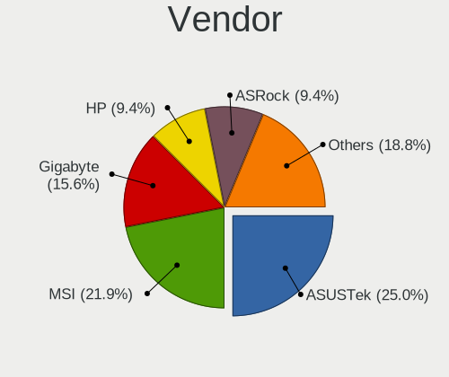
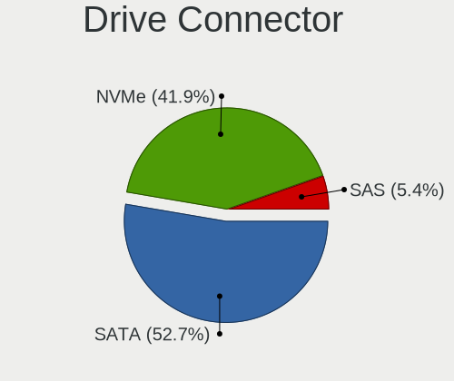
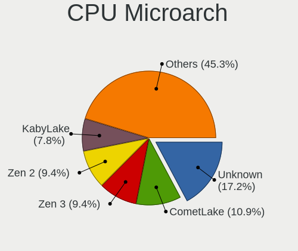
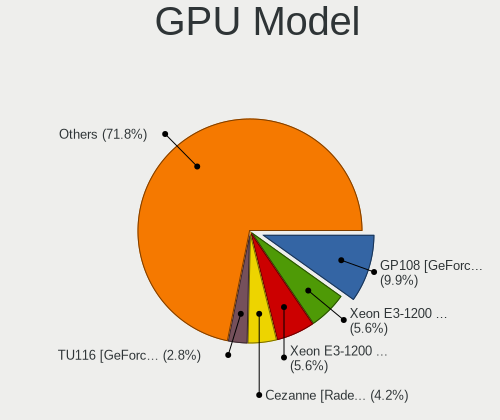
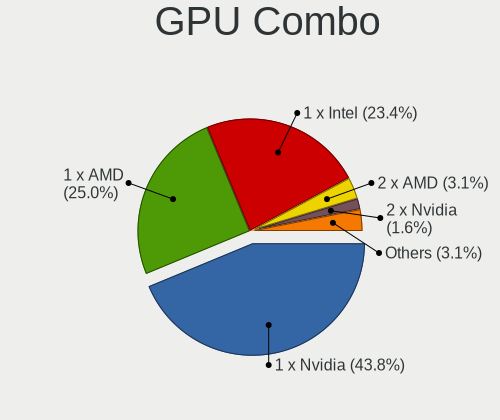
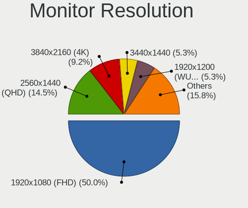
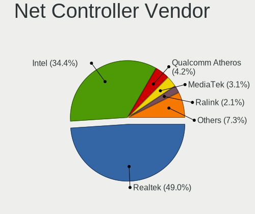
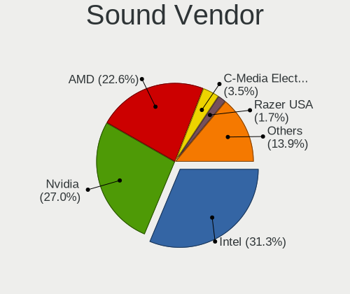
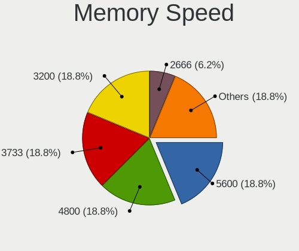
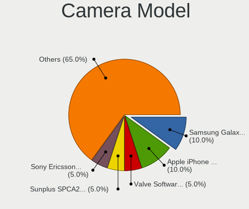

TUXEDO OS - Tested Hardware & Statistics (Desktops)
---------------------------------------------------

A project to collect tested hardware configurations for TUXEDO OS.

Anyone can contribute to this report by the [hw-probe](https://github.com/linuxhw/hw-probe) tool:

    sudo -E hw-probe -all -upload

Please contribute! Especially if your hardware is rare.

Contents
--------

* [ Test Cases ](#test-cases)

* [ System ](#system)
  - [ OS                       ](#os)
  - [ OS Family                ](#os-family)
  - [ Kernel                   ](#kernel)
  - [ Kernel Family            ](#kernel-family)
  - [ Kernel Major Ver.        ](#kernel-major-ver)
  - [ Arch                     ](#arch)
  - [ DE                       ](#de)
  - [ Display Server           ](#display-server)
  - [ Display Manager          ](#display-manager)
  - [ OS Lang                  ](#os-lang)
  - [ Boot Mode                ](#boot-mode)
  - [ Filesystem               ](#filesystem)
  - [ Part. scheme             ](#part-scheme)
  - [ Dual Boot with Linux/BSD ](#dual-boot-with-linuxbsd)
  - [ Dual Boot (Win)          ](#dual-boot-win)

* [ Board ](#board)
  - [ Vendor                   ](#vendor)
  - [ Model                    ](#model)
  - [ Model Family             ](#model-family)
  - [ MFG Year                 ](#mfg-year)
  - [ Form Factor              ](#form-factor)
  - [ Secure Boot              ](#secure-boot)
  - [ Coreboot                 ](#coreboot)
  - [ RAM Size                 ](#ram-size)
  - [ RAM Used                 ](#ram-used)
  - [ Total Drives             ](#total-drives)
  - [ Has CD-ROM               ](#has-cd-rom)
  - [ Has Ethernet             ](#has-ethernet)
  - [ Has WiFi                 ](#has-wifi)
  - [ Has Bluetooth            ](#has-bluetooth)

* [ Location ](#location)
  - [ Country                  ](#country)
  - [ City                     ](#city)

* [ Drives ](#drives)
  - [ Drive Vendor             ](#drive-vendor)
  - [ Drive Model              ](#drive-model)
  - [ HDD Vendor               ](#hdd-vendor)
  - [ SSD Vendor               ](#ssd-vendor)
  - [ Drive Kind               ](#drive-kind)
  - [ Drive Connector          ](#drive-connector)
  - [ Drive Size               ](#drive-size)
  - [ Space Total              ](#space-total)
  - [ Space Used               ](#space-used)
  - [ Malfunc. Drives          ](#malfunc-drives)
  - [ Malfunc. Drive Vendor    ](#malfunc-drive-vendor)
  - [ Malfunc. HDD Vendor      ](#malfunc-hdd-vendor)
  - [ Malfunc. Drive Kind      ](#malfunc-drive-kind)
  - [ Failed Drives            ](#failed-drives)
  - [ Failed Drive Vendor      ](#failed-drive-vendor)
  - [ Drive Status             ](#drive-status)

* [ Storage controller ](#storage-controller)
  - [ Storage Vendor           ](#storage-vendor)
  - [ Storage Model            ](#storage-model)
  - [ Storage Kind             ](#storage-kind)

* [ Processor ](#processor)
  - [ CPU Vendor               ](#cpu-vendor)
  - [ CPU Model                ](#cpu-model)
  - [ CPU Model Family         ](#cpu-model-family)
  - [ CPU Cores                ](#cpu-cores)
  - [ CPU Sockets              ](#cpu-sockets)
  - [ CPU Threads              ](#cpu-threads)
  - [ CPU Op-Modes             ](#cpu-op-modes)
  - [ CPU Microcode            ](#cpu-microcode)
  - [ CPU Microarch            ](#cpu-microarch)

* [ Graphics ](#graphics)
  - [ GPU Vendor               ](#gpu-vendor)
  - [ GPU Model                ](#gpu-model)
  - [ GPU Combo                ](#gpu-combo)
  - [ GPU Driver               ](#gpu-driver)
  - [ GPU Memory               ](#gpu-memory)

* [ Monitor ](#monitor)
  - [ Monitor Vendor           ](#monitor-vendor)
  - [ Monitor Model            ](#monitor-model)
  - [ Monitor Resolution       ](#monitor-resolution)
  - [ Monitor Diagonal         ](#monitor-diagonal)
  - [ Monitor Width            ](#monitor-width)
  - [ Aspect Ratio             ](#aspect-ratio)
  - [ Monitor Area             ](#monitor-area)
  - [ Pixel Density            ](#pixel-density)
  - [ Multiple Monitors        ](#multiple-monitors)

* [ Network ](#network)
  - [ Net Controller Vendor    ](#net-controller-vendor)
  - [ Net Controller Model     ](#net-controller-model)
  - [ Wireless Vendor          ](#wireless-vendor)
  - [ Wireless Model           ](#wireless-model)
  - [ Ethernet Vendor          ](#ethernet-vendor)
  - [ Ethernet Model           ](#ethernet-model)
  - [ Net Controller Kind      ](#net-controller-kind)
  - [ Used Controller          ](#used-controller)
  - [ NICs                     ](#nics)
  - [ IPv6                     ](#ipv6)

* [ Bluetooth ](#bluetooth)
  - [ Bluetooth Vendor         ](#bluetooth-vendor)
  - [ Bluetooth Model          ](#bluetooth-model)

* [ Sound ](#sound)
  - [ Sound Vendor             ](#sound-vendor)
  - [ Sound Model              ](#sound-model)

* [ Memory ](#memory)
  - [ Memory Vendor            ](#memory-vendor)
  - [ Memory Model             ](#memory-model)
  - [ Memory Kind              ](#memory-kind)
  - [ Memory Form Factor       ](#memory-form-factor)
  - [ Memory Size              ](#memory-size)
  - [ Memory Speed             ](#memory-speed)

* [ Printers & scanners ](#printers--scanners)
  - [ Printer Vendor           ](#printer-vendor)
  - [ Printer Model            ](#printer-model)
  - [ Scanner Vendor           ](#scanner-vendor)
  - [ Scanner Model            ](#scanner-model)

* [ Camera ](#camera)
  - [ Camera Vendor            ](#camera-vendor)
  - [ Camera Model             ](#camera-model)

* [ Security ](#security)
  - [ Fingerprint Vendor       ](#fingerprint-vendor)
  - [ Fingerprint Model        ](#fingerprint-model)
  - [ Chipcard Vendor          ](#chipcard-vendor)
  - [ Chipcard Model           ](#chipcard-model)

* [ Unsupported ](#unsupported)
  - [ Unsupported Devices      ](#unsupported-devices)
  - [ Unsupported Device Types ](#unsupported-device-types)

Test Cases
----------

Total: 16

| Vendor   | Model                       | Probe                                                      | Date         |
|----------|-----------------------------|------------------------------------------------------------|--------------|
| ASUSTek  | ROG STRIX B550-I GAMING     | [01846991de](https://linux-hardware.org/?probe=01846991de) | Aug 04, 2023 |
| ASUSTek  | PRIME B450-PLUS             | [fde0e0e94f](https://linux-hardware.org/?probe=fde0e0e94f) | Jul 29, 2023 |
| ASRock   | H170M Pro4                  | [818c9bc358](https://linux-hardware.org/?probe=818c9bc358) | Jun 14, 2023 |
| Lenovo   | 30D9 SDK0J40697 WIN 3305... | [7332acbb0e](https://linux-hardware.org/?probe=7332acbb0e) | May 15, 2023 |
| MSI      | PRO Z690-A WIFI DDR4        | [6142fe7fbd](https://linux-hardware.org/?probe=6142fe7fbd) | May 14, 2023 |
| Gigabyte | H81M-HD3                    | [8aaef31933](https://linux-hardware.org/?probe=8aaef31933) | Mar 19, 2023 |
| Dell     | 051FJ8 A02                  | [4c5eee300d](https://linux-hardware.org/?probe=4c5eee300d) | Mar 13, 2023 |
| ASUSTek  | TUF Gaming H470-PRO         | [769cd87ebd](https://linux-hardware.org/?probe=769cd87ebd) | Mar 07, 2023 |
| ASUSTek  | TUF Gaming H470-PRO         | [e1846f2a68](https://linux-hardware.org/?probe=e1846f2a68) | Mar 07, 2023 |
| MSI      | MAG B560M MORTAR WIFI       | [886aa04456](https://linux-hardware.org/?probe=886aa04456) | Mar 07, 2023 |
| MSI      | MAG B560M MORTAR WIFI       | [9088ef4d11](https://linux-hardware.org/?probe=9088ef4d11) | Mar 06, 2023 |
| ASUSTek  | P8H61-M LX                  | [01f7386d8c](https://linux-hardware.org/?probe=01f7386d8c) | Mar 02, 2023 |
| ASRock   | Z270M-ITX/ac                | [4f507f4e5a](https://linux-hardware.org/?probe=4f507f4e5a) | Feb 20, 2023 |
| ASUSTek  | PRIME H410M-K               | [7cc71e6021](https://linux-hardware.org/?probe=7cc71e6021) | Feb 12, 2023 |
| HP       | 2B34                        | [3376fc38b3](https://linux-hardware.org/?probe=3376fc38b3) | Feb 05, 2023 |
| HP       | 8906 SMVB                   | [aeb826326b](https://linux-hardware.org/?probe=aeb826326b) | Dec 20, 2022 |

System
------

OS
--

Installed operating systems

| Name            | Desktops | Percent |
|-----------------|----------|---------|
| TUXEDO OS 22.04 | 14       | 100%    |

OS Family
---------

OS without a version

| Name      | Desktops | Percent |
|-----------|----------|---------|
| TUXEDO OS | 14       | 100%    |

Kernel
------

Version of the Linux kernel

| Version             | Desktops | Percent |
|---------------------|----------|---------|
| 6.1.0-1009-tuxedo   | 4        | 28.57%  |
| 6.2.0-10007-tuxedo  | 3        | 21.43%  |
| 5.15.0-10058-tuxedo | 3        | 21.43%  |
| 6.2.0-10018-tuxedo  | 2        | 14.29%  |
| 5.15.0-10057-tuxedo | 1        | 7.14%   |
| 5.15.0-10056-tuxedo | 1        | 7.14%   |

Kernel Family
-------------

Linux kernel without a distro release

| Version | Desktops | Percent |
|---------|----------|---------|
| 6.2.0   | 5        | 35.71%  |
| 5.15.0  | 5        | 35.71%  |
| 6.1.0   | 4        | 28.57%  |

Kernel Major Ver.
-----------------

Linux kernel major version

| Version | Desktops | Percent |
|---------|----------|---------|
| 6.2     | 5        | 35.71%  |
| 5.15    | 5        | 35.71%  |
| 6.1     | 4        | 28.57%  |

Arch
----

OS architecture (x86_64, i586, etc.)

| Name   | Desktops | Percent |
|--------|----------|---------|
| x86_64 | 14       | 100%    |

DE
--

Desktop Environment

| Name | Desktops | Percent |
|------|----------|---------|
| KDE5 | 14       | 100%    |

Display Server
--------------

X11 or Wayland

| Name    | Desktops | Percent |
|---------|----------|---------|
| X11     | 12       | 85.71%  |
| Wayland | 2        | 14.29%  |

Display Manager
---------------

SDDM, LightDM, etc.

| Name    | Desktops | Percent |
|---------|----------|---------|
| Unknown | 13       | 92.86%  |
| SDDM    | 1        | 7.14%   |

OS Lang
-------

Language

| Lang  | Desktops | Percent |
|-------|----------|---------|
| de_DE | 6        | 42.86%  |
| en_ZA | 2        | 14.29%  |
| en_US | 2        | 14.29%  |
| pl_PL | 1        | 7.14%   |
| en_AG | 1        | 7.14%   |
| de_CH | 1        | 7.14%   |
| de_AT | 1        | 7.14%   |

Boot Mode
---------

EFI or BIOS

| Mode | Desktops | Percent |
|------|----------|---------|
| BIOS | 13       | 92.86%  |
| EFI  | 1        | 7.14%   |

Filesystem
----------

Type of filesystem

| Type  | Desktops | Percent |
|-------|----------|---------|
| Ext4  | 12       | 85.71%  |
| Xfs   | 1        | 7.14%   |
| Btrfs | 1        | 7.14%   |

Part. scheme
------------

Scheme of partitioning

| Type    | Desktops | Percent |
|---------|----------|---------|
| Unknown | 13       | 92.86%  |
| GPT     | 1        | 7.14%   |

Dual Boot with Linux/BSD
------------------------

Hosting more than one Linux/BSD

| Dual boot | Desktops | Percent |
|-----------|----------|---------|
| No        | 13       | 92.86%  |
| Yes       | 1        | 7.14%   |

Dual Boot (Win)
---------------

Hosting Linux and Windows

| Dual boot | Desktops | Percent |
|-----------|----------|---------|
| No        | 13       | 92.86%  |
| Yes       | 1        | 7.14%   |

Board
-----

Vendor
------

Motherboard manufacturer

| Name                | Desktops | Percent |
|---------------------|----------|---------|
| ASUSTek Computer    | 5        | 35.71%  |
| MSI                 | 2        | 14.29%  |
| Hewlett-Packard     | 2        | 14.29%  |
| ASRock              | 2        | 14.29%  |
| Lenovo              | 1        | 7.14%   |
| Gigabyte Technology | 1        | 7.14%   |
| Dell                | 1        | 7.14%   |

Model
-----

Motherboard model

| Name                                 | Desktops | Percent |
|--------------------------------------|----------|---------|
| MSI MS-7D25                          | 1        | 7.14%   |
| MSI MS-7D17                          | 1        | 7.14%   |
| Lenovo ThinkCentre M700 10GSS05X48   | 1        | 7.14%   |
| HP Pavilion Gaming Desktop TG01-2xxx | 1        | 7.14%   |
| HP 280 G1 MT                         | 1        | 7.14%   |
| Gigabyte H81M-HD3                    | 1        | 7.14%   |
| Dell OptiPlex 9010                   | 1        | 7.14%   |
| ASUS TUF Gaming H470-PRO             | 1        | 7.14%   |
| ASUS ROG STRIX B550-I GAMING         | 1        | 7.14%   |
| ASUS PRIME H410M-K                   | 1        | 7.14%   |
| ASUS PRIME B450-PLUS                 | 1        | 7.14%   |
| ASUS P8H61-M LX                      | 1        | 7.14%   |
| ASRock Z270M-ITX/ac                  | 1        | 7.14%   |
| ASRock H170M Pro4                    | 1        | 7.14%   |

Model Family
------------

Motherboard model prefix

| Name               | Desktops | Percent |
|--------------------|----------|---------|
| ASUS PRIME         | 2        | 14.29%  |
| MSI MS-7D25        | 1        | 7.14%   |
| MSI MS-7D17        | 1        | 7.14%   |
| Lenovo ThinkCentre | 1        | 7.14%   |
| HP Pavilion        | 1        | 7.14%   |
| HP 280             | 1        | 7.14%   |
| Gigabyte H81M-HD3  | 1        | 7.14%   |
| Dell OptiPlex      | 1        | 7.14%   |
| ASUS TUF           | 1        | 7.14%   |
| ASUS ROG           | 1        | 7.14%   |
| ASUS P8H61-M       | 1        | 7.14%   |
| ASRock Z270M-ITX   | 1        | 7.14%   |
| ASRock H170M       | 1        | 7.14%   |

MFG Year
--------

Motherboard manufacture year

| Year | Desktops | Percent |
|------|----------|---------|
| 2021 | 3        | 21.43%  |
| 2020 | 3        | 21.43%  |
| 2015 | 2        | 14.29%  |
| 2013 | 2        | 14.29%  |
| 2022 | 1        | 7.14%   |
| 2018 | 1        | 7.14%   |
| 2016 | 1        | 7.14%   |
| 2011 | 1        | 7.14%   |

Form Factor
-----------

Physical design of the computer

| Name    | Desktops | Percent |
|---------|----------|---------|
| Desktop | 14       | 100%    |

Secure Boot
-----------

Enabled or disabled

| State    | Desktops | Percent |
|----------|----------|---------|
| Disabled | 14       | 100%    |

Coreboot
--------

Have coreboot on board

| Used | Desktops | Percent |
|------|----------|---------|
| No   | 14       | 100%    |

RAM Size
--------

Total RAM memory

| Size in GB  | Desktops | Percent |
|-------------|----------|---------|
| 3.01-4.0    | 3        | 21.43%  |
| 16.01-24.0  | 3        | 21.43%  |
| 4.01-8.0    | 2        | 14.29%  |
| 32.01-64.0  | 2        | 14.29%  |
| 8.01-16.0   | 2        | 14.29%  |
| 24.01-32.0  | 1        | 7.14%   |
| 64.01-256.0 | 1        | 7.14%   |

RAM Used
--------

Used RAM memory

| Used GB  | Desktops | Percent |
|----------|----------|---------|
| 2.01-3.0 | 7        | 50%     |
| 1.01-2.0 | 5        | 35.71%  |
| 4.01-8.0 | 1        | 7.14%   |
| 3.01-4.0 | 1        | 7.14%   |

Total Drives
------------

Number of drives on board

| Drives | Desktops | Percent |
|--------|----------|---------|
| 2      | 6        | 42.86%  |
| 4      | 3        | 21.43%  |
| 1      | 3        | 21.43%  |
| 5      | 2        | 14.29%  |

Has CD-ROM
----------

Has CD-ROM on board

| Presented | Desktops | Percent |
|-----------|----------|---------|
| No        | 9        | 64.29%  |
| Yes       | 5        | 35.71%  |

Has Ethernet
------------

Has Ethernet on board

| Presented | Desktops | Percent |
|-----------|----------|---------|
| Yes       | 14       | 100%    |

Has WiFi
--------

Has WiFi module

| Presented | Desktops | Percent |
|-----------|----------|---------|
| Yes       | 8        | 57.14%  |
| No        | 6        | 42.86%  |

Has Bluetooth
-------------

Has Bluetooth module

| Presented | Desktops | Percent |
|-----------|----------|---------|
| Yes       | 7        | 50%     |
| No        | 7        | 50%     |

Location
--------

Country
-------

Geographic location (country)

| Country      | Desktops | Percent |
|--------------|----------|---------|
| Germany      | 6        | 42.86%  |
| South Africa | 2        | 14.29%  |
| Switzerland  | 1        | 7.14%   |
| Romania      | 1        | 7.14%   |
| Poland       | 1        | 7.14%   |
| Netherlands  | 1        | 7.14%   |
| Egypt        | 1        | 7.14%   |
| Austria      | 1        | 7.14%   |

City
----

Geographic location (city)

| City                      | Desktops | Percent |
|---------------------------|----------|---------|
| Zurich                    | 1        | 7.14%   |
| Zalău                    | 1        | 7.14%   |
| Vienna                    | 1        | 7.14%   |
| Peitz                     | 1        | 7.14%   |
| Offenbach                 | 1        | 7.14%   |
| Lublin                    | 1        | 7.14%   |
| Leipzig                   | 1        | 7.14%   |
| Johannesburg              | 1        | 7.14%   |
| Hürth                    | 1        | 7.14%   |
| Frankfurt am Main         | 1        | 7.14%   |
| Cairo                     | 1        | 7.14%   |
| Bloemfontein              | 1        | 7.14%   |
| Bad Neustadt an der Saale | 1        | 7.14%   |
| Amsterdam                 | 1        | 7.14%   |

Drives
------

Drive Vendor
------------

Hard drive vendors

| Vendor              | Desktops | Drives | Percent |
|---------------------|----------|--------|---------|
| Seagate             | 6        | 8      | 20%     |
| Samsung Electronics | 5        | 8      | 16.67%  |
| Sandisk             | 3        | 4      | 10%     |
| WDC                 | 2        | 3      | 6.67%   |
| GOODRAM             | 2        | 2      | 6.67%   |
| Silicon Motion      | 1        | 2      | 3.33%   |
| Lite-On Technology  | 1        | 1      | 3.33%   |
| Kingston            | 1        | 1      | 3.33%   |
| HS-SSD-E100         | 1        | 1      | 3.33%   |
| Hitachi             | 1        | 1      | 3.33%   |
| Hikvision           | 1        | 2      | 3.33%   |
| HGST HTS            | 1        | 1      | 3.33%   |
| HGST                | 1        | 1      | 3.33%   |
| China               | 1        | 1      | 3.33%   |
| ASMT                | 1        | 1      | 3.33%   |
| Apacer              | 1        | 1      | 3.33%   |
| AMD                 | 1        | 1      | 3.33%   |

Drive Model
-----------

Hard drive models

| Model                                               | Desktops | Percent |
|-----------------------------------------------------|----------|---------|
| Sandisk WD Black SN750 / PC SN730 NVMe SSD 1024GB   | 2        | 5.56%   |
| Samsung SSD 980 500GB                               | 2        | 5.56%   |
| WDC WD80EAZZ-00BKLB0 8TB                            | 1        | 2.78%   |
| WDC WD20EZRZ-00Z5HB0 2TB                            | 1        | 2.78%   |
| WDC WD10JPVX-11JC3T0 1TB                            | 1        | 2.78%   |
| Silicon Motion SM2262/SM2262EN SSD Controller 512GB | 1        | 2.78%   |
| Seagate ST500DM002-1BD142 500GB                     | 1        | 2.78%   |
| Seagate ST3500418AS 500GB                           | 1        | 2.78%   |
| Seagate ST3500413AS 500GB                           | 1        | 2.78%   |
| Seagate ST2000LM007-1R8174 2TB                      | 1        | 2.78%   |
| Seagate ST1000VT001-1RE172 1TB                      | 1        | 2.78%   |
| Seagate ST1000LM035-1RK172 1TB                      | 1        | 2.78%   |
| Seagate ST1000DX001-1NS162-SSHD 1TB                 | 1        | 2.78%   |
| Seagate ST1000DM010-2EP102 1TB                      | 1        | 2.78%   |
| Sandisk WD Black SN850 1TB                          | 1        | 2.78%   |
| SanDisk SSD PLUS 120GB                              | 1        | 2.78%   |
| Samsung SSD 980 1TB                                 | 1        | 2.78%   |
| Samsung SSD 860 QVO 1TB                             | 1        | 2.78%   |
| Samsung SSD 860 EVO 1TB                             | 1        | 2.78%   |
| Samsung SSD 850 EVO 500GB                           | 1        | 2.78%   |
| Samsung NVMe SSD Controller SM981/PM981/PM983 500GB | 1        | 2.78%   |
| Lite-On PLEXTOR PX-256M9PeY 256GB                   | 1        | 2.78%   |
| Kingston SUV400S37120G 120GB SSD                    | 1        | 2.78%   |
| HS-SSD-E100 128G                                    | 1        | 2.78%   |
| Hitachi HCS545050GLA380 500GB                       | 1        | 2.78%   |
| Hikvision HS-SSD-E2000 256G                         | 1        | 2.78%   |
| HGST HTS725050A7E630 500GB                          | 1        | 2.78%   |
| HGST HTS 725050A7E630 500GB                         | 1        | 2.78%   |
| GOODRAM SSDPR-CX400-256-G2 256GB                    | 1        | 2.78%   |
| GOODRAM SSDPR-CX400-01T-G2 1TB                      | 1        | 2.78%   |
| China SSD 256GB                                     | 1        | 2.78%   |
| ASMT 2115 64GB                                      | 1        | 2.78%   |
| Apacer AS350 512GB SSD                              | 1        | 2.78%   |
| AMD CT1000P3SSD8 1TB                                | 1        | 2.78%   |

HDD Vendor
----------

Hard disk drive vendors

| Vendor   | Desktops | Drives | Percent |
|----------|----------|--------|---------|
| Seagate  | 6        | 8      | 50%     |
| WDC      | 2        | 3      | 16.67%  |
| Hitachi  | 1        | 1      | 8.33%   |
| HGST HTS | 1        | 1      | 8.33%   |
| HGST     | 1        | 1      | 8.33%   |
| ASMT     | 1        | 1      | 8.33%   |

SSD Vendor
----------

Solid state drive vendors

| Vendor              | Desktops | Drives | Percent |
|---------------------|----------|--------|---------|
| Samsung Electronics | 2        | 3      | 25%     |
| GOODRAM             | 2        | 2      | 25%     |
| SanDisk             | 1        | 1      | 12.5%   |
| Kingston            | 1        | 1      | 12.5%   |
| China               | 1        | 1      | 12.5%   |
| Apacer              | 1        | 1      | 12.5%   |

Drive Kind
----------

HDD or SSD

| Kind    | Desktops | Drives | Percent |
|---------|----------|--------|---------|
| HDD     | 10       | 15     | 37.04%  |
| NVMe    | 9        | 14     | 33.33%  |
| SSD     | 7        | 9      | 25.93%  |
| Unknown | 1        | 1      | 3.7%    |

Drive Connector
---------------

SATA, SAS, NVMe, etc.

| Type | Desktops | Drives | Percent |
|------|----------|--------|---------|
| SATA | 12       | 23     | 54.55%  |
| NVMe | 9        | 14     | 40.91%  |
| SAS  | 1        | 2      | 4.55%   |

Drive Size
----------

Size of hard drive

| Size in TB | Desktops | Drives | Percent |
|------------|----------|--------|---------|
| 0.01-0.5   | 8        | 12     | 44.44%  |
| 0.51-1.0   | 7        | 9      | 38.89%  |
| 1.01-2.0   | 2        | 2      | 11.11%  |
| 4.01-10.0  | 1        | 1      | 5.56%   |

Space Total
-----------

Amount of disk space available on the file system

| Size in GB | Desktops | Percent |
|------------|----------|---------|
| 101-250    | 4        | 28.57%  |
| 501-1000   | 4        | 28.57%  |
| 251-500    | 2        | 14.29%  |
| 1001-2000  | 2        | 14.29%  |
| 21-50      | 1        | 7.14%   |
| 2001-3000  | 1        | 7.14%   |

Space Used
----------

Amount of used disk space

| Used GB  | Desktops | Percent |
|----------|----------|---------|
| 21-50    | 4        | 28.57%  |
| 1-20     | 4        | 28.57%  |
| 251-500  | 2        | 14.29%  |
| 101-250  | 2        | 14.29%  |
| 501-1000 | 1        | 7.14%   |
| 51-100   | 1        | 7.14%   |

Malfunc. Drives
---------------

Drive models with a malfunction

Zero info for selected period =(

Malfunc. Drive Vendor
---------------------

Vendors of faulty drives

Zero info for selected period =(

Malfunc. HDD Vendor
-------------------

Vendors of faulty HDD drives

Zero info for selected period =(

Malfunc. Drive Kind
-------------------

Kinds of faulty drives

Zero info for selected period =(

Failed Drives
-------------

Failed drive models

Zero info for selected period =(

Failed Drive Vendor
-------------------

Failed drive vendors

Zero info for selected period =(

Drive Status
------------

Number of failed and malfunc. drives

| Status   | Desktops | Drives | Percent |
|----------|----------|--------|---------|
| Detected | 13       | 33     | 86.67%  |
| Works    | 2        | 6      | 13.33%  |

Storage controller
------------------

Storage Vendor
--------------

Storage controller vendors

| Vendor              | Desktops | Percent |
|---------------------|----------|---------|
| Intel               | 11       | 50%     |
| Samsung Electronics | 4        | 18.18%  |
| AMD                 | 3        | 13.64%  |
| SanDisk             | 2        | 9.09%   |
| Silicon Motion      | 1        | 4.55%   |
| Lite-On Technology  | 1        | 4.55%   |

Storage Model
-------------

Storage controller models

| Model                                                                                   | Desktops | Percent |
|-----------------------------------------------------------------------------------------|----------|---------|
| Samsung NVMe SSD Controller 980                                                         | 3        | 11.11%  |
| SanDisk WD Black SN750 / PC SN730 NVMe SSD                                              | 2        | 7.41%   |
| Intel Q170/Q150/B150/H170/H110/Z170/CM236 Chipset SATA Controller [AHCI Mode]           | 2        | 7.41%   |
| Intel 8 Series/C220 Series Chipset Family 6-port SATA Controller 1 [AHCI mode]          | 2        | 7.41%   |
| AMD FCH SATA Controller [AHCI mode]                                                     | 2        | 7.41%   |
| AMD 400 Series Chipset SATA Controller                                                  | 2        | 7.41%   |
| Silicon Motion SM2262/SM2262EN SSD Controller                                           | 1        | 3.7%    |
| SanDisk WD PC SN810 / Black SN850 NVMe SSD                                              | 1        | 3.7%    |
| Samsung NVMe SSD Controller SM981/PM981/PM983                                           | 1        | 3.7%    |
| Lite-On Non-Volatile memory controller                                                  | 1        | 3.7%    |
| Intel Comet Lake PCH-H RAID                                                             | 1        | 3.7%    |
| Intel Alder Lake-S PCH SATA Controller [AHCI Mode]                                      | 1        | 3.7%    |
| Intel 7 Series/C210 Series Chipset Family 6-port SATA Controller [AHCI mode]            | 1        | 3.7%    |
| Intel 6 Series/C200 Series Chipset Family Desktop SATA Controller (IDE mode, ports 4-5) | 1        | 3.7%    |
| Intel 6 Series/C200 Series Chipset Family Desktop SATA Controller (IDE mode, ports 0-3) | 1        | 3.7%    |
| Intel 500 Series Chipset Family SATA AHCI Controller                                    | 1        | 3.7%    |
| Intel 400 Series Chipset Family SATA AHCI Controller                                    | 1        | 3.7%    |
| Intel 200 Series PCH SATA controller [AHCI mode]                                        | 1        | 3.7%    |
| AMD FCH SATA Controller [RAID Bottom]                                                   | 1        | 3.7%    |
| AMD 500 Series Chipset SATA Controller                                                  | 1        | 3.7%    |

Storage Kind
------------

Kind of storage controller (IDE, SATA, NVMe, SAS, ...)

| Kind | Desktops | Percent |
|------|----------|---------|
| SATA | 12       | 52.17%  |
| NVMe | 9        | 39.13%  |
| RAID | 1        | 4.35%   |
| IDE  | 1        | 4.35%   |

Processor
---------

CPU Vendor
----------

Processor vendors

| Vendor | Desktops | Percent |
|--------|----------|---------|
| Intel  | 11       | 78.57%  |
| AMD    | 3        | 21.43%  |

CPU Model
---------

Processor models

| Model                                  | Desktops | Percent |
|----------------------------------------|----------|---------|
| Intel Core i5-3470 CPU @ 3.20GHz       | 2        | 14.29%  |
| Intel Pentium CPU G3420 @ 3.20GHz      | 1        | 7.14%   |
| Intel Core i5-7600T CPU @ 2.80GHz      | 1        | 7.14%   |
| Intel Core i5-4590S CPU @ 3.00GHz      | 1        | 7.14%   |
| Intel Core i5-10400F CPU @ 2.90GHz     | 1        | 7.14%   |
| Intel Core i5-10400 CPU @ 2.90GHz      | 1        | 7.14%   |
| Intel Core i3-6300 CPU @ 3.80GHz       | 1        | 7.14%   |
| Intel Core i3-6100 CPU @ 3.70GHz       | 1        | 7.14%   |
| Intel 12th Gen Core i9-12900KS         | 1        | 7.14%   |
| Intel 11th Gen Core i7-11700 @ 2.50GHz | 1        | 7.14%   |
| AMD Ryzen 7 5700G with Radeon Graphics | 1        | 7.14%   |
| AMD Ryzen 7 3700X 8-Core Processor     | 1        | 7.14%   |
| AMD Ryzen 5 5600G with Radeon Graphics | 1        | 7.14%   |

CPU Model Family
----------------

Processor model prefix

| Model         | Desktops | Percent |
|---------------|----------|---------|
| Intel Core i5 | 6        | 42.86%  |
| Other         | 2        | 14.29%  |
| Intel Core i3 | 2        | 14.29%  |
| AMD Ryzen 7   | 2        | 14.29%  |
| Intel Pentium | 1        | 7.14%   |
| AMD Ryzen 5   | 1        | 7.14%   |

CPU Cores
---------

Number of processor cores

| Number | Desktops | Percent |
|--------|----------|---------|
| 4      | 4        | 28.57%  |
| 8      | 3        | 21.43%  |
| 6      | 3        | 21.43%  |
| 2      | 3        | 21.43%  |
| 16     | 1        | 7.14%   |

CPU Sockets
-----------

Number of sockets

| Number | Desktops | Percent |
|--------|----------|---------|
| 1      | 14       | 100%    |

CPU Threads
-----------

Threads per core (Hyper-Threading)

| Number | Desktops | Percent |
|--------|----------|---------|
| 2      | 9        | 64.29%  |
| 1      | 5        | 35.71%  |

CPU Op-Modes
------------

CPU Operation Modes (32-bit, 64-bit)

| Op mode        | Desktops | Percent |
|----------------|----------|---------|
| 32-bit, 64-bit | 14       | 100%    |

CPU Microcode
-------------

Microcode number

| Number     | Desktops | Percent |
|------------|----------|---------|
| Unknown    | 12       | 85.71%  |
| 0xa0653    | 1        | 7.14%   |
| 0x0a50000d | 1        | 7.14%   |

CPU Microarch
-------------

Microarchitecture

| Name      | Desktops | Percent |
|-----------|----------|---------|
| Zen 3     | 2        | 14.29%  |
| Skylake   | 2        | 14.29%  |
| IvyBridge | 2        | 14.29%  |
| Haswell   | 2        | 14.29%  |
| CometLake | 2        | 14.29%  |
| Unknown   | 2        | 14.29%  |
| Zen 2     | 1        | 7.14%   |
| KabyLake  | 1        | 7.14%   |

Graphics
--------

GPU Vendor
----------

Vendors of graphics cards

| Vendor | Desktops | Percent |
|--------|----------|---------|
| Intel  | 8        | 57.14%  |
| Nvidia | 4        | 28.57%  |
| AMD    | 2        | 14.29%  |

GPU Model
---------

Graphics card models

| Model                                                                       | Desktops | Percent |
|-----------------------------------------------------------------------------|----------|---------|
| Intel Xeon E3-1200 v3/4th Gen Core Processor Integrated Graphics Controller | 2        | 14.29%  |
| Intel Xeon E3-1200 v2/3rd Gen Core processor Graphics Controller            | 2        | 14.29%  |
| Intel HD Graphics 530                                                       | 2        | 14.29%  |
| AMD Cezanne [Radeon Vega Series / Radeon Vega Mobile Series]                | 2        | 14.29%  |
| Nvidia TU106 [GeForce RTX 2070]                                             | 1        | 7.14%   |
| Nvidia GP108 [GeForce GT 1030]                                              | 1        | 7.14%   |
| Nvidia GP106 [GeForce GTX 1060 6GB]                                         | 1        | 7.14%   |
| Nvidia GP104 [GeForce GTX 1080]                                             | 1        | 7.14%   |
| Intel HD Graphics 630                                                       | 1        | 7.14%   |
| Intel AlderLake-S GT1                                                       | 1        | 7.14%   |

GPU Combo
---------

Combinations of graphics cards

| Name       | Desktops | Percent |
|------------|----------|---------|
| 1 x Intel  | 8        | 57.14%  |
| 1 x Nvidia | 4        | 28.57%  |
| 1 x AMD    | 2        | 14.29%  |

GPU Driver
----------

Free vs proprietary

| Driver      | Desktops | Percent |
|-------------|----------|---------|
| Free        | 10       | 71.43%  |
| Proprietary | 4        | 28.57%  |

GPU Memory
----------

Total video memory

| Size in GB | Desktops | Percent |
|------------|----------|---------|
| Unknown    | 9        | 64.29%  |
| 7.01-8.0   | 2        | 14.29%  |
| 5.01-6.0   | 1        | 7.14%   |
| 1.01-2.0   | 1        | 7.14%   |
| 0.01-0.5   | 1        | 7.14%   |

Monitor
-------

Monitor Vendor
--------------

Monitor vendors

| Vendor              | Desktops | Percent |
|---------------------|----------|---------|
| Acer                | 3        | 25%     |
| Samsung Electronics | 2        | 16.67%  |
| ViewSonic           | 1        | 8.33%   |
| Philips             | 1        | 8.33%   |
| Hewlett-Packard     | 1        | 8.33%   |
| Goldstar            | 1        | 8.33%   |
| Eizo                | 1        | 8.33%   |
| Dell                | 1        | 8.33%   |
| BenQ                | 1        | 8.33%   |

Monitor Model
-------------

Monitor models

| Model                                                             | Desktops | Percent |
|-------------------------------------------------------------------|----------|---------|
| ViewSonic VX2757 VSCF931 1920x1080 598x336mm 27.0-inch            | 1        | 7.69%   |
| Samsung Electronics S24D330 SAM0D92 1920x1080 531x299mm 24.0-inch | 1        | 7.69%   |
| Samsung Electronics C24F390 SAM0D2C 1920x1080 521x293mm 23.5-inch | 1        | 7.69%   |
| Philips 170S4 PHL0818 1280x1024 338x270mm 17.0-inch               | 1        | 7.69%   |
| Hewlett-Packard LA2405 HWP284C 1920x1200 518x324mm 24.1-inch      | 1        | 7.69%   |
| Goldstar E2041 GSM4EC9 1600x900 443x249mm 20.0-inch               | 1        | 7.69%   |
| Eizo EV2736W ENC2383 2560x1440 597x336mm 27.0-inch                | 1        | 7.69%   |
| Dell SE2419HR DELF113 1920x1080 527x296mm 23.8-inch               | 1        | 7.69%   |
| Dell S2421HN DEL41F2 1920x1080 527x296mm 23.8-inch                | 1        | 7.69%   |
| BenQ LCD BNQ8024 2560x1440 597x336mm 27.0-inch                    | 1        | 7.69%   |
| Acer Z35 ACR0478 2560x1080 814x346mm 34.8-inch                    | 1        | 7.69%   |
| Acer VG270 ACR06C0 1920x1080 598x336mm 27.0-inch                  | 1        | 7.69%   |
| Acer EK240Y ACR0758 1920x1080 530x299mm 24.0-inch                 | 1        | 7.69%   |

Monitor Resolution
------------------

Monitor screen resolution

| Resolution        | Desktops | Percent |
|-------------------|----------|---------|
| 1920x1080 (FHD)   | 6        | 50%     |
| 2560x1440 (QHD)   | 2        | 16.67%  |
| 2560x1080         | 1        | 8.33%   |
| 1920x1200 (WUXGA) | 1        | 8.33%   |
| 1600x900 (HD+)    | 1        | 8.33%   |
| 1280x1024 (SXGA)  | 1        | 8.33%   |

Monitor Diagonal
----------------

Diagonal size in inches

| Inches | Desktops | Percent |
|--------|----------|---------|
| 27     | 4        | 30.77%  |
| 24     | 4        | 30.77%  |
| 23     | 2        | 15.38%  |
| 34     | 1        | 7.69%   |
| 20     | 1        | 7.69%   |
| 17     | 1        | 7.69%   |

Monitor Width
-------------

Physical width

| Width in mm | Desktops | Percent |
|-------------|----------|---------|
| 501-600     | 9        | 75%     |
| 801-900     | 1        | 8.33%   |
| 401-500     | 1        | 8.33%   |
| 301-350     | 1        | 8.33%   |

Aspect Ratio
------------

Proportional relationship between the width and the height

| Ratio | Desktops | Percent |
|-------|----------|---------|
| 16/9  | 9        | 75%     |
| 5/4   | 1        | 8.33%   |
| 21/9  | 1        | 8.33%   |
| 16/10 | 1        | 8.33%   |

Monitor Area
------------

Area in inch²

| Area in inch² | Desktops | Percent |
|----------------|----------|---------|
| 301-350        | 4        | 33.33%  |
| 201-250        | 4        | 33.33%  |
| 351-500        | 1        | 8.33%   |
| 251-300        | 1        | 8.33%   |
| 151-200        | 1        | 8.33%   |
| 141-150        | 1        | 8.33%   |

Pixel Density
-------------

Pixels per inch

| Density | Desktops | Percent |
|---------|----------|---------|
| 51-100  | 10       | 83.33%  |
| 101-120 | 2        | 16.67%  |

Multiple Monitors
-----------------

Total monitors connected

| Total | Desktops | Percent |
|-------|----------|---------|
| 1     | 12       | 85.71%  |
| 2     | 2        | 14.29%  |

Network
-------

Net Controller Vendor
---------------------

Controller vendors

| Vendor                | Desktops | Percent |
|-----------------------|----------|---------|
| Realtek Semiconductor | 9        | 47.37%  |
| Intel                 | 7        | 36.84%  |
| Qualcomm Atheros      | 1        | 5.26%   |
| D-Link                | 1        | 5.26%   |
| Broadcom              | 1        | 5.26%   |

Net Controller Model
--------------------

Controller models

| Model                                                                | Desktops | Percent |
|----------------------------------------------------------------------|----------|---------|
| Realtek RTL8111/8168/8411 PCI Express Gigabit Ethernet Controller    | 7        | 29.17%  |
| Intel Ethernet Controller I225-V                                     | 2        | 8.33%   |
| Intel Ethernet Connection (2) I219-V                                 | 2        | 8.33%   |
| Realtek RTL8821CE 802.11ac PCIe Wireless Network Adapter             | 1        | 4.17%   |
| Realtek RTL8125 2.5GbE Controller                                    | 1        | 4.17%   |
| Realtek 802.11ac NIC                                                 | 1        | 4.17%   |
| Qualcomm Atheros AR9227 Wireless Network Adapter                     | 1        | 4.17%   |
| Intel Wireless 3160                                                  | 1        | 4.17%   |
| Intel Wi-Fi 6 AX210/AX211/AX411 160MHz                               | 1        | 4.17%   |
| Intel Wi-Fi 6 AX200                                                  | 1        | 4.17%   |
| Intel I211 Gigabit Network Connection                                | 1        | 4.17%   |
| Intel Ethernet Connection (11) I219-V                                | 1        | 4.17%   |
| Intel Alder Lake-S PCH CNVi WiFi                                     | 1        | 4.17%   |
| Intel 82579LM Gigabit Network Connection (Lewisville)                | 1        | 4.17%   |
| D-Link DWA-131 Wireless N Nano Adapter (Rev. E1) [Realtek RTL8192EU] | 1        | 4.17%   |
| Broadcom NetXtreme II BCM5706 Gigabit Ethernet                       | 1        | 4.17%   |

Wireless Vendor
---------------

Wireless vendors

| Vendor                | Desktops | Percent |
|-----------------------|----------|---------|
| Intel                 | 4        | 50%     |
| Realtek Semiconductor | 2        | 25%     |
| Qualcomm Atheros      | 1        | 12.5%   |
| D-Link                | 1        | 12.5%   |

Wireless Model
--------------

Wireless models

| Model                                                                | Desktops | Percent |
|----------------------------------------------------------------------|----------|---------|
| Realtek RTL8821CE 802.11ac PCIe Wireless Network Adapter             | 1        | 12.5%   |
| Realtek 802.11ac NIC                                                 | 1        | 12.5%   |
| Qualcomm Atheros AR9227 Wireless Network Adapter                     | 1        | 12.5%   |
| Intel Wireless 3160                                                  | 1        | 12.5%   |
| Intel Wi-Fi 6 AX210/AX211/AX411 160MHz                               | 1        | 12.5%   |
| Intel Wi-Fi 6 AX200                                                  | 1        | 12.5%   |
| Intel Alder Lake-S PCH CNVi WiFi                                     | 1        | 12.5%   |
| D-Link DWA-131 Wireless N Nano Adapter (Rev. E1) [Realtek RTL8192EU] | 1        | 12.5%   |

Ethernet Vendor
---------------

Ethernet vendors

| Vendor                | Desktops | Percent |
|-----------------------|----------|---------|
| Realtek Semiconductor | 8        | 53.33%  |
| Intel                 | 6        | 40%     |
| Broadcom              | 1        | 6.67%   |

Ethernet Model
--------------

Ethernet models

| Model                                                             | Desktops | Percent |
|-------------------------------------------------------------------|----------|---------|
| Realtek RTL8111/8168/8411 PCI Express Gigabit Ethernet Controller | 7        | 43.75%  |
| Intel Ethernet Controller I225-V                                  | 2        | 12.5%   |
| Intel Ethernet Connection (2) I219-V                              | 2        | 12.5%   |
| Realtek RTL8125 2.5GbE Controller                                 | 1        | 6.25%   |
| Intel I211 Gigabit Network Connection                             | 1        | 6.25%   |
| Intel Ethernet Connection (11) I219-V                             | 1        | 6.25%   |
| Intel 82579LM Gigabit Network Connection (Lewisville)             | 1        | 6.25%   |
| Broadcom NetXtreme II BCM5706 Gigabit Ethernet                    | 1        | 6.25%   |

Net Controller Kind
-------------------

Ethernet, WiFi or modem

| Kind     | Desktops | Percent |
|----------|----------|---------|
| Ethernet | 14       | 63.64%  |
| WiFi     | 8        | 36.36%  |

Used Controller
---------------

Currently used network controller

| Kind     | Desktops | Percent |
|----------|----------|---------|
| Ethernet | 11       | 78.57%  |
| WiFi     | 3        | 21.43%  |

NICs
----

Total network controllers on board

| Total | Desktops | Percent |
|-------|----------|---------|
| 1     | 7        | 50%     |
| 2     | 5        | 35.71%  |
| 3     | 2        | 14.29%  |

IPv6
----

IPv6 vs IPv4

| Used | Desktops | Percent |
|------|----------|---------|
| No   | 10       | 71.43%  |
| Yes  | 4        | 28.57%  |

Bluetooth
---------

Bluetooth Vendor
----------------

Controller vendors

| Vendor                  | Desktops | Percent |
|-------------------------|----------|---------|
| Intel                   | 4        | 57.14%  |
| Cambridge Silicon Radio | 2        | 28.57%  |
| Realtek Semiconductor   | 1        | 14.29%  |

Bluetooth Model
---------------

Controller models

| Model                                               | Desktops | Percent |
|-----------------------------------------------------|----------|---------|
| Cambridge Silicon Radio Bluetooth Dongle (HCI mode) | 2        | 28.57%  |
| Realtek Bluetooth Radio                             | 1        | 14.29%  |
| Intel Bluetooth wireless interface                  | 1        | 14.29%  |
| Intel Bluetooth Device                              | 1        | 14.29%  |
| Intel AX210 Bluetooth                               | 1        | 14.29%  |
| Intel AX200 Bluetooth                               | 1        | 14.29%  |

Sound
-----

Sound Vendor
------------

Sound card vendors

| Vendor         | Desktops | Percent |
|----------------|----------|---------|
| Intel          | 11       | 55%     |
| Nvidia         | 4        | 20%     |
| AMD            | 3        | 15%     |
| Valve Software | 1        | 5%      |
| JMTek          | 1        | 5%      |

Sound Model
-----------

Sound card models

| Model                                                                      | Desktops | Percent |
|----------------------------------------------------------------------------|----------|---------|
| Intel 8 Series/C220 Series Chipset High Definition Audio Controller        | 2        | 8.7%    |
| Intel 100 Series/C230 Series Chipset Family HD Audio Controller            | 2        | 8.7%    |
| AMD Renoir Radeon High Definition Audio Controller                         | 2        | 8.7%    |
| AMD Family 17h/19h HD Audio Controller                                     | 2        | 8.7%    |
| Valve Software Valve VR Radio & HMD Mic                                    | 1        | 4.35%   |
| Nvidia TU106 High Definition Audio Controller                              | 1        | 4.35%   |
| Nvidia GP108 High Definition Audio Controller                              | 1        | 4.35%   |
| Nvidia GP106 High Definition Audio Controller                              | 1        | 4.35%   |
| Nvidia GP104 High Definition Audio Controller                              | 1        | 4.35%   |
| JMTek USB Audio Device                                                     | 1        | 4.35%   |
| Intel Xeon E3-1200 v3/4th Gen Core Processor HD Audio Controller           | 1        | 4.35%   |
| Intel Tiger Lake-H HD Audio Controller                                     | 1        | 4.35%   |
| Intel Comet Lake PCH-V cAVS                                                | 1        | 4.35%   |
| Intel Comet Lake PCH cAVS                                                  | 1        | 4.35%   |
| Intel Alder Lake-S HD Audio Controller                                     | 1        | 4.35%   |
| Intel 7 Series/C216 Chipset Family High Definition Audio Controller        | 1        | 4.35%   |
| Intel 6 Series/C200 Series Chipset Family High Definition Audio Controller | 1        | 4.35%   |
| Intel 200 Series PCH HD Audio                                              | 1        | 4.35%   |
| AMD Starship/Matisse HD Audio Controller                                   | 1        | 4.35%   |

Memory
------

Memory Vendor
-------------

Memory module vendors

| Vendor            | Desktops | Percent |
|-------------------|----------|---------|
| Micron Technology | 1        | 33.33%  |
| KLEVV             | 1        | 33.33%  |
| Crucial           | 1        | 33.33%  |

Memory Model
------------

Memory module models

| Model                                                  | Desktops | Percent |
|--------------------------------------------------------|----------|---------|
| Micron RAM 8ATF2G64AZ-3G2E1 16GB DIMM DDR4 3200MT/s    | 1        | 33.33%  |
| KLEVV RAM KD48GU880-32A160X 8GB DIMM DDR4 2666MT/s     | 1        | 33.33%  |
| Crucial RAM CT16G4DFRA32A.C8FE 16GB DIMM DDR4 3200MT/s | 1        | 33.33%  |

Memory Kind
-----------

Memory module kinds

| Kind | Desktops | Percent |
|------|----------|---------|
| DDR4 | 2        | 100%    |

Memory Form Factor
------------------

Physical design of the memory module

| Name | Desktops | Percent |
|------|----------|---------|
| DIMM | 2        | 100%    |

Memory Size
-----------

Memory module size

| Size  | Desktops | Percent |
|-------|----------|---------|
| 16384 | 1        | 50%     |
| 8192  | 1        | 50%     |

Memory Speed
------------

Memory module speed

| Speed | Desktops | Percent |
|-------|----------|---------|
| 3200  | 1        | 50%     |
| 2666  | 1        | 50%     |

Printers & scanners
-------------------

Printer Vendor
--------------

Printer device vendors

| Vendor              | Desktops | Percent |
|---------------------|----------|---------|
| Prolific Technology | 1        | 100%    |

Printer Model
-------------

Printer device models

| Model                         | Desktops | Percent |
|-------------------------------|----------|---------|
| Prolific PL2305 Parallel Port | 1        | 100%    |

Scanner Vendor
--------------

Scanner device vendors

Zero info for selected period =(

Scanner Model
-------------

Scanner device models

Zero info for selected period =(

Camera
------

Camera Vendor
-------------

Camera device vendors

| Vendor                                 | Desktops | Percent |
|----------------------------------------|----------|---------|
| Valve Software                         | 1        | 33.33%  |
| Sony Ericsson Mobile Communications AB | 1        | 33.33%  |
| Microdia                               | 1        | 33.33%  |

Camera Model
------------

Camera device models

| Model                           | Desktops | Percent |
|---------------------------------|----------|---------|
| Valve Software 3D Camera        | 1        | 33.33%  |
| Sony Ericsson Mobile AB XQ-CC54 | 1        | 33.33%  |
| Microdia Sonix USB 2.0 Camera   | 1        | 33.33%  |

Security
--------

Fingerprint Vendor
------------------

Fingerprint sensor vendors

Zero info for selected period =(

Fingerprint Model
-----------------

Fingerprint sensor models

Zero info for selected period =(

Chipcard Vendor
---------------

Chipcard module vendors

Zero info for selected period =(

Chipcard Model
--------------

Chipcard module models

Zero info for selected period =(

Unsupported
-----------

Unsupported Devices
-------------------

Total unsupported devices on board

| Total | Desktops | Percent |
|-------|----------|---------|
| 0     | 12       | 85.71%  |
| 1     | 2        | 14.29%  |

Unsupported Device Types
------------------------

Types of unsupported devices

| Type         | Desktops | Percent |
|--------------|----------|---------|
| Net/wireless | 1        | 50%     |
| Camera       | 1        | 50%     |

