TUXEDO OS - Tested Hardware & Statistics (Desktops)
---------------------------------------------------

A project to collect tested hardware configurations for TUXEDO OS.

Anyone can contribute to this report by the [hw-probe](https://github.com/linuxhw/hw-probe) tool:

    sudo -E hw-probe -all -upload

Please contribute! Especially if your hardware is rare.

Contents
--------

* [ Test Cases ](#test-cases)

* [ System ](#system)
  - [ OS                       ](#os)
  - [ OS Family                ](#os-family)
  - [ Kernel                   ](#kernel)
  - [ Kernel Family            ](#kernel-family)
  - [ Kernel Major Ver.        ](#kernel-major-ver)
  - [ Arch                     ](#arch)
  - [ DE                       ](#de)
  - [ Display Server           ](#display-server)
  - [ Display Manager          ](#display-manager)
  - [ OS Lang                  ](#os-lang)
  - [ Boot Mode                ](#boot-mode)
  - [ Filesystem               ](#filesystem)
  - [ Part. scheme             ](#part-scheme)
  - [ Dual Boot with Linux/BSD ](#dual-boot-with-linuxbsd)
  - [ Dual Boot (Win)          ](#dual-boot-win)

* [ Board ](#board)
  - [ Vendor                   ](#vendor)
  - [ Model                    ](#model)
  - [ Model Family             ](#model-family)
  - [ MFG Year                 ](#mfg-year)
  - [ Form Factor              ](#form-factor)
  - [ Secure Boot              ](#secure-boot)
  - [ Coreboot                 ](#coreboot)
  - [ RAM Size                 ](#ram-size)
  - [ RAM Used                 ](#ram-used)
  - [ Total Drives             ](#total-drives)
  - [ Has CD-ROM               ](#has-cd-rom)
  - [ Has Ethernet             ](#has-ethernet)
  - [ Has WiFi                 ](#has-wifi)
  - [ Has Bluetooth            ](#has-bluetooth)

* [ Location ](#location)
  - [ Country                  ](#country)
  - [ City                     ](#city)

* [ Drives ](#drives)
  - [ Drive Vendor             ](#drive-vendor)
  - [ Drive Model              ](#drive-model)
  - [ HDD Vendor               ](#hdd-vendor)
  - [ SSD Vendor               ](#ssd-vendor)
  - [ Drive Kind               ](#drive-kind)
  - [ Drive Connector          ](#drive-connector)
  - [ Drive Size               ](#drive-size)
  - [ Space Total              ](#space-total)
  - [ Space Used               ](#space-used)
  - [ Malfunc. Drives          ](#malfunc-drives)
  - [ Malfunc. Drive Vendor    ](#malfunc-drive-vendor)
  - [ Malfunc. HDD Vendor      ](#malfunc-hdd-vendor)
  - [ Malfunc. Drive Kind      ](#malfunc-drive-kind)
  - [ Failed Drives            ](#failed-drives)
  - [ Failed Drive Vendor      ](#failed-drive-vendor)
  - [ Drive Status             ](#drive-status)

* [ Storage controller ](#storage-controller)
  - [ Storage Vendor           ](#storage-vendor)
  - [ Storage Model            ](#storage-model)
  - [ Storage Kind             ](#storage-kind)

* [ Processor ](#processor)
  - [ CPU Vendor               ](#cpu-vendor)
  - [ CPU Model                ](#cpu-model)
  - [ CPU Model Family         ](#cpu-model-family)
  - [ CPU Cores                ](#cpu-cores)
  - [ CPU Sockets              ](#cpu-sockets)
  - [ CPU Threads              ](#cpu-threads)
  - [ CPU Op-Modes             ](#cpu-op-modes)
  - [ CPU Microcode            ](#cpu-microcode)
  - [ CPU Microarch            ](#cpu-microarch)

* [ Graphics ](#graphics)
  - [ GPU Vendor               ](#gpu-vendor)
  - [ GPU Model                ](#gpu-model)
  - [ GPU Combo                ](#gpu-combo)
  - [ GPU Driver               ](#gpu-driver)
  - [ GPU Memory               ](#gpu-memory)

* [ Monitor ](#monitor)
  - [ Monitor Vendor           ](#monitor-vendor)
  - [ Monitor Model            ](#monitor-model)
  - [ Monitor Resolution       ](#monitor-resolution)
  - [ Monitor Diagonal         ](#monitor-diagonal)
  - [ Monitor Width            ](#monitor-width)
  - [ Aspect Ratio             ](#aspect-ratio)
  - [ Monitor Area             ](#monitor-area)
  - [ Pixel Density            ](#pixel-density)
  - [ Multiple Monitors        ](#multiple-monitors)

* [ Network ](#network)
  - [ Net Controller Vendor    ](#net-controller-vendor)
  - [ Net Controller Model     ](#net-controller-model)
  - [ Wireless Vendor          ](#wireless-vendor)
  - [ Wireless Model           ](#wireless-model)
  - [ Ethernet Vendor          ](#ethernet-vendor)
  - [ Ethernet Model           ](#ethernet-model)
  - [ Net Controller Kind      ](#net-controller-kind)
  - [ Used Controller          ](#used-controller)
  - [ NICs                     ](#nics)
  - [ IPv6                     ](#ipv6)

* [ Bluetooth ](#bluetooth)
  - [ Bluetooth Vendor         ](#bluetooth-vendor)
  - [ Bluetooth Model          ](#bluetooth-model)

* [ Sound ](#sound)
  - [ Sound Vendor             ](#sound-vendor)
  - [ Sound Model              ](#sound-model)

* [ Memory ](#memory)
  - [ Memory Vendor            ](#memory-vendor)
  - [ Memory Model             ](#memory-model)
  - [ Memory Kind              ](#memory-kind)
  - [ Memory Form Factor       ](#memory-form-factor)
  - [ Memory Size              ](#memory-size)
  - [ Memory Speed             ](#memory-speed)

* [ Printers & scanners ](#printers--scanners)
  - [ Printer Vendor           ](#printer-vendor)
  - [ Printer Model            ](#printer-model)
  - [ Scanner Vendor           ](#scanner-vendor)
  - [ Scanner Model            ](#scanner-model)

* [ Camera ](#camera)
  - [ Camera Vendor            ](#camera-vendor)
  - [ Camera Model             ](#camera-model)

* [ Security ](#security)
  - [ Fingerprint Vendor       ](#fingerprint-vendor)
  - [ Fingerprint Model        ](#fingerprint-model)
  - [ Chipcard Vendor          ](#chipcard-vendor)
  - [ Chipcard Model           ](#chipcard-model)

* [ Unsupported ](#unsupported)
  - [ Unsupported Devices      ](#unsupported-devices)
  - [ Unsupported Device Types ](#unsupported-device-types)

Test Cases
----------

Total: 50

| Vendor        | Model                       | Probe                                                      | Date         |
|---------------|-----------------------------|------------------------------------------------------------|--------------|
| MSI           | PRO B760-P WIFI DDR4        | [35d60afe01](https://linux-hardware.org/?probe=35d60afe01) | May 07, 2024 |
| Gigabyte      | A320M-S2H-CF                | [962196d889](https://linux-hardware.org/?probe=962196d889) | May 02, 2024 |
| Gigabyte      | A320M-S2H-CF                | [fd5584ca3b](https://linux-hardware.org/?probe=fd5584ca3b) | May 02, 2024 |
| ASUSTek       | ROG STRIX B550-F GAMING     | [9bb8151528](https://linux-hardware.org/?probe=9bb8151528) | May 01, 2024 |
| Acer          | Aspire XC-710 V:1.1         | [b6e8461941](https://linux-hardware.org/?probe=b6e8461941) | Apr 05, 2024 |
| Gigabyte      | Z590M GAMING X              | [0012e0f378](https://linux-hardware.org/?probe=0012e0f378) | Mar 20, 2024 |
| Gigabyte      | Z590M GAMING X              | [c04f68437c](https://linux-hardware.org/?probe=c04f68437c) | Mar 20, 2024 |
| Dell          | 0PXWHK A00                  | [67b3d9e0e0](https://linux-hardware.org/?probe=67b3d9e0e0) | Mar 20, 2024 |
| Acer          | Aspire XC-710 V:1.1         | [949b3c7713](https://linux-hardware.org/?probe=949b3c7713) | Mar 17, 2024 |
| ASRock        | H470M-HDV/M.2               | [e9c20372c1](https://linux-hardware.org/?probe=e9c20372c1) | Mar 12, 2024 |
| Gigabyte      | H61M-DS2                    | [68d8ddbe50](https://linux-hardware.org/?probe=68d8ddbe50) | Mar 04, 2024 |
| Gigabyte      | Z490 AORUS ELITE AC         | [31c62326ca](https://linux-hardware.org/?probe=31c62326ca) | Feb 19, 2024 |
| Lenovo        | Win8 Pro DPK TPG            | [eba58b31de](https://linux-hardware.org/?probe=eba58b31de) | Feb 16, 2024 |
| ASRock        | Z690 Extreme WiFi 6E        | [5889cc7c2c](https://linux-hardware.org/?probe=5889cc7c2c) | Feb 13, 2024 |
| HP            | 2AA7 H                      | [4dbc7b0fe9](https://linux-hardware.org/?probe=4dbc7b0fe9) | Jan 30, 2024 |
| ASUSTek       | ROG STRIX B550-I GAMING     | [c766c9daaf](https://linux-hardware.org/?probe=c766c9daaf) | Jan 22, 2024 |
| BESSTAR Te... | HM80                        | [3d9f1350b3](https://linux-hardware.org/?probe=3d9f1350b3) | Jan 14, 2024 |
| ASRock        | H170M Pro4                  | [27e24a6ef3](https://linux-hardware.org/?probe=27e24a6ef3) | Dec 30, 2023 |
| ECS           | GeForce 8000 series         | [d436bb4acc](https://linux-hardware.org/?probe=d436bb4acc) | Dec 19, 2023 |
| MSI           | PRO H410M-B                 | [0729c86d23](https://linux-hardware.org/?probe=0729c86d23) | Dec 15, 2023 |
| ASUSTek       | PRIME B450-PLUS             | [7e201ea559](https://linux-hardware.org/?probe=7e201ea559) | Dec 11, 2023 |
| ASUSTek       | PRIME A320M-K               | [5f06f30bd3](https://linux-hardware.org/?probe=5f06f30bd3) | Nov 09, 2023 |
| MSI           | MPG Z390 GAMING PRO CARB... | [414894f4aa](https://linux-hardware.org/?probe=414894f4aa) | Nov 08, 2023 |
| ASUSTek       | PRIME A320M-K               | [3fb2d2a6f0](https://linux-hardware.org/?probe=3fb2d2a6f0) | Nov 06, 2023 |
| MSI           | X570-A PRO                  | [78df342ad3](https://linux-hardware.org/?probe=78df342ad3) | Oct 21, 2023 |
| Gigabyte      | B560M AORUS PRO AX          | [5573fff3e6](https://linux-hardware.org/?probe=5573fff3e6) | Oct 17, 2023 |
| ASRock        | A520M-HVS                   | [0a29d5f7f6](https://linux-hardware.org/?probe=0a29d5f7f6) | Sep 22, 2023 |
| ASRock        | A520M-HVS                   | [2a7bf627ba](https://linux-hardware.org/?probe=2a7bf627ba) | Sep 19, 2023 |
| ASUSTek       | ROG STRIX Z590-A GAMING ... | [6d7c6c42f5](https://linux-hardware.org/?probe=6d7c6c42f5) | Sep 14, 2023 |
| ASUSTek       | ROG STRIX Z590-A GAMING ... | [fe64bd3017](https://linux-hardware.org/?probe=fe64bd3017) | Sep 13, 2023 |
| MSI           | MAG B560M MORTAR WIFI       | [376e22722b](https://linux-hardware.org/?probe=376e22722b) | Sep 05, 2023 |
| MSI           | MAG B560M MORTAR WIFI       | [388f380783](https://linux-hardware.org/?probe=388f380783) | Sep 02, 2023 |
| ASUSTek       | PRIME B450-PLUS             | [679cf99998](https://linux-hardware.org/?probe=679cf99998) | Aug 19, 2023 |
| ASUSTek       | PRIME B450-PLUS             | [cd3074537b](https://linux-hardware.org/?probe=cd3074537b) | Aug 15, 2023 |
| ASUSTek       | ROG STRIX B550-I GAMING     | [01846991de](https://linux-hardware.org/?probe=01846991de) | Aug 04, 2023 |
| ASUSTek       | PRIME B450-PLUS             | [fde0e0e94f](https://linux-hardware.org/?probe=fde0e0e94f) | Jul 29, 2023 |
| ASRock        | H170M Pro4                  | [818c9bc358](https://linux-hardware.org/?probe=818c9bc358) | Jun 14, 2023 |
| Lenovo        | 30D9 SDK0J40697 WIN 3305... | [7332acbb0e](https://linux-hardware.org/?probe=7332acbb0e) | May 15, 2023 |
| MSI           | PRO Z690-A WIFI DDR4        | [6142fe7fbd](https://linux-hardware.org/?probe=6142fe7fbd) | May 14, 2023 |
| Gigabyte      | H81M-HD3                    | [8aaef31933](https://linux-hardware.org/?probe=8aaef31933) | Mar 19, 2023 |
| Dell          | 051FJ8 A02                  | [4c5eee300d](https://linux-hardware.org/?probe=4c5eee300d) | Mar 13, 2023 |
| ASUSTek       | TUF Gaming H470-PRO         | [769cd87ebd](https://linux-hardware.org/?probe=769cd87ebd) | Mar 07, 2023 |
| ASUSTek       | TUF Gaming H470-PRO         | [e1846f2a68](https://linux-hardware.org/?probe=e1846f2a68) | Mar 07, 2023 |
| MSI           | MAG B560M MORTAR WIFI       | [886aa04456](https://linux-hardware.org/?probe=886aa04456) | Mar 07, 2023 |
| MSI           | MAG B560M MORTAR WIFI       | [9088ef4d11](https://linux-hardware.org/?probe=9088ef4d11) | Mar 06, 2023 |
| ASUSTek       | P8H61-M LX                  | [01f7386d8c](https://linux-hardware.org/?probe=01f7386d8c) | Mar 02, 2023 |
| ASRock        | Z270M-ITX/ac                | [4f507f4e5a](https://linux-hardware.org/?probe=4f507f4e5a) | Feb 20, 2023 |
| ASUSTek       | PRIME H410M-K               | [7cc71e6021](https://linux-hardware.org/?probe=7cc71e6021) | Feb 12, 2023 |
| HP            | 2B34                        | [3376fc38b3](https://linux-hardware.org/?probe=3376fc38b3) | Feb 05, 2023 |
| HP            | 8906 SMVB                   | [aeb826326b](https://linux-hardware.org/?probe=aeb826326b) | Dec 20, 2022 |

System
------

OS
--

Installed operating systems

| Name            | Desktops | Percent |
|-----------------|----------|---------|
| TUXEDO OS 22.04 | 39       | 100%    |

OS Family
---------

OS without a version

| Name      | Desktops | Percent |
|-----------|----------|---------|
| TUXEDO OS | 39       | 100%    |

Kernel
------

Version of the Linux kernel

| Version             | Desktops | Percent |
|---------------------|----------|---------|
| 6.5.0-10027-tuxedo  | 4        | 10%     |
| 6.5.0-10022-tuxedo  | 4        | 10%     |
| 6.5.0-10013-tuxedo  | 4        | 10%     |
| 6.2.0-10018-tuxedo  | 4        | 10%     |
| 6.1.0-1009-tuxedo   | 4        | 10%     |
| 6.5.0-10036-tuxedo  | 3        | 7.5%    |
| 6.5.0-10010-tuxedo  | 3        | 7.5%    |
| 6.2.0-10007-tuxedo  | 3        | 7.5%    |
| 5.15.0-10058-tuxedo | 3        | 7.5%    |
| 6.5.0-10006-tuxedo  | 2        | 5%      |
| 6.2.0-10027-tuxedo  | 2        | 5%      |
| 6.2.0-10022-tuxedo  | 2        | 5%      |
| 5.15.0-10057-tuxedo | 1        | 2.5%    |
| 5.15.0-10056-tuxedo | 1        | 2.5%    |

Kernel Family
-------------

Linux kernel without a distro release

| Version | Desktops | Percent |
|---------|----------|---------|
| 6.5.0   | 20       | 50%     |
| 6.2.0   | 11       | 27.5%   |
| 5.15.0  | 5        | 12.5%   |
| 6.1.0   | 4        | 10%     |

Kernel Major Ver.
-----------------

Linux kernel major version

| Version | Desktops | Percent |
|---------|----------|---------|
| 6.5     | 20       | 50%     |
| 6.2     | 11       | 27.5%   |
| 5.15    | 5        | 12.5%   |
| 6.1     | 4        | 10%     |

Arch
----

OS architecture (x86_64, i586, etc.)

| Name   | Desktops | Percent |
|--------|----------|---------|
| x86_64 | 39       | 100%    |

DE
--

Desktop Environment

| Name       | Desktops | Percent |
|------------|----------|---------|
| KDE5       | 37       | 94.87%  |
| X-Cinnamon | 1        | 2.56%   |
| KDE6       | 1        | 2.56%   |

Display Server
--------------

X11 or Wayland

| Name    | Desktops | Percent |
|---------|----------|---------|
| X11     | 35       | 89.74%  |
| Wayland | 4        | 10.26%  |

Display Manager
---------------

SDDM, LightDM, etc.

| Name    | Desktops | Percent |
|---------|----------|---------|
| Unknown | 36       | 92.31%  |
| SDDM    | 3        | 7.69%   |

OS Lang
-------

Language

| Lang  | Desktops | Percent |
|-------|----------|---------|
| en_US | 13       | 33.33%  |
| de_DE | 12       | 30.77%  |
| it_IT | 2        | 5.13%   |
| en_ZA | 2        | 5.13%   |
| de_AT | 2        | 5.13%   |
| pt_PT | 1        | 2.56%   |
| pl_PL | 1        | 2.56%   |
| fr_FR | 1        | 2.56%   |
| es_MX | 1        | 2.56%   |
| en_IN | 1        | 2.56%   |
| en_GB | 1        | 2.56%   |
| en_AG | 1        | 2.56%   |
| de_CH | 1        | 2.56%   |

Boot Mode
---------

EFI or BIOS

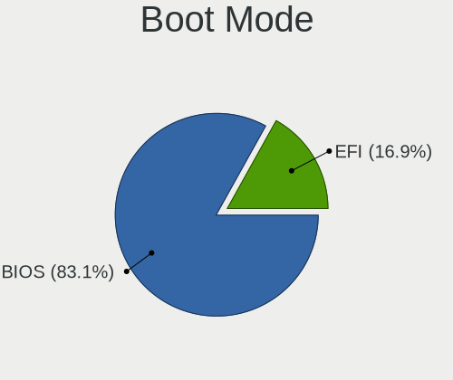

| Mode | Desktops | Percent |
|------|----------|---------|
| BIOS | 36       | 92.31%  |
| EFI  | 3        | 7.69%   |

Filesystem
----------

Type of filesystem

| Type  | Desktops | Percent |
|-------|----------|---------|
| Ext4  | 33       | 82.5%   |
| Btrfs | 5        | 12.5%   |
| Xfs   | 2        | 5%      |

Part. scheme
------------

Scheme of partitioning

| Type    | Desktops | Percent |
|---------|----------|---------|
| Unknown | 36       | 92.31%  |
| GPT     | 3        | 7.69%   |

Dual Boot with Linux/BSD
------------------------

Hosting more than one Linux/BSD

| Dual boot | Desktops | Percent |
|-----------|----------|---------|
| No        | 38       | 97.44%  |
| Yes       | 1        | 2.56%   |

Dual Boot (Win)
---------------

Hosting Linux and Windows

| Dual boot | Desktops | Percent |
|-----------|----------|---------|
| No        | 36       | 92.31%  |
| Yes       | 3        | 7.69%   |

Board
-----

Vendor
------

Motherboard manufacturer

| Name                | Desktops | Percent |
|---------------------|----------|---------|
| ASUSTek Computer    | 11       | 28.21%  |
| MSI                 | 7        | 17.95%  |
| Gigabyte Technology | 6        | 15.38%  |
| ASRock              | 5        | 12.82%  |
| Hewlett-Packard     | 3        | 7.69%   |
| Lenovo              | 2        | 5.13%   |
| Dell                | 2        | 5.13%   |
| ECS                 | 1        | 2.56%   |
| BESSTAR Tech        | 1        | 2.56%   |
| Acer                | 1        | 2.56%   |

Model
-----

Motherboard model

| Name                                 | Desktops | Percent |
|--------------------------------------|----------|---------|
| ASUS PRIME B450-PLUS                 | 3        | 7.69%   |
| MSI MS-7D17                          | 2        | 5.13%   |
| ASUS ROG STRIX B550-I GAMING         | 2        | 5.13%   |
| MSI MS-7D98                          | 1        | 2.56%   |
| MSI MS-7D82                          | 1        | 2.56%   |
| MSI MS-7D25                          | 1        | 2.56%   |
| MSI MS-7C37                          | 1        | 2.56%   |
| MSI MS-7B17                          | 1        | 2.56%   |
| Lenovo ThinkCentre M72e 0896C5G      | 1        | 2.56%   |
| Lenovo ThinkCentre M700 10GSS05X48   | 1        | 2.56%   |
| HP Pavilion Gaming Desktop TG01-2xxx | 1        | 2.56%   |
| HP F01                               | 1        | 2.56%   |
| HP 280 G1 MT                         | 1        | 2.56%   |
| Gigabyte Z590M GAMING X              | 1        | 2.56%   |
| Gigabyte Z490 AORUS ELITE AC         | 1        | 2.56%   |
| Gigabyte H81M-HD3                    | 1        | 2.56%   |
| Gigabyte H61M-DS2                    | 1        | 2.56%   |
| Gigabyte B560M AORUS PRO AX          | 1        | 2.56%   |
| Gigabyte A320M-S2H                   | 1        | 2.56%   |
| ECS GeForce 8000 series              | 1        | 2.56%   |
| Dell OptiPlex 9010                   | 1        | 2.56%   |
| Dell Inspiron 5680                   | 1        | 2.56%   |
| BESSTAR Tech HM80                    | 1        | 2.56%   |
| ASUS TUF Gaming H470-PRO             | 1        | 2.56%   |
| ASUS ROG STRIX Z590-A GAMING WIFI    | 1        | 2.56%   |
| ASUS ROG STRIX B550-F GAMING         | 1        | 2.56%   |
| ASUS PRIME H410M-K                   | 1        | 2.56%   |
| ASUS PRIME A320M-K                   | 1        | 2.56%   |
| ASUS P8H61-M LX                      | 1        | 2.56%   |
| ASRock Z690 Extreme WiFi 6E          | 1        | 2.56%   |
| ASRock Z270M-ITX/ac                  | 1        | 2.56%   |
| ASRock H470M-HDV/M.2                 | 1        | 2.56%   |
| ASRock H170M Pro4                    | 1        | 2.56%   |
| ASRock A520M-HVS                     | 1        | 2.56%   |
| Acer Aspire XC-710                   | 1        | 2.56%   |

Model Family
------------

Motherboard model prefix

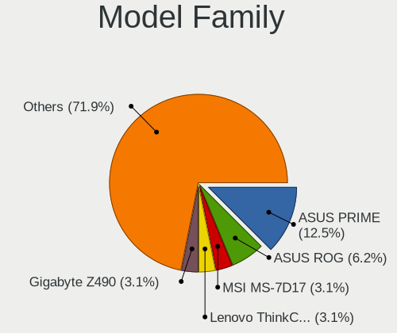

| Name               | Desktops | Percent |
|--------------------|----------|---------|
| ASUS PRIME         | 5        | 12.82%  |
| ASUS ROG           | 4        | 10.26%  |
| MSI MS-7D17        | 2        | 5.13%   |
| Lenovo ThinkCentre | 2        | 5.13%   |
| MSI MS-7D98        | 1        | 2.56%   |
| MSI MS-7D82        | 1        | 2.56%   |
| MSI MS-7D25        | 1        | 2.56%   |
| MSI MS-7C37        | 1        | 2.56%   |
| MSI MS-7B17        | 1        | 2.56%   |
| HP Pavilion        | 1        | 2.56%   |
| HP F01             | 1        | 2.56%   |
| HP 280             | 1        | 2.56%   |
| Gigabyte Z590M     | 1        | 2.56%   |
| Gigabyte Z490      | 1        | 2.56%   |
| Gigabyte H81M-HD3  | 1        | 2.56%   |
| Gigabyte H61M-DS2  | 1        | 2.56%   |
| Gigabyte B560M     | 1        | 2.56%   |
| Gigabyte A320M-S2H | 1        | 2.56%   |
| ECS GeForce        | 1        | 2.56%   |
| Dell OptiPlex      | 1        | 2.56%   |
| Dell Inspiron      | 1        | 2.56%   |
| BESSTAR Tech HM80  | 1        | 2.56%   |
| ASUS TUF           | 1        | 2.56%   |
| ASUS P8H61-M       | 1        | 2.56%   |
| ASRock Z690        | 1        | 2.56%   |
| ASRock Z270M-ITX   | 1        | 2.56%   |
| ASRock H470M-HDV   | 1        | 2.56%   |
| ASRock H170M       | 1        | 2.56%   |
| ASRock A520M-HVS   | 1        | 2.56%   |
| Acer Aspire        | 1        | 2.56%   |

MFG Year
--------

Motherboard manufacture year

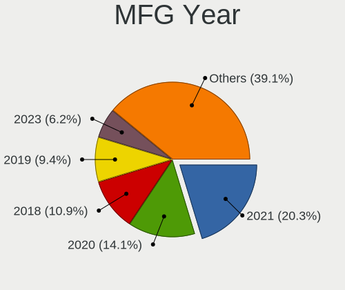

| Year | Desktops | Percent |
|------|----------|---------|
| 2021 | 10       | 25.64%  |
| 2020 | 7        | 17.95%  |
| 2018 | 5        | 12.82%  |
| 2022 | 3        | 7.69%   |
| 2017 | 2        | 5.13%   |
| 2015 | 2        | 5.13%   |
| 2013 | 2        | 5.13%   |
| 2012 | 2        | 5.13%   |
| 2019 | 1        | 2.56%   |
| 2016 | 1        | 2.56%   |
| 2014 | 1        | 2.56%   |
| 2011 | 1        | 2.56%   |
| 2010 | 1        | 2.56%   |
| 2008 | 1        | 2.56%   |

Form Factor
-----------

Physical design of the computer

| Name    | Desktops | Percent |
|---------|----------|---------|
| Desktop | 39       | 100%    |

Secure Boot
-----------

Enabled or disabled

| State    | Desktops | Percent |
|----------|----------|---------|
| Disabled | 39       | 100%    |

Coreboot
--------

Have coreboot on board

| Used | Desktops | Percent |
|------|----------|---------|
| No   | 39       | 100%    |

RAM Size
--------

Total RAM memory

| Size in GB  | Desktops | Percent |
|-------------|----------|---------|
| 32.01-64.0  | 13       | 33.33%  |
| 16.01-24.0  | 10       | 25.64%  |
| 4.01-8.0    | 7        | 17.95%  |
| 3.01-4.0    | 4        | 10.26%  |
| 8.01-16.0   | 3        | 7.69%   |
| 24.01-32.0  | 1        | 2.56%   |
| 64.01-256.0 | 1        | 2.56%   |

RAM Used
--------

Used RAM memory

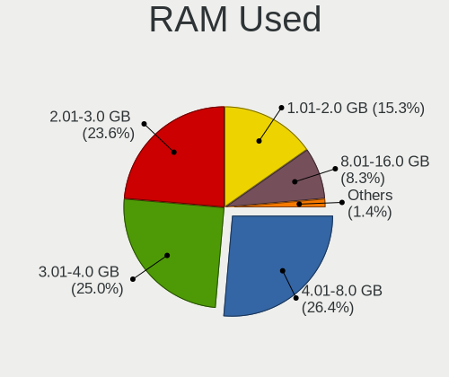

| Used GB   | Desktops | Percent |
|-----------|----------|---------|
| 2.01-3.0  | 12       | 28.57%  |
| 4.01-8.0  | 11       | 26.19%  |
| 3.01-4.0  | 8        | 19.05%  |
| 1.01-2.0  | 8        | 19.05%  |
| 8.01-16.0 | 3        | 7.14%   |

Total Drives
------------

Number of drives on board

| Drives | Desktops | Percent |
|--------|----------|---------|
| 2      | 13       | 32.5%   |
| 4      | 9        | 22.5%   |
| 5      | 7        | 17.5%   |
| 1      | 7        | 17.5%   |
| 3      | 3        | 7.5%    |
| 6      | 1        | 2.5%    |

Has CD-ROM
----------

Has CD-ROM on board

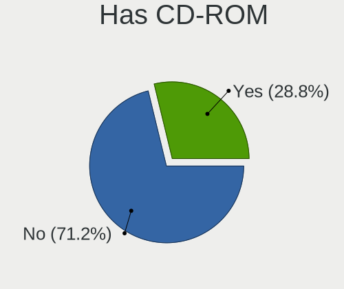

| Presented | Desktops | Percent |
|-----------|----------|---------|
| No        | 29       | 72.5%   |
| Yes       | 11       | 27.5%   |

Has Ethernet
------------

Has Ethernet on board

| Presented | Desktops | Percent |
|-----------|----------|---------|
| Yes       | 38       | 97.44%  |
| No        | 1        | 2.56%   |

Has WiFi
--------

Has WiFi module

| Presented | Desktops | Percent |
|-----------|----------|---------|
| Yes       | 24       | 61.54%  |
| No        | 15       | 38.46%  |

Has Bluetooth
-------------

Has Bluetooth module

| Presented | Desktops | Percent |
|-----------|----------|---------|
| Yes       | 22       | 55%     |
| No        | 18       | 45%     |

Location
--------

Country
-------

Geographic location (country)

| Country      | Desktops | Percent |
|--------------|----------|---------|
| Germany      | 13       | 33.33%  |
| USA          | 5        | 12.82%  |
| Italy        | 3        | 7.69%   |
| South Africa | 2        | 5.13%   |
| Netherlands  | 2        | 5.13%   |
| Austria      | 2        | 5.13%   |
| UK           | 1        | 2.56%   |
| Thailand     | 1        | 2.56%   |
| Switzerland  | 1        | 2.56%   |
| Romania      | 1        | 2.56%   |
| Portugal     | 1        | 2.56%   |
| Poland       | 1        | 2.56%   |
| Mexico       | 1        | 2.56%   |
| India        | 1        | 2.56%   |
| France       | 1        | 2.56%   |
| Egypt        | 1        | 2.56%   |
| Aruba        | 1        | 2.56%   |
| Argentina    | 1        | 2.56%   |

City
----

Geographic location (city)

| City                      | Desktops | Percent |
|---------------------------|----------|---------|
| Hürth                    | 2        | 5%      |
| Zurich                    | 1        | 2.5%    |
| Zalău                    | 1        | 2.5%    |
| Vienna                    | 1        | 2.5%    |
| Ulm                       | 1        | 2.5%    |
| Temple                    | 1        | 2.5%    |
| Stimpfach                 | 1        | 2.5%    |
| Puebla City               | 1        | 2.5%    |
| Poechlarn                 | 1        | 2.5%    |
| Peitz                     | 1        | 2.5%    |
| Oranjestad                | 1        | 2.5%    |
| Olhao                     | 1        | 2.5%    |
| Oldenzaal                 | 1        | 2.5%    |
| Oldenburg                 | 1        | 2.5%    |
| Offenbach                 | 1        | 2.5%    |
| Milan                     | 1        | 2.5%    |
| Middlesbrough             | 1        | 2.5%    |
| Lublin                    | 1        | 2.5%    |
| Limeil-Brevannes          | 1        | 2.5%    |
| Leipzig                   | 1        | 2.5%    |
| Landau                    | 1        | 2.5%    |
| Johannesburg              | 1        | 2.5%    |
| Indore                    | 1        | 2.5%    |
| Frankfurt am Main         | 1        | 2.5%    |
| Florence                  | 1        | 2.5%    |
| Erding                    | 1        | 2.5%    |
| Eberswalde                | 1        | 2.5%    |
| Eastlake                  | 1        | 2.5%    |
| Camarillo                 | 1        | 2.5%    |
| Cairo                     | 1        | 2.5%    |
| Cagliari                  | 1        | 2.5%    |
| Bullhead City             | 1        | 2.5%    |
| Buenos Aires              | 1        | 2.5%    |
| Bloemfontein              | 1        | 2.5%    |
| Berlin                    | 1        | 2.5%    |
| Bangkok                   | 1        | 2.5%    |
| Bad Neustadt an der Saale | 1        | 2.5%    |
| Amsterdam                 | 1        | 2.5%    |
| Albuquerque               | 1        | 2.5%    |

Drives
------

Drive Vendor
------------

Hard drive vendors

| Vendor                      | Desktops | Drives | Percent |
|-----------------------------|----------|--------|---------|
| Samsung Electronics         | 18       | 29     | 19.78%  |
| Seagate                     | 12       | 17     | 13.19%  |
| WDC                         | 7        | 9      | 7.69%   |
| Sandisk                     | 7        | 10     | 7.69%   |
| Kingston                    | 5        | 7      | 5.49%   |
| Hitachi                     | 4        | 7      | 4.4%    |
| Crucial                     | 4        | 5      | 4.4%    |
| SK hynix                    | 2        | 3      | 2.2%    |
| Phison Electronics          | 2        | 2      | 2.2%    |
| Micron/Crucial Technology   | 2        | 4      | 2.2%    |
| Micron Technology           | 2        | 2      | 2.2%    |
| Intenso                     | 2        | 3      | 2.2%    |
| GOODRAM                     | 2        | 2      | 2.2%    |
| ASMT                        | 2        | 2      | 2.2%    |
| WALRAM                      | 1        | 1      | 1.1%    |
| Unknown                     | 1        | 2      | 1.1%    |
| SPCC                        | 1        | 1      | 1.1%    |
| Silicon Motion              | 1        | 2      | 1.1%    |
| Phison                      | 1        | 1      | 1.1%    |
| Netac                       | 1        | 1      | 1.1%    |
| Lite-On Technology          | 1        | 1      | 1.1%    |
| Kingston Technology Company | 1        | 1      | 1.1%    |
| KingFast                    | 1        | 1      | 1.1%    |
| HS-SSD-E100                 | 1        | 1      | 1.1%    |
| HS-SSD-E                    | 1        | 1      | 1.1%    |
| Hikvision                   | 1        | 2      | 1.1%    |
| HGST HTS                    | 1        | 1      | 1.1%    |
| HGST                        | 1        | 2      | 1.1%    |
| Fanxiang                    | 1        | 1      | 1.1%    |
| CT1000P3                    | 1        | 1      | 1.1%    |
| China                       | 1        | 1      | 1.1%    |
| Apacer                      | 1        | 1      | 1.1%    |
| AMD                         | 1        | 2      | 1.1%    |
| A-DATA Technology           | 1        | 2      | 1.1%    |

Drive Model
-----------

Hard drive models

| Model                                             | Desktops | Percent |
|---------------------------------------------------|----------|---------|
| Seagate ST1000DM010-2EP102 1TB                    | 4        | 3.64%   |
| Samsung SSD 980 500GB                             | 4        | 3.64%   |
| Sandisk WD Black SN750 / PC SN730 NVMe SSD 512GB  | 3        | 2.73%   |
| Samsung NVMe SSD Controller SM981/PM981/PM983 1TB | 3        | 2.73%   |
| Seagate ST3500418AS 500GB                         | 2        | 1.82%   |
| Seagate ST1000VT001-1RE172 1TB                    | 2        | 1.82%   |
| SanDisk SSD PLUS 120GB                            | 2        | 1.82%   |
| Samsung SSD 980 1TB                               | 2        | 1.82%   |
| Samsung SSD 860 EVO 500GB                         | 2        | 1.82%   |
| Samsung SSD 860 EVO 250GB                         | 2        | 1.82%   |
| Samsung SSD 850 EVO 500GB                         | 2        | 1.82%   |
| Micron/Crucial P2 NVMe PCIe SSD 4TB               | 2        | 1.82%   |
| Hitachi HCS545050GLA380 500GB                     | 2        | 1.82%   |
| Crucial CT1000BX500SSD1 1TB                       | 2        | 1.82%   |
| WDC WD80EAZZ-00BKLB0 8TB                          | 1        | 0.91%   |
| WDC WD5000AAKX-60U6AA0 500GB                      | 1        | 0.91%   |
| WDC WD5000AAKX-08ERMA0 500GB                      | 1        | 0.91%   |
| WDC WD20EZRZ-00Z5HB0 2TB                          | 1        | 0.91%   |
| WDC WD20EZRX-22D8PB0 2TB                          | 1        | 0.91%   |
| WDC WD20EZRX-00D8PB0 2TB                          | 1        | 0.91%   |
| WDC WD10JPVX-11JC3T0 1TB                          | 1        | 0.91%   |
| WDC WD10EZEX-00BN5A0 1TB                          | 1        | 0.91%   |
| WALRAM 120GB                                      | 1        | 0.91%   |
| Unknown SD/MMC/MS PRO 128GB                       | 1        | 0.91%   |
| SPCC Solid State Disk 512GB                       | 1        | 0.91%   |
| SK hynix SHPP41-2000GM 2TB                        | 1        | 0.91%   |
| SK hynix SHGP31-1000GM-2 1TB                      | 1        | 0.91%   |
| SK hynix SHGP31-1000GM 1TB                        | 1        | 0.91%   |
| Silicon Motion SM2262/SM2262EN SSD Controller 2TB | 1        | 0.91%   |
| Seagate ST500DM002-1BD142 500GB                   | 1        | 0.91%   |
| Seagate ST3500413AS 500GB                         | 1        | 0.91%   |
| Seagate ST2000LM007-1R8174 2TB                    | 1        | 0.91%   |
| Seagate ST1000VM002-1SD102 1TB                    | 1        | 0.91%   |
| Seagate ST1000LM035-1RK172 1TB                    | 1        | 0.91%   |
| Seagate ST1000DX001-1NS162-SSHD 1TB               | 1        | 0.91%   |
| Seagate ST10000NM001G-2MW103 10TB                 | 1        | 0.91%   |
| Sandisk WD_BLACK SN770 2TB                        | 1        | 0.91%   |
| Sandisk WD Black SN850 512GB                      | 1        | 0.91%   |
| SanDisk SDSSDH3 500G                              | 1        | 0.91%   |
| Samsung SSD 990 PRO 2TB                           | 1        | 0.91%   |

HDD Vendor
----------

Hard disk drive vendors

| Vendor              | Desktops | Drives | Percent |
|---------------------|----------|--------|---------|
| Seagate             | 12       | 17     | 42.86%  |
| WDC                 | 7        | 9      | 25%     |
| Hitachi             | 4        | 7      | 14.29%  |
| Samsung Electronics | 2        | 2      | 7.14%   |
| Unknown             | 1        | 2      | 3.57%   |
| HGST HTS            | 1        | 1      | 3.57%   |
| HGST                | 1        | 2      | 3.57%   |

SSD Vendor
----------

Solid state drive vendors

| Vendor              | Desktops | Drives | Percent |
|---------------------|----------|--------|---------|
| Samsung Electronics | 10       | 12     | 31.25%  |
| Kingston            | 4        | 6      | 12.5%   |
| Crucial             | 4        | 4      | 12.5%   |
| SanDisk             | 3        | 5      | 9.38%   |
| GOODRAM             | 2        | 2      | 6.25%   |
| ASMT                | 2        | 2      | 6.25%   |
| SPCC                | 1        | 1      | 3.13%   |
| Netac               | 1        | 1      | 3.13%   |
| Micron Technology   | 1        | 1      | 3.13%   |
| Intenso             | 1        | 1      | 3.13%   |
| China               | 1        | 1      | 3.13%   |
| Apacer              | 1        | 1      | 3.13%   |
| A-DATA Technology   | 1        | 2      | 3.13%   |

Drive Kind
----------

HDD or SSD

| Kind    | Desktops | Drives | Percent |
|---------|----------|--------|---------|
| NVMe    | 24       | 43     | 31.58%  |
| SSD     | 24       | 39     | 31.58%  |
| HDD     | 23       | 40     | 30.26%  |
| Unknown | 5        | 6      | 6.58%   |

Drive Connector
---------------

SATA, SAS, NVMe, etc.

| Type | Desktops | Drives | Percent |
|------|----------|--------|---------|
| SATA | 34       | 77     | 54.84%  |
| NVMe | 24       | 42     | 38.71%  |
| SAS  | 4        | 9      | 6.45%   |

Drive Size
----------

Size of hard drive

| Size in TB | Desktops | Drives | Percent |
|------------|----------|--------|---------|
| 0.01-0.5   | 22       | 42     | 41.51%  |
| 0.51-1.0   | 20       | 22     | 37.74%  |
| 1.01-2.0   | 7        | 10     | 13.21%  |
| 4.01-10.0  | 2        | 2      | 3.77%   |
| 3.01-4.0   | 1        | 2      | 1.89%   |
| 2.01-3.0   | 1        | 1      | 1.89%   |

Space Total
-----------

Amount of disk space available on the file system

| Size in GB     | Desktops | Percent |
|----------------|----------|---------|
| 501-1000       | 10       | 23.81%  |
| 251-500        | 7        | 16.67%  |
| 101-250        | 7        | 16.67%  |
| 1001-2000      | 7        | 16.67%  |
| More than 3000 | 3        | 7.14%   |
| 2001-3000      | 3        | 7.14%   |
| 21-50          | 2        | 4.76%   |
| Unknown        | 2        | 4.76%   |
| 51-100         | 1        | 2.38%   |

Space Used
----------

Amount of used disk space

| Used GB        | Desktops | Percent |
|----------------|----------|---------|
| 1-20           | 11       | 26.83%  |
| 21-50          | 8        | 19.51%  |
| 501-1000       | 6        | 14.63%  |
| 101-250        | 4        | 9.76%   |
| 51-100         | 4        | 9.76%   |
| 251-500        | 3        | 7.32%   |
| Unknown        | 2        | 4.88%   |
| More than 3000 | 1        | 2.44%   |
| 2001-3000      | 1        | 2.44%   |
| 1001-2000      | 1        | 2.44%   |

Malfunc. Drives
---------------

Drive models with a malfunction

Zero info for selected period =(

Malfunc. Drive Vendor
---------------------

Vendors of faulty drives

Zero info for selected period =(

Malfunc. HDD Vendor
-------------------

Vendors of faulty HDD drives

Zero info for selected period =(

Malfunc. Drive Kind
-------------------

Kinds of faulty drives

Zero info for selected period =(

Failed Drives
-------------

Failed drive models

Zero info for selected period =(

Failed Drive Vendor
-------------------

Failed drive vendors

Zero info for selected period =(

Drive Status
------------

Number of failed and malfunc. drives

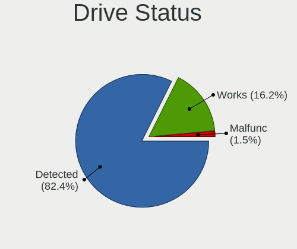

| Status   | Desktops | Drives | Percent |
|----------|----------|--------|---------|
| Detected | 36       | 116    | 87.8%   |
| Works    | 5        | 12     | 12.2%   |

Storage controller
------------------

Storage Vendor
--------------

Storage controller vendors

| Vendor                      | Desktops | Percent |
|-----------------------------|----------|---------|
| Intel                       | 26       | 38.81%  |
| AMD                         | 12       | 17.91%  |
| Samsung Electronics         | 10       | 14.93%  |
| SanDisk                     | 4        | 5.97%   |
| Phison Electronics          | 3        | 4.48%   |
| SK hynix                    | 2        | 2.99%   |
| Micron/Crucial Technology   | 2        | 2.99%   |
| Kingston Technology Company | 2        | 2.99%   |
| Silicon Motion              | 1        | 1.49%   |
| Nvidia                      | 1        | 1.49%   |
| Micron Technology           | 1        | 1.49%   |
| Lite-On Technology          | 1        | 1.49%   |
| INNOGRIT                    | 1        | 1.49%   |
| ASMedia Technology          | 1        | 1.49%   |

Storage Model
-------------

Storage controller models

| Model                                                                                   | Desktops | Percent |
|-----------------------------------------------------------------------------------------|----------|---------|
| AMD FCH SATA Controller [AHCI mode]                                                     | 8        | 9.88%   |
| Samsung NVMe SSD Controller 980 (DRAM-less)                                             | 6        | 7.41%   |
| Intel 500 Series Chipset Family SATA AHCI Controller                                    | 6        | 7.41%   |
| AMD 500 Series Chipset SATA Controller                                                  | 4        | 4.94%   |
| AMD 400 Series Chipset SATA Controller                                                  | 4        | 4.94%   |
| SanDisk Extreme Pro / WD Black SN750 / PC SN730 / Red SN700 NVMe SSD                    | 3        | 3.7%    |
| Samsung NVMe SSD Controller SM981/PM981/PM983                                           | 3        | 3.7%    |
| Intel Q170/Q150/B150/H170/H110/Z170/CM236 Chipset SATA Controller [AHCI Mode]           | 3        | 3.7%    |
| SK hynix Gold P31/BC711/PC711 NVMe Solid State Drive                                    | 2        | 2.47%   |
| Phison E16 PCIe4 NVMe Controller                                                        | 2        | 2.47%   |
| Micron/Crucial P2 [Nick P2] / P3 / P3 Plus NVMe PCIe SSD (DRAM-less)                    | 2        | 2.47%   |
| Intel Comet Lake SATA AHCI Controller                                                   | 2        | 2.47%   |
| Intel Alder Lake-S PCH SATA Controller [AHCI Mode]                                      | 2        | 2.47%   |
| Intel 8 Series/C220 Series Chipset Family 6-port SATA Controller 1 [AHCI mode]          | 2        | 2.47%   |
| Intel 6 Series/C200 Series Chipset Family 6 port Desktop SATA AHCI Controller           | 2        | 2.47%   |
| AMD FCH SATA Controller D                                                               | 2        | 2.47%   |
| SK hynix Platinum P41/PC801 NVMe Solid State Drive                                      | 1        | 1.23%   |
| Silicon Motion SM2262/SM2262EN SSD Controller                                           | 1        | 1.23%   |
| SanDisk WD PC SN810 / Black SN850 NVMe SSD                                              | 1        | 1.23%   |
| SanDisk WD Black SN770 / PC SN740 256GB / PC SN560 (DRAM-less) NVMe SSD                 | 1        | 1.23%   |
| Samsung NVMe SSD Controller S4LV008[Pascal]                                             | 1        | 1.23%   |
| Samsung NVMe SSD Controller PM9A1/PM9A3/980PRO                                          | 1        | 1.23%   |
| Samsung NVMe SSD Controller 172Xa/172Xb                                                 | 1        | 1.23%   |
| Phison E12 NVMe Controller                                                              | 1        | 1.23%   |
| Nvidia MCP78S [GeForce 8200] IDE                                                        | 1        | 1.23%   |
| Nvidia MCP78S [GeForce 8200] AHCI Controller                                            | 1        | 1.23%   |
| Micron/Crucial P5 Plus NVMe PCIe SSD                                                    | 1        | 1.23%   |
| Micron 2300 NVMe SSD [Santana]                                                          | 1        | 1.23%   |
| Lite-On M9PeG, M9PeGN, M9PeY NVMe SSD                                                   | 1        | 1.23%   |
| Kingston Company NV1 NVMe SSD SM2263XT (DRAM-less)                                      | 1        | 1.23%   |
| Kingston Company A2000 NVMe SSD SM2263EN                                                | 1        | 1.23%   |
| Intel SATA Controller [RAID mode]                                                       | 1        | 1.23%   |
| Intel Raptor Lake SATA AHCI Controller                                                  | 1        | 1.23%   |
| Intel Comet Lake PCH-H RAID                                                             | 1        | 1.23%   |
| Intel Cannon Lake PCH SATA AHCI Controller                                              | 1        | 1.23%   |
| Intel 7 Series/C210 Series Chipset Family 6-port SATA Controller [AHCI mode]            | 1        | 1.23%   |
| Intel 6 Series/C200 Series Chipset Family Desktop SATA Controller (IDE mode, ports 4-5) | 1        | 1.23%   |
| Intel 6 Series/C200 Series Chipset Family Desktop SATA Controller (IDE mode, ports 0-3) | 1        | 1.23%   |
| Intel 5 Series/3400 Series Chipset 6 port SATA AHCI Controller                          | 1        | 1.23%   |
| Intel 400 Series Chipset Family SATA AHCI Controller                                    | 1        | 1.23%   |

Storage Kind
------------

Kind of storage controller (IDE, SATA, NVMe, SAS, ...)

| Kind | Desktops | Percent |
|------|----------|---------|
| SATA | 36       | 56.25%  |
| NVMe | 24       | 37.5%   |
| RAID | 2        | 3.13%   |
| IDE  | 2        | 3.13%   |

Processor
---------

CPU Vendor
----------

Processor vendors

| Vendor | Desktops | Percent |
|--------|----------|---------|
| Intel  | 26       | 66.67%  |
| AMD    | 13       | 33.33%  |

CPU Model
---------

Processor models

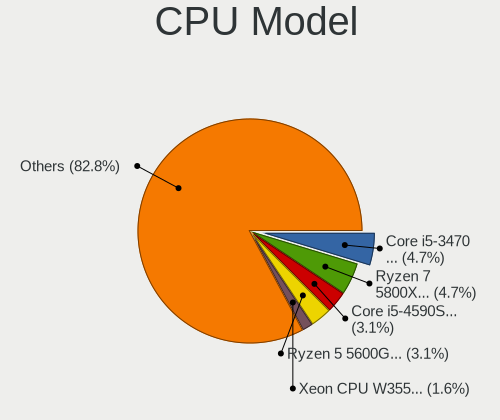

| Model                                       | Desktops | Percent |
|---------------------------------------------|----------|---------|
| Intel Core i5-3470 CPU @ 3.20GHz            | 3        | 7.69%   |
| AMD Ryzen 5 5600G with Radeon Graphics      | 2        | 5.13%   |
| Intel Pentium CPU G3420 @ 3.20GHz           | 1        | 2.56%   |
| Intel Core i9-10850K CPU @ 3.60GHz          | 1        | 2.56%   |
| Intel Core i7-8700K CPU @ 3.70GHz           | 1        | 2.56%   |
| Intel Core i7-8700 CPU @ 3.20GHz            | 1        | 2.56%   |
| Intel Core i7-10700 CPU @ 2.90GHz           | 1        | 2.56%   |
| Intel Core i5-7600T CPU @ 2.80GHz           | 1        | 2.56%   |
| Intel Core i5-6400 CPU @ 2.70GHz            | 1        | 2.56%   |
| Intel Core i5-4590S CPU @ 3.00GHz           | 1        | 2.56%   |
| Intel Core i5-3570 CPU @ 3.40GHz            | 1        | 2.56%   |
| Intel Core i5-10500 CPU @ 3.10GHz           | 1        | 2.56%   |
| Intel Core i5-10400F CPU @ 2.90GHz          | 1        | 2.56%   |
| Intel Core i5-10400 CPU @ 2.90GHz           | 1        | 2.56%   |
| Intel Core i5 CPU 650 @ 3.20GHz             | 1        | 2.56%   |
| Intel Core i3-6300 CPU @ 3.80GHz            | 1        | 2.56%   |
| Intel Core i3-6100 CPU @ 3.70GHz            | 1        | 2.56%   |
| Intel Core i3-10105F CPU @ 3.70GHz          | 1        | 2.56%   |
| Intel 12th Gen Core i9-12900KS              | 1        | 2.56%   |
| Intel 12th Gen Core i7-12700                | 1        | 2.56%   |
| Intel 12th Gen Core i3-12100T               | 1        | 2.56%   |
| Intel 11th Gen Core i7-11700 @ 2.50GHz      | 1        | 2.56%   |
| Intel 11th Gen Core i5-11600KF @ 3.90GHz    | 1        | 2.56%   |
| Intel 11th Gen Core i5-11400T @ 1.30GHz     | 1        | 2.56%   |
| Intel 11th Gen Core i5-11400 @ 2.60GHz      | 1        | 2.56%   |
| AMD Ryzen 7 5800X 8-Core Processor          | 1        | 2.56%   |
| AMD Ryzen 7 5700G with Radeon Graphics      | 1        | 2.56%   |
| AMD Ryzen 7 4800U with Radeon Graphics      | 1        | 2.56%   |
| AMD Ryzen 7 3700X 8-Core Processor          | 1        | 2.56%   |
| AMD Ryzen 7 2700X Eight-Core Processor      | 1        | 2.56%   |
| AMD Ryzen 5 3600X 6-Core Processor          | 1        | 2.56%   |
| AMD Ryzen 5 2400G with Radeon Vega Graphics | 1        | 2.56%   |
| AMD Ryzen 5 1600 Six-Core Processor         | 1        | 2.56%   |
| AMD Ryzen 3 4100 4-Core Processor           | 1        | 2.56%   |
| AMD Ryzen 3 3100 4-Core Processor           | 1        | 2.56%   |
| AMD Phenom II X2 B59 Processor              | 1        | 2.56%   |

CPU Model Family
----------------

Processor model prefix

| Model            | Desktops | Percent |
|------------------|----------|---------|
| Intel Core i5    | 11       | 28.21%  |
| Other            | 7        | 17.95%  |
| AMD Ryzen 7      | 5        | 12.82%  |
| AMD Ryzen 5      | 5        | 12.82%  |
| Intel Core i7    | 3        | 7.69%   |
| Intel Core i3    | 3        | 7.69%   |
| AMD Ryzen 3      | 2        | 5.13%   |
| Intel Pentium    | 1        | 2.56%   |
| Intel Core i9    | 1        | 2.56%   |
| AMD Phenom II X2 | 1        | 2.56%   |

CPU Cores
---------

Number of processor cores

| Number | Desktops | Percent |
|--------|----------|---------|
| 6      | 12       | 30.77%  |
| 4      | 12       | 30.77%  |
| 8      | 7        | 17.95%  |
| 2      | 5        | 12.82%  |
| 16     | 1        | 2.56%   |
| 12     | 1        | 2.56%   |
| 10     | 1        | 2.56%   |

CPU Sockets
-----------

Number of sockets

| Number | Desktops | Percent |
|--------|----------|---------|
| 1      | 39       | 100%    |

CPU Threads
-----------

Threads per core (Hyper-Threading)

| Number | Desktops | Percent |
|--------|----------|---------|
| 2      | 30       | 76.92%  |
| 1      | 9        | 23.08%  |

CPU Op-Modes
------------

CPU Operation Modes (32-bit, 64-bit)

| Op mode        | Desktops | Percent |
|----------------|----------|---------|
| 32-bit, 64-bit | 39       | 100%    |

CPU Microcode
-------------

Microcode number

| Number     | Desktops | Percent |
|------------|----------|---------|
| Unknown    | 35       | 89.74%  |
| 0xa0653    | 1        | 2.56%   |
| 0x0a50000d | 1        | 2.56%   |
| 0x08701030 | 1        | 2.56%   |
| 0x08701021 | 1        | 2.56%   |

CPU Microarch
-------------

Microarchitecture

| Name      | Desktops | Percent |
|-----------|----------|---------|
| Unknown   | 7        | 17.95%  |
| CometLake | 6        | 15.38%  |
| Zen 2     | 5        | 12.82%  |
| Zen 3     | 4        | 10.26%  |
| IvyBridge | 4        | 10.26%  |
| Skylake   | 3        | 7.69%   |
| KabyLake  | 3        | 7.69%   |
| Zen       | 2        | 5.13%   |
| Haswell   | 2        | 5.13%   |
| Zen+      | 1        | 2.56%   |
| Westmere  | 1        | 2.56%   |
| K10       | 1        | 2.56%   |

Graphics
--------

GPU Vendor
----------

Vendors of graphics cards

| Vendor | Desktops | Percent |
|--------|----------|---------|
| Nvidia | 20       | 50%     |
| Intel  | 12       | 30%     |
| AMD    | 8        | 20%     |

GPU Model
---------

Graphics card models

| Model                                                                       | Desktops | Percent |
|-----------------------------------------------------------------------------|----------|---------|
| Intel Xeon E3-1200 v2/3rd Gen Core processor Graphics Controller            | 4        | 9.76%   |
| Nvidia GP108 [GeForce GT 1030]                                              | 3        | 7.32%   |
| AMD Cezanne [Radeon Vega Series / Radeon Vega Mobile Series]                | 3        | 7.32%   |
| Nvidia TU116 [GeForce GTX 1650]                                             | 2        | 4.88%   |
| Nvidia GP104 [GeForce GTX 1070]                                             | 2        | 4.88%   |
| Nvidia GK208B [GeForce GT 730]                                              | 2        | 4.88%   |
| Intel Xeon E3-1200 v3/4th Gen Core Processor Integrated Graphics Controller | 2        | 4.88%   |
| Intel HD Graphics 530                                                       | 2        | 4.88%   |
| Nvidia TU116 [GeForce GTX 1660 SUPER]                                       | 1        | 2.44%   |
| Nvidia TU106 [GeForce RTX 2070]                                             | 1        | 2.44%   |
| Nvidia TU106 [GeForce RTX 2060 Rev. A]                                      | 1        | 2.44%   |
| Nvidia TU104 [GeForce RTX 2070 SUPER]                                       | 1        | 2.44%   |
| Nvidia TU102 [GeForce RTX 2080 Ti Rev. A]                                   | 1        | 2.44%   |
| Nvidia GT218 [GeForce 210]                                                  | 1        | 2.44%   |
| Nvidia GP107 [GeForce GTX 1050 Ti]                                          | 1        | 2.44%   |
| Nvidia GP106 [GeForce GTX 1060 6GB]                                         | 1        | 2.44%   |
| Nvidia GP104 [GeForce GTX 1080]                                             | 1        | 2.44%   |
| Nvidia GK208B [GeForce GT 710]                                              | 1        | 2.44%   |
| Nvidia GA104 [GeForce RTX 3070 Lite Hash Rate]                              | 1        | 2.44%   |
| Nvidia GA104 [GeForce RTX 3060]                                             | 1        | 2.44%   |
| Intel RocketLake-S GT1 [UHD Graphics 730]                                   | 1        | 2.44%   |
| Intel HD Graphics 630                                                       | 1        | 2.44%   |
| Intel AlderLake-S GT1                                                       | 1        | 2.44%   |
| Intel Alder Lake-S GT1 [UHD Graphics 730]                                   | 1        | 2.44%   |
| AMD Renoir [Radeon RX Vega 6 (Ryzen 4000/5000 Mobile Series)]               | 1        | 2.44%   |
| AMD Raven Ridge [Radeon Vega Series / Radeon Vega Mobile Series]            | 1        | 2.44%   |
| AMD Pinewood [Mobility Radeon HD 5570/6550A]                                | 1        | 2.44%   |
| AMD Navi 23 [Radeon RX 6600/6600 XT/6600M]                                  | 1        | 2.44%   |
| AMD Navi 22 [Radeon RX 6700/6700 XT/6750 XT / 6800M/6850M XT]               | 1        | 2.44%   |

GPU Combo
---------

Combinations of graphics cards

| Name       | Desktops | Percent |
|------------|----------|---------|
| 1 x Nvidia | 20       | 51.28%  |
| 1 x Intel  | 11       | 28.21%  |
| 1 x AMD    | 8        | 20.51%  |

GPU Driver
----------

Free vs proprietary

| Driver      | Desktops | Percent |
|-------------|----------|---------|
| Free        | 21       | 52.5%   |
| Proprietary | 18       | 45%     |
| Unknown     | 1        | 2.5%    |

GPU Memory
----------

Total video memory

| Size in GB | Desktops | Percent |
|------------|----------|---------|
| Unknown    | 23       | 58.97%  |
| 7.01-8.0   | 6        | 15.38%  |
| 5.01-6.0   | 3        | 7.69%   |
| 3.01-4.0   | 2        | 5.13%   |
| 1.01-2.0   | 2        | 5.13%   |
| 8.01-16.0  | 2        | 5.13%   |
| 0.01-0.5   | 1        | 2.56%   |

Monitor
-------

Monitor Vendor
--------------

Monitor vendors

| Vendor               | Desktops | Percent |
|----------------------|----------|---------|
| Samsung Electronics  | 10       | 22.73%  |
| Dell                 | 7        | 15.91%  |
| Acer                 | 7        | 15.91%  |
| Hewlett-Packard      | 3        | 6.82%   |
| Goldstar             | 3        | 6.82%   |
| ViewSonic            | 2        | 4.55%   |
| BenQ                 | 2        | 4.55%   |
| ASUSTek Computer     | 2        | 4.55%   |
| AOC                  | 2        | 4.55%   |
| Ancor Communications | 2        | 4.55%   |
| Philips              | 1        | 2.27%   |
| NEC Computers        | 1        | 2.27%   |
| IOD                  | 1        | 2.27%   |
| Eizo                 | 1        | 2.27%   |

Monitor Model
-------------

Monitor models

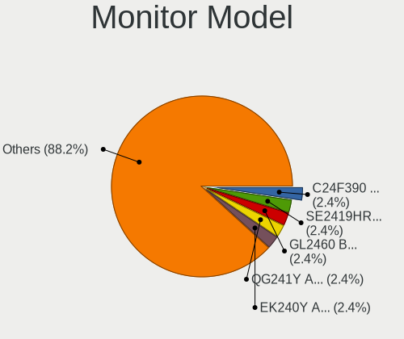

| Model                                                                 | Desktops | Percent |
|-----------------------------------------------------------------------|----------|---------|
| Samsung Electronics C24F390 SAM0D2C 1920x1080 521x293mm 23.5-inch     | 2        | 3.92%   |
| Dell SE2419HR DELF113 1920x1080 530x300mm 24.0-inch                   | 2        | 3.92%   |
| Acer EK240Y ACR0758 1920x1080 527x296mm 23.8-inch                     | 2        | 3.92%   |
| ViewSonic VX2757 VSCF931 1920x1080 598x336mm 27.0-inch                | 1        | 1.96%   |
| ViewSonic VP2780 SERIES VSC9C30 3840x2160 597x336mm 27.0-inch         | 1        | 1.96%   |
| Samsung Electronics SyncMaster SAM0486 1600x900                       | 1        | 1.96%   |
| Samsung Electronics SyncMaster SAM0274 1440x900 410x257mm 19.1-inch   | 1        | 1.96%   |
| Samsung Electronics SMB1930HD SAM0708 1360x768 410x230mm 18.5-inch    | 1        | 1.96%   |
| Samsung Electronics S24R35A SAM729F 1920x1080 527x296mm 23.8-inch     | 1        | 1.96%   |
| Samsung Electronics S24D330 SAM0D92 1920x1080 531x299mm 24.0-inch     | 1        | 1.96%   |
| Samsung Electronics S22F350 SAM0D1A 1920x1080 477x268mm 21.5-inch     | 1        | 1.96%   |
| Samsung Electronics LS27C36x SAM7315 1920x1080 598x336mm 27.0-inch    | 1        | 1.96%   |
| Samsung Electronics LCD Monitor SAM0B30 1920x1080 885x498mm 40.0-inch | 1        | 1.96%   |
| Samsung Electronics LCD Monitor SAM07C0 1920x1080 700x390mm 31.5-inch | 1        | 1.96%   |
| Samsung Electronics LC27T55 SAM701E 1920x1080 609x349mm 27.6-inch     | 1        | 1.96%   |
| Samsung Electronics C32R50x SAM7000 1920x1080 698x393mm 31.5-inch     | 1        | 1.96%   |
| Philips 170S4 PHL0818 1280x1024 338x270mm 17.0-inch                   | 1        | 1.96%   |
| NEC Computers LCD2470WNX NEC66E5 1920x1200 518x324mm 24.1-inch        | 1        | 1.96%   |
| IOD LCD-MF274X IOD1BC3 1920x1080 598x337mm 27.0-inch                  | 1        | 1.96%   |
| Hewlett-Packard TouchSmart HWP4205 1920x1080 510x287mm 23.0-inch      | 1        | 1.96%   |
| Hewlett-Packard P34hc G4 HPN36FA 3440x1440 797x334mm 34.0-inch        | 1        | 1.96%   |
| Hewlett-Packard LA2405 HWP284C 1920x1200 518x324mm 24.1-inch          | 1        | 1.96%   |
| Goldstar ULTRAGEAR GSM5BB4 2560x1440 597x336mm 27.0-inch              | 1        | 1.96%   |
| Goldstar E2041 GSM4EC9 1600x900 443x249mm 20.0-inch                   | 1        | 1.96%   |
| Goldstar 24BK55 GSM5A4D 1920x1200 520x330mm 24.2-inch                 | 1        | 1.96%   |
| Eizo EV2736W ENC2383 2560x1440 597x336mm 27.0-inch                    | 1        | 1.96%   |
| Dell U2417H DEL40E8 1920x1080 527x296mm 23.8-inch                     | 1        | 1.96%   |
| Dell U2417H DEL40E7 1920x1080 530x300mm 24.0-inch                     | 1        | 1.96%   |
| Dell SE2717H/HX DELD0A1 1920x1080 598x336mm 27.0-inch                 | 1        | 1.96%   |
| Dell S2716DG DELA0D1 2560x1440 598x336mm 27.0-inch                    | 1        | 1.96%   |
| Dell S2421HN DEL41F2 1920x1080 527x296mm 23.8-inch                    | 1        | 1.96%   |
| Dell S2415H DELA0B5 1920x1080 527x296mm 23.8-inch                     | 1        | 1.96%   |
| Dell P2424HT DELD170 1920x1080 527x296mm 23.8-inch                    | 1        | 1.96%   |
| Dell E198FP DELA028 1280x1024 380x305mm 19.2-inch                     | 1        | 1.96%   |
| BenQ LCD BNQ8024 2560x1440 597x336mm 27.0-inch                        | 1        | 1.96%   |
| BenQ GL2450H BNQ78A7 1920x1080 531x298mm 24.0-inch                    | 1        | 1.96%   |
| ASUSTek Computer VP247 AUS24CA 1920x1080 521x293mm 23.5-inch          | 1        | 1.96%   |
| ASUSTek Computer VG27VQ AUS2787 1920x1080 598x336mm 27.0-inch         | 1        | 1.96%   |
| AOC LCD Monitor 25G3ZM 3840x1080                                      | 1        | 1.96%   |
| AOC LCD Monitor 25G3ZM                                                | 1        | 1.96%   |

Monitor Resolution
------------------

Monitor screen resolution

| Resolution        | Desktops | Percent |
|-------------------|----------|---------|
| 1920x1080 (FHD)   | 23       | 53.49%  |
| 2560x1440 (QHD)   | 5        | 11.63%  |
| 1920x1200 (WUXGA) | 3        | 6.98%   |
| 1600x900 (HD+)    | 2        | 4.65%   |
| 1440x900 (WXGA+)  | 2        | 4.65%   |
| 1280x1024 (SXGA)  | 2        | 4.65%   |
| 3840x2160 (4K)    | 1        | 2.33%   |
| 3840x1080         | 1        | 2.33%   |
| 3440x1440         | 1        | 2.33%   |
| 2560x1080         | 1        | 2.33%   |
| 1360x768          | 1        | 2.33%   |
| Unknown           | 1        | 2.33%   |

Monitor Diagonal
----------------

Diagonal size in inches

| Inches  | Desktops | Percent |
|---------|----------|---------|
| 27      | 13       | 27.66%  |
| 24      | 11       | 23.4%   |
| 23      | 7        | 14.89%  |
| 19      | 3        | 6.38%   |
| 34      | 2        | 4.26%   |
| 21      | 2        | 4.26%   |
| 20      | 2        | 4.26%   |
| Unknown | 2        | 4.26%   |
| 54      | 1        | 2.13%   |
| 46      | 1        | 2.13%   |
| 31      | 1        | 2.13%   |
| 18      | 1        | 2.13%   |
| 17      | 1        | 2.13%   |

Monitor Width
-------------

Physical width

| Width in mm | Desktops | Percent |
|-------------|----------|---------|
| 501-600     | 25       | 60.98%  |
| 401-500     | 7        | 17.07%  |
| 1001-1500   | 2        | 4.88%   |
| Unknown     | 2        | 4.88%   |
| 801-900     | 1        | 2.44%   |
| 701-800     | 1        | 2.44%   |
| 601-700     | 1        | 2.44%   |
| 351-400     | 1        | 2.44%   |
| 301-350     | 1        | 2.44%   |

Aspect Ratio
------------

Proportional relationship between the width and the height

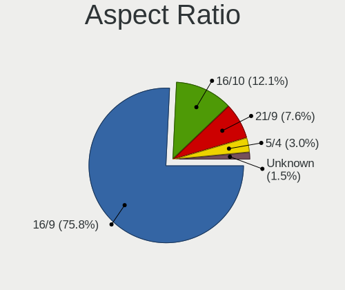

| Ratio   | Desktops | Percent |
|---------|----------|---------|
| 16/9    | 29       | 74.36%  |
| 16/10   | 5        | 12.82%  |
| 5/4     | 2        | 5.13%   |
| 21/9    | 2        | 5.13%   |
| Unknown | 1        | 2.56%   |

Monitor Area
------------

Area in inch²

| Area in inch² | Desktops | Percent |
|----------------|----------|---------|
| 201-250        | 15       | 32.61%  |
| 301-350        | 13       | 28.26%  |
| 151-200        | 5        | 10.87%  |
| 251-300        | 4        | 8.7%    |
| 351-500        | 3        | 6.52%   |
| 141-150        | 2        | 4.35%   |
| Unknown        | 2        | 4.35%   |
| More than 1000 | 1        | 2.17%   |
| 501-1000       | 1        | 2.17%   |

Pixel Density
-------------

Pixels per inch

| Density | Desktops | Percent |
|---------|----------|---------|
| 51-100  | 29       | 69.05%  |
| 101-120 | 8        | 19.05%  |
| 1-50    | 2        | 4.76%   |
| Unknown | 2        | 4.76%   |
| 161-240 | 1        | 2.38%   |

Multiple Monitors
-----------------

Total monitors connected

| Total | Desktops | Percent |
|-------|----------|---------|
| 1     | 27       | 67.5%   |
| 2     | 9        | 22.5%   |
| 3     | 3        | 7.5%    |
| 0     | 1        | 2.5%    |

Network
-------

Net Controller Vendor
---------------------

Controller vendors

| Vendor                | Desktops | Percent |
|-----------------------|----------|---------|
| Realtek Semiconductor | 30       | 51.72%  |
| Intel                 | 21       | 36.21%  |
| Qualcomm Atheros      | 2        | 3.45%   |
| D-Link                | 2        | 3.45%   |
| TP-Link               | 1        | 1.72%   |
| Ralink Technology     | 1        | 1.72%   |
| Broadcom              | 1        | 1.72%   |

Net Controller Model
--------------------

Controller models

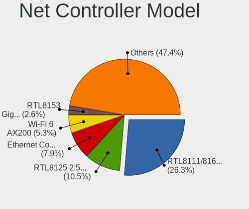

| Model                                                                  | Desktops | Percent |
|------------------------------------------------------------------------|----------|---------|
| Realtek RTL8111/8168/8211/8411 PCI Express Gigabit Ethernet Controller | 20       | 28.57%  |
| Intel Ethernet Controller I225-V                                       | 7        | 10%     |
| Realtek RTL8125 2.5GbE Controller                                      | 6        | 8.57%   |
| Intel Wi-Fi 6 AX200                                                    | 6        | 8.57%   |
| Realtek RTL8153 Gigabit Ethernet Adapter                               | 2        | 2.86%   |
| Intel Wi-Fi 6E(802.11ax) AX210/AX1675* 2x2 [Typhoon Peak]              | 2        | 2.86%   |
| Intel Ethernet Connection (2) I219-V                                   | 2        | 2.86%   |
| Intel Ethernet Connection (11) I219-V                                  | 2        | 2.86%   |
| Intel Alder Lake-S PCH CNVi WiFi                                       | 2        | 2.86%   |
| TP-Link TL-WN722N v2/v3 [Realtek RTL8188EUS]                           | 1        | 1.43%   |
| Realtek RTL88x2bu [AC1200 Techkey]                                     | 1        | 1.43%   |
| Realtek RTL8821CE 802.11ac PCIe Wireless Network Adapter               | 1        | 1.43%   |
| Realtek RTL8188CUS 802.11n WLAN Adapter                                | 1        | 1.43%   |
| Realtek 802.11ac NIC                                                   | 1        | 1.43%   |
| Ralink Airlink101 AWLL6070 802.11bgn Wireless Adapter [Ralink RT2770]  | 1        | 1.43%   |
| Qualcomm Atheros QCA9377 802.11ac Wireless Network Adapter             | 1        | 1.43%   |
| Qualcomm Atheros AR9227 Wireless Network Adapter                       | 1        | 1.43%   |
| Intel Wireless 3165                                                    | 1        | 1.43%   |
| Intel Wireless 3160                                                    | 1        | 1.43%   |
| Intel Wi-Fi 5(802.11ac) Wireless-AC 9x6x [Thunder Peak]                | 1        | 1.43%   |
| Intel Raptor Lake-S PCH CNVi WiFi                                      | 1        | 1.43%   |
| Intel I211 Gigabit Network Connection                                  | 1        | 1.43%   |
| Intel Ethernet Connection (7) I219-V                                   | 1        | 1.43%   |
| Intel Ethernet Connection (17) I219-V                                  | 1        | 1.43%   |
| Intel Comet Lake PCH CNVi WiFi                                         | 1        | 1.43%   |
| Intel Cannon Lake PCH CNVi WiFi                                        | 1        | 1.43%   |
| Intel 82579LM Gigabit Network Connection (Lewisville)                  | 1        | 1.43%   |
| D-Link DWA-131 Wireless N Nano Adapter (Rev. E1) [Realtek RTL8192EU]   | 1        | 1.43%   |
| D-Link 11ac adapter                                                    | 1        | 1.43%   |
| Broadcom NetXtreme II BCM5706 Gigabit Ethernet                         | 1        | 1.43%   |

Wireless Vendor
---------------

Wireless vendors

| Vendor                | Desktops | Percent |
|-----------------------|----------|---------|
| Intel                 | 16       | 61.54%  |
| Realtek Semiconductor | 4        | 15.38%  |
| Qualcomm Atheros      | 2        | 7.69%   |
| D-Link                | 2        | 7.69%   |
| TP-Link               | 1        | 3.85%   |
| Ralink Technology     | 1        | 3.85%   |

Wireless Model
--------------

Wireless models

| Model                                                                 | Desktops | Percent |
|-----------------------------------------------------------------------|----------|---------|
| Intel Wi-Fi 6 AX200                                                   | 6        | 23.08%  |
| Intel Wi-Fi 6E(802.11ax) AX210/AX1675* 2x2 [Typhoon Peak]             | 2        | 7.69%   |
| Intel Alder Lake-S PCH CNVi WiFi                                      | 2        | 7.69%   |
| TP-Link TL-WN722N v2/v3 [Realtek RTL8188EUS]                          | 1        | 3.85%   |
| Realtek RTL88x2bu [AC1200 Techkey]                                    | 1        | 3.85%   |
| Realtek RTL8821CE 802.11ac PCIe Wireless Network Adapter              | 1        | 3.85%   |
| Realtek RTL8188CUS 802.11n WLAN Adapter                               | 1        | 3.85%   |
| Realtek 802.11ac NIC                                                  | 1        | 3.85%   |
| Ralink Airlink101 AWLL6070 802.11bgn Wireless Adapter [Ralink RT2770] | 1        | 3.85%   |
| Qualcomm Atheros QCA9377 802.11ac Wireless Network Adapter            | 1        | 3.85%   |
| Qualcomm Atheros AR9227 Wireless Network Adapter                      | 1        | 3.85%   |
| Intel Wireless 3165                                                   | 1        | 3.85%   |
| Intel Wireless 3160                                                   | 1        | 3.85%   |
| Intel Wi-Fi 5(802.11ac) Wireless-AC 9x6x [Thunder Peak]               | 1        | 3.85%   |
| Intel Raptor Lake-S PCH CNVi WiFi                                     | 1        | 3.85%   |
| Intel Comet Lake PCH CNVi WiFi                                        | 1        | 3.85%   |
| Intel Cannon Lake PCH CNVi WiFi                                       | 1        | 3.85%   |
| D-Link DWA-131 Wireless N Nano Adapter (Rev. E1) [Realtek RTL8192EU]  | 1        | 3.85%   |
| D-Link 11ac adapter                                                   | 1        | 3.85%   |

Ethernet Vendor
---------------

Ethernet vendors

| Vendor                | Desktops | Percent |
|-----------------------|----------|---------|
| Realtek Semiconductor | 28       | 65.12%  |
| Intel                 | 14       | 32.56%  |
| Broadcom              | 1        | 2.33%   |

Ethernet Model
--------------

Ethernet models

| Model                                                                  | Desktops | Percent |
|------------------------------------------------------------------------|----------|---------|
| Realtek RTL8111/8168/8211/8411 PCI Express Gigabit Ethernet Controller | 20       | 45.45%  |
| Intel Ethernet Controller I225-V                                       | 7        | 15.91%  |
| Realtek RTL8125 2.5GbE Controller                                      | 6        | 13.64%  |
| Realtek RTL8153 Gigabit Ethernet Adapter                               | 2        | 4.55%   |
| Intel Ethernet Connection (2) I219-V                                   | 2        | 4.55%   |
| Intel Ethernet Connection (11) I219-V                                  | 2        | 4.55%   |
| Intel I211 Gigabit Network Connection                                  | 1        | 2.27%   |
| Intel Ethernet Connection (7) I219-V                                   | 1        | 2.27%   |
| Intel Ethernet Connection (17) I219-V                                  | 1        | 2.27%   |
| Intel 82579LM Gigabit Network Connection (Lewisville)                  | 1        | 2.27%   |
| Broadcom NetXtreme II BCM5706 Gigabit Ethernet                         | 1        | 2.27%   |

Net Controller Kind
-------------------

Ethernet, WiFi or modem

| Kind     | Desktops | Percent |
|----------|----------|---------|
| Ethernet | 38       | 61.29%  |
| WiFi     | 24       | 38.71%  |

Used Controller
---------------

Currently used network controller

| Kind     | Desktops | Percent |
|----------|----------|---------|
| Ethernet | 28       | 70%     |
| WiFi     | 12       | 30%     |

NICs
----

Total network controllers on board

| Total | Desktops | Percent |
|-------|----------|---------|
| 2     | 18       | 46.15%  |
| 1     | 17       | 43.59%  |
| 3     | 3        | 7.69%   |
| 0     | 1        | 2.56%   |

IPv6
----

IPv6 vs IPv4

| Used | Desktops | Percent |
|------|----------|---------|
| No   | 29       | 72.5%   |
| Yes  | 11       | 27.5%   |

Bluetooth
---------

Bluetooth Vendor
----------------

Controller vendors

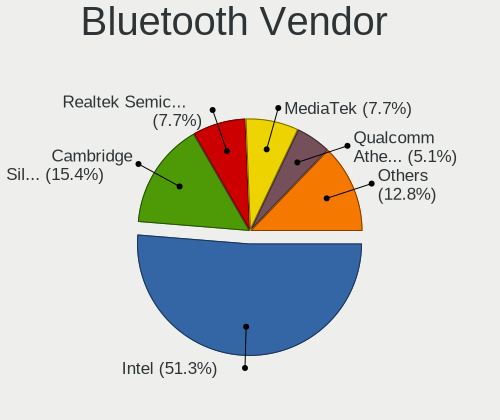

| Vendor                          | Desktops | Percent |
|---------------------------------|----------|---------|
| Intel                           | 14       | 63.64%  |
| Cambridge Silicon Radio         | 3        | 13.64%  |
| TP-Link                         | 1        | 4.55%   |
| Realtek Semiconductor           | 1        | 4.55%   |
| Qualcomm Atheros Communications | 1        | 4.55%   |
| Broadcom                        | 1        | 4.55%   |
| Unknown                         | 1        | 4.55%   |

Bluetooth Model
---------------

Controller models

| Model                                               | Desktops | Percent |
|-----------------------------------------------------|----------|---------|
| Intel AX200 Bluetooth                               | 4        | 18.18%  |
| Intel AX211 Bluetooth                               | 3        | 13.64%  |
| Cambridge Silicon Radio Bluetooth Dongle (HCI mode) | 3        | 13.64%  |
| Intel Bluetooth wireless interface                  | 2        | 9.09%   |
| Intel Bluetooth 9460/9560 Jefferson Peak (JfP)      | 2        | 9.09%   |
| Intel AX210 Bluetooth                               | 2        | 9.09%   |
| TP-Link UB500 Adapter                               | 1        | 4.55%   |
| Realtek Bluetooth Radio                             | 1        | 4.55%   |
| Qualcomm Atheros  Bluetooth Device                  | 1        | 4.55%   |
| Intel Wireless-AC 9260 Bluetooth Adapter            | 1        | 4.55%   |
| Broadcom HP Bluethunder                             | 1        | 4.55%   |
| Unknown                                             | 1        | 4.55%   |

Sound
-----

Sound Vendor
------------

Sound card vendors

| Vendor              | Desktops | Percent |
|---------------------|----------|---------|
| Intel               | 25       | 38.46%  |
| Nvidia              | 20       | 30.77%  |
| AMD                 | 11       | 16.92%  |
| C-Media Electronics | 2        | 3.08%   |
| Valve Software      | 1        | 1.54%   |
| Razer USA           | 1        | 1.54%   |
| JMTek               | 1        | 1.54%   |
| Hewlett-Packard     | 1        | 1.54%   |
| Creative Technology | 1        | 1.54%   |
| Creative Labs       | 1        | 1.54%   |
| Corsair             | 1        | 1.54%   |

Sound Model
-----------

Sound card models

| Model                                                                                           | Desktops | Percent |
|-------------------------------------------------------------------------------------------------|----------|---------|
| AMD Family 17h/19h HD Audio Controller                                                          | 6        | 7.79%   |
| AMD Renoir Radeon High Definition Audio Controller                                              | 5        | 6.49%   |
| Nvidia TU116 High Definition Audio Controller                                                   | 3        | 3.9%    |
| Nvidia GP108 High Definition Audio Controller                                                   | 3        | 3.9%    |
| Nvidia GP104 High Definition Audio Controller                                                   | 3        | 3.9%    |
| Nvidia GK208 HDMI/DP Audio Controller                                                           | 3        | 3.9%    |
| Intel Tiger Lake-H HD Audio Controller                                                          | 3        | 3.9%    |
| Intel Comet Lake PCH cAVS                                                                       | 3        | 3.9%    |
| Intel 6 Series/C200 Series Chipset Family High Definition Audio Controller                      | 3        | 3.9%    |
| Intel 100 Series/C230 Series Chipset Family HD Audio Controller                                 | 3        | 3.9%    |
| AMD Starship/Matisse HD Audio Controller                                                        | 3        | 3.9%    |
| Nvidia TU106 High Definition Audio Controller                                                   | 2        | 2.6%    |
| Nvidia GA104 High Definition Audio Controller                                                   | 2        | 2.6%    |
| Intel Smart Sound Technology (SST) Audio Controller                                             | 2        | 2.6%    |
| Intel Alder Lake-S HD Audio Controller                                                          | 2        | 2.6%    |
| Intel 8 Series/C220 Series Chipset High Definition Audio Controller                             | 2        | 2.6%    |
| Intel 200 Series PCH HD Audio                                                                   | 2        | 2.6%    |
| AMD Navi 21/23 HDMI/DP Audio Controller                                                         | 2        | 2.6%    |
| AMD Family 17h (Models 00h-0fh) HD Audio Controller                                             | 2        | 2.6%    |
| Valve Software Valve VR Radio & HMD Mic                                                         | 1        | 1.3%    |
| Razer USA Razer Seiren Mini                                                                     | 1        | 1.3%    |
| Nvidia TU104 HD Audio Controller                                                                | 1        | 1.3%    |
| Nvidia TU102 High Definition Audio Controller                                                   | 1        | 1.3%    |
| Nvidia MCP72XE/MCP72P/MCP78U/MCP78S High Definition Audio                                       | 1        | 1.3%    |
| Nvidia High Definition Audio Controller                                                         | 1        | 1.3%    |
| Nvidia GP107GL High Definition Audio Controller                                                 | 1        | 1.3%    |
| Nvidia GP106 High Definition Audio Controller                                                   | 1        | 1.3%    |
| JMTek SADES Audio Device                                                                        | 1        | 1.3%    |
| Intel Xeon E3-1200 v3/4th Gen Core Processor HD Audio Controller                                | 1        | 1.3%    |
| Intel Raptor Lake High Definition Audio Controller                                              | 1        | 1.3%    |
| Intel Comet Lake PCH-V cAVS                                                                     | 1        | 1.3%    |
| Intel Cannon Lake PCH cAVS                                                                      | 1        | 1.3%    |
| Intel 7 Series/C216 Chipset Family High Definition Audio Controller                             | 1        | 1.3%    |
| Intel 5 Series/3400 Series Chipset High Definition Audio                                        | 1        | 1.3%    |
| Hewlett-Packard HyperX Cloud Alpha Wireless                                                     | 1        | 1.3%    |
| Creative Technology SB X-Fi Surround 5.1 Pro                                                    | 1        | 1.3%    |
| Creative Labs CA0132 Sound Core3D [Sound Blaster Recon3D / Z-Series / Sound BlasterX AE-5 Plus] | 1        | 1.3%    |
| Corsair HS80 RGB Wireless Gaming Receiver                                                       | 1        | 1.3%    |
| Corsair Corsair ST100 Headset Output                                                           | 1        | 1.3%    |
| C-Media Electronics USB PnP Audio Device                                                        | 1        | 1.3%    |

Memory
------

Memory Vendor
-------------

Memory module vendors

| Vendor            | Desktops | Percent |
|-------------------|----------|---------|
| Corsair           | 2        | 33.33%  |
| Micron Technology | 1        | 16.67%  |
| KLEVV             | 1        | 16.67%  |
| Kingston          | 1        | 16.67%  |
| Crucial           | 1        | 16.67%  |

Memory Model
------------

Memory module models

| Model                                                  | Desktops | Percent |
|--------------------------------------------------------|----------|---------|
| Micron RAM 8ATF2G64AZ-3G2E1 16GB DIMM DDR4 3200MT/s    | 1        | 16.67%  |
| KLEVV RAM KD48GU880-32A160X 8GB DIMM DDR4 2666MT/s     | 1        | 16.67%  |
| Kingston RAM KHX3200C16D4/8GX 8GB DIMM DDR4 3733MT/s   | 1        | 16.67%  |
| Crucial RAM CT16G4DFRA32A.C8FE 16GB DIMM DDR4 3200MT/s | 1        | 16.67%  |
| Corsair RAM CMW32GX4M2Z3600C18 16GB DIMM DDR4 3733MT/s | 1        | 16.67%  |
| Corsair RAM CMT16GX4M2C3200C16 8GB DIMM DDR4 3200MT/s  | 1        | 16.67%  |

Memory Kind
-----------

Memory module kinds

| Kind | Desktops | Percent |
|------|----------|---------|
| DDR4 | 5        | 100%    |

Memory Form Factor
------------------

Physical design of the memory module

| Name | Desktops | Percent |
|------|----------|---------|
| DIMM | 5        | 100%    |

Memory Size
-----------

Memory module size

| Size  | Desktops | Percent |
|-------|----------|---------|
| 8192  | 3        | 60%     |
| 16384 | 2        | 40%     |

Memory Speed
------------

Memory module speed

| Speed | Desktops | Percent |
|-------|----------|---------|
| 3733  | 2        | 40%     |
| 3200  | 2        | 40%     |
| 2666  | 1        | 20%     |

Printers & scanners
-------------------

Printer Vendor
--------------

Printer device vendors

| Vendor              | Desktops | Percent |
|---------------------|----------|---------|
| Prolific Technology | 1        | 100%    |

Printer Model
-------------

Printer device models

| Model                         | Desktops | Percent |
|-------------------------------|----------|---------|
| Prolific PL2305 Parallel Port | 1        | 100%    |

Scanner Vendor
--------------

Scanner device vendors

| Vendor | Desktops | Percent |
|--------|----------|---------|
| Canon  | 1        | 100%    |

Scanner Model
-------------

Scanner device models

| Model                   | Desktops | Percent |
|-------------------------|----------|---------|
| Canon CanoScan LiDE 110 | 1        | 100%    |

Camera
------

Camera Vendor
-------------

Camera device vendors

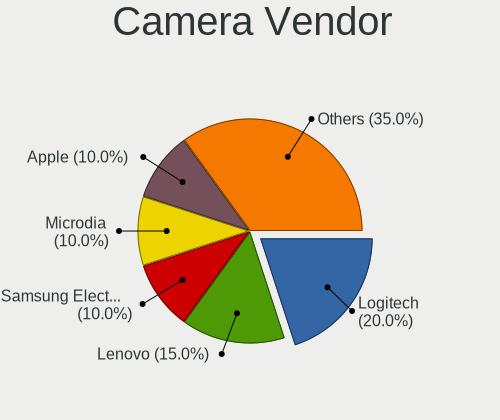

| Vendor                                 | Desktops | Percent |
|----------------------------------------|----------|---------|
| Logitech                               | 2        | 18.18%  |
| Lenovo                                 | 2        | 18.18%  |
| Valve Software                         | 1        | 9.09%   |
| Sunplus Innovation Technology          | 1        | 9.09%   |
| Sony Ericsson Mobile Communications AB | 1        | 9.09%   |
| Microdia                               | 1        | 9.09%   |
| KYE Systems (Mouse Systems)            | 1        | 9.09%   |
| Huawei Technologies                    | 1        | 9.09%   |
| Chicony Electronics                    | 1        | 9.09%   |

Camera Model
------------

Camera device models

| Model                                     | Desktops | Percent |
|-------------------------------------------|----------|---------|
| Valve Software 3D Camera                  | 1        | 9.09%   |
| Sunplus SPCA2281 Web Camera               | 1        | 9.09%   |
| Sony Ericsson Mobile AB XQ-CC54           | 1        | 9.09%   |
| Microdia Sonix USB 2.0 Camera             | 1        | 9.09%   |
| Logitech HD Webcam C615                   | 1        | 9.09%   |
| Logitech HD Pro Webcam C920               | 1        | 9.09%   |
| Lenovo Lenovo Performance Camera          | 1        | 9.09%   |
| Lenovo FHD Webcam                         | 1        | 9.09%   |
| KYE Systems (Mouse Systems) Genius Webcam | 1        | 9.09%   |
| Huawei HiCamera                           | 1        | 9.09%   |
| Chicony HP High Definition Webcam         | 1        | 9.09%   |

Security
--------

Fingerprint Vendor
------------------

Fingerprint sensor vendors

Zero info for selected period =(

Fingerprint Model
-----------------

Fingerprint sensor models

Zero info for selected period =(

Chipcard Vendor
---------------

Chipcard module vendors

Zero info for selected period =(

Chipcard Model
--------------

Chipcard module models

Zero info for selected period =(

Unsupported
-----------

Unsupported Devices
-------------------

Total unsupported devices on board

| Total | Desktops | Percent |
|-------|----------|---------|
| 0     | 33       | 82.5%   |
| 1     | 7        | 17.5%   |

Unsupported Device Types
------------------------

Types of unsupported devices

| Type                  | Desktops | Percent |
|-----------------------|----------|---------|
| Graphics card         | 3        | 42.86%  |
| Net/wireless          | 2        | 28.57%  |
| Multimedia controller | 1        | 14.29%  |
| Camera                | 1        | 14.29%  |

