TUXEDO OS - Tested Hardware & Statistics (Notebooks)
----------------------------------------------------

A project to collect tested hardware configurations for TUXEDO OS.

Anyone can contribute to this report by the [hw-probe](https://github.com/linuxhw/hw-probe) tool:

    sudo -E hw-probe -all -upload

Please contribute! Especially if your hardware is rare.

Contents
--------

* [ Test Cases ](#test-cases)

* [ System ](#system)
  - [ OS                       ](#os)
  - [ OS Family                ](#os-family)
  - [ Kernel                   ](#kernel)
  - [ Kernel Family            ](#kernel-family)
  - [ Kernel Major Ver.        ](#kernel-major-ver)
  - [ Arch                     ](#arch)
  - [ DE                       ](#de)
  - [ Display Server           ](#display-server)
  - [ Display Manager          ](#display-manager)
  - [ OS Lang                  ](#os-lang)
  - [ Boot Mode                ](#boot-mode)
  - [ Filesystem               ](#filesystem)
  - [ Part. scheme             ](#part-scheme)
  - [ Dual Boot with Linux/BSD ](#dual-boot-with-linuxbsd)
  - [ Dual Boot (Win)          ](#dual-boot-win)

* [ Board ](#board)
  - [ Vendor                   ](#vendor)
  - [ Model                    ](#model)
  - [ Model Family             ](#model-family)
  - [ MFG Year                 ](#mfg-year)
  - [ Form Factor              ](#form-factor)
  - [ Secure Boot              ](#secure-boot)
  - [ Coreboot                 ](#coreboot)
  - [ RAM Size                 ](#ram-size)
  - [ RAM Used                 ](#ram-used)
  - [ Total Drives             ](#total-drives)
  - [ Has CD-ROM               ](#has-cd-rom)
  - [ Has Ethernet             ](#has-ethernet)
  - [ Has WiFi                 ](#has-wifi)
  - [ Has Bluetooth            ](#has-bluetooth)

* [ Location ](#location)
  - [ Country                  ](#country)
  - [ City                     ](#city)

* [ Drives ](#drives)
  - [ Drive Vendor             ](#drive-vendor)
  - [ Drive Model              ](#drive-model)
  - [ HDD Vendor               ](#hdd-vendor)
  - [ SSD Vendor               ](#ssd-vendor)
  - [ Drive Kind               ](#drive-kind)
  - [ Drive Connector          ](#drive-connector)
  - [ Drive Size               ](#drive-size)
  - [ Space Total              ](#space-total)
  - [ Space Used               ](#space-used)
  - [ Malfunc. Drives          ](#malfunc-drives)
  - [ Malfunc. Drive Vendor    ](#malfunc-drive-vendor)
  - [ Malfunc. HDD Vendor      ](#malfunc-hdd-vendor)
  - [ Malfunc. Drive Kind      ](#malfunc-drive-kind)
  - [ Failed Drives            ](#failed-drives)
  - [ Failed Drive Vendor      ](#failed-drive-vendor)
  - [ Drive Status             ](#drive-status)

* [ Storage controller ](#storage-controller)
  - [ Storage Vendor           ](#storage-vendor)
  - [ Storage Model            ](#storage-model)
  - [ Storage Kind             ](#storage-kind)

* [ Processor ](#processor)
  - [ CPU Vendor               ](#cpu-vendor)
  - [ CPU Model                ](#cpu-model)
  - [ CPU Model Family         ](#cpu-model-family)
  - [ CPU Cores                ](#cpu-cores)
  - [ CPU Sockets              ](#cpu-sockets)
  - [ CPU Threads              ](#cpu-threads)
  - [ CPU Op-Modes             ](#cpu-op-modes)
  - [ CPU Microcode            ](#cpu-microcode)
  - [ CPU Microarch            ](#cpu-microarch)

* [ Graphics ](#graphics)
  - [ GPU Vendor               ](#gpu-vendor)
  - [ GPU Model                ](#gpu-model)
  - [ GPU Combo                ](#gpu-combo)
  - [ GPU Driver               ](#gpu-driver)
  - [ GPU Memory               ](#gpu-memory)

* [ Monitor ](#monitor)
  - [ Monitor Vendor           ](#monitor-vendor)
  - [ Monitor Model            ](#monitor-model)
  - [ Monitor Resolution       ](#monitor-resolution)
  - [ Monitor Diagonal         ](#monitor-diagonal)
  - [ Monitor Width            ](#monitor-width)
  - [ Aspect Ratio             ](#aspect-ratio)
  - [ Monitor Area             ](#monitor-area)
  - [ Pixel Density            ](#pixel-density)
  - [ Multiple Monitors        ](#multiple-monitors)

* [ Network ](#network)
  - [ Net Controller Vendor    ](#net-controller-vendor)
  - [ Net Controller Model     ](#net-controller-model)
  - [ Wireless Vendor          ](#wireless-vendor)
  - [ Wireless Model           ](#wireless-model)
  - [ Ethernet Vendor          ](#ethernet-vendor)
  - [ Ethernet Model           ](#ethernet-model)
  - [ Net Controller Kind      ](#net-controller-kind)
  - [ Used Controller          ](#used-controller)
  - [ NICs                     ](#nics)
  - [ IPv6                     ](#ipv6)

* [ Bluetooth ](#bluetooth)
  - [ Bluetooth Vendor         ](#bluetooth-vendor)
  - [ Bluetooth Model          ](#bluetooth-model)

* [ Sound ](#sound)
  - [ Sound Vendor             ](#sound-vendor)
  - [ Sound Model              ](#sound-model)

* [ Memory ](#memory)
  - [ Memory Vendor            ](#memory-vendor)
  - [ Memory Model             ](#memory-model)
  - [ Memory Kind              ](#memory-kind)
  - [ Memory Form Factor       ](#memory-form-factor)
  - [ Memory Size              ](#memory-size)
  - [ Memory Speed             ](#memory-speed)

* [ Printers & scanners ](#printers--scanners)
  - [ Printer Vendor           ](#printer-vendor)
  - [ Printer Model            ](#printer-model)
  - [ Scanner Vendor           ](#scanner-vendor)
  - [ Scanner Model            ](#scanner-model)

* [ Camera ](#camera)
  - [ Camera Vendor            ](#camera-vendor)
  - [ Camera Model             ](#camera-model)

* [ Security ](#security)
  - [ Fingerprint Vendor       ](#fingerprint-vendor)
  - [ Fingerprint Model        ](#fingerprint-model)
  - [ Chipcard Vendor          ](#chipcard-vendor)
  - [ Chipcard Model           ](#chipcard-model)

* [ Unsupported ](#unsupported)
  - [ Unsupported Devices      ](#unsupported-devices)
  - [ Unsupported Device Types ](#unsupported-device-types)

Test Cases
----------

Total: 423

| Vendor        | Model                       | Probe                                                      | Date         |
|---------------|-----------------------------|------------------------------------------------------------|--------------|
| Toshiba       | Satellite P50-C             | [e71ac65e13](https://linux-hardware.org/?probe=e71ac65e13) | Dec 31, 2025 |
| TUXEDO        | Pulse 15 Gen1               | [f9752e2b38](https://linux-hardware.org/?probe=f9752e2b38) | Dec 31, 2025 |
| Dell          | XPS L401X                   | [737720f72b](https://linux-hardware.org/?probe=737720f72b) | Dec 26, 2025 |
| Dell          | XPS L401X                   | [7e8652c7f5](https://linux-hardware.org/?probe=7e8652c7f5) | Dec 26, 2025 |
| TUXEDO        | InfinityBook Pro Intel G... | [52dc2c6fbc](https://linux-hardware.org/?probe=52dc2c6fbc) | Dec 24, 2025 |
| Monster       | HUMA H4 V6.1                | [c90f16dfa8](https://linux-hardware.org/?probe=c90f16dfa8) | Dec 22, 2025 |
| Apple         | MacBookPro8,1               | [8844a04b87](https://linux-hardware.org/?probe=8844a04b87) | Dec 20, 2025 |
| TUXEDO        | InfinityBook Pro AMD Gen... | [831c8f04ec](https://linux-hardware.org/?probe=831c8f04ec) | Dec 16, 2025 |
| TUXEDO        | InfinityBook Pro AMD Gen... | [48cfdd37de](https://linux-hardware.org/?probe=48cfdd37de) | Dec 15, 2025 |
| TUXEDO        | Unknown                     | [28713dc511](https://linux-hardware.org/?probe=28713dc511) | Dec 13, 2025 |
| TUXEDO        | Stellaris 17 Intel Gen6     | [c309300b2b](https://linux-hardware.org/?probe=c309300b2b) | Dec 12, 2025 |
| Lenovo        | ThinkPad T15 Gen 2i 20W4... | [d05ef42c69](https://linux-hardware.org/?probe=d05ef42c69) | Dec 11, 2025 |
| Apple         | MacBookPro8,1               | [4431c51690](https://linux-hardware.org/?probe=4431c51690) | Dec 09, 2025 |
| TUXEDO        | InfinityBook Pro AMD Gen... | [31e3032011](https://linux-hardware.org/?probe=31e3032011) | Dec 03, 2025 |
| TUXEDO        | InfinityBook Pro Intel G... | [a5ff9fafdc](https://linux-hardware.org/?probe=a5ff9fafdc) | Nov 22, 2025 |
| HP            | OMEN Gaming Laptop 16-ap... | [7dfc0bb8cb](https://linux-hardware.org/?probe=7dfc0bb8cb) | Nov 22, 2025 |
| Schenker      | XMG EVO (E25)               | [ed14e1f592](https://linux-hardware.org/?probe=ed14e1f592) | Nov 20, 2025 |
| Lenovo        | ThinkPad E520 1143A22       | [7ccee47640](https://linux-hardware.org/?probe=7ccee47640) | Nov 20, 2025 |
| Notebook      | W25CSW                      | [a44cd47538](https://linux-hardware.org/?probe=a44cd47538) | Nov 18, 2025 |
| ASUSTek       | K55VD                       | [c66b36eb38](https://linux-hardware.org/?probe=c66b36eb38) | Nov 18, 2025 |
| AXIOO         | MyBook Hype 5 AMD X5-2      | [1448aae1d0](https://linux-hardware.org/?probe=1448aae1d0) | Nov 17, 2025 |
| TUXEDO        | InfinityBook Pro Gen7 (M... | [b832a71b6c](https://linux-hardware.org/?probe=b832a71b6c) | Nov 17, 2025 |
| Schenker      | XMG EVO (E25)               | [a84cecb7d8](https://linux-hardware.org/?probe=a84cecb7d8) | Nov 16, 2025 |
| Dell          | Inspiron 5559               | [54d138897f](https://linux-hardware.org/?probe=54d138897f) | Nov 14, 2025 |
| Wortmann      | 1220758_1470443             | [9370671e8e](https://linux-hardware.org/?probe=9370671e8e) | Nov 11, 2025 |
| TUXEDO        | Book XP15 / XP17 Gen12      | [631b1e3ac9](https://linux-hardware.org/?probe=631b1e3ac9) | Nov 07, 2025 |
| Apple         | MacBookPro8,1               | [60d98c95ad](https://linux-hardware.org/?probe=60d98c95ad) | Nov 01, 2025 |
| Lenovo        | Legion 5 15ACH6H 82JU       | [4575599fd1](https://linux-hardware.org/?probe=4575599fd1) | Oct 26, 2025 |
| TUXEDO        | Stellaris Slim 15 AMD Ge... | [8fc2db2715](https://linux-hardware.org/?probe=8fc2db2715) | Oct 26, 2025 |
| Notebook      | NP5x_NP6x_NP7xHP            | [d1fcea6907](https://linux-hardware.org/?probe=d1fcea6907) | Oct 22, 2025 |
| TUXEDO        | Stellaris Slim 15 Intel ... | [85707c9b98](https://linux-hardware.org/?probe=85707c9b98) | Oct 19, 2025 |
| HUAWEI        | CREM-WXX9                   | [772ca62b37](https://linux-hardware.org/?probe=772ca62b37) | Oct 14, 2025 |
| Apple         | MacBookPro16,4              | [e4d9808330](https://linux-hardware.org/?probe=e4d9808330) | Oct 13, 2025 |
| TUXEDO        | InfinityBook Pro Gen8 (M... | [0e90ef1d4e](https://linux-hardware.org/?probe=0e90ef1d4e) | Oct 12, 2025 |
| TUXEDO        | Aura 15 Gen1                | [fd14f1eba0](https://linux-hardware.org/?probe=fd14f1eba0) | Oct 08, 2025 |
| Schenker      | XMG CORE 16 (L23)           | [cb6f8808a7](https://linux-hardware.org/?probe=cb6f8808a7) | Oct 07, 2025 |
| Lenovo        | ThinkPad P70 20ER000RUS     | [cf446c0c94](https://linux-hardware.org/?probe=cf446c0c94) | Oct 05, 2025 |
| TUXEDO        | Pulse 14 Gen4               | [cedef89747](https://linux-hardware.org/?probe=cedef89747) | Oct 01, 2025 |
| Sony          | VPCF23C5E                   | [07579672f2](https://linux-hardware.org/?probe=07579672f2) | Sep 27, 2025 |
| PC Special... | X6FR57TY                    | [42d3235252](https://linux-hardware.org/?probe=42d3235252) | Sep 26, 2025 |
| Schenker      | XMG FUSION (E24)            | [476266b9ef](https://linux-hardware.org/?probe=476266b9ef) | Sep 25, 2025 |
| Apple         | MacBookPro9,2               | [b075c7f669](https://linux-hardware.org/?probe=b075c7f669) | Sep 22, 2025 |
| HP            | 255 15.6 inch G9 Noteboo... | [231fca2302](https://linux-hardware.org/?probe=231fca2302) | Sep 20, 2025 |
| TUXEDO        | Aura 15 Gen3                | [6bf262f056](https://linux-hardware.org/?probe=6bf262f056) | Sep 18, 2025 |
| Dell          | Latitude 7450               | [d4476d69f5](https://linux-hardware.org/?probe=d4476d69f5) | Sep 17, 2025 |
| Lenovo        | V15 G4 IRU 83A1             | [42eb7a3db6](https://linux-hardware.org/?probe=42eb7a3db6) | Sep 13, 2025 |
| Lenovo        | V15 G4 IRU 83A1             | [457e82b85b](https://linux-hardware.org/?probe=457e82b85b) | Sep 13, 2025 |
| Lenovo        | IdeaPad Gaming 3 15ACH6 ... | [f578190095](https://linux-hardware.org/?probe=f578190095) | Sep 06, 2025 |
| Dell          | XPS 15 9560                 | [856176a8f0](https://linux-hardware.org/?probe=856176a8f0) | Sep 02, 2025 |
| TUXEDO        | InfinityBook Pro AMD Gen... | [675a7b30fd](https://linux-hardware.org/?probe=675a7b30fd) | Aug 28, 2025 |
| TUXEDO        | Stellaris 16 Intel Gen7     | [020766f6ad](https://linux-hardware.org/?probe=020766f6ad) | Aug 28, 2025 |
| TUXEDO        | Aura 15 Gen2                | [c267eaeec7](https://linux-hardware.org/?probe=c267eaeec7) | Aug 22, 2025 |
| Lenovo        | ThinkPad T15 Gen 2i 20W4... | [2d0466edd7](https://linux-hardware.org/?probe=2d0466edd7) | Aug 20, 2025 |
| ASUSTek       | VivoBook_ASUSLaptop X160... | [8470cd8bef](https://linux-hardware.org/?probe=8470cd8bef) | Aug 15, 2025 |
| ASUSTek       | VivoBook_ASUSLaptop X160... | [f0c4ad3b9f](https://linux-hardware.org/?probe=f0c4ad3b9f) | Aug 15, 2025 |
| Dell          | Vostro 7500                 | [4bebc0c210](https://linux-hardware.org/?probe=4bebc0c210) | Aug 13, 2025 |
| HP            | ZBook 14u G6                | [81754e4c2f](https://linux-hardware.org/?probe=81754e4c2f) | Aug 03, 2025 |
| TUXEDO        | InfinityBook Pro Gen7 (M... | [a7eb3dd4b5](https://linux-hardware.org/?probe=a7eb3dd4b5) | Aug 03, 2025 |
| Apple         | MacBookPro11,1              | [4813918094](https://linux-hardware.org/?probe=4813918094) | Jul 30, 2025 |
| TUXEDO        | Stellaris AMD Gen5          | [5093551223](https://linux-hardware.org/?probe=5093551223) | Jul 27, 2025 |
| TUXEDO        | Stellaris 16 Intel Gen7     | [5eb9612d31](https://linux-hardware.org/?probe=5eb9612d31) | Jul 23, 2025 |
| PC Special... | N15_17RD                    | [a8298959c6](https://linux-hardware.org/?probe=a8298959c6) | Jul 20, 2025 |
| PC Special... | N15_17RD                    | [a9a1134377](https://linux-hardware.org/?probe=a9a1134377) | Jul 20, 2025 |
| Lenovo        | LOQ 15ARP9 83JC             | [5c26d81542](https://linux-hardware.org/?probe=5c26d81542) | Jul 07, 2025 |
| Lenovo        | Legion Slim 5 16AHP9 83D... | [6cd5ca2f86](https://linux-hardware.org/?probe=6cd5ca2f86) | Jul 04, 2025 |
| TUXEDO        | Pulse 15 Gen2               | [8d71c2e857](https://linux-hardware.org/?probe=8d71c2e857) | Jun 24, 2025 |
| TUXEDO        | InfinityBook Pro Gen7 (M... | [d121557ba3](https://linux-hardware.org/?probe=d121557ba3) | Jun 21, 2025 |
| HP            | ENVY 14                     | [e8491780e9](https://linux-hardware.org/?probe=e8491780e9) | Jun 20, 2025 |
| ASUSTek       | ASUS TUF Gaming A16 FA60... | [755a8c3d56](https://linux-hardware.org/?probe=755a8c3d56) | Jun 13, 2025 |
| Schenker      | XMG CORE 16 (L23)           | [f5c9377f7c](https://linux-hardware.org/?probe=f5c9377f7c) | Jun 11, 2025 |
| HP            | ProBook 6570b               | [874c8c64a1](https://linux-hardware.org/?probe=874c8c64a1) | Jun 07, 2025 |
| HP            | ProBook 6570b               | [213f7251ae](https://linux-hardware.org/?probe=213f7251ae) | Jun 07, 2025 |
| Notebook      | NB50TJ1_TK1                 | [6b0d7cf8c5](https://linux-hardware.org/?probe=6b0d7cf8c5) | Jun 06, 2025 |
| Acer          | Aspire 5830TG               | [e0625b6b82](https://linux-hardware.org/?probe=e0625b6b82) | Jun 05, 2025 |
| TUXEDO        | Aura 15 Gen1                | [3f4d35d651](https://linux-hardware.org/?probe=3f4d35d651) | Jun 04, 2025 |
| TUXEDO        | Sirius 16 Gen1              | [af49671b97](https://linux-hardware.org/?probe=af49671b97) | Jun 03, 2025 |
| Lenovo        | ThinkPad X1 Carbon 5th 2... | [692c1766fa](https://linux-hardware.org/?probe=692c1766fa) | Jun 01, 2025 |
| Apple         | MacBookPro7,1               | [e2222c05b5](https://linux-hardware.org/?probe=e2222c05b5) | May 31, 2025 |
| TUXEDO        | Stellaris 17 Intel Gen6     | [eac85e692a](https://linux-hardware.org/?probe=eac85e692a) | May 31, 2025 |
| TUXEDO        | Stellaris 16 Intel Gen6     | [db7797fc09](https://linux-hardware.org/?probe=db7797fc09) | May 30, 2025 |
| TUXEDO        | InfinityBook S Gen8         | [71fb8cb1a6](https://linux-hardware.org/?probe=71fb8cb1a6) | May 23, 2025 |
| Schenker      | XMG CORE 16 (L23)           | [3302dd7e2a](https://linux-hardware.org/?probe=3302dd7e2a) | May 15, 2025 |
| ASUSTek       | VivoBook_ASUSLaptop X512... | [d6aa0e9d59](https://linux-hardware.org/?probe=d6aa0e9d59) | May 13, 2025 |
| TUXEDO        | Gemini Gen2                 | [2734035dc7](https://linux-hardware.org/?probe=2734035dc7) | May 11, 2025 |
| Dell          | Precision M4800             | [01623ab7bc](https://linux-hardware.org/?probe=01623ab7bc) | May 08, 2025 |
| TUXEDO        | Aura 14 Gen3                | [6d0d969030](https://linux-hardware.org/?probe=6d0d969030) | May 07, 2025 |
| TUXEDO        | Sirius 16 Gen1              | [c77ecf0ac5](https://linux-hardware.org/?probe=c77ecf0ac5) | May 07, 2025 |
| HP            | Laptop 15-bs1xx             | [4fac3675f0](https://linux-hardware.org/?probe=4fac3675f0) | May 03, 2025 |
| TUXEDO        | InfinityBook Pro AMD Gen... | [0f96f0e0d1](https://linux-hardware.org/?probe=0f96f0e0d1) | Apr 29, 2025 |
| Lenovo        | ThinkBook 15 G2 ARE 20VG    | [83d3076e92](https://linux-hardware.org/?probe=83d3076e92) | Apr 26, 2025 |
| ASUSTek       | X750LA                      | [3c564e450f](https://linux-hardware.org/?probe=3c564e450f) | Apr 22, 2025 |
| Dell          | Latitude E6320              | [12fd38e270](https://linux-hardware.org/?probe=12fd38e270) | Apr 21, 2025 |
| Notebook      | N650DU                      | [5a9807cc01](https://linux-hardware.org/?probe=5a9807cc01) | Apr 20, 2025 |
| TUXEDO        | Stellaris Slim 15 AMD Ge... | [619baf4bd1](https://linux-hardware.org/?probe=619baf4bd1) | Apr 16, 2025 |
| Lenovo        | Yoga Slim 7 ProX 14ARH7 ... | [e990ae749c](https://linux-hardware.org/?probe=e990ae749c) | Apr 13, 2025 |
| TUXEDO        | Stellaris Slim 15 AMD Ge... | [0d65a82519](https://linux-hardware.org/?probe=0d65a82519) | Apr 13, 2025 |
| Dell          | Latitude 5580               | [2066503c1a](https://linux-hardware.org/?probe=2066503c1a) | Apr 11, 2025 |
| TUXEDO        | Sirius 16 Gen1              | [3f64e24994](https://linux-hardware.org/?probe=3f64e24994) | Apr 09, 2025 |
| Apple         | MacBookPro9,1               | [bcec4226ca](https://linux-hardware.org/?probe=bcec4226ca) | Apr 08, 2025 |
| Lenovo        | IdeaPadFlex 15D 20334       | [db5ba6fc0b](https://linux-hardware.org/?probe=db5ba6fc0b) | Apr 06, 2025 |
| Acer          | Aspire 4720G                | [04fc8af8d8](https://linux-hardware.org/?probe=04fc8af8d8) | Mar 29, 2025 |
| Toshiba       | Satellite C50D-B            | [bfa0d3b852](https://linux-hardware.org/?probe=bfa0d3b852) | Mar 28, 2025 |
| TUXEDO        | InfinityBook Pro Gen7 (M... | [16dc221c70](https://linux-hardware.org/?probe=16dc221c70) | Mar 28, 2025 |
| Acer          | Aspire 4720G                | [61a5a3cf87](https://linux-hardware.org/?probe=61a5a3cf87) | Mar 28, 2025 |
| TUXEDO        | Polaris AMD Gen5            | [ebcba09c25](https://linux-hardware.org/?probe=ebcba09c25) | Mar 27, 2025 |
| TUXEDO        | InfinityFlex 14 Gen1        | [54c2c14b68](https://linux-hardware.org/?probe=54c2c14b68) | Mar 27, 2025 |
| TUXEDO        | InfinityBook Pro AMD Gen... | [6952d4749d](https://linux-hardware.org/?probe=6952d4749d) | Mar 27, 2025 |
| TUXEDO        | InfinityFlex 14 Gen1        | [65ccf0d67a](https://linux-hardware.org/?probe=65ccf0d67a) | Mar 26, 2025 |
| TUXEDO        | Gemini Gen2                 | [c59993e03c](https://linux-hardware.org/?probe=c59993e03c) | Mar 26, 2025 |
| Dell          | XPS 13 9340                 | [12d189a5e9](https://linux-hardware.org/?probe=12d189a5e9) | Mar 24, 2025 |
| MSI           | Katana A15 AI B8VF          | [ddf2b9a079](https://linux-hardware.org/?probe=ddf2b9a079) | Mar 23, 2025 |
| TUXEDO        | Stellaris 16 Intel Gen6     | [224d85cdd3](https://linux-hardware.org/?probe=224d85cdd3) | Mar 22, 2025 |
| TUXEDO        | Stellaris Slim 15 Intel ... | [f04a59beb1](https://linux-hardware.org/?probe=f04a59beb1) | Mar 20, 2025 |
| Acer          | Swift SF16-51T              | [55587989cb](https://linux-hardware.org/?probe=55587989cb) | Mar 20, 2025 |
| TUXEDO        | Aura 15 Gen3                | [35708800a2](https://linux-hardware.org/?probe=35708800a2) | Mar 10, 2025 |
| Dell          | Inspiron 3537               | [8082d8aac1](https://linux-hardware.org/?probe=8082d8aac1) | Feb 26, 2025 |
| A-DATA Tec... | XENIA159GENI72070           | [d2dd6a37cf](https://linux-hardware.org/?probe=d2dd6a37cf) | Feb 20, 2025 |
| ASUSTek       | X540LA                      | [11c234d7e7](https://linux-hardware.org/?probe=11c234d7e7) | Feb 20, 2025 |
| Dell          | Latitude 5540               | [5d52a182f6](https://linux-hardware.org/?probe=5d52a182f6) | Feb 19, 2025 |
| TUXEDO        | InfinityBook Pro Intel G... | [742aa1d8d5](https://linux-hardware.org/?probe=742aa1d8d5) | Feb 18, 2025 |
| TUXEDO        | Stellaris 17 Intel Gen6     | [b995aaa364](https://linux-hardware.org/?probe=b995aaa364) | Feb 17, 2025 |
| TUXEDO        | Gemini Gen2                 | [f876de3019](https://linux-hardware.org/?probe=f876de3019) | Feb 15, 2025 |
| TUXEDO        | InfinityBook Pro Intel G... | [d89bbf4a46](https://linux-hardware.org/?probe=d89bbf4a46) | Feb 14, 2025 |
| TUXEDO        | N8xEJEK                     | [21d5df99f9](https://linux-hardware.org/?probe=21d5df99f9) | Feb 08, 2025 |
| MSI           | MS-7B89                     | [fffef45d4e](https://linux-hardware.org/?probe=fffef45d4e) | Feb 08, 2025 |
| HP            | ProBook 470 G5              | [01a05f692c](https://linux-hardware.org/?probe=01a05f692c) | Feb 07, 2025 |
| Lenovo        | ThinkPad T480 20L6S6WQ00    | [559da3cea5](https://linux-hardware.org/?probe=559da3cea5) | Feb 06, 2025 |
| Lenovo        | ThinkPad X230 2325CN3       | [184a6724d8](https://linux-hardware.org/?probe=184a6724d8) | Feb 05, 2025 |
| TUXEDO        | Book XUX7 Gen13             | [f7f2603c76](https://linux-hardware.org/?probe=f7f2603c76) | Jan 30, 2025 |
| Dell          | Latitude 7480               | [766eb9ed19](https://linux-hardware.org/?probe=766eb9ed19) | Jan 27, 2025 |
| Dell          | Latitude 7480               | [95d5212816](https://linux-hardware.org/?probe=95d5212816) | Jan 27, 2025 |
| Schenker      | XMG CORE 16 (L23)           | [510dfb9c11](https://linux-hardware.org/?probe=510dfb9c11) | Jan 25, 2025 |
| Acer          | Nitro AN515-52              | [562fc36763](https://linux-hardware.org/?probe=562fc36763) | Jan 20, 2025 |
| TUXEDO        | Pulse 15 Gen2               | [8390d853a4](https://linux-hardware.org/?probe=8390d853a4) | Jan 15, 2025 |
| TUXEDO        | Gemini Gen2                 | [06a90ffa26](https://linux-hardware.org/?probe=06a90ffa26) | Jan 11, 2025 |
| Apple         | MacBookPro5,1               | [f2fa91667d](https://linux-hardware.org/?probe=f2fa91667d) | Jan 11, 2025 |
| TUXEDO        | Aura 15 Gen3                | [131408b3f4](https://linux-hardware.org/?probe=131408b3f4) | Jan 10, 2025 |
| Apple         | MacBookPro5,1               | [039fb37aad](https://linux-hardware.org/?probe=039fb37aad) | Jan 10, 2025 |
| TUXEDO        | InfinityBook Pro AMD Gen... | [fe66814077](https://linux-hardware.org/?probe=fe66814077) | Jan 09, 2025 |
| Lenovo        | IdeaPad 5 15ABA7 82SG       | [22702a56ed](https://linux-hardware.org/?probe=22702a56ed) | Jan 06, 2025 |
| TUXEDO        | Book XP15 / XP17 Gen12      | [be06c286bb](https://linux-hardware.org/?probe=be06c286bb) | Jan 04, 2025 |
| TUXEDO        | Stellaris Slim 15 Intel ... | [b1e2aaf88e](https://linux-hardware.org/?probe=b1e2aaf88e) | Dec 31, 2024 |
| HP            | 255 15.6 inch G9 Noteboo... | [1c64d7883e](https://linux-hardware.org/?probe=1c64d7883e) | Dec 26, 2024 |
| HP            | ProBook 470 G5              | [30f50d84d3](https://linux-hardware.org/?probe=30f50d84d3) | Dec 24, 2024 |
| Acer          | Aspire A315-58              | [b49f4674e2](https://linux-hardware.org/?probe=b49f4674e2) | Dec 23, 2024 |
| TUXEDO        | Pulse 14 Gen4               | [dfdca3924e](https://linux-hardware.org/?probe=dfdca3924e) | Dec 22, 2024 |
| TUXEDO        | InfinityBook Pro Gen8 (M... | [c094245674](https://linux-hardware.org/?probe=c094245674) | Dec 21, 2024 |
| Lenovo        | Yoga Pro 7 14ASP9 83HN      | [847bdd9f95](https://linux-hardware.org/?probe=847bdd9f95) | Dec 21, 2024 |
| Lenovo        | Yoga Pro 7 14ASP9 83HN      | [bae5bf44e3](https://linux-hardware.org/?probe=bae5bf44e3) | Dec 21, 2024 |
| TUXEDO        | InfinityBook Pro AMD Gen... | [1b7b6fe18c](https://linux-hardware.org/?probe=1b7b6fe18c) | Dec 20, 2024 |
| Lenovo        | ThinkPad T480 20L6S6WQ00    | [7ddde1c012](https://linux-hardware.org/?probe=7ddde1c012) | Dec 12, 2024 |
| Lenovo        | ThinkPad T480 20L6S6WQ00    | [8e83bba34b](https://linux-hardware.org/?probe=8e83bba34b) | Dec 12, 2024 |
| Dell          | Latitude 9420               | [00fecb4861](https://linux-hardware.org/?probe=00fecb4861) | Dec 05, 2024 |
| Monster       | TULPAR T7 V20.8             | [e7cc7b7cff](https://linux-hardware.org/?probe=e7cc7b7cff) | Dec 05, 2024 |
| ASUSTek       | ASUS TUF Gaming A15 FA50... | [2d22964d09](https://linux-hardware.org/?probe=2d22964d09) | Dec 01, 2024 |
| Lenovo        | IdeaPad Gaming 3 15ACH6 ... | [afdf6ad9bd](https://linux-hardware.org/?probe=afdf6ad9bd) | Nov 27, 2024 |
| Lenovo        | IdeaPad Gaming 3 15ACH6 ... | [970d25268e](https://linux-hardware.org/?probe=970d25268e) | Nov 27, 2024 |
| Dell          | Latitude E5440              | [61cfdd936e](https://linux-hardware.org/?probe=61cfdd936e) | Nov 27, 2024 |
| Dell          | Latitude E5440              | [77269b5130](https://linux-hardware.org/?probe=77269b5130) | Nov 27, 2024 |
| Dell          | Latitude 5411               | [ebb8abde35](https://linux-hardware.org/?probe=ebb8abde35) | Nov 26, 2024 |
| Lenovo        | ThinkPad L380 20M6S11800    | [fdca0fd463](https://linux-hardware.org/?probe=fdca0fd463) | Nov 24, 2024 |
| Schenker      | XMG EVO (M24)               | [513a3453cc](https://linux-hardware.org/?probe=513a3453cc) | Nov 20, 2024 |
| Lenovo        | ThinkBook 16p Gen 2 20YM    | [70dcc9416f](https://linux-hardware.org/?probe=70dcc9416f) | Nov 19, 2024 |
| TUXEDO        | InfinityBook Pro Gen7 (M... | [522f3333a0](https://linux-hardware.org/?probe=522f3333a0) | Nov 18, 2024 |
| TUXEDO        | InfinityBook Pro AMD Gen... | [f1540c9c61](https://linux-hardware.org/?probe=f1540c9c61) | Nov 16, 2024 |
| Lenovo        | IdeaPad 5 15ABA7 82SG       | [ff2ac5c7c1](https://linux-hardware.org/?probe=ff2ac5c7c1) | Nov 16, 2024 |
| Lenovo        | IdeaPad 5 15ABA7 82SG       | [858fe28143](https://linux-hardware.org/?probe=858fe28143) | Nov 16, 2024 |
| TUXEDO        | InfinityBook Pro Intel G... | [365259d6e3](https://linux-hardware.org/?probe=365259d6e3) | Nov 10, 2024 |
| TUXEDO        | InfinityBook Pro Intel G... | [ca6d2c4960](https://linux-hardware.org/?probe=ca6d2c4960) | Nov 08, 2024 |
| ASUSTek       | ASUS TUF Gaming A14 FA40... | [69a7ee9ab5](https://linux-hardware.org/?probe=69a7ee9ab5) | Nov 02, 2024 |
| Dell          | Latitude E6520              | [029a9feb19](https://linux-hardware.org/?probe=029a9feb19) | Nov 01, 2024 |
| TUXEDO        | Pulse 15 Gen2               | [08951a5d7d](https://linux-hardware.org/?probe=08951a5d7d) | Oct 20, 2024 |
| TUXEDO        | Sirius 16 Gen1              | [30d8c17c67](https://linux-hardware.org/?probe=30d8c17c67) | Oct 19, 2024 |
| Dell          | Latitude 5411               | [e0e43f1847](https://linux-hardware.org/?probe=e0e43f1847) | Oct 19, 2024 |
| Acer          | Nitro AN515-44              | [505d70884f](https://linux-hardware.org/?probe=505d70884f) | Oct 17, 2024 |
| TUXEDO        | InfinityBook Pro Intel G... | [deb463e41a](https://linux-hardware.org/?probe=deb463e41a) | Oct 16, 2024 |
| TUXEDO        | InfinityBook Pro Intel G... | [0a95725e51](https://linux-hardware.org/?probe=0a95725e51) | Oct 16, 2024 |
| TUXEDO        | Pulse 14 Gen3               | [a33d03b342](https://linux-hardware.org/?probe=a33d03b342) | Oct 13, 2024 |
| Toshiba       | Satellite C660              | [d5e307e3b9](https://linux-hardware.org/?probe=d5e307e3b9) | Oct 11, 2024 |
| TUXEDO        | InfinityBook Pro Intel G... | [9b10635c23](https://linux-hardware.org/?probe=9b10635c23) | Oct 11, 2024 |
| Dell          | Latitude 5410               | [a6d40302d1](https://linux-hardware.org/?probe=a6d40302d1) | Oct 08, 2024 |
| Acer          | Nitro AN517-54              | [6d3f1a9cac](https://linux-hardware.org/?probe=6d3f1a9cac) | Oct 04, 2024 |
| Dell          | Latitude 5410               | [c3ad8f296b](https://linux-hardware.org/?probe=c3ad8f296b) | Oct 02, 2024 |
| HP            | Pavilion g7                 | [a766af594c](https://linux-hardware.org/?probe=a766af594c) | Oct 01, 2024 |
| LG Electro... | A560-T.BG77P1               | [ecbba00380](https://linux-hardware.org/?probe=ecbba00380) | Sep 30, 2024 |
| Schenker      | XMG APEX (M23)              | [efc8dfb947](https://linux-hardware.org/?probe=efc8dfb947) | Sep 30, 2024 |
| TUXEDO        | InfinityBook Pro AMD Gen... | [d51b3c150f](https://linux-hardware.org/?probe=d51b3c150f) | Sep 28, 2024 |
| Apple         | MacBookPro5,5               | [a0bb48750a](https://linux-hardware.org/?probe=a0bb48750a) | Sep 25, 2024 |
| ASUSTek       | ASUS BR1100CKA BR1100CKA... | [19b72b74eb](https://linux-hardware.org/?probe=19b72b74eb) | Sep 21, 2024 |
| ASUSTek       | ASUS BR1100CKA BR1100CKA... | [c19cd4397b](https://linux-hardware.org/?probe=c19cd4397b) | Sep 20, 2024 |
| ASUSTek       | ASUS TUF Gaming A17 FA70... | [4169a4ef86](https://linux-hardware.org/?probe=4169a4ef86) | Sep 17, 2024 |
| Toshiba       | Satellite C660              | [83c86f3085](https://linux-hardware.org/?probe=83c86f3085) | Sep 16, 2024 |
| Monster       | TULPAR T7 V20.8             | [3acaa02a26](https://linux-hardware.org/?probe=3acaa02a26) | Sep 16, 2024 |
| Schenker      | XMG APEX (M23)              | [67e76c49d4](https://linux-hardware.org/?probe=67e76c49d4) | Sep 10, 2024 |
| Lenovo        | ThinkPad P14s Gen 4 21K5... | [3c82db19ee](https://linux-hardware.org/?probe=3c82db19ee) | Sep 09, 2024 |
| Valve         | Galileo                     | [4c2d3435ee](https://linux-hardware.org/?probe=4c2d3435ee) | Sep 08, 2024 |
| TUXEDO        | Stellaris 17 Intel Gen6     | [1bed607ead](https://linux-hardware.org/?probe=1bed607ead) | Sep 05, 2024 |
| Notebook      | W54_55SU1,SUW               | [151da93887](https://linux-hardware.org/?probe=151da93887) | Aug 31, 2024 |
| MSI           | GF75 Thin 8RD               | [6e65fa1e65](https://linux-hardware.org/?probe=6e65fa1e65) | Aug 31, 2024 |
| HP            | ENVY 15                     | [6689093a97](https://linux-hardware.org/?probe=6689093a97) | Aug 30, 2024 |
| TUXEDO        | Stellaris 17 Intel Gen6     | [9e6d9b5bf0](https://linux-hardware.org/?probe=9e6d9b5bf0) | Aug 29, 2024 |
| TUXEDO        | Pulse 15 Gen1               | [24e0d4eba1](https://linux-hardware.org/?probe=24e0d4eba1) | Aug 24, 2024 |
| TUXEDO        | Stellaris Slim 15 AMD Ge... | [40301df9d0](https://linux-hardware.org/?probe=40301df9d0) | Aug 24, 2024 |
| Lenovo        | ThinkBook 14 G4 ABA 21DK    | [06865e4709](https://linux-hardware.org/?probe=06865e4709) | Aug 22, 2024 |
| Sony          | VPCF11S1E                   | [1e3a2103e1](https://linux-hardware.org/?probe=1e3a2103e1) | Aug 22, 2024 |
| Sony          | VPCF11S1E                   | [c9d89ad8cd](https://linux-hardware.org/?probe=c9d89ad8cd) | Aug 22, 2024 |
| Samsung       | 300E5EV/300E4EV/270E5EV/... | [c51c37be47](https://linux-hardware.org/?probe=c51c37be47) | Aug 20, 2024 |
| MSI           | Stealth GS66 12UGS          | [56a8c64b2f](https://linux-hardware.org/?probe=56a8c64b2f) | Aug 17, 2024 |
| Lenovo        | ThinkPad SL 2743A65         | [0ee47e6c13](https://linux-hardware.org/?probe=0ee47e6c13) | Aug 12, 2024 |
| HP            | Pavilion Laptop 15-eh2xx... | [d415774845](https://linux-hardware.org/?probe=d415774845) | Aug 07, 2024 |
| TUXEDO        | InfinityBook Pro Gen8 (M... | [2534745345](https://linux-hardware.org/?probe=2534745345) | Jul 29, 2024 |
| ASUSTek       | ASUS TUF Gaming A17 FA70... | [6114c59dc3](https://linux-hardware.org/?probe=6114c59dc3) | Jul 19, 2024 |
| Lenovo        | IdeaPad Slim 5 16AHP9 83... | [97b127dc88](https://linux-hardware.org/?probe=97b127dc88) | Jul 18, 2024 |
| TUXEDO        | InfinityBook_S_14_v5        | [886f488bf6](https://linux-hardware.org/?probe=886f488bf6) | Jul 18, 2024 |
| Gigabyte      | G7 GE                       | [c0c18a4870](https://linux-hardware.org/?probe=c0c18a4870) | Jul 11, 2024 |
| TUXEDO        | Polaris AMD Gen5            | [c587060103](https://linux-hardware.org/?probe=c587060103) | Jul 11, 2024 |
| TUXEDO        | Unknown                     | [511b234c12](https://linux-hardware.org/?probe=511b234c12) | Jun 29, 2024 |
| ASUSTek       | VivoBook_ASUSLaptop X160... | [643324d50d](https://linux-hardware.org/?probe=643324d50d) | Jun 24, 2024 |
| Dell          | Precision 5540              | [01ba3a1f97](https://linux-hardware.org/?probe=01ba3a1f97) | Jun 21, 2024 |
| Schenker      | VISION (E22)                | [04ce0d9ecb](https://linux-hardware.org/?probe=04ce0d9ecb) | Jun 21, 2024 |
| MSI           | GF65 Thin 9SD               | [148651308b](https://linux-hardware.org/?probe=148651308b) | Jun 20, 2024 |
| Sony          | VPCF11S1E                   | [b1a753f9b7](https://linux-hardware.org/?probe=b1a753f9b7) | Jun 19, 2024 |
| Sony          | VPCF11S1E                   | [87d826a5ae](https://linux-hardware.org/?probe=87d826a5ae) | Jun 19, 2024 |
| TUXEDO        | Pulse 14 Gen4               | [90ac35bd67](https://linux-hardware.org/?probe=90ac35bd67) | Jun 13, 2024 |
| TUXEDO        | InfinityBook Pro Gen8 (M... | [ca53e7c4f9](https://linux-hardware.org/?probe=ca53e7c4f9) | Jun 13, 2024 |
| TUXEDO        | Aura 15 Gen1                | [d1a1779e3d](https://linux-hardware.org/?probe=d1a1779e3d) | Jun 10, 2024 |
| Lenovo        | ThinkPad W520 42763JU       | [4917a1d71e](https://linux-hardware.org/?probe=4917a1d71e) | Jun 10, 2024 |
| TUXEDO        | Gemini Gen2                 | [3447e15d2a](https://linux-hardware.org/?probe=3447e15d2a) | Jun 09, 2024 |
| TUXEDO        | N85_N87,HJ,HJ1,HK1          | [2a12edf737](https://linux-hardware.org/?probe=2a12edf737) | Jun 08, 2024 |
| TUXEDO        | N85_N87,HJ,HJ1,HK1          | [8fc536c206](https://linux-hardware.org/?probe=8fc536c206) | Jun 08, 2024 |
| Dell          | Precision 5540              | [2eef64104b](https://linux-hardware.org/?probe=2eef64104b) | Jun 03, 2024 |
| Dell          | Precision 5540              | [e26d05b54d](https://linux-hardware.org/?probe=e26d05b54d) | Jun 03, 2024 |
| Dell          | Precision 5540              | [f23f3bf603](https://linux-hardware.org/?probe=f23f3bf603) | Jun 03, 2024 |
| Schenker      | VISION 16 Pro (L22)         | [583eb45282](https://linux-hardware.org/?probe=583eb45282) | May 30, 2024 |
| Apple         | MacBookPro10,1              | [84df51f04d](https://linux-hardware.org/?probe=84df51f04d) | May 29, 2024 |
| Lenovo        | ThinkPad T420s 4174PEG      | [d2ed1215d1](https://linux-hardware.org/?probe=d2ed1215d1) | May 24, 2024 |
| Lenovo        | ThinkPad X270 W10DG 20K5... | [9407df3fde](https://linux-hardware.org/?probe=9407df3fde) | May 18, 2024 |
| TUXEDO        | Polaris AMD Gen5            | [4a9cd8c609](https://linux-hardware.org/?probe=4a9cd8c609) | May 17, 2024 |
| Apple         | MacBookAir6,2               | [058ca22eca](https://linux-hardware.org/?probe=058ca22eca) | May 12, 2024 |
| Schenker      | VISION 16 Pro (L22)         | [c54f918726](https://linux-hardware.org/?probe=c54f918726) | May 08, 2024 |
| TUXEDO        | InfinityBook Pro Gen7 (M... | [bc9db74da3](https://linux-hardware.org/?probe=bc9db74da3) | May 07, 2024 |
| TUXEDO        | Sirius 16 Gen1              | [b093c73dcb](https://linux-hardware.org/?probe=b093c73dcb) | May 04, 2024 |
| Lenovo        | ThinkPad X1 Carbon Gen 1... | [8a0a1ade7b](https://linux-hardware.org/?probe=8a0a1ade7b) | May 04, 2024 |
| ASUSTek       | N71Vn                       | [6f38bd6250](https://linux-hardware.org/?probe=6f38bd6250) | May 03, 2024 |
| TUXEDO        | InfinityBook Pro 14 Gen6    | [ad5d8cbdf2](https://linux-hardware.org/?probe=ad5d8cbdf2) | May 03, 2024 |
| TUXEDO        | Aura 15 Gen2                | [93d15c44da](https://linux-hardware.org/?probe=93d15c44da) | May 02, 2024 |
| ASUSTek       | N71Vn                       | [d5d1d55df1](https://linux-hardware.org/?probe=d5d1d55df1) | May 01, 2024 |
| TUXEDO        | InfinityBook Pro 14 Gen6    | [290ff65bc7](https://linux-hardware.org/?probe=290ff65bc7) | Apr 30, 2024 |
| TUXEDO        | InfinityBook Pro 14 Gen6    | [f6d6805396](https://linux-hardware.org/?probe=f6d6805396) | Apr 27, 2024 |
| Lenovo        | ThinkBook 15 G2 ARE 20VG    | [be0672ea72](https://linux-hardware.org/?probe=be0672ea72) | Apr 21, 2024 |
| HP            | ProBook 4540s               | [b13d3be380](https://linux-hardware.org/?probe=b13d3be380) | Apr 21, 2024 |
| TUXEDO        | Stellaris/Polaris AMD Ge... | [bb18adad6a](https://linux-hardware.org/?probe=bb18adad6a) | Apr 19, 2024 |
| Toshiba       | PORTEGE Z10T-A              | [8ed3e0a790](https://linux-hardware.org/?probe=8ed3e0a790) | Apr 16, 2024 |
| Dell          | Latitude 5430               | [5f23ced920](https://linux-hardware.org/?probe=5f23ced920) | Apr 16, 2024 |
| HP            | 250 G7 Notebook PC          | [714eb8d9ea](https://linux-hardware.org/?probe=714eb8d9ea) | Apr 16, 2024 |
| TUXEDO        | Sirius 16 Gen1              | [6b5703bf76](https://linux-hardware.org/?probe=6b5703bf76) | Apr 14, 2024 |
| Lenovo        | ThinkBook 15 G2 ARE 20VG    | [918934ed68](https://linux-hardware.org/?probe=918934ed68) | Apr 11, 2024 |
| TUXEDO        | Sirius 16 Gen1              | [d8b9d651e3](https://linux-hardware.org/?probe=d8b9d651e3) | Apr 11, 2024 |
| Apple         | MacBookPro12,1              | [0e37beebd4](https://linux-hardware.org/?probe=0e37beebd4) | Apr 05, 2024 |
| Apple         | MacBookPro12,1              | [2c20f368e3](https://linux-hardware.org/?probe=2c20f368e3) | Apr 05, 2024 |
| TUXEDO        | Polaris AMD Gen5            | [352afa7567](https://linux-hardware.org/?probe=352afa7567) | Apr 04, 2024 |
| MSI           | Vector GP78HX 13VG          | [74268fafe5](https://linux-hardware.org/?probe=74268fafe5) | Mar 31, 2024 |
| Apple         | MacBook5,1                  | [0b7838f79e](https://linux-hardware.org/?probe=0b7838f79e) | Mar 26, 2024 |
| Dell          | Latitude E6420              | [cdd8eb657a](https://linux-hardware.org/?probe=cdd8eb657a) | Mar 22, 2024 |
| Apple         | MacBookPro11,2              | [247c0bdfb3](https://linux-hardware.org/?probe=247c0bdfb3) | Mar 21, 2024 |
| HP            | Pavilion 15                 | [a9bc9facce](https://linux-hardware.org/?probe=a9bc9facce) | Mar 19, 2024 |
| HP            | Pavilion Power Laptop 15... | [8529154b4a](https://linux-hardware.org/?probe=8529154b4a) | Mar 15, 2024 |
| Lenovo        | Yoga 700-11ISK 80QE         | [a0a622a966](https://linux-hardware.org/?probe=a0a622a966) | Mar 14, 2024 |
| Dell          | Latitude 7480               | [13613ddbb8](https://linux-hardware.org/?probe=13613ddbb8) | Mar 14, 2024 |
| TUXEDO        | Pulse 15 Gen1               | [106f4fd286](https://linux-hardware.org/?probe=106f4fd286) | Mar 13, 2024 |
| MSI           | Modern 15 H B13M            | [31bba1378f](https://linux-hardware.org/?probe=31bba1378f) | Mar 11, 2024 |
| MSI           | GF75 Thin 10SC              | [a415956dc4](https://linux-hardware.org/?probe=a415956dc4) | Mar 10, 2024 |
| ASUSTek       | X555LJ                      | [72da032893](https://linux-hardware.org/?probe=72da032893) | Mar 09, 2024 |
| HP            | Pavilion g7                 | [10e05bd9bc](https://linux-hardware.org/?probe=10e05bd9bc) | Mar 08, 2024 |
| MSI           | Modern 15 H B13M            | [a1ac91ddf1](https://linux-hardware.org/?probe=a1ac91ddf1) | Mar 02, 2024 |
| Lenovo        | ThinkPad E15 Gen 2 20TDS... | [e809fe3bcd](https://linux-hardware.org/?probe=e809fe3bcd) | Feb 29, 2024 |
| Toshiba       | Satellite A665              | [2a3093ba09](https://linux-hardware.org/?probe=2a3093ba09) | Feb 29, 2024 |
| TUXEDO        | Sirius 16 Gen1              | [76659ee758](https://linux-hardware.org/?probe=76659ee758) | Feb 25, 2024 |
| Wortmann      | 1220595_1470122             | [8f49189b79](https://linux-hardware.org/?probe=8f49189b79) | Feb 24, 2024 |
| TUXEDO        | Sirius 16 Gen1              | [44b101b616](https://linux-hardware.org/?probe=44b101b616) | Feb 14, 2024 |
| TUXEDO        | XP1610                      | [520e2a82de](https://linux-hardware.org/?probe=520e2a82de) | Feb 12, 2024 |
| TUXEDO        | InfinityBook Pro Gen8 (M... | [d3fc4417ee](https://linux-hardware.org/?probe=d3fc4417ee) | Feb 12, 2024 |
| TUXEDO        | Unknown                     | [9e4e88d13e](https://linux-hardware.org/?probe=9e4e88d13e) | Feb 11, 2024 |
| TUXEDO        | Book XP15 / XP17 Gen12      | [e8784ff987](https://linux-hardware.org/?probe=e8784ff987) | Feb 09, 2024 |
| TUXEDO        | InfinityBook S Gen8         | [8dddfa59a5](https://linux-hardware.org/?probe=8dddfa59a5) | Feb 09, 2024 |
| HP            | Pavilion Notebook           | [81424087b4](https://linux-hardware.org/?probe=81424087b4) | Feb 06, 2024 |
| HP            | Pavilion Notebook           | [9305000cc3](https://linux-hardware.org/?probe=9305000cc3) | Feb 06, 2024 |
| HP            | 250 G3                      | [3302706a4e](https://linux-hardware.org/?probe=3302706a4e) | Feb 05, 2024 |
| HP            | Pavilion Power Laptop 15... | [8098729533](https://linux-hardware.org/?probe=8098729533) | Jan 30, 2024 |
| ASUSTek       | ASUS TUF Gaming A16 FA61... | [590fcea5fe](https://linux-hardware.org/?probe=590fcea5fe) | Jan 30, 2024 |
| ASUSTek       | ASUS TUF Gaming A16 FA61... | [f45683d844](https://linux-hardware.org/?probe=f45683d844) | Jan 30, 2024 |
| Acer          | Nitro AN515-47              | [521b0ef15b](https://linux-hardware.org/?probe=521b0ef15b) | Jan 13, 2024 |
| HP            | Laptop 15-bw0xx             | [9a8667ecaa](https://linux-hardware.org/?probe=9a8667ecaa) | Jan 12, 2024 |
| TUXEDO        | Polaris AMD Gen5            | [aa5447c317](https://linux-hardware.org/?probe=aa5447c317) | Jan 01, 2024 |
| Samsung       | RC530/RC730                 | [866c256904](https://linux-hardware.org/?probe=866c256904) | Dec 30, 2023 |
| Samsung       | RC530/RC730                 | [db448e5732](https://linux-hardware.org/?probe=db448e5732) | Dec 29, 2023 |
| TUXEDO        | Polaris AMD Gen5            | [46ad5a6b29](https://linux-hardware.org/?probe=46ad5a6b29) | Dec 28, 2023 |
| TUXEDO        | InfinityBook S 15 Gen6      | [54961dd296](https://linux-hardware.org/?probe=54961dd296) | Dec 25, 2023 |
| TUXEDO        | Polaris AMD Gen5            | [f63c59d851](https://linux-hardware.org/?probe=f63c59d851) | Dec 24, 2023 |
| Lenovo        | Legion 5 15IAH7H 82RB       | [57d4ccc05e](https://linux-hardware.org/?probe=57d4ccc05e) | Dec 21, 2023 |
| TUXEDO        | Polaris AMD Gen5            | [84a93dbb91](https://linux-hardware.org/?probe=84a93dbb91) | Dec 19, 2023 |
| Apple         | MacBookAir6,2               | [31426d7740](https://linux-hardware.org/?probe=31426d7740) | Dec 15, 2023 |
| TUXEDO        | InfinityBook Pro Gen7 (M... | [627ee4cb32](https://linux-hardware.org/?probe=627ee4cb32) | Dec 11, 2023 |
| Acer          | Swift SF314-52              | [ed93047829](https://linux-hardware.org/?probe=ed93047829) | Dec 01, 2023 |
| Dell          | Inspiron 3558               | [936fe9e153](https://linux-hardware.org/?probe=936fe9e153) | Nov 28, 2023 |
| Lenovo        | ThinkPad P14s Gen 2a 21A... | [4c071e2ab0](https://linux-hardware.org/?probe=4c071e2ab0) | Nov 27, 2023 |
| TUXEDO        | Stellaris Intel Gen5        | [16cc1f3183](https://linux-hardware.org/?probe=16cc1f3183) | Nov 26, 2023 |
| Acer          | Nitro AN517-55              | [c34bec8c5f](https://linux-hardware.org/?probe=c34bec8c5f) | Nov 21, 2023 |
| HP            | Pavilion Laptop 15-eg0xx... | [3e6fcc9388](https://linux-hardware.org/?probe=3e6fcc9388) | Nov 19, 2023 |
| TUXEDO        | InfinityBook S 15/17 Gen... | [629ca85bd5](https://linux-hardware.org/?probe=629ca85bd5) | Nov 18, 2023 |
| TUXEDO        | InfinityBook S 15/17 Gen... | [1a6683483d](https://linux-hardware.org/?probe=1a6683483d) | Nov 18, 2023 |
| TUXEDO        | Polaris 15 AMD Gen1         | [a08b139fa8](https://linux-hardware.org/?probe=a08b139fa8) | Nov 12, 2023 |
| Lenovo        | ThinkPad P50 20EQS42M00     | [f4761a87e1](https://linux-hardware.org/?probe=f4761a87e1) | Nov 06, 2023 |
| TUXEDO        | Pulse 15 Gen1               | [4a5e89566c](https://linux-hardware.org/?probe=4a5e89566c) | Nov 05, 2023 |
| Lenovo        | IdeaPad Pro 5 14APH8 83A... | [0845a0ec43](https://linux-hardware.org/?probe=0845a0ec43) | Nov 03, 2023 |
| TUXEDO        | Aura 15 Gen2                | [ca743b4e40](https://linux-hardware.org/?probe=ca743b4e40) | Nov 01, 2023 |
| Dell          | Precision 5480              | [0d66f24fe1](https://linux-hardware.org/?probe=0d66f24fe1) | Oct 25, 2023 |
| Notebook      | NP5x_NP6x_NP7xHP            | [017d43654d](https://linux-hardware.org/?probe=017d43654d) | Oct 22, 2023 |
| TUXEDO        | XMG FUSION 15 (XFU15L19)    | [af44d01ae9](https://linux-hardware.org/?probe=af44d01ae9) | Oct 19, 2023 |
| Dell          | Latitude E6540              | [78c4b71781](https://linux-hardware.org/?probe=78c4b71781) | Oct 04, 2023 |
| Dell          | Latitude E6540              | [290b4bd42e](https://linux-hardware.org/?probe=290b4bd42e) | Oct 03, 2023 |
| Lenovo        | ThinkBook 14 G2 ARE 20VF    | [886b5140ec](https://linux-hardware.org/?probe=886b5140ec) | Oct 03, 2023 |
| Lenovo        | ThinkPad T490s 20NYS3Y60... | [294e5069a4](https://linux-hardware.org/?probe=294e5069a4) | Oct 01, 2023 |
| Lenovo        | ThinkPad T490s 20NYS3Y60... | [9452219aa3](https://linux-hardware.org/?probe=9452219aa3) | Oct 01, 2023 |
| MSI           | Prestige 15 A10SC           | [6e53cd8a65](https://linux-hardware.org/?probe=6e53cd8a65) | Sep 30, 2023 |
| Metabox       | Prime-X X170KM              | [8ab33a8bd3](https://linux-hardware.org/?probe=8ab33a8bd3) | Sep 30, 2023 |
| TUXEDO        | Stellaris Intel Gen5        | [6d981e4890](https://linux-hardware.org/?probe=6d981e4890) | Sep 29, 2023 |
| Dell          | Inspiron 14 5420            | [ade3d11822](https://linux-hardware.org/?probe=ade3d11822) | Sep 24, 2023 |
| Schenker      | VISION 15 E23 (SVS15E23)    | [d905d3589d](https://linux-hardware.org/?probe=d905d3589d) | Sep 24, 2023 |
| Lenovo        | ThinkBook 14 G2 ARE 20VF    | [147b087f20](https://linux-hardware.org/?probe=147b087f20) | Sep 23, 2023 |
| Chuwi         | MiniBook X                  | [50d0819b3b](https://linux-hardware.org/?probe=50d0819b3b) | Sep 20, 2023 |
| TUXEDO        | InfinityBook Pro Gen7 (M... | [a4f7b61af6](https://linux-hardware.org/?probe=a4f7b61af6) | Sep 18, 2023 |
| HP            | Laptop 15-db1xxx            | [804223592d](https://linux-hardware.org/?probe=804223592d) | Sep 17, 2023 |
| HP            | Pavilion dv5                | [2c55682860](https://linux-hardware.org/?probe=2c55682860) | Sep 15, 2023 |
| HP            | Pavilion dv5                | [8d25f8969b](https://linux-hardware.org/?probe=8d25f8969b) | Sep 15, 2023 |
| Lenovo        | ThinkPad P50 20EQS37F00     | [0eaf502e28](https://linux-hardware.org/?probe=0eaf502e28) | Sep 12, 2023 |
| TUXEDO        | Stellaris Intel Gen5        | [a28ff634a0](https://linux-hardware.org/?probe=a28ff634a0) | Sep 11, 2023 |
| TUXEDO        | Stellaris Intel Gen5        | [28283f9fcf](https://linux-hardware.org/?probe=28283f9fcf) | Sep 11, 2023 |
| HP            | ZBook 14u G5                | [9ff135c2a6](https://linux-hardware.org/?probe=9ff135c2a6) | Sep 09, 2023 |
| Apple         | MacBookPro9,2               | [abb6dcaeb2](https://linux-hardware.org/?probe=abb6dcaeb2) | Sep 09, 2023 |
| Apple         | MacBookPro9,2               | [1e6219cb6e](https://linux-hardware.org/?probe=1e6219cb6e) | Sep 09, 2023 |
| TUXEDO        | InfinityBook S 15 Gen6      | [c53e992822](https://linux-hardware.org/?probe=c53e992822) | Aug 26, 2023 |
| TUXEDO        | Polaris AMD Gen3 (CZN)      | [b6e2112ccb](https://linux-hardware.org/?probe=b6e2112ccb) | Aug 13, 2023 |
| Dell          | Precision 7750              | [cebb7f5165](https://linux-hardware.org/?probe=cebb7f5165) | Aug 06, 2023 |
| TUXEDO        | N7x0WU                      | [1c2cb06178](https://linux-hardware.org/?probe=1c2cb06178) | Aug 06, 2023 |
| TUXEDO        | XMG FUSION 15 (XFU15L19)    | [64e640ff2b](https://linux-hardware.org/?probe=64e640ff2b) | Aug 04, 2023 |
| TUXEDO        | Aura 15 Gen2                | [07d668ee3d](https://linux-hardware.org/?probe=07d668ee3d) | Aug 03, 2023 |
| TUXEDO        | InfinityBook Pro Gen7 (M... | [c6078d0836](https://linux-hardware.org/?probe=c6078d0836) | Aug 02, 2023 |
| Lenovo        | ThinkPad E580 20KS003SUS    | [9b8485b740](https://linux-hardware.org/?probe=9b8485b740) | Aug 01, 2023 |
| HP            | Notebook                    | [beef8e7fce](https://linux-hardware.org/?probe=beef8e7fce) | Jul 25, 2023 |
| HP            | Notebook                    | [4746f66332](https://linux-hardware.org/?probe=4746f66332) | Jul 23, 2023 |
| Lenovo        | G580 20150                  | [bcd1c01ad6](https://linux-hardware.org/?probe=bcd1c01ad6) | Jul 15, 2023 |
| Lenovo        | G580 20150                  | [390008fe3c](https://linux-hardware.org/?probe=390008fe3c) | Jul 15, 2023 |
| HP            | Laptop 15-dw3xxx            | [fd0926d15b](https://linux-hardware.org/?probe=fd0926d15b) | Jul 14, 2023 |
| TUXEDO        | InfinityBook S 15/17 Gen... | [26fda3b894](https://linux-hardware.org/?probe=26fda3b894) | Jul 14, 2023 |
| Dell          | Latitude E6530              | [25cbd87821](https://linux-hardware.org/?probe=25cbd87821) | Jul 13, 2023 |
| Apple         | MacBookPro8,1               | [29a9ad60a6](https://linux-hardware.org/?probe=29a9ad60a6) | Jul 13, 2023 |
| TUXEDO        | InfinityBook S 15/17 Gen... | [2015dd83cb](https://linux-hardware.org/?probe=2015dd83cb) | Jul 12, 2023 |
| TUXEDO        | Stellaris AMD Gen3 (CZN)    | [54ac55c49e](https://linux-hardware.org/?probe=54ac55c49e) | Jul 07, 2023 |
| TUXEDO        | Stellaris AMD Gen3 (CZN)    | [296474a1b1](https://linux-hardware.org/?probe=296474a1b1) | Jul 07, 2023 |
| TUXEDO        | Book XUX7 Gen13             | [e480e61359](https://linux-hardware.org/?probe=e480e61359) | Jul 06, 2023 |
| TUXEDO        | InfinityBook S 15/17 Gen... | [3d599df965](https://linux-hardware.org/?probe=3d599df965) | Jul 02, 2023 |
| TUXEDO        | Pulse 15 Gen1               | [b15b3b6025](https://linux-hardware.org/?probe=b15b3b6025) | Jun 30, 2023 |
| TUXEDO        | InfinityBook S 15/17 Gen... | [ed4a581e3e](https://linux-hardware.org/?probe=ed4a581e3e) | Jun 28, 2023 |
| MSI           | GE75 Raider 10SF            | [c2a5aeb291](https://linux-hardware.org/?probe=c2a5aeb291) | Jun 28, 2023 |
| TUXEDO        | P64_HJ,HK1                  | [4c542d50e7](https://linux-hardware.org/?probe=4c542d50e7) | Jun 27, 2023 |
| BESSTAR Te... | X400                        | [8e98b345cf](https://linux-hardware.org/?probe=8e98b345cf) | Jun 26, 2023 |
| Acer          | Swift SFX14-51G             | [c8f3981a52](https://linux-hardware.org/?probe=c8f3981a52) | Jun 23, 2023 |
| Lenovo        | Yoga S740-15IRH 81NX        | [6fb60cf84a](https://linux-hardware.org/?probe=6fb60cf84a) | Jun 18, 2023 |
| Lenovo        | ThinkPad P1 Gen 3 20TJS1... | [c47936b50c](https://linux-hardware.org/?probe=c47936b50c) | Jun 09, 2023 |
| Dell          | Venue 11 Pro 7130 vPro      | [c16266c1c9](https://linux-hardware.org/?probe=c16266c1c9) | Jun 04, 2023 |
| Apple         | MacBookAir7,2               | [f75fb35204](https://linux-hardware.org/?probe=f75fb35204) | May 28, 2023 |
| ASUSTek       | K55VJ                       | [66c9773a5f](https://linux-hardware.org/?probe=66c9773a5f) | May 26, 2023 |
| ASUSTek       | K55VJ                       | [65cc5e45b0](https://linux-hardware.org/?probe=65cc5e45b0) | May 26, 2023 |
| Lenovo        | G580 20150                  | [5acf485cbf](https://linux-hardware.org/?probe=5acf485cbf) | May 20, 2023 |
| TUXEDO        | Polaris 15 AMD Gen1         | [81e75bd6e7](https://linux-hardware.org/?probe=81e75bd6e7) | May 11, 2023 |
| Lenovo        | IdeaPad N581 7505           | [5d340c1aa2](https://linux-hardware.org/?probe=5d340c1aa2) | May 04, 2023 |
| HP            | Pavilion dv6                | [be01072653](https://linux-hardware.org/?probe=be01072653) | May 03, 2023 |
| TUXEDO        | Stellaris/Polaris AMD Ge... | [756500f10b](https://linux-hardware.org/?probe=756500f10b) | May 03, 2023 |
| HP            | Pavilion dv6                | [87f0c054fa](https://linux-hardware.org/?probe=87f0c054fa) | May 03, 2023 |
| TUXEDO        | InfinityBook Pro 14 Gen6    | [58bb30861d](https://linux-hardware.org/?probe=58bb30861d) | Apr 29, 2023 |
| Dell          | Inspiron 16 5630            | [7bfe5bb892](https://linux-hardware.org/?probe=7bfe5bb892) | Apr 27, 2023 |
| Dell          | Latitude 7530               | [17140d3871](https://linux-hardware.org/?probe=17140d3871) | Apr 24, 2023 |
| TUXEDO        | Pulse 15 Gen2               | [fd2ad16b59](https://linux-hardware.org/?probe=fd2ad16b59) | Apr 22, 2023 |
| Dell          | Vostro 3550                 | [3b77631ed6](https://linux-hardware.org/?probe=3b77631ed6) | Apr 04, 2023 |
| Unknown       | Unknown                     | [22c0e4cdec](https://linux-hardware.org/?probe=22c0e4cdec) | Apr 02, 2023 |
| Lenovo        | ThinkPad T490 20N3SBU219    | [b8e8125150](https://linux-hardware.org/?probe=b8e8125150) | Mar 27, 2023 |
| TUXEDO        | InfinityBook Pro Gen7 (M... | [885b757cdc](https://linux-hardware.org/?probe=885b757cdc) | Mar 24, 2023 |
| TUXEDO        | InfinityBook Pro Gen7 (M... | [5e01f2c134](https://linux-hardware.org/?probe=5e01f2c134) | Mar 22, 2023 |
| TUXEDO        | Polaris AMD Gen3 (CZN)      | [0db668b5ec](https://linux-hardware.org/?probe=0db668b5ec) | Mar 18, 2023 |
| TUXEDO        | InfinityBook S 15/17 Gen... | [094b530ce7](https://linux-hardware.org/?probe=094b530ce7) | Mar 18, 2023 |
| TUXEDO        | Pulse 15 Gen1               | [e7dd32b931](https://linux-hardware.org/?probe=e7dd32b931) | Mar 15, 2023 |
| TUXEDO        | Pulse 15 Gen1               | [557a08d242](https://linux-hardware.org/?probe=557a08d242) | Mar 15, 2023 |
| TUXEDO        | InfinityBook Pro 14 Gen6    | [3fcbfecb5a](https://linux-hardware.org/?probe=3fcbfecb5a) | Mar 14, 2023 |
| Dell          | Precision 7720              | [dbe0d4c5c4](https://linux-hardware.org/?probe=dbe0d4c5c4) | Mar 12, 2023 |
| Dell          | Vostro 3550                 | [40a0328a5f](https://linux-hardware.org/?probe=40a0328a5f) | Mar 11, 2023 |
| TUXEDO        | XMG FUSION 15 (XFU15L19)    | [3cde6f345c](https://linux-hardware.org/?probe=3cde6f345c) | Mar 10, 2023 |
| Fujitsu       | LIFEBOOK U7412              | [980dd72471](https://linux-hardware.org/?probe=980dd72471) | Mar 06, 2023 |
| TUXEDO        | Pulse 15 Gen2               | [7a21cf8349](https://linux-hardware.org/?probe=7a21cf8349) | Mar 05, 2023 |
| TUXEDO        | InfinityBook Pro Gen7 (M... | [20d14c7576](https://linux-hardware.org/?probe=20d14c7576) | Mar 04, 2023 |
| Lenovo        | G50-80 80E5                 | [d7bb021829](https://linux-hardware.org/?probe=d7bb021829) | Feb 27, 2023 |
| Dell          | Vostro 3550                 | [1e1da6a575](https://linux-hardware.org/?probe=1e1da6a575) | Feb 24, 2023 |
| Dell          | Vostro 3550                 | [497a8d66e5](https://linux-hardware.org/?probe=497a8d66e5) | Feb 22, 2023 |
| Dell          | Precision 7720              | [2f7837d5b6](https://linux-hardware.org/?probe=2f7837d5b6) | Feb 21, 2023 |
| TUXEDO        | Stellaris/Polaris AMD Ge... | [ccd78843fc](https://linux-hardware.org/?probe=ccd78843fc) | Feb 16, 2023 |
| HP            | EliteBook 2570p             | [ed14b057dd](https://linux-hardware.org/?probe=ed14b057dd) | Feb 09, 2023 |
| TUXEDO        | InfinityBook Pro Gen7 (M... | [4a2fcb6bd0](https://linux-hardware.org/?probe=4a2fcb6bd0) | Jan 31, 2023 |
| HP            | OMEN Laptop 15-en0xxx       | [e163d98802](https://linux-hardware.org/?probe=e163d98802) | Jan 28, 2023 |
| ASUSTek       | Zephyrus G GU502DU_GA502... | [fa53a29f7e](https://linux-hardware.org/?probe=fa53a29f7e) | Jan 01, 2023 |
| ASUSTek       | ROG Strix G713RW_G713RW     | [731b31c845](https://linux-hardware.org/?probe=731b31c845) | Dec 02, 2022 |
| TUXEDO        | N13xWU                      | [55935f091d](https://linux-hardware.org/?probe=55935f091d) | Dec 01, 2022 |
| TUXEDO        | Unknown                     | [fd06ca029c](https://linux-hardware.org/?probe=fd06ca029c) | Nov 29, 2022 |
| Lenovo        | ThinkPad T460 20FMS07000    | [5043f6c54e](https://linux-hardware.org/?probe=5043f6c54e) | Nov 20, 2022 |
| HP            | EliteBook 820 G2            | [5d82e9f6ac](https://linux-hardware.org/?probe=5d82e9f6ac) | Nov 19, 2022 |
| HP            | EliteBook 820 G2            | [9d20af2c30](https://linux-hardware.org/?probe=9d20af2c30) | Nov 19, 2022 |
| Lenovo        | ThinkPad X200 Tablet 745... | [d58eb8b2f0](https://linux-hardware.org/?probe=d58eb8b2f0) | Oct 30, 2022 |
| Lenovo        | ThinkPad X200 Tablet 745... | [032bc01698](https://linux-hardware.org/?probe=032bc01698) | Oct 30, 2022 |
| TUXEDO        | Unknown                     | [99555fc4eb](https://linux-hardware.org/?probe=99555fc4eb) | Oct 28, 2022 |
| Lenovo        | Legion 5 15ACH6H 82JU       | [251892471f](https://linux-hardware.org/?probe=251892471f) | Oct 26, 2022 |
| ASUSTek       | BU201LAV                    | [9d1fe7cb6f](https://linux-hardware.org/?probe=9d1fe7cb6f) | Oct 19, 2022 |
| Apple         | MacBookPro8,1               | [36e033aa01](https://linux-hardware.org/?probe=36e033aa01) | Oct 09, 2022 |
| Notebook      | W65_W67RB                   | [dc57cb32d4](https://linux-hardware.org/?probe=dc57cb32d4) | Oct 07, 2022 |
| Acer          | TravelMate 8572T            | [6abaaf4aa6](https://linux-hardware.org/?probe=6abaaf4aa6) | Oct 03, 2022 |

System
------

OS
--

Installed operating systems

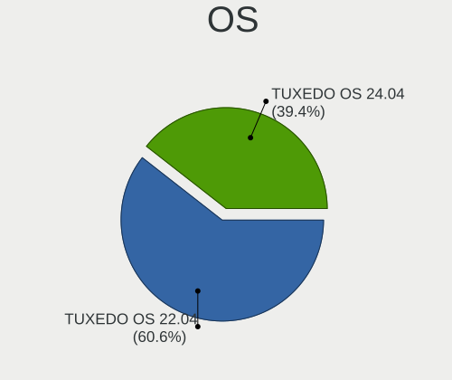

| Name            | Notebooks | Percent |
|-----------------|-----------|---------|
| TUXEDO OS 22.04 | 198       | 60.55%  |
| TUXEDO OS 24.04 | 129       | 39.45%  |

OS Family
---------

OS without a version

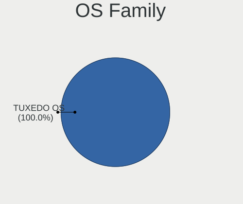

| Name      | Notebooks | Percent |
|-----------|-----------|---------|
| TUXEDO OS | 324       | 100%    |

Kernel
------

Version of the Linux kernel

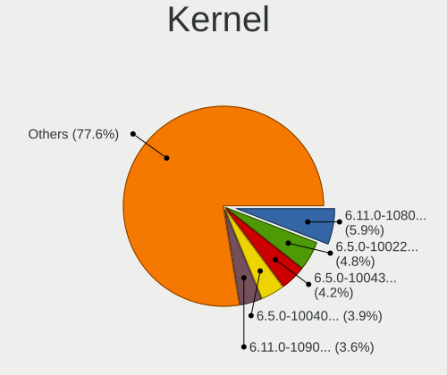

| Version              | Notebooks | Percent |
|----------------------|-----------|---------|
| 6.11.0-108013-tuxedo | 21        | 5.88%   |
| 6.5.0-10022-tuxedo   | 17        | 4.76%   |
| 6.5.0-10043-tuxedo   | 15        | 4.2%    |
| 6.5.0-10040-tuxedo   | 14        | 3.92%   |
| 6.11.0-109019-tuxedo | 13        | 3.64%   |
| 6.11.0-102007-tuxedo | 13        | 3.64%   |
| 6.1.0-1009-tuxedo    | 13        | 3.64%   |
| 6.5.0-10027-tuxedo   | 12        | 3.36%   |
| 6.5.0-10036-tuxedo   | 11        | 3.08%   |
| 6.2.0-10022-tuxedo   | 11        | 3.08%   |
| 6.2.0-10018-tuxedo   | 10        | 2.8%    |
| 6.2.0-10005-tuxedo   | 9         | 2.52%   |
| 6.11.0-108014-tuxedo | 9         | 2.52%   |
| 6.2.0-10011-tuxedo   | 8         | 2.24%   |
| 6.2.0-10007-tuxedo   | 8         | 2.24%   |
| 6.11.0-112021-tuxedo | 8         | 2.24%   |
| 6.5.0-10008-tuxedo   | 7         | 1.96%   |
| 6.11.0-120029-tuxedo | 7         | 1.96%   |
| 6.11.0-118026-tuxedo | 7         | 1.96%   |
| 6.8.0-101041-tuxedo  | 6         | 1.68%   |
| 6.5.0-10010-tuxedo   | 6         | 1.68%   |
| 6.2.0-10010-tuxedo   | 6         | 1.68%   |
| 6.14.0-117036-tuxedo | 6         | 1.68%   |
| 6.11.0-105009-tuxedo | 6         | 1.68%   |
| 6.5.0-10031-tuxedo   | 5         | 1.4%    |
| 6.5.0-10013-tuxedo   | 5         | 1.4%    |
| 6.5.0-10006-tuxedo   | 5         | 1.4%    |
| 6.14.0-115036-tuxedo | 5         | 1.4%    |
| 6.14.0-112033-tuxedo | 5         | 1.4%    |
| 6.14.0-110029-tuxedo | 5         | 1.4%    |
| 6.11.0-107011-tuxedo | 5         | 1.4%    |
| 6.14.0-116036-tuxedo | 4         | 1.12%   |
| 6.14.0-111029-tuxedo | 4         | 1.12%   |
| 6.11.0-121029-tuxedo | 4         | 1.12%   |
| 6.11.0-116025-tuxedo | 4         | 1.12%   |
| 6.11.0-107009-tuxedo | 4         | 1.12%   |
| 6.11.0-103009-tuxedo | 4         | 1.12%   |
| 5.15.0-10058-tuxedo  | 4         | 1.12%   |
| 5.15.0-10048-tuxedo  | 4         | 1.12%   |
| 6.2.0-10027-tuxedo   | 3         | 0.84%   |

Kernel Family
-------------

Linux kernel without a distro release

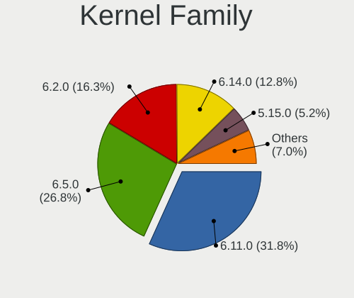

| Version | Notebooks | Percent |
|---------|-----------|---------|
| 6.11.0  | 109       | 31.78%  |
| 6.5.0   | 92        | 26.82%  |
| 6.2.0   | 56        | 16.33%  |
| 6.14.0  | 44        | 12.83%  |
| 5.15.0  | 18        | 5.25%   |
| 6.1.0   | 13        | 3.79%   |
| 6.8.0   | 7         | 2.04%   |
| 6.5.4   | 1         | 0.29%   |
| 6.11.10 | 1         | 0.29%   |
| 6.10.7  | 1         | 0.29%   |
| 6.0.0   | 1         | 0.29%   |

Kernel Major Ver.
-----------------

Linux kernel major version

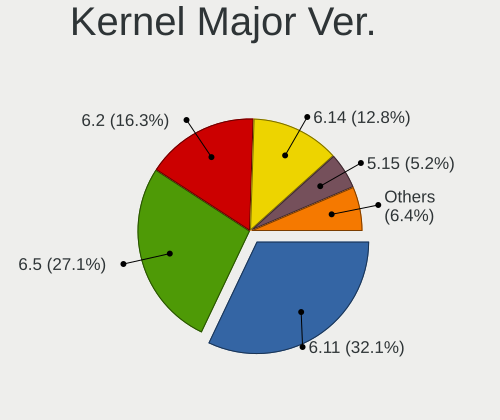

| Version | Notebooks | Percent |
|---------|-----------|---------|
| 6.11    | 110       | 32.07%  |
| 6.5     | 93        | 27.11%  |
| 6.2     | 56        | 16.33%  |
| 6.14    | 44        | 12.83%  |
| 5.15    | 18        | 5.25%   |
| 6.1     | 13        | 3.79%   |
| 6.8     | 7         | 2.04%   |
| 6.10    | 1         | 0.29%   |
| 6.0     | 1         | 0.29%   |

Arch
----

OS architecture (x86_64, i586, etc.)

| Name   | Notebooks | Percent |
|--------|-----------|---------|
| x86_64 | 324       | 100%    |

DE
--

Desktop Environment

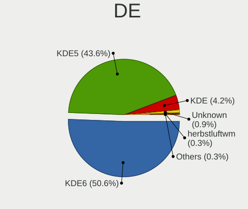

| Name         | Notebooks | Percent |
|--------------|-----------|---------|
| KDE6         | 167       | 50.61%  |
| KDE5         | 144       | 43.64%  |
| KDE          | 14        | 4.24%   |
| Unknown      | 3         | 0.91%   |
| XFCE         | 1         | 0.3%    |
| herbstluftwm | 1         | 0.3%    |

Display Server
--------------

X11 or Wayland

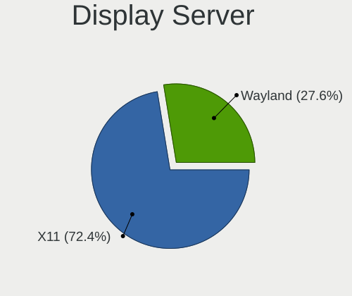

| Name    | Notebooks | Percent |
|---------|-----------|---------|
| X11     | 239       | 72.42%  |
| Wayland | 91        | 27.58%  |

Display Manager
---------------

SDDM, LightDM, etc.

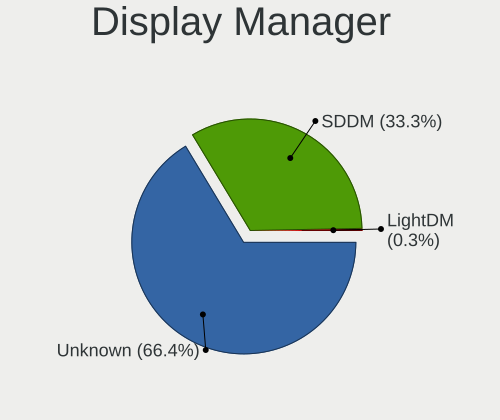

| Name    | Notebooks | Percent |
|---------|-----------|---------|
| Unknown | 217       | 66.36%  |
| SDDM    | 109       | 33.33%  |
| LightDM | 1         | 0.31%   |

OS Lang
-------

Language

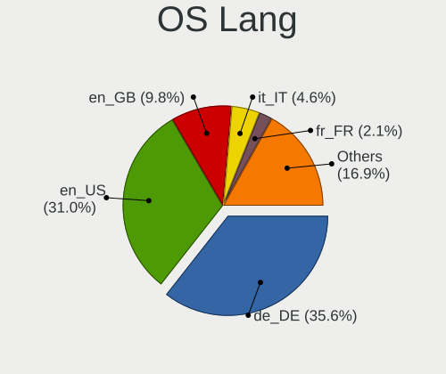

| Lang  | Notebooks | Percent |
|-------|-----------|---------|
| de_DE | 116       | 35.58%  |
| en_US | 101       | 30.98%  |
| en_GB | 32        | 9.82%   |
| it_IT | 15        | 4.6%    |
| fr_FR | 7         | 2.15%   |
| pl_PL | 5         | 1.53%   |
| en_CA | 5         | 1.53%   |
| pt_BR | 4         | 1.23%   |
| en_AU | 4         | 1.23%   |
| es_ES | 3         | 0.92%   |
| en_DK | 3         | 0.92%   |
| de_AT | 3         | 0.92%   |
| cs_CZ | 3         | 0.92%   |
| tr_TR | 2         | 0.61%   |
| pt_PT | 2         | 0.61%   |
| nb_NO | 2         | 0.61%   |
| hu_HU | 2         | 0.61%   |
| fr_BE | 2         | 0.61%   |
| es_VE | 2         | 0.61%   |
| en_AG | 2         | 0.61%   |
| zh_TW | 1         | 0.31%   |
| ro_RO | 1         | 0.31%   |
| nl_NL | 1         | 0.31%   |
| fr_CH | 1         | 0.31%   |
| fi_FI | 1         | 0.31%   |
| et_EE | 1         | 0.31%   |
| en_ZA | 1         | 0.31%   |
| en_IN | 1         | 0.31%   |
| de_CH | 1         | 0.31%   |
| da_DK | 1         | 0.31%   |
| bg_BG | 1         | 0.31%   |

Boot Mode
---------

EFI or BIOS

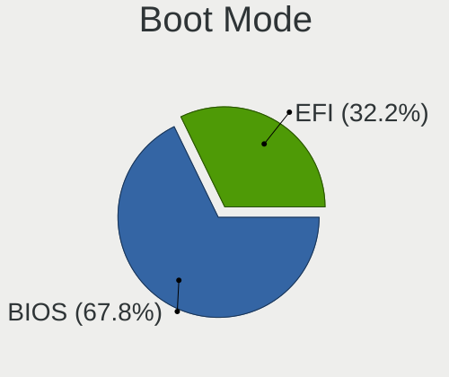

| Mode | Notebooks | Percent |
|------|-----------|---------|
| BIOS | 221       | 67.79%  |
| EFI  | 105       | 32.21%  |

Filesystem
----------

Type of filesystem

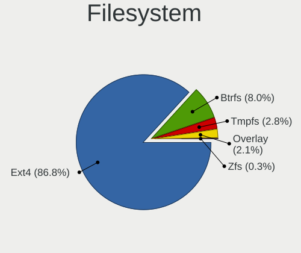

| Type    | Notebooks | Percent |
|---------|-----------|---------|
| Ext4    | 283       | 86.81%  |
| Btrfs   | 26        | 7.98%   |
| Tmpfs   | 9         | 2.76%   |
| Overlay | 7         | 2.15%   |
| Zfs     | 1         | 0.31%   |

Part. scheme
------------

Scheme of partitioning

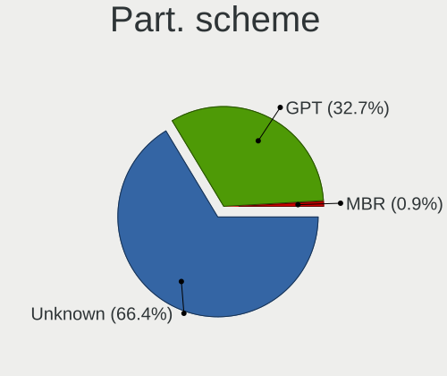

| Type    | Notebooks | Percent |
|---------|-----------|---------|
| Unknown | 217       | 66.36%  |
| GPT     | 107       | 32.72%  |
| MBR     | 3         | 0.92%   |

Dual Boot with Linux/BSD
------------------------

Hosting more than one Linux/BSD

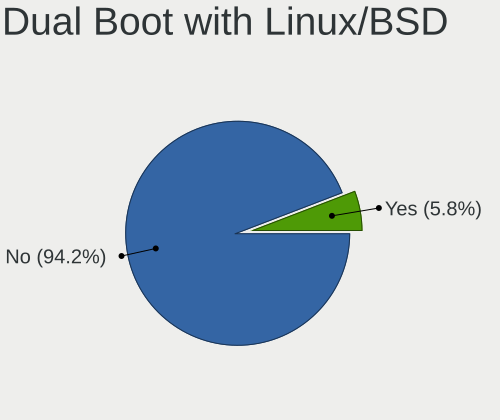

| Dual boot | Notebooks | Percent |
|-----------|-----------|---------|
| No        | 307       | 94.17%  |
| Yes       | 19        | 5.83%   |

Dual Boot (Win)
---------------

Hosting Linux and Windows

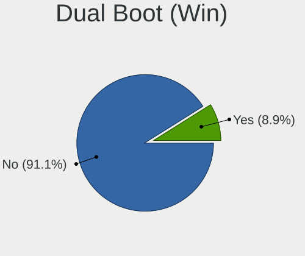

| Dual boot | Notebooks | Percent |
|-----------|-----------|---------|
| No        | 296       | 91.08%  |
| Yes       | 29        | 8.92%   |

Board
-----

Vendor
------

Motherboard manufacturer

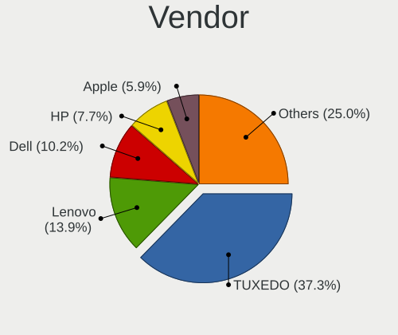

| Name                | Notebooks | Percent |
|---------------------|-----------|---------|
| TUXEDO              | 121       | 37.35%  |
| Lenovo              | 45        | 13.89%  |
| Dell                | 33        | 10.19%  |
| Hewlett-Packard     | 25        | 7.72%   |
| Apple               | 19        | 5.86%   |
| ASUSTek Computer    | 18        | 5.56%   |
| Acer                | 11        | 3.4%    |
| MSI                 | 10        | 3.09%   |
| Schenker            | 8         | 2.47%   |
| Notebook            | 7         | 2.16%   |
| Toshiba             | 6         | 1.85%   |
| Wortmann AG         | 2         | 0.62%   |
| Sony                | 2         | 0.62%   |
| Samsung Electronics | 2         | 0.62%   |
| PC Specialist       | 2         | 0.62%   |
| Monster             | 2         | 0.62%   |
| Valve               | 1         | 0.31%   |
| Metabox             | 1         | 0.31%   |
| LG Electronics      | 1         | 0.31%   |
| HUAWEI              | 1         | 0.31%   |
| Gigabyte Technology | 1         | 0.31%   |
| Fujitsu             | 1         | 0.31%   |
| Chuwi               | 1         | 0.31%   |
| BESSTAR Tech        | 1         | 0.31%   |
| AXIOO               | 1         | 0.31%   |
| A-DATA Technology   | 1         | 0.31%   |
| Unknown             | 1         | 0.31%   |

Model
-----

Motherboard model

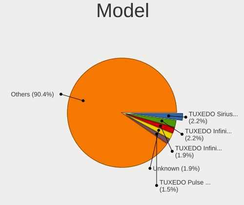

| Name                                | Notebooks | Percent |
|-------------------------------------|-----------|---------|
| TUXEDO Sirius 16 Gen1               | 7         | 2.16%   |
| TUXEDO InfinityBook Pro Gen7 (MK1)  | 7         | 2.16%   |
| TUXEDO InfinityBook Pro AMD Gen9    | 6         | 1.85%   |
| Unknown                             | 6         | 1.85%   |
| TUXEDO Pulse 15 Gen2                | 5         | 1.54%   |
| TUXEDO Pulse 15 Gen1                | 5         | 1.54%   |
| TUXEDO InfinityBook Pro Intel Gen9  | 5         | 1.54%   |
| TUXEDO InfinityBook S 15/17 Gen7    | 4         | 1.23%   |
| TUXEDO InfinityBook Pro 14 Gen6     | 4         | 1.23%   |
| TUXEDO Gemini Gen2                  | 4         | 1.23%   |
| TUXEDO Aura 15 Gen2                 | 4         | 1.23%   |
| Apple MacBookPro8,1                 | 4         | 1.23%   |
| TUXEDO Stellaris/Polaris AMD Gen4   | 3         | 0.93%   |
| TUXEDO Stellaris Slim 15 Intel Gen6 | 3         | 0.93%   |
| TUXEDO Stellaris Intel Gen5         | 3         | 0.93%   |
| TUXEDO Stellaris 17 Intel Gen6      | 3         | 0.93%   |
| TUXEDO Pulse 14 Gen4                | 3         | 0.93%   |
| TUXEDO Polaris AMD Gen5             | 3         | 0.93%   |
| TUXEDO InfinityBook Pro Gen8 (MK1)  | 3         | 0.93%   |
| TUXEDO InfinityBook Pro Gen7 (MK2)  | 3         | 0.93%   |
| TUXEDO InfinityBook Pro AMD Gen10   | 3         | 0.93%   |
| TUXEDO Aura 15 Gen1                 | 3         | 0.93%   |
| TUXEDO XMG FUSION 15 (XFU15L19)     | 2         | 0.62%   |
| TUXEDO Stellaris Slim 15 AMD Gen6   | 2         | 0.62%   |
| TUXEDO Stellaris 16 Intel Gen7      | 2         | 0.62%   |
| TUXEDO Stellaris 16 Intel Gen6      | 2         | 0.62%   |
| TUXEDO Polaris 15 AMD Gen1          | 2         | 0.62%   |
| TUXEDO InfinityFlex 14 Gen1         | 2         | 0.62%   |
| TUXEDO InfinityBook S Gen8          | 2         | 0.62%   |
| TUXEDO InfinityBook S 15 Gen6       | 2         | 0.62%   |
| TUXEDO InfinityBook Pro Gen8 (MK2)  | 2         | 0.62%   |
| TUXEDO Book XP15 / XP17 Gen12       | 2         | 0.62%   |
| Toshiba Satellite C660              | 2         | 0.62%   |
| Schenker XMG CORE 16 (L23)          | 2         | 0.62%   |
| Notebook NP5x_NP6x_NP7xHP           | 2         | 0.62%   |
| Lenovo ThinkBook 15 G2 ARE 20VG     | 2         | 0.62%   |
| Lenovo Legion 5 15ACH6H 82JU        | 2         | 0.62%   |
| Lenovo IdeaPad Gaming 3 15ACH6 82MJ | 2         | 0.62%   |
| Dell Latitude E6540                 | 2         | 0.62%   |
| Dell Latitude 7480                  | 2         | 0.62%   |

Model Family
------------

Motherboard model prefix

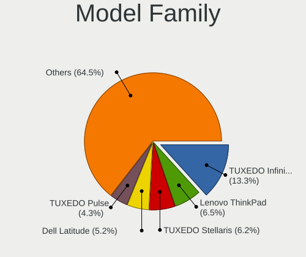

| Name                | Notebooks | Percent |
|---------------------|-----------|---------|
| TUXEDO InfinityBook | 43        | 13.27%  |
| Lenovo ThinkPad     | 21        | 6.48%   |
| TUXEDO Stellaris    | 20        | 6.17%   |
| Dell Latitude       | 17        | 5.25%   |
| TUXEDO Pulse        | 14        | 4.32%   |
| TUXEDO Aura         | 9         | 2.78%   |
| TUXEDO Sirius       | 7         | 2.16%   |
| HP Pavilion         | 7         | 2.16%   |
| TUXEDO Polaris      | 6         | 1.85%   |
| Lenovo IdeaPad      | 6         | 1.85%   |
| ASUS ASUS           | 6         | 1.85%   |
| Unknown             | 6         | 1.85%   |
| Toshiba Satellite   | 5         | 1.54%   |
| Schenker XMG        | 5         | 1.54%   |
| Lenovo ThinkBook    | 5         | 1.54%   |
| Dell Precision      | 5         | 1.54%   |
| Dell Inspiron       | 5         | 1.54%   |
| TUXEDO Gemini       | 4         | 1.23%   |
| Lenovo Yoga         | 4         | 1.23%   |
| Lenovo Legion       | 4         | 1.23%   |
| HP Laptop           | 4         | 1.23%   |
| Apple MacBookPro8   | 4         | 1.23%   |
| Acer Nitro          | 4         | 1.23%   |
| TUXEDO Book         | 3         | 0.93%   |
| Schenker VISION     | 3         | 0.93%   |
| HP ProBook          | 3         | 0.93%   |
| Dell XPS            | 3         | 0.93%   |
| ASUS VivoBook       | 3         | 0.93%   |
| Apple MacBookPro9   | 3         | 0.93%   |
| Acer Swift          | 3         | 0.93%   |
| Acer Aspire         | 3         | 0.93%   |
| TUXEDO XMG          | 2         | 0.62%   |
| TUXEDO InfinityFlex | 2         | 0.62%   |
| Notebook NP5x       | 2         | 0.62%   |
| MSI GF75            | 2         | 0.62%   |
| HP ZBook            | 2         | 0.62%   |
| HP OMEN             | 2         | 0.62%   |
| HP EliteBook        | 2         | 0.62%   |
| HP 250              | 2         | 0.62%   |
| Dell Vostro         | 2         | 0.62%   |

MFG Year
--------

Motherboard manufacture year

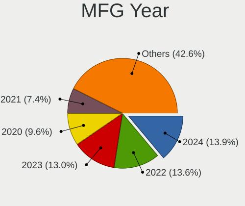

| Year | Notebooks | Percent |
|------|-----------|---------|
| 2024 | 45        | 13.89%  |
| 2022 | 44        | 13.58%  |
| 2023 | 42        | 12.96%  |
| 2020 | 31        | 9.57%   |
| 2021 | 24        | 7.41%   |
| 2019 | 17        | 5.25%   |
| 2015 | 16        | 4.94%   |
| 2017 | 15        | 4.63%   |
| 2013 | 15        | 4.63%   |
| 2011 | 15        | 4.63%   |
| 2012 | 13        | 4.01%   |
| 2025 | 11        | 3.4%    |
| 2018 | 10        | 3.09%   |
| 2010 | 8         | 2.47%   |
| 2014 | 6         | 1.85%   |
| 2009 | 4         | 1.23%   |
| 2008 | 4         | 1.23%   |
| 2016 | 2         | 0.62%   |
| 2007 | 1         | 0.31%   |
| 2006 | 1         | 0.31%   |

Form Factor
-----------

Physical design of the computer

| Name     | Notebooks | Percent |
|----------|-----------|---------|
| Notebook | 324       | 100%    |

Secure Boot
-----------

Enabled or disabled

| State    | Notebooks | Percent |
|----------|-----------|---------|
| Disabled | 324       | 100%    |

Coreboot
--------

Have coreboot on board

| Used | Notebooks | Percent |
|------|-----------|---------|
| No   | 323       | 99.69%  |
| Yes  | 1         | 0.31%   |

RAM Size
--------

Total RAM memory

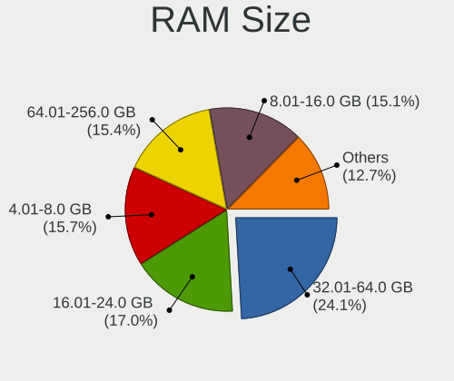

| Size in GB  | Notebooks | Percent |
|-------------|-----------|---------|
| 32.01-64.0  | 78        | 24.07%  |
| 16.01-24.0  | 55        | 16.98%  |
| 4.01-8.0    | 51        | 15.74%  |
| 64.01-256.0 | 50        | 15.43%  |
| 8.01-16.0   | 49        | 15.12%  |
| 24.01-32.0  | 20        | 6.17%   |
| 3.01-4.0    | 19        | 5.86%   |
| 2.01-3.0    | 2         | 0.62%   |

RAM Used
--------

Used RAM memory

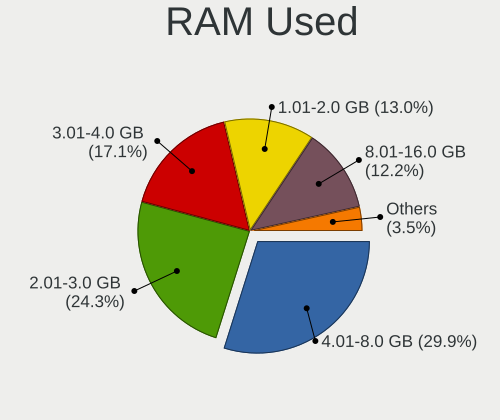

| Used GB    | Notebooks | Percent |
|------------|-----------|---------|
| 4.01-8.0   | 103       | 29.86%  |
| 2.01-3.0   | 84        | 24.35%  |
| 3.01-4.0   | 59        | 17.1%   |
| 1.01-2.0   | 45        | 13.04%  |
| 8.01-16.0  | 42        | 12.17%  |
| 16.01-24.0 | 10        | 2.9%    |
| 32.01-64.0 | 1         | 0.29%   |
| 24.01-32.0 | 1         | 0.29%   |

Total Drives
------------

Number of drives on board

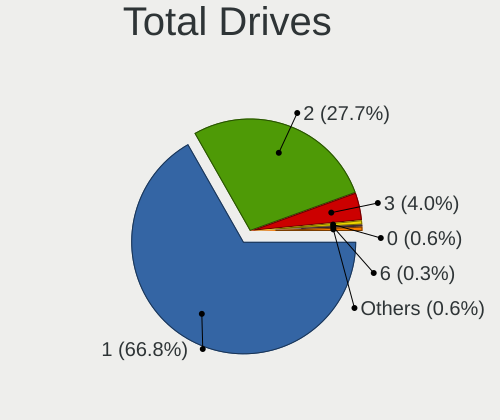

| Drives | Notebooks | Percent |
|--------|-----------|---------|
| 1      | 217       | 66.77%  |
| 2      | 90        | 27.69%  |
| 3      | 13        | 4%      |
| 0      | 2         | 0.62%   |
| 6      | 1         | 0.31%   |
| 5      | 1         | 0.31%   |
| 4      | 1         | 0.31%   |

Has CD-ROM
----------

Has CD-ROM on board

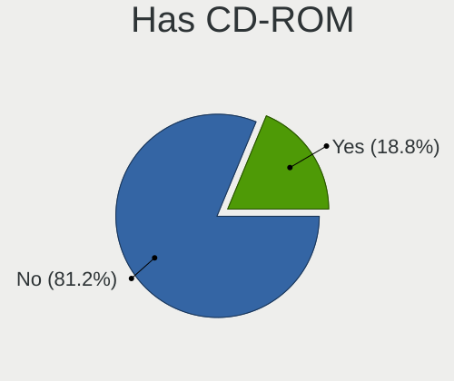

| Presented | Notebooks | Percent |
|-----------|-----------|---------|
| No        | 261       | 80.56%  |
| Yes       | 63        | 19.44%  |

Has Ethernet
------------

Has Ethernet on board

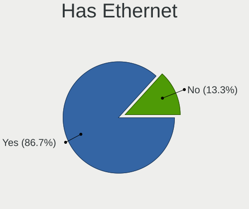

| Presented | Notebooks | Percent |
|-----------|-----------|---------|
| Yes       | 281       | 86.73%  |
| No        | 43        | 13.27%  |

Has WiFi
--------

Has WiFi module

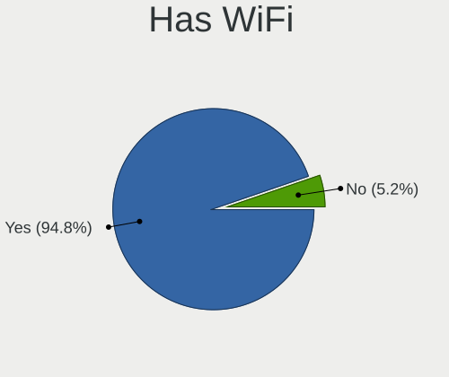

| Presented | Notebooks | Percent |
|-----------|-----------|---------|
| Yes       | 307       | 94.75%  |
| No        | 17        | 5.25%   |

Has Bluetooth
-------------

Has Bluetooth module

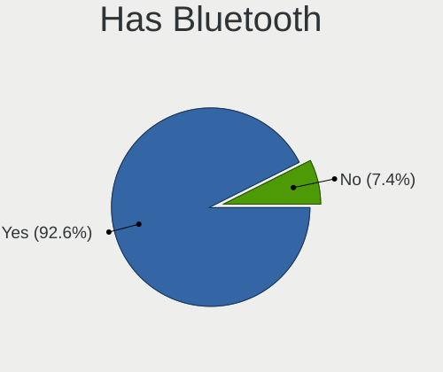

| Presented | Notebooks | Percent |
|-----------|-----------|---------|
| Yes       | 300       | 92.59%  |
| No        | 24        | 7.41%   |

Location
--------

Country
-------

Geographic location (country)

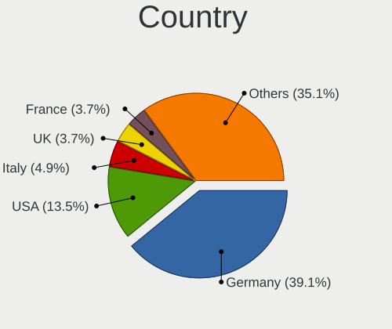

| Country         | Notebooks | Percent |
|-----------------|-----------|---------|
| Germany         | 127       | 39.08%  |
| USA             | 44        | 13.54%  |
| Italy           | 16        | 4.92%   |
| UK              | 12        | 3.69%   |
| France          | 12        | 3.69%   |
| Turkey          | 8         | 2.46%   |
| Poland          | 6         | 1.85%   |
| Brazil          | 6         | 1.85%   |
| Spain           | 5         | 1.54%   |
| Portugal        | 5         | 1.54%   |
| Czechia         | 5         | 1.54%   |
| Belgium         | 5         | 1.54%   |
| Austria         | 5         | 1.54%   |
| Australia       | 5         | 1.54%   |
| Switzerland     | 4         | 1.23%   |
| Romania         | 4         | 1.23%   |
| Norway          | 4         | 1.23%   |
| Netherlands     | 4         | 1.23%   |
| Indonesia       | 4         | 1.23%   |
| Canada          | 4         | 1.23%   |
| Bulgaria        | 4         | 1.23%   |
| India           | 3         | 0.92%   |
| Hungary         | 3         | 0.92%   |
| Venezuela       | 2         | 0.62%   |
| Sweden          | 2         | 0.62%   |
| Slovakia        | 2         | 0.62%   |
| Greece          | 2         | 0.62%   |
| Finland         | 2         | 0.62%   |
| Denmark         | 2         | 0.62%   |
| UAE             | 1         | 0.31%   |
| Tunisia         | 1         | 0.31%   |
| The Netherlands | 1         | 0.31%   |
| Taiwan          | 1         | 0.31%   |
| South Africa    | 1         | 0.31%   |
| Singapore       | 1         | 0.31%   |
| Puerto Rico     | 1         | 0.31%   |
| Panama          | 1         | 0.31%   |
| Mexico          | 1         | 0.31%   |
| Malta           | 1         | 0.31%   |
| Malaysia        | 1         | 0.31%   |

City
----

Geographic location (city)

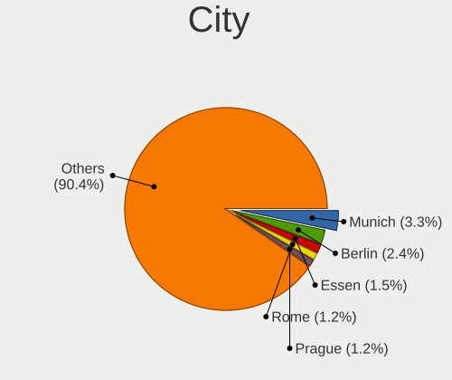

| City         | Notebooks | Percent |
|--------------|-----------|---------|
| Munich       | 11        | 3.28%   |
| Berlin       | 8         | 2.39%   |
| Essen        | 5         | 1.49%   |
| Rome         | 4         | 1.19%   |
| Prague       | 4         | 1.19%   |
| Milan        | 4         | 1.19%   |
| Düsseldorf  | 4         | 1.19%   |
| Nuremberg    | 3         | 0.9%    |
| Jakarta      | 3         | 0.9%    |
| Hamburg      | 3         | 0.9%    |
| Dortmund     | 3         | 0.9%    |
| Wolfsburg    | 2         | 0.6%    |
| Vienna       | 2         | 0.6%    |
| Turin        | 2         | 0.6%    |
| Schweinfurt  | 2         | 0.6%    |
| Saint-Dié   | 2         | 0.6%    |
| Perth        | 2         | 0.6%    |
| Paris        | 2         | 0.6%    |
| Mannheim     | 2         | 0.6%    |
| Lucerne      | 2         | 0.6%    |
| Los Angeles  | 2         | 0.6%    |
| Langevag     | 2         | 0.6%    |
| Kiel         | 2         | 0.6%    |
| Istanbul     | 2         | 0.6%    |
| Helsinki     | 2         | 0.6%    |
| Hanover      | 2         | 0.6%    |
| Greensboro   | 2         | 0.6%    |
| Elmshorn     | 2         | 0.6%    |
| Duisburg     | 2         | 0.6%    |
| Cologne      | 2         | 0.6%    |
| Chemnitz     | 2         | 0.6%    |
| Bursa        | 2         | 0.6%    |
| Bucharest    | 2         | 0.6%    |
| Brussels     | 2         | 0.6%    |
| Brisbane     | 2         | 0.6%    |
| Braunschweig | 2         | 0.6%    |
| Augsburg     | 2         | 0.6%    |
| Astoria      | 2         | 0.6%    |
| Ankara       | 2         | 0.6%    |
| Aachen       | 2         | 0.6%    |

Drives
------

Drive Vendor
------------

Hard drive vendors

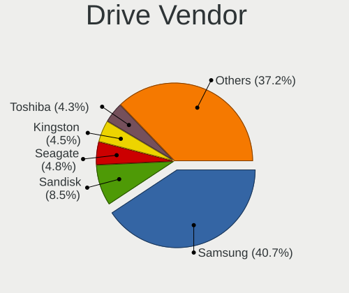

| Vendor                      | Notebooks | Drives | Percent |
|-----------------------------|-----------|--------|---------|
| Samsung Electronics         | 162       | 234    | 40.7%   |
| Sandisk                     | 34        | 42     | 8.54%   |
| Seagate                     | 19        | 22     | 4.77%   |
| Kingston                    | 18        | 18     | 4.52%   |
| Toshiba                     | 17        | 18     | 4.27%   |
| Micron Technology           | 16        | 20     | 4.02%   |
| WDC                         | 13        | 16     | 3.27%   |
| Unknown                     | 10        | 10     | 2.51%   |
| Intel                       | 10        | 12     | 2.51%   |
| Crucial                     | 10        | 10     | 2.51%   |
| SK hynix                    | 9         | 10     | 2.26%   |
| Apple                       | 9         | 9      | 2.26%   |
| Micron/Crucial Technology   | 7         | 11     | 1.76%   |
| KIOXIA                      | 5         | 5      | 1.26%   |
| Hitachi                     | 5         | 7      | 1.26%   |
| Phison Electronics          | 4         | 4      | 1.01%   |
| Kingston Technology Company | 4         | 5      | 1.01%   |
| SPCC                        | 3         | 3      | 0.75%   |
| ADATA Technology            | 3         | 3      | 0.75%   |
| Transcend                   | 2         | 2      | 0.5%    |
| Phison                      | 2         | 4      | 0.5%    |
| OWC                         | 2         | 2      | 0.5%    |
| Intenso                     | 2         | 2      | 0.5%    |
| HGST                        | 2         | 3      | 0.5%    |
| ASMedia                     | 2         | 3      | 0.5%    |
| XrayDisk                    | 1         | 1      | 0.25%   |
| WDC WDS5                    | 1         | 1      | 0.25%   |
| WDC WDS                     | 1         | 1      | 0.25%   |
| Verbatim                    | 1         | 1      | 0.25%   |
| USB3.0                      | 1         | 1      | 0.25%   |
| Team                        | 1         | 1      | 0.25%   |
| SSK                         | 1         | 1      | 0.25%   |
| SOLIDIGM                    | 1         | 1      | 0.25%   |
| Solid State Storage         | 1         | 1      | 0.25%   |
| S3+                         | 1         | 1      | 0.25%   |
| Realtek Semiconductor       | 1         | 1      | 0.25%   |
| Realtek                     | 1         | 1      | 0.25%   |
| Netac                       | 1         | 1      | 0.25%   |
| MAXIO Technology (Hangzhou) | 1         | 1      | 0.25%   |
| LITEONIT                    | 1         | 1      | 0.25%   |

Drive Model
-----------

Hard drive models

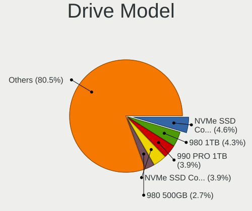

| Model                                              | Notebooks | Percent |
|----------------------------------------------------|-----------|---------|
| Samsung NVMe SSD Controller PM9A1/PM9A3/980PRO 1TB | 20        | 4.58%   |
| Samsung SSD 980 1TB                                | 19        | 4.35%   |
| Samsung SSD 990 PRO 1TB                            | 17        | 3.89%   |
| Samsung NVMe SSD Controller SM981/PM981/PM983 1TB  | 17        | 3.89%   |
| Samsung SSD 980 500GB                              | 12        | 2.75%   |
| Samsung SSD 990 PRO 2TB                            | 11        | 2.52%   |
| Samsung SSD 980 PRO 1TB                            | 8         | 1.83%   |
| Sandisk WD Black SN750 / PC SN730 NVMe SSD 500GB   | 5         | 1.14%   |
| Samsung SSD 990 EVO 1TB                            | 5         | 1.14%   |
| Micron/Crucial P2 NVMe PCIe SSD 2TB                | 5         | 1.14%   |
| Kingston SA400S37240G 240GB SSD                    | 5         | 1.14%   |
| Sandisk WD Blue SN570 1TB                          | 4         | 0.92%   |
| Toshiba MQ01ABF050 500GB                           | 3         | 0.69%   |
| Toshiba MQ01ABD100 1TB                             | 3         | 0.69%   |
| Seagate ST2000LM015-2E8174 2TB                     | 3         | 0.69%   |
| Samsung SSD 990 EVO Plus 2TB                       | 3         | 0.69%   |
| Samsung SSD 980 PRO 500GB                          | 3         | 0.69%   |
| Samsung SSD 980 PRO 2TB                            | 3         | 0.69%   |
| Samsung SSD 970 EVO Plus 500GB                     | 3         | 0.69%   |
| Samsung SSD 970 EVO Plus 1TB                       | 3         | 0.69%   |
| Samsung SSD 860 EVO M.2 1TB                        | 3         | 0.69%   |
| Samsung SSD 860 EVO 500GB                          | 3         | 0.69%   |
| Micron CT1000P3PSSD8 1TB                           | 3         | 0.69%   |
| Kingston SA400S37480G 480GB SSD                    | 3         | 0.69%   |
| Intel SSD 600P Series 1024GB                       | 3         | 0.69%   |
| Unknown SD/MMC/MS PRO 2GB                          | 2         | 0.46%   |
| Unknown MMC Card  64GB                             | 2         | 0.46%   |
| Toshiba XG4 NVMe SSD Controller 256GB              | 2         | 0.46%   |
| Seagate ST500LT012-9WS142 500GB                    | 2         | 0.46%   |
| Seagate ST500LT012-1DG142 500GB                    | 2         | 0.46%   |
| Seagate Expansion 2TB                              | 2         | 0.46%   |
| Sandisk WD_BLACK SN850X 1000GB                     | 2         | 0.46%   |
| SanDisk SDSSDA240G 240GB                           | 2         | 0.46%   |
| SanDisk NVMe SSD Drive 2TB                         | 2         | 0.46%   |
| Samsung SSD 860 EVO M.2 500GB                      | 2         | 0.46%   |
| Samsung SSD 860 EVO 250GB                          | 2         | 0.46%   |
| Samsung SSD 850 EVO 500GB                          | 2         | 0.46%   |
| Samsung SSD 850 EVO 1TB                            | 2         | 0.46%   |
| Phison E16 PCIe4 NVMe Controller 1TB               | 2         | 0.46%   |
| Micron 3400_MTFDKBA1T0TFH 1024GB                   | 2         | 0.46%   |

HDD Vendor
----------

Hard disk drive vendors

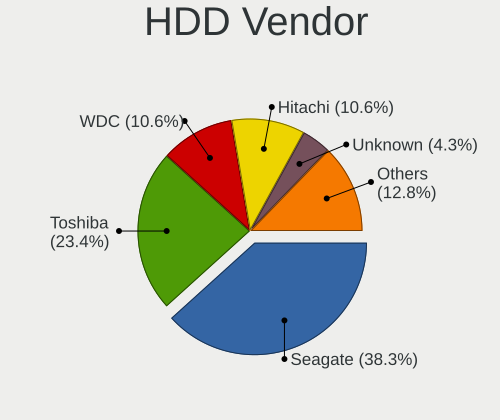

| Vendor  | Notebooks | Drives | Percent |
|---------|-----------|--------|---------|
| Seagate | 18        | 21     | 38.3%   |
| Toshiba | 11        | 11     | 23.4%   |
| WDC     | 5         | 6      | 10.64%  |
| Hitachi | 5         | 7      | 10.64%  |
| Unknown | 2         | 2      | 4.26%   |
| HGST    | 2         | 3      | 4.26%   |
| ASMedia | 2         | 3      | 4.26%   |
| USB3.0  | 1         | 1      | 2.13%   |
| Apple   | 1         | 1      | 2.13%   |

SSD Vendor
----------

Solid state drive vendors

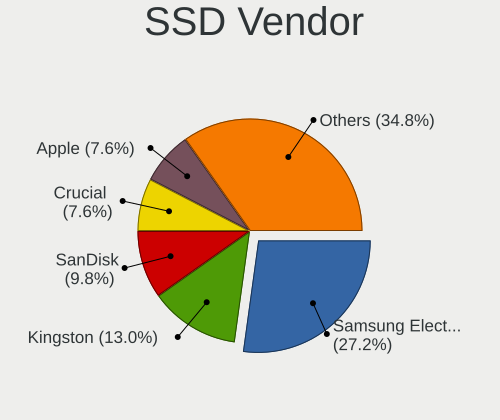

| Vendor              | Notebooks | Drives | Percent |
|---------------------|-----------|--------|---------|
| Samsung Electronics | 25        | 27     | 27.17%  |
| Kingston            | 12        | 12     | 13.04%  |
| SanDisk             | 9         | 9      | 9.78%   |
| Crucial             | 7         | 7      | 7.61%   |
| Apple               | 7         | 7      | 7.61%   |
| WDC                 | 6         | 8      | 6.52%   |
| Transcend           | 2         | 2      | 2.17%   |
| Toshiba             | 2         | 2      | 2.17%   |
| SPCC                | 2         | 2      | 2.17%   |
| OWC                 | 2         | 2      | 2.17%   |
| WDC WDS5            | 1         | 1      | 1.09%   |
| WDC WDS             | 1         | 1      | 1.09%   |
| Verbatim            | 1         | 1      | 1.09%   |
| Team                | 1         | 1      | 1.09%   |
| SK hynix            | 1         | 2      | 1.09%   |
| S3+                 | 1         | 1      | 1.09%   |
| Netac               | 1         | 1      | 1.09%   |
| Micron Technology   | 1         | 1      | 1.09%   |
| LITEONIT            | 1         | 1      | 1.09%   |
| LITEON              | 1         | 1      | 1.09%   |
| Lexar               | 1         | 1      | 1.09%   |
| Intenso             | 1         | 1      | 1.09%   |
| Intel               | 1         | 1      | 1.09%   |
| Gigabyte Technology | 1         | 1      | 1.09%   |
| CT1000BX            | 1         | 1      | 1.09%   |
| China               | 1         | 1      | 1.09%   |
| A-DATA Technology   | 1         | 1      | 1.09%   |
| 2.5"                | 1         | 1      | 1.09%   |

Drive Kind
----------

HDD or SSD

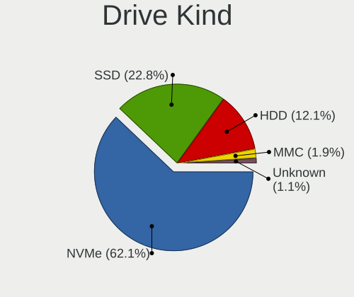

| Kind    | Notebooks | Drives | Percent |
|---------|-----------|--------|---------|
| NVMe    | 231       | 340    | 62.1%   |
| SSD     | 85        | 97     | 22.85%  |
| HDD     | 45        | 55     | 12.1%   |
| MMC     | 7         | 7      | 1.88%   |
| Unknown | 4         | 4      | 1.08%   |

Drive Connector
---------------

SATA, SAS, NVMe, etc.

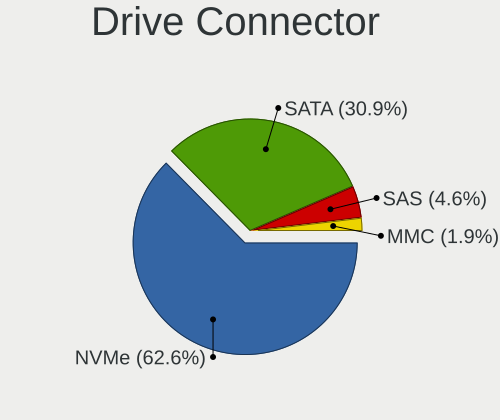

| Type | Notebooks | Drives | Percent |
|------|-----------|--------|---------|
| NVMe | 231       | 338    | 62.6%   |
| SATA | 114       | 137    | 30.89%  |
| SAS  | 17        | 21     | 4.61%   |
| MMC  | 7         | 7      | 1.9%    |

Drive Size
----------

Size of hard drive

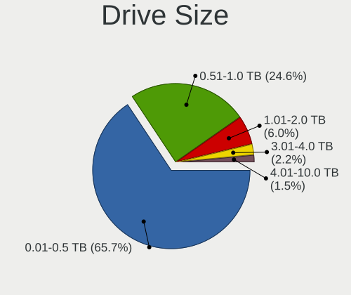

| Size in TB | Notebooks | Drives | Percent |
|------------|-----------|--------|---------|
| 0.01-0.5   | 88        | 104    | 65.67%  |
| 0.51-1.0   | 33        | 35     | 24.63%  |
| 1.01-2.0   | 8         | 8      | 5.97%   |
| 3.01-4.0   | 3         | 3      | 2.24%   |
| 4.01-10.0  | 2         | 2      | 1.49%   |

Space Total
-----------

Amount of disk space available on the file system

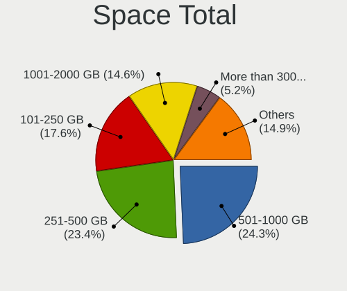

| Size in GB     | Notebooks | Percent |
|----------------|-----------|---------|
| 501-1000       | 80        | 24.32%  |
| 251-500        | 77        | 23.4%   |
| 101-250        | 58        | 17.63%  |
| 1001-2000      | 48        | 14.59%  |
| More than 3000 | 17        | 5.17%   |
| 1-20           | 17        | 5.17%   |
| 2001-3000      | 14        | 4.26%   |
| 51-100         | 12        | 3.65%   |
| Unknown        | 4         | 1.22%   |
| 21-50          | 2         | 0.61%   |

Space Used
----------

Amount of used disk space

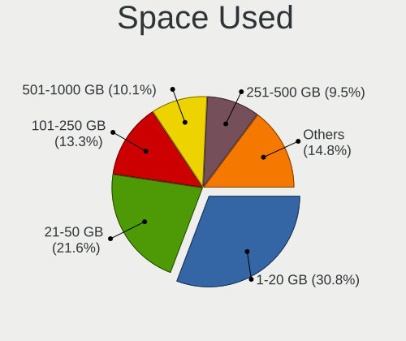

| Used GB        | Notebooks | Percent |
|----------------|-----------|---------|
| 1-20           | 104       | 30.77%  |
| 21-50          | 73        | 21.6%   |
| 101-250        | 45        | 13.31%  |
| 501-1000       | 34        | 10.06%  |
| 251-500        | 32        | 9.47%   |
| 51-100         | 28        | 8.28%   |
| 1001-2000      | 10        | 2.96%   |
| 2001-3000      | 7         | 2.07%   |
| Unknown        | 4         | 1.18%   |
| More than 3000 | 1         | 0.3%    |

Malfunc. Drives
---------------

Drive models with a malfunction

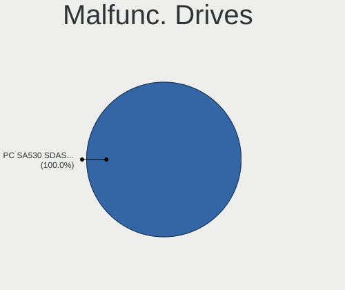

| Model                                | Notebooks | Drives | Percent |
|--------------------------------------|-----------|--------|---------|
| WDC PC SA530 SDASN8Y-256G-1006 256GB | 1         | 1      | 100%    |

Malfunc. Drive Vendor
---------------------

Vendors of faulty drives

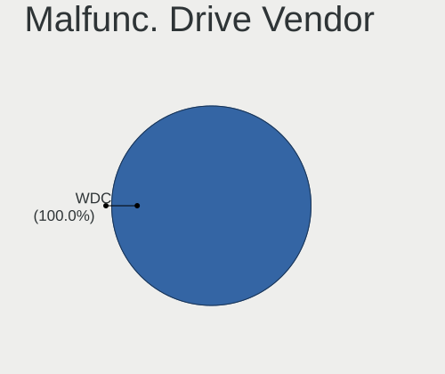

| Vendor | Notebooks | Drives | Percent |
|--------|-----------|--------|---------|
| WDC    | 1         | 1      | 100%    |

Malfunc. HDD Vendor
-------------------

Vendors of faulty HDD drives

Zero info for selected period =(

Malfunc. Drive Kind
-------------------

Kinds of faulty drives

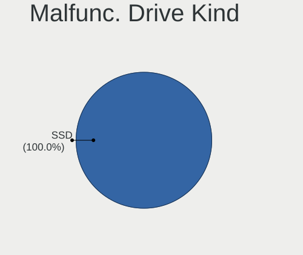

| Kind | Notebooks | Drives | Percent |
|------|-----------|--------|---------|
| SSD  | 1         | 1      | 100%    |

Failed Drives
-------------

Failed drive models

Zero info for selected period =(

Failed Drive Vendor
-------------------

Failed drive vendors

Zero info for selected period =(

Drive Status
------------

Number of failed and malfunc. drives

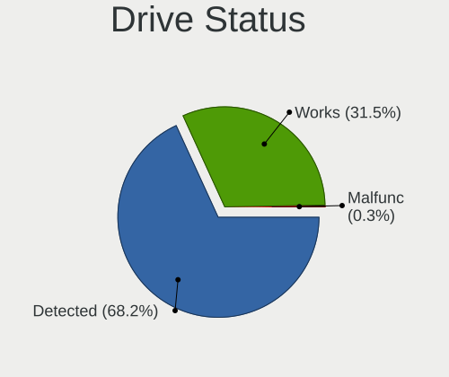

| Status   | Notebooks | Drives | Percent |
|----------|-----------|--------|---------|
| Detected | 227       | 355    | 68.17%  |
| Works    | 105       | 147    | 31.53%  |
| Malfunc  | 1         | 1      | 0.3%    |

Storage controller
------------------

Storage Vendor
--------------

Storage controller vendors

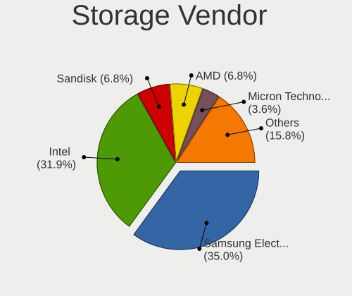

| Vendor                         | Notebooks | Percent |
|--------------------------------|-----------|---------|
| Samsung Electronics            | 144       | 35.04%  |
| Intel                          | 131       | 31.87%  |
| Sandisk                        | 28        | 6.81%   |
| AMD                            | 28        | 6.81%   |
| Micron Technology              | 15        | 3.65%   |
| Micron/Crucial Technology      | 10        | 2.43%   |
| Kingston Technology Company    | 10        | 2.43%   |
| SK hynix                       | 8         | 1.95%   |
| Phison Electronics             | 6         | 1.46%   |
| KIOXIA                         | 5         | 1.22%   |
| Toshiba America Info Systems   | 4         | 0.97%   |
| Nvidia                         | 4         | 0.97%   |
| MAXIO Technology (Hangzhou)    | 3         | 0.73%   |
| Marvell Technology Group       | 3         | 0.73%   |
| ADATA Technology               | 3         | 0.73%   |
| Silicon Motion                 | 2         | 0.49%   |
| Realtek Semiconductor          | 2         | 0.49%   |
| Solidigm                       | 1         | 0.24%   |
| Solid State Storage Technology | 1         | 0.24%   |
| Seagate Technology             | 1         | 0.24%   |
| Lenovo                         | 1         | 0.24%   |
| Apple                          | 1         | 0.24%   |

Storage Model
-------------

Storage controller models

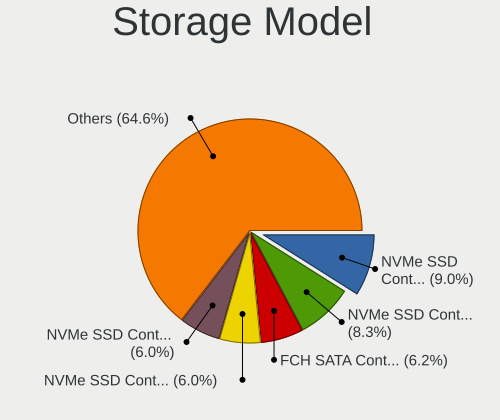

| Model                                                                         | Notebooks | Percent |
|-------------------------------------------------------------------------------|-----------|---------|
| Samsung NVMe SSD Controller 980 (DRAM-less)                                   | 39        | 8.97%   |
| Samsung NVMe SSD Controller PM9A1/PM9A3/980PRO                                | 36        | 8.28%   |
| AMD FCH SATA Controller [AHCI mode]                                           | 27        | 6.21%   |
| Samsung NVMe SSD Controller SM981/PM981/PM983                                 | 26        | 5.98%   |
| Samsung NVMe SSD Controller S4LV008[Pascal]                                   | 26        | 5.98%   |
| Intel 7 Series Chipset Family 6-port SATA Controller [AHCI mode]              | 16        | 3.68%   |
| Samsung NVMe SSD Controller PM9C1a (DRAM-less)                                | 14        | 3.22%   |
| Intel Volume Management Device NVMe RAID Controller                           | 14        | 3.22%   |
| Intel 6 Series/C200 Series Chipset Family 6 port Mobile SATA AHCI Controller  | 13        | 2.99%   |
| Intel Cannon Lake Mobile PCH SATA AHCI Controller                             | 10        | 2.3%    |
| Micron/Crucial P2 [Nick P2] / P3 / P3 Plus NVMe PCIe SSD (DRAM-less)          | 8         | 1.84%   |
| SanDisk Extreme Pro / WD Black SN750 / PC SN730 / Red SN700 NVMe SSD          | 7         | 1.61%   |
| Intel Sunrise Point-LP SATA Controller [AHCI mode]                            | 7         | 1.61%   |
| Intel 8 Series SATA Controller 1 [AHCI mode]                                  | 7         | 1.61%   |
| Intel Wildcat Point-LP SATA Controller [AHCI Mode]                            | 6         | 1.38%   |
| Intel HM170/QM170 Chipset SATA Controller [AHCI Mode]                         | 6         | 1.38%   |
| Intel Alder Lake-P SATA AHCI Controller                                       | 6         | 1.38%   |
| Intel 82801 Mobile SATA Controller [RAID mode]                                | 6         | 1.38%   |
| Intel 400 Series Chipset Family SATA AHCI Controller                          | 6         | 1.38%   |
| SanDisk Ultra 3D / WD Blue SN570 NVMe SSD (DRAM-less)                         | 5         | 1.15%   |
| Intel 5 Series/3400 Series Chipset 4 port SATA AHCI Controller                | 5         | 1.15%   |
| SK hynix Gold P31/BC711/PC711 NVMe Solid State Drive                          | 4         | 0.92%   |
| SanDisk WD SN560/SN740/SN770/SN5000 NVMe SSD                                  | 4         | 0.92%   |
| Micron 2550 NVMe SSD (DRAM-less)                                              | 4         | 0.92%   |
| Micron 2400 NVMe SSD (DRAM-less)                                              | 4         | 0.92%   |
| Intel Q170/Q150/B150/H170/H110/Z170/CM236 Chipset SATA Controller [AHCI Mode] | 4         | 0.92%   |
| Samsung S4LN058A01[SSUBX] AHCI SSD Controller (Apple slot)                    | 3         | 0.69%   |
| Nvidia MCP79 AHCI Controller                                                  | 3         | 0.69%   |
| Micron 3400 NVMe SSD [Hendrix]                                                | 3         | 0.69%   |
| MAXIO (Hangzhou) NVMe SSD Controller MAP1202 (DRAM-less)                      | 3         | 0.69%   |
| Marvell Group 88SS9183 PCIe SSD Controller                                    | 3         | 0.69%   |
| Intel Tiger Lake-LP SATA Controller                                           | 3         | 0.69%   |
| Intel Tiger Lake SATA AHCI Controller                                         | 3         | 0.69%   |
| Intel SSD 670p Series [Keystone Harbor]                                       | 3         | 0.69%   |
| Intel SSD 600P Series                                                         | 3         | 0.69%   |
| Intel RST Volume Management Device Controller                                 | 3         | 0.69%   |
| Intel Comet Lake SATA AHCI Controller                                         | 3         | 0.69%   |
| Intel 82801IBM/IEM (ICH9M/ICH9M-E) 4 port SATA Controller [AHCI mode]         | 3         | 0.69%   |
| Toshiba America Info Systems XG4 NVMe SSD Controller                          | 2         | 0.46%   |
| Sandisk WD PC SN5000S M.2 2280 NVMe SSD (DRAM-less)                           | 2         | 0.46%   |

Storage Kind
------------

Kind of storage controller (IDE, SATA, NVMe, SAS, ...)

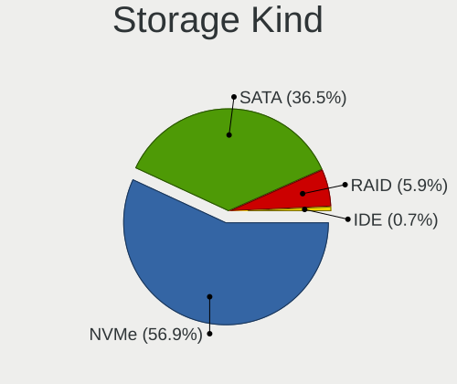

| Kind | Notebooks | Percent |
|------|-----------|---------|
| NVMe | 231       | 56.9%   |
| SATA | 148       | 36.45%  |
| RAID | 24        | 5.91%   |
| IDE  | 3         | 0.74%   |

Processor
---------

CPU Vendor
----------

Processor vendors

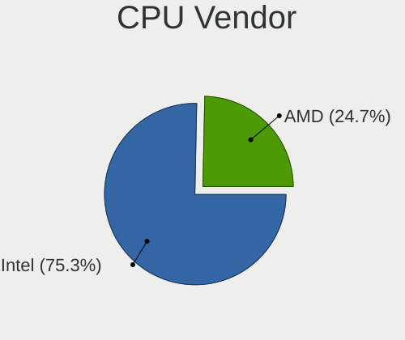

| Vendor | Notebooks | Percent |
|--------|-----------|---------|
| Intel  | 225       | 69.44%  |
| AMD    | 99        | 30.56%  |

CPU Model
---------

Processor models

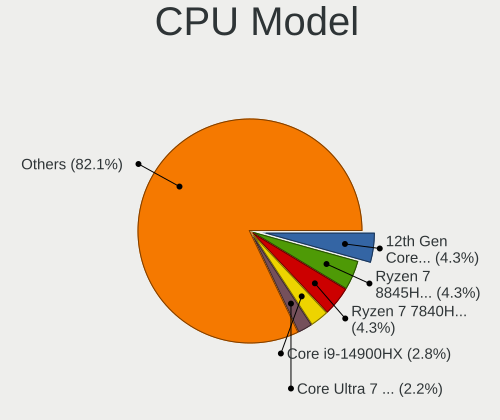

| Model                                      | Notebooks | Percent |
|--------------------------------------------|-----------|---------|
| Intel 12th Gen Core i7-12700H              | 14        | 4.32%   |
| AMD Ryzen 7 8845HS w/ Radeon 780M Graphics | 14        | 4.32%   |
| AMD Ryzen 7 7840HS w/ Radeon 780M Graphics | 14        | 4.32%   |
| Intel Core i9-14900HX                      | 9         | 2.78%   |
| Intel Core Ultra 7 155H                    | 7         | 2.16%   |
| Intel 13th Gen Core i9-13900HX             | 7         | 2.16%   |
| Intel Core i7-9750H CPU @ 2.60GHz          | 6         | 1.85%   |
| AMD Ryzen 7 5800H with Radeon Graphics     | 6         | 1.85%   |
| Intel Core i5-3210M CPU @ 2.50GHz          | 5         | 1.54%   |
| Intel 11th Gen Core i7-11370H @ 3.30GHz    | 5         | 1.54%   |
| AMD Ryzen 7 5700U with Radeon Graphics     | 5         | 1.54%   |
| AMD Ryzen 7 4800H with Radeon Graphics     | 5         | 1.54%   |
| AMD Ryzen 7 4700U with Radeon Graphics     | 5         | 1.54%   |
| Intel Core i7-8550U CPU @ 1.80GHz          | 4         | 1.23%   |
| Intel Core i7-7700HQ CPU @ 2.80GHz         | 4         | 1.23%   |
| Intel 13th Gen Core i7-13700H              | 4         | 1.23%   |
| Intel 12th Gen Core i7-1260P               | 4         | 1.23%   |
| Intel 12th Gen Core i5-1235U               | 4         | 1.23%   |
| AMD Ryzen 5 4600H with Radeon Graphics     | 4         | 1.23%   |
| Intel Core i7-4810MQ CPU @ 2.80GHz         | 3         | 0.93%   |
| Intel Core i7-2670QM CPU @ 2.20GHz         | 3         | 0.93%   |
| Intel Core i7-2620M CPU @ 2.70GHz          | 3         | 0.93%   |
| Intel Core i7-10750H CPU @ 2.60GHz         | 3         | 0.93%   |
| Intel Core i5-9300H CPU @ 2.40GHz          | 3         | 0.93%   |
| Intel Core i5-8365U CPU @ 1.60GHz          | 3         | 0.93%   |
| Intel 12th Gen Core i7-1255U               | 3         | 0.93%   |
| Intel 11th Gen Core i5-1135G7 @ 2.40GHz    | 3         | 0.93%   |
| AMD Ryzen AI 9 HX 370 w/ Radeon 890M       | 3         | 0.93%   |
| AMD Ryzen 7 7735HS with Radeon Graphics    | 3         | 0.93%   |
| AMD Ryzen 3 5300U with Radeon Graphics     | 3         | 0.93%   |
| Intel Core Ultra 9 275HX                   | 2         | 0.62%   |
| Intel Core i7-6820HQ CPU @ 2.70GHz         | 2         | 0.62%   |
| Intel Core i7-5500U CPU @ 2.40GHz          | 2         | 0.62%   |
| Intel Core i7-4650U CPU @ 1.70GHz          | 2         | 0.62%   |
| Intel Core i7-3720QM CPU @ 2.60GHz         | 2         | 0.62%   |
| Intel Core i7-3630QM CPU @ 2.40GHz         | 2         | 0.62%   |
| Intel Core i7-10870H CPU @ 2.20GHz         | 2         | 0.62%   |
| Intel Core i5-8250U CPU @ 1.60GHz          | 2         | 0.62%   |
| Intel Core i5-7200U CPU @ 2.50GHz          | 2         | 0.62%   |
| Intel Core i5-6200U CPU @ 2.30GHz          | 2         | 0.62%   |

CPU Model Family
----------------

Processor model prefix

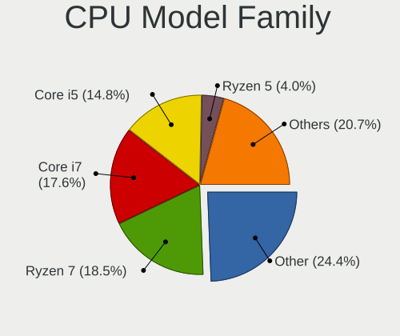

| Model             | Notebooks | Percent |
|-------------------|-----------|---------|
| Other             | 79        | 24.38%  |
| AMD Ryzen 7       | 60        | 18.52%  |
| Intel Core i7     | 57        | 17.59%  |
| Intel Core i5     | 48        | 14.81%  |
| AMD Ryzen 5       | 13        | 4.01%   |
| Intel Core        | 12        | 3.7%    |
| Intel Core i9     | 11        | 3.4%    |
| Intel Core i3     | 7         | 2.16%   |
| Intel Core 2 Duo  | 7         | 2.16%   |
| AMD Ryzen 9       | 6         | 1.85%   |
| Intel Celeron     | 5         | 1.54%   |
| Intel Pentium     | 3         | 0.93%   |
| AMD Ryzen 3       | 3         | 0.93%   |
| Intel Xeon        | 2         | 0.62%   |
| AMD A8            | 2         | 0.62%   |
| AMD A10           | 2         | 0.62%   |
| Intel Core m5     | 1         | 0.31%   |
| Intel Core 2 Quad | 1         | 0.31%   |
| AMD Turion II     | 1         | 0.31%   |
| AMD Ryzen 7 PRO   | 1         | 0.31%   |
| AMD Ryzen 5 PRO   | 1         | 0.31%   |
| AMD E1            | 1         | 0.31%   |
| AMD A6            | 1         | 0.31%   |

CPU Cores
---------

Number of processor cores

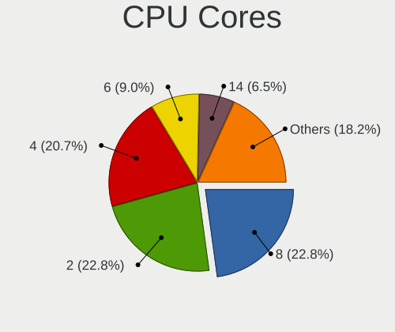

| Number | Notebooks | Percent |
|--------|-----------|---------|
| 8      | 74        | 22.84%  |
| 2      | 74        | 22.84%  |
| 4      | 67        | 20.68%  |
| 6      | 29        | 8.95%   |
| 14     | 21        | 6.48%   |
| 24     | 17        | 5.25%   |
| 12     | 16        | 4.94%   |
| 10     | 14        | 4.32%   |
| 16     | 10        | 3.09%   |
| 5      | 1         | 0.31%   |
| 3      | 1         | 0.31%   |

CPU Sockets
-----------

Number of sockets

| Number | Notebooks | Percent |
|--------|-----------|---------|
| 1      | 324       | 100%    |

CPU Threads
-----------

Threads per core (Hyper-Threading)

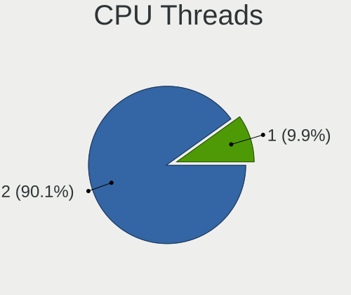

| Number | Notebooks | Percent |
|--------|-----------|---------|
| 2      | 292       | 90.12%  |
| 1      | 32        | 9.88%   |

CPU Op-Modes
------------

CPU Operation Modes (32-bit, 64-bit)

| Op mode        | Notebooks | Percent |
|----------------|-----------|---------|
| 32-bit, 64-bit | 324       | 100%    |

CPU Microcode
-------------

Microcode number

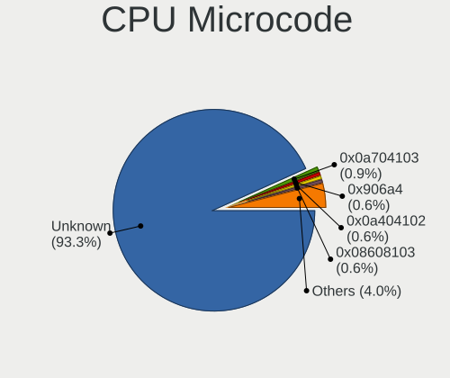

| Number     | Notebooks | Percent |
|------------|-----------|---------|
| Unknown    | 305       | 93.27%  |
| 0x0a704103 | 3         | 0.92%   |
| 0x906a4    | 2         | 0.61%   |
| 0x0a404102 | 2         | 0.61%   |
| 0x08608103 | 2         | 0.61%   |
| 0x906ea    | 1         | 0.31%   |
| 0x906e9    | 1         | 0.31%   |
| 0x906a3    | 1         | 0.31%   |
| 0x806c1    | 1         | 0.31%   |
| 0x306d4    | 1         | 0.31%   |
| 0x0a705205 | 1         | 0.31%   |
| 0x0a705203 | 1         | 0.31%   |
| 0x0a704101 | 1         | 0.31%   |
| 0x0a50000d | 1         | 0.31%   |
| 0x0a50000c | 1         | 0.31%   |
| 0x08600106 | 1         | 0.31%   |
| 0x08600103 | 1         | 0.31%   |
| 0x010000c8 | 1         | 0.31%   |

CPU Microarch
-------------

Microarchitecture

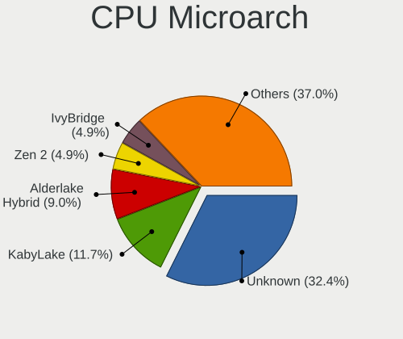

| Name              | Notebooks | Percent |
|-------------------|-----------|---------|
| Unknown           | 105       | 32.41%  |
| KabyLake          | 38        | 11.73%  |
| Alderlake Hybrid  | 29        | 8.95%   |
| Zen 2             | 16        | 4.94%   |
| IvyBridge         | 16        | 4.94%   |
| Haswell           | 16        | 4.94%   |
| Zen 3             | 15        | 4.63%   |
| SandyBridge       | 15        | 4.63%   |
| TigerLake         | 12        | 3.7%    |
| Skylake           | 11        | 3.4%    |
| CometLake         | 10        | 3.09%   |
| Penryn            | 8         | 2.47%   |
| Broadwell         | 8         | 2.47%   |
| Westmere          | 6         | 1.85%   |
| Icelake           | 3         | 0.93%   |
| Zen+              | 2         | 0.62%   |
| Puma              | 2         | 0.62%   |
| Piledriver        | 2         | 0.62%   |
| Lunarlake Hybrid  | 2         | 0.62%   |
| Silvermont        | 1         | 0.31%   |
| Nehalem           | 1         | 0.31%   |
| Meteorlake Hybrid | 1         | 0.31%   |
| K10               | 1         | 0.31%   |
| Jaguar            | 1         | 0.31%   |
| Gracemont         | 1         | 0.31%   |
| Goldmont plus     | 1         | 0.31%   |
| Excavator         | 1         | 0.31%   |

Graphics
--------

GPU Vendor
----------

Vendors of graphics cards

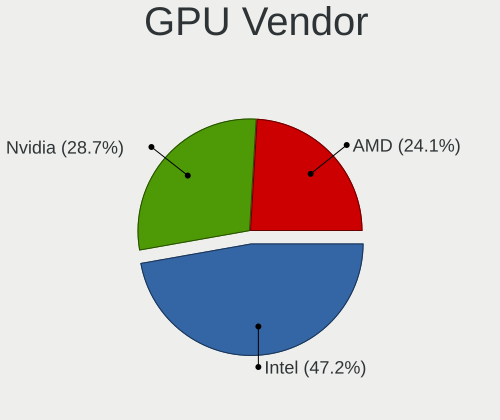

| Vendor | Notebooks | Percent |
|--------|-----------|---------|
| Intel  | 212       | 47.22%  |
| Nvidia | 129       | 28.73%  |
| AMD    | 108       | 24.05%  |

GPU Model
---------

Graphics card models

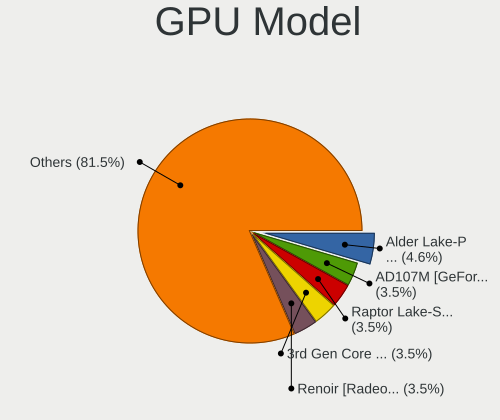

| Model                                                                     | Notebooks | Percent |
|---------------------------------------------------------------------------|-----------|---------|
| Intel Alder Lake-P GT2 [Iris Xe Graphics]                                 | 21        | 4.57%   |
| Nvidia AD107M [GeForce RTX 4060 Max-Q / Mobile]                           | 16        | 3.48%   |
| Intel Raptor Lake-S UHD Graphics                                          | 16        | 3.48%   |
| Intel 3rd Gen Core processor Graphics Controller                          | 16        | 3.48%   |
| AMD Renoir [Radeon Vega Series / Radeon Vega Mobile Series]               | 16        | 3.48%   |
| AMD Phoenix1                                                              | 16        | 3.48%   |
| AMD HawkPoint1                                                            | 14        | 3.04%   |
| Intel Raptor Lake-P [Iris Xe Graphics]                                    | 13        | 2.83%   |
| Intel CoffeeLake-H GT2 [UHD Graphics 630]                                 | 13        | 2.83%   |
| Intel 2nd Generation Core Processor Family Integrated Graphics Controller | 13        | 2.83%   |
| Nvidia GA106M [GeForce RTX 3060 Mobile / Max-Q]                           | 11        | 2.39%   |
| Intel TigerLake-LP GT2 [Iris Xe Graphics]                                 | 11        | 2.39%   |
| Nvidia AD106M [GeForce RTX 4070 Max-Q / Mobile]                           | 9         | 1.96%   |
| AMD Rembrandt [Radeon 680M]                                               | 9         | 1.96%   |
| AMD Lucienne                                                              | 9         | 1.96%   |
| Intel Kaby Lake-R GT2 [UHD Graphics 620]                                  | 8         | 1.74%   |
| Intel Haswell-ULT Integrated Graphics Controller                          | 8         | 1.74%   |
| AMD Navi 33 [Radeon RX 7600/7600 XT/7600M XT/7600S/7700S / PRO W7600]     | 8         | 1.74%   |
| AMD Cezanne [Radeon Vega Series / Radeon Vega Mobile Series]              | 8         | 1.74%   |
| Nvidia TU116M [GeForce GTX 1660 Ti Mobile]                                | 7         | 1.52%   |
| Intel Meteor Lake-P [Intel Arc Graphics]                                  | 7         | 1.52%   |
| Intel CometLake-H GT2 [UHD Graphics]                                      | 7         | 1.52%   |
| Intel Core Processor Integrated Graphics Controller                       | 6         | 1.3%    |
| Intel Broadwell-U GT2 [HD Graphics 5500]                                  | 6         | 1.3%    |
| Intel Alder Lake-UP3 GT2 [Iris Xe Graphics]                               | 6         | 1.3%    |
| Nvidia TU117M [GeForce GTX 1650 Mobile / Max-Q]                           | 5         | 1.09%   |
| Nvidia GA104M [GeForce RTX 3080 Mobile / Max-Q 8GB/16GB]                  | 5         | 1.09%   |
| Nvidia AD107M [GeForce RTX 4050 Max-Q / Mobile]                           | 5         | 1.09%   |
| Intel Kaby Lake-H GT2 [HD Graphics 630]                                   | 5         | 1.09%   |
| Intel 4th Gen Core Processor Integrated Graphics Controller               | 5         | 1.09%   |
| AMD Strix [Radeon 880M / 890M]                                            | 5         | 1.09%   |
| AMD Barcelo                                                               | 5         | 1.09%   |
| Nvidia GA107M [GeForce RTX 3050 Ti Mobile]                                | 4         | 0.87%   |
| Nvidia GA107M [GeForce RTX 3050 Mobile]                                   | 4         | 0.87%   |
| Nvidia GA104 [Geforce RTX 3070 Ti Laptop GPU]                             | 4         | 0.87%   |
| Intel WhiskeyLake-U GT2 [UHD Graphics 620]                                | 4         | 0.87%   |
| Intel Skylake-U GT2 [HD Graphics 520]                                     | 4         | 0.87%   |
| Intel Skylake-H GT2 [HD Graphics 530]                                     | 4         | 0.87%   |
| Nvidia GP107M [GeForce GTX 1050 Ti Mobile]                                | 3         | 0.65%   |
| Nvidia GP107M [GeForce GTX 1050 Mobile]                                   | 3         | 0.65%   |

GPU Combo
---------

Combinations of graphics cards

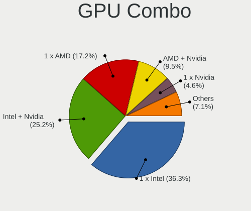

| Name           | Notebooks | Percent |
|----------------|-----------|---------|
| 1 x Intel      | 118       | 36.31%  |
| Intel + Nvidia | 82        | 25.23%  |
| 1 x AMD        | 56        | 17.23%  |
| AMD + Nvidia   | 31        | 9.54%   |
| 1 x Nvidia     | 15        | 4.62%   |
| Intel + AMD    | 12        | 3.69%   |
| 2 x AMD        | 10        | 3.08%   |
| 2 x Nvidia     | 1         | 0.31%   |

GPU Driver
----------

Free vs proprietary

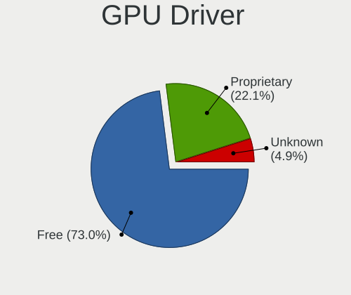

| Driver      | Notebooks | Percent |
|-------------|-----------|---------|
| Free        | 238       | 73.01%  |
| Proprietary | 72        | 22.09%  |
| Unknown     | 16        | 4.91%   |

GPU Memory
----------

Total video memory

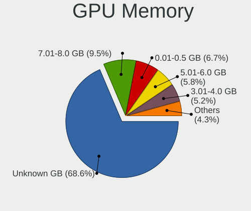

| Size in GB | Notebooks | Percent |
|------------|-----------|---------|
| Unknown    | 225       | 68.6%   |
| 7.01-8.0   | 31        | 9.45%   |
| 0.01-0.5   | 22        | 6.71%   |
| 5.01-6.0   | 19        | 5.79%   |
| 3.01-4.0   | 17        | 5.18%   |
| 1.01-2.0   | 7         | 2.13%   |
| 8.01-16.0  | 5         | 1.52%   |
| 0.51-1.0   | 2         | 0.61%   |

Monitor
-------

Monitor Vendor
--------------

Monitor vendors

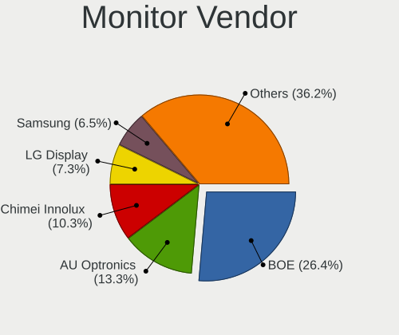

| Vendor               | Notebooks | Percent |
|----------------------|-----------|---------|
| BOE                  | 105       | 26.38%  |
| AU Optronics         | 53        | 13.32%  |
| Chimei Innolux       | 41        | 10.3%   |
| LG Display           | 29        | 7.29%   |
| Samsung Electronics  | 26        | 6.53%   |
| Apple                | 15        | 3.77%   |
| CSO                  | 12        | 3.02%   |
| CSW                  | 11        | 2.76%   |
| Sharp                | 8         | 2.01%   |
| Hewlett-Packard      | 8         | 2.01%   |
| Goldstar             | 8         | 2.01%   |
| Dell                 | 8         | 2.01%   |
| Lenovo               | 6         | 1.51%   |
| BenQ                 | 6         | 1.51%   |
| Philips              | 5         | 1.26%   |
| Iiyama               | 5         | 1.26%   |
| AOC                  | 5         | 1.26%   |
| Acer                 | 5         | 1.26%   |
| TMA                  | 4         | 1.01%   |
| CSOT                 | 4         | 1.01%   |
| ASUSTek Computer     | 3         | 0.75%   |
| Sony                 | 2         | 0.5%    |
| SGT                  | 2         | 0.5%    |
| RTK                  | 2         | 0.5%    |
| PANDA                | 2         | 0.5%    |
| NEC Computers        | 2         | 0.5%    |
| MSI                  | 2         | 0.5%    |
| InfoVision           | 2         | 0.5%    |
| HUAWEI               | 2         | 0.5%    |
| Fujitsu Siemens      | 2         | 0.5%    |
| Ancor Communications | 2         | 0.5%    |
| Yamaha               | 1         | 0.25%   |
| VIE                  | 1         | 0.25%   |
| Vestel Elektronik    | 1         | 0.25%   |
| Valve                | 1         | 0.25%   |
| Panasonic            | 1         | 0.25%   |
| LG Philips           | 1         | 0.25%   |
| InnoLux Display      | 1         | 0.25%   |
| HKC                  | 1         | 0.25%   |
| Eizo                 | 1         | 0.25%   |

Monitor Model
-------------

Monitor models

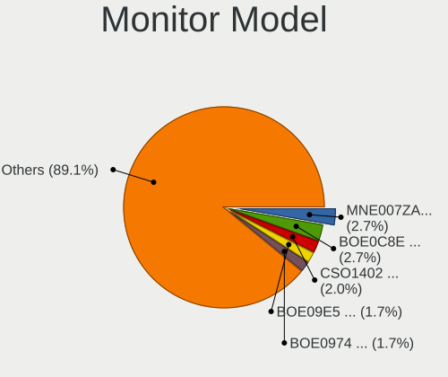

| Model                                                              | Notebooks | Percent |
|--------------------------------------------------------------------|-----------|---------|
| CSW MNE007ZA3-2 CSW1431 2880x1800 301x188mm 14.0-inch              | 11        | 2.72%   |
| BOE LCD Monitor BOE0C8E 2560x1600 329x206mm 15.3-inch              | 11        | 2.72%   |
| CSO LCD Monitor CSO1402 2880x1800 302x188mm 14.0-inch              | 8         | 1.98%   |
| BOE LCD Monitor BOE09E5 2560x1440 355x200mm 16.0-inch              | 7         | 1.73%   |
| BOE LCD Monitor BOE0974 2560x1440 344x194mm 15.5-inch              | 7         | 1.73%   |
| BOE LCD Monitor BOE0AF0 2560x1600 344x215mm 16.0-inch              | 6         | 1.49%   |
| BOE LCD Monitor BOE07D8 1920x1080 344x194mm 15.5-inch              | 6         | 1.49%   |
| BOE LCD Monitor BOE0A3B 2560x1600 344x215mm 16.0-inch              | 5         | 1.24%   |
| BOE LCD Monitor BOE084D 1920x1080 344x193mm 15.5-inch              | 5         | 1.24%   |
| TMA TL140ADXP24-0 TMA2004 2880x1800 300x190mm 14.0-inch            | 4         | 0.99%   |
| BOE LCD Monitor BOE0A99 2560x1600 366x229mm 17.0-inch              | 4         | 0.99%   |
| BOE LCD Monitor BOE0747 1920x1080 344x194mm 15.5-inch              | 4         | 0.99%   |
| Sharp LQ156M1JW01 SHP14C3 1920x1080 344x194mm 15.5-inch            | 3         | 0.74%   |
| CSO LCD Monitor CSO140C 2880x1800 302x188mm 14.0-inch              | 3         | 0.74%   |
| Chimei Innolux LCD Monitor CMN1602 1920x1080 355x199mm 16.0-inch   | 3         | 0.74%   |
| Chimei Innolux LCD Monitor CMN15E8 1920x1080 344x193mm 15.5-inch   | 3         | 0.74%   |
| BOE LCD Monitor BOE0B40 2560x1440 344x194mm 15.5-inch              | 3         | 0.74%   |
| BOE LCD Monitor BOE09F9 2560x1440 381x214mm 17.2-inch              | 3         | 0.74%   |
| Apple Color LCD APP9CC7 1280x800 286x179mm 13.3-inch               | 3         | 0.74%   |
| Samsung Electronics LS24C36x SAM7314 1920x1080 598x336mm 27.0-inch | 2         | 0.5%    |
| Samsung Electronics C24F390 SAM0D2C 1920x1080 521x293mm 23.5-inch  | 2         | 0.5%    |
| LG Display LCD Monitor LGD065B 1920x1080 382x215mm 17.3-inch       | 2         | 0.5%    |
| LG Display LCD Monitor LGD04A7 1920x1080 344x194mm 15.5-inch       | 2         | 0.5%    |
| LG Display LCD Monitor LGD046F 1920x1080 344x194mm 15.5-inch       | 2         | 0.5%    |
| Lenovo LCD Monitor LEN40BA 1920x1080 344x194mm 15.5-inch           | 2         | 0.5%    |
| CSOT LCD Monitor CSO140C 2880x1800 302x188mm 14.0-inch             | 2         | 0.5%    |
| Chimei Innolux LCD Monitor CMN1733 1600x900 382x215mm 17.3-inch    | 2         | 0.5%    |
| Chimei Innolux LCD Monitor CMN15CA 1366x768 344x193mm 15.5-inch    | 2         | 0.5%    |
| Chimei Innolux LCD Monitor CMN15C5 1366x768 344x193mm 15.5-inch    | 2         | 0.5%    |
| Chimei Innolux LCD Monitor CMN15BA 1920x1080 344x194mm 15.5-inch   | 2         | 0.5%    |
| Chimei Innolux LCD Monitor CMN15B1 1920x1080 344x194mm 15.5-inch   | 2         | 0.5%    |
| BOE NE160QDM-NZL BOE0D55 2560x1600 345x215mm 16.0-inch             | 2         | 0.5%    |
| BOE LCD Monitor BOE0B87 2560x1600 345x215mm 16.0-inch              | 2         | 0.5%    |
| BOE LCD Monitor BOE0ACA 2560x1600 344x215mm 16.0-inch              | 2         | 0.5%    |
| BOE LCD Monitor BOE0A82 1920x1200 302x188mm 14.0-inch              | 2         | 0.5%    |
| BOE LCD Monitor BOE0A1C 1920x1080 344x194mm 15.5-inch              | 2         | 0.5%    |
| BOE LCD Monitor BOE0900 1920x1080 344x194mm 15.5-inch              | 2         | 0.5%    |
| BOE LCD Monitor BOE07C9 1920x1080 309x173mm 13.9-inch              | 2         | 0.5%    |
| AU Optronics LCD Monitor AUOB69B 1920x1080 344x193mm 15.5-inch     | 2         | 0.5%    |
| AU Optronics LCD Monitor AUO978F 1920x1080 382x215mm 17.3-inch     | 2         | 0.5%    |

Monitor Resolution
------------------

Monitor screen resolution

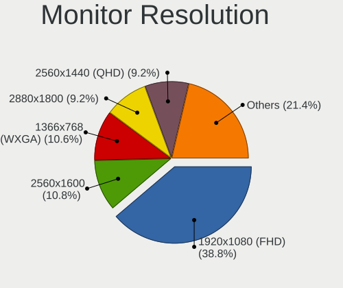

| Resolution         | Notebooks | Percent |
|--------------------|-----------|---------|
| 1920x1080 (FHD)    | 147       | 38.79%  |
| 2560x1600          | 41        | 10.82%  |
| 1366x768 (WXGA)    | 40        | 10.55%  |
| 2880x1800          | 35        | 9.23%   |
| 2560x1440 (QHD)    | 35        | 9.23%   |
| 3840x2160 (4K)     | 24        | 6.33%   |
| 1920x1200 (WUXGA)  | 14        | 3.69%   |
| 1600x900 (HD+)     | 10        | 2.64%   |
| 1280x800 (WXGA)    | 9         | 2.37%   |
| 3440x1440          | 4         | 1.06%   |
| 1440x900 (WXGA+)   | 4         | 1.06%   |
| 3200x1800 (QHD+)   | 2         | 0.53%   |
| 3072x1920          | 2         | 0.53%   |
| 2560x1080          | 2         | 0.53%   |
| 1680x1050 (WSXGA+) | 2         | 0.53%   |
| 800x1280           | 1         | 0.26%   |
| 3840x2560          | 1         | 0.26%   |
| 2520x1680          | 1         | 0.26%   |
| 2288x1287          | 1         | 0.26%   |
| 2240x1400          | 1         | 0.26%   |
| 2160x1440          | 1         | 0.26%   |
| 1920x540           | 1         | 0.26%   |
| 1280x1024 (SXGA)   | 1         | 0.26%   |

Monitor Diagonal
----------------

Diagonal size in inches

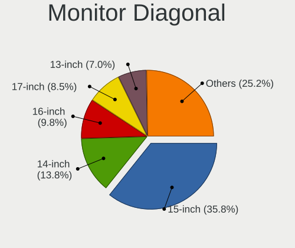

| Inches  | Notebooks | Percent |
|---------|-----------|---------|
| 15      | 143       | 35.75%  |
| 14      | 55        | 13.75%  |
| 16      | 39        | 9.75%   |
| 17      | 34        | 8.5%    |
| 13      | 28        | 7%      |
| 27      | 27        | 6.75%   |
| 24      | 17        | 4.25%   |
| 23      | 11        | 2.75%   |
| 31      | 6         | 1.5%    |
| 12      | 6         | 1.5%    |
| 34      | 5         | 1.25%   |
| 21      | 4         | 1%      |
| 22      | 3         | 0.75%   |
| 11      | 3         | 0.75%   |
| 84      | 2         | 0.5%    |
| 40      | 2         | 0.5%    |
| 20      | 2         | 0.5%    |
| 63      | 1         | 0.25%   |
| 60      | 1         | 0.25%   |
| 54      | 1         | 0.25%   |
| 43      | 1         | 0.25%   |
| 39      | 1         | 0.25%   |
| 33      | 1         | 0.25%   |
| 28      | 1         | 0.25%   |
| 26      | 1         | 0.25%   |
| 25      | 1         | 0.25%   |
| 19      | 1         | 0.25%   |
| 18      | 1         | 0.25%   |
| 7       | 1         | 0.25%   |
| Unknown | 1         | 0.25%   |

Monitor Width
-------------

Physical width

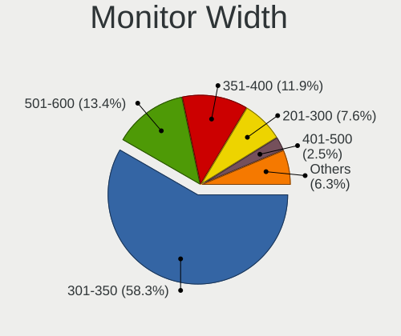

| Width in mm | Notebooks | Percent |
|-------------|-----------|---------|
| 301-350     | 231       | 58.33%  |
| 501-600     | 53        | 13.38%  |
| 351-400     | 47        | 11.87%  |
| 201-300     | 30        | 7.58%   |
| 401-500     | 10        | 2.53%   |
| 601-700     | 8         | 2.02%   |
| 701-800     | 6         | 1.52%   |
| 1001-1500   | 3         | 0.76%   |
| 801-900     | 2         | 0.51%   |
| 1501-2000   | 2         | 0.51%   |
| 901-1000    | 2         | 0.51%   |
| 1-100       | 1         | 0.25%   |
| Unknown     | 1         | 0.25%   |

Aspect Ratio
------------

Proportional relationship between the width and the height

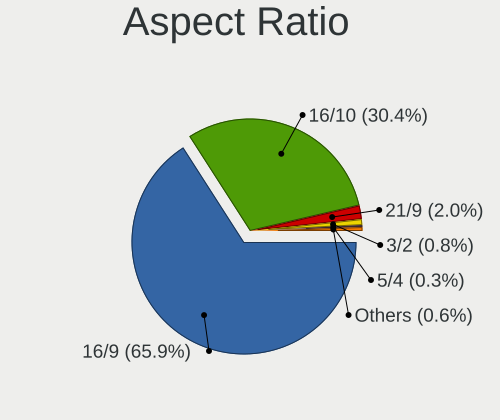

| Ratio | Notebooks | Percent |
|-------|-----------|---------|
| 16/9  | 234       | 65.92%  |
| 16/10 | 108       | 30.42%  |
| 21/9  | 7         | 1.97%   |
| 3/2   | 3         | 0.85%   |
| 5/4   | 1         | 0.28%   |
| 32/9  | 1         | 0.28%   |
| 0.62  | 1         | 0.28%   |

Monitor Area
------------

Area in inch²

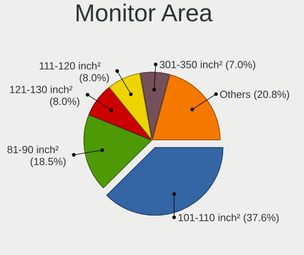

| Area in inch² | Notebooks | Percent |
|----------------|-----------|---------|
| 101-110        | 150       | 37.59%  |
| 81-90          | 74        | 18.55%  |
| 121-130        | 32        | 8.02%   |
| 111-120        | 32        | 8.02%   |
| 301-350        | 28        | 7.02%   |
| 201-250        | 22        | 5.51%   |
| 351-500        | 13        | 3.26%   |
| 251-300        | 9         | 2.26%   |
| 71-80          | 8         | 2.01%   |
| 151-200        | 7         | 1.75%   |
| 61-70          | 6         | 1.5%    |
| More than 1000 | 5         | 1.25%   |
| 501-1000       | 4         | 1%      |
| 51-60          | 3         | 0.75%   |
| 131-140        | 2         | 0.5%    |
| 1-40           | 1         | 0.25%   |
| 141-150        | 1         | 0.25%   |
| 91-100         | 1         | 0.25%   |
| Unknown        | 1         | 0.25%   |

Pixel Density
-------------

Pixels per inch

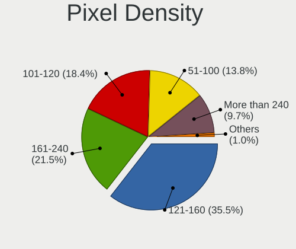

| Density       | Notebooks | Percent |
|---------------|-----------|---------|
| 121-160       | 139       | 35.55%  |
| 161-240       | 84        | 21.48%  |
| 101-120       | 72        | 18.41%  |
| 51-100        | 54        | 13.81%  |
| More than 240 | 38        | 9.72%   |
| 1-50          | 3         | 0.77%   |
| Unknown       | 1         | 0.26%   |

Multiple Monitors
-----------------

Total monitors connected

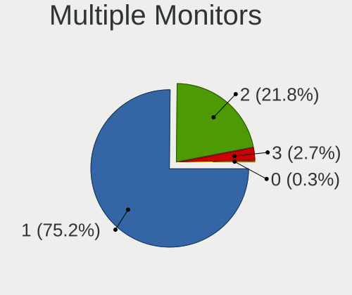

| Total | Notebooks | Percent |
|-------|-----------|---------|
| 1     | 248       | 75.15%  |
| 2     | 72        | 21.82%  |
| 3     | 9         | 2.73%   |
| 0     | 1         | 0.3%    |

Network
-------

Net Controller Vendor
---------------------

Controller vendors

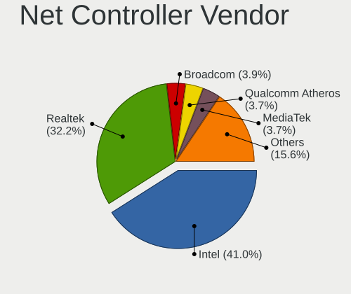

| Vendor                                 | Notebooks | Percent |
|----------------------------------------|-----------|---------|
| Intel                                  | 234       | 40.98%  |
| Realtek Semiconductor                  | 184       | 32.22%  |
| Broadcom                               | 22        | 3.85%   |
| Qualcomm Atheros                       | 21        | 3.68%   |
| MediaTek                               | 21        | 3.68%   |
| Suzhou Motorcomm Electronic Technology | 19        | 3.33%   |
| DisplayLink                            | 9         | 1.58%   |
| ASIX Electronics                       | 9         | 1.58%   |
| Broadcom Limited                       | 8         | 1.4%    |
| Ralink Technology                      | 7         | 1.23%   |
| TP-Link                                | 5         | 0.88%   |
| Motorcomm Microelectronics.            | 5         | 0.88%   |
| Huawei Technologies                    | 5         | 0.88%   |
| Sierra Wireless                        | 3         | 0.53%   |
| Nvidia                                 | 3         | 0.53%   |
| Lenovo                                 | 3         | 0.53%   |
| Ralink                                 | 2         | 0.35%   |
| Qualcomm Atheros Communications        | 2         | 0.35%   |
| Dell                                   | 2         | 0.35%   |
| Samsung Electronics                    | 1         | 0.18%   |
| Qualcomm                               | 1         | 0.18%   |
| QinHeng Electronics                    | 1         | 0.18%   |
| OPPO Electronics                       | 1         | 0.18%   |
| NetGear                                | 1         | 0.18%   |
| Marvell Technology Group               | 1         | 0.18%   |
| Ericsson Business Mobile Networks      | 1         | 0.18%   |

Net Controller Model
--------------------

Controller models

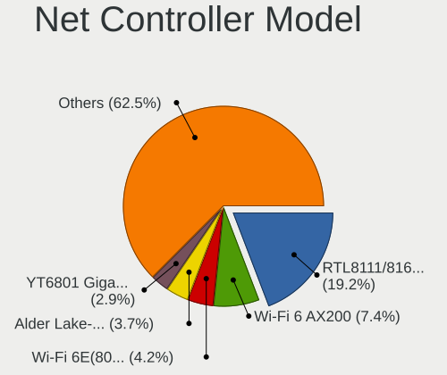

| Model                                                                  | Notebooks | Percent |
|------------------------------------------------------------------------|-----------|---------|
| Realtek RTL8111/8168/8211/8411 PCI Express Gigabit Ethernet Controller | 124       | 19.2%   |
| Intel Wi-Fi 6 AX200                                                    | 48        | 7.43%   |
| Intel Wi-Fi 6E(802.11ax) AX210/AX1675* 2x2 [Typhoon Peak]              | 27        | 4.18%   |
| Intel Alder Lake-P PCH CNVi WiFi                                       | 24        | 3.72%   |
| Suzhou Motorcomm Electronic YT6801 Gigabit Ethernet Controller         | 19        | 2.94%   |
| Realtek RTL8153 Gigabit Ethernet Adapter                               | 18        | 2.79%   |
| Intel 700 Series Chipset CNVi WiFi                                     | 17        | 2.63%   |
| Realtek RTL8125 2.5GbE Controller                                      | 15        | 2.32%   |
| Intel Raptor Lake PCH CNVi WiFi                                        | 15        | 2.32%   |
| Realtek RTL810xE PCI Express Fast Ethernet controller                  | 13        | 2.01%   |
| Intel Wireless 8265 / 8275                                             | 13        | 2.01%   |
| MediaTek MT7922 802.11ax PCI Express Wireless Network Adapter          | 12        | 1.86%   |
| Intel Wi-Fi 6 AX201                                                    | 9         | 1.39%   |
| Intel Wi-Fi 5(802.11ac) Wireless-AC 9x6x [Thunder Peak]                | 8         | 1.24%   |
| Intel 82579LM Gigabit Network Connection (Lewisville)                  | 8         | 1.24%   |
| ASIX AX88179 Gigabit Ethernet                                          | 8         | 1.24%   |
| Broadcom NetXtreme BCM57765 Gigabit Ethernet PCIe                      | 7         | 1.08%   |
| Broadcom BCM4331 802.11a/b/g/n                                         | 7         | 1.08%   |
| Qualcomm Atheros AR9485 Wireless Network Adapter                       | 6         | 0.93%   |
| Intel Meteor Lake PCH CNVi WiFi                                        | 6         | 0.93%   |
| Intel Comet Lake PCH CNVi WiFi                                         | 6         | 0.93%   |
| Intel Centrino Advanced-N 6205 [Taylor Peak]                           | 6         | 0.93%   |
| DisplayLink USB-C Triple-4K Dock                                       | 6         | 0.93%   |
| Realtek RTL8822CE 802.11ac PCIe Wireless Network Adapter               | 5         | 0.77%   |
| Qualcomm Atheros QCA9565 / AR9565 Wireless Network Adapter             | 5         | 0.77%   |
| Motorcomm Microelectronics. YT6801 Gigabit Ethernet Controller         | 5         | 0.77%   |
| MediaTek MT7921 802.11ax PCIe Wireless Network Adapter [Filogic 330]   | 5         | 0.77%   |
| Intel Wireless 8260                                                    | 5         | 0.77%   |
| Intel Wireless 3160                                                    | 5         | 0.77%   |
| Realtek RTL8852BE PCIe 802.11ax Wireless Network Controller            | 4         | 0.62%   |
| Realtek RTL8852AE 802.11ax PCIe Wireless Network Adapter               | 4         | 0.62%   |
| Realtek Killer E2600 GbE Controller                                    | 4         | 0.62%   |
| Ralink RT2870/RT3070 Wireless Adapter                                  | 4         | 0.62%   |
| MediaTek MT7921K (RZ608) Wi-Fi 6E 80MHz                                | 4         | 0.62%   |
| Intel Wireless 7260                                                    | 4         | 0.62%   |
| Intel Wi-Fi 7(802.11be) AX1775*/AX1790*/BE20*/BE401/BE1750* 2x2        | 4         | 0.62%   |
| Intel Ethernet Controller I219-V                                       | 4         | 0.62%   |
| Intel Ethernet Connection (4) I219-LM                                  | 4         | 0.62%   |
| Huawei ME936 LTE/HSDPA+ 4G modem                                       | 4         | 0.62%   |
| Broadcom BCM4322 802.11a/b/g/n Wireless LAN Controller                 | 4         | 0.62%   |

Wireless Vendor
---------------

Wireless vendors

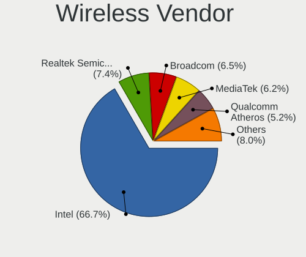

| Vendor                          | Notebooks | Percent |
|---------------------------------|-----------|---------|
| Intel                           | 216       | 66.67%  |
| Realtek Semiconductor           | 24        | 7.41%   |
| Broadcom                        | 21        | 6.48%   |
| MediaTek                        | 20        | 6.17%   |
| Qualcomm Atheros                | 17        | 5.25%   |
| Ralink Technology               | 7         | 2.16%   |
| Broadcom Limited                | 6         | 1.85%   |
| TP-Link                         | 4         | 1.23%   |
| Sierra Wireless                 | 3         | 0.93%   |
| Ralink                          | 2         | 0.62%   |
| Qualcomm Atheros Communications | 2         | 0.62%   |
| Qualcomm                        | 1         | 0.31%   |
| NetGear                         | 1         | 0.31%   |

Wireless Model
--------------

Wireless models

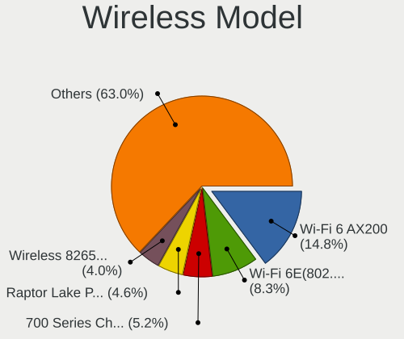

| Model                                                                | Notebooks | Percent |
|----------------------------------------------------------------------|-----------|---------|
| Intel Wi-Fi 6 AX200                                                  | 48        | 14.81%  |
| Intel Wi-Fi 6E(802.11ax) AX210/AX1675* 2x2 [Typhoon Peak]            | 27        | 8.33%   |
| Intel 700 Series Chipset CNVi WiFi                                   | 17        | 5.25%   |
| Intel Raptor Lake PCH CNVi WiFi                                      | 15        | 4.63%   |
| Intel Wireless 8265 / 8275                                           | 13        | 4.01%   |
| MediaTek MT7922 802.11ax PCI Express Wireless Network Adapter        | 11        | 3.4%    |
| Intel Alder Lake-P PCH CNVi WiFi                                     | 11        | 3.4%    |
| Intel Wi-Fi 6 AX201                                                  | 9         | 2.78%   |
| Intel Wi-Fi 5(802.11ac) Wireless-AC 9x6x [Thunder Peak]              | 8         | 2.47%   |
| Broadcom BCM4331 802.11a/b/g/n                                       | 7         | 2.16%   |
| Qualcomm Atheros AR9485 Wireless Network Adapter                     | 6         | 1.85%   |
| Intel Meteor Lake PCH CNVi WiFi                                      | 6         | 1.85%   |
| Intel Comet Lake PCH CNVi WiFi                                       | 6         | 1.85%   |
| Intel Centrino Advanced-N 6205 [Taylor Peak]                         | 6         | 1.85%   |
| Realtek RTL8822CE 802.11ac PCIe Wireless Network Adapter             | 5         | 1.54%   |
| Qualcomm Atheros QCA9565 / AR9565 Wireless Network Adapter           | 5         | 1.54%   |
| MediaTek MT7921 802.11ax PCIe Wireless Network Adapter [Filogic 330] | 5         | 1.54%   |
| Intel Wireless 8260                                                  | 5         | 1.54%   |
| Intel Wireless 3160                                                  | 5         | 1.54%   |
| Realtek RTL8852BE PCIe 802.11ax Wireless Network Controller          | 4         | 1.23%   |
| Realtek RTL8852AE 802.11ax PCIe Wireless Network Adapter             | 4         | 1.23%   |
| Ralink RT2870/RT3070 Wireless Adapter                                | 4         | 1.23%   |
| MediaTek MT7921K (RZ608) Wi-Fi 6E 80MHz                              | 4         | 1.23%   |
| Intel Wireless 7260                                                  | 4         | 1.23%   |
| Intel Wi-Fi 7(802.11be) AX1775*/AX1790*/BE20*/BE401/BE1750* 2x2      | 4         | 1.23%   |
| Broadcom BCM4322 802.11a/b/g/n Wireless LAN Controller               | 4         | 1.23%   |
| Realtek RTL8821CE 802.11ac PCIe Wireless Network Adapter             | 3         | 0.93%   |
| Intel Wireless 7265                                                  | 3         | 0.93%   |
| Intel Cannon Lake PCH CNVi WiFi                                      | 3         | 0.93%   |
| Broadcom Limited BCM4360 802.11ac Dual Band Wireless Network Adapter | 3         | 0.93%   |
| Broadcom BCM4313 802.11bgn Wireless Network Adapter                  | 3         | 0.93%   |
| TP-Link TL-WN823N v2/v3 [Realtek RTL8192EU]                          | 2         | 0.62%   |
| Sierra Wireless EM7455                                               | 2         | 0.62%   |
| Realtek RTL8723DE Wireless Network Adapter                           | 2         | 0.62%   |
| Realtek RTL8188EUS 802.11n Wireless Network Adapter                  | 2         | 0.62%   |
| Ralink MT7601U Wireless Adapter                                      | 2         | 0.62%   |
| Ralink RT3290 Wireless 802.11n 1T/1R PCIe                            | 2         | 0.62%   |
| Qualcomm Atheros QCA6174 802.11ac Wireless Network Adapter           | 2         | 0.62%   |
| Qualcomm Atheros AR9271 802.11n                                      | 2         | 0.62%   |
| Qualcomm Atheros AR9285 Wireless Network Adapter (PCI-Express)       | 2         | 0.62%   |

Ethernet Vendor
---------------

Ethernet vendors

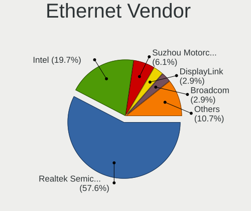

| Vendor                                 | Notebooks | Percent |
|----------------------------------------|-----------|---------|
| Realtek Semiconductor                  | 178       | 57.61%  |
| Intel                                  | 61        | 19.74%  |
| Suzhou Motorcomm Electronic Technology | 19        | 6.15%   |
| DisplayLink                            | 9         | 2.91%   |
| Broadcom                               | 9         | 2.91%   |
| ASIX Electronics                       | 9         | 2.91%   |
| Qualcomm Atheros                       | 6         | 1.94%   |
| Motorcomm Microelectronics.            | 5         | 1.62%   |
| Nvidia                                 | 3         | 0.97%   |
| Lenovo                                 | 3         | 0.97%   |
| Broadcom Limited                       | 2         | 0.65%   |
| TP-Link                                | 1         | 0.32%   |
| Samsung Electronics                    | 1         | 0.32%   |
| OPPO Electronics                       | 1         | 0.32%   |
| MediaTek                               | 1         | 0.32%   |
| Marvell Technology Group               | 1         | 0.32%   |

Ethernet Model
--------------

Ethernet models

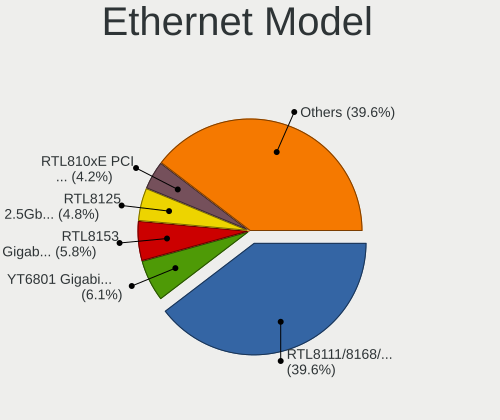

| Model                                                                  | Notebooks | Percent |
|------------------------------------------------------------------------|-----------|---------|
| Realtek RTL8111/8168/8211/8411 PCI Express Gigabit Ethernet Controller | 124       | 39.62%  |
| Suzhou Motorcomm Electronic YT6801 Gigabit Ethernet Controller         | 19        | 6.07%   |
| Realtek RTL8153 Gigabit Ethernet Adapter                               | 18        | 5.75%   |
| Realtek RTL8125 2.5GbE Controller                                      | 15        | 4.79%   |
| Realtek RTL810xE PCI Express Fast Ethernet controller                  | 13        | 4.15%   |
| Intel Alder Lake-P PCH CNVi WiFi                                       | 13        | 4.15%   |
| Intel 82579LM Gigabit Network Connection (Lewisville)                  | 8         | 2.56%   |
| ASIX AX88179 Gigabit Ethernet                                          | 8         | 2.56%   |
| Broadcom NetXtreme BCM57765 Gigabit Ethernet PCIe                      | 7         | 2.24%   |
| DisplayLink USB-C Triple-4K Dock                                       | 6         | 1.92%   |
| Motorcomm Microelectronics. YT6801 Gigabit Ethernet Controller         | 5         | 1.6%    |
| Realtek Killer E2600 GbE Controller                                    | 4         | 1.28%   |
| Intel Ethernet Controller I219-V                                       | 4         | 1.28%   |
| Intel Ethernet Connection (4) I219-LM                                  | 4         | 1.28%   |
| Realtek USB 10/100/1G/2.5 LAN                                          | 3         | 0.96%   |
| Realtek Killer E3000 2.5GbE Controller                                 | 3         | 0.96%   |
| Nvidia MCP79 Ethernet                                                  | 3         | 0.96%   |
| Intel Ethernet Connection I217-LM                                      | 3         | 0.96%   |
| Intel Ethernet Connection (6) I219-LM                                  | 3         | 0.96%   |
| Intel Ethernet Connection (4) I219-V                                   | 3         | 0.96%   |
| Intel Ethernet Connection (2) I219-LM                                  | 3         | 0.96%   |
| Qualcomm Atheros AR8161 Gigabit Ethernet                               | 2         | 0.64%   |
| Intel Ethernet Connection I218-LM                                      | 2         | 0.64%   |
| Intel Ethernet Connection (16) I219-LM                                 | 2         | 0.64%   |
| Intel Ethernet Connection (13) I219-V                                  | 2         | 0.64%   |
| Intel Ethernet Connection (11) I219-LM                                 | 2         | 0.64%   |
| DisplayLink Plugable UD-3900Z                                          | 2         | 0.64%   |
| TP-Link UE300 10/100/1000 LAN (ethernet mode) [Realtek RTL8153]        | 1         | 0.32%   |
| Samsung Galaxy series, misc. (tethering mode)                          | 1         | 0.32%   |
| Realtek RTL8152 Fast Ethernet Adapter                                  | 1         | 0.32%   |
| Qualcomm Atheros Killer E2500 Gigabit Ethernet Controller              | 1         | 0.32%   |
| Qualcomm Atheros AR8162 Fast Ethernet                                  | 1         | 0.32%   |
| Qualcomm Atheros AR8151 v2.0 Gigabit Ethernet                          | 1         | 0.32%   |
| Qualcomm Atheros AR8131 Gigabit Ethernet                               | 1         | 0.32%   |
| OPPO RMX3741                                                           | 1         | 0.32%   |
| MediaTek MT7922 802.11ax PCI Express Wireless Network Adapter          | 1         | 0.32%   |
| Marvell Group 88E8057 PCI-E Gigabit Ethernet Controller                | 1         | 0.32%   |
| Lenovo USB-C Dock Ethernet                                             | 1         | 0.32%   |
| Lenovo ThinkPad TBT 3 Dock                                             | 1         | 0.32%   |
| Lenovo ThinkPad Lan                                                    | 1         | 0.32%   |

Net Controller Kind
-------------------

Ethernet, WiFi or modem

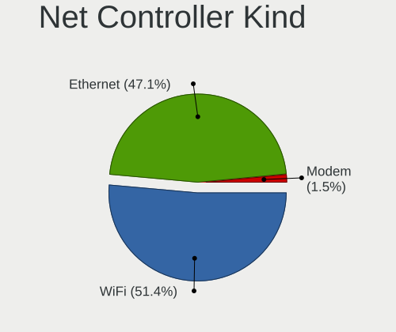

| Kind     | Notebooks | Percent |
|----------|-----------|---------|
| WiFi     | 307       | 51.42%  |
| Ethernet | 281       | 47.07%  |
| Modem    | 9         | 1.51%   |

Used Controller
---------------

Currently used network controller

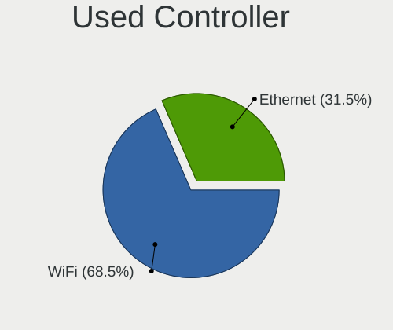

| Kind     | Notebooks | Percent |
|----------|-----------|---------|
| WiFi     | 235       | 68.51%  |
| Ethernet | 108       | 31.49%  |

NICs
----

Total network controllers on board

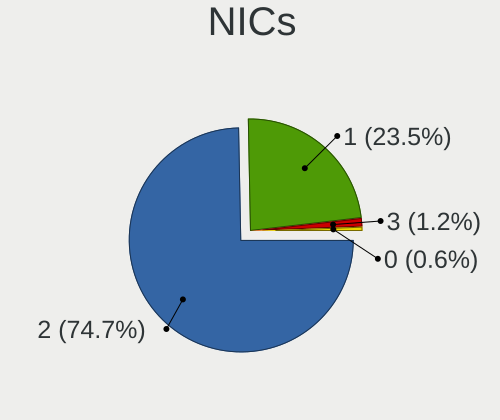

| Total | Notebooks | Percent |
|-------|-----------|---------|
| 2     | 242       | 74.69%  |
| 1     | 76        | 23.46%  |
| 3     | 4         | 1.23%   |
| 0     | 2         | 0.62%   |

IPv6
----

IPv6 vs IPv4

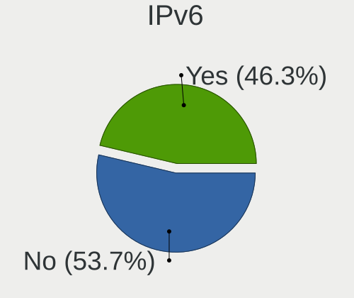

| Used | Notebooks | Percent |
|------|-----------|---------|
| No   | 175       | 53.68%  |
| Yes  | 151       | 46.32%  |

Bluetooth
---------

Bluetooth Vendor
----------------

Controller vendors

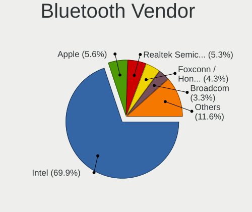

| Vendor                          | Notebooks | Percent |
|---------------------------------|-----------|---------|
| Intel                           | 211       | 69.87%  |
| Apple                           | 17        | 5.63%   |
| Realtek Semiconductor           | 16        | 5.3%    |
| Foxconn / Hon Hai               | 13        | 4.3%    |
| Broadcom                        | 10        | 3.31%   |
| IMC Networks                    | 9         | 2.98%   |
| MediaTek                        | 8         | 2.65%   |
| Qualcomm Atheros Communications | 5         | 1.66%   |
| Toshiba                         | 3         | 0.99%   |
| ASUSTek Computer                | 3         | 0.99%   |
| Ralink                          | 2         | 0.66%   |
| Dell                            | 2         | 0.66%   |
| Lite-On Technology              | 1         | 0.33%   |
| Hewlett-Packard                 | 1         | 0.33%   |
| Cambridge Silicon Radio         | 1         | 0.33%   |

Bluetooth Model
---------------

Controller models

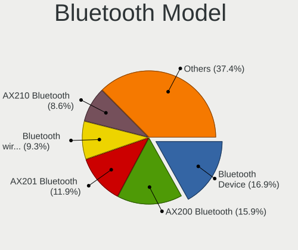

| Model                                            | Notebooks | Percent |
|--------------------------------------------------|-----------|---------|
| Intel Bluetooth Device                           | 51        | 16.89%  |
| Intel AX200 Bluetooth                            | 48        | 15.89%  |
| Intel AX201 Bluetooth                            | 36        | 11.92%  |
| Intel Bluetooth wireless interface               | 28        | 9.27%   |
| Intel AX210 Bluetooth                            | 26        | 8.61%   |
| Realtek Bluetooth Radio                          | 11        | 3.64%   |
| Apple Bluetooth Host Controller                  | 11        | 3.64%   |
| MediaTek Wireless_Device                         | 8         | 2.65%   |
| Intel Wireless-AC 9260 Bluetooth Adapter         | 8         | 2.65%   |
| Intel Bluetooth 9460/9560 Jefferson Peak (JfP)   | 7         | 2.32%   |
| Foxconn / Hon Hai Wireless_Device                | 7         | 2.32%   |
| Apple Bluetooth USB Host Controller              | 6         | 1.99%   |
| IMC Networks Wireless_Device                     | 4         | 1.32%   |
| Realtek  Bluetooth 4.2 Adapter                   | 3         | 0.99%   |
| Intel Centrino Bluetooth Wireless Transceiver    | 3         | 0.99%   |
| IMC Networks Bluetooth Radio                     | 3         | 0.99%   |
| Toshiba Askey Bluetooth Module                   | 2         | 0.66%   |
| Ralink RT3290 Bluetooth                          | 2         | 0.66%   |
| Qualcomm Atheros AR3012 Bluetooth 4.0            | 2         | 0.66%   |
| Intel Centrino Advanced-N 6230 Bluetooth adapter | 2         | 0.66%   |
| IMC Networks Bluetooth Device                    | 2         | 0.66%   |
| Foxconn / Hon Hai MediaTek Bluetooth Adapter     | 2         | 0.66%   |
| Foxconn / Hon Hai Bluetooth USB Host Controller  | 2         | 0.66%   |
| Broadcom HP Portable SoftSailing                 | 2         | 0.66%   |
| Broadcom BCM43142A0 Bluetooth 4.0                | 2         | 0.66%   |
| Broadcom BCM2045B (BDC-2.1)                      | 2         | 0.66%   |
| Toshiba Bluetooth Device                         | 1         | 0.33%   |
| Realtek RTL8822BE Bluetooth 4.2 Adapter          | 1         | 0.33%   |
| Realtek 802.11ac WLAN Adapter                    | 1         | 0.33%   |
| Qualcomm Atheros  Bluetooth Device               | 1         | 0.33%   |
| Qualcomm Atheros QCA61x4 Bluetooth 4.0           | 1         | 0.33%   |
| Qualcomm Atheros AR9462 Bluetooth                | 1         | 0.33%   |
| Lite-On Atheros Bluetooth                        | 1         | 0.33%   |
| Intel Wireless-AC 3168 Bluetooth                 | 1         | 0.33%   |
| Intel Bluetooth                                  | 1         | 0.33%   |
| HP Broadcom 2070 Bluetooth Combo                 | 1         | 0.33%   |
| Foxconn / Hon Hai Broadcom BCM20702 Bluetooth    | 1         | 0.33%   |
| Foxconn / Hon Hai Acer Bluetooth module          | 1         | 0.33%   |
| Dell DW375 Bluetooth Module                      | 1         | 0.33%   |
| Dell BCM20702A0 Bluetooth Module                 | 1         | 0.33%   |

Sound
-----

Sound Vendor
------------

Sound card vendors

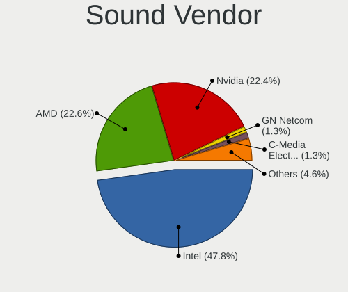

| Vendor                                 | Notebooks | Percent |
|----------------------------------------|-----------|---------|
| Intel                                  | 218       | 47.81%  |
| AMD                                    | 103       | 22.59%  |
| Nvidia                                 | 102       | 22.37%  |
| GN Netcom                              | 6         | 1.32%   |
| C-Media Electronics                    | 6         | 1.32%   |
| Logitech                               | 5         | 1.1%    |
| Lenovo                                 | 4         | 0.88%   |
| Trust                                  | 1         | 0.22%   |
| Sony Ericsson Mobile Communications AB | 1         | 0.22%   |
| Razer USA                              | 1         | 0.22%   |
| PreSonus Audio Electronics             | 1         | 0.22%   |
| Plantronics                            | 1         | 0.22%   |
| No brand                               | 1         | 0.22%   |
| Kingston Technology                    | 1         | 0.22%   |
| Jieli Technology                       | 1         | 0.22%   |
| Huawei Technologies                    | 1         | 0.22%   |
| Hewlett-Packard                        | 1         | 0.22%   |
| FiiO Electronics Technology            | 1         | 0.22%   |
| Apple                                  | 1         | 0.22%   |

Sound Model
-----------

Sound card models

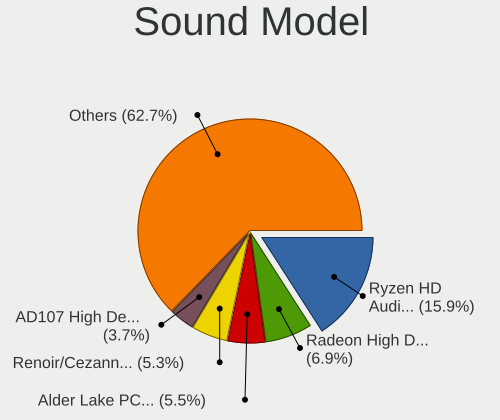

| Model                                                                      | Notebooks | Percent |
|----------------------------------------------------------------------------|-----------|---------|
| AMD Ryzen HD Audio Controller                                              | 90        | 15.9%   |
| AMD Radeon High Definition Audio Controller                                | 39        | 6.89%   |
| Intel Alder Lake PCH-P High Definition Audio Controller                    | 31        | 5.48%   |
| AMD Renoir/Cezanne HDMI/DP Audio Controller                                | 30        | 5.3%    |
| Nvidia AD107 High Definition Audio Controller                              | 21        | 3.71%   |
| Intel Sunrise Point-LP HD Audio                                            | 17        | 3%      |
| Intel Raptor Lake High Definition Audio Controller                         | 17        | 3%      |
| Intel 7 Series/C216 Chipset Family High Definition Audio Controller        | 16        | 2.83%   |
| Intel Raptor Lake-P/U/H cAVS                                               | 15        | 2.65%   |
| Intel 6 Series/C200 Series Chipset Family High Definition Audio Controller | 15        | 2.65%   |
| Intel Cannon Lake PCH cAVS                                                 | 12        | 2.12%   |
| Nvidia GA104 High Definition Audio Controller                              | 11        | 1.94%   |
| Intel Tiger Lake-LP Smart Sound Technology Audio Controller                | 11        | 1.94%   |
| Nvidia GA106 High Definition Audio Controller                              | 10        | 1.77%   |
| Intel Haswell-ULT HD Audio Controller                                      | 10        | 1.77%   |
| Intel 8 Series HD Audio Controller                                         | 10        | 1.77%   |
| Nvidia AD106M High Definition Audio Controller                             | 9         | 1.59%   |
| Intel Wildcat Point-LP High Definition Audio Controller                    | 8         | 1.41%   |
| Intel Meteor Lake-P HD Audio Controller                                    | 8         | 1.41%   |
| Intel Comet Lake PCH cAVS                                                  | 8         | 1.41%   |
| Intel Broadwell-U Audio Controller                                         | 8         | 1.41%   |
| AMD Navi 31 HDMI/DP Audio                                                  | 8         | 1.41%   |
| Nvidia TU116 High Definition Audio Controller                              | 7         | 1.24%   |
| Intel 5 Series/3400 Series Chipset High Definition Audio                   | 7         | 1.24%   |
| Intel 8 Series/C220 Series Chipset High Definition Audio Controller        | 6         | 1.06%   |
| Intel 100 Series/C230 Series Chipset Family HD Audio Controller            | 6         | 1.06%   |
| Nvidia TU106 High Definition Audio Controller                              | 5         | 0.88%   |
| Nvidia GP107GL High Definition Audio Controller                            | 5         | 0.88%   |
| Nvidia GF108 High Definition Audio Controller                              | 5         | 0.88%   |
| Intel Xeon E3-1200 v3/4th Gen Core Processor HD Audio Controller           | 5         | 0.88%   |
| Intel CM238 HD Audio Controller                                            | 5         | 0.88%   |
| AMD FCH Azalia Controller                                                  | 5         | 0.88%   |
| Nvidia TU107 GeForce GTX 1650 High Definition Audio Controller             | 4         | 0.71%   |
| Nvidia GA107 High Definition Audio Controller                              | 4         | 0.71%   |
| Intel Tiger Lake-H HD Audio Controller                                     | 4         | 0.71%   |
| Intel Comet Lake PCH-LP cAVS                                               | 4         | 0.71%   |
| Intel Cannon Point-LP High Definition Audio Controller                     | 4         | 0.71%   |
| AMD Kabini HDMI/DP Audio                                                   | 4         | 0.71%   |
| Nvidia MCP79 High Definition Audio                                         | 3         | 0.53%   |
| Nvidia GM107 High Definition Audio Controller [GeForce 940MX]              | 3         | 0.53%   |

Memory
------

Memory Vendor
-------------

Memory module vendors

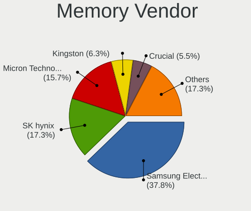

| Vendor                       | Notebooks | Percent |
|------------------------------|-----------|---------|
| Samsung Electronics          | 48        | 37.8%   |
| SK hynix                     | 22        | 17.32%  |
| Micron Technology            | 20        | 15.75%  |
| Kingston                     | 8         | 6.3%    |
| Crucial                      | 7         | 5.51%   |
| Unknown                      | 7         | 5.51%   |
| Corsair                      | 4         | 3.15%   |
| Team                         | 2         | 1.57%   |
| Elpida                       | 2         | 1.57%   |
| Unknown                      | 1         | 0.79%   |
| Transcend                    | 1         | 0.79%   |
| PUSKILL                      | 1         | 0.79%   |
| Patriot Memory (PDP Systems) | 1         | 0.79%   |
| Gold Key                     | 1         | 0.79%   |
| ASint Technology             | 1         | 0.79%   |
| Apacer                       | 1         | 0.79%   |

Memory Model
------------

Memory module models

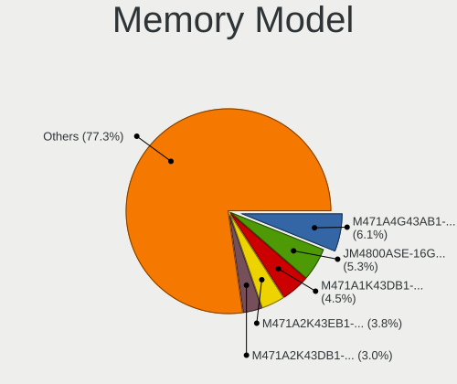

| Model                                                            | Notebooks | Percent |
|------------------------------------------------------------------|-----------|---------|
| Samsung RAM M471A4G43AB1-CWE 32GB SODIMM DDR4 3200MT/s           | 8         | 6.06%   |
| Unknown                                                          | 7         | 5.3%    |
| Samsung RAM M471A1K43DB1-CWE 8GB SODIMM DDR4 3200MT/s            | 6         | 4.55%   |
| Samsung RAM M471A2K43EB1-CWE 16GB SODIMM DDR4 3200MT/s           | 5         | 3.79%   |
| SK hynix RAM HMAA1GS6CJR6N-XN 8GB SODIMM DDR4 3200MT/s           | 4         | 3.03%   |
| Samsung RAM M471A2K43DB1-CWE 16GB SODIMM DDR4 3200MT/s           | 4         | 3.03%   |
| Samsung RAM M425R2GA3BB0-CWMOD 16GiB SODIMM DDR5 5600MT/s        | 4         | 3.03%   |
| Kingston RAM KF556S40-32 32GB SODIMM DDR5 5600MT/s               | 4         | 3.03%   |
| Corsair RAM CMS5X32G2A56C48A2 32GB SODIMM DDR5 5600MT/s          | 4         | 3.03%   |
| SK hynix RAM HMA81GS6AFR8N-UH 8GB SODIMM DDR4 2667MT/s           | 3         | 2.27%   |
| Samsung RAM M471A4G43MB1-CTD 32GB SODIMM DDR4 2667MT/s           | 3         | 2.27%   |
| Samsung RAM M425R4GA3BB0-CQKOL 32GB SODIMM DDR5 4800MT/s         | 3         | 2.27%   |
| Team RAM TEAMGROUP-SD4-3200 16GB SODIMM DDR4 3200MT/s            | 2         | 1.52%   |
| SK hynix RAM HMCG88AGBSA092N 32GB SODIMM DDR5 5600MT/s           | 2         | 1.52%   |
| SK hynix RAM HMCG78AGBSA092N 16GB SODIMM DDR5 5600MT/s           | 2         | 1.52%   |
| SK hynix RAM HMCG66AGBSA095N 8GiB SODIMM DDR5 5600MT/s           | 2         | 1.52%   |
| Samsung RAM M471B1G73QH0-YK0 8GB SODIMM DDR3 1600MT/s            | 2         | 1.52%   |
| Samsung RAM M471A2K43CB1-CTD 16GB SODIMM DDR4 8400MT/s           | 2         | 1.52%   |
| Samsung RAM M471A1G44BB0-CWE 8GB SODIMM DDR4 3200MT/s            | 2         | 1.52%   |
| Micron RAM MT62F2G32D4DS-026 WT 8GiB SODIMM LPDDR5 7500MT/s      | 2         | 1.52%   |
| Micron RAM CT16G56C46S5.C8D 16GB SODIMM DDR5 5600MT/s            | 2         | 1.52%   |
| Micron RAM 8ATF1G64HZ-3G2R1 8GB SODIMM DDR4 3200MT/s             | 2         | 1.52%   |
| Crucial RAM CT16G48C40S5.M8A1 16GB SODIMM DDR5 4800MT/s          | 2         | 1.52%   |
| Unknown RAM Module 4GB SODIMM DDR3                               | 1         | 0.76%   |
| Unknown RAM Module 2GB SODIMM DDR3                               | 1         | 0.76%   |
| Transcend RAM JM3200HSE-32G 32GB SODIMM DDR4 3200MT/s            | 1         | 0.76%   |
| SK hynix RAM Module 4GB SODIMM DDR3 1600MT/s                     | 1         | 0.76%   |
| SK hynix RAM HMT41GS6BFR8A-PB 8GB SODIMM DDR3 2667MT/s           | 1         | 0.76%   |
| SK hynix RAM HMT351S6CFR8C-PB 4GB SODIMM DDR3 1600MT/s           | 1         | 0.76%   |
| SK hynix RAM HMAA2GS6AJR8N-XN 16GB SODIMM DDR4 3200MT/s          | 1         | 0.76%   |
| SK hynix RAM HMA851S6DJR6N-XN 4GB SODIMM DDR4 3200MT/s           | 1         | 0.76%   |
| SK hynix RAM HMA82GS6JJR8N-VK 16GB SODIMM DDR4 2667MT/s          | 1         | 0.76%   |
| SK hynix RAM HMA82GS6AFR8N-UH 16GB SODIMM DDR4 2667MT/s          | 1         | 0.76%   |
| SK hynix RAM HMA81GS6JJR8N-VK 8GB SODIMM DDR4 2667MT/s           | 1         | 0.76%   |
| SK hynix RAM HMA81GS6CJR8N-VK 8GB SODIMM DDR4 2667MT/s           | 1         | 0.76%   |
| SK hynix RAM H9JCNNNFA5MLYR-N6E 8GB Row Of Chips LPDDR5 6400MT/s | 1         | 0.76%   |
| Samsung RAM Module 4GB SODIMM DDR3 1867MT/s                      | 1         | 0.76%   |
| Samsung RAM Module 3GB Row Of Chips LPDDR5 6400MT/s              | 1         | 0.76%   |
| Samsung RAM M471B5173QH0-YK0 4GB SODIMM DDR3 1600MT/s            | 1         | 0.76%   |
| Samsung RAM M471A2K43BB1-CPB 16GB SODIMM DDR4 2133MT/s           | 1         | 0.76%   |

Memory Kind
-----------

Memory module kinds

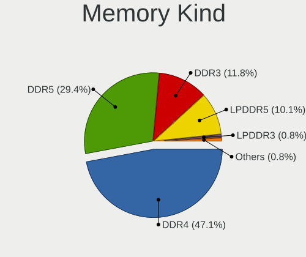

| Kind    | Notebooks | Percent |
|---------|-----------|---------|
| DDR4    | 56        | 47.06%  |
| DDR5    | 35        | 29.41%  |
| DDR3    | 14        | 11.76%  |
| LPDDR5  | 12        | 10.08%  |
| LPDDR3  | 1         | 0.84%   |
| Unknown | 1         | 0.84%   |

Memory Form Factor
------------------

Physical design of the memory module

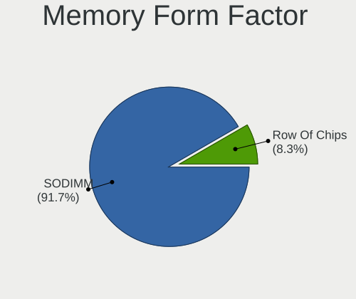

| Name         | Notebooks | Percent |
|--------------|-----------|---------|
| SODIMM       | 111       | 92.5%   |
| Row Of Chips | 9         | 7.5%    |

Memory Size
-----------

Memory module size

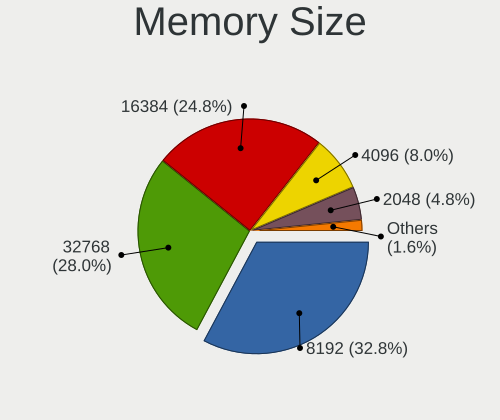

| Size  | Notebooks | Percent |
|-------|-----------|---------|
| 8192  | 41        | 32.8%   |
| 32768 | 35        | 28%     |
| 16384 | 31        | 24.8%   |
| 4096  | 10        | 8%      |
| 2048  | 6         | 4.8%    |
| 49152 | 1         | 0.8%    |
| 3072  | 1         | 0.8%    |

Memory Speed
------------

Memory module speed

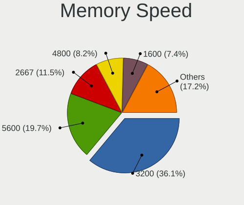

| Speed   | Notebooks | Percent |
|---------|-----------|---------|
| 3200    | 44        | 36.07%  |
| 5600    | 24        | 19.67%  |
| 2667    | 14        | 11.48%  |
| 4800    | 10        | 8.2%    |
| 1600    | 9         | 7.38%   |
| 6400    | 6         | 4.92%   |
| 7500    | 5         | 4.1%    |
| 8400    | 2         | 1.64%   |
| 12800   | 1         | 0.82%   |
| 4266    | 1         | 0.82%   |
| 2400    | 1         | 0.82%   |
| 2133    | 1         | 0.82%   |
| 1867    | 1         | 0.82%   |
| 1067    | 1         | 0.82%   |
| 1066    | 1         | 0.82%   |
| Unknown | 1         | 0.82%   |

Printers & scanners
-------------------

Printer Vendor
--------------

Printer device vendors

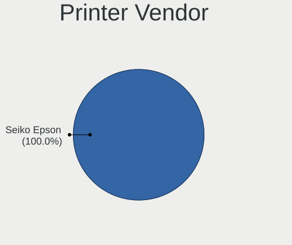

| Vendor      | Notebooks | Percent |
|-------------|-----------|---------|
| Seiko Epson | 1         | 100%    |

Printer Model
-------------

Printer device models

| Model                      | Notebooks | Percent |
|----------------------------|-----------|---------|
| Seiko Epson ET-2810 Series | 1         | 100%    |

Scanner Vendor
--------------

Scanner device vendors

Zero info for selected period =(

Scanner Model
-------------

Scanner device models

Zero info for selected period =(

Camera
------

Camera Vendor
-------------

Camera device vendors

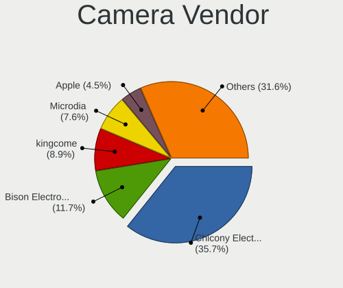

| Vendor                                 | Notebooks | Percent |
|----------------------------------------|-----------|---------|
| Chicony Electronics                    | 104       | 35.74%  |
| Bison Electronics                      | 34        | 11.68%  |
| kingcome                               | 26        | 8.93%   |
| Microdia                               | 22        | 7.56%   |
| Apple                                  | 13        | 4.47%   |
| SunplusIT                              | 11        | 3.78%   |
| Realtek Semiconductor                  | 11        | 3.78%   |
| IMC Networks                           | 10        | 3.44%   |
| Sunplus Innovation Technology          | 8         | 2.75%   |
| Suyin                                  | 7         | 2.41%   |
| Logitech                               | 6         | 2.06%   |
| Luxvisions Innotech Limited            | 4         | 1.37%   |
| Ricoh                                  | 3         | 1.03%   |
| Quanta                                 | 3         | 1.03%   |
| Syntek                                 | 2         | 0.69%   |
| Sonix Technology                       | 2         | 0.69%   |
| Silicon Motion                         | 2         | 0.69%   |
| Shine-optics                           | 2         | 0.69%   |
| Lite-On Technology                     | 2         | 0.69%   |
| Importek                               | 2         | 0.69%   |
| Cheng Uei Precision Industry (Foxlink) | 2         | 0.69%   |
| Acer                                   | 2         | 0.69%   |
| USB CAMERA                             | 1         | 0.34%   |
| Unknown                                | 1         | 0.34%   |
| Samsung Electronics                    | 1         | 0.34%   |
| Razer USA                              | 1         | 0.34%   |
| Primax Electronics                     | 1         | 0.34%   |
| Microsoft                              | 1         | 0.34%   |
| Lenovo                                 | 1         | 0.34%   |
| HYGD-220831-A                          | 1         | 0.34%   |
| Guillemot                              | 1         | 0.34%   |
| Generalplus Technology                 | 1         | 0.34%   |
| Creative Technology                    | 1         | 0.34%   |
| BillionPixels                          | 1         | 0.34%   |
| Alpha Imaging Technology               | 1         | 0.34%   |

Camera Model
------------

Camera device models

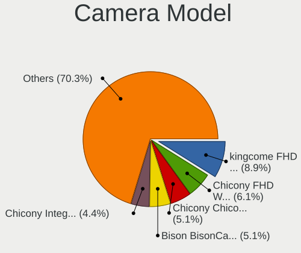

| Model                                                | Notebooks | Percent |
|------------------------------------------------------|-----------|---------|
| kingcome FHD WebCam                                  | 26        | 8.87%   |
| Chicony FHD Webcam                                   | 18        | 6.14%   |
| Chicony Chicony USB2.0 Camera                        | 15        | 5.12%   |
| Bison BisonCam,NB Pro                                | 15        | 5.12%   |
| Chicony Integrated IR Camera                         | 13        | 4.44%   |
| Chicony Integrated Camera                            | 11        | 3.75%   |
| Chicony HD Webcam                                    | 11        | 3.75%   |
| SunplusIT FHD Webcam                                 | 10        | 3.41%   |
| Microdia HDE Webcam USB                              | 7         | 2.39%   |
| Apple FaceTime HD Camera                             | 7         | 2.39%   |
| IMC Networks Integrated Camera                       | 6         | 2.05%   |
| Bison Integrated Camera                              | 6         | 2.05%   |
| Bison HD Webcam                                      | 5         | 1.71%   |
| Microdia Integrated_Webcam_HD                        | 4         | 1.37%   |
| Microdia Integrated_Webcam_FHD                       | 4         | 1.37%   |
| Apple Built-in iSight                                | 4         | 1.37%   |
| Sunplus Integrated_Webcam_HD                         | 3         | 1.02%   |
| Chicony TOSHIBA Web Camera - HD                      | 3         | 1.02%   |
| Chicony CNF9055 Toshiba Webcam                       | 3         | 1.02%   |
| Syntek Integrated Camera                             | 2         | 0.68%   |
| Suyin HP Truevision HD                               | 2         | 0.68%   |
| Sunplus Integrated Camera                            | 2         | 0.68%   |
| Shine-optics USB2.0 HD UVC WebCam                    | 2         | 0.68%   |
| Ricoh Laptop_Integrated_Webcam_FHD                   | 2         | 0.68%   |
| Realtek USB Camera                                   | 2         | 0.68%   |
| Realtek Integrated_Webcam_HD                         | 2         | 0.68%   |
| Realtek Integrated Webcam_HD                         | 2         | 0.68%   |
| Microdia USB 2.0 Camera                              | 2         | 0.68%   |
| Microdia Laptop_Integrated_Webcam_HD                 | 2         | 0.68%   |
| Luxvisions Innotech Limited Integrated Camera        | 2         | 0.68%   |
| Luxvisions Innotech Limited HP Wide Vision HD Camera | 2         | 0.68%   |
| Logitech C922 Pro Stream Webcam                      | 2         | 0.68%   |
| Importek HP Webcam                                   | 2         | 0.68%   |
| IMC Networks USB2.0 HD UVC WebCam                    | 2         | 0.68%   |
| Chicony USB2.0 VGA UVC WebCam                        | 2         | 0.68%   |
| Chicony USB 2.0 Camera                               | 2         | 0.68%   |
| Chicony Integrated Camera (1280x720@30)              | 2         | 0.68%   |
| Chicony HP Webcam                                    | 2         | 0.68%   |
| Chicony HP HD Camera                                 | 2         | 0.68%   |
| Chicony HD User Facing                               | 2         | 0.68%   |

Security
--------

Fingerprint Vendor
------------------

Fingerprint sensor vendors

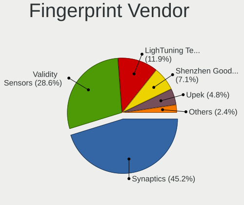

| Vendor                     | Notebooks | Percent |
|----------------------------|-----------|---------|
| Synaptics                  | 19        | 45.24%  |
| Validity Sensors           | 12        | 28.57%  |
| LighTuning Technology      | 5         | 11.9%   |
| Shenzhen Goodix Technology | 3         | 7.14%   |
| Upek                       | 2         | 4.76%   |
| Elan Microelectronics      | 1         | 2.38%   |

Fingerprint Model
-----------------

Fingerprint sensor models

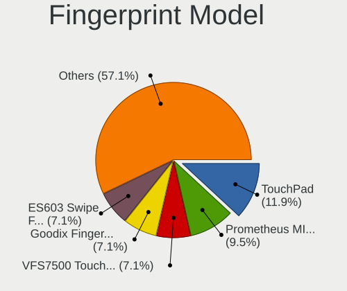

| Model                                                                      | Notebooks | Percent |
|----------------------------------------------------------------------------|-----------|---------|
| Synaptics TouchPad                                                         | 5         | 11.9%   |
| Synaptics Prometheus MIS Touch Fingerprint Reader                          | 4         | 9.52%   |
| Validity Sensors VFS7500 Touch Fingerprint Sensor                          | 3         | 7.14%   |
| Shenzhen Goodix  Fingerprint Device                                        | 3         | 7.14%   |
| LighTuning ES603 Swipe Fingerprint Sensor                                  | 3         | 7.14%   |
| Unknown                                                                    | 3         | 7.14%   |
| Validity Sensors VFS495 Fingerprint Reader                                 | 2         | 4.76%   |
| Validity Sensors VFS491                                                    | 2         | 4.76%   |
| Validity Sensors Synaptics WBDI                                            | 2         | 4.76%   |
| Upek Biometric Touchchip/Touchstrip Fingerprint Sensor                     | 2         | 4.76%   |
| Synaptics WBDI Fingerprint Reader USB 086                                  | 2         | 4.76%   |
| Validity Sensors VFS Fingerprint sensor                                    | 1         | 2.38%   |
| Validity Sensors Synaptics VFS7552 Touch Fingerprint Sensor with PurePrint | 1         | 2.38%   |
| Validity Sensors Fingerprint scanner                                       | 1         | 2.38%   |
| Synaptics WBDI                                                             | 1         | 2.38%   |
| Synaptics Prometheus Fingerprint Reader                                    | 1         | 2.38%   |
| Synaptics Metallica MOH Touch Fingerprint Reader                           | 1         | 2.38%   |
| Synaptics Metallica MIS Touch Fingerprint Reader                           | 1         | 2.38%   |
| Synaptics Fingerprint reader [HP G6]                                       | 1         | 2.38%   |
| LighTuning Fingerprint Reader                                              | 1         | 2.38%   |
| LighTuning EgisTec Touch Fingerprint Sensor                                | 1         | 2.38%   |
| Elan ELAN:ARM-M4                                                           | 1         | 2.38%   |

Chipcard Vendor
---------------

Chipcard module vendors

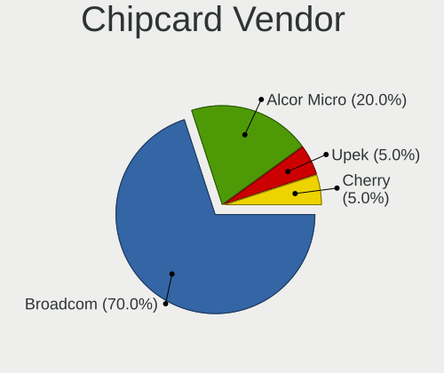

| Vendor      | Notebooks | Percent |
|-------------|-----------|---------|
| Broadcom    | 14        | 70%     |
| Alcor Micro | 4         | 20%     |
| Upek        | 1         | 5%      |
| Cherry      | 1         | 5%      |

Chipcard Model
--------------

Chipcard module models

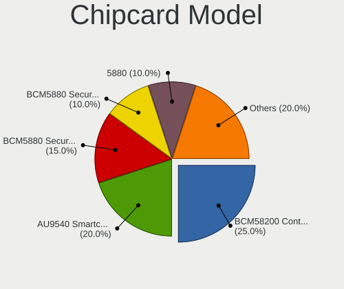

| Model                                                                        | Notebooks | Percent |
|------------------------------------------------------------------------------|-----------|---------|
| Broadcom BCM58200 ControlVault 3 (FingerPrint sensor + Contacted SmartCard)  | 5         | 25%     |
| Alcor Micro AU9540 Smartcard Reader                                          | 4         | 20%     |
| Broadcom BCM5880 Secure Applications Processor                               | 3         | 15%     |
| Broadcom BCM5880 Secure Applications Processor with fingerprint swipe sensor | 2         | 10%     |
| Broadcom 5880                                                                | 2         | 10%     |
| Broadcom 58200                                                               | 2         | 10%     |
| Upek TouchChip Fingerprint Coprocessor (WBF advanced mode)                   | 1         | 5%      |
| Cherry SmartCard Reader Keyboard KC 1000 SC                                  | 1         | 5%      |

Unsupported
-----------

Unsupported Devices
-------------------

Total unsupported devices on board

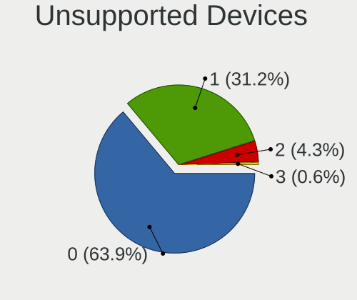

| Total | Notebooks | Percent |
|-------|-----------|---------|
| 0     | 209       | 63.91%  |
| 1     | 102       | 31.19%  |
| 2     | 14        | 4.28%   |
| 3     | 2         | 0.61%   |

Unsupported Device Types
------------------------

Types of unsupported devices

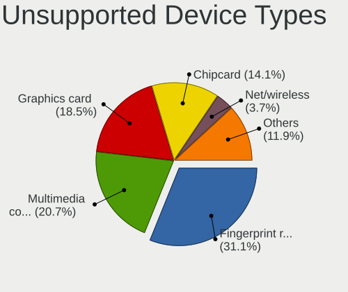

| Type                     | Notebooks | Percent |
|--------------------------|-----------|---------|
| Fingerprint reader       | 42        | 31.11%  |
| Multimedia controller    | 28        | 20.74%  |
| Graphics card            | 25        | 18.52%  |
| Chipcard                 | 19        | 14.07%  |
| Net/wireless             | 5         | 3.7%    |
| Communication controller | 3         | 2.22%   |
| Card reader              | 3         | 2.22%   |
| Storage                  | 2         | 1.48%   |
| Sound                    | 2         | 1.48%   |
| Net/ethernet             | 2         | 1.48%   |
| Bluetooth                | 2         | 1.48%   |
| Wireless                 | 1         | 0.74%   |
| Modem                    | 1         | 0.74%   |

