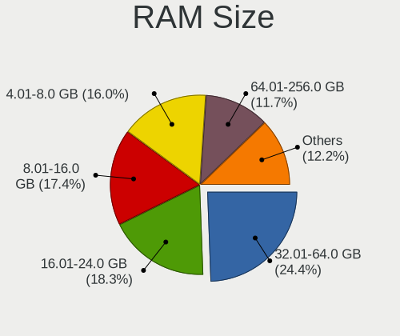
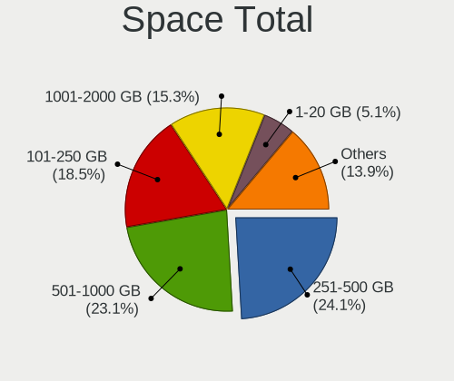
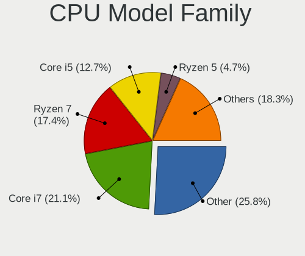
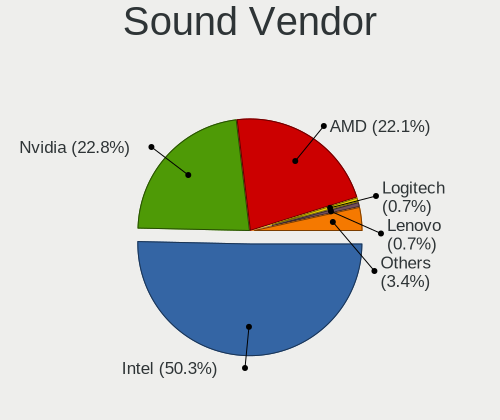
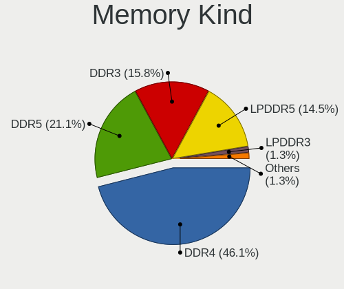

TUXEDO OS - Tested Hardware & Statistics (Notebooks)
----------------------------------------------------

A project to collect tested hardware configurations for TUXEDO OS.

Anyone can contribute to this report by the [hw-probe](https://github.com/linuxhw/hw-probe) tool:

    sudo -E hw-probe -all -upload

Please contribute! Especially if your hardware is rare.

Contents
--------

* [ Test Cases ](#test-cases)

* [ System ](#system)
  - [ OS                       ](#os)
  - [ OS Family                ](#os-family)
  - [ Kernel                   ](#kernel)
  - [ Kernel Family            ](#kernel-family)
  - [ Kernel Major Ver.        ](#kernel-major-ver)
  - [ Arch                     ](#arch)
  - [ DE                       ](#de)
  - [ Display Server           ](#display-server)
  - [ Display Manager          ](#display-manager)
  - [ OS Lang                  ](#os-lang)
  - [ Boot Mode                ](#boot-mode)
  - [ Filesystem               ](#filesystem)
  - [ Part. scheme             ](#part-scheme)
  - [ Dual Boot with Linux/BSD ](#dual-boot-with-linuxbsd)
  - [ Dual Boot (Win)          ](#dual-boot-win)

* [ Board ](#board)
  - [ Vendor                   ](#vendor)
  - [ Model                    ](#model)
  - [ Model Family             ](#model-family)
  - [ MFG Year                 ](#mfg-year)
  - [ Form Factor              ](#form-factor)
  - [ Secure Boot              ](#secure-boot)
  - [ Coreboot                 ](#coreboot)
  - [ RAM Size                 ](#ram-size)
  - [ RAM Used                 ](#ram-used)
  - [ Total Drives             ](#total-drives)
  - [ Has CD-ROM               ](#has-cd-rom)
  - [ Has Ethernet             ](#has-ethernet)
  - [ Has WiFi                 ](#has-wifi)
  - [ Has Bluetooth            ](#has-bluetooth)

* [ Location ](#location)
  - [ Country                  ](#country)
  - [ City                     ](#city)

* [ Drives ](#drives)
  - [ Drive Vendor             ](#drive-vendor)
  - [ Drive Model              ](#drive-model)
  - [ HDD Vendor               ](#hdd-vendor)
  - [ SSD Vendor               ](#ssd-vendor)
  - [ Drive Kind               ](#drive-kind)
  - [ Drive Connector          ](#drive-connector)
  - [ Drive Size               ](#drive-size)
  - [ Space Total              ](#space-total)
  - [ Space Used               ](#space-used)
  - [ Malfunc. Drives          ](#malfunc-drives)
  - [ Malfunc. Drive Vendor    ](#malfunc-drive-vendor)
  - [ Malfunc. HDD Vendor      ](#malfunc-hdd-vendor)
  - [ Malfunc. Drive Kind      ](#malfunc-drive-kind)
  - [ Failed Drives            ](#failed-drives)
  - [ Failed Drive Vendor      ](#failed-drive-vendor)
  - [ Drive Status             ](#drive-status)

* [ Storage controller ](#storage-controller)
  - [ Storage Vendor           ](#storage-vendor)
  - [ Storage Model            ](#storage-model)
  - [ Storage Kind             ](#storage-kind)

* [ Processor ](#processor)
  - [ CPU Vendor               ](#cpu-vendor)
  - [ CPU Model                ](#cpu-model)
  - [ CPU Model Family         ](#cpu-model-family)
  - [ CPU Cores                ](#cpu-cores)
  - [ CPU Sockets              ](#cpu-sockets)
  - [ CPU Threads              ](#cpu-threads)
  - [ CPU Op-Modes             ](#cpu-op-modes)
  - [ CPU Microcode            ](#cpu-microcode)
  - [ CPU Microarch            ](#cpu-microarch)

* [ Graphics ](#graphics)
  - [ GPU Vendor               ](#gpu-vendor)
  - [ GPU Model                ](#gpu-model)
  - [ GPU Combo                ](#gpu-combo)
  - [ GPU Driver               ](#gpu-driver)
  - [ GPU Memory               ](#gpu-memory)

* [ Monitor ](#monitor)
  - [ Monitor Vendor           ](#monitor-vendor)
  - [ Monitor Model            ](#monitor-model)
  - [ Monitor Resolution       ](#monitor-resolution)
  - [ Monitor Diagonal         ](#monitor-diagonal)
  - [ Monitor Width            ](#monitor-width)
  - [ Aspect Ratio             ](#aspect-ratio)
  - [ Monitor Area             ](#monitor-area)
  - [ Pixel Density            ](#pixel-density)
  - [ Multiple Monitors        ](#multiple-monitors)

* [ Network ](#network)
  - [ Net Controller Vendor    ](#net-controller-vendor)
  - [ Net Controller Model     ](#net-controller-model)
  - [ Wireless Vendor          ](#wireless-vendor)
  - [ Wireless Model           ](#wireless-model)
  - [ Ethernet Vendor          ](#ethernet-vendor)
  - [ Ethernet Model           ](#ethernet-model)
  - [ Net Controller Kind      ](#net-controller-kind)
  - [ Used Controller          ](#used-controller)
  - [ NICs                     ](#nics)
  - [ IPv6                     ](#ipv6)

* [ Bluetooth ](#bluetooth)
  - [ Bluetooth Vendor         ](#bluetooth-vendor)
  - [ Bluetooth Model          ](#bluetooth-model)

* [ Sound ](#sound)
  - [ Sound Vendor             ](#sound-vendor)
  - [ Sound Model              ](#sound-model)

* [ Memory ](#memory)
  - [ Memory Vendor            ](#memory-vendor)
  - [ Memory Model             ](#memory-model)
  - [ Memory Kind              ](#memory-kind)
  - [ Memory Form Factor       ](#memory-form-factor)
  - [ Memory Size              ](#memory-size)
  - [ Memory Speed             ](#memory-speed)

* [ Printers & scanners ](#printers--scanners)
  - [ Printer Vendor           ](#printer-vendor)
  - [ Printer Model            ](#printer-model)
  - [ Scanner Vendor           ](#scanner-vendor)
  - [ Scanner Model            ](#scanner-model)

* [ Camera ](#camera)
  - [ Camera Vendor            ](#camera-vendor)
  - [ Camera Model             ](#camera-model)

* [ Security ](#security)
  - [ Fingerprint Vendor       ](#fingerprint-vendor)
  - [ Fingerprint Model        ](#fingerprint-model)
  - [ Chipcard Vendor          ](#chipcard-vendor)
  - [ Chipcard Model           ](#chipcard-model)

* [ Unsupported ](#unsupported)
  - [ Unsupported Devices      ](#unsupported-devices)
  - [ Unsupported Device Types ](#unsupported-device-types)

Test Cases
----------

Total: 284

| Vendor        | Model                       | Probe                                                      | Date         |
|---------------|-----------------------------|------------------------------------------------------------|--------------|
| Lenovo        | IdeaPad 5 15ABA7 82SG       | [22702a56ed](https://linux-hardware.org/?probe=22702a56ed) | Jan 06, 2025 |
| TUXEDO        | Book XP15 / XP17 Gen12      | [be06c286bb](https://linux-hardware.org/?probe=be06c286bb) | Jan 04, 2025 |
| TUXEDO        | Stellaris Slim 15 Intel ... | [b1e2aaf88e](https://linux-hardware.org/?probe=b1e2aaf88e) | Dec 31, 2024 |
| HP            | 255 15.6 inch G9 Noteboo... | [1c64d7883e](https://linux-hardware.org/?probe=1c64d7883e) | Dec 26, 2024 |
| HP            | ProBook 470 G5              | [30f50d84d3](https://linux-hardware.org/?probe=30f50d84d3) | Dec 24, 2024 |
| Acer          | Aspire A315-58              | [b49f4674e2](https://linux-hardware.org/?probe=b49f4674e2) | Dec 23, 2024 |
| TUXEDO        | Pulse 14 Gen4               | [dfdca3924e](https://linux-hardware.org/?probe=dfdca3924e) | Dec 22, 2024 |
| TUXEDO        | InfinityBook Pro Gen8 (M... | [c094245674](https://linux-hardware.org/?probe=c094245674) | Dec 21, 2024 |
| Lenovo        | Yoga Pro 7 14ASP9 83HN      | [847bdd9f95](https://linux-hardware.org/?probe=847bdd9f95) | Dec 21, 2024 |
| Lenovo        | Yoga Pro 7 14ASP9 83HN      | [bae5bf44e3](https://linux-hardware.org/?probe=bae5bf44e3) | Dec 21, 2024 |
| TUXEDO        | InfinityBook Pro AMD Gen... | [1b7b6fe18c](https://linux-hardware.org/?probe=1b7b6fe18c) | Dec 20, 2024 |
| Lenovo        | ThinkPad T480 20L6S6WQ00    | [7ddde1c012](https://linux-hardware.org/?probe=7ddde1c012) | Dec 12, 2024 |
| Lenovo        | ThinkPad T480 20L6S6WQ00    | [8e83bba34b](https://linux-hardware.org/?probe=8e83bba34b) | Dec 12, 2024 |
| Dell          | Latitude 9420               | [00fecb4861](https://linux-hardware.org/?probe=00fecb4861) | Dec 05, 2024 |
| Monster       | TULPAR T7 V20.8             | [e7cc7b7cff](https://linux-hardware.org/?probe=e7cc7b7cff) | Dec 05, 2024 |
| ASUSTek       | ASUS TUF Gaming A15 FA50... | [2d22964d09](https://linux-hardware.org/?probe=2d22964d09) | Dec 01, 2024 |
| Lenovo        | IdeaPad Gaming 3 15ACH6 ... | [afdf6ad9bd](https://linux-hardware.org/?probe=afdf6ad9bd) | Nov 27, 2024 |
| Lenovo        | IdeaPad Gaming 3 15ACH6 ... | [970d25268e](https://linux-hardware.org/?probe=970d25268e) | Nov 27, 2024 |
| Dell          | Latitude E5440              | [61cfdd936e](https://linux-hardware.org/?probe=61cfdd936e) | Nov 27, 2024 |
| Dell          | Latitude E5440              | [77269b5130](https://linux-hardware.org/?probe=77269b5130) | Nov 27, 2024 |
| Dell          | Latitude 5411               | [ebb8abde35](https://linux-hardware.org/?probe=ebb8abde35) | Nov 26, 2024 |
| Lenovo        | ThinkPad L380 20M6S11800    | [fdca0fd463](https://linux-hardware.org/?probe=fdca0fd463) | Nov 24, 2024 |
| Schenker      | XMG EVO (M24)               | [513a3453cc](https://linux-hardware.org/?probe=513a3453cc) | Nov 20, 2024 |
| Lenovo        | ThinkBook 16p Gen 2 20YM    | [70dcc9416f](https://linux-hardware.org/?probe=70dcc9416f) | Nov 19, 2024 |
| TUXEDO        | InfinityBook Pro Gen7 (M... | [522f3333a0](https://linux-hardware.org/?probe=522f3333a0) | Nov 18, 2024 |
| TUXEDO        | InfinityBook Pro AMD Gen... | [f1540c9c61](https://linux-hardware.org/?probe=f1540c9c61) | Nov 16, 2024 |
| Lenovo        | IdeaPad 5 15ABA7 82SG       | [ff2ac5c7c1](https://linux-hardware.org/?probe=ff2ac5c7c1) | Nov 16, 2024 |
| Lenovo        | IdeaPad 5 15ABA7 82SG       | [858fe28143](https://linux-hardware.org/?probe=858fe28143) | Nov 16, 2024 |
| TUXEDO        | InfinityBook Pro Intel G... | [365259d6e3](https://linux-hardware.org/?probe=365259d6e3) | Nov 10, 2024 |
| TUXEDO        | InfinityBook Pro Intel G... | [ca6d2c4960](https://linux-hardware.org/?probe=ca6d2c4960) | Nov 08, 2024 |
| ASUSTek       | ASUS TUF Gaming A14 FA40... | [69a7ee9ab5](https://linux-hardware.org/?probe=69a7ee9ab5) | Nov 02, 2024 |
| Dell          | Latitude E6520              | [029a9feb19](https://linux-hardware.org/?probe=029a9feb19) | Nov 01, 2024 |
| TUXEDO        | Pulse 15 Gen2               | [08951a5d7d](https://linux-hardware.org/?probe=08951a5d7d) | Oct 20, 2024 |
| TUXEDO        | Sirius 16 Gen1              | [30d8c17c67](https://linux-hardware.org/?probe=30d8c17c67) | Oct 19, 2024 |
| Dell          | Latitude 5411               | [e0e43f1847](https://linux-hardware.org/?probe=e0e43f1847) | Oct 19, 2024 |
| Acer          | Nitro AN515-44              | [505d70884f](https://linux-hardware.org/?probe=505d70884f) | Oct 17, 2024 |
| TUXEDO        | InfinityBook Pro Intel G... | [deb463e41a](https://linux-hardware.org/?probe=deb463e41a) | Oct 16, 2024 |
| TUXEDO        | InfinityBook Pro Intel G... | [0a95725e51](https://linux-hardware.org/?probe=0a95725e51) | Oct 16, 2024 |
| TUXEDO        | Pulse 14 Gen3               | [a33d03b342](https://linux-hardware.org/?probe=a33d03b342) | Oct 13, 2024 |
| Toshiba       | Satellite C660              | [d5e307e3b9](https://linux-hardware.org/?probe=d5e307e3b9) | Oct 11, 2024 |
| TUXEDO        | InfinityBook Pro Intel G... | [9b10635c23](https://linux-hardware.org/?probe=9b10635c23) | Oct 11, 2024 |
| Dell          | Latitude 5410               | [a6d40302d1](https://linux-hardware.org/?probe=a6d40302d1) | Oct 08, 2024 |
| Acer          | Nitro AN517-54              | [6d3f1a9cac](https://linux-hardware.org/?probe=6d3f1a9cac) | Oct 04, 2024 |
| Dell          | Latitude 5410               | [c3ad8f296b](https://linux-hardware.org/?probe=c3ad8f296b) | Oct 02, 2024 |
| HP            | Pavilion g7                 | [a766af594c](https://linux-hardware.org/?probe=a766af594c) | Oct 01, 2024 |
| LG Electro... | A560-T.BG77P1               | [ecbba00380](https://linux-hardware.org/?probe=ecbba00380) | Sep 30, 2024 |
| Schenker      | XMG APEX (M23)              | [efc8dfb947](https://linux-hardware.org/?probe=efc8dfb947) | Sep 30, 2024 |
| TUXEDO        | InfinityBook Pro AMD Gen... | [d51b3c150f](https://linux-hardware.org/?probe=d51b3c150f) | Sep 28, 2024 |
| Apple         | MacBookPro5,5               | [a0bb48750a](https://linux-hardware.org/?probe=a0bb48750a) | Sep 25, 2024 |
| ASUSTek       | ASUS BR1100CKA BR1100CKA... | [19b72b74eb](https://linux-hardware.org/?probe=19b72b74eb) | Sep 21, 2024 |
| ASUSTek       | ASUS BR1100CKA BR1100CKA... | [c19cd4397b](https://linux-hardware.org/?probe=c19cd4397b) | Sep 20, 2024 |
| ASUSTek       | ASUS TUF Gaming A17 FA70... | [4169a4ef86](https://linux-hardware.org/?probe=4169a4ef86) | Sep 17, 2024 |
| Toshiba       | Satellite C660              | [83c86f3085](https://linux-hardware.org/?probe=83c86f3085) | Sep 16, 2024 |
| Monster       | TULPAR T7 V20.8             | [3acaa02a26](https://linux-hardware.org/?probe=3acaa02a26) | Sep 16, 2024 |
| Schenker      | XMG APEX (M23)              | [67e76c49d4](https://linux-hardware.org/?probe=67e76c49d4) | Sep 10, 2024 |
| Lenovo        | ThinkPad P14s Gen 4 21K5... | [3c82db19ee](https://linux-hardware.org/?probe=3c82db19ee) | Sep 09, 2024 |
| Valve         | Galileo                     | [4c2d3435ee](https://linux-hardware.org/?probe=4c2d3435ee) | Sep 08, 2024 |
| TUXEDO        | Stellaris 17 Intel Gen6     | [1bed607ead](https://linux-hardware.org/?probe=1bed607ead) | Sep 05, 2024 |
| Notebook      | W54_55SU1,SUW               | [151da93887](https://linux-hardware.org/?probe=151da93887) | Aug 31, 2024 |
| MSI           | GF75 Thin 8RD               | [6e65fa1e65](https://linux-hardware.org/?probe=6e65fa1e65) | Aug 31, 2024 |
| HP            | ENVY 15                     | [6689093a97](https://linux-hardware.org/?probe=6689093a97) | Aug 30, 2024 |
| TUXEDO        | Stellaris 17 Intel Gen6     | [9e6d9b5bf0](https://linux-hardware.org/?probe=9e6d9b5bf0) | Aug 29, 2024 |
| TUXEDO        | Pulse 15 Gen1               | [24e0d4eba1](https://linux-hardware.org/?probe=24e0d4eba1) | Aug 24, 2024 |
| TUXEDO        | Stellaris Slim 15 AMD Ge... | [40301df9d0](https://linux-hardware.org/?probe=40301df9d0) | Aug 24, 2024 |
| Lenovo        | ThinkBook 14 G4 ABA 21DK    | [06865e4709](https://linux-hardware.org/?probe=06865e4709) | Aug 22, 2024 |
| Sony          | VPCF11S1E                   | [1e3a2103e1](https://linux-hardware.org/?probe=1e3a2103e1) | Aug 22, 2024 |
| Sony          | VPCF11S1E                   | [c9d89ad8cd](https://linux-hardware.org/?probe=c9d89ad8cd) | Aug 22, 2024 |
| Samsung       | 300E5EV/300E4EV/270E5EV/... | [c51c37be47](https://linux-hardware.org/?probe=c51c37be47) | Aug 20, 2024 |
| MSI           | Stealth GS66 12UGS          | [56a8c64b2f](https://linux-hardware.org/?probe=56a8c64b2f) | Aug 17, 2024 |
| Lenovo        | ThinkPad SL 2743A65         | [0ee47e6c13](https://linux-hardware.org/?probe=0ee47e6c13) | Aug 12, 2024 |
| HP            | Pavilion Laptop 15-eh2xx... | [d415774845](https://linux-hardware.org/?probe=d415774845) | Aug 07, 2024 |
| TUXEDO        | InfinityBook Pro Gen8 (M... | [2534745345](https://linux-hardware.org/?probe=2534745345) | Jul 29, 2024 |
| ASUSTek       | ASUS TUF Gaming A17 FA70... | [6114c59dc3](https://linux-hardware.org/?probe=6114c59dc3) | Jul 19, 2024 |
| Lenovo        | IdeaPad Slim 5 16AHP9 83... | [97b127dc88](https://linux-hardware.org/?probe=97b127dc88) | Jul 18, 2024 |
| TUXEDO        | InfinityBook_S_14_v5        | [886f488bf6](https://linux-hardware.org/?probe=886f488bf6) | Jul 18, 2024 |
| Gigabyte      | G7 GE                       | [c0c18a4870](https://linux-hardware.org/?probe=c0c18a4870) | Jul 11, 2024 |
| TUXEDO        | Polaris AMD Gen5            | [c587060103](https://linux-hardware.org/?probe=c587060103) | Jul 11, 2024 |
| TUXEDO        | Unknown                     | [511b234c12](https://linux-hardware.org/?probe=511b234c12) | Jun 29, 2024 |
| ASUSTek       | VivoBook_ASUSLaptop X160... | [643324d50d](https://linux-hardware.org/?probe=643324d50d) | Jun 24, 2024 |
| Dell          | Precision 5540              | [01ba3a1f97](https://linux-hardware.org/?probe=01ba3a1f97) | Jun 21, 2024 |
| Schenker      | VISION (E22)                | [04ce0d9ecb](https://linux-hardware.org/?probe=04ce0d9ecb) | Jun 21, 2024 |
| MSI           | GF65 Thin 9SD               | [148651308b](https://linux-hardware.org/?probe=148651308b) | Jun 20, 2024 |
| Sony          | VPCF11S1E                   | [b1a753f9b7](https://linux-hardware.org/?probe=b1a753f9b7) | Jun 19, 2024 |
| Sony          | VPCF11S1E                   | [87d826a5ae](https://linux-hardware.org/?probe=87d826a5ae) | Jun 19, 2024 |
| TUXEDO        | Pulse 14 Gen4               | [90ac35bd67](https://linux-hardware.org/?probe=90ac35bd67) | Jun 13, 2024 |
| TUXEDO        | InfinityBook Pro Gen8 (M... | [ca53e7c4f9](https://linux-hardware.org/?probe=ca53e7c4f9) | Jun 13, 2024 |
| TUXEDO        | Aura 15 Gen1                | [d1a1779e3d](https://linux-hardware.org/?probe=d1a1779e3d) | Jun 10, 2024 |
| Lenovo        | ThinkPad W520 42763JU       | [4917a1d71e](https://linux-hardware.org/?probe=4917a1d71e) | Jun 10, 2024 |
| TUXEDO        | Gemini Gen2                 | [3447e15d2a](https://linux-hardware.org/?probe=3447e15d2a) | Jun 09, 2024 |
| TUXEDO        | N85_N87,HJ,HJ1,HK1          | [2a12edf737](https://linux-hardware.org/?probe=2a12edf737) | Jun 08, 2024 |
| TUXEDO        | N85_N87,HJ,HJ1,HK1          | [8fc536c206](https://linux-hardware.org/?probe=8fc536c206) | Jun 08, 2024 |
| Dell          | Precision 5540              | [2eef64104b](https://linux-hardware.org/?probe=2eef64104b) | Jun 03, 2024 |
| Dell          | Precision 5540              | [e26d05b54d](https://linux-hardware.org/?probe=e26d05b54d) | Jun 03, 2024 |
| Dell          | Precision 5540              | [f23f3bf603](https://linux-hardware.org/?probe=f23f3bf603) | Jun 03, 2024 |
| Schenker      | VISION 16 Pro (L22)         | [583eb45282](https://linux-hardware.org/?probe=583eb45282) | May 30, 2024 |
| Apple         | MacBookPro10,1              | [84df51f04d](https://linux-hardware.org/?probe=84df51f04d) | May 29, 2024 |
| Lenovo        | ThinkPad T420s 4174PEG      | [d2ed1215d1](https://linux-hardware.org/?probe=d2ed1215d1) | May 24, 2024 |
| Lenovo        | ThinkPad X270 W10DG 20K5... | [9407df3fde](https://linux-hardware.org/?probe=9407df3fde) | May 18, 2024 |
| TUXEDO        | Polaris AMD Gen5            | [4a9cd8c609](https://linux-hardware.org/?probe=4a9cd8c609) | May 17, 2024 |
| Apple         | MacBookAir6,2               | [058ca22eca](https://linux-hardware.org/?probe=058ca22eca) | May 12, 2024 |
| Schenker      | VISION 16 Pro (L22)         | [c54f918726](https://linux-hardware.org/?probe=c54f918726) | May 08, 2024 |
| TUXEDO        | InfinityBook Pro Gen7 (M... | [bc9db74da3](https://linux-hardware.org/?probe=bc9db74da3) | May 07, 2024 |
| TUXEDO        | Sirius 16 Gen1              | [b093c73dcb](https://linux-hardware.org/?probe=b093c73dcb) | May 04, 2024 |
| Lenovo        | ThinkPad X1 Carbon Gen 1... | [8a0a1ade7b](https://linux-hardware.org/?probe=8a0a1ade7b) | May 04, 2024 |
| ASUSTek       | N71Vn                       | [6f38bd6250](https://linux-hardware.org/?probe=6f38bd6250) | May 03, 2024 |
| TUXEDO        | InfinityBook Pro 14 Gen6    | [ad5d8cbdf2](https://linux-hardware.org/?probe=ad5d8cbdf2) | May 03, 2024 |
| TUXEDO        | Aura 15 Gen2                | [93d15c44da](https://linux-hardware.org/?probe=93d15c44da) | May 02, 2024 |
| ASUSTek       | N71Vn                       | [d5d1d55df1](https://linux-hardware.org/?probe=d5d1d55df1) | May 01, 2024 |
| TUXEDO        | InfinityBook Pro 14 Gen6    | [290ff65bc7](https://linux-hardware.org/?probe=290ff65bc7) | Apr 30, 2024 |
| TUXEDO        | InfinityBook Pro 14 Gen6    | [f6d6805396](https://linux-hardware.org/?probe=f6d6805396) | Apr 27, 2024 |
| Lenovo        | ThinkBook 15 G2 ARE 20VG    | [be0672ea72](https://linux-hardware.org/?probe=be0672ea72) | Apr 21, 2024 |
| HP            | ProBook 4540s               | [b13d3be380](https://linux-hardware.org/?probe=b13d3be380) | Apr 21, 2024 |
| TUXEDO        | Stellaris/Polaris AMD Ge... | [bb18adad6a](https://linux-hardware.org/?probe=bb18adad6a) | Apr 19, 2024 |
| Toshiba       | PORTEGE Z10T-A              | [8ed3e0a790](https://linux-hardware.org/?probe=8ed3e0a790) | Apr 16, 2024 |
| Dell          | Latitude 5430               | [5f23ced920](https://linux-hardware.org/?probe=5f23ced920) | Apr 16, 2024 |
| HP            | 250 G7 Notebook PC          | [714eb8d9ea](https://linux-hardware.org/?probe=714eb8d9ea) | Apr 16, 2024 |
| TUXEDO        | Sirius 16 Gen1              | [6b5703bf76](https://linux-hardware.org/?probe=6b5703bf76) | Apr 14, 2024 |
| Lenovo        | ThinkBook 15 G2 ARE 20VG    | [918934ed68](https://linux-hardware.org/?probe=918934ed68) | Apr 11, 2024 |
| TUXEDO        | Sirius 16 Gen1              | [d8b9d651e3](https://linux-hardware.org/?probe=d8b9d651e3) | Apr 11, 2024 |
| Apple         | MacBookPro12,1              | [0e37beebd4](https://linux-hardware.org/?probe=0e37beebd4) | Apr 05, 2024 |
| Apple         | MacBookPro12,1              | [2c20f368e3](https://linux-hardware.org/?probe=2c20f368e3) | Apr 05, 2024 |
| TUXEDO        | Polaris AMD Gen5            | [352afa7567](https://linux-hardware.org/?probe=352afa7567) | Apr 04, 2024 |
| MSI           | Vector GP78HX 13VG          | [74268fafe5](https://linux-hardware.org/?probe=74268fafe5) | Mar 31, 2024 |
| Apple         | MacBook5,1                  | [0b7838f79e](https://linux-hardware.org/?probe=0b7838f79e) | Mar 26, 2024 |
| Dell          | Latitude E6420              | [cdd8eb657a](https://linux-hardware.org/?probe=cdd8eb657a) | Mar 22, 2024 |
| Apple         | MacBookPro11,2              | [247c0bdfb3](https://linux-hardware.org/?probe=247c0bdfb3) | Mar 21, 2024 |
| HP            | Pavilion 15                 | [a9bc9facce](https://linux-hardware.org/?probe=a9bc9facce) | Mar 19, 2024 |
| HP            | Pavilion Power Laptop 15... | [8529154b4a](https://linux-hardware.org/?probe=8529154b4a) | Mar 15, 2024 |
| Lenovo        | Yoga 700-11ISK 80QE         | [a0a622a966](https://linux-hardware.org/?probe=a0a622a966) | Mar 14, 2024 |
| Dell          | Latitude 7480               | [13613ddbb8](https://linux-hardware.org/?probe=13613ddbb8) | Mar 14, 2024 |
| TUXEDO        | Pulse 15 Gen1               | [106f4fd286](https://linux-hardware.org/?probe=106f4fd286) | Mar 13, 2024 |
| MSI           | Modern 15 H B13M            | [31bba1378f](https://linux-hardware.org/?probe=31bba1378f) | Mar 11, 2024 |
| MSI           | GF75 Thin 10SC              | [a415956dc4](https://linux-hardware.org/?probe=a415956dc4) | Mar 10, 2024 |
| ASUSTek       | X555LJ                      | [72da032893](https://linux-hardware.org/?probe=72da032893) | Mar 09, 2024 |
| HP            | Pavilion g7                 | [10e05bd9bc](https://linux-hardware.org/?probe=10e05bd9bc) | Mar 08, 2024 |
| MSI           | Modern 15 H B13M            | [a1ac91ddf1](https://linux-hardware.org/?probe=a1ac91ddf1) | Mar 02, 2024 |
| Lenovo        | ThinkPad E15 Gen 2 20TDS... | [e809fe3bcd](https://linux-hardware.org/?probe=e809fe3bcd) | Feb 29, 2024 |
| Toshiba       | Satellite A665              | [2a3093ba09](https://linux-hardware.org/?probe=2a3093ba09) | Feb 29, 2024 |
| TUXEDO        | Sirius 16 Gen1              | [76659ee758](https://linux-hardware.org/?probe=76659ee758) | Feb 25, 2024 |
| Wortmann      | 1220595_1470122             | [8f49189b79](https://linux-hardware.org/?probe=8f49189b79) | Feb 24, 2024 |
| TUXEDO        | Sirius 16 Gen1              | [44b101b616](https://linux-hardware.org/?probe=44b101b616) | Feb 14, 2024 |
| TUXEDO        | XP1610                      | [520e2a82de](https://linux-hardware.org/?probe=520e2a82de) | Feb 12, 2024 |
| TUXEDO        | InfinityBook Pro Gen8 (M... | [d3fc4417ee](https://linux-hardware.org/?probe=d3fc4417ee) | Feb 12, 2024 |
| TUXEDO        | Unknown                     | [9e4e88d13e](https://linux-hardware.org/?probe=9e4e88d13e) | Feb 11, 2024 |
| TUXEDO        | Book XP15 / XP17 Gen12      | [e8784ff987](https://linux-hardware.org/?probe=e8784ff987) | Feb 09, 2024 |
| TUXEDO        | InfinityBook S Gen8         | [8dddfa59a5](https://linux-hardware.org/?probe=8dddfa59a5) | Feb 09, 2024 |
| HP            | Pavilion Notebook           | [81424087b4](https://linux-hardware.org/?probe=81424087b4) | Feb 06, 2024 |
| HP            | Pavilion Notebook           | [9305000cc3](https://linux-hardware.org/?probe=9305000cc3) | Feb 06, 2024 |
| HP            | 250 G3                      | [3302706a4e](https://linux-hardware.org/?probe=3302706a4e) | Feb 05, 2024 |
| HP            | Pavilion Power Laptop 15... | [8098729533](https://linux-hardware.org/?probe=8098729533) | Jan 30, 2024 |
| ASUSTek       | ASUS TUF Gaming A16 FA61... | [590fcea5fe](https://linux-hardware.org/?probe=590fcea5fe) | Jan 30, 2024 |
| ASUSTek       | ASUS TUF Gaming A16 FA61... | [f45683d844](https://linux-hardware.org/?probe=f45683d844) | Jan 30, 2024 |
| Acer          | Nitro AN515-47              | [521b0ef15b](https://linux-hardware.org/?probe=521b0ef15b) | Jan 13, 2024 |
| HP            | Laptop 15-bw0xx             | [9a8667ecaa](https://linux-hardware.org/?probe=9a8667ecaa) | Jan 12, 2024 |
| TUXEDO        | Polaris AMD Gen5            | [aa5447c317](https://linux-hardware.org/?probe=aa5447c317) | Jan 01, 2024 |
| Samsung       | RC530/RC730                 | [866c256904](https://linux-hardware.org/?probe=866c256904) | Dec 30, 2023 |
| Samsung       | RC530/RC730                 | [db448e5732](https://linux-hardware.org/?probe=db448e5732) | Dec 29, 2023 |
| TUXEDO        | Polaris AMD Gen5            | [46ad5a6b29](https://linux-hardware.org/?probe=46ad5a6b29) | Dec 28, 2023 |
| TUXEDO        | InfinityBook S 15 Gen6      | [54961dd296](https://linux-hardware.org/?probe=54961dd296) | Dec 25, 2023 |
| TUXEDO        | Polaris AMD Gen5            | [f63c59d851](https://linux-hardware.org/?probe=f63c59d851) | Dec 24, 2023 |
| Lenovo        | Legion 5 15IAH7H 82RB       | [57d4ccc05e](https://linux-hardware.org/?probe=57d4ccc05e) | Dec 21, 2023 |
| TUXEDO        | Polaris AMD Gen5            | [84a93dbb91](https://linux-hardware.org/?probe=84a93dbb91) | Dec 19, 2023 |
| Apple         | MacBookAir6,2               | [31426d7740](https://linux-hardware.org/?probe=31426d7740) | Dec 15, 2023 |
| TUXEDO        | InfinityBook Pro Gen7 (M... | [627ee4cb32](https://linux-hardware.org/?probe=627ee4cb32) | Dec 11, 2023 |
| Acer          | Swift SF314-52              | [ed93047829](https://linux-hardware.org/?probe=ed93047829) | Dec 01, 2023 |
| Dell          | Inspiron 3558               | [936fe9e153](https://linux-hardware.org/?probe=936fe9e153) | Nov 28, 2023 |
| Lenovo        | ThinkPad P14s Gen 2a 21A... | [4c071e2ab0](https://linux-hardware.org/?probe=4c071e2ab0) | Nov 27, 2023 |
| TUXEDO        | Stellaris Intel Gen5        | [16cc1f3183](https://linux-hardware.org/?probe=16cc1f3183) | Nov 26, 2023 |
| Acer          | Nitro AN517-55              | [c34bec8c5f](https://linux-hardware.org/?probe=c34bec8c5f) | Nov 21, 2023 |
| HP            | Pavilion Laptop 15-eg0xx... | [3e6fcc9388](https://linux-hardware.org/?probe=3e6fcc9388) | Nov 19, 2023 |
| TUXEDO        | InfinityBook S 15/17 Gen... | [629ca85bd5](https://linux-hardware.org/?probe=629ca85bd5) | Nov 18, 2023 |
| TUXEDO        | InfinityBook S 15/17 Gen... | [1a6683483d](https://linux-hardware.org/?probe=1a6683483d) | Nov 18, 2023 |
| TUXEDO        | Polaris 15 AMD Gen1         | [a08b139fa8](https://linux-hardware.org/?probe=a08b139fa8) | Nov 12, 2023 |
| Lenovo        | ThinkPad P50 20EQS42M00     | [f4761a87e1](https://linux-hardware.org/?probe=f4761a87e1) | Nov 06, 2023 |
| TUXEDO        | Pulse 15 Gen1               | [4a5e89566c](https://linux-hardware.org/?probe=4a5e89566c) | Nov 05, 2023 |
| Lenovo        | IdeaPad Pro 5 14APH8 83A... | [0845a0ec43](https://linux-hardware.org/?probe=0845a0ec43) | Nov 03, 2023 |
| TUXEDO        | Aura 15 Gen2                | [ca743b4e40](https://linux-hardware.org/?probe=ca743b4e40) | Nov 01, 2023 |
| Dell          | Precision 5480              | [0d66f24fe1](https://linux-hardware.org/?probe=0d66f24fe1) | Oct 25, 2023 |
| Notebook      | NP5x_NP6x_NP7xHP            | [017d43654d](https://linux-hardware.org/?probe=017d43654d) | Oct 22, 2023 |
| TUXEDO        | XMG FUSION 15 (XFU15L19)    | [af44d01ae9](https://linux-hardware.org/?probe=af44d01ae9) | Oct 19, 2023 |
| Dell          | Latitude E6540              | [78c4b71781](https://linux-hardware.org/?probe=78c4b71781) | Oct 04, 2023 |
| Dell          | Latitude E6540              | [290b4bd42e](https://linux-hardware.org/?probe=290b4bd42e) | Oct 03, 2023 |
| Lenovo        | ThinkBook 14 G2 ARE 20VF    | [886b5140ec](https://linux-hardware.org/?probe=886b5140ec) | Oct 03, 2023 |
| Lenovo        | ThinkPad T490s 20NYS3Y60... | [294e5069a4](https://linux-hardware.org/?probe=294e5069a4) | Oct 01, 2023 |
| Lenovo        | ThinkPad T490s 20NYS3Y60... | [9452219aa3](https://linux-hardware.org/?probe=9452219aa3) | Oct 01, 2023 |
| MSI           | Prestige 15 A10SC           | [6e53cd8a65](https://linux-hardware.org/?probe=6e53cd8a65) | Sep 30, 2023 |
| Metabox       | Prime-X X170KM              | [8ab33a8bd3](https://linux-hardware.org/?probe=8ab33a8bd3) | Sep 30, 2023 |
| TUXEDO        | Stellaris Intel Gen5        | [6d981e4890](https://linux-hardware.org/?probe=6d981e4890) | Sep 29, 2023 |
| Dell          | Inspiron 14 5420            | [ade3d11822](https://linux-hardware.org/?probe=ade3d11822) | Sep 24, 2023 |
| Schenker      | VISION 15 E23 (SVS15E23)    | [d905d3589d](https://linux-hardware.org/?probe=d905d3589d) | Sep 24, 2023 |
| Lenovo        | ThinkBook 14 G2 ARE 20VF    | [147b087f20](https://linux-hardware.org/?probe=147b087f20) | Sep 23, 2023 |
| Chuwi         | MiniBook X                  | [50d0819b3b](https://linux-hardware.org/?probe=50d0819b3b) | Sep 20, 2023 |
| TUXEDO        | InfinityBook Pro Gen7 (M... | [a4f7b61af6](https://linux-hardware.org/?probe=a4f7b61af6) | Sep 18, 2023 |
| HP            | Laptop 15-db1xxx            | [804223592d](https://linux-hardware.org/?probe=804223592d) | Sep 17, 2023 |
| HP            | Pavilion dv5                | [2c55682860](https://linux-hardware.org/?probe=2c55682860) | Sep 15, 2023 |
| HP            | Pavilion dv5                | [8d25f8969b](https://linux-hardware.org/?probe=8d25f8969b) | Sep 15, 2023 |
| Lenovo        | ThinkPad P50 20EQS37F00     | [0eaf502e28](https://linux-hardware.org/?probe=0eaf502e28) | Sep 12, 2023 |
| TUXEDO        | Stellaris Intel Gen5        | [a28ff634a0](https://linux-hardware.org/?probe=a28ff634a0) | Sep 11, 2023 |
| TUXEDO        | Stellaris Intel Gen5        | [28283f9fcf](https://linux-hardware.org/?probe=28283f9fcf) | Sep 11, 2023 |
| HP            | ZBook 14u G5                | [9ff135c2a6](https://linux-hardware.org/?probe=9ff135c2a6) | Sep 09, 2023 |
| Apple         | MacBookPro9,2               | [abb6dcaeb2](https://linux-hardware.org/?probe=abb6dcaeb2) | Sep 09, 2023 |
| Apple         | MacBookPro9,2               | [1e6219cb6e](https://linux-hardware.org/?probe=1e6219cb6e) | Sep 09, 2023 |
| TUXEDO        | InfinityBook S 15 Gen6      | [c53e992822](https://linux-hardware.org/?probe=c53e992822) | Aug 26, 2023 |
| TUXEDO        | Polaris AMD Gen3 (CZN)      | [b6e2112ccb](https://linux-hardware.org/?probe=b6e2112ccb) | Aug 13, 2023 |
| Dell          | Precision 7750              | [cebb7f5165](https://linux-hardware.org/?probe=cebb7f5165) | Aug 06, 2023 |
| TUXEDO        | N7x0WU                      | [1c2cb06178](https://linux-hardware.org/?probe=1c2cb06178) | Aug 06, 2023 |
| TUXEDO        | XMG FUSION 15 (XFU15L19)    | [64e640ff2b](https://linux-hardware.org/?probe=64e640ff2b) | Aug 04, 2023 |
| TUXEDO        | Aura 15 Gen2                | [07d668ee3d](https://linux-hardware.org/?probe=07d668ee3d) | Aug 03, 2023 |
| TUXEDO        | InfinityBook Pro Gen7 (M... | [c6078d0836](https://linux-hardware.org/?probe=c6078d0836) | Aug 02, 2023 |
| Lenovo        | ThinkPad E580 20KS003SUS    | [9b8485b740](https://linux-hardware.org/?probe=9b8485b740) | Aug 01, 2023 |
| HP            | Notebook                    | [beef8e7fce](https://linux-hardware.org/?probe=beef8e7fce) | Jul 25, 2023 |
| HP            | Notebook                    | [4746f66332](https://linux-hardware.org/?probe=4746f66332) | Jul 23, 2023 |
| Lenovo        | G580 20150                  | [bcd1c01ad6](https://linux-hardware.org/?probe=bcd1c01ad6) | Jul 15, 2023 |
| Lenovo        | G580 20150                  | [390008fe3c](https://linux-hardware.org/?probe=390008fe3c) | Jul 15, 2023 |
| HP            | Laptop 15-dw3xxx            | [fd0926d15b](https://linux-hardware.org/?probe=fd0926d15b) | Jul 14, 2023 |
| TUXEDO        | InfinityBook S 15/17 Gen... | [26fda3b894](https://linux-hardware.org/?probe=26fda3b894) | Jul 14, 2023 |
| Dell          | Latitude E6530              | [25cbd87821](https://linux-hardware.org/?probe=25cbd87821) | Jul 13, 2023 |
| Apple         | MacBookPro8,1               | [29a9ad60a6](https://linux-hardware.org/?probe=29a9ad60a6) | Jul 13, 2023 |
| TUXEDO        | InfinityBook S 15/17 Gen... | [2015dd83cb](https://linux-hardware.org/?probe=2015dd83cb) | Jul 12, 2023 |
| TUXEDO        | Stellaris AMD Gen3 (CZN)    | [54ac55c49e](https://linux-hardware.org/?probe=54ac55c49e) | Jul 07, 2023 |
| TUXEDO        | Stellaris AMD Gen3 (CZN)    | [296474a1b1](https://linux-hardware.org/?probe=296474a1b1) | Jul 07, 2023 |
| TUXEDO        | Book XUX7 Gen13             | [e480e61359](https://linux-hardware.org/?probe=e480e61359) | Jul 06, 2023 |
| TUXEDO        | InfinityBook S 15/17 Gen... | [3d599df965](https://linux-hardware.org/?probe=3d599df965) | Jul 02, 2023 |
| TUXEDO        | Pulse 15 Gen1               | [b15b3b6025](https://linux-hardware.org/?probe=b15b3b6025) | Jun 30, 2023 |
| TUXEDO        | InfinityBook S 15/17 Gen... | [ed4a581e3e](https://linux-hardware.org/?probe=ed4a581e3e) | Jun 28, 2023 |
| MSI           | GE75 Raider 10SF            | [c2a5aeb291](https://linux-hardware.org/?probe=c2a5aeb291) | Jun 28, 2023 |
| TUXEDO        | P64_HJ,HK1                  | [4c542d50e7](https://linux-hardware.org/?probe=4c542d50e7) | Jun 27, 2023 |
| BESSTAR Te... | X400                        | [8e98b345cf](https://linux-hardware.org/?probe=8e98b345cf) | Jun 26, 2023 |
| Acer          | Swift SFX14-51G             | [c8f3981a52](https://linux-hardware.org/?probe=c8f3981a52) | Jun 23, 2023 |
| Lenovo        | Yoga S740-15IRH 81NX        | [6fb60cf84a](https://linux-hardware.org/?probe=6fb60cf84a) | Jun 18, 2023 |
| Lenovo        | ThinkPad P1 Gen 3 20TJS1... | [c47936b50c](https://linux-hardware.org/?probe=c47936b50c) | Jun 09, 2023 |
| Dell          | Venue 11 Pro 7130 vPro      | [c16266c1c9](https://linux-hardware.org/?probe=c16266c1c9) | Jun 04, 2023 |
| Apple         | MacBookAir7,2               | [f75fb35204](https://linux-hardware.org/?probe=f75fb35204) | May 28, 2023 |
| ASUSTek       | K55VJ                       | [66c9773a5f](https://linux-hardware.org/?probe=66c9773a5f) | May 26, 2023 |
| ASUSTek       | K55VJ                       | [65cc5e45b0](https://linux-hardware.org/?probe=65cc5e45b0) | May 26, 2023 |
| Lenovo        | G580 20150                  | [5acf485cbf](https://linux-hardware.org/?probe=5acf485cbf) | May 20, 2023 |
| TUXEDO        | Polaris 15 AMD Gen1         | [81e75bd6e7](https://linux-hardware.org/?probe=81e75bd6e7) | May 11, 2023 |
| Lenovo        | IdeaPad N581 7505           | [5d340c1aa2](https://linux-hardware.org/?probe=5d340c1aa2) | May 04, 2023 |
| HP            | Pavilion dv6                | [be01072653](https://linux-hardware.org/?probe=be01072653) | May 03, 2023 |
| TUXEDO        | Stellaris/Polaris AMD Ge... | [756500f10b](https://linux-hardware.org/?probe=756500f10b) | May 03, 2023 |
| HP            | Pavilion dv6                | [87f0c054fa](https://linux-hardware.org/?probe=87f0c054fa) | May 03, 2023 |
| TUXEDO        | InfinityBook Pro 14 Gen6    | [58bb30861d](https://linux-hardware.org/?probe=58bb30861d) | Apr 29, 2023 |
| Dell          | Inspiron 16 5630            | [7bfe5bb892](https://linux-hardware.org/?probe=7bfe5bb892) | Apr 27, 2023 |
| Dell          | Latitude 7530               | [17140d3871](https://linux-hardware.org/?probe=17140d3871) | Apr 24, 2023 |
| TUXEDO        | Pulse 15 Gen2               | [fd2ad16b59](https://linux-hardware.org/?probe=fd2ad16b59) | Apr 22, 2023 |
| Dell          | Vostro 3550                 | [3b77631ed6](https://linux-hardware.org/?probe=3b77631ed6) | Apr 04, 2023 |
| Unknown       | Unknown                     | [22c0e4cdec](https://linux-hardware.org/?probe=22c0e4cdec) | Apr 02, 2023 |
| Lenovo        | ThinkPad T490 20N3SBU219    | [b8e8125150](https://linux-hardware.org/?probe=b8e8125150) | Mar 27, 2023 |
| TUXEDO        | InfinityBook Pro Gen7 (M... | [885b757cdc](https://linux-hardware.org/?probe=885b757cdc) | Mar 24, 2023 |
| TUXEDO        | InfinityBook Pro Gen7 (M... | [5e01f2c134](https://linux-hardware.org/?probe=5e01f2c134) | Mar 22, 2023 |
| TUXEDO        | Polaris AMD Gen3 (CZN)      | [0db668b5ec](https://linux-hardware.org/?probe=0db668b5ec) | Mar 18, 2023 |
| TUXEDO        | InfinityBook S 15/17 Gen... | [094b530ce7](https://linux-hardware.org/?probe=094b530ce7) | Mar 18, 2023 |
| TUXEDO        | Pulse 15 Gen1               | [e7dd32b931](https://linux-hardware.org/?probe=e7dd32b931) | Mar 15, 2023 |
| TUXEDO        | Pulse 15 Gen1               | [557a08d242](https://linux-hardware.org/?probe=557a08d242) | Mar 15, 2023 |
| TUXEDO        | InfinityBook Pro 14 Gen6    | [3fcbfecb5a](https://linux-hardware.org/?probe=3fcbfecb5a) | Mar 14, 2023 |
| Dell          | Precision 7720              | [dbe0d4c5c4](https://linux-hardware.org/?probe=dbe0d4c5c4) | Mar 12, 2023 |
| Dell          | Vostro 3550                 | [40a0328a5f](https://linux-hardware.org/?probe=40a0328a5f) | Mar 11, 2023 |
| TUXEDO        | XMG FUSION 15 (XFU15L19)    | [3cde6f345c](https://linux-hardware.org/?probe=3cde6f345c) | Mar 10, 2023 |
| Fujitsu       | LIFEBOOK U7412              | [980dd72471](https://linux-hardware.org/?probe=980dd72471) | Mar 06, 2023 |
| TUXEDO        | Pulse 15 Gen2               | [7a21cf8349](https://linux-hardware.org/?probe=7a21cf8349) | Mar 05, 2023 |
| TUXEDO        | InfinityBook Pro Gen7 (M... | [20d14c7576](https://linux-hardware.org/?probe=20d14c7576) | Mar 04, 2023 |
| Lenovo        | G50-80 80E5                 | [d7bb021829](https://linux-hardware.org/?probe=d7bb021829) | Feb 27, 2023 |
| Dell          | Vostro 3550                 | [1e1da6a575](https://linux-hardware.org/?probe=1e1da6a575) | Feb 24, 2023 |
| Dell          | Vostro 3550                 | [497a8d66e5](https://linux-hardware.org/?probe=497a8d66e5) | Feb 22, 2023 |
| Dell          | Precision 7720              | [2f7837d5b6](https://linux-hardware.org/?probe=2f7837d5b6) | Feb 21, 2023 |
| TUXEDO        | Stellaris/Polaris AMD Ge... | [ccd78843fc](https://linux-hardware.org/?probe=ccd78843fc) | Feb 16, 2023 |
| HP            | EliteBook 2570p             | [ed14b057dd](https://linux-hardware.org/?probe=ed14b057dd) | Feb 09, 2023 |
| TUXEDO        | InfinityBook Pro Gen7 (M... | [4a2fcb6bd0](https://linux-hardware.org/?probe=4a2fcb6bd0) | Jan 31, 2023 |
| HP            | OMEN Laptop 15-en0xxx       | [e163d98802](https://linux-hardware.org/?probe=e163d98802) | Jan 28, 2023 |
| ASUSTek       | Zephyrus G GU502DU_GA502... | [fa53a29f7e](https://linux-hardware.org/?probe=fa53a29f7e) | Jan 01, 2023 |
| ASUSTek       | ROG Strix G713RW_G713RW     | [731b31c845](https://linux-hardware.org/?probe=731b31c845) | Dec 02, 2022 |
| TUXEDO        | N13xWU                      | [55935f091d](https://linux-hardware.org/?probe=55935f091d) | Dec 01, 2022 |
| TUXEDO        | Unknown                     | [fd06ca029c](https://linux-hardware.org/?probe=fd06ca029c) | Nov 29, 2022 |
| Lenovo        | ThinkPad T460 20FMS07000    | [5043f6c54e](https://linux-hardware.org/?probe=5043f6c54e) | Nov 20, 2022 |
| HP            | EliteBook 820 G2            | [5d82e9f6ac](https://linux-hardware.org/?probe=5d82e9f6ac) | Nov 19, 2022 |
| HP            | EliteBook 820 G2            | [9d20af2c30](https://linux-hardware.org/?probe=9d20af2c30) | Nov 19, 2022 |
| Lenovo        | ThinkPad X200 Tablet 745... | [d58eb8b2f0](https://linux-hardware.org/?probe=d58eb8b2f0) | Oct 30, 2022 |
| Lenovo        | ThinkPad X200 Tablet 745... | [032bc01698](https://linux-hardware.org/?probe=032bc01698) | Oct 30, 2022 |
| TUXEDO        | Unknown                     | [99555fc4eb](https://linux-hardware.org/?probe=99555fc4eb) | Oct 28, 2022 |
| Lenovo        | Legion 5 15ACH6H 82JU       | [251892471f](https://linux-hardware.org/?probe=251892471f) | Oct 26, 2022 |
| ASUSTek       | BU201LAV                    | [9d1fe7cb6f](https://linux-hardware.org/?probe=9d1fe7cb6f) | Oct 19, 2022 |
| Apple         | MacBookPro8,1               | [36e033aa01](https://linux-hardware.org/?probe=36e033aa01) | Oct 09, 2022 |
| Notebook      | W65_W67RB                   | [dc57cb32d4](https://linux-hardware.org/?probe=dc57cb32d4) | Oct 07, 2022 |
| Acer          | TravelMate 8572T            | [6abaaf4aa6](https://linux-hardware.org/?probe=6abaaf4aa6) | Oct 03, 2022 |

System
------

OS
--

Installed operating systems

| Name            | Notebooks | Percent |
|-----------------|-----------|---------|
| TUXEDO OS 22.04 | 195       | 91.55%  |
| TUXEDO OS 24.04 | 18        | 8.45%   |

OS Family
---------

OS without a version

| Name      | Notebooks | Percent |
|-----------|-----------|---------|
| TUXEDO OS | 213       | 100%    |

Kernel
------

Version of the Linux kernel

| Version                  | Notebooks | Percent |
|--------------------------|-----------|---------|
| 6.5.0-10022-tuxedo       | 17        | 7.3%    |
| 6.5.0-10043-tuxedo       | 14        | 6.01%   |
| 6.5.0-10040-tuxedo       | 14        | 6.01%   |
| 6.11.0-102007-tuxedo     | 13        | 5.58%   |
| 6.1.0-1009-tuxedo        | 13        | 5.58%   |
| 6.5.0-10027-tuxedo       | 12        | 5.15%   |
| 6.5.0-10036-tuxedo       | 11        | 4.72%   |
| 6.2.0-10022-tuxedo       | 11        | 4.72%   |
| 6.2.0-10018-tuxedo       | 10        | 4.29%   |
| 6.2.0-10005-tuxedo       | 9         | 3.86%   |
| 6.2.0-10011-tuxedo       | 8         | 3.43%   |
| 6.2.0-10007-tuxedo       | 8         | 3.43%   |
| 6.5.0-10008-tuxedo       | 7         | 3%      |
| 6.8.0-101041-tuxedo      | 6         | 2.58%   |
| 6.5.0-10010-tuxedo       | 6         | 2.58%   |
| 6.2.0-10010-tuxedo       | 6         | 2.58%   |
| 6.11.0-105009-tuxedo     | 6         | 2.58%   |
| 6.5.0-10031-tuxedo       | 5         | 2.15%   |
| 6.5.0-10013-tuxedo       | 5         | 2.15%   |
| 6.5.0-10006-tuxedo       | 5         | 2.15%   |
| 6.11.0-108013-tuxedo     | 5         | 2.15%   |
| 6.11.0-107011-tuxedo     | 4         | 1.72%   |
| 6.11.0-107009-tuxedo     | 4         | 1.72%   |
| 6.11.0-103009-tuxedo     | 4         | 1.72%   |
| 5.15.0-10058-tuxedo      | 4         | 1.72%   |
| 5.15.0-10048-tuxedo      | 4         | 1.72%   |
| 6.2.0-10027-tuxedo       | 3         | 1.29%   |
| 6.11.0-100005-tuxedo     | 3         | 1.29%   |
| 5.15.0-10053-tuxedo      | 3         | 1.29%   |
| 5.15.0-10052-tuxedo      | 3         | 1.29%   |
| 5.15.0-10050-tuxedo      | 2         | 0.86%   |
| 6.5.4-060504-generic     | 1         | 0.43%   |
| 6.5.0-1014-oem           | 1         | 0.43%   |
| 6.2.0-10014-tuxedo       | 1         | 0.43%   |
| 6.11.10-1-liquorix-amd64 | 1         | 0.43%   |
| 6.10.7-061007-generic    | 1         | 0.43%   |
| 6.0.0-1010-oem           | 1         | 0.43%   |
| 5.15.0-10057-tuxedo      | 1         | 0.43%   |
| 5.15.0-10056-tuxedo      | 1         | 0.43%   |

Kernel Family
-------------

Linux kernel without a distro release

| Version | Notebooks | Percent |
|---------|-----------|---------|
| 6.5.0   | 91        | 40.63%  |
| 6.2.0   | 56        | 25%     |
| 6.11.0  | 36        | 16.07%  |
| 5.15.0  | 18        | 8.04%   |
| 6.1.0   | 13        | 5.8%    |
| 6.8.0   | 6         | 2.68%   |
| 6.5.4   | 1         | 0.45%   |
| 6.11.10 | 1         | 0.45%   |
| 6.10.7  | 1         | 0.45%   |
| 6.0.0   | 1         | 0.45%   |

Kernel Major Ver.
-----------------

Linux kernel major version

| Version | Notebooks | Percent |
|---------|-----------|---------|
| 6.5     | 92        | 41.07%  |
| 6.2     | 56        | 25%     |
| 6.11    | 37        | 16.52%  |
| 5.15    | 18        | 8.04%   |
| 6.1     | 13        | 5.8%    |
| 6.8     | 6         | 2.68%   |
| 6.10    | 1         | 0.45%   |
| 6.0     | 1         | 0.45%   |

Arch
----

OS architecture (x86_64, i586, etc.)

| Name   | Notebooks | Percent |
|--------|-----------|---------|
| x86_64 | 213       | 100%    |

DE
--

Desktop Environment

| Name         | Notebooks | Percent |
|--------------|-----------|---------|
| KDE5         | 143       | 66.2%   |
| KDE6         | 68        | 31.48%  |
| KDE          | 3         | 1.39%   |
| herbstluftwm | 1         | 0.46%   |
| Unknown      | 1         | 0.46%   |

Display Server
--------------

X11 or Wayland

| Name    | Notebooks | Percent |
|---------|-----------|---------|
| X11     | 172       | 79.26%  |
| Wayland | 45        | 20.74%  |

Display Manager
---------------

SDDM, LightDM, etc.

| Name    | Notebooks | Percent |
|---------|-----------|---------|
| Unknown | 147       | 68.37%  |
| SDDM    | 68        | 31.63%  |

OS Lang
-------

Language

| Lang  | Notebooks | Percent |
|-------|-----------|---------|
| de_DE | 82        | 38.14%  |
| en_US | 64        | 29.77%  |
| en_GB | 22        | 10.23%  |
| it_IT | 6         | 2.79%   |
| pl_PL | 4         | 1.86%   |
| en_AU | 4         | 1.86%   |
| pt_BR | 3         | 1.4%    |
| fr_FR | 3         | 1.4%    |
| en_CA | 3         | 1.4%    |
| pt_PT | 2         | 0.93%   |
| nb_NO | 2         | 0.93%   |
| hu_HU | 2         | 0.93%   |
| es_ES | 2         | 0.93%   |
| en_DK | 2         | 0.93%   |
| en_AG | 2         | 0.93%   |
| cs_CZ | 2         | 0.93%   |
| tr_TR | 1         | 0.47%   |
| ro_RO | 1         | 0.47%   |
| fi_FI | 1         | 0.47%   |
| et_EE | 1         | 0.47%   |
| es_VE | 1         | 0.47%   |
| en_ZA | 1         | 0.47%   |
| en_IN | 1         | 0.47%   |
| de_AT | 1         | 0.47%   |
| da_DK | 1         | 0.47%   |
| bg_BG | 1         | 0.47%   |

Boot Mode
---------

EFI or BIOS

| Mode | Notebooks | Percent |
|------|-----------|---------|
| BIOS | 151       | 70.56%  |
| EFI  | 63        | 29.44%  |

Filesystem
----------

Type of filesystem

| Type    | Notebooks | Percent |
|---------|-----------|---------|
| Ext4    | 186       | 87.32%  |
| Btrfs   | 17        | 7.98%   |
| Overlay | 6         | 2.82%   |
| Tmpfs   | 4         | 1.88%   |

Part. scheme
------------

Scheme of partitioning

| Type    | Notebooks | Percent |
|---------|-----------|---------|
| Unknown | 147       | 68.37%  |
| GPT     | 65        | 30.23%  |
| MBR     | 3         | 1.4%    |

Dual Boot with Linux/BSD
------------------------

Hosting more than one Linux/BSD

| Dual boot | Notebooks | Percent |
|-----------|-----------|---------|
| No        | 203       | 94.86%  |
| Yes       | 11        | 5.14%   |

Dual Boot (Win)
---------------

Hosting Linux and Windows

| Dual boot | Notebooks | Percent |
|-----------|-----------|---------|
| No        | 197       | 92.06%  |
| Yes       | 17        | 7.94%   |

Board
-----

Vendor
------

Motherboard manufacturer

| Name                | Notebooks | Percent |
|---------------------|-----------|---------|
| TUXEDO              | 77        | 36.15%  |
| Lenovo              | 32        | 15.02%  |
| Dell                | 21        | 9.86%   |
| Hewlett-Packard     | 20        | 9.39%   |
| ASUSTek Computer    | 12        | 5.63%   |
| Apple               | 11        | 5.16%   |
| MSI                 | 8         | 3.76%   |
| Acer                | 8         | 3.76%   |
| Toshiba             | 4         | 1.88%   |
| Schenker            | 4         | 1.88%   |
| Notebook            | 3         | 1.41%   |
| Samsung Electronics | 2         | 0.94%   |
| Wortmann AG         | 1         | 0.47%   |
| Valve               | 1         | 0.47%   |
| Sony                | 1         | 0.47%   |
| Monster             | 1         | 0.47%   |
| Metabox             | 1         | 0.47%   |
| LG Electronics      | 1         | 0.47%   |
| Gigabyte Technology | 1         | 0.47%   |
| Fujitsu             | 1         | 0.47%   |
| Chuwi               | 1         | 0.47%   |
| BESSTAR Tech        | 1         | 0.47%   |
| Unknown             | 1         | 0.47%   |

Model
-----

Motherboard model

| Name                                | Notebooks | Percent |
|-------------------------------------|-----------|---------|
| Unknown                             | 5         | 2.35%   |
| TUXEDO Sirius 16 Gen1               | 4         | 1.88%   |
| TUXEDO Pulse 15 Gen1                | 4         | 1.88%   |
| TUXEDO InfinityBook S 15/17 Gen7    | 4         | 1.88%   |
| TUXEDO InfinityBook Pro Gen7 (MK1)  | 4         | 1.88%   |
| TUXEDO InfinityBook Pro 14 Gen6     | 4         | 1.88%   |
| TUXEDO Stellaris/Polaris AMD Gen4   | 3         | 1.41%   |
| TUXEDO Stellaris Intel Gen5         | 3         | 1.41%   |
| TUXEDO Pulse 15 Gen2                | 3         | 1.41%   |
| TUXEDO Polaris AMD Gen5             | 3         | 1.41%   |
| TUXEDO InfinityBook Pro Intel Gen9  | 3         | 1.41%   |
| TUXEDO InfinityBook Pro AMD Gen9    | 3         | 1.41%   |
| TUXEDO Aura 15 Gen2                 | 3         | 1.41%   |
| TUXEDO XMG FUSION 15 (XFU15L19)     | 2         | 0.94%   |
| TUXEDO Pulse 14 Gen4                | 2         | 0.94%   |
| TUXEDO Polaris 15 AMD Gen1          | 2         | 0.94%   |
| TUXEDO InfinityBook S 15 Gen6       | 2         | 0.94%   |
| TUXEDO InfinityBook Pro Gen8 (MK2)  | 2         | 0.94%   |
| TUXEDO InfinityBook Pro Gen8 (MK1)  | 2         | 0.94%   |
| TUXEDO InfinityBook Pro Gen7 (MK2)  | 2         | 0.94%   |
| TUXEDO Book XP15 / XP17 Gen12       | 2         | 0.94%   |
| Toshiba Satellite C660              | 2         | 0.94%   |
| Dell Latitude E6540                 | 2         | 0.94%   |
| Apple MacBookPro8,1                 | 2         | 0.94%   |
| Apple MacBookAir6,2                 | 2         | 0.94%   |
| Wortmann AG 1220595_1470122         | 1         | 0.47%   |
| Valve Galileo                       | 1         | 0.47%   |
| TUXEDO XP1610                       | 1         | 0.47%   |
| TUXEDO Stellaris Slim 15 Intel Gen6 | 1         | 0.47%   |
| TUXEDO Stellaris Slim 15 AMD Gen6   | 1         | 0.47%   |
| TUXEDO Stellaris AMD Gen3 (CZN)     | 1         | 0.47%   |
| TUXEDO Stellaris 17 Intel Gen6      | 1         | 0.47%   |
| TUXEDO Pulse 14 Gen3                | 1         | 0.47%   |
| TUXEDO Polaris AMD Gen3 (CZN)       | 1         | 0.47%   |
| TUXEDO P64_HJ,HK1                   | 1         | 0.47%   |
| TUXEDO N85_N87,HJ,HJ1,HK1           | 1         | 0.47%   |
| TUXEDO N7x0WU                       | 1         | 0.47%   |
| TUXEDO N13xWU                       | 1         | 0.47%   |
| TUXEDO InfinityBook_S_14_v5         | 1         | 0.47%   |
| TUXEDO InfinityBook S Gen8          | 1         | 0.47%   |

Model Family
------------

Motherboard model prefix

| Name                | Notebooks | Percent |
|---------------------|-----------|---------|
| TUXEDO InfinityBook | 28        | 13.15%  |
| Lenovo ThinkPad     | 16        | 7.51%   |
| Dell Latitude       | 12        | 5.63%   |
| TUXEDO Stellaris    | 10        | 4.69%   |
| TUXEDO Pulse        | 10        | 4.69%   |
| HP Pavilion         | 7         | 3.29%   |
| TUXEDO Polaris      | 6         | 2.82%   |
| Lenovo IdeaPad      | 5         | 2.35%   |
| ASUS ASUS           | 5         | 2.35%   |
| Unknown             | 5         | 2.35%   |
| TUXEDO Sirius       | 4         | 1.88%   |
| TUXEDO Aura         | 4         | 1.88%   |
| Lenovo ThinkBook    | 4         | 1.88%   |
| Dell Precision      | 4         | 1.88%   |
| Acer Nitro          | 4         | 1.88%   |
| TUXEDO Book         | 3         | 1.41%   |
| Toshiba Satellite   | 3         | 1.41%   |
| Schenker VISION     | 3         | 1.41%   |
| Lenovo Yoga         | 3         | 1.41%   |
| HP Laptop           | 3         | 1.41%   |
| Dell Inspiron       | 3         | 1.41%   |
| TUXEDO XMG          | 2         | 0.94%   |
| MSI GF75            | 2         | 0.94%   |
| Lenovo Legion       | 2         | 0.94%   |
| HP ProBook          | 2         | 0.94%   |
| HP EliteBook        | 2         | 0.94%   |
| HP 250              | 2         | 0.94%   |
| Apple MacBookPro8   | 2         | 0.94%   |
| Apple MacBookAir6   | 2         | 0.94%   |
| Acer Swift          | 2         | 0.94%   |
| Wortmann AG 1220595 | 1         | 0.47%   |
| Valve Galileo       | 1         | 0.47%   |
| TUXEDO XP1610       | 1         | 0.47%   |
| TUXEDO P64          | 1         | 0.47%   |
| TUXEDO N85          | 1         | 0.47%   |
| TUXEDO N7x0WU       | 1         | 0.47%   |
| TUXEDO N13xWU       | 1         | 0.47%   |
| TUXEDO Gemini       | 1         | 0.47%   |
| Toshiba PORTEGE     | 1         | 0.47%   |
| Sony VPCF11S1E      | 1         | 0.47%   |

MFG Year
--------

Motherboard manufacture year

| Year | Notebooks | Percent |
|------|-----------|---------|
| 2022 | 34        | 15.96%  |
| 2023 | 29        | 13.62%  |
| 2020 | 25        | 11.74%  |
| 2024 | 19        | 8.92%   |
| 2021 | 19        | 8.92%   |
| 2019 | 14        | 6.57%   |
| 2015 | 12        | 5.63%   |
| 2013 | 11        | 5.16%   |
| 2017 | 10        | 4.69%   |
| 2011 | 9         | 4.23%   |
| 2012 | 8         | 3.76%   |
| 2018 | 7         | 3.29%   |
| 2010 | 5         | 2.35%   |
| 2009 | 4         | 1.88%   |
| 2014 | 3         | 1.41%   |
| 2008 | 3         | 1.41%   |
| 2007 | 1         | 0.47%   |

Form Factor
-----------

Physical design of the computer

| Name     | Notebooks | Percent |
|----------|-----------|---------|
| Notebook | 213       | 100%    |

Secure Boot
-----------

Enabled or disabled

| State    | Notebooks | Percent |
|----------|-----------|---------|
| Disabled | 213       | 100%    |

Coreboot
--------

Have coreboot on board

| Used | Notebooks | Percent |
|------|-----------|---------|
| No   | 212       | 99.53%  |
| Yes  | 1         | 0.47%   |

RAM Size
--------

Total RAM memory

| Size in GB  | Notebooks | Percent |
|-------------|-----------|---------|
| 32.01-64.0  | 52        | 24.41%  |
| 16.01-24.0  | 39        | 18.31%  |
| 8.01-16.0   | 37        | 17.37%  |
| 4.01-8.0    | 34        | 15.96%  |
| 64.01-256.0 | 25        | 11.74%  |
| 3.01-4.0    | 13        | 6.1%    |
| 24.01-32.0  | 11        | 5.16%   |
| 2.01-3.0    | 2         | 0.94%   |

RAM Used
--------

Used RAM memory

| Used GB    | Notebooks | Percent |
|------------|-----------|---------|
| 4.01-8.0   | 65        | 28.63%  |
| 2.01-3.0   | 58        | 25.55%  |
| 3.01-4.0   | 40        | 17.62%  |
| 1.01-2.0   | 37        | 16.3%   |
| 8.01-16.0  | 20        | 8.81%   |
| 16.01-24.0 | 7         | 3.08%   |

Total Drives
------------

Number of drives on board

| Drives | Notebooks | Percent |
|--------|-----------|---------|
| 1      | 139       | 64.95%  |
| 2      | 61        | 28.5%   |
| 3      | 12        | 5.61%   |
| 4      | 1         | 0.47%   |
| 0      | 1         | 0.47%   |

Has CD-ROM
----------

Has CD-ROM on board

| Presented | Notebooks | Percent |
|-----------|-----------|---------|
| No        | 178       | 83.57%  |
| Yes       | 35        | 16.43%  |

Has Ethernet
------------

Has Ethernet on board

| Presented | Notebooks | Percent |
|-----------|-----------|---------|
| Yes       | 182       | 85.45%  |
| No        | 31        | 14.55%  |

Has WiFi
--------

Has WiFi module

| Presented | Notebooks | Percent |
|-----------|-----------|---------|
| Yes       | 205       | 96.24%  |
| No        | 8         | 3.76%   |

Has Bluetooth
-------------

Has Bluetooth module

| Presented | Notebooks | Percent |
|-----------|-----------|---------|
| Yes       | 196       | 92.02%  |
| No        | 17        | 7.98%   |

Location
--------

Country
-------

Geographic location (country)

| Country                | Notebooks | Percent |
|------------------------|-----------|---------|
| Germany                | 89        | 41.78%  |
| USA                    | 30        | 14.08%  |
| UK                     | 8         | 3.76%   |
| Turkey                 | 5         | 2.35%   |
| Poland                 | 5         | 2.35%   |
| Italy                  | 5         | 2.35%   |
| France                 | 5         | 2.35%   |
| Brazil                 | 5         | 2.35%   |
| Australia              | 5         | 2.35%   |
| Spain                  | 4         | 1.88%   |
| Portugal               | 4         | 1.88%   |
| Czechia                | 4         | 1.88%   |
| Switzerland            | 3         | 1.41%   |
| Norway                 | 3         | 1.41%   |
| India                  | 3         | 1.41%   |
| Hungary                | 3         | 1.41%   |
| Bulgaria               | 3         | 1.41%   |
| Austria                | 3         | 1.41%   |
| Slovakia               | 2         | 0.94%   |
| Netherlands            | 2         | 0.94%   |
| Indonesia              | 2         | 0.94%   |
| Greece                 | 2         | 0.94%   |
| Denmark                | 2         | 0.94%   |
| Canada                 | 2         | 0.94%   |
| Venezuela              | 1         | 0.47%   |
| Tunisia                | 1         | 0.47%   |
| Sweden                 | 1         | 0.47%   |
| South Africa           | 1         | 0.47%   |
| Romania                | 1         | 0.47%   |
| Panama                 | 1         | 0.47%   |
| Malta                  | 1         | 0.47%   |
| Malaysia               | 1         | 0.47%   |
| Finland                | 1         | 0.47%   |
| Estonia                | 1         | 0.47%   |
| China                  | 1         | 0.47%   |
| Bosnia and Herzegovina | 1         | 0.47%   |
| Belgium                | 1         | 0.47%   |
| Algeria                | 1         | 0.47%   |

City
----

Geographic location (city)

| City             | Notebooks | Percent |
|------------------|-----------|---------|
| Munich           | 9         | 4.17%   |
| Essen            | 4         | 1.85%   |
| Berlin           | 4         | 1.85%   |
| Prague           | 3         | 1.39%   |
| Nuremberg        | 3         | 1.39%   |
| Hamburg          | 3         | 1.39%   |
| Wolfsburg        | 2         | 0.93%   |
| Vienna           | 2         | 0.93%   |
| Schweinfurt      | 2         | 0.93%   |
| Rome             | 2         | 0.93%   |
| Perth            | 2         | 0.93%   |
| Mannheim         | 2         | 0.93%   |
| Lucerne          | 2         | 0.93%   |
| Los Angeles      | 2         | 0.93%   |
| Langevag         | 2         | 0.93%   |
| Kiel             | 2         | 0.93%   |
| Jakarta          | 2         | 0.93%   |
| Istanbul         | 2         | 0.93%   |
| Elmshorn         | 2         | 0.93%   |
| Duisburg         | 2         | 0.93%   |
| Dortmund         | 2         | 0.93%   |
| Brisbane         | 2         | 0.93%   |
| Braunschweig     | 2         | 0.93%   |
| Astoria          | 2         | 0.93%   |
| Zurich           | 1         | 0.46%   |
| Zonguldak        | 1         | 0.46%   |
| iar nad Hronom | 1         | 0.46%   |
| Zabrze           | 1         | 0.46%   |
| Wunstorf         | 1         | 0.46%   |
| Wembley          | 1         | 0.46%   |
| Watertown        | 1         | 0.46%   |
| Warsaw           | 1         | 0.46%   |
| Walsall          | 1         | 0.46%   |
| Venlo            | 1         | 0.46%   |
| Vallejo          | 1         | 0.46%   |
| Ubstadt-Weiher   | 1         | 0.46%   |
| Turin            | 1         | 0.46%   |
| Tbingen        | 1         | 0.46%   |
| Thessaloniki     | 1         | 0.46%   |
| The Hague        | 1         | 0.46%   |

Drives
------

Drive Vendor
------------

Hard drive vendors

| Vendor                      | Notebooks | Drives | Percent |
|-----------------------------|-----------|--------|---------|
| Samsung Electronics         | 101       | 140    | 37.97%  |
| Sandisk                     | 23        | 27     | 8.65%   |
| Micron Technology           | 14        | 17     | 5.26%   |
| Seagate                     | 13        | 15     | 4.89%   |
| Kingston                    | 12        | 12     | 4.51%   |
| Toshiba                     | 11        | 12     | 4.14%   |
| WDC                         | 10        | 11     | 3.76%   |
| Unknown                     | 9         | 9      | 3.38%   |
| SK hynix                    | 7         | 8      | 2.63%   |
| Intel                       | 7         | 8      | 2.63%   |
| Micron/Crucial Technology   | 6         | 10     | 2.26%   |
| Apple                       | 6         | 6      | 2.26%   |
| Hitachi                     | 5         | 7      | 1.88%   |
| Crucial                     | 5         | 5      | 1.88%   |
| Phison Electronics          | 4         | 4      | 1.5%    |
| Kingston Technology Company | 4         | 5      | 1.5%    |
| SPCC                        | 2         | 2      | 0.75%   |
| Phison                      | 2         | 4      | 0.75%   |
| KIOXIA                      | 2         | 2      | 0.75%   |
| Intenso                     | 2         | 2      | 0.75%   |
| HGST                        | 2         | 3      | 0.75%   |
| ASMedia                     | 2         | 3      | 0.75%   |
| XrayDisk                    | 1         | 1      | 0.38%   |
| Verbatim                    | 1         | 1      | 0.38%   |
| USB3.0                      | 1         | 1      | 0.38%   |
| Transcend                   | 1         | 1      | 0.38%   |
| Team                        | 1         | 1      | 0.38%   |
| Solid State Storage         | 1         | 1      | 0.38%   |
| S3+                         | 1         | 1      | 0.38%   |
| OWC                         | 1         | 1      | 0.38%   |
| Netac                       | 1         | 1      | 0.38%   |
| LITEONIT                    | 1         | 1      | 0.38%   |
| Lexar                       | 1         | 1      | 0.38%   |
| Lenovo                      | 1         | 1      | 0.38%   |
| Kingchuxing                 | 1         | 1      | 0.38%   |
| HS-SSD-C100                 | 1         | 1      | 0.38%   |
| Fanxiang                    | 1         | 1      | 0.38%   |
| CT1000BX                    | 1         | 1      | 0.38%   |
| ADATA Technology            | 1         | 1      | 0.38%   |

Drive Model
-----------

Hard drive models

| Model                                                | Notebooks | Percent |
|------------------------------------------------------|-----------|---------|
| Samsung NVMe SSD Controller PM9A1/PM9A3/980PRO 512GB | 15        | 5.3%    |
| Samsung SSD 980 1TB                                  | 14        | 4.95%   |
| Samsung NVMe SSD Controller SM981/PM981/PM983 512GB  | 14        | 4.95%   |
| Samsung SSD 980 500GB                                | 9         | 3.18%   |
| Samsung SSD 990 PRO 1TB                              | 7         | 2.47%   |
| Samsung SSD 980 PRO 1TB                              | 5         | 1.77%   |
| Micron/Crucial P2 NVMe PCIe SSD 500GB                | 5         | 1.77%   |
| Samsung SSD 990 PRO 2TB                              | 4         | 1.41%   |
| Samsung SSD 990 EVO 1TB                              | 4         | 1.41%   |
| Kingston SA400S37240G 240GB SSD                      | 4         | 1.41%   |
| Sandisk WD Blue SN570 1TB                            | 3         | 1.06%   |
| Sandisk WD Black SN750 / PC SN730 NVMe SSD 512GB     | 3         | 1.06%   |
| Samsung SSD 970 EVO Plus 1TB                         | 3         | 1.06%   |
| Unknown MMC Card  64GB                               | 2         | 0.71%   |
| Toshiba XG4 NVMe SSD Controller 512GB                | 2         | 0.71%   |
| Toshiba MQ01ABD100 1TB                               | 2         | 0.71%   |
| Seagate ST500LT012-9WS142 500GB                      | 2         | 0.71%   |
| Seagate ST2000LM015-2E8174 2TB                       | 2         | 0.71%   |
| SanDisk SDSSDA240G 240GB                             | 2         | 0.71%   |
| Samsung SSD 980 PRO 500GB                            | 2         | 0.71%   |
| Samsung SSD 980 PRO 2TB                              | 2         | 0.71%   |
| Samsung SSD 970 EVO Plus 500GB                       | 2         | 0.71%   |
| Samsung SSD 860 EVO M.2 500GB                        | 2         | 0.71%   |
| Samsung SSD 860 EVO M.2 1TB                          | 2         | 0.71%   |
| Samsung SSD 860 EVO 250GB                            | 2         | 0.71%   |
| Samsung SSD 850 EVO 1TB                              | 2         | 0.71%   |
| Phison E16 PCIe4 NVMe Controller 1TB                 | 2         | 0.71%   |
| Micron CT1000P3PSSD8 1TB                             | 2         | 0.71%   |
| Micron 3400_MTFDKBA1T0TFH 1TB                        | 2         | 0.71%   |
| Micron 2400_MTFDKBA1T0QFM 1TB                        | 2         | 0.71%   |
| Micron 2300 NVMe 512GB                               | 2         | 0.71%   |
| Intel SSD 600P Series 256GB                          | 2         | 0.71%   |
| Hitachi HTS727550A9E364 500GB                        | 2         | 0.71%   |
| Apple SSD SM0512G 500GB                              | 2         | 0.71%   |
| XrayDisk 512GB SSD                                   | 1         | 0.35%   |
| WDC WDS500G2B0B-00YS70 500GB SSD                     | 1         | 0.35%   |
| WDC WDS240G2G0A-00JH30 240GB SSD                     | 1         | 0.35%   |
| WDC WDS120G1G0A-00SS50 120GB SSD                     | 1         | 0.35%   |
| WDC WD5000BPKT-75PK4T0 500GB                         | 1         | 0.35%   |
| WDC WD5000BEVT-00A0RT0 500GB                         | 1         | 0.35%   |

HDD Vendor
----------

Hard disk drive vendors

| Vendor  | Notebooks | Drives | Percent |
|---------|-----------|--------|---------|
| Seagate | 12        | 14     | 37.5%   |
| WDC     | 5         | 6      | 15.63%  |
| Toshiba | 5         | 5      | 15.63%  |
| Hitachi | 5         | 7      | 15.63%  |
| HGST    | 2         | 3      | 6.25%   |
| ASMedia | 2         | 3      | 6.25%   |
| Unknown | 1         | 1      | 3.13%   |

SSD Vendor
----------

Solid state drive vendors

| Vendor              | Notebooks | Drives | Percent |
|---------------------|-----------|--------|---------|
| Samsung Electronics | 17        | 19     | 27.42%  |
| SanDisk             | 8         | 8      | 12.9%   |
| Kingston            | 7         | 7      | 11.29%  |
| Apple               | 6         | 6      | 9.68%   |
| WDC                 | 5         | 5      | 8.06%   |
| Crucial             | 3         | 3      | 4.84%   |
| Toshiba             | 2         | 2      | 3.23%   |
| Verbatim            | 1         | 1      | 1.61%   |
| USB3.0              | 1         | 1      | 1.61%   |
| Transcend           | 1         | 1      | 1.61%   |
| Team                | 1         | 1      | 1.61%   |
| SPCC                | 1         | 1      | 1.61%   |
| SK hynix            | 1         | 2      | 1.61%   |
| S3+                 | 1         | 1      | 1.61%   |
| OWC                 | 1         | 1      | 1.61%   |
| Netac               | 1         | 1      | 1.61%   |
| Micron Technology   | 1         | 1      | 1.61%   |
| LITEONIT            | 1         | 1      | 1.61%   |
| Lexar               | 1         | 1      | 1.61%   |
| Intenso             | 1         | 1      | 1.61%   |
| CT1000BX            | 1         | 1      | 1.61%   |

Drive Kind
----------

HDD or SSD

| Kind    | Notebooks | Drives | Percent |
|---------|-----------|--------|---------|
| NVMe    | 149       | 215    | 60.32%  |
| SSD     | 57        | 65     | 23.08%  |
| HDD     | 31        | 39     | 12.55%  |
| MMC     | 7         | 7      | 2.83%   |
| Unknown | 3         | 3      | 1.21%   |

Drive Connector
---------------

SATA, SAS, NVMe, etc.

| Type | Notebooks | Drives | Percent |
|------|-----------|--------|---------|
| NVMe | 149       | 215    | 60.82%  |
| SATA | 79        | 96     | 32.24%  |
| SAS  | 10        | 11     | 4.08%   |
| MMC  | 7         | 7      | 2.86%   |

Drive Size
----------

Size of hard drive

| Size in TB | Notebooks | Drives | Percent |
|------------|-----------|--------|---------|
| 0.01-0.5   | 59        | 70     | 64.84%  |
| 0.51-1.0   | 25        | 27     | 27.47%  |
| 1.01-2.0   | 5         | 5      | 5.49%   |
| 3.01-4.0   | 1         | 1      | 1.1%    |
| 4.01-10.0  | 1         | 1      | 1.1%    |

Space Total
-----------

Amount of disk space available on the file system

| Size in GB     | Notebooks | Percent |
|----------------|-----------|---------|
| 251-500        | 52        | 24.07%  |
| 501-1000       | 50        | 23.15%  |
| 101-250        | 40        | 18.52%  |
| 1001-2000      | 33        | 15.28%  |
| 1-20           | 11        | 5.09%   |
| 2001-3000      | 10        | 4.63%   |
| 51-100         | 9         | 4.17%   |
| More than 3000 | 7         | 3.24%   |
| Unknown        | 3         | 1.39%   |
| 21-50          | 1         | 0.46%   |

Space Used
----------

Amount of used disk space

| Used GB        | Notebooks | Percent |
|----------------|-----------|---------|
| 1-20           | 69        | 31.08%  |
| 21-50          | 54        | 24.32%  |
| 101-250        | 34        | 15.32%  |
| 501-1000       | 19        | 8.56%   |
| 251-500        | 17        | 7.66%   |
| 51-100         | 17        | 7.66%   |
| 1001-2000      | 6         | 2.7%    |
| Unknown        | 3         | 1.35%   |
| 2001-3000      | 2         | 0.9%    |
| More than 3000 | 1         | 0.45%   |

Malfunc. Drives
---------------

Drive models with a malfunction

| Model                                    | Notebooks | Drives | Percent |
|------------------------------------------|-----------|--------|---------|
| WDC PC SA530 SDASN8Y-256G-1006 256GB SSD | 1         | 1      | 100%    |

Malfunc. Drive Vendor
---------------------

Vendors of faulty drives

| Vendor | Notebooks | Drives | Percent |
|--------|-----------|--------|---------|
| WDC    | 1         | 1      | 100%    |

Malfunc. HDD Vendor
-------------------

Vendors of faulty HDD drives

Zero info for selected period =(

Malfunc. Drive Kind
-------------------

Kinds of faulty drives

| Kind | Notebooks | Drives | Percent |
|------|-----------|--------|---------|
| SSD  | 1         | 1      | 100%    |

Failed Drives
-------------

Failed drive models

Zero info for selected period =(

Failed Drive Vendor
-------------------

Failed drive vendors

Zero info for selected period =(

Drive Status
------------

Number of failed and malfunc. drives

| Status   | Notebooks | Drives | Percent |
|----------|-----------|--------|---------|
| Detected | 154       | 243    | 69.68%  |
| Works    | 66        | 85     | 29.86%  |
| Malfunc  | 1         | 1      | 0.45%   |

Storage controller
------------------

Storage Vendor
--------------

Storage controller vendors

| Vendor                         | Notebooks | Percent |
|--------------------------------|-----------|---------|
| Intel                          | 91        | 32.97%  |
| Samsung Electronics            | 89        | 32.25%  |
| AMD                            | 20        | 7.25%   |
| SanDisk                        | 16        | 5.8%    |
| Micron Technology              | 13        | 4.71%   |
| Kingston Technology Company    | 9         | 3.26%   |
| Micron/Crucial Technology      | 8         | 2.9%    |
| SK hynix                       | 6         | 2.17%   |
| Phison Electronics             | 6         | 2.17%   |
| Toshiba America Info Systems   | 4         | 1.45%   |
| Silicon Motion                 | 2         | 0.72%   |
| Nvidia                         | 2         | 0.72%   |
| MAXIO Technology (Hangzhou)    | 2         | 0.72%   |
| Marvell Technology Group       | 2         | 0.72%   |
| KIOXIA                         | 2         | 0.72%   |
| Solid State Storage Technology | 1         | 0.36%   |
| Seagate Technology             | 1         | 0.36%   |
| Lenovo                         | 1         | 0.36%   |
| ADATA Technology               | 1         | 0.36%   |

Storage Model
-------------

Storage controller models

| Model                                                                        | Notebooks | Percent |
|------------------------------------------------------------------------------|-----------|---------|
| Samsung NVMe SSD Controller 980 (DRAM-less)                                  | 27        | 9.18%   |
| Samsung NVMe SSD Controller PM9A1/PM9A3/980PRO                               | 24        | 8.16%   |
| Samsung NVMe SSD Controller SM981/PM981/PM983                                | 20        | 6.8%    |
| AMD FCH SATA Controller [AHCI mode]                                          | 19        | 6.46%   |
| Intel Volume Management Device NVMe RAID Controller                          | 12        | 4.08%   |
| Intel 7 Series Chipset Family 6-port SATA Controller [AHCI mode]             | 11        | 3.74%   |
| Samsung NVMe SSD Controller S4LV008[Pascal]                                  | 10        | 3.4%    |
| Intel 6 Series/C200 Series Chipset Family 6 port Mobile SATA AHCI Controller | 8         | 2.72%   |
| Samsung NVMe SSD Controller PM9C1a (DRAM-less)                               | 7         | 2.38%   |
| Micron/Crucial P2 [Nick P2] / P3 / P3 Plus NVMe PCIe SSD (DRAM-less)         | 7         | 2.38%   |
| Intel Cannon Lake Mobile PCH SATA AHCI Controller                            | 7         | 2.38%   |
| Intel Wildcat Point-LP SATA Controller [AHCI Mode]                           | 5         | 1.7%    |
| Intel Sunrise Point-LP SATA Controller [AHCI mode]                           | 5         | 1.7%    |
| Intel 400 Series Chipset Family SATA AHCI Controller                         | 5         | 1.7%    |
| SanDisk Ultra 3D / WD Blue SN570 NVMe SSD (DRAM-less)                        | 4         | 1.36%   |
| SanDisk Extreme Pro / WD Black SN750 / PC SN730 / Red SN700 NVMe SSD         | 4         | 1.36%   |
| Intel HM170/QM170 Chipset SATA Controller [AHCI Mode]                        | 4         | 1.36%   |
| Intel 82801 Mobile SATA Controller [RAID mode]                               | 4         | 1.36%   |
| Intel 8 Series SATA Controller 1 [AHCI mode]                                 | 4         | 1.36%   |
| Intel 5 Series/3400 Series Chipset 4 port SATA AHCI Controller               | 4         | 1.36%   |
| SK hynix Gold P31/BC711/PC711 NVMe Solid State Drive                         | 3         | 1.02%   |
| Samsung S4LN058A01[SSUBX] AHCI SSD Controller (Apple slot)                   | 3         | 1.02%   |
| Micron 3400 NVMe SSD [Hendrix]                                               | 3         | 1.02%   |
| Micron 2550 NVMe SSD (DRAM-less)                                             | 3         | 1.02%   |
| Micron 2400 NVMe SSD (DRAM-less)                                             | 3         | 1.02%   |
| Intel SSD 670p Series [Keystone Harbor]                                      | 3         | 1.02%   |
| Intel Comet Lake SATA AHCI Controller                                        | 3         | 1.02%   |
| Intel Alder Lake-P SATA AHCI Controller                                      | 3         | 1.02%   |
| Intel 82801IBM/IEM (ICH9M/ICH9M-E) 4 port SATA Controller [AHCI mode]        | 3         | 1.02%   |
| Toshiba America Info Systems XG4 NVMe SSD Controller                         | 2         | 0.68%   |
| Samsung NVMe SSD Controller SM961/PM961/SM963                                | 2         | 0.68%   |
| Phison E16 PCIe4 NVMe Controller                                             | 2         | 0.68%   |
| Phison E12 NVMe Controller                                                   | 2         | 0.68%   |
| Nvidia MCP79 AHCI Controller                                                 | 2         | 0.68%   |
| Micron 2450 NVMe SSD [HendrixV] (DRAM-less)                                  | 2         | 0.68%   |
| Micron 2300 NVMe SSD [Santana]                                               | 2         | 0.68%   |
| MAXIO (Hangzhou) NVMe SSD Controller MAP1202 (DRAM-less)                     | 2         | 0.68%   |
| Marvell Group 88SS9183 PCIe SSD Controller                                   | 2         | 0.68%   |
| Kingston Company OM8PCP Design-In PCIe 3 NVMe SSD (DRAM-less)                | 2         | 0.68%   |
| Kingston Company NV2 NVMe SSD [SM2267XT] (DRAM-less)                         | 2         | 0.68%   |

Storage Kind
------------

Kind of storage controller (IDE, SATA, NVMe, SAS, ...)

| Kind | Notebooks | Percent |
|------|-----------|---------|
| NVMe | 149       | 54.78%  |
| SATA | 102       | 37.5%   |
| RAID | 19        | 6.99%   |
| IDE  | 2         | 0.74%   |

Processor
---------

CPU Vendor
----------

Processor vendors

| Vendor | Notebooks | Percent |
|--------|-----------|---------|
| Intel  | 150       | 70.42%  |
| AMD    | 63        | 29.58%  |

CPU Model
---------

Processor models

| Model                                      | Notebooks | Percent |
|--------------------------------------------|-----------|---------|
| Intel 12th Gen Core i7-12700H              | 10        | 4.69%   |
| AMD Ryzen 7 7840HS w/ Radeon 780M Graphics | 8         | 3.76%   |
| AMD Ryzen 7 8845HS w/ Radeon 780M Graphics | 7         | 3.29%   |
| Intel 11th Gen Core i7-11370H @ 3.30GHz    | 5         | 2.35%   |
| AMD Ryzen 7 4800H with Radeon Graphics     | 5         | 2.35%   |
| Intel Core i7-9750H CPU @ 2.60GHz          | 4         | 1.88%   |
| Intel Core i7-8550U CPU @ 1.80GHz          | 4         | 1.88%   |
| Intel 13th Gen Core i9-13900HX             | 4         | 1.88%   |
| Intel 12th Gen Core i7-1260P               | 4         | 1.88%   |
| Intel Core Ultra 7 155H                    | 3         | 1.41%   |
| Intel Core i7-7700HQ CPU @ 2.80GHz         | 3         | 1.41%   |
| Intel Core i7-2620M CPU @ 2.70GHz          | 3         | 1.41%   |
| Intel Core i5-9300H CPU @ 2.40GHz          | 3         | 1.41%   |
| Intel 13th Gen Core i7-13700H              | 3         | 1.41%   |
| Intel 12th Gen Core i7-1255U               | 3         | 1.41%   |
| AMD Ryzen 7 7735HS with Radeon Graphics    | 3         | 1.41%   |
| AMD Ryzen 7 5800H with Radeon Graphics     | 3         | 1.41%   |
| AMD Ryzen 7 5700U with Radeon Graphics     | 3         | 1.41%   |
| AMD Ryzen 5 4600H with Radeon Graphics     | 3         | 1.41%   |
| Intel Core i9-14900HX                      | 2         | 0.94%   |
| Intel Core i7-4810MQ CPU @ 2.80GHz         | 2         | 0.94%   |
| Intel Core i7-4650U CPU @ 1.70GHz          | 2         | 0.94%   |
| Intel Core i7-3720QM CPU @ 2.60GHz         | 2         | 0.94%   |
| Intel Core i7-3630QM CPU @ 2.40GHz         | 2         | 0.94%   |
| Intel Core i7-2670QM CPU @ 2.20GHz         | 2         | 0.94%   |
| Intel Core i7-10870H CPU @ 2.20GHz         | 2         | 0.94%   |
| Intel Core i7-10750H CPU @ 2.60GHz         | 2         | 0.94%   |
| Intel Core i5-8365U CPU @ 1.60GHz          | 2         | 0.94%   |
| Intel Core i5-8250U CPU @ 1.60GHz          | 2         | 0.94%   |
| Intel Core i5-3210M CPU @ 2.50GHz          | 2         | 0.94%   |
| Intel Core i5-10210U CPU @ 1.60GHz         | 2         | 0.94%   |
| Intel 13th Gen Core i7-1360P               | 2         | 0.94%   |
| Intel 12th Gen Core i5-12500H              | 2         | 0.94%   |
| Intel 12th Gen Core i5-1240P               | 2         | 0.94%   |
| Intel 11th Gen Core i5-1135G7 @ 2.40GHz    | 2         | 0.94%   |
| AMD Ryzen 9 6900HX with Radeon Graphics    | 2         | 0.94%   |
| AMD Ryzen 7 6800H with Radeon Graphics     | 2         | 0.94%   |
| AMD Ryzen 7 5825U with Radeon Graphics     | 2         | 0.94%   |
| AMD Ryzen 7 4700U with Radeon Graphics     | 2         | 0.94%   |
| AMD Ryzen 5 5625U with Radeon Graphics     | 2         | 0.94%   |

CPU Model Family
----------------

Processor model prefix

| Model             | Notebooks | Percent |
|-------------------|-----------|---------|
| Other             | 55        | 25.82%  |
| Intel Core i7     | 45        | 21.13%  |
| AMD Ryzen 7       | 37        | 17.37%  |
| Intel Core i5     | 27        | 12.68%  |
| AMD Ryzen 5       | 10        | 4.69%   |
| Intel Core i3     | 5         | 2.35%   |
| Intel Celeron     | 5         | 2.35%   |
| Intel Core 2 Duo  | 4         | 1.88%   |
| AMD Ryzen 9       | 4         | 1.88%   |
| Intel Core i9     | 3         | 1.41%   |
| Intel Core        | 3         | 1.41%   |
| Intel Xeon        | 2         | 0.94%   |
| Intel Pentium     | 2         | 0.94%   |
| AMD Ryzen 3       | 2         | 0.94%   |
| AMD A8            | 2         | 0.94%   |
| AMD A10           | 2         | 0.94%   |
| Intel Core m5     | 1         | 0.47%   |
| Intel Core 2 Quad | 1         | 0.47%   |
| AMD Turion II     | 1         | 0.47%   |
| AMD Ryzen 7 PRO   | 1         | 0.47%   |
| AMD Ryzen 5 PRO   | 1         | 0.47%   |

CPU Cores
---------

Number of processor cores

| Number | Notebooks | Percent |
|--------|-----------|---------|
| 4      | 54        | 25.35%  |
| 2      | 47        | 22.07%  |
| 8      | 45        | 21.13%  |
| 6      | 22        | 10.33%  |
| 14     | 17        | 7.98%   |
| 12     | 11        | 5.16%   |
| 10     | 7         | 3.29%   |
| 24     | 6         | 2.82%   |
| 16     | 4         | 1.88%   |

CPU Sockets
-----------

Number of sockets

| Number | Notebooks | Percent |
|--------|-----------|---------|
| 1      | 213       | 100%    |

CPU Threads
-----------

Threads per core (Hyper-Threading)

| Number | Notebooks | Percent |
|--------|-----------|---------|
| 2      | 194       | 91.08%  |
| 1      | 19        | 8.92%   |

CPU Op-Modes
------------

CPU Operation Modes (32-bit, 64-bit)

| Op mode        | Notebooks | Percent |
|----------------|-----------|---------|
| 32-bit, 64-bit | 213       | 100%    |

CPU Microcode
-------------

Microcode number

| Number     | Notebooks | Percent |
|------------|-----------|---------|
| Unknown    | 194       | 89.81%  |
| 0x0a704103 | 3         | 1.39%   |
| 0x906a4    | 2         | 0.93%   |
| 0x0a404102 | 2         | 0.93%   |
| 0x08608103 | 2         | 0.93%   |
| 0x906ea    | 1         | 0.46%   |
| 0x906e9    | 1         | 0.46%   |
| 0x906a3    | 1         | 0.46%   |
| 0x806c1    | 1         | 0.46%   |
| 0x306d4    | 1         | 0.46%   |
| 0x0a705205 | 1         | 0.46%   |
| 0x0a705203 | 1         | 0.46%   |
| 0x0a704101 | 1         | 0.46%   |
| 0x0a50000d | 1         | 0.46%   |
| 0x0a50000c | 1         | 0.46%   |
| 0x08600106 | 1         | 0.46%   |
| 0x08600103 | 1         | 0.46%   |
| 0x010000c8 | 1         | 0.46%   |

CPU Microarch
-------------

Microarchitecture

| Name             | Notebooks | Percent |
|------------------|-----------|---------|
| Unknown          | 65        | 30.52%  |
| KabyLake         | 28        | 13.15%  |
| Alderlake Hybrid | 15        | 7.04%   |
| Zen 2            | 12        | 5.63%   |
| IvyBridge        | 11        | 5.16%   |
| Zen 3            | 10        | 4.69%   |
| TigerLake        | 10        | 4.69%   |
| Haswell          | 10        | 4.69%   |
| SandyBridge      | 9         | 4.23%   |
| CometLake        | 9         | 4.23%   |
| Broadwell        | 7         | 3.29%   |
| Skylake          | 6         | 2.82%   |
| Penryn           | 5         | 2.35%   |
| Westmere         | 4         | 1.88%   |
| Zen+             | 2         | 0.94%   |
| Piledriver       | 2         | 0.94%   |
| Silvermont       | 1         | 0.47%   |
| Puma             | 1         | 0.47%   |
| Nehalem          | 1         | 0.47%   |
| K10              | 1         | 0.47%   |
| Icelake          | 1         | 0.47%   |
| Gracemont        | 1         | 0.47%   |
| Goldmont plus    | 1         | 0.47%   |
| Excavator        | 1         | 0.47%   |

Graphics
--------

GPU Vendor
----------

Vendors of graphics cards

| Vendor | Notebooks | Percent |
|--------|-----------|---------|
| Intel  | 141       | 48.12%  |
| Nvidia | 84        | 28.67%  |
| AMD    | 68        | 23.21%  |

GPU Model
---------

Graphics card models

| Model                                                                     | Notebooks | Percent |
|---------------------------------------------------------------------------|-----------|---------|
| Intel Alder Lake-P GT2 [Iris Xe Graphics]                                 | 17        | 5.67%   |
| AMD Renoir [Radeon Vega Series / Radeon Vega Mobile Series]               | 12        | 4%      |
| Intel 3rd Gen Core processor Graphics Controller                          | 11        | 3.67%   |
| AMD Phoenix1                                                              | 10        | 3.33%   |
| Nvidia GA106M [GeForce RTX 3060 Mobile / Max-Q]                           | 9         | 3%      |
| Intel TigerLake-LP GT2 [Iris Xe Graphics]                                 | 9         | 3%      |
| Intel CoffeeLake-H GT2 [UHD Graphics 630]                                 | 9         | 3%      |
| Intel UHD Graphics 620                                                    | 8         | 2.67%   |
| Intel Raptor Lake-P [Iris Xe Graphics]                                    | 8         | 2.67%   |
| Intel 2nd Generation Core Processor Family Integrated Graphics Controller | 8         | 2.67%   |
| AMD Rembrandt [Radeon 680M]                                               | 8         | 2.67%   |
| Nvidia TU116M [GeForce GTX 1660 Ti Mobile]                                | 7         | 2.33%   |
| Nvidia AD107M [GeForce RTX 4060 Max-Q / Mobile]                           | 7         | 2.33%   |
| AMD Phoenix3                                                              | 7         | 2.33%   |
| Intel Raptor Lake-S UHD Graphics                                          | 6         | 2%      |
| Intel CometLake-H GT2 [UHD Graphics]                                      | 6         | 2%      |
| AMD Lucienne                                                              | 6         | 2%      |
| Nvidia AD106M [GeForce RTX 4070 Max-Q / Mobile]                           | 5         | 1.67%   |
| Intel HD Graphics 5500                                                    | 5         | 1.67%   |
| AMD Navi 33 [Radeon RX 7600/7600 XT/7600M XT/7600S/7700S / PRO W7600]     | 5         | 1.67%   |
| AMD Cezanne [Radeon Vega Series / Radeon Vega Mobile Series]              | 5         | 1.67%   |
| Nvidia TU117M [GeForce GTX 1650 Mobile / Max-Q]                           | 4         | 1.33%   |
| Nvidia GA107M [GeForce RTX 3050 Mobile]                                   | 4         | 1.33%   |
| Nvidia GA104M [GeForce RTX 3080 Mobile / Max-Q 8GB/16GB]                  | 4         | 1.33%   |
| Nvidia GA104 [Geforce RTX 3070 Ti Laptop GPU]                             | 4         | 1.33%   |
| Intel HD Graphics 630                                                     | 4         | 1.33%   |
| Intel Haswell-ULT Integrated Graphics Controller                          | 4         | 1.33%   |
| Intel Core Processor Integrated Graphics Controller                       | 4         | 1.33%   |
| AMD Barcelo                                                               | 4         | 1.33%   |
| Nvidia GA107M [GeForce RTX 3050 Ti Mobile]                                | 3         | 1%      |
| Nvidia AD107M [GeForce RTX 4050 Max-Q / Mobile]                           | 3         | 1%      |
| Intel WhiskeyLake-U GT2 [UHD Graphics 620]                                | 3         | 1%      |
| Intel Meteor Lake-P [Intel Arc Graphics]                                  | 3         | 1%      |
| Intel CometLake-U GT2 [UHD Graphics]                                      | 3         | 1%      |
| Intel Alder Lake-UP3 GT2 [Iris Xe Graphics]                               | 3         | 1%      |
| Intel 4th Gen Core Processor Integrated Graphics Controller               | 3         | 1%      |
| Nvidia TU106M [GeForce RTX 2060 Mobile]                                   | 2         | 0.67%   |
| Nvidia GP107M [GeForce GTX 1050 Ti Mobile]                                | 2         | 0.67%   |
| Nvidia GF119M [NVS 4200M]                                                 | 2         | 0.67%   |
| Nvidia GF108M [GeForce GT 635M]                                           | 2         | 0.67%   |

GPU Combo
---------

Combinations of graphics cards

| Name           | Notebooks | Percent |
|----------------|-----------|---------|
| 1 x Intel      | 82        | 38.32%  |
| Intel + Nvidia | 53        | 24.77%  |
| 1 x AMD        | 35        | 16.36%  |
| AMD + Nvidia   | 21        | 9.81%   |
| 1 x Nvidia     | 10        | 4.67%   |
| 2 x AMD        | 7         | 3.27%   |
| Intel + AMD    | 6         | 2.8%    |

GPU Driver
----------

Free vs proprietary

| Driver      | Notebooks | Percent |
|-------------|-----------|---------|
| Free        | 146       | 68.54%  |
| Proprietary | 64        | 30.05%  |
| Unknown     | 3         | 1.41%   |

GPU Memory
----------

Total video memory

| Size in GB | Notebooks | Percent |
|------------|-----------|---------|
| Unknown    | 145       | 67.13%  |
| 7.01-8.0   | 20        | 9.26%   |
| 5.01-6.0   | 18        | 8.33%   |
| 3.01-4.0   | 12        | 5.56%   |
| 0.01-0.5   | 10        | 4.63%   |
| 1.01-2.0   | 6         | 2.78%   |
| 8.01-16.0  | 3         | 1.39%   |
| 0.51-1.0   | 2         | 0.93%   |

Monitor
-------

Monitor Vendor
--------------

Monitor vendors

| Vendor              | Notebooks | Percent |
|---------------------|-----------|---------|
| BOE                 | 64        | 24.62%  |
| AU Optronics        | 40        | 15.38%  |
| Chimei Innolux      | 27        | 10.38%  |
| Samsung Electronics | 20        | 7.69%   |
| LG Display          | 19        | 7.31%   |
| CSO                 | 12        | 4.62%   |
| Apple               | 10        | 3.85%   |
| BenQ                | 6         | 2.31%   |
| Sharp               | 5         | 1.92%   |
| Hewlett-Packard     | 5         | 1.92%   |
| Goldstar            | 5         | 1.92%   |
| Dell                | 5         | 1.92%   |
| AOC                 | 5         | 1.92%   |
| Lenovo              | 4         | 1.54%   |
| CSW                 | 4         | 1.54%   |
| TMA                 | 3         | 1.15%   |
| Iiyama              | 3         | 1.15%   |
| Acer                | 3         | 1.15%   |
| Sony                | 2         | 0.77%   |
| SGT                 | 2         | 0.77%   |
| RTK                 | 2         | 0.77%   |
| PANDA               | 2         | 0.77%   |
| Fujitsu Siemens     | 2         | 0.77%   |
| Yamaha              | 1         | 0.38%   |
| VIE                 | 1         | 0.38%   |
| Vestel Elektronik   | 1         | 0.38%   |
| Valve               | 1         | 0.38%   |
| Philips             | 1         | 0.38%   |
| NEC Computers       | 1         | 0.38%   |
| InfoVision          | 1         | 0.38%   |
| HUAWEI              | 1         | 0.38%   |
| CPT                 | 1         | 0.38%   |
| ASUSTek Computer    | 1         | 0.38%   |

Monitor Model
-------------

Monitor models

| Model                                                                 | Notebooks | Percent |
|-----------------------------------------------------------------------|-----------|---------|
| CSO LCD Monitor CSO1402 2880x1800 302x188mm 14.0-inch                 | 8         | 3.03%   |
| BOE LCD Monitor BOE07D8 1920x1080 344x194mm 15.5-inch                 | 6         | 2.27%   |
| BOE LCD Monitor BOE0974 2560x1440 344x194mm 15.5-inch                 | 5         | 1.89%   |
| CSW MNE007ZA3-2 CSW1431 2880x1800 301x188mm 14.0-inch                 | 4         | 1.52%   |
| BOE LCD Monitor BOE0C8E 2560x1600 329x206mm 15.3-inch                 | 4         | 1.52%   |
| BOE LCD Monitor BOE0A3B 2560x1600 344x215mm 16.0-inch                 | 4         | 1.52%   |
| BOE LCD Monitor BOE09E5 2560x1440 355x200mm 16.0-inch                 | 4         | 1.52%   |
| BOE LCD Monitor BOE084D 1920x1080 344x193mm 15.5-inch                 | 4         | 1.52%   |
| TMA TL140ADXP24-0 TMA2004 2880x1800 300x190mm 14.0-inch               | 3         | 1.14%   |
| CSO LCD Monitor CSO140C 2880x1800 302x188mm 14.0-inch                 | 3         | 1.14%   |
| Chimei Innolux LCD Monitor CMN15E8 1920x1080 344x193mm 15.5-inch      | 3         | 1.14%   |
| BOE LCD Monitor BOE0B40 2560x1440 344x194mm 15.5-inch                 | 3         | 1.14%   |
| BOE LCD Monitor BOE0AF0 2560x1600 344x215mm 16.0-inch                 | 3         | 1.14%   |
| BOE LCD Monitor BOE0747 1920x1080 344x194mm 15.5-inch                 | 3         | 1.14%   |
| Sharp LQ156M1JW01 SHP14C3 1920x1080 344x194mm 15.5-inch               | 2         | 0.76%   |
| Lenovo LCD Monitor LEN40BA 1920x1080 344x194mm 15.5-inch              | 2         | 0.76%   |
| Chimei Innolux LCD Monitor CMN1733 1600x900 382x215mm 17.3-inch       | 2         | 0.76%   |
| Chimei Innolux LCD Monitor CMN1602 1920x1080 355x199mm 16.0-inch      | 2         | 0.76%   |
| Chimei Innolux LCD Monitor CMN15BA 1920x1080 344x194mm 15.5-inch      | 2         | 0.76%   |
| BOE LCD Monitor BOE0A99 2560x1600 366x229mm 17.0-inch                 | 2         | 0.76%   |
| BOE LCD Monitor BOE0900 1920x1080 344x194mm 15.5-inch                 | 2         | 0.76%   |
| BOE LCD Monitor BOE07C9 1920x1080 309x173mm 13.9-inch                 | 2         | 0.76%   |
| AU Optronics LCD Monitor AUO978F 1920x1080 382x215mm 17.3-inch        | 2         | 0.76%   |
| AU Optronics LCD Monitor AUO21EC 1366x768 344x193mm 15.5-inch         | 2         | 0.76%   |
| AU Optronics LCD Monitor AUO206C 1366x768 277x156mm 12.5-inch         | 2         | 0.76%   |
| AU Optronics LCD Monitor AUO109D 1920x1080 381x214mm 17.2-inch        | 2         | 0.76%   |
| Apple LCD Monitor APP9CC3 1280x800 286x179mm 13.3-inch                | 2         | 0.76%   |
| Apple Color LCD APP9CF0 1440x900 290x180mm 13.4-inch                  | 2         | 0.76%   |
| Yamaha RX-V473 YMH3171 1920x540                                       | 1         | 0.38%   |
| VIE HORIZON Z24 VIE2380 1920x1080 527x296mm 23.8-inch                 | 1         | 0.38%   |
| Vestel Elektronik 49FHD_LCD_TV VES3700 1920x1080 1280x720mm 57.8-inch | 1         | 0.38%   |
| Valve ANX7530 U VLV3003 800x1280 100x160mm 7.4-inch                   | 1         | 0.38%   |
| Sony TV SNY4803 1920x1080 930x523mm 42.0-inch                         | 1         | 0.38%   |
| Sony LCD MS_0025 1920x1080 531x299mm 24.0-inch                        | 1         | 0.38%   |
| Sharp LQ156M1JW30 SHP153F 1920x1080 344x194mm 15.5-inch               | 1         | 0.38%   |
| Sharp LCD Monitor SHP14B9 3840x2160 344x194mm 15.5-inch               | 1         | 0.38%   |
| Sharp LCD Monitor SHP143B 3840x2160 346x194mm 15.6-inch               | 1         | 0.38%   |
| SGT M2145J1F2281 SGT2145 1920x1080 477x268mm 21.5-inch                | 1         | 0.38%   |
| SGT HS156PC SGT9156 1920x1080 345x194mm 15.6-inch                     | 1         | 0.38%   |
| Samsung Electronics U32J59x SAM0F52 3840x2160 697x392mm 31.5-inch     | 1         | 0.38%   |

Monitor Resolution
------------------

Monitor screen resolution

| Resolution         | Notebooks | Percent |
|--------------------|-----------|---------|
| 1920x1080 (FHD)    | 107       | 43.5%   |
| 1366x768 (WXGA)    | 25        | 10.16%  |
| 2880x1800          | 23        | 9.35%   |
| 2560x1440 (QHD)    | 22        | 8.94%   |
| 2560x1600          | 17        | 6.91%   |
| 3840x2160 (4K)     | 15        | 6.1%    |
| 1920x1200 (WUXGA)  | 8         | 3.25%   |
| 1600x900 (HD+)     | 7         | 2.85%   |
| 1280x800 (WXGA)    | 6         | 2.44%   |
| 3440x1440          | 3         | 1.22%   |
| 1440x900 (WXGA+)   | 3         | 1.22%   |
| 3200x1800 (QHD+)   | 2         | 0.81%   |
| 1680x1050 (WSXGA+) | 2         | 0.81%   |
| 800x1280           | 1         | 0.41%   |
| 3840x2560          | 1         | 0.41%   |
| 2560x1080          | 1         | 0.41%   |
| 2240x1400          | 1         | 0.41%   |
| 1920x540           | 1         | 0.41%   |
| 1280x1024 (SXGA)   | 1         | 0.41%   |

Monitor Diagonal
----------------

Diagonal size in inches

| Inches  | Notebooks | Percent |
|---------|-----------|---------|
| 15      | 96        | 36.78%  |
| 14      | 36        | 13.79%  |
| 17      | 26        | 9.96%   |
| 13      | 19        | 7.28%   |
| 16      | 18        | 6.9%    |
| 24      | 12        | 4.6%    |
| 27      | 11        | 4.21%   |
| 31      | 6         | 2.3%    |
| 23      | 6         | 2.3%    |
| 12      | 5         | 1.92%   |
| 21      | 4         | 1.53%   |
| 22      | 3         | 1.15%   |
| 11      | 3         | 1.15%   |
| 84      | 2         | 0.77%   |
| 40      | 2         | 0.77%   |
| 34      | 2         | 0.77%   |
| 60      | 1         | 0.38%   |
| 43      | 1         | 0.38%   |
| 39      | 1         | 0.38%   |
| 33      | 1         | 0.38%   |
| 28      | 1         | 0.38%   |
| 20      | 1         | 0.38%   |
| 19      | 1         | 0.38%   |
| 18      | 1         | 0.38%   |
| 7       | 1         | 0.38%   |
| Unknown | 1         | 0.38%   |

Monitor Width
-------------

Physical width

| Width in mm | Notebooks | Percent |
|-------------|-----------|---------|
| 301-350     | 145       | 55.98%  |
| 351-400     | 35        | 13.51%  |
| 501-600     | 28        | 10.81%  |
| 201-300     | 23        | 8.88%   |
| 401-500     | 9         | 3.47%   |
| 601-700     | 7         | 2.7%    |
| 701-800     | 3         | 1.16%   |
| 801-900     | 2         | 0.77%   |
| 1501-2000   | 2         | 0.77%   |
| 901-1000    | 2         | 0.77%   |
| 1001-1500   | 1         | 0.39%   |
| 1-100       | 1         | 0.39%   |
| Unknown     | 1         | 0.39%   |

Aspect Ratio
------------

Proportional relationship between the width and the height

| Ratio | Notebooks | Percent |
|-------|-----------|---------|
| 16/9  | 164       | 70.69%  |
| 16/10 | 59        | 25.43%  |
| 21/9  | 4         | 1.72%   |
| 3/2   | 2         | 0.86%   |
| 5/4   | 1         | 0.43%   |
| 32/9  | 1         | 0.43%   |
| 0.62  | 1         | 0.43%   |

Monitor Area
------------

Area in inch

| Area in inch | Notebooks | Percent |
|----------------|-----------|---------|
| 101-110        | 100       | 38.31%  |
| 81-90          | 50        | 19.16%  |
| 121-130        | 24        | 9.2%    |
| 201-250        | 15        | 5.75%   |
| 111-120        | 14        | 5.36%   |
| 301-350        | 11        | 4.21%   |
| 351-500        | 10        | 3.83%   |
| 251-300        | 6         | 2.3%    |
| 151-200        | 6         | 2.3%    |
| 71-80          | 5         | 1.92%   |
| 61-70          | 5         | 1.92%   |
| 501-1000       | 4         | 1.53%   |
| More than 1000 | 3         | 1.15%   |
| 51-60          | 3         | 1.15%   |
| 131-140        | 2         | 0.77%   |
| 1-40           | 1         | 0.38%   |
| 141-150        | 1         | 0.38%   |
| Unknown        | 1         | 0.38%   |

Pixel Density
-------------

Pixels per inch

| Density       | Notebooks | Percent |
|---------------|-----------|---------|
| 121-160       | 103       | 40.55%  |
| 161-240       | 45        | 17.72%  |
| 101-120       | 43        | 16.93%  |
| 51-100        | 35        | 13.78%  |
| More than 240 | 26        | 10.24%  |
| 1-50          | 1         | 0.39%   |
| Unknown       | 1         | 0.39%   |

Multiple Monitors
-----------------

Total monitors connected

| Total | Notebooks | Percent |
|-------|-----------|---------|
| 1     | 160       | 74.42%  |
| 2     | 49        | 22.79%  |
| 3     | 5         | 2.33%   |
| 0     | 1         | 0.47%   |

Network
-------

Net Controller Vendor
---------------------

Controller vendors

| Vendor                                 | Notebooks | Percent |
|----------------------------------------|-----------|---------|
| Intel                                  | 156       | 41.49%  |
| Realtek Semiconductor                  | 127       | 33.78%  |
| Broadcom                               | 13        | 3.46%   |
| Qualcomm Atheros                       | 11        | 2.93%   |
| MediaTek                               | 11        | 2.93%   |
| Suzhou Motorcomm Electronic Technology | 8         | 2.13%   |
| ASIX Electronics                       | 8         | 2.13%   |
| Broadcom Limited                       | 7         | 1.86%   |
| Ralink Technology                      | 6         | 1.6%    |
| DisplayLink                            | 6         | 1.6%    |
| Huawei Technologies                    | 4         | 1.06%   |
| TP-Link                                | 3         | 0.8%    |
| Sierra Wireless                        | 2         | 0.53%   |
| Ralink                                 | 2         | 0.53%   |
| Nvidia                                 | 2         | 0.53%   |
| Samsung Electronics                    | 1         | 0.27%   |
| Qualcomm Atheros Communications        | 1         | 0.27%   |
| Qualcomm                               | 1         | 0.27%   |
| QinHeng Electronics                    | 1         | 0.27%   |
| OPPO Electronics                       | 1         | 0.27%   |
| NetGear                                | 1         | 0.27%   |
| Marvell Technology Group               | 1         | 0.27%   |
| Lenovo                                 | 1         | 0.27%   |
| Ericsson Business Mobile Networks      | 1         | 0.27%   |
| Dell                                   | 1         | 0.27%   |

Net Controller Model
--------------------

Controller models

| Model                                                                  | Notebooks | Percent |
|------------------------------------------------------------------------|-----------|---------|
| Realtek RTL8111/8168/8211/8411 PCI Express Gigabit Ethernet Controller | 83        | 19.58%  |
| Intel Wi-Fi 6 AX200                                                    | 35        | 8.25%   |
| Intel Alder Lake-P PCH CNVi WiFi                                       | 18        | 4.25%   |
| Intel Wi-Fi 6E(802.11ax) AX210/AX1675* 2x2 [Typhoon Peak]              | 13        | 3.07%   |
| Realtek RTL8153 Gigabit Ethernet Adapter                               | 12        | 2.83%   |
| Realtek RTL8125 2.5GbE Controller                                      | 10        | 2.36%   |
| Realtek RTL810xE PCI Express Fast Ethernet controller                  | 9         | 2.12%   |
| Intel Wireless 8265 / 8275                                             | 9         | 2.12%   |
| Intel Raptor Lake PCH CNVi WiFi                                        | 9         | 2.12%   |
| Suzhou Motorcomm Electronic YT6801 Gigabit Ethernet Controller         | 8         | 1.89%   |
| Intel Wi-Fi 6 AX201                                                    | 8         | 1.89%   |
| Intel Raptor Lake-S PCH CNVi WiFi                                      | 7         | 1.65%   |
| ASIX AX88179 Gigabit Ethernet                                          | 7         | 1.65%   |
| MediaTek MT7922 802.11ax PCI Express Wireless Network Adapter          | 6         | 1.42%   |
| Intel Wi-Fi 5(802.11ac) Wireless-AC 9x6x [Thunder Peak]                | 6         | 1.42%   |
| Intel 82579LM Gigabit Network Connection (Lewisville)                  | 6         | 1.42%   |
| Intel Comet Lake PCH CNVi WiFi                                         | 5         | 1.18%   |
| Intel Centrino Advanced-N 6205 [Taylor Peak]                           | 5         | 1.18%   |
| DisplayLink USB 4K Graphic Docking                                     | 5         | 1.18%   |
| Realtek RTL8822CE 802.11ac PCIe Wireless Network Adapter               | 4         | 0.94%   |
| Realtek Killer E2600 GbE Controller                                    | 4         | 0.94%   |
| Ralink RT2870/RT3070 Wireless Adapter                                  | 4         | 0.94%   |
| Intel Wireless 7260                                                    | 4         | 0.94%   |
| Realtek RTL8852BE PCIe 802.11ax Wireless Network Controller            | 3         | 0.71%   |
| Realtek RTL8852AE 802.11ax PCIe Wireless Network Adapter               | 3         | 0.71%   |
| Realtek RTL8821CE 802.11ac PCIe Wireless Network Adapter               | 3         | 0.71%   |
| Realtek Killer E3000 2.5GbE Controller                                 | 3         | 0.71%   |
| Qualcomm Atheros AR9485 Wireless Network Adapter                       | 3         | 0.71%   |
| MediaTek MT7921K (RZ608) Wi-Fi 6E 80MHz                                | 3         | 0.71%   |
| Intel Wireless 8260                                                    | 3         | 0.71%   |
| Intel Wireless 7265                                                    | 3         | 0.71%   |
| Intel Meteor Lake PCH CNVi WiFi                                        | 3         | 0.71%   |
| Intel Cannon Lake PCH CNVi WiFi                                        | 3         | 0.71%   |
| Huawei ME936 LTE/HSDPA+ 4G modem                                       | 3         | 0.71%   |
| Broadcom NetXtreme BCM57765 Gigabit Ethernet PCIe                      | 3         | 0.71%   |
| Broadcom Limited BCM4360 802.11ac Dual Band Wireless Network Adapter   | 3         | 0.71%   |
| Broadcom BCM4331 802.11a/b/g/n                                         | 3         | 0.71%   |
| Broadcom BCM4313 802.11bgn Wireless Network Adapter                    | 3         | 0.71%   |
| TP-Link TL-WN823N v2/v3 [Realtek RTL8192EU]                            | 2         | 0.47%   |
| Realtek USB 10/100/1G/2.5G LAN                                         | 2         | 0.47%   |

Wireless Vendor
---------------

Wireless vendors

| Vendor                          | Notebooks | Percent |
|---------------------------------|-----------|---------|
| Intel                           | 151       | 69.91%  |
| Realtek Semiconductor           | 18        | 8.33%   |
| Broadcom                        | 12        | 5.56%   |
| Qualcomm Atheros                | 7         | 3.24%   |
| MediaTek                        | 7         | 3.24%   |
| Ralink Technology               | 6         | 2.78%   |
| Broadcom Limited                | 6         | 2.78%   |
| TP-Link                         | 2         | 0.93%   |
| Sierra Wireless                 | 2         | 0.93%   |
| Ralink                          | 2         | 0.93%   |
| Qualcomm Atheros Communications | 1         | 0.46%   |
| Qualcomm                        | 1         | 0.46%   |
| NetGear                         | 1         | 0.46%   |

Wireless Model
--------------

Wireless models

| Model                                                                | Notebooks | Percent |
|----------------------------------------------------------------------|-----------|---------|
| Intel Wi-Fi 6 AX200                                                  | 35        | 16.2%   |
| Intel Alder Lake-P PCH CNVi WiFi                                     | 18        | 8.33%   |
| Intel Wi-Fi 6E(802.11ax) AX210/AX1675* 2x2 [Typhoon Peak]            | 13        | 6.02%   |
| Intel Wireless 8265 / 8275                                           | 9         | 4.17%   |
| Intel Raptor Lake PCH CNVi WiFi                                      | 9         | 4.17%   |
| Intel Wi-Fi 6 AX201                                                  | 8         | 3.7%    |
| Intel Raptor Lake-S PCH CNVi WiFi                                    | 7         | 3.24%   |
| Intel Wi-Fi 5(802.11ac) Wireless-AC 9x6x [Thunder Peak]              | 6         | 2.78%   |
| Intel Comet Lake PCH CNVi WiFi                                       | 5         | 2.31%   |
| Intel Centrino Advanced-N 6205 [Taylor Peak]                         | 5         | 2.31%   |
| Realtek RTL8822CE 802.11ac PCIe Wireless Network Adapter             | 4         | 1.85%   |
| Ralink RT2870/RT3070 Wireless Adapter                                | 4         | 1.85%   |
| Intel Wireless 7260                                                  | 4         | 1.85%   |
| Realtek RTL8852AE 802.11ax PCIe Wireless Network Adapter             | 3         | 1.39%   |
| Realtek RTL8821CE 802.11ac PCIe Wireless Network Adapter             | 3         | 1.39%   |
| Qualcomm Atheros AR9485 Wireless Network Adapter                     | 3         | 1.39%   |
| MediaTek MT7921K (RZ608) Wi-Fi 6E 80MHz                              | 3         | 1.39%   |
| Intel Wireless 8260                                                  | 3         | 1.39%   |
| Intel Wireless 7265                                                  | 3         | 1.39%   |
| Intel Meteor Lake PCH CNVi WiFi                                      | 3         | 1.39%   |
| Intel Cannon Lake PCH CNVi WiFi                                      | 3         | 1.39%   |
| Broadcom Limited BCM4360 802.11ac Dual Band Wireless Network Adapter | 3         | 1.39%   |
| Broadcom BCM4331 802.11a/b/g/n                                       | 3         | 1.39%   |
| Broadcom BCM4313 802.11bgn Wireless Network Adapter                  | 3         | 1.39%   |
| TP-Link TL-WN823N v2/v3 [Realtek RTL8192EU]                          | 2         | 0.93%   |
| Realtek RTL8852BE PCIe 802.11ax Wireless Network Controller          | 2         | 0.93%   |
| Realtek RTL8723DE Wireless Network Adapter                           | 2         | 0.93%   |
| Realtek RTL8188EUS 802.11n Wireless Network Adapter                  | 2         | 0.93%   |
| Ralink MT7601U Wireless Adapter                                      | 2         | 0.93%   |
| Ralink RT3290 Wireless 802.11n 1T/1R PCIe                            | 2         | 0.93%   |
| Qualcomm Atheros AR9285 Wireless Network Adapter (PCI-Express)       | 2         | 0.93%   |
| MediaTek MT7922 802.11ax PCI Express Wireless Network Adapter        | 2         | 0.93%   |
| MediaTek MT7921 802.11ax PCI Express Wireless Network Adapter        | 2         | 0.93%   |
| Intel Wireless 3160                                                  | 2         | 0.93%   |
| Intel Comet Lake PCH-LP CNVi WiFi                                    | 2         | 0.93%   |
| Intel Centrino Advanced-N 6235                                       | 2         | 0.93%   |
| Intel Centrino Advanced-N 6200                                       | 2         | 0.93%   |
| Intel Cannon Point-LP CNVi [Wireless-AC]                             | 2         | 0.93%   |
| Broadcom Limited BCM4313 802.11bgn Wireless Network Adapter          | 2         | 0.93%   |
| Broadcom BCM4322 802.11a/b/g/n Wireless LAN Controller               | 2         | 0.93%   |

Ethernet Vendor
---------------

Ethernet vendors

| Vendor                                 | Notebooks | Percent |
|----------------------------------------|-----------|---------|
| Realtek Semiconductor                  | 122       | 61.31%  |
| Intel                                  | 34        | 17.09%  |
| Suzhou Motorcomm Electronic Technology | 8         | 4.02%   |
| ASIX Electronics                       | 8         | 4.02%   |
| DisplayLink                            | 6         | 3.02%   |
| Qualcomm Atheros                       | 5         | 2.51%   |
| MediaTek                               | 4         | 2.01%   |
| Broadcom                               | 4         | 2.01%   |
| Nvidia                                 | 2         | 1.01%   |
| TP-Link                                | 1         | 0.5%    |
| Samsung Electronics                    | 1         | 0.5%    |
| OPPO Electronics                       | 1         | 0.5%    |
| Marvell Technology Group               | 1         | 0.5%    |
| Lenovo                                 | 1         | 0.5%    |
| Broadcom Limited                       | 1         | 0.5%    |

Ethernet Model
--------------

Ethernet models

| Model                                                                  | Notebooks | Percent |
|------------------------------------------------------------------------|-----------|---------|
| Realtek RTL8111/8168/8211/8411 PCI Express Gigabit Ethernet Controller | 83        | 41.29%  |
| Realtek RTL8153 Gigabit Ethernet Adapter                               | 12        | 5.97%   |
| Realtek RTL8125 2.5GbE Controller                                      | 10        | 4.98%   |
| Realtek RTL810xE PCI Express Fast Ethernet controller                  | 9         | 4.48%   |
| Suzhou Motorcomm Electronic YT6801 Gigabit Ethernet Controller         | 8         | 3.98%   |
| ASIX AX88179 Gigabit Ethernet                                          | 7         | 3.48%   |
| Intel 82579LM Gigabit Network Connection (Lewisville)                  | 6         | 2.99%   |
| DisplayLink USB 4K Graphic Docking                                     | 5         | 2.49%   |
| Realtek Killer E2600 GbE Controller                                    | 4         | 1.99%   |
| MediaTek MT7922 802.11ax PCI Express Wireless Network Adapter          | 4         | 1.99%   |
| Realtek Killer E3000 2.5GbE Controller                                 | 3         | 1.49%   |
| Broadcom NetXtreme BCM57765 Gigabit Ethernet PCIe                      | 3         | 1.49%   |
| Realtek USB 10/100/1G/2.5G LAN                                         | 2         | 1%      |
| Qualcomm Atheros AR8161 Gigabit Ethernet                               | 2         | 1%      |
| Nvidia MCP79 Ethernet                                                  | 2         | 1%      |
| Intel Ethernet Connection I218-LM                                      | 2         | 1%      |
| Intel Ethernet Connection I217-LM                                      | 2         | 1%      |
| Intel Ethernet Connection (6) I219-LM                                  | 2         | 1%      |
| Intel Ethernet Connection (4) I219-V                                   | 2         | 1%      |
| Intel Ethernet Connection (4) I219-LM                                  | 2         | 1%      |
| Intel Ethernet Connection (2) I219-LM                                  | 2         | 1%      |
| Intel Ethernet Connection (16) I219-LM                                 | 2         | 1%      |
| Intel Ethernet Connection (11) I219-LM                                 | 2         | 1%      |
| TP-Link UE300 10/100/1000 LAN (ethernet mode) [Realtek RTL8153]        | 1         | 0.5%    |
| Samsung Galaxy series, misc. (tethering mode)                          | 1         | 0.5%    |
| Realtek RTL8852BE PCIe 802.11ax Wireless Network Controller            | 1         | 0.5%    |
| Qualcomm Atheros Killer E2500 Gigabit Ethernet Controller              | 1         | 0.5%    |
| Qualcomm Atheros AR8162 Fast Ethernet                                  | 1         | 0.5%    |
| Qualcomm Atheros AR8131 Gigabit Ethernet                               | 1         | 0.5%    |
| OPPO CPH2477                                                           | 1         | 0.5%    |
| Marvell Group 88E8057 PCI-E Gigabit Ethernet Controller                | 1         | 0.5%    |
| Lenovo ThinkPad TBT 3 Dock                                             | 1         | 0.5%    |
| Intel WiMAX Connection 2400m                                           | 1         | 0.5%    |
| Intel Wi-Fi 7(802.11be) AX1775*/AX1790*/BE20*/BE401/BE1750* 2x2        | 1         | 0.5%    |
| Intel I210 Gigabit Network Connection                                  | 1         | 0.5%    |
| Intel Ethernet Controller I219-V                                       | 1         | 0.5%    |
| Intel Ethernet Connection I219-V                                       | 1         | 0.5%    |
| Intel Ethernet Connection I218-V                                       | 1         | 0.5%    |
| Intel Ethernet Connection (5) I219-LM                                  | 1         | 0.5%    |
| Intel Ethernet Connection (3) I218-LM                                  | 1         | 0.5%    |

Net Controller Kind
-------------------

Ethernet, WiFi or modem

| Kind     | Notebooks | Percent |
|----------|-----------|---------|
| WiFi     | 205       | 52.03%  |
| Ethernet | 182       | 46.19%  |
| Modem    | 7         | 1.78%   |

Used Controller
---------------

Currently used network controller

| Kind     | Notebooks | Percent |
|----------|-----------|---------|
| WiFi     | 155       | 69.51%  |
| Ethernet | 68        | 30.49%  |

NICs
----

Total network controllers on board

| Total | Notebooks | Percent |
|-------|-----------|---------|
| 2     | 152       | 71.36%  |
| 1     | 56        | 26.29%  |
| 3     | 4         | 1.88%   |
| 0     | 1         | 0.47%   |

IPv6
----

IPv6 vs IPv4

| Used | Notebooks | Percent |
|------|-----------|---------|
| No   | 118       | 55.4%   |
| Yes  | 95        | 44.6%   |

Bluetooth
---------

Bluetooth Vendor
----------------

Controller vendors

| Vendor                          | Notebooks | Percent |
|---------------------------------|-----------|---------|
| Intel                           | 141       | 71.21%  |
| Realtek Semiconductor           | 13        | 6.57%   |
| Apple                           | 11        | 5.56%   |
| Foxconn / Hon Hai               | 8         | 4.04%   |
| Broadcom                        | 6         | 3.03%   |
| IMC Networks                    | 5         | 2.53%   |
| MediaTek                        | 3         | 1.52%   |
| ASUSTek Computer                | 3         | 1.52%   |
| Toshiba                         | 2         | 1.01%   |
| Ralink                          | 2         | 1.01%   |
| Qualcomm Atheros Communications | 2         | 1.01%   |
| Dell                            | 1         | 0.51%   |
| Cambridge Silicon Radio         | 1         | 0.51%   |

Bluetooth Model
---------------

Controller models

| Model                                               | Notebooks | Percent |
|-----------------------------------------------------|-----------|---------|
| Intel AX200 Bluetooth                               | 35        | 17.68%  |
| Intel AX201 Bluetooth                               | 28        | 14.14%  |
| Intel AX211 Bluetooth                               | 26        | 13.13%  |
| Intel Bluetooth wireless interface                  | 22        | 11.11%  |
| Intel AX210 Bluetooth                               | 12        | 6.06%   |
| Realtek Bluetooth Radio                             | 9         | 4.55%   |
| Apple Bluetooth Host Controller                     | 7         | 3.54%   |
| Intel Wireless-AC 9260 Bluetooth Adapter            | 6         | 3.03%   |
| Intel Bluetooth 9460/9560 Jefferson Peak (JfP)      | 6         | 3.03%   |
| Foxconn / Hon Hai Wireless_Device                   | 6         | 3.03%   |
| Apple Bluetooth USB Host Controller                 | 4         | 2.02%   |
| Realtek  Bluetooth 4.2 Adapter                      | 3         | 1.52%   |
| MediaTek Wireless_Device                            | 3         | 1.52%   |
| Intel Centrino Bluetooth Wireless Transceiver       | 3         | 1.52%   |
| Toshiba Askey Bluetooth Module                      | 2         | 1.01%   |
| Ralink RT3290 Bluetooth                             | 2         | 1.01%   |
| Intel Centrino Advanced-N 6230 Bluetooth adapter    | 2         | 1.01%   |
| IMC Networks Wireless_Device                        | 2         | 1.01%   |
| IMC Networks Bluetooth Radio                        | 2         | 1.01%   |
| Broadcom BCM43142A0 Bluetooth 4.0                   | 2         | 1.01%   |
| Broadcom BCM2045B (BDC-2.1)                         | 2         | 1.01%   |
| Realtek RTL8822BE Bluetooth 4.2 Adapter             | 1         | 0.51%   |
| Qualcomm Atheros  Bluetooth Device                  | 1         | 0.51%   |
| Qualcomm Atheros AR3012 Bluetooth 4.0               | 1         | 0.51%   |
| Intel Bluetooth Device                              | 1         | 0.51%   |
| IMC Networks Bluetooth Device                       | 1         | 0.51%   |
| Foxconn / Hon Hai Broadcom BCM20702 Bluetooth       | 1         | 0.51%   |
| Foxconn / Hon Hai Acer Bluetooth module             | 1         | 0.51%   |
| Dell BCM20702A0 Bluetooth Module                    | 1         | 0.51%   |
| Cambridge Silicon Radio Bluetooth Dongle (HCI mode) | 1         | 0.51%   |
| Broadcom HP Portable SoftSailing                    | 1         | 0.51%   |
| Broadcom BCM2045B (BDC-2.1) [Bluetooth Controller]  | 1         | 0.51%   |
| ASUS BT-253 Bluetooth Adapter                       | 1         | 0.51%   |
| ASUS Broadcom BCM20702A0 Bluetooth                  | 1         | 0.51%   |
| ASUS ASUS USB-BT500                                 | 1         | 0.51%   |

Sound
-----

Sound Vendor
------------

Sound card vendors

| Vendor                                 | Notebooks | Percent |
|----------------------------------------|-----------|---------|
| Intel                                  | 146       | 50.34%  |
| Nvidia                                 | 66        | 22.76%  |
| AMD                                    | 64        | 22.07%  |
| Logitech                               | 2         | 0.69%   |
| Lenovo                                 | 2         | 0.69%   |
| GN Netcom                              | 2         | 0.69%   |
| Trust                                  | 1         | 0.34%   |
| Sony Ericsson Mobile Communications AB | 1         | 0.34%   |
| Razer USA                              | 1         | 0.34%   |
| No brand                               | 1         | 0.34%   |
| Kingston Technology                    | 1         | 0.34%   |
| Huawei Technologies                    | 1         | 0.34%   |
| FiiO Electronics Technology            | 1         | 0.34%   |
| C-Media Electronics                    | 1         | 0.34%   |

Sound Model
-----------

Sound card models

| Model                                                                      | Notebooks | Percent |
|----------------------------------------------------------------------------|-----------|---------|
| AMD Family 17h/19h/1ah HD Audio Controller                                 | 57        | 15.92%  |
| Intel Alder Lake PCH-P High Definition Audio Controller                    | 24        | 6.7%    |
| AMD Renoir Radeon High Definition Audio Controller                         | 20        | 5.59%   |
| AMD Rembrandt Radeon High Definition Audio Controller                      | 20        | 5.59%   |
| Intel Sunrise Point-LP HD Audio                                            | 12        | 3.35%   |
| Intel 7 Series/C216 Chipset Family High Definition Audio Controller        | 11        | 3.07%   |
| Nvidia GA104 High Definition Audio Controller                              | 10        | 2.79%   |
| Nvidia AD107 High Definition Audio Controller                              | 9         | 2.51%   |
| Intel Tiger Lake-LP Smart Sound Technology Audio Controller                | 9         | 2.51%   |
| Intel Raptor Lake-P/U/H cAVS                                               | 9         | 2.51%   |
| Intel 6 Series/C200 Series Chipset Family High Definition Audio Controller | 9         | 2.51%   |
| Nvidia GA106 High Definition Audio Controller                              | 8         | 2.23%   |
| Intel Cannon Lake PCH cAVS                                                 | 8         | 2.23%   |
| Nvidia TU116 High Definition Audio Controller                              | 7         | 1.96%   |
| Intel Wildcat Point-LP High Definition Audio Controller                    | 7         | 1.96%   |
| Intel Raptor Lake High Definition Audio Controller                         | 7         | 1.96%   |
| Intel Comet Lake PCH cAVS                                                  | 7         | 1.96%   |
| Intel Broadwell-U Audio Controller                                         | 7         | 1.96%   |
| Intel Haswell-ULT HD Audio Controller                                      | 6         | 1.68%   |
| Intel 8 Series HD Audio Controller                                         | 6         | 1.68%   |
| Nvidia AD106M High Definition Audio Controller                             | 5         | 1.4%    |
| Intel 5 Series/3400 Series Chipset High Definition Audio                   | 5         | 1.4%    |
| AMD Navi 31 HDMI/DP Audio                                                  | 5         | 1.4%    |
| Nvidia TU106 High Definition Audio Controller                              | 4         | 1.12%   |
| Nvidia GA107 High Definition Audio Controller                              | 4         | 1.12%   |
| Intel Comet Lake PCH-LP cAVS                                               | 4         | 1.12%   |
| Intel CM238 HD Audio Controller                                            | 4         | 1.12%   |
| Intel 8 Series/C220 Series Chipset High Definition Audio Controller        | 4         | 1.12%   |
| Nvidia TU107 GeForce GTX 1650 High Definition Audio Controller             | 3         | 0.84%   |
| Nvidia GP107GL High Definition Audio Controller                            | 3         | 0.84%   |
| Nvidia GF108 High Definition Audio Controller                              | 3         | 0.84%   |
| Intel Xeon E3-1200 v3/4th Gen Core Processor HD Audio Controller           | 3         | 0.84%   |
| Intel Tiger Lake-H HD Audio Controller                                     | 3         | 0.84%   |
| Intel Meteor Lake-P HD Audio Controller                                    | 3         | 0.84%   |
| Intel Cannon Point-LP High Definition Audio Controller                     | 3         | 0.84%   |
| Intel 82801I (ICH9 Family) HD Audio Controller                             | 3         | 0.84%   |
| Intel 100 Series/C230 Series Chipset Family HD Audio Controller            | 3         | 0.84%   |
| AMD FCH Azalia Controller                                                  | 3         | 0.84%   |
| Nvidia MCP79 High Definition Audio                                         | 2         | 0.56%   |
| Nvidia GT216 HDMI Audio Controller                                         | 2         | 0.56%   |

Memory
------

Memory Vendor
-------------

Memory module vendors

| Vendor              | Notebooks | Percent |
|---------------------|-----------|---------|
| Samsung Electronics | 30        | 37.04%  |
| SK hynix            | 16        | 19.75%  |
| Micron Technology   | 12        | 14.81%  |
| Crucial             | 6         | 7.41%   |
| Unknown             | 6         | 7.41%   |
| Team                | 2         | 2.47%   |
| Elpida              | 2         | 2.47%   |
| Corsair             | 2         | 2.47%   |
| Unknown             | 1         | 1.23%   |
| PUSKILL             | 1         | 1.23%   |
| Kingston            | 1         | 1.23%   |
| ASint Technology    | 1         | 1.23%   |
| Apacer              | 1         | 1.23%   |

Memory Model
------------

Memory module models

| Model                                                      | Notebooks | Percent |
|------------------------------------------------------------|-----------|---------|
| Samsung RAM M471A4G43AB1-CWE 32GB SODIMM DDR4 3200MT/s     | 7         | 8.33%   |
| Unknown                                                    | 6         | 7.14%   |
| Samsung RAM M471A1K43DB1-CWE 8GB SODIMM DDR4 3200MT/s      | 4         | 4.76%   |
| SK hynix RAM HMAA1GS6CJR6N-XN 8GB SODIMM DDR4 3200MT/s     | 3         | 3.57%   |
| Samsung RAM M471A2K43DB1-CWE 16GB SODIMM DDR4 3200MT/s     | 3         | 3.57%   |
| Team RAM TEAMGROUP-SD4-3200 16GB SODIMM DDR4 3200MT/s      | 2         | 2.38%   |
| SK hynix RAM HMCG66AGBSA095N 8GB SODIMM DDR5 5600MT/s      | 2         | 2.38%   |
| SK hynix RAM HMA81GS6AFR8N-UH 8GB SODIMM DDR4 2667MT/s     | 2         | 2.38%   |
| Samsung RAM M471A2K43CB1-CTD 16GB SODIMM DDR4 8400MT/s     | 2         | 2.38%   |
| Samsung RAM M425R4GA3BB0-CQKOL 32GB SODIMM DDR5 4800MT/s   | 2         | 2.38%   |
| Samsung RAM M425R2GA3BB0-CWMOD 16GB SODIMM DDR5 5600MT/s   | 2         | 2.38%   |
| Micron RAM MT62F2G32D4DS-026 WT 8GB SODIMM LPDDR5 7500MT/s | 2         | 2.38%   |
| Micron RAM 8ATF1G64HZ-3G2R1 8GB SODIMM DDR4 3200MT/s       | 2         | 2.38%   |
| Crucial RAM CT16G48C40S5.M8A1 16GB SODIMM DDR5 4800MT/s    | 2         | 2.38%   |
| Corsair RAM CMS5X32G2A56C48A2 32GB SODIMM DDR5 5600MT/s    | 2         | 2.38%   |
| Unknown RAM Module 4GB SODIMM DDR3                         | 1         | 1.19%   |
| Unknown RAM Module 2GB SODIMM DDR3                         | 1         | 1.19%   |
| SK hynix RAM Module 4GB SODIMM DDR3 1600MT/s               | 1         | 1.19%   |
| SK hynix RAM HMT41GS6BFR8A-PB 8GB SODIMM DDR3 1600MT/s     | 1         | 1.19%   |
| SK hynix RAM HMT351S6CFR8C-PB 4GB SODIMM DDR3 1600MT/s     | 1         | 1.19%   |
| SK hynix RAM HMCG88AGBSA092N 32GB SODIMM DDR5 5600MT/s     | 1         | 1.19%   |
| SK hynix RAM HMCG78AGBSA092N 16GB SODIMM DDR5 5600MT/s     | 1         | 1.19%   |
| SK hynix RAM HMAA2GS6AJR8N-XN 16GB SODIMM DDR4 3200MT/s    | 1         | 1.19%   |
| SK hynix RAM HMA82GS6JJR8N-VK 16GB SODIMM DDR4 2667MT/s    | 1         | 1.19%   |
| SK hynix RAM HMA82GS6AFR8N-UH 16GB SODIMM DDR4 2667MT/s    | 1         | 1.19%   |
| SK hynix RAM HMA81GS6JJR8N-VK 8GB SODIMM DDR4 2667MT/s     | 1         | 1.19%   |
| SK hynix RAM HMA81GS6CJR8N-VK 8GB SODIMM DDR4 2667MT/s     | 1         | 1.19%   |
| Samsung RAM Module 4GB SODIMM DDR3 1867MT/s                | 1         | 1.19%   |
| Samsung RAM Module 3GB Row Of Chips LPDDR5 6400MT/s        | 1         | 1.19%   |
| Samsung RAM M471B5173QH0-YK0 4GB SODIMM DDR3 1600MT/s      | 1         | 1.19%   |
| Samsung RAM M471B1G73QH0-YK0 8GB SODIMM DDR3 1600MT/s      | 1         | 1.19%   |
| Samsung RAM M471A4G43MB1-CTD 32GB SODIMM DDR4 2667MT/s     | 1         | 1.19%   |
| Samsung RAM M471A2K43EB1-CWE 16GB SODIMM DDR4 3200MT/s     | 1         | 1.19%   |
| Samsung RAM M471A2K43BB1-CPB 16GB SODIMM DDR4 2133MT/s     | 1         | 1.19%   |
| Samsung RAM M471A1G44BB0-CWE 8GB SODIMM DDR4 3200MT/s      | 1         | 1.19%   |
| Samsung RAM M471A1G44AB0-CTD 8GB SODIMM DDR4 2667MT/s      | 1         | 1.19%   |
| Samsung RAM K3KL9L90CM-MGCT 8GB SODIMM LPDDR5 7500MT/s     | 1         | 1.19%   |
| Samsung RAM K3KL8L80CM-MGCT 4GB SODIMM LPDDR5 7500MT/s     | 1         | 1.19%   |
| PUSKILL RAM PSK-D4D22M3200BL-16G 16GB SODIMM DDR4 3200MT/s | 1         | 1.19%   |
| Micron RAM MTC4C10163S1SC48BA1 8GB SODIMM DDR5 4800MT/s    | 1         | 1.19%   |

Memory Kind
-----------

Memory module kinds

| Kind    | Notebooks | Percent |
|---------|-----------|---------|
| DDR4    | 35        | 46.05%  |
| DDR5    | 16        | 21.05%  |
| DDR3    | 12        | 15.79%  |
| LPDDR5  | 11        | 14.47%  |
| LPDDR3  | 1         | 1.32%   |
| Unknown | 1         | 1.32%   |

Memory Form Factor
------------------

Physical design of the memory module

| Name         | Notebooks | Percent |
|--------------|-----------|---------|
| SODIMM       | 70        | 92.11%  |
| Row Of Chips | 6         | 7.89%   |

Memory Size
-----------

Memory module size

| Size  | Notebooks | Percent |
|-------|-----------|---------|
| 8192  | 31        | 38.27%  |
| 32768 | 19        | 23.46%  |
| 16384 | 15        | 18.52%  |
| 4096  | 9         | 11.11%  |
| 2048  | 6         | 7.41%   |
| 3072  | 1         | 1.23%   |

Memory Speed
------------

Memory module speed

| Speed   | Notebooks | Percent |
|---------|-----------|---------|
| 3200    | 27        | 34.62%  |
| 5600    | 9         | 11.54%  |
| 1600    | 9         | 11.54%  |
| 4800    | 7         | 8.97%   |
| 2667    | 7         | 8.97%   |
| 7500    | 5         | 6.41%   |
| 6400    | 5         | 6.41%   |
| 8400    | 2         | 2.56%   |
| 4266    | 1         | 1.28%   |
| 2400    | 1         | 1.28%   |
| 2133    | 1         | 1.28%   |
| 1867    | 1         | 1.28%   |
| 1067    | 1         | 1.28%   |
| 1066    | 1         | 1.28%   |
| Unknown | 1         | 1.28%   |

Printers & scanners
-------------------

Printer Vendor
--------------

Printer device vendors

Zero info for selected period =(

Printer Model
-------------

Printer device models

Zero info for selected period =(

Scanner Vendor
--------------

Scanner device vendors

Zero info for selected period =(

Scanner Model
-------------

Scanner device models

Zero info for selected period =(

Camera
------

Camera Vendor
-------------

Camera device vendors

| Vendor                                 | Notebooks | Percent |
|----------------------------------------|-----------|---------|
| Chicony Electronics                    | 80        | 42.78%  |
| Bison Electronics                      | 16        | 8.56%   |
| Microdia                               | 15        | 8.02%   |
| Acer                                   | 10        | 5.35%   |
| kingcome                               | 7         | 3.74%   |
| Suyin                                  | 6         | 3.21%   |
| IMC Networks                           | 6         | 3.21%   |
| Apple                                  | 6         | 3.21%   |
| Realtek Semiconductor                  | 5         | 2.67%   |
| SunplusIT                              | 4         | 2.14%   |
| Sunplus Innovation Technology          | 4         | 2.14%   |
| Logitech                               | 4         | 2.14%   |
| Syntek                                 | 2         | 1.07%   |
| Sonix Technology                       | 2         | 1.07%   |
| Silicon Motion                         | 2         | 1.07%   |
| Ricoh                                  | 2         | 1.07%   |
| Luxvisions Innotech Limited            | 2         | 1.07%   |
| Lite-On Technology                     | 2         | 1.07%   |
| Cheng Uei Precision Industry (Foxlink) | 2         | 1.07%   |
| Unknown                                | 1         | 0.53%   |
| Shine-optics                           | 1         | 0.53%   |
| Quanta                                 | 1         | 0.53%   |
| Microsoft                              | 1         | 0.53%   |
| Lenovo                                 | 1         | 0.53%   |
| Importek                               | 1         | 0.53%   |
| HYGD-220831-A                          | 1         | 0.53%   |
| Generalplus Technology                 | 1         | 0.53%   |
| Creative Technology                    | 1         | 0.53%   |
| Alpha Imaging Technology               | 1         | 0.53%   |

Camera Model
------------

Camera device models

| Model                                                | Notebooks | Percent |
|------------------------------------------------------|-----------|---------|
| Chicony FHD Webcam                                   | 14        | 7.41%   |
| Chicony Integrated IR Camera                         | 11        | 5.82%   |
| Chicony USB2.0 Camera                                | 10        | 5.29%   |
| Acer BisonCam,NB Pro                                 | 9         | 4.76%   |
| Chicony HD Webcam                                    | 8         | 4.23%   |
| kingcome FHD WebCam                                  | 7         | 3.7%    |
| Chicony Integrated Camera                            | 7         | 3.7%    |
| Bison Integrated Camera                              | 5         | 2.65%   |
| Bison HD Webcam                                      | 5         | 2.65%   |
| SunplusIT FHD Webcam                                 | 4         | 2.12%   |
| Microdia Integrated Camera                           | 4         | 2.12%   |
| IMC Networks Integrated Camera                       | 4         | 2.12%   |
| Microdia Integrated_Webcam_HD                        | 3         | 1.59%   |
| Microdia Integrated_Webcam_FHD                       | 3         | 1.59%   |
| Chicony CNF9055 Toshiba Webcam                       | 3         | 1.59%   |
| Apple FaceTime HD Camera                             | 3         | 1.59%   |
| Syntek Integrated Camera                             | 2         | 1.06%   |
| Suyin HP Truevision HD                               | 2         | 1.06%   |
| Sunplus Integrated_Webcam_HD                         | 2         | 1.06%   |
| Ricoh Laptop_Integrated_Webcam_FHD                   | 2         | 1.06%   |
| Microdia USB 2.0 Camera                              | 2         | 1.06%   |
| Microdia Laptop_Integrated_Webcam_HD                 | 2         | 1.06%   |
| Luxvisions Innotech Limited HP Wide Vision HD Camera | 2         | 1.06%   |
| Chicony Integrated Camera (1280x720@30)              | 2         | 1.06%   |
| Chicony HP Webcam                                    | 2         | 1.06%   |
| Chicony HP HD Camera                                 | 2         | 1.06%   |
| Chicony HD User Facing                               | 2         | 1.06%   |
| Chicony Chicony USB2.0 Camera                        | 2         | 1.06%   |
| Chicony ACER HD User Facing                          | 2         | 1.06%   |
| Bison Lenovo EasyCamera                              | 2         | 1.06%   |
| Apple Built-in iSight                                | 2         | 1.06%   |
| Unknown HD camera                                    | 1         | 0.53%   |
| Suyin Sony Visual Communication Camera               | 1         | 0.53%   |
| Suyin RGBIR Camera                                   | 1         | 0.53%   |
| Suyin Integrated_Webcam_HD                           | 1         | 0.53%   |
| Suyin HP TrueVision HD Integrated Webcam             | 1         | 0.53%   |
| Sunplus Laptop_Integrated_Webcam_FHD                 | 1         | 0.53%   |
| Sunplus Asus Webcam                                  | 1         | 0.53%   |
| Sonix USB2.0 HD UVC WebCam                           | 1         | 0.53%   |
| Sonix ASUS FHD webcam                                | 1         | 0.53%   |

Security
--------

Fingerprint Vendor
------------------

Fingerprint sensor vendors

| Vendor                     | Notebooks | Percent |
|----------------------------|-----------|---------|
| Synaptics                  | 16        | 47.06%  |
| Validity Sensors           | 10        | 29.41%  |
| LighTuning Technology      | 3         | 8.82%   |
| Upek                       | 2         | 5.88%   |
| Shenzhen Goodix Technology | 2         | 5.88%   |
| Elan Microelectronics      | 1         | 2.94%   |

Fingerprint Model
-----------------

Fingerprint sensor models

| Model                                                                      | Notebooks | Percent |
|----------------------------------------------------------------------------|-----------|---------|
| Synaptics TouchPad                                                         | 4         | 11.76%  |
| Synaptics Prometheus MIS Touch Fingerprint Reader                          | 3         | 8.82%   |
| Unknown                                                                    | 3         | 8.82%   |
| Validity Sensors VFS7500 Touch Fingerprint Sensor                          | 2         | 5.88%   |
| Validity Sensors VFS495 Fingerprint Reader                                 | 2         | 5.88%   |
| Validity Sensors VFS491                                                    | 2         | 5.88%   |
| Upek Biometric Touchchip/Touchstrip Fingerprint Sensor                     | 2         | 5.88%   |
| Synaptics WBDI Fingerprint Reader USB 086                                  | 2         | 5.88%   |
| Shenzhen Goodix  FingerPrint Device                                        | 2         | 5.88%   |
| Validity Sensors VFS Fingerprint sensor                                    | 1         | 2.94%   |
| Validity Sensors Synaptics WBDI                                            | 1         | 2.94%   |
| Validity Sensors Synaptics VFS7552 Touch Fingerprint Sensor with PurePrint | 1         | 2.94%   |
| Validity Sensors Fingerprint scanner                                       | 1         | 2.94%   |
| Synaptics WBDI                                                             | 1         | 2.94%   |
| Synaptics Prometheus Fingerprint Reader                                    | 1         | 2.94%   |
| Synaptics Metallica MOH Touch Fingerprint Reader                           | 1         | 2.94%   |
| Synaptics Metallica MIS Touch Fingerprint Reader                           | 1         | 2.94%   |
| LighTuning Fingerprint Reader                                              | 1         | 2.94%   |
| LighTuning ES603 Swipe Fingerprint Sensor                                  | 1         | 2.94%   |
| LighTuning EgisTec Touch Fingerprint Sensor                                | 1         | 2.94%   |
| Elan ELAN:ARM-M4                                                           | 1         | 2.94%   |

Chipcard Vendor
---------------

Chipcard module vendors

| Vendor      | Notebooks | Percent |
|-------------|-----------|---------|
| Broadcom    | 9         | 75%     |
| Alcor Micro | 3         | 25%     |

Chipcard Model
--------------

Chipcard module models

| Model                                                                        | Notebooks | Percent |
|------------------------------------------------------------------------------|-----------|---------|
| Broadcom 58200                                                               | 5         | 41.67%  |
| Alcor Micro AU9540 Smartcard Reader                                          | 3         | 25%     |
| Broadcom BCM5880 Secure Applications Processor                               | 2         | 16.67%  |
| Broadcom BCM5880 Secure Applications Processor with fingerprint swipe sensor | 1         | 8.33%   |
| Broadcom 5880                                                                | 1         | 8.33%   |

Unsupported
-----------

Unsupported Devices
-------------------

Total unsupported devices on board

| Total | Notebooks | Percent |
|-------|-----------|---------|
| 0     | 128       | 60.09%  |
| 1     | 73        | 34.27%  |
| 2     | 10        | 4.69%   |
| 3     | 2         | 0.94%   |

Unsupported Device Types
------------------------

Types of unsupported devices

| Type                     | Notebooks | Percent |
|--------------------------|-----------|---------|
| Fingerprint reader       | 34        | 33.66%  |
| Multimedia controller    | 23        | 22.77%  |
| Graphics card            | 15        | 14.85%  |
| Chipcard                 | 12        | 11.88%  |
| Net/wireless             | 4         | 3.96%   |
| Storage                  | 2         | 1.98%   |
| Net/ethernet             | 2         | 1.98%   |
| Communication controller | 2         | 1.98%   |
| Card reader              | 2         | 1.98%   |
| Bluetooth                | 2         | 1.98%   |
| Wireless                 | 1         | 0.99%   |
| Sound                    | 1         | 0.99%   |
| Modem                    | 1         | 0.99%   |

