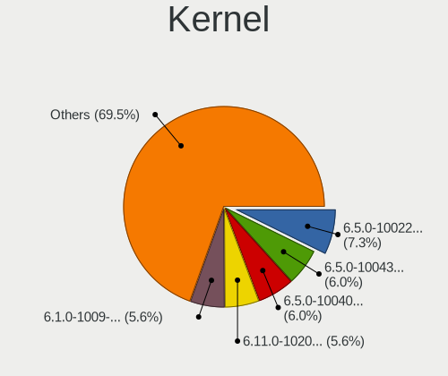
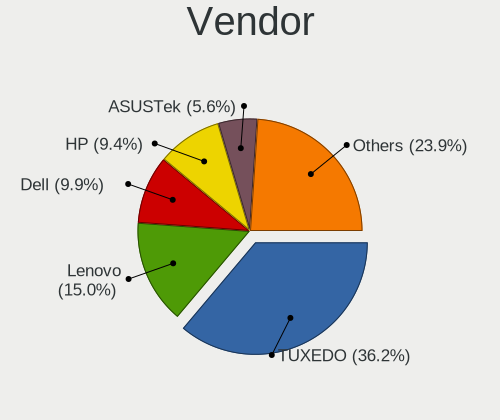
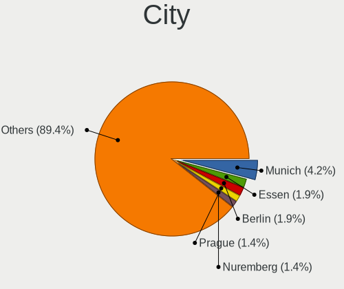
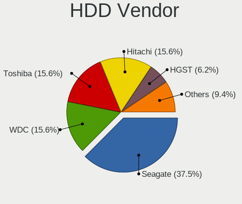
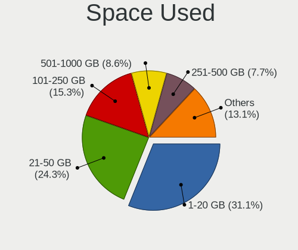
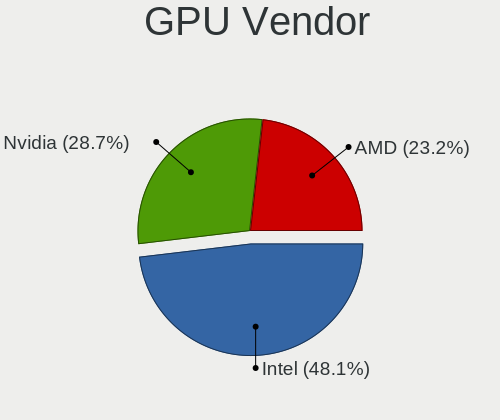
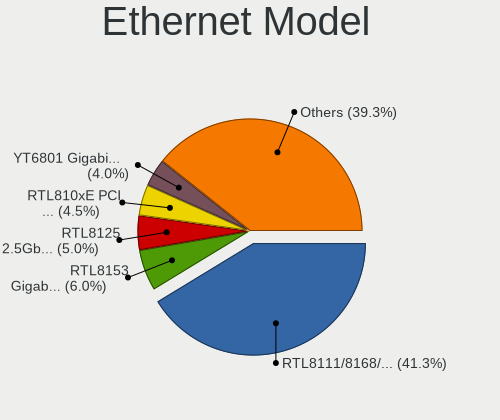

TUXEDO OS - Tested Hardware & Statistics (Notebooks)
----------------------------------------------------

A project to collect tested hardware configurations for TUXEDO OS.

Anyone can contribute to this report by the [hw-probe](https://github.com/linuxhw/hw-probe) tool:

    sudo -E hw-probe -all -upload

Please contribute! Especially if your hardware is rare.

Contents
--------

* [ Test Cases ](#test-cases)

* [ System ](#system)
  - [ OS                       ](#os)
  - [ OS Family                ](#os-family)
  - [ Kernel                   ](#kernel)
  - [ Kernel Family            ](#kernel-family)
  - [ Kernel Major Ver.        ](#kernel-major-ver)
  - [ Arch                     ](#arch)
  - [ DE                       ](#de)
  - [ Display Server           ](#display-server)
  - [ Display Manager          ](#display-manager)
  - [ OS Lang                  ](#os-lang)
  - [ Boot Mode                ](#boot-mode)
  - [ Filesystem               ](#filesystem)
  - [ Part. scheme             ](#part-scheme)
  - [ Dual Boot with Linux/BSD ](#dual-boot-with-linuxbsd)
  - [ Dual Boot (Win)          ](#dual-boot-win)

* [ Board ](#board)
  - [ Vendor                   ](#vendor)
  - [ Model                    ](#model)
  - [ Model Family             ](#model-family)
  - [ MFG Year                 ](#mfg-year)
  - [ Form Factor              ](#form-factor)
  - [ Secure Boot              ](#secure-boot)
  - [ Coreboot                 ](#coreboot)
  - [ RAM Size                 ](#ram-size)
  - [ RAM Used                 ](#ram-used)
  - [ Total Drives             ](#total-drives)
  - [ Has CD-ROM               ](#has-cd-rom)
  - [ Has Ethernet             ](#has-ethernet)
  - [ Has WiFi                 ](#has-wifi)
  - [ Has Bluetooth            ](#has-bluetooth)

* [ Location ](#location)
  - [ Country                  ](#country)
  - [ City                     ](#city)

* [ Drives ](#drives)
  - [ Drive Vendor             ](#drive-vendor)
  - [ Drive Model              ](#drive-model)
  - [ HDD Vendor               ](#hdd-vendor)
  - [ SSD Vendor               ](#ssd-vendor)
  - [ Drive Kind               ](#drive-kind)
  - [ Drive Connector          ](#drive-connector)
  - [ Drive Size               ](#drive-size)
  - [ Space Total              ](#space-total)
  - [ Space Used               ](#space-used)
  - [ Malfunc. Drives          ](#malfunc-drives)
  - [ Malfunc. Drive Vendor    ](#malfunc-drive-vendor)
  - [ Malfunc. HDD Vendor      ](#malfunc-hdd-vendor)
  - [ Malfunc. Drive Kind      ](#malfunc-drive-kind)
  - [ Failed Drives            ](#failed-drives)
  - [ Failed Drive Vendor      ](#failed-drive-vendor)
  - [ Drive Status             ](#drive-status)

* [ Storage controller ](#storage-controller)
  - [ Storage Vendor           ](#storage-vendor)
  - [ Storage Model            ](#storage-model)
  - [ Storage Kind             ](#storage-kind)

* [ Processor ](#processor)
  - [ CPU Vendor               ](#cpu-vendor)
  - [ CPU Model                ](#cpu-model)
  - [ CPU Model Family         ](#cpu-model-family)
  - [ CPU Cores                ](#cpu-cores)
  - [ CPU Sockets              ](#cpu-sockets)
  - [ CPU Threads              ](#cpu-threads)
  - [ CPU Op-Modes             ](#cpu-op-modes)
  - [ CPU Microcode            ](#cpu-microcode)
  - [ CPU Microarch            ](#cpu-microarch)

* [ Graphics ](#graphics)
  - [ GPU Vendor               ](#gpu-vendor)
  - [ GPU Model                ](#gpu-model)
  - [ GPU Combo                ](#gpu-combo)
  - [ GPU Driver               ](#gpu-driver)
  - [ GPU Memory               ](#gpu-memory)

* [ Monitor ](#monitor)
  - [ Monitor Vendor           ](#monitor-vendor)
  - [ Monitor Model            ](#monitor-model)
  - [ Monitor Resolution       ](#monitor-resolution)
  - [ Monitor Diagonal         ](#monitor-diagonal)
  - [ Monitor Width            ](#monitor-width)
  - [ Aspect Ratio             ](#aspect-ratio)
  - [ Monitor Area             ](#monitor-area)
  - [ Pixel Density            ](#pixel-density)
  - [ Multiple Monitors        ](#multiple-monitors)

* [ Network ](#network)
  - [ Net Controller Vendor    ](#net-controller-vendor)
  - [ Net Controller Model     ](#net-controller-model)
  - [ Wireless Vendor          ](#wireless-vendor)
  - [ Wireless Model           ](#wireless-model)
  - [ Ethernet Vendor          ](#ethernet-vendor)
  - [ Ethernet Model           ](#ethernet-model)
  - [ Net Controller Kind      ](#net-controller-kind)
  - [ Used Controller          ](#used-controller)
  - [ NICs                     ](#nics)
  - [ IPv6                     ](#ipv6)

* [ Bluetooth ](#bluetooth)
  - [ Bluetooth Vendor         ](#bluetooth-vendor)
  - [ Bluetooth Model          ](#bluetooth-model)

* [ Sound ](#sound)
  - [ Sound Vendor             ](#sound-vendor)
  - [ Sound Model              ](#sound-model)

* [ Memory ](#memory)
  - [ Memory Vendor            ](#memory-vendor)
  - [ Memory Model             ](#memory-model)
  - [ Memory Kind              ](#memory-kind)
  - [ Memory Form Factor       ](#memory-form-factor)
  - [ Memory Size              ](#memory-size)
  - [ Memory Speed             ](#memory-speed)

* [ Printers & scanners ](#printers--scanners)
  - [ Printer Vendor           ](#printer-vendor)
  - [ Printer Model            ](#printer-model)
  - [ Scanner Vendor           ](#scanner-vendor)
  - [ Scanner Model            ](#scanner-model)

* [ Camera ](#camera)
  - [ Camera Vendor            ](#camera-vendor)
  - [ Camera Model             ](#camera-model)

* [ Security ](#security)
  - [ Fingerprint Vendor       ](#fingerprint-vendor)
  - [ Fingerprint Model        ](#fingerprint-model)
  - [ Chipcard Vendor          ](#chipcard-vendor)
  - [ Chipcard Model           ](#chipcard-model)

* [ Unsupported ](#unsupported)
  - [ Unsupported Devices      ](#unsupported-devices)
  - [ Unsupported Device Types ](#unsupported-device-types)

Test Cases
----------

Total: 124

| Vendor        | Model                       | Probe                                                      | Date         |
|---------------|-----------------------------|------------------------------------------------------------|--------------|
| Lenovo        | Legion 5 15IAH7H 82RB       | [57d4ccc05e](https://linux-hardware.org/?probe=57d4ccc05e) | Dec 21, 2023 |
| TUXEDO        | Polaris AMD Gen5            | [84a93dbb91](https://linux-hardware.org/?probe=84a93dbb91) | Dec 19, 2023 |
| Apple         | MacBookAir6,2               | [31426d7740](https://linux-hardware.org/?probe=31426d7740) | Dec 15, 2023 |
| TUXEDO        | InfinityBook Pro Gen7 (M... | [627ee4cb32](https://linux-hardware.org/?probe=627ee4cb32) | Dec 11, 2023 |
| Acer          | Swift SF314-52              | [ed93047829](https://linux-hardware.org/?probe=ed93047829) | Dec 01, 2023 |
| Dell          | Inspiron 3558               | [936fe9e153](https://linux-hardware.org/?probe=936fe9e153) | Nov 28, 2023 |
| Lenovo        | ThinkPad P14s Gen 2a 21A... | [4c071e2ab0](https://linux-hardware.org/?probe=4c071e2ab0) | Nov 27, 2023 |
| TUXEDO        | Stellaris Intel Gen5        | [16cc1f3183](https://linux-hardware.org/?probe=16cc1f3183) | Nov 26, 2023 |
| Acer          | Nitro AN517-55              | [c34bec8c5f](https://linux-hardware.org/?probe=c34bec8c5f) | Nov 21, 2023 |
| HP            | Pavilion Laptop 15-eg0xx... | [3e6fcc9388](https://linux-hardware.org/?probe=3e6fcc9388) | Nov 19, 2023 |
| TUXEDO        | InfinityBook S 15/17 Gen... | [629ca85bd5](https://linux-hardware.org/?probe=629ca85bd5) | Nov 18, 2023 |
| TUXEDO        | InfinityBook S 15/17 Gen... | [1a6683483d](https://linux-hardware.org/?probe=1a6683483d) | Nov 18, 2023 |
| TUXEDO        | Polaris 15 AMD Gen1         | [a08b139fa8](https://linux-hardware.org/?probe=a08b139fa8) | Nov 12, 2023 |
| Lenovo        | ThinkPad P50 20EQS42M00     | [f4761a87e1](https://linux-hardware.org/?probe=f4761a87e1) | Nov 06, 2023 |
| TUXEDO        | Pulse 15 Gen1               | [4a5e89566c](https://linux-hardware.org/?probe=4a5e89566c) | Nov 05, 2023 |
| Lenovo        | IdeaPad Pro 5 14APH8 83A... | [0845a0ec43](https://linux-hardware.org/?probe=0845a0ec43) | Nov 03, 2023 |
| TUXEDO        | Aura 15 Gen2                | [ca743b4e40](https://linux-hardware.org/?probe=ca743b4e40) | Nov 01, 2023 |
| Dell          | Precision 5480              | [0d66f24fe1](https://linux-hardware.org/?probe=0d66f24fe1) | Oct 25, 2023 |
| Notebook      | NP5x_NP6x_NP7xHP            | [017d43654d](https://linux-hardware.org/?probe=017d43654d) | Oct 22, 2023 |
| TUXEDO        | XMG FUSION 15 (XFU15L19)    | [af44d01ae9](https://linux-hardware.org/?probe=af44d01ae9) | Oct 19, 2023 |
| Dell          | Latitude E6540              | [78c4b71781](https://linux-hardware.org/?probe=78c4b71781) | Oct 04, 2023 |
| Dell          | Latitude E6540              | [290b4bd42e](https://linux-hardware.org/?probe=290b4bd42e) | Oct 03, 2023 |
| Lenovo        | ThinkBook 14 G2 ARE 20VF    | [886b5140ec](https://linux-hardware.org/?probe=886b5140ec) | Oct 03, 2023 |
| Lenovo        | ThinkPad T490s 20NYS3Y60... | [294e5069a4](https://linux-hardware.org/?probe=294e5069a4) | Oct 01, 2023 |
| Lenovo        | ThinkPad T490s 20NYS3Y60... | [9452219aa3](https://linux-hardware.org/?probe=9452219aa3) | Oct 01, 2023 |
| MSI           | Prestige 15 A10SC           | [6e53cd8a65](https://linux-hardware.org/?probe=6e53cd8a65) | Sep 30, 2023 |
| Metabox       | Prime-X X170KM              | [8ab33a8bd3](https://linux-hardware.org/?probe=8ab33a8bd3) | Sep 30, 2023 |
| TUXEDO        | Stellaris Intel Gen5        | [6d981e4890](https://linux-hardware.org/?probe=6d981e4890) | Sep 29, 2023 |
| Dell          | Inspiron 14 5420            | [ade3d11822](https://linux-hardware.org/?probe=ade3d11822) | Sep 24, 2023 |
| Schenker      | VISION 15 E23 (SVS15E23)    | [d905d3589d](https://linux-hardware.org/?probe=d905d3589d) | Sep 24, 2023 |
| Lenovo        | ThinkBook 14 G2 ARE 20VF    | [147b087f20](https://linux-hardware.org/?probe=147b087f20) | Sep 23, 2023 |
| Chuwi         | MiniBook X                  | [50d0819b3b](https://linux-hardware.org/?probe=50d0819b3b) | Sep 20, 2023 |
| TUXEDO        | InfinityBook Pro Gen7 (M... | [a4f7b61af6](https://linux-hardware.org/?probe=a4f7b61af6) | Sep 18, 2023 |
| HP            | Laptop 15-db1xxx            | [804223592d](https://linux-hardware.org/?probe=804223592d) | Sep 17, 2023 |
| HP            | Pavilion dv5                | [2c55682860](https://linux-hardware.org/?probe=2c55682860) | Sep 15, 2023 |
| HP            | Pavilion dv5                | [8d25f8969b](https://linux-hardware.org/?probe=8d25f8969b) | Sep 15, 2023 |
| Lenovo        | ThinkPad P50 20EQS37F00     | [0eaf502e28](https://linux-hardware.org/?probe=0eaf502e28) | Sep 12, 2023 |
| TUXEDO        | Stellaris Intel Gen5        | [a28ff634a0](https://linux-hardware.org/?probe=a28ff634a0) | Sep 11, 2023 |
| TUXEDO        | Stellaris Intel Gen5        | [28283f9fcf](https://linux-hardware.org/?probe=28283f9fcf) | Sep 11, 2023 |
| HP            | ZBook 14u G5                | [9ff135c2a6](https://linux-hardware.org/?probe=9ff135c2a6) | Sep 09, 2023 |
| Apple         | MacBookPro9,2               | [abb6dcaeb2](https://linux-hardware.org/?probe=abb6dcaeb2) | Sep 09, 2023 |
| Apple         | MacBookPro9,2               | [1e6219cb6e](https://linux-hardware.org/?probe=1e6219cb6e) | Sep 09, 2023 |
| TUXEDO        | InfinityBook S 15 Gen6      | [c53e992822](https://linux-hardware.org/?probe=c53e992822) | Aug 26, 2023 |
| TUXEDO        | Polaris AMD Gen3 (CZN)      | [b6e2112ccb](https://linux-hardware.org/?probe=b6e2112ccb) | Aug 13, 2023 |
| Dell          | Precision 7750              | [cebb7f5165](https://linux-hardware.org/?probe=cebb7f5165) | Aug 06, 2023 |
| TUXEDO        | N7x0WU                      | [1c2cb06178](https://linux-hardware.org/?probe=1c2cb06178) | Aug 06, 2023 |
| TUXEDO        | XMG FUSION 15 (XFU15L19)    | [64e640ff2b](https://linux-hardware.org/?probe=64e640ff2b) | Aug 04, 2023 |
| TUXEDO        | Aura 15 Gen2                | [07d668ee3d](https://linux-hardware.org/?probe=07d668ee3d) | Aug 03, 2023 |
| TUXEDO        | InfinityBook Pro Gen7 (M... | [c6078d0836](https://linux-hardware.org/?probe=c6078d0836) | Aug 02, 2023 |
| Lenovo        | ThinkPad E580 20KS003SUS    | [9b8485b740](https://linux-hardware.org/?probe=9b8485b740) | Aug 01, 2023 |
| HP            | Notebook                    | [beef8e7fce](https://linux-hardware.org/?probe=beef8e7fce) | Jul 25, 2023 |
| HP            | Notebook                    | [4746f66332](https://linux-hardware.org/?probe=4746f66332) | Jul 23, 2023 |
| Lenovo        | G580 20150                  | [bcd1c01ad6](https://linux-hardware.org/?probe=bcd1c01ad6) | Jul 15, 2023 |
| Lenovo        | G580 20150                  | [390008fe3c](https://linux-hardware.org/?probe=390008fe3c) | Jul 15, 2023 |
| HP            | Laptop 15-dw3xxx            | [fd0926d15b](https://linux-hardware.org/?probe=fd0926d15b) | Jul 14, 2023 |
| TUXEDO        | InfinityBook S 15/17 Gen... | [26fda3b894](https://linux-hardware.org/?probe=26fda3b894) | Jul 14, 2023 |
| Dell          | Latitude E6530              | [25cbd87821](https://linux-hardware.org/?probe=25cbd87821) | Jul 13, 2023 |
| Apple         | MacBookPro8,1               | [29a9ad60a6](https://linux-hardware.org/?probe=29a9ad60a6) | Jul 13, 2023 |
| TUXEDO        | InfinityBook S 15/17 Gen... | [2015dd83cb](https://linux-hardware.org/?probe=2015dd83cb) | Jul 12, 2023 |
| TUXEDO        | Stellaris AMD Gen3 (CZN)    | [54ac55c49e](https://linux-hardware.org/?probe=54ac55c49e) | Jul 07, 2023 |
| TUXEDO        | Stellaris AMD Gen3 (CZN)    | [296474a1b1](https://linux-hardware.org/?probe=296474a1b1) | Jul 07, 2023 |
| TUXEDO        | Book XUX7 Gen13             | [e480e61359](https://linux-hardware.org/?probe=e480e61359) | Jul 06, 2023 |
| TUXEDO        | InfinityBook S 15/17 Gen... | [3d599df965](https://linux-hardware.org/?probe=3d599df965) | Jul 02, 2023 |
| TUXEDO        | Pulse 15 Gen1               | [b15b3b6025](https://linux-hardware.org/?probe=b15b3b6025) | Jun 30, 2023 |
| TUXEDO        | InfinityBook S 15/17 Gen... | [ed4a581e3e](https://linux-hardware.org/?probe=ed4a581e3e) | Jun 28, 2023 |
| MSI           | GE75 Raider 10SF            | [c2a5aeb291](https://linux-hardware.org/?probe=c2a5aeb291) | Jun 28, 2023 |
| TUXEDO        | P64_HJ,HK1                  | [4c542d50e7](https://linux-hardware.org/?probe=4c542d50e7) | Jun 27, 2023 |
| BESSTAR Te... | X400                        | [8e98b345cf](https://linux-hardware.org/?probe=8e98b345cf) | Jun 26, 2023 |
| Acer          | Swift SFX14-51G             | [c8f3981a52](https://linux-hardware.org/?probe=c8f3981a52) | Jun 23, 2023 |
| Lenovo        | Yoga S740-15IRH 81NX        | [6fb60cf84a](https://linux-hardware.org/?probe=6fb60cf84a) | Jun 18, 2023 |
| Lenovo        | ThinkPad P1 Gen 3 20TJS1... | [c47936b50c](https://linux-hardware.org/?probe=c47936b50c) | Jun 09, 2023 |
| Dell          | Venue 11 Pro 7130 vPro      | [c16266c1c9](https://linux-hardware.org/?probe=c16266c1c9) | Jun 04, 2023 |
| Apple         | MacBookAir7,2               | [f75fb35204](https://linux-hardware.org/?probe=f75fb35204) | May 28, 2023 |
| ASUSTek       | K55VJ                       | [66c9773a5f](https://linux-hardware.org/?probe=66c9773a5f) | May 26, 2023 |
| ASUSTek       | K55VJ                       | [65cc5e45b0](https://linux-hardware.org/?probe=65cc5e45b0) | May 26, 2023 |
| Lenovo        | G580 20150                  | [5acf485cbf](https://linux-hardware.org/?probe=5acf485cbf) | May 20, 2023 |
| TUXEDO        | Polaris 15 AMD Gen1         | [81e75bd6e7](https://linux-hardware.org/?probe=81e75bd6e7) | May 11, 2023 |
| Lenovo        | IdeaPad N581 7505           | [5d340c1aa2](https://linux-hardware.org/?probe=5d340c1aa2) | May 04, 2023 |
| HP            | Pavilion dv6                | [be01072653](https://linux-hardware.org/?probe=be01072653) | May 03, 2023 |
| TUXEDO        | Stellaris/Polaris AMD Ge... | [756500f10b](https://linux-hardware.org/?probe=756500f10b) | May 03, 2023 |
| HP            | Pavilion dv6                | [87f0c054fa](https://linux-hardware.org/?probe=87f0c054fa) | May 03, 2023 |
| TUXEDO        | InfinityBook Pro 14 Gen6    | [58bb30861d](https://linux-hardware.org/?probe=58bb30861d) | Apr 29, 2023 |
| Dell          | Inspiron 16 5630            | [7bfe5bb892](https://linux-hardware.org/?probe=7bfe5bb892) | Apr 27, 2023 |
| Dell          | Latitude 7530               | [17140d3871](https://linux-hardware.org/?probe=17140d3871) | Apr 24, 2023 |
| TUXEDO        | Pulse 15 Gen2               | [fd2ad16b59](https://linux-hardware.org/?probe=fd2ad16b59) | Apr 22, 2023 |
| Dell          | Vostro 3550                 | [3b77631ed6](https://linux-hardware.org/?probe=3b77631ed6) | Apr 04, 2023 |
| Unknown       | Unknown                     | [22c0e4cdec](https://linux-hardware.org/?probe=22c0e4cdec) | Apr 02, 2023 |
| Lenovo        | ThinkPad T490 20N3SBU219    | [b8e8125150](https://linux-hardware.org/?probe=b8e8125150) | Mar 27, 2023 |
| TUXEDO        | InfinityBook Pro Gen7 (M... | [885b757cdc](https://linux-hardware.org/?probe=885b757cdc) | Mar 24, 2023 |
| TUXEDO        | InfinityBook Pro Gen7 (M... | [5e01f2c134](https://linux-hardware.org/?probe=5e01f2c134) | Mar 22, 2023 |
| TUXEDO        | Polaris AMD Gen3 (CZN)      | [0db668b5ec](https://linux-hardware.org/?probe=0db668b5ec) | Mar 18, 2023 |
| TUXEDO        | InfinityBook S 15/17 Gen... | [094b530ce7](https://linux-hardware.org/?probe=094b530ce7) | Mar 18, 2023 |
| TUXEDO        | Pulse 15 Gen1               | [e7dd32b931](https://linux-hardware.org/?probe=e7dd32b931) | Mar 15, 2023 |
| TUXEDO        | Pulse 15 Gen1               | [557a08d242](https://linux-hardware.org/?probe=557a08d242) | Mar 15, 2023 |
| TUXEDO        | InfinityBook Pro 14 Gen6    | [3fcbfecb5a](https://linux-hardware.org/?probe=3fcbfecb5a) | Mar 14, 2023 |
| Dell          | Precision 7720              | [dbe0d4c5c4](https://linux-hardware.org/?probe=dbe0d4c5c4) | Mar 12, 2023 |
| Dell          | Vostro 3550                 | [40a0328a5f](https://linux-hardware.org/?probe=40a0328a5f) | Mar 11, 2023 |
| TUXEDO        | XMG FUSION 15 (XFU15L19)    | [3cde6f345c](https://linux-hardware.org/?probe=3cde6f345c) | Mar 10, 2023 |
| Fujitsu       | LIFEBOOK U7412              | [980dd72471](https://linux-hardware.org/?probe=980dd72471) | Mar 06, 2023 |
| TUXEDO        | Pulse 15 Gen2               | [7a21cf8349](https://linux-hardware.org/?probe=7a21cf8349) | Mar 05, 2023 |
| TUXEDO        | InfinityBook Pro Gen7 (M... | [20d14c7576](https://linux-hardware.org/?probe=20d14c7576) | Mar 04, 2023 |
| Lenovo        | G50-80 80E5                 | [d7bb021829](https://linux-hardware.org/?probe=d7bb021829) | Feb 27, 2023 |
| Dell          | Vostro 3550                 | [1e1da6a575](https://linux-hardware.org/?probe=1e1da6a575) | Feb 24, 2023 |
| Dell          | Vostro 3550                 | [497a8d66e5](https://linux-hardware.org/?probe=497a8d66e5) | Feb 22, 2023 |
| Dell          | Precision 7720              | [2f7837d5b6](https://linux-hardware.org/?probe=2f7837d5b6) | Feb 21, 2023 |
| TUXEDO        | Stellaris/Polaris AMD Ge... | [ccd78843fc](https://linux-hardware.org/?probe=ccd78843fc) | Feb 16, 2023 |
| HP            | EliteBook 2570p             | [ed14b057dd](https://linux-hardware.org/?probe=ed14b057dd) | Feb 09, 2023 |
| TUXEDO        | InfinityBook Pro Gen7 (M... | [4a2fcb6bd0](https://linux-hardware.org/?probe=4a2fcb6bd0) | Jan 31, 2023 |
| HP            | OMEN Laptop 15-en0xxx       | [e163d98802](https://linux-hardware.org/?probe=e163d98802) | Jan 28, 2023 |
| ASUSTek       | Zephyrus G GU502DU_GA502... | [fa53a29f7e](https://linux-hardware.org/?probe=fa53a29f7e) | Jan 01, 2023 |
| ASUSTek       | ROG Strix G713RW_G713RW     | [731b31c845](https://linux-hardware.org/?probe=731b31c845) | Dec 02, 2022 |
| TUXEDO        | N13xWU                      | [55935f091d](https://linux-hardware.org/?probe=55935f091d) | Dec 01, 2022 |
| TUXEDO        | Unknown                     | [fd06ca029c](https://linux-hardware.org/?probe=fd06ca029c) | Nov 29, 2022 |
| Lenovo        | ThinkPad T460 20FMS07000    | [5043f6c54e](https://linux-hardware.org/?probe=5043f6c54e) | Nov 20, 2022 |
| HP            | EliteBook 820 G2            | [5d82e9f6ac](https://linux-hardware.org/?probe=5d82e9f6ac) | Nov 19, 2022 |
| HP            | EliteBook 820 G2            | [9d20af2c30](https://linux-hardware.org/?probe=9d20af2c30) | Nov 19, 2022 |
| Lenovo        | ThinkPad X200 Tablet 745... | [d58eb8b2f0](https://linux-hardware.org/?probe=d58eb8b2f0) | Oct 30, 2022 |
| Lenovo        | ThinkPad X200 Tablet 745... | [032bc01698](https://linux-hardware.org/?probe=032bc01698) | Oct 30, 2022 |
| TUXEDO        | Unknown                     | [99555fc4eb](https://linux-hardware.org/?probe=99555fc4eb) | Oct 28, 2022 |
| Lenovo        | Legion 5 15ACH6H 82JU       | [251892471f](https://linux-hardware.org/?probe=251892471f) | Oct 26, 2022 |
| ASUSTek       | BU201LAV                    | [9d1fe7cb6f](https://linux-hardware.org/?probe=9d1fe7cb6f) | Oct 19, 2022 |
| Apple         | MacBookPro8,1               | [36e033aa01](https://linux-hardware.org/?probe=36e033aa01) | Oct 09, 2022 |
| Notebook      | W65_W67RB                   | [dc57cb32d4](https://linux-hardware.org/?probe=dc57cb32d4) | Oct 07, 2022 |
| Acer          | TravelMate 8572T            | [6abaaf4aa6](https://linux-hardware.org/?probe=6abaaf4aa6) | Oct 03, 2022 |

System
------

OS
--

Installed operating systems

| Name            | Notebooks | Percent |
|-----------------|-----------|---------|
| TUXEDO OS 22.04 | 96        | 100%    |

OS Family
---------

OS without a version

| Name      | Notebooks | Percent |
|-----------|-----------|---------|
| TUXEDO OS | 96        | 100%    |

Kernel
------

Version of the Linux kernel

| Version              | Notebooks | Percent |
|----------------------|-----------|---------|
| 6.1.0-1009-tuxedo    | 13        | 12.5%   |
| 6.2.0-10022-tuxedo   | 11        | 10.58%  |
| 6.2.0-10018-tuxedo   | 10        | 9.62%   |
| 6.2.0-10005-tuxedo   | 9         | 8.65%   |
| 6.2.0-10011-tuxedo   | 8         | 7.69%   |
| 6.2.0-10007-tuxedo   | 8         | 7.69%   |
| 6.5.0-10008-tuxedo   | 7         | 6.73%   |
| 6.2.0-10010-tuxedo   | 6         | 5.77%   |
| 6.5.0-10010-tuxedo   | 4         | 3.85%   |
| 6.5.0-10006-tuxedo   | 4         | 3.85%   |
| 5.15.0-10058-tuxedo  | 4         | 3.85%   |
| 5.15.0-10048-tuxedo  | 4         | 3.85%   |
| 6.2.0-10027-tuxedo   | 3         | 2.88%   |
| 5.15.0-10053-tuxedo  | 3         | 2.88%   |
| 5.15.0-10052-tuxedo  | 3         | 2.88%   |
| 5.15.0-10050-tuxedo  | 2         | 1.92%   |
| 6.5.4-060504-generic | 1         | 0.96%   |
| 6.2.0-10014-tuxedo   | 1         | 0.96%   |
| 6.0.0-1010-oem       | 1         | 0.96%   |
| 5.15.0-10057-tuxedo  | 1         | 0.96%   |
| 5.15.0-10056-tuxedo  | 1         | 0.96%   |

Kernel Family
-------------

Linux kernel without a distro release

| Version | Notebooks | Percent |
|---------|-----------|---------|
| 6.2.0   | 56        | 53.85%  |
| 5.15.0  | 18        | 17.31%  |
| 6.5.0   | 15        | 14.42%  |
| 6.1.0   | 13        | 12.5%   |
| 6.5.4   | 1         | 0.96%   |
| 6.0.0   | 1         | 0.96%   |

Kernel Major Ver.
-----------------

Linux kernel major version

| Version | Notebooks | Percent |
|---------|-----------|---------|
| 6.2     | 56        | 53.85%  |
| 5.15    | 18        | 17.31%  |
| 6.5     | 16        | 15.38%  |
| 6.1     | 13        | 12.5%   |
| 6.0     | 1         | 0.96%   |

Arch
----

OS architecture (x86_64, i586, etc.)

| Name   | Notebooks | Percent |
|--------|-----------|---------|
| x86_64 | 96        | 100%    |

DE
--

Desktop Environment

| Name | Notebooks | Percent |
|------|-----------|---------|
| KDE5 | 96        | 100%    |

Display Server
--------------

X11 or Wayland

| Name    | Notebooks | Percent |
|---------|-----------|---------|
| X11     | 95        | 97.94%  |
| Wayland | 2         | 2.06%   |

Display Manager
---------------

SDDM, LightDM, etc.

| Name    | Notebooks | Percent |
|---------|-----------|---------|
| Unknown | 74        | 75.51%  |
| SDDM    | 24        | 24.49%  |

OS Lang
-------

Language

| Lang  | Notebooks | Percent |
|-------|-----------|---------|
| de_DE | 43        | 44.79%  |
| en_US | 24        | 25%     |
| en_GB | 8         | 8.33%   |
| en_AU | 3         | 3.13%   |
| pl_PL | 2         | 2.08%   |
| nb_NO | 2         | 2.08%   |
| it_IT | 2         | 2.08%   |
| hu_HU | 2         | 2.08%   |
| fr_FR | 2         | 2.08%   |
| en_AG | 2         | 2.08%   |
| pt_PT | 1         | 1.04%   |
| pt_BR | 1         | 1.04%   |
| et_EE | 1         | 1.04%   |
| es_ES | 1         | 1.04%   |
| en_ZA | 1         | 1.04%   |
| en_DK | 1         | 1.04%   |

Boot Mode
---------

EFI or BIOS

| Mode | Notebooks | Percent |
|------|-----------|---------|
| BIOS | 76        | 78.35%  |
| EFI  | 21        | 21.65%  |

Filesystem
----------

Type of filesystem

| Type    | Notebooks | Percent |
|---------|-----------|---------|
| Ext4    | 83        | 86.46%  |
| Btrfs   | 7         | 7.29%   |
| Tmpfs   | 4         | 4.17%   |
| Overlay | 2         | 2.08%   |

Part. scheme
------------

Scheme of partitioning

| Type    | Notebooks | Percent |
|---------|-----------|---------|
| Unknown | 74        | 75.51%  |
| GPT     | 22        | 22.45%  |
| MBR     | 2         | 2.04%   |

Dual Boot with Linux/BSD
------------------------

Hosting more than one Linux/BSD

| Dual boot | Notebooks | Percent |
|-----------|-----------|---------|
| No        | 93        | 95.88%  |
| Yes       | 4         | 4.12%   |

Dual Boot (Win)
---------------

Hosting Linux and Windows

| Dual boot | Notebooks | Percent |
|-----------|-----------|---------|
| No        | 91        | 93.81%  |
| Yes       | 6         | 6.19%   |

Board
-----

Vendor
------

Motherboard manufacturer

| Name             | Notebooks | Percent |
|------------------|-----------|---------|
| TUXEDO           | 36        | 37.5%   |
| Lenovo           | 16        | 16.67%  |
| Dell             | 12        | 12.5%   |
| Hewlett-Packard  | 9         | 9.38%   |
| Apple            | 5         | 5.21%   |
| ASUSTek Computer | 4         | 4.17%   |
| Acer             | 4         | 4.17%   |
| Notebook         | 2         | 2.08%   |
| MSI              | 2         | 2.08%   |
| Schenker         | 1         | 1.04%   |
| Metabox          | 1         | 1.04%   |
| Fujitsu          | 1         | 1.04%   |
| Chuwi            | 1         | 1.04%   |
| BESSTAR Tech     | 1         | 1.04%   |
| Unknown          | 1         | 1.04%   |

Model
-----

Motherboard model

| Name                                   | Notebooks | Percent |
|----------------------------------------|-----------|---------|
| TUXEDO InfinityBook S 15/17 Gen7       | 4         | 4.17%   |
| TUXEDO Stellaris Intel Gen5            | 3         | 3.13%   |
| TUXEDO InfinityBook Pro Gen7 (MK1)     | 3         | 3.13%   |
| Unknown                                | 3         | 3.13%   |
| TUXEDO XMG FUSION 15 (XFU15L19)        | 2         | 2.08%   |
| TUXEDO Stellaris/Polaris AMD Gen4      | 2         | 2.08%   |
| TUXEDO Pulse 15 Gen2                   | 2         | 2.08%   |
| TUXEDO Pulse 15 Gen1                   | 2         | 2.08%   |
| TUXEDO Polaris 15 AMD Gen1             | 2         | 2.08%   |
| TUXEDO InfinityBook Pro Gen7 (MK2)     | 2         | 2.08%   |
| TUXEDO InfinityBook Pro 14 Gen6        | 2         | 2.08%   |
| TUXEDO Aura 15 Gen2                    | 2         | 2.08%   |
| Dell Latitude E6540                    | 2         | 2.08%   |
| Apple MacBookPro8,1                    | 2         | 2.08%   |
| TUXEDO Stellaris AMD Gen3 (CZN)        | 1         | 1.04%   |
| TUXEDO Polaris AMD Gen5                | 1         | 1.04%   |
| TUXEDO Polaris AMD Gen3 (CZN)          | 1         | 1.04%   |
| TUXEDO P64_HJ,HK1                      | 1         | 1.04%   |
| TUXEDO N7x0WU                          | 1         | 1.04%   |
| TUXEDO N13xWU                          | 1         | 1.04%   |
| TUXEDO InfinityBook S 15 Gen6          | 1         | 1.04%   |
| TUXEDO Book XUX7 Gen13                 | 1         | 1.04%   |
| Schenker VISION 15 E23 (SVS15E23)      | 1         | 1.04%   |
| Notebook W65_W67RB                     | 1         | 1.04%   |
| Notebook NP5x_NP6x_NP7xHP              | 1         | 1.04%   |
| MSI Prestige 15 A10SC                  | 1         | 1.04%   |
| MSI GE75 Raider 10SF                   | 1         | 1.04%   |
| Metabox Prime-X X170KM                 | 1         | 1.04%   |
| Lenovo Yoga S740-15IRH 81NX            | 1         | 1.04%   |
| Lenovo ThinkPad X200 Tablet 7450WN9    | 1         | 1.04%   |
| Lenovo ThinkPad T490s 20NYS3Y600       | 1         | 1.04%   |
| Lenovo ThinkPad T490 20N3SBU219        | 1         | 1.04%   |
| Lenovo ThinkPad P50 20EQS42M00         | 1         | 1.04%   |
| Lenovo ThinkPad P50 20EQS37F00         | 1         | 1.04%   |
| Lenovo ThinkPad P14s Gen 2a 21A1S00D00 | 1         | 1.04%   |
| Lenovo ThinkPad P1 Gen 3 20TJS1W700    | 1         | 1.04%   |
| Lenovo ThinkPad E580 20KS003SUS        | 1         | 1.04%   |
| Lenovo ThinkBook 14 G2 ARE 20VF        | 1         | 1.04%   |
| Lenovo Legion 5 15IAH7H 82RB           | 1         | 1.04%   |
| Lenovo Legion 5 15ACH6H 82JU           | 1         | 1.04%   |

Model Family
------------

Motherboard model prefix

| Name                | Notebooks | Percent |
|---------------------|-----------|---------|
| TUXEDO InfinityBook | 12        | 12.5%   |
| Lenovo ThinkPad     | 8         | 8.33%   |
| TUXEDO Stellaris    | 6         | 6.25%   |
| TUXEDO Pulse        | 4         | 4.17%   |
| TUXEDO Polaris      | 4         | 4.17%   |
| Dell Latitude       | 4         | 4.17%   |
| Dell Precision      | 3         | 3.13%   |
| Dell Inspiron       | 3         | 3.13%   |
| Unknown             | 3         | 3.13%   |
| TUXEDO XMG          | 2         | 2.08%   |
| TUXEDO Aura         | 2         | 2.08%   |
| Lenovo Legion       | 2         | 2.08%   |
| Lenovo IdeaPad      | 2         | 2.08%   |
| HP Pavilion         | 2         | 2.08%   |
| HP Laptop           | 2         | 2.08%   |
| HP EliteBook        | 2         | 2.08%   |
| Apple MacBookPro8   | 2         | 2.08%   |
| Acer Swift          | 2         | 2.08%   |
| TUXEDO P64          | 1         | 1.04%   |
| TUXEDO N7x0WU       | 1         | 1.04%   |
| TUXEDO N13xWU       | 1         | 1.04%   |
| TUXEDO Book         | 1         | 1.04%   |
| Schenker VISION     | 1         | 1.04%   |
| Notebook W65        | 1         | 1.04%   |
| Notebook NP5x       | 1         | 1.04%   |
| MSI Prestige        | 1         | 1.04%   |
| MSI GE75            | 1         | 1.04%   |
| Metabox Prime-X     | 1         | 1.04%   |
| Lenovo Yoga         | 1         | 1.04%   |
| Lenovo ThinkBook    | 1         | 1.04%   |
| Lenovo G580         | 1         | 1.04%   |
| Lenovo G50-80       | 1         | 1.04%   |
| HP ZBook            | 1         | 1.04%   |
| HP OMEN             | 1         | 1.04%   |
| HP Notebook         | 1         | 1.04%   |
| Fujitsu LIFEBOOK    | 1         | 1.04%   |
| Dell Vostro         | 1         | 1.04%   |
| Dell Venue          | 1         | 1.04%   |
| Chuwi MiniBook      | 1         | 1.04%   |
| BESSTAR Tech X400   | 1         | 1.04%   |

MFG Year
--------

Motherboard manufacture year

| Year | Notebooks | Percent |
|------|-----------|---------|
| 2022 | 24        | 25%     |
| 2020 | 13        | 13.54%  |
| 2023 | 9         | 9.38%   |
| 2021 | 8         | 8.33%   |
| 2019 | 8         | 8.33%   |
| 2015 | 8         | 8.33%   |
| 2012 | 6         | 6.25%   |
| 2017 | 5         | 5.21%   |
| 2013 | 3         | 3.13%   |
| 2011 | 3         | 3.13%   |
| 2018 | 2         | 2.08%   |
| 2014 | 2         | 2.08%   |
| 2008 | 2         | 2.08%   |
| 2010 | 1         | 1.04%   |
| 2009 | 1         | 1.04%   |
| 2007 | 1         | 1.04%   |

Form Factor
-----------

Physical design of the computer

| Name     | Notebooks | Percent |
|----------|-----------|---------|
| Notebook | 96        | 100%    |

Secure Boot
-----------

Enabled or disabled

| State    | Notebooks | Percent |
|----------|-----------|---------|
| Disabled | 96        | 100%    |

Coreboot
--------

Have coreboot on board

| Used | Notebooks | Percent |
|------|-----------|---------|
| No   | 96        | 100%    |

RAM Size
--------

Total RAM memory

| Size in GB  | Notebooks | Percent |
|-------------|-----------|---------|
| 32.01-64.0  | 23        | 23.96%  |
| 16.01-24.0  | 18        | 18.75%  |
| 8.01-16.0   | 17        | 17.71%  |
| 4.01-8.0    | 14        | 14.58%  |
| 64.01-256.0 | 13        | 13.54%  |
| 3.01-4.0    | 6         | 6.25%   |
| 24.01-32.0  | 5         | 5.21%   |

RAM Used
--------

Used RAM memory

| Used GB    | Notebooks | Percent |
|------------|-----------|---------|
| 4.01-8.0   | 37        | 36.27%  |
| 2.01-3.0   | 23        | 22.55%  |
| 1.01-2.0   | 18        | 17.65%  |
| 3.01-4.0   | 13        | 12.75%  |
| 8.01-16.0  | 8         | 7.84%   |
| 16.01-24.0 | 3         | 2.94%   |

Total Drives
------------

Number of drives on board

| Drives | Notebooks | Percent |
|--------|-----------|---------|
| 1      | 56        | 57.73%  |
| 2      | 32        | 32.99%  |
| 3      | 7         | 7.22%   |
| 4      | 1         | 1.03%   |
| 0      | 1         | 1.03%   |

Has CD-ROM
----------

Has CD-ROM on board

| Presented | Notebooks | Percent |
|-----------|-----------|---------|
| No        | 77        | 80.21%  |
| Yes       | 19        | 19.79%  |

Has Ethernet
------------

Has Ethernet on board

| Presented | Notebooks | Percent |
|-----------|-----------|---------|
| Yes       | 79        | 82.29%  |
| No        | 17        | 17.71%  |

Has WiFi
--------

Has WiFi module

| Presented | Notebooks | Percent |
|-----------|-----------|---------|
| Yes       | 95        | 98.96%  |
| No        | 1         | 1.04%   |

Has Bluetooth
-------------

Has Bluetooth module

| Presented | Notebooks | Percent |
|-----------|-----------|---------|
| Yes       | 87        | 90.63%  |
| No        | 9         | 9.38%   |

Location
--------

Country
-------

Geographic location (country)

| Country                | Notebooks | Percent |
|------------------------|-----------|---------|
| Germany                | 48        | 50%     |
| USA                    | 14        | 14.58%  |
| UK                     | 4         | 4.17%   |
| Switzerland            | 3         | 3.13%   |
| France                 | 3         | 3.13%   |
| Australia              | 3         | 3.13%   |
| Spain                  | 2         | 2.08%   |
| Portugal               | 2         | 2.08%   |
| Poland                 | 2         | 2.08%   |
| Norway                 | 2         | 2.08%   |
| Austria                | 2         | 2.08%   |
| Turkey                 | 1         | 1.04%   |
| Tunisia                | 1         | 1.04%   |
| South Africa           | 1         | 1.04%   |
| Netherlands            | 1         | 1.04%   |
| Hungary                | 1         | 1.04%   |
| Estonia                | 1         | 1.04%   |
| Denmark                | 1         | 1.04%   |
| Czechia                | 1         | 1.04%   |
| Bulgaria               | 1         | 1.04%   |
| Brazil                 | 1         | 1.04%   |
| Bosnia and Herzegovina | 1         | 1.04%   |

City
----

Geographic location (city)

| City                   | Notebooks | Percent |
|------------------------|-----------|---------|
| Munich                 | 6         | 6.19%   |
| Vienna                 | 2         | 2.06%   |
| Schweinfurt            | 2         | 2.06%   |
| Nuremberg              | 2         | 2.06%   |
| Lucerne                | 2         | 2.06%   |
| Langevag               | 2         | 2.06%   |
| Kiel                   | 2         | 2.06%   |
| Hamburg                | 2         | 2.06%   |
| Brisbane               | 2         | 2.06%   |
| Berlin                 | 2         | 2.06%   |
| Zurich                 | 1         | 1.03%   |
| Zabrze                 | 1         | 1.03%   |
| Wembley                | 1         | 1.03%   |
| Watertown              | 1         | 1.03%   |
| Warsaw                 | 1         | 1.03%   |
| Walsall                | 1         | 1.03%   |
| Venlo                  | 1         | 1.03%   |
| Vallejo                | 1         | 1.03%   |
| Teslic                 | 1         | 1.03%   |
| Tallinn                | 1         | 1.03%   |
| Stuttgart              | 1         | 1.03%   |
| Stockstadt am Main     | 1         | 1.03%   |
| Sousse                 | 1         | 1.03%   |
| Solymar                | 1         | 1.03%   |
| Solingen               | 1         | 1.03%   |
| Sistov                 | 1         | 1.03%   |
| Seattle                | 1         | 1.03%   |
| Schwarzenberg          | 1         | 1.03%   |
| Santa Cruz de Tenerife | 1         | 1.03%   |
| Sankt Wendel           | 1         | 1.03%   |
| San Diego              | 1         | 1.03%   |
| Rio Maior              | 1         | 1.03%   |
| Reno                   | 1         | 1.03%   |
| Rennes                 | 1         | 1.03%   |
| Redcar                 | 1         | 1.03%   |
| Pruem                  | 1         | 1.03%   |
| Prague                 | 1         | 1.03%   |
| Perth                  | 1         | 1.03%   |
| Perrysburg             | 1         | 1.03%   |
| Paris                  | 1         | 1.03%   |

Drives
------

Drive Vendor
------------

Hard drive vendors

| Vendor                      | Notebooks | Drives | Percent |
|-----------------------------|-----------|--------|---------|
| Samsung Electronics         | 52        | 73     | 41.94%  |
| Sandisk                     | 11        | 13     | 8.87%   |
| Seagate                     | 8         | 8      | 6.45%   |
| Kingston                    | 7         | 7      | 5.65%   |
| Toshiba                     | 4         | 5      | 3.23%   |
| SK hynix                    | 4         | 5      | 3.23%   |
| Hitachi                     | 4         | 6      | 3.23%   |
| WDC                         | 3         | 3      | 2.42%   |
| Unknown                     | 3         | 3      | 2.42%   |
| Micron Technology           | 3         | 4      | 2.42%   |
| Intel                       | 3         | 3      | 2.42%   |
| SPCC                        | 2         | 2      | 1.61%   |
| Phison Electronics          | 2         | 2      | 1.61%   |
| Apple                       | 2         | 2      | 1.61%   |
| USB3.0                      | 1         | 1      | 0.81%   |
| Transcend                   | 1         | 1      | 0.81%   |
| Phison                      | 1         | 3      | 0.81%   |
| OWC                         | 1         | 1      | 0.81%   |
| Netac                       | 1         | 1      | 0.81%   |
| Micron/Crucial Technology   | 1         | 1      | 0.81%   |
| LITEONIT                    | 1         | 1      | 0.81%   |
| Lenovo                      | 1         | 1      | 0.81%   |
| KIOXIA                      | 1         | 1      | 0.81%   |
| Kingston Technology Company | 1         | 1      | 0.81%   |
| Kingchuxing                 | 1         | 1      | 0.81%   |
| Intenso                     | 1         | 1      | 0.81%   |
| CT1000BX                    | 1         | 1      | 0.81%   |
| Crucial                     | 1         | 1      | 0.81%   |
| ASMedia                     | 1         | 2      | 0.81%   |
| ADATA Technology            | 1         | 1      | 0.81%   |

Drive Model
-----------

Hard drive models

| Model                                               | Notebooks | Percent |
|-----------------------------------------------------|-----------|---------|
| Samsung NVMe SSD Controller PM9A1/PM9A3/980PRO 2TB  | 11        | 8.4%    |
| Samsung NVMe SSD Controller SM981/PM981/PM983 250GB | 10        | 7.63%   |
| Samsung SSD 980 1TB                                 | 7         | 5.34%   |
| Samsung SSD 980 500GB                               | 6         | 4.58%   |
| Sandisk WD Black SN750 / PC SN730 NVMe SSD 500GB    | 3         | 2.29%   |
| Samsung SSD 970 EVO Plus 1TB                        | 3         | 2.29%   |
| Kingston SA400S37240G 240GB SSD                     | 3         | 2.29%   |
| Sandisk WD Blue SN570 1TB                           | 2         | 1.53%   |
| SanDisk SDSSDA240G 240GB                            | 2         | 1.53%   |
| Samsung SSD 980 PRO 500GB                           | 2         | 1.53%   |
| Samsung SSD 980 PRO 2TB                             | 2         | 1.53%   |
| Samsung SSD 980 PRO 1TB                             | 2         | 1.53%   |
| Samsung SSD 850 EVO 1TB                             | 2         | 1.53%   |
| Hitachi HTS727550A9E364 500GB                       | 2         | 1.53%   |
| WDC WD3200BPVT-24JJ5T0 320GB                        | 1         | 0.76%   |
| WDC WD10JPVX-22JC3T0 1TB                            | 1         | 0.76%   |
| WDC WD Elements SE SSD 2TB                          | 1         | 0.76%   |
| USB3.0 Super Speed 500GB                            | 1         | 0.76%   |
| Unknown MMC Card  64GB                              | 1         | 0.76%   |
| Unknown MMC Card  2GB                               | 1         | 0.76%   |
| Unknown MMC Card  256GB                             | 1         | 0.76%   |
| Transcend TS512GSSD230S 512GB                       | 1         | 0.76%   |
| Toshiba XG4 NVMe SSD Controller 512GB               | 1         | 0.76%   |
| Toshiba MQ01ABF050 500GB                            | 1         | 0.76%   |
| Toshiba MQ01ABD100 1TB                              | 1         | 0.76%   |
| Toshiba BG3 NVMe SSD Controller 128GB               | 1         | 0.76%   |
| SPCC M.2 SSD 256GB                                  | 1         | 0.76%   |
| SPCC M.2 PCIe SSD 1TB                               | 1         | 0.76%   |
| SK hynix SKHynix_HFS512GEJ4X112N 512GB              | 1         | 0.76%   |
| SK hynix SKHynix_HFS001TDE9X084N 1TB                | 1         | 0.76%   |
| SK hynix SKHynix_HFS001TDE9X081N 1024GB             | 1         | 0.76%   |
| SK hynix SC311 SATA 256GB SSD                       | 1         | 0.76%   |
| Seagate ST500LT012-1DG142 500GB                     | 1         | 0.76%   |
| Seagate ST500LM034-2GH17A 500GB                     | 1         | 0.76%   |
| Seagate ST250LT003-9YG14C 250GB                     | 1         | 0.76%   |
| Seagate ST2000LM015-2E8174 2TB                      | 1         | 0.76%   |
| Seagate ST1000LM048-2E7172 1TB                      | 1         | 0.76%   |
| Seagate Expansion 1TB                               | 1         | 0.76%   |
| Seagate BarraCuda Q5 ZP500CV30001 500GB             | 1         | 0.76%   |
| Seagate Backup+ Hub BK 8TB                          | 1         | 0.76%   |

HDD Vendor
----------

Hard disk drive vendors

| Vendor  | Notebooks | Drives | Percent |
|---------|-----------|--------|---------|
| Seagate | 7         | 7      | 43.75%  |
| Hitachi | 4         | 6      | 25%     |
| WDC     | 2         | 2      | 12.5%   |
| Toshiba | 2         | 2      | 12.5%   |
| USB3.0  | 1         | 1      | 6.25%   |

SSD Vendor
----------

Solid state drive vendors

| Vendor              | Notebooks | Drives | Percent |
|---------------------|-----------|--------|---------|
| Samsung Electronics | 9         | 10     | 30%     |
| Kingston            | 5         | 5      | 16.67%  |
| SanDisk             | 3         | 3      | 10%     |
| Apple               | 2         | 2      | 6.67%   |
| WDC                 | 1         | 1      | 3.33%   |
| Transcend           | 1         | 1      | 3.33%   |
| SPCC                | 1         | 1      | 3.33%   |
| SK hynix            | 1         | 2      | 3.33%   |
| OWC                 | 1         | 1      | 3.33%   |
| Netac               | 1         | 1      | 3.33%   |
| Micron Technology   | 1         | 1      | 3.33%   |
| LITEONIT            | 1         | 1      | 3.33%   |
| Intenso             | 1         | 1      | 3.33%   |
| CT1000BX            | 1         | 1      | 3.33%   |
| Crucial             | 1         | 1      | 3.33%   |

Drive Kind
----------

HDD or SSD

| Kind    | Notebooks | Drives | Percent |
|---------|-----------|--------|---------|
| NVMe    | 67        | 99     | 58.26%  |
| SSD     | 27        | 32     | 23.48%  |
| HDD     | 16        | 18     | 13.91%  |
| MMC     | 3         | 3      | 2.61%   |
| Unknown | 2         | 3      | 1.74%   |

Drive Connector
---------------

SATA, SAS, NVMe, etc.

| Type | Notebooks | Drives | Percent |
|------|-----------|--------|---------|
| NVMe | 67        | 99     | 59.29%  |
| SATA | 37        | 46     | 32.74%  |
| SAS  | 6         | 7      | 5.31%   |
| MMC  | 3         | 3      | 2.65%   |

Drive Size
----------

Size of hard drive

| Size in TB | Notebooks | Drives | Percent |
|------------|-----------|--------|---------|
| 0.01-0.5   | 26        | 32     | 60.47%  |
| 0.51-1.0   | 14        | 15     | 32.56%  |
| 1.01-2.0   | 2         | 2      | 4.65%   |
| 4.01-10.0  | 1         | 1      | 2.33%   |

Space Total
-----------

Amount of disk space available on the file system

| Size in GB     | Notebooks | Percent |
|----------------|-----------|---------|
| 501-1000       | 25        | 25.77%  |
| 101-250        | 20        | 20.62%  |
| 251-500        | 19        | 19.59%  |
| 1001-2000      | 16        | 16.49%  |
| 1-20           | 6         | 6.19%   |
| 2001-3000      | 4         | 4.12%   |
| More than 3000 | 3         | 3.09%   |
| Unknown        | 2         | 2.06%   |
| 21-50          | 1         | 1.03%   |
| 51-100         | 1         | 1.03%   |

Space Used
----------

Amount of used disk space

| Used GB   | Notebooks | Percent |
|-----------|-----------|---------|
| 1-20      | 33        | 33%     |
| 21-50     | 25        | 25%     |
| 101-250   | 14        | 14%     |
| 51-100    | 9         | 9%      |
| 501-1000  | 7         | 7%      |
| 251-500   | 6         | 6%      |
| 1001-2000 | 4         | 4%      |
| Unknown   | 2         | 2%      |

Malfunc. Drives
---------------

Drive models with a malfunction

Zero info for selected period =(

Malfunc. Drive Vendor
---------------------

Vendors of faulty drives

Zero info for selected period =(

Malfunc. HDD Vendor
-------------------

Vendors of faulty HDD drives

Zero info for selected period =(

Malfunc. Drive Kind
-------------------

Kinds of faulty drives

Zero info for selected period =(

Failed Drives
-------------

Failed drive models

Zero info for selected period =(

Failed Drive Vendor
-------------------

Failed drive vendors

Zero info for selected period =(

Drive Status
------------

Number of failed and malfunc. drives

| Status   | Notebooks | Drives | Percent |
|----------|-----------|--------|---------|
| Detected | 73        | 121    | 74.49%  |
| Works    | 25        | 34     | 25.51%  |

Storage controller
------------------

Storage Vendor
--------------

Storage controller vendors

| Vendor                       | Notebooks | Percent |
|------------------------------|-----------|---------|
| Samsung Electronics          | 45        | 35.16%  |
| Intel                        | 44        | 34.38%  |
| AMD                          | 11        | 8.59%   |
| SanDisk                      | 8         | 6.25%   |
| SK hynix                     | 3         | 2.34%   |
| Phison Electronics           | 3         | 2.34%   |
| Kingston Technology Company  | 3         | 2.34%   |
| Toshiba America Info Systems | 2         | 1.56%   |
| Micron Technology            | 2         | 1.56%   |
| Silicon Motion               | 1         | 0.78%   |
| Seagate Technology           | 1         | 0.78%   |
| Micron/Crucial Technology    | 1         | 0.78%   |
| Marvell Technology Group     | 1         | 0.78%   |
| Lenovo                       | 1         | 0.78%   |
| KIOXIA                       | 1         | 0.78%   |
| ADATA Technology             | 1         | 0.78%   |

Storage Model
-------------

Storage controller models

| Model                                                                         | Notebooks | Percent |
|-------------------------------------------------------------------------------|-----------|---------|
| Samsung NVMe SSD Controller PM9A1/PM9A3/980PRO                                | 16        | 11.76%  |
| Samsung NVMe SSD Controller SM981/PM981/PM983                                 | 14        | 10.29%  |
| Samsung NVMe SSD Controller 980 (DRAM-less)                                   | 13        | 9.56%   |
| AMD FCH SATA Controller [AHCI mode]                                           | 10        | 7.35%   |
| Intel 7 Series Chipset Family 6-port SATA Controller [AHCI mode]              | 7         | 5.15%   |
| Intel Volume Management Device NVMe RAID Controller                           | 6         | 4.41%   |
| Intel Cannon Lake Mobile PCH SATA AHCI Controller                             | 4         | 2.94%   |
| Intel 6 Series/C200 Series Chipset Family 6 port Mobile SATA AHCI Controller  | 4         | 2.94%   |
| SanDisk Ultra 3D / WD Blue SN570 NVMe SSD (DRAM-less)                         | 3         | 2.21%   |
| SanDisk Extreme Pro / WD Black SN750 / PC SN730 / Red SN700 NVMe SSD          | 3         | 2.21%   |
| Intel Wildcat Point-LP SATA Controller [AHCI Mode]                            | 3         | 2.21%   |
| Intel 82801 Mobile SATA Controller [RAID mode]                                | 3         | 2.21%   |
| SK hynix Gold P31/BC711/PC711 NVMe Solid State Drive                          | 2         | 1.47%   |
| Samsung NVMe SSD Controller SM961/PM961/SM963                                 | 2         | 1.47%   |
| Intel Sunrise Point-LP SATA Controller [AHCI mode]                            | 2         | 1.47%   |
| Intel Q170/Q150/B150/H170/H110/Z170/CM236 Chipset SATA Controller [AHCI Mode] | 2         | 1.47%   |
| Intel HM170/QM170 Chipset SATA Controller [AHCI Mode]                         | 2         | 1.47%   |
| Intel 8 Series SATA Controller 1 [AHCI mode]                                  | 2         | 1.47%   |
| Intel 500 Series Chipset Family SATA AHCI Controller                          | 2         | 1.47%   |
| Toshiba America Info Systems XG4 NVMe SSD Controller                          | 1         | 0.74%   |
| Toshiba America Info Systems BG3 x2 NVMe SSD Controller (DRAM-less)           | 1         | 0.74%   |
| SK hynix BC901 NVMe Solid State Drive (DRAM-less)                             | 1         | 0.74%   |
| Silicon Motion SM2262/SM2262EN SSD Controller                                 | 1         | 0.74%   |
| Seagate BarraCuda Q5 NVMe SSD (DRAM-less)                                     | 1         | 0.74%   |
| SanDisk WD PC SN810 / Black SN850 NVMe SSD                                    | 1         | 0.74%   |
| SanDisk PC SN735 NVMe SSD (DRAM-less)                                         | 1         | 0.74%   |
| SanDisk PC SN530 NVMe SSD (DRAM-less)                                         | 1         | 0.74%   |
| Samsung S4LN058A01[SSUBX] AHCI SSD Controller (Apple slot)                    | 1         | 0.74%   |
| Samsung NVMe SSD Controller S4LV008[Pascal]                                   | 1         | 0.74%   |
| Phison PS5013-E13 PCIe3 NVMe Controller (DRAM-less)                           | 1         | 0.74%   |
| Phison E16 PCIe4 NVMe Controller                                              | 1         | 0.74%   |
| Phison E12 NVMe Controller                                                    | 1         | 0.74%   |
| Micron/Crucial P2 [Nick P2] / P3 / P3 Plus NVMe PCIe SSD (DRAM-less)          | 1         | 0.74%   |
| Micron 3400 NVMe SSD [Hendrix]                                                | 1         | 0.74%   |
| Micron 2450 NVMe SSD [HendrixV] (DRAM-less)                                   | 1         | 0.74%   |
| Marvell Group 88SS9183 PCIe SSD Controller                                    | 1         | 0.74%   |
| Lenovo LENSE30256GMSP34MEAT3TA                                                | 1         | 0.74%   |
| KIOXIA NVMe SSD Controller XG8                                                | 1         | 0.74%   |
| Kingston Company OM8PCP Design-In PCIe 3 NVMe SSD (DRAM-less)                 | 1         | 0.74%   |
| Kingston Company NV2 NVMe SSD SM2267XT                                        | 1         | 0.74%   |

Storage Kind
------------

Kind of storage controller (IDE, SATA, NVMe, SAS, ...)

| Kind | Notebooks | Percent |
|------|-----------|---------|
| NVMe | 67        | 53.17%  |
| SATA | 47        | 37.3%   |
| RAID | 11        | 8.73%   |
| IDE  | 1         | 0.79%   |

Processor
---------

CPU Vendor
----------

Processor vendors

| Vendor | Notebooks | Percent |
|--------|-----------|---------|
| Intel  | 72        | 75%     |
| AMD    | 24        | 25%     |

CPU Model
---------

Processor models

| Model                                   | Notebooks | Percent |
|-----------------------------------------|-----------|---------|
| Intel 12th Gen Core i7-12700H           | 6         | 6.25%   |
| Intel 12th Gen Core i7-1260P            | 4         | 4.17%   |
| Intel Core i7-9750H CPU @ 2.60GHz       | 3         | 3.13%   |
| Intel Core i7-8550U CPU @ 1.80GHz       | 3         | 3.13%   |
| Intel 13th Gen Core i9-13900HX          | 3         | 3.13%   |
| Intel 11th Gen Core i7-11370H @ 3.30GHz | 3         | 3.13%   |
| AMD Ryzen 7 4800H with Radeon Graphics  | 3         | 3.13%   |
| Intel Core i7-4810MQ CPU @ 2.80GHz      | 2         | 2.08%   |
| Intel Core i7-3720QM CPU @ 2.60GHz      | 2         | 2.08%   |
| Intel Core i7-2620M CPU @ 2.70GHz       | 2         | 2.08%   |
| Intel Core i5-9300H CPU @ 2.40GHz       | 2         | 2.08%   |
| Intel Core i5-8365U CPU @ 1.60GHz       | 2         | 2.08%   |
| Intel Core i5-3210M CPU @ 2.50GHz       | 2         | 2.08%   |
| Intel 12th Gen Core i7-1255U            | 2         | 2.08%   |
| Intel 12th Gen Core i5-1240P            | 2         | 2.08%   |
| AMD Ryzen 7 6800H with Radeon Graphics  | 2         | 2.08%   |
| AMD Ryzen 7 5700U with Radeon Graphics  | 2         | 2.08%   |
| AMD Ryzen 5 4600H with Radeon Graphics  | 2         | 2.08%   |
| Intel Xeon W-10855M CPU @ 2.80GHz       | 1         | 1.04%   |
| Intel Xeon CPU E3-1505M v5 @ 2.80GHz    | 1         | 1.04%   |
| Intel Pentium CPU 2020M @ 2.40GHz       | 1         | 1.04%   |
| Intel N100                              | 1         | 1.04%   |
| Intel Core i9-10900KF CPU @ 3.70GHz     | 1         | 1.04%   |
| Intel Core i7-7820HQ CPU @ 2.90GHz      | 1         | 1.04%   |
| Intel Core i7-7700HQ CPU @ 2.80GHz      | 1         | 1.04%   |
| Intel Core i7-6820HQ CPU @ 2.70GHz      | 1         | 1.04%   |
| Intel Core i7-6700HQ CPU @ 2.60GHz      | 1         | 1.04%   |
| Intel Core i7-5600U CPU @ 2.60GHz       | 1         | 1.04%   |
| Intel Core i7-5500U CPU @ 2.40GHz       | 1         | 1.04%   |
| Intel Core i7-4650U CPU @ 1.70GHz       | 1         | 1.04%   |
| Intel Core i7-3630QM CPU @ 2.40GHz      | 1         | 1.04%   |
| Intel Core i7-2670QM CPU @ 2.20GHz      | 1         | 1.04%   |
| Intel Core i7-10850H CPU @ 2.70GHz      | 1         | 1.04%   |
| Intel Core i7-10750H CPU @ 2.60GHz      | 1         | 1.04%   |
| Intel Core i7-10710U CPU @ 1.10GHz      | 1         | 1.04%   |
| Intel Core i5-8250U CPU @ 1.60GHz       | 1         | 1.04%   |
| Intel Core i5-7200U CPU @ 2.50GHz       | 1         | 1.04%   |
| Intel Core i5-5250U CPU @ 1.60GHz       | 1         | 1.04%   |
| Intel Core i5-4300Y CPU @ 1.60GHz       | 1         | 1.04%   |
| Intel Core i5-4250U CPU @ 1.30GHz       | 1         | 1.04%   |

CPU Model Family
----------------

Processor model prefix

| Model            | Notebooks | Percent |
|------------------|-----------|---------|
| Other            | 28        | 29.17%  |
| Intel Core i7    | 24        | 25%     |
| Intel Core i5    | 13        | 13.54%  |
| AMD Ryzen 7      | 12        | 12.5%   |
| AMD Ryzen 5      | 5         | 5.21%   |
| Intel Xeon       | 2         | 2.08%   |
| AMD Ryzen 9      | 2         | 2.08%   |
| Intel Pentium    | 1         | 1.04%   |
| Intel Core i9    | 1         | 1.04%   |
| Intel Core i3    | 1         | 1.04%   |
| Intel Core 2 Duo | 1         | 1.04%   |
| Intel Celeron    | 1         | 1.04%   |
| AMD Turion II    | 1         | 1.04%   |
| AMD Ryzen 7 PRO  | 1         | 1.04%   |
| AMD Ryzen 5 PRO  | 1         | 1.04%   |
| AMD Ryzen 3      | 1         | 1.04%   |
| AMD A8           | 1         | 1.04%   |

CPU Cores
---------

Number of processor cores

| Number | Notebooks | Percent |
|--------|-----------|---------|
| 4      | 28        | 29.17%  |
| 2      | 18        | 18.75%  |
| 8      | 16        | 16.67%  |
| 6      | 13        | 13.54%  |
| 12     | 8         | 8.33%   |
| 14     | 7         | 7.29%   |
| 24     | 3         | 3.13%   |
| 10     | 3         | 3.13%   |

CPU Sockets
-----------

Number of sockets

| Number | Notebooks | Percent |
|--------|-----------|---------|
| 1      | 96        | 100%    |

CPU Threads
-----------

Threads per core (Hyper-Threading)

| Number | Notebooks | Percent |
|--------|-----------|---------|
| 2      | 89        | 92.71%  |
| 1      | 7         | 7.29%   |

CPU Op-Modes
------------

CPU Operation Modes (32-bit, 64-bit)

| Op mode        | Notebooks | Percent |
|----------------|-----------|---------|
| 32-bit, 64-bit | 96        | 100%    |

CPU Microcode
-------------

Microcode number

| Number     | Notebooks | Percent |
|------------|-----------|---------|
| Unknown    | 86        | 87.76%  |
| 0x906a4    | 2         | 2.04%   |
| 0x906ea    | 1         | 1.02%   |
| 0x906e9    | 1         | 1.02%   |
| 0x906a3    | 1         | 1.02%   |
| 0x806c1    | 1         | 1.02%   |
| 0x306d4    | 1         | 1.02%   |
| 0x0a704103 | 1         | 1.02%   |
| 0x0a704101 | 1         | 1.02%   |
| 0x0a50000c | 1         | 1.02%   |
| 0x08608103 | 1         | 1.02%   |
| 0x010000c8 | 1         | 1.02%   |

CPU Microarch
-------------

Microarchitecture

| Name             | Notebooks | Percent |
|------------------|-----------|---------|
| Unknown          | 23        | 23.96%  |
| KabyLake         | 14        | 14.58%  |
| Alderlake Hybrid | 9         | 9.38%   |
| Zen 2            | 7         | 7.29%   |
| IvyBridge        | 7         | 7.29%   |
| Haswell          | 5         | 5.21%   |
| CometLake        | 5         | 5.21%   |
| Zen 3            | 4         | 4.17%   |
| TigerLake        | 4         | 4.17%   |
| SandyBridge      | 4         | 4.17%   |
| Broadwell        | 4         | 4.17%   |
| Skylake          | 3         | 3.13%   |
| Zen+             | 2         | 2.08%   |
| Westmere         | 1         | 1.04%   |
| Puma             | 1         | 1.04%   |
| Penryn           | 1         | 1.04%   |
| K10              | 1         | 1.04%   |
| Gracemont        | 1         | 1.04%   |

Graphics
--------

GPU Vendor
----------

Vendors of graphics cards

| Vendor | Notebooks | Percent |
|--------|-----------|---------|
| Intel  | 69        | 50.36%  |
| Nvidia | 39        | 28.47%  |
| AMD    | 29        | 21.17%  |

GPU Model
---------

Graphics card models

| Model                                                                     | Notebooks | Percent |
|---------------------------------------------------------------------------|-----------|---------|
| Intel Alder Lake-P GT2 [Iris Xe Graphics]                                 | 13        | 9.49%   |
| Intel 3rd Gen Core processor Graphics Controller                          | 7         | 5.11%   |
| AMD Renoir [Radeon RX Vega 6 (Ryzen 4000/5000 Mobile Series)]             | 7         | 5.11%   |
| Nvidia GA106M [GeForce RTX 3060 Mobile / Max-Q]                           | 6         | 4.38%   |
| Nvidia TU116M [GeForce GTX 1660 Ti Mobile]                                | 5         | 3.65%   |
| Intel CoffeeLake-H GT2 [UHD Graphics 630]                                 | 5         | 3.65%   |
| Intel UHD Graphics 620                                                    | 4         | 2.92%   |
| Intel TigerLake-LP GT2 [Iris Xe Graphics]                                 | 4         | 2.92%   |
| Intel 2nd Generation Core Processor Family Integrated Graphics Controller | 4         | 2.92%   |
| AMD Lucienne                                                              | 4         | 2.92%   |
| Nvidia GA104M [GeForce RTX 3080 Mobile / Max-Q 8GB/16GB]                  | 3         | 2.19%   |
| Nvidia GA104 [Geforce RTX 3070 Ti Laptop GPU]                             | 3         | 2.19%   |
| Intel Raptor Lake-S UHD Graphics                                          | 3         | 2.19%   |
| Intel HD Graphics 5500                                                    | 3         | 2.19%   |
| AMD Rembrandt [Radeon 680M]                                               | 3         | 2.19%   |
| AMD Cezanne [Radeon Vega Series / Radeon Vega Mobile Series]              | 3         | 2.19%   |
| Nvidia TU117M [GeForce GTX 1650 Mobile / Max-Q]                           | 2         | 1.46%   |
| Nvidia TU106M [GeForce RTX 2060 Mobile]                                   | 2         | 1.46%   |
| Nvidia GF108M [GeForce GT 635M]                                           | 2         | 1.46%   |
| Nvidia GA107M [GeForce RTX 3050 Mobile]                                   | 2         | 1.46%   |
| Nvidia AD107M [GeForce RTX 4060 Max-Q / Mobile]                           | 2         | 1.46%   |
| Nvidia AD106M [GeForce RTX 4070 Max-Q / Mobile]                           | 2         | 1.46%   |
| Intel WhiskeyLake-U GT2 [UHD Graphics 620]                                | 2         | 1.46%   |
| Intel Raptor Lake-P [Iris Xe Graphics]                                    | 2         | 1.46%   |
| Intel HD Graphics 630                                                     | 2         | 1.46%   |
| Intel HD Graphics 530                                                     | 2         | 1.46%   |
| Intel Haswell-ULT Integrated Graphics Controller                          | 2         | 1.46%   |
| Intel CometLake-H GT2 [UHD Graphics]                                      | 2         | 1.46%   |
| Intel Alder Lake-UP3 GT2 [Iris Xe Graphics]                               | 2         | 1.46%   |
| Intel 4th Gen Core Processor Integrated Graphics Controller               | 2         | 1.46%   |
| AMD Picasso/Raven 2 [Radeon Vega Series / Radeon Vega Mobile Series]      | 2         | 1.46%   |
| AMD Phoenix1                                                              | 2         | 1.46%   |
| AMD Mars XTX [Radeon HD 8790M]                                            | 2         | 1.46%   |
| Nvidia TU117GLM [Quadro T2000 Mobile / Max-Q]                             | 1         | 0.73%   |
| Nvidia TU106M [GeForce RTX 2070 Mobile / Max-Q Refresh]                   | 1         | 0.73%   |
| Nvidia TU106GLM [Quadro RTX 3000 Mobile / Max-Q]                          | 1         | 0.73%   |
| Nvidia GP107M [GeForce GTX 1050 Ti Mobile]                                | 1         | 0.73%   |
| Nvidia GM108M [GeForce 940M]                                              | 1         | 0.73%   |
| Nvidia GM107GLM [Quadro M2000M]                                           | 1         | 0.73%   |
| Nvidia GM107GLM [Quadro M1000M]                                           | 1         | 0.73%   |

GPU Combo
---------

Combinations of graphics cards

| Name           | Notebooks | Percent |
|----------------|-----------|---------|
| 1 x Intel      | 38        | 39.18%  |
| Intel + Nvidia | 25        | 25.77%  |
| 1 x AMD        | 14        | 14.43%  |
| AMD + Nvidia   | 10        | 10.31%  |
| Intel + AMD    | 6         | 6.19%   |
| 1 x Nvidia     | 4         | 4.12%   |

GPU Driver
----------

Free vs proprietary

| Driver      | Notebooks | Percent |
|-------------|-----------|---------|
| Free        | 62        | 64.58%  |
| Proprietary | 33        | 34.38%  |
| Unknown     | 1         | 1.04%   |

GPU Memory
----------

Total video memory

| Size in GB | Notebooks | Percent |
|------------|-----------|---------|
| Unknown    | 65        | 67.01%  |
| 5.01-6.0   | 11        | 11.34%  |
| 7.01-8.0   | 9         | 9.28%   |
| 3.01-4.0   | 6         | 6.19%   |
| 1.01-2.0   | 3         | 3.09%   |
| 8.01-16.0  | 2         | 2.06%   |
| 0.01-0.5   | 1         | 1.03%   |

Monitor
-------

Monitor Vendor
--------------

Monitor vendors

| Vendor              | Notebooks | Percent |
|---------------------|-----------|---------|
| BOE                 | 38        | 31.67%  |
| AU Optronics        | 17        | 14.17%  |
| Samsung Electronics | 9         | 7.5%    |
| LG Display          | 8         | 6.67%   |
| Chimei Innolux      | 8         | 6.67%   |
| CSO                 | 6         | 5%      |
| Apple               | 5         | 4.17%   |
| Hewlett-Packard     | 4         | 3.33%   |
| Goldstar            | 3         | 2.5%    |
| Dell                | 3         | 2.5%    |
| Acer                | 3         | 2.5%    |
| Sharp               | 2         | 1.67%   |
| Lenovo              | 2         | 1.67%   |
| BenQ                | 2         | 1.67%   |
| AOC                 | 2         | 1.67%   |
| Yamaha              | 1         | 0.83%   |
| Sony                | 1         | 0.83%   |
| SGT                 | 1         | 0.83%   |
| RTK                 | 1         | 0.83%   |
| PANDA               | 1         | 0.83%   |
| Iiyama              | 1         | 0.83%   |
| Fujitsu Siemens     | 1         | 0.83%   |
| ASUSTek Computer    | 1         | 0.83%   |

Monitor Model
-------------

Monitor models

| Model                                                                   | Notebooks | Percent |
|-------------------------------------------------------------------------|-----------|---------|
| CSO LCD Monitor CSO1402 2880x1800 302x188mm 14.0-inch                   | 5         | 4.03%   |
| BOE LCD Monitor BOE07D8 1920x1080 344x194mm 15.5-inch                   | 5         | 4.03%   |
| BOE LCD Monitor BOE0974 2560x1440 344x194mm 15.5-inch                   | 4         | 3.23%   |
| BOE LCD Monitor BOE084D 1920x1080 344x193mm 15.5-inch                   | 4         | 3.23%   |
| BOE LCD Monitor BOE0AF0 2560x1600 344x215mm 16.0-inch                   | 3         | 2.42%   |
| Chimei Innolux LCD Monitor CMN15BA 1920x1080 344x194mm 15.5-inch        | 2         | 1.61%   |
| BOE LCD Monitor BOE0A3B 2560x1600 344x215mm 16.0-inch                   | 2         | 1.61%   |
| BOE LCD Monitor BOE07C9 1920x1080 309x173mm 13.9-inch                   | 2         | 1.61%   |
| BOE LCD Monitor BOE0747 1920x1080 345x195mm 15.6-inch                   | 2         | 1.61%   |
| AU Optronics LCD Monitor AUO206C 1366x768 277x156mm 12.5-inch           | 2         | 1.61%   |
| Apple LCD Monitor APP9CC3 1280x800 286x179mm 13.3-inch                  | 2         | 1.61%   |
| Yamaha RX-V473 YMH3171 1920x540                                         | 1         | 0.81%   |
| Sony TV SNY4803 1920x1080 930x523mm 42.0-inch                           | 1         | 0.81%   |
| Sharp LQ156M1JW01 SHP14C3 1920x1080 344x194mm 15.5-inch                 | 1         | 0.81%   |
| Sharp LCD Monitor SHP143B 3840x2160 346x194mm 15.6-inch                 | 1         | 0.81%   |
| SGT HS156PC SGT9156 1920x1080 345x194mm 15.6-inch                       | 1         | 0.81%   |
| Samsung Electronics U32J59x SAM0F52 3840x2160 697x392mm 31.5-inch       | 1         | 0.81%   |
| Samsung Electronics SAMTRON STN0022 1280x1024 380x300mm 19.1-inch       | 1         | 0.81%   |
| Samsung Electronics LCD Monitor SEC4252 1366x768 344x194mm 15.5-inch    | 1         | 0.81%   |
| Samsung Electronics LCD Monitor SEC4251 1366x768 344x194mm 15.5-inch    | 1         | 0.81%   |
| Samsung Electronics LCD Monitor SDC4C48 1920x1080 309x174mm 14.0-inch   | 1         | 0.81%   |
| Samsung Electronics LCD Monitor SDC4852 1366x768 344x194mm 15.5-inch    | 1         | 0.81%   |
| Samsung Electronics LCD Monitor SDC4141 1366x768 344x194mm 15.5-inch    | 1         | 0.81%   |
| Samsung Electronics LCD Monitor SAM7103 3840x2160 700x390mm 31.5-inch   | 1         | 0.81%   |
| Samsung Electronics LCD Monitor SAM0DEE 3840x2160 1872x1053mm 84.6-inch | 1         | 0.81%   |
| Samsung Electronics C27F390 SAM0D32 1920x1080 598x336mm 27.0-inch       | 1         | 0.81%   |
| Samsung Electronics C24F390 SAM0D2D 1920x1080 521x293mm 23.5-inch       | 1         | 0.81%   |
| RTK Wimaxit FHD RTK5A5B 1920x1080 344x195mm 15.6-inch                   | 1         | 0.81%   |
| PANDA LCD Monitor NCP002D 1920x1080 344x194mm 15.5-inch                 | 1         | 0.81%   |
| LG Display LCD Monitor LGD065B 1920x1080 382x215mm 17.3-inch            | 1         | 0.81%   |
| LG Display LCD Monitor LGD0621 1920x1080 382x215mm 17.3-inch            | 1         | 0.81%   |
| LG Display LCD Monitor LGD05FE 1920x1080 344x194mm 15.5-inch            | 1         | 0.81%   |
| LG Display LCD Monitor LGD0545 3200x1800 293x165mm 13.2-inch            | 1         | 0.81%   |
| LG Display LCD Monitor LGD04A7 1920x1080 344x194mm 15.5-inch            | 1         | 0.81%   |
| LG Display LCD Monitor LGD0437 1920x1080 276x156mm 12.5-inch            | 1         | 0.81%   |
| LG Display LCD Monitor LGD033A 1366x768 344x194mm 15.5-inch             | 1         | 0.81%   |
| LG Display LCD Monitor LGD0293 1366x768 321x181mm 14.5-inch             | 1         | 0.81%   |
| Lenovo LCD Monitor LEN40BA 1920x1080 344x194mm 15.5-inch                | 1         | 0.81%   |
| Lenovo LCD Monitor LEN4011 1280x800 261x163mm 12.1-inch                 | 1         | 0.81%   |
| Iiyama PL3466WQ IVM7627 3440x1440 795x334mm 33.9-inch                   | 1         | 0.81%   |

Monitor Resolution
------------------

Monitor screen resolution

| Resolution         | Notebooks | Percent |
|--------------------|-----------|---------|
| 1920x1080 (FHD)    | 52        | 46.43%  |
| 1366x768 (WXGA)    | 13        | 11.61%  |
| 2560x1440 (QHD)    | 11        | 9.82%   |
| 3840x2160 (4K)     | 8         | 7.14%   |
| 2880x1800          | 6         | 5.36%   |
| 2560x1600          | 5         | 4.46%   |
| 1920x1200 (WUXGA)  | 4         | 3.57%   |
| 1280x800 (WXGA)    | 4         | 3.57%   |
| 1440x900 (WXGA+)   | 2         | 1.79%   |
| 3440x1440          | 1         | 0.89%   |
| 3200x1800 (QHD+)   | 1         | 0.89%   |
| 2240x1400          | 1         | 0.89%   |
| 1920x540           | 1         | 0.89%   |
| 1680x1050 (WSXGA+) | 1         | 0.89%   |
| 1600x900 (HD+)     | 1         | 0.89%   |
| 1280x1024 (SXGA)   | 1         | 0.89%   |

Monitor Diagonal
----------------

Diagonal size in inches

| Inches  | Notebooks | Percent |
|---------|-----------|---------|
| 15      | 47        | 38.84%  |
| 14      | 14        | 11.57%  |
| 17      | 10        | 8.26%   |
| 13      | 10        | 8.26%   |
| 16      | 7         | 5.79%   |
| 27      | 6         | 4.96%   |
| 24      | 6         | 4.96%   |
| 12      | 4         | 3.31%   |
| 40      | 2         | 1.65%   |
| 31      | 2         | 1.65%   |
| 22      | 2         | 1.65%   |
| 21      | 2         | 1.65%   |
| 84      | 1         | 0.83%   |
| 60      | 1         | 0.83%   |
| 43      | 1         | 0.83%   |
| 33      | 1         | 0.83%   |
| 23      | 1         | 0.83%   |
| 20      | 1         | 0.83%   |
| 19      | 1         | 0.83%   |
| 18      | 1         | 0.83%   |
| Unknown | 1         | 0.83%   |

Monitor Width
-------------

Physical width

| Width in mm | Notebooks | Percent |
|-------------|-----------|---------|
| 301-350     | 69        | 57.98%  |
| 501-600     | 12        | 10.08%  |
| 351-400     | 12        | 10.08%  |
| 201-300     | 11        | 9.24%   |
| 401-500     | 6         | 5.04%   |
| 801-900     | 2         | 1.68%   |
| 601-700     | 2         | 1.68%   |
| 701-800     | 1         | 0.84%   |
| 1501-2000   | 1         | 0.84%   |
| 1001-1500   | 1         | 0.84%   |
| 901-1000    | 1         | 0.84%   |
| Unknown     | 1         | 0.84%   |

Aspect Ratio
------------

Proportional relationship between the width and the height

| Ratio | Notebooks | Percent |
|-------|-----------|---------|
| 16/9  | 79        | 75.24%  |
| 16/10 | 22        | 20.95%  |
| 5/4   | 1         | 0.95%   |
| 32/9  | 1         | 0.95%   |
| 3/2   | 1         | 0.95%   |
| 21/9  | 1         | 0.95%   |

Monitor Area
------------

Area in inch

| Area in inch | Notebooks | Percent |
|----------------|-----------|---------|
| 101-110        | 47        | 38.84%  |
| 81-90          | 22        | 18.18%  |
| 121-130        | 10        | 8.26%   |
| 111-120        | 7         | 5.79%   |
| 301-350        | 6         | 4.96%   |
| 201-250        | 5         | 4.13%   |
| 61-70          | 4         | 3.31%   |
| 251-300        | 4         | 3.31%   |
| 151-200        | 4         | 3.31%   |
| 351-500        | 3         | 2.48%   |
| 501-1000       | 3         | 2.48%   |
| More than 1000 | 2         | 1.65%   |
| 71-80          | 2         | 1.65%   |
| 141-150        | 1         | 0.83%   |
| Unknown        | 1         | 0.83%   |

Pixel Density
-------------

Pixels per inch

| Density       | Notebooks | Percent |
|---------------|-----------|---------|
| 121-160       | 52        | 44.07%  |
| 101-120       | 23        | 19.49%  |
| 161-240       | 16        | 13.56%  |
| 51-100        | 15        | 12.71%  |
| More than 240 | 10        | 8.47%   |
| 1-50          | 1         | 0.85%   |
| Unknown       | 1         | 0.85%   |

Multiple Monitors
-----------------

Total monitors connected

| Total | Notebooks | Percent |
|-------|-----------|---------|
| 1     | 68        | 70.83%  |
| 2     | 23        | 23.96%  |
| 3     | 4         | 4.17%   |
| 0     | 1         | 1.04%   |

Network
-------

Net Controller Vendor
---------------------

Controller vendors

| Vendor                            | Notebooks | Percent |
|-----------------------------------|-----------|---------|
| Intel                             | 74        | 44.58%  |
| Realtek Semiconductor             | 55        | 33.13%  |
| Qualcomm Atheros                  | 7         | 4.22%   |
| Broadcom Limited                  | 5         | 3.01%   |
| Broadcom                          | 5         | 3.01%   |
| Ralink Technology                 | 4         | 2.41%   |
| Huawei Technologies               | 4         | 2.41%   |
| MediaTek                          | 3         | 1.81%   |
| DisplayLink                       | 2         | 1.2%    |
| ASIX Electronics                  | 2         | 1.2%    |
| TP-Link                           | 1         | 0.6%    |
| Samsung Electronics               | 1         | 0.6%    |
| Lenovo                            | 1         | 0.6%    |
| Ericsson Business Mobile Networks | 1         | 0.6%    |
| Dell                              | 1         | 0.6%    |

Net Controller Model
--------------------

Controller models

| Model                                                                | Notebooks | Percent |
|----------------------------------------------------------------------|-----------|---------|
| Realtek RTL8111/8168/8411 PCI Express Gigabit Ethernet Controller    | 38        | 20.11%  |
| Intel Wi-Fi 6 AX200                                                  | 24        | 12.7%   |
| Intel Alder Lake-P PCH CNVi WiFi                                     | 12        | 6.35%   |
| Realtek RTL8125 2.5GbE Controller                                    | 8         | 4.23%   |
| Realtek RTL8153 Gigabit Ethernet Adapter                             | 5         | 2.65%   |
| Intel Wireless 8265 / 8275                                           | 4         | 2.12%   |
| Ralink RT2870/RT3070 Wireless Adapter                                | 3         | 1.59%   |
| Intel Wi-Fi 6 AX201                                                  | 3         | 1.59%   |
| Intel Comet Lake PCH CNVi WiFi                                       | 3         | 1.59%   |
| Intel 700 Series Chipset Family Wi-Fi                                | 3         | 1.59%   |
| Huawei ME936 LTE/HSDPA+ 4G modem                                     | 3         | 1.59%   |
| Broadcom NetXtreme BCM57765 Gigabit Ethernet PCIe                    | 3         | 1.59%   |
| Broadcom BCM4331 802.11a/b/g/n                                       | 3         | 1.59%   |
| Realtek RTL8822CE 802.11ac PCIe Wireless Network Adapter             | 2         | 1.06%   |
| Realtek RTL810xE PCI Express Fast Ethernet controller                | 2         | 1.06%   |
| Realtek Killer E3000 2.5GbE Controller                               | 2         | 1.06%   |
| Qualcomm Atheros AR9485 Wireless Network Adapter                     | 2         | 1.06%   |
| MediaTek MT7922 802.11ax PCI Express Wireless Network Adapter        | 2         | 1.06%   |
| Intel Wireless 8260                                                  | 2         | 1.06%   |
| Intel Wireless 3160                                                  | 2         | 1.06%   |
| Intel Raptor Lake PCH CNVi WiFi                                      | 2         | 1.06%   |
| Intel Ethernet Connection I217-LM                                    | 2         | 1.06%   |
| Intel Ethernet Connection (6) I219-LM                                | 2         | 1.06%   |
| Intel Ethernet Connection (2) I219-LM                                | 2         | 1.06%   |
| Intel Centrino Advanced-N 6235                                       | 2         | 1.06%   |
| Intel Centrino Advanced-N 6205 [Taylor Peak]                         | 2         | 1.06%   |
| Intel Cannon Point-LP CNVi [Wireless-AC]                             | 2         | 1.06%   |
| Intel 82579LM Gigabit Network Connection (Lewisville)                | 2         | 1.06%   |
| Broadcom Limited BCM4360 802.11ac Dual Band Wireless Network Adapter | 2         | 1.06%   |
| Broadcom Limited BCM4313 802.11bgn Wireless Network Adapter          | 2         | 1.06%   |
| ASIX AX88179 Gigabit Ethernet                                        | 2         | 1.06%   |
| TP-Link TL-WN823N v2/v3 [Realtek RTL8192EU]                          | 1         | 0.53%   |
| Samsung Galaxy series, misc. (tethering mode)                        | 1         | 0.53%   |
| Realtek RTL8852AE 802.11ax PCIe Wireless Network Adapter             | 1         | 0.53%   |
| Realtek RTL8822BE 802.11a/b/g/n/ac WiFi adapter                      | 1         | 0.53%   |
| Realtek RTL8821CE 802.11ac PCIe Wireless Network Adapter             | 1         | 0.53%   |
| Realtek RTL8723DE Wireless Network Adapter                           | 1         | 0.53%   |
| Realtek Killer E2600 Gigabit Ethernet Controller                     | 1         | 0.53%   |
| Ralink MT7601U Wireless Adapter                                      | 1         | 0.53%   |
| Qualcomm Atheros QCA6174 802.11ac Wireless Network Adapter           | 1         | 0.53%   |

Wireless Vendor
---------------

Wireless vendors

| Vendor                | Notebooks | Percent |
|-----------------------|-----------|---------|
| Intel                 | 71        | 72.45%  |
| Realtek Semiconductor | 6         | 6.12%   |
| Broadcom              | 5         | 5.1%    |
| Ralink Technology     | 4         | 4.08%   |
| Qualcomm Atheros      | 4         | 4.08%   |
| Broadcom Limited      | 4         | 4.08%   |
| MediaTek              | 3         | 3.06%   |
| TP-Link               | 1         | 1.02%   |

Wireless Model
--------------

Wireless models

| Model                                                                | Notebooks | Percent |
|----------------------------------------------------------------------|-----------|---------|
| Intel Wi-Fi 6 AX200                                                  | 24        | 24.49%  |
| Intel Alder Lake-P PCH CNVi WiFi                                     | 12        | 12.24%  |
| Intel Wireless 8265 / 8275                                           | 4         | 4.08%   |
| Ralink RT2870/RT3070 Wireless Adapter                                | 3         | 3.06%   |
| Intel Wi-Fi 6 AX201                                                  | 3         | 3.06%   |
| Intel Comet Lake PCH CNVi WiFi                                       | 3         | 3.06%   |
| Intel 700 Series Chipset Family Wi-Fi                                | 3         | 3.06%   |
| Broadcom BCM4331 802.11a/b/g/n                                       | 3         | 3.06%   |
| Realtek RTL8822CE 802.11ac PCIe Wireless Network Adapter             | 2         | 2.04%   |
| Qualcomm Atheros AR9485 Wireless Network Adapter                     | 2         | 2.04%   |
| MediaTek MT7922 802.11ax PCI Express Wireless Network Adapter        | 2         | 2.04%   |
| Intel Wireless 8260                                                  | 2         | 2.04%   |
| Intel Wireless 3160                                                  | 2         | 2.04%   |
| Intel Raptor Lake PCH CNVi WiFi                                      | 2         | 2.04%   |
| Intel Centrino Advanced-N 6235                                       | 2         | 2.04%   |
| Intel Centrino Advanced-N 6205 [Taylor Peak]                         | 2         | 2.04%   |
| Intel Cannon Point-LP CNVi [Wireless-AC]                             | 2         | 2.04%   |
| Broadcom Limited BCM4360 802.11ac Dual Band Wireless Network Adapter | 2         | 2.04%   |
| Broadcom Limited BCM4313 802.11bgn Wireless Network Adapter          | 2         | 2.04%   |
| TP-Link TL-WN823N v2/v3 [Realtek RTL8192EU]                          | 1         | 1.02%   |
| Realtek RTL8852AE 802.11ax PCIe Wireless Network Adapter             | 1         | 1.02%   |
| Realtek RTL8822BE 802.11a/b/g/n/ac WiFi adapter                      | 1         | 1.02%   |
| Realtek RTL8821CE 802.11ac PCIe Wireless Network Adapter             | 1         | 1.02%   |
| Realtek RTL8723DE Wireless Network Adapter                           | 1         | 1.02%   |
| Ralink MT7601U Wireless Adapter                                      | 1         | 1.02%   |
| Qualcomm Atheros QCA6174 802.11ac Wireless Network Adapter           | 1         | 1.02%   |
| Qualcomm Atheros AR9285 Wireless Network Adapter (PCI-Express)       | 1         | 1.02%   |
| MediaTek MT7921K (RZ608) Wi-Fi 6E 80MHz                              | 1         | 1.02%   |
| Intel Wireless-AC 9260                                               | 1         | 1.02%   |
| Intel Wireless 7265                                                  | 1         | 1.02%   |
| Intel Wireless 7260                                                  | 1         | 1.02%   |
| Intel Wireless 3165                                                  | 1         | 1.02%   |
| Intel Ultimate N WiFi Link 5300                                      | 1         | 1.02%   |
| Intel Comet Lake PCH-LP CNVi WiFi                                    | 1         | 1.02%   |
| Intel CNVi: Wi-Fi                                                    | 1         | 1.02%   |
| Intel Centrino Wireless-N 1030 [Rainbow Peak]                        | 1         | 1.02%   |
| Intel Centrino Advanced-N 6200                                       | 1         | 1.02%   |
| Intel Cannon Lake PCH CNVi WiFi                                      | 1         | 1.02%   |
| Broadcom BCM43142 802.11b/g/n                                        | 1         | 1.02%   |
| Broadcom BCM4313 802.11bgn Wireless Network Adapter                  | 1         | 1.02%   |

Ethernet Vendor
---------------

Ethernet vendors

| Vendor                | Notebooks | Percent |
|-----------------------|-----------|---------|
| Realtek Semiconductor | 55        | 65.48%  |
| Intel                 | 16        | 19.05%  |
| Qualcomm Atheros      | 3         | 3.57%   |
| Broadcom              | 3         | 3.57%   |
| DisplayLink           | 2         | 2.38%   |
| ASIX Electronics      | 2         | 2.38%   |
| Samsung Electronics   | 1         | 1.19%   |
| Lenovo                | 1         | 1.19%   |
| Broadcom Limited      | 1         | 1.19%   |

Ethernet Model
--------------

Ethernet models

| Model                                                             | Notebooks | Percent |
|-------------------------------------------------------------------|-----------|---------|
| Realtek RTL8111/8168/8411 PCI Express Gigabit Ethernet Controller | 38        | 44.71%  |
| Realtek RTL8125 2.5GbE Controller                                 | 8         | 9.41%   |
| Realtek RTL8153 Gigabit Ethernet Adapter                          | 5         | 5.88%   |
| Broadcom NetXtreme BCM57765 Gigabit Ethernet PCIe                 | 3         | 3.53%   |
| Realtek RTL810xE PCI Express Fast Ethernet controller             | 2         | 2.35%   |
| Realtek Killer E3000 2.5GbE Controller                            | 2         | 2.35%   |
| Intel Ethernet Connection I217-LM                                 | 2         | 2.35%   |
| Intel Ethernet Connection (6) I219-LM                             | 2         | 2.35%   |
| Intel Ethernet Connection (2) I219-LM                             | 2         | 2.35%   |
| Intel 82579LM Gigabit Network Connection (Lewisville)             | 2         | 2.35%   |
| ASIX AX88179 Gigabit Ethernet                                     | 2         | 2.35%   |
| Samsung Galaxy series, misc. (tethering mode)                     | 1         | 1.18%   |
| Realtek Killer E2600 Gigabit Ethernet Controller                  | 1         | 1.18%   |
| Qualcomm Atheros Killer E2500 Gigabit Ethernet Controller         | 1         | 1.18%   |
| Qualcomm Atheros AR8162 Fast Ethernet                             | 1         | 1.18%   |
| Qualcomm Atheros AR8161 Gigabit Ethernet                          | 1         | 1.18%   |
| Lenovo ThinkPad TBT 3 Dock                                        | 1         | 1.18%   |
| Intel Ethernet Connection I218-LM                                 | 1         | 1.18%   |
| Intel Ethernet Connection (5) I219-LM                             | 1         | 1.18%   |
| Intel Ethernet Connection (4) I219-V                              | 1         | 1.18%   |
| Intel Ethernet Connection (3) I218-LM                             | 1         | 1.18%   |
| Intel Ethernet Connection (16) I219-LM                            | 1         | 1.18%   |
| Intel Ethernet Connection (11) I219-LM                            | 1         | 1.18%   |
| Intel 82574L Gigabit Network Connection                           | 1         | 1.18%   |
| Intel 82567LM Gigabit Network Connection                          | 1         | 1.18%   |
| DisplayLink UG69PD10 Docking                                      | 1         | 1.18%   |
| DisplayLink Plugable UD-3900                                      | 1         | 1.18%   |
| Broadcom Limited NetXtreme BCM57760 Gigabit Ethernet PCIe         | 1         | 1.18%   |

Net Controller Kind
-------------------

Ethernet, WiFi or modem

| Kind     | Notebooks | Percent |
|----------|-----------|---------|
| WiFi     | 95        | 52.78%  |
| Ethernet | 79        | 43.89%  |
| Modem    | 6         | 3.33%   |

Used Controller
---------------

Currently used network controller

| Kind     | Notebooks | Percent |
|----------|-----------|---------|
| WiFi     | 70        | 70%     |
| Ethernet | 30        | 30%     |

NICs
----

Total network controllers on board

| Total | Notebooks | Percent |
|-------|-----------|---------|
| 2     | 69        | 71.88%  |
| 1     | 23        | 23.96%  |
| 3     | 3         | 3.13%   |
| 0     | 1         | 1.04%   |

IPv6
----

IPv6 vs IPv4

| Used | Notebooks | Percent |
|------|-----------|---------|
| Yes  | 48        | 50%     |
| No   | 48        | 50%     |

Bluetooth
---------

Bluetooth Vendor
----------------

Controller vendors

| Vendor                          | Notebooks | Percent |
|---------------------------------|-----------|---------|
| Intel                           | 67        | 76.14%  |
| Apple                           | 5         | 5.68%   |
| Realtek Semiconductor           | 4         | 4.55%   |
| Foxconn / Hon Hai               | 4         | 4.55%   |
| Broadcom                        | 2         | 2.27%   |
| Qualcomm Atheros Communications | 1         | 1.14%   |
| MediaTek                        | 1         | 1.14%   |
| IMC Networks                    | 1         | 1.14%   |
| Dell                            | 1         | 1.14%   |
| Cambridge Silicon Radio         | 1         | 1.14%   |
| ASUSTek Computer                | 1         | 1.14%   |

Bluetooth Model
---------------

Controller models

| Model                                               | Notebooks | Percent |
|-----------------------------------------------------|-----------|---------|
| Intel AX200 Bluetooth                               | 24        | 27.27%  |
| Intel AX201 Bluetooth                               | 14        | 15.91%  |
| Intel Bluetooth wireless interface                  | 11        | 12.5%   |
| Intel Bluetooth Device                              | 11        | 12.5%   |
| Intel Bluetooth 9460/9560 Jefferson Peak (JfP)      | 3         | 3.41%   |
| Apple Bluetooth USB Host Controller                 | 3         | 3.41%   |
| Realtek 802.11ac WLAN Adapter                       | 2         | 2.27%   |
| Intel Centrino Bluetooth Wireless Transceiver       | 2         | 2.27%   |
| Apple Bluetooth Host Controller                     | 2         | 2.27%   |
| Realtek RTL8822BE Bluetooth 4.2 Adapter             | 1         | 1.14%   |
| Realtek  Bluetooth 4.2 Adapter                      | 1         | 1.14%   |
| Qualcomm Atheros  Bluetooth Device                  | 1         | 1.14%   |
| MediaTek Wireless_Device                            | 1         | 1.14%   |
| Intel Wireless-AC 9260 Bluetooth Adapter            | 1         | 1.14%   |
| Intel Centrino Advanced-N 6230 Bluetooth adapter    | 1         | 1.14%   |
| IMC Networks Bluetooth Radio                        | 1         | 1.14%   |
| Foxconn / Hon Hai Wireless_Device                   | 1         | 1.14%   |
| Foxconn / Hon Hai Broadcom BCM20702 Bluetooth       | 1         | 1.14%   |
| Foxconn / Hon Hai Bluetooth Adapter                 | 1         | 1.14%   |
| Foxconn / Hon Hai Acer Bluetooth module             | 1         | 1.14%   |
| Dell BCM20702A0 Bluetooth Module                    | 1         | 1.14%   |
| Cambridge Silicon Radio Bluetooth Dongle (HCI mode) | 1         | 1.14%   |
| Broadcom HP Portable SoftSailing                    | 1         | 1.14%   |
| Broadcom BCM43142A0 Bluetooth 4.0                   | 1         | 1.14%   |
| ASUS ASUS USB-BT500                                 | 1         | 1.14%   |

Sound
-----

Sound Vendor
------------

Sound card vendors

| Vendor                                 | Notebooks | Percent |
|----------------------------------------|-----------|---------|
| Intel                                  | 70        | 51.85%  |
| Nvidia                                 | 32        | 23.7%   |
| AMD                                    | 25        | 18.52%  |
| Lenovo                                 | 2         | 1.48%   |
| Sony Ericsson Mobile Communications AB | 1         | 0.74%   |
| Razer USA                              | 1         | 0.74%   |
| Logitech                               | 1         | 0.74%   |
| Kingston Technology                    | 1         | 0.74%   |
| GN Netcom                              | 1         | 0.74%   |
| C-Media Electronics                    | 1         | 0.74%   |

Sound Model
-----------

Sound card models

| Model                                                                      | Notebooks | Percent |
|----------------------------------------------------------------------------|-----------|---------|
| AMD Family 17h/19h HD Audio Controller                                     | 22        | 13.92%  |
| Intel Alder Lake PCH-P High Definition Audio Controller                    | 16        | 10.13%  |
| AMD Renoir Radeon High Definition Audio Controller                         | 9         | 5.7%    |
| Intel 7 Series/C216 Chipset Family High Definition Audio Controller        | 7         | 4.43%   |
| Nvidia GA106 High Definition Audio Controller                              | 6         | 3.8%    |
| Nvidia GA104 High Definition Audio Controller                              | 6         | 3.8%    |
| Nvidia TU116 High Definition Audio Controller                              | 5         | 3.16%   |
| Nvidia Audio device                                                        | 5         | 3.16%   |
| Intel Sunrise Point-LP HD Audio                                            | 5         | 3.16%   |
| Nvidia TU106 High Definition Audio Controller                              | 4         | 2.53%   |
| Intel Wildcat Point-LP High Definition Audio Controller                    | 4         | 2.53%   |
| Intel Cannon Lake PCH cAVS                                                 | 4         | 2.53%   |
| Intel Broadwell-U Audio Controller                                         | 4         | 2.53%   |
| Intel 6 Series/C200 Series Chipset Family High Definition Audio Controller | 4         | 2.53%   |
| Intel Tiger Lake-LP Smart Sound Technology Audio Controller                | 3         | 1.9%    |
| Intel Haswell-ULT HD Audio Controller                                      | 3         | 1.9%    |
| Intel Comet Lake PCH cAVS                                                  | 3         | 1.9%    |
| Intel 8 Series HD Audio Controller                                         | 3         | 1.9%    |
| Intel 700 Series Chipset Family Precise Touch and Stylus Port #1           | 3         | 1.9%    |
| Intel 100 Series/C230 Series Chipset Family HD Audio Controller            | 3         | 1.9%    |
| Nvidia GM107 High Definition Audio Controller [GeForce 940MX]              | 2         | 1.27%   |
| Nvidia GF108 High Definition Audio Controller                              | 2         | 1.27%   |
| Intel Xeon E3-1200 v3/4th Gen Core Processor HD Audio Controller           | 2         | 1.27%   |
| Intel Tiger Lake-H HD Audio Controller                                     | 2         | 1.27%   |
| Intel Raptor Lake-P/U/H cAVS                                               | 2         | 1.27%   |
| Intel CM238 HD Audio Controller                                            | 2         | 1.27%   |
| Intel Cannon Point-LP High Definition Audio Controller                     | 2         | 1.27%   |
| Intel 8 Series/C220 Series Chipset High Definition Audio Controller        | 2         | 1.27%   |
| AMD Raven/Raven2/Fenghuang HDMI/DP Audio Controller                        | 2         | 1.27%   |
| Sony Ericsson Mobile Communications AB XQ-AU52                             | 1         | 0.63%   |
| Razer USA RC30-026902, Gaming Headset [Nari Essential, Wireless, Receiver] | 1         | 0.63%   |
| Nvidia TU107 GeForce GTX 1650 High Definition Audio Controller             | 1         | 0.63%   |
| Nvidia GP107GL High Definition Audio Controller                            | 1         | 0.63%   |
| Logitech G430 Surround Sound Gaming Headset                                | 1         | 0.63%   |
| Lenovo USB Headset                                                         | 1         | 0.63%   |
| Lenovo ThinkPad Thunderbolt 3 Dock USB Audio                               | 1         | 0.63%   |
| Kingston Technology HyperX QuadCast S                                      | 1         | 0.63%   |
| Intel Smart Sound Technology (SST) Audio Controller                        | 1         | 0.63%   |
| Intel Comet Lake PCH-LP cAVS                                               | 1         | 0.63%   |
| Intel Alder Lake-N HD Graphics SGPC                                        | 1         | 0.63%   |

Memory
------

Memory Vendor
-------------

Memory module vendors

| Vendor              | Notebooks | Percent |
|---------------------|-----------|---------|
| Samsung Electronics | 14        | 41.18%  |
| SK hynix            | 10        | 29.41%  |
| Micron Technology   | 4         | 11.76%  |
| Unknown             | 3         | 8.82%   |
| Team                | 1         | 2.94%   |
| Elpida              | 1         | 2.94%   |
| ASint Technology    | 1         | 2.94%   |

Memory Model
------------

Memory module models

| Model                                                            | Notebooks | Percent |
|------------------------------------------------------------------|-----------|---------|
| Samsung RAM M471A4G43AB1-CWE 32GB SODIMM DDR4 3200MT/s           | 4         | 11.43%  |
| Unknown                                                          | 3         | 8.57%   |
| Samsung RAM M471A2K43CB1-CTD 16GB SODIMM DDR4 8400MT/s           | 2         | 5.71%   |
| Samsung RAM M471A1K43DB1-CWE 8GB SODIMM DDR4 3200MT/s            | 2         | 5.71%   |
| Team RAM TEAMGROUP-SD4-3200 32GB SODIMM DDR4 3200MT/s            | 1         | 2.86%   |
| SK hynix RAM Module 4GB SODIMM DDR3 1600MT/s                     | 1         | 2.86%   |
| SK hynix RAM HMT41GS6BFR8A-PB 8GB SODIMM DDR3 1600MT/s           | 1         | 2.86%   |
| SK hynix RAM HMT351S6CFR8C-PB 4GB SODIMM DDR3 1600MT/s           | 1         | 2.86%   |
| SK hynix RAM HMCG88AGBSA092N 32GB SODIMM DDR5 5600MT/s           | 1         | 2.86%   |
| SK hynix RAM HMCG78AGBSA092N 16GB SODIMM DDR5 5600MT/s           | 1         | 2.86%   |
| SK hynix RAM HMCG66AGBSA095N 8GB SODIMM DDR5 5600MT/s            | 1         | 2.86%   |
| SK hynix RAM HMAA1GS6CJR6N-XN 8GB SODIMM DDR4 3200MT/s           | 1         | 2.86%   |
| SK hynix RAM HMA82GS6AFR8N-UH 16GB SODIMM DDR4 2667MT/s          | 1         | 2.86%   |
| SK hynix RAM HMA81GS6JJR8N-VK 8GB SODIMM DDR4 2667MT/s           | 1         | 2.86%   |
| SK hynix RAM HMA81GS6CJR8N-VK 8GB SODIMM DDR4 2667MT/s           | 1         | 2.86%   |
| SK hynix RAM HMA81GS6AFR8N-UH 8GB SODIMM DDR4 2667MT/s           | 1         | 2.86%   |
| Samsung RAM Module 3GB Row Of Chips LPDDR5 6400MT/s              | 1         | 2.86%   |
| Samsung RAM M471A2K43EB1-CWE 16GB SODIMM DDR4 3200MT/s           | 1         | 2.86%   |
| Samsung RAM M471A2K43DB1-CWE 16GB SODIMM DDR4 3200MT/s           | 1         | 2.86%   |
| Samsung RAM M471A2K43BB1-CPB 16GB SODIMM DDR4 2133MT/s           | 1         | 2.86%   |
| Samsung RAM M471A1G44BB0-CWE 8GB SODIMM DDR4 3200MT/s            | 1         | 2.86%   |
| Samsung RAM M425R4GA3BB0-CQKOL 32GB SODIMM DDR5 4800MT/s         | 1         | 2.86%   |
| Micron RAM MT62F1G32D2DS-026 WT 2GB Row Of Chips LPDDR5 6400MT/s | 1         | 2.86%   |
| Micron RAM Module 2GB Row Of Chips LPDDR5 6400MT/s               | 1         | 2.86%   |
| Micron RAM 8ATF1G64HZ-2G3B1 8GB SODIMM DDR4 2400MT/s             | 1         | 2.86%   |
| Micron RAM 16KTF51264HZ-1G6M1 4GB SODIMM DDR3 1600MT/s           | 1         | 2.86%   |
| Elpida RAM EBJ21UE8BDS0-AE-F 2048MB SODIMM DDR3 1067MT/s         | 1         | 2.86%   |
| ASint RAM SSZ302G08-GGNHC 2GB SODIMM DDR3 1600MT/s               | 1         | 2.86%   |

Memory Kind
-----------

Memory module kinds

| Kind   | Notebooks | Percent |
|--------|-----------|---------|
| DDR4   | 16        | 53.33%  |
| LPDDR5 | 5         | 16.67%  |
| DDR3   | 5         | 16.67%  |
| DDR5   | 4         | 13.33%  |

Memory Form Factor
------------------

Physical design of the memory module

| Name         | Notebooks | Percent |
|--------------|-----------|---------|
| SODIMM       | 25        | 83.33%  |
| Row Of Chips | 5         | 16.67%  |

Memory Size
-----------

Memory module size

| Size  | Notebooks | Percent |
|-------|-----------|---------|
| 8192  | 10        | 30.3%   |
| 32768 | 7         | 21.21%  |
| 16384 | 7         | 21.21%  |
| 4096  | 4         | 12.12%  |
| 2048  | 4         | 12.12%  |
| 3072  | 1         | 3.03%   |

Memory Speed
------------

Memory module speed

| Speed | Notebooks | Percent |
|-------|-----------|---------|
| 3200  | 11        | 34.38%  |
| 6400  | 5         | 15.63%  |
| 1600  | 4         | 12.5%   |
| 5600  | 3         | 9.38%   |
| 2667  | 3         | 9.38%   |
| 8400  | 2         | 6.25%   |
| 4800  | 1         | 3.13%   |
| 2400  | 1         | 3.13%   |
| 2133  | 1         | 3.13%   |
| 1067  | 1         | 3.13%   |

Printers & scanners
-------------------

Printer Vendor
--------------

Printer device vendors

Zero info for selected period =(

Printer Model
-------------

Printer device models

Zero info for selected period =(

Scanner Vendor
--------------

Scanner device vendors

Zero info for selected period =(

Scanner Model
-------------

Scanner device models

Zero info for selected period =(

Camera
------

Camera Vendor
-------------

Camera device vendors

| Vendor                        | Notebooks | Percent |
|-------------------------------|-----------|---------|
| Chicony Electronics           | 41        | 49.4%   |
| Bison Electronics             | 8         | 9.64%   |
| Microdia                      | 6         | 7.23%   |
| Acer                          | 4         | 4.82%   |
| Suyin                         | 3         | 3.61%   |
| IMC Networks                  | 3         | 3.61%   |
| Apple                         | 3         | 3.61%   |
| Sunplus Innovation Technology | 2         | 2.41%   |
| Logitech                      | 2         | 2.41%   |
| Lite-On Technology            | 2         | 2.41%   |
| Unknown                       | 1         | 1.2%    |
| Syntek                        | 1         | 1.2%    |
| Ricoh                         | 1         | 1.2%    |
| Realtek Semiconductor         | 1         | 1.2%    |
| Luxvisions Innotech Limited   | 1         | 1.2%    |
| Importek                      | 1         | 1.2%    |
| HYGD-220831-A                 | 1         | 1.2%    |
| Generalplus Technology        | 1         | 1.2%    |
| Alpha Imaging Technology      | 1         | 1.2%    |

Camera Model
------------

Camera device models

| Model                                                | Notebooks | Percent |
|------------------------------------------------------|-----------|---------|
| Chicony HD Webcam                                    | 12        | 14.46%  |
| Chicony FHD Webcam                                   | 9         | 10.84%  |
| Chicony USB2.0 Camera                                | 6         | 7.23%   |
| Acer BisonCam,NB Pro                                 | 4         | 4.82%   |
| IMC Networks Integrated Camera                       | 3         | 3.61%   |
| Chicony Integrated Camera                            | 3         | 3.61%   |
| Bison HD Webcam                                      | 3         | 3.61%   |
| Apple FaceTime HD Camera                             | 3         | 3.61%   |
| Microdia Laptop_Integrated_Webcam_HD                 | 2         | 2.41%   |
| Microdia Integrated_Webcam_FHD                       | 2         | 2.41%   |
| Bison Lenovo EasyCamera                              | 2         | 2.41%   |
| Unknown HD camera                                    | 1         | 1.2%    |
| Syntek Integrated Camera                             | 1         | 1.2%    |
| Suyin RGBIR Camera                                   | 1         | 1.2%    |
| Suyin Integrated_Webcam_HD                           | 1         | 1.2%    |
| Suyin HP TrueVision HD                               | 1         | 1.2%    |
| Sunplus Integrated_Webcam_HD                         | 1         | 1.2%    |
| Sunplus Asus Webcam                                  | 1         | 1.2%    |
| Ricoh Laptop_Integrated_Webcam_FHD                   | 1         | 1.2%    |
| Realtek Integrated Webcam                            | 1         | 1.2%    |
| Microdia Laptop_Integrated_Webcam_E4HD               | 1         | 1.2%    |
| Microdia Integrated_Webcam_HD                        | 1         | 1.2%    |
| Luxvisions Innotech Limited HP Wide Vision HD Camera | 1         | 1.2%    |
| Logitech BRIO Ultra HD Webcam                        | 1         | 1.2%    |
| Logitech Brio 500                                    | 1         | 1.2%    |
| Lite-On Integrated Camera                            | 1         | 1.2%    |
| Lite-On HP Webcam                                    | 1         | 1.2%    |
| Importek HP Webcam                                   | 1         | 1.2%    |
| HYGD-220831-A Hy-Usb2.0-1*MIC                        | 1         | 1.2%    |
| Generalplus WEB CAM                                  | 1         | 1.2%    |
| Chicony USB2.0 HD UVC WebCam                         | 1         | 1.2%    |
| Chicony USB 2.0 Camera                               | 1         | 1.2%    |
| Chicony ThinkPad T490 Webcam                         | 1         | 1.2%    |
| Chicony Integrated HD WebCam                         | 1         | 1.2%    |
| Chicony HP TrueVision HD Camera                      | 1         | 1.2%    |
| Chicony HP Truevision HD                             | 1         | 1.2%    |
| Chicony HP HD Camera                                 | 1         | 1.2%    |
| Chicony FJ Camera                                    | 1         | 1.2%    |
| Chicony ACER HD User Facing                          | 1         | 1.2%    |
| Chicony ACER FHD User Facing                         | 1         | 1.2%    |

Security
--------

Fingerprint Vendor
------------------

Fingerprint sensor vendors

| Vendor                | Notebooks | Percent |
|-----------------------|-----------|---------|
| Synaptics             | 9         | 50%     |
| Validity Sensors      | 7         | 38.89%  |
| LighTuning Technology | 2         | 11.11%  |

Fingerprint Model
-----------------

Fingerprint sensor models

| Model                                                                      | Notebooks | Percent |
|----------------------------------------------------------------------------|-----------|---------|
| Synaptics Prometheus MIS Touch Fingerprint Reader                          | 3         | 16.67%  |
| Validity Sensors VFS7500 Touch Fingerprint Sensor                          | 2         | 11.11%  |
| Unknown                                                                    | 2         | 11.11%  |
| Validity Sensors VFS495 Fingerprint Reader                                 | 1         | 5.56%   |
| Validity Sensors VFS491                                                    | 1         | 5.56%   |
| Validity Sensors VFS Fingerprint sensor                                    | 1         | 5.56%   |
| Validity Sensors Synaptics VFS7552 Touch Fingerprint Sensor with PurePrint | 1         | 5.56%   |
| Validity Sensors Fingerprint scanner                                       | 1         | 5.56%   |
| Synaptics WBDI Fingerprint Reader USB 086                                  | 1         | 5.56%   |
| Synaptics WBDI                                                             | 1         | 5.56%   |
| Synaptics TouchPad                                                         | 1         | 5.56%   |
| Synaptics Metallica MOH Touch Fingerprint Reader                           | 1         | 5.56%   |
| LighTuning Fingerprint Reader                                              | 1         | 5.56%   |
| LighTuning EgisTec Touch Fingerprint Sensor                                | 1         | 5.56%   |

Chipcard Vendor
---------------

Chipcard module vendors

| Vendor      | Notebooks | Percent |
|-------------|-----------|---------|
| Broadcom    | 4         | 57.14%  |
| Alcor Micro | 3         | 42.86%  |

Chipcard Model
--------------

Chipcard module models

| Model                                                                        | Notebooks | Percent |
|------------------------------------------------------------------------------|-----------|---------|
| Alcor Micro AU9540 Smartcard Reader                                          | 3         | 42.86%  |
| Broadcom 58200                                                               | 2         | 28.57%  |
| Broadcom BCM5880 Secure Applications Processor with fingerprint swipe sensor | 1         | 14.29%  |
| Broadcom 5880                                                                | 1         | 14.29%  |

Unsupported
-----------

Unsupported Devices
-------------------

Total unsupported devices on board

| Total | Notebooks | Percent |
|-------|-----------|---------|
| 0     | 52        | 54.17%  |
| 1     | 42        | 43.75%  |
| 3     | 1         | 1.04%   |
| 2     | 1         | 1.04%   |

Unsupported Device Types
------------------------

Types of unsupported devices

| Type                  | Notebooks | Percent |
|-----------------------|-----------|---------|
| Fingerprint reader    | 18        | 37.5%   |
| Multimedia controller | 14        | 29.17%  |
| Chipcard              | 7         | 14.58%  |
| Graphics card         | 5         | 10.42%  |
| Net/wireless          | 2         | 4.17%   |
| Modem                 | 1         | 2.08%   |
| Card reader           | 1         | 2.08%   |

