TUXEDO OS - Tested Hardware & Statistics
----------------------------------------

A project to collect tested hardware configurations for TUXEDO OS.

Anyone can contribute to this report by the [hw-probe](https://github.com/linuxhw/hw-probe) tool:

    sudo -E hw-probe -all -upload

Please contribute! Especially if your hardware is rare.

This is a report for all computer types. See also reports for [desktops](/Dist/TUXEDO_OS/Desktop/README.md) and [notebooks](/Dist/TUXEDO_OS/Notebook/README.md).

Contents
--------

* [ Test Cases ](#test-cases)

* [ System ](#system)
  - [ OS                       ](#os)
  - [ OS Family                ](#os-family)
  - [ Kernel                   ](#kernel)
  - [ Kernel Family            ](#kernel-family)
  - [ Kernel Major Ver.        ](#kernel-major-ver)
  - [ Arch                     ](#arch)
  - [ DE                       ](#de)
  - [ Display Server           ](#display-server)
  - [ Display Manager          ](#display-manager)
  - [ OS Lang                  ](#os-lang)
  - [ Boot Mode                ](#boot-mode)
  - [ Filesystem               ](#filesystem)
  - [ Part. scheme             ](#part-scheme)
  - [ Dual Boot with Linux/BSD ](#dual-boot-with-linuxbsd)
  - [ Dual Boot (Win)          ](#dual-boot-win)

* [ Board ](#board)
  - [ Vendor                   ](#vendor)
  - [ Model                    ](#model)
  - [ Model Family             ](#model-family)
  - [ MFG Year                 ](#mfg-year)
  - [ Form Factor              ](#form-factor)
  - [ Secure Boot              ](#secure-boot)
  - [ Coreboot                 ](#coreboot)
  - [ RAM Size                 ](#ram-size)
  - [ RAM Used                 ](#ram-used)
  - [ Total Drives             ](#total-drives)
  - [ Has CD-ROM               ](#has-cd-rom)
  - [ Has Ethernet             ](#has-ethernet)
  - [ Has WiFi                 ](#has-wifi)
  - [ Has Bluetooth            ](#has-bluetooth)

* [ Location ](#location)
  - [ Country                  ](#country)
  - [ City                     ](#city)

* [ Drives ](#drives)
  - [ Drive Vendor             ](#drive-vendor)
  - [ Drive Model              ](#drive-model)
  - [ HDD Vendor               ](#hdd-vendor)
  - [ SSD Vendor               ](#ssd-vendor)
  - [ Drive Kind               ](#drive-kind)
  - [ Drive Connector          ](#drive-connector)
  - [ Drive Size               ](#drive-size)
  - [ Space Total              ](#space-total)
  - [ Space Used               ](#space-used)
  - [ Malfunc. Drives          ](#malfunc-drives)
  - [ Malfunc. Drive Vendor    ](#malfunc-drive-vendor)
  - [ Malfunc. HDD Vendor      ](#malfunc-hdd-vendor)
  - [ Malfunc. Drive Kind      ](#malfunc-drive-kind)
  - [ Failed Drives            ](#failed-drives)
  - [ Failed Drive Vendor      ](#failed-drive-vendor)
  - [ Drive Status             ](#drive-status)

* [ Storage controller ](#storage-controller)
  - [ Storage Vendor           ](#storage-vendor)
  - [ Storage Model            ](#storage-model)
  - [ Storage Kind             ](#storage-kind)

* [ Processor ](#processor)
  - [ CPU Vendor               ](#cpu-vendor)
  - [ CPU Model                ](#cpu-model)
  - [ CPU Model Family         ](#cpu-model-family)
  - [ CPU Cores                ](#cpu-cores)
  - [ CPU Sockets              ](#cpu-sockets)
  - [ CPU Threads              ](#cpu-threads)
  - [ CPU Op-Modes             ](#cpu-op-modes)
  - [ CPU Microcode            ](#cpu-microcode)
  - [ CPU Microarch            ](#cpu-microarch)

* [ Graphics ](#graphics)
  - [ GPU Vendor               ](#gpu-vendor)
  - [ GPU Model                ](#gpu-model)
  - [ GPU Combo                ](#gpu-combo)
  - [ GPU Driver               ](#gpu-driver)
  - [ GPU Memory               ](#gpu-memory)

* [ Monitor ](#monitor)
  - [ Monitor Vendor           ](#monitor-vendor)
  - [ Monitor Model            ](#monitor-model)
  - [ Monitor Resolution       ](#monitor-resolution)
  - [ Monitor Diagonal         ](#monitor-diagonal)
  - [ Monitor Width            ](#monitor-width)
  - [ Aspect Ratio             ](#aspect-ratio)
  - [ Monitor Area             ](#monitor-area)
  - [ Pixel Density            ](#pixel-density)
  - [ Multiple Monitors        ](#multiple-monitors)

* [ Network ](#network)
  - [ Net Controller Vendor    ](#net-controller-vendor)
  - [ Net Controller Model     ](#net-controller-model)
  - [ Wireless Vendor          ](#wireless-vendor)
  - [ Wireless Model           ](#wireless-model)
  - [ Ethernet Vendor          ](#ethernet-vendor)
  - [ Ethernet Model           ](#ethernet-model)
  - [ Net Controller Kind      ](#net-controller-kind)
  - [ Used Controller          ](#used-controller)
  - [ NICs                     ](#nics)
  - [ IPv6                     ](#ipv6)

* [ Bluetooth ](#bluetooth)
  - [ Bluetooth Vendor         ](#bluetooth-vendor)
  - [ Bluetooth Model          ](#bluetooth-model)

* [ Sound ](#sound)
  - [ Sound Vendor             ](#sound-vendor)
  - [ Sound Model              ](#sound-model)

* [ Memory ](#memory)
  - [ Memory Vendor            ](#memory-vendor)
  - [ Memory Model             ](#memory-model)
  - [ Memory Kind              ](#memory-kind)
  - [ Memory Form Factor       ](#memory-form-factor)
  - [ Memory Size              ](#memory-size)
  - [ Memory Speed             ](#memory-speed)

* [ Printers & scanners ](#printers--scanners)
  - [ Printer Vendor           ](#printer-vendor)
  - [ Printer Model            ](#printer-model)
  - [ Scanner Vendor           ](#scanner-vendor)
  - [ Scanner Model            ](#scanner-model)

* [ Camera ](#camera)
  - [ Camera Vendor            ](#camera-vendor)
  - [ Camera Model             ](#camera-model)

* [ Security ](#security)
  - [ Fingerprint Vendor       ](#fingerprint-vendor)
  - [ Fingerprint Model        ](#fingerprint-model)
  - [ Chipcard Vendor          ](#chipcard-vendor)
  - [ Chipcard Model           ](#chipcard-model)

* [ Unsupported ](#unsupported)
  - [ Unsupported Devices      ](#unsupported-devices)
  - [ Unsupported Device Types ](#unsupported-device-types)

Test Cases
----------

Total: 621

| Vendor        | Model                       | Form-Factor | Probe                                                      | Date         |
|---------------|-----------------------------|-------------|------------------------------------------------------------|--------------|
| Toshiba       | Satellite P50-C             | Notebook    | [e71ac65e13](https://linux-hardware.org/?probe=e71ac65e13) | Dec 31, 2025 |
| TUXEDO        | Pulse 15 Gen1               | Notebook    | [f9752e2b38](https://linux-hardware.org/?probe=f9752e2b38) | Dec 31, 2025 |
| HC Technol... | HCAR5000-MI                 | Desktop     | [183a2dd574](https://linux-hardware.org/?probe=183a2dd574) | Dec 26, 2025 |
| Dell          | XPS L401X                   | Notebook    | [737720f72b](https://linux-hardware.org/?probe=737720f72b) | Dec 26, 2025 |
| Dell          | XPS L401X                   | Notebook    | [7e8652c7f5](https://linux-hardware.org/?probe=7e8652c7f5) | Dec 26, 2025 |
| Fujitsu       | D3220-A1 S26361-D3220-A1    | Desktop     | [de2b28a135](https://linux-hardware.org/?probe=de2b28a135) | Dec 25, 2025 |
| TUXEDO        | InfinityBook Pro Intel G... | Notebook    | [52dc2c6fbc](https://linux-hardware.org/?probe=52dc2c6fbc) | Dec 24, 2025 |
| Monster       | HUMA H4 V6.1                | Notebook    | [c90f16dfa8](https://linux-hardware.org/?probe=c90f16dfa8) | Dec 22, 2025 |
| Apple         | MacBookPro8,1               | Notebook    | [8844a04b87](https://linux-hardware.org/?probe=8844a04b87) | Dec 20, 2025 |
| GEEKOM        | A7                          | Desktop     | [c5234f6d27](https://linux-hardware.org/?probe=c5234f6d27) | Dec 18, 2025 |
| GEEKOM        | A7                          | Desktop     | [637da2bb1c](https://linux-hardware.org/?probe=637da2bb1c) | Dec 18, 2025 |
| TUXEDO        | InfinityBook Pro AMD Gen... | Notebook    | [831c8f04ec](https://linux-hardware.org/?probe=831c8f04ec) | Dec 16, 2025 |
| TUXEDO        | InfinityBook Pro AMD Gen... | Notebook    | [48cfdd37de](https://linux-hardware.org/?probe=48cfdd37de) | Dec 15, 2025 |
| HP            | Spectre x360 2-in-1 Lapt... | Convertible | [ba3091d690](https://linux-hardware.org/?probe=ba3091d690) | Dec 14, 2025 |
| Lenovo        | ThinkPad X1 Yoga Gen 6 2... | Convertible | [4061ea07f5](https://linux-hardware.org/?probe=4061ea07f5) | Dec 13, 2025 |
| TUXEDO        | Unknown                     | Notebook    | [28713dc511](https://linux-hardware.org/?probe=28713dc511) | Dec 13, 2025 |
| Lenovo        | ThinkPad X1 Yoga Gen 6 2... | Convertible | [95388b663c](https://linux-hardware.org/?probe=95388b663c) | Dec 12, 2025 |
| ASUSTek       | Z97-K/USB                   | Desktop     | [20d39bb27d](https://linux-hardware.org/?probe=20d39bb27d) | Dec 12, 2025 |
| TUXEDO        | Stellaris 17 Intel Gen6     | Notebook    | [c309300b2b](https://linux-hardware.org/?probe=c309300b2b) | Dec 12, 2025 |
| Lenovo        | ThinkPad T15 Gen 2i 20W4... | Notebook    | [d05ef42c69](https://linux-hardware.org/?probe=d05ef42c69) | Dec 11, 2025 |
| Apple         | MacBookPro8,1               | Notebook    | [4431c51690](https://linux-hardware.org/?probe=4431c51690) | Dec 09, 2025 |
| Gigabyte      | H81M-S2H                    | Desktop     | [da168628f2](https://linux-hardware.org/?probe=da168628f2) | Dec 07, 2025 |
| Gigabyte      | X670E AORUS MASTER          | Desktop     | [90f69ea3c3](https://linux-hardware.org/?probe=90f69ea3c3) | Dec 04, 2025 |
| TUXEDO        | InfinityBook Pro AMD Gen... | Notebook    | [31e3032011](https://linux-hardware.org/?probe=31e3032011) | Dec 03, 2025 |
| HP            | ENVY x360 Convertible 13... | Convertible | [64e8e68375](https://linux-hardware.org/?probe=64e8e68375) | Nov 25, 2025 |
| HP            | ENVY x360 Convertible 13... | Convertible | [b118ea90c1](https://linux-hardware.org/?probe=b118ea90c1) | Nov 25, 2025 |
| ASUSTek       | ROG Maximus Z690 HERO       | Desktop     | [aa09a8e3e8](https://linux-hardware.org/?probe=aa09a8e3e8) | Nov 23, 2025 |
| TUXEDO        | InfinityBook Pro Intel G... | Notebook    | [a5ff9fafdc](https://linux-hardware.org/?probe=a5ff9fafdc) | Nov 22, 2025 |
| ASUSTek       | ROG STRIX X870E-E GAMING... | Desktop     | [708b84463b](https://linux-hardware.org/?probe=708b84463b) | Nov 22, 2025 |
| HP            | OMEN Gaming Laptop 16-ap... | Notebook    | [7dfc0bb8cb](https://linux-hardware.org/?probe=7dfc0bb8cb) | Nov 22, 2025 |
| Schenker      | XMG EVO (E25)               | Notebook    | [ed14e1f592](https://linux-hardware.org/?probe=ed14e1f592) | Nov 20, 2025 |
| Lenovo        | ThinkPad E520 1143A22       | Notebook    | [7ccee47640](https://linux-hardware.org/?probe=7ccee47640) | Nov 20, 2025 |
| Notebook      | W25CSW                      | Notebook    | [a44cd47538](https://linux-hardware.org/?probe=a44cd47538) | Nov 18, 2025 |
| ASUSTek       | K55VD                       | Notebook    | [c66b36eb38](https://linux-hardware.org/?probe=c66b36eb38) | Nov 18, 2025 |
| AXIOO         | MyBook Hype 5 AMD X5-2      | Notebook    | [1448aae1d0](https://linux-hardware.org/?probe=1448aae1d0) | Nov 17, 2025 |
| TUXEDO        | InfinityBook Pro Gen7 (M... | Notebook    | [b832a71b6c](https://linux-hardware.org/?probe=b832a71b6c) | Nov 17, 2025 |
| Schenker      | XMG EVO (E25)               | Notebook    | [a84cecb7d8](https://linux-hardware.org/?probe=a84cecb7d8) | Nov 16, 2025 |
| MSI           | MPG X670E CARBON WIFI       | Desktop     | [cd55248be8](https://linux-hardware.org/?probe=cd55248be8) | Nov 16, 2025 |
| MSI           | IONA                        | Desktop     | [2ec6cc0628](https://linux-hardware.org/?probe=2ec6cc0628) | Nov 15, 2025 |
| HP            | Spectre x360 2-in-1 Lapt... | Convertible | [ed40d49d14](https://linux-hardware.org/?probe=ed40d49d14) | Nov 15, 2025 |
| Dell          | Inspiron 5559               | Notebook    | [54d138897f](https://linux-hardware.org/?probe=54d138897f) | Nov 14, 2025 |
| Wortmann      | 1220758_1470443             | Notebook    | [9370671e8e](https://linux-hardware.org/?probe=9370671e8e) | Nov 11, 2025 |
| TUXEDO        | Book XP15 / XP17 Gen12      | Notebook    | [631b1e3ac9](https://linux-hardware.org/?probe=631b1e3ac9) | Nov 07, 2025 |
| Simply NUC    | CBM3r9MS                    | Desktop     | [4a489980eb](https://linux-hardware.org/?probe=4a489980eb) | Nov 02, 2025 |
| Apple         | MacBookPro8,1               | Notebook    | [60d98c95ad](https://linux-hardware.org/?probe=60d98c95ad) | Nov 01, 2025 |
| MSI           | MAG B550M MORTAR            | Desktop     | [7ce7f1a9e8](https://linux-hardware.org/?probe=7ce7f1a9e8) | Oct 27, 2025 |
| Lenovo        | Legion 5 15ACH6H 82JU       | Notebook    | [4575599fd1](https://linux-hardware.org/?probe=4575599fd1) | Oct 26, 2025 |
| TUXEDO        | Stellaris Slim 15 AMD Ge... | Notebook    | [8fc2db2715](https://linux-hardware.org/?probe=8fc2db2715) | Oct 26, 2025 |
| ASRock        | H510M-HVS R2.0              | Desktop     | [a929d2f31d](https://linux-hardware.org/?probe=a929d2f31d) | Oct 24, 2025 |
| Notebook      | NP5x_NP6x_NP7xHP            | Notebook    | [d1fcea6907](https://linux-hardware.org/?probe=d1fcea6907) | Oct 22, 2025 |
| MSI           | MAG B650 TOMAHAWK WIFI      | Desktop     | [34972e35a1](https://linux-hardware.org/?probe=34972e35a1) | Oct 19, 2025 |
| TUXEDO        | Stellaris Slim 15 Intel ... | Notebook    | [85707c9b98](https://linux-hardware.org/?probe=85707c9b98) | Oct 19, 2025 |
| ASUSTek       | TUF B450M-PLUS GAMING       | Desktop     | [5d5f36ad2c](https://linux-hardware.org/?probe=5d5f36ad2c) | Oct 19, 2025 |
| AZW           | EQ                          | Desktop     | [e3bbac8ecd](https://linux-hardware.org/?probe=e3bbac8ecd) | Oct 17, 2025 |
| HUAWEI        | CREM-WXX9                   | Notebook    | [772ca62b37](https://linux-hardware.org/?probe=772ca62b37) | Oct 14, 2025 |
| Shenzhen M... | F8BSC                       | Mini pc     | [c1826e7d09](https://linux-hardware.org/?probe=c1826e7d09) | Oct 13, 2025 |
| Apple         | MacBookPro16,4              | Notebook    | [e4d9808330](https://linux-hardware.org/?probe=e4d9808330) | Oct 13, 2025 |
| TUXEDO        | InfinityBook Pro Gen8 (M... | Notebook    | [0e90ef1d4e](https://linux-hardware.org/?probe=0e90ef1d4e) | Oct 12, 2025 |
| TUXEDO        | Aura 15 Gen1                | Notebook    | [fd14f1eba0](https://linux-hardware.org/?probe=fd14f1eba0) | Oct 08, 2025 |
| Schenker      | XMG CORE 16 (L23)           | Notebook    | [cb6f8808a7](https://linux-hardware.org/?probe=cb6f8808a7) | Oct 07, 2025 |
| Lenovo        | ThinkPad P70 20ER000RUS     | Notebook    | [cf446c0c94](https://linux-hardware.org/?probe=cf446c0c94) | Oct 05, 2025 |
| TUXEDO        | Pulse 14 Gen4               | Notebook    | [cedef89747](https://linux-hardware.org/?probe=cedef89747) | Oct 01, 2025 |
| Sony          | VPCF23C5E                   | Notebook    | [07579672f2](https://linux-hardware.org/?probe=07579672f2) | Sep 27, 2025 |
| PC Special... | X6FR57TY                    | Notebook    | [42d3235252](https://linux-hardware.org/?probe=42d3235252) | Sep 26, 2025 |
| ASUSTek       | P8Z77-V LE PLUS             | Desktop     | [960b0771cc](https://linux-hardware.org/?probe=960b0771cc) | Sep 26, 2025 |
| HP            | ENVY x360 Convertible 13... | Convertible | [1ab463407f](https://linux-hardware.org/?probe=1ab463407f) | Sep 26, 2025 |
| Schenker      | XMG FUSION (E24)            | Notebook    | [476266b9ef](https://linux-hardware.org/?probe=476266b9ef) | Sep 25, 2025 |
| MSI           | B550-A PRO                  | Desktop     | [be1e75a1da](https://linux-hardware.org/?probe=be1e75a1da) | Sep 25, 2025 |
| ASRock        | 4X4-5000 Series             | Desktop     | [6ba77a9ec1](https://linux-hardware.org/?probe=6ba77a9ec1) | Sep 23, 2025 |
| ASRock        | 4X4-5000 Series             | Desktop     | [ab188f8e91](https://linux-hardware.org/?probe=ab188f8e91) | Sep 23, 2025 |
| ASUSTek       | TUF B450M-PLUS GAMING       | Desktop     | [b091d39836](https://linux-hardware.org/?probe=b091d39836) | Sep 22, 2025 |
| Apple         | MacBookPro9,2               | Notebook    | [b075c7f669](https://linux-hardware.org/?probe=b075c7f669) | Sep 22, 2025 |
| HP            | 255 15.6 inch G9 Noteboo... | Notebook    | [231fca2302](https://linux-hardware.org/?probe=231fca2302) | Sep 20, 2025 |
| TUXEDO        | Aura 15 Gen3                | Notebook    | [6bf262f056](https://linux-hardware.org/?probe=6bf262f056) | Sep 18, 2025 |
| Dell          | Latitude 7450               | Notebook    | [d4476d69f5](https://linux-hardware.org/?probe=d4476d69f5) | Sep 17, 2025 |
| MSI           | MS-B9311                    | Desktop     | [adf73da028](https://linux-hardware.org/?probe=adf73da028) | Sep 15, 2025 |
| Apple         | Mac-DB15BD556843C820 iMa... | All in one  | [4750600f79](https://linux-hardware.org/?probe=4750600f79) | Sep 15, 2025 |
| Lenovo        | SHARKBAY NOK                | Desktop     | [55badf2d7d](https://linux-hardware.org/?probe=55badf2d7d) | Sep 15, 2025 |
| Lenovo        | SHARKBAY NOK                | Desktop     | [701d9fd714](https://linux-hardware.org/?probe=701d9fd714) | Sep 15, 2025 |
| Lenovo        | V15 G4 IRU 83A1             | Notebook    | [42eb7a3db6](https://linux-hardware.org/?probe=42eb7a3db6) | Sep 13, 2025 |
| Lenovo        | V15 G4 IRU 83A1             | Notebook    | [457e82b85b](https://linux-hardware.org/?probe=457e82b85b) | Sep 13, 2025 |
| ASUSTek       | PRIME B550M-K               | Desktop     | [e2d050b3e2](https://linux-hardware.org/?probe=e2d050b3e2) | Sep 08, 2025 |
| Lenovo        | IdeaPad Gaming 3 15ACH6 ... | Notebook    | [f578190095](https://linux-hardware.org/?probe=f578190095) | Sep 06, 2025 |
| Dell          | XPS 15 9560                 | Notebook    | [856176a8f0](https://linux-hardware.org/?probe=856176a8f0) | Sep 02, 2025 |
| TUXEDO        | InfinityBook Pro AMD Gen... | Notebook    | [675a7b30fd](https://linux-hardware.org/?probe=675a7b30fd) | Aug 28, 2025 |
| TUXEDO        | Stellaris 16 Intel Gen7     | Notebook    | [020766f6ad](https://linux-hardware.org/?probe=020766f6ad) | Aug 28, 2025 |
| TUXEDO        | Aura 15 Gen2                | Notebook    | [c267eaeec7](https://linux-hardware.org/?probe=c267eaeec7) | Aug 22, 2025 |
| Lenovo        | ThinkPad T15 Gen 2i 20W4... | Notebook    | [2d0466edd7](https://linux-hardware.org/?probe=2d0466edd7) | Aug 20, 2025 |
| ASUSTek       | VivoBook_ASUSLaptop X160... | Notebook    | [8470cd8bef](https://linux-hardware.org/?probe=8470cd8bef) | Aug 15, 2025 |
| ASUSTek       | VivoBook_ASUSLaptop X160... | Notebook    | [f0c4ad3b9f](https://linux-hardware.org/?probe=f0c4ad3b9f) | Aug 15, 2025 |
| Gigabyte      | B550 GAMING X V2            | Desktop     | [e0839a21f0](https://linux-hardware.org/?probe=e0839a21f0) | Aug 14, 2025 |
| Dell          | Vostro 7500                 | Notebook    | [4bebc0c210](https://linux-hardware.org/?probe=4bebc0c210) | Aug 13, 2025 |
| ASRock        | X370 Gaming K4              | Desktop     | [342bcbec10](https://linux-hardware.org/?probe=342bcbec10) | Aug 11, 2025 |
| HP            | ZBook 14u G6                | Notebook    | [81754e4c2f](https://linux-hardware.org/?probe=81754e4c2f) | Aug 03, 2025 |
| TUXEDO        | InfinityBook Pro Gen7 (M... | Notebook    | [a7eb3dd4b5](https://linux-hardware.org/?probe=a7eb3dd4b5) | Aug 03, 2025 |
| ASUSTek       | H81M-K                      | Desktop     | [c68a51771e](https://linux-hardware.org/?probe=c68a51771e) | Aug 03, 2025 |
| ASUSTek       | H81M-K                      | Desktop     | [87ad681afe](https://linux-hardware.org/?probe=87ad681afe) | Aug 03, 2025 |
| Apple         | MacBookPro11,1              | Notebook    | [4813918094](https://linux-hardware.org/?probe=4813918094) | Jul 30, 2025 |
| TUXEDO        | Stellaris AMD Gen5          | Notebook    | [5093551223](https://linux-hardware.org/?probe=5093551223) | Jul 27, 2025 |
| TUXEDO        | Stellaris 16 Intel Gen7     | Notebook    | [5eb9612d31](https://linux-hardware.org/?probe=5eb9612d31) | Jul 23, 2025 |
| Gigabyte      | B650 EAGLE AX               | Desktop     | [eb60e844eb](https://linux-hardware.org/?probe=eb60e844eb) | Jul 20, 2025 |
| PC Special... | N15_17RD                    | Notebook    | [a8298959c6](https://linux-hardware.org/?probe=a8298959c6) | Jul 20, 2025 |
| PC Special... | N15_17RD                    | Notebook    | [a9a1134377](https://linux-hardware.org/?probe=a9a1134377) | Jul 20, 2025 |
| ASRock        | B650M-H/M.2+                | Desktop     | [36fdecb3d7](https://linux-hardware.org/?probe=36fdecb3d7) | Jul 13, 2025 |
| Google        | Teemo                       | Desktop     | [ee0e2af7b6](https://linux-hardware.org/?probe=ee0e2af7b6) | Jul 11, 2025 |
| ASUSTek       | H81M-K                      | Desktop     | [7c2618151b](https://linux-hardware.org/?probe=7c2618151b) | Jul 10, 2025 |
| HP            | 18E9                        | Desktop     | [f2f6d76ca7](https://linux-hardware.org/?probe=f2f6d76ca7) | Jul 08, 2025 |
| Lenovo        | LOQ 15ARP9 83JC             | Notebook    | [5c26d81542](https://linux-hardware.org/?probe=5c26d81542) | Jul 07, 2025 |
| ASUSTek       | H81M-K                      | Desktop     | [4750b690b2](https://linux-hardware.org/?probe=4750b690b2) | Jul 05, 2025 |
| Lenovo        | Legion Slim 5 16AHP9 83D... | Notebook    | [6cd5ca2f86](https://linux-hardware.org/?probe=6cd5ca2f86) | Jul 04, 2025 |
| TUXEDO        | Pulse 15 Gen2               | Notebook    | [8d71c2e857](https://linux-hardware.org/?probe=8d71c2e857) | Jun 24, 2025 |
| TUXEDO        | InfinityBook Pro Gen7 (M... | Notebook    | [d121557ba3](https://linux-hardware.org/?probe=d121557ba3) | Jun 21, 2025 |
| HP            | ENVY 14                     | Notebook    | [e8491780e9](https://linux-hardware.org/?probe=e8491780e9) | Jun 20, 2025 |
| Dell          | 0M6C7G A00                  | Desktop     | [66f25a313d](https://linux-hardware.org/?probe=66f25a313d) | Jun 17, 2025 |
| ASRock Ind... | 4X4-KRK Series              | Desktop     | [913af99fa4](https://linux-hardware.org/?probe=913af99fa4) | Jun 13, 2025 |
| ASUSTek       | ASUS TUF Gaming A16 FA60... | Notebook    | [755a8c3d56](https://linux-hardware.org/?probe=755a8c3d56) | Jun 13, 2025 |
| Schenker      | XMG CORE 16 (L23)           | Notebook    | [f5c9377f7c](https://linux-hardware.org/?probe=f5c9377f7c) | Jun 11, 2025 |
| HP            | ProBook 6570b               | Notebook    | [874c8c64a1](https://linux-hardware.org/?probe=874c8c64a1) | Jun 07, 2025 |
| HP            | ProBook 6570b               | Notebook    | [213f7251ae](https://linux-hardware.org/?probe=213f7251ae) | Jun 07, 2025 |
| Notebook      | NB50TJ1_TK1                 | Notebook    | [6b0d7cf8c5](https://linux-hardware.org/?probe=6b0d7cf8c5) | Jun 06, 2025 |
| Acer          | Aspire 5830TG               | Notebook    | [e0625b6b82](https://linux-hardware.org/?probe=e0625b6b82) | Jun 05, 2025 |
| TUXEDO        | Aura 15 Gen1                | Notebook    | [3f4d35d651](https://linux-hardware.org/?probe=3f4d35d651) | Jun 04, 2025 |
| MSI           | PRO Z790-A MAX WIFI         | Desktop     | [23e0fd6a64](https://linux-hardware.org/?probe=23e0fd6a64) | Jun 03, 2025 |
| TUXEDO        | Sirius 16 Gen1              | Notebook    | [af49671b97](https://linux-hardware.org/?probe=af49671b97) | Jun 03, 2025 |
| Lenovo        | ThinkPad X1 Carbon 5th 2... | Notebook    | [692c1766fa](https://linux-hardware.org/?probe=692c1766fa) | Jun 01, 2025 |
| Apple         | MacBookPro7,1               | Notebook    | [e2222c05b5](https://linux-hardware.org/?probe=e2222c05b5) | May 31, 2025 |
| TUXEDO        | Stellaris 17 Intel Gen6     | Notebook    | [eac85e692a](https://linux-hardware.org/?probe=eac85e692a) | May 31, 2025 |
| TUXEDO        | Stellaris 16 Intel Gen6     | Notebook    | [db7797fc09](https://linux-hardware.org/?probe=db7797fc09) | May 30, 2025 |
| Alienware     | 0TYR0X A01                  | Desktop     | [a40099c463](https://linux-hardware.org/?probe=a40099c463) | May 30, 2025 |
| TUXEDO        | InfinityBook S Gen8         | Notebook    | [71fb8cb1a6](https://linux-hardware.org/?probe=71fb8cb1a6) | May 23, 2025 |
| ASRock        | B650M-H/M.2+                | Desktop     | [ae4c875144](https://linux-hardware.org/?probe=ae4c875144) | May 21, 2025 |
| Apple         | Mac-81E3E92DD6088272 iMa... | All in one  | [9ec259285a](https://linux-hardware.org/?probe=9ec259285a) | May 21, 2025 |
| Dell          | 0XCR8D A00                  | Desktop     | [2282081e24](https://linux-hardware.org/?probe=2282081e24) | May 16, 2025 |
| Schenker      | XMG CORE 16 (L23)           | Notebook    | [3302dd7e2a](https://linux-hardware.org/?probe=3302dd7e2a) | May 15, 2025 |
| ASUSTek       | VivoBook_ASUSLaptop X512... | Notebook    | [d6aa0e9d59](https://linux-hardware.org/?probe=d6aa0e9d59) | May 13, 2025 |
| ASUSTek       | P8B75-M LE                  | Desktop     | [590043f79e](https://linux-hardware.org/?probe=590043f79e) | May 13, 2025 |
| ASUSTek       | P8B75-M LE                  | Desktop     | [b609b3495c](https://linux-hardware.org/?probe=b609b3495c) | May 12, 2025 |
| TUXEDO        | Gemini Gen2                 | Notebook    | [2734035dc7](https://linux-hardware.org/?probe=2734035dc7) | May 11, 2025 |
| Dell          | Precision M4800             | Notebook    | [01623ab7bc](https://linux-hardware.org/?probe=01623ab7bc) | May 08, 2025 |
| TUXEDO        | Aura 14 Gen3                | Notebook    | [6d0d969030](https://linux-hardware.org/?probe=6d0d969030) | May 07, 2025 |
| TUXEDO        | Sirius 16 Gen1              | Notebook    | [c77ecf0ac5](https://linux-hardware.org/?probe=c77ecf0ac5) | May 07, 2025 |
| ASUSTek       | ROG STRIX X670E-A GAMING... | Desktop     | [1f6b3722c0](https://linux-hardware.org/?probe=1f6b3722c0) | May 04, 2025 |
| HP            | Laptop 15-bs1xx             | Notebook    | [4fac3675f0](https://linux-hardware.org/?probe=4fac3675f0) | May 03, 2025 |
| Dell          | 0M6C7G A00                  | Desktop     | [f51f1b5baf](https://linux-hardware.org/?probe=f51f1b5baf) | May 02, 2025 |
| Gigabyte      | H87M-D3H                    | Desktop     | [e4d635cc1b](https://linux-hardware.org/?probe=e4d635cc1b) | May 01, 2025 |
| Gigabyte      | H87M-D3H                    | Desktop     | [f075057eb2](https://linux-hardware.org/?probe=f075057eb2) | May 01, 2025 |
| TUXEDO        | InfinityBook Pro AMD Gen... | Notebook    | [0f96f0e0d1](https://linux-hardware.org/?probe=0f96f0e0d1) | Apr 29, 2025 |
| Lenovo        | ThinkBook 15 G2 ARE 20VG    | Notebook    | [83d3076e92](https://linux-hardware.org/?probe=83d3076e92) | Apr 26, 2025 |
| Unknown       | Unknown                     | Desktop     | [bb389c9c11](https://linux-hardware.org/?probe=bb389c9c11) | Apr 23, 2025 |
| ASUSTek       | X750LA                      | Notebook    | [3c564e450f](https://linux-hardware.org/?probe=3c564e450f) | Apr 22, 2025 |
| Dell          | Latitude E6320              | Notebook    | [12fd38e270](https://linux-hardware.org/?probe=12fd38e270) | Apr 21, 2025 |
| Notebook      | N650DU                      | Notebook    | [5a9807cc01](https://linux-hardware.org/?probe=5a9807cc01) | Apr 20, 2025 |
| ASUSTek       | TUF Gaming B650-PLUS        | Desktop     | [a687689fa3](https://linux-hardware.org/?probe=a687689fa3) | Apr 17, 2025 |
| TUXEDO        | Stellaris Slim 15 AMD Ge... | Notebook    | [619baf4bd1](https://linux-hardware.org/?probe=619baf4bd1) | Apr 16, 2025 |
| Lenovo        | Yoga Slim 7 ProX 14ARH7 ... | Notebook    | [e990ae749c](https://linux-hardware.org/?probe=e990ae749c) | Apr 13, 2025 |
| TUXEDO        | Stellaris Slim 15 AMD Ge... | Notebook    | [0d65a82519](https://linux-hardware.org/?probe=0d65a82519) | Apr 13, 2025 |
| ASUSTek       | PRIME H770-PLUS D4          | Desktop     | [76a890fcf6](https://linux-hardware.org/?probe=76a890fcf6) | Apr 13, 2025 |
| Samsung       | DP500A2L-KS3BR SGL9110A0... | All in one  | [485fc912d1](https://linux-hardware.org/?probe=485fc912d1) | Apr 13, 2025 |
| Dell          | Latitude 5580               | Notebook    | [2066503c1a](https://linux-hardware.org/?probe=2066503c1a) | Apr 11, 2025 |
| ASUSTek       | TUF Gaming X870-PLUS WIF... | Desktop     | [23fb08b1a5](https://linux-hardware.org/?probe=23fb08b1a5) | Apr 10, 2025 |
| TUXEDO        | Sirius 16 Gen1              | Notebook    | [3f64e24994](https://linux-hardware.org/?probe=3f64e24994) | Apr 09, 2025 |
| Apple         | MacBookPro9,1               | Notebook    | [bcec4226ca](https://linux-hardware.org/?probe=bcec4226ca) | Apr 08, 2025 |
| ASRock        | B650M-H/M.2+                | Desktop     | [288a602c2a](https://linux-hardware.org/?probe=288a602c2a) | Apr 07, 2025 |
| ASRock        | B650M-H/M.2+                | Desktop     | [ba55d0d46c](https://linux-hardware.org/?probe=ba55d0d46c) | Apr 07, 2025 |
| Lenovo        | IdeaPadFlex 15D 20334       | Notebook    | [db5ba6fc0b](https://linux-hardware.org/?probe=db5ba6fc0b) | Apr 06, 2025 |
| HP            | 212B                        | Desktop     | [10992a84d3](https://linux-hardware.org/?probe=10992a84d3) | Apr 06, 2025 |
| Gigabyte      | M68MT-S2                    | Desktop     | [59abddfbfa](https://linux-hardware.org/?probe=59abddfbfa) | Apr 03, 2025 |
| Acer          | Aspire 4720G                | Notebook    | [04fc8af8d8](https://linux-hardware.org/?probe=04fc8af8d8) | Mar 29, 2025 |
| Toshiba       | Satellite C50D-B            | Notebook    | [bfa0d3b852](https://linux-hardware.org/?probe=bfa0d3b852) | Mar 28, 2025 |
| TUXEDO        | InfinityBook Pro Gen7 (M... | Notebook    | [16dc221c70](https://linux-hardware.org/?probe=16dc221c70) | Mar 28, 2025 |
| Acer          | Aspire 4720G                | Notebook    | [61a5a3cf87](https://linux-hardware.org/?probe=61a5a3cf87) | Mar 28, 2025 |
| TUXEDO        | Polaris AMD Gen5            | Notebook    | [ebcba09c25](https://linux-hardware.org/?probe=ebcba09c25) | Mar 27, 2025 |
| TUXEDO        | InfinityFlex 14 Gen1        | Notebook    | [54c2c14b68](https://linux-hardware.org/?probe=54c2c14b68) | Mar 27, 2025 |
| TUXEDO        | InfinityBook Pro AMD Gen... | Notebook    | [6952d4749d](https://linux-hardware.org/?probe=6952d4749d) | Mar 27, 2025 |
| TUXEDO        | InfinityFlex 14 Gen1        | Notebook    | [65ccf0d67a](https://linux-hardware.org/?probe=65ccf0d67a) | Mar 26, 2025 |
| TUXEDO        | Gemini Gen2                 | Notebook    | [c59993e03c](https://linux-hardware.org/?probe=c59993e03c) | Mar 26, 2025 |
| Dell          | XPS 13 9340                 | Notebook    | [12d189a5e9](https://linux-hardware.org/?probe=12d189a5e9) | Mar 24, 2025 |
| HP            | ENVY x360 Convertible 15... | Convertible | [33907022c1](https://linux-hardware.org/?probe=33907022c1) | Mar 23, 2025 |
| MSI           | Katana A15 AI B8VF          | Notebook    | [ddf2b9a079](https://linux-hardware.org/?probe=ddf2b9a079) | Mar 23, 2025 |
| Gigabyte      | B550 AORUS ELITE AX V2      | Desktop     | [5318f0902c](https://linux-hardware.org/?probe=5318f0902c) | Mar 22, 2025 |
| TUXEDO        | Stellaris 16 Intel Gen6     | Notebook    | [224d85cdd3](https://linux-hardware.org/?probe=224d85cdd3) | Mar 22, 2025 |
| TUXEDO        | Stellaris Slim 15 Intel ... | Notebook    | [f04a59beb1](https://linux-hardware.org/?probe=f04a59beb1) | Mar 20, 2025 |
| Acer          | Swift SF16-51T              | Notebook    | [55587989cb](https://linux-hardware.org/?probe=55587989cb) | Mar 20, 2025 |
| ASUSTek       | PRIME B450-PLUS             | Desktop     | [d6b424f29d](https://linux-hardware.org/?probe=d6b424f29d) | Mar 19, 2025 |
| ASUSTek       | PRIME B450-PLUS             | Desktop     | [d62667d9be](https://linux-hardware.org/?probe=d62667d9be) | Mar 19, 2025 |
| MSI           | MAG B760M MORTAR WIFI II    | Desktop     | [945b0c6772](https://linux-hardware.org/?probe=945b0c6772) | Mar 17, 2025 |
| MSI           | MAG B760M MORTAR WIFI II    | Desktop     | [fea92b0ec7](https://linux-hardware.org/?probe=fea92b0ec7) | Mar 14, 2025 |
| MSI           | B450 GAMING PLUS MAX        | Desktop     | [49ff37f5db](https://linux-hardware.org/?probe=49ff37f5db) | Mar 12, 2025 |
| ASUSTek       | STRIX Z270E GAMING          | Desktop     | [bda9d94175](https://linux-hardware.org/?probe=bda9d94175) | Mar 12, 2025 |
| TUXEDO        | Aura 15 Gen3                | Notebook    | [35708800a2](https://linux-hardware.org/?probe=35708800a2) | Mar 10, 2025 |
| Gigabyte      | Z97-HD3                     | Desktop     | [4d9b13465f](https://linux-hardware.org/?probe=4d9b13465f) | Mar 04, 2025 |
| ASUSTek       | H110M-K                     | Desktop     | [e73edd49cc](https://linux-hardware.org/?probe=e73edd49cc) | Mar 01, 2025 |
| Dell          | Inspiron 3537               | Notebook    | [8082d8aac1](https://linux-hardware.org/?probe=8082d8aac1) | Feb 26, 2025 |
| A-DATA Tec... | XENIA159GENI72070           | Notebook    | [d2dd6a37cf](https://linux-hardware.org/?probe=d2dd6a37cf) | Feb 20, 2025 |
| ASUSTek       | X540LA                      | Notebook    | [11c234d7e7](https://linux-hardware.org/?probe=11c234d7e7) | Feb 20, 2025 |
| MSI           | B450 GAMING PLUS MAX        | Desktop     | [521dfa0d4d](https://linux-hardware.org/?probe=521dfa0d4d) | Feb 19, 2025 |
| Dell          | Latitude 5540               | Notebook    | [5d52a182f6](https://linux-hardware.org/?probe=5d52a182f6) | Feb 19, 2025 |
| TUXEDO        | InfinityBook Pro Intel G... | Notebook    | [742aa1d8d5](https://linux-hardware.org/?probe=742aa1d8d5) | Feb 18, 2025 |
| MSI           | MAG B650M MORTAR WIFI       | Desktop     | [19ebe2e349](https://linux-hardware.org/?probe=19ebe2e349) | Feb 18, 2025 |
| TUXEDO        | Stellaris 17 Intel Gen6     | Notebook    | [b995aaa364](https://linux-hardware.org/?probe=b995aaa364) | Feb 17, 2025 |
| TUXEDO        | Gemini Gen2                 | Notebook    | [f876de3019](https://linux-hardware.org/?probe=f876de3019) | Feb 15, 2025 |
| TUXEDO        | InfinityBook Pro Intel G... | Notebook    | [d89bbf4a46](https://linux-hardware.org/?probe=d89bbf4a46) | Feb 14, 2025 |
| TUXEDO        | N8xEJEK                     | Notebook    | [21d5df99f9](https://linux-hardware.org/?probe=21d5df99f9) | Feb 08, 2025 |
| MSI           | MS-7B89                     | Notebook    | [fffef45d4e](https://linux-hardware.org/?probe=fffef45d4e) | Feb 08, 2025 |
| HP            | ProBook 470 G5              | Notebook    | [01a05f692c](https://linux-hardware.org/?probe=01a05f692c) | Feb 07, 2025 |
| Lenovo        | ThinkPad T480 20L6S6WQ00    | Notebook    | [559da3cea5](https://linux-hardware.org/?probe=559da3cea5) | Feb 06, 2025 |
| Unknown       | Unknown                     | Desktop     | [c71f336b50](https://linux-hardware.org/?probe=c71f336b50) | Feb 06, 2025 |
| Lenovo        | ThinkPad X230 2325CN3       | Notebook    | [184a6724d8](https://linux-hardware.org/?probe=184a6724d8) | Feb 05, 2025 |
| MSI           | MAG B650M MORTAR WIFI       | Desktop     | [6d9e54aeef](https://linux-hardware.org/?probe=6d9e54aeef) | Feb 02, 2025 |
| ASUSTek       | M5A78L-M LE                 | Desktop     | [3d7fef7e01](https://linux-hardware.org/?probe=3d7fef7e01) | Jan 30, 2025 |
| TUXEDO        | Book XUX7 Gen13             | Notebook    | [f7f2603c76](https://linux-hardware.org/?probe=f7f2603c76) | Jan 30, 2025 |
| Dell          | Latitude 7480               | Notebook    | [766eb9ed19](https://linux-hardware.org/?probe=766eb9ed19) | Jan 27, 2025 |
| Dell          | Latitude 7480               | Notebook    | [95d5212816](https://linux-hardware.org/?probe=95d5212816) | Jan 27, 2025 |
| Schenker      | XMG CORE 16 (L23)           | Notebook    | [510dfb9c11](https://linux-hardware.org/?probe=510dfb9c11) | Jan 25, 2025 |
| MSI           | MPG X670E CARBON WIFI       | Desktop     | [7acfa10166](https://linux-hardware.org/?probe=7acfa10166) | Jan 25, 2025 |
| MSI           | MPG X670E CARBON WIFI       | Desktop     | [5dfdfbe9db](https://linux-hardware.org/?probe=5dfdfbe9db) | Jan 23, 2025 |
| Acer          | Nitro AN515-52              | Notebook    | [562fc36763](https://linux-hardware.org/?probe=562fc36763) | Jan 20, 2025 |
| MSI           | H81M-P33                    | Desktop     | [7f66cf1eb3](https://linux-hardware.org/?probe=7f66cf1eb3) | Jan 19, 2025 |
| TUXEDO        | Pulse 15 Gen2               | Notebook    | [8390d853a4](https://linux-hardware.org/?probe=8390d853a4) | Jan 15, 2025 |
| TUXEDO        | Gemini Gen2                 | Notebook    | [06a90ffa26](https://linux-hardware.org/?probe=06a90ffa26) | Jan 11, 2025 |
| Apple         | MacBookPro5,1               | Notebook    | [f2fa91667d](https://linux-hardware.org/?probe=f2fa91667d) | Jan 11, 2025 |
| TUXEDO        | Aura 15 Gen3                | Notebook    | [131408b3f4](https://linux-hardware.org/?probe=131408b3f4) | Jan 10, 2025 |
| Apple         | MacBookPro5,1               | Notebook    | [039fb37aad](https://linux-hardware.org/?probe=039fb37aad) | Jan 10, 2025 |
| TUXEDO        | InfinityBook Pro AMD Gen... | Notebook    | [fe66814077](https://linux-hardware.org/?probe=fe66814077) | Jan 09, 2025 |
| ASUSTek       | BM6820_BM6620_BP6320-8      | Desktop     | [f01c6a5473](https://linux-hardware.org/?probe=f01c6a5473) | Jan 08, 2025 |
| Lenovo        | IdeaPad 5 15ABA7 82SG       | Notebook    | [22702a56ed](https://linux-hardware.org/?probe=22702a56ed) | Jan 06, 2025 |
| TUXEDO        | Book XP15 / XP17 Gen12      | Notebook    | [be06c286bb](https://linux-hardware.org/?probe=be06c286bb) | Jan 04, 2025 |
| TUXEDO        | Stellaris Slim 15 Intel ... | Notebook    | [b1e2aaf88e](https://linux-hardware.org/?probe=b1e2aaf88e) | Dec 31, 2024 |
| ASRock        | Z790 PG SONIC               | Desktop     | [89df77f290](https://linux-hardware.org/?probe=89df77f290) | Dec 30, 2024 |
| MSI           | B450M MORTAR TITANIUM       | Desktop     | [2bbf71e498](https://linux-hardware.org/?probe=2bbf71e498) | Dec 28, 2024 |
| HP            | Pavilion x360 Convertibl... | Convertible | [6faafa2f4d](https://linux-hardware.org/?probe=6faafa2f4d) | Dec 27, 2024 |
| MSI           | B450 GAMING PLUS MAX        | Desktop     | [b0e7a232a0](https://linux-hardware.org/?probe=b0e7a232a0) | Dec 27, 2024 |
| HP            | 255 15.6 inch G9 Noteboo... | Notebook    | [1c64d7883e](https://linux-hardware.org/?probe=1c64d7883e) | Dec 26, 2024 |
| ASUSTek       | NUC12WSB-M 60AS00F0-MB5A... | Mini pc     | [9f5263b2e2](https://linux-hardware.org/?probe=9f5263b2e2) | Dec 26, 2024 |
| Gigabyte      | B650I AX                    | Desktop     | [65f34ef743](https://linux-hardware.org/?probe=65f34ef743) | Dec 26, 2024 |
| HP            | ProBook 470 G5              | Notebook    | [30f50d84d3](https://linux-hardware.org/?probe=30f50d84d3) | Dec 24, 2024 |
| Acer          | Aspire A315-58              | Notebook    | [b49f4674e2](https://linux-hardware.org/?probe=b49f4674e2) | Dec 23, 2024 |
| HP            | Pavilion x360 Convertibl... | Convertible | [c791848cbf](https://linux-hardware.org/?probe=c791848cbf) | Dec 23, 2024 |
| TUXEDO        | Pulse 14 Gen4               | Notebook    | [dfdca3924e](https://linux-hardware.org/?probe=dfdca3924e) | Dec 22, 2024 |
| TUXEDO        | InfinityBook Pro Gen8 (M... | Notebook    | [c094245674](https://linux-hardware.org/?probe=c094245674) | Dec 21, 2024 |
| Lenovo        | Yoga Pro 7 14ASP9 83HN      | Notebook    | [847bdd9f95](https://linux-hardware.org/?probe=847bdd9f95) | Dec 21, 2024 |
| Lenovo        | Yoga Pro 7 14ASP9 83HN      | Notebook    | [bae5bf44e3](https://linux-hardware.org/?probe=bae5bf44e3) | Dec 21, 2024 |
| TUXEDO        | InfinityBook Pro AMD Gen... | Notebook    | [1b7b6fe18c](https://linux-hardware.org/?probe=1b7b6fe18c) | Dec 20, 2024 |
| Lenovo        | ThinkPad T480 20L6S6WQ00    | Notebook    | [7ddde1c012](https://linux-hardware.org/?probe=7ddde1c012) | Dec 12, 2024 |
| Lenovo        | ThinkPad T480 20L6S6WQ00    | Notebook    | [8e83bba34b](https://linux-hardware.org/?probe=8e83bba34b) | Dec 12, 2024 |
| MSI           | MAG X670E TOMAHAWK WIFI     | Desktop     | [0c7d813e39](https://linux-hardware.org/?probe=0c7d813e39) | Dec 06, 2024 |
| Dell          | Latitude 9420               | Notebook    | [00fecb4861](https://linux-hardware.org/?probe=00fecb4861) | Dec 05, 2024 |
| Monster       | TULPAR T7 V20.8             | Notebook    | [e7cc7b7cff](https://linux-hardware.org/?probe=e7cc7b7cff) | Dec 05, 2024 |
| ASUSTek       | ASUS TUF Gaming A15 FA50... | Notebook    | [2d22964d09](https://linux-hardware.org/?probe=2d22964d09) | Dec 01, 2024 |
| Lenovo        | IdeaPad Gaming 3 15ACH6 ... | Notebook    | [afdf6ad9bd](https://linux-hardware.org/?probe=afdf6ad9bd) | Nov 27, 2024 |
| Lenovo        | IdeaPad Gaming 3 15ACH6 ... | Notebook    | [970d25268e](https://linux-hardware.org/?probe=970d25268e) | Nov 27, 2024 |
| Dell          | Latitude E5440              | Notebook    | [61cfdd936e](https://linux-hardware.org/?probe=61cfdd936e) | Nov 27, 2024 |
| Dell          | Latitude E5440              | Notebook    | [77269b5130](https://linux-hardware.org/?probe=77269b5130) | Nov 27, 2024 |
| Dell          | Latitude 5411               | Notebook    | [ebb8abde35](https://linux-hardware.org/?probe=ebb8abde35) | Nov 26, 2024 |
| Lenovo        | ThinkPad L380 20M6S11800    | Notebook    | [fdca0fd463](https://linux-hardware.org/?probe=fdca0fd463) | Nov 24, 2024 |
| Schenker      | XMG EVO (M24)               | Notebook    | [513a3453cc](https://linux-hardware.org/?probe=513a3453cc) | Nov 20, 2024 |
| Lenovo        | ThinkBook 16p Gen 2 20YM    | Notebook    | [70dcc9416f](https://linux-hardware.org/?probe=70dcc9416f) | Nov 19, 2024 |
| HP            | 83EF                        | Desktop     | [278db40f6f](https://linux-hardware.org/?probe=278db40f6f) | Nov 19, 2024 |
| TUXEDO        | InfinityBook Pro Gen7 (M... | Notebook    | [522f3333a0](https://linux-hardware.org/?probe=522f3333a0) | Nov 18, 2024 |
| ASUSTek       | E1600WKA                    | All in one  | [e3e47b4811](https://linux-hardware.org/?probe=e3e47b4811) | Nov 17, 2024 |
| TUXEDO        | InfinityBook Pro AMD Gen... | Notebook    | [f1540c9c61](https://linux-hardware.org/?probe=f1540c9c61) | Nov 16, 2024 |
| HP            | ENVY x360 Convertible 13... | Convertible | [7886c1663d](https://linux-hardware.org/?probe=7886c1663d) | Nov 16, 2024 |
| Lenovo        | IdeaPad 5 15ABA7 82SG       | Notebook    | [ff2ac5c7c1](https://linux-hardware.org/?probe=ff2ac5c7c1) | Nov 16, 2024 |
| Lenovo        | IdeaPad 5 15ABA7 82SG       | Notebook    | [858fe28143](https://linux-hardware.org/?probe=858fe28143) | Nov 16, 2024 |
| TUXEDO        | InfinityBook Pro Intel G... | Notebook    | [365259d6e3](https://linux-hardware.org/?probe=365259d6e3) | Nov 10, 2024 |
| Gateway       | DX4380G                     | Desktop     | [c118cf8638](https://linux-hardware.org/?probe=c118cf8638) | Nov 10, 2024 |
| MSI           | MAG B760M MORTAR WIFI II    | Desktop     | [8d97c445f0](https://linux-hardware.org/?probe=8d97c445f0) | Nov 09, 2024 |
| TUXEDO        | InfinityBook Pro Intel G... | Notebook    | [ca6d2c4960](https://linux-hardware.org/?probe=ca6d2c4960) | Nov 08, 2024 |
| MSI           | MAG B650 TOMAHAWK WIFI      | Desktop     | [20bf647a5f](https://linux-hardware.org/?probe=20bf647a5f) | Nov 05, 2024 |
| MSI           | MAG B760M MORTAR WIFI II    | Desktop     | [18739102aa](https://linux-hardware.org/?probe=18739102aa) | Nov 04, 2024 |
| ASUSTek       | Q87M-E                      | Desktop     | [7bb5cd6743](https://linux-hardware.org/?probe=7bb5cd6743) | Nov 03, 2024 |
| ASUSTek       | ASUS TUF Gaming A14 FA40... | Notebook    | [69a7ee9ab5](https://linux-hardware.org/?probe=69a7ee9ab5) | Nov 02, 2024 |
| Dell          | Latitude E6520              | Notebook    | [029a9feb19](https://linux-hardware.org/?probe=029a9feb19) | Nov 01, 2024 |
| ASUSTek       | PN41-S1                     | Mini pc     | [82480441f8](https://linux-hardware.org/?probe=82480441f8) | Oct 24, 2024 |
| MSI           | MAG B760M MORTAR WIFI II    | Desktop     | [fbd9656df0](https://linux-hardware.org/?probe=fbd9656df0) | Oct 20, 2024 |
| Lenovo        | Win8 Pro DPK TPG            | Desktop     | [aef71f8423](https://linux-hardware.org/?probe=aef71f8423) | Oct 20, 2024 |
| TUXEDO        | Pulse 15 Gen2               | Notebook    | [08951a5d7d](https://linux-hardware.org/?probe=08951a5d7d) | Oct 20, 2024 |
| TUXEDO        | Sirius 16 Gen1              | Notebook    | [30d8c17c67](https://linux-hardware.org/?probe=30d8c17c67) | Oct 19, 2024 |
| ASRock Ind... | 4X4-7000 Series/D5          | Desktop     | [21b280d23f](https://linux-hardware.org/?probe=21b280d23f) | Oct 19, 2024 |
| Dell          | Latitude 5411               | Notebook    | [e0e43f1847](https://linux-hardware.org/?probe=e0e43f1847) | Oct 19, 2024 |
| Acer          | Nitro AN515-44              | Notebook    | [505d70884f](https://linux-hardware.org/?probe=505d70884f) | Oct 17, 2024 |
| TUXEDO        | InfinityBook Pro Intel G... | Notebook    | [deb463e41a](https://linux-hardware.org/?probe=deb463e41a) | Oct 16, 2024 |
| TUXEDO        | InfinityBook Pro Intel G... | Notebook    | [0a95725e51](https://linux-hardware.org/?probe=0a95725e51) | Oct 16, 2024 |
| TUXEDO        | Pulse 14 Gen3               | Notebook    | [a33d03b342](https://linux-hardware.org/?probe=a33d03b342) | Oct 13, 2024 |
| Toshiba       | Satellite C660              | Notebook    | [d5e307e3b9](https://linux-hardware.org/?probe=d5e307e3b9) | Oct 11, 2024 |
| TUXEDO        | InfinityBook Pro Intel G... | Notebook    | [9b10635c23](https://linux-hardware.org/?probe=9b10635c23) | Oct 11, 2024 |
| Lenovo        | IdeaPadFlex 3 11IGL05 82... | Convertible | [54b92e3341](https://linux-hardware.org/?probe=54b92e3341) | Oct 10, 2024 |
| Lenovo        | IdeaPadFlex 3 11IGL05 82... | Convertible | [8075b5f9cc](https://linux-hardware.org/?probe=8075b5f9cc) | Oct 10, 2024 |
| Dell          | Latitude 5410               | Notebook    | [a6d40302d1](https://linux-hardware.org/?probe=a6d40302d1) | Oct 08, 2024 |
| Acer          | Nitro AN517-54              | Notebook    | [6d3f1a9cac](https://linux-hardware.org/?probe=6d3f1a9cac) | Oct 04, 2024 |
| Dell          | Latitude 5410               | Notebook    | [c3ad8f296b](https://linux-hardware.org/?probe=c3ad8f296b) | Oct 02, 2024 |
| HP            | Pavilion g7                 | Notebook    | [a766af594c](https://linux-hardware.org/?probe=a766af594c) | Oct 01, 2024 |
| LG Electro... | A560-T.BG77P1               | Notebook    | [ecbba00380](https://linux-hardware.org/?probe=ecbba00380) | Sep 30, 2024 |
| Schenker      | XMG APEX (M23)              | Notebook    | [efc8dfb947](https://linux-hardware.org/?probe=efc8dfb947) | Sep 30, 2024 |
| ASUSTek       | PRIME B365M-A               | Desktop     | [f9fa15c644](https://linux-hardware.org/?probe=f9fa15c644) | Sep 30, 2024 |
| TUXEDO        | InfinityBook Pro AMD Gen... | Notebook    | [d51b3c150f](https://linux-hardware.org/?probe=d51b3c150f) | Sep 28, 2024 |
| ASUSTek       | TUF Gaming X570-PLUS        | Desktop     | [43c3525484](https://linux-hardware.org/?probe=43c3525484) | Sep 27, 2024 |
| Apple         | MacBookPro5,5               | Notebook    | [a0bb48750a](https://linux-hardware.org/?probe=a0bb48750a) | Sep 25, 2024 |
| ASUSTek       | PRIME B365M-A               | Desktop     | [3e6e0c2ca1](https://linux-hardware.org/?probe=3e6e0c2ca1) | Sep 23, 2024 |
| ASUSTek       | ASUS BR1100CKA BR1100CKA... | Notebook    | [19b72b74eb](https://linux-hardware.org/?probe=19b72b74eb) | Sep 21, 2024 |
| ASUSTek       | ASUS BR1100CKA BR1100CKA... | Notebook    | [c19cd4397b](https://linux-hardware.org/?probe=c19cd4397b) | Sep 20, 2024 |
| ASUSTek       | ASUS TUF Gaming A17 FA70... | Notebook    | [4169a4ef86](https://linux-hardware.org/?probe=4169a4ef86) | Sep 17, 2024 |
| Toshiba       | Satellite C660              | Notebook    | [83c86f3085](https://linux-hardware.org/?probe=83c86f3085) | Sep 16, 2024 |
| ASUSTek       | PRIME Z790-P WIFI           | Desktop     | [e590ad2ca7](https://linux-hardware.org/?probe=e590ad2ca7) | Sep 16, 2024 |
| Monster       | TULPAR T7 V20.8             | Notebook    | [3acaa02a26](https://linux-hardware.org/?probe=3acaa02a26) | Sep 16, 2024 |
| MSI           | 760GM-P23                   | Desktop     | [5c16d614d1](https://linux-hardware.org/?probe=5c16d614d1) | Sep 14, 2024 |
| MSI           | 760GM-P23                   | Desktop     | [eef1ade403](https://linux-hardware.org/?probe=eef1ade403) | Sep 14, 2024 |
| Schenker      | XMG APEX (M23)              | Notebook    | [67e76c49d4](https://linux-hardware.org/?probe=67e76c49d4) | Sep 10, 2024 |
| Lenovo        | 3708 SDK0J40700 WIN 3258... | Desktop     | [5912a6f725](https://linux-hardware.org/?probe=5912a6f725) | Sep 10, 2024 |
| Lenovo        | 3708 SDK0J40700 WIN 3258... | Desktop     | [b66c075ba2](https://linux-hardware.org/?probe=b66c075ba2) | Sep 10, 2024 |
| Lenovo        | ThinkPad P14s Gen 4 21K5... | Notebook    | [3c82db19ee](https://linux-hardware.org/?probe=3c82db19ee) | Sep 09, 2024 |
| HP            | 0B4Ch D                     | Desktop     | [f6ff455f2f](https://linux-hardware.org/?probe=f6ff455f2f) | Sep 09, 2024 |
| Valve         | Galileo                     | Notebook    | [4c2d3435ee](https://linux-hardware.org/?probe=4c2d3435ee) | Sep 08, 2024 |
| TUXEDO        | Stellaris 17 Intel Gen6     | Notebook    | [1bed607ead](https://linux-hardware.org/?probe=1bed607ead) | Sep 05, 2024 |
| Notebook      | W54_55SU1,SUW               | Notebook    | [151da93887](https://linux-hardware.org/?probe=151da93887) | Aug 31, 2024 |
| MSI           | GF75 Thin 8RD               | Notebook    | [6e65fa1e65](https://linux-hardware.org/?probe=6e65fa1e65) | Aug 31, 2024 |
| HP            | ENVY 15                     | Notebook    | [6689093a97](https://linux-hardware.org/?probe=6689093a97) | Aug 30, 2024 |
| TUXEDO        | Stellaris 17 Intel Gen6     | Notebook    | [9e6d9b5bf0](https://linux-hardware.org/?probe=9e6d9b5bf0) | Aug 29, 2024 |
| TUXEDO        | Pulse 15 Gen1               | Notebook    | [24e0d4eba1](https://linux-hardware.org/?probe=24e0d4eba1) | Aug 24, 2024 |
| TUXEDO        | Stellaris Slim 15 AMD Ge... | Notebook    | [40301df9d0](https://linux-hardware.org/?probe=40301df9d0) | Aug 24, 2024 |
| Lenovo        | ThinkBook 14 G4 ABA 21DK    | Notebook    | [06865e4709](https://linux-hardware.org/?probe=06865e4709) | Aug 22, 2024 |
| Sony          | VPCF11S1E                   | Notebook    | [1e3a2103e1](https://linux-hardware.org/?probe=1e3a2103e1) | Aug 22, 2024 |
| Sony          | VPCF11S1E                   | Notebook    | [c9d89ad8cd](https://linux-hardware.org/?probe=c9d89ad8cd) | Aug 22, 2024 |
| Samsung       | 300E5EV/300E4EV/270E5EV/... | Notebook    | [c51c37be47](https://linux-hardware.org/?probe=c51c37be47) | Aug 20, 2024 |
| MSI           | Stealth GS66 12UGS          | Notebook    | [56a8c64b2f](https://linux-hardware.org/?probe=56a8c64b2f) | Aug 17, 2024 |
| Gigabyte      | F2A88XM-HD3P                | Desktop     | [4bd6ddaefe](https://linux-hardware.org/?probe=4bd6ddaefe) | Aug 14, 2024 |
| Lenovo        | ThinkPad SL 2743A65         | Notebook    | [0ee47e6c13](https://linux-hardware.org/?probe=0ee47e6c13) | Aug 12, 2024 |
| HP            | Pavilion Laptop 15-eh2xx... | Notebook    | [d415774845](https://linux-hardware.org/?probe=d415774845) | Aug 07, 2024 |
| HP            | 83E9                        | Desktop     | [625a98ef6b](https://linux-hardware.org/?probe=625a98ef6b) | Aug 01, 2024 |
| TUXEDO        | InfinityBook Pro Gen8 (M... | Notebook    | [2534745345](https://linux-hardware.org/?probe=2534745345) | Jul 29, 2024 |
| ASUSTek       | ASUS TUF Gaming A17 FA70... | Notebook    | [6114c59dc3](https://linux-hardware.org/?probe=6114c59dc3) | Jul 19, 2024 |
| Lenovo        | IdeaPad Slim 5 16AHP9 83... | Notebook    | [97b127dc88](https://linux-hardware.org/?probe=97b127dc88) | Jul 18, 2024 |
| TUXEDO        | InfinityBook_S_14_v5        | Notebook    | [886f488bf6](https://linux-hardware.org/?probe=886f488bf6) | Jul 18, 2024 |
| Gigabyte      | G7 GE                       | Notebook    | [c0c18a4870](https://linux-hardware.org/?probe=c0c18a4870) | Jul 11, 2024 |
| TUXEDO        | Polaris AMD Gen5            | Notebook    | [c587060103](https://linux-hardware.org/?probe=c587060103) | Jul 11, 2024 |
| TUXEDO        | Unknown                     | Notebook    | [511b234c12](https://linux-hardware.org/?probe=511b234c12) | Jun 29, 2024 |
| ASUSTek       | VivoBook_ASUSLaptop X160... | Notebook    | [643324d50d](https://linux-hardware.org/?probe=643324d50d) | Jun 24, 2024 |
| Gigabyte      | X570 AORUS ELITE            | Desktop     | [5c1f59210c](https://linux-hardware.org/?probe=5c1f59210c) | Jun 23, 2024 |
| Dell          | Precision 5540              | Notebook    | [01ba3a1f97](https://linux-hardware.org/?probe=01ba3a1f97) | Jun 21, 2024 |
| Schenker      | VISION (E22)                | Notebook    | [04ce0d9ecb](https://linux-hardware.org/?probe=04ce0d9ecb) | Jun 21, 2024 |
| MSI           | GF65 Thin 9SD               | Notebook    | [148651308b](https://linux-hardware.org/?probe=148651308b) | Jun 20, 2024 |
| Sony          | VPCF11S1E                   | Notebook    | [b1a753f9b7](https://linux-hardware.org/?probe=b1a753f9b7) | Jun 19, 2024 |
| Sony          | VPCF11S1E                   | Notebook    | [87d826a5ae](https://linux-hardware.org/?probe=87d826a5ae) | Jun 19, 2024 |
| Gigabyte      | Z490 GAMING X               | Desktop     | [ebeac6e170](https://linux-hardware.org/?probe=ebeac6e170) | Jun 15, 2024 |
| HP            | 8906 SMVB                   | Desktop     | [55d3baa441](https://linux-hardware.org/?probe=55d3baa441) | Jun 13, 2024 |
| TUXEDO        | Pulse 14 Gen4               | Notebook    | [90ac35bd67](https://linux-hardware.org/?probe=90ac35bd67) | Jun 13, 2024 |
| TUXEDO        | InfinityBook Pro Gen8 (M... | Notebook    | [ca53e7c4f9](https://linux-hardware.org/?probe=ca53e7c4f9) | Jun 13, 2024 |
| TUXEDO        | Aura 15 Gen1                | Notebook    | [d1a1779e3d](https://linux-hardware.org/?probe=d1a1779e3d) | Jun 10, 2024 |
| Lenovo        | ThinkPad W520 42763JU       | Notebook    | [4917a1d71e](https://linux-hardware.org/?probe=4917a1d71e) | Jun 10, 2024 |
| TUXEDO        | Gemini Gen2                 | Notebook    | [3447e15d2a](https://linux-hardware.org/?probe=3447e15d2a) | Jun 09, 2024 |
| TUXEDO        | N85_N87,HJ,HJ1,HK1          | Notebook    | [2a12edf737](https://linux-hardware.org/?probe=2a12edf737) | Jun 08, 2024 |
| TUXEDO        | N85_N87,HJ,HJ1,HK1          | Notebook    | [8fc536c206](https://linux-hardware.org/?probe=8fc536c206) | Jun 08, 2024 |
| ASUSTek       | PRIME Z590-A                | Desktop     | [1cdac728c2](https://linux-hardware.org/?probe=1cdac728c2) | Jun 07, 2024 |
| Dell          | Precision 5540              | Notebook    | [2eef64104b](https://linux-hardware.org/?probe=2eef64104b) | Jun 03, 2024 |
| Dell          | Precision 5540              | Notebook    | [e26d05b54d](https://linux-hardware.org/?probe=e26d05b54d) | Jun 03, 2024 |
| Dell          | Precision 5540              | Notebook    | [f23f3bf603](https://linux-hardware.org/?probe=f23f3bf603) | Jun 03, 2024 |
| ASUSTek       | TUF Gaming X570-PLUS        | Desktop     | [a677078578](https://linux-hardware.org/?probe=a677078578) | Jun 01, 2024 |
| MSI           | K9N6PGM2-V2                 | Desktop     | [eed93354a4](https://linux-hardware.org/?probe=eed93354a4) | May 31, 2024 |
| Schenker      | VISION 16 Pro (L22)         | Notebook    | [583eb45282](https://linux-hardware.org/?probe=583eb45282) | May 30, 2024 |
| Apple         | MacBookPro10,1              | Notebook    | [84df51f04d](https://linux-hardware.org/?probe=84df51f04d) | May 29, 2024 |
| ASRock        | H170M Pro4                  | Desktop     | [73689aad40](https://linux-hardware.org/?probe=73689aad40) | May 28, 2024 |
| Lenovo        | SHARKBAY NOK                | Desktop     | [682d9af576](https://linux-hardware.org/?probe=682d9af576) | May 27, 2024 |
| Lenovo        | ThinkPad T420s 4174PEG      | Notebook    | [d2ed1215d1](https://linux-hardware.org/?probe=d2ed1215d1) | May 24, 2024 |
| Trigkey       | Green G5                    | Desktop     | [e17c087905](https://linux-hardware.org/?probe=e17c087905) | May 22, 2024 |
| Samsung       | Galaxy TabPro S             | Tablet      | [c4b397bb4f](https://linux-hardware.org/?probe=c4b397bb4f) | May 22, 2024 |
| HP            | ENVY x360 Convertible 13... | Convertible | [73b17a06b7](https://linux-hardware.org/?probe=73b17a06b7) | May 22, 2024 |
| HP            | ENVY x360 Convertible 13... | Convertible | [e4424209cd](https://linux-hardware.org/?probe=e4424209cd) | May 22, 2024 |
| MSI           | MAG B660M MORTAR WIFI DD... | Desktop     | [09fdc490e4](https://linux-hardware.org/?probe=09fdc490e4) | May 22, 2024 |
| MSI           | MAG B660M MORTAR WIFI DD... | Desktop     | [c304190fdc](https://linux-hardware.org/?probe=c304190fdc) | May 19, 2024 |
| Gigabyte      | F2A88XM-HD3P                | Desktop     | [2f6a85fbfd](https://linux-hardware.org/?probe=2f6a85fbfd) | May 19, 2024 |
| Lenovo        | ThinkPad X270 W10DG 20K5... | Notebook    | [9407df3fde](https://linux-hardware.org/?probe=9407df3fde) | May 18, 2024 |
| TUXEDO        | Polaris AMD Gen5            | Notebook    | [4a9cd8c609](https://linux-hardware.org/?probe=4a9cd8c609) | May 17, 2024 |
| Gigabyte      | F2A88XM-HD3P                | Desktop     | [7980bbe8d1](https://linux-hardware.org/?probe=7980bbe8d1) | May 17, 2024 |
| ASUSTek       | ROG STRIX B550-F GAMING     | Desktop     | [d6444fea5a](https://linux-hardware.org/?probe=d6444fea5a) | May 16, 2024 |
| Apple         | MacBookAir6,2               | Notebook    | [058ca22eca](https://linux-hardware.org/?probe=058ca22eca) | May 12, 2024 |
| Schenker      | VISION 16 Pro (L22)         | Notebook    | [c54f918726](https://linux-hardware.org/?probe=c54f918726) | May 08, 2024 |
| MSI           | PRO B760-P WIFI DDR4        | Desktop     | [35d60afe01](https://linux-hardware.org/?probe=35d60afe01) | May 07, 2024 |
| TUXEDO        | InfinityBook Pro Gen7 (M... | Notebook    | [bc9db74da3](https://linux-hardware.org/?probe=bc9db74da3) | May 07, 2024 |
| TUXEDO        | Sirius 16 Gen1              | Notebook    | [b093c73dcb](https://linux-hardware.org/?probe=b093c73dcb) | May 04, 2024 |
| Lenovo        | ThinkPad X1 Carbon Gen 1... | Notebook    | [8a0a1ade7b](https://linux-hardware.org/?probe=8a0a1ade7b) | May 04, 2024 |
| Lenovo        | Yoga 730-13IKB 81CT         | Convertible | [789d6cf5b0](https://linux-hardware.org/?probe=789d6cf5b0) | May 03, 2024 |
| ASUSTek       | N71Vn                       | Notebook    | [6f38bd6250](https://linux-hardware.org/?probe=6f38bd6250) | May 03, 2024 |
| TUXEDO        | InfinityBook Pro 14 Gen6    | Notebook    | [ad5d8cbdf2](https://linux-hardware.org/?probe=ad5d8cbdf2) | May 03, 2024 |
| TUXEDO        | Aura 15 Gen2                | Notebook    | [93d15c44da](https://linux-hardware.org/?probe=93d15c44da) | May 02, 2024 |
| Gigabyte      | A320M-S2H-CF                | Desktop     | [962196d889](https://linux-hardware.org/?probe=962196d889) | May 02, 2024 |
| Gigabyte      | A320M-S2H-CF                | Desktop     | [fd5584ca3b](https://linux-hardware.org/?probe=fd5584ca3b) | May 02, 2024 |
| ASUSTek       | N71Vn                       | Notebook    | [d5d1d55df1](https://linux-hardware.org/?probe=d5d1d55df1) | May 01, 2024 |
| ASUSTek       | ROG STRIX B550-F GAMING     | Desktop     | [9bb8151528](https://linux-hardware.org/?probe=9bb8151528) | May 01, 2024 |
| TUXEDO        | InfinityBook Pro 14 Gen6    | Notebook    | [290ff65bc7](https://linux-hardware.org/?probe=290ff65bc7) | Apr 30, 2024 |
| TUXEDO        | InfinityBook Pro 14 Gen6    | Notebook    | [f6d6805396](https://linux-hardware.org/?probe=f6d6805396) | Apr 27, 2024 |
| Lenovo        | ThinkBook 15 G2 ARE 20VG    | Notebook    | [be0672ea72](https://linux-hardware.org/?probe=be0672ea72) | Apr 21, 2024 |
| HP            | ProBook 4540s               | Notebook    | [b13d3be380](https://linux-hardware.org/?probe=b13d3be380) | Apr 21, 2024 |
| HP            | Spectre x360 Convertible... | Convertible | [4af30719ae](https://linux-hardware.org/?probe=4af30719ae) | Apr 19, 2024 |
| TUXEDO        | Stellaris/Polaris AMD Ge... | Notebook    | [bb18adad6a](https://linux-hardware.org/?probe=bb18adad6a) | Apr 19, 2024 |
| Toshiba       | PORTEGE Z10T-A              | Notebook    | [8ed3e0a790](https://linux-hardware.org/?probe=8ed3e0a790) | Apr 16, 2024 |
| Dell          | Latitude 5430               | Notebook    | [5f23ced920](https://linux-hardware.org/?probe=5f23ced920) | Apr 16, 2024 |
| HP            | 250 G7 Notebook PC          | Notebook    | [714eb8d9ea](https://linux-hardware.org/?probe=714eb8d9ea) | Apr 16, 2024 |
| TUXEDO        | Sirius 16 Gen1              | Notebook    | [6b5703bf76](https://linux-hardware.org/?probe=6b5703bf76) | Apr 14, 2024 |
| Lenovo        | ThinkBook 15 G2 ARE 20VG    | Notebook    | [918934ed68](https://linux-hardware.org/?probe=918934ed68) | Apr 11, 2024 |
| TUXEDO        | Sirius 16 Gen1              | Notebook    | [d8b9d651e3](https://linux-hardware.org/?probe=d8b9d651e3) | Apr 11, 2024 |
| Apple         | MacBookPro12,1              | Notebook    | [0e37beebd4](https://linux-hardware.org/?probe=0e37beebd4) | Apr 05, 2024 |
| Apple         | MacBookPro12,1              | Notebook    | [2c20f368e3](https://linux-hardware.org/?probe=2c20f368e3) | Apr 05, 2024 |
| Acer          | Aspire XC-710 V:1.1         | Desktop     | [b6e8461941](https://linux-hardware.org/?probe=b6e8461941) | Apr 05, 2024 |
| TUXEDO        | Polaris AMD Gen5            | Notebook    | [352afa7567](https://linux-hardware.org/?probe=352afa7567) | Apr 04, 2024 |
| MSI           | Vector GP78HX 13VG          | Notebook    | [74268fafe5](https://linux-hardware.org/?probe=74268fafe5) | Mar 31, 2024 |
| Apple         | MacBook5,1                  | Notebook    | [0b7838f79e](https://linux-hardware.org/?probe=0b7838f79e) | Mar 26, 2024 |
| Dell          | Latitude E6420              | Notebook    | [cdd8eb657a](https://linux-hardware.org/?probe=cdd8eb657a) | Mar 22, 2024 |
| Apple         | MacBookPro11,2              | Notebook    | [247c0bdfb3](https://linux-hardware.org/?probe=247c0bdfb3) | Mar 21, 2024 |
| Gigabyte      | Z590M GAMING X              | Desktop     | [0012e0f378](https://linux-hardware.org/?probe=0012e0f378) | Mar 20, 2024 |
| Gigabyte      | Z590M GAMING X              | Desktop     | [c04f68437c](https://linux-hardware.org/?probe=c04f68437c) | Mar 20, 2024 |
| Dell          | 0PXWHK A00                  | Desktop     | [67b3d9e0e0](https://linux-hardware.org/?probe=67b3d9e0e0) | Mar 20, 2024 |
| HP            | Pavilion 15                 | Notebook    | [a9bc9facce](https://linux-hardware.org/?probe=a9bc9facce) | Mar 19, 2024 |
| Acer          | Aspire XC-710 V:1.1         | Desktop     | [949b3c7713](https://linux-hardware.org/?probe=949b3c7713) | Mar 17, 2024 |
| HP            | Pavilion Power Laptop 15... | Notebook    | [8529154b4a](https://linux-hardware.org/?probe=8529154b4a) | Mar 15, 2024 |
| Lenovo        | Yoga 700-11ISK 80QE         | Notebook    | [a0a622a966](https://linux-hardware.org/?probe=a0a622a966) | Mar 14, 2024 |
| Dell          | Latitude 7480               | Notebook    | [13613ddbb8](https://linux-hardware.org/?probe=13613ddbb8) | Mar 14, 2024 |
| TUXEDO        | Pulse 15 Gen1               | Notebook    | [106f4fd286](https://linux-hardware.org/?probe=106f4fd286) | Mar 13, 2024 |
| ASRock        | H470M-HDV/M.2               | Desktop     | [e9c20372c1](https://linux-hardware.org/?probe=e9c20372c1) | Mar 12, 2024 |
| HP            | ENVY x360 Convertible 13... | Convertible | [a2495ce9f0](https://linux-hardware.org/?probe=a2495ce9f0) | Mar 11, 2024 |
| MSI           | Modern 15 H B13M            | Notebook    | [31bba1378f](https://linux-hardware.org/?probe=31bba1378f) | Mar 11, 2024 |
| MSI           | GF75 Thin 10SC              | Notebook    | [a415956dc4](https://linux-hardware.org/?probe=a415956dc4) | Mar 10, 2024 |
| ASUSTek       | X555LJ                      | Notebook    | [72da032893](https://linux-hardware.org/?probe=72da032893) | Mar 09, 2024 |
| HP            | Pavilion g7                 | Notebook    | [10e05bd9bc](https://linux-hardware.org/?probe=10e05bd9bc) | Mar 08, 2024 |
| Gigabyte      | H61M-DS2                    | Desktop     | [68d8ddbe50](https://linux-hardware.org/?probe=68d8ddbe50) | Mar 04, 2024 |
| MSI           | Modern 15 H B13M            | Notebook    | [a1ac91ddf1](https://linux-hardware.org/?probe=a1ac91ddf1) | Mar 02, 2024 |
| Lenovo        | ThinkPad E15 Gen 2 20TDS... | Notebook    | [e809fe3bcd](https://linux-hardware.org/?probe=e809fe3bcd) | Feb 29, 2024 |
| Toshiba       | Satellite A665              | Notebook    | [2a3093ba09](https://linux-hardware.org/?probe=2a3093ba09) | Feb 29, 2024 |
| Intel         | NUC12WSBi5 M46425-304       | Mini pc     | [0dbdc841e7](https://linux-hardware.org/?probe=0dbdc841e7) | Feb 26, 2024 |
| TUXEDO        | Sirius 16 Gen1              | Notebook    | [76659ee758](https://linux-hardware.org/?probe=76659ee758) | Feb 25, 2024 |
| Wortmann      | 1220595_1470122             | Notebook    | [8f49189b79](https://linux-hardware.org/?probe=8f49189b79) | Feb 24, 2024 |
| Gigabyte      | Z490 AORUS ELITE AC         | Desktop     | [31c62326ca](https://linux-hardware.org/?probe=31c62326ca) | Feb 19, 2024 |
| Lenovo        | Win8 Pro DPK TPG            | Desktop     | [eba58b31de](https://linux-hardware.org/?probe=eba58b31de) | Feb 16, 2024 |
| TUXEDO        | Sirius 16 Gen1              | Notebook    | [44b101b616](https://linux-hardware.org/?probe=44b101b616) | Feb 14, 2024 |
| ASRock        | Z690 Extreme WiFi 6E        | Desktop     | [5889cc7c2c](https://linux-hardware.org/?probe=5889cc7c2c) | Feb 13, 2024 |
| TUXEDO        | XP1610                      | Notebook    | [520e2a82de](https://linux-hardware.org/?probe=520e2a82de) | Feb 12, 2024 |
| TUXEDO        | InfinityBook Pro Gen8 (M... | Notebook    | [d3fc4417ee](https://linux-hardware.org/?probe=d3fc4417ee) | Feb 12, 2024 |
| TUXEDO        | Unknown                     | Notebook    | [9e4e88d13e](https://linux-hardware.org/?probe=9e4e88d13e) | Feb 11, 2024 |
| TUXEDO        | Book XP15 / XP17 Gen12      | Notebook    | [e8784ff987](https://linux-hardware.org/?probe=e8784ff987) | Feb 09, 2024 |
| TUXEDO        | InfinityBook S Gen8         | Notebook    | [8dddfa59a5](https://linux-hardware.org/?probe=8dddfa59a5) | Feb 09, 2024 |
| HP            | Pavilion Notebook           | Notebook    | [81424087b4](https://linux-hardware.org/?probe=81424087b4) | Feb 06, 2024 |
| HP            | Pavilion Notebook           | Notebook    | [9305000cc3](https://linux-hardware.org/?probe=9305000cc3) | Feb 06, 2024 |
| HP            | 250 G3                      | Notebook    | [3302706a4e](https://linux-hardware.org/?probe=3302706a4e) | Feb 05, 2024 |
| HP            | Pavilion Power Laptop 15... | Notebook    | [8098729533](https://linux-hardware.org/?probe=8098729533) | Jan 30, 2024 |
| ASUSTek       | ASUS TUF Gaming A16 FA61... | Notebook    | [590fcea5fe](https://linux-hardware.org/?probe=590fcea5fe) | Jan 30, 2024 |
| ASUSTek       | ASUS TUF Gaming A16 FA61... | Notebook    | [f45683d844](https://linux-hardware.org/?probe=f45683d844) | Jan 30, 2024 |
| HP            | 2AA7 H                      | Desktop     | [4dbc7b0fe9](https://linux-hardware.org/?probe=4dbc7b0fe9) | Jan 30, 2024 |
| ASUSTek       | ROG STRIX B550-I GAMING     | Desktop     | [c766c9daaf](https://linux-hardware.org/?probe=c766c9daaf) | Jan 22, 2024 |
| HP            | ENVY x360 Convertible 13... | Convertible | [23f12deb76](https://linux-hardware.org/?probe=23f12deb76) | Jan 21, 2024 |
| HP            | ENVY x360 Convertible 13... | Convertible | [12bc62b3a4](https://linux-hardware.org/?probe=12bc62b3a4) | Jan 21, 2024 |
| BESSTAR Te... | HM80                        | Desktop     | [3d9f1350b3](https://linux-hardware.org/?probe=3d9f1350b3) | Jan 14, 2024 |
| Acer          | Nitro AN515-47              | Notebook    | [521b0ef15b](https://linux-hardware.org/?probe=521b0ef15b) | Jan 13, 2024 |
| HP            | Laptop 15-bw0xx             | Notebook    | [9a8667ecaa](https://linux-hardware.org/?probe=9a8667ecaa) | Jan 12, 2024 |
| Lenovo        | Yoga 530-14IKB 81EK         | Convertible | [0fd7405be4](https://linux-hardware.org/?probe=0fd7405be4) | Jan 03, 2024 |
| TUXEDO        | Polaris AMD Gen5            | Notebook    | [aa5447c317](https://linux-hardware.org/?probe=aa5447c317) | Jan 01, 2024 |
| ASRock        | H170M Pro4                  | Desktop     | [27e24a6ef3](https://linux-hardware.org/?probe=27e24a6ef3) | Dec 30, 2023 |
| Samsung       | RC530/RC730                 | Notebook    | [866c256904](https://linux-hardware.org/?probe=866c256904) | Dec 30, 2023 |
| Samsung       | RC530/RC730                 | Notebook    | [db448e5732](https://linux-hardware.org/?probe=db448e5732) | Dec 29, 2023 |
| TUXEDO        | Polaris AMD Gen5            | Notebook    | [46ad5a6b29](https://linux-hardware.org/?probe=46ad5a6b29) | Dec 28, 2023 |
| TUXEDO        | InfinityBook S 15 Gen6      | Notebook    | [54961dd296](https://linux-hardware.org/?probe=54961dd296) | Dec 25, 2023 |
| TUXEDO        | Polaris AMD Gen5            | Notebook    | [f63c59d851](https://linux-hardware.org/?probe=f63c59d851) | Dec 24, 2023 |
| Lenovo        | Legion 5 15IAH7H 82RB       | Notebook    | [57d4ccc05e](https://linux-hardware.org/?probe=57d4ccc05e) | Dec 21, 2023 |
| Lenovo        | Yoga 530-14IKB 81EK         | Convertible | [c7acd610c0](https://linux-hardware.org/?probe=c7acd610c0) | Dec 20, 2023 |
| TUXEDO        | Polaris AMD Gen5            | Notebook    | [84a93dbb91](https://linux-hardware.org/?probe=84a93dbb91) | Dec 19, 2023 |
| ECS           | GeForce 8000 series         | Desktop     | [d436bb4acc](https://linux-hardware.org/?probe=d436bb4acc) | Dec 19, 2023 |
| MSI           | PRO H410M-B                 | Desktop     | [0729c86d23](https://linux-hardware.org/?probe=0729c86d23) | Dec 15, 2023 |
| Apple         | MacBookAir6,2               | Notebook    | [31426d7740](https://linux-hardware.org/?probe=31426d7740) | Dec 15, 2023 |
| ASUSTek       | PRIME B450-PLUS             | Desktop     | [7e201ea559](https://linux-hardware.org/?probe=7e201ea559) | Dec 11, 2023 |
| TUXEDO        | InfinityBook Pro Gen7 (M... | Notebook    | [627ee4cb32](https://linux-hardware.org/?probe=627ee4cb32) | Dec 11, 2023 |
| Acer          | Swift SF314-52              | Notebook    | [ed93047829](https://linux-hardware.org/?probe=ed93047829) | Dec 01, 2023 |
| Dell          | Inspiron 3558               | Notebook    | [936fe9e153](https://linux-hardware.org/?probe=936fe9e153) | Nov 28, 2023 |
| Lenovo        | ThinkPad P14s Gen 2a 21A... | Notebook    | [4c071e2ab0](https://linux-hardware.org/?probe=4c071e2ab0) | Nov 27, 2023 |
| TUXEDO        | Stellaris Intel Gen5        | Notebook    | [16cc1f3183](https://linux-hardware.org/?probe=16cc1f3183) | Nov 26, 2023 |
| Acer          | Nitro AN517-55              | Notebook    | [c34bec8c5f](https://linux-hardware.org/?probe=c34bec8c5f) | Nov 21, 2023 |
| HP            | Pavilion Laptop 15-eg0xx... | Notebook    | [3e6fcc9388](https://linux-hardware.org/?probe=3e6fcc9388) | Nov 19, 2023 |
| TUXEDO        | InfinityBook S 15/17 Gen... | Notebook    | [629ca85bd5](https://linux-hardware.org/?probe=629ca85bd5) | Nov 18, 2023 |
| TUXEDO        | InfinityBook S 15/17 Gen... | Notebook    | [1a6683483d](https://linux-hardware.org/?probe=1a6683483d) | Nov 18, 2023 |
| TUXEDO        | Polaris 15 AMD Gen1         | Notebook    | [a08b139fa8](https://linux-hardware.org/?probe=a08b139fa8) | Nov 12, 2023 |
| ASUSTek       | PRIME A320M-K               | Desktop     | [5f06f30bd3](https://linux-hardware.org/?probe=5f06f30bd3) | Nov 09, 2023 |
| MSI           | MPG Z390 GAMING PRO CARB... | Desktop     | [414894f4aa](https://linux-hardware.org/?probe=414894f4aa) | Nov 08, 2023 |
| ASUSTek       | PRIME A320M-K               | Desktop     | [3fb2d2a6f0](https://linux-hardware.org/?probe=3fb2d2a6f0) | Nov 06, 2023 |
| Lenovo        | ThinkPad P50 20EQS42M00     | Notebook    | [f4761a87e1](https://linux-hardware.org/?probe=f4761a87e1) | Nov 06, 2023 |
| TUXEDO        | Pulse 15 Gen1               | Notebook    | [4a5e89566c](https://linux-hardware.org/?probe=4a5e89566c) | Nov 05, 2023 |
| Lenovo        | IdeaPad Pro 5 14APH8 83A... | Notebook    | [0845a0ec43](https://linux-hardware.org/?probe=0845a0ec43) | Nov 03, 2023 |
| TUXEDO        | Aura 15 Gen2                | Notebook    | [ca743b4e40](https://linux-hardware.org/?probe=ca743b4e40) | Nov 01, 2023 |
| Dell          | Precision 5480              | Notebook    | [0d66f24fe1](https://linux-hardware.org/?probe=0d66f24fe1) | Oct 25, 2023 |
| Notebook      | NP5x_NP6x_NP7xHP            | Notebook    | [017d43654d](https://linux-hardware.org/?probe=017d43654d) | Oct 22, 2023 |
| MSI           | X570-A PRO                  | Desktop     | [78df342ad3](https://linux-hardware.org/?probe=78df342ad3) | Oct 21, 2023 |
| TUXEDO        | XMG FUSION 15 (XFU15L19)    | Notebook    | [af44d01ae9](https://linux-hardware.org/?probe=af44d01ae9) | Oct 19, 2023 |
| Gigabyte      | B560M AORUS PRO AX          | Desktop     | [5573fff3e6](https://linux-hardware.org/?probe=5573fff3e6) | Oct 17, 2023 |
| Dell          | Latitude E6540              | Notebook    | [78c4b71781](https://linux-hardware.org/?probe=78c4b71781) | Oct 04, 2023 |
| Dell          | Latitude E6540              | Notebook    | [290b4bd42e](https://linux-hardware.org/?probe=290b4bd42e) | Oct 03, 2023 |
| Lenovo        | ThinkBook 14 G2 ARE 20VF    | Notebook    | [886b5140ec](https://linux-hardware.org/?probe=886b5140ec) | Oct 03, 2023 |
| Lenovo        | ThinkPad T490s 20NYS3Y60... | Notebook    | [294e5069a4](https://linux-hardware.org/?probe=294e5069a4) | Oct 01, 2023 |
| Lenovo        | ThinkPad T490s 20NYS3Y60... | Notebook    | [9452219aa3](https://linux-hardware.org/?probe=9452219aa3) | Oct 01, 2023 |
| MSI           | Prestige 15 A10SC           | Notebook    | [6e53cd8a65](https://linux-hardware.org/?probe=6e53cd8a65) | Sep 30, 2023 |
| Metabox       | Prime-X X170KM              | Notebook    | [8ab33a8bd3](https://linux-hardware.org/?probe=8ab33a8bd3) | Sep 30, 2023 |
| TUXEDO        | Stellaris Intel Gen5        | Notebook    | [6d981e4890](https://linux-hardware.org/?probe=6d981e4890) | Sep 29, 2023 |
| Dell          | Inspiron 14 5420            | Notebook    | [ade3d11822](https://linux-hardware.org/?probe=ade3d11822) | Sep 24, 2023 |
| Schenker      | VISION 15 E23 (SVS15E23)    | Notebook    | [d905d3589d](https://linux-hardware.org/?probe=d905d3589d) | Sep 24, 2023 |
| Lenovo        | ThinkBook 14 G2 ARE 20VF    | Notebook    | [147b087f20](https://linux-hardware.org/?probe=147b087f20) | Sep 23, 2023 |
| ASRock        | A520M-HVS                   | Desktop     | [0a29d5f7f6](https://linux-hardware.org/?probe=0a29d5f7f6) | Sep 22, 2023 |
| Chuwi         | MiniBook X                  | Notebook    | [50d0819b3b](https://linux-hardware.org/?probe=50d0819b3b) | Sep 20, 2023 |
| ASRock        | A520M-HVS                   | Desktop     | [2a7bf627ba](https://linux-hardware.org/?probe=2a7bf627ba) | Sep 19, 2023 |
| TUXEDO        | InfinityBook Pro Gen7 (M... | Notebook    | [a4f7b61af6](https://linux-hardware.org/?probe=a4f7b61af6) | Sep 18, 2023 |
| HP            | Laptop 15-db1xxx            | Notebook    | [804223592d](https://linux-hardware.org/?probe=804223592d) | Sep 17, 2023 |
| HP            | Pavilion dv5                | Notebook    | [2c55682860](https://linux-hardware.org/?probe=2c55682860) | Sep 15, 2023 |
| HP            | Pavilion dv5                | Notebook    | [8d25f8969b](https://linux-hardware.org/?probe=8d25f8969b) | Sep 15, 2023 |
| ASUSTek       | ROG STRIX Z590-A GAMING ... | Desktop     | [6d7c6c42f5](https://linux-hardware.org/?probe=6d7c6c42f5) | Sep 14, 2023 |
| ASUSTek       | ROG STRIX Z590-A GAMING ... | Desktop     | [fe64bd3017](https://linux-hardware.org/?probe=fe64bd3017) | Sep 13, 2023 |
| Lenovo        | ThinkPad P50 20EQS37F00     | Notebook    | [0eaf502e28](https://linux-hardware.org/?probe=0eaf502e28) | Sep 12, 2023 |
| TUXEDO        | Stellaris Intel Gen5        | Notebook    | [a28ff634a0](https://linux-hardware.org/?probe=a28ff634a0) | Sep 11, 2023 |
| TUXEDO        | Stellaris Intel Gen5        | Notebook    | [28283f9fcf](https://linux-hardware.org/?probe=28283f9fcf) | Sep 11, 2023 |
| HP            | ZBook 14u G5                | Notebook    | [9ff135c2a6](https://linux-hardware.org/?probe=9ff135c2a6) | Sep 09, 2023 |
| Apple         | MacBookPro9,2               | Notebook    | [abb6dcaeb2](https://linux-hardware.org/?probe=abb6dcaeb2) | Sep 09, 2023 |
| Apple         | MacBookPro9,2               | Notebook    | [1e6219cb6e](https://linux-hardware.org/?probe=1e6219cb6e) | Sep 09, 2023 |
| MSI           | MAG B560M MORTAR WIFI       | Desktop     | [376e22722b](https://linux-hardware.org/?probe=376e22722b) | Sep 05, 2023 |
| MSI           | MAG B560M MORTAR WIFI       | Desktop     | [388f380783](https://linux-hardware.org/?probe=388f380783) | Sep 02, 2023 |
| TUXEDO        | InfinityBook S 15 Gen6      | Notebook    | [c53e992822](https://linux-hardware.org/?probe=c53e992822) | Aug 26, 2023 |
| ASUSTek       | PRIME B450-PLUS             | Desktop     | [679cf99998](https://linux-hardware.org/?probe=679cf99998) | Aug 19, 2023 |
| ASUSTek       | PRIME B450-PLUS             | Desktop     | [cd3074537b](https://linux-hardware.org/?probe=cd3074537b) | Aug 15, 2023 |
| TUXEDO        | Polaris AMD Gen3 (CZN)      | Notebook    | [b6e2112ccb](https://linux-hardware.org/?probe=b6e2112ccb) | Aug 13, 2023 |
| Dell          | Precision 7750              | Notebook    | [cebb7f5165](https://linux-hardware.org/?probe=cebb7f5165) | Aug 06, 2023 |
| TUXEDO        | N7x0WU                      | Notebook    | [1c2cb06178](https://linux-hardware.org/?probe=1c2cb06178) | Aug 06, 2023 |
| ASUSTek       | ROG STRIX B550-I GAMING     | Desktop     | [01846991de](https://linux-hardware.org/?probe=01846991de) | Aug 04, 2023 |
| TUXEDO        | XMG FUSION 15 (XFU15L19)    | Notebook    | [64e640ff2b](https://linux-hardware.org/?probe=64e640ff2b) | Aug 04, 2023 |
| TUXEDO        | Aura 15 Gen2                | Notebook    | [07d668ee3d](https://linux-hardware.org/?probe=07d668ee3d) | Aug 03, 2023 |
| TUXEDO        | InfinityBook Pro Gen7 (M... | Notebook    | [c6078d0836](https://linux-hardware.org/?probe=c6078d0836) | Aug 02, 2023 |
| Lenovo        | ThinkPad E580 20KS003SUS    | Notebook    | [9b8485b740](https://linux-hardware.org/?probe=9b8485b740) | Aug 01, 2023 |
| ASUSTek       | PRIME B450-PLUS             | Desktop     | [fde0e0e94f](https://linux-hardware.org/?probe=fde0e0e94f) | Jul 29, 2023 |
| HP            | Notebook                    | Notebook    | [beef8e7fce](https://linux-hardware.org/?probe=beef8e7fce) | Jul 25, 2023 |
| HP            | Notebook                    | Notebook    | [4746f66332](https://linux-hardware.org/?probe=4746f66332) | Jul 23, 2023 |
| Lenovo        | ThinkPad 20JB002BUS         | Tablet      | [ac659620e6](https://linux-hardware.org/?probe=ac659620e6) | Jul 20, 2023 |
| Lenovo        | G580 20150                  | Notebook    | [bcd1c01ad6](https://linux-hardware.org/?probe=bcd1c01ad6) | Jul 15, 2023 |
| Lenovo        | G580 20150                  | Notebook    | [390008fe3c](https://linux-hardware.org/?probe=390008fe3c) | Jul 15, 2023 |
| HP            | Laptop 15-dw3xxx            | Notebook    | [fd0926d15b](https://linux-hardware.org/?probe=fd0926d15b) | Jul 14, 2023 |
| TUXEDO        | InfinityBook S 15/17 Gen... | Notebook    | [26fda3b894](https://linux-hardware.org/?probe=26fda3b894) | Jul 14, 2023 |
| Dell          | Latitude E6530              | Notebook    | [25cbd87821](https://linux-hardware.org/?probe=25cbd87821) | Jul 13, 2023 |
| Apple         | MacBookPro8,1               | Notebook    | [29a9ad60a6](https://linux-hardware.org/?probe=29a9ad60a6) | Jul 13, 2023 |
| TUXEDO        | InfinityBook S 15/17 Gen... | Notebook    | [2015dd83cb](https://linux-hardware.org/?probe=2015dd83cb) | Jul 12, 2023 |
| TUXEDO        | Stellaris AMD Gen3 (CZN)    | Notebook    | [54ac55c49e](https://linux-hardware.org/?probe=54ac55c49e) | Jul 07, 2023 |
| TUXEDO        | Stellaris AMD Gen3 (CZN)    | Notebook    | [296474a1b1](https://linux-hardware.org/?probe=296474a1b1) | Jul 07, 2023 |
| TUXEDO        | Book XUX7 Gen13             | Notebook    | [e480e61359](https://linux-hardware.org/?probe=e480e61359) | Jul 06, 2023 |
| TUXEDO        | InfinityBook S 15/17 Gen... | Notebook    | [3d599df965](https://linux-hardware.org/?probe=3d599df965) | Jul 02, 2023 |
| TUXEDO        | Pulse 15 Gen1               | Notebook    | [b15b3b6025](https://linux-hardware.org/?probe=b15b3b6025) | Jun 30, 2023 |
| TUXEDO        | InfinityBook S 15/17 Gen... | Notebook    | [ed4a581e3e](https://linux-hardware.org/?probe=ed4a581e3e) | Jun 28, 2023 |
| MSI           | GE75 Raider 10SF            | Notebook    | [c2a5aeb291](https://linux-hardware.org/?probe=c2a5aeb291) | Jun 28, 2023 |
| TUXEDO        | P64_HJ,HK1                  | Notebook    | [4c542d50e7](https://linux-hardware.org/?probe=4c542d50e7) | Jun 27, 2023 |
| BESSTAR Te... | X400                        | Notebook    | [8e98b345cf](https://linux-hardware.org/?probe=8e98b345cf) | Jun 26, 2023 |
| Acer          | Swift SFX14-51G             | Notebook    | [c8f3981a52](https://linux-hardware.org/?probe=c8f3981a52) | Jun 23, 2023 |
| Lenovo        | Yoga S740-15IRH 81NX        | Notebook    | [6fb60cf84a](https://linux-hardware.org/?probe=6fb60cf84a) | Jun 18, 2023 |
| ASRock        | H170M Pro4                  | Desktop     | [818c9bc358](https://linux-hardware.org/?probe=818c9bc358) | Jun 14, 2023 |
| Lenovo        | ThinkPad P1 Gen 3 20TJS1... | Notebook    | [c47936b50c](https://linux-hardware.org/?probe=c47936b50c) | Jun 09, 2023 |
| Dell          | Venue 11 Pro 7130 vPro      | Notebook    | [c16266c1c9](https://linux-hardware.org/?probe=c16266c1c9) | Jun 04, 2023 |
| Apple         | MacBookAir7,2               | Notebook    | [f75fb35204](https://linux-hardware.org/?probe=f75fb35204) | May 28, 2023 |
| ASUSTek       | K55VJ                       | Notebook    | [66c9773a5f](https://linux-hardware.org/?probe=66c9773a5f) | May 26, 2023 |
| ASUSTek       | K55VJ                       | Notebook    | [65cc5e45b0](https://linux-hardware.org/?probe=65cc5e45b0) | May 26, 2023 |
| Lenovo        | G580 20150                  | Notebook    | [5acf485cbf](https://linux-hardware.org/?probe=5acf485cbf) | May 20, 2023 |
| Lenovo        | 30D9 SDK0J40697 WIN 3305... | Desktop     | [7332acbb0e](https://linux-hardware.org/?probe=7332acbb0e) | May 15, 2023 |
| MSI           | PRO Z690-A WIFI DDR4        | Desktop     | [6142fe7fbd](https://linux-hardware.org/?probe=6142fe7fbd) | May 14, 2023 |
| TUXEDO        | Polaris 15 AMD Gen1         | Notebook    | [81e75bd6e7](https://linux-hardware.org/?probe=81e75bd6e7) | May 11, 2023 |
| Lenovo        | IdeaPad N581 7505           | Notebook    | [5d340c1aa2](https://linux-hardware.org/?probe=5d340c1aa2) | May 04, 2023 |
| HP            | Pavilion dv6                | Notebook    | [be01072653](https://linux-hardware.org/?probe=be01072653) | May 03, 2023 |
| TUXEDO        | Stellaris/Polaris AMD Ge... | Notebook    | [756500f10b](https://linux-hardware.org/?probe=756500f10b) | May 03, 2023 |
| HP            | Pavilion dv6                | Notebook    | [87f0c054fa](https://linux-hardware.org/?probe=87f0c054fa) | May 03, 2023 |
| TUXEDO        | InfinityBook Pro 14 Gen6    | Notebook    | [58bb30861d](https://linux-hardware.org/?probe=58bb30861d) | Apr 29, 2023 |
| Dell          | Inspiron 16 5630            | Notebook    | [7bfe5bb892](https://linux-hardware.org/?probe=7bfe5bb892) | Apr 27, 2023 |
| Dell          | Latitude 7530               | Notebook    | [17140d3871](https://linux-hardware.org/?probe=17140d3871) | Apr 24, 2023 |
| TUXEDO        | Pulse 15 Gen2               | Notebook    | [fd2ad16b59](https://linux-hardware.org/?probe=fd2ad16b59) | Apr 22, 2023 |
| Fanless Mi... | Rev GMLR1                   | Mini pc     | [04a458482b](https://linux-hardware.org/?probe=04a458482b) | Apr 19, 2023 |
| Dell          | Vostro 3550                 | Notebook    | [3b77631ed6](https://linux-hardware.org/?probe=3b77631ed6) | Apr 04, 2023 |
| Unknown       | Unknown                     | Notebook    | [22c0e4cdec](https://linux-hardware.org/?probe=22c0e4cdec) | Apr 02, 2023 |
| HP            | ENVY x360 Convertible 13... | Convertible | [aabb4d79b8](https://linux-hardware.org/?probe=aabb4d79b8) | Apr 01, 2023 |
| Lenovo        | ThinkPad T490 20N3SBU219    | Notebook    | [b8e8125150](https://linux-hardware.org/?probe=b8e8125150) | Mar 27, 2023 |
| TUXEDO        | InfinityBook Pro Gen7 (M... | Notebook    | [885b757cdc](https://linux-hardware.org/?probe=885b757cdc) | Mar 24, 2023 |
| HP            | 2B3E                        | All in one  | [c6dd260a92](https://linux-hardware.org/?probe=c6dd260a92) | Mar 22, 2023 |
| TUXEDO        | InfinityBook Pro Gen7 (M... | Notebook    | [5e01f2c134](https://linux-hardware.org/?probe=5e01f2c134) | Mar 22, 2023 |
| Gigabyte      | H81M-HD3                    | Desktop     | [8aaef31933](https://linux-hardware.org/?probe=8aaef31933) | Mar 19, 2023 |
| TUXEDO        | Polaris AMD Gen3 (CZN)      | Notebook    | [0db668b5ec](https://linux-hardware.org/?probe=0db668b5ec) | Mar 18, 2023 |
| TUXEDO        | InfinityBook S 15/17 Gen... | Notebook    | [094b530ce7](https://linux-hardware.org/?probe=094b530ce7) | Mar 18, 2023 |
| TUXEDO        | Pulse 15 Gen1               | Notebook    | [e7dd32b931](https://linux-hardware.org/?probe=e7dd32b931) | Mar 15, 2023 |
| TUXEDO        | Pulse 15 Gen1               | Notebook    | [557a08d242](https://linux-hardware.org/?probe=557a08d242) | Mar 15, 2023 |
| TUXEDO        | InfinityBook Pro 14 Gen6    | Notebook    | [3fcbfecb5a](https://linux-hardware.org/?probe=3fcbfecb5a) | Mar 14, 2023 |
| Dell          | 051FJ8 A02                  | Desktop     | [4c5eee300d](https://linux-hardware.org/?probe=4c5eee300d) | Mar 13, 2023 |
| Dell          | Precision 7720              | Notebook    | [dbe0d4c5c4](https://linux-hardware.org/?probe=dbe0d4c5c4) | Mar 12, 2023 |
| Dell          | Vostro 3550                 | Notebook    | [40a0328a5f](https://linux-hardware.org/?probe=40a0328a5f) | Mar 11, 2023 |
| TUXEDO        | XMG FUSION 15 (XFU15L19)    | Notebook    | [3cde6f345c](https://linux-hardware.org/?probe=3cde6f345c) | Mar 10, 2023 |
| ASUSTek       | TUF Gaming H470-PRO         | Desktop     | [769cd87ebd](https://linux-hardware.org/?probe=769cd87ebd) | Mar 07, 2023 |
| ASUSTek       | TUF Gaming H470-PRO         | Desktop     | [e1846f2a68](https://linux-hardware.org/?probe=e1846f2a68) | Mar 07, 2023 |
| MSI           | MAG B560M MORTAR WIFI       | Desktop     | [886aa04456](https://linux-hardware.org/?probe=886aa04456) | Mar 07, 2023 |
| Fujitsu       | LIFEBOOK U7412              | Notebook    | [980dd72471](https://linux-hardware.org/?probe=980dd72471) | Mar 06, 2023 |
| MSI           | MAG B560M MORTAR WIFI       | Desktop     | [9088ef4d11](https://linux-hardware.org/?probe=9088ef4d11) | Mar 06, 2023 |
| TUXEDO        | Pulse 15 Gen2               | Notebook    | [7a21cf8349](https://linux-hardware.org/?probe=7a21cf8349) | Mar 05, 2023 |
| TUXEDO        | InfinityBook Pro Gen7 (M... | Notebook    | [20d14c7576](https://linux-hardware.org/?probe=20d14c7576) | Mar 04, 2023 |
| ASUSTek       | P8H61-M LX                  | Desktop     | [01f7386d8c](https://linux-hardware.org/?probe=01f7386d8c) | Mar 02, 2023 |
| Lenovo        | G50-80 80E5                 | Notebook    | [d7bb021829](https://linux-hardware.org/?probe=d7bb021829) | Feb 27, 2023 |
| Dell          | Vostro 3550                 | Notebook    | [1e1da6a575](https://linux-hardware.org/?probe=1e1da6a575) | Feb 24, 2023 |
| Dell          | Vostro 3550                 | Notebook    | [497a8d66e5](https://linux-hardware.org/?probe=497a8d66e5) | Feb 22, 2023 |
| Dell          | Precision 7720              | Notebook    | [2f7837d5b6](https://linux-hardware.org/?probe=2f7837d5b6) | Feb 21, 2023 |
| ASRock        | Z270M-ITX/ac                | Desktop     | [4f507f4e5a](https://linux-hardware.org/?probe=4f507f4e5a) | Feb 20, 2023 |
| TUXEDO        | Stellaris/Polaris AMD Ge... | Notebook    | [ccd78843fc](https://linux-hardware.org/?probe=ccd78843fc) | Feb 16, 2023 |
| ASUSTek       | PRIME H410M-K               | Desktop     | [7cc71e6021](https://linux-hardware.org/?probe=7cc71e6021) | Feb 12, 2023 |
| HP            | EliteBook 2570p             | Notebook    | [ed14b057dd](https://linux-hardware.org/?probe=ed14b057dd) | Feb 09, 2023 |
| HP            | 2B34                        | Desktop     | [3376fc38b3](https://linux-hardware.org/?probe=3376fc38b3) | Feb 05, 2023 |
| TUXEDO        | InfinityBook Pro Gen7 (M... | Notebook    | [4a2fcb6bd0](https://linux-hardware.org/?probe=4a2fcb6bd0) | Jan 31, 2023 |
| HP            | OMEN Laptop 15-en0xxx       | Notebook    | [e163d98802](https://linux-hardware.org/?probe=e163d98802) | Jan 28, 2023 |
| ASUSTek       | Zephyrus G GU502DU_GA502... | Notebook    | [fa53a29f7e](https://linux-hardware.org/?probe=fa53a29f7e) | Jan 01, 2023 |
| HP            | 8906 SMVB                   | Desktop     | [aeb826326b](https://linux-hardware.org/?probe=aeb826326b) | Dec 20, 2022 |
| ASUSTek       | ROG Strix G713RW_G713RW     | Notebook    | [731b31c845](https://linux-hardware.org/?probe=731b31c845) | Dec 02, 2022 |
| TUXEDO        | N13xWU                      | Notebook    | [55935f091d](https://linux-hardware.org/?probe=55935f091d) | Dec 01, 2022 |
| TUXEDO        | Unknown                     | Notebook    | [fd06ca029c](https://linux-hardware.org/?probe=fd06ca029c) | Nov 29, 2022 |
| Lenovo        | ThinkPad T460 20FMS07000    | Notebook    | [5043f6c54e](https://linux-hardware.org/?probe=5043f6c54e) | Nov 20, 2022 |
| HP            | EliteBook 820 G2            | Notebook    | [5d82e9f6ac](https://linux-hardware.org/?probe=5d82e9f6ac) | Nov 19, 2022 |
| HP            | EliteBook 820 G2            | Notebook    | [9d20af2c30](https://linux-hardware.org/?probe=9d20af2c30) | Nov 19, 2022 |
| Lenovo        | ThinkPad X200 Tablet 745... | Notebook    | [d58eb8b2f0](https://linux-hardware.org/?probe=d58eb8b2f0) | Oct 30, 2022 |
| Lenovo        | ThinkPad X200 Tablet 745... | Notebook    | [032bc01698](https://linux-hardware.org/?probe=032bc01698) | Oct 30, 2022 |
| TUXEDO        | Unknown                     | Notebook    | [99555fc4eb](https://linux-hardware.org/?probe=99555fc4eb) | Oct 28, 2022 |
| Lenovo        | Legion 5 15ACH6H 82JU       | Notebook    | [251892471f](https://linux-hardware.org/?probe=251892471f) | Oct 26, 2022 |
| ASUSTek       | BU201LAV                    | Notebook    | [9d1fe7cb6f](https://linux-hardware.org/?probe=9d1fe7cb6f) | Oct 19, 2022 |
| Apple         | MacBookPro8,1               | Notebook    | [36e033aa01](https://linux-hardware.org/?probe=36e033aa01) | Oct 09, 2022 |
| Notebook      | W65_W67RB                   | Notebook    | [dc57cb32d4](https://linux-hardware.org/?probe=dc57cb32d4) | Oct 07, 2022 |
| Acer          | TravelMate 8572T            | Notebook    | [6abaaf4aa6](https://linux-hardware.org/?probe=6abaaf4aa6) | Oct 03, 2022 |

...

See full list of test cases in the file [Test_Cases.md](</Dist/TUXEDO_OS/All/Test_Cases.md>).

System
------

OS
--

Installed operating systems

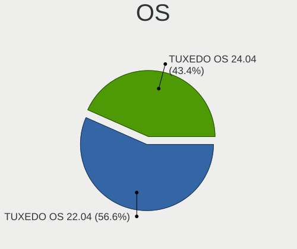

| Name            | Computers | Percent |
|-----------------|-----------|---------|
| TUXEDO OS 22.04 | 265       | 56.62%  |
| TUXEDO OS 24.04 | 203       | 43.38%  |

OS Family
---------

OS without a version

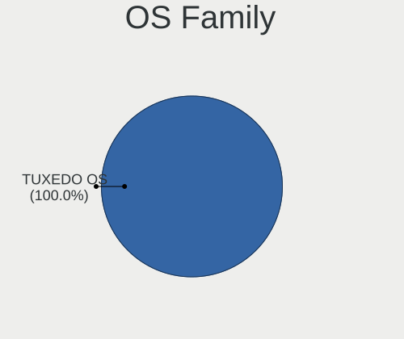

| Name      | Computers | Percent |
|-----------|-----------|---------|
| TUXEDO OS | 464       | 100%    |

Kernel
------

Version of the Linux kernel

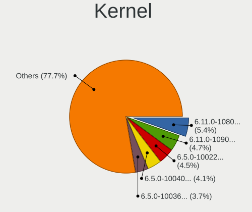

| Version              | Computers | Percent |
|----------------------|-----------|---------|
| 6.11.0-108013-tuxedo | 28        | 5.43%   |
| 6.11.0-109019-tuxedo | 24        | 4.65%   |
| 6.5.0-10022-tuxedo   | 23        | 4.46%   |
| 6.5.0-10040-tuxedo   | 21        | 4.07%   |
| 6.5.0-10036-tuxedo   | 19        | 3.68%   |
| 6.11.0-102007-tuxedo | 18        | 3.49%   |
| 6.5.0-10043-tuxedo   | 17        | 3.29%   |
| 6.1.0-1009-tuxedo    | 17        | 3.29%   |
| 6.5.0-10027-tuxedo   | 16        | 3.1%    |
| 6.2.0-10018-tuxedo   | 14        | 2.71%   |
| 6.2.0-10022-tuxedo   | 13        | 2.52%   |
| 6.11.0-108014-tuxedo | 13        | 2.52%   |
| 6.11.0-112021-tuxedo | 12        | 2.33%   |
| 6.5.0-10013-tuxedo   | 11        | 2.13%   |
| 6.2.0-10007-tuxedo   | 11        | 2.13%   |
| 6.2.0-10005-tuxedo   | 11        | 2.13%   |
| 6.11.0-120029-tuxedo | 11        | 2.13%   |
| 6.11.0-105009-tuxedo | 11        | 2.13%   |
| 6.5.0-10010-tuxedo   | 10        | 1.94%   |
| 6.14.0-117036-tuxedo | 10        | 1.94%   |
| 6.14.0-112033-tuxedo | 10        | 1.94%   |
| 6.11.0-118026-tuxedo | 10        | 1.94%   |
| 6.2.0-10011-tuxedo   | 9         | 1.74%   |
| 6.14.0-111029-tuxedo | 9         | 1.74%   |
| 6.14.0-110029-tuxedo | 9         | 1.74%   |
| 6.14.0-115036-tuxedo | 8         | 1.55%   |
| 6.11.0-103009-tuxedo | 8         | 1.55%   |
| 6.8.0-101041-tuxedo  | 7         | 1.36%   |
| 6.5.0-10008-tuxedo   | 7         | 1.36%   |
| 6.5.0-10006-tuxedo   | 7         | 1.36%   |
| 6.14.0-116036-tuxedo | 7         | 1.36%   |
| 6.11.0-107011-tuxedo | 7         | 1.36%   |
| 5.15.0-10058-tuxedo  | 7         | 1.36%   |
| 6.5.0-10031-tuxedo   | 6         | 1.16%   |
| 6.2.0-10010-tuxedo   | 6         | 1.16%   |
| 6.11.0-116025-tuxedo | 6         | 1.16%   |
| 6.11.0-107009-tuxedo | 6         | 1.16%   |
| 6.2.0-10027-tuxedo   | 5         | 0.97%   |
| 6.11.0-121029-tuxedo | 5         | 0.97%   |
| 6.11.0-118028-tuxedo | 5         | 0.97%   |

Kernel Family
-------------

Linux kernel without a distro release

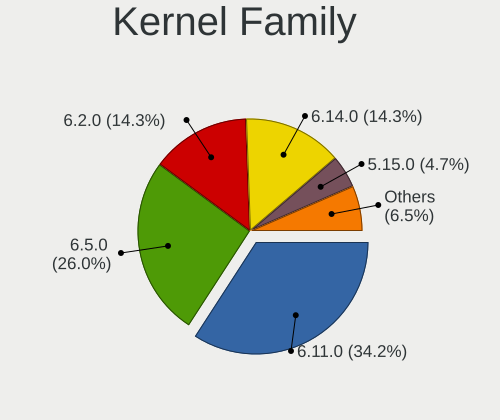

| Version | Computers | Percent |
|---------|-----------|---------|
| 6.11.0  | 167       | 34.15%  |
| 6.5.0   | 127       | 25.97%  |
| 6.2.0   | 70        | 14.31%  |
| 6.14.0  | 70        | 14.31%  |
| 5.15.0  | 23        | 4.7%    |
| 6.1.0   | 17        | 3.48%   |
| 6.8.0   | 9         | 1.84%   |
| 6.5.4   | 1         | 0.2%    |
| 6.11.10 | 1         | 0.2%    |
| 6.10.9  | 1         | 0.2%    |
| 6.10.7  | 1         | 0.2%    |
| 6.10.0  | 1         | 0.2%    |
| 6.0.0   | 1         | 0.2%    |

Kernel Major Ver.
-----------------

Linux kernel major version

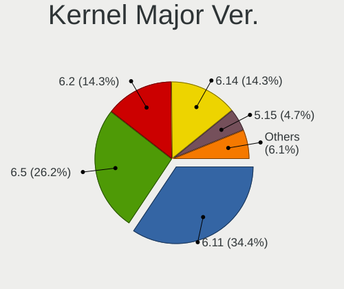

| Version | Computers | Percent |
|---------|-----------|---------|
| 6.11    | 168       | 34.36%  |
| 6.5     | 128       | 26.18%  |
| 6.2     | 70        | 14.31%  |
| 6.14    | 70        | 14.31%  |
| 5.15    | 23        | 4.7%    |
| 6.1     | 17        | 3.48%   |
| 6.8     | 9         | 1.84%   |
| 6.10    | 3         | 0.61%   |
| 6.0     | 1         | 0.2%    |

Arch
----

OS architecture (x86_64, i586, etc.)

| Name   | Computers | Percent |
|--------|-----------|---------|
| x86_64 | 464       | 100%    |

DE
--

Desktop Environment

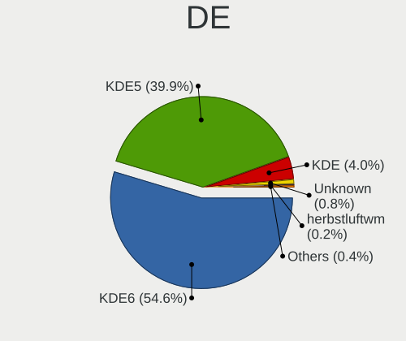

| Name         | Computers | Percent |
|--------------|-----------|---------|
| KDE6         | 259       | 54.64%  |
| KDE5         | 189       | 39.87%  |
| KDE          | 19        | 4.01%   |
| Unknown      | 4         | 0.84%   |
| XFCE         | 1         | 0.21%   |
| X-Cinnamon   | 1         | 0.21%   |
| herbstluftwm | 1         | 0.21%   |

Display Server
--------------

X11 or Wayland

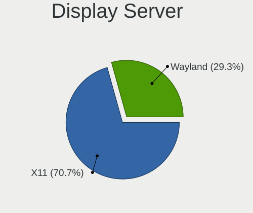

| Name    | Computers | Percent |
|---------|-----------|---------|
| X11     | 335       | 70.68%  |
| Wayland | 139       | 29.32%  |

Display Manager
---------------

SDDM, LightDM, etc.

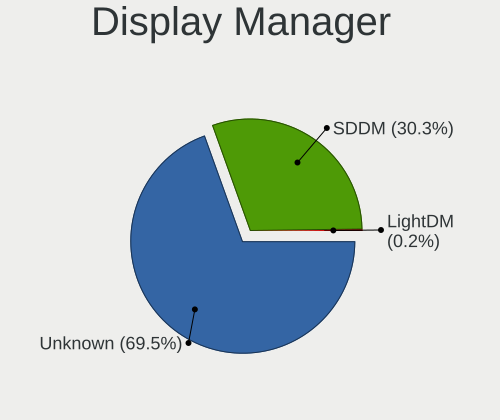

| Name    | Computers | Percent |
|---------|-----------|---------|
| Unknown | 326       | 69.51%  |
| SDDM    | 142       | 30.28%  |
| LightDM | 1         | 0.21%   |

OS Lang
-------

Language

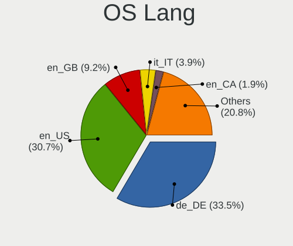

| Lang  | Computers | Percent |
|-------|-----------|---------|
| de_DE | 156       | 33.48%  |
| en_US | 143       | 30.69%  |
| en_GB | 43        | 9.23%   |
| it_IT | 18        | 3.86%   |
| en_CA | 9         | 1.93%   |
| fr_FR | 8         | 1.72%   |
| de_AT | 8         | 1.72%   |
| pl_PL | 7         | 1.5%    |
| en_AU | 7         | 1.5%    |
| cs_CZ | 7         | 1.5%    |
| pt_BR | 5         | 1.07%   |
| es_ES | 5         | 1.07%   |
| pt_PT | 4         | 0.86%   |
| nl_NL | 4         | 0.86%   |
| en_ZA | 4         | 0.86%   |
| de_CH | 4         | 0.86%   |
| hu_HU | 3         | 0.64%   |
| fr_BE | 3         | 0.64%   |
| en_IN | 3         | 0.64%   |
| en_DK | 3         | 0.64%   |
| en_AG | 3         | 0.64%   |
| zh_TW | 2         | 0.43%   |
| tr_TR | 2         | 0.43%   |
| nb_NO | 2         | 0.43%   |
| fi_FI | 2         | 0.43%   |
| es_VE | 2         | 0.43%   |
| ru_RU | 1         | 0.21%   |
| ro_RO | 1         | 0.21%   |
| nl_BE | 1         | 0.21%   |
| fr_CH | 1         | 0.21%   |
| et_EE | 1         | 0.21%   |
| es_MX | 1         | 0.21%   |
| en_IE | 1         | 0.21%   |
| da_DK | 1         | 0.21%   |
| bg_BG | 1         | 0.21%   |

Boot Mode
---------

EFI or BIOS

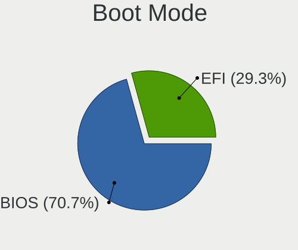

| Mode | Computers | Percent |
|------|-----------|---------|
| BIOS | 331       | 70.73%  |
| EFI  | 137       | 29.27%  |

Filesystem
----------

Type of filesystem

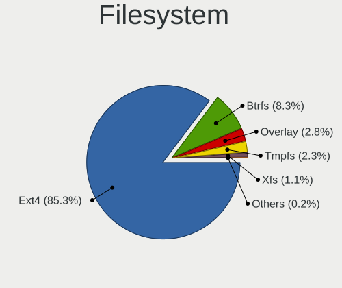

| Type    | Computers | Percent |
|---------|-----------|---------|
| Ext4    | 401       | 85.32%  |
| Btrfs   | 39        | 8.3%    |
| Overlay | 13        | 2.77%   |
| Tmpfs   | 11        | 2.34%   |
| Xfs     | 5         | 1.06%   |
| Zfs     | 1         | 0.21%   |

Part. scheme
------------

Scheme of partitioning

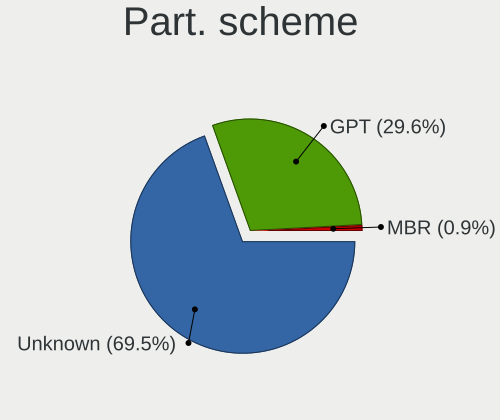

| Type    | Computers | Percent |
|---------|-----------|---------|
| Unknown | 326       | 69.51%  |
| GPT     | 139       | 29.64%  |
| MBR     | 4         | 0.85%   |

Dual Boot with Linux/BSD
------------------------

Hosting more than one Linux/BSD

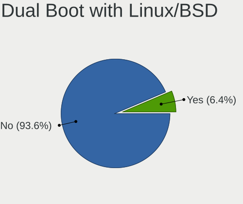

| Dual boot | Computers | Percent |
|-----------|-----------|---------|
| No        | 438       | 93.59%  |
| Yes       | 30        | 6.41%   |

Dual Boot (Win)
---------------

Hosting Linux and Windows

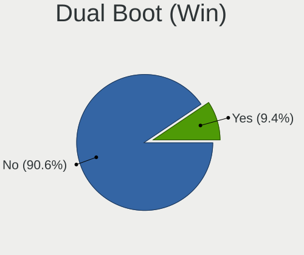

| Dual boot | Computers | Percent |
|-----------|-----------|---------|
| No        | 422       | 90.56%  |
| Yes       | 44        | 9.44%   |

Board
-----

Vendor
------

Motherboard manufacturer

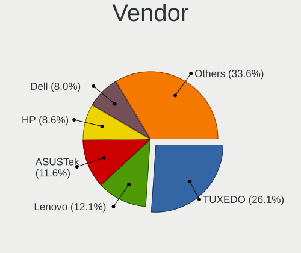

| Name                                 | Computers | Percent |
|--------------------------------------|-----------|---------|
| TUXEDO                               | 121       | 26.08%  |
| Lenovo                               | 56        | 12.07%  |
| ASUSTek Computer                     | 54        | 11.64%  |
| Hewlett-Packard                      | 40        | 8.62%   |
| Dell                                 | 37        | 7.97%   |
| MSI                                  | 34        | 7.33%   |
| Apple                                | 21        | 4.53%   |
| Gigabyte Technology                  | 19        | 4.09%   |
| Acer                                 | 12        | 2.59%   |
| ASRock                               | 10        | 2.16%   |
| Schenker                             | 8         | 1.72%   |
| Notebook                             | 7         | 1.51%   |
| Toshiba                              | 6         | 1.29%   |
| Samsung Electronics                  | 4         | 0.86%   |
| Unknown                              | 3         | 0.65%   |
| Wortmann AG                          | 2         | 0.43%   |
| Sony                                 | 2         | 0.43%   |
| PC Specialist                        | 2         | 0.43%   |
| Monster                              | 2         | 0.43%   |
| BESSTAR Tech                         | 2         | 0.43%   |
| ASRock Industrial                    | 2         | 0.43%   |
| Valve                                | 1         | 0.22%   |
| Trigkey                              | 1         | 0.22%   |
| Simply NUC                           | 1         | 0.22%   |
| Shenzhen Meigao Electronic Equipment | 1         | 0.22%   |
| Metabox                              | 1         | 0.22%   |
| LG Electronics                       | 1         | 0.22%   |
| Intel                                | 1         | 0.22%   |
| HUAWEI                               | 1         | 0.22%   |
| HC Technology.                       | 1         | 0.22%   |
| Google                               | 1         | 0.22%   |
| GEEKOM                               | 1         | 0.22%   |
| Gateway                              | 1         | 0.22%   |
| Fujitsu                              | 1         | 0.22%   |
| Fanless Mini PC                      | 1         | 0.22%   |
| ECS                                  | 1         | 0.22%   |
| Chuwi                                | 1         | 0.22%   |
| AZW                                  | 1         | 0.22%   |
| AXIOO                                | 1         | 0.22%   |
| Alienware                            | 1         | 0.22%   |

Model
-----

Motherboard model

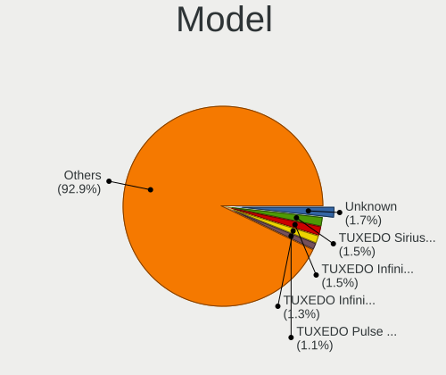

| Name                                | Computers | Percent |
|-------------------------------------|-----------|---------|
| Unknown                             | 8         | 1.72%   |
| TUXEDO Sirius 16 Gen1               | 7         | 1.51%   |
| TUXEDO InfinityBook Pro Gen7 (MK1)  | 7         | 1.51%   |
| TUXEDO InfinityBook Pro AMD Gen9    | 6         | 1.29%   |
| TUXEDO Pulse 15 Gen2                | 5         | 1.08%   |
| TUXEDO Pulse 15 Gen1                | 5         | 1.08%   |
| TUXEDO InfinityBook Pro Intel Gen9  | 5         | 1.08%   |
| TUXEDO InfinityBook S 15/17 Gen7    | 4         | 0.86%   |
| TUXEDO InfinityBook Pro 14 Gen6     | 4         | 0.86%   |
| TUXEDO Gemini Gen2                  | 4         | 0.86%   |
| TUXEDO Aura 15 Gen2                 | 4         | 0.86%   |
| ASUS PRIME B450-PLUS                | 4         | 0.86%   |
| Apple MacBookPro8,1                 | 4         | 0.86%   |
| TUXEDO Stellaris/Polaris AMD Gen4   | 3         | 0.65%   |
| TUXEDO Stellaris Slim 15 Intel Gen6 | 3         | 0.65%   |
| TUXEDO Stellaris Intel Gen5         | 3         | 0.65%   |
| TUXEDO Stellaris 17 Intel Gen6      | 3         | 0.65%   |
| TUXEDO Pulse 14 Gen4                | 3         | 0.65%   |
| TUXEDO Polaris AMD Gen5             | 3         | 0.65%   |
| TUXEDO InfinityBook Pro Gen8 (MK1)  | 3         | 0.65%   |
| TUXEDO InfinityBook Pro Gen7 (MK2)  | 3         | 0.65%   |
| TUXEDO InfinityBook Pro AMD Gen10   | 3         | 0.65%   |
| TUXEDO Aura 15 Gen1                 | 3         | 0.65%   |
| ASUS All Series                     | 3         | 0.65%   |
| TUXEDO XMG FUSION 15 (XFU15L19)     | 2         | 0.43%   |
| TUXEDO Stellaris Slim 15 AMD Gen6   | 2         | 0.43%   |
| TUXEDO Stellaris 16 Intel Gen7      | 2         | 0.43%   |
| TUXEDO Stellaris 16 Intel Gen6      | 2         | 0.43%   |
| TUXEDO Polaris 15 AMD Gen1          | 2         | 0.43%   |
| TUXEDO InfinityFlex 14 Gen1         | 2         | 0.43%   |
| TUXEDO InfinityBook S Gen8          | 2         | 0.43%   |
| TUXEDO InfinityBook S 15 Gen6       | 2         | 0.43%   |
| TUXEDO InfinityBook Pro Gen8 (MK2)  | 2         | 0.43%   |
| TUXEDO Book XP15 / XP17 Gen12       | 2         | 0.43%   |
| Toshiba Satellite C660              | 2         | 0.43%   |
| Schenker XMG CORE 16 (L23)          | 2         | 0.43%   |
| Notebook NP5x_NP6x_NP7xHP           | 2         | 0.43%   |
| MSI MS-7E13                         | 2         | 0.43%   |
| MSI MS-7D75                         | 2         | 0.43%   |
| MSI MS-7D70                         | 2         | 0.43%   |

Model Family
------------

Motherboard model prefix

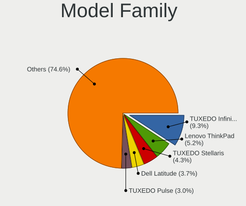

| Name                | Computers | Percent |
|---------------------|-----------|---------|
| TUXEDO InfinityBook | 43        | 9.27%   |
| Lenovo ThinkPad     | 24        | 5.17%   |
| TUXEDO Stellaris    | 20        | 4.31%   |
| Dell Latitude       | 17        | 3.66%   |
| TUXEDO Pulse        | 14        | 3.02%   |
| ASUS PRIME          | 11        | 2.37%   |
| TUXEDO Aura         | 9         | 1.94%   |
| HP Pavilion         | 9         | 1.94%   |
| ASUS ROG            | 8         | 1.72%   |
| Unknown             | 8         | 1.72%   |
| TUXEDO Sirius       | 7         | 1.51%   |
| ASUS ASUS           | 7         | 1.51%   |
| TUXEDO Polaris      | 6         | 1.29%   |
| Lenovo Yoga         | 6         | 1.29%   |
| Lenovo IdeaPad      | 6         | 1.29%   |
| Dell Inspiron       | 6         | 1.29%   |
| Toshiba Satellite   | 5         | 1.08%   |
| Schenker XMG        | 5         | 1.08%   |
| Lenovo ThinkBook    | 5         | 1.08%   |
| HP ENVY             | 5         | 1.08%   |
| Dell Precision      | 5         | 1.08%   |
| ASUS TUF            | 5         | 1.08%   |
| TUXEDO Gemini       | 4         | 0.86%   |
| Lenovo Legion       | 4         | 0.86%   |
| HP Laptop           | 4         | 0.86%   |
| Apple MacBookPro8   | 4         | 0.86%   |
| Acer Nitro          | 4         | 0.86%   |
| Acer Aspire         | 4         | 0.86%   |
| TUXEDO Book         | 3         | 0.65%   |
| Schenker VISION     | 3         | 0.65%   |
| HP ProBook          | 3         | 0.65%   |
| Dell XPS            | 3         | 0.65%   |
| ASUS VivoBook       | 3         | 0.65%   |
| ASUS All            | 3         | 0.65%   |
| Apple MacBookPro9   | 3         | 0.65%   |
| Acer Swift          | 3         | 0.65%   |
| TUXEDO XMG          | 2         | 0.43%   |
| TUXEDO InfinityFlex | 2         | 0.43%   |
| Notebook NP5x       | 2         | 0.43%   |
| MSI MS-7E13         | 2         | 0.43%   |

MFG Year
--------

Motherboard manufacture year

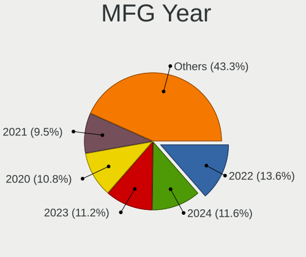

| Year | Computers | Percent |
|------|-----------|---------|
| 2022 | 63        | 13.58%  |
| 2024 | 54        | 11.64%  |
| 2023 | 52        | 11.21%  |
| 2020 | 50        | 10.78%  |
| 2021 | 44        | 9.48%   |
| 2019 | 24        | 5.17%   |
| 2015 | 23        | 4.96%   |
| 2013 | 23        | 4.96%   |
| 2018 | 21        | 4.53%   |
| 2017 | 19        | 4.09%   |
| 2012 | 19        | 4.09%   |
| 2011 | 19        | 4.09%   |
| 2025 | 13        | 2.8%    |
| 2014 | 12        | 2.59%   |
| 2010 | 10        | 2.16%   |
| 2016 | 6         | 1.29%   |
| 2009 | 5         | 1.08%   |
| 2008 | 5         | 1.08%   |
| 2007 | 1         | 0.22%   |
| 2006 | 1         | 0.22%   |

Form Factor
-----------

Physical design of the computer

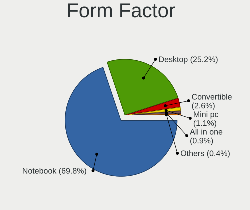

| Name        | Computers | Percent |
|-------------|-----------|---------|
| Notebook    | 324       | 69.83%  |
| Desktop     | 117       | 25.22%  |
| Convertible | 12        | 2.59%   |
| Mini pc     | 5         | 1.08%   |
| All in one  | 4         | 0.86%   |
| Tablet      | 2         | 0.43%   |

Secure Boot
-----------

Enabled or disabled

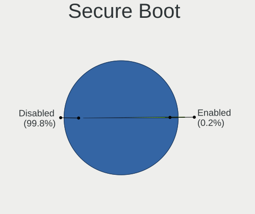

| State    | Computers | Percent |
|----------|-----------|---------|
| Disabled | 463       | 99.78%  |
| Enabled  | 1         | 0.22%   |

Coreboot
--------

Have coreboot on board

| Used | Computers | Percent |
|------|-----------|---------|
| No   | 462       | 99.57%  |
| Yes  | 2         | 0.43%   |

RAM Size
--------

Total RAM memory

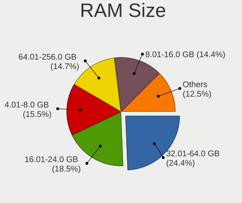

| Size in GB  | Computers | Percent |
|-------------|-----------|---------|
| 32.01-64.0  | 113       | 24.35%  |
| 16.01-24.0  | 86        | 18.53%  |
| 4.01-8.0    | 72        | 15.52%  |
| 64.01-256.0 | 68        | 14.66%  |
| 8.01-16.0   | 67        | 14.44%  |
| 3.01-4.0    | 30        | 6.47%   |
| 24.01-32.0  | 26        | 5.6%    |
| 2.01-3.0    | 2         | 0.43%   |

RAM Used
--------

Used RAM memory

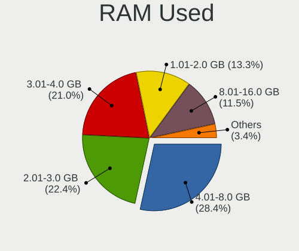

| Used GB    | Computers | Percent |
|------------|-----------|---------|
| 4.01-8.0   | 141       | 28.43%  |
| 2.01-3.0   | 111       | 22.38%  |
| 3.01-4.0   | 104       | 20.97%  |
| 1.01-2.0   | 66        | 13.31%  |
| 8.01-16.0  | 57        | 11.49%  |
| 16.01-24.0 | 13        | 2.62%   |
| 32.01-64.0 | 2         | 0.4%    |
| 24.01-32.0 | 2         | 0.4%    |

Total Drives
------------

Number of drives on board

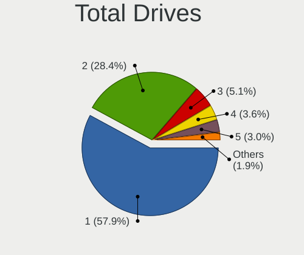

| Drives | Computers | Percent |
|--------|-----------|---------|
| 1      | 271       | 57.91%  |
| 2      | 133       | 28.42%  |
| 3      | 24        | 5.13%   |
| 4      | 17        | 3.63%   |
| 5      | 14        | 2.99%   |
| 6      | 4         | 0.85%   |
| 7      | 2         | 0.43%   |
| 0      | 2         | 0.43%   |
| 8      | 1         | 0.21%   |

Has CD-ROM
----------

Has CD-ROM on board

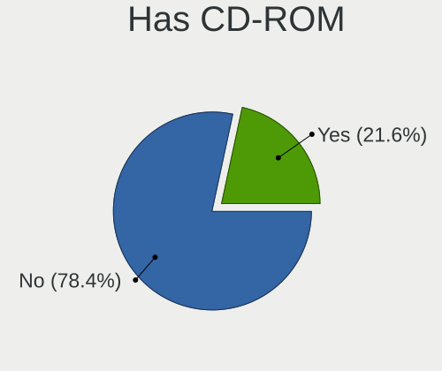

| Presented | Computers | Percent |
|-----------|-----------|---------|
| No        | 366       | 78.37%  |
| Yes       | 101       | 21.63%  |

Has Ethernet
------------

Has Ethernet on board

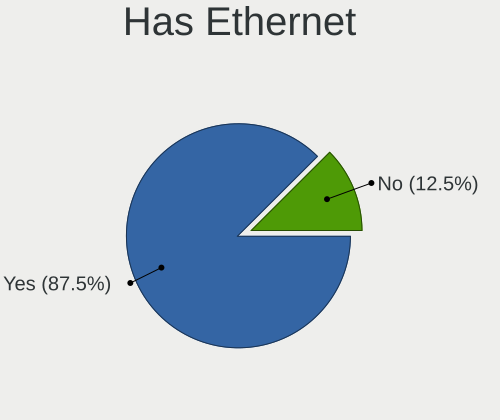

| Presented | Computers | Percent |
|-----------|-----------|---------|
| Yes       | 407       | 87.53%  |
| No        | 58        | 12.47%  |

Has WiFi
--------

Has WiFi module

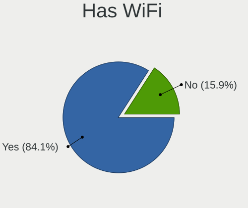

| Presented | Computers | Percent |
|-----------|-----------|---------|
| Yes       | 392       | 84.12%  |
| No        | 74        | 15.88%  |

Has Bluetooth
-------------

Has Bluetooth module

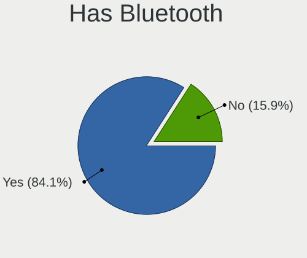

| Presented | Computers | Percent |
|-----------|-----------|---------|
| Yes       | 392       | 84.12%  |
| No        | 74        | 15.88%  |

Location
--------

Country
-------

Geographic location (country)

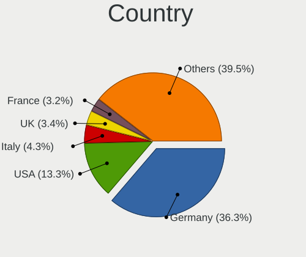

| Country                | Computers | Percent |
|------------------------|-----------|---------|
| Germany                | 169       | 36.27%  |
| USA                    | 62        | 13.3%   |
| Italy                  | 20        | 4.29%   |
| UK                     | 16        | 3.43%   |
| France                 | 15        | 3.22%   |
| Netherlands            | 11        | 2.36%   |
| Austria                | 10        | 2.15%   |
| Australia              | 10        | 2.15%   |
| Czechia                | 9         | 1.93%   |
| Canada                 | 9         | 1.93%   |
| Turkey                 | 8         | 1.72%   |
| Poland                 | 8         | 1.72%   |
| Switzerland            | 7         | 1.5%    |
| Spain                  | 7         | 1.5%    |
| Romania                | 7         | 1.5%    |
| India                  | 7         | 1.5%    |
| Brazil                 | 7         | 1.5%    |
| Belgium                | 7         | 1.5%    |
| Portugal               | 6         | 1.29%   |
| South Africa           | 4         | 0.86%   |
| Norway                 | 4         | 0.86%   |
| Indonesia              | 4         | 0.86%   |
| Hungary                | 4         | 0.86%   |
| Finland                | 4         | 0.86%   |
| China                  | 4         | 0.86%   |
| Bulgaria               | 4         | 0.86%   |
| Taiwan                 | 3         | 0.64%   |
| Sweden                 | 3         | 0.64%   |
| Venezuela              | 2         | 0.43%   |
| Thailand               | 2         | 0.43%   |
| Slovakia               | 2         | 0.43%   |
| Mexico                 | 2         | 0.43%   |
| Luxembourg             | 2         | 0.43%   |
| Greece                 | 2         | 0.43%   |
| Denmark                | 2         | 0.43%   |
| Bosnia and Herzegovina | 2         | 0.43%   |
| Argentina              | 2         | 0.43%   |
| UAE                    | 1         | 0.21%   |
| Tunisia                | 1         | 0.21%   |
| The Netherlands        | 1         | 0.21%   |

City
----

Geographic location (city)

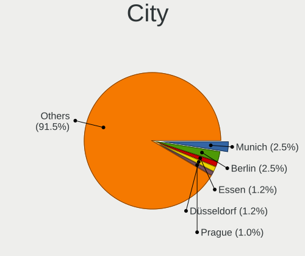

| City              | Computers | Percent |
|-------------------|-----------|---------|
| Munich            | 12        | 2.48%   |
| Berlin            | 12        | 2.48%   |
| Essen             | 6         | 1.24%   |
| Düsseldorf       | 6         | 1.24%   |
| Prague            | 5         | 1.03%   |
| Milan             | 5         | 1.03%   |
| Hamburg           | 5         | 1.03%   |
| Frankfurt am Main | 5         | 1.03%   |
| Dortmund          | 5         | 1.03%   |
| Vienna            | 4         | 0.83%   |
| Shanghai          | 4         | 0.83%   |
| Rome              | 4         | 0.83%   |
| Helsinki          | 4         | 0.83%   |
| Sydney            | 3         | 0.62%   |
| Stuttgart         | 3         | 0.62%   |
| Nuremberg         | 3         | 0.62%   |
| Los Angeles       | 3         | 0.62%   |
| Jakarta           | 3         | 0.62%   |
| Bucharest         | 3         | 0.62%   |
| Aachen            | 3         | 0.62%   |
| Zurich            | 2         | 0.41%   |
| Wolfsburg         | 2         | 0.41%   |
| Turin             | 2         | 0.41%   |
| Schweinfurt       | 2         | 0.41%   |
| Saint-Dié        | 2         | 0.41%   |
| Reutlingen        | 2         | 0.41%   |
| Poznan            | 2         | 0.41%   |
| Perth             | 2         | 0.41%   |
| Paris             | 2         | 0.41%   |
| Mannheim          | 2         | 0.41%   |
| Luxembourg        | 2         | 0.41%   |
| Lucerne           | 2         | 0.41%   |
| Lübeck           | 2         | 0.41%   |
| Lienz             | 2         | 0.41%   |
| Leipzig           | 2         | 0.41%   |
| Langevag          | 2         | 0.41%   |
| Kunovice          | 2         | 0.41%   |
| Kolkata           | 2         | 0.41%   |
| Kiel              | 2         | 0.41%   |
| Johannesburg      | 2         | 0.41%   |

Drives
------

Drive Vendor
------------

Hard drive vendors

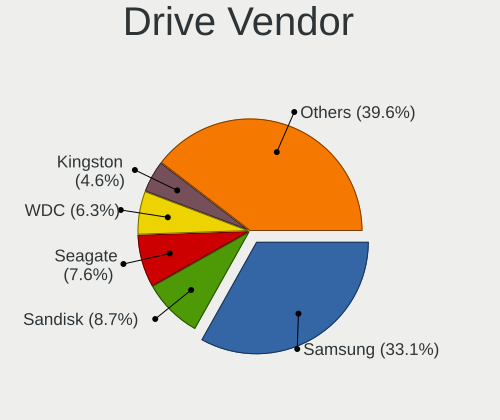

| Vendor                       | Computers | Drives | Percent |
|------------------------------|-----------|--------|---------|
| Samsung Electronics          | 221       | 330    | 33.13%  |
| Sandisk                      | 58        | 74     | 8.7%    |
| Seagate                      | 51        | 69     | 7.65%   |
| WDC                          | 42        | 61     | 6.3%    |
| Kingston                     | 31        | 35     | 4.65%   |
| Crucial                      | 27        | 33     | 4.05%   |
| Micron Technology            | 21        | 26     | 3.15%   |
| Toshiba                      | 20        | 22     | 3%      |
| SK hynix                     | 18        | 22     | 2.7%    |
| Intel                        | 14        | 16     | 2.1%    |
| Unknown                      | 13        | 14     | 1.95%   |
| Micron/Crucial Technology    | 12        | 20     | 1.8%    |
| Hitachi                      | 11        | 16     | 1.65%   |
| Apple                        | 10        | 10     | 1.5%    |
| Phison Electronics           | 7         | 7      | 1.05%   |
| KIOXIA                       | 6         | 10     | 0.9%    |
| Kingston Technology Company  | 6         | 7      | 0.9%    |
| SPCC                         | 5         | 5      | 0.75%   |
| Intenso                      | 5         | 6      | 0.75%   |
| Transcend                    | 4         | 5      | 0.6%    |
| JMicron Technology           | 4         | 4      | 0.6%    |
| China                        | 4         | 4      | 0.6%    |
| A-DATA Technology            | 4         | 5      | 0.6%    |
| Phison                       | 3         | 5      | 0.45%   |
| HGST                         | 3         | 6      | 0.45%   |
| ADATA Technology             | 3         | 3      | 0.45%   |
| Silicon Motion               | 2         | 3      | 0.3%    |
| Shenzhen Longsys Electronics | 2         | 3      | 0.3%    |
| OWC                          | 2         | 2      | 0.3%    |
| ORICO                        | 2         | 2      | 0.3%    |
| Netac                        | 2         | 2      | 0.3%    |
| LITEON                       | 2         | 2      | 0.3%    |
| Lite-On Technology           | 2         | 2      | 0.3%    |
| HGST HTS                     | 2         | 2      | 0.3%    |
| GOODRAM                      | 2         | 2      | 0.3%    |
| Fanxiang                     | 2         | 2      | 0.3%    |
| ASMT                         | 2         | 2      | 0.3%    |
| ASMedia                      | 2         | 3      | 0.3%    |
| Apacer                       | 2         | 2      | 0.3%    |
| XrayDisk                     | 1         | 1      | 0.15%   |

Drive Model
-----------

Hard drive models

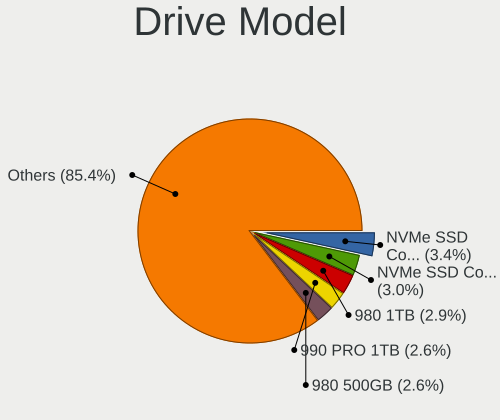

| Model                                              | Computers | Percent |
|----------------------------------------------------|-----------|---------|
| Samsung NVMe SSD Controller PM9A1/PM9A3/980PRO 1TB | 26        | 3.43%   |
| Samsung NVMe SSD Controller SM981/PM981/PM983 1TB  | 23        | 3.03%   |
| Samsung SSD 980 1TB                                | 22        | 2.9%    |
| Samsung SSD 990 PRO 1TB                            | 20        | 2.64%   |
| Samsung SSD 980 500GB                              | 20        | 2.64%   |
| Samsung SSD 990 PRO 2TB                            | 15        | 1.98%   |
| Sandisk WD Black SN750 / PC SN730 NVMe SSD 500GB   | 11        | 1.45%   |
| Samsung SSD 980 PRO 1TB                            | 9         | 1.19%   |
| Micron/Crucial P2 NVMe PCIe SSD 2TB                | 8         | 1.06%   |
| Kingston SA400S37240G 240GB SSD                    | 8         | 1.06%   |
| Samsung SSD 990 EVO 1TB                            | 7         | 0.92%   |
| Samsung SSD 860 EVO 500GB                          | 6         | 0.79%   |
| Seagate ST1000DM010-2EP102 1TB                     | 5         | 0.66%   |
| Micron CT1000P3PSSD8 1TB                           | 5         | 0.66%   |
| Crucial CT1000MX500SSD1 1TB                        | 5         | 0.66%   |
| Seagate ST2000LM015-2E8174 2TB                     | 4         | 0.53%   |
| Sandisk WD Blue SN570 1TB                          | 4         | 0.53%   |
| Samsung SSD 990 EVO Plus 2TB                       | 4         | 0.53%   |
| Samsung SSD 860 EVO 250GB                          | 4         | 0.53%   |
| Samsung SSD 850 EVO 500GB                          | 4         | 0.53%   |
| Phison E16 PCIe4 NVMe Controller 1TB               | 4         | 0.53%   |
| Kingston SV300S37A120G 120GB SSD                   | 4         | 0.53%   |
| Kingston SA400S37960G 960GB SSD                    | 4         | 0.53%   |
| Kingston SA400S37480G 480GB SSD                    | 4         | 0.53%   |
| Crucial CT1000BX500SSD1 1TB                        | 4         | 0.53%   |
| Unknown SD/MMC/MS PRO 2GB                          | 3         | 0.4%    |
| Toshiba MQ01ABF050 500GB                           | 3         | 0.4%    |
| Toshiba MQ01ABD100 1TB                             | 3         | 0.4%    |
| Seagate ST3500418AS 500GB                          | 3         | 0.4%    |
| Sandisk WD_BLACK SN770 2TB                         | 3         | 0.4%    |
| Sandisk WD Black SN850 1TB                         | 3         | 0.4%    |
| SanDisk SDSSDA240G 240GB                           | 3         | 0.4%    |
| SanDisk NVMe SSD Drive 2TB                         | 3         | 0.4%    |
| Samsung SSD 980 PRO 500GB                          | 3         | 0.4%    |
| Samsung SSD 980 PRO 2TB                            | 3         | 0.4%    |
| Samsung SSD 970 EVO Plus 500GB                     | 3         | 0.4%    |
| Samsung SSD 970 EVO Plus 1TB                       | 3         | 0.4%    |
| Samsung SSD 870 EVO 2TB                            | 3         | 0.4%    |
| Samsung SSD 860 EVO M.2 1TB                        | 3         | 0.4%    |
| Samsung SSD 860 EVO 1TB                            | 3         | 0.4%    |

HDD Vendor
----------

Hard disk drive vendors

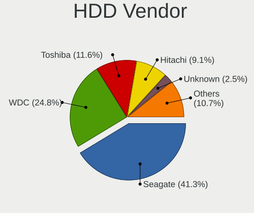

| Vendor              | Computers | Drives | Percent |
|---------------------|-----------|--------|---------|
| Seagate             | 50        | 68     | 41.32%  |
| WDC                 | 30        | 43     | 24.79%  |
| Toshiba             | 14        | 15     | 11.57%  |
| Hitachi             | 11        | 16     | 9.09%   |
| Unknown             | 3         | 4      | 2.48%   |
| HGST                | 3         | 6      | 2.48%   |
| Samsung Electronics | 2         | 2      | 1.65%   |
| HGST HTS            | 2         | 2      | 1.65%   |
| ASMedia             | 2         | 3      | 1.65%   |
| USB3.0              | 1         | 1      | 0.83%   |
| JMicron Technology  | 1         | 1      | 0.83%   |
| Intenso             | 1         | 1      | 0.83%   |
| Apple               | 1         | 1      | 0.83%   |

SSD Vendor
----------

Solid state drive vendors

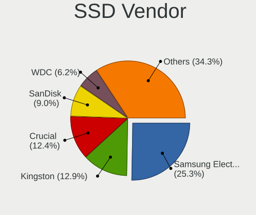

| Vendor              | Computers | Drives | Percent |
|---------------------|-----------|--------|---------|
| Samsung Electronics | 45        | 54     | 25.28%  |
| Kingston            | 23        | 27     | 12.92%  |
| Crucial             | 22        | 25     | 12.36%  |
| SanDisk             | 16        | 18     | 8.99%   |
| WDC                 | 11        | 16     | 6.18%   |
| Apple               | 7         | 7      | 3.93%   |
| SPCC                | 4         | 4      | 2.25%   |
| Intel               | 4         | 4      | 2.25%   |
| China               | 4         | 4      | 2.25%   |
| Transcend           | 3         | 4      | 1.69%   |
| A-DATA Technology   | 3         | 4      | 1.69%   |
| Toshiba             | 2         | 2      | 1.12%   |
| OWC                 | 2         | 2      | 1.12%   |
| Netac               | 2         | 2      | 1.12%   |
| Micron Technology   | 2         | 2      | 1.12%   |
| LITEON              | 2         | 2      | 1.12%   |
| Intenso             | 2         | 2      | 1.12%   |
| GOODRAM             | 2         | 2      | 1.12%   |
| ASMT                | 2         | 2      | 1.12%   |
| Apacer              | 2         | 2      | 1.12%   |
| WDC WDS5            | 1         | 1      | 0.56%   |
| WDC WDS             | 1         | 1      | 0.56%   |
| Verbatim            | 1         | 1      | 0.56%   |
| Team                | 1         | 1      | 0.56%   |
| SK hynix            | 1         | 2      | 0.56%   |
| S3+                 | 1         | 1      | 0.56%   |
| PNY                 | 1         | 1      | 0.56%   |
| Pioneer             | 1         | 1      | 0.56%   |
| MSI                 | 1         | 1      | 0.56%   |
| LITEONIT            | 1         | 1      | 0.56%   |
| Lexar               | 1         | 1      | 0.56%   |
| Gigabyte Technology | 1         | 1      | 0.56%   |
| EVM                 | 1         | 1      | 0.56%   |
| Emtec               | 1         | 1      | 0.56%   |
| CT1000P3            | 1         | 1      | 0.56%   |
| CT1000BX            | 1         | 1      | 0.56%   |
| AirDisk             | 1         | 1      | 0.56%   |
| 2.5"                | 1         | 1      | 0.56%   |

Drive Kind
----------

HDD or SSD

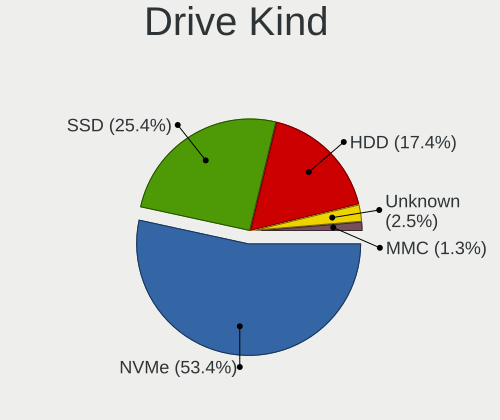

| Kind    | Computers | Drives | Percent |
|---------|-----------|--------|---------|
| NVMe    | 322       | 493    | 53.4%   |
| SSD     | 153       | 204    | 25.37%  |
| HDD     | 105       | 163    | 17.41%  |
| Unknown | 15        | 16     | 2.49%   |
| MMC     | 8         | 8      | 1.33%   |

Drive Connector
---------------

SATA, SAS, NVMe, etc.

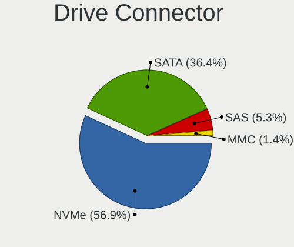

| Type | Computers | Drives | Percent |
|------|-----------|--------|---------|
| NVMe | 322       | 491    | 56.89%  |
| SATA | 206       | 346    | 36.4%   |
| SAS  | 30        | 39     | 5.3%    |
| MMC  | 8         | 8      | 1.41%   |

Drive Size
----------

Size of hard drive

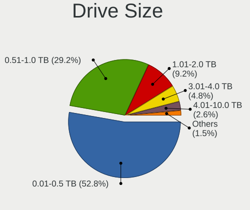

| Size in TB | Computers | Drives | Percent |
|------------|-----------|--------|---------|
| 0.01-0.5   | 143       | 202    | 52.77%  |
| 0.51-1.0   | 79        | 97     | 29.15%  |
| 1.01-2.0   | 25        | 35     | 9.23%   |
| 3.01-4.0   | 13        | 20     | 4.8%    |
| 4.01-10.0  | 7         | 8      | 2.58%   |
| 2.01-3.0   | 3         | 4      | 1.11%   |
| 10.01-20.0 | 1         | 1      | 0.37%   |

Space Total
-----------

Amount of disk space available on the file system

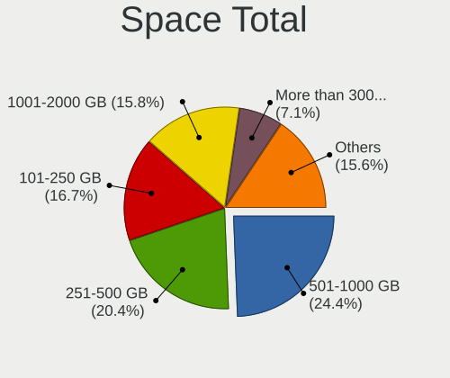

| Size in GB     | Computers | Percent |
|----------------|-----------|---------|
| 501-1000       | 117       | 24.38%  |
| 251-500        | 98        | 20.42%  |
| 101-250        | 80        | 16.67%  |
| 1001-2000      | 76        | 15.83%  |
| More than 3000 | 34        | 7.08%   |
| 1-20           | 24        | 5%      |
| 2001-3000      | 21        | 4.38%   |
| 51-100         | 20        | 4.17%   |
| Unknown        | 6         | 1.25%   |
| 21-50          | 4         | 0.83%   |

Space Used
----------

Amount of used disk space

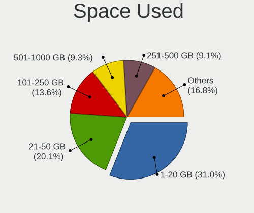

| Used GB        | Computers | Percent |
|----------------|-----------|---------|
| 1-20           | 153       | 31.03%  |
| 21-50          | 99        | 20.08%  |
| 101-250        | 67        | 13.59%  |
| 501-1000       | 46        | 9.33%   |
| 251-500        | 45        | 9.13%   |
| 51-100         | 41        | 8.32%   |
| 1001-2000      | 19        | 3.85%   |
| 2001-3000      | 10        | 2.03%   |
| More than 3000 | 7         | 1.42%   |
| Unknown        | 6         | 1.22%   |

Malfunc. Drives
---------------

Drive models with a malfunction

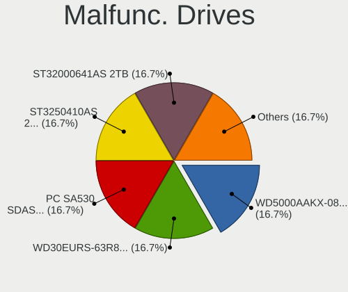

| Model                                | Computers | Drives | Percent |
|--------------------------------------|-----------|--------|---------|
| WDC WD5000AAKX-083CA1 500GB          | 1         | 1      | 16.67%  |
| WDC WD30EURS-63R8UY0 3TB             | 1         | 1      | 16.67%  |
| WDC PC SA530 SDASN8Y-256G-1006 256GB | 1         | 1      | 16.67%  |
| Seagate ST3250410AS 250GB            | 1         | 1      | 16.67%  |
| Seagate ST32000641AS 2TB             | 1         | 1      | 16.67%  |
| Crucial CT500BX100SSD1 500GB         | 1         | 1      | 16.67%  |

Malfunc. Drive Vendor
---------------------

Vendors of faulty drives

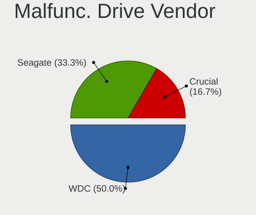

| Vendor  | Computers | Drives | Percent |
|---------|-----------|--------|---------|
| WDC     | 3         | 3      | 50%     |
| Seagate | 2         | 2      | 33.33%  |
| Crucial | 1         | 1      | 16.67%  |

Malfunc. HDD Vendor
-------------------

Vendors of faulty HDD drives

| Vendor  | Computers | Drives | Percent |
|---------|-----------|--------|---------|
| WDC     | 2         | 2      | 50%     |
| Seagate | 2         | 2      | 50%     |

Malfunc. Drive Kind
-------------------

Kinds of faulty drives

| Kind | Computers | Drives | Percent |
|------|-----------|--------|---------|
| HDD  | 4         | 4      | 66.67%  |
| SSD  | 2         | 2      | 33.33%  |

Failed Drives
-------------

Failed drive models

Zero info for selected period =(

Failed Drive Vendor
-------------------

Failed drive vendors

Zero info for selected period =(

Drive Status
------------

Number of failed and malfunc. drives

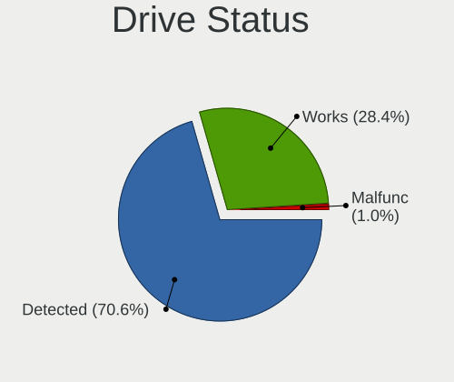

| Status   | Computers | Drives | Percent |
|----------|-----------|--------|---------|
| Detected | 343       | 670    | 70.58%  |
| Works    | 138       | 208    | 28.4%   |
| Malfunc  | 5         | 6      | 1.03%   |

Storage controller
------------------

Storage Vendor
--------------

Storage controller vendors

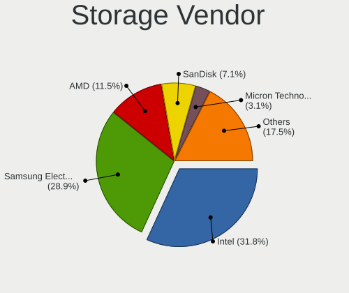

| Vendor                         | Computers | Percent |
|--------------------------------|-----------|---------|
| Intel                          | 207       | 31.85%  |
| Samsung Electronics            | 188       | 28.92%  |
| AMD                            | 75        | 11.54%  |
| SanDisk                        | 46        | 7.08%   |
| Micron Technology              | 20        | 3.08%   |
| SK hynix                       | 17        | 2.62%   |
| Micron/Crucial Technology      | 17        | 2.62%   |
| Kingston Technology Company    | 14        | 2.15%   |
| Phison Electronics             | 10        | 1.54%   |
| Nvidia                         | 7         | 1.08%   |
| ASMedia Technology             | 7         | 1.08%   |
| KIOXIA                         | 6         | 0.92%   |
| Toshiba America Info Systems   | 4         | 0.62%   |
| Silicon Motion                 | 4         | 0.62%   |
| MAXIO Technology (Hangzhou)    | 4         | 0.62%   |
| Marvell Technology Group       | 4         | 0.62%   |
| ADATA Technology               | 4         | 0.62%   |
| Shenzhen Longsys Electronics   | 2         | 0.31%   |
| Realtek Semiconductor          | 2         | 0.31%   |
| Lite-On Technology             | 2         | 0.31%   |
| INNOGRIT                       | 2         | 0.31%   |
| Apple                          | 2         | 0.31%   |
| Transcend                      | 1         | 0.15%   |
| Solidigm                       | 1         | 0.15%   |
| Solid State Storage Technology | 1         | 0.15%   |
| Seagate Technology             | 1         | 0.15%   |
| Lenovo                         | 1         | 0.15%   |
| Adaptec                        | 1         | 0.15%   |

Storage Model
-------------

Storage controller models

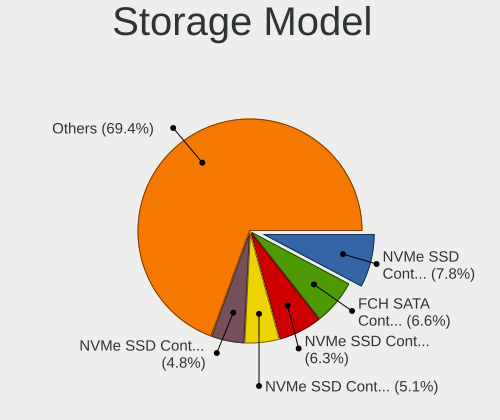

| Model                                                                          | Computers | Percent |
|--------------------------------------------------------------------------------|-----------|---------|
| Samsung NVMe SSD Controller 980 (DRAM-less)                                    | 55        | 7.76%   |
| AMD FCH SATA Controller [AHCI mode]                                            | 47        | 6.63%   |
| Samsung NVMe SSD Controller PM9A1/PM9A3/980PRO                                 | 45        | 6.35%   |
| Samsung NVMe SSD Controller S4LV008[Pascal]                                    | 36        | 5.08%   |
| Samsung NVMe SSD Controller SM981/PM981/PM983                                  | 34        | 4.8%    |
| Samsung NVMe SSD Controller PM9C1a (DRAM-less)                                 | 18        | 2.54%   |
| Intel Volume Management Device NVMe RAID Controller                            | 17        | 2.4%    |
| Intel 7 Series Chipset Family 6-port SATA Controller [AHCI mode]               | 16        | 2.26%   |
| AMD 600 Series Chipset SATA Controller                                         | 14        | 1.97%   |
| SanDisk Extreme Pro / WD Black SN750 / PC SN730 / Red SN700 NVMe SSD           | 13        | 1.83%   |
| Intel 6 Series/C200 Series Chipset Family 6 port Mobile SATA AHCI Controller   | 13        | 1.83%   |
| Micron/Crucial P2 [Nick P2] / P3 / P3 Plus NVMe PCIe SSD (DRAM-less)           | 12        | 1.69%   |
| Intel 8 Series/C220 Series Chipset Family 6-port SATA Controller 1 [AHCI mode] | 12        | 1.69%   |
| Intel Sunrise Point-LP SATA Controller [AHCI mode]                             | 11        | 1.55%   |
| Intel Cannon Lake Mobile PCH SATA AHCI Controller                              | 10        | 1.41%   |
| Intel 500 Series Chipset Family SATA AHCI Controller                           | 10        | 1.41%   |
| SK hynix Gold P31/BC711/PC711 NVMe Solid State Drive                           | 9         | 1.27%   |
| SanDisk WD SN560/SN740/SN770/SN5000 NVMe SSD                                   | 9         | 1.27%   |
| Intel Q170/Q150/B150/H170/H110/Z170/CM236 Chipset SATA Controller [AHCI Mode]  | 9         | 1.27%   |
| AMD 500 Series Chipset SATA Controller                                         | 9         | 1.27%   |
| AMD 400 Series Chipset SATA Controller                                         | 9         | 1.27%   |
| Intel Alder Lake-P SATA AHCI Controller                                        | 8         | 1.13%   |
| Intel 8 Series SATA Controller 1 [AHCI mode]                                   | 8         | 1.13%   |
| Micron 2550 NVMe SSD (DRAM-less)                                               | 7         | 0.99%   |
| Intel Comet Lake SATA AHCI Controller                                          | 7         | 0.99%   |
| Intel 400 Series Chipset Family SATA AHCI Controller                           | 7         | 0.99%   |
| ASMedia ASM1061/ASM1062 Serial ATA Controller                                  | 7         | 0.99%   |
| SanDisk Ultra 3D / WD Blue SN570 NVMe SSD (DRAM-less)                          | 6         | 0.85%   |
| Intel Wildcat Point-LP SATA Controller [AHCI Mode]                             | 6         | 0.85%   |
| Intel Raptor Lake SATA AHCI Controller                                         | 6         | 0.85%   |
| Intel HM170/QM170 Chipset SATA Controller [AHCI Mode]                          | 6         | 0.85%   |
| Intel 82801 Mobile SATA Controller [RAID mode]                                 | 6         | 0.85%   |
| Sandisk WD Black SN850X NVMe SSD                                               | 5         | 0.71%   |
| Samsung NVMe SSD Controller SM961/PM961/SM963                                  | 5         | 0.71%   |
| Phison E16 PCIe4 NVMe Controller                                               | 5         | 0.71%   |
| Micron 2400 NVMe SSD (DRAM-less)                                               | 5         | 0.71%   |
| Intel SATA Controller [RAID mode]                                              | 5         | 0.71%   |
| Intel 5 Series/3400 Series Chipset 4 port SATA AHCI Controller                 | 5         | 0.71%   |
| Samsung NVMe SSD 9100 PRO [PM9E1]                                              | 4         | 0.56%   |
| MAXIO (Hangzhou) NVMe SSD Controller MAP1202 (DRAM-less)                       | 4         | 0.56%   |

Storage Kind
------------

Kind of storage controller (IDE, SATA, NVMe, SAS, ...)

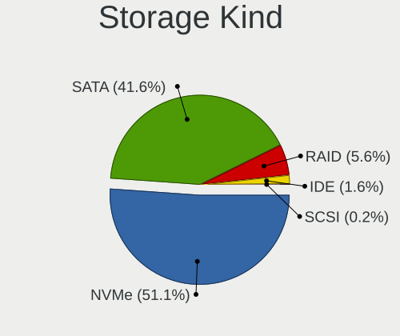

| Kind | Computers | Percent |
|------|-----------|---------|
| NVMe | 322       | 51.11%  |
| SATA | 262       | 41.59%  |
| RAID | 35        | 5.56%   |
| IDE  | 10        | 1.59%   |
| SCSI | 1         | 0.16%   |

Processor
---------

CPU Vendor
----------

Processor vendors

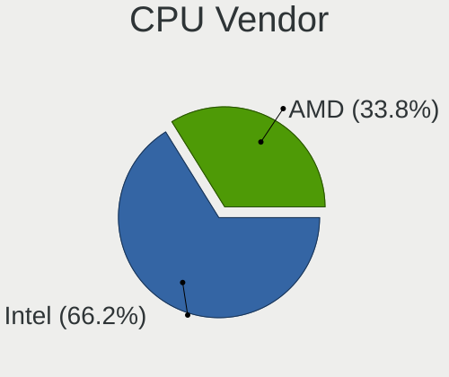

| Vendor | Computers | Percent |
|--------|-----------|---------|
| Intel  | 307       | 66.16%  |
| AMD    | 157       | 33.84%  |

CPU Model
---------

Processor models

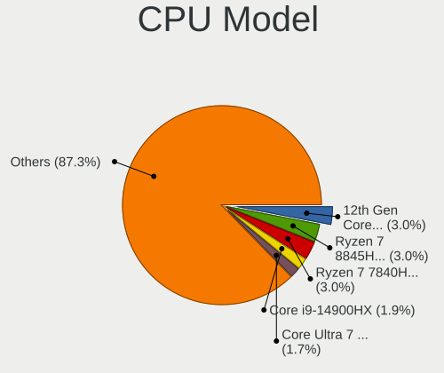

| Model                                      | Computers | Percent |
|--------------------------------------------|-----------|---------|
| Intel 12th Gen Core i7-12700H              | 14        | 3.02%   |
| AMD Ryzen 7 8845HS w/ Radeon 780M Graphics | 14        | 3.02%   |
| AMD Ryzen 7 7840HS w/ Radeon 780M Graphics | 14        | 3.02%   |
| Intel Core i9-14900HX                      | 9         | 1.94%   |
| Intel Core Ultra 7 155H                    | 8         | 1.72%   |
| Intel 13th Gen Core i9-13900HX             | 7         | 1.51%   |
| Intel Core i7-9750H CPU @ 2.60GHz          | 6         | 1.29%   |
| AMD Ryzen 7 5800H with Radeon Graphics     | 6         | 1.29%   |
| AMD Ryzen 7 5700U with Radeon Graphics     | 6         | 1.29%   |
| Intel Core i7-8550U CPU @ 1.80GHz          | 5         | 1.08%   |
| Intel Core i5-3210M CPU @ 2.50GHz          | 5         | 1.08%   |
| Intel 11th Gen Core i7-11370H @ 3.30GHz    | 5         | 1.08%   |
| AMD Ryzen 7 4800H with Radeon Graphics     | 5         | 1.08%   |
| AMD Ryzen 7 4700U with Radeon Graphics     | 5         | 1.08%   |
| Intel Core i7-7700HQ CPU @ 2.80GHz         | 4         | 0.86%   |
| Intel Core i5-8250U CPU @ 1.60GHz          | 4         | 0.86%   |
| Intel 13th Gen Core i7-13700H              | 4         | 0.86%   |
| Intel 12th Gen Core i7-1260P               | 4         | 0.86%   |
| Intel 12th Gen Core i5-1235U               | 4         | 0.86%   |
| Intel 11th Gen Core i5-1135G7 @ 2.40GHz    | 4         | 0.86%   |
| AMD Ryzen 7 5800X 8-Core Processor         | 4         | 0.86%   |
| AMD Ryzen 5 4600H with Radeon Graphics     | 4         | 0.86%   |
| Intel Core i7-4810MQ CPU @ 2.80GHz         | 3         | 0.65%   |
| Intel Core i7-2670QM CPU @ 2.20GHz         | 3         | 0.65%   |
| Intel Core i7-2620M CPU @ 2.70GHz          | 3         | 0.65%   |
| Intel Core i7-10750H CPU @ 2.60GHz         | 3         | 0.65%   |
| Intel Core i5-9300H CPU @ 2.40GHz          | 3         | 0.65%   |
| Intel Core i5-8365U CPU @ 1.60GHz          | 3         | 0.65%   |
| Intel Core i5-7200U CPU @ 2.50GHz          | 3         | 0.65%   |
| Intel Core i5-3470 CPU @ 3.20GHz           | 3         | 0.65%   |
| Intel 12th Gen Core i7-1255U               | 3         | 0.65%   |
| Intel 12th Gen Core i5-1240P               | 3         | 0.65%   |
| Intel 11th Gen Core i7-1165G7 @ 2.80GHz    | 3         | 0.65%   |
| AMD Ryzen AI 9 HX 370 w/ Radeon 890M       | 3         | 0.65%   |
| AMD Ryzen AI 7 350 w/ Radeon 860M          | 3         | 0.65%   |
| AMD Ryzen 9 7940HS w/ Radeon 780M Graphics | 3         | 0.65%   |
| AMD Ryzen 7 7735HS with Radeon Graphics    | 3         | 0.65%   |
| AMD Ryzen 5 4500U with Radeon Graphics     | 3         | 0.65%   |
| AMD Ryzen 3 5300U with Radeon Graphics     | 3         | 0.65%   |
| Intel N100                                 | 2         | 0.43%   |

CPU Model Family
----------------

Processor model prefix

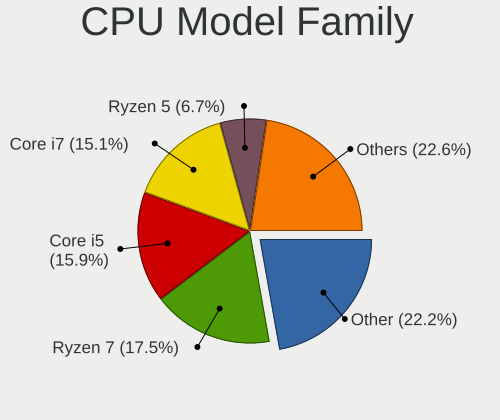

| Model                | Computers | Percent |
|----------------------|-----------|---------|
| Other                | 103       | 22.2%   |
| AMD Ryzen 7          | 81        | 17.46%  |
| Intel Core i5        | 74        | 15.95%  |
| Intel Core i7        | 70        | 15.09%  |
| AMD Ryzen 5          | 31        | 6.68%   |
| Intel Core           | 13        | 2.8%    |
| AMD Ryzen 9          | 13        | 2.8%    |
| Intel Core i9        | 12        | 2.59%   |
| Intel Core i3        | 12        | 2.59%   |
| Intel Celeron        | 9         | 1.94%   |
| Intel Pentium        | 7         | 1.51%   |
| Intel Core 2 Duo     | 7         | 1.51%   |
| Intel Xeon           | 6         | 1.29%   |
| AMD Ryzen 3          | 6         | 1.29%   |
| AMD A6               | 3         | 0.65%   |
| AMD Ryzen 5 PRO      | 2         | 0.43%   |
| AMD FX               | 2         | 0.43%   |
| AMD A8               | 2         | 0.43%   |
| AMD A10              | 2         | 0.43%   |
| Intel Pentium Silver | 1         | 0.22%   |
| Intel Core m5        | 1         | 0.22%   |
| Intel Core 2 Quad    | 1         | 0.22%   |
| AMD Turion II        | 1         | 0.22%   |
| AMD Ryzen 7 PRO      | 1         | 0.22%   |
| AMD Phenom II X2     | 1         | 0.22%   |
| AMD E1               | 1         | 0.22%   |
| AMD Athlon II X4     | 1         | 0.22%   |
| AMD Athlon 64 X2     | 1         | 0.22%   |

CPU Cores
---------

Number of processor cores

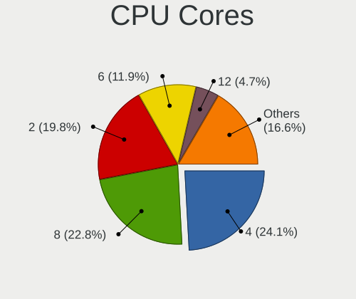

| Number | Computers | Percent |
|--------|-----------|---------|
| 4      | 112       | 24.14%  |
| 8      | 106       | 22.84%  |
| 2      | 92        | 19.83%  |
| 6      | 55        | 11.85%  |
| 12     | 22        | 4.74%   |
| 14     | 21        | 4.53%   |
| 16     | 18        | 3.88%   |
| 24     | 17        | 3.66%   |
| 10     | 16        | 3.45%   |
| 20     | 1         | 0.22%   |
| 18     | 1         | 0.22%   |
| 5      | 1         | 0.22%   |
| 3      | 1         | 0.22%   |
| 1      | 1         | 0.22%   |

CPU Sockets
-----------

Number of sockets

| Number | Computers | Percent |
|--------|-----------|---------|
| 1      | 464       | 100%    |

CPU Threads
-----------

Threads per core (Hyper-Threading)

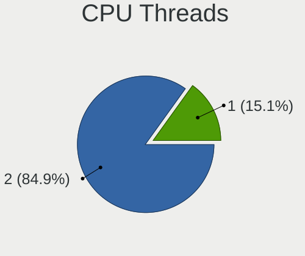

| Number | Computers | Percent |
|--------|-----------|---------|
| 2      | 394       | 84.91%  |
| 1      | 70        | 15.09%  |

CPU Op-Modes
------------

CPU Operation Modes (32-bit, 64-bit)

| Op mode        | Computers | Percent |
|----------------|-----------|---------|
| 32-bit, 64-bit | 464       | 100%    |

CPU Microcode
-------------

Microcode number

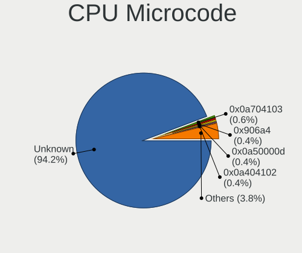

| Number     | Computers | Percent |
|------------|-----------|---------|
| Unknown    | 442       | 94.24%  |
| 0x0a704103 | 3         | 0.64%   |
| 0x906a4    | 2         | 0.43%   |
| 0x0a50000d | 2         | 0.43%   |
| 0x0a404102 | 2         | 0.43%   |
| 0x08608103 | 2         | 0.43%   |
| 0x08600106 | 2         | 0.43%   |
| 0xa0653    | 1         | 0.21%   |
| 0x906ea    | 1         | 0.21%   |
| 0x906e9    | 1         | 0.21%   |
| 0x906a3    | 1         | 0.21%   |
| 0x806c1    | 1         | 0.21%   |
| 0x306d4    | 1         | 0.21%   |
| 0x0a705205 | 1         | 0.21%   |
| 0x0a705203 | 1         | 0.21%   |
| 0x0a704101 | 1         | 0.21%   |
| 0x0a50000c | 1         | 0.21%   |
| 0x08701030 | 1         | 0.21%   |
| 0x08701021 | 1         | 0.21%   |
| 0x08600103 | 1         | 0.21%   |
| 0x010000c8 | 1         | 0.21%   |

CPU Microarch
-------------

Microarchitecture

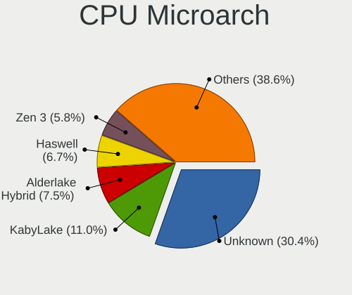

| Name              | Computers | Percent |
|-------------------|-----------|---------|
| Unknown           | 141       | 30.39%  |
| KabyLake          | 51        | 10.99%  |
| Alderlake Hybrid  | 35        | 7.54%   |
| Haswell           | 31        | 6.68%   |
| Zen 3             | 27        | 5.82%   |
| Zen 2             | 27        | 5.82%   |
| IvyBridge         | 22        | 4.74%   |
| CometLake         | 18        | 3.88%   |
| Skylake           | 17        | 3.66%   |
| TigerLake         | 16        | 3.45%   |
| SandyBridge       | 16        | 3.45%   |
| Penryn            | 8         | 1.72%   |
| Broadwell         | 8         | 1.72%   |
| Westmere          | 7         | 1.51%   |
| Zen+              | 6         | 1.29%   |
| Zen               | 4         | 0.86%   |
| Piledriver        | 4         | 0.86%   |
| Icelake           | 4         | 0.86%   |
| Goldmont plus     | 4         | 0.86%   |
| K10               | 3         | 0.65%   |
| Puma              | 2         | 0.43%   |
| Nehalem           | 2         | 0.43%   |
| Lunarlake Hybrid  | 2         | 0.43%   |
| Gracemont         | 2         | 0.43%   |
| Bulldozer         | 2         | 0.43%   |
| Silvermont        | 1         | 0.22%   |
| Meteorlake Hybrid | 1         | 0.22%   |
| K8 Hammer         | 1         | 0.22%   |
| Jaguar            | 1         | 0.22%   |
| Excavator         | 1         | 0.22%   |

Graphics
--------

GPU Vendor
----------

Vendors of graphics cards

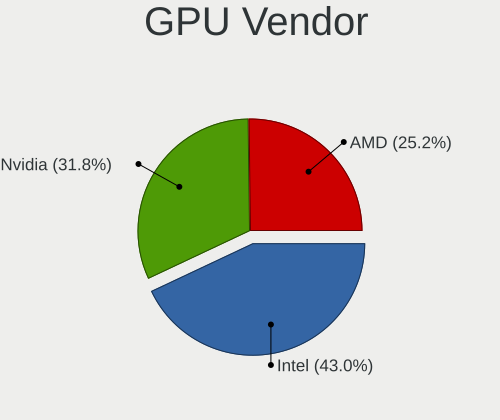

| Vendor | Computers | Percent |
|--------|-----------|---------|
| Intel  | 261       | 43%     |
| Nvidia | 193       | 31.8%   |
| AMD    | 153       | 25.21%  |

GPU Model
---------

Graphics card models

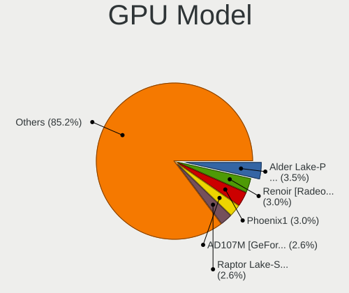

| Model                                                                       | Computers | Percent |
|-----------------------------------------------------------------------------|-----------|---------|
| Intel Alder Lake-P GT2 [Iris Xe Graphics]                                   | 22        | 3.53%   |
| AMD Renoir [Radeon Vega Series / Radeon Vega Mobile Series]                 | 19        | 3.05%   |
| AMD Phoenix1                                                                | 19        | 3.05%   |
| Nvidia AD107M [GeForce RTX 4060 Max-Q / Mobile]                             | 16        | 2.57%   |
| Intel Raptor Lake-S UHD Graphics                                            | 16        | 2.57%   |
| Intel 3rd Gen Core processor Graphics Controller                            | 16        | 2.57%   |
| Intel TigerLake-LP GT2 [Iris Xe Graphics]                                   | 15        | 2.41%   |
| AMD HawkPoint1                                                              | 15        | 2.41%   |
| Intel Raptor Lake-P [Iris Xe Graphics]                                      | 13        | 2.09%   |
| Intel CoffeeLake-H GT2 [UHD Graphics 630]                                   | 13        | 2.09%   |
| Intel 2nd Generation Core Processor Family Integrated Graphics Controller   | 13        | 2.09%   |
| AMD Cezanne [Radeon Vega Series / Radeon Vega Mobile Series]                | 12        | 1.93%   |
| Nvidia GA106M [GeForce RTX 3060 Mobile / Max-Q]                             | 11        | 1.77%   |
| Intel Kaby Lake-R GT2 [UHD Graphics 620]                                    | 11        | 1.77%   |
| AMD Rembrandt [Radeon 680M]                                                 | 10        | 1.61%   |
| AMD Lucienne                                                                | 10        | 1.61%   |
| Nvidia GP108 [GeForce GT 1030]                                              | 9         | 1.44%   |
| Nvidia AD106M [GeForce RTX 4070 Max-Q / Mobile]                             | 9         | 1.44%   |
| Intel Xeon E3-1200 v3/4th Gen Core Processor Integrated Graphics Controller | 9         | 1.44%   |
| Intel Haswell-ULT Integrated Graphics Controller                            | 9         | 1.44%   |
| AMD Raphael                                                                 | 9         | 1.44%   |
| AMD Navi 33 [Radeon RX 7600/7600 XT/7600M XT/7600S/7700S / PRO W7600]       | 9         | 1.44%   |
| Intel Meteor Lake-P [Intel Arc Graphics]                                    | 8         | 1.28%   |
| Nvidia TU116M [GeForce GTX 1660 Ti Mobile]                                  | 7         | 1.12%   |
| Intel CometLake-H GT2 [UHD Graphics]                                        | 7         | 1.12%   |
| Nvidia AD107M [GeForce RTX 4050 Max-Q / Mobile]                             | 6         | 0.96%   |
| Intel Core Processor Integrated Graphics Controller                         | 6         | 0.96%   |
| Intel Broadwell-U GT2 [HD Graphics 5500]                                    | 6         | 0.96%   |
| Intel Alder Lake-UP3 GT2 [Iris Xe Graphics]                                 | 6         | 0.96%   |
| Nvidia TU117M [GeForce GTX 1650 Mobile / Max-Q]                             | 5         | 0.8%    |
| Nvidia TU116 [GeForce GTX 1660 SUPER]                                       | 5         | 0.8%    |
| Nvidia GA104M [GeForce RTX 3080 Mobile / Max-Q 8GB/16GB]                    | 5         | 0.8%    |
| Intel Skylake-U GT2 [HD Graphics 520]                                       | 5         | 0.8%    |
| Intel Kaby Lake-U GT2 [HD Graphics 620]                                     | 5         | 0.8%    |
| Intel Kaby Lake-H GT2 [HD Graphics 630]                                     | 5         | 0.8%    |
| Intel 4th Gen Core Processor Integrated Graphics Controller                 | 5         | 0.8%    |
| AMD Strix [Radeon 880M / 890M]                                              | 5         | 0.8%    |
| AMD Picasso/Raven 2 [Radeon Vega Series / Radeon Vega Mobile Series]        | 5         | 0.8%    |
| AMD Barcelo                                                                 | 5         | 0.8%    |
| Nvidia GA107M [GeForce RTX 3050 Ti Mobile]                                  | 4         | 0.64%   |

GPU Combo
---------

Combinations of graphics cards

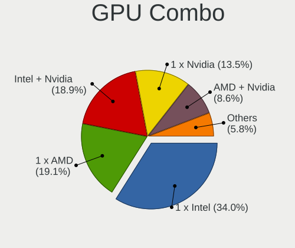

| Name           | Computers | Percent |
|----------------|-----------|---------|
| 1 x Intel      | 158       | 33.98%  |
| 1 x AMD        | 89        | 19.14%  |
| Intel + Nvidia | 88        | 18.92%  |
| 1 x Nvidia     | 63        | 13.55%  |
| AMD + Nvidia   | 40        | 8.6%    |
| Intel + AMD    | 13        | 2.8%    |
| 2 x AMD        | 12        | 2.58%   |
| 2 x Nvidia     | 2         | 0.43%   |

GPU Driver
----------

Free vs proprietary

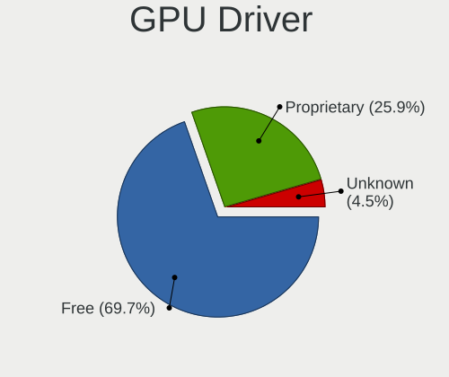

| Driver      | Computers | Percent |
|-------------|-----------|---------|
| Free        | 326       | 69.66%  |
| Proprietary | 121       | 25.85%  |
| Unknown     | 21        | 4.49%   |

GPU Memory
----------

Total video memory

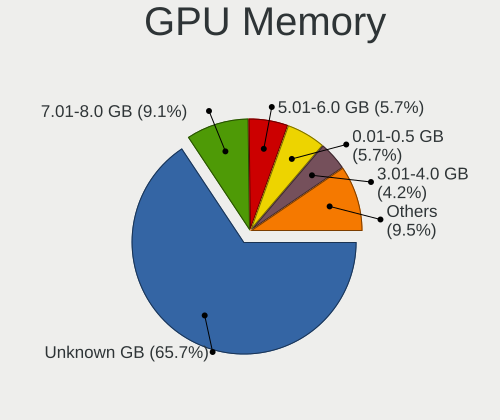

| Size in GB | Computers | Percent |
|------------|-----------|---------|
| Unknown    | 310       | 65.68%  |
| 7.01-8.0   | 43        | 9.11%   |
| 5.01-6.0   | 27        | 5.72%   |
| 0.01-0.5   | 27        | 5.72%   |
| 3.01-4.0   | 20        | 4.24%   |
| 8.01-16.0  | 18        | 3.81%   |
| 1.01-2.0   | 17        | 3.6%    |
| 16.01-24.0 | 4         | 0.85%   |
| 2.01-3.0   | 3         | 0.64%   |
| 0.51-1.0   | 3         | 0.64%   |

Monitor
-------

Monitor Vendor
--------------

Monitor vendors

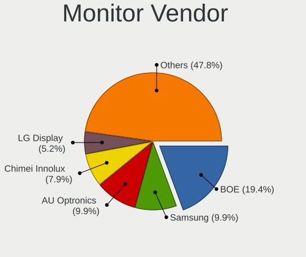

| Vendor               | Computers | Percent |
|----------------------|-----------|---------|
| BOE                  | 108       | 19.39%  |
| Samsung Electronics  | 55        | 9.87%   |
| AU Optronics         | 55        | 9.87%   |
| Chimei Innolux       | 44        | 7.9%    |
| LG Display           | 29        | 5.21%   |
| Goldstar             | 24        | 4.31%   |
| Dell                 | 23        | 4.13%   |
| Acer                 | 20        | 3.59%   |
| BenQ                 | 17        | 3.05%   |
| Apple                | 17        | 3.05%   |
| Hewlett-Packard      | 15        | 2.69%   |
| ASUSTek Computer     | 13        | 2.33%   |
| CSO                  | 12        | 2.15%   |
| CSW                  | 11        | 1.97%   |
| Lenovo               | 10        | 1.8%    |
| AOC                  | 9         | 1.62%   |
| Sharp                | 8         | 1.44%   |
| Philips              | 8         | 1.44%   |
| Iiyama               | 8         | 1.44%   |
| Ancor Communications | 7         | 1.26%   |
| MSI                  | 5         | 0.9%    |
| InfoVision           | 5         | 0.9%    |
| TMA                  | 4         | 0.72%   |
| NEC Computers        | 4         | 0.72%   |
| Eizo                 | 4         | 0.72%   |
| CSOT                 | 4         | 0.72%   |
| ViewSonic            | 3         | 0.54%   |
| HUAWEI               | 3         | 0.54%   |
| Sony                 | 2         | 0.36%   |
| SGT                  | 2         | 0.36%   |
| RTK                  | 2         | 0.36%   |
| PANDA                | 2         | 0.36%   |
| Medion               | 2         | 0.36%   |
| HKC                  | 2         | 0.36%   |
| Gigabyte Technology  | 2         | 0.36%   |
| Fujitsu Siemens      | 2         | 0.36%   |
| Yamaha               | 1         | 0.18%   |
| Vizio                | 1         | 0.18%   |
| VIE                  | 1         | 0.18%   |
| Vestel Elektronik    | 1         | 0.18%   |

Monitor Model
-------------

Monitor models

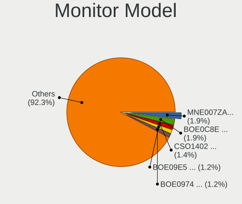

| Model                                                              | Computers | Percent |
|--------------------------------------------------------------------|-----------|---------|
| CSW MNE007ZA3-2 CSW1431 2880x1800 301x188mm 14.0-inch              | 11        | 1.92%   |
| BOE LCD Monitor BOE0C8E 2560x1600 329x206mm 15.3-inch              | 11        | 1.92%   |
| CSO LCD Monitor CSO1402 2880x1800 302x188mm 14.0-inch              | 8         | 1.4%    |
| BOE LCD Monitor BOE09E5 2560x1440 355x200mm 16.0-inch              | 7         | 1.22%   |
| BOE LCD Monitor BOE0974 2560x1440 344x194mm 15.5-inch              | 7         | 1.22%   |
| BOE LCD Monitor BOE0AF0 2560x1600 344x215mm 16.0-inch              | 6         | 1.05%   |
| BOE LCD Monitor BOE07D8 1920x1080 344x194mm 15.5-inch              | 6         | 1.05%   |
| BOE LCD Monitor BOE0A3B 2560x1600 344x215mm 16.0-inch              | 5         | 0.87%   |
| BOE LCD Monitor BOE084D 1920x1080 344x193mm 15.5-inch              | 5         | 0.87%   |
| TMA TL140ADXP24-0 TMA2004 2880x1800 300x190mm 14.0-inch            | 4         | 0.7%    |
| Samsung Electronics C24F390 SAM0D2C 1920x1080 521x293mm 23.5-inch  | 4         | 0.7%    |
| BOE LCD Monitor BOE0A99 2560x1600 366x229mm 17.0-inch              | 4         | 0.7%    |
| BOE LCD Monitor BOE0747 1920x1080 344x194mm 15.5-inch              | 4         | 0.7%    |
| Sharp LQ156M1JW01 SHP14C3 1920x1080 344x194mm 15.5-inch            | 3         | 0.52%   |
| Samsung Electronics C27F390 SAM0D32 1920x1080 598x336mm 27.0-inch  | 3         | 0.52%   |
| Goldstar HDR 4K GSM7706 3840x2160 600x340mm 27.2-inch              | 3         | 0.52%   |
| CSO LCD Monitor CSO140C 2880x1800 302x188mm 14.0-inch              | 3         | 0.52%   |
| Chimei Innolux LCD Monitor CMN1602 1920x1080 355x199mm 16.0-inch   | 3         | 0.52%   |
| Chimei Innolux LCD Monitor CMN15E8 1920x1080 344x193mm 15.5-inch   | 3         | 0.52%   |
| BOE LCD Monitor BOE0B40 2560x1440 344x194mm 15.5-inch              | 3         | 0.52%   |
| BOE LCD Monitor BOE09F9 2560x1440 381x214mm 17.2-inch              | 3         | 0.52%   |
| Apple Color LCD APP9CC7 1280x800 286x179mm 13.3-inch               | 3         | 0.52%   |
| Samsung Electronics S24D330 SAM0D92 1920x1080 531x299mm 24.0-inch  | 2         | 0.35%   |
| Samsung Electronics LS24C36x SAM7314 1920x1080 598x336mm 27.0-inch | 2         | 0.35%   |
| Samsung Electronics C32R50x SAM7000 1920x1080 698x393mm 31.5-inch  | 2         | 0.35%   |
| LG Display LCD Monitor LGD065B 1920x1080 382x215mm 17.3-inch       | 2         | 0.35%   |
| LG Display LCD Monitor LGD04A7 1920x1080 344x194mm 15.5-inch       | 2         | 0.35%   |
| LG Display LCD Monitor LGD046F 1920x1080 344x194mm 15.5-inch       | 2         | 0.35%   |
| Lenovo LEN D32q-20B LEN65F7 2560x1440 698x393mm 31.5-inch          | 2         | 0.35%   |
| Lenovo LCD Monitor LEN40BA 1920x1080 344x194mm 15.5-inch           | 2         | 0.35%   |
| HUAWEI ZQE-CBA HWV6A25 3440x1440 797x334mm 34.0-inch               | 2         | 0.35%   |
| Goldstar ULTRAWIDE GSM76F9 2560x1080 531x298mm 24.0-inch           | 2         | 0.35%   |
| Goldstar 27GL850 GSM5B7F 2560x1440 597x336mm 27.0-inch             | 2         | 0.35%   |
| Dell SE2419HR DELF113 1920x1080 527x296mm 23.8-inch                | 2         | 0.35%   |
| Dell P2722H DEL4241 1920x1080 598x336mm 27.0-inch                  | 2         | 0.35%   |
| CSOT LCD Monitor CSO140C 2880x1800 302x188mm 14.0-inch             | 2         | 0.35%   |
| Chimei Innolux LCD Monitor CMN1733 1600x900 382x215mm 17.3-inch    | 2         | 0.35%   |
| Chimei Innolux LCD Monitor CMN15CA 1366x768 344x193mm 15.5-inch    | 2         | 0.35%   |
| Chimei Innolux LCD Monitor CMN15C5 1366x768 344x193mm 15.5-inch    | 2         | 0.35%   |
| Chimei Innolux LCD Monitor CMN15BA 1920x1080 344x194mm 15.5-inch   | 2         | 0.35%   |

Monitor Resolution
------------------

Monitor screen resolution

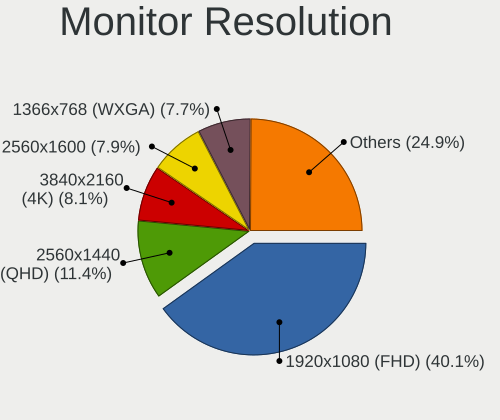

| Resolution         | Computers | Percent |
|--------------------|-----------|---------|
| 1920x1080 (FHD)    | 214       | 40.07%  |
| 2560x1440 (QHD)    | 61        | 11.42%  |
| 3840x2160 (4K)     | 43        | 8.05%   |
| 2560x1600          | 42        | 7.87%   |
| 1366x768 (WXGA)    | 41        | 7.68%   |
| 2880x1800          | 36        | 6.74%   |
| 1920x1200 (WUXGA)  | 22        | 4.12%   |
| 1600x900 (HD+)     | 12        | 2.25%   |
| 3440x1440          | 11        | 2.06%   |
| 1280x800 (WXGA)    | 9         | 1.69%   |
| 1440x900 (WXGA+)   | 8         | 1.5%    |
| 1280x1024 (SXGA)   | 6         | 1.12%   |
| 2560x1080          | 5         | 0.94%   |
| 1680x1050 (WSXGA+) | 4         | 0.75%   |
| 3840x1080          | 3         | 0.56%   |
| 3200x1800 (QHD+)   | 2         | 0.37%   |
| 3072x1920          | 2         | 0.37%   |
| 2160x1440          | 2         | 0.37%   |
| 1920x540           | 2         | 0.37%   |
| 800x1280           | 1         | 0.19%   |
| 3840x2560          | 1         | 0.19%   |
| 3840x1600          | 1         | 0.19%   |
| 2520x1680          | 1         | 0.19%   |
| 2288x1287          | 1         | 0.19%   |
| 2240x1400          | 1         | 0.19%   |
| 1600x1200          | 1         | 0.19%   |
| 1360x768           | 1         | 0.19%   |
| Unknown            | 1         | 0.19%   |

Monitor Diagonal
----------------

Diagonal size in inches

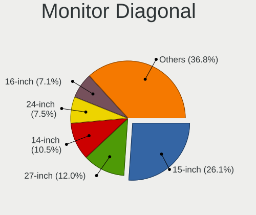

| Inches  | Computers | Percent |
|---------|-----------|---------|
| 15      | 146       | 26.07%  |
| 27      | 67        | 11.96%  |
| 14      | 59        | 10.54%  |
| 24      | 42        | 7.5%    |
| 16      | 40        | 7.14%   |
| 17      | 35        | 6.25%   |
| 13      | 33        | 5.89%   |
| 23      | 21        | 3.75%   |
| 31      | 19        | 3.39%   |
| 34      | 16        | 2.86%   |
| 21      | 14        | 2.5%    |
| 19      | 9         | 1.61%   |
| 12      | 7         | 1.25%   |
| 22      | 5         | 0.89%   |
| 20      | 5         | 0.89%   |
| 40      | 4         | 0.71%   |
| 11      | 4         | 0.71%   |
| Unknown | 4         | 0.71%   |
| 84      | 3         | 0.54%   |
| 28      | 3         | 0.54%   |
| 25      | 3         | 0.54%   |
| 63      | 2         | 0.36%   |
| 54      | 2         | 0.36%   |
| 18      | 2         | 0.36%   |
| 74      | 1         | 0.18%   |
| 72      | 1         | 0.18%   |
| 60      | 1         | 0.18%   |
| 49      | 1         | 0.18%   |
| 48      | 1         | 0.18%   |
| 46      | 1         | 0.18%   |
| 43      | 1         | 0.18%   |
| 39      | 1         | 0.18%   |
| 37      | 1         | 0.18%   |
| 36      | 1         | 0.18%   |
| 33      | 1         | 0.18%   |
| 32      | 1         | 0.18%   |
| 29      | 1         | 0.18%   |
| 26      | 1         | 0.18%   |
| 7       | 1         | 0.18%   |

Monitor Width
-------------

Physical width

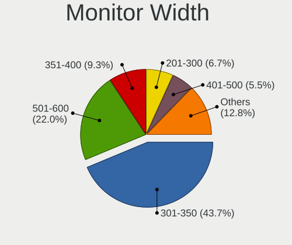

| Width in mm | Computers | Percent |
|-------------|-----------|---------|
| 301-350     | 240       | 43.72%  |
| 501-600     | 121       | 22.04%  |
| 351-400     | 51        | 9.29%   |
| 201-300     | 37        | 6.74%   |
| 401-500     | 30        | 5.46%   |
| 601-700     | 26        | 4.74%   |
| 701-800     | 18        | 3.28%   |
| 1001-1500   | 8         | 1.46%   |
| 801-900     | 6         | 1.09%   |
| 1501-2000   | 5         | 0.91%   |
| Unknown     | 4         | 0.73%   |
| 901-1000    | 2         | 0.36%   |
| 1-100       | 1         | 0.18%   |

Aspect Ratio
------------

Proportional relationship between the width and the height

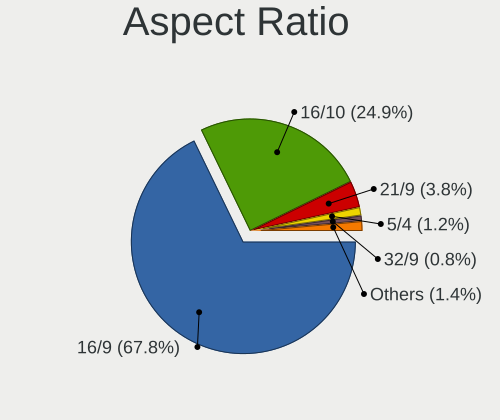

| Ratio   | Computers | Percent |
|---------|-----------|---------|
| 16/9    | 337       | 67.81%  |
| 16/10   | 124       | 24.95%  |
| 21/9    | 19        | 3.82%   |
| 5/4     | 6         | 1.21%   |
| 32/9    | 4         | 0.8%    |
| 3/2     | 4         | 0.8%    |
| 4/3     | 1         | 0.2%    |
| 0.62    | 1         | 0.2%    |
| Unknown | 1         | 0.2%    |

Monitor Area
------------

Area in inch²

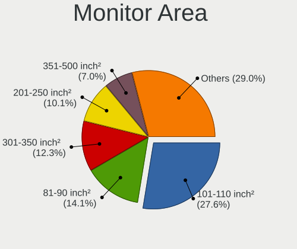

| Area in inch² | Computers | Percent |
|----------------|-----------|---------|
| 101-110        | 153       | 27.57%  |
| 81-90          | 78        | 14.05%  |
| 301-350        | 68        | 12.25%  |
| 201-250        | 56        | 10.09%  |
| 351-500        | 39        | 7.03%   |
| 111-120        | 33        | 5.95%   |
| 121-130        | 32        | 5.77%   |
| 251-300        | 20        | 3.6%    |
| 151-200        | 20        | 3.6%    |
| 71-80          | 13        | 2.34%   |
| 501-1000       | 11        | 1.98%   |
| More than 1000 | 10        | 1.8%    |
| 61-70          | 7         | 1.26%   |
| 51-60          | 4         | 0.72%   |
| Unknown        | 4         | 0.72%   |
| 141-150        | 3         | 0.54%   |
| 131-140        | 2         | 0.36%   |
| 1-40           | 1         | 0.18%   |
| 91-100         | 1         | 0.18%   |

Pixel Density
-------------

Pixels per inch

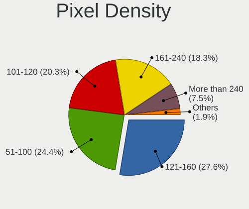

| Density       | Computers | Percent |
|---------------|-----------|---------|
| 121-160       | 148       | 27.61%  |
| 51-100        | 131       | 24.44%  |
| 101-120       | 109       | 20.34%  |
| 161-240       | 98        | 18.28%  |
| More than 240 | 40        | 7.46%   |
| 1-50          | 6         | 1.12%   |
| Unknown       | 4         | 0.75%   |

Multiple Monitors
-----------------

Total monitors connected

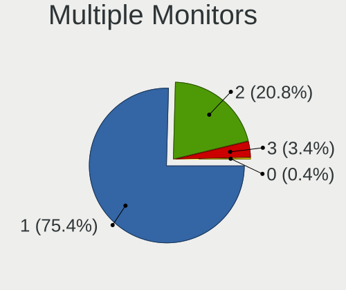

| Total | Computers | Percent |
|-------|-----------|---------|
| 1     | 356       | 75.42%  |
| 2     | 98        | 20.76%  |
| 3     | 16        | 3.39%   |
| 0     | 2         | 0.42%   |

Network
-------

Net Controller Vendor
---------------------

Controller vendors

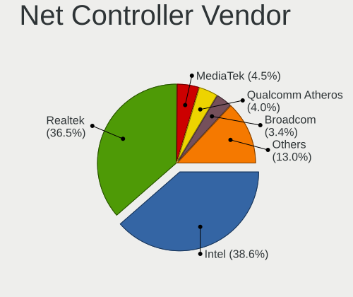

| Vendor                                 | Computers | Percent |
|----------------------------------------|-----------|---------|
| Intel                                  | 299       | 38.58%  |
| Realtek Semiconductor                  | 283       | 36.52%  |
| MediaTek                               | 35        | 4.52%   |
| Qualcomm Atheros                       | 31        | 4%      |
| Broadcom                               | 26        | 3.35%   |
| Suzhou Motorcomm Electronic Technology | 19        | 2.45%   |
| Ralink Technology                      | 9         | 1.16%   |
| DisplayLink                            | 9         | 1.16%   |
| ASIX Electronics                       | 9         | 1.16%   |
| Broadcom Limited                       | 8         | 1.03%   |
| TP-Link                                | 7         | 0.9%    |
| Motorcomm Microelectronics.            | 5         | 0.65%   |
| Huawei Technologies                    | 5         | 0.65%   |
| Sierra Wireless                        | 4         | 0.52%   |
| Nvidia                                 | 4         | 0.52%   |
| Lenovo                                 | 3         | 0.39%   |
| Ralink                                 | 2         | 0.26%   |
| Qualcomm Atheros Communications        | 2         | 0.26%   |
| Dell                                   | 2         | 0.26%   |
| D-Link                                 | 2         | 0.26%   |
| Samsung Electronics                    | 1         | 0.13%   |
| Qualcomm Technologies                  | 1         | 0.13%   |
| Qualcomm                               | 1         | 0.13%   |
| QinHeng Electronics                    | 1         | 0.13%   |
| OPPO Electronics                       | 1         | 0.13%   |
| NetGear                                | 1         | 0.13%   |
| Motorola PCS                           | 1         | 0.13%   |
| Microsoft                              | 1         | 0.13%   |
| Marvell Technology Group               | 1         | 0.13%   |
| Ericsson Business Mobile Networks      | 1         | 0.13%   |
| ASUSTek Computer                       | 1         | 0.13%   |

Net Controller Model
--------------------

Controller models

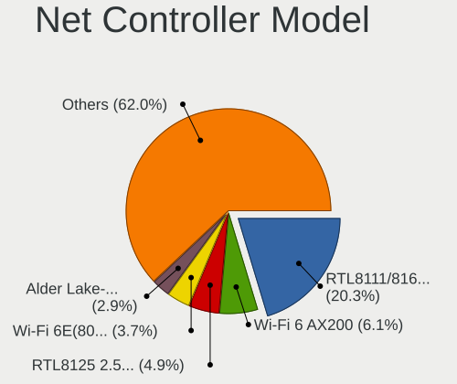

| Model                                                                  | Computers | Percent |
|------------------------------------------------------------------------|-----------|---------|
| Realtek RTL8111/8168/8211/8411 PCI Express Gigabit Ethernet Controller | 180       | 20.34%  |
| Intel Wi-Fi 6 AX200                                                    | 54        | 6.1%    |
| Realtek RTL8125 2.5GbE Controller                                      | 43        | 4.86%   |
| Intel Wi-Fi 6E(802.11ax) AX210/AX1675* 2x2 [Typhoon Peak]              | 33        | 3.73%   |
| Intel Alder Lake-P PCH CNVi WiFi                                       | 26        | 2.94%   |
| Realtek RTL8153 Gigabit Ethernet Adapter                               | 23        | 2.6%    |
| MediaTek MT7922 802.11ax PCI Express Wireless Network Adapter          | 23        | 2.6%    |
| Intel 700 Series Chipset CNVi WiFi                                     | 20        | 2.26%   |
| Suzhou Motorcomm Electronic YT6801 Gigabit Ethernet Controller         | 19        | 2.15%   |
| Intel Ethernet Controller I225-V                                       | 19        | 2.15%   |
| Intel Wireless 8265 / 8275                                             | 15        | 1.69%   |
| Intel Raptor Lake PCH CNVi WiFi                                        | 15        | 1.69%   |
| Realtek RTL810xE PCI Express Fast Ethernet controller                  | 14        | 1.58%   |
| Intel Wi-Fi 6 AX201                                                    | 13        | 1.47%   |
| Intel Wi-Fi 5(802.11ac) Wireless-AC 9x6x [Thunder Peak]                | 10        | 1.13%   |
| Intel 82579LM Gigabit Network Connection (Lewisville)                  | 9         | 1.02%   |
| ASIX AX88179 Gigabit Ethernet                                          | 8         | 0.9%    |
| Realtek RTL8822CE 802.11ac PCIe Wireless Network Adapter               | 7         | 0.79%   |
| Intel Comet Lake PCH CNVi WiFi                                         | 7         | 0.79%   |
| Broadcom NetXtreme BCM57765 Gigabit Ethernet PCIe                      | 7         | 0.79%   |
| Broadcom BCM4331 802.11a/b/g/n                                         | 7         | 0.79%   |
| Realtek Killer E2600 GbE Controller                                    | 6         | 0.68%   |
| Qualcomm Atheros AR9485 Wireless Network Adapter                       | 6         | 0.68%   |
| Intel Wireless 8260                                                    | 6         | 0.68%   |
| Intel Wireless 3160                                                    | 6         | 0.68%   |
| Intel Meteor Lake PCH CNVi WiFi                                        | 6         | 0.68%   |
| Intel Centrino Advanced-N 6205 [Taylor Peak]                           | 6         | 0.68%   |
| DisplayLink USB-C Triple-4K Dock                                       | 6         | 0.68%   |
| Realtek RTL8852BE PCIe 802.11ax Wireless Network Controller            | 5         | 0.56%   |
| Realtek RTL8821CE 802.11ac PCIe Wireless Network Adapter               | 5         | 0.56%   |
| Qualcomm Atheros QCA9565 / AR9565 Wireless Network Adapter             | 5         | 0.56%   |
| Qualcomm Atheros QCA6174 802.11ac Wireless Network Adapter             | 5         | 0.56%   |
| Motorcomm Microelectronics. YT6801 Gigabit Ethernet Controller         | 5         | 0.56%   |
| MediaTek MT7921 802.11ax PCIe Wireless Network Adapter [Filogic 330]   | 5         | 0.56%   |
| Intel Wireless 7265                                                    | 5         | 0.56%   |
| Intel Wi-Fi 7(802.11be) AX1775*/AX1790*/BE20*/BE401/BE1750* 2x2        | 5         | 0.56%   |
| Intel Ethernet Connection I217-LM                                      | 5         | 0.56%   |
| Intel Cannon Lake PCH CNVi WiFi                                        | 5         | 0.56%   |
| Realtek RTL8852AE 802.11ax PCIe Wireless Network Adapter               | 4         | 0.45%   |
| Realtek Killer E3000 2.5GbE Controller                                 | 4         | 0.45%   |

Wireless Vendor
---------------

Wireless vendors

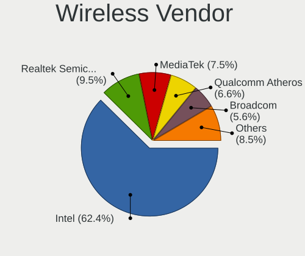

| Vendor                          | Computers | Percent |
|---------------------------------|-----------|---------|
| Intel                           | 257       | 62.38%  |
| Realtek Semiconductor           | 39        | 9.47%   |
| MediaTek                        | 31        | 7.52%   |
| Qualcomm Atheros                | 27        | 6.55%   |
| Broadcom                        | 23        | 5.58%   |
| Ralink Technology               | 9         | 2.18%   |
| TP-Link                         | 6         | 1.46%   |
| Broadcom Limited                | 6         | 1.46%   |
| Sierra Wireless                 | 4         | 0.97%   |
| Ralink                          | 2         | 0.49%   |
| Qualcomm Atheros Communications | 2         | 0.49%   |
| D-Link                          | 2         | 0.49%   |
| Qualcomm                        | 1         | 0.24%   |
| NetGear                         | 1         | 0.24%   |
| Microsoft                       | 1         | 0.24%   |
| ASUSTek Computer                | 1         | 0.24%   |

Wireless Model
--------------

Wireless models

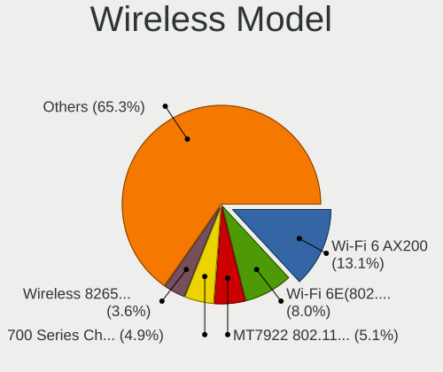

| Model                                                                | Computers | Percent |
|----------------------------------------------------------------------|-----------|---------|
| Intel Wi-Fi 6 AX200                                                  | 54        | 13.11%  |
| Intel Wi-Fi 6E(802.11ax) AX210/AX1675* 2x2 [Typhoon Peak]            | 33        | 8.01%   |
| MediaTek MT7922 802.11ax PCI Express Wireless Network Adapter        | 21        | 5.1%    |
| Intel 700 Series Chipset CNVi WiFi                                   | 20        | 4.85%   |
| Intel Wireless 8265 / 8275                                           | 15        | 3.64%   |
| Intel Raptor Lake PCH CNVi WiFi                                      | 15        | 3.64%   |
| Intel Wi-Fi 6 AX201                                                  | 13        | 3.16%   |
| Intel Alder Lake-P PCH CNVi WiFi                                     | 13        | 3.16%   |
| Intel Wi-Fi 5(802.11ac) Wireless-AC 9x6x [Thunder Peak]              | 10        | 2.43%   |
| Realtek RTL8822CE 802.11ac PCIe Wireless Network Adapter             | 7         | 1.7%    |
| Intel Comet Lake PCH CNVi WiFi                                       | 7         | 1.7%    |
| Broadcom BCM4331 802.11a/b/g/n                                       | 7         | 1.7%    |
| Qualcomm Atheros AR9485 Wireless Network Adapter                     | 6         | 1.46%   |
| Intel Wireless 8260                                                  | 6         | 1.46%   |
| Intel Wireless 3160                                                  | 6         | 1.46%   |
| Intel Meteor Lake PCH CNVi WiFi                                      | 6         | 1.46%   |
| Intel Centrino Advanced-N 6205 [Taylor Peak]                         | 6         | 1.46%   |
| Realtek RTL8821CE 802.11ac PCIe Wireless Network Adapter             | 5         | 1.21%   |
| Qualcomm Atheros QCA9565 / AR9565 Wireless Network Adapter           | 5         | 1.21%   |
| Qualcomm Atheros QCA6174 802.11ac Wireless Network Adapter           | 5         | 1.21%   |
| MediaTek MT7921 802.11ax PCIe Wireless Network Adapter [Filogic 330] | 5         | 1.21%   |
| Intel Wireless 7265                                                  | 5         | 1.21%   |
| Intel Wi-Fi 7(802.11be) AX1775*/AX1790*/BE20*/BE401/BE1750* 2x2      | 5         | 1.21%   |
| Intel Cannon Lake PCH CNVi WiFi                                      | 5         | 1.21%   |
| Realtek RTL8852BE PCIe 802.11ax Wireless Network Controller          | 4         | 0.97%   |
| Realtek RTL8852AE 802.11ax PCIe Wireless Network Adapter             | 4         | 0.97%   |
| Ralink RT2870/RT3070 Wireless Adapter                                | 4         | 0.97%   |
| Qualcomm Atheros QCA9377 802.11ac Wireless Network Adapter           | 4         | 0.97%   |
| MediaTek MT7921K (RZ608) Wi-Fi 6E 80MHz                              | 4         | 0.97%   |
| Intel Wireless 7260                                                  | 4         | 0.97%   |
| Broadcom BCM4322 802.11a/b/g/n Wireless LAN Controller               | 4         | 0.97%   |
| Sierra Wireless EM7455                                               | 3         | 0.73%   |
| Realtek RTL8852CE PCIe 802.11ax Wireless Network Controller          | 3         | 0.73%   |
| Realtek RTL8822BE 802.11a/b/g/n/ac WiFi adapter                      | 3         | 0.73%   |
| Realtek RTL8188EUS 802.11n Wireless Network Adapter                  | 3         | 0.73%   |
| Realtek 802.11ac NIC                                                 | 3         | 0.73%   |
| Intel Wireless 3165                                                  | 3         | 0.73%   |
| Intel Jasper Lake PCH CNVi WiFi                                      | 3         | 0.73%   |
| Intel Alder Lake-N PCH CNVi WiFi                                     | 3         | 0.73%   |
| Broadcom Limited BCM4360 802.11ac Dual Band Wireless Network Adapter | 3         | 0.73%   |

Ethernet Vendor
---------------

Ethernet vendors

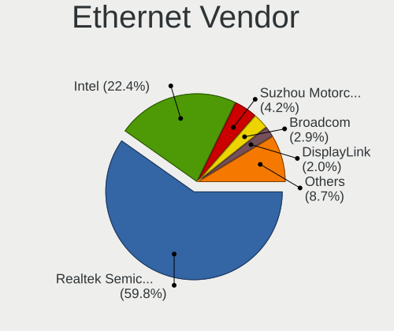

| Vendor                                 | Computers | Percent |
|----------------------------------------|-----------|---------|
| Realtek Semiconductor                  | 269       | 59.78%  |
| Intel                                  | 101       | 22.44%  |
| Suzhou Motorcomm Electronic Technology | 19        | 4.22%   |
| Broadcom                               | 13        | 2.89%   |
| DisplayLink                            | 9         | 2%      |
| ASIX Electronics                       | 9         | 2%      |
| Qualcomm Atheros                       | 6         | 1.33%   |
| Motorcomm Microelectronics.            | 5         | 1.11%   |
| Nvidia                                 | 4         | 0.89%   |
| MediaTek                               | 4         | 0.89%   |
| Lenovo                                 | 3         | 0.67%   |
| Broadcom Limited                       | 2         | 0.44%   |
| TP-Link                                | 1         | 0.22%   |
| Samsung Electronics                    | 1         | 0.22%   |
| Qualcomm Technologies                  | 1         | 0.22%   |
| OPPO Electronics                       | 1         | 0.22%   |
| Motorola PCS                           | 1         | 0.22%   |
| Marvell Technology Group               | 1         | 0.22%   |

Ethernet Model
--------------

Ethernet models

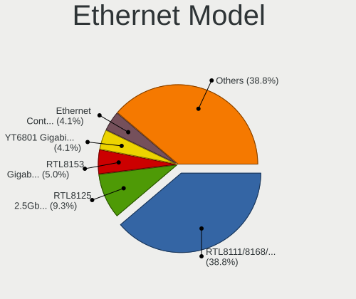

| Model                                                                           | Computers | Percent |
|---------------------------------------------------------------------------------|-----------|---------|
| Realtek RTL8111/8168/8211/8411 PCI Express Gigabit Ethernet Controller          | 180       | 38.79%  |
| Realtek RTL8125 2.5GbE Controller                                               | 43        | 9.27%   |
| Realtek RTL8153 Gigabit Ethernet Adapter                                        | 23        | 4.96%   |
| Suzhou Motorcomm Electronic YT6801 Gigabit Ethernet Controller                  | 19        | 4.09%   |
| Intel Ethernet Controller I225-V                                                | 19        | 4.09%   |
| Realtek RTL810xE PCI Express Fast Ethernet controller                           | 14        | 3.02%   |
| Intel Alder Lake-P PCH CNVi WiFi                                                | 13        | 2.8%    |
| Intel 82579LM Gigabit Network Connection (Lewisville)                           | 9         | 1.94%   |
| ASIX AX88179 Gigabit Ethernet                                                   | 8         | 1.72%   |
| Broadcom NetXtreme BCM57765 Gigabit Ethernet PCIe                               | 7         | 1.51%   |
| Realtek Killer E2600 GbE Controller                                             | 6         | 1.29%   |
| DisplayLink USB-C Triple-4K Dock                                                | 6         | 1.29%   |
| Motorcomm Microelectronics. YT6801 Gigabit Ethernet Controller                  | 5         | 1.08%   |
| Intel Ethernet Connection I217-LM                                               | 5         | 1.08%   |
| Realtek Killer E3000 2.5GbE Controller                                          | 4         | 0.86%   |
| Intel Ethernet Controller I219-V                                                | 4         | 0.86%   |
| Intel Ethernet Connection (4) I219-LM                                           | 4         | 0.86%   |
| Realtek USB 10/100/1G/2.5 LAN                                                   | 3         | 0.65%   |
| Nvidia MCP79 Ethernet                                                           | 3         | 0.65%   |
| Intel I211 Gigabit Network Connection                                           | 3         | 0.65%   |
| Intel Ethernet Connection (6) I219-LM                                           | 3         | 0.65%   |
| Intel Ethernet Connection (4) I219-V                                            | 3         | 0.65%   |
| Intel Ethernet Connection (2) I219-V                                            | 3         | 0.65%   |
| Intel Ethernet Connection (2) I219-LM                                           | 3         | 0.65%   |
| Intel Ethernet Connection (11) I219-V                                           | 3         | 0.65%   |
| Intel Alder Lake-S PCH CNVi WiFi                                                | 3         | 0.65%   |
| Qualcomm Atheros AR8161 Gigabit Ethernet                                        | 2         | 0.43%   |
| MediaTek MT7925 802.11be 160MHz 2x2 PCIe Wireless Network Adapter [Filogic 360] | 2         | 0.43%   |
| MediaTek MT7922 802.11ax PCI Express Wireless Network Adapter                   | 2         | 0.43%   |
| Intel Ethernet Connection I218-LM                                               | 2         | 0.43%   |
| Intel Ethernet Connection I217-V                                                | 2         | 0.43%   |
| Intel Ethernet Connection (16) I219-LM                                          | 2         | 0.43%   |
| Intel Ethernet Connection (13) I219-V                                           | 2         | 0.43%   |
| Intel Ethernet Connection (11) I219-LM                                          | 2         | 0.43%   |
| Intel Ethernet Connection (10) I219-V                                           | 2         | 0.43%   |
| Intel 82579V Gigabit Network Connection                                         | 2         | 0.43%   |
| DisplayLink Plugable UD-3900Z                                                   | 2         | 0.43%   |
| Broadcom NetXtreme BCM57766 Gigabit Ethernet PCIe                               | 2         | 0.43%   |
| Broadcom NetXtreme BCM5764M Gigabit Ethernet PCIe                               | 2         | 0.43%   |
| TP-Link UE300 10/100/1000 LAN (ethernet mode) [Realtek RTL8153]                 | 1         | 0.22%   |

Net Controller Kind
-------------------

Ethernet, WiFi or modem

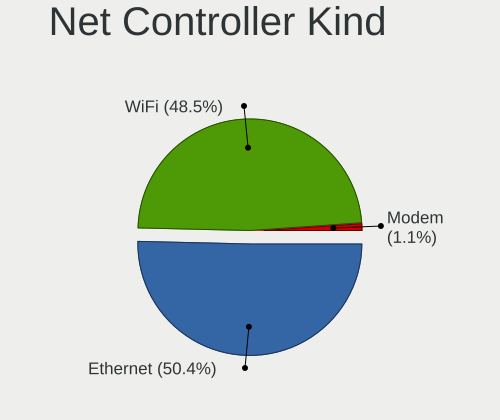

| Kind     | Computers | Percent |
|----------|-----------|---------|
| Ethernet | 407       | 50.37%  |
| WiFi     | 392       | 48.51%  |
| Modem    | 9         | 1.11%   |

Used Controller
---------------

Currently used network controller

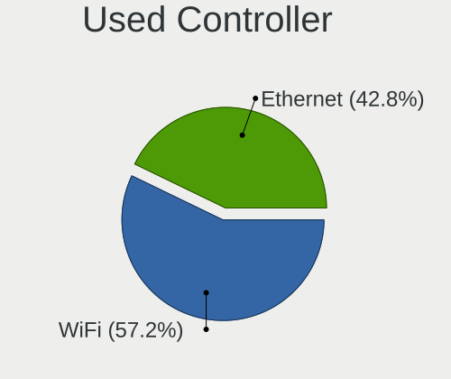

| Kind     | Computers | Percent |
|----------|-----------|---------|
| WiFi     | 279       | 57.17%  |
| Ethernet | 209       | 42.83%  |

NICs
----

Total network controllers on board

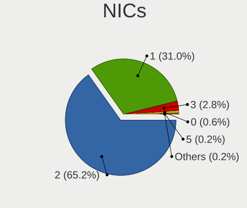

| Total | Computers | Percent |
|-------|-----------|---------|
| 2     | 303       | 65.16%  |
| 1     | 144       | 30.97%  |
| 3     | 13        | 2.8%    |
| 0     | 3         | 0.65%   |
| 5     | 1         | 0.22%   |
| 4     | 1         | 0.22%   |

IPv6
----

IPv6 vs IPv4

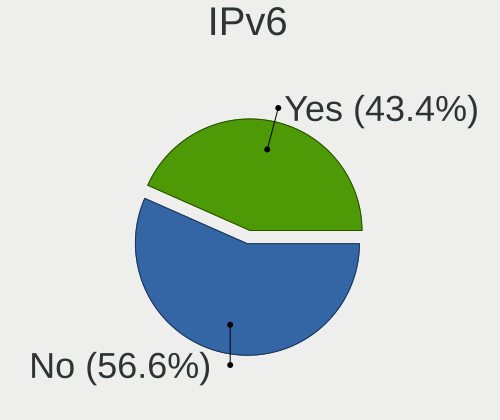

| Used | Computers | Percent |
|------|-----------|---------|
| No   | 265       | 56.62%  |
| Yes  | 203       | 43.38%  |

Bluetooth
---------

Bluetooth Vendor
----------------

Controller vendors

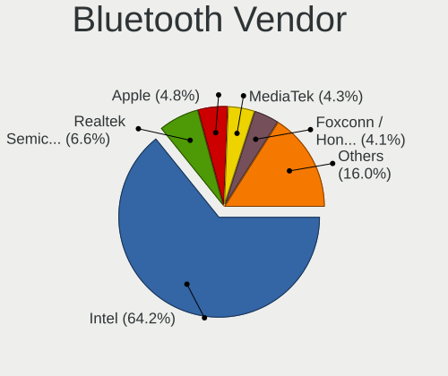

| Vendor                          | Computers | Percent |
|---------------------------------|-----------|---------|
| Intel                           | 253       | 64.21%  |
| Realtek Semiconductor           | 26        | 6.6%    |
| Apple                           | 19        | 4.82%   |
| MediaTek                        | 17        | 4.31%   |
| Foxconn / Hon Hai               | 16        | 4.06%   |
| IMC Networks                    | 12        | 3.05%   |
| Qualcomm Atheros Communications | 11        | 2.79%   |
| Broadcom                        | 11        | 2.79%   |
| Cambridge Silicon Radio         | 8         | 2.03%   |
| ASUSTek Computer                | 5         | 1.27%   |
| TP-Link                         | 3         | 0.76%   |
| Toshiba                         | 3         | 0.76%   |
| Ralink                          | 2         | 0.51%   |
| Dell                            | 2         | 0.51%   |
| Realtek                         | 1         | 0.25%   |
| Quectel Wireless Solutions      | 1         | 0.25%   |
| Lite-On Technology              | 1         | 0.25%   |
| Hewlett-Packard                 | 1         | 0.25%   |
| Edimax Technology               | 1         | 0.25%   |
| Unknown                         | 1         | 0.25%   |

Bluetooth Model
---------------

Controller models

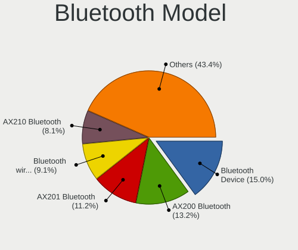

| Model                                               | Computers | Percent |
|-----------------------------------------------------|-----------|---------|
| Intel Bluetooth Device                              | 59        | 14.97%  |
| Intel AX200 Bluetooth                               | 52        | 13.2%   |
| Intel AX201 Bluetooth                               | 44        | 11.17%  |
| Intel Bluetooth wireless interface                  | 36        | 9.14%   |
| Intel AX210 Bluetooth                               | 32        | 8.12%   |
| Realtek Bluetooth Radio                             | 19        | 4.82%   |
| MediaTek Wireless_Device                            | 17        | 4.31%   |
| Intel Bluetooth 9460/9560 Jefferson Peak (JfP)      | 13        | 3.3%    |
| Apple Bluetooth Host Controller                     | 12        | 3.05%   |
| Intel Wireless-AC 9260 Bluetooth Adapter            | 10        | 2.54%   |
| Foxconn / Hon Hai Wireless_Device                   | 9         | 2.28%   |
| Cambridge Silicon Radio Bluetooth Dongle (HCI mode) | 8         | 2.03%   |
| Apple Bluetooth USB Host Controller                 | 7         | 1.78%   |
| IMC Networks Wireless_Device                        | 6         | 1.52%   |
| Qualcomm Atheros  Bluetooth Device                  | 5         | 1.27%   |
| Realtek  Bluetooth 4.2 Adapter                      | 4         | 1.02%   |
| IMC Networks Bluetooth Radio                        | 4         | 1.02%   |
| TP-Link TP-T@- UB500 Adapter                        | 3         | 0.76%   |
| Qualcomm Atheros QCA61x4 Bluetooth 4.0              | 3         | 0.76%   |
| Intel Centrino Bluetooth Wireless Transceiver       | 3         | 0.76%   |
| Toshiba Askey Bluetooth Module                      | 2         | 0.51%   |
| Realtek RTL8822BE Bluetooth 4.2 Adapter             | 2         | 0.51%   |
| Ralink RT3290 Bluetooth                             | 2         | 0.51%   |
| Qualcomm Atheros AR3012 Bluetooth 4.0               | 2         | 0.51%   |
| Intel Centrino Advanced-N 6230 Bluetooth adapter    | 2         | 0.51%   |
| IMC Networks Bluetooth Device                       | 2         | 0.51%   |
| Foxconn / Hon Hai MediaTek Bluetooth Adapter        | 2         | 0.51%   |
| Foxconn / Hon Hai Bluetooth USB Host Controller     | 2         | 0.51%   |
| Broadcom HP Portable SoftSailing                    | 2         | 0.51%   |
| Broadcom BCM43142A0 Bluetooth 4.0                   | 2         | 0.51%   |
| Broadcom BCM2045B (BDC-2.1)                         | 2         | 0.51%   |
| ASUS Broadcom BCM20702A0 Bluetooth                  | 2         | 0.51%   |
| Toshiba Bluetooth Device                            | 1         | 0.25%   |
| Realtek 802.11ac WLAN Adapter                       | 1         | 0.25%   |
| Realtek Bluetooth Radio                             | 1         | 0.25%   |
| Quectel Wireless Solutions Wireless_Device          | 1         | 0.25%   |
| Qualcomm Atheros AR9462 Bluetooth                   | 1         | 0.25%   |
| Lite-On Atheros Bluetooth                           | 1         | 0.25%   |
| Intel Wireless-AC 3168 Bluetooth                    | 1         | 0.25%   |
| Intel Bluetooth                                     | 1         | 0.25%   |

Sound
-----

Sound Vendor
------------

Sound card vendors

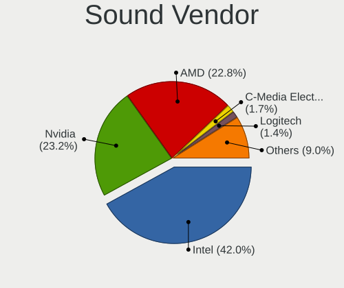

| Vendor                                 | Computers | Percent |
|----------------------------------------|-----------|---------|
| Intel                                  | 299       | 41.99%  |
| Nvidia                                 | 165       | 23.17%  |
| AMD                                    | 162       | 22.75%  |
| C-Media Electronics                    | 12        | 1.69%   |
| Logitech                               | 10        | 1.4%    |
| Micro Star International               | 6         | 0.84%   |
| GN Netcom                              | 6         | 0.84%   |
| Lenovo                                 | 4         | 0.56%   |
| Hewlett-Packard                        | 4         | 0.56%   |
| Creative Labs                          | 4         | 0.56%   |
| Razer USA                              | 3         | 0.42%   |
| Corsair                                | 3         | 0.42%   |
| ASUSTek Computer                       | 3         | 0.42%   |
| Thesycon Systemsoftware & Consulting   | 2         | 0.28%   |
| SteelSeries ApS                        | 2         | 0.28%   |
| Realtek Semiconductor                  | 2         | 0.28%   |
| YZ Technology                          | 1         | 0.14%   |
| Valve Software                         | 1         | 0.14%   |
| Turtle Beach                           | 1         | 0.14%   |
| Trust                                  | 1         | 0.14%   |
| Texas Instruments                      | 1         | 0.14%   |
| Sony Ericsson Mobile Communications AB | 1         | 0.14%   |
| Sennheiser electronic                  | 1         | 0.14%   |
| PreSonus Audio Electronics             | 1         | 0.14%   |
| Plantronics                            | 1         | 0.14%   |
| No brand                               | 1         | 0.14%   |
| MV-SILICON                             | 1         | 0.14%   |
| Kingston Technology                    | 1         | 0.14%   |
| JMTek                                  | 1         | 0.14%   |
| Jieli Technology                       | 1         | 0.14%   |
| Huawei Technologies                    | 1         | 0.14%   |
| GYROCOM C&C                            | 1         | 0.14%   |
| GHW-136D-20231007                      | 1         | 0.14%   |
| Focusrite-Novation                     | 1         | 0.14%   |
| FiiO Electronics Technology            | 1         | 0.14%   |
| DSEA A/S                               | 1         | 0.14%   |
| Creative Technology                    | 1         | 0.14%   |
| Bose                                   | 1         | 0.14%   |
| Audio-Technica                         | 1         | 0.14%   |
| Astro Gaming                           | 1         | 0.14%   |

Sound Model
-----------

Sound card models

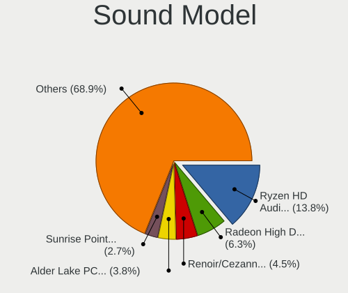

| Model                                                                      | Computers | Percent |
|----------------------------------------------------------------------------|-----------|---------|
| AMD Ryzen HD Audio Controller                                              | 121       | 13.83%  |
| AMD Radeon High Definition Audio Controller                                | 55        | 6.29%   |
| AMD Renoir/Cezanne HDMI/DP Audio Controller                                | 39        | 4.46%   |
| Intel Alder Lake PCH-P High Definition Audio Controller                    | 33        | 3.77%   |
| Intel Sunrise Point-LP HD Audio                                            | 24        | 2.74%   |
| Nvidia AD107 High Definition Audio Controller                              | 23        | 2.63%   |
| Intel Raptor Lake High Definition Audio Controller                         | 23        | 2.63%   |
| Intel 7 Series/C216 Chipset Family High Definition Audio Controller        | 19        | 2.17%   |
| Intel 6 Series/C200 Series Chipset Family High Definition Audio Controller | 19        | 2.17%   |
| Intel 8 Series/C220 Series Chipset High Definition Audio Controller        | 17        | 1.94%   |
| Nvidia GA104 High Definition Audio Controller                              | 15        | 1.71%   |
| Intel Tiger Lake-LP Smart Sound Technology Audio Controller                | 15        | 1.71%   |
| Intel Raptor Lake-P/U/H cAVS                                               | 15        | 1.71%   |
| Nvidia TU116 High Definition Audio Controller                              | 14        | 1.6%    |
| Intel Cannon Lake PCH cAVS                                                 | 14        | 1.6%    |
| AMD Starship/Matisse HD Audio Controller                                   | 14        | 1.6%    |
| Intel Comet Lake PCH cAVS                                                  | 13        | 1.49%   |
| Nvidia GA106 High Definition Audio Controller                              | 12        | 1.37%   |
| Nvidia AD106M High Definition Audio Controller                             | 11        | 1.26%   |
| Intel Xeon E3-1200 v3/4th Gen Core Processor HD Audio Controller           | 11        | 1.26%   |
| Intel Haswell-ULT HD Audio Controller                                      | 11        | 1.26%   |
| Intel 8 Series HD Audio Controller                                         | 11        | 1.26%   |
| Intel 100 Series/C230 Series Chipset Family HD Audio Controller            | 11        | 1.26%   |
| AMD Navi 31 HDMI/DP Audio                                                  | 11        | 1.26%   |
| Intel Tiger Lake-H HD Audio Controller                                     | 10        | 1.14%   |
| Nvidia GP108 High Definition Audio Controller                              | 9         | 1.03%   |
| Intel Meteor Lake-P HD Audio Controller                                    | 9         | 1.03%   |
| Nvidia TU106 High Definition Audio Controller                              | 8         | 0.91%   |
| Intel Wildcat Point-LP High Definition Audio Controller                    | 8         | 0.91%   |
| Intel Broadwell-U Audio Controller                                         | 8         | 0.91%   |
| Intel 5 Series/3400 Series Chipset High Definition Audio                   | 8         | 0.91%   |
| Nvidia GP107GL High Definition Audio Controller                            | 7         | 0.8%    |
| AMD Raven/Raven2/Fenghuang HDMI/DP Audio Controller                        | 7         | 0.8%    |
| AMD FCH Azalia Controller                                                  | 7         | 0.8%    |
| Nvidia GK208 HDMI/DP Audio Controller                                      | 6         | 0.69%   |
| Micro Star International USB Audio                                         | 6         | 0.69%   |
| Nvidia GP106 High Definition Audio Controller                              | 5         | 0.57%   |
| Nvidia GF108 High Definition Audio Controller                              | 5         | 0.57%   |
| Nvidia GA107 High Definition Audio Controller                              | 5         | 0.57%   |
| Intel CM238 HD Audio Controller                                            | 5         | 0.57%   |

Memory
------

Memory Vendor
-------------

Memory module vendors

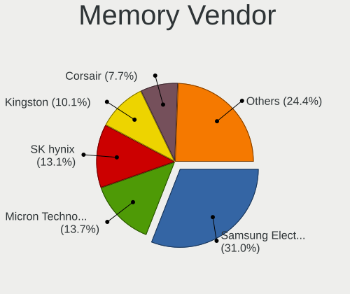

| Vendor                       | Computers | Percent |
|------------------------------|-----------|---------|
| Samsung Electronics          | 52        | 30.95%  |
| Micron Technology            | 23        | 13.69%  |
| SK hynix                     | 22        | 13.1%   |
| Kingston                     | 17        | 10.12%  |
| Corsair                      | 13        | 7.74%   |
| Crucial                      | 12        | 7.14%   |
| Unknown                      | 8         | 4.76%   |
| G.Skill                      | 4         | 2.38%   |
| Team                         | 3         | 1.79%   |
| Elpida                       | 2         | 1.19%   |
| Unknown (ABCD)               | 1         | 0.6%    |
| Unknown                      | 1         | 0.6%    |
| Transcend                    | 1         | 0.6%    |
| Smart                        | 1         | 0.6%    |
| PUSKILL                      | 1         | 0.6%    |
| Patriot Memory (PDP Systems) | 1         | 0.6%    |
| Lexar Co Limited             | 1         | 0.6%    |
| KLEVV                        | 1         | 0.6%    |
| Gold Key                     | 1         | 0.6%    |
| ASint Technology             | 1         | 0.6%    |
| Apacer                       | 1         | 0.6%    |
| A-DATA Technology            | 1         | 0.6%    |

Memory Model
------------

Memory module models

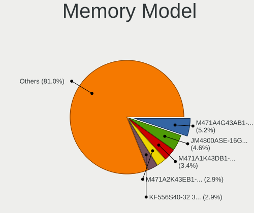

| Model                                                          | Computers | Percent |
|----------------------------------------------------------------|-----------|---------|
| Samsung RAM M471A4G43AB1-CWE 32GB SODIMM DDR4 3200MT/s         | 9         | 5.17%   |
| Unknown                                                        | 8         | 4.6%    |
| Samsung RAM M471A1K43DB1-CWE 8GB SODIMM DDR4 3200MT/s          | 6         | 3.45%   |
| Samsung RAM M471A2K43EB1-CWE 16GB SODIMM DDR4 3200MT/s         | 5         | 2.87%   |
| Kingston RAM KF556S40-32 32GB SODIMM DDR5 5600MT/s             | 5         | 2.87%   |
| SK hynix RAM HMAA1GS6CJR6N-XN 8GB SODIMM DDR4 3200MT/s         | 4         | 2.3%    |
| Samsung RAM M471A2K43DB1-CWE 16GB SODIMM DDR4 3200MT/s         | 4         | 2.3%    |
| Samsung RAM M425R2GA3BB0-CWMOD 16GiB SODIMM DDR5 5600MT/s      | 4         | 2.3%    |
| Corsair RAM CMS5X32G2A56C48A2 32GB SODIMM DDR5 5600MT/s        | 4         | 2.3%    |
| SK hynix RAM HMA81GS6AFR8N-UH 8GB SODIMM DDR4 2667MT/s         | 3         | 1.72%   |
| Samsung RAM M471A4G43MB1-CTD 32GB SODIMM DDR4 2667MT/s         | 3         | 1.72%   |
| Samsung RAM M425R4GA3BB0-CQKOL 32GB SODIMM DDR5 4800MT/s       | 3         | 1.72%   |
| Micron RAM CT16G56C46S5.C8D 16GB SODIMM DDR5 5600MT/s          | 3         | 1.72%   |
| Team RAM TEAMGROUP-SD4-3200 16GB SODIMM DDR4 3200MT/s          | 2         | 1.15%   |
| SK hynix RAM HMCG88AGBSA092N 32GB SODIMM DDR5 5600MT/s         | 2         | 1.15%   |
| SK hynix RAM HMCG78AGBSA092N 16GB SODIMM DDR5 5600MT/s         | 2         | 1.15%   |
| SK hynix RAM HMCG66AGBSA095N 8GiB SODIMM DDR5 5600MT/s         | 2         | 1.15%   |
| Samsung RAM M471B1G73QH0-YK0 8GB SODIMM DDR3 1600MT/s          | 2         | 1.15%   |
| Samsung RAM M471A2K43CB1-CTD 16GB SODIMM DDR4 8400MT/s         | 2         | 1.15%   |
| Samsung RAM M471A1G44BB0-CWE 8GB SODIMM DDR4 3200MT/s          | 2         | 1.15%   |
| Micron RAM MT62F2G32D4DS-026 WT 8GiB SODIMM LPDDR5 7500MT/s    | 2         | 1.15%   |
| Micron RAM 8ATF1G64HZ-3G2R1 8GB SODIMM DDR4 3200MT/s           | 2         | 1.15%   |
| G.Skill RAM F4-3200C16-16GIS 16GB DIMM DDR4 3600MT/s           | 2         | 1.15%   |
| Crucial RAM CT16G48C40S5.M8A1 16GB SODIMM DDR5 4800MT/s        | 2         | 1.15%   |
| Corsair RAM CMK64GX5M2B5600C40 32GB DIMM DDR5 5600MT/s         | 2         | 1.15%   |
| Unknown RAM Module 4GB SODIMM DDR3                             | 1         | 0.57%   |
| Unknown RAM Module 2GB SODIMM DDR3                             | 1         | 0.57%   |
| Unknown (ABCD) RAM 123456789012345678 2GB DIMM LPDDR4 2133MT/s | 1         | 0.57%   |
| Transcend RAM JM3200HSE-32G 32GB SODIMM DDR4 3200MT/s          | 1         | 0.57%   |
| Team RAM TEAMGROUP-UD4-3200 8GB DIMM DDR4 3733MT/s             | 1         | 0.57%   |
| Smart RAM SF564128CJ8NWMNSEG 4GB SODIMM DDR3 1600MT/s          | 1         | 0.57%   |
| SK hynix RAM Module 4GB SODIMM DDR3 1600MT/s                   | 1         | 0.57%   |
| SK hynix RAM HMT41GS6BFR8A-PB 8GB SODIMM DDR3 2667MT/s         | 1         | 0.57%   |
| SK hynix RAM HMT351S6CFR8C-PB 4GB SODIMM DDR3 1600MT/s         | 1         | 0.57%   |
| SK hynix RAM HMAA2GS6AJR8N-XN 16GB SODIMM DDR4 3200MT/s        | 1         | 0.57%   |
| SK hynix RAM HMA851S6DJR6N-XN 4GB SODIMM DDR4 3200MT/s         | 1         | 0.57%   |
| SK hynix RAM HMA82GS6JJR8N-VK 16GB SODIMM DDR4 2667MT/s        | 1         | 0.57%   |
| SK hynix RAM HMA82GS6AFR8N-UH 16GB SODIMM DDR4 2667MT/s        | 1         | 0.57%   |
| SK hynix RAM HMA81GS6JJR8N-VK 8GB SODIMM DDR4 2667MT/s         | 1         | 0.57%   |
| SK hynix RAM HMA81GS6CJR8N-VK 8GB SODIMM DDR4 2667MT/s         | 1         | 0.57%   |

Memory Kind
-----------

Memory module kinds

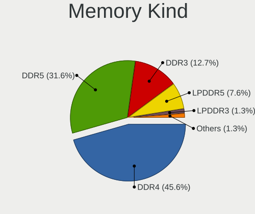

| Kind    | Computers | Percent |
|---------|-----------|---------|
| DDR4    | 72        | 45.57%  |
| DDR5    | 50        | 31.65%  |
| DDR3    | 20        | 12.66%  |
| LPDDR5  | 12        | 7.59%   |
| LPDDR3  | 2         | 1.27%   |
| LPDDR4  | 1         | 0.63%   |
| Unknown | 1         | 0.63%   |

Memory Form Factor
------------------

Physical design of the memory module

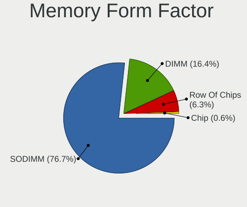

| Name         | Computers | Percent |
|--------------|-----------|---------|
| SODIMM       | 122       | 76.73%  |
| DIMM         | 26        | 16.35%  |
| Row Of Chips | 10        | 6.29%   |
| Chip         | 1         | 0.63%   |

Memory Size
-----------

Memory module size

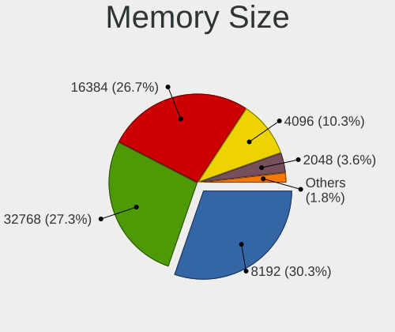

| Size  | Computers | Percent |
|-------|-----------|---------|
| 8192  | 50        | 30.3%   |
| 32768 | 45        | 27.27%  |
| 16384 | 44        | 26.67%  |
| 4096  | 17        | 10.3%   |
| 2048  | 6         | 3.64%   |
| 49152 | 2         | 1.21%   |
| 3072  | 1         | 0.61%   |

Memory Speed
------------

Memory module speed

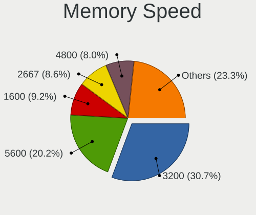

| Speed   | Computers | Percent |
|---------|-----------|---------|
| 3200    | 50        | 30.67%  |
| 5600    | 33        | 20.25%  |
| 1600    | 15        | 9.2%    |
| 2667    | 14        | 8.59%   |
| 4800    | 13        | 7.98%   |
| 6400    | 8         | 4.91%   |
| 7500    | 5         | 3.07%   |
| 3600    | 4         | 2.45%   |
| 3733    | 3         | 1.84%   |
| 2400    | 3         | 1.84%   |
| 8400    | 2         | 1.23%   |
| 1867    | 2         | 1.23%   |
| 12800   | 1         | 0.61%   |
| 5400    | 1         | 0.61%   |
| 4266    | 1         | 0.61%   |
| 3266    | 1         | 0.61%   |
| 3151    | 1         | 0.61%   |
| 2666    | 1         | 0.61%   |
| 2133    | 1         | 0.61%   |
| 1333    | 1         | 0.61%   |
| 1067    | 1         | 0.61%   |
| 1066    | 1         | 0.61%   |
| Unknown | 1         | 0.61%   |

Printers & scanners
-------------------

Printer Vendor
--------------

Printer device vendors

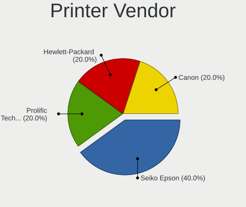

| Vendor              | Computers | Percent |
|---------------------|-----------|---------|
| Seiko Epson         | 2         | 40%     |
| Prolific Technology | 1         | 20%     |
| Hewlett-Packard     | 1         | 20%     |
| Canon               | 1         | 20%     |

Printer Model
-------------

Printer device models

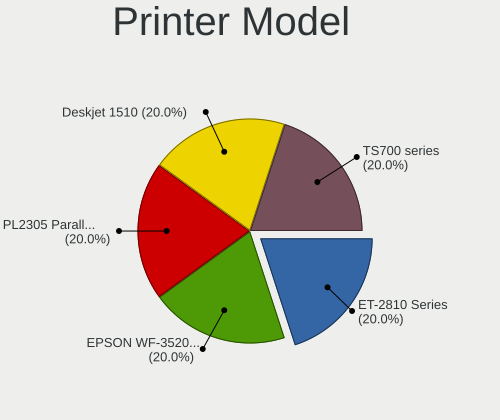

| Model                            | Computers | Percent |
|----------------------------------|-----------|---------|
| Seiko Epson ET-2810 Series       | 1         | 20%     |
| Seiko Epson EPSON WF-3520 Series | 1         | 20%     |
| Prolific PL2305 Parallel Port    | 1         | 20%     |
| HP Deskjet 1510                  | 1         | 20%     |
| Canon TS700 series               | 1         | 20%     |

Scanner Vendor
--------------

Scanner device vendors

| Vendor | Computers | Percent |
|--------|-----------|---------|
| Canon  | 1         | 100%    |

Scanner Model
-------------

Scanner device models

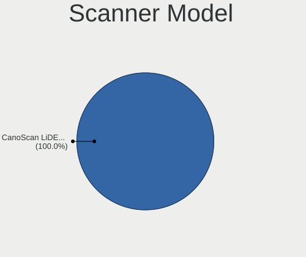

| Model                   | Computers | Percent |
|-------------------------|-----------|---------|
| Canon CanoScan LiDE 110 | 1         | 100%    |

Camera
------

Camera Vendor
-------------

Camera device vendors

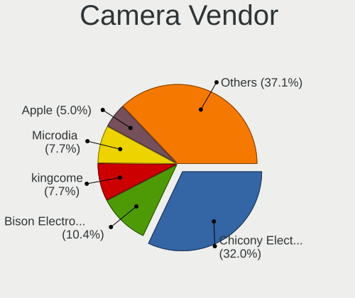

| Vendor                                 | Computers | Percent |
|----------------------------------------|-----------|---------|
| Chicony Electronics                    | 108       | 32.05%  |
| Bison Electronics                      | 35        | 10.39%  |
| Microdia                               | 26        | 7.72%   |
| kingcome                               | 26        | 7.72%   |
| Apple                                  | 17        | 5.04%   |
| Logitech                               | 14        | 4.15%   |
| Realtek Semiconductor                  | 12        | 3.56%   |
| SunplusIT                              | 11        | 3.26%   |
| IMC Networks                           | 11        | 3.26%   |
| Sunplus Innovation Technology          | 9         | 2.67%   |
| Suyin                                  | 7         | 2.08%   |
| Quanta                                 | 5         | 1.48%   |
| Lenovo                                 | 5         | 1.48%   |
| Syntek                                 | 4         | 1.19%   |
| Luxvisions Innotech Limited            | 4         | 1.19%   |
| Silicon Motion                         | 3         | 0.89%   |
| Samsung Electronics                    | 3         | 0.89%   |
| Ricoh                                  | 3         | 0.89%   |
| Lite-On Technology                     | 3         | 0.89%   |
| Sonix Technology                       | 2         | 0.59%   |
| Shine-optics                           | 2         | 0.59%   |
| Razer USA                              | 2         | 0.59%   |
| Importek                               | 2         | 0.59%   |
| Creative Technology                    | 2         | 0.59%   |
| Cheng Uei Precision Industry (Foxlink) | 2         | 0.59%   |
| Acer                                   | 2         | 0.59%   |
| webcam                                 | 1         | 0.3%    |
| Valve Software                         | 1         | 0.3%    |
| USB CAMERA                             | 1         | 0.3%    |
| Unknown                                | 1         | 0.3%    |
| Sony Ericsson Mobile Communications AB | 1         | 0.3%    |
| Primax Electronics                     | 1         | 0.3%    |
| Microsoft                              | 1         | 0.3%    |
| MacroSilicon                           | 1         | 0.3%    |
| Linux Foundation                       | 1         | 0.3%    |
| KYE Systems (Mouse Systems)            | 1         | 0.3%    |
| HYGD-220831-A                          | 1         | 0.3%    |
| Huawei Technologies                    | 1         | 0.3%    |
| Guillemot                              | 1         | 0.3%    |
| Generalplus Technology                 | 1         | 0.3%    |

Camera Model
------------

Camera device models

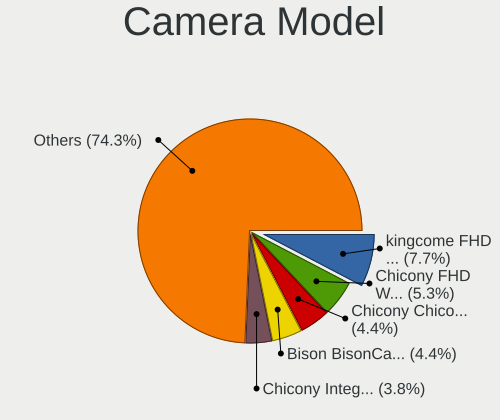

| Model                                                | Computers | Percent |
|------------------------------------------------------|-----------|---------|
| kingcome FHD WebCam                                  | 26        | 7.67%   |
| Chicony FHD Webcam                                   | 18        | 5.31%   |
| Chicony Chicony USB2.0 Camera                        | 15        | 4.42%   |
| Bison BisonCam,NB Pro                                | 15        | 4.42%   |
| Chicony Integrated IR Camera                         | 13        | 3.83%   |
| Chicony Integrated Camera                            | 12        | 3.54%   |
| Chicony HD Webcam                                    | 11        | 3.24%   |
| SunplusIT FHD Webcam                                 | 10        | 2.95%   |
| Microdia HDE Webcam USB                              | 7         | 2.06%   |
| IMC Networks Integrated Camera                       | 7         | 2.06%   |
| Bison Integrated Camera                              | 7         | 2.06%   |
| Apple FaceTime HD Camera                             | 7         | 2.06%   |
| Bison HD Webcam                                      | 5         | 1.47%   |
| Syntek Integrated Camera                             | 4         | 1.18%   |
| Microdia Integrated_Webcam_HD                        | 4         | 1.18%   |
| Microdia Integrated_Webcam_FHD                       | 4         | 1.18%   |
| Apple Built-in iSight                                | 4         | 1.18%   |
| Sunplus Integrated_Webcam_HD                         | 3         | 0.88%   |
| Samsung Galaxy series, misc. (MTP mode)              | 3         | 0.88%   |
| Chicony TOSHIBA Web Camera - HD                      | 3         | 0.88%   |
| Chicony CNF9055 Toshiba Webcam                       | 3         | 0.88%   |
| Apple iPhone 5/5C/5S/6/SE/7/8/X                      | 3         | 0.88%   |
| Apple FaceTime HD Camera (Built-in)                  | 3         | 0.88%   |
| Suyin HP Truevision HD                               | 2         | 0.59%   |
| Sunplus Integrated Camera                            | 2         | 0.59%   |
| Shine-optics USB2.0 HD UVC WebCam                    | 2         | 0.59%   |
| Ricoh Laptop_Integrated_Webcam_FHD                   | 2         | 0.59%   |
| Realtek USB Camera                                   | 2         | 0.59%   |
| Realtek Integrated_Webcam_HD                         | 2         | 0.59%   |
| Realtek Integrated Webcam_HD                         | 2         | 0.59%   |
| Razer USA Gaming Webcam [Kiyo]                       | 2         | 0.59%   |
| Microdia USB 2.0 Camera                              | 2         | 0.59%   |
| Microdia Laptop_Integrated_Webcam_HD                 | 2         | 0.59%   |
| Luxvisions Innotech Limited Integrated Camera        | 2         | 0.59%   |
| Luxvisions Innotech Limited HP Wide Vision HD Camera | 2         | 0.59%   |
| Logitech C922 Pro Stream Webcam                      | 2         | 0.59%   |
| Logitech C920 PRO HD Webcam                          | 2         | 0.59%   |
| Importek HP Webcam                                   | 2         | 0.59%   |
| IMC Networks USB2.0 HD UVC WebCam                    | 2         | 0.59%   |
| Chicony USB2.0 VGA UVC WebCam                        | 2         | 0.59%   |

Security
--------

Fingerprint Vendor
------------------

Fingerprint sensor vendors

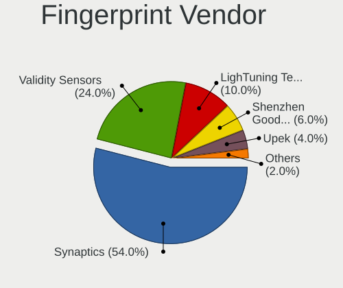

| Vendor                     | Computers | Percent |
|----------------------------|-----------|---------|
| Synaptics                  | 27        | 54%     |
| Validity Sensors           | 12        | 24%     |
| LighTuning Technology      | 5         | 10%     |
| Shenzhen Goodix Technology | 3         | 6%      |
| Upek                       | 2         | 4%      |
| Elan Microelectronics      | 1         | 2%      |

Fingerprint Model
-----------------

Fingerprint sensor models

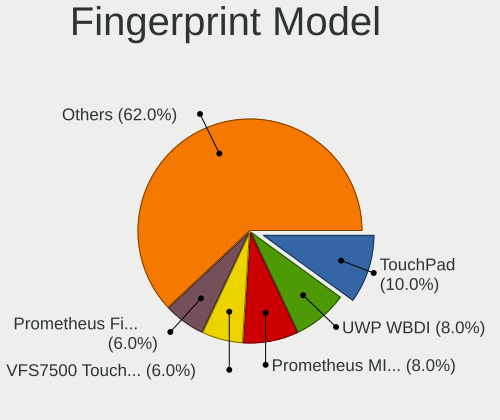

| Model                                                                      | Computers | Percent |
|----------------------------------------------------------------------------|-----------|---------|
| Synaptics TouchPad                                                         | 5         | 10%     |
| Synaptics UWP WBDI                                                         | 4         | 8%      |
| Synaptics Prometheus MIS Touch Fingerprint Reader                          | 4         | 8%      |
| Validity Sensors VFS7500 Touch Fingerprint Sensor                          | 3         | 6%      |
| Synaptics Prometheus Fingerprint Reader                                    | 3         | 6%      |
| Shenzhen Goodix  Fingerprint Device                                        | 3         | 6%      |
| LighTuning ES603 Swipe Fingerprint Sensor                                  | 3         | 6%      |
| Unknown                                                                    | 3         | 6%      |
| Validity Sensors VFS495 Fingerprint Reader                                 | 2         | 4%      |
| Validity Sensors VFS491                                                    | 2         | 4%      |
| Validity Sensors Synaptics WBDI                                            | 2         | 4%      |
| Upek Biometric Touchchip/Touchstrip Fingerprint Sensor                     | 2         | 4%      |
| Synaptics WBDI Fingerprint Reader USB 086                                  | 2         | 4%      |
| Synaptics  WBDI                                                            | 2         | 4%      |
| Validity Sensors VFS Fingerprint sensor                                    | 1         | 2%      |
| Validity Sensors Synaptics VFS7552 Touch Fingerprint Sensor with PurePrint | 1         | 2%      |
| Validity Sensors Fingerprint scanner                                       | 1         | 2%      |
| Synaptics WBDI                                                             | 1         | 2%      |
| Synaptics Metallica MOH Touch Fingerprint Reader                           | 1         | 2%      |
| Synaptics Metallica MIS Touch Fingerprint Reader                           | 1         | 2%      |
| Synaptics Fingerprint reader [HP G6]                                       | 1         | 2%      |
| LighTuning Fingerprint Reader                                              | 1         | 2%      |
| LighTuning EgisTec Touch Fingerprint Sensor                                | 1         | 2%      |
| Elan ELAN:ARM-M4                                                           | 1         | 2%      |

Chipcard Vendor
---------------

Chipcard module vendors

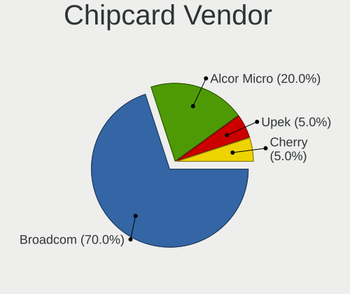

| Vendor      | Computers | Percent |
|-------------|-----------|---------|
| Broadcom    | 14        | 70%     |
| Alcor Micro | 4         | 20%     |
| Upek        | 1         | 5%      |
| Cherry      | 1         | 5%      |

Chipcard Model
--------------

Chipcard module models

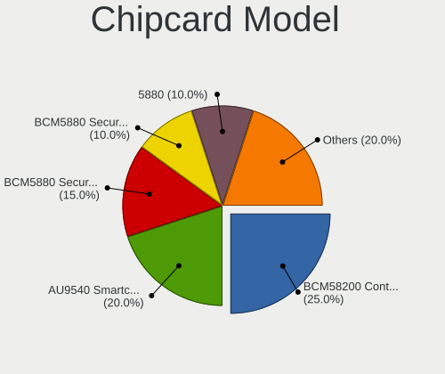

| Model                                                                        | Computers | Percent |
|------------------------------------------------------------------------------|-----------|---------|
| Broadcom BCM58200 ControlVault 3 (FingerPrint sensor + Contacted SmartCard)  | 5         | 25%     |
| Alcor Micro AU9540 Smartcard Reader                                          | 4         | 20%     |
| Broadcom BCM5880 Secure Applications Processor                               | 3         | 15%     |
| Broadcom BCM5880 Secure Applications Processor with fingerprint swipe sensor | 2         | 10%     |
| Broadcom 5880                                                                | 2         | 10%     |
| Broadcom 58200                                                               | 2         | 10%     |
| Upek TouchChip Fingerprint Coprocessor (WBF advanced mode)                   | 1         | 5%      |
| Cherry SmartCard Reader Keyboard KC 1000 SC                                  | 1         | 5%      |

Unsupported
-----------

Unsupported Devices
-------------------

Total unsupported devices on board

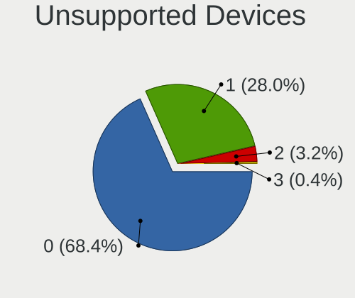

| Total | Computers | Percent |
|-------|-----------|---------|
| 0     | 322       | 68.37%  |
| 1     | 132       | 28.03%  |
| 2     | 15        | 3.18%   |
| 3     | 2         | 0.42%   |

Unsupported Device Types
------------------------

Types of unsupported devices

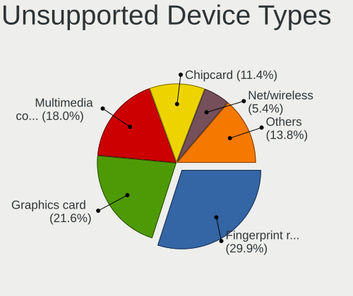

| Type                     | Computers | Percent |
|--------------------------|-----------|---------|
| Fingerprint reader       | 50        | 29.94%  |
| Graphics card            | 36        | 21.56%  |
| Multimedia controller    | 30        | 17.96%  |
| Chipcard                 | 19        | 11.38%  |
| Net/wireless             | 9         | 5.39%   |
| Communication controller | 4         | 2.4%    |
| Card reader              | 4         | 2.4%    |
| Wireless                 | 2         | 1.2%    |
| Storage                  | 2         | 1.2%    |
| Sound                    | 2         | 1.2%    |
| Net/ethernet             | 2         | 1.2%    |
| Bluetooth                | 2         | 1.2%    |
| Unassigned class         | 1         | 0.6%    |
| Storage/raid             | 1         | 0.6%    |
| Network                  | 1         | 0.6%    |
| Modem                    | 1         | 0.6%    |
| Camera                   | 1         | 0.6%    |

