TUXEDO OS - Tested Hardware & Statistics
----------------------------------------

A project to collect tested hardware configurations for TUXEDO OS.

Anyone can contribute to this report by the [hw-probe](https://github.com/linuxhw/hw-probe) tool:

    sudo -E hw-probe -all -upload

Please contribute! Especially if your hardware is rare.

This is a report for all computer types. See also reports for [desktops](/Dist/TUXEDO_OS/Desktop/README.md) and [notebooks](/Dist/TUXEDO_OS/Notebook/README.md).

Contents
--------

* [ Test Cases ](#test-cases)

* [ System ](#system)
  - [ OS                       ](#os)
  - [ OS Family                ](#os-family)
  - [ Kernel                   ](#kernel)
  - [ Kernel Family            ](#kernel-family)
  - [ Kernel Major Ver.        ](#kernel-major-ver)
  - [ Arch                     ](#arch)
  - [ DE                       ](#de)
  - [ Display Server           ](#display-server)
  - [ Display Manager          ](#display-manager)
  - [ OS Lang                  ](#os-lang)
  - [ Boot Mode                ](#boot-mode)
  - [ Filesystem               ](#filesystem)
  - [ Part. scheme             ](#part-scheme)
  - [ Dual Boot with Linux/BSD ](#dual-boot-with-linuxbsd)
  - [ Dual Boot (Win)          ](#dual-boot-win)

* [ Board ](#board)
  - [ Vendor                   ](#vendor)
  - [ Model                    ](#model)
  - [ Model Family             ](#model-family)
  - [ MFG Year                 ](#mfg-year)
  - [ Form Factor              ](#form-factor)
  - [ Secure Boot              ](#secure-boot)
  - [ Coreboot                 ](#coreboot)
  - [ RAM Size                 ](#ram-size)
  - [ RAM Used                 ](#ram-used)
  - [ Total Drives             ](#total-drives)
  - [ Has CD-ROM               ](#has-cd-rom)
  - [ Has Ethernet             ](#has-ethernet)
  - [ Has WiFi                 ](#has-wifi)
  - [ Has Bluetooth            ](#has-bluetooth)

* [ Location ](#location)
  - [ Country                  ](#country)
  - [ City                     ](#city)

* [ Drives ](#drives)
  - [ Drive Vendor             ](#drive-vendor)
  - [ Drive Model              ](#drive-model)
  - [ HDD Vendor               ](#hdd-vendor)
  - [ SSD Vendor               ](#ssd-vendor)
  - [ Drive Kind               ](#drive-kind)
  - [ Drive Connector          ](#drive-connector)
  - [ Drive Size               ](#drive-size)
  - [ Space Total              ](#space-total)
  - [ Space Used               ](#space-used)
  - [ Malfunc. Drives          ](#malfunc-drives)
  - [ Malfunc. Drive Vendor    ](#malfunc-drive-vendor)
  - [ Malfunc. HDD Vendor      ](#malfunc-hdd-vendor)
  - [ Malfunc. Drive Kind      ](#malfunc-drive-kind)
  - [ Failed Drives            ](#failed-drives)
  - [ Failed Drive Vendor      ](#failed-drive-vendor)
  - [ Drive Status             ](#drive-status)

* [ Storage controller ](#storage-controller)
  - [ Storage Vendor           ](#storage-vendor)
  - [ Storage Model            ](#storage-model)
  - [ Storage Kind             ](#storage-kind)

* [ Processor ](#processor)
  - [ CPU Vendor               ](#cpu-vendor)
  - [ CPU Model                ](#cpu-model)
  - [ CPU Model Family         ](#cpu-model-family)
  - [ CPU Cores                ](#cpu-cores)
  - [ CPU Sockets              ](#cpu-sockets)
  - [ CPU Threads              ](#cpu-threads)
  - [ CPU Op-Modes             ](#cpu-op-modes)
  - [ CPU Microcode            ](#cpu-microcode)
  - [ CPU Microarch            ](#cpu-microarch)

* [ Graphics ](#graphics)
  - [ GPU Vendor               ](#gpu-vendor)
  - [ GPU Model                ](#gpu-model)
  - [ GPU Combo                ](#gpu-combo)
  - [ GPU Driver               ](#gpu-driver)
  - [ GPU Memory               ](#gpu-memory)

* [ Monitor ](#monitor)
  - [ Monitor Vendor           ](#monitor-vendor)
  - [ Monitor Model            ](#monitor-model)
  - [ Monitor Resolution       ](#monitor-resolution)
  - [ Monitor Diagonal         ](#monitor-diagonal)
  - [ Monitor Width            ](#monitor-width)
  - [ Aspect Ratio             ](#aspect-ratio)
  - [ Monitor Area             ](#monitor-area)
  - [ Pixel Density            ](#pixel-density)
  - [ Multiple Monitors        ](#multiple-monitors)

* [ Network ](#network)
  - [ Net Controller Vendor    ](#net-controller-vendor)
  - [ Net Controller Model     ](#net-controller-model)
  - [ Wireless Vendor          ](#wireless-vendor)
  - [ Wireless Model           ](#wireless-model)
  - [ Ethernet Vendor          ](#ethernet-vendor)
  - [ Ethernet Model           ](#ethernet-model)
  - [ Net Controller Kind      ](#net-controller-kind)
  - [ Used Controller          ](#used-controller)
  - [ NICs                     ](#nics)
  - [ IPv6                     ](#ipv6)

* [ Bluetooth ](#bluetooth)
  - [ Bluetooth Vendor         ](#bluetooth-vendor)
  - [ Bluetooth Model          ](#bluetooth-model)

* [ Sound ](#sound)
  - [ Sound Vendor             ](#sound-vendor)
  - [ Sound Model              ](#sound-model)

* [ Memory ](#memory)
  - [ Memory Vendor            ](#memory-vendor)
  - [ Memory Model             ](#memory-model)
  - [ Memory Kind              ](#memory-kind)
  - [ Memory Form Factor       ](#memory-form-factor)
  - [ Memory Size              ](#memory-size)
  - [ Memory Speed             ](#memory-speed)

* [ Printers & scanners ](#printers--scanners)
  - [ Printer Vendor           ](#printer-vendor)
  - [ Printer Model            ](#printer-model)
  - [ Scanner Vendor           ](#scanner-vendor)
  - [ Scanner Model            ](#scanner-model)

* [ Camera ](#camera)
  - [ Camera Vendor            ](#camera-vendor)
  - [ Camera Model             ](#camera-model)

* [ Security ](#security)
  - [ Fingerprint Vendor       ](#fingerprint-vendor)
  - [ Fingerprint Model        ](#fingerprint-model)
  - [ Chipcard Vendor          ](#chipcard-vendor)
  - [ Chipcard Model           ](#chipcard-model)

* [ Unsupported ](#unsupported)
  - [ Unsupported Devices      ](#unsupported-devices)
  - [ Unsupported Device Types ](#unsupported-device-types)

Test Cases
----------

Total: 396

| Vendor        | Model                       | Form-Factor | Probe                                                      | Date         |
|---------------|-----------------------------|-------------|------------------------------------------------------------|--------------|
| Lenovo        | IdeaPad 5 15ABA7 82SG       | Notebook    | [22702a56ed](https://linux-hardware.org/?probe=22702a56ed) | Jan 06, 2025 |
| TUXEDO        | Book XP15 / XP17 Gen12      | Notebook    | [be06c286bb](https://linux-hardware.org/?probe=be06c286bb) | Jan 04, 2025 |
| TUXEDO        | Stellaris Slim 15 Intel ... | Notebook    | [b1e2aaf88e](https://linux-hardware.org/?probe=b1e2aaf88e) | Dec 31, 2024 |
| ASRock        | Z790 PG SONIC               | Desktop     | [89df77f290](https://linux-hardware.org/?probe=89df77f290) | Dec 30, 2024 |
| MSI           | B450M MORTAR TITANIUM       | Desktop     | [2bbf71e498](https://linux-hardware.org/?probe=2bbf71e498) | Dec 28, 2024 |
| HP            | Pavilion x360 Convertibl... | Convertible | [6faafa2f4d](https://linux-hardware.org/?probe=6faafa2f4d) | Dec 27, 2024 |
| MSI           | B450 GAMING PLUS MAX        | Desktop     | [b0e7a232a0](https://linux-hardware.org/?probe=b0e7a232a0) | Dec 27, 2024 |
| HP            | 255 15.6 inch G9 Noteboo... | Notebook    | [1c64d7883e](https://linux-hardware.org/?probe=1c64d7883e) | Dec 26, 2024 |
| ASUSTek       | NUC12WSB-M 60AS00F0-MB5A... | Mini pc     | [9f5263b2e2](https://linux-hardware.org/?probe=9f5263b2e2) | Dec 26, 2024 |
| Gigabyte      | B650I AX                    | Desktop     | [65f34ef743](https://linux-hardware.org/?probe=65f34ef743) | Dec 26, 2024 |
| HP            | ProBook 470 G5              | Notebook    | [30f50d84d3](https://linux-hardware.org/?probe=30f50d84d3) | Dec 24, 2024 |
| Acer          | Aspire A315-58              | Notebook    | [b49f4674e2](https://linux-hardware.org/?probe=b49f4674e2) | Dec 23, 2024 |
| HP            | Pavilion x360 Convertibl... | Convertible | [c791848cbf](https://linux-hardware.org/?probe=c791848cbf) | Dec 23, 2024 |
| TUXEDO        | Pulse 14 Gen4               | Notebook    | [dfdca3924e](https://linux-hardware.org/?probe=dfdca3924e) | Dec 22, 2024 |
| TUXEDO        | InfinityBook Pro Gen8 (M... | Notebook    | [c094245674](https://linux-hardware.org/?probe=c094245674) | Dec 21, 2024 |
| Lenovo        | Yoga Pro 7 14ASP9 83HN      | Notebook    | [847bdd9f95](https://linux-hardware.org/?probe=847bdd9f95) | Dec 21, 2024 |
| Lenovo        | Yoga Pro 7 14ASP9 83HN      | Notebook    | [bae5bf44e3](https://linux-hardware.org/?probe=bae5bf44e3) | Dec 21, 2024 |
| TUXEDO        | InfinityBook Pro AMD Gen... | Notebook    | [1b7b6fe18c](https://linux-hardware.org/?probe=1b7b6fe18c) | Dec 20, 2024 |
| Lenovo        | ThinkPad T480 20L6S6WQ00    | Notebook    | [7ddde1c012](https://linux-hardware.org/?probe=7ddde1c012) | Dec 12, 2024 |
| Lenovo        | ThinkPad T480 20L6S6WQ00    | Notebook    | [8e83bba34b](https://linux-hardware.org/?probe=8e83bba34b) | Dec 12, 2024 |
| MSI           | MAG X670E TOMAHAWK WIFI     | Desktop     | [0c7d813e39](https://linux-hardware.org/?probe=0c7d813e39) | Dec 06, 2024 |
| Dell          | Latitude 9420               | Notebook    | [00fecb4861](https://linux-hardware.org/?probe=00fecb4861) | Dec 05, 2024 |
| Monster       | TULPAR T7 V20.8             | Notebook    | [e7cc7b7cff](https://linux-hardware.org/?probe=e7cc7b7cff) | Dec 05, 2024 |
| ASUSTek       | ASUS TUF Gaming A15 FA50... | Notebook    | [2d22964d09](https://linux-hardware.org/?probe=2d22964d09) | Dec 01, 2024 |
| Lenovo        | IdeaPad Gaming 3 15ACH6 ... | Notebook    | [afdf6ad9bd](https://linux-hardware.org/?probe=afdf6ad9bd) | Nov 27, 2024 |
| Lenovo        | IdeaPad Gaming 3 15ACH6 ... | Notebook    | [970d25268e](https://linux-hardware.org/?probe=970d25268e) | Nov 27, 2024 |
| Dell          | Latitude E5440              | Notebook    | [61cfdd936e](https://linux-hardware.org/?probe=61cfdd936e) | Nov 27, 2024 |
| Dell          | Latitude E5440              | Notebook    | [77269b5130](https://linux-hardware.org/?probe=77269b5130) | Nov 27, 2024 |
| Dell          | Latitude 5411               | Notebook    | [ebb8abde35](https://linux-hardware.org/?probe=ebb8abde35) | Nov 26, 2024 |
| Lenovo        | ThinkPad L380 20M6S11800    | Notebook    | [fdca0fd463](https://linux-hardware.org/?probe=fdca0fd463) | Nov 24, 2024 |
| Schenker      | XMG EVO (M24)               | Notebook    | [513a3453cc](https://linux-hardware.org/?probe=513a3453cc) | Nov 20, 2024 |
| Lenovo        | ThinkBook 16p Gen 2 20YM    | Notebook    | [70dcc9416f](https://linux-hardware.org/?probe=70dcc9416f) | Nov 19, 2024 |
| HP            | 83EF                        | Desktop     | [278db40f6f](https://linux-hardware.org/?probe=278db40f6f) | Nov 19, 2024 |
| TUXEDO        | InfinityBook Pro Gen7 (M... | Notebook    | [522f3333a0](https://linux-hardware.org/?probe=522f3333a0) | Nov 18, 2024 |
| ASUSTek       | E1600WKA                    | All in one  | [e3e47b4811](https://linux-hardware.org/?probe=e3e47b4811) | Nov 17, 2024 |
| TUXEDO        | InfinityBook Pro AMD Gen... | Notebook    | [f1540c9c61](https://linux-hardware.org/?probe=f1540c9c61) | Nov 16, 2024 |
| HP            | ENVY x360 Convertible 13... | Convertible | [7886c1663d](https://linux-hardware.org/?probe=7886c1663d) | Nov 16, 2024 |
| Lenovo        | IdeaPad 5 15ABA7 82SG       | Notebook    | [ff2ac5c7c1](https://linux-hardware.org/?probe=ff2ac5c7c1) | Nov 16, 2024 |
| Lenovo        | IdeaPad 5 15ABA7 82SG       | Notebook    | [858fe28143](https://linux-hardware.org/?probe=858fe28143) | Nov 16, 2024 |
| TUXEDO        | InfinityBook Pro Intel G... | Notebook    | [365259d6e3](https://linux-hardware.org/?probe=365259d6e3) | Nov 10, 2024 |
| Gateway       | DX4380G                     | Desktop     | [c118cf8638](https://linux-hardware.org/?probe=c118cf8638) | Nov 10, 2024 |
| MSI           | MAG B760M MORTAR WIFI II    | Desktop     | [8d97c445f0](https://linux-hardware.org/?probe=8d97c445f0) | Nov 09, 2024 |
| TUXEDO        | InfinityBook Pro Intel G... | Notebook    | [ca6d2c4960](https://linux-hardware.org/?probe=ca6d2c4960) | Nov 08, 2024 |
| MSI           | MAG B650 TOMAHAWK WIFI      | Desktop     | [20bf647a5f](https://linux-hardware.org/?probe=20bf647a5f) | Nov 05, 2024 |
| MSI           | MAG B760M MORTAR WIFI II    | Desktop     | [18739102aa](https://linux-hardware.org/?probe=18739102aa) | Nov 04, 2024 |
| ASUSTek       | Q87M-E                      | Desktop     | [7bb5cd6743](https://linux-hardware.org/?probe=7bb5cd6743) | Nov 03, 2024 |
| ASUSTek       | ASUS TUF Gaming A14 FA40... | Notebook    | [69a7ee9ab5](https://linux-hardware.org/?probe=69a7ee9ab5) | Nov 02, 2024 |
| Dell          | Latitude E6520              | Notebook    | [029a9feb19](https://linux-hardware.org/?probe=029a9feb19) | Nov 01, 2024 |
| ASUSTek       | PN41-S1                     | Mini pc     | [82480441f8](https://linux-hardware.org/?probe=82480441f8) | Oct 24, 2024 |
| MSI           | MAG B760M MORTAR WIFI II    | Desktop     | [fbd9656df0](https://linux-hardware.org/?probe=fbd9656df0) | Oct 20, 2024 |
| Lenovo        | Win8 Pro DPK TPG            | Desktop     | [aef71f8423](https://linux-hardware.org/?probe=aef71f8423) | Oct 20, 2024 |
| TUXEDO        | Pulse 15 Gen2               | Notebook    | [08951a5d7d](https://linux-hardware.org/?probe=08951a5d7d) | Oct 20, 2024 |
| TUXEDO        | Sirius 16 Gen1              | Notebook    | [30d8c17c67](https://linux-hardware.org/?probe=30d8c17c67) | Oct 19, 2024 |
| ASRock Ind... | 4X4-7000 Series/D5          | Desktop     | [21b280d23f](https://linux-hardware.org/?probe=21b280d23f) | Oct 19, 2024 |
| Dell          | Latitude 5411               | Notebook    | [e0e43f1847](https://linux-hardware.org/?probe=e0e43f1847) | Oct 19, 2024 |
| Acer          | Nitro AN515-44              | Notebook    | [505d70884f](https://linux-hardware.org/?probe=505d70884f) | Oct 17, 2024 |
| TUXEDO        | InfinityBook Pro Intel G... | Notebook    | [deb463e41a](https://linux-hardware.org/?probe=deb463e41a) | Oct 16, 2024 |
| TUXEDO        | InfinityBook Pro Intel G... | Notebook    | [0a95725e51](https://linux-hardware.org/?probe=0a95725e51) | Oct 16, 2024 |
| TUXEDO        | Pulse 14 Gen3               | Notebook    | [a33d03b342](https://linux-hardware.org/?probe=a33d03b342) | Oct 13, 2024 |
| Toshiba       | Satellite C660              | Notebook    | [d5e307e3b9](https://linux-hardware.org/?probe=d5e307e3b9) | Oct 11, 2024 |
| TUXEDO        | InfinityBook Pro Intel G... | Notebook    | [9b10635c23](https://linux-hardware.org/?probe=9b10635c23) | Oct 11, 2024 |
| Lenovo        | IdeaPadFlex 3 11IGL05 82... | Convertible | [54b92e3341](https://linux-hardware.org/?probe=54b92e3341) | Oct 10, 2024 |
| Lenovo        | IdeaPadFlex 3 11IGL05 82... | Convertible | [8075b5f9cc](https://linux-hardware.org/?probe=8075b5f9cc) | Oct 10, 2024 |
| Dell          | Latitude 5410               | Notebook    | [a6d40302d1](https://linux-hardware.org/?probe=a6d40302d1) | Oct 08, 2024 |
| Acer          | Nitro AN517-54              | Notebook    | [6d3f1a9cac](https://linux-hardware.org/?probe=6d3f1a9cac) | Oct 04, 2024 |
| Dell          | Latitude 5410               | Notebook    | [c3ad8f296b](https://linux-hardware.org/?probe=c3ad8f296b) | Oct 02, 2024 |
| HP            | Pavilion g7                 | Notebook    | [a766af594c](https://linux-hardware.org/?probe=a766af594c) | Oct 01, 2024 |
| LG Electro... | A560-T.BG77P1               | Notebook    | [ecbba00380](https://linux-hardware.org/?probe=ecbba00380) | Sep 30, 2024 |
| Schenker      | XMG APEX (M23)              | Notebook    | [efc8dfb947](https://linux-hardware.org/?probe=efc8dfb947) | Sep 30, 2024 |
| ASUSTek       | PRIME B365M-A               | Desktop     | [f9fa15c644](https://linux-hardware.org/?probe=f9fa15c644) | Sep 30, 2024 |
| TUXEDO        | InfinityBook Pro AMD Gen... | Notebook    | [d51b3c150f](https://linux-hardware.org/?probe=d51b3c150f) | Sep 28, 2024 |
| ASUSTek       | TUF Gaming X570-PLUS        | Desktop     | [43c3525484](https://linux-hardware.org/?probe=43c3525484) | Sep 27, 2024 |
| Apple         | MacBookPro5,5               | Notebook    | [a0bb48750a](https://linux-hardware.org/?probe=a0bb48750a) | Sep 25, 2024 |
| ASUSTek       | PRIME B365M-A               | Desktop     | [3e6e0c2ca1](https://linux-hardware.org/?probe=3e6e0c2ca1) | Sep 23, 2024 |
| ASUSTek       | ASUS BR1100CKA BR1100CKA... | Notebook    | [19b72b74eb](https://linux-hardware.org/?probe=19b72b74eb) | Sep 21, 2024 |
| ASUSTek       | ASUS BR1100CKA BR1100CKA... | Notebook    | [c19cd4397b](https://linux-hardware.org/?probe=c19cd4397b) | Sep 20, 2024 |
| ASUSTek       | ASUS TUF Gaming A17 FA70... | Notebook    | [4169a4ef86](https://linux-hardware.org/?probe=4169a4ef86) | Sep 17, 2024 |
| Toshiba       | Satellite C660              | Notebook    | [83c86f3085](https://linux-hardware.org/?probe=83c86f3085) | Sep 16, 2024 |
| ASUSTek       | PRIME Z790-P WIFI           | Desktop     | [e590ad2ca7](https://linux-hardware.org/?probe=e590ad2ca7) | Sep 16, 2024 |
| Monster       | TULPAR T7 V20.8             | Notebook    | [3acaa02a26](https://linux-hardware.org/?probe=3acaa02a26) | Sep 16, 2024 |
| MSI           | 760GM-P23                   | Desktop     | [5c16d614d1](https://linux-hardware.org/?probe=5c16d614d1) | Sep 14, 2024 |
| MSI           | 760GM-P23                   | Desktop     | [eef1ade403](https://linux-hardware.org/?probe=eef1ade403) | Sep 14, 2024 |
| Schenker      | XMG APEX (M23)              | Notebook    | [67e76c49d4](https://linux-hardware.org/?probe=67e76c49d4) | Sep 10, 2024 |
| Lenovo        | 3708 SDK0J40700 WIN 3258... | Desktop     | [5912a6f725](https://linux-hardware.org/?probe=5912a6f725) | Sep 10, 2024 |
| Lenovo        | 3708 SDK0J40700 WIN 3258... | Desktop     | [b66c075ba2](https://linux-hardware.org/?probe=b66c075ba2) | Sep 10, 2024 |
| Lenovo        | ThinkPad P14s Gen 4 21K5... | Notebook    | [3c82db19ee](https://linux-hardware.org/?probe=3c82db19ee) | Sep 09, 2024 |
| HP            | 0B4Ch D                     | Desktop     | [f6ff455f2f](https://linux-hardware.org/?probe=f6ff455f2f) | Sep 09, 2024 |
| Valve         | Galileo                     | Notebook    | [4c2d3435ee](https://linux-hardware.org/?probe=4c2d3435ee) | Sep 08, 2024 |
| TUXEDO        | Stellaris 17 Intel Gen6     | Notebook    | [1bed607ead](https://linux-hardware.org/?probe=1bed607ead) | Sep 05, 2024 |
| Notebook      | W54_55SU1,SUW               | Notebook    | [151da93887](https://linux-hardware.org/?probe=151da93887) | Aug 31, 2024 |
| MSI           | GF75 Thin 8RD               | Notebook    | [6e65fa1e65](https://linux-hardware.org/?probe=6e65fa1e65) | Aug 31, 2024 |
| HP            | ENVY 15                     | Notebook    | [6689093a97](https://linux-hardware.org/?probe=6689093a97) | Aug 30, 2024 |
| TUXEDO        | Stellaris 17 Intel Gen6     | Notebook    | [9e6d9b5bf0](https://linux-hardware.org/?probe=9e6d9b5bf0) | Aug 29, 2024 |
| TUXEDO        | Pulse 15 Gen1               | Notebook    | [24e0d4eba1](https://linux-hardware.org/?probe=24e0d4eba1) | Aug 24, 2024 |
| TUXEDO        | Stellaris Slim 15 AMD Ge... | Notebook    | [40301df9d0](https://linux-hardware.org/?probe=40301df9d0) | Aug 24, 2024 |
| Lenovo        | ThinkBook 14 G4 ABA 21DK    | Notebook    | [06865e4709](https://linux-hardware.org/?probe=06865e4709) | Aug 22, 2024 |
| Sony          | VPCF11S1E                   | Notebook    | [1e3a2103e1](https://linux-hardware.org/?probe=1e3a2103e1) | Aug 22, 2024 |
| Sony          | VPCF11S1E                   | Notebook    | [c9d89ad8cd](https://linux-hardware.org/?probe=c9d89ad8cd) | Aug 22, 2024 |
| Samsung       | 300E5EV/300E4EV/270E5EV/... | Notebook    | [c51c37be47](https://linux-hardware.org/?probe=c51c37be47) | Aug 20, 2024 |
| MSI           | Stealth GS66 12UGS          | Notebook    | [56a8c64b2f](https://linux-hardware.org/?probe=56a8c64b2f) | Aug 17, 2024 |
| Gigabyte      | F2A88XM-HD3P                | Desktop     | [4bd6ddaefe](https://linux-hardware.org/?probe=4bd6ddaefe) | Aug 14, 2024 |
| Lenovo        | ThinkPad SL 2743A65         | Notebook    | [0ee47e6c13](https://linux-hardware.org/?probe=0ee47e6c13) | Aug 12, 2024 |
| HP            | Pavilion Laptop 15-eh2xx... | Notebook    | [d415774845](https://linux-hardware.org/?probe=d415774845) | Aug 07, 2024 |
| HP            | 83E9                        | Desktop     | [625a98ef6b](https://linux-hardware.org/?probe=625a98ef6b) | Aug 01, 2024 |
| TUXEDO        | InfinityBook Pro Gen8 (M... | Notebook    | [2534745345](https://linux-hardware.org/?probe=2534745345) | Jul 29, 2024 |
| ASUSTek       | ASUS TUF Gaming A17 FA70... | Notebook    | [6114c59dc3](https://linux-hardware.org/?probe=6114c59dc3) | Jul 19, 2024 |
| Lenovo        | IdeaPad Slim 5 16AHP9 83... | Notebook    | [97b127dc88](https://linux-hardware.org/?probe=97b127dc88) | Jul 18, 2024 |
| TUXEDO        | InfinityBook_S_14_v5        | Notebook    | [886f488bf6](https://linux-hardware.org/?probe=886f488bf6) | Jul 18, 2024 |
| Gigabyte      | G7 GE                       | Notebook    | [c0c18a4870](https://linux-hardware.org/?probe=c0c18a4870) | Jul 11, 2024 |
| TUXEDO        | Polaris AMD Gen5            | Notebook    | [c587060103](https://linux-hardware.org/?probe=c587060103) | Jul 11, 2024 |
| TUXEDO        | Unknown                     | Notebook    | [511b234c12](https://linux-hardware.org/?probe=511b234c12) | Jun 29, 2024 |
| ASUSTek       | VivoBook_ASUSLaptop X160... | Notebook    | [643324d50d](https://linux-hardware.org/?probe=643324d50d) | Jun 24, 2024 |
| Gigabyte      | X570 AORUS ELITE            | Desktop     | [5c1f59210c](https://linux-hardware.org/?probe=5c1f59210c) | Jun 23, 2024 |
| Dell          | Precision 5540              | Notebook    | [01ba3a1f97](https://linux-hardware.org/?probe=01ba3a1f97) | Jun 21, 2024 |
| Schenker      | VISION (E22)                | Notebook    | [04ce0d9ecb](https://linux-hardware.org/?probe=04ce0d9ecb) | Jun 21, 2024 |
| MSI           | GF65 Thin 9SD               | Notebook    | [148651308b](https://linux-hardware.org/?probe=148651308b) | Jun 20, 2024 |
| Sony          | VPCF11S1E                   | Notebook    | [b1a753f9b7](https://linux-hardware.org/?probe=b1a753f9b7) | Jun 19, 2024 |
| Sony          | VPCF11S1E                   | Notebook    | [87d826a5ae](https://linux-hardware.org/?probe=87d826a5ae) | Jun 19, 2024 |
| Gigabyte      | Z490 GAMING X               | Desktop     | [ebeac6e170](https://linux-hardware.org/?probe=ebeac6e170) | Jun 15, 2024 |
| HP            | 8906 SMVB                   | Desktop     | [55d3baa441](https://linux-hardware.org/?probe=55d3baa441) | Jun 13, 2024 |
| TUXEDO        | Pulse 14 Gen4               | Notebook    | [90ac35bd67](https://linux-hardware.org/?probe=90ac35bd67) | Jun 13, 2024 |
| TUXEDO        | InfinityBook Pro Gen8 (M... | Notebook    | [ca53e7c4f9](https://linux-hardware.org/?probe=ca53e7c4f9) | Jun 13, 2024 |
| TUXEDO        | Aura 15 Gen1                | Notebook    | [d1a1779e3d](https://linux-hardware.org/?probe=d1a1779e3d) | Jun 10, 2024 |
| Lenovo        | ThinkPad W520 42763JU       | Notebook    | [4917a1d71e](https://linux-hardware.org/?probe=4917a1d71e) | Jun 10, 2024 |
| TUXEDO        | Gemini Gen2                 | Notebook    | [3447e15d2a](https://linux-hardware.org/?probe=3447e15d2a) | Jun 09, 2024 |
| TUXEDO        | N85_N87,HJ,HJ1,HK1          | Notebook    | [2a12edf737](https://linux-hardware.org/?probe=2a12edf737) | Jun 08, 2024 |
| TUXEDO        | N85_N87,HJ,HJ1,HK1          | Notebook    | [8fc536c206](https://linux-hardware.org/?probe=8fc536c206) | Jun 08, 2024 |
| ASUSTek       | PRIME Z590-A                | Desktop     | [1cdac728c2](https://linux-hardware.org/?probe=1cdac728c2) | Jun 07, 2024 |
| Dell          | Precision 5540              | Notebook    | [2eef64104b](https://linux-hardware.org/?probe=2eef64104b) | Jun 03, 2024 |
| Dell          | Precision 5540              | Notebook    | [e26d05b54d](https://linux-hardware.org/?probe=e26d05b54d) | Jun 03, 2024 |
| Dell          | Precision 5540              | Notebook    | [f23f3bf603](https://linux-hardware.org/?probe=f23f3bf603) | Jun 03, 2024 |
| ASUSTek       | TUF Gaming X570-PLUS        | Desktop     | [a677078578](https://linux-hardware.org/?probe=a677078578) | Jun 01, 2024 |
| MSI           | K9N6PGM2-V2                 | Desktop     | [eed93354a4](https://linux-hardware.org/?probe=eed93354a4) | May 31, 2024 |
| Schenker      | VISION 16 Pro (L22)         | Notebook    | [583eb45282](https://linux-hardware.org/?probe=583eb45282) | May 30, 2024 |
| Apple         | MacBookPro10,1              | Notebook    | [84df51f04d](https://linux-hardware.org/?probe=84df51f04d) | May 29, 2024 |
| ASRock        | H170M Pro4                  | Desktop     | [73689aad40](https://linux-hardware.org/?probe=73689aad40) | May 28, 2024 |
| Lenovo        | SHARKBAY NOK                | Desktop     | [682d9af576](https://linux-hardware.org/?probe=682d9af576) | May 27, 2024 |
| Lenovo        | ThinkPad T420s 4174PEG      | Notebook    | [d2ed1215d1](https://linux-hardware.org/?probe=d2ed1215d1) | May 24, 2024 |
| Trigkey       | Green G5                    | Desktop     | [e17c087905](https://linux-hardware.org/?probe=e17c087905) | May 22, 2024 |
| Samsung       | Galaxy Book 12              | Tablet      | [c4b397bb4f](https://linux-hardware.org/?probe=c4b397bb4f) | May 22, 2024 |
| HP            | ENVY x360 Convertible 13... | Convertible | [73b17a06b7](https://linux-hardware.org/?probe=73b17a06b7) | May 22, 2024 |
| HP            | ENVY x360 Convertible 13... | Convertible | [e4424209cd](https://linux-hardware.org/?probe=e4424209cd) | May 22, 2024 |
| MSI           | MAG B660M MORTAR WIFI DD... | Desktop     | [09fdc490e4](https://linux-hardware.org/?probe=09fdc490e4) | May 22, 2024 |
| MSI           | MAG B660M MORTAR WIFI DD... | Desktop     | [c304190fdc](https://linux-hardware.org/?probe=c304190fdc) | May 19, 2024 |
| Gigabyte      | F2A88XM-HD3P                | Desktop     | [2f6a85fbfd](https://linux-hardware.org/?probe=2f6a85fbfd) | May 19, 2024 |
| Lenovo        | ThinkPad X270 W10DG 20K5... | Notebook    | [9407df3fde](https://linux-hardware.org/?probe=9407df3fde) | May 18, 2024 |
| TUXEDO        | Polaris AMD Gen5            | Notebook    | [4a9cd8c609](https://linux-hardware.org/?probe=4a9cd8c609) | May 17, 2024 |
| Gigabyte      | F2A88XM-HD3P                | Desktop     | [7980bbe8d1](https://linux-hardware.org/?probe=7980bbe8d1) | May 17, 2024 |
| ASUSTek       | ROG STRIX B550-F GAMING     | Desktop     | [d6444fea5a](https://linux-hardware.org/?probe=d6444fea5a) | May 16, 2024 |
| Apple         | MacBookAir6,2               | Notebook    | [058ca22eca](https://linux-hardware.org/?probe=058ca22eca) | May 12, 2024 |
| Schenker      | VISION 16 Pro (L22)         | Notebook    | [c54f918726](https://linux-hardware.org/?probe=c54f918726) | May 08, 2024 |
| MSI           | PRO B760-P WIFI DDR4        | Desktop     | [35d60afe01](https://linux-hardware.org/?probe=35d60afe01) | May 07, 2024 |
| TUXEDO        | InfinityBook Pro Gen7 (M... | Notebook    | [bc9db74da3](https://linux-hardware.org/?probe=bc9db74da3) | May 07, 2024 |
| TUXEDO        | Sirius 16 Gen1              | Notebook    | [b093c73dcb](https://linux-hardware.org/?probe=b093c73dcb) | May 04, 2024 |
| Lenovo        | ThinkPad X1 Carbon Gen 1... | Notebook    | [8a0a1ade7b](https://linux-hardware.org/?probe=8a0a1ade7b) | May 04, 2024 |
| Lenovo        | Yoga 730-13IKB 81CT         | Convertible | [789d6cf5b0](https://linux-hardware.org/?probe=789d6cf5b0) | May 03, 2024 |
| ASUSTek       | N71Vn                       | Notebook    | [6f38bd6250](https://linux-hardware.org/?probe=6f38bd6250) | May 03, 2024 |
| TUXEDO        | InfinityBook Pro 14 Gen6    | Notebook    | [ad5d8cbdf2](https://linux-hardware.org/?probe=ad5d8cbdf2) | May 03, 2024 |
| TUXEDO        | Aura 15 Gen2                | Notebook    | [93d15c44da](https://linux-hardware.org/?probe=93d15c44da) | May 02, 2024 |
| Gigabyte      | A320M-S2H-CF                | Desktop     | [962196d889](https://linux-hardware.org/?probe=962196d889) | May 02, 2024 |
| Gigabyte      | A320M-S2H-CF                | Desktop     | [fd5584ca3b](https://linux-hardware.org/?probe=fd5584ca3b) | May 02, 2024 |
| ASUSTek       | N71Vn                       | Notebook    | [d5d1d55df1](https://linux-hardware.org/?probe=d5d1d55df1) | May 01, 2024 |
| ASUSTek       | ROG STRIX B550-F GAMING     | Desktop     | [9bb8151528](https://linux-hardware.org/?probe=9bb8151528) | May 01, 2024 |
| TUXEDO        | InfinityBook Pro 14 Gen6    | Notebook    | [290ff65bc7](https://linux-hardware.org/?probe=290ff65bc7) | Apr 30, 2024 |
| TUXEDO        | InfinityBook Pro 14 Gen6    | Notebook    | [f6d6805396](https://linux-hardware.org/?probe=f6d6805396) | Apr 27, 2024 |
| Lenovo        | ThinkBook 15 G2 ARE 20VG    | Notebook    | [be0672ea72](https://linux-hardware.org/?probe=be0672ea72) | Apr 21, 2024 |
| HP            | ProBook 4540s               | Notebook    | [b13d3be380](https://linux-hardware.org/?probe=b13d3be380) | Apr 21, 2024 |
| HP            | Spectre x360 Convertible... | Convertible | [4af30719ae](https://linux-hardware.org/?probe=4af30719ae) | Apr 19, 2024 |
| TUXEDO        | Stellaris/Polaris AMD Ge... | Notebook    | [bb18adad6a](https://linux-hardware.org/?probe=bb18adad6a) | Apr 19, 2024 |
| Toshiba       | PORTEGE Z10T-A              | Notebook    | [8ed3e0a790](https://linux-hardware.org/?probe=8ed3e0a790) | Apr 16, 2024 |
| Dell          | Latitude 5430               | Notebook    | [5f23ced920](https://linux-hardware.org/?probe=5f23ced920) | Apr 16, 2024 |
| HP            | 250 G7 Notebook PC          | Notebook    | [714eb8d9ea](https://linux-hardware.org/?probe=714eb8d9ea) | Apr 16, 2024 |
| TUXEDO        | Sirius 16 Gen1              | Notebook    | [6b5703bf76](https://linux-hardware.org/?probe=6b5703bf76) | Apr 14, 2024 |
| Lenovo        | ThinkBook 15 G2 ARE 20VG    | Notebook    | [918934ed68](https://linux-hardware.org/?probe=918934ed68) | Apr 11, 2024 |
| TUXEDO        | Sirius 16 Gen1              | Notebook    | [d8b9d651e3](https://linux-hardware.org/?probe=d8b9d651e3) | Apr 11, 2024 |
| Apple         | MacBookPro12,1              | Notebook    | [0e37beebd4](https://linux-hardware.org/?probe=0e37beebd4) | Apr 05, 2024 |
| Apple         | MacBookPro12,1              | Notebook    | [2c20f368e3](https://linux-hardware.org/?probe=2c20f368e3) | Apr 05, 2024 |
| Acer          | Aspire XC-710 V:1.1         | Desktop     | [b6e8461941](https://linux-hardware.org/?probe=b6e8461941) | Apr 05, 2024 |
| TUXEDO        | Polaris AMD Gen5            | Notebook    | [352afa7567](https://linux-hardware.org/?probe=352afa7567) | Apr 04, 2024 |
| MSI           | Vector GP78HX 13VG          | Notebook    | [74268fafe5](https://linux-hardware.org/?probe=74268fafe5) | Mar 31, 2024 |
| Apple         | MacBook5,1                  | Notebook    | [0b7838f79e](https://linux-hardware.org/?probe=0b7838f79e) | Mar 26, 2024 |
| Dell          | Latitude E6420              | Notebook    | [cdd8eb657a](https://linux-hardware.org/?probe=cdd8eb657a) | Mar 22, 2024 |
| Apple         | MacBookPro11,2              | Notebook    | [247c0bdfb3](https://linux-hardware.org/?probe=247c0bdfb3) | Mar 21, 2024 |
| Gigabyte      | Z590M GAMING X              | Desktop     | [0012e0f378](https://linux-hardware.org/?probe=0012e0f378) | Mar 20, 2024 |
| Gigabyte      | Z590M GAMING X              | Desktop     | [c04f68437c](https://linux-hardware.org/?probe=c04f68437c) | Mar 20, 2024 |
| Dell          | 0PXWHK A00                  | Desktop     | [67b3d9e0e0](https://linux-hardware.org/?probe=67b3d9e0e0) | Mar 20, 2024 |
| HP            | Pavilion 15                 | Notebook    | [a9bc9facce](https://linux-hardware.org/?probe=a9bc9facce) | Mar 19, 2024 |
| Acer          | Aspire XC-710 V:1.1         | Desktop     | [949b3c7713](https://linux-hardware.org/?probe=949b3c7713) | Mar 17, 2024 |
| HP            | Pavilion Power Laptop 15... | Notebook    | [8529154b4a](https://linux-hardware.org/?probe=8529154b4a) | Mar 15, 2024 |
| Lenovo        | Yoga 700-11ISK 80QE         | Notebook    | [a0a622a966](https://linux-hardware.org/?probe=a0a622a966) | Mar 14, 2024 |
| Dell          | Latitude 7480               | Notebook    | [13613ddbb8](https://linux-hardware.org/?probe=13613ddbb8) | Mar 14, 2024 |
| TUXEDO        | Pulse 15 Gen1               | Notebook    | [106f4fd286](https://linux-hardware.org/?probe=106f4fd286) | Mar 13, 2024 |
| ASRock        | H470M-HDV/M.2               | Desktop     | [e9c20372c1](https://linux-hardware.org/?probe=e9c20372c1) | Mar 12, 2024 |
| HP            | ENVY x360 Convertible 13... | Convertible | [a2495ce9f0](https://linux-hardware.org/?probe=a2495ce9f0) | Mar 11, 2024 |
| MSI           | Modern 15 H B13M            | Notebook    | [31bba1378f](https://linux-hardware.org/?probe=31bba1378f) | Mar 11, 2024 |
| MSI           | GF75 Thin 10SC              | Notebook    | [a415956dc4](https://linux-hardware.org/?probe=a415956dc4) | Mar 10, 2024 |
| ASUSTek       | X555LJ                      | Notebook    | [72da032893](https://linux-hardware.org/?probe=72da032893) | Mar 09, 2024 |
| HP            | Pavilion g7                 | Notebook    | [10e05bd9bc](https://linux-hardware.org/?probe=10e05bd9bc) | Mar 08, 2024 |
| Gigabyte      | H61M-DS2                    | Desktop     | [68d8ddbe50](https://linux-hardware.org/?probe=68d8ddbe50) | Mar 04, 2024 |
| MSI           | Modern 15 H B13M            | Notebook    | [a1ac91ddf1](https://linux-hardware.org/?probe=a1ac91ddf1) | Mar 02, 2024 |
| Lenovo        | ThinkPad E15 Gen 2 20TDS... | Notebook    | [e809fe3bcd](https://linux-hardware.org/?probe=e809fe3bcd) | Feb 29, 2024 |
| Toshiba       | Satellite A665              | Notebook    | [2a3093ba09](https://linux-hardware.org/?probe=2a3093ba09) | Feb 29, 2024 |
| Intel         | NUC12WSBi5 M46425-304       | Mini pc     | [0dbdc841e7](https://linux-hardware.org/?probe=0dbdc841e7) | Feb 26, 2024 |
| TUXEDO        | Sirius 16 Gen1              | Notebook    | [76659ee758](https://linux-hardware.org/?probe=76659ee758) | Feb 25, 2024 |
| Wortmann      | 1220595_1470122             | Notebook    | [8f49189b79](https://linux-hardware.org/?probe=8f49189b79) | Feb 24, 2024 |
| Gigabyte      | Z490 AORUS ELITE AC         | Desktop     | [31c62326ca](https://linux-hardware.org/?probe=31c62326ca) | Feb 19, 2024 |
| Lenovo        | Win8 Pro DPK TPG            | Desktop     | [eba58b31de](https://linux-hardware.org/?probe=eba58b31de) | Feb 16, 2024 |
| TUXEDO        | Sirius 16 Gen1              | Notebook    | [44b101b616](https://linux-hardware.org/?probe=44b101b616) | Feb 14, 2024 |
| ASRock        | Z690 Extreme WiFi 6E        | Desktop     | [5889cc7c2c](https://linux-hardware.org/?probe=5889cc7c2c) | Feb 13, 2024 |
| TUXEDO        | XP1610                      | Notebook    | [520e2a82de](https://linux-hardware.org/?probe=520e2a82de) | Feb 12, 2024 |
| TUXEDO        | InfinityBook Pro Gen8 (M... | Notebook    | [d3fc4417ee](https://linux-hardware.org/?probe=d3fc4417ee) | Feb 12, 2024 |
| TUXEDO        | Unknown                     | Notebook    | [9e4e88d13e](https://linux-hardware.org/?probe=9e4e88d13e) | Feb 11, 2024 |
| TUXEDO        | Book XP15 / XP17 Gen12      | Notebook    | [e8784ff987](https://linux-hardware.org/?probe=e8784ff987) | Feb 09, 2024 |
| TUXEDO        | InfinityBook S Gen8         | Notebook    | [8dddfa59a5](https://linux-hardware.org/?probe=8dddfa59a5) | Feb 09, 2024 |
| HP            | Pavilion Notebook           | Notebook    | [81424087b4](https://linux-hardware.org/?probe=81424087b4) | Feb 06, 2024 |
| HP            | Pavilion Notebook           | Notebook    | [9305000cc3](https://linux-hardware.org/?probe=9305000cc3) | Feb 06, 2024 |
| HP            | 250 G3                      | Notebook    | [3302706a4e](https://linux-hardware.org/?probe=3302706a4e) | Feb 05, 2024 |
| HP            | Pavilion Power Laptop 15... | Notebook    | [8098729533](https://linux-hardware.org/?probe=8098729533) | Jan 30, 2024 |
| ASUSTek       | ASUS TUF Gaming A16 FA61... | Notebook    | [590fcea5fe](https://linux-hardware.org/?probe=590fcea5fe) | Jan 30, 2024 |
| ASUSTek       | ASUS TUF Gaming A16 FA61... | Notebook    | [f45683d844](https://linux-hardware.org/?probe=f45683d844) | Jan 30, 2024 |
| HP            | 2AA7 H                      | Desktop     | [4dbc7b0fe9](https://linux-hardware.org/?probe=4dbc7b0fe9) | Jan 30, 2024 |
| ASUSTek       | ROG STRIX B550-I GAMING     | Desktop     | [c766c9daaf](https://linux-hardware.org/?probe=c766c9daaf) | Jan 22, 2024 |
| HP            | ENVY x360 Convertible 13... | Convertible | [23f12deb76](https://linux-hardware.org/?probe=23f12deb76) | Jan 21, 2024 |
| HP            | ENVY x360 Convertible 13... | Convertible | [12bc62b3a4](https://linux-hardware.org/?probe=12bc62b3a4) | Jan 21, 2024 |
| BESSTAR Te... | HM80                        | Desktop     | [3d9f1350b3](https://linux-hardware.org/?probe=3d9f1350b3) | Jan 14, 2024 |
| Acer          | Nitro AN515-47              | Notebook    | [521b0ef15b](https://linux-hardware.org/?probe=521b0ef15b) | Jan 13, 2024 |
| HP            | Laptop 15-bw0xx             | Notebook    | [9a8667ecaa](https://linux-hardware.org/?probe=9a8667ecaa) | Jan 12, 2024 |
| Lenovo        | Yoga 530-14IKB 81EK         | Convertible | [0fd7405be4](https://linux-hardware.org/?probe=0fd7405be4) | Jan 03, 2024 |
| TUXEDO        | Polaris AMD Gen5            | Notebook    | [aa5447c317](https://linux-hardware.org/?probe=aa5447c317) | Jan 01, 2024 |
| ASRock        | H170M Pro4                  | Desktop     | [27e24a6ef3](https://linux-hardware.org/?probe=27e24a6ef3) | Dec 30, 2023 |
| Samsung       | RC530/RC730                 | Notebook    | [866c256904](https://linux-hardware.org/?probe=866c256904) | Dec 30, 2023 |
| Samsung       | RC530/RC730                 | Notebook    | [db448e5732](https://linux-hardware.org/?probe=db448e5732) | Dec 29, 2023 |
| TUXEDO        | Polaris AMD Gen5            | Notebook    | [46ad5a6b29](https://linux-hardware.org/?probe=46ad5a6b29) | Dec 28, 2023 |
| TUXEDO        | InfinityBook S 15 Gen6      | Notebook    | [54961dd296](https://linux-hardware.org/?probe=54961dd296) | Dec 25, 2023 |
| TUXEDO        | Polaris AMD Gen5            | Notebook    | [f63c59d851](https://linux-hardware.org/?probe=f63c59d851) | Dec 24, 2023 |
| Lenovo        | Legion 5 15IAH7H 82RB       | Notebook    | [57d4ccc05e](https://linux-hardware.org/?probe=57d4ccc05e) | Dec 21, 2023 |
| Lenovo        | Yoga 530-14IKB 81EK         | Convertible | [c7acd610c0](https://linux-hardware.org/?probe=c7acd610c0) | Dec 20, 2023 |
| TUXEDO        | Polaris AMD Gen5            | Notebook    | [84a93dbb91](https://linux-hardware.org/?probe=84a93dbb91) | Dec 19, 2023 |
| ECS           | GeForce 8000 series         | Desktop     | [d436bb4acc](https://linux-hardware.org/?probe=d436bb4acc) | Dec 19, 2023 |
| MSI           | PRO H410M-B                 | Desktop     | [0729c86d23](https://linux-hardware.org/?probe=0729c86d23) | Dec 15, 2023 |
| Apple         | MacBookAir6,2               | Notebook    | [31426d7740](https://linux-hardware.org/?probe=31426d7740) | Dec 15, 2023 |
| ASUSTek       | PRIME B450-PLUS             | Desktop     | [7e201ea559](https://linux-hardware.org/?probe=7e201ea559) | Dec 11, 2023 |
| TUXEDO        | InfinityBook Pro Gen7 (M... | Notebook    | [627ee4cb32](https://linux-hardware.org/?probe=627ee4cb32) | Dec 11, 2023 |
| Acer          | Swift SF314-52              | Notebook    | [ed93047829](https://linux-hardware.org/?probe=ed93047829) | Dec 01, 2023 |
| Dell          | Inspiron 3558               | Notebook    | [936fe9e153](https://linux-hardware.org/?probe=936fe9e153) | Nov 28, 2023 |
| Lenovo        | ThinkPad P14s Gen 2a 21A... | Notebook    | [4c071e2ab0](https://linux-hardware.org/?probe=4c071e2ab0) | Nov 27, 2023 |
| TUXEDO        | Stellaris Intel Gen5        | Notebook    | [16cc1f3183](https://linux-hardware.org/?probe=16cc1f3183) | Nov 26, 2023 |
| Acer          | Nitro AN517-55              | Notebook    | [c34bec8c5f](https://linux-hardware.org/?probe=c34bec8c5f) | Nov 21, 2023 |
| HP            | Pavilion Laptop 15-eg0xx... | Notebook    | [3e6fcc9388](https://linux-hardware.org/?probe=3e6fcc9388) | Nov 19, 2023 |
| TUXEDO        | InfinityBook S 15/17 Gen... | Notebook    | [629ca85bd5](https://linux-hardware.org/?probe=629ca85bd5) | Nov 18, 2023 |
| TUXEDO        | InfinityBook S 15/17 Gen... | Notebook    | [1a6683483d](https://linux-hardware.org/?probe=1a6683483d) | Nov 18, 2023 |
| TUXEDO        | Polaris 15 AMD Gen1         | Notebook    | [a08b139fa8](https://linux-hardware.org/?probe=a08b139fa8) | Nov 12, 2023 |
| ASUSTek       | PRIME A320M-K               | Desktop     | [5f06f30bd3](https://linux-hardware.org/?probe=5f06f30bd3) | Nov 09, 2023 |
| MSI           | MPG Z390 GAMING PRO CARB... | Desktop     | [414894f4aa](https://linux-hardware.org/?probe=414894f4aa) | Nov 08, 2023 |
| ASUSTek       | PRIME A320M-K               | Desktop     | [3fb2d2a6f0](https://linux-hardware.org/?probe=3fb2d2a6f0) | Nov 06, 2023 |
| Lenovo        | ThinkPad P50 20EQS42M00     | Notebook    | [f4761a87e1](https://linux-hardware.org/?probe=f4761a87e1) | Nov 06, 2023 |
| TUXEDO        | Pulse 15 Gen1               | Notebook    | [4a5e89566c](https://linux-hardware.org/?probe=4a5e89566c) | Nov 05, 2023 |
| Lenovo        | IdeaPad Pro 5 14APH8 83A... | Notebook    | [0845a0ec43](https://linux-hardware.org/?probe=0845a0ec43) | Nov 03, 2023 |
| TUXEDO        | Aura 15 Gen2                | Notebook    | [ca743b4e40](https://linux-hardware.org/?probe=ca743b4e40) | Nov 01, 2023 |
| Dell          | Precision 5480              | Notebook    | [0d66f24fe1](https://linux-hardware.org/?probe=0d66f24fe1) | Oct 25, 2023 |
| Notebook      | NP5x_NP6x_NP7xHP            | Notebook    | [017d43654d](https://linux-hardware.org/?probe=017d43654d) | Oct 22, 2023 |
| MSI           | X570-A PRO                  | Desktop     | [78df342ad3](https://linux-hardware.org/?probe=78df342ad3) | Oct 21, 2023 |
| TUXEDO        | XMG FUSION 15 (XFU15L19)    | Notebook    | [af44d01ae9](https://linux-hardware.org/?probe=af44d01ae9) | Oct 19, 2023 |
| Gigabyte      | B560M AORUS PRO AX          | Desktop     | [5573fff3e6](https://linux-hardware.org/?probe=5573fff3e6) | Oct 17, 2023 |
| Dell          | Latitude E6540              | Notebook    | [78c4b71781](https://linux-hardware.org/?probe=78c4b71781) | Oct 04, 2023 |
| Dell          | Latitude E6540              | Notebook    | [290b4bd42e](https://linux-hardware.org/?probe=290b4bd42e) | Oct 03, 2023 |
| Lenovo        | ThinkBook 14 G2 ARE 20VF    | Notebook    | [886b5140ec](https://linux-hardware.org/?probe=886b5140ec) | Oct 03, 2023 |
| Lenovo        | ThinkPad T490s 20NYS3Y60... | Notebook    | [294e5069a4](https://linux-hardware.org/?probe=294e5069a4) | Oct 01, 2023 |
| Lenovo        | ThinkPad T490s 20NYS3Y60... | Notebook    | [9452219aa3](https://linux-hardware.org/?probe=9452219aa3) | Oct 01, 2023 |
| MSI           | Prestige 15 A10SC           | Notebook    | [6e53cd8a65](https://linux-hardware.org/?probe=6e53cd8a65) | Sep 30, 2023 |
| Metabox       | Prime-X X170KM              | Notebook    | [8ab33a8bd3](https://linux-hardware.org/?probe=8ab33a8bd3) | Sep 30, 2023 |
| TUXEDO        | Stellaris Intel Gen5        | Notebook    | [6d981e4890](https://linux-hardware.org/?probe=6d981e4890) | Sep 29, 2023 |
| Dell          | Inspiron 14 5420            | Notebook    | [ade3d11822](https://linux-hardware.org/?probe=ade3d11822) | Sep 24, 2023 |
| Schenker      | VISION 15 E23 (SVS15E23)    | Notebook    | [d905d3589d](https://linux-hardware.org/?probe=d905d3589d) | Sep 24, 2023 |
| Lenovo        | ThinkBook 14 G2 ARE 20VF    | Notebook    | [147b087f20](https://linux-hardware.org/?probe=147b087f20) | Sep 23, 2023 |
| ASRock        | A520M-HVS                   | Desktop     | [0a29d5f7f6](https://linux-hardware.org/?probe=0a29d5f7f6) | Sep 22, 2023 |
| Chuwi         | MiniBook X                  | Notebook    | [50d0819b3b](https://linux-hardware.org/?probe=50d0819b3b) | Sep 20, 2023 |
| ASRock        | A520M-HVS                   | Desktop     | [2a7bf627ba](https://linux-hardware.org/?probe=2a7bf627ba) | Sep 19, 2023 |
| TUXEDO        | InfinityBook Pro Gen7 (M... | Notebook    | [a4f7b61af6](https://linux-hardware.org/?probe=a4f7b61af6) | Sep 18, 2023 |
| HP            | Laptop 15-db1xxx            | Notebook    | [804223592d](https://linux-hardware.org/?probe=804223592d) | Sep 17, 2023 |
| HP            | Pavilion dv5                | Notebook    | [2c55682860](https://linux-hardware.org/?probe=2c55682860) | Sep 15, 2023 |
| HP            | Pavilion dv5                | Notebook    | [8d25f8969b](https://linux-hardware.org/?probe=8d25f8969b) | Sep 15, 2023 |
| ASUSTek       | ROG STRIX Z590-A GAMING ... | Desktop     | [6d7c6c42f5](https://linux-hardware.org/?probe=6d7c6c42f5) | Sep 14, 2023 |
| ASUSTek       | ROG STRIX Z590-A GAMING ... | Desktop     | [fe64bd3017](https://linux-hardware.org/?probe=fe64bd3017) | Sep 13, 2023 |
| Lenovo        | ThinkPad P50 20EQS37F00     | Notebook    | [0eaf502e28](https://linux-hardware.org/?probe=0eaf502e28) | Sep 12, 2023 |
| TUXEDO        | Stellaris Intel Gen5        | Notebook    | [a28ff634a0](https://linux-hardware.org/?probe=a28ff634a0) | Sep 11, 2023 |
| TUXEDO        | Stellaris Intel Gen5        | Notebook    | [28283f9fcf](https://linux-hardware.org/?probe=28283f9fcf) | Sep 11, 2023 |
| HP            | ZBook 14u G5                | Notebook    | [9ff135c2a6](https://linux-hardware.org/?probe=9ff135c2a6) | Sep 09, 2023 |
| Apple         | MacBookPro9,2               | Notebook    | [abb6dcaeb2](https://linux-hardware.org/?probe=abb6dcaeb2) | Sep 09, 2023 |
| Apple         | MacBookPro9,2               | Notebook    | [1e6219cb6e](https://linux-hardware.org/?probe=1e6219cb6e) | Sep 09, 2023 |
| MSI           | MAG B560M MORTAR WIFI       | Desktop     | [376e22722b](https://linux-hardware.org/?probe=376e22722b) | Sep 05, 2023 |
| MSI           | MAG B560M MORTAR WIFI       | Desktop     | [388f380783](https://linux-hardware.org/?probe=388f380783) | Sep 02, 2023 |
| TUXEDO        | InfinityBook S 15 Gen6      | Notebook    | [c53e992822](https://linux-hardware.org/?probe=c53e992822) | Aug 26, 2023 |
| ASUSTek       | PRIME B450-PLUS             | Desktop     | [679cf99998](https://linux-hardware.org/?probe=679cf99998) | Aug 19, 2023 |
| ASUSTek       | PRIME B450-PLUS             | Desktop     | [cd3074537b](https://linux-hardware.org/?probe=cd3074537b) | Aug 15, 2023 |
| TUXEDO        | Polaris AMD Gen3 (CZN)      | Notebook    | [b6e2112ccb](https://linux-hardware.org/?probe=b6e2112ccb) | Aug 13, 2023 |
| Dell          | Precision 7750              | Notebook    | [cebb7f5165](https://linux-hardware.org/?probe=cebb7f5165) | Aug 06, 2023 |
| TUXEDO        | N7x0WU                      | Notebook    | [1c2cb06178](https://linux-hardware.org/?probe=1c2cb06178) | Aug 06, 2023 |
| ASUSTek       | ROG STRIX B550-I GAMING     | Desktop     | [01846991de](https://linux-hardware.org/?probe=01846991de) | Aug 04, 2023 |
| TUXEDO        | XMG FUSION 15 (XFU15L19)    | Notebook    | [64e640ff2b](https://linux-hardware.org/?probe=64e640ff2b) | Aug 04, 2023 |
| TUXEDO        | Aura 15 Gen2                | Notebook    | [07d668ee3d](https://linux-hardware.org/?probe=07d668ee3d) | Aug 03, 2023 |
| TUXEDO        | InfinityBook Pro Gen7 (M... | Notebook    | [c6078d0836](https://linux-hardware.org/?probe=c6078d0836) | Aug 02, 2023 |
| Lenovo        | ThinkPad E580 20KS003SUS    | Notebook    | [9b8485b740](https://linux-hardware.org/?probe=9b8485b740) | Aug 01, 2023 |
| ASUSTek       | PRIME B450-PLUS             | Desktop     | [fde0e0e94f](https://linux-hardware.org/?probe=fde0e0e94f) | Jul 29, 2023 |
| HP            | Notebook                    | Notebook    | [beef8e7fce](https://linux-hardware.org/?probe=beef8e7fce) | Jul 25, 2023 |
| HP            | Notebook                    | Notebook    | [4746f66332](https://linux-hardware.org/?probe=4746f66332) | Jul 23, 2023 |
| Lenovo        | ThinkPad 20JB002BUS         | Tablet      | [ac659620e6](https://linux-hardware.org/?probe=ac659620e6) | Jul 20, 2023 |
| Lenovo        | G580 20150                  | Notebook    | [bcd1c01ad6](https://linux-hardware.org/?probe=bcd1c01ad6) | Jul 15, 2023 |
| Lenovo        | G580 20150                  | Notebook    | [390008fe3c](https://linux-hardware.org/?probe=390008fe3c) | Jul 15, 2023 |
| HP            | Laptop 15-dw3xxx            | Notebook    | [fd0926d15b](https://linux-hardware.org/?probe=fd0926d15b) | Jul 14, 2023 |
| TUXEDO        | InfinityBook S 15/17 Gen... | Notebook    | [26fda3b894](https://linux-hardware.org/?probe=26fda3b894) | Jul 14, 2023 |
| Dell          | Latitude E6530              | Notebook    | [25cbd87821](https://linux-hardware.org/?probe=25cbd87821) | Jul 13, 2023 |
| Apple         | MacBookPro8,1               | Notebook    | [29a9ad60a6](https://linux-hardware.org/?probe=29a9ad60a6) | Jul 13, 2023 |
| TUXEDO        | InfinityBook S 15/17 Gen... | Notebook    | [2015dd83cb](https://linux-hardware.org/?probe=2015dd83cb) | Jul 12, 2023 |
| TUXEDO        | Stellaris AMD Gen3 (CZN)    | Notebook    | [54ac55c49e](https://linux-hardware.org/?probe=54ac55c49e) | Jul 07, 2023 |
| TUXEDO        | Stellaris AMD Gen3 (CZN)    | Notebook    | [296474a1b1](https://linux-hardware.org/?probe=296474a1b1) | Jul 07, 2023 |
| TUXEDO        | Book XUX7 Gen13             | Notebook    | [e480e61359](https://linux-hardware.org/?probe=e480e61359) | Jul 06, 2023 |
| TUXEDO        | InfinityBook S 15/17 Gen... | Notebook    | [3d599df965](https://linux-hardware.org/?probe=3d599df965) | Jul 02, 2023 |
| TUXEDO        | Pulse 15 Gen1               | Notebook    | [b15b3b6025](https://linux-hardware.org/?probe=b15b3b6025) | Jun 30, 2023 |
| TUXEDO        | InfinityBook S 15/17 Gen... | Notebook    | [ed4a581e3e](https://linux-hardware.org/?probe=ed4a581e3e) | Jun 28, 2023 |
| MSI           | GE75 Raider 10SF            | Notebook    | [c2a5aeb291](https://linux-hardware.org/?probe=c2a5aeb291) | Jun 28, 2023 |
| TUXEDO        | P64_HJ,HK1                  | Notebook    | [4c542d50e7](https://linux-hardware.org/?probe=4c542d50e7) | Jun 27, 2023 |
| BESSTAR Te... | X400                        | Notebook    | [8e98b345cf](https://linux-hardware.org/?probe=8e98b345cf) | Jun 26, 2023 |
| Acer          | Swift SFX14-51G             | Notebook    | [c8f3981a52](https://linux-hardware.org/?probe=c8f3981a52) | Jun 23, 2023 |
| Lenovo        | Yoga S740-15IRH 81NX        | Notebook    | [6fb60cf84a](https://linux-hardware.org/?probe=6fb60cf84a) | Jun 18, 2023 |
| ASRock        | H170M Pro4                  | Desktop     | [818c9bc358](https://linux-hardware.org/?probe=818c9bc358) | Jun 14, 2023 |
| Lenovo        | ThinkPad P1 Gen 3 20TJS1... | Notebook    | [c47936b50c](https://linux-hardware.org/?probe=c47936b50c) | Jun 09, 2023 |
| Dell          | Venue 11 Pro 7130 vPro      | Notebook    | [c16266c1c9](https://linux-hardware.org/?probe=c16266c1c9) | Jun 04, 2023 |
| Apple         | MacBookAir7,2               | Notebook    | [f75fb35204](https://linux-hardware.org/?probe=f75fb35204) | May 28, 2023 |
| ASUSTek       | K55VJ                       | Notebook    | [66c9773a5f](https://linux-hardware.org/?probe=66c9773a5f) | May 26, 2023 |
| ASUSTek       | K55VJ                       | Notebook    | [65cc5e45b0](https://linux-hardware.org/?probe=65cc5e45b0) | May 26, 2023 |
| Lenovo        | G580 20150                  | Notebook    | [5acf485cbf](https://linux-hardware.org/?probe=5acf485cbf) | May 20, 2023 |
| Lenovo        | 30D9 SDK0J40697 WIN 3305... | Desktop     | [7332acbb0e](https://linux-hardware.org/?probe=7332acbb0e) | May 15, 2023 |
| MSI           | PRO Z690-A WIFI DDR4        | Desktop     | [6142fe7fbd](https://linux-hardware.org/?probe=6142fe7fbd) | May 14, 2023 |
| TUXEDO        | Polaris 15 AMD Gen1         | Notebook    | [81e75bd6e7](https://linux-hardware.org/?probe=81e75bd6e7) | May 11, 2023 |
| Lenovo        | IdeaPad N581 7505           | Notebook    | [5d340c1aa2](https://linux-hardware.org/?probe=5d340c1aa2) | May 04, 2023 |
| HP            | Pavilion dv6                | Notebook    | [be01072653](https://linux-hardware.org/?probe=be01072653) | May 03, 2023 |
| TUXEDO        | Stellaris/Polaris AMD Ge... | Notebook    | [756500f10b](https://linux-hardware.org/?probe=756500f10b) | May 03, 2023 |
| HP            | Pavilion dv6                | Notebook    | [87f0c054fa](https://linux-hardware.org/?probe=87f0c054fa) | May 03, 2023 |
| TUXEDO        | InfinityBook Pro 14 Gen6    | Notebook    | [58bb30861d](https://linux-hardware.org/?probe=58bb30861d) | Apr 29, 2023 |
| Dell          | Inspiron 16 5630            | Notebook    | [7bfe5bb892](https://linux-hardware.org/?probe=7bfe5bb892) | Apr 27, 2023 |
| Dell          | Latitude 7530               | Notebook    | [17140d3871](https://linux-hardware.org/?probe=17140d3871) | Apr 24, 2023 |
| TUXEDO        | Pulse 15 Gen2               | Notebook    | [fd2ad16b59](https://linux-hardware.org/?probe=fd2ad16b59) | Apr 22, 2023 |
| Fanless Mi... | Rev GMLR1                   | Mini pc     | [04a458482b](https://linux-hardware.org/?probe=04a458482b) | Apr 19, 2023 |
| Dell          | Vostro 3550                 | Notebook    | [3b77631ed6](https://linux-hardware.org/?probe=3b77631ed6) | Apr 04, 2023 |
| Unknown       | Unknown                     | Notebook    | [22c0e4cdec](https://linux-hardware.org/?probe=22c0e4cdec) | Apr 02, 2023 |
| HP            | ENVY x360 Convertible 13... | Convertible | [aabb4d79b8](https://linux-hardware.org/?probe=aabb4d79b8) | Apr 01, 2023 |
| Lenovo        | ThinkPad T490 20N3SBU219    | Notebook    | [b8e8125150](https://linux-hardware.org/?probe=b8e8125150) | Mar 27, 2023 |
| TUXEDO        | InfinityBook Pro Gen7 (M... | Notebook    | [885b757cdc](https://linux-hardware.org/?probe=885b757cdc) | Mar 24, 2023 |
| HP            | 2B3E                        | All in one  | [c6dd260a92](https://linux-hardware.org/?probe=c6dd260a92) | Mar 22, 2023 |
| TUXEDO        | InfinityBook Pro Gen7 (M... | Notebook    | [5e01f2c134](https://linux-hardware.org/?probe=5e01f2c134) | Mar 22, 2023 |
| Gigabyte      | H81M-HD3                    | Desktop     | [8aaef31933](https://linux-hardware.org/?probe=8aaef31933) | Mar 19, 2023 |
| TUXEDO        | Polaris AMD Gen3 (CZN)      | Notebook    | [0db668b5ec](https://linux-hardware.org/?probe=0db668b5ec) | Mar 18, 2023 |
| TUXEDO        | InfinityBook S 15/17 Gen... | Notebook    | [094b530ce7](https://linux-hardware.org/?probe=094b530ce7) | Mar 18, 2023 |
| TUXEDO        | Pulse 15 Gen1               | Notebook    | [e7dd32b931](https://linux-hardware.org/?probe=e7dd32b931) | Mar 15, 2023 |
| TUXEDO        | Pulse 15 Gen1               | Notebook    | [557a08d242](https://linux-hardware.org/?probe=557a08d242) | Mar 15, 2023 |
| TUXEDO        | InfinityBook Pro 14 Gen6    | Notebook    | [3fcbfecb5a](https://linux-hardware.org/?probe=3fcbfecb5a) | Mar 14, 2023 |
| Dell          | 051FJ8 A02                  | Desktop     | [4c5eee300d](https://linux-hardware.org/?probe=4c5eee300d) | Mar 13, 2023 |
| Dell          | Precision 7720              | Notebook    | [dbe0d4c5c4](https://linux-hardware.org/?probe=dbe0d4c5c4) | Mar 12, 2023 |
| Dell          | Vostro 3550                 | Notebook    | [40a0328a5f](https://linux-hardware.org/?probe=40a0328a5f) | Mar 11, 2023 |
| TUXEDO        | XMG FUSION 15 (XFU15L19)    | Notebook    | [3cde6f345c](https://linux-hardware.org/?probe=3cde6f345c) | Mar 10, 2023 |
| ASUSTek       | TUF Gaming H470-PRO         | Desktop     | [769cd87ebd](https://linux-hardware.org/?probe=769cd87ebd) | Mar 07, 2023 |
| ASUSTek       | TUF Gaming H470-PRO         | Desktop     | [e1846f2a68](https://linux-hardware.org/?probe=e1846f2a68) | Mar 07, 2023 |
| MSI           | MAG B560M MORTAR WIFI       | Desktop     | [886aa04456](https://linux-hardware.org/?probe=886aa04456) | Mar 07, 2023 |
| Fujitsu       | LIFEBOOK U7412              | Notebook    | [980dd72471](https://linux-hardware.org/?probe=980dd72471) | Mar 06, 2023 |
| MSI           | MAG B560M MORTAR WIFI       | Desktop     | [9088ef4d11](https://linux-hardware.org/?probe=9088ef4d11) | Mar 06, 2023 |
| TUXEDO        | Pulse 15 Gen2               | Notebook    | [7a21cf8349](https://linux-hardware.org/?probe=7a21cf8349) | Mar 05, 2023 |
| TUXEDO        | InfinityBook Pro Gen7 (M... | Notebook    | [20d14c7576](https://linux-hardware.org/?probe=20d14c7576) | Mar 04, 2023 |
| ASUSTek       | P8H61-M LX                  | Desktop     | [01f7386d8c](https://linux-hardware.org/?probe=01f7386d8c) | Mar 02, 2023 |
| Lenovo        | G50-80 80E5                 | Notebook    | [d7bb021829](https://linux-hardware.org/?probe=d7bb021829) | Feb 27, 2023 |
| Dell          | Vostro 3550                 | Notebook    | [1e1da6a575](https://linux-hardware.org/?probe=1e1da6a575) | Feb 24, 2023 |
| Dell          | Vostro 3550                 | Notebook    | [497a8d66e5](https://linux-hardware.org/?probe=497a8d66e5) | Feb 22, 2023 |
| Dell          | Precision 7720              | Notebook    | [2f7837d5b6](https://linux-hardware.org/?probe=2f7837d5b6) | Feb 21, 2023 |
| ASRock        | Z270M-ITX/ac                | Desktop     | [4f507f4e5a](https://linux-hardware.org/?probe=4f507f4e5a) | Feb 20, 2023 |
| TUXEDO        | Stellaris/Polaris AMD Ge... | Notebook    | [ccd78843fc](https://linux-hardware.org/?probe=ccd78843fc) | Feb 16, 2023 |
| ASUSTek       | PRIME H410M-K               | Desktop     | [7cc71e6021](https://linux-hardware.org/?probe=7cc71e6021) | Feb 12, 2023 |
| HP            | EliteBook 2570p             | Notebook    | [ed14b057dd](https://linux-hardware.org/?probe=ed14b057dd) | Feb 09, 2023 |
| HP            | 2B34                        | Desktop     | [3376fc38b3](https://linux-hardware.org/?probe=3376fc38b3) | Feb 05, 2023 |
| TUXEDO        | InfinityBook Pro Gen7 (M... | Notebook    | [4a2fcb6bd0](https://linux-hardware.org/?probe=4a2fcb6bd0) | Jan 31, 2023 |
| HP            | OMEN Laptop 15-en0xxx       | Notebook    | [e163d98802](https://linux-hardware.org/?probe=e163d98802) | Jan 28, 2023 |
| ASUSTek       | Zephyrus G GU502DU_GA502... | Notebook    | [fa53a29f7e](https://linux-hardware.org/?probe=fa53a29f7e) | Jan 01, 2023 |
| HP            | 8906 SMVB                   | Desktop     | [aeb826326b](https://linux-hardware.org/?probe=aeb826326b) | Dec 20, 2022 |
| ASUSTek       | ROG Strix G713RW_G713RW     | Notebook    | [731b31c845](https://linux-hardware.org/?probe=731b31c845) | Dec 02, 2022 |
| TUXEDO        | N13xWU                      | Notebook    | [55935f091d](https://linux-hardware.org/?probe=55935f091d) | Dec 01, 2022 |
| TUXEDO        | Unknown                     | Notebook    | [fd06ca029c](https://linux-hardware.org/?probe=fd06ca029c) | Nov 29, 2022 |
| Lenovo        | ThinkPad T460 20FMS07000    | Notebook    | [5043f6c54e](https://linux-hardware.org/?probe=5043f6c54e) | Nov 20, 2022 |
| HP            | EliteBook 820 G2            | Notebook    | [5d82e9f6ac](https://linux-hardware.org/?probe=5d82e9f6ac) | Nov 19, 2022 |
| HP            | EliteBook 820 G2            | Notebook    | [9d20af2c30](https://linux-hardware.org/?probe=9d20af2c30) | Nov 19, 2022 |
| Lenovo        | ThinkPad X200 Tablet 745... | Notebook    | [d58eb8b2f0](https://linux-hardware.org/?probe=d58eb8b2f0) | Oct 30, 2022 |
| Lenovo        | ThinkPad X200 Tablet 745... | Notebook    | [032bc01698](https://linux-hardware.org/?probe=032bc01698) | Oct 30, 2022 |
| TUXEDO        | Unknown                     | Notebook    | [99555fc4eb](https://linux-hardware.org/?probe=99555fc4eb) | Oct 28, 2022 |
| Lenovo        | Legion 5 15ACH6H 82JU       | Notebook    | [251892471f](https://linux-hardware.org/?probe=251892471f) | Oct 26, 2022 |
| ASUSTek       | BU201LAV                    | Notebook    | [9d1fe7cb6f](https://linux-hardware.org/?probe=9d1fe7cb6f) | Oct 19, 2022 |
| Apple         | MacBookPro8,1               | Notebook    | [36e033aa01](https://linux-hardware.org/?probe=36e033aa01) | Oct 09, 2022 |
| Notebook      | W65_W67RB                   | Notebook    | [dc57cb32d4](https://linux-hardware.org/?probe=dc57cb32d4) | Oct 07, 2022 |
| Acer          | TravelMate 8572T            | Notebook    | [6abaaf4aa6](https://linux-hardware.org/?probe=6abaaf4aa6) | Oct 03, 2022 |

System
------

OS
--

Installed operating systems

| Name            | Computers | Percent |
|-----------------|-----------|---------|
| TUXEDO OS 22.04 | 260       | 89.35%  |
| TUXEDO OS 24.04 | 31        | 10.65%  |

OS Family
---------

OS without a version

| Name      | Computers | Percent |
|-----------|-----------|---------|
| TUXEDO OS | 291       | 100%    |

Kernel
------

Version of the Linux kernel

| Version                  | Computers | Percent |
|--------------------------|-----------|---------|
| 6.5.0-10022-tuxedo       | 23        | 7.14%   |
| 6.5.0-10040-tuxedo       | 21        | 6.52%   |
| 6.5.0-10036-tuxedo       | 19        | 5.9%    |
| 6.11.0-102007-tuxedo     | 18        | 5.59%   |
| 6.1.0-1009-tuxedo        | 17        | 5.28%   |
| 6.5.0-10043-tuxedo       | 16        | 4.97%   |
| 6.5.0-10027-tuxedo       | 16        | 4.97%   |
| 6.2.0-10018-tuxedo       | 14        | 4.35%   |
| 6.2.0-10022-tuxedo       | 13        | 4.04%   |
| 6.5.0-10013-tuxedo       | 11        | 3.42%   |
| 6.2.0-10007-tuxedo       | 11        | 3.42%   |
| 6.2.0-10005-tuxedo       | 11        | 3.42%   |
| 6.11.0-105009-tuxedo     | 11        | 3.42%   |
| 6.5.0-10010-tuxedo       | 10        | 3.11%   |
| 6.2.0-10011-tuxedo       | 9         | 2.8%    |
| 6.11.0-108013-tuxedo     | 9         | 2.8%    |
| 6.11.0-103009-tuxedo     | 8         | 2.48%   |
| 6.8.0-101041-tuxedo      | 7         | 2.17%   |
| 6.5.0-10008-tuxedo       | 7         | 2.17%   |
| 6.5.0-10006-tuxedo       | 7         | 2.17%   |
| 5.15.0-10058-tuxedo      | 7         | 2.17%   |
| 6.5.0-10031-tuxedo       | 6         | 1.86%   |
| 6.2.0-10010-tuxedo       | 6         | 1.86%   |
| 6.2.0-10027-tuxedo       | 5         | 1.55%   |
| 6.11.0-107011-tuxedo     | 5         | 1.55%   |
| 6.11.0-107009-tuxedo     | 5         | 1.55%   |
| 6.11.0-100005-tuxedo     | 5         | 1.55%   |
| 5.15.0-10048-tuxedo      | 4         | 1.24%   |
| 5.15.0-10053-tuxedo      | 3         | 0.93%   |
| 5.15.0-10052-tuxedo      | 3         | 0.93%   |
| 5.15.0-10057-tuxedo      | 2         | 0.62%   |
| 5.15.0-10056-tuxedo      | 2         | 0.62%   |
| 5.15.0-10050-tuxedo      | 2         | 0.62%   |
| 6.8.0-105041-tuxedo      | 1         | 0.31%   |
| 6.5.4-060504-generic     | 1         | 0.31%   |
| 6.5.0-1014-oem           | 1         | 0.31%   |
| 6.2.0-10014-tuxedo       | 1         | 0.31%   |
| 6.11.10-1-liquorix-amd64 | 1         | 0.31%   |
| 6.10.9-x64v4-xanmod1     | 1         | 0.31%   |
| 6.10.7-061007-generic    | 1         | 0.31%   |

Kernel Family
-------------

Linux kernel without a distro release

| Version | Computers | Percent |
|---------|-----------|---------|
| 6.5.0   | 126       | 41.04%  |
| 6.2.0   | 70        | 22.8%   |
| 6.11.0  | 57        | 18.57%  |
| 5.15.0  | 23        | 7.49%   |
| 6.1.0   | 17        | 5.54%   |
| 6.8.0   | 8         | 2.61%   |
| 6.5.4   | 1         | 0.33%   |
| 6.11.10 | 1         | 0.33%   |
| 6.10.9  | 1         | 0.33%   |
| 6.10.7  | 1         | 0.33%   |
| 6.10.0  | 1         | 0.33%   |
| 6.0.0   | 1         | 0.33%   |

Kernel Major Ver.
-----------------

Linux kernel major version

| Version | Computers | Percent |
|---------|-----------|---------|
| 6.5     | 127       | 41.37%  |
| 6.2     | 70        | 22.8%   |
| 6.11    | 58        | 18.89%  |
| 5.15    | 23        | 7.49%   |
| 6.1     | 17        | 5.54%   |
| 6.8     | 8         | 2.61%   |
| 6.10    | 3         | 0.98%   |
| 6.0     | 1         | 0.33%   |

Arch
----

OS architecture (x86_64, i586, etc.)

| Name   | Computers | Percent |
|--------|-----------|---------|
| x86_64 | 291       | 100%    |

DE
--

Desktop Environment

| Name         | Computers | Percent |
|--------------|-----------|---------|
| KDE5         | 187       | 62.75%  |
| KDE6         | 103       | 34.56%  |
| KDE          | 5         | 1.68%   |
| X-Cinnamon   | 1         | 0.34%   |
| herbstluftwm | 1         | 0.34%   |
| Unknown      | 1         | 0.34%   |

Display Server
--------------

X11 or Wayland

| Name    | Computers | Percent |
|---------|-----------|---------|
| X11     | 228       | 76.25%  |
| Wayland | 71        | 23.75%  |

Display Manager
---------------

SDDM, LightDM, etc.

| Name    | Computers | Percent |
|---------|-----------|---------|
| Unknown | 211       | 71.53%  |
| SDDM    | 84        | 28.47%  |

OS Lang
-------

Language

| Lang  | Computers | Percent |
|-------|-----------|---------|
| de_DE | 107       | 36.52%  |
| en_US | 88        | 30.03%  |
| en_GB | 25        | 8.53%   |
| it_IT | 8         | 2.73%   |
| pl_PL | 5         | 1.71%   |
| en_CA | 5         | 1.71%   |
| en_AU | 5         | 1.71%   |
| cs_CZ | 5         | 1.71%   |
| fr_FR | 4         | 1.37%   |
| pt_PT | 3         | 1.02%   |
| pt_BR | 3         | 1.02%   |
| nl_NL | 3         | 1.02%   |
| es_ES | 3         | 1.02%   |
| en_ZA | 3         | 1.02%   |
| en_AG | 3         | 1.02%   |
| de_AT | 3         | 1.02%   |
| nb_NO | 2         | 0.68%   |
| hu_HU | 2         | 0.68%   |
| fi_FI | 2         | 0.68%   |
| en_IN | 2         | 0.68%   |
| en_DK | 2         | 0.68%   |
| de_CH | 2         | 0.68%   |
| tr_TR | 1         | 0.34%   |
| ro_RO | 1         | 0.34%   |
| nl_BE | 1         | 0.34%   |
| et_EE | 1         | 0.34%   |
| es_VE | 1         | 0.34%   |
| es_MX | 1         | 0.34%   |
| da_DK | 1         | 0.34%   |
| bg_BG | 1         | 0.34%   |

Boot Mode
---------

EFI or BIOS

| Mode | Computers | Percent |
|------|-----------|---------|
| BIOS | 215       | 73.13%  |
| EFI  | 79        | 26.87%  |

Filesystem
----------

Type of filesystem

| Type    | Computers | Percent |
|---------|-----------|---------|
| Ext4    | 251       | 85.08%  |
| Btrfs   | 26        | 8.81%   |
| Overlay | 10        | 3.39%   |
| Tmpfs   | 5         | 1.69%   |
| Xfs     | 3         | 1.02%   |

Part. scheme
------------

Scheme of partitioning

| Type    | Computers | Percent |
|---------|-----------|---------|
| Unknown | 211       | 71.53%  |
| GPT     | 81        | 27.46%  |
| MBR     | 3         | 1.02%   |

Dual Boot with Linux/BSD
------------------------

Hosting more than one Linux/BSD

| Dual boot | Computers | Percent |
|-----------|-----------|---------|
| No        | 276       | 94.2%   |
| Yes       | 17        | 5.8%    |

Dual Boot (Win)
---------------

Hosting Linux and Windows

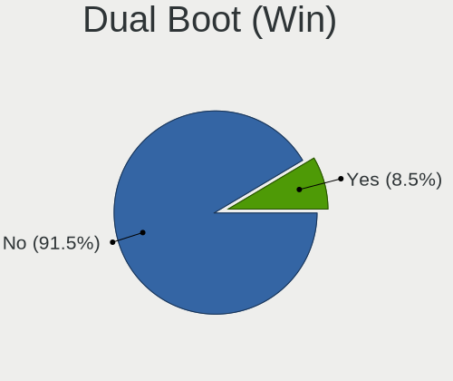

| Dual boot | Computers | Percent |
|-----------|-----------|---------|
| No        | 268       | 91.47%  |
| Yes       | 25        | 8.53%   |

Board
-----

Vendor
------

Motherboard manufacturer

| Name                | Computers | Percent |
|---------------------|-----------|---------|
| TUXEDO              | 77        | 26.46%  |
| Lenovo              | 40        | 13.75%  |
| ASUSTek Computer    | 31        | 10.65%  |
| Hewlett-Packard     | 30        | 10.31%  |
| Dell                | 23        | 7.9%    |
| MSI                 | 22        | 7.56%   |
| Gigabyte Technology | 11        | 3.78%   |
| Apple               | 11        | 3.78%   |
| Acer                | 9         | 3.09%   |
| ASRock              | 6         | 2.06%   |
| Toshiba             | 4         | 1.37%   |
| Schenker            | 4         | 1.37%   |
| Samsung Electronics | 3         | 1.03%   |
| Notebook            | 3         | 1.03%   |
| BESSTAR Tech        | 2         | 0.69%   |
| Wortmann AG         | 1         | 0.34%   |
| Valve               | 1         | 0.34%   |
| Trigkey             | 1         | 0.34%   |
| Sony                | 1         | 0.34%   |
| Monster             | 1         | 0.34%   |
| Metabox             | 1         | 0.34%   |
| LG Electronics      | 1         | 0.34%   |
| Intel               | 1         | 0.34%   |
| Gateway             | 1         | 0.34%   |
| Fujitsu             | 1         | 0.34%   |
| Fanless Mini PC     | 1         | 0.34%   |
| ECS                 | 1         | 0.34%   |
| Chuwi               | 1         | 0.34%   |
| ASRock Industrial   | 1         | 0.34%   |
| Unknown             | 1         | 0.34%   |

Model
-----

Motherboard model

| Name                                | Computers | Percent |
|-------------------------------------|-----------|---------|
| Unknown                             | 5         | 1.72%   |
| TUXEDO Sirius 16 Gen1               | 4         | 1.37%   |
| TUXEDO Pulse 15 Gen1                | 4         | 1.37%   |
| TUXEDO InfinityBook S 15/17 Gen7    | 4         | 1.37%   |
| TUXEDO InfinityBook Pro Gen7 (MK1)  | 4         | 1.37%   |
| TUXEDO InfinityBook Pro 14 Gen6     | 4         | 1.37%   |
| TUXEDO Stellaris/Polaris AMD Gen4   | 3         | 1.03%   |
| TUXEDO Stellaris Intel Gen5         | 3         | 1.03%   |
| TUXEDO Pulse 15 Gen2                | 3         | 1.03%   |
| TUXEDO Polaris AMD Gen5             | 3         | 1.03%   |
| TUXEDO InfinityBook Pro Intel Gen9  | 3         | 1.03%   |
| TUXEDO InfinityBook Pro AMD Gen9    | 3         | 1.03%   |
| TUXEDO Aura 15 Gen2                 | 3         | 1.03%   |
| ASUS PRIME B450-PLUS                | 3         | 1.03%   |
| TUXEDO XMG FUSION 15 (XFU15L19)     | 2         | 0.69%   |
| TUXEDO Pulse 14 Gen4                | 2         | 0.69%   |
| TUXEDO Polaris 15 AMD Gen1          | 2         | 0.69%   |
| TUXEDO InfinityBook S 15 Gen6       | 2         | 0.69%   |
| TUXEDO InfinityBook Pro Gen8 (MK2)  | 2         | 0.69%   |
| TUXEDO InfinityBook Pro Gen8 (MK1)  | 2         | 0.69%   |
| TUXEDO InfinityBook Pro Gen7 (MK2)  | 2         | 0.69%   |
| TUXEDO Book XP15 / XP17 Gen12       | 2         | 0.69%   |
| Toshiba Satellite C660              | 2         | 0.69%   |
| MSI MS-7D17                         | 2         | 0.69%   |
| Dell Latitude E6540                 | 2         | 0.69%   |
| ASUS ROG STRIX B550-I GAMING        | 2         | 0.69%   |
| Apple MacBookPro8,1                 | 2         | 0.69%   |
| Apple MacBookAir6,2                 | 2         | 0.69%   |
| Wortmann AG 1220595_1470122         | 1         | 0.34%   |
| Valve Galileo                       | 1         | 0.34%   |
| TUXEDO XP1610                       | 1         | 0.34%   |
| TUXEDO Stellaris Slim 15 Intel Gen6 | 1         | 0.34%   |
| TUXEDO Stellaris Slim 15 AMD Gen6   | 1         | 0.34%   |
| TUXEDO Stellaris AMD Gen3 (CZN)     | 1         | 0.34%   |
| TUXEDO Stellaris 17 Intel Gen6      | 1         | 0.34%   |
| TUXEDO Pulse 14 Gen3                | 1         | 0.34%   |
| TUXEDO Polaris AMD Gen3 (CZN)       | 1         | 0.34%   |
| TUXEDO P64_HJ,HK1                   | 1         | 0.34%   |
| TUXEDO N85_N87,HJ,HJ1,HK1           | 1         | 0.34%   |
| TUXEDO N7x0WU                       | 1         | 0.34%   |

Model Family
------------

Motherboard model prefix

| Name                | Computers | Percent |
|---------------------|-----------|---------|
| TUXEDO InfinityBook | 28        | 9.62%   |
| Lenovo ThinkPad     | 17        | 5.84%   |
| Dell Latitude       | 12        | 4.12%   |
| TUXEDO Stellaris    | 10        | 3.44%   |
| TUXEDO Pulse        | 10        | 3.44%   |
| HP Pavilion         | 9         | 3.09%   |
| ASUS PRIME          | 8         | 2.75%   |
| TUXEDO Polaris      | 6         | 2.06%   |
| ASUS ASUS           | 6         | 2.06%   |
| Lenovo Yoga         | 5         | 1.72%   |
| Lenovo IdeaPad      | 5         | 1.72%   |
| ASUS ROG            | 5         | 1.72%   |
| Unknown             | 5         | 1.72%   |
| TUXEDO Sirius       | 4         | 1.37%   |
| TUXEDO Aura         | 4         | 1.37%   |
| Lenovo ThinkBook    | 4         | 1.37%   |
| Dell Precision      | 4         | 1.37%   |
| Dell Inspiron       | 4         | 1.37%   |
| Acer Nitro          | 4         | 1.37%   |
| TUXEDO Book         | 3         | 1.03%   |
| Toshiba Satellite   | 3         | 1.03%   |
| Schenker VISION     | 3         | 1.03%   |
| HP Laptop           | 3         | 1.03%   |
| TUXEDO XMG          | 2         | 0.69%   |
| MSI MS-7D17         | 2         | 0.69%   |
| MSI GF75            | 2         | 0.69%   |
| Lenovo ThinkCentre  | 2         | 0.69%   |
| Lenovo Legion       | 2         | 0.69%   |
| HP ProBook          | 2         | 0.69%   |
| HP ENVY             | 2         | 0.69%   |
| HP EliteBook        | 2         | 0.69%   |
| HP 250              | 2         | 0.69%   |
| Gigabyte Z490       | 2         | 0.69%   |
| ASUS TUF            | 2         | 0.69%   |
| Apple MacBookPro8   | 2         | 0.69%   |
| Apple MacBookAir6   | 2         | 0.69%   |
| Acer Swift          | 2         | 0.69%   |
| Acer Aspire         | 2         | 0.69%   |
| Wortmann AG 1220595 | 1         | 0.34%   |
| Valve Galileo       | 1         | 0.34%   |

MFG Year
--------

Motherboard manufacture year

| Year | Computers | Percent |
|------|-----------|---------|
| 2022 | 41        | 14.09%  |
| 2020 | 36        | 12.37%  |
| 2021 | 34        | 11.68%  |
| 2023 | 33        | 11.34%  |
| 2024 | 22        | 7.56%   |
| 2019 | 21        | 7.22%   |
| 2018 | 16        | 5.5%    |
| 2015 | 15        | 5.15%   |
| 2013 | 14        | 4.81%   |
| 2017 | 13        | 4.47%   |
| 2012 | 11        | 3.78%   |
| 2011 | 11        | 3.78%   |
| 2010 | 7         | 2.41%   |
| 2009 | 5         | 1.72%   |
| 2014 | 4         | 1.37%   |
| 2008 | 4         | 1.37%   |
| 2016 | 3         | 1.03%   |
| 2007 | 1         | 0.34%   |

Form Factor
-----------

Physical design of the computer

| Name        | Computers | Percent |
|-------------|-----------|---------|
| Notebook    | 213       | 73.2%   |
| Desktop     | 64        | 21.99%  |
| Convertible | 7         | 2.41%   |
| Mini pc     | 4         | 1.37%   |
| Tablet      | 2         | 0.69%   |
| All in one  | 1         | 0.34%   |

Secure Boot
-----------

Enabled or disabled

| State    | Computers | Percent |
|----------|-----------|---------|
| Disabled | 290       | 99.66%  |
| Enabled  | 1         | 0.34%   |

Coreboot
--------

Have coreboot on board

| Used | Computers | Percent |
|------|-----------|---------|
| No   | 290       | 99.66%  |
| Yes  | 1         | 0.34%   |

RAM Size
--------

Total RAM memory

| Size in GB  | Computers | Percent |
|-------------|-----------|---------|
| 32.01-64.0  | 71        | 24.4%   |
| 16.01-24.0  | 55        | 18.9%   |
| 4.01-8.0    | 51        | 17.53%  |
| 8.01-16.0   | 46        | 15.81%  |
| 64.01-256.0 | 31        | 10.65%  |
| 3.01-4.0    | 20        | 6.87%   |
| 24.01-32.0  | 15        | 5.15%   |
| 2.01-3.0    | 2         | 0.69%   |

RAM Used
--------

Used RAM memory

| Used GB    | Computers | Percent |
|------------|-----------|---------|
| 4.01-8.0   | 87        | 27.71%  |
| 2.01-3.0   | 78        | 24.84%  |
| 3.01-4.0   | 63        | 20.06%  |
| 1.01-2.0   | 52        | 16.56%  |
| 8.01-16.0  | 26        | 8.28%   |
| 16.01-24.0 | 8         | 2.55%   |

Total Drives
------------

Number of drives on board

| Drives | Computers | Percent |
|--------|-----------|---------|
| 1      | 167       | 56.8%   |
| 2      | 83        | 28.23%  |
| 3      | 16        | 5.44%   |
| 4      | 13        | 4.42%   |
| 5      | 9         | 3.06%   |
| 6      | 3         | 1.02%   |
| 8      | 1         | 0.34%   |
| 7      | 1         | 0.34%   |
| 0      | 1         | 0.34%   |

Has CD-ROM
----------

Has CD-ROM on board

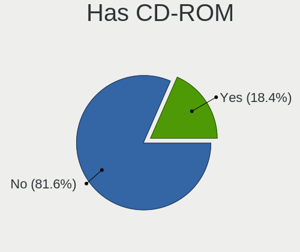

| Presented | Computers | Percent |
|-----------|-----------|---------|
| No        | 239       | 81.57%  |
| Yes       | 54        | 18.43%  |

Has Ethernet
------------

Has Ethernet on board

| Presented | Computers | Percent |
|-----------|-----------|---------|
| Yes       | 250       | 85.91%  |
| No        | 41        | 14.09%  |

Has WiFi
--------

Has WiFi module

| Presented | Computers | Percent |
|-----------|-----------|---------|
| Yes       | 256       | 87.97%  |
| No        | 35        | 12.03%  |

Has Bluetooth
-------------

Has Bluetooth module

| Presented | Computers | Percent |
|-----------|-----------|---------|
| Yes       | 249       | 85.27%  |
| No        | 43        | 14.73%  |

Location
--------

Country
-------

Geographic location (country)

| Country                | Computers | Percent |
|------------------------|-----------|---------|
| Germany                | 115       | 39.38%  |
| USA                    | 41        | 14.04%  |
| UK                     | 10        | 3.42%   |
| Italy                  | 8         | 2.74%   |
| Netherlands            | 7         | 2.4%    |
| Czechia                | 7         | 2.4%    |
| Poland                 | 6         | 2.05%   |
| France                 | 6         | 2.05%   |
| Australia              | 6         | 2.05%   |
| Turkey                 | 5         | 1.71%   |
| Switzerland            | 5         | 1.71%   |
| Spain                  | 5         | 1.71%   |
| Portugal               | 5         | 1.71%   |
| India                  | 5         | 1.71%   |
| Brazil                 | 5         | 1.71%   |
| Austria                | 5         | 1.71%   |
| Canada                 | 4         | 1.37%   |
| South Africa           | 3         | 1.03%   |
| Romania                | 3         | 1.03%   |
| Norway                 | 3         | 1.03%   |
| Hungary                | 3         | 1.03%   |
| China                  | 3         | 1.03%   |
| Bulgaria               | 3         | 1.03%   |
| Sweden                 | 2         | 0.68%   |
| Slovakia               | 2         | 0.68%   |
| Indonesia              | 2         | 0.68%   |
| Greece                 | 2         | 0.68%   |
| Finland                | 2         | 0.68%   |
| Denmark                | 2         | 0.68%   |
| Bosnia and Herzegovina | 2         | 0.68%   |
| Belgium                | 2         | 0.68%   |
| Venezuela              | 1         | 0.34%   |
| Tunisia                | 1         | 0.34%   |
| Thailand               | 1         | 0.34%   |
| Panama                 | 1         | 0.34%   |
| Mexico                 | 1         | 0.34%   |
| Malta                  | 1         | 0.34%   |
| Malaysia               | 1         | 0.34%   |
| Estonia                | 1         | 0.34%   |
| Egypt                  | 1         | 0.34%   |

City
----

Geographic location (city)

| City              | Computers | Percent |
|-------------------|-----------|---------|
| Munich            | 9         | 3.01%   |
| Berlin            | 7         | 2.34%   |
| Essen             | 5         | 1.67%   |
| Vienna            | 3         | 1%      |
| Stuttgart         | 3         | 1%      |
| Shanghai          | 3         | 1%      |
| Prague            | 3         | 1%      |
| Nuremberg         | 3         | 1%      |
| Los Angeles       | 3         | 1%      |
| Hamburg           | 3         | 1%      |
| Dortmund          | 3         | 1%      |
| Zurich            | 2         | 0.67%   |
| Wolfsburg         | 2         | 0.67%   |
| Schweinfurt       | 2         | 0.67%   |
| Rome              | 2         | 0.67%   |
| Perth             | 2         | 0.67%   |
| Mannheim          | 2         | 0.67%   |
| Lucerne           | 2         | 0.67%   |
| Lienz             | 2         | 0.67%   |
| Leipzig           | 2         | 0.67%   |
| Langevag          | 2         | 0.67%   |
| Kunovice          | 2         | 0.67%   |
| Kiel              | 2         | 0.67%   |
| Johannesburg      | 2         | 0.67%   |
| Jakarta           | 2         | 0.67%   |
| Istanbul          | 2         | 0.67%   |
| Hrth            | 2         | 0.67%   |
| Helsinki          | 2         | 0.67%   |
| Hamilton          | 2         | 0.67%   |
| Frankfurt am Main | 2         | 0.67%   |
| Elmshorn          | 2         | 0.67%   |
| Dsseldorf       | 2         | 0.67%   |
| Duisburg          | 2         | 0.67%   |
| Brisbane          | 2         | 0.67%   |
| Braunschweig      | 2         | 0.67%   |
| Astoria           | 2         | 0.67%   |
| Amsterdam         | 2         | 0.67%   |
| Zonguldak         | 1         | 0.33%   |
| iar nad Hronom  | 1         | 0.33%   |
| Zalu            | 1         | 0.33%   |

Drives
------

Drive Vendor
------------

Hard drive vendors

| Vendor                      | Computers | Drives | Percent |
|-----------------------------|-----------|--------|---------|
| Samsung Electronics         | 133       | 193    | 31.29%  |
| Sandisk                     | 37        | 45     | 8.71%   |
| Seagate                     | 31        | 45     | 7.29%   |
| WDC                         | 27        | 43     | 6.35%   |
| Kingston                    | 22        | 25     | 5.18%   |
| Micron Technology           | 17        | 21     | 4%      |
| Crucial                     | 14        | 18     | 3.29%   |
| Unknown                     | 12        | 13     | 2.82%   |
| Toshiba                     | 12        | 13     | 2.82%   |
| SK hynix                    | 12        | 15     | 2.82%   |
| Intel                       | 10        | 11     | 2.35%   |
| Micron/Crucial Technology   | 9         | 15     | 2.12%   |
| Hitachi                     | 9         | 14     | 2.12%   |
| Phison Electronics          | 6         | 6      | 1.41%   |
| Apple                       | 6         | 6      | 1.41%   |
| Kingston Technology Company | 5         | 6      | 1.18%   |
| Intenso                     | 5         | 6      | 1.18%   |
| SPCC                        | 3         | 3      | 0.71%   |
| Phison                      | 3         | 5      | 0.71%   |
| KIOXIA                      | 3         | 6      | 0.71%   |
| HGST                        | 3         | 6      | 0.71%   |
| Transcend                   | 2         | 3      | 0.47%   |
| Silicon Motion              | 2         | 3      | 0.47%   |
| Netac                       | 2         | 2      | 0.47%   |
| Lite-On Technology          | 2         | 2      | 0.47%   |
| GOODRAM                     | 2         | 2      | 0.47%   |
| Fanxiang                    | 2         | 2      | 0.47%   |
| China                       | 2         | 2      | 0.47%   |
| ASMT                        | 2         | 2      | 0.47%   |
| ASMedia                     | 2         | 3      | 0.47%   |
| Apacer                      | 2         | 2      | 0.47%   |
| XrayDisk                    | 1         | 1      | 0.24%   |
| WALRAM                      | 1         | 1      | 0.24%   |
| Verbatim                    | 1         | 1      | 0.24%   |
| USB3.0                      | 1         | 1      | 0.24%   |
| Team                        | 1         | 1      | 0.24%   |
| Solid State Storage         | 1         | 1      | 0.24%   |
| S3+                         | 1         | 1      | 0.24%   |
| OWC                         | 1         | 1      | 0.24%   |
| LITEONIT                    | 1         | 1      | 0.24%   |

Drive Model
-----------

Hard drive models

| Model                                                | Computers | Percent |
|------------------------------------------------------|-----------|---------|
| Samsung NVMe SSD Controller SM981/PM981/PM983 512GB  | 19        | 4.01%   |
| Samsung NVMe SSD Controller PM9A1/PM9A3/980PRO 512GB | 18        | 3.8%    |
| Samsung SSD 980 1TB                                  | 16        | 3.38%   |
| Samsung SSD 980 500GB                                | 14        | 2.95%   |
| Samsung SSD 990 PRO 1TB                              | 8         | 1.69%   |
| Sandisk WD Black SN750 / PC SN730 NVMe SSD 512GB     | 7         | 1.48%   |
| Micron/Crucial P2 NVMe PCIe SSD 500GB                | 7         | 1.48%   |
| Kingston SA400S37240G 240GB SSD                      | 6         | 1.27%   |
| Samsung SSD 990 PRO 2TB                              | 5         | 1.05%   |
| Samsung SSD 990 EVO 1TB                              | 5         | 1.05%   |
| Samsung SSD 980 PRO 1TB                              | 5         | 1.05%   |
| Seagate ST1000DM010-2EP102 1TB                       | 4         | 0.84%   |
| Samsung SSD 860 EVO 250GB                            | 4         | 0.84%   |
| Seagate ST3500418AS 500GB                            | 3         | 0.63%   |
| Sandisk WD Blue SN570 1TB                            | 3         | 0.63%   |
| Samsung SSD 970 EVO Plus 1TB                         | 3         | 0.63%   |
| Samsung SSD 860 EVO 500GB                            | 3         | 0.63%   |
| Samsung SSD 850 EVO 500GB                            | 3         | 0.63%   |
| Samsung SSD 850 EVO 1TB                              | 3         | 0.63%   |
| Phison E16 PCIe4 NVMe Controller 1TB                 | 3         | 0.63%   |
| Micron CT1000P3PSSD8 1TB                             | 3         | 0.63%   |
| Kingston SV300S37A120G 120GB SSD                     | 3         | 0.63%   |
| Crucial CT1000MX500SSD1 1TB                          | 3         | 0.63%   |
| WDC WDS240G2G0A-00JH30 240GB SSD                     | 2         | 0.42%   |
| WDC WD10EZEX-08WN4A0 1TB                             | 2         | 0.42%   |
| Unknown SD/MMC/MS PRO 128GB                          | 2         | 0.42%   |
| Unknown MMC Card  64GB                               | 2         | 0.42%   |
| Toshiba XG4 NVMe SSD Controller 512GB                | 2         | 0.42%   |
| Toshiba MQ01ABD100 1TB                               | 2         | 0.42%   |
| SK hynix SKHynix_HFS512GDE9X084N 512GB               | 2         | 0.42%   |
| Silicon Motion SM2262/SM2262EN SSD Controller 2TB    | 2         | 0.42%   |
| Seagate ST500LT012-9WS142 500GB                      | 2         | 0.42%   |
| Seagate ST2000LM015-2E8174 2TB                       | 2         | 0.42%   |
| Seagate ST1000VT001-1RE172 1TB                       | 2         | 0.42%   |
| Sandisk WD Blue SN550 NVMe SSD 256GB                 | 2         | 0.42%   |
| Sandisk WD Black SN850 2TB                           | 2         | 0.42%   |
| SanDisk SSD PLUS 120GB                               | 2         | 0.42%   |
| SanDisk SDSSDA240G 240GB                             | 2         | 0.42%   |
| SanDisk NVMe SSD Drive 500GB                         | 2         | 0.42%   |
| SanDisk NVMe SSD Drive 2TB                           | 2         | 0.42%   |

HDD Vendor
----------

Hard disk drive vendors

| Vendor              | Computers | Drives | Percent |
|---------------------|-----------|--------|---------|
| Seagate             | 30        | 44     | 38.96%  |
| WDC                 | 19        | 31     | 24.68%  |
| Hitachi             | 9         | 14     | 11.69%  |
| Toshiba             | 6         | 6      | 7.79%   |
| HGST                | 3         | 6      | 3.9%    |
| Unknown             | 2         | 3      | 2.6%    |
| Samsung Electronics | 2         | 2      | 2.6%    |
| ASMT                | 2         | 2      | 2.6%    |
| ASMedia             | 2         | 3      | 2.6%    |
| Intenso             | 1         | 1      | 1.3%    |
| HGST HTS            | 1         | 1      | 1.3%    |

SSD Vendor
----------

Solid state drive vendors

| Vendor              | Computers | Drives | Percent |
|---------------------|-----------|--------|---------|
| Samsung Electronics | 28        | 34     | 24.56%  |
| Kingston            | 15        | 18     | 13.16%  |
| SanDisk             | 12        | 14     | 10.53%  |
| Crucial             | 12        | 14     | 10.53%  |
| WDC                 | 9         | 10     | 7.89%   |
| Apple               | 6         | 6      | 5.26%   |
| Transcend           | 2         | 3      | 1.75%   |
| Toshiba             | 2         | 2      | 1.75%   |
| SPCC                | 2         | 2      | 1.75%   |
| Netac               | 2         | 2      | 1.75%   |
| Micron Technology   | 2         | 2      | 1.75%   |
| Intenso             | 2         | 2      | 1.75%   |
| Intel               | 2         | 2      | 1.75%   |
| GOODRAM             | 2         | 2      | 1.75%   |
| China               | 2         | 2      | 1.75%   |
| Apacer              | 2         | 2      | 1.75%   |
| Verbatim            | 1         | 1      | 0.88%   |
| USB3.0              | 1         | 1      | 0.88%   |
| Team                | 1         | 1      | 0.88%   |
| SK hynix            | 1         | 2      | 0.88%   |
| S3+                 | 1         | 1      | 0.88%   |
| OWC                 | 1         | 1      | 0.88%   |
| LITEONIT            | 1         | 1      | 0.88%   |
| LITEON              | 1         | 1      | 0.88%   |
| Lexar               | 1         | 1      | 0.88%   |
| Emtec               | 1         | 1      | 0.88%   |
| CT1000BX            | 1         | 1      | 0.88%   |
| A-DATA Technology   | 1         | 2      | 0.88%   |

Drive Kind
----------

HDD or SSD

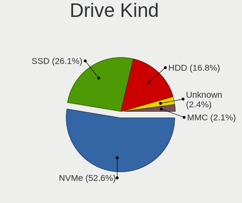

| Kind    | Computers | Drives | Percent |
|---------|-----------|--------|---------|
| NVMe    | 200       | 304    | 52.63%  |
| SSD     | 99        | 131    | 26.05%  |
| HDD     | 64        | 113    | 16.84%  |
| Unknown | 9         | 11     | 2.37%   |
| MMC     | 8         | 8      | 2.11%   |

Drive Connector
---------------

SATA, SAS, NVMe, etc.

| Type | Computers | Drives | Percent |
|------|-----------|--------|---------|
| NVMe | 200       | 303    | 56.18%  |
| SATA | 133       | 235    | 37.36%  |
| SAS  | 15        | 21     | 4.21%   |
| MMC  | 8         | 8      | 2.25%   |

Drive Size
----------

Size of hard drive

| Size in TB | Computers | Drives | Percent |
|------------|-----------|--------|---------|
| 0.01-0.5   | 93        | 137    | 53.76%  |
| 0.51-1.0   | 55        | 67     | 31.79%  |
| 1.01-2.0   | 14        | 22     | 8.09%   |
| 3.01-4.0   | 5         | 10     | 2.89%   |
| 4.01-10.0  | 4         | 5      | 2.31%   |
| 2.01-3.0   | 2         | 3      | 1.16%   |

Space Total
-----------

Amount of disk space available on the file system

| Size in GB     | Computers | Percent |
|----------------|-----------|---------|
| 501-1000       | 77        | 25.41%  |
| 251-500        | 59        | 19.47%  |
| 101-250        | 58        | 19.14%  |
| 1001-2000      | 45        | 14.85%  |
| 1-20           | 16        | 5.28%   |
| More than 3000 | 14        | 4.62%   |
| 2001-3000      | 13        | 4.29%   |
| 51-100         | 13        | 4.29%   |
| Unknown        | 5         | 1.65%   |
| 21-50          | 3         | 0.99%   |

Space Used
----------

Amount of used disk space

| Used GB        | Computers | Percent |
|----------------|-----------|---------|
| 1-20           | 100       | 32.26%  |
| 21-50          | 70        | 22.58%  |
| 101-250        | 44        | 14.19%  |
| 501-1000       | 26        | 8.39%   |
| 251-500        | 25        | 8.06%   |
| 51-100         | 24        | 7.74%   |
| 1001-2000      | 9         | 2.9%    |
| Unknown        | 5         | 1.61%   |
| More than 3000 | 4         | 1.29%   |
| 2001-3000      | 3         | 0.97%   |

Malfunc. Drives
---------------

Drive models with a malfunction

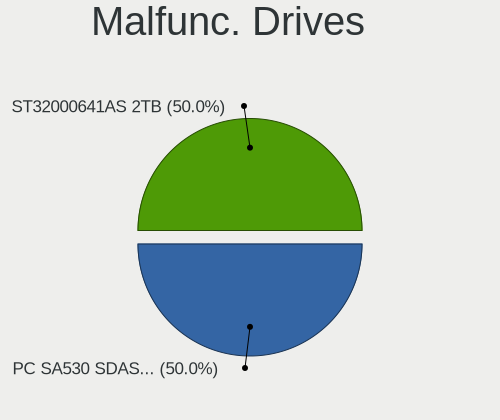

| Model                                    | Computers | Drives | Percent |
|------------------------------------------|-----------|--------|---------|
| WDC PC SA530 SDASN8Y-256G-1006 256GB SSD | 1         | 1      | 50%     |
| Seagate ST32000641AS 2TB                 | 1         | 1      | 50%     |

Malfunc. Drive Vendor
---------------------

Vendors of faulty drives

| Vendor  | Computers | Drives | Percent |
|---------|-----------|--------|---------|
| WDC     | 1         | 1      | 50%     |
| Seagate | 1         | 1      | 50%     |

Malfunc. HDD Vendor
-------------------

Vendors of faulty HDD drives

| Vendor  | Computers | Drives | Percent |
|---------|-----------|--------|---------|
| Seagate | 1         | 1      | 100%    |

Malfunc. Drive Kind
-------------------

Kinds of faulty drives

| Kind | Computers | Drives | Percent |
|------|-----------|--------|---------|
| SSD  | 1         | 1      | 50%     |
| HDD  | 1         | 1      | 50%     |

Failed Drives
-------------

Failed drive models

Zero info for selected period =(

Failed Drive Vendor
-------------------

Failed drive vendors

Zero info for selected period =(

Drive Status
------------

Number of failed and malfunc. drives

| Status   | Computers | Drives | Percent |
|----------|-----------|--------|---------|
| Detected | 222       | 452    | 72.79%  |
| Works    | 81        | 113    | 26.56%  |
| Malfunc  | 2         | 2      | 0.66%   |

Storage controller
------------------

Storage Vendor
--------------

Storage controller vendors

| Vendor                         | Computers | Percent |
|--------------------------------|-----------|---------|
| Intel                          | 137       | 33.41%  |
| Samsung Electronics            | 112       | 27.32%  |
| AMD                            | 44        | 10.73%  |
| SanDisk                        | 26        | 6.34%   |
| Micron Technology              | 15        | 3.66%   |
| Micron/Crucial Technology      | 12        | 2.93%   |
| Kingston Technology Company    | 12        | 2.93%   |
| SK hynix                       | 11        | 2.68%   |
| Phison Electronics             | 9         | 2.2%    |
| Toshiba America Info Systems   | 4         | 0.98%   |
| Silicon Motion                 | 4         | 0.98%   |
| Nvidia                         | 4         | 0.98%   |
| ASMedia Technology             | 4         | 0.98%   |
| MAXIO Technology (Hangzhou)    | 3         | 0.73%   |
| KIOXIA                         | 3         | 0.73%   |
| Marvell Technology Group       | 2         | 0.49%   |
| Lite-On Technology             | 2         | 0.49%   |
| INNOGRIT                       | 2         | 0.49%   |
| Solid State Storage Technology | 1         | 0.24%   |
| Seagate Technology             | 1         | 0.24%   |
| Lenovo                         | 1         | 0.24%   |
| ADATA Technology               | 1         | 0.24%   |

Storage Model
-------------

Storage controller models

| Model                                                                          | Computers | Percent |
|--------------------------------------------------------------------------------|-----------|---------|
| Samsung NVMe SSD Controller 980 (DRAM-less)                                    | 36        | 8%      |
| AMD FCH SATA Controller [AHCI mode]                                            | 35        | 7.78%   |
| Samsung NVMe SSD Controller PM9A1/PM9A3/980PRO                                 | 29        | 6.44%   |
| Samsung NVMe SSD Controller SM981/PM981/PM983                                  | 25        | 5.56%   |
| Intel Volume Management Device NVMe RAID Controller                            | 13        | 2.89%   |
| Samsung NVMe SSD Controller S4LV008[Pascal]                                    | 12        | 2.67%   |
| Intel 7 Series Chipset Family 6-port SATA Controller [AHCI mode]               | 11        | 2.44%   |
| Samsung NVMe SSD Controller PM9C1a (DRAM-less)                                 | 9         | 2%      |
| Micron/Crucial P2 [Nick P2] / P3 / P3 Plus NVMe PCIe SSD (DRAM-less)           | 9         | 2%      |
| Intel 500 Series Chipset Family SATA AHCI Controller                           | 9         | 2%      |
| SanDisk Extreme Pro / WD Black SN750 / PC SN730 / Red SN700 NVMe SSD           | 8         | 1.78%   |
| Intel 6 Series/C200 Series Chipset Family 6 port Mobile SATA AHCI Controller   | 8         | 1.78%   |
| Intel Sunrise Point-LP SATA Controller [AHCI mode]                             | 7         | 1.56%   |
| Intel Cannon Lake Mobile PCH SATA AHCI Controller                              | 7         | 1.56%   |
| SK hynix Gold P31/BC711/PC711 NVMe Solid State Drive                           | 6         | 1.33%   |
| Intel Comet Lake SATA AHCI Controller                                          | 6         | 1.33%   |
| Intel 400 Series Chipset Family SATA AHCI Controller                           | 6         | 1.33%   |
| AMD 400 Series Chipset SATA Controller                                         | 6         | 1.33%   |
| SanDisk Ultra 3D / WD Blue SN570 NVMe SSD (DRAM-less)                          | 5         | 1.11%   |
| Samsung NVMe SSD Controller SM961/PM961/SM963                                  | 5         | 1.11%   |
| Intel Wildcat Point-LP SATA Controller [AHCI Mode]                             | 5         | 1.11%   |
| Intel Q170/Q150/B150/H170/H110/Z170/CM236 Chipset SATA Controller [AHCI Mode]  | 5         | 1.11%   |
| Intel Alder Lake-P SATA AHCI Controller                                        | 5         | 1.11%   |
| Intel 8 Series/C220 Series Chipset Family 6-port SATA Controller 1 [AHCI mode] | 5         | 1.11%   |
| SanDisk WD Black SN770 / PC SN740 256GB / PC SN560 (DRAM-less) NVMe SSD        | 4         | 0.89%   |
| Phison E16 PCIe4 NVMe Controller                                               | 4         | 0.89%   |
| Micron 2550 NVMe SSD (DRAM-less)                                               | 4         | 0.89%   |
| Intel HM170/QM170 Chipset SATA Controller [AHCI Mode]                          | 4         | 0.89%   |
| Intel 82801 Mobile SATA Controller [RAID mode]                                 | 4         | 0.89%   |
| Intel 8 Series SATA Controller 1 [AHCI mode]                                   | 4         | 0.89%   |
| Intel 5 Series/3400 Series Chipset 4 port SATA AHCI Controller                 | 4         | 0.89%   |
| ASMedia ASM1061/ASM1062 Serial ATA Controller                                  | 4         | 0.89%   |
| AMD 500 Series Chipset SATA Controller                                         | 4         | 0.89%   |
| Silicon Motion SM2262/SM2262EN SSD Controller                                  | 3         | 0.67%   |
| Samsung S4LN058A01[SSUBX] AHCI SSD Controller (Apple slot)                     | 3         | 0.67%   |
| Phison E12 NVMe Controller                                                     | 3         | 0.67%   |
| Micron 3400 NVMe SSD [Hendrix]                                                 | 3         | 0.67%   |
| Micron 2400 NVMe SSD (DRAM-less)                                               | 3         | 0.67%   |
| Micron 2300 NVMe SSD [Santana]                                                 | 3         | 0.67%   |
| MAXIO (Hangzhou) NVMe SSD Controller MAP1202 (DRAM-less)                       | 3         | 0.67%   |

Storage Kind
------------

Kind of storage controller (IDE, SATA, NVMe, SAS, ...)

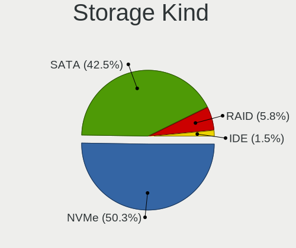

| Kind | Computers | Percent |
|------|-----------|---------|
| NVMe | 200       | 50.25%  |
| SATA | 169       | 42.46%  |
| RAID | 23        | 5.78%   |
| IDE  | 6         | 1.51%   |

Processor
---------

CPU Vendor
----------

Processor vendors

| Vendor | Computers | Percent |
|--------|-----------|---------|
| Intel  | 199       | 68.38%  |
| AMD    | 92        | 31.62%  |

CPU Model
---------

Processor models

| Model                                      | Computers | Percent |
|--------------------------------------------|-----------|---------|
| Intel 12th Gen Core i7-12700H              | 10        | 3.44%   |
| AMD Ryzen 7 7840HS w/ Radeon 780M Graphics | 8         | 2.75%   |
| AMD Ryzen 7 8845HS w/ Radeon 780M Graphics | 7         | 2.41%   |
| Intel 11th Gen Core i7-11370H @ 3.30GHz    | 5         | 1.72%   |
| AMD Ryzen 7 4800H with Radeon Graphics     | 5         | 1.72%   |
| Intel Core i7-9750H CPU @ 2.60GHz          | 4         | 1.37%   |
| Intel Core i7-8550U CPU @ 1.80GHz          | 4         | 1.37%   |
| Intel Core i5-8250U CPU @ 1.60GHz          | 4         | 1.37%   |
| Intel 13th Gen Core i9-13900HX             | 4         | 1.37%   |
| Intel 12th Gen Core i7-1260P               | 4         | 1.37%   |
| Intel Core Ultra 7 155H                    | 3         | 1.03%   |
| Intel Core i7-7700HQ CPU @ 2.80GHz         | 3         | 1.03%   |
| Intel Core i7-2620M CPU @ 2.70GHz          | 3         | 1.03%   |
| Intel Core i5-9300H CPU @ 2.40GHz          | 3         | 1.03%   |
| Intel Core i5-3470 CPU @ 3.20GHz           | 3         | 1.03%   |
| Intel 13th Gen Core i7-13700H              | 3         | 1.03%   |
| Intel 12th Gen Core i7-1255U               | 3         | 1.03%   |
| Intel 12th Gen Core i5-1240P               | 3         | 1.03%   |
| AMD Ryzen 7 7735HS with Radeon Graphics    | 3         | 1.03%   |
| AMD Ryzen 7 5800X 8-Core Processor         | 3         | 1.03%   |
| AMD Ryzen 7 5800H with Radeon Graphics     | 3         | 1.03%   |
| AMD Ryzen 7 5700U with Radeon Graphics     | 3         | 1.03%   |
| AMD Ryzen 5 4600H with Radeon Graphics     | 3         | 1.03%   |
| Intel N100                                 | 2         | 0.69%   |
| Intel Core i9-14900HX                      | 2         | 0.69%   |
| Intel Core i7-4810MQ CPU @ 2.80GHz         | 2         | 0.69%   |
| Intel Core i7-4650U CPU @ 1.70GHz          | 2         | 0.69%   |
| Intel Core i7-3720QM CPU @ 2.60GHz         | 2         | 0.69%   |
| Intel Core i7-3630QM CPU @ 2.40GHz         | 2         | 0.69%   |
| Intel Core i7-2670QM CPU @ 2.20GHz         | 2         | 0.69%   |
| Intel Core i7-10870H CPU @ 2.20GHz         | 2         | 0.69%   |
| Intel Core i7-10750H CPU @ 2.60GHz         | 2         | 0.69%   |
| Intel Core i5-8365U CPU @ 1.60GHz          | 2         | 0.69%   |
| Intel Core i5-7200U CPU @ 2.50GHz          | 2         | 0.69%   |
| Intel Core i5-4590S CPU @ 3.00GHz          | 2         | 0.69%   |
| Intel Core i5-3210M CPU @ 2.50GHz          | 2         | 0.69%   |
| Intel Core i5-10210U CPU @ 1.60GHz         | 2         | 0.69%   |
| Intel Celeron N4500 @ 1.10GHz              | 2         | 0.69%   |
| Intel 13th Gen Core i7-1360P               | 2         | 0.69%   |
| Intel 12th Gen Core i5-12500H              | 2         | 0.69%   |

CPU Model Family
----------------

Processor model prefix

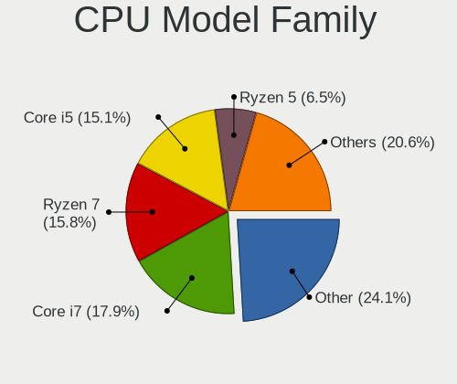

| Model                | Computers | Percent |
|----------------------|-----------|---------|
| Other                | 70        | 24.05%  |
| Intel Core i7        | 52        | 17.87%  |
| AMD Ryzen 7          | 46        | 15.81%  |
| Intel Core i5        | 44        | 15.12%  |
| AMD Ryzen 5          | 19        | 6.53%   |
| Intel Core i3        | 8         | 2.75%   |
| Intel Celeron        | 8         | 2.75%   |
| AMD Ryzen 9          | 6         | 2.06%   |
| AMD Ryzen 3          | 5         | 1.72%   |
| Intel Core i9        | 4         | 1.37%   |
| Intel Core 2 Duo     | 4         | 1.37%   |
| Intel Xeon           | 3         | 1.03%   |
| Intel Pentium        | 3         | 1.03%   |
| Intel Core           | 3         | 1.03%   |
| AMD Ryzen 5 PRO      | 2         | 0.69%   |
| AMD A8               | 2         | 0.69%   |
| AMD A6               | 2         | 0.69%   |
| AMD A10              | 2         | 0.69%   |
| Intel Pentium Silver | 1         | 0.34%   |
| Intel Core m5        | 1         | 0.34%   |
| Intel Core 2 Quad    | 1         | 0.34%   |
| AMD Turion II        | 1         | 0.34%   |
| AMD Ryzen 7 PRO      | 1         | 0.34%   |
| AMD Phenom II X2     | 1         | 0.34%   |
| AMD FX               | 1         | 0.34%   |
| AMD Athlon 64 X2     | 1         | 0.34%   |

CPU Cores
---------

Number of processor cores

| Number | Computers | Percent |
|--------|-----------|---------|
| 4      | 79        | 27.15%  |
| 8      | 60        | 20.62%  |
| 2      | 59        | 20.27%  |
| 6      | 37        | 12.71%  |
| 14     | 17        | 5.84%   |
| 12     | 16        | 5.5%    |
| 10     | 9         | 3.09%   |
| 16     | 7         | 2.41%   |
| 24     | 6         | 2.06%   |
| 1      | 1         | 0.34%   |

CPU Sockets
-----------

Number of sockets

| Number | Computers | Percent |
|--------|-----------|---------|
| 1      | 291       | 100%    |

CPU Threads
-----------

Threads per core (Hyper-Threading)

| Number | Computers | Percent |
|--------|-----------|---------|
| 2      | 249       | 85.57%  |
| 1      | 42        | 14.43%  |

CPU Op-Modes
------------

CPU Operation Modes (32-bit, 64-bit)

| Op mode        | Computers | Percent |
|----------------|-----------|---------|
| 32-bit, 64-bit | 291       | 100%    |

CPU Microcode
-------------

Microcode number

| Number     | Computers | Percent |
|------------|-----------|---------|
| Unknown    | 269       | 90.88%  |
| 0x0a704103 | 3         | 1.01%   |
| 0x906a4    | 2         | 0.68%   |
| 0x0a50000d | 2         | 0.68%   |
| 0x0a404102 | 2         | 0.68%   |
| 0x08608103 | 2         | 0.68%   |
| 0x08600106 | 2         | 0.68%   |
| 0xa0653    | 1         | 0.34%   |
| 0x906ea    | 1         | 0.34%   |
| 0x906e9    | 1         | 0.34%   |
| 0x906a3    | 1         | 0.34%   |
| 0x806c1    | 1         | 0.34%   |
| 0x306d4    | 1         | 0.34%   |
| 0x0a705205 | 1         | 0.34%   |
| 0x0a705203 | 1         | 0.34%   |
| 0x0a704101 | 1         | 0.34%   |
| 0x0a50000c | 1         | 0.34%   |
| 0x08701030 | 1         | 0.34%   |
| 0x08701021 | 1         | 0.34%   |
| 0x08600103 | 1         | 0.34%   |
| 0x010000c8 | 1         | 0.34%   |

CPU Microarch
-------------

Microarchitecture

| Name             | Computers | Percent |
|------------------|-----------|---------|
| Unknown          | 79        | 27.15%  |
| KabyLake         | 38        | 13.06%  |
| Zen 2            | 19        | 6.53%   |
| Alderlake Hybrid | 19        | 6.53%   |
| Zen 3            | 16        | 5.5%    |
| CometLake        | 16        | 5.5%    |
| IvyBridge        | 15        | 5.15%   |
| Haswell          | 14        | 4.81%   |
| TigerLake        | 11        | 3.78%   |
| Skylake          | 9         | 3.09%   |
| SandyBridge      | 9         | 3.09%   |
| Broadwell        | 7         | 2.41%   |
| Zen+             | 6         | 2.06%   |
| Westmere         | 5         | 1.72%   |
| Penryn           | 5         | 1.72%   |
| Piledriver       | 4         | 1.37%   |
| Zen              | 3         | 1.03%   |
| Goldmont plus    | 3         | 1.03%   |
| Nehalem          | 2         | 0.69%   |
| K10              | 2         | 0.69%   |
| Icelake          | 2         | 0.69%   |
| Gracemont        | 2         | 0.69%   |
| Silvermont       | 1         | 0.34%   |
| Puma             | 1         | 0.34%   |
| K8 Hammer        | 1         | 0.34%   |
| Excavator        | 1         | 0.34%   |
| Bulldozer        | 1         | 0.34%   |

Graphics
--------

GPU Vendor
----------

Vendors of graphics cards

| Vendor | Computers | Percent |
|--------|-----------|---------|
| Intel  | 170       | 45.33%  |
| Nvidia | 116       | 30.93%  |
| AMD    | 89        | 23.73%  |

GPU Model
---------

Graphics card models

| Model                                                                       | Computers | Percent |
|-----------------------------------------------------------------------------|-----------|---------|
| Intel Alder Lake-P GT2 [Iris Xe Graphics]                                   | 18        | 4.66%   |
| AMD Renoir [Radeon Vega Series / Radeon Vega Mobile Series]                 | 14        | 3.63%   |
| Intel 3rd Gen Core processor Graphics Controller                            | 11        | 2.85%   |
| AMD Phoenix1                                                                | 11        | 2.85%   |
| Intel UHD Graphics 620                                                      | 10        | 2.59%   |
| Intel TigerLake-LP GT2 [Iris Xe Graphics]                                   | 10        | 2.59%   |
| Nvidia GA106M [GeForce RTX 3060 Mobile / Max-Q]                             | 9         | 2.33%   |
| Intel CoffeeLake-H GT2 [UHD Graphics 630]                                   | 9         | 2.33%   |
| AMD Rembrandt [Radeon 680M]                                                 | 9         | 2.33%   |
| Intel Raptor Lake-P [Iris Xe Graphics]                                      | 8         | 2.07%   |
| Intel 2nd Generation Core Processor Family Integrated Graphics Controller   | 8         | 2.07%   |
| AMD Cezanne [Radeon Vega Series / Radeon Vega Mobile Series]                | 8         | 2.07%   |
| Nvidia TU116M [GeForce GTX 1660 Ti Mobile]                                  | 7         | 1.81%   |
| Nvidia GP108 [GeForce GT 1030]                                              | 7         | 1.81%   |
| Nvidia AD107M [GeForce RTX 4060 Max-Q / Mobile]                             | 7         | 1.81%   |
| AMD Phoenix3                                                                | 7         | 1.81%   |
| Intel Raptor Lake-S UHD Graphics                                            | 6         | 1.55%   |
| Intel CometLake-H GT2 [UHD Graphics]                                        | 6         | 1.55%   |
| AMD Navi 33 [Radeon RX 7600/7600 XT/7600M XT/7600S/7700S / PRO W7600]       | 6         | 1.55%   |
| AMD Lucienne                                                                | 6         | 1.55%   |
| Nvidia AD106M [GeForce RTX 4070 Max-Q / Mobile]                             | 5         | 1.3%    |
| Intel HD Graphics 630                                                       | 5         | 1.3%    |
| Intel HD Graphics 5500                                                      | 5         | 1.3%    |
| AMD Picasso/Raven 2 [Radeon Vega Series / Radeon Vega Mobile Series]        | 5         | 1.3%    |
| Nvidia TU117M [GeForce GTX 1650 Mobile / Max-Q]                             | 4         | 1.04%   |
| Nvidia GA107M [GeForce RTX 3050 Mobile]                                     | 4         | 1.04%   |
| Nvidia GA104M [GeForce RTX 3080 Mobile / Max-Q 8GB/16GB]                    | 4         | 1.04%   |
| Nvidia GA104 [Geforce RTX 3070 Ti Laptop GPU]                               | 4         | 1.04%   |
| Intel Xeon E3-1200 v3/4th Gen Core Processor Integrated Graphics Controller | 4         | 1.04%   |
| Intel Xeon E3-1200 v2/3rd Gen Core processor Graphics Controller            | 4         | 1.04%   |
| Intel HD Graphics 530                                                       | 4         | 1.04%   |
| Intel Haswell-ULT Integrated Graphics Controller                            | 4         | 1.04%   |
| Intel Core Processor Integrated Graphics Controller                         | 4         | 1.04%   |
| AMD Barcelo                                                                 | 4         | 1.04%   |
| Nvidia GA107M [GeForce RTX 3050 Ti Mobile]                                  | 3         | 0.78%   |
| Nvidia AD107M [GeForce RTX 4050 Max-Q / Mobile]                             | 3         | 0.78%   |
| Intel WhiskeyLake-U GT2 [UHD Graphics 620]                                  | 3         | 0.78%   |
| Intel Meteor Lake-P [Intel Arc Graphics]                                    | 3         | 0.78%   |
| Intel JasperLake [UHD Graphics]                                             | 3         | 0.78%   |
| Intel HD Graphics 620                                                       | 3         | 0.78%   |

GPU Combo
---------

Combinations of graphics cards

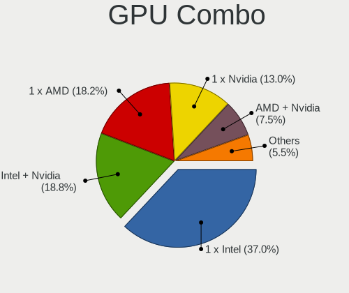

| Name           | Computers | Percent |
|----------------|-----------|---------|
| 1 x Intel      | 108       | 36.99%  |
| Intel + Nvidia | 55        | 18.84%  |
| 1 x AMD        | 53        | 18.15%  |
| 1 x Nvidia     | 38        | 13.01%  |
| AMD + Nvidia   | 22        | 7.53%   |
| 2 x AMD        | 9         | 3.08%   |
| Intel + AMD    | 6         | 2.05%   |
| 2 x Nvidia     | 1         | 0.34%   |

GPU Driver
----------

Free vs proprietary

| Driver      | Computers | Percent |
|-------------|-----------|---------|
| Free        | 193       | 65.87%  |
| Proprietary | 94        | 32.08%  |
| Unknown     | 6         | 2.05%   |

GPU Memory
----------

Total video memory

| Size in GB | Computers | Percent |
|------------|-----------|---------|
| Unknown    | 194       | 65.32%  |
| 7.01-8.0   | 27        | 9.09%   |
| 5.01-6.0   | 22        | 7.41%   |
| 3.01-4.0   | 15        | 5.05%   |
| 0.01-0.5   | 14        | 4.71%   |
| 1.01-2.0   | 12        | 4.04%   |
| 8.01-16.0  | 7         | 2.36%   |
| 2.01-3.0   | 2         | 0.67%   |
| 16.01-24.0 | 2         | 0.67%   |
| 0.51-1.0   | 2         | 0.67%   |

Monitor
-------

Monitor Vendor
--------------

Monitor vendors

| Vendor               | Computers | Percent |
|----------------------|-----------|---------|
| BOE                  | 65        | 18.41%  |
| AU Optronics         | 42        | 11.9%   |
| Samsung Electronics  | 39        | 11.05%  |
| Chimei Innolux       | 29        | 8.22%   |
| LG Display           | 19        | 5.38%   |
| Acer                 | 15        | 4.25%   |
| Dell                 | 14        | 3.97%   |
| Goldstar             | 12        | 3.4%    |
| CSO                  | 12        | 3.4%    |
| BenQ                 | 12        | 3.4%    |
| Hewlett-Packard      | 10        | 2.83%   |
| Apple                | 10        | 2.83%   |
| ASUSTek Computer     | 7         | 1.98%   |
| AOC                  | 7         | 1.98%   |
| Sharp                | 5         | 1.42%   |
| Lenovo               | 5         | 1.42%   |
| Iiyama               | 4         | 1.13%   |
| CSW                  | 4         | 1.13%   |
| Ancor Communications | 4         | 1.13%   |
| TMA                  | 3         | 0.85%   |
| Philips              | 3         | 0.85%   |
| InfoVision           | 3         | 0.85%   |
| ViewSonic            | 2         | 0.57%   |
| Sony                 | 2         | 0.57%   |
| SGT                  | 2         | 0.57%   |
| RTK                  | 2         | 0.57%   |
| PANDA                | 2         | 0.57%   |
| NEC Computers        | 2         | 0.57%   |
| Fujitsu Siemens      | 2         | 0.57%   |
| Yamaha               | 1         | 0.28%   |
| Vizio                | 1         | 0.28%   |
| VIE                  | 1         | 0.28%   |
| Vestel Elektronik    | 1         | 0.28%   |
| Valve                | 1         | 0.28%   |
| RCA                  | 1         | 0.28%   |
| MSI                  | 1         | 0.28%   |
| Medion               | 1         | 0.28%   |
| IOD                  | 1         | 0.28%   |
| HUAWEI               | 1         | 0.28%   |
| HannStar             | 1         | 0.28%   |

Monitor Model
-------------

Monitor models

| Model                                                             | Computers | Percent |
|-------------------------------------------------------------------|-----------|---------|
| CSO LCD Monitor CSO1402 2880x1800 302x188mm 14.0-inch             | 8         | 2.2%    |
| BOE LCD Monitor BOE07D8 1920x1080 344x194mm 15.5-inch             | 6         | 1.65%   |
| BOE LCD Monitor BOE0974 2560x1440 344x194mm 15.5-inch             | 5         | 1.37%   |
| CSW MNE007ZA3-2 CSW1431 2880x1800 301x188mm 14.0-inch             | 4         | 1.1%    |
| BOE LCD Monitor BOE0C8E 2560x1600 329x206mm 15.3-inch             | 4         | 1.1%    |
| BOE LCD Monitor BOE0A3B 2560x1600 344x215mm 16.0-inch             | 4         | 1.1%    |
| BOE LCD Monitor BOE09E5 2560x1440 355x200mm 16.0-inch             | 4         | 1.1%    |
| BOE LCD Monitor BOE084D 1920x1080 344x193mm 15.5-inch             | 4         | 1.1%    |
| TMA TL140ADXP24-0 TMA2004 2880x1800 300x190mm 14.0-inch           | 3         | 0.82%   |
| Samsung Electronics C24F390 SAM0D2C 1920x1080 521x293mm 23.5-inch | 3         | 0.82%   |
| Goldstar HDR 4K GSM7706 3840x2160 600x340mm 27.2-inch             | 3         | 0.82%   |
| CSO LCD Monitor CSO140C 2880x1800 302x188mm 14.0-inch             | 3         | 0.82%   |
| Chimei Innolux LCD Monitor CMN15E8 1920x1080 344x193mm 15.5-inch  | 3         | 0.82%   |
| BOE LCD Monitor BOE0B40 2560x1440 344x194mm 15.5-inch             | 3         | 0.82%   |
| BOE LCD Monitor BOE0AF0 2560x1600 344x215mm 16.0-inch             | 3         | 0.82%   |
| BOE LCD Monitor BOE0747 1920x1080 344x194mm 15.5-inch             | 3         | 0.82%   |
| Sharp LQ156M1JW01 SHP14C3 1920x1080 344x194mm 15.5-inch           | 2         | 0.55%   |
| Samsung Electronics C27F390 SAM0D32 1920x1080 600x340mm 27.2-inch | 2         | 0.55%   |
| Lenovo LCD Monitor LEN40BA 1920x1080 344x194mm 15.5-inch          | 2         | 0.55%   |
| Dell SE2419HR DELF113 1920x1080 527x296mm 23.8-inch               | 2         | 0.55%   |
| Chimei Innolux LCD Monitor CMN1733 1600x900 382x215mm 17.3-inch   | 2         | 0.55%   |
| Chimei Innolux LCD Monitor CMN1602 1920x1080 355x199mm 16.0-inch  | 2         | 0.55%   |
| Chimei Innolux LCD Monitor CMN15BA 1920x1080 344x194mm 15.5-inch  | 2         | 0.55%   |
| BOE LCD Monitor BOE0A99 2560x1600 366x229mm 17.0-inch             | 2         | 0.55%   |
| BOE LCD Monitor BOE0900 1920x1080 344x194mm 15.5-inch             | 2         | 0.55%   |
| BOE LCD Monitor BOE07C9 1920x1080 309x173mm 13.9-inch             | 2         | 0.55%   |
| BenQ LCD BNQ8024 2560x1440 597x336mm 27.0-inch                    | 2         | 0.55%   |
| BenQ GL2460 BNQ78CE 1920x1080 531x299mm 24.0-inch                 | 2         | 0.55%   |
| AU Optronics LCD Monitor AUO978F 1920x1080 382x215mm 17.3-inch    | 2         | 0.55%   |
| AU Optronics LCD Monitor AUO403D 1920x1080 309x174mm 14.0-inch    | 2         | 0.55%   |
| AU Optronics LCD Monitor AUO21EC 1366x768 344x193mm 15.5-inch     | 2         | 0.55%   |
| AU Optronics LCD Monitor AUO206C 1366x768 277x156mm 12.5-inch     | 2         | 0.55%   |
| AU Optronics LCD Monitor AUO109D 1920x1080 381x214mm 17.2-inch    | 2         | 0.55%   |
| ASUSTek Computer VG27AQ3A AUS27EF 2560x1440 597x336mm 27.0-inch   | 2         | 0.55%   |
| Apple LCD Monitor APP9CC3 1280x800 286x179mm 13.3-inch            | 2         | 0.55%   |
| Apple Color LCD APP9CF0 1440x900 290x180mm 13.4-inch              | 2         | 0.55%   |
| Acer QG241Y ACR079C 1920x1080 517x323mm 24.0-inch                 | 2         | 0.55%   |
| Acer EK240Y ACR0758 1920x1080 527x296mm 23.8-inch                 | 2         | 0.55%   |
| Yamaha RX-V473 YMH3171 1920x540                                   | 1         | 0.27%   |
| Vizio V435-H1 VIZ1039 3840x2160 941x529mm 42.5-inch               | 1         | 0.27%   |

Monitor Resolution
------------------

Monitor screen resolution

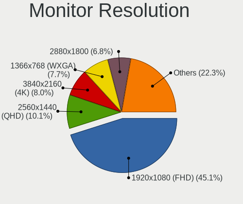

| Resolution         | Computers | Percent |
|--------------------|-----------|---------|
| 1920x1080 (FHD)    | 152       | 45.1%   |
| 2560x1440 (QHD)    | 34        | 10.09%  |
| 3840x2160 (4K)     | 27        | 8.01%   |
| 1366x768 (WXGA)    | 26        | 7.72%   |
| 2880x1800          | 23        | 6.82%   |
| 2560x1600          | 17        | 5.04%   |
| 1920x1200 (WUXGA)  | 12        | 3.56%   |
| 1600x900 (HD+)     | 9         | 2.67%   |
| 3440x1440          | 7         | 2.08%   |
| 1440x900 (WXGA+)   | 6         | 1.78%   |
| 1280x800 (WXGA)    | 6         | 1.78%   |
| 1680x1050 (WSXGA+) | 3         | 0.89%   |
| 1280x1024 (SXGA)   | 3         | 0.89%   |
| 3200x1800 (QHD+)   | 2         | 0.59%   |
| 2560x1080          | 2         | 0.59%   |
| 800x1280           | 1         | 0.3%    |
| 3840x2560          | 1         | 0.3%    |
| 3840x1080          | 1         | 0.3%    |
| 2240x1400          | 1         | 0.3%    |
| 2160x1440          | 1         | 0.3%    |
| 1920x540           | 1         | 0.3%    |
| 1360x768           | 1         | 0.3%    |
| Unknown            | 1         | 0.3%    |

Monitor Diagonal
----------------

Diagonal size in inches

| Inches  | Computers | Percent |
|---------|-----------|---------|
| 15      | 98        | 27.61%  |
| 14      | 38        | 10.7%   |
| 27      | 34        | 9.58%   |
| 24      | 32        | 9.01%   |
| 17      | 27        | 7.61%   |
| 13      | 23        | 6.48%   |
| 16      | 18        | 5.07%   |
| 23      | 15        | 4.23%   |
| 21      | 9         | 2.54%   |
| 31      | 8         | 2.25%   |
| 34      | 7         | 1.97%   |
| 12      | 6         | 1.69%   |
| 19      | 5         | 1.41%   |
| 22      | 4         | 1.13%   |
| 11      | 4         | 1.13%   |
| 84      | 3         | 0.85%   |
| 40      | 3         | 0.85%   |
| 20      | 3         | 0.85%   |
| Unknown | 3         | 0.85%   |
| 28      | 2         | 0.56%   |
| 18      | 2         | 0.56%   |
| 72      | 1         | 0.28%   |
| 69      | 1         | 0.28%   |
| 60      | 1         | 0.28%   |
| 54      | 1         | 0.28%   |
| 46      | 1         | 0.28%   |
| 43      | 1         | 0.28%   |
| 39      | 1         | 0.28%   |
| 36      | 1         | 0.28%   |
| 33      | 1         | 0.28%   |
| 32      | 1         | 0.28%   |
| 7       | 1         | 0.28%   |

Monitor Width
-------------

Physical width

| Width in mm | Computers | Percent |
|-------------|-----------|---------|
| 301-350     | 150       | 43.35%  |
| 501-600     | 72        | 20.81%  |
| 351-400     | 36        | 10.4%   |
| 201-300     | 29        | 8.38%   |
| 401-500     | 21        | 6.07%   |
| 601-700     | 11        | 3.18%   |
| 701-800     | 9         | 2.6%    |
| 1501-2000   | 5         | 1.45%   |
| 801-900     | 4         | 1.16%   |
| 1001-1500   | 3         | 0.87%   |
| Unknown     | 3         | 0.87%   |
| 901-1000    | 2         | 0.58%   |
| 1-100       | 1         | 0.29%   |

Aspect Ratio
------------

Proportional relationship between the width and the height

| Ratio   | Computers | Percent |
|---------|-----------|---------|
| 16/9    | 227       | 72.76%  |
| 16/10   | 67        | 21.47%  |
| 21/9    | 9         | 2.88%   |
| 5/4     | 3         | 0.96%   |
| 3/2     | 3         | 0.96%   |
| 32/9    | 1         | 0.32%   |
| 0.62    | 1         | 0.32%   |
| Unknown | 1         | 0.32%   |

Monitor Area
------------

Area in inch

| Area in inch | Computers | Percent |
|----------------|-----------|---------|
| 101-110        | 102       | 28.81%  |
| 81-90          | 52        | 14.69%  |
| 201-250        | 40        | 11.3%   |
| 301-350        | 34        | 9.6%    |
| 121-130        | 24        | 6.78%   |
| 351-500        | 19        | 5.37%   |
| 151-200        | 14        | 3.95%   |
| 111-120        | 14        | 3.95%   |
| 251-300        | 13        | 3.67%   |
| 71-80          | 9         | 2.54%   |
| More than 1000 | 7         | 1.98%   |
| 501-1000       | 7         | 1.98%   |
| 61-70          | 6         | 1.69%   |
| 51-60          | 4         | 1.13%   |
| 141-150        | 3         | 0.85%   |
| Unknown        | 3         | 0.85%   |
| 131-140        | 2         | 0.56%   |
| 1-40           | 1         | 0.28%   |

Pixel Density
-------------

Pixels per inch

| Density       | Computers | Percent |
|---------------|-----------|---------|
| 121-160       | 109       | 31.96%  |
| 51-100        | 81        | 23.75%  |
| 101-120       | 64        | 18.77%  |
| 161-240       | 53        | 15.54%  |
| More than 240 | 28        | 8.21%   |
| 1-50          | 3         | 0.88%   |
| Unknown       | 3         | 0.88%   |

Multiple Monitors
-----------------

Total monitors connected

| Total | Computers | Percent |
|-------|-----------|---------|
| 1     | 218       | 73.9%   |
| 2     | 66        | 22.37%  |
| 3     | 9         | 3.05%   |
| 0     | 2         | 0.68%   |

Network
-------

Net Controller Vendor
---------------------

Controller vendors

| Vendor                                 | Computers | Percent |
|----------------------------------------|-----------|---------|
| Intel                                  | 199       | 40.61%  |
| Realtek Semiconductor                  | 180       | 36.73%  |
| Qualcomm Atheros                       | 16        | 3.27%   |
| Broadcom                               | 15        | 3.06%   |
| MediaTek                               | 14        | 2.86%   |
| Suzhou Motorcomm Electronic Technology | 8         | 1.63%   |
| Ralink Technology                      | 8         | 1.63%   |
| ASIX Electronics                       | 8         | 1.63%   |
| Broadcom Limited                       | 7         | 1.43%   |
| DisplayLink                            | 6         | 1.22%   |
| TP-Link                                | 4         | 0.82%   |
| Huawei Technologies                    | 4         | 0.82%   |
| Sierra Wireless                        | 3         | 0.61%   |
| Ralink                                 | 2         | 0.41%   |
| Nvidia                                 | 2         | 0.41%   |
| D-Link                                 | 2         | 0.41%   |
| Samsung Electronics                    | 1         | 0.2%    |
| Qualcomm Atheros Communications        | 1         | 0.2%    |
| Qualcomm                               | 1         | 0.2%    |
| QinHeng Electronics                    | 1         | 0.2%    |
| OPPO Electronics                       | 1         | 0.2%    |
| NetGear                                | 1         | 0.2%    |
| Motorola PCS                           | 1         | 0.2%    |
| Marvell Technology Group               | 1         | 0.2%    |
| Lenovo                                 | 1         | 0.2%    |
| Ericsson Business Mobile Networks      | 1         | 0.2%    |
| Dell                                   | 1         | 0.2%    |
| ASUSTek Computer                       | 1         | 0.2%    |

Net Controller Model
--------------------

Controller models

| Model                                                                  | Computers | Percent |
|------------------------------------------------------------------------|-----------|---------|
| Realtek RTL8111/8168/8211/8411 PCI Express Gigabit Ethernet Controller | 115       | 20.61%  |
| Intel Wi-Fi 6 AX200                                                    | 41        | 7.35%   |
| Realtek RTL8125 2.5GbE Controller                                      | 23        | 4.12%   |
| Intel Alder Lake-P PCH CNVi WiFi                                       | 20        | 3.58%   |
| Realtek RTL8153 Gigabit Ethernet Adapter                               | 15        | 2.69%   |
| Intel Wi-Fi 6E(802.11ax) AX210/AX1675* 2x2 [Typhoon Peak]              | 15        | 2.69%   |
| Intel Wireless 8265 / 8275                                             | 11        | 1.97%   |
| Intel Ethernet Controller I225-V                                       | 11        | 1.97%   |
| Realtek RTL810xE PCI Express Fast Ethernet controller                  | 10        | 1.79%   |
| MediaTek MT7922 802.11ax PCI Express Wireless Network Adapter          | 9         | 1.61%   |
| Intel Wi-Fi 6 AX201                                                    | 9         | 1.61%   |
| Intel Raptor Lake-S PCH CNVi WiFi                                      | 9         | 1.61%   |
| Intel Raptor Lake PCH CNVi WiFi                                        | 9         | 1.61%   |
| Suzhou Motorcomm Electronic YT6801 Gigabit Ethernet Controller         | 8         | 1.43%   |
| Intel Wi-Fi 5(802.11ac) Wireless-AC 9x6x [Thunder Peak]                | 8         | 1.43%   |
| Intel 82579LM Gigabit Network Connection (Lewisville)                  | 7         | 1.25%   |
| ASIX AX88179 Gigabit Ethernet                                          | 7         | 1.25%   |
| Intel Comet Lake PCH CNVi WiFi                                         | 6         | 1.08%   |
| Realtek RTL8822CE 802.11ac PCIe Wireless Network Adapter               | 5         | 0.9%    |
| Intel Centrino Advanced-N 6205 [Taylor Peak]                           | 5         | 0.9%    |
| Intel Cannon Lake PCH CNVi WiFi                                        | 5         | 0.9%    |
| DisplayLink USB 4K Graphic Docking                                     | 5         | 0.9%    |
| Realtek RTL8821CE 802.11ac PCIe Wireless Network Adapter               | 4         | 0.72%   |
| Realtek Killer E3000 2.5GbE Controller                                 | 4         | 0.72%   |
| Realtek Killer E2600 GbE Controller                                    | 4         | 0.72%   |
| Ralink RT2870/RT3070 Wireless Adapter                                  | 4         | 0.72%   |
| Intel Wireless 8260                                                    | 4         | 0.72%   |
| Intel Wireless 7265                                                    | 4         | 0.72%   |
| Intel Wireless 7260                                                    | 4         | 0.72%   |
| Realtek RTL8852BE PCIe 802.11ax Wireless Network Controller            | 3         | 0.54%   |
| Realtek RTL8852AE 802.11ax PCIe Wireless Network Adapter               | 3         | 0.54%   |
| Realtek RTL8822BE 802.11a/b/g/n/ac WiFi adapter                        | 3         | 0.54%   |
| Qualcomm Atheros QCA6174 802.11ac Wireless Network Adapter             | 3         | 0.54%   |
| Qualcomm Atheros AR9485 Wireless Network Adapter                       | 3         | 0.54%   |
| MediaTek MT7921K (RZ608) Wi-Fi 6E 80MHz                                | 3         | 0.54%   |
| Intel Wireless 3165                                                    | 3         | 0.54%   |
| Intel Wireless 3160                                                    | 3         | 0.54%   |
| Intel Wi-Fi 6 AX201 160MHz                                             | 3         | 0.54%   |
| Intel Meteor Lake PCH CNVi WiFi                                        | 3         | 0.54%   |
| Intel Ethernet Connection I217-LM                                      | 3         | 0.54%   |

Wireless Vendor
---------------

Wireless vendors

| Vendor                          | Computers | Percent |
|---------------------------------|-----------|---------|
| Intel                           | 182       | 67.41%  |
| Realtek Semiconductor           | 26        | 9.63%   |
| Qualcomm Atheros                | 12        | 4.44%   |
| Broadcom                        | 12        | 4.44%   |
| MediaTek                        | 10        | 3.7%    |
| Ralink Technology               | 8         | 2.96%   |
| Broadcom Limited                | 6         | 2.22%   |
| TP-Link                         | 3         | 1.11%   |
| Sierra Wireless                 | 3         | 1.11%   |
| Ralink                          | 2         | 0.74%   |
| D-Link                          | 2         | 0.74%   |
| Qualcomm Atheros Communications | 1         | 0.37%   |
| Qualcomm                        | 1         | 0.37%   |
| NetGear                         | 1         | 0.37%   |
| ASUSTek Computer                | 1         | 0.37%   |

Wireless Model
--------------

Wireless models

| Model                                                                | Computers | Percent |
|----------------------------------------------------------------------|-----------|---------|
| Intel Wi-Fi 6 AX200                                                  | 41        | 15.19%  |
| Intel Alder Lake-P PCH CNVi WiFi                                     | 20        | 7.41%   |
| Intel Wi-Fi 6E(802.11ax) AX210/AX1675* 2x2 [Typhoon Peak]            | 15        | 5.56%   |
| Intel Wireless 8265 / 8275                                           | 11        | 4.07%   |
| Intel Wi-Fi 6 AX201                                                  | 9         | 3.33%   |
| Intel Raptor Lake-S PCH CNVi WiFi                                    | 9         | 3.33%   |
| Intel Raptor Lake PCH CNVi WiFi                                      | 9         | 3.33%   |
| Intel Wi-Fi 5(802.11ac) Wireless-AC 9x6x [Thunder Peak]              | 8         | 2.96%   |
| Intel Comet Lake PCH CNVi WiFi                                       | 6         | 2.22%   |
| Realtek RTL8822CE 802.11ac PCIe Wireless Network Adapter             | 5         | 1.85%   |
| MediaTek MT7922 802.11ax PCI Express Wireless Network Adapter        | 5         | 1.85%   |
| Intel Centrino Advanced-N 6205 [Taylor Peak]                         | 5         | 1.85%   |
| Intel Cannon Lake PCH CNVi WiFi                                      | 5         | 1.85%   |
| Realtek RTL8821CE 802.11ac PCIe Wireless Network Adapter             | 4         | 1.48%   |
| Ralink RT2870/RT3070 Wireless Adapter                                | 4         | 1.48%   |
| Intel Wireless 8260                                                  | 4         | 1.48%   |
| Intel Wireless 7265                                                  | 4         | 1.48%   |
| Intel Wireless 7260                                                  | 4         | 1.48%   |
| Realtek RTL8852AE 802.11ax PCIe Wireless Network Adapter             | 3         | 1.11%   |
| Realtek RTL8822BE 802.11a/b/g/n/ac WiFi adapter                      | 3         | 1.11%   |
| Qualcomm Atheros QCA6174 802.11ac Wireless Network Adapter           | 3         | 1.11%   |
| Qualcomm Atheros AR9485 Wireless Network Adapter                     | 3         | 1.11%   |
| MediaTek MT7921K (RZ608) Wi-Fi 6E 80MHz                              | 3         | 1.11%   |
| Intel Wireless 3165                                                  | 3         | 1.11%   |
| Intel Wireless 3160                                                  | 3         | 1.11%   |
| Intel Wi-Fi 6 AX201 160MHz                                           | 3         | 1.11%   |
| Intel Meteor Lake PCH CNVi WiFi                                      | 3         | 1.11%   |
| Intel Alder Lake-S PCH CNVi WiFi                                     | 3         | 1.11%   |
| Broadcom Limited BCM4360 802.11ac Dual Band Wireless Network Adapter | 3         | 1.11%   |
| Broadcom BCM4331 802.11a/b/g/n                                       | 3         | 1.11%   |
| Broadcom BCM4313 802.11bgn Wireless Network Adapter                  | 3         | 1.11%   |
| TP-Link TL-WN823N v2/v3 [Realtek RTL8192EU]                          | 2         | 0.74%   |
| Sierra Wireless EM7455                                               | 2         | 0.74%   |
| Realtek RTL8852BE PCIe 802.11ax Wireless Network Controller          | 2         | 0.74%   |
| Realtek RTL8723DE Wireless Network Adapter                           | 2         | 0.74%   |
| Realtek RTL8188EUS 802.11n Wireless Network Adapter                  | 2         | 0.74%   |
| Realtek 802.11ac NIC                                                 | 2         | 0.74%   |
| Ralink MT7601U Wireless Adapter                                      | 2         | 0.74%   |
| Ralink RT3290 Wireless 802.11n 1T/1R PCIe                            | 2         | 0.74%   |
| Qualcomm Atheros AR9285 Wireless Network Adapter (PCI-Express)       | 2         | 0.74%   |

Ethernet Vendor
---------------

Ethernet vendors

| Vendor                                 | Computers | Percent |
|----------------------------------------|-----------|---------|
| Realtek Semiconductor                  | 170       | 61.82%  |
| Intel                                  | 59        | 21.45%  |
| Suzhou Motorcomm Electronic Technology | 8         | 2.91%   |
| ASIX Electronics                       | 8         | 2.91%   |
| DisplayLink                            | 6         | 2.18%   |
| Broadcom                               | 6         | 2.18%   |
| Qualcomm Atheros                       | 5         | 1.82%   |
| MediaTek                               | 4         | 1.45%   |
| Nvidia                                 | 2         | 0.73%   |
| TP-Link                                | 1         | 0.36%   |
| Samsung Electronics                    | 1         | 0.36%   |
| OPPO Electronics                       | 1         | 0.36%   |
| Motorola PCS                           | 1         | 0.36%   |
| Marvell Technology Group               | 1         | 0.36%   |
| Lenovo                                 | 1         | 0.36%   |
| Broadcom Limited                       | 1         | 0.36%   |

Ethernet Model
--------------

Ethernet models

| Model                                                                  | Computers | Percent |
|------------------------------------------------------------------------|-----------|---------|
| Realtek RTL8111/8168/8211/8411 PCI Express Gigabit Ethernet Controller | 115       | 40.93%  |
| Realtek RTL8125 2.5GbE Controller                                      | 23        | 8.19%   |
| Realtek RTL8153 Gigabit Ethernet Adapter                               | 15        | 5.34%   |
| Intel Ethernet Controller I225-V                                       | 11        | 3.91%   |
| Realtek RTL810xE PCI Express Fast Ethernet controller                  | 10        | 3.56%   |
| Suzhou Motorcomm Electronic YT6801 Gigabit Ethernet Controller         | 8         | 2.85%   |
| Intel 82579LM Gigabit Network Connection (Lewisville)                  | 7         | 2.49%   |
| ASIX AX88179 Gigabit Ethernet                                          | 7         | 2.49%   |
| DisplayLink USB 4K Graphic Docking                                     | 5         | 1.78%   |
| Realtek Killer E3000 2.5GbE Controller                                 | 4         | 1.42%   |
| Realtek Killer E2600 GbE Controller                                    | 4         | 1.42%   |
| MediaTek MT7922 802.11ax PCI Express Wireless Network Adapter          | 4         | 1.42%   |
| Intel Ethernet Connection I217-LM                                      | 3         | 1.07%   |
| Intel Ethernet Connection (11) I219-V                                  | 3         | 1.07%   |
| Broadcom NetXtreme BCM57765 Gigabit Ethernet PCIe                      | 3         | 1.07%   |
| Realtek USB 10/100/1G/2.5G LAN                                         | 2         | 0.71%   |
| Qualcomm Atheros AR8161 Gigabit Ethernet                               | 2         | 0.71%   |
| Nvidia MCP79 Ethernet                                                  | 2         | 0.71%   |
| Intel I211 Gigabit Network Connection                                  | 2         | 0.71%   |
| Intel Ethernet Connection I218-LM                                      | 2         | 0.71%   |
| Intel Ethernet Connection (6) I219-LM                                  | 2         | 0.71%   |
| Intel Ethernet Connection (4) I219-V                                   | 2         | 0.71%   |
| Intel Ethernet Connection (4) I219-LM                                  | 2         | 0.71%   |
| Intel Ethernet Connection (2) I219-V                                   | 2         | 0.71%   |
| Intel Ethernet Connection (2) I219-LM                                  | 2         | 0.71%   |
| Intel Ethernet Connection (16) I219-LM                                 | 2         | 0.71%   |
| Intel Ethernet Connection (11) I219-LM                                 | 2         | 0.71%   |
| Intel CNVi: Wi-Fi                                                      | 2         | 0.71%   |
| TP-Link UE300 10/100/1000 LAN (ethernet mode) [Realtek RTL8153]        | 1         | 0.36%   |
| Samsung Galaxy series, misc. (tethering mode)                          | 1         | 0.36%   |
| Realtek RTL8852BE PCIe 802.11ax Wireless Network Controller            | 1         | 0.36%   |
| Qualcomm Atheros Killer E2500 Gigabit Ethernet Controller              | 1         | 0.36%   |
| Qualcomm Atheros AR8162 Fast Ethernet                                  | 1         | 0.36%   |
| Qualcomm Atheros AR8131 Gigabit Ethernet                               | 1         | 0.36%   |
| OPPO CPH2477                                                           | 1         | 0.36%   |
| Motorola PCS moto g play - 2023                                        | 1         | 0.36%   |
| Marvell Group 88E8057 PCI-E Gigabit Ethernet Controller                | 1         | 0.36%   |
| Lenovo ThinkPad TBT 3 Dock                                             | 1         | 0.36%   |
| Intel WiMAX Connection 2400m                                           | 1         | 0.36%   |
| Intel Wi-Fi 7(802.11be) AX1775*/AX1790*/BE20*/BE401/BE1750* 2x2        | 1         | 0.36%   |

Net Controller Kind
-------------------

Ethernet, WiFi or modem

| Kind     | Computers | Percent |
|----------|-----------|---------|
| WiFi     | 256       | 49.9%   |
| Ethernet | 250       | 48.73%  |
| Modem    | 7         | 1.36%   |

Used Controller
---------------

Currently used network controller

| Kind     | Computers | Percent |
|----------|-----------|---------|
| WiFi     | 184       | 60.53%  |
| Ethernet | 120       | 39.47%  |

NICs
----

Total network controllers on board

| Total | Computers | Percent |
|-------|-----------|---------|
| 2     | 185       | 63.57%  |
| 1     | 94        | 32.3%   |
| 3     | 9         | 3.09%   |
| 0     | 2         | 0.69%   |
| 4     | 1         | 0.34%   |

IPv6
----

IPv6 vs IPv4

| Used | Computers | Percent |
|------|-----------|---------|
| No   | 172       | 58.7%   |
| Yes  | 121       | 41.3%   |

Bluetooth
---------

Bluetooth Vendor
----------------

Controller vendors

| Vendor                          | Computers | Percent |
|---------------------------------|-----------|---------|
| Intel                           | 171       | 68.13%  |
| Realtek Semiconductor           | 19        | 7.57%   |
| Apple                           | 11        | 4.38%   |
| Foxconn / Hon Hai               | 8         | 3.19%   |
| Cambridge Silicon Radio         | 7         | 2.79%   |
| Broadcom                        | 7         | 2.79%   |
| MediaTek                        | 6         | 2.39%   |
| Qualcomm Atheros Communications | 5         | 1.99%   |
| IMC Networks                    | 5         | 1.99%   |
| ASUSTek Computer                | 4         | 1.59%   |
| Toshiba                         | 2         | 0.8%    |
| Ralink                          | 2         | 0.8%    |
| TP-Link                         | 1         | 0.4%    |
| Edimax Technology               | 1         | 0.4%    |
| Dell                            | 1         | 0.4%    |
| Unknown                         | 1         | 0.4%    |

Bluetooth Model
---------------

Controller models

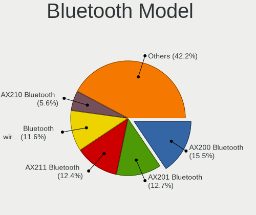

| Model                                               | Computers | Percent |
|-----------------------------------------------------|-----------|---------|
| Intel AX200 Bluetooth                               | 39        | 15.54%  |
| Intel AX201 Bluetooth                               | 32        | 12.75%  |
| Intel AX211 Bluetooth                               | 31        | 12.35%  |
| Intel Bluetooth wireless interface                  | 29        | 11.55%  |
| Intel AX210 Bluetooth                               | 14        | 5.58%   |
| Realtek Bluetooth Radio                             | 13        | 5.18%   |
| Intel Bluetooth 9460/9560 Jefferson Peak (JfP)      | 12        | 4.78%   |
| Intel Wireless-AC 9260 Bluetooth Adapter            | 8         | 3.19%   |
| Cambridge Silicon Radio Bluetooth Dongle (HCI mode) | 7         | 2.79%   |
| Apple Bluetooth Host Controller                     | 7         | 2.79%   |
| MediaTek Wireless_Device                            | 6         | 2.39%   |
| Foxconn / Hon Hai Wireless_Device                   | 6         | 2.39%   |
| Realtek  Bluetooth 4.2 Adapter                      | 4         | 1.59%   |
| Apple Bluetooth USB Host Controller                 | 4         | 1.59%   |
| Intel Centrino Bluetooth Wireless Transceiver       | 3         | 1.2%    |
| Toshiba Askey Bluetooth Module                      | 2         | 0.8%    |
| Realtek RTL8822BE Bluetooth 4.2 Adapter             | 2         | 0.8%    |
| Ralink RT3290 Bluetooth                             | 2         | 0.8%    |
| Qualcomm Atheros  Bluetooth Device                  | 2         | 0.8%    |
| Qualcomm Atheros QCA61x4 Bluetooth 4.0              | 2         | 0.8%    |
| Intel Centrino Advanced-N 6230 Bluetooth adapter    | 2         | 0.8%    |
| IMC Networks Wireless_Device                        | 2         | 0.8%    |
| IMC Networks Bluetooth Radio                        | 2         | 0.8%    |
| Broadcom BCM43142A0 Bluetooth 4.0                   | 2         | 0.8%    |
| Broadcom BCM2045B (BDC-2.1)                         | 2         | 0.8%    |
| ASUS Broadcom BCM20702A0 Bluetooth                  | 2         | 0.8%    |
| TP-Link TP-Link Bluetooth USB Adapter               | 1         | 0.4%    |
| Qualcomm Atheros AR3012 Bluetooth 4.0               | 1         | 0.4%    |
| Intel Bluetooth Device                              | 1         | 0.4%    |
| IMC Networks Bluetooth Device                       | 1         | 0.4%    |
| Foxconn / Hon Hai Broadcom BCM20702 Bluetooth       | 1         | 0.4%    |
| Foxconn / Hon Hai Acer Bluetooth module             | 1         | 0.4%    |
| Edimax Bluetooth Adapter                            | 1         | 0.4%    |
| Dell BCM20702A0 Bluetooth Module                    | 1         | 0.4%    |
| Broadcom HP Portable SoftSailing                    | 1         | 0.4%    |
| Broadcom HP Bluethunder                             | 1         | 0.4%    |
| Broadcom BCM2045B (BDC-2.1) [Bluetooth Controller]  | 1         | 0.4%    |
| ASUS BT-253 Bluetooth Adapter                       | 1         | 0.4%    |
| ASUS ASUS USB-BT500                                 | 1         | 0.4%    |
| Unknown                                             | 1         | 0.4%    |

Sound
-----

Sound Vendor
------------

Sound card vendors

| Vendor                                 | Computers | Percent |
|----------------------------------------|-----------|---------|
| Intel                                  | 194       | 46.19%  |
| Nvidia                                 | 97        | 23.1%   |
| AMD                                    | 92        | 21.9%   |
| C-Media Electronics                    | 5         | 1.19%   |
| Razer USA                              | 3         | 0.71%   |
| Logitech                               | 3         | 0.71%   |
| Lenovo                                 | 2         | 0.48%   |
| Hewlett-Packard                        | 2         | 0.48%   |
| GN Netcom                              | 2         | 0.48%   |
| Creative Labs                          | 2         | 0.48%   |
| Corsair                                | 2         | 0.48%   |
| Valve Software                         | 1         | 0.24%   |
| Turtle Beach                           | 1         | 0.24%   |
| Trust                                  | 1         | 0.24%   |
| Thesycon Systemsoftware & Consulting   | 1         | 0.24%   |
| SteelSeries ApS                        | 1         | 0.24%   |
| Sony Ericsson Mobile Communications AB | 1         | 0.24%   |
| Sennheiser electronic                  | 1         | 0.24%   |
| No brand                               | 1         | 0.24%   |
| MV-SILICON                             | 1         | 0.24%   |
| Micro Star International               | 1         | 0.24%   |
| Kingston Technology                    | 1         | 0.24%   |
| JMTek                                  | 1         | 0.24%   |
| Huawei Technologies                    | 1         | 0.24%   |
| FiiO Electronics Technology            | 1         | 0.24%   |
| DSEA A/S                               | 1         | 0.24%   |
| Creative Technology                    | 1         | 0.24%   |

Sound Model
-----------

Sound card models

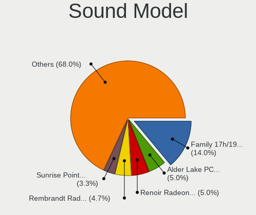

| Model                                                                      | Computers | Percent |
|----------------------------------------------------------------------------|-----------|---------|
| AMD Family 17h/19h/1ah HD Audio Controller                                 | 72        | 13.95%  |
| Intel Alder Lake PCH-P High Definition Audio Controller                    | 26        | 5.04%   |
| AMD Renoir Radeon High Definition Audio Controller                         | 26        | 5.04%   |
| AMD Rembrandt Radeon High Definition Audio Controller                      | 24        | 4.65%   |
| Intel Sunrise Point-LP HD Audio                                            | 17        | 3.29%   |
| Nvidia GA104 High Definition Audio Controller                              | 12        | 2.33%   |
| Intel 7 Series/C216 Chipset Family High Definition Audio Controller        | 12        | 2.33%   |
| Intel 6 Series/C200 Series Chipset Family High Definition Audio Controller | 12        | 2.33%   |
| Nvidia TU116 High Definition Audio Controller                              | 11        | 2.13%   |
| Intel Comet Lake PCH cAVS                                                  | 11        | 2.13%   |
| Intel Tiger Lake-LP Smart Sound Technology Audio Controller                | 10        | 1.94%   |
| Intel Raptor Lake High Definition Audio Controller                         | 10        | 1.94%   |
| Intel Cannon Lake PCH cAVS                                                 | 10        | 1.94%   |
| Nvidia AD107 High Definition Audio Controller                              | 9         | 1.74%   |
| Intel Raptor Lake-P/U/H cAVS                                               | 9         | 1.74%   |
| Nvidia GA106 High Definition Audio Controller                              | 8         | 1.55%   |
| Intel 8 Series/C220 Series Chipset High Definition Audio Controller        | 8         | 1.55%   |
| AMD Navi 31 HDMI/DP Audio                                                  | 8         | 1.55%   |
| Nvidia GP108 High Definition Audio Controller                              | 7         | 1.36%   |
| Intel Wildcat Point-LP High Definition Audio Controller                    | 7         | 1.36%   |
| Intel Tiger Lake-H HD Audio Controller                                     | 7         | 1.36%   |
| Intel Broadwell-U Audio Controller                                         | 7         | 1.36%   |
| AMD Raven/Raven2/Fenghuang HDMI/DP Audio Controller                        | 7         | 1.36%   |
| Nvidia TU106 High Definition Audio Controller                              | 6         | 1.16%   |
| Intel Xeon E3-1200 v3/4th Gen Core Processor HD Audio Controller           | 6         | 1.16%   |
| Intel Haswell-ULT HD Audio Controller                                      | 6         | 1.16%   |
| Intel 8 Series HD Audio Controller                                         | 6         | 1.16%   |
| Intel 5 Series/3400 Series Chipset High Definition Audio                   | 6         | 1.16%   |
| Intel 100 Series/C230 Series Chipset Family HD Audio Controller            | 6         | 1.16%   |
| AMD Starship/Matisse HD Audio Controller                                   | 6         | 1.16%   |
| Nvidia AD106M High Definition Audio Controller                             | 5         | 0.97%   |
| AMD FCH Azalia Controller                                                  | 5         | 0.97%   |
| Nvidia GP107GL High Definition Audio Controller                            | 4         | 0.78%   |
| Nvidia GK208 HDMI/DP Audio Controller                                      | 4         | 0.78%   |
| Nvidia GA107 High Definition Audio Controller                              | 4         | 0.78%   |
| Intel Comet Lake PCH-LP cAVS                                               | 4         | 0.78%   |
| Intel CM238 HD Audio Controller                                            | 4         | 0.78%   |
| AMD Trinity HDMI Audio Controller                                          | 4         | 0.78%   |
| Nvidia TU107 GeForce GTX 1650 High Definition Audio Controller             | 3         | 0.58%   |
| Nvidia GP106 High Definition Audio Controller                              | 3         | 0.58%   |

Memory
------

Memory Vendor
-------------

Memory module vendors

| Vendor              | Computers | Percent |
|---------------------|-----------|---------|
| Samsung Electronics | 33        | 32.04%  |
| SK hynix            | 16        | 15.53%  |
| Micron Technology   | 14        | 13.59%  |
| Crucial             | 9         | 8.74%   |
| Corsair             | 8         | 7.77%   |
| Unknown             | 6         | 5.83%   |
| Kingston            | 4         | 3.88%   |
| Team                | 3         | 2.91%   |
| Elpida              | 2         | 1.94%   |
| Unknown (ABCD)      | 1         | 0.97%   |
| Unknown             | 1         | 0.97%   |
| PUSKILL             | 1         | 0.97%   |
| Lexar Co Limited    | 1         | 0.97%   |
| KLEVV               | 1         | 0.97%   |
| G.Skill             | 1         | 0.97%   |
| ASint Technology    | 1         | 0.97%   |
| Apacer              | 1         | 0.97%   |

Memory Model
------------

Memory module models

| Model                                                        | Computers | Percent |
|--------------------------------------------------------------|-----------|---------|
| Samsung RAM M471A4G43AB1-CWE 32GB SODIMM DDR4 3200MT/s       | 7         | 6.6%    |
| Unknown                                                      | 6         | 5.66%   |
| Samsung RAM M471A1K43DB1-CWE 8GB SODIMM DDR4 3200MT/s        | 4         | 3.77%   |
| SK hynix RAM HMAA1GS6CJR6N-XN 8GB SODIMM DDR4 3200MT/s       | 3         | 2.83%   |
| Samsung RAM M471A2K43DB1-CWE 16GB SODIMM DDR4 3200MT/s       | 3         | 2.83%   |
| Team RAM TEAMGROUP-SD4-3200 16GB SODIMM DDR4 3200MT/s        | 2         | 1.89%   |
| SK hynix RAM HMCG66AGBSA095N 8GB SODIMM DDR5 5600MT/s        | 2         | 1.89%   |
| SK hynix RAM HMA81GS6AFR8N-UH 8GB SODIMM DDR4 2667MT/s       | 2         | 1.89%   |
| Samsung RAM M471A2K43CB1-CTD 16GB SODIMM DDR4 8400MT/s       | 2         | 1.89%   |
| Samsung RAM M425R4GA3BB0-CQKOL 32GB SODIMM DDR5 4800MT/s     | 2         | 1.89%   |
| Samsung RAM M425R2GA3BB0-CWMOD 16GB SODIMM DDR5 5600MT/s     | 2         | 1.89%   |
| Micron RAM MT62F2G32D4DS-026 WT 8GB SODIMM LPDDR5 7500MT/s   | 2         | 1.89%   |
| Micron RAM 8ATF1G64HZ-3G2R1 8GB SODIMM DDR4 3200MT/s         | 2         | 1.89%   |
| Crucial RAM CT16G48C40S5.M8A1 16GB SODIMM DDR5 4800MT/s      | 2         | 1.89%   |
| Corsair RAM CMS5X32G2A56C48A2 32GB SODIMM DDR5 5600MT/s      | 2         | 1.89%   |
| Unknown RAM Module 4GB SODIMM DDR3                           | 1         | 0.94%   |
| Unknown RAM Module 2GB SODIMM DDR3                           | 1         | 0.94%   |
| Unknown (ABCD) RAM 123456789012345678 2GB DIMM DDR3 2400MT/s | 1         | 0.94%   |
| Team RAM TEAMGROUP-UD4-3200 8GB DIMM DDR4 3733MT/s           | 1         | 0.94%   |
| SK hynix RAM Module 4GB SODIMM DDR3 1600MT/s                 | 1         | 0.94%   |
| SK hynix RAM HMT41GS6BFR8A-PB 8GB SODIMM DDR3 1600MT/s       | 1         | 0.94%   |
| SK hynix RAM HMT351S6CFR8C-PB 4GB SODIMM DDR3 1600MT/s       | 1         | 0.94%   |
| SK hynix RAM HMCG88AGBSA092N 32GB SODIMM DDR5 5600MT/s       | 1         | 0.94%   |
| SK hynix RAM HMCG78AGBSA092N 16GB SODIMM DDR5 5600MT/s       | 1         | 0.94%   |
| SK hynix RAM HMAA2GS6AJR8N-XN 16GB SODIMM DDR4 3200MT/s      | 1         | 0.94%   |
| SK hynix RAM HMA82GS6JJR8N-VK 16GB SODIMM DDR4 2667MT/s      | 1         | 0.94%   |
| SK hynix RAM HMA82GS6AFR8N-UH 16GB SODIMM DDR4 2667MT/s      | 1         | 0.94%   |
| SK hynix RAM HMA81GS6JJR8N-VK 8GB SODIMM DDR4 2667MT/s       | 1         | 0.94%   |
| SK hynix RAM HMA81GS6CJR8N-VK 8GB SODIMM DDR4 2667MT/s       | 1         | 0.94%   |
| Samsung RAM Module 4GB SODIMM DDR3 1867MT/s                  | 1         | 0.94%   |
| Samsung RAM Module 3GB Row Of Chips LPDDR5 6400MT/s          | 1         | 0.94%   |
| Samsung RAM M471B5173QH0-YK0 4GB SODIMM DDR3 1600MT/s        | 1         | 0.94%   |
| Samsung RAM M471B1G73QH0-YK0 8GB SODIMM DDR3 1600MT/s        | 1         | 0.94%   |
| Samsung RAM M471A5244CB0-CTD 4GB SODIMM DDR4 3266MT/s        | 1         | 0.94%   |
| Samsung RAM M471A4G43MB1-CTD 32GB SODIMM DDR4 2667MT/s       | 1         | 0.94%   |
| Samsung RAM M471A2K43EB1-CWE 16GB SODIMM DDR4 3200MT/s       | 1         | 0.94%   |
| Samsung RAM M471A2K43BB1-CPB 16GB SODIMM DDR4 2133MT/s       | 1         | 0.94%   |
| Samsung RAM M471A1G44BB0-CWE 8GB SODIMM DDR4 3200MT/s        | 1         | 0.94%   |
| Samsung RAM M471A1G44AB0-CTD 8GB SODIMM DDR4 2667MT/s        | 1         | 0.94%   |
| Samsung RAM M425R2GA3BB0-CQKOL 16GB SODIMM DDR5 4800MT/s     | 1         | 0.94%   |

Memory Kind
-----------

Memory module kinds

| Kind    | Computers | Percent |
|---------|-----------|---------|
| DDR4    | 46        | 47.92%  |
| DDR5    | 22        | 22.92%  |
| DDR3    | 13        | 13.54%  |
| LPDDR5  | 11        | 11.46%  |
| LPDDR3  | 2         | 2.08%   |
| LPDDR4  | 1         | 1.04%   |
| Unknown | 1         | 1.04%   |

Memory Form Factor
------------------

Physical design of the memory module

| Name         | Computers | Percent |
|--------------|-----------|---------|
| SODIMM       | 75        | 78.13%  |
| DIMM         | 13        | 13.54%  |
| Row Of Chips | 7         | 7.29%   |
| Chip         | 1         | 1.04%   |

Memory Size
-----------

Memory module size

| Size  | Computers | Percent |
|-------|-----------|---------|
| 8192  | 36        | 35.64%  |
| 16384 | 24        | 23.76%  |
| 32768 | 22        | 21.78%  |
| 4096  | 12        | 11.88%  |
| 2048  | 6         | 5.94%   |
| 3072  | 1         | 0.99%   |

Memory Speed
------------

Memory module speed

| Speed   | Computers | Percent |
|---------|-----------|---------|
| 3200    | 32        | 32.32%  |
| 5600    | 12        | 12.12%  |
| 4800    | 10        | 10.1%   |
| 1600    | 10        | 10.1%   |
| 2667    | 7         | 7.07%   |
| 7500    | 5         | 5.05%   |
| 6400    | 5         | 5.05%   |
| 3733    | 3         | 3.03%   |
| 2400    | 3         | 3.03%   |
| 8400    | 2         | 2.02%   |
| 1867    | 2         | 2.02%   |
| 4266    | 1         | 1.01%   |
| 3266    | 1         | 1.01%   |
| 2666    | 1         | 1.01%   |
| 2133    | 1         | 1.01%   |
| 1333    | 1         | 1.01%   |
| 1067    | 1         | 1.01%   |
| 1066    | 1         | 1.01%   |
| Unknown | 1         | 1.01%   |

Printers & scanners
-------------------

Printer Vendor
--------------

Printer device vendors

| Vendor              | Computers | Percent |
|---------------------|-----------|---------|
| Prolific Technology | 1         | 100%    |

Printer Model
-------------

Printer device models

| Model                         | Computers | Percent |
|-------------------------------|-----------|---------|
| Prolific PL2305 Parallel Port | 1         | 100%    |

Scanner Vendor
--------------

Scanner device vendors

| Vendor | Computers | Percent |
|--------|-----------|---------|
| Canon  | 1         | 100%    |

Scanner Model
-------------

Scanner device models

| Model                   | Computers | Percent |
|-------------------------|-----------|---------|
| Canon CanoScan LiDE 110 | 1         | 100%    |

Camera
------

Camera Vendor
-------------

Camera device vendors

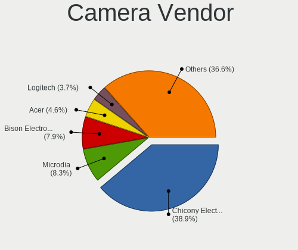

| Vendor                                 | Computers | Percent |
|----------------------------------------|-----------|---------|
| Chicony Electronics                    | 84        | 38.89%  |
| Microdia                               | 18        | 8.33%   |
| Bison Electronics                      | 17        | 7.87%   |
| Acer                                   | 10        | 4.63%   |
| Logitech                               | 8         | 3.7%    |
| Apple                                  | 8         | 3.7%    |
| kingcome                               | 7         | 3.24%   |
| IMC Networks                           | 7         | 3.24%   |
| Suyin                                  | 6         | 2.78%   |
| Realtek Semiconductor                  | 6         | 2.78%   |
| Sunplus Innovation Technology          | 5         | 2.31%   |
| SunplusIT                              | 4         | 1.85%   |
| Lenovo                                 | 4         | 1.85%   |
| Lite-On Technology                     | 3         | 1.39%   |
| Syntek                                 | 2         | 0.93%   |
| Sonix Technology                       | 2         | 0.93%   |
| Silicon Motion                         | 2         | 0.93%   |
| Samsung Electronics                    | 2         | 0.93%   |
| Ricoh                                  | 2         | 0.93%   |
| Quanta                                 | 2         | 0.93%   |
| Luxvisions Innotech Limited            | 2         | 0.93%   |
| Creative Technology                    | 2         | 0.93%   |
| Cheng Uei Precision Industry (Foxlink) | 2         | 0.93%   |
| Valve Software                         | 1         | 0.46%   |
| Unknown                                | 1         | 0.46%   |
| Sony Ericsson Mobile Communications AB | 1         | 0.46%   |
| Shine-optics                           | 1         | 0.46%   |
| Microsoft                              | 1         | 0.46%   |
| KYE Systems (Mouse Systems)            | 1         | 0.46%   |
| Importek                               | 1         | 0.46%   |
| HYGD-220831-A                          | 1         | 0.46%   |
| Huawei Technologies                    | 1         | 0.46%   |
| Generalplus Technology                 | 1         | 0.46%   |
| Alpha Imaging Technology               | 1         | 0.46%   |

Camera Model
------------

Camera device models

| Model                                                | Computers | Percent |
|------------------------------------------------------|-----------|---------|
| Chicony FHD Webcam                                   | 14        | 6.42%   |
| Chicony Integrated IR Camera                         | 11        | 5.05%   |
| Chicony USB2.0 Camera                                | 10        | 4.59%   |
| Acer BisonCam,NB Pro                                 | 9         | 4.13%   |
| Chicony Integrated Camera                            | 8         | 3.67%   |
| Chicony HD Webcam                                    | 8         | 3.67%   |
| kingcome FHD WebCam                                  | 7         | 3.21%   |
| Bison Integrated Camera                              | 6         | 2.75%   |
| Microdia Integrated Camera                           | 5         | 2.29%   |
| IMC Networks Integrated Camera                       | 5         | 2.29%   |
| Bison HD Webcam                                      | 5         | 2.29%   |
| SunplusIT FHD Webcam                                 | 4         | 1.83%   |
| Microdia Integrated_Webcam_HD                        | 3         | 1.38%   |
| Microdia Integrated_Webcam_FHD                       | 3         | 1.38%   |
| Chicony CNF9055 Toshiba Webcam                       | 3         | 1.38%   |
| Apple FaceTime HD Camera                             | 3         | 1.38%   |
| Syntek Integrated Camera                             | 2         | 0.92%   |
| Suyin HP Truevision HD                               | 2         | 0.92%   |
| Sunplus Integrated_Webcam_HD                         | 2         | 0.92%   |
| Samsung Galaxy series, misc. (MTP mode)              | 2         | 0.92%   |
| Ricoh Laptop_Integrated_Webcam_FHD                   | 2         | 0.92%   |
| Microdia USB 2.0 Camera                              | 2         | 0.92%   |
| Microdia Laptop_Integrated_Webcam_HD                 | 2         | 0.92%   |
| Luxvisions Innotech Limited HP Wide Vision HD Camera | 2         | 0.92%   |
| Chicony Integrated Camera (1280x720@30)              | 2         | 0.92%   |
| Chicony HP Webcam                                    | 2         | 0.92%   |
| Chicony HP HD Camera                                 | 2         | 0.92%   |
| Chicony HD User Facing                               | 2         | 0.92%   |
| Chicony Chicony USB2.0 Camera                        | 2         | 0.92%   |
| Chicony ACER HD User Facing                          | 2         | 0.92%   |
| Bison Lenovo EasyCamera                              | 2         | 0.92%   |
| Apple iPhone 5/5C/5S/6/SE/7/8/X/XR                   | 2         | 0.92%   |
| Apple Built-in iSight                                | 2         | 0.92%   |
| Valve Software 3D Camera                             | 1         | 0.46%   |
| Unknown HD camera                                    | 1         | 0.46%   |
| Suyin Sony Visual Communication Camera               | 1         | 0.46%   |
| Suyin RGBIR Camera                                   | 1         | 0.46%   |
| Suyin Integrated_Webcam_HD                           | 1         | 0.46%   |
| Suyin HP TrueVision HD Integrated Webcam             | 1         | 0.46%   |
| Sunplus SPCA2281 Web Camera                          | 1         | 0.46%   |

Security
--------

Fingerprint Vendor
------------------

Fingerprint sensor vendors

| Vendor                     | Computers | Percent |
|----------------------------|-----------|---------|
| Synaptics                  | 21        | 53.85%  |
| Validity Sensors           | 10        | 25.64%  |
| LighTuning Technology      | 3         | 7.69%   |
| Upek                       | 2         | 5.13%   |
| Shenzhen Goodix Technology | 2         | 5.13%   |
| Elan Microelectronics      | 1         | 2.56%   |

Fingerprint Model
-----------------

Fingerprint sensor models

| Model                                                                      | Computers | Percent |
|----------------------------------------------------------------------------|-----------|---------|
| Synaptics TouchPad                                                         | 4         | 10.26%  |
| Synaptics UWP WBDI                                                         | 3         | 7.69%   |
| Synaptics Prometheus MIS Touch Fingerprint Reader                          | 3         | 7.69%   |
| Unknown                                                                    | 3         | 7.69%   |
| Validity Sensors VFS7500 Touch Fingerprint Sensor                          | 2         | 5.13%   |
| Validity Sensors VFS495 Fingerprint Reader                                 | 2         | 5.13%   |
| Validity Sensors VFS491                                                    | 2         | 5.13%   |
| Upek Biometric Touchchip/Touchstrip Fingerprint Sensor                     | 2         | 5.13%   |
| Synaptics WBDI Fingerprint Reader USB 086                                  | 2         | 5.13%   |
| Synaptics  WBDI                                                            | 2         | 5.13%   |
| Shenzhen Goodix  FingerPrint Device                                        | 2         | 5.13%   |
| Validity Sensors VFS Fingerprint sensor                                    | 1         | 2.56%   |
| Validity Sensors Synaptics WBDI                                            | 1         | 2.56%   |
| Validity Sensors Synaptics VFS7552 Touch Fingerprint Sensor with PurePrint | 1         | 2.56%   |
| Validity Sensors Fingerprint scanner                                       | 1         | 2.56%   |
| Synaptics WBDI                                                             | 1         | 2.56%   |
| Synaptics Prometheus Fingerprint Reader                                    | 1         | 2.56%   |
| Synaptics Metallica MOH Touch Fingerprint Reader                           | 1         | 2.56%   |
| Synaptics Metallica MIS Touch Fingerprint Reader                           | 1         | 2.56%   |
| LighTuning Fingerprint Reader                                              | 1         | 2.56%   |
| LighTuning ES603 Swipe Fingerprint Sensor                                  | 1         | 2.56%   |
| LighTuning EgisTec Touch Fingerprint Sensor                                | 1         | 2.56%   |
| Elan ELAN:ARM-M4                                                           | 1         | 2.56%   |

Chipcard Vendor
---------------

Chipcard module vendors

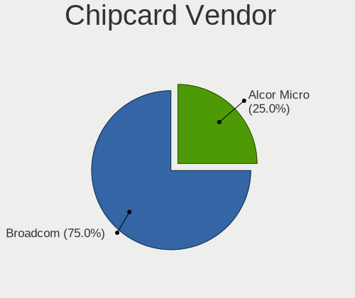

| Vendor      | Computers | Percent |
|-------------|-----------|---------|
| Broadcom    | 9         | 75%     |
| Alcor Micro | 3         | 25%     |

Chipcard Model
--------------

Chipcard module models

| Model                                                                        | Computers | Percent |
|------------------------------------------------------------------------------|-----------|---------|
| Broadcom 58200                                                               | 5         | 41.67%  |
| Alcor Micro AU9540 Smartcard Reader                                          | 3         | 25%     |
| Broadcom BCM5880 Secure Applications Processor                               | 2         | 16.67%  |
| Broadcom BCM5880 Secure Applications Processor with fingerprint swipe sensor | 1         | 8.33%   |
| Broadcom 5880                                                                | 1         | 8.33%   |

Unsupported
-----------

Unsupported Devices
-------------------

Total unsupported devices on board

| Total | Computers | Percent |
|-------|-----------|---------|
| 0     | 193       | 65.65%  |
| 1     | 89        | 30.27%  |
| 2     | 10        | 3.4%    |
| 3     | 2         | 0.68%   |

Unsupported Device Types
------------------------

Types of unsupported devices

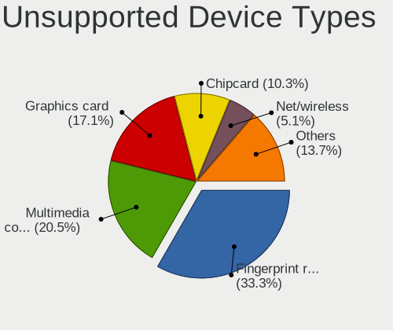

| Type                     | Computers | Percent |
|--------------------------|-----------|---------|
| Fingerprint reader       | 39        | 33.33%  |
| Multimedia controller    | 24        | 20.51%  |
| Graphics card            | 20        | 17.09%  |
| Chipcard                 | 12        | 10.26%  |
| Net/wireless             | 6         | 5.13%   |
| Card reader              | 3         | 2.56%   |
| Wireless                 | 2         | 1.71%   |
| Storage                  | 2         | 1.71%   |
| Net/ethernet             | 2         | 1.71%   |
| Communication controller | 2         | 1.71%   |
| Bluetooth                | 2         | 1.71%   |
| Sound                    | 1         | 0.85%   |
| Modem                    | 1         | 0.85%   |
| Camera                   | 1         | 0.85%   |

