Trisquel - Tested Hardware & Statistics (Desktops)
--------------------------------------------------

A project to collect tested hardware configurations for Trisquel.

Anyone can contribute to this report by the [hw-probe](https://github.com/linuxhw/hw-probe) tool:

    sudo -E hw-probe -all -upload

Please contribute! Especially if your hardware is rare.

Contents
--------

* [ Test Cases ](#test-cases)

* [ System ](#system)
  - [ OS                       ](#os)
  - [ OS Family                ](#os-family)
  - [ Kernel                   ](#kernel)
  - [ Kernel Family            ](#kernel-family)
  - [ Kernel Major Ver.        ](#kernel-major-ver)
  - [ Arch                     ](#arch)
  - [ DE                       ](#de)
  - [ Display Server           ](#display-server)
  - [ Display Manager          ](#display-manager)
  - [ OS Lang                  ](#os-lang)
  - [ Boot Mode                ](#boot-mode)
  - [ Filesystem               ](#filesystem)
  - [ Part. scheme             ](#part-scheme)
  - [ Dual Boot with Linux/BSD ](#dual-boot-with-linuxbsd)
  - [ Dual Boot (Win)          ](#dual-boot-win)

* [ Board ](#board)
  - [ Vendor                   ](#vendor)
  - [ Model                    ](#model)
  - [ Model Family             ](#model-family)
  - [ MFG Year                 ](#mfg-year)
  - [ Form Factor              ](#form-factor)
  - [ Secure Boot              ](#secure-boot)
  - [ Coreboot                 ](#coreboot)
  - [ RAM Size                 ](#ram-size)
  - [ RAM Used                 ](#ram-used)
  - [ Total Drives             ](#total-drives)
  - [ Has CD-ROM               ](#has-cd-rom)
  - [ Has Ethernet             ](#has-ethernet)
  - [ Has WiFi                 ](#has-wifi)
  - [ Has Bluetooth            ](#has-bluetooth)

* [ Location ](#location)
  - [ Country                  ](#country)
  - [ City                     ](#city)

* [ Drives ](#drives)
  - [ Drive Vendor             ](#drive-vendor)
  - [ Drive Model              ](#drive-model)
  - [ HDD Vendor               ](#hdd-vendor)
  - [ SSD Vendor               ](#ssd-vendor)
  - [ Drive Kind               ](#drive-kind)
  - [ Drive Connector          ](#drive-connector)
  - [ Drive Size               ](#drive-size)
  - [ Space Total              ](#space-total)
  - [ Space Used               ](#space-used)
  - [ Malfunc. Drives          ](#malfunc-drives)
  - [ Malfunc. Drive Vendor    ](#malfunc-drive-vendor)
  - [ Malfunc. HDD Vendor      ](#malfunc-hdd-vendor)
  - [ Malfunc. Drive Kind      ](#malfunc-drive-kind)
  - [ Failed Drives            ](#failed-drives)
  - [ Failed Drive Vendor      ](#failed-drive-vendor)
  - [ Drive Status             ](#drive-status)

* [ Storage controller ](#storage-controller)
  - [ Storage Vendor           ](#storage-vendor)
  - [ Storage Model            ](#storage-model)
  - [ Storage Kind             ](#storage-kind)

* [ Processor ](#processor)
  - [ CPU Vendor               ](#cpu-vendor)
  - [ CPU Model                ](#cpu-model)
  - [ CPU Model Family         ](#cpu-model-family)
  - [ CPU Cores                ](#cpu-cores)
  - [ CPU Sockets              ](#cpu-sockets)
  - [ CPU Threads              ](#cpu-threads)
  - [ CPU Op-Modes             ](#cpu-op-modes)
  - [ CPU Microcode            ](#cpu-microcode)
  - [ CPU Microarch            ](#cpu-microarch)

* [ Graphics ](#graphics)
  - [ GPU Vendor               ](#gpu-vendor)
  - [ GPU Model                ](#gpu-model)
  - [ GPU Combo                ](#gpu-combo)
  - [ GPU Driver               ](#gpu-driver)
  - [ GPU Memory               ](#gpu-memory)

* [ Monitor ](#monitor)
  - [ Monitor Vendor           ](#monitor-vendor)
  - [ Monitor Model            ](#monitor-model)
  - [ Monitor Resolution       ](#monitor-resolution)
  - [ Monitor Diagonal         ](#monitor-diagonal)
  - [ Monitor Width            ](#monitor-width)
  - [ Aspect Ratio             ](#aspect-ratio)
  - [ Monitor Area             ](#monitor-area)
  - [ Pixel Density            ](#pixel-density)
  - [ Multiple Monitors        ](#multiple-monitors)

* [ Network ](#network)
  - [ Net Controller Vendor    ](#net-controller-vendor)
  - [ Net Controller Model     ](#net-controller-model)
  - [ Wireless Vendor          ](#wireless-vendor)
  - [ Wireless Model           ](#wireless-model)
  - [ Ethernet Vendor          ](#ethernet-vendor)
  - [ Ethernet Model           ](#ethernet-model)
  - [ Net Controller Kind      ](#net-controller-kind)
  - [ Used Controller          ](#used-controller)
  - [ NICs                     ](#nics)
  - [ IPv6                     ](#ipv6)

* [ Bluetooth ](#bluetooth)
  - [ Bluetooth Vendor         ](#bluetooth-vendor)
  - [ Bluetooth Model          ](#bluetooth-model)

* [ Sound ](#sound)
  - [ Sound Vendor             ](#sound-vendor)
  - [ Sound Model              ](#sound-model)

* [ Memory ](#memory)
  - [ Memory Vendor            ](#memory-vendor)
  - [ Memory Model             ](#memory-model)
  - [ Memory Kind              ](#memory-kind)
  - [ Memory Form Factor       ](#memory-form-factor)
  - [ Memory Size              ](#memory-size)
  - [ Memory Speed             ](#memory-speed)

* [ Printers & scanners ](#printers--scanners)
  - [ Printer Vendor           ](#printer-vendor)
  - [ Printer Model            ](#printer-model)
  - [ Scanner Vendor           ](#scanner-vendor)
  - [ Scanner Model            ](#scanner-model)

* [ Camera ](#camera)
  - [ Camera Vendor            ](#camera-vendor)
  - [ Camera Model             ](#camera-model)

* [ Security ](#security)
  - [ Fingerprint Vendor       ](#fingerprint-vendor)
  - [ Fingerprint Model        ](#fingerprint-model)
  - [ Chipcard Vendor          ](#chipcard-vendor)
  - [ Chipcard Model           ](#chipcard-model)

* [ Unsupported ](#unsupported)
  - [ Unsupported Devices      ](#unsupported-devices)
  - [ Unsupported Device Types ](#unsupported-device-types)

Test Cases
----------

Total: 21

| Vendor        | Model                       | Probe                                                      | Date         |
|---------------|-----------------------------|------------------------------------------------------------|--------------|
| Gigabyte      | Z390 UD                     | [264bb56b6a](https://linux-hardware.org/?probe=264bb56b6a) | Aug 31, 2024 |
| Gigabyte      | 945PLM-S2                   | [caa84a8e1f](https://linux-hardware.org/?probe=caa84a8e1f) | Apr 13, 2024 |
| Acer          | Aspire XC-885 V:1.1         | [eebd657892](https://linux-hardware.org/?probe=eebd657892) | Jul 27, 2023 |
| Unknown       | Unknown                     | [c5824f9cae](https://linux-hardware.org/?probe=c5824f9cae) | Apr 25, 2023 |
| Apple         | Mac-F221BEC8                | [89a021b8f6](https://linux-hardware.org/?probe=89a021b8f6) | Dec 15, 2022 |
| Huanan        | X79 INTEL (INTEL Xeon E5... | [08a8ad598f](https://linux-hardware.org/?probe=08a8ad598f) | Sep 23, 2022 |
| Huanan        | X79 INTEL (INTEL Xeon E5... | [8e620e891f](https://linux-hardware.org/?probe=8e620e891f) | Sep 23, 2022 |
| Packard Be... | IMEDIA S1300                | [4b8f3feaa7](https://linux-hardware.org/?probe=4b8f3feaa7) | Aug 25, 2022 |
| Dell          | 0WMJ54 A01                  | [7682000c35](https://linux-hardware.org/?probe=7682000c35) | Jul 30, 2022 |
| Dell          | 0WMJ54 A01                  | [fc499e7600](https://linux-hardware.org/?probe=fc499e7600) | Jul 27, 2022 |
| ASUSTek       | P8H61                       | [0145453c1a](https://linux-hardware.org/?probe=0145453c1a) | May 27, 2022 |
| Fujitsu Si... | D2840-A1 S26361-D2840-A1    | [a9d7621b8d](https://linux-hardware.org/?probe=a9d7621b8d) | May 26, 2022 |
| MSI           | Z97 GAMING 5                | [92fd051a13](https://linux-hardware.org/?probe=92fd051a13) | May 15, 2022 |
| HP            | 8299                        | [7a54bfae05](https://linux-hardware.org/?probe=7a54bfae05) | Apr 28, 2022 |
| MSI           | Z97 GAMING 5                | [f41f324f01](https://linux-hardware.org/?probe=f41f324f01) | Apr 25, 2022 |
| ASUSTek       | A55BM-PLUS                  | [53753f59d3](https://linux-hardware.org/?probe=53753f59d3) | Feb 13, 2022 |
| Dell          | 0M859N A00                  | [89cf2685e2](https://linux-hardware.org/?probe=89cf2685e2) | Nov 01, 2021 |
| Gigabyte      | M68MT-D3P                   | [49fde2499f](https://linux-hardware.org/?probe=49fde2499f) | Jul 18, 2020 |
| Gigabyte      | M68MT-D3P                   | [5ea27e2813](https://linux-hardware.org/?probe=5ea27e2813) | Jul 18, 2020 |
| ECS           | H61H2-M2                    | [add4f52268](https://linux-hardware.org/?probe=add4f52268) | Mar 06, 2019 |
| ECS           | H61H2-M2                    | [f9376ff405](https://linux-hardware.org/?probe=f9376ff405) | May 03, 2018 |

System
------

OS
--

Installed operating systems

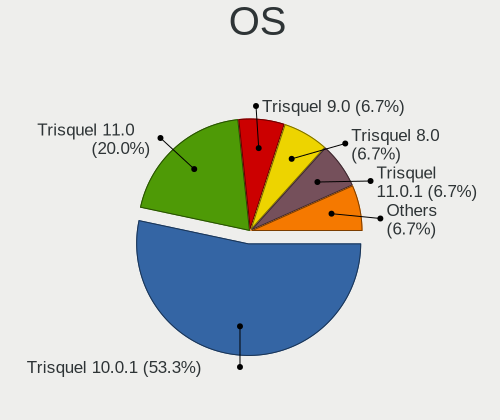

| Name            | Desktops | Percent |
|-----------------|----------|---------|
| Trisquel 10.0.1 | 8        | 53.33%  |
| Trisquel 11.0   | 3        | 20%     |
| Trisquel 9.0    | 1        | 6.67%   |
| Trisquel 8.0    | 1        | 6.67%   |
| Trisquel 11.0.1 | 1        | 6.67%   |
| Trisquel 10.0   | 1        | 6.67%   |

OS Family
---------

OS without a version

| Name     | Desktops | Percent |
|----------|----------|---------|
| Trisquel | 15       | 100%    |

Kernel
------

Version of the Linux kernel

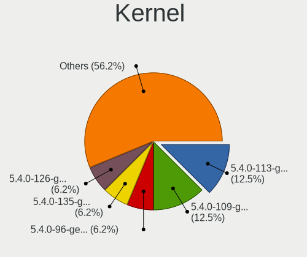

| Version            | Desktops | Percent |
|--------------------|----------|---------|
| 5.4.0-113-generic  | 2        | 12.5%   |
| 5.4.0-109-generic  | 2        | 12.5%   |
| 5.4.0-96-generic   | 1        | 6.25%   |
| 5.4.0-135-generic  | 1        | 6.25%   |
| 5.4.0-126-generic  | 1        | 6.25%   |
| 5.4.0-125-generic  | 1        | 6.25%   |
| 5.4.0-122-generic  | 1        | 6.25%   |
| 5.4.0-110-generic  | 1        | 6.25%   |
| 5.15.0-78-generic  | 1        | 6.25%   |
| 5.15.0-119-generic | 1        | 6.25%   |
| 5.15.0-102-generic | 1        | 6.25%   |
| 5.10.177-gnu1      | 1        | 6.25%   |
| 4.4.0-119-generic  | 1        | 6.25%   |
| 4.15.0-108-generic | 1        | 6.25%   |

Kernel Family
-------------

Linux kernel without a distro release

| Version  | Desktops | Percent |
|----------|----------|---------|
| 5.4.0    | 9        | 60%     |
| 5.15.0   | 3        | 20%     |
| 5.10.177 | 1        | 6.67%   |
| 4.4.0    | 1        | 6.67%   |
| 4.15.0   | 1        | 6.67%   |

Kernel Major Ver.
-----------------

Linux kernel major version

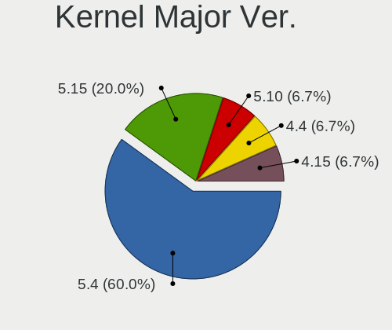

| Version | Desktops | Percent |
|---------|----------|---------|
| 5.4     | 9        | 60%     |
| 5.15    | 3        | 20%     |
| 5.10    | 1        | 6.67%   |
| 4.4     | 1        | 6.67%   |
| 4.15    | 1        | 6.67%   |

Arch
----

OS architecture (x86_64, i586, etc.)

| Name   | Desktops | Percent |
|--------|----------|---------|
| x86_64 | 14       | 93.33%  |
| armv7l | 1        | 6.67%   |

DE
--

Desktop Environment

| Name    | Desktops | Percent |
|---------|----------|---------|
| MATE    | 12       | 80%     |
| KDE5    | 1        | 6.67%   |
| default | 1        | 6.67%   |
| Unknown | 1        | 6.67%   |

Display Server
--------------

X11 or Wayland

| Name    | Desktops | Percent |
|---------|----------|---------|
| X11     | 14       | 93.33%  |
| Unknown | 1        | 6.67%   |

Display Manager
---------------

SDDM, LightDM, etc.

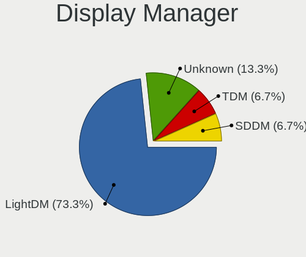

| Name    | Desktops | Percent |
|---------|----------|---------|
| LightDM | 11       | 73.33%  |
| Unknown | 2        | 13.33%  |
| TDM     | 1        | 6.67%   |
| SDDM    | 1        | 6.67%   |

OS Lang
-------

Language

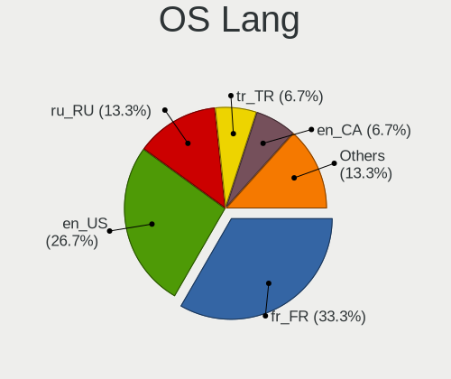

| Lang    | Desktops | Percent |
|---------|----------|---------|
| fr_FR   | 5        | 33.33%  |
| en_US   | 4        | 26.67%  |
| ru_RU   | 2        | 13.33%  |
| tr_TR   | 1        | 6.67%   |
| en_CA   | 1        | 6.67%   |
| C       | 1        | 6.67%   |
| Unknown | 1        | 6.67%   |

Boot Mode
---------

EFI or BIOS

| Mode | Desktops | Percent |
|------|----------|---------|
| EFI  | 8        | 53.33%  |
| BIOS | 7        | 46.67%  |

Filesystem
----------

Type of filesystem

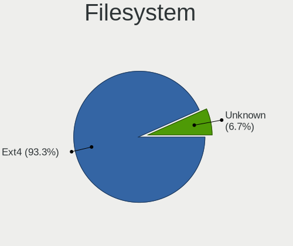

| Type    | Desktops | Percent |
|---------|----------|---------|
| Ext4    | 14       | 93.33%  |
| Unknown | 1        | 6.67%   |

Part. scheme
------------

Scheme of partitioning

| Type    | Desktops | Percent |
|---------|----------|---------|
| GPT     | 13       | 86.67%  |
| MBR     | 1        | 6.67%   |
| Unknown | 1        | 6.67%   |

Dual Boot with Linux/BSD
------------------------

Hosting more than one Linux/BSD

| Dual boot | Desktops | Percent |
|-----------|----------|---------|
| No        | 13       | 81.25%  |
| Yes       | 3        | 18.75%  |

Dual Boot (Win)
---------------

Hosting Linux and Windows

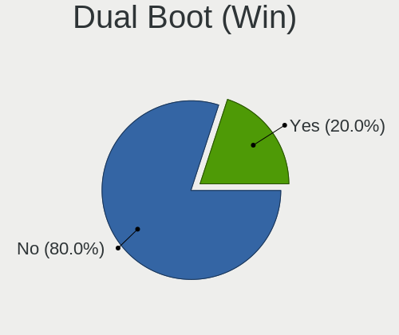

| Dual boot | Desktops | Percent |
|-----------|----------|---------|
| No        | 12       | 80%     |
| Yes       | 3        | 20%     |

Board
-----

Vendor
------

Motherboard manufacturer

| Name                | Desktops | Percent |
|---------------------|----------|---------|
| Gigabyte Technology | 3        | 20%     |
| ASUSTek Computer    | 2        | 13.33%  |
| Packard Bell        | 1        | 6.67%   |
| MSI                 | 1        | 6.67%   |
| Huanan              | 1        | 6.67%   |
| Hewlett-Packard     | 1        | 6.67%   |
| Fujitsu Siemens     | 1        | 6.67%   |
| ECS                 | 1        | 6.67%   |
| Dell                | 1        | 6.67%   |
| Apple               | 1        | 6.67%   |
| Acer                | 1        | 6.67%   |
| Unknown             | 1        | 6.67%   |

Model
-----

Motherboard model

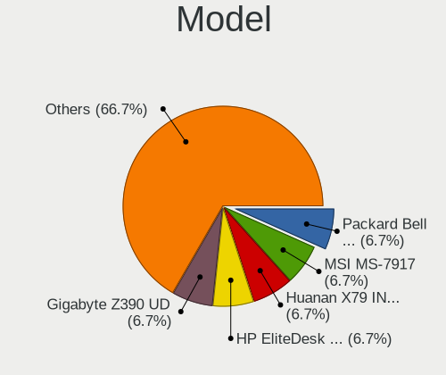

| Name                                                                  | Desktops | Percent |
|-----------------------------------------------------------------------|----------|---------|
| Packard Bell IMEDIA S1300                                             | 1        | 6.67%   |
| MSI MS-7917                                                           | 1        | 6.67%   |
| Huanan X79 INTEL (INTEL Xeon E5/Corei7 DMI2 - C600/C200 Cipset V2.49P | 1        | 6.67%   |
| HP EliteDesk 800 G3 SFF                                               | 1        | 6.67%   |
| Gigabyte Z390 UD                                                      | 1        | 6.67%   |
| Gigabyte M68MT-D3P                                                    | 1        | 6.67%   |
| Gigabyte 945PLM-S2                                                    | 1        | 6.67%   |
| Fujitsu Siemens ESPRIMO EDITION P2540                                 | 1        | 6.67%   |
| ECS H61H2-M2                                                          | 1        | 6.67%   |
| Dell OptiPlex 3020                                                    | 1        | 6.67%   |
| ASUS P8H61                                                            | 1        | 6.67%   |
| ASUS A55BM-PLUS                                                       | 1        | 6.67%   |
| Apple MacPro5,1                                                       | 1        | 6.67%   |
| Acer Aspire XC-885                                                    | 1        | 6.67%   |
| Unknown                                                               | 1        | 6.67%   |

Model Family
------------

Motherboard model prefix

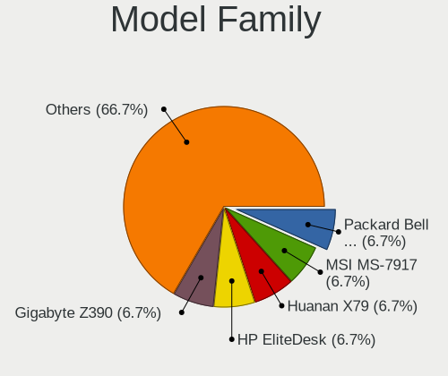

| Name                    | Desktops | Percent |
|-------------------------|----------|---------|
| Packard Bell IMEDIA     | 1        | 6.67%   |
| MSI MS-7917             | 1        | 6.67%   |
| Huanan X79              | 1        | 6.67%   |
| HP EliteDesk            | 1        | 6.67%   |
| Gigabyte Z390           | 1        | 6.67%   |
| Gigabyte M68MT-D3P      | 1        | 6.67%   |
| Gigabyte 945PLM-S2      | 1        | 6.67%   |
| Fujitsu Siemens ESPRIMO | 1        | 6.67%   |
| ECS H61H2-M2            | 1        | 6.67%   |
| Dell OptiPlex           | 1        | 6.67%   |
| ASUS P8H61              | 1        | 6.67%   |
| ASUS A55BM-PLUS         | 1        | 6.67%   |
| Apple MacPro5           | 1        | 6.67%   |
| Acer Aspire             | 1        | 6.67%   |
| Unknown                 | 1        | 6.67%   |

MFG Year
--------

Motherboard manufacture year

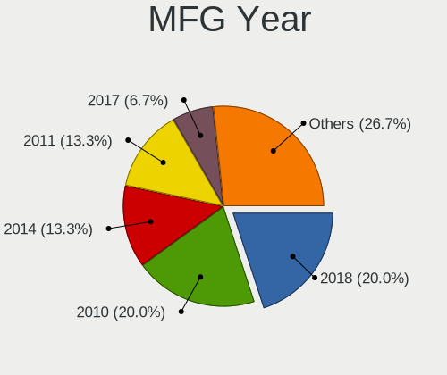

| Year    | Desktops | Percent |
|---------|----------|---------|
| 2018    | 3        | 20%     |
| 2010    | 3        | 20%     |
| 2014    | 2        | 13.33%  |
| 2011    | 2        | 13.33%  |
| 2017    | 1        | 6.67%   |
| 2013    | 1        | 6.67%   |
| 2008    | 1        | 6.67%   |
| 2006    | 1        | 6.67%   |
| Unknown | 1        | 6.67%   |

Form Factor
-----------

Physical design of the computer

| Name    | Desktops | Percent |
|---------|----------|---------|
| Desktop | 15       | 100%    |

Secure Boot
-----------

Enabled or disabled

| State    | Desktops | Percent |
|----------|----------|---------|
| Disabled | 15       | 100%    |

Coreboot
--------

Have coreboot on board

| Used | Desktops | Percent |
|------|----------|---------|
| No   | 15       | 100%    |

RAM Size
--------

Total RAM memory

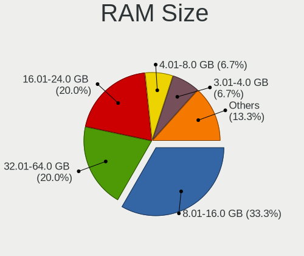

| Size in GB | Desktops | Percent |
|------------|----------|---------|
| 8.01-16.0  | 5        | 33.33%  |
| 32.01-64.0 | 3        | 20%     |
| 16.01-24.0 | 3        | 20%     |
| 4.01-8.0   | 1        | 6.67%   |
| 3.01-4.0   | 1        | 6.67%   |
| 1.01-2.0   | 1        | 6.67%   |
| 0.51-1.0   | 1        | 6.67%   |

RAM Used
--------

Used RAM memory

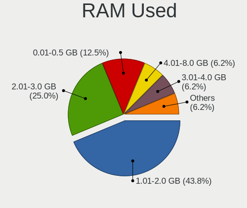

| Used GB  | Desktops | Percent |
|----------|----------|---------|
| 1.01-2.0 | 7        | 43.75%  |
| 2.01-3.0 | 4        | 25%     |
| 0.01-0.5 | 2        | 12.5%   |
| 4.01-8.0 | 1        | 6.25%   |
| 3.01-4.0 | 1        | 6.25%   |
| 0.51-1.0 | 1        | 6.25%   |

Total Drives
------------

Number of drives on board

| Drives | Desktops | Percent |
|--------|----------|---------|
| 1      | 11       | 73.33%  |
| 2      | 4        | 26.67%  |

Has CD-ROM
----------

Has CD-ROM on board

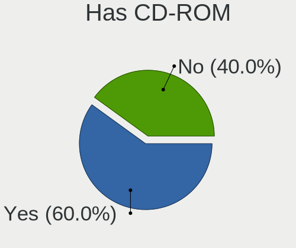

| Presented | Desktops | Percent |
|-----------|----------|---------|
| Yes       | 9        | 60%     |
| No        | 6        | 40%     |

Has Ethernet
------------

Has Ethernet on board

| Presented | Desktops | Percent |
|-----------|----------|---------|
| Yes       | 15       | 100%    |

Has WiFi
--------

Has WiFi module

| Presented | Desktops | Percent |
|-----------|----------|---------|
| No        | 10       | 62.5%   |
| Yes       | 6        | 37.5%   |

Has Bluetooth
-------------

Has Bluetooth module

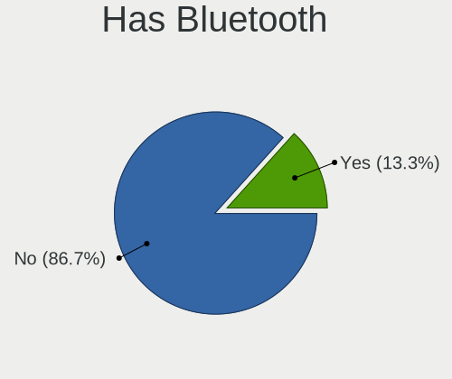

| Presented | Desktops | Percent |
|-----------|----------|---------|
| No        | 13       | 86.67%  |
| Yes       | 2        | 13.33%  |

Location
--------

Country
-------

Geographic location (country)

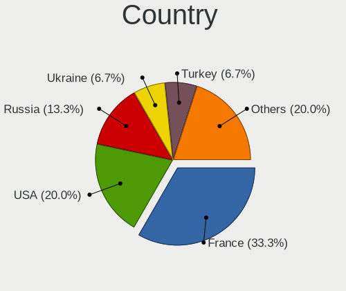

| Country | Desktops | Percent |
|---------|----------|---------|
| France  | 5        | 33.33%  |
| USA     | 3        | 20%     |
| Russia  | 2        | 13.33%  |
| Ukraine | 1        | 6.67%   |
| Turkey  | 1        | 6.67%   |
| Spain   | 1        | 6.67%   |
| China   | 1        | 6.67%   |
| Canada  | 1        | 6.67%   |

City
----

Geographic location (city)

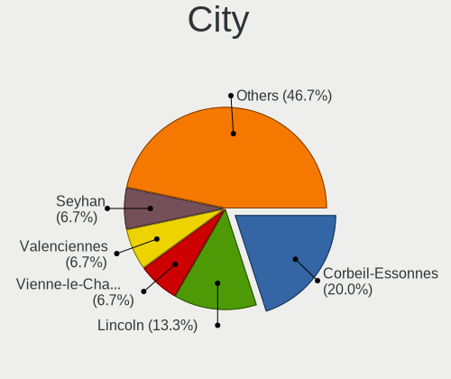

| City                     | Desktops | Percent |
|--------------------------|----------|---------|
| Corbeil-Essonnes         | 3        | 20%     |
| Lincoln                  | 2        | 13.33%  |
| Vienne-le-Chateau        | 1        | 6.67%   |
| Valenciennes             | 1        | 6.67%   |
| Seyhan                   | 1        | 6.67%   |
| Rivne                    | 1        | 6.67%   |
| Petropavlovsk-Kamchatsky | 1        | 6.67%   |
| Oviedo                   | 1        | 6.67%   |
| Ottawa                   | 1        | 6.67%   |
| Omaha                    | 1        | 6.67%   |
| Moscow                   | 1        | 6.67%   |
| Guangzhou                | 1        | 6.67%   |

Drives
------

Drive Vendor
------------

Hard drive vendors

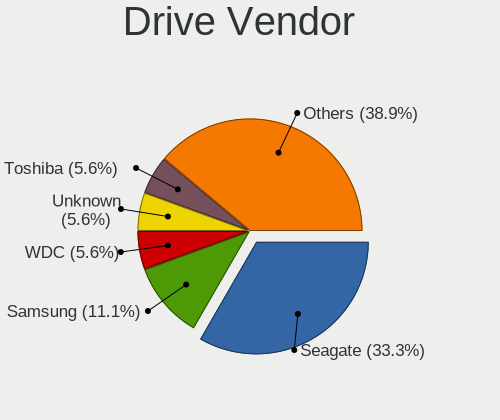

| Vendor              | Desktops | Drives | Percent |
|---------------------|----------|--------|---------|
| Seagate             | 6        | 7      | 33.33%  |
| Samsung Electronics | 2        | 2      | 11.11%  |
| WDC                 | 1        | 1      | 5.56%   |
| Unknown             | 1        | 1      | 5.56%   |
| Toshiba             | 1        | 1      | 5.56%   |
| Silicon Motion      | 1        | 2      | 5.56%   |
| SanDisk             | 1        | 1      | 5.56%   |
| NFHK                | 1        | 1      | 5.56%   |
| Kingston            | 1        | 1      | 5.56%   |
| Corsair             | 1        | 1      | 5.56%   |
| China               | 1        | 1      | 5.56%   |
| Apacer              | 1        | 1      | 5.56%   |

Drive Model
-----------

Hard drive models

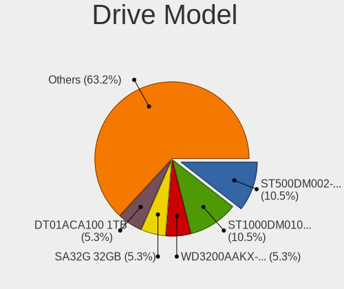

| Model                            | Desktops | Percent |
|----------------------------------|----------|---------|
| Seagate ST500DM002-1BD142 500GB  | 2        | 10.53%  |
| Seagate ST1000DM010-2EP102 1TB   | 2        | 10.53%  |
| WDC WD3200AAKX-221CA1 320GB      | 1        | 5.26%   |
| Unknown SA32G  32GB              | 1        | 5.26%   |
| Toshiba DT01ACA100 1TB           | 1        | 5.26%   |
| Silicon Motion MS10 1TB          | 1        | 5.26%   |
| Seagate ST31000524AS 1TB         | 1        | 5.26%   |
| Seagate ST2000DM001-1CH164 2TB   | 1        | 5.26%   |
| Seagate ST1000DM003-9YN162 1TB   | 1        | 5.26%   |
| SanDisk SDSSDH3 500G             | 1        | 5.26%   |
| Samsung SSD 860 EVO 500GB        | 1        | 5.26%   |
| Samsung MZVLW256HEHP-000H1 256GB | 1        | 5.26%   |
| NFHK USB 3.0 120GB               | 1        | 5.26%   |
| Kingston SA400S37240G 240GB SSD  | 1        | 5.26%   |
| Corsair Force MP510 480GB        | 1        | 5.26%   |
| China SSD 512GB                  | 1        | 5.26%   |
| Apacer AS340 480GB SSD           | 1        | 5.26%   |

HDD Vendor
----------

Hard disk drive vendors

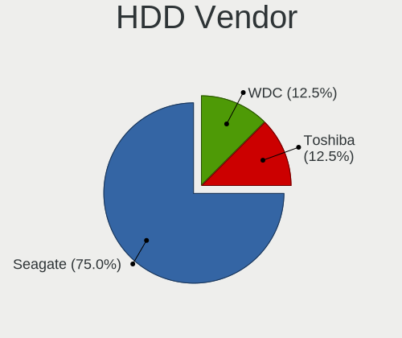

| Vendor  | Desktops | Drives | Percent |
|---------|----------|--------|---------|
| Seagate | 6        | 7      | 75%     |
| WDC     | 1        | 1      | 12.5%   |
| Toshiba | 1        | 1      | 12.5%   |

SSD Vendor
----------

Solid state drive vendors

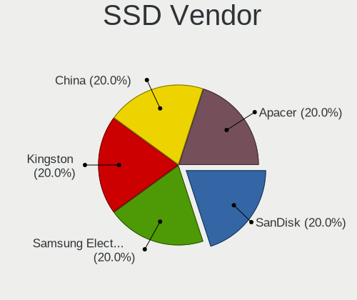

| Vendor              | Desktops | Drives | Percent |
|---------------------|----------|--------|---------|
| SanDisk             | 1        | 1      | 20%     |
| Samsung Electronics | 1        | 1      | 20%     |
| Kingston            | 1        | 1      | 20%     |
| China               | 1        | 1      | 20%     |
| Apacer              | 1        | 1      | 20%     |

Drive Kind
----------

HDD or SSD

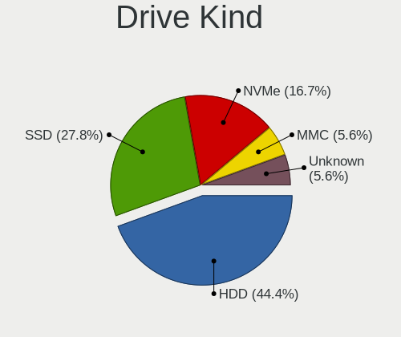

| Kind    | Desktops | Drives | Percent |
|---------|----------|--------|---------|
| HDD     | 8        | 9      | 44.44%  |
| SSD     | 5        | 5      | 27.78%  |
| NVMe    | 3        | 4      | 16.67%  |
| MMC     | 1        | 1      | 5.56%   |
| Unknown | 1        | 1      | 5.56%   |

Drive Connector
---------------

SATA, SAS, NVMe, etc.

| Type | Desktops | Drives | Percent |
|------|----------|--------|---------|
| SATA | 12       | 14     | 70.59%  |
| NVMe | 3        | 4      | 17.65%  |
| SAS  | 1        | 1      | 5.88%   |
| MMC  | 1        | 1      | 5.88%   |

Drive Size
----------

Size of hard drive

| Size in TB | Desktops | Drives | Percent |
|------------|----------|--------|---------|
| 0.01-0.5   | 7        | 7      | 50%     |
| 0.51-1.0   | 6        | 6      | 42.86%  |
| 1.01-2.0   | 1        | 1      | 7.14%   |

Space Total
-----------

Amount of disk space available on the file system

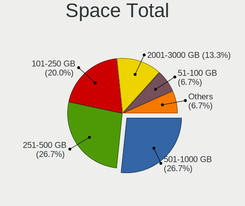

| Size in GB | Desktops | Percent |
|------------|----------|---------|
| 251-500    | 4        | 26.67%  |
| 501-1000   | 4        | 26.67%  |
| 101-250    | 3        | 20%     |
| 2001-3000  | 2        | 13.33%  |
| 1-20       | 1        | 6.67%   |
| 51-100     | 1        | 6.67%   |

Space Used
----------

Amount of used disk space

| Used GB   | Desktops | Percent |
|-----------|----------|---------|
| 1-20      | 9        | 56.25%  |
| 21-50     | 4        | 25%     |
| 1001-2000 | 1        | 6.25%   |
| 501-1000  | 1        | 6.25%   |
| 51-100    | 1        | 6.25%   |

Malfunc. Drives
---------------

Drive models with a malfunction

| Model                           | Desktops | Drives | Percent |
|---------------------------------|----------|--------|---------|
| Seagate ST500DM002-1BD142 500GB | 2        | 2      | 66.67%  |
| Seagate ST2000DM001-1CH164 2TB  | 1        | 1      | 33.33%  |

Malfunc. Drive Vendor
---------------------

Vendors of faulty drives

| Vendor  | Desktops | Drives | Percent |
|---------|----------|--------|---------|
| Seagate | 3        | 3      | 100%    |

Malfunc. HDD Vendor
-------------------

Vendors of faulty HDD drives

| Vendor  | Desktops | Drives | Percent |
|---------|----------|--------|---------|
| Seagate | 3        | 3      | 100%    |

Malfunc. Drive Kind
-------------------

Kinds of faulty drives

| Kind | Desktops | Drives | Percent |
|------|----------|--------|---------|
| HDD  | 3        | 3      | 100%    |

Failed Drives
-------------

Failed drive models

Zero info for selected period =(

Failed Drive Vendor
-------------------

Failed drive vendors

Zero info for selected period =(

Drive Status
------------

Number of failed and malfunc. drives

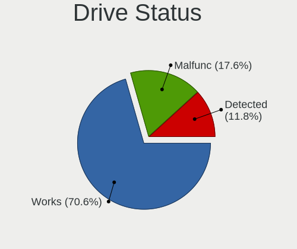

| Status   | Desktops | Drives | Percent |
|----------|----------|--------|---------|
| Works    | 12       | 13     | 70.59%  |
| Malfunc  | 3        | 3      | 17.65%  |
| Detected | 2        | 4      | 11.76%  |

Storage controller
------------------

Storage Vendor
--------------

Storage controller vendors

| Vendor              | Desktops | Percent |
|---------------------|----------|---------|
| Intel               | 11       | 64.71%  |
| Nvidia              | 2        | 11.76%  |
| Silicon Motion      | 1        | 5.88%   |
| Samsung Electronics | 1        | 5.88%   |
| Phison Electronics  | 1        | 5.88%   |
| AMD                 | 1        | 5.88%   |

Storage Model
-------------

Storage controller models

| Model                                                                                   | Desktops | Percent |
|-----------------------------------------------------------------------------------------|----------|---------|
| Nvidia MCP61 SATA Controller                                                            | 2        | 10%     |
| Intel NM10/ICH7 Family SATA Controller [IDE mode]                                       | 2        | 10%     |
| Intel Cannon Lake PCH SATA AHCI Controller                                              | 2        | 10%     |
| Intel 6 Series/C200 Series Chipset Family Desktop SATA Controller (IDE mode, ports 4-5) | 2        | 10%     |
| Intel 6 Series/C200 Series Chipset Family Desktop SATA Controller (IDE mode, ports 0-3) | 2        | 10%     |
| Silicon Motion SM2263EN/SM2263XT (DRAM-less) NVMe SSD Controllers                       | 1        | 5%      |
| Samsung NVMe SSD Controller SM961/PM961/SM963                                           | 1        | 5%      |
| Phison E12 NVMe Controller                                                              | 1        | 5%      |
| Nvidia MCP61 IDE                                                                        | 1        | 5%      |
| Intel 9 Series Chipset Family SATA Controller [AHCI Mode]                               | 1        | 5%      |
| Intel 82801JI (ICH10 Family) SATA AHCI Controller                                       | 1        | 5%      |
| Intel 8 Series/C220 Series Chipset Family 6-port SATA Controller 1 [AHCI mode]          | 1        | 5%      |
| Intel 6 Series/C200 Series Chipset Family 6 port Desktop SATA AHCI Controller           | 1        | 5%      |
| Intel 200 Series PCH SATA controller [AHCI mode]                                        | 1        | 5%      |
| AMD FCH SATA Controller [AHCI mode]                                                     | 1        | 5%      |

Storage Kind
------------

Kind of storage controller (IDE, SATA, NVMe, SAS, ...)

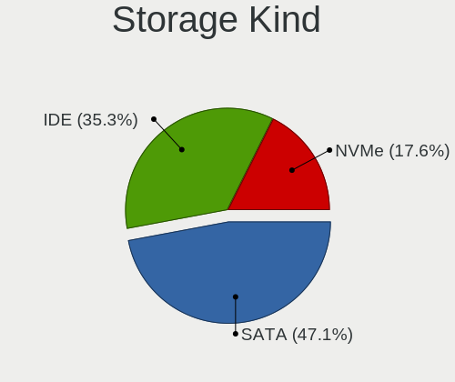

| Kind | Desktops | Percent |
|------|----------|---------|
| SATA | 8        | 47.06%  |
| IDE  | 6        | 35.29%  |
| NVMe | 3        | 17.65%  |

Processor
---------

CPU Vendor
----------

Processor vendors

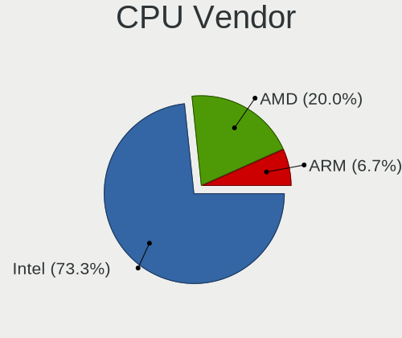

| Vendor | Desktops | Percent |
|--------|----------|---------|
| Intel  | 11       | 73.33%  |
| AMD    | 3        | 20%     |
| ARM    | 1        | 6.67%   |

CPU Model
---------

Processor models

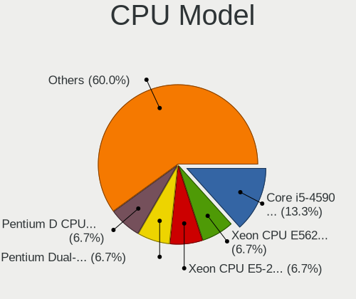

| Model                                       | Desktops | Percent |
|---------------------------------------------|----------|---------|
| Intel Core i5-4590 CPU @ 3.30GHz            | 2        | 13.33%  |
| Intel Xeon CPU E5620 @ 2.40GHz              | 1        | 6.67%   |
| Intel Xeon CPU E5-2690 0 @ 2.90GHz          | 1        | 6.67%   |
| Intel Pentium Dual-Core CPU E5200 @ 2.50GHz | 1        | 6.67%   |
| Intel Pentium D CPU 3.20GHz                 | 1        | 6.67%   |
| Intel Core i7-9700K CPU @ 3.60GHz           | 1        | 6.67%   |
| Intel Core i7-7700 CPU @ 3.60GHz            | 1        | 6.67%   |
| Intel Core i5-3470 CPU @ 3.20GHz            | 1        | 6.67%   |
| Intel Core i3-8100 CPU @ 3.60GHz            | 1        | 6.67%   |
| Intel Core i3-2100 CPU @ 3.10GHz            | 1        | 6.67%   |
| ARM Allwinner sun8i Family Processor        | 1        | 6.67%   |
| AMD Phenom II X4 955 Processor              | 1        | 6.67%   |
| AMD Athlon II X2 215 Processor              | 1        | 6.67%   |
| AMD A4-5300 APU with Radeon HD Graphics     | 1        | 6.67%   |

CPU Model Family
----------------

Processor model prefix

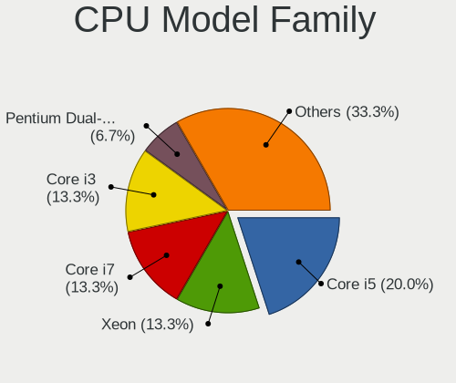

| Model                   | Desktops | Percent |
|-------------------------|----------|---------|
| Intel Core i5           | 3        | 20%     |
| Intel Xeon              | 2        | 13.33%  |
| Intel Core i7           | 2        | 13.33%  |
| Intel Core i3           | 2        | 13.33%  |
| Intel Pentium Dual-Core | 1        | 6.67%   |
| Intel Pentium D         | 1        | 6.67%   |
| ARM Allwinner           | 1        | 6.67%   |
| AMD Phenom II X4        | 1        | 6.67%   |
| AMD Athlon II X2        | 1        | 6.67%   |
| AMD A4                  | 1        | 6.67%   |

CPU Cores
---------

Number of processor cores

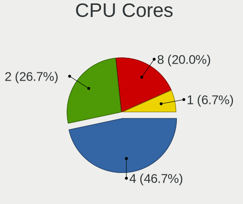

| Number | Desktops | Percent |
|--------|----------|---------|
| 4      | 7        | 46.67%  |
| 2      | 4        | 26.67%  |
| 8      | 3        | 20%     |
| 1      | 1        | 6.67%   |

CPU Sockets
-----------

Number of sockets

| Number | Desktops | Percent |
|--------|----------|---------|
| 1      | 14       | 93.33%  |
| 2      | 1        | 6.67%   |

CPU Threads
-----------

Threads per core (Hyper-Threading)

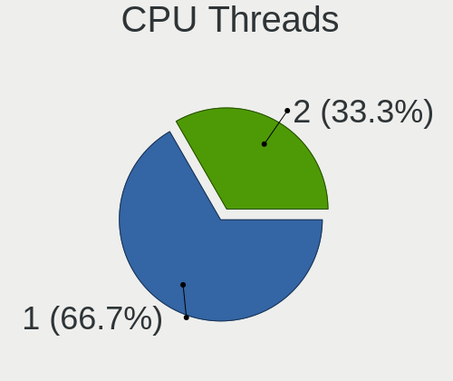

| Number | Desktops | Percent |
|--------|----------|---------|
| 1      | 10       | 66.67%  |
| 2      | 5        | 33.33%  |

CPU Op-Modes
------------

CPU Operation Modes (32-bit, 64-bit)

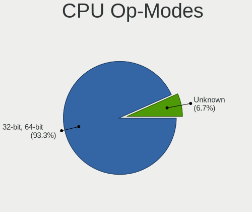

| Op mode        | Desktops | Percent |
|----------------|----------|---------|
| 32-bit, 64-bit | 14       | 93.33%  |
| Unknown        | 1        | 6.67%   |

CPU Microcode
-------------

Microcode number

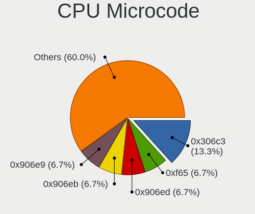

| Number     | Desktops | Percent |
|------------|----------|---------|
| 0x306c3    | 2        | 13.33%  |
| 0xf65      | 1        | 6.67%   |
| 0x906ed    | 1        | 6.67%   |
| 0x906eb    | 1        | 6.67%   |
| 0x906e9    | 1        | 6.67%   |
| 0x306a9    | 1        | 6.67%   |
| 0x206d7    | 1        | 6.67%   |
| 0x206c2    | 1        | 6.67%   |
| 0x206a7    | 1        | 6.67%   |
| 0x1067a    | 1        | 6.67%   |
| 0x06001119 | 1        | 6.67%   |
| 0x010000c8 | 1        | 6.67%   |
| 0x010000b7 | 1        | 6.67%   |
| Unknown    | 1        | 6.67%   |

CPU Microarch
-------------

Microarchitecture

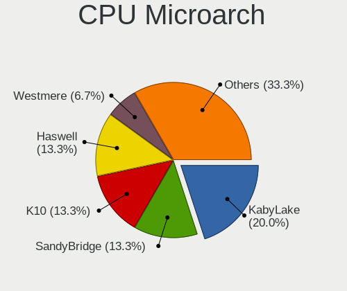

| Name        | Desktops | Percent |
|-------------|----------|---------|
| KabyLake    | 3        | 20%     |
| SandyBridge | 2        | 13.33%  |
| K10         | 2        | 13.33%  |
| Haswell     | 2        | 13.33%  |
| Westmere    | 1        | 6.67%   |
| Piledriver  | 1        | 6.67%   |
| Penryn      | 1        | 6.67%   |
| NetBurst    | 1        | 6.67%   |
| IvyBridge   | 1        | 6.67%   |
| Unknown     | 1        | 6.67%   |

Graphics
--------

GPU Vendor
----------

Vendors of graphics cards

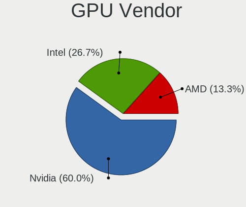

| Vendor | Desktops | Percent |
|--------|----------|---------|
| Nvidia | 9        | 60%     |
| Intel  | 4        | 26.67%  |
| AMD    | 2        | 13.33%  |

GPU Model
---------

Graphics card models

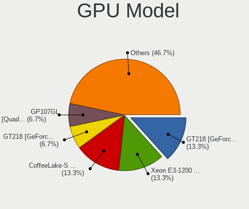

| Model                                                                       | Desktops | Percent |
|-----------------------------------------------------------------------------|----------|---------|
| Nvidia GT218 [GeForce 210]                                                  | 2        | 13.33%  |
| Intel Xeon E3-1200 v3/4th Gen Core Processor Integrated Graphics Controller | 2        | 13.33%  |
| Intel CoffeeLake-S GT2 [UHD Graphics 630]                                   | 2        | 13.33%  |
| Nvidia GT218 [GeForce 8400 GS Rev. 3]                                       | 1        | 6.67%   |
| Nvidia GP107GL [Quadro P600]                                                | 1        | 6.67%   |
| Nvidia GP104 [GeForce GTX 1070]                                             | 1        | 6.67%   |
| Nvidia GK107 [GeForce GT 640]                                               | 1        | 6.67%   |
| Nvidia GF119 [GeForce GT 610]                                               | 1        | 6.67%   |
| Nvidia G98 [GeForce 8400 GS Rev. 2]                                         | 1        | 6.67%   |
| Nvidia C61 [GeForce 6150SE nForce 430]                                      | 1        | 6.67%   |
| AMD Juniper XT [Radeon HD 5770]                                             | 1        | 6.67%   |
| AMD Caicos [Radeon HD 6450/7450/8450 / R5 230 OEM]                          | 1        | 6.67%   |

GPU Combo
---------

Combinations of graphics cards

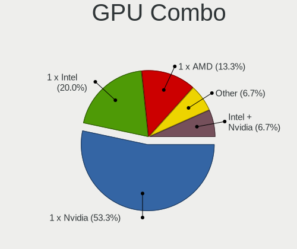

| Name           | Desktops | Percent |
|----------------|----------|---------|
| 1 x Nvidia     | 8        | 53.33%  |
| 1 x Intel      | 3        | 20%     |
| 1 x AMD        | 2        | 13.33%  |
| Other          | 1        | 6.67%   |
| Intel + Nvidia | 1        | 6.67%   |

GPU Driver
----------

Free vs proprietary

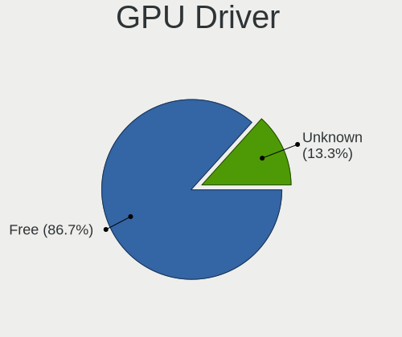

| Driver  | Desktops | Percent |
|---------|----------|---------|
| Free    | 13       | 86.67%  |
| Unknown | 2        | 13.33%  |

GPU Memory
----------

Total video memory

| Size in GB | Desktops | Percent |
|------------|----------|---------|
| Unknown    | 5        | 33.33%  |
| 1.01-2.0   | 3        | 20%     |
| 0.51-1.0   | 3        | 20%     |
| 0.01-0.5   | 3        | 20%     |
| 7.01-8.0   | 1        | 6.67%   |

Monitor
-------

Monitor Vendor
--------------

Monitor vendors

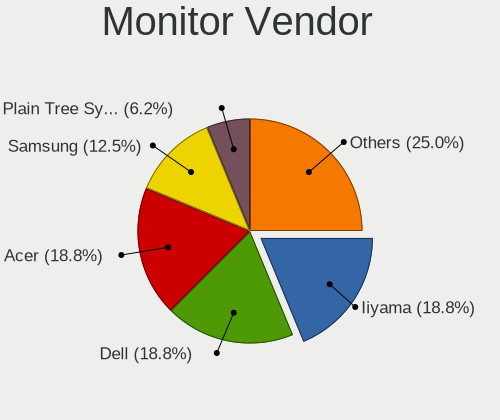

| Vendor               | Desktops | Percent |
|----------------------|----------|---------|
| Iiyama               | 3        | 18.75%  |
| Dell                 | 3        | 18.75%  |
| Acer                 | 3        | 18.75%  |
| Samsung Electronics  | 2        | 12.5%   |
| Plain Tree Systems   | 1        | 6.25%   |
| Philips              | 1        | 6.25%   |
| CVT                  | 1        | 6.25%   |
| AOC                  | 1        | 6.25%   |
| Ancor Communications | 1        | 6.25%   |

Monitor Model
-------------

Monitor models

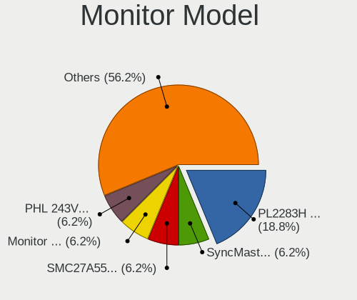

| Model                                                                 | Desktops | Percent |
|-----------------------------------------------------------------------|----------|---------|
| Iiyama PL2283H IVM562E 1920x1080 480x270mm 21.7-inch                  | 3        | 18.75%  |
| Samsung Electronics SyncMaster SAM0216 1280x1024 340x270mm 17.1-inch  | 1        | 6.25%   |
| Samsung Electronics SMC27A550U SAM07F6 1920x1080 598x336mm 27.0-inch  | 1        | 6.25%   |
| Plain Tree Systems Monitor PTS076D 1280x1024 376x301mm 19.0-inch      | 1        | 6.25%   |
| Philips PHL 243V5 PHLC0D1 1920x1080 521x293mm 23.5-inch               | 1        | 6.25%   |
| Dell SE2419H DELF109 1920x1080 527x296mm 23.8-inch                    | 1        | 6.25%   |
| Dell E151FPp DEL7006 1024x768 304x228mm 15.0-inch                     | 1        | 6.25%   |
| Dell 1909W DELA03C 1440x900 408x255mm 18.9-inch                       | 1        | 6.25%   |
| CVT CVTE TV CVT0003 1440x900                                          | 1        | 6.25%   |
| AOC 831W AOC1831 1366x768 410x230mm 18.5-inch                         | 1        | 6.25%   |
| Ancor Communications ASUS VS229 ACI22D3 1920x1080 475x267mm 21.5-inch | 1        | 6.25%   |
| Acer KG251Q ACR0591 1920x1080 544x303mm 24.5-inch                     | 1        | 6.25%   |
| Acer K242HL ACR03E3 1920x1080 531x299mm 24.0-inch                     | 1        | 6.25%   |
| Acer H236HL ACR0318 1920x1080 509x286mm 23.0-inch                     | 1        | 6.25%   |

Monitor Resolution
------------------

Monitor screen resolution

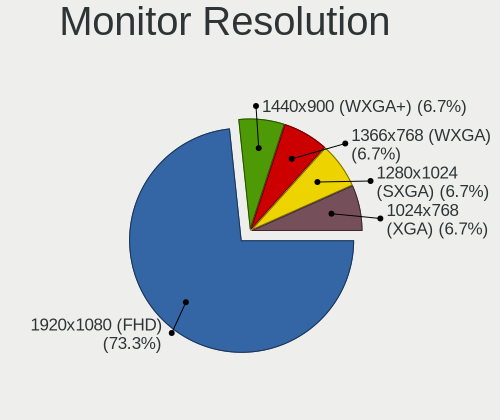

| Resolution       | Desktops | Percent |
|------------------|----------|---------|
| 1920x1080 (FHD)  | 11       | 73.33%  |
| 1440x900 (WXGA+) | 1        | 6.67%   |
| 1366x768 (WXGA)  | 1        | 6.67%   |
| 1280x1024 (SXGA) | 1        | 6.67%   |
| 1024x768 (XGA)   | 1        | 6.67%   |

Monitor Diagonal
----------------

Diagonal size in inches

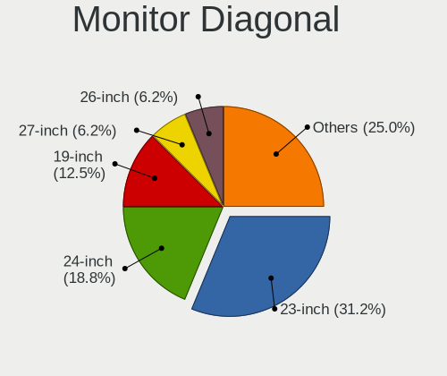

| Inches | Desktops | Percent |
|--------|----------|---------|
| 23     | 5        | 31.25%  |
| 24     | 3        | 18.75%  |
| 19     | 2        | 12.5%   |
| 27     | 1        | 6.25%   |
| 26     | 1        | 6.25%   |
| 21     | 1        | 6.25%   |
| 18     | 1        | 6.25%   |
| 17     | 1        | 6.25%   |
| 15     | 1        | 6.25%   |

Monitor Width
-------------

Physical width

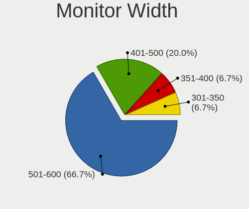

| Width in mm | Desktops | Percent |
|-------------|----------|---------|
| 501-600     | 10       | 66.67%  |
| 401-500     | 3        | 20%     |
| 351-400     | 1        | 6.67%   |
| 301-350     | 1        | 6.67%   |

Aspect Ratio
------------

Proportional relationship between the width and the height

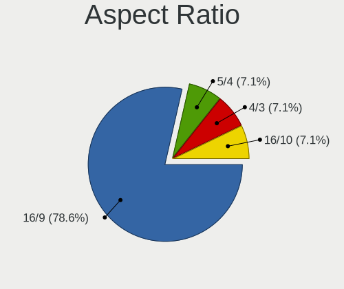

| Ratio | Desktops | Percent |
|-------|----------|---------|
| 16/9  | 11       | 78.57%  |
| 5/4   | 1        | 7.14%   |
| 4/3   | 1        | 7.14%   |
| 16/10 | 1        | 7.14%   |

Monitor Area
------------

Area in inch²

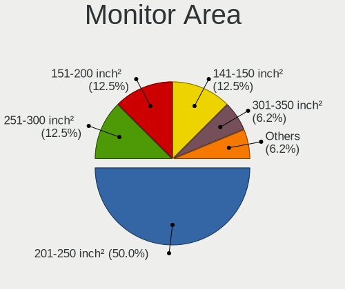

| Area in inch² | Desktops | Percent |
|----------------|----------|---------|
| 201-250        | 8        | 50%     |
| 251-300        | 2        | 12.5%   |
| 151-200        | 2        | 12.5%   |
| 141-150        | 2        | 12.5%   |
| 301-350        | 1        | 6.25%   |
| 101-110        | 1        | 6.25%   |

Pixel Density
-------------

Pixels per inch

| Density | Desktops | Percent |
|---------|----------|---------|
| 51-100  | 12       | 92.31%  |
| 101-120 | 1        | 7.69%   |

Multiple Monitors
-----------------

Total monitors connected

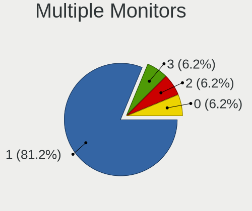

| Total | Desktops | Percent |
|-------|----------|---------|
| 1     | 13       | 81.25%  |
| 3     | 1        | 6.25%   |
| 2     | 1        | 6.25%   |
| 0     | 1        | 6.25%   |

Network
-------

Net Controller Vendor
---------------------

Controller vendors

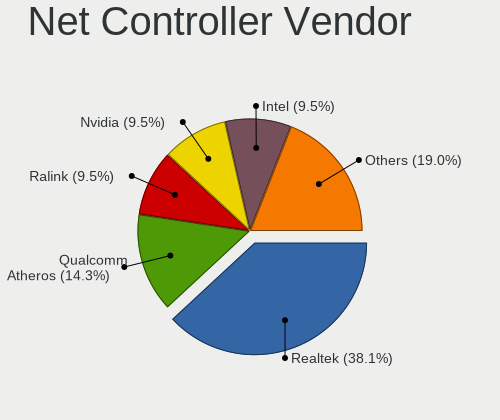

| Vendor                   | Desktops | Percent |
|--------------------------|----------|---------|
| Realtek Semiconductor    | 8        | 38.1%   |
| Qualcomm Atheros         | 3        | 14.29%  |
| Ralink Technology        | 2        | 9.52%   |
| Nvidia                   | 2        | 9.52%   |
| Intel                    | 2        | 9.52%   |
| Broadcom                 | 2        | 9.52%   |
| Qualcomm                 | 1        | 4.76%   |
| Marvell Technology Group | 1        | 4.76%   |

Net Controller Model
--------------------

Controller models

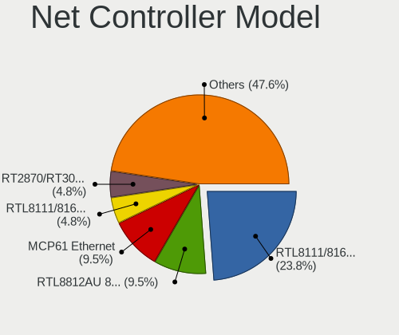

| Model                                                                  | Desktops | Percent |
|------------------------------------------------------------------------|----------|---------|
| Realtek RTL8111/8168/8211/8411 PCI Express Gigabit Ethernet Controller | 5        | 23.81%  |
| Realtek RTL8812AU 802.11a/b/g/n/ac 2T2R DB WLAN Adapter                | 2        | 9.52%   |
| Nvidia MCP61 Ethernet                                                  | 2        | 9.52%   |
| Realtek RTL8111/8168/8411 PCI Express Gigabit Ethernet Controller      | 1        | 4.76%   |
| Ralink RT2870/RT3070 Wireless Adapter                                  | 1        | 4.76%   |
| Ralink MT7601U Wireless Adapter                                        | 1        | 4.76%   |
| Qualcomm POCO F3                                                       | 1        | 4.76%   |
| Qualcomm Atheros Killer E220x Gigabit Ethernet Controller              | 1        | 4.76%   |
| Qualcomm Atheros AR8151 v2.0 Gigabit Ethernet                          | 1        | 4.76%   |
| Qualcomm Atheros AR2417 Wireless Network Adapter [AR5007G 802.11bg]    | 1        | 4.76%   |
| Marvell Group 88E8001 Gigabit Ethernet Controller                      | 1        | 4.76%   |
| Intel Ethernet Connection (5) I219-LM                                  | 1        | 4.76%   |
| Intel 82574L Gigabit Network Connection                                | 1        | 4.76%   |
| Broadcom NetLink BCM5784M Gigabit Ethernet PCIe                        | 1        | 4.76%   |
| Broadcom BCM4322 802.11a/b/g/n Wireless LAN Controller                 | 1        | 4.76%   |

Wireless Vendor
---------------

Wireless vendors

| Vendor                | Desktops | Percent |
|-----------------------|----------|---------|
| Realtek Semiconductor | 2        | 33.33%  |
| Ralink Technology     | 2        | 33.33%  |
| Qualcomm Atheros      | 1        | 16.67%  |
| Broadcom              | 1        | 16.67%  |

Wireless Model
--------------

Wireless models

| Model                                                               | Desktops | Percent |
|---------------------------------------------------------------------|----------|---------|
| Realtek RTL8812AU 802.11a/b/g/n/ac 2T2R DB WLAN Adapter             | 2        | 33.33%  |
| Ralink RT2870/RT3070 Wireless Adapter                               | 1        | 16.67%  |
| Ralink MT7601U Wireless Adapter                                     | 1        | 16.67%  |
| Qualcomm Atheros AR2417 Wireless Network Adapter [AR5007G 802.11bg] | 1        | 16.67%  |
| Broadcom BCM4322 802.11a/b/g/n Wireless LAN Controller              | 1        | 16.67%  |

Ethernet Vendor
---------------

Ethernet vendors

| Vendor                   | Desktops | Percent |
|--------------------------|----------|---------|
| Realtek Semiconductor    | 6        | 40%     |
| Qualcomm Atheros         | 2        | 13.33%  |
| Nvidia                   | 2        | 13.33%  |
| Intel                    | 2        | 13.33%  |
| Qualcomm                 | 1        | 6.67%   |
| Marvell Technology Group | 1        | 6.67%   |
| Broadcom                 | 1        | 6.67%   |

Ethernet Model
--------------

Ethernet models

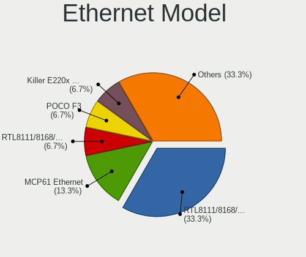

| Model                                                                  | Desktops | Percent |
|------------------------------------------------------------------------|----------|---------|
| Realtek RTL8111/8168/8211/8411 PCI Express Gigabit Ethernet Controller | 5        | 33.33%  |
| Nvidia MCP61 Ethernet                                                  | 2        | 13.33%  |
| Realtek RTL8111/8168/8411 PCI Express Gigabit Ethernet Controller      | 1        | 6.67%   |
| Qualcomm POCO F3                                                       | 1        | 6.67%   |
| Qualcomm Atheros Killer E220x Gigabit Ethernet Controller              | 1        | 6.67%   |
| Qualcomm Atheros AR8151 v2.0 Gigabit Ethernet                          | 1        | 6.67%   |
| Marvell Group 88E8001 Gigabit Ethernet Controller                      | 1        | 6.67%   |
| Intel Ethernet Connection (5) I219-LM                                  | 1        | 6.67%   |
| Intel 82574L Gigabit Network Connection                                | 1        | 6.67%   |
| Broadcom NetLink BCM5784M Gigabit Ethernet PCIe                        | 1        | 6.67%   |

Net Controller Kind
-------------------

Ethernet, WiFi or modem

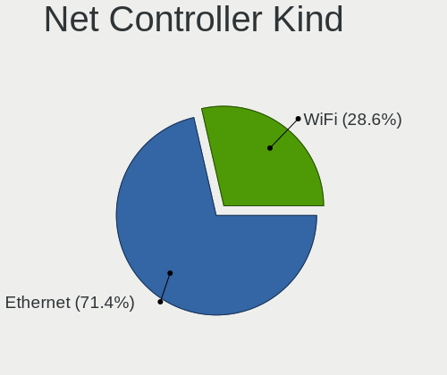

| Kind     | Desktops | Percent |
|----------|----------|---------|
| Ethernet | 15       | 71.43%  |
| WiFi     | 6        | 28.57%  |

Used Controller
---------------

Currently used network controller

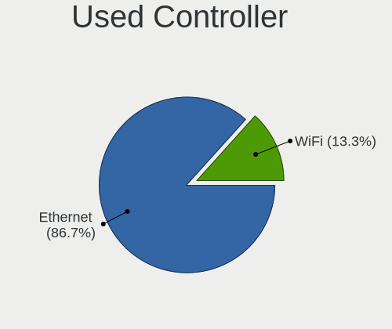

| Kind     | Desktops | Percent |
|----------|----------|---------|
| Ethernet | 13       | 86.67%  |
| WiFi     | 2        | 13.33%  |

NICs
----

Total network controllers on board

| Total | Desktops | Percent |
|-------|----------|---------|
| 1     | 12       | 80%     |
| 3     | 1        | 6.67%   |
| 2     | 1        | 6.67%   |
| 0     | 1        | 6.67%   |

IPv6
----

IPv6 vs IPv4

| Used | Desktops | Percent |
|------|----------|---------|
| No   | 11       | 73.33%  |
| Yes  | 4        | 26.67%  |

Bluetooth
---------

Bluetooth Vendor
----------------

Controller vendors

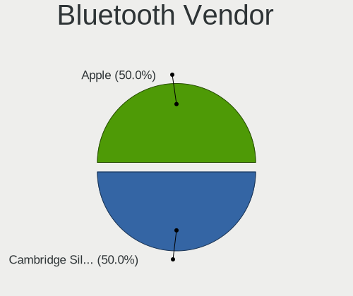

| Vendor                  | Desktops | Percent |
|-------------------------|----------|---------|
| Cambridge Silicon Radio | 1        | 50%     |
| Apple                   | 1        | 50%     |

Bluetooth Model
---------------

Controller models

| Model                                               | Desktops | Percent |
|-----------------------------------------------------|----------|---------|
| Cambridge Silicon Radio Bluetooth Dongle (HCI mode) | 1        | 50%     |
| Apple Built-in Bluetooth 2.0+EDR HCI                | 1        | 50%     |

Sound
-----

Sound Vendor
------------

Sound card vendors

| Vendor        | Desktops | Percent |
|---------------|----------|---------|
| Intel         | 11       | 50%     |
| Nvidia        | 8        | 36.36%  |
| AMD           | 2        | 9.09%   |
| Creative Labs | 1        | 4.55%   |

Sound Model
-----------

Sound card models

| Model                                                                             | Desktops | Percent |
|-----------------------------------------------------------------------------------|----------|---------|
| Nvidia High Definition Audio Controller                                           | 3        | 12%     |
| Intel 6 Series/C200 Series Chipset Family High Definition Audio Controller        | 3        | 12%     |
| Nvidia MCP61 High Definition Audio                                                | 2        | 8%      |
| Intel Xeon E3-1200 v3/4th Gen Core Processor HD Audio Controller                  | 2        | 8%      |
| Intel NM10/ICH7 Family High Definition Audio Controller                           | 2        | 8%      |
| Intel Cannon Lake PCH cAVS                                                        | 2        | 8%      |
| Nvidia GP107GL High Definition Audio Controller                                   | 1        | 4%      |
| Nvidia GP104 High Definition Audio Controller                                     | 1        | 4%      |
| Nvidia GK107 HDMI Audio Controller                                                | 1        | 4%      |
| Nvidia GF119 HDMI Audio Controller                                                | 1        | 4%      |
| Intel 9 Series Chipset Family HD Audio Controller                                 | 1        | 4%      |
| Intel 82801JI (ICH10 Family) HD Audio Controller                                  | 1        | 4%      |
| Intel 8 Series/C220 Series Chipset High Definition Audio Controller               | 1        | 4%      |
| Intel 200 Series PCH HD Audio                                                     | 1        | 4%      |
| Creative Labs CA0110 [Sound Blaster X-Fi Xtreme Audio]                            | 1        | 4%      |
| AMD Juniper HDMI Audio [Radeon HD 5700 Series]                                    | 1        | 4%      |
| AMD Caicos HDMI Audio [Radeon HD 6450 / 7450/8450/8490 OEM / R5 230/235/235X OEM] | 1        | 4%      |

Memory
------

Memory Vendor
-------------

Memory module vendors

| Vendor              | Desktops | Percent |
|---------------------|----------|---------|
| Unknown             | 3        | 20%     |
| Samsung Electronics | 3        | 20%     |
| SK hynix            | 2        | 13.33%  |
| Micron Technology   | 2        | 13.33%  |
| PNY                 | 1        | 6.67%   |
| Kingston            | 1        | 6.67%   |
| GOODRAM             | 1        | 6.67%   |
| G.Skill             | 1        | 6.67%   |
| Corsair             | 1        | 6.67%   |

Memory Model
------------

Memory module models

| Model                                                                     | Desktops | Percent |
|---------------------------------------------------------------------------|----------|---------|
| Unknown RAM Module 4096MB DIMM DDR3 1333MT/s                              | 1        | 6.67%   |
| Unknown RAM Module 2GB DIMM 667MT/s                                       | 1        | 6.67%   |
| Unknown RAM 3634543235363032304555322E3543322020 2048MB DIMM DDR2 800MT/s | 1        | 6.67%   |
| SK hynix RAM Module 1024MB DIMM DDR3 1066MT/s                             | 1        | 6.67%   |
| SK hynix RAM HMT451U6BFR8C-PB 4GB DIMM DDR3 1600MT/s                      | 1        | 6.67%   |
| Samsung RAM Module 4096MB DIMM DDR4 2400MT/s                              | 1        | 6.67%   |
| Samsung RAM Module 4096MB DIMM DDR3 1066MT/s                              | 1        | 6.67%   |
| Samsung RAM M378B5273DH0-CH9 4GB DIMM DDR3 2133MT/s                       | 1        | 6.67%   |
| PNY RAM Module 4096MB DIMM DDR3 1066MT/s                                  | 1        | 6.67%   |
| Micron RAM Module 2048MB DIMM DDR3 1066MT/s                               | 1        | 6.67%   |
| Micron RAM 36JSF1G72PZ-1 8GB DIMM DDR3 1866MT/s                           | 1        | 6.67%   |
| Kingston RAM 99U5584-005.A00LF 4GB DIMM DDR3 1600MT/s                     | 1        | 6.67%   |
| GOODRAM RAM GY1600D364L9/4G 4GB DIMM DDR3 1333MT/s                        | 1        | 6.67%   |
| G.Skill RAM F3-2400C11-8GXM 8GB DIMM DDR3 2400MT/s                        | 1        | 6.67%   |
| Corsair RAM CMK32GX4M2E3200C16 16GB DIMM DDR4 3534MT/s                    | 1        | 6.67%   |

Memory Kind
-----------

Memory module kinds

| Kind    | Desktops | Percent |
|---------|----------|---------|
| DDR3    | 8        | 66.67%  |
| DDR4    | 2        | 16.67%  |
| DDR2    | 1        | 8.33%   |
| Unknown | 1        | 8.33%   |

Memory Form Factor
------------------

Physical design of the memory module

| Name | Desktops | Percent |
|------|----------|---------|
| DIMM | 12       | 100%    |

Memory Size
-----------

Memory module size

| Size  | Desktops | Percent |
|-------|----------|---------|
| 4096  | 7        | 50%     |
| 2048  | 3        | 21.43%  |
| 8192  | 2        | 14.29%  |
| 16384 | 1        | 7.14%   |
| 1024  | 1        | 7.14%   |

Memory Speed
------------

Memory module speed

| Speed | Desktops | Percent |
|-------|----------|---------|
| 1600  | 3        | 23.08%  |
| 2400  | 2        | 15.38%  |
| 1066  | 2        | 15.38%  |
| 3534  | 1        | 7.69%   |
| 2133  | 1        | 7.69%   |
| 1866  | 1        | 7.69%   |
| 1333  | 1        | 7.69%   |
| 800   | 1        | 7.69%   |
| 667   | 1        | 7.69%   |

Printers & scanners
-------------------

Printer Vendor
--------------

Printer device vendors

| Vendor          | Desktops | Percent |
|-----------------|----------|---------|
| Hewlett-Packard | 1        | 100%    |

Printer Model
-------------

Printer device models

| Model                  | Desktops | Percent |
|------------------------|----------|---------|
| HP Deskjet 3510 series | 1        | 100%    |

Scanner Vendor
--------------

Scanner device vendors

Zero info for selected period =(

Scanner Model
-------------

Scanner device models

Zero info for selected period =(

Camera
------

Camera Vendor
-------------

Camera device vendors

| Vendor                        | Desktops | Percent |
|-------------------------------|----------|---------|
| Sunplus Innovation Technology | 1        | 50%     |
| Logitech                      | 1        | 50%     |

Camera Model
------------

Camera device models

| Model                   | Desktops | Percent |
|-------------------------|----------|---------|
| Sunplus 2K FHD camera   | 1        | 50%     |
| Logitech C505 HD Webcam | 1        | 50%     |

Security
--------

Fingerprint Vendor
------------------

Fingerprint sensor vendors

Zero info for selected period =(

Fingerprint Model
-----------------

Fingerprint sensor models

Zero info for selected period =(

Chipcard Vendor
---------------

Chipcard module vendors

Zero info for selected period =(

Chipcard Model
--------------

Chipcard module models

Zero info for selected period =(

Unsupported
-----------

Unsupported Devices
-------------------

Total unsupported devices on board

| Total | Desktops | Percent |
|-------|----------|---------|
| 0     | 13       | 81.25%  |
| 1     | 3        | 18.75%  |

Unsupported Device Types
------------------------

Types of unsupported devices

| Type          | Desktops | Percent |
|---------------|----------|---------|
| Net/wireless  | 1        | 50%     |
| Graphics card | 1        | 50%     |

