Trisquel - Tested Hardware & Statistics (Notebooks)
---------------------------------------------------

A project to collect tested hardware configurations for Trisquel.

Anyone can contribute to this report by the [hw-probe](https://github.com/linuxhw/hw-probe) tool:

    sudo -E hw-probe -all -upload

Please contribute! Especially if your hardware is rare.

Contents
--------

* [ Test Cases ](#test-cases)

* [ System ](#system)
  - [ OS                       ](#os)
  - [ OS Family                ](#os-family)
  - [ Kernel                   ](#kernel)
  - [ Kernel Family            ](#kernel-family)
  - [ Kernel Major Ver.        ](#kernel-major-ver)
  - [ Arch                     ](#arch)
  - [ DE                       ](#de)
  - [ Display Server           ](#display-server)
  - [ Display Manager          ](#display-manager)
  - [ OS Lang                  ](#os-lang)
  - [ Boot Mode                ](#boot-mode)
  - [ Filesystem               ](#filesystem)
  - [ Part. scheme             ](#part-scheme)
  - [ Dual Boot with Linux/BSD ](#dual-boot-with-linuxbsd)
  - [ Dual Boot (Win)          ](#dual-boot-win)

* [ Board ](#board)
  - [ Vendor                   ](#vendor)
  - [ Model                    ](#model)
  - [ Model Family             ](#model-family)
  - [ MFG Year                 ](#mfg-year)
  - [ Form Factor              ](#form-factor)
  - [ Secure Boot              ](#secure-boot)
  - [ Coreboot                 ](#coreboot)
  - [ RAM Size                 ](#ram-size)
  - [ RAM Used                 ](#ram-used)
  - [ Total Drives             ](#total-drives)
  - [ Has CD-ROM               ](#has-cd-rom)
  - [ Has Ethernet             ](#has-ethernet)
  - [ Has WiFi                 ](#has-wifi)
  - [ Has Bluetooth            ](#has-bluetooth)

* [ Location ](#location)
  - [ Country                  ](#country)
  - [ City                     ](#city)

* [ Drives ](#drives)
  - [ Drive Vendor             ](#drive-vendor)
  - [ Drive Model              ](#drive-model)
  - [ HDD Vendor               ](#hdd-vendor)
  - [ SSD Vendor               ](#ssd-vendor)
  - [ Drive Kind               ](#drive-kind)
  - [ Drive Connector          ](#drive-connector)
  - [ Drive Size               ](#drive-size)
  - [ Space Total              ](#space-total)
  - [ Space Used               ](#space-used)
  - [ Malfunc. Drives          ](#malfunc-drives)
  - [ Malfunc. Drive Vendor    ](#malfunc-drive-vendor)
  - [ Malfunc. HDD Vendor      ](#malfunc-hdd-vendor)
  - [ Malfunc. Drive Kind      ](#malfunc-drive-kind)
  - [ Failed Drives            ](#failed-drives)
  - [ Failed Drive Vendor      ](#failed-drive-vendor)
  - [ Drive Status             ](#drive-status)

* [ Storage controller ](#storage-controller)
  - [ Storage Vendor           ](#storage-vendor)
  - [ Storage Model            ](#storage-model)
  - [ Storage Kind             ](#storage-kind)

* [ Processor ](#processor)
  - [ CPU Vendor               ](#cpu-vendor)
  - [ CPU Model                ](#cpu-model)
  - [ CPU Model Family         ](#cpu-model-family)
  - [ CPU Cores                ](#cpu-cores)
  - [ CPU Sockets              ](#cpu-sockets)
  - [ CPU Threads              ](#cpu-threads)
  - [ CPU Op-Modes             ](#cpu-op-modes)
  - [ CPU Microcode            ](#cpu-microcode)
  - [ CPU Microarch            ](#cpu-microarch)

* [ Graphics ](#graphics)
  - [ GPU Vendor               ](#gpu-vendor)
  - [ GPU Model                ](#gpu-model)
  - [ GPU Combo                ](#gpu-combo)
  - [ GPU Driver               ](#gpu-driver)
  - [ GPU Memory               ](#gpu-memory)

* [ Monitor ](#monitor)
  - [ Monitor Vendor           ](#monitor-vendor)
  - [ Monitor Model            ](#monitor-model)
  - [ Monitor Resolution       ](#monitor-resolution)
  - [ Monitor Diagonal         ](#monitor-diagonal)
  - [ Monitor Width            ](#monitor-width)
  - [ Aspect Ratio             ](#aspect-ratio)
  - [ Monitor Area             ](#monitor-area)
  - [ Pixel Density            ](#pixel-density)
  - [ Multiple Monitors        ](#multiple-monitors)

* [ Network ](#network)
  - [ Net Controller Vendor    ](#net-controller-vendor)
  - [ Net Controller Model     ](#net-controller-model)
  - [ Wireless Vendor          ](#wireless-vendor)
  - [ Wireless Model           ](#wireless-model)
  - [ Ethernet Vendor          ](#ethernet-vendor)
  - [ Ethernet Model           ](#ethernet-model)
  - [ Net Controller Kind      ](#net-controller-kind)
  - [ Used Controller          ](#used-controller)
  - [ NICs                     ](#nics)
  - [ IPv6                     ](#ipv6)

* [ Bluetooth ](#bluetooth)
  - [ Bluetooth Vendor         ](#bluetooth-vendor)
  - [ Bluetooth Model          ](#bluetooth-model)

* [ Sound ](#sound)
  - [ Sound Vendor             ](#sound-vendor)
  - [ Sound Model              ](#sound-model)

* [ Memory ](#memory)
  - [ Memory Vendor            ](#memory-vendor)
  - [ Memory Model             ](#memory-model)
  - [ Memory Kind              ](#memory-kind)
  - [ Memory Form Factor       ](#memory-form-factor)
  - [ Memory Size              ](#memory-size)
  - [ Memory Speed             ](#memory-speed)

* [ Printers & scanners ](#printers--scanners)
  - [ Printer Vendor           ](#printer-vendor)
  - [ Printer Model            ](#printer-model)
  - [ Scanner Vendor           ](#scanner-vendor)
  - [ Scanner Model            ](#scanner-model)

* [ Camera ](#camera)
  - [ Camera Vendor            ](#camera-vendor)
  - [ Camera Model             ](#camera-model)

* [ Security ](#security)
  - [ Fingerprint Vendor       ](#fingerprint-vendor)
  - [ Fingerprint Model        ](#fingerprint-model)
  - [ Chipcard Vendor          ](#chipcard-vendor)
  - [ Chipcard Model           ](#chipcard-model)

* [ Unsupported ](#unsupported)
  - [ Unsupported Devices      ](#unsupported-devices)
  - [ Unsupported Device Types ](#unsupported-device-types)

Test Cases
----------

Total: 23

| Vendor    | Model                 | Probe                                                      | Date         |
|-----------|-----------------------|------------------------------------------------------------|--------------|
| HP        | Stream Laptop 11-y0XX | [4f777df0e8](https://linux-hardware.org/?probe=4f777df0e8) | Apr 29, 2023 |
| Itautec   | Infoway               | [c046d6e093](https://linux-hardware.org/?probe=c046d6e093) | Apr 16, 2023 |
| Acer      | Nitro AN517-54        | [185c4824b7](https://linux-hardware.org/?probe=185c4824b7) | Apr 07, 2023 |
| Dell      | Inspiron 15-3567      | [e94792b948](https://linux-hardware.org/?probe=e94792b948) | Dec 13, 2022 |
| Dell      | Inspiron 1545         | [5b13c289e1](https://linux-hardware.org/?probe=5b13c289e1) | Nov 26, 2022 |
| Libiquity | Taurinus X200         | [75c0f41e26](https://linux-hardware.org/?probe=75c0f41e26) | Nov 09, 2022 |
| Lenovo    | ThinkPad T430 2347G2U | [ab06dd40c4](https://linux-hardware.org/?probe=ab06dd40c4) | Oct 03, 2022 |
| Lenovo    | ThinkPad T430 2347G2U | [5b08d764b4](https://linux-hardware.org/?probe=5b08d764b4) | Sep 27, 2022 |
| Lenovo    | G505s 20255           | [a9e525c695](https://linux-hardware.org/?probe=a9e525c695) | Sep 16, 2022 |
| Timi      | TM1709                | [2fb5436031](https://linux-hardware.org/?probe=2fb5436031) | Sep 04, 2022 |
| Lenovo    | ThinkPad T430 2347G2U | [8d7c5df586](https://linux-hardware.org/?probe=8d7c5df586) | Sep 03, 2022 |
| ASUSTek   | K55A                  | [5d11054a36](https://linux-hardware.org/?probe=5d11054a36) | Aug 28, 2022 |
| Lenovo    | ThinkPad T420 4177QKU | [a18ab36f34](https://linux-hardware.org/?probe=a18ab36f34) | Aug 17, 2022 |
| Lenovo    | ThinkPad T430 2347G2U | [f6abe5392b](https://linux-hardware.org/?probe=f6abe5392b) | Aug 03, 2022 |
| Lenovo    | ThinkPad T430 2347G2U | [b25d6bf66c](https://linux-hardware.org/?probe=b25d6bf66c) | Jul 27, 2022 |
| Lenovo    | ThinkPad T420 4177QKU | [215758ad8a](https://linux-hardware.org/?probe=215758ad8a) | Apr 30, 2022 |
| Dell      | XPS 13 9360           | [1126937638](https://linux-hardware.org/?probe=1126937638) | Apr 28, 2022 |
| Toshiba   | Satellite C800D       | [5cdc03cbdf](https://linux-hardware.org/?probe=5cdc03cbdf) | Feb 10, 2022 |
| Samsung   | N130                  | [1a88380af6](https://linux-hardware.org/?probe=1a88380af6) | Nov 27, 2021 |
| ASUSTek   | U56E                  | [99bd7dbfdf](https://linux-hardware.org/?probe=99bd7dbfdf) | Sep 09, 2021 |
| Lenovo    | ThinkPad X200 7455FNG | [6fcadf1396](https://linux-hardware.org/?probe=6fcadf1396) | Mar 20, 2021 |
| Acer      | TravelMate B115-M     | [62239072f1](https://linux-hardware.org/?probe=62239072f1) | Nov 26, 2019 |
| GPD       | MicroPC               | [8fc0176f69](https://linux-hardware.org/?probe=8fc0176f69) | Sep 28, 2019 |

System
------

OS
--

Installed operating systems

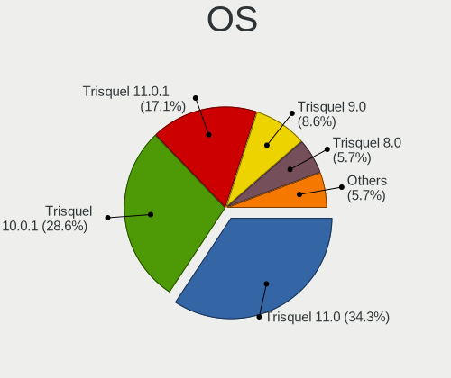

| Name            | Notebooks | Percent |
|-----------------|-----------|---------|
| Trisquel 10.0.1 | 9         | 47.37%  |
| Trisquel 9.0    | 3         | 15.79%  |
| Trisquel 11.0   | 3         | 15.79%  |
| Trisquel 8.0    | 2         | 10.53%  |
| Trisquel 10.0   | 2         | 10.53%  |

OS Family
---------

OS without a version

| Name     | Notebooks | Percent |
|----------|-----------|---------|
| Trisquel | 19        | 100%    |

Kernel
------

Version of the Linux kernel

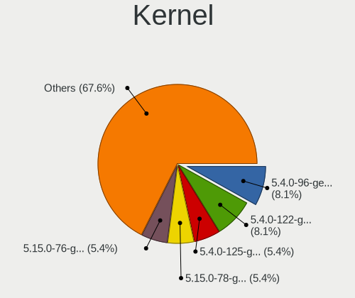

| Version              | Notebooks | Percent |
|----------------------|-----------|---------|
| 5.4.0-96-generic     | 3         | 14.29%  |
| 5.4.0-122-generic    | 3         | 14.29%  |
| 5.4.0-125-generic    | 2         | 9.52%   |
| 5.15.0-69-generic    | 2         | 9.52%   |
| 6.0.12-x64v1-xanmod1 | 1         | 4.76%   |
| 5.4.0-132-generic    | 1         | 4.76%   |
| 5.4.0-131-generic    | 1         | 4.76%   |
| 5.4.0-126-generic    | 1         | 4.76%   |
| 5.4.0-113-generic    | 1         | 4.76%   |
| 5.3.13-gnu           | 1         | 4.76%   |
| 5.3.1-gnu            | 1         | 4.76%   |
| 5.15.0-67-generic    | 1         | 4.76%   |
| 4.15.0-161-generic   | 1         | 4.76%   |
| 4.15.0-156-generic   | 1         | 4.76%   |
| 4.15.0-136-generic   | 1         | 4.76%   |

Kernel Family
-------------

Linux kernel without a distro release

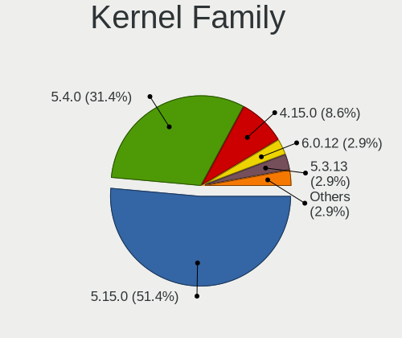

| Version | Notebooks | Percent |
|---------|-----------|---------|
| 5.4.0   | 10        | 52.63%  |
| 5.15.0  | 3         | 15.79%  |
| 4.15.0  | 3         | 15.79%  |
| 6.0.12  | 1         | 5.26%   |
| 5.3.13  | 1         | 5.26%   |
| 5.3.1   | 1         | 5.26%   |

Kernel Major Ver.
-----------------

Linux kernel major version

| Version | Notebooks | Percent |
|---------|-----------|---------|
| 5.4     | 10        | 52.63%  |
| 5.15    | 3         | 15.79%  |
| 4.15    | 3         | 15.79%  |
| 5.3     | 2         | 10.53%  |
| 6.0     | 1         | 5.26%   |

Arch
----

OS architecture (x86_64, i586, etc.)

| Name   | Notebooks | Percent |
|--------|-----------|---------|
| x86_64 | 18        | 94.74%  |
| i686   | 1         | 5.26%   |

DE
--

Desktop Environment

| Name    | Notebooks | Percent |
|---------|-----------|---------|
| MATE    | 14        | 73.68%  |
| LXDE    | 2         | 10.53%  |
| GNOME   | 1         | 5.26%   |
| dwm     | 1         | 5.26%   |
| Unknown | 1         | 5.26%   |

Display Server
--------------

X11 or Wayland

| Name    | Notebooks | Percent |
|---------|-----------|---------|
| X11     | 18        | 94.74%  |
| Wayland | 1         | 5.26%   |

Display Manager
---------------

SDDM, LightDM, etc.

| Name    | Notebooks | Percent |
|---------|-----------|---------|
| LightDM | 12        | 63.16%  |
| TDM     | 3         | 15.79%  |
| Unknown | 3         | 15.79%  |
| GDM     | 1         | 5.26%   |

OS Lang
-------

Language

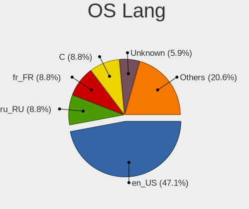

| Lang    | Notebooks | Percent |
|---------|-----------|---------|
| en_US   | 10        | 52.63%  |
| ru_RU   | 2         | 10.53%  |
| C       | 2         | 10.53%  |
| Unknown | 2         | 10.53%  |
| ru_UA   | 1         | 5.26%   |
| pt_BR   | 1         | 5.26%   |
| es_MX   | 1         | 5.26%   |

Boot Mode
---------

EFI or BIOS

| Mode | Notebooks | Percent |
|------|-----------|---------|
| EFI  | 10        | 52.63%  |
| BIOS | 9         | 47.37%  |

Filesystem
----------

Type of filesystem

| Type    | Notebooks | Percent |
|---------|-----------|---------|
| Ext4    | 17        | 89.47%  |
| Overlay | 2         | 10.53%  |

Part. scheme
------------

Scheme of partitioning

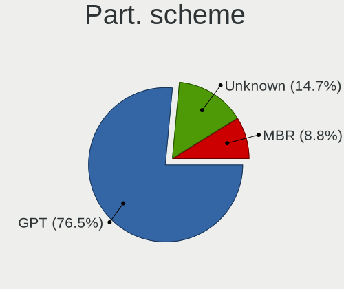

| Type    | Notebooks | Percent |
|---------|-----------|---------|
| GPT     | 13        | 68.42%  |
| Unknown | 4         | 21.05%  |
| MBR     | 2         | 10.53%  |

Dual Boot with Linux/BSD
------------------------

Hosting more than one Linux/BSD

| Dual boot | Notebooks | Percent |
|-----------|-----------|---------|
| No        | 15        | 75%     |
| Yes       | 5         | 25%     |

Dual Boot (Win)
---------------

Hosting Linux and Windows

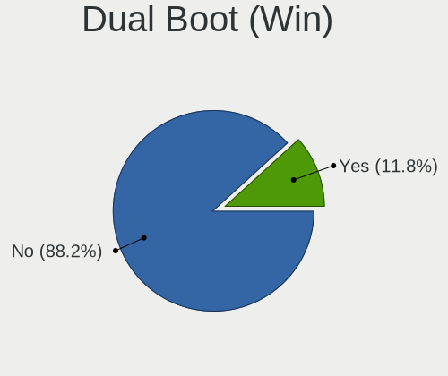

| Dual boot | Notebooks | Percent |
|-----------|-----------|---------|
| No        | 16        | 84.21%  |
| Yes       | 3         | 15.79%  |

Board
-----

Vendor
------

Motherboard manufacturer

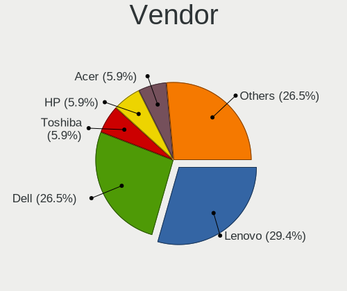

| Name                | Notebooks | Percent |
|---------------------|-----------|---------|
| Lenovo              | 5         | 26.32%  |
| Dell                | 3         | 15.79%  |
| ASUSTek Computer    | 2         | 10.53%  |
| Acer                | 2         | 10.53%  |
| Toshiba             | 1         | 5.26%   |
| Timi                | 1         | 5.26%   |
| Samsung Electronics | 1         | 5.26%   |
| Libiquity           | 1         | 5.26%   |
| Itautec             | 1         | 5.26%   |
| Hewlett-Packard     | 1         | 5.26%   |
| GPD                 | 1         | 5.26%   |

Model
-----

Motherboard model

| Name                         | Notebooks | Percent |
|------------------------------|-----------|---------|
| Lenovo ThinkPad T420 4177QKU | 2         | 10.53%  |
| Toshiba Satellite C800D      | 1         | 5.26%   |
| Timi TM1709                  | 1         | 5.26%   |
| Samsung N130                 | 1         | 5.26%   |
| Libiquity Taurinus X200      | 1         | 5.26%   |
| Lenovo ThinkPad X200 7455FNG | 1         | 5.26%   |
| Lenovo ThinkPad T430 2347G2U | 1         | 5.26%   |
| Lenovo G505s 20255           | 1         | 5.26%   |
| Itautec Infoway              | 1         | 5.26%   |
| HP Stream Laptop 11-y0XX     | 1         | 5.26%   |
| GPD MicroPC                  | 1         | 5.26%   |
| Dell XPS 13 9360             | 1         | 5.26%   |
| Dell Inspiron 1545           | 1         | 5.26%   |
| Dell Inspiron 15-3567        | 1         | 5.26%   |
| ASUS U56E                    | 1         | 5.26%   |
| ASUS K55A                    | 1         | 5.26%   |
| Acer TravelMate B115-M       | 1         | 5.26%   |
| Acer Nitro AN517-54          | 1         | 5.26%   |

Model Family
------------

Motherboard model prefix

| Name               | Notebooks | Percent |
|--------------------|-----------|---------|
| Lenovo ThinkPad    | 4         | 21.05%  |
| Dell Inspiron      | 2         | 10.53%  |
| Toshiba Satellite  | 1         | 5.26%   |
| Timi TM1709        | 1         | 5.26%   |
| Samsung N130       | 1         | 5.26%   |
| Libiquity Taurinus | 1         | 5.26%   |
| Lenovo G505s       | 1         | 5.26%   |
| Itautec Infoway    | 1         | 5.26%   |
| HP Stream          | 1         | 5.26%   |
| GPD MicroPC        | 1         | 5.26%   |
| Dell XPS           | 1         | 5.26%   |
| ASUS U56E          | 1         | 5.26%   |
| ASUS K55A          | 1         | 5.26%   |
| Acer TravelMate    | 1         | 5.26%   |
| Acer Nitro         | 1         | 5.26%   |

MFG Year
--------

Motherboard manufacture year

| Year | Notebooks | Percent |
|------|-----------|---------|
| 2016 | 3         | 15.79%  |
| 2012 | 3         | 15.79%  |
| 2011 | 3         | 15.79%  |
| 2008 | 3         | 15.79%  |
| 2021 | 1         | 5.26%   |
| 2019 | 1         | 5.26%   |
| 2018 | 1         | 5.26%   |
| 2015 | 1         | 5.26%   |
| 2014 | 1         | 5.26%   |
| 2013 | 1         | 5.26%   |
| 2009 | 1         | 5.26%   |

Form Factor
-----------

Physical design of the computer

| Name     | Notebooks | Percent |
|----------|-----------|---------|
| Notebook | 19        | 100%    |

Secure Boot
-----------

Enabled or disabled

| State    | Notebooks | Percent |
|----------|-----------|---------|
| Disabled | 19        | 100%    |

Coreboot
--------

Have coreboot on board

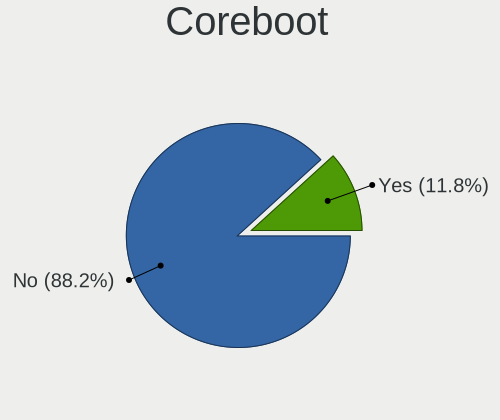

| Used | Notebooks | Percent |
|------|-----------|---------|
| No   | 17        | 89.47%  |
| Yes  | 2         | 10.53%  |

RAM Size
--------

Total RAM memory

| Size in GB | Notebooks | Percent |
|------------|-----------|---------|
| 4.01-8.0   | 11        | 57.89%  |
| 1.01-2.0   | 3         | 15.79%  |
| 3.01-4.0   | 2         | 10.53%  |
| 8.01-16.0  | 2         | 10.53%  |
| 16.01-24.0 | 1         | 5.26%   |

RAM Used
--------

Used RAM memory

| Used GB  | Notebooks | Percent |
|----------|-----------|---------|
| 1.01-2.0 | 14        | 70%     |
| 0.51-1.0 | 2         | 10%     |
| 4.01-8.0 | 1         | 5%      |
| 3.01-4.0 | 1         | 5%      |
| 2.01-3.0 | 1         | 5%      |
| 0.01-0.5 | 1         | 5%      |

Total Drives
------------

Number of drives on board

| Drives | Notebooks | Percent |
|--------|-----------|---------|
| 1      | 12        | 60%     |
| 2      | 5         | 25%     |
| 4      | 1         | 5%      |
| 3      | 1         | 5%      |
| 0      | 1         | 5%      |

Has CD-ROM
----------

Has CD-ROM on board

| Presented | Notebooks | Percent |
|-----------|-----------|---------|
| Yes       | 10        | 52.63%  |
| No        | 9         | 47.37%  |

Has Ethernet
------------

Has Ethernet on board

| Presented | Notebooks | Percent |
|-----------|-----------|---------|
| Yes       | 18        | 94.74%  |
| No        | 1         | 5.26%   |

Has WiFi
--------

Has WiFi module

| Presented | Notebooks | Percent |
|-----------|-----------|---------|
| Yes       | 19        | 100%    |

Has Bluetooth
-------------

Has Bluetooth module

| Presented | Notebooks | Percent |
|-----------|-----------|---------|
| Yes       | 11        | 57.89%  |
| No        | 8         | 42.11%  |

Location
--------

Country
-------

Geographic location (country)

| Country     | Notebooks | Percent |
|-------------|-----------|---------|
| USA         | 7         | 36.84%  |
| Russia      | 2         | 10.53%  |
| France      | 2         | 10.53%  |
| China       | 2         | 10.53%  |
| Brazil      | 2         | 10.53%  |
| Netherlands | 1         | 5.26%   |
| Mexico      | 1         | 5.26%   |
| Indonesia   | 1         | 5.26%   |
| Germany     | 1         | 5.26%   |

City
----

Geographic location (city)

| City              | Notebooks | Percent |
|-------------------|-----------|---------|
| Malvern           | 2         | 10.53%  |
| Wylie             | 1         | 5.26%   |
| Wiesbaden         | 1         | 5.26%   |
| St Petersburg     | 1         | 5.26%   |
| Shenzhen          | 1         | 5.26%   |
| Pinangsia         | 1         | 5.26%   |
| Paris             | 1         | 5.26%   |
| Omaha             | 1         | 5.26%   |
| Moscow            | 1         | 5.26%   |
| Missoula          | 1         | 5.26%   |
| Lincoln           | 1         | 5.26%   |
| Ciudad del Carmen | 1         | 5.26%   |
| Chengdu           | 1         | 5.26%   |
| Cerons            | 1         | 5.26%   |
| Blumenau          | 1         | 5.26%   |
| Amsterdam         | 1         | 5.26%   |
| Americana         | 1         | 5.26%   |
| Acworth           | 1         | 5.26%   |

Drives
------

Drive Vendor
------------

Hard drive vendors

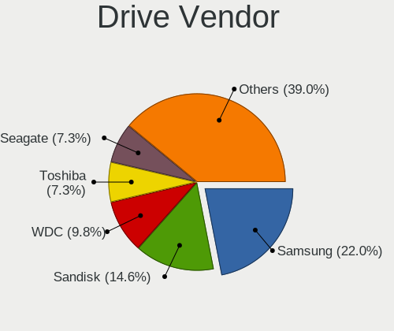

| Vendor              | Notebooks | Drives | Percent |
|---------------------|-----------|--------|---------|
| Samsung Electronics | 4         | 4      | 16.67%  |
| Toshiba             | 3         | 3      | 12.5%   |
| SanDisk             | 3         | 3      | 12.5%   |
| WDC                 | 2         | 2      | 8.33%   |
| Seagate             | 2         | 8      | 8.33%   |
| HGST HTS            | 2         | 4      | 8.33%   |
| Crucial             | 2         | 2      | 8.33%   |
| Transcend           | 1         | 1      | 4.17%   |
| Qumo                | 1         | 1      | 4.17%   |
| Plextor             | 1         | 1      | 4.17%   |
| Hitachi             | 1         | 1      | 4.17%   |
| China               | 1         | 1      | 4.17%   |
| A-DATA Technology   | 1         | 1      | 4.17%   |

Drive Model
-----------

Hard drive models

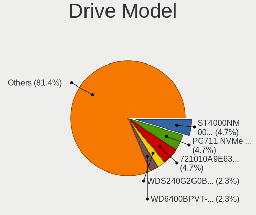

| Model                                | Notebooks | Percent |
|--------------------------------------|-----------|---------|
| Seagate ST4000NM 0033-9ZM170 4TB     | 2         | 7.69%   |
| HGST HTS 721010A9E630 1TB            | 2         | 7.69%   |
| WDC WD6400BPVT-80HXZT3 640GB         | 1         | 3.85%   |
| WDC WD3200BEVT-75ZCT2 320GB          | 1         | 3.85%   |
| Transcend TS256GMTS430S 256GB SSD    | 1         | 3.85%   |
| Toshiba THNSN5256GPUK NVMe 256GB     | 1         | 3.85%   |
| Toshiba MK3275GSX 320GB              | 1         | 3.85%   |
| Toshiba HDWL110 1TB                  | 1         | 3.85%   |
| Seagate ST320LT007-9ZV142 320GB      | 1         | 3.85%   |
| Seagate ST1000LM035-1RK172 1TB       | 1         | 3.85%   |
| Sandisk WD Blue SN570 1TB            | 1         | 3.85%   |
| SanDisk SSD PLUS 240GB               | 1         | 3.85%   |
| SanDisk DF4032  32GB                 | 1         | 3.85%   |
| Samsung MZVLQ512HBLU-00BTW 512GB     | 1         | 3.85%   |
| Samsung MZNLN128HAHQ-00000 128GB SSD | 1         | 3.85%   |
| Samsung HM251JI 250GB                | 1         | 3.85%   |
| Samsung HM160HI 160GB                | 1         | 3.85%   |
| Qumo SSD 120GB                       | 1         | 3.85%   |
| Plextor PX-512M5Pro 512GB SSD        | 1         | 3.85%   |
| Hitachi HTS547575A9E384 752GB        | 1         | 3.85%   |
| Crucial CT250BX100SSD1 250GB         | 1         | 3.85%   |
| Crucial CT240BX200SSD1 240GB         | 1         | 3.85%   |
| China 240GB SSD                      | 1         | 3.85%   |
| A-DATA SU650 120GB SSD               | 1         | 3.85%   |

HDD Vendor
----------

Hard disk drive vendors

| Vendor              | Notebooks | Drives | Percent |
|---------------------|-----------|--------|---------|
| WDC                 | 2         | 2      | 18.18%  |
| Toshiba             | 2         | 2      | 18.18%  |
| Seagate             | 2         | 8      | 18.18%  |
| Samsung Electronics | 2         | 2      | 18.18%  |
| HGST HTS            | 2         | 4      | 18.18%  |
| Hitachi             | 1         | 1      | 9.09%   |

SSD Vendor
----------

Solid state drive vendors

| Vendor              | Notebooks | Drives | Percent |
|---------------------|-----------|--------|---------|
| Crucial             | 2         | 2      | 22.22%  |
| Transcend           | 1         | 1      | 11.11%  |
| SanDisk             | 1         | 1      | 11.11%  |
| Samsung Electronics | 1         | 1      | 11.11%  |
| Qumo                | 1         | 1      | 11.11%  |
| Plextor             | 1         | 1      | 11.11%  |
| China               | 1         | 1      | 11.11%  |
| A-DATA Technology   | 1         | 1      | 11.11%  |

Drive Kind
----------

HDD or SSD

| Kind | Notebooks | Drives | Percent |
|------|-----------|--------|---------|
| SSD  | 8         | 9      | 42.11%  |
| HDD  | 8         | 19     | 42.11%  |
| NVMe | 2         | 3      | 10.53%  |
| MMC  | 1         | 1      | 5.26%   |

Drive Connector
---------------

SATA, SAS, NVMe, etc.

| Type | Notebooks | Drives | Percent |
|------|-----------|--------|---------|
| SATA | 15        | 20     | 75%     |
| SAS  | 2         | 8      | 10%     |
| NVMe | 2         | 3      | 10%     |
| MMC  | 1         | 1      | 5%      |

Drive Size
----------

Size of hard drive

| Size in TB | Notebooks | Drives | Percent |
|------------|-----------|--------|---------|
| 0.01-0.5   | 12        | 15     | 63.16%  |
| 0.51-1.0   | 5         | 9      | 26.32%  |
| 3.01-4.0   | 2         | 4      | 10.53%  |

Space Total
-----------

Amount of disk space available on the file system

| Size in GB     | Notebooks | Percent |
|----------------|-----------|---------|
| 101-250        | 10        | 52.63%  |
| More than 3000 | 2         | 10.53%  |
| 21-50          | 2         | 10.53%  |
| 501-1000       | 2         | 10.53%  |
| 251-500        | 1         | 5.26%   |
| 1-20           | 1         | 5.26%   |
| 51-100         | 1         | 5.26%   |

Space Used
----------

Amount of used disk space

| Used GB        | Notebooks | Percent |
|----------------|-----------|---------|
| 1-20           | 8         | 40%     |
| 21-50          | 4         | 20%     |
| 101-250        | 3         | 15%     |
| 2001-3000      | 2         | 10%     |
| 51-100         | 2         | 10%     |
| More than 3000 | 1         | 5%      |

Malfunc. Drives
---------------

Drive models with a malfunction

| Model                           | Notebooks | Drives | Percent |
|---------------------------------|-----------|--------|---------|
| HGST HTS 721010A9E630 1TB       | 2         | 4      | 33.33%  |
| WDC WD3200BEVT-75ZCT2 320GB     | 1         | 1      | 16.67%  |
| Toshiba MK3275GSX 320GB         | 1         | 1      | 16.67%  |
| Seagate ST320LT007-9ZV142 320GB | 1         | 3      | 16.67%  |
| Crucial CT240BX200SSD1 240GB    | 1         | 1      | 16.67%  |

Malfunc. Drive Vendor
---------------------

Vendors of faulty drives

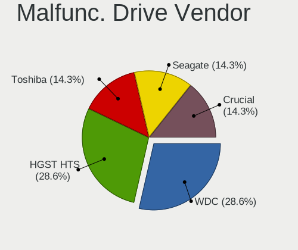

| Vendor   | Notebooks | Drives | Percent |
|----------|-----------|--------|---------|
| HGST HTS | 2         | 4      | 33.33%  |
| WDC      | 1         | 1      | 16.67%  |
| Toshiba  | 1         | 1      | 16.67%  |
| Seagate  | 1         | 3      | 16.67%  |
| Crucial  | 1         | 1      | 16.67%  |

Malfunc. HDD Vendor
-------------------

Vendors of faulty HDD drives

| Vendor   | Notebooks | Drives | Percent |
|----------|-----------|--------|---------|
| HGST HTS | 2         | 4      | 40%     |
| WDC      | 1         | 1      | 20%     |
| Toshiba  | 1         | 1      | 20%     |
| Seagate  | 1         | 3      | 20%     |

Malfunc. Drive Kind
-------------------

Kinds of faulty drives

| Kind | Notebooks | Drives | Percent |
|------|-----------|--------|---------|
| HDD  | 4         | 9      | 80%     |
| SSD  | 1         | 1      | 20%     |

Failed Drives
-------------

Failed drive models

Zero info for selected period =(

Failed Drive Vendor
-------------------

Failed drive vendors

Zero info for selected period =(

Drive Status
------------

Number of failed and malfunc. drives

| Status   | Notebooks | Drives | Percent |
|----------|-----------|--------|---------|
| Works    | 10        | 17     | 50%     |
| Detected | 5         | 5      | 25%     |
| Malfunc  | 5         | 10     | 25%     |

Storage controller
------------------

Storage Vendor
--------------

Storage controller vendors

| Vendor                       | Notebooks | Percent |
|------------------------------|-----------|---------|
| Intel                        | 15        | 75%     |
| AMD                          | 2         | 10%     |
| Toshiba America Info Systems | 1         | 5%      |
| SanDisk                      | 1         | 5%      |
| Samsung Electronics          | 1         | 5%      |

Storage Model
-------------

Storage controller models

| Model                                                                        | Notebooks | Percent |
|------------------------------------------------------------------------------|-----------|---------|
| Intel 82801IBM/IEM (ICH9M/ICH9M-E) 4 port SATA Controller [AHCI mode]        | 3         | 13.64%  |
| Intel 6 Series/C200 Series Chipset Family 6 port Mobile SATA AHCI Controller | 3         | 13.64%  |
| Intel Sunrise Point-LP SATA Controller [AHCI mode]                           | 2         | 9.09%   |
| Intel 7 Series Chipset Family 6-port SATA Controller [AHCI mode]             | 2         | 9.09%   |
| AMD FCH SATA Controller [AHCI mode]                                          | 2         | 9.09%   |
| Toshiba America Info Systems XG4 NVMe SSD Controller                         | 1         | 4.55%   |
| SanDisk WD Blue SN570 NVMe SSD 1TB                                           | 1         | 4.55%   |
| Samsung NVMe SSD Controller 980                                              | 1         | 4.55%   |
| Intel Volume Management Device NVMe RAID Controller                          | 1         | 4.55%   |
| Intel Celeron/Pentium Silver Processor SATA Controller                       | 1         | 4.55%   |
| Intel Atom Processor E3800 Series SATA AHCI Controller                       | 1         | 4.55%   |
| Intel 82801HM/HEM (ICH8M/ICH8M-E) SATA Controller [AHCI mode]                | 1         | 4.55%   |
| Intel 82801HM/HEM (ICH8M/ICH8M-E) IDE Controller                             | 1         | 4.55%   |
| Intel 82801GBM/GHM (ICH7-M Family) SATA Controller [IDE mode]                | 1         | 4.55%   |
| Intel 500 Series Chipset Family SATA AHCI Controller                         | 1         | 4.55%   |

Storage Kind
------------

Kind of storage controller (IDE, SATA, NVMe, SAS, ...)

| Kind | Notebooks | Percent |
|------|-----------|---------|
| SATA | 16        | 76.19%  |
| NVMe | 2         | 9.52%   |
| IDE  | 2         | 9.52%   |
| RAID | 1         | 4.76%   |

Processor
---------

CPU Vendor
----------

Processor vendors

| Vendor | Notebooks | Percent |
|--------|-----------|---------|
| Intel  | 17        | 89.47%  |
| AMD    | 2         | 10.53%  |

CPU Model
---------

Processor models

| Model                                    | Notebooks | Percent |
|------------------------------------------|-----------|---------|
| Intel Core i5-2410M CPU @ 2.30GHz        | 2         | 10.53%  |
| Intel Pentium Dual CPU T3400 @ 2.16GHz   | 1         | 5.26%   |
| Intel Pentium CPU N3530 @ 2.16GHz        | 1         | 5.26%   |
| Intel Core i5-8250U CPU @ 1.60GHz        | 1         | 5.26%   |
| Intel Core i5-7200U CPU @ 2.50GHz        | 1         | 5.26%   |
| Intel Core i5-3320M CPU @ 2.60GHz        | 1         | 5.26%   |
| Intel Core i5-3210M CPU @ 2.50GHz        | 1         | 5.26%   |
| Intel Core i5-2430M CPU @ 2.40GHz        | 1         | 5.26%   |
| Intel Core i3-6006U CPU @ 2.00GHz        | 1         | 5.26%   |
| Intel Core 2 Duo CPU T6600 @ 2.20GHz     | 1         | 5.26%   |
| Intel Core 2 CPU P8700 @ 2.53GHz         | 1         | 5.26%   |
| Intel Core 2 CPU P8600 @ 2.40GHz         | 1         | 5.26%   |
| Intel Celeron N4100 CPU @ 1.10GHz        | 1         | 5.26%   |
| Intel Celeron CPU N3060 @ 1.60GHz        | 1         | 5.26%   |
| Intel Atom CPU N270 @ 1.60GHz            | 1         | 5.26%   |
| Intel 11th Gen Core i5-11400H @ 2.70GHz  | 1         | 5.26%   |
| AMD E1-1200 APU with Radeon HD Graphics  | 1         | 5.26%   |
| AMD A8-5550M APU with Radeon HD Graphics | 1         | 5.26%   |

CPU Model Family
----------------

Processor model prefix

| Model              | Notebooks | Percent |
|--------------------|-----------|---------|
| Intel Core i5      | 7         | 36.84%  |
| Intel Core 2       | 2         | 10.53%  |
| Intel Celeron      | 2         | 10.53%  |
| Other              | 1         | 5.26%   |
| Intel Pentium Dual | 1         | 5.26%   |
| Intel Pentium      | 1         | 5.26%   |
| Intel Core i3      | 1         | 5.26%   |
| Intel Core 2 Duo   | 1         | 5.26%   |
| Intel Atom         | 1         | 5.26%   |
| AMD E1             | 1         | 5.26%   |
| AMD A8             | 1         | 5.26%   |

CPU Cores
---------

Number of processor cores

| Number | Notebooks | Percent |
|--------|-----------|---------|
| 2      | 14        | 73.68%  |
| 4      | 3         | 15.79%  |
| 6      | 1         | 5.26%   |
| 1      | 1         | 5.26%   |

CPU Sockets
-----------

Number of sockets

| Number | Notebooks | Percent |
|--------|-----------|---------|
| 1      | 19        | 100%    |

CPU Threads
-----------

Threads per core (Hyper-Threading)

| Number | Notebooks | Percent |
|--------|-----------|---------|
| 2      | 11        | 57.89%  |
| 1      | 8         | 42.11%  |

CPU Op-Modes
------------

CPU Operation Modes (32-bit, 64-bit)

| Op mode        | Notebooks | Percent |
|----------------|-----------|---------|
| 32-bit, 64-bit | 18        | 94.74%  |
| 32-bit         | 1         | 5.26%   |

CPU Microcode
-------------

Microcode number

| Number     | Notebooks | Percent |
|------------|-----------|---------|
| 0x206a7    | 3         | 15.79%  |
| 0x1067a    | 3         | 15.79%  |
| Unknown    | 2         | 10.53%  |
| 0x806ea    | 1         | 5.26%   |
| 0x806e9    | 1         | 5.26%   |
| 0x806d1    | 1         | 5.26%   |
| 0x706a1    | 1         | 5.26%   |
| 0x406e3    | 1         | 5.26%   |
| 0x406c4    | 1         | 5.26%   |
| 0x306a9    | 1         | 5.26%   |
| 0x30678    | 1         | 5.26%   |
| 0x106c2    | 1         | 5.26%   |
| 0x06001119 | 1         | 5.26%   |
| 0x0500010d | 1         | 5.26%   |

CPU Microarch
-------------

Microarchitecture

| Name          | Notebooks | Percent |
|---------------|-----------|---------|
| SandyBridge   | 3         | 15.79%  |
| Penryn        | 3         | 15.79%  |
| Silvermont    | 2         | 10.53%  |
| KabyLake      | 2         | 10.53%  |
| IvyBridge     | 2         | 10.53%  |
| Skylake       | 1         | 5.26%   |
| Piledriver    | 1         | 5.26%   |
| Icelake       | 1         | 5.26%   |
| Goldmont plus | 1         | 5.26%   |
| Core          | 1         | 5.26%   |
| Bonnell       | 1         | 5.26%   |
| Bobcat        | 1         | 5.26%   |

Graphics
--------

GPU Vendor
----------

Vendors of graphics cards

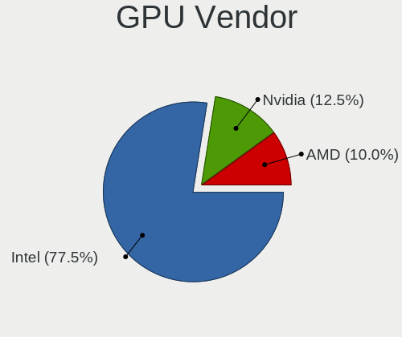

| Vendor | Notebooks | Percent |
|--------|-----------|---------|
| Intel  | 17        | 80.95%  |
| Nvidia | 2         | 9.52%   |
| AMD    | 2         | 9.52%   |

GPU Model
---------

Graphics card models

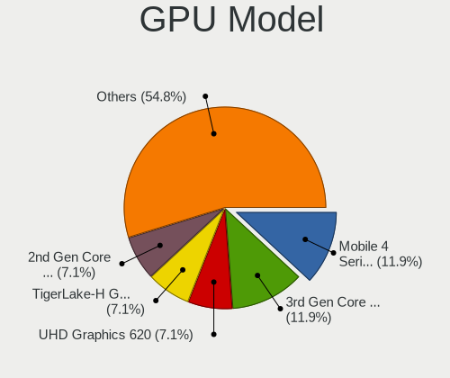

| Model                                                                                    | Notebooks | Percent |
|------------------------------------------------------------------------------------------|-----------|---------|
| Intel Mobile 4 Series Chipset Integrated Graphics Controller                             | 3         | 13.04%  |
| Intel 2nd Generation Core Processor Family Integrated Graphics Controller                | 3         | 13.04%  |
| Intel 3rd Gen Core processor Graphics Controller                                         | 2         | 8.7%    |
| Nvidia GM108M [GeForce MX110]                                                            | 1         | 4.35%   |
| Nvidia GA106M [GeForce RTX 3060 Mobile / Max-Q]                                          | 1         | 4.35%   |
| Intel UHD Graphics 620                                                                   | 1         | 4.35%   |
| Intel TigerLake-H GT1 [UHD Graphics]                                                     | 1         | 4.35%   |
| Intel Skylake GT2 [HD Graphics 520]                                                      | 1         | 4.35%   |
| Intel Mobile GM965/GL960 Integrated Graphics Controller (secondary)                      | 1         | 4.35%   |
| Intel Mobile GM965/GL960 Integrated Graphics Controller (primary)                        | 1         | 4.35%   |
| Intel Mobile 945GSE Express Integrated Graphics Controller                               | 1         | 4.35%   |
| Intel Mobile 945GM/GMS/GME, 943/940GML Express Integrated Graphics Controller            | 1         | 4.35%   |
| Intel HD Graphics 620                                                                    | 1         | 4.35%   |
| Intel GeminiLake [UHD Graphics 600]                                                      | 1         | 4.35%   |
| Intel Atom/Celeron/Pentium Processor x5-E8000/J3xxx/N3xxx Integrated Graphics Controller | 1         | 4.35%   |
| Intel Atom Processor Z36xxx/Z37xxx Series Graphics & Display                             | 1         | 4.35%   |
| AMD Wrestler [Radeon HD 7310]                                                            | 1         | 4.35%   |
| AMD Richland [Radeon HD 8550G]                                                           | 1         | 4.35%   |

GPU Combo
---------

Combinations of graphics cards

| Name           | Notebooks | Percent |
|----------------|-----------|---------|
| 1 x Intel      | 15        | 78.95%  |
| Intel + Nvidia | 2         | 10.53%  |
| 1 x AMD        | 2         | 10.53%  |

GPU Driver
----------

Free vs proprietary

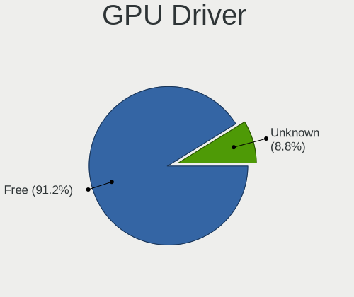

| Driver  | Notebooks | Percent |
|---------|-----------|---------|
| Free    | 18        | 94.74%  |
| Unknown | 1         | 5.26%   |

GPU Memory
----------

Total video memory

| Size in GB | Notebooks | Percent |
|------------|-----------|---------|
| Unknown    | 14        | 73.68%  |
| 1.01-2.0   | 3         | 15.79%  |
| 5.01-6.0   | 1         | 5.26%   |
| 0.01-0.5   | 1         | 5.26%   |

Monitor
-------

Monitor Vendor
--------------

Monitor vendors

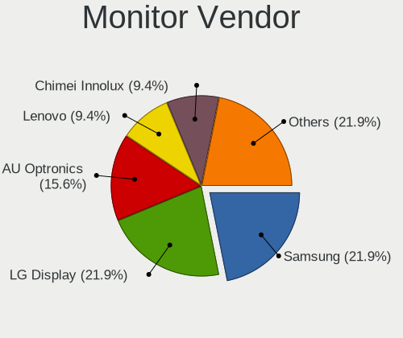

| Vendor                  | Notebooks | Percent |
|-------------------------|-----------|---------|
| LG Display              | 4         | 23.53%  |
| AU Optronics            | 3         | 17.65%  |
| Samsung Electronics     | 2         | 11.76%  |
| Lenovo                  | 2         | 11.76%  |
| BOE                     | 2         | 11.76%  |
| Sharp                   | 1         | 5.88%   |
| CPT                     | 1         | 5.88%   |
| Chimei Innolux          | 1         | 5.88%   |
| Chi Mei Optoelectronics | 1         | 5.88%   |

Monitor Model
-------------

Monitor models

| Model                                                                    | Notebooks | Percent |
|--------------------------------------------------------------------------|-----------|---------|
| LG Display LCD Monitor LGD02E2 1600x900 310x174mm 14.0-inch              | 2         | 11.76%  |
| Sharp LCD Monitor SHP1449 1920x1080 294x165mm 13.3-inch                  | 1         | 5.88%   |
| Samsung Electronics LCD Monitor SEC5441 1280x800 331x207mm 15.4-inch     | 1         | 5.88%   |
| Samsung Electronics LCD Monitor SEC3052 1024x600 223x125mm 10.1-inch     | 1         | 5.88%   |
| LG Display LCD Monitor LGD033C 1366x768 309x174mm 14.0-inch              | 1         | 5.88%   |
| LG Display LCD Monitor LGD0335 1366x768 310x174mm 14.0-inch              | 1         | 5.88%   |
| Lenovo LCD Monitor LEN4011 1280x800 261x163mm 12.1-inch                  | 1         | 5.88%   |
| Lenovo LCD Monitor LEN4010 1280x800 261x163mm 12.1-inch                  | 1         | 5.88%   |
| CPT LCD Monitor CPT1401 1280x800 331x207mm 15.4-inch                     | 1         | 5.88%   |
| Chimei Innolux LCD Monitor CMN1139 1366x768 256x144mm 11.6-inch          | 1         | 5.88%   |
| Chi Mei Optoelectronics LCD Monitor CMO1590 1366x768 344x194mm 15.5-inch | 1         | 5.88%   |
| BOE LCD Monitor BOE07C5 1920x1080 344x194mm 15.5-inch                    | 1         | 5.88%   |
| BOE LCD Monitor BOE0671 1366x768 344x194mm 15.5-inch                     | 1         | 5.88%   |
| AU Optronics LCD Monitor AUO409D 1920x1080 382x215mm 17.3-inch           | 1         | 5.88%   |
| AU Optronics LCD Monitor AUO26EC 1366x768 344x193mm 15.5-inch            | 1         | 5.88%   |
| AU Optronics LCD Monitor AUO215C 1366x768 256x144mm 11.6-inch            | 1         | 5.88%   |

Monitor Resolution
------------------

Monitor screen resolution

| Resolution      | Notebooks | Percent |
|-----------------|-----------|---------|
| 1366x768 (WXGA) | 9         | 52.94%  |
| 1920x1080 (FHD) | 3         | 17.65%  |
| 1280x800 (WXGA) | 3         | 17.65%  |
| 1600x900 (HD+)  | 2         | 11.76%  |

Monitor Diagonal
----------------

Diagonal size in inches

| Inches | Notebooks | Percent |
|--------|-----------|---------|
| 15     | 7         | 41.18%  |
| 14     | 4         | 23.53%  |
| 12     | 2         | 11.76%  |
| 11     | 2         | 11.76%  |
| 17     | 1         | 5.88%   |
| 13     | 1         | 5.88%   |

Monitor Width
-------------

Physical width

| Width in mm | Notebooks | Percent |
|-------------|-----------|---------|
| 301-350     | 10        | 58.82%  |
| 201-300     | 5         | 29.41%  |
| 351-400     | 2         | 11.76%  |

Aspect Ratio
------------

Proportional relationship between the width and the height

| Ratio | Notebooks | Percent |
|-------|-----------|---------|
| 16/9  | 14        | 82.35%  |
| 16/10 | 2         | 11.76%  |
| 3/2   | 1         | 5.88%   |

Monitor Area
------------

Area in inch²

| Area in inch² | Notebooks | Percent |
|----------------|-----------|---------|
| 101-110        | 7         | 41.18%  |
| 81-90          | 4         | 23.53%  |
| 61-70          | 2         | 11.76%  |
| 51-60          | 2         | 11.76%  |
| 71-80          | 1         | 5.88%   |
| 121-130        | 1         | 5.88%   |

Pixel Density
-------------

Pixels per inch

| Density | Notebooks | Percent |
|---------|-----------|---------|
| 121-160 | 8         | 47.06%  |
| 101-120 | 6         | 35.29%  |
| 51-100  | 2         | 11.76%  |
| 161-240 | 1         | 5.88%   |

Multiple Monitors
-----------------

Total monitors connected

| Total | Notebooks | Percent |
|-------|-----------|---------|
| 1     | 18        | 94.74%  |
| 0     | 1         | 5.26%   |

Network
-------

Net Controller Vendor
---------------------

Controller vendors

| Vendor                          | Notebooks | Percent |
|---------------------------------|-----------|---------|
| Qualcomm Atheros                | 10        | 27.03%  |
| Intel                           | 10        | 27.03%  |
| Realtek Semiconductor           | 9         | 24.32%  |
| Qualcomm Atheros Communications | 4         | 10.81%  |
| Marvell Technology Group        | 2         | 5.41%   |
| Samsung Electronics             | 1         | 2.7%    |
| Microsoft                       | 1         | 2.7%    |

Net Controller Model
--------------------

Controller models

| Model                                                             | Notebooks | Percent |
|-------------------------------------------------------------------|-----------|---------|
| Realtek RTL8111/8168/8411 PCI Express Gigabit Ethernet Controller | 4         | 9.3%    |
| Qualcomm Atheros AR9271 802.11n                                   | 4         | 9.3%    |
| Intel 82579LM Gigabit Network Connection (Lewisville)             | 3         | 6.98%   |
| Realtek RTL810xE PCI Express Fast Ethernet controller             | 2         | 4.65%   |
| Qualcomm Atheros AR93xx Wireless Network Adapter                  | 2         | 4.65%   |
| Intel Centrino Wireless-N 1000 [Condor Peak]                      | 2         | 4.65%   |
| Samsung HSPA Modem                                                | 1         | 2.33%   |
| Realtek RTL8821CE 802.11ac PCIe Wireless Network Adapter          | 1         | 2.33%   |
| Realtek RTL8723AE PCIe Wireless Network Adapter                   | 1         | 2.33%   |
| Realtek RTL8187B Wireless 802.11g 54Mbps Network Adapter          | 1         | 2.33%   |
| Realtek Killer E2600 Gigabit Ethernet Controller                  | 1         | 2.33%   |
| Qualcomm Atheros QCA9565 / AR9565 Wireless Network Adapter        | 1         | 2.33%   |
| Qualcomm Atheros QCA9377 802.11ac Wireless Network Adapter        | 1         | 2.33%   |
| Qualcomm Atheros QCA8172 Fast Ethernet                            | 1         | 2.33%   |
| Qualcomm Atheros QCA6174 802.11ac Wireless Network Adapter        | 1         | 2.33%   |
| Qualcomm Atheros AR9485 Wireless Network Adapter                  | 1         | 2.33%   |
| Qualcomm Atheros AR9462 Wireless Network Adapter                  | 1         | 2.33%   |
| Qualcomm Atheros AR9285 Wireless Network Adapter (PCI-Express)    | 1         | 2.33%   |
| Qualcomm Atheros AR8152 v2.0 Fast Ethernet                        | 1         | 2.33%   |
| Qualcomm Atheros AR8151 v2.0 Gigabit Ethernet                     | 1         | 2.33%   |
| Microsoft RTL8153 GigE [Surface Ethernet Adapter]                 | 1         | 2.33%   |
| Marvell Group 88E8055 PCI-E Gigabit Ethernet Controller           | 1         | 2.33%   |
| Marvell Group 88E8040 PCI-E Fast Ethernet Controller              | 1         | 2.33%   |
| Intel Wireless 7265                                               | 1         | 2.33%   |
| Intel Wireless 3165                                               | 1         | 2.33%   |
| Intel WiFi Link 5100                                              | 1         | 2.33%   |
| Intel Tiger Lake PCH CNVi WiFi                                    | 1         | 2.33%   |
| Intel Centrino Wireless-N 6150                                    | 1         | 2.33%   |
| Intel Centrino Wireless-N + WiMAX 6150                            | 1         | 2.33%   |
| Intel Centrino Advanced-N 6205 [Taylor Peak]                      | 1         | 2.33%   |
| Intel 82567LM Gigabit Network Connection                          | 1         | 2.33%   |
| Intel 82567LF Gigabit Network Connection                          | 1         | 2.33%   |

Wireless Vendor
---------------

Wireless vendors

| Vendor                          | Notebooks | Percent |
|---------------------------------|-----------|---------|
| Qualcomm Atheros                | 8         | 34.78%  |
| Intel                           | 8         | 34.78%  |
| Qualcomm Atheros Communications | 4         | 17.39%  |
| Realtek Semiconductor           | 3         | 13.04%  |

Wireless Model
--------------

Wireless models

| Model                                                          | Notebooks | Percent |
|----------------------------------------------------------------|-----------|---------|
| Qualcomm Atheros AR9271 802.11n                                | 4         | 16.67%  |
| Qualcomm Atheros AR93xx Wireless Network Adapter               | 2         | 8.33%   |
| Intel Centrino Wireless-N 1000 [Condor Peak]                   | 2         | 8.33%   |
| Realtek RTL8821CE 802.11ac PCIe Wireless Network Adapter       | 1         | 4.17%   |
| Realtek RTL8723AE PCIe Wireless Network Adapter                | 1         | 4.17%   |
| Realtek RTL8187B Wireless 802.11g 54Mbps Network Adapter       | 1         | 4.17%   |
| Qualcomm Atheros QCA9565 / AR9565 Wireless Network Adapter     | 1         | 4.17%   |
| Qualcomm Atheros QCA9377 802.11ac Wireless Network Adapter     | 1         | 4.17%   |
| Qualcomm Atheros QCA6174 802.11ac Wireless Network Adapter     | 1         | 4.17%   |
| Qualcomm Atheros AR9485 Wireless Network Adapter               | 1         | 4.17%   |
| Qualcomm Atheros AR9462 Wireless Network Adapter               | 1         | 4.17%   |
| Qualcomm Atheros AR9285 Wireless Network Adapter (PCI-Express) | 1         | 4.17%   |
| Intel Wireless 7265                                            | 1         | 4.17%   |
| Intel Wireless 3165                                            | 1         | 4.17%   |
| Intel WiFi Link 5100                                           | 1         | 4.17%   |
| Intel Tiger Lake PCH CNVi WiFi                                 | 1         | 4.17%   |
| Intel Centrino Wireless-N 6150                                 | 1         | 4.17%   |
| Intel Centrino Wireless-N + WiMAX 6150                         | 1         | 4.17%   |
| Intel Centrino Advanced-N 6205 [Taylor Peak]                   | 1         | 4.17%   |

Ethernet Vendor
---------------

Ethernet vendors

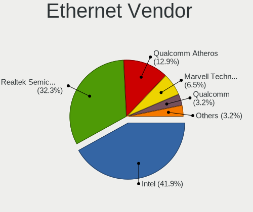

| Vendor                   | Notebooks | Percent |
|--------------------------|-----------|---------|
| Realtek Semiconductor    | 7         | 38.89%  |
| Intel                    | 5         | 27.78%  |
| Qualcomm Atheros         | 3         | 16.67%  |
| Marvell Technology Group | 2         | 11.11%  |
| Microsoft                | 1         | 5.56%   |

Ethernet Model
--------------

Ethernet models

| Model                                                             | Notebooks | Percent |
|-------------------------------------------------------------------|-----------|---------|
| Realtek RTL8111/8168/8411 PCI Express Gigabit Ethernet Controller | 4         | 22.22%  |
| Intel 82579LM Gigabit Network Connection (Lewisville)             | 3         | 16.67%  |
| Realtek RTL810xE PCI Express Fast Ethernet controller             | 2         | 11.11%  |
| Realtek Killer E2600 Gigabit Ethernet Controller                  | 1         | 5.56%   |
| Qualcomm Atheros QCA8172 Fast Ethernet                            | 1         | 5.56%   |
| Qualcomm Atheros AR8152 v2.0 Fast Ethernet                        | 1         | 5.56%   |
| Qualcomm Atheros AR8151 v2.0 Gigabit Ethernet                     | 1         | 5.56%   |
| Microsoft RTL8153 GigE [Surface Ethernet Adapter]                 | 1         | 5.56%   |
| Marvell Group 88E8055 PCI-E Gigabit Ethernet Controller           | 1         | 5.56%   |
| Marvell Group 88E8040 PCI-E Fast Ethernet Controller              | 1         | 5.56%   |
| Intel 82567LM Gigabit Network Connection                          | 1         | 5.56%   |
| Intel 82567LF Gigabit Network Connection                          | 1         | 5.56%   |

Net Controller Kind
-------------------

Ethernet, WiFi or modem

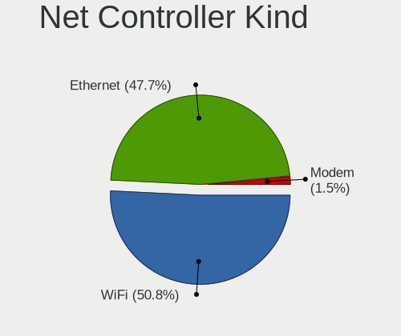

| Kind     | Notebooks | Percent |
|----------|-----------|---------|
| WiFi     | 19        | 50%     |
| Ethernet | 18        | 47.37%  |
| Modem    | 1         | 2.63%   |

Used Controller
---------------

Currently used network controller

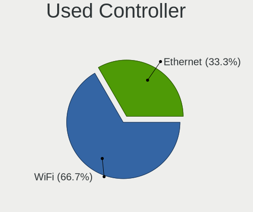

| Kind     | Notebooks | Percent |
|----------|-----------|---------|
| WiFi     | 11        | 57.89%  |
| Ethernet | 8         | 42.11%  |

NICs
----

Total network controllers on board

| Total | Notebooks | Percent |
|-------|-----------|---------|
| 2     | 16        | 84.21%  |
| 1     | 3         | 15.79%  |

IPv6
----

IPv6 vs IPv4

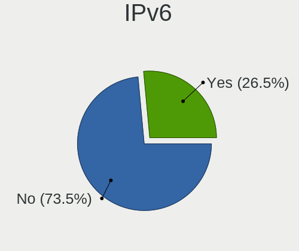

| Used | Notebooks | Percent |
|------|-----------|---------|
| No   | 15        | 78.95%  |
| Yes  | 4         | 21.05%  |

Bluetooth
---------

Bluetooth Vendor
----------------

Controller vendors

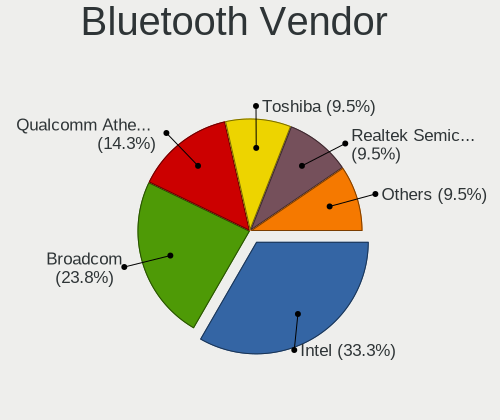

| Vendor                          | Notebooks | Percent |
|---------------------------------|-----------|---------|
| Intel                           | 3         | 27.27%  |
| Broadcom                        | 3         | 27.27%  |
| Qualcomm Atheros Communications | 2         | 18.18%  |
| Toshiba                         | 1         | 9.09%   |
| Realtek Semiconductor           | 1         | 9.09%   |
| Foxconn / Hon Hai               | 1         | 9.09%   |

Bluetooth Model
---------------

Controller models

| Model                                              | Notebooks | Percent |
|----------------------------------------------------|-----------|---------|
| Qualcomm Atheros  Bluetooth Device                 | 2         | 18.18%  |
| Intel Bluetooth wireless interface                 | 2         | 18.18%  |
| Toshiba RT Bluetooth Radio                         | 1         | 9.09%   |
| Realtek Bluetooth Radio                            | 1         | 9.09%   |
| Intel AX201 Bluetooth                              | 1         | 9.09%   |
| Foxconn / Hon Hai Bluetooth Device                 | 1         | 9.09%   |
| Broadcom BCM20702A0 Bluetooth 4.0                  | 1         | 9.09%   |
| Broadcom BCM20702 Bluetooth 4.0 [ThinkPad]         | 1         | 9.09%   |
| Broadcom BCM2045B (BDC-2.1) [Bluetooth Controller] | 1         | 9.09%   |

Sound
-----

Sound Vendor
------------

Sound card vendors

| Vendor | Notebooks | Percent |
|--------|-----------|---------|
| Intel  | 17        | 85%     |
| AMD    | 2         | 10%     |
| Nvidia | 1         | 5%      |

Sound Model
-----------

Sound card models

| Model                                                                                             | Notebooks | Percent |
|---------------------------------------------------------------------------------------------------|-----------|---------|
| Intel Sunrise Point-LP HD Audio                                                                   | 3         | 14.29%  |
| Intel 82801I (ICH9 Family) HD Audio Controller                                                    | 3         | 14.29%  |
| Intel 6 Series/C200 Series Chipset Family High Definition Audio Controller                        | 3         | 14.29%  |
| Intel 7 Series/C216 Chipset Family High Definition Audio Controller                               | 2         | 9.52%   |
| AMD FCH Azalia Controller                                                                         | 2         | 9.52%   |
| Nvidia GA106 High Definition Audio Controller                                                     | 1         | 4.76%   |
| Intel Tiger Lake-H HD Audio Controller                                                            | 1         | 4.76%   |
| Intel NM10/ICH7 Family High Definition Audio Controller                                           | 1         | 4.76%   |
| Intel Celeron/Pentium Silver Processor High Definition Audio                                      | 1         | 4.76%   |
| Intel Atom/Celeron/Pentium Processor x5-E8000/J3xxx/N3xxx Series High Definition Audio Controller | 1         | 4.76%   |
| Intel Atom Processor Z36xxx/Z37xxx Series High Definition Audio Controller                        | 1         | 4.76%   |
| Intel 82801H (ICH8 Family) HD Audio Controller                                                    | 1         | 4.76%   |
| AMD Trinity HDMI Audio Controller                                                                 | 1         | 4.76%   |

Memory
------

Memory Vendor
-------------

Memory module vendors

| Vendor              | Notebooks | Percent |
|---------------------|-----------|---------|
| Samsung Electronics | 4         | 25%     |
| SK hynix            | 3         | 18.75%  |
| Micron Technology   | 3         | 18.75%  |
| Kingston            | 2         | 12.5%   |
| Ramaxel Technology  | 1         | 6.25%   |
| Qimonda             | 1         | 6.25%   |
| Crucial             | 1         | 6.25%   |
| A-DATA Technology   | 1         | 6.25%   |

Memory Model
------------

Memory module models

| Model                                                             | Notebooks | Percent |
|-------------------------------------------------------------------|-----------|---------|
| SK hynix RAM HYMP125S64CP8-S6 2GB SODIMM DDR2 800MT/s             | 1         | 6.25%   |
| SK hynix RAM HMT41GS6AFR8A-H9 8192MB SODIMM DDR3 1333MT/s         | 1         | 6.25%   |
| SK hynix RAM HMA851S6CJR6N-UH 4GB SODIMM DDR4 2400MT/s            | 1         | 6.25%   |
| Samsung RAM Module 2GB Row Of Chips DDR3 1600MT/s                 | 1         | 6.25%   |
| Samsung RAM M471B5773CHS-CK0 2GB SODIMM DDR3 1600MT/s             | 1         | 6.25%   |
| Samsung RAM M471B5273DH0-CH9 4GB SODIMM DDR3 1334MT/s             | 1         | 6.25%   |
| Samsung RAM M471A1K43EB1-CWE 8GB SODIMM DDR4 3200MT/s             | 1         | 6.25%   |
| Ramaxel RAM RMT3170ME68F9F1600 4GB SODIMM DDR3 1600MT/s           | 1         | 6.25%   |
| Qimonda RAM 64T512022EDL2.5A 4096MB SODIMM DDR 800MT/s            | 1         | 6.25%   |
| Micron RAM MT52L512M32D2PF-10 4096MB Row Of Chips LPDDR3 1867MT/s | 1         | 6.25%   |
| Micron RAM H6451U64F7066G 4096MB SODIMM DDR3 1067MT/s             | 1         | 6.25%   |
| Micron RAM 4ATF51264HZ-2G3H1R 4096MB SODIMM DDR4 2400MT/s         | 1         | 6.25%   |
| Kingston RAM ASU1600S11-4G-EDEG 4GB SODIMM DDR3 1600MT/s          | 1         | 6.25%   |
| Kingston RAM 9905624-044.A00G 8GB SODIMM DDR4 2400MT/s            | 1         | 6.25%   |
| Crucial RAM CT51264BF160B.C16F 4GB SODIMM DDR3 1600MT/s           | 1         | 6.25%   |
| A-DATA RAM Module 4096MB SODIMM DDR4 2400MT/s                     | 1         | 6.25%   |

Memory Kind
-----------

Memory module kinds

| Kind   | Notebooks | Percent |
|--------|-----------|---------|
| DDR3   | 7         | 53.85%  |
| DDR4   | 3         | 23.08%  |
| LPDDR3 | 1         | 7.69%   |
| DDR2   | 1         | 7.69%   |
| DDR    | 1         | 7.69%   |

Memory Form Factor
------------------

Physical design of the memory module

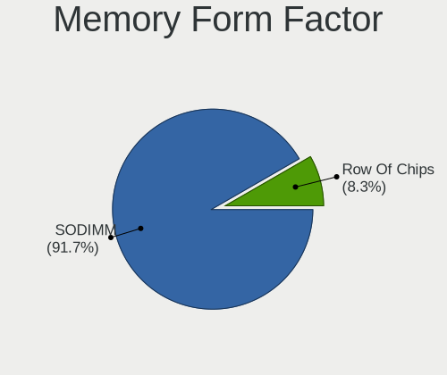

| Name         | Notebooks | Percent |
|--------------|-----------|---------|
| SODIMM       | 10        | 83.33%  |
| Row Of Chips | 2         | 16.67%  |

Memory Size
-----------

Memory module size

| Size | Notebooks | Percent |
|------|-----------|---------|
| 4096 | 8         | 57.14%  |
| 8192 | 3         | 21.43%  |
| 2048 | 3         | 21.43%  |

Memory Speed
------------

Memory module speed

| Speed | Notebooks | Percent |
|-------|-----------|---------|
| 1600  | 5         | 35.71%  |
| 2400  | 2         | 14.29%  |
| 3200  | 1         | 7.14%   |
| 1867  | 1         | 7.14%   |
| 1334  | 1         | 7.14%   |
| 1333  | 1         | 7.14%   |
| 1067  | 1         | 7.14%   |
| 975   | 1         | 7.14%   |
| 800   | 1         | 7.14%   |

Printers & scanners
-------------------

Printer Vendor
--------------

Printer device vendors

Zero info for selected period =(

Printer Model
-------------

Printer device models

Zero info for selected period =(

Scanner Vendor
--------------

Scanner device vendors

Zero info for selected period =(

Scanner Model
-------------

Scanner device models

Zero info for selected period =(

Camera
------

Camera Vendor
-------------

Camera device vendors

| Vendor                                 | Notebooks | Percent |
|----------------------------------------|-----------|---------|
| Chicony Electronics                    | 4         | 25%     |
| Microdia                               | 3         | 18.75%  |
| Sunplus Innovation Technology          | 2         | 12.5%   |
| Lenovo                                 | 2         | 12.5%   |
| Z-Star Microelectronics                | 1         | 6.25%   |
| Realtek Semiconductor                  | 1         | 6.25%   |
| Quanta                                 | 1         | 6.25%   |
| IMC Networks                           | 1         | 6.25%   |
| Cheng Uei Precision Industry (Foxlink) | 1         | 6.25%   |

Camera Model
------------

Camera device models

| Model                                                        | Notebooks | Percent |
|--------------------------------------------------------------|-----------|---------|
| Lenovo Integrated Webcam                                     | 2         | 12.5%   |
| Z-Star Webcam                                                | 1         | 6.25%   |
| Sunplus HD WebCam                                            | 1         | 6.25%   |
| Sunplus Asus Webcam                                          | 1         | 6.25%   |
| Realtek Lenovo EasyCamera                                    | 1         | 6.25%   |
| Quanta HD User Facing                                        | 1         | 6.25%   |
| Microdia Integrated_Webcam_HD                                | 1         | 6.25%   |
| Microdia Integrated_Webcam_1.3M                              | 1         | 6.25%   |
| Microdia Integrated Webcam HD                                | 1         | 6.25%   |
| IMC Networks UVC VGA Webcam                                  | 1         | 6.25%   |
| Chicony TOSHIBA Web Camera                                   | 1         | 6.25%   |
| Chicony Thinkpad T430 camera                                 | 1         | 6.25%   |
| Chicony integrated camera                                    | 1         | 6.25%   |
| Chicony HP Webcam                                            | 1         | 6.25%   |
| Cheng Uei Precision Industry (Foxlink) XiaoMi USB 2.0 Webcam | 1         | 6.25%   |

Security
--------

Fingerprint Vendor
------------------

Fingerprint sensor vendors

Zero info for selected period =(

Fingerprint Model
-----------------

Fingerprint sensor models

Zero info for selected period =(

Chipcard Vendor
---------------

Chipcard module vendors

| Vendor | Notebooks | Percent |
|--------|-----------|---------|
| Upek   | 1         | 100%    |

Chipcard Model
--------------

Chipcard module models

| Model                                                      | Notebooks | Percent |
|------------------------------------------------------------|-----------|---------|
| Upek TouchChip Fingerprint Coprocessor (WBF advanced mode) | 1         | 100%    |

Unsupported
-----------

Unsupported Devices
-------------------

Total unsupported devices on board

| Total | Notebooks | Percent |
|-------|-----------|---------|
| 0     | 13        | 68.42%  |
| 1     | 6         | 31.58%  |

Unsupported Device Types
------------------------

Types of unsupported devices

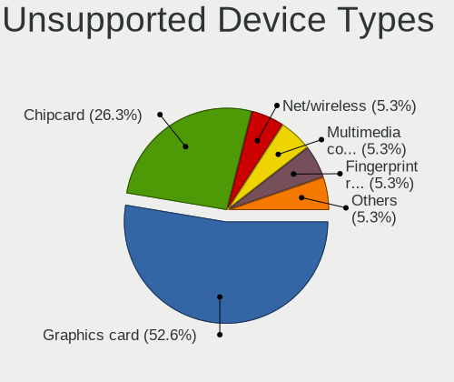

| Type                  | Notebooks | Percent |
|-----------------------|-----------|---------|
| Graphics card         | 3         | 50%     |
| Net/wireless          | 1         | 16.67%  |
| Multimedia controller | 1         | 16.67%  |
| Chipcard              | 1         | 16.67%  |

