Trisquel - Tested Hardware & Statistics (Notebooks)
---------------------------------------------------

A project to collect tested hardware configurations for Trisquel.

Anyone can contribute to this report by the [hw-probe](https://github.com/linuxhw/hw-probe) tool:

    sudo -E hw-probe -all -upload

Please contribute! Especially if your hardware is rare.

Contents
--------

* [ Test Cases ](#test-cases)

* [ System ](#system)
  - [ OS                       ](#os)
  - [ OS Family                ](#os-family)
  - [ Kernel                   ](#kernel)
  - [ Kernel Family            ](#kernel-family)
  - [ Kernel Major Ver.        ](#kernel-major-ver)
  - [ Arch                     ](#arch)
  - [ DE                       ](#de)
  - [ Display Server           ](#display-server)
  - [ Display Manager          ](#display-manager)
  - [ OS Lang                  ](#os-lang)
  - [ Boot Mode                ](#boot-mode)
  - [ Filesystem               ](#filesystem)
  - [ Part. scheme             ](#part-scheme)
  - [ Dual Boot with Linux/BSD ](#dual-boot-with-linuxbsd)
  - [ Dual Boot (Win)          ](#dual-boot-win)

* [ Board ](#board)
  - [ Vendor                   ](#vendor)
  - [ Model                    ](#model)
  - [ Model Family             ](#model-family)
  - [ MFG Year                 ](#mfg-year)
  - [ Form Factor              ](#form-factor)
  - [ Secure Boot              ](#secure-boot)
  - [ Coreboot                 ](#coreboot)
  - [ RAM Size                 ](#ram-size)
  - [ RAM Used                 ](#ram-used)
  - [ Total Drives             ](#total-drives)
  - [ Has CD-ROM               ](#has-cd-rom)
  - [ Has Ethernet             ](#has-ethernet)
  - [ Has WiFi                 ](#has-wifi)
  - [ Has Bluetooth            ](#has-bluetooth)

* [ Location ](#location)
  - [ Country                  ](#country)
  - [ City                     ](#city)

* [ Drives ](#drives)
  - [ Drive Vendor             ](#drive-vendor)
  - [ Drive Model              ](#drive-model)
  - [ HDD Vendor               ](#hdd-vendor)
  - [ SSD Vendor               ](#ssd-vendor)
  - [ Drive Kind               ](#drive-kind)
  - [ Drive Connector          ](#drive-connector)
  - [ Drive Size               ](#drive-size)
  - [ Space Total              ](#space-total)
  - [ Space Used               ](#space-used)
  - [ Malfunc. Drives          ](#malfunc-drives)
  - [ Malfunc. Drive Vendor    ](#malfunc-drive-vendor)
  - [ Malfunc. HDD Vendor      ](#malfunc-hdd-vendor)
  - [ Malfunc. Drive Kind      ](#malfunc-drive-kind)
  - [ Failed Drives            ](#failed-drives)
  - [ Failed Drive Vendor      ](#failed-drive-vendor)
  - [ Drive Status             ](#drive-status)

* [ Storage controller ](#storage-controller)
  - [ Storage Vendor           ](#storage-vendor)
  - [ Storage Model            ](#storage-model)
  - [ Storage Kind             ](#storage-kind)

* [ Processor ](#processor)
  - [ CPU Vendor               ](#cpu-vendor)
  - [ CPU Model                ](#cpu-model)
  - [ CPU Model Family         ](#cpu-model-family)
  - [ CPU Cores                ](#cpu-cores)
  - [ CPU Sockets              ](#cpu-sockets)
  - [ CPU Threads              ](#cpu-threads)
  - [ CPU Op-Modes             ](#cpu-op-modes)
  - [ CPU Microcode            ](#cpu-microcode)
  - [ CPU Microarch            ](#cpu-microarch)

* [ Graphics ](#graphics)
  - [ GPU Vendor               ](#gpu-vendor)
  - [ GPU Model                ](#gpu-model)
  - [ GPU Combo                ](#gpu-combo)
  - [ GPU Driver               ](#gpu-driver)
  - [ GPU Memory               ](#gpu-memory)

* [ Monitor ](#monitor)
  - [ Monitor Vendor           ](#monitor-vendor)
  - [ Monitor Model            ](#monitor-model)
  - [ Monitor Resolution       ](#monitor-resolution)
  - [ Monitor Diagonal         ](#monitor-diagonal)
  - [ Monitor Width            ](#monitor-width)
  - [ Aspect Ratio             ](#aspect-ratio)
  - [ Monitor Area             ](#monitor-area)
  - [ Pixel Density            ](#pixel-density)
  - [ Multiple Monitors        ](#multiple-monitors)

* [ Network ](#network)
  - [ Net Controller Vendor    ](#net-controller-vendor)
  - [ Net Controller Model     ](#net-controller-model)
  - [ Wireless Vendor          ](#wireless-vendor)
  - [ Wireless Model           ](#wireless-model)
  - [ Ethernet Vendor          ](#ethernet-vendor)
  - [ Ethernet Model           ](#ethernet-model)
  - [ Net Controller Kind      ](#net-controller-kind)
  - [ Used Controller          ](#used-controller)
  - [ NICs                     ](#nics)
  - [ IPv6                     ](#ipv6)

* [ Bluetooth ](#bluetooth)
  - [ Bluetooth Vendor         ](#bluetooth-vendor)
  - [ Bluetooth Model          ](#bluetooth-model)

* [ Sound ](#sound)
  - [ Sound Vendor             ](#sound-vendor)
  - [ Sound Model              ](#sound-model)

* [ Memory ](#memory)
  - [ Memory Vendor            ](#memory-vendor)
  - [ Memory Model             ](#memory-model)
  - [ Memory Kind              ](#memory-kind)
  - [ Memory Form Factor       ](#memory-form-factor)
  - [ Memory Size              ](#memory-size)
  - [ Memory Speed             ](#memory-speed)

* [ Printers & scanners ](#printers--scanners)
  - [ Printer Vendor           ](#printer-vendor)
  - [ Printer Model            ](#printer-model)
  - [ Scanner Vendor           ](#scanner-vendor)
  - [ Scanner Model            ](#scanner-model)

* [ Camera ](#camera)
  - [ Camera Vendor            ](#camera-vendor)
  - [ Camera Model             ](#camera-model)

* [ Security ](#security)
  - [ Fingerprint Vendor       ](#fingerprint-vendor)
  - [ Fingerprint Model        ](#fingerprint-model)
  - [ Chipcard Vendor          ](#chipcard-vendor)
  - [ Chipcard Model           ](#chipcard-model)

* [ Unsupported ](#unsupported)
  - [ Unsupported Devices      ](#unsupported-devices)
  - [ Unsupported Device Types ](#unsupported-device-types)

Test Cases
----------

Total: 41

| Vendor    | Model                       | Probe                                                      | Date         |
|-----------|-----------------------------|------------------------------------------------------------|--------------|
| Lenovo    | ThinkPad T480 20L5000UUS    | [e0cf37ba04](https://linux-hardware.org/?probe=e0cf37ba04) | Nov 26, 2024 |
| Lenovo    | ThinkPad E14 Gen 5 21JK0... | [7b5c860bd2](https://linux-hardware.org/?probe=7b5c860bd2) | Nov 15, 2024 |
| Dell      | XPS 12 9Q23                 | [b842f0a090](https://linux-hardware.org/?probe=b842f0a090) | Sep 21, 2024 |
| LZ        | LZ1004_3                    | [8ad0eef591](https://linux-hardware.org/?probe=8ad0eef591) | Aug 28, 2024 |
| Lenovo    | ThinkPad X230 2325Y3C       | [31631cc4bd](https://linux-hardware.org/?probe=31631cc4bd) | Aug 04, 2024 |
| Dell      | Latitude E6540              | [c6c6acf7d2](https://linux-hardware.org/?probe=c6c6acf7d2) | May 08, 2024 |
| Dell      | Latitude E6540              | [a57f8ef498](https://linux-hardware.org/?probe=a57f8ef498) | May 08, 2024 |
| Lenovo    | ThinkPad T430s 2356C45      | [a76e3d7e43](https://linux-hardware.org/?probe=a76e3d7e43) | Dec 10, 2023 |
| Notebook  | NJ50_70CU                   | [ed00b585a3](https://linux-hardware.org/?probe=ed00b585a3) | Nov 12, 2023 |
| Dell      | Latitude 5590               | [5712f37060](https://linux-hardware.org/?probe=5712f37060) | Nov 09, 2023 |
| HP        | Victus by Laptop 16-e0xx... | [855f5edce0](https://linux-hardware.org/?probe=855f5edce0) | Sep 08, 2023 |
| Dell      | Latitude E6400              | [65c390fe0e](https://linux-hardware.org/?probe=65c390fe0e) | Aug 12, 2023 |
| Dell      | XPS 15 9510                 | [8375e909e7](https://linux-hardware.org/?probe=8375e909e7) | Jul 30, 2023 |
| Lenovo    | ThinkPad X200 7458C23       | [3f09abaa12](https://linux-hardware.org/?probe=3f09abaa12) | Jul 24, 2023 |
| Dell      | XPS 15 9510                 | [154b34b737](https://linux-hardware.org/?probe=154b34b737) | Jul 18, 2023 |
| Lenovo    | G505s 20255                 | [4ec56be6a5](https://linux-hardware.org/?probe=4ec56be6a5) | Jul 03, 2023 |
| Lenovo    | G505s 20255                 | [2940c0be7d](https://linux-hardware.org/?probe=2940c0be7d) | Jul 01, 2023 |
| Toshiba   | NB510                       | [a66bda9742](https://linux-hardware.org/?probe=a66bda9742) | Jun 18, 2023 |
| HP        | Stream Laptop 11-y0XX       | [4f777df0e8](https://linux-hardware.org/?probe=4f777df0e8) | Apr 29, 2023 |
| Itautec   | Infoway                     | [c046d6e093](https://linux-hardware.org/?probe=c046d6e093) | Apr 16, 2023 |
| Acer      | Nitro AN517-54              | [185c4824b7](https://linux-hardware.org/?probe=185c4824b7) | Apr 07, 2023 |
| Dell      | Inspiron 15-3567            | [e94792b948](https://linux-hardware.org/?probe=e94792b948) | Dec 13, 2022 |
| Dell      | Inspiron 1545               | [5b13c289e1](https://linux-hardware.org/?probe=5b13c289e1) | Nov 26, 2022 |
| Libiquity | Taurinus X200               | [75c0f41e26](https://linux-hardware.org/?probe=75c0f41e26) | Nov 09, 2022 |
| Lenovo    | ThinkPad T430 2347G2U       | [ab06dd40c4](https://linux-hardware.org/?probe=ab06dd40c4) | Oct 03, 2022 |
| Lenovo    | ThinkPad T430 2347G2U       | [5b08d764b4](https://linux-hardware.org/?probe=5b08d764b4) | Sep 27, 2022 |
| Lenovo    | G505s 20255                 | [a9e525c695](https://linux-hardware.org/?probe=a9e525c695) | Sep 16, 2022 |
| Timi      | TM1709                      | [2fb5436031](https://linux-hardware.org/?probe=2fb5436031) | Sep 04, 2022 |
| Lenovo    | ThinkPad T430 2347G2U       | [8d7c5df586](https://linux-hardware.org/?probe=8d7c5df586) | Sep 03, 2022 |
| ASUSTek   | K55A                        | [5d11054a36](https://linux-hardware.org/?probe=5d11054a36) | Aug 28, 2022 |
| Lenovo    | ThinkPad T420 4177QKU       | [a18ab36f34](https://linux-hardware.org/?probe=a18ab36f34) | Aug 17, 2022 |
| Lenovo    | ThinkPad T430 2347G2U       | [f6abe5392b](https://linux-hardware.org/?probe=f6abe5392b) | Aug 03, 2022 |
| Lenovo    | ThinkPad T430 2347G2U       | [b25d6bf66c](https://linux-hardware.org/?probe=b25d6bf66c) | Jul 27, 2022 |
| Lenovo    | ThinkPad T420 4177QKU       | [215758ad8a](https://linux-hardware.org/?probe=215758ad8a) | Apr 30, 2022 |
| Dell      | XPS 13 9360                 | [1126937638](https://linux-hardware.org/?probe=1126937638) | Apr 28, 2022 |
| Toshiba   | Satellite C800D             | [5cdc03cbdf](https://linux-hardware.org/?probe=5cdc03cbdf) | Feb 10, 2022 |
| Samsung   | N130                        | [1a88380af6](https://linux-hardware.org/?probe=1a88380af6) | Nov 27, 2021 |
| ASUSTek   | U56E                        | [99bd7dbfdf](https://linux-hardware.org/?probe=99bd7dbfdf) | Sep 09, 2021 |
| Lenovo    | ThinkPad X200 7455FNG       | [6fcadf1396](https://linux-hardware.org/?probe=6fcadf1396) | Mar 20, 2021 |
| Acer      | TravelMate B115-M           | [62239072f1](https://linux-hardware.org/?probe=62239072f1) | Nov 26, 2019 |
| GPD       | MicroPC                     | [8fc0176f69](https://linux-hardware.org/?probe=8fc0176f69) | Sep 28, 2019 |

System
------

OS
--

Installed operating systems

| Name            | Notebooks | Percent |
|-----------------|-----------|---------|
| Trisquel 11.0   | 12        | 34.29%  |
| Trisquel 10.0.1 | 10        | 28.57%  |
| Trisquel 11.0.1 | 6         | 17.14%  |
| Trisquel 9.0    | 3         | 8.57%   |
| Trisquel 8.0    | 2         | 5.71%   |
| Trisquel 10.0   | 2         | 5.71%   |

OS Family
---------

OS without a version

| Name     | Notebooks | Percent |
|----------|-----------|---------|
| Trisquel | 34        | 100%    |

Kernel
------

Version of the Linux kernel

| Version              | Notebooks | Percent |
|----------------------|-----------|---------|
| 5.4.0-96-generic     | 3         | 8.11%   |
| 5.4.0-122-generic    | 3         | 8.11%   |
| 5.4.0-125-generic    | 2         | 5.41%   |
| 5.15.0-78-generic    | 2         | 5.41%   |
| 5.15.0-76-generic    | 2         | 5.41%   |
| 5.15.0-69-generic    | 2         | 5.41%   |
| 5.15.0-67-generic    | 2         | 5.41%   |
| 5.15.0-105-generic   | 2         | 5.41%   |
| 6.0.12-x64v1-xanmod1 | 1         | 2.7%    |
| 5.4.0-159-generic    | 1         | 2.7%    |
| 5.4.0-132-generic    | 1         | 2.7%    |
| 5.4.0-131-generic    | 1         | 2.7%    |
| 5.4.0-126-generic    | 1         | 2.7%    |
| 5.4.0-113-generic    | 1         | 2.7%    |
| 5.3.13-gnu           | 1         | 2.7%    |
| 5.3.1-gnu            | 1         | 2.7%    |
| 5.15.0-91-generic    | 1         | 2.7%    |
| 5.15.0-88-generic    | 1         | 2.7%    |
| 5.15.0-86-generic    | 1         | 2.7%    |
| 5.15.0-73-generic    | 1         | 2.7%    |
| 5.15.0-124-generic   | 1         | 2.7%    |
| 5.15.0-122-generic   | 1         | 2.7%    |
| 5.15.0-117-generic   | 1         | 2.7%    |
| 5.15.0-107-generic   | 1         | 2.7%    |
| 4.15.0-161-generic   | 1         | 2.7%    |
| 4.15.0-156-generic   | 1         | 2.7%    |
| 4.15.0-136-generic   | 1         | 2.7%    |

Kernel Family
-------------

Linux kernel without a distro release

| Version | Notebooks | Percent |
|---------|-----------|---------|
| 5.15.0  | 18        | 51.43%  |
| 5.4.0   | 11        | 31.43%  |
| 4.15.0  | 3         | 8.57%   |
| 6.0.12  | 1         | 2.86%   |
| 5.3.13  | 1         | 2.86%   |
| 5.3.1   | 1         | 2.86%   |

Kernel Major Ver.
-----------------

Linux kernel major version

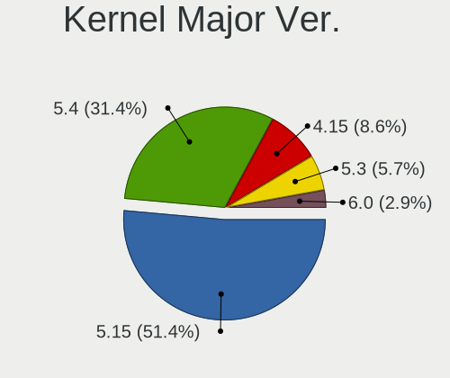

| Version | Notebooks | Percent |
|---------|-----------|---------|
| 5.15    | 18        | 51.43%  |
| 5.4     | 11        | 31.43%  |
| 4.15    | 3         | 8.57%   |
| 5.3     | 2         | 5.71%   |
| 6.0     | 1         | 2.86%   |

Arch
----

OS architecture (x86_64, i586, etc.)

| Name   | Notebooks | Percent |
|--------|-----------|---------|
| x86_64 | 33        | 97.06%  |
| i686   | 1         | 2.94%   |

DE
--

Desktop Environment

| Name    | Notebooks | Percent |
|---------|-----------|---------|
| MATE    | 23        | 65.71%  |
| LXDE    | 4         | 11.43%  |
| KDE5    | 3         | 8.57%   |
| GNOME   | 3         | 8.57%   |
| dwm     | 1         | 2.86%   |
| Unknown | 1         | 2.86%   |

Display Server
--------------

X11 or Wayland

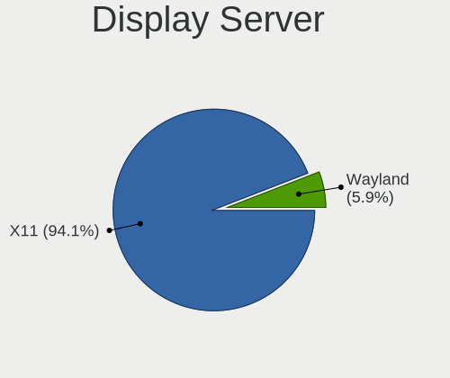

| Name    | Notebooks | Percent |
|---------|-----------|---------|
| X11     | 32        | 94.12%  |
| Wayland | 2         | 5.88%   |

Display Manager
---------------

SDDM, LightDM, etc.

| Name    | Notebooks | Percent |
|---------|-----------|---------|
| LightDM | 22        | 62.86%  |
| Unknown | 4         | 11.43%  |
| TDM     | 3         | 8.57%   |
| SDDM    | 3         | 8.57%   |
| SLiM    | 1         | 2.86%   |
| GDM3    | 1         | 2.86%   |
| GDM     | 1         | 2.86%   |

OS Lang
-------

Language

| Lang    | Notebooks | Percent |
|---------|-----------|---------|
| en_US   | 16        | 47.06%  |
| ru_RU   | 3         | 8.82%   |
| fr_FR   | 3         | 8.82%   |
| C       | 3         | 8.82%   |
| Unknown | 2         | 5.88%   |
| tr_TR   | 1         | 2.94%   |
| ru_UA   | 1         | 2.94%   |
| pt_BR   | 1         | 2.94%   |
| es_MX   | 1         | 2.94%   |
| es_ES   | 1         | 2.94%   |
| en_GB   | 1         | 2.94%   |
| de_DE   | 1         | 2.94%   |

Boot Mode
---------

EFI or BIOS

| Mode | Notebooks | Percent |
|------|-----------|---------|
| EFI  | 20        | 58.82%  |
| BIOS | 14        | 41.18%  |

Filesystem
----------

Type of filesystem

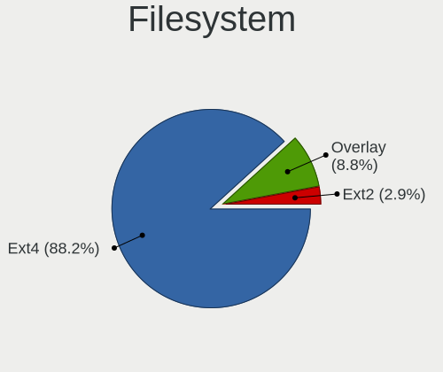

| Type    | Notebooks | Percent |
|---------|-----------|---------|
| Ext4    | 30        | 88.24%  |
| Overlay | 3         | 8.82%   |
| Ext2    | 1         | 2.94%   |

Part. scheme
------------

Scheme of partitioning

| Type    | Notebooks | Percent |
|---------|-----------|---------|
| GPT     | 26        | 76.47%  |
| Unknown | 5         | 14.71%  |
| MBR     | 3         | 8.82%   |

Dual Boot with Linux/BSD
------------------------

Hosting more than one Linux/BSD

| Dual boot | Notebooks | Percent |
|-----------|-----------|---------|
| No        | 29        | 82.86%  |
| Yes       | 6         | 17.14%  |

Dual Boot (Win)
---------------

Hosting Linux and Windows

| Dual boot | Notebooks | Percent |
|-----------|-----------|---------|
| No        | 30        | 88.24%  |
| Yes       | 4         | 11.76%  |

Board
-----

Vendor
------

Motherboard manufacturer

| Name                | Notebooks | Percent |
|---------------------|-----------|---------|
| Lenovo              | 10        | 29.41%  |
| Dell                | 9         | 26.47%  |
| Toshiba             | 2         | 5.88%   |
| Hewlett-Packard     | 2         | 5.88%   |
| ASUSTek Computer    | 2         | 5.88%   |
| Acer                | 2         | 5.88%   |
| Timi                | 1         | 2.94%   |
| Samsung Electronics | 1         | 2.94%   |
| Notebook            | 1         | 2.94%   |
| LZ                  | 1         | 2.94%   |
| Libiquity           | 1         | 2.94%   |
| Itautec             | 1         | 2.94%   |
| GPD                 | 1         | 2.94%   |

Model
-----

Motherboard model

| Name                                 | Notebooks | Percent |
|--------------------------------------|-----------|---------|
| Lenovo ThinkPad T420 4177QKU         | 2         | 5.88%   |
| Dell XPS 15 9510                     | 2         | 5.88%   |
| Toshiba Satellite C800D              | 1         | 2.94%   |
| Toshiba NB510                        | 1         | 2.94%   |
| Timi TM1709                          | 1         | 2.94%   |
| Samsung N130                         | 1         | 2.94%   |
| Notebook NJ50_70CU                   | 1         | 2.94%   |
| LZ LZ1004_3                          | 1         | 2.94%   |
| Libiquity Taurinus X200              | 1         | 2.94%   |
| Lenovo ThinkPad X230 2325Y3C         | 1         | 2.94%   |
| Lenovo ThinkPad X200 7458C23         | 1         | 2.94%   |
| Lenovo ThinkPad X200 7455FNG         | 1         | 2.94%   |
| Lenovo ThinkPad T480 20L5000UUS      | 1         | 2.94%   |
| Lenovo ThinkPad T430s 2356C45        | 1         | 2.94%   |
| Lenovo ThinkPad T430 2347G2U         | 1         | 2.94%   |
| Lenovo ThinkPad E14 Gen 5 21JK0006TX | 1         | 2.94%   |
| Lenovo G505s 20255                   | 1         | 2.94%   |
| Itautec Infoway                      | 1         | 2.94%   |
| HP Victus by Laptop 16-e0xxx         | 1         | 2.94%   |
| HP Stream Laptop 11-y0XX             | 1         | 2.94%   |
| GPD MicroPC                          | 1         | 2.94%   |
| Dell XPS 13 9360                     | 1         | 2.94%   |
| Dell XPS 12 9Q23                     | 1         | 2.94%   |
| Dell Latitude E6540                  | 1         | 2.94%   |
| Dell Latitude E6400                  | 1         | 2.94%   |
| Dell Latitude 5590                   | 1         | 2.94%   |
| Dell Inspiron 1545                   | 1         | 2.94%   |
| Dell Inspiron 15-3567                | 1         | 2.94%   |
| ASUS U56E                            | 1         | 2.94%   |
| ASUS K55A                            | 1         | 2.94%   |
| Acer TravelMate B115-M               | 1         | 2.94%   |
| Acer Nitro AN517-54                  | 1         | 2.94%   |

Model Family
------------

Motherboard model prefix

| Name               | Notebooks | Percent |
|--------------------|-----------|---------|
| Lenovo ThinkPad    | 9         | 26.47%  |
| Dell XPS           | 4         | 11.76%  |
| Dell Latitude      | 3         | 8.82%   |
| Dell Inspiron      | 2         | 5.88%   |
| Toshiba Satellite  | 1         | 2.94%   |
| Toshiba NB510      | 1         | 2.94%   |
| Timi TM1709        | 1         | 2.94%   |
| Samsung N130       | 1         | 2.94%   |
| Notebook NJ50      | 1         | 2.94%   |
| LZ LZ1004          | 1         | 2.94%   |
| Libiquity Taurinus | 1         | 2.94%   |
| Lenovo G505s       | 1         | 2.94%   |
| Itautec Infoway    | 1         | 2.94%   |
| HP Victus          | 1         | 2.94%   |
| HP Stream          | 1         | 2.94%   |
| GPD MicroPC        | 1         | 2.94%   |
| ASUS U56E          | 1         | 2.94%   |
| ASUS K55A          | 1         | 2.94%   |
| Acer TravelMate    | 1         | 2.94%   |
| Acer Nitro         | 1         | 2.94%   |

MFG Year
--------

Motherboard manufacture year

| Year | Notebooks | Percent |
|------|-----------|---------|
| 2012 | 6         | 17.65%  |
| 2008 | 6         | 17.65%  |
| 2021 | 4         | 11.76%  |
| 2018 | 3         | 8.82%   |
| 2016 | 3         | 8.82%   |
| 2011 | 3         | 8.82%   |
| 2019 | 2         | 5.88%   |
| 2013 | 2         | 5.88%   |
| 2023 | 1         | 2.94%   |
| 2022 | 1         | 2.94%   |
| 2015 | 1         | 2.94%   |
| 2014 | 1         | 2.94%   |
| 2009 | 1         | 2.94%   |

Form Factor
-----------

Physical design of the computer

| Name     | Notebooks | Percent |
|----------|-----------|---------|
| Notebook | 34        | 100%    |

Secure Boot
-----------

Enabled or disabled

| State    | Notebooks | Percent |
|----------|-----------|---------|
| Disabled | 34        | 100%    |

Coreboot
--------

Have coreboot on board

| Used | Notebooks | Percent |
|------|-----------|---------|
| No   | 30        | 88.24%  |
| Yes  | 4         | 11.76%  |

RAM Size
--------

Total RAM memory

| Size in GB | Notebooks | Percent |
|------------|-----------|---------|
| 4.01-8.0   | 16        | 47.06%  |
| 16.01-24.0 | 6         | 17.65%  |
| 1.01-2.0   | 5         | 14.71%  |
| 8.01-16.0  | 4         | 11.76%  |
| 3.01-4.0   | 3         | 8.82%   |

RAM Used
--------

Used RAM memory

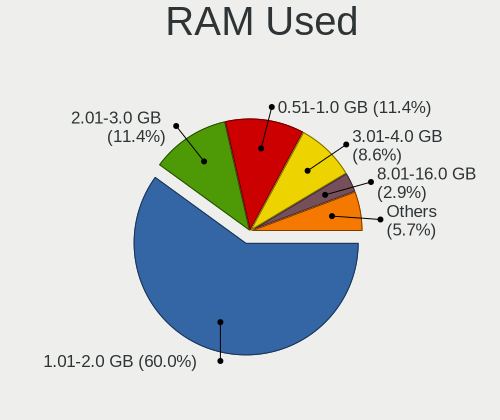

| Used GB   | Notebooks | Percent |
|-----------|-----------|---------|
| 1.01-2.0  | 21        | 60%     |
| 2.01-3.0  | 4         | 11.43%  |
| 0.51-1.0  | 4         | 11.43%  |
| 3.01-4.0  | 3         | 8.57%   |
| 4.01-8.0  | 1         | 2.86%   |
| 8.01-16.0 | 1         | 2.86%   |
| 0.01-0.5  | 1         | 2.86%   |

Total Drives
------------

Number of drives on board

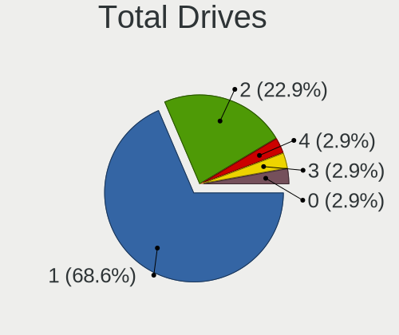

| Drives | Notebooks | Percent |
|--------|-----------|---------|
| 1      | 24        | 68.57%  |
| 2      | 8         | 22.86%  |
| 4      | 1         | 2.86%   |
| 3      | 1         | 2.86%   |
| 0      | 1         | 2.86%   |

Has CD-ROM
----------

Has CD-ROM on board

| Presented | Notebooks | Percent |
|-----------|-----------|---------|
| No        | 21        | 61.76%  |
| Yes       | 13        | 38.24%  |

Has Ethernet
------------

Has Ethernet on board

| Presented | Notebooks | Percent |
|-----------|-----------|---------|
| Yes       | 31        | 91.18%  |
| No        | 3         | 8.82%   |

Has WiFi
--------

Has WiFi module

| Presented | Notebooks | Percent |
|-----------|-----------|---------|
| Yes       | 33        | 97.06%  |
| No        | 1         | 2.94%   |

Has Bluetooth
-------------

Has Bluetooth module

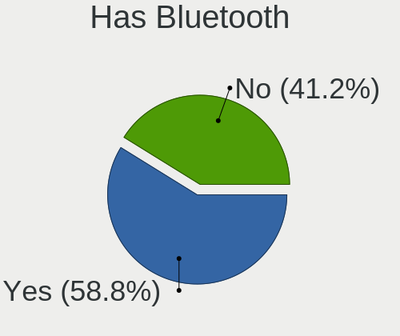

| Presented | Notebooks | Percent |
|-----------|-----------|---------|
| Yes       | 20        | 58.82%  |
| No        | 14        | 41.18%  |

Location
--------

Country
-------

Geographic location (country)

| Country     | Notebooks | Percent |
|-------------|-----------|---------|
| USA         | 11        | 31.43%  |
| France      | 4         | 11.43%  |
| Russia      | 3         | 8.57%   |
| Germany     | 3         | 8.57%   |
| China       | 3         | 8.57%   |
| Turkey      | 2         | 5.71%   |
| Brazil      | 2         | 5.71%   |
| Spain       | 1         | 2.86%   |
| South Korea | 1         | 2.86%   |
| Netherlands | 1         | 2.86%   |
| Mexico      | 1         | 2.86%   |
| Kazakhstan  | 1         | 2.86%   |
| Indonesia   | 1         | 2.86%   |
| Belarus     | 1         | 2.86%   |

City
----

Geographic location (city)

| City                 | Notebooks | Percent |
|----------------------|-----------|---------|
| Lincoln              | 4         | 11.43%  |
| Malvern              | 2         | 5.71%   |
| Istanbul             | 2         | 5.71%   |
| Cerons               | 2         | 5.71%   |
| Yongin-si            | 1         | 2.86%   |
| Wylie                | 1         | 2.86%   |
| Wiesbaden            | 1         | 2.86%   |
| Vitebsk              | 1         | 2.86%   |
| St Petersburg        | 1         | 2.86%   |
| Shenzhen             | 1         | 2.86%   |
| Sabadell             | 1         | 2.86%   |
| Pinangsia            | 1         | 2.86%   |
| Paris                | 1         | 2.86%   |
| Oryol                | 1         | 2.86%   |
| Omaha                | 1         | 2.86%   |
| Moscow               | 1         | 2.86%   |
| Missoula             | 1         | 2.86%   |
| Lüdenscheid         | 1         | 2.86%   |
| Leverkusen           | 1         | 2.86%   |
| Guangzhou            | 1         | 2.86%   |
| Fayetteville         | 1         | 2.86%   |
| Ciudad del Carmen    | 1         | 2.86%   |
| Chengdu              | 1         | 2.86%   |
| Borderes-sur-l'Echez | 1         | 2.86%   |
| Blumenau             | 1         | 2.86%   |
| Amsterdam            | 1         | 2.86%   |
| Americana            | 1         | 2.86%   |
| Almaty               | 1         | 2.86%   |
| Acworth              | 1         | 2.86%   |

Drives
------

Drive Vendor
------------

Hard drive vendors

| Vendor              | Notebooks | Drives | Percent |
|---------------------|-----------|--------|---------|
| Samsung Electronics | 9         | 9      | 21.95%  |
| Sandisk             | 6         | 6      | 14.63%  |
| WDC                 | 4         | 4      | 9.76%   |
| Toshiba             | 3         | 3      | 7.32%   |
| Seagate             | 3         | 9      | 7.32%   |
| Crucial             | 3         | 3      | 7.32%   |
| Unknown             | 2         | 2      | 4.88%   |
| SK hynix            | 2         | 2      | 4.88%   |
| HGST HTS            | 2         | 4      | 4.88%   |
| Transcend           | 1         | 1      | 2.44%   |
| Qumo                | 1         | 1      | 2.44%   |
| Plextor             | 1         | 1      | 2.44%   |
| Kingston            | 1         | 1      | 2.44%   |
| Hitachi             | 1         | 1      | 2.44%   |
| China               | 1         | 1      | 2.44%   |
| A-DATA Technology   | 1         | 1      | 2.44%   |

Drive Model
-----------

Hard drive models

| Model                                               | Notebooks | Percent |
|-----------------------------------------------------|-----------|---------|
| SK hynix PC711 NVMe 512GB                           | 2         | 4.65%   |
| Seagate ST4000NM 0033-9ZM170 4TB                    | 2         | 4.65%   |
| HGST HTS 721010A9E630 1TB                           | 2         | 4.65%   |
| WDC WDS240G2G0B-00EPW0 240GB SSD                    | 1         | 2.33%   |
| WDC WD6400BPVT-80HXZT3 640GB                        | 1         | 2.33%   |
| WDC WD3200BEVT-75ZCT2 320GB                         | 1         | 2.33%   |
| WDC PC SN730 SDBPNTY-512G-1006 512GB                | 1         | 2.33%   |
| Unknown SC64G  64GB                                 | 1         | 2.33%   |
| Unknown NCard  32GB                                 | 1         | 2.33%   |
| Transcend TS256GMTS430S 256GB SSD                   | 1         | 2.33%   |
| Toshiba THNSN5256GPUK NVMe 256GB                    | 1         | 2.33%   |
| Toshiba MK3275GSX 320GB                             | 1         | 2.33%   |
| Toshiba HDWL110 1TB                                 | 1         | 2.33%   |
| Seagate ST320LT007-9ZV142 320GB                     | 1         | 2.33%   |
| Seagate ST1000LM035-1RK172 1TB                      | 1         | 2.33%   |
| Seagate Expansion HDD 14TB                          | 1         | 2.33%   |
| Sandisk WD PC SN740 SDDQMQD-512G-1201 512GB         | 1         | 2.33%   |
| Sandisk WD Blue SN570 1TB                           | 1         | 2.33%   |
| SanDisk SSD PLUS 240GB                              | 1         | 2.33%   |
| SanDisk SSD PLUS 2000GB                             | 1         | 2.33%   |
| SanDisk SDSSDH3 2T00 2TB                            | 1         | 2.33%   |
| SanDisk DF4032  32GB                                | 1         | 2.33%   |
| Samsung SSD PM830 mSATA 256GB                       | 1         | 2.33%   |
| Samsung SSD 860 EVO 250GB                           | 1         | 2.33%   |
| Samsung SSD 840 PRO Series 256GB                    | 1         | 2.33%   |
| Samsung SSD 840 EVO 120GB                           | 1         | 2.33%   |
| Samsung NVMe SSD Controller SM981/PM981/PM983 512GB | 1         | 2.33%   |
| Samsung MZVLQ512HBLU-00BTW 512GB                    | 1         | 2.33%   |
| Samsung MZNLN128HAHQ-00000 128GB SSD                | 1         | 2.33%   |
| Samsung HM251JI 250GB                               | 1         | 2.33%   |
| Samsung HM160HI 160GB                               | 1         | 2.33%   |
| Qumo SSD 120GB                                      | 1         | 2.33%   |
| Plextor PX-512M5Pro 512GB SSD                       | 1         | 2.33%   |
| Kingston SA400S37240G 240GB SSD                     | 1         | 2.33%   |
| Hitachi HTS547575A9E384 752GB                       | 1         | 2.33%   |
| Crucial CT250BX100SSD1 250GB                        | 1         | 2.33%   |
| Crucial CT240BX200SSD1 240GB                        | 1         | 2.33%   |
| Crucial CT120BX500SSD1 120GB                        | 1         | 2.33%   |
| China 240GB SSD                                     | 1         | 2.33%   |
| A-DATA SU650 120GB SSD                              | 1         | 2.33%   |

HDD Vendor
----------

Hard disk drive vendors

| Vendor              | Notebooks | Drives | Percent |
|---------------------|-----------|--------|---------|
| Seagate             | 3         | 9      | 25%     |
| WDC                 | 2         | 2      | 16.67%  |
| Toshiba             | 2         | 2      | 16.67%  |
| Samsung Electronics | 2         | 2      | 16.67%  |
| HGST HTS            | 2         | 4      | 16.67%  |
| Hitachi             | 1         | 1      | 8.33%   |

SSD Vendor
----------

Solid state drive vendors

| Vendor              | Notebooks | Drives | Percent |
|---------------------|-----------|--------|---------|
| Samsung Electronics | 5         | 5      | 27.78%  |
| SanDisk             | 3         | 3      | 16.67%  |
| Crucial             | 3         | 3      | 16.67%  |
| WDC                 | 1         | 1      | 5.56%   |
| Transcend           | 1         | 1      | 5.56%   |
| Qumo                | 1         | 1      | 5.56%   |
| Plextor             | 1         | 1      | 5.56%   |
| Kingston            | 1         | 1      | 5.56%   |
| China               | 1         | 1      | 5.56%   |
| A-DATA Technology   | 1         | 1      | 5.56%   |

Drive Kind
----------

HDD or SSD

| Kind | Notebooks | Drives | Percent |
|------|-----------|--------|---------|
| SSD  | 17        | 18     | 47.22%  |
| HDD  | 9         | 20     | 25%     |
| NVMe | 7         | 8      | 19.44%  |
| MMC  | 3         | 3      | 8.33%   |

Drive Connector
---------------

SATA, SAS, NVMe, etc.

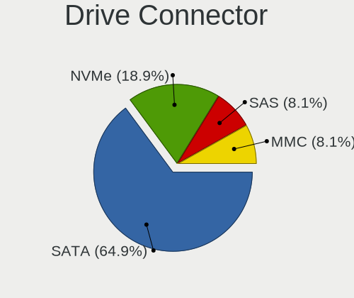

| Type | Notebooks | Drives | Percent |
|------|-----------|--------|---------|
| SATA | 24        | 29     | 64.86%  |
| NVMe | 7         | 8      | 18.92%  |
| SAS  | 3         | 9      | 8.11%   |
| MMC  | 3         | 3      | 8.11%   |

Drive Size
----------

Size of hard drive

| Size in TB | Notebooks | Drives | Percent |
|------------|-----------|--------|---------|
| 0.01-0.5   | 19        | 22     | 65.52%  |
| 0.51-1.0   | 5         | 9      | 17.24%  |
| 3.01-4.0   | 2         | 4      | 6.9%    |
| 1.01-2.0   | 2         | 2      | 6.9%    |
| 10.01-20.0 | 1         | 1      | 3.45%   |

Space Total
-----------

Amount of disk space available on the file system

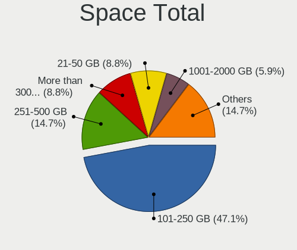

| Size in GB     | Notebooks | Percent |
|----------------|-----------|---------|
| 101-250        | 16        | 47.06%  |
| 251-500        | 5         | 14.71%  |
| More than 3000 | 3         | 8.82%   |
| 21-50          | 3         | 8.82%   |
| 1001-2000      | 2         | 5.88%   |
| 501-1000       | 2         | 5.88%   |
| 51-100         | 2         | 5.88%   |
| 1-20           | 1         | 2.94%   |

Space Used
----------

Amount of used disk space

| Used GB        | Notebooks | Percent |
|----------------|-----------|---------|
| 1-20           | 14        | 40%     |
| 21-50          | 7         | 20%     |
| 101-250        | 6         | 17.14%  |
| 2001-3000      | 2         | 5.71%   |
| 1001-2000      | 2         | 5.71%   |
| 51-100         | 2         | 5.71%   |
| More than 3000 | 1         | 2.86%   |
| 501-1000       | 1         | 2.86%   |

Malfunc. Drives
---------------

Drive models with a malfunction

| Model                            | Notebooks | Drives | Percent |
|----------------------------------|-----------|--------|---------|
| HGST HTS 721010A9E630 1TB        | 2         | 4      | 28.57%  |
| WDC WDS240G2G0B-00EPW0 240GB SSD | 1         | 1      | 14.29%  |
| WDC WD3200BEVT-75ZCT2 320GB      | 1         | 1      | 14.29%  |
| Toshiba MK3275GSX 320GB          | 1         | 1      | 14.29%  |
| Seagate ST320LT007-9ZV142 320GB  | 1         | 3      | 14.29%  |
| Crucial CT240BX200SSD1 240GB     | 1         | 1      | 14.29%  |

Malfunc. Drive Vendor
---------------------

Vendors of faulty drives

| Vendor   | Notebooks | Drives | Percent |
|----------|-----------|--------|---------|
| WDC      | 2         | 2      | 28.57%  |
| HGST HTS | 2         | 4      | 28.57%  |
| Toshiba  | 1         | 1      | 14.29%  |
| Seagate  | 1         | 3      | 14.29%  |
| Crucial  | 1         | 1      | 14.29%  |

Malfunc. HDD Vendor
-------------------

Vendors of faulty HDD drives

| Vendor   | Notebooks | Drives | Percent |
|----------|-----------|--------|---------|
| HGST HTS | 2         | 4      | 40%     |
| WDC      | 1         | 1      | 20%     |
| Toshiba  | 1         | 1      | 20%     |
| Seagate  | 1         | 3      | 20%     |

Malfunc. Drive Kind
-------------------

Kinds of faulty drives

| Kind | Notebooks | Drives | Percent |
|------|-----------|--------|---------|
| HDD  | 4         | 9      | 66.67%  |
| SSD  | 2         | 2      | 33.33%  |

Failed Drives
-------------

Failed drive models

Zero info for selected period =(

Failed Drive Vendor
-------------------

Failed drive vendors

Zero info for selected period =(

Drive Status
------------

Number of failed and malfunc. drives

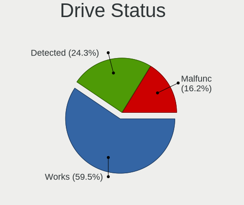

| Status   | Notebooks | Drives | Percent |
|----------|-----------|--------|---------|
| Works    | 22        | 29     | 59.46%  |
| Detected | 9         | 9      | 24.32%  |
| Malfunc  | 6         | 11     | 16.22%  |

Storage controller
------------------

Storage Vendor
--------------

Storage controller vendors

| Vendor                       | Notebooks | Percent |
|------------------------------|-----------|---------|
| Intel                        | 24        | 70.59%  |
| SanDisk                      | 3         | 8.82%   |
| SK hynix                     | 2         | 5.88%   |
| Samsung Electronics          | 2         | 5.88%   |
| AMD                          | 2         | 5.88%   |
| Toshiba America Info Systems | 1         | 2.94%   |

Storage Model
-------------

Storage controller models

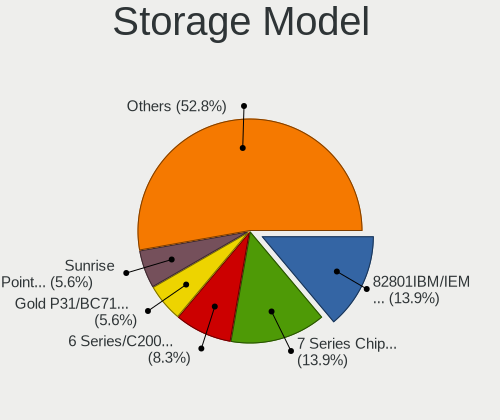

| Model                                                                          | Notebooks | Percent |
|--------------------------------------------------------------------------------|-----------|---------|
| Intel 82801IBM/IEM (ICH9M/ICH9M-E) 4 port SATA Controller [AHCI mode]          | 5         | 13.89%  |
| Intel 7 Series Chipset Family 6-port SATA Controller [AHCI mode]               | 5         | 13.89%  |
| Intel 6 Series/C200 Series Chipset Family 6 port Mobile SATA AHCI Controller   | 3         | 8.33%   |
| SK hynix Gold P31/BC711/PC711 NVMe Solid State Drive                           | 2         | 5.56%   |
| Intel Sunrise Point-LP SATA Controller [AHCI mode]                             | 2         | 5.56%   |
| AMD FCH SATA Controller [AHCI mode]                                            | 2         | 5.56%   |
| Toshiba America Info Systems XG4 NVMe SSD Controller                           | 1         | 2.78%   |
| Sandisk WD PC SN740 NVMe SSD 512GB (DRAM-less)                                 | 1         | 2.78%   |
| SanDisk Ultra 3D / WD Blue SN570 NVMe SSD (DRAM-less)                          | 1         | 2.78%   |
| SanDisk Extreme Pro / WD Black SN750 / PC SN730 / Red SN700 NVMe SSD           | 1         | 2.78%   |
| Samsung NVMe SSD Controller SM981/PM981/PM983                                  | 1         | 2.78%   |
| Samsung NVMe SSD Controller 980 (DRAM-less)                                    | 1         | 2.78%   |
| Intel Volume Management Device NVMe RAID Controller                            | 1         | 2.78%   |
| Intel Tiger Lake SATA AHCI Controller                                          | 1         | 2.78%   |
| Intel NM10/ICH7 Family SATA Controller [AHCI mode]                             | 1         | 2.78%   |
| Intel Comet Lake SATA AHCI Controller                                          | 1         | 2.78%   |
| Intel Celeron/Pentium Silver Processor SATA Controller                         | 1         | 2.78%   |
| Intel Atom Processor E3800 Series SATA AHCI Controller                         | 1         | 2.78%   |
| Intel 82801HM/HEM (ICH8M/ICH8M-E) SATA Controller [AHCI mode]                  | 1         | 2.78%   |
| Intel 82801HM/HEM (ICH8M/ICH8M-E) IDE Controller                               | 1         | 2.78%   |
| Intel 82801GBM/GHM (ICH7-M Family) SATA Controller [IDE mode]                  | 1         | 2.78%   |
| Intel 82801 Mobile SATA Controller [RAID mode]                                 | 1         | 2.78%   |
| Intel 8 Series/C220 Series Chipset Family 6-port SATA Controller 1 [AHCI mode] | 1         | 2.78%   |

Storage Kind
------------

Kind of storage controller (IDE, SATA, NVMe, SAS, ...)

| Kind | Notebooks | Percent |
|------|-----------|---------|
| SATA | 24        | 68.57%  |
| NVMe | 7         | 20%     |
| RAID | 2         | 5.71%   |
| IDE  | 2         | 5.71%   |

Processor
---------

CPU Vendor
----------

Processor vendors

| Vendor | Notebooks | Percent |
|--------|-----------|---------|
| Intel  | 31        | 91.18%  |
| AMD    | 3         | 8.82%   |

CPU Model
---------

Processor models

| Model                                    | Notebooks | Percent |
|------------------------------------------|-----------|---------|
| Intel Core i5-3320M CPU @ 2.60GHz        | 3         | 8.82%   |
| Intel Core i5-8250U CPU @ 1.60GHz        | 2         | 5.88%   |
| Intel Core i5-2410M CPU @ 2.30GHz        | 2         | 5.88%   |
| Intel 11th Gen Core i7-11800H @ 2.30GHz  | 2         | 5.88%   |
| Intel Pentium Dual CPU T3400 @ 2.16GHz   | 1         | 2.94%   |
| Intel Pentium CPU N3530 @ 2.16GHz        | 1         | 2.94%   |
| Intel Core i7-8550U CPU @ 1.80GHz        | 1         | 2.94%   |
| Intel Core i7-4800MQ CPU @ 2.70GHz       | 1         | 2.94%   |
| Intel Core i7-3687U CPU @ 2.10GHz        | 1         | 2.94%   |
| Intel Core i5-7200U CPU @ 2.50GHz        | 1         | 2.94%   |
| Intel Core i5-3210M CPU @ 2.50GHz        | 1         | 2.94%   |
| Intel Core i5-2430M CPU @ 2.40GHz        | 1         | 2.94%   |
| Intel Core i3-6006U CPU @ 2.00GHz        | 1         | 2.94%   |
| Intel Core i3-10110U CPU @ 2.10GHz       | 1         | 2.94%   |
| Intel Core 2 Duo CPU T6600 @ 2.20GHz     | 1         | 2.94%   |
| Intel Core 2 Duo CPU P8800 @ 2.66GHz     | 1         | 2.94%   |
| Intel Core 2 Duo CPU P8600 @ 2.40GHz     | 1         | 2.94%   |
| Intel Core 2 CPU P8700 @ 2.53GHz         | 1         | 2.94%   |
| Intel Core 2 CPU P8600 @ 2.40GHz         | 1         | 2.94%   |
| Intel Celeron N4100 CPU @ 1.10GHz        | 1         | 2.94%   |
| Intel Celeron CPU N3060 @ 1.60GHz        | 1         | 2.94%   |
| Intel Atom CPU Z3735F @ 1.33GHz          | 1         | 2.94%   |
| Intel Atom CPU N270 @ 1.60GHz            | 1         | 2.94%   |
| Intel Atom CPU N2600 @ 1.60GHz           | 1         | 2.94%   |
| Intel 13th Gen Core i7-1355U             | 1         | 2.94%   |
| Intel 11th Gen Core i5-11400H @ 2.70GHz  | 1         | 2.94%   |
| AMD Ryzen 7 5800H with Radeon Graphics   | 1         | 2.94%   |
| AMD E1-1200 APU with Radeon HD Graphics  | 1         | 2.94%   |
| AMD A8-5550M APU with Radeon HD Graphics | 1         | 2.94%   |

CPU Model Family
----------------

Processor model prefix

| Model              | Notebooks | Percent |
|--------------------|-----------|---------|
| Intel Core i5      | 10        | 29.41%  |
| Other              | 4         | 11.76%  |
| Intel Core i7      | 3         | 8.82%   |
| Intel Core 2 Duo   | 3         | 8.82%   |
| Intel Atom         | 3         | 8.82%   |
| Intel Core i3      | 2         | 5.88%   |
| Intel Core 2       | 2         | 5.88%   |
| Intel Celeron      | 2         | 5.88%   |
| Intel Pentium Dual | 1         | 2.94%   |
| Intel Pentium      | 1         | 2.94%   |
| AMD Ryzen 7        | 1         | 2.94%   |
| AMD E1             | 1         | 2.94%   |
| AMD A8             | 1         | 2.94%   |

CPU Cores
---------

Number of processor cores

| Number | Notebooks | Percent |
|--------|-----------|---------|
| 2      | 21        | 61.76%  |
| 4      | 7         | 20.59%  |
| 8      | 3         | 8.82%   |
| 10     | 1         | 2.94%   |
| 6      | 1         | 2.94%   |
| 1      | 1         | 2.94%   |

CPU Sockets
-----------

Number of sockets

| Number | Notebooks | Percent |
|--------|-----------|---------|
| 1      | 34        | 100%    |

CPU Threads
-----------

Threads per core (Hyper-Threading)

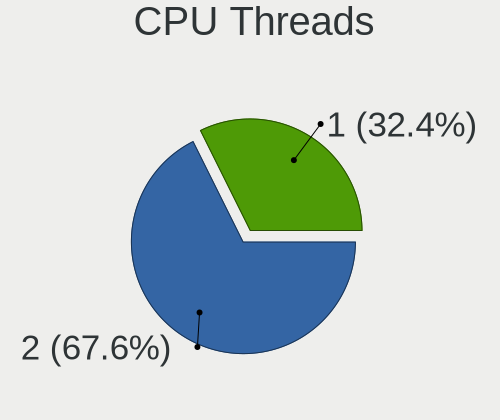

| Number | Notebooks | Percent |
|--------|-----------|---------|
| 2      | 23        | 67.65%  |
| 1      | 11        | 32.35%  |

CPU Op-Modes
------------

CPU Operation Modes (32-bit, 64-bit)

| Op mode        | Notebooks | Percent |
|----------------|-----------|---------|
| 32-bit, 64-bit | 33        | 97.06%  |
| 32-bit         | 1         | 2.94%   |

CPU Microcode
-------------

Microcode number

| Number     | Notebooks | Percent |
|------------|-----------|---------|
| 0x306a9    | 4         | 11.76%  |
| 0x1067a    | 4         | 11.76%  |
| Unknown    | 4         | 11.76%  |
| 0x806ea    | 3         | 8.82%   |
| 0x206a7    | 3         | 8.82%   |
| 0x806d1    | 2         | 5.88%   |
| 0x30678    | 2         | 5.88%   |
| 0xb06a3    | 1         | 2.94%   |
| 0x806ec    | 1         | 2.94%   |
| 0x806e9    | 1         | 2.94%   |
| 0x706a1    | 1         | 2.94%   |
| 0x406e3    | 1         | 2.94%   |
| 0x406c4    | 1         | 2.94%   |
| 0x306c3    | 1         | 2.94%   |
| 0x106c2    | 1         | 2.94%   |
| 0x10676    | 1         | 2.94%   |
| 0x0a50000c | 1         | 2.94%   |
| 0x06001119 | 1         | 2.94%   |
| 0x0500010d | 1         | 2.94%   |

CPU Microarch
-------------

Microarchitecture

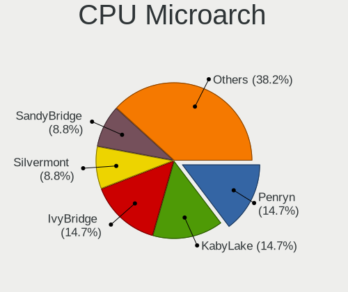

| Name          | Notebooks | Percent |
|---------------|-----------|---------|
| Penryn        | 5         | 14.71%  |
| KabyLake      | 5         | 14.71%  |
| IvyBridge     | 5         | 14.71%  |
| Silvermont    | 3         | 8.82%   |
| SandyBridge   | 3         | 8.82%   |
| Icelake       | 2         | 5.88%   |
| Bonnell       | 2         | 5.88%   |
| Unknown       | 2         | 5.88%   |
| Zen 3         | 1         | 2.94%   |
| Skylake       | 1         | 2.94%   |
| Piledriver    | 1         | 2.94%   |
| Haswell       | 1         | 2.94%   |
| Goldmont plus | 1         | 2.94%   |
| Core          | 1         | 2.94%   |
| Bobcat        | 1         | 2.94%   |

Graphics
--------

GPU Vendor
----------

Vendors of graphics cards

| Vendor | Notebooks | Percent |
|--------|-----------|---------|
| Intel  | 31        | 77.5%   |
| Nvidia | 5         | 12.5%   |
| AMD    | 4         | 10%     |

GPU Model
---------

Graphics card models

| Model                                                                                    | Notebooks | Percent |
|------------------------------------------------------------------------------------------|-----------|---------|
| Intel Mobile 4 Series Chipset Integrated Graphics Controller                             | 5         | 11.9%   |
| Intel 3rd Gen Core processor Graphics Controller                                         | 5         | 11.9%   |
| Intel UHD Graphics 620                                                                   | 3         | 7.14%   |
| Intel TigerLake-H GT1 [UHD Graphics]                                                     | 3         | 7.14%   |
| Intel 2nd Generation Core Processor Family Integrated Graphics Controller                | 3         | 7.14%   |
| Nvidia GA107M [GeForce RTX 3050 Ti Mobile]                                               | 2         | 4.76%   |
| Nvidia GA106M [GeForce RTX 3060 Mobile / Max-Q]                                          | 2         | 4.76%   |
| Intel Atom Processor Z36xxx/Z37xxx Series Graphics & Display                             | 2         | 4.76%   |
| Nvidia GM108M [GeForce MX110]                                                            | 1         | 2.38%   |
| Intel Skylake GT2 [HD Graphics 520]                                                      | 1         | 2.38%   |
| Intel Raptor Lake-P [Iris Xe Graphics]                                                   | 1         | 2.38%   |
| Intel Mobile GM965/GL960 Integrated Graphics Controller (secondary)                      | 1         | 2.38%   |
| Intel Mobile GM965/GL960 Integrated Graphics Controller (primary)                        | 1         | 2.38%   |
| Intel Mobile 945GSE Express Integrated Graphics Controller                               | 1         | 2.38%   |
| Intel Mobile 945GM/GMS/GME, 943/940GML Express Integrated Graphics Controller            | 1         | 2.38%   |
| Intel HD Graphics 620                                                                    | 1         | 2.38%   |
| Intel GeminiLake [UHD Graphics 600]                                                      | 1         | 2.38%   |
| Intel CometLake-U GT2 [UHD Graphics]                                                     | 1         | 2.38%   |
| Intel Atom/Celeron/Pentium Processor x5-E8000/J3xxx/N3xxx Integrated Graphics Controller | 1         | 2.38%   |
| Intel Atom Processor D2xxx/N2xxx Integrated Graphics Controller                          | 1         | 2.38%   |
| Intel 4th Gen Core Processor Integrated Graphics Controller                              | 1         | 2.38%   |
| AMD Wrestler [Radeon HD 7310]                                                            | 1         | 2.38%   |
| AMD Richland [Radeon HD 8550G]                                                           | 1         | 2.38%   |
| AMD Mars XTX [Radeon HD 8790M]                                                           | 1         | 2.38%   |
| AMD Cezanne [Radeon Vega Series / Radeon Vega Mobile Series]                             | 1         | 2.38%   |

GPU Combo
---------

Combinations of graphics cards

| Name           | Notebooks | Percent |
|----------------|-----------|---------|
| 1 x Intel      | 26        | 74.29%  |
| Intel + Nvidia | 4         | 11.43%  |
| 1 x AMD        | 2         | 5.71%   |
| 2 x AMD        | 1         | 2.86%   |
| Intel + AMD    | 1         | 2.86%   |
| AMD + Nvidia   | 1         | 2.86%   |

GPU Driver
----------

Free vs proprietary

| Driver  | Notebooks | Percent |
|---------|-----------|---------|
| Free    | 31        | 91.18%  |
| Unknown | 3         | 8.82%   |

GPU Memory
----------

Total video memory

| Size in GB | Notebooks | Percent |
|------------|-----------|---------|
| Unknown    | 27        | 77.14%  |
| 1.01-2.0   | 4         | 11.43%  |
| 5.01-6.0   | 1         | 2.86%   |
| 3.01-4.0   | 1         | 2.86%   |
| 0.51-1.0   | 1         | 2.86%   |
| 0.01-0.5   | 1         | 2.86%   |

Monitor
-------

Monitor Vendor
--------------

Monitor vendors

| Vendor                  | Notebooks | Percent |
|-------------------------|-----------|---------|
| Samsung Electronics     | 7         | 21.88%  |
| LG Display              | 7         | 21.88%  |
| AU Optronics            | 5         | 15.63%  |
| Lenovo                  | 3         | 9.38%   |
| Chimei Innolux          | 3         | 9.38%   |
| BOE                     | 2         | 6.25%   |
| Sharp                   | 1         | 3.13%   |
| Gateway                 | 1         | 3.13%   |
| CPT                     | 1         | 3.13%   |
| Chi Mei Optoelectronics | 1         | 3.13%   |
| Acer                    | 1         | 3.13%   |

Monitor Model
-------------

Monitor models

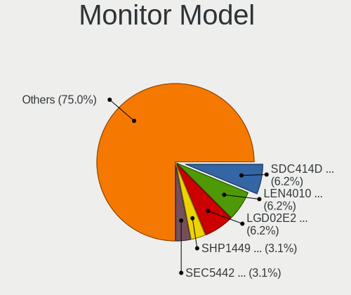

| Model                                                                    | Notebooks | Percent |
|--------------------------------------------------------------------------|-----------|---------|
| Samsung Electronics LCD Monitor SDC414D 3456x2160 336x210mm 15.6-inch    | 2         | 6.25%   |
| LG Display LCD Monitor LGD02E2 1600x900 310x174mm 14.0-inch              | 2         | 6.25%   |
| Lenovo LCD Monitor LEN4010 1280x800 261x163mm 12.1-inch                  | 2         | 6.25%   |
| Sharp LCD Monitor SHP1449 1920x1080 294x165mm 13.3-inch                  | 1         | 3.13%   |
| Samsung Electronics LCD Monitor SEC5442 1440x900 331x207mm 15.4-inch     | 1         | 3.13%   |
| Samsung Electronics LCD Monitor SEC5441 1280x800 286x179mm 13.3-inch     | 1         | 3.13%   |
| Samsung Electronics LCD Monitor SEC374E 1024x600 223x125mm 10.1-inch     | 1         | 3.13%   |
| Samsung Electronics LCD Monitor SEC3052 1024x600 223x125mm 10.1-inch     | 1         | 3.13%   |
| Samsung Electronics LC32G5xT SAM7080 2560x1440 700x400mm 31.7-inch       | 1         | 3.13%   |
| LG Display LCD Monitor LGD05D0 1920x1080 344x194mm 15.5-inch             | 1         | 3.13%   |
| LG Display LCD Monitor LGD03BD 1920x1080 276x156mm 12.5-inch             | 1         | 3.13%   |
| LG Display LCD Monitor LGD0362 1600x900 309x174mm 14.0-inch              | 1         | 3.13%   |
| LG Display LCD Monitor LGD033C 1366x768 309x174mm 14.0-inch              | 1         | 3.13%   |
| LG Display LCD Monitor LGD0335 1366x768 310x174mm 14.0-inch              | 1         | 3.13%   |
| Lenovo LCD Monitor LEN4011 1280x800 261x163mm 12.1-inch                  | 1         | 3.13%   |
| Gateway FPD1976W GWY0785 1440x900 410x257mm 19.1-inch                    | 1         | 3.13%   |
| CPT LCD Monitor CPT1401 1280x800 331x207mm 15.4-inch                     | 1         | 3.13%   |
| Chimei Innolux LCD Monitor CMN15BA 1920x1080 344x194mm 15.5-inch         | 1         | 3.13%   |
| Chimei Innolux LCD Monitor CMN14C9 1920x1080 309x173mm 13.9-inch         | 1         | 3.13%   |
| Chimei Innolux LCD Monitor CMN1139 1366x768 256x144mm 11.6-inch          | 1         | 3.13%   |
| Chi Mei Optoelectronics LCD Monitor CMO1590 1366x768 344x194mm 15.5-inch | 1         | 3.13%   |
| BOE LCD Monitor BOE07C5 1920x1080 344x194mm 15.5-inch                    | 1         | 3.13%   |
| BOE LCD Monitor BOE0671 1366x768 344x194mm 15.5-inch                     | 1         | 3.13%   |
| AU Optronics LCD Monitor AUO61ED 1920x1080 344x194mm 15.5-inch           | 1         | 3.13%   |
| AU Optronics LCD Monitor AUO409D 1920x1080 382x215mm 17.3-inch           | 1         | 3.13%   |
| AU Optronics LCD Monitor AUO26EC 1366x768 344x193mm 15.5-inch            | 1         | 3.13%   |
| AU Optronics LCD Monitor AUO215C 1366x768 256x144mm 11.6-inch            | 1         | 3.13%   |
| AU Optronics LCD Monitor AUO106C 1366x768 277x156mm 12.5-inch            | 1         | 3.13%   |
| Acer SA270 ACR0580 1920x1080 598x336mm 27.0-inch                         | 1         | 3.13%   |

Monitor Resolution
------------------

Monitor screen resolution

| Resolution       | Notebooks | Percent |
|------------------|-----------|---------|
| 1366x768 (WXGA)  | 11        | 36.67%  |
| 1920x1080 (FHD)  | 8         | 26.67%  |
| 1280x800 (WXGA)  | 4         | 13.33%  |
| 1600x900 (HD+)   | 3         | 10%     |
| 3456x2160        | 2         | 6.67%   |
| 2560x1440 (QHD)  | 1         | 3.33%   |
| 1440x900 (WXGA+) | 1         | 3.33%   |

Monitor Diagonal
----------------

Diagonal size in inches

| Inches | Notebooks | Percent |
|--------|-----------|---------|
| 15     | 13        | 40.63%  |
| 14     | 5         | 15.63%  |
| 12     | 5         | 15.63%  |
| 17     | 2         | 6.25%   |
| 13     | 2         | 6.25%   |
| 11     | 2         | 6.25%   |
| 31     | 1         | 3.13%   |
| 27     | 1         | 3.13%   |
| 19     | 1         | 3.13%   |

Monitor Width
-------------

Physical width

| Width in mm | Notebooks | Percent |
|-------------|-----------|---------|
| 301-350     | 18        | 56.25%  |
| 201-300     | 8         | 25%     |
| 351-400     | 3         | 9.38%   |
| 601-700     | 1         | 3.13%   |
| 501-600     | 1         | 3.13%   |
| 401-500     | 1         | 3.13%   |

Aspect Ratio
------------

Proportional relationship between the width and the height

| Ratio | Notebooks | Percent |
|-------|-----------|---------|
| 16/9  | 22        | 75.86%  |
| 16/10 | 6         | 20.69%  |
| 3/2   | 1         | 3.45%   |

Monitor Area
------------

Area in inch²

| Area in inch² | Notebooks | Percent |
|----------------|-----------|---------|
| 101-110        | 13        | 40.63%  |
| 81-90          | 6         | 18.75%  |
| 61-70          | 5         | 15.63%  |
| 51-60          | 2         | 6.25%   |
| 71-80          | 1         | 3.13%   |
| 351-500        | 1         | 3.13%   |
| 301-350        | 1         | 3.13%   |
| 151-200        | 1         | 3.13%   |
| 131-140        | 1         | 3.13%   |
| 121-130        | 1         | 3.13%   |

Pixel Density
-------------

Pixels per inch

| Density       | Notebooks | Percent |
|---------------|-----------|---------|
| 121-160       | 15        | 48.39%  |
| 101-120       | 7         | 22.58%  |
| 51-100        | 5         | 16.13%  |
| More than 240 | 2         | 6.45%   |
| 161-240       | 2         | 6.45%   |

Multiple Monitors
-----------------

Total monitors connected

| Total | Notebooks | Percent |
|-------|-----------|---------|
| 1     | 29        | 82.86%  |
| 2     | 3         | 8.57%   |
| 0     | 3         | 8.57%   |

Network
-------

Net Controller Vendor
---------------------

Controller vendors

| Vendor                          | Notebooks | Percent |
|---------------------------------|-----------|---------|
| Intel                           | 21        | 36.21%  |
| Qualcomm Atheros                | 14        | 24.14%  |
| Realtek Semiconductor           | 12        | 20.69%  |
| Qualcomm Atheros Communications | 5         | 8.62%   |
| Marvell Technology Group        | 2         | 3.45%   |
| Samsung Electronics             | 1         | 1.72%   |
| Qualcomm                        | 1         | 1.72%   |
| Microsoft                       | 1         | 1.72%   |
| Memorex                         | 1         | 1.72%   |

Net Controller Model
--------------------

Controller models

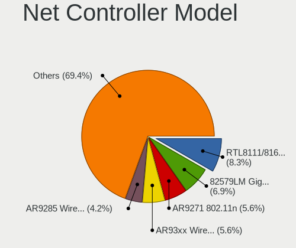

| Model                                                                  | Notebooks | Percent |
|------------------------------------------------------------------------|-----------|---------|
| Realtek RTL8111/8168/8211/8411 PCI Express Gigabit Ethernet Controller | 6         | 8.33%   |
| Intel 82579LM Gigabit Network Connection (Lewisville)                  | 5         | 6.94%   |
| Qualcomm Atheros AR9271 802.11n                                        | 4         | 5.56%   |
| Qualcomm Atheros AR93xx Wireless Network Adapter                       | 4         | 5.56%   |
| Qualcomm Atheros AR9285 Wireless Network Adapter (PCI-Express)         | 3         | 4.17%   |
| Intel Tiger Lake PCH CNVi WiFi                                         | 3         | 4.17%   |
| Intel Centrino Advanced-N 6205 [Taylor Peak]                           | 3         | 4.17%   |
| Intel 82567LM Gigabit Network Connection                               | 3         | 4.17%   |
| Realtek RTL810xE PCI Express Fast Ethernet controller                  | 2         | 2.78%   |
| Intel Wireless 8265 / 8275                                             | 2         | 2.78%   |
| Intel Centrino Wireless-N 1000 [Condor Peak]                           | 2         | 2.78%   |
| Samsung HSPA Modem                                                     | 1         | 1.39%   |
| Realtek RTL8852AE 802.11ax PCIe Wireless Network Adapter               | 1         | 1.39%   |
| Realtek RTL8821CE 802.11ac PCIe Wireless Network Adapter               | 1         | 1.39%   |
| Realtek RTL8723AE PCIe Wireless Network Adapter                        | 1         | 1.39%   |
| Realtek RTL8187B Wireless 802.11g 54Mbps Network Adapter               | 1         | 1.39%   |
| Realtek RTL8153 Gigabit Ethernet Adapter                               | 1         | 1.39%   |
| Realtek Killer E2600 GbE Controller                                    | 1         | 1.39%   |
| Qualcomm POCO F3                                                       | 1         | 1.39%   |
| Qualcomm Atheros QCA9565 / AR9565 Wireless Network Adapter             | 1         | 1.39%   |
| Qualcomm Atheros QCA9377 802.11ac Wireless Network Adapter             | 1         | 1.39%   |
| Qualcomm Atheros QCA8172 Fast Ethernet                                 | 1         | 1.39%   |
| Qualcomm Atheros QCA6174 802.11ac Wireless Network Adapter             | 1         | 1.39%   |
| Qualcomm Atheros Ubiquiti WiFiStationEXT 802.11n [Atheros AR9271]      | 1         | 1.39%   |
| Qualcomm Atheros AR9485 Wireless Network Adapter                       | 1         | 1.39%   |
| Qualcomm Atheros AR9462 Wireless Network Adapter                       | 1         | 1.39%   |
| Qualcomm Atheros AR8162 Fast Ethernet                                  | 1         | 1.39%   |
| Qualcomm Atheros AR8152 v2.0 Fast Ethernet                             | 1         | 1.39%   |
| Qualcomm Atheros AR8151 v2.0 Gigabit Ethernet                          | 1         | 1.39%   |
| Microsoft RTL8153 GigE [Surface Ethernet Adapter]                      | 1         | 1.39%   |
| Memorex 802.11n WLAN Adapter                                           | 1         | 1.39%   |
| Marvell Group 88E8055 PCI-E Gigabit Ethernet Controller                | 1         | 1.39%   |
| Marvell Group 88E8040 PCI-E Fast Ethernet Controller                   | 1         | 1.39%   |
| Intel Wireless 7265                                                    | 1         | 1.39%   |
| Intel Wireless 3165                                                    | 1         | 1.39%   |
| Intel WiFi Link 5100                                                   | 1         | 1.39%   |
| Intel Raptor Lake PCH CNVi WiFi                                        | 1         | 1.39%   |
| Intel Ethernet Connection I217-LM                                      | 1         | 1.39%   |
| Intel Ethernet Connection (4) I219-V                                   | 1         | 1.39%   |
| Intel Ethernet Connection (4) I219-LM                                  | 1         | 1.39%   |

Wireless Vendor
---------------

Wireless vendors

| Vendor                          | Notebooks | Percent |
|---------------------------------|-----------|---------|
| Intel                           | 17        | 43.59%  |
| Qualcomm Atheros                | 12        | 30.77%  |
| Qualcomm Atheros Communications | 5         | 12.82%  |
| Realtek Semiconductor           | 4         | 10.26%  |
| Memorex                         | 1         | 2.56%   |

Wireless Model
--------------

Wireless models

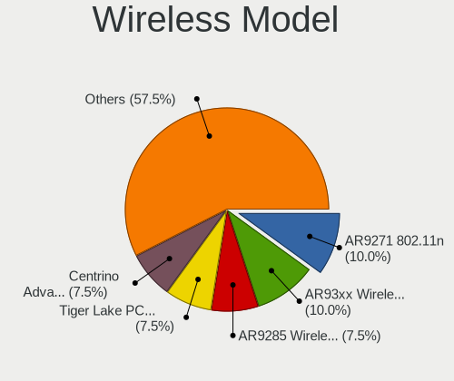

| Model                                                             | Notebooks | Percent |
|-------------------------------------------------------------------|-----------|---------|
| Qualcomm Atheros AR9271 802.11n                                   | 4         | 10%     |
| Qualcomm Atheros AR93xx Wireless Network Adapter                  | 4         | 10%     |
| Qualcomm Atheros AR9285 Wireless Network Adapter (PCI-Express)    | 3         | 7.5%    |
| Intel Tiger Lake PCH CNVi WiFi                                    | 3         | 7.5%    |
| Intel Centrino Advanced-N 6205 [Taylor Peak]                      | 3         | 7.5%    |
| Intel Wireless 8265 / 8275                                        | 2         | 5%      |
| Intel Centrino Wireless-N 1000 [Condor Peak]                      | 2         | 5%      |
| Realtek RTL8852AE 802.11ax PCIe Wireless Network Adapter          | 1         | 2.5%    |
| Realtek RTL8821CE 802.11ac PCIe Wireless Network Adapter          | 1         | 2.5%    |
| Realtek RTL8723AE PCIe Wireless Network Adapter                   | 1         | 2.5%    |
| Realtek RTL8187B Wireless 802.11g 54Mbps Network Adapter          | 1         | 2.5%    |
| Qualcomm Atheros QCA9565 / AR9565 Wireless Network Adapter        | 1         | 2.5%    |
| Qualcomm Atheros QCA9377 802.11ac Wireless Network Adapter        | 1         | 2.5%    |
| Qualcomm Atheros QCA6174 802.11ac Wireless Network Adapter        | 1         | 2.5%    |
| Qualcomm Atheros Ubiquiti WiFiStationEXT 802.11n [Atheros AR9271] | 1         | 2.5%    |
| Qualcomm Atheros AR9485 Wireless Network Adapter                  | 1         | 2.5%    |
| Qualcomm Atheros AR9462 Wireless Network Adapter                  | 1         | 2.5%    |
| Memorex 802.11n WLAN Adapter                                      | 1         | 2.5%    |
| Intel Wireless 7265                                               | 1         | 2.5%    |
| Intel Wireless 3165                                               | 1         | 2.5%    |
| Intel WiFi Link 5100                                              | 1         | 2.5%    |
| Intel Raptor Lake PCH CNVi WiFi                                   | 1         | 2.5%    |
| Intel Comet Lake PCH-LP CNVi WiFi                                 | 1         | 2.5%    |
| Intel Centrino Wireless-N 6150                                    | 1         | 2.5%    |
| Intel Centrino Wireless-N + WiMAX 6150                            | 1         | 2.5%    |
| Intel Centrino Advanced-N 6235                                    | 1         | 2.5%    |

Ethernet Vendor
---------------

Ethernet vendors

| Vendor                   | Notebooks | Percent |
|--------------------------|-----------|---------|
| Intel                    | 13        | 41.94%  |
| Realtek Semiconductor    | 10        | 32.26%  |
| Qualcomm Atheros         | 4         | 12.9%   |
| Marvell Technology Group | 2         | 6.45%   |
| Qualcomm                 | 1         | 3.23%   |
| Microsoft                | 1         | 3.23%   |

Ethernet Model
--------------

Ethernet models

| Model                                                                  | Notebooks | Percent |
|------------------------------------------------------------------------|-----------|---------|
| Realtek RTL8111/8168/8211/8411 PCI Express Gigabit Ethernet Controller | 6         | 19.35%  |
| Intel 82579LM Gigabit Network Connection (Lewisville)                  | 5         | 16.13%  |
| Intel 82567LM Gigabit Network Connection                               | 3         | 9.68%   |
| Realtek RTL810xE PCI Express Fast Ethernet controller                  | 2         | 6.45%   |
| Realtek RTL8153 Gigabit Ethernet Adapter                               | 1         | 3.23%   |
| Realtek Killer E2600 GbE Controller                                    | 1         | 3.23%   |
| Qualcomm POCO F3                                                       | 1         | 3.23%   |
| Qualcomm Atheros QCA8172 Fast Ethernet                                 | 1         | 3.23%   |
| Qualcomm Atheros AR8162 Fast Ethernet                                  | 1         | 3.23%   |
| Qualcomm Atheros AR8152 v2.0 Fast Ethernet                             | 1         | 3.23%   |
| Qualcomm Atheros AR8151 v2.0 Gigabit Ethernet                          | 1         | 3.23%   |
| Microsoft RTL8153 GigE [Surface Ethernet Adapter]                      | 1         | 3.23%   |
| Marvell Group 88E8055 PCI-E Gigabit Ethernet Controller                | 1         | 3.23%   |
| Marvell Group 88E8040 PCI-E Fast Ethernet Controller                   | 1         | 3.23%   |
| Intel Ethernet Connection I217-LM                                      | 1         | 3.23%   |
| Intel Ethernet Connection (4) I219-V                                   | 1         | 3.23%   |
| Intel Ethernet Connection (4) I219-LM                                  | 1         | 3.23%   |
| Intel Ethernet Connection (23) I219-V                                  | 1         | 3.23%   |
| Intel 82567LF Gigabit Network Connection                               | 1         | 3.23%   |

Net Controller Kind
-------------------

Ethernet, WiFi or modem

| Kind     | Notebooks | Percent |
|----------|-----------|---------|
| WiFi     | 33        | 50.77%  |
| Ethernet | 31        | 47.69%  |
| Modem    | 1         | 1.54%   |

Used Controller
---------------

Currently used network controller

| Kind     | Notebooks | Percent |
|----------|-----------|---------|
| WiFi     | 22        | 66.67%  |
| Ethernet | 11        | 33.33%  |

NICs
----

Total network controllers on board

| Total | Notebooks | Percent |
|-------|-----------|---------|
| 2     | 27        | 79.41%  |
| 1     | 6         | 17.65%  |
| 0     | 1         | 2.94%   |

IPv6
----

IPv6 vs IPv4

| Used | Notebooks | Percent |
|------|-----------|---------|
| No   | 25        | 73.53%  |
| Yes  | 9         | 26.47%  |

Bluetooth
---------

Bluetooth Vendor
----------------

Controller vendors

| Vendor                          | Notebooks | Percent |
|---------------------------------|-----------|---------|
| Intel                           | 7         | 33.33%  |
| Broadcom                        | 5         | 23.81%  |
| Qualcomm Atheros Communications | 3         | 14.29%  |
| Toshiba                         | 2         | 9.52%   |
| Realtek Semiconductor           | 2         | 9.52%   |
| Foxconn / Hon Hai               | 1         | 4.76%   |
| Cambridge Silicon Radio         | 1         | 4.76%   |

Bluetooth Model
---------------

Controller models

| Model                                               | Notebooks | Percent |
|-----------------------------------------------------|-----------|---------|
| Intel AX201 Bluetooth                               | 5         | 23.81%  |
| Broadcom BCM20702 Bluetooth 4.0 [ThinkPad]          | 3         | 14.29%  |
| Realtek Bluetooth Radio                             | 2         | 9.52%   |
| Qualcomm Atheros  Bluetooth Device                  | 2         | 9.52%   |
| Intel Bluetooth wireless interface                  | 2         | 9.52%   |
| Toshiba RT Bluetooth Radio                          | 1         | 4.76%   |
| Toshiba Bluetooth Device                            | 1         | 4.76%   |
| Qualcomm Atheros AR3012 Bluetooth 4.0               | 1         | 4.76%   |
| Foxconn / Hon Hai Bluetooth Device                  | 1         | 4.76%   |
| Cambridge Silicon Radio Bluetooth Dongle (HCI mode) | 1         | 4.76%   |
| Broadcom BCM20702A0 Bluetooth 4.0                   | 1         | 4.76%   |
| Broadcom BCM2045B (BDC-2.1) [Bluetooth Controller]  | 1         | 4.76%   |

Sound
-----

Sound Vendor
------------

Sound card vendors

| Vendor                | Notebooks | Percent |
|-----------------------|-----------|---------|
| Intel                 | 30        | 81.08%  |
| AMD                   | 3         | 8.11%   |
| Nvidia                | 2         | 5.41%   |
| Realtek Semiconductor | 1         | 2.7%    |
| Lenovo                | 1         | 2.7%    |

Sound Model
-----------

Sound card models

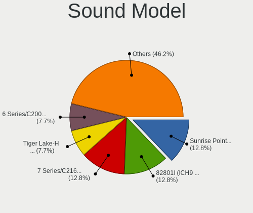

| Model                                                                                             | Notebooks | Percent |
|---------------------------------------------------------------------------------------------------|-----------|---------|
| Intel Sunrise Point-LP HD Audio                                                                   | 5         | 12.82%  |
| Intel 82801I (ICH9 Family) HD Audio Controller                                                    | 5         | 12.82%  |
| Intel 7 Series/C216 Chipset Family High Definition Audio Controller                               | 5         | 12.82%  |
| Intel Tiger Lake-H HD Audio Controller                                                            | 3         | 7.69%   |
| Intel 6 Series/C200 Series Chipset Family High Definition Audio Controller                        | 3         | 7.69%   |
| Nvidia GA106 High Definition Audio Controller                                                     | 2         | 5.13%   |
| Intel NM10/ICH7 Family High Definition Audio Controller                                           | 2         | 5.13%   |
| AMD FCH Azalia Controller                                                                         | 2         | 5.13%   |
| Realtek Semiconductor USB Audio                                                                   | 1         | 2.56%   |
| Lenovo ThinkPad Dock USB Audio                                                                    | 1         | 2.56%   |
| Intel Xeon E3-1200 v3/4th Gen Core Processor HD Audio Controller                                  | 1         | 2.56%   |
| Intel Raptor Lake-P/U/H cAVS                                                                      | 1         | 2.56%   |
| Intel Comet Lake PCH-LP cAVS                                                                      | 1         | 2.56%   |
| Intel Celeron/Pentium Silver Processor High Definition Audio                                      | 1         | 2.56%   |
| Intel Atom/Celeron/Pentium Processor x5-E8000/J3xxx/N3xxx Series High Definition Audio Controller | 1         | 2.56%   |
| Intel Atom Processor Z36xxx/Z37xxx Series High Definition Audio Controller                        | 1         | 2.56%   |
| Intel 82801H (ICH8 Family) HD Audio Controller                                                    | 1         | 2.56%   |
| Intel 8 Series/C220 Series Chipset High Definition Audio Controller                               | 1         | 2.56%   |
| AMD Trinity HDMI Audio Controller                                                                 | 1         | 2.56%   |
| AMD Family 17h/19h/1ah HD Audio Controller                                                        | 1         | 2.56%   |

Memory
------

Memory Vendor
-------------

Memory module vendors

| Vendor              | Notebooks | Percent |
|---------------------|-----------|---------|
| Samsung Electronics | 9         | 32.14%  |
| SK hynix            | 6         | 21.43%  |
| Micron Technology   | 4         | 14.29%  |
| Kingston            | 3         | 10.71%  |
| Unknown             | 1         | 3.57%   |
| TEXTORM             | 1         | 3.57%   |
| Ramaxel Technology  | 1         | 3.57%   |
| Qimonda             | 1         | 3.57%   |
| Crucial             | 1         | 3.57%   |
| A-DATA Technology   | 1         | 3.57%   |

Memory Model
------------

Memory module models

| Model                                                          | Notebooks | Percent |
|----------------------------------------------------------------|-----------|---------|
| Samsung RAM M471A1G44BB0-CWE 8GB SODIMM DDR4 3200MT/s          | 3         | 10.34%  |
| Samsung RAM M471A1K43EB1-CWE 8GB SODIMM DDR4 3200MT/s          | 2         | 6.9%    |
| Unknown RAM Module 2GB SODIMM DDR3 1333MT/s                    | 1         | 3.45%   |
| TEXTORM RAM TXS8G1M2666C19 8GB SODIMM DDR4 2667MT/s            | 1         | 3.45%   |
| SK hynix RAM HYMP125S64CP8-S6 2048MB SODIMM DDR2 975MT/s       | 1         | 3.45%   |
| SK hynix RAM HMT41GS6AFR8A-PB 8GB SODIMM DDR3 2667MT/s         | 1         | 3.45%   |
| SK hynix RAM HMT41GS6AFR8A-H9 8192MB SODIMM DDR3 1333MT/s      | 1         | 3.45%   |
| SK hynix RAM HMT351S6CFR8C-PB 4GB SODIMM DDR3 1600MT/s         | 1         | 3.45%   |
| SK hynix RAM HMA851S6CJR6N-UH 4GB SODIMM DDR4 2400MT/s         | 1         | 3.45%   |
| SK hynix RAM HMA81GS6AFR8N-UH 8GB SODIMM DDR4 2667MT/s         | 1         | 3.45%   |
| Samsung RAM Module 2GB Row Of Chips DDR3 1600MT/s              | 1         | 3.45%   |
| Samsung RAM M471B5773CHS-CK0 2GB SODIMM DDR3 1600MT/s          | 1         | 3.45%   |
| Samsung RAM M471B5273DH0-CK0 4GB SODIMM DDR3 2400MT/s          | 1         | 3.45%   |
| Samsung RAM M471B5273DH0-CH9 4GB SODIMM DDR3 1334MT/s          | 1         | 3.45%   |
| Samsung RAM M471B5273CM0-CK0 4GB SODIMM DDR3 1600MT/s          | 1         | 3.45%   |
| Ramaxel RAM RMT3170ME68F9F1600 4GB SODIMM DDR3 1600MT/s        | 1         | 3.45%   |
| Qimonda RAM 64T512022EDL2.5A 4096MB SODIMM DDR 800MT/s         | 1         | 3.45%   |
| Micron RAM MT52L512M32D2PF-10 4GB Row Of Chips LPDDR3 1867MT/s | 1         | 3.45%   |
| Micron RAM H6451U64F7066G 4096MB SODIMM DDR3 1067MT/s          | 1         | 3.45%   |
| Micron RAM 8KTF51264HZ-1G6E1 4GB SODIMM DDR3 1600MT/s          | 1         | 3.45%   |
| Micron RAM 4ATF51264HZ-2G3H1R 4GB SODIMM DDR4 2400MT/s         | 1         | 3.45%   |
| Kingston RAM K821PJ-MID 16GB SODIMM DDR4 2400MT/s              | 1         | 3.45%   |
| Kingston RAM ASU1600S11-4G-EDEG 4GB SODIMM DDR3 1600MT/s       | 1         | 3.45%   |
| Kingston RAM 9905624-044.A00G 8GB SODIMM DDR4 2400MT/s         | 1         | 3.45%   |
| Crucial RAM CT51264BF160B.C16F 4GB SODIMM DDR3 1600MT/s        | 1         | 3.45%   |
| A-DATA RAM Module 4096MB SODIMM DDR4 2400MT/s                  | 1         | 3.45%   |

Memory Kind
-----------

Memory module kinds

| Kind   | Notebooks | Percent |
|--------|-----------|---------|
| DDR3   | 12        | 46.15%  |
| DDR4   | 11        | 42.31%  |
| LPDDR3 | 1         | 3.85%   |
| DDR2   | 1         | 3.85%   |
| DDR    | 1         | 3.85%   |

Memory Form Factor
------------------

Physical design of the memory module

| Name         | Notebooks | Percent |
|--------------|-----------|---------|
| SODIMM       | 22        | 91.67%  |
| Row Of Chips | 2         | 8.33%   |

Memory Size
-----------

Memory module size

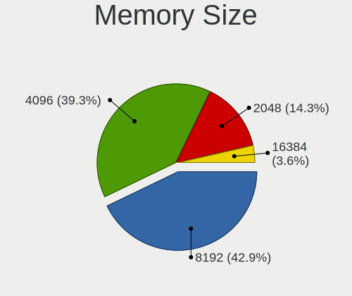

| Size  | Notebooks | Percent |
|-------|-----------|---------|
| 8192  | 12        | 42.86%  |
| 4096  | 11        | 39.29%  |
| 2048  | 4         | 14.29%  |
| 16384 | 1         | 3.57%   |

Memory Speed
------------

Memory module speed

| Speed | Notebooks | Percent |
|-------|-----------|---------|
| 1600  | 8         | 29.63%  |
| 3200  | 5         | 18.52%  |
| 2400  | 4         | 14.81%  |
| 2667  | 3         | 11.11%  |
| 1333  | 2         | 7.41%   |
| 1867  | 1         | 3.7%    |
| 1334  | 1         | 3.7%    |
| 1067  | 1         | 3.7%    |
| 975   | 1         | 3.7%    |
| 800   | 1         | 3.7%    |

Printers & scanners
-------------------

Printer Vendor
--------------

Printer device vendors

Zero info for selected period =(

Printer Model
-------------

Printer device models

Zero info for selected period =(

Scanner Vendor
--------------

Scanner device vendors

Zero info for selected period =(

Scanner Model
-------------

Scanner device models

Zero info for selected period =(

Camera
------

Camera Vendor
-------------

Camera device vendors

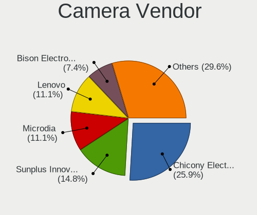

| Vendor                                 | Notebooks | Percent |
|----------------------------------------|-----------|---------|
| Chicony Electronics                    | 7         | 25.93%  |
| Sunplus Innovation Technology          | 4         | 14.81%  |
| Microdia                               | 3         | 11.11%  |
| Lenovo                                 | 3         | 11.11%  |
| Bison Electronics                      | 2         | 7.41%   |
| Z-Star Microelectronics                | 1         | 3.7%    |
| Realtek Semiconductor                  | 1         | 3.7%    |
| Quanta                                 | 1         | 3.7%    |
| Logitech                               | 1         | 3.7%    |
| Importek                               | 1         | 3.7%    |
| IMC Networks                           | 1         | 3.7%    |
| GoPro                                  | 1         | 3.7%    |
| Cheng Uei Precision Industry (Foxlink) | 1         | 3.7%    |

Camera Model
------------

Camera device models

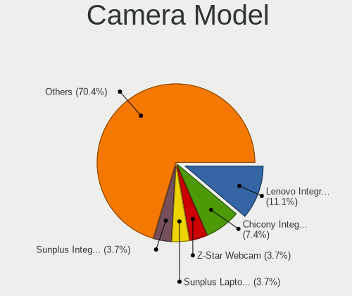

| Model                                                        | Notebooks | Percent |
|--------------------------------------------------------------|-----------|---------|
| Lenovo Integrated Webcam                                     | 3         | 11.11%  |
| Chicony Integrated Camera                                    | 2         | 7.41%   |
| Z-Star Webcam                                                | 1         | 3.7%    |
| Sunplus Laptop_Integrated_Webcam_1.3M                        | 1         | 3.7%    |
| Sunplus Integrated_Webcam_HD                                 | 1         | 3.7%    |
| Sunplus HD WebCam                                            | 1         | 3.7%    |
| Sunplus Asus Webcam                                          | 1         | 3.7%    |
| Realtek Lenovo EasyCamera                                    | 1         | 3.7%    |
| Quanta HD User Facing                                        | 1         | 3.7%    |
| Microdia Integrated_Webcam_HD                                | 1         | 3.7%    |
| Microdia Integrated_Webcam_1.3M                              | 1         | 3.7%    |
| Microdia Integrated Webcam HD                                | 1         | 3.7%    |
| Logitech C922 Pro Stream Webcam                              | 1         | 3.7%    |
| Importek TOSHIBA Web Camera                                  | 1         | 3.7%    |
| IMC Networks UVC VGA Webcam                                  | 1         | 3.7%    |
| GoPro HERO4 Black                                            | 1         | 3.7%    |
| Chicony TOSHIBA Web Camera                                   | 1         | 3.7%    |
| Chicony Thinkpad T430 camera                                 | 1         | 3.7%    |
| Chicony HP Wide Vision HD Camera                             | 1         | 3.7%    |
| Chicony HP Webcam                                            | 1         | 3.7%    |
| Chicony Chicony USB2.0 Camera                                | 1         | 3.7%    |
| Cheng Uei Precision Industry (Foxlink) XiaoMi USB 2.0 Webcam | 1         | 3.7%    |
| Bison ThinkPad Integrated Camera                             | 1         | 3.7%    |
| Bison Integrated Camera                                      | 1         | 3.7%    |

Security
--------

Fingerprint Vendor
------------------

Fingerprint sensor vendors

| Vendor    | Notebooks | Percent |
|-----------|-----------|---------|
| AuthenTec | 1         | 100%    |

Fingerprint Model
-----------------

Fingerprint sensor models

| Model             | Notebooks | Percent |
|-------------------|-----------|---------|
| AuthenTec AES2810 | 1         | 100%    |

Chipcard Vendor
---------------

Chipcard module vendors

| Vendor   | Notebooks | Percent |
|----------|-----------|---------|
| Broadcom | 3         | 60%     |
| Upek     | 2         | 40%     |

Chipcard Model
--------------

Chipcard module models

| Model                                                      | Notebooks | Percent |
|------------------------------------------------------------|-----------|---------|
| Upek TouchChip Fingerprint Coprocessor (WBF advanced mode) | 2         | 40%     |
| Broadcom BCM5880 Secure Applications Processor             | 2         | 40%     |
| Broadcom 5880                                              | 1         | 20%     |

Unsupported
-----------

Unsupported Devices
-------------------

Total unsupported devices on board

| Total | Notebooks | Percent |
|-------|-----------|---------|
| 0     | 18        | 52.94%  |
| 1     | 12        | 35.29%  |
| 2     | 4         | 11.76%  |

Unsupported Device Types
------------------------

Types of unsupported devices

| Type                  | Notebooks | Percent |
|-----------------------|-----------|---------|
| Graphics card         | 10        | 52.63%  |
| Chipcard              | 5         | 26.32%  |
| Net/wireless          | 1         | 5.26%   |
| Multimedia controller | 1         | 5.26%   |
| Fingerprint reader    | 1         | 5.26%   |
| Bluetooth             | 1         | 5.26%   |

