Trisquel - Tested Hardware & Statistics
---------------------------------------

A project to collect tested hardware configurations for Trisquel.

Anyone can contribute to this report by the [hw-probe](https://github.com/linuxhw/hw-probe) tool:

    sudo -E hw-probe -all -upload

Please contribute! Especially if your hardware is rare.

This is a report for all computer types. See also reports for [desktops](/Dist/Trisquel/Desktop/README.md) and [notebooks](/Dist/Trisquel/Notebook/README.md).

Contents
--------

* [ Test Cases ](#test-cases)

* [ System ](#system)
  - [ OS                       ](#os)
  - [ OS Family                ](#os-family)
  - [ Kernel                   ](#kernel)
  - [ Kernel Family            ](#kernel-family)
  - [ Kernel Major Ver.        ](#kernel-major-ver)
  - [ Arch                     ](#arch)
  - [ DE                       ](#de)
  - [ Display Server           ](#display-server)
  - [ Display Manager          ](#display-manager)
  - [ OS Lang                  ](#os-lang)
  - [ Boot Mode                ](#boot-mode)
  - [ Filesystem               ](#filesystem)
  - [ Part. scheme             ](#part-scheme)
  - [ Dual Boot with Linux/BSD ](#dual-boot-with-linuxbsd)
  - [ Dual Boot (Win)          ](#dual-boot-win)

* [ Board ](#board)
  - [ Vendor                   ](#vendor)
  - [ Model                    ](#model)
  - [ Model Family             ](#model-family)
  - [ MFG Year                 ](#mfg-year)
  - [ Form Factor              ](#form-factor)
  - [ Secure Boot              ](#secure-boot)
  - [ Coreboot                 ](#coreboot)
  - [ RAM Size                 ](#ram-size)
  - [ RAM Used                 ](#ram-used)
  - [ Total Drives             ](#total-drives)
  - [ Has CD-ROM               ](#has-cd-rom)
  - [ Has Ethernet             ](#has-ethernet)
  - [ Has WiFi                 ](#has-wifi)
  - [ Has Bluetooth            ](#has-bluetooth)

* [ Location ](#location)
  - [ Country                  ](#country)
  - [ City                     ](#city)

* [ Drives ](#drives)
  - [ Drive Vendor             ](#drive-vendor)
  - [ Drive Model              ](#drive-model)
  - [ HDD Vendor               ](#hdd-vendor)
  - [ SSD Vendor               ](#ssd-vendor)
  - [ Drive Kind               ](#drive-kind)
  - [ Drive Connector          ](#drive-connector)
  - [ Drive Size               ](#drive-size)
  - [ Space Total              ](#space-total)
  - [ Space Used               ](#space-used)
  - [ Malfunc. Drives          ](#malfunc-drives)
  - [ Malfunc. Drive Vendor    ](#malfunc-drive-vendor)
  - [ Malfunc. HDD Vendor      ](#malfunc-hdd-vendor)
  - [ Malfunc. Drive Kind      ](#malfunc-drive-kind)
  - [ Failed Drives            ](#failed-drives)
  - [ Failed Drive Vendor      ](#failed-drive-vendor)
  - [ Drive Status             ](#drive-status)

* [ Storage controller ](#storage-controller)
  - [ Storage Vendor           ](#storage-vendor)
  - [ Storage Model            ](#storage-model)
  - [ Storage Kind             ](#storage-kind)

* [ Processor ](#processor)
  - [ CPU Vendor               ](#cpu-vendor)
  - [ CPU Model                ](#cpu-model)
  - [ CPU Model Family         ](#cpu-model-family)
  - [ CPU Cores                ](#cpu-cores)
  - [ CPU Sockets              ](#cpu-sockets)
  - [ CPU Threads              ](#cpu-threads)
  - [ CPU Op-Modes             ](#cpu-op-modes)
  - [ CPU Microcode            ](#cpu-microcode)
  - [ CPU Microarch            ](#cpu-microarch)

* [ Graphics ](#graphics)
  - [ GPU Vendor               ](#gpu-vendor)
  - [ GPU Model                ](#gpu-model)
  - [ GPU Combo                ](#gpu-combo)
  - [ GPU Driver               ](#gpu-driver)
  - [ GPU Memory               ](#gpu-memory)

* [ Monitor ](#monitor)
  - [ Monitor Vendor           ](#monitor-vendor)
  - [ Monitor Model            ](#monitor-model)
  - [ Monitor Resolution       ](#monitor-resolution)
  - [ Monitor Diagonal         ](#monitor-diagonal)
  - [ Monitor Width            ](#monitor-width)
  - [ Aspect Ratio             ](#aspect-ratio)
  - [ Monitor Area             ](#monitor-area)
  - [ Pixel Density            ](#pixel-density)
  - [ Multiple Monitors        ](#multiple-monitors)

* [ Network ](#network)
  - [ Net Controller Vendor    ](#net-controller-vendor)
  - [ Net Controller Model     ](#net-controller-model)
  - [ Wireless Vendor          ](#wireless-vendor)
  - [ Wireless Model           ](#wireless-model)
  - [ Ethernet Vendor          ](#ethernet-vendor)
  - [ Ethernet Model           ](#ethernet-model)
  - [ Net Controller Kind      ](#net-controller-kind)
  - [ Used Controller          ](#used-controller)
  - [ NICs                     ](#nics)
  - [ IPv6                     ](#ipv6)

* [ Bluetooth ](#bluetooth)
  - [ Bluetooth Vendor         ](#bluetooth-vendor)
  - [ Bluetooth Model          ](#bluetooth-model)

* [ Sound ](#sound)
  - [ Sound Vendor             ](#sound-vendor)
  - [ Sound Model              ](#sound-model)

* [ Memory ](#memory)
  - [ Memory Vendor            ](#memory-vendor)
  - [ Memory Model             ](#memory-model)
  - [ Memory Kind              ](#memory-kind)
  - [ Memory Form Factor       ](#memory-form-factor)
  - [ Memory Size              ](#memory-size)
  - [ Memory Speed             ](#memory-speed)

* [ Printers & scanners ](#printers--scanners)
  - [ Printer Vendor           ](#printer-vendor)
  - [ Printer Model            ](#printer-model)
  - [ Scanner Vendor           ](#scanner-vendor)
  - [ Scanner Model            ](#scanner-model)

* [ Camera ](#camera)
  - [ Camera Vendor            ](#camera-vendor)
  - [ Camera Model             ](#camera-model)

* [ Security ](#security)
  - [ Fingerprint Vendor       ](#fingerprint-vendor)
  - [ Fingerprint Model        ](#fingerprint-model)
  - [ Chipcard Vendor          ](#chipcard-vendor)
  - [ Chipcard Model           ](#chipcard-model)

* [ Unsupported ](#unsupported)
  - [ Unsupported Devices      ](#unsupported-devices)
  - [ Unsupported Device Types ](#unsupported-device-types)

Test Cases
----------

Total: 79

| Vendor        | Model                       | Form-Factor | Probe                                                      | Date         |
|---------------|-----------------------------|-------------|------------------------------------------------------------|--------------|
| HP            | ProBook 650 G8 Notebook ... | Notebook    | [49ad50d2a1](https://linux-hardware.org/?probe=49ad50d2a1) | Dec 22, 2025 |
| HP            | ProBook 650 G8 Notebook ... | Notebook    | [cd6b12b70f](https://linux-hardware.org/?probe=cd6b12b70f) | Dec 22, 2025 |
| Dell          | Latitude 5520               | Notebook    | [7c5b618d9f](https://linux-hardware.org/?probe=7c5b618d9f) | Dec 04, 2025 |
| ASUSTek       | K84L                        | Notebook    | [3bac93e134](https://linux-hardware.org/?probe=3bac93e134) | Sep 11, 2025 |
| ASUSTek       | X456URK                     | Notebook    | [63cca1412e](https://linux-hardware.org/?probe=63cca1412e) | Sep 04, 2025 |
| Acer          | TravelMate P215-54          | Notebook    | [dbf9a46580](https://linux-hardware.org/?probe=dbf9a46580) | Aug 08, 2025 |
| Dell          | Latitude 7420               | Convertible | [7f6f35f724](https://linux-hardware.org/?probe=7f6f35f724) | Jul 09, 2025 |
| ASUSTek       | N56JK                       | Notebook    | [21e4b60b22](https://linux-hardware.org/?probe=21e4b60b22) | Jun 06, 2025 |
| ASUSTek       | N56JK                       | Notebook    | [d05bf7c7c7](https://linux-hardware.org/?probe=d05bf7c7c7) | Jun 06, 2025 |
| Fujitsu Si... | AMILO PRO V3515             | Notebook    | [63c032f435](https://linux-hardware.org/?probe=63c032f435) | Apr 24, 2025 |
| Lenovo        | ThinkPad X200 7459J74       | Notebook    | [8204d5546a](https://linux-hardware.org/?probe=8204d5546a) | Apr 04, 2025 |
| Lenovo        | ThinkPad X200 7455HS2       | Notebook    | [c9b05377a2](https://linux-hardware.org/?probe=c9b05377a2) | Mar 15, 2025 |
| Dell          | XPS 12 9Q23                 | Notebook    | [5a4c5a1eeb](https://linux-hardware.org/?probe=5a4c5a1eeb) | Feb 04, 2025 |
| Lenovo        | ThinkPad T480 20L5000UUS    | Notebook    | [e0cf37ba04](https://linux-hardware.org/?probe=e0cf37ba04) | Nov 26, 2024 |
| Lenovo        | ThinkPad E14 Gen 5 21JK0... | Notebook    | [7b5c860bd2](https://linux-hardware.org/?probe=7b5c860bd2) | Nov 15, 2024 |
| Dell          | XPS 12 9Q23                 | Notebook    | [b842f0a090](https://linux-hardware.org/?probe=b842f0a090) | Sep 21, 2024 |
| Lenovo        | ThinkPad X1 Yoga Gen 8 2... | Convertible | [01a0fbb73f](https://linux-hardware.org/?probe=01a0fbb73f) | Sep 17, 2024 |
| Gigabyte      | Z390 UD                     | Desktop     | [264bb56b6a](https://linux-hardware.org/?probe=264bb56b6a) | Aug 31, 2024 |
| LZ            | LZ1004_3                    | Notebook    | [8ad0eef591](https://linux-hardware.org/?probe=8ad0eef591) | Aug 28, 2024 |
| Lenovo        | ThinkPad X230 2325Y3C       | Notebook    | [31631cc4bd](https://linux-hardware.org/?probe=31631cc4bd) | Aug 04, 2024 |
| Dell          | Latitude E6540              | Notebook    | [c6c6acf7d2](https://linux-hardware.org/?probe=c6c6acf7d2) | May 08, 2024 |
| Dell          | Latitude E6540              | Notebook    | [a57f8ef498](https://linux-hardware.org/?probe=a57f8ef498) | May 08, 2024 |
| Gigabyte      | 945PLM-S2                   | Desktop     | [caa84a8e1f](https://linux-hardware.org/?probe=caa84a8e1f) | Apr 13, 2024 |
| Dell          | Latitude 7420               | Convertible | [ef5c61da95](https://linux-hardware.org/?probe=ef5c61da95) | Mar 04, 2024 |
| Dell          | Latitude 7420               | Convertible | [2f7b7b58d0](https://linux-hardware.org/?probe=2f7b7b58d0) | Feb 13, 2024 |
| Lenovo        | ThinkPad T430s 2356C45      | Notebook    | [a76e3d7e43](https://linux-hardware.org/?probe=a76e3d7e43) | Dec 10, 2023 |
| Notebook      | NJ50_70CU                   | Notebook    | [ed00b585a3](https://linux-hardware.org/?probe=ed00b585a3) | Nov 12, 2023 |
| Dell          | Latitude 5590               | Notebook    | [5712f37060](https://linux-hardware.org/?probe=5712f37060) | Nov 09, 2023 |
| HP            | Victus by Laptop 16-e0xx... | Notebook    | [855f5edce0](https://linux-hardware.org/?probe=855f5edce0) | Sep 08, 2023 |
| Dell          | Latitude E6400              | Notebook    | [65c390fe0e](https://linux-hardware.org/?probe=65c390fe0e) | Aug 12, 2023 |
| Dell          | XPS 15 9510                 | Notebook    | [8375e909e7](https://linux-hardware.org/?probe=8375e909e7) | Jul 30, 2023 |
| Acer          | Aspire XC-885 V:1.1         | Desktop     | [eebd657892](https://linux-hardware.org/?probe=eebd657892) | Jul 27, 2023 |
| Lenovo        | ThinkPad X200 7458C23       | Notebook    | [3f09abaa12](https://linux-hardware.org/?probe=3f09abaa12) | Jul 24, 2023 |
| Dell          | XPS 15 9510                 | Notebook    | [154b34b737](https://linux-hardware.org/?probe=154b34b737) | Jul 18, 2023 |
| Lenovo        | G505s 20255                 | Notebook    | [4ec56be6a5](https://linux-hardware.org/?probe=4ec56be6a5) | Jul 03, 2023 |
| Lenovo        | G505s 20255                 | Notebook    | [2940c0be7d](https://linux-hardware.org/?probe=2940c0be7d) | Jul 01, 2023 |
| Toshiba       | NB510                       | Notebook    | [a66bda9742](https://linux-hardware.org/?probe=a66bda9742) | Jun 18, 2023 |
| HP            | Stream Laptop 11-y0XX       | Notebook    | [4f777df0e8](https://linux-hardware.org/?probe=4f777df0e8) | Apr 29, 2023 |
| Unknown       | Unknown                     | Desktop     | [c5824f9cae](https://linux-hardware.org/?probe=c5824f9cae) | Apr 25, 2023 |
| Itautec       | Infoway                     | Notebook    | [c046d6e093](https://linux-hardware.org/?probe=c046d6e093) | Apr 16, 2023 |
| Acer          | Nitro AN517-54              | Notebook    | [185c4824b7](https://linux-hardware.org/?probe=185c4824b7) | Apr 07, 2023 |
| Apple         | Mac-F221BEC8                | Desktop     | [89a021b8f6](https://linux-hardware.org/?probe=89a021b8f6) | Dec 15, 2022 |
| Dell          | Inspiron 15-3567            | Notebook    | [e94792b948](https://linux-hardware.org/?probe=e94792b948) | Dec 13, 2022 |
| Dell          | Inspiron 1545               | Notebook    | [5b13c289e1](https://linux-hardware.org/?probe=5b13c289e1) | Nov 26, 2022 |
| Libiquity     | Taurinus X200               | Notebook    | [75c0f41e26](https://linux-hardware.org/?probe=75c0f41e26) | Nov 09, 2022 |
| Lenovo        | ThinkPad T430 2347G2U       | Notebook    | [ab06dd40c4](https://linux-hardware.org/?probe=ab06dd40c4) | Oct 03, 2022 |
| Lenovo        | ThinkPad T430 2347G2U       | Notebook    | [5b08d764b4](https://linux-hardware.org/?probe=5b08d764b4) | Sep 27, 2022 |
| Huanan        | X79 INTEL (INTEL Xeon E5... | Desktop     | [08a8ad598f](https://linux-hardware.org/?probe=08a8ad598f) | Sep 23, 2022 |
| Huanan        | X79 INTEL (INTEL Xeon E5... | Desktop     | [8e620e891f](https://linux-hardware.org/?probe=8e620e891f) | Sep 23, 2022 |
| Lenovo        | G505s 20255                 | Notebook    | [a9e525c695](https://linux-hardware.org/?probe=a9e525c695) | Sep 16, 2022 |
| Timi          | TM1709                      | Notebook    | [2fb5436031](https://linux-hardware.org/?probe=2fb5436031) | Sep 04, 2022 |
| Lenovo        | ThinkPad T430 2347G2U       | Notebook    | [8d7c5df586](https://linux-hardware.org/?probe=8d7c5df586) | Sep 03, 2022 |
| ASUSTek       | K55A                        | Notebook    | [5d11054a36](https://linux-hardware.org/?probe=5d11054a36) | Aug 28, 2022 |
| Packard Be... | IMEDIA S1300                | Desktop     | [4b8f3feaa7](https://linux-hardware.org/?probe=4b8f3feaa7) | Aug 25, 2022 |
| Lenovo        | ThinkPad T420 4177QKU       | Notebook    | [a18ab36f34](https://linux-hardware.org/?probe=a18ab36f34) | Aug 17, 2022 |
| Lenovo        | ThinkPad T430 2347G2U       | Notebook    | [f6abe5392b](https://linux-hardware.org/?probe=f6abe5392b) | Aug 03, 2022 |
| Dell          | 0WMJ54 A01                  | Desktop     | [7682000c35](https://linux-hardware.org/?probe=7682000c35) | Jul 30, 2022 |
| Lenovo        | ThinkPad T430 2347G2U       | Notebook    | [b25d6bf66c](https://linux-hardware.org/?probe=b25d6bf66c) | Jul 27, 2022 |
| Dell          | 0WMJ54 A01                  | Desktop     | [fc499e7600](https://linux-hardware.org/?probe=fc499e7600) | Jul 27, 2022 |
| ASUSTek       | P8H61                       | Desktop     | [0145453c1a](https://linux-hardware.org/?probe=0145453c1a) | May 27, 2022 |
| Fujitsu Si... | D2840-A1 S26361-D2840-A1    | Desktop     | [a9d7621b8d](https://linux-hardware.org/?probe=a9d7621b8d) | May 26, 2022 |
| MSI           | Z97 GAMING 5                | Desktop     | [92fd051a13](https://linux-hardware.org/?probe=92fd051a13) | May 15, 2022 |
| Lenovo        | ThinkPad T420 4177QKU       | Notebook    | [215758ad8a](https://linux-hardware.org/?probe=215758ad8a) | Apr 30, 2022 |
| Dell          | XPS 13 9360                 | Notebook    | [1126937638](https://linux-hardware.org/?probe=1126937638) | Apr 28, 2022 |
| HP            | 8299                        | Desktop     | [7a54bfae05](https://linux-hardware.org/?probe=7a54bfae05) | Apr 28, 2022 |
| MSI           | Z97 GAMING 5                | Desktop     | [f41f324f01](https://linux-hardware.org/?probe=f41f324f01) | Apr 25, 2022 |
| ASUSTek       | A55BM-PLUS                  | Desktop     | [53753f59d3](https://linux-hardware.org/?probe=53753f59d3) | Feb 13, 2022 |
| Toshiba       | Satellite C800D             | Notebook    | [5cdc03cbdf](https://linux-hardware.org/?probe=5cdc03cbdf) | Feb 10, 2022 |
| Samsung       | N130                        | Notebook    | [1a88380af6](https://linux-hardware.org/?probe=1a88380af6) | Nov 27, 2021 |
| Dell          | 0M859N A00                  | Desktop     | [89cf2685e2](https://linux-hardware.org/?probe=89cf2685e2) | Nov 01, 2021 |
| ASUSTek       | U56E                        | Notebook    | [99bd7dbfdf](https://linux-hardware.org/?probe=99bd7dbfdf) | Sep 09, 2021 |
| Lenovo        | ThinkPad X200 7455FNG       | Notebook    | [6fcadf1396](https://linux-hardware.org/?probe=6fcadf1396) | Mar 20, 2021 |
| Samsung       | Galaxy TabPro S             | Tablet      | [4e4ef907a0](https://linux-hardware.org/?probe=4e4ef907a0) | Feb 05, 2021 |
| Gigabyte      | M68MT-D3P                   | Desktop     | [49fde2499f](https://linux-hardware.org/?probe=49fde2499f) | Jul 18, 2020 |
| Gigabyte      | M68MT-D3P                   | Desktop     | [5ea27e2813](https://linux-hardware.org/?probe=5ea27e2813) | Jul 18, 2020 |
| Acer          | TravelMate B115-M           | Notebook    | [62239072f1](https://linux-hardware.org/?probe=62239072f1) | Nov 26, 2019 |
| GPD           | MicroPC                     | Notebook    | [8fc0176f69](https://linux-hardware.org/?probe=8fc0176f69) | Sep 28, 2019 |
| ECS           | H61H2-M2                    | Desktop     | [add4f52268](https://linux-hardware.org/?probe=add4f52268) | Mar 06, 2019 |
| ECS           | H61H2-M2                    | Desktop     | [f9376ff405](https://linux-hardware.org/?probe=f9376ff405) | May 03, 2018 |

System
------

OS
--

Installed operating systems

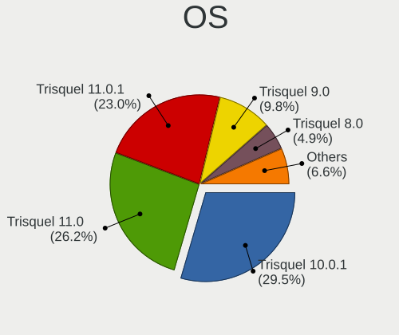

| Name            | Computers | Percent |
|-----------------|-----------|---------|
| Trisquel 10.0.1 | 18        | 29.51%  |
| Trisquel 11.0   | 16        | 26.23%  |
| Trisquel 11.0.1 | 14        | 22.95%  |
| Trisquel 9.0    | 6         | 9.84%   |
| Trisquel 8.0    | 3         | 4.92%   |
| Trisquel 10.0   | 3         | 4.92%   |
| Trisquel 12.0   | 1         | 1.64%   |

OS Family
---------

OS without a version

| Name     | Computers | Percent |
|----------|-----------|---------|
| Trisquel | 59        | 100%    |

Kernel
------

Version of the Linux kernel

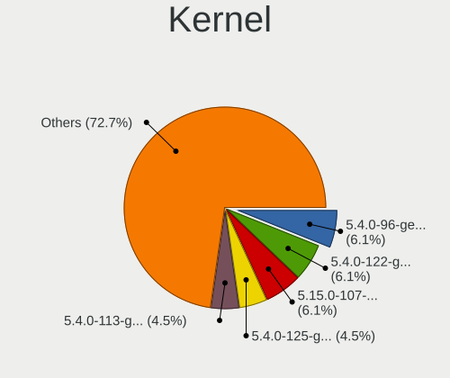

| Version              | Computers | Percent |
|----------------------|-----------|---------|
| 5.4.0-96-generic     | 4         | 6.06%   |
| 5.4.0-122-generic    | 4         | 6.06%   |
| 5.15.0-107-generic   | 4         | 6.06%   |
| 5.4.0-125-generic    | 3         | 4.55%   |
| 5.4.0-113-generic    | 3         | 4.55%   |
| 5.15.0-78-generic    | 3         | 4.55%   |
| 5.4.0-126-generic    | 2         | 3.03%   |
| 5.4.0-109-generic    | 2         | 3.03%   |
| 5.15.0-76-generic    | 2         | 3.03%   |
| 5.15.0-69-generic    | 2         | 3.03%   |
| 5.15.0-67-generic    | 2         | 3.03%   |
| 5.15.0-105-generic   | 2         | 3.03%   |
| 4.15.0-121-generic   | 2         | 3.03%   |
| 6.8.0-90-generic     | 1         | 1.52%   |
| 6.6.47-gnu           | 1         | 1.52%   |
| 6.0.12-x64v1-xanmod1 | 1         | 1.52%   |
| 5.4.0-159-generic    | 1         | 1.52%   |
| 5.4.0-135-generic    | 1         | 1.52%   |
| 5.4.0-132-generic    | 1         | 1.52%   |
| 5.4.0-131-generic    | 1         | 1.52%   |
| 5.4.0-110-generic    | 1         | 1.52%   |
| 5.3.13-gnu           | 1         | 1.52%   |
| 5.3.1-gnu            | 1         | 1.52%   |
| 5.15.0-97-generic    | 1         | 1.52%   |
| 5.15.0-94-generic    | 1         | 1.52%   |
| 5.15.0-91-generic    | 1         | 1.52%   |
| 5.15.0-88-generic    | 1         | 1.52%   |
| 5.15.0-86-generic    | 1         | 1.52%   |
| 5.15.0-73-generic    | 1         | 1.52%   |
| 5.15.0-143-generic   | 1         | 1.52%   |
| 5.15.0-135-generic   | 1         | 1.52%   |
| 5.15.0-133-generic   | 1         | 1.52%   |
| 5.15.0-130-generic   | 1         | 1.52%   |
| 5.15.0-124-generic   | 1         | 1.52%   |
| 5.15.0-122-generic   | 1         | 1.52%   |
| 5.15.0-119-generic   | 1         | 1.52%   |
| 5.15.0-117-generic   | 1         | 1.52%   |
| 5.15.0-102-generic   | 1         | 1.52%   |
| 5.10.177-gnu1        | 1         | 1.52%   |
| 4.4.0-119-generic    | 1         | 1.52%   |

Kernel Family
-------------

Linux kernel without a distro release

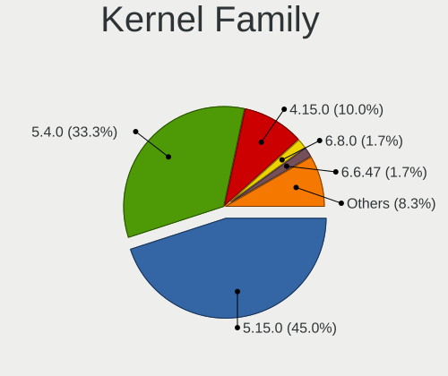

| Version  | Computers | Percent |
|----------|-----------|---------|
| 5.15.0   | 27        | 45%     |
| 5.4.0    | 20        | 33.33%  |
| 4.15.0   | 6         | 10%     |
| 6.8.0    | 1         | 1.67%   |
| 6.6.47   | 1         | 1.67%   |
| 6.0.12   | 1         | 1.67%   |
| 5.3.13   | 1         | 1.67%   |
| 5.3.1    | 1         | 1.67%   |
| 5.10.177 | 1         | 1.67%   |
| 4.4.0    | 1         | 1.67%   |

Kernel Major Ver.
-----------------

Linux kernel major version

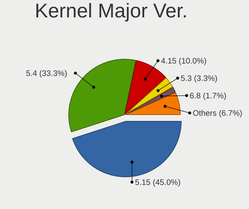

| Version | Computers | Percent |
|---------|-----------|---------|
| 5.15    | 27        | 45%     |
| 5.4     | 20        | 33.33%  |
| 4.15    | 6         | 10%     |
| 5.3     | 2         | 3.33%   |
| 6.8     | 1         | 1.67%   |
| 6.6     | 1         | 1.67%   |
| 6.0     | 1         | 1.67%   |
| 5.10    | 1         | 1.67%   |
| 4.4     | 1         | 1.67%   |

Arch
----

OS architecture (x86_64, i586, etc.)

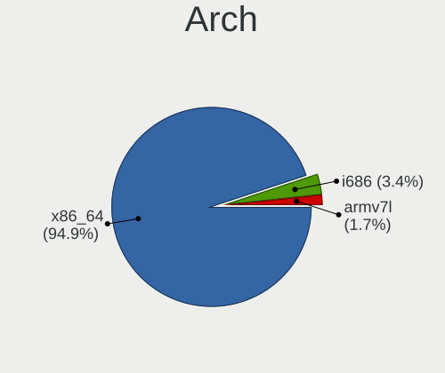

| Name   | Computers | Percent |
|--------|-----------|---------|
| x86_64 | 56        | 94.92%  |
| i686   | 2         | 3.39%   |
| armv7l | 1         | 1.69%   |

DE
--

Desktop Environment

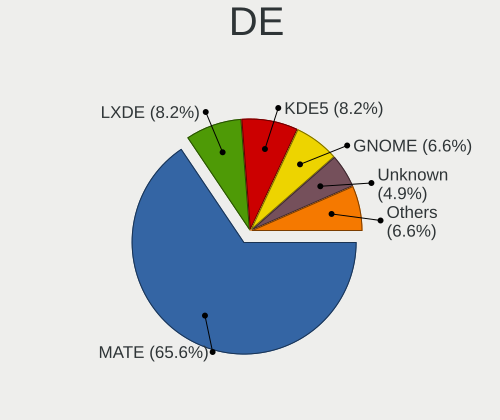

| Name    | Computers | Percent |
|---------|-----------|---------|
| MATE    | 40        | 65.57%  |
| LXDE    | 5         | 8.2%    |
| KDE5    | 5         | 8.2%    |
| GNOME   | 4         | 6.56%   |
| Unknown | 3         | 4.92%   |
| XFCE    | 1         | 1.64%   |
| KDE     | 1         | 1.64%   |
| dwm     | 1         | 1.64%   |
| default | 1         | 1.64%   |

Display Server
--------------

X11 or Wayland

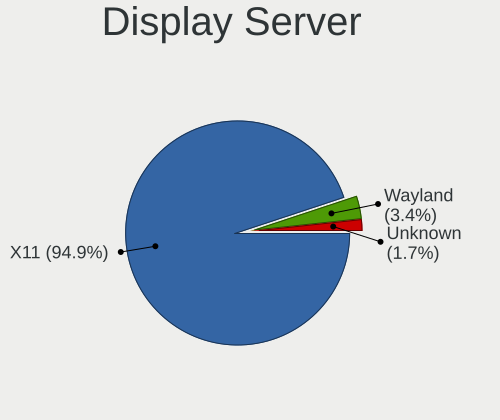

| Name    | Computers | Percent |
|---------|-----------|---------|
| X11     | 56        | 94.92%  |
| Wayland | 2         | 3.39%   |
| Unknown | 1         | 1.69%   |

Display Manager
---------------

SDDM, LightDM, etc.

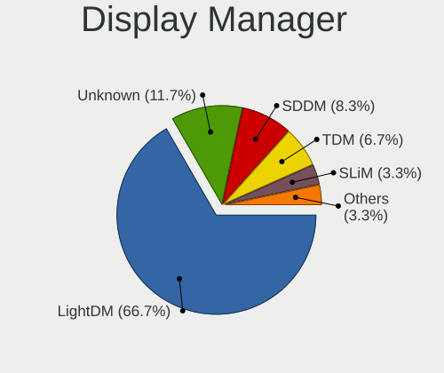

| Name    | Computers | Percent |
|---------|-----------|---------|
| LightDM | 40        | 66.67%  |
| Unknown | 7         | 11.67%  |
| SDDM    | 5         | 8.33%   |
| TDM     | 4         | 6.67%   |
| SLiM    | 2         | 3.33%   |
| GDM3    | 1         | 1.67%   |
| GDM     | 1         | 1.67%   |

OS Lang
-------

Language

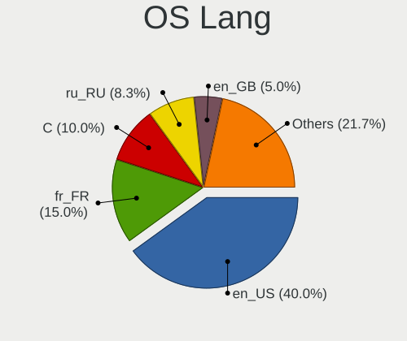

| Lang    | Computers | Percent |
|---------|-----------|---------|
| en_US   | 24        | 40%     |
| fr_FR   | 9         | 15%     |
| C       | 6         | 10%     |
| ru_RU   | 5         | 8.33%   |
| en_GB   | 3         | 5%      |
| Unknown | 3         | 5%      |
| tr_TR   | 2         | 3.33%   |
| ru_UA   | 1         | 1.67%   |
| pt_BR   | 1         | 1.67%   |
| pl_PL   | 1         | 1.67%   |
| nl_NL   | 1         | 1.67%   |
| es_MX   | 1         | 1.67%   |
| es_ES   | 1         | 1.67%   |
| en_CA   | 1         | 1.67%   |
| de_DE   | 1         | 1.67%   |

Boot Mode
---------

EFI or BIOS

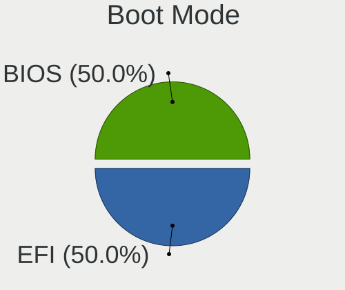

| Mode | Computers | Percent |
|------|-----------|---------|
| EFI  | 32        | 54.24%  |
| BIOS | 27        | 45.76%  |

Filesystem
----------

Type of filesystem

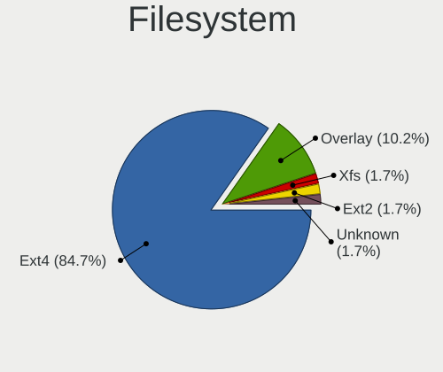

| Type    | Computers | Percent |
|---------|-----------|---------|
| Ext4    | 50        | 84.75%  |
| Overlay | 6         | 10.17%  |
| Xfs     | 1         | 1.69%   |
| Ext2    | 1         | 1.69%   |
| Unknown | 1         | 1.69%   |

Part. scheme
------------

Scheme of partitioning

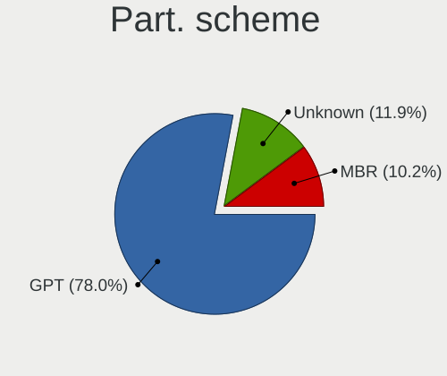

| Type    | Computers | Percent |
|---------|-----------|---------|
| GPT     | 46        | 77.97%  |
| Unknown | 7         | 11.86%  |
| MBR     | 6         | 10.17%  |

Dual Boot with Linux/BSD
------------------------

Hosting more than one Linux/BSD

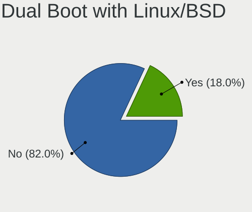

| Dual boot | Computers | Percent |
|-----------|-----------|---------|
| No        | 50        | 81.97%  |
| Yes       | 11        | 18.03%  |

Dual Boot (Win)
---------------

Hosting Linux and Windows

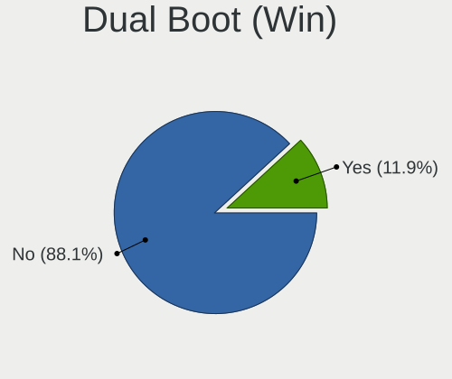

| Dual boot | Computers | Percent |
|-----------|-----------|---------|
| No        | 52        | 88.14%  |
| Yes       | 7         | 11.86%  |

Board
-----

Vendor
------

Motherboard manufacturer

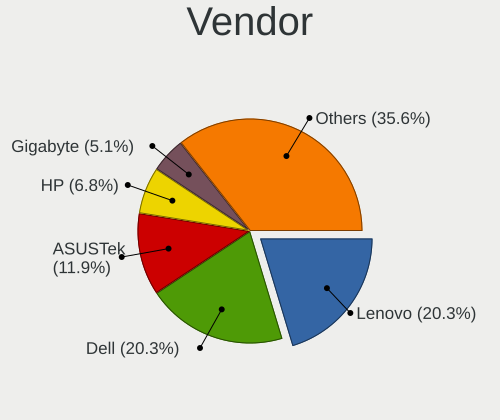

| Name                | Computers | Percent |
|---------------------|-----------|---------|
| Lenovo              | 12        | 20.34%  |
| Dell                | 12        | 20.34%  |
| ASUSTek Computer    | 7         | 11.86%  |
| Hewlett-Packard     | 4         | 6.78%   |
| Gigabyte Technology | 3         | 5.08%   |
| Acer                | 3         | 5.08%   |
| Toshiba             | 2         | 3.39%   |
| Samsung Electronics | 2         | 3.39%   |
| Fujitsu Siemens     | 2         | 3.39%   |
| Timi                | 1         | 1.69%   |
| Packard Bell        | 1         | 1.69%   |
| Notebook            | 1         | 1.69%   |
| MSI                 | 1         | 1.69%   |
| LZ                  | 1         | 1.69%   |
| Libiquity           | 1         | 1.69%   |
| Itautec             | 1         | 1.69%   |
| Huanan              | 1         | 1.69%   |
| GPD                 | 1         | 1.69%   |
| ECS                 | 1         | 1.69%   |
| Apple               | 1         | 1.69%   |
| Unknown             | 1         | 1.69%   |

Model
-----

Motherboard model

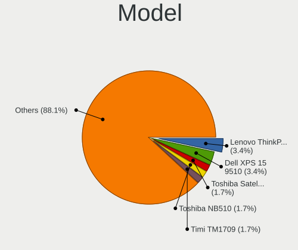

| Name                                                                  | Computers | Percent |
|-----------------------------------------------------------------------|-----------|---------|
| Lenovo ThinkPad T420 4177QKU                                          | 2         | 3.39%   |
| Dell XPS 15 9510                                                      | 2         | 3.39%   |
| Toshiba Satellite C800D                                               | 1         | 1.69%   |
| Toshiba NB510                                                         | 1         | 1.69%   |
| Timi TM1709                                                           | 1         | 1.69%   |
| Samsung N130                                                          | 1         | 1.69%   |
| Samsung Galaxy TabPro S                                               | 1         | 1.69%   |
| Packard Bell IMEDIA S1300                                             | 1         | 1.69%   |
| Notebook NJ50_70CU                                                    | 1         | 1.69%   |
| MSI MS-7917                                                           | 1         | 1.69%   |
| LZ LZ1004_3                                                           | 1         | 1.69%   |
| Libiquity Taurinus X200                                               | 1         | 1.69%   |
| Lenovo ThinkPad X230 2325Y3C                                          | 1         | 1.69%   |
| Lenovo ThinkPad X200 7459J74                                          | 1         | 1.69%   |
| Lenovo ThinkPad X200 7458C23                                          | 1         | 1.69%   |
| Lenovo ThinkPad X200 7455HS2                                          | 1         | 1.69%   |
| Lenovo ThinkPad X200 7455FNG                                          | 1         | 1.69%   |
| Lenovo ThinkPad T480 20L5000UUS                                       | 1         | 1.69%   |
| Lenovo ThinkPad T430s 2356C45                                         | 1         | 1.69%   |
| Lenovo ThinkPad T430 2347G2U                                          | 1         | 1.69%   |
| Lenovo ThinkPad E14 Gen 5 21JK0006TX                                  | 1         | 1.69%   |
| Lenovo G505s 20255                                                    | 1         | 1.69%   |
| Itautec Infoway                                                       | 1         | 1.69%   |
| Huanan X79 INTEL (INTEL Xeon E5/Corei7 DMI2 - C600/C200 Cipset V2.49P | 1         | 1.69%   |
| HP Victus by Laptop 16-e0xxx                                          | 1         | 1.69%   |
| HP Stream Laptop 11-y0XX                                              | 1         | 1.69%   |
| HP ProBook 650 G8 Notebook PC                                         | 1         | 1.69%   |
| HP EliteDesk 800 G3 SFF                                               | 1         | 1.69%   |
| GPD MicroPC                                                           | 1         | 1.69%   |
| Gigabyte Z390 UD                                                      | 1         | 1.69%   |
| Gigabyte M68MT-D3P                                                    | 1         | 1.69%   |
| Gigabyte 945PLM-S2                                                    | 1         | 1.69%   |
| Fujitsu Siemens ESPRIMO EDITION P2540                                 | 1         | 1.69%   |
| Fujitsu Siemens AMILO PRO V3515                                       | 1         | 1.69%   |
| ECS H61H2-M2                                                          | 1         | 1.69%   |
| Dell XPS 13 9360                                                      | 1         | 1.69%   |
| Dell XPS 12 9Q23                                                      | 1         | 1.69%   |
| Dell OptiPlex 3020                                                    | 1         | 1.69%   |
| Dell Latitude E6540                                                   | 1         | 1.69%   |
| Dell Latitude E6400                                                   | 1         | 1.69%   |

Model Family
------------

Motherboard model prefix

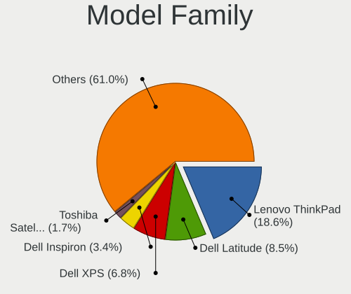

| Name                    | Computers | Percent |
|-------------------------|-----------|---------|
| Lenovo ThinkPad         | 11        | 18.64%  |
| Dell Latitude           | 5         | 8.47%   |
| Dell XPS                | 4         | 6.78%   |
| Dell Inspiron           | 2         | 3.39%   |
| Toshiba Satellite       | 1         | 1.69%   |
| Toshiba NB510           | 1         | 1.69%   |
| Timi TM1709             | 1         | 1.69%   |
| Samsung N130            | 1         | 1.69%   |
| Samsung Galaxy          | 1         | 1.69%   |
| Packard Bell IMEDIA     | 1         | 1.69%   |
| Notebook NJ50           | 1         | 1.69%   |
| MSI MS-7917             | 1         | 1.69%   |
| LZ LZ1004               | 1         | 1.69%   |
| Libiquity Taurinus      | 1         | 1.69%   |
| Lenovo G505s            | 1         | 1.69%   |
| Itautec Infoway         | 1         | 1.69%   |
| Huanan X79              | 1         | 1.69%   |
| HP Victus               | 1         | 1.69%   |
| HP Stream               | 1         | 1.69%   |
| HP ProBook              | 1         | 1.69%   |
| HP EliteDesk            | 1         | 1.69%   |
| GPD MicroPC             | 1         | 1.69%   |
| Gigabyte Z390           | 1         | 1.69%   |
| Gigabyte M68MT-D3P      | 1         | 1.69%   |
| Gigabyte 945PLM-S2      | 1         | 1.69%   |
| Fujitsu Siemens ESPRIMO | 1         | 1.69%   |
| Fujitsu Siemens AMILO   | 1         | 1.69%   |
| ECS H61H2-M2            | 1         | 1.69%   |
| Dell OptiPlex           | 1         | 1.69%   |
| ASUS X456URK            | 1         | 1.69%   |
| ASUS U56E               | 1         | 1.69%   |
| ASUS P8H61              | 1         | 1.69%   |
| ASUS N56JK              | 1         | 1.69%   |
| ASUS K84L               | 1         | 1.69%   |
| ASUS K55A               | 1         | 1.69%   |
| ASUS A55BM-PLUS         | 1         | 1.69%   |
| Apple MacPro5           | 1         | 1.69%   |
| Acer TravelMate         | 1         | 1.69%   |
| Acer Nitro              | 1         | 1.69%   |
| Acer Aspire             | 1         | 1.69%   |

MFG Year
--------

Motherboard manufacture year

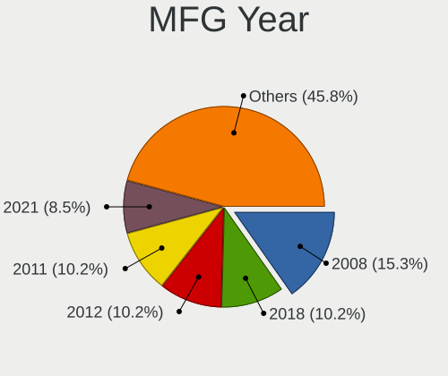

| Year    | Computers | Percent |
|---------|-----------|---------|
| 2008    | 9         | 15.25%  |
| 2018    | 6         | 10.17%  |
| 2012    | 6         | 10.17%  |
| 2011    | 6         | 10.17%  |
| 2021    | 5         | 8.47%   |
| 2016    | 5         | 8.47%   |
| 2014    | 4         | 6.78%   |
| 2013    | 3         | 5.08%   |
| 2010    | 3         | 5.08%   |
| 2020    | 2         | 3.39%   |
| 2019    | 2         | 3.39%   |
| 2006    | 2         | 3.39%   |
| 2023    | 1         | 1.69%   |
| 2022    | 1         | 1.69%   |
| 2017    | 1         | 1.69%   |
| 2015    | 1         | 1.69%   |
| 2009    | 1         | 1.69%   |
| Unknown | 1         | 1.69%   |

Form Factor
-----------

Physical design of the computer

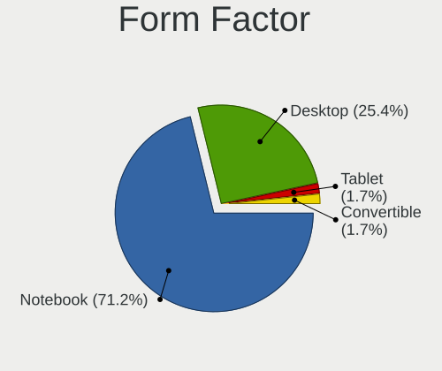

| Name        | Computers | Percent |
|-------------|-----------|---------|
| Notebook    | 42        | 71.19%  |
| Desktop     | 15        | 25.42%  |
| Tablet      | 1         | 1.69%   |
| Convertible | 1         | 1.69%   |

Secure Boot
-----------

Enabled or disabled

| State    | Computers | Percent |
|----------|-----------|---------|
| Disabled | 59        | 100%    |

Coreboot
--------

Have coreboot on board

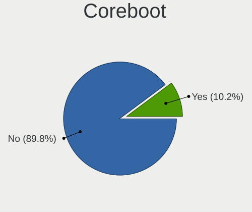

| Used | Computers | Percent |
|------|-----------|---------|
| No   | 53        | 89.83%  |
| Yes  | 6         | 10.17%  |

RAM Size
--------

Total RAM memory

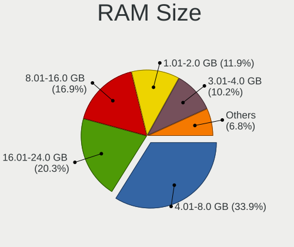

| Size in GB | Computers | Percent |
|------------|-----------|---------|
| 4.01-8.0   | 20        | 33.9%   |
| 16.01-24.0 | 12        | 20.34%  |
| 8.01-16.0  | 10        | 16.95%  |
| 1.01-2.0   | 7         | 11.86%  |
| 3.01-4.0   | 6         | 10.17%  |
| 32.01-64.0 | 3         | 5.08%   |
| 0.51-1.0   | 1         | 1.69%   |

RAM Used
--------

Used RAM memory

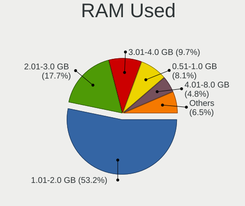

| Used GB   | Computers | Percent |
|-----------|-----------|---------|
| 1.01-2.0  | 33        | 53.23%  |
| 2.01-3.0  | 11        | 17.74%  |
| 3.01-4.0  | 6         | 9.68%   |
| 0.51-1.0  | 5         | 8.06%   |
| 4.01-8.0  | 3         | 4.84%   |
| 0.01-0.5  | 3         | 4.84%   |
| 8.01-16.0 | 1         | 1.61%   |

Total Drives
------------

Number of drives on board

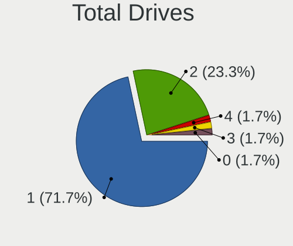

| Drives | Computers | Percent |
|--------|-----------|---------|
| 1      | 43        | 71.67%  |
| 2      | 14        | 23.33%  |
| 4      | 1         | 1.67%   |
| 3      | 1         | 1.67%   |
| 0      | 1         | 1.67%   |

Has CD-ROM
----------

Has CD-ROM on board

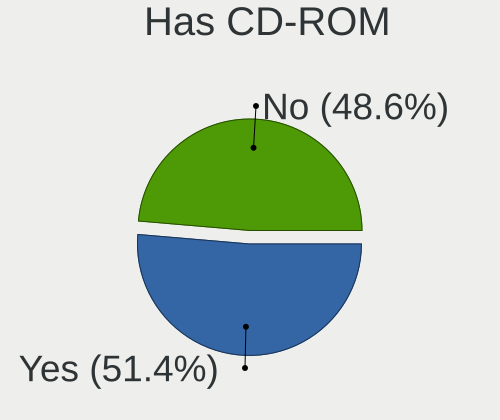

| Presented | Computers | Percent |
|-----------|-----------|---------|
| No        | 34        | 57.63%  |
| Yes       | 25        | 42.37%  |

Has Ethernet
------------

Has Ethernet on board

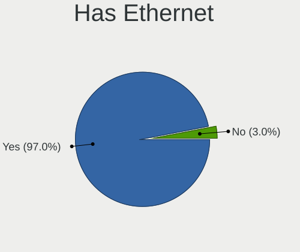

| Presented | Computers | Percent |
|-----------|-----------|---------|
| Yes       | 56        | 93.33%  |
| No        | 4         | 6.67%   |

Has WiFi
--------

Has WiFi module

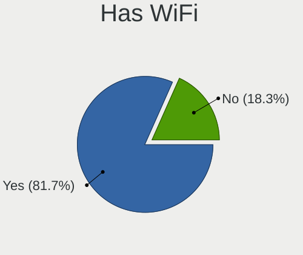

| Presented | Computers | Percent |
|-----------|-----------|---------|
| Yes       | 49        | 81.67%  |
| No        | 11        | 18.33%  |

Has Bluetooth
-------------

Has Bluetooth module

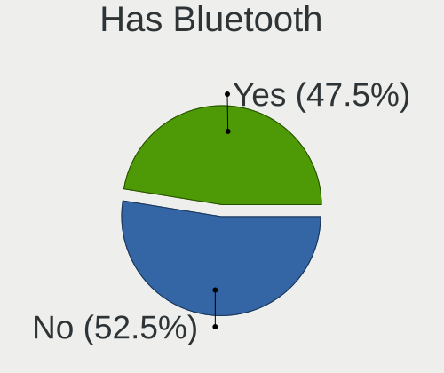

| Presented | Computers | Percent |
|-----------|-----------|---------|
| No        | 31        | 52.54%  |
| Yes       | 28        | 47.46%  |

Location
--------

Country
-------

Geographic location (country)

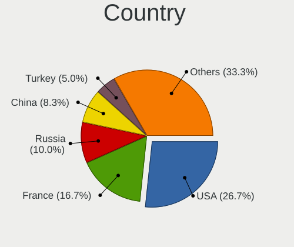

| Country     | Computers | Percent |
|-------------|-----------|---------|
| USA         | 16        | 26.67%  |
| France      | 10        | 16.67%  |
| Russia      | 6         | 10%     |
| China       | 5         | 8.33%   |
| Turkey      | 3         | 5%      |
| Indonesia   | 3         | 5%      |
| Germany     | 3         | 5%      |
| Spain       | 2         | 3.33%   |
| Netherlands | 2         | 3.33%   |
| Brazil      | 2         | 3.33%   |
| Ukraine     | 1         | 1.67%   |
| South Korea | 1         | 1.67%   |
| Poland      | 1         | 1.67%   |
| Mexico      | 1         | 1.67%   |
| Kazakhstan  | 1         | 1.67%   |
| Ireland     | 1         | 1.67%   |
| Canada      | 1         | 1.67%   |
| Belarus     | 1         | 1.67%   |

City
----

Geographic location (city)

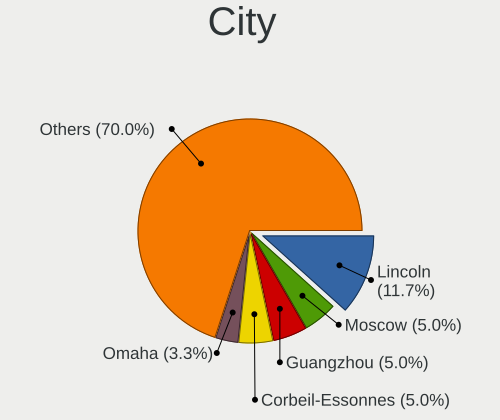

| City                     | Computers | Percent |
|--------------------------|-----------|---------|
| Lincoln                  | 7         | 11.67%  |
| Moscow                   | 3         | 5%      |
| Guangzhou                | 3         | 5%      |
| Corbeil-Essonnes         | 3         | 5%      |
| Omaha                    | 2         | 3.33%   |
| Malvern                  | 2         | 3.33%   |
| Istanbul                 | 2         | 3.33%   |
| Cerons                   | 2         | 3.33%   |
| Amsterdam                | 2         | 3.33%   |
| Yongin-si                | 1         | 1.67%   |
| Wylie                    | 1         | 1.67%   |
| Wiesbaden                | 1         | 1.67%   |
| Vitebsk                  | 1         | 1.67%   |
| Vienne-le-Chateau        | 1         | 1.67%   |
| Valenciennes             | 1         | 1.67%   |
| Tychy                    | 1         | 1.67%   |
| St Petersburg            | 1         | 1.67%   |
| Shenzhen                 | 1         | 1.67%   |
| Seyhan                   | 1         | 1.67%   |
| Sabadell                 | 1         | 1.67%   |
| Rivne                    | 1         | 1.67%   |
| Pinangsia                | 1         | 1.67%   |
| Petropavlovsk-Kamchatsky | 1         | 1.67%   |
| Parksley                 | 1         | 1.67%   |
| Paris                    | 1         | 1.67%   |
| Oviedo                   | 1         | 1.67%   |
| Ottawa                   | 1         | 1.67%   |
| Oryol                    | 1         | 1.67%   |
| Missoula                 | 1         | 1.67%   |
| Malang                   | 1         | 1.67%   |
| Lüdenscheid             | 1         | 1.67%   |
| Leverkusen               | 1         | 1.67%   |
| Fayetteville             | 1         | 1.67%   |
| Depok                    | 1         | 1.67%   |
| Cork                     | 1         | 1.67%   |
| Ciudad del Carmen        | 1         | 1.67%   |
| Chengdu                  | 1         | 1.67%   |
| Burgnac                  | 1         | 1.67%   |
| Borderes-sur-l'Echez     | 1         | 1.67%   |
| Blumenau                 | 1         | 1.67%   |

Drives
------

Drive Vendor
------------

Hard drive vendors

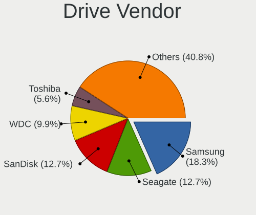

| Vendor              | Computers | Drives | Percent |
|---------------------|-----------|--------|---------|
| Samsung Electronics | 13        | 14     | 18.31%  |
| Seagate             | 9         | 16     | 12.68%  |
| SanDisk             | 9         | 9      | 12.68%  |
| WDC                 | 7         | 9      | 9.86%   |
| Toshiba             | 4         | 4      | 5.63%   |
| Crucial             | 4         | 4      | 5.63%   |
| Unknown             | 3         | 3      | 4.23%   |
| Kingston            | 3         | 3      | 4.23%   |
| SK hynix            | 2         | 2      | 2.82%   |
| HGST HTS            | 2         | 4      | 2.82%   |
| China               | 2         | 2      | 2.82%   |
| VISIPRO             | 1         | 1      | 1.41%   |
| Transcend           | 1         | 1      | 1.41%   |
| Silicon Motion      | 1         | 2      | 1.41%   |
| Qumo                | 1         | 1      | 1.41%   |
| Plextor             | 1         | 1      | 1.41%   |
| Patriot             | 1         | 1      | 1.41%   |
| NFHK                | 1         | 1      | 1.41%   |
| LITEON              | 1         | 1      | 1.41%   |
| Hitachi             | 1         | 1      | 1.41%   |
| HGST                | 1         | 1      | 1.41%   |
| Corsair             | 1         | 1      | 1.41%   |
| Apacer              | 1         | 1      | 1.41%   |
| A-DATA Technology   | 1         | 1      | 1.41%   |

Drive Model
-----------

Hard drive models

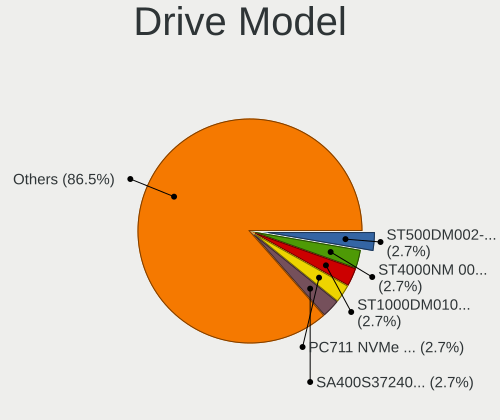

| Model                                       | Computers | Percent |
|---------------------------------------------|-----------|---------|
| SK hynix PC711 NVMe 512GB                   | 2         | 2.7%    |
| Seagate ST500DM002-1BD142 500GB             | 2         | 2.7%    |
| Seagate ST4000NM 0033-9ZM170 4TB            | 2         | 2.7%    |
| Seagate ST1000DM010-2EP102 1TB              | 2         | 2.7%    |
| Kingston SA400S37240G 240GB SSD             | 2         | 2.7%    |
| HGST HTS 721010A9E630 1TB                   | 2         | 2.7%    |
| WDC WDS240G2G0B-00EPW0 240GB SSD            | 1         | 1.35%   |
| WDC WD6400BPVT-80HXZT3 640GB                | 1         | 1.35%   |
| WDC WD3200BEVT-75ZCT2 320GB                 | 1         | 1.35%   |
| WDC WD3200AAKX-221CA1 320GB                 | 1         | 1.35%   |
| WDC WD1600BEVS-08RST2 160GB                 | 1         | 1.35%   |
| WDC PC SN730 SDBPNTY-512G-1006 512GB        | 1         | 1.35%   |
| WDC PC SN530 NVMe 512GB                     | 1         | 1.35%   |
| VISIPRO SDVPSA1910256TMYTHK 256GB SSD       | 1         | 1.35%   |
| Unknown SC64G  64GB                         | 1         | 1.35%   |
| Unknown SA32G  32GB                         | 1         | 1.35%   |
| Unknown NCard  32GB                         | 1         | 1.35%   |
| Transcend TS256GMTS430S 256GB SSD           | 1         | 1.35%   |
| Toshiba THNSN5256GPUK NVMe 256GB            | 1         | 1.35%   |
| Toshiba MK3275GSX 320GB                     | 1         | 1.35%   |
| Toshiba HDWL110 1TB                         | 1         | 1.35%   |
| Toshiba DT01ACA100 1TB                      | 1         | 1.35%   |
| Silicon Motion MS10 1TB                     | 1         | 1.35%   |
| Seagate ST320LT007-9ZV142 320GB             | 1         | 1.35%   |
| Seagate ST31000524AS 1TB                    | 1         | 1.35%   |
| Seagate ST2000DM001-1CH164 2TB              | 1         | 1.35%   |
| Seagate ST1000LM035-1RK172 1TB              | 1         | 1.35%   |
| Seagate ST1000DM003-9YN162 1TB              | 1         | 1.35%   |
| Seagate Expansion HDD 4TB                   | 1         | 1.35%   |
| Sandisk WD PC SN740 SDDQMQD-512G-1201 512GB | 1         | 1.35%   |
| Sandisk WD Blue SN570 1TB                   | 1         | 1.35%   |
| SanDisk SSD U110 16GB                       | 1         | 1.35%   |
| SanDisk SSD PLUS 240GB                      | 1         | 1.35%   |
| SanDisk SSD PLUS 2000GB                     | 1         | 1.35%   |
| SanDisk SDSSDH3 500G                        | 1         | 1.35%   |
| SanDisk SDSSDH3 2T00 2TB                    | 1         | 1.35%   |
| SanDisk NVMe SSD Drive 1TB                  | 1         | 1.35%   |
| SanDisk DF4032  32GB                        | 1         | 1.35%   |
| Samsung SSD PM830 mSATA 256GB               | 1         | 1.35%   |
| Samsung SSD 860 EVO 500GB                   | 1         | 1.35%   |

HDD Vendor
----------

Hard disk drive vendors

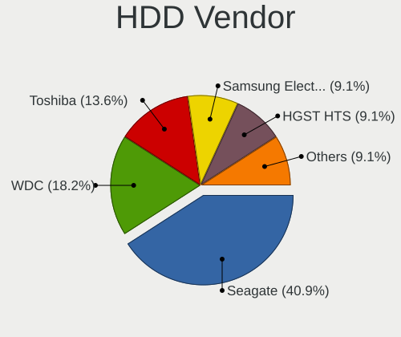

| Vendor              | Computers | Drives | Percent |
|---------------------|-----------|--------|---------|
| Seagate             | 9         | 16     | 40.91%  |
| WDC                 | 4         | 4      | 18.18%  |
| Toshiba             | 3         | 3      | 13.64%  |
| Samsung Electronics | 2         | 2      | 9.09%   |
| HGST HTS            | 2         | 4      | 9.09%   |
| Hitachi             | 1         | 1      | 4.55%   |
| HGST                | 1         | 1      | 4.55%   |

SSD Vendor
----------

Solid state drive vendors

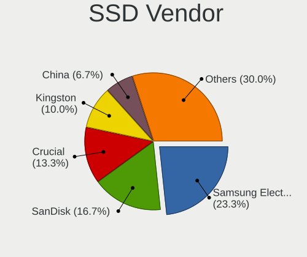

| Vendor              | Computers | Drives | Percent |
|---------------------|-----------|--------|---------|
| Samsung Electronics | 7         | 8      | 23.33%  |
| SanDisk             | 5         | 5      | 16.67%  |
| Crucial             | 4         | 4      | 13.33%  |
| Kingston            | 3         | 3      | 10%     |
| China               | 2         | 2      | 6.67%   |
| WDC                 | 1         | 1      | 3.33%   |
| VISIPRO             | 1         | 1      | 3.33%   |
| Transcend           | 1         | 1      | 3.33%   |
| Qumo                | 1         | 1      | 3.33%   |
| Plextor             | 1         | 1      | 3.33%   |
| Patriot             | 1         | 1      | 3.33%   |
| LITEON              | 1         | 1      | 3.33%   |
| Apacer              | 1         | 1      | 3.33%   |
| A-DATA Technology   | 1         | 1      | 3.33%   |

Drive Kind
----------

HDD or SSD

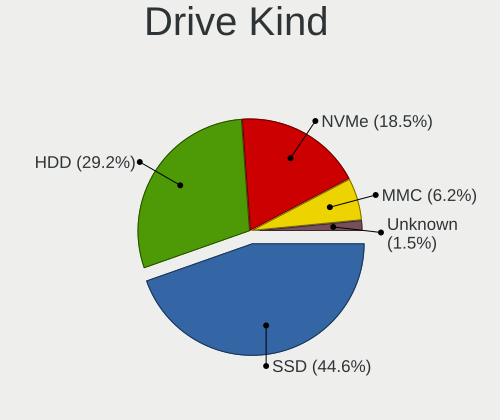

| Kind    | Computers | Drives | Percent |
|---------|-----------|--------|---------|
| SSD     | 29        | 31     | 44.62%  |
| HDD     | 19        | 31     | 29.23%  |
| NVMe    | 12        | 17     | 18.46%  |
| MMC     | 4         | 4      | 6.15%   |
| Unknown | 1         | 1      | 1.54%   |

Drive Connector
---------------

SATA, SAS, NVMe, etc.

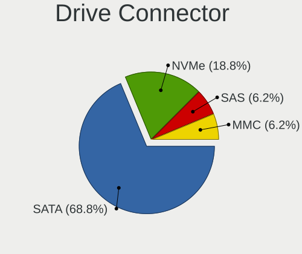

| Type | Computers | Drives | Percent |
|------|-----------|--------|---------|
| SATA | 44        | 53     | 68.75%  |
| NVMe | 12        | 17     | 18.75%  |
| SAS  | 4         | 10     | 6.25%   |
| MMC  | 4         | 4      | 6.25%   |

Drive Size
----------

Size of hard drive

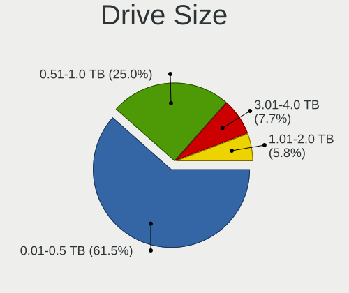

| Size in TB | Computers | Drives | Percent |
|------------|-----------|--------|---------|
| 0.01-0.5   | 32        | 36     | 61.54%  |
| 0.51-1.0   | 13        | 17     | 25%     |
| 3.01-4.0   | 4         | 6      | 7.69%   |
| 1.01-2.0   | 3         | 3      | 5.77%   |

Space Total
-----------

Amount of disk space available on the file system

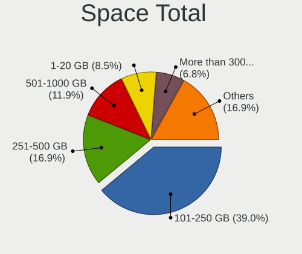

| Size in GB     | Computers | Percent |
|----------------|-----------|---------|
| 101-250        | 23        | 38.98%  |
| 251-500        | 10        | 16.95%  |
| 501-1000       | 7         | 11.86%  |
| 1-20           | 5         | 8.47%   |
| More than 3000 | 4         | 6.78%   |
| 21-50          | 3         | 5.08%   |
| 51-100         | 3         | 5.08%   |
| 2001-3000      | 2         | 3.39%   |
| 1001-2000      | 2         | 3.39%   |

Space Used
----------

Amount of used disk space

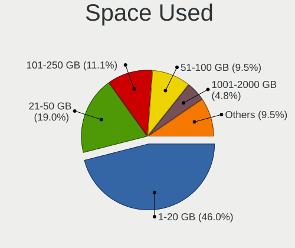

| Used GB        | Computers | Percent |
|----------------|-----------|---------|
| 1-20           | 29        | 46.03%  |
| 21-50          | 12        | 19.05%  |
| 101-250        | 7         | 11.11%  |
| 51-100         | 6         | 9.52%   |
| 1001-2000      | 3         | 4.76%   |
| 501-1000       | 3         | 4.76%   |
| 2001-3000      | 2         | 3.17%   |
| More than 3000 | 1         | 1.59%   |

Malfunc. Drives
---------------

Drive models with a malfunction

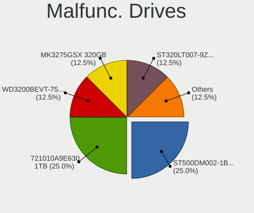

| Model                            | Computers | Drives | Percent |
|----------------------------------|-----------|--------|---------|
| Seagate ST500DM002-1BD142 500GB  | 2         | 2      | 20%     |
| HGST HTS 721010A9E630 1TB        | 2         | 4      | 20%     |
| WDC WDS240G2G0B-00EPW0 240GB SSD | 1         | 1      | 10%     |
| WDC WD3200BEVT-75ZCT2 320GB      | 1         | 1      | 10%     |
| Toshiba MK3275GSX 320GB          | 1         | 1      | 10%     |
| Seagate ST320LT007-9ZV142 320GB  | 1         | 3      | 10%     |
| Seagate ST2000DM001-1CH164 2TB   | 1         | 1      | 10%     |
| Crucial CT240BX200SSD1 240GB     | 1         | 1      | 10%     |

Malfunc. Drive Vendor
---------------------

Vendors of faulty drives

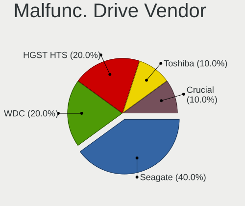

| Vendor   | Computers | Drives | Percent |
|----------|-----------|--------|---------|
| Seagate  | 4         | 6      | 40%     |
| WDC      | 2         | 2      | 20%     |
| HGST HTS | 2         | 4      | 20%     |
| Toshiba  | 1         | 1      | 10%     |
| Crucial  | 1         | 1      | 10%     |

Malfunc. HDD Vendor
-------------------

Vendors of faulty HDD drives

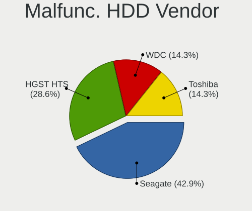

| Vendor   | Computers | Drives | Percent |
|----------|-----------|--------|---------|
| Seagate  | 4         | 6      | 50%     |
| HGST HTS | 2         | 4      | 25%     |
| WDC      | 1         | 1      | 12.5%   |
| Toshiba  | 1         | 1      | 12.5%   |

Malfunc. Drive Kind
-------------------

Kinds of faulty drives

| Kind | Computers | Drives | Percent |
|------|-----------|--------|---------|
| HDD  | 7         | 12     | 77.78%  |
| SSD  | 2         | 2      | 22.22%  |

Failed Drives
-------------

Failed drive models

Zero info for selected period =(

Failed Drive Vendor
-------------------

Failed drive vendors

Zero info for selected period =(

Drive Status
------------

Number of failed and malfunc. drives

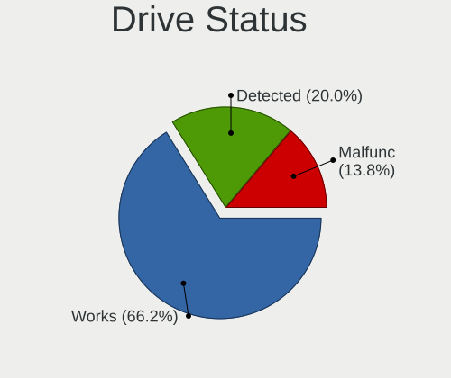

| Status   | Computers | Drives | Percent |
|----------|-----------|--------|---------|
| Works    | 43        | 55     | 66.15%  |
| Detected | 13        | 15     | 20%     |
| Malfunc  | 9         | 14     | 13.85%  |

Storage controller
------------------

Storage Vendor
--------------

Storage controller vendors

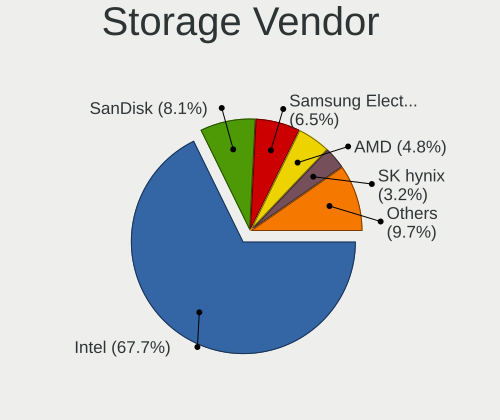

| Vendor                       | Computers | Percent |
|------------------------------|-----------|---------|
| Intel                        | 42        | 67.74%  |
| SanDisk                      | 5         | 8.06%   |
| Samsung Electronics          | 4         | 6.45%   |
| AMD                          | 3         | 4.84%   |
| SK hynix                     | 2         | 3.23%   |
| Nvidia                       | 2         | 3.23%   |
| VIA Technologies             | 1         | 1.61%   |
| Toshiba America Info Systems | 1         | 1.61%   |
| Silicon Motion               | 1         | 1.61%   |
| Phison Electronics           | 1         | 1.61%   |

Storage Model
-------------

Storage controller models

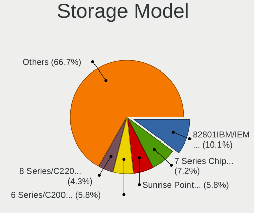

| Model                                                                                   | Computers | Percent |
|-----------------------------------------------------------------------------------------|-----------|---------|
| Intel 82801IBM/IEM (ICH9M/ICH9M-E) 4 port SATA Controller [AHCI mode]                   | 7         | 10.14%  |
| Intel 7 Series Chipset Family 6-port SATA Controller [AHCI mode]                        | 5         | 7.25%   |
| Intel Sunrise Point-LP SATA Controller [AHCI mode]                                      | 4         | 5.8%    |
| Intel 6 Series/C200 Series Chipset Family 6 port Mobile SATA AHCI Controller            | 4         | 5.8%    |
| Intel 8 Series/C220 Series Chipset Family 6-port SATA Controller 1 [AHCI mode]          | 3         | 4.35%   |
| AMD FCH SATA Controller [AHCI mode]                                                     | 3         | 4.35%   |
| SK hynix Gold P31/BC711/PC711 NVMe Solid State Drive                                    | 2         | 2.9%    |
| Samsung NVMe SSD Controller 980 (DRAM-less)                                             | 2         | 2.9%    |
| Nvidia MCP61 SATA Controller                                                            | 2         | 2.9%    |
| Intel Volume Management Device NVMe RAID Controller                                     | 2         | 2.9%    |
| Intel NM10/ICH7 Family SATA Controller [IDE mode]                                       | 2         | 2.9%    |
| Intel Cannon Lake PCH SATA AHCI Controller                                              | 2         | 2.9%    |
| Intel 6 Series/C200 Series Chipset Family Desktop SATA Controller (IDE mode, ports 4-5) | 2         | 2.9%    |
| Intel 6 Series/C200 Series Chipset Family Desktop SATA Controller (IDE mode, ports 0-3) | 2         | 2.9%    |
| VIA VT82C586A/B/VT82C686/A/B/VT823x/A/C PIPC Bus Master IDE                             | 1         | 1.45%   |
| VIA VT8237A Integrated SATA RAID Controller                                             | 1         | 1.45%   |
| Toshiba America Info Systems XG4 NVMe SSD Controller                                    | 1         | 1.45%   |
| Silicon Motion SM2263EN/SM2263XT (DRAM-less) NVMe SSD Controllers                       | 1         | 1.45%   |
| SanDisk WD SN560/SN740/SN770/SN5000 NVMe SSD                                            | 1         | 1.45%   |
| Sandisk WD PC SN740 NVMe SSD 512GB (DRAM-less)                                          | 1         | 1.45%   |
| SanDisk Ultra 3D / WD Blue SN570 NVMe SSD (DRAM-less)                                   | 1         | 1.45%   |
| SanDisk IX SN530 NVMe SSD / microSD Express Card (DRAM-less)                            | 1         | 1.45%   |
| SanDisk Extreme Pro / WD Black SN750 / PC SN730 / Red SN700 NVMe SSD                    | 1         | 1.45%   |
| Samsung NVMe SSD Controller SM981/PM981/PM983                                           | 1         | 1.45%   |
| Samsung NVMe SSD Controller SM961/PM961/SM963                                           | 1         | 1.45%   |
| Phison E12 NVMe Controller                                                              | 1         | 1.45%   |
| Nvidia MCP61 IDE                                                                        | 1         | 1.45%   |
| Intel Tiger Lake-LP SATA Controller                                                     | 1         | 1.45%   |
| Intel Tiger Lake SATA AHCI Controller                                                   | 1         | 1.45%   |
| Intel NM10/ICH7 Family SATA Controller [AHCI mode]                                      | 1         | 1.45%   |
| Intel Comet Lake SATA AHCI Controller                                                   | 1         | 1.45%   |
| Intel Celeron/Pentium Silver Processor SATA Controller                                  | 1         | 1.45%   |
| Intel Atom Processor E3800 Series SATA AHCI Controller                                  | 1         | 1.45%   |
| Intel 9 Series Chipset Family SATA Controller [AHCI Mode]                               | 1         | 1.45%   |
| Intel 82801JI (ICH10 Family) SATA AHCI Controller                                       | 1         | 1.45%   |
| Intel 82801HM/HEM (ICH8M/ICH8M-E) SATA Controller [AHCI mode]                           | 1         | 1.45%   |
| Intel 82801HM/HEM (ICH8M/ICH8M-E) IDE Controller                                        | 1         | 1.45%   |
| Intel 82801GBM/GHM (ICH7-M Family) SATA Controller [IDE mode]                           | 1         | 1.45%   |
| Intel 82801 Mobile SATA Controller [RAID mode]                                          | 1         | 1.45%   |
| Intel 6 Series/C200 Series Chipset Family 6 port Desktop SATA AHCI Controller           | 1         | 1.45%   |

Storage Kind
------------

Kind of storage controller (IDE, SATA, NVMe, SAS, ...)

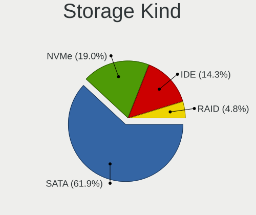

| Kind | Computers | Percent |
|------|-----------|---------|
| SATA | 39        | 61.9%   |
| NVMe | 12        | 19.05%  |
| IDE  | 9         | 14.29%  |
| RAID | 3         | 4.76%   |

Processor
---------

CPU Vendor
----------

Processor vendors

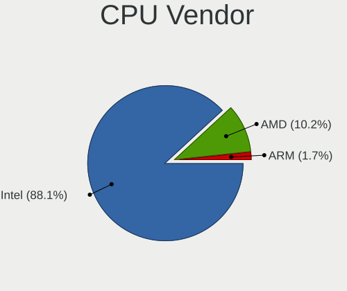

| Vendor | Computers | Percent |
|--------|-----------|---------|
| Intel  | 52        | 88.14%  |
| AMD    | 6         | 10.17%  |
| ARM    | 1         | 1.69%   |

CPU Model
---------

Processor models

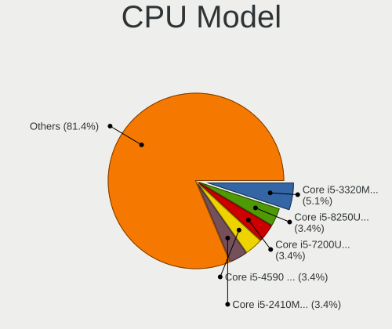

| Model                                       | Computers | Percent |
|---------------------------------------------|-----------|---------|
| Intel Core i5-3320M CPU @ 2.60GHz           | 3         | 5.08%   |
| Intel Core i5-8250U CPU @ 1.60GHz           | 2         | 3.39%   |
| Intel Core i5-7200U CPU @ 2.50GHz           | 2         | 3.39%   |
| Intel Core i5-4590 CPU @ 3.30GHz            | 2         | 3.39%   |
| Intel Core i5-2410M CPU @ 2.30GHz           | 2         | 3.39%   |
| Intel Core 2 CPU P8700 @ 2.53GHz            | 2         | 3.39%   |
| Intel 11th Gen Core i7-11800H @ 2.30GHz     | 2         | 3.39%   |
| Intel 11th Gen Core i7-1165G7 @ 2.80GHz     | 2         | 3.39%   |
| Intel Xeon CPU E5620 @ 2.40GHz              | 1         | 1.69%   |
| Intel Xeon CPU E5-2690 0 @ 2.90GHz          | 1         | 1.69%   |
| Intel Pentium Dual-Core CPU E5200 @ 2.50GHz | 1         | 1.69%   |
| Intel Pentium Dual CPU T3400 @ 2.16GHz      | 1         | 1.69%   |
| Intel Pentium D CPU 3.20GHz                 | 1         | 1.69%   |
| Intel Pentium CPU N3530 @ 2.16GHz           | 1         | 1.69%   |
| Intel Core m3-6Y30 CPU @ 0.90GHz            | 1         | 1.69%   |
| Intel Core i7-9700K CPU @ 3.60GHz           | 1         | 1.69%   |
| Intel Core i7-8550U CPU @ 1.80GHz           | 1         | 1.69%   |
| Intel Core i7-7700 CPU @ 3.60GHz            | 1         | 1.69%   |
| Intel Core i7-4800MQ CPU @ 2.70GHz          | 1         | 1.69%   |
| Intel Core i7-4710HQ CPU @ 2.50GHz          | 1         | 1.69%   |
| Intel Core i7-3687U CPU @ 2.10GHz           | 1         | 1.69%   |
| Intel Core i5-3470 CPU @ 3.20GHz            | 1         | 1.69%   |
| Intel Core i5-3210M CPU @ 2.50GHz           | 1         | 1.69%   |
| Intel Core i5-2430M CPU @ 2.40GHz           | 1         | 1.69%   |
| Intel Core i3-8100 CPU @ 3.60GHz            | 1         | 1.69%   |
| Intel Core i3-6006U CPU @ 2.00GHz           | 1         | 1.69%   |
| Intel Core i3-2330M CPU @ 2.20GHz           | 1         | 1.69%   |
| Intel Core i3-2100 CPU @ 3.10GHz            | 1         | 1.69%   |
| Intel Core i3-10110U CPU @ 2.10GHz          | 1         | 1.69%   |
| Intel Core 2 Duo CPU T6600 @ 2.20GHz        | 1         | 1.69%   |
| Intel Core 2 Duo CPU P8800 @ 2.66GHz        | 1         | 1.69%   |
| Intel Core 2 Duo CPU P8600 @ 2.40GHz        | 1         | 1.69%   |
| Intel Core 2 Duo CPU P8400 @ 2.26GHz        | 1         | 1.69%   |
| Intel Core 2 CPU P8600 @ 2.40GHz            | 1         | 1.69%   |
| Intel Celeron N4100 CPU @ 1.10GHz           | 1         | 1.69%   |
| Intel Celeron M CPU 430 @ 1.73GHz           | 1         | 1.69%   |
| Intel Celeron CPU N3060 @ 1.60GHz           | 1         | 1.69%   |
| Intel Atom CPU Z3735F @ 1.33GHz             | 1         | 1.69%   |
| Intel Atom CPU N270 @ 1.60GHz               | 1         | 1.69%   |
| Intel Atom CPU N2600 @ 1.60GHz              | 1         | 1.69%   |

CPU Model Family
----------------

Processor model prefix

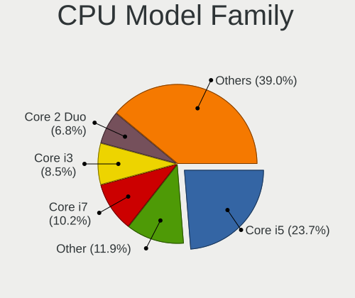

| Model                   | Computers | Percent |
|-------------------------|-----------|---------|
| Intel Core i5           | 14        | 23.73%  |
| Other                   | 7         | 11.86%  |
| Intel Core i7           | 6         | 10.17%  |
| Intel Core i3           | 5         | 8.47%   |
| Intel Core 2 Duo        | 4         | 6.78%   |
| Intel Core 2            | 3         | 5.08%   |
| Intel Atom              | 3         | 5.08%   |
| Intel Xeon              | 2         | 3.39%   |
| Intel Celeron           | 2         | 3.39%   |
| Intel Pentium Dual-Core | 1         | 1.69%   |
| Intel Pentium Dual      | 1         | 1.69%   |
| Intel Pentium D         | 1         | 1.69%   |
| Intel Pentium           | 1         | 1.69%   |
| Intel Core m3           | 1         | 1.69%   |
| Intel Celeron M         | 1         | 1.69%   |
| ARM Allwinner           | 1         | 1.69%   |
| AMD Ryzen 7             | 1         | 1.69%   |
| AMD Phenom II X4        | 1         | 1.69%   |
| AMD E1                  | 1         | 1.69%   |
| AMD Athlon II X2        | 1         | 1.69%   |
| AMD A8                  | 1         | 1.69%   |
| AMD A4                  | 1         | 1.69%   |

CPU Cores
---------

Number of processor cores

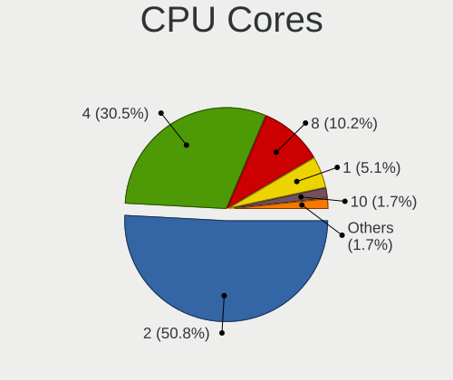

| Number | Computers | Percent |
|--------|-----------|---------|
| 2      | 30        | 50.85%  |
| 4      | 18        | 30.51%  |
| 8      | 6         | 10.17%  |
| 1      | 3         | 5.08%   |
| 10     | 1         | 1.69%   |
| 6      | 1         | 1.69%   |

CPU Sockets
-----------

Number of sockets

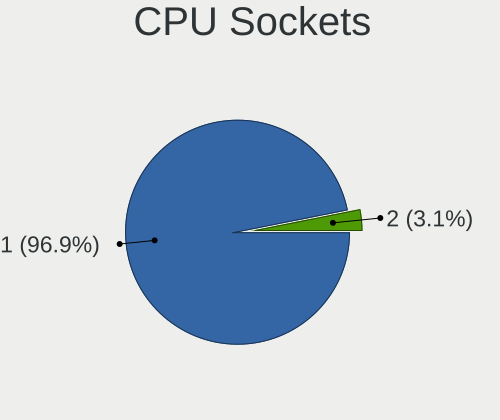

| Number | Computers | Percent |
|--------|-----------|---------|
| 1      | 58        | 98.31%  |
| 2      | 1         | 1.69%   |

CPU Threads
-----------

Threads per core (Hyper-Threading)

| Number | Computers | Percent |
|--------|-----------|---------|
| 2      | 35        | 59.32%  |
| 1      | 24        | 40.68%  |

CPU Op-Modes
------------

CPU Operation Modes (32-bit, 64-bit)

| Op mode        | Computers | Percent |
|----------------|-----------|---------|
| 32-bit, 64-bit | 56        | 94.92%  |
| 32-bit         | 2         | 3.39%   |
| Unknown        | 1         | 1.69%   |

CPU Microcode
-------------

Microcode number

| Number     | Computers | Percent |
|------------|-----------|---------|
| Unknown    | 8         | 13.33%  |
| 0x1067a    | 6         | 10%     |
| 0x306a9    | 5         | 8.33%   |
| 0x206a7    | 5         | 8.33%   |
| 0x306c3    | 4         | 6.67%   |
| 0x806ea    | 3         | 5%      |
| 0x806e9    | 2         | 3.33%   |
| 0x806d1    | 2         | 3.33%   |
| 0x406e3    | 2         | 3.33%   |
| 0x30678    | 2         | 3.33%   |
| 0x10676    | 2         | 3.33%   |
| 0x06001119 | 2         | 3.33%   |
| 0xf65      | 1         | 1.67%   |
| 0xb06a3    | 1         | 1.67%   |
| 0x906ed    | 1         | 1.67%   |
| 0x906eb    | 1         | 1.67%   |
| 0x906e9    | 1         | 1.67%   |
| 0x806ec    | 1         | 1.67%   |
| 0x806c1    | 1         | 1.67%   |
| 0x706a1    | 1         | 1.67%   |
| 0x6e8      | 1         | 1.67%   |
| 0x406c4    | 1         | 1.67%   |
| 0x206d7    | 1         | 1.67%   |
| 0x206c2    | 1         | 1.67%   |
| 0x106c2    | 1         | 1.67%   |
| 0x0a50000c | 1         | 1.67%   |
| 0x0500010d | 1         | 1.67%   |
| 0x010000c8 | 1         | 1.67%   |
| 0x010000b7 | 1         | 1.67%   |

CPU Microarch
-------------

Microarchitecture

| Name          | Computers | Percent |
|---------------|-----------|---------|
| KabyLake      | 9         | 15.25%  |
| Penryn        | 8         | 13.56%  |
| SandyBridge   | 6         | 10.17%  |
| IvyBridge     | 6         | 10.17%  |
| Haswell       | 4         | 6.78%   |
| TigerLake     | 3         | 5.08%   |
| Silvermont    | 3         | 5.08%   |
| Unknown       | 3         | 5.08%   |
| Skylake       | 2         | 3.39%   |
| Piledriver    | 2         | 3.39%   |
| K10           | 2         | 3.39%   |
| Icelake       | 2         | 3.39%   |
| Bonnell       | 2         | 3.39%   |
| Zen 3         | 1         | 1.69%   |
| Westmere      | 1         | 1.69%   |
| P6            | 1         | 1.69%   |
| NetBurst      | 1         | 1.69%   |
| Goldmont plus | 1         | 1.69%   |
| Core          | 1         | 1.69%   |
| Bobcat        | 1         | 1.69%   |

Graphics
--------

GPU Vendor
----------

Vendors of graphics cards

| Vendor           | Computers | Percent |
|------------------|-----------|---------|
| Intel            | 44        | 65.67%  |
| Nvidia           | 16        | 23.88%  |
| AMD              | 6         | 8.96%   |
| VIA Technologies | 1         | 1.49%   |

GPU Model
---------

Graphics card models

| Model                                                                                    | Computers | Percent |
|------------------------------------------------------------------------------------------|-----------|---------|
| Intel Mobile 4 Series Chipset Integrated Graphics Controller                             | 7         | 10.14%  |
| Intel 3rd Gen Core processor Graphics Controller                                         | 5         | 7.25%   |
| Intel 2nd Generation Core Processor Family Integrated Graphics Controller                | 4         | 5.8%    |
| Intel TigerLake-LP GT2 [Iris Xe Graphics]                                                | 3         | 4.35%   |
| Intel TigerLake-H GT1 [UHD Graphics]                                                     | 3         | 4.35%   |
| Intel Kaby Lake-R GT2 [UHD Graphics 620]                                                 | 3         | 4.35%   |
| Nvidia GT218 [GeForce 210]                                                               | 2         | 2.9%    |
| Nvidia GA107M [GeForce RTX 3050 Ti Mobile]                                               | 2         | 2.9%    |
| Nvidia GA106M [GeForce RTX 3060 Mobile / Max-Q]                                          | 2         | 2.9%    |
| Intel Xeon E3-1200 v3/4th Gen Core Processor Integrated Graphics Controller              | 2         | 2.9%    |
| Intel Kaby Lake-U GT2 [HD Graphics 620]                                                  | 2         | 2.9%    |
| Intel CoffeeLake-S GT2 [UHD Graphics 630]                                                | 2         | 2.9%    |
| Intel Atom Processor Z36xxx/Z37xxx Series Graphics & Display                             | 2         | 2.9%    |
| Intel 4th Gen Core Processor Integrated Graphics Controller                              | 2         | 2.9%    |
| VIA Technologies CN896/VN896/P4M900 [Chrome 9 HC]                                        | 1         | 1.45%   |
| Nvidia GT218 [GeForce 8400 GS Rev. 3]                                                    | 1         | 1.45%   |
| Nvidia GP107GL [Quadro P600]                                                             | 1         | 1.45%   |
| Nvidia GP104 [GeForce GTX 1070]                                                          | 1         | 1.45%   |
| Nvidia GM108M [GeForce MX110]                                                            | 1         | 1.45%   |
| Nvidia GM108M [GeForce 930MX]                                                            | 1         | 1.45%   |
| Nvidia GM107M [GeForce GTX 850M]                                                         | 1         | 1.45%   |
| Nvidia GK107 [GeForce GT 640]                                                            | 1         | 1.45%   |
| Nvidia GF119 [GeForce GT 610]                                                            | 1         | 1.45%   |
| Nvidia G98 [GeForce 8400 GS Rev. 2]                                                      | 1         | 1.45%   |
| Nvidia C61 [GeForce 6150SE nForce 430]                                                   | 1         | 1.45%   |
| Intel Skylake-Y GT2 [HD Graphics 515]                                                    | 1         | 1.45%   |
| Intel Skylake-U GT2 [HD Graphics 520]                                                    | 1         | 1.45%   |
| Intel Raptor Lake-P [Iris Xe Graphics]                                                   | 1         | 1.45%   |
| Intel Mobile GM965/GL960 Integrated Graphics Controller (secondary)                      | 1         | 1.45%   |
| Intel Mobile GM965/GL960 Integrated Graphics Controller (primary)                        | 1         | 1.45%   |
| Intel Mobile 945GSE Express Integrated Graphics Controller                               | 1         | 1.45%   |
| Intel Mobile 945GM/GMS/GME, 943/940GML Express Integrated Graphics Controller            | 1         | 1.45%   |
| Intel GeminiLake [UHD Graphics 600]                                                      | 1         | 1.45%   |
| Intel CometLake-U GT2 [UHD Graphics]                                                     | 1         | 1.45%   |
| Intel Atom/Celeron/Pentium Processor x5-E8000/J3xxx/N3xxx Integrated Graphics Controller | 1         | 1.45%   |
| Intel Atom Processor D2xxx/N2xxx Integrated Graphics Controller                          | 1         | 1.45%   |
| AMD Wrestler [Radeon HD 7310]                                                            | 1         | 1.45%   |
| AMD Richland [Radeon HD 8550G]                                                           | 1         | 1.45%   |
| AMD Mars XTX [Radeon HD 8790M]                                                           | 1         | 1.45%   |
| AMD Juniper XT [Radeon HD 5770]                                                          | 1         | 1.45%   |

GPU Combo
---------

Combinations of graphics cards

| Name           | Computers | Percent |
|----------------|-----------|---------|
| 1 x Intel      | 36        | 60%     |
| 1 x Nvidia     | 8         | 13.33%  |
| Intel + Nvidia | 7         | 11.67%  |
| 1 x AMD        | 4         | 6.67%   |
| Other          | 1         | 1.67%   |
| 2 x AMD        | 1         | 1.67%   |
| 1 x VIA        | 1         | 1.67%   |
| Intel + AMD    | 1         | 1.67%   |
| AMD + Nvidia   | 1         | 1.67%   |

GPU Driver
----------

Free vs proprietary

| Driver  | Computers | Percent |
|---------|-----------|---------|
| Free    | 52        | 88.14%  |
| Unknown | 7         | 11.86%  |

GPU Memory
----------

Total video memory

| Size in GB | Computers | Percent |
|------------|-----------|---------|
| Unknown    | 39        | 65%     |
| 1.01-2.0   | 9         | 15%     |
| 0.51-1.0   | 4         | 6.67%   |
| 0.01-0.5   | 4         | 6.67%   |
| 3.01-4.0   | 2         | 3.33%   |
| 7.01-8.0   | 1         | 1.67%   |
| 5.01-6.0   | 1         | 1.67%   |

Monitor
-------

Monitor Vendor
--------------

Monitor vendors

| Vendor                  | Computers | Percent |
|-------------------------|-----------|---------|
| Samsung Electronics     | 11        | 18.64%  |
| LG Display              | 9         | 15.25%  |
| Lenovo                  | 5         | 8.47%   |
| AU Optronics            | 5         | 8.47%   |
| Dell                    | 4         | 6.78%   |
| Chimei Innolux          | 4         | 6.78%   |
| Acer                    | 4         | 6.78%   |
| Iiyama                  | 3         | 5.08%   |
| Sharp                   | 2         | 3.39%   |
| BOE                     | 2         | 3.39%   |
| Plain Tree Systems      | 1         | 1.69%   |
| Philips                 | 1         | 1.69%   |
| LG Philips              | 1         | 1.69%   |
| HKC                     | 1         | 1.69%   |
| Gateway                 | 1         | 1.69%   |
| CVT                     | 1         | 1.69%   |
| CPT                     | 1         | 1.69%   |
| Chi Mei Optoelectronics | 1         | 1.69%   |
| AOC                     | 1         | 1.69%   |
| Ancor Communications    | 1         | 1.69%   |

Monitor Model
-------------

Monitor models

| Model                                                                    | Computers | Percent |
|--------------------------------------------------------------------------|-----------|---------|
| Lenovo LCD Monitor LEN4010 1280x800 261x163mm 12.1-inch                  | 4         | 6.67%   |
| Iiyama PL2283H IVM562E 1920x1080 496x292mm 22.7-inch                     | 3         | 5%      |
| Samsung Electronics LCD Monitor SDC414D 3456x2160 336x210mm 15.6-inch    | 2         | 3.33%   |
| LG Display LCD Monitor LGD02E2 1600x900 310x174mm 14.0-inch              | 2         | 3.33%   |
| Sharp LCD Monitor SHP154B 1920x1080 309x174mm 14.0-inch                  | 1         | 1.67%   |
| Sharp LCD Monitor SHP1449 1920x1080 294x165mm 13.3-inch                  | 1         | 1.67%   |
| Samsung Electronics SyncMaster SAM0216 1280x1024 338x270mm 17.0-inch     | 1         | 1.67%   |
| Samsung Electronics SMC27A550U SAM07F6 1920x1080 598x336mm 27.0-inch     | 1         | 1.67%   |
| Samsung Electronics LCD Monitor SEC5442 1440x900 303x190mm 14.1-inch     | 1         | 1.67%   |
| Samsung Electronics LCD Monitor SEC5441 1280x800 331x207mm 15.4-inch     | 1         | 1.67%   |
| Samsung Electronics LCD Monitor SEC374E 1024x600 223x125mm 10.1-inch     | 1         | 1.67%   |
| Samsung Electronics LCD Monitor SEC3052 1366x768 256x144mm 11.6-inch     | 1         | 1.67%   |
| Samsung Electronics LCD Monitor SDCA029 3840x2160 344x194mm 15.5-inch    | 1         | 1.67%   |
| Samsung Electronics LCD Monitor SDC324C 1920x1080 344x194mm 15.5-inch    | 1         | 1.67%   |
| Samsung Electronics LC32G5xT SAM7080 2560x1440 698x393mm 31.5-inch       | 1         | 1.67%   |
| Plain Tree Systems Monitor PTS076D 1280x1024 376x301mm 19.0-inch         | 1         | 1.67%   |
| Philips PHL 243V5 PHLC0D1 1920x1080 521x293mm 23.5-inch                  | 1         | 1.67%   |
| LG Philips LCD Monitor LPLAC00 1280x800 330x210mm 15.4-inch              | 1         | 1.67%   |
| LG Display LCD Monitor LGD064C 1920x1080 344x194mm 15.5-inch             | 1         | 1.67%   |
| LG Display LCD Monitor LGD05D0 1920x1080 344x194mm 15.5-inch             | 1         | 1.67%   |
| LG Display LCD Monitor LGD03BD 1920x1080 276x156mm 12.5-inch             | 1         | 1.67%   |
| LG Display LCD Monitor LGD0362 1600x900 309x174mm 14.0-inch              | 1         | 1.67%   |
| LG Display LCD Monitor LGD033C 1366x768 309x174mm 14.0-inch              | 1         | 1.67%   |
| LG Display LCD Monitor LGD0335 1366x768 310x174mm 14.0-inch              | 1         | 1.67%   |
| LG Display LCD Monitor LGD02F8 1366x768 309x174mm 14.0-inch              | 1         | 1.67%   |
| Lenovo LCD Monitor LEN4011 1280x800 261x163mm 12.1-inch                  | 1         | 1.67%   |
| HKC LCD Monitor HKC3CFE 1920x1080 344x194mm 15.5-inch                    | 1         | 1.67%   |
| Gateway FPD1976W GWY0785 1440x900 410x257mm 19.1-inch                    | 1         | 1.67%   |
| Dell SE2419H DELF109 1920x1080 527x296mm 23.8-inch                       | 1         | 1.67%   |
| Dell P3223DE DEL4295 2560x1440 698x393mm 31.5-inch                       | 1         | 1.67%   |
| Dell P2417H DELA0DB 1920x1080 527x296mm 23.8-inch                        | 1         | 1.67%   |
| Dell E151FPp DEL7006 1024x768 304x228mm 15.0-inch                        | 1         | 1.67%   |
| Dell 1909W DELA03C 1440x900 408x255mm 18.9-inch                          | 1         | 1.67%   |
| CVT CVTE TV CVT0003 1920x1080 575x323mm 26.0-inch                        | 1         | 1.67%   |
| CPT LCD Monitor CPT1401 1280x800 331x207mm 15.4-inch                     | 1         | 1.67%   |
| Chimei Innolux LCD Monitor CMN15BA 1920x1080 344x194mm 15.5-inch         | 1         | 1.67%   |
| Chimei Innolux LCD Monitor CMN14C9 1920x1080 309x173mm 13.9-inch         | 1         | 1.67%   |
| Chimei Innolux LCD Monitor CMN14C4 1366x768 309x173mm 13.9-inch          | 1         | 1.67%   |
| Chimei Innolux LCD Monitor CMN1139 1366x768 256x144mm 11.6-inch          | 1         | 1.67%   |
| Chi Mei Optoelectronics LCD Monitor CMO1590 1366x768 344x194mm 15.5-inch | 1         | 1.67%   |

Monitor Resolution
------------------

Monitor screen resolution

| Resolution       | Computers | Percent |
|------------------|-----------|---------|
| 1920x1080 (FHD)  | 23        | 41.07%  |
| 1366x768 (WXGA)  | 14        | 25%     |
| 1280x800 (WXGA)  | 7         | 12.5%   |
| 1600x900 (HD+)   | 3         | 5.36%   |
| 3456x2160        | 2         | 3.57%   |
| 2560x1440 (QHD)  | 2         | 3.57%   |
| 1440x900 (WXGA+) | 2         | 3.57%   |
| 3840x2160 (4K)   | 1         | 1.79%   |
| 1280x1024 (SXGA) | 1         | 1.79%   |
| 1024x768 (XGA)   | 1         | 1.79%   |

Monitor Diagonal
----------------

Diagonal size in inches

| Inches | Computers | Percent |
|--------|-----------|---------|
| 15     | 19        | 31.67%  |
| 14     | 7         | 11.67%  |
| 12     | 7         | 11.67%  |
| 23     | 5         | 8.33%   |
| 24     | 4         | 6.67%   |
| 19     | 3         | 5%      |
| 17     | 3         | 5%      |
| 13     | 3         | 5%      |
| 31     | 2         | 3.33%   |
| 27     | 2         | 3.33%   |
| 11     | 2         | 3.33%   |
| 26     | 1         | 1.67%   |
| 21     | 1         | 1.67%   |
| 18     | 1         | 1.67%   |

Monitor Width
-------------

Physical width

| Width in mm | Computers | Percent |
|-------------|-----------|---------|
| 301-350     | 27        | 45.76%  |
| 501-600     | 12        | 20.34%  |
| 201-300     | 10        | 16.95%  |
| 401-500     | 4         | 6.78%   |
| 351-400     | 4         | 6.78%   |
| 601-700     | 2         | 3.39%   |

Aspect Ratio
------------

Proportional relationship between the width and the height

| Ratio | Computers | Percent |
|-------|-----------|---------|
| 16/9  | 40        | 75.47%  |
| 16/10 | 10        | 18.87%  |
| 5/4   | 1         | 1.89%   |
| 4/3   | 1         | 1.89%   |
| 3/2   | 1         | 1.89%   |

Monitor Area
------------

Area in inch²

| Area in inch² | Computers | Percent |
|----------------|-----------|---------|
| 101-110        | 19        | 31.67%  |
| 81-90          | 9         | 15%     |
| 201-250        | 9         | 15%     |
| 61-70          | 7         | 11.67%  |
| 151-200        | 3         | 5%      |
| 51-60          | 2         | 3.33%   |
| 351-500        | 2         | 3.33%   |
| 301-350        | 2         | 3.33%   |
| 251-300        | 2         | 3.33%   |
| 141-150        | 2         | 3.33%   |
| 71-80          | 1         | 1.67%   |
| 131-140        | 1         | 1.67%   |
| 121-130        | 1         | 1.67%   |

Pixel Density
-------------

Pixels per inch

| Density       | Computers | Percent |
|---------------|-----------|---------|
| 121-160       | 21        | 38.18%  |
| 51-100        | 19        | 34.55%  |
| 101-120       | 10        | 18.18%  |
| More than 240 | 3         | 5.45%   |
| 161-240       | 2         | 3.64%   |

Multiple Monitors
-----------------

Total monitors connected

| Total | Computers | Percent |
|-------|-----------|---------|
| 1     | 51        | 83.61%  |
| 2     | 4         | 6.56%   |
| 0     | 4         | 6.56%   |
| 3     | 2         | 3.28%   |

Network
-------

Net Controller Vendor
---------------------

Controller vendors

| Vendor                          | Computers | Percent |
|---------------------------------|-----------|---------|
| Intel                           | 29        | 29%     |
| Realtek Semiconductor           | 26        | 26%     |
| Qualcomm Atheros                | 24        | 24%     |
| Qualcomm Atheros Communications | 6         | 6%      |
| Marvell Technology Group        | 3         | 3%      |
| Ralink Technology               | 2         | 2%      |
| Qualcomm                        | 2         | 2%      |
| Nvidia                          | 2         | 2%      |
| Broadcom                        | 2         | 2%      |
| VIA Technologies                | 1         | 1%      |
| Samsung Electronics             | 1         | 1%      |
| Microsoft                       | 1         | 1%      |
| Memorex                         | 1         | 1%      |

Net Controller Model
--------------------

Controller models

| Model                                                                  | Computers | Percent |
|------------------------------------------------------------------------|-----------|---------|
| Realtek RTL8111/8168/8211/8411 PCI Express Gigabit Ethernet Controller | 14        | 12.17%  |
| Qualcomm Atheros AR9271 802.11n                                        | 5         | 4.35%   |
| Qualcomm Atheros AR93xx Wireless Network Adapter                       | 5         | 4.35%   |
| Intel 82579LM Gigabit Network Connection (Lewisville)                  | 5         | 4.35%   |
| Realtek RTL8153 Gigabit Ethernet Adapter                               | 4         | 3.48%   |
| Qualcomm Atheros QCA9565 / AR9565 Wireless Network Adapter             | 4         | 3.48%   |
| Intel Centrino Advanced-N 6205 [Taylor Peak]                           | 4         | 3.48%   |
| Intel 82567LM Gigabit Network Connection                               | 4         | 3.48%   |
| Qualcomm Atheros AR9285 Wireless Network Adapter (PCI-Express)         | 3         | 2.61%   |
| Intel Tiger Lake PCH CNVi WiFi                                         | 3         | 2.61%   |
| Realtek RTL8812AU 802.11a/b/g/n/ac 2T2R DB WLAN Adapter                | 2         | 1.74%   |
| Realtek RTL810xE PCI Express Fast Ethernet controller                  | 2         | 1.74%   |
| Qualcomm YUPIK-QRD _SN:AC1D5909                                        | 2         | 1.74%   |
| Qualcomm Atheros QCA6174 802.11ac Wireless Network Adapter             | 2         | 1.74%   |
| Qualcomm Atheros AR8151 v2.0 Gigabit Ethernet                          | 2         | 1.74%   |
| Nvidia MCP61 Ethernet                                                  | 2         | 1.74%   |
| Intel Wireless 8265 / 8275                                             | 2         | 1.74%   |
| Intel Wi-Fi 6 AX201                                                    | 2         | 1.74%   |
| Intel Ethernet Connection (13) I219-V                                  | 2         | 1.74%   |
| Intel Centrino Wireless-N 1000 [Condor Peak]                           | 2         | 1.74%   |
| Intel 82567LF Gigabit Network Connection                               | 2         | 1.74%   |
| VIA VT6102/VT6103 [Rhine-II]                                           | 1         | 0.87%   |
| Samsung HSPA Modem                                                     | 1         | 0.87%   |
| Realtek RTL8852AE 802.11ax PCIe Wireless Network Adapter               | 1         | 0.87%   |
| Realtek RTL8821CE 802.11ac PCIe Wireless Network Adapter               | 1         | 0.87%   |
| Realtek RTL8723AE PCIe Wireless Network Adapter                        | 1         | 0.87%   |
| Realtek RTL8187B Wireless 802.11g 54Mbps Network Adapter               | 1         | 0.87%   |
| Realtek RTL8111/8168/8411 PCI Express Gigabit Ethernet Controller      | 1         | 0.87%   |
| Realtek Killer E2600 GbE Controller                                    | 1         | 0.87%   |
| Ralink RT2870/RT3070 Wireless Adapter                                  | 1         | 0.87%   |
| Ralink MT7601U Wireless Adapter                                        | 1         | 0.87%   |
| Qualcomm Atheros QCA9377 802.11ac Wireless Network Adapter             | 1         | 0.87%   |
| Qualcomm Atheros QCA8172 Fast Ethernet                                 | 1         | 0.87%   |
| Qualcomm Atheros Killer E220x Gigabit Ethernet Controller              | 1         | 0.87%   |
| Qualcomm Atheros Ubiquiti WiFiStationEXT 802.11n [Atheros AR9271]      | 1         | 0.87%   |
| Qualcomm Atheros AR9485 Wireless Network Adapter                       | 1         | 0.87%   |
| Qualcomm Atheros AR9462 Wireless Network Adapter                       | 1         | 0.87%   |
| Qualcomm Atheros AR928X Wireless Network Adapter (PCI-Express)         | 1         | 0.87%   |
| Qualcomm Atheros AR8162 Fast Ethernet                                  | 1         | 0.87%   |
| Qualcomm Atheros AR8152 v2.0 Fast Ethernet                             | 1         | 0.87%   |

Wireless Vendor
---------------

Wireless vendors

| Vendor                          | Computers | Percent |
|---------------------------------|-----------|---------|
| Qualcomm Atheros                | 20        | 35.71%  |
| Intel                           | 20        | 35.71%  |
| Realtek Semiconductor           | 6         | 10.71%  |
| Qualcomm Atheros Communications | 6         | 10.71%  |
| Ralink Technology               | 2         | 3.57%   |
| Memorex                         | 1         | 1.79%   |
| Broadcom                        | 1         | 1.79%   |

Wireless Model
--------------

Wireless models

| Model                                                                         | Computers | Percent |
|-------------------------------------------------------------------------------|-----------|---------|
| Qualcomm Atheros AR9271 802.11n                                               | 5         | 8.77%   |
| Qualcomm Atheros AR93xx Wireless Network Adapter                              | 5         | 8.77%   |
| Qualcomm Atheros QCA9565 / AR9565 Wireless Network Adapter                    | 4         | 7.02%   |
| Intel Centrino Advanced-N 6205 [Taylor Peak]                                  | 4         | 7.02%   |
| Qualcomm Atheros AR9285 Wireless Network Adapter (PCI-Express)                | 3         | 5.26%   |
| Intel Tiger Lake PCH CNVi WiFi                                                | 3         | 5.26%   |
| Realtek RTL8812AU 802.11a/b/g/n/ac 2T2R DB WLAN Adapter                       | 2         | 3.51%   |
| Qualcomm Atheros QCA6174 802.11ac Wireless Network Adapter                    | 2         | 3.51%   |
| Intel Wireless 8265 / 8275                                                    | 2         | 3.51%   |
| Intel Wi-Fi 6 AX201                                                           | 2         | 3.51%   |
| Intel Centrino Wireless-N 1000 [Condor Peak]                                  | 2         | 3.51%   |
| Realtek RTL8852AE 802.11ax PCIe Wireless Network Adapter                      | 1         | 1.75%   |
| Realtek RTL8821CE 802.11ac PCIe Wireless Network Adapter                      | 1         | 1.75%   |
| Realtek RTL8723AE PCIe Wireless Network Adapter                               | 1         | 1.75%   |
| Realtek RTL8187B Wireless 802.11g 54Mbps Network Adapter                      | 1         | 1.75%   |
| Ralink RT2870/RT3070 Wireless Adapter                                         | 1         | 1.75%   |
| Ralink MT7601U Wireless Adapter                                               | 1         | 1.75%   |
| Qualcomm Atheros QCA9377 802.11ac Wireless Network Adapter                    | 1         | 1.75%   |
| Qualcomm Atheros Ubiquiti WiFiStationEXT 802.11n [Atheros AR9271]             | 1         | 1.75%   |
| Qualcomm Atheros AR9485 Wireless Network Adapter                              | 1         | 1.75%   |
| Qualcomm Atheros AR9462 Wireless Network Adapter                              | 1         | 1.75%   |
| Qualcomm Atheros AR928X Wireless Network Adapter (PCI-Express)                | 1         | 1.75%   |
| Qualcomm Atheros AR2417 Wireless Network Adapter [AR5007G 802.11bg]           | 1         | 1.75%   |
| Qualcomm Atheros AR2413/AR2414 Wireless Network Adapter [AR5005G(S) 802.11bg] | 1         | 1.75%   |
| Memorex 802.11n WLAN Adapter                                                  | 1         | 1.75%   |
| Intel Wireless 7265                                                           | 1         | 1.75%   |
| Intel Wireless 3165                                                           | 1         | 1.75%   |
| Intel WiFi Link 5100                                                          | 1         | 1.75%   |
| Intel Raptor Lake PCH CNVi WiFi                                               | 1         | 1.75%   |
| Intel Intel Centrino Wireless-N + WiMAX 6150                                  | 1         | 1.75%   |
| Intel Comet Lake PCH-LP CNVi WiFi                                             | 1         | 1.75%   |
| Intel Centrino Wireless-N 6150                                                | 1         | 1.75%   |
| Intel Centrino Advanced-N 6235                                                | 1         | 1.75%   |
| Broadcom BCM4322 802.11a/b/g/n Wireless LAN Controller                        | 1         | 1.75%   |

Ethernet Vendor
---------------

Ethernet vendors

| Vendor                   | Computers | Percent |
|--------------------------|-----------|---------|
| Realtek Semiconductor    | 22        | 38.6%   |
| Intel                    | 19        | 33.33%  |
| Qualcomm Atheros         | 6         | 10.53%  |
| Marvell Technology Group | 3         | 5.26%   |
| Qualcomm                 | 2         | 3.51%   |
| Nvidia                   | 2         | 3.51%   |
| VIA Technologies         | 1         | 1.75%   |
| Microsoft                | 1         | 1.75%   |
| Broadcom                 | 1         | 1.75%   |

Ethernet Model
--------------

Ethernet models

| Model                                                                  | Computers | Percent |
|------------------------------------------------------------------------|-----------|---------|
| Realtek RTL8111/8168/8211/8411 PCI Express Gigabit Ethernet Controller | 14        | 24.56%  |
| Intel 82579LM Gigabit Network Connection (Lewisville)                  | 5         | 8.77%   |
| Realtek RTL8153 Gigabit Ethernet Adapter                               | 4         | 7.02%   |
| Intel 82567LM Gigabit Network Connection                               | 4         | 7.02%   |
| Realtek RTL810xE PCI Express Fast Ethernet controller                  | 2         | 3.51%   |
| Qualcomm YUPIK-QRD _SN:AC1D5909                                        | 2         | 3.51%   |
| Qualcomm Atheros AR8151 v2.0 Gigabit Ethernet                          | 2         | 3.51%   |
| Nvidia MCP61 Ethernet                                                  | 2         | 3.51%   |
| Intel Ethernet Connection (13) I219-V                                  | 2         | 3.51%   |
| Intel 82567LF Gigabit Network Connection                               | 2         | 3.51%   |
| VIA VT6102/VT6103 [Rhine-II]                                           | 1         | 1.75%   |
| Realtek RTL8111/8168/8411 PCI Express Gigabit Ethernet Controller      | 1         | 1.75%   |
| Realtek Killer E2600 GbE Controller                                    | 1         | 1.75%   |
| Qualcomm Atheros QCA8172 Fast Ethernet                                 | 1         | 1.75%   |
| Qualcomm Atheros Killer E220x Gigabit Ethernet Controller              | 1         | 1.75%   |
| Qualcomm Atheros AR8162 Fast Ethernet                                  | 1         | 1.75%   |
| Qualcomm Atheros AR8152 v2.0 Fast Ethernet                             | 1         | 1.75%   |
| Microsoft RTL8153 GigE [Surface Ethernet Adapter]                      | 1         | 1.75%   |
| Marvell Group 88E8055 PCI-E Gigabit Ethernet Controller                | 1         | 1.75%   |
| Marvell Group 88E8040 PCI-E Fast Ethernet Controller                   | 1         | 1.75%   |
| Marvell Group 88E8001 Gigabit Ethernet Controller                      | 1         | 1.75%   |
| Intel Ethernet Connection I217-LM                                      | 1         | 1.75%   |
| Intel Ethernet Connection (5) I219-LM                                  | 1         | 1.75%   |
| Intel Ethernet Connection (4) I219-V                                   | 1         | 1.75%   |
| Intel Ethernet Connection (4) I219-LM                                  | 1         | 1.75%   |
| Intel Ethernet Connection (23) I219-V                                  | 1         | 1.75%   |
| Intel 82574L Gigabit Network Connection                                | 1         | 1.75%   |
| Broadcom NetLink BCM5784M Gigabit Ethernet PCIe                        | 1         | 1.75%   |

Net Controller Kind
-------------------

Ethernet, WiFi or modem

| Kind     | Computers | Percent |
|----------|-----------|---------|
| Ethernet | 56        | 52.83%  |
| WiFi     | 49        | 46.23%  |
| Modem    | 1         | 0.94%   |

Used Controller
---------------

Currently used network controller

| Kind     | Computers | Percent |
|----------|-----------|---------|
| WiFi     | 32        | 55.17%  |
| Ethernet | 26        | 44.83%  |

NICs
----

Total network controllers on board

| Total | Computers | Percent |
|-------|-----------|---------|
| 2     | 36        | 61.02%  |
| 1     | 20        | 33.9%   |
| 0     | 2         | 3.39%   |
| 3     | 1         | 1.69%   |

IPv6
----

IPv6 vs IPv4

| Used | Computers | Percent |
|------|-----------|---------|
| No   | 45        | 76.27%  |
| Yes  | 14        | 23.73%  |

Bluetooth
---------

Bluetooth Vendor
----------------

Controller vendors

| Vendor                          | Computers | Percent |
|---------------------------------|-----------|---------|
| Intel                           | 9         | 31.03%  |
| Broadcom                        | 5         | 17.24%  |
| Qualcomm Atheros Communications | 4         | 13.79%  |
| Toshiba                         | 2         | 6.9%    |
| Realtek Semiconductor           | 2         | 6.9%    |
| Cambridge Silicon Radio         | 2         | 6.9%    |
| Lite-On Technology              | 1         | 3.45%   |
| IMC Networks                    | 1         | 3.45%   |
| Foxconn / Hon Hai               | 1         | 3.45%   |
| Apple                           | 1         | 3.45%   |
| Unknown                         | 1         | 3.45%   |

Bluetooth Model
---------------

Controller models

| Model                                               | Computers | Percent |
|-----------------------------------------------------|-----------|---------|
| Intel AX201 Bluetooth                               | 7         | 24.14%  |
| Broadcom BCM20702 Bluetooth 4.0 [ThinkPad]          | 3         | 10.34%  |
| Realtek Bluetooth Radio                             | 2         | 6.9%    |
| Qualcomm Atheros  Bluetooth Device                  | 2         | 6.9%    |
| Intel Bluetooth wireless interface                  | 2         | 6.9%    |
| Cambridge Silicon Radio Bluetooth Dongle (HCI mode) | 2         | 6.9%    |
| Toshiba RT Bluetooth Radio                          | 1         | 3.45%   |
| Toshiba Bluetooth Device                            | 1         | 3.45%   |
| Qualcomm Atheros QCA61x4 Bluetooth 4.0              | 1         | 3.45%   |
| Qualcomm Atheros AR3012 Bluetooth 4.0               | 1         | 3.45%   |
| Lite-On Atheros AR3012 Bluetooth                    | 1         | 3.45%   |
| IMC Networks Bluetooth Device                       | 1         | 3.45%   |
| Foxconn / Hon Hai Bluetooth Device                  | 1         | 3.45%   |
| Broadcom BCM20702A0 Bluetooth 4.0                   | 1         | 3.45%   |
| Broadcom BCM2045B (BDC-2.1) [Bluetooth Controller]  | 1         | 3.45%   |
| Apple Built-in Bluetooth 2.0+EDR HCI                | 1         | 3.45%   |
| Unknown                                             | 1         | 3.45%   |

Sound
-----

Sound Vendor
------------

Sound card vendors

| Vendor                 | Computers | Percent |
|------------------------|-----------|---------|
| Intel                  | 50        | 70.42%  |
| Nvidia                 | 10        | 14.08%  |
| AMD                    | 5         | 7.04%   |
| Realtek Semiconductor  | 2         | 2.82%   |
| VIA Technologies       | 1         | 1.41%   |
| Lenovo                 | 1         | 1.41%   |
| Generalplus Technology | 1         | 1.41%   |
| Creative Labs          | 1         | 1.41%   |

Sound Model
-----------

Sound card models

| Model                                                                                             | Computers | Percent |
|---------------------------------------------------------------------------------------------------|-----------|---------|
| Intel Sunrise Point-LP HD Audio                                                                   | 7         | 9.09%   |
| Intel 82801I (ICH9 Family) HD Audio Controller                                                    | 7         | 9.09%   |
| Intel 6 Series/C200 Series Chipset Family High Definition Audio Controller                        | 7         | 9.09%   |
| Intel 7 Series/C216 Chipset Family High Definition Audio Controller                               | 5         | 6.49%   |
| Intel Xeon E3-1200 v3/4th Gen Core Processor HD Audio Controller                                  | 4         | 5.19%   |
| Intel NM10/ICH7 Family High Definition Audio Controller                                           | 4         | 5.19%   |
| Nvidia High Definition Audio Controller                                                           | 3         | 3.9%    |
| Intel Tiger Lake-LP Smart Sound Technology Audio Controller                                       | 3         | 3.9%    |
| Intel Tiger Lake-H HD Audio Controller                                                            | 3         | 3.9%    |
| Intel 8 Series/C220 Series Chipset High Definition Audio Controller                               | 3         | 3.9%    |
| Realtek Semiconductor USB Audio                                                                   | 2         | 2.6%    |
| Nvidia MCP61 High Definition Audio                                                                | 2         | 2.6%    |
| Nvidia GA106 High Definition Audio Controller                                                     | 2         | 2.6%    |
| Intel Cannon Lake PCH cAVS                                                                        | 2         | 2.6%    |
| AMD FCH Azalia Controller                                                                         | 2         | 2.6%    |
| VIA Technologies VX900/VT8xxx High Definition Audio Controller                                    | 1         | 1.3%    |
| Nvidia GP107GL High Definition Audio Controller                                                   | 1         | 1.3%    |
| Nvidia GP104 High Definition Audio Controller                                                     | 1         | 1.3%    |
| Nvidia GK107 HDMI Audio Controller                                                                | 1         | 1.3%    |
| Nvidia GF119 HDMI Audio Controller                                                                | 1         | 1.3%    |
| Lenovo ThinkPad Dock USB Audio                                                                    | 1         | 1.3%    |
| Intel Raptor Lake-P/U/H cAVS                                                                      | 1         | 1.3%    |
| Intel Comet Lake PCH-LP cAVS                                                                      | 1         | 1.3%    |
| Intel Celeron/Pentium Silver Processor High Definition Audio                                      | 1         | 1.3%    |
| Intel Atom/Celeron/Pentium Processor x5-E8000/J3xxx/N3xxx Series High Definition Audio Controller | 1         | 1.3%    |
| Intel Atom Processor Z36xxx/Z37xxx Series High Definition Audio Controller                        | 1         | 1.3%    |
| Intel 9 Series Chipset Family HD Audio Controller                                                 | 1         | 1.3%    |
| Intel 82801JI (ICH10 Family) HD Audio Controller                                                  | 1         | 1.3%    |
| Intel 82801H (ICH8 Family) HD Audio Controller                                                    | 1         | 1.3%    |
| Intel 200 Series PCH HD Audio                                                                     | 1         | 1.3%    |
| Generalplus Technology USB Audio Device                                                           | 1         | 1.3%    |
| Creative Labs CA0110 [Sound Blaster X-Fi Xtreme Audio]                                            | 1         | 1.3%    |
| AMD Trinity HDMI Audio Controller                                                                 | 1         | 1.3%    |
| AMD Ryzen HD Audio Controller                                                                     | 1         | 1.3%    |
| AMD Juniper HDMI Audio [Radeon HD 5700 Series]                                                    | 1         | 1.3%    |
| AMD Caicos HDMI Audio [Radeon HD 6450 / 7450/8450/8490 OEM / R5 230/235/235X OEM]                 | 1         | 1.3%    |

Memory
------

Memory Vendor
-------------

Memory module vendors

| Vendor              | Computers | Percent |
|---------------------|-----------|---------|
| Samsung Electronics | 18        | 33.96%  |
| SK hynix            | 9         | 16.98%  |
| Micron Technology   | 7         | 13.21%  |
| Unknown             | 5         | 9.43%   |
| Kingston            | 4         | 7.55%   |
| TEXTORM             | 1         | 1.89%   |
| Ramaxel Technology  | 1         | 1.89%   |
| Qimonda             | 1         | 1.89%   |
| PNY                 | 1         | 1.89%   |
| Hikvision           | 1         | 1.89%   |
| GOODRAM             | 1         | 1.89%   |
| G.Skill             | 1         | 1.89%   |
| Crucial             | 1         | 1.89%   |
| Corsair             | 1         | 1.89%   |
| A-DATA Technology   | 1         | 1.89%   |

Memory Model
------------

Memory module models

| Model                                                                     | Computers | Percent |
|---------------------------------------------------------------------------|-----------|---------|
| Samsung RAM M471A1G44BB0-CWE 8GB SODIMM DDR4 3200MT/s                     | 3         | 5.56%   |
| Samsung RAM M471A1K43EB1-CWE 8GB SODIMM DDR4 3200MT/s                     | 2         | 3.7%    |
| Unknown RAM Module 4096MB DIMM DDR3 1333MT/s                              | 1         | 1.85%   |
| Unknown RAM Module 2GB SODIMM DDR3 1333MT/s                               | 1         | 1.85%   |
| Unknown RAM Module 2GB DIMM 667MT/s                                       | 1         | 1.85%   |
| Unknown RAM Module 1024MB SODIMM DRAM 533MT/s                             | 1         | 1.85%   |
| Unknown RAM 3634543235363032304555322E3543322020 2048MB DIMM DDR2 800MT/s | 1         | 1.85%   |
| TEXTORM RAM TXS8G1M2666C19 8GB SODIMM DDR4 2667MT/s                       | 1         | 1.85%   |
| SK hynix RAM Module 8GB SODIMM DDR4 3200MT/s                              | 1         | 1.85%   |
| SK hynix RAM Module 1024MB DIMM DDR3 1066MT/s                             | 1         | 1.85%   |
| SK hynix RAM HYMP125S64CP8-S6 2GB SODIMM DDR2 975MT/s                     | 1         | 1.85%   |
| SK hynix RAM HMT451U6BFR8C-PB 4GB DIMM DDR3 1600MT/s                      | 1         | 1.85%   |
| SK hynix RAM HMT41GS6AFR8A-PB 8GiB SODIMM DDR3 2667MT/s                   | 1         | 1.85%   |
| SK hynix RAM HMT41GS6AFR8A-H9 8192MB SODIMM DDR3 1333MT/s                 | 1         | 1.85%   |
| SK hynix RAM HMT351S6CFR8C-PB 4GB SODIMM DDR3 1600MT/s                    | 1         | 1.85%   |
| SK hynix RAM HMA851S6CJR6N-UH 4GB SODIMM DDR4 2400MT/s                    | 1         | 1.85%   |
| SK hynix RAM HMA81GS6AFR8N-UH 8GB SODIMM DDR4 2667MT/s                    | 1         | 1.85%   |
| Samsung RAM UBE3D4AA-MGCR 2GB Row Of Chips LPDDR4 4267MT/s                | 1         | 1.85%   |
| Samsung RAM Module 4096MB DIMM DDR4 2400MT/s                              | 1         | 1.85%   |
| Samsung RAM Module 4096MB DIMM DDR3 1066MT/s                              | 1         | 1.85%   |
| Samsung RAM Module 2GB Row Of Chips DDR3 1600MT/s                         | 1         | 1.85%   |
| Samsung RAM M471B5773CHS-CK0 2GB SODIMM DDR3 1600MT/s                     | 1         | 1.85%   |
| Samsung RAM M471B5273DH0-CK0 4GB SODIMM DDR3 2400MT/s                     | 1         | 1.85%   |
| Samsung RAM M471B5273DH0-CH9 4GB SODIMM DDR3 1600MT/s                     | 1         | 1.85%   |
| Samsung RAM M471B5273CM0-CK0 4GB SODIMM DDR3 1600MT/s                     | 1         | 1.85%   |
| Samsung RAM M471B5273CH0-CF8 4GB SODIMM DDR3 1333MT/s                     | 1         | 1.85%   |
| Samsung RAM M471B5173DB0-YK0 4GB SODIMM DDR3 1600MT/s                     | 1         | 1.85%   |
| Samsung RAM M471B1G73DB0-YK0 8GB SODIMM DDR3 1600MT/s                     | 1         | 1.85%   |
| Samsung RAM M471A5244CB0-CWE 4GB SODIMM DDR4 3200MT/s                     | 1         | 1.85%   |
| Samsung RAM M471A5143EB0-CPB 4GB SODIMM DDR4 2133MT/s                     | 1         | 1.85%   |
| Samsung RAM M378B5273DH0-CH9 4GB DIMM DDR3 2133MT/s                       | 1         | 1.85%   |
| Ramaxel RAM RMT3170ME68F9F1600 4GB SODIMM DDR3 1600MT/s                   | 1         | 1.85%   |
| Qimonda RAM 64T512022EDL2.5A 4096MB SODIMM DDR 800MT/s                    | 1         | 1.85%   |
| PNY RAM Module 4096MB DIMM DDR3 1066MT/s                                  | 1         | 1.85%   |
| Micron RAM MT52L512M32D2PF-10 4GB Row Of Chips LPDDR3 1867MT/s            | 1         | 1.85%   |
| Micron RAM Module 2048MB DIMM DDR3 1066MT/s                               | 1         | 1.85%   |
| Micron RAM H6451U64F7066G 4GB SODIMM DDR3 1067MT/s                        | 1         | 1.85%   |
| Micron RAM 8KTF51264HZ-1G6E1 4GB SODIMM DDR3 1600MT/s                     | 1         | 1.85%   |
| Micron RAM 8ATF2G64HZ-3G2E2 16GB SODIMM DDR4 3200MT/s                     | 1         | 1.85%   |
| Micron RAM 4ATF51264HZ-2G3H1R 4GB SODIMM DDR4 2400MT/s                    | 1         | 1.85%   |

Memory Kind
-----------

Memory module kinds

| Kind    | Computers | Percent |
|---------|-----------|---------|
| DDR3    | 21        | 44.68%  |
| DDR4    | 17        | 36.17%  |
| SDRAM   | 2         | 4.26%   |
| DDR2    | 2         | 4.26%   |
| LPDDR4  | 1         | 2.13%   |
| LPDDR3  | 1         | 2.13%   |
| DRAM    | 1         | 2.13%   |
| DDR     | 1         | 2.13%   |
| Unknown | 1         | 2.13%   |

Memory Form Factor
------------------

Physical design of the memory module

| Name         | Computers | Percent |
|--------------|-----------|---------|
| SODIMM       | 30        | 66.67%  |
| DIMM         | 12        | 26.67%  |
| Row Of Chips | 3         | 6.67%   |

Memory Size
-----------

Memory module size

| Size  | Computers | Percent |
|-------|-----------|---------|
| 4096  | 21        | 41.18%  |
| 8192  | 17        | 33.33%  |
| 2048  | 7         | 13.73%  |
| 16384 | 4         | 7.84%   |
| 1024  | 2         | 3.92%   |

Memory Speed
------------

Memory module speed

| Speed | Computers | Percent |
|-------|-----------|---------|
| 1600  | 13        | 26%     |
| 3200  | 8         | 16%     |
| 2400  | 6         | 12%     |
| 2667  | 4         | 8%      |
| 1333  | 4         | 8%      |
| 2133  | 2         | 4%      |
| 1066  | 2         | 4%      |
| 800   | 2         | 4%      |
| 4267  | 1         | 2%      |
| 4199  | 1         | 2%      |
| 3600  | 1         | 2%      |
| 1867  | 1         | 2%      |
| 1866  | 1         | 2%      |
| 1067  | 1         | 2%      |
| 975   | 1         | 2%      |
| 667   | 1         | 2%      |
| 533   | 1         | 2%      |

Printers & scanners
-------------------

Printer Vendor
--------------

Printer device vendors

| Vendor          | Computers | Percent |
|-----------------|-----------|---------|
| Hewlett-Packard | 2         | 100%    |

Printer Model
-------------

Printer device models

| Model                  | Computers | Percent |
|------------------------|-----------|---------|
| HP LaserJet Pro 4001   | 1         | 50%     |
| HP Deskjet 3510 series | 1         | 50%     |

Scanner Vendor
--------------

Scanner device vendors

Zero info for selected period =(

Scanner Model
-------------

Scanner device models

Zero info for selected period =(

Camera
------

Camera Vendor
-------------

Camera device vendors

| Vendor                                 | Computers | Percent |
|----------------------------------------|-----------|---------|
| Chicony Electronics                    | 9         | 25.71%  |
| Sunplus Innovation Technology          | 5         | 14.29%  |
| Lenovo                                 | 4         | 11.43%  |
| Microdia                               | 3         | 8.57%   |
| Realtek Semiconductor                  | 2         | 5.71%   |
| Logitech                               | 2         | 5.71%   |
| Bison Electronics                      | 2         | 5.71%   |
| Z-Star Microelectronics                | 1         | 2.86%   |
| Quanta                                 | 1         | 2.86%   |
| Luxvisions Innotech Limited            | 1         | 2.86%   |
| Importek                               | 1         | 2.86%   |
| IMC Networks                           | 1         | 2.86%   |
| GoPro                                  | 1         | 2.86%   |
| Cheng Uei Precision Industry (Foxlink) | 1         | 2.86%   |
| Alcor Micro                            | 1         | 2.86%   |

Camera Model
------------

Camera device models

| Model                                                        | Computers | Percent |
|--------------------------------------------------------------|-----------|---------|
| Lenovo Integrated Webcam                                     | 4         | 11.43%  |
| Z-Star Webcam                                                | 1         | 2.86%   |
| Sunplus Laptop_Integrated_Webcam_1.3M                        | 1         | 2.86%   |
| Sunplus Integrated_Webcam_HD                                 | 1         | 2.86%   |
| Sunplus HD WebCam                                            | 1         | 2.86%   |
| Sunplus Asus Webcam                                          | 1         | 2.86%   |
| Sunplus 2K FHD camera                                        | 1         | 2.86%   |
| Realtek Lenovo EasyCamera                                    | 1         | 2.86%   |
| Realtek Integrated_Webcam_HD                                 | 1         | 2.86%   |
| Quanta HD User Facing                                        | 1         | 2.86%   |
| Microdia Integrated_Webcam_HD                                | 1         | 2.86%   |
| Microdia Integrated_Webcam_1.3M                              | 1         | 2.86%   |
| Microdia Integrated Webcam HD                                | 1         | 2.86%   |
| Luxvisions Innotech Limited HP HD Camera                     | 1         | 2.86%   |
| Logitech C922 Pro Stream Webcam                              | 1         | 2.86%   |
| Logitech C505 HD Webcam                                      | 1         | 2.86%   |
| Importek TOSHIBA Web Camera                                  | 1         | 2.86%   |
| IMC Networks UVC VGA Webcam                                  | 1         | 2.86%   |
| GoPro HERO4 Black                                            | 1         | 2.86%   |
| Chicony UVC 1.00 device HD UVC WebCam                        | 1         | 2.86%   |
| Chicony USB2.0 VGA UVC WebCam                                | 1         | 2.86%   |
| Chicony TOSHIBA Web Camera                                   | 1         | 2.86%   |
| Chicony Thinkpad T430 camera                                 | 1         | 2.86%   |
| Chicony Integrated Camera (1920x1080)                        | 1         | 2.86%   |
| Chicony integrated camera                                    | 1         | 2.86%   |
| Chicony HP Wide Vision HD Camera                             | 1         | 2.86%   |
| Chicony HP Webcam                                            | 1         | 2.86%   |
| Chicony Chicony USB2.0 Camera                                | 1         | 2.86%   |
| Cheng Uei Precision Industry (Foxlink) XiaoMi USB 2.0 Webcam | 1         | 2.86%   |
| Bison ThinkPad Integrated Camera                             | 1         | 2.86%   |
| Bison Integrated Camera                                      | 1         | 2.86%   |
| Alcor Micro Asus Integrated Webcam                           | 1         | 2.86%   |

Security
--------

Fingerprint Vendor
------------------

Fingerprint sensor vendors

| Vendor    | Computers | Percent |
|-----------|-----------|---------|
| Synaptics | 1         | 50%     |
| AuthenTec | 1         | 50%     |

Fingerprint Model
-----------------

Fingerprint sensor models

| Model                                                    | Computers | Percent |
|----------------------------------------------------------|-----------|---------|
| Synaptics FS7604 Touch Fingerprint Sensor with PurePrint | 1         | 50%     |
| AuthenTec AES2810                                        | 1         | 50%     |

Chipcard Vendor
---------------

Chipcard module vendors

| Vendor   | Computers | Percent |
|----------|-----------|---------|
| Broadcom | 3         | 60%     |
| Upek     | 2         | 40%     |

Chipcard Model
--------------

Chipcard module models

| Model                                                      | Computers | Percent |
|------------------------------------------------------------|-----------|---------|
| Upek TouchChip Fingerprint Coprocessor (WBF advanced mode) | 2         | 40%     |
| Broadcom BCM5880 Secure Applications Processor             | 2         | 40%     |
| Broadcom 5880                                              | 1         | 20%     |

Unsupported
-----------

Unsupported Devices
-------------------

Total unsupported devices on board

| Total | Computers | Percent |
|-------|-----------|---------|
| 0     | 37        | 60.66%  |
| 1     | 18        | 29.51%  |
| 2     | 6         | 9.84%   |

Unsupported Device Types
------------------------

Types of unsupported devices

| Type                  | Computers | Percent |
|-----------------------|-----------|---------|
| Graphics card         | 14        | 51.85%  |
| Chipcard              | 5         | 18.52%  |
| Net/wireless          | 2         | 7.41%   |
| Multimedia controller | 2         | 7.41%   |
| Fingerprint reader    | 2         | 7.41%   |
| Camera                | 1         | 3.7%    |
| Bluetooth             | 1         | 3.7%    |

