Ubuntu - Tested Hardware & Statistics
-------------------------------------

A project to collect tested hardware configurations for Ubuntu.

Anyone can contribute to this report by the [hw-probe](https://github.com/linuxhw/hw-probe) tool:

    sudo -E hw-probe -all -upload

Please contribute! Especially if your hardware is rare.

This is a report for all computer types. See also reports for [desktops](/Dist/Ubuntu/Desktop/README.md) and [notebooks](/Dist/Ubuntu/Notebook/README.md).

Contents
--------

* [ Test Cases ](#test-cases)

* [ System ](#system)
  - [ OS                       ](#os)
  - [ OS Family                ](#os-family)
  - [ Kernel                   ](#kernel)
  - [ Kernel Family            ](#kernel-family)
  - [ Kernel Major Ver.        ](#kernel-major-ver)
  - [ Arch                     ](#arch)
  - [ DE                       ](#de)
  - [ Display Server           ](#display-server)
  - [ Display Manager          ](#display-manager)
  - [ OS Lang                  ](#os-lang)
  - [ Boot Mode                ](#boot-mode)
  - [ Filesystem               ](#filesystem)
  - [ Part. scheme             ](#part-scheme)
  - [ Dual Boot with Linux/BSD ](#dual-boot-with-linuxbsd)
  - [ Dual Boot (Win)          ](#dual-boot-win)

* [ Board ](#board)
  - [ Vendor                   ](#vendor)
  - [ Model                    ](#model)
  - [ Model Family             ](#model-family)
  - [ MFG Year                 ](#mfg-year)
  - [ Form Factor              ](#form-factor)
  - [ Secure Boot              ](#secure-boot)
  - [ Coreboot                 ](#coreboot)
  - [ RAM Size                 ](#ram-size)
  - [ RAM Used                 ](#ram-used)
  - [ Total Drives             ](#total-drives)
  - [ Has CD-ROM               ](#has-cd-rom)
  - [ Has Ethernet             ](#has-ethernet)
  - [ Has WiFi                 ](#has-wifi)
  - [ Has Bluetooth            ](#has-bluetooth)

* [ Location ](#location)
  - [ Country                  ](#country)
  - [ City                     ](#city)

* [ Drives ](#drives)
  - [ Drive Vendor             ](#drive-vendor)
  - [ Drive Model              ](#drive-model)
  - [ HDD Vendor               ](#hdd-vendor)
  - [ SSD Vendor               ](#ssd-vendor)
  - [ Drive Kind               ](#drive-kind)
  - [ Drive Connector          ](#drive-connector)
  - [ Drive Size               ](#drive-size)
  - [ Space Total              ](#space-total)
  - [ Space Used               ](#space-used)
  - [ Malfunc. Drives          ](#malfunc-drives)
  - [ Malfunc. Drive Vendor    ](#malfunc-drive-vendor)
  - [ Malfunc. HDD Vendor      ](#malfunc-hdd-vendor)
  - [ Malfunc. Drive Kind      ](#malfunc-drive-kind)
  - [ Failed Drives            ](#failed-drives)
  - [ Failed Drive Vendor      ](#failed-drive-vendor)
  - [ Drive Status             ](#drive-status)

* [ Storage controller ](#storage-controller)
  - [ Storage Vendor           ](#storage-vendor)
  - [ Storage Model            ](#storage-model)
  - [ Storage Kind             ](#storage-kind)

* [ Processor ](#processor)
  - [ CPU Vendor               ](#cpu-vendor)
  - [ CPU Model                ](#cpu-model)
  - [ CPU Model Family         ](#cpu-model-family)
  - [ CPU Cores                ](#cpu-cores)
  - [ CPU Sockets              ](#cpu-sockets)
  - [ CPU Threads              ](#cpu-threads)
  - [ CPU Op-Modes             ](#cpu-op-modes)
  - [ CPU Microcode            ](#cpu-microcode)
  - [ CPU Microarch            ](#cpu-microarch)

* [ Graphics ](#graphics)
  - [ GPU Vendor               ](#gpu-vendor)
  - [ GPU Model                ](#gpu-model)
  - [ GPU Combo                ](#gpu-combo)
  - [ GPU Driver               ](#gpu-driver)
  - [ GPU Memory               ](#gpu-memory)

* [ Monitor ](#monitor)
  - [ Monitor Vendor           ](#monitor-vendor)
  - [ Monitor Model            ](#monitor-model)
  - [ Monitor Resolution       ](#monitor-resolution)
  - [ Monitor Diagonal         ](#monitor-diagonal)
  - [ Monitor Width            ](#monitor-width)
  - [ Aspect Ratio             ](#aspect-ratio)
  - [ Monitor Area             ](#monitor-area)
  - [ Pixel Density            ](#pixel-density)
  - [ Multiple Monitors        ](#multiple-monitors)

* [ Network ](#network)
  - [ Net Controller Vendor    ](#net-controller-vendor)
  - [ Net Controller Model     ](#net-controller-model)
  - [ Wireless Vendor          ](#wireless-vendor)
  - [ Wireless Model           ](#wireless-model)
  - [ Ethernet Vendor          ](#ethernet-vendor)
  - [ Ethernet Model           ](#ethernet-model)
  - [ Net Controller Kind      ](#net-controller-kind)
  - [ Used Controller          ](#used-controller)
  - [ NICs                     ](#nics)
  - [ IPv6                     ](#ipv6)

* [ Bluetooth ](#bluetooth)
  - [ Bluetooth Vendor         ](#bluetooth-vendor)
  - [ Bluetooth Model          ](#bluetooth-model)

* [ Sound ](#sound)
  - [ Sound Vendor             ](#sound-vendor)
  - [ Sound Model              ](#sound-model)

* [ Memory ](#memory)
  - [ Memory Vendor            ](#memory-vendor)
  - [ Memory Model             ](#memory-model)
  - [ Memory Kind              ](#memory-kind)
  - [ Memory Form Factor       ](#memory-form-factor)
  - [ Memory Size              ](#memory-size)
  - [ Memory Speed             ](#memory-speed)

* [ Printers & scanners ](#printers--scanners)
  - [ Printer Vendor           ](#printer-vendor)
  - [ Printer Model            ](#printer-model)
  - [ Scanner Vendor           ](#scanner-vendor)
  - [ Scanner Model            ](#scanner-model)

* [ Camera ](#camera)
  - [ Camera Vendor            ](#camera-vendor)
  - [ Camera Model             ](#camera-model)

* [ Security ](#security)
  - [ Fingerprint Vendor       ](#fingerprint-vendor)
  - [ Fingerprint Model        ](#fingerprint-model)
  - [ Chipcard Vendor          ](#chipcard-vendor)
  - [ Chipcard Model           ](#chipcard-model)

* [ Unsupported ](#unsupported)
  - [ Unsupported Devices      ](#unsupported-devices)
  - [ Unsupported Device Types ](#unsupported-device-types)

Test Cases
----------

Total: 80560

| Vendor        | Model                       | Form-Factor | Probe                                                      | Date         |
|---------------|-----------------------------|-------------|------------------------------------------------------------|--------------|
| MSI           | MS-B0A41                    | Desktop     | [c69ab6fbe8](https://linux-hardware.org/?probe=c69ab6fbe8) | Jan 01, 2023 |
| HP            | 802F                        | Desktop     | [22444b4b2c](https://linux-hardware.org/?probe=22444b4b2c) | Dec 31, 2022 |
| Lenovo        | IdeaPad 3 15ALC6 82MF       | Notebook    | [4d7f89dc6d](https://linux-hardware.org/?probe=4d7f89dc6d) | Dec 31, 2022 |
| Fujitsu Si... | D2420 S26361-D2420          | Desktop     | [9e8c937daa](https://linux-hardware.org/?probe=9e8c937daa) | Dec 31, 2022 |
| Lenovo        | ThinkPad T410 2537DH6       | Notebook    | [23c0cbbe94](https://linux-hardware.org/?probe=23c0cbbe94) | Dec 31, 2022 |
| ASUSTek       | P5KPL-AM SE                 | Desktop     | [c6c0626dd1](https://linux-hardware.org/?probe=c6c0626dd1) | Dec 31, 2022 |
| Dell          | 0VR8V9 A01                  | Desktop     | [0e7d4ac326](https://linux-hardware.org/?probe=0e7d4ac326) | Dec 31, 2022 |
| HP            | Pavilion dv6                | Notebook    | [30ec83dbd4](https://linux-hardware.org/?probe=30ec83dbd4) | Dec 31, 2022 |
| Dell          | 0GWHMW A01                  | Desktop     | [59287847c9](https://linux-hardware.org/?probe=59287847c9) | Dec 31, 2022 |
| MSI           | B250M PRO-VDH               | Desktop     | [0a4b320a9e](https://linux-hardware.org/?probe=0a4b320a9e) | Dec 31, 2022 |
| Raspberry ... | Raspberry Pi 4 Model B R... | Soc         | [5246120c58](https://linux-hardware.org/?probe=5246120c58) | Dec 31, 2022 |
| ASUSTek       | M5A78L-M/USB3               | Desktop     | [e18f6635d3](https://linux-hardware.org/?probe=e18f6635d3) | Dec 31, 2022 |
| Raspberry ... | Raspberry Pi 4 Model B R... | Soc         | [5115dfb7a9](https://linux-hardware.org/?probe=5115dfb7a9) | Dec 31, 2022 |
| Lenovo        | ThinkPad T430s 235368U      | Notebook    | [8420930d53](https://linux-hardware.org/?probe=8420930d53) | Dec 31, 2022 |
| Notebook      | PB50_70RF,RD,RC             | Notebook    | [d1f655b9b1](https://linux-hardware.org/?probe=d1f655b9b1) | Dec 31, 2022 |
| Lenovo        | ThinkPad T14 Gen 2i 20W0... | Notebook    | [2abdc57712](https://linux-hardware.org/?probe=2abdc57712) | Dec 31, 2022 |
| Acer          | Aspire V3-571G              | Notebook    | [273f6722e0](https://linux-hardware.org/?probe=273f6722e0) | Dec 31, 2022 |
| Lenovo        | ThinkPad T14 Gen 2i 20W0... | Notebook    | [632515014d](https://linux-hardware.org/?probe=632515014d) | Dec 31, 2022 |
| Lenovo        | Yoga 7 14ITL5 82BH          | Convertible | [3592017c4a](https://linux-hardware.org/?probe=3592017c4a) | Dec 31, 2022 |
| MSI           | Z170A GAMING PRO CARBON     | Desktop     | [7c96c6776e](https://linux-hardware.org/?probe=7c96c6776e) | Dec 31, 2022 |
| Lenovo        | ThinkPad E470 20H2A02NBR    | Notebook    | [18827f3f77](https://linux-hardware.org/?probe=18827f3f77) | Dec 31, 2022 |
| Medion        | MS-7728                     | Desktop     | [3d6078552c](https://linux-hardware.org/?probe=3d6078552c) | Dec 31, 2022 |
| HP            | Laptop 15-db0xxx            | Notebook    | [375dccca30](https://linux-hardware.org/?probe=375dccca30) | Dec 31, 2022 |
| Fujitsu       | LIFEBOOK U772               | Notebook    | [3ecdad230a](https://linux-hardware.org/?probe=3ecdad230a) | Dec 31, 2022 |
| HP            | Pavilion 17                 | Notebook    | [ce5baca257](https://linux-hardware.org/?probe=ce5baca257) | Dec 31, 2022 |
| Lenovo        | ThinkPad T430s 235368U      | Notebook    | [e31244bdd7](https://linux-hardware.org/?probe=e31244bdd7) | Dec 31, 2022 |
| Lenovo        | Yoga 6 13ALC6 82ND          | Convertible | [de75bb19fa](https://linux-hardware.org/?probe=de75bb19fa) | Dec 31, 2022 |
| ASUSTek       | ProArt StudioBook H5600Q... | Notebook    | [07ca2ed63d](https://linux-hardware.org/?probe=07ca2ed63d) | Dec 31, 2022 |
| Acer          | Aspire E5-575G              | Notebook    | [db40dc530a](https://linux-hardware.org/?probe=db40dc530a) | Dec 31, 2022 |
| Chuwi         | UBook X                     | Convertible | [93f1861a61](https://linux-hardware.org/?probe=93f1861a61) | Dec 31, 2022 |
| Lenovo        | ThinkPad L470 20J5S0Y700    | Notebook    | [9e54ccbafa](https://linux-hardware.org/?probe=9e54ccbafa) | Dec 31, 2022 |
| HP            | 840A                        | Desktop     | [ad51866fe9](https://linux-hardware.org/?probe=ad51866fe9) | Dec 31, 2022 |
| AZW           | U59                         | Desktop     | [39f0dfe71f](https://linux-hardware.org/?probe=39f0dfe71f) | Dec 31, 2022 |
| HP            | Elite x2 1012 G2            | Tablet      | [cc24dc6f72](https://linux-hardware.org/?probe=cc24dc6f72) | Dec 31, 2022 |
| HP            | Elite x2 1012 G2            | Tablet      | [bf3922e95d](https://linux-hardware.org/?probe=bf3922e95d) | Dec 31, 2022 |
| Lenovo        | ThinkPad Edge E545 20B2S... | Notebook    | [c83f51d7d9](https://linux-hardware.org/?probe=c83f51d7d9) | Dec 31, 2022 |
| Timi          | Xiaomi NoteBook Pro         | Notebook    | [5d0ff5ea2d](https://linux-hardware.org/?probe=5d0ff5ea2d) | Dec 31, 2022 |
| ASRock        | X99 Extreme3                | Desktop     | [565f486b7f](https://linux-hardware.org/?probe=565f486b7f) | Dec 31, 2022 |
| ASRock        | X99 Extreme3                | Desktop     | [eaf8cc0ed5](https://linux-hardware.org/?probe=eaf8cc0ed5) | Dec 31, 2022 |
| Lenovo        | IdeaPad 5 Pro 14ACN6 82L... | Notebook    | [cf40d3f30c](https://linux-hardware.org/?probe=cf40d3f30c) | Dec 31, 2022 |
| Acer          | Aspire E5-521               | Notebook    | [d9b5e3cfc3](https://linux-hardware.org/?probe=d9b5e3cfc3) | Dec 31, 2022 |
| Intel         | DB75EN AAG39650-400         | Desktop     | [086831bbca](https://linux-hardware.org/?probe=086831bbca) | Dec 31, 2022 |
| MSI           | MPG Z490 GAMING PLUS        | Desktop     | [b4aecf5fa1](https://linux-hardware.org/?probe=b4aecf5fa1) | Dec 31, 2022 |
| Lenovo        | ThinkPad T480 20L6S29E0A    | Notebook    | [82168627b7](https://linux-hardware.org/?probe=82168627b7) | Dec 31, 2022 |
| ASRock        | B450 Gaming-ITX/ac          | Desktop     | [afdda0ad31](https://linux-hardware.org/?probe=afdda0ad31) | Dec 31, 2022 |
| ASRock        | B450 Gaming-ITX/ac          | Desktop     | [3659d7377d](https://linux-hardware.org/?probe=3659d7377d) | Dec 31, 2022 |
| ASUSTek       | P5Q-PRO                     | Desktop     | [cec0830928](https://linux-hardware.org/?probe=cec0830928) | Dec 31, 2022 |
| Gigabyte      | GA-MA785GMT-UD2H            | Desktop     | [c4059f2954](https://linux-hardware.org/?probe=c4059f2954) | Dec 31, 2022 |
| Intel         | NUC10i5FNB K61361-303       | Mini pc     | [d4054063fd](https://linux-hardware.org/?probe=d4054063fd) | Dec 31, 2022 |
| Dell          | 0GDG8Y A00                  | Desktop     | [8c8e9d66e7](https://linux-hardware.org/?probe=8c8e9d66e7) | Dec 30, 2022 |
| Apple         | MacBookAir7,2               | Notebook    | [8b84042dc6](https://linux-hardware.org/?probe=8b84042dc6) | Dec 30, 2022 |
| HUAWEI        | BOHK-WAX9X                  | Notebook    | [62b14864e1](https://linux-hardware.org/?probe=62b14864e1) | Dec 30, 2022 |
| Apple         | MacBookAir7,2               | Notebook    | [dae09ec15f](https://linux-hardware.org/?probe=dae09ec15f) | Dec 30, 2022 |
| Intel         | NUC10i5FNB K61361-303       | Mini pc     | [637d12f7c5](https://linux-hardware.org/?probe=637d12f7c5) | Dec 30, 2022 |
| Acer          | Aspire 8943G                | Notebook    | [dd6e590470](https://linux-hardware.org/?probe=dd6e590470) | Dec 30, 2022 |
| HP            | Laptop 17-cn1xxx            | Notebook    | [dde4bcd574](https://linux-hardware.org/?probe=dde4bcd574) | Dec 30, 2022 |
| Dell          | 0XPDFK A01                  | Desktop     | [37d47ff0dc](https://linux-hardware.org/?probe=37d47ff0dc) | Dec 30, 2022 |
| ASUSTek       | Z170M-PLUS                  | Desktop     | [858fd62d74](https://linux-hardware.org/?probe=858fd62d74) | Dec 30, 2022 |
| Acer          | Aspire R7-371T              | Notebook    | [057e717cb7](https://linux-hardware.org/?probe=057e717cb7) | Dec 30, 2022 |
| Alienware     | x17 R2                      | Notebook    | [f213236189](https://linux-hardware.org/?probe=f213236189) | Dec 30, 2022 |
| Samsung       | 3570R/370R/470R/450R/510... | Notebook    | [465d2da36b](https://linux-hardware.org/?probe=465d2da36b) | Dec 30, 2022 |
| ASUSTek       | ZenBook UX425EA_UX425EA     | Notebook    | [4c8f1bd9d4](https://linux-hardware.org/?probe=4c8f1bd9d4) | Dec 30, 2022 |
| Gigabyte      | A320M-H-CF                  | Desktop     | [b4511daea8](https://linux-hardware.org/?probe=b4511daea8) | Dec 30, 2022 |
| MSI           | Z87-G45 GAMING              | Desktop     | [c2d592a9e5](https://linux-hardware.org/?probe=c2d592a9e5) | Dec 30, 2022 |
| Acer          | Aspire XC-1660 V:1.1        | Desktop     | [9c4b578c67](https://linux-hardware.org/?probe=9c4b578c67) | Dec 30, 2022 |
| HP            | ProLiant MicroServer        | Desktop     | [03b6f5a97d](https://linux-hardware.org/?probe=03b6f5a97d) | Dec 30, 2022 |
| Unknown       | Unknown                     | Notebook    | [86dcc5a2ff](https://linux-hardware.org/?probe=86dcc5a2ff) | Dec 30, 2022 |
| Lenovo        | ThinkPad X1 Carbon Gen 8... | Notebook    | [80abf89bc6](https://linux-hardware.org/?probe=80abf89bc6) | Dec 30, 2022 |
| ASUSTek       | ASUS EXPERTBOOK B9400CEA... | Notebook    | [8b0b7eb91a](https://linux-hardware.org/?probe=8b0b7eb91a) | Dec 30, 2022 |
| Toshiba       | Satellite C850-1GL          | Notebook    | [f6f61f1841](https://linux-hardware.org/?probe=f6f61f1841) | Dec 30, 2022 |
| Toshiba       | Satellite C850-1GL          | Notebook    | [796edd73f6](https://linux-hardware.org/?probe=796edd73f6) | Dec 30, 2022 |
| HP            | EliteBook 840 G7 Noteboo... | Notebook    | [e7a5c8704b](https://linux-hardware.org/?probe=e7a5c8704b) | Dec 30, 2022 |
| HP            | EliteBook 840 G7 Noteboo... | Notebook    | [fa210be351](https://linux-hardware.org/?probe=fa210be351) | Dec 30, 2022 |
| Intel         | H61                         | Desktop     | [b294748570](https://linux-hardware.org/?probe=b294748570) | Dec 30, 2022 |
| HP            | EliteBook 2540p             | Notebook    | [279718a62f](https://linux-hardware.org/?probe=279718a62f) | Dec 30, 2022 |
| Lenovo        | IdeaPad 110-15IBR 80T7      | Notebook    | [ceb89aefed](https://linux-hardware.org/?probe=ceb89aefed) | Dec 30, 2022 |
| ASUSTek       | P8B-M Series                | Server      | [b559ad98cf](https://linux-hardware.org/?probe=b559ad98cf) | Dec 30, 2022 |
| ASUSTek       | PRIME B560M-A               | Desktop     | [ee7c086eb6](https://linux-hardware.org/?probe=ee7c086eb6) | Dec 30, 2022 |
| MSI           | H61M-P22                    | Desktop     | [23b5356c0a](https://linux-hardware.org/?probe=23b5356c0a) | Dec 30, 2022 |
| ASRock        | 960GM-GS3 FX                | Desktop     | [1d8b5f0509](https://linux-hardware.org/?probe=1d8b5f0509) | Dec 30, 2022 |
| Dell          | Vostro 1015                 | Notebook    | [fd48487066](https://linux-hardware.org/?probe=fd48487066) | Dec 30, 2022 |
| Acer          | Aspire XC-1660 V:1.1        | Desktop     | [c352c59c64](https://linux-hardware.org/?probe=c352c59c64) | Dec 30, 2022 |
| ITI LIMITE... | ITI Smaash ITIB15LI3        | Notebook    | [6a08f378e2](https://linux-hardware.org/?probe=6a08f378e2) | Dec 30, 2022 |
| HP            | ZBook Studio G3             | Notebook    | [ca204b6900](https://linux-hardware.org/?probe=ca204b6900) | Dec 30, 2022 |
| Dell          | Latitude E7270              | Notebook    | [2770f493c1](https://linux-hardware.org/?probe=2770f493c1) | Dec 30, 2022 |
| ASUSTek       | UN65U                       | Desktop     | [b7f1365865](https://linux-hardware.org/?probe=b7f1365865) | Dec 30, 2022 |
| ITI LIMITE... | ITI Smaash ITIB15LI3        | Notebook    | [282a44d1ff](https://linux-hardware.org/?probe=282a44d1ff) | Dec 30, 2022 |
| ASUSTek       | G10DK                       | Desktop     | [5a5172ad44](https://linux-hardware.org/?probe=5a5172ad44) | Dec 30, 2022 |
| ASUSTek       | ROG STRIX B360-F GAMING     | Desktop     | [aa6b264eb4](https://linux-hardware.org/?probe=aa6b264eb4) | Dec 30, 2022 |
| System76      | Oryx Pro                    | Notebook    | [dcc09f8dc5](https://linux-hardware.org/?probe=dcc09f8dc5) | Dec 30, 2022 |
| Gigabyte      | B450M DS3H-CF               | Desktop     | [47f838ca34](https://linux-hardware.org/?probe=47f838ca34) | Dec 30, 2022 |
| ASUSTek       | ROG STRIX X570-I GAMING     | Desktop     | [a634defd54](https://linux-hardware.org/?probe=a634defd54) | Dec 30, 2022 |
| HP            | EliteBook 820 G4            | Notebook    | [9e794046d8](https://linux-hardware.org/?probe=9e794046d8) | Dec 30, 2022 |
| ASUSTek       | PRIME Z690M-PLUS D4         | Desktop     | [b1bfc3d1ff](https://linux-hardware.org/?probe=b1bfc3d1ff) | Dec 30, 2022 |
| Acer          | TravelMate P214             | Notebook    | [436186d9e5](https://linux-hardware.org/?probe=436186d9e5) | Dec 30, 2022 |
| Raspberry ... | Raspberry Pi Compute Mod... | Soc         | [34cd286c5f](https://linux-hardware.org/?probe=34cd286c5f) | Dec 30, 2022 |
| HP            | 431 Notebook                | Notebook    | [6a8d323e0c](https://linux-hardware.org/?probe=6a8d323e0c) | Dec 30, 2022 |
| Intel         | X99                         | Desktop     | [ad6b288b38](https://linux-hardware.org/?probe=ad6b288b38) | Dec 30, 2022 |
| ASUSTek       | PRIME X399-A                | Desktop     | [d8ae46ad2b](https://linux-hardware.org/?probe=d8ae46ad2b) | Dec 30, 2022 |
| Lenovo        | ThinkPad X240 20AMS1J60B    | Notebook    | [1d8fcd4a75](https://linux-hardware.org/?probe=1d8fcd4a75) | Dec 30, 2022 |
| Lenovo        | 31900003 STD                | All in one  | [4cc2e8cadd](https://linux-hardware.org/?probe=4cc2e8cadd) | Dec 30, 2022 |
| ASUSTek       | TUF Gaming X570-PLUS        | Desktop     | [da829c6683](https://linux-hardware.org/?probe=da829c6683) | Dec 30, 2022 |
| SK hynix      | Mini PC                     | Mini pc     | [6d5a252e3e](https://linux-hardware.org/?probe=6d5a252e3e) | Dec 30, 2022 |
| SK hynix      | Mini PC                     | Mini pc     | [24fdcb9d6a](https://linux-hardware.org/?probe=24fdcb9d6a) | Dec 30, 2022 |
| HP            | Laptop 17-by0xxx            | Notebook    | [0da7f8e1d5](https://linux-hardware.org/?probe=0da7f8e1d5) | Dec 30, 2022 |
| HP            | EliteBook 745 G5            | Notebook    | [d819dbd901](https://linux-hardware.org/?probe=d819dbd901) | Dec 30, 2022 |
| Apple         | MacBookPro11,3              | Notebook    | [87d0f67d84](https://linux-hardware.org/?probe=87d0f67d84) | Dec 30, 2022 |
| BESSTAR Te... | C-J34 Pro                   | Desktop     | [1b54a52c3c](https://linux-hardware.org/?probe=1b54a52c3c) | Dec 30, 2022 |
| Fujitsu Si... | D2420 S26361-D2420          | Desktop     | [019236854d](https://linux-hardware.org/?probe=019236854d) | Dec 30, 2022 |
| Fujitsu Si... | D2420 S26361-D2420          | Desktop     | [d6f064e643](https://linux-hardware.org/?probe=d6f064e643) | Dec 30, 2022 |
| Intel         | NUC13SBBi9 M58736-302       | Mini pc     | [5a13b60a0d](https://linux-hardware.org/?probe=5a13b60a0d) | Dec 30, 2022 |
| MSI           | MAG B660M MORTAR WIFI DD... | Desktop     | [d689576b2d](https://linux-hardware.org/?probe=d689576b2d) | Dec 29, 2022 |
| Dell          | Latitude 9420               | Notebook    | [3c43afbd50](https://linux-hardware.org/?probe=3c43afbd50) | Dec 29, 2022 |
| MSI           | A320M-A PRO MAX             | Desktop     | [6a419b06d6](https://linux-hardware.org/?probe=6a419b06d6) | Dec 29, 2022 |
| Lenovo        | ThinkBook 14-IIL 20SL       | Notebook    | [8e201646a8](https://linux-hardware.org/?probe=8e201646a8) | Dec 29, 2022 |
| ASRock        | P67 Pro3                    | Desktop     | [47ea7331f5](https://linux-hardware.org/?probe=47ea7331f5) | Dec 29, 2022 |
| MSI           | Raider GE67HX 12UGS         | Notebook    | [28822be06e](https://linux-hardware.org/?probe=28822be06e) | Dec 29, 2022 |
| ASUSTek       | G10DK                       | Desktop     | [26e2460b8d](https://linux-hardware.org/?probe=26e2460b8d) | Dec 29, 2022 |
| HP            | 255 G8 Notebook PC          | Notebook    | [05209e0503](https://linux-hardware.org/?probe=05209e0503) | Dec 29, 2022 |
| Acer          | Swift SF314-57G             | Notebook    | [9d71d087d8](https://linux-hardware.org/?probe=9d71d087d8) | Dec 29, 2022 |
| Acer          | Aspire A517-51              | Notebook    | [d6e1d87869](https://linux-hardware.org/?probe=d6e1d87869) | Dec 29, 2022 |
| Dell          | Inspiron 3583               | Notebook    | [35f6da18cc](https://linux-hardware.org/?probe=35f6da18cc) | Dec 29, 2022 |
| ASUSTek       | H81M-A                      | Desktop     | [10f0b28589](https://linux-hardware.org/?probe=10f0b28589) | Dec 29, 2022 |
| HP            | 250 G8 Notebook PC          | Notebook    | [754ba4696d](https://linux-hardware.org/?probe=754ba4696d) | Dec 29, 2022 |
| Toshiba       | Satellite A305              | Notebook    | [b27112a271](https://linux-hardware.org/?probe=b27112a271) | Dec 29, 2022 |
| Toshiba       | Satellite A305              | Notebook    | [a955e57ba0](https://linux-hardware.org/?probe=a955e57ba0) | Dec 29, 2022 |
| Toshiba       | Satellite C870-13V          | Notebook    | [5ad370d470](https://linux-hardware.org/?probe=5ad370d470) | Dec 29, 2022 |
| ASUSTek       | VivoBook_ASUSLaptop X140... | Notebook    | [1cab27a65e](https://linux-hardware.org/?probe=1cab27a65e) | Dec 29, 2022 |
| HP            | 0AE8h                       | Desktop     | [b23a6da065](https://linux-hardware.org/?probe=b23a6da065) | Dec 29, 2022 |
| ASUSTek       | ROG STRIX B650E-I GAMING... | Desktop     | [e4c8909f2c](https://linux-hardware.org/?probe=e4c8909f2c) | Dec 29, 2022 |
| HP            | ProBook 450 G7              | Notebook    | [ca7468f975](https://linux-hardware.org/?probe=ca7468f975) | Dec 29, 2022 |
| HP            | Pavilion Gaming Laptop 1... | Notebook    | [23d1e04f4c](https://linux-hardware.org/?probe=23d1e04f4c) | Dec 29, 2022 |
| ASUSTek       | ZenBook UX325EA_UX325EA     | Notebook    | [fdb827eff9](https://linux-hardware.org/?probe=fdb827eff9) | Dec 29, 2022 |
| Gigabyte      | Z97M-DS3H                   | Desktop     | [9b264f00f0](https://linux-hardware.org/?probe=9b264f00f0) | Dec 29, 2022 |
| Lenovo        | ThinkPad T430s 235368U      | Notebook    | [c9b7e858ae](https://linux-hardware.org/?probe=c9b7e858ae) | Dec 29, 2022 |
| AMI           | Intel                       | Notebook    | [b4f7a84546](https://linux-hardware.org/?probe=b4f7a84546) | Dec 29, 2022 |
| HP            | ProLiant ML110 Gen9         | Desktop     | [ea9aef1e8d](https://linux-hardware.org/?probe=ea9aef1e8d) | Dec 29, 2022 |
| HP            | Laptop 17-cp0xxx            | Notebook    | [7f54c2425b](https://linux-hardware.org/?probe=7f54c2425b) | Dec 29, 2022 |
| Lenovo        | IdeaPad S130-11IGM 81J1     | Notebook    | [2b646304f0](https://linux-hardware.org/?probe=2b646304f0) | Dec 29, 2022 |
| Lenovo        | ThinkPad T430s 235368U      | Notebook    | [8ba8cedf66](https://linux-hardware.org/?probe=8ba8cedf66) | Dec 29, 2022 |
| Dell          | Latitude 3420               | Notebook    | [eb6d4c6921](https://linux-hardware.org/?probe=eb6d4c6921) | Dec 29, 2022 |
| Lenovo        | Z50-70 20354                | Notebook    | [7b8f5e4379](https://linux-hardware.org/?probe=7b8f5e4379) | Dec 29, 2022 |
| Apple         | Mac-F2238BAE iMac11,3       | All in one  | [36074d3f54](https://linux-hardware.org/?probe=36074d3f54) | Dec 29, 2022 |
| Lenovo        | G50-70 20351                | Notebook    | [6ece20ec58](https://linux-hardware.org/?probe=6ece20ec58) | Dec 29, 2022 |
| HP            | ProBook 430 G1              | Notebook    | [217bb0ea0f](https://linux-hardware.org/?probe=217bb0ea0f) | Dec 29, 2022 |
| Dell          | Latitude E6430              | Notebook    | [6d5bc96456](https://linux-hardware.org/?probe=6d5bc96456) | Dec 29, 2022 |
| Dell          | Latitude E6420              | Notebook    | [9733c425b6](https://linux-hardware.org/?probe=9733c425b6) | Dec 29, 2022 |
| HP            | 158A                        | Desktop     | [bfd338cf36](https://linux-hardware.org/?probe=bfd338cf36) | Dec 29, 2022 |
| Dell          | Inspiron 5555               | Notebook    | [37635ca062](https://linux-hardware.org/?probe=37635ca062) | Dec 29, 2022 |
| Lenovo        | ThinkPad T440p 20AWS3980... | Notebook    | [43783d2dda](https://linux-hardware.org/?probe=43783d2dda) | Dec 29, 2022 |
| HP            | Laptop 15-dw0xxx            | Notebook    | [b851f7bcfc](https://linux-hardware.org/?probe=b851f7bcfc) | Dec 29, 2022 |
| HP            | EliteBook 2560p             | Notebook    | [e0c82de440](https://linux-hardware.org/?probe=e0c82de440) | Dec 29, 2022 |
| Fujitsu       | LIFEBOOK E736               | Notebook    | [8d54484965](https://linux-hardware.org/?probe=8d54484965) | Dec 29, 2022 |
| Lenovo        | V14-IIL 82C4                | Notebook    | [9b77a1e3f3](https://linux-hardware.org/?probe=9b77a1e3f3) | Dec 29, 2022 |
| Dell          | Vostro 1015                 | Notebook    | [11e78b0f9b](https://linux-hardware.org/?probe=11e78b0f9b) | Dec 29, 2022 |
| Lenovo        | ThinkPad X1 Carbon 6th 2... | Notebook    | [499c91958a](https://linux-hardware.org/?probe=499c91958a) | Dec 29, 2022 |
| HP            | ProLiant ML110 Gen9         | Desktop     | [728793a92a](https://linux-hardware.org/?probe=728793a92a) | Dec 29, 2022 |
| Notebook      | W65_67SZ                    | Notebook    | [cbebefb520](https://linux-hardware.org/?probe=cbebefb520) | Dec 29, 2022 |
| Pegatron      | 2AC2                        | Desktop     | [adc3978bcc](https://linux-hardware.org/?probe=adc3978bcc) | Dec 29, 2022 |
| Dell          | 0T10XW A01                  | Desktop     | [8b16a66b73](https://linux-hardware.org/?probe=8b16a66b73) | Dec 29, 2022 |
| Apple         | Mac-77F17D7DA9285301 iMa... | All in one  | [a101aebc11](https://linux-hardware.org/?probe=a101aebc11) | Dec 29, 2022 |
| Acer          | Aspire A315-41              | Notebook    | [09c901fe98](https://linux-hardware.org/?probe=09c901fe98) | Dec 29, 2022 |
| Apple         | MacBookPro15,2              | Notebook    | [e5a7b5b5be](https://linux-hardware.org/?probe=e5a7b5b5be) | Dec 28, 2022 |
| Acer          | Aspire M3920                | Desktop     | [49cb4f51a8](https://linux-hardware.org/?probe=49cb4f51a8) | Dec 28, 2022 |
| Dell          | 0JP3NX A01                  | Desktop     | [3b094471e0](https://linux-hardware.org/?probe=3b094471e0) | Dec 28, 2022 |
| PC Special... | PCX0DX                      | Notebook    | [0a33ad889c](https://linux-hardware.org/?probe=0a33ad889c) | Dec 28, 2022 |
| Dell          | XPS 13 9365                 | Convertible | [a0e606d89d](https://linux-hardware.org/?probe=a0e606d89d) | Dec 28, 2022 |
| Dell          | XPS 13 9365                 | Convertible | [fd98910e6d](https://linux-hardware.org/?probe=fd98910e6d) | Dec 28, 2022 |
| Apple         | Mac-F22C86C8                | Mini pc     | [e90b9703e5](https://linux-hardware.org/?probe=e90b9703e5) | Dec 28, 2022 |
| Intel         | X99                         | Desktop     | [eb6babb799](https://linux-hardware.org/?probe=eb6babb799) | Dec 28, 2022 |
| HP            | Pavilion Laptop 15-eg0xx... | Notebook    | [b915fc0d47](https://linux-hardware.org/?probe=b915fc0d47) | Dec 28, 2022 |
| ASUSTek       | G10DK                       | Desktop     | [1ffb248d93](https://linux-hardware.org/?probe=1ffb248d93) | Dec 28, 2022 |
| Lenovo        | ThinkPad E480 20KQS13M00    | Notebook    | [fb7e2874d3](https://linux-hardware.org/?probe=fb7e2874d3) | Dec 28, 2022 |
| Fujitsu       | D3161-A1 S26361-D3161-A1    | Desktop     | [efa2d6986f](https://linux-hardware.org/?probe=efa2d6986f) | Dec 28, 2022 |
| HP            | OMEN Laptop 15-en1xxx       | Notebook    | [9e95d6a4ac](https://linux-hardware.org/?probe=9e95d6a4ac) | Dec 28, 2022 |
| Lanix         | P55M-UD2 LNXACT             | Desktop     | [5575ce838c](https://linux-hardware.org/?probe=5575ce838c) | Dec 28, 2022 |
| System76      | Bonobo Extreme              | Notebook    | [cedfb426df](https://linux-hardware.org/?probe=cedfb426df) | Dec 28, 2022 |
| HP            | Pavilion Laptop 15-cs3xx... | Notebook    | [7f33845279](https://linux-hardware.org/?probe=7f33845279) | Dec 28, 2022 |
| System76      | Bonobo Extreme              | Notebook    | [1b6caec010](https://linux-hardware.org/?probe=1b6caec010) | Dec 28, 2022 |
| GPU Compan... | GWTN116-3                   | Notebook    | [73323d3bad](https://linux-hardware.org/?probe=73323d3bad) | Dec 28, 2022 |
| GPU Compan... | GWTN116-3                   | Notebook    | [bcad5903ae](https://linux-hardware.org/?probe=bcad5903ae) | Dec 28, 2022 |
| HP            | 840A                        | Desktop     | [85b8b7f9b1](https://linux-hardware.org/?probe=85b8b7f9b1) | Dec 28, 2022 |
| ASUSTek       | Zenbook UM5302TA_UM5302T... | Notebook    | [74c1f3a4c2](https://linux-hardware.org/?probe=74c1f3a4c2) | Dec 28, 2022 |
| Alienware     | x17 R2                      | Notebook    | [5a7ea2683a](https://linux-hardware.org/?probe=5a7ea2683a) | Dec 28, 2022 |
| Lenovo        | V14-IIL 82C4                | Notebook    | [58825656f9](https://linux-hardware.org/?probe=58825656f9) | Dec 28, 2022 |
| MSI           | PRO Z690-A WIFI DDR4        | Desktop     | [a4292b855d](https://linux-hardware.org/?probe=a4292b855d) | Dec 28, 2022 |
| HP            | 0A54h                       | Desktop     | [7f1e1152d9](https://linux-hardware.org/?probe=7f1e1152d9) | Dec 28, 2022 |
| HP            | 17E2                        | Mini pc     | [8460664f2a](https://linux-hardware.org/?probe=8460664f2a) | Dec 28, 2022 |
| MSI           | Z270 PC MATE                | Desktop     | [08186ccafe](https://linux-hardware.org/?probe=08186ccafe) | Dec 28, 2022 |
| ASUSTek       | X555BP                      | Notebook    | [6ddc84aa0d](https://linux-hardware.org/?probe=6ddc84aa0d) | Dec 28, 2022 |
| ASRock        | B75 Pro3-M                  | Desktop     | [108f0c24de](https://linux-hardware.org/?probe=108f0c24de) | Dec 28, 2022 |
| HP            | 0AE4h                       | Desktop     | [c44d06efa6](https://linux-hardware.org/?probe=c44d06efa6) | Dec 28, 2022 |
| Biostar       | TZ68K+                      | Desktop     | [7bb1d349cc](https://linux-hardware.org/?probe=7bb1d349cc) | Dec 28, 2022 |
| Biostar       | TZ68K+                      | Desktop     | [1d200fa462](https://linux-hardware.org/?probe=1d200fa462) | Dec 28, 2022 |
| ASUSTek       | ROG STRIX B550-F GAMING     | Desktop     | [6297565fda](https://linux-hardware.org/?probe=6297565fda) | Dec 28, 2022 |
| MSI           | Z370 PC PRO                 | Desktop     | [367bcf2d16](https://linux-hardware.org/?probe=367bcf2d16) | Dec 28, 2022 |
| HP            | 240 G6 Notebook PC          | Notebook    | [b593030fef](https://linux-hardware.org/?probe=b593030fef) | Dec 28, 2022 |
| HP            | 240 G6 Notebook PC          | Notebook    | [27e4ff648f](https://linux-hardware.org/?probe=27e4ff648f) | Dec 28, 2022 |
| Dell          | 0HY9JP A01                  | Desktop     | [97a3e6ce9d](https://linux-hardware.org/?probe=97a3e6ce9d) | Dec 28, 2022 |
| HP            | EliteBook 850 G3            | Notebook    | [0dede5b37a](https://linux-hardware.org/?probe=0dede5b37a) | Dec 28, 2022 |
| Lenovo        | G580 20157                  | Notebook    | [bfefa4ee83](https://linux-hardware.org/?probe=bfefa4ee83) | Dec 28, 2022 |
| ASUSTek       | PRIME A320M-K               | Desktop     | [20c0841830](https://linux-hardware.org/?probe=20c0841830) | Dec 28, 2022 |
| Toshiba       | Satellite C55-C             | Notebook    | [2966924363](https://linux-hardware.org/?probe=2966924363) | Dec 28, 2022 |
| Toshiba       | Satellite C55-C             | Notebook    | [f3e27d230f](https://linux-hardware.org/?probe=f3e27d230f) | Dec 28, 2022 |
| Dell          | XPS 13 9380                 | Notebook    | [a73fe5e678](https://linux-hardware.org/?probe=a73fe5e678) | Dec 28, 2022 |
| ASUSTek       | G73Jh                       | Notebook    | [e406daa47c](https://linux-hardware.org/?probe=e406daa47c) | Dec 28, 2022 |
| HP            | EliteBook 8570p             | Notebook    | [268f34635a](https://linux-hardware.org/?probe=268f34635a) | Dec 28, 2022 |
| Lenovo        | G580 20157                  | Notebook    | [39f72fea9c](https://linux-hardware.org/?probe=39f72fea9c) | Dec 28, 2022 |
| HP            | 1905                        | Desktop     | [5c576316f8](https://linux-hardware.org/?probe=5c576316f8) | Dec 28, 2022 |
| HP            | Compaq Presario CQ60        | Notebook    | [f3f1a02bce](https://linux-hardware.org/?probe=f3f1a02bce) | Dec 28, 2022 |
| Dell          | Vostro 3550                 | Notebook    | [0708d07cd4](https://linux-hardware.org/?probe=0708d07cd4) | Dec 28, 2022 |
| HP            | Compaq Presario CQ60        | Notebook    | [b1f32ea75c](https://linux-hardware.org/?probe=b1f32ea75c) | Dec 28, 2022 |
| HP            | ENVY Laptop 13-ba1xxx       | Notebook    | [c25b644aca](https://linux-hardware.org/?probe=c25b644aca) | Dec 28, 2022 |
| Lenovo        | IdeaPad L340-17API 81LY     | Notebook    | [f4df1b165b](https://linux-hardware.org/?probe=f4df1b165b) | Dec 28, 2022 |
| HP            | Laptop 14-fq0xxx            | Notebook    | [e020678b51](https://linux-hardware.org/?probe=e020678b51) | Dec 28, 2022 |
| Lenovo        | 100-14IBY 80R7              | Notebook    | [92b2614ac2](https://linux-hardware.org/?probe=92b2614ac2) | Dec 28, 2022 |
| Toshiba       | PORTEGE Z30T-A              | Notebook    | [cab72e8a11](https://linux-hardware.org/?probe=cab72e8a11) | Dec 28, 2022 |
| Lenovo        | Y50-70 20378                | Notebook    | [e232c2de6d](https://linux-hardware.org/?probe=e232c2de6d) | Dec 28, 2022 |
| Samsung       | 550XDA                      | Notebook    | [6d744c7602](https://linux-hardware.org/?probe=6d744c7602) | Dec 28, 2022 |
| Lenovo        | G470 20078                  | Notebook    | [8cbb4aa960](https://linux-hardware.org/?probe=8cbb4aa960) | Dec 28, 2022 |
| Lenovo        | G470 20078                  | Notebook    | [d6e7a07be2](https://linux-hardware.org/?probe=d6e7a07be2) | Dec 28, 2022 |
| Samsung       | 550XDA                      | Notebook    | [b463fa7a54](https://linux-hardware.org/?probe=b463fa7a54) | Dec 28, 2022 |
| Dell          | Latitude E7450              | Notebook    | [b641b13d8a](https://linux-hardware.org/?probe=b641b13d8a) | Dec 28, 2022 |
| Gigabyte      | A320M-H-CF                  | Desktop     | [aff2b93aa5](https://linux-hardware.org/?probe=aff2b93aa5) | Dec 28, 2022 |
| Samsung       | 340XAA/350XAA/550XAA        | Notebook    | [5383fb814b](https://linux-hardware.org/?probe=5383fb814b) | Dec 28, 2022 |
| Gigabyte      | Z590 AORUS PRO AX           | Desktop     | [d680b8dd2a](https://linux-hardware.org/?probe=d680b8dd2a) | Dec 28, 2022 |
| Gigabyte      | GB-BRR3H-4300               | Desktop     | [241d631981](https://linux-hardware.org/?probe=241d631981) | Dec 28, 2022 |
| ASRock        | B450M Pro4                  | Desktop     | [fcaf938a12](https://linux-hardware.org/?probe=fcaf938a12) | Dec 28, 2022 |
| libre-comp... | aml-s905x-cc                | Soc         | [6378a6afbf](https://linux-hardware.org/?probe=6378a6afbf) | Dec 28, 2022 |
| ASUSTek       | TUF Gaming X570-PLUS        | Desktop     | [3ba397a9f4](https://linux-hardware.org/?probe=3ba397a9f4) | Dec 27, 2022 |
| HP            | 0AE8h                       | Desktop     | [c1bd1ff073](https://linux-hardware.org/?probe=c1bd1ff073) | Dec 27, 2022 |
| Lenovo        | G555 0873                   | Notebook    | [f705d0146a](https://linux-hardware.org/?probe=f705d0146a) | Dec 27, 2022 |
| ASUSTek       | K52Je                       | Notebook    | [28cac9b262](https://linux-hardware.org/?probe=28cac9b262) | Dec 27, 2022 |
| Acer          | Swift SFX14-51G             | Notebook    | [16c5f2a610](https://linux-hardware.org/?probe=16c5f2a610) | Dec 27, 2022 |
| HUAWEI        | BOD-WXX9                    | Notebook    | [d196b92cff](https://linux-hardware.org/?probe=d196b92cff) | Dec 27, 2022 |
| Acer          | Aspire E5-574               | Notebook    | [15e48d4c24](https://linux-hardware.org/?probe=15e48d4c24) | Dec 27, 2022 |
| Teclast       | F15Plus 2                   | Notebook    | [71564a5900](https://linux-hardware.org/?probe=71564a5900) | Dec 27, 2022 |
| Teclast       | F15Plus 2                   | Notebook    | [4d10c4922e](https://linux-hardware.org/?probe=4d10c4922e) | Dec 27, 2022 |
| Acer          | Aspire 5741                 | Notebook    | [22540f4247](https://linux-hardware.org/?probe=22540f4247) | Dec 27, 2022 |
| Acer          | Aspire 5741                 | Notebook    | [b47449f70f](https://linux-hardware.org/?probe=b47449f70f) | Dec 27, 2022 |
| Toshiba       | Satellite A305              | Notebook    | [a9d9fd5efa](https://linux-hardware.org/?probe=a9d9fd5efa) | Dec 27, 2022 |
| ASRock        | N68-GE3 UCC                 | Desktop     | [57a42cabf6](https://linux-hardware.org/?probe=57a42cabf6) | Dec 27, 2022 |
| Acer          | Aspire M3970                | Desktop     | [c2232f44d6](https://linux-hardware.org/?probe=c2232f44d6) | Dec 27, 2022 |
| ASRock        | H61M-HG4                    | Desktop     | [cf7ba71c5e](https://linux-hardware.org/?probe=cf7ba71c5e) | Dec 27, 2022 |
| Acer          | Predator PH317-56           | Notebook    | [b74460d91c](https://linux-hardware.org/?probe=b74460d91c) | Dec 27, 2022 |
| ASUSTek       | K43E                        | Notebook    | [530e44f9c6](https://linux-hardware.org/?probe=530e44f9c6) | Dec 27, 2022 |
| ASUSTek       | G56JR                       | Notebook    | [3acee33976](https://linux-hardware.org/?probe=3acee33976) | Dec 27, 2022 |
| Schenker      | VISION 15 (SVS15E21)        | Notebook    | [9409e9bfce](https://linux-hardware.org/?probe=9409e9bfce) | Dec 27, 2022 |
| ASUSTek       | X550VXK                     | Notebook    | [039600625a](https://linux-hardware.org/?probe=039600625a) | Dec 27, 2022 |
| Dell          | Vostro 5490                 | Notebook    | [d32b30987a](https://linux-hardware.org/?probe=d32b30987a) | Dec 27, 2022 |
| MACHENIKE     | Machcreator-16              | Notebook    | [682c068af0](https://linux-hardware.org/?probe=682c068af0) | Dec 27, 2022 |
| Lenovo        | IdeaPad Gaming 3 15ACH6 ... | Notebook    | [9dec6385d7](https://linux-hardware.org/?probe=9dec6385d7) | Dec 27, 2022 |
| Acer          | Aspire E1-571               | Notebook    | [82b72a9059](https://linux-hardware.org/?probe=82b72a9059) | Dec 27, 2022 |
| ASUSTek       | H97I-PLUS                   | Desktop     | [8f039f1be9](https://linux-hardware.org/?probe=8f039f1be9) | Dec 27, 2022 |
| ZOTAC         | ZBOX-AD02                   | Mini pc     | [b4447459df](https://linux-hardware.org/?probe=b4447459df) | Dec 27, 2022 |
| HUAWEI        | NBLK-WAX9X                  | Notebook    | [292ef79b8a](https://linux-hardware.org/?probe=292ef79b8a) | Dec 27, 2022 |
| Samsung       | SP55S                       | Notebook    | [ce8b6d3fdb](https://linux-hardware.org/?probe=ce8b6d3fdb) | Dec 27, 2022 |
| Samsung       | SP55S                       | Notebook    | [f0d13bbd0d](https://linux-hardware.org/?probe=f0d13bbd0d) | Dec 27, 2022 |
| Lenovo        | ThinkPad X1 Carbon Gen 1... | Notebook    | [e5cd9613f9](https://linux-hardware.org/?probe=e5cd9613f9) | Dec 27, 2022 |
| Dell          | G7 7500                     | Notebook    | [d46bf78144](https://linux-hardware.org/?probe=d46bf78144) | Dec 27, 2022 |
| Gigabyte      | H510M S2H V2                | Desktop     | [a47cb3fa7c](https://linux-hardware.org/?probe=a47cb3fa7c) | Dec 27, 2022 |
| Gigabyte      | H510M S2H V2                | Desktop     | [7ddc3d0292](https://linux-hardware.org/?probe=7ddc3d0292) | Dec 27, 2022 |
| HP            | ZBook Studio G3             | Notebook    | [2eaf074cd3](https://linux-hardware.org/?probe=2eaf074cd3) | Dec 27, 2022 |
| ASUSTek       | ROG STRIX B550-F GAMING     | Desktop     | [41b062ea94](https://linux-hardware.org/?probe=41b062ea94) | Dec 27, 2022 |
| Gigabyte      | H270-HD3-CF                 | Desktop     | [031a62faa8](https://linux-hardware.org/?probe=031a62faa8) | Dec 27, 2022 |
| HP            | ProLiant ML110 G7           | Desktop     | [7b4b133211](https://linux-hardware.org/?probe=7b4b133211) | Dec 27, 2022 |
| Lenovo        | ThinkPad T500 205545F       | Notebook    | [c12d9f8c6a](https://linux-hardware.org/?probe=c12d9f8c6a) | Dec 27, 2022 |
| ASUSTek       | TUF Gaming X570-PLUS        | Desktop     | [6db0562083](https://linux-hardware.org/?probe=6db0562083) | Dec 27, 2022 |
| Samsung       | 300E5M/300E5L               | Notebook    | [669e014ee6](https://linux-hardware.org/?probe=669e014ee6) | Dec 27, 2022 |
| MSI           | B450 GAMING PLUS MAX        | Desktop     | [bfec1ebd66](https://linux-hardware.org/?probe=bfec1ebd66) | Dec 27, 2022 |
| Supermicro    | H8DG6/H8DGi                 | Server      | [ef32c0c2ca](https://linux-hardware.org/?probe=ef32c0c2ca) | Dec 27, 2022 |
| Lenovo        | Legion 7 15IMH05 81YT       | Notebook    | [06d788f40a](https://linux-hardware.org/?probe=06d788f40a) | Dec 27, 2022 |
| MSI           | MS-7A34                     | Notebook    | [4668f06370](https://linux-hardware.org/?probe=4668f06370) | Dec 26, 2022 |
| Dell          | 0PTTT9 A01                  | Desktop     | [78512365ca](https://linux-hardware.org/?probe=78512365ca) | Dec 26, 2022 |
| Medion        | P6640                       | Notebook    | [0787385a0f](https://linux-hardware.org/?probe=0787385a0f) | Dec 26, 2022 |
| ASUSTek       | VivoBook_ASUSLaptop K340... | Notebook    | [ee7b1d707c](https://linux-hardware.org/?probe=ee7b1d707c) | Dec 26, 2022 |
| HP            | OMEN by Laptop 16-c0xxx     | Notebook    | [3111141139](https://linux-hardware.org/?probe=3111141139) | Dec 26, 2022 |
| Timi          | A18R                        | Notebook    | [83f858038d](https://linux-hardware.org/?probe=83f858038d) | Dec 26, 2022 |
| ASUSTek       | X75A1                       | Notebook    | [5a5ee8db71](https://linux-hardware.org/?probe=5a5ee8db71) | Dec 26, 2022 |
| HP            | Pavilion 15                 | Notebook    | [9843ba5174](https://linux-hardware.org/?probe=9843ba5174) | Dec 26, 2022 |
| LG Electro... | 17Z90Q-G.AA79G              | Notebook    | [59d7266746](https://linux-hardware.org/?probe=59d7266746) | Dec 26, 2022 |
| NCR           | Pocono                      | Desktop     | [d50ad710fb](https://linux-hardware.org/?probe=d50ad710fb) | Dec 26, 2022 |
| Apple         | Mac-031B6874CF7F642A iMa... | All in one  | [90d20d3ec9](https://linux-hardware.org/?probe=90d20d3ec9) | Dec 26, 2022 |
| Dell          | 05DN3X A00                  | Desktop     | [f8fe045913](https://linux-hardware.org/?probe=f8fe045913) | Dec 26, 2022 |
| Dynabook      | Satellite Pro C50-J         | Notebook    | [9b26454313](https://linux-hardware.org/?probe=9b26454313) | Dec 26, 2022 |
| Dynabook      | Satellite Pro C50-J         | Notebook    | [ee842c64a3](https://linux-hardware.org/?probe=ee842c64a3) | Dec 26, 2022 |
| Dell          | XPS 15 9510                 | Notebook    | [394fe96894](https://linux-hardware.org/?probe=394fe96894) | Dec 26, 2022 |
| ASUSTek       | A88XM-A                     | Desktop     | [8633f00865](https://linux-hardware.org/?probe=8633f00865) | Dec 26, 2022 |
| Acer          | Swift SF314-43              | Notebook    | [f7c9b3538e](https://linux-hardware.org/?probe=f7c9b3538e) | Dec 26, 2022 |
| HP            | Pavilion g6                 | Notebook    | [fbdf9893b5](https://linux-hardware.org/?probe=fbdf9893b5) | Dec 26, 2022 |
| Dell          | Vostro 5490                 | Notebook    | [97677e7c79](https://linux-hardware.org/?probe=97677e7c79) | Dec 26, 2022 |
| Lenovo        | IdeaPad 1 14IGL7 82V6       | Notebook    | [27d5cfbc7b](https://linux-hardware.org/?probe=27d5cfbc7b) | Dec 26, 2022 |
| Notebook      | N7x0WU                      | Notebook    | [9eee40dd50](https://linux-hardware.org/?probe=9eee40dd50) | Dec 26, 2022 |
| Gigabyte      | M61SME-S2                   | Desktop     | [5d0485ba40](https://linux-hardware.org/?probe=5d0485ba40) | Dec 26, 2022 |
| ASUSTek       | G10DK                       | Desktop     | [30007c6ff0](https://linux-hardware.org/?probe=30007c6ff0) | Dec 26, 2022 |
| Gigabyte      | M61SME-S2                   | Desktop     | [d68451099d](https://linux-hardware.org/?probe=d68451099d) | Dec 26, 2022 |
| ASUSTek       | Crosshair IV Formula        | Desktop     | [77ee14ad98](https://linux-hardware.org/?probe=77ee14ad98) | Dec 26, 2022 |
| BESSTAR Te... | HM90                        | Desktop     | [01cd4c50dd](https://linux-hardware.org/?probe=01cd4c50dd) | Dec 26, 2022 |
| ASUSTek       | Crosshair IV Formula        | Desktop     | [1c022f7ff8](https://linux-hardware.org/?probe=1c022f7ff8) | Dec 26, 2022 |
| ASUSTek       | K52Je                       | Notebook    | [dc13c122ed](https://linux-hardware.org/?probe=dc13c122ed) | Dec 26, 2022 |
| ASUSTek       | M5A78L-M LX3                | Desktop     | [aef3959b18](https://linux-hardware.org/?probe=aef3959b18) | Dec 26, 2022 |
| ASUSTek       | X751MA                      | Notebook    | [f63581c721](https://linux-hardware.org/?probe=f63581c721) | Dec 26, 2022 |
| Schenker      | VISION 15 (SVS15E21)        | Notebook    | [e5463f6249](https://linux-hardware.org/?probe=e5463f6249) | Dec 26, 2022 |
| Schenker      | VISION 15 (SVS15E21)        | Notebook    | [4cf226b65c](https://linux-hardware.org/?probe=4cf226b65c) | Dec 26, 2022 |
| Gigabyte      | GB-BRR7H-4700               | Desktop     | [43c2d92e5f](https://linux-hardware.org/?probe=43c2d92e5f) | Dec 26, 2022 |
| ASUSTek       | TUF Gaming X570-PLUS        | Desktop     | [eda96539d7](https://linux-hardware.org/?probe=eda96539d7) | Dec 26, 2022 |
| Lenovo        | Legion 5 15IAH7H 82RB       | Notebook    | [e47f890444](https://linux-hardware.org/?probe=e47f890444) | Dec 26, 2022 |
| Lenovo        | Legion 5 15IAH7H 82RB       | Notebook    | [c288ade12d](https://linux-hardware.org/?probe=c288ade12d) | Dec 26, 2022 |
| Schenker      | VISION 15 (SVS15E21)        | Notebook    | [8da465a60c](https://linux-hardware.org/?probe=8da465a60c) | Dec 26, 2022 |
| Lenovo        | IdeaPadFlex 5 14ALC05 82... | Convertible | [a43899d587](https://linux-hardware.org/?probe=a43899d587) | Dec 26, 2022 |
| ASUSTek       | A88XM-A                     | Desktop     | [802e7982de](https://linux-hardware.org/?probe=802e7982de) | Dec 26, 2022 |
| Apple         | Mac-F2238BAE iMac11,3       | All in one  | [c9668c2e08](https://linux-hardware.org/?probe=c9668c2e08) | Dec 26, 2022 |
| Toshiba       | Satellite A305              | Notebook    | [75a4a25c93](https://linux-hardware.org/?probe=75a4a25c93) | Dec 26, 2022 |
| Dell          | 0H21J3 A07                  | Server      | [93e8563379](https://linux-hardware.org/?probe=93e8563379) | Dec 26, 2022 |
| HP            | 255 G8 Notebook PC          | Notebook    | [2df8b7768a](https://linux-hardware.org/?probe=2df8b7768a) | Dec 26, 2022 |
| HP            | 1495                        | Desktop     | [b8e1dc67eb](https://linux-hardware.org/?probe=b8e1dc67eb) | Dec 26, 2022 |
| Lenovo        | ThinkPad E560 20EV002FUS    | Notebook    | [39bb0dd975](https://linux-hardware.org/?probe=39bb0dd975) | Dec 26, 2022 |
| Lenovo        | ThinkPad E560 20EV002FUS    | Notebook    | [3a47808708](https://linux-hardware.org/?probe=3a47808708) | Dec 26, 2022 |
| HP            | EliteBook 840 G2            | Notebook    | [4a85ebbc33](https://linux-hardware.org/?probe=4a85ebbc33) | Dec 26, 2022 |
| BESSTAR Te... | GB7                         | Mini pc     | [06d28eb7f8](https://linux-hardware.org/?probe=06d28eb7f8) | Dec 26, 2022 |
| ASUSTek       | ZenBook S UX391UA           | Notebook    | [5004189ba4](https://linux-hardware.org/?probe=5004189ba4) | Dec 26, 2022 |
| ASUSTek       | TUF Gaming B550M-PLUS WI... | Desktop     | [b181e9e5a3](https://linux-hardware.org/?probe=b181e9e5a3) | Dec 26, 2022 |
| Unknown       | HX90                        | Desktop     | [d4265ad971](https://linux-hardware.org/?probe=d4265ad971) | Dec 26, 2022 |
| Apple         | Mac-F2238AC8                | All in one  | [803944471c](https://linux-hardware.org/?probe=803944471c) | Dec 26, 2022 |
| Gigabyte      | Z97M-DS3H                   | Desktop     | [02f55ff55b](https://linux-hardware.org/?probe=02f55ff55b) | Dec 26, 2022 |
| Lenovo        | IdeaPadFlex 5 14IIL05 81... | Convertible | [eeec310401](https://linux-hardware.org/?probe=eeec310401) | Dec 26, 2022 |
| Teclast       | X4                          | Tablet      | [d0b2244f5e](https://linux-hardware.org/?probe=d0b2244f5e) | Dec 26, 2022 |
| HP            | 304Ah                       | Desktop     | [6106d55390](https://linux-hardware.org/?probe=6106d55390) | Dec 26, 2022 |
| Apple         | Mac-27ADBB7B4CEE8E61 iMa... | All in one  | [82a5aa7ead](https://linux-hardware.org/?probe=82a5aa7ead) | Dec 26, 2022 |
| MSI           | B350 KRAIT GAMING           | Desktop     | [896aebf101](https://linux-hardware.org/?probe=896aebf101) | Dec 25, 2022 |
| Acer          | Swift SF314-51              | Notebook    | [bfdd69d192](https://linux-hardware.org/?probe=bfdd69d192) | Dec 25, 2022 |
| HUAWEI        | NBD-WXX9                    | Notebook    | [713b103493](https://linux-hardware.org/?probe=713b103493) | Dec 25, 2022 |
| Gigabyte      | H61M-S1                     | Desktop     | [384000d018](https://linux-hardware.org/?probe=384000d018) | Dec 25, 2022 |
| Intel         | NUC6CAYB J23203-405         | Mini pc     | [964f42356a](https://linux-hardware.org/?probe=964f42356a) | Dec 25, 2022 |
| Dell          | Inspiron 14-3462            | Notebook    | [f95fd7ca72](https://linux-hardware.org/?probe=f95fd7ca72) | Dec 25, 2022 |
| Dell          | Inspiron 14-3462            | Notebook    | [7b38daddb5](https://linux-hardware.org/?probe=7b38daddb5) | Dec 25, 2022 |
| ASRock        | H110 Pro BTC+               | Desktop     | [29311fe64c](https://linux-hardware.org/?probe=29311fe64c) | Dec 25, 2022 |
| Dell          | XPS 13 7390                 | Notebook    | [9131496b00](https://linux-hardware.org/?probe=9131496b00) | Dec 25, 2022 |
| HP            | ProBook 450 G1              | Notebook    | [5497596ef1](https://linux-hardware.org/?probe=5497596ef1) | Dec 25, 2022 |
| Gateway       | G33M05G1 MP                 | Desktop     | [8a495d2b75](https://linux-hardware.org/?probe=8a495d2b75) | Dec 25, 2022 |
| ASUSTek       | VivoBook_ASUSLaptop K340... | Notebook    | [7c8560a87e](https://linux-hardware.org/?probe=7c8560a87e) | Dec 25, 2022 |
| GPU Compan... | GWNR51416                   | Notebook    | [fc6e84d757](https://linux-hardware.org/?probe=fc6e84d757) | Dec 25, 2022 |
| Toshiba       | Satellite C850-1C8          | Notebook    | [eab4ef74de](https://linux-hardware.org/?probe=eab4ef74de) | Dec 25, 2022 |
| Lenovo        | 102F SBB0J05441 WIN 3305... | Desktop     | [fee0a76158](https://linux-hardware.org/?probe=fee0a76158) | Dec 25, 2022 |
| HP            | ProBook 450 G1              | Notebook    | [26c346f0ab](https://linux-hardware.org/?probe=26c346f0ab) | Dec 25, 2022 |
| Lenovo        | ThinkPad T470 W10DG 20JN... | Notebook    | [08af6df0dd](https://linux-hardware.org/?probe=08af6df0dd) | Dec 25, 2022 |
| Toshiba       | Satellite C850-1C8          | Notebook    | [1e47b54431](https://linux-hardware.org/?probe=1e47b54431) | Dec 25, 2022 |
| HP            | ENVY 17                     | Notebook    | [f3458ee7d5](https://linux-hardware.org/?probe=f3458ee7d5) | Dec 25, 2022 |
| MSI           | Boston                      | Desktop     | [5ffbd4e9a5](https://linux-hardware.org/?probe=5ffbd4e9a5) | Dec 25, 2022 |
| LG Electro... | 22V270 2                    | All in one  | [04d33628a1](https://linux-hardware.org/?probe=04d33628a1) | Dec 25, 2022 |
| Dell          | 0MN1TX A02                  | Desktop     | [513af674c0](https://linux-hardware.org/?probe=513af674c0) | Dec 25, 2022 |
| LG Electro... | 22V270 2                    | All in one  | [8408ee3692](https://linux-hardware.org/?probe=8408ee3692) | Dec 25, 2022 |
| Lenovo        | ThinkPad X1 Carbon 5th 2... | Notebook    | [faba7b00c6](https://linux-hardware.org/?probe=faba7b00c6) | Dec 25, 2022 |
| HP            | ProLiant ML110 Gen9         | Desktop     | [90bb379f4e](https://linux-hardware.org/?probe=90bb379f4e) | Dec 25, 2022 |
| ASRock        | Z390 Phantom Gaming 6       | Desktop     | [61be8271df](https://linux-hardware.org/?probe=61be8271df) | Dec 25, 2022 |
| Foxconn       | 2ADA                        | Desktop     | [7a7d8227ee](https://linux-hardware.org/?probe=7a7d8227ee) | Dec 25, 2022 |
| HP            | ENVY Notebook               | Notebook    | [16af8b4da3](https://linux-hardware.org/?probe=16af8b4da3) | Dec 25, 2022 |
| Acer          | Aspire 5739G                | Notebook    | [0d3bd3f3ec](https://linux-hardware.org/?probe=0d3bd3f3ec) | Dec 25, 2022 |
| ASUSTek       | X556UAK                     | Notebook    | [803a4e58e0](https://linux-hardware.org/?probe=803a4e58e0) | Dec 25, 2022 |
| Dell          | Latitude 3580               | Notebook    | [f90b8fa62f](https://linux-hardware.org/?probe=f90b8fa62f) | Dec 25, 2022 |
| ASUSTek       | ROG Strix G713IC_G713IC     | Notebook    | [72fa60782d](https://linux-hardware.org/?probe=72fa60782d) | Dec 25, 2022 |
| HP            | Victus by Laptop 16-e0xx... | Notebook    | [0069729ebe](https://linux-hardware.org/?probe=0069729ebe) | Dec 25, 2022 |
| HP            | Victus by Laptop 16-e0xx... | Notebook    | [985e965dec](https://linux-hardware.org/?probe=985e965dec) | Dec 25, 2022 |
| Dell          | Latitude 5521               | Notebook    | [32d3e87886](https://linux-hardware.org/?probe=32d3e87886) | Dec 25, 2022 |
| ASUSTek       | PRIME A320M-K               | Desktop     | [1762f53462](https://linux-hardware.org/?probe=1762f53462) | Dec 25, 2022 |
| Lenovo        | ThinkPad X220 4291UUC       | Notebook    | [6307be520e](https://linux-hardware.org/?probe=6307be520e) | Dec 25, 2022 |
| ASRock        | H110 Pro BTC+               | Desktop     | [90f3fd2f80](https://linux-hardware.org/?probe=90f3fd2f80) | Dec 25, 2022 |
| ASUSTek       | VivoBook_ASUSLaptop X513... | Notebook    | [a1f4999c28](https://linux-hardware.org/?probe=a1f4999c28) | Dec 25, 2022 |
| Lenovo        | ThinkPad E585 20KVS06F00    | Notebook    | [8c3bdcc48c](https://linux-hardware.org/?probe=8c3bdcc48c) | Dec 25, 2022 |
| ASUSTek       | G10DK                       | Desktop     | [13379a69a6](https://linux-hardware.org/?probe=13379a69a6) | Dec 25, 2022 |
| ASUSTek       | P7H55-M PRO                 | Desktop     | [b445490856](https://linux-hardware.org/?probe=b445490856) | Dec 25, 2022 |
| ASUSTek       | PRIME B450M-GAMING/BR       | Desktop     | [e12a45a65f](https://linux-hardware.org/?probe=e12a45a65f) | Dec 25, 2022 |
| ASUSTek       | PRIME B450M-GAMING/BR       | Desktop     | [4f28247dcb](https://linux-hardware.org/?probe=4f28247dcb) | Dec 25, 2022 |
| Framework     | Laptop (12th Gen Intel C... | Notebook    | [daebafedd8](https://linux-hardware.org/?probe=daebafedd8) | Dec 25, 2022 |
| Lenovo        | SHARKBAY 0B98401 WIN        | Desktop     | [0900400806](https://linux-hardware.org/?probe=0900400806) | Dec 25, 2022 |
| Acer          | Nitro AN515-31              | Notebook    | [249f50d430](https://linux-hardware.org/?probe=249f50d430) | Dec 25, 2022 |
| Dell          | 040DDP A01                  | Desktop     | [2fc87b6525](https://linux-hardware.org/?probe=2fc87b6525) | Dec 25, 2022 |
| Toshiba       | PORTEGE Z930                | Notebook    | [4a77067c41](https://linux-hardware.org/?probe=4a77067c41) | Dec 25, 2022 |
| Supermicro    | C2SBX                       | Desktop     | [1b275899d5](https://linux-hardware.org/?probe=1b275899d5) | Dec 25, 2022 |
| Lenovo        | ThinkPad T430 23472Y0       | Notebook    | [4a2d13391c](https://linux-hardware.org/?probe=4a2d13391c) | Dec 25, 2022 |
| Lenovo        | ThinkPad T450 20BUS3GN01    | Notebook    | [e88a11d2bb](https://linux-hardware.org/?probe=e88a11d2bb) | Dec 25, 2022 |
| Dell          | Inspiron 5567               | Notebook    | [46d23963c9](https://linux-hardware.org/?probe=46d23963c9) | Dec 25, 2022 |
| ASRock        | Q1900M                      | Desktop     | [051ff70bc8](https://linux-hardware.org/?probe=051ff70bc8) | Dec 25, 2022 |
| ASUSTek       | TUF Gaming X570-PLUS        | Desktop     | [571019b4b2](https://linux-hardware.org/?probe=571019b4b2) | Dec 25, 2022 |
| Dell          | 0D6H9T A00                  | Desktop     | [778c642778](https://linux-hardware.org/?probe=778c642778) | Dec 25, 2022 |
| HP            | Pavilion g4                 | Notebook    | [a5d26c4498](https://linux-hardware.org/?probe=a5d26c4498) | Dec 24, 2022 |
| Dell          | 0D6H9T A00                  | Desktop     | [ef62b12cdb](https://linux-hardware.org/?probe=ef62b12cdb) | Dec 24, 2022 |
| UMAX          | VisionBook 14Wa Pro         | Notebook    | [7eb49ce0ab](https://linux-hardware.org/?probe=7eb49ce0ab) | Dec 24, 2022 |
| Dell          | Vostro 3500                 | Notebook    | [0d59e2b098](https://linux-hardware.org/?probe=0d59e2b098) | Dec 24, 2022 |
| ASUSTek       | PRIME B450M-A               | Desktop     | [1fc8c5a4d4](https://linux-hardware.org/?probe=1fc8c5a4d4) | Dec 24, 2022 |
| Dell          | Vostro 3501                 | Notebook    | [2bd2de39fb](https://linux-hardware.org/?probe=2bd2de39fb) | Dec 24, 2022 |
| Acer          | Swift SF314-43              | Notebook    | [b1c3a71567](https://linux-hardware.org/?probe=b1c3a71567) | Dec 24, 2022 |
| HP            | Pavilion Laptop 15-cc5xx    | Notebook    | [337ee988ae](https://linux-hardware.org/?probe=337ee988ae) | Dec 24, 2022 |
| Dell          | Latitude 3380               | Notebook    | [e4847d5b1f](https://linux-hardware.org/?probe=e4847d5b1f) | Dec 24, 2022 |
| Acer          | Aspire V3-551G              | Notebook    | [6adf185edf](https://linux-hardware.org/?probe=6adf185edf) | Dec 24, 2022 |
| UMAX          | VisionBook 14Wa Pro         | Notebook    | [4123115ef0](https://linux-hardware.org/?probe=4123115ef0) | Dec 24, 2022 |
| ASUSTek       | P8H67-M LE                  | Desktop     | [892d40f349](https://linux-hardware.org/?probe=892d40f349) | Dec 24, 2022 |
| ASUSTek       | ROG STRIX X570-E GAMING     | Desktop     | [2e23d15c25](https://linux-hardware.org/?probe=2e23d15c25) | Dec 24, 2022 |
| Gigabyte      | Z390 M GAMING-CF            | Desktop     | [7edfc4df26](https://linux-hardware.org/?probe=7edfc4df26) | Dec 24, 2022 |
| Gigabyte      | Z390 M GAMING-CF            | Desktop     | [7f19b0ef63](https://linux-hardware.org/?probe=7f19b0ef63) | Dec 24, 2022 |
| Lenovo        | IdeaPad C340-14API 81N6     | Notebook    | [5e589fb2d1](https://linux-hardware.org/?probe=5e589fb2d1) | Dec 24, 2022 |
| ASUSTek       | P8H67-M LE                  | Desktop     | [7517437358](https://linux-hardware.org/?probe=7517437358) | Dec 24, 2022 |
| HP            | Stream x360 Convertible ... | Convertible | [e01713ca07](https://linux-hardware.org/?probe=e01713ca07) | Dec 24, 2022 |
| Lenovo        | 318D                        | All in one  | [1bc8e7088b](https://linux-hardware.org/?probe=1bc8e7088b) | Dec 24, 2022 |
| HP            | Victus by Laptop 16-e1xx... | Notebook    | [419580e899](https://linux-hardware.org/?probe=419580e899) | Dec 24, 2022 |
| Intel         | JSL MRD                     | Desktop     | [f567ba0a06](https://linux-hardware.org/?probe=f567ba0a06) | Dec 24, 2022 |
| Dell          | Vostro 15 5510              | Notebook    | [10f4ac5e13](https://linux-hardware.org/?probe=10f4ac5e13) | Dec 24, 2022 |
| Lenovo        | ThinkPad X61s 7667WHE       | Notebook    | [d689ae23a7](https://linux-hardware.org/?probe=d689ae23a7) | Dec 24, 2022 |
| GMKtec        | NucBox8                     | Server      | [66b0fbce86](https://linux-hardware.org/?probe=66b0fbce86) | Dec 24, 2022 |
| Toshiba       | dynabook T351/34CBJ         | Notebook    | [281bf4e6a7](https://linux-hardware.org/?probe=281bf4e6a7) | Dec 24, 2022 |
| Lenovo        | ThinkPad L470 20J5S0Y700    | Notebook    | [9ce4138a3b](https://linux-hardware.org/?probe=9ce4138a3b) | Dec 24, 2022 |
| Gigabyte      | B550 AORUS ELITE AX V2      | Desktop     | [5047d29893](https://linux-hardware.org/?probe=5047d29893) | Dec 24, 2022 |
| Lenovo        | 3190 SDK0J40697 WIN 3305... | Mini pc     | [c1a415a9c3](https://linux-hardware.org/?probe=c1a415a9c3) | Dec 24, 2022 |
| HP            | Laptop 15s-eq2xxx           | Notebook    | [266f8dc5af](https://linux-hardware.org/?probe=266f8dc5af) | Dec 24, 2022 |
| ASUSTek       | TUF Gaming B550M-PLUS       | Desktop     | [8df9791e32](https://linux-hardware.org/?probe=8df9791e32) | Dec 24, 2022 |
| ATOPNUC       | GB3B                        | Mini pc     | [1eeec23b50](https://linux-hardware.org/?probe=1eeec23b50) | Dec 24, 2022 |
| ASUSTek       | VivoBook_ASUSLaptop X513... | Notebook    | [2b71327126](https://linux-hardware.org/?probe=2b71327126) | Dec 24, 2022 |
| MSI           | TRX40 PRO 10G               | Desktop     | [f83cf989ef](https://linux-hardware.org/?probe=f83cf989ef) | Dec 24, 2022 |
| Alienware     | m15 R7                      | Notebook    | [4e33480c8a](https://linux-hardware.org/?probe=4e33480c8a) | Dec 24, 2022 |
| ASUSTek       | Maximus VI EXTREME          | Desktop     | [f1dc299d0c](https://linux-hardware.org/?probe=f1dc299d0c) | Dec 24, 2022 |
| ASUSTek       | M5A78L-M/USB3               | Desktop     | [3dce1a76e7](https://linux-hardware.org/?probe=3dce1a76e7) | Dec 24, 2022 |
| System76      | Pangolin                    | Notebook    | [1c936bfe04](https://linux-hardware.org/?probe=1c936bfe04) | Dec 24, 2022 |
| Lenovo        | YB1-X91F                    | Tablet      | [cd3bd35d93](https://linux-hardware.org/?probe=cd3bd35d93) | Dec 24, 2022 |
| Lenovo        | YB1-X91F                    | Tablet      | [1b6f8bec10](https://linux-hardware.org/?probe=1b6f8bec10) | Dec 24, 2022 |
| GPU Compan... | GWTN141-10                  | Notebook    | [38ed4755c3](https://linux-hardware.org/?probe=38ed4755c3) | Dec 24, 2022 |
| ASUSTek       | VivoBook_ASUSLaptop E210... | Notebook    | [e1ae2ba145](https://linux-hardware.org/?probe=e1ae2ba145) | Dec 24, 2022 |
| Dell          | Latitude E6540              | Notebook    | [5df6345cd7](https://linux-hardware.org/?probe=5df6345cd7) | Dec 24, 2022 |
| HP            | EliteBook 8470p             | Notebook    | [d70aca4ad6](https://linux-hardware.org/?probe=d70aca4ad6) | Dec 24, 2022 |
| Apple         | Mac-F2238BAE iMac11,3       | All in one  | [90802fc782](https://linux-hardware.org/?probe=90802fc782) | Dec 24, 2022 |
| Gigabyte      | A520M S2H                   | Desktop     | [eb7bb6fb36](https://linux-hardware.org/?probe=eb7bb6fb36) | Dec 24, 2022 |
| Dell          | 08HPGT A01                  | Desktop     | [0411078911](https://linux-hardware.org/?probe=0411078911) | Dec 24, 2022 |
| ASUSTek       | ROG Zephyrus G14 GA401QE... | Notebook    | [dab48b870c](https://linux-hardware.org/?probe=dab48b870c) | Dec 23, 2022 |
| Gigabyte      | F2A68HM-DS2                 | Desktop     | [ba498df129](https://linux-hardware.org/?probe=ba498df129) | Dec 23, 2022 |
| Lenovo        | G505s 20255                 | Notebook    | [2a0fc9ecc3](https://linux-hardware.org/?probe=2a0fc9ecc3) | Dec 23, 2022 |
| HP            | EliteBook x360 1030 G2      | Convertible | [7620b8d9f2](https://linux-hardware.org/?probe=7620b8d9f2) | Dec 23, 2022 |
| Dell          | 0T656F A02                  | Desktop     | [35aa2eee2a](https://linux-hardware.org/?probe=35aa2eee2a) | Dec 23, 2022 |
| ASUSTek       | VivoBook_ASUSLaptop X513... | Notebook    | [0d1532282f](https://linux-hardware.org/?probe=0d1532282f) | Dec 23, 2022 |
| Dell          | 0NW6H5 A00                  | Desktop     | [6c7eeae2e3](https://linux-hardware.org/?probe=6c7eeae2e3) | Dec 23, 2022 |
| Dell          | Inspiron 15 5510            | Notebook    | [d53469cd41](https://linux-hardware.org/?probe=d53469cd41) | Dec 23, 2022 |
| Dell          | Inspiron 15 5510            | Notebook    | [9ddf91aa1b](https://linux-hardware.org/?probe=9ddf91aa1b) | Dec 23, 2022 |
| AMI           | Cherry Trail CR             | Mini pc     | [26ed239f3c](https://linux-hardware.org/?probe=26ed239f3c) | Dec 23, 2022 |
| Apple         | MacBookPro14,1              | Notebook    | [19abbc8f75](https://linux-hardware.org/?probe=19abbc8f75) | Dec 23, 2022 |
| HP            | Pavilion Notebook           | Notebook    | [6f02a1834d](https://linux-hardware.org/?probe=6f02a1834d) | Dec 23, 2022 |
| Gigabyte      | H510M H                     | Desktop     | [7de172c3b1](https://linux-hardware.org/?probe=7de172c3b1) | Dec 23, 2022 |
| ASUSTek       | G73Sw                       | Notebook    | [3f4336472e](https://linux-hardware.org/?probe=3f4336472e) | Dec 23, 2022 |
| Dell          | 0PTTT9 A01                  | Desktop     | [4618f09759](https://linux-hardware.org/?probe=4618f09759) | Dec 23, 2022 |
| MSI           | Z270 TOMAHAWK               | Desktop     | [b721ac26e2](https://linux-hardware.org/?probe=b721ac26e2) | Dec 23, 2022 |
| ZOTAC         | ZBOX-ID41                   | Mini pc     | [c963886ab5](https://linux-hardware.org/?probe=c963886ab5) | Dec 23, 2022 |
| HP            | EliteBook 840 G5            | Notebook    | [05ab61864f](https://linux-hardware.org/?probe=05ab61864f) | Dec 23, 2022 |
| ASRock        | H270 Pro4                   | Desktop     | [548ba72d05](https://linux-hardware.org/?probe=548ba72d05) | Dec 23, 2022 |
| MSI           | B450-A PRO                  | Desktop     | [ee92214342](https://linux-hardware.org/?probe=ee92214342) | Dec 23, 2022 |
| ASUSTek       | ROG STRIX Z690-A GAMING ... | Desktop     | [7fe5933133](https://linux-hardware.org/?probe=7fe5933133) | Dec 23, 2022 |
| ASUSTek       | ROG Maximus Z790 HERO       | Desktop     | [6ca59441d7](https://linux-hardware.org/?probe=6ca59441d7) | Dec 23, 2022 |
| MSI           | Pulse GL76 12UEK            | Notebook    | [9ca4075241](https://linux-hardware.org/?probe=9ca4075241) | Dec 23, 2022 |
| MSI           | Pulse GL76 12UEK            | Notebook    | [099b612c13](https://linux-hardware.org/?probe=099b612c13) | Dec 23, 2022 |
| Acer          | Predator PH315-54           | Notebook    | [84bdb8f2eb](https://linux-hardware.org/?probe=84bdb8f2eb) | Dec 23, 2022 |
| Notebook      | P64_HJ,HK1                  | Notebook    | [26a548a6f3](https://linux-hardware.org/?probe=26a548a6f3) | Dec 23, 2022 |
| Lenovo        | Legion Y540-15IRH-PG0 81... | Notebook    | [c47eaa75b3](https://linux-hardware.org/?probe=c47eaa75b3) | Dec 23, 2022 |
| ASUSTek       | M5A78L-M LE/USB3            | Desktop     | [c5cc33f2c6](https://linux-hardware.org/?probe=c5cc33f2c6) | Dec 23, 2022 |
| Acer          | Aspire E5-575G              | Notebook    | [bc197d71d8](https://linux-hardware.org/?probe=bc197d71d8) | Dec 23, 2022 |
| HONOR         | BBR-WAX9                    | Notebook    | [19909aa86b](https://linux-hardware.org/?probe=19909aa86b) | Dec 23, 2022 |
| Dell          | 0WMJ54 A01                  | Desktop     | [b0b07249ae](https://linux-hardware.org/?probe=b0b07249ae) | Dec 23, 2022 |
| Acer          | Aspire 5050                 | Notebook    | [5d1026f74d](https://linux-hardware.org/?probe=5d1026f74d) | Dec 23, 2022 |
| ASRock        | N68-GE3 UCC                 | Desktop     | [2892951c9c](https://linux-hardware.org/?probe=2892951c9c) | Dec 23, 2022 |
| HP            | ProBook 440 G8 Notebook ... | Notebook    | [0256ea50a4](https://linux-hardware.org/?probe=0256ea50a4) | Dec 23, 2022 |
| MSI           | H510M BOMBER                | Desktop     | [bb7a4c8457](https://linux-hardware.org/?probe=bb7a4c8457) | Dec 23, 2022 |
| Dell          | 07N90W A00                  | Desktop     | [4fef96ef97](https://linux-hardware.org/?probe=4fef96ef97) | Dec 23, 2022 |
| MSI           | A78M-E35                    | Desktop     | [8eeb54e414](https://linux-hardware.org/?probe=8eeb54e414) | Dec 23, 2022 |
| ASUSTek       | M5A78L-M LE/USB3            | Desktop     | [ffbf35fd33](https://linux-hardware.org/?probe=ffbf35fd33) | Dec 23, 2022 |
| HP            | ProBook 440 G7              | Notebook    | [33a03f23cc](https://linux-hardware.org/?probe=33a03f23cc) | Dec 23, 2022 |
| Dell          | Vostro 3460                 | Notebook    | [92a850ae45](https://linux-hardware.org/?probe=92a850ae45) | Dec 23, 2022 |
| Timi          | TM1701                      | Notebook    | [2f28d7e2dc](https://linux-hardware.org/?probe=2f28d7e2dc) | Dec 23, 2022 |
| Dell          | Vostro 3460                 | Notebook    | [b7a0d95962](https://linux-hardware.org/?probe=b7a0d95962) | Dec 23, 2022 |
| ASRock        | Z97 Anniversary             | Desktop     | [c4e60094f3](https://linux-hardware.org/?probe=c4e60094f3) | Dec 23, 2022 |
| Timi          | TM1701                      | Notebook    | [dfb4f8774f](https://linux-hardware.org/?probe=dfb4f8774f) | Dec 23, 2022 |
| Dell          | 05GD68 A00                  | Desktop     | [a868fc6557](https://linux-hardware.org/?probe=a868fc6557) | Dec 23, 2022 |
| Dell          | Inspiron 1546               | Notebook    | [7812af7998](https://linux-hardware.org/?probe=7812af7998) | Dec 23, 2022 |
| Hometech      | Alfa 420C                   | Notebook    | [9dcf2c28b3](https://linux-hardware.org/?probe=9dcf2c28b3) | Dec 23, 2022 |
| Lenovo        | ThinkPad T480 20L6S3F41E    | Notebook    | [ce682eacb7](https://linux-hardware.org/?probe=ce682eacb7) | Dec 23, 2022 |
| Samsung       | 270E5J/2570EJ               | Notebook    | [7efb2defb9](https://linux-hardware.org/?probe=7efb2defb9) | Dec 23, 2022 |
| HP            | Pavilion Laptop 15-cc5xx    | Notebook    | [9ce6c07b4b](https://linux-hardware.org/?probe=9ce6c07b4b) | Dec 23, 2022 |
| ASUSTek       | ROG CROSSHAIR VIII HERO     | Desktop     | [23f2e15649](https://linux-hardware.org/?probe=23f2e15649) | Dec 22, 2022 |
| Hometech      | Alfa 420C                   | Notebook    | [5a4f33dd7b](https://linux-hardware.org/?probe=5a4f33dd7b) | Dec 22, 2022 |
| ASUSTek       | PRIME A320M-K               | Desktop     | [61b7eaac72](https://linux-hardware.org/?probe=61b7eaac72) | Dec 22, 2022 |
| Lenovo        | G50-80 80E5                 | Notebook    | [194eee0657](https://linux-hardware.org/?probe=194eee0657) | Dec 22, 2022 |
| Toshiba       | TECRA R940                  | Notebook    | [939e438746](https://linux-hardware.org/?probe=939e438746) | Dec 22, 2022 |
| Acer          | Swift SF314-57G             | Notebook    | [53678dec76](https://linux-hardware.org/?probe=53678dec76) | Dec 22, 2022 |
| Sony          | VPCEB36GM                   | Notebook    | [5aba4d1d5f](https://linux-hardware.org/?probe=5aba4d1d5f) | Dec 22, 2022 |
| LG Electro... | White Tip Mountain FAB3     | All in one  | [a847e86a17](https://linux-hardware.org/?probe=a847e86a17) | Dec 22, 2022 |
| Lenovo        | IdeaPad 3 14IAU7 82RJ       | Notebook    | [b5c5aba33a](https://linux-hardware.org/?probe=b5c5aba33a) | Dec 22, 2022 |
| HP            | ENVY 15                     | Notebook    | [3c07c09a25](https://linux-hardware.org/?probe=3c07c09a25) | Dec 22, 2022 |
| HP            | Pavilion 17                 | Notebook    | [65dcf1eead](https://linux-hardware.org/?probe=65dcf1eead) | Dec 22, 2022 |
| Dell          | 0WNP26 A00                  | All in one  | [40c3cee77a](https://linux-hardware.org/?probe=40c3cee77a) | Dec 22, 2022 |
| ASUSTek       | VivoBook_ASUSLaptop K340... | Notebook    | [9462031346](https://linux-hardware.org/?probe=9462031346) | Dec 22, 2022 |
| Monster       | TULPAR T5 V20.1             | Notebook    | [23cb6e06f8](https://linux-hardware.org/?probe=23cb6e06f8) | Dec 22, 2022 |
| HP            | Pavilion Gaming Laptop 1... | Notebook    | [b221e3103a](https://linux-hardware.org/?probe=b221e3103a) | Dec 22, 2022 |
| Acer          | Predator PO3-600 V:1.1      | Desktop     | [4a49555de6](https://linux-hardware.org/?probe=4a49555de6) | Dec 22, 2022 |
| Lenovo        | Yoga 9 14IAP7 82LU          | Convertible | [01aae2d5df](https://linux-hardware.org/?probe=01aae2d5df) | Dec 22, 2022 |
| Acer          | Predator PO3-600 V:1.1      | Desktop     | [8cb7f41543](https://linux-hardware.org/?probe=8cb7f41543) | Dec 22, 2022 |
| Lenovo        | SHARKBAY 0B98401 PRO        | Desktop     | [08d715eaea](https://linux-hardware.org/?probe=08d715eaea) | Dec 22, 2022 |
| Lenovo        | ThinkPad L15 Gen 1 20U70... | Notebook    | [bf600b6f1c](https://linux-hardware.org/?probe=bf600b6f1c) | Dec 22, 2022 |
| ASRock        | A320M-HD                    | Desktop     | [5307c53c91](https://linux-hardware.org/?probe=5307c53c91) | Dec 22, 2022 |
| HP            | EliteBook 850 G8 Noteboo... | Notebook    | [5b645cbd36](https://linux-hardware.org/?probe=5b645cbd36) | Dec 22, 2022 |
| HP            | Pavilion 17                 | Notebook    | [c58baa8506](https://linux-hardware.org/?probe=c58baa8506) | Dec 22, 2022 |
| Lenovo        | SHARKBAY SDK0E50510 WIN     | Desktop     | [877545dd5c](https://linux-hardware.org/?probe=877545dd5c) | Dec 22, 2022 |
| ASUSTek       | ROG Maximus Z790 HERO       | Desktop     | [e486047e83](https://linux-hardware.org/?probe=e486047e83) | Dec 22, 2022 |
| Dell          | Vostro 5490                 | Notebook    | [2d85a576e1](https://linux-hardware.org/?probe=2d85a576e1) | Dec 22, 2022 |
| Dell          | 00V62H A01                  | Desktop     | [296edfbde5](https://linux-hardware.org/?probe=296edfbde5) | Dec 22, 2022 |
| ASRock        | A320M Pro4-F                | Desktop     | [4f2abe0c64](https://linux-hardware.org/?probe=4f2abe0c64) | Dec 22, 2022 |
| HP            | ProBook 440 G8 Notebook ... | Notebook    | [2d50f93c7f](https://linux-hardware.org/?probe=2d50f93c7f) | Dec 22, 2022 |
| LTD Delovo... | EVE 14 C414 ES4060EW        | Notebook    | [9f1751d2e5](https://linux-hardware.org/?probe=9f1751d2e5) | Dec 22, 2022 |
| ASUSTek       | M3A78-EM                    | Desktop     | [b1fb2ae232](https://linux-hardware.org/?probe=b1fb2ae232) | Dec 22, 2022 |
| HP            | ProBook 440 G8 Notebook ... | Notebook    | [dac438be55](https://linux-hardware.org/?probe=dac438be55) | Dec 22, 2022 |
| ASRock        | B450 Pro4                   | Desktop     | [61f064d35f](https://linux-hardware.org/?probe=61f064d35f) | Dec 22, 2022 |
| Razer         | Blade 17 (2022) - RZ09-0... | Notebook    | [f244715ee3](https://linux-hardware.org/?probe=f244715ee3) | Dec 22, 2022 |
| ASRock        | B450 Pro4                   | Desktop     | [d387b553bd](https://linux-hardware.org/?probe=d387b553bd) | Dec 22, 2022 |
| ASUSTek       | PRIME Z690M-HZ              | Desktop     | [4a8c08c437](https://linux-hardware.org/?probe=4a8c08c437) | Dec 22, 2022 |
| Lenovo        | 310B SDK0J40705 WIN 3425... | Desktop     | [abb4201228](https://linux-hardware.org/?probe=abb4201228) | Dec 22, 2022 |
| Apple         | Mac-F2238BAE iMac11,3       | All in one  | [828e019570](https://linux-hardware.org/?probe=828e019570) | Dec 22, 2022 |
| MSI           | B550M PRO-VDH WIFI          | Desktop     | [d5b04a241c](https://linux-hardware.org/?probe=d5b04a241c) | Dec 22, 2022 |
| ASRock        | N68-GE3 UCC                 | Desktop     | [ddc35a5b0d](https://linux-hardware.org/?probe=ddc35a5b0d) | Dec 22, 2022 |
| Microsoft     | Surface Pro                 | Tablet      | [9afa0deb79](https://linux-hardware.org/?probe=9afa0deb79) | Dec 22, 2022 |
| Gigabyte      | AX370-Gaming K5-CF          | Desktop     | [4d83f18afd](https://linux-hardware.org/?probe=4d83f18afd) | Dec 22, 2022 |
| HP            | Pavilion dv6                | Notebook    | [ef639be49a](https://linux-hardware.org/?probe=ef639be49a) | Dec 22, 2022 |
| Lenovo        | ThinkPad E490 20N80019RT    | Notebook    | [87746a4f6c](https://linux-hardware.org/?probe=87746a4f6c) | Dec 22, 2022 |
| Razer         | Blade 17 (2022) - RZ09-0... | Notebook    | [2ebd48d256](https://linux-hardware.org/?probe=2ebd48d256) | Dec 22, 2022 |
| Gigabyte      | AERO 15 YC                  | Notebook    | [24e48000be](https://linux-hardware.org/?probe=24e48000be) | Dec 22, 2022 |
| Gateway       | NV78                        | Notebook    | [6733e081fc](https://linux-hardware.org/?probe=6733e081fc) | Dec 22, 2022 |
| Dell          | Latitude E7450              | Notebook    | [16cc0bdbc4](https://linux-hardware.org/?probe=16cc0bdbc4) | Dec 22, 2022 |
| Lenovo        | ThinkPad X201 3680AA4       | Notebook    | [6306be2273](https://linux-hardware.org/?probe=6306be2273) | Dec 22, 2022 |
| Dell          | Latitude E7450              | Notebook    | [df0790836c](https://linux-hardware.org/?probe=df0790836c) | Dec 22, 2022 |
| Dell          | Vostro 3500                 | Notebook    | [a50ec1e677](https://linux-hardware.org/?probe=a50ec1e677) | Dec 22, 2022 |
| Razer         | Blade 17 (2022) - RZ09-0... | Notebook    | [d6f3d14b20](https://linux-hardware.org/?probe=d6f3d14b20) | Dec 22, 2022 |
| Apple         | Mac-F2238BAE iMac11,3       | All in one  | [68a977c101](https://linux-hardware.org/?probe=68a977c101) | Dec 22, 2022 |
| HP            | 2AF8                        | Desktop     | [54bf4b18ba](https://linux-hardware.org/?probe=54bf4b18ba) | Dec 22, 2022 |
| Lenovo        | IdeaPad S145-15IIL 82DJ     | Notebook    | [37f100cf13](https://linux-hardware.org/?probe=37f100cf13) | Dec 22, 2022 |
| Apple         | Mac-AA95B1DDAB278B95 iMa... | All in one  | [36fbefc790](https://linux-hardware.org/?probe=36fbefc790) | Dec 22, 2022 |
| Lenovo        | ThinkPad X201 3680AA4       | Notebook    | [cf8576151f](https://linux-hardware.org/?probe=cf8576151f) | Dec 22, 2022 |
| LG Electro... | White Tip Mountain FAB3     | All in one  | [a582c04486](https://linux-hardware.org/?probe=a582c04486) | Dec 22, 2022 |
| Dell          | Inspiron 5590               | Notebook    | [4e4cf63a0a](https://linux-hardware.org/?probe=4e4cf63a0a) | Dec 22, 2022 |
| ASRock        | FM2A75 Pro4                 | Desktop     | [88062c13c8](https://linux-hardware.org/?probe=88062c13c8) | Dec 22, 2022 |
| Dell          | 09KPNV A01                  | Desktop     | [534f769938](https://linux-hardware.org/?probe=534f769938) | Dec 22, 2022 |
| Lenovo        | MIIX 510-12ISK 80U1         | Tablet      | [d43709b2f7](https://linux-hardware.org/?probe=d43709b2f7) | Dec 22, 2022 |
| Raspberry ... | Raspberry Pi 4 Model B R... | Soc         | [6e8496dfea](https://linux-hardware.org/?probe=6e8496dfea) | Dec 22, 2022 |
| PERTOSA       | IPMSBA                      | Desktop     | [8cd4fff2ce](https://linux-hardware.org/?probe=8cd4fff2ce) | Dec 22, 2022 |
| Intel         | NUC11PABi5 K90634-305       | Mini pc     | [7c8e3bbb6a](https://linux-hardware.org/?probe=7c8e3bbb6a) | Dec 21, 2022 |
| Lenovo        | IdeaPad 5 14ALC05 82LM      | Notebook    | [30c3f8d777](https://linux-hardware.org/?probe=30c3f8d777) | Dec 21, 2022 |
| Lenovo        | B590 62743PG                | Notebook    | [622f5d6e45](https://linux-hardware.org/?probe=622f5d6e45) | Dec 21, 2022 |
| Monster       | ABRA A5 V18.1               | Notebook    | [d151d1eb82](https://linux-hardware.org/?probe=d151d1eb82) | Dec 21, 2022 |
| HP            | 212B                        | Desktop     | [3df121c98b](https://linux-hardware.org/?probe=3df121c98b) | Dec 21, 2022 |
| LG Electro... | 22V270 2                    | All in one  | [f743a68647](https://linux-hardware.org/?probe=f743a68647) | Dec 21, 2022 |
| Apple         | Mac-27ADBB7B4CEE8E61 iMa... | All in one  | [51b3c3725e](https://linux-hardware.org/?probe=51b3c3725e) | Dec 21, 2022 |
| Dell          | 05GD68 A00                  | Desktop     | [4589f84dfd](https://linux-hardware.org/?probe=4589f84dfd) | Dec 21, 2022 |
| MSI           | H97M-G43                    | Desktop     | [a34bd69442](https://linux-hardware.org/?probe=a34bd69442) | Dec 21, 2022 |
| Gigabyte      | Z97M-DS3H                   | Desktop     | [9ada5592f6](https://linux-hardware.org/?probe=9ada5592f6) | Dec 21, 2022 |
| Dell          | XPS 13 9370                 | Notebook    | [982f470134](https://linux-hardware.org/?probe=982f470134) | Dec 21, 2022 |
| Apple         | MacBook5,1                  | Notebook    | [d565332e52](https://linux-hardware.org/?probe=d565332e52) | Dec 21, 2022 |
| eMachines     | ET1331                      | Desktop     | [0f9b49ac6e](https://linux-hardware.org/?probe=0f9b49ac6e) | Dec 21, 2022 |
| HP            | Pavilion Power Laptop 15... | Notebook    | [12bb45433d](https://linux-hardware.org/?probe=12bb45433d) | Dec 21, 2022 |
| Dell          | Latitude E5410              | Notebook    | [969f85bfc3](https://linux-hardware.org/?probe=969f85bfc3) | Dec 21, 2022 |
| MSI           | A320M-A PRO                 | Desktop     | [88eb56085f](https://linux-hardware.org/?probe=88eb56085f) | Dec 21, 2022 |
| ASUSTek       | VivoBook_ASUSLaptop K650... | Notebook    | [4a1e660e7d](https://linux-hardware.org/?probe=4a1e660e7d) | Dec 21, 2022 |
| ASRock        | B450 Pro4 R2.0              | Desktop     | [90aaabb4b2](https://linux-hardware.org/?probe=90aaabb4b2) | Dec 21, 2022 |
| HP            | Stream 11 Pro               | Notebook    | [39775c36e3](https://linux-hardware.org/?probe=39775c36e3) | Dec 21, 2022 |
| HP            | Stream Laptop 14-ax0XX      | Notebook    | [7ddd963f2f](https://linux-hardware.org/?probe=7ddd963f2f) | Dec 21, 2022 |
| Gigabyte      | H170M-DS3H-CF               | Desktop     | [714dafad38](https://linux-hardware.org/?probe=714dafad38) | Dec 21, 2022 |
| Samsung       | 350V5C/351V5C/3540VC/344... | Notebook    | [127d74a6ea](https://linux-hardware.org/?probe=127d74a6ea) | Dec 21, 2022 |
| ASUSTek       | M4A88T-M                    | Desktop     | [c646f359b8](https://linux-hardware.org/?probe=c646f359b8) | Dec 21, 2022 |
| MSI           | MAG B560M MORTAR            | Desktop     | [9b1e668d0a](https://linux-hardware.org/?probe=9b1e668d0a) | Dec 21, 2022 |
| HP            | Laptop 15s-eq1xxx           | Notebook    | [fd0cb86f82](https://linux-hardware.org/?probe=fd0cb86f82) | Dec 21, 2022 |
| Dell          | G15 5515                    | Notebook    | [e222bc4dfc](https://linux-hardware.org/?probe=e222bc4dfc) | Dec 21, 2022 |
| ASUSTek       | PRIME B250-PLUS             | Desktop     | [4d24d45918](https://linux-hardware.org/?probe=4d24d45918) | Dec 21, 2022 |
| Apple         | MacBookPro7,1               | Notebook    | [dbb80c6a3c](https://linux-hardware.org/?probe=dbb80c6a3c) | Dec 21, 2022 |
| ASUSTek       | Zenbook UX3402ZA_Q409ZA     | Notebook    | [39b80964ba](https://linux-hardware.org/?probe=39b80964ba) | Dec 21, 2022 |
| BESSTAR Te... | VB9                         | All in one  | [701c284bed](https://linux-hardware.org/?probe=701c284bed) | Dec 21, 2022 |
| CompuLab      | Intense-PC                  | Mini pc     | [907ca44afe](https://linux-hardware.org/?probe=907ca44afe) | Dec 21, 2022 |
| ASUSTek       | P5KPL-AM EPU                | Desktop     | [fc162d4cb2](https://linux-hardware.org/?probe=fc162d4cb2) | Dec 21, 2022 |
| ASUSTek       | P5KPL-AM EPU                | Desktop     | [1cdb02c6db](https://linux-hardware.org/?probe=1cdb02c6db) | Dec 21, 2022 |
| Dell          | Inspiron 5737               | Notebook    | [301a191192](https://linux-hardware.org/?probe=301a191192) | Dec 21, 2022 |
| Gigabyte      | B550 AORUS PRO AC           | Desktop     | [cfeb9545a3](https://linux-hardware.org/?probe=cfeb9545a3) | Dec 21, 2022 |
| ASUSTek       | VivoBook_ASUSLaptop K340... | Notebook    | [7eb6658e3a](https://linux-hardware.org/?probe=7eb6658e3a) | Dec 21, 2022 |
| Dell          | 0HY9JP A01                  | Desktop     | [618484d726](https://linux-hardware.org/?probe=618484d726) | Dec 21, 2022 |
| Lenovo        | ThinkPad T460s 20F9A02PC... | Notebook    | [da548ee1cb](https://linux-hardware.org/?probe=da548ee1cb) | Dec 21, 2022 |
| MSI           | B250M GAMING PRO            | Desktop     | [76fd6916b6](https://linux-hardware.org/?probe=76fd6916b6) | Dec 21, 2022 |
| Dell          | Latitude D820               | Notebook    | [e79993028e](https://linux-hardware.org/?probe=e79993028e) | Dec 21, 2022 |
| Haier         | Y11C                        | Notebook    | [cc9a03834f](https://linux-hardware.org/?probe=cc9a03834f) | Dec 21, 2022 |
| ASUSTek       | M5A99FX PRO R2.0            | Desktop     | [a7602bb40c](https://linux-hardware.org/?probe=a7602bb40c) | Dec 21, 2022 |
| HP            | Pavilion x360 Convertibl... | Convertible | [0e36d92feb](https://linux-hardware.org/?probe=0e36d92feb) | Dec 21, 2022 |
| Lenovo        | ThinkCentre A62 9486E4S     | Desktop     | [cb7cb7b7d7](https://linux-hardware.org/?probe=cb7cb7b7d7) | Dec 21, 2022 |
| HP            | ZBook 15v G5                | Notebook    | [e2056b0bdd](https://linux-hardware.org/?probe=e2056b0bdd) | Dec 21, 2022 |
| MSI           | B250M GAMING PRO            | Desktop     | [9ae81949ed](https://linux-hardware.org/?probe=9ae81949ed) | Dec 21, 2022 |
| MSI           | B250M GAMING PRO            | Desktop     | [15f51cd9d9](https://linux-hardware.org/?probe=15f51cd9d9) | Dec 21, 2022 |
| Dell          | 0HY9JP A01                  | Desktop     | [997bfbe676](https://linux-hardware.org/?probe=997bfbe676) | Dec 21, 2022 |
| Acer          | TravelMate 3270             | Notebook    | [dd1f31466b](https://linux-hardware.org/?probe=dd1f31466b) | Dec 21, 2022 |
| ASUSTek       | ROG ZENITH II EXTREME       | Desktop     | [19c80082a1](https://linux-hardware.org/?probe=19c80082a1) | Dec 20, 2022 |
| Dell          | Latitude 3380               | Notebook    | [808c693271](https://linux-hardware.org/?probe=808c693271) | Dec 20, 2022 |
| MSI           | H81M-P33                    | Desktop     | [5d91d96949](https://linux-hardware.org/?probe=5d91d96949) | Dec 20, 2022 |
| ASUSTek       | S551LB                      | Notebook    | [5e48f71064](https://linux-hardware.org/?probe=5e48f71064) | Dec 20, 2022 |
| Microsoft     | Surface Pro 7               | Tablet      | [6651a137ce](https://linux-hardware.org/?probe=6651a137ce) | Dec 20, 2022 |
| ASUSTek       | P4S533VX                    | Desktop     | [b6ffda4f06](https://linux-hardware.org/?probe=b6ffda4f06) | Dec 20, 2022 |
| Dell          | 0T7495                      | Desktop     | [c729382738](https://linux-hardware.org/?probe=c729382738) | Dec 20, 2022 |
| ASRock        | X58 Extreme                 | Desktop     | [deac73631d](https://linux-hardware.org/?probe=deac73631d) | Dec 20, 2022 |
| ASRock        | X58 Extreme                 | Desktop     | [c7e538f7b3](https://linux-hardware.org/?probe=c7e538f7b3) | Dec 20, 2022 |
| Gigabyte      | B75M-D3H                    | Desktop     | [77bf96f401](https://linux-hardware.org/?probe=77bf96f401) | Dec 20, 2022 |
| ASUSTek       | P8P67 PRO                   | Desktop     | [51c1da3d29](https://linux-hardware.org/?probe=51c1da3d29) | Dec 20, 2022 |
| HP            | Spectre x360 Convertible... | Convertible | [ae3d222f4a](https://linux-hardware.org/?probe=ae3d222f4a) | Dec 20, 2022 |
| Dell          | XPS 17 9700                 | Notebook    | [069abc91a3](https://linux-hardware.org/?probe=069abc91a3) | Dec 20, 2022 |
| ASUSTek       | ROG CROSSHAIR VIII HERO     | Desktop     | [17630a4351](https://linux-hardware.org/?probe=17630a4351) | Dec 20, 2022 |
| ASUSTek       | VivoBook_ASUSLaptop K340... | Notebook    | [7a14c8194f](https://linux-hardware.org/?probe=7a14c8194f) | Dec 20, 2022 |
| ASRock        | Z87 Extreme4                | Desktop     | [60683b36c2](https://linux-hardware.org/?probe=60683b36c2) | Dec 20, 2022 |
| Lenovo        | ThinkPad P14s Gen 1 20Y1... | Notebook    | [c0f4dfeb74](https://linux-hardware.org/?probe=c0f4dfeb74) | Dec 20, 2022 |
| HP            | Tablet 11m-be0xxx           | Tablet      | [aa28643a32](https://linux-hardware.org/?probe=aa28643a32) | Dec 20, 2022 |
| Positivo      | Master N8340                | Notebook    | [643f2e00e0](https://linux-hardware.org/?probe=643f2e00e0) | Dec 20, 2022 |
| Apple         | Mac-F2238BAE iMac11,3       | All in one  | [18e982583e](https://linux-hardware.org/?probe=18e982583e) | Dec 20, 2022 |
| ASUSTek       | TUF Gaming FX505GE          | Notebook    | [094e72dc22](https://linux-hardware.org/?probe=094e72dc22) | Dec 20, 2022 |
| ASUSTek       | Maximus VIII RANGER         | Desktop     | [8a09a51987](https://linux-hardware.org/?probe=8a09a51987) | Dec 20, 2022 |
| Acer          | Predator PH315-54           | Notebook    | [c291063360](https://linux-hardware.org/?probe=c291063360) | Dec 20, 2022 |
| Intel         | NUC10i5FNB K61361-303       | Mini pc     | [7ef5c4fc44](https://linux-hardware.org/?probe=7ef5c4fc44) | Dec 20, 2022 |
| Lenovo        | ThinkBook 15 G3 ACL 21A4    | Notebook    | [422faa5041](https://linux-hardware.org/?probe=422faa5041) | Dec 20, 2022 |
| Lenovo        | Legion 7 16IAX7 82TD        | Notebook    | [46e5d4fe56](https://linux-hardware.org/?probe=46e5d4fe56) | Dec 20, 2022 |
| MSI           | Z270 SLI PLUS               | Desktop     | [caaac44bac](https://linux-hardware.org/?probe=caaac44bac) | Dec 20, 2022 |
| Alienware     | 07JNH0 A02                  | Desktop     | [558828391f](https://linux-hardware.org/?probe=558828391f) | Dec 20, 2022 |
| Dell          | XPS 13 9360                 | Notebook    | [30eb665688](https://linux-hardware.org/?probe=30eb665688) | Dec 20, 2022 |
| Lenovo        | ThinkPad L14 Gen 1 20U50... | Notebook    | [37513092d6](https://linux-hardware.org/?probe=37513092d6) | Dec 20, 2022 |
| Dell          | Inspiron 15 5510            | Notebook    | [e1d9b06871](https://linux-hardware.org/?probe=e1d9b06871) | Dec 20, 2022 |
| HP            | Unknown                     | Notebook    | [84f5cfd0cf](https://linux-hardware.org/?probe=84f5cfd0cf) | Dec 20, 2022 |
| HP            | Laptop 15s-fq5xxx           | Notebook    | [86f0e8ad5d](https://linux-hardware.org/?probe=86f0e8ad5d) | Dec 20, 2022 |
| HP            | Laptop 15s-fq5xxx           | Notebook    | [8122fe7426](https://linux-hardware.org/?probe=8122fe7426) | Dec 20, 2022 |
| ASUSTek       | H81M-C                      | Desktop     | [9ae92c3b1e](https://linux-hardware.org/?probe=9ae92c3b1e) | Dec 20, 2022 |
| ASUSTek       | VivoBook_ASUSLaptop X421... | Notebook    | [4fbc0ddbd5](https://linux-hardware.org/?probe=4fbc0ddbd5) | Dec 20, 2022 |
| Dell          | 0Y2K8N A00                  | Desktop     | [840fbab6e4](https://linux-hardware.org/?probe=840fbab6e4) | Dec 20, 2022 |
| Gigabyte      | H61M-S2V-B3                 | Desktop     | [1f8d567742](https://linux-hardware.org/?probe=1f8d567742) | Dec 20, 2022 |
| Dell          | XPS 15 9510                 | Notebook    | [870c784f85](https://linux-hardware.org/?probe=870c784f85) | Dec 20, 2022 |
| HP            | 3048h                       | Desktop     | [4535cf0f5a](https://linux-hardware.org/?probe=4535cf0f5a) | Dec 20, 2022 |
| Apple         | MacBookAir5,2               | Notebook    | [641b77c3da](https://linux-hardware.org/?probe=641b77c3da) | Dec 20, 2022 |
| Acer          | Aspire A515-51              | Notebook    | [29af4c3712](https://linux-hardware.org/?probe=29af4c3712) | Dec 20, 2022 |
| Acer          | Extensa 5230                | Notebook    | [0cfe897a2b](https://linux-hardware.org/?probe=0cfe897a2b) | Dec 20, 2022 |
| HP            | EliteBook 745 G5            | Notebook    | [71137f0f0a](https://linux-hardware.org/?probe=71137f0f0a) | Dec 20, 2022 |
| Dell          | Inspiron 5720               | Notebook    | [a5dc05fb3d](https://linux-hardware.org/?probe=a5dc05fb3d) | Dec 20, 2022 |
| Dell          | Venue 11 Pro 7140           | Notebook    | [c0ceff2a93](https://linux-hardware.org/?probe=c0ceff2a93) | Dec 20, 2022 |
| Gigabyte      | Z690 AORUS PRO              | Desktop     | [dd024e0315](https://linux-hardware.org/?probe=dd024e0315) | Dec 20, 2022 |
| Dell          | Inspiron 7300 2n1           | Convertible | [8d219948b0](https://linux-hardware.org/?probe=8d219948b0) | Dec 20, 2022 |
| MSI           | Z370 PC PRO                 | Desktop     | [e048dd7a4e](https://linux-hardware.org/?probe=e048dd7a4e) | Dec 20, 2022 |
| HUAWEI        | NBD-WXX9                    | Notebook    | [1fec8c22dc](https://linux-hardware.org/?probe=1fec8c22dc) | Dec 20, 2022 |
| Dell          | G5 5505                     | Notebook    | [dbb7472e3e](https://linux-hardware.org/?probe=dbb7472e3e) | Dec 20, 2022 |
| ASUSTek       | PRIME X570-PRO              | Desktop     | [6a731c5c9b](https://linux-hardware.org/?probe=6a731c5c9b) | Dec 20, 2022 |
| Lenovo        | 3000 8702z                  | Desktop     | [68bc77cd5f](https://linux-hardware.org/?probe=68bc77cd5f) | Dec 19, 2022 |
| Dell          | 0D6H9T A03                  | Desktop     | [835cdeea5e](https://linux-hardware.org/?probe=835cdeea5e) | Dec 19, 2022 |
| HP            | 0AA8h                       | Desktop     | [f04f3c4d42](https://linux-hardware.org/?probe=f04f3c4d42) | Dec 19, 2022 |
| HP            | 3048h                       | Desktop     | [1d795fdd33](https://linux-hardware.org/?probe=1d795fdd33) | Dec 19, 2022 |
| ASUSTek       | Maximus VI EXTREME          | Desktop     | [e3aee1c90e](https://linux-hardware.org/?probe=e3aee1c90e) | Dec 19, 2022 |
| Unknown       | Unknown                     | Notebook    | [56781f9824](https://linux-hardware.org/?probe=56781f9824) | Dec 19, 2022 |
| ASUSTek       | VivoBook_ASUSLaptop M340... | Notebook    | [90d4affad3](https://linux-hardware.org/?probe=90d4affad3) | Dec 19, 2022 |
| HP            | Pavilion Laptop 15-cc5xx    | Notebook    | [9c7ebefdc6](https://linux-hardware.org/?probe=9c7ebefdc6) | Dec 19, 2022 |
| Gigabyte      | Z170X-Gaming 7              | Desktop     | [d7a2fa6abf](https://linux-hardware.org/?probe=d7a2fa6abf) | Dec 19, 2022 |
| Dell          | Latitude E7470              | Notebook    | [2894205731](https://linux-hardware.org/?probe=2894205731) | Dec 19, 2022 |
| Gigabyte      | B85-HD3                     | Desktop     | [a8d78baa67](https://linux-hardware.org/?probe=a8d78baa67) | Dec 19, 2022 |
| Lenovo        | ThinkPad X1 Yoga Gen 6 2... | Convertible | [b8b3b4f2bd](https://linux-hardware.org/?probe=b8b3b4f2bd) | Dec 19, 2022 |
| MSI           | CreatorPro Z17 A12UKST      | Notebook    | [6b97aacdf0](https://linux-hardware.org/?probe=6b97aacdf0) | Dec 19, 2022 |
| ASUSTek       | PRIME A320M-K               | Desktop     | [3b38fc673c](https://linux-hardware.org/?probe=3b38fc673c) | Dec 19, 2022 |
| ASRock        | Z170 Extreme6+              | Desktop     | [74b4357180](https://linux-hardware.org/?probe=74b4357180) | Dec 19, 2022 |
| MSI           | B350 PC MATE                | Desktop     | [9bdee62034](https://linux-hardware.org/?probe=9bdee62034) | Dec 19, 2022 |
| ASUSTek       | PRIME X570-PRO              | Desktop     | [cc8dd14279](https://linux-hardware.org/?probe=cc8dd14279) | Dec 19, 2022 |
| Lenovo        | ThinkCentre A62 9486E4S     | Desktop     | [fcd0306cd3](https://linux-hardware.org/?probe=fcd0306cd3) | Dec 19, 2022 |
| Lenovo        | V17 G2 ITL 82NX             | Notebook    | [81e26c759e](https://linux-hardware.org/?probe=81e26c759e) | Dec 19, 2022 |
| MSI           | X399 SLI PLUS               | Desktop     | [fdf00892eb](https://linux-hardware.org/?probe=fdf00892eb) | Dec 19, 2022 |
| Acer          | Aspire A715-72G             | Notebook    | [8e15fef839](https://linux-hardware.org/?probe=8e15fef839) | Dec 19, 2022 |
| Gigabyte      | 970A-UD3P                   | Desktop     | [7d5ca26325](https://linux-hardware.org/?probe=7d5ca26325) | Dec 19, 2022 |
| HP            | 829E                        | Mini pc     | [effdd89e26](https://linux-hardware.org/?probe=effdd89e26) | Dec 19, 2022 |
| Dell          | Inspiron 11-3168            | Notebook    | [d71732c038](https://linux-hardware.org/?probe=d71732c038) | Dec 19, 2022 |
| MSI           | MPG B550I GAMING EDGE WI... | Desktop     | [1e7aff6742](https://linux-hardware.org/?probe=1e7aff6742) | Dec 19, 2022 |
| Dell          | Latitude 3580               | Notebook    | [004e928317](https://linux-hardware.org/?probe=004e928317) | Dec 19, 2022 |
| Dell          | Latitude 3580               | Notebook    | [7948e20e8c](https://linux-hardware.org/?probe=7948e20e8c) | Dec 19, 2022 |
| Gigabyte      | 970A-UD3P                   | Desktop     | [0690e94fd6](https://linux-hardware.org/?probe=0690e94fd6) | Dec 19, 2022 |
| Dell          | Latitude 7320               | Notebook    | [25546304f0](https://linux-hardware.org/?probe=25546304f0) | Dec 19, 2022 |
| Dell          | Latitude 7320               | Notebook    | [ad474d946a](https://linux-hardware.org/?probe=ad474d946a) | Dec 19, 2022 |
| ASUSTek       | Z170 PRO GAMING             | Desktop     | [e964534175](https://linux-hardware.org/?probe=e964534175) | Dec 19, 2022 |
| ASUSTek       | VivoBook_ASUSLaptop M340... | Notebook    | [3e4b608419](https://linux-hardware.org/?probe=3e4b608419) | Dec 19, 2022 |
| Gigabyte      | B75M-D3H                    | Desktop     | [ad506ad64e](https://linux-hardware.org/?probe=ad506ad64e) | Dec 19, 2022 |
| ASUSTek       | Z170 PRO GAMING             | Desktop     | [d367461182](https://linux-hardware.org/?probe=d367461182) | Dec 19, 2022 |
| Dell          | Latitude 5521               | Notebook    | [3d3be9c8e9](https://linux-hardware.org/?probe=3d3be9c8e9) | Dec 19, 2022 |
| ASUSTek       | PN64                        | Mini pc     | [a5fdbdb0c8](https://linux-hardware.org/?probe=a5fdbdb0c8) | Dec 19, 2022 |
| Dell          | OptiPlex 7010               | Desktop     | [dd934b17d2](https://linux-hardware.org/?probe=dd934b17d2) | Dec 19, 2022 |
| ASUSTek       | H170-PRO                    | Desktop     | [3d866a7ec8](https://linux-hardware.org/?probe=3d866a7ec8) | Dec 19, 2022 |
| ASRock        | H110 Pro BTC+               | Desktop     | [b44ba7da8e](https://linux-hardware.org/?probe=b44ba7da8e) | Dec 19, 2022 |
| HP            | 8597                        | Desktop     | [5a7ae7c6d7](https://linux-hardware.org/?probe=5a7ae7c6d7) | Dec 19, 2022 |
| HP            | ProBook 6570b               | Notebook    | [4deb8fc518](https://linux-hardware.org/?probe=4deb8fc518) | Dec 19, 2022 |
| Gigabyte      | B650M GAMING X AX           | Desktop     | [01b7250cea](https://linux-hardware.org/?probe=01b7250cea) | Dec 19, 2022 |
| Gigabyte      | B650M GAMING X AX           | Desktop     | [999cbfe9f7](https://linux-hardware.org/?probe=999cbfe9f7) | Dec 19, 2022 |
| ASUSTek       | X75VC                       | Notebook    | [a16ed79c3d](https://linux-hardware.org/?probe=a16ed79c3d) | Dec 19, 2022 |
| HP            | 18E7                        | Desktop     | [9f601a9f1a](https://linux-hardware.org/?probe=9f601a9f1a) | Dec 19, 2022 |
| ASUSTek       | X550MD                      | Notebook    | [16f09c5918](https://linux-hardware.org/?probe=16f09c5918) | Dec 19, 2022 |
| ASUSTek       | Z87-A                       | Desktop     | [17c2f5c3b2](https://linux-hardware.org/?probe=17c2f5c3b2) | Dec 19, 2022 |
| Sony          | VPCF23S1E                   | Notebook    | [4ab362e83b](https://linux-hardware.org/?probe=4ab362e83b) | Dec 19, 2022 |
| Sony          | VPCF23S1E                   | Notebook    | [b62decbb3f](https://linux-hardware.org/?probe=b62decbb3f) | Dec 19, 2022 |
| ASUSTek       | Q400A                       | Notebook    | [8f8b00d1d6](https://linux-hardware.org/?probe=8f8b00d1d6) | Dec 19, 2022 |
| Gigabyte      | Z490 AORUS XTREME WF        | Desktop     | [7020686bc7](https://linux-hardware.org/?probe=7020686bc7) | Dec 19, 2022 |
| Acer          | Extensa 5230                | Notebook    | [dfe70c9fdc](https://linux-hardware.org/?probe=dfe70c9fdc) | Dec 19, 2022 |
| Gigabyte      | G31M-ES2C                   | Desktop     | [5de13fdffa](https://linux-hardware.org/?probe=5de13fdffa) | Dec 19, 2022 |
| Apple         | Mac-F2268CC8                | All in one  | [837689cc7c](https://linux-hardware.org/?probe=837689cc7c) | Dec 19, 2022 |
| Intel         | DH61BE AAG14062-206         | Desktop     | [88125550fb](https://linux-hardware.org/?probe=88125550fb) | Dec 19, 2022 |
| HP            | Pavilion Laptop 15-cc5xx    | Notebook    | [b7b07d0c82](https://linux-hardware.org/?probe=b7b07d0c82) | Dec 19, 2022 |
| Acer          | Nitro AN515-42              | Notebook    | [88d7491a00](https://linux-hardware.org/?probe=88d7491a00) | Dec 19, 2022 |
| HP            | 0AA8h                       | Desktop     | [0c11d6bb2a](https://linux-hardware.org/?probe=0c11d6bb2a) | Dec 18, 2022 |
| Lenovo        | IdeaPad 120S-14IAP 81A5     | Notebook    | [8e10fc1464](https://linux-hardware.org/?probe=8e10fc1464) | Dec 18, 2022 |
| Lenovo        | Y720-15IKB 80VR             | Notebook    | [96dcb47ba1](https://linux-hardware.org/?probe=96dcb47ba1) | Dec 18, 2022 |
| Lenovo        | ThinkPad T450 20BUS0QT02    | Notebook    | [439cd38614](https://linux-hardware.org/?probe=439cd38614) | Dec 18, 2022 |
| Gigabyte      | 970A-DS3P                   | Desktop     | [6870f7c47f](https://linux-hardware.org/?probe=6870f7c47f) | Dec 18, 2022 |
| ASUSTek       | N750JK                      | Notebook    | [8d876c21b0](https://linux-hardware.org/?probe=8d876c21b0) | Dec 18, 2022 |
| HP            | 255 15.6 inch G9 Noteboo... | Notebook    | [145cf4199f](https://linux-hardware.org/?probe=145cf4199f) | Dec 18, 2022 |
| Dell          | 0M858N A00                  | Desktop     | [2eb73cbb7a](https://linux-hardware.org/?probe=2eb73cbb7a) | Dec 18, 2022 |
| ASUSTek       | N750JK                      | Notebook    | [71575f3d8c](https://linux-hardware.org/?probe=71575f3d8c) | Dec 18, 2022 |
| HP            | 255 15.6 inch G9 Noteboo... | Notebook    | [ecdb6b63ee](https://linux-hardware.org/?probe=ecdb6b63ee) | Dec 18, 2022 |
| HP            | OMEN by Laptop 16-c0xxx     | Notebook    | [19908d4085](https://linux-hardware.org/?probe=19908d4085) | Dec 18, 2022 |
| Intel         | HM570                       | Desktop     | [627a39bc3f](https://linux-hardware.org/?probe=627a39bc3f) | Dec 18, 2022 |
| HP            | ENVY Laptop 15-ep0xxx       | Notebook    | [6c6dcce3d8](https://linux-hardware.org/?probe=6c6dcce3d8) | Dec 18, 2022 |
| Alienware     | 02XRCM A02                  | Desktop     | [ece4e302f1](https://linux-hardware.org/?probe=ece4e302f1) | Dec 18, 2022 |
| Intel         | HM570                       | Desktop     | [303e68f585](https://linux-hardware.org/?probe=303e68f585) | Dec 18, 2022 |
| ASUSTek       | ProArt Z690-CREATOR WIFI    | Desktop     | [bdea23d60e](https://linux-hardware.org/?probe=bdea23d60e) | Dec 18, 2022 |
| MSI           | X470 GAMING PLUS MAX        | Desktop     | [41da62e6ca](https://linux-hardware.org/?probe=41da62e6ca) | Dec 18, 2022 |
| ASRock        | AM1H-ITX                    | Desktop     | [88fc771e47](https://linux-hardware.org/?probe=88fc771e47) | Dec 18, 2022 |
| MSI           | B250M PRO-VDH               | Desktop     | [14ea50f3b2](https://linux-hardware.org/?probe=14ea50f3b2) | Dec 18, 2022 |
| ASUSTek       | ROG Maximus XI HERO         | Desktop     | [0d4ba683ce](https://linux-hardware.org/?probe=0d4ba683ce) | Dec 18, 2022 |
| Acer          | Aspire V3-772G              | Notebook    | [706c85a543](https://linux-hardware.org/?probe=706c85a543) | Dec 18, 2022 |
| Lenovo        | Z41-70 80K5                 | Notebook    | [2bf0954d5d](https://linux-hardware.org/?probe=2bf0954d5d) | Dec 18, 2022 |
| Lenovo        | Z41-70 80K5                 | Notebook    | [c37887c710](https://linux-hardware.org/?probe=c37887c710) | Dec 18, 2022 |
| Acer          | Aspire V3-772G              | Notebook    | [038b09e27b](https://linux-hardware.org/?probe=038b09e27b) | Dec 18, 2022 |
| HP            | ProLiant ML350 G6           | Desktop     | [58113862ee](https://linux-hardware.org/?probe=58113862ee) | Dec 18, 2022 |
| Lenovo        | IdeaPad 3 15ALC6 82KU       | Notebook    | [7dc7a80819](https://linux-hardware.org/?probe=7dc7a80819) | Dec 18, 2022 |
| HP            | ProBook 4720s               | Notebook    | [cd684d5dbe](https://linux-hardware.org/?probe=cd684d5dbe) | Dec 18, 2022 |
| Gigabyte      | B85M-D3H                    | Desktop     | [a4aed5865b](https://linux-hardware.org/?probe=a4aed5865b) | Dec 18, 2022 |
| Gigabyte      | B85M-D3H                    | Desktop     | [532dc55c4b](https://linux-hardware.org/?probe=532dc55c4b) | Dec 18, 2022 |
| HUAWEI        | BOHB-WAX9                   | Notebook    | [d4efb4b026](https://linux-hardware.org/?probe=d4efb4b026) | Dec 18, 2022 |
| HUAWEI        | BOHB-WAX9                   | Notebook    | [6398bb311a](https://linux-hardware.org/?probe=6398bb311a) | Dec 18, 2022 |
| HP            | 8054                        | Desktop     | [98d0f316b3](https://linux-hardware.org/?probe=98d0f316b3) | Dec 18, 2022 |
| ASUSTek       | TUF Gaming B550M-PLUS       | Desktop     | [caaddcd344](https://linux-hardware.org/?probe=caaddcd344) | Dec 18, 2022 |
| Intel         | DH55TC AAE70932-303         | Desktop     | [631f80f725](https://linux-hardware.org/?probe=631f80f725) | Dec 18, 2022 |
| Lenovo        | ThinkPad Edge E531 68852... | Notebook    | [24affad285](https://linux-hardware.org/?probe=24affad285) | Dec 18, 2022 |
| HP            | EliteBook 850 G3            | Notebook    | [72eccc0663](https://linux-hardware.org/?probe=72eccc0663) | Dec 18, 2022 |
| Intel         | DG31PR AAD97573-206         | Desktop     | [3684f593d4](https://linux-hardware.org/?probe=3684f593d4) | Dec 18, 2022 |
| Lenovo        | 3716 SDK0T76461 WIN 3422... | Desktop     | [15f724ada5](https://linux-hardware.org/?probe=15f724ada5) | Dec 18, 2022 |
| Lenovo        | ThinkPad T430 2347DE9       | Notebook    | [973cbefa6b](https://linux-hardware.org/?probe=973cbefa6b) | Dec 18, 2022 |
| ASUSTek       | VivoBook_ASUSLaptop X570... | Notebook    | [83887c3224](https://linux-hardware.org/?probe=83887c3224) | Dec 18, 2022 |
| HP            | 8054                        | Desktop     | [a43a5ed0ec](https://linux-hardware.org/?probe=a43a5ed0ec) | Dec 18, 2022 |
| ASUSTek       | ROG Zephyrus S17 GX701LW... | Notebook    | [31609e8e56](https://linux-hardware.org/?probe=31609e8e56) | Dec 18, 2022 |
| MSI           | H310M PRO-VDH PLUS          | Desktop     | [694e433518](https://linux-hardware.org/?probe=694e433518) | Dec 18, 2022 |
| HUAWEI        | NBD-WXX9                    | Notebook    | [b0a4a9919c](https://linux-hardware.org/?probe=b0a4a9919c) | Dec 18, 2022 |
| HP            | 245 G6 Notebook PC          | Notebook    | [b679a6163d](https://linux-hardware.org/?probe=b679a6163d) | Dec 18, 2022 |
| HP            | Pavilion Laptop 14-ec0xx... | Notebook    | [08e38b2be9](https://linux-hardware.org/?probe=08e38b2be9) | Dec 18, 2022 |
| MSI           | H310M PRO-VDH PLUS          | Desktop     | [801a4e21c6](https://linux-hardware.org/?probe=801a4e21c6) | Dec 18, 2022 |
| Lenovo        | Yoga 520-14IKB 80X8         | Convertible | [97aa100931](https://linux-hardware.org/?probe=97aa100931) | Dec 18, 2022 |
| Lenovo        | Yoga 520-14IKB 80X8         | Convertible | [33bbc3a179](https://linux-hardware.org/?probe=33bbc3a179) | Dec 18, 2022 |
| Dell          | XPS 15 9520                 | Notebook    | [b9b1f8140b](https://linux-hardware.org/?probe=b9b1f8140b) | Dec 18, 2022 |
| MSI           | MS-7360                     | Desktop     | [2f5a9baf11](https://linux-hardware.org/?probe=2f5a9baf11) | Dec 18, 2022 |
| MSI           | A78M-E35                    | Desktop     | [e67bafe6b9](https://linux-hardware.org/?probe=e67bafe6b9) | Dec 18, 2022 |
| HP            | 15                          | Notebook    | [95f40991cc](https://linux-hardware.org/?probe=95f40991cc) | Dec 18, 2022 |
| ASUSTek       | P8Z77-V LK                  | Desktop     | [c106327357](https://linux-hardware.org/?probe=c106327357) | Dec 18, 2022 |
| HP            | Spectre x360 2-in-1 Lapt... | Convertible | [41998fcbb7](https://linux-hardware.org/?probe=41998fcbb7) | Dec 18, 2022 |
| ASUSTek       | PRIME H370M-PLUS            | Desktop     | [784f59e142](https://linux-hardware.org/?probe=784f59e142) | Dec 18, 2022 |
| Gateway       | NV55C                       | Notebook    | [150f4e3dbc](https://linux-hardware.org/?probe=150f4e3dbc) | Dec 18, 2022 |
| Foxconn       | A76GMV                      | Desktop     | [722a9911f8](https://linux-hardware.org/?probe=722a9911f8) | Dec 18, 2022 |
| Dell          | 0Y2MRG A00                  | Desktop     | [e5525b45b5](https://linux-hardware.org/?probe=e5525b45b5) | Dec 18, 2022 |
| Acer          | Aspire 5739G                | Notebook    | [0cf9fc6ba8](https://linux-hardware.org/?probe=0cf9fc6ba8) | Dec 17, 2022 |
| HP            | Laptop 14s-dk0xxx           | Notebook    | [eaf1b6a773](https://linux-hardware.org/?probe=eaf1b6a773) | Dec 17, 2022 |
| ASUSTek       | ProArt Z690-CREATOR WIFI    | Desktop     | [a69cb4caca](https://linux-hardware.org/?probe=a69cb4caca) | Dec 17, 2022 |
| Lenovo        | Yoga 9 14IAP7 82LU          | Convertible | [dc92ebcc7c](https://linux-hardware.org/?probe=dc92ebcc7c) | Dec 17, 2022 |
| ASUSTek       | K50IE                       | Notebook    | [5681babfa5](https://linux-hardware.org/?probe=5681babfa5) | Dec 17, 2022 |
| Medion        | WIM2210                     | Notebook    | [d1a64f7b3b](https://linux-hardware.org/?probe=d1a64f7b3b) | Dec 17, 2022 |
| ASUSTek       | ZenBook UX425UAZ_UM425UA... | Notebook    | [b2b93008c3](https://linux-hardware.org/?probe=b2b93008c3) | Dec 17, 2022 |
| HP            | EliteBook 840 G3            | Notebook    | [3e518355b6](https://linux-hardware.org/?probe=3e518355b6) | Dec 17, 2022 |
| HP            | EliteBook 840 G3            | Notebook    | [eccd29cfac](https://linux-hardware.org/?probe=eccd29cfac) | Dec 17, 2022 |
| ASUSTek       | VivoBook_ASUSLaptop M350... | Notebook    | [39de5a5168](https://linux-hardware.org/?probe=39de5a5168) | Dec 17, 2022 |
| Lenovo        | ThinkPad T470s 20HF0015U... | Notebook    | [3fd30db5e1](https://linux-hardware.org/?probe=3fd30db5e1) | Dec 17, 2022 |
| Notebook      | PC5x_7xHP_HR_HS             | Notebook    | [7a528ca531](https://linux-hardware.org/?probe=7a528ca531) | Dec 17, 2022 |
| Unknown       | Shenzhen CYX Industrial ... | Soc         | [59a76aa42b](https://linux-hardware.org/?probe=59a76aa42b) | Dec 17, 2022 |
| ASUSTek       | F1A55-M LE                  | Desktop     | [c2db38b403](https://linux-hardware.org/?probe=c2db38b403) | Dec 17, 2022 |
| ASUSTek       | ASUS EXPERTBOOK B1500CEA... | Notebook    | [a54756ab6f](https://linux-hardware.org/?probe=a54756ab6f) | Dec 17, 2022 |
| Dell          | 0CRH6C A02                  | Desktop     | [4072754835](https://linux-hardware.org/?probe=4072754835) | Dec 17, 2022 |
| ASUSTek       | ROG CROSSHAIR VIII FORMU... | Desktop     | [fa03fe621a](https://linux-hardware.org/?probe=fa03fe621a) | Dec 17, 2022 |
| HP            | Spectre x360 Convertible    | Convertible | [fcb9b3ba60](https://linux-hardware.org/?probe=fcb9b3ba60) | Dec 17, 2022 |
| ASUSTek       | ROG CROSSHAIR VIII FORMU... | Desktop     | [8480834751](https://linux-hardware.org/?probe=8480834751) | Dec 17, 2022 |
| Google        | Cyan                        | Notebook    | [df6e213ea7](https://linux-hardware.org/?probe=df6e213ea7) | Dec 17, 2022 |
| ASUSTek       | VivoBook_ASUSLaptop X712... | Notebook    | [f878370f3d](https://linux-hardware.org/?probe=f878370f3d) | Dec 17, 2022 |
| Google        | Cyan                        | Notebook    | [b0872d0327](https://linux-hardware.org/?probe=b0872d0327) | Dec 17, 2022 |
| Apple         | Mac-FFE5EF870D7BA81A iMa... | All in one  | [15582a281d](https://linux-hardware.org/?probe=15582a281d) | Dec 17, 2022 |
| ASUSTek       | VivoBook_ASUSLaptop X571... | Notebook    | [f6e6cfc7b3](https://linux-hardware.org/?probe=f6e6cfc7b3) | Dec 17, 2022 |
| Dell          | 0J1C3P A00                  | Desktop     | [1bd9b328b2](https://linux-hardware.org/?probe=1bd9b328b2) | Dec 17, 2022 |
| ASUSTek       | ROG STRIX X470-F GAMING     | Desktop     | [67d1ddeefb](https://linux-hardware.org/?probe=67d1ddeefb) | Dec 17, 2022 |
| Acer          | Aspire A315-41G             | Notebook    | [8641a184ad](https://linux-hardware.org/?probe=8641a184ad) | Dec 17, 2022 |
| ASRock        | Z77 Pro4                    | Desktop     | [42cd781d07](https://linux-hardware.org/?probe=42cd781d07) | Dec 17, 2022 |
| Toshiba       | Satellite C50D-A-12M        | Notebook    | [fa522940dd](https://linux-hardware.org/?probe=fa522940dd) | Dec 17, 2022 |
| Apple         | Mac-FFE5EF870D7BA81A iMa... | All in one  | [57fa4478d0](https://linux-hardware.org/?probe=57fa4478d0) | Dec 17, 2022 |
| Gigabyte      | F2A55M-DS2                  | Desktop     | [a38c2f49be](https://linux-hardware.org/?probe=a38c2f49be) | Dec 17, 2022 |
| Gigabyte      | G31M-ES2C                   | Desktop     | [98fe52d91e](https://linux-hardware.org/?probe=98fe52d91e) | Dec 17, 2022 |
| ASUSTek       | PRIME Q270M-C               | Desktop     | [7dca31fdef](https://linux-hardware.org/?probe=7dca31fdef) | Dec 17, 2022 |
| GPD           | G1619-04                    | Notebook    | [0859fa80c8](https://linux-hardware.org/?probe=0859fa80c8) | Dec 17, 2022 |
| HP            | Pavilion Laptop 15-cc5xx    | Notebook    | [88afc15b1a](https://linux-hardware.org/?probe=88afc15b1a) | Dec 17, 2022 |
| HP            | ProLiant DL160 Gen8         | Server      | [0ff3d70498](https://linux-hardware.org/?probe=0ff3d70498) | Dec 17, 2022 |
| HP            | Spectre x360 2-in-1 Lapt... | Convertible | [a4fe8c58ef](https://linux-hardware.org/?probe=a4fe8c58ef) | Dec 17, 2022 |
| Foxconn       | Kangaroo Mobile Desktop     | Notebook    | [4e847b4a36](https://linux-hardware.org/?probe=4e847b4a36) | Dec 17, 2022 |
| ASRock        | B365M Pro4                  | Desktop     | [3e9ee47a4a](https://linux-hardware.org/?probe=3e9ee47a4a) | Dec 17, 2022 |
| Acer          | Aspire V3-771               | Notebook    | [f8468e696e](https://linux-hardware.org/?probe=f8468e696e) | Dec 17, 2022 |
| Acer          | Aspire V3-771               | Notebook    | [4b9551aa0e](https://linux-hardware.org/?probe=4b9551aa0e) | Dec 17, 2022 |
| Dell          | Inspiron 5547               | Notebook    | [9dede41c5d](https://linux-hardware.org/?probe=9dede41c5d) | Dec 17, 2022 |
| MSI           | PRO B660M-E DDR4            | Desktop     | [3f4e01746b](https://linux-hardware.org/?probe=3f4e01746b) | Dec 17, 2022 |
| Apple         | MacBookPro8,1               | Notebook    | [a30cdfc558](https://linux-hardware.org/?probe=a30cdfc558) | Dec 16, 2022 |
| HP            | EliteBook 840 G4            | Notebook    | [25b640f2ed](https://linux-hardware.org/?probe=25b640f2ed) | Dec 16, 2022 |
| ASUSTek       | X550CC                      | Notebook    | [045064bd18](https://linux-hardware.org/?probe=045064bd18) | Dec 16, 2022 |
| Digibras      | US41II1                     | Notebook    | [6b1d584ff8](https://linux-hardware.org/?probe=6b1d584ff8) | Dec 16, 2022 |
| Dell          | Latitude E7450              | Notebook    | [e5008fde53](https://linux-hardware.org/?probe=e5008fde53) | Dec 16, 2022 |
| ASUSTek       | ROG Strix G513RC_G513RC     | Notebook    | [feb5e321dc](https://linux-hardware.org/?probe=feb5e321dc) | Dec 16, 2022 |
| HP            | 18E6                        | Desktop     | [62ae9ced0f](https://linux-hardware.org/?probe=62ae9ced0f) | Dec 16, 2022 |
| Apple         | Mac-F2268CC8                | All in one  | [c25305d111](https://linux-hardware.org/?probe=c25305d111) | Dec 16, 2022 |
| HP            | 8906 SMVB                   | Desktop     | [2f27a6ddd3](https://linux-hardware.org/?probe=2f27a6ddd3) | Dec 16, 2022 |
| MECER         | CA11Q5_PRO                  | Notebook    | [b8d784f0ef](https://linux-hardware.org/?probe=b8d784f0ef) | Dec 16, 2022 |
| HP            | EliteBook x360 1030 G2      | Convertible | [1f36ddacfd](https://linux-hardware.org/?probe=1f36ddacfd) | Dec 16, 2022 |
| MSI           | B550-A PRO                  | Desktop     | [3a9c3088c9](https://linux-hardware.org/?probe=3a9c3088c9) | Dec 16, 2022 |
| MSI           | B550-A PRO                  | Desktop     | [7c5cc51ed4](https://linux-hardware.org/?probe=7c5cc51ed4) | Dec 16, 2022 |
| Lenovo        | ThinkPad T420s 4174NEG      | Notebook    | [85724ffd5a](https://linux-hardware.org/?probe=85724ffd5a) | Dec 16, 2022 |
| MECER         | CA11Q5_PRO                  | Notebook    | [e2e6c34fde](https://linux-hardware.org/?probe=e2e6c34fde) | Dec 16, 2022 |
| ASRock        | B360M IB-R1                 | Desktop     | [71d1752363](https://linux-hardware.org/?probe=71d1752363) | Dec 16, 2022 |
| Lenovo        | 318D                        | All in one  | [da52280286](https://linux-hardware.org/?probe=da52280286) | Dec 16, 2022 |
| HP            | EliteBook 8460p             | Notebook    | [f11100a29e](https://linux-hardware.org/?probe=f11100a29e) | Dec 16, 2022 |
| Acer          | Predator PH315-55           | Notebook    | [01ba4c7b4a](https://linux-hardware.org/?probe=01ba4c7b4a) | Dec 16, 2022 |
| Dell          | Latitude 7420               | Notebook    | [60f07d5a45](https://linux-hardware.org/?probe=60f07d5a45) | Dec 16, 2022 |
| Dell          | Latitude 3120               | Notebook    | [e886df2722](https://linux-hardware.org/?probe=e886df2722) | Dec 16, 2022 |
| Acer          | Predator PH315-55           | Notebook    | [e2297c201d](https://linux-hardware.org/?probe=e2297c201d) | Dec 16, 2022 |
| Dell          | XPS 15 9520                 | Notebook    | [dcf616e068](https://linux-hardware.org/?probe=dcf616e068) | Dec 16, 2022 |
| Lenovo        | ThinkPad X1 Yoga Gen 6 2... | Convertible | [d54bfbf8ff](https://linux-hardware.org/?probe=d54bfbf8ff) | Dec 16, 2022 |
| Unknown       | Unknown                     | Notebook    | [2285002756](https://linux-hardware.org/?probe=2285002756) | Dec 16, 2022 |
| ASUSTek       | PRIME A320M-K               | Desktop     | [de0a127527](https://linux-hardware.org/?probe=de0a127527) | Dec 16, 2022 |
| Fujitsu       | D3221-A1 S26361-D3221-A1    | Desktop     | [25ba267a65](https://linux-hardware.org/?probe=25ba267a65) | Dec 16, 2022 |
| Dell          | Inspiron 3442               | Notebook    | [3b5142322b](https://linux-hardware.org/?probe=3b5142322b) | Dec 16, 2022 |
| Lenovo        | Flex 2-15                   | Notebook    | [38670ac27c](https://linux-hardware.org/?probe=38670ac27c) | Dec 16, 2022 |
| POSIFLEX      | KK-3703 D0                  | Desktop     | [8ce9910b00](https://linux-hardware.org/?probe=8ce9910b00) | Dec 16, 2022 |
| Acer          | AO756                       | Notebook    | [ebc4d7cfcb](https://linux-hardware.org/?probe=ebc4d7cfcb) | Dec 16, 2022 |
| HP            | Laptop 15q-bu0xx            | Notebook    | [d291ab8cf8](https://linux-hardware.org/?probe=d291ab8cf8) | Dec 16, 2022 |
| Lenovo        | ThinkPad X1 Yoga Gen 6 2... | Convertible | [310076ab4f](https://linux-hardware.org/?probe=310076ab4f) | Dec 16, 2022 |
| ASUSTek       | PRIME A320M-K               | Desktop     | [515785c9c4](https://linux-hardware.org/?probe=515785c9c4) | Dec 16, 2022 |
| HP            | 18E5                        | Desktop     | [528d66c15d](https://linux-hardware.org/?probe=528d66c15d) | Dec 16, 2022 |
| Dell          | Inspiron 5502               | Notebook    | [66635e6315](https://linux-hardware.org/?probe=66635e6315) | Dec 16, 2022 |
| Acer          | Veriton X2631G V:1.0        | Desktop     | [14d39a67c2](https://linux-hardware.org/?probe=14d39a67c2) | Dec 16, 2022 |
| HP            | Spectre x360 Convertible... | Convertible | [655350654a](https://linux-hardware.org/?probe=655350654a) | Dec 16, 2022 |
| Acer          | Veriton X2631G V:1.0        | Desktop     | [fc99e84afd](https://linux-hardware.org/?probe=fc99e84afd) | Dec 16, 2022 |
| Acer          | Nitro AN517-54              | Notebook    | [cb963df304](https://linux-hardware.org/?probe=cb963df304) | Dec 16, 2022 |
| MSI           | B450 TOMAHAWK MAX           | Desktop     | [10a60af5c6](https://linux-hardware.org/?probe=10a60af5c6) | Dec 16, 2022 |
| ASUSTek       | ROG STRIX X299-E GAMING     | Desktop     | [ba3bf68c7f](https://linux-hardware.org/?probe=ba3bf68c7f) | Dec 16, 2022 |
| MSI           | B450I GAMING PLUS AC        | Desktop     | [59a22369a1](https://linux-hardware.org/?probe=59a22369a1) | Dec 16, 2022 |
| MSI           | Modern 14 B4MW              | Notebook    | [19e6ba206d](https://linux-hardware.org/?probe=19e6ba206d) | Dec 16, 2022 |
| Lenovo        | Legion S7 15ACH6 82K8       | Notebook    | [a12207ff89](https://linux-hardware.org/?probe=a12207ff89) | Dec 16, 2022 |
| Lenovo        | ThinkBook 13x G2 IAP 21A... | Notebook    | [45e62da63d](https://linux-hardware.org/?probe=45e62da63d) | Dec 16, 2022 |
| Lenovo        | ThinkPad L430 246429G       | Notebook    | [acb9efe70f](https://linux-hardware.org/?probe=acb9efe70f) | Dec 16, 2022 |
| Microsoft     | Surface Pro 4               | Tablet      | [e80c6cf1e1](https://linux-hardware.org/?probe=e80c6cf1e1) | Dec 16, 2022 |
| Dell          | Latitude D820               | Notebook    | [29df917188](https://linux-hardware.org/?probe=29df917188) | Dec 16, 2022 |
| Dell          | Latitude D820               | Notebook    | [27f19eafce](https://linux-hardware.org/?probe=27f19eafce) | Dec 16, 2022 |
| Raspberry ... | Raspberry Pi 4 Model B R... | Soc         | [a0b3e4a9e3](https://linux-hardware.org/?probe=a0b3e4a9e3) | Dec 16, 2022 |
| Google        | Careena                     | Notebook    | [7309bde937](https://linux-hardware.org/?probe=7309bde937) | Dec 16, 2022 |
| Lenovo        | IdeaPad 330-15ARR 81D2      | Notebook    | [20240705a9](https://linux-hardware.org/?probe=20240705a9) | Dec 16, 2022 |
| ASUSTek       | PRIME TRX40-PRO             | Desktop     | [34c326e371](https://linux-hardware.org/?probe=34c326e371) | Dec 16, 2022 |
| Gigabyte      | TRX40 AORUS PRO WIFI        | Desktop     | [852a6a072d](https://linux-hardware.org/?probe=852a6a072d) | Dec 16, 2022 |
| LG Electro... | 14ZB90Q-G.AAC6U1            | Notebook    | [3e99087eee](https://linux-hardware.org/?probe=3e99087eee) | Dec 16, 2022 |
| HP            | 2B54 100                    | All in one  | [b47807a201](https://linux-hardware.org/?probe=b47807a201) | Dec 16, 2022 |
| Razer         | Blade 17 (2022) - RZ09-0... | Notebook    | [7fe46a2bae](https://linux-hardware.org/?probe=7fe46a2bae) | Dec 16, 2022 |
| Dell          | 0JP3NX A00                  | Desktop     | [42e507bf45](https://linux-hardware.org/?probe=42e507bf45) | Dec 16, 2022 |
| Lenovo        | G40-30 80FY                 | Notebook    | [b9184a9ade](https://linux-hardware.org/?probe=b9184a9ade) | Dec 16, 2022 |
| ASUSTek       | M5A99X EVO                  | Desktop     | [7139cd000e](https://linux-hardware.org/?probe=7139cd000e) | Dec 16, 2022 |
| Dell          | Latitude 7400 2-in-1        | Convertible | [0778bdee4e](https://linux-hardware.org/?probe=0778bdee4e) | Dec 16, 2022 |
| Dell          | Inspiron N5110              | Notebook    | [b333e1030f](https://linux-hardware.org/?probe=b333e1030f) | Dec 16, 2022 |
| HP            | EliteBook 840 G5            | Notebook    | [2c57417bdf](https://linux-hardware.org/?probe=2c57417bdf) | Dec 16, 2022 |
| Apple         | MacBookPro6,2               | Notebook    | [23aac83ffc](https://linux-hardware.org/?probe=23aac83ffc) | Dec 15, 2022 |
| Apple         | MacBookPro6,2               | Notebook    | [227363d9bd](https://linux-hardware.org/?probe=227363d9bd) | Dec 15, 2022 |
| Apple         | MacBookAir7,1               | Notebook    | [facc218586](https://linux-hardware.org/?probe=facc218586) | Dec 15, 2022 |
| Lenovo        | ThinkBook 15 G2 ARE 20VG    | Notebook    | [e8b0c03cb9](https://linux-hardware.org/?probe=e8b0c03cb9) | Dec 15, 2022 |
| Fujitsu       | LIFEBOOK E734               | Notebook    | [ff5206e8e0](https://linux-hardware.org/?probe=ff5206e8e0) | Dec 15, 2022 |
| Toshiba       | IS 1442                     | Notebook    | [c028a09103](https://linux-hardware.org/?probe=c028a09103) | Dec 15, 2022 |
| Dell          | Latitude E6430              | Notebook    | [1da4bd3e02](https://linux-hardware.org/?probe=1da4bd3e02) | Dec 15, 2022 |
| Dell          | Vostro 3559                 | Notebook    | [7b151443b9](https://linux-hardware.org/?probe=7b151443b9) | Dec 15, 2022 |
| ASUSTek       | X751MA                      | Notebook    | [3655864f08](https://linux-hardware.org/?probe=3655864f08) | Dec 15, 2022 |
| Pegatron      | IPXSB-H61                   | Desktop     | [84c0b45a3b](https://linux-hardware.org/?probe=84c0b45a3b) | Dec 15, 2022 |
| Lenovo        | ThinkPad P14s Gen 3 21J6... | Notebook    | [7aab463e8e](https://linux-hardware.org/?probe=7aab463e8e) | Dec 15, 2022 |
| Samsung       | 530U3C/530U4C/532U3C        | Notebook    | [87f99a0bb2](https://linux-hardware.org/?probe=87f99a0bb2) | Dec 15, 2022 |
| Apple         | Mac-4BC72D62AD45599E Mac... | Mini pc     | [30078817fb](https://linux-hardware.org/?probe=30078817fb) | Dec 15, 2022 |
| Lenovo        | IdeaPad 5 15ITL05 82FG      | Notebook    | [d1342c521a](https://linux-hardware.org/?probe=d1342c521a) | Dec 15, 2022 |
| Intel         | NUC11TNBv7 K87766-405       | Mini pc     | [94d4fe9a93](https://linux-hardware.org/?probe=94d4fe9a93) | Dec 15, 2022 |
| Lenovo        | IdeaPad 5 15ITL05 82FG      | Notebook    | [5c0099832f](https://linux-hardware.org/?probe=5c0099832f) | Dec 15, 2022 |
| Lenovo        | IdeaPad 330-17IKB 81DK      | Notebook    | [5d47df0d10](https://linux-hardware.org/?probe=5d47df0d10) | Dec 15, 2022 |
| ASUSTek       | PRIME B365M-A               | Desktop     | [a4386f932e](https://linux-hardware.org/?probe=a4386f932e) | Dec 15, 2022 |
| Lenovo        | ThinkPad X1 Yoga Gen 6 2... | Convertible | [aad215d28c](https://linux-hardware.org/?probe=aad215d28c) | Dec 15, 2022 |
| Lenovo        | ThinkPad X1 Yoga Gen 6 2... | Convertible | [0f506ff34d](https://linux-hardware.org/?probe=0f506ff34d) | Dec 15, 2022 |
| Medion        | E3215 MD60929               | Convertible | [84f59d03aa](https://linux-hardware.org/?probe=84f59d03aa) | Dec 15, 2022 |
| Packard Be... | EasyNote TJ71               | Notebook    | [f722162e15](https://linux-hardware.org/?probe=f722162e15) | Dec 15, 2022 |
| Dell          | 0MWYPT A00                  | Desktop     | [c98325eaf6](https://linux-hardware.org/?probe=c98325eaf6) | Dec 15, 2022 |
| Dell          | Latitude 7330               | Convertible | [b3956235ae](https://linux-hardware.org/?probe=b3956235ae) | Dec 15, 2022 |
| ASRock        | H110 Pro BTC+               | Desktop     | [9821ed300c](https://linux-hardware.org/?probe=9821ed300c) | Dec 15, 2022 |
| Dell          | G15 5511                    | Notebook    | [8454bbb59e](https://linux-hardware.org/?probe=8454bbb59e) | Dec 15, 2022 |
| ASRock        | FM2A78 Pro4+                | Desktop     | [51ea57e65f](https://linux-hardware.org/?probe=51ea57e65f) | Dec 15, 2022 |
| Samsung       | RV410/RV510/S3510/E3510     | Notebook    | [31bf14c8d8](https://linux-hardware.org/?probe=31bf14c8d8) | Dec 15, 2022 |
| Dell          | Latitude 3420               | Notebook    | [a6c668f4a2](https://linux-hardware.org/?probe=a6c668f4a2) | Dec 15, 2022 |
| Dell          | 0T10XW A02                  | Desktop     | [fc500e5a8a](https://linux-hardware.org/?probe=fc500e5a8a) | Dec 15, 2022 |
| Lenovo        | ThinkPad X1 Carbon Gen 9... | Notebook    | [888e6092a6](https://linux-hardware.org/?probe=888e6092a6) | Dec 15, 2022 |
| HP            | EliteBook 830 G6            | Notebook    | [5248ee7dbe](https://linux-hardware.org/?probe=5248ee7dbe) | Dec 15, 2022 |
| HP            | EliteBook 830 G7 Noteboo... | Notebook    | [3403282c8c](https://linux-hardware.org/?probe=3403282c8c) | Dec 15, 2022 |
| Lenovo        | ThinkPad X1 Extreme 2nd ... | Notebook    | [d1ad7fdd5b](https://linux-hardware.org/?probe=d1ad7fdd5b) | Dec 15, 2022 |
| Fujitsu       | D3161-A1 S26361-D3161-A1    | Desktop     | [70436ae3c3](https://linux-hardware.org/?probe=70436ae3c3) | Dec 15, 2022 |
| HP            | 3048h                       | Desktop     | [63f57e3458](https://linux-hardware.org/?probe=63f57e3458) | Dec 15, 2022 |
| Fujitsu       | D3161-A1 S26361-D3161-A1    | Desktop     | [4c5bac90eb](https://linux-hardware.org/?probe=4c5bac90eb) | Dec 15, 2022 |
| HP            | 829E                        | Mini pc     | [10b9e184e1](https://linux-hardware.org/?probe=10b9e184e1) | Dec 15, 2022 |
| Lenovo        | ThinkPad T14 Gen 1 20S1S... | Notebook    | [a8c1f371e5](https://linux-hardware.org/?probe=a8c1f371e5) | Dec 15, 2022 |
| HP            | 18E7                        | Desktop     | [73089d9a48](https://linux-hardware.org/?probe=73089d9a48) | Dec 15, 2022 |
| Lenovo        | IdeaPad S340-15IIL 81VW     | Notebook    | [e6b439e36e](https://linux-hardware.org/?probe=e6b439e36e) | Dec 15, 2022 |
| Acer          | Veriton Series              | Desktop     | [1bd09d0c08](https://linux-hardware.org/?probe=1bd09d0c08) | Dec 15, 2022 |
| Lenovo        | B50-70 20384                | Notebook    | [82edcc6c08](https://linux-hardware.org/?probe=82edcc6c08) | Dec 15, 2022 |
| Lenovo        | 36D5 SDK0J40700 WIN 3258... | Desktop     | [989f3b31ed](https://linux-hardware.org/?probe=989f3b31ed) | Dec 15, 2022 |
| ASUSTek       | TUF Gaming X570-PLUS        | Desktop     | [d872d58e4c](https://linux-hardware.org/?probe=d872d58e4c) | Dec 15, 2022 |
| MSI           | A88X-G45 GAMING             | Desktop     | [7b92a8398f](https://linux-hardware.org/?probe=7b92a8398f) | Dec 15, 2022 |
| Unknown       | NVIDIA Jetson Xavier NX ... | Soc         | [b05faac149](https://linux-hardware.org/?probe=b05faac149) | Dec 15, 2022 |
| Gigabyte      | 970A-D3P                    | Desktop     | [d09b578699](https://linux-hardware.org/?probe=d09b578699) | Dec 15, 2022 |
| System76      | Galago Pro                  | Notebook    | [49c1c07eae](https://linux-hardware.org/?probe=49c1c07eae) | Dec 15, 2022 |
| Dell          | 04YP6J A02                  | Desktop     | [8753f49245](https://linux-hardware.org/?probe=8753f49245) | Dec 15, 2022 |
| Dell          | 0P01GV A03                  | Desktop     | [c93a41cd19](https://linux-hardware.org/?probe=c93a41cd19) | Dec 15, 2022 |
| Dell          | 0P01GV A03                  | Desktop     | [36fe86fce6](https://linux-hardware.org/?probe=36fe86fce6) | Dec 15, 2022 |
| MiTAC         | PD10EHI                     | Desktop     | [d62826c4b8](https://linux-hardware.org/?probe=d62826c4b8) | Dec 15, 2022 |
| HP            | Pavilion Laptop 15-eh1xx... | Notebook    | [20544e55bb](https://linux-hardware.org/?probe=20544e55bb) | Dec 14, 2022 |
| Lenovo        | ThinkPad T15p Gen 3 21DA... | Notebook    | [36afd57275](https://linux-hardware.org/?probe=36afd57275) | Dec 14, 2022 |
| Acer          | Aspire ES1-512              | Notebook    | [302ea6f1dd](https://linux-hardware.org/?probe=302ea6f1dd) | Dec 14, 2022 |
| ASRock        | A320M-HDV R4.0              | Desktop     | [b90d5cfed0](https://linux-hardware.org/?probe=b90d5cfed0) | Dec 14, 2022 |
| HP            | EliteBook 850 G4            | Notebook    | [0a2fc94b9a](https://linux-hardware.org/?probe=0a2fc94b9a) | Dec 14, 2022 |
| Lenovo        | ThinkPad E14 Gen 3 20YES... | Notebook    | [484c320457](https://linux-hardware.org/?probe=484c320457) | Dec 14, 2022 |
| Google        | Ultima                      | Notebook    | [867abc2b8f](https://linux-hardware.org/?probe=867abc2b8f) | Dec 14, 2022 |
| Dell          | XPS 9320                    | Notebook    | [8f7e2157bf](https://linux-hardware.org/?probe=8f7e2157bf) | Dec 14, 2022 |
| MSI           | B450 GAMING PLUS MAX        | Desktop     | [a303a5f509](https://linux-hardware.org/?probe=a303a5f509) | Dec 14, 2022 |
| Lenovo        | IdeaPad 3 15ITL6 82H8       | Notebook    | [1f77cbd2dc](https://linux-hardware.org/?probe=1f77cbd2dc) | Dec 14, 2022 |
| ASRock        | H310CM-HDV                  | Desktop     | [8f21b4e9c9](https://linux-hardware.org/?probe=8f21b4e9c9) | Dec 14, 2022 |
| Dell          | Latitude E7240              | Notebook    | [c47fc4fadf](https://linux-hardware.org/?probe=c47fc4fadf) | Dec 14, 2022 |
| ASRock        | H310CM-HDV                  | Desktop     | [b3c5f73f5a](https://linux-hardware.org/?probe=b3c5f73f5a) | Dec 14, 2022 |
| Fujitsu       | D3544-A1 S26361-D3544-A1... | Desktop     | [75180b50a8](https://linux-hardware.org/?probe=75180b50a8) | Dec 14, 2022 |
| ASUSTek       | VivoBook_ASUSLaptop X509... | Notebook    | [c84a4ee6f2](https://linux-hardware.org/?probe=c84a4ee6f2) | Dec 14, 2022 |
| Dell          | 0HY9JP A00                  | Desktop     | [121d71b379](https://linux-hardware.org/?probe=121d71b379) | Dec 14, 2022 |
| HP            | ProLiant ML110 Gen9         | Desktop     | [3326c90617](https://linux-hardware.org/?probe=3326c90617) | Dec 14, 2022 |
| Dell          | 0GX297                      | Desktop     | [dbc7c02e0c](https://linux-hardware.org/?probe=dbc7c02e0c) | Dec 14, 2022 |
| ASRock        | Z490M Pro4                  | Desktop     | [2ace77f72c](https://linux-hardware.org/?probe=2ace77f72c) | Dec 14, 2022 |
| Gigabyte      | B560M AORUS PRO AX          | Desktop     | [32a9ae4611](https://linux-hardware.org/?probe=32a9ae4611) | Dec 14, 2022 |
| ASRock        | Z490M Pro4                  | Desktop     | [0b91c8c70f](https://linux-hardware.org/?probe=0b91c8c70f) | Dec 14, 2022 |
| Samsung       | 300E5E/300E4E/300E5V/300... | Notebook    | [37c6f8c548](https://linux-hardware.org/?probe=37c6f8c548) | Dec 14, 2022 |
| Acer          | Swift SF314-59              | Notebook    | [943bcd1d12](https://linux-hardware.org/?probe=943bcd1d12) | Dec 14, 2022 |
| HP            | 355 G2                      | Notebook    | [c826d17369](https://linux-hardware.org/?probe=c826d17369) | Dec 14, 2022 |
| Lenovo        | ThinkPad T16 Gen 1 21CHC... | Notebook    | [de26ffa293](https://linux-hardware.org/?probe=de26ffa293) | Dec 14, 2022 |
| Lenovo        | ThinkPad Edge 0301GBG       | Notebook    | [a48e9c810c](https://linux-hardware.org/?probe=a48e9c810c) | Dec 14, 2022 |
| HP            | 355 G2                      | Notebook    | [f785946641](https://linux-hardware.org/?probe=f785946641) | Dec 14, 2022 |
| Biostar       | B460GTQ                     | Desktop     | [7f3836bddf](https://linux-hardware.org/?probe=7f3836bddf) | Dec 14, 2022 |
| Microsoft     | Surface Pro 4               | Tablet      | [dd65da9c9b](https://linux-hardware.org/?probe=dd65da9c9b) | Dec 14, 2022 |
| ASUSTek       | TUF Gaming B460M-PLUS       | Desktop     | [bed03c8f85](https://linux-hardware.org/?probe=bed03c8f85) | Dec 14, 2022 |
| ASUSTek       | TUF Gaming B460M-PLUS       | Desktop     | [d6244def87](https://linux-hardware.org/?probe=d6244def87) | Dec 14, 2022 |
| Foxconn       | 17A0                        | Desktop     | [4518247b07](https://linux-hardware.org/?probe=4518247b07) | Dec 14, 2022 |
| ASUSTek       | X751MA                      | Notebook    | [ddd84e9ac8](https://linux-hardware.org/?probe=ddd84e9ac8) | Dec 14, 2022 |
| Dell          | 0R6PCT A01                  | Desktop     | [c0c28e38d0](https://linux-hardware.org/?probe=c0c28e38d0) | Dec 14, 2022 |
| ASRock        | FM2A78 Pro4+                | Desktop     | [cb63c9ad7f](https://linux-hardware.org/?probe=cb63c9ad7f) | Dec 14, 2022 |
| HP            | 2AF7                        | Desktop     | [089612dee6](https://linux-hardware.org/?probe=089612dee6) | Dec 14, 2022 |
| Dell          | 0KJCC5 A00                  | Desktop     | [7d1ece638c](https://linux-hardware.org/?probe=7d1ece638c) | Dec 14, 2022 |
| ASUSTek       | Zenbook UX3402ZA_UX3402Z... | Convertible | [9a958b68ec](https://linux-hardware.org/?probe=9a958b68ec) | Dec 14, 2022 |
| HP            | EliteBook 820 G2            | Notebook    | [0881bf6871](https://linux-hardware.org/?probe=0881bf6871) | Dec 14, 2022 |
| Gigabyte      | B460M DS3H                  | Desktop     | [8a381fe525](https://linux-hardware.org/?probe=8a381fe525) | Dec 14, 2022 |
| Lenovo        | IdeaPadFlex 10 20324        | Notebook    | [2499d7057e](https://linux-hardware.org/?probe=2499d7057e) | Dec 14, 2022 |
| Gigabyte      | B460M DS3H                  | Desktop     | [90b4e5f1b2](https://linux-hardware.org/?probe=90b4e5f1b2) | Dec 14, 2022 |
| HP            | ENVY x360 Convertible 15... | Convertible | [11b83fa996](https://linux-hardware.org/?probe=11b83fa996) | Dec 14, 2022 |
| Insyde        | G0975                       | Notebook    | [1f4823542d](https://linux-hardware.org/?probe=1f4823542d) | Dec 14, 2022 |
| HP            | 2AF7                        | Desktop     | [2c6c08c8b8](https://linux-hardware.org/?probe=2c6c08c8b8) | Dec 14, 2022 |
| ASUSTek       | P8B75-M                     | Desktop     | [936608196d](https://linux-hardware.org/?probe=936608196d) | Dec 14, 2022 |
| MSI           | GF63 Thin 9SC               | Notebook    | [e8dcf65234](https://linux-hardware.org/?probe=e8dcf65234) | Dec 14, 2022 |
| ASUSTek       | PRIME Z590-A                | Desktop     | [2d1d10e6b9](https://linux-hardware.org/?probe=2d1d10e6b9) | Dec 14, 2022 |
| HP            | ENVY x360 Convertible 13... | Convertible | [a6986b14a2](https://linux-hardware.org/?probe=a6986b14a2) | Dec 14, 2022 |
| Microsoft     | Surface with Windows 8 P... | Tablet      | [0e56c5b9f7](https://linux-hardware.org/?probe=0e56c5b9f7) | Dec 14, 2022 |
| HP            | EliteBook 745 G5            | Notebook    | [7c6e344c2a](https://linux-hardware.org/?probe=7c6e344c2a) | Dec 14, 2022 |
| Toshiba       | PORTEGE R830                | Notebook    | [0d5af64ca4](https://linux-hardware.org/?probe=0d5af64ca4) | Dec 14, 2022 |
| Lenovo        | ThinkPad T530 239237G       | Notebook    | [de24340935](https://linux-hardware.org/?probe=de24340935) | Dec 14, 2022 |
| ASUSTek       | M5A78L-M/USB3               | Desktop     | [a03fec17bf](https://linux-hardware.org/?probe=a03fec17bf) | Dec 14, 2022 |
| Xunlong       | Orange Pi PC Plus           | Soc         | [cb2148ee5d](https://linux-hardware.org/?probe=cb2148ee5d) | Dec 14, 2022 |
| HP            | EliteBook 6930p             | Notebook    | [327f863380](https://linux-hardware.org/?probe=327f863380) | Dec 14, 2022 |
| Dell          | Vostro 14 5410              | Notebook    | [d858d468cc](https://linux-hardware.org/?probe=d858d468cc) | Dec 14, 2022 |
| HP            | 18E7                        | Desktop     | [72653a6543](https://linux-hardware.org/?probe=72653a6543) | Dec 14, 2022 |
| MSI           | H310M PRO-VDH PLUS          | Desktop     | [b689ad7485](https://linux-hardware.org/?probe=b689ad7485) | Dec 14, 2022 |
| Acer          | Aspire A517-52              | Notebook    | [35df49c1d1](https://linux-hardware.org/?probe=35df49c1d1) | Dec 14, 2022 |
| ASUSTek       | M4N78 SE                    | Desktop     | [e37cb274ff](https://linux-hardware.org/?probe=e37cb274ff) | Dec 14, 2022 |
| Alienware     | 15 R4                       | Notebook    | [f365266667](https://linux-hardware.org/?probe=f365266667) | Dec 14, 2022 |
| MSI           | H310M PRO-VDH PLUS          | Desktop     | [77122db3dc](https://linux-hardware.org/?probe=77122db3dc) | Dec 14, 2022 |
| MSI           | B450 GAMING PLUS MAX        | Desktop     | [d2390a9db1](https://linux-hardware.org/?probe=d2390a9db1) | Dec 14, 2022 |
| Lenovo        | B50-30 20382                | Notebook    | [e2ecbddf15](https://linux-hardware.org/?probe=e2ecbddf15) | Dec 14, 2022 |
| MSI           | B450 GAMING PLUS MAX        | Desktop     | [0a5e642184](https://linux-hardware.org/?probe=0a5e642184) | Dec 13, 2022 |
| Unknown       | Unknown                     | Notebook    | [7c8c0bd933](https://linux-hardware.org/?probe=7c8c0bd933) | Dec 13, 2022 |
| Gigabyte      | B75M-D3H                    | Desktop     | [f522fb6cbd](https://linux-hardware.org/?probe=f522fb6cbd) | Dec 13, 2022 |
| Gigabyte      | B75M-D3H                    | Desktop     | [4de5804244](https://linux-hardware.org/?probe=4de5804244) | Dec 13, 2022 |
| Dell          | Latitude 7350               | Notebook    | [31c0d1eddf](https://linux-hardware.org/?probe=31c0d1eddf) | Dec 13, 2022 |
| Dell          | Latitude 7350               | Notebook    | [f47ad85de3](https://linux-hardware.org/?probe=f47ad85de3) | Dec 13, 2022 |
| Dell          | Vostro 5620                 | Notebook    | [6987aeacd5](https://linux-hardware.org/?probe=6987aeacd5) | Dec 13, 2022 |
| ASUSTek       | T101HA                      | Tablet      | [8061225355](https://linux-hardware.org/?probe=8061225355) | Dec 13, 2022 |
| Dell          | XPS 15 9550                 | Notebook    | [61905b4fac](https://linux-hardware.org/?probe=61905b4fac) | Dec 13, 2022 |
| ASUSTek       | P8H77-M                     | Desktop     | [32901a2ae5](https://linux-hardware.org/?probe=32901a2ae5) | Dec 13, 2022 |
| Intel         | DH61AG AAG23736-505         | Desktop     | [352a377398](https://linux-hardware.org/?probe=352a377398) | Dec 13, 2022 |
| ASUSTek       | F1A75-M                     | Desktop     | [8fe89ad793](https://linux-hardware.org/?probe=8fe89ad793) | Dec 13, 2022 |
| Dell          | Inspiron 3421               | Notebook    | [dc2518bc90](https://linux-hardware.org/?probe=dc2518bc90) | Dec 13, 2022 |
| Toshiba       | ENCORE 2 WT10-A             | Notebook    | [46ee1e42cf](https://linux-hardware.org/?probe=46ee1e42cf) | Dec 13, 2022 |

...

See full list of test cases in the file [Test_Cases.md](</Dist/Ubuntu/All/Test_Cases.md>).

System
------

OS
--

Installed operating systems

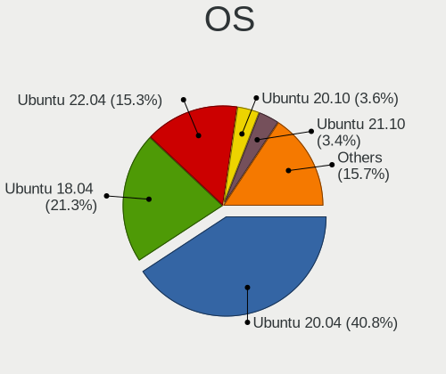

| Name            | Computers | Percent |
|-----------------|-----------|---------|
| Ubuntu 20.04    | 24497     | 44.01%  |
| Ubuntu 18.04    | 12972     | 23.3%   |
| Ubuntu 22.04    | 5736      | 10.3%   |
| Ubuntu 20.10    | 2217      | 3.98%   |
| Ubuntu 21.10    | 2083      | 3.74%   |
| Ubuntu 19.10    | 2055      | 3.69%   |
| Ubuntu 19.04    | 1903      | 3.42%   |
| Ubuntu 21.04    | 1768      | 3.18%   |
| Ubuntu 18.10    | 856       | 1.54%   |
| Ubuntu 16.04    | 741       | 1.33%   |
| Ubuntu 22.10    | 580       | 1.04%   |
| Ubuntu          | 73        | 0.13%   |
| Ubuntu 17.10    | 55        | 0.1%    |
| Ubuntu Core 16  | 41        | 0.07%   |
| Ubuntu Core 18  | 27        | 0.05%   |
| Ubuntu 14.04    | 18        | 0.03%   |
| Ubuntu 23.04    | 11        | 0.02%   |
| Ubuntu 17.04    | 6         | 0.01%   |
| Ubuntu 18.08    | 5         | 0.01%   |
| Ubuntu Core 20  | 3         | 0.01%   |
| Ubuntu 16.10    | 3         | 0.01%   |
| Ubuntu 12.04    | 3         | 0.01%   |
| Ubuntu Core 22  | 1         | 0.002%  |
| Ubuntu 6.1      | 1         | 0.002%  |
| Ubuntu 6.0      | 1         | 0.002%  |
| Ubuntu 6        | 1         | 0.002%  |
| Ubuntu 21.12    | 1         | 0.002%  |
| Ubuntu 20.08.3  | 1         | 0.002%  |
| Ubuntu 20.04.3  | 1         | 0.002%  |
| Ubuntu 19.1     | 1         | 0.002%  |
| Ubuntu 18.08.39 | 1         | 0.002%  |
| Ubuntu 18.08.38 | 1         | 0.002%  |
| Ubuntu 18.08.36 | 1         | 0.002%  |
| Ubuntu 18.08.34 | 1         | 0.002%  |
| Ubuntu 10.04    | 1         | 0.002%  |

OS Family
---------

OS without a version

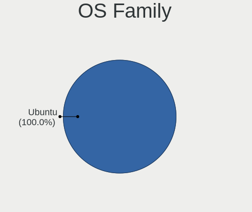

| Name   | Computers | Percent |
|--------|-----------|---------|
| Ubuntu | 53100     | 100%    |

Kernel
------

Version of the Linux kernel

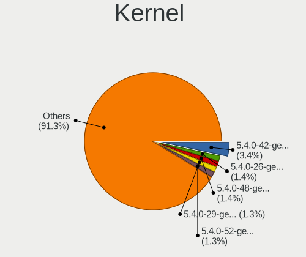

| Version           | Computers | Percent |
|-------------------|-----------|---------|
| 5.4.0-42-generic  | 2511      | 4.01%   |
| 5.4.0-48-generic  | 1019      | 1.63%   |
| 5.4.0-26-generic  | 1017      | 1.63%   |
| 5.4.0-29-generic  | 992       | 1.59%   |
| 5.4.0-52-generic  | 969       | 1.55%   |
| 5.4.0-40-generic  | 849       | 1.36%   |
| 5.8.0-43-generic  | 836       | 1.34%   |
| 5.4.0-58-generic  | 830       | 1.33%   |
| 5.4.0-37-generic  | 776       | 1.24%   |
| 5.15.0-52-generic | 753       | 1.2%    |
| 5.15.0-56-generic | 716       | 1.14%   |
| 5.3.0-40-generic  | 686       | 1.1%    |
| 5.4.0-33-generic  | 670       | 1.07%   |
| 5.11.0-27-generic | 668       | 1.07%   |
| 5.8.0-50-generic  | 639       | 1.02%   |
| 5.8.0-44-generic  | 616       | 0.98%   |
| 5.3.0-46-generic  | 614       | 0.98%   |
| 5.4.0-54-generic  | 600       | 0.96%   |
| 5.15.0-48-generic | 600       | 0.96%   |
| 5.11.0-37-generic | 591       | 0.94%   |
| 5.15.0-46-generic | 579       | 0.93%   |
| 5.4.0-31-generic  | 573       | 0.92%   |
| 5.4.0-47-generic  | 563       | 0.9%    |
| 5.8.0-48-generic  | 558       | 0.89%   |
| 5.11.0-38-generic | 551       | 0.88%   |
| 5.0.0-23-generic  | 536       | 0.86%   |
| 5.0.0-37-generic  | 519       | 0.83%   |
| 4.18.0-15-generic | 511       | 0.82%   |
| 5.11.0-40-generic | 498       | 0.8%    |
| 5.15.0-43-generic | 494       | 0.79%   |
| 5.15.0-47-generic | 489       | 0.78%   |
| 5.8.0-59-generic  | 485       | 0.77%   |
| 5.3.0-28-generic  | 485       | 0.77%   |
| 5.13.0-39-generic | 484       | 0.77%   |
| 5.13.0-30-generic | 470       | 0.75%   |
| 5.8.0-53-generic  | 464       | 0.74%   |
| 5.8.0-41-generic  | 457       | 0.73%   |
| 5.0.0-13-generic  | 455       | 0.73%   |
| 5.3.0-42-generic  | 449       | 0.72%   |
| 4.18.0-25-generic | 443       | 0.71%   |

Kernel Family
-------------

Linux kernel without a distro release

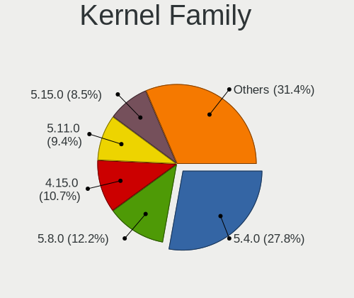

| Version | Computers | Percent |
|---------|-----------|---------|
| 5.4.0   | 15388     | 26.89%  |
| 5.8.0   | 6698      | 11.7%   |
| 5.15.0  | 6210      | 10.85%  |
| 4.15.0  | 5978      | 10.45%  |
| 5.11.0  | 5153      | 9%      |
| 5.3.0   | 4354      | 7.61%   |
| 5.13.0  | 4187      | 7.32%   |
| 5.0.0   | 3862      | 6.75%   |
| 4.18.0  | 2700      | 4.72%   |
| 5.19.0  | 551       | 0.96%   |
| 4.4.0   | 282       | 0.49%   |
| 5.14.0  | 152       | 0.27%   |
| 5.10.0  | 124       | 0.22%   |
| 4.13.0  | 100       | 0.17%   |
| 5.6.0   | 79        | 0.14%   |
| 5.17.0  | 78        | 0.14%   |
| 5.9.0   | 33        | 0.06%   |
| 4.10.0  | 28        | 0.05%   |
| 5.7.1   | 27        | 0.05%   |
| 6.0.0   | 23        | 0.04%   |
| 5.18.0  | 19        | 0.03%   |
| 4.9.140 | 19        | 0.03%   |
| 5.7.0   | 18        | 0.03%   |
| 5.12.0  | 18        | 0.03%   |
| 5.2.0   | 17        | 0.03%   |
| 5.16.0  | 17        | 0.03%   |
| 4.19.0  | 17        | 0.03%   |
| 6.0.9   | 16        | 0.03%   |
| 5.10.2  | 13        | 0.02%   |
| 4.8.0   | 13        | 0.02%   |
| 5.1.0   | 12        | 0.02%   |
| 5.15.2  | 11        | 0.02%   |
| 4.16.18 | 11        | 0.02%   |
| 5.9.1   | 10        | 0.02%   |
| 5.8.1   | 10        | 0.02%   |
| 5.17.1  | 10        | 0.02%   |
| 5.10.4  | 10        | 0.02%   |
| 5.1.15  | 10        | 0.02%   |
| 3.13.0  | 10        | 0.02%   |
| 5.9.10  | 9         | 0.02%   |

Kernel Major Ver.
-----------------

Linux kernel major version

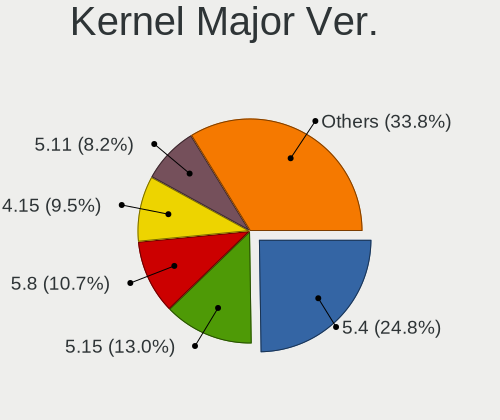

| Version | Computers | Percent |
|---------|-----------|---------|
| 5.4     | 15436     | 26.99%  |
| 5.8     | 6762      | 11.82%  |
| 5.15    | 6280      | 10.98%  |
| 4.15    | 5986      | 10.47%  |
| 5.11    | 5191      | 9.08%   |
| 5.3     | 4368      | 7.64%   |
| 5.13    | 4226      | 7.39%   |
| 5.0     | 3901      | 6.82%   |
| 4.18    | 2709      | 4.74%   |
| 5.19    | 573       | 1%      |
| 4.4     | 289       | 0.51%   |
| 5.10    | 222       | 0.39%   |
| 5.14    | 187       | 0.33%   |
| 5.17    | 127       | 0.22%   |
| 5.6     | 116       | 0.2%    |
| 4.13    | 103       | 0.18%   |
| 5.9     | 82        | 0.14%   |
| 5.7     | 80        | 0.14%   |
| 6.0     | 66        | 0.12%   |
| 5.18    | 52        | 0.09%   |
| 4.19    | 49        | 0.09%   |
| 5.16    | 45        | 0.08%   |
| 5.1     | 44        | 0.08%   |
| 5.12    | 41        | 0.07%   |
| 4.9     | 41        | 0.07%   |
| 5.2     | 40        | 0.07%   |
| 5.5     | 38        | 0.07%   |
| 4.10    | 29        | 0.05%   |
| 4.16    | 18        | 0.03%   |
| 4.8     | 15        | 0.03%   |
| 4.20    | 14        | 0.02%   |
| 4.17    | 11        | 0.02%   |
| 4.14    | 10        | 0.02%   |
| 3.13    | 10        | 0.02%   |
| 3.16    | 5         | 0.01%   |
| 6.1     | 4         | 0.01%   |
| 4.12    | 4         | 0.01%   |
| 4.2     | 2         | 0.003%  |
| 3.2     | 2         | 0.003%  |
| Unknown | 2         | 0.003%  |

Arch
----

OS architecture (x86_64, i586, etc.)

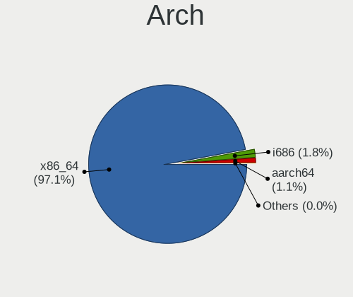

| Name    | Computers | Percent |
|---------|-----------|---------|
| x86_64  | 51454     | 96.89%  |
| i686    | 1016      | 1.91%   |
| aarch64 | 595       | 1.12%   |
| armv7l  | 35        | 0.07%   |
| Unknown | 2         | 0.004%  |
| s390x   | 1         | 0.002%  |
| riscv64 | 1         | 0.002%  |
| i586    | 1         | 0.002%  |

DE
--

Desktop Environment

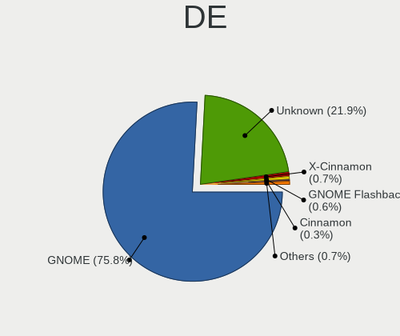

| Name              | Computers | Percent |
|-------------------|-----------|---------|
| GNOME             | 39982     | 73.69%  |
| Unknown           | 13089     | 24.12%  |
| X-Cinnamon        | 358       | 0.66%   |
| GNOME Flashback   | 327       | 0.6%    |
| Cinnamon          | 154       | 0.28%   |
| GNUstep           | 118       | 0.22%   |
| i3                | 63        | 0.12%   |
| GNOME Classic     | 43        | 0.08%   |
| enlightenment     | 35        | 0.06%   |
| awesome           | 16        | 0.03%   |
| openbox           | 13        | 0.02%   |
| xubuntu           | 7         | 0.01%   |
| Deepin            | 7         | 0.01%   |
| Yaru:ubuntu:GNOME | 5         | 0.01%   |
| sway              | 5         | 0.01%   |
| Pantheon          | 5         | 0.01%   |
| Lubuntu           | 4         | 0.01%   |
| xmonad            | 3         | 0.01%   |
| Trinity           | 3         | 0.01%   |
| DWM               | 3         | 0.01%   |
| ubuntustudio      | 2         | 0.004%  |
| ubuntu            | 2         | 0.004%  |
| ICEWM             | 2         | 0.004%  |
| fvwm              | 2         | 0.004%  |
| Cutefish          | 2         | 0.004%  |
| Core              | 2         | 0.004%  |
| bspwm             | 2         | 0.004%  |
| wmaker-common     | 1         | 0.002%  |
| ubuntu=GNOME      | 1         | 0.002%  |
| kde               | 1         | 0.002%  |
| i3-with-shmlog    | 1         | 0.002%  |
| fluxbox           | 1         | 0.002%  |

Display Server
--------------

X11 or Wayland

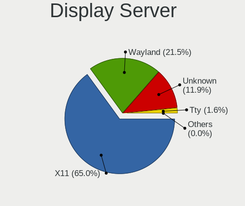

| Name        | Computers | Percent |
|-------------|-----------|---------|
| X11         | 39091     | 71.24%  |
| Wayland     | 7570      | 13.8%   |
| Unknown     | 7532      | 13.73%  |
| Tty         | 674       | 1.23%   |
| Web         | 6         | 0.01%   |
| Unspecified | 1         | 0.002%  |

Display Manager
---------------

SDDM, LightDM, etc.

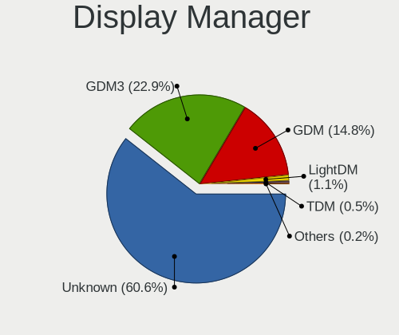

| Name    | Computers | Percent |
|---------|-----------|---------|
| Unknown | 34291     | 62.73%  |
| GDM3    | 11153     | 20.4%   |
| GDM     | 8313      | 15.21%  |
| LightDM | 552       | 1.01%   |
| TDM     | 257       | 0.47%   |
| SDDM    | 74        | 0.14%   |
| SLiM    | 12        | 0.02%   |
| XDM     | 4         | 0.01%   |
| NODM    | 2         | 0.004%  |
| Ly      | 2         | 0.004%  |
| LXDM    | 2         | 0.004%  |

OS Lang
-------

Language

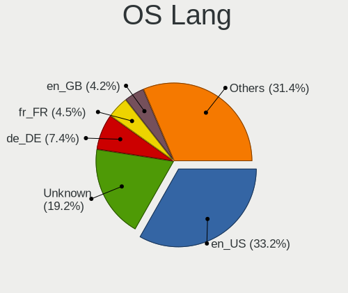

| Lang    | Computers | Percent |
|---------|-----------|---------|
| en_US   | 18235     | 33.74%  |
| Unknown | 10058     | 18.61%  |
| de_DE   | 4020      | 7.44%   |
| fr_FR   | 2479      | 4.59%   |
| en_GB   | 2264      | 4.19%   |
| pt_BR   | 2071      | 3.83%   |
| it_IT   | 1468      | 2.72%   |
| en_IN   | 1367      | 2.53%   |
| ru_RU   | 1232      | 2.28%   |
| es_ES   | 1155      | 2.14%   |
| en_CA   | 1081      | 2%      |
| C       | 836       | 1.55%   |
| pl_PL   | 721       | 1.33%   |
| en_AU   | 696       | 1.29%   |
| nl_NL   | 468       | 0.87%   |
| hu_HU   | 326       | 0.6%    |
| cs_CZ   | 324       | 0.6%    |
| es_MX   | 295       | 0.55%   |
| es_AR   | 276       | 0.51%   |
| en_ZA   | 271       | 0.5%    |
| ja_JP   | 265       | 0.49%   |
| zh_CN   | 229       | 0.42%   |
| de_AT   | 214       | 0.4%    |
| pt_PT   | 209       | 0.39%   |
| tr_TR   | 194       | 0.36%   |
| sv_SE   | 184       | 0.34%   |
| de_CH   | 155       | 0.29%   |
| fi_FI   | 142       | 0.26%   |
| ru_UA   | 132       | 0.24%   |
| es_CO   | 130       | 0.24%   |
| es_CL   | 126       | 0.23%   |
| en_IL   | 125       | 0.23%   |
| fr_CA   | 119       | 0.22%   |
| en_NZ   | 116       | 0.21%   |
| el_GR   | 116       | 0.21%   |
| fr_BE   | 110       | 0.2%    |
| da_DK   | 106       | 0.2%    |
| ro_RO   | 103       | 0.19%   |
| ko_KR   | 98        | 0.18%   |
| nb_NO   | 84        | 0.16%   |

Boot Mode
---------

EFI or BIOS

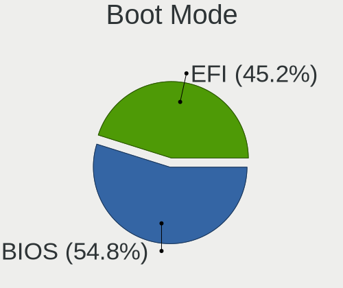

| Mode | Computers | Percent |
|------|-----------|---------|
| BIOS | 29682     | 54.85%  |
| EFI  | 24429     | 45.15%  |

Filesystem
----------

Type of filesystem

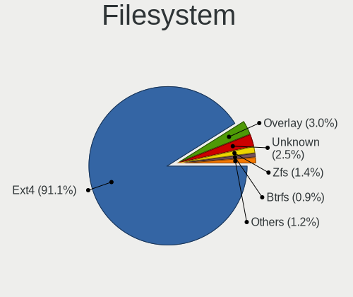

| Type          | Computers | Percent |
|---------------|-----------|---------|
| Ext4          | 48634     | 91.08%  |
| Overlay       | 1579      | 2.96%   |
| Unknown       | 1365      | 2.56%   |
| Zfs           | 734       | 1.37%   |
| Btrfs         | 428       | 0.8%    |
| Ext2          | 281       | 0.53%   |
| Xfs           | 179       | 0.34%   |
| Ext3          | 158       | 0.3%    |
| Aufs          | 19        | 0.04%   |
| Reiserfs      | 7         | 0.01%   |
| Jfs           | 7         | 0.01%   |
| XXXX          | 1         | 0.002%  |
| XXX4          | 1         | 0.002%  |
| SquXshfs      | 1         | 0.002%  |
| Nfs           | 1         | 0.002%  |
| Lvm           | 1         | 0.002%  |
| Fuse.snapfuse | 1         | 0.002%  |
| F2fs          | 1         | 0.002%  |

Part. scheme
------------

Scheme of partitioning

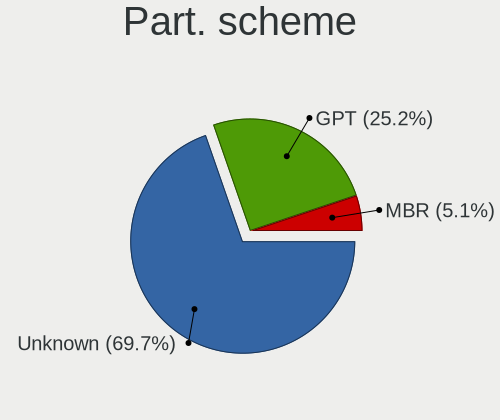

| Type    | Computers | Percent |
|---------|-----------|---------|
| Unknown | 39701     | 73.81%  |
| GPT     | 11586     | 21.54%  |
| MBR     | 2499      | 4.65%   |

Dual Boot with Linux/BSD
------------------------

Hosting more than one Linux/BSD

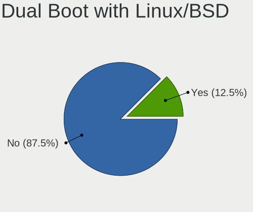

| Dual boot | Computers | Percent |
|-----------|-----------|---------|
| No        | 47064     | 87.42%  |
| Yes       | 6770      | 12.58%  |

Dual Boot (Win)
---------------

Hosting Linux and Windows

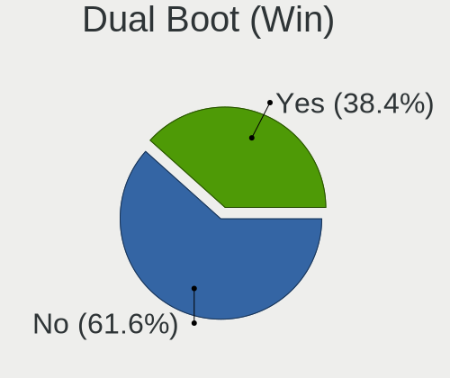

| Dual boot | Computers | Percent |
|-----------|-----------|---------|
| No        | 33186     | 61.59%  |
| Yes       | 20698     | 38.41%  |

Board
-----

Vendor
------

Motherboard manufacturer

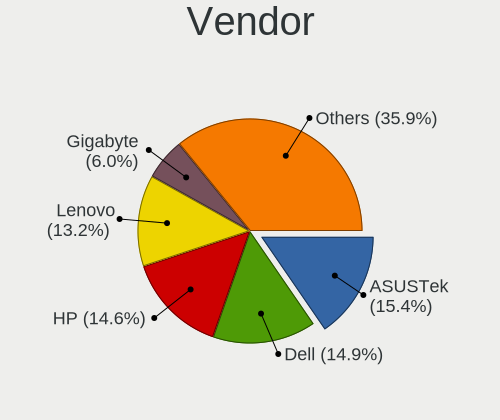

| Name                    | Computers | Percent |
|-------------------------|-----------|---------|
| ASUSTek Computer        | 8255      | 15.55%  |
| Dell                    | 8023      | 15.11%  |
| Hewlett-Packard         | 7743      | 14.58%  |
| Lenovo                  | 6859      | 12.92%  |
| Gigabyte Technology     | 3333      | 6.28%   |
| Acer                    | 2934      | 5.53%   |
| MSI                     | 2749      | 5.18%   |
| ASRock                  | 1651      | 3.11%   |
| Apple                   | 1103      | 2.08%   |
| Intel                   | 1061      | 2%      |
| Toshiba                 | 983       | 1.85%   |
| Samsung Electronics     | 634       | 1.19%   |
| Raspberry Pi Foundation | 527       | 0.99%   |
| Sony                    | 508       | 0.96%   |
| Unknown                 | 482       | 0.91%   |
| Fujitsu                 | 468       | 0.88%   |
| Medion                  | 312       | 0.59%   |
| HUAWEI                  | 284       | 0.53%   |
| Pegatron                | 256       | 0.48%   |
| Foxconn                 | 238       | 0.45%   |
| Supermicro              | 232       | 0.44%   |
| Packard Bell            | 225       | 0.42%   |
| Positivo                | 214       | 0.4%    |
| Biostar                 | 183       | 0.34%   |
| Microsoft               | 180       | 0.34%   |
| ECS                     | 173       | 0.33%   |
| Notebook                | 155       | 0.29%   |
| Alienware               | 153       | 0.29%   |
| Fujitsu Siemens         | 149       | 0.28%   |
| Gateway                 | 117       | 0.22%   |
| Google                  | 113       | 0.21%   |
| AMI                     | 110       | 0.21%   |
| Timi                    | 109       | 0.21%   |
| LG Electronics          | 102       | 0.19%   |
| eMachines               | 76        | 0.14%   |
| System76                | 69        | 0.13%   |
| TUXEDO                  | 68        | 0.13%   |
| Clevo                   | 68        | 0.13%   |
| Chuwi                   | 64        | 0.12%   |
| Panasonic               | 55        | 0.1%    |

Model
-----

Motherboard model

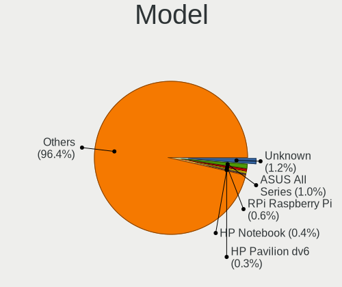

| Name                               | Computers | Percent |
|------------------------------------|-----------|---------|
| Unknown                            | 666       | 1.25%   |
| ASUS All Series                    | 555       | 1.05%   |
| RPi Raspberry Pi                   | 289       | 0.54%   |
| HP Notebook                        | 231       | 0.44%   |
| HP Pavilion dv6                    | 151       | 0.28%   |
| Dell OptiPlex 7010                 | 137       | 0.26%   |
| HP Pavilion g6                     | 132       | 0.25%   |
| HP Pavilion dv7                    | 105       | 0.2%    |
| HP Pavilion Notebook               | 98        | 0.18%   |
| ASUS PRIME A320M-K                 | 97        | 0.18%   |
| HP Pavilion 15                     | 88        | 0.17%   |
| Dell XPS 15 7590                   | 88        | 0.17%   |
| Dell Latitude E6410                | 84        | 0.16%   |
| Dell OptiPlex 790                  | 83        | 0.16%   |
| MSI MS-7C37                        | 82        | 0.15%   |
| Dell Latitude E6420                | 82        | 0.15%   |
| Gigabyte B450M DS3H                | 79        | 0.15%   |
| Dell Inspiron 15-3567              | 79        | 0.15%   |
| RPi Raspberry Pi 4 Model B Rev 1.4 | 78        | 0.15%   |
| Dell XPS 15 9570                   | 78        | 0.15%   |
| Dell OptiPlex 9020                 | 75        | 0.14%   |
| Dell Latitude E6430                | 74        | 0.14%   |
| MSI MS-7C02                        | 73        | 0.14%   |
| Dell OptiPlex 780                  | 73        | 0.14%   |
| ASUS M5A78L-M/USB3                 | 73        | 0.14%   |
| MSI MS-7721                        | 71        | 0.13%   |
| HP 15                              | 71        | 0.13%   |
| Dell XPS 13 7390                   | 68        | 0.13%   |
| Dell Latitude E6400                | 66        | 0.12%   |
| HP EliteBook 840 G3                | 65        | 0.12%   |
| Dell Inspiron 5570                 | 65        | 0.12%   |
| HP Laptop 15-bs0xx                 | 64        | 0.12%   |
| Dell XPS 13 9370                   | 63        | 0.12%   |
| HP Laptop 15-db0xxx                | 62        | 0.12%   |
| ASUS TUF Gaming X570-PLUS          | 62        | 0.12%   |
| MSI MS-7A38                        | 61        | 0.11%   |
| HP Compaq Elite 8300 SFF           | 61        | 0.11%   |
| MSI MS-7693                        | 60        | 0.11%   |
| Dell OptiPlex 3020                 | 60        | 0.11%   |
| RPi Raspberry Pi 4 Model B Rev 1.1 | 59        | 0.11%   |

Model Family
------------

Motherboard model prefix

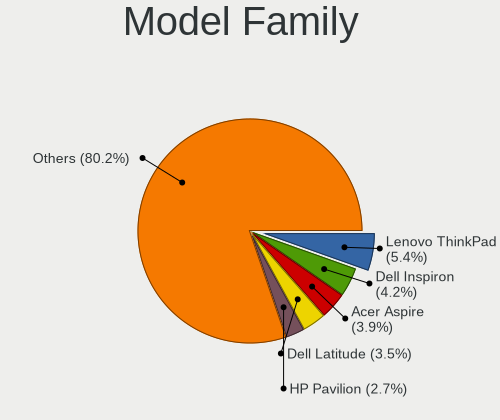

| Name                  | Computers | Percent |
|-----------------------|-----------|---------|
| Lenovo ThinkPad       | 2928      | 5.51%   |
| Dell Inspiron         | 2137      | 4.02%   |
| Acer Aspire           | 2028      | 3.82%   |
| Dell Latitude         | 1887      | 3.55%   |
| HP Pavilion           | 1417      | 2.67%   |
| Lenovo IdeaPad        | 1325      | 2.5%    |
| Dell OptiPlex         | 1091      | 2.05%   |
| HP EliteBook          | 1055      | 1.99%   |
| Dell XPS              | 930       | 1.75%   |
| Toshiba Satellite     | 827       | 1.56%   |
| HP ProBook            | 822       | 1.55%   |
| ASUS PRIME            | 794       | 1.5%    |
| HP Compaq             | 782       | 1.47%   |
| Dell Precision        | 773       | 1.46%   |
| HP Laptop             | 710       | 1.34%   |
| Unknown               | 666       | 1.25%   |
| ASUS ROG              | 576       | 1.08%   |
| ASUS All              | 555       | 1.05%   |
| RPi Raspberry         | 526       | 0.99%   |
| Dell Vostro           | 520       | 0.98%   |
| Lenovo ThinkCentre    | 482       | 0.91%   |
| ASUS VivoBook         | 441       | 0.83%   |
| ASUS TUF              | 370       | 0.7%    |
| HP ENVY               | 361       | 0.68%   |
| Lenovo Yoga           | 286       | 0.54%   |
| Acer Swift            | 236       | 0.44%   |
| HP Notebook           | 233       | 0.44%   |
| HP ZBook              | 203       | 0.38%   |
| ASUS M5A78L-M         | 203       | 0.38%   |
| Fujitsu LIFEBOOK      | 190       | 0.36%   |
| Microsoft Surface     | 180       | 0.34%   |
| Lenovo ThinkBook      | 179       | 0.34%   |
| Dell PowerEdge        | 179       | 0.34%   |
| Lenovo Legion         | 176       | 0.33%   |
| ASUS ZenBook          | 166       | 0.31%   |
| HP EliteDesk          | 153       | 0.29%   |
| Fujitsu ESPRIMO       | 150       | 0.28%   |
| HP ProLiant           | 144       | 0.27%   |
| Packard Bell EasyNote | 134       | 0.25%   |
| HP Spectre            | 130       | 0.24%   |

MFG Year
--------

Motherboard manufacture year

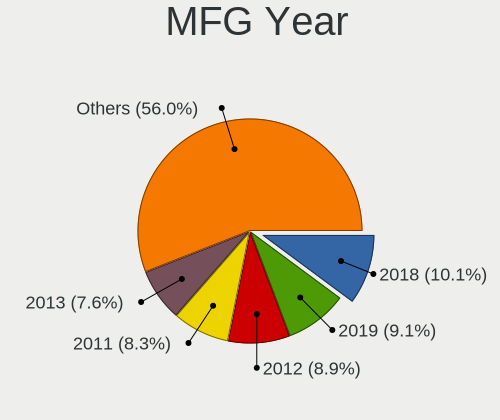

| Year    | Computers | Percent |
|---------|-----------|---------|
| 2018    | 5307      | 9.99%   |
| 2019    | 4844      | 9.12%   |
| 2012    | 4650      | 8.76%   |
| 2011    | 4329      | 8.15%   |
| 2013    | 3997      | 7.53%   |
| 2020    | 3775      | 7.11%   |
| 2017    | 3756      | 7.07%   |
| 2014    | 3223      | 6.07%   |
| 2010    | 3194      | 6.02%   |
| 2015    | 2981      | 5.61%   |
| 2016    | 2736      | 5.15%   |
| 2009    | 2403      | 4.53%   |
| 2008    | 2382      | 4.49%   |
| 2021    | 2127      | 4.01%   |
| 2007    | 1465      | 2.76%   |
| 2006    | 594       | 1.12%   |
| Unknown | 552       | 1.04%   |
| 2022    | 507       | 0.95%   |
| 2005    | 211       | 0.4%    |
| 2004    | 48        | 0.09%   |
| 2003    | 7         | 0.01%   |
| 2002    | 7         | 0.01%   |
| 2001    | 4         | 0.01%   |
| 2000    | 1         | 0.002%  |

Form Factor
-----------

Physical design of the computer

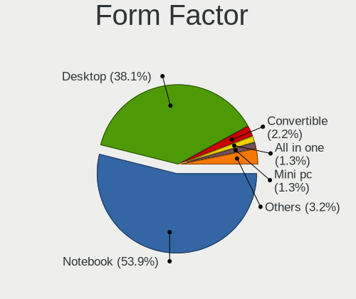

| Name           | Computers | Percent |
|----------------|-----------|---------|
| Notebook       | 28661     | 53.98%  |
| Desktop        | 20153     | 37.95%  |
| Convertible    | 1183      | 2.23%   |
| Mini pc        | 701       | 1.32%   |
| All in one     | 688       | 1.3%    |
| Server         | 630       | 1.19%   |
| System on chip | 623       | 1.17%   |
| Tablet         | 455       | 0.86%   |
| Other          | 3         | 0.01%   |
| Stick pc       | 2         | 0.004%  |
| Firewall       | 1         | 0.002%  |

Secure Boot
-----------

Enabled or disabled

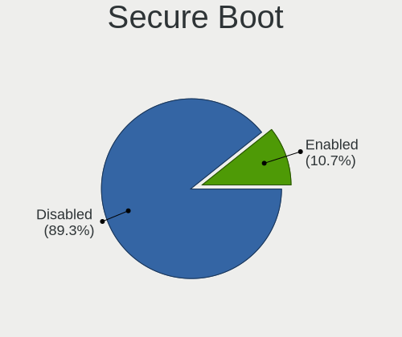

| State    | Computers | Percent |
|----------|-----------|---------|
| Disabled | 47741     | 89.2%   |
| Enabled  | 5781      | 10.8%   |

Coreboot
--------

Have coreboot on board

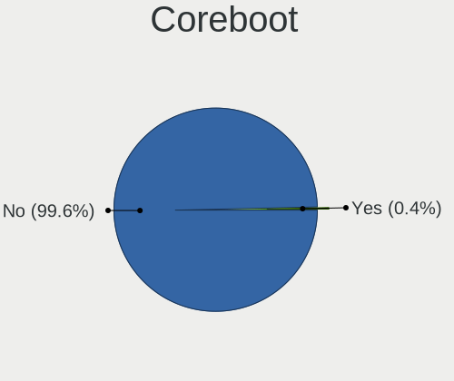

| Used | Computers | Percent |
|------|-----------|---------|
| No   | 52933     | 99.69%  |
| Yes  | 167       | 0.31%   |

RAM Size
--------

Total RAM memory

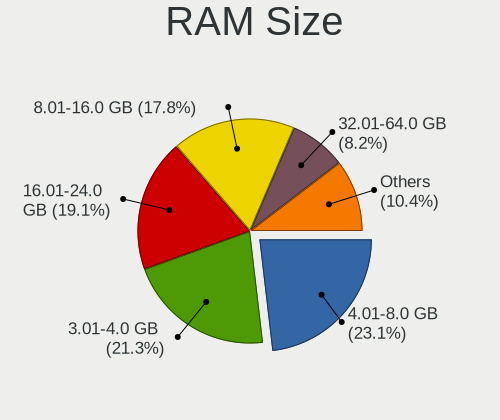

| Size in GB      | Computers | Percent |
|-----------------|-----------|---------|
| 4.01-8.0        | 12370     | 23.01%  |
| 3.01-4.0        | 11951     | 22.23%  |
| 16.01-24.0      | 10100     | 18.79%  |
| 8.01-16.0       | 9662      | 17.97%  |
| 32.01-64.0      | 4096      | 7.62%   |
| 1.01-2.0        | 2347      | 4.37%   |
| 64.01-256.0     | 1338      | 2.49%   |
| 2.01-3.0        | 801       | 1.49%   |
| 24.01-32.0      | 700       | 1.3%    |
| 0.51-1.0        | 260       | 0.48%   |
| More than 256.0 | 113       | 0.21%   |
| 0.01-0.5        | 22        | 0.04%   |
| Unknown         | 4         | 0.01%   |

RAM Used
--------

Used RAM memory

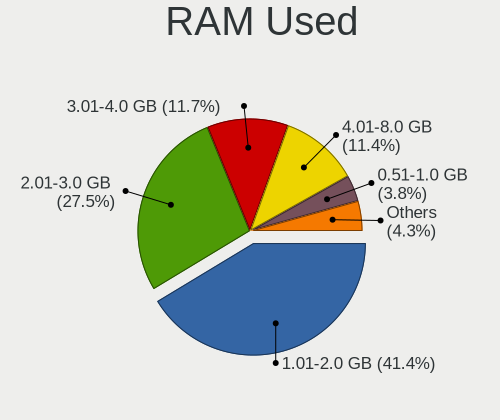

| Used GB         | Computers | Percent |
|-----------------|-----------|---------|
| 1.01-2.0        | 23043     | 39.85%  |
| 2.01-3.0        | 16183     | 27.99%  |
| 3.01-4.0        | 7020      | 12.14%  |
| 4.01-8.0        | 6914      | 11.96%  |
| 0.51-1.0        | 1959      | 3.39%   |
| 8.01-16.0       | 1880      | 3.25%   |
| 0.01-0.5        | 339       | 0.59%   |
| 16.01-24.0      | 250       | 0.43%   |
| 24.01-32.0      | 94        | 0.16%   |
| 32.01-64.0      | 93        | 0.16%   |
| 64.01-256.0     | 32        | 0.06%   |
| Unknown         | 18        | 0.03%   |
| More than 256.0 | 1         | 0.002%  |
| 0               | 1         | 0.002%  |

Total Drives
------------

Number of drives on board

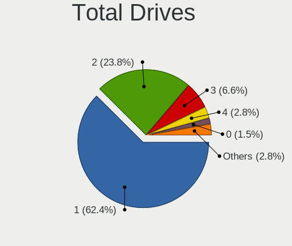

| Drives  | Computers | Percent |
|---------|-----------|---------|
| 1       | 33978     | 62.41%  |
| 2       | 12989     | 23.86%  |
| 3       | 3608      | 6.63%   |
| 4       | 1556      | 2.86%   |
| 0       | 788       | 1.45%   |
| 5       | 714       | 1.31%   |
| 6       | 346       | 0.64%   |
| 7       | 167       | 0.31%   |
| 8       | 79        | 0.15%   |
| Unknown | 58        | 0.11%   |
| 9       | 54        | 0.1%    |
| 10      | 29        | 0.05%   |
| 11      | 23        | 0.04%   |
| 13      | 16        | 0.03%   |
| 12      | 6         | 0.01%   |
| 16      | 5         | 0.01%   |
| 20      | 4         | 0.01%   |
| 18      | 3         | 0.01%   |
| 17      | 3         | 0.01%   |
| 14      | 3         | 0.01%   |
| 36      | 2         | 0.004%  |
| 32      | 2         | 0.004%  |
| 25      | 2         | 0.004%  |
| 21      | 2         | 0.004%  |
| 15      | 2         | 0.004%  |
| 87      | 1         | 0.002%  |
| 45      | 1         | 0.002%  |
| 24      | 1         | 0.002%  |
| 23      | 1         | 0.002%  |

Has CD-ROM
----------

Has CD-ROM on board

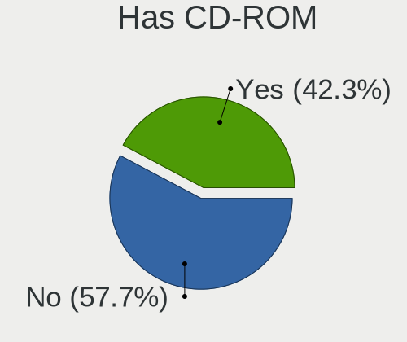

| Presented | Computers | Percent |
|-----------|-----------|---------|
| No        | 29778     | 55.67%  |
| Yes       | 23713     | 44.33%  |

Has Ethernet
------------

Has Ethernet on board

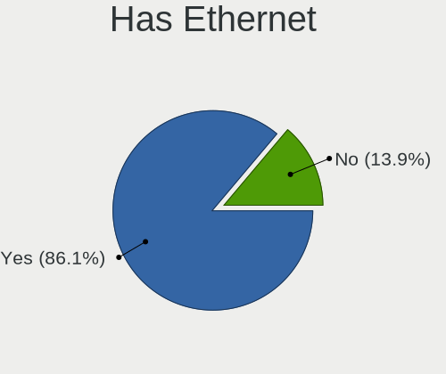

| Presented | Computers | Percent |
|-----------|-----------|---------|
| Yes       | 46518     | 87.43%  |
| No        | 6689      | 12.57%  |

Has WiFi
--------

Has WiFi module

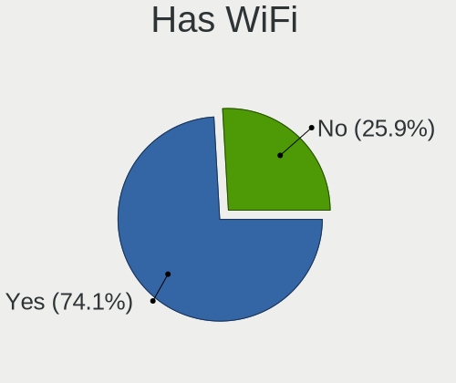

| Presented | Computers | Percent |
|-----------|-----------|---------|
| Yes       | 39359     | 73.68%  |
| No        | 14060     | 26.32%  |

Has Bluetooth
-------------

Has Bluetooth module

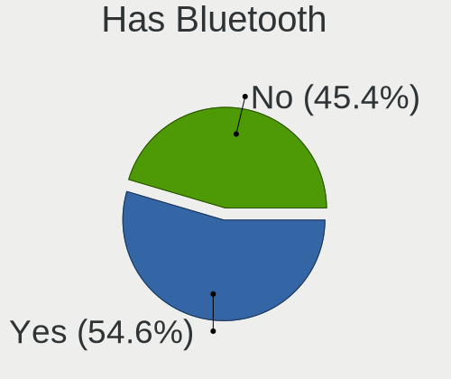

| Presented | Computers | Percent |
|-----------|-----------|---------|
| Yes       | 28899     | 53.8%   |
| No        | 24817     | 46.2%   |

Location
--------

Country
-------

Geographic location (country)

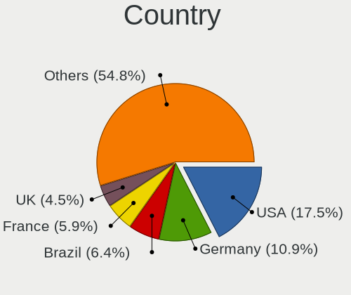

| Country      | Computers | Percent |
|--------------|-----------|---------|
| USA          | 9215      | 17.28%  |
| Germany      | 5821      | 10.92%  |
| Brazil       | 3511      | 6.58%   |
| France       | 3044      | 5.71%   |
| UK           | 2428      | 4.55%   |
| Italy        | 2322      | 4.35%   |
| Russia       | 1941      | 3.64%   |
| India        | 1745      | 3.27%   |
| Canada       | 1680      | 3.15%   |
| Spain        | 1665      | 3.12%   |
| Netherlands  | 1220      | 2.29%   |
| Poland       | 1204      | 2.26%   |
| Australia    | 877       | 1.64%   |
| Switzerland  | 728       | 1.37%   |
| Ukraine      | 671       | 1.26%   |
| Mexico       | 628       | 1.18%   |
| Czechia      | 606       | 1.14%   |
| Sweden       | 603       | 1.13%   |
| Belgium      | 598       | 1.12%   |
| Argentina    | 557       | 1.04%   |
| Hungary      | 556       | 1.04%   |
| Austria      | 552       | 1.04%   |
| Turkey       | 536       | 1.01%   |
| Portugal     | 461       | 0.86%   |
| Romania      | 444       | 0.83%   |
| Japan        | 432       | 0.81%   |
| China        | 432       | 0.81%   |
| Finland      | 405       | 0.76%   |
| Greece       | 394       | 0.74%   |
| South Africa | 353       | 0.66%   |
| Indonesia    | 345       | 0.65%   |
| Denmark      | 317       | 0.59%   |
| Colombia     | 291       | 0.55%   |
| Norway       | 286       | 0.54%   |
| Chile        | 269       | 0.5%    |
| Iran         | 267       | 0.5%    |
| Bulgaria     | 267       | 0.5%    |
| Israel       | 243       | 0.46%   |
| Taiwan       | 227       | 0.43%   |
| Serbia       | 217       | 0.41%   |

City
----

Geographic location (city)

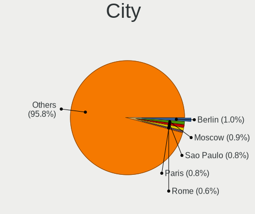

| City              | Computers | Percent |
|-------------------|-----------|---------|
| Berlin            | 572       | 1.02%   |
| Moscow            | 529       | 0.94%   |
| Paris             | 475       | 0.84%   |
| Sao Paulo         | 455       | 0.81%   |
| Vienna            | 314       | 0.56%   |
| Rome              | 313       | 0.56%   |
| Warsaw            | 296       | 0.53%   |
| Milan             | 296       | 0.53%   |
| Munich            | 283       | 0.5%    |
| Madrid            | 279       | 0.5%    |
| St Petersburg     | 254       | 0.45%   |
| Budapest          | 252       | 0.45%   |
| Hamburg           | 237       | 0.42%   |
| Sydney            | 231       | 0.41%   |
| Kyiv              | 229       | 0.41%   |
| Prague            | 228       | 0.4%    |
| Athens            | 219       | 0.39%   |
| Bengaluru         | 214       | 0.38%   |
| Istanbul          | 210       | 0.37%   |
| Barcelona         | 210       | 0.37%   |
| Zurich            | 206       | 0.37%   |
| Rio de Janeiro    | 199       | 0.35%   |
| Amsterdam         | 192       | 0.34%   |
| Melbourne         | 187       | 0.33%   |
| Helsinki          | 186       | 0.33%   |
| Toronto           | 177       | 0.31%   |
| Montreal          | 177       | 0.31%   |
| Frankfurt am Main | 167       | 0.3%    |
| Bucharest         | 162       | 0.29%   |
| Buenos Aires      | 156       | 0.28%   |
| Sofia             | 155       | 0.28%   |
| Tehran            | 153       | 0.27%   |
| Stuttgart         | 141       | 0.25%   |
| Singapore         | 140       | 0.25%   |
| London            | 138       | 0.24%   |
| Mumbai            | 137       | 0.24%   |
| Chennai           | 132       | 0.23%   |
| Mexico City       | 131       | 0.23%   |
| Chicago           | 131       | 0.23%   |
| New York          | 128       | 0.23%   |

Drives
------

Drive Vendor
------------

Hard drive vendors

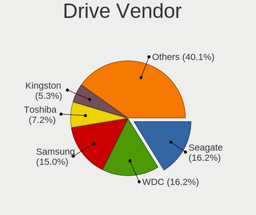

| Vendor                    | Computers | Drives | Percent |
|---------------------------|-----------|--------|---------|
| Seagate                   | 12199     | 18264  | 16.75%  |
| WDC                       | 12122     | 17967  | 16.65%  |
| Samsung Electronics       | 10741     | 15161  | 14.75%  |
| Toshiba                   | 5495      | 7144   | 7.55%   |
| Kingston                  | 3827      | 4828   | 5.26%   |
| SanDisk                   | 3464      | 4435   | 4.76%   |
| Unknown                   | 3128      | 4119   | 4.3%    |
| Hitachi                   | 2745      | 3538   | 3.77%   |
| Crucial                   | 2154      | 2905   | 2.96%   |
| Intel                     | 1792      | 2453   | 2.46%   |
| SK hynix                  | 1723      | 2045   | 2.37%   |
| HGST                      | 1557      | 2051   | 2.14%   |
| Micron Technology         | 953       | 1145   | 1.31%   |
| A-DATA Technology         | 928       | 1143   | 1.27%   |
| Phison                    | 519       | 695    | 0.71%   |
| Apple                     | 468       | 578    | 0.64%   |
| China                     | 455       | 543    | 0.62%   |
| KIOXIA                    | 412       | 498    | 0.57%   |
| Maxtor                    | 393       | 516    | 0.54%   |
| PNY                       | 348       | 429    | 0.48%   |
| Fujitsu                   | 345       | 413    | 0.47%   |
| OCZ                       | 332       | 414    | 0.46%   |
| LITEON                    | 331       | 394    | 0.45%   |
| SPCC                      | 319       | 404    | 0.44%   |
| Intenso                   | 306       | 420    | 0.42%   |
| Silicon Motion            | 296       | 372    | 0.41%   |
| Transcend                 | 284       | 330    | 0.39%   |
| Corsair                   | 226       | 285    | 0.31%   |
| Patriot                   | 222       | 279    | 0.3%    |
| Micron/Crucial Technology | 187       | 239    | 0.26%   |
| JMicron Technology        | 185       | 216    | 0.25%   |
| GOODRAM                   | 176       | 237    | 0.24%   |
| LITEONIT                  | 171       | 202    | 0.23%   |
| Hewlett-Packard           | 169       | 259    | 0.23%   |
| ASMT                      | 141       | 203    | 0.19%   |
| Unknown                   | 140       | 160    | 0.19%   |
| Team                      | 130       | 167    | 0.18%   |
| Realtek Semiconductor     | 109       | 135    | 0.15%   |
| KingSpec                  | 109       | 136    | 0.15%   |
| Plextor                   | 107       | 138    | 0.15%   |

Drive Model
-----------

Hard drive models

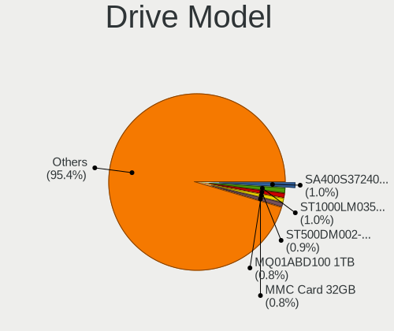

| Model                                  | Computers | Percent |
|----------------------------------------|-----------|---------|
| Kingston SA400S37240G 240GB SSD        | 806       | 1.01%   |
| Seagate ST1000LM035-1RK172 1TB         | 765       | 0.96%   |
| Seagate ST500DM002-1BD142 500GB        | 671       | 0.84%   |
| Toshiba MQ01ABD100 1TB                 | 646       | 0.81%   |
| Unknown MMC Card  32GB                 | 638       | 0.8%    |
| Samsung SSD 860 EVO 500GB              | 621       | 0.78%   |
| Seagate ST1000LM024 HN-M101MBB 1TB     | 609       | 0.77%   |
| Samsung SSD 850 EVO 250GB              | 558       | 0.7%    |
| Kingston SA400S37120G 120GB SSD        | 539       | 0.68%   |
| Samsung NVMe SSD Drive 512GB           | 506       | 0.64%   |
| Unknown MMC Card  64GB                 | 449       | 0.56%   |
| Seagate ST1000DM010-2EP102 1TB         | 425       | 0.53%   |
| Samsung SSD 850 EVO 500GB              | 423       | 0.53%   |
| Samsung SM963 2.5" NVMe PCIe SSD 256GB | 416       | 0.52%   |
| Toshiba MQ01ABF050 500GB               | 410       | 0.52%   |
| Kingston SA400S37480G 480GB SSD        | 394       | 0.5%    |
| Toshiba MQ04ABF100 1TB                 | 390       | 0.49%   |
| Samsung NVMe SSD Drive 500GB           | 387       | 0.49%   |
| Toshiba DT01ACA100 1TB                 | 372       | 0.47%   |
| Seagate ST500LT012-1DG142 500GB        | 371       | 0.47%   |
| Kingston SV300S37A120G 120GB SSD       | 364       | 0.46%   |
| HGST HTS721010A9E630 1TB               | 359       | 0.45%   |
| Seagate ST9500325AS 500GB              | 355       | 0.45%   |
| WDC WD10EZEX-08WN4A0 1TB               | 324       | 0.41%   |
| SanDisk NVMe SSD Drive 512GB           | 320       | 0.4%    |
| Samsung SSD 860 EVO 250GB              | 319       | 0.4%    |
| Samsung SSD 860 EVO 1TB                | 316       | 0.4%    |
| Intel NVMe SSD Drive 512GB             | 314       | 0.39%   |
| Crucial CT500MX500SSD1 500GB           | 305       | 0.38%   |
| Seagate ST2000DM008-2FR102 2TB         | 302       | 0.38%   |
| Seagate ST3500418AS 500GB              | 290       | 0.36%   |
| Seagate ST1000DM003-1CH162 1TB         | 289       | 0.36%   |
| Unknown SD/MMC/MS PRO 64GB             | 271       | 0.34%   |
| Crucial CT240BX500SSD1 240GB           | 267       | 0.34%   |
| Seagate ST1000DM003-1ER162 1TB         | 244       | 0.31%   |
| Samsung NVMe SSD Drive 1TB             | 243       | 0.31%   |
| WDC WDS240G2G0A-00JH30 240GB SSD       | 242       | 0.3%    |
| Unknown MMC Card  128GB                | 242       | 0.3%    |
| Seagate Expansion 4TB                  | 236       | 0.3%    |
| Samsung NVMe SSD Drive 1024GB          | 227       | 0.29%   |

HDD Vendor
----------

Hard disk drive vendors

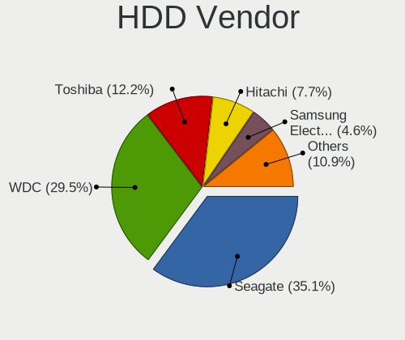

| Vendor              | Computers | Drives | Percent |
|---------------------|-----------|--------|---------|
| Seagate             | 12010     | 17892  | 35.2%   |
| WDC                 | 10200     | 15249  | 29.89%  |
| Toshiba             | 4250      | 5486   | 12.45%  |
| Hitachi             | 2744      | 3537   | 8.04%   |
| Samsung Electronics | 1715      | 2341   | 5.03%   |
| HGST                | 1555      | 2043   | 4.56%   |
| Maxtor              | 375       | 483    | 1.1%    |
| Fujitsu             | 339       | 402    | 0.99%   |
| Unknown             | 294       | 379    | 0.86%   |
| Apple               | 164       | 180    | 0.48%   |
| ASMT                | 110       | 166    | 0.32%   |
| Hewlett-Packard     | 57        | 105    | 0.17%   |
| Intenso             | 45        | 64     | 0.13%   |
| JMicron Technology  | 24        | 36     | 0.07%   |
| ExcelStor           | 21        | 23     | 0.06%   |
| ASMedia             | 17        | 22     | 0.05%   |
| USB3.0              | 15        | 18     | 0.04%   |
| LaCie               | 15        | 20     | 0.04%   |
| MARVELL             | 12        | 16     | 0.04%   |
| IBM/Hitachi         | 12        | 13     | 0.04%   |
| HGST HTS            | 12        | 12     | 0.04%   |
| USB                 | 11        | 12     | 0.03%   |
| WD MediaMax         | 10        | 11     | 0.03%   |
| ASMT109x            | 10        | 18     | 0.03%   |
| KESU                | 8         | 12     | 0.02%   |
| HPE                 | 8         | 12     | 0.02%   |
| Quantum             | 6         | 7      | 0.02%   |
| PHD 3.0             | 6         | 6      | 0.02%   |
| StoreJet            | 5         | 5      | 0.01%   |
| SABRENT             | 5         | 10     | 0.01%   |
| Maxone              | 5         | 6      | 0.01%   |
| Inateck             | 5         | 5      | 0.01%   |
| External            | 5         | 5      | 0.01%   |
| MARSHAL             | 4         | 4      | 0.01%   |
| Apricorn            | 4         | 4      | 0.01%   |
| Pioneer             | 3         | 3      | 0.01%   |
| Magnetic Data       | 3         | 3      | 0.01%   |
| Fantom              | 3         | 3      | 0.01%   |
| Unknown             | 3         | 5      | 0.01%   |
| USB 3.0             | 2         | 2      | 0.01%   |

SSD Vendor
----------

Solid state drive vendors

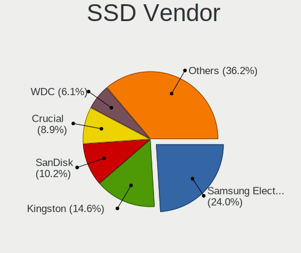

| Vendor              | Computers | Drives | Percent |
|---------------------|-----------|--------|---------|
| Samsung Electronics | 5433      | 7376   | 23.91%  |
| Kingston            | 3311      | 4180   | 14.57%  |
| SanDisk             | 2266      | 2922   | 9.97%   |
| Crucial             | 2027      | 2747   | 8.92%   |
| WDC                 | 1371      | 1718   | 6.03%   |
| A-DATA Technology   | 776       | 967    | 3.41%   |
| Intel               | 739       | 935    | 3.25%   |
| Micron Technology   | 521       | 659    | 2.29%   |
| China               | 445       | 532    | 1.96%   |
| SK hynix            | 440       | 535    | 1.94%   |
| Toshiba             | 409       | 527    | 1.8%    |
| PNY                 | 327       | 406    | 1.44%   |
| OCZ                 | 325       | 390    | 1.43%   |
| LITEON              | 311       | 374    | 1.37%   |
| SPCC                | 300       | 382    | 1.32%   |
| Transcend           | 270       | 316    | 1.19%   |
| Patriot             | 216       | 272    | 0.95%   |
| Apple               | 216       | 241    | 0.95%   |
| Intenso             | 204       | 272    | 0.9%    |
| GOODRAM             | 175       | 235    | 0.77%   |
| Corsair             | 173       | 222    | 0.76%   |
| LITEONIT            | 171       | 202    | 0.75%   |
| Team                | 122       | 155    | 0.54%   |
| KingSpec            | 102       | 127    | 0.45%   |
| Apacer              | 102       | 119    | 0.45%   |
| JMicron Technology  | 101       | 112    | 0.44%   |
| Plextor             | 100       | 131    | 0.44%   |
| Hewlett-Packard     | 89        | 118    | 0.39%   |
| Lexar               | 80        | 89     | 0.35%   |
| Seagate             | 77        | 96     | 0.34%   |
| Netac               | 75        | 92     | 0.33%   |
| Gigabyte Technology | 73        | 95     | 0.32%   |
| KingDian            | 72        | 84     | 0.32%   |
| Mushkin             | 57        | 92     | 0.25%   |
| Unknown             | 55        | 63     | 0.24%   |
| Unknown             | 51        | 59     | 0.22%   |
| FORESEE             | 48        | 51     | 0.21%   |
| TO Exter            | 38        | 48     | 0.17%   |
| Verbatim            | 31        | 37     | 0.14%   |
| Emtec               | 27        | 32     | 0.12%   |

Drive Kind
----------

HDD or SSD

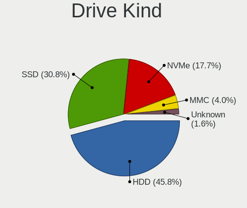

| Kind    | Computers | Drives | Percent |
|---------|-----------|--------|---------|
| HDD     | 29365     | 48677  | 44.42%  |
| SSD     | 20455     | 29252  | 30.94%  |
| NVMe    | 12513     | 16724  | 18.93%  |
| MMC     | 2676      | 3481   | 4.05%   |
| Unknown | 1093      | 1536   | 1.65%   |

Drive Connector
---------------

SATA, SAS, NVMe, etc.

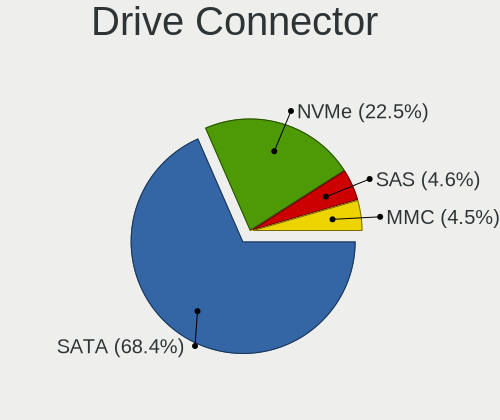

| Type | Computers | Drives | Percent |
|------|-----------|--------|---------|
| SATA | 41557     | 75489  | 70.02%  |
| NVMe | 12429     | 16568  | 20.94%  |
| SAS  | 2684      | 4132   | 4.52%   |
| MMC  | 2676      | 3481   | 4.51%   |

Drive Size
----------

Size of hard drive

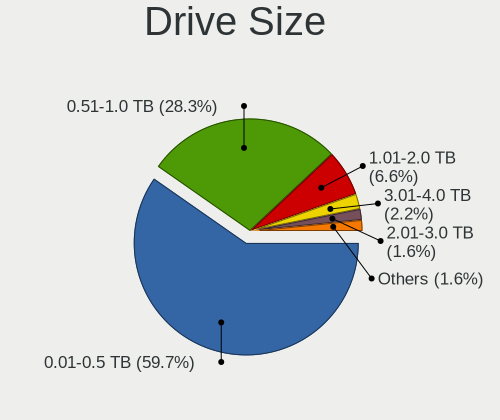

| Size in TB | Computers | Drives | Percent |
|------------|-----------|--------|---------|
| 0.01-0.5   | 30803     | 46172  | 59.42%  |
| 0.51-1.0   | 14659     | 20579  | 28.28%  |
| 1.01-2.0   | 3427      | 5435   | 6.61%   |
| 3.01-4.0   | 1241      | 2082   | 2.39%   |
| 2.01-3.0   | 783       | 1456   | 1.51%   |
| 4.01-10.0  | 760       | 1719   | 1.47%   |
| 10.01-20.0 | 160       | 478    | 0.31%   |
| 0          | 2         | 2      | 0.004%  |
| 20.01-50.0 | 1         | 6      | 0.002%  |

Space Total
-----------

Amount of disk space available on the file system

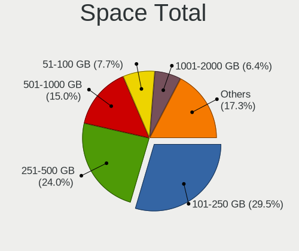

| Size in GB     | Computers | Percent |
|----------------|-----------|---------|
| 101-250        | 16179     | 29.24%  |
| 251-500        | 13328     | 24.09%  |
| 501-1000       | 8403      | 15.19%  |
| 51-100         | 4180      | 7.55%   |
| 1001-2000      | 3562      | 6.44%   |
| 1-20           | 2785      | 5.03%   |
| 21-50          | 2765      | 5%      |
| More than 3000 | 2000      | 3.61%   |
| 2001-3000      | 1343      | 2.43%   |
| Unknown        | 791       | 1.43%   |

Space Used
----------

Amount of used disk space

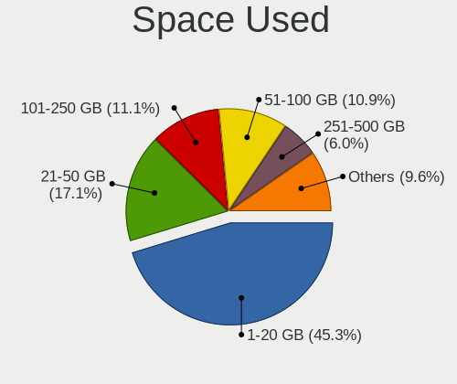

| Used GB        | Computers | Percent |
|----------------|-----------|---------|
| 1-20           | 25750     | 44.7%   |
| 21-50          | 9919      | 17.22%  |
| 101-250        | 6432      | 11.17%  |
| 51-100         | 6356      | 11.03%  |
| 251-500        | 3485      | 6.05%   |
| 501-1000       | 2421      | 4.2%    |
| 1001-2000      | 1270      | 2.2%    |
| Unknown        | 791       | 1.37%   |
| More than 3000 | 719       | 1.25%   |
| 2001-3000      | 455       | 0.79%   |
| 0              | 4         | 0.01%   |

Malfunc. Drives
---------------

Drive models with a malfunction

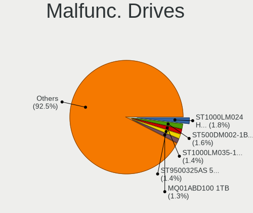

| Model                                | Computers | Drives | Percent |
|--------------------------------------|-----------|--------|---------|
| Seagate ST1000LM024 HN-M101MBB 1TB   | 36        | 39     | 1.63%   |
| Seagate ST1000LM035-1RK172 1TB       | 33        | 34     | 1.5%    |
| Toshiba MQ01ABD100 1TB               | 32        | 36     | 1.45%   |
| Seagate ST500DM002-1BD142 500GB      | 32        | 34     | 1.45%   |
| Seagate ST9500325AS 500GB            | 29        | 29     | 1.31%   |
| HGST HTS541010A9E680 1TB             | 27        | 29     | 1.22%   |
| HGST HTS721010A9E630 1TB             | 25        | 27     | 1.13%   |
| HGST HTS725050A7E630 500GB           | 21        | 21     | 0.95%   |
| Seagate ST3500418AS 500GB            | 19        | 23     | 0.86%   |
| Seagate ST1000DM003-1CH162 1TB       | 18        | 19     | 0.82%   |
| Seagate ST500LT012-1DG142 500GB      | 15        | 16     | 0.68%   |
| HGST HTS545050A7E680 500GB           | 15        | 15     | 0.68%   |
| Seagate ST9500420AS 500GB            | 14        | 14     | 0.63%   |
| Seagate ST500LM021-1KJ152 500GB      | 14        | 14     | 0.63%   |
| Seagate ST31000528AS 1TB             | 14        | 16     | 0.63%   |
| Kingston SV300S37A120G 120GB SSD     | 13        | 16     | 0.59%   |
| Kingston SA400S37240G 240GB SSD      | 13        | 13     | 0.59%   |
| HGST HTS545050A7E380 500GB           | 13        | 14     | 0.59%   |
| Seagate ST500LT012-9WS142 500GB      | 12        | 14     | 0.54%   |
| WDC WDS240G2G0A-00JH30 240GB SSD     | 11        | 11     | 0.5%    |
| Toshiba MQ04ABF100 1TB               | 11        | 11     | 0.5%    |
| Toshiba MQ01ABF050 500GB             | 10        | 10     | 0.45%   |
| Kingston SA400S37480G 480GB SSD      | 10        | 10     | 0.45%   |
| Hitachi HTS543232A7A384 320GB        | 10        | 10     | 0.45%   |
| WDC WD5000AAKX-001CA0 500GB          | 9         | 11     | 0.41%   |
| WDC WD10EARS-00Y5B1 1TB              | 9         | 13     | 0.41%   |
| SK hynix BC711 HFM512GD3JX013N 512GB | 9         | 10     | 0.41%   |
| Seagate ST9320423AS 320GB            | 9         | 9      | 0.41%   |
| Seagate ST2000DM001-1CH164 2TB       | 9         | 9      | 0.41%   |
| Seagate ST1000DM003-9YN162 1TB       | 9         | 9      | 0.41%   |
| Kingston SA400S37120G 120GB SSD      | 9         | 15     | 0.41%   |
| Hitachi HTS545050A7E380 500GB        | 9         | 10     | 0.41%   |
| Hitachi HDS721010CLA332 1TB          | 9         | 11     | 0.41%   |
| HGST HTS541010A7E630 1TB             | 9         | 10     | 0.41%   |
| Crucial CT525MX300SSD1 528GB         | 9         | 9      | 0.41%   |
| WDC WD5000AAKX-00ERMA0 500GB         | 8         | 9      | 0.36%   |
| WDC WD40EFRX-68WT0N0 4TB             | 8         | 14     | 0.36%   |
| WDC WD20EARS-00MVWB0 2TB             | 8         | 8      | 0.36%   |
| WDC WD10EZEX-60ZF5A0 1TB             | 8         | 9      | 0.36%   |
| Seagate ST1000DM010-2EP102 1TB       | 8         | 9      | 0.36%   |

Malfunc. Drive Vendor
---------------------

Vendors of faulty drives

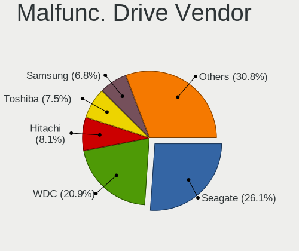

| Vendor              | Computers | Drives | Percent |
|---------------------|-----------|--------|---------|
| Seagate             | 566       | 657    | 26.31%  |
| WDC                 | 444       | 520    | 20.64%  |
| Hitachi             | 178       | 190    | 8.28%   |
| Toshiba             | 160       | 179    | 7.44%   |
| Samsung Electronics | 138       | 163    | 6.42%   |
| HGST                | 125       | 134    | 5.81%   |
| Kingston            | 71        | 85     | 3.3%    |
| SK hynix            | 66        | 70     | 3.07%   |
| SanDisk             | 60        | 67     | 2.79%   |
| Intel               | 57        | 60     | 2.65%   |
| Micron Technology   | 45        | 51     | 2.09%   |
| Crucial             | 40        | 46     | 1.86%   |
| A-DATA Technology   | 39        | 46     | 1.81%   |
| Maxtor              | 22        | 28     | 1.02%   |
| Fujitsu             | 14        | 14     | 0.65%   |
| LITEON              | 12        | 13     | 0.56%   |
| Apple               | 10        | 13     | 0.46%   |
| Corsair             | 9         | 10     | 0.42%   |
| OCZ                 | 8         | 9      | 0.37%   |
| Unknown             | 7         | 9      | 0.33%   |
| LITEONIT            | 7         | 9      | 0.33%   |
| Hewlett-Packard     | 7         | 7      | 0.33%   |
| Intenso             | 5         | 6      | 0.23%   |
| Unknown             | 4         | 4      | 0.19%   |
| Transcend           | 3         | 3      | 0.14%   |
| SPCC                | 3         | 3      | 0.14%   |
| Mushkin             | 3         | 3      | 0.14%   |
| KingSpec            | 3         | 3      | 0.14%   |
| ASMT                | 3         | 3      | 0.14%   |
| WD MediaMax         | 2         | 2      | 0.09%   |
| Plextor             | 2         | 2      | 0.09%   |
| Patriot             | 2         | 2      | 0.09%   |
| China               | 2         | 2      | 0.09%   |
| ASMedia             | 2         | 2      | 0.09%   |
| Apacer              | 2         | 2      | 0.09%   |
| 2.5"                | 2         | 2      | 0.09%   |
| YS                  | 1         | 1      | 0.05%   |
| XPG                 | 1         | 1      | 0.05%   |
| WALRAM              | 1         | 1      | 0.05%   |
| VISIPRO             | 1         | 1      | 0.05%   |

Malfunc. HDD Vendor
-------------------

Vendors of faulty HDD drives

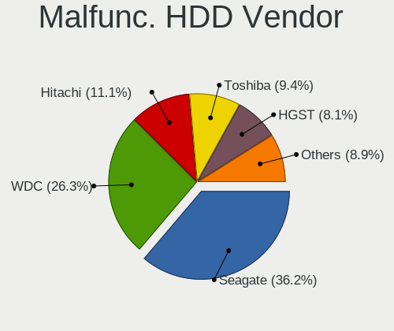

| Vendor              | Computers | Drives | Percent |
|---------------------|-----------|--------|---------|
| Seagate             | 566       | 657    | 35.94%  |
| WDC                 | 419       | 494    | 26.6%   |
| Hitachi             | 178       | 190    | 11.3%   |
| Toshiba             | 152       | 170    | 9.65%   |
| HGST                | 125       | 134    | 7.94%   |
| Samsung Electronics | 73        | 85     | 4.63%   |
| Maxtor              | 22        | 28     | 1.4%    |
| Fujitsu             | 14        | 14     | 0.89%   |
| Apple               | 10        | 13     | 0.63%   |
| Unknown             | 6         | 8      | 0.38%   |
| Hewlett-Packard     | 4         | 4      | 0.25%   |
| WD MediaMax         | 2         | 2      | 0.13%   |
| ASMT                | 2         | 2      | 0.13%   |
| HPE                 | 1         | 1      | 0.06%   |
| ASMedia             | 1         | 1      | 0.06%   |

Malfunc. Drive Kind
-------------------

Kinds of faulty drives

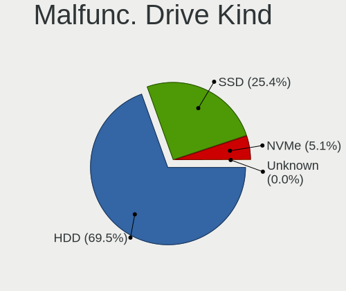

| Kind    | Computers | Drives | Percent |
|---------|-----------|--------|---------|
| HDD     | 1492      | 1803   | 72.32%  |
| SSD     | 484       | 550    | 23.46%  |
| NVMe    | 86        | 93     | 4.17%   |
| Unknown | 1         | 1      | 0.05%   |

Failed Drives
-------------

Failed drive models

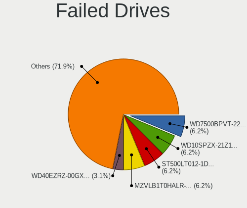

| Model                                                           | Computers | Drives | Percent |
|-----------------------------------------------------------------|-----------|--------|---------|
| WDC WD7500BPVT-22HXZT1 752GB                                    | 2         | 3      | 5.13%   |
| WDC WD10SPZX-21Z10T0 1TB                                        | 2         | 2      | 5.13%   |
| Seagate ST500LT012-1DG142 500GB                                 | 2         | 2      | 5.13%   |
| Samsung Electronics MZVLB1T0HALR-00000 1TB                      | 2         | 3      | 5.13%   |
| HGST HTS721010A9E630 1TB                                        | 2         | 2      | 5.13%   |
| WDC WD5000BEVT-22A0RT0 500GB                                    | 1         | 1      | 2.56%   |
| WDC WD40EZRZ-00GXCB0 4TB                                        | 1         | 2      | 2.56%   |
| WDC WD3200BEKT-60PVMT0 320GB                                    | 1         | 1      | 2.56%   |
| WDC PC SN520 SDAPNUW-256G-1006 256GB                            | 1         | 1      | 2.56%   |
| Unknown 00000  16GB                                             | 1         | 1      | 2.56%   |
| Toshiba MQ02ABF050H 500GB                                       | 1         | 1      | 2.56%   |
| Toshiba MK5065GSXN 500GB                                        | 1         | 1      | 2.56%   |
| Toshiba MK3265GSX 320GB                                         | 1         | 1      | 2.56%   |
| Toshiba DT01ACA200 2TB                                          | 1         | 1      | 2.56%   |
| Seagate ST9500420AS 500GB                                       | 1         | 3      | 2.56%   |
| Seagate ST3500418AS 500GB                                       | 1         | 1      | 2.56%   |
| Seagate ST31000520AS 1TB                                        | 1         | 1      | 2.56%   |
| Seagate ST31000340NS 1TB                                        | 1         | 1      | 2.56%   |
| Seagate ST2000DM001-1CH164 2TB                                  | 1         | 1      | 2.56%   |
| Seagate ST1000LM048-2E7172 1TB                                  | 1         | 1      | 2.56%   |
| Samsung Electronics SSD 980 500GB                               | 1         | 1      | 2.56%   |
| Samsung Electronics NVMe SSD Controller SM961/PM961/SM963 256GB | 1         | 1      | 2.56%   |
| Samsung Electronics HD502HJ 500GB                               | 1         | 1      | 2.56%   |
| Samsung Electronics HD160JJ/ 160GB                              | 1         | 1      | 2.56%   |
| Samsung Electronics HD103SJ 1TB                                 | 1         | 1      | 2.56%   |
| Mushkin MKNSSDCR120GB-7                                         | 1         | 1      | 2.56%   |
| Maxtor STM380211AS 80GB                                         | 1         | 1      | 2.56%   |
| JMicron Technology Tech 250GB                                   | 1         | 1      | 2.56%   |
| Intel SSDSCKGF256A5 SATA 256GB                                  | 1         | 1      | 2.56%   |
| Hitachi HTS545050A7E380 500GB                                   | 1         | 1      | 2.56%   |
| Hitachi HTS541010A9E680 1TB                                     | 1         | 1      | 2.56%   |
| HGST HUS724040ALA640 4TB                                        | 1         | 1      | 2.56%   |
| Hewlett-Packard EF0450FARMV 450GB                               | 1         | 4      | 2.56%   |
| Crucial CT500P2SSD8 500GB                                       | 1         | 1      | 2.56%   |

Failed Drive Vendor
-------------------

Failed drive vendors

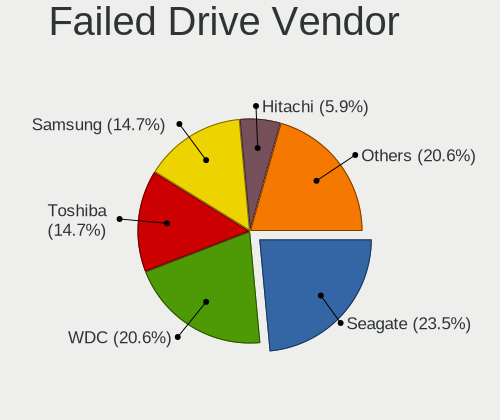

| Vendor              | Computers | Drives | Percent |
|---------------------|-----------|--------|---------|
| WDC                 | 8         | 10     | 20.51%  |
| Seagate             | 8         | 10     | 20.51%  |
| Samsung Electronics | 7         | 8      | 17.95%  |
| Toshiba             | 4         | 4      | 10.26%  |
| HGST                | 3         | 3      | 7.69%   |
| Hitachi             | 2         | 2      | 5.13%   |
| Unknown             | 1         | 1      | 2.56%   |
| Mushkin             | 1         | 1      | 2.56%   |
| Maxtor              | 1         | 1      | 2.56%   |
| JMicron Technology  | 1         | 1      | 2.56%   |
| Intel               | 1         | 1      | 2.56%   |
| Hewlett-Packard     | 1         | 4      | 2.56%   |
| Crucial             | 1         | 1      | 2.56%   |

Drive Status
------------

Number of failed and malfunc. drives

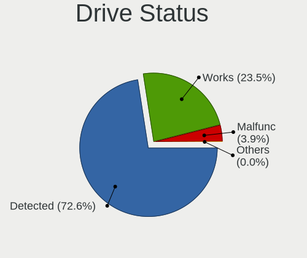

| Status   | Computers | Drives | Percent |
|----------|-----------|--------|---------|
| Detected | 40926     | 78216  | 74.88%  |
| Works    | 11688     | 18959  | 21.39%  |
| Malfunc  | 1999      | 2447   | 3.66%   |
| Failed   | 39        | 47     | 0.07%   |
| Limited  | 1         | 1      | 0.002%  |

Storage controller
------------------

Storage Vendor
--------------

Storage controller vendors

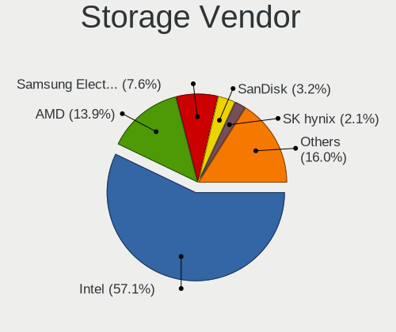

| Vendor                           | Computers | Percent |
|----------------------------------|-----------|---------|
| Intel                            | 37249     | 58.46%  |
| AMD                              | 9000      | 14.12%  |
| Samsung Electronics              | 4549      | 7.14%   |
| SanDisk                          | 1874      | 2.94%   |
| SK hynix                         | 1244      | 1.95%   |
| Nvidia                           | 1122      | 1.76%   |
| ASMedia Technology               | 949       | 1.49%   |
| Marvell Technology Group         | 931       | 1.46%   |
| JMicron Technology               | 924       | 1.45%   |
| Toshiba America Info Systems     | 917       | 1.44%   |
| Phison Electronics               | 671       | 1.05%   |
| Kingston Technology Company      | 565       | 0.89%   |
| KIOXIA                           | 444       | 0.7%    |
| Micron Technology                | 436       | 0.68%   |
| Silicon Motion                   | 363       | 0.57%   |
| Micron/Crucial Technology        | 312       | 0.49%   |
| ADATA Technology                 | 260       | 0.41%   |
| LSI Logic / Symbios Logic        | 252       | 0.4%    |
| VIA Technologies                 | 210       | 0.33%   |
| Broadcom / LSI                   | 198       | 0.31%   |
| Realtek Semiconductor            | 157       | 0.25%   |
| Silicon Integrated Systems [SiS] | 125       | 0.2%    |
| Silicon Image                    | 115       | 0.18%   |
| Union Memory (Shenzhen)          | 114       | 0.18%   |
| Apple                            | 93        | 0.15%   |
| Solid State Storage Technology   | 90        | 0.14%   |
| Hewlett-Packard                  | 90        | 0.14%   |
| Lite-On Technology               | 89        | 0.14%   |
| Adaptec                          | 77        | 0.12%   |
| Seagate Technology               | 48        | 0.08%   |
| Lenovo                           | 42        | 0.07%   |
| Integrated Technology Express    | 29        | 0.05%   |
| Yangtze Memory Technologies      | 21        | 0.03%   |
| Shenzhen Longsys Electronics     | 19        | 0.03%   |
| Areca Technology                 | 18        | 0.03%   |
| MAXIO Technology (Hangzhou)      | 13        | 0.02%   |
| HighPoint Technologies           | 13        | 0.02%   |
| OCZ Technology Group             | 10        | 0.02%   |
| INNOGRIT                         | 7         | 0.01%   |
| Broadcom                         | 7         | 0.01%   |

Storage Model
-------------

Storage controller models

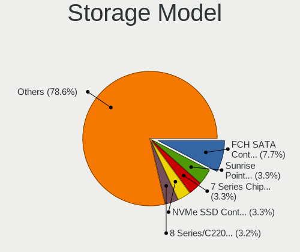

| Model                                                                                   | Computers | Percent |
|-----------------------------------------------------------------------------------------|-----------|---------|
| AMD FCH SATA Controller [AHCI mode]                                                     | 5803      | 7.72%   |
| Intel Sunrise Point-LP SATA Controller [AHCI mode]                                      | 2936      | 3.9%    |
| Intel 7 Series Chipset Family 6-port SATA Controller [AHCI mode]                        | 2506      | 3.33%   |
| Samsung NVMe SSD Controller SM981/PM981/PM983                                           | 2443      | 3.25%   |
| Intel 8 Series/C220 Series Chipset Family 6-port SATA Controller 1 [AHCI mode]          | 2422      | 3.22%   |
| Intel 82801 Mobile SATA Controller [RAID mode]                                          | 2114      | 2.81%   |
| Intel 6 Series/C200 Series Chipset Family 6 port Mobile SATA AHCI Controller            | 1862      | 2.48%   |
| AMD SB7x0/SB8x0/SB9x0 IDE Controller                                                    | 1396      | 1.86%   |
| AMD SB7x0/SB8x0/SB9x0 SATA Controller [AHCI mode]                                       | 1351      | 1.8%    |
| Intel 6 Series/C200 Series Chipset Family 6 port Desktop SATA AHCI Controller           | 1313      | 1.75%   |
| Intel 8 Series SATA Controller 1 [AHCI mode]                                            | 1282      | 1.7%    |
| Intel Q170/Q150/B150/H170/H110/Z170/CM236 Chipset SATA Controller [AHCI Mode]           | 1204      | 1.6%    |
| Intel NM10/ICH7 Family SATA Controller [IDE mode]                                       | 1180      | 1.57%   |
| Intel 82801IBM/IEM (ICH9M/ICH9M-E) 4 port SATA Controller [AHCI mode]                   | 1151      | 1.53%   |
| AMD 400 Series Chipset SATA Controller                                                  | 1067      | 1.42%   |
| Intel 82801G (ICH7 Family) IDE Controller                                               | 1058      | 1.41%   |
| Intel Wildcat Point-LP SATA Controller [AHCI Mode]                                      | 1038      | 1.38%   |
| Intel SATA Controller [RAID mode]                                                       | 977       | 1.3%    |
| Intel 7 Series/C210 Series Chipset Family 6-port SATA Controller [AHCI mode]            | 975       | 1.3%    |
| Intel Cannon Lake Mobile PCH SATA AHCI Controller                                       | 965       | 1.28%   |
| AMD SB7x0/SB8x0/SB9x0 SATA Controller [IDE mode]                                        | 943       | 1.25%   |
| Intel 200 Series PCH SATA controller [AHCI mode]                                        | 902       | 1.2%    |
| ASMedia ASM1062 Serial ATA Controller                                                   | 883       | 1.17%   |
| Intel Volume Management Device NVMe RAID Controller                                     | 870       | 1.16%   |
| Intel 5 Series/3400 Series Chipset 4 port SATA AHCI Controller                          | 867       | 1.15%   |
| Intel 5 Series/3400 Series Chipset 6 port SATA AHCI Controller                          | 799       | 1.06%   |
| Samsung NVMe SSD Controller 980                                                         | 776       | 1.03%   |
| Intel Cannon Lake PCH SATA AHCI Controller                                              | 706       | 0.94%   |
| Samsung NVMe SSD Controller SM961/PM961/SM963                                           | 703       | 0.93%   |
| Intel Comet Lake SATA AHCI Controller                                                   | 682       | 0.91%   |
| Intel 82801HM/HEM (ICH8M/ICH8M-E) IDE Controller                                        | 675       | 0.9%    |
| Intel Cannon Point-LP SATA Controller [AHCI Mode]                                       | 595       | 0.79%   |
| Intel 6 Series/C200 Series Chipset Family Desktop SATA Controller (IDE mode, ports 4-5) | 565       | 0.75%   |
| Intel 6 Series/C200 Series Chipset Family Desktop SATA Controller (IDE mode, ports 0-3) | 565       | 0.75%   |
| Intel Atom Processor E3800 Series SATA AHCI Controller                                  | 562       | 0.75%   |
| Intel 82801HM/HEM (ICH8M/ICH8M-E) SATA Controller [AHCI mode]                           | 559       | 0.74%   |
| Intel HM170/QM170 Chipset SATA Controller [AHCI Mode]                                   | 539       | 0.72%   |
| Intel Celeron/Pentium Silver Processor SATA Controller                                  | 507       | 0.67%   |
| JMicron JMB363 SATA/IDE Controller                                                      | 497       | 0.66%   |
| Intel SSD 660P Series                                                                   | 473       | 0.63%   |

Storage Kind
------------

Kind of storage controller (IDE, SATA, NVMe, SAS, ...)

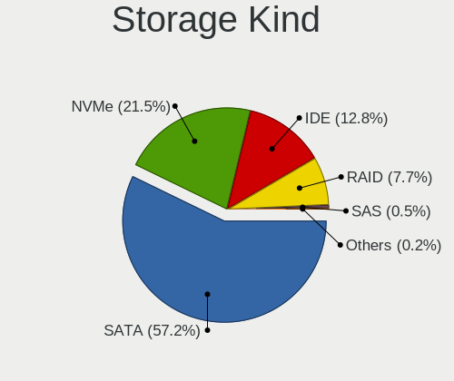

| Kind | Computers | Percent |
|------|-----------|---------|
| SATA | 38046     | 58.39%  |
| NVMe | 12706     | 19.5%   |
| IDE  | 9134      | 14.02%  |
| RAID | 4846      | 7.44%   |
| SAS  | 267       | 0.41%   |
| SCSI | 158       | 0.24%   |

Processor
---------

CPU Vendor
----------

Processor vendors

| Vendor        | Computers | Percent |
|---------------|-----------|---------|
| Intel         | 41675     | 78.48%  |
| AMD           | 10779     | 20.3%   |
| ARM           | 618       | 1.16%   |
| CentaurHauls  | 13        | 0.02%   |
| Unknown       | 9         | 0.02%   |
| HiSilicon     | 2         | 0.004%  |
| sifive,u74-mc | 1         | 0.002%  |
| QUALCOMM      | 1         | 0.002%  |
| Phytium       | 1         | 0.002%  |
| IBM/S390      | 1         | 0.002%  |

CPU Model
---------

Processor models

| Model                                         | Computers | Percent |
|-----------------------------------------------|-----------|---------|
| Intel Core i5-8250U CPU @ 1.60GHz             | 700       | 1.32%   |
| Intel Core i7-8550U CPU @ 1.80GHz             | 616       | 1.16%   |
| ARM Processor                                 | 580       | 1.09%   |
| Intel Core i5-7200U CPU @ 2.50GHz             | 540       | 1.02%   |
| Intel Core i7-8565U CPU @ 1.80GHz             | 531       | 1%      |
| Intel 11th Gen Core i7-1165G7 @ 2.80GHz       | 473       | 0.89%   |
| Intel Core i5-8265U CPU @ 1.60GHz             | 461       | 0.87%   |
| Intel Core i7-10510U CPU @ 1.80GHz            | 414       | 0.78%   |
| Intel Core i7-8750H CPU @ 2.20GHz             | 403       | 0.76%   |
| Intel Core i7-9750H CPU @ 2.60GHz             | 373       | 0.7%    |
| Intel 11th Gen Core i5-1135G7 @ 2.40GHz       | 359       | 0.67%   |
| Intel Core i7-7500U CPU @ 2.70GHz             | 344       | 0.65%   |
| Intel Core i5-5200U CPU @ 2.20GHz             | 343       | 0.64%   |
| Intel Core i5-6200U CPU @ 2.30GHz             | 339       | 0.64%   |
| Intel Core i5-10210U CPU @ 1.60GHz            | 338       | 0.64%   |
| Intel Core i5-3210M CPU @ 2.50GHz             | 331       | 0.62%   |
| Intel Core i7-7700HQ CPU @ 2.80GHz            | 315       | 0.59%   |
| Intel Atom x5-Z8350 CPU @ 1.44GHz             | 313       | 0.59%   |
| Intel Core i5-2520M CPU @ 2.50GHz             | 309       | 0.58%   |
| Intel Core i5-3470 CPU @ 3.20GHz              | 289       | 0.54%   |
| AMD Ryzen 5 3500U with Radeon Vega Mobile Gfx | 280       | 0.53%   |
| Intel Core i5-2400 CPU @ 3.10GHz              | 273       | 0.51%   |
| AMD Ryzen 5 3600 6-Core Processor             | 271       | 0.51%   |
| Intel Core i7-3770 CPU @ 3.40GHz              | 269       | 0.51%   |
| Intel Core 2 Duo CPU E8400 @ 3.00GHz          | 265       | 0.5%    |
| Intel Core i5-3320M CPU @ 2.60GHz             | 250       | 0.47%   |
| Intel Core i7-2600 CPU @ 3.40GHz              | 232       | 0.44%   |
| Intel Core i7-4790 CPU @ 3.60GHz              | 225       | 0.42%   |
| Intel Core i5-2410M CPU @ 2.30GHz             | 225       | 0.42%   |
| Intel Core i5-6300U CPU @ 2.40GHz             | 224       | 0.42%   |
| Intel Core i5-4210U CPU @ 1.70GHz             | 220       | 0.41%   |
| Intel Core i5-1035G1 CPU @ 1.00GHz            | 215       | 0.4%    |
| Intel Core i5-3230M CPU @ 2.60GHz             | 213       | 0.4%    |
| AMD Ryzen 7 3700X 8-Core Processor            | 213       | 0.4%    |
| Intel Core i7-6700HQ CPU @ 2.60GHz            | 211       | 0.4%    |
| Intel Core i7-6500U CPU @ 2.50GHz             | 210       | 0.39%   |
| AMD FX-8350 Eight-Core Processor              | 209       | 0.39%   |
| Intel Core i5-4200U CPU @ 1.60GHz             | 208       | 0.39%   |
| Intel Core i7-10750H CPU @ 2.60GHz            | 206       | 0.39%   |
| Intel Core i3-2120 CPU @ 3.30GHz              | 205       | 0.39%   |

CPU Model Family
----------------

Processor model prefix

| Model                   | Computers | Percent |
|-------------------------|-----------|---------|
| Intel Core i5           | 12147     | 22.85%  |
| Intel Core i7           | 10903     | 20.51%  |
| Intel Core i3           | 4445      | 8.36%   |
| Other                   | 2655      | 4.99%   |
| Intel Core 2 Duo        | 2620      | 4.93%   |
| Intel Celeron           | 2296      | 4.32%   |
| AMD Ryzen 5             | 2099      | 3.95%   |
| Intel Xeon              | 1586      | 2.98%   |
| AMD Ryzen 7             | 1429      | 2.69%   |
| Intel Pentium           | 1398      | 2.63%   |
| AMD FX                  | 960       | 1.81%   |
| Intel Atom              | 903       | 1.7%    |
| Intel Pentium Dual-Core | 776       | 1.46%   |
| Intel Core 2 Quad       | 596       | 1.12%   |
| AMD Ryzen 3             | 531       | 1%      |
| AMD A6                  | 494       | 0.93%   |
| AMD A8                  | 462       | 0.87%   |
| AMD A10                 | 426       | 0.8%    |
| AMD Ryzen 9             | 399       | 0.75%   |
| Intel Core 2            | 386       | 0.73%   |
| Intel Core i9           | 365       | 0.69%   |
| AMD A4                  | 359       | 0.68%   |
| Intel Pentium Dual      | 349       | 0.66%   |
| AMD Phenom II X4        | 342       | 0.64%   |
| AMD Athlon II X2        | 305       | 0.57%   |
| AMD Athlon 64 X2        | 301       | 0.57%   |
| AMD E                   | 199       | 0.37%   |
| Intel Pentium 4         | 188       | 0.35%   |
| Intel Genuine           | 171       | 0.32%   |
| AMD E1                  | 165       | 0.31%   |
| AMD Athlon              | 158       | 0.3%    |
| AMD Athlon II X4        | 157       | 0.3%    |
| AMD E2                  | 154       | 0.29%   |
| AMD Ryzen 7 PRO         | 145       | 0.27%   |
| AMD Phenom II X6        | 138       | 0.26%   |
| AMD Ryzen Threadripper  | 129       | 0.24%   |
| Intel Pentium Silver    | 127       | 0.24%   |
| Intel Pentium D         | 123       | 0.23%   |
| AMD Phenom              | 97        | 0.18%   |
| AMD Sempron             | 89        | 0.17%   |

CPU Cores
---------

Number of processor cores

| Number  | Computers | Percent |
|---------|-----------|---------|
| 2       | 23059     | 43.37%  |
| 4       | 19990     | 37.6%   |
| 6       | 4215      | 7.93%   |
| 8       | 2707      | 5.09%   |
| 1       | 1279      | 2.41%   |
| 12      | 574       | 1.08%   |
| 3       | 410       | 0.77%   |
| 16      | 284       | 0.53%   |
| 10      | 187       | 0.35%   |
| 14      | 127       | 0.24%   |
| 24      | 85        | 0.16%   |
| 20      | 62        | 0.12%   |
| 32      | 55        | 0.1%    |
| Unknown | 27        | 0.05%   |
| 40      | 22        | 0.04%   |
| 28      | 20        | 0.04%   |
| 18      | 15        | 0.03%   |
| 48      | 10        | 0.02%   |
| 64      | 9         | 0.02%   |
| 5       | 9         | 0.02%   |
| 128     | 6         | 0.01%   |
| 56      | 4         | 0.01%   |
| 36      | 3         | 0.01%   |
| 96      | 2         | 0.004%  |
| 44      | 2         | 0.004%  |
| 22      | 2         | 0.004%  |
| 104     | 1         | 0.002%  |
| 80      | 1         | 0.002%  |
| 68      | 1         | 0.002%  |
| 52      | 1         | 0.002%  |
| 15      | 1         | 0.002%  |

CPU Sockets
-----------

Number of sockets

| Number  | Computers | Percent |
|---------|-----------|---------|
| 1       | 52333     | 98.55%  |
| 2       | 709       | 1.34%   |
| 4       | 30        | 0.06%   |
| Unknown | 25        | 0.05%   |
| 3       | 7         | 0.01%   |
| 6       | 1         | 0.002%  |

CPU Threads
-----------

Threads per core (Hyper-Threading)

| Number  | Computers | Percent |
|---------|-----------|---------|
| 2       | 33796     | 63.58%  |
| 1       | 19327     | 36.36%  |
| Unknown | 27        | 0.05%   |
| 4       | 2         | 0.004%  |
| 112     | 1         | 0.002%  |
| 6       | 1         | 0.002%  |

CPU Op-Modes
------------

CPU Operation Modes (32-bit, 64-bit)

| Op mode        | Computers | Percent |
|----------------|-----------|---------|
| 32-bit, 64-bit | 52078     | 98.02%  |
| Unknown        | 728       | 1.37%   |
| 32-bit         | 312       | 0.59%   |
| 64-bit         | 13        | 0.02%   |

CPU Microcode
-------------

Microcode number

| Number     | Computers | Percent |
|------------|-----------|---------|
| Unknown    | 11478     | 20.93%  |
| 0x206a7    | 3513      | 6.41%   |
| 0x306a9    | 3423      | 6.24%   |
| 0x306c3    | 2520      | 4.6%    |
| 0x1067a    | 2160      | 3.94%   |
| 0x906ea    | 1539      | 2.81%   |
| 0x806ea    | 1475      | 2.69%   |
| 0x806ec    | 1404      | 2.56%   |
| 0x806e9    | 1200      | 2.19%   |
| 0x40651    | 1186      | 2.16%   |
| 0x506e3    | 1077      | 1.96%   |
| 0x20655    | 1072      | 1.95%   |
| 0x406e3    | 1060      | 1.93%   |
| 0x306d4    | 1001      | 1.83%   |
| 0x906e9    | 979       | 1.79%   |
| 0x806c1    | 930       | 1.7%    |
| 0x6fd      | 731       | 1.33%   |
| 0x010000c8 | 610       | 1.11%   |
| 0x10676    | 587       | 1.07%   |
| 0x06000852 | 587       | 1.07%   |
| 0x30678    | 532       | 0.97%   |
| 0x406c4    | 509       | 0.93%   |
| 0x06001119 | 498       | 0.91%   |
| 0x20652    | 474       | 0.86%   |
| 0x08108109 | 451       | 0.82%   |
| 0x6fb      | 445       | 0.81%   |
| 0x706e5    | 441       | 0.8%    |
| 0x806eb    | 425       | 0.78%   |
| 0x106e5    | 399       | 0.73%   |
| 0xa0652    | 367       | 0.67%   |
| 0x906ed    | 367       | 0.67%   |
| 0x08701021 | 345       | 0.63%   |
| 0x08108102 | 326       | 0.59%   |
| 0x0800820d | 325       | 0.59%   |
| 0x08701013 | 300       | 0.55%   |
| 0x706a1    | 289       | 0.53%   |
| 0x506c9    | 286       | 0.52%   |
| 0x0810100b | 284       | 0.52%   |
| 0x406c3    | 276       | 0.5%    |
| 0x06006705 | 253       | 0.46%   |

CPU Microarch
-------------

Microarchitecture

| Name             | Computers | Percent |
|------------------|-----------|---------|
| KabyLake         | 9121      | 17.16%  |
| Haswell          | 4792      | 9.02%   |
| SandyBridge      | 4396      | 8.27%   |
| IvyBridge        | 4238      | 7.98%   |
| Penryn           | 3340      | 6.29%   |
| Skylake          | 2896      | 5.45%   |
| Westmere         | 2067      | 3.89%   |
| Core             | 1935      | 3.64%   |
| Silvermont       | 1699      | 3.2%    |
| Zen 2            | 1578      | 2.97%   |
| Zen+             | 1475      | 2.78%   |
| K10              | 1460      | 2.75%   |
| Piledriver       | 1338      | 2.52%   |
| Broadwell        | 1314      | 2.47%   |
| Unknown          | 1224      | 2.3%    |
| TigerLake        | 1191      | 2.24%   |
| Zen              | 996       | 1.87%   |
| CometLake        | 911       | 1.71%   |
| IceLake          | 768       | 1.45%   |
| Nehalem          | 746       | 1.4%    |
| Excavator        | 714       | 1.34%   |
| Zen 3            | 634       | 1.19%   |
| K8 Hammer        | 567       | 1.07%   |
| Goldmont plus    | 551       | 1.04%   |
| Bobcat           | 375       | 0.71%   |
| Goldmont         | 373       | 0.7%    |
| Puma             | 372       | 0.7%    |
| NetBurst         | 369       | 0.69%   |
| Bonnell          | 306       | 0.58%   |
| Steamroller      | 241       | 0.45%   |
| Jaguar           | 235       | 0.44%   |
| Alderlake Hybrid | 232       | 0.44%   |
| K10 Llano        | 212       | 0.4%    |
| Bulldozer        | 191       | 0.36%   |
| P6               | 148       | 0.28%   |
| K8 & K10 hybrid  | 96        | 0.18%   |
| Tremont          | 28        | 0.05%   |
| K6               | 6         | 0.01%   |
| Sapphire Rapids  | 1         | 0.002%  |
| Geode            | 1         | 0.002%  |

Graphics
--------

GPU Vendor
----------

Vendors of graphics cards

| Vendor                                       | Computers | Percent |
|----------------------------------------------|-----------|---------|
| Intel                                        | 31448     | 50.46%  |
| Nvidia                                       | 16915     | 27.14%  |
| AMD                                          | 13117     | 21.05%  |
| Matrox Electronics Systems                   | 363       | 0.58%   |
| ASPEED Technology                            | 236       | 0.38%   |
| Silicon Integrated Systems [SiS]             | 103       | 0.17%   |
| VIA Technologies                             | 60        | 0.1%    |
| ATI Technologies                             | 39        | 0.06%   |
| XGI Technology (eXtreme Graphics Innovation) | 26        | 0.04%   |
| Silicon Motion                               | 4         | 0.01%   |
| Zhaoxin                                      | 3         | 0.005%  |
| Huawei Technologies                          | 3         | 0.005%  |
| S3 Graphics                                  | 2         | 0.003%  |
| NVidia / SGS Thomson (Joint Venture)         | 1         | 0.002%  |
| Moore Threads Technology                     | 1         | 0.002%  |

GPU Model
---------

Graphics card models

| Model                                                                                    | Computers | Percent |
|------------------------------------------------------------------------------------------|-----------|---------|
| Intel 2nd Generation Core Processor Family Integrated Graphics Controller                | 3193      | 4.98%   |
| Intel 3rd Gen Core processor Graphics Controller                                         | 2341      | 3.65%   |
| Intel UHD Graphics 620                                                                   | 1631      | 2.54%   |
| Intel Haswell-ULT Integrated Graphics Controller                                         | 1395      | 2.18%   |
| Intel HD Graphics 620                                                                    | 1276      | 1.99%   |
| Intel WhiskeyLake-U GT2 [UHD Graphics 620]                                               | 1239      | 1.93%   |
| Intel Core Processor Integrated Graphics Controller                                      | 1214      | 1.89%   |
| Intel CoffeeLake-H GT2 [UHD Graphics 630]                                                | 1172      | 1.83%   |
| Intel Skylake GT2 [HD Graphics 520]                                                      | 1137      | 1.77%   |
| Intel TigerLake-LP GT2 [Iris Xe Graphics]                                                | 1106      | 1.73%   |
| Intel Xeon E3-1200 v3/4th Gen Core Processor Integrated Graphics Controller              | 1102      | 1.72%   |
| Intel HD Graphics 5500                                                                   | 1020      | 1.59%   |
| Intel Atom/Celeron/Pentium Processor x5-E8000/J3xxx/N3xxx Integrated Graphics Controller | 962       | 1.5%    |
| Intel Mobile 4 Series Chipset Integrated Graphics Controller                             | 916       | 1.43%   |
| AMD Picasso/Raven 2 [Radeon Vega Series / Radeon Vega Mobile Series]                     | 897       | 1.4%    |
| Intel CometLake-U GT2 [UHD Graphics]                                                     | 893       | 1.39%   |
| Intel 4th Gen Core Processor Integrated Graphics Controller                              | 851       | 1.33%   |
| AMD Ellesmere [Radeon RX 470/480/570/570X/580/580X/590]                                  | 773       | 1.21%   |
| Intel HD Graphics 630                                                                    | 738       | 1.15%   |
| Intel HD Graphics 530                                                                    | 733       | 1.14%   |
| Intel Atom Processor Z36xxx/Z37xxx Series Graphics & Display                             | 729       | 1.14%   |
| AMD Renoir                                                                               | 647       | 1.01%   |
| Intel Xeon E3-1200 v2/3rd Gen Core processor Graphics Controller                         | 642       | 1%      |
| Intel 4 Series Chipset Integrated Graphics Controller                                    | 570       | 0.89%   |
| Nvidia GK208B [GeForce GT 710]                                                           | 567       | 0.88%   |
| Intel CoffeeLake-S GT2 [UHD Graphics 630]                                                | 538       | 0.84%   |
| AMD Raven Ridge [Radeon Vega Series / Radeon Vega Mobile Series]                         | 479       | 0.75%   |
| Intel GeminiLake [UHD Graphics 600]                                                      | 440       | 0.69%   |
| Intel Mobile GM965/GL960 Integrated Graphics Controller (secondary)                      | 429       | 0.67%   |
| Intel Mobile GM965/GL960 Integrated Graphics Controller (primary)                        | 429       | 0.67%   |
| Intel CometLake-H GT2 [UHD Graphics]                                                     | 409       | 0.64%   |
| AMD Stoney [Radeon R2/R3/R4/R5 Graphics]                                                 | 408       | 0.64%   |
| Nvidia GP107 [GeForce GTX 1050 Ti]                                                       | 403       | 0.63%   |
| Nvidia GT218 [GeForce 210]                                                               | 395       | 0.62%   |
| AMD Topaz XT [Radeon R7 M260/M265 / M340/M360 / M440/M445 / 530/535 / 620/625 Mobile]    | 387       | 0.6%    |
| Nvidia GP107M [GeForce GTX 1050 Mobile]                                                  | 381       | 0.59%   |
| AMD Cezanne [Radeon Vega Series / Radeon Vega Mobile Series]                             | 335       | 0.52%   |
| Nvidia GF117M [GeForce 610M/710M/810M/820M / GT 620M/625M/630M/720M]                     | 321       | 0.5%    |
| AMD Cedar [Radeon HD 5000/6000/7350/8350 Series]                                         | 320       | 0.5%    |
| Nvidia GP108M [GeForce MX150]                                                            | 318       | 0.5%    |

GPU Combo
---------

Combinations of graphics cards

| Name                     | Computers | Percent |
|--------------------------|-----------|---------|
| 1 x Intel                | 22502     | 42.15%  |
| 1 x AMD                  | 10016     | 18.76%  |
| 1 x Nvidia               | 9551      | 17.89%  |
| Intel + Nvidia           | 6538      | 12.25%  |
| Intel + AMD              | 1818      | 3.41%   |
| 2 x AMD                  | 763       | 1.43%   |
| Other                    | 674       | 1.26%   |
| AMD + Nvidia             | 482       | 0.9%    |
| 1 x Matrox               | 305       | 0.57%   |
| 2 x Nvidia               | 164       | 0.31%   |
| 1 x ASPEED               | 147       | 0.28%   |
| 1 x SiS                  | 102       | 0.19%   |
| Nvidia + ASPEED          | 79        | 0.15%   |
| 1 x VIA                  | 59        | 0.11%   |
| Nvidia + Matrox          | 41        | 0.08%   |
| 1 x XGI                  | 22        | 0.04%   |
| AMD + Matrox             | 16        | 0.03%   |
| Intel + 2 x Nvidia       | 14        | 0.03%   |
| Intel + AMD + 1 x Nvidia | 11        | 0.02%   |
| AMD + ASPEED             | 9         | 0.02%   |
| Intel + 2 x AMD          | 8         | 0.01%   |
| 3 x AMD                  | 6         | 0.01%   |
| 2 x Intel                | 6         | 0.01%   |
| 3 x Nvidia               | 5         | 0.01%   |
| 2 x AMD + 1 x Nvidia     | 5         | 0.01%   |
| 2 x Nvidia + 1 x ASPEED  | 3         | 0.01%   |
| 1 x Zhaoxin              | 3         | 0.01%   |
| 1 x Silicon Motion       | 3         | 0.01%   |
| 1 x Intel + 3 x Nvidia   | 3         | 0.01%   |
| 1 x Huawei Technologies  | 3         | 0.01%   |
| AMD + 2 x Nvidia         | 3         | 0.01%   |
| AMD + XGI                | 3         | 0.01%   |
| 1 x Intel + 4 x Nvidia   | 2         | 0.004%  |
| 1 x Intel + 3 x AMD      | 2         | 0.004%  |
| 6 x Nvidia               | 1         | 0.002%  |
| 5 x AMD                  | 1         | 0.002%  |
| 4 x Nvidia               | 1         | 0.002%  |
| 3 x AMD + 1 x Nvidia     | 1         | 0.002%  |
| 2 x Nvidia + 1 x Matrox  | 1         | 0.002%  |
| 2 x AMD + 3 x Nvidia     | 1         | 0.002%  |

GPU Driver
----------

Free vs proprietary

| Driver      | Computers | Percent |
|-------------|-----------|---------|
| Free        | 42278     | 78.55%  |
| Proprietary | 8954      | 16.64%  |
| Unknown     | 2593      | 4.82%   |

GPU Memory
----------

Total video memory

| Size in GB | Computers | Percent |
|------------|-----------|---------|
| Unknown    | 29351     | 53.77%  |
| 1.01-2.0   | 7532      | 13.8%   |
| 0.01-0.5   | 6198      | 11.35%  |
| 0.51-1.0   | 4701      | 8.61%   |
| 3.01-4.0   | 3674      | 6.73%   |
| 7.01-8.0   | 1445      | 2.65%   |
| 5.01-6.0   | 904       | 1.66%   |
| 8.01-16.0  | 378       | 0.69%   |
| 2.01-3.0   | 334       | 0.61%   |
| 16.01-24.0 | 44        | 0.08%   |
| 4.01-5.0   | 18        | 0.03%   |
| 32.01-64.0 | 4         | 0.01%   |
| 24.01-32.0 | 4         | 0.01%   |
| 0          | 2         | 0.004%  |

Monitor
-------

Monitor Vendor
--------------

Monitor vendors

| Vendor                  | Computers | Percent |
|-------------------------|-----------|---------|
| Samsung Electronics     | 7449      | 13.18%  |
| AU Optronics            | 6748      | 11.94%  |
| LG Display              | 5279      | 9.34%   |
| Chimei Innolux          | 4343      | 7.69%   |
| BOE                     | 4140      | 7.33%   |
| Dell                    | 3438      | 6.08%   |
| Goldstar                | 2791      | 4.94%   |
| Hewlett-Packard         | 2163      | 3.83%   |
| Acer                    | 1890      | 3.34%   |
| Ancor Communications    | 1253      | 2.22%   |
| AOC                     | 1225      | 2.17%   |
| BenQ                    | 1209      | 2.14%   |
| Philips                 | 1191      | 2.11%   |
| Sharp                   | 1136      | 2.01%   |
| Lenovo                  | 1037      | 1.84%   |
| Apple                   | 950       | 1.68%   |
| Chi Mei Optoelectronics | 927       | 1.64%   |
| ViewSonic               | 581       | 1.03%   |
| Iiyama                  | 559       | 0.99%   |
| Sony                    | 512       | 0.91%   |
| Unknown                 | 493       | 0.87%   |
| LG Electronics          | 476       | 0.84%   |
| InfoVision              | 347       | 0.61%   |
| PANDA                   | 346       | 0.61%   |
| LG Philips              | 312       | 0.55%   |
| ASUSTek Computer        | 292       | 0.52%   |
| HannStar                | 231       | 0.41%   |
| NEC Computers           | 210       | 0.37%   |
| Fujitsu Siemens         | 204       | 0.36%   |
| Vizio                   | 194       | 0.34%   |
| Panasonic               | 194       | 0.34%   |
| Eizo                    | 180       | 0.32%   |
| Toshiba                 | 162       | 0.29%   |
| Medion                  | 142       | 0.25%   |
| Sceptre Tech            | 111       | 0.2%    |
| CPT                     | 97        | 0.17%   |
| LGD                     | 94        | 0.17%   |
| Vestel Elektronik       | 89        | 0.16%   |
| MSI                     | 89        | 0.16%   |
| RTK                     | 88        | 0.16%   |

Monitor Model
-------------

Monitor models

| Model                                                                    | Computers | Percent |
|--------------------------------------------------------------------------|-----------|---------|
| AU Optronics LCD Monitor AUO38ED 1920x1080 344x193mm 15.5-inch           | 289       | 0.49%   |
| Samsung Electronics LCD Monitor SEC5441 1366x768 344x194mm 15.5-inch     | 274       | 0.47%   |
| Chimei Innolux LCD Monitor CMN14D4 1920x1080 309x173mm 13.9-inch         | 273       | 0.47%   |
| LG Display LCD Monitor LGD02DC 1366x768 344x194mm 15.5-inch              | 226       | 0.39%   |
| Chimei Innolux LCD Monitor CMN15DB 1366x768 344x193mm 15.5-inch          | 222       | 0.38%   |
| AU Optronics LCD Monitor AUO21ED 1920x1080 344x193mm 15.5-inch           | 208       | 0.36%   |
| AU Optronics LCD Monitor AUO22EC 1366x768 344x193mm 15.5-inch            | 178       | 0.3%    |
| Chimei Innolux LCD Monitor CMN15F5 1920x1080 344x193mm 15.5-inch         | 161       | 0.28%   |
| AU Optronics LCD Monitor AUO403D 1920x1080 309x173mm 13.9-inch           | 152       | 0.26%   |
| Chi Mei Optoelectronics LCD Monitor CMO15A7 1366x768 344x193mm 15.5-inch | 143       | 0.24%   |
| Goldstar ULTRAWIDE GSM59F1 2560x1080 798x334mm 34.1-inch                 | 137       | 0.23%   |
| Goldstar FULL HD GSM5B55 1920x1080 480x270mm 21.7-inch                   | 136       | 0.23%   |
| AU Optronics LCD Monitor AUO26EC 1366x768 344x193mm 15.5-inch            | 135       | 0.23%   |
| AU Optronics LCD Monitor AUO61ED 1920x1080 344x194mm 15.5-inch           | 134       | 0.23%   |
| BOE LCD Monitor BOE06A4 1366x768 344x194mm 15.5-inch                     | 128       | 0.22%   |
| LG Display LCD Monitor LGD033A 1366x768 344x194mm 15.5-inch              | 126       | 0.22%   |
| Goldstar IPS FULLHD GSM5AB8 1920x1080 480x270mm 21.7-inch                | 122       | 0.21%   |
| AU Optronics LCD Monitor AUO71EC 1366x768 344x193mm 15.5-inch            | 121       | 0.21%   |
| AU Optronics LCD Monitor AUO45EC 1366x768 344x193mm 15.5-inch            | 114       | 0.2%    |
| AU Optronics LCD Monitor AUO10EC 1366x768 344x193mm 15.5-inch            | 111       | 0.19%   |
| Chimei Innolux LCD Monitor CMN15D5 1920x1080 344x193mm 15.5-inch         | 104       | 0.18%   |
| Chimei Innolux LCD Monitor CMN15E8 1920x1080 344x193mm 15.5-inch         | 103       | 0.18%   |
| BOE LCD Monitor BOE0687 1920x1080 344x193mm 15.5-inch                    | 103       | 0.18%   |
| Chimei Innolux LCD Monitor CMN15CA 1366x768 344x193mm 15.5-inch          | 99        | 0.17%   |
| Dell U2412M DELA07A 1920x1200 518x324mm 24.1-inch                        | 98        | 0.17%   |
| Samsung Electronics C24F390 SAM0D2C 1920x1080 521x293mm 23.5-inch        | 95        | 0.16%   |
| LG Display LCD Monitor LGD0456 1366x768 344x194mm 15.5-inch              | 94        | 0.16%   |
| Samsung Electronics C27F390 SAM0D32 1920x1080 598x336mm 27.0-inch        | 92        | 0.16%   |
| Chimei Innolux LCD Monitor CMN15DC 1366x768 344x193mm 15.5-inch          | 92        | 0.16%   |
| AU Optronics LCD Monitor AUO70EC 1366x768 344x193mm 15.5-inch            | 91        | 0.16%   |
| Samsung Electronics S24F350 SAM0D20 1920x1080 520x290mm 23.4-inch        | 90        | 0.15%   |
| LG Display LCD Monitor LGD046F 1920x1080 344x194mm 15.5-inch             | 90        | 0.15%   |
| BOE LCD Monitor BOE06A5 1366x768 344x194mm 15.5-inch                     | 90        | 0.15%   |
| Vestel Elektronik 40UHD_LCD_TV VES3700 3840x2160 890x500mm 40.2-inch     | 89        | 0.15%   |
| AU Optronics LCD Monitor AUO313C 1366x768 309x173mm 13.9-inch            | 87        | 0.15%   |
| Chimei Innolux LCD Monitor CMN15E6 1366x768 344x193mm 15.5-inch          | 86        | 0.15%   |
| Chimei Innolux LCD Monitor CMN15E7 1920x1080 344x193mm 15.5-inch         | 82        | 0.14%   |
| Chi Mei Optoelectronics LCD Monitor CMO1592 1366x768 344x193mm 15.5-inch | 82        | 0.14%   |
| LG Display LCD Monitor LGD05E5 1920x1080 340x190mm 15.3-inch             | 81        | 0.14%   |
| AU Optronics LCD Monitor AUO2E3C 1366x768 309x173mm 13.9-inch            | 81        | 0.14%   |

Monitor Resolution
------------------

Monitor screen resolution

| Resolution         | Computers | Percent |
|--------------------|-----------|---------|
| 1920x1080 (FHD)    | 22729     | 41.73%  |
| 1366x768 (WXGA)    | 11399     | 20.93%  |
| 3840x2160 (4K)     | 2815      | 5.17%   |
| 1600x900 (HD+)     | 2671      | 4.9%    |
| 1280x1024 (SXGA)   | 2189      | 4.02%   |
| 1680x1050 (WSXGA+) | 1710      | 3.14%   |
| 2560x1440 (QHD)    | 1636      | 3%      |
| 1440x900 (WXGA+)   | 1508      | 2.77%   |
| 1280x800 (WXGA)    | 1335      | 2.45%   |
| 1920x1200 (WUXGA)  | 1176      | 2.16%   |
| Unknown            | 862       | 1.58%   |
| 1360x768           | 542       | 1%      |
| 2560x1080          | 414       | 0.76%   |
| 3440x1440          | 332       | 0.61%   |
| 3840x1080          | 327       | 0.6%    |
| 1024x768 (XGA)     | 295       | 0.54%   |
| 2560x1600          | 238       | 0.44%   |
| 1920x540           | 226       | 0.41%   |
| 1024x600           | 162       | 0.3%    |
| 1600x1200          | 147       | 0.27%   |
| 3840x2400          | 143       | 0.26%   |
| 2880x1800          | 113       | 0.21%   |
| 3200x1800 (QHD+)   | 111       | 0.2%    |
| 2160x1440          | 106       | 0.19%   |
| 1280x720 (HD)      | 98        | 0.18%   |
| 2736x1824          | 84        | 0.15%   |
| 3000x2000          | 46        | 0.08%   |
| 1400x1050          | 45        | 0.08%   |
| 2288x1287          | 39        | 0.07%   |
| 4480x1440          | 38        | 0.07%   |
| 2048x1152          | 36        | 0.07%   |
| 3840x1200          | 34        | 0.06%   |
| 5760x1080          | 31        | 0.06%   |
| 3200x1080          | 31        | 0.06%   |
| 1920x1280          | 31        | 0.06%   |
| 3840x1600          | 30        | 0.06%   |
| 3072x1920          | 29        | 0.05%   |
| 5760x2160          | 28        | 0.05%   |
| 1280x960           | 27        | 0.05%   |
| 3600x1080          | 26        | 0.05%   |

Monitor Diagonal
----------------

Diagonal size in inches

| Inches  | Computers | Percent |
|---------|-----------|---------|
| 15      | 14539     | 25.86%  |
| 13      | 5129      | 9.12%   |
| 14      | 4192      | 7.46%   |
| Unknown | 3910      | 6.95%   |
| 24      | 3541      | 6.3%    |
| 17      | 3434      | 6.11%   |
| 23      | 3415      | 6.07%   |
| 27      | 3269      | 5.81%   |
| 21      | 3018      | 5.37%   |
| 19      | 1948      | 3.46%   |
| 18      | 1277      | 2.27%   |
| 22      | 1040      | 1.85%   |
| 20      | 1036      | 1.84%   |
| 12      | 919       | 1.63%   |
| 31      | 879       | 1.56%   |
| 34      | 586       | 1.04%   |
| 11      | 557       | 0.99%   |
| 84      | 380       | 0.68%   |
| 72      | 331       | 0.59%   |
| 32      | 282       | 0.5%    |
| 16      | 275       | 0.49%   |
| 54      | 248       | 0.44%   |
| 10      | 246       | 0.44%   |
| 25      | 189       | 0.34%   |
| 40      | 186       | 0.33%   |
| 26      | 159       | 0.28%   |
| 52      | 91        | 0.16%   |
| 28      | 91        | 0.16%   |
| 46      | 88        | 0.16%   |
| 37      | 83        | 0.15%   |
| 48      | 80        | 0.14%   |
| 65      | 64        | 0.11%   |
| 42      | 64        | 0.11%   |
| 49      | 58        | 0.1%    |
| 33      | 58        | 0.1%    |
| 29      | 50        | 0.09%   |
| 39      | 49        | 0.09%   |
| 43      | 47        | 0.08%   |
| 47      | 46        | 0.08%   |
| 55      | 27        | 0.05%   |

Monitor Width
-------------

Physical width

| Width in mm    | Computers | Percent |
|----------------|-----------|---------|
| 301-350        | 21991     | 39.62%  |
| 501-600        | 9655      | 17.39%  |
| 401-500        | 7160      | 12.9%   |
| 201-300        | 4170      | 7.51%   |
| 351-400        | 4136      | 7.45%   |
| Unknown        | 3910      | 7.04%   |
| 601-700        | 1410      | 2.54%   |
| 701-800        | 950       | 1.71%   |
| 1001-1500      | 809       | 1.46%   |
| 1501-2000      | 762       | 1.37%   |
| 801-900        | 362       | 0.65%   |
| 901-1000       | 140       | 0.25%   |
| 101-200        | 31        | 0.06%   |
| More than 2000 | 21        | 0.04%   |
| 1-100          | 3         | 0.01%   |

Aspect Ratio
------------

Proportional relationship between the width and the height

| Ratio   | Computers | Percent |
|---------|-----------|---------|
| 16/9    | 37765     | 73.51%  |
| 16/10   | 6038      | 11.75%  |
| Unknown | 3475      | 6.76%   |
| 5/4     | 1968      | 3.83%   |
| 21/9    | 676       | 1.32%   |
| 4/3     | 629       | 1.22%   |
| 3/2     | 520       | 1.01%   |
| 6/5     | 111       | 0.22%   |
| 32/9    | 103       | 0.2%    |
| 1.96    | 26        | 0.05%   |
| 1.00    | 22        | 0.04%   |
| 0.62    | 7         | 0.01%   |
| 0.56    | 7         | 0.01%   |
| 3.73    | 5         | 0.01%   |
| 3.40    | 4         | 0.01%   |
| 3.20    | 4         | 0.01%   |
| 11/10   | 2         | 0.004%  |
| 3.76    | 1         | 0.002%  |
| 2.50    | 1         | 0.002%  |
| 2.12    | 1         | 0.002%  |
| 2.01    | 1         | 0.002%  |
| 2.00    | 1         | 0.002%  |
| 0.89    | 1         | 0.002%  |
| 0.65    | 1         | 0.002%  |
| 0.45    | 1         | 0.002%  |
| 0.00    | 1         | 0.002%  |

Monitor Area
------------

Area in inch²

| Area in inch² | Computers | Percent |
|----------------|-----------|---------|
| 101-110        | 14468     | 25.92%  |
| 201-250        | 8871      | 15.89%  |
| 81-90          | 7256      | 13%     |
| 151-200        | 3982      | 7.13%   |
| Unknown        | 3911      | 7.01%   |
| 301-350        | 3388      | 6.07%   |
| 71-80          | 2106      | 3.77%   |
| 121-130        | 2061      | 3.69%   |
| 141-150        | 1966      | 3.52%   |
| 351-500        | 1881      | 3.37%   |
| More than 1000 | 1387      | 2.48%   |
| 251-300        | 1354      | 2.43%   |
| 61-70          | 799       | 1.43%   |
| 501-1000       | 720       | 1.29%   |
| 51-60          | 568       | 1.02%   |
| 131-140        | 458       | 0.82%   |
| 111-120        | 253       | 0.45%   |
| 41-50          | 239       | 0.43%   |
| 91-100         | 126       | 0.23%   |
| 1-40           | 32        | 0.06%   |

Pixel Density
-------------

Pixels per inch

| Density       | Computers | Percent |
|---------------|-----------|---------|
| 51-100        | 18070     | 33.16%  |
| 101-120       | 14812     | 27.18%  |
| 121-160       | 12683     | 23.28%  |
| Unknown       | 3910      | 7.18%   |
| 161-240       | 2452      | 4.5%    |
| 1-50          | 1415      | 2.6%    |
| More than 240 | 1146      | 2.1%    |

Multiple Monitors
-----------------

Total monitors connected

| Total | Computers | Percent |
|-------|-----------|---------|
| 1     | 43184     | 79.6%   |
| 2     | 7407      | 13.65%  |
| 0     | 2848      | 5.25%   |
| 3     | 748       | 1.38%   |
| 4     | 58        | 0.11%   |
| 6     | 2         | 0.004%  |
| 5     | 2         | 0.004%  |

Network
-------

Net Controller Vendor
---------------------

Controller vendors

| Vendor                            | Computers | Percent |
|-----------------------------------|-----------|---------|
| Realtek Semiconductor             | 28209     | 35.39%  |
| Intel                             | 24452     | 30.68%  |
| Qualcomm Atheros                  | 9829      | 12.33%  |
| Broadcom                          | 4984      | 6.25%   |
| Ralink Technology                 | 1135      | 1.42%   |
| Marvell Technology Group          | 1054      | 1.32%   |
| Broadcom Limited                  | 1051      | 1.32%   |
| Ralink                            | 942       | 1.18%   |
| Nvidia                            | 916       | 1.15%   |
| TP-Link                           | 788       | 0.99%   |
| MediaTek                          | 420       | 0.53%   |
| Samsung Electronics               | 376       | 0.47%   |
| Qualcomm Atheros Communications   | 303       | 0.38%   |
| NetGear                           | 289       | 0.36%   |
| ASIX Electronics                  | 275       | 0.35%   |
| Dell                              | 260       | 0.33%   |
| Huawei Technologies               | 216       | 0.27%   |
| D-Link                            | 208       | 0.26%   |
| Xiaomi                            | 205       | 0.26%   |
| DisplayLink                       | 201       | 0.25%   |
| D-Link System                     | 193       | 0.24%   |
| Ericsson Business Mobile Networks | 182       | 0.23%   |
| ASUSTek Computer                  | 181       | 0.23%   |
| Sierra Wireless                   | 166       | 0.21%   |
| Hewlett-Packard                   | 166       | 0.21%   |
| JMicron Technology                | 157       | 0.2%    |
| Lenovo                            | 143       | 0.18%   |
| Microsoft                         | 135       | 0.17%   |
| Edimax Technology                 | 128       | 0.16%   |
| VIA Technologies                  | 113       | 0.14%   |
| Aquantia                          | 112       | 0.14%   |
| Silicon Integrated Systems [SiS]  | 108       | 0.14%   |
| Linksys                           | 105       | 0.13%   |
| Belkin Components                 | 100       | 0.13%   |
| Qualcomm                          | 87        | 0.11%   |
| Motorola PCS                      | 77        | 0.1%    |
| IMC Networks                      | 62        | 0.08%   |
| Arduino SA                        | 61        | 0.08%   |
| Apple                             | 50        | 0.06%   |
| Fibocom                           | 48        | 0.06%   |

Net Controller Model
--------------------

Controller models

| Model                                                             | Computers | Percent |
|-------------------------------------------------------------------|-----------|---------|
| Realtek RTL8111/8168/8411 PCI Express Gigabit Ethernet Controller | 19419     | 20.86%  |
| Realtek RTL810xE PCI Express Fast Ethernet controller             | 4072      | 4.37%   |
| Intel 82579LM Gigabit Network Connection (Lewisville)             | 2162      | 2.32%   |
| Intel Wi-Fi 6 AX200                                               | 1656      | 1.78%   |
| Intel Wireless 8265 / 8275                                        | 1420      | 1.53%   |
| Qualcomm Atheros QCA9377 802.11ac Wireless Network Adapter        | 1417      | 1.52%   |
| Qualcomm Atheros AR9485 Wireless Network Adapter                  | 1300      | 1.4%    |
| Qualcomm Atheros QCA9565 / AR9565 Wireless Network Adapter        | 1294      | 1.39%   |
| Realtek RTL8153 Gigabit Ethernet Adapter                          | 1100      | 1.18%   |
| Intel Wireless 7265                                               | 1083      | 1.16%   |
| Qualcomm Atheros AR9285 Wireless Network Adapter (PCI-Express)    | 1081      | 1.16%   |
| Intel Wireless 7260                                               | 1053      | 1.13%   |
| Qualcomm Atheros QCA6174 802.11ac Wireless Network Adapter        | 958       | 1.03%   |
| Intel I211 Gigabit Network Connection                             | 947       | 1.02%   |
| Intel Wi-Fi 6 AX201                                               | 939       | 1.01%   |
| Realtek RTL8821CE 802.11ac PCIe Wireless Network Adapter          | 909       | 0.98%   |
| Intel Ethernet Connection (2) I219-V                              | 844       | 0.91%   |
| Intel Wireless 8260                                               | 831       | 0.89%   |
| Intel Cannon Point-LP CNVi [Wireless-AC]                          | 811       | 0.87%   |
| Intel Centrino Advanced-N 6205 [Taylor Peak]                      | 794       | 0.85%   |
| Intel Wireless 3165                                               | 774       | 0.83%   |
| Intel Comet Lake PCH-LP CNVi WiFi                                 | 753       | 0.81%   |
| Intel Cannon Lake PCH CNVi WiFi                                   | 753       | 0.81%   |
| Intel Ethernet Connection I217-LM                                 | 740       | 0.79%   |
| Broadcom BCM4313 802.11bgn Wireless Network Adapter               | 682       | 0.73%   |
| Realtek RTL8822CE 802.11ac PCIe Wireless Network Adapter          | 596       | 0.64%   |
| Intel 82579V Gigabit Network Connection                           | 596       | 0.64%   |
| Realtek RTL8723BE PCIe Wireless Network Adapter                   | 583       | 0.63%   |
| Intel Dual Band Wireless-AC 3168NGW [Stone Peak]                  | 535       | 0.57%   |
| Realtek RTL8125 2.5GbE Controller                                 | 531       | 0.57%   |
| Broadcom BCM43142 802.11b/g/n                                     | 513       | 0.55%   |
| Qualcomm Atheros AR8151 v2.0 Gigabit Ethernet                     | 505       | 0.54%   |
| Intel Wireless 3160                                               | 481       | 0.52%   |
| Intel Wireless-AC 9260                                            | 470       | 0.5%    |
| Intel Comet Lake PCH CNVi WiFi                                    | 466       | 0.5%    |
| Realtek RTL8822BE 802.11a/b/g/n/ac WiFi adapter                   | 463       | 0.5%    |
| Ralink MT7601U Wireless Adapter                                   | 454       | 0.49%   |
| Intel 82577LM Gigabit Network Connection                          | 435       | 0.47%   |
| Intel Ethernet Connection (7) I219-V                              | 420       | 0.45%   |
| Realtek RTL8188EUS 802.11n Wireless Network Adapter               | 418       | 0.45%   |

Wireless Vendor
---------------

Wireless vendors

| Vendor                                | Computers | Percent |
|---------------------------------------|-----------|---------|
| Intel                                 | 17570     | 42.38%  |
| Qualcomm Atheros                      | 7799      | 18.81%  |
| Realtek Semiconductor                 | 6684      | 16.12%  |
| Broadcom                              | 3146      | 7.59%   |
| Ralink Technology                     | 1135      | 2.74%   |
| Ralink                                | 940       | 2.27%   |
| TP-Link                               | 699       | 1.69%   |
| Broadcom Limited                      | 634       | 1.53%   |
| MediaTek                              | 359       | 0.87%   |
| Qualcomm Atheros Communications       | 303       | 0.73%   |
| NetGear                               | 283       | 0.68%   |
| D-Link                                | 198       | 0.48%   |
| ASUSTek Computer                      | 173       | 0.42%   |
| Sierra Wireless                       | 166       | 0.4%    |
| Dell                                  | 150       | 0.36%   |
| Marvell Technology Group              | 133       | 0.32%   |
| D-Link System                         | 133       | 0.32%   |
| Edimax Technology                     | 128       | 0.31%   |
| Microsoft                             | 107       | 0.26%   |
| Belkin Components                     | 97        | 0.23%   |
| Linksys                               | 96        | 0.23%   |
| IMC Networks                          | 62        | 0.15%   |
| Fibocom                               | 48        | 0.12%   |
| Qualcomm                              | 44        | 0.11%   |
| AVM                                   | 42        | 0.1%    |
| Hewlett-Packard                       | 35        | 0.08%   |
| Sitecom Europe                        | 27        | 0.07%   |
| ZyDAS                                 | 24        | 0.06%   |
| BUFFALO                               | 24        | 0.06%   |
| Gemtek                                | 23        | 0.06%   |
| ZyXEL Communications                  | 21        | 0.05%   |
| Micro Star International              | 20        | 0.05%   |
| 802.11g Adapter [Linksys WUSB54GC v3] | 14        | 0.03%   |
| Wilocity                              | 13        | 0.03%   |
| Tenda                                 | 9         | 0.02%   |
| PLANEX                                | 8         | 0.02%   |
| Mercucys                              | 8         | 0.02%   |
| Wacom                                 | 7         | 0.02%   |
| TRENDnet                              | 7         | 0.02%   |
| Guillemot                             | 7         | 0.02%   |

Wireless Model
--------------

Wireless models

| Model                                                                   | Computers | Percent |
|-------------------------------------------------------------------------|-----------|---------|
| Intel Wi-Fi 6 AX200                                                     | 1656      | 3.97%   |
| Intel Wireless 8265 / 8275                                              | 1420      | 3.4%    |
| Qualcomm Atheros QCA9377 802.11ac Wireless Network Adapter              | 1417      | 3.39%   |
| Qualcomm Atheros AR9485 Wireless Network Adapter                        | 1300      | 3.11%   |
| Qualcomm Atheros QCA9565 / AR9565 Wireless Network Adapter              | 1294      | 3.1%    |
| Intel Wireless 7265                                                     | 1083      | 2.59%   |
| Qualcomm Atheros AR9285 Wireless Network Adapter (PCI-Express)          | 1081      | 2.59%   |
| Intel Wireless 7260                                                     | 1053      | 2.52%   |
| Qualcomm Atheros QCA6174 802.11ac Wireless Network Adapter              | 958       | 2.3%    |
| Intel Wi-Fi 6 AX201                                                     | 939       | 2.25%   |
| Realtek RTL8821CE 802.11ac PCIe Wireless Network Adapter                | 909       | 2.18%   |
| Intel Wireless 8260                                                     | 831       | 1.99%   |
| Intel Cannon Point-LP CNVi [Wireless-AC]                                | 811       | 1.94%   |
| Intel Centrino Advanced-N 6205 [Taylor Peak]                            | 794       | 1.9%    |
| Intel Wireless 3165                                                     | 774       | 1.85%   |
| Intel Comet Lake PCH-LP CNVi WiFi                                       | 753       | 1.8%    |
| Intel Cannon Lake PCH CNVi WiFi                                         | 753       | 1.8%    |
| Broadcom BCM4313 802.11bgn Wireless Network Adapter                     | 682       | 1.63%   |
| Realtek RTL8822CE 802.11ac PCIe Wireless Network Adapter                | 596       | 1.43%   |
| Realtek RTL8723BE PCIe Wireless Network Adapter                         | 583       | 1.4%    |
| Intel Dual Band Wireless-AC 3168NGW [Stone Peak]                        | 535       | 1.28%   |
| Broadcom BCM43142 802.11b/g/n                                           | 513       | 1.23%   |
| Intel Wireless 3160                                                     | 481       | 1.15%   |
| Intel Wireless-AC 9260                                                  | 470       | 1.13%   |
| Intel Comet Lake PCH CNVi WiFi                                          | 466       | 1.12%   |
| Realtek RTL8822BE 802.11a/b/g/n/ac WiFi adapter                         | 463       | 1.11%   |
| Ralink MT7601U Wireless Adapter                                         | 454       | 1.09%   |
| Realtek RTL8188EUS 802.11n Wireless Network Adapter                     | 418       | 1%      |
| Realtek RTL8188CE 802.11b/g/n WiFi Adapter                              | 416       | 1%      |
| Intel Dual Band Wireless-AC 3165 Plus Bluetooth                         | 392       | 0.94%   |
| Intel Centrino Ultimate-N 6300                                          | 362       | 0.87%   |
| Intel WiFi Link 5100                                                    | 359       | 0.86%   |
| Intel Ice Lake-LP PCH CNVi WiFi                                         | 347       | 0.83%   |
| Intel PRO/Wireless 3945ABG [Golan] Network Connection                   | 337       | 0.81%   |
| Intel Centrino Advanced-N 6200                                          | 333       | 0.8%    |
| Qualcomm Atheros AR9462 Wireless Network Adapter                        | 331       | 0.79%   |
| Realtek RTL8188EE Wireless Network Adapter                              | 323       | 0.77%   |
| Realtek RTL8723DE Wireless Network Adapter                              | 322       | 0.77%   |
| Qualcomm Atheros AR242x / AR542x Wireless Network Adapter (PCI-Express) | 321       | 0.77%   |
| Qualcomm Atheros AR9287 Wireless Network Adapter (PCI-Express)          | 320       | 0.77%   |

Ethernet Vendor
---------------

Ethernet vendors

| Vendor                            | Computers | Percent |
|-----------------------------------|-----------|---------|
| Realtek Semiconductor             | 25601     | 51.96%  |
| Intel                             | 13141     | 26.67%  |
| Qualcomm Atheros                  | 2958      | 6%      |
| Broadcom                          | 2473      | 5.02%   |
| Marvell Technology Group          | 922       | 1.87%   |
| Nvidia                            | 910       | 1.85%   |
| Broadcom Limited                  | 438       | 0.89%   |
| Samsung Electronics               | 372       | 0.75%   |
| ASIX Electronics                  | 275       | 0.56%   |
| DisplayLink                       | 201       | 0.41%   |
| Xiaomi                            | 199       | 0.4%    |
| Huawei Technologies               | 159       | 0.32%   |
| JMicron Technology                | 157       | 0.32%   |
| Lenovo                            | 139       | 0.28%   |
| Aquantia                          | 112       | 0.23%   |
| VIA Technologies                  | 111       | 0.23%   |
| Silicon Integrated Systems [SiS]  | 107       | 0.22%   |
| TP-Link                           | 88        | 0.18%   |
| D-Link System                     | 60        | 0.12%   |
| Motorola PCS                      | 56        | 0.11%   |
| MediaTek                          | 52        | 0.11%   |
| Apple                             | 48        | 0.1%    |
| ICS Advent                        | 41        | 0.08%   |
| Hewlett-Packard                   | 41        | 0.08%   |
| Qualcomm                          | 39        | 0.08%   |
| OPPO Electronics                  | 39        | 0.08%   |
| Google                            | 36        | 0.07%   |
| Attansic Technology               | 28        | 0.06%   |
| American Megatrends               | 27        | 0.05%   |
| 3Com                              | 27        | 0.05%   |
| Microsoft                         | 26        | 0.05%   |
| OnePlus Technology (Shenzhen)     | 25        | 0.05%   |
| Mellanox Technologies             | 25        | 0.05%   |
| IBM                               | 24        | 0.05%   |
| Microchip Technology              | 23        | 0.05%   |
| ZTE WCDMA Technologies MSM        | 18        | 0.04%   |
| Sundance Technology Inc / IC Plus | 18        | 0.04%   |
| HMD Global                        | 17        | 0.03%   |
| LG Electronics                    | 16        | 0.03%   |
| ADMtek                            | 14        | 0.03%   |

Ethernet Model
--------------

Ethernet models

| Model                                                             | Computers | Percent |
|-------------------------------------------------------------------|-----------|---------|
| Realtek RTL8111/8168/8411 PCI Express Gigabit Ethernet Controller | 19419     | 38.54%  |
| Realtek RTL810xE PCI Express Fast Ethernet controller             | 4072      | 8.08%   |
| Intel 82579LM Gigabit Network Connection (Lewisville)             | 2162      | 4.29%   |
| Realtek RTL8153 Gigabit Ethernet Adapter                          | 1100      | 2.18%   |
| Intel I211 Gigabit Network Connection                             | 947       | 1.88%   |
| Intel Ethernet Connection (2) I219-V                              | 844       | 1.68%   |
| Intel Ethernet Connection I217-LM                                 | 740       | 1.47%   |
| Intel 82579V Gigabit Network Connection                           | 596       | 1.18%   |
| Realtek RTL8125 2.5GbE Controller                                 | 530       | 1.05%   |
| Qualcomm Atheros AR8151 v2.0 Gigabit Ethernet                     | 505       | 1%      |
| Intel 82577LM Gigabit Network Connection                          | 435       | 0.86%   |
| Intel Ethernet Connection (7) I219-V                              | 420       | 0.83%   |
| Intel Ethernet Connection (4) I219-LM                             | 357       | 0.71%   |
| Intel Ethernet Connection (2) I219-LM                             | 355       | 0.7%    |
| Nvidia MCP61 Ethernet                                             | 351       | 0.7%    |
| Intel Ethernet Connection I218-LM                                 | 344       | 0.68%   |
| Intel Ethernet Connection I219-LM                                 | 340       | 0.67%   |
| Intel I210 Gigabit Network Connection                             | 336       | 0.67%   |
| Intel Ethernet Connection I217-V                                  | 325       | 0.65%   |
| Realtek RTL-8100/8101L/8139 PCI Fast Ethernet Adapter             | 314       | 0.62%   |
| Qualcomm Atheros AR8161 Gigabit Ethernet                          | 314       | 0.62%   |
| Intel 82567LM-3 Gigabit Network Connection                        | 305       | 0.61%   |
| Intel Ethernet Connection (6) I219-V                              | 286       | 0.57%   |
| Intel 82574L Gigabit Network Connection                           | 286       | 0.57%   |
| Intel 82567LM Gigabit Network Connection                          | 283       | 0.56%   |
| Intel Ethernet Connection (3) I218-LM                             | 282       | 0.56%   |
| Intel Ethernet Connection (7) I219-LM                             | 279       | 0.55%   |
| Intel Ethernet Connection (4) I219-V                              | 276       | 0.55%   |
| Qualcomm Atheros AR8131 Gigabit Ethernet                          | 269       | 0.53%   |
| Samsung Galaxy series, misc. (tethering mode)                     | 264       | 0.52%   |
| Intel Ethernet Connection (2) I218-V                              | 255       | 0.51%   |
| Broadcom NetLink BCM57785 Gigabit Ethernet PCIe                   | 253       | 0.5%    |
| Qualcomm Atheros Killer E220x Gigabit Ethernet Controller         | 247       | 0.49%   |
| Broadcom NetXtreme BCM57765 Gigabit Ethernet PCIe                 | 235       | 0.47%   |
| Intel Ethernet Controller I225-V                                  | 223       | 0.44%   |
| Broadcom NetLink BCM57780 Gigabit Ethernet PCIe                   | 223       | 0.44%   |
| Qualcomm Atheros QCA8171 Gigabit Ethernet                         | 222       | 0.44%   |
| Broadcom NetXtreme BCM5764M Gigabit Ethernet PCIe                 | 205       | 0.41%   |
| Qualcomm Atheros AR8152 v2.0 Fast Ethernet                        | 200       | 0.4%    |
| Qualcomm Atheros AR8121/AR8113/AR8114 Gigabit or Fast Ethernet    | 193       | 0.38%   |

Net Controller Kind
-------------------

Ethernet, WiFi or modem

| Kind     | Computers | Percent |
|----------|-----------|---------|
| Ethernet | 46447     | 53.55%  |
| WiFi     | 39356     | 45.37%  |
| Modem    | 804       | 0.93%   |
| Unknown  | 135       | 0.16%   |

Used Controller
---------------

Currently used network controller

| Kind     | Computers | Percent |
|----------|-----------|---------|
| WiFi     | 31046     | 56.79%  |
| Ethernet | 23592     | 43.16%  |
| Unknown  | 24        | 0.04%   |
| Modem    | 3         | 0.01%   |

NICs
----

Total network controllers on board

| Total | Computers | Percent |
|-------|-----------|---------|
| 2     | 29257     | 54.94%  |
| 1     | 21227     | 39.86%  |
| 0     | 1334      | 2.51%   |
| 3     | 975       | 1.83%   |
| 4     | 300       | 0.56%   |
| 5     | 61        | 0.11%   |
| 6     | 52        | 0.1%    |
| 8     | 19        | 0.04%   |
| 7     | 10        | 0.02%   |
| 10    | 9         | 0.02%   |
| 12    | 3         | 0.01%   |
| 18    | 2         | 0.004%  |
| 32    | 1         | 0.002%  |
| 17    | 1         | 0.002%  |
| 13    | 1         | 0.002%  |

IPv6
----

IPv6 vs IPv4

| Used    | Computers | Percent |
|---------|-----------|---------|
| No      | 47059     | 87.32%  |
| Yes     | 6827      | 12.67%  |
| Unknown | 9         | 0.02%   |

Bluetooth
---------

Bluetooth Vendor
----------------

Controller vendors

| Vendor                          | Computers | Percent |
|---------------------------------|-----------|---------|
| Intel                           | 13475     | 46.19%  |
| Qualcomm Atheros Communications | 2941      | 10.08%  |
| Realtek Semiconductor           | 2660      | 9.12%   |
| Cambridge Silicon Radio         | 1711      | 5.87%   |
| Broadcom                        | 1677      | 5.75%   |
| IMC Networks                    | 1035      | 3.55%   |
| Apple                           | 992       | 3.4%    |
| Lite-On Technology              | 983       | 3.37%   |
| Foxconn / Hon Hai               | 835       | 2.86%   |
| Dell                            | 499       | 1.71%   |
| ASUSTek Computer                | 467       | 1.6%    |
| Hewlett-Packard                 | 367       | 1.26%   |
| Ralink                          | 268       | 0.92%   |
| Toshiba                         | 267       | 0.92%   |
| Realtek                         | 183       | 0.63%   |
| Marvell Semiconductor           | 130       | 0.45%   |
| Alps Electric                   | 104       | 0.36%   |
| Foxconn International           | 88        | 0.3%    |
| Ralink Technology               | 61        | 0.21%   |
| MediaTek                        | 46        | 0.16%   |
| Integrated System Solution      | 44        | 0.15%   |
| Dynex                           | 33        | 0.11%   |
| Belkin Components               | 33        | 0.11%   |
| Askey Computer                  | 32        | 0.11%   |
| Micro Star International        | 31        | 0.11%   |
| Edimax Technology               | 25        | 0.09%   |
| Logitech                        | 19        | 0.07%   |
| Unknown                         | 18        | 0.06%   |
| Chicony Electronics             | 17        | 0.06%   |
| Taiyo Yuden                     | 16        | 0.05%   |
| TP-Link                         | 15        | 0.05%   |
| Qcom                            | 13        | 0.04%   |
| Conwise Technology              | 12        | 0.04%   |
| HTC (High Tech Computer)        | 11        | 0.04%   |
| USI                             | 10        | 0.03%   |
| D-Link System                   | 9         | 0.03%   |
| Primax Electronics              | 6         | 0.02%   |
| Sitecom Europe                  | 4         | 0.01%   |
| Roper                           | 4         | 0.01%   |
| Opticis                         | 4         | 0.01%   |

Bluetooth Model
---------------

Controller models

| Model                                               | Computers | Percent |
|-----------------------------------------------------|-----------|---------|
| Intel Bluetooth wireless interface                  | 5516      | 18.9%   |
| Intel AX201 Bluetooth                               | 2168      | 7.43%   |
| Intel Bluetooth 9460/9560 Jefferson Peak (JfP)      | 2116      | 7.25%   |
| Cambridge Silicon Radio Bluetooth Dongle (HCI mode) | 1711      | 5.86%   |
| Intel AX200 Bluetooth                               | 1546      | 5.3%    |
| Realtek Bluetooth Radio                             | 1518      | 5.2%    |
| Qualcomm Atheros  Bluetooth Device                  | 1397      | 4.79%   |
| Realtek  Bluetooth 4.2 Adapter                      | 880       | 3.02%   |
| Intel Centrino Bluetooth Wireless Transceiver       | 556       | 1.91%   |
| Intel Wireless-AC 3168 Bluetooth                    | 520       | 1.78%   |
| Intel Wireless-AC 9260 Bluetooth Adapter            | 433       | 1.48%   |
| Qualcomm Atheros AR3012 Bluetooth 4.0               | 409       | 1.4%    |
| Qualcomm Atheros AR3011 Bluetooth                   | 391       | 1.34%   |
| Apple Bluetooth Host Controller                     | 351       | 1.2%    |
| IMC Networks Bluetooth Device                       | 346       | 1.19%   |
| Foxconn / Hon Hai Bluetooth Device                  | 340       | 1.16%   |
| Qualcomm Atheros QCA61x4 Bluetooth 4.0              | 321       | 1.1%    |
| IMC Networks Bluetooth Radio                        | 321       | 1.1%    |
| Lite-On Qualcomm Atheros QCA9377 Bluetooth          | 312       | 1.07%   |
| Apple Bluetooth USB Host Controller                 | 283       | 0.97%   |
| Lite-On Bluetooth Device                            | 275       | 0.94%   |
| Ralink RT3290 Bluetooth                             | 268       | 0.92%   |
| Intel Centrino Advanced-N 6230 Bluetooth adapter    | 232       | 0.79%   |
| Broadcom BCM2045B (BDC-2.1)                         | 225       | 0.77%   |
| Broadcom BCM20702A0 Bluetooth 4.0                   | 219       | 0.75%   |
| Intel AX210 Bluetooth                               | 209       | 0.72%   |
| HP Broadcom 2070 Bluetooth Combo                    | 207       | 0.71%   |
| Apple Built-in Bluetooth 2.0+EDR HCI                | 204       | 0.7%    |
| Lite-On Atheros AR3012 Bluetooth                    | 198       | 0.68%   |
| Qualcomm Atheros AR9462 Bluetooth                   | 196       | 0.67%   |
| Intel Bluetooth Device                              | 187       | 0.64%   |
| Realtek Bluetooth Radio                             | 183       | 0.63%   |
| Dell DW375 Bluetooth Module                         | 163       | 0.56%   |
| Broadcom BCM20702 Bluetooth 4.0 [ThinkPad]          | 155       | 0.53%   |
| Apple Bluetooth HCI                                 | 154       | 0.53%   |
| HP Bluetooth 2.0 Interface [Broadcom BCM2045]       | 149       | 0.51%   |
| Realtek RTL8723B Bluetooth                          | 132       | 0.45%   |
| Qualcomm Atheros Bluetooth USB Host Controller      | 131       | 0.45%   |
| ASUS Broadcom BCM20702A0 Bluetooth                  | 131       | 0.45%   |
| Broadcom HP Portable SoftSailing                    | 125       | 0.43%   |

Sound
-----

Sound Vendor
------------

Sound card vendors

| Vendor                           | Computers | Percent |
|----------------------------------|-----------|---------|
| Intel                            | 39478     | 56.58%  |
| AMD                              | 13208     | 18.93%  |
| Nvidia                           | 11660     | 16.71%  |
| C-Media Electronics              | 898       | 1.29%   |
| Logitech                         | 451       | 0.65%   |
| Creative Labs                    | 428       | 0.61%   |
| GN Netcom                        | 224       | 0.32%   |
| Realtek Semiconductor            | 223       | 0.32%   |
| Texas Instruments                | 180       | 0.26%   |
| Plantronics                      | 164       | 0.24%   |
| VIA Technologies                 | 153       | 0.22%   |
| JMTek                            | 151       | 0.22%   |
| Generalplus Technology           | 127       | 0.18%   |
| Creative Technology              | 124       | 0.18%   |
| Silicon Integrated Systems [SiS] | 122       | 0.17%   |
| Lenovo                           | 119       | 0.17%   |
| Kingston Technology              | 101       | 0.14%   |
| Focusrite-Novation               | 100       | 0.14%   |
| Corsair                          | 96        | 0.14%   |
| ASUSTek Computer                 | 83        | 0.12%   |
| Razer USA                        | 82        | 0.12%   |
| Apple                            | 74        | 0.11%   |
| SteelSeries ApS                  | 72        | 0.1%    |
| Tenx Technology                  | 59        | 0.08%   |
| Hewlett-Packard                  | 57        | 0.08%   |
| Microsoft                        | 48        | 0.07%   |
| Blue Microphones                 | 48        | 0.07%   |
| Sennheiser Communications        | 46        | 0.07%   |
| Dell                             | 45        | 0.06%   |
| M-Audio                          | 40        | 0.06%   |
| DSEA A/S                         | 31        | 0.04%   |
| BEHRINGER International          | 31        | 0.04%   |
| Samson Technologies              | 30        | 0.04%   |
| GYROCOM C&C                      | 29        | 0.04%   |
| Micro Star International         | 28        | 0.04%   |
| Cambridge Silicon Radio          | 27        | 0.04%   |
| XMOS                             | 26        | 0.04%   |
| Sony                             | 23        | 0.03%   |
| Conexant Systems                 | 23        | 0.03%   |
| ATI Technologies                 | 23        | 0.03%   |

Sound Model
-----------

Sound card models

| Model                                                                      | Computers | Percent |
|----------------------------------------------------------------------------|-----------|---------|
| Intel Sunrise Point-LP HD Audio                                            | 4385      | 5.35%   |
| Intel 7 Series/C216 Chipset Family High Definition Audio Controller        | 4103      | 5.01%   |
| Intel 6 Series/C200 Series Chipset Family High Definition Audio Controller | 3992      | 4.87%   |
| AMD Family 17h/19h HD Audio Controller                                     | 2737      | 3.34%   |
| Intel 8 Series/C220 Series Chipset High Definition Audio Controller        | 2678      | 3.27%   |
| AMD SBx00 Azalia (Intel HDA)                                               | 2367      | 2.89%   |
| Intel 5 Series/3400 Series Chipset High Definition Audio                   | 2216      | 2.7%    |
| Intel Cannon Lake PCH cAVS                                                 | 2071      | 2.53%   |
| Intel Xeon E3-1200 v3/4th Gen Core Processor HD Audio Controller           | 2058      | 2.51%   |
| Intel 82801I (ICH9 Family) HD Audio Controller                             | 1875      | 2.29%   |
| AMD FCH Azalia Controller                                                  | 1774      | 2.17%   |
| Intel NM10/ICH7 Family High Definition Audio Controller                    | 1634      | 1.99%   |
| Intel 100 Series/C230 Series Chipset Family HD Audio Controller            | 1464      | 1.79%   |
| Intel 8 Series HD Audio Controller                                         | 1419      | 1.73%   |
| Intel Haswell-ULT HD Audio Controller                                      | 1417      | 1.73%   |
| Intel Cannon Point-LP High Definition Audio Controller                     | 1380      | 1.68%   |
| AMD Raven/Raven2/Fenghuang HDMI/DP Audio Controller                        | 1329      | 1.62%   |
| Intel Broadwell-U Audio Controller                                         | 1193      | 1.46%   |
| Intel Tiger Lake-LP Smart Sound Technology Audio Controller                | 1189      | 1.45%   |
| Intel Wildcat Point-LP High Definition Audio Controller                    | 1165      | 1.42%   |
| AMD Renoir Radeon High Definition Audio Controller                         | 1156      | 1.41%   |
| AMD Starship/Matisse HD Audio Controller                                   | 1119      | 1.37%   |
| Intel 200 Series PCH HD Audio                                              | 1008      | 1.23%   |
| Intel Comet Lake PCH-LP cAVS                                               | 995       | 1.21%   |
| Nvidia GP107GL High Definition Audio Controller                            | 983       | 1.2%    |
| AMD Family 17h (Models 00h-0fh) HD Audio Controller                        | 971       | 1.19%   |
| Nvidia GK208 HDMI/DP Audio Controller                                      | 944       | 1.15%   |
| Intel 82801H (ICH8 Family) HD Audio Controller                             | 907       | 1.11%   |
| AMD Kabini HDMI/DP Audio                                                   | 834       | 1.02%   |
| Nvidia High Definition Audio Controller                                    | 813       | 0.99%   |
| Nvidia GF108 High Definition Audio Controller                              | 795       | 0.97%   |
| AMD Ellesmere HDMI Audio [Radeon RX 470/480 / 570/580/590]                 | 780       | 0.95%   |
| Intel 82801JI (ICH10 Family) HD Audio Controller                           | 694       | 0.85%   |
| AMD Family 15h (Models 60h-6fh) Audio Controller                           | 691       | 0.84%   |
| AMD Oland/Hainan/Cape Verde/Pitcairn HDMI Audio [Radeon HD 7000 Series]    | 639       | 0.78%   |
| Intel Atom Processor Z36xxx/Z37xxx Series High Definition Audio Controller | 617       | 0.75%   |
| Nvidia GP106 High Definition Audio Controller                              | 612       | 0.75%   |
| Intel Comet Lake PCH cAVS                                                  | 595       | 0.73%   |
| Intel Celeron/Pentium Silver Processor High Definition Audio               | 550       | 0.67%   |
| Intel Ice Lake-LP Smart Sound Technology Audio Controller                  | 546       | 0.67%   |

Memory
------

Memory Vendor
-------------

Memory module vendors

| Vendor              | Computers | Percent |
|---------------------|-----------|---------|
| Samsung Electronics | 5636      | 23.47%  |
| SK hynix            | 4614      | 19.22%  |
| Kingston            | 2746      | 11.44%  |
| Micron Technology   | 2372      | 9.88%   |
| Unknown             | 2095      | 8.73%   |
| Crucial             | 1343      | 5.59%   |
| Corsair             | 1232      | 5.13%   |
| G.Skill             | 726       | 3.02%   |
| A-DATA Technology   | 492       | 2.05%   |
| Ramaxel Technology  | 406       | 1.69%   |
| Elpida              | 294       | 1.22%   |
| Nanya Technology    | 263       | 1.1%    |
| Unknown (ABCD)      | 173       | 0.72%   |
| Smart               | 166       | 0.69%   |
| Team                | 149       | 0.62%   |
| Patriot             | 141       | 0.59%   |
| Transcend           | 122       | 0.51%   |
| Unknown             | 96        | 0.4%    |
| GOODRAM             | 64        | 0.27%   |
| Apacer              | 54        | 0.22%   |
| Teikon              | 48        | 0.2%    |
| PNY                 | 41        | 0.17%   |
| ASint Technology    | 33        | 0.14%   |
| Hewlett-Packard     | 30        | 0.12%   |
| Avant               | 30        | 0.12%   |
| Silicon Power       | 29        | 0.12%   |
| Smart Brazil        | 26        | 0.11%   |
| Qimonda             | 25        | 0.1%    |
| Goldkey             | 23        | 0.1%    |
| AMD                 | 22        | 0.09%   |
| Neo Forza           | 20        | 0.08%   |
| GeIL                | 20        | 0.08%   |
| Unifosa             | 19        | 0.08%   |
| CSX                 | 19        | 0.08%   |
| High Bridge         | 18        | 0.07%   |
| Innodisk            | 13        | 0.05%   |
| SHARETRONIC         | 11        | 0.05%   |
| Toshiba             | 10        | 0.04%   |
| Timetec             | 10        | 0.04%   |
| Multilaser          | 10        | 0.04%   |

Memory Model
------------

Memory module models

| Model                                                            | Computers | Percent |
|------------------------------------------------------------------|-----------|---------|
| SK hynix RAM HMA81GS6AFR8N-UH 8GB SODIMM DDR4 2667MT/s           | 270       | 1.05%   |
| Samsung RAM M471A5244CB0-CTD 4GB SODIMM DDR4 3266MT/s            | 223       | 0.87%   |
| Samsung RAM M471A1G44AB0-CWE 8GB SODIMM DDR4 3200MT/s            | 205       | 0.8%    |
| Samsung RAM M471A5244CB0-CRC 4GB SODIMM DDR4 2667MT/s            | 168       | 0.65%   |
| SK hynix RAM HMT451S6BFR8A-PB 4GB SODIMM DDR3 1600MT/s           | 159       | 0.62%   |
| Samsung RAM M471B5173DB0-YK0 4GB SODIMM DDR3 1600MT/s            | 155       | 0.6%    |
| Samsung RAM M471B5173QH0-YK0 4GB SODIMM DDR3 1600MT/s            | 152       | 0.59%   |
| Samsung RAM M471A1K43CB1-CTD 8GB SODIMM DDR4 2667MT/s            | 149       | 0.58%   |
| Samsung RAM M471B5273DH0-CH9 4096MB SODIMM DDR3 1334MT/s         | 140       | 0.54%   |
| SK hynix RAM HMA81GS6CJR8N-VK 8GB SODIMM DDR4 2667MT/s           | 136       | 0.53%   |
| Samsung RAM M471A1K43CB1-CRC 8GB SODIMM DDR4 2667MT/s            | 132       | 0.51%   |
| Samsung RAM M471A1K43DB1-CTD 8GB SODIMM DDR4 2667MT/s            | 131       | 0.51%   |
| Samsung RAM M471A1K43DB1-CWE 8GB SODIMM DDR4 3200MT/s            | 130       | 0.51%   |
| SK hynix RAM HMT351S6CFR8C-PB 4GB SODIMM DDR3 1600MT/s           | 127       | 0.49%   |
| Unknown (ABCD) RAM 123456789012345678 2GB SODIMM LPDDR4 2400MT/s | 117       | 0.46%   |
| SK hynix RAM HMT41GS6BFR8A-PB 8GB SODIMM DDR3 1600MT/s           | 117       | 0.46%   |
| SK hynix RAM HMA81GS6JJR8N-VK 8GB SODIMM DDR4 2667MT/s           | 113       | 0.44%   |
| Samsung RAM M471B5173EB0-YK0 4GB SODIMM DDR3 1600MT/s            | 113       | 0.44%   |
| Samsung RAM M471B1G73DB0-YK0 8GB SODIMM DDR3 1600MT/s            | 113       | 0.44%   |
| SK hynix RAM HMA851S6AFR6N-UH 2GB SODIMM LPDDR4 2667MT/s         | 109       | 0.42%   |
| Samsung RAM M471B1G73QH0-YK0 8192MB SODIMM DDR3 1600MT/s         | 108       | 0.42%   |
| Micron RAM 4ATF51264HZ-2G6E1 4GB SODIMM DDR4 2667MT/s            | 108       | 0.42%   |
| SK hynix RAM HMA81GS6DJR8N-XN 8GB SODIMM DDR4 3200MT/s           | 107       | 0.42%   |
| Samsung RAM M471B5273CH0-CH9 4GB SODIMM DDR3 1334MT/s            | 104       | 0.4%    |
| Samsung RAM M471A1K43BB1-CRC 8192MB SODIMM DDR4 2667MT/s         | 104       | 0.4%    |
| SK hynix RAM HMAA1GS6CJR6N-XN 8GB SODIMM DDR4 3200MT/s           | 103       | 0.4%    |
| Samsung RAM M471A2K43CB1-CTD 16GB SODIMM DDR4 8400MT/s           | 102       | 0.4%    |
| Samsung RAM M471A2K43DB1-CWE 16GB SODIMM DDR4 3200MT/s           | 101       | 0.39%   |
| SK hynix RAM H9CCNNNCLGALAR-NVD 8GB Row Of Chips LPDDR3 2133MT/s | 97        | 0.38%   |
| Unknown                                                          | 96        | 0.37%   |
| SK hynix RAM HMA851S6CJR6N-VK 4GB SODIMM DDR4 2667MT/s           | 95        | 0.37%   |
| Samsung RAM M471A1G44AB0-CWE 8GB Row Of Chips DDR4 3200MT/s      | 93        | 0.36%   |
| Micron RAM 8ATF1G64HZ-2G6E1 8GB SODIMM DDR4 2667MT/s             | 91        | 0.35%   |
| Samsung RAM M471A2K43CB1-CRC 16GB SODIMM DDR4 2667MT/s           | 85        | 0.33%   |
| SK hynix RAM HMT451S6AFR8A-PB 4GB SODIMM DDR3 1600MT/s           | 83        | 0.32%   |
| SK hynix RAM HMA41GS6AFR8N-TF 8GB SODIMM DDR4 2667MT/s           | 83        | 0.32%   |
| SK hynix RAM HMA82GS6JJR8N-VK 16GB SODIMM DDR4 2667MT/s          | 80        | 0.31%   |
| Unknown RAM Module 4096MB DIMM 1333MT/s                          | 79        | 0.31%   |
| Corsair RAM CMK16GX4M2B3200C16 8GB DIMM DDR4 3600MT/s            | 79        | 0.31%   |
| Micron RAM 8ATF1G64HZ-3G2J1 8GB SODIMM DDR4 3200MT/s             | 77        | 0.3%    |

Memory Kind
-----------

Memory module kinds

| Kind    | Computers | Percent |
|---------|-----------|---------|
| DDR4    | 10299     | 49.42%  |
| DDR3    | 6802      | 32.64%  |
| DDR2    | 851       | 4.08%   |
| LPDDR4  | 804       | 3.86%   |
| LPDDR3  | 714       | 3.43%   |
| Unknown | 544       | 2.61%   |
| SDRAM   | 494       | 2.37%   |
| DDR     | 137       | 0.66%   |
| DDR5    | 116       | 0.56%   |
| DRAM    | 39        | 0.19%   |
| LPDDR5  | 38        | 0.18%   |
| EEPROM  | 2         | 0.01%   |

Memory Form Factor
------------------

Physical design of the memory module

| Name            | Computers | Percent |
|-----------------|-----------|---------|
| SODIMM          | 11935     | 57.64%  |
| DIMM            | 6921      | 33.43%  |
| Row Of Chips    | 1630      | 7.87%   |
| Chip            | 99        | 0.48%   |
| Unknown         | 52        | 0.25%   |
| FB-DIMM         | 38        | 0.18%   |
| RIMM            | 30        | 0.14%   |
| Proprietary Car | 1         | 0.005%  |

Memory Size
-----------

Memory module size

| Size    | Computers | Percent |
|---------|-----------|---------|
| 8192    | 8584      | 38.01%  |
| 4096    | 6401      | 28.34%  |
| 16384   | 3595      | 15.92%  |
| 2048    | 2616      | 11.58%  |
| 32768   | 635       | 2.81%   |
| 1024    | 619       | 2.74%   |
| 512     | 82        | 0.36%   |
| 65536   | 26        | 0.12%   |
| 256     | 12        | 0.05%   |
| 6144    | 3         | 0.01%   |
| 1536    | 3         | 0.01%   |
| 129408  | 2         | 0.01%   |
| 1       | 2         | 0.01%   |
| Unknown | 2         | 0.01%   |
| 258496  | 1         | 0.004%  |
| 131072  | 1         | 0.004%  |
| 64      | 1         | 0.004%  |

Memory Speed
------------

Memory module speed

| Speed   | Computers | Percent |
|---------|-----------|---------|
| 1600    | 4391      | 19.55%  |
| 2667    | 4023      | 17.91%  |
| 3200    | 2973      | 13.23%  |
| 2400    | 1823      | 8.11%   |
| 1333    | 1614      | 7.18%   |
| 2133    | 1446      | 6.44%   |
| 1334    | 632       | 2.81%   |
| 1867    | 444       | 1.98%   |
| 667     | 442       | 1.97%   |
| 3600    | 437       | 1.95%   |
| 800     | 414       | 1.84%   |
| 4267    | 367       | 1.63%   |
| Unknown | 364       | 1.62%   |
| 1067    | 255       | 1.14%   |
| 3266    | 230       | 1.02%   |
| 1066    | 208       | 0.93%   |
| 3000    | 159       | 0.71%   |
| 2666    | 158       | 0.7%    |
| 1866    | 136       | 0.61%   |
| 3400    | 132       | 0.59%   |
| 2933    | 130       | 0.58%   |
| 4800    | 127       | 0.57%   |
| 3466    | 126       | 0.56%   |
| 4199    | 116       | 0.52%   |
| 3733    | 114       | 0.51%   |
| 8400    | 111       | 0.49%   |
| 2048    | 92        | 0.41%   |
| 533     | 84        | 0.37%   |
| 1800    | 72        | 0.32%   |
| 2800    | 69        | 0.31%   |
| 3866    | 67        | 0.3%    |
| 400     | 61        | 0.27%   |
| 975     | 56        | 0.25%   |
| 4266    | 46        | 0.2%    |
| 6400    | 43        | 0.19%   |
| 3800    | 38        | 0.17%   |
| 333     | 33        | 0.15%   |
| 2000    | 27        | 0.12%   |
| 2465    | 23        | 0.1%    |
| 3100    | 21        | 0.09%   |

Printers & scanners
-------------------

Printer Vendor
--------------

Printer device vendors

| Vendor                             | Computers | Percent |
|------------------------------------|-----------|---------|
| Hewlett-Packard                    | 560       | 35.44%  |
| Brother Industries                 | 265       | 16.77%  |
| Canon                              | 259       | 16.39%  |
| Samsung Electronics                | 185       | 11.71%  |
| Seiko Epson                        | 133       | 8.42%   |
| Prolific Technology                | 32        | 2.03%   |
| Lexmark International              | 20        | 1.27%   |
| Xerox                              | 15        | 0.95%   |
| QinHeng Electronics                | 15        | 0.95%   |
| Dymo-CoStar                        | 13        | 0.82%   |
| Kyocera                            | 11        | 0.7%    |
| Pantum                             | 9         | 0.57%   |
| Oki Data                           | 9         | 0.57%   |
| Ricoh                              | 8         | 0.51%   |
| Zebra                              | 7         | 0.44%   |
| Dell                               | 7         | 0.44%   |
| STMicroelectronics                 | 5         | 0.32%   |
| Fuji Xerox                         | 3         | 0.19%   |
| Citizen                            | 3         | 0.19%   |
| Apple                              | 3         | 0.19%   |
| TSC Auto ID Technology             | 2         | 0.13%   |
| Konica Minolta                     | 2         | 0.13%   |
| ATEN International                 | 2         | 0.13%   |
| Zhuhai Poskey Technology           | 1         | 0.06%   |
| Star Micronics                     | 1         | 0.06%   |
| SAT                                | 1         | 0.06%   |
| Panasonic (Matsushita)             | 1         | 0.06%   |
| MIIIW                              | 1         | 0.06%   |
| GODEX INTERNATIONAL                | 1         | 0.06%   |
| GCC                                | 1         | 0.06%   |
| Datamax-O'Neil                     | 1         | 0.06%   |
| BIXOLON                            | 1         | 0.06%   |
| BeiJing LanXum Computer Technology | 1         | 0.06%   |
| ARGOX                              | 1         | 0.06%   |
| Unknown                            | 1         | 0.06%   |

Printer Model
-------------

Printer device models

| Model                                | Computers | Percent |
|--------------------------------------|-----------|---------|
| Prolific PL2305 Parallel Port        | 32        | 2%      |
| HP DeskJet 2620 All-in-One Printer   | 28        | 1.75%   |
| Samsung M2020 Series                 | 20        | 1.25%   |
| Brother Printer                      | 19        | 1.19%   |
| HP LaserJet 1020                     | 18        | 1.12%   |
| HP Deskjet 2540 series               | 18        | 1.12%   |
| Canon PIXMA MG2500 Series            | 18        | 1.12%   |
| HP ENVY 4520 series                  | 17        | 1.06%   |
| Brother HL-2030 Laser Printer        | 17        | 1.06%   |
| Samsung M2070 Series                 | 16        | 1%      |
| QinHeng CH340S                       | 15        | 0.94%   |
| Canon PIXMA MX920 Series             | 15        | 0.94%   |
| Canon PIXMA MG3600 Series            | 15        | 0.94%   |
| HP LaserJet 3050                     | 14        | 0.87%   |
| HP LaserJet 1018                     | 14        | 0.87%   |
| HP DeskJet 3630 series               | 14        | 0.87%   |
| HP DeskJet 2130 series               | 14        | 0.87%   |
| Samsung ML-216x Series Laser Printer | 13        | 0.81%   |
| HP DeskJet 3700 series               | 13        | 0.81%   |
| HP LaserJet Professional P1102w      | 11        | 0.69%   |
| Seiko Epson Printer                  | 10        | 0.62%   |
| Samsung SCX-3400 Series              | 10        | 0.62%   |
| Samsung C48x Series                  | 10        | 0.62%   |
| HP OfficeJet 3830 series             | 10        | 0.62%   |
| Canon CanoScan LiDE 300              | 10        | 0.62%   |
| Samsung Composite Device             | 9         | 0.56%   |
| HP Printing Support                  | 9         | 0.56%   |
| HP ENVY 5000 series                  | 9         | 0.56%   |
| HP Deskjet 2050 J510                 | 9         | 0.56%   |
| HP Deskjet 1050 J410                 | 9         | 0.56%   |
| Canon iP7200 series                  | 9         | 0.56%   |
| Oki Data USB Device                  | 8         | 0.5%    |
| HP DeskJet 2700 series               | 8         | 0.5%    |
| Samsung M267x 287x Series            | 7         | 0.44%   |
| HP Officejet 4630 series             | 7         | 0.44%   |
| HP LaserJet 1320                     | 7         | 0.44%   |
| HP ENVY 5540 series                  | 7         | 0.44%   |
| Canon PIXMA MP280                    | 7         | 0.44%   |
| Canon MG5600 series                  | 7         | 0.44%   |
| Brother MFC-L2710DW series           | 7         | 0.44%   |

Scanner Vendor
--------------

Scanner device vendors

| Vendor                                         | Computers | Percent |
|------------------------------------------------|-----------|---------|
| Canon                                          | 207       | 61.61%  |
| Seiko Epson                                    | 69        | 20.54%  |
| Hewlett-Packard                                | 36        | 10.71%  |
| Mustek Systems                                 | 8         | 2.38%   |
| Ultima Electronics                             | 5         | 1.49%   |
| Plustek                                        | 4         | 1.19%   |
| Syscan                                         | 1         | 0.3%    |
| Siemens Information and Communication Products | 1         | 0.3%    |
| Nikon                                          | 1         | 0.3%    |
| Minolta                                        | 1         | 0.3%    |
| Microtek International                         | 1         | 0.3%    |
| AGFA-Gevaert NV                                | 1         | 0.3%    |
| Acer Peripherals (now BenQ)                    | 1         | 0.3%    |

Scanner Model
-------------

Scanner device models

| Model                                                                                 | Computers | Percent |
|---------------------------------------------------------------------------------------|-----------|---------|
| Canon CanoScan LiDE 110                                                               | 31        | 9.17%   |
| Canon CanoScan LiDE 210                                                               | 29        | 8.58%   |
| Canon CanoScan LiDE 220                                                               | 22        | 6.51%   |
| Canon CanoScan LIDE 25                                                                | 21        | 6.21%   |
| Canon CanoScan N670U/N676U/LiDE 20                                                    | 20        | 5.92%   |
| Canon CanoScan N1240U/LiDE 30                                                         | 14        | 4.14%   |
| Canon CanoScan LiDE 120                                                               | 13        | 3.85%   |
| Seiko Epson GT-X770 [Perfection V500]                                                 | 9         | 2.66%   |
| Canon CanoScan LiDE 100                                                               | 9         | 2.66%   |
| Canon CanoScan LiDE 200                                                               | 8         | 2.37%   |
| Seiko Epson GT-X820 [Perfection V600 Photo]                                           | 7         | 2.07%   |
| Seiko Epson GT-F520/GT-F570 [Perfection 3590 PHOTO]                                   | 7         | 2.07%   |
| Canon CanoScan LiDE 50/LiDE 35/LiDE 40                                                | 6         | 1.78%   |
| Seiko Epson Scanner                                                                   | 5         | 1.48%   |
| Seiko Epson GT-F720 [GT-S620/Perfection V30/V300 Photo]                               | 5         | 1.48%   |
| Seiko Epson GT-8400UF [Perfection 1670/1670 PHOTO]                                    | 5         | 1.48%   |
| Canon CanoScan 9000F Mark II                                                          | 5         | 1.48%   |
| Ultima Artec Ultima 2000 (GT6801 based)/Lifetec LT9385/ScanMagic 1200 UB Plus Scanner | 4         | 1.18%   |
| Seiko Epson GT-X750 [Perfection 4490 Photo]                                           | 4         | 1.18%   |
| Seiko Epson GT-7700U [Perfection 1240U]                                               | 4         | 1.18%   |
| Canon CanoScan LiDE 60                                                                | 4         | 1.18%   |
| Seiko Epson GT-F730 [GT-S630/Perfection V33/V330 Photo]                               | 3         | 0.89%   |
| Mustek Systems SNAPSCAN e22                                                           | 3         | 0.89%   |
| Mustek Systems BearPaw 1200 CU Plus                                                   | 3         | 0.89%   |
| HP ScanJet 3300c                                                                      | 3         | 0.89%   |
| Canon CanoScan LiDE 700F                                                              | 3         | 0.89%   |
| Canon CanoScan LiDE 600F                                                              | 3         | 0.89%   |
| Canon CanoScan 4400F                                                                  | 3         | 0.89%   |
| Seiko Epson GT-F500/GT-F550 [Perfection 2480/2580 PHOTO]                              | 2         | 0.59%   |
| Seiko Epson GT-7200U [Perfection 1250/1250 PHOTO]                                     | 2         | 0.59%   |
| Seiko Epson ES-D200 [GT-S50]                                                          | 2         | 0.59%   |
| HP ScanJet G4050                                                                      | 2         | 0.59%   |
| HP ScanJet 82x0C                                                                      | 2         | 0.59%   |
| HP ScanJet 5470c/5490c                                                                | 2         | 0.59%   |
| HP ScanJet 5300c/5370c                                                                | 2         | 0.59%   |
| HP ScanJet 4850C/4890C                                                                | 2         | 0.59%   |
| HP ScanJet 3970c                                                                      | 2         | 0.59%   |
| HP Scanjet 300                                                                        | 2         | 0.59%   |
| HP ScanJet 2400c                                                                      | 2         | 0.59%   |
| HP HP4470C                                                                            | 2         | 0.59%   |

Camera
------

Camera Vendor
-------------

Camera device vendors

| Vendor                                 | Computers | Percent |
|----------------------------------------|-----------|---------|
| Chicony Electronics                    | 6715      | 21.7%   |
| Microdia                               | 3041      | 9.83%   |
| Realtek Semiconductor                  | 2715      | 8.78%   |
| IMC Networks                           | 2519      | 8.14%   |
| Acer                                   | 2116      | 6.84%   |
| Sunplus Innovation Technology          | 1822      | 5.89%   |
| Logitech                               | 1521      | 4.92%   |
| Cheng Uei Precision Industry (Foxlink) | 1258      | 4.07%   |
| Quanta                                 | 1199      | 3.88%   |
| Suyin                                  | 1098      | 3.55%   |
| Apple                                  | 1029      | 3.33%   |
| Lite-On Technology                     | 727       | 2.35%   |
| Syntek                                 | 652       | 2.11%   |
| Silicon Motion                         | 488       | 1.58%   |
| Alcor Micro                            | 419       | 1.35%   |
| Samsung Electronics                    | 357       | 1.15%   |
| Ricoh                                  | 332       | 1.07%   |
| Microsoft                              | 318       | 1.03%   |
| Luxvisions Innotech Limited            | 235       | 0.76%   |
| Z-Star Microelectronics                | 201       | 0.65%   |
| Lenovo                                 | 194       | 0.63%   |
| Importek                               | 115       | 0.37%   |
| Primax Electronics                     | 103       | 0.33%   |
| Generalplus Technology                 | 103       | 0.33%   |
| ALi                                    | 98        | 0.32%   |
| GEMBIRD                                | 83        | 0.27%   |
| Creative Technology                    | 81        | 0.26%   |
| OmniVision Technologies                | 77        | 0.25%   |
| Cubeternet                             | 68        | 0.22%   |
| ARC International                      | 60        | 0.19%   |
| Unknown                                | 59        | 0.19%   |
| Sonix Technology                       | 50        | 0.16%   |
| KYE Systems (Mouse Systems)            | 49        | 0.16%   |
| Jieli Technology                       | 48        | 0.16%   |
| Intel                                  | 47        | 0.15%   |
| DigiTech                               | 47        | 0.15%   |
| Sunplus Technology                     | 43        | 0.14%   |
| LG Electronics                         | 41        | 0.13%   |
| Aveo Technology                        | 39        | 0.13%   |
| MacroSilicon                           | 37        | 0.12%   |

Camera Model
------------

Camera device models

| Model                                | Computers | Percent |
|--------------------------------------|-----------|---------|
| Microdia Integrated_Webcam_HD        | 1406      | 4.51%   |
| Realtek Integrated_Webcam_HD         | 1096      | 3.52%   |
| Chicony Integrated Camera            | 1066      | 3.42%   |
| IMC Networks Integrated Camera       | 645       | 2.07%   |
| Chicony HD WebCam                    | 626       | 2.01%   |
| Acer Integrated Camera               | 602       | 1.93%   |
| IMC Networks USB2.0 HD UVC WebCam    | 535       | 1.72%   |
| Sunplus Integrated_Webcam_HD         | 525       | 1.68%   |
| Samsung Galaxy A5 (MTP)              | 352       | 1.13%   |
| Apple iPhone5/5C/5S/6                | 341       | 1.09%   |
| Logitech Webcam C270                 | 336       | 1.08%   |
| Syntek Integrated Camera             | 304       | 0.98%   |
| IMC Networks USB2.0 VGA UVC WebCam   | 303       | 0.97%   |
| Realtek USB Camera                   | 279       | 0.9%    |
| Acer Lenovo EasyCamera               | 278       | 0.89%   |
| Apple Built-in iSight                | 276       | 0.89%   |
| Chicony HP HD Camera                 | 273       | 0.88%   |
| Microdia Integrated Webcam           | 256       | 0.82%   |
| Logitech HD Pro Webcam C920          | 243       | 0.78%   |
| Chicony HP Truevision HD             | 232       | 0.74%   |
| Sunplus HD WebCam                    | 231       | 0.74%   |
| Chicony TOSHIBA Web Camera - HD      | 220       | 0.71%   |
| Chicony USB 2.0 Camera               | 219       | 0.7%    |
| Lite-On Integrated Camera            | 217       | 0.7%    |
| Chicony EasyCamera                   | 217       | 0.7%    |
| Apple FaceTime HD Camera (Built-in)  | 217       | 0.7%    |
| Chicony USB2.0 HD UVC WebCam         | 206       | 0.66%   |
| Chicony HP TrueVision HD Camera      | 206       | 0.66%   |
| Realtek Integrated Webcam            | 189       | 0.61%   |
| Chicony USB2.0 VGA UVC WebCam        | 182       | 0.58%   |
| Quanta HP TrueVision HD Camera       | 181       | 0.58%   |
| Quanta HD User Facing                | 181       | 0.58%   |
| Microdia USB 2.0 Camera              | 180       | 0.58%   |
| Chicony Lenovo EasyCamera            | 179       | 0.57%   |
| Lite-On HP HD Camera                 | 174       | 0.56%   |
| Microdia Laptop_Integrated_Webcam_HD | 170       | 0.55%   |
| Acer SunplusIT Integrated Camera     | 169       | 0.54%   |
| Acer EasyCamera                      | 168       | 0.54%   |
| Chicony USB2.0 Camera                | 166       | 0.53%   |
| Chicony HP Wide Vision HD Camera     | 162       | 0.52%   |

Security
--------

Fingerprint Vendor
------------------

Fingerprint sensor vendors

| Vendor                             | Computers | Percent |
|------------------------------------|-----------|---------|
| Validity Sensors                   | 2250      | 36.06%  |
| Synaptics                          | 1598      | 25.61%  |
| Shenzhen Goodix Technology         | 908       | 14.55%  |
| AuthenTec                          | 410       | 6.57%   |
| Upek                               | 341       | 5.46%   |
| Elan Microelectronics              | 325       | 5.21%   |
| LighTuning Technology              | 279       | 4.47%   |
| STMicroelectronics                 | 75        | 1.2%    |
| Samsung Electronics                | 20        | 0.32%   |
| Focal-systems.Corp                 | 16        | 0.26%   |
| Realtek USB2.0 Finger Print Bridge | 5         | 0.08%   |
| Dell                               | 4         | 0.06%   |
| Microsoft                          | 2         | 0.03%   |
| HOLTEK                             | 2         | 0.03%   |
| Futronic Technology                | 2         | 0.03%   |
| DigitalPersona                     | 2         | 0.03%   |
| Suprema                            | 1         | 0.02%   |

Fingerprint Model
-----------------

Fingerprint sensor models

| Model                                                                      | Computers | Percent |
|----------------------------------------------------------------------------|-----------|---------|
| Validity Sensors VFS495 Fingerprint Reader                                 | 565       | 9.05%   |
| Shenzhen Goodix  Fingerprint Device                                        | 452       | 7.24%   |
| Unknown                                                                    | 452       | 7.24%   |
| Synaptics Prometheus MIS Touch Fingerprint Reader                          | 388       | 6.22%   |
| Upek Biometric Touchchip/Touchstrip Fingerprint Sensor                     | 319       | 5.11%   |
| Shenzhen Goodix Fingerprint Reader                                         | 286       | 4.58%   |
| Synaptics Metallica MIS Touch Fingerprint Reader                           | 227       | 3.64%   |
| Validity Sensors VFS5011 Fingerprint Reader                                | 223       | 3.57%   |
| Validity Sensors VFS 5011 fingerprint sensor                               | 184       | 2.95%   |
| Elan ELAN:Fingerprint                                                      | 184       | 2.95%   |
| Shenzhen Goodix FingerPrint                                                | 170       | 2.72%   |
| Validity Sensors VFS491                                                    | 168       | 2.69%   |
| Validity Sensors VFS471 Fingerprint Reader                                 | 168       | 2.69%   |
| LighTuning EgisTec Touch Fingerprint Sensor                                | 162       | 2.6%    |
| Synaptics  WBDI                                                            | 158       | 2.53%   |
| Validity Sensors Synaptics WBDI                                            | 151       | 2.42%   |
| AuthenTec AES2810                                                          | 142       | 2.28%   |
| Elan ELAN:ARM-M4                                                           | 123       | 1.97%   |
| Validity Sensors Fingerprint scanner                                       | 121       | 1.94%   |
| Synaptics  VFS7552 Touch Fingerprint Sensor with PurePrint                 | 120       | 1.92%   |
| Validity Sensors Synaptics VFS7552 Touch Fingerprint Sensor with PurePrint | 116       | 1.86%   |
| Validity Sensors VFS451 Fingerprint Reader                                 | 115       | 1.84%   |
| Synaptics  FS7604 Touch Fingerprint Sensor with PurePrint                  | 108       | 1.73%   |
| Synaptics Metallica MOH Touch Fingerprint Reader                           | 106       | 1.7%    |
| AuthenTec AES2501 Fingerprint Sensor                                       | 100       | 1.6%    |
| Validity Sensors Swipe Fingerprint Sensor                                  | 95        | 1.52%   |
| Validity Sensors VFS7500 Touch Fingerprint Sensor                          | 90        | 1.44%   |
| STMicroelectronics Fingerprint Reader                                      | 75        | 1.2%    |
| LighTuning ES603 Swipe Fingerprint Sensor                                  | 75        | 1.2%    |
| AuthenTec Fingerprint Sensor                                               | 66        | 1.06%   |
| Validity Sensors VFS301 Fingerprint Reader                                 | 59        | 0.95%   |
| AuthenTec AES1600                                                          | 58        | 0.93%   |
| Validity Sensors VFS101 Fingerprint Reader                                 | 51        | 0.82%   |
| Validity Sensors VFS7552 Touch Fingerprint Sensor                          | 49        | 0.79%   |
| Validity Sensors Synaptics VFS7552 Touch Fingerprint Sensor                | 43        | 0.69%   |
| Validity Sensors VFS Fingerprint sensor                                    | 37        | 0.59%   |
| LighTuning Fingerprint Reader                                              | 35        | 0.56%   |
| Synaptics WBDI Device                                                      | 27        | 0.43%   |
| AuthenTec AES2550 Fingerprint Sensor                                       | 22        | 0.35%   |
| AuthenTec AES1660 Fingerprint Sensor                                       | 21        | 0.34%   |

Chipcard Vendor
---------------

Chipcard module vendors

| Vendor                            | Computers | Percent |
|-----------------------------------|-----------|---------|
| Broadcom                          | 1281      | 50.18%  |
| Alcor Micro                       | 587       | 22.99%  |
| O2 Micro                          | 189       | 7.4%    |
| Lenovo                            | 134       | 5.25%   |
| Upek                              | 131       | 5.13%   |
| Gemalto (was Gemplus)             | 51        | 2%      |
| Advanced Card Systems             | 33        | 1.29%   |
| SCM Microsystems                  | 30        | 1.18%   |
| OmniKey                           | 15        | 0.59%   |
| Realtek Semiconductor             | 11        | 0.43%   |
| VASCO Data Security International | 9         | 0.35%   |
| Reiner SCT Kartensysteme          | 9         | 0.35%   |
| BIT4ID                            | 9         | 0.35%   |
| Chicony Electronics               | 8         | 0.31%   |
| Yubico.com                        | 7         | 0.27%   |
| Giesecke & Devrient               | 6         | 0.24%   |
| Cherry                            | 6         | 0.24%   |
| Aladdin Knowledge Systems         | 6         | 0.24%   |
| Hewlett-Packard                   | 5         | 0.2%    |
| Fujitsu Siemens Computers         | 5         | 0.2%    |
| Watchdata                         | 4         | 0.16%   |
| C3PO                              | 3         | 0.12%   |
| Aladdin R.D.                      | 3         | 0.12%   |
| NXP Semiconductors                | 2         | 0.08%   |
| Clay Logic                        | 2         | 0.08%   |
| Athena Smartcard Solutions        | 2         | 0.08%   |
| Aktiv                             | 2         | 0.08%   |
| SpringCard                        | 1         | 0.04%   |
| Kobil Systems                     | 1         | 0.04%   |
| Integrated Technology Express     | 1         | 0.04%   |

Chipcard Model
--------------

Chipcard module models

| Model                                                                        | Computers | Percent |
|------------------------------------------------------------------------------|-----------|---------|
| Alcor Micro AU9540 Smartcard Reader                                          | 577       | 22.57%  |
| Broadcom BCM5880 Secure Applications Processor                               | 475       | 18.58%  |
| Broadcom 58200                                                               | 306       | 11.97%  |
| Broadcom 5880                                                                | 276       | 10.8%   |
| Broadcom BCM5880 Secure Applications Processor with fingerprint swipe sensor | 217       | 8.49%   |
| O2 Micro OZ776 CCID Smartcard Reader                                         | 168       | 6.57%   |
| Lenovo Integrated Smart Card Reader                                          | 133       | 5.2%    |
| Upek TouchChip Fingerprint Coprocessor (WBF advanced mode)                   | 131       | 5.13%   |
| Gemalto (was Gemplus) GemPC Twin SmartCard Reader                            | 32        | 1.25%   |
| Advanced Card Systems ACR38 SmartCard Reader                                 | 22        | 0.86%   |
| O2 Micro Oz776 SmartCard Reader                                              | 21        | 0.82%   |
| Gemalto (was Gemplus) Compact Smart Card Reader Writer                       | 15        | 0.59%   |
| SCM Microsystems SCR331-LC1 / SCR3310 SmartCard Reader                       | 14        | 0.55%   |
| Realtek Semiconductor Smart Card Reader Interface                            | 11        | 0.43%   |
| Alcor Micro Watchdata W 1981                                                 | 10        | 0.39%   |
| Broadcom BCM5880 Secure Applications Processor with fingerprint touch sensor | 9         | 0.35%   |
| BIT4ID miniLector EVO                                                        | 9         | 0.35%   |
| Chicony Electronics HP Skylab USB Smartcard Keyboard                         | 8         | 0.31%   |
| Yubico.com Yubikey 4/5 U2F+CCID                                              | 7         | 0.27%   |
| Advanced Card Systems ACR122U                                                | 7         | 0.27%   |
| Aladdin Knowledge Systems Token JC                                           | 6         | 0.23%   |
| VASCO Data Security International Digipass 905 SmartCard Reader              | 5         | 0.2%    |
| SCM Microsystems SCR35xx Smart Card Reader                                   | 5         | 0.2%    |
| OmniKey CardMan 3021 / 3121                                                  | 5         | 0.2%    |
| Hewlett-Packard SC Keyboard - Apollo (Liteon)                                | 5         | 0.2%    |
| Watchdata USB Key                                                            | 4         | 0.16%   |
| VASCO Data Security International DIGIPASS 870                               | 4         | 0.16%   |
| SCM Microsystems SCR3340 - ExpressCard54 Smart Card Reader                   | 4         | 0.16%   |
| Reiner SCT Kartensysteme cyberJack RFID basis contactless smartcard reader   | 4         | 0.16%   |
| Reiner SCT Kartensysteme cyberJack one                                       | 4         | 0.16%   |
| Giesecke & Devrient StarSign CUT S                                           | 4         | 0.16%   |
| Gemalto (was Gemplus) GemPC Key SmartCard Reader                             | 4         | 0.16%   |
| Fujitsu Siemens Computers SmartCard Reader 2A                                | 4         | 0.16%   |
| SCM Microsystems SCR335 SmartCard Reader                                     | 3         | 0.12%   |
| OmniKey CardMan 4321                                                         | 3         | 0.12%   |
| Cherry SmartTerminal XX1X                                                    | 3         | 0.12%   |
| Cherry SmartCard Reader Keyboard KC 1000 SC                                  | 3         | 0.12%   |
| C3PO LTC31v2                                                                 | 3         | 0.12%   |
| Aladdin R.D. JaCarta                                                         | 3         | 0.12%   |
| Advanced Card Systems ACR1281 1S Dual Reader                                 | 3         | 0.12%   |

Unsupported
-----------

Unsupported Devices
-------------------

Total unsupported devices on board

| Total | Computers | Percent |
|-------|-----------|---------|
| 0     | 37844     | 69.93%  |
| 1     | 13214     | 24.42%  |
| 2     | 2430      | 4.49%   |
| 3     | 380       | 0.7%    |
| 4     | 129       | 0.24%   |
| 5     | 57        | 0.11%   |
| 6     | 26        | 0.05%   |
| 7     | 18        | 0.03%   |
| 8     | 14        | 0.03%   |
| 9     | 3         | 0.01%   |
| 10    | 1         | 0.002%  |

Unsupported Device Types
------------------------

Types of unsupported devices

| Type                     | Computers | Percent |
|--------------------------|-----------|---------|
| Fingerprint reader       | 6153      | 31.78%  |
| Graphics card            | 4167      | 21.52%  |
| Net/wireless             | 2615      | 13.51%  |
| Chipcard                 | 2390      | 12.34%  |
| Communication controller | 827       | 4.27%   |
| Multimedia controller    | 614       | 3.17%   |
| Unassigned class         | 524       | 2.71%   |
| Bluetooth                | 434       | 2.24%   |
| Storage                  | 324       | 1.67%   |
| Sound                    | 316       | 1.63%   |
| Camera                   | 300       | 1.55%   |
| Net/ethernet             | 184       | 0.95%   |
| Card reader              | 176       | 0.91%   |
| Modem                    | 83        | 0.43%   |
| Network                  | 62        | 0.32%   |
| Storage/raid             | 56        | 0.29%   |
| Flash memory             | 46        | 0.24%   |
| Dvb card                 | 38        | 0.2%    |
| Tv card                  | 10        | 0.05%   |
| Storage/nvme             | 9         | 0.05%   |
| Storage/ata              | 9         | 0.05%   |
| Firewire controller      | 9         | 0.05%   |
| Video                    | 7         | 0.04%   |
| Storage/ide              | 7         | 0.04%   |
| Wireless                 | 1         | 0.01%   |

