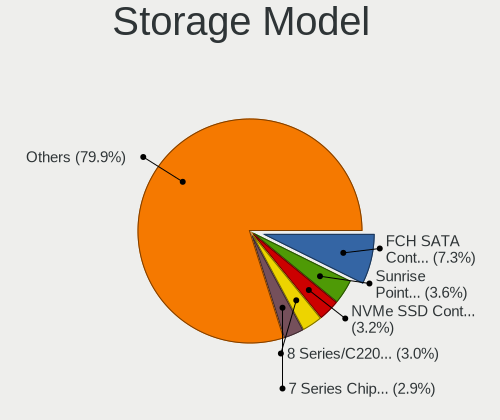
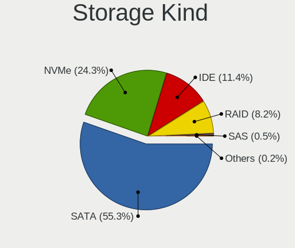
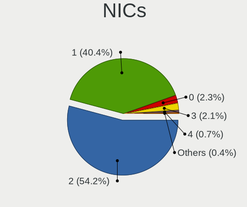

Ubuntu - Tested Hardware & Statistics
-------------------------------------

A project to collect tested hardware configurations for Ubuntu.

Anyone can contribute to this report by the [hw-probe](https://github.com/linuxhw/hw-probe) tool:

    sudo -E hw-probe -all -upload

Please contribute! Especially if your hardware is rare.

This is a report for all computer types. See also reports for [desktops](/Dist/Ubuntu/Desktop/README.md) and [notebooks](/Dist/Ubuntu/Notebook/README.md).

Contents
--------

* [ Test Cases ](#test-cases)

* [ System ](#system)
  - [ OS                       ](#os)
  - [ OS Family                ](#os-family)
  - [ Kernel                   ](#kernel)
  - [ Kernel Family            ](#kernel-family)
  - [ Kernel Major Ver.        ](#kernel-major-ver)
  - [ Arch                     ](#arch)
  - [ DE                       ](#de)
  - [ Display Server           ](#display-server)
  - [ Display Manager          ](#display-manager)
  - [ OS Lang                  ](#os-lang)
  - [ Boot Mode                ](#boot-mode)
  - [ Filesystem               ](#filesystem)
  - [ Part. scheme             ](#part-scheme)
  - [ Dual Boot with Linux/BSD ](#dual-boot-with-linuxbsd)
  - [ Dual Boot (Win)          ](#dual-boot-win)

* [ Board ](#board)
  - [ Vendor                   ](#vendor)
  - [ Model                    ](#model)
  - [ Model Family             ](#model-family)
  - [ MFG Year                 ](#mfg-year)
  - [ Form Factor              ](#form-factor)
  - [ Secure Boot              ](#secure-boot)
  - [ Coreboot                 ](#coreboot)
  - [ RAM Size                 ](#ram-size)
  - [ RAM Used                 ](#ram-used)
  - [ Total Drives             ](#total-drives)
  - [ Has CD-ROM               ](#has-cd-rom)
  - [ Has Ethernet             ](#has-ethernet)
  - [ Has WiFi                 ](#has-wifi)
  - [ Has Bluetooth            ](#has-bluetooth)

* [ Location ](#location)
  - [ Country                  ](#country)
  - [ City                     ](#city)

* [ Drives ](#drives)
  - [ Drive Vendor             ](#drive-vendor)
  - [ Drive Model              ](#drive-model)
  - [ HDD Vendor               ](#hdd-vendor)
  - [ SSD Vendor               ](#ssd-vendor)
  - [ Drive Kind               ](#drive-kind)
  - [ Drive Connector          ](#drive-connector)
  - [ Drive Size               ](#drive-size)
  - [ Space Total              ](#space-total)
  - [ Space Used               ](#space-used)
  - [ Malfunc. Drives          ](#malfunc-drives)
  - [ Malfunc. Drive Vendor    ](#malfunc-drive-vendor)
  - [ Malfunc. HDD Vendor      ](#malfunc-hdd-vendor)
  - [ Malfunc. Drive Kind      ](#malfunc-drive-kind)
  - [ Failed Drives            ](#failed-drives)
  - [ Failed Drive Vendor      ](#failed-drive-vendor)
  - [ Drive Status             ](#drive-status)

* [ Storage controller ](#storage-controller)
  - [ Storage Vendor           ](#storage-vendor)
  - [ Storage Model            ](#storage-model)
  - [ Storage Kind             ](#storage-kind)

* [ Processor ](#processor)
  - [ CPU Vendor               ](#cpu-vendor)
  - [ CPU Model                ](#cpu-model)
  - [ CPU Model Family         ](#cpu-model-family)
  - [ CPU Cores                ](#cpu-cores)
  - [ CPU Sockets              ](#cpu-sockets)
  - [ CPU Threads              ](#cpu-threads)
  - [ CPU Op-Modes             ](#cpu-op-modes)
  - [ CPU Microcode            ](#cpu-microcode)
  - [ CPU Microarch            ](#cpu-microarch)

* [ Graphics ](#graphics)
  - [ GPU Vendor               ](#gpu-vendor)
  - [ GPU Model                ](#gpu-model)
  - [ GPU Combo                ](#gpu-combo)
  - [ GPU Driver               ](#gpu-driver)
  - [ GPU Memory               ](#gpu-memory)

* [ Monitor ](#monitor)
  - [ Monitor Vendor           ](#monitor-vendor)
  - [ Monitor Model            ](#monitor-model)
  - [ Monitor Resolution       ](#monitor-resolution)
  - [ Monitor Diagonal         ](#monitor-diagonal)
  - [ Monitor Width            ](#monitor-width)
  - [ Aspect Ratio             ](#aspect-ratio)
  - [ Monitor Area             ](#monitor-area)
  - [ Pixel Density            ](#pixel-density)
  - [ Multiple Monitors        ](#multiple-monitors)

* [ Network ](#network)
  - [ Net Controller Vendor    ](#net-controller-vendor)
  - [ Net Controller Model     ](#net-controller-model)
  - [ Wireless Vendor          ](#wireless-vendor)
  - [ Wireless Model           ](#wireless-model)
  - [ Ethernet Vendor          ](#ethernet-vendor)
  - [ Ethernet Model           ](#ethernet-model)
  - [ Net Controller Kind      ](#net-controller-kind)
  - [ Used Controller          ](#used-controller)
  - [ NICs                     ](#nics)
  - [ IPv6                     ](#ipv6)

* [ Bluetooth ](#bluetooth)
  - [ Bluetooth Vendor         ](#bluetooth-vendor)
  - [ Bluetooth Model          ](#bluetooth-model)

* [ Sound ](#sound)
  - [ Sound Vendor             ](#sound-vendor)
  - [ Sound Model              ](#sound-model)

* [ Memory ](#memory)
  - [ Memory Vendor            ](#memory-vendor)
  - [ Memory Model             ](#memory-model)
  - [ Memory Kind              ](#memory-kind)
  - [ Memory Form Factor       ](#memory-form-factor)
  - [ Memory Size              ](#memory-size)
  - [ Memory Speed             ](#memory-speed)

* [ Printers & scanners ](#printers--scanners)
  - [ Printer Vendor           ](#printer-vendor)
  - [ Printer Model            ](#printer-model)
  - [ Scanner Vendor           ](#scanner-vendor)
  - [ Scanner Model            ](#scanner-model)

* [ Camera ](#camera)
  - [ Camera Vendor            ](#camera-vendor)
  - [ Camera Model             ](#camera-model)

* [ Security ](#security)
  - [ Fingerprint Vendor       ](#fingerprint-vendor)
  - [ Fingerprint Model        ](#fingerprint-model)
  - [ Chipcard Vendor          ](#chipcard-vendor)
  - [ Chipcard Model           ](#chipcard-model)

* [ Unsupported ](#unsupported)
  - [ Unsupported Devices      ](#unsupported-devices)
  - [ Unsupported Device Types ](#unsupported-device-types)

Test Cases
----------

Total: 71775

| Vendor        | Model                       | Form-Factor | Probe                                                      | Date         |
|---------------|-----------------------------|-------------|------------------------------------------------------------|--------------|
| Fujitsu       | LIFEBOOK U758               | Notebook    | [fe1d5a2b6b](https://linux-hardware.org/?probe=fe1d5a2b6b) | Jun 01, 2022 |
| Lenovo        | ThinkPad E14 Gen 3 20YFC... | Notebook    | [ac0d3882ca](https://linux-hardware.org/?probe=ac0d3882ca) | Jun 01, 2022 |
| Alienware     | 0XJKKD A00                  | Desktop     | [ae3a750f2e](https://linux-hardware.org/?probe=ae3a750f2e) | Jun 01, 2022 |
| Intel         | DP67BG AAG10491-305         | Desktop     | [714722d24b](https://linux-hardware.org/?probe=714722d24b) | Jun 01, 2022 |
| Lenovo        | IdeaPad Y700-15ISK 80NV     | Notebook    | [d12c2f9f7c](https://linux-hardware.org/?probe=d12c2f9f7c) | Jun 01, 2022 |
| Supermicro    | X10DAL-i                    | Server      | [ec2ed0ad86](https://linux-hardware.org/?probe=ec2ed0ad86) | Jun 01, 2022 |
| HP            | 1632                        | Desktop     | [4f7993cf34](https://linux-hardware.org/?probe=4f7993cf34) | Jun 01, 2022 |
| HP            | 1632                        | Desktop     | [9e69c11025](https://linux-hardware.org/?probe=9e69c11025) | Jun 01, 2022 |
| MSI           | MAG B560 TORPEDO            | Desktop     | [72181d6834](https://linux-hardware.org/?probe=72181d6834) | Jun 01, 2022 |
| Lenovo        | ThinkPad T440s 20ARS29U0... | Notebook    | [50de8ad2e9](https://linux-hardware.org/?probe=50de8ad2e9) | Jun 01, 2022 |
| Acer          | Swift SF314-42              | Notebook    | [f4906f3799](https://linux-hardware.org/?probe=f4906f3799) | Jun 01, 2022 |
| MSI           | B250M BAZOOKA               | Desktop     | [45d3300158](https://linux-hardware.org/?probe=45d3300158) | Jun 01, 2022 |
| Dell          | 0NK5PH A00                  | Desktop     | [960e8817bf](https://linux-hardware.org/?probe=960e8817bf) | Jun 01, 2022 |
| Unknown       | SKYBAY                      | Desktop     | [88ef811c4d](https://linux-hardware.org/?probe=88ef811c4d) | May 31, 2022 |
| HP            | Laptop 15s-fq1xxx           | Notebook    | [08fe1f2d0f](https://linux-hardware.org/?probe=08fe1f2d0f) | May 31, 2022 |
| ASUSTek       | ROG Strix G533QS_G533QS     | Notebook    | [7099867859](https://linux-hardware.org/?probe=7099867859) | May 31, 2022 |
| MSI           | B450M GAMING PLUS           | Desktop     | [db537b41f4](https://linux-hardware.org/?probe=db537b41f4) | May 31, 2022 |
| Maibenben     | XiaoMai5                    | Notebook    | [db343bc7eb](https://linux-hardware.org/?probe=db343bc7eb) | May 31, 2022 |
| Toshiba       | Satellite C70D-A            | Notebook    | [70313d6ed4](https://linux-hardware.org/?probe=70313d6ed4) | May 31, 2022 |
| HP            | ProBook 470 G1              | Notebook    | [ef73457d51](https://linux-hardware.org/?probe=ef73457d51) | May 31, 2022 |
| Dell          | Inspiron 14 7420 2-in-1     | Notebook    | [131a117ca2](https://linux-hardware.org/?probe=131a117ca2) | May 31, 2022 |
| Lenovo        | ThinkPad Edge E530 32597... | Notebook    | [4cf2bedfe7](https://linux-hardware.org/?probe=4cf2bedfe7) | May 31, 2022 |
| Pegatron      | 2AED                        | Desktop     | [67df0b1c08](https://linux-hardware.org/?probe=67df0b1c08) | May 31, 2022 |
| Dell          | XPS 13 9310                 | Notebook    | [726e3b4cd7](https://linux-hardware.org/?probe=726e3b4cd7) | May 31, 2022 |
| Dell          | Inspiron 5520               | Notebook    | [199523cb84](https://linux-hardware.org/?probe=199523cb84) | May 31, 2022 |
| HP            | 09E8h                       | Desktop     | [9c75a338fc](https://linux-hardware.org/?probe=9c75a338fc) | May 31, 2022 |
| Samsung       | RF511/RF411/RF711           | Notebook    | [ddafd23ad4](https://linux-hardware.org/?probe=ddafd23ad4) | May 31, 2022 |
| Lenovo        | Z50-75 80EC                 | Notebook    | [11f3206539](https://linux-hardware.org/?probe=11f3206539) | May 31, 2022 |
| Raspberry ... | Raspberry Pi                | Soc         | [989b41f386](https://linux-hardware.org/?probe=989b41f386) | May 31, 2022 |
| Unknown       | ZynqMP SMK-K26 Rev1/B/A     | Soc         | [1acb6dc064](https://linux-hardware.org/?probe=1acb6dc064) | May 31, 2022 |
| Lenovo        | Erazer Y50-70               | Notebook    | [abb6af451d](https://linux-hardware.org/?probe=abb6af451d) | May 31, 2022 |
| Dell          | 07WP95 A02                  | Desktop     | [65ae31976a](https://linux-hardware.org/?probe=65ae31976a) | May 31, 2022 |
| Supermicro    | X10SLL-F                    | Server      | [a271a0cc58](https://linux-hardware.org/?probe=a271a0cc58) | May 31, 2022 |
| Dell          | Latitude 3420               | Notebook    | [70b898ae27](https://linux-hardware.org/?probe=70b898ae27) | May 31, 2022 |
| Lenovo        | IdeaPad S400 VIUS3          | Notebook    | [474a9da762](https://linux-hardware.org/?probe=474a9da762) | May 31, 2022 |
| Acer          | Swift SF515-51T             | Notebook    | [d4283c0b8b](https://linux-hardware.org/?probe=d4283c0b8b) | May 31, 2022 |
| Lenovo        | IdeaPad S400 VIUS3          | Notebook    | [ec364402d8](https://linux-hardware.org/?probe=ec364402d8) | May 31, 2022 |
| Dell          | 0200DY A01                  | Desktop     | [0d7be8de90](https://linux-hardware.org/?probe=0d7be8de90) | May 31, 2022 |
| Supermicro    | C7Z270-CG-M                 | Server      | [dbbe7457ff](https://linux-hardware.org/?probe=dbbe7457ff) | May 31, 2022 |
| Dell          | Inspiron 15 3511            | Notebook    | [3fbca187e7](https://linux-hardware.org/?probe=3fbca187e7) | May 31, 2022 |
| MSI           | B450-A PRO MAX              | Desktop     | [72484e859d](https://linux-hardware.org/?probe=72484e859d) | May 31, 2022 |
| Acer          | Aspire 5739G                | Notebook    | [6f6f16ee08](https://linux-hardware.org/?probe=6f6f16ee08) | May 31, 2022 |
| Dell          | 0200DY A01                  | Desktop     | [c3c585ba02](https://linux-hardware.org/?probe=c3c585ba02) | May 31, 2022 |
| ASUSTek       | N550JV                      | Notebook    | [37af34e2e7](https://linux-hardware.org/?probe=37af34e2e7) | May 31, 2022 |
| Unknown       | Unknown                     | Desktop     | [c2d6d647d8](https://linux-hardware.org/?probe=c2d6d647d8) | May 31, 2022 |
| HUAWEI        | BOM-WXX9                    | Notebook    | [0d21170323](https://linux-hardware.org/?probe=0d21170323) | May 31, 2022 |
| Supermicro    | C7Z270-CG-M                 | Server      | [a9c593dd0b](https://linux-hardware.org/?probe=a9c593dd0b) | May 31, 2022 |
| ASUSTek       | Pro WS WRX80E-SAGE SE WI... | Desktop     | [dedf695fc6](https://linux-hardware.org/?probe=dedf695fc6) | May 31, 2022 |
| ASUSTek       | G73Jh                       | Notebook    | [b7db998ac4](https://linux-hardware.org/?probe=b7db998ac4) | May 31, 2022 |
| HP            | ProBook 455 G8 Notebook ... | Notebook    | [e0d6b45da8](https://linux-hardware.org/?probe=e0d6b45da8) | May 31, 2022 |
| MSI           | B450-A PRO MAX              | Desktop     | [9f7d224ed7](https://linux-hardware.org/?probe=9f7d224ed7) | May 31, 2022 |
| ASUSTek       | N550JV                      | Notebook    | [2652284f1a](https://linux-hardware.org/?probe=2652284f1a) | May 31, 2022 |
| Acer          | One Z1402                   | Notebook    | [4278b806cf](https://linux-hardware.org/?probe=4278b806cf) | May 31, 2022 |
| HP            | ProBook 455 15.6 inch G9... | Notebook    | [d4698d909e](https://linux-hardware.org/?probe=d4698d909e) | May 31, 2022 |
| HP            | EliteBook 2560p             | Notebook    | [4ad762abcb](https://linux-hardware.org/?probe=4ad762abcb) | May 31, 2022 |
| Toshiba       | Satellite M305D             | Notebook    | [6d558c3665](https://linux-hardware.org/?probe=6d558c3665) | May 31, 2022 |
| Toshiba       | Satellite M305D             | Notebook    | [43315304ac](https://linux-hardware.org/?probe=43315304ac) | May 31, 2022 |
| ASUSTek       | TUF Gaming B450-PLUS II     | Desktop     | [eb660008d7](https://linux-hardware.org/?probe=eb660008d7) | May 31, 2022 |
| ASUSTek       | ROG Strix G533QS_G533QS     | Notebook    | [aeb3a20df7](https://linux-hardware.org/?probe=aeb3a20df7) | May 31, 2022 |
| ASUSTek       | Rampage V EDITION 10        | Desktop     | [ab6fb60b96](https://linux-hardware.org/?probe=ab6fb60b96) | May 31, 2022 |
| ASUSTek       | H81M-A                      | Desktop     | [d24672a3cd](https://linux-hardware.org/?probe=d24672a3cd) | May 31, 2022 |
| Intel         | DP67BG AAG10491-305         | Desktop     | [966ab11802](https://linux-hardware.org/?probe=966ab11802) | May 31, 2022 |
| Toshiba       | Satellite C850D-115         | Notebook    | [fca373e327](https://linux-hardware.org/?probe=fca373e327) | May 31, 2022 |
| Alienware     | M11x R2                     | Notebook    | [4a364390a6](https://linux-hardware.org/?probe=4a364390a6) | May 31, 2022 |
| Alienware     | M11x R2                     | Notebook    | [87e8835eba](https://linux-hardware.org/?probe=87e8835eba) | May 30, 2022 |
| Lenovo        | ThinkPad X13 Gen 1 20UGS... | Notebook    | [7899887373](https://linux-hardware.org/?probe=7899887373) | May 30, 2022 |
| Gigabyte      | Q35M-S2                     | Desktop     | [7ef3498226](https://linux-hardware.org/?probe=7ef3498226) | May 30, 2022 |
| Dell          | Inspiron 5491 2n1           | Convertible | [652f774655](https://linux-hardware.org/?probe=652f774655) | May 30, 2022 |
| HP            | Spectre 13 x2 PC            | Notebook    | [9b67243691](https://linux-hardware.org/?probe=9b67243691) | May 30, 2022 |
| MW            | GMLK-2_5G4L                 | Desktop     | [69e61d13d7](https://linux-hardware.org/?probe=69e61d13d7) | May 30, 2022 |
| HP            | Stream 7 Tablet             | Tablet      | [df34e6adf2](https://linux-hardware.org/?probe=df34e6adf2) | May 30, 2022 |
| Dell          | Latitude 7400               | Notebook    | [685a5a8006](https://linux-hardware.org/?probe=685a5a8006) | May 30, 2022 |
| HP            | Pavilion Laptop 15-cw1xx... | Notebook    | [be0f84abb3](https://linux-hardware.org/?probe=be0f84abb3) | May 30, 2022 |
| HP            | Stream 7 Tablet             | Tablet      | [767d2b361c](https://linux-hardware.org/?probe=767d2b361c) | May 30, 2022 |
| Toshiba       | Satellite C50D-B            | Notebook    | [ce4eb9abc2](https://linux-hardware.org/?probe=ce4eb9abc2) | May 30, 2022 |
| ASRock        | 870 Extreme3                | Desktop     | [7e2000d3a1](https://linux-hardware.org/?probe=7e2000d3a1) | May 30, 2022 |
| Dell          | 0R6PCT A01                  | Desktop     | [08c460e0a3](https://linux-hardware.org/?probe=08c460e0a3) | May 30, 2022 |
| Dell          | 0R6PCT A01                  | Desktop     | [89aadb96f3](https://linux-hardware.org/?probe=89aadb96f3) | May 30, 2022 |
| ASUSTek       | VivoBook_ASUSLaptop X580... | Notebook    | [aa1cb34c55](https://linux-hardware.org/?probe=aa1cb34c55) | May 30, 2022 |
| Lenovo        | SHARKBAY SDK0E50510 WIN     | Desktop     | [9a8c443285](https://linux-hardware.org/?probe=9a8c443285) | May 30, 2022 |
| HP            | ZBook Firefly 14 inch G8... | Notebook    | [55e99cb697](https://linux-hardware.org/?probe=55e99cb697) | May 30, 2022 |
| Dell          | Inspiron MM061              | Notebook    | [904ddbbbb1](https://linux-hardware.org/?probe=904ddbbbb1) | May 30, 2022 |
| Lenovo        | ThinkPad E14 Gen 3 20YFC... | Notebook    | [784e1ca4cc](https://linux-hardware.org/?probe=784e1ca4cc) | May 30, 2022 |
| HP            | ENVY Laptop 15-ep1xxx       | Notebook    | [e6145c7453](https://linux-hardware.org/?probe=e6145c7453) | May 30, 2022 |
| Packard Be... | FIH57                       | Desktop     | [87a8b26ecd](https://linux-hardware.org/?probe=87a8b26ecd) | May 30, 2022 |
| HP            | Pavilion Laptop 14-ec0xx... | Notebook    | [f47dbc0616](https://linux-hardware.org/?probe=f47dbc0616) | May 30, 2022 |
| HP            | ProLiant DL380p Gen8        | Server      | [23d012c738](https://linux-hardware.org/?probe=23d012c738) | May 30, 2022 |
| ECS           | GF8100VM-M5                 | Desktop     | [f36fc15fdc](https://linux-hardware.org/?probe=f36fc15fdc) | May 30, 2022 |
| Gigabyte      | Z97M-DS3H                   | Desktop     | [3192e3b512](https://linux-hardware.org/?probe=3192e3b512) | May 30, 2022 |
| Gigabyte      | Z87X-UD3H-CF                | Desktop     | [b0e96de917](https://linux-hardware.org/?probe=b0e96de917) | May 30, 2022 |
| ASUSTek       | P8H67                       | Desktop     | [dff99aa7e6](https://linux-hardware.org/?probe=dff99aa7e6) | May 30, 2022 |
| ASUSTek       | PRO H410M-C                 | Desktop     | [c40635b66e](https://linux-hardware.org/?probe=c40635b66e) | May 30, 2022 |
| Toshiba       | Satellite C70D-A            | Notebook    | [820a9fb182](https://linux-hardware.org/?probe=820a9fb182) | May 30, 2022 |
| HP            | Spectre x360 Convertible... | Convertible | [6b394ac051](https://linux-hardware.org/?probe=6b394ac051) | May 30, 2022 |
| Unknown       | Unknown                     | Desktop     | [59d0634230](https://linux-hardware.org/?probe=59d0634230) | May 30, 2022 |
| Acer          | Aspire 4720Z                | Notebook    | [a1dd5003f5](https://linux-hardware.org/?probe=a1dd5003f5) | May 30, 2022 |
| MSI           | MPG Z690 EDGE WIFI DDR4     | Desktop     | [415752672c](https://linux-hardware.org/?probe=415752672c) | May 30, 2022 |
| AXIOO         | NEON HNM MODEL              | Notebook    | [0fbd1cf4af](https://linux-hardware.org/?probe=0fbd1cf4af) | May 30, 2022 |
| HP            | EliteBook 8470p             | Notebook    | [d5d9d52b83](https://linux-hardware.org/?probe=d5d9d52b83) | May 30, 2022 |
| Gigabyte      | Z87X-UD3H-CF                | Desktop     | [b4f73129a2](https://linux-hardware.org/?probe=b4f73129a2) | May 30, 2022 |
| Dell          | Latitude E6540              | Notebook    | [ece4d207f3](https://linux-hardware.org/?probe=ece4d207f3) | May 30, 2022 |
| HP            | Spectre x360 Convertible... | Convertible | [5766b308a7](https://linux-hardware.org/?probe=5766b308a7) | May 30, 2022 |
| HP            | 8711                        | Mini pc     | [e6822ab801](https://linux-hardware.org/?probe=e6822ab801) | May 30, 2022 |
| Lenovo        | IdeaPad Z480                | Notebook    | [b1cf8ca505](https://linux-hardware.org/?probe=b1cf8ca505) | May 30, 2022 |
| HP            | Laptop 15-da0xxx            | Notebook    | [1780281b4c](https://linux-hardware.org/?probe=1780281b4c) | May 30, 2022 |
| ASUSTek       | M5A78L LE                   | Desktop     | [44e2ec7714](https://linux-hardware.org/?probe=44e2ec7714) | May 30, 2022 |
| ASUSTek       | X99-E-10G WS                | Desktop     | [83e525ca4e](https://linux-hardware.org/?probe=83e525ca4e) | May 30, 2022 |
| ECS           | MCP61M-M3                   | Desktop     | [b785b68657](https://linux-hardware.org/?probe=b785b68657) | May 29, 2022 |
| Toshiba       | Satellite L50D-B            | Notebook    | [860be26e14](https://linux-hardware.org/?probe=860be26e14) | May 29, 2022 |
| Acer          | Aspire A515-51              | Notebook    | [4c1c5915bc](https://linux-hardware.org/?probe=4c1c5915bc) | May 29, 2022 |
| Lenovo        | IdeaPad 330-17IKB 81DK      | Notebook    | [84f8bf29fd](https://linux-hardware.org/?probe=84f8bf29fd) | May 29, 2022 |
| Acer          | Aspire A515-51              | Notebook    | [443f0579bb](https://linux-hardware.org/?probe=443f0579bb) | May 29, 2022 |
| Dell          | XPS 13 7390 2-in-1          | Convertible | [9365d534ab](https://linux-hardware.org/?probe=9365d534ab) | May 29, 2022 |
| ASUSTek       | ROG CROSSHAIR VIII HERO     | Desktop     | [0b83e8fa79](https://linux-hardware.org/?probe=0b83e8fa79) | May 29, 2022 |
| Chuwi         | GemiBook                    | Notebook    | [432c1135b8](https://linux-hardware.org/?probe=432c1135b8) | May 29, 2022 |
| Gigabyte      | H97N-WIFI                   | Desktop     | [031d4a8f7f](https://linux-hardware.org/?probe=031d4a8f7f) | May 29, 2022 |
| Dell          | 0PM2CW A00                  | Server      | [2b559392cc](https://linux-hardware.org/?probe=2b559392cc) | May 29, 2022 |
| Dell          | Inspiron 3420               | Notebook    | [2e79e10052](https://linux-hardware.org/?probe=2e79e10052) | May 29, 2022 |
| Lenovo        | ThinkPad T480s 20L8S34C0... | Notebook    | [c272fc283f](https://linux-hardware.org/?probe=c272fc283f) | May 29, 2022 |
| Minix         | NEO Z83-4A V1.1             | Desktop     | [e828d9bd38](https://linux-hardware.org/?probe=e828d9bd38) | May 29, 2022 |
| Intel         | DQ35JO AAD82085-803         | Desktop     | [40429e6d9a](https://linux-hardware.org/?probe=40429e6d9a) | May 29, 2022 |
| HUAWEI        | HLYL-WXX9                   | Notebook    | [b1670ac481](https://linux-hardware.org/?probe=b1670ac481) | May 29, 2022 |
| HUAWEI        | HLYL-WXX9                   | Notebook    | [4fec6454b4](https://linux-hardware.org/?probe=4fec6454b4) | May 29, 2022 |
| Biostar       | G41U3G                      | Desktop     | [1c6caef665](https://linux-hardware.org/?probe=1c6caef665) | May 29, 2022 |
| MSI           | H510I PRO WIFI              | Desktop     | [b4b8c3db64](https://linux-hardware.org/?probe=b4b8c3db64) | May 29, 2022 |
| Lenovo        | ThinkCentre A57 98517HG     | Desktop     | [b550a4b70e](https://linux-hardware.org/?probe=b550a4b70e) | May 29, 2022 |
| ASUSTek       | SABERTOOTH 990FX R2.0       | Desktop     | [9c69f7b836](https://linux-hardware.org/?probe=9c69f7b836) | May 29, 2022 |
| HP            | Pavilion g6                 | Notebook    | [a82494e1f3](https://linux-hardware.org/?probe=a82494e1f3) | May 29, 2022 |
| Samsung       | RV410/RV510/S3510/E3510     | Notebook    | [d7800ffe07](https://linux-hardware.org/?probe=d7800ffe07) | May 29, 2022 |
| Lenovo        | ThinkPad T440s 20AQ007SM... | Notebook    | [6e41ef26bf](https://linux-hardware.org/?probe=6e41ef26bf) | May 29, 2022 |
| ASUSTek       | PRO H410M-C                 | Desktop     | [bcca466c5e](https://linux-hardware.org/?probe=bcca466c5e) | May 29, 2022 |
| Apple         | Mac-FFE5EF870D7BA81A iMa... | All in one  | [e054e02eba](https://linux-hardware.org/?probe=e054e02eba) | May 29, 2022 |
| ASUSTek       | ROG STRIX B450-F GAMING ... | Desktop     | [c11ae8de66](https://linux-hardware.org/?probe=c11ae8de66) | May 29, 2022 |
| Gigabyte      | Z87X-UD3H-CF                | Desktop     | [c1dd2cf1be](https://linux-hardware.org/?probe=c1dd2cf1be) | May 29, 2022 |
| Gigabyte      | Z87X-UD3H-CF                | Desktop     | [0df520da7e](https://linux-hardware.org/?probe=0df520da7e) | May 29, 2022 |
| ASUSTek       | UX360CA                     | Notebook    | [63fac2dc9b](https://linux-hardware.org/?probe=63fac2dc9b) | May 29, 2022 |
| ASUSTek       | PRO H410M-C                 | Desktop     | [b83d80f5d2](https://linux-hardware.org/?probe=b83d80f5d2) | May 29, 2022 |
| Acer          | Aspire E5-571               | Notebook    | [8767a79d4a](https://linux-hardware.org/?probe=8767a79d4a) | May 29, 2022 |
| Gigabyte      | X570 GAMING X               | Desktop     | [3ddc17645b](https://linux-hardware.org/?probe=3ddc17645b) | May 29, 2022 |
| ASUSTek       | PRIME Z690-P WIFI           | Desktop     | [91306ce19f](https://linux-hardware.org/?probe=91306ce19f) | May 29, 2022 |
| ASRock        | A320M-HD                    | Desktop     | [b9b89a0256](https://linux-hardware.org/?probe=b9b89a0256) | May 29, 2022 |
| ASUSTek       | M4A78 PRO                   | Desktop     | [276f8565dc](https://linux-hardware.org/?probe=276f8565dc) | May 29, 2022 |
| Lenovo        | Legion S7 15ACH6 82K8       | Notebook    | [10ade1b182](https://linux-hardware.org/?probe=10ade1b182) | May 29, 2022 |
| ASUSTek       | ROG STRIX B450-F GAMING ... | Desktop     | [0e5f6d9e4c](https://linux-hardware.org/?probe=0e5f6d9e4c) | May 29, 2022 |
| HP            | Pavilion Laptop 15t-eg10... | Notebook    | [e24b789c03](https://linux-hardware.org/?probe=e24b789c03) | May 29, 2022 |
| ASUSTek       | 970 PRO GAMING/AURA         | Desktop     | [7fd1e065eb](https://linux-hardware.org/?probe=7fd1e065eb) | May 29, 2022 |
| Lenovo        | IdeaPad 320-15AST 80XV      | Notebook    | [55dfdf01c6](https://linux-hardware.org/?probe=55dfdf01c6) | May 29, 2022 |
| ASUSTek       | X555LAB                     | Notebook    | [24d84de091](https://linux-hardware.org/?probe=24d84de091) | May 29, 2022 |
| Dell          | Latitude E6410              | Notebook    | [72345f9352](https://linux-hardware.org/?probe=72345f9352) | May 28, 2022 |
| HP            | EliteBook 8460p             | Notebook    | [5388187aa2](https://linux-hardware.org/?probe=5388187aa2) | May 28, 2022 |
| ASUSTek       | M32CD_A_F_K20CD_K31CD       | Desktop     | [e404cf594b](https://linux-hardware.org/?probe=e404cf594b) | May 28, 2022 |
| Acer          | Swift SF314-43              | Notebook    | [44b220163b](https://linux-hardware.org/?probe=44b220163b) | May 28, 2022 |
| ASRock        | X470 Gaming-ITX/ac          | Desktop     | [c01dbfddee](https://linux-hardware.org/?probe=c01dbfddee) | May 28, 2022 |
| Shuttle       | FS81                        | Desktop     | [756f86d9fc](https://linux-hardware.org/?probe=756f86d9fc) | May 28, 2022 |
| Acer          | Veriton X2631G V:1.0        | Desktop     | [3c144d36f0](https://linux-hardware.org/?probe=3c144d36f0) | May 28, 2022 |
| HP            | Pavilion dv6                | Notebook    | [3623a980f8](https://linux-hardware.org/?probe=3623a980f8) | May 28, 2022 |
| MSI           | Boston                      | Desktop     | [53510ee8ef](https://linux-hardware.org/?probe=53510ee8ef) | May 28, 2022 |
| Dell          | XPS 13 9380                 | Notebook    | [7220b6a007](https://linux-hardware.org/?probe=7220b6a007) | May 28, 2022 |
| HP            | 8245 001                    | All in one  | [809b3fb754](https://linux-hardware.org/?probe=809b3fb754) | May 28, 2022 |
| Dell          | XPS 13 9380                 | Notebook    | [962defa2c3](https://linux-hardware.org/?probe=962defa2c3) | May 28, 2022 |
| Pegatron      | 2ACF                        | Desktop     | [bd97a6b3dd](https://linux-hardware.org/?probe=bd97a6b3dd) | May 28, 2022 |
| ASRock        | B450M Pro4                  | Desktop     | [2359c2d4d6](https://linux-hardware.org/?probe=2359c2d4d6) | May 28, 2022 |
| Medion        | P6613                       | Notebook    | [715486413e](https://linux-hardware.org/?probe=715486413e) | May 28, 2022 |
| ASUSTek       | H110M-K                     | Desktop     | [9ff7306bbd](https://linux-hardware.org/?probe=9ff7306bbd) | May 28, 2022 |
| Raspberry ... | Raspberry Pi                | Soc         | [1bb179225c](https://linux-hardware.org/?probe=1bb179225c) | May 28, 2022 |
| Gigabyte      | B150M-D3H-CF                | Desktop     | [e5fdf1083f](https://linux-hardware.org/?probe=e5fdf1083f) | May 28, 2022 |
| ASUSTek       | TUF Gaming X570-PLUS        | Desktop     | [c0399b42b7](https://linux-hardware.org/?probe=c0399b42b7) | May 28, 2022 |
| Lenovo        | ThinkPad P14s Gen 2a 21A... | Notebook    | [61cbe48681](https://linux-hardware.org/?probe=61cbe48681) | May 28, 2022 |
| HP            | Unknown                     | Notebook    | [521124e0e2](https://linux-hardware.org/?probe=521124e0e2) | May 28, 2022 |
| ASUSTek       | H61M-K                      | Desktop     | [1001d81aa0](https://linux-hardware.org/?probe=1001d81aa0) | May 28, 2022 |
| HP            | ProBook 650 G1              | Notebook    | [b32a949b01](https://linux-hardware.org/?probe=b32a949b01) | May 28, 2022 |
| ASUSTek       | TUF Z390-PRO GAMING         | Desktop     | [b0e56c97d2](https://linux-hardware.org/?probe=b0e56c97d2) | May 28, 2022 |
| ASUSTek       | T101HA                      | Tablet      | [de0b2a5b77](https://linux-hardware.org/?probe=de0b2a5b77) | May 28, 2022 |
| ASUSTek       | ROG Strix G513QY_G513QY     | Notebook    | [ee508ca972](https://linux-hardware.org/?probe=ee508ca972) | May 28, 2022 |
| HP            | Pavilion dv8                | Notebook    | [e2e28a055e](https://linux-hardware.org/?probe=e2e28a055e) | May 28, 2022 |
| HP            | ProBook 470 G4              | Notebook    | [6049c10c3c](https://linux-hardware.org/?probe=6049c10c3c) | May 28, 2022 |
| HP            | ProBook 450 G0              | Notebook    | [0086280448](https://linux-hardware.org/?probe=0086280448) | May 28, 2022 |
| Raspberry ... | Raspberry Pi                | Soc         | [87b4d5df31](https://linux-hardware.org/?probe=87b4d5df31) | May 28, 2022 |
| Lenovo        | IdeaPad 320-15IKB 80XL      | Notebook    | [9d9d577f12](https://linux-hardware.org/?probe=9d9d577f12) | May 28, 2022 |
| HP            | 15                          | Notebook    | [d44aca33f7](https://linux-hardware.org/?probe=d44aca33f7) | May 28, 2022 |
| ASUSTek       | VivoBook E14 E402WAS        | Notebook    | [9f3d329e42](https://linux-hardware.org/?probe=9f3d329e42) | May 28, 2022 |
| ASUSTek       | Zenbook UM3402YA_UM3402Y... | Notebook    | [1a31d93797](https://linux-hardware.org/?probe=1a31d93797) | May 28, 2022 |
| Intel         | X99                         | Desktop     | [bda2610780](https://linux-hardware.org/?probe=bda2610780) | May 28, 2022 |
| ASUSTek       | ROG Zephyrus G14 GA401QM... | Notebook    | [114a036605](https://linux-hardware.org/?probe=114a036605) | May 28, 2022 |
| Google        | Phaser360                   | Notebook    | [1795c158e4](https://linux-hardware.org/?probe=1795c158e4) | May 28, 2022 |
| Pegatron      | 2AC2                        | Desktop     | [ab5d6c08d5](https://linux-hardware.org/?probe=ab5d6c08d5) | May 28, 2022 |
| Lenovo        | SHARKBAY SDK0E50510 PRO     | Desktop     | [1094233e96](https://linux-hardware.org/?probe=1094233e96) | May 28, 2022 |
| Dell          | 0C2XKD A01                  | Desktop     | [2aaa53dd85](https://linux-hardware.org/?probe=2aaa53dd85) | May 28, 2022 |
| Gigabyte      | AB350-Gaming-CF             | Desktop     | [5458522367](https://linux-hardware.org/?probe=5458522367) | May 28, 2022 |
| MSI           | MPG X570 GAMING EDGE WIF... | Desktop     | [ce112fb9d2](https://linux-hardware.org/?probe=ce112fb9d2) | May 28, 2022 |
| Gigabyte      | X570 AORUS MASTER           | Desktop     | [bd7aea9bfd](https://linux-hardware.org/?probe=bd7aea9bfd) | May 28, 2022 |
| HP            | G60                         | Notebook    | [a577d64352](https://linux-hardware.org/?probe=a577d64352) | May 28, 2022 |
| Intel         | Greencity                   | Server      | [841df68a54](https://linux-hardware.org/?probe=841df68a54) | May 28, 2022 |
| Acer          | Veriton X2631G V:1.0        | Desktop     | [26e26a3995](https://linux-hardware.org/?probe=26e26a3995) | May 28, 2022 |
| HP            | Pavilion dv6000 (GP639EA... | Notebook    | [3a472b96d3](https://linux-hardware.org/?probe=3a472b96d3) | May 27, 2022 |
| ASRock        | Z87 Extreme4                | Desktop     | [d3315c5c94](https://linux-hardware.org/?probe=d3315c5c94) | May 27, 2022 |
| HP            | EliteBook 840 G1            | Notebook    | [07b116767e](https://linux-hardware.org/?probe=07b116767e) | May 27, 2022 |
| MSI           | B450 TOMAHAWK               | Desktop     | [2651c1881a](https://linux-hardware.org/?probe=2651c1881a) | May 27, 2022 |
| HP            | Pavilion dv6000 (GP639EA... | Notebook    | [7f3e3aada0](https://linux-hardware.org/?probe=7f3e3aada0) | May 27, 2022 |
| Dell          | 0GXM1W A02                  | Desktop     | [8e0891e3c7](https://linux-hardware.org/?probe=8e0891e3c7) | May 27, 2022 |
| MSI           | Z270 SLI PLUS               | Desktop     | [c0a846ffe7](https://linux-hardware.org/?probe=c0a846ffe7) | May 27, 2022 |
| Dell          | Inspiron 5521               | Notebook    | [84cc31cb32](https://linux-hardware.org/?probe=84cc31cb32) | May 27, 2022 |
| Lenovo        | Legion 7 15IMH05 81YT       | Notebook    | [602f942afc](https://linux-hardware.org/?probe=602f942afc) | May 27, 2022 |
| Lenovo        | Legion 7 15IMH05 81YT       | Notebook    | [a7cb65fb76](https://linux-hardware.org/?probe=a7cb65fb76) | May 27, 2022 |
| HP            | Pavilion Laptop 15-eh0xx... | Notebook    | [0000ab45a7](https://linux-hardware.org/?probe=0000ab45a7) | May 27, 2022 |
| Dell          | Inspiron 15 7000 Gaming     | Notebook    | [665b1b35a9](https://linux-hardware.org/?probe=665b1b35a9) | May 27, 2022 |
| Dell          | 09KPNV A01                  | Desktop     | [b98a471ead](https://linux-hardware.org/?probe=b98a471ead) | May 27, 2022 |
| Dell          | 09KPNV A01                  | Desktop     | [44162ea497](https://linux-hardware.org/?probe=44162ea497) | May 27, 2022 |
| ASUSTek       | P5G41T-M LX                 | Desktop     | [5dbf3199e0](https://linux-hardware.org/?probe=5dbf3199e0) | May 27, 2022 |
| Dell          | Studio 1749                 | Notebook    | [ac564826fe](https://linux-hardware.org/?probe=ac564826fe) | May 27, 2022 |
| ASUSTek       | PRIME B450M-A II            | Desktop     | [c9d649d5c7](https://linux-hardware.org/?probe=c9d649d5c7) | May 27, 2022 |
| Dell          | Vostro 15-3568              | Notebook    | [ee23f2618c](https://linux-hardware.org/?probe=ee23f2618c) | May 27, 2022 |
| ASUSTek       | ROG STRIX B450-F GAMING ... | Desktop     | [8f40318937](https://linux-hardware.org/?probe=8f40318937) | May 27, 2022 |
| HP            | Presario CQ62               | Notebook    | [fe3cac8868](https://linux-hardware.org/?probe=fe3cac8868) | May 27, 2022 |
| Dell          | XPS 13 9305                 | Notebook    | [5dc9e065e3](https://linux-hardware.org/?probe=5dc9e065e3) | May 27, 2022 |
| Dell          | 09CGW2 A11                  | Server      | [27b873f279](https://linux-hardware.org/?probe=27b873f279) | May 27, 2022 |
| Lenovo        | ThinkPad T580 20L9CTO1WW    | Notebook    | [397d64e10c](https://linux-hardware.org/?probe=397d64e10c) | May 27, 2022 |
| ASUSTek       | CROSSHAIR VI HERO           | Desktop     | [f5beaba229](https://linux-hardware.org/?probe=f5beaba229) | May 27, 2022 |
| Dell          | 073MMW A02                  | Desktop     | [6c7cfb5226](https://linux-hardware.org/?probe=6c7cfb5226) | May 27, 2022 |
| Gigabyte      | Z97X-UD3H-BK-CF             | Desktop     | [3dbf1858d0](https://linux-hardware.org/?probe=3dbf1858d0) | May 27, 2022 |
| ASUSTek       | CROSSHAIR VI HERO           | Desktop     | [2624ebd3a1](https://linux-hardware.org/?probe=2624ebd3a1) | May 27, 2022 |
| Dell          | Inspiron 15 7000 Gaming     | Notebook    | [a945f4d12f](https://linux-hardware.org/?probe=a945f4d12f) | May 27, 2022 |
| ASUSTek       | VivoBook_ASUSLaptop TP40... | Convertible | [41529bd0e1](https://linux-hardware.org/?probe=41529bd0e1) | May 27, 2022 |
| Medion        | S6421 MD60703               | Notebook    | [9fffed019c](https://linux-hardware.org/?probe=9fffed019c) | May 27, 2022 |
| Lenovo        | ThinkPad T580 20L9CTO1WW    | Notebook    | [a74cc1410a](https://linux-hardware.org/?probe=a74cc1410a) | May 27, 2022 |
| ASUSTek       | VivoBook_ASUSLaptop TP40... | Convertible | [da6bd78cdb](https://linux-hardware.org/?probe=da6bd78cdb) | May 27, 2022 |
| MSI           | MAG B460 TOMAHAWK           | Desktop     | [bd499069a8](https://linux-hardware.org/?probe=bd499069a8) | May 27, 2022 |
| ASUSTek       | B150-PLUS                   | Desktop     | [bdcda1dabc](https://linux-hardware.org/?probe=bdcda1dabc) | May 27, 2022 |
| Dell EMC      | Edge Gateway 3200           | Mini pc     | [15d4b0e11d](https://linux-hardware.org/?probe=15d4b0e11d) | May 27, 2022 |
| Gigabyte      | Z590 VISION G               | Desktop     | [586d86827b](https://linux-hardware.org/?probe=586d86827b) | May 27, 2022 |
| Dell          | 0YJPT1 A00                  | Desktop     | [b122151e55](https://linux-hardware.org/?probe=b122151e55) | May 27, 2022 |
| Apple         | Mac-AA95B1DDAB278B95 iMa... | All in one  | [3fdbd67fa3](https://linux-hardware.org/?probe=3fdbd67fa3) | May 27, 2022 |
| Lenovo        | ThinkPad T580 20L9S14S00    | Notebook    | [63bc3a2ce5](https://linux-hardware.org/?probe=63bc3a2ce5) | May 27, 2022 |
| Lenovo        | G505s 20255                 | Notebook    | [578aee86ed](https://linux-hardware.org/?probe=578aee86ed) | May 27, 2022 |
| ASUSTek       | VivoBook E14 E402WAS        | Notebook    | [8234e83675](https://linux-hardware.org/?probe=8234e83675) | May 27, 2022 |
| Lenovo        | IdeaPad Flex-14IWL 81SQ     | Convertible | [650e81d0df](https://linux-hardware.org/?probe=650e81d0df) | May 27, 2022 |
| Dell          | Inspiron 15 3510            | Notebook    | [860cd7b1f5](https://linux-hardware.org/?probe=860cd7b1f5) | May 27, 2022 |
| Dell          | Inspiron 15 3510            | Notebook    | [3d9ff1d25f](https://linux-hardware.org/?probe=3d9ff1d25f) | May 27, 2022 |
| Gigabyte      | Z77X-UD3H                   | Desktop     | [0cf6ee749e](https://linux-hardware.org/?probe=0cf6ee749e) | May 27, 2022 |
| ASUSTek       | STRIKER II FORMULA          | Desktop     | [f10aecd449](https://linux-hardware.org/?probe=f10aecd449) | May 27, 2022 |
| ASUSTek       | STRIKER II FORMULA          | Desktop     | [df37e5c694](https://linux-hardware.org/?probe=df37e5c694) | May 27, 2022 |
| ASUSTek       | B85-PLUS                    | Desktop     | [ea1d17f234](https://linux-hardware.org/?probe=ea1d17f234) | May 27, 2022 |
| Dell          | Inspiron One 2320           | All in one  | [82b5a900c4](https://linux-hardware.org/?probe=82b5a900c4) | May 27, 2022 |
| ASUSTek       | B85-PLUS                    | Desktop     | [e1efc36540](https://linux-hardware.org/?probe=e1efc36540) | May 27, 2022 |
| HUAWEI        | NBM-WXX9                    | Notebook    | [d7adff5a41](https://linux-hardware.org/?probe=d7adff5a41) | May 27, 2022 |
| ASUSTek       | M4A88TD-V EVO/USB3          | Desktop     | [bb0591d5c8](https://linux-hardware.org/?probe=bb0591d5c8) | May 26, 2022 |
| Acer          | Aspire 7750G                | Notebook    | [d059ef8864](https://linux-hardware.org/?probe=d059ef8864) | May 26, 2022 |
| HP            | ProBook 6450b               | Notebook    | [8c35a4c278](https://linux-hardware.org/?probe=8c35a4c278) | May 26, 2022 |
| Lenovo        | ThinkPad T14s Gen 2i 20W... | Notebook    | [9bfee4c94e](https://linux-hardware.org/?probe=9bfee4c94e) | May 26, 2022 |
| Acer          | Swift SF113-31              | Notebook    | [2bdba73cfa](https://linux-hardware.org/?probe=2bdba73cfa) | May 26, 2022 |
| Lenovo        | IdeaPad 5 14ALC05 82LM      | Notebook    | [8a4d6e798d](https://linux-hardware.org/?probe=8a4d6e798d) | May 26, 2022 |
| Dell          | Latitude E7440              | Notebook    | [975715a96b](https://linux-hardware.org/?probe=975715a96b) | May 26, 2022 |
| HP            | 8767 A                      | Desktop     | [553a8de02a](https://linux-hardware.org/?probe=553a8de02a) | May 26, 2022 |
| HP            | ProBook 6450b               | Notebook    | [863987eb13](https://linux-hardware.org/?probe=863987eb13) | May 26, 2022 |
| ASUSTek       | PRIME X299-DELUXE           | Desktop     | [d7d06bf7ef](https://linux-hardware.org/?probe=d7d06bf7ef) | May 26, 2022 |
| Dell          | 02P9X9 A05                  | Server      | [495ed7a7a4](https://linux-hardware.org/?probe=495ed7a7a4) | May 26, 2022 |
| ASUSTek       | P9X79 PRO                   | Desktop     | [cd6886f1d3](https://linux-hardware.org/?probe=cd6886f1d3) | May 26, 2022 |
| HP            | Compaq 6730s                | Notebook    | [4dabec8399](https://linux-hardware.org/?probe=4dabec8399) | May 26, 2022 |
| ASUSTek       | P8Z77-V LX                  | Desktop     | [5f505dd767](https://linux-hardware.org/?probe=5f505dd767) | May 26, 2022 |
| Fujitsu       | D2759 S26361-D2759-A13 W... | Server      | [b4cf75e580](https://linux-hardware.org/?probe=b4cf75e580) | May 26, 2022 |
| HP            | Laptop 14-dq0xxx            | Notebook    | [f1707ab670](https://linux-hardware.org/?probe=f1707ab670) | May 26, 2022 |
| ASUSTek       | P9X79 PRO                   | Desktop     | [60cf709d09](https://linux-hardware.org/?probe=60cf709d09) | May 26, 2022 |
| Alienware     | 15 R3                       | Notebook    | [84df370117](https://linux-hardware.org/?probe=84df370117) | May 26, 2022 |
| Dell          | 0MY171 A01                  | Desktop     | [9500786a21](https://linux-hardware.org/?probe=9500786a21) | May 26, 2022 |
| ASUSTek       | M2N68-AM                    | Desktop     | [9038c662b6](https://linux-hardware.org/?probe=9038c662b6) | May 26, 2022 |
| Gateway       | NV57H                       | Notebook    | [75c484ec74](https://linux-hardware.org/?probe=75c484ec74) | May 26, 2022 |
| HP            | 3047h                       | Desktop     | [5ff85894f2](https://linux-hardware.org/?probe=5ff85894f2) | May 26, 2022 |
| Fujitsu Si... | ESPRIMO Mobile U9200        | Notebook    | [7e370a9b3a](https://linux-hardware.org/?probe=7e370a9b3a) | May 26, 2022 |
| Lenovo        | ThinkPad L490 20Q5002GPG    | Notebook    | [9e1d2f7e8a](https://linux-hardware.org/?probe=9e1d2f7e8a) | May 26, 2022 |
| ASUSTek       | PRIME X570-P                | Desktop     | [3774c9e6e6](https://linux-hardware.org/?probe=3774c9e6e6) | May 26, 2022 |
| Fujitsu Si... | ESPRIMO Mobile U9200        | Notebook    | [a207ad4b72](https://linux-hardware.org/?probe=a207ad4b72) | May 26, 2022 |
| Lenovo        | Yoga 530-14ARR 81H9         | Convertible | [d4b6f36ee5](https://linux-hardware.org/?probe=d4b6f36ee5) | May 26, 2022 |
| ASUSTek       | M32CD                       | Desktop     | [1c70901862](https://linux-hardware.org/?probe=1c70901862) | May 26, 2022 |
| Lenovo        | ThinkPad E15 Gen 2 20T80... | Notebook    | [143ca380f9](https://linux-hardware.org/?probe=143ca380f9) | May 26, 2022 |
| Lenovo        | Yoga 530-14ARR 81H9         | Convertible | [22ce653e17](https://linux-hardware.org/?probe=22ce653e17) | May 26, 2022 |
| HP            | Laptop 14-dq0xxx            | Notebook    | [d55ccb53e4](https://linux-hardware.org/?probe=d55ccb53e4) | May 26, 2022 |
| MSI           | MPG B550I GAMING EDGE WI... | Desktop     | [740aeb1dff](https://linux-hardware.org/?probe=740aeb1dff) | May 26, 2022 |
| Dell          | Inspiron 3420               | Notebook    | [a3509450fc](https://linux-hardware.org/?probe=a3509450fc) | May 26, 2022 |
| Dell          | Inspiron 3420               | Notebook    | [63592b1c26](https://linux-hardware.org/?probe=63592b1c26) | May 26, 2022 |
| MSI           | A320M-A PRO MAX             | Desktop     | [f1ccdbbba4](https://linux-hardware.org/?probe=f1ccdbbba4) | May 26, 2022 |
| ASUSTek       | PN50                        | Mini pc     | [60a16a0a17](https://linux-hardware.org/?probe=60a16a0a17) | May 26, 2022 |
| Hometech      | Alfa 430C                   | Notebook    | [4f0e4e240d](https://linux-hardware.org/?probe=4f0e4e240d) | May 26, 2022 |
| HP            | ProBook 650 G1              | Notebook    | [1e3cb9027d](https://linux-hardware.org/?probe=1e3cb9027d) | May 26, 2022 |
| ASRock        | H570M Pro4                  | Desktop     | [fe647f8d6c](https://linux-hardware.org/?probe=fe647f8d6c) | May 26, 2022 |
| ASUSTek       | PRIME X570-P                | Desktop     | [f52de609a0](https://linux-hardware.org/?probe=f52de609a0) | May 26, 2022 |
| Panasonic     | CF53-4                      | Notebook    | [5ca3312ac9](https://linux-hardware.org/?probe=5ca3312ac9) | May 26, 2022 |
| IBM           | 00D4062                     | Server      | [57c6388ef2](https://linux-hardware.org/?probe=57c6388ef2) | May 26, 2022 |
| ASUSTek       | PRO H410M-C                 | Desktop     | [e38c676047](https://linux-hardware.org/?probe=e38c676047) | May 26, 2022 |
| Lenovo        | Yoga Slim 7 14ITL05 82A3    | Notebook    | [159819d677](https://linux-hardware.org/?probe=159819d677) | May 26, 2022 |
| Acer          | TravelMate 5742Z            | Notebook    | [fd6407ece1](https://linux-hardware.org/?probe=fd6407ece1) | May 26, 2022 |
| Gigabyte      | GA-E7AUM-DS2H               | Desktop     | [9f18dbe621](https://linux-hardware.org/?probe=9f18dbe621) | May 26, 2022 |
| HP            | Pavilion tx2500             | Notebook    | [4f5faea87f](https://linux-hardware.org/?probe=4f5faea87f) | May 26, 2022 |
| HP            | 8245 001                    | All in one  | [8c163f2937](https://linux-hardware.org/?probe=8c163f2937) | May 25, 2022 |
| Gigabyte      | B450M H                     | Desktop     | [9c3f88c494](https://linux-hardware.org/?probe=9c3f88c494) | May 25, 2022 |
| ASRock        | Z270 Gaming K6              | Desktop     | [fbf8e08024](https://linux-hardware.org/?probe=fbf8e08024) | May 25, 2022 |
| HP            | ZBook 15 G5                 | Notebook    | [4f083f0d35](https://linux-hardware.org/?probe=4f083f0d35) | May 25, 2022 |
| Dell          | Inspiron 5521               | Notebook    | [69cec459af](https://linux-hardware.org/?probe=69cec459af) | May 25, 2022 |
| Acer          | Nitro AN515-54              | Notebook    | [4c0609eff4](https://linux-hardware.org/?probe=4c0609eff4) | May 25, 2022 |
| Intel         | H55                         | Desktop     | [fa014a938e](https://linux-hardware.org/?probe=fa014a938e) | May 25, 2022 |
| Lenovo        | IdeaPad S540-15IWL GTX 8... | Notebook    | [cff9e3245c](https://linux-hardware.org/?probe=cff9e3245c) | May 25, 2022 |
| Lenovo        | ThinkPad S1 Yoga 12 20DK... | Notebook    | [fc05deca82](https://linux-hardware.org/?probe=fc05deca82) | May 25, 2022 |
| Dell          | Vostro 15 3515              | Notebook    | [6a41815a3a](https://linux-hardware.org/?probe=6a41815a3a) | May 25, 2022 |
| MSI           | MPG B550I GAMING EDGE WI... | Desktop     | [44386f8bae](https://linux-hardware.org/?probe=44386f8bae) | May 25, 2022 |
| Acer          | Aspire C24-865              | All in one  | [c0215bd100](https://linux-hardware.org/?probe=c0215bd100) | May 25, 2022 |
| Lenovo        | 30D9 SDK0J40705 WIN 3425... | Desktop     | [9d9a7dc189](https://linux-hardware.org/?probe=9d9a7dc189) | May 25, 2022 |
| ASUSTek       | P8Z77-M                     | Desktop     | [6e2da39201](https://linux-hardware.org/?probe=6e2da39201) | May 25, 2022 |
| Positivo      | AT510                       | Notebook    | [2845c5ebd6](https://linux-hardware.org/?probe=2845c5ebd6) | May 25, 2022 |
| ASRock        | AB350M Pro4                 | Desktop     | [dd39f18241](https://linux-hardware.org/?probe=dd39f18241) | May 25, 2022 |
| HP            | Pavilion Gaming Laptop 1... | Notebook    | [74796bddc6](https://linux-hardware.org/?probe=74796bddc6) | May 25, 2022 |
| Intel         | NUC11ATBC4 M53051-202       | Mini pc     | [fe6eb17434](https://linux-hardware.org/?probe=fe6eb17434) | May 25, 2022 |
| Dell          | 0RF703                      | Desktop     | [228efad4f1](https://linux-hardware.org/?probe=228efad4f1) | May 25, 2022 |
| Alienware     | m15 R7                      | Notebook    | [d8155181ec](https://linux-hardware.org/?probe=d8155181ec) | May 25, 2022 |
| Lenovo        | Yoga 530-14ARR 81H9         | Convertible | [324297291d](https://linux-hardware.org/?probe=324297291d) | May 25, 2022 |
| Lenovo        | ThinkPad L540 20AUS39X00    | Notebook    | [6a294d74f4](https://linux-hardware.org/?probe=6a294d74f4) | May 25, 2022 |
| Pegatron      | 2A94                        | Desktop     | [0b4773f876](https://linux-hardware.org/?probe=0b4773f876) | May 25, 2022 |
| Fujitsu       | D2628-C1 S26361-D2628-C1    | Desktop     | [200070a992](https://linux-hardware.org/?probe=200070a992) | May 25, 2022 |
| HP            | Pavilion Laptop 15-eh2xx... | Notebook    | [364356854c](https://linux-hardware.org/?probe=364356854c) | May 25, 2022 |
| HP            | EliteBook 850 G6            | Notebook    | [25e4d08ac2](https://linux-hardware.org/?probe=25e4d08ac2) | May 25, 2022 |
| Gigabyte      | G31M-S2C                    | Desktop     | [5251ce0950](https://linux-hardware.org/?probe=5251ce0950) | May 25, 2022 |
| HP            | Notebook                    | Notebook    | [87460a83e8](https://linux-hardware.org/?probe=87460a83e8) | May 25, 2022 |
| Intel         | S1200SP H57532-250          | Server      | [c8175992e0](https://linux-hardware.org/?probe=c8175992e0) | May 25, 2022 |
| Gigabyte      | Z77X-UD3H                   | Desktop     | [0d439f9812](https://linux-hardware.org/?probe=0d439f9812) | May 25, 2022 |
| MouseCompu... | B5-R5RENASW11               | Notebook    | [35eae81eca](https://linux-hardware.org/?probe=35eae81eca) | May 25, 2022 |
| Lenovo        | V15 G2 ITL 82KB             | Notebook    | [afa36e649d](https://linux-hardware.org/?probe=afa36e649d) | May 25, 2022 |
| HP            | ProBook 450 G6              | Notebook    | [3f78a19968](https://linux-hardware.org/?probe=3f78a19968) | May 25, 2022 |
| ASUSTek       | X540LA                      | Notebook    | [2015df99d9](https://linux-hardware.org/?probe=2015df99d9) | May 25, 2022 |
| HP            | 250 G8 Notebook PC          | Notebook    | [ce09b72069](https://linux-hardware.org/?probe=ce09b72069) | May 25, 2022 |
| Dell          | 0DT029 A00                  | Desktop     | [17b19530f5](https://linux-hardware.org/?probe=17b19530f5) | May 25, 2022 |
| ASUSTek       | ROG Strix G512LU_G512LU     | Notebook    | [24b9b9fc85](https://linux-hardware.org/?probe=24b9b9fc85) | May 25, 2022 |
| ASUSTek       | ROG Strix G512LU_G512LU     | Notebook    | [7d581f520f](https://linux-hardware.org/?probe=7d581f520f) | May 25, 2022 |
| HP            | 250 G8 Notebook PC          | Notebook    | [cee3591bcd](https://linux-hardware.org/?probe=cee3591bcd) | May 25, 2022 |
| Dell          | Latitude 5520               | Notebook    | [45f6ad8868](https://linux-hardware.org/?probe=45f6ad8868) | May 25, 2022 |
| Unknown       | Unknown                     | Desktop     | [dd0ffbf45b](https://linux-hardware.org/?probe=dd0ffbf45b) | May 25, 2022 |
| Unknown       | Unknown                     | Desktop     | [213e81318d](https://linux-hardware.org/?probe=213e81318d) | May 25, 2022 |
| ASUSTek       | TP500LA                     | Notebook    | [d72b249f1a](https://linux-hardware.org/?probe=d72b249f1a) | May 25, 2022 |
| ASUSTek       | TUF Gaming X570-PLUS        | Desktop     | [a649429f59](https://linux-hardware.org/?probe=a649429f59) | May 25, 2022 |
| AMI           | Intel                       | Notebook    | [6f43f8000f](https://linux-hardware.org/?probe=6f43f8000f) | May 25, 2022 |
| Gigabyte      | H510M S2H                   | Desktop     | [a5fb178d31](https://linux-hardware.org/?probe=a5fb178d31) | May 25, 2022 |
| Dell          | Precision 5560              | Notebook    | [117f0ea357](https://linux-hardware.org/?probe=117f0ea357) | May 25, 2022 |
| Dell          | Precision 5560              | Notebook    | [326ecde715](https://linux-hardware.org/?probe=326ecde715) | May 25, 2022 |
| Acer          | TravelMate 8372             | Notebook    | [fda4340056](https://linux-hardware.org/?probe=fda4340056) | May 25, 2022 |
| Dell          | Vostro 3590                 | Notebook    | [911d4f5b0c](https://linux-hardware.org/?probe=911d4f5b0c) | May 25, 2022 |
| Dell          | Vostro 3590                 | Notebook    | [84edfb2984](https://linux-hardware.org/?probe=84edfb2984) | May 24, 2022 |
| Dell          | 096JG8 A01                  | Desktop     | [51aaf4adcd](https://linux-hardware.org/?probe=51aaf4adcd) | May 24, 2022 |
| HUAWEI        | NBLK-WAX9X                  | Notebook    | [0517751353](https://linux-hardware.org/?probe=0517751353) | May 24, 2022 |
| Dell          | G15 5520                    | Notebook    | [6725c0ec16](https://linux-hardware.org/?probe=6725c0ec16) | May 24, 2022 |
| HP            | Laptop 14-fq0xxx            | Notebook    | [cce2c3d087](https://linux-hardware.org/?probe=cce2c3d087) | May 24, 2022 |
| Raspberry ... | Raspberry Pi                | Soc         | [62974af203](https://linux-hardware.org/?probe=62974af203) | May 24, 2022 |
| Intel         | NUC6i5SYB H81131-503        | Mini pc     | [c00f6e1b2a](https://linux-hardware.org/?probe=c00f6e1b2a) | May 24, 2022 |
| HP            | Laptop 14-fq0xxx            | Notebook    | [a26b5f2e62](https://linux-hardware.org/?probe=a26b5f2e62) | May 24, 2022 |
| Dell          | 0WG864                      | Desktop     | [5bda6fbb3a](https://linux-hardware.org/?probe=5bda6fbb3a) | May 24, 2022 |
| HP            | ZBook 15 G5                 | Notebook    | [fea70c6484](https://linux-hardware.org/?probe=fea70c6484) | May 24, 2022 |
| LG Electro... | 17Z90N-V.AA77G              | Notebook    | [701a55dbe1](https://linux-hardware.org/?probe=701a55dbe1) | May 24, 2022 |
| Gigabyte      | P55-UD3L                    | Desktop     | [256b5355c3](https://linux-hardware.org/?probe=256b5355c3) | May 24, 2022 |
| Dell          | 0HY9JP A01                  | Desktop     | [4107e267d7](https://linux-hardware.org/?probe=4107e267d7) | May 24, 2022 |
| MSI           | 970A-G43                    | Desktop     | [92dd93dd78](https://linux-hardware.org/?probe=92dd93dd78) | May 24, 2022 |
| Toshiba       | Satellite Pro C665          | Notebook    | [23fd853a45](https://linux-hardware.org/?probe=23fd853a45) | May 24, 2022 |
| Hardkernel    | ODROID-M1                   | Soc         | [16c06e9416](https://linux-hardware.org/?probe=16c06e9416) | May 24, 2022 |
| Dell          | G15 5520                    | Notebook    | [93c48c8560](https://linux-hardware.org/?probe=93c48c8560) | May 24, 2022 |
| Lenovo        | 313A NOK                    | Desktop     | [9df6ec850c](https://linux-hardware.org/?probe=9df6ec850c) | May 24, 2022 |
| ASUSTek       | M4N68T-M-V2                 | Desktop     | [e317246d50](https://linux-hardware.org/?probe=e317246d50) | May 24, 2022 |
| Dell          | Latitude 5420               | Notebook    | [28c0f1ba96](https://linux-hardware.org/?probe=28c0f1ba96) | May 24, 2022 |
| Seeed Stud... | ODYSSEY-X86J41X5 SD-BS-C... | Desktop     | [de2c57e521](https://linux-hardware.org/?probe=de2c57e521) | May 24, 2022 |
| Apple         | MacBook6,1                  | Notebook    | [683ff3ab1a](https://linux-hardware.org/?probe=683ff3ab1a) | May 24, 2022 |
| Dell          | Vostro 3500                 | Notebook    | [9dff398fa9](https://linux-hardware.org/?probe=9dff398fa9) | May 24, 2022 |
| Lenovo        | IdeaPad 330S-14IKB 81F4     | Notebook    | [7e4dbd239c](https://linux-hardware.org/?probe=7e4dbd239c) | May 24, 2022 |
| LG Electro... | 15Z95P-P.AAE8U1             | Notebook    | [b6f94c26a6](https://linux-hardware.org/?probe=b6f94c26a6) | May 24, 2022 |
| MSI           | Prestige 15 A11SCS          | Notebook    | [2433529434](https://linux-hardware.org/?probe=2433529434) | May 24, 2022 |
| Toshiba       | Satellite Pro U400          | Notebook    | [4aeeca648d](https://linux-hardware.org/?probe=4aeeca648d) | May 24, 2022 |
| ASUSTek       | PRIME B450M-A               | Desktop     | [0b71165d45](https://linux-hardware.org/?probe=0b71165d45) | May 24, 2022 |
| HP            | 250 G8 Notebook PC          | Notebook    | [2f4c72e2a9](https://linux-hardware.org/?probe=2f4c72e2a9) | May 24, 2022 |
| Lenovo        | G50-70 20351                | Notebook    | [e3247c6066](https://linux-hardware.org/?probe=e3247c6066) | May 24, 2022 |
| Shuttle       | FH170                       | Desktop     | [2645369ebc](https://linux-hardware.org/?probe=2645369ebc) | May 24, 2022 |
| PC Special... | NH5x_NH7x_HHx_HJx_HKx       | Notebook    | [edbc299690](https://linux-hardware.org/?probe=edbc299690) | May 24, 2022 |
| MSI           | H61M-P31/W8                 | Desktop     | [2be14c5fa8](https://linux-hardware.org/?probe=2be14c5fa8) | May 24, 2022 |
| Medion        | P7649 MD60817               | Notebook    | [afcecb3b4e](https://linux-hardware.org/?probe=afcecb3b4e) | May 24, 2022 |
| Allview       | Allbook H                   | Notebook    | [9ea4897c6b](https://linux-hardware.org/?probe=9ea4897c6b) | May 24, 2022 |
| Dell          | Latitude D830               | Notebook    | [f2f09cee8c](https://linux-hardware.org/?probe=f2f09cee8c) | May 24, 2022 |
| ASUSTek       | Zenbook UM3402YA_UM3402Y... | Notebook    | [9f202f07cd](https://linux-hardware.org/?probe=9f202f07cd) | May 24, 2022 |
| HP            | EliteBook 845 G8 Noteboo... | Notebook    | [ddd705ecaf](https://linux-hardware.org/?probe=ddd705ecaf) | May 24, 2022 |
| Gigabyte      | Z590 VISION G               | Desktop     | [1158b31567](https://linux-hardware.org/?probe=1158b31567) | May 24, 2022 |
| Dell          | Latitude E7470              | Notebook    | [b01633e1ae](https://linux-hardware.org/?probe=b01633e1ae) | May 24, 2022 |
| ASUSTek       | VivoBook_ASUSLaptop X512... | Notebook    | [8d8d5ff5e1](https://linux-hardware.org/?probe=8d8d5ff5e1) | May 24, 2022 |
| Dell          | Latitude E5440              | Notebook    | [21f0eba93a](https://linux-hardware.org/?probe=21f0eba93a) | May 24, 2022 |
| Apple         | MacBookPro8,2               | Notebook    | [764a660c33](https://linux-hardware.org/?probe=764a660c33) | May 24, 2022 |
| ASUSTek       | M5A78L-M LX                 | Desktop     | [6c5438b4b4](https://linux-hardware.org/?probe=6c5438b4b4) | May 24, 2022 |
| Dell          | Inspiron 5557               | Notebook    | [1b07902e70](https://linux-hardware.org/?probe=1b07902e70) | May 24, 2022 |
| Raspberry ... | Raspberry Pi                | Soc         | [0656adeb11](https://linux-hardware.org/?probe=0656adeb11) | May 24, 2022 |
| ASUSTek       | Zephyrus G GU502DU_GA502... | Notebook    | [bd95cdf1cd](https://linux-hardware.org/?probe=bd95cdf1cd) | May 24, 2022 |
| Unknown       | Aspire E                    | Notebook    | [d437b15b97](https://linux-hardware.org/?probe=d437b15b97) | May 24, 2022 |
| Lenovo        | IdeaPad 5 Pro 16IHU6 82L... | Notebook    | [322f05198a](https://linux-hardware.org/?probe=322f05198a) | May 24, 2022 |
| Unknown       | Aspire E                    | Notebook    | [f46b38824f](https://linux-hardware.org/?probe=f46b38824f) | May 24, 2022 |
| Dell          | Vostro 3550                 | Notebook    | [eb16993291](https://linux-hardware.org/?probe=eb16993291) | May 24, 2022 |
| HP            | ProBook 6460b               | Notebook    | [7af90825ff](https://linux-hardware.org/?probe=7af90825ff) | May 23, 2022 |
| Gigabyte      | H510M S2H                   | Desktop     | [f37210fa6b](https://linux-hardware.org/?probe=f37210fa6b) | May 23, 2022 |
| HP            | Laptop 15-da2xxx            | Notebook    | [7dd1f5b528](https://linux-hardware.org/?probe=7dd1f5b528) | May 23, 2022 |
| Dell          | Vostro 3550                 | Notebook    | [b40dbcb6e4](https://linux-hardware.org/?probe=b40dbcb6e4) | May 23, 2022 |
| Dell          | XPS 15 9560                 | Notebook    | [7152b312be](https://linux-hardware.org/?probe=7152b312be) | May 23, 2022 |
| MSI           | H97M-G43                    | Desktop     | [4c1e9752b6](https://linux-hardware.org/?probe=4c1e9752b6) | May 23, 2022 |
| Dell          | Latitude 5410               | Notebook    | [3fce888577](https://linux-hardware.org/?probe=3fce888577) | May 23, 2022 |
| ASUSTek       | N550JV                      | Notebook    | [7b3acdb5ac](https://linux-hardware.org/?probe=7b3acdb5ac) | May 23, 2022 |
| ASUSTek       | TUF B360M-PLUS GAMING/BR    | Desktop     | [7fae2860ed](https://linux-hardware.org/?probe=7fae2860ed) | May 23, 2022 |
| Dell          | Latitude E7470              | Notebook    | [815dbb114b](https://linux-hardware.org/?probe=815dbb114b) | May 23, 2022 |
| HP            | ProBook 6460b               | Notebook    | [e3819153ed](https://linux-hardware.org/?probe=e3819153ed) | May 23, 2022 |
| Lenovo        | IdeaPad 330-15IKB 81FD      | Notebook    | [77ff0216c6](https://linux-hardware.org/?probe=77ff0216c6) | May 23, 2022 |
| ASUSTek       | PRIME B660M-A AC D4         | Desktop     | [286688e46b](https://linux-hardware.org/?probe=286688e46b) | May 23, 2022 |
| Intel         | NUC8BEB J72692-310          | Mini pc     | [8dccf1be64](https://linux-hardware.org/?probe=8dccf1be64) | May 23, 2022 |
| Gigabyte      | GB-BRR7H-4700               | Desktop     | [4e378acf87](https://linux-hardware.org/?probe=4e378acf87) | May 23, 2022 |
| Dell          | 02P9X9 A05                  | Server      | [9c274b7318](https://linux-hardware.org/?probe=9c274b7318) | May 23, 2022 |
| Acer          | Aspire XC-830               | Desktop     | [0339b395ed](https://linux-hardware.org/?probe=0339b395ed) | May 23, 2022 |
| Gigabyte      | Z97M-DS3H                   | Desktop     | [f9e86bb522](https://linux-hardware.org/?probe=f9e86bb522) | May 23, 2022 |
| ASRock        | 970 Pro3 R2.0               | Desktop     | [afeae78ecd](https://linux-hardware.org/?probe=afeae78ecd) | May 23, 2022 |
| Apple         | Mac-F65AE981FFA204ED Mac... | Mini pc     | [70b5e91823](https://linux-hardware.org/?probe=70b5e91823) | May 23, 2022 |
| Shuttle       | FS110                       | Desktop     | [d1147263be](https://linux-hardware.org/?probe=d1147263be) | May 23, 2022 |
| Gigabyte      | GB-BRR7H-4700               | Desktop     | [9ba025f6fd](https://linux-hardware.org/?probe=9ba025f6fd) | May 23, 2022 |
| Fujitsu       | D2759 S26361-D2759-A13 W... | Server      | [f5aefeb81c](https://linux-hardware.org/?probe=f5aefeb81c) | May 23, 2022 |
| Raspberry ... | Raspberry Pi                | Soc         | [86440c2017](https://linux-hardware.org/?probe=86440c2017) | May 23, 2022 |
| Acer          | Aspire 5736Z                | Notebook    | [78318327dd](https://linux-hardware.org/?probe=78318327dd) | May 23, 2022 |
| Acer          | Aspire 5736Z                | Notebook    | [621183d005](https://linux-hardware.org/?probe=621183d005) | May 23, 2022 |
| ASUSTek       | B85M-E                      | Desktop     | [4ea6883bee](https://linux-hardware.org/?probe=4ea6883bee) | May 23, 2022 |
| Toshiba       | Satellite Pro T130          | Notebook    | [2771a53784](https://linux-hardware.org/?probe=2771a53784) | May 23, 2022 |
| ASUSTek       | ROG Zephyrus G14 GA401QM... | Notebook    | [43a374c1d4](https://linux-hardware.org/?probe=43a374c1d4) | May 23, 2022 |
| Raspberry ... | Raspberry Pi 4 Model B R... | Soc         | [80ccb1775d](https://linux-hardware.org/?probe=80ccb1775d) | May 23, 2022 |
| ASUSTek       | H61M-C                      | Desktop     | [4b17ea4a7f](https://linux-hardware.org/?probe=4b17ea4a7f) | May 23, 2022 |
| Entroware     | Apollo                      | Notebook    | [30881be24b](https://linux-hardware.org/?probe=30881be24b) | May 23, 2022 |
| Acer          | Aspire 5739G                | Notebook    | [428631aa4a](https://linux-hardware.org/?probe=428631aa4a) | May 23, 2022 |
| SANTECH       | NHx0EH_EJ_EK                | Notebook    | [72b5c6d06b](https://linux-hardware.org/?probe=72b5c6d06b) | May 23, 2022 |
| HP            | 1495                        | Desktop     | [adf94f2549](https://linux-hardware.org/?probe=adf94f2549) | May 23, 2022 |
| HP            | 1495                        | Desktop     | [be2c2cbd65](https://linux-hardware.org/?probe=be2c2cbd65) | May 23, 2022 |
| Lenovo        | S20-30 20421                | Notebook    | [58d0509bff](https://linux-hardware.org/?probe=58d0509bff) | May 23, 2022 |
| HP            | 1495                        | Desktop     | [9d476ad9d1](https://linux-hardware.org/?probe=9d476ad9d1) | May 23, 2022 |
| HP            | 1495                        | Desktop     | [61f2119a07](https://linux-hardware.org/?probe=61f2119a07) | May 23, 2022 |
| Intel         | H55                         | Desktop     | [8dd80b1c9d](https://linux-hardware.org/?probe=8dd80b1c9d) | May 23, 2022 |
| ASUSTek       | PRIME A320M-K               | Desktop     | [be78ab6334](https://linux-hardware.org/?probe=be78ab6334) | May 23, 2022 |
| ASUSTek       | PRIME A320M-K               | Desktop     | [c21c66647d](https://linux-hardware.org/?probe=c21c66647d) | May 23, 2022 |
| Raspberry ... | Raspberry Pi 4 Model B R... | Soc         | [b58e8317a1](https://linux-hardware.org/?probe=b58e8317a1) | May 23, 2022 |
| ASUSTek       | PRO H410M-C                 | Desktop     | [a700df310a](https://linux-hardware.org/?probe=a700df310a) | May 23, 2022 |
| Intel         | H55                         | Desktop     | [c383403505](https://linux-hardware.org/?probe=c383403505) | May 23, 2022 |
| Gigabyte      | X99-UD4-CF                  | Desktop     | [f5ff0b74e4](https://linux-hardware.org/?probe=f5ff0b74e4) | May 23, 2022 |
| Dell          | Inspiron M5030              | Notebook    | [e59616f367](https://linux-hardware.org/?probe=e59616f367) | May 23, 2022 |
| Gigabyte      | X99-UD4-CF                  | Desktop     | [9678842f4f](https://linux-hardware.org/?probe=9678842f4f) | May 23, 2022 |
| Gigabyte      | Z390 UD                     | Desktop     | [d49bf6427c](https://linux-hardware.org/?probe=d49bf6427c) | May 23, 2022 |
| HP            | Notebook                    | Notebook    | [efacf04654](https://linux-hardware.org/?probe=efacf04654) | May 23, 2022 |
| Supermicro    | C9Z390-CG-IW                | Server      | [8648fc0825](https://linux-hardware.org/?probe=8648fc0825) | May 23, 2022 |
| ASUSTek       | ROG Maximus XII FORMULA     | Desktop     | [685e1fb0e9](https://linux-hardware.org/?probe=685e1fb0e9) | May 22, 2022 |
| MSI           | 2AE0                        | Desktop     | [ea14a764bb](https://linux-hardware.org/?probe=ea14a764bb) | May 22, 2022 |
| Dell          | Inspiron 15-3552            | Notebook    | [a97b4f8a75](https://linux-hardware.org/?probe=a97b4f8a75) | May 22, 2022 |
| Lenovo        | Yoga 7 14ITL5 82BH          | Convertible | [9020ffe67d](https://linux-hardware.org/?probe=9020ffe67d) | May 22, 2022 |
| ASUSTek       | VivoBook_ASUS Laptop E21... | Notebook    | [601cffe31d](https://linux-hardware.org/?probe=601cffe31d) | May 22, 2022 |
| Acer          | Swift SF314-54              | Notebook    | [fc1233f258](https://linux-hardware.org/?probe=fc1233f258) | May 22, 2022 |
| ASRock        | B365M Pro4-F                | Desktop     | [4cbbeda22c](https://linux-hardware.org/?probe=4cbbeda22c) | May 22, 2022 |
| ASUSTek       | ROG Maximus XII FORMULA     | Desktop     | [d702284a55](https://linux-hardware.org/?probe=d702284a55) | May 22, 2022 |
| Intel         | NUC6i5SYB H81131-503        | Mini pc     | [594e42160c](https://linux-hardware.org/?probe=594e42160c) | May 22, 2022 |
| Apple         | MacBookPro11,4              | Notebook    | [1f931afa11](https://linux-hardware.org/?probe=1f931afa11) | May 22, 2022 |
| Lenovo        | V14-IIL 82C4                | Notebook    | [1ca9184b98](https://linux-hardware.org/?probe=1ca9184b98) | May 22, 2022 |
| Gigabyte      | AB350M-DS3H-CF              | Desktop     | [ee04d8165a](https://linux-hardware.org/?probe=ee04d8165a) | May 22, 2022 |
| Lenovo        | ThinkPad Edge 03193TG       | Notebook    | [1ef9886070](https://linux-hardware.org/?probe=1ef9886070) | May 22, 2022 |
| Toshiba       | Satellite L755D             | Notebook    | [3614e30a7e](https://linux-hardware.org/?probe=3614e30a7e) | May 22, 2022 |
| HP            | Compaq 6720s                | Notebook    | [b7ea743814](https://linux-hardware.org/?probe=b7ea743814) | May 22, 2022 |
| HP            | Laptop 15-db0xxx            | Notebook    | [fcc0ac8546](https://linux-hardware.org/?probe=fcc0ac8546) | May 22, 2022 |
| Gigabyte      | Z68MA-D2H-B3                | Desktop     | [e4fa1610cb](https://linux-hardware.org/?probe=e4fa1610cb) | May 22, 2022 |
| Toshiba       | Satellite C55-C             | Notebook    | [46f7672c43](https://linux-hardware.org/?probe=46f7672c43) | May 22, 2022 |
| Lenovo        | IdeaPad 700-15ISK 80RU      | Notebook    | [8949bc2cf8](https://linux-hardware.org/?probe=8949bc2cf8) | May 22, 2022 |
| Lenovo        | ThinkPad T530 2359CTO       | Notebook    | [277734b1fe](https://linux-hardware.org/?probe=277734b1fe) | May 22, 2022 |
| Lenovo        | ThinkPad T420 42362L0       | Notebook    | [3aa17b879d](https://linux-hardware.org/?probe=3aa17b879d) | May 22, 2022 |
| ASUSTek       | PRIME B550M-A               | Desktop     | [97fc69a492](https://linux-hardware.org/?probe=97fc69a492) | May 22, 2022 |
| ASUSTek       | PRIME B550M-A               | Desktop     | [a5cd1ea7e4](https://linux-hardware.org/?probe=a5cd1ea7e4) | May 22, 2022 |
| Lenovo        | Yoga C740-14IML 81TC        | Convertible | [e7c21e067a](https://linux-hardware.org/?probe=e7c21e067a) | May 22, 2022 |
| ASUSTek       | X705UAP                     | Notebook    | [bd15f53ec3](https://linux-hardware.org/?probe=bd15f53ec3) | May 22, 2022 |
| Intel         | D33217GKE G76540-203        | Desktop     | [306d3e6caf](https://linux-hardware.org/?probe=306d3e6caf) | May 22, 2022 |
| Lenovo        | Yoga C740-14IML 81TC        | Convertible | [8ed772fb1d](https://linux-hardware.org/?probe=8ed772fb1d) | May 22, 2022 |
| Gigabyte      | Z690 UD DDR4                | Desktop     | [85ec601970](https://linux-hardware.org/?probe=85ec601970) | May 22, 2022 |
| Lenovo        | Yoga Slim 9 14ITL5 82D1     | Notebook    | [d728114b9b](https://linux-hardware.org/?probe=d728114b9b) | May 22, 2022 |
| ASRock        | 760GM-HDV                   | Desktop     | [a7c99d7f14](https://linux-hardware.org/?probe=a7c99d7f14) | May 22, 2022 |
| Fujitsu       | D2628-C1 S26361-D2628-C1    | Desktop     | [70c677bafe](https://linux-hardware.org/?probe=70c677bafe) | May 22, 2022 |
| ASRock        | 760GM-HDV                   | Desktop     | [a37dd040cc](https://linux-hardware.org/?probe=a37dd040cc) | May 22, 2022 |
| Gigabyte      | Z690 UD DDR4                | Desktop     | [1ceb70430f](https://linux-hardware.org/?probe=1ceb70430f) | May 22, 2022 |
| Acer          | Aspire A715-75G             | Notebook    | [10d158c79e](https://linux-hardware.org/?probe=10d158c79e) | May 22, 2022 |
| Acer          | Aspire A715-75G             | Notebook    | [4e1e3e6863](https://linux-hardware.org/?probe=4e1e3e6863) | May 22, 2022 |
| ASUSTek       | PRIME X570-PRO              | Desktop     | [7a2b254899](https://linux-hardware.org/?probe=7a2b254899) | May 22, 2022 |
| MSI           | Z97 GAMING 3                | Desktop     | [495bcbd710](https://linux-hardware.org/?probe=495bcbd710) | May 22, 2022 |
| Lenovo        | ThinkBook 14-IML 20RV       | Notebook    | [6f5d1c9f06](https://linux-hardware.org/?probe=6f5d1c9f06) | May 22, 2022 |
| Lenovo        | ThinkPad T530 2359CTO       | Notebook    | [9a7b6da037](https://linux-hardware.org/?probe=9a7b6da037) | May 22, 2022 |
| Raspberry ... | Raspberry Pi 4 Model B R... | Soc         | [5ecfcfab7b](https://linux-hardware.org/?probe=5ecfcfab7b) | May 22, 2022 |
| Lenovo        | ThinkPad X1 Carbon 6th 2... | Notebook    | [ae7670331c](https://linux-hardware.org/?probe=ae7670331c) | May 22, 2022 |
| HP            | Compaq 6720s                | Notebook    | [c0b723e185](https://linux-hardware.org/?probe=c0b723e185) | May 22, 2022 |
| ASUSTek       | VivoBook_ASUSLaptop X513... | Notebook    | [c986b274be](https://linux-hardware.org/?probe=c986b274be) | May 22, 2022 |
| Acer          | Aspire C24-865              | All in one  | [98c5c2fbfd](https://linux-hardware.org/?probe=98c5c2fbfd) | May 22, 2022 |
| Lenovo        | ThinkPad T530 2429F86       | Notebook    | [e7c83773f1](https://linux-hardware.org/?probe=e7c83773f1) | May 22, 2022 |
| HP            | 3398                        | Desktop     | [d7e6c0c903](https://linux-hardware.org/?probe=d7e6c0c903) | May 22, 2022 |
| Lenovo        | G780 2182                   | Notebook    | [4ba22e506c](https://linux-hardware.org/?probe=4ba22e506c) | May 22, 2022 |
| Lenovo        | Yoga 7 14ITL5 82BH          | Convertible | [a1d48698b0](https://linux-hardware.org/?probe=a1d48698b0) | May 22, 2022 |
| Shuttle       | FS110                       | Desktop     | [4845946b59](https://linux-hardware.org/?probe=4845946b59) | May 22, 2022 |
| Lenovo        | SHARKBAY SDK0E50510 WIN     | Desktop     | [68cb4801ac](https://linux-hardware.org/?probe=68cb4801ac) | May 22, 2022 |
| Apple         | MacBookPro5,5               | Notebook    | [8d2abc6eb8](https://linux-hardware.org/?probe=8d2abc6eb8) | May 22, 2022 |
| Lenovo        | ThinkBook 14-IML 20RV       | Notebook    | [6f780776df](https://linux-hardware.org/?probe=6f780776df) | May 22, 2022 |
| Dell          | G15 5510                    | Notebook    | [0ca1f736f9](https://linux-hardware.org/?probe=0ca1f736f9) | May 22, 2022 |
| HP            | Laptop 15-bs0xx             | Notebook    | [40e9bdb15d](https://linux-hardware.org/?probe=40e9bdb15d) | May 22, 2022 |
| Dell          | Latitude 3490               | Notebook    | [36a2ce11ef](https://linux-hardware.org/?probe=36a2ce11ef) | May 22, 2022 |
| Toshiba       | Satellite C55-C             | Notebook    | [6f6a96c1cb](https://linux-hardware.org/?probe=6f6a96c1cb) | May 22, 2022 |
| HP            | 18E4                        | Desktop     | [e8bc371de1](https://linux-hardware.org/?probe=e8bc371de1) | May 22, 2022 |
| Pegatron      | 2AC2                        | Desktop     | [4875ed5eaf](https://linux-hardware.org/?probe=4875ed5eaf) | May 22, 2022 |
| MSI           | X570-A PRO                  | Desktop     | [d5af9cfce8](https://linux-hardware.org/?probe=d5af9cfce8) | May 22, 2022 |
| Gigabyte      | Z97M-DS3H                   | Desktop     | [ebf2b174b8](https://linux-hardware.org/?probe=ebf2b174b8) | May 22, 2022 |
| Lenovo        | ThinkBook 14-IML 20RV       | Notebook    | [6e46286500](https://linux-hardware.org/?probe=6e46286500) | May 21, 2022 |
| Apple         | Mac-35C5E08120C7EEAF Mac... | Mini pc     | [722a69de0d](https://linux-hardware.org/?probe=722a69de0d) | May 21, 2022 |
| Dell          | Latitude E7470              | Notebook    | [9a6c29a243](https://linux-hardware.org/?probe=9a6c29a243) | May 21, 2022 |
| MSI           | MAG X570S TOMAHAWK MAX W... | Desktop     | [5f03a4b52d](https://linux-hardware.org/?probe=5f03a4b52d) | May 21, 2022 |
| Gigabyte      | G41MT-D3                    | Desktop     | [aac14b5554](https://linux-hardware.org/?probe=aac14b5554) | May 21, 2022 |
| HP            | Pavilion g6                 | Notebook    | [3b904a10e3](https://linux-hardware.org/?probe=3b904a10e3) | May 21, 2022 |
| MSI           | B450M GAMING PLUS           | Desktop     | [99a1044b8a](https://linux-hardware.org/?probe=99a1044b8a) | May 21, 2022 |
| ASUSTek       | F2A85-V                     | Desktop     | [4d990d8f08](https://linux-hardware.org/?probe=4d990d8f08) | May 21, 2022 |
| Toshiba       | Satellite L655              | Notebook    | [3ea531093a](https://linux-hardware.org/?probe=3ea531093a) | May 21, 2022 |
| ASRock        | AB350M-HDV R3.0             | Desktop     | [01fcce62c6](https://linux-hardware.org/?probe=01fcce62c6) | May 21, 2022 |
| Gigabyte      | G41MT-D3                    | Desktop     | [6763ad45ce](https://linux-hardware.org/?probe=6763ad45ce) | May 21, 2022 |
| MSI           | CX61 2PC                    | Notebook    | [0efd671877](https://linux-hardware.org/?probe=0efd671877) | May 21, 2022 |
| HP            | Pavilion g6                 | Notebook    | [e165a36a31](https://linux-hardware.org/?probe=e165a36a31) | May 21, 2022 |
| Intel         | NUC8BEB J72693-309          | Mini pc     | [ecc465abb8](https://linux-hardware.org/?probe=ecc465abb8) | May 21, 2022 |
| Dell          | Inspiron 5521               | Notebook    | [59c909c05e](https://linux-hardware.org/?probe=59c909c05e) | May 21, 2022 |
| Gigabyte      | GA-990FXA-UD3               | Desktop     | [db04e4f9dc](https://linux-hardware.org/?probe=db04e4f9dc) | May 21, 2022 |
| Google        | Atlas                       | Notebook    | [d9406ed20d](https://linux-hardware.org/?probe=d9406ed20d) | May 21, 2022 |
| ASUSTek       | VivoBook_ASUSLaptop M350... | Notebook    | [f1f75187e1](https://linux-hardware.org/?probe=f1f75187e1) | May 21, 2022 |
| Lenovo        | ThinkPad X1 Carbon Gen 9... | Notebook    | [62486fe8d6](https://linux-hardware.org/?probe=62486fe8d6) | May 21, 2022 |
| ASUSTek       | Crosshair IV Formula        | Desktop     | [d6c9df82c6](https://linux-hardware.org/?probe=d6c9df82c6) | May 21, 2022 |
| Lenovo        | IdeaPadFlex 5 14ALC05 82... | Convertible | [da6b66b74f](https://linux-hardware.org/?probe=da6b66b74f) | May 21, 2022 |
| ASUSTek       | M5A99X EVO R2.0             | Desktop     | [cedcf3fa98](https://linux-hardware.org/?probe=cedcf3fa98) | May 21, 2022 |
| ASUSTek       | M5A99X EVO R2.0             | Desktop     | [72560a6e0c](https://linux-hardware.org/?probe=72560a6e0c) | May 21, 2022 |
| Lenovo        | ThinkPad X1 Carbon Gen 9... | Notebook    | [f0f481f187](https://linux-hardware.org/?probe=f0f481f187) | May 21, 2022 |
| ASUSTek       | H61M-A/USB3                 | Desktop     | [4d5f3d8c33](https://linux-hardware.org/?probe=4d5f3d8c33) | May 21, 2022 |
| Acer          | One Z1402                   | Notebook    | [ae69c0fdbd](https://linux-hardware.org/?probe=ae69c0fdbd) | May 21, 2022 |
| Acer          | Swift SF514-54T             | Notebook    | [29b06de977](https://linux-hardware.org/?probe=29b06de977) | May 21, 2022 |
| HP            | Notebook                    | Notebook    | [a1be02b2d6](https://linux-hardware.org/?probe=a1be02b2d6) | May 21, 2022 |
| HUAWEI        | HVY-WXX9                    | Notebook    | [93bb32d1b2](https://linux-hardware.org/?probe=93bb32d1b2) | May 21, 2022 |
| Dell          | Inspiron 3541               | Notebook    | [9869bcac0c](https://linux-hardware.org/?probe=9869bcac0c) | May 21, 2022 |
| Dell          | System Inspiron N7110       | Notebook    | [d96cf27a36](https://linux-hardware.org/?probe=d96cf27a36) | May 21, 2022 |
| HP            | Laptop 15-dw3xxx            | Notebook    | [dad32d6137](https://linux-hardware.org/?probe=dad32d6137) | May 21, 2022 |
| HP            | Laptop 15-dw3xxx            | Notebook    | [395e3badb3](https://linux-hardware.org/?probe=395e3badb3) | May 21, 2022 |
| HP            | 18E4                        | Desktop     | [e567895819](https://linux-hardware.org/?probe=e567895819) | May 21, 2022 |
| HP            | 635                         | Notebook    | [2421582549](https://linux-hardware.org/?probe=2421582549) | May 21, 2022 |
| Lenovo        | IdeaPadFlex 5 14ITL05 82... | Convertible | [6d384d3502](https://linux-hardware.org/?probe=6d384d3502) | May 21, 2022 |
| Lenovo        | IdeaPadFlex 5 14ITL05 82... | Convertible | [aa4b76df10](https://linux-hardware.org/?probe=aa4b76df10) | May 21, 2022 |
| ASUSTek       | N550JV                      | Notebook    | [8a1f2ffc65](https://linux-hardware.org/?probe=8a1f2ffc65) | May 20, 2022 |
| Lenovo        | V320-17ISK 81B6             | Notebook    | [7035b51dc0](https://linux-hardware.org/?probe=7035b51dc0) | May 20, 2022 |
| ASUSTek       | N550JV                      | Notebook    | [286611f4de](https://linux-hardware.org/?probe=286611f4de) | May 20, 2022 |
| ASRock        | A75M-ITX                    | Desktop     | [6287159bfa](https://linux-hardware.org/?probe=6287159bfa) | May 20, 2022 |
| Gigabyte      | GB-BRR7H-4700               | Desktop     | [1f9eed3fb4](https://linux-hardware.org/?probe=1f9eed3fb4) | May 20, 2022 |
| ASUSTek       | P7H55-M LX                  | Desktop     | [72a96fc8a3](https://linux-hardware.org/?probe=72a96fc8a3) | May 20, 2022 |
| Entroware     | Triton                      | Notebook    | [2bfa3e5cc8](https://linux-hardware.org/?probe=2bfa3e5cc8) | May 20, 2022 |
| Raspberry ... | Raspberry Pi                | Soc         | [3af76337a4](https://linux-hardware.org/?probe=3af76337a4) | May 20, 2022 |
| MSI           | Stealth GS66 12UE           | Notebook    | [98bccdf1f2](https://linux-hardware.org/?probe=98bccdf1f2) | May 20, 2022 |
| Gigabyte      | B660M DS3H AX DDR4          | Desktop     | [d5e0667318](https://linux-hardware.org/?probe=d5e0667318) | May 20, 2022 |
| Raspberry ... | Raspberry Pi                | Soc         | [f644b30d69](https://linux-hardware.org/?probe=f644b30d69) | May 20, 2022 |
| HP            | Laptop 15-dw2xxx            | Notebook    | [1e441cdd81](https://linux-hardware.org/?probe=1e441cdd81) | May 20, 2022 |
| HP            | Laptop 15-dw2xxx            | Notebook    | [12b3ea9a8b](https://linux-hardware.org/?probe=12b3ea9a8b) | May 20, 2022 |
| HP            | EliteBook 840 G8 Noteboo... | Notebook    | [42bb303b25](https://linux-hardware.org/?probe=42bb303b25) | May 20, 2022 |
| MSI           | MAG Z490 TOMAHAWK           | Desktop     | [a21b574411](https://linux-hardware.org/?probe=a21b574411) | May 20, 2022 |
| ASUSTek       | Maximus III Formula         | Desktop     | [866cd3e9f6](https://linux-hardware.org/?probe=866cd3e9f6) | May 20, 2022 |
| Acer          | Aspire C24-865              | All in one  | [97f59bfda5](https://linux-hardware.org/?probe=97f59bfda5) | May 20, 2022 |
| Lenovo        | ThinkPad L13 Yoga Gen 2a... | Notebook    | [59279fc1ba](https://linux-hardware.org/?probe=59279fc1ba) | May 20, 2022 |
| Dell          | Inspiron 5452               | Notebook    | [6d7d7710a8](https://linux-hardware.org/?probe=6d7d7710a8) | May 20, 2022 |
| Lenovo        | ThinkPad E15 Gen 3 20YG0... | Notebook    | [20309ca84a](https://linux-hardware.org/?probe=20309ca84a) | May 20, 2022 |
| Fujitsu       | D2628-C1 S26361-D2628-C1    | Desktop     | [73c9c54bb6](https://linux-hardware.org/?probe=73c9c54bb6) | May 20, 2022 |
| Medion        | H81H3-EM2                   | Desktop     | [ba616a92bf](https://linux-hardware.org/?probe=ba616a92bf) | May 20, 2022 |
| Acer          | Z2621G                      | All in one  | [139c780029](https://linux-hardware.org/?probe=139c780029) | May 20, 2022 |
| Fujitsu       | D2628-C1 S26361-D2628-C1    | Desktop     | [7dcdef576a](https://linux-hardware.org/?probe=7dcdef576a) | May 20, 2022 |
| ASUSTek       | H61M-E                      | Desktop     | [97e497505a](https://linux-hardware.org/?probe=97e497505a) | May 20, 2022 |
| HP            | 255 G7 Notebook PC          | Notebook    | [f11383a8cc](https://linux-hardware.org/?probe=f11383a8cc) | May 20, 2022 |
| HP            | 255 G7 Notebook PC          | Notebook    | [5d2713e2f0](https://linux-hardware.org/?probe=5d2713e2f0) | May 20, 2022 |
| Alienware     | x17 R2                      | Notebook    | [019dbb46a4](https://linux-hardware.org/?probe=019dbb46a4) | May 20, 2022 |
| ASUSTek       | VivoBook_ASUSLaptop M740... | Notebook    | [4d2d33c41c](https://linux-hardware.org/?probe=4d2d33c41c) | May 20, 2022 |
| ASUSTek       | ROG STRIX X299-E GAMING     | Desktop     | [162c85f06d](https://linux-hardware.org/?probe=162c85f06d) | May 20, 2022 |
| Gigabyte      | Z590 VISION G               | Desktop     | [6e7143bfd4](https://linux-hardware.org/?probe=6e7143bfd4) | May 20, 2022 |
| Dell          | Vostro 3500                 | Notebook    | [617edab20c](https://linux-hardware.org/?probe=617edab20c) | May 20, 2022 |
| Lenovo        | ThinkPad T14s Gen 2i 20W... | Notebook    | [3447cfbef2](https://linux-hardware.org/?probe=3447cfbef2) | May 20, 2022 |
| Raspberry ... | Raspberry Pi                | Soc         | [a69b44dedb](https://linux-hardware.org/?probe=a69b44dedb) | May 20, 2022 |
| Gigabyte      | Z77X-UP7                    | Desktop     | [8b4b27f72d](https://linux-hardware.org/?probe=8b4b27f72d) | May 20, 2022 |
| Lenovo        | ThinkPad X1 Carbon 4th 2... | Notebook    | [e876753143](https://linux-hardware.org/?probe=e876753143) | May 20, 2022 |
| MSI           | Modern 14 B11MO             | Notebook    | [c3b01c8c1b](https://linux-hardware.org/?probe=c3b01c8c1b) | May 20, 2022 |
| ASUSTek       | P8H61-I                     | Desktop     | [2b589c0488](https://linux-hardware.org/?probe=2b589c0488) | May 20, 2022 |
| Dell          | 09M8Y8 A01                  | Desktop     | [f4894739f4](https://linux-hardware.org/?probe=f4894739f4) | May 20, 2022 |
| HP            | Mini 210-1000               | Notebook    | [f4d6735690](https://linux-hardware.org/?probe=f4d6735690) | May 20, 2022 |
| HP            | EliteBook 850 G6            | Notebook    | [1b672f1faa](https://linux-hardware.org/?probe=1b672f1faa) | May 20, 2022 |
| HP            | Laptop 15-bs0xx             | Notebook    | [5c989cad8d](https://linux-hardware.org/?probe=5c989cad8d) | May 20, 2022 |
| HP            | EliteBook 850 G6            | Notebook    | [d2232927a7](https://linux-hardware.org/?probe=d2232927a7) | May 20, 2022 |
| ASUSTek       | VivoBook_ASUSLaptop X515... | Notebook    | [586933cfe0](https://linux-hardware.org/?probe=586933cfe0) | May 20, 2022 |
| Apple         | Mac-F221BEC8                | Desktop     | [15f66f87a5](https://linux-hardware.org/?probe=15f66f87a5) | May 20, 2022 |
| HP            | Pavilion dv6                | Notebook    | [b83a85cdbb](https://linux-hardware.org/?probe=b83a85cdbb) | May 19, 2022 |
| HP            | ZBook Studio 16.0 inch G... | Notebook    | [7b11b85bc2](https://linux-hardware.org/?probe=7b11b85bc2) | May 19, 2022 |
| Dell          | Latitude E6410              | Notebook    | [39be06dd23](https://linux-hardware.org/?probe=39be06dd23) | May 19, 2022 |
| HP            | 8767 A                      | Desktop     | [a1b50431fa](https://linux-hardware.org/?probe=a1b50431fa) | May 19, 2022 |
| HP            | Pavilion Gaming Laptop 1... | Notebook    | [342929d56c](https://linux-hardware.org/?probe=342929d56c) | May 19, 2022 |
| HP            | Spectre x360 Convertible... | Convertible | [7a5744012f](https://linux-hardware.org/?probe=7a5744012f) | May 19, 2022 |
| MSI           | MPG B550I GAMING EDGE MA... | Desktop     | [407d3e4f43](https://linux-hardware.org/?probe=407d3e4f43) | May 19, 2022 |
| ASUSTek       | ZenBook UX333FA_UX333FA     | Notebook    | [9f4f14ebd1](https://linux-hardware.org/?probe=9f4f14ebd1) | May 19, 2022 |
| Positivo      | S14CT01                     | Notebook    | [66c43e49bf](https://linux-hardware.org/?probe=66c43e49bf) | May 19, 2022 |
| Microsoft     | Surface Pro 4               | Tablet      | [bdc2dbdba3](https://linux-hardware.org/?probe=bdc2dbdba3) | May 19, 2022 |
| HP            | EliteBook 840 G5            | Notebook    | [48e5424ecb](https://linux-hardware.org/?probe=48e5424ecb) | May 19, 2022 |
| ASRock        | X470 Gaming-ITX/ac          | Desktop     | [551deb38cb](https://linux-hardware.org/?probe=551deb38cb) | May 19, 2022 |
| Intel         | ChiefRiver                  | Desktop     | [8e4aca2b1f](https://linux-hardware.org/?probe=8e4aca2b1f) | May 19, 2022 |
| Intel         | ChiefRiver                  | Desktop     | [4d38806404](https://linux-hardware.org/?probe=4d38806404) | May 19, 2022 |
| ASUSTek       | TUF Gaming B450-PLUS II     | Desktop     | [6a9166ca20](https://linux-hardware.org/?probe=6a9166ca20) | May 19, 2022 |
| Dell          | Inspiron 7506 2n1           | Convertible | [dd7489603b](https://linux-hardware.org/?probe=dd7489603b) | May 19, 2022 |
| Foxconn       | 946 7MA Series              | Desktop     | [9f88edf79e](https://linux-hardware.org/?probe=9f88edf79e) | May 19, 2022 |
| ASUSTek       | M4A79 Deluxe                | Desktop     | [83e476a7a0](https://linux-hardware.org/?probe=83e476a7a0) | May 19, 2022 |
| Lenovo        | Yoga 730-13IKB 81CT         | Convertible | [e05dd4d3f6](https://linux-hardware.org/?probe=e05dd4d3f6) | May 19, 2022 |
| Apple         | MacBook6,1                  | Notebook    | [97e7c3fd74](https://linux-hardware.org/?probe=97e7c3fd74) | May 19, 2022 |
| Apple         | Mac-F221BEC8                | Desktop     | [27ebc7fd11](https://linux-hardware.org/?probe=27ebc7fd11) | May 19, 2022 |
| ASUSTek       | P8Z77-V DELUXE              | Desktop     | [539a5b0327](https://linux-hardware.org/?probe=539a5b0327) | May 19, 2022 |
| Apple         | Mac-F221BEC8                | Desktop     | [ae9b0dc77e](https://linux-hardware.org/?probe=ae9b0dc77e) | May 19, 2022 |
| Apple         | Mac-F65AE981FFA204ED Mac... | Mini pc     | [d5712e1976](https://linux-hardware.org/?probe=d5712e1976) | May 19, 2022 |
| HP            | EliteBook 8540w             | Notebook    | [2f973c22ec](https://linux-hardware.org/?probe=2f973c22ec) | May 19, 2022 |
| Acer          | Swift SF314-42              | Notebook    | [6ea1e6d50a](https://linux-hardware.org/?probe=6ea1e6d50a) | May 19, 2022 |
| MSI           | Prestige 14 A12UC           | Notebook    | [189b62a372](https://linux-hardware.org/?probe=189b62a372) | May 19, 2022 |
| Apple         | MacBookPro5,5               | Notebook    | [af3a0c021a](https://linux-hardware.org/?probe=af3a0c021a) | May 19, 2022 |
| HP            | 8924 0100                   | All in one  | [67c69eba1d](https://linux-hardware.org/?probe=67c69eba1d) | May 19, 2022 |
| MSI           | H110M PRO-VD                | Desktop     | [5c61e35792](https://linux-hardware.org/?probe=5c61e35792) | May 19, 2022 |
| HP            | 8924 0100                   | All in one  | [496b64fffa](https://linux-hardware.org/?probe=496b64fffa) | May 19, 2022 |
| HP            | 250 G4 Notebook PC          | Notebook    | [1472f65ca0](https://linux-hardware.org/?probe=1472f65ca0) | May 19, 2022 |
| SLIMBOOK      | PROX14-10                   | Notebook    | [b0d5e9b290](https://linux-hardware.org/?probe=b0d5e9b290) | May 19, 2022 |
| ZoomSmart     | A8006                       | Tablet      | [2db4f5f5ff](https://linux-hardware.org/?probe=2db4f5f5ff) | May 19, 2022 |
| Lenovo        | IdeaPad 110S-11IBR 80WG     | Notebook    | [c17842aaa6](https://linux-hardware.org/?probe=c17842aaa6) | May 19, 2022 |
| MSI           | MAG B560M MORTAR WIFI       | Desktop     | [4e7e663f39](https://linux-hardware.org/?probe=4e7e663f39) | May 19, 2022 |
| Dell          | Vostro 3500                 | Notebook    | [d30a648e90](https://linux-hardware.org/?probe=d30a648e90) | May 19, 2022 |
| Dell          | Inspiron 7506 2n1           | Convertible | [6d97ad191a](https://linux-hardware.org/?probe=6d97ad191a) | May 19, 2022 |
| MSI           | Z270 GAMING PLUS            | Desktop     | [659f9524f5](https://linux-hardware.org/?probe=659f9524f5) | May 19, 2022 |
| Lenovo        | ThinkPad E595 20NFA000AU    | Notebook    | [5d150789cb](https://linux-hardware.org/?probe=5d150789cb) | May 19, 2022 |
| Samsung       | 930QDB                      | Convertible | [42c8637cfa](https://linux-hardware.org/?probe=42c8637cfa) | May 19, 2022 |
| Lenovo        | Yoga 710-14IKB 80V4         | Convertible | [75100b20cc](https://linux-hardware.org/?probe=75100b20cc) | May 19, 2022 |
| Dell          | XPS 15 9510                 | Notebook    | [c913032cb7](https://linux-hardware.org/?probe=c913032cb7) | May 19, 2022 |
| Dell          | 0HY9JP A01                  | Desktop     | [d845952849](https://linux-hardware.org/?probe=d845952849) | May 19, 2022 |
| Dell          | Inspiron 5565               | Notebook    | [d5a8629a31](https://linux-hardware.org/?probe=d5a8629a31) | May 19, 2022 |
| Gigabyte      | AX370M-DS3H-CF              | Desktop     | [39fb6cd4e3](https://linux-hardware.org/?probe=39fb6cd4e3) | May 19, 2022 |
| ASUSTek       | Z97-C                       | Desktop     | [11968efbc5](https://linux-hardware.org/?probe=11968efbc5) | May 19, 2022 |
| Acer          | Swift SF314-52              | Notebook    | [4c199417ea](https://linux-hardware.org/?probe=4c199417ea) | May 19, 2022 |
| ASUSTek       | A8R-MX                      | Desktop     | [50420da989](https://linux-hardware.org/?probe=50420da989) | May 19, 2022 |
| MSI           | B450M PRO-VDH MAX           | Desktop     | [b2eceeef6d](https://linux-hardware.org/?probe=b2eceeef6d) | May 19, 2022 |
| Lenovo        | ThinkPad T490 20N2005VMX    | Notebook    | [736bd1ab68](https://linux-hardware.org/?probe=736bd1ab68) | May 18, 2022 |
| Alienware     | m15                         | Notebook    | [88f12bc13a](https://linux-hardware.org/?probe=88f12bc13a) | May 18, 2022 |
| ASUSTek       | PRIME B360M-D               | Desktop     | [6a00f5f597](https://linux-hardware.org/?probe=6a00f5f597) | May 18, 2022 |
| Lenovo        | ThinkPad T490 20N2005VMX    | Notebook    | [6c41f73e8a](https://linux-hardware.org/?probe=6c41f73e8a) | May 18, 2022 |
| Dell          | Vostro 15 3515              | Notebook    | [90d9ac6bf3](https://linux-hardware.org/?probe=90d9ac6bf3) | May 18, 2022 |
| ASUSTek       | Zenbook UX3402ZA_UX3402Z... | Convertible | [6aea229376](https://linux-hardware.org/?probe=6aea229376) | May 18, 2022 |
| ECS           | GF7050VT-M5                 | Desktop     | [485f780320](https://linux-hardware.org/?probe=485f780320) | May 18, 2022 |
| ASUSTek       | TUF Gaming FX505DY_FX505... | Notebook    | [dba5104e21](https://linux-hardware.org/?probe=dba5104e21) | May 18, 2022 |
| HP            | 635                         | Notebook    | [3168b50a90](https://linux-hardware.org/?probe=3168b50a90) | May 18, 2022 |
| ASUSTek       | M5A88-V EVO                 | Desktop     | [ab5a307891](https://linux-hardware.org/?probe=ab5a307891) | May 18, 2022 |
| Acer          | Nitro AN515-54              | Notebook    | [8ab9ee4b18](https://linux-hardware.org/?probe=8ab9ee4b18) | May 18, 2022 |
| ASUSTek       | VivoBook E14 E402WAS        | Notebook    | [df0ca9457c](https://linux-hardware.org/?probe=df0ca9457c) | May 18, 2022 |
| ASRock        | B450M Steel Legend          | Desktop     | [82304dff79](https://linux-hardware.org/?probe=82304dff79) | May 18, 2022 |
| Dell          | Latitude 5400               | Notebook    | [402603a522](https://linux-hardware.org/?probe=402603a522) | May 18, 2022 |
| Unknown       | Unknown                     | Notebook    | [f3395963a9](https://linux-hardware.org/?probe=f3395963a9) | May 18, 2022 |
| Notebook      | NS50_70MU                   | Notebook    | [382192bd2c](https://linux-hardware.org/?probe=382192bd2c) | May 18, 2022 |
| ASUSTek       | PRIME B450M-K               | Desktop     | [54f3323bd2](https://linux-hardware.org/?probe=54f3323bd2) | May 18, 2022 |
| Microsoft     | Surface 3                   | Tablet      | [37b1a8f178](https://linux-hardware.org/?probe=37b1a8f178) | May 18, 2022 |
| Raspberry ... | Raspberry Pi 4 Model B R... | Soc         | [57610c67ba](https://linux-hardware.org/?probe=57610c67ba) | May 18, 2022 |
| Dell          | Inspiron 14 7420 2-in-1     | Notebook    | [6ce320a4ac](https://linux-hardware.org/?probe=6ce320a4ac) | May 18, 2022 |
| Dell          | Inspiron 14 7420 2-in-1     | Notebook    | [63e24c7f2d](https://linux-hardware.org/?probe=63e24c7f2d) | May 18, 2022 |
| Lenovo        | ThinkBook 14 G2 ITL 20VD    | Notebook    | [1ef52e97fa](https://linux-hardware.org/?probe=1ef52e97fa) | May 18, 2022 |
| HP            | OMEN by Laptop              | Notebook    | [0a25740096](https://linux-hardware.org/?probe=0a25740096) | May 18, 2022 |
| Gigabyte      | Z97M-DS3H                   | Desktop     | [72747e63e5](https://linux-hardware.org/?probe=72747e63e5) | May 18, 2022 |
| ASUSTek       | Maximus IV Extreme          | Desktop     | [08dedbb3cb](https://linux-hardware.org/?probe=08dedbb3cb) | May 18, 2022 |
| MSI           | MPG B550 GAMING EDGE WIF... | Desktop     | [eaea352b1a](https://linux-hardware.org/?probe=eaea352b1a) | May 18, 2022 |
| Foxconn       | 2ADA                        | Desktop     | [60579b7d68](https://linux-hardware.org/?probe=60579b7d68) | May 18, 2022 |
| Lenovo        | V145-15AST 81MT             | Notebook    | [badf4d0a88](https://linux-hardware.org/?probe=badf4d0a88) | May 18, 2022 |
| MSI           | Z270-A PRO                  | Desktop     | [b1212b11ed](https://linux-hardware.org/?probe=b1212b11ed) | May 18, 2022 |
| Gigabyte      | Z370 AORUS ULTRA GAMING-... | Desktop     | [ea23b1fec2](https://linux-hardware.org/?probe=ea23b1fec2) | May 18, 2022 |
| Lenovo        | ThinkPad T490 20N2CTO1WW    | Notebook    | [9ff24e3f8b](https://linux-hardware.org/?probe=9ff24e3f8b) | May 18, 2022 |
| MSI           | A320M-A PRO MAX             | Desktop     | [13bacdb7b6](https://linux-hardware.org/?probe=13bacdb7b6) | May 18, 2022 |
| ASRock        | FM2A68M-DG3+                | Desktop     | [a1b9d7e608](https://linux-hardware.org/?probe=a1b9d7e608) | May 18, 2022 |
| Lenovo        | 110520U ThinkServer TS13... | Desktop     | [367c5ee71a](https://linux-hardware.org/?probe=367c5ee71a) | May 18, 2022 |
| ASUSTek       | X555LD                      | Notebook    | [66a07f5e71](https://linux-hardware.org/?probe=66a07f5e71) | May 18, 2022 |
| ASUSTek       | PRIME B450M-K               | Desktop     | [1dba88e243](https://linux-hardware.org/?probe=1dba88e243) | May 18, 2022 |
| ASUSTek       | X555LD                      | Notebook    | [3856a337bb](https://linux-hardware.org/?probe=3856a337bb) | May 18, 2022 |
| ASUSTek       | F2A85-M PRO                 | Desktop     | [99e949c3e8](https://linux-hardware.org/?probe=99e949c3e8) | May 18, 2022 |
| Dell          | 0HN7XN A00                  | Desktop     | [6fba9a10da](https://linux-hardware.org/?probe=6fba9a10da) | May 18, 2022 |
| ASUSTek       | P8H61 PRO                   | Desktop     | [87a148ac90](https://linux-hardware.org/?probe=87a148ac90) | May 18, 2022 |
| ASUSTek       | PRIME A320M-K               | Desktop     | [cb6038cd9b](https://linux-hardware.org/?probe=cb6038cd9b) | May 18, 2022 |
| Acer          | Aspire 5250                 | Notebook    | [7ca9e60266](https://linux-hardware.org/?probe=7ca9e60266) | May 17, 2022 |
| HP            | Pavilion Notebook           | Notebook    | [2b8318661b](https://linux-hardware.org/?probe=2b8318661b) | May 17, 2022 |
| Lenovo        | Yoga Duet 7 13ITL6 82MA     | Tablet      | [625d790cde](https://linux-hardware.org/?probe=625d790cde) | May 17, 2022 |
| Acer          | Aspire one 1-431            | Notebook    | [216bdf2075](https://linux-hardware.org/?probe=216bdf2075) | May 17, 2022 |
| MSI           | Stealth GS66 12UGS          | Notebook    | [f92e29b330](https://linux-hardware.org/?probe=f92e29b330) | May 17, 2022 |
| Dell          | Latitude 7480               | Notebook    | [b30f6ca8ed](https://linux-hardware.org/?probe=b30f6ca8ed) | May 17, 2022 |
| Dell          | 0M9KCM A00                  | Desktop     | [f34124f7e4](https://linux-hardware.org/?probe=f34124f7e4) | May 17, 2022 |
| HP            | ProBook 430 G1              | Notebook    | [5fee96836d](https://linux-hardware.org/?probe=5fee96836d) | May 17, 2022 |
| ASUSTek       | VivoBook 15 ASUS Laptop ... | Notebook    | [1bce5b14e3](https://linux-hardware.org/?probe=1bce5b14e3) | May 17, 2022 |
| Dell          | Inspiron 5577               | Notebook    | [d14ee897f2](https://linux-hardware.org/?probe=d14ee897f2) | May 17, 2022 |
| Lenovo        | ThinkPad X1 Carbon 6th 2... | Notebook    | [a76c24b01b](https://linux-hardware.org/?probe=a76c24b01b) | May 17, 2022 |
| ASUSTek       | A8N32-SLI-Deluxe            | Desktop     | [78a9ab4d15](https://linux-hardware.org/?probe=78a9ab4d15) | May 17, 2022 |
| Acer          | Aspire A515-51G             | Notebook    | [9a945a6cf5](https://linux-hardware.org/?probe=9a945a6cf5) | May 17, 2022 |
| ASUSTek       | H61M-E                      | Desktop     | [1dc25cb237](https://linux-hardware.org/?probe=1dc25cb237) | May 17, 2022 |
| Apple         | MacBookPro11,4              | Notebook    | [8bf515d1d3](https://linux-hardware.org/?probe=8bf515d1d3) | May 17, 2022 |
| HP            | Pavilion x360 Convertibl... | Convertible | [ac086e77c6](https://linux-hardware.org/?probe=ac086e77c6) | May 17, 2022 |
| Gigabyte      | F2A88X-D3H                  | Desktop     | [ae481d2526](https://linux-hardware.org/?probe=ae481d2526) | May 17, 2022 |
| Dell          | XPS 15 9570                 | Notebook    | [ce6b14cd55](https://linux-hardware.org/?probe=ce6b14cd55) | May 17, 2022 |
| Shuttle       | DS20U                       | Desktop     | [c904499bfe](https://linux-hardware.org/?probe=c904499bfe) | May 17, 2022 |
| Dell          | XPS 13 9370                 | Notebook    | [6459eab7e8](https://linux-hardware.org/?probe=6459eab7e8) | May 17, 2022 |
| HP            | Pavilion dm3                | Notebook    | [2cbaf3ea69](https://linux-hardware.org/?probe=2cbaf3ea69) | May 17, 2022 |
| HP            | 8924 0100                   | All in one  | [ba5d4617f9](https://linux-hardware.org/?probe=ba5d4617f9) | May 17, 2022 |
| HP            | Pavilion Aero Laptop 13-... | Notebook    | [6efbcdabfc](https://linux-hardware.org/?probe=6efbcdabfc) | May 17, 2022 |
| Lenovo        | SDK0F82993 WIN              | All in one  | [39c4df81a2](https://linux-hardware.org/?probe=39c4df81a2) | May 17, 2022 |
| Dell          | Latitude 5580               | Notebook    | [18cefe0718](https://linux-hardware.org/?probe=18cefe0718) | May 17, 2022 |
| Lenovo        | ThinkPad X1 Yoga 4th 20Q... | Convertible | [2886b99972](https://linux-hardware.org/?probe=2886b99972) | May 17, 2022 |
| Dell          | Inspiron 5735               | Notebook    | [b678e46de2](https://linux-hardware.org/?probe=b678e46de2) | May 17, 2022 |
| ASRock        | 970M Pro3                   | Desktop     | [f08826b5b4](https://linux-hardware.org/?probe=f08826b5b4) | May 17, 2022 |
| Lex           | 3I610DW                     | Notebook    | [145688ea36](https://linux-hardware.org/?probe=145688ea36) | May 17, 2022 |
| Lex           | 3I610DW                     | Notebook    | [8baf27bb6a](https://linux-hardware.org/?probe=8baf27bb6a) | May 17, 2022 |
| MSI           | 760GM-P33                   | Desktop     | [d37fca6b00](https://linux-hardware.org/?probe=d37fca6b00) | May 17, 2022 |
| Lenovo        | Legion 5 15ACH6H 82JU       | Notebook    | [124aa63eaf](https://linux-hardware.org/?probe=124aa63eaf) | May 17, 2022 |
| Acer          | Swift SF314-52              | Notebook    | [a532101bbf](https://linux-hardware.org/?probe=a532101bbf) | May 17, 2022 |
| Lenovo        | Legion 5 15ACH6A 82NW       | Notebook    | [e0697c999e](https://linux-hardware.org/?probe=e0697c999e) | May 17, 2022 |
| ASUSTek       | ASUS TUF Gaming A17 FA70... | Notebook    | [f437686d40](https://linux-hardware.org/?probe=f437686d40) | May 17, 2022 |
| Lex           | 3I610DW                     | Notebook    | [6c61eabd7c](https://linux-hardware.org/?probe=6c61eabd7c) | May 17, 2022 |
| Toshiba       | Satellite L655              | Notebook    | [7709c37037](https://linux-hardware.org/?probe=7709c37037) | May 17, 2022 |
| Lex           | 3I610DW                     | Notebook    | [8a75530d17](https://linux-hardware.org/?probe=8a75530d17) | May 17, 2022 |
| MSI           | B150M MORTAR                | Desktop     | [a2124255a2](https://linux-hardware.org/?probe=a2124255a2) | May 17, 2022 |
| Microsoft     | Surface Book 3              | Tablet      | [343a0ed611](https://linux-hardware.org/?probe=343a0ed611) | May 17, 2022 |
| Gigabyte      | Z97M-DS3H                   | Desktop     | [1c9a384e09](https://linux-hardware.org/?probe=1c9a384e09) | May 17, 2022 |
| Acer          | Aspire one 1-431            | Notebook    | [33b2da3e70](https://linux-hardware.org/?probe=33b2da3e70) | May 17, 2022 |
| Acer          | Aspire V3-571G              | Notebook    | [e7e00fe579](https://linux-hardware.org/?probe=e7e00fe579) | May 17, 2022 |
| Dell          | Precision 5560              | Notebook    | [f7b7c1b7ac](https://linux-hardware.org/?probe=f7b7c1b7ac) | May 17, 2022 |
| Toshiba       | Satellite L655              | Notebook    | [1d12d6b59a](https://linux-hardware.org/?probe=1d12d6b59a) | May 17, 2022 |
| Lenovo        | ThinkPad T480 20L6S14Y01    | Notebook    | [d3f3fff089](https://linux-hardware.org/?probe=d3f3fff089) | May 16, 2022 |
| Pegatron      | 2A94                        | Desktop     | [c54b357993](https://linux-hardware.org/?probe=c54b357993) | May 16, 2022 |
| Raspberry ... | Raspberry Pi                | Soc         | [e3bdbed050](https://linux-hardware.org/?probe=e3bdbed050) | May 16, 2022 |
| Raspberry ... | Raspberry Pi                | Soc         | [097aa719da](https://linux-hardware.org/?probe=097aa719da) | May 16, 2022 |
| Dell          | Latitude E6410              | Notebook    | [0d8d2a0cef](https://linux-hardware.org/?probe=0d8d2a0cef) | May 16, 2022 |
| Lenovo        | IdeaPad 5 14ALC05 82LM      | Notebook    | [247fc8ed78](https://linux-hardware.org/?probe=247fc8ed78) | May 16, 2022 |
| Lenovo        | G50-70 20351                | Notebook    | [d32b43f39a](https://linux-hardware.org/?probe=d32b43f39a) | May 16, 2022 |
| HP            | Laptop 15s-eq3xxx           | Notebook    | [2298d45b84](https://linux-hardware.org/?probe=2298d45b84) | May 16, 2022 |
| Toshiba       | Satellite S70-B             | Notebook    | [784d691393](https://linux-hardware.org/?probe=784d691393) | May 16, 2022 |
| HP            | 22F8                        | Desktop     | [70f6561c5c](https://linux-hardware.org/?probe=70f6561c5c) | May 16, 2022 |
| ASUSTek       | ROG Zephyrus G14 GA401QM... | Notebook    | [031c2ec486](https://linux-hardware.org/?probe=031c2ec486) | May 16, 2022 |
| ASUSTek       | ROG Zephyrus G14 GA401QM... | Notebook    | [d4f9f894b6](https://linux-hardware.org/?probe=d4f9f894b6) | May 16, 2022 |
| Lenovo        | ThinkPad X1 Carbon 4th 2... | Notebook    | [1454db93a0](https://linux-hardware.org/?probe=1454db93a0) | May 16, 2022 |
| Teclast       | F15 Plus                    | Notebook    | [1163da6e09](https://linux-hardware.org/?probe=1163da6e09) | May 16, 2022 |
| Dell          | Inspiron 15-3567            | Notebook    | [6d5340f5fa](https://linux-hardware.org/?probe=6d5340f5fa) | May 16, 2022 |
| Foxconn       | 2ADA                        | Desktop     | [215ded6566](https://linux-hardware.org/?probe=215ded6566) | May 16, 2022 |
| Lenovo        | V14-ADA 82C6                | Notebook    | [5f3fea62ab](https://linux-hardware.org/?probe=5f3fea62ab) | May 16, 2022 |
| MSI           | Boston                      | Desktop     | [b49f5c367f](https://linux-hardware.org/?probe=b49f5c367f) | May 16, 2022 |
| Lenovo        | G580 2189                   | Notebook    | [e7de790c8a](https://linux-hardware.org/?probe=e7de790c8a) | May 16, 2022 |
| MSI           | Summit E13FlipEvo A11MT     | Notebook    | [2b5c24c068](https://linux-hardware.org/?probe=2b5c24c068) | May 16, 2022 |
| Dell          | Inspiron 5570               | Notebook    | [faf97fa9a0](https://linux-hardware.org/?probe=faf97fa9a0) | May 16, 2022 |
| Lenovo        | ThinkPad T420 4236JV8       | Notebook    | [93ea3c3211](https://linux-hardware.org/?probe=93ea3c3211) | May 16, 2022 |
| HP            | ProBook 640 G1              | Notebook    | [caa55abb77](https://linux-hardware.org/?probe=caa55abb77) | May 16, 2022 |
| Medion        | H81H3-EM2                   | Desktop     | [c689116218](https://linux-hardware.org/?probe=c689116218) | May 16, 2022 |
| BenQ          | Joybook P51                 | Notebook    | [458b13f9d4](https://linux-hardware.org/?probe=458b13f9d4) | May 16, 2022 |
| Apple         | Mac-AA95B1DDAB278B95 iMa... | All in one  | [c831b3937a](https://linux-hardware.org/?probe=c831b3937a) | May 16, 2022 |
| Chuwi         | GemiBook Pro                | Notebook    | [b9b65db051](https://linux-hardware.org/?probe=b9b65db051) | May 16, 2022 |
| Dell          | Inspiron 15 3511            | Notebook    | [0095bc3389](https://linux-hardware.org/?probe=0095bc3389) | May 16, 2022 |
| Dell          | Latitude 5420               | Notebook    | [113be79613](https://linux-hardware.org/?probe=113be79613) | May 16, 2022 |
| ASUSTek       | PRO H410M-C                 | Desktop     | [1b0cb5afca](https://linux-hardware.org/?probe=1b0cb5afca) | May 16, 2022 |
| ASUSTek       | VivoBook E14 E402WAS        | Notebook    | [4961cf3603](https://linux-hardware.org/?probe=4961cf3603) | May 16, 2022 |
| Alienware     | x17 R2                      | Notebook    | [b755419e26](https://linux-hardware.org/?probe=b755419e26) | May 16, 2022 |
| Raspberry ... | Raspberry Pi                | Soc         | [915b4b3bf1](https://linux-hardware.org/?probe=915b4b3bf1) | May 16, 2022 |
| HP            | ZBook 15 G6                 | Notebook    | [6c433b3b60](https://linux-hardware.org/?probe=6c433b3b60) | May 16, 2022 |
| Gigabyte      | G1.Sniper B5-CF             | Desktop     | [3bf7390ce3](https://linux-hardware.org/?probe=3bf7390ce3) | May 16, 2022 |
| Gigabyte      | Z370P D3-CF                 | Desktop     | [16571dec25](https://linux-hardware.org/?probe=16571dec25) | May 16, 2022 |
| Lenovo        | IdeaPad 5 14ALC05 82LM      | Notebook    | [8a9646dc78](https://linux-hardware.org/?probe=8a9646dc78) | May 16, 2022 |
| ASUSTek       | M3N78 PRO                   | Desktop     | [246f442b9b](https://linux-hardware.org/?probe=246f442b9b) | May 15, 2022 |
| MSI           | Alpha 15 A4DEK              | Notebook    | [71b7fc78c3](https://linux-hardware.org/?probe=71b7fc78c3) | May 15, 2022 |
| Gigabyte      | Z690 UD DDR4                | Desktop     | [e2ed8b47c2](https://linux-hardware.org/?probe=e2ed8b47c2) | May 15, 2022 |
| Lenovo        | IdeaPad 330-15ARR 81D2      | Notebook    | [8026841674](https://linux-hardware.org/?probe=8026841674) | May 15, 2022 |
| Clientron     | Sunshine Valley             | Desktop     | [e8915a5023](https://linux-hardware.org/?probe=e8915a5023) | May 15, 2022 |
| Dell          | 02P9X9 A05                  | Server      | [ecd211b72b](https://linux-hardware.org/?probe=ecd211b72b) | May 15, 2022 |
| HP            | 0A54h                       | Desktop     | [c785131d66](https://linux-hardware.org/?probe=c785131d66) | May 15, 2022 |
| Dell          | 02P9X9 A05                  | Server      | [182b2c11c5](https://linux-hardware.org/?probe=182b2c11c5) | May 15, 2022 |
| Alienware     | m15                         | Notebook    | [1cadce5105](https://linux-hardware.org/?probe=1cadce5105) | May 15, 2022 |
| ASUSTek       | X550VX                      | Notebook    | [ff41e5356a](https://linux-hardware.org/?probe=ff41e5356a) | May 15, 2022 |
| Fujitsu       | D3230-A1 S26361-D3230-A1    | Desktop     | [efd77955ef](https://linux-hardware.org/?probe=efd77955ef) | May 15, 2022 |
| Lenovo        | S20-30 20421                | Notebook    | [7436d81709](https://linux-hardware.org/?probe=7436d81709) | May 15, 2022 |
| MSI           | GS73VR 7RG                  | Notebook    | [3815425b08](https://linux-hardware.org/?probe=3815425b08) | May 15, 2022 |
| Dell          | XPS 15 9570                 | Notebook    | [7de7df5240](https://linux-hardware.org/?probe=7de7df5240) | May 15, 2022 |
| Dell          | Latitude E5420              | Notebook    | [12b3efbfad](https://linux-hardware.org/?probe=12b3efbfad) | May 15, 2022 |
| Dell          | Latitude E5420              | Notebook    | [f6050892da](https://linux-hardware.org/?probe=f6050892da) | May 15, 2022 |
| ASRock        | 970 Pro3 R2.0               | Desktop     | [5ad0b4a6c6](https://linux-hardware.org/?probe=5ad0b4a6c6) | May 15, 2022 |
| Acer          | Aspire E5-571               | Notebook    | [99976087b6](https://linux-hardware.org/?probe=99976087b6) | May 15, 2022 |
| Acer          | H57M01                      | Desktop     | [9116ecebcb](https://linux-hardware.org/?probe=9116ecebcb) | May 15, 2022 |
| Dell          | Latitude 5420               | Notebook    | [5cf4c006b2](https://linux-hardware.org/?probe=5cf4c006b2) | May 15, 2022 |
| Lenovo        | IdeaPad 320-15IKB 80XL      | Notebook    | [70cde2437b](https://linux-hardware.org/?probe=70cde2437b) | May 15, 2022 |
| MSI           | GX60 1AC                    | Notebook    | [5d29d3316a](https://linux-hardware.org/?probe=5d29d3316a) | May 15, 2022 |
| Gigabyte      | Z690 UD DDR4                | Desktop     | [858abd9c59](https://linux-hardware.org/?probe=858abd9c59) | May 15, 2022 |
| MSI           | Z270 GAMING PRO CARBON      | Desktop     | [88fa75ed75](https://linux-hardware.org/?probe=88fa75ed75) | May 15, 2022 |
| MSI           | MAG X570S TOMAHAWK MAX W... | Desktop     | [d4e303b92c](https://linux-hardware.org/?probe=d4e303b92c) | May 15, 2022 |
| Dell          | 0J190T A00                  | Desktop     | [924b0c6ac0](https://linux-hardware.org/?probe=924b0c6ac0) | May 15, 2022 |
| Acer          | Aspire E5-571               | Notebook    | [8eff9fb0c8](https://linux-hardware.org/?probe=8eff9fb0c8) | May 15, 2022 |
| Lenovo        | ThinkPad X250 20CLS0LE00    | Notebook    | [59eecf466b](https://linux-hardware.org/?probe=59eecf466b) | May 15, 2022 |
| Clientron     | Sunshine Valley             | Desktop     | [5f148de534](https://linux-hardware.org/?probe=5f148de534) | May 15, 2022 |
| Gigabyte      | H110M-S2-CF                 | Desktop     | [a2fa413622](https://linux-hardware.org/?probe=a2fa413622) | May 15, 2022 |
| ASUSTek       | M3N78 PRO                   | Desktop     | [af5eec886b](https://linux-hardware.org/?probe=af5eec886b) | May 15, 2022 |
| ASUSTek       | TUF Gaming X570-PLUS        | Desktop     | [021f95ce24](https://linux-hardware.org/?probe=021f95ce24) | May 15, 2022 |
| ASUSTek       | TUF Gaming X570-PLUS        | Desktop     | [9ce2f8b28b](https://linux-hardware.org/?probe=9ce2f8b28b) | May 15, 2022 |
| TUXEDO        | P95_HR                      | Notebook    | [05d8136964](https://linux-hardware.org/?probe=05d8136964) | May 15, 2022 |
| Lenovo        | ThinkPad X1 Carbon 4th 2... | Notebook    | [232160541d](https://linux-hardware.org/?probe=232160541d) | May 15, 2022 |
| Gigabyte      | PH67A-D3-B3                 | Desktop     | [e819cbe6f7](https://linux-hardware.org/?probe=e819cbe6f7) | May 15, 2022 |
| Acer          | Aspire A317-32              | Notebook    | [8a8e910ffc](https://linux-hardware.org/?probe=8a8e910ffc) | May 15, 2022 |
| Toshiba       | Satellite L50-A-115         | Notebook    | [186b630cd2](https://linux-hardware.org/?probe=186b630cd2) | May 15, 2022 |
| Lenovo        | 3111 SDK0J40697 WIN 3305... | Mini pc     | [e56c4ee7c8](https://linux-hardware.org/?probe=e56c4ee7c8) | May 15, 2022 |
| Samsung       | 340XAA/350XAA/550XAA        | Notebook    | [3d2e586d03](https://linux-hardware.org/?probe=3d2e586d03) | May 15, 2022 |
| Lenovo        | MAHOBAY 0C48431 PRO         | Desktop     | [980c2e7362](https://linux-hardware.org/?probe=980c2e7362) | May 15, 2022 |
| ASRock        | 970M Pro3                   | Desktop     | [5f67a595f4](https://linux-hardware.org/?probe=5f67a595f4) | May 15, 2022 |
| ASUSTek       | Z170I PRO GAMING            | Desktop     | [a58685906f](https://linux-hardware.org/?probe=a58685906f) | May 15, 2022 |
| HP            | Laptop 15-bs1xx             | Notebook    | [d247cf55a1](https://linux-hardware.org/?probe=d247cf55a1) | May 15, 2022 |
| ASUSTek       | VivoBook_ASUSLaptop X515... | Notebook    | [ad5bd78c6e](https://linux-hardware.org/?probe=ad5bd78c6e) | May 15, 2022 |
| HP            | 1497                        | Desktop     | [ba1054884c](https://linux-hardware.org/?probe=ba1054884c) | May 14, 2022 |
| ASUSTek       | K52De                       | Notebook    | [83206ce723](https://linux-hardware.org/?probe=83206ce723) | May 14, 2022 |
| MSI           | PRO Z690-A DDR4             | Desktop     | [5ce4d54b58](https://linux-hardware.org/?probe=5ce4d54b58) | May 14, 2022 |
| Intel         | NUC11DBBi7 M17027-402       | Mini pc     | [eb66ae7323](https://linux-hardware.org/?probe=eb66ae7323) | May 14, 2022 |
| ASUSTek       | ROG Strix G733QS_G733QS     | Notebook    | [b28d047360](https://linux-hardware.org/?probe=b28d047360) | May 14, 2022 |
| MSI           | MPG X570 GAMING PLUS        | Desktop     | [d7f98d5384](https://linux-hardware.org/?probe=d7f98d5384) | May 14, 2022 |
| ASUSTek       | ROG Strix G733QS_G733QS     | Notebook    | [36ccfac84d](https://linux-hardware.org/?probe=36ccfac84d) | May 14, 2022 |
| Lenovo        | ThinkPad T500 2241W2B       | Notebook    | [2bd7b2d9a4](https://linux-hardware.org/?probe=2bd7b2d9a4) | May 14, 2022 |
| LG Electro... | 15Z990-HA50K                | Notebook    | [e5cf57d2f4](https://linux-hardware.org/?probe=e5cf57d2f4) | May 14, 2022 |
| Gigabyte      | X570S AORUS MASTER          | Desktop     | [b061586ff0](https://linux-hardware.org/?probe=b061586ff0) | May 14, 2022 |
| Acer          | Aspire XC-830               | Desktop     | [951323a711](https://linux-hardware.org/?probe=951323a711) | May 14, 2022 |
| Gigabyte      | PH67A-D3-B3                 | Desktop     | [a292b16ff7](https://linux-hardware.org/?probe=a292b16ff7) | May 14, 2022 |
| ASUSTek       | F2A85-V PRO                 | Desktop     | [35209e0a61](https://linux-hardware.org/?probe=35209e0a61) | May 14, 2022 |
| ASUSTek       | ROG Zephyrus G14 GA401QM... | Notebook    | [0f4e4f3887](https://linux-hardware.org/?probe=0f4e4f3887) | May 14, 2022 |
| MSI           | H87-G41 PC Mate             | Desktop     | [b8c903e438](https://linux-hardware.org/?probe=b8c903e438) | May 14, 2022 |
| Lenovo        | IdeaPad Flex-14IWL 81SQ     | Convertible | [5fec8110f3](https://linux-hardware.org/?probe=5fec8110f3) | May 14, 2022 |
| MSI           | H87-G41 PC Mate             | Desktop     | [ea3683a2da](https://linux-hardware.org/?probe=ea3683a2da) | May 14, 2022 |
| Lenovo        | ThinkPad L14 Gen 2 20X10... | Notebook    | [bf7abc840c](https://linux-hardware.org/?probe=bf7abc840c) | May 14, 2022 |
| Lenovo        | ThinkPad T420s 4174C18      | Notebook    | [d251703ac0](https://linux-hardware.org/?probe=d251703ac0) | May 14, 2022 |
| Gigabyte      | EX58-UD4P                   | Desktop     | [e34d9464b2](https://linux-hardware.org/?probe=e34d9464b2) | May 14, 2022 |
| ASUSTek       | Z97-P                       | Desktop     | [3fc95850aa](https://linux-hardware.org/?probe=3fc95850aa) | May 14, 2022 |
| Lenovo        | ThinkPad E560 20EV000YIX    | Notebook    | [d4bcf0bed9](https://linux-hardware.org/?probe=d4bcf0bed9) | May 14, 2022 |
| Lenovo        | ThinkPad E15 Gen 2 20TD0... | Notebook    | [d4ea8d2b79](https://linux-hardware.org/?probe=d4ea8d2b79) | May 14, 2022 |
| Positivo      | POS-PIH81DI                 | Desktop     | [2e519d3320](https://linux-hardware.org/?probe=2e519d3320) | May 14, 2022 |
| ASUSTek       | ROG STRIX Z690-E GAMING ... | Desktop     | [975e7a6b47](https://linux-hardware.org/?probe=975e7a6b47) | May 14, 2022 |
| Acer          | Predator G9-593             | Notebook    | [ab4bc72022](https://linux-hardware.org/?probe=ab4bc72022) | May 14, 2022 |
| Acer          | H57M01                      | Desktop     | [42100344af](https://linux-hardware.org/?probe=42100344af) | May 14, 2022 |
| Lenovo        | ThinkPad T420s 4174C18      | Notebook    | [e252999ba5](https://linux-hardware.org/?probe=e252999ba5) | May 14, 2022 |
| ASUSTek       | N73SV                       | Notebook    | [062b80185f](https://linux-hardware.org/?probe=062b80185f) | May 14, 2022 |
| Gigabyte      | H110M-DS2-CF                | Desktop     | [7166bb5a53](https://linux-hardware.org/?probe=7166bb5a53) | May 14, 2022 |
| ASUSTek       | H61M-E                      | Desktop     | [ac4b2e2c74](https://linux-hardware.org/?probe=ac4b2e2c74) | May 14, 2022 |
| Gigabyte      | H55M-S2H                    | Desktop     | [0b3c6ab0f7](https://linux-hardware.org/?probe=0b3c6ab0f7) | May 14, 2022 |
| Mustek6376... | 945GZT-M ECS                | Desktop     | [0d5f40920b](https://linux-hardware.org/?probe=0d5f40920b) | May 14, 2022 |
| Intel         | NUC8BEB J72692-306          | Mini pc     | [a9c9d7da8d](https://linux-hardware.org/?probe=a9c9d7da8d) | May 14, 2022 |
| Lenovo        | ThinkPad L14 Gen 2 20X10... | Notebook    | [107ca55bd4](https://linux-hardware.org/?probe=107ca55bd4) | May 14, 2022 |
| Dell          | Precision 3551              | Notebook    | [8685d59ac6](https://linux-hardware.org/?probe=8685d59ac6) | May 14, 2022 |
| Intel         | X99 V1.0                    | Desktop     | [554b088978](https://linux-hardware.org/?probe=554b088978) | May 14, 2022 |
| Lenovo        | IdeaPad 5 14ITL05 82FE      | Notebook    | [1090b6739e](https://linux-hardware.org/?probe=1090b6739e) | May 14, 2022 |
| Lenovo        | IdeaPad L340-15IWL 81LG     | Notebook    | [4fe9787a82](https://linux-hardware.org/?probe=4fe9787a82) | May 14, 2022 |
| Dell          | Vostro 3500                 | Notebook    | [f784f7eb95](https://linux-hardware.org/?probe=f784f7eb95) | May 14, 2022 |
| Toshiba       | IS 1413G                    | Notebook    | [6c320568d0](https://linux-hardware.org/?probe=6c320568d0) | May 14, 2022 |
| HUAWEI        | MACH-WX9                    | Notebook    | [6af47b6a1c](https://linux-hardware.org/?probe=6af47b6a1c) | May 14, 2022 |
| Chuwi         | CoreBox                     | Mini pc     | [f367f3bb66](https://linux-hardware.org/?probe=f367f3bb66) | May 14, 2022 |
| Lenovo        | ThinkPad L430 2464A26       | Notebook    | [b93f002c6e](https://linux-hardware.org/?probe=b93f002c6e) | May 14, 2022 |
| HP            | Laptop 15-da0xxx            | Notebook    | [3700b9d8b6](https://linux-hardware.org/?probe=3700b9d8b6) | May 14, 2022 |
| Raspberry ... | Raspberry Pi 4 Model B R... | Soc         | [eab2c9895a](https://linux-hardware.org/?probe=eab2c9895a) | May 14, 2022 |
| Lenovo        | Legion Y7000P 2019 81Q5     | Notebook    | [2b7a0725f0](https://linux-hardware.org/?probe=2b7a0725f0) | May 14, 2022 |
| Raspberry ... | Raspberry Pi 4 Model B R... | Soc         | [eab6a0ee2a](https://linux-hardware.org/?probe=eab6a0ee2a) | May 14, 2022 |
| Pegatron      | 2AB5                        | Desktop     | [14905c8ec7](https://linux-hardware.org/?probe=14905c8ec7) | May 14, 2022 |
| HP            | Pavilion g7                 | Notebook    | [d08c014458](https://linux-hardware.org/?probe=d08c014458) | May 14, 2022 |
| Samsung       | 270E5J/2570EJ               | Notebook    | [3eaceb3a18](https://linux-hardware.org/?probe=3eaceb3a18) | May 14, 2022 |
| Samsung       | 270E5J/2570EJ               | Notebook    | [1fbf8759b0](https://linux-hardware.org/?probe=1fbf8759b0) | May 14, 2022 |
| Lenovo        | IdeaPad 320-15AST 80XV      | Notebook    | [4316b121b1](https://linux-hardware.org/?probe=4316b121b1) | May 14, 2022 |
| Lenovo        | ThinkPad X1 Yoga 2nd 20J... | Convertible | [37e8088329](https://linux-hardware.org/?probe=37e8088329) | May 14, 2022 |
| Dell          | Precision M6300             | Notebook    | [874055cf5b](https://linux-hardware.org/?probe=874055cf5b) | May 14, 2022 |
| Toshiba       | Satellite L45-B             | Notebook    | [7f46e36f35](https://linux-hardware.org/?probe=7f46e36f35) | May 14, 2022 |
| Toshiba       | Satellite L45-B             | Notebook    | [81b3317aa8](https://linux-hardware.org/?probe=81b3317aa8) | May 14, 2022 |
| Lenovo        | IdeaPad 5 14ITL05 82FE      | Notebook    | [8c1e37b6e8](https://linux-hardware.org/?probe=8c1e37b6e8) | May 14, 2022 |
| Acer          | Aspire R5-571T              | Notebook    | [4d1362123c](https://linux-hardware.org/?probe=4d1362123c) | May 14, 2022 |
| Dell          | Inspiron 7380               | Notebook    | [ce19144efb](https://linux-hardware.org/?probe=ce19144efb) | May 14, 2022 |
| Dell          | Inspiron 5584               | Notebook    | [88414fb6bb](https://linux-hardware.org/?probe=88414fb6bb) | May 13, 2022 |
| Samsung       | 940X5N                      | Convertible | [5464750288](https://linux-hardware.org/?probe=5464750288) | May 13, 2022 |
| HP            | 805F                        | Desktop     | [c682455b49](https://linux-hardware.org/?probe=c682455b49) | May 13, 2022 |
| HP            | 805F                        | Desktop     | [ef6a65832f](https://linux-hardware.org/?probe=ef6a65832f) | May 13, 2022 |
| Acer          | Veriton M670G               | Desktop     | [a583d3a342](https://linux-hardware.org/?probe=a583d3a342) | May 13, 2022 |
| ASUSTek       | VivoBook_ASUSLaptop X705... | Notebook    | [58f371c0d7](https://linux-hardware.org/?probe=58f371c0d7) | May 13, 2022 |
| Gigabyte      | X58A-UD3R                   | Desktop     | [0e9a009c11](https://linux-hardware.org/?probe=0e9a009c11) | May 13, 2022 |
| Apple         | MacBookPro13,2              | Notebook    | [5693f5ee45](https://linux-hardware.org/?probe=5693f5ee45) | May 13, 2022 |
| HP            | 15                          | Notebook    | [32a7709448](https://linux-hardware.org/?probe=32a7709448) | May 13, 2022 |
| Dell          | 0Y2MRG A00                  | Desktop     | [e2e34a352e](https://linux-hardware.org/?probe=e2e34a352e) | May 13, 2022 |
| Dell          | XPS 15 9510                 | Notebook    | [836b9e0442](https://linux-hardware.org/?probe=836b9e0442) | May 13, 2022 |
| Toshiba       | Satellite S70-B             | Notebook    | [d60db182f9](https://linux-hardware.org/?probe=d60db182f9) | May 13, 2022 |
| Intel         | NUC11PABi5 K90634-305       | Mini pc     | [8af018aabb](https://linux-hardware.org/?probe=8af018aabb) | May 13, 2022 |
| Intel         | S5000VSA                    | Server      | [0f7afc638d](https://linux-hardware.org/?probe=0f7afc638d) | May 13, 2022 |
| MSI           | B550M PRO-VDH               | Desktop     | [fd15b34806](https://linux-hardware.org/?probe=fd15b34806) | May 13, 2022 |
| Shuttle       | DS10U                       | Desktop     | [2f2acb55e9](https://linux-hardware.org/?probe=2f2acb55e9) | May 13, 2022 |
| ASUSTek       | PRIME H670-PLUS D4          | Desktop     | [c448855879](https://linux-hardware.org/?probe=c448855879) | May 13, 2022 |
| Lenovo        | ThinkPad L390 Yoga 20NT0... | Convertible | [952fd1b0ac](https://linux-hardware.org/?probe=952fd1b0ac) | May 13, 2022 |
| HP            | 250 G4 Notebook PC          | Notebook    | [996bc01199](https://linux-hardware.org/?probe=996bc01199) | May 13, 2022 |
| Acer          | Aspire C24-865              | All in one  | [b164e17b68](https://linux-hardware.org/?probe=b164e17b68) | May 13, 2022 |
| Sony          | VPCEH1M0E                   | Notebook    | [eefe7eee06](https://linux-hardware.org/?probe=eefe7eee06) | May 13, 2022 |
| Gigabyte      | Z370P D3-CF                 | Desktop     | [a4f8229667](https://linux-hardware.org/?probe=a4f8229667) | May 13, 2022 |
| Apple         | Mac-F221BEC8                | Desktop     | [5de59dcaf5](https://linux-hardware.org/?probe=5de59dcaf5) | May 13, 2022 |
| HP            | ProBook 470 G1              | Notebook    | [06030eee20](https://linux-hardware.org/?probe=06030eee20) | May 13, 2022 |
| AVITA         | NS14A8                      | Notebook    | [bc86f7a17e](https://linux-hardware.org/?probe=bc86f7a17e) | May 13, 2022 |
| Lenovo        | ThinkPad Edge E430 3254A... | Notebook    | [761f1a1cbd](https://linux-hardware.org/?probe=761f1a1cbd) | May 13, 2022 |
| Shuttle       | FH170                       | Desktop     | [9a5b55b35c](https://linux-hardware.org/?probe=9a5b55b35c) | May 13, 2022 |
| ASUSTek       | X551MA                      | Notebook    | [6a39b7b0da](https://linux-hardware.org/?probe=6a39b7b0da) | May 13, 2022 |
| Chuwi         | GemiBook Pro                | Notebook    | [4bc9a160a1](https://linux-hardware.org/?probe=4bc9a160a1) | May 13, 2022 |
| Intel         | NUC11DBBi7 M17027-402       | Mini pc     | [bf859bebee](https://linux-hardware.org/?probe=bf859bebee) | May 13, 2022 |
| MSI           | Z97 GAMING 5                | Desktop     | [e395176aad](https://linux-hardware.org/?probe=e395176aad) | May 13, 2022 |
| ASUSTek       | ROG Zephyrus G14 GA401QM... | Notebook    | [6251446c92](https://linux-hardware.org/?probe=6251446c92) | May 13, 2022 |
| HP            | ZBook Fury 15.6 inch G8 ... | Notebook    | [b5427ece11](https://linux-hardware.org/?probe=b5427ece11) | May 13, 2022 |
| Dell          | G3 3779                     | Notebook    | [c1da54a43b](https://linux-hardware.org/?probe=c1da54a43b) | May 13, 2022 |
| ASRock        | N68C-S UCC                  | Desktop     | [369f214ed2](https://linux-hardware.org/?probe=369f214ed2) | May 13, 2022 |
| HP            | ZBook Fury 15.6 inch G8 ... | Notebook    | [7fb3e20399](https://linux-hardware.org/?probe=7fb3e20399) | May 13, 2022 |
| Intel         | DH67BL AAG10189-210         | Desktop     | [2340d530cd](https://linux-hardware.org/?probe=2340d530cd) | May 13, 2022 |
| Lenovo        | ThinkPad S2 5th Gen 20R7... | Notebook    | [a4ba7cbcfa](https://linux-hardware.org/?probe=a4ba7cbcfa) | May 13, 2022 |
| HP            | Spectre x360 Convertible... | Convertible | [40cc6f33b5](https://linux-hardware.org/?probe=40cc6f33b5) | May 13, 2022 |
| Gigabyte      | X58A-UD3R                   | Desktop     | [ed659a9633](https://linux-hardware.org/?probe=ed659a9633) | May 13, 2022 |
| ASUSTek       | X580VD                      | Notebook    | [1d71c877c7](https://linux-hardware.org/?probe=1d71c877c7) | May 13, 2022 |
| ASUSTek       | VivoBook_ASUSLaptop X415... | Notebook    | [f7d3a9220c](https://linux-hardware.org/?probe=f7d3a9220c) | May 13, 2022 |
| Acer          | Nitro AN515-45              | Notebook    | [7269373063](https://linux-hardware.org/?probe=7269373063) | May 13, 2022 |
| ASUSTek       | ROG STRIX X570-F GAMING     | Desktop     | [3fe223176c](https://linux-hardware.org/?probe=3fe223176c) | May 13, 2022 |
| Acer          | Aspire X3400                | Desktop     | [9dd76b4599](https://linux-hardware.org/?probe=9dd76b4599) | May 13, 2022 |
| Intel         | NUC11DBBi7 M17027-402       | Mini pc     | [70ec843de0](https://linux-hardware.org/?probe=70ec843de0) | May 13, 2022 |
| Acer          | Aspire X3400                | Desktop     | [b590b149fc](https://linux-hardware.org/?probe=b590b149fc) | May 13, 2022 |
| HP            | Pavilion 17                 | Notebook    | [60fbd20766](https://linux-hardware.org/?probe=60fbd20766) | May 13, 2022 |
| ASUSTek       | VivoBook_ASUSLaptop E410... | Notebook    | [24d4683d52](https://linux-hardware.org/?probe=24d4683d52) | May 13, 2022 |
| Raspberry ... | Raspberry Pi                | Soc         | [ff2faf9bb7](https://linux-hardware.org/?probe=ff2faf9bb7) | May 13, 2022 |
| Lenovo        | Yoga C640-13IML 81UE        | Convertible | [235beb3d5f](https://linux-hardware.org/?probe=235beb3d5f) | May 13, 2022 |
| Raspberry ... | Raspberry Pi                | Soc         | [7d7287d1b8](https://linux-hardware.org/?probe=7d7287d1b8) | May 13, 2022 |
| ASUSTek       | VivoBook_ASUSLaptop E410... | Notebook    | [c109401c09](https://linux-hardware.org/?probe=c109401c09) | May 13, 2022 |
| ASUSTek       | VivoBook_ASUSLaptop E410... | Notebook    | [1b312c5c1d](https://linux-hardware.org/?probe=1b312c5c1d) | May 13, 2022 |
| Lenovo        | ThinkPad T420s 4170CTO      | Notebook    | [4e58c3e210](https://linux-hardware.org/?probe=4e58c3e210) | May 13, 2022 |
| Dell          | Latitude 3400               | Notebook    | [caa5d59cbd](https://linux-hardware.org/?probe=caa5d59cbd) | May 13, 2022 |
| HUAWEI        | HVY-WXX9                    | Notebook    | [2bd7babedc](https://linux-hardware.org/?probe=2bd7babedc) | May 13, 2022 |
| ASUSTek       | ROG Strix G533QS_G533QS     | Notebook    | [a2abab3a72](https://linux-hardware.org/?probe=a2abab3a72) | May 13, 2022 |
| Lenovo        | ThinkPad P53 20QNS01900     | Notebook    | [158f212b30](https://linux-hardware.org/?probe=158f212b30) | May 13, 2022 |
| ASUSTek       | ROG STRIX B550-F GAMING     | Desktop     | [a2e10758ca](https://linux-hardware.org/?probe=a2e10758ca) | May 13, 2022 |
| HP            | ZBook Studio G5             | Notebook    | [32358d7f08](https://linux-hardware.org/?probe=32358d7f08) | May 13, 2022 |
| Dell          | Inspiron 3541               | Notebook    | [7873185850](https://linux-hardware.org/?probe=7873185850) | May 12, 2022 |
| Dell          | 0773VG A02                  | Desktop     | [0743f4573d](https://linux-hardware.org/?probe=0743f4573d) | May 12, 2022 |
| HP            | 0A64h                       | Desktop     | [887159cb85](https://linux-hardware.org/?probe=887159cb85) | May 12, 2022 |
| ASUSTek       | ASUS TUF Gaming F15 FX50... | Notebook    | [5ea934bd19](https://linux-hardware.org/?probe=5ea934bd19) | May 12, 2022 |
| Lenovo        | Yoga 2 13 20344             | Notebook    | [bdd61986c1](https://linux-hardware.org/?probe=bdd61986c1) | May 12, 2022 |
| Raspberry ... | Raspberry Pi 4 Model B R... | Soc         | [8e854926e0](https://linux-hardware.org/?probe=8e854926e0) | May 12, 2022 |
| Apple         | MacBookPro8,1               | Notebook    | [f3ad419505](https://linux-hardware.org/?probe=f3ad419505) | May 12, 2022 |
| Acer          | Aspire E5-571               | Notebook    | [1dcd852fff](https://linux-hardware.org/?probe=1dcd852fff) | May 12, 2022 |
| ASUSTek       | ROG Strix G533QS_G533QS     | Notebook    | [1c358bb926](https://linux-hardware.org/?probe=1c358bb926) | May 12, 2022 |
| ASUSTek       | ZenBook UX325EA_UX325EA     | Notebook    | [2e7753a944](https://linux-hardware.org/?probe=2e7753a944) | May 12, 2022 |
| HP            | Pavilion Gaming Laptop 1... | Notebook    | [eb297f3c7b](https://linux-hardware.org/?probe=eb297f3c7b) | May 12, 2022 |
| Dell          | Latitude E6330              | Notebook    | [0065ab0681](https://linux-hardware.org/?probe=0065ab0681) | May 12, 2022 |
| Dell          | 0HY9JP A01                  | Desktop     | [0026740e3f](https://linux-hardware.org/?probe=0026740e3f) | May 12, 2022 |
| Lenovo        | IdeaPad 5 15ALC05 82LN      | Notebook    | [3eaf81c13c](https://linux-hardware.org/?probe=3eaf81c13c) | May 12, 2022 |
| HP            | EliteBook 850 G8 Noteboo... | Notebook    | [c64195c6bb](https://linux-hardware.org/?probe=c64195c6bb) | May 12, 2022 |
| TUXEDO        | N2x0WU                      | Notebook    | [b70a08c999](https://linux-hardware.org/?probe=b70a08c999) | May 12, 2022 |
| IBM           | 00D4062                     | Server      | [47f3f3261c](https://linux-hardware.org/?probe=47f3f3261c) | May 12, 2022 |
| Notebook      | NS50_70MU                   | Notebook    | [cff8de13ce](https://linux-hardware.org/?probe=cff8de13ce) | May 12, 2022 |
| Notebook      | NS50_70MU                   | Notebook    | [ebf71be1f5](https://linux-hardware.org/?probe=ebf71be1f5) | May 12, 2022 |
| HP            | EliteBook 840 G3            | Notebook    | [4d2b2c6a3c](https://linux-hardware.org/?probe=4d2b2c6a3c) | May 12, 2022 |
| ASRock        | 970 Pro3 R2.0               | Desktop     | [0b80003bf8](https://linux-hardware.org/?probe=0b80003bf8) | May 12, 2022 |
| Lenovo        | IdeaPad S400 VIUS3          | Notebook    | [40d9831b29](https://linux-hardware.org/?probe=40d9831b29) | May 12, 2022 |
| Google        | Atlas                       | Notebook    | [ae85df2f65](https://linux-hardware.org/?probe=ae85df2f65) | May 12, 2022 |
| Dell          | Latitude D830               | Notebook    | [d19fc99d54](https://linux-hardware.org/?probe=d19fc99d54) | May 12, 2022 |
| MSI           | GT72VR 6RD                  | Notebook    | [c4cf6c9cd0](https://linux-hardware.org/?probe=c4cf6c9cd0) | May 12, 2022 |
| Fujitsu Si... | D2817-A1 S26361-D2817-A1    | Desktop     | [8dace3d601](https://linux-hardware.org/?probe=8dace3d601) | May 12, 2022 |
| Dell          | Inspiron 1525               | Notebook    | [a9e9868b12](https://linux-hardware.org/?probe=a9e9868b12) | May 12, 2022 |
| ASRock        | X570 Steel Legend WiFi a... | Desktop     | [a4d1144db8](https://linux-hardware.org/?probe=a4d1144db8) | May 12, 2022 |
| Alienware     | x17 R2                      | Notebook    | [0a81fc619e](https://linux-hardware.org/?probe=0a81fc619e) | May 12, 2022 |
| MSI           | GF63 Thin 9SCSR             | Notebook    | [a80ef1636d](https://linux-hardware.org/?probe=a80ef1636d) | May 12, 2022 |
| Acer          | Nitro AN515-55              | Notebook    | [eaefbf2773](https://linux-hardware.org/?probe=eaefbf2773) | May 12, 2022 |
| HP            | ZBook 15 G6                 | Notebook    | [a4ce7187a6](https://linux-hardware.org/?probe=a4ce7187a6) | May 12, 2022 |
| Shuttle       | FH87                        | Desktop     | [42cb5c0ef7](https://linux-hardware.org/?probe=42cb5c0ef7) | May 12, 2022 |
| MSI           | MPG B550 GAMING EDGE WIF... | Desktop     | [91404c39c7](https://linux-hardware.org/?probe=91404c39c7) | May 12, 2022 |
| ASUSTek       | P8H67                       | Desktop     | [d94b81d9d3](https://linux-hardware.org/?probe=d94b81d9d3) | May 12, 2022 |
| Dell          | Latitude 5520               | Notebook    | [927a4b0ed0](https://linux-hardware.org/?probe=927a4b0ed0) | May 12, 2022 |
| ASRock        | X570 Steel Legend WiFi a... | Desktop     | [72a9fed8ab](https://linux-hardware.org/?probe=72a9fed8ab) | May 12, 2022 |
| Toshiba       | IS 1413G                    | Notebook    | [d4fa91d7b4](https://linux-hardware.org/?probe=d4fa91d7b4) | May 12, 2022 |
| ASUSTek       | P8H61                       | Desktop     | [d2b843c446](https://linux-hardware.org/?probe=d2b843c446) | May 12, 2022 |
| Inventec      | Dell Wyse Thin Client De... | Mini pc     | [ac2dfe7138](https://linux-hardware.org/?probe=ac2dfe7138) | May 12, 2022 |
| Raspberry ... | Raspberry Pi                | Soc         | [debbc95647](https://linux-hardware.org/?probe=debbc95647) | May 12, 2022 |
| HP            | 0AECh D                     | Desktop     | [68adfe0740](https://linux-hardware.org/?probe=68adfe0740) | May 12, 2022 |
| ASRock        | AM1B-ITX                    | Desktop     | [622db6a0da](https://linux-hardware.org/?probe=622db6a0da) | May 12, 2022 |
| Gigabyte      | B450 AORUS PRO-CF           | Desktop     | [578328d0b5](https://linux-hardware.org/?probe=578328d0b5) | May 12, 2022 |
| MSI           | Z390-A PRO                  | Desktop     | [58c45bf845](https://linux-hardware.org/?probe=58c45bf845) | May 12, 2022 |
| Lenovo        | IdeaPad 330S-15ARR 81FB     | Notebook    | [38bc924977](https://linux-hardware.org/?probe=38bc924977) | May 12, 2022 |
| ASUSTek       | K55DR                       | Notebook    | [12c3e32108](https://linux-hardware.org/?probe=12c3e32108) | May 12, 2022 |
| Acer          | Swift SF314-51              | Notebook    | [5b2cacdf1a](https://linux-hardware.org/?probe=5b2cacdf1a) | May 12, 2022 |
| Acer          | Swift SF514-55T             | Notebook    | [02cae91736](https://linux-hardware.org/?probe=02cae91736) | May 12, 2022 |
| ASUSTek       | PRIME Z490-A                | Desktop     | [1b8180d78e](https://linux-hardware.org/?probe=1b8180d78e) | May 12, 2022 |
| HP            | ZBook Power 15.6 inch G8... | Notebook    | [c195f80f3c](https://linux-hardware.org/?probe=c195f80f3c) | May 12, 2022 |
| Chuwi         | MiniBook X                  | Notebook    | [541609a32e](https://linux-hardware.org/?probe=541609a32e) | May 12, 2022 |
| Unknown       | Unknown                     | Desktop     | [7931f8191f](https://linux-hardware.org/?probe=7931f8191f) | May 11, 2022 |
| Unknown       | Unknown                     | Desktop     | [271a8ba23e](https://linux-hardware.org/?probe=271a8ba23e) | May 11, 2022 |
| Pegatron      | 2AC2                        | Desktop     | [5e36699061](https://linux-hardware.org/?probe=5e36699061) | May 11, 2022 |
| HP            | Pavilion dv6                | Notebook    | [9e5da14b9f](https://linux-hardware.org/?probe=9e5da14b9f) | May 11, 2022 |
| Foxconn       | 2A8C                        | Desktop     | [e93c1e8bf9](https://linux-hardware.org/?probe=e93c1e8bf9) | May 11, 2022 |
| Raspberry ... | Raspberry Pi                | Soc         | [a6f3293aea](https://linux-hardware.org/?probe=a6f3293aea) | May 11, 2022 |
| HP            | Pavilion g6                 | Notebook    | [4f5ac891f4](https://linux-hardware.org/?probe=4f5ac891f4) | May 11, 2022 |
| Gigabyte      | 970A-DS3P                   | Desktop     | [5d84102fa2](https://linux-hardware.org/?probe=5d84102fa2) | May 11, 2022 |
| Medion        | MS-7366                     | Desktop     | [d1cc36d216](https://linux-hardware.org/?probe=d1cc36d216) | May 11, 2022 |
| Lenovo        | ThinkPad L380 Yoga 20M70... | Notebook    | [dd8a564470](https://linux-hardware.org/?probe=dd8a564470) | May 11, 2022 |
| Dell          | Precision 7530              | Notebook    | [d97721b6cf](https://linux-hardware.org/?probe=d97721b6cf) | May 11, 2022 |
| Dell          | G3 3590                     | Notebook    | [4dbfe959b2](https://linux-hardware.org/?probe=4dbfe959b2) | May 11, 2022 |
| HP            | 1495                        | Desktop     | [9ec1730693](https://linux-hardware.org/?probe=9ec1730693) | May 11, 2022 |
| Lenovo        | ThinkPad X230 23253QU       | Notebook    | [fde2b81a1c](https://linux-hardware.org/?probe=fde2b81a1c) | May 11, 2022 |
| MSI           | Z97S SLI Krait Edition      | Desktop     | [861cbb7b6e](https://linux-hardware.org/?probe=861cbb7b6e) | May 11, 2022 |
| ASUSTek       | VivoBook_ASUSLaptop X321... | Notebook    | [7360a98fae](https://linux-hardware.org/?probe=7360a98fae) | May 11, 2022 |
| MSI           | B450 TOMAHAWK MAX II        | Desktop     | [14f5c24c81](https://linux-hardware.org/?probe=14f5c24c81) | May 11, 2022 |
| Lenovo        | ThinkPad T440s 20AQ006HU... | Notebook    | [65fce47240](https://linux-hardware.org/?probe=65fce47240) | May 11, 2022 |
| Unknown       | Unknown                     | Notebook    | [c01cff4387](https://linux-hardware.org/?probe=c01cff4387) | May 11, 2022 |
| Dell          | Precision M6600             | Notebook    | [730205ec1e](https://linux-hardware.org/?probe=730205ec1e) | May 11, 2022 |
| ASUSTek       | K54LY                       | Notebook    | [9e60c12b38](https://linux-hardware.org/?probe=9e60c12b38) | May 11, 2022 |
| Dell          | Latitude E6430              | Notebook    | [52f06b3b9e](https://linux-hardware.org/?probe=52f06b3b9e) | May 11, 2022 |
| Lenovo        | IdeaPad 330-15ICH 81FK      | Notebook    | [50a9e37008](https://linux-hardware.org/?probe=50a9e37008) | May 11, 2022 |
| Dell          | 0WMJ54 A00                  | Desktop     | [393406b0e8](https://linux-hardware.org/?probe=393406b0e8) | May 11, 2022 |
| Gigabyte      | Z590 VISION G               | Desktop     | [0e12a4aa26](https://linux-hardware.org/?probe=0e12a4aa26) | May 11, 2022 |
| Intel         | B75                         | Desktop     | [d2a9132d48](https://linux-hardware.org/?probe=d2a9132d48) | May 11, 2022 |
| Dell          | 0F96C8 A00                  | All in one  | [b0e5c67fda](https://linux-hardware.org/?probe=b0e5c67fda) | May 11, 2022 |
| Lenovo        | ThinkBook 14-IML 20RV       | Notebook    | [17dda821a0](https://linux-hardware.org/?probe=17dda821a0) | May 11, 2022 |
| ASUSTek       | X556UV                      | Notebook    | [39b927dfdc](https://linux-hardware.org/?probe=39b927dfdc) | May 11, 2022 |
| Sony          | SVE1513R1EB                 | Notebook    | [c378efbd3d](https://linux-hardware.org/?probe=c378efbd3d) | May 11, 2022 |
| HP            | 2B4B                        | Desktop     | [868bd14401](https://linux-hardware.org/?probe=868bd14401) | May 11, 2022 |
| Unknown       | MSL01 Series                | Desktop     | [1c66319969](https://linux-hardware.org/?probe=1c66319969) | May 11, 2022 |
| HUAWEI        | KLVL-WXX9                   | Notebook    | [62c6121a76](https://linux-hardware.org/?probe=62c6121a76) | May 11, 2022 |
| MSI           | GT60 2OC/2OD                | Notebook    | [aa055927a2](https://linux-hardware.org/?probe=aa055927a2) | May 11, 2022 |
| Dell          | Latitude 5421               | Notebook    | [3b2e352ea9](https://linux-hardware.org/?probe=3b2e352ea9) | May 11, 2022 |
| Dell          | Latitude 5421               | Notebook    | [105382c79b](https://linux-hardware.org/?probe=105382c79b) | May 11, 2022 |
| HP            | Pavilion Aero Laptop 13-... | Notebook    | [dae406c3b6](https://linux-hardware.org/?probe=dae406c3b6) | May 11, 2022 |
| ASRock        | 960GM/U3S3 FX               | Desktop     | [06dfd102d5](https://linux-hardware.org/?probe=06dfd102d5) | May 11, 2022 |
| MouseCompu... | X99-S01                     | Desktop     | [69ac1048e9](https://linux-hardware.org/?probe=69ac1048e9) | May 11, 2022 |
| Fujitsu       | LIFEBOOK E754               | Notebook    | [1fac04b678](https://linux-hardware.org/?probe=1fac04b678) | May 11, 2022 |
| Acer          | V1.24                       | Notebook    | [186531d4d8](https://linux-hardware.org/?probe=186531d4d8) | May 11, 2022 |
| Dell          | Latitude 3120               | Convertible | [fdb8aed8ce](https://linux-hardware.org/?probe=fdb8aed8ce) | May 11, 2022 |
| ASUSTek       | H61M-K                      | Desktop     | [64f2ed4df2](https://linux-hardware.org/?probe=64f2ed4df2) | May 11, 2022 |
| Dell          | G3 3579                     | Notebook    | [eff2c45d12](https://linux-hardware.org/?probe=eff2c45d12) | May 11, 2022 |
| Lenovo        | Yoga 720-13IKB 80X6         | Convertible | [9797dc24f1](https://linux-hardware.org/?probe=9797dc24f1) | May 11, 2022 |
| Dell          | 0YXT71 A01                  | Desktop     | [57a2cdf9a0](https://linux-hardware.org/?probe=57a2cdf9a0) | May 11, 2022 |
| Apple         | MacBookPro12,1              | Notebook    | [0d9616886e](https://linux-hardware.org/?probe=0d9616886e) | May 11, 2022 |
| ASUSTek       | ROG Zephyrus G14 GA401QC... | Notebook    | [7286fd4e36](https://linux-hardware.org/?probe=7286fd4e36) | May 11, 2022 |
| ASUSTek       | ASUS TUF Gaming F15 FX50... | Notebook    | [04df39ea84](https://linux-hardware.org/?probe=04df39ea84) | May 11, 2022 |
| MSI           | GF63 Thin 9SC               | Notebook    | [a6f5c6215d](https://linux-hardware.org/?probe=a6f5c6215d) | May 11, 2022 |
| HP            | ProLiant DL360 G7           | Server      | [9b1eeab864](https://linux-hardware.org/?probe=9b1eeab864) | May 11, 2022 |
| HP            | 15                          | Notebook    | [c54400b509](https://linux-hardware.org/?probe=c54400b509) | May 11, 2022 |
| Lenovo        | IdeaPad 330-15ICH 81FK      | Notebook    | [7f7d102a33](https://linux-hardware.org/?probe=7f7d102a33) | May 10, 2022 |
| Google        | Rabbid                      | Notebook    | [2cabce6789](https://linux-hardware.org/?probe=2cabce6789) | May 10, 2022 |
| Lenovo        | ThinkPad T490s 20NX000AM... | Notebook    | [f07b38c5f9](https://linux-hardware.org/?probe=f07b38c5f9) | May 10, 2022 |
| Gigabyte      | Z77P-D3                     | Desktop     | [40de59e6f7](https://linux-hardware.org/?probe=40de59e6f7) | May 10, 2022 |
| ASUSTek       | ASUS TUF Gaming A15 FA50... | Notebook    | [65e46938b9](https://linux-hardware.org/?probe=65e46938b9) | May 10, 2022 |
| Dell          | Precision M4400             | Notebook    | [e6329a5fba](https://linux-hardware.org/?probe=e6329a5fba) | May 10, 2022 |
| Raspberry ... | Raspberry Pi                | Soc         | [26e3806b59](https://linux-hardware.org/?probe=26e3806b59) | May 10, 2022 |
| HP            | Pavilion Notebook           | Notebook    | [9bb460dd86](https://linux-hardware.org/?probe=9bb460dd86) | May 10, 2022 |
| HP            | 15                          | Notebook    | [fdef27b310](https://linux-hardware.org/?probe=fdef27b310) | May 10, 2022 |
| Gigabyte      | X570 AORUS MASTER           | Desktop     | [c5bad2fcf9](https://linux-hardware.org/?probe=c5bad2fcf9) | May 10, 2022 |
| Acer          | Aspire XC-105               | Desktop     | [91274d2ab8](https://linux-hardware.org/?probe=91274d2ab8) | May 10, 2022 |
| Dell          | Latitude 5290               | Notebook    | [f83f9858f3](https://linux-hardware.org/?probe=f83f9858f3) | May 10, 2022 |
| Lenovo        | ThinkBook 14s Yoga ITL 2... | Convertible | [718b76a026](https://linux-hardware.org/?probe=718b76a026) | May 10, 2022 |
| Apple         | Mac-27ADBB7B4CEE8E61 iMa... | All in one  | [5b6165bc68](https://linux-hardware.org/?probe=5b6165bc68) | May 10, 2022 |
| Dell          | Precision 5750              | Notebook    | [11e888b7d9](https://linux-hardware.org/?probe=11e888b7d9) | May 10, 2022 |
| ASUSTek       | A78M-E                      | Desktop     | [1315dba5f2](https://linux-hardware.org/?probe=1315dba5f2) | May 10, 2022 |
| HP            | 2000                        | Notebook    | [d0e74bfff6](https://linux-hardware.org/?probe=d0e74bfff6) | May 10, 2022 |
| Medion        | H110H4-EM                   | Desktop     | [b9955312c0](https://linux-hardware.org/?probe=b9955312c0) | May 10, 2022 |
| ASUSTek       | ROG Zephyrus G14 GA401QM... | Notebook    | [ce3addb8a4](https://linux-hardware.org/?probe=ce3addb8a4) | May 10, 2022 |
| ASRock        | B550 Steel Legend           | Desktop     | [a940d31b37](https://linux-hardware.org/?probe=a940d31b37) | May 10, 2022 |
| Apple         | Mac-F221BEC8                | Desktop     | [56eda08b05](https://linux-hardware.org/?probe=56eda08b05) | May 10, 2022 |
| ASUSTek       | PRIME Z690M-HZ              | Desktop     | [74862d462d](https://linux-hardware.org/?probe=74862d462d) | May 10, 2022 |
| HP            | EliteBook 840 G8 Noteboo... | Notebook    | [47b730f9bd](https://linux-hardware.org/?probe=47b730f9bd) | May 10, 2022 |
| Toshiba       | PORTEGE Z930                | Notebook    | [fff817aea6](https://linux-hardware.org/?probe=fff817aea6) | May 10, 2022 |
| Lenovo        | ThinkBook 15-IIL 20SM       | Notebook    | [4932c3cd73](https://linux-hardware.org/?probe=4932c3cd73) | May 10, 2022 |
| Gigabyte      | H97N                        | Desktop     | [21f1bf0f0c](https://linux-hardware.org/?probe=21f1bf0f0c) | May 10, 2022 |
| HP            | ProLiant DL380p Gen8        | Server      | [b9afe34b9a](https://linux-hardware.org/?probe=b9afe34b9a) | May 10, 2022 |
| ASUSTek       | VivoBook_ASUSLaptop X412... | Notebook    | [e6d579fd5b](https://linux-hardware.org/?probe=e6d579fd5b) | May 10, 2022 |
| Lenovo        | ThinkPad T14s Gen 1 20UH... | Notebook    | [a63f7cf593](https://linux-hardware.org/?probe=a63f7cf593) | May 10, 2022 |
| Lenovo        | SDK0E50510 WIN              | Desktop     | [07526b3b20](https://linux-hardware.org/?probe=07526b3b20) | May 10, 2022 |
| MSI           | B360 GAMING PLUS            | Desktop     | [4591877807](https://linux-hardware.org/?probe=4591877807) | May 10, 2022 |
| Lenovo        | MIIX 320-10ICR 80XF         | Tablet      | [3d0817538d](https://linux-hardware.org/?probe=3d0817538d) | May 10, 2022 |
| ASUSTek       | N751JK                      | Notebook    | [bfdc40105f](https://linux-hardware.org/?probe=bfdc40105f) | May 10, 2022 |
| Supermicro    | X8DTU                       | Server      | [a421259aa2](https://linux-hardware.org/?probe=a421259aa2) | May 10, 2022 |
| HP            | ProBook 450 G8 Notebook ... | Notebook    | [02925e8fac](https://linux-hardware.org/?probe=02925e8fac) | May 10, 2022 |
| Gigabyte      | A320M-S2H-CF                | Desktop     | [7ea6059ac1](https://linux-hardware.org/?probe=7ea6059ac1) | May 10, 2022 |
| HP            | 805F                        | Desktop     | [466bb8cc36](https://linux-hardware.org/?probe=466bb8cc36) | May 10, 2022 |
| Raspberry ... | Raspberry Pi                | Soc         | [0c00ea5df7](https://linux-hardware.org/?probe=0c00ea5df7) | May 10, 2022 |
| Raspberry ... | Raspberry Pi 4 Model B R... | Soc         | [ec67204e7c](https://linux-hardware.org/?probe=ec67204e7c) | May 10, 2022 |
| HP            | Pavilion Laptop 15z-cw10... | Notebook    | [67b3694f6a](https://linux-hardware.org/?probe=67b3694f6a) | May 10, 2022 |
| Unknown       | Unknown                     | Desktop     | [19345cd924](https://linux-hardware.org/?probe=19345cd924) | May 10, 2022 |
| ASUSTek       | P8Z68-V LX                  | Desktop     | [2b8fb395fe](https://linux-hardware.org/?probe=2b8fb395fe) | May 10, 2022 |
| Lenovo        | Legion S7 15ACH6 82K8       | Notebook    | [37806600f2](https://linux-hardware.org/?probe=37806600f2) | May 10, 2022 |
| Dell          | 0Y2MRG A00                  | Desktop     | [ab85a57857](https://linux-hardware.org/?probe=ab85a57857) | May 10, 2022 |
| Gigabyte      | X99-SLI-CF                  | Desktop     | [55f1cc4480](https://linux-hardware.org/?probe=55f1cc4480) | May 10, 2022 |
| Pegatron      | 2AC2                        | Desktop     | [ad111d1090](https://linux-hardware.org/?probe=ad111d1090) | May 10, 2022 |
| HP            | ZBook 15 G3                 | Notebook    | [82bbcd17e8](https://linux-hardware.org/?probe=82bbcd17e8) | May 10, 2022 |
| Acer          | TravelMate 6592             | Notebook    | [353516147d](https://linux-hardware.org/?probe=353516147d) | May 10, 2022 |
| ASRock        | B660M-ITX/ac                | Desktop     | [88d7b71293](https://linux-hardware.org/?probe=88d7b71293) | May 10, 2022 |
| Raspberry ... | Raspberry Pi                | Soc         | [66e2cf708d](https://linux-hardware.org/?probe=66e2cf708d) | May 10, 2022 |
| Otazak        | iPC45                       | Convertible | [a4918ca165](https://linux-hardware.org/?probe=a4918ca165) | May 10, 2022 |
| ASRock        | J4105B-ITX                  | Desktop     | [6e507d9a68](https://linux-hardware.org/?probe=6e507d9a68) | May 09, 2022 |
| Supermicro    | X8DTU                       | Server      | [1aa81c04d0](https://linux-hardware.org/?probe=1aa81c04d0) | May 09, 2022 |
| Supermicro    | X8DTU                       | Server      | [730652a210](https://linux-hardware.org/?probe=730652a210) | May 09, 2022 |
| ECS           | A68M-C4DL                   | Desktop     | [b8c60cf7a0](https://linux-hardware.org/?probe=b8c60cf7a0) | May 09, 2022 |
| Supermicro    | X9DR3-F                     | Desktop     | [fdfe337a3c](https://linux-hardware.org/?probe=fdfe337a3c) | May 09, 2022 |
| ASUSTek       | H97-PLUS                    | Desktop     | [1f636c5e4a](https://linux-hardware.org/?probe=1f636c5e4a) | May 09, 2022 |
| Gigabyte      | X570 AORUS MASTER           | Desktop     | [05b7c2c72c](https://linux-hardware.org/?probe=05b7c2c72c) | May 09, 2022 |
| Gigabyte      | X570 AORUS MASTER           | Desktop     | [a9e6ecf483](https://linux-hardware.org/?probe=a9e6ecf483) | May 09, 2022 |
| ASUSTek       | PRIME Z690M-HZ              | Desktop     | [7987b700d5](https://linux-hardware.org/?probe=7987b700d5) | May 09, 2022 |
| Lenovo        | Kabini CRB 31900059 STD ... | Desktop     | [a862dd454d](https://linux-hardware.org/?probe=a862dd454d) | May 09, 2022 |
| HP            | Laptop 15s-eq2xxx           | Notebook    | [ae80aa69fe](https://linux-hardware.org/?probe=ae80aa69fe) | May 09, 2022 |
| MSI           | B450M PRO-VDH PLUS          | Desktop     | [b57ce8e7e1](https://linux-hardware.org/?probe=b57ce8e7e1) | May 09, 2022 |
| MSI           | B450M PRO-VDH PLUS          | Desktop     | [b3cac7c464](https://linux-hardware.org/?probe=b3cac7c464) | May 09, 2022 |
| ASUSTek       | M4A89GTD-PRO/USB3           | Desktop     | [38e20673c2](https://linux-hardware.org/?probe=38e20673c2) | May 09, 2022 |
| HP            | Laptop 15-bs0xx             | Notebook    | [ed1e3083d6](https://linux-hardware.org/?probe=ed1e3083d6) | May 09, 2022 |
| ASRock        | J4105B-ITX                  | Desktop     | [c4eea9f630](https://linux-hardware.org/?probe=c4eea9f630) | May 09, 2022 |
| Intel         | H61                         | Desktop     | [3f5d8ae941](https://linux-hardware.org/?probe=3f5d8ae941) | May 09, 2022 |
| Lenovo        | ThinkPad T430s 2356JR1      | Notebook    | [2c97326b6b](https://linux-hardware.org/?probe=2c97326b6b) | May 09, 2022 |
| Chuwi         | UBook X                     | Convertible | [4c17a86234](https://linux-hardware.org/?probe=4c17a86234) | May 09, 2022 |
| Acer          | Aspire E1-571               | Notebook    | [65d7984ad4](https://linux-hardware.org/?probe=65d7984ad4) | May 09, 2022 |
| Notebook      | W65_W67RC                   | Notebook    | [9174f5a532](https://linux-hardware.org/?probe=9174f5a532) | May 09, 2022 |
| ASUSTek       | ZenBook UX325EA_UX325EA     | Notebook    | [34a4a272f5](https://linux-hardware.org/?probe=34a4a272f5) | May 09, 2022 |
| HP            | 18E7                        | Desktop     | [52a59840d8](https://linux-hardware.org/?probe=52a59840d8) | May 09, 2022 |
| Acer          | Nitro AN515-57              | Notebook    | [b93966ec3c](https://linux-hardware.org/?probe=b93966ec3c) | May 09, 2022 |
| ASUSTek       | K95VJ                       | Notebook    | [5e07819ad6](https://linux-hardware.org/?probe=5e07819ad6) | May 09, 2022 |
| iEi           | B572 V1.00                  | Desktop     | [325961fc1d](https://linux-hardware.org/?probe=325961fc1d) | May 09, 2022 |
| HP            | ProLiant DL380p Gen8        | Server      | [2b88c091bf](https://linux-hardware.org/?probe=2b88c091bf) | May 09, 2022 |
| ASUSTek       | VivoBook_ASUSLaptop X740... | Notebook    | [f48ef1adaf](https://linux-hardware.org/?probe=f48ef1adaf) | May 09, 2022 |
| Microsoft     | Surface Laptop 3            | Tablet      | [ceaf962cba](https://linux-hardware.org/?probe=ceaf962cba) | May 09, 2022 |
| Dell          | Precision 5540              | Notebook    | [1744609574](https://linux-hardware.org/?probe=1744609574) | May 09, 2022 |
| AMI           | Aptio CRB                   | Mini pc     | [22dd4a6344](https://linux-hardware.org/?probe=22dd4a6344) | May 09, 2022 |
| HP            | Pavilion g6                 | Notebook    | [267b134fdd](https://linux-hardware.org/?probe=267b134fdd) | May 09, 2022 |
| Acer          | Aspire E5-575G              | Notebook    | [71e7f1c760](https://linux-hardware.org/?probe=71e7f1c760) | May 09, 2022 |
| Dell          | 0N6016                      | Desktop     | [62f2c25295](https://linux-hardware.org/?probe=62f2c25295) | May 09, 2022 |
| Lenovo        | ThinkPad P15 Gen 1 20STS... | Notebook    | [3e171a4858](https://linux-hardware.org/?probe=3e171a4858) | May 09, 2022 |
| HP            | EliteBook 840 G2            | Notebook    | [df57c0ad60](https://linux-hardware.org/?probe=df57c0ad60) | May 09, 2022 |
| MSI           | MPG B550I GAMING EDGE WI... | Desktop     | [89f0b017b1](https://linux-hardware.org/?probe=89f0b017b1) | May 09, 2022 |
| ECS           | H81H3-I                     | Desktop     | [e184359c46](https://linux-hardware.org/?probe=e184359c46) | May 09, 2022 |
| MSI           | MPG B550I GAMING EDGE WI... | Desktop     | [bd7335e1cd](https://linux-hardware.org/?probe=bd7335e1cd) | May 09, 2022 |
| Gateway       | P-7805u                     | Notebook    | [0192b23d62](https://linux-hardware.org/?probe=0192b23d62) | May 09, 2022 |
| ASUSTek       | B85M-E                      | Desktop     | [bd4201a786](https://linux-hardware.org/?probe=bd4201a786) | May 09, 2022 |
| HP            | EliteBook 1040 G4           | Notebook    | [17118505eb](https://linux-hardware.org/?probe=17118505eb) | May 09, 2022 |
| ASUSTek       | Pro WS C621-64L SAGE-10G... | Desktop     | [4ebf4d9cc8](https://linux-hardware.org/?probe=4ebf4d9cc8) | May 09, 2022 |
| Lenovo        | IdeaPad 3 15ADA05 81W1      | Notebook    | [d18df271fd](https://linux-hardware.org/?probe=d18df271fd) | May 09, 2022 |
| Gigabyte      | Z97X-Gaming 5               | Desktop     | [77145b587d](https://linux-hardware.org/?probe=77145b587d) | May 09, 2022 |
| HP            | Compaq 6830s (FR883LA#AB... | Notebook    | [9b6892ebed](https://linux-hardware.org/?probe=9b6892ebed) | May 09, 2022 |
| Gigabyte      | Z97X-Gaming 5               | Desktop     | [e3f65dec10](https://linux-hardware.org/?probe=e3f65dec10) | May 09, 2022 |
| MSI           | MAG B550 TORPEDO            | Desktop     | [1899727b8b](https://linux-hardware.org/?probe=1899727b8b) | May 09, 2022 |
| Dell          | Precision 7510              | Notebook    | [5f3136d1fd](https://linux-hardware.org/?probe=5f3136d1fd) | May 09, 2022 |
| Dell          | Precision M6300             | Notebook    | [6cb903a178](https://linux-hardware.org/?probe=6cb903a178) | May 09, 2022 |
| ASUSTek       | 970 PRO GAMING/AURA         | Desktop     | [422c9f9cae](https://linux-hardware.org/?probe=422c9f9cae) | May 09, 2022 |
| Dell          | Studio 1555                 | Notebook    | [2c7f124d3f](https://linux-hardware.org/?probe=2c7f124d3f) | May 09, 2022 |
| Google        | Blooglet                    | Notebook    | [64b4f18c1c](https://linux-hardware.org/?probe=64b4f18c1c) | May 09, 2022 |
| CompuLab      | SBC-ATCFL                   | Mini pc     | [bb0c0e7b99](https://linux-hardware.org/?probe=bb0c0e7b99) | May 09, 2022 |
| Google        | Blooglet                    | Notebook    | [f3dc91bf66](https://linux-hardware.org/?probe=f3dc91bf66) | May 09, 2022 |
| ASUSTek       | P8H61-M LX2 R2.0            | Desktop     | [344bc071a2](https://linux-hardware.org/?probe=344bc071a2) | May 09, 2022 |
| Dell          | Inspiron 3501               | Notebook    | [e7ed86ad09](https://linux-hardware.org/?probe=e7ed86ad09) | May 09, 2022 |
| HP            | Laptop 15s-eq2xxx           | Notebook    | [f269fd3294](https://linux-hardware.org/?probe=f269fd3294) | May 09, 2022 |
| ASUSTek       | M4A79T Deluxe               | Desktop     | [92e7a68e33](https://linux-hardware.org/?probe=92e7a68e33) | May 09, 2022 |
| HP            | ProBook 650 G2              | Notebook    | [aa7c15cb1a](https://linux-hardware.org/?probe=aa7c15cb1a) | May 09, 2022 |
| Acer          | Aspire Z3-705               | All in one  | [a25af1cf28](https://linux-hardware.org/?probe=a25af1cf28) | May 09, 2022 |
| HP            | 1998                        | Desktop     | [bb8d501109](https://linux-hardware.org/?probe=bb8d501109) | May 09, 2022 |
| Toshiba       | IS 1413G                    | Notebook    | [fbb3e61ebf](https://linux-hardware.org/?probe=fbb3e61ebf) | May 09, 2022 |
| HP            | ProBook 650 G2              | Notebook    | [a42f9094ec](https://linux-hardware.org/?probe=a42f9094ec) | May 09, 2022 |
| Samsung       | 300V3A/300V4A/300V5A/200... | Notebook    | [c302d389bc](https://linux-hardware.org/?probe=c302d389bc) | May 08, 2022 |
| Sony          | VGN-FZ21M                   | Notebook    | [92a40fa5c6](https://linux-hardware.org/?probe=92a40fa5c6) | May 08, 2022 |
| ASUSTek       | Z87-A                       | Desktop     | [ecff4161ad](https://linux-hardware.org/?probe=ecff4161ad) | May 08, 2022 |
| HP            | Pavilion 14                 | Notebook    | [99c0dd134c](https://linux-hardware.org/?probe=99c0dd134c) | May 08, 2022 |
| ASUSTek       | P5Q SE/R                    | Desktop     | [c99b0a0683](https://linux-hardware.org/?probe=c99b0a0683) | May 08, 2022 |
| HP            | Pavilion 14                 | Notebook    | [d14c7541e0](https://linux-hardware.org/?probe=d14c7541e0) | May 08, 2022 |
| Clientron     | Sunshine Valley             | Desktop     | [d2deff798c](https://linux-hardware.org/?probe=d2deff798c) | May 08, 2022 |
| Dell          | Inspiron 5482               | Notebook    | [fb9b420ea8](https://linux-hardware.org/?probe=fb9b420ea8) | May 08, 2022 |
| Pegatron      | 2AC2                        | Desktop     | [05638ec2a9](https://linux-hardware.org/?probe=05638ec2a9) | May 08, 2022 |
| HP            | Laptop 17z-ca300            | Notebook    | [c43f2b0e29](https://linux-hardware.org/?probe=c43f2b0e29) | May 08, 2022 |
| Acer          | Revo RL80                   | Desktop     | [c48857049a](https://linux-hardware.org/?probe=c48857049a) | May 08, 2022 |
| Dell          | Inspiron N4030              | Notebook    | [38f8e3954b](https://linux-hardware.org/?probe=38f8e3954b) | May 08, 2022 |
| Dell          | Inspiron 7573               | Convertible | [c09d9d45e5](https://linux-hardware.org/?probe=c09d9d45e5) | May 08, 2022 |
| Pegatron      | Eureka3                     | Desktop     | [e383533179](https://linux-hardware.org/?probe=e383533179) | May 08, 2022 |
| HP            | Pavilion g6                 | Notebook    | [69406bff46](https://linux-hardware.org/?probe=69406bff46) | May 08, 2022 |
| HP            | Pavilion g6                 | Notebook    | [56ca785331](https://linux-hardware.org/?probe=56ca785331) | May 08, 2022 |
| Foxconn       | 2A8C                        | Desktop     | [ec8e568f92](https://linux-hardware.org/?probe=ec8e568f92) | May 08, 2022 |
| Gigabyte      | Z170X-GamingG1              | Desktop     | [28fc5f92bc](https://linux-hardware.org/?probe=28fc5f92bc) | May 08, 2022 |
| Apple         | Mac-8ED6AF5B48C039E1 Mac... | Mini pc     | [8a10210f97](https://linux-hardware.org/?probe=8a10210f97) | May 08, 2022 |
| Acer          | Aspire A515-54              | Notebook    | [1d37964706](https://linux-hardware.org/?probe=1d37964706) | May 08, 2022 |
| Dell          | Vostro 1440                 | Notebook    | [a44eb19e96](https://linux-hardware.org/?probe=a44eb19e96) | May 08, 2022 |
| KLLISRE       | X79 V2.72S                  | Desktop     | [24c5f93b26](https://linux-hardware.org/?probe=24c5f93b26) | May 08, 2022 |
| MSI           | GE62 2QD                    | Notebook    | [cef8637026](https://linux-hardware.org/?probe=cef8637026) | May 08, 2022 |
| Dell          | Vostro 1440                 | Notebook    | [356b0ae168](https://linux-hardware.org/?probe=356b0ae168) | May 08, 2022 |
| Acer          | Aspire XC-603               | Desktop     | [3d806cb212](https://linux-hardware.org/?probe=3d806cb212) | May 08, 2022 |
| HP            | ProBook 4520s               | Notebook    | [06e044a425](https://linux-hardware.org/?probe=06e044a425) | May 08, 2022 |
| HP            | 870C                        | Desktop     | [adb470192a](https://linux-hardware.org/?probe=adb470192a) | May 08, 2022 |
| Lenovo        | IdeaPad 3 15ITL6 82H8       | Notebook    | [9a1a0ce2f1](https://linux-hardware.org/?probe=9a1a0ce2f1) | May 08, 2022 |
| ASUSTek       | Z170-A                      | Desktop     | [abccbed349](https://linux-hardware.org/?probe=abccbed349) | May 08, 2022 |
| Lenovo        | Z50-75 80EC                 | Notebook    | [691a4c0ca5](https://linux-hardware.org/?probe=691a4c0ca5) | May 08, 2022 |
| Dell          | 08NPPY A00                  | Desktop     | [76412ef04e](https://linux-hardware.org/?probe=76412ef04e) | May 08, 2022 |
| Apple         | MacBookPro7,1               | Notebook    | [7ff6997105](https://linux-hardware.org/?probe=7ff6997105) | May 08, 2022 |
| ASUSTek       | P8H77-V LE                  | Desktop     | [acf562b58b](https://linux-hardware.org/?probe=acf562b58b) | May 08, 2022 |
| ASUSTek       | P8H77-V LE                  | Desktop     | [1a3e2da376](https://linux-hardware.org/?probe=1a3e2da376) | May 08, 2022 |
| Gigabyte      | G31M-S2L                    | Desktop     | [78b1868a67](https://linux-hardware.org/?probe=78b1868a67) | May 08, 2022 |
| Dell          | Latitude E6420              | Notebook    | [fc0e9182b3](https://linux-hardware.org/?probe=fc0e9182b3) | May 08, 2022 |
| Acer          | Aspire 5253G                | Notebook    | [6f6b26ee56](https://linux-hardware.org/?probe=6f6b26ee56) | May 08, 2022 |
| ASUSTek       | Z170-A                      | Desktop     | [97e2613936](https://linux-hardware.org/?probe=97e2613936) | May 08, 2022 |
| HP            | Laptop 14-dk1xxx            | Notebook    | [fa6da4906f](https://linux-hardware.org/?probe=fa6da4906f) | May 07, 2022 |
| Dell          | Inspiron 3180               | Notebook    | [30cfb22760](https://linux-hardware.org/?probe=30cfb22760) | May 07, 2022 |
| ASUSTek       | SABERTOOTH X58              | Desktop     | [3aa3223913](https://linux-hardware.org/?probe=3aa3223913) | May 07, 2022 |
| ASUSTek       | ASUS TUF Gaming F17 FX70... | Notebook    | [52c2a321a4](https://linux-hardware.org/?probe=52c2a321a4) | May 07, 2022 |
| Lenovo        | IdeaPad 330-15IKB 81DE      | Notebook    | [3227adfd1a](https://linux-hardware.org/?probe=3227adfd1a) | May 07, 2022 |
| HP            | 0A54h                       | Desktop     | [ccc66dd2d8](https://linux-hardware.org/?probe=ccc66dd2d8) | May 07, 2022 |
| Dell          | Latitude 7420               | Convertible | [c2cd549150](https://linux-hardware.org/?probe=c2cd549150) | May 07, 2022 |
| Dell          | Latitude E6400              | Notebook    | [be975db380](https://linux-hardware.org/?probe=be975db380) | May 07, 2022 |
| MSI           | B450 GAMING PLUS MAX        | Desktop     | [56cecf6472](https://linux-hardware.org/?probe=56cecf6472) | May 07, 2022 |
| ASUSTek       | PRIME B360M-A               | Desktop     | [c589ad9143](https://linux-hardware.org/?probe=c589ad9143) | May 07, 2022 |
| ASUSTek       | P8B75-M                     | Desktop     | [6371d77b5d](https://linux-hardware.org/?probe=6371d77b5d) | May 07, 2022 |
| Foxconn       | 2ABF                        | Desktop     | [8d9c902ae4](https://linux-hardware.org/?probe=8d9c902ae4) | May 07, 2022 |
| HP            | Elite x2 1012 G2            | Tablet      | [71e0ef1fc9](https://linux-hardware.org/?probe=71e0ef1fc9) | May 07, 2022 |
| Lenovo        | ThinkPad T440 20B7S1QX01    | Notebook    | [68fbf0cacb](https://linux-hardware.org/?probe=68fbf0cacb) | May 07, 2022 |
| Pegatron      | 2AC3                        | Desktop     | [d2932b8b78](https://linux-hardware.org/?probe=d2932b8b78) | May 07, 2022 |
| HP            | 82F2                        | Desktop     | [cb49a04bce](https://linux-hardware.org/?probe=cb49a04bce) | May 07, 2022 |
| HP            | OMEN Laptop 15-en0xxx       | Notebook    | [880b5d5853](https://linux-hardware.org/?probe=880b5d5853) | May 07, 2022 |
| Dell          | 0WMJ54 A01                  | Desktop     | [58b3a1b83d](https://linux-hardware.org/?probe=58b3a1b83d) | May 07, 2022 |
| mPTech        | ARC 11.6 128GB HD           | Notebook    | [aafa7cb1cb](https://linux-hardware.org/?probe=aafa7cb1cb) | May 07, 2022 |
| HP            | Notebook                    | Notebook    | [04f5e602de](https://linux-hardware.org/?probe=04f5e602de) | May 07, 2022 |
| ASUSTek       | K53SD                       | Notebook    | [0c04c6cb24](https://linux-hardware.org/?probe=0c04c6cb24) | May 07, 2022 |
| ASUSTek       | PRIME B250M-K               | Desktop     | [e4340f1707](https://linux-hardware.org/?probe=e4340f1707) | May 07, 2022 |
| Lenovo        | ThinkPad E15 Gen 3 20YJS... | Notebook    | [fb11780c46](https://linux-hardware.org/?probe=fb11780c46) | May 07, 2022 |
| ASUSTek       | ROG STRIX B550-F GAMING     | Desktop     | [afac7f7fb3](https://linux-hardware.org/?probe=afac7f7fb3) | May 07, 2022 |
| Packard Be... | EasyNote TE69BM             | Notebook    | [ed538d5b79](https://linux-hardware.org/?probe=ed538d5b79) | May 07, 2022 |
| MSI           | Z590-A PRO                  | Desktop     | [f4f7118a5a](https://linux-hardware.org/?probe=f4f7118a5a) | May 07, 2022 |
| MSI           | Z590-A PRO                  | Desktop     | [68130c42bb](https://linux-hardware.org/?probe=68130c42bb) | May 07, 2022 |
| Lenovo        | G510 20238                  | Notebook    | [7f0c87b783](https://linux-hardware.org/?probe=7f0c87b783) | May 07, 2022 |
| Lenovo        | G510 20238                  | Notebook    | [c1143872e6](https://linux-hardware.org/?probe=c1143872e6) | May 07, 2022 |
| Dell          | 00V62H A00                  | Desktop     | [5c5f2f2b5c](https://linux-hardware.org/?probe=5c5f2f2b5c) | May 07, 2022 |
| ASUSTek       | N550JV                      | Notebook    | [09480b1677](https://linux-hardware.org/?probe=09480b1677) | May 07, 2022 |
| Dell          | Inspiron 3543               | Notebook    | [3bc2a1e87e](https://linux-hardware.org/?probe=3bc2a1e87e) | May 07, 2022 |
| Dell          | Inspiron 3521               | Notebook    | [9ba6326bdc](https://linux-hardware.org/?probe=9ba6326bdc) | May 07, 2022 |
| Acer          | Aspire E5-575G              | Notebook    | [654d58c254](https://linux-hardware.org/?probe=654d58c254) | May 07, 2022 |
| Samsung       | 670Z5E                      | Notebook    | [3ded76a717](https://linux-hardware.org/?probe=3ded76a717) | May 07, 2022 |
| Acer          | Aspire M1935                | Desktop     | [a679a25c13](https://linux-hardware.org/?probe=a679a25c13) | May 07, 2022 |
| Acer          | Aspire M1935                | Desktop     | [62424ad96d](https://linux-hardware.org/?probe=62424ad96d) | May 07, 2022 |
| PC Special... | Recoil II                   | Notebook    | [4eeb154eea](https://linux-hardware.org/?probe=4eeb154eea) | May 07, 2022 |
| ASUSTek       | UX360UAK                    | Convertible | [c0bfa1dddf](https://linux-hardware.org/?probe=c0bfa1dddf) | May 06, 2022 |
| MSI           | A320M-A PRO MAX             | Desktop     | [ccb1cda445](https://linux-hardware.org/?probe=ccb1cda445) | May 06, 2022 |
| HP            | 340S G7 Notebook PC         | Notebook    | [c0d0f6435b](https://linux-hardware.org/?probe=c0d0f6435b) | May 06, 2022 |
| HP            | ProBook 430 G4              | Notebook    | [cae67b53da](https://linux-hardware.org/?probe=cae67b53da) | May 06, 2022 |
| Dell          | 008R9M A02                  | Server      | [02f8e21fa8](https://linux-hardware.org/?probe=02f8e21fa8) | May 06, 2022 |
| MSI           | A320M-A PRO MAX             | Desktop     | [adf601077e](https://linux-hardware.org/?probe=adf601077e) | May 06, 2022 |
| Medion        | B460H6-EM                   | Desktop     | [e2abcd94ce](https://linux-hardware.org/?probe=e2abcd94ce) | May 06, 2022 |
| Lenovo        | 0B98401 WIN                 | Desktop     | [b080a2bae5](https://linux-hardware.org/?probe=b080a2bae5) | May 06, 2022 |
| HP            | 1495                        | Desktop     | [4b63b733be](https://linux-hardware.org/?probe=4b63b733be) | May 06, 2022 |
| Toshiba       | Satellite C70-C-11L         | Notebook    | [32fd52cba1](https://linux-hardware.org/?probe=32fd52cba1) | May 06, 2022 |
| HUAWEI        | BOHK-WAX9X                  | Notebook    | [ec38b16f17](https://linux-hardware.org/?probe=ec38b16f17) | May 06, 2022 |
| Toshiba       | Satellite C70-C-11L         | Notebook    | [bda878ed3a](https://linux-hardware.org/?probe=bda878ed3a) | May 06, 2022 |
| Toshiba       | dynabook R731/37EK          | Notebook    | [10ed6c8741](https://linux-hardware.org/?probe=10ed6c8741) | May 06, 2022 |
| HP            | Pavilion 14                 | Notebook    | [2bd48eeb41](https://linux-hardware.org/?probe=2bd48eeb41) | May 06, 2022 |
| Medion        | E7222                       | Notebook    | [658905b8e4](https://linux-hardware.org/?probe=658905b8e4) | May 06, 2022 |
| MSI           | B450 TOMAHAWK MAX II        | Desktop     | [216b5bc826](https://linux-hardware.org/?probe=216b5bc826) | May 06, 2022 |
| MSI           | B450 TOMAHAWK MAX II        | Desktop     | [54046196e9](https://linux-hardware.org/?probe=54046196e9) | May 06, 2022 |
| HP            | Pavilion Laptop 15-eh1xx... | Notebook    | [0ff6d83ec3](https://linux-hardware.org/?probe=0ff6d83ec3) | May 06, 2022 |
| Gateway       | NV55C                       | Notebook    | [2cbbfa9c42](https://linux-hardware.org/?probe=2cbbfa9c42) | May 06, 2022 |
| Dell          | 0GK35Y A00                  | Desktop     | [0be64397bb](https://linux-hardware.org/?probe=0be64397bb) | May 06, 2022 |
| ASUSTek       | Strix GL504GM_GL504GM       | Notebook    | [cf1b0002d6](https://linux-hardware.org/?probe=cf1b0002d6) | May 06, 2022 |
| Dell          | 08NPPY A00                  | Desktop     | [7fbe03b837](https://linux-hardware.org/?probe=7fbe03b837) | May 06, 2022 |
| Dell          | Inspiron 1720               | Notebook    | [e95b0172b4](https://linux-hardware.org/?probe=e95b0172b4) | May 06, 2022 |
| Dell          | Inspiron 1720               | Notebook    | [a888a93774](https://linux-hardware.org/?probe=a888a93774) | May 06, 2022 |
| HP            | Laptop 15-dw3xxx            | Notebook    | [7d4d1cb642](https://linux-hardware.org/?probe=7d4d1cb642) | May 06, 2022 |
| Dell          | Inspiron 15 5510            | Notebook    | [c927d230e7](https://linux-hardware.org/?probe=c927d230e7) | May 06, 2022 |
| ASUSTek       | VivoBook_ASUSLaptop K340... | Notebook    | [1863683cb7](https://linux-hardware.org/?probe=1863683cb7) | May 06, 2022 |
| Lenovo        | ThinkPad X200 7459N40       | Notebook    | [f3a5a2e374](https://linux-hardware.org/?probe=f3a5a2e374) | May 06, 2022 |
| Acer          | Aspire A317-32              | Notebook    | [ae2c984a96](https://linux-hardware.org/?probe=ae2c984a96) | May 06, 2022 |
| KLLISRE       | X79 V2.72S                  | Desktop     | [4f3f76f020](https://linux-hardware.org/?probe=4f3f76f020) | May 06, 2022 |
| KLLISRE       | X79 V2.72S                  | Desktop     | [73d339904d](https://linux-hardware.org/?probe=73d339904d) | May 06, 2022 |
| HP            | Mini 110-1000               | Notebook    | [e1a5afc203](https://linux-hardware.org/?probe=e1a5afc203) | May 06, 2022 |
| Lenovo        | NO DPK                      | Desktop     | [24340ea9a8](https://linux-hardware.org/?probe=24340ea9a8) | May 06, 2022 |
| SZMZ          | X99 DUAL Z8                 | Desktop     | [f68946f3d4](https://linux-hardware.org/?probe=f68946f3d4) | May 06, 2022 |
| Google        | Panther                     | Desktop     | [4b7366ed94](https://linux-hardware.org/?probe=4b7366ed94) | May 06, 2022 |
| ASRock        | B85M DASH/OL R2.0           | Desktop     | [61c86467ba](https://linux-hardware.org/?probe=61c86467ba) | May 06, 2022 |
| HP            | EliteBook 2560p             | Notebook    | [ef54ce0eda](https://linux-hardware.org/?probe=ef54ce0eda) | May 06, 2022 |
| Dell          | 072T6D A01                  | Server      | [1c1e47824e](https://linux-hardware.org/?probe=1c1e47824e) | May 06, 2022 |
| HP            | EliteBook 2560p             | Notebook    | [94a92586e6](https://linux-hardware.org/?probe=94a92586e6) | May 06, 2022 |
| Lenovo        | ThinkPad L13 20R3S10R00     | Notebook    | [b173909e06](https://linux-hardware.org/?probe=b173909e06) | May 06, 2022 |
| HP            | Laptop 15-ef1xxx            | Notebook    | [d2eb5ae290](https://linux-hardware.org/?probe=d2eb5ae290) | May 05, 2022 |
| AMI           | Aptio CRB                   | Mini pc     | [63540ee2db](https://linux-hardware.org/?probe=63540ee2db) | May 05, 2022 |
| Lenovo        | IdeaPad 3 17IIL05 81WF      | Notebook    | [f9bb1a20a9](https://linux-hardware.org/?probe=f9bb1a20a9) | May 05, 2022 |
| AMI           | Aptio CRB                   | Mini pc     | [e5edebd8c7](https://linux-hardware.org/?probe=e5edebd8c7) | May 05, 2022 |
| ASRock        | H77 Pro4-M                  | Desktop     | [6dbce2b58e](https://linux-hardware.org/?probe=6dbce2b58e) | May 05, 2022 |
| Lenovo        | ThinkPad P1 Gen 2 20QT00... | Notebook    | [5f62eb4b30](https://linux-hardware.org/?probe=5f62eb4b30) | May 05, 2022 |
| Lenovo        | ThinkPad X270 W10DG 20K6... | Notebook    | [1467c3bb41](https://linux-hardware.org/?probe=1467c3bb41) | May 05, 2022 |
| Toshiba       | Satellite C655              | Notebook    | [791bf14da8](https://linux-hardware.org/?probe=791bf14da8) | May 05, 2022 |
| ASUSTek       | X751LX                      | Notebook    | [0d71865f68](https://linux-hardware.org/?probe=0d71865f68) | May 05, 2022 |
| HP            | EliteBook 850 G8 Noteboo... | Notebook    | [503e18f6cb](https://linux-hardware.org/?probe=503e18f6cb) | May 05, 2022 |
| MSI           | B550M PRO-VDH               | Desktop     | [40f4bf344a](https://linux-hardware.org/?probe=40f4bf344a) | May 05, 2022 |
| HP            | EliteBook 850 G8 Noteboo... | Notebook    | [76d61df983](https://linux-hardware.org/?probe=76d61df983) | May 05, 2022 |
| HUAWEI        | BOM-WXX9                    | Notebook    | [6a3b618bb9](https://linux-hardware.org/?probe=6a3b618bb9) | May 05, 2022 |
| Samsung       | 3570R/370R/470R/450R/510... | Notebook    | [443d537d91](https://linux-hardware.org/?probe=443d537d91) | May 05, 2022 |
| Raspberry ... | Raspberry Pi 4 Model B R... | Soc         | [3055b0e95f](https://linux-hardware.org/?probe=3055b0e95f) | May 05, 2022 |
| Dell          | Inspiron 14 5410            | Notebook    | [8cf21cf03f](https://linux-hardware.org/?probe=8cf21cf03f) | May 05, 2022 |
| Intel         | X79 V2.72B                  | Desktop     | [87dd767f71](https://linux-hardware.org/?probe=87dd767f71) | May 05, 2022 |
| ASUSTek       | PRIME H510M-E               | Desktop     | [b9e969d2ba](https://linux-hardware.org/?probe=b9e969d2ba) | May 05, 2022 |
| Medion        | E7222                       | Notebook    | [1e12090b57](https://linux-hardware.org/?probe=1e12090b57) | May 05, 2022 |
| Intel         | DG35EC AAE29266-205         | Desktop     | [ff7adfb82a](https://linux-hardware.org/?probe=ff7adfb82a) | May 05, 2022 |
| Dell          | Inspiron 3576               | Notebook    | [85901f28cb](https://linux-hardware.org/?probe=85901f28cb) | May 05, 2022 |
| HP            | Stream Laptop 14-ds0xxx     | Notebook    | [13c20da3be](https://linux-hardware.org/?probe=13c20da3be) | May 05, 2022 |
| Toshiba       | Satellite C70D-B            | Notebook    | [0bc5a5fb9f](https://linux-hardware.org/?probe=0bc5a5fb9f) | May 05, 2022 |
| HP            | Pavilion Laptop 14-ec0xx... | Notebook    | [d24187e845](https://linux-hardware.org/?probe=d24187e845) | May 05, 2022 |
| Medion        | B460H6-EM                   | Desktop     | [19650634fb](https://linux-hardware.org/?probe=19650634fb) | May 05, 2022 |
| Dell          | Latitude 7420               | Notebook    | [7fd2239abb](https://linux-hardware.org/?probe=7fd2239abb) | May 05, 2022 |
| HP            | EliteBook 840 G6            | Notebook    | [f26171e0fb](https://linux-hardware.org/?probe=f26171e0fb) | May 05, 2022 |
| Google        | Atlas                       | Notebook    | [dce87f3691](https://linux-hardware.org/?probe=dce87f3691) | May 05, 2022 |
| HP            | ProBook 440 G6              | Notebook    | [94684071ed](https://linux-hardware.org/?probe=94684071ed) | May 05, 2022 |
| Supermicro    | X8ST3                       | Desktop     | [3cab505f0a](https://linux-hardware.org/?probe=3cab505f0a) | May 05, 2022 |
| Dell          | Inspiron 7506 2n1           | Convertible | [3112ea6d6a](https://linux-hardware.org/?probe=3112ea6d6a) | May 05, 2022 |
| Acer          | Aspire 7740                 | Notebook    | [b7f708e626](https://linux-hardware.org/?probe=b7f708e626) | May 05, 2022 |
| Gigabyte      | G1.Sniper B5-CF             | Desktop     | [7b488333bb](https://linux-hardware.org/?probe=7b488333bb) | May 05, 2022 |
| Vestel        | V Note 1341                 | Notebook    | [d5a260dc00](https://linux-hardware.org/?probe=d5a260dc00) | May 05, 2022 |
| ASUSTek       | Z97-K                       | Desktop     | [f03b0f28ef](https://linux-hardware.org/?probe=f03b0f28ef) | May 05, 2022 |
| MSI           | 770-C45                     | Desktop     | [0e9179888b](https://linux-hardware.org/?probe=0e9179888b) | May 05, 2022 |
| MSI           | Z390-A PRO                  | Desktop     | [21e3f8a718](https://linux-hardware.org/?probe=21e3f8a718) | May 05, 2022 |
| Lenovo        | G50-30 80G0                 | Notebook    | [3d1c0ef2f0](https://linux-hardware.org/?probe=3d1c0ef2f0) | May 05, 2022 |
| Lenovo        | NO DPK                      | Desktop     | [dc8d8b070e](https://linux-hardware.org/?probe=dc8d8b070e) | May 05, 2022 |
| ASUSTek       | PRIME Z690-P WIFI D4        | Desktop     | [a23da6e2be](https://linux-hardware.org/?probe=a23da6e2be) | May 05, 2022 |
| MSI           | Z390-A PRO                  | Desktop     | [145317db95](https://linux-hardware.org/?probe=145317db95) | May 05, 2022 |
| Intel         | NUC8i7HNB J68197-503        | Mini pc     | [54e4287d25](https://linux-hardware.org/?probe=54e4287d25) | May 05, 2022 |
| HP            | Laptop 14-fq0xxx            | Notebook    | [5be2ebf3e2](https://linux-hardware.org/?probe=5be2ebf3e2) | May 05, 2022 |
| Dell          | Studio 1749                 | Notebook    | [aa0fee4460](https://linux-hardware.org/?probe=aa0fee4460) | May 05, 2022 |
| Dell          | 0WG855                      | Desktop     | [da01c6ab1d](https://linux-hardware.org/?probe=da01c6ab1d) | May 04, 2022 |
| Acer          | TravelMate P653-M           | Notebook    | [221d943970](https://linux-hardware.org/?probe=221d943970) | May 04, 2022 |
| HP            | Laptop 15-dw0xxx            | Notebook    | [8d561055ba](https://linux-hardware.org/?probe=8d561055ba) | May 04, 2022 |
| HP            | ProBook 650 G2              | Notebook    | [b07b2b3c9d](https://linux-hardware.org/?probe=b07b2b3c9d) | May 04, 2022 |
| ASUSTek       | TUF Gaming B450-PLUS II     | Desktop     | [d0a7dbb1e0](https://linux-hardware.org/?probe=d0a7dbb1e0) | May 04, 2022 |
| Medion        | E13203                      | Notebook    | [2a8cf1f516](https://linux-hardware.org/?probe=2a8cf1f516) | May 04, 2022 |
| Dell          | Inspiron N4010              | Notebook    | [f1e24327ba](https://linux-hardware.org/?probe=f1e24327ba) | May 04, 2022 |
| HP            | ProBook 430 G1              | Notebook    | [280a764142](https://linux-hardware.org/?probe=280a764142) | May 04, 2022 |
| Supermicro    | X9DR3-F                     | Desktop     | [3150d3df19](https://linux-hardware.org/?probe=3150d3df19) | May 04, 2022 |
| Lenovo        | ThinkPad L412 0553A13       | Notebook    | [bd3cf16002](https://linux-hardware.org/?probe=bd3cf16002) | May 04, 2022 |
| Lenovo        | HASWELLREFRESHDT 3190005... | All in one  | [2b8dd47e10](https://linux-hardware.org/?probe=2b8dd47e10) | May 04, 2022 |
| MSI           | H55M-E23                    | Desktop     | [d42084b294](https://linux-hardware.org/?probe=d42084b294) | May 04, 2022 |
| ASUSTek       | Maximus VI HERO             | Desktop     | [540a55671c](https://linux-hardware.org/?probe=540a55671c) | May 04, 2022 |
| Gigabyte      | X99-UD4-CF                  | Desktop     | [d5cd65ba5b](https://linux-hardware.org/?probe=d5cd65ba5b) | May 04, 2022 |
| Khadas        | VIM3                        | Soc         | [c17309ec68](https://linux-hardware.org/?probe=c17309ec68) | May 04, 2022 |
| Lenovo        | 0B98401 WIN                 | Desktop     | [180a5d086f](https://linux-hardware.org/?probe=180a5d086f) | May 04, 2022 |
| TUXEDO        | Pulse 15 Gen1               | Notebook    | [eeb6685345](https://linux-hardware.org/?probe=eeb6685345) | May 04, 2022 |
| Lenovo        | 0B98401 WIN                 | Desktop     | [f47683cd76](https://linux-hardware.org/?probe=f47683cd76) | May 04, 2022 |
| Dell          | Inspiron 5502               | Notebook    | [ccc57cd99e](https://linux-hardware.org/?probe=ccc57cd99e) | May 04, 2022 |
| Sony          | VGN-FW56J                   | Notebook    | [92f7897c3c](https://linux-hardware.org/?probe=92f7897c3c) | May 04, 2022 |
| Dell          | Precision 3541              | Notebook    | [feaee0b7ff](https://linux-hardware.org/?probe=feaee0b7ff) | May 04, 2022 |
| ASUSTek       | PRIME B360-PLUS             | Desktop     | [4ce66ff579](https://linux-hardware.org/?probe=4ce66ff579) | May 04, 2022 |
| Dell          | Inspiron 7506 2n1           | Convertible | [d9ec0c5eea](https://linux-hardware.org/?probe=d9ec0c5eea) | May 04, 2022 |
| Dell          | Vostro 5402                 | Notebook    | [ff11e148fd](https://linux-hardware.org/?probe=ff11e148fd) | May 04, 2022 |
| Gigabyte      | H110M-S2-CF                 | Desktop     | [156de9d4de](https://linux-hardware.org/?probe=156de9d4de) | May 04, 2022 |
| ASUSTek       | T300FA                      | Notebook    | [af1316bab5](https://linux-hardware.org/?probe=af1316bab5) | May 04, 2022 |
| Raspberry ... | Raspberry Pi                | Soc         | [6c1a4b1bc6](https://linux-hardware.org/?probe=6c1a4b1bc6) | May 04, 2022 |
| ASUSTek       | Z170 PRO GAMING             | Desktop     | [bd1a249d54](https://linux-hardware.org/?probe=bd1a249d54) | May 04, 2022 |
| HP            | 2AF7                        | Desktop     | [de6583780a](https://linux-hardware.org/?probe=de6583780a) | May 04, 2022 |
| Lenovo        | Yoga 530-14IKB 81EK         | Convertible | [aa14a3b075](https://linux-hardware.org/?probe=aa14a3b075) | May 04, 2022 |
| ASUSTek       | Z97M-PLUS                   | Desktop     | [c2ab1a3ec2](https://linux-hardware.org/?probe=c2ab1a3ec2) | May 04, 2022 |
| Dell          | Latitude E6530              | Notebook    | [089da6b706](https://linux-hardware.org/?probe=089da6b706) | May 04, 2022 |
| Gigabyte      | B75M-HD3                    | Desktop     | [7dc76bf420](https://linux-hardware.org/?probe=7dc76bf420) | May 04, 2022 |
| Dell          | 072T6D A01                  | Server      | [4fe1d33c99](https://linux-hardware.org/?probe=4fe1d33c99) | May 04, 2022 |
| Dell          | Inspiron 3501               | Notebook    | [2b5958e2dd](https://linux-hardware.org/?probe=2b5958e2dd) | May 04, 2022 |
| HP            | 2AF7                        | Desktop     | [ee82d627d6](https://linux-hardware.org/?probe=ee82d627d6) | May 04, 2022 |
| ASUSTek       | P8P67                       | Desktop     | [653adf4036](https://linux-hardware.org/?probe=653adf4036) | May 04, 2022 |
| Lenovo        | ThinkPad W541 20EFCTO1WW    | Notebook    | [b812cd9eb1](https://linux-hardware.org/?probe=b812cd9eb1) | May 04, 2022 |
| ASUSTek       | B150M PRO GAMING            | Desktop     | [a31ab08668](https://linux-hardware.org/?probe=a31ab08668) | May 04, 2022 |
| HP            | Compaq 6830s (FR883LA#AB... | Notebook    | [a3eb29c75d](https://linux-hardware.org/?probe=a3eb29c75d) | May 04, 2022 |
| Pegatron      | 2ACD                        | Desktop     | [96f5ffc8ba](https://linux-hardware.org/?probe=96f5ffc8ba) | May 04, 2022 |
| Gigabyte      | GA-MA770T-UD3               | Desktop     | [934d403a31](https://linux-hardware.org/?probe=934d403a31) | May 04, 2022 |
| HP            | 3047h                       | Desktop     | [bc2b3d4c04](https://linux-hardware.org/?probe=bc2b3d4c04) | May 04, 2022 |
| Dell          | 0Y56T3 A00                  | Desktop     | [3bdd958639](https://linux-hardware.org/?probe=3bdd958639) | May 04, 2022 |
| Dell          | Studio 1749                 | Notebook    | [c72c5ef974](https://linux-hardware.org/?probe=c72c5ef974) | May 04, 2022 |
| ASUSTek       | K53Z                        | Notebook    | [0d68cb4fdd](https://linux-hardware.org/?probe=0d68cb4fdd) | May 04, 2022 |
| HP            | EliteBook 840 G5            | Notebook    | [47aaf6f556](https://linux-hardware.org/?probe=47aaf6f556) | May 04, 2022 |
| Lenovo        | Yoga C940-14IIL 81Q9        | Convertible | [ee2487bbfc](https://linux-hardware.org/?probe=ee2487bbfc) | May 04, 2022 |
| Lenovo        | ThinkPad L14 Gen 1 20U2S... | Notebook    | [64eb136705](https://linux-hardware.org/?probe=64eb136705) | May 03, 2022 |
| HP            | Pavilion Laptop 15z-cw10... | Notebook    | [923eb0c417](https://linux-hardware.org/?probe=923eb0c417) | May 03, 2022 |
| Dell          | XPS 13 7390                 | Notebook    | [8deb85f8e2](https://linux-hardware.org/?probe=8deb85f8e2) | May 03, 2022 |
| Apple         | Mac-27ADBB7B4CEE8E61 iMa... | All in one  | [e2dfdb6af2](https://linux-hardware.org/?probe=e2dfdb6af2) | May 03, 2022 |
| HP            | EliteBook 820 G2            | Notebook    | [0e78293e95](https://linux-hardware.org/?probe=0e78293e95) | May 03, 2022 |
| Acer          | Aspire V5-552G              | Notebook    | [caa6467c0e](https://linux-hardware.org/?probe=caa6467c0e) | May 03, 2022 |
| Acer          | Aspire V5-552G              | Notebook    | [c3255ca484](https://linux-hardware.org/?probe=c3255ca484) | May 03, 2022 |
| Dell          | 0P301D A02                  | Desktop     | [ab9edfbc39](https://linux-hardware.org/?probe=ab9edfbc39) | May 03, 2022 |
| Dell          | 073Y7Y A00                  | Desktop     | [6a5b9ba1c0](https://linux-hardware.org/?probe=6a5b9ba1c0) | May 03, 2022 |
| Dell          | Latitude E6420              | Notebook    | [19833f6b84](https://linux-hardware.org/?probe=19833f6b84) | May 03, 2022 |
| Dell          | Latitude E6420              | Notebook    | [593afa280b](https://linux-hardware.org/?probe=593afa280b) | May 03, 2022 |
| Gigabyte      | EP45-DS3P                   | Desktop     | [871c09cebe](https://linux-hardware.org/?probe=871c09cebe) | May 03, 2022 |
| HP            | ProBook x360 435 G7         | Convertible | [8e8d49463e](https://linux-hardware.org/?probe=8e8d49463e) | May 03, 2022 |
| HP            | ProBook x360 435 G7         | Convertible | [8e512a77d7](https://linux-hardware.org/?probe=8e512a77d7) | May 03, 2022 |
| HP            | Pavilion Laptop 15-cs0xx... | Notebook    | [0a6358dc13](https://linux-hardware.org/?probe=0a6358dc13) | May 03, 2022 |
| Supermicro    | X10DAL-i                    | Server      | [3db85b0e2e](https://linux-hardware.org/?probe=3db85b0e2e) | May 03, 2022 |
| Lenovo        | Legion Y540-15IRH 81SX      | Notebook    | [840bfcee31](https://linux-hardware.org/?probe=840bfcee31) | May 03, 2022 |
| Dell          | XPS 17 9710                 | Notebook    | [5d62fcaf51](https://linux-hardware.org/?probe=5d62fcaf51) | May 03, 2022 |
| Lenovo        | Z50-75 80EC                 | Notebook    | [d16211782e](https://linux-hardware.org/?probe=d16211782e) | May 03, 2022 |
| Dell          | Latitude 7420               | Notebook    | [a0bd1ee0f4](https://linux-hardware.org/?probe=a0bd1ee0f4) | May 03, 2022 |
| Lenovo        | ThinkPad T460 20FMS6LB00    | Notebook    | [3d7e88cdae](https://linux-hardware.org/?probe=3d7e88cdae) | May 03, 2022 |
| Dell          | 0VHRW1 A03                  | Desktop     | [2a5880a214](https://linux-hardware.org/?probe=2a5880a214) | May 03, 2022 |
| Apple         | Mac-F2268DC8                | All in one  | [e9ad2578c3](https://linux-hardware.org/?probe=e9ad2578c3) | May 03, 2022 |
| HUAWEI        | BOHK-WAX9X                  | Notebook    | [329673fcbf](https://linux-hardware.org/?probe=329673fcbf) | May 03, 2022 |
| Dell          | Inspiron 3583               | Notebook    | [bd62b32976](https://linux-hardware.org/?probe=bd62b32976) | May 03, 2022 |
| Acer          | FX58M                       | Desktop     | [0a6673afb9](https://linux-hardware.org/?probe=0a6673afb9) | May 03, 2022 |
| HP            | ProBook 450 G8 Notebook ... | Notebook    | [ecc7f176ff](https://linux-hardware.org/?probe=ecc7f176ff) | May 03, 2022 |
| Dell          | 0VHRW1 A03                  | Desktop     | [8204a08a04](https://linux-hardware.org/?probe=8204a08a04) | May 03, 2022 |
| Acer          | Aspire X3995                | Desktop     | [7db1de12e9](https://linux-hardware.org/?probe=7db1de12e9) | May 03, 2022 |
| Lenovo        | IdeaPad Y470 20090          | Notebook    | [690c12e995](https://linux-hardware.org/?probe=690c12e995) | May 03, 2022 |
| Lenovo        | ThinkPad E595 20NFA000AU    | Notebook    | [43dcfa4094](https://linux-hardware.org/?probe=43dcfa4094) | May 03, 2022 |
| Lenovo        | ThinkPad T430 2349AK5       | Notebook    | [78f64f92f3](https://linux-hardware.org/?probe=78f64f92f3) | May 03, 2022 |
| Microtech     | CoreBookLite                | Notebook    | [5e4647a5c4](https://linux-hardware.org/?probe=5e4647a5c4) | May 03, 2022 |
| HP            | 255 G6 Notebook PC          | Notebook    | [af004a928f](https://linux-hardware.org/?probe=af004a928f) | May 03, 2022 |
| MSI           | Katana GF66 11UE            | Notebook    | [ca68b014a7](https://linux-hardware.org/?probe=ca68b014a7) | May 03, 2022 |
| Gigabyte      | H110-D3A-CF                 | Desktop     | [74e69f5610](https://linux-hardware.org/?probe=74e69f5610) | May 03, 2022 |
| ASUSTek       | VivoBook_ASUSLaptop X712... | Notebook    | [0a01ebfdb1](https://linux-hardware.org/?probe=0a01ebfdb1) | May 03, 2022 |
| ASUSTek       | VivoBook_ASUSLaptop X712... | Notebook    | [93f01096ca](https://linux-hardware.org/?probe=93f01096ca) | May 03, 2022 |
| Hardkernel    | ODROID-M1                   | Soc         | [6156fc41a9](https://linux-hardware.org/?probe=6156fc41a9) | May 03, 2022 |
| Dell          | Inspiron 5755               | Notebook    | [5ae0d07e61](https://linux-hardware.org/?probe=5ae0d07e61) | May 03, 2022 |
| Dell          | Latitude E6520              | Notebook    | [fa055124dd](https://linux-hardware.org/?probe=fa055124dd) | May 03, 2022 |
| Acer          | Nitro AN515-57              | Notebook    | [b32500381a](https://linux-hardware.org/?probe=b32500381a) | May 03, 2022 |
| Acer          | Aspire one 1-131            | Notebook    | [ade813cf7f](https://linux-hardware.org/?probe=ade813cf7f) | May 03, 2022 |
| ASRock        | X470 Gaming-ITX/ac          | Desktop     | [b9864b6d4b](https://linux-hardware.org/?probe=b9864b6d4b) | May 03, 2022 |
| Shuttle       | FG41 V20                    | Desktop     | [fd07bdf7b5](https://linux-hardware.org/?probe=fd07bdf7b5) | May 02, 2022 |
| Dell          | Inspiron 5566               | Notebook    | [ba926f40d8](https://linux-hardware.org/?probe=ba926f40d8) | May 02, 2022 |
| Apple         | Mac-F2268DC8                | All in one  | [2b340d6955](https://linux-hardware.org/?probe=2b340d6955) | May 02, 2022 |
| Toshiba       | Satellite L735              | Notebook    | [cb523c0933](https://linux-hardware.org/?probe=cb523c0933) | May 02, 2022 |
| Lenovo        | Yoga C930-13IKB 81C4        | Convertible | [6a9e757624](https://linux-hardware.org/?probe=6a9e757624) | May 02, 2022 |
| Notebook      | NL40_50CU                   | Notebook    | [6cbd46444f](https://linux-hardware.org/?probe=6cbd46444f) | May 02, 2022 |
| Lenovo        | G450 2949                   | Notebook    | [8a97581747](https://linux-hardware.org/?probe=8a97581747) | May 02, 2022 |
| Dell          | Precision 5520              | Notebook    | [bcd6d0d584](https://linux-hardware.org/?probe=bcd6d0d584) | May 02, 2022 |
| Pepper Job... | GLK-UC2X                    | Desktop     | [114a368438](https://linux-hardware.org/?probe=114a368438) | May 02, 2022 |
| ASUSTek       | ZenBook UX325EA_UX325EA     | Notebook    | [62f1d13e63](https://linux-hardware.org/?probe=62f1d13e63) | May 02, 2022 |
| Packard Be... | EasyNote ENTG81BA           | Notebook    | [f3791f34b1](https://linux-hardware.org/?probe=f3791f34b1) | May 02, 2022 |
| Toshiba       | Satellite C55t-C            | Notebook    | [7c1211e221](https://linux-hardware.org/?probe=7c1211e221) | May 02, 2022 |
| HP            | 0B54h D                     | Desktop     | [a90845be26](https://linux-hardware.org/?probe=a90845be26) | May 02, 2022 |
| Acer          | Aspire 6930                 | Notebook    | [ab42c723ad](https://linux-hardware.org/?probe=ab42c723ad) | May 02, 2022 |
| Dell          | Precision M4800             | Notebook    | [266c0c151d](https://linux-hardware.org/?probe=266c0c151d) | May 02, 2022 |
| Samsung       | 700Z3A/700Z4A/700Z5A/700... | Notebook    | [1c94d4293a](https://linux-hardware.org/?probe=1c94d4293a) | May 02, 2022 |
| Dell          | 0M017G A00                  | Desktop     | [93884340db](https://linux-hardware.org/?probe=93884340db) | May 02, 2022 |
| Alienware     | 07JNH0 A02                  | Desktop     | [d39a57aed6](https://linux-hardware.org/?probe=d39a57aed6) | May 02, 2022 |
| ASUSTek       | B85M-E                      | Desktop     | [78752966d0](https://linux-hardware.org/?probe=78752966d0) | May 02, 2022 |
| ASUSTek       | B85M-E                      | Desktop     | [200ed04d31](https://linux-hardware.org/?probe=200ed04d31) | May 02, 2022 |
| Toshiba       | Satellite Pro S500          | Notebook    | [09eded1793](https://linux-hardware.org/?probe=09eded1793) | May 02, 2022 |
| Acer          | Aspire XC-830               | Desktop     | [7431774485](https://linux-hardware.org/?probe=7431774485) | May 02, 2022 |
| HUAWEI        | CREM-WXX9                   | Notebook    | [4e6ed2eaa3](https://linux-hardware.org/?probe=4e6ed2eaa3) | May 02, 2022 |
| Dell          | XPS 15 9570                 | Notebook    | [01a95b61fe](https://linux-hardware.org/?probe=01a95b61fe) | May 02, 2022 |
| MSI           | H170A PC MATE               | Desktop     | [3ebb871ecc](https://linux-hardware.org/?probe=3ebb871ecc) | May 02, 2022 |
| ASUSTek       | PRIME B450M-A               | Desktop     | [bbbfaa9157](https://linux-hardware.org/?probe=bbbfaa9157) | May 02, 2022 |
| Lenovo        | ThinkBook 15 G2 ITL 20VE    | Notebook    | [2cf6d0c3f9](https://linux-hardware.org/?probe=2cf6d0c3f9) | May 02, 2022 |
| HP            | Presario CQ42               | Notebook    | [93ac0fd52a](https://linux-hardware.org/?probe=93ac0fd52a) | May 02, 2022 |
| Sony          | VPCS13V9E                   | Notebook    | [0b565d3fac](https://linux-hardware.org/?probe=0b565d3fac) | May 02, 2022 |
| Dell          | XPS 13 9380                 | Notebook    | [aa294d2650](https://linux-hardware.org/?probe=aa294d2650) | May 02, 2022 |
| Dell          | Precision 7530              | Notebook    | [ef011e846b](https://linux-hardware.org/?probe=ef011e846b) | May 02, 2022 |
| ASUSTek       | Z8NA-D6                     | Desktop     | [0ec6cf5c64](https://linux-hardware.org/?probe=0ec6cf5c64) | May 02, 2022 |
| Toshiba       | Satellite P850              | Notebook    | [8e97662196](https://linux-hardware.org/?probe=8e97662196) | May 02, 2022 |
| ASUSTek       | TUF Gaming B550-PLUS        | Desktop     | [04c7c1f7f4](https://linux-hardware.org/?probe=04c7c1f7f4) | May 02, 2022 |
| Samsung       | 700Z3A/700Z4A/700Z5A/700... | Notebook    | [b61c12247c](https://linux-hardware.org/?probe=b61c12247c) | May 02, 2022 |
| Dell          | 09M8Y8 A01                  | Desktop     | [301694185a](https://linux-hardware.org/?probe=301694185a) | May 02, 2022 |
| Avell High... | B.ON                        | Notebook    | [5de402efe5](https://linux-hardware.org/?probe=5de402efe5) | May 02, 2022 |
| Dell          | Latitude E6510              | Notebook    | [916f405c55](https://linux-hardware.org/?probe=916f405c55) | May 02, 2022 |
| HP            | ZBook 15 G5                 | Notebook    | [334e009f9c](https://linux-hardware.org/?probe=334e009f9c) | May 02, 2022 |
| Acer          | FMP55                       | Desktop     | [264c50cbed](https://linux-hardware.org/?probe=264c50cbed) | May 02, 2022 |
| Toshiba       | Satellite C650D             | Notebook    | [6a29f83afe](https://linux-hardware.org/?probe=6a29f83afe) | May 02, 2022 |
| HP            | EliteBook 840 G3            | Notebook    | [88f6586c4b](https://linux-hardware.org/?probe=88f6586c4b) | May 02, 2022 |
| Toshiba       | Satellite C650D             | Notebook    | [dd85719ec6](https://linux-hardware.org/?probe=dd85719ec6) | May 02, 2022 |
| Lenovo        | ThinkPad T480 20L50000RT    | Notebook    | [b636694d0c](https://linux-hardware.org/?probe=b636694d0c) | May 02, 2022 |
| Lenovo        | ThinkPad T480 20L50000RT    | Notebook    | [142fb350da](https://linux-hardware.org/?probe=142fb350da) | May 02, 2022 |
| Gigabyte      | B550M AORUS PRO-P           | Desktop     | [d13bc7aee3](https://linux-hardware.org/?probe=d13bc7aee3) | May 02, 2022 |
| Framework     | Laptop                      | Notebook    | [4de04607db](https://linux-hardware.org/?probe=4de04607db) | May 02, 2022 |
| Dell          | 0HHV7N A00                  | Desktop     | [7636489d8e](https://linux-hardware.org/?probe=7636489d8e) | May 01, 2022 |
| Lenovo        | N22 80S6                    | Notebook    | [f08359857b](https://linux-hardware.org/?probe=f08359857b) | May 01, 2022 |
| ASUSTek       | X550LD                      | Notebook    | [5625deb6aa](https://linux-hardware.org/?probe=5625deb6aa) | May 01, 2022 |
| Notebook      | PB50_70RF,RD,RC             | Notebook    | [43afa2936d](https://linux-hardware.org/?probe=43afa2936d) | May 01, 2022 |
| Lenovo        | IdeaPadFlex 5 14ARE05 81... | Convertible | [99e0958898](https://linux-hardware.org/?probe=99e0958898) | May 01, 2022 |
| Dell          | Vostro 5470                 | Notebook    | [85d403928b](https://linux-hardware.org/?probe=85d403928b) | May 01, 2022 |
| Lenovo        | HASWELLREFRESHDT 3190005... | All in one  | [fb167ea17d](https://linux-hardware.org/?probe=fb167ea17d) | May 01, 2022 |
| HP            | ProBook 455 G8 Notebook ... | Notebook    | [0b847ba92b](https://linux-hardware.org/?probe=0b847ba92b) | May 01, 2022 |
| HP            | ProBook 4520s               | Notebook    | [ba430a31ae](https://linux-hardware.org/?probe=ba430a31ae) | May 01, 2022 |
| ASRock        | G31M-VS2                    | Desktop     | [501dd7e38b](https://linux-hardware.org/?probe=501dd7e38b) | May 01, 2022 |
| ASUSTek       | M5A97 LE R2.0               | Desktop     | [965ebad5cb](https://linux-hardware.org/?probe=965ebad5cb) | May 01, 2022 |
| ASUSTek       | ZenBook UX325EA_UX325EA     | Notebook    | [c37aaf2585](https://linux-hardware.org/?probe=c37aaf2585) | May 01, 2022 |
| Avell High... | A70 MOB                     | Notebook    | [cb532b211e](https://linux-hardware.org/?probe=cb532b211e) | May 01, 2022 |
| MSI           | H110M PRO-VD PLUS           | Desktop     | [80bdc044eb](https://linux-hardware.org/?probe=80bdc044eb) | May 01, 2022 |
| Lenovo        | IdeaPad 3 15IIL05 81WE      | Notebook    | [0eb277ff80](https://linux-hardware.org/?probe=0eb277ff80) | May 01, 2022 |
| HP            | Laptop 15-bw0xx             | Notebook    | [549ca9da46](https://linux-hardware.org/?probe=549ca9da46) | May 01, 2022 |
| Lenovo        | IdeaPad Gaming 3 15ARH05... | Notebook    | [6537fb670a](https://linux-hardware.org/?probe=6537fb670a) | May 01, 2022 |
| HP            | Laptop 15-bw0xx             | Notebook    | [ec3ccc4967](https://linux-hardware.org/?probe=ec3ccc4967) | May 01, 2022 |
| HP            | Laptop 14-dk0xxx            | Notebook    | [c59146fbec](https://linux-hardware.org/?probe=c59146fbec) | May 01, 2022 |
| HP            | 158Ch                       | Mini pc     | [241022b1d0](https://linux-hardware.org/?probe=241022b1d0) | May 01, 2022 |
| Toshiba       | Satellite C55t-C            | Notebook    | [dd21a03b63](https://linux-hardware.org/?probe=dd21a03b63) | May 01, 2022 |
| Acer          | TravelMate P253             | Notebook    | [89812a5d4a](https://linux-hardware.org/?probe=89812a5d4a) | May 01, 2022 |
| MSI           | A320M-A PRO MAX             | Desktop     | [c396021a33](https://linux-hardware.org/?probe=c396021a33) | May 01, 2022 |
| Dell          | Latitude 3490               | Notebook    | [ff6e81ce15](https://linux-hardware.org/?probe=ff6e81ce15) | May 01, 2022 |
| Acer          | F5-573                      | Notebook    | [47c8b0dd51](https://linux-hardware.org/?probe=47c8b0dd51) | May 01, 2022 |
| HP            | ProBook 450 G5              | Notebook    | [5e885fee40](https://linux-hardware.org/?probe=5e885fee40) | May 01, 2022 |
| Dell          | Vostro 1720                 | Notebook    | [fd52613ee2](https://linux-hardware.org/?probe=fd52613ee2) | May 01, 2022 |
| Lenovo        | Legion Y9000X 2020 81TH     | Notebook    | [c335cbb270](https://linux-hardware.org/?probe=c335cbb270) | May 01, 2022 |
| Foxconn       | 2A8C                        | Desktop     | [205d18a183](https://linux-hardware.org/?probe=205d18a183) | May 01, 2022 |
| Raspberry ... | Raspberry Pi                | Soc         | [2d06b54d63](https://linux-hardware.org/?probe=2d06b54d63) | May 01, 2022 |
| HP            | ProBook x360 11 G3 EE       | Convertible | [e260e2021b](https://linux-hardware.org/?probe=e260e2021b) | May 01, 2022 |
| Acer          | Aspire A715-75G             | Notebook    | [50d37d9cf7](https://linux-hardware.org/?probe=50d37d9cf7) | May 01, 2022 |
| Gigabyte      | B365M DS3H                  | Desktop     | [cc016ce0c5](https://linux-hardware.org/?probe=cc016ce0c5) | May 01, 2022 |
| HP            | G42                         | Notebook    | [6ee2b19fc7](https://linux-hardware.org/?probe=6ee2b19fc7) | May 01, 2022 |
| Lenovo        | B50-30 20382                | Notebook    | [1eb95bb123](https://linux-hardware.org/?probe=1eb95bb123) | May 01, 2022 |
| Acer          | Aspire A515-45              | Notebook    | [a5fd51cc39](https://linux-hardware.org/?probe=a5fd51cc39) | May 01, 2022 |
| ASUSTek       | H61M-K                      | Desktop     | [fbbae98a18](https://linux-hardware.org/?probe=fbbae98a18) | May 01, 2022 |
| Dell          | Latitude 3410               | Notebook    | [1f33e5ca08](https://linux-hardware.org/?probe=1f33e5ca08) | May 01, 2022 |
| ASUSTek       | Zephyrus G GU502DU_GA502... | Notebook    | [36bd67db48](https://linux-hardware.org/?probe=36bd67db48) | May 01, 2022 |
| Gigabyte      | Z77X-UD3H                   | Desktop     | [f30bbca593](https://linux-hardware.org/?probe=f30bbca593) | May 01, 2022 |
| HP            | G42                         | Notebook    | [731ba8d968](https://linux-hardware.org/?probe=731ba8d968) | May 01, 2022 |
| Dell          | Latitude E6420              | Notebook    | [8c12f58910](https://linux-hardware.org/?probe=8c12f58910) | May 01, 2022 |
| ASUSTek       | VivoBook_ASUSLaptop E510... | Notebook    | [f7b04a093f](https://linux-hardware.org/?probe=f7b04a093f) | May 01, 2022 |
| Raspberry ... | Raspberry Pi                | Soc         | [adc0bdd7f8](https://linux-hardware.org/?probe=adc0bdd7f8) | May 01, 2022 |
| ASUSTek       | P5B                         | Desktop     | [39c9900546](https://linux-hardware.org/?probe=39c9900546) | May 01, 2022 |
| HP            | Pavilion 13 x2 PC           | Notebook    | [fbb6d3b97e](https://linux-hardware.org/?probe=fbb6d3b97e) | May 01, 2022 |
| HP            | Pavilion 13 x2 PC           | Notebook    | [d594f3335c](https://linux-hardware.org/?probe=d594f3335c) | May 01, 2022 |
| Lenovo        | ThinkPad L15 Gen 1 20U3S... | Notebook    | [74eec8c684](https://linux-hardware.org/?probe=74eec8c684) | May 01, 2022 |
| ASUSTek       | PU551LA                     | Notebook    | [19e1b6041b](https://linux-hardware.org/?probe=19e1b6041b) | May 01, 2022 |
| Fujitsu Si... | AMILO A1650G                | Notebook    | [fbf6d9db93](https://linux-hardware.org/?probe=fbf6d9db93) | Apr 30, 2022 |
| Fujitsu Si... | AMILO A1650G                | Notebook    | [134f0a947b](https://linux-hardware.org/?probe=134f0a947b) | Apr 30, 2022 |
| Positivo      | POS-ECIG41BSA               | Desktop     | [b622f7f43f](https://linux-hardware.org/?probe=b622f7f43f) | Apr 30, 2022 |
| Medion        | MS-7616                     | Desktop     | [f3572ea9a5](https://linux-hardware.org/?probe=f3572ea9a5) | Apr 30, 2022 |
| Lenovo        | G700 20251                  | Notebook    | [94272db5ec](https://linux-hardware.org/?probe=94272db5ec) | Apr 30, 2022 |
| Alienware     | x17 R2                      | Notebook    | [d78db966bc](https://linux-hardware.org/?probe=d78db966bc) | Apr 30, 2022 |
| MSI           | B550-A PRO                  | Desktop     | [d2903d25c5](https://linux-hardware.org/?probe=d2903d25c5) | Apr 30, 2022 |
| Dell          | Vostro 1720                 | Notebook    | [bc8f50b9fb](https://linux-hardware.org/?probe=bc8f50b9fb) | Apr 30, 2022 |
| Dell          | Vostro 1720                 | Notebook    | [56cc7a9a54](https://linux-hardware.org/?probe=56cc7a9a54) | Apr 30, 2022 |
| Lenovo        | MAHOBAY                     | Desktop     | [5a54ce639c](https://linux-hardware.org/?probe=5a54ce639c) | Apr 30, 2022 |
| Lenovo        | ThinkPad 10 2nd 20E30035... | Tablet      | [f51fab0e09](https://linux-hardware.org/?probe=f51fab0e09) | Apr 30, 2022 |
| ASUSTek       | Z8NA-D6                     | Desktop     | [5f540a16c9](https://linux-hardware.org/?probe=5f540a16c9) | Apr 30, 2022 |
| HP            | ProBook 440 G8 Notebook ... | Notebook    | [a4adaba544](https://linux-hardware.org/?probe=a4adaba544) | Apr 30, 2022 |
| Gigabyte      | H61M-DS2 x.x                | Desktop     | [463e99eb8c](https://linux-hardware.org/?probe=463e99eb8c) | Apr 30, 2022 |
| Lenovo        | 81VS                        | Notebook    | [1ff46f7cdc](https://linux-hardware.org/?probe=1ff46f7cdc) | Apr 30, 2022 |
| Dell          | G3 3500                     | Notebook    | [df72f36c52](https://linux-hardware.org/?probe=df72f36c52) | Apr 30, 2022 |
| Lenovo        | 81VS                        | Notebook    | [ea23b0e852](https://linux-hardware.org/?probe=ea23b0e852) | Apr 30, 2022 |
| MSI           | X570-A PRO                  | Desktop     | [ff568c874c](https://linux-hardware.org/?probe=ff568c874c) | Apr 30, 2022 |
| Gigabyte      | B365M DS3H                  | Desktop     | [f140b54261](https://linux-hardware.org/?probe=f140b54261) | Apr 30, 2022 |
| HP            | Pavilion Laptop 14-ec0xx... | Notebook    | [3a7cd290f6](https://linux-hardware.org/?probe=3a7cd290f6) | Apr 30, 2022 |
| Dell          | System XPS L502X            | Notebook    | [77e1846d8d](https://linux-hardware.org/?probe=77e1846d8d) | Apr 30, 2022 |
| IBM           | 00D4062                     | Server      | [d18004b017](https://linux-hardware.org/?probe=d18004b017) | Apr 30, 2022 |
| Lenovo        | IdeaPad Flex-14API 81SS     | Notebook    | [f5d70fb9d3](https://linux-hardware.org/?probe=f5d70fb9d3) | Apr 30, 2022 |
| ASUSTek       | Pro WS WRX80E-SAGE SE WI... | Desktop     | [10975a661b](https://linux-hardware.org/?probe=10975a661b) | Apr 30, 2022 |
| Itautec       | Infoway w7535               | Notebook    | [ac87d9e508](https://linux-hardware.org/?probe=ac87d9e508) | Apr 30, 2022 |
| HP            | G42                         | Notebook    | [e23740df6e](https://linux-hardware.org/?probe=e23740df6e) | Apr 30, 2022 |
| HUAWEI        | HVY-WXX9                    | Notebook    | [d7913302d5](https://linux-hardware.org/?probe=d7913302d5) | Apr 30, 2022 |
| Dell          | G7 7700                     | Notebook    | [462862ed56](https://linux-hardware.org/?probe=462862ed56) | Apr 30, 2022 |
| HP            | G42                         | Notebook    | [f6ca4559f5](https://linux-hardware.org/?probe=f6ca4559f5) | Apr 30, 2022 |
| Dell          | Precision 7520              | Notebook    | [2dc98a1a8d](https://linux-hardware.org/?probe=2dc98a1a8d) | Apr 30, 2022 |
| Lenovo        | ThinkBook 15 G2 ITL 20VE    | Notebook    | [31b081b116](https://linux-hardware.org/?probe=31b081b116) | Apr 30, 2022 |
| Toshiba       | Dakar10FW8                  | Notebook    | [fbe2aaac31](https://linux-hardware.org/?probe=fbe2aaac31) | Apr 30, 2022 |
| Dell          | G5 5590                     | Notebook    | [4738729947](https://linux-hardware.org/?probe=4738729947) | Apr 30, 2022 |
| Acer          | Aspire ES1-512              | Notebook    | [642d72d06d](https://linux-hardware.org/?probe=642d72d06d) | Apr 30, 2022 |
| Lenovo        | ThinkBook 14 G2 ARE 20VF    | Notebook    | [b6cbc6e523](https://linux-hardware.org/?probe=b6cbc6e523) | Apr 30, 2022 |
| Lenovo        | ThinkPad T540p 20BFS26E0... | Notebook    | [06738e7bb8](https://linux-hardware.org/?probe=06738e7bb8) | Apr 30, 2022 |
| MSI           | GP65 Leopard 10SFK          | Notebook    | [4523d433d4](https://linux-hardware.org/?probe=4523d433d4) | Apr 30, 2022 |
| MSI           | GP65 Leopard 10SFK          | Notebook    | [a30f4b3e9f](https://linux-hardware.org/?probe=a30f4b3e9f) | Apr 30, 2022 |
| NSX           | SB1402                      | Notebook    | [c9d79a4fe5](https://linux-hardware.org/?probe=c9d79a4fe5) | Apr 30, 2022 |
| Lenovo        | G50-30 80G0                 | Notebook    | [bc333fe437](https://linux-hardware.org/?probe=bc333fe437) | Apr 30, 2022 |
| Dell          | G3 3500                     | Notebook    | [c9ee387b32](https://linux-hardware.org/?probe=c9ee387b32) | Apr 30, 2022 |
| ASUSTek       | X550VC                      | Notebook    | [16223d208e](https://linux-hardware.org/?probe=16223d208e) | Apr 30, 2022 |
| HP            | Laptop 15-dw3xxx            | Notebook    | [889f1cba36](https://linux-hardware.org/?probe=889f1cba36) | Apr 30, 2022 |
| HP            | ProBook 440 G8 Notebook ... | Notebook    | [a7fe3cb0f6](https://linux-hardware.org/?probe=a7fe3cb0f6) | Apr 30, 2022 |
| Gigabyte      | B550M DS3H                  | Desktop     | [f62d8963d7](https://linux-hardware.org/?probe=f62d8963d7) | Apr 30, 2022 |
| Positivo      | S14CT01                     | Notebook    | [7260e4f199](https://linux-hardware.org/?probe=7260e4f199) | Apr 30, 2022 |
| Lenovo        | G40-70 80GA                 | Notebook    | [fcd20cb250](https://linux-hardware.org/?probe=fcd20cb250) | Apr 30, 2022 |
| eMachines     | eME730                      | Notebook    | [ac985950eb](https://linux-hardware.org/?probe=ac985950eb) | Apr 30, 2022 |
| HP            | ProBook 4520s               | Notebook    | [60eab2c6c5](https://linux-hardware.org/?probe=60eab2c6c5) | Apr 30, 2022 |
| Positivo      | S14CT01                     | Notebook    | [dec0b170c2](https://linux-hardware.org/?probe=dec0b170c2) | Apr 30, 2022 |
| ASRock        | B75M-ITX                    | Desktop     | [dbc851e0d3](https://linux-hardware.org/?probe=dbc851e0d3) | Apr 30, 2022 |
| HP            | Pavilion Notebook           | Notebook    | [995ea9538b](https://linux-hardware.org/?probe=995ea9538b) | Apr 30, 2022 |
| Dell          | Latitude 5480               | Notebook    | [ba1ff8183e](https://linux-hardware.org/?probe=ba1ff8183e) | Apr 30, 2022 |
| Dell          | Latitude 9420               | Notebook    | [4ba28afe84](https://linux-hardware.org/?probe=4ba28afe84) | Apr 30, 2022 |
| Pegatron      | Spring Peak                 | Notebook    | [66a1692171](https://linux-hardware.org/?probe=66a1692171) | Apr 30, 2022 |
| Lenovo        | ThinkBook 15 G2 ITL 20VE    | Notebook    | [1abef3591b](https://linux-hardware.org/?probe=1abef3591b) | Apr 30, 2022 |
| Dell          | 09KPNV A00                  | Desktop     | [6ae554c455](https://linux-hardware.org/?probe=6ae554c455) | Apr 30, 2022 |
| HP            | ZBook 15 G6                 | Notebook    | [f948921cba](https://linux-hardware.org/?probe=f948921cba) | Apr 30, 2022 |
| HP            | 3396                        | Desktop     | [468c2975ee](https://linux-hardware.org/?probe=468c2975ee) | Apr 30, 2022 |
| Acer          | Aspire E5-571               | Notebook    | [ebdc8b1380](https://linux-hardware.org/?probe=ebdc8b1380) | Apr 30, 2022 |
| Lenovo        | IdeaPad 5 14ITL05 82FE      | Notebook    | [51625474b7](https://linux-hardware.org/?probe=51625474b7) | Apr 30, 2022 |
| Huanan        | X99-BD4 V/OPCZAO            | Desktop     | [2f215a330a](https://linux-hardware.org/?probe=2f215a330a) | Apr 30, 2022 |
| Pegatron      | 2AC2                        | Desktop     | [a87f5d4c6e](https://linux-hardware.org/?probe=a87f5d4c6e) | Apr 30, 2022 |
| MSI           | B550-A PRO                  | Desktop     | [0b23621ed1](https://linux-hardware.org/?probe=0b23621ed1) | Apr 30, 2022 |
| Acer          | Aspire A315-23              | Notebook    | [865091bbc1](https://linux-hardware.org/?probe=865091bbc1) | Apr 30, 2022 |
| Acer          | Aspire A315-23              | Notebook    | [5ee29c3982](https://linux-hardware.org/?probe=5ee29c3982) | Apr 30, 2022 |
| HP            | Laptop 17-by3xxx            | Notebook    | [087399e252](https://linux-hardware.org/?probe=087399e252) | Apr 30, 2022 |
| ASUSTek       | X556UR                      | Notebook    | [3f920954f7](https://linux-hardware.org/?probe=3f920954f7) | Apr 30, 2022 |
| MSI           | A88XM-E45 V2                | Desktop     | [a50ad068b1](https://linux-hardware.org/?probe=a50ad068b1) | Apr 30, 2022 |
| HP            | Pavilion Sleekbook 15       | Notebook    | [0003f9342e](https://linux-hardware.org/?probe=0003f9342e) | Apr 30, 2022 |
| Gigabyte      | B550M DS3H                  | Desktop     | [7797c23169](https://linux-hardware.org/?probe=7797c23169) | Apr 30, 2022 |
| HP            | Laptop 14-dq1xxx            | Notebook    | [7c9e2f4d8f](https://linux-hardware.org/?probe=7c9e2f4d8f) | Apr 30, 2022 |
| Lenovo        | ThinkPad L15 Gen 1 20U4S... | Notebook    | [55e76f131d](https://linux-hardware.org/?probe=55e76f131d) | Apr 30, 2022 |
| Acer          | TM4750                      | Notebook    | [b515682692](https://linux-hardware.org/?probe=b515682692) | Apr 30, 2022 |
| Gigabyte      | B85M-D3H                    | Desktop     | [aab74c31b9](https://linux-hardware.org/?probe=aab74c31b9) | Apr 30, 2022 |
| HP            | 255 G6 Notebook PC          | Notebook    | [f639c7c8f5](https://linux-hardware.org/?probe=f639c7c8f5) | Apr 29, 2022 |
| HP            | 0B54h D                     | Desktop     | [2023024a05](https://linux-hardware.org/?probe=2023024a05) | Apr 29, 2022 |
| HP            | Spectre x360 Convertible... | Convertible | [58dfeebbb5](https://linux-hardware.org/?probe=58dfeebbb5) | Apr 29, 2022 |
| HP            | ZBook 15 G5                 | Notebook    | [aac5097e2a](https://linux-hardware.org/?probe=aac5097e2a) | Apr 29, 2022 |
| Gigabyte      | H170-HD3 DDR3-CF            | Desktop     | [b23594dfa0](https://linux-hardware.org/?probe=b23594dfa0) | Apr 29, 2022 |
| HP            | ENVY Laptop 15-ep0xxx       | Notebook    | [96dbfb494e](https://linux-hardware.org/?probe=96dbfb494e) | Apr 29, 2022 |
| Sony          | SVE1513R1EB                 | Notebook    | [d1e0096b2d](https://linux-hardware.org/?probe=d1e0096b2d) | Apr 29, 2022 |
| MSI           | A320M PRO-E                 | Desktop     | [655905bb3b](https://linux-hardware.org/?probe=655905bb3b) | Apr 29, 2022 |
| Dell          | Inspiron N4010              | Notebook    | [e1369b0428](https://linux-hardware.org/?probe=e1369b0428) | Apr 29, 2022 |
| Dell          | Latitude E6330              | Notebook    | [c78066bc19](https://linux-hardware.org/?probe=c78066bc19) | Apr 29, 2022 |
| HP            | EliteBook 8570w             | Notebook    | [e6f47edf47](https://linux-hardware.org/?probe=e6f47edf47) | Apr 29, 2022 |
| Fujitsu       | D3222-A1 S26361-D3222-A1    | Desktop     | [fe522bdf2e](https://linux-hardware.org/?probe=fe522bdf2e) | Apr 29, 2022 |
| HP            | ENVY x360 Convertible 15... | Convertible | [62b044e6e7](https://linux-hardware.org/?probe=62b044e6e7) | Apr 29, 2022 |
| Dell          | Precision 3551              | Notebook    | [b146dc2249](https://linux-hardware.org/?probe=b146dc2249) | Apr 29, 2022 |
| Toshiba       | Satellite P50-B-103         | Notebook    | [6df44e9098](https://linux-hardware.org/?probe=6df44e9098) | Apr 29, 2022 |
| Dell          | Precision 3551              | Notebook    | [d5a3a490f4](https://linux-hardware.org/?probe=d5a3a490f4) | Apr 29, 2022 |
| Dell          | 0VNP2H A00                  | Desktop     | [bb480c7f9c](https://linux-hardware.org/?probe=bb480c7f9c) | Apr 29, 2022 |
| Lenovo        | ThinkPad T450 20BV001YMS    | Notebook    | [f38b762c83](https://linux-hardware.org/?probe=f38b762c83) | Apr 29, 2022 |
| ASUSTek       | M5A97 LE R2.0               | Desktop     | [686f4acac4](https://linux-hardware.org/?probe=686f4acac4) | Apr 29, 2022 |
| Lenovo        | Yoga S740-14IIL 81RS        | Notebook    | [6affdcee0f](https://linux-hardware.org/?probe=6affdcee0f) | Apr 29, 2022 |
| ASUSTek       | Rampage IV EXTREME          | Desktop     | [111d072676](https://linux-hardware.org/?probe=111d072676) | Apr 29, 2022 |
| ASUSTek       | ROG STRIX Z370-E GAMING     | Desktop     | [fafda83c57](https://linux-hardware.org/?probe=fafda83c57) | Apr 29, 2022 |
| Dell          | 07WP95 A02                  | Desktop     | [8dd4d42608](https://linux-hardware.org/?probe=8dd4d42608) | Apr 29, 2022 |
| HP            | Pavilion Gaming Laptop 1... | Notebook    | [f842336794](https://linux-hardware.org/?probe=f842336794) | Apr 29, 2022 |
| Lenovo        | Win8 Pro DPK TPG            | Desktop     | [9b78e9af72](https://linux-hardware.org/?probe=9b78e9af72) | Apr 29, 2022 |
| HP            | 158A                        | Desktop     | [11b5037897](https://linux-hardware.org/?probe=11b5037897) | Apr 29, 2022 |
| Huanan        | X99-BD4 V/OPCZAO            | Desktop     | [a5743a1922](https://linux-hardware.org/?probe=a5743a1922) | Apr 29, 2022 |
| Acer          | TravelMate 6592             | Notebook    | [7d4878ff33](https://linux-hardware.org/?probe=7d4878ff33) | Apr 29, 2022 |
| HP            | ENVY dv7                    | Notebook    | [dbd8feaee0](https://linux-hardware.org/?probe=dbd8feaee0) | Apr 29, 2022 |
| ASUSTek       | M5A78L-M PLUS/USB3          | Desktop     | [88c6676e7b](https://linux-hardware.org/?probe=88c6676e7b) | Apr 29, 2022 |
| Lenovo        | ThinkPad T470 W10DG 20JN... | Notebook    | [e7ca44864b](https://linux-hardware.org/?probe=e7ca44864b) | Apr 29, 2022 |
| HP            | ZBook 15 G3                 | Notebook    | [ced6ab1ae8](https://linux-hardware.org/?probe=ced6ab1ae8) | Apr 29, 2022 |
| Dell          | Inspiron 7400               | Notebook    | [0c0af6919d](https://linux-hardware.org/?probe=0c0af6919d) | Apr 29, 2022 |
| HP            | EliteBook x360 1040 G8 N... | Convertible | [8c70bea200](https://linux-hardware.org/?probe=8c70bea200) | Apr 29, 2022 |
| Lenovo        | ThinkPad T450 20BUS1MN00    | Notebook    | [4e2b073a5c](https://linux-hardware.org/?probe=4e2b073a5c) | Apr 29, 2022 |
| MSI           | GE66 Raider 11UH            | Notebook    | [9bdf866ebc](https://linux-hardware.org/?probe=9bdf866ebc) | Apr 29, 2022 |
| Pepper Job... | GLK-UC2X                    | Desktop     | [28495f32bd](https://linux-hardware.org/?probe=28495f32bd) | Apr 29, 2022 |
| Gigabyte      | Z77X-UD3H                   | Desktop     | [b07e1c97aa](https://linux-hardware.org/?probe=b07e1c97aa) | Apr 29, 2022 |
| Fanless Mi... | Rev GMLR1                   | Mini pc     | [1c8e1b39cb](https://linux-hardware.org/?probe=1c8e1b39cb) | Apr 29, 2022 |
| Alienware     | 07W25T A00                  | Desktop     | [b989838f70](https://linux-hardware.org/?probe=b989838f70) | Apr 29, 2022 |
| Rockchip      | RK3288 Asus Tinker Board... | Soc         | [db72a98d92](https://linux-hardware.org/?probe=db72a98d92) | Apr 29, 2022 |
| Teclast       | F7 Plus                     | Notebook    | [8096cf3295](https://linux-hardware.org/?probe=8096cf3295) | Apr 29, 2022 |
| Dell          | Latitude 3540               | Notebook    | [a97573f3cf](https://linux-hardware.org/?probe=a97573f3cf) | Apr 29, 2022 |
| Dell          | Latitude 3540               | Notebook    | [a6b8509194](https://linux-hardware.org/?probe=a6b8509194) | Apr 29, 2022 |
| Pegatron      | 2AC2                        | Desktop     | [2b0042d784](https://linux-hardware.org/?probe=2b0042d784) | Apr 29, 2022 |
| ASUSTek       | M5A78L-M PLUS/USB3          | Desktop     | [f2bdbd2a4a](https://linux-hardware.org/?probe=f2bdbd2a4a) | Apr 29, 2022 |
| MSI           | MAG Z490 TOMAHAWK           | Desktop     | [27df4d83ea](https://linux-hardware.org/?probe=27df4d83ea) | Apr 29, 2022 |
| ASUSTek       | PRIME B360M-A               | Desktop     | [519ed87066](https://linux-hardware.org/?probe=519ed87066) | Apr 29, 2022 |
| ASUSTek       | PRIME B360M-A               | Desktop     | [c46a1d595b](https://linux-hardware.org/?probe=c46a1d595b) | Apr 29, 2022 |
| MSI           | A78M-E35                    | Desktop     | [8f9bf75a08](https://linux-hardware.org/?probe=8f9bf75a08) | Apr 29, 2022 |
| HP            | EliteBook 840 G1            | Notebook    | [411c79850c](https://linux-hardware.org/?probe=411c79850c) | Apr 29, 2022 |
| ASUSTek       | Z87-WS                      | Desktop     | [1c67952875](https://linux-hardware.org/?probe=1c67952875) | Apr 29, 2022 |
| Medion        | E3215 MD60929               | Convertible | [a84ba0d682](https://linux-hardware.org/?probe=a84ba0d682) | Apr 28, 2022 |
| MSI           | X470 GAMING PLUS MAX        | Desktop     | [d291472a69](https://linux-hardware.org/?probe=d291472a69) | Apr 28, 2022 |
| Acer          | Aspire A515-54              | Notebook    | [4ff968ef61](https://linux-hardware.org/?probe=4ff968ef61) | Apr 28, 2022 |
| Dell          | Precision 7510              | Notebook    | [afaea67857](https://linux-hardware.org/?probe=afaea67857) | Apr 28, 2022 |
| Lenovo        | ThinkCentre M57 6072A5G     | Desktop     | [373677ac37](https://linux-hardware.org/?probe=373677ac37) | Apr 28, 2022 |
| Dell          | Inspiron 7400               | Notebook    | [8e5289a5e7](https://linux-hardware.org/?probe=8e5289a5e7) | Apr 28, 2022 |
| Dell          | Inspiron 3505               | Notebook    | [1f6bbce46b](https://linux-hardware.org/?probe=1f6bbce46b) | Apr 28, 2022 |
| Dell          | Latitude 5411               | Notebook    | [34c470e595](https://linux-hardware.org/?probe=34c470e595) | Apr 28, 2022 |
| ASRock        | H61M-VG4                    | Desktop     | [92f92ef4ee](https://linux-hardware.org/?probe=92f92ef4ee) | Apr 28, 2022 |
| ASRock        | G31M-S                      | Desktop     | [296df4a9d4](https://linux-hardware.org/?probe=296df4a9d4) | Apr 28, 2022 |
| ASUSTek       | M5A78L-M/USB3               | Desktop     | [f45e5abc4a](https://linux-hardware.org/?probe=f45e5abc4a) | Apr 28, 2022 |
| Apple         | MacBook3,1                  | Notebook    | [5c90931c74](https://linux-hardware.org/?probe=5c90931c74) | Apr 28, 2022 |
| ASUSTek       | M5A78L-M/USB3               | Desktop     | [6f3ea2d512](https://linux-hardware.org/?probe=6f3ea2d512) | Apr 28, 2022 |
| LG Electro... | 16T90P-G.AA78G              | Convertible | [42a891a892](https://linux-hardware.org/?probe=42a891a892) | Apr 28, 2022 |
| Lenovo        | ThinkPad Edge E430 3254A... | Notebook    | [00474d7e97](https://linux-hardware.org/?probe=00474d7e97) | Apr 28, 2022 |
| Dell          | Inspiron 3542               | Notebook    | [6e00a18a0f](https://linux-hardware.org/?probe=6e00a18a0f) | Apr 28, 2022 |
| ASRock        | B450M Pro4                  | Desktop     | [773f69d63b](https://linux-hardware.org/?probe=773f69d63b) | Apr 28, 2022 |
| Lenovo        | ThinkPad Edge E430 3254A... | Notebook    | [3c9c9f209d](https://linux-hardware.org/?probe=3c9c9f209d) | Apr 28, 2022 |
| Intel         | H61M-S2PV                   | Desktop     | [caa602b556](https://linux-hardware.org/?probe=caa602b556) | Apr 28, 2022 |
| Lenovo        | ThinkCentre A57 98517HG     | Desktop     | [e8cab6c0fb](https://linux-hardware.org/?probe=e8cab6c0fb) | Apr 28, 2022 |
| Lenovo        | ThinkCentre A57 98517HG     | Desktop     | [f6bfd948e9](https://linux-hardware.org/?probe=f6bfd948e9) | Apr 28, 2022 |
| Acer          | Aspire XC-830               | Desktop     | [4e6d6e311c](https://linux-hardware.org/?probe=4e6d6e311c) | Apr 28, 2022 |
| Lenovo        | IdeaPad 320S-14IKB 80X4     | Notebook    | [06ef070e40](https://linux-hardware.org/?probe=06ef070e40) | Apr 28, 2022 |
| Gigabyte      | H310M H                     | Desktop     | [182e82d90e](https://linux-hardware.org/?probe=182e82d90e) | Apr 28, 2022 |
| Lenovo        | IdeaPad 320S-14IKB 80X4     | Notebook    | [8ef803f8c9](https://linux-hardware.org/?probe=8ef803f8c9) | Apr 28, 2022 |
| Acer          | Predator G3620              | Desktop     | [556a67d50d](https://linux-hardware.org/?probe=556a67d50d) | Apr 28, 2022 |
| Dell          | Latitude 5420               | Notebook    | [26abde11eb](https://linux-hardware.org/?probe=26abde11eb) | Apr 28, 2022 |
| ASUSTek       | H81M-E                      | Desktop     | [b485d8f932](https://linux-hardware.org/?probe=b485d8f932) | Apr 28, 2022 |
| IBM           | 00D4062                     | Server      | [cd977a86ce](https://linux-hardware.org/?probe=cd977a86ce) | Apr 28, 2022 |
| MSI           | H510I PRO WIFI              | Desktop     | [5e6c23c3b5](https://linux-hardware.org/?probe=5e6c23c3b5) | Apr 28, 2022 |
| Dell          | 08HPGT A01                  | Desktop     | [a12d1b0c47](https://linux-hardware.org/?probe=a12d1b0c47) | Apr 28, 2022 |
| Samsung       | 670Z5E                      | Notebook    | [39efe61675](https://linux-hardware.org/?probe=39efe61675) | Apr 28, 2022 |
| Lenovo        | ThinkPad T440s 20ARS3640... | Notebook    | [13ec979f89](https://linux-hardware.org/?probe=13ec979f89) | Apr 28, 2022 |
| ASUSTek       | M5A78L LE                   | Desktop     | [96739891ab](https://linux-hardware.org/?probe=96739891ab) | Apr 28, 2022 |
| HP            | Pavilion 17                 | Notebook    | [d865ef2ed1](https://linux-hardware.org/?probe=d865ef2ed1) | Apr 28, 2022 |
| ASUSTek       | VivoBook_ASUSLaptop X521... | Notebook    | [e8349bba13](https://linux-hardware.org/?probe=e8349bba13) | Apr 28, 2022 |
| Sony          | VGN-FW56J                   | Notebook    | [45c6c458bc](https://linux-hardware.org/?probe=45c6c458bc) | Apr 28, 2022 |
| Intel         | NUC6CAYB J23203-409         | Mini pc     | [97c0bfb76c](https://linux-hardware.org/?probe=97c0bfb76c) | Apr 28, 2022 |
| HP            | 1495                        | Desktop     | [b6e482940f](https://linux-hardware.org/?probe=b6e482940f) | Apr 28, 2022 |
| Dell          | Latitude 7420               | Notebook    | [8e3bcab404](https://linux-hardware.org/?probe=8e3bcab404) | Apr 28, 2022 |
| HP            | 1495                        | Desktop     | [632386ed8d](https://linux-hardware.org/?probe=632386ed8d) | Apr 28, 2022 |
| Dell          | Latitude 7400               | Notebook    | [7f20623ac0](https://linux-hardware.org/?probe=7f20623ac0) | Apr 28, 2022 |
| ASUSTek       | TUF Z390-PLUS GAMING        | Desktop     | [919872f97b](https://linux-hardware.org/?probe=919872f97b) | Apr 28, 2022 |
| Toshiba       | Satellite C855              | Notebook    | [703a704f72](https://linux-hardware.org/?probe=703a704f72) | Apr 28, 2022 |
| Gigabyte      | EX58-UD4P                   | Desktop     | [910da71dd2](https://linux-hardware.org/?probe=910da71dd2) | Apr 28, 2022 |
| Dell          | Vostro 3560                 | Notebook    | [56d52ea265](https://linux-hardware.org/?probe=56d52ea265) | Apr 28, 2022 |
| HP            | ENVY x360 Convertible 15... | Convertible | [e3ea985a9e](https://linux-hardware.org/?probe=e3ea985a9e) | Apr 28, 2022 |
| Lenovo        | Z50-75 80EC                 | Notebook    | [3e88e21f3c](https://linux-hardware.org/?probe=3e88e21f3c) | Apr 28, 2022 |
| Lenovo        | IdeaPad 320-15ABR 80XS      | Notebook    | [94defd50ef](https://linux-hardware.org/?probe=94defd50ef) | Apr 28, 2022 |
| Dell          | Inspiron 5566               | Notebook    | [49396d0706](https://linux-hardware.org/?probe=49396d0706) | Apr 28, 2022 |
| Lenovo        | ThinkPad T470 W10DG 20JN... | Notebook    | [16f0860d82](https://linux-hardware.org/?probe=16f0860d82) | Apr 28, 2022 |
| ASRock        | B450M Pro4                  | Desktop     | [2943b21899](https://linux-hardware.org/?probe=2943b21899) | Apr 28, 2022 |
| HP            | ProBook 4510s               | Notebook    | [d020eac67a](https://linux-hardware.org/?probe=d020eac67a) | Apr 27, 2022 |
| Microsoft     | Surface Pro 7               | Tablet      | [998ef3a4fe](https://linux-hardware.org/?probe=998ef3a4fe) | Apr 27, 2022 |
| MSI           | B450M PRO-VDH PLUS          | Desktop     | [c4f91167bb](https://linux-hardware.org/?probe=c4f91167bb) | Apr 27, 2022 |
| ECS           | GeForce7050M-M              | Desktop     | [7b99513a4a](https://linux-hardware.org/?probe=7b99513a4a) | Apr 27, 2022 |
| Toshiba       | Satellite Pro S500          | Notebook    | [eb4ae51e74](https://linux-hardware.org/?probe=eb4ae51e74) | Apr 27, 2022 |
| ECS           | GeForce7050M-M              | Desktop     | [d957db1716](https://linux-hardware.org/?probe=d957db1716) | Apr 27, 2022 |
| ASUSTek       | P5Q-E                       | Desktop     | [f70215ac5e](https://linux-hardware.org/?probe=f70215ac5e) | Apr 27, 2022 |
| Acer          | Aspire E1-570               | Notebook    | [efcd6be006](https://linux-hardware.org/?probe=efcd6be006) | Apr 27, 2022 |
| Dell          | XPS 15 9560                 | Notebook    | [92e903308e](https://linux-hardware.org/?probe=92e903308e) | Apr 27, 2022 |
| Dell          | Inspiron N4010              | Notebook    | [820098c075](https://linux-hardware.org/?probe=820098c075) | Apr 27, 2022 |
| HP            | Pavilion g6                 | Notebook    | [b79730a7af](https://linux-hardware.org/?probe=b79730a7af) | Apr 27, 2022 |
| Dell          | Latitude 5310               | Notebook    | [1bfa3e6f27](https://linux-hardware.org/?probe=1bfa3e6f27) | Apr 27, 2022 |
| HP            | 255 G8 Notebook PC          | Notebook    | [782eef0bbe](https://linux-hardware.org/?probe=782eef0bbe) | Apr 27, 2022 |
| Apple         | MacBook3,1                  | Notebook    | [c7da3d4c4f](https://linux-hardware.org/?probe=c7da3d4c4f) | Apr 27, 2022 |
| Lanix         | EQ45M-S2 LNXACT             | Desktop     | [485f464d12](https://linux-hardware.org/?probe=485f464d12) | Apr 27, 2022 |
| Acer          | Aspire XC-830               | Desktop     | [b45bd0a0a0](https://linux-hardware.org/?probe=b45bd0a0a0) | Apr 27, 2022 |
| Lenovo        | Unknown                     | Notebook    | [869b7e6d8d](https://linux-hardware.org/?probe=869b7e6d8d) | Apr 27, 2022 |
| Acer          | TM4750                      | Notebook    | [8254e2b47d](https://linux-hardware.org/?probe=8254e2b47d) | Apr 27, 2022 |
| MSI           | B550M PRO-VDH WIFI          | Desktop     | [b923126955](https://linux-hardware.org/?probe=b923126955) | Apr 27, 2022 |
| SANTECH       | NHx0EH_EJ_EK                | Notebook    | [f10828c0a8](https://linux-hardware.org/?probe=f10828c0a8) | Apr 27, 2022 |
| Dell          | 0WR7PY A01                  | Desktop     | [0212dc3208](https://linux-hardware.org/?probe=0212dc3208) | Apr 27, 2022 |
| HP            | 1588h                       | Desktop     | [20624367eb](https://linux-hardware.org/?probe=20624367eb) | Apr 27, 2022 |
| Dell          | Inspiron N4010              | Notebook    | [4d84b677ae](https://linux-hardware.org/?probe=4d84b677ae) | Apr 27, 2022 |
| MSI           | H510I PRO WIFI              | Desktop     | [f6df392394](https://linux-hardware.org/?probe=f6df392394) | Apr 27, 2022 |
| NF541         | 1.0                         | Desktop     | [c0999696b6](https://linux-hardware.org/?probe=c0999696b6) | Apr 27, 2022 |
| Lenovo        | MAHOBAY 0B98401 PRO         | Desktop     | [c6bf48bfb3](https://linux-hardware.org/?probe=c6bf48bfb3) | Apr 27, 2022 |
| Lenovo        | ThinkPad P14s Gen 1 20Y1... | Notebook    | [3314e78ec8](https://linux-hardware.org/?probe=3314e78ec8) | Apr 27, 2022 |
| Lenovo        | IdeaPad Gaming 3 15ARH05... | Notebook    | [8ece944a7b](https://linux-hardware.org/?probe=8ece944a7b) | Apr 27, 2022 |
| HP            | 1588h                       | Desktop     | [831e4e5993](https://linux-hardware.org/?probe=831e4e5993) | Apr 27, 2022 |
| ASUSTek       | Zephyrus S GX531GXR_GX53... | Notebook    | [882dbf87c5](https://linux-hardware.org/?probe=882dbf87c5) | Apr 27, 2022 |
| ASUSTek       | H110M-A/M.2                 | Desktop     | [4c6852d631](https://linux-hardware.org/?probe=4c6852d631) | Apr 27, 2022 |
| ASUSTek       | TUF Gaming B450-PLUS II     | Desktop     | [f06ce3d416](https://linux-hardware.org/?probe=f06ce3d416) | Apr 27, 2022 |
| HP            | ENVY x360 Convertible 15... | Convertible | [f369da2680](https://linux-hardware.org/?probe=f369da2680) | Apr 27, 2022 |
| HP            | EliteBook x360 1040 G8 N... | Convertible | [fde127175d](https://linux-hardware.org/?probe=fde127175d) | Apr 27, 2022 |
| HP            | Laptop 15-bw0xx             | Notebook    | [dc46901a64](https://linux-hardware.org/?probe=dc46901a64) | Apr 27, 2022 |
| Medion        | B460H6-EM                   | Desktop     | [82b4baa4ed](https://linux-hardware.org/?probe=82b4baa4ed) | Apr 27, 2022 |
| Lenovo        | ThinkPad L460 20FVS3X800    | Notebook    | [adbec7ed2e](https://linux-hardware.org/?probe=adbec7ed2e) | Apr 27, 2022 |
| Dell          | Latitude E6510              | Notebook    | [10d60e00c2](https://linux-hardware.org/?probe=10d60e00c2) | Apr 27, 2022 |
| Samsung       | 350V5C/351V5C/3540VC/344... | Notebook    | [6e793edd01](https://linux-hardware.org/?probe=6e793edd01) | Apr 27, 2022 |
| Dell          | Inspiron 5415               | Notebook    | [5edac5d5a6](https://linux-hardware.org/?probe=5edac5d5a6) | Apr 27, 2022 |
| ASUSTek       | Pro WS WRX80E-SAGE SE WI... | Desktop     | [a3f49d1a04](https://linux-hardware.org/?probe=a3f49d1a04) | Apr 27, 2022 |
| ASUSTek       | Pro WS WRX80E-SAGE SE WI... | Desktop     | [b47f678ce9](https://linux-hardware.org/?probe=b47f678ce9) | Apr 27, 2022 |
| ASRock        | H61M-VG4                    | Desktop     | [fff58f97e8](https://linux-hardware.org/?probe=fff58f97e8) | Apr 27, 2022 |
| Dell          | Latitude E6520              | Notebook    | [1ca407a69f](https://linux-hardware.org/?probe=1ca407a69f) | Apr 27, 2022 |
| Gigabyte      | GA-880GM-UD2H               | Desktop     | [3c53a0e59d](https://linux-hardware.org/?probe=3c53a0e59d) | Apr 27, 2022 |
| ASUSTek       | P9X79                       | Desktop     | [ba50a20e23](https://linux-hardware.org/?probe=ba50a20e23) | Apr 27, 2022 |
| ASUSTek       | Zephyrus S GX531GXR_GX53... | Notebook    | [b540bb9d6f](https://linux-hardware.org/?probe=b540bb9d6f) | Apr 27, 2022 |
| Gigabyte      | H61M-S2PV                   | Desktop     | [f09766a481](https://linux-hardware.org/?probe=f09766a481) | Apr 27, 2022 |
| Noblex        | N14WD21                     | Notebook    | [a8a7a4e1d5](https://linux-hardware.org/?probe=a8a7a4e1d5) | Apr 27, 2022 |
| Lenovo        | ThinkPad X250 20CLS52P0F    | Notebook    | [a4d291ccda](https://linux-hardware.org/?probe=a4d291ccda) | Apr 27, 2022 |
| HP            | 22F8                        | Desktop     | [eb4d49a17b](https://linux-hardware.org/?probe=eb4d49a17b) | Apr 27, 2022 |
| Apple         | Mac-F42C88C8 Proto1         | Desktop     | [56da721176](https://linux-hardware.org/?probe=56da721176) | Apr 27, 2022 |
| Apple         | Mac-F42C88C8 Proto1         | Desktop     | [1619af58d4](https://linux-hardware.org/?probe=1619af58d4) | Apr 27, 2022 |
| Lenovo        | IdeaPad Gaming 3 15IMH05... | Notebook    | [a696a35961](https://linux-hardware.org/?probe=a696a35961) | Apr 27, 2022 |
| Foxconn       | 2AB1                        | Desktop     | [2d6ef9c4b6](https://linux-hardware.org/?probe=2d6ef9c4b6) | Apr 27, 2022 |
| Gigabyte      | Z370P D3-CF                 | Desktop     | [fd2b7d1fe2](https://linux-hardware.org/?probe=fd2b7d1fe2) | Apr 27, 2022 |
| Lenovo        | ThinkPad T470 W10DG 20JN... | Notebook    | [87cc990d93](https://linux-hardware.org/?probe=87cc990d93) | Apr 27, 2022 |
| Acer          | Aspire 5750G                | Notebook    | [3a96bf8237](https://linux-hardware.org/?probe=3a96bf8237) | Apr 27, 2022 |
| Raspberry ... | Raspberry Pi 4 Model B R... | Soc         | [f3eb691337](https://linux-hardware.org/?probe=f3eb691337) | Apr 27, 2022 |
| Gigabyte      | B560M DS3H V2               | Desktop     | [4854a84496](https://linux-hardware.org/?probe=4854a84496) | Apr 27, 2022 |
| Intel         | NUC8BEB J72688-307          | Mini pc     | [e408254cc8](https://linux-hardware.org/?probe=e408254cc8) | Apr 27, 2022 |
| ASUSTek       | P5Q-E                       | Desktop     | [1a2453d50d](https://linux-hardware.org/?probe=1a2453d50d) | Apr 27, 2022 |
| Gigabyte      | GA-78LMT-USB3 SEx           | Desktop     | [5721b7c107](https://linux-hardware.org/?probe=5721b7c107) | Apr 27, 2022 |
| Gigabyte      | B550I AORUS PRO AX          | Desktop     | [3c6aace75c](https://linux-hardware.org/?probe=3c6aace75c) | Apr 27, 2022 |
| Dell          | Latitude 5410               | Notebook    | [1a67b58656](https://linux-hardware.org/?probe=1a67b58656) | Apr 27, 2022 |
| Lenovo        | ThinkPad T460s 20F9001DU... | Notebook    | [5c617c528a](https://linux-hardware.org/?probe=5c617c528a) | Apr 27, 2022 |
| MSI           | 880GMA-E35                  | Desktop     | [6ff68166f7](https://linux-hardware.org/?probe=6ff68166f7) | Apr 26, 2022 |
| Dell          | 06JWJY A01                  | Desktop     | [938679bafe](https://linux-hardware.org/?probe=938679bafe) | Apr 26, 2022 |
| Sony          | SVF1521L1RB                 | Notebook    | [ff5ff260a0](https://linux-hardware.org/?probe=ff5ff260a0) | Apr 26, 2022 |
| Lenovo        | Legion 7 15IMH05 81YT       | Notebook    | [9384c00f6e](https://linux-hardware.org/?probe=9384c00f6e) | Apr 26, 2022 |
| Dell          | 0DR845                      | Desktop     | [5f00785e45](https://linux-hardware.org/?probe=5f00785e45) | Apr 26, 2022 |
| Lenovo        | ThinkPad T430u 335337G      | Notebook    | [31bc958302](https://linux-hardware.org/?probe=31bc958302) | Apr 26, 2022 |
| Lenovo        | ThinkPad T430u 335337G      | Notebook    | [8446691cb3](https://linux-hardware.org/?probe=8446691cb3) | Apr 26, 2022 |
| Lenovo        | Legion 5 15ACH6 82JW        | Notebook    | [3b4a331875](https://linux-hardware.org/?probe=3b4a331875) | Apr 26, 2022 |
| Intel         | NUC11TNBv5 M11900-404       | Mini pc     | [d21f47aef8](https://linux-hardware.org/?probe=d21f47aef8) | Apr 26, 2022 |
| Dell          | XPS 13 9380                 | Notebook    | [c052066ee4](https://linux-hardware.org/?probe=c052066ee4) | Apr 26, 2022 |
| Casper        | NIRVANA NOTEBOOK            | Desktop     | [d74b2d8bb3](https://linux-hardware.org/?probe=d74b2d8bb3) | Apr 26, 2022 |
| HP            | ProBook x360 11 G3 EE       | Convertible | [b55ed2fbd6](https://linux-hardware.org/?probe=b55ed2fbd6) | Apr 26, 2022 |
| Dell          | Inspiron 3583               | Notebook    | [bca722d45d](https://linux-hardware.org/?probe=bca722d45d) | Apr 26, 2022 |
| Raspberry ... | Raspberry Pi                | Soc         | [50c760fc94](https://linux-hardware.org/?probe=50c760fc94) | Apr 26, 2022 |
| Dell          | 0WR7PY A03                  | Desktop     | [4ac0a4dff1](https://linux-hardware.org/?probe=4ac0a4dff1) | Apr 26, 2022 |
| Toshiba       | TECRA R940                  | Notebook    | [d841324245](https://linux-hardware.org/?probe=d841324245) | Apr 26, 2022 |
| Gigabyte      | F2A78M-HD2                  | Desktop     | [454d879501](https://linux-hardware.org/?probe=454d879501) | Apr 26, 2022 |
| Gigabyte      | B660M DS3H AX DDR4          | Desktop     | [0633ac7757](https://linux-hardware.org/?probe=0633ac7757) | Apr 26, 2022 |
| Apple         | Mac-F2238BAE iMac11,3       | All in one  | [9468064cf9](https://linux-hardware.org/?probe=9468064cf9) | Apr 26, 2022 |
| HP            | 255 G8 Notebook PC          | Notebook    | [17ccf19b71](https://linux-hardware.org/?probe=17ccf19b71) | Apr 26, 2022 |
| MSI           | GP66 Leopard 11UH           | Notebook    | [549c216d66](https://linux-hardware.org/?probe=549c216d66) | Apr 26, 2022 |
| Lenovo        | ThinkPad L490 20Q5002GPG    | Notebook    | [9e591226b7](https://linux-hardware.org/?probe=9e591226b7) | Apr 26, 2022 |
| Gigabyte      | B660M DS3H AX DDR4          | Desktop     | [56902c7998](https://linux-hardware.org/?probe=56902c7998) | Apr 26, 2022 |
| Dell          | Latitude 7520               | Notebook    | [674f3ca531](https://linux-hardware.org/?probe=674f3ca531) | Apr 26, 2022 |
| HP            | ProBook 450 G8 Notebook ... | Notebook    | [4f92840d8c](https://linux-hardware.org/?probe=4f92840d8c) | Apr 26, 2022 |
| Lenovo        | ThinkPad X230 2333BF6       | Notebook    | [f5e57e219b](https://linux-hardware.org/?probe=f5e57e219b) | Apr 26, 2022 |
| ASUSTek       | P55VA                       | Notebook    | [21c5b79768](https://linux-hardware.org/?probe=21c5b79768) | Apr 26, 2022 |
| Lenovo        | ThinkPad T570 W10DG 20JX... | Notebook    | [489a3a5798](https://linux-hardware.org/?probe=489a3a5798) | Apr 26, 2022 |
| Dell          | 0VNM11 A00                  | Desktop     | [6aae7c23ad](https://linux-hardware.org/?probe=6aae7c23ad) | Apr 26, 2022 |
| Lenovo        | ThinkPad E15 20RDS03500     | Notebook    | [6aa4c36808](https://linux-hardware.org/?probe=6aa4c36808) | Apr 26, 2022 |
| MSI           | H170A PC MATE               | Desktop     | [558be4bee8](https://linux-hardware.org/?probe=558be4bee8) | Apr 26, 2022 |
| Acer          | Aspire E1-570               | Notebook    | [b8257c292a](https://linux-hardware.org/?probe=b8257c292a) | Apr 26, 2022 |
| ASUSTek       | Zephyrus S GX531GXR_GX53... | Notebook    | [54b755397c](https://linux-hardware.org/?probe=54b755397c) | Apr 26, 2022 |
| MSI           | A320M-A PRO MAX             | Desktop     | [e06fd46729](https://linux-hardware.org/?probe=e06fd46729) | Apr 26, 2022 |
| Lenovo        | ThinkPad W541 20EFCTO1WW    | Notebook    | [8f61feb9d0](https://linux-hardware.org/?probe=8f61feb9d0) | Apr 26, 2022 |
| Gigabyte      | Z370 HD3P-CF                | Desktop     | [faee56dd80](https://linux-hardware.org/?probe=faee56dd80) | Apr 26, 2022 |
| Biostar       | J3160NH                     | Desktop     | [8ffd3a1aa4](https://linux-hardware.org/?probe=8ffd3a1aa4) | Apr 26, 2022 |
| Lenovo        | ThinkPad E470 20H1A01YAC    | Notebook    | [cd8726de3c](https://linux-hardware.org/?probe=cd8726de3c) | Apr 26, 2022 |
| Lenovo        | ThinkPad P15v Gen 1 20TQ... | Notebook    | [bd827295e5](https://linux-hardware.org/?probe=bd827295e5) | Apr 26, 2022 |
| Dell          | G15 5510                    | Notebook    | [5126d58147](https://linux-hardware.org/?probe=5126d58147) | Apr 26, 2022 |
| Dell          | Inspiron 5447               | Notebook    | [0adfe1cfb9](https://linux-hardware.org/?probe=0adfe1cfb9) | Apr 25, 2022 |
| Lenovo        | ThinkPad T440 20B7S3UD00    | Notebook    | [9c66fd444a](https://linux-hardware.org/?probe=9c66fd444a) | Apr 25, 2022 |
| Lenovo        | ThinkPad T440 20B7S3UD00    | Notebook    | [942267c99b](https://linux-hardware.org/?probe=942267c99b) | Apr 25, 2022 |
| Dell          | XPS 13 9370                 | Notebook    | [08d2d58a95](https://linux-hardware.org/?probe=08d2d58a95) | Apr 25, 2022 |
| HP            | Stream Laptop 14-ax0XX      | Notebook    | [40b23da6dc](https://linux-hardware.org/?probe=40b23da6dc) | Apr 25, 2022 |
| Unknown       | Unknown                     | Desktop     | [f67ff826d9](https://linux-hardware.org/?probe=f67ff826d9) | Apr 25, 2022 |
| HP            | 3397                        | Desktop     | [754e703cc5](https://linux-hardware.org/?probe=754e703cc5) | Apr 25, 2022 |
| Raspberry ... | Raspberry Pi                | Soc         | [ff35a6956d](https://linux-hardware.org/?probe=ff35a6956d) | Apr 25, 2022 |
| MSI           | Z68A-GD80                   | Desktop     | [fedca9082a](https://linux-hardware.org/?probe=fedca9082a) | Apr 25, 2022 |
| Dell          | G15 5510                    | Notebook    | [ef1787abc5](https://linux-hardware.org/?probe=ef1787abc5) | Apr 25, 2022 |
| HP            | Laptop 15s-du3xxx           | Notebook    | [8197ac9c77](https://linux-hardware.org/?probe=8197ac9c77) | Apr 25, 2022 |
| Lenovo        | ThinkPad X230 2324GA7       | Notebook    | [a5138b511d](https://linux-hardware.org/?probe=a5138b511d) | Apr 25, 2022 |
| ASUSTek       | P5GC-MX/MEDION/SI           | Desktop     | [8801f8d20c](https://linux-hardware.org/?probe=8801f8d20c) | Apr 25, 2022 |
| Lenovo        | ThinkPad P15v Gen 1 20TQ... | Notebook    | [9e7c80a9d0](https://linux-hardware.org/?probe=9e7c80a9d0) | Apr 25, 2022 |
| Lenovo        | ThinkPad L15 Gen 2 20X3C... | Notebook    | [3fcb247b21](https://linux-hardware.org/?probe=3fcb247b21) | Apr 25, 2022 |
| Timi          | RedmiBook Pro 15S           | Notebook    | [07ccc93cd4](https://linux-hardware.org/?probe=07ccc93cd4) | Apr 25, 2022 |
| MSI           | GF65 Thin 10UE              | Notebook    | [b099b2ab43](https://linux-hardware.org/?probe=b099b2ab43) | Apr 25, 2022 |
| MSI           | GF65 Thin 10UE              | Notebook    | [79fc46c6f0](https://linux-hardware.org/?probe=79fc46c6f0) | Apr 25, 2022 |
| HP            | ProBook 4520s               | Notebook    | [1621eddc70](https://linux-hardware.org/?probe=1621eddc70) | Apr 25, 2022 |
| Acer          | Aspire E1-571               | Notebook    | [35824f9b37](https://linux-hardware.org/?probe=35824f9b37) | Apr 25, 2022 |
| Unknown       | Unknown                     | Notebook    | [8f76034215](https://linux-hardware.org/?probe=8f76034215) | Apr 25, 2022 |
| EVGA          | X299 MICRO                  | Desktop     | [924977085d](https://linux-hardware.org/?probe=924977085d) | Apr 25, 2022 |
| HP            | OMEN by Laptop 15-ce0xx     | Notebook    | [8694f28b60](https://linux-hardware.org/?probe=8694f28b60) | Apr 25, 2022 |
| HP            | ProBook 4710s               | Notebook    | [03d5c4c5b2](https://linux-hardware.org/?probe=03d5c4c5b2) | Apr 25, 2022 |
| HP            | 348 G4                      | Notebook    | [54db7eb2da](https://linux-hardware.org/?probe=54db7eb2da) | Apr 25, 2022 |
| Fujitsu       | LIFEBOOK E751               | Notebook    | [ace84bb1e5](https://linux-hardware.org/?probe=ace84bb1e5) | Apr 25, 2022 |
| ASUSTek       | B85-PRO GAMER               | Desktop     | [c76074f5e0](https://linux-hardware.org/?probe=c76074f5e0) | Apr 25, 2022 |
| Toshiba       | Satellite C50t-B            | Notebook    | [d2a6276ca3](https://linux-hardware.org/?probe=d2a6276ca3) | Apr 25, 2022 |
| HP            | EliteBook 845 G7 Noteboo... | Notebook    | [1b1bf8dddf](https://linux-hardware.org/?probe=1b1bf8dddf) | Apr 25, 2022 |
| Dell          | G15 5510                    | Notebook    | [8cf81514fa](https://linux-hardware.org/?probe=8cf81514fa) | Apr 25, 2022 |
| ASUSTek       | VivoBook_ASUSLaptop M350... | Notebook    | [4c3bf947f5](https://linux-hardware.org/?probe=4c3bf947f5) | Apr 25, 2022 |
| HP            | EliteBook 830 G5            | Notebook    | [17f9b4e988](https://linux-hardware.org/?probe=17f9b4e988) | Apr 25, 2022 |
| Dell          | Inspiron 5577               | Notebook    | [0925d92173](https://linux-hardware.org/?probe=0925d92173) | Apr 25, 2022 |
| Dell          | Inspiron N4050              | Notebook    | [7b82407cba](https://linux-hardware.org/?probe=7b82407cba) | Apr 25, 2022 |
| Dell          | Latitude D830               | Notebook    | [1c23417a15](https://linux-hardware.org/?probe=1c23417a15) | Apr 25, 2022 |
| Lenovo        | ThinkPad T530 2359CTO       | Notebook    | [58199da0ee](https://linux-hardware.org/?probe=58199da0ee) | Apr 25, 2022 |
| HP            | ProBook 470 G5              | Notebook    | [e0def5bddc](https://linux-hardware.org/?probe=e0def5bddc) | Apr 25, 2022 |
| Apple         | MacBookAir6,2               | Notebook    | [fe067fc3d4](https://linux-hardware.org/?probe=fe067fc3d4) | Apr 25, 2022 |
| ASUSTek       | H81M-V3                     | Desktop     | [4d87f6f113](https://linux-hardware.org/?probe=4d87f6f113) | Apr 25, 2022 |
| Dell          | Precision 3561              | Notebook    | [251f19b464](https://linux-hardware.org/?probe=251f19b464) | Apr 25, 2022 |
| Apple         | MacBookAir6,2               | Notebook    | [fb26f3ab65](https://linux-hardware.org/?probe=fb26f3ab65) | Apr 25, 2022 |
| Acer          | Aspire VN7-792G             | Notebook    | [77f5ce42de](https://linux-hardware.org/?probe=77f5ce42de) | Apr 24, 2022 |
| TUXEDO        | Pulse 15 Gen1               | Notebook    | [5b54f10afa](https://linux-hardware.org/?probe=5b54f10afa) | Apr 24, 2022 |
| ASUSTek       | PRIME H570-PLUS             | Desktop     | [deb39edb0a](https://linux-hardware.org/?probe=deb39edb0a) | Apr 24, 2022 |
| Sony          | SVE1513R1EB                 | Notebook    | [5275d17d40](https://linux-hardware.org/?probe=5275d17d40) | Apr 24, 2022 |
| AMI           | Intel                       | Notebook    | [87e32073a4](https://linux-hardware.org/?probe=87e32073a4) | Apr 24, 2022 |
| Gigabyte      | P55M-UD2                    | Desktop     | [5f9ffc8d46](https://linux-hardware.org/?probe=5f9ffc8d46) | Apr 24, 2022 |
| Sony          | VPCEH25FM                   | Notebook    | [bceedddb01](https://linux-hardware.org/?probe=bceedddb01) | Apr 24, 2022 |
| ASUSTek       | P8H61-M LX2                 | Desktop     | [a60c0bf48d](https://linux-hardware.org/?probe=a60c0bf48d) | Apr 24, 2022 |
| Acer          | Aspire A515-56G             | Notebook    | [492dd679be](https://linux-hardware.org/?probe=492dd679be) | Apr 24, 2022 |
| Gigabyte      | G41M-Combo                  | Desktop     | [5bfd7adb54](https://linux-hardware.org/?probe=5bfd7adb54) | Apr 24, 2022 |
| MSI           | Z390-A PRO                  | Desktop     | [d4a06d7bbe](https://linux-hardware.org/?probe=d4a06d7bbe) | Apr 24, 2022 |
| Dell          | 0GXM1W A02                  | Desktop     | [6564561a75](https://linux-hardware.org/?probe=6564561a75) | Apr 24, 2022 |
| Lenovo        | IdeaPad L340-15IRH Gamin... | Notebook    | [54aa68a653](https://linux-hardware.org/?probe=54aa68a653) | Apr 24, 2022 |
| Acer          | Aspire A515-56G             | Notebook    | [5fc4dbeaad](https://linux-hardware.org/?probe=5fc4dbeaad) | Apr 24, 2022 |
| Casper        | NIRVANA NOTEBOOK            | Desktop     | [0d4977ae14](https://linux-hardware.org/?probe=0d4977ae14) | Apr 24, 2022 |
| ASRock        | Z170 Gaming K4              | Desktop     | [96b772b4e6](https://linux-hardware.org/?probe=96b772b4e6) | Apr 24, 2022 |
| Lenovo        | ThinkPad W700 275236U       | Notebook    | [b7c7a5216b](https://linux-hardware.org/?probe=b7c7a5216b) | Apr 24, 2022 |
| Lenovo        | ThinkPad W700 275236U       | Notebook    | [4d31fc069f](https://linux-hardware.org/?probe=4d31fc069f) | Apr 24, 2022 |
| Acer          | FX58M                       | Desktop     | [af1d52769d](https://linux-hardware.org/?probe=af1d52769d) | Apr 24, 2022 |
| MSI           | B450 TOMAHAWK MAX           | Desktop     | [182279920b](https://linux-hardware.org/?probe=182279920b) | Apr 24, 2022 |
| ASUSTek       | X540LA                      | Notebook    | [370a60692a](https://linux-hardware.org/?probe=370a60692a) | Apr 24, 2022 |
| Gigabyte      | Z87X-UD5 TH-CF              | Desktop     | [5dc83ea64b](https://linux-hardware.org/?probe=5dc83ea64b) | Apr 24, 2022 |
| Acer          | FX58M                       | Desktop     | [3074ddb372](https://linux-hardware.org/?probe=3074ddb372) | Apr 24, 2022 |
| ASUSTek       | X550CC                      | Notebook    | [4f77777c97](https://linux-hardware.org/?probe=4f77777c97) | Apr 24, 2022 |
| HUAWEI        | MACHC-WAX9                  | Notebook    | [9cda67e701](https://linux-hardware.org/?probe=9cda67e701) | Apr 24, 2022 |
| HP            | ProBook 430 G1              | Notebook    | [52259207bb](https://linux-hardware.org/?probe=52259207bb) | Apr 24, 2022 |
| HP            | 255 G6 Notebook PC          | Notebook    | [ad390bd7b7](https://linux-hardware.org/?probe=ad390bd7b7) | Apr 24, 2022 |
| Gigabyte      | B450M DS3H-CF               | Desktop     | [2b65eeae8d](https://linux-hardware.org/?probe=2b65eeae8d) | Apr 24, 2022 |
| Dell          | 0WMJ54 A01                  | Desktop     | [2e3ae2a664](https://linux-hardware.org/?probe=2e3ae2a664) | Apr 24, 2022 |
| Raspberry ... | Raspberry Pi                | Soc         | [f7e2496340](https://linux-hardware.org/?probe=f7e2496340) | Apr 24, 2022 |
| Dell          | Latitude 7400 2-in-1        | Convertible | [3fff5f40c3](https://linux-hardware.org/?probe=3fff5f40c3) | Apr 24, 2022 |
| Dell          | Latitude 7400 2-in-1        | Convertible | [090b87ad9b](https://linux-hardware.org/?probe=090b87ad9b) | Apr 24, 2022 |
| ASUSTek       | SABERTOOTH 990FX            | Desktop     | [f82141025b](https://linux-hardware.org/?probe=f82141025b) | Apr 24, 2022 |
| Lenovo        | ThinkPad T520 4243WRK       | Notebook    | [3600152c79](https://linux-hardware.org/?probe=3600152c79) | Apr 24, 2022 |
| Lenovo        | ThinkPad T520 4243WRK       | Notebook    | [cf390615ba](https://linux-hardware.org/?probe=cf390615ba) | Apr 24, 2022 |
| ASUSTek       | P5GD1                       | Desktop     | [11b7aa3465](https://linux-hardware.org/?probe=11b7aa3465) | Apr 24, 2022 |
| Dell          | 0GXM1W A02                  | Desktop     | [af6b49b2a5](https://linux-hardware.org/?probe=af6b49b2a5) | Apr 24, 2022 |
| ASUSTek       | SABERTOOTH 990FX            | Desktop     | [6d624aee80](https://linux-hardware.org/?probe=6d624aee80) | Apr 24, 2022 |
| MSI           | MAG Z490 TOMAHAWK           | Desktop     | [88318f48e8](https://linux-hardware.org/?probe=88318f48e8) | Apr 24, 2022 |
| Gigabyte      | Z370P D3-CF                 | Desktop     | [df7e090d9c](https://linux-hardware.org/?probe=df7e090d9c) | Apr 24, 2022 |
| ASUSTek       | M4A89GTD-PRO/USB3           | Desktop     | [dbb48b83bf](https://linux-hardware.org/?probe=dbb48b83bf) | Apr 24, 2022 |
| HP            | EliteBook x360 1030 G3      | Convertible | [30bac0dca3](https://linux-hardware.org/?probe=30bac0dca3) | Apr 24, 2022 |
| Gigabyte      | G1.Sniper B5-CF             | Desktop     | [e0e448efcb](https://linux-hardware.org/?probe=e0e448efcb) | Apr 24, 2022 |
| HP            | ENVY x360 Convertible       | Convertible | [34ac6fff67](https://linux-hardware.org/?probe=34ac6fff67) | Apr 24, 2022 |
| Gigabyte      | B450 AORUS M                | Desktop     | [20d9884cb6](https://linux-hardware.org/?probe=20d9884cb6) | Apr 24, 2022 |
| HP            | Pavilion g6                 | Notebook    | [83eab02369](https://linux-hardware.org/?probe=83eab02369) | Apr 24, 2022 |
| Gigabyte      | B450 AORUS M                | Desktop     | [dac092d7bc](https://linux-hardware.org/?probe=dac092d7bc) | Apr 24, 2022 |
| Avell High... | C65 MOB                     | Notebook    | [b8e185c194](https://linux-hardware.org/?probe=b8e185c194) | Apr 24, 2022 |
| ASUSTek       | F2A85-M PRO                 | Desktop     | [e0298dd8f0](https://linux-hardware.org/?probe=e0298dd8f0) | Apr 24, 2022 |
| Lenovo        | ThinkBook 15 G2 ITL 20VE    | Notebook    | [fbb2b97e0f](https://linux-hardware.org/?probe=fbb2b97e0f) | Apr 24, 2022 |
| SANTECH       | NHx0EH_EJ_EK                | Notebook    | [2e51ffc9e7](https://linux-hardware.org/?probe=2e51ffc9e7) | Apr 24, 2022 |
| Dell          | XPS 15 9575                 | Convertible | [380fefab43](https://linux-hardware.org/?probe=380fefab43) | Apr 24, 2022 |
| MSI           | H81M-E33                    | Desktop     | [a56e939c9f](https://linux-hardware.org/?probe=a56e939c9f) | Apr 23, 2022 |
| ASUSTek       | M4A78-E                     | Desktop     | [e4779f4dc8](https://linux-hardware.org/?probe=e4779f4dc8) | Apr 23, 2022 |
| HP            | ProBook 430 G5              | Notebook    | [9c45d7cb78](https://linux-hardware.org/?probe=9c45d7cb78) | Apr 23, 2022 |
| Gigabyte      | X470 AORUS ULTRA GAMING-... | Desktop     | [31ff0c4c22](https://linux-hardware.org/?probe=31ff0c4c22) | Apr 23, 2022 |
| HP            | 21EF                        | Desktop     | [9e37979ea3](https://linux-hardware.org/?probe=9e37979ea3) | Apr 23, 2022 |
| Pegatron      | IPMH61P1                    | Desktop     | [73ac7e5e3e](https://linux-hardware.org/?probe=73ac7e5e3e) | Apr 23, 2022 |
| Lenovo        | ThinkPad E14 Gen 2 20TA0... | Notebook    | [45b9330abf](https://linux-hardware.org/?probe=45b9330abf) | Apr 23, 2022 |
| Lenovo        | Yoga 910-13IKB 80VF         | Convertible | [d0a5573598](https://linux-hardware.org/?probe=d0a5573598) | Apr 23, 2022 |
| Medion        | E7220                       | Notebook    | [c2d7457304](https://linux-hardware.org/?probe=c2d7457304) | Apr 23, 2022 |
| ASUSTek       | ASUS TUF Gaming F17 FX70... | Notebook    | [e63c319457](https://linux-hardware.org/?probe=e63c319457) | Apr 23, 2022 |
| Gigabyte      | Z390 M GAMING-CF            | Desktop     | [929f99800a](https://linux-hardware.org/?probe=929f99800a) | Apr 23, 2022 |
| Dell          | Latitude 5290               | Notebook    | [e373cb6fa1](https://linux-hardware.org/?probe=e373cb6fa1) | Apr 23, 2022 |
| Dell          | Latitude E4300              | Notebook    | [0bc4953a89](https://linux-hardware.org/?probe=0bc4953a89) | Apr 23, 2022 |
| Dell          | Latitude 7390 2-in-1        | Notebook    | [8391ca514e](https://linux-hardware.org/?probe=8391ca514e) | Apr 23, 2022 |
| Gigabyte      | F2A88XN-WIFI                | Desktop     | [347ded3d71](https://linux-hardware.org/?probe=347ded3d71) | Apr 23, 2022 |
| Medion        | E6436 MD61150               | Notebook    | [999d2d1526](https://linux-hardware.org/?probe=999d2d1526) | Apr 23, 2022 |
| Unknown       | Unknown                     | Notebook    | [ff32f84c4e](https://linux-hardware.org/?probe=ff32f84c4e) | Apr 23, 2022 |
| MSI           | P67A-GD65                   | Desktop     | [ff96b12477](https://linux-hardware.org/?probe=ff96b12477) | Apr 23, 2022 |
| Dell          | 00V62H A00                  | Desktop     | [2da43c32a4](https://linux-hardware.org/?probe=2da43c32a4) | Apr 23, 2022 |
| Lenovo        | Yoga Duet 7 13ITL6 82MA     | Tablet      | [ab5986371d](https://linux-hardware.org/?probe=ab5986371d) | Apr 23, 2022 |
| ASUSTek       | VivoBook_ASUS Laptop X50... | Notebook    | [a551ef1ec7](https://linux-hardware.org/?probe=a551ef1ec7) | Apr 23, 2022 |
| HP            | 3646h                       | Desktop     | [131d2ef893](https://linux-hardware.org/?probe=131d2ef893) | Apr 23, 2022 |
| Dell          | 0HD5W2 A00                  | Desktop     | [3b01c4a4a5](https://linux-hardware.org/?probe=3b01c4a4a5) | Apr 23, 2022 |
| Dell          | Inspiron 7506 2n1           | Convertible | [47cbc95032](https://linux-hardware.org/?probe=47cbc95032) | Apr 23, 2022 |
| Dell          | 0NW73C A01                  | Desktop     | [430f7b0e3a](https://linux-hardware.org/?probe=430f7b0e3a) | Apr 23, 2022 |
| Dell          | Latitude 3190 2-in-1        | Convertible | [cba75446b8](https://linux-hardware.org/?probe=cba75446b8) | Apr 23, 2022 |
| Dell          | Latitude 3190 2-in-1        | Convertible | [8ed6b948aa](https://linux-hardware.org/?probe=8ed6b948aa) | Apr 23, 2022 |
| ASUSTek       | P8H61-M LX R2.0             | Desktop     | [e17b0d706a](https://linux-hardware.org/?probe=e17b0d706a) | Apr 23, 2022 |
| Lenovo        | ThinkPad E15 Gen 2 20TDS... | Notebook    | [59a49b2d04](https://linux-hardware.org/?probe=59a49b2d04) | Apr 23, 2022 |
| MSI           | MS-1T11                     | Desktop     | [9c16a631ef](https://linux-hardware.org/?probe=9c16a631ef) | Apr 23, 2022 |
| MSI           | MS-1T11                     | Desktop     | [e263cd80f5](https://linux-hardware.org/?probe=e263cd80f5) | Apr 23, 2022 |
| Dell          | Latitude 7400               | Notebook    | [189ae3d755](https://linux-hardware.org/?probe=189ae3d755) | Apr 23, 2022 |
| Lenovo        | SHARKBAY SDK0E50510 WIN     | Desktop     | [7538f27511](https://linux-hardware.org/?probe=7538f27511) | Apr 23, 2022 |
| ASRock        | P5B-DE                      | Desktop     | [b9b6d17274](https://linux-hardware.org/?probe=b9b6d17274) | Apr 23, 2022 |
| HP            | Elite x2 G8 Tablet          | Tablet      | [d6ba8e665c](https://linux-hardware.org/?probe=d6ba8e665c) | Apr 23, 2022 |
| MSI           | G41M-S01                    | Desktop     | [cd81f73a4d](https://linux-hardware.org/?probe=cd81f73a4d) | Apr 23, 2022 |
| ASUSTek       | K46CA                       | Notebook    | [e762eba391](https://linux-hardware.org/?probe=e762eba391) | Apr 23, 2022 |
| Raspberry ... | Raspberry Pi                | Soc         | [c46c916a16](https://linux-hardware.org/?probe=c46c916a16) | Apr 23, 2022 |
| HP            | 22F8                        | Desktop     | [67dc13d1ad](https://linux-hardware.org/?probe=67dc13d1ad) | Apr 23, 2022 |
| Microsoft     | Surface Pro 7               | Tablet      | [8ff97fd246](https://linux-hardware.org/?probe=8ff97fd246) | Apr 23, 2022 |
| MSI           | Z590-A PRO                  | Desktop     | [5b78ae1e5e](https://linux-hardware.org/?probe=5b78ae1e5e) | Apr 23, 2022 |
| Dell          | Inspiron N5110              | Notebook    | [30209dbcd1](https://linux-hardware.org/?probe=30209dbcd1) | Apr 23, 2022 |
| Hardkernel    | ODROID-M1                   | Soc         | [69b46ca57d](https://linux-hardware.org/?probe=69b46ca57d) | Apr 23, 2022 |
| MSI           | Z77A-GD65                   | Desktop     | [75dc6c44e5](https://linux-hardware.org/?probe=75dc6c44e5) | Apr 23, 2022 |
| ASUSTek       | PRIME B560-PLUS             | Desktop     | [8e31efa5fa](https://linux-hardware.org/?probe=8e31efa5fa) | Apr 23, 2022 |
| PC Special... | N8xEJEK                     | Notebook    | [344f872508](https://linux-hardware.org/?probe=344f872508) | Apr 23, 2022 |
| Dell          | Latitude 5580               | Notebook    | [cbd7aaec4a](https://linux-hardware.org/?probe=cbd7aaec4a) | Apr 23, 2022 |
| Chuwi         | Unknown                     | Notebook    | [96105ecbb2](https://linux-hardware.org/?probe=96105ecbb2) | Apr 23, 2022 |
| Lenovo        | ThinkPad P50 20EQS64N1N     | Notebook    | [c3d792a237](https://linux-hardware.org/?probe=c3d792a237) | Apr 23, 2022 |
| ASUSTek       | PRIME A320M-C R2.0          | Desktop     | [ba551e9420](https://linux-hardware.org/?probe=ba551e9420) | Apr 23, 2022 |
| ASUSTek       | VivoBook_ASUS Laptop X50... | Notebook    | [fd6718859d](https://linux-hardware.org/?probe=fd6718859d) | Apr 23, 2022 |
| HP            | EliteBook Folio 9470m       | Notebook    | [cd369fb3e3](https://linux-hardware.org/?probe=cd369fb3e3) | Apr 23, 2022 |
| Intel         | NUC11TNBv7 K87766-404       | Mini pc     | [291cbe0513](https://linux-hardware.org/?probe=291cbe0513) | Apr 23, 2022 |
| Pegatron      | IPMH61P1                    | Desktop     | [26a1791ea4](https://linux-hardware.org/?probe=26a1791ea4) | Apr 22, 2022 |
| Seco          | C40 C                       | Desktop     | [3e1fffcda7](https://linux-hardware.org/?probe=3e1fffcda7) | Apr 22, 2022 |
| Dell          | Inspiron 7391 2n1           | Convertible | [0c1628930f](https://linux-hardware.org/?probe=0c1628930f) | Apr 22, 2022 |
| Dell          | 088DT1 A01                  | Desktop     | [9e72ff0940](https://linux-hardware.org/?probe=9e72ff0940) | Apr 22, 2022 |
| Proline       | V146A                       | Notebook    | [30cc5fb7c1](https://linux-hardware.org/?probe=30cc5fb7c1) | Apr 22, 2022 |
| Timi          | RedmiBook 14-APCS           | Notebook    | [32cb202a0e](https://linux-hardware.org/?probe=32cb202a0e) | Apr 22, 2022 |
| ASUSTek       | CROSSHAIR II FORMULA        | Desktop     | [d35c4838f2](https://linux-hardware.org/?probe=d35c4838f2) | Apr 22, 2022 |
| ASUSTek       | CROSSHAIR II FORMULA        | Desktop     | [61e0546ed7](https://linux-hardware.org/?probe=61e0546ed7) | Apr 22, 2022 |
| Lenovo        | ThinkBook 16p Gen 2 20YM    | Notebook    | [a8038d3972](https://linux-hardware.org/?probe=a8038d3972) | Apr 22, 2022 |
| ASUSTek       | P7H55-M BR                  | Desktop     | [e3c7a6ade9](https://linux-hardware.org/?probe=e3c7a6ade9) | Apr 22, 2022 |
| Intel         | NUC8BEB J72692-303          | Mini pc     | [19d81a0ef0](https://linux-hardware.org/?probe=19d81a0ef0) | Apr 22, 2022 |
| Lenovo        | Unknown                     | Notebook    | [f582eb96bb](https://linux-hardware.org/?probe=f582eb96bb) | Apr 22, 2022 |
| Intel         | NUC8BEB J72692-303          | Mini pc     | [cd9c2dd8f9](https://linux-hardware.org/?probe=cd9c2dd8f9) | Apr 22, 2022 |
| MSI           | MPG Z590 GAMING EDGE WIF... | Desktop     | [18f00ab5d9](https://linux-hardware.org/?probe=18f00ab5d9) | Apr 22, 2022 |
| Raspberry ... | Raspberry Pi                | Soc         | [6718ac3459](https://linux-hardware.org/?probe=6718ac3459) | Apr 22, 2022 |
| HP            | ZBook 15 G5                 | Notebook    | [3b1d5e2bb8](https://linux-hardware.org/?probe=3b1d5e2bb8) | Apr 22, 2022 |
| HP            | 3646h                       | Desktop     | [e232464dd6](https://linux-hardware.org/?probe=e232464dd6) | Apr 22, 2022 |
| AWOW          | AL34                        | Notebook    | [cc4a446b9e](https://linux-hardware.org/?probe=cc4a446b9e) | Apr 22, 2022 |
| MSI           | Z77A-G43                    | Desktop     | [e0729e8375](https://linux-hardware.org/?probe=e0729e8375) | Apr 22, 2022 |
| ASUSTek       | PRIME B560M-A AC            | Desktop     | [cf250660ab](https://linux-hardware.org/?probe=cf250660ab) | Apr 22, 2022 |
| ASUSTek       | PRIME B560M-A AC            | Desktop     | [1ca3d685bc](https://linux-hardware.org/?probe=1ca3d685bc) | Apr 22, 2022 |
| Samsung       | 300E4C/300E5C/300E7C        | Notebook    | [f3e50d22aa](https://linux-hardware.org/?probe=f3e50d22aa) | Apr 22, 2022 |
| Positivo      | W942SW_SW1                  | Notebook    | [36b0510bae](https://linux-hardware.org/?probe=36b0510bae) | Apr 22, 2022 |
| HONOR         | NBD-WXX9                    | Notebook    | [135c98b96d](https://linux-hardware.org/?probe=135c98b96d) | Apr 22, 2022 |
| ASUSTek       | ROG Maximus XIII HERO       | Desktop     | [6ba25a4781](https://linux-hardware.org/?probe=6ba25a4781) | Apr 22, 2022 |
| Samsung       | 300E4C/300E5C/300E7C        | Notebook    | [d90f38b2ad](https://linux-hardware.org/?probe=d90f38b2ad) | Apr 22, 2022 |
| ASUSTek       | H170M-PLUS                  | Desktop     | [86f45617ad](https://linux-hardware.org/?probe=86f45617ad) | Apr 22, 2022 |
| Lenovo        | MIIX 310-10ICR 80SG         | Tablet      | [91fc5d74c6](https://linux-hardware.org/?probe=91fc5d74c6) | Apr 22, 2022 |
| ASUSTek       | P5QC                        | Desktop     | [63f53fd6cb](https://linux-hardware.org/?probe=63f53fd6cb) | Apr 22, 2022 |
| Fujitsu       | CELSIUS H720                | Notebook    | [4c3233cd10](https://linux-hardware.org/?probe=4c3233cd10) | Apr 22, 2022 |
| Dell          | Inspiron 7506 2n1           | Convertible | [8009de24c8](https://linux-hardware.org/?probe=8009de24c8) | Apr 22, 2022 |
| Acer          | Aspire A515-45              | Notebook    | [377315649e](https://linux-hardware.org/?probe=377315649e) | Apr 22, 2022 |
| ASRock        | G31M-VS2                    | Desktop     | [962b281504](https://linux-hardware.org/?probe=962b281504) | Apr 22, 2022 |
| ASRock        | Z370 Pro4-IB                | Desktop     | [c0c51e4d53](https://linux-hardware.org/?probe=c0c51e4d53) | Apr 22, 2022 |
| Lenovo        | E41-25 81FS                 | Notebook    | [4880f7c2d5](https://linux-hardware.org/?probe=4880f7c2d5) | Apr 22, 2022 |
| HP            | Folio 13 - 2000             | Notebook    | [e6bd30864d](https://linux-hardware.org/?probe=e6bd30864d) | Apr 22, 2022 |
| MSI           | Stealth GS77 12UGS          | Notebook    | [cd1bc2095f](https://linux-hardware.org/?probe=cd1bc2095f) | Apr 22, 2022 |
| HP            | EliteBook 2530p             | Notebook    | [bfaeba4483](https://linux-hardware.org/?probe=bfaeba4483) | Apr 22, 2022 |
| ASUSTek       | M5A78L-M LX3                | Desktop     | [2b17dd2971](https://linux-hardware.org/?probe=2b17dd2971) | Apr 22, 2022 |
| Dell          | XPS 15 7590                 | Notebook    | [f2680af572](https://linux-hardware.org/?probe=f2680af572) | Apr 22, 2022 |
| Acer          | Aspire E1-570               | Notebook    | [b8e8a058d2](https://linux-hardware.org/?probe=b8e8a058d2) | Apr 22, 2022 |
| Lenovo        | IdeaPad 330-15IKB 81DE      | Notebook    | [8abbc8a322](https://linux-hardware.org/?probe=8abbc8a322) | Apr 22, 2022 |
| Intel         | DH61SA AAG38870-201         | Desktop     | [d8868878ca](https://linux-hardware.org/?probe=d8868878ca) | Apr 22, 2022 |
| HUAWEI        | HVY-WXX9                    | Notebook    | [3320719d25](https://linux-hardware.org/?probe=3320719d25) | Apr 22, 2022 |
| MSI           | Stealth GS77 12UGS          | Notebook    | [33afc70a54](https://linux-hardware.org/?probe=33afc70a54) | Apr 22, 2022 |
| Lenovo        | IdeaPad 320-15IKB 81BG      | Notebook    | [26b3b0efb2](https://linux-hardware.org/?probe=26b3b0efb2) | Apr 22, 2022 |
| HP            | EliteBook 830 G5            | Notebook    | [6061f1cd1e](https://linux-hardware.org/?probe=6061f1cd1e) | Apr 22, 2022 |
| Lenovo        | ThinkPad T14 Gen 1 20UES... | Notebook    | [5a855c522f](https://linux-hardware.org/?probe=5a855c522f) | Apr 22, 2022 |
| HP            | Folio 13 - 2000             | Notebook    | [801488394d](https://linux-hardware.org/?probe=801488394d) | Apr 22, 2022 |
| Gigabyte      | Z590 VISION G               | Desktop     | [597940fbe8](https://linux-hardware.org/?probe=597940fbe8) | Apr 22, 2022 |
| Acer          | Swift SF314-42              | Notebook    | [b0dc5471af](https://linux-hardware.org/?probe=b0dc5471af) | Apr 22, 2022 |
| Dell          | Latitude 7490               | Notebook    | [2b8d24f8ae](https://linux-hardware.org/?probe=2b8d24f8ae) | Apr 22, 2022 |
| Medion        | Erazer X7843 MD99996        | Notebook    | [02dd167b63](https://linux-hardware.org/?probe=02dd167b63) | Apr 22, 2022 |
| Dell          | 0HD5W2 A00                  | Desktop     | [ddfd89e9dc](https://linux-hardware.org/?probe=ddfd89e9dc) | Apr 22, 2022 |
| Lenovo        | IdeaPad 5 Pro 16ACH6 82L... | Notebook    | [35e11e3e60](https://linux-hardware.org/?probe=35e11e3e60) | Apr 22, 2022 |
| HP            | EliteBook 2530p             | Notebook    | [a68c57ea30](https://linux-hardware.org/?probe=a68c57ea30) | Apr 22, 2022 |
| Lenovo        | IdeaPadFlex 15 20309        | Notebook    | [6dac014a49](https://linux-hardware.org/?probe=6dac014a49) | Apr 22, 2022 |
| MSI           | MPG B550 GAMING EDGE WIF... | Desktop     | [a76e953825](https://linux-hardware.org/?probe=a76e953825) | Apr 22, 2022 |
| Lenovo        | Yoga C740-15IML 81TD        | Convertible | [0dc3df4e7e](https://linux-hardware.org/?probe=0dc3df4e7e) | Apr 22, 2022 |
| Lenovo        | B50-70 20384                | Notebook    | [35cf0f09e4](https://linux-hardware.org/?probe=35cf0f09e4) | Apr 22, 2022 |
| HP            | Stream Laptop 14-ds0xxx     | Notebook    | [288f415604](https://linux-hardware.org/?probe=288f415604) | Apr 22, 2022 |
| Lenovo        | IdeaPad 500S-13ISK 80Q2     | Notebook    | [4548a301f8](https://linux-hardware.org/?probe=4548a301f8) | Apr 22, 2022 |
| Gigabyte      | G31M-ES2L                   | Desktop     | [0150424029](https://linux-hardware.org/?probe=0150424029) | Apr 22, 2022 |
| HUAWEI        | DRC-WXX                     | Tablet      | [d459a4ef7d](https://linux-hardware.org/?probe=d459a4ef7d) | Apr 22, 2022 |
| Supermicro    | X8DTU-6+                    | Server      | [bdb5fddfac](https://linux-hardware.org/?probe=bdb5fddfac) | Apr 21, 2022 |
| Fujitsu       | LIFEBOOK E744               | Notebook    | [ca56dc9824](https://linux-hardware.org/?probe=ca56dc9824) | Apr 21, 2022 |
| Lenovo        | IdeaPad 3 17ITL6 82H9       | Notebook    | [8f132efef2](https://linux-hardware.org/?probe=8f132efef2) | Apr 21, 2022 |
| Acer          | Aspire 7530G                | Notebook    | [710b429d94](https://linux-hardware.org/?probe=710b429d94) | Apr 21, 2022 |
| MSI           | MAG B460 TOMAHAWK           | Desktop     | [8ef18c7ea4](https://linux-hardware.org/?probe=8ef18c7ea4) | Apr 21, 2022 |
| SiS Techno... | 741                         | Desktop     | [46a25ce1d0](https://linux-hardware.org/?probe=46a25ce1d0) | Apr 21, 2022 |
| SiS Techno... | 741                         | Desktop     | [7cf3dd5251](https://linux-hardware.org/?probe=7cf3dd5251) | Apr 21, 2022 |
| AMI           | Cherry Trail CR             | Desktop     | [61d45f784c](https://linux-hardware.org/?probe=61d45f784c) | Apr 21, 2022 |
| Gigabyte      | Z97X-UD5H                   | Desktop     | [15bba912da](https://linux-hardware.org/?probe=15bba912da) | Apr 21, 2022 |
| HP            | EliteBook 840 G5            | Notebook    | [0f748e86d4](https://linux-hardware.org/?probe=0f748e86d4) | Apr 21, 2022 |
| MSI           | B550-A PRO                  | Desktop     | [212c60ebc5](https://linux-hardware.org/?probe=212c60ebc5) | Apr 21, 2022 |
| HP            | EliteBook 840 G5            | Notebook    | [58a8282067](https://linux-hardware.org/?probe=58a8282067) | Apr 21, 2022 |
| Lenovo        | IdeaPad 320-15IKB 80YH      | Notebook    | [05dfaaa5c7](https://linux-hardware.org/?probe=05dfaaa5c7) | Apr 21, 2022 |
| Dell          | Latitude 7320 Detachable    | Tablet      | [6906fd42bc](https://linux-hardware.org/?probe=6906fd42bc) | Apr 21, 2022 |
| ASUSTek       | M5A78L-M LX3                | Desktop     | [caebf74610](https://linux-hardware.org/?probe=caebf74610) | Apr 21, 2022 |
| Chuwi         | CoreBox                     | Mini pc     | [18578239d6](https://linux-hardware.org/?probe=18578239d6) | Apr 21, 2022 |
| ASUSTek       | H170M-PLUS                  | Desktop     | [c021555957](https://linux-hardware.org/?probe=c021555957) | Apr 21, 2022 |
| Acer          | Nitro AN515-51              | Notebook    | [6a3938aa9c](https://linux-hardware.org/?probe=6a3938aa9c) | Apr 21, 2022 |
| Acer          | Nitro AN515-51              | Notebook    | [db446247f1](https://linux-hardware.org/?probe=db446247f1) | Apr 21, 2022 |
| Acer          | Aspire E5-553               | Notebook    | [1c736596fa](https://linux-hardware.org/?probe=1c736596fa) | Apr 21, 2022 |
| MSI           | GS65 Stealth Thin 8RE       | Notebook    | [cbb3f353a5](https://linux-hardware.org/?probe=cbb3f353a5) | Apr 21, 2022 |
| Dell          | XPS 15 7590                 | Notebook    | [5266d4c66b](https://linux-hardware.org/?probe=5266d4c66b) | Apr 21, 2022 |
| Dell          | XPS 15 7590                 | Notebook    | [70d107a754](https://linux-hardware.org/?probe=70d107a754) | Apr 21, 2022 |
| Lenovo        | IdeaPad 500-15ISK 80NT      | Notebook    | [3b670f415f](https://linux-hardware.org/?probe=3b670f415f) | Apr 21, 2022 |
| Dell          | 0590KW A01                  | Server      | [e86a005fd7](https://linux-hardware.org/?probe=e86a005fd7) | Apr 21, 2022 |
| HP            | 8054                        | Desktop     | [f9ec7b0896](https://linux-hardware.org/?probe=f9ec7b0896) | Apr 21, 2022 |
| ASUSTek       | H97-PLUS                    | Desktop     | [6495b55188](https://linux-hardware.org/?probe=6495b55188) | Apr 21, 2022 |
| Unknown       | Unknown                     | Desktop     | [80099b4b7f](https://linux-hardware.org/?probe=80099b4b7f) | Apr 21, 2022 |
| HP            | Laptop 14-ck0xxx            | Notebook    | [02dd52b3b5](https://linux-hardware.org/?probe=02dd52b3b5) | Apr 21, 2022 |
| Lenovo        | ThinkCentre M58 6258D3G     | Desktop     | [b84eab559e](https://linux-hardware.org/?probe=b84eab559e) | Apr 21, 2022 |
| Dell          | Latitude 5400               | Notebook    | [b9d83d936e](https://linux-hardware.org/?probe=b9d83d936e) | Apr 21, 2022 |
| ASUSTek       | G550JK                      | Notebook    | [6d291b9c9c](https://linux-hardware.org/?probe=6d291b9c9c) | Apr 21, 2022 |
| Dell          | 0WMJ54 A01                  | Desktop     | [37ec4fb91d](https://linux-hardware.org/?probe=37ec4fb91d) | Apr 21, 2022 |
| Dell          | 0JP3NX A01                  | Desktop     | [e1c710c88f](https://linux-hardware.org/?probe=e1c710c88f) | Apr 21, 2022 |
| Dell          | 0JP3NX A01                  | Desktop     | [8e6566a555](https://linux-hardware.org/?probe=8e6566a555) | Apr 21, 2022 |
| Dell          | Inspiron 5447               | Notebook    | [b5f1325640](https://linux-hardware.org/?probe=b5f1325640) | Apr 21, 2022 |
| Sony          | SVE1713V1EB                 | Notebook    | [84441dd32d](https://linux-hardware.org/?probe=84441dd32d) | Apr 21, 2022 |
| Dell          | Inspiron 5447               | Notebook    | [f68123a23d](https://linux-hardware.org/?probe=f68123a23d) | Apr 21, 2022 |
| HP            | 15                          | Notebook    | [3253e0fc56](https://linux-hardware.org/?probe=3253e0fc56) | Apr 21, 2022 |
| Gigabyte      | B450M GAMING                | Desktop     | [bf31ebdabe](https://linux-hardware.org/?probe=bf31ebdabe) | Apr 21, 2022 |
| Lenovo        | ThinkPad P43s 20RH0023UK    | Notebook    | [1cabdda156](https://linux-hardware.org/?probe=1cabdda156) | Apr 21, 2022 |
| HP            | ZBook Fury 15 G7 Mobile ... | Notebook    | [1fc4d30b49](https://linux-hardware.org/?probe=1fc4d30b49) | Apr 21, 2022 |
| Lenovo        | ThinkStation XXXX 415852... | Desktop     | [afabe3060d](https://linux-hardware.org/?probe=afabe3060d) | Apr 21, 2022 |
| Lenovo        | IdeaPadFlex 5 14ITL05 82... | Convertible | [a3aa6e30b9](https://linux-hardware.org/?probe=a3aa6e30b9) | Apr 21, 2022 |
| Dell          | Precision M4800             | Notebook    | [ffaec4124a](https://linux-hardware.org/?probe=ffaec4124a) | Apr 21, 2022 |
| MSI           | Z97 GAMING 5                | Desktop     | [180e1b4ab7](https://linux-hardware.org/?probe=180e1b4ab7) | Apr 21, 2022 |
| HP            | 2AF7                        | Desktop     | [0a92bfa831](https://linux-hardware.org/?probe=0a92bfa831) | Apr 21, 2022 |
| ASUSTek       | ROG CROSSHAIR VIII DARK ... | Desktop     | [fc1fd7355c](https://linux-hardware.org/?probe=fc1fd7355c) | Apr 21, 2022 |
| Lenovo        | IdeaPadFlex 5 15ALC05 82... | Convertible | [ffee4690fb](https://linux-hardware.org/?probe=ffee4690fb) | Apr 21, 2022 |
| Sony          | SVT1121B2EW                 | Notebook    | [dd43f45353](https://linux-hardware.org/?probe=dd43f45353) | Apr 21, 2022 |
| ASUSTek       | B85M-E                      | Desktop     | [b59670505a](https://linux-hardware.org/?probe=b59670505a) | Apr 21, 2022 |
| Lenovo        | Legion Y530-15ICH 81FV      | Notebook    | [7f31ce6194](https://linux-hardware.org/?probe=7f31ce6194) | Apr 21, 2022 |
| Dell          | Vostro 3580                 | Notebook    | [c34ed29ab2](https://linux-hardware.org/?probe=c34ed29ab2) | Apr 21, 2022 |
| ASUSTek       | P6T DELUXE V2               | Desktop     | [ef169ddb1d](https://linux-hardware.org/?probe=ef169ddb1d) | Apr 20, 2022 |
| Lenovo        | IdeaPad 5 15ALC05 82LN      | Notebook    | [76bb32f682](https://linux-hardware.org/?probe=76bb32f682) | Apr 20, 2022 |
| Lenovo        | ThinkPad E15 20RD001EMC     | Notebook    | [d98ca42427](https://linux-hardware.org/?probe=d98ca42427) | Apr 20, 2022 |
| Lenovo        | SHARKBAY 0B98401 PRO        | Desktop     | [0ceaadd5e3](https://linux-hardware.org/?probe=0ceaadd5e3) | Apr 20, 2022 |
| Gigabyte      | P55M-UD2                    | Desktop     | [bc5f8558f3](https://linux-hardware.org/?probe=bc5f8558f3) | Apr 20, 2022 |
| Dell          | XPS 15 7590                 | Notebook    | [7338b3ccc3](https://linux-hardware.org/?probe=7338b3ccc3) | Apr 20, 2022 |
| ASUSTek       | X450LA                      | Notebook    | [997a83a67c](https://linux-hardware.org/?probe=997a83a67c) | Apr 20, 2022 |
| Dell          | 0200DY A01                  | Desktop     | [5cb77cb68e](https://linux-hardware.org/?probe=5cb77cb68e) | Apr 20, 2022 |
| Dell          | 02KGF7 A00                  | Desktop     | [960e7981ca](https://linux-hardware.org/?probe=960e7981ca) | Apr 20, 2022 |
| Dell          | 0HJ054                      | Desktop     | [8289626c00](https://linux-hardware.org/?probe=8289626c00) | Apr 20, 2022 |
| ASUSTek       | X102BA                      | Notebook    | [00fbb5cbff](https://linux-hardware.org/?probe=00fbb5cbff) | Apr 20, 2022 |
| ASUSTek       | X540LJ                      | Notebook    | [33a74b2070](https://linux-hardware.org/?probe=33a74b2070) | Apr 20, 2022 |
| HP            | 3047h                       | Desktop     | [36a3e2ab98](https://linux-hardware.org/?probe=36a3e2ab98) | Apr 20, 2022 |
| Dell          | 0HD5W2 A01                  | Desktop     | [d493d2cda0](https://linux-hardware.org/?probe=d493d2cda0) | Apr 20, 2022 |
| Dell          | 0FGK1C A00                  | Desktop     | [b8fe9256d0](https://linux-hardware.org/?probe=b8fe9256d0) | Apr 20, 2022 |
| ASUSTek       | FX503VD                     | Notebook    | [218e8b7d2a](https://linux-hardware.org/?probe=218e8b7d2a) | Apr 20, 2022 |
| Dell          | 040DDP A01                  | Desktop     | [0830bf0a35](https://linux-hardware.org/?probe=0830bf0a35) | Apr 20, 2022 |
| Dell          | Inspiron 5570               | Notebook    | [f7102a5d2b](https://linux-hardware.org/?probe=f7102a5d2b) | Apr 20, 2022 |
| HP            | 3048h                       | Desktop     | [b35df4ed74](https://linux-hardware.org/?probe=b35df4ed74) | Apr 20, 2022 |
| HP            | Pavilion g6                 | Notebook    | [ee4c469a07](https://linux-hardware.org/?probe=ee4c469a07) | Apr 20, 2022 |
| MSI           | Z97 GAMING 5                | Desktop     | [a6bd59cad3](https://linux-hardware.org/?probe=a6bd59cad3) | Apr 20, 2022 |
| Lenovo        | Legion 5 15ITH6H 82JH       | Notebook    | [b9f3f2d21f](https://linux-hardware.org/?probe=b9f3f2d21f) | Apr 20, 2022 |
| MSI           | H110M PRO-VD PLUS           | Desktop     | [37d0f0bb74](https://linux-hardware.org/?probe=37d0f0bb74) | Apr 20, 2022 |
| Acer          | Swift SF314-42              | Notebook    | [a8af23856d](https://linux-hardware.org/?probe=a8af23856d) | Apr 20, 2022 |
| Intel         | W7650                       | Notebook    | [edb281c81e](https://linux-hardware.org/?probe=edb281c81e) | Apr 20, 2022 |
| ASRock        | N68-GS4 FX R2.0             | Desktop     | [d126b742fe](https://linux-hardware.org/?probe=d126b742fe) | Apr 20, 2022 |
| ASRock        | N68-GS4 FX R2.0             | Desktop     | [888cf862fc](https://linux-hardware.org/?probe=888cf862fc) | Apr 20, 2022 |
| ASRock        | X470 Taichi Ultimate        | Desktop     | [d10be6941f](https://linux-hardware.org/?probe=d10be6941f) | Apr 20, 2022 |
| ASRock        | X470 Taichi Ultimate        | Desktop     | [a92dda8ded](https://linux-hardware.org/?probe=a92dda8ded) | Apr 20, 2022 |
| HP            | ProBook 440 G5              | Notebook    | [288c8e99b2](https://linux-hardware.org/?probe=288c8e99b2) | Apr 20, 2022 |
| Dell          | Studio 1555                 | Notebook    | [0bb6e11e4f](https://linux-hardware.org/?probe=0bb6e11e4f) | Apr 19, 2022 |
| Lenovo        | ThinkPad T520 4243AP1       | Notebook    | [7723ab4bd9](https://linux-hardware.org/?probe=7723ab4bd9) | Apr 19, 2022 |
| Acer          | Aspire E5-574               | Notebook    | [6f1f7031bb](https://linux-hardware.org/?probe=6f1f7031bb) | Apr 19, 2022 |
| Medion        | Akoya E6416 MD99610         | Notebook    | [5e6e51f206](https://linux-hardware.org/?probe=5e6e51f206) | Apr 19, 2022 |
| ASRock        | X79 Extreme9                | Desktop     | [e483a6e634](https://linux-hardware.org/?probe=e483a6e634) | Apr 19, 2022 |
| HP            | Pavilion Laptop 14-bk0xx    | Notebook    | [61ebff551a](https://linux-hardware.org/?probe=61ebff551a) | Apr 19, 2022 |
| MSI           | B450 TOMAHAWK               | Desktop     | [4c46fa8a5b](https://linux-hardware.org/?probe=4c46fa8a5b) | Apr 19, 2022 |
| Dell          | 0GY6Y8 A02                  | Desktop     | [abf93cff25](https://linux-hardware.org/?probe=abf93cff25) | Apr 19, 2022 |
| GPD           | P2 MAX                      | Notebook    | [ca842dc5fb](https://linux-hardware.org/?probe=ca842dc5fb) | Apr 19, 2022 |
| Dell          | Inspiron 15-3567            | Notebook    | [b87e7c08ab](https://linux-hardware.org/?probe=b87e7c08ab) | Apr 19, 2022 |
| Toshiba       | Satellite Pro S500          | Notebook    | [ab247646c8](https://linux-hardware.org/?probe=ab247646c8) | Apr 19, 2022 |
| Medion        | H110H4-EM                   | Desktop     | [358d943521](https://linux-hardware.org/?probe=358d943521) | Apr 19, 2022 |
| Dell          | Latitude 3410               | Notebook    | [d932874d9c](https://linux-hardware.org/?probe=d932874d9c) | Apr 19, 2022 |
| ASUSTek       | Leonite2                    | Desktop     | [e8813012dd](https://linux-hardware.org/?probe=e8813012dd) | Apr 19, 2022 |
| MSI           | Z97 GAMING 5                | Desktop     | [350979cb0a](https://linux-hardware.org/?probe=350979cb0a) | Apr 19, 2022 |
| Medion        | H81H3-EM2                   | Desktop     | [f9a0473778](https://linux-hardware.org/?probe=f9a0473778) | Apr 19, 2022 |
| Lenovo        | IdeaPad Gaming 3 15ARH05... | Notebook    | [b405ce3a31](https://linux-hardware.org/?probe=b405ce3a31) | Apr 19, 2022 |
| Dell          | Precision 3260              | Desktop     | [70a8481a89](https://linux-hardware.org/?probe=70a8481a89) | Apr 19, 2022 |
| Acer          | Aspire A315-41G             | Notebook    | [a5ca05763e](https://linux-hardware.org/?probe=a5ca05763e) | Apr 19, 2022 |
| ASUSTek       | VivoBook_ASUSLaptop X415... | Notebook    | [f3d940677f](https://linux-hardware.org/?probe=f3d940677f) | Apr 19, 2022 |
| Dell          | 0M5DCD A00                  | Desktop     | [d985c073a1](https://linux-hardware.org/?probe=d985c073a1) | Apr 19, 2022 |
| HP            | EliteBook 840 G2            | Notebook    | [3e0d410668](https://linux-hardware.org/?probe=3e0d410668) | Apr 19, 2022 |
| ASRock        | FM2A88X Pro+                | Desktop     | [fecedeccaf](https://linux-hardware.org/?probe=fecedeccaf) | Apr 19, 2022 |
| ASUSTek       | M5A78L-M PLUS/USB3          | Desktop     | [79eb10a5ef](https://linux-hardware.org/?probe=79eb10a5ef) | Apr 19, 2022 |
| Acer          | Aspire ES1-731              | Notebook    | [451ce5305a](https://linux-hardware.org/?probe=451ce5305a) | Apr 19, 2022 |
| HP            | 3397                        | Desktop     | [feeb7b4a56](https://linux-hardware.org/?probe=feeb7b4a56) | Apr 19, 2022 |
| Acer          | Aspire ES1-731              | Notebook    | [fa843a199c](https://linux-hardware.org/?probe=fa843a199c) | Apr 19, 2022 |
| HP            | EliteBook 840 G2            | Notebook    | [b963507390](https://linux-hardware.org/?probe=b963507390) | Apr 19, 2022 |
| HP            | EliteBook 840 G2            | Notebook    | [fff8ad361e](https://linux-hardware.org/?probe=fff8ad361e) | Apr 19, 2022 |
| Raspberry ... | Raspberry Pi                | Soc         | [fc4ba6c008](https://linux-hardware.org/?probe=fc4ba6c008) | Apr 19, 2022 |
| HP            | 82B4                        | Desktop     | [d15212b522](https://linux-hardware.org/?probe=d15212b522) | Apr 19, 2022 |
| HP            | 2820h                       | Desktop     | [21046a0077](https://linux-hardware.org/?probe=21046a0077) | Apr 19, 2022 |
| HP            | 82B4                        | Desktop     | [c3ed060808](https://linux-hardware.org/?probe=c3ed060808) | Apr 19, 2022 |
| MSI           | GL65 Leopard 10SER          | Notebook    | [2bdfe0279e](https://linux-hardware.org/?probe=2bdfe0279e) | Apr 19, 2022 |
| Biostar       | H55A+                       | Desktop     | [3b18e10f6c](https://linux-hardware.org/?probe=3b18e10f6c) | Apr 19, 2022 |
| HP            | 470 G8                      | Notebook    | [fb6853bfde](https://linux-hardware.org/?probe=fb6853bfde) | Apr 18, 2022 |
| Apple         | Mac-F221BEC8                | Desktop     | [f01fe0dd05](https://linux-hardware.org/?probe=f01fe0dd05) | Apr 18, 2022 |
| Lenovo        | ThinkPad T14 Gen 1 20UES... | Notebook    | [36e5a2229d](https://linux-hardware.org/?probe=36e5a2229d) | Apr 18, 2022 |
| Gigabyte      | X99-UD4-CF                  | Desktop     | [86aeb14193](https://linux-hardware.org/?probe=86aeb14193) | Apr 18, 2022 |
| HP            | ML110 G4                    | Desktop     | [f8ffa1a82a](https://linux-hardware.org/?probe=f8ffa1a82a) | Apr 18, 2022 |
| MSI           | Boston                      | Desktop     | [ee1d487c1e](https://linux-hardware.org/?probe=ee1d487c1e) | Apr 18, 2022 |
| ASUSTek       | X450LA                      | Notebook    | [90ec608bc5](https://linux-hardware.org/?probe=90ec608bc5) | Apr 18, 2022 |
| ASRock        | AB350 Gaming-ITX/ac         | Desktop     | [c8b6437680](https://linux-hardware.org/?probe=c8b6437680) | Apr 18, 2022 |
| ASUSTek       | ASUS TUF Dash F15 FX516P... | Notebook    | [8510a8836c](https://linux-hardware.org/?probe=8510a8836c) | Apr 18, 2022 |
| ASUSTek       | ASUS TUF Dash F15 FX516P... | Notebook    | [6c3ed980a1](https://linux-hardware.org/?probe=6c3ed980a1) | Apr 18, 2022 |
| Dell          | Latitude 7490               | Notebook    | [c1a1427ad0](https://linux-hardware.org/?probe=c1a1427ad0) | Apr 18, 2022 |
| Toshiba       | Satellite Pro C660          | Notebook    | [6af3fd0dea](https://linux-hardware.org/?probe=6af3fd0dea) | Apr 18, 2022 |
| Lenovo        | B575e 36852EG               | Notebook    | [8f5e5f427a](https://linux-hardware.org/?probe=8f5e5f427a) | Apr 18, 2022 |
| Dell          | 0TTDMJ A00                  | Desktop     | [4db6e91115](https://linux-hardware.org/?probe=4db6e91115) | Apr 18, 2022 |
| ASUSTek       | K53SD                       | Notebook    | [0b91570a33](https://linux-hardware.org/?probe=0b91570a33) | Apr 18, 2022 |
| Dell          | Inspiron 5585               | Notebook    | [2c6e96d91f](https://linux-hardware.org/?probe=2c6e96d91f) | Apr 18, 2022 |
| ASUSTek       | G771JW                      | Notebook    | [9b04178e4d](https://linux-hardware.org/?probe=9b04178e4d) | Apr 18, 2022 |
| ASUSTek       | K53SD                       | Notebook    | [169b47991c](https://linux-hardware.org/?probe=169b47991c) | Apr 18, 2022 |
| Lenovo        | ThinkBook 15 G2 ITL 20VE    | Notebook    | [8070a851f2](https://linux-hardware.org/?probe=8070a851f2) | Apr 18, 2022 |
| MSI           | Z170M MORTAR                | Desktop     | [90597097b2](https://linux-hardware.org/?probe=90597097b2) | Apr 18, 2022 |
| Unknown       | Unknown                     | Notebook    | [b903351314](https://linux-hardware.org/?probe=b903351314) | Apr 18, 2022 |
| Gigabyte      | Z490M                       | Desktop     | [2138ce9310](https://linux-hardware.org/?probe=2138ce9310) | Apr 18, 2022 |
| HUAWEI        | HVY-WXX9                    | Notebook    | [9629510a6c](https://linux-hardware.org/?probe=9629510a6c) | Apr 18, 2022 |
| HP            | G42                         | Notebook    | [18486c3d27](https://linux-hardware.org/?probe=18486c3d27) | Apr 18, 2022 |
| Raspberry ... | Raspberry Pi                | Soc         | [a5584e7ec2](https://linux-hardware.org/?probe=a5584e7ec2) | Apr 18, 2022 |
| Acer          | Aspire A315-51              | Notebook    | [a6ae41a1c9](https://linux-hardware.org/?probe=a6ae41a1c9) | Apr 18, 2022 |
| Lenovo        | ThinkPad T440s 20ARS1940... | Notebook    | [a7fbe1af34](https://linux-hardware.org/?probe=a7fbe1af34) | Apr 18, 2022 |
| Panasonic     | CF-S10EYADR                 | Notebook    | [efd3e5ce84](https://linux-hardware.org/?probe=efd3e5ce84) | Apr 18, 2022 |
| Lenovo        | B575e 36852EG               | Notebook    | [4731516b58](https://linux-hardware.org/?probe=4731516b58) | Apr 18, 2022 |
| ASRock        | Z170 Gaming K4              | Desktop     | [81e06a1dcb](https://linux-hardware.org/?probe=81e06a1dcb) | Apr 18, 2022 |
| Medion        | E6215                       | Notebook    | [39eedb46b2](https://linux-hardware.org/?probe=39eedb46b2) | Apr 18, 2022 |
| MSI           | Z87-GD65 GAMING             | Desktop     | [5bfeeef88e](https://linux-hardware.org/?probe=5bfeeef88e) | Apr 18, 2022 |
| BESSTAR Te... | GB1B                        | Mini pc     | [c66ed31515](https://linux-hardware.org/?probe=c66ed31515) | Apr 18, 2022 |
| HP            | ENVY x360 Convertible 15... | Convertible | [4151cdb86a](https://linux-hardware.org/?probe=4151cdb86a) | Apr 18, 2022 |
| ASUSTek       | ASUS TUF Gaming F17 FX70... | Notebook    | [885a3f046f](https://linux-hardware.org/?probe=885a3f046f) | Apr 18, 2022 |
| Gigabyte      | GA-78LMT-USB3               | Desktop     | [70beb92c3b](https://linux-hardware.org/?probe=70beb92c3b) | Apr 18, 2022 |
| MSI           | X470 GAMING PLUS            | Desktop     | [2ddbae278a](https://linux-hardware.org/?probe=2ddbae278a) | Apr 18, 2022 |
| Lenovo        | NOK                         | Desktop     | [bbb26b6822](https://linux-hardware.org/?probe=bbb26b6822) | Apr 18, 2022 |
| ASUSTek       | Rampage V EDITION 10        | Desktop     | [028f7e340b](https://linux-hardware.org/?probe=028f7e340b) | Apr 18, 2022 |
| Lenovo        | IdeaPad 5 15ITL05 82FG      | Notebook    | [1f3827f38e](https://linux-hardware.org/?probe=1f3827f38e) | Apr 18, 2022 |
| Lenovo        | IdeaPadFlex 5 14ITL05 82... | Convertible | [7ea786c89b](https://linux-hardware.org/?probe=7ea786c89b) | Apr 18, 2022 |
| Lenovo        | ThinkBook 14 G3 ACL 21A2    | Notebook    | [3faf048414](https://linux-hardware.org/?probe=3faf048414) | Apr 18, 2022 |
| Lenovo        | ThinkPad L412 0585AV3       | Notebook    | [55186a3c2e](https://linux-hardware.org/?probe=55186a3c2e) | Apr 18, 2022 |
| Gigabyte      | B550 GAMING X V2            | Desktop     | [278c76b54f](https://linux-hardware.org/?probe=278c76b54f) | Apr 18, 2022 |
| Acer          | TMP645-M                    | Notebook    | [9b20e644dd](https://linux-hardware.org/?probe=9b20e644dd) | Apr 18, 2022 |
| Dell          | Inspiron 3521               | Notebook    | [00dc9c3cca](https://linux-hardware.org/?probe=00dc9c3cca) | Apr 18, 2022 |
| Lenovo        | G50-45 80E3                 | Notebook    | [bd331015ea](https://linux-hardware.org/?probe=bd331015ea) | Apr 18, 2022 |
| ASUSTek       | PRIME B460M-A               | Desktop     | [98637b4cf2](https://linux-hardware.org/?probe=98637b4cf2) | Apr 18, 2022 |
| Dell          | XPS 15 9575                 | Convertible | [7bac0abf51](https://linux-hardware.org/?probe=7bac0abf51) | Apr 18, 2022 |
| Lenovo        | Z50-70 20354                | Notebook    | [e693d05883](https://linux-hardware.org/?probe=e693d05883) | Apr 17, 2022 |
| MSI           | B450-A PRO MAX              | Desktop     | [9ce44bf30d](https://linux-hardware.org/?probe=9ce44bf30d) | Apr 17, 2022 |
| ASRock        | N68C-GS UCC                 | Desktop     | [444d0034c0](https://linux-hardware.org/?probe=444d0034c0) | Apr 17, 2022 |
| ASUSTek       | U47A                        | Notebook    | [575ed9230d](https://linux-hardware.org/?probe=575ed9230d) | Apr 17, 2022 |
| Lenovo        | Yoga Duet 7 13ITL6 82MA     | Tablet      | [a2b841241d](https://linux-hardware.org/?probe=a2b841241d) | Apr 17, 2022 |
| Unknown       | Unknown                     | All in one  | [85f7750f62](https://linux-hardware.org/?probe=85f7750f62) | Apr 17, 2022 |
| Intel         | Unknown                     | Desktop     | [b734cf3221](https://linux-hardware.org/?probe=b734cf3221) | Apr 17, 2022 |
| ASUSTek       | X756UVK                     | Notebook    | [cbfe95b65d](https://linux-hardware.org/?probe=cbfe95b65d) | Apr 17, 2022 |
| ASUSTek       | PRIME B660-PLUS D4          | Desktop     | [d921190f7e](https://linux-hardware.org/?probe=d921190f7e) | Apr 17, 2022 |
| HP            | 339A                        | Desktop     | [7949378026](https://linux-hardware.org/?probe=7949378026) | Apr 17, 2022 |
| Gigabyte      | H310M S2H x.x               | Desktop     | [a0325fabb2](https://linux-hardware.org/?probe=a0325fabb2) | Apr 17, 2022 |
| Gigabyte      | H310M S2H x.x               | Desktop     | [d775ab24fe](https://linux-hardware.org/?probe=d775ab24fe) | Apr 17, 2022 |
| Samsung       | Galaxy Book 12 LTE          | Tablet      | [a4d7160eb9](https://linux-hardware.org/?probe=a4d7160eb9) | Apr 17, 2022 |
| HUAWEI        | KLVL-WXX9                   | Notebook    | [9868b4e681](https://linux-hardware.org/?probe=9868b4e681) | Apr 17, 2022 |
| Toshiba       | Satellite P775              | Notebook    | [2c36a8d142](https://linux-hardware.org/?probe=2c36a8d142) | Apr 17, 2022 |
| Samsung       | Galaxy Book 12 LTE          | Tablet      | [71624fff28](https://linux-hardware.org/?probe=71624fff28) | Apr 17, 2022 |
| Acer          | Aspire V3-571               | Notebook    | [5bd64f9988](https://linux-hardware.org/?probe=5bd64f9988) | Apr 17, 2022 |
| ASRock        | N68-GS                      | Desktop     | [b2c1441699](https://linux-hardware.org/?probe=b2c1441699) | Apr 17, 2022 |
| Lenovo        | ThinkPad E15 Gen 3 20YG0... | Notebook    | [84978cfba3](https://linux-hardware.org/?probe=84978cfba3) | Apr 17, 2022 |
| Acer          | Nitro AN515-55              | Notebook    | [6d20f56bba](https://linux-hardware.org/?probe=6d20f56bba) | Apr 17, 2022 |
| HP            | Laptop 15-bw0xx             | Notebook    | [f11c0320c0](https://linux-hardware.org/?probe=f11c0320c0) | Apr 17, 2022 |
| Unknown       | Unknown                     | Notebook    | [170b2f2002](https://linux-hardware.org/?probe=170b2f2002) | Apr 17, 2022 |
| HP            | Pavilion g6                 | Notebook    | [0ca03714c7](https://linux-hardware.org/?probe=0ca03714c7) | Apr 17, 2022 |
| HP            | 18E4                        | Desktop     | [695c520694](https://linux-hardware.org/?probe=695c520694) | Apr 17, 2022 |
| Dell          | 0VNP2H A00                  | Desktop     | [88c090370a](https://linux-hardware.org/?probe=88c090370a) | Apr 17, 2022 |
| Dell          | 0VNP2H A00                  | Desktop     | [acfe3213d0](https://linux-hardware.org/?probe=acfe3213d0) | Apr 17, 2022 |
| MSI           | Modern 14 B10MW             | Notebook    | [b5d0d5b10b](https://linux-hardware.org/?probe=b5d0d5b10b) | Apr 17, 2022 |
| Gigabyte      | 970A-UD3                    | Desktop     | [7128f5f2b4](https://linux-hardware.org/?probe=7128f5f2b4) | Apr 17, 2022 |
| Lenovo        | Unknown                     | Notebook    | [6e1760aed0](https://linux-hardware.org/?probe=6e1760aed0) | Apr 17, 2022 |
| ASRock        | N68-GS4 FX R2.0             | Desktop     | [8f8f3b74e6](https://linux-hardware.org/?probe=8f8f3b74e6) | Apr 16, 2022 |
| ASUSTek       | H110M-A/M.2                 | Desktop     | [1cfc273a11](https://linux-hardware.org/?probe=1cfc273a11) | Apr 16, 2022 |
| ASUSTek       | K53Z                        | Notebook    | [2d870acfa1](https://linux-hardware.org/?probe=2d870acfa1) | Apr 16, 2022 |
| Toshiba       | Satellite Pro S500          | Notebook    | [61158a707c](https://linux-hardware.org/?probe=61158a707c) | Apr 16, 2022 |
| Lenovo        | ThinkPad X1 Carbon Gen 9... | Notebook    | [1f7292b20a](https://linux-hardware.org/?probe=1f7292b20a) | Apr 16, 2022 |
| Lenovo        | ThinkBook 14p Gen 2 20YN    | Notebook    | [800aefa57e](https://linux-hardware.org/?probe=800aefa57e) | Apr 16, 2022 |
| Acer          | Aspire 5750                 | Notebook    | [4ce545cc86](https://linux-hardware.org/?probe=4ce545cc86) | Apr 16, 2022 |
| MSI           | 970 GAMING                  | Desktop     | [1ed579d3d1](https://linux-hardware.org/?probe=1ed579d3d1) | Apr 16, 2022 |
| MSI           | 970 GAMING                  | Desktop     | [dae8a4db62](https://linux-hardware.org/?probe=dae8a4db62) | Apr 16, 2022 |
| Gigabyte      | F2A68HM-DS2                 | Desktop     | [a016ec1bce](https://linux-hardware.org/?probe=a016ec1bce) | Apr 16, 2022 |
| HP            | Laptop 15-bw0xx             | Notebook    | [4c505489d5](https://linux-hardware.org/?probe=4c505489d5) | Apr 16, 2022 |
| Dell          | Latitude E6430              | Notebook    | [c9a365bfe3](https://linux-hardware.org/?probe=c9a365bfe3) | Apr 16, 2022 |
| MSI           | 970 GAMING                  | Desktop     | [10ad704b03](https://linux-hardware.org/?probe=10ad704b03) | Apr 16, 2022 |
| ASUSTek       | D540MA-C                    | Desktop     | [f8639b84f5](https://linux-hardware.org/?probe=f8639b84f5) | Apr 16, 2022 |
| Packard Be... | EasyNote TK85               | Notebook    | [c20035dfb3](https://linux-hardware.org/?probe=c20035dfb3) | Apr 16, 2022 |
| Gigabyte      | H61M-S1                     | Desktop     | [dfd89c6a60](https://linux-hardware.org/?probe=dfd89c6a60) | Apr 16, 2022 |
| Teclast       | F6 Plus                     | Notebook    | [a9407bd227](https://linux-hardware.org/?probe=a9407bd227) | Apr 16, 2022 |
| MSI           | GF63 8RD                    | Notebook    | [287e344d0e](https://linux-hardware.org/?probe=287e344d0e) | Apr 16, 2022 |
| Teclast       | F6 Plus                     | Notebook    | [7403ce7189](https://linux-hardware.org/?probe=7403ce7189) | Apr 16, 2022 |
| ASUSTek       | VivoBook_ASUSLaptop X421... | Notebook    | [a0ad75fa4b](https://linux-hardware.org/?probe=a0ad75fa4b) | Apr 16, 2022 |
| ASUSTek       | P7H55                       | Desktop     | [d619f35fb8](https://linux-hardware.org/?probe=d619f35fb8) | Apr 16, 2022 |
| Dell          | Inspiron 13-5378            | Notebook    | [3998a17f75](https://linux-hardware.org/?probe=3998a17f75) | Apr 16, 2022 |
| MSI           | MPG B550I GAMING EDGE WI... | Desktop     | [7afe8794c5](https://linux-hardware.org/?probe=7afe8794c5) | Apr 16, 2022 |
| Lenovo        | IdeaPad 3 15ITL6 82H8       | Notebook    | [e3658d7c35](https://linux-hardware.org/?probe=e3658d7c35) | Apr 16, 2022 |
| ASUSTek       | VivoBook_ASUSLaptop TP41... | Convertible | [3afe0a60fc](https://linux-hardware.org/?probe=3afe0a60fc) | Apr 16, 2022 |
| HP            | EliteBook Folio 1040 G2     | Notebook    | [53eb30d6a6](https://linux-hardware.org/?probe=53eb30d6a6) | Apr 16, 2022 |
| HP            | Pavilion g6                 | Notebook    | [a7f800ed49](https://linux-hardware.org/?probe=a7f800ed49) | Apr 16, 2022 |
| Acer          | Aspire E5-471G              | Notebook    | [a7179e1ba3](https://linux-hardware.org/?probe=a7179e1ba3) | Apr 16, 2022 |
| HP            | Pavilion dv7                | Notebook    | [60eee202a1](https://linux-hardware.org/?probe=60eee202a1) | Apr 16, 2022 |
| Acer          | TravelMate P643-M           | Notebook    | [eaec316f95](https://linux-hardware.org/?probe=eaec316f95) | Apr 16, 2022 |
| Lenovo        | Legion Y7000P 2019 81Q5     | Notebook    | [7e346154a5](https://linux-hardware.org/?probe=7e346154a5) | Apr 16, 2022 |
| Lenovo        | IdeaPad 330-15IKB 81DC      | Notebook    | [9f099000d4](https://linux-hardware.org/?probe=9f099000d4) | Apr 16, 2022 |
| Google        | Phaser360                   | Notebook    | [ab97623a21](https://linux-hardware.org/?probe=ab97623a21) | Apr 16, 2022 |
| TUXEDO        | P95_HR                      | Notebook    | [a3996b5033](https://linux-hardware.org/?probe=a3996b5033) | Apr 16, 2022 |
| Acer          | Swift SF315-52              | Notebook    | [90c143abed](https://linux-hardware.org/?probe=90c143abed) | Apr 16, 2022 |
| ASUSTek       | PRIME Z690-P WIFI D4        | Desktop     | [0d1f53febb](https://linux-hardware.org/?probe=0d1f53febb) | Apr 16, 2022 |
| Unknown       | Unknown                     | Soc         | [478b3488e7](https://linux-hardware.org/?probe=478b3488e7) | Apr 16, 2022 |
| Dell          | XPS 15 9520                 | Notebook    | [4cf57abb44](https://linux-hardware.org/?probe=4cf57abb44) | Apr 16, 2022 |
| Acer          | Aspire ES1-512              | Notebook    | [0f19c624fb](https://linux-hardware.org/?probe=0f19c624fb) | Apr 16, 2022 |
| Acer          | Aspire ES1-512              | Notebook    | [6467d63e0d](https://linux-hardware.org/?probe=6467d63e0d) | Apr 16, 2022 |
| HP            | 14                          | Notebook    | [2a8a40d96b](https://linux-hardware.org/?probe=2a8a40d96b) | Apr 16, 2022 |
| MSI           | MPG X570 GAMING EDGE WIF... | Desktop     | [0ad6471ecf](https://linux-hardware.org/?probe=0ad6471ecf) | Apr 16, 2022 |
| Dell          | Inspiron 7300 2n1           | Convertible | [17b7ab1ae3](https://linux-hardware.org/?probe=17b7ab1ae3) | Apr 16, 2022 |
| Toshiba       | BLB                         | Notebook    | [903779c2b2](https://linux-hardware.org/?probe=903779c2b2) | Apr 16, 2022 |
| Toshiba       | BLB                         | Notebook    | [1dffc347dd](https://linux-hardware.org/?probe=1dffc347dd) | Apr 16, 2022 |
| Dell          | XPS 13 9310                 | Notebook    | [2c395ea438](https://linux-hardware.org/?probe=2c395ea438) | Apr 15, 2022 |
| Toshiba       | Satellite L300              | Notebook    | [242592fee5](https://linux-hardware.org/?probe=242592fee5) | Apr 15, 2022 |
| Sony          | SVF1521L1RB                 | Notebook    | [ab464ae6a9](https://linux-hardware.org/?probe=ab464ae6a9) | Apr 15, 2022 |
| ASUSTek       | B150-PRO                    | Desktop     | [1ebe5f0e99](https://linux-hardware.org/?probe=1ebe5f0e99) | Apr 15, 2022 |
| MSI           | 990FXA-GD80                 | Desktop     | [391705d3c1](https://linux-hardware.org/?probe=391705d3c1) | Apr 15, 2022 |
| Timi          | A34                         | Notebook    | [ff24fc7e19](https://linux-hardware.org/?probe=ff24fc7e19) | Apr 15, 2022 |
| Lenovo        | Yoga 910-13IKB 80VF         | Convertible | [b95a9bcbf0](https://linux-hardware.org/?probe=b95a9bcbf0) | Apr 15, 2022 |
| Gigabyte      | G41MT-D3V                   | Desktop     | [b1944bf89e](https://linux-hardware.org/?probe=b1944bf89e) | Apr 15, 2022 |
| Lenovo        | SDK0J40700 WIN              | Desktop     | [142a0092f1](https://linux-hardware.org/?probe=142a0092f1) | Apr 15, 2022 |
| HP            | ProBook 450 G8 Notebook ... | Notebook    | [1974bfe63a](https://linux-hardware.org/?probe=1974bfe63a) | Apr 15, 2022 |
| Lenovo        | IdeaPad 320-15AST 80XV      | Notebook    | [61cad5dcd7](https://linux-hardware.org/?probe=61cad5dcd7) | Apr 15, 2022 |
| ASUSTek       | X556UB                      | Notebook    | [7174b543f1](https://linux-hardware.org/?probe=7174b543f1) | Apr 15, 2022 |
| Gigabyte      | G41MT-D3V                   | Desktop     | [19b11d696f](https://linux-hardware.org/?probe=19b11d696f) | Apr 15, 2022 |
| HP            | 255 G7 Notebook PC          | Notebook    | [c9a7153c14](https://linux-hardware.org/?probe=c9a7153c14) | Apr 15, 2022 |
| HP            | Pavilion Gaming Laptop 1... | Notebook    | [7ea86333a0](https://linux-hardware.org/?probe=7ea86333a0) | Apr 15, 2022 |
| MSI           | MAG B550M MORTAR WIFI       | Desktop     | [eae3d7f803](https://linux-hardware.org/?probe=eae3d7f803) | Apr 15, 2022 |
| Toshiba       | Satellite E45t-A            | Notebook    | [3698a21b91](https://linux-hardware.org/?probe=3698a21b91) | Apr 15, 2022 |
| Dell          | 0M5DCD A00                  | Desktop     | [8da74b67c8](https://linux-hardware.org/?probe=8da74b67c8) | Apr 15, 2022 |
| Medion        | MS-7728                     | Desktop     | [443a5ff3dd](https://linux-hardware.org/?probe=443a5ff3dd) | Apr 15, 2022 |
| HP            | EliteBook 840 G5            | Notebook    | [7499dbd303](https://linux-hardware.org/?probe=7499dbd303) | Apr 15, 2022 |
| Dell          | Inspiron 1012               | Notebook    | [4659a757bf](https://linux-hardware.org/?probe=4659a757bf) | Apr 15, 2022 |
| Dell          | Inspiron 1012               | Notebook    | [ebfcf670fc](https://linux-hardware.org/?probe=ebfcf670fc) | Apr 15, 2022 |
| ASUSTek       | PRIME X470-PRO              | Desktop     | [8f490a29f3](https://linux-hardware.org/?probe=8f490a29f3) | Apr 15, 2022 |
| Sony          | VPCY21S1E                   | Notebook    | [48e798a45c](https://linux-hardware.org/?probe=48e798a45c) | Apr 15, 2022 |
| Foxconn       | 2ABF                        | Desktop     | [8994d0ea9f](https://linux-hardware.org/?probe=8994d0ea9f) | Apr 15, 2022 |
| Gigabyte      | EP45-UD3P                   | Desktop     | [973d2cc2f1](https://linux-hardware.org/?probe=973d2cc2f1) | Apr 15, 2022 |
| Acer          | Swift SF314-43              | Notebook    | [ac4a3ad35c](https://linux-hardware.org/?probe=ac4a3ad35c) | Apr 15, 2022 |
| HUAWEI        | NBLB-WAX9N                  | Notebook    | [a89ca51e1b](https://linux-hardware.org/?probe=a89ca51e1b) | Apr 15, 2022 |
| MSI           | Z87-GD65 GAMING             | Desktop     | [8c57fd797b](https://linux-hardware.org/?probe=8c57fd797b) | Apr 15, 2022 |
| Medion        | H110H4-EM                   | Desktop     | [d4c3d27956](https://linux-hardware.org/?probe=d4c3d27956) | Apr 15, 2022 |
| KREZ          | TY1103B                     | Tablet      | [cea21e2ae8](https://linux-hardware.org/?probe=cea21e2ae8) | Apr 15, 2022 |
| Acer          | TravelMate P643-M           | Notebook    | [92c833cf0b](https://linux-hardware.org/?probe=92c833cf0b) | Apr 15, 2022 |
| ASUSTek       | U33Jc                       | Notebook    | [8be18ca4d1](https://linux-hardware.org/?probe=8be18ca4d1) | Apr 15, 2022 |
| Dell          | Latitude E6430              | Notebook    | [fc7e6fce7b](https://linux-hardware.org/?probe=fc7e6fce7b) | Apr 15, 2022 |
| ASUSTek       | P5QL/EPU                    | Desktop     | [d7c378ac40](https://linux-hardware.org/?probe=d7c378ac40) | Apr 15, 2022 |
| Supermicro    | X11SSL-F                    | Server      | [f9b54f42f5](https://linux-hardware.org/?probe=f9b54f42f5) | Apr 15, 2022 |
| Dell          | Latitude 5420               | Notebook    | [7b97392ed4](https://linux-hardware.org/?probe=7b97392ed4) | Apr 15, 2022 |
| Dell          | Latitude 5420               | Notebook    | [7ef3e515d9](https://linux-hardware.org/?probe=7ef3e515d9) | Apr 15, 2022 |
| Dell          | Inspiron 3481               | Notebook    | [69d336ac59](https://linux-hardware.org/?probe=69d336ac59) | Apr 15, 2022 |
| Unknown       | Unknown                     | Desktop     | [3e2989ae49](https://linux-hardware.org/?probe=3e2989ae49) | Apr 15, 2022 |
| MSI           | MAG X570S TOMAHAWK MAX W... | Desktop     | [cf9feaf8ec](https://linux-hardware.org/?probe=cf9feaf8ec) | Apr 15, 2022 |
| ASRock        | N68-GS4 FX R2.0             | Desktop     | [172be13d6d](https://linux-hardware.org/?probe=172be13d6d) | Apr 15, 2022 |
| ASUSTek       | Q302LA                      | Notebook    | [9bcb945cba](https://linux-hardware.org/?probe=9bcb945cba) | Apr 15, 2022 |
| HP            | ENVY x360 Convertible 15... | Convertible | [893e6a634e](https://linux-hardware.org/?probe=893e6a634e) | Apr 15, 2022 |
| HP            | ENVY x360 Convertible 15... | Convertible | [b6a3177491](https://linux-hardware.org/?probe=b6a3177491) | Apr 15, 2022 |
| Unknown       | Unknown                     | Desktop     | [6476542bc7](https://linux-hardware.org/?probe=6476542bc7) | Apr 14, 2022 |
| Lenovo        | ThinkPad T15g Gen 1 20UR... | Notebook    | [c60feffffb](https://linux-hardware.org/?probe=c60feffffb) | Apr 14, 2022 |
| Sony          | VGN-NS38E_S                 | Notebook    | [1b8177c97a](https://linux-hardware.org/?probe=1b8177c97a) | Apr 14, 2022 |
| ASUSTek       | ROG Zephyrus G15 GA502IU... | Notebook    | [1a35138280](https://linux-hardware.org/?probe=1a35138280) | Apr 14, 2022 |
| Huanan        | X99-AD3 V4.0                | Desktop     | [186bccefad](https://linux-hardware.org/?probe=186bccefad) | Apr 14, 2022 |
| Dell          | XPS 13 9300                 | Notebook    | [0f845854f8](https://linux-hardware.org/?probe=0f845854f8) | Apr 14, 2022 |
| Samsung       | RV411/RV511/E3511/S3511/... | Notebook    | [eec6d07447](https://linux-hardware.org/?probe=eec6d07447) | Apr 14, 2022 |
| Samsung       | RV411/RV511/E3511/S3511/... | Notebook    | [5b4d5a6e7a](https://linux-hardware.org/?probe=5b4d5a6e7a) | Apr 14, 2022 |
| Timi          | Mi NoteBook 14              | Notebook    | [88abcd9e70](https://linux-hardware.org/?probe=88abcd9e70) | Apr 14, 2022 |
| Dell          | 0NW6H5 A00                  | Desktop     | [dd5d897f4c](https://linux-hardware.org/?probe=dd5d897f4c) | Apr 14, 2022 |
| MSI           | H81M-P33                    | Desktop     | [af0e50e873](https://linux-hardware.org/?probe=af0e50e873) | Apr 14, 2022 |
| Gigabyte      | H61MS                       | Desktop     | [84e8094305](https://linux-hardware.org/?probe=84e8094305) | Apr 14, 2022 |
| ASUSTek       | TUF Gaming X570-PLUS        | Desktop     | [247cd43da9](https://linux-hardware.org/?probe=247cd43da9) | Apr 14, 2022 |
| Dell          | Inspiron MP061              | Notebook    | [2e9f19b2e7](https://linux-hardware.org/?probe=2e9f19b2e7) | Apr 14, 2022 |
| Dell          | Inspiron 15-3567            | Notebook    | [73be944f6c](https://linux-hardware.org/?probe=73be944f6c) | Apr 14, 2022 |
| Fujitsu Si... | ESPRIMO Mobile V6535        | Notebook    | [5a93c8e68c](https://linux-hardware.org/?probe=5a93c8e68c) | Apr 14, 2022 |
| Unknown       | Unknown                     | Desktop     | [9709ffeb9a](https://linux-hardware.org/?probe=9709ffeb9a) | Apr 14, 2022 |
| Dell          | Inspiron 15-3567            | Notebook    | [4639b09a3e](https://linux-hardware.org/?probe=4639b09a3e) | Apr 14, 2022 |
| HP            | Compaq Presario CQ50        | Notebook    | [bfa1733e6a](https://linux-hardware.org/?probe=bfa1733e6a) | Apr 14, 2022 |
| ASUSTek       | VivoBook_ASUSLaptop X321... | Notebook    | [62c216e798](https://linux-hardware.org/?probe=62c216e798) | Apr 14, 2022 |
| Intel         | NUC10i3FNB M38070-307       | Mini pc     | [740e265aa0](https://linux-hardware.org/?probe=740e265aa0) | Apr 14, 2022 |
| MSI           | Z390-A PRO                  | Desktop     | [a642b9ec3a](https://linux-hardware.org/?probe=a642b9ec3a) | Apr 14, 2022 |
| Acer          | Aspire A514-54              | Notebook    | [8c6aae59db](https://linux-hardware.org/?probe=8c6aae59db) | Apr 14, 2022 |
| HP            | Laptop 15s-fq1xxx           | Notebook    | [48794f7ff0](https://linux-hardware.org/?probe=48794f7ff0) | Apr 14, 2022 |
| SLIMBOOK      | PRO                         | Notebook    | [97f545c3d4](https://linux-hardware.org/?probe=97f545c3d4) | Apr 14, 2022 |
| Acer          | Swift SF314-42              | Notebook    | [85d345a867](https://linux-hardware.org/?probe=85d345a867) | Apr 14, 2022 |
| Lenovo        | Yoga C740-14IML 81TC        | Convertible | [2b32ed7311](https://linux-hardware.org/?probe=2b32ed7311) | Apr 14, 2022 |
| Dell          | Vostro 2520                 | Notebook    | [fd8d5ab56a](https://linux-hardware.org/?probe=fd8d5ab56a) | Apr 14, 2022 |
| Intel         | NUC10i3FNB M38070-307       | Mini pc     | [19982b9d17](https://linux-hardware.org/?probe=19982b9d17) | Apr 14, 2022 |
| Lenovo        | ThinkPad X1 Extreme Gen ... | Notebook    | [960f707d0f](https://linux-hardware.org/?probe=960f707d0f) | Apr 14, 2022 |
| Notebook      | P7xxTM1                     | Notebook    | [b502ccf767](https://linux-hardware.org/?probe=b502ccf767) | Apr 14, 2022 |
| ASRock        | X570 Steel Legend           | Desktop     | [bbd732b5ca](https://linux-hardware.org/?probe=bbd732b5ca) | Apr 14, 2022 |
| Lenovo        | ThinkPad Yoga 370 20JH00... | Convertible | [51ba8cd105](https://linux-hardware.org/?probe=51ba8cd105) | Apr 14, 2022 |
| Chuwi         | MiniBook                    | Notebook    | [3a2e128ecd](https://linux-hardware.org/?probe=3a2e128ecd) | Apr 14, 2022 |
| ASRock        | B250 Pro4                   | Desktop     | [cb77fb75b5](https://linux-hardware.org/?probe=cb77fb75b5) | Apr 14, 2022 |
| Intel         | S5520UR E22554-752          | Server      | [476430304c](https://linux-hardware.org/?probe=476430304c) | Apr 14, 2022 |
| MSI           | Z97 PC Mate                 | Desktop     | [930c18b320](https://linux-hardware.org/?probe=930c18b320) | Apr 14, 2022 |
| Dell          | Precision 5540              | Notebook    | [cc5b5069ae](https://linux-hardware.org/?probe=cc5b5069ae) | Apr 14, 2022 |
| Lenovo        | Legion R7000 2020 82B6      | Notebook    | [260c012f44](https://linux-hardware.org/?probe=260c012f44) | Apr 14, 2022 |
| HP            | 158B                        | Desktop     | [01b455c74a](https://linux-hardware.org/?probe=01b455c74a) | Apr 14, 2022 |
| Dell          | Precision 7550              | Notebook    | [4619da9502](https://linux-hardware.org/?probe=4619da9502) | Apr 14, 2022 |
| Dell          | 01J90F A09                  | Server      | [a42e535407](https://linux-hardware.org/?probe=a42e535407) | Apr 14, 2022 |
| ASUSTek       | PRO H410M-C                 | Desktop     | [6d4e35a28f](https://linux-hardware.org/?probe=6d4e35a28f) | Apr 14, 2022 |
| Gigabyte      | B550 GAMING X V2            | Desktop     | [5f49d4d7d8](https://linux-hardware.org/?probe=5f49d4d7d8) | Apr 14, 2022 |
| Dell          | Latitude E7250              | Notebook    | [2d0ac286da](https://linux-hardware.org/?probe=2d0ac286da) | Apr 14, 2022 |
| MSI           | B450 TOMAHAWK MAX           | Desktop     | [5ec598483e](https://linux-hardware.org/?probe=5ec598483e) | Apr 14, 2022 |
| Dell          | Latitude 5590               | Notebook    | [c306b97fcd](https://linux-hardware.org/?probe=c306b97fcd) | Apr 14, 2022 |
| Lenovo        | ThinkPad T490 20N2CTO1WW    | Notebook    | [6e22aff30c](https://linux-hardware.org/?probe=6e22aff30c) | Apr 14, 2022 |
| MSI           | 970A-G43 PLUS               | Desktop     | [9200891771](https://linux-hardware.org/?probe=9200891771) | Apr 14, 2022 |
| Dell          | 0GN6JF A01                  | Desktop     | [c215aa8e06](https://linux-hardware.org/?probe=c215aa8e06) | Apr 14, 2022 |
| Gigabyte      | B550 AORUS PRO V2           | Desktop     | [2a5f0afcc8](https://linux-hardware.org/?probe=2a5f0afcc8) | Apr 14, 2022 |
| Dell          | Inspiron One 2320           | All in one  | [dfdb90274e](https://linux-hardware.org/?probe=dfdb90274e) | Apr 14, 2022 |
| Dell          | XPS 13 9300                 | Notebook    | [e579135b1d](https://linux-hardware.org/?probe=e579135b1d) | Apr 14, 2022 |
| MSI           | Z370-A PRO                  | Desktop     | [4296dc030e](https://linux-hardware.org/?probe=4296dc030e) | Apr 14, 2022 |
| Lenovo        | ThinkPad X220 429136G       | Notebook    | [92555ffe91](https://linux-hardware.org/?probe=92555ffe91) | Apr 14, 2022 |
| Dell          | Precision 5540              | Notebook    | [6bd831ee00](https://linux-hardware.org/?probe=6bd831ee00) | Apr 14, 2022 |
| System76      | Serval WS                   | Notebook    | [f02bcd64a2](https://linux-hardware.org/?probe=f02bcd64a2) | Apr 14, 2022 |
| ASUSTek       | M4A78T-E                    | Desktop     | [3cbf78454e](https://linux-hardware.org/?probe=3cbf78454e) | Apr 14, 2022 |
| Gigabyte      | B75M-D3P                    | Desktop     | [cfb6502298](https://linux-hardware.org/?probe=cfb6502298) | Apr 14, 2022 |
| MSI           | H110M ECO                   | Desktop     | [398ba68d9f](https://linux-hardware.org/?probe=398ba68d9f) | Apr 14, 2022 |
| MSI           | MAG X570 TOMAHAWK WIFI      | Desktop     | [dba38dc289](https://linux-hardware.org/?probe=dba38dc289) | Apr 13, 2022 |
| Dell          | System XPS L702X            | Notebook    | [9ed530100f](https://linux-hardware.org/?probe=9ed530100f) | Apr 13, 2022 |
| Gigabyte      | B450 AORUS PRO WIFI-CF      | Desktop     | [656e8c50dd](https://linux-hardware.org/?probe=656e8c50dd) | Apr 13, 2022 |
| Lenovo        | ThinkPad P70 20ERCTO1WW     | Notebook    | [d8a70fe32c](https://linux-hardware.org/?probe=d8a70fe32c) | Apr 13, 2022 |
| HP            | EliteBook 8540p             | Notebook    | [f6c79e1461](https://linux-hardware.org/?probe=f6c79e1461) | Apr 13, 2022 |
| Acer          | Aspire A514-54G             | Notebook    | [af418a6f28](https://linux-hardware.org/?probe=af418a6f28) | Apr 13, 2022 |
| ASUSTek       | ROG STRIX B450-F GAMING     | Desktop     | [1a7a8bf92e](https://linux-hardware.org/?probe=1a7a8bf92e) | Apr 13, 2022 |
| MSI           | B150M PRO-VD D3             | Desktop     | [84bd94d672](https://linux-hardware.org/?probe=84bd94d672) | Apr 13, 2022 |
| ASUSTek       | P8H77-M                     | Desktop     | [a5a366f7e7](https://linux-hardware.org/?probe=a5a366f7e7) | Apr 13, 2022 |
| Gigabyte      | B550 AORUS ELITE V2         | Desktop     | [76bb4d06e3](https://linux-hardware.org/?probe=76bb4d06e3) | Apr 13, 2022 |
| Dell          | G7 7700                     | Notebook    | [44407e056c](https://linux-hardware.org/?probe=44407e056c) | Apr 13, 2022 |
| Dell          | Inspiron 7560               | Notebook    | [1bb75ffe05](https://linux-hardware.org/?probe=1bb75ffe05) | Apr 13, 2022 |
| Dell          | XPS 13 9300                 | Notebook    | [1771fcfd14](https://linux-hardware.org/?probe=1771fcfd14) | Apr 13, 2022 |
| Lenovo        | ThinkPad P53s 20N6CTO1WW    | Notebook    | [3b06e810bc](https://linux-hardware.org/?probe=3b06e810bc) | Apr 13, 2022 |
| MSI           | MEG X570 UNIFY              | Desktop     | [bacc580e7a](https://linux-hardware.org/?probe=bacc580e7a) | Apr 13, 2022 |
| MSI           | MPG X570 GAMING PLUS        | Desktop     | [0c0f293e16](https://linux-hardware.org/?probe=0c0f293e16) | Apr 13, 2022 |
| Gigabyte      | Z97X-UD3H-CF                | Desktop     | [a676bf83eb](https://linux-hardware.org/?probe=a676bf83eb) | Apr 13, 2022 |
| Intel         | NUC7i3BNB J22859-312        | Mini pc     | [387a4d15e4](https://linux-hardware.org/?probe=387a4d15e4) | Apr 13, 2022 |
| HP            | Presario C500 (RY512EA#A... | Notebook    | [558d84adac](https://linux-hardware.org/?probe=558d84adac) | Apr 13, 2022 |
| Gigabyte      | Z77-HD4                     | Desktop     | [f6323a1611](https://linux-hardware.org/?probe=f6323a1611) | Apr 13, 2022 |
| Dell          | Inspiron 7570               | Notebook    | [8d68856bad](https://linux-hardware.org/?probe=8d68856bad) | Apr 13, 2022 |
| sunxi         | FriendlyARM NanoPi NEO A... | Soc         | [d9ee5022a4](https://linux-hardware.org/?probe=d9ee5022a4) | Apr 13, 2022 |
| MSI           | GF63 Thin 9SCX              | Notebook    | [db7617dfb0](https://linux-hardware.org/?probe=db7617dfb0) | Apr 13, 2022 |
| ASUSTek       | TUF B450M-PLUS GAMING       | Desktop     | [c28c553d03](https://linux-hardware.org/?probe=c28c553d03) | Apr 13, 2022 |
| HP            | EliteBook 840 G2            | Notebook    | [ec9869d115](https://linux-hardware.org/?probe=ec9869d115) | Apr 13, 2022 |
| ASUSTek       | H81M-E                      | Desktop     | [b26d147ae3](https://linux-hardware.org/?probe=b26d147ae3) | Apr 13, 2022 |
| Gigabyte      | B85M-D3H-A                  | Desktop     | [46dc99c237](https://linux-hardware.org/?probe=46dc99c237) | Apr 13, 2022 |
| Acer          | Swift SF314-42              | Notebook    | [fe3ebf82b0](https://linux-hardware.org/?probe=fe3ebf82b0) | Apr 13, 2022 |
| HP            | EliteBook 840 G5            | Notebook    | [3cc44dcc8f](https://linux-hardware.org/?probe=3cc44dcc8f) | Apr 13, 2022 |
| HP            | 83E0                        | Desktop     | [6d3109eba8](https://linux-hardware.org/?probe=6d3109eba8) | Apr 13, 2022 |
| HARDKERNEL    | ODROID-H2                   | Desktop     | [63ab4fa5ac](https://linux-hardware.org/?probe=63ab4fa5ac) | Apr 13, 2022 |
| Lenovo        | ThinkPad P14s Gen 2a 21A... | Notebook    | [d42f43dc69](https://linux-hardware.org/?probe=d42f43dc69) | Apr 13, 2022 |
| ECS           | H81H3-I                     | Desktop     | [1bf6cc284c](https://linux-hardware.org/?probe=1bf6cc284c) | Apr 13, 2022 |
| Lenovo        | IdeaPad 5 15ARE05 81YQ      | Notebook    | [01e2f073c1](https://linux-hardware.org/?probe=01e2f073c1) | Apr 13, 2022 |
| Foxconn       | 2AB7                        | Desktop     | [1f974543fc](https://linux-hardware.org/?probe=1f974543fc) | Apr 13, 2022 |
| ASUSTek       | PRIME Z370-P                | Desktop     | [3b91a78742](https://linux-hardware.org/?probe=3b91a78742) | Apr 13, 2022 |
| Acer          | Aspire 4740                 | Notebook    | [d401412daa](https://linux-hardware.org/?probe=d401412daa) | Apr 13, 2022 |
| ASUSTek       | PRIME B550-PLUS             | Desktop     | [bad4b60ec4](https://linux-hardware.org/?probe=bad4b60ec4) | Apr 13, 2022 |
| Dell          | XPS 15 9500                 | Notebook    | [986cb2363c](https://linux-hardware.org/?probe=986cb2363c) | Apr 13, 2022 |
| PC Special... | PCx0Dx                      | Notebook    | [6b0f05bf07](https://linux-hardware.org/?probe=6b0f05bf07) | Apr 13, 2022 |
| Lenovo        | Legion 5P 15ARH05H 82GU     | Notebook    | [a31cc5eb3b](https://linux-hardware.org/?probe=a31cc5eb3b) | Apr 13, 2022 |
| MSI           | H110M ECO                   | Desktop     | [90c061e58f](https://linux-hardware.org/?probe=90c061e58f) | Apr 13, 2022 |
| HP            | Pavilion Notebook           | Notebook    | [2d62a54d55](https://linux-hardware.org/?probe=2d62a54d55) | Apr 13, 2022 |
| HP            | ZBook Power 15.6 inch G8... | Notebook    | [7f83d03bf3](https://linux-hardware.org/?probe=7f83d03bf3) | Apr 13, 2022 |
| MSI           | B450M MORTAR MAX            | Desktop     | [2ae073e712](https://linux-hardware.org/?probe=2ae073e712) | Apr 13, 2022 |
| HP            | ZBook Power 15.6 inch G8... | Notebook    | [bbcb05781f](https://linux-hardware.org/?probe=bbcb05781f) | Apr 13, 2022 |
| Dell          | 0D6H9T A03                  | Desktop     | [964485a193](https://linux-hardware.org/?probe=964485a193) | Apr 13, 2022 |
| Lenovo        | NOK                         | Desktop     | [f99d93fc1e](https://linux-hardware.org/?probe=f99d93fc1e) | Apr 13, 2022 |
| Supermicro    | X9DRi-LN4+/X9DR3-LN4+       | Server      | [bceb7ff5a3](https://linux-hardware.org/?probe=bceb7ff5a3) | Apr 13, 2022 |
| Lenovo        | ThinkPad T14s Gen 2a 20X... | Notebook    | [b2fc1649d1](https://linux-hardware.org/?probe=b2fc1649d1) | Apr 13, 2022 |
| Dell          | Inspiron 5590               | Notebook    | [1605fca16d](https://linux-hardware.org/?probe=1605fca16d) | Apr 13, 2022 |
| Lenovo        | ThinkPad P14s Gen 1 20Y1... | Notebook    | [cfa1e38deb](https://linux-hardware.org/?probe=cfa1e38deb) | Apr 13, 2022 |
| ASRock        | X570 Taichi                 | Desktop     | [e048f91515](https://linux-hardware.org/?probe=e048f91515) | Apr 13, 2022 |
| Lenovo        | BS145-15IIL 82HB            | Notebook    | [e595769424](https://linux-hardware.org/?probe=e595769424) | Apr 13, 2022 |
| Gigabyte      | 990FXA-UD5                  | Desktop     | [79b33f857d](https://linux-hardware.org/?probe=79b33f857d) | Apr 13, 2022 |
| HP            | 3648h                       | Desktop     | [fef6cf4c12](https://linux-hardware.org/?probe=fef6cf4c12) | Apr 13, 2022 |
| Acer          | Swift SF514-51              | Notebook    | [147a0161aa](https://linux-hardware.org/?probe=147a0161aa) | Apr 13, 2022 |
| ASUSTek       | ROG CROSSHAIR VIII HERO     | Desktop     | [5aa4b5ec65](https://linux-hardware.org/?probe=5aa4b5ec65) | Apr 13, 2022 |
| Gigabyte      | B450 AORUS M                | Desktop     | [dba21fb2d0](https://linux-hardware.org/?probe=dba21fb2d0) | Apr 13, 2022 |
| Lenovo        | ThinkCentre M90p 5536A76    | Desktop     | [f594adac1d](https://linux-hardware.org/?probe=f594adac1d) | Apr 13, 2022 |
| HP            | Pavilion Notebook           | Notebook    | [95a47dfd7f](https://linux-hardware.org/?probe=95a47dfd7f) | Apr 13, 2022 |
| Notebook      | NL40_50CU                   | Notebook    | [2220d70361](https://linux-hardware.org/?probe=2220d70361) | Apr 13, 2022 |
| MSI           | X470 GAMING PRO             | Desktop     | [1ba8ee75be](https://linux-hardware.org/?probe=1ba8ee75be) | Apr 13, 2022 |
| MSI           | Indio                       | Desktop     | [ca3a24d84d](https://linux-hardware.org/?probe=ca3a24d84d) | Apr 13, 2022 |
| Lenovo        | IdeaPad 330-15ARR 81D2      | Notebook    | [3f66b1cb5c](https://linux-hardware.org/?probe=3f66b1cb5c) | Apr 13, 2022 |
| Multilaser    | M11W                        | Notebook    | [4be432c77a](https://linux-hardware.org/?probe=4be432c77a) | Apr 13, 2022 |
| Dell          | Precision 5550              | Notebook    | [08ecd3525d](https://linux-hardware.org/?probe=08ecd3525d) | Apr 13, 2022 |
| Pegatron      | 2AD5                        | Desktop     | [3a1253ff97](https://linux-hardware.org/?probe=3a1253ff97) | Apr 13, 2022 |
| ASUSTek       | H81M-A                      | Desktop     | [9d42acb7dc](https://linux-hardware.org/?probe=9d42acb7dc) | Apr 13, 2022 |
| Lenovo        | IdeaPad 330-15AST 81D6      | Notebook    | [280c9288d4](https://linux-hardware.org/?probe=280c9288d4) | Apr 13, 2022 |
| Apple         | MacBookAir6,1               | Notebook    | [e2d3867bd4](https://linux-hardware.org/?probe=e2d3867bd4) | Apr 13, 2022 |
| ASUSTek       | K50IJ                       | Notebook    | [1a012021cb](https://linux-hardware.org/?probe=1a012021cb) | Apr 13, 2022 |
| Raspberry ... | Raspberry Pi 4 Model B R... | Soc         | [ac864fd90c](https://linux-hardware.org/?probe=ac864fd90c) | Apr 13, 2022 |
| Lenovo        | ThinkPad X1 Carbon 4th 2... | Notebook    | [c6e4cb5abf](https://linux-hardware.org/?probe=c6e4cb5abf) | Apr 13, 2022 |
| Foxconn       | 2ABF                        | Desktop     | [6267f2f88d](https://linux-hardware.org/?probe=6267f2f88d) | Apr 13, 2022 |
| Gateway       | DS71                        | Desktop     | [3bd1ad84ce](https://linux-hardware.org/?probe=3bd1ad84ce) | Apr 13, 2022 |
| MSI           | PS42 Modern 8RA             | Notebook    | [ed7332a282](https://linux-hardware.org/?probe=ed7332a282) | Apr 13, 2022 |
| Lenovo        | IdeaPadFlex 5 14ALC05 82... | Convertible | [efc9013314](https://linux-hardware.org/?probe=efc9013314) | Apr 13, 2022 |
| Lenovo        | Legion 5 15ARH05 82B5       | Notebook    | [5aafaf0890](https://linux-hardware.org/?probe=5aafaf0890) | Apr 13, 2022 |
| Lenovo        | Legion 5 15ARH05 82B5       | Notebook    | [983dbbf9e8](https://linux-hardware.org/?probe=983dbbf9e8) | Apr 13, 2022 |
| ASUSTek       | PRIME Z690M-HZ              | Desktop     | [4bf977cb4d](https://linux-hardware.org/?probe=4bf977cb4d) | Apr 13, 2022 |
| ASRock        | H97M Anniversary            | Desktop     | [4a73af14bf](https://linux-hardware.org/?probe=4a73af14bf) | Apr 13, 2022 |
| Lenovo        | V130-15IKB 81HN             | Notebook    | [4228ebaeeb](https://linux-hardware.org/?probe=4228ebaeeb) | Apr 13, 2022 |
| Lenovo        | Legion S7 15IMH5 82BC       | Notebook    | [96fc2ced60](https://linux-hardware.org/?probe=96fc2ced60) | Apr 13, 2022 |
| Dell          | 042P49 A02                  | Desktop     | [f7b6132f34](https://linux-hardware.org/?probe=f7b6132f34) | Apr 13, 2022 |
| HP            | Pavilion Notebook           | Notebook    | [a1130d8070](https://linux-hardware.org/?probe=a1130d8070) | Apr 13, 2022 |
| ASRock        | B550 Phantom Gaming 4       | Desktop     | [9a15614b1e](https://linux-hardware.org/?probe=9a15614b1e) | Apr 13, 2022 |
| HP            | Stream Laptop 14-ax0XX      | Notebook    | [4a6bf4ec79](https://linux-hardware.org/?probe=4a6bf4ec79) | Apr 13, 2022 |
| ASUSTek       | ZenBook UX434FL_UX434FL     | Notebook    | [a07d8cec5b](https://linux-hardware.org/?probe=a07d8cec5b) | Apr 13, 2022 |
| Sony          | VGN-NW21EF_S                | Notebook    | [4ade997baf](https://linux-hardware.org/?probe=4ade997baf) | Apr 13, 2022 |
| ASUSTek       | H87-PLUS                    | Desktop     | [8555858306](https://linux-hardware.org/?probe=8555858306) | Apr 13, 2022 |
| Dell          | Latitude E6420              | Notebook    | [db57e5f43d](https://linux-hardware.org/?probe=db57e5f43d) | Apr 13, 2022 |
| MSI           | 970A-G43 PLUS               | Desktop     | [5a0a8374bd](https://linux-hardware.org/?probe=5a0a8374bd) | Apr 12, 2022 |
| Dell          | Latitude D830               | Notebook    | [54233652ca](https://linux-hardware.org/?probe=54233652ca) | Apr 12, 2022 |
| Hardkernel    | ODROID-M1                   | Soc         | [64a66e1b61](https://linux-hardware.org/?probe=64a66e1b61) | Apr 12, 2022 |
| ASUSTek       | PRIME B550-PLUS             | Desktop     | [8c88f1c50a](https://linux-hardware.org/?probe=8c88f1c50a) | Apr 12, 2022 |
| Medion        | X6816                       | Notebook    | [41350ad402](https://linux-hardware.org/?probe=41350ad402) | Apr 12, 2022 |
| Lenovo        | ThinkPad E15 Gen 3 20YG0... | Notebook    | [8570b5ab84](https://linux-hardware.org/?probe=8570b5ab84) | Apr 12, 2022 |
| Dell          | 0WR7PY A03                  | Desktop     | [221b65ebf0](https://linux-hardware.org/?probe=221b65ebf0) | Apr 12, 2022 |
| ASUSTek       | 1000H                       | Notebook    | [ac82d62350](https://linux-hardware.org/?probe=ac82d62350) | Apr 12, 2022 |
| Foxconn       | 2AB7                        | Desktop     | [7a75548677](https://linux-hardware.org/?probe=7a75548677) | Apr 12, 2022 |
| ASUSTek       | 1000H                       | Notebook    | [60a1fc5c39](https://linux-hardware.org/?probe=60a1fc5c39) | Apr 12, 2022 |
| Dell          | 0M5DCD A00                  | Desktop     | [cabbac0657](https://linux-hardware.org/?probe=cabbac0657) | Apr 12, 2022 |
| Gigabyte      | X570 AORUS PRO              | Desktop     | [7819bdfd17](https://linux-hardware.org/?probe=7819bdfd17) | Apr 12, 2022 |
| Lenovo        | V14 G2 ITL Ua 82KA          | Notebook    | [b680349236](https://linux-hardware.org/?probe=b680349236) | Apr 12, 2022 |
| Gigabyte      | B150M-D3H-CF                | Desktop     | [1aee3c0b22](https://linux-hardware.org/?probe=1aee3c0b22) | Apr 12, 2022 |
| Microsoft     | Surface Pro                 | Tablet      | [aa5e10cc7a](https://linux-hardware.org/?probe=aa5e10cc7a) | Apr 12, 2022 |
| Gigabyte      | B85M-D3H                    | Desktop     | [0622e51d45](https://linux-hardware.org/?probe=0622e51d45) | Apr 12, 2022 |
| Gigabyte      | H110M-S2-CF                 | Desktop     | [2ed1b1bd6f](https://linux-hardware.org/?probe=2ed1b1bd6f) | Apr 12, 2022 |
| Lenovo        | IdeaPad 320-15IKB 80YE      | Notebook    | [b888c78ed6](https://linux-hardware.org/?probe=b888c78ed6) | Apr 12, 2022 |
| Lenovo        | IdeaPad L340-15IRH Gamin... | Notebook    | [24545103f4](https://linux-hardware.org/?probe=24545103f4) | Apr 12, 2022 |
| Pegatron      | 2A86E01                     | Desktop     | [605526fdad](https://linux-hardware.org/?probe=605526fdad) | Apr 12, 2022 |
| Lenovo        | IdeaPad 320-15IKB 80YE      | Notebook    | [45dad76f04](https://linux-hardware.org/?probe=45dad76f04) | Apr 12, 2022 |
| Dell          | Vostro 5515                 | Notebook    | [710d07a9bd](https://linux-hardware.org/?probe=710d07a9bd) | Apr 12, 2022 |
| Dell          | Vostro 5515                 | Notebook    | [677234b8b8](https://linux-hardware.org/?probe=677234b8b8) | Apr 12, 2022 |
| Dell          | Latitude E6430              | Notebook    | [88e38083ac](https://linux-hardware.org/?probe=88e38083ac) | Apr 12, 2022 |
| Packard Be... | EasyNote TK85               | Notebook    | [c0eb727f3c](https://linux-hardware.org/?probe=c0eb727f3c) | Apr 12, 2022 |
| TongFang      | GM5TG8W                     | Notebook    | [a37f30bc86](https://linux-hardware.org/?probe=a37f30bc86) | Apr 12, 2022 |
| Dell          | Vostro 5490                 | Notebook    | [0e748100fa](https://linux-hardware.org/?probe=0e748100fa) | Apr 12, 2022 |
| ASUSTek       | ROG Zephyrus G15 GA503QS... | Notebook    | [1e2fd3e919](https://linux-hardware.org/?probe=1e2fd3e919) | Apr 12, 2022 |
| HP            | Pavilion Gaming Laptop 1... | Notebook    | [c7a9564044](https://linux-hardware.org/?probe=c7a9564044) | Apr 12, 2022 |
| Toshiba       | Satellite L50-C             | Notebook    | [2366b7b28d](https://linux-hardware.org/?probe=2366b7b28d) | Apr 12, 2022 |
| ASUSTek       | X580VD                      | Notebook    | [4c5ccfbe60](https://linux-hardware.org/?probe=4c5ccfbe60) | Apr 12, 2022 |
| Gigabyte      | 970A-DS3P                   | Desktop     | [97bd95a7bb](https://linux-hardware.org/?probe=97bd95a7bb) | Apr 12, 2022 |
| Apple         | MacBookAir6,1               | Notebook    | [9b5a7ca73e](https://linux-hardware.org/?probe=9b5a7ca73e) | Apr 12, 2022 |
| Dell          | Inspiron 3537               | Notebook    | [88655213a1](https://linux-hardware.org/?probe=88655213a1) | Apr 12, 2022 |
| Lenovo        | E41-25 81FS                 | Notebook    | [8d0dfa3de3](https://linux-hardware.org/?probe=8d0dfa3de3) | Apr 12, 2022 |
| Acer          | Aspire Z5801                | All in one  | [b1f38ece1e](https://linux-hardware.org/?probe=b1f38ece1e) | Apr 12, 2022 |
| Intel         | NUC8BEB J72692-309          | Mini pc     | [34d5943fac](https://linux-hardware.org/?probe=34d5943fac) | Apr 12, 2022 |
| Intel         | NUC8BEB J72692-309          | Mini pc     | [19177f4fb2](https://linux-hardware.org/?probe=19177f4fb2) | Apr 12, 2022 |
| Dell          | 0N867P A01                  | Desktop     | [749dc04756](https://linux-hardware.org/?probe=749dc04756) | Apr 12, 2022 |
| HP            | Stream Laptop 11-ak0xxx     | Notebook    | [93ec29bb99](https://linux-hardware.org/?probe=93ec29bb99) | Apr 12, 2022 |
| Toshiba       | Satellite A505              | Notebook    | [2c0a8e3ad5](https://linux-hardware.org/?probe=2c0a8e3ad5) | Apr 12, 2022 |
| Lenovo        | ThinkCentre A55 8982A48     | Desktop     | [8de4cd1654](https://linux-hardware.org/?probe=8de4cd1654) | Apr 12, 2022 |
| Intel         | NUC11PABi7 K90104-302       | Mini pc     | [b8c46a667d](https://linux-hardware.org/?probe=b8c46a667d) | Apr 12, 2022 |
| Raspberry ... | Raspberry Pi                | Soc         | [dc635b2efb](https://linux-hardware.org/?probe=dc635b2efb) | Apr 12, 2022 |
| Gigabyte      | Z87X-UD4H-CF                | Desktop     | [ceb55f32d7](https://linux-hardware.org/?probe=ceb55f32d7) | Apr 12, 2022 |
| Gigabyte      | B660M DS3H AX DDR4          | Desktop     | [abed3ae34d](https://linux-hardware.org/?probe=abed3ae34d) | Apr 12, 2022 |
| Supermicro    | X8DTN                       | Server      | [6668785c6e](https://linux-hardware.org/?probe=6668785c6e) | Apr 12, 2022 |
| ASUSTek       | M11BB                       | Desktop     | [6e0e26d007](https://linux-hardware.org/?probe=6e0e26d007) | Apr 12, 2022 |
| HP            | Laptop 17-cp0xxx            | Notebook    | [15cf291bf3](https://linux-hardware.org/?probe=15cf291bf3) | Apr 12, 2022 |
| Packard Be... | EasyNote TK85               | Notebook    | [13d6da4ad9](https://linux-hardware.org/?probe=13d6da4ad9) | Apr 12, 2022 |
| HP            | Laptop 17-cp0xxx            | Notebook    | [b8ca5707e7](https://linux-hardware.org/?probe=b8ca5707e7) | Apr 11, 2022 |
| Positivo      | H14BU08                     | Notebook    | [11014257c0](https://linux-hardware.org/?probe=11014257c0) | Apr 11, 2022 |
| Dell          | Vostro 3700                 | Notebook    | [32c9c08613](https://linux-hardware.org/?probe=32c9c08613) | Apr 11, 2022 |
| HP            | Pavilion Laptop 15-eh1xx... | Notebook    | [0507e6395b](https://linux-hardware.org/?probe=0507e6395b) | Apr 11, 2022 |
| ASUSTek       | H81M-CS/BR                  | Desktop     | [e2452fa831](https://linux-hardware.org/?probe=e2452fa831) | Apr 11, 2022 |
| Acer          | Aspire E5-721               | Notebook    | [abdc523e93](https://linux-hardware.org/?probe=abdc523e93) | Apr 11, 2022 |
| Dell          | Latitude E6430              | Notebook    | [14cec557dd](https://linux-hardware.org/?probe=14cec557dd) | Apr 11, 2022 |
| TUXEDO        | P65xHP                      | Notebook    | [a29da5ce79](https://linux-hardware.org/?probe=a29da5ce79) | Apr 11, 2022 |
| Dell          | Latitude E6430              | Notebook    | [fd26a6f906](https://linux-hardware.org/?probe=fd26a6f906) | Apr 11, 2022 |
| MSI           | H510M-A PRO                 | Desktop     | [fdb4e581a9](https://linux-hardware.org/?probe=fdb4e581a9) | Apr 11, 2022 |
| ASUSTek       | PRIME Z270-A                | Desktop     | [c31ef29891](https://linux-hardware.org/?probe=c31ef29891) | Apr 11, 2022 |
| Dell          | Latitude E6430              | Notebook    | [17dd873118](https://linux-hardware.org/?probe=17dd873118) | Apr 11, 2022 |
| Dell          | Latitude 5420               | Notebook    | [8f23343086](https://linux-hardware.org/?probe=8f23343086) | Apr 11, 2022 |
| Apple         | MacBookPro7,1               | Notebook    | [3f5e320c89](https://linux-hardware.org/?probe=3f5e320c89) | Apr 11, 2022 |
| Dell          | Vostro 15 5510              | Notebook    | [62fcced15f](https://linux-hardware.org/?probe=62fcced15f) | Apr 11, 2022 |
| Apple         | MacBookPro7,1               | Notebook    | [af85d08115](https://linux-hardware.org/?probe=af85d08115) | Apr 11, 2022 |
| Clevo         | P770ZM                      | Notebook    | [0bc9b7a8b9](https://linux-hardware.org/?probe=0bc9b7a8b9) | Apr 11, 2022 |
| Dell          | Vostro 15 5510              | Notebook    | [2a88d30c9b](https://linux-hardware.org/?probe=2a88d30c9b) | Apr 11, 2022 |
| PCWare        | IPMH61R1                    | Desktop     | [4f465b1b2d](https://linux-hardware.org/?probe=4f465b1b2d) | Apr 11, 2022 |
| HP            | Spectre x360 Conv 15-df1... | Convertible | [74cfc23ef9](https://linux-hardware.org/?probe=74cfc23ef9) | Apr 11, 2022 |
| Dell          | Vostro 15 3515              | Notebook    | [355230b16d](https://linux-hardware.org/?probe=355230b16d) | Apr 11, 2022 |
| Lenovo        | IdeaPad 330S-15IKB 81F5     | Notebook    | [fecdd237a4](https://linux-hardware.org/?probe=fecdd237a4) | Apr 11, 2022 |
| MSI           | H510M-A PRO                 | Desktop     | [a32957f98c](https://linux-hardware.org/?probe=a32957f98c) | Apr 11, 2022 |
| HP            | ProBook 440 G7              | Notebook    | [f0aa16927c](https://linux-hardware.org/?probe=f0aa16927c) | Apr 11, 2022 |
| Raspberry ... | Raspberry Pi 4 Model B R... | Soc         | [5bce6bbead](https://linux-hardware.org/?probe=5bce6bbead) | Apr 11, 2022 |
| ASUSTek       | P8B75-M                     | Desktop     | [5d36c5b15f](https://linux-hardware.org/?probe=5d36c5b15f) | Apr 11, 2022 |
| Lenovo        | ThinkPad E590 20NB005MUS    | Notebook    | [5711914b1c](https://linux-hardware.org/?probe=5711914b1c) | Apr 11, 2022 |
| Intel         | W7650                       | Notebook    | [7c970783e1](https://linux-hardware.org/?probe=7c970783e1) | Apr 11, 2022 |
| Alienware     | M17xR4                      | Notebook    | [2cfdbdd572](https://linux-hardware.org/?probe=2cfdbdd572) | Apr 11, 2022 |
| Microsoft     | Surface Pro 4               | Tablet      | [f26ffb9177](https://linux-hardware.org/?probe=f26ffb9177) | Apr 11, 2022 |
| ASUSTek       | PRIME X299-A                | Desktop     | [3cfaa62e07](https://linux-hardware.org/?probe=3cfaa62e07) | Apr 11, 2022 |
| Apple         | MacBookPro14,1              | Notebook    | [1d1ff81694](https://linux-hardware.org/?probe=1d1ff81694) | Apr 11, 2022 |
| MSI           | H170A PC MATE               | Desktop     | [404f32fc8a](https://linux-hardware.org/?probe=404f32fc8a) | Apr 11, 2022 |
| HP            | 15                          | Notebook    | [5aeb5a94c1](https://linux-hardware.org/?probe=5aeb5a94c1) | Apr 11, 2022 |
| Gigabyte      | B450M DS3H-CF               | Desktop     | [91037ebcec](https://linux-hardware.org/?probe=91037ebcec) | Apr 10, 2022 |
| Sony          | SVF1521GSTB                 | Notebook    | [5537b2189d](https://linux-hardware.org/?probe=5537b2189d) | Apr 10, 2022 |
| Fujitsu       | D2912-A1 S26361-D2912-A1    | Desktop     | [210b897284](https://linux-hardware.org/?probe=210b897284) | Apr 10, 2022 |
| MSI           | X370 GAMING PRO CARBON A... | Desktop     | [e4ea2782f9](https://linux-hardware.org/?probe=e4ea2782f9) | Apr 10, 2022 |
| Gigabyte      | Q67M-D2H                    | Desktop     | [c95352a142](https://linux-hardware.org/?probe=c95352a142) | Apr 10, 2022 |
| MSI           | A320M-A PRO MAX             | Desktop     | [c522f42e92](https://linux-hardware.org/?probe=c522f42e92) | Apr 10, 2022 |
| Lenovo        | Legion Y540-15IRH 81SX      | Notebook    | [7f5ccf9e6d](https://linux-hardware.org/?probe=7f5ccf9e6d) | Apr 10, 2022 |
| ASUSTek       | Z87-WS                      | Desktop     | [7706049c53](https://linux-hardware.org/?probe=7706049c53) | Apr 10, 2022 |
| ASUSTek       | Pro WS 565-ACE              | Desktop     | [71adeab793](https://linux-hardware.org/?probe=71adeab793) | Apr 10, 2022 |
| Samsung       | Galaxy Book 12 LTE          | Tablet      | [ed880374c4](https://linux-hardware.org/?probe=ed880374c4) | Apr 10, 2022 |
| Gigabyte      | H55M-S2HP                   | Desktop     | [f394924315](https://linux-hardware.org/?probe=f394924315) | Apr 10, 2022 |
| Gigabyte      | H55M-S2HP                   | Desktop     | [9edb3bbc43](https://linux-hardware.org/?probe=9edb3bbc43) | Apr 10, 2022 |
| Samsung       | 530U3C/530U4C/532U3C        | Notebook    | [50f8111e57](https://linux-hardware.org/?probe=50f8111e57) | Apr 10, 2022 |
| Gigabyte      | W480 VISION D               | Desktop     | [69e85ce80c](https://linux-hardware.org/?probe=69e85ce80c) | Apr 10, 2022 |
| ASUSTek       | STRIX H270F GAMING          | Desktop     | [22502631b3](https://linux-hardware.org/?probe=22502631b3) | Apr 10, 2022 |
| Dell          | 0KC9NP A00                  | Desktop     | [7b3bb36e84](https://linux-hardware.org/?probe=7b3bb36e84) | Apr 10, 2022 |
| Lenovo        | IdeaPad 5 Pro 14ACN6 82L... | Notebook    | [ce0316a106](https://linux-hardware.org/?probe=ce0316a106) | Apr 10, 2022 |
| Acer          | Aspire E1-571               | Notebook    | [d7170319fc](https://linux-hardware.org/?probe=d7170319fc) | Apr 10, 2022 |
| Raspberry ... | Raspberry Pi 4 Model B R... | Soc         | [81f5f2dadb](https://linux-hardware.org/?probe=81f5f2dadb) | Apr 10, 2022 |
| Raspberry ... | Raspberry Pi                | Soc         | [eec4231e44](https://linux-hardware.org/?probe=eec4231e44) | Apr 10, 2022 |
| MSI           | B450 GAMING PRO CARBON M... | Desktop     | [63df7871b0](https://linux-hardware.org/?probe=63df7871b0) | Apr 10, 2022 |
| MSI           | B450 GAMING PRO CARBON M... | Desktop     | [6884809c79](https://linux-hardware.org/?probe=6884809c79) | Apr 10, 2022 |
| Raspberry ... | Raspberry Pi                | Soc         | [08ef3b4eb5](https://linux-hardware.org/?probe=08ef3b4eb5) | Apr 10, 2022 |
| ASUSTek       | TUF Gaming B560-PLUS WIF... | Desktop     | [14b70a1c77](https://linux-hardware.org/?probe=14b70a1c77) | Apr 10, 2022 |
| ASUSTek       | ROG STRIX B350-F GAMING     | Desktop     | [1009093226](https://linux-hardware.org/?probe=1009093226) | Apr 10, 2022 |
| ASUSTek       | ROG ZENITH EXTREME          | Desktop     | [1345425e85](https://linux-hardware.org/?probe=1345425e85) | Apr 10, 2022 |
| ASUSTek       | M2N8L                       | Desktop     | [dc78c18c3f](https://linux-hardware.org/?probe=dc78c18c3f) | Apr 10, 2022 |
| TongFang      | GM5TG8W                     | Notebook    | [b4004b859e](https://linux-hardware.org/?probe=b4004b859e) | Apr 10, 2022 |
| Intel         | NUC8BEB J72693-304          | Mini pc     | [ff860c31b8](https://linux-hardware.org/?probe=ff860c31b8) | Apr 09, 2022 |
| ASUSTek       | ROG Zephyrus G15 GA502IV... | Notebook    | [0def0def83](https://linux-hardware.org/?probe=0def0def83) | Apr 09, 2022 |
| HP            | Notebook                    | Notebook    | [85a43844c8](https://linux-hardware.org/?probe=85a43844c8) | Apr 09, 2022 |
| Unknown       | Amlogic Meson GXL (S905X... | Soc         | [65d6ffe591](https://linux-hardware.org/?probe=65d6ffe591) | Apr 09, 2022 |
| HP            | 18E5                        | Desktop     | [5c24443112](https://linux-hardware.org/?probe=5c24443112) | Apr 09, 2022 |
| Dell          | Latitude 5590               | Notebook    | [6ba3c2dc45](https://linux-hardware.org/?probe=6ba3c2dc45) | Apr 09, 2022 |
| ASUSTek       | Z170 PRO GAMING             | Desktop     | [5a09d1fa57](https://linux-hardware.org/?probe=5a09d1fa57) | Apr 09, 2022 |
| MSI           | PRO Z690-A WIFI DDR4        | Desktop     | [2ab0e2bf2d](https://linux-hardware.org/?probe=2ab0e2bf2d) | Apr 09, 2022 |
| Dell          | Latitude 5590               | Notebook    | [4e85ea549a](https://linux-hardware.org/?probe=4e85ea549a) | Apr 09, 2022 |
| Fujitsu       | D3500-A1 S26361-D3500-A1    | Desktop     | [50cfb4d530](https://linux-hardware.org/?probe=50cfb4d530) | Apr 09, 2022 |
| Dell          | XPS 13 9350                 | Notebook    | [f728cf4c2c](https://linux-hardware.org/?probe=f728cf4c2c) | Apr 09, 2022 |
| Google        | Akemi                       | Notebook    | [ef80c1e22e](https://linux-hardware.org/?probe=ef80c1e22e) | Apr 09, 2022 |
| Microtech     | CoreBook                    | Notebook    | [97f07fc56c](https://linux-hardware.org/?probe=97f07fc56c) | Apr 09, 2022 |
| HP            | 840 G6                      | Notebook    | [7f8b25d480](https://linux-hardware.org/?probe=7f8b25d480) | Apr 09, 2022 |
| LG Electro... | 16T90P-G.AA78G              | Convertible | [ce2baa0955](https://linux-hardware.org/?probe=ce2baa0955) | Apr 09, 2022 |
| Unknown       | Unknown                     | Notebook    | [81955f7534](https://linux-hardware.org/?probe=81955f7534) | Apr 09, 2022 |
| Gigabyte      | Z590 VISION G               | Desktop     | [b160291e93](https://linux-hardware.org/?probe=b160291e93) | Apr 09, 2022 |
| Acer          | TravelMate P258-M           | Notebook    | [9f107a3174](https://linux-hardware.org/?probe=9f107a3174) | Apr 09, 2022 |
| Dell          | Latitude D630               | Notebook    | [6c715d7619](https://linux-hardware.org/?probe=6c715d7619) | Apr 09, 2022 |
| Lenovo        | ThinkBook 14s Yoga ITL 2... | Convertible | [bd37b65123](https://linux-hardware.org/?probe=bd37b65123) | Apr 09, 2022 |
| Lenovo        | ThinkBook 14s Yoga ITL 2... | Convertible | [37392321fc](https://linux-hardware.org/?probe=37392321fc) | Apr 09, 2022 |
| Dell          | Vostro 15-3568              | Notebook    | [6f7d1fdcbf](https://linux-hardware.org/?probe=6f7d1fdcbf) | Apr 09, 2022 |
| Toshiba       | Satellite L50-A             | Notebook    | [9a4f7c7381](https://linux-hardware.org/?probe=9a4f7c7381) | Apr 09, 2022 |
| MSI           | GE70 0NC/GE70 0ND           | Notebook    | [369aac0795](https://linux-hardware.org/?probe=369aac0795) | Apr 09, 2022 |
| Toshiba       | Satellite L50-A             | Notebook    | [ce1ec01972](https://linux-hardware.org/?probe=ce1ec01972) | Apr 09, 2022 |
| Lenovo        | 3098 SDK0E50510 WIN 2625... | Desktop     | [62c84ef4b4](https://linux-hardware.org/?probe=62c84ef4b4) | Apr 09, 2022 |
| Lenovo        | 3098 SDK0E50510 WIN 2625... | Desktop     | [07bde861ad](https://linux-hardware.org/?probe=07bde861ad) | Apr 09, 2022 |
| Medion        | MS-7707                     | Desktop     | [fb95ae3a92](https://linux-hardware.org/?probe=fb95ae3a92) | Apr 09, 2022 |
| HP            | Pavilion dv7                | Notebook    | [031ac42e46](https://linux-hardware.org/?probe=031ac42e46) | Apr 09, 2022 |
| Raspberry ... | Raspberry Pi 4 Model B R... | Soc         | [cd14172a62](https://linux-hardware.org/?probe=cd14172a62) | Apr 09, 2022 |
| Lenovo        | ThinkPad L13 Yoga Gen 2 ... | Convertible | [e349262622](https://linux-hardware.org/?probe=e349262622) | Apr 09, 2022 |
| MSI           | 2AE0                        | Desktop     | [57e29c9110](https://linux-hardware.org/?probe=57e29c9110) | Apr 09, 2022 |
| Packard Be... | EasyNote TK85               | Notebook    | [1a0e3a2e7d](https://linux-hardware.org/?probe=1a0e3a2e7d) | Apr 09, 2022 |
| Packard Be... | EasyNote TK85               | Notebook    | [a5123ca9d5](https://linux-hardware.org/?probe=a5123ca9d5) | Apr 09, 2022 |
| Gigabyte      | 970A-DS3P                   | Desktop     | [08f79499bd](https://linux-hardware.org/?probe=08f79499bd) | Apr 09, 2022 |
| ASUSTek       | P7P55-M                     | Desktop     | [dd609f533b](https://linux-hardware.org/?probe=dd609f533b) | Apr 09, 2022 |
| Gigabyte      | B550M AORUS ELITE           | Desktop     | [648d7a9a57](https://linux-hardware.org/?probe=648d7a9a57) | Apr 09, 2022 |
| Lenovo        | ThinkPad T490 20N2CTO1WW    | Notebook    | [0dbb9e7eb0](https://linux-hardware.org/?probe=0dbb9e7eb0) | Apr 09, 2022 |
| Supermicro    | H12SSL-i                    | Server      | [7bdae699e5](https://linux-hardware.org/?probe=7bdae699e5) | Apr 09, 2022 |
| Toshiba       | dynabook B45/A              | Notebook    | [f430a05b2d](https://linux-hardware.org/?probe=f430a05b2d) | Apr 09, 2022 |
| Lenovo        | Legion Y7000P 2019 81Q5     | Notebook    | [e8e6eefea7](https://linux-hardware.org/?probe=e8e6eefea7) | Apr 09, 2022 |
| ASUSTek       | ASUS TUF Gaming A17 FA70... | Notebook    | [cce4df6a0c](https://linux-hardware.org/?probe=cce4df6a0c) | Apr 09, 2022 |
| Lenovo        | ThinkPad S1 Yoga 12 20DK... | Notebook    | [2240b6c593](https://linux-hardware.org/?probe=2240b6c593) | Apr 09, 2022 |
| Lenovo        | ThinkPad L14 Gen 2 20X10... | Notebook    | [1f799cdbef](https://linux-hardware.org/?probe=1f799cdbef) | Apr 09, 2022 |
| ASUSTek       | P8H61-M LX3 R2.0            | Desktop     | [8a07adc0f8](https://linux-hardware.org/?probe=8a07adc0f8) | Apr 09, 2022 |
| Apple         | MacBookPro14,1              | Notebook    | [470a09fc31](https://linux-hardware.org/?probe=470a09fc31) | Apr 09, 2022 |
| Dell          | Latitude E6510              | Notebook    | [5c9b8036fe](https://linux-hardware.org/?probe=5c9b8036fe) | Apr 09, 2022 |
| Gigabyte      | B360HD3PLM-CF               | Desktop     | [1c3d254151](https://linux-hardware.org/?probe=1c3d254151) | Apr 09, 2022 |
| Lenovo        | IdeaPadFlex 5 14IIL05 81... | Convertible | [f242f094a9](https://linux-hardware.org/?probe=f242f094a9) | Apr 09, 2022 |
| Dell          | 0HN7XN A01                  | Desktop     | [251b8049e2](https://linux-hardware.org/?probe=251b8049e2) | Apr 09, 2022 |
| Acer          | Aspire A317-32              | Notebook    | [208930d29c](https://linux-hardware.org/?probe=208930d29c) | Apr 09, 2022 |
| Dell          | Latitude E6330              | Notebook    | [371edded6f](https://linux-hardware.org/?probe=371edded6f) | Apr 09, 2022 |
| Gigabyte      | B360HD3PLM-CF               | Desktop     | [d966170231](https://linux-hardware.org/?probe=d966170231) | Apr 09, 2022 |
| Acer          | Aspire one 1-431            | Notebook    | [cfba789097](https://linux-hardware.org/?probe=cfba789097) | Apr 09, 2022 |
| Lenovo        | ThinkPad T440p 20AWS3AG0... | Notebook    | [b995f1fe33](https://linux-hardware.org/?probe=b995f1fe33) | Apr 09, 2022 |
| Medion        | TJ4125                      | Desktop     | [4541511f38](https://linux-hardware.org/?probe=4541511f38) | Apr 08, 2022 |
| Lenovo        | ThinkBook 14s Yoga ITL 2... | Convertible | [5dd55bbf65](https://linux-hardware.org/?probe=5dd55bbf65) | Apr 08, 2022 |
| Lenovo        | ThinkBook 14s Yoga ITL 2... | Convertible | [1946a36c0f](https://linux-hardware.org/?probe=1946a36c0f) | Apr 08, 2022 |
| Unknown       | HX90                        | Desktop     | [913b92a244](https://linux-hardware.org/?probe=913b92a244) | Apr 08, 2022 |
| Acer          | Extensa 5620                | Notebook    | [ea3ff1851b](https://linux-hardware.org/?probe=ea3ff1851b) | Apr 08, 2022 |
| Dell          | Vostro 15 3515              | Notebook    | [5fea9b2c3a](https://linux-hardware.org/?probe=5fea9b2c3a) | Apr 08, 2022 |
| HP            | 1495                        | Desktop     | [36ea4763de](https://linux-hardware.org/?probe=36ea4763de) | Apr 08, 2022 |
| Gateway       | NV57H                       | Notebook    | [a9a0b3fb18](https://linux-hardware.org/?probe=a9a0b3fb18) | Apr 08, 2022 |
| Acer          | Veriton X6630G              | Desktop     | [69dfc9b91a](https://linux-hardware.org/?probe=69dfc9b91a) | Apr 08, 2022 |
| Acer          | Aspire one 1-431            | Notebook    | [b075fcae50](https://linux-hardware.org/?probe=b075fcae50) | Apr 08, 2022 |
| ASUSTek       | PRIME B450-PLUS             | Desktop     | [c0d7bcd89b](https://linux-hardware.org/?probe=c0d7bcd89b) | Apr 08, 2022 |
| Dell          | Latitude E5440              | Notebook    | [ef1450a7a6](https://linux-hardware.org/?probe=ef1450a7a6) | Apr 08, 2022 |
| Dell          | Inspiron N7010              | Notebook    | [c0ce083329](https://linux-hardware.org/?probe=c0ce083329) | Apr 08, 2022 |
| Unknown       | Unknown                     | Soc         | [99029e9661](https://linux-hardware.org/?probe=99029e9661) | Apr 08, 2022 |
| Dell          | Latitude E5440              | Notebook    | [db64d0481a](https://linux-hardware.org/?probe=db64d0481a) | Apr 08, 2022 |
| Dell          | Latitude E6430              | Notebook    | [dd09c863c8](https://linux-hardware.org/?probe=dd09c863c8) | Apr 08, 2022 |
| ASUSTek       | GL502VT                     | Notebook    | [bbad575f6a](https://linux-hardware.org/?probe=bbad575f6a) | Apr 08, 2022 |
| Dell          | 0804P1 A05                  | Server      | [24b220fddb](https://linux-hardware.org/?probe=24b220fddb) | Apr 08, 2022 |
| HP            | OMEN by Laptop 17-ck1xxx    | Notebook    | [10654de5c8](https://linux-hardware.org/?probe=10654de5c8) | Apr 08, 2022 |
| Maxtang       | FP30 V1.0                   | Desktop     | [2062d8578e](https://linux-hardware.org/?probe=2062d8578e) | Apr 08, 2022 |
| Dell          | Inspiron 5515               | Notebook    | [de3e7023c4](https://linux-hardware.org/?probe=de3e7023c4) | Apr 08, 2022 |
| ASUSTek       | B150M-C                     | Desktop     | [008522be3f](https://linux-hardware.org/?probe=008522be3f) | Apr 08, 2022 |
| ASUSTek       | B150M-C                     | Desktop     | [5c4348526d](https://linux-hardware.org/?probe=5c4348526d) | Apr 08, 2022 |
| Gigabyte      | B75M-D2V                    | Desktop     | [256fd58a92](https://linux-hardware.org/?probe=256fd58a92) | Apr 08, 2022 |
| HP            | ProBook 650 G1              | Notebook    | [9bd404657b](https://linux-hardware.org/?probe=9bd404657b) | Apr 08, 2022 |
| Intel         | DH61SA AAG38870-201         | Desktop     | [516d1a3e43](https://linux-hardware.org/?probe=516d1a3e43) | Apr 08, 2022 |
| Lenovo        | ThinkPad T470 W10DG 20JN... | Notebook    | [0b5e11625d](https://linux-hardware.org/?probe=0b5e11625d) | Apr 08, 2022 |
| ASUSTek       | ROG STRIX Z490-I GAMING     | Desktop     | [3cfcaa0d11](https://linux-hardware.org/?probe=3cfcaa0d11) | Apr 08, 2022 |
| Supermicro    | H12SSL-i                    | Server      | [4f88fe663e](https://linux-hardware.org/?probe=4f88fe663e) | Apr 08, 2022 |
| Lenovo        | 314F SDK0T08861 WIN 3305... | Desktop     | [fa2e3ae8ee](https://linux-hardware.org/?probe=fa2e3ae8ee) | Apr 08, 2022 |
| HP            | Pavilion Laptop 15-eg0xx... | Notebook    | [8adf631258](https://linux-hardware.org/?probe=8adf631258) | Apr 08, 2022 |
| Lenovo        | ThinkPad T470 W10DG 20JN... | Notebook    | [fed3e90b10](https://linux-hardware.org/?probe=fed3e90b10) | Apr 08, 2022 |
| Dell          | Latitude E7470              | Notebook    | [bf1da3bb88](https://linux-hardware.org/?probe=bf1da3bb88) | Apr 08, 2022 |
| Dell          | Latitude E5440              | Notebook    | [18290ab7b0](https://linux-hardware.org/?probe=18290ab7b0) | Apr 08, 2022 |
| HP            | 82F2 A01                    | Desktop     | [6eb23290be](https://linux-hardware.org/?probe=6eb23290be) | Apr 08, 2022 |
| ASUSTek       | H97M-PLUS                   | Desktop     | [b90df26c2a](https://linux-hardware.org/?probe=b90df26c2a) | Apr 08, 2022 |
| Lenovo        | ThinkStation S20 4157WC1    | Desktop     | [d64502fb70](https://linux-hardware.org/?probe=d64502fb70) | Apr 08, 2022 |
| HP            | Pavilion dv7                | Notebook    | [7dbbd223a6](https://linux-hardware.org/?probe=7dbbd223a6) | Apr 08, 2022 |
| ASRockRack    | ROMED8-2T                   | Server      | [49aedaee61](https://linux-hardware.org/?probe=49aedaee61) | Apr 08, 2022 |
| ASUSTek       | PRIME B450M-A II            | Desktop     | [3d20e0e751](https://linux-hardware.org/?probe=3d20e0e751) | Apr 08, 2022 |
| ASUSTek       | TUF Gaming B560-PLUS WIF... | Desktop     | [21bef916af](https://linux-hardware.org/?probe=21bef916af) | Apr 08, 2022 |
| ASUSTek       | PRIME B450M-A II            | Desktop     | [61d0948083](https://linux-hardware.org/?probe=61d0948083) | Apr 08, 2022 |
| ASUSTek       | H170 PRO GAMING             | Desktop     | [88d231a24a](https://linux-hardware.org/?probe=88d231a24a) | Apr 08, 2022 |
| Lenovo        | ThinkPad T430 2349AK5       | Notebook    | [57e3c5731e](https://linux-hardware.org/?probe=57e3c5731e) | Apr 08, 2022 |
| HP            | 1998                        | Desktop     | [0ed4dbebcb](https://linux-hardware.org/?probe=0ed4dbebcb) | Apr 08, 2022 |
| Microsoft     | Surface Pro 4               | Tablet      | [636817086a](https://linux-hardware.org/?probe=636817086a) | Apr 08, 2022 |
| Intel         | Unknown                     | Desktop     | [28f0edef8f](https://linux-hardware.org/?probe=28f0edef8f) | Apr 08, 2022 |
| ASUSTek       | M5A97 LE R2.0               | Desktop     | [ab08910014](https://linux-hardware.org/?probe=ab08910014) | Apr 08, 2022 |
| Apple         | MacBookPro5,5               | Notebook    | [9ddd1338d3](https://linux-hardware.org/?probe=9ddd1338d3) | Apr 08, 2022 |
| MSI           | 785GT-E63                   | Desktop     | [7e7ad6f032](https://linux-hardware.org/?probe=7e7ad6f032) | Apr 08, 2022 |
| HP            | 15 Notebook PC              | Notebook    | [7c20470181](https://linux-hardware.org/?probe=7c20470181) | Apr 08, 2022 |
| Dell          | Latitude 5420               | Notebook    | [b107483192](https://linux-hardware.org/?probe=b107483192) | Apr 07, 2022 |
| Dell          | Inspiron 3793               | Notebook    | [f39ad72be3](https://linux-hardware.org/?probe=f39ad72be3) | Apr 07, 2022 |
| Lenovo        | ThinkPad T520 42404CG       | Notebook    | [cf8cc68083](https://linux-hardware.org/?probe=cf8cc68083) | Apr 07, 2022 |
| Lenovo        | Yoga Slim 7-14ARE05 82A2    | Notebook    | [ae77218dcf](https://linux-hardware.org/?probe=ae77218dcf) | Apr 07, 2022 |
| Unknown       | Unknown                     | Desktop     | [a78f13de9e](https://linux-hardware.org/?probe=a78f13de9e) | Apr 07, 2022 |
| ASUSTek       | ROG STRIX Z370-G GAMING     | Desktop     | [c5ea221f34](https://linux-hardware.org/?probe=c5ea221f34) | Apr 07, 2022 |
| Intel         | NUC8BEB J72692-309          | Mini pc     | [71fa98ac8d](https://linux-hardware.org/?probe=71fa98ac8d) | Apr 07, 2022 |
| Dell          | Inspiron 5570               | Notebook    | [801e4fdab1](https://linux-hardware.org/?probe=801e4fdab1) | Apr 07, 2022 |
| Acer          | Aspire 5560                 | Notebook    | [0e302a5bc7](https://linux-hardware.org/?probe=0e302a5bc7) | Apr 07, 2022 |
| HP            | Victus by Laptop 16-d0xx... | Notebook    | [3c3e8b3ae2](https://linux-hardware.org/?probe=3c3e8b3ae2) | Apr 07, 2022 |
| MSI           | Z370-A PRO                  | Desktop     | [52f833f67d](https://linux-hardware.org/?probe=52f833f67d) | Apr 07, 2022 |
| Gigabyte      | H310M H                     | Desktop     | [e392bf72e9](https://linux-hardware.org/?probe=e392bf72e9) | Apr 07, 2022 |
| Dell          | Inspiron 5370               | Notebook    | [abc7562fb9](https://linux-hardware.org/?probe=abc7562fb9) | Apr 07, 2022 |
| Intel         | DQ965GF AAD41676-601        | Desktop     | [61fca7acbc](https://linux-hardware.org/?probe=61fca7acbc) | Apr 07, 2022 |
| Sony          | VGN-FZ21M                   | Notebook    | [74b2235e4d](https://linux-hardware.org/?probe=74b2235e4d) | Apr 07, 2022 |
| HP            | Stream Laptop 11-ak0xxx     | Notebook    | [c0a176be72](https://linux-hardware.org/?probe=c0a176be72) | Apr 07, 2022 |
| Lenovo        | ThinkBook 13s G2 ITL 20V... | Notebook    | [00c3a80eb1](https://linux-hardware.org/?probe=00c3a80eb1) | Apr 07, 2022 |
| ASUSTek       | Z97-K                       | Desktop     | [6451bf5197](https://linux-hardware.org/?probe=6451bf5197) | Apr 07, 2022 |
| HP            | OMEN by Laptop 17-ck1xxx    | Notebook    | [60cd34cb85](https://linux-hardware.org/?probe=60cd34cb85) | Apr 07, 2022 |
| HP            | EliteBook 840 G8 Noteboo... | Notebook    | [8ab4c1618d](https://linux-hardware.org/?probe=8ab4c1618d) | Apr 07, 2022 |
| Lenovo        | ThinkPad 10 2nd 20E30035... | Tablet      | [76ddd6a6bc](https://linux-hardware.org/?probe=76ddd6a6bc) | Apr 07, 2022 |
| Gigabyte      | H410M H V3                  | Desktop     | [1a1c86083e](https://linux-hardware.org/?probe=1a1c86083e) | Apr 07, 2022 |
| MSI           | GF75 Thin 8RC               | Notebook    | [e307a9c301](https://linux-hardware.org/?probe=e307a9c301) | Apr 07, 2022 |
| Lenovo        | Yoga 920-13IKB 80Y7         | Convertible | [8e920e4b38](https://linux-hardware.org/?probe=8e920e4b38) | Apr 07, 2022 |
| HP            | Pavilion Laptop 15-eg0xx... | Notebook    | [4288bc6569](https://linux-hardware.org/?probe=4288bc6569) | Apr 07, 2022 |
| Gigabyte      | W480 VISION D               | Desktop     | [da6d84cf89](https://linux-hardware.org/?probe=da6d84cf89) | Apr 07, 2022 |
| HP            | 15                          | Notebook    | [8f4d0a0db7](https://linux-hardware.org/?probe=8f4d0a0db7) | Apr 07, 2022 |
| Lenovo        | B570 HuronRiver Platform    | Notebook    | [cdb5f43cd7](https://linux-hardware.org/?probe=cdb5f43cd7) | Apr 07, 2022 |
| Lenovo        | ThinkPad L14 Gen 2 20X10... | Notebook    | [45548a6fe5](https://linux-hardware.org/?probe=45548a6fe5) | Apr 07, 2022 |
| Lenovo        | Yoga 730-15IWL 81JS         | Convertible | [9c8eb39bf5](https://linux-hardware.org/?probe=9c8eb39bf5) | Apr 07, 2022 |
| Dell          | 0GDG8Y A00                  | Desktop     | [c610098aac](https://linux-hardware.org/?probe=c610098aac) | Apr 07, 2022 |
| Apple         | MacBookPro11,3              | Notebook    | [16fa67b6c1](https://linux-hardware.org/?probe=16fa67b6c1) | Apr 07, 2022 |
| Apple         | MacBookPro11,3              | Notebook    | [fca3b357c3](https://linux-hardware.org/?probe=fca3b357c3) | Apr 07, 2022 |
| HP            | Laptop 14s-dq1xxx           | Notebook    | [72c98b5e79](https://linux-hardware.org/?probe=72c98b5e79) | Apr 07, 2022 |
| Lenovo        | ThinkPad P1 Gen 3 20TJS4... | Notebook    | [28c774c6de](https://linux-hardware.org/?probe=28c774c6de) | Apr 07, 2022 |
| Dell          | 0VD5HY A04                  | Desktop     | [8672ef6c18](https://linux-hardware.org/?probe=8672ef6c18) | Apr 07, 2022 |
| Acer          | Aspire 4720Z                | Notebook    | [eb44050489](https://linux-hardware.org/?probe=eb44050489) | Apr 07, 2022 |
| Intel         | NUC8BEB J72692-309          | Mini pc     | [b497764490](https://linux-hardware.org/?probe=b497764490) | Apr 07, 2022 |
| Dell          | 0WG855                      | Desktop     | [17ad6cf614](https://linux-hardware.org/?probe=17ad6cf614) | Apr 07, 2022 |
| Gigabyte      | X570 AORUS ELITE            | Desktop     | [fa9314716d](https://linux-hardware.org/?probe=fa9314716d) | Apr 07, 2022 |
| Unknown       | K8M800-8237                 | Desktop     | [3447b4c67a](https://linux-hardware.org/?probe=3447b4c67a) | Apr 07, 2022 |
| Lenovo        | ThinkPad S2 5th Gen 20R7... | Notebook    | [4e1cbba139](https://linux-hardware.org/?probe=4e1cbba139) | Apr 07, 2022 |
| Dell          | Inspiron 7506 2n1           | Convertible | [7c72e22d2c](https://linux-hardware.org/?probe=7c72e22d2c) | Apr 07, 2022 |
| ASUSTek       | ROG Strix G731GU_G731GU     | Notebook    | [c4ed41947f](https://linux-hardware.org/?probe=c4ed41947f) | Apr 07, 2022 |
| ASUSTek       | PRIME Z390-A                | Desktop     | [8ba327aee7](https://linux-hardware.org/?probe=8ba327aee7) | Apr 07, 2022 |
| ASUSTek       | TUF Gaming X570-PLUS        | Desktop     | [761e954b86](https://linux-hardware.org/?probe=761e954b86) | Apr 07, 2022 |
| Dell          | 0RY007                      | Desktop     | [5ce0e84669](https://linux-hardware.org/?probe=5ce0e84669) | Apr 07, 2022 |
| Toshiba       | Satellite L735              | Notebook    | [b7873249a4](https://linux-hardware.org/?probe=b7873249a4) | Apr 07, 2022 |
| Fujitsu Si... | D2587-A1 S26361-D2587-A1    | Desktop     | [45c9919e96](https://linux-hardware.org/?probe=45c9919e96) | Apr 07, 2022 |
| Dell          | 0GDG8Y A00                  | Desktop     | [4440e8ed7c](https://linux-hardware.org/?probe=4440e8ed7c) | Apr 07, 2022 |
| Intel         | X99                         | Desktop     | [4b1591958f](https://linux-hardware.org/?probe=4b1591958f) | Apr 06, 2022 |
| ASRock        | H310CM-HDV/M.2              | Desktop     | [e5ab1a3e96](https://linux-hardware.org/?probe=e5ab1a3e96) | Apr 06, 2022 |
| Dell          | Latitude 7490               | Notebook    | [167ce24f1b](https://linux-hardware.org/?probe=167ce24f1b) | Apr 06, 2022 |
| ASUSTek       | ROG STRIX B550-I GAMING     | Desktop     | [c1e66c6b66](https://linux-hardware.org/?probe=c1e66c6b66) | Apr 06, 2022 |
| Lenovo        | Yoga 6 13ALC6 82ND          | Convertible | [f68ed48f1b](https://linux-hardware.org/?probe=f68ed48f1b) | Apr 06, 2022 |
| Dell          | 0JP3NX A01                  | Desktop     | [159b7c81e0](https://linux-hardware.org/?probe=159b7c81e0) | Apr 06, 2022 |
| ASUSTek       | P9X79                       | Desktop     | [e42a83e13e](https://linux-hardware.org/?probe=e42a83e13e) | Apr 06, 2022 |
| Acer          | Nitro AN515-42              | Notebook    | [322440c462](https://linux-hardware.org/?probe=322440c462) | Apr 06, 2022 |
| ASUSTek       | VivoBook_ASUSLaptop X515... | Notebook    | [f6c87488b0](https://linux-hardware.org/?probe=f6c87488b0) | Apr 06, 2022 |
| Dell          | 0WG855                      | Desktop     | [e7d59a199c](https://linux-hardware.org/?probe=e7d59a199c) | Apr 06, 2022 |
| HP            | Pavilion Gaming Laptop 1... | Notebook    | [ec5daa2c06](https://linux-hardware.org/?probe=ec5daa2c06) | Apr 06, 2022 |
| HP            | ENVY x360 Convertible 15... | Convertible | [b55c08dfe9](https://linux-hardware.org/?probe=b55c08dfe9) | Apr 06, 2022 |
| Lenovo        | ThinkPad E14 20RA000RAD     | Notebook    | [6f4db41ef5](https://linux-hardware.org/?probe=6f4db41ef5) | Apr 06, 2022 |
| ASUSTek       | Z97-K                       | Desktop     | [605aa4f068](https://linux-hardware.org/?probe=605aa4f068) | Apr 06, 2022 |
| Lenovo        | ThinkPad L13 Yoga 20R500... | Convertible | [79304f2f1b](https://linux-hardware.org/?probe=79304f2f1b) | Apr 06, 2022 |
| HP            | 1588h                       | Desktop     | [0729a9b12d](https://linux-hardware.org/?probe=0729a9b12d) | Apr 06, 2022 |
| Dell          | 0TP406                      | Desktop     | [8805b80b73](https://linux-hardware.org/?probe=8805b80b73) | Apr 06, 2022 |
| Lenovo        | ThinkPad T420 4180WAP       | Notebook    | [1e90438c11](https://linux-hardware.org/?probe=1e90438c11) | Apr 06, 2022 |
| Lenovo        | IdeaPad 3 15IIL05 81WE      | Notebook    | [950a436db3](https://linux-hardware.org/?probe=950a436db3) | Apr 06, 2022 |
| MSI           | MS-7358 Fab D               | Desktop     | [1867be94e3](https://linux-hardware.org/?probe=1867be94e3) | Apr 06, 2022 |
| Dell          | 0Y2MRG A00                  | Desktop     | [d764d51af9](https://linux-hardware.org/?probe=d764d51af9) | Apr 06, 2022 |
| Dell          | Inspiron 16 7610            | Notebook    | [8b2c078f25](https://linux-hardware.org/?probe=8b2c078f25) | Apr 06, 2022 |
| HP            | 840 G6                      | Notebook    | [76665316f7](https://linux-hardware.org/?probe=76665316f7) | Apr 06, 2022 |
| Lenovo        | ThinkPad T420 4180WAP       | Notebook    | [f72ea7fb49](https://linux-hardware.org/?probe=f72ea7fb49) | Apr 06, 2022 |
| HP            | 470 G7 Notebook PC          | Notebook    | [34fc91d9ac](https://linux-hardware.org/?probe=34fc91d9ac) | Apr 06, 2022 |
| Dell          | 0M5DCD A00                  | Desktop     | [209a69c333](https://linux-hardware.org/?probe=209a69c333) | Apr 06, 2022 |
| Lenovo        | IdeaPad 510-15ISK 80SR      | Notebook    | [fe1e7bc4e4](https://linux-hardware.org/?probe=fe1e7bc4e4) | Apr 06, 2022 |
| Lenovo        | Yoga 720-13IKB 80X6         | Convertible | [fec8eba815](https://linux-hardware.org/?probe=fec8eba815) | Apr 06, 2022 |
| Dell          | G5 5590                     | Notebook    | [86d53d1c79](https://linux-hardware.org/?probe=86d53d1c79) | Apr 06, 2022 |
| ASUSTek       | Z170M-PLUS                  | Desktop     | [2ab4d273c1](https://linux-hardware.org/?probe=2ab4d273c1) | Apr 06, 2022 |
| TrekStor      | Surfbook W2                 | Notebook    | [52eb1e4ce9](https://linux-hardware.org/?probe=52eb1e4ce9) | Apr 06, 2022 |
| ASRock        | 970 Pro3 R2.0               | Desktop     | [59479b59ec](https://linux-hardware.org/?probe=59479b59ec) | Apr 06, 2022 |
| Dell          | Inspiron 1764               | Notebook    | [7280ff078b](https://linux-hardware.org/?probe=7280ff078b) | Apr 06, 2022 |
| Gigabyte      | Z370 AORUS Gaming 5-CF      | Desktop     | [257046178c](https://linux-hardware.org/?probe=257046178c) | Apr 06, 2022 |
| HP            | Pavilion dv6                | Notebook    | [b69de03677](https://linux-hardware.org/?probe=b69de03677) | Apr 06, 2022 |
| ASUSTek       | A68HM-E                     | Desktop     | [af6b7df94c](https://linux-hardware.org/?probe=af6b7df94c) | Apr 06, 2022 |
| HP            | Pavilion dv6                | Notebook    | [9e8312e9c1](https://linux-hardware.org/?probe=9e8312e9c1) | Apr 06, 2022 |
| Gigabyte      | X570S AORUS PRO AX          | Desktop     | [ef16b5252f](https://linux-hardware.org/?probe=ef16b5252f) | Apr 06, 2022 |
| Timi          | TM1701                      | Notebook    | [e2930f3884](https://linux-hardware.org/?probe=e2930f3884) | Apr 06, 2022 |
| Alienware     | 04VWF2 A02                  | Desktop     | [1637810ad2](https://linux-hardware.org/?probe=1637810ad2) | Apr 06, 2022 |
| HP            | 2129                        | Desktop     | [bb9c98d729](https://linux-hardware.org/?probe=bb9c98d729) | Apr 06, 2022 |
| Dell          | XPS 15 9500                 | Notebook    | [4cd501da13](https://linux-hardware.org/?probe=4cd501da13) | Apr 05, 2022 |
| HP            | 18E5                        | Desktop     | [b79c804a6a](https://linux-hardware.org/?probe=b79c804a6a) | Apr 05, 2022 |
| Framework     | Laptop                      | Notebook    | [59a51973bb](https://linux-hardware.org/?probe=59a51973bb) | Apr 05, 2022 |
| Dell          | XPS 13 9310                 | Notebook    | [93dd14057b](https://linux-hardware.org/?probe=93dd14057b) | Apr 05, 2022 |
| Lenovo        | ThinkPad E525 120038U       | Notebook    | [03429f5a08](https://linux-hardware.org/?probe=03429f5a08) | Apr 05, 2022 |
| Lenovo        | ThinkPad E15 Gen 2 20TD0... | Notebook    | [48f70d4c5a](https://linux-hardware.org/?probe=48f70d4c5a) | Apr 05, 2022 |
| Acer          | Aspire E5-774G              | Notebook    | [2e61b0b4d5](https://linux-hardware.org/?probe=2e61b0b4d5) | Apr 05, 2022 |
| Biostar       | H110MHC                     | Desktop     | [09715fbaf2](https://linux-hardware.org/?probe=09715fbaf2) | Apr 05, 2022 |
| Lenovo        | ThinkPad E525 120038U       | Notebook    | [7a979a7678](https://linux-hardware.org/?probe=7a979a7678) | Apr 05, 2022 |
| HP            | ENVY x360 Convertible 15... | Convertible | [951f88b858](https://linux-hardware.org/?probe=951f88b858) | Apr 05, 2022 |
| MSI           | Eclipse SLI                 | Desktop     | [e488b9407a](https://linux-hardware.org/?probe=e488b9407a) | Apr 05, 2022 |
| Maibenben     | MaiBook M                   | Notebook    | [0c0daddfa1](https://linux-hardware.org/?probe=0c0daddfa1) | Apr 05, 2022 |
| Medion        | E15303                      | Notebook    | [21bdec99bb](https://linux-hardware.org/?probe=21bdec99bb) | Apr 05, 2022 |
| MSI           | Eclipse SLI                 | Desktop     | [aebfec44b2](https://linux-hardware.org/?probe=aebfec44b2) | Apr 05, 2022 |
| HP            | ProLiant DL380 Gen9         | Server      | [b183986866](https://linux-hardware.org/?probe=b183986866) | Apr 05, 2022 |
| HP            | Stream Laptop 11-ak0xxx     | Notebook    | [8f985de338](https://linux-hardware.org/?probe=8f985de338) | Apr 05, 2022 |
| Chuwi         | HeroBook Pro                | Notebook    | [8fe1e95f48](https://linux-hardware.org/?probe=8fe1e95f48) | Apr 05, 2022 |
| Gigabyte      | H270N-WIFI-CF               | Desktop     | [fe6d2db0dd](https://linux-hardware.org/?probe=fe6d2db0dd) | Apr 05, 2022 |
| LG Electro... | 22V270 2                    | All in one  | [bf55c2198d](https://linux-hardware.org/?probe=bf55c2198d) | Apr 05, 2022 |
| Google        | Treeya                      | Notebook    | [4ccd48fa75](https://linux-hardware.org/?probe=4ccd48fa75) | Apr 05, 2022 |
| Apple         | Mac-F4208EC8 PVT            | Mini pc     | [069a2be036](https://linux-hardware.org/?probe=069a2be036) | Apr 05, 2022 |
| Chuwi         | HeroBook Pro                | Notebook    | [38c91b1b9d](https://linux-hardware.org/?probe=38c91b1b9d) | Apr 05, 2022 |
| ASRock        | Z97X Killer                 | Desktop     | [628d137846](https://linux-hardware.org/?probe=628d137846) | Apr 05, 2022 |
| ASUSTek       | N61Vg                       | Notebook    | [96372fecb5](https://linux-hardware.org/?probe=96372fecb5) | Apr 05, 2022 |
| Dell          | Precision 7730              | Notebook    | [df577a297b](https://linux-hardware.org/?probe=df577a297b) | Apr 05, 2022 |
| Intel         | D945GCF AAD73937-203        | Desktop     | [e9a0b1b355](https://linux-hardware.org/?probe=e9a0b1b355) | Apr 05, 2022 |
| Gigabyte      | X570 AORUS PRO              | Desktop     | [fe22c5530c](https://linux-hardware.org/?probe=fe22c5530c) | Apr 05, 2022 |
| Medion        | E7216                       | Notebook    | [58f12f9e91](https://linux-hardware.org/?probe=58f12f9e91) | Apr 05, 2022 |
| ECS           | CMLU-MINI                   | Desktop     | [742c0da37b](https://linux-hardware.org/?probe=742c0da37b) | Apr 05, 2022 |
| Gigabyte      | H97M-HD3                    | Desktop     | [fc7b16c289](https://linux-hardware.org/?probe=fc7b16c289) | Apr 05, 2022 |
| ASUSTek       | P8B75-M                     | Desktop     | [bc01cf4afc](https://linux-hardware.org/?probe=bc01cf4afc) | Apr 05, 2022 |
| ASUSTek       | H87-PRO                     | Desktop     | [0d18744bdf](https://linux-hardware.org/?probe=0d18744bdf) | Apr 05, 2022 |
| HP            | ProBook 4440s               | Notebook    | [b42402a97e](https://linux-hardware.org/?probe=b42402a97e) | Apr 05, 2022 |
| Lenovo        | ThinkPad P70 20ESS04S00     | Notebook    | [18bcdf72db](https://linux-hardware.org/?probe=18bcdf72db) | Apr 05, 2022 |
| Dell          | Latitude E7440              | Notebook    | [4c136cb9b6](https://linux-hardware.org/?probe=4c136cb9b6) | Apr 05, 2022 |
| Gigabyte      | B75M-D3H                    | Desktop     | [79aee125b7](https://linux-hardware.org/?probe=79aee125b7) | Apr 05, 2022 |
| ASUSTek       | ROG STRIX B550-I GAMING     | Desktop     | [d2f9498bd2](https://linux-hardware.org/?probe=d2f9498bd2) | Apr 05, 2022 |
| Acer          | Extensa 5630                | Notebook    | [7ff131392d](https://linux-hardware.org/?probe=7ff131392d) | Apr 05, 2022 |
| Dell          | Inspiron 15-3567            | Notebook    | [a5e25a491a](https://linux-hardware.org/?probe=a5e25a491a) | Apr 05, 2022 |
| HP            | 245 G7 Notebook PC          | Notebook    | [9d26a79ca6](https://linux-hardware.org/?probe=9d26a79ca6) | Apr 05, 2022 |
| HP            | 245 G7 Notebook PC          | Notebook    | [54db9ac27f](https://linux-hardware.org/?probe=54db9ac27f) | Apr 05, 2022 |
| Sony          | VJZ141C11L                  | Notebook    | [bb26d704f1](https://linux-hardware.org/?probe=bb26d704f1) | Apr 05, 2022 |
| Lenovo        | ThinkPad E14 20RA0016CY     | Notebook    | [96ec6810f7](https://linux-hardware.org/?probe=96ec6810f7) | Apr 05, 2022 |
| Dell          | G15 5510                    | Notebook    | [9577f77159](https://linux-hardware.org/?probe=9577f77159) | Apr 05, 2022 |
| ASUSTek       | UX32VD                      | Notebook    | [31836fcaa9](https://linux-hardware.org/?probe=31836fcaa9) | Apr 05, 2022 |
| Acer          | Aspire XC-603               | Desktop     | [ef344607ad](https://linux-hardware.org/?probe=ef344607ad) | Apr 04, 2022 |
| ASUSTek       | Z87-PRO                     | Desktop     | [ca1d842423](https://linux-hardware.org/?probe=ca1d842423) | Apr 04, 2022 |
| Dell          | XPS 15 9510                 | Notebook    | [1d852a26c6](https://linux-hardware.org/?probe=1d852a26c6) | Apr 04, 2022 |
| Dell          | XPS 15 9510                 | Notebook    | [1df77edf05](https://linux-hardware.org/?probe=1df77edf05) | Apr 04, 2022 |
| ASUSTek       | M4A78LT-M                   | Desktop     | [ea53fbbc2a](https://linux-hardware.org/?probe=ea53fbbc2a) | Apr 04, 2022 |
| ASUSTek       | PRIME Z690-P WIFI D4        | Desktop     | [7e44cf1d2c](https://linux-hardware.org/?probe=7e44cf1d2c) | Apr 04, 2022 |
| Packard Be... | IMEDIA S2110A               | Desktop     | [b8bf871708](https://linux-hardware.org/?probe=b8bf871708) | Apr 04, 2022 |
| Foxconn       | 2A8C                        | Desktop     | [e4d8c4ccf0](https://linux-hardware.org/?probe=e4d8c4ccf0) | Apr 04, 2022 |
| ASUSTek       | U47A                        | Notebook    | [5dd90629ff](https://linux-hardware.org/?probe=5dd90629ff) | Apr 04, 2022 |
| ASUSTek       | N750JK                      | Notebook    | [c17c4c69dd](https://linux-hardware.org/?probe=c17c4c69dd) | Apr 04, 2022 |
| Dell          | 0WR7PY A02                  | Desktop     | [3086c641fb](https://linux-hardware.org/?probe=3086c641fb) | Apr 04, 2022 |
| Dell          | Inspiron 1764               | Notebook    | [9228f355dc](https://linux-hardware.org/?probe=9228f355dc) | Apr 04, 2022 |
| HP            | 3048h                       | Desktop     | [2987081733](https://linux-hardware.org/?probe=2987081733) | Apr 04, 2022 |
| HP            | ENVY x360 Convertible 15... | Convertible | [92335fa3ac](https://linux-hardware.org/?probe=92335fa3ac) | Apr 04, 2022 |
| Lenovo        | B50-30 80ES                 | Notebook    | [1f107c9bf8](https://linux-hardware.org/?probe=1f107c9bf8) | Apr 04, 2022 |
| Gigabyte      | B550 AORUS ELITE            | Desktop     | [65a5442605](https://linux-hardware.org/?probe=65a5442605) | Apr 04, 2022 |
| Biostar       | B350GT5                     | Desktop     | [b8aba828d1](https://linux-hardware.org/?probe=b8aba828d1) | Apr 04, 2022 |
| ASUSTek       | ROG Maximus XII HERO        | Desktop     | [1e78710d6e](https://linux-hardware.org/?probe=1e78710d6e) | Apr 04, 2022 |
| Lenovo        | ThinkPad X250 20CLS2GD00    | Notebook    | [c5fcd04bc5](https://linux-hardware.org/?probe=c5fcd04bc5) | Apr 04, 2022 |
| Dell          | XPS 13 9300                 | Notebook    | [4a47a3bd23](https://linux-hardware.org/?probe=4a47a3bd23) | Apr 04, 2022 |
| Notebook      | NL40_50CU                   | Notebook    | [84ce11e08a](https://linux-hardware.org/?probe=84ce11e08a) | Apr 04, 2022 |
| Lenovo        | G50-45 80E3                 | Notebook    | [5eac45729d](https://linux-hardware.org/?probe=5eac45729d) | Apr 04, 2022 |
| MSI           | H97 PC Mate                 | Desktop     | [8e47753650](https://linux-hardware.org/?probe=8e47753650) | Apr 04, 2022 |
| Acer          | Aspire M3910                | Desktop     | [bb407c8963](https://linux-hardware.org/?probe=bb407c8963) | Apr 04, 2022 |
| MSI           | GE70 0NC/GE70 0ND           | Notebook    | [46b4d12526](https://linux-hardware.org/?probe=46b4d12526) | Apr 04, 2022 |
| Unknown       | Unknown                     | Notebook    | [9ec92432e1](https://linux-hardware.org/?probe=9ec92432e1) | Apr 04, 2022 |
| BESSTAR Te... | ATB15                       | Server      | [b7c7776f50](https://linux-hardware.org/?probe=b7c7776f50) | Apr 04, 2022 |
| Lenovo        | IdeaPad S12 20021,2959      | Notebook    | [e3fc33ffe1](https://linux-hardware.org/?probe=e3fc33ffe1) | Apr 04, 2022 |
| HP            | ZBook 15                    | Notebook    | [46df6ce915](https://linux-hardware.org/?probe=46df6ce915) | Apr 04, 2022 |
| Lenovo        | ThinkPad T14 Gen 2a 20XK... | Notebook    | [37b0484558](https://linux-hardware.org/?probe=37b0484558) | Apr 04, 2022 |
| ASUSTek       | M5A78L-M/USB3               | Desktop     | [ddc3550f6b](https://linux-hardware.org/?probe=ddc3550f6b) | Apr 04, 2022 |
| HP            | 2AFB                        | Desktop     | [5d4114c272](https://linux-hardware.org/?probe=5d4114c272) | Apr 04, 2022 |
| Toshiba       | Satellite L50-A             | Notebook    | [b51d99ad47](https://linux-hardware.org/?probe=b51d99ad47) | Apr 04, 2022 |
| Dell          | XPS 13 7390                 | Notebook    | [8c4011afa9](https://linux-hardware.org/?probe=8c4011afa9) | Apr 04, 2022 |
| ASUSTek       | VivoBook_ASUSLaptop TP41... | Convertible | [8f4a6e4775](https://linux-hardware.org/?probe=8f4a6e4775) | Apr 04, 2022 |
| PC Special... | Standard                    | Notebook    | [4584680506](https://linux-hardware.org/?probe=4584680506) | Apr 04, 2022 |
| Raspberry ... | Raspberry Pi 4 Model B R... | Soc         | [55ad4e2b02](https://linux-hardware.org/?probe=55ad4e2b02) | Apr 04, 2022 |
| Dell          | Latitude 3190 2-in-1        | Convertible | [1834881ac9](https://linux-hardware.org/?probe=1834881ac9) | Apr 04, 2022 |
| Gigabyte      | Z590 UD AC                  | Desktop     | [ddd9e641ee](https://linux-hardware.org/?probe=ddd9e641ee) | Apr 04, 2022 |
| Lenovo        | ThinkPad E14 Gen 2 20TAS... | Notebook    | [1d3cd04256](https://linux-hardware.org/?probe=1d3cd04256) | Apr 04, 2022 |
| MSI           | P45 Neo-F                   | Desktop     | [8f1c621674](https://linux-hardware.org/?probe=8f1c621674) | Apr 04, 2022 |
| Intel         | D945GCF AAD73937-203        | Desktop     | [6409bdc542](https://linux-hardware.org/?probe=6409bdc542) | Apr 04, 2022 |
| Gigabyte      | F2A68HM-H                   | Desktop     | [bd5be9b918](https://linux-hardware.org/?probe=bd5be9b918) | Apr 04, 2022 |
| HP            | 15 TS                       | Notebook    | [4ad3dad048](https://linux-hardware.org/?probe=4ad3dad048) | Apr 04, 2022 |
| ASUSTek       | M5A78L-M LX                 | Desktop     | [2bbc147beb](https://linux-hardware.org/?probe=2bbc147beb) | Apr 04, 2022 |
| Lenovo        | ThinkPad E495 20NEA00QUS    | Notebook    | [d9cbb34331](https://linux-hardware.org/?probe=d9cbb34331) | Apr 04, 2022 |
| HP            | EliteBook 840 G3            | Notebook    | [8c03dcd371](https://linux-hardware.org/?probe=8c03dcd371) | Apr 04, 2022 |
| Lenovo        | ThinkPad E495 20NEA00QUS    | Notebook    | [062e604ef0](https://linux-hardware.org/?probe=062e604ef0) | Apr 04, 2022 |
| Gigabyte      | AX370-Gaming K7             | Desktop     | [2759f18a1f](https://linux-hardware.org/?probe=2759f18a1f) | Apr 04, 2022 |
| Dell          | Latitude E7240              | Notebook    | [242cae44a5](https://linux-hardware.org/?probe=242cae44a5) | Apr 04, 2022 |
| Gigabyte      | B365 M AORUS ELITE-CF       | Desktop     | [7da8a936ea](https://linux-hardware.org/?probe=7da8a936ea) | Apr 04, 2022 |
| Raspberry ... | Raspberry Pi                | Soc         | [a6aea71be3](https://linux-hardware.org/?probe=a6aea71be3) | Apr 04, 2022 |
| Dell          | Precision M4600             | Notebook    | [98d32306ea](https://linux-hardware.org/?probe=98d32306ea) | Apr 04, 2022 |
| rockchip      | evb_rk3399                  | Soc         | [eb6d292832](https://linux-hardware.org/?probe=eb6d292832) | Apr 04, 2022 |
| Dell          | Inspiron 5770               | Notebook    | [6ce105eda2](https://linux-hardware.org/?probe=6ce105eda2) | Apr 04, 2022 |
| ASUSTek       | Maximus V EXTREME           | Desktop     | [01ef29c80a](https://linux-hardware.org/?probe=01ef29c80a) | Apr 04, 2022 |
| ASRock        | X99 Extreme4                | Desktop     | [e29b4c30f1](https://linux-hardware.org/?probe=e29b4c30f1) | Apr 04, 2022 |
| Apple         | Mac-031AEE4D24BFF0B1 Mac... | Mini pc     | [99a152f9c7](https://linux-hardware.org/?probe=99a152f9c7) | Apr 04, 2022 |
| Gigabyte      | H61M-DS2                    | Desktop     | [10ccb633ee](https://linux-hardware.org/?probe=10ccb633ee) | Apr 04, 2022 |
| Medion        | S561X                       | Notebook    | [468655cc72](https://linux-hardware.org/?probe=468655cc72) | Apr 03, 2022 |
| ASUSTek       | Maximus V EXTREME           | Desktop     | [6e91f5c899](https://linux-hardware.org/?probe=6e91f5c899) | Apr 03, 2022 |
| ASUSTek       | PRIME B250M-K               | Desktop     | [cc6c7d17d9](https://linux-hardware.org/?probe=cc6c7d17d9) | Apr 03, 2022 |
| Wortmann      | M7x0S                       | Notebook    | [f25fe54ad4](https://linux-hardware.org/?probe=f25fe54ad4) | Apr 03, 2022 |
| Acer          | Nitro AN515-55              | Notebook    | [731e3d2588](https://linux-hardware.org/?probe=731e3d2588) | Apr 03, 2022 |
| Dell          | Latitude E5470              | Notebook    | [e05f59de23](https://linux-hardware.org/?probe=e05f59de23) | Apr 03, 2022 |
| Gigabyte      | GA-990FX-GAMING             | Desktop     | [46756b95b5](https://linux-hardware.org/?probe=46756b95b5) | Apr 03, 2022 |
| AMI           | Aptio CRB                   | Mini pc     | [53ca8415e0](https://linux-hardware.org/?probe=53ca8415e0) | Apr 03, 2022 |
| Lenovo        | ThinkPad P1 Gen 4i 20Y30... | Notebook    | [43ff476479](https://linux-hardware.org/?probe=43ff476479) | Apr 03, 2022 |
| Lenovo        | 30BC SDK0J40697 WIN 3305... | Desktop     | [d268200bd2](https://linux-hardware.org/?probe=d268200bd2) | Apr 03, 2022 |
| HP            | EliteBook 840 G5            | Notebook    | [5bd412532b](https://linux-hardware.org/?probe=5bd412532b) | Apr 03, 2022 |
| HP            | Pavilion g6                 | Notebook    | [5469395f5c](https://linux-hardware.org/?probe=5469395f5c) | Apr 03, 2022 |
| Gigabyte      | B550 GAMING X V2            | Desktop     | [9493efcabe](https://linux-hardware.org/?probe=9493efcabe) | Apr 03, 2022 |
| Samsung       | R580/R590                   | Notebook    | [0b95325a5e](https://linux-hardware.org/?probe=0b95325a5e) | Apr 03, 2022 |
| HP            | 0AA8h                       | Desktop     | [f599c9dc5b](https://linux-hardware.org/?probe=f599c9dc5b) | Apr 03, 2022 |
| Lenovo        | G50-30 80G0                 | Notebook    | [46775a18b0](https://linux-hardware.org/?probe=46775a18b0) | Apr 03, 2022 |
| Dell          | 0427JK A00                  | Desktop     | [9349950b11](https://linux-hardware.org/?probe=9349950b11) | Apr 03, 2022 |
| Chuwi         | CoreBox                     | Mini pc     | [7220cef16c](https://linux-hardware.org/?probe=7220cef16c) | Apr 03, 2022 |
| Gigabyte      | Z690 UD AX                  | Desktop     | [a052a5e936](https://linux-hardware.org/?probe=a052a5e936) | Apr 03, 2022 |
| Acer          | Swift SF314-57              | Notebook    | [e43f33eef1](https://linux-hardware.org/?probe=e43f33eef1) | Apr 03, 2022 |
| HP            | ZBook 15 G5                 | Notebook    | [79f27f1c98](https://linux-hardware.org/?probe=79f27f1c98) | Apr 03, 2022 |
| Acer          | TravelMate 7730             | Notebook    | [c0c1bedcec](https://linux-hardware.org/?probe=c0c1bedcec) | Apr 03, 2022 |
| Acer          | Aspire X1700                | Desktop     | [dd39a6a660](https://linux-hardware.org/?probe=dd39a6a660) | Apr 03, 2022 |
| Dell          | Latitude 7490               | Notebook    | [2e43979827](https://linux-hardware.org/?probe=2e43979827) | Apr 03, 2022 |
| ASUSTek       | P9X79                       | Desktop     | [bb18f1eb8f](https://linux-hardware.org/?probe=bb18f1eb8f) | Apr 03, 2022 |
| Dell          | Inspiron 3505               | Notebook    | [982bcd3a5b](https://linux-hardware.org/?probe=982bcd3a5b) | Apr 03, 2022 |
| Razer         | Blade 14 - RZ09-0370        | Notebook    | [f1f8a33de1](https://linux-hardware.org/?probe=f1f8a33de1) | Apr 03, 2022 |
| Acer          | Aspire A315-35              | Notebook    | [fc67b2d51e](https://linux-hardware.org/?probe=fc67b2d51e) | Apr 03, 2022 |
| eMachines     | eM350                       | Notebook    | [0c2afeefb3](https://linux-hardware.org/?probe=0c2afeefb3) | Apr 03, 2022 |
| Acer          | Nitro AN515-55              | Notebook    | [ad42ffd24d](https://linux-hardware.org/?probe=ad42ffd24d) | Apr 03, 2022 |
| Lenovo        | ThinkPad L13 Yoga Gen 2a... | Convertible | [6a09ec0e6a](https://linux-hardware.org/?probe=6a09ec0e6a) | Apr 03, 2022 |
| Apple         | MacBook5,2                  | Notebook    | [03bf711ab6](https://linux-hardware.org/?probe=03bf711ab6) | Apr 03, 2022 |
| MSI           | GS75 Stealth 9SF            | Notebook    | [048bb1c397](https://linux-hardware.org/?probe=048bb1c397) | Apr 03, 2022 |
| Packard Be... | M2N-NM                      | Desktop     | [7231602b33](https://linux-hardware.org/?probe=7231602b33) | Apr 03, 2022 |
| Gigabyte      | H61M-D2-B3                  | Desktop     | [d95c37955a](https://linux-hardware.org/?probe=d95c37955a) | Apr 03, 2022 |
| KOGAN         | KAL11C250SB                 | Notebook    | [ea426eda5e](https://linux-hardware.org/?probe=ea426eda5e) | Apr 03, 2022 |
| ASUSTek       | X555YA                      | Notebook    | [8cfc92a419](https://linux-hardware.org/?probe=8cfc92a419) | Apr 03, 2022 |
| Dell          | 0FPP7F A00                  | Desktop     | [8e8bee474f](https://linux-hardware.org/?probe=8e8bee474f) | Apr 03, 2022 |
| Biostar       | B450MH                      | Desktop     | [13317b700c](https://linux-hardware.org/?probe=13317b700c) | Apr 03, 2022 |
| Medion        | E7419 MD60827               | Notebook    | [9b5701db0b](https://linux-hardware.org/?probe=9b5701db0b) | Apr 03, 2022 |
| HP            | EliteBook 8440p             | Notebook    | [4a72f1de5f](https://linux-hardware.org/?probe=4a72f1de5f) | Apr 03, 2022 |
| Lenovo        | Erazer Y50-70               | Notebook    | [36d3d65801](https://linux-hardware.org/?probe=36d3d65801) | Apr 03, 2022 |
| Lenovo        | IdeaPad 5 Pro 14ACN6 82L... | Notebook    | [bdb683ff40](https://linux-hardware.org/?probe=bdb683ff40) | Apr 03, 2022 |
| ASUSTek       | B560M-P                     | Desktop     | [d696143851](https://linux-hardware.org/?probe=d696143851) | Apr 03, 2022 |
| Alienware     | 07W25T A01                  | Desktop     | [e7280e6116](https://linux-hardware.org/?probe=e7280e6116) | Apr 03, 2022 |
| ASUSTek       | Maximus VI HERO             | Desktop     | [bf16aedd75](https://linux-hardware.org/?probe=bf16aedd75) | Apr 03, 2022 |
| HP            | Laptop 15s-dr1xxx           | Notebook    | [86ca12c772](https://linux-hardware.org/?probe=86ca12c772) | Apr 03, 2022 |
| ASUSTek       | H170 PRO GAMING             | Desktop     | [f7bc6dd5a3](https://linux-hardware.org/?probe=f7bc6dd5a3) | Apr 03, 2022 |
| Raspberry ... | Raspberry Pi 4 Model B R... | Soc         | [894d2f4814](https://linux-hardware.org/?probe=894d2f4814) | Apr 03, 2022 |
| Apple         | MacBookPro10,2              | Notebook    | [40a40fe75c](https://linux-hardware.org/?probe=40a40fe75c) | Apr 03, 2022 |
| ASUSTek       | PN51                        | Mini pc     | [bcff3a3aef](https://linux-hardware.org/?probe=bcff3a3aef) | Apr 03, 2022 |
| ASUSTek       | ROG STRIX Z590-E GAMING ... | Desktop     | [0d5d7d117b](https://linux-hardware.org/?probe=0d5d7d117b) | Apr 03, 2022 |
| TUXEDO        | P95_HR                      | Notebook    | [41cd5e79c8](https://linux-hardware.org/?probe=41cd5e79c8) | Apr 03, 2022 |
| ASUSTek       | M51AC                       | Desktop     | [0b15974e5c](https://linux-hardware.org/?probe=0b15974e5c) | Apr 03, 2022 |
| ASUSTek       | M51AC                       | Desktop     | [1943dbe3b7](https://linux-hardware.org/?probe=1943dbe3b7) | Apr 03, 2022 |
| ASUSTek       | Maximus VIII RANGER         | Desktop     | [53df2c9f1a](https://linux-hardware.org/?probe=53df2c9f1a) | Apr 03, 2022 |
| Lenovo        | Yoga C940-14IIL 81Q9        | Convertible | [08a6a3ec1c](https://linux-hardware.org/?probe=08a6a3ec1c) | Apr 03, 2022 |
| ASUSTek       | PN51                        | Mini pc     | [893945236a](https://linux-hardware.org/?probe=893945236a) | Apr 03, 2022 |
| Apple         | Mac-F221BEC8                | Desktop     | [e72fc44e1d](https://linux-hardware.org/?probe=e72fc44e1d) | Apr 03, 2022 |
| MSI           | MEG X570 ACE                | Desktop     | [62b7931f9b](https://linux-hardware.org/?probe=62b7931f9b) | Apr 03, 2022 |
| Unknown       | Unknown                     | Desktop     | [ec51dcaf0a](https://linux-hardware.org/?probe=ec51dcaf0a) | Apr 03, 2022 |
| HP            | Pavilion g6                 | Notebook    | [6f774cb7a9](https://linux-hardware.org/?probe=6f774cb7a9) | Apr 03, 2022 |
| Lenovo        | ThinkPad L470 W10DG 20JV... | Notebook    | [597f814e58](https://linux-hardware.org/?probe=597f814e58) | Apr 03, 2022 |
| Lenovo        | G50-45 80E3                 | Notebook    | [546be319e6](https://linux-hardware.org/?probe=546be319e6) | Apr 03, 2022 |
| Dell          | XPS 15 9550                 | Notebook    | [487aa8af18](https://linux-hardware.org/?probe=487aa8af18) | Apr 03, 2022 |
| Acer          | Nitro AN515-52              | Notebook    | [51980559c7](https://linux-hardware.org/?probe=51980559c7) | Apr 03, 2022 |
| ASUSTek       | PRIME H310-PLUS R2.0        | Desktop     | [348af6c202](https://linux-hardware.org/?probe=348af6c202) | Apr 02, 2022 |
| HP            | Laptop 17-bs0xx             | Notebook    | [b7b9288166](https://linux-hardware.org/?probe=b7b9288166) | Apr 02, 2022 |
| Minix         | NEO Z83-4 V1.1              | Desktop     | [81925864d4](https://linux-hardware.org/?probe=81925864d4) | Apr 02, 2022 |
| ASUSTek       | ROG Zephyrus G14 GA401IH... | Notebook    | [ad5d38e378](https://linux-hardware.org/?probe=ad5d38e378) | Apr 02, 2022 |
| ASUSTek       | Maximus VI HERO             | Desktop     | [3c0ef3960c](https://linux-hardware.org/?probe=3c0ef3960c) | Apr 02, 2022 |
| HP            | 15                          | Notebook    | [443dd5b9e8](https://linux-hardware.org/?probe=443dd5b9e8) | Apr 02, 2022 |
| HP            | Pavilion Aero Laptop 13-... | Notebook    | [8865aba7b6](https://linux-hardware.org/?probe=8865aba7b6) | Apr 02, 2022 |
| Lenovo        | BRASWELL SDK0J40705 WIN ... | Desktop     | [7901a70a76](https://linux-hardware.org/?probe=7901a70a76) | Apr 02, 2022 |
| ASRock        | B75M-GL                     | Desktop     | [087381b93e](https://linux-hardware.org/?probe=087381b93e) | Apr 02, 2022 |
| Packard Be... | EasyNote LV11HC             | Notebook    | [82fef89dcc](https://linux-hardware.org/?probe=82fef89dcc) | Apr 02, 2022 |
| Dell          | Inspiron N5050              | Notebook    | [273eefb222](https://linux-hardware.org/?probe=273eefb222) | Apr 02, 2022 |
| Gigabyte      | B450M DS3H-CF               | Desktop     | [63408907f1](https://linux-hardware.org/?probe=63408907f1) | Apr 02, 2022 |
| ASUSTek       | P9X79 DELUXE                | Desktop     | [a8425c2df8](https://linux-hardware.org/?probe=a8425c2df8) | Apr 02, 2022 |
| ASUSTek       | P9X79 DELUXE                | Desktop     | [6655399773](https://linux-hardware.org/?probe=6655399773) | Apr 02, 2022 |
| Gigabyte      | H87-HD3                     | Desktop     | [0a4247912e](https://linux-hardware.org/?probe=0a4247912e) | Apr 02, 2022 |
| Sony          | VGN-AW11XU_Q                | Notebook    | [b3f2270d5f](https://linux-hardware.org/?probe=b3f2270d5f) | Apr 02, 2022 |
| MouseCompu... | MB-J370                     | Notebook    | [2c72ea9b17](https://linux-hardware.org/?probe=2c72ea9b17) | Apr 02, 2022 |
| ASUSTek       | P8Z68-V LX                  | Desktop     | [ece77d7f2f](https://linux-hardware.org/?probe=ece77d7f2f) | Apr 02, 2022 |
| ASUSTek       | PB50                        | Desktop     | [32ab9e7da2](https://linux-hardware.org/?probe=32ab9e7da2) | Apr 02, 2022 |
| Dell          | Inspiron N5050              | Notebook    | [73d3ef24bb](https://linux-hardware.org/?probe=73d3ef24bb) | Apr 02, 2022 |
| ASUSTek       | ROG STRIX B550-E GAMING     | Desktop     | [68483bc13a](https://linux-hardware.org/?probe=68483bc13a) | Apr 02, 2022 |
| Gigabyte      | B450M DS3H-CF               | Desktop     | [37394c9815](https://linux-hardware.org/?probe=37394c9815) | Apr 02, 2022 |
| Lenovo        | 32E9 SDK0T76479 WIN 3423... | Desktop     | [d8dbd14b3e](https://linux-hardware.org/?probe=d8dbd14b3e) | Apr 02, 2022 |
| Jumper        | EZbook                      | Notebook    | [82059d364a](https://linux-hardware.org/?probe=82059d364a) | Apr 02, 2022 |
| HP            | Pavilion Laptop 14-ce2xx... | Notebook    | [d103b2cb25](https://linux-hardware.org/?probe=d103b2cb25) | Apr 02, 2022 |
| Gigabyte      | P65                         | Notebook    | [28a10c32cf](https://linux-hardware.org/?probe=28a10c32cf) | Apr 02, 2022 |
| Jumper        | EZbook                      | Notebook    | [e27bed6542](https://linux-hardware.org/?probe=e27bed6542) | Apr 02, 2022 |
| Lenovo        | V14-ADA 82C6                | Notebook    | [8f74b48f7c](https://linux-hardware.org/?probe=8f74b48f7c) | Apr 02, 2022 |
| Gigabyte      | Z690 UD AX                  | Desktop     | [62982f1e80](https://linux-hardware.org/?probe=62982f1e80) | Apr 02, 2022 |
| Lenovo        | Legion 5 15ARH05H 82B1      | Notebook    | [906de71a65](https://linux-hardware.org/?probe=906de71a65) | Apr 02, 2022 |
| Lenovo        | V14-ADA 82C6                | Notebook    | [c80f6bbe22](https://linux-hardware.org/?probe=c80f6bbe22) | Apr 02, 2022 |
| Lenovo        | G580 2189                   | Notebook    | [da5b37bf9f](https://linux-hardware.org/?probe=da5b37bf9f) | Apr 02, 2022 |
| Lenovo        | ThinkPad X1 Carbon 4th 2... | Notebook    | [db66abcb6a](https://linux-hardware.org/?probe=db66abcb6a) | Apr 02, 2022 |
| Acer          | Extensa 5630                | Notebook    | [4c6f7067bc](https://linux-hardware.org/?probe=4c6f7067bc) | Apr 02, 2022 |
| Acer          | Aspire 5951G                | Notebook    | [845846fc58](https://linux-hardware.org/?probe=845846fc58) | Apr 02, 2022 |
| Raspberry ... | Raspberry Pi                | Soc         | [b0e85c5934](https://linux-hardware.org/?probe=b0e85c5934) | Apr 02, 2022 |
| MSI           | MAG B660M MORTAR DDR4       | Desktop     | [a9f2820894](https://linux-hardware.org/?probe=a9f2820894) | Apr 02, 2022 |
| ASUSTek       | X555QA                      | Notebook    | [d23dae873a](https://linux-hardware.org/?probe=d23dae873a) | Apr 02, 2022 |
| Dell          | Inspiron 5402               | Notebook    | [039209129c](https://linux-hardware.org/?probe=039209129c) | Apr 02, 2022 |
| Dell          | Inspiron 5402               | Notebook    | [45b26abf42](https://linux-hardware.org/?probe=45b26abf42) | Apr 02, 2022 |
| ASUSTek       | P8H61-M LX3 R2.0            | Desktop     | [a8331ec187](https://linux-hardware.org/?probe=a8331ec187) | Apr 02, 2022 |
| HP            | Laptop 14-dq1xxx            | Notebook    | [7d203f8bc0](https://linux-hardware.org/?probe=7d203f8bc0) | Apr 02, 2022 |
| Raspberry ... | Raspberry Pi                | Soc         | [4a757bd59d](https://linux-hardware.org/?probe=4a757bd59d) | Apr 02, 2022 |
| Unknown       | Unknown                     | Desktop     | [a773d8dfef](https://linux-hardware.org/?probe=a773d8dfef) | Apr 02, 2022 |
| Dell          | Latitude E6410              | Notebook    | [fde59f81d5](https://linux-hardware.org/?probe=fde59f81d5) | Apr 02, 2022 |
| Lenovo        | ThinkPad X1 Extreme 20MF... | Notebook    | [96c05c62d7](https://linux-hardware.org/?probe=96c05c62d7) | Apr 02, 2022 |
| HP            | EliteBook 840 G5            | Notebook    | [30573f4db5](https://linux-hardware.org/?probe=30573f4db5) | Apr 02, 2022 |
| Lenovo        | ThinkPad L470 W10DG 20JV... | Notebook    | [b022cbc8be](https://linux-hardware.org/?probe=b022cbc8be) | Apr 02, 2022 |
| Lenovo        | IdeaPad S540-15IWL GTX 8... | Notebook    | [f1ceaa5222](https://linux-hardware.org/?probe=f1ceaa5222) | Apr 02, 2022 |
| Intel         | NUC11PABi7 K90104-305       | Mini pc     | [805be6bbe7](https://linux-hardware.org/?probe=805be6bbe7) | Apr 01, 2022 |
| Unknown       | HX90                        | Desktop     | [9cb3335bb0](https://linux-hardware.org/?probe=9cb3335bb0) | Apr 01, 2022 |
| ASRock        | B85M-ITX                    | Desktop     | [1a2849588f](https://linux-hardware.org/?probe=1a2849588f) | Apr 01, 2022 |
| Notebook      | W65_67SZ                    | Notebook    | [1b085791cc](https://linux-hardware.org/?probe=1b085791cc) | Apr 01, 2022 |
| Samsung       | 950XCJ/951XCJ/950XCR        | Notebook    | [f22fa67906](https://linux-hardware.org/?probe=f22fa67906) | Apr 01, 2022 |
| Unknown       | HX90                        | Desktop     | [cd18483c45](https://linux-hardware.org/?probe=cd18483c45) | Apr 01, 2022 |
| Lenovo        | ThinkPad X240 20AMS00J00    | Notebook    | [f8d2abf5f9](https://linux-hardware.org/?probe=f8d2abf5f9) | Apr 01, 2022 |
| ASUSTek       | P8H61-M LX3 R2.0            | Desktop     | [c6f1665499](https://linux-hardware.org/?probe=c6f1665499) | Apr 01, 2022 |
| Dell          | 07PR60 A00                  | Desktop     | [40f34fbc8f](https://linux-hardware.org/?probe=40f34fbc8f) | Apr 01, 2022 |
| HP            | 250 G4                      | Notebook    | [cb7cd2ea49](https://linux-hardware.org/?probe=cb7cd2ea49) | Apr 01, 2022 |
| Apple         | Mac-F4228EC8 DVT            | All in one  | [e7d599e001](https://linux-hardware.org/?probe=e7d599e001) | Apr 01, 2022 |
| HP            | Laptop 17-ak0xx             | Notebook    | [27a8653896](https://linux-hardware.org/?probe=27a8653896) | Apr 01, 2022 |
| Lenovo        | IdeaPad L340-15IRH Gamin... | Notebook    | [f93e8f46c2](https://linux-hardware.org/?probe=f93e8f46c2) | Apr 01, 2022 |
| Lenovo        | Yoga 6 13ALC6 82ND          | Convertible | [a3688ae140](https://linux-hardware.org/?probe=a3688ae140) | Apr 01, 2022 |
| Lenovo        | Yoga 6 13ALC6 82ND          | Convertible | [9e33e09c7f](https://linux-hardware.org/?probe=9e33e09c7f) | Apr 01, 2022 |
| Dell          | Latitude 5420               | Notebook    | [75963e8b7d](https://linux-hardware.org/?probe=75963e8b7d) | Apr 01, 2022 |
| Intel         | S2600CP G50768-505          | Server      | [cdfba65630](https://linux-hardware.org/?probe=cdfba65630) | Apr 01, 2022 |
| Samsung       | 340XAA/350XAA/550XAA        | Notebook    | [9173259aed](https://linux-hardware.org/?probe=9173259aed) | Apr 01, 2022 |
| Shuttle       | FG41 V20                    | Desktop     | [2db99e0b09](https://linux-hardware.org/?probe=2db99e0b09) | Apr 01, 2022 |
| ASUSTek       | ZenBook UX434DA_UM433DA     | Notebook    | [78ca0e19c4](https://linux-hardware.org/?probe=78ca0e19c4) | Apr 01, 2022 |
| Apple         | Mac-F60DEB81FF30ACF6 Mac... | Desktop     | [d685d62203](https://linux-hardware.org/?probe=d685d62203) | Apr 01, 2022 |
| Dell          | Latitude 3390 2-in-1        | Convertible | [602e9005e7](https://linux-hardware.org/?probe=602e9005e7) | Apr 01, 2022 |
| Dell          | XPS 15 9570                 | Notebook    | [5fdfbe6b61](https://linux-hardware.org/?probe=5fdfbe6b61) | Apr 01, 2022 |
| ASUSTek       | A68HM-K                     | Desktop     | [482d5e9c62](https://linux-hardware.org/?probe=482d5e9c62) | Apr 01, 2022 |
| ASUSTek       | M4A77TD PRO                 | Desktop     | [3049a1dd96](https://linux-hardware.org/?probe=3049a1dd96) | Apr 01, 2022 |
| Dell          | Vostro 3578                 | Notebook    | [50f088d544](https://linux-hardware.org/?probe=50f088d544) | Apr 01, 2022 |
| Dell          | 09M8Y8 A01                  | Desktop     | [d2e5eda16f](https://linux-hardware.org/?probe=d2e5eda16f) | Apr 01, 2022 |
| HP            | ProBook 450 G8 Notebook ... | Notebook    | [712ca55ca9](https://linux-hardware.org/?probe=712ca55ca9) | Apr 01, 2022 |
| ASUSTek       | ZenBook UX434DA_UM433DA     | Notebook    | [1eed2ff87d](https://linux-hardware.org/?probe=1eed2ff87d) | Apr 01, 2022 |
| ASUSTek       | P8Z77-V PRO                 | Desktop     | [3ac2dfc728](https://linux-hardware.org/?probe=3ac2dfc728) | Apr 01, 2022 |
| HUAWEI        | MACH-WX9                    | Notebook    | [a799c6c916](https://linux-hardware.org/?probe=a799c6c916) | Apr 01, 2022 |
| TrekStor      | Primetab S11B               | Tablet      | [c98cdfd7c7](https://linux-hardware.org/?probe=c98cdfd7c7) | Apr 01, 2022 |
| Unknown       | Unknown                     | Desktop     | [ca7ee75e52](https://linux-hardware.org/?probe=ca7ee75e52) | Apr 01, 2022 |
| HP            | EliteBook 850 G8 Noteboo... | Notebook    | [24fe7f7148](https://linux-hardware.org/?probe=24fe7f7148) | Apr 01, 2022 |
| Dell          | 06JWJY A01                  | Desktop     | [afe97da13d](https://linux-hardware.org/?probe=afe97da13d) | Apr 01, 2022 |
| Lenovo        | Yoga Slim 7 14ARE05 82A2    | Notebook    | [96e4eca691](https://linux-hardware.org/?probe=96e4eca691) | Apr 01, 2022 |
| Medion        | E7419 MD60827               | Notebook    | [d4fc165219](https://linux-hardware.org/?probe=d4fc165219) | Apr 01, 2022 |
| Lenovo        | ThinkPad Edge E530 62724... | Notebook    | [d7e0c70bf4](https://linux-hardware.org/?probe=d7e0c70bf4) | Apr 01, 2022 |
| Lenovo        | Legion 7 16ACHg6 82N6       | Notebook    | [ce4341b7b1](https://linux-hardware.org/?probe=ce4341b7b1) | Apr 01, 2022 |
| Toshiba       | Satellite C50t-B            | Notebook    | [bc09e75a32](https://linux-hardware.org/?probe=bc09e75a32) | Apr 01, 2022 |
| Fujitsu       | D3223-C1 S26361-D3223-C1    | Desktop     | [f0fdc95810](https://linux-hardware.org/?probe=f0fdc95810) | Apr 01, 2022 |
| ASUSTek       | ROG Zephyrus G14 GA401QC... | Notebook    | [87dfbaa9e8](https://linux-hardware.org/?probe=87dfbaa9e8) | Apr 01, 2022 |
| ASUSTek       | ROG Zephyrus G14 GA401QC... | Notebook    | [36563f3934](https://linux-hardware.org/?probe=36563f3934) | Apr 01, 2022 |
| Apple         | Mac-F4228EC8 DVT            | All in one  | [52d7f90956](https://linux-hardware.org/?probe=52d7f90956) | Apr 01, 2022 |
| Dell          | Inspiron 15-3567            | Notebook    | [47059c6626](https://linux-hardware.org/?probe=47059c6626) | Apr 01, 2022 |
| Acer          | Aspire 4720Z                | Notebook    | [c3651e4d3d](https://linux-hardware.org/?probe=c3651e4d3d) | Apr 01, 2022 |
| MECHREVO      | X10 Pro Series GM7TG8S      | Notebook    | [eceb9b69ed](https://linux-hardware.org/?probe=eceb9b69ed) | Apr 01, 2022 |
| ASUSTek       | PRIME B450M-GAMING/BR       | Desktop     | [0b849ce682](https://linux-hardware.org/?probe=0b849ce682) | Apr 01, 2022 |

...

See full list of test cases in the file [Test_Cases.md](</Dist/Ubuntu/All/Test_Cases.md>).

System
------

OS
--

Installed operating systems

| Name            | Computers | Percent |
|-----------------|-----------|---------|
| Ubuntu 20.04    | 23348     | 47.16%  |
| Ubuntu 18.04    | 12940     | 26.14%  |
| Ubuntu 20.10    | 2214      | 4.47%   |
| Ubuntu 19.10    | 2067      | 4.17%   |
| Ubuntu 21.10    | 2034      | 4.11%   |
| Ubuntu 19.04    | 1902      | 3.84%   |
| Ubuntu 21.04    | 1763      | 3.56%   |
| Ubuntu 16.04    | 1191      | 2.41%   |
| Ubuntu 22.04    | 952       | 1.92%   |
| Ubuntu 18.10    | 857       | 1.73%   |
| Ubuntu          | 73        | 0.15%   |
| Ubuntu 17.10    | 54        | 0.11%   |
| Ubuntu Core 16  | 41        | 0.08%   |
| Ubuntu 14.04    | 21        | 0.04%   |
| Ubuntu Core 18  | 18        | 0.04%   |
| Ubuntu 17.04    | 8         | 0.02%   |
| Ubuntu 18.08    | 5         | 0.01%   |
| Ubuntu Core 20  | 3         | 0.01%   |
| Ubuntu 16.10    | 3         | 0.01%   |
| Ubuntu 12.04    | 3         | 0.01%   |
| Ubuntu 6.1      | 1         | 0.002%  |
| Ubuntu 6.0      | 1         | 0.002%  |
| Ubuntu 6        | 1         | 0.002%  |
| Ubuntu 21.12    | 1         | 0.002%  |
| Ubuntu 20.08.3  | 1         | 0.002%  |
| Ubuntu 20.04.3  | 1         | 0.002%  |
| Ubuntu 19.1     | 1         | 0.002%  |
| Ubuntu 18.08.39 | 1         | 0.002%  |
| Ubuntu 18.08.38 | 1         | 0.002%  |
| Ubuntu 18.08.36 | 1         | 0.002%  |
| Ubuntu 18.08.34 | 1         | 0.002%  |
| Ubuntu 10.04    | 1         | 0.002%  |

OS Family
---------

OS without a version

| Name   | Computers | Percent |
|--------|-----------|---------|
| Ubuntu | 47498     | 100%    |

Kernel
------

Version of the Linux kernel

| Version           | Computers | Percent |
|-------------------|-----------|---------|
| 5.4.0-42-generic  | 2524      | 4.53%   |
| 5.4.0-48-generic  | 1037      | 1.86%   |
| 5.4.0-26-generic  | 1015      | 1.82%   |
| 5.4.0-29-generic  | 995       | 1.79%   |
| 5.4.0-52-generic  | 982       | 1.76%   |
| 5.4.0-40-generic  | 855       | 1.53%   |
| 5.4.0-58-generic  | 841       | 1.51%   |
| 5.8.0-43-generic  | 826       | 1.48%   |
| 5.4.0-37-generic  | 781       | 1.4%    |
| 5.3.0-40-generic  | 686       | 1.23%   |
| 5.4.0-33-generic  | 673       | 1.21%   |
| 5.11.0-27-generic | 654       | 1.17%   |
| 5.8.0-50-generic  | 636       | 1.14%   |
| 5.8.0-44-generic  | 617       | 1.11%   |
| 5.3.0-46-generic  | 613       | 1.1%    |
| 5.4.0-54-generic  | 601       | 1.08%   |
| 5.11.0-37-generic | 590       | 1.06%   |
| 5.4.0-31-generic  | 572       | 1.03%   |
| 5.4.0-47-generic  | 568       | 1.02%   |
| 5.8.0-48-generic  | 559       | 1%      |
| 5.11.0-38-generic | 549       | 0.98%   |
| 5.0.0-23-generic  | 536       | 0.96%   |
| 5.0.0-37-generic  | 523       | 0.94%   |
| 4.18.0-15-generic | 512       | 0.92%   |
| 5.11.0-40-generic | 498       | 0.89%   |
| 5.8.0-59-generic  | 486       | 0.87%   |
| 5.3.0-28-generic  | 486       | 0.87%   |
| 5.13.0-39-generic | 475       | 0.85%   |
| 5.8.0-53-generic  | 461       | 0.83%   |
| 5.8.0-41-generic  | 460       | 0.83%   |
| 5.0.0-13-generic  | 454       | 0.81%   |
| 5.3.0-42-generic  | 453       | 0.81%   |
| 5.13.0-30-generic | 444       | 0.8%    |
| 4.18.0-25-generic | 443       | 0.79%   |
| 5.11.0-25-generic | 439       | 0.79%   |
| 5.4.0-28-generic  | 430       | 0.77%   |
| 5.13.0-28-generic | 423       | 0.76%   |
| 5.0.0-25-generic  | 416       | 0.75%   |
| 5.4.0-56-generic  | 404       | 0.72%   |
| 4.18.0-17-generic | 400       | 0.72%   |
| 5.11.0-34-generic | 395       | 0.71%   |
| 4.15.0-29-generic | 377       | 0.68%   |
| 5.11.0-43-generic | 371       | 0.67%   |
| 5.11.0-41-generic | 370       | 0.66%   |
| 5.8.0-55-generic  | 338       | 0.61%   |
| 5.13.0-27-generic | 336       | 0.6%    |
| 5.4.0-45-generic  | 335       | 0.6%    |
| 4.15.0-43-generic | 326       | 0.58%   |
| 5.13.0-40-generic | 318       | 0.57%   |
| 5.3.0-26-generic  | 310       | 0.56%   |
| 4.15.0-45-generic | 308       | 0.55%   |
| 5.13.0-22-generic | 307       | 0.55%   |
| 5.4.0-53-generic  | 303       | 0.54%   |
| 5.15.0-27-generic | 301       | 0.54%   |
| 5.8.0-63-generic  | 298       | 0.53%   |
| 5.4.0-39-generic  | 295       | 0.53%   |
| 4.18.0-16-generic | 289       | 0.52%   |
| 4.15.0-47-generic | 286       | 0.51%   |
| 5.0.0-32-generic  | 279       | 0.5%    |
| 5.13.0-35-generic | 276       | 0.5%    |

Kernel Family
-------------

Linux kernel without a distro release

| Version | Computers | Percent |
|---------|-----------|---------|
| 5.4.0   | 15188     | 29.82%  |
| 5.8.0   | 6693      | 13.14%  |
| 4.15.0  | 6309      | 12.39%  |
| 5.11.0  | 5114      | 10.04%  |
| 5.3.0   | 4371      | 8.58%   |
| 5.0.0   | 3866      | 7.59%   |
| 5.13.0  | 3795      | 7.45%   |
| 4.18.0  | 2701      | 5.3%    |
| 5.15.0  | 887       | 1.74%   |
| 4.4.0   | 426       | 0.84%   |
| 5.10.0  | 123       | 0.24%   |
| 4.13.0  | 104       | 0.2%    |
| 5.6.0   | 79        | 0.16%   |
| 5.14.0  | 75        | 0.15%   |
| 4.9.140 | 39        | 0.08%   |
| 5.9.0   | 33        | 0.06%   |
| 4.10.0  | 30        | 0.06%   |
| 5.7.1   | 27        | 0.05%   |
| 5.17.0  | 26        | 0.05%   |
| 5.12.0  | 19        | 0.04%   |
| 5.7.0   | 17        | 0.03%   |
| 5.2.0   | 17        | 0.03%   |
| 4.19.0  | 17        | 0.03%   |
| 4.8.0   | 16        | 0.03%   |
| 5.16.0  | 15        | 0.03%   |
| 5.10.2  | 13        | 0.03%   |
| 3.13.0  | 13        | 0.03%   |
| 5.1.0   | 12        | 0.02%   |
| 4.9.201 | 12        | 0.02%   |
| 4.16.18 | 11        | 0.02%   |
| 5.8.1   | 10        | 0.02%   |
| 5.15.2  | 10        | 0.02%   |
| 5.10.4  | 10        | 0.02%   |
| 5.1.15  | 10        | 0.02%   |
| 5.9.10  | 9         | 0.02%   |
| 5.8.18  | 9         | 0.02%   |
| 5.0.4   | 9         | 0.02%   |
| 5.9.12  | 8         | 0.02%   |
| 5.9.1   | 8         | 0.02%   |
| 5.8.14  | 8         | 0.02%   |
| 5.10.1  | 8         | 0.02%   |
| 4.9.253 | 8         | 0.02%   |
| 4.20.0  | 8         | 0.02%   |
| 5.9.6   | 7         | 0.01%   |
| 5.8.13  | 7         | 0.01%   |
| 5.7.8   | 7         | 0.01%   |
| 5.18.0  | 7         | 0.01%   |
| 5.14.9  | 7         | 0.01%   |
| 5.11.10 | 7         | 0.01%   |
| 5.10.10 | 7         | 0.01%   |
| 5.8.5   | 6         | 0.01%   |
| 5.8.10  | 6         | 0.01%   |
| 5.7.15  | 6         | 0.01%   |
| 5.13.1  | 6         | 0.01%   |
| 5.11.11 | 6         | 0.01%   |
| 5.10.13 | 6         | 0.01%   |
| 5.0.7   | 6         | 0.01%   |
| 4.15.18 | 6         | 0.01%   |
| 5.7.10  | 5         | 0.01%   |
| 5.6.14  | 5         | 0.01%   |

Kernel Major Ver.
-----------------

Linux kernel major version

| Version | Computers | Percent |
|---------|-----------|---------|
| 5.4     | 15234     | 29.93%  |
| 5.8     | 6757      | 13.28%  |
| 4.15    | 6316      | 12.41%  |
| 5.11    | 5151      | 10.12%  |
| 5.3     | 4386      | 8.62%   |
| 5.0     | 3906      | 7.67%   |
| 5.13    | 3832      | 7.53%   |
| 4.18    | 2710      | 5.32%   |
| 5.15    | 942       | 1.85%   |
| 4.4     | 431       | 0.85%   |
| 5.10    | 212       | 0.42%   |
| 5.6     | 116       | 0.23%   |
| 5.14    | 110       | 0.22%   |
| 4.13    | 107       | 0.21%   |
| 5.9     | 81        | 0.16%   |
| 5.7     | 81        | 0.16%   |
| 4.9     | 66        | 0.13%   |
| 5.17    | 61        | 0.12%   |
| 4.19    | 48        | 0.09%   |
| 5.16    | 44        | 0.09%   |
| 5.1     | 44        | 0.09%   |
| 5.12    | 43        | 0.08%   |
| 5.2     | 40        | 0.08%   |
| 5.5     | 36        | 0.07%   |
| 4.10    | 31        | 0.06%   |
| 4.8     | 18        | 0.04%   |
| 4.16    | 18        | 0.04%   |
| 4.20    | 14        | 0.03%   |
| 3.13    | 13        | 0.03%   |
| 4.17    | 11        | 0.02%   |
| 4.14    | 10        | 0.02%   |
| 5.18    | 7         | 0.01%   |
| 4.12    | 4         | 0.01%   |
| 3.16    | 4         | 0.01%   |
| 4.2     | 2         | 0.004%  |
| 3.2     | 2         | 0.004%  |
| Unknown | 2         | 0.004%  |
| 4.7     | 1         | 0.002%  |
| 3.14    | 1         | 0.002%  |
| 3.10    | 1         | 0.002%  |
| 2.6     | 1         | 0.002%  |

Arch
----

OS architecture (x86_64, i586, etc.)

| Name    | Computers | Percent |
|---------|-----------|---------|
| x86_64  | 45672     | 96.14%  |
| i686    | 1255      | 2.64%   |
| aarch64 | 546       | 1.15%   |
| armv7l  | 30        | 0.06%   |
| Unknown | 2         | 0.004%  |
| i586    | 1         | 0.002%  |

DE
--

Desktop Environment

| Name              | Computers | Percent |
|-------------------|-----------|---------|
| GNOME             | 34001     | 69.86%  |
| Unknown           | 12625     | 25.94%  |
| Unity             | 1016      | 2.09%   |
| X-Cinnamon        | 309       | 0.63%   |
| GNOME Flashback   | 282       | 0.58%   |
| Cinnamon          | 144       | 0.3%    |
| GNUstep           | 118       | 0.24%   |
| i3                | 49        | 0.1%    |
| GNOME Classic     | 31        | 0.06%   |
| Enlightenment     | 23        | 0.05%   |
| openbox           | 11        | 0.02%   |
| awesome           | 10        | 0.02%   |
| xubuntu           | 7         | 0.01%   |
| Deepin            | 7         | 0.01%   |
| Yaru:ubuntu:GNOME | 4         | 0.01%   |
| sway              | 4         | 0.01%   |
| Pantheon          | 4         | 0.01%   |
| Lubuntu           | 4         | 0.01%   |
| xmonad            | 3         | 0.01%   |
| ubuntustudio      | 2         | 0.004%  |
| Trinity           | 2         | 0.004%  |
| ICEWM             | 2         | 0.004%  |
| fvwm              | 2         | 0.004%  |
| Core              | 2         | 0.004%  |
| bspwm             | 2         | 0.004%  |
| wmaker-common     | 1         | 0.002%  |
| ubuntu            | 1         | 0.002%  |
| kde               | 1         | 0.002%  |
| fluxbox           | 1         | 0.002%  |
| dwm               | 1         | 0.002%  |
| Cutefish          | 1         | 0.002%  |

Display Server
--------------

X11 or Wayland

| Name        | Computers | Percent |
|-------------|-----------|---------|
| X11         | 36958     | 75.57%  |
| Unknown     | 7335      | 15%     |
| Wayland     | 4126      | 8.44%   |
| Tty         | 481       | 0.98%   |
| Web         | 5         | 0.01%   |
| Unspecified | 1         | 0.002%  |

Display Manager
---------------

SDDM, LightDM, etc.

| Name    | Computers | Percent |
|---------|-----------|---------|
| Unknown | 34297     | 70.39%  |
| GDM     | 7836      | 16.08%  |
| GDM3    | 5722      | 11.74%  |
| LightDM | 503       | 1.03%   |
| TDM     | 299       | 0.61%   |
| SDDM    | 54        | 0.11%   |
| SLiM    | 7         | 0.01%   |
| XDM     | 4         | 0.01%   |
| NODM    | 2         | 0.004%  |
| Ly      | 2         | 0.004%  |
| LXDM    | 1         | 0.002%  |

OS Lang
-------

Language

| Lang    | Computers | Percent |
|---------|-----------|---------|
| en_US   | 15587     | 32.2%   |
| Unknown | 9951      | 20.56%  |
| de_DE   | 3595      | 7.43%   |
| fr_FR   | 2130      | 4.4%    |
| en_GB   | 2008      | 4.15%   |
| pt_BR   | 1891      | 3.91%   |
| it_IT   | 1247      | 2.58%   |
| en_IN   | 1233      | 2.55%   |
| ru_RU   | 1073      | 2.22%   |
| es_ES   | 1040      | 2.15%   |
| en_CA   | 961       | 1.99%   |
| C       | 738       | 1.52%   |
| pl_PL   | 644       | 1.33%   |
| en_AU   | 619       | 1.28%   |
| nl_NL   | 414       | 0.86%   |
| hu_HU   | 304       | 0.63%   |
| cs_CZ   | 286       | 0.59%   |
| es_MX   | 260       | 0.54%   |
| es_AR   | 249       | 0.51%   |
| ja_JP   | 243       | 0.5%    |
| en_ZA   | 242       | 0.5%    |
| pt_PT   | 192       | 0.4%    |
| zh_CN   | 187       | 0.39%   |
| de_AT   | 187       | 0.39%   |
| tr_TR   | 178       | 0.37%   |
| sv_SE   | 160       | 0.33%   |
| de_CH   | 141       | 0.29%   |
| fi_FI   | 133       | 0.27%   |
| ru_UA   | 130       | 0.27%   |
| es_CO   | 116       | 0.24%   |
| es_CL   | 115       | 0.24%   |
| en_IL   | 114       | 0.24%   |
| el_GR   | 106       | 0.22%   |
| fr_CA   | 105       | 0.22%   |
| en_NZ   | 100       | 0.21%   |
| da_DK   | 98        | 0.2%    |
| ro_RO   | 95        | 0.2%    |
| fr_BE   | 89        | 0.18%   |
| ko_KR   | 81        | 0.17%   |
| en_IE   | 78        | 0.16%   |
| zh_TW   | 74        | 0.15%   |
| nl_BE   | 72        | 0.15%   |
| nb_NO   | 72        | 0.15%   |
| sk_SK   | 71        | 0.15%   |
| ca_ES   | 67        | 0.14%   |
| uk_UA   | 63        | 0.13%   |
| en_PH   | 60        | 0.12%   |
| bg_BG   | 55        | 0.11%   |
| es_PE   | 52        | 0.11%   |
| en_SG   | 52        | 0.11%   |
| en_HK   | 44        | 0.09%   |
| hr_HR   | 40        | 0.08%   |
| sl_SI   | 39        | 0.08%   |
| es_EC   | 36        | 0.07%   |
| es_UY   | 35        | 0.07%   |
| fr_CH   | 33        | 0.07%   |
| es_VE   | 27        | 0.06%   |
| en_NG   | 26        | 0.05%   |
| id_ID   | 22        | 0.05%   |
| gl_ES   | 22        | 0.05%   |

Boot Mode
---------

EFI or BIOS

| Mode | Computers | Percent |
|------|-----------|---------|
| BIOS | 26659     | 55.17%  |
| EFI  | 21666     | 44.83%  |

Filesystem
----------

Type of filesystem

| Type     | Computers | Percent |
|----------|-----------|---------|
| Ext4     | 43459     | 90.98%  |
| Overlay  | 1384      | 2.9%    |
| Unknown  | 1364      | 2.86%   |
| Zfs      | 589       | 1.23%   |
| Btrfs    | 345       | 0.72%   |
| Ext2     | 278       | 0.58%   |
| Xfs      | 159       | 0.33%   |
| Ext3     | 150       | 0.31%   |
| Aufs     | 22        | 0.05%   |
| Reiserfs | 6         | 0.01%   |
| Jfs      | 6         | 0.01%   |
| SquXshfs | 1         | 0.002%  |
| SquasXfs | 1         | 0.002%  |
| Nfs      | 1         | 0.002%  |
| Lvm      | 1         | 0.002%  |

Part. scheme
------------

Scheme of partitioning

| Type    | Computers | Percent |
|---------|-----------|---------|
| Unknown | 38401     | 80.42%  |
| GPT     | 7435      | 15.57%  |
| MBR     | 1917      | 4.01%   |

Dual Boot with Linux/BSD
------------------------

Hosting more than one Linux/BSD

| Dual boot | Computers | Percent |
|-----------|-----------|---------|
| No        | 42101     | 87.46%  |
| Yes       | 6034      | 12.54%  |

Dual Boot (Win)
---------------

Hosting Linux and Windows

| Dual boot | Computers | Percent |
|-----------|-----------|---------|
| No        | 29658     | 61.54%  |
| Yes       | 18538     | 38.46%  |

Board
-----

Vendor
------

Motherboard manufacturer

| Name                    | Computers | Percent |
|-------------------------|-----------|---------|
| ASUSTek Computer        | 7388      | 15.55%  |
| Dell                    | 7171      | 15.1%   |
| Hewlett-Packard         | 6907      | 14.54%  |
| Lenovo                  | 6048      | 12.73%  |
| Gigabyte Technology     | 3059      | 6.44%   |
| Acer                    | 2665      | 5.61%   |
| MSI                     | 2410      | 5.07%   |
| ASRock                  | 1519      | 3.2%    |
| Intel                   | 980       | 2.06%   |
| Apple                   | 954       | 2.01%   |
| Toshiba                 | 947       | 1.99%   |
| Samsung Electronics     | 571       | 1.2%    |
| Sony                    | 480       | 1.01%   |
| Raspberry Pi Foundation | 470       | 0.99%   |
| Fujitsu                 | 429       | 0.9%    |
| Unknown                 | 429       | 0.9%    |
| Medion                  | 286       | 0.6%    |
| Pegatron                | 243       | 0.51%   |
| Foxconn                 | 219       | 0.46%   |
| Packard Bell            | 212       | 0.45%   |
| Supermicro              | 204       | 0.43%   |
| Positivo                | 202       | 0.43%   |
| HUAWEI                  | 198       | 0.42%   |
| ECS                     | 167       | 0.35%   |
| Biostar                 | 163       | 0.34%   |
| Fujitsu Siemens         | 155       | 0.33%   |
| Microsoft               | 148       | 0.31%   |
| Notebook                | 131       | 0.28%   |
| Alienware               | 118       | 0.25%   |
| Gateway                 | 109       | 0.23%   |
| AMI                     | 97        | 0.2%    |
| Timi                    | 92        | 0.19%   |
| LG Electronics          | 86        | 0.18%   |
| Google                  | 86        | 0.18%   |
| eMachines               | 72        | 0.15%   |
| Clevo                   | 68        | 0.14%   |
| Nvidia                  | 64        | 0.13%   |
| TUXEDO                  | 61        | 0.13%   |
| System76                | 56        | 0.12%   |
| Panasonic               | 51        | 0.11%   |
| Shuttle                 | 48        | 0.1%    |
| Chuwi                   | 48        | 0.1%    |
| Huanan                  | 41        | 0.09%   |
| ZOTAC                   | 36        | 0.08%   |
| PCWare                  | 35        | 0.07%   |
| IBM                     | 34        | 0.07%   |
| Razer                   | 32        | 0.07%   |
| OEM                     | 31        | 0.07%   |
| Semp Toshiba            | 28        | 0.06%   |
| PC Specialist           | 28        | 0.06%   |
| NEC Computers           | 28        | 0.06%   |
| Itautec                 | 28        | 0.06%   |
| Teclast                 | 26        | 0.05%   |
| EVGA                    | 26        | 0.05%   |
| TrekStor                | 22        | 0.05%   |
| BESSTAR Tech            | 20        | 0.04%   |
| Wortmann AG             | 19        | 0.04%   |
| ABIT                    | 19        | 0.04%   |
| Quanta                  | 18        | 0.04%   |
| ASRockRack              | 18        | 0.04%   |

Model
-----

Motherboard model

| Name                               | Computers | Percent |
|------------------------------------|-----------|---------|
| Unknown                            | 599       | 1.26%   |
| ASUS All Series                    | 500       | 1.05%   |
| RPi Raspberry Pi                   | 255       | 0.54%   |
| HP Notebook                        | 222       | 0.47%   |
| HP Pavilion dv6                    | 146       | 0.31%   |
| HP Pavilion g6                     | 124       | 0.26%   |
| Dell OptiPlex 7010                 | 116       | 0.24%   |
| HP Pavilion dv7                    | 101       | 0.21%   |
| ASUS PRIME A320M-K                 | 85        | 0.18%   |
| HP Pavilion Notebook               | 83        | 0.17%   |
| HP Pavilion 15                     | 78        | 0.16%   |
| Dell XPS 15 7590                   | 78        | 0.16%   |
| Dell Latitude E6410                | 78        | 0.16%   |
| Dell Latitude E6420                | 75        | 0.16%   |
| Dell Inspiron 15-3567              | 75        | 0.16%   |
| MSI MS-7C37                        | 74        | 0.16%   |
| Dell OptiPlex 790                  | 74        | 0.16%   |
| Dell XPS 15 9570                   | 72        | 0.15%   |
| RPi Raspberry Pi 4 Model B Rev 1.4 | 71        | 0.15%   |
| Gigabyte B450M DS3H                | 71        | 0.15%   |
| Dell Latitude E6430                | 71        | 0.15%   |
| Dell OptiPlex 780                  | 70        | 0.15%   |
| Dell OptiPlex 9020                 | 68        | 0.14%   |
| MSI MS-7C02                        | 66        | 0.14%   |
| ASUS M5A78L-M/USB3                 | 66        | 0.14%   |
| HP 15                              | 65        | 0.14%   |
| Dell Latitude E6400                | 65        | 0.14%   |
| Dell XPS 13 7390                   | 64        | 0.13%   |
| HP Laptop 15-bs0xx                 | 63        | 0.13%   |
| Dell Inspiron 5570                 | 61        | 0.13%   |
| MSI MS-7A38                        | 58        | 0.12%   |
| Dell Inspiron 1545                 | 58        | 0.12%   |
| Nvidia Tegra                       | 57        | 0.12%   |
| HP Laptop 15-db0xxx                | 57        | 0.12%   |
| Dell XPS 13 9370                   | 57        | 0.12%   |
| HP EliteBook 8460p                 | 56        | 0.12%   |
| HP EliteBook 840 G3                | 56        | 0.12%   |
| RPi Raspberry Pi 4 Model B Rev 1.1 | 55        | 0.12%   |
| MSI MS-7693                        | 55        | 0.12%   |
| HP Laptop 15-bw0xx                 | 55        | 0.12%   |
| MSI MS-7721                        | 54        | 0.11%   |
| Dell XPS 13 9360                   | 54        | 0.11%   |
| Dell OptiPlex 3020                 | 54        | 0.11%   |
| HP Compaq Elite 8300 SFF           | 53        | 0.11%   |
| Dell XPS 13 9380                   | 52        | 0.11%   |
| ASUS TUF Gaming X570-PLUS          | 51        | 0.11%   |
| HP Laptop 15-da0xxx                | 50        | 0.11%   |
| HP EliteBook 8470p                 | 50        | 0.11%   |
| Apple MacBookPro9,2                | 50        | 0.11%   |
| HP Pavilion g7                     | 49        | 0.1%    |
| Gigabyte 970A-DS3P                 | 49        | 0.1%    |
| Dell OptiPlex 990                  | 49        | 0.1%    |
| MSI MS-7B86                        | 48        | 0.1%    |
| Dell XPS 15 9500                   | 48        | 0.1%    |
| MSI MS-7817                        | 47        | 0.1%    |
| HUAWEI NBLK-WAX9X                  | 47        | 0.1%    |
| RPi Raspberry Pi 4 Model B Rev 1.2 | 45        | 0.09%   |
| HP EliteBook 840 G1                | 45        | 0.09%   |
| ASRock B450M Pro4                  | 45        | 0.09%   |
| Dell OptiPlex 755                  | 44        | 0.09%   |

Model Family
------------

Motherboard model prefix

| Name                   | Computers | Percent |
|------------------------|-----------|---------|
| Lenovo ThinkPad        | 2585      | 5.44%   |
| Dell Inspiron          | 1981      | 4.17%   |
| Acer Aspire            | 1842      | 3.88%   |
| Dell Latitude          | 1650      | 3.47%   |
| HP Pavilion            | 1294      | 2.72%   |
| Lenovo IdeaPad         | 1170      | 2.46%   |
| Dell OptiPlex          | 969       | 2.04%   |
| HP EliteBook           | 911       | 1.92%   |
| Dell XPS               | 816       | 1.72%   |
| Toshiba Satellite      | 803       | 1.69%   |
| HP ProBook             | 745       | 1.57%   |
| HP Compaq              | 726       | 1.53%   |
| ASUS PRIME             | 708       | 1.49%   |
| Dell Precision         | 677       | 1.43%   |
| HP Laptop              | 620       | 1.31%   |
| Unknown                | 599       | 1.26%   |
| ASUS All               | 500       | 1.05%   |
| RPi Raspberry          | 469       | 0.99%   |
| Dell Vostro            | 465       | 0.98%   |
| ASUS ROG               | 446       | 0.94%   |
| Lenovo ThinkCentre     | 427       | 0.9%    |
| ASUS VivoBook          | 349       | 0.73%   |
| HP ENVY                | 312       | 0.66%   |
| ASUS TUF               | 305       | 0.64%   |
| Lenovo Yoga            | 256       | 0.54%   |
| HP Notebook            | 223       | 0.47%   |
| Acer Swift             | 208       | 0.44%   |
| ASUS M5A78L-M          | 192       | 0.4%    |
| HP ZBook               | 178       | 0.37%   |
| Fujitsu LIFEBOOK       | 176       | 0.37%   |
| Dell PowerEdge         | 152       | 0.32%   |
| Microsoft Surface      | 148       | 0.31%   |
| Lenovo Legion          | 140       | 0.29%   |
| Lenovo ThinkBook       | 136       | 0.29%   |
| Fujitsu ESPRIMO        | 133       | 0.28%   |
| HP ProLiant            | 129       | 0.27%   |
| HP EliteDesk           | 129       | 0.27%   |
| ASUS ZenBook           | 127       | 0.27%   |
| Packard Bell EasyNote  | 124       | 0.26%   |
| Acer TravelMate        | 117       | 0.25%   |
| ASUS M5A97             | 115       | 0.24%   |
| Dell G3                | 110       | 0.23%   |
| HP ProDesk             | 109       | 0.23%   |
| Gigabyte X570          | 109       | 0.23%   |
| HP Spectre             | 107       | 0.23%   |
| HP 250                 | 107       | 0.23%   |
| Gigabyte B450M         | 105       | 0.22%   |
| Acer Nitro             | 105       | 0.22%   |
| Gigabyte B450          | 99        | 0.21%   |
| HP 15                  | 93        | 0.2%    |
| Dell System            | 93        | 0.2%    |
| Dell Studio            | 93        | 0.2%    |
| ASUS P8H61-M           | 93        | 0.2%    |
| Gigabyte GA-78LMT-USB3 | 88        | 0.19%   |
| Lenovo IdeaCentre      | 86        | 0.18%   |
| ASUS SABERTOOTH        | 81        | 0.17%   |
| Apple MacBookPro8      | 80        | 0.17%   |
| HP OMEN                | 79        | 0.17%   |
| ASUS P8Z77-V           | 79        | 0.17%   |
| Acer Veriton           | 79        | 0.17%   |

MFG Year
--------

Motherboard manufacture year

| Year    | Computers | Percent |
|---------|-----------|---------|
| 2018    | 4892      | 10.3%   |
| 2019    | 4331      | 9.12%   |
| 2012    | 4285      | 9.02%   |
| 2011    | 4018      | 8.46%   |
| 2013    | 3573      | 7.52%   |
| 2017    | 3363      | 7.08%   |
| 2020    | 3094      | 6.51%   |
| 2010    | 2999      | 6.31%   |
| 2014    | 2957      | 6.23%   |
| 2015    | 2636      | 5.55%   |
| 2016    | 2524      | 5.31%   |
| 2008    | 2298      | 4.84%   |
| 2009    | 2289      | 4.82%   |
| 2007    | 1460      | 3.07%   |
| 2021    | 1281      | 2.7%    |
| 2006    | 587       | 1.24%   |
| Unknown | 554       | 1.17%   |
| 2005    | 221       | 0.47%   |
| 2022    | 58        | 0.12%   |
| 2004    | 54        | 0.11%   |
| 2003    | 11        | 0.02%   |
| 2002    | 8         | 0.02%   |
| 2001    | 4         | 0.01%   |
| 2000    | 1         | 0.002%  |

Form Factor
-----------

Physical design of the computer

| Name           | Computers | Percent |
|----------------|-----------|---------|
| Notebook       | 25578     | 53.85%  |
| Desktop        | 18232     | 38.38%  |
| Convertible    | 1000      | 2.11%   |
| All in one     | 603       | 1.27%   |
| Mini pc        | 579       | 1.22%   |
| System on chip | 571       | 1.2%    |
| Server         | 552       | 1.16%   |
| Tablet         | 380       | 0.8%    |
| Stick pc       | 2         | 0.004%  |
| Firewall       | 1         | 0.002%  |

Secure Boot
-----------

Enabled or disabled

| State    | Computers | Percent |
|----------|-----------|---------|
| Disabled | 42760     | 89.36%  |
| Enabled  | 5092      | 10.64%  |

Coreboot
--------

Have coreboot on board

| Used | Computers | Percent |
|------|-----------|---------|
| No   | 47371     | 99.73%  |
| Yes  | 127       | 0.27%   |

RAM Size
--------

Total RAM memory

| Size in GB      | Computers | Percent |
|-----------------|-----------|---------|
| 3.01-4.0        | 11121     | 23.13%  |
| 4.01-8.0        | 10969     | 22.81%  |
| 8.01-16.0       | 8733      | 18.16%  |
| 16.01-24.0      | 8709      | 18.11%  |
| 32.01-64.0      | 3380      | 7.03%   |
| 1.01-2.0        | 2321      | 4.83%   |
| 64.01-256.0     | 1076      | 2.24%   |
| 2.01-3.0        | 807       | 1.68%   |
| 24.01-32.0      | 575       | 1.2%    |
| 0.51-1.0        | 280       | 0.58%   |
| More than 256.0 | 85        | 0.18%   |
| 0.01-0.5        | 22        | 0.05%   |
| Unknown         | 4         | 0.01%   |

RAM Used
--------

Used RAM memory

| Used GB         | Computers | Percent |
|-----------------|-----------|---------|
| 1.01-2.0        | 21466     | 41.53%  |
| 2.01-3.0        | 14192     | 27.46%  |
| 3.01-4.0        | 6007      | 11.62%  |
| 4.01-8.0        | 5840      | 11.3%   |
| 0.51-1.0        | 1976      | 3.82%   |
| 8.01-16.0       | 1533      | 2.97%   |
| 0.01-0.5        | 300       | 0.58%   |
| 16.01-24.0      | 197       | 0.38%   |
| 24.01-32.0      | 75        | 0.15%   |
| 32.01-64.0      | 58        | 0.11%   |
| Unknown         | 21        | 0.04%   |
| 64.01-256.0     | 20        | 0.04%   |
| More than 256.0 | 1         | 0.002%  |
| 0               | 1         | 0.002%  |

Total Drives
------------

Number of drives on board

| Drives  | Computers | Percent |
|---------|-----------|---------|
| 1       | 30432     | 62.52%  |
| 2       | 11587     | 23.8%   |
| 3       | 3193      | 6.56%   |
| 4       | 1384      | 2.84%   |
| 0       | 729       | 1.5%    |
| 5       | 635       | 1.3%    |
| 6       | 312       | 0.64%   |
| 7       | 146       | 0.3%    |
| 8       | 66        | 0.14%   |
| Unknown | 58        | 0.12%   |
| 9       | 43        | 0.09%   |
| 10      | 28        | 0.06%   |
| 11      | 17        | 0.03%   |
| 13      | 15        | 0.03%   |
| 16      | 5         | 0.01%   |
| 20      | 4         | 0.01%   |
| 18      | 3         | 0.01%   |
| 12      | 3         | 0.01%   |
| 36      | 2         | 0.004%  |
| 25      | 2         | 0.004%  |
| 21      | 2         | 0.004%  |
| 17      | 2         | 0.004%  |
| 14      | 2         | 0.004%  |
| 87      | 1         | 0.002%  |
| 45      | 1         | 0.002%  |
| 32      | 1         | 0.002%  |
| 24      | 1         | 0.002%  |
| 23      | 1         | 0.002%  |
| 15      | 1         | 0.002%  |

Has CD-ROM
----------

Has CD-ROM on board

| Presented | Computers | Percent |
|-----------|-----------|---------|
| No        | 25748     | 53.81%  |
| Yes       | 22101     | 46.19%  |

Has Ethernet
------------

Has Ethernet on board

| Presented | Computers | Percent |
|-----------|-----------|---------|
| Yes       | 42014     | 88.28%  |
| No        | 5578      | 11.72%  |

Has WiFi
--------

Has WiFi module

| Presented | Computers | Percent |
|-----------|-----------|---------|
| Yes       | 34978     | 73.21%  |
| No        | 12798     | 26.79%  |

Has Bluetooth
-------------

Has Bluetooth module

| Presented | Computers | Percent |
|-----------|-----------|---------|
| Yes       | 25159     | 52.38%  |
| No        | 22874     | 47.62%  |

Location
--------

Country
-------

Geographic location (country)

| Country      | Computers | Percent |
|--------------|-----------|---------|
| USA          | 8164      | 17.12%  |
| Germany      | 5254      | 11.02%  |
| Brazil       | 3261      | 6.84%   |
| France       | 2645      | 5.55%   |
| UK           | 2197      | 4.61%   |
| Italy        | 2002      | 4.2%    |
| Russia       | 1695      | 3.55%   |
| India        | 1596      | 3.35%   |
| Spain        | 1531      | 3.21%   |
| Canada       | 1516      | 3.18%   |
| Netherlands  | 1093      | 2.29%   |
| Poland       | 1071      | 2.25%   |
| Australia    | 801       | 1.68%   |
| Ukraine      | 667       | 1.4%    |
| Switzerland  | 662       | 1.39%   |
| Mexico       | 563       | 1.18%   |
| Czechia      | 547       | 1.15%   |
| Belgium      | 543       | 1.14%   |
| Sweden       | 522       | 1.09%   |
| Argentina    | 510       | 1.07%   |
| Hungary      | 498       | 1.04%   |
| Turkey       | 481       | 1.01%   |
| Austria      | 481       | 1.01%   |
| Romania      | 412       | 0.86%   |
| Portugal     | 412       | 0.86%   |
| Japan        | 394       | 0.83%   |
| Finland      | 374       | 0.78%   |
| China        | 371       | 0.78%   |
| Greece       | 355       | 0.74%   |
| South Africa | 316       | 0.66%   |
| Indonesia    | 300       | 0.63%   |
| Denmark      | 290       | 0.61%   |
| Colombia     | 268       | 0.56%   |
| Norway       | 259       | 0.54%   |
| Chile        | 244       | 0.51%   |
| Bulgaria     | 241       | 0.51%   |
| Iran         | 240       | 0.5%    |
| Israel       | 229       | 0.48%   |
| Taiwan       | 201       | 0.42%   |
| Serbia       | 188       | 0.39%   |
| Slovakia     | 179       | 0.38%   |
| New Zealand  | 175       | 0.37%   |
| South Korea  | 173       | 0.36%   |
| Ireland      | 155       | 0.33%   |
| Egypt        | 154       | 0.32%   |
| Vietnam      | 150       | 0.31%   |
| Croatia      | 133       | 0.28%   |
| Pakistan     | 124       | 0.26%   |
| Singapore    | 121       | 0.25%   |
| Thailand     | 108       | 0.23%   |
| Malaysia     | 106       | 0.22%   |
| Belarus      | 106       | 0.22%   |
| Slovenia     | 101       | 0.21%   |
| Peru         | 101       | 0.21%   |
| Hong Kong    | 91        | 0.19%   |
| Philippines  | 88        | 0.18%   |
| Lithuania    | 82        | 0.17%   |
| Uruguay      | 78        | 0.16%   |
| Bangladesh   | 77        | 0.16%   |
| Algeria      | 77        | 0.16%   |

City
----

Geographic location (city)

| City              | Computers | Percent |
|-------------------|-----------|---------|
| Berlin            | 524       | 1.04%   |
| Moscow            | 465       | 0.92%   |
| Sao Paulo         | 426       | 0.85%   |
| Paris             | 419       | 0.83%   |
| Rome              | 287       | 0.57%   |
| Vienna            | 273       | 0.54%   |
| Warsaw            | 268       | 0.53%   |
| Munich            | 260       | 0.52%   |
| Madrid            | 249       | 0.49%   |
| Milan             | 234       | 0.47%   |
| Kyiv              | 228       | 0.45%   |
| Hamburg           | 218       | 0.43%   |
| St Petersburg     | 217       | 0.43%   |
| Budapest          | 217       | 0.43%   |
| Sydney            | 203       | 0.4%    |
| Barcelona         | 202       | 0.4%    |
| Athens            | 202       | 0.4%    |
| Prague            | 198       | 0.39%   |
| Zurich            | 195       | 0.39%   |
| Bengaluru         | 186       | 0.37%   |
| Istanbul          | 184       | 0.37%   |
| Rio de Janeiro    | 183       | 0.36%   |
| Amsterdam         | 175       | 0.35%   |
| Melbourne         | 170       | 0.34%   |
| Montreal          | 169       | 0.34%   |
| Helsinki          | 165       | 0.33%   |
| Toronto           | 162       | 0.32%   |
| Bucharest         | 152       | 0.3%    |
| Frankfurt am Main | 150       | 0.3%    |
| Buenos Aires      | 143       | 0.28%   |
| Sofia             | 135       | 0.27%   |
| Tehran            | 133       | 0.26%   |
| Stuttgart         | 128       | 0.25%   |
| Mumbai            | 126       | 0.25%   |
| Singapore         | 119       | 0.24%   |
| Chicago           | 119       | 0.24%   |
| Chennai           | 119       | 0.24%   |
| Mexico City       | 117       | 0.23%   |
| Brisbane          | 116       | 0.23%   |
| Braslia         | 115       | 0.23%   |
| Cologne           | 114       | 0.23%   |
| London            | 112       | 0.22%   |
| Curitiba          | 110       | 0.22%   |
| Dublin            | 109       | 0.22%   |
| New York          | 107       | 0.21%   |
| Belo Horizonte    | 107       | 0.21%   |
| Hyderabad         | 106       | 0.21%   |
| Bogot           | 106       | 0.21%   |
| Tel Aviv          | 103       | 0.2%    |
| Leipzig           | 100       | 0.2%    |
| Belgrade          | 100       | 0.2%    |
| Portland          | 98        | 0.19%   |
| Houston           | 97        | 0.19%   |
| Jakarta           | 94        | 0.19%   |
| Auckland          | 92        | 0.18%   |
| Cairo             | 90        | 0.18%   |
| Zagreb            | 89        | 0.18%   |
| Dallas            | 89        | 0.18%   |
| Krakow            | 88        | 0.17%   |
| Stockholm         | 87        | 0.17%   |

Drives
------

Drive Vendor
------------

Hard drive vendors

| Vendor                    | Computers | Drives | Percent |
|---------------------------|-----------|--------|---------|
| Seagate                   | 11251     | 16620  | 17.36%  |
| WDC                       | 11120     | 16321  | 17.16%  |
| Samsung Electronics       | 9373      | 13189  | 14.47%  |
| Toshiba                   | 5027      | 6485   | 7.76%   |
| Kingston                  | 3362      | 4241   | 5.19%   |
| SanDisk                   | 3039      | 3812   | 4.69%   |
| Unknown                   | 2808      | 3681   | 4.33%   |
| Hitachi                   | 2575      | 3293   | 3.97%   |
| Crucial                   | 1878      | 2515   | 2.9%    |
| Intel                     | 1568      | 2093   | 2.42%   |
| SK Hynix                  | 1425      | 1692   | 2.2%    |
| HGST                      | 1424      | 1862   | 2.2%    |
| A-DATA Technology         | 794       | 977    | 1.23%   |
| Micron Technology         | 767       | 928    | 1.18%   |
| Phison                    | 450       | 600    | 0.69%   |
| MAXTOR                    | 382       | 493    | 0.59%   |
| Apple                     | 379       | 465    | 0.58%   |
| China                     | 372       | 433    | 0.57%   |
| Fujitsu                   | 338       | 402    | 0.52%   |
| OCZ                       | 319       | 392    | 0.49%   |
| PNY                       | 304       | 376    | 0.47%   |
| LITEON                    | 296       | 353    | 0.46%   |
| KIOXIA                    | 291       | 351    | 0.45%   |
| SPCC                      | 272       | 340    | 0.42%   |
| Intenso                   | 260       | 359    | 0.4%    |
| Transcend                 | 259       | 301    | 0.4%    |
| Silicon Motion            | 226       | 284    | 0.35%   |
| Corsair                   | 208       | 261    | 0.32%   |
| Patriot                   | 193       | 242    | 0.3%    |
| LITEONIT                  | 163       | 194    | 0.25%   |
| JMicron                   | 162       | 190    | 0.25%   |
| GOODRAM                   | 155       | 201    | 0.24%   |
| Micron/Crucial Technology | 149       | 194    | 0.23%   |
| Hewlett-Packard           | 148       | 227    | 0.23%   |
| ASMT                      | 128       | 186    | 0.2%    |
| Team                      | 110       | 138    | 0.17%   |
| PLEXTOR                   | 97        | 128    | 0.15%   |
| Realtek Semiconductor     | 93        | 118    | 0.14%   |
| KingSpec                  | 93        | 117    | 0.14%   |
| Apacer                    | 92        | 110    | 0.14%   |
| SABRENT                   | 78        | 96     | 0.12%   |
| Gigabyte Technology       | 74        | 94     | 0.11%   |
| KingDian                  | 70        | 81     | 0.11%   |
| Lexar                     | 66        | 72     | 0.1%    |
| Unknown                   | 66        | 73     | 0.1%    |
| Lite-On                   | 62        | 73     | 0.1%    |
| XPG                       | 60        | 75     | 0.09%   |
| Netac                     | 60        | 78     | 0.09%   |
| Mushkin                   | 56        | 90     | 0.09%   |
| Lenovo                    | 51        | 62     | 0.08%   |
| KingFast                  | 44        | 59     | 0.07%   |
| FORESEE                   | 40        | 43     | 0.06%   |
| LaCie                     | 36        | 50     | 0.06%   |
| External                  | 36        | 41     | 0.06%   |
| TO Exter                  | 35        | 44     | 0.05%   |
| Drevo                     | 34        | 43     | 0.05%   |
| ADATA Technology          | 30        | 34     | 0.05%   |
| TCSUNBOW                  | 28        | 38     | 0.04%   |
| Union Memory              | 27        | 28     | 0.04%   |
| Verbatim                  | 26        | 31     | 0.04%   |

Drive Model
-----------

Hard drive models

| Model                               | Computers | Percent |
|-------------------------------------|-----------|---------|
| Kingston SA400S37240G 240GB SSD     | 715       | 1.01%   |
| Seagate ST1000LM035-1RK172 1TB      | 711       | 1.01%   |
| Seagate ST500DM002-1BD142 500GB     | 620       | 0.88%   |
| Unknown MMC Card  32GB              | 597       | 0.85%   |
| Toshiba MQ01ABD100 1TB              | 589       | 0.83%   |
| Seagate ST1000LM024 HN-M101MBB 1TB  | 575       | 0.81%   |
| Samsung SSD 860 EVO 500GB           | 531       | 0.75%   |
| Samsung SSD 850 EVO 250GB           | 516       | 0.73%   |
| Kingston SA400S37120G 120GB SSD     | 498       | 0.71%   |
| Samsung NVMe SSD Drive 512GB        | 471       | 0.67%   |
| Unknown MMC Card  64GB              | 409       | 0.58%   |
| Samsung NVMe SSD Drive 256GB        | 397       | 0.56%   |
| Toshiba MQ01ABF050 500GB            | 382       | 0.54%   |
| Seagate ST1000DM010-2EP102 1TB      | 381       | 0.54%   |
| Samsung NVMe SSD Drive 500GB        | 381       | 0.54%   |
| Samsung SSD 850 EVO 500GB           | 366       | 0.52%   |
| Kingston SV300S37A120G 120GB SSD    | 347       | 0.49%   |
| Toshiba MQ04ABF100 1TB              | 346       | 0.49%   |
| Seagate ST500LT012-1DG142 500GB     | 345       | 0.49%   |
| Toshiba DT01ACA100 1TB              | 340       | 0.48%   |
| Seagate ST9500325AS 500GB           | 330       | 0.47%   |
| HGST HTS721010A9E630 1TB            | 328       | 0.46%   |
| Kingston SA400S37480G 480GB SSD     | 326       | 0.46%   |
| Samsung SSD 860 EVO 250GB           | 309       | 0.44%   |
| Intel NVMe SSD Drive 512GB          | 301       | 0.43%   |
| Sandisk NVMe SSD Drive 512GB        | 300       | 0.42%   |
| Samsung SSD 860 EVO 1TB             | 290       | 0.41%   |
| WDC WD10EZEX-08WN4A0 1TB            | 287       | 0.41%   |
| Seagate ST3500418AS 500GB           | 275       | 0.39%   |
| Seagate ST2000DM008-2FR102 2TB      | 272       | 0.39%   |
| Seagate ST1000DM003-1CH162 1TB      | 264       | 0.37%   |
| Crucial CT500MX500SSD1 500GB        | 259       | 0.37%   |
| Unknown SD/MMC/MS PRO 999GB         | 236       | 0.33%   |
| Seagate ST1000DM003-1ER162 1TB      | 232       | 0.33%   |
| Crucial CT240BX500SSD1 240GB        | 230       | 0.33%   |
| Unknown MMC Card  128GB             | 223       | 0.32%   |
| Toshiba KBG30ZMS128G 128GB NVMe SSD | 221       | 0.31%   |
| Samsung NVMe SSD Drive 1TB          | 221       | 0.31%   |
| WDC WDS240G2G0A-00JH30 240GB SSD    | 215       | 0.3%    |
| Seagate Expansion 4TB               | 214       | 0.3%    |
| Samsung NVMe SSD Drive 1024GB       | 212       | 0.3%    |
| SK Hynix NVMe SSD Drive 512GB       | 203       | 0.29%   |
| Toshiba NVMe SSD Drive 512GB        | 202       | 0.29%   |
| Seagate ST31000528AS 1TB            | 202       | 0.29%   |
| HGST HTS545050A7E680 500GB          | 200       | 0.28%   |
| Sandisk NVMe SSD Drive 256GB        | 199       | 0.28%   |
| HGST HTS541010A9E680 1TB            | 197       | 0.28%   |
| Samsung SSD 840 EVO 250GB           | 192       | 0.27%   |
| HGST HTS725050A7E630 500GB          | 192       | 0.27%   |
| SK Hynix NVMe SSD Drive 256GB       | 190       | 0.27%   |
| Unknown MMC Card  16GB              | 188       | 0.27%   |
| Seagate ST2000DM001-1ER164 2TB      | 181       | 0.26%   |
| SanDisk SSD PLUS 240GB              | 181       | 0.26%   |
| Seagate ST500LM012 HN-M500MBB 500GB | 180       | 0.25%   |
| Seagate ST2000DM001-1CH164 2TB      | 179       | 0.25%   |
| Seagate ST2000DM006-2DM164 2TB      | 173       | 0.25%   |
| WDC WD10JPVX-22JC3T0 1TB            | 164       | 0.23%   |
| Crucial CT1000MX500SSD1 1TB         | 164       | 0.23%   |
| WDC WD10EZEX-00BN5A0 1TB            | 160       | 0.23%   |
| WDC WDS500G2B0A-00SM50 500GB SSD    | 158       | 0.22%   |

HDD Vendor
----------

Hard disk drive vendors

| Vendor              | Computers | Drives  | Percent |
|---------------------|-----------|---------|---------|
| Seagate             | 11096     | 16311   | 35.06%  |
| WDC                 | 9456      | 13984   | 29.88%  |
| Toshiba             | 3922      | 5022    | 12.39%  |
| Hitachi             | 2574      | 3292    | 8.13%   |
| Samsung Electronics | 1629      | 2198    | 5.15%   |
| HGST                | 1423      | 1860    | 4.5%    |
| MAXTOR              | 364       | 465     | 1.15%   |
| Fujitsu             | 332       | 391     | 1.05%   |
| Unknown             | 254       | 320     | 0.8%    |
| Apple               | 142       | 155     | 0.45%   |
| ASMT                | 97        | 149     | 0.31%   |
| SABRENT             | 68        | 84      | 0.21%   |
| Hewlett-Packard     | 51        | 94      | 0.16%   |
| Intenso             | 40        | 57      | 0.13%   |
| ExcelStor           | 19        | 21      | 0.06%   |
| LaCie               | 15        | 20      | 0.05%   |
| IBM/Hitachi         | 14        | 15      | 0.04%   |
| Asmedia             | 14        | 22      | 0.04%   |
| MARVELL             | 12        | 16      | 0.04%   |
| USB                 | 11        | 13      | 0.03%   |
| ASMT109x            | 10        | 18      | 0.03%   |
| KESU                | 8         | 12      | 0.03%   |
| HPE                 | 7         | 11      | 0.02%   |
| HGST HTS            | 7         | 7       | 0.02%   |
| WD MediaMax         | 6         | 7       | 0.02%   |
| PHD 3.0             | 6         | 6       | 0.02%   |
| JMicron             | 6         | 11      | 0.02%   |
| StoreJet            | 5         | 5       | 0.02%   |
| QUANTUM             | 5         | 6       | 0.02%   |
| Maxone              | 5         | 6       | 0.02%   |
| USB3.0              | 4         | 5       | 0.01%   |
| Apricorn            | 4         | 4       | 0.01%   |
| MARSHAL             | 3         | 3       | 0.01%   |
| Inateck             | 3         | 3       | 0.01%   |
| Fantom              | 3         | 3       | 0.01%   |
| USB 3.0             | 2         | 2       | 0.01%   |
| Synology            | 2         | 10      | 0.01%   |
| RSH-339             | 2         | 2       | 0.01%   |
| Magnetic Data       | 2         | 2       | 0.01%   |
| IET                 | 2         | 5       | 0.01%   |
| ICY BOX             | 2         | 2       | 0.01%   |
| DELLBOSS            | 2         | 2       | 0.01%   |
| Dell                | 2         | 2       | 0.01%   |
| SINTECHI            | 1         | 1       | 0.003%  |
| SILICONMOTION       | 1         | 1       | 0.003%  |
| RSH-319             | 1         | 1       | 0.003%  |
| QNAP                | 1         | 6       | 0.003%  |
| pqi                 | 1         | 1       | 0.003%  |
| Maxtor 6            | 1         | 1       | 0.003%  |
| Lenovo              | 1         | 1       | 0.003%  |
| IBM-ESXS            | 1         | 3       | 0.003%  |
| IBM                 | 1         | 3       | 0.003%  |
| Generic-            | 1         | 1       | 0.003%  |
| Ext Hard            | 1         | 1       | 0.003%  |
| DAS                 | 1         | 5       | 0.003%  |
| China               | 1         | 1       | 0.003%  |
| ACASIS              | 1         | 1       | 0.003%  |
| AAPL                | 1         | Unknown | 0.003%  |
| 3ware               | 1         | 2       | 0.003%  |
| Unknown             | 1         | 1       | 0.003%  |

SSD Vendor
----------

Solid state drive vendors

| Vendor              | Computers | Drives | Percent |
|---------------------|-----------|--------|---------|
| Samsung Electronics | 4875      | 6605   | 24.1%   |
| Kingston            | 2963      | 3733   | 14.65%  |
| SanDisk             | 2064      | 2603   | 10.2%   |
| Crucial             | 1783      | 2402   | 8.81%   |
| WDC                 | 1225      | 1516   | 6.06%   |
| Intel               | 692       | 873    | 3.42%   |
| A-DATA Technology   | 689       | 857    | 3.41%   |
| Micron Technology   | 467       | 594    | 2.31%   |
| SK Hynix            | 387       | 466    | 1.91%   |
| China               | 362       | 423    | 1.79%   |
| Toshiba             | 359       | 463    | 1.77%   |
| OCZ                 | 312       | 372    | 1.54%   |
| PNY                 | 289       | 360    | 1.43%   |
| LITEON              | 279       | 336    | 1.38%   |
| SPCC                | 258       | 324    | 1.28%   |
| Transcend           | 248       | 290    | 1.23%   |
| Patriot             | 187       | 235    | 0.92%   |
| Apple               | 179       | 197    | 0.88%   |
| Intenso             | 172       | 232    | 0.85%   |
| LITEONIT            | 163       | 194    | 0.81%   |
| Corsair             | 161       | 206    | 0.8%    |
| GOODRAM             | 154       | 199    | 0.76%   |
| JMicron             | 105       | 122    | 0.52%   |
| Team                | 104       | 128    | 0.51%   |
| PLEXTOR             | 94        | 125    | 0.46%   |
| Apacer              | 89        | 106    | 0.44%   |
| KingSpec            | 85        | 107    | 0.42%   |
| Hewlett-Packard     | 79        | 102    | 0.39%   |
| Seagate             | 69        | 81     | 0.34%   |
| KingDian            | 68        | 79     | 0.34%   |
| Lexar               | 65        | 71     | 0.32%   |
| Gigabyte Technology | 60        | 79     | 0.3%    |
| Netac               | 54        | 70     | 0.27%   |
| Mushkin             | 52        | 85     | 0.26%   |
| Unknown             | 48        | 56     | 0.24%   |
| FORESEE             | 38        | 41     | 0.19%   |
| TO Exter            | 35        | 44     | 0.17%   |
| External            | 31        | 36     | 0.15%   |
| Verbatim            | 26        | 31     | 0.13%   |
| Dogfish             | 26        | 39     | 0.13%   |
| DREVO               | 25        | 30     | 0.12%   |
| BHT                 | 24        | 28     | 0.12%   |
| OWC                 | 22        | 29     | 0.11%   |
| Unknown             | 22        | 25     | 0.11%   |
| TCSUNBOW            | 21        | 29     | 0.1%    |
| EMTEC               | 21        | 24     | 0.1%    |
| KIOXIA-EXCERIA      | 20        | 25     | 0.1%    |
| ASMT                | 19        | 22     | 0.09%   |
| Vaseky              | 18        | 26     | 0.09%   |
| MAXTOR              | 18        | 28     | 0.09%   |
| Teclast             | 17        | 18     | 0.08%   |
| Leven               | 15        | 19     | 0.07%   |
| LDLC                | 14        | 15     | 0.07%   |
| AMD                 | 14        | 20     | 0.07%   |
| INNOVATION IT       | 13        | 17     | 0.06%   |
| BIWIN               | 13        | 15     | 0.06%   |
| Pioneer             | 12        | 15     | 0.06%   |
| Phison              | 11        | 18     | 0.05%   |
| KingFast            | 11        | 11     | 0.05%   |
| Argon               | 11        | 12     | 0.05%   |

Drive Kind
----------

HDD or SSD

| Kind    | Computers | Drives | Percent |
|---------|-----------|--------|---------|
| HDD     | 27313     | 44653  | 46.44%  |
| SSD     | 18208     | 25900  | 30.96%  |
| NVMe    | 9962      | 13189  | 16.94%  |
| MMC     | 2360      | 3064   | 4.01%   |
| Unknown | 975       | 1371   | 1.66%   |

Drive Connector
---------------

SATA, SAS, NVMe, etc.

| Type | Computers | Drives | Percent |
|------|-----------|--------|---------|
| SATA | 38114     | 68376  | 72.26%  |
| NVMe | 9958      | 13180  | 18.88%  |
| MMC  | 2360      | 3064   | 4.47%   |
| SAS  | 2315      | 3557   | 4.39%   |

Drive Size
----------

Size of hard drive

| Size in TB | Computers | Drives | Percent |
|------------|-----------|--------|---------|
| 0.01-0.5   | 28230     | 42051  | 59.7%   |
| 0.51-1.0   | 13383     | 18674  | 28.3%   |
| 1.01-2.0   | 3138      | 4894   | 6.64%   |
| 3.01-4.0   | 1042      | 1777   | 2.2%    |
| 2.01-3.0   | 745       | 1368   | 1.58%   |
| 4.01-10.0  | 659       | 1457   | 1.39%   |
| 10.01-20.0 | 86        | 330    | 0.18%   |
| 0          | 2         | 2      | 0.004%  |

Space Total
-----------

Amount of disk space available on the file system

| Size in GB     | Computers | Percent |
|----------------|-----------|---------|
| 101-250        | 14613     | 29.55%  |
| 251-500        | 11876     | 24.02%  |
| 501-1000       | 7385      | 14.93%  |
| 51-100         | 3849      | 7.78%   |
| 1001-2000      | 3162      | 6.39%   |
| 21-50          | 2534      | 5.12%   |
| 1-20           | 2459      | 4.97%   |
| More than 3000 | 1741      | 3.52%   |
| 2001-3000      | 1196      | 2.42%   |
| Unknown        | 636       | 1.29%   |

Space Used
----------

Amount of used disk space

| Used GB        | Computers | Percent |
|----------------|-----------|---------|
| 1-20           | 23581     | 45.85%  |
| 21-50          | 8678      | 16.87%  |
| 101-250        | 5626      | 10.94%  |
| 51-100         | 5577      | 10.84%  |
| 251-500        | 3037      | 5.9%    |
| 501-1000       | 2139      | 4.16%   |
| 1001-2000      | 1127      | 2.19%   |
| Unknown        | 636       | 1.24%   |
| More than 3000 | 625       | 1.22%   |
| 2001-3000      | 408       | 0.79%   |
| 0              | 2         | 0.004%  |

Malfunc. Drives
---------------

Drive models with a malfunction

| Model                                          | Computers | Drives | Percent |
|------------------------------------------------|-----------|--------|---------|
| Seagate ST1000LM024 HN-M101MBB 1TB             | 34        | 37     | 1.89%   |
| Seagate ST500DM002-1BD142 500GB                | 27        | 30     | 1.5%    |
| Seagate ST1000LM035-1RK172 1TB                 | 26        | 27     | 1.44%   |
| Toshiba MQ01ABD100 1TB                         | 24        | 28     | 1.33%   |
| Seagate ST9500325AS 500GB                      | 24        | 24     | 1.33%   |
| HGST HTS721010A9E630 1TB                       | 23        | 24     | 1.28%   |
| HGST HTS541010A9E680 1TB                       | 20        | 21     | 1.11%   |
| HGST HTS725050A7E630 500GB                     | 18        | 18     | 1%      |
| Seagate ST3500418AS 500GB                      | 17        | 21     | 0.94%   |
| Seagate ST500LT012-1DG142 500GB                | 14        | 15     | 0.78%   |
| Seagate ST1000DM003-1CH162 1TB                 | 14        | 15     | 0.78%   |
| Seagate ST9500420AS 500GB                      | 13        | 13     | 0.72%   |
| Seagate ST500LM021-1KJ152 500GB                | 12        | 12     | 0.67%   |
| Seagate ST31000528AS 1TB                       | 12        | 14     | 0.67%   |
| HGST HTS545050A7E680 500GB                     | 12        | 12     | 0.67%   |
| HGST HTS545050A7E380 500GB                     | 12        | 13     | 0.67%   |
| Seagate ST500LT012-9WS142 500GB                | 10        | 12     | 0.56%   |
| Kingston SV300S37A120G 120GB SSD               | 10        | 12     | 0.56%   |
| WDC WD5000AAKX-001CA0 500GB                    | 9         | 11     | 0.5%    |
| Toshiba MQ01ABF050 500GB                       | 9         | 9      | 0.5%    |
| Kingston SA400S37240G 240GB SSD                | 9         | 9      | 0.5%    |
| Crucial CT525MX300SSD1 528GB                   | 9         | 9      | 0.5%    |
| WDC WD10EZEX-60ZF5A0 1TB                       | 8         | 9      | 0.44%   |
| WDC WD10EARS-00Y5B1 1TB                        | 8         | 10     | 0.44%   |
| Kingston SA400S37120G 120GB SSD                | 8         | 13     | 0.44%   |
| Hitachi HTS543232A7A384 320GB                  | 8         | 8      | 0.44%   |
| Hitachi HDS721010CLA332 1TB                    | 8         | 10     | 0.44%   |
| Toshiba MQ04ABF100 1TB                         | 7         | 7      | 0.39%   |
| Toshiba MQ01ABD075 752GB                       | 7         | 7      | 0.39%   |
| Seagate ST500LM000-1EJ162 500GB                | 7         | 7      | 0.39%   |
| Seagate ST1000DM003-9YN162 1TB                 | 7         | 7      | 0.39%   |
| WDC WDS240G2G0A-00JH30 240GB SSD               | 6         | 6      | 0.33%   |
| WDC WD5000AAKX-00ERMA0 500GB                   | 6         | 7      | 0.33%   |
| WDC WD30EFRX-68EUZN0 3TB                       | 6         | 8      | 0.33%   |
| WDC WD20EARS-00MVWB0 2TB                       | 6         | 6      | 0.33%   |
| WDC WD10EADS-00M2B0 1TB                        | 6         | 6      | 0.33%   |
| Toshiba DT01ACA050 500GB                       | 6         | 7      | 0.33%   |
| Seagate ST9320423AS 320GB                      | 6         | 6      | 0.33%   |
| Seagate ST9250315AS 250GB                      | 6         | 6      | 0.33%   |
| Seagate ST3500320AS 500GB                      | 6         | 7      | 0.33%   |
| Seagate ST3250318AS 250GB                      | 6         | 6      | 0.33%   |
| Seagate ST320LT020-9YG142 320GB                | 6         | 8      | 0.33%   |
| Seagate ST320LT007-9ZV142 320GB                | 6         | 6      | 0.33%   |
| Seagate ST31500341AS 1TB                       | 6         | 10     | 0.33%   |
| Seagate ST31000524AS 1TB                       | 6         | 6      | 0.33%   |
| Seagate ST2000DM001-1CH164 2TB                 | 6         | 6      | 0.33%   |
| Seagate ST1000LX015-1U7172 1TB                 | 6         | 6      | 0.33%   |
| Seagate ST1000DM010-2EP102 1TB                 | 6         | 7      | 0.33%   |
| Micron Technology 1100_MTFDDAV256TBN 256GB SSD | 6         | 7      | 0.33%   |
| Kingston SUV400S37240G 240GB SSD               | 6         | 7      | 0.33%   |
| Kingston SA400S37480G 480GB SSD                | 6         | 6      | 0.33%   |
| Hitachi HTS547575A9E384 752GB                  | 6         | 6      | 0.33%   |
| Hitachi HTS547550A9E384 500GB                  | 6         | 6      | 0.33%   |
| Hitachi HTS545050B9A300 500GB                  | 6         | 8      | 0.33%   |
| Hitachi HTS545050A7E380 500GB                  | 6         | 7      | 0.33%   |
| Hitachi HTS543216L9A300 160GB                  | 6         | 6      | 0.33%   |
| HGST HTS541010A7E630 1TB                       | 6         | 7      | 0.33%   |
| WDC WD5000AADS-00S9B0 500GB                    | 5         | 5      | 0.28%   |
| WDC WD10EZEX-00BN5A0 1TB                       | 5         | 5      | 0.28%   |
| WDC WD10EADS-00L5B1 1TB                        | 5         | 5      | 0.28%   |

Malfunc. Drive Vendor
---------------------

Vendors of faulty drives

| Vendor              | Computers | Drives | Percent |
|---------------------|-----------|--------|---------|
| Seagate             | 488       | 573    | 27.9%   |
| WDC                 | 355       | 417    | 20.3%   |
| Hitachi             | 142       | 154    | 8.12%   |
| Toshiba             | 130       | 144    | 7.43%   |
| Samsung Electronics | 108       | 122    | 6.17%   |
| HGST                | 100       | 106    | 5.72%   |
| Kingston            | 59        | 72     | 3.37%   |
| SK Hynix            | 48        | 51     | 2.74%   |
| SanDisk             | 47        | 52     | 2.69%   |
| Intel               | 46        | 48     | 2.63%   |
| Micron Technology   | 38        | 44     | 2.17%   |
| Crucial             | 34        | 38     | 1.94%   |
| A-DATA Technology   | 32        | 39     | 1.83%   |
| MAXTOR              | 19        | 23     | 1.09%   |
| Fujitsu             | 12        | 12     | 0.69%   |
| LITEON              | 8         | 9      | 0.46%   |
| Corsair             | 8         | 9      | 0.46%   |
| Unknown             | 7         | 9      | 0.4%    |
| OCZ                 | 7         | 8      | 0.4%    |
| Hewlett-Packard     | 7         | 7      | 0.4%    |
| Apple               | 7         | 9      | 0.4%    |
| LITEONIT            | 4         | 6      | 0.23%   |
| Transcend           | 3         | 3      | 0.17%   |
| Mushkin             | 3         | 3      | 0.17%   |
| KingSpec            | 3         | 3      | 0.17%   |
| ASMT                | 3         | 3      | 0.17%   |
| PLEXTOR             | 2         | 2      | 0.11%   |
| Patriot             | 2         | 2      | 0.11%   |
| Intenso             | 2         | 2      | 0.11%   |
| Asmedia             | 2         | 2      | 0.11%   |
| Apacer              | 2         | 2      | 0.11%   |
| 2.5"                | 2         | 2      | 0.11%   |
| Unknown             | 2         | 2      | 0.11%   |
| XPG                 | 1         | 1      | 0.06%   |
| WD MediaMax         | 1         | 1      | 0.06%   |
| Team                | 1         | 1      | 0.06%   |
| SSD-S400            | 1         | 1      | 0.06%   |
| SPCC                | 1         | 1      | 0.06%   |
| OWC                 | 1         | 1      | 0.06%   |
| OCZ-VERTEX2         | 1         | 1      | 0.06%   |
| OCZ-VERTEX          | 1         | 1      | 0.06%   |
| OCZ-AGIL            | 1         | 1      | 0.06%   |
| KingFast            | 1         | 1      | 0.06%   |
| INDMEM              | 1         | 1      | 0.06%   |
| HPE                 | 1         | 1      | 0.06%   |
| Drevo               | 1         | 1      | 0.06%   |
| Colorful            | 1         | 1      | 0.06%   |
| China               | 1         | 1      | 0.06%   |
| Anobit              | 1         | 1      | 0.06%   |
| AMD                 | 1         | 1      | 0.06%   |

Malfunc. HDD Vendor
-------------------

Vendors of faulty HDD drives

| Vendor              | Computers | Drives | Percent |
|---------------------|-----------|--------|---------|
| Seagate             | 488       | 573    | 37.2%   |
| WDC                 | 341       | 402    | 25.99%  |
| Hitachi             | 142       | 154    | 10.82%  |
| Toshiba             | 123       | 136    | 9.38%   |
| HGST                | 100       | 106    | 7.62%   |
| Samsung Electronics | 65        | 75     | 4.95%   |
| MAXTOR              | 19        | 23     | 1.45%   |
| Fujitsu             | 12        | 12     | 0.91%   |
| Unknown             | 6         | 8      | 0.46%   |
| Apple               | 6         | 8      | 0.46%   |
| Hewlett-Packard     | 4         | 4      | 0.3%    |
| ASMT                | 2         | 2      | 0.15%   |
| Asmedia             | 2         | 2      | 0.15%   |
| WD MediaMax         | 1         | 1      | 0.08%   |
| HPE                 | 1         | 1      | 0.08%   |

Malfunc. Drive Kind
-------------------

Kinds of faulty drives

| Kind | Computers | Drives | Percent |
|------|-----------|--------|---------|
| HDD  | 1238      | 1507   | 74.13%  |
| SSD  | 378       | 430    | 22.63%  |
| NVMe | 54        | 58     | 3.23%   |

Failed Drives
-------------

Failed drive models

| Model                                      | Computers | Drives | Percent |
|--------------------------------------------|-----------|--------|---------|
| WDC WD7500BPVT-22HXZT1 752GB               | 2         | 2      | 5.88%   |
| WDC WD10SPZX-21Z10T0 1TB                   | 2         | 2      | 5.88%   |
| Seagate ST500LT012-1DG142 500GB            | 2         | 2      | 5.88%   |
| Samsung Electronics MZVLB1T0HALR-00000 1TB | 2         | 3      | 5.88%   |
| WDC WD40EZRZ-00GXCB0 4TB                   | 1         | 2      | 2.94%   |
| WDC WD3200BEKT-60PVMT0 320GB               | 1         | 1      | 2.94%   |
| WDC PC SN520 SDAPNUW-256G-1006 256GB       | 1         | 1      | 2.94%   |
| Unknown 00000  16GB                        | 1         | 1      | 2.94%   |
| Toshiba MQ02ABF050H 500GB                  | 1         | 1      | 2.94%   |
| Toshiba MK5065GSXN 500GB                   | 1         | 1      | 2.94%   |
| Toshiba MK5065GSX 500GB                    | 1         | 1      | 2.94%   |
| Toshiba MK3265GSX 320GB                    | 1         | 1      | 2.94%   |
| Toshiba DT01ACA200 2TB                     | 1         | 1      | 2.94%   |
| Seagate ST9500420AS 500GB                  | 1         | 3      | 2.94%   |
| Seagate ST3500418AS 500GB                  | 1         | 1      | 2.94%   |
| Seagate ST31000520AS 1TB                   | 1         | 1      | 2.94%   |
| Seagate ST31000340NS 1TB                   | 1         | 1      | 2.94%   |
| Seagate ST2000DM001-1CH164 2TB             | 1         | 1      | 2.94%   |
| Seagate ST1000LM048-2E7172 1TB             | 1         | 1      | 2.94%   |
| Samsung Electronics HD502HJ 500GB          | 1         | 1      | 2.94%   |
| Samsung Electronics HD160JJ 160GB          | 1         | 1      | 2.94%   |
| Samsung Electronics HD103SJ 1TB            | 1         | 1      | 2.94%   |
| Mushkin MKNSSDCR120GB-7                    | 1         | 1      | 2.94%   |
| MAXTOR STM380211AS 80GB                    | 1         | 1      | 2.94%   |
| JMicron Tech 250GB                         | 1         | 1      | 2.94%   |
| Intel SSDSCKGF256A5 SATA 256GB             | 1         | 1      | 2.94%   |
| Hitachi HTS545050A7E380 500GB              | 1         | 1      | 2.94%   |
| Hitachi HTS541010A9E680 1TB                | 1         | 1      | 2.94%   |
| HGST HUS724040ALA640 4TB                   | 1         | 1      | 2.94%   |
| Crucial CT500P2SSD8 500GB                  | 1         | 1      | 2.94%   |

Failed Drive Vendor
-------------------

Failed drive vendors

| Vendor              | Computers | Drives | Percent |
|---------------------|-----------|--------|---------|
| Seagate             | 8         | 10     | 23.53%  |
| WDC                 | 7         | 8      | 20.59%  |
| Toshiba             | 5         | 5      | 14.71%  |
| Samsung Electronics | 5         | 6      | 14.71%  |
| Hitachi             | 2         | 2      | 5.88%   |
| Unknown             | 1         | 1      | 2.94%   |
| Mushkin             | 1         | 1      | 2.94%   |
| MAXTOR              | 1         | 1      | 2.94%   |
| JMicron             | 1         | 1      | 2.94%   |
| Intel               | 1         | 1      | 2.94%   |
| HGST                | 1         | 1      | 2.94%   |
| Crucial             | 1         | 1      | 2.94%   |

Drive Status
------------

Number of failed and malfunc. drives

| Status   | Computers | Drives | Percent |
|----------|-----------|--------|---------|
| Detected | 37754     | 71236  | 77.62%  |
| Works    | 9222      | 14907  | 18.96%  |
| Malfunc  | 1627      | 1995   | 3.35%   |
| Failed   | 34        | 38     | 0.07%   |
| Limited  | 1         | 1      | 0.002%  |

Storage controller
------------------

Storage Vendor
--------------

Storage controller vendors

| Vendor                           | Computers | Percent |
|----------------------------------|-----------|---------|
| Intel                            | 33650     | 59.65%  |
| AMD                              | 8099      | 14.36%  |
| Samsung Electronics              | 3724      | 6.6%    |
| Sandisk                          | 1526      | 2.7%    |
| Nvidia                           | 1073      | 1.9%    |
| SK Hynix                         | 1005      | 1.78%   |
| JMicron Technology               | 868       | 1.54%   |
| Marvell Technology Group         | 866       | 1.53%   |
| ASMedia Technology               | 843       | 1.49%   |
| Toshiba America Info Systems     | 797       | 1.41%   |
| Phison Electronics               | 540       | 0.96%   |
| Kingston Technology Company      | 418       | 0.74%   |
| KIOXIA                           | 339       | 0.6%    |
| Micron Technology                | 301       | 0.53%   |
| Silicon Motion                   | 276       | 0.49%   |
| Micron/Crucial Technology        | 238       | 0.42%   |
| LSI Logic / Symbios Logic        | 221       | 0.39%   |
| VIA Technologies                 | 212       | 0.38%   |
| ADATA Technology                 | 205       | 0.36%   |
| Broadcom / LSI                   | 173       | 0.31%   |
| Silicon Integrated Systems [SiS] | 129       | 0.23%   |
| Realtek Semiconductor            | 126       | 0.22%   |
| Silicon Image                    | 106       | 0.19%   |
| Union Memory (Shenzhen)          | 88        | 0.16%   |
| Hewlett-Packard                  | 84        | 0.15%   |
| Lite-On Technology               | 77        | 0.14%   |
| Adaptec                          | 68        | 0.12%   |
| Apple                            | 65        | 0.12%   |
| Solid State Storage Technology   | 56        | 0.1%    |
| Lenovo                           | 40        | 0.07%   |
| Seagate Technology               | 31        | 0.05%   |
| Integrated Technology Express    | 27        | 0.05%   |
| Areca Technology                 | 17        | 0.03%   |
| Shenzhen Longsys Electronics     | 16        | 0.03%   |
| Yangtze Memory Technologies      | 15        | 0.03%   |
| Unknown                          | 11        | 0.02%   |
| OCZ Technology Group             | 10        | 0.02%   |
| HighPoint Technologies           | 10        | 0.02%   |
| Promise Technology               | 8         | 0.01%   |
| MAXIO Technology (Hangzhou)      | 7         | 0.01%   |
| Broadcom                         | 7         | 0.01%   |
| ULi Electronics                  | 6         | 0.01%   |
| 3ware                            | 5         | 0.01%   |
| Huawei Technologies              | 4         | 0.01%   |
| Dell                             | 4         | 0.01%   |
| Advanced System Products         | 4         | 0.01%   |
| Lite-On IT Corp. / Plextor       | 3         | 0.01%   |
| Initio                           | 3         | 0.01%   |
| Biwin Storage Technology         | 3         | 0.01%   |
| Toshiba                          | 2         | 0.004%  |
| Innodisk                         | 2         | 0.004%  |
| ATTO Technology                  | 2         | 0.004%  |
| Zhaoxin                          | 1         | 0.002%  |
| Western Digital                  | 1         | 0.002%  |
| Tekram Technology                | 1         | 0.002%  |
| ScaleFlux                        | 1         | 0.002%  |
| Chelsio Communications           | 1         | 0.002%  |
| Beijing Starblaze Technology     | 1         | 0.002%  |
| Unknown                          | 1         | 0.002%  |

Storage Model
-------------

Storage controller models

| Model                                                                                   | Computers | Percent |
|-----------------------------------------------------------------------------------------|-----------|---------|
| AMD FCH SATA Controller [AHCI mode]                                                     | 5186      | 7.73%   |
| Intel Sunrise Point-LP SATA Controller [AHCI mode]                                      | 2655      | 3.96%   |
| Intel 7 Series Chipset Family 6-port SATA Controller [AHCI mode]                        | 2302      | 3.43%   |
| Intel 8 Series/C220 Series Chipset Family 6-port SATA Controller 1 [AHCI mode]          | 2167      | 3.23%   |
| Samsung NVMe SSD Controller SM981/PM981/PM983                                           | 2121      | 3.16%   |
| Intel 82801 Mobile SATA Controller [RAID mode]                                          | 1922      | 2.86%   |
| Intel 6 Series/C200 Series Chipset Family 6 port Mobile SATA AHCI Controller            | 1752      | 2.61%   |
| AMD SB7x0/SB8x0/SB9x0 IDE Controller                                                    | 1334      | 1.99%   |
| AMD SB7x0/SB8x0/SB9x0 SATA Controller [AHCI mode]                                       | 1262      | 1.88%   |
| Intel 6 Series/C200 Series Chipset Family 6 port Desktop SATA AHCI Controller           | 1200      | 1.79%   |
| Intel NM10/ICH7 Family SATA Controller [IDE mode]                                       | 1164      | 1.73%   |
| Intel 8 Series SATA Controller 1 [AHCI mode]                                            | 1161      | 1.73%   |
| Intel 82801IBM/IEM (ICH9M/ICH9M-E) 4 port SATA Controller [AHCI mode]                   | 1113      | 1.66%   |
| Intel Q170/Q150/B150/H170/H110/Z170/CM236 Chipset SATA Controller [AHCI Mode]           | 1073      | 1.6%    |
| Intel 82801G (ICH7 Family) IDE Controller                                               | 1066      | 1.59%   |
| AMD 400 Series Chipset SATA Controller                                                  | 955       | 1.42%   |
| Intel Wildcat Point-LP SATA Controller [AHCI Mode]                                      | 930       | 1.39%   |
| AMD SB7x0/SB8x0/SB9x0 SATA Controller [IDE mode]                                        | 903       | 1.35%   |
| Intel Cannon Lake Mobile PCH SATA AHCI Controller                                       | 896       | 1.33%   |
| Intel 7 Series/C210 Series Chipset Family 6-port SATA Controller [AHCI mode]            | 875       | 1.3%    |
| Intel SATA Controller [RAID mode]                                                       | 866       | 1.29%   |
| Intel 5 Series/3400 Series Chipset 4 port SATA AHCI Controller                          | 815       | 1.21%   |
| ASMedia ASM1062 Serial ATA Controller                                                   | 785       | 1.17%   |
| Intel 200 Series PCH SATA controller [AHCI mode]                                        | 749       | 1.12%   |
| Intel 5 Series/3400 Series Chipset 6 port SATA AHCI Controller                          | 737       | 1.1%    |
| Intel 82801HM/HEM (ICH8M/ICH8M-E) IDE Controller                                        | 667       | 0.99%   |
| Intel Cannon Lake PCH SATA AHCI Controller                                              | 645       | 0.96%   |
| Samsung NVMe SSD Controller SM961/PM961/SM963                                           | 631       | 0.94%   |
| Intel Comet Lake SATA AHCI Controller                                                   | 594       | 0.88%   |
| Samsung NVMe SSD Controller 980                                                         | 554       | 0.83%   |
| Intel 82801HM/HEM (ICH8M/ICH8M-E) SATA Controller [AHCI mode]                           | 550       | 0.82%   |
| Intel Volume Management Device NVMe RAID Controller                                     | 546       | 0.81%   |
| Intel Cannon Point-LP SATA Controller [AHCI Mode]                                       | 546       | 0.81%   |
| Intel 6 Series/C200 Series Chipset Family Desktop SATA Controller (IDE mode, ports 0-3) | 522       | 0.78%   |
| Intel 6 Series/C200 Series Chipset Family Desktop SATA Controller (IDE mode, ports 4-5) | 521       | 0.78%   |
| Intel Atom Processor E3800 Series SATA AHCI Controller                                  | 517       | 0.77%   |
| Intel HM170/QM170 Chipset SATA Controller [AHCI Mode]                                   | 498       | 0.74%   |
| JMicron JMB363 SATA/IDE Controller                                                      | 471       | 0.7%    |
| Intel SSD 660P Series                                                                   | 420       | 0.63%   |
| Intel 5 Series/3400 Series Chipset 4 port SATA IDE Controller                           | 408       | 0.61%   |
| Sandisk WD Black SN750 / PC SN730 NVMe SSD                                              | 397       | 0.59%   |
| Nvidia MCP61 SATA Controller                                                            | 395       | 0.59%   |
| Intel 5 Series/3400 Series Chipset 2 port SATA IDE Controller                           | 387       | 0.58%   |
| Intel Celeron/Pentium Silver Processor SATA Controller                                  | 386       | 0.58%   |
| Intel Atom/Celeron/Pentium Processor x5-E8000/J3xxx/N3xxx Series SATA Controller        | 369       | 0.55%   |
| Intel 82801I (ICH9 Family) 2 port SATA Controller [IDE mode]                            | 356       | 0.53%   |
| Intel 9 Series Chipset Family SATA Controller [AHCI Mode]                               | 344       | 0.51%   |
| Intel 82801JI (ICH10 Family) 4 port SATA IDE Controller #1                              | 343       | 0.51%   |
| KIOXIA Non-Volatile memory controller                                                   | 328       | 0.49%   |
| Nvidia MCP61 IDE                                                                        | 324       | 0.48%   |
| Intel 82801JI (ICH10 Family) SATA AHCI Controller                                       | 317       | 0.47%   |
| Intel Celeron N3350/Pentium N4200/Atom E3900 Series SATA AHCI Controller                | 309       | 0.46%   |
| AMD FCH SATA Controller D                                                               | 309       | 0.46%   |
| Intel 82801JI (ICH10 Family) 2 port SATA IDE Controller #2                              | 307       | 0.46%   |
| Micron Non-Volatile memory controller                                                   | 298       | 0.44%   |
| Phison E12 NVMe Controller                                                              | 290       | 0.43%   |
| Intel C600/X79 series chipset 6-Port SATA AHCI Controller                               | 286       | 0.43%   |
| AMD 300 Series Chipset SATA Controller                                                  | 285       | 0.42%   |
| Toshiba America Info Systems XG6 NVMe SSD Controller                                    | 278       | 0.41%   |
| Sandisk WD Blue SN550 NVMe SSD                                                          | 274       | 0.41%   |

Storage Kind
------------

Kind of storage controller (IDE, SATA, NVMe, SAS, ...)

| Kind | Computers | Percent |
|------|-----------|---------|
| SATA | 34223     | 59.17%  |
| NVMe | 10241     | 17.7%   |
| IDE  | 8850      | 15.3%   |
| RAID | 4142      | 7.16%   |
| SAS  | 238       | 0.41%   |
| SCSI | 149       | 0.26%   |

Processor
---------

CPU Vendor
----------

Processor vendors

| Vendor       | Computers | Percent |
|--------------|-----------|---------|
| Intel        | 37325     | 78.58%  |
| AMD          | 9582      | 20.17%  |
| ARM          | 557       | 1.17%   |
| Unknown      | 16        | 0.03%   |
| CentaurHauls | 14        | 0.03%   |
| QUALCOMM     | 2         | 0.004%  |
| HiSilicon    | 2         | 0.004%  |

CPU Model
---------

Processor models

| Model                                         | Computers | Percent |
|-----------------------------------------------|-----------|---------|
| Intel Core i5-8250U CPU @ 1.60GHz             | 648       | 1.36%   |
| Intel Core i7-8550U CPU @ 1.80GHz             | 556       | 1.17%   |
| ARM Processor                                 | 524       | 1.1%    |
| Intel Core i5-7200U CPU @ 2.50GHz             | 497       | 1.04%   |
| Intel Core i7-8565U CPU @ 1.80GHz             | 488       | 1.03%   |
| Intel Core i5-8265U CPU @ 1.60GHz             | 423       | 0.89%   |
| Intel Core i7-8750H CPU @ 2.20GHz             | 375       | 0.79%   |
| Intel Core i7-10510U CPU @ 1.80GHz            | 364       | 0.77%   |
| Intel Core i7-9750H CPU @ 2.60GHz             | 343       | 0.72%   |
| Intel 11th Gen Core i7-1165G7 @ 2.80GHz       | 343       | 0.72%   |
| Intel Core i7-7500U CPU @ 2.70GHz             | 326       | 0.69%   |
| Intel Core i5-5200U CPU @ 2.20GHz             | 304       | 0.64%   |
| Intel Core i5-6200U CPU @ 2.30GHz             | 299       | 0.63%   |
| Intel Core i5-3210M CPU @ 2.50GHz             | 299       | 0.63%   |
| Intel Core i7-7700HQ CPU @ 2.80GHz            | 293       | 0.62%   |
| Intel Core i5-2520M CPU @ 2.50GHz             | 293       | 0.62%   |
| Intel Core i5-10210U CPU @ 1.60GHz            | 290       | 0.61%   |
| Intel Atom x5-Z8350 CPU @ 1.44GHz             | 283       | 0.59%   |
| Intel Core i5-3470 CPU @ 3.20GHz              | 255       | 0.54%   |
| Intel Core i5-2400 CPU @ 3.10GHz              | 250       | 0.53%   |
| AMD Ryzen 5 3500U with Radeon Vega Mobile Gfx | 248       | 0.52%   |
| Intel Core i7-3770 CPU @ 3.40GHz              | 246       | 0.52%   |
| Intel Core 2 Duo CPU E8400 @ 3.00GHz          | 246       | 0.52%   |
| AMD Ryzen 5 3600 6-Core Processor             | 246       | 0.52%   |
| Intel 11th Gen Core i5-1135G7 @ 2.40GHz       | 245       | 0.51%   |
| Intel Core i5-3320M CPU @ 2.60GHz             | 230       | 0.48%   |
| Intel Core i7-4790 CPU @ 3.60GHz              | 213       | 0.45%   |
| Intel Core i7-2600 CPU @ 3.40GHz              | 209       | 0.44%   |
| Intel Core i5-2410M CPU @ 2.30GHz             | 208       | 0.44%   |
| Intel Core i5-4210U CPU @ 1.70GHz             | 205       | 0.43%   |
| Intel Core i5-3230M CPU @ 2.60GHz             | 204       | 0.43%   |
| Intel Core i7-6500U CPU @ 2.50GHz             | 199       | 0.42%   |
| Intel Core i7-6700HQ CPU @ 2.60GHz            | 197       | 0.41%   |
| Intel Core i5-6300U CPU @ 2.40GHz             | 194       | 0.41%   |
| AMD FX-8350 Eight-Core Processor              | 193       | 0.41%   |
| Intel Core i5-4200U CPU @ 1.60GHz             | 190       | 0.4%    |
| AMD FX-6300 Six-Core Processor                | 190       | 0.4%    |
| AMD Ryzen 7 3700X 8-Core Processor            | 189       | 0.4%    |
| Intel Core i3-2120 CPU @ 3.30GHz              | 187       | 0.39%   |
| Intel Core i5-2450M CPU @ 2.50GHz             | 184       | 0.39%   |
| Intel Core i7-5500U CPU @ 2.40GHz             | 179       | 0.38%   |
| Intel Core i7-1065G7 CPU @ 1.30GHz            | 174       | 0.37%   |
| Intel Core i5-1035G1 CPU @ 1.00GHz            | 174       | 0.37%   |
| Intel Core i7-10750H CPU @ 2.60GHz            | 173       | 0.36%   |
| Intel Core 2 Quad CPU Q6600 @ 2.40GHz         | 173       | 0.36%   |
| Intel Core i3-6006U CPU @ 2.00GHz             | 169       | 0.36%   |
| Intel Core i3-3110M CPU @ 2.40GHz             | 169       | 0.36%   |
| AMD Ryzen 5 2600 Six-Core Processor           | 167       | 0.35%   |
| Intel Celeron CPU N3060 @ 1.60GHz             | 165       | 0.35%   |
| Intel Core i7-2670QM CPU @ 2.20GHz            | 159       | 0.33%   |
| Intel Core i5-2430M CPU @ 2.40GHz             | 156       | 0.33%   |
| Intel Core i5 CPU M 520 @ 2.40GHz             | 154       | 0.32%   |
| Intel Core i3-5005U CPU @ 2.00GHz             | 152       | 0.32%   |
| Intel Core 2 Duo CPU P8600 @ 2.40GHz          | 152       | 0.32%   |
| Intel Core i5-4460 CPU @ 3.20GHz              | 148       | 0.31%   |
| Intel Celeron CPU N3350 @ 1.10GHz             | 148       | 0.31%   |
| Intel Core 2 Duo CPU E7500 @ 2.93GHz          | 147       | 0.31%   |
| Intel Core i3 CPU M 370 @ 2.40GHz             | 146       | 0.31%   |
| Intel Core i5-4300U CPU @ 1.90GHz             | 144       | 0.3%    |
| Intel Core i3-2350M CPU @ 2.30GHz             | 144       | 0.3%    |

CPU Model Family
----------------

Processor model prefix

| Model                          | Computers | Percent |
|--------------------------------|-----------|---------|
| Intel Core i5                  | 10911     | 22.95%  |
| Intel Core i7                  | 9795      | 20.6%   |
| Intel Core i3                  | 4075      | 8.57%   |
| Intel Core 2 Duo               | 2526      | 5.31%   |
| Intel Celeron                  | 1994      | 4.19%   |
| Other                          | 1784      | 3.75%   |
| AMD Ryzen 5                    | 1778      | 3.74%   |
| Intel Xeon                     | 1404      | 2.95%   |
| Intel Pentium                  | 1294      | 2.72%   |
| AMD Ryzen 7                    | 1172      | 2.46%   |
| AMD FX                         | 886       | 1.86%   |
| Intel Atom                     | 859       | 1.81%   |
| Intel Pentium Dual-Core        | 756       | 1.59%   |
| Intel Core 2 Quad              | 563       | 1.18%   |
| AMD A6                         | 454       | 0.95%   |
| AMD Ryzen 3                    | 449       | 0.94%   |
| AMD A8                         | 425       | 0.89%   |
| AMD A10                        | 390       | 0.82%   |
| Intel Core 2                   | 379       | 0.8%    |
| Intel Pentium Dual             | 342       | 0.72%   |
| AMD A4                         | 334       | 0.7%    |
| AMD Phenom II X4               | 326       | 0.69%   |
| Intel Core i9                  | 322       | 0.68%   |
| AMD Ryzen 9                    | 303       | 0.64%   |
| AMD Athlon 64 X2               | 298       | 0.63%   |
| AMD Athlon II X2               | 292       | 0.61%   |
| Intel Pentium 4                | 203       | 0.43%   |
| AMD E                          | 187       | 0.39%   |
| Intel Genuine                  | 182       | 0.38%   |
| AMD E1                         | 156       | 0.33%   |
| AMD Athlon II X4               | 148       | 0.31%   |
| AMD Athlon                     | 145       | 0.3%    |
| AMD E2                         | 141       | 0.3%    |
| AMD Phenom II X6               | 132       | 0.28%   |
| Intel Pentium D                | 126       | 0.26%   |
| AMD Ryzen 7 PRO                | 121       | 0.25%   |
| Intel Pentium Silver           | 108       | 0.23%   |
| AMD Ryzen Threadripper         | 102       | 0.21%   |
| AMD Phenom                     | 94        | 0.2%    |
| AMD Sempron                    | 86        | 0.18%   |
| AMD Turion 64 X2 Mobile        | 68        | 0.14%   |
| AMD Ryzen 5 PRO                | 64        | 0.13%   |
| Intel Core m3                  | 58        | 0.12%   |
| Intel Celeron M                | 58        | 0.12%   |
| AMD Athlon II                  | 58        | 0.12%   |
| AMD A12                        | 56        | 0.12%   |
| AMD Athlon II X3               | 50        | 0.11%   |
| Intel Pentium M                | 49        | 0.1%    |
| AMD Phenom II X2               | 49        | 0.1%    |
| Intel Xeon Gold                | 47        | 0.1%    |
| AMD Athlon 64                  | 47        | 0.1%    |
| AMD Athlon X2                  | 43        | 0.09%   |
| Intel Pentium Gold             | 40        | 0.08%   |
| Intel Celeron Dual-Core        | 39        | 0.08%   |
| Intel Xeon Silver              | 33        | 0.07%   |
| AMD Athlon X4                  | 33        | 0.07%   |
| AMD Turion X2 Dual-Core Mobile | 32        | 0.07%   |
| AMD C-60                       | 31        | 0.07%   |
| AMD Phenom II                  | 29        | 0.06%   |
| AMD Opteron                    | 29        | 0.06%   |

CPU Cores
---------

Number of processor cores

| Number  | Computers | Percent |
|---------|-----------|---------|
| 2       | 21291     | 44.77%  |
| 4       | 17783     | 37.39%  |
| 6       | 3593      | 7.56%   |
| 8       | 2163      | 4.55%   |
| 1       | 1294      | 2.72%   |
| 12      | 415       | 0.87%   |
| 3       | 382       | 0.8%    |
| 16      | 217       | 0.46%   |
| 10      | 121       | 0.25%   |
| 24      | 63        | 0.13%   |
| 20      | 49        | 0.1%    |
| 32      | 47        | 0.1%    |
| 14      | 32        | 0.07%   |
| 40      | 18        | 0.04%   |
| 28      | 18        | 0.04%   |
| 18      | 13        | 0.03%   |
| 48      | 10        | 0.02%   |
| Unknown | 9         | 0.02%   |
| 64      | 7         | 0.01%   |
| 5       | 7         | 0.01%   |
| 128     | 6         | 0.01%   |
| 56      | 4         | 0.01%   |
| 44      | 3         | 0.01%   |
| 36      | 3         | 0.01%   |
| 96      | 2         | 0.004%  |
| 22      | 2         | 0.004%  |
| 68      | 1         | 0.002%  |
| 52      | 1         | 0.002%  |
| 15      | 1         | 0.002%  |

CPU Sockets
-----------

Number of sockets

| Number  | Computers | Percent |
|---------|-----------|---------|
| 1       | 46822     | 98.57%  |
| 2       | 637       | 1.34%   |
| 4       | 28        | 0.06%   |
| 3       | 7         | 0.01%   |
| Unknown | 7         | 0.01%   |
| 6       | 1         | 0.002%  |

CPU Threads
-----------

Threads per core (Hyper-Threading)

| Number  | Computers | Percent |
|---------|-----------|---------|
| 2       | 29701     | 62.47%  |
| 1       | 17830     | 37.5%   |
| Unknown | 9         | 0.02%   |
| 4       | 2         | 0.004%  |
| 112     | 1         | 0.002%  |

CPU Op-Modes
------------

CPU Operation Modes (32-bit, 64-bit)

| Op mode        | Computers | Percent |
|----------------|-----------|---------|
| 32-bit, 64-bit | 46431     | 97.69%  |
| Unknown        | 706       | 1.49%   |
| 32-bit         | 382       | 0.8%    |
| 64-bit         | 11        | 0.02%   |

CPU Microcode
-------------

Microcode number

| Number     | Computers | Percent |
|------------|-----------|---------|
| Unknown    | 8471      | 17.34%  |
| 0x206a7    | 3392      | 6.94%   |
| 0x306a9    | 3263      | 6.68%   |
| 0x306c3    | 2384      | 4.88%   |
| 0x1067a    | 2150      | 4.4%    |
| 0x906ea    | 1447      | 2.96%   |
| 0x806ea    | 1365      | 2.79%   |
| 0x806ec    | 1267      | 2.59%   |
| 0x806e9    | 1129      | 2.31%   |
| 0x40651    | 1129      | 2.31%   |
| 0x20655    | 1034      | 2.12%   |
| 0x506e3    | 1000      | 2.05%   |
| 0x406e3    | 981       | 2.01%   |
| 0x306d4    | 930       | 1.9%    |
| 0x906e9    | 921       | 1.88%   |
| 0x6fd      | 738       | 1.51%   |
| 0x806c1    | 681       | 1.39%   |
| 0x010000c8 | 602       | 1.23%   |
| 0x10676    | 585       | 1.2%    |
| 0x06000852 | 565       | 1.16%   |
| 0x30678    | 514       | 1.05%   |
| 0x406c4    | 483       | 0.99%   |
| 0x06001119 | 482       | 0.99%   |
| 0x20652    | 462       | 0.95%   |
| 0x6fb      | 448       | 0.92%   |
| 0x806eb    | 406       | 0.83%   |
| 0x08108109 | 405       | 0.83%   |
| 0x706e5    | 383       | 0.78%   |
| 0x106e5    | 381       | 0.78%   |
| 0x906ed    | 331       | 0.68%   |
| 0xa0652    | 313       | 0.64%   |
| 0x08108102 | 307       | 0.63%   |
| 0x08701021 | 305       | 0.62%   |
| 0x0800820d | 302       | 0.62%   |
| 0x08701013 | 293       | 0.6%    |
| 0x406c3    | 270       | 0.55%   |
| 0x0810100b | 268       | 0.55%   |
| 0x506c9    | 265       | 0.54%   |
| 0x706a1    | 262       | 0.54%   |
| 0x6f6      | 255       | 0.52%   |
| 0x05000119 | 242       | 0.5%    |
| 0x06006705 | 236       | 0.48%   |
| 0x07030105 | 220       | 0.45%   |
| 0x206d7    | 207       | 0.42%   |
| 0x106a5    | 207       | 0.42%   |
| 0x206c2    | 194       | 0.4%    |
| 0x08600106 | 191       | 0.39%   |
| 0x0700010f | 186       | 0.38%   |
| 0x03000027 | 178       | 0.36%   |
| 0x306f2    | 172       | 0.35%   |
| 0x010000db | 172       | 0.35%   |
| 0x0600063e | 161       | 0.33%   |
| 0x06003106 | 155       | 0.32%   |
| 0x0a50000c | 153       | 0.31%   |
| 0x106ca    | 148       | 0.3%    |
| 0x306e4    | 144       | 0.29%   |
| 0xa0655    | 139       | 0.28%   |
| 0x08001137 | 131       | 0.27%   |
| 0x08600104 | 129       | 0.26%   |
| 0x010000dc | 128       | 0.26%   |

CPU Microarch
-------------

Microarchitecture

| Name             | Computers | Percent |
|------------------|-----------|---------|
| KabyLake         | 8216      | 17.29%  |
| Haswell          | 4291      | 9.03%   |
| SandyBridge      | 4076      | 8.58%   |
| IvyBridge        | 3875      | 8.15%   |
| Penryn           | 3203      | 6.74%   |
| Skylake          | 2514      | 5.29%   |
| Westmere         | 1906      | 4.01%   |
| Core             | 1893      | 3.98%   |
| Silvermont       | 1561      | 3.28%   |
| K10              | 1388      | 2.92%   |
| Zen 2            | 1368      | 2.88%   |
| Zen+             | 1310      | 2.76%   |
| Piledriver       | 1240      | 2.61%   |
| Broadwell        | 1161      | 2.44%   |
| Zen              | 929       | 1.95%   |
| Unknown          | 840       | 1.77%   |
| TigerLake        | 813       | 1.71%   |
| CometLake        | 758       | 1.59%   |
| Nehalem          | 693       | 1.46%   |
| Excavator        | 647       | 1.36%   |
| Icelake          | 583       | 1.23%   |
| K8 Hammer        | 561       | 1.18%   |
| Goldmont plus    | 418       | 0.88%   |
| NetBurst         | 387       | 0.81%   |
| Zen 3            | 386       | 0.81%   |
| Bobcat           | 360       | 0.76%   |
| Puma             | 342       | 0.72%   |
| Bonnell          | 323       | 0.68%   |
| Goldmont         | 321       | 0.68%   |
| Jaguar           | 228       | 0.48%   |
| Steamroller      | 204       | 0.43%   |
| K10 Llano        | 202       | 0.43%   |
| P6               | 186       | 0.39%   |
| Bulldozer        | 176       | 0.37%   |
| K8 & K10 hybrid  | 97        | 0.2%    |
| Alderlake Hybrid | 46        | 0.1%    |
| Tremont          | 14        | 0.03%   |
| K6               | 9         | 0.02%   |
| Geode            | 1         | 0.002%  |
| CannonLake       | 1         | 0.002%  |

Graphics
--------

GPU Vendor
----------

Vendors of graphics cards

| Vendor                                       | Computers | Percent |
|----------------------------------------------|-----------|---------|
| Intel                                        | 28003     | 50.33%  |
| Nvidia                                       | 15080     | 27.1%   |
| AMD                                          | 11794     | 21.2%   |
| Matrox Electronics Systems                   | 312       | 0.56%   |
| ASPEED Technology                            | 206       | 0.37%   |
| Silicon Integrated Systems [SiS]             | 108       | 0.19%   |
| VIA Technologies                             | 66        | 0.12%   |
| ATI Technologies                             | 34        | 0.06%   |
| XGI Technology (eXtreme Graphics Innovation) | 25        | 0.04%   |
| Silicon Motion                               | 5         | 0.01%   |
| Huawei Technologies                          | 3         | 0.01%   |
| Zhaoxin                                      | 1         | 0.002%  |
| S3 Graphics                                  | 1         | 0.002%  |
| NVidia / SGS Thomson (Joint Venture)         | 1         | 0.002%  |

GPU Model
---------

Graphics card models

| Model                                                                                    | Computers | Percent |
|------------------------------------------------------------------------------------------|-----------|---------|
| Intel 2nd Generation Core Processor Family Integrated Graphics Controller                | 2955      | 5.15%   |
| Intel 3rd Gen Core processor Graphics Controller                                         | 2157      | 3.76%   |
| Intel UHD Graphics 620                                                                   | 1473      | 2.57%   |
| Intel Haswell-ULT Integrated Graphics Controller                                         | 1260      | 2.2%    |
| Intel Core Processor Integrated Graphics Controller                                      | 1136      | 1.98%   |
| Intel WhiskeyLake-U GT2 [UHD Graphics 620]                                               | 1131      | 1.97%   |
| Intel HD Graphics 620                                                                    | 1117      | 1.95%   |
| Intel CoffeeLake-H GT2 [UHD Graphics 630]                                                | 1076      | 1.88%   |
| Intel Skylake GT2 [HD Graphics 520]                                                      | 1009      | 1.76%   |
| Intel Xeon E3-1200 v3/4th Gen Core Processor Integrated Graphics Controller              | 973       | 1.7%    |
| Intel HD Graphics 5500                                                                   | 912       | 1.59%   |
| Intel Mobile 4 Series Chipset Integrated Graphics Controller                             | 886       | 1.54%   |
| Intel Atom/Celeron/Pentium Processor x5-E8000/J3xxx/N3xxx Integrated Graphics Controller | 886       | 1.54%   |
| AMD Picasso/Raven 2 [Radeon Vega Series / Radeon Vega Mobile Series]                     | 782       | 1.36%   |
| Intel CometLake-U GT2 [UHD Graphics]                                                     | 767       | 1.34%   |
| Intel TigerLake-LP GT2 [Iris Xe Graphics]                                                | 766       | 1.34%   |
| Intel 4th Gen Core Processor Integrated Graphics Controller                              | 759       | 1.32%   |
| AMD Ellesmere [Radeon RX 470/480/570/570X/580/580X/590]                                  | 705       | 1.23%   |
| Intel Atom Processor Z36xxx/Z37xxx Series Graphics & Display                             | 667       | 1.16%   |
| Intel HD Graphics 630                                                                    | 662       | 1.15%   |
| Intel HD Graphics 530                                                                    | 655       | 1.14%   |
| Intel Xeon E3-1200 v2/3rd Gen Core processor Graphics Controller                         | 578       | 1.01%   |
| AMD Renoir                                                                               | 553       | 0.96%   |
| Intel 4 Series Chipset Integrated Graphics Controller                                    | 540       | 0.94%   |
| Intel CoffeeLake-S GT2 [UHD Graphics 630]                                                | 495       | 0.86%   |
| Nvidia GK208B [GeForce GT 710]                                                           | 481       | 0.84%   |
| AMD Raven Ridge [Radeon Vega Series / Radeon Vega Mobile Series]                         | 444       | 0.77%   |
| Intel Mobile GM965/GL960 Integrated Graphics Controller (secondary)                      | 426       | 0.74%   |
| Intel Mobile GM965/GL960 Integrated Graphics Controller (primary)                        | 426       | 0.74%   |
| Nvidia GT218 [GeForce 210]                                                               | 371       | 0.65%   |
| Nvidia GP107 [GeForce GTX 1050 Ti]                                                       | 369       | 0.64%   |
| AMD Stoney [Radeon R2/R3/R4/R5 Graphics]                                                 | 367       | 0.64%   |
| AMD Topaz XT [Radeon R7 M260/M265 / M340/M360 / M440/M445 / 530/535 / 620/625 Mobile]    | 366       | 0.64%   |
| Nvidia GP107M [GeForce GTX 1050 Mobile]                                                  | 355       | 0.62%   |
| Intel CometLake-H GT2 [UHD Graphics]                                                     | 347       | 0.6%    |
| Intel GeminiLake [UHD Graphics 600]                                                      | 321       | 0.56%   |
| AMD Cedar [Radeon HD 5000/6000/7350/8350 Series]                                         | 298       | 0.52%   |
| Nvidia GF117M [GeForce 610M/710M/810M/820M / GT 620M/625M/630M/720M]                     | 297       | 0.52%   |
| Nvidia GP108M [GeForce MX150]                                                            | 286       | 0.5%    |
| AMD Sun XT [Radeon HD 8670A/8670M/8690M / R5 M330 / M430 / Radeon 520 Mobile]            | 282       | 0.49%   |
| Nvidia GP107M [GeForce GTX 1050 Ti Mobile]                                               | 278       | 0.48%   |
| Nvidia TU117M [GeForce GTX 1650 Mobile / Max-Q]                                          | 265       | 0.46%   |
| Intel Mobile 945GM/GMS/GME, 943/940GML Express Integrated Graphics Controller            | 264       | 0.46%   |
| Nvidia GP106 [GeForce GTX 1060 6GB]                                                      | 256       | 0.45%   |
| Intel 82G33/G31 Express Integrated Graphics Controller                                   | 256       | 0.45%   |
| Intel Iris Plus Graphics G1 (Ice Lake)                                                   | 251       | 0.44%   |
| Intel HD Graphics 500                                                                    | 249       | 0.43%   |
| Intel IvyBridge GT2 [HD Graphics 4000]                                                   | 245       | 0.43%   |
| Intel 4th Generation Core Processor Family Integrated Graphics Controller                | 242       | 0.42%   |
| AMD Wani [Radeon R5/R6/R7 Graphics]                                                      | 242       | 0.42%   |
| AMD Seymour [Radeon HD 6400M/7400M Series]                                               | 235       | 0.41%   |
| AMD Mullins [Radeon R4/R5 Graphics]                                                      | 227       | 0.4%    |
| ASPEED Technology ASPEED Graphics Family                                                 | 206       | 0.36%   |
| Nvidia GP108 [GeForce GT 1030]                                                           | 205       | 0.36%   |
| AMD Cezanne                                                                              | 204       | 0.36%   |
| AMD RS780L [Radeon 3000]                                                                 | 201       | 0.35%   |
| AMD Caicos [Radeon HD 6450/7450/8450 / R5 230 OEM]                                       | 193       | 0.34%   |
| Nvidia GM108M [GeForce 940MX]                                                            | 186       | 0.32%   |
| Intel Mobile 945GM/GMS, 943/940GML Express Integrated Graphics Controller                | 186       | 0.32%   |
| Nvidia GF119 [GeForce GT 610]                                                            | 185       | 0.32%   |

GPU Combo
---------

Combinations of graphics cards

| Name                                     | Computers | Percent |
|------------------------------------------|-----------|---------|
| 1 x Intel                                | 20038     | 41.97%  |
| 1 x AMD                                  | 8985      | 18.82%  |
| 1 x Nvidia                               | 8632      | 18.08%  |
| Intel + Nvidia                           | 5760      | 12.06%  |
| Intel + AMD                              | 1683      | 3.53%   |
| 2 x AMD                                  | 709       | 1.49%   |
| Other                                    | 612       | 1.28%   |
| AMD + Nvidia                             | 377       | 0.79%   |
| 1 x Matrox                               | 262       | 0.55%   |
| 2 x Nvidia                               | 150       | 0.31%   |
| 1 x ASPEED                               | 124       | 0.26%   |
| 1 x SiS                                  | 107       | 0.22%   |
| Nvidia + ASPEED                          | 72        | 0.15%   |
| 1 x VIA                                  | 65        | 0.14%   |
| Nvidia + Matrox                          | 35        | 0.07%   |
| 1 x XGI                                  | 21        | 0.04%   |
| AMD + Matrox                             | 14        | 0.03%   |
| Intel + 2 x Nvidia                       | 13        | 0.03%   |
| Intel + AMD + 1 x Nvidia                 | 9         | 0.02%   |
| AMD + ASPEED                             | 9         | 0.02%   |
| Intel + 2 x AMD                          | 7         | 0.01%   |
| 3 x Nvidia                               | 5         | 0.01%   |
| 2 x AMD + 1 x Nvidia                     | 5         | 0.01%   |
| 3 x AMD                                  | 4         | 0.01%   |
| 1 x Silicon Motion                       | 4         | 0.01%   |
| 2 x Nvidia + 1 x ASPEED                  | 3         | 0.01%   |
| 2 x Intel                                | 3         | 0.01%   |
| 1 x Intel + 3 x Nvidia                   | 3         | 0.01%   |
| 1 x Huawei Technologies                  | 3         | 0.01%   |
| AMD + 2 x Nvidia                         | 3         | 0.01%   |
| AMD + XGI                                | 3         | 0.01%   |
| 1 x Intel + 4 x Nvidia                   | 2         | 0.004%  |
| 1 x Intel + 3 x AMD                      | 2         | 0.004%  |
| 6 x Nvidia                               | 1         | 0.002%  |
| 5 x AMD                                  | 1         | 0.002%  |
| 4 x Nvidia                               | 1         | 0.002%  |
| 3 x AMD + 1 x Nvidia                     | 1         | 0.002%  |
| 2 x Nvidia + 1 x Matrox                  | 1         | 0.002%  |
| 2 x AMD + 2 x Nvidia + 1 x Matrox        | 1         | 0.002%  |
| 2 x AMD + 1 x Nvidia + 1 x ASPEED        | 1         | 0.002%  |
| 1 x Zhaoxin                              | 1         | 0.002%  |
| 1 x NVidia / SGS Thomson (Joint Venture) | 1         | 0.002%  |
| Nvidia + XGI                             | 1         | 0.002%  |
| Nvidia + VIA                             | 1         | 0.002%  |
| 1 x Intel + 7 x Nvidia                   | 1         | 0.002%  |
| Intel + 5 x AMD + Nvidia                 | 1         | 0.002%  |
| 1 x Intel + 4 x AMD                      | 1         | 0.002%  |
| Intel + Silicon Motion                   | 1         | 0.002%  |
| Intel + ASPEED                           | 1         | 0.002%  |
| Intel + AMD + 4 x Nvidia                 | 1         | 0.002%  |
| Intel + AMD + 2 x Nvidia                 | 1         | 0.002%  |
| AMD + SiS                                | 1         | 0.002%  |
| AMD + S3 Graphics                        | 1         | 0.002%  |

GPU Driver
----------

Free vs proprietary

| Driver      | Computers | Percent |
|-------------|-----------|---------|
| Free        | 37894     | 78.76%  |
| Proprietary | 7896      | 16.41%  |
| Unknown     | 2323      | 4.83%   |

GPU Memory
----------

Total video memory

| Size in GB | Computers | Percent |
|------------|-----------|---------|
| Unknown    | 24557     | 50.37%  |
| 1.01-2.0   | 7287      | 14.95%  |
| 0.01-0.5   | 6042      | 12.39%  |
| 0.51-1.0   | 4443      | 9.11%   |
| 3.01-4.0   | 3551      | 7.28%   |
| 7.01-8.0   | 1343      | 2.75%   |
| 5.01-6.0   | 841       | 1.72%   |
| 8.01-16.0  | 324       | 0.66%   |
| 2.01-3.0   | 314       | 0.64%   |
| 16.01-24.0 | 33        | 0.07%   |
| 4.01-5.0   | 14        | 0.03%   |
| 32.01-64.0 | 3         | 0.01%   |
| 24.01-32.0 | 3         | 0.01%   |
| 0          | 2         | 0.004%  |

Monitor
-------

Monitor Vendor
--------------

Monitor vendors

| Vendor                  | Computers | Percent |
|-------------------------|-----------|---------|
| Samsung Electronics     | 6774      | 13.48%  |
| AU Optronics            | 6020      | 11.98%  |
| LG Display              | 4793      | 9.54%   |
| Chimei Innolux          | 3765      | 7.49%   |
| BOE                     | 3473      | 6.91%   |
| Dell                    | 3030      | 6.03%   |
| Goldstar                | 2470      | 4.92%   |
| Hewlett-Packard         | 1919      | 3.82%   |
| Acer                    | 1718      | 3.42%   |
| Ancor Communications    | 1146      | 2.28%   |
| AOC                     | 1111      | 2.21%   |
| BenQ                    | 1066      | 2.12%   |
| Philips                 | 1056      | 2.1%    |
| Sharp                   | 979       | 1.95%   |
| Lenovo                  | 904       | 1.8%    |
| Chi Mei Optoelectronics | 868       | 1.73%   |
| Apple                   | 829       | 1.65%   |
| ViewSonic               | 507       | 1.01%   |
| Unknown                 | 485       | 0.97%   |
| Iiyama                  | 485       | 0.97%   |
| LG Electronics          | 470       | 0.94%   |
| Sony                    | 461       | 0.92%   |
| LG Philips              | 311       | 0.62%   |
| InfoVision              | 295       | 0.59%   |
| PANDA                   | 292       | 0.58%   |
| ASUSTek Computer        | 232       | 0.46%   |
| HannStar                | 222       | 0.44%   |
| NEC Computers           | 189       | 0.38%   |
| Fujitsu Siemens         | 181       | 0.36%   |
| Panasonic               | 170       | 0.34%   |
| Vizio                   | 167       | 0.33%   |
| Eizo                    | 158       | 0.31%   |
| Toshiba                 | 146       | 0.29%   |
| Medion                  | 133       | 0.26%   |
| CPT                     | 93        | 0.19%   |
| Sceptre Tech            | 91        | 0.18%   |
| LGD                     | 91        | 0.18%   |
| Vestel Elektronik       | 82        | 0.16%   |
| Seiko/Epson             | 74        | 0.15%   |
| RTK                     | 70        | 0.14%   |
| Idek Iiyama             | 70        | 0.14%   |
| Hitachi                 | 70        | 0.14%   |
| InnoLux Display         | 68        | 0.14%   |
| MSI                     | 63        | 0.13%   |
| Lenovo Group Limited    | 62        | 0.12%   |
| Insignia                | 59        | 0.12%   |
| Belinea                 | 58        | 0.12%   |
| Packard Bell            | 53        | 0.11%   |
| MStar                   | 53        | 0.11%   |
| ___                     | 49        | 0.1%    |
| Gateway                 | 48        | 0.1%    |
| HPN                     | 44        | 0.09%   |
| CSO                     | 44        | 0.09%   |
| Plain Tree Systems      | 43        | 0.09%   |
| Quanta Display          | 41        | 0.08%   |
| HKC                     | 39        | 0.08%   |
| AUS                     | 39        | 0.08%   |
| Westinghouse            | 36        | 0.07%   |
| CVT                     | 36        | 0.07%   |
| IBM                     | 34        | 0.07%   |

Monitor Model
-------------

Monitor models

| Model                                                                    | Computers | Percent |
|--------------------------------------------------------------------------|-----------|---------|
| AU Optronics LCD Monitor AUO38ED 1920x1080 344x193mm 15.5-inch           | 260       | 0.5%    |
| Samsung Electronics LCD Monitor SEC5441 1366x768 309x174mm 14.0-inch     | 250       | 0.48%   |
| Chimei Innolux LCD Monitor CMN14D4 1920x1080 309x173mm 13.9-inch         | 243       | 0.47%   |
| Chimei Innolux LCD Monitor CMN15DB 1366x768 344x193mm 15.5-inch          | 207       | 0.4%    |
| LG Display LCD Monitor LGD02DC 1366x768 344x194mm 15.5-inch              | 204       | 0.39%   |
| AU Optronics LCD Monitor AUO21ED 1920x1080 344x194mm 15.5-inch           | 183       | 0.35%   |
| AU Optronics LCD Monitor AUO22EC 1366x768 344x193mm 15.5-inch            | 170       | 0.33%   |
| Chi Mei Optoelectronics LCD Monitor CMO15A7 1366x768 344x193mm 15.5-inch | 133       | 0.26%   |
| AU Optronics LCD Monitor AUO403D 1920x1080 309x174mm 14.0-inch           | 132       | 0.25%   |
| Chimei Innolux LCD Monitor CMN15F5 1920x1080 344x193mm 15.5-inch         | 129       | 0.25%   |
| Goldstar ULTRAWIDE GSM59F1 2560x1080 673x284mm 28.8-inch                 | 122       | 0.23%   |
| BOE LCD Monitor BOE06A4 1366x768 344x194mm 15.5-inch                     | 121       | 0.23%   |
| AU Optronics LCD Monitor AUO26EC 1366x768 344x193mm 15.5-inch            | 121       | 0.23%   |
| LG Display LCD Monitor LGD033A 1366x768 344x194mm 15.5-inch              | 120       | 0.23%   |
| AU Optronics LCD Monitor AUO61ED 1920x1080 344x194mm 15.5-inch           | 119       | 0.23%   |
| Goldstar FULL HD GSM5B55 1920x1080 480x270mm 21.7-inch                   | 110       | 0.21%   |
| Goldstar IPS FULLHD GSM5AB8 1920x1080 480x270mm 21.7-inch                | 108       | 0.21%   |
| AU Optronics LCD Monitor AUO45EC 1366x768 344x193mm 15.5-inch            | 108       | 0.21%   |
| AU Optronics LCD Monitor AUO71EC 1366x768 344x193mm 15.5-inch            | 107       | 0.21%   |
| AU Optronics LCD Monitor AUO10EC 1366x768 344x193mm 15.5-inch            | 103       | 0.2%    |
| Chimei Innolux LCD Monitor CMN15D5 1920x1080 344x193mm 15.5-inch         | 98        | 0.19%   |
| Chimei Innolux LCD Monitor CMN15E8 1920x1080 344x193mm 15.5-inch         | 95        | 0.18%   |
| BOE LCD Monitor BOE0687 1920x1080 344x193mm 15.5-inch                    | 95        | 0.18%   |
| LG Display LCD Monitor LGD0456 1366x768 344x194mm 15.5-inch              | 90        | 0.17%   |
| Chimei Innolux LCD Monitor CMN15CA 1366x768 344x193mm 15.5-inch          | 90        | 0.17%   |
| Chimei Innolux LCD Monitor CMN15DC 1366x768 340x190mm 15.3-inch          | 85        | 0.16%   |
| BOE LCD Monitor BOE06A5 1366x768 344x194mm 15.5-inch                     | 85        | 0.16%   |
| AU Optronics LCD Monitor AUO70EC 1366x768 344x193mm 15.5-inch            | 84        | 0.16%   |
| Vestel Elektronik 22W_LCD_TV VES3700 1920x540                            | 82        | 0.16%   |
| AU Optronics LCD Monitor AUO313C 1366x768 309x173mm 13.9-inch            | 82        | 0.16%   |
| LG Display LCD Monitor LGD046F 1920x1080 344x194mm 15.5-inch             | 81        | 0.16%   |
| Dell U2412M DELA07A 1920x1200 518x324mm 24.1-inch                        | 81        | 0.16%   |
| Samsung Electronics C24F390 SAM0D2C 1920x1080 521x293mm 23.5-inch        | 79        | 0.15%   |
| Samsung Electronics C27F390 SAM0D32 1920x1080 598x336mm 27.0-inch        | 78        | 0.15%   |
| Samsung Electronics S24F350 SAM0D20 1920x1080 521x293mm 23.5-inch        | 77        | 0.15%   |
| AU Optronics LCD Monitor AUO2E3C 1366x768 309x173mm 13.9-inch            | 76        | 0.15%   |
| LG Display LCD Monitor LGD039F 1366x768 345x194mm 15.6-inch              | 75        | 0.14%   |
| AU Optronics LCD Monitor AUO106C 1366x768 276x155mm 12.5-inch            | 75        | 0.14%   |
| Chi Mei Optoelectronics LCD Monitor CMO1592 1366x768 344x193mm 15.5-inch | 74        | 0.14%   |
| Samsung Electronics LCD Monitor SEC544B 1600x900 310x174mm 14.0-inch     | 73        | 0.14%   |
| Chimei Innolux LCD Monitor CMN1735 1920x1080 382x215mm 17.3-inch         | 73        | 0.14%   |
| AU Optronics LCD Monitor AUO21EC 1366x768 344x193mm 15.5-inch            | 73        | 0.14%   |
| AU Optronics LCD Monitor AUO23ED 1920x1080 344x193mm 15.5-inch           | 72        | 0.14%   |
| Chimei Innolux LCD Monitor CMN15E7 1920x1080 344x193mm 15.5-inch         | 71        | 0.14%   |
| Chimei Innolux LCD Monitor CMN15C4 1920x1080 344x193mm 15.5-inch         | 71        | 0.14%   |
| Chimei Innolux LCD Monitor CMN15E6 1366x768 344x193mm 15.5-inch          | 70        | 0.13%   |
| Chimei Innolux LCD Monitor CMN15AB 1366x768 344x193mm 15.5-inch          | 70        | 0.13%   |
| AU Optronics LCD Monitor AUO183C 1366x768 309x173mm 13.9-inch            | 70        | 0.13%   |
| AU Optronics LCD Monitor AUO139E 1600x900 382x214mm 17.2-inch            | 70        | 0.13%   |
| Chimei Innolux LCD Monitor CMN14C3 1366x768 309x173mm 13.9-inch          | 69        | 0.13%   |
| LG Display LCD Monitor LGD05E5 1920x1080 344x194mm 15.5-inch             | 68        | 0.13%   |
| AU Optronics LCD Monitor AUO5B2D 1920x1080 293x162mm 13.2-inch           | 68        | 0.13%   |
| AU Optronics LCD Monitor AUO20EC 1366x768 344x193mm 15.5-inch            | 68        | 0.13%   |
| Chimei Innolux LCD Monitor CMN14D6 1366x768 309x173mm 13.9-inch          | 67        | 0.13%   |
| Chimei Innolux LCD Monitor CMN14C9 1920x1080 309x173mm 13.9-inch         | 66        | 0.13%   |
| AU Optronics LCD Monitor AUO46EC 1366x768 344x193mm 15.5-inch            | 64        | 0.12%   |
| AU Optronics LCD Monitor AUO23EC 1366x768 344x193mm 15.5-inch            | 64        | 0.12%   |
| LG Display LCD Monitor LGD053F 1920x1080 340x190mm 15.3-inch             | 63        | 0.12%   |
| Unknown LCD Monitor SAMSUNG 1920x1080                                    | 62        | 0.12%   |
| LG Display LCD Monitor LGD02E9 1366x768 309x174mm 14.0-inch              | 62        | 0.12%   |

Monitor Resolution
------------------

Monitor screen resolution

| Resolution         | Computers | Percent |
|--------------------|-----------|---------|
| 1920x1080 (FHD)    | 19775     | 40.7%   |
| 1366x768 (WXGA)    | 10517     | 21.64%  |
| 1600x900 (HD+)     | 2487      | 5.12%   |
| 3840x2160 (4K)     | 2350      | 4.84%   |
| 1280x1024 (SXGA)   | 2060      | 4.24%   |
| 1680x1050 (WSXGA+) | 1587      | 3.27%   |
| 1440x900 (WXGA+)   | 1399      | 2.88%   |
| 2560x1440 (QHD)    | 1365      | 2.81%   |
| 1280x800 (WXGA)    | 1295      | 2.67%   |
| 1920x1200 (WUXGA)  | 985       | 2.03%   |
| Unknown            | 870       | 1.79%   |
| 1360x768           | 510       | 1.05%   |
| 2560x1080          | 352       | 0.72%   |
| 3840x1080          | 306       | 0.63%   |
| 1024x768 (XGA)     | 283       | 0.58%   |
| 3440x1440          | 260       | 0.54%   |
| 1920x540           | 194       | 0.4%    |
| 1024x600           | 180       | 0.37%   |
| 2560x1600          | 157       | 0.32%   |
| 1600x1200          | 142       | 0.29%   |
| 3200x1800 (QHD+)   | 110       | 0.23%   |
| 3840x2400          | 100       | 0.21%   |
| 1280x720 (HD)      | 92        | 0.19%   |
| 2160x1440          | 81        | 0.17%   |
| 2736x1824          | 71        | 0.15%   |
| 2880x1800          | 70        | 0.14%   |
| 1400x1050          | 42        | 0.09%   |
| 3000x2000          | 37        | 0.08%   |
| 4480x1440          | 35        | 0.07%   |
| 3840x1200          | 34        | 0.07%   |
| 2288x1287          | 31        | 0.06%   |
| 2048x1152          | 31        | 0.06%   |
| 3200x1080          | 30        | 0.06%   |
| 5760x1080          | 29        | 0.06%   |
| 1680x945           | 28        | 0.06%   |
| 5760x2160          | 26        | 0.05%   |
| 3840x1600          | 26        | 0.05%   |
| 1280x960           | 26        | 0.05%   |
| 1920x1280          | 25        | 0.05%   |
| 5120x1440          | 24        | 0.05%   |
| 3600x1080          | 24        | 0.05%   |
| 3072x1920          | 19        | 0.04%   |
| 2256x1504          | 19        | 0.04%   |
| 7680x2160          | 18        | 0.04%   |
| 1280x768           | 17        | 0.03%   |
| 4480x1080          | 16        | 0.03%   |
| 3286x1080          | 16        | 0.03%   |
| 3520x1080          | 15        | 0.03%   |
| 3360x1080          | 15        | 0.03%   |
| 3456x2160          | 13        | 0.03%   |
| 2560x1024          | 13        | 0.03%   |
| 3200x2000          | 11        | 0.02%   |
| 2960x1050          | 11        | 0.02%   |
| 6400x2160          | 10        | 0.02%   |
| 1152x864           | 9         | 0.02%   |
| 2880x1920          | 8         | 0.02%   |
| 2304x1440          | 8         | 0.02%   |
| 800x480            | 7         | 0.01%   |
| 3280x1080          | 7         | 0.01%   |
| 3200x1200          | 7         | 0.01%   |

Monitor Diagonal
----------------

Diagonal size in inches

| Inches  | Computers | Percent |
|---------|-----------|---------|
| 15      | 12966     | 25.96%  |
| 13      | 4499      | 9.01%   |
| Unknown | 3807      | 7.62%   |
| 14      | 3666      | 7.34%   |
| 17      | 3114      | 6.24%   |
| 24      | 3035      | 6.08%   |
| 23      | 2997      | 6%      |
| 27      | 2745      | 5.5%    |
| 21      | 2689      | 5.38%   |
| 19      | 1785      | 3.57%   |
| 18      | 1187      | 2.38%   |
| 20      | 968       | 1.94%   |
| 22      | 959       | 1.92%   |
| 12      | 828       | 1.66%   |
| 31      | 710       | 1.42%   |
| 11      | 482       | 0.97%   |
| 34      | 479       | 0.96%   |
| 84      | 326       | 0.65%   |
| 72      | 300       | 0.6%    |
| 10      | 273       | 0.55%   |
| 32      | 259       | 0.52%   |
| 54      | 220       | 0.44%   |
| 40      | 193       | 0.39%   |
| 16      | 164       | 0.33%   |
| 25      | 163       | 0.33%   |
| 26      | 128       | 0.26%   |
| 48      | 71        | 0.14%   |
| 52      | 70        | 0.14%   |
| 28      | 70        | 0.14%   |
| 37      | 69        | 0.14%   |
| 46      | 68        | 0.14%   |
| 42      | 58        | 0.12%   |
| 33      | 54        | 0.11%   |
| 49      | 51        | 0.1%    |
| 65      | 50        | 0.1%    |
| 39      | 44        | 0.09%   |
| 47      | 42        | 0.08%   |
| 43      | 38        | 0.08%   |
| 29      | 38        | 0.08%   |
| 55      | 25        | 0.05%   |
| 8       | 22        | 0.04%   |
| 41      | 20        | 0.04%   |
| 36      | 20        | 0.04%   |
| 74      | 19        | 0.04%   |
| 60      | 18        | 0.04%   |
| 50      | 17        | 0.03%   |
| 35      | 17        | 0.03%   |
| 142     | 14        | 0.03%   |
| 30      | 14        | 0.03%   |
| 57      | 13        | 0.03%   |
| 44      | 11        | 0.02%   |
| 38      | 11        | 0.02%   |
| 69      | 9         | 0.02%   |
| 64      | 9         | 0.02%   |
| 75      | 7         | 0.01%   |
| 59      | 5         | 0.01%   |
| 7       | 5         | 0.01%   |
| 86      | 4         | 0.01%   |
| 63      | 4         | 0.01%   |
| 95      | 2         | 0.004%  |

Monitor Width
-------------

Physical width

| Width in mm    | Computers | Percent |
|----------------|-----------|---------|
| 301-350        | 19495     | 39.51%  |
| 501-600        | 8284      | 16.79%  |
| 401-500        | 6519      | 13.21%  |
| Unknown        | 3807      | 7.71%   |
| 351-400        | 3725      | 7.55%   |
| 201-300        | 3709      | 7.52%   |
| 601-700        | 1165      | 2.36%   |
| 701-800        | 805       | 1.63%   |
| 1001-1500      | 668       | 1.35%   |
| 1501-2000      | 664       | 1.35%   |
| 801-900        | 336       | 0.68%   |
| 901-1000       | 122       | 0.25%   |
| 101-200        | 29        | 0.06%   |
| More than 2000 | 16        | 0.03%   |
| 1-100          | 3         | 0.01%   |

Aspect Ratio
------------

Proportional relationship between the width and the height

| Ratio   | Computers | Percent |
|---------|-----------|---------|
| 16/9    | 33395     | 72.84%  |
| 16/10   | 5369      | 11.71%  |
| Unknown | 3405      | 7.43%   |
| 5/4     | 1853      | 4.04%   |
| 4/3     | 596       | 1.3%    |
| 21/9    | 544       | 1.19%   |
| 3/2     | 436       | 0.95%   |
| 6/5     | 98        | 0.21%   |
| 32/9    | 87        | 0.19%   |
| 1.96    | 25        | 0.05%   |
| 1.00    | 18        | 0.04%   |
| 0.62    | 5         | 0.01%   |
| 3.40    | 4         | 0.01%   |
| 3.20    | 3         | 0.01%   |
| 3.73    | 2         | 0.004%  |
| 11/10   | 2         | 0.004%  |
| 3.76    | 1         | 0.002%  |
| 2.50    | 1         | 0.002%  |
| 2.01    | 1         | 0.002%  |
| 0.89    | 1         | 0.002%  |
| 0.65    | 1         | 0.002%  |
| 0.56    | 1         | 0.002%  |
| 0.45    | 1         | 0.002%  |
| 0.00    | 1         | 0.002%  |

Monitor Area
------------

Area in inch

| Area in inch | Computers | Percent |
|----------------|-----------|---------|
| 101-110        | 12898     | 25.99%  |
| 201-250        | 7809      | 15.74%  |
| 81-90          | 6360      | 12.82%  |
| Unknown        | 3808      | 7.67%   |
| 151-200        | 3684      | 7.42%   |
| 301-350        | 2838      | 5.72%   |
| 141-150        | 1844      | 3.72%   |
| 71-80          | 1833      | 3.69%   |
| 121-130        | 1821      | 3.67%   |
| 351-500        | 1563      | 3.15%   |
| More than 1000 | 1175      | 2.37%   |
| 251-300        | 1152      | 2.32%   |
| 61-70          | 729       | 1.47%   |
| 501-1000       | 636       | 1.28%   |
| 51-60          | 492       | 0.99%   |
| 131-140        | 423       | 0.85%   |
| 41-50          | 266       | 0.54%   |
| 111-120        | 154       | 0.31%   |
| 91-100         | 110       | 0.22%   |
| 1-40           | 31        | 0.06%   |

Pixel Density
-------------

Pixels per inch

| Density       | Computers | Percent |
|---------------|-----------|---------|
| 51-100        | 16190     | 33.4%   |
| 101-120       | 13497     | 27.84%  |
| 121-160       | 10837     | 22.35%  |
| Unknown       | 3807      | 7.85%   |
| 161-240       | 1974      | 4.07%   |
| 1-50          | 1216      | 2.51%   |
| More than 240 | 956       | 1.97%   |

Multiple Monitors
-----------------

Total monitors connected

| Total | Computers | Percent |
|-------|-----------|---------|
| 1     | 38965     | 80.36%  |
| 2     | 6422      | 13.24%  |
| 0     | 2433      | 5.02%   |
| 3     | 618       | 1.27%   |
| 4     | 50        | 0.1%    |
| 5     | 2         | 0.004%  |
| 6     | 1         | 0.002%  |

Network
-------

Net Controller Vendor
---------------------

Controller vendors

| Vendor                                | Computers | Percent |
|---------------------------------------|-----------|---------|
| Realtek Semiconductor                 | 25230     | 35.33%  |
| Intel                                 | 21350     | 29.89%  |
| Qualcomm Atheros                      | 9161      | 12.83%  |
| Broadcom                              | 4599      | 6.44%   |
| Ralink Technology                     | 1057      | 1.48%   |
| Marvell Technology Group              | 1024      | 1.43%   |
| Broadcom Limited                      | 974       | 1.36%   |
| Ralink                                | 881       | 1.23%   |
| Nvidia                                | 879       | 1.23%   |
| TP-Link                               | 687       | 0.96%   |
| Samsung Electronics                   | 332       | 0.46%   |
| Qualcomm Atheros Communications       | 286       | 0.4%    |
| MEDIATEK                              | 261       | 0.37%   |
| NetGear                               | 253       | 0.35%   |
| Dell                                  | 233       | 0.33%   |
| ASIX Electronics                      | 212       | 0.3%    |
| Huawei Technologies                   | 203       | 0.28%   |
| D-Link                                | 192       | 0.27%   |
| Xiaomi                                | 182       | 0.25%   |
| D-Link System                         | 179       | 0.25%   |
| Ericsson Business Mobile Networks     | 174       | 0.24%   |
| ASUSTek Computer                      | 173       | 0.24%   |
| DisplayLink                           | 166       | 0.23%   |
| JMicron Technology                    | 153       | 0.21%   |
| Sierra Wireless                       | 149       | 0.21%   |
| Hewlett-Packard                       | 149       | 0.21%   |
| Lenovo                                | 121       | 0.17%   |
| VIA Technologies                      | 118       | 0.17%   |
| Microsoft                             | 116       | 0.16%   |
| Silicon Integrated Systems [SiS]      | 113       | 0.16%   |
| Edimax Technology                     | 113       | 0.16%   |
| Belkin Components                     | 95        | 0.13%   |
| Linksys                               | 90        | 0.13%   |
| Aquantia                              | 86        | 0.12%   |
| Motorola PCS                          | 71        | 0.1%    |
| Qualcomm                              | 69        | 0.1%    |
| Arduino SA                            | 56        | 0.08%   |
| IMC Networks                          | 51        | 0.07%   |
| Fibocom                               | 46        | 0.06%   |
| AVM                                   | 41        | 0.06%   |
| Microchip Technology                  | 35        | 0.05%   |
| Apple                                 | 35        | 0.05%   |
| Mellanox Technologies                 | 33        | 0.05%   |
| ICS Advent                            | 33        | 0.05%   |
| 3Com                                  | 31        | 0.04%   |
| Google                                | 29        | 0.04%   |
| OPPO Electronics                      | 28        | 0.04%   |
| Attansic Technology                   | 28        | 0.04%   |
| U-Blox                                | 27        | 0.04%   |
| Sitecom Europe                        | 25        | 0.04%   |
| American Megatrends                   | 25        | 0.04%   |
| ZyDAS                                 | 24        | 0.03%   |
| OnePlus Technology (Shenzhen)         | 24        | 0.03%   |
| Gemtek                                | 24        | 0.03%   |
| BUFFALO                               | 23        | 0.03%   |
| ZyXEL Communications                  | 22        | 0.03%   |
| 802.11g Adapter [Linksys WUSB54GC v3] | 22        | 0.03%   |
| ZTE WCDMA Technologies MSM            | 21        | 0.03%   |
| Foxconn / Hon Hai                     | 20        | 0.03%   |
| Micro Star International              | 19        | 0.03%   |

Net Controller Model
--------------------

Controller models

| Model                                                                   | Computers | Percent |
|-------------------------------------------------------------------------|-----------|---------|
| Realtek RTL8111/8168/8411 PCI Express Gigabit Ethernet Controller       | 17549     | 21.05%  |
| Realtek RTL810xE PCI Express Fast Ethernet controller                   | 3821      | 4.58%   |
| Intel 82579LM Gigabit Network Connection (Lewisville)                   | 1973      | 2.37%   |
| Intel Wi-Fi 6 AX200                                                     | 1393      | 1.67%   |
| Qualcomm Atheros QCA9377 802.11ac Wireless Network Adapter              | 1260      | 1.51%   |
| Intel Wireless 8265 / 8275                                              | 1245      | 1.49%   |
| Qualcomm Atheros AR9485 Wireless Network Adapter                        | 1215      | 1.46%   |
| Qualcomm Atheros QCA9565 / AR9565 Wireless Network Adapter              | 1192      | 1.43%   |
| Qualcomm Atheros AR9285 Wireless Network Adapter (PCI-Express)          | 1037      | 1.24%   |
| Intel Wireless 7260                                                     | 955       | 1.15%   |
| Intel Wireless 7265                                                     | 950       | 1.14%   |
| Realtek RTL8153 Gigabit Ethernet Adapter                                | 875       | 1.05%   |
| Qualcomm Atheros QCA6174 802.11ac Wireless Network Adapter              | 870       | 1.04%   |
| Intel I211 Gigabit Network Connection                                   | 839       | 1.01%   |
| Realtek RTL8821CE 802.11ac PCIe Wireless Network Adapter                | 760       | 0.91%   |
| Intel Cannon Point-LP CNVi [Wireless-AC]                                | 753       | 0.9%    |
| Intel Centrino Advanced-N 6205 [Taylor Peak]                            | 748       | 0.9%    |
| Intel Wireless 8260                                                     | 732       | 0.88%   |
| Intel Ethernet Connection (2) I219-V                                    | 721       | 0.86%   |
| Intel Wireless 3165                                                     | 703       | 0.84%   |
| Intel Cannon Lake PCH CNVi WiFi                                         | 686       | 0.82%   |
| Broadcom BCM4313 802.11bgn Wireless Network Adapter                     | 651       | 0.78%   |
| Intel Ethernet Connection I217-LM                                       | 648       | 0.78%   |
| Intel Wi-Fi 6 AX201                                                     | 643       | 0.77%   |
| Intel Comet Lake PCH-LP CNVi WiFi                                       | 636       | 0.76%   |
| Intel 82579V Gigabit Network Connection                                 | 548       | 0.66%   |
| Realtek RTL8723BE PCIe Wireless Network Adapter                         | 541       | 0.65%   |
| Intel Dual Band Wireless-AC 3168NGW [Stone Peak]                        | 487       | 0.58%   |
| Qualcomm Atheros AR8151 v2.0 Gigabit Ethernet                           | 476       | 0.57%   |
| Broadcom BCM43142 802.11b/g/n                                           | 475       | 0.57%   |
| Realtek RTL8822CE 802.11ac PCIe Wireless Network Adapter                | 464       | 0.56%   |
| Intel Wireless 3160                                                     | 440       | 0.53%   |
| Intel Wireless-AC 9260                                                  | 423       | 0.51%   |
| Ralink MT7601U Wireless Adapter                                         | 420       | 0.5%    |
| Intel 82577LM Gigabit Network Connection                                | 400       | 0.48%   |
| Realtek RTL8188CE 802.11b/g/n WiFi Adapter                              | 393       | 0.47%   |
| Realtek RTL8822BE 802.11a/b/g/n/ac WiFi adapter                         | 389       | 0.47%   |
| Intel Ethernet Connection (7) I219-V                                    | 388       | 0.47%   |
| Intel Comet Lake PCH CNVi WiFi                                          | 388       | 0.47%   |
| Realtek RTL8188EUS 802.11n Wireless Network Adapter                     | 382       | 0.46%   |
| Realtek RTL8125 2.5GbE Controller                                       | 361       | 0.43%   |
| Intel Dual Band Wireless-AC 3165 Plus Bluetooth                         | 361       | 0.43%   |
| Intel WiFi Link 5100                                                    | 344       | 0.41%   |
| Nvidia MCP61 Ethernet                                                   | 343       | 0.41%   |
| Intel PRO/Wireless 3945ABG [Golan] Network Connection                   | 339       | 0.41%   |
| Qualcomm Atheros AR242x / AR542x Wireless Network Adapter (PCI-Express) | 333       | 0.4%    |
| Intel Centrino Ultimate-N 6300                                          | 332       | 0.4%    |
| Realtek RTL-8100/8101L/8139 PCI Fast Ethernet Adapter                   | 320       | 0.38%   |
| Intel Centrino Advanced-N 6200                                          | 317       | 0.38%   |
| Intel Ethernet Connection I218-LM                                       | 309       | 0.37%   |
| Intel Ethernet Connection (2) I219-LM                                   | 307       | 0.37%   |
| Qualcomm Atheros AR8161 Gigabit Ethernet                                | 302       | 0.36%   |
| Qualcomm Atheros AR9462 Wireless Network Adapter                        | 301       | 0.36%   |
| Qualcomm Atheros AR9287 Wireless Network Adapter (PCI-Express)          | 300       | 0.36%   |
| Realtek RTL8723DE Wireless Network Adapter                              | 299       | 0.36%   |
| Realtek RTL8188EE Wireless Network Adapter                              | 294       | 0.35%   |
| Intel Ethernet Connection I217-V                                        | 293       | 0.35%   |
| Intel Ice Lake-LP PCH CNVi WiFi                                         | 290       | 0.35%   |
| Intel I210 Gigabit Network Connection                                   | 288       | 0.35%   |
| Intel Ethernet Connection (4) I219-LM                                   | 288       | 0.35%   |

Wireless Vendor
---------------

Wireless vendors

| Vendor                                | Computers | Percent |
|---------------------------------------|-----------|---------|
| Intel                                 | 15259     | 41.42%  |
| Qualcomm Atheros                      | 7241      | 19.66%  |
| Realtek Semiconductor                 | 5859      | 15.91%  |
| Broadcom                              | 2891      | 7.85%   |
| Ralink Technology                     | 1057      | 2.87%   |
| Ralink                                | 879       | 2.39%   |
| TP-Link                               | 614       | 1.67%   |
| Broadcom Limited                      | 575       | 1.56%   |
| Qualcomm Atheros Communications       | 286       | 0.78%   |
| NetGear                               | 248       | 0.67%   |
| MediaTek                              | 213       | 0.58%   |
| D-Link                                | 187       | 0.51%   |
| ASUSTek Computer                      | 165       | 0.45%   |
| Sierra Wireless                       | 149       | 0.4%    |
| Dell                                  | 132       | 0.36%   |
| D-Link System                         | 120       | 0.33%   |
| Marvell Technology Group              | 117       | 0.32%   |
| Edimax Technology                     | 113       | 0.31%   |
| Microsoft                             | 92        | 0.25%   |
| Belkin Components                     | 92        | 0.25%   |
| Linksys                               | 81        | 0.22%   |
| IMC Networks                          | 51        | 0.14%   |
| Fibocom                               | 42        | 0.11%   |
| AVM                                   | 41        | 0.11%   |
| Qualcomm                              | 32        | 0.09%   |
| Hewlett-Packard                       | 29        | 0.08%   |
| Sitecom Europe                        | 25        | 0.07%   |
| ZyDAS                                 | 24        | 0.07%   |
| BUFFALO                               | 23        | 0.06%   |
| Gemtek                                | 22        | 0.06%   |
| 802.11g Adapter [Linksys WUSB54GC v3] | 22        | 0.06%   |
| ZyXEL Communications                  | 20        | 0.05%   |
| Micro Star International              | 19        | 0.05%   |
| Wilocity                              | 10        | 0.03%   |
| PLANEX                                | 8         | 0.02%   |
| Wacom                                 | 7         | 0.02%   |
| Tenda                                 | 7         | 0.02%   |
| Mercucys                              | 7         | 0.02%   |
| Guillemot                             | 7         | 0.02%   |
| Accton Technology                     | 7         | 0.02%   |
| Texas Instruments                     | 6         | 0.02%   |
| Elecom                                | 5         | 0.01%   |
| TRENDnet                              | 4         | 0.01%   |
| Fujitsu Siemens Computers             | 4         | 0.01%   |
| Belkin                                | 4         | 0.01%   |
| Samsung Electronics                   | 3         | 0.01%   |
| Qcom                                  | 3         | 0.01%   |
| Panasonic (Matsushita)                | 3         | 0.01%   |
| Encore Electronics                    | 3         | 0.01%   |
| AboCom Systems                        | 3         | 0.01%   |
| Toshiba                               | 2         | 0.01%   |
| Sagem                                 | 2         | 0.01%   |
| InProComm                             | 2         | 0.01%   |
| Hawking Technologies                  | 2         | 0.01%   |
| Apple                                 | 2         | 0.01%   |
| ZyDAS Technology                      | 1         | 0.003%  |
| Z-Com                                 | 1         | 0.003%  |
| Wistron NeWeb                         | 1         | 0.003%  |
| U.S. Robotics                         | 1         | 0.003%  |
| Thales Norway A/S                     | 1         | 0.003%  |

Wireless Model
--------------

Wireless models

| Model                                                                   | Computers | Percent |
|-------------------------------------------------------------------------|-----------|---------|
| Intel Wi-Fi 6 AX200                                                     | 1393      | 3.76%   |
| Qualcomm Atheros QCA9377 802.11ac Wireless Network Adapter              | 1260      | 3.4%    |
| Intel Wireless 8265 / 8275                                              | 1245      | 3.36%   |
| Qualcomm Atheros AR9485 Wireless Network Adapter                        | 1215      | 3.28%   |
| Qualcomm Atheros QCA9565 / AR9565 Wireless Network Adapter              | 1192      | 3.21%   |
| Qualcomm Atheros AR9285 Wireless Network Adapter (PCI-Express)          | 1037      | 2.8%    |
| Intel Wireless 7260                                                     | 955       | 2.58%   |
| Intel Wireless 7265                                                     | 950       | 2.56%   |
| Qualcomm Atheros QCA6174 802.11ac Wireless Network Adapter              | 870       | 2.35%   |
| Realtek RTL8821CE 802.11ac PCIe Wireless Network Adapter                | 760       | 2.05%   |
| Intel Cannon Point-LP CNVi [Wireless-AC]                                | 753       | 2.03%   |
| Intel Centrino Advanced-N 6205 [Taylor Peak]                            | 748       | 2.02%   |
| Intel Wireless 8260                                                     | 732       | 1.97%   |
| Intel Wireless 3165                                                     | 703       | 1.9%    |
| Intel Cannon Lake PCH CNVi WiFi                                         | 686       | 1.85%   |
| Broadcom BCM4313 802.11bgn Wireless Network Adapter                     | 651       | 1.76%   |
| Intel Wi-Fi 6 AX201                                                     | 643       | 1.73%   |
| Intel Comet Lake PCH-LP CNVi WiFi                                       | 636       | 1.72%   |
| Realtek RTL8723BE PCIe Wireless Network Adapter                         | 541       | 1.46%   |
| Intel Dual Band Wireless-AC 3168NGW [Stone Peak]                        | 487       | 1.31%   |
| Broadcom BCM43142 802.11b/g/n                                           | 475       | 1.28%   |
| Realtek RTL8822CE 802.11ac PCIe Wireless Network Adapter                | 464       | 1.25%   |
| Intel Wireless 3160                                                     | 440       | 1.19%   |
| Intel Wireless-AC 9260                                                  | 423       | 1.14%   |
| Ralink MT7601U Wireless Adapter                                         | 420       | 1.13%   |
| Realtek RTL8188CE 802.11b/g/n WiFi Adapter                              | 393       | 1.06%   |
| Realtek RTL8822BE 802.11a/b/g/n/ac WiFi adapter                         | 389       | 1.05%   |
| Intel Comet Lake PCH CNVi WiFi                                          | 388       | 1.05%   |
| Realtek RTL8188EUS 802.11n Wireless Network Adapter                     | 382       | 1.03%   |
| Intel Dual Band Wireless-AC 3165 Plus Bluetooth                         | 361       | 0.97%   |
| Intel WiFi Link 5100                                                    | 344       | 0.93%   |
| Intel PRO/Wireless 3945ABG [Golan] Network Connection                   | 339       | 0.91%   |
| Qualcomm Atheros AR242x / AR542x Wireless Network Adapter (PCI-Express) | 333       | 0.9%    |
| Intel Centrino Ultimate-N 6300                                          | 332       | 0.9%    |
| Intel Centrino Advanced-N 6200                                          | 317       | 0.85%   |
| Qualcomm Atheros AR9462 Wireless Network Adapter                        | 301       | 0.81%   |
| Qualcomm Atheros AR9287 Wireless Network Adapter (PCI-Express)          | 300       | 0.81%   |
| Realtek RTL8723DE Wireless Network Adapter                              | 299       | 0.81%   |
| Realtek RTL8188EE Wireless Network Adapter                              | 294       | 0.79%   |
| Intel Ice Lake-LP PCH CNVi WiFi                                         | 290       | 0.78%   |
| Qualcomm Atheros AR928X Wireless Network Adapter (PCI-Express)          | 273       | 0.74%   |
| Intel Centrino Wireless-N 2230                                          | 272       | 0.73%   |
| Realtek RTL88x2bu [AC1200 Techkey]                                      | 269       | 0.73%   |
| Intel Centrino Advanced-N 6235                                          | 267       | 0.72%   |
| Ralink RT3290 Wireless 802.11n 1T/1R PCIe                               | 249       | 0.67%   |
| Qualcomm Atheros AR9271 802.11n                                         | 240       | 0.65%   |
| Realtek 802.11ac NIC                                                    | 205       | 0.55%   |
| Intel PRO/Wireless 4965 AG or AGN [Kedron] Network Connection           | 204       | 0.55%   |
| Broadcom BCM43228 802.11a/b/g/n                                         | 193       | 0.52%   |
| Broadcom BCM4322 802.11a/b/g/n Wireless LAN Controller                  | 189       | 0.51%   |
| Broadcom BCM4360 802.11ac Wireless Network Adapter                      | 187       | 0.5%    |
| Ralink RT5370 Wireless Adapter                                          | 184       | 0.5%    |
| Realtek RTL8821AE 802.11ac PCIe Wireless Network Adapter                | 181       | 0.49%   |
| Ralink RT2870/RT3070 Wireless Adapter                                   | 177       | 0.48%   |
| Intel Centrino Wireless-N 1000 [Condor Peak]                            | 177       | 0.48%   |
| Intel PRO/Wireless 5100 AGN [Shiloh] Network Connection                 | 176       | 0.47%   |
| Broadcom BCM4312 802.11b/g LP-PHY                                       | 170       | 0.46%   |
| Broadcom BCM4331 802.11a/b/g/n                                          | 164       | 0.44%   |
| Ralink RT3090 Wireless 802.11n 1T/1R PCIe                               | 163       | 0.44%   |
| TP-Link TL-WN823N v2/v3 [Realtek RTL8192EU]                             | 161       | 0.43%   |

Ethernet Vendor
---------------

Ethernet vendors

| Vendor                                 | Computers | Percent |
|----------------------------------------|-----------|---------|
| Realtek Semiconductor                  | 23041     | 51.85%  |
| Intel                                  | 11616     | 26.14%  |
| Qualcomm Atheros                       | 2807      | 6.32%   |
| Broadcom                               | 2278      | 5.13%   |
| Marvell Technology Group               | 908       | 2.04%   |
| Nvidia                                 | 877       | 1.97%   |
| Broadcom Limited                       | 419       | 0.94%   |
| Samsung Electronics                    | 324       | 0.73%   |
| ASIX Electronics                       | 212       | 0.48%   |
| Xiaomi                                 | 182       | 0.41%   |
| DisplayLink                            | 166       | 0.37%   |
| JMicron Technology                     | 153       | 0.34%   |
| Huawei Technologies                    | 152       | 0.34%   |
| Lenovo                                 | 117       | 0.26%   |
| VIA Technologies                       | 116       | 0.26%   |
| Silicon Integrated Systems [SiS]       | 112       | 0.25%   |
| Aquantia                               | 86        | 0.19%   |
| TP-Link                                | 72        | 0.16%   |
| D-Link System                          | 59        | 0.13%   |
| Motorola PCS                           | 50        | 0.11%   |
| MediaTek                               | 42        | 0.09%   |
| Hewlett-Packard                        | 36        | 0.08%   |
| Qualcomm                               | 34        | 0.08%   |
| ICS Advent                             | 33        | 0.07%   |
| Apple                                  | 33        | 0.07%   |
| 3Com                                   | 30        | 0.07%   |
| Attansic Technology                    | 28        | 0.06%   |
| OPPO Electronics                       | 27        | 0.06%   |
| American Megatrends                    | 25        | 0.06%   |
| Mellanox Technologies                  | 24        | 0.05%   |
| Microsoft                              | 23        | 0.05%   |
| Google                                 | 22        | 0.05%   |
| Microchip Technology                   | 20        | 0.05%   |
| OnePlus Technology (Shenzhen)          | 18        | 0.04%   |
| HMD Global                             | 18        | 0.04%   |
| ZTE WCDMA Technologies MSM             | 17        | 0.04%   |
| IBM                                    | 17        | 0.04%   |
| Sundance Technology Inc / IC Plus      | 16        | 0.04%   |
| LG Electronics                         | 15        | 0.03%   |
| ADMtek                                 | 14        | 0.03%   |
| HTC (High Tech Computer)               | 11        | 0.02%   |
| Sony Ericsson Mobile Communications AB | 10        | 0.02%   |
| Standard Microsystems                  | 9         | 0.02%   |
| Linksys                                | 9         | 0.02%   |
| Foxconn / Hon Hai                      | 9         | 0.02%   |
| T & A Mobile Phones                    | 8         | 0.02%   |
| Tehuti Networks                        | 7         | 0.02%   |
| Emulex                                 | 7         | 0.02%   |
| ASUSTek Computer                       | 7         | 0.02%   |
| Davicom Semiconductor                  | 6         | 0.01%   |
| Accton Technology                      | 6         | 0.01%   |
| Spreadtrum Communications              | 5         | 0.01%   |
| QLogic                                 | 5         | 0.01%   |
| NetXen Incorporated                    | 5         | 0.01%   |
| NetGear                                | 5         | 0.01%   |
| Netchip Technology                     | 5         | 0.01%   |
| D-Link                                 | 5         | 0.01%   |
| ULi Electronics                        | 4         | 0.01%   |
| Solarflare Communications              | 4         | 0.01%   |
| Fibocom                                | 4         | 0.01%   |

Ethernet Model
--------------

Ethernet models

| Model                                                             | Computers | Percent |
|-------------------------------------------------------------------|-----------|---------|
| Realtek RTL8111/8168/8411 PCI Express Gigabit Ethernet Controller | 17549     | 38.67%  |
| Realtek RTL810xE PCI Express Fast Ethernet controller             | 3821      | 8.42%   |
| Intel 82579LM Gigabit Network Connection (Lewisville)             | 1973      | 4.35%   |
| Realtek RTL8153 Gigabit Ethernet Adapter                          | 875       | 1.93%   |
| Intel I211 Gigabit Network Connection                             | 839       | 1.85%   |
| Intel Ethernet Connection (2) I219-V                              | 721       | 1.59%   |
| Intel Ethernet Connection I217-LM                                 | 648       | 1.43%   |
| Intel 82579V Gigabit Network Connection                           | 548       | 1.21%   |
| Qualcomm Atheros AR8151 v2.0 Gigabit Ethernet                     | 476       | 1.05%   |
| Intel 82577LM Gigabit Network Connection                          | 400       | 0.88%   |
| Intel Ethernet Connection (7) I219-V                              | 388       | 0.85%   |
| Realtek RTL8125 2.5GbE Controller                                 | 359       | 0.79%   |
| Nvidia MCP61 Ethernet                                             | 343       | 0.76%   |
| Realtek RTL-8100/8101L/8139 PCI Fast Ethernet Adapter             | 320       | 0.71%   |
| Intel Ethernet Connection I218-LM                                 | 309       | 0.68%   |
| Intel Ethernet Connection (2) I219-LM                             | 307       | 0.68%   |
| Qualcomm Atheros AR8161 Gigabit Ethernet                          | 302       | 0.67%   |
| Intel Ethernet Connection I217-V                                  | 293       | 0.65%   |
| Intel I210 Gigabit Network Connection                             | 288       | 0.63%   |
| Intel Ethernet Connection (4) I219-LM                             | 288       | 0.63%   |
| Intel Ethernet Connection I219-LM                                 | 284       | 0.63%   |
| Intel 82567LM-3 Gigabit Network Connection                        | 278       | 0.61%   |
| Intel 82567LM Gigabit Network Connection                          | 273       | 0.6%    |
| Intel Ethernet Connection (6) I219-V                              | 266       | 0.59%   |
| Qualcomm Atheros AR8131 Gigabit Ethernet                          | 260       | 0.57%   |
| Intel 82574L Gigabit Network Connection                           | 258       | 0.57%   |
| Intel Ethernet Connection (4) I219-V                              | 255       | 0.56%   |
| Intel Ethernet Connection (3) I218-LM                             | 248       | 0.55%   |
| Intel Ethernet Connection (7) I219-LM                             | 239       | 0.53%   |
| Samsung Galaxy series, misc. (tethering mode)                     | 231       | 0.51%   |
| Qualcomm Atheros Killer E220x Gigabit Ethernet Controller         | 229       | 0.5%    |
| Broadcom NetLink BCM57785 Gigabit Ethernet PCIe                   | 229       | 0.5%    |
| Intel Ethernet Connection (2) I218-V                              | 225       | 0.5%    |
| Broadcom NetXtreme BCM57765 Gigabit Ethernet PCIe                 | 210       | 0.46%   |
| Broadcom NetLink BCM57780 Gigabit Ethernet PCIe                   | 208       | 0.46%   |
| Qualcomm Atheros QCA8171 Gigabit Ethernet                         | 207       | 0.46%   |
| Qualcomm Atheros AR8152 v2.0 Fast Ethernet                        | 190       | 0.42%   |
| Qualcomm Atheros AR8121/AR8113/AR8114 Gigabit or Fast Ethernet    | 186       | 0.41%   |
| Broadcom NetXtreme BCM5764M Gigabit Ethernet PCIe                 | 185       | 0.41%   |
| Qualcomm Atheros Killer E2400 Gigabit Ethernet Controller         | 171       | 0.38%   |
| Marvell Group 88E8040 PCI-E Fast Ethernet Controller              | 165       | 0.36%   |
| Broadcom NetXtreme BCM5761 Gigabit Ethernet PCIe                  | 157       | 0.35%   |
| Nvidia MCP79 Ethernet                                             | 153       | 0.34%   |
| Qualcomm Atheros Killer E2500 Gigabit Ethernet Controller         | 152       | 0.33%   |
| Xiaomi Mi/Redmi series (RNDIS)                                    | 143       | 0.32%   |
| Intel Ethernet Controller I225-V                                  | 143       | 0.32%   |
| Intel 82566DM-2 Gigabit Network Connection                        | 141       | 0.31%   |
| Qualcomm Atheros AR8162 Fast Ethernet                             | 140       | 0.31%   |
| Marvell Group 88E8056 PCI-E Gigabit Ethernet Controller           | 138       | 0.3%    |
| ASIX AX88179 Gigabit Ethernet                                     | 137       | 0.3%    |
| Intel I350 Gigabit Network Connection                             | 132       | 0.29%   |
| Realtek RTL8169 PCI Gigabit Ethernet Controller                   | 131       | 0.29%   |
| Intel Ethernet Connection I219-V                                  | 131       | 0.29%   |
| Qualcomm Atheros QCA8172 Fast Ethernet                            | 129       | 0.28%   |
| Intel Ethernet Connection (10) I219-V                             | 124       | 0.27%   |
| JMicron JMC250 PCI Express Gigabit Ethernet Controller            | 123       | 0.27%   |
| Intel Ethernet Connection (6) I219-LM                             | 115       | 0.25%   |
| Broadcom NetLink BCM5784M Gigabit Ethernet PCIe                   | 114       | 0.25%   |
| Qualcomm Atheros AR8132 Fast Ethernet                             | 113       | 0.25%   |
| Broadcom NetXtreme BCM57766 Gigabit Ethernet PCIe                 | 108       | 0.24%   |

Net Controller Kind
-------------------

Ethernet, WiFi or modem

| Kind     | Computers | Percent |
|----------|-----------|---------|
| Ethernet | 41960     | 53.93%  |
| WiFi     | 34970     | 44.94%  |
| Modem    | 752       | 0.97%   |
| Unknown  | 128       | 0.16%   |

Used Controller
---------------

Currently used network controller

| Kind     | Computers | Percent |
|----------|-----------|---------|
| WiFi     | 27670     | 56.63%  |
| Ethernet | 21162     | 43.31%  |
| Unknown  | 25        | 0.05%   |
| Modem    | 1         | 0.002%  |

NICs
----

Total network controllers on board

| Total | Computers | Percent |
|-------|-----------|---------|
| 2     | 26409     | 55.45%  |
| 1     | 18813     | 39.5%   |
| 0     | 1167      | 2.45%   |
| 3     | 837       | 1.76%   |
| 4     | 263       | 0.55%   |
| 5     | 54        | 0.11%   |
| 6     | 46        | 0.1%    |
| 8     | 18        | 0.04%   |
| 7     | 8         | 0.02%   |
| 10    | 6         | 0.01%   |
| 18    | 2         | 0.004%  |
| 12    | 2         | 0.004%  |
| 32    | 1         | 0.002%  |
| 17    | 1         | 0.002%  |
| 13    | 1         | 0.002%  |

IPv6
----

IPv6 vs IPv4

| Used    | Computers | Percent |
|---------|-----------|---------|
| No      | 43231     | 89.78%  |
| Yes     | 4911      | 10.2%   |
| Unknown | 9         | 0.02%   |

Bluetooth
---------

Bluetooth Vendor
----------------

Controller vendors

| Vendor                          | Computers | Percent |
|---------------------------------|-----------|---------|
| Intel                           | 11398     | 44.9%   |
| Qualcomm Atheros Communications | 2714      | 10.69%  |
| Realtek Semiconductor           | 2250      | 8.86%   |
| Broadcom                        | 1563      | 6.16%   |
| Cambridge Silicon Radio         | 1552      | 6.11%   |
| IMC Networks                    | 882       | 3.47%   |
| Apple                           | 880       | 3.47%   |
| Lite-On Technology              | 858       | 3.38%   |
| Foxconn / Hon Hai               | 725       | 2.86%   |
| Dell                            | 459       | 1.81%   |
| ASUSTek Computer                | 404       | 1.59%   |
| Hewlett-Packard                 | 351       | 1.38%   |
| Toshiba                         | 253       | 1%      |
| Ralink                          | 249       | 0.98%   |
| Realtek                         | 138       | 0.54%   |
| Marvell Semiconductor           | 110       | 0.43%   |
| Alps Electric                   | 99        | 0.39%   |
| Foxconn International           | 81        | 0.32%   |
| Ralink Technology               | 55        | 0.22%   |
| Integrated System Solution      | 39        | 0.15%   |
| Dynex                           | 31        | 0.12%   |
| Belkin Components               | 31        | 0.12%   |
| Askey Computer                  | 30        | 0.12%   |
| Micro Star International        | 28        | 0.11%   |
| MediaTek                        | 25        | 0.1%    |
| Edimax Technology               | 19        | 0.07%   |
| Unknown                         | 18        | 0.07%   |
| Chicony Electronics             | 18        | 0.07%   |
| Taiyo Yuden                     | 17        | 0.07%   |
| Logitech                        | 15        | 0.06%   |
| Qcom                            | 14        | 0.06%   |
| Conwise Technology              | 13        | 0.05%   |
| HTC (High Tech Computer)        | 10        | 0.04%   |
| D-Link System                   | 8         | 0.03%   |
| Primax Electronics              | 6         | 0.02%   |
| USI                             | 5         | 0.02%   |
| Sitecom Europe                  | 4         | 0.02%   |
| Roper                           | 4         | 0.02%   |
| TP-Link                         | 3         | 0.01%   |
| Opticis                         | 3         | 0.01%   |
| Mobile Action Technology        | 3         | 0.01%   |
| Kensington                      | 3         | 0.01%   |
| TRENDnet                        | 2         | 0.01%   |
| Syntek                          | 2         | 0.01%   |
| Motorola PCS                    | 2         | 0.01%   |
| Fujitsu                         | 2         | 0.01%   |
| D-Link                          | 2         | 0.01%   |
| Zeevo                           | 1         | 0.004%  |
| SINO WEALTH                     | 1         | 0.004%  |
| i.Tech Dynamic Limited          | 1         | 0.004%  |
| Fujitsu Siemens Computers       | 1         | 0.004%  |
| Cypress Semiconductor           | 1         | 0.004%  |
| Creative Technology             | 1         | 0.004%  |
| AVM                             | 1         | 0.004%  |
| Unknown                         | 1         | 0.004%  |

Bluetooth Model
---------------

Controller models

| Model                                                                               | Computers | Percent |
|-------------------------------------------------------------------------------------|-----------|---------|
| Intel Bluetooth wireless interface                                                  | 4900      | 19.29%  |
| Intel Bluetooth 9460/9560 Jefferson Peak (JfP)                                      | 1874      | 7.38%   |
| Intel AX201 Bluetooth                                                               | 1603      | 6.31%   |
| Cambridge Silicon Radio Bluetooth Dongle (HCI mode)                                 | 1552      | 6.11%   |
| Qualcomm Atheros  Bluetooth Device                                                  | 1466      | 5.77%   |
| Intel AX200 Bluetooth                                                               | 1302      | 5.13%   |
| Realtek Bluetooth Radio                                                             | 1065      | 4.19%   |
| Realtek  Bluetooth 4.2 Adapter                                                      | 798       | 3.14%   |
| Intel Centrino Bluetooth Wireless Transceiver                                       | 501       | 1.97%   |
| Intel Wireless-AC 3168 Bluetooth                                                    | 474       | 1.87%   |
| Intel Wireless-AC 9260 Bluetooth Adapter                                            | 388       | 1.53%   |
| Qualcomm Atheros AR3011 Bluetooth                                                   | 372       | 1.46%   |
| Qualcomm Atheros AR3012 Bluetooth 4.0                                               | 369       | 1.45%   |
| Apple Bluetooth Host Controller                                                     | 312       | 1.23%   |
| IMC Networks Bluetooth Device                                                       | 310       | 1.22%   |
| Foxconn / Hon Hai Bluetooth Device                                                  | 302       | 1.19%   |
| Qualcomm Atheros QCA61x4 Bluetooth 4.0                                              | 290       | 1.14%   |
| IMC Networks Bluetooth Radio                                                        | 277       | 1.09%   |
| Lite-On Qualcomm Atheros QCA9377 Bluetooth                                          | 266       | 1.05%   |
| Ralink RT3290 Bluetooth                                                             | 249       | 0.98%   |
| Lite-On Bluetooth Device                                                            | 243       | 0.96%   |
| Apple Bluetooth USB Host Controller                                                 | 231       | 0.91%   |
| Intel Centrino Advanced-N 6230 Bluetooth adapter                                    | 223       | 0.88%   |
| Broadcom BCM2045B (BDC-2.1)                                                         | 215       | 0.85%   |
| Broadcom BCM20702A0 Bluetooth 4.0                                                   | 205       | 0.81%   |
| HP Broadcom 2070 Bluetooth Combo                                                    | 193       | 0.76%   |
| Lite-On Atheros AR3012 Bluetooth                                                    | 183       | 0.72%   |
| Apple Built-in Bluetooth 2.0+EDR HCI                                                | 181       | 0.71%   |
| Apple Bluetooth HCI                                                                 | 156       | 0.61%   |
| Dell DW375 Bluetooth Module                                                         | 148       | 0.58%   |
| HP Bluetooth 2.0 Interface [Broadcom BCM2045]                                       | 146       | 0.57%   |
| Realtek 802.11ac WLAN Adapter                                                       | 145       | 0.57%   |
| Broadcom BCM20702 Bluetooth 4.0 [ThinkPad]                                          | 145       | 0.57%   |
| Realtek Bluetooth Radio                                                             | 138       | 0.54%   |
| Qualcomm Atheros Bluetooth USB Host Controller                                      | 128       | 0.5%    |
| Realtek RTL8723B Bluetooth                                                          | 119       | 0.47%   |
| ASUS Broadcom BCM20702A0 Bluetooth                                                  | 116       | 0.46%   |
| Intel AX210 Bluetooth                                                               | 113       | 0.44%   |
| Broadcom HP Portable SoftSailing                                                    | 113       | 0.44%   |
| Realtek RTL8822BE Bluetooth 4.2 Adapter                                             | 104       | 0.41%   |
| Dell BCM20702A0 Bluetooth Module                                                    | 102       | 0.4%    |
| IMC Networks Atheros AR3012 Bluetooth 4.0 Adapter                                   | 101       | 0.4%    |
| Broadcom BCM43142A0 Bluetooth 4.0                                                   | 98        | 0.39%   |
| Broadcom BCM2070 Bluetooth 2.1 + EDR                                                | 94        | 0.37%   |
| Broadcom BCM2045 Bluetooth                                                          | 94        | 0.37%   |
| Foxconn / Hon Hai BCM20702A0                                                        | 84        | 0.33%   |
| Foxconn International BCM43142A0 Bluetooth module                                   | 81        | 0.32%   |
| Marvell Bluetooth and Wireless LAN Composite                                        | 80        | 0.31%   |
| Dell Wireless 365 Bluetooth                                                         | 77        | 0.3%    |
| Toshiba Bluetooth Device                                                            | 73        | 0.29%   |
| Broadcom BCM43142 Bluetooth 4.0                                                     | 70        | 0.28%   |
| Foxconn / Hon Hai Foxconn T77H114 BCM2070 [Single-Chip Bluetooth 2.1 + EDR Adapter] | 69        | 0.27%   |
| Broadcom BCM2045B (BDC-2.1) [Bluetooth Controller]                                  | 65        | 0.26%   |
| IMC Networks Wireless_Device                                                        | 61        | 0.24%   |
| Broadcom HP Portable Bumble Bee                                                     | 61        | 0.24%   |
| Foxconn / Hon Hai Bluetooth USB Host Controller                                     | 57        | 0.22%   |
| Qualcomm Atheros Bluetooth                                                          | 55        | 0.22%   |
| Broadcom BCM43142A0 Bluetooth Device                                                | 55        | 0.22%   |
| Broadcom BCM2070 Bluetooth Device                                                   | 55        | 0.22%   |
| Broadcom BCM20702A0                                                                 | 49        | 0.19%   |

Sound
-----

Sound Vendor
------------

Sound card vendors

| Vendor                                          | Computers | Percent |
|-------------------------------------------------|-----------|---------|
| Intel                                           | 35324     | 56.93%  |
| AMD                                             | 11746     | 18.93%  |
| Nvidia                                          | 10266     | 16.54%  |
| C-Media Electronics                             | 796       | 1.28%   |
| Creative Labs                                   | 396       | 0.64%   |
| Logitech                                        | 390       | 0.63%   |
| GN Netcom                                       | 182       | 0.29%   |
| Realtek Semiconductor                           | 176       | 0.28%   |
| VIA Technologies                                | 163       | 0.26%   |
| Texas Instruments                               | 162       | 0.26%   |
| Plantronics                                     | 146       | 0.24%   |
| JMTek                                           | 128       | 0.21%   |
| Silicon Integrated Systems [SiS]                | 126       | 0.2%    |
| Generalplus Technology                          | 113       | 0.18%   |
| Creative Technology                             | 113       | 0.18%   |
| Lenovo                                          | 99        | 0.16%   |
| Focusrite-Novation                              | 87        | 0.14%   |
| Kingston Technology                             | 80        | 0.13%   |
| Corsair                                         | 80        | 0.13%   |
| Sennheiser Communications                       | 67        | 0.11%   |
| Razer USA                                       | 64        | 0.1%    |
| SteelSeries ApS                                 | 58        | 0.09%   |
| ASUSTek Computer                                | 58        | 0.09%   |
| Tenx Technology                                 | 56        | 0.09%   |
| Apple                                           | 52        | 0.08%   |
| Blue Microphones                                | 45        | 0.07%   |
| Microsoft                                       | 41        | 0.07%   |
| Hewlett-Packard                                 | 40        | 0.06%   |
| Dell                                            | 38        | 0.06%   |
| M-Audio                                         | 36        | 0.06%   |
| BEHRINGER International                         | 29        | 0.05%   |
| GYROCOM C&C                                     | 28        | 0.05%   |
| Samson Technologies                             | 27        | 0.04%   |
| XMOS                                            | 24        | 0.04%   |
| Cambridge Silicon Radio                         | 23        | 0.04%   |
| Yamaha                                          | 21        | 0.03%   |
| ATI Technologies                                | 21        | 0.03%   |
| Licensed by Sony Computer Entertainment America | 19        | 0.03%   |
| Ensoniq                                         | 19        | 0.03%   |
| Sony                                            | 18        | 0.03%   |
| Conexant Systems                                | 18        | 0.03%   |
| Astro Gaming                                    | 18        | 0.03%   |
| AKAI Professional M.I.                          | 17        | 0.03%   |
| RODE Microphones                                | 16        | 0.03%   |
| No brand                                        | 16        | 0.03%   |
| Micro Star International                        | 16        | 0.03%   |
| Unknown                                         | 14        | 0.02%   |
| Turtle Beach                                    | 14        | 0.02%   |
| Syntek                                          | 13        | 0.02%   |
| Guillemot                                       | 13        | 0.02%   |
| Bose                                            | 13        | 0.02%   |
| Asahi Kasei Microsystems                        | 13        | 0.02%   |
| Audio-Technica                                  | 12        | 0.02%   |
| TerraTec Electronic                             | 11        | 0.02%   |
| Native Instruments                              | 11        | 0.02%   |
| Giga-Byte Technology                            | 11        | 0.02%   |
| Elite Silicon                                   | 11        | 0.02%   |
| Alesis                                          | 11        | 0.02%   |
| SAVITECH                                        | 10        | 0.02%   |
| Samsung Electronics                             | 10        | 0.02%   |

Sound Model
-----------

Sound card models

| Model                                                                                             | Computers | Percent |
|---------------------------------------------------------------------------------------------------|-----------|---------|
| Intel Sunrise Point-LP HD Audio                                                                   | 3934      | 5.4%    |
| Intel 7 Series/C216 Chipset Family High Definition Audio Controller                               | 3752      | 5.15%   |
| Intel 6 Series/C200 Series Chipset Family High Definition Audio Controller                        | 3707      | 5.09%   |
| Intel 8 Series/C220 Series Chipset High Definition Audio Controller                               | 2392      | 3.28%   |
| AMD SBx00 Azalia (Intel HDA)                                                                      | 2234      | 3.07%   |
| AMD Family 17h/19h HD Audio Controller                                                            | 2204      | 3.03%   |
| Intel 5 Series/3400 Series Chipset High Definition Audio                                          | 2051      | 2.82%   |
| Intel Cannon Lake PCH cAVS                                                                        | 1892      | 2.6%    |
| Intel Xeon E3-1200 v3/4th Gen Core Processor HD Audio Controller                                  | 1842      | 2.53%   |
| Intel 82801I (ICH9 Family) HD Audio Controller                                                    | 1819      | 2.5%    |
| Intel NM10/ICH7 Family High Definition Audio Controller                                           | 1659      | 2.28%   |
| AMD FCH Azalia Controller                                                                         | 1646      | 2.26%   |
| Intel 100 Series/C230 Series Chipset Family HD Audio Controller                                   | 1316      | 1.81%   |
| Intel 8 Series HD Audio Controller                                                                | 1283      | 1.76%   |
| Intel Haswell-ULT HD Audio Controller                                                             | 1280      | 1.76%   |
| Intel Cannon Point-LP High Definition Audio Controller                                            | 1254      | 1.72%   |
| AMD Raven/Raven2/Fenghuang HDMI/DP Audio Controller                                               | 1183      | 1.62%   |
| Intel Broadwell-U Audio Controller                                                                | 1056      | 1.45%   |
| Intel Wildcat Point-LP High Definition Audio Controller                                           | 1035      | 1.42%   |
| AMD Starship/Matisse HD Audio Controller                                                          | 929       | 1.28%   |
| AMD Family 17h (Models 00h-0fh) HD Audio Controller                                               | 899       | 1.23%   |
| Nvidia GP107GL High Definition Audio Controller                                                   | 892       | 1.22%   |
| Intel 82801H (ICH8 Family) HD Audio Controller                                                    | 885       | 1.21%   |
| Intel Comet Lake PCH-LP cAVS                                                                      | 859       | 1.18%   |
| Intel 200 Series PCH HD Audio                                                                     | 835       | 1.15%   |
| AMD Renoir Radeon High Definition Audio Controller                                                | 815       | 1.12%   |
| Nvidia GK208 HDMI/DP Audio Controller                                                             | 813       | 1.12%   |
| Intel Tiger Lake-LP Smart Sound Technology Audio Controller                                       | 813       | 1.12%   |
| AMD Kabini HDMI/DP Audio                                                                          | 777       | 1.07%   |
| Nvidia High Definition Audio Controller                                                           | 753       | 1.03%   |
| Nvidia GF108 High Definition Audio Controller                                                     | 732       | 1%      |
| AMD Ellesmere HDMI Audio [Radeon RX 470/480 / 570/580/590]                                        | 712       | 0.98%   |
| Intel 82801JI (ICH10 Family) HD Audio Controller                                                  | 641       | 0.88%   |
| AMD Family 15h (Models 60h-6fh) Audio Controller                                                  | 627       | 0.86%   |
| AMD Oland/Hainan/Cape Verde/Pitcairn HDMI Audio [Radeon HD 7000 Series]                           | 590       | 0.81%   |
| Intel Atom Processor Z36xxx/Z37xxx Series High Definition Audio Controller                        | 565       | 0.78%   |
| Nvidia GP106 High Definition Audio Controller                                                     | 558       | 0.77%   |
| AMD Cedar HDMI Audio [Radeon HD 5400/6300/7300 Series]                                            | 507       | 0.7%    |
| Intel Comet Lake PCH cAVS                                                                         | 498       | 0.68%   |
| Intel Atom/Celeron/Pentium Processor x5-E8000/J3xxx/N3xxx Series High Definition Audio Controller | 474       | 0.65%   |
| Intel CM238 HD Audio Controller                                                                   | 469       | 0.64%   |
| Nvidia GP104 High Definition Audio Controller                                                     | 465       | 0.64%   |
| Intel Ice Lake-LP Smart Sound Technology Audio Controller                                         | 452       | 0.62%   |
| Nvidia GK107 HDMI Audio Controller                                                                | 446       | 0.61%   |
| Nvidia GM107 High Definition Audio Controller [GeForce 940MX]                                     | 445       | 0.61%   |
| Nvidia GF119 HDMI Audio Controller                                                                | 445       | 0.61%   |
| Intel Celeron/Pentium Silver Processor High Definition Audio                                      | 417       | 0.57%   |
| AMD RV710/730 HDMI Audio [Radeon HD 4000 series]                                                  | 410       | 0.56%   |
| AMD Trinity HDMI Audio Controller                                                                 | 406       | 0.56%   |
| Nvidia TU106 High Definition Audio Controller                                                     | 403       | 0.55%   |
| Nvidia TU107 GeForce GTX 1650 High Definition Audio Controller                                    | 400       | 0.55%   |
| Nvidia MCP61 High Definition Audio                                                                | 380       | 0.52%   |
| AMD Caicos HDMI Audio [Radeon HD 6450 / 7450/8450/8490 OEM / R5 230/235/235X OEM]                 | 378       | 0.52%   |
| Nvidia TU116 High Definition Audio Controller                                                     | 373       | 0.51%   |
| AMD High Definition Audio Controller                                                              | 365       | 0.5%    |
| Intel 9 Series Chipset Family HD Audio Controller                                                 | 364       | 0.5%    |
| AMD Turks HDMI Audio [Radeon HD 6500/6600 / 6700M Series]                                         | 347       | 0.48%   |
| AMD Baffin HDMI/DP Audio [Radeon RX 550 640SP / RX 560/560X]                                      | 330       | 0.45%   |
| Intel Celeron N3350/Pentium N4200/Atom E3900 Series Audio Cluster                                 | 313       | 0.43%   |
| Intel 82801JD/DO (ICH10 Family) HD Audio Controller                                               | 294       | 0.4%    |

Memory
------

Memory Vendor
-------------

Memory module vendors

| Vendor              | Computers | Percent |
|---------------------|-----------|---------|
| Samsung Electronics | 4649      | 23.11%  |
| SK Hynix            | 3817      | 18.98%  |
| Kingston            | 2361      | 11.74%  |
| Micron Technology   | 1978      | 9.83%   |
| Unknown             | 1899      | 9.44%   |
| Crucial             | 1113      | 5.53%   |
| Corsair             | 1021      | 5.08%   |
| G.Skill             | 625       | 3.11%   |
| A-DATA Technology   | 410       | 2.04%   |
| Ramaxel Technology  | 359       | 1.78%   |
| Elpida              | 264       | 1.31%   |
| Nanya Technology    | 224       | 1.11%   |
| Smart               | 139       | 0.69%   |
| Patriot             | 116       | 0.58%   |
| Team                | 113       | 0.56%   |
| Unknown (ABCD)      | 112       | 0.56%   |
| Transcend           | 109       | 0.54%   |
| GOODRAM             | 50        | 0.25%   |
| Apacer              | 48        | 0.24%   |
| Teikon              | 43        | 0.21%   |
| Unknown             | 34        | 0.17%   |
| PNY                 | 32        | 0.16%   |
| Silicon Power       | 29        | 0.14%   |
| ASint Technology    | 28        | 0.14%   |
| Hewlett-Packard     | 27        | 0.13%   |
| Avant               | 24        | 0.12%   |
| SMART Brazil        | 21        | 0.1%    |
| Qimonda             | 19        | 0.09%   |
| AMD                 | 19        | 0.09%   |
| Unifosa             | 17        | 0.08%   |
| High Bridge         | 17        | 0.08%   |
| CSX                 | 17        | 0.08%   |
| Goldkey             | 16        | 0.08%   |
| GEIL                | 14        | 0.07%   |
| Neo Forza           | 13        | 0.06%   |
| SHARETRONIC         | 11        | 0.05%   |
| Innodisk            | 11        | 0.05%   |
| Multilaser          | 10        | 0.05%   |
| Toshiba             | 9         | 0.04%   |
| Kingmax             | 9         | 0.04%   |
| Golden Empire       | 8         | 0.04%   |
| TIMETEC             | 7         | 0.03%   |
| Lexar               | 7         | 0.03%   |
| Atermiter           | 7         | 0.03%   |
| Sesame              | 6         | 0.03%   |
| Kreton              | 6         | 0.03%   |
| V-GEN               | 5         | 0.02%   |
| Super Talent        | 5         | 0.02%   |
| Mushkin             | 5         | 0.02%   |
| Kllisre             | 5         | 0.02%   |
| KLEVV               | 5         | 0.02%   |
| Infineon            | 5         | 0.02%   |
| G-Alantic           | 5         | 0.02%   |
| 48spaces            | 5         | 0.02%   |
| V-Color             | 4         | 0.02%   |
| Unknown (09D5)      | 4         | 0.02%   |
| SanMax              | 4         | 0.02%   |
| pqi                 | 4         | 0.02%   |
| OCZ                 | 4         | 0.02%   |
| HT Micron           | 4         | 0.02%   |

Memory Model
------------

Memory module models

| Model                                                            | Computers | Percent |
|------------------------------------------------------------------|-----------|---------|
| SK Hynix RAM HMA81GS6AFR8N-UH 8GB SODIMM DDR4 2667MT/s           | 238       | 1.1%    |
| Samsung RAM M471A5244CB0-CTD 4GB SODIMM DDR4 3266MT/s            | 192       | 0.89%   |
| Samsung RAM M471A5244CB0-CRC 4GB SODIMM DDR4 2667MT/s            | 153       | 0.71%   |
| Samsung RAM M471A1G44AB0-CWE 8GB SODIMM DDR4 3200MT/s            | 142       | 0.66%   |
| SK Hynix RAM HMT451S6BFR8A-PB 4GB SODIMM DDR3 1600MT/s           | 137       | 0.63%   |
| Samsung RAM M471B5173DB0-YK0 4GB SODIMM DDR3 1600MT/s            | 136       | 0.63%   |
| Samsung RAM M471A1K43CB1-CTD 8GB SODIMM DDR4 2667MT/s            | 130       | 0.6%    |
| Samsung RAM M471B5173QH0-YK0 4GB SODIMM DDR3 1600MT/s            | 129       | 0.6%    |
| Samsung RAM M471B5273DH0-CH9 4GB SODIMM DDR3 1334MT/s            | 128       | 0.59%   |
| Samsung RAM M471A1K43DB1-CTD 8GB SODIMM DDR4 2667MT/s            | 118       | 0.55%   |
| Samsung RAM M471A1K43CB1-CRC 8GB SODIMM DDR4 2667MT/s            | 116       | 0.54%   |
| SK Hynix RAM HMT351S6CFR8C-PB 4GB SODIMM DDR3 1600MT/s           | 112       | 0.52%   |
| SK Hynix RAM HMA81GS6CJR8N-VK 8192MB SODIMM DDR4 2667MT/s        | 111       | 0.51%   |
| SK Hynix RAM HMT41GS6BFR8A-PB 8GB SODIMM DDR3 1600MT/s           | 104       | 0.48%   |
| Samsung RAM M471B1G73DB0-YK0 8192MB SODIMM DDR3 1600MT/s         | 100       | 0.46%   |
| Samsung RAM M471A1K43DB1-CWE 8GB SODIMM DDR4 3200MT/s            | 100       | 0.46%   |
| Samsung RAM M471B5273CH0-CH9 4GB SODIMM DDR3 1334MT/s            | 97        | 0.45%   |
| Micron RAM 4ATF51264HZ-2G6E1 4GB SODIMM DDR4 2667MT/s            | 96        | 0.44%   |
| Samsung RAM M471B5173EB0-YK0 4GB SODIMM DDR3 1600MT/s            | 95        | 0.44%   |
| Samsung RAM M471B1G73QH0-YK0 8192MB SODIMM DDR3 1600MT/s         | 93        | 0.43%   |
| SK Hynix RAM HMA851S6AFR6N-UH 4GB SODIMM DDR4 2667MT/s           | 92        | 0.43%   |
| Samsung RAM M471A2K43CB1-CTD 16GB SODIMM DDR4 2667MT/s           | 92        | 0.43%   |
| SK Hynix RAM H9CCNNNCLGALAR-NVD 8GB Row Of Chips LPDDR3 2133MT/s | 90        | 0.42%   |
| SK Hynix RAM HMA851S6CJR6N-VK 4GB SODIMM DDR4 2667MT/s           | 86        | 0.4%    |
| SK Hynix RAM HMA81GS6JJR8N-VK 8GB SODIMM DDR4 2667MT/s           | 86        | 0.4%    |
| Samsung RAM M471A1K43BB1-CRC 8GB SODIMM DDR4 2667MT/s            | 85        | 0.39%   |
| SK Hynix RAM HMA81GS6DJR8N-XN 8GB SODIMM DDR4 3200MT/s           | 84        | 0.39%   |
| Micron RAM 8ATF1G64HZ-2G6E1 8GB SODIMM DDR4 2667MT/s             | 84        | 0.39%   |
| Unknown RAM Module 4096MB DIMM 1333MT/s                          | 80        | 0.37%   |
| Samsung RAM M471A2K43DB1-CWE 16GB SODIMM DDR4 3200MT/s           | 80        | 0.37%   |
| SK Hynix RAM HMA82GS6JJR8N-VK 16GB SODIMM DDR4 2667MT/s          | 77        | 0.36%   |
| SK Hynix RAM HMA41GS6AFR8N-TF 8GB SODIMM DDR4 2667MT/s           | 76        | 0.35%   |
| Samsung RAM M471A2K43CB1-CRC 16384MB SODIMM DDR4 2667MT/s        | 75        | 0.35%   |
| Samsung RAM M471A1G44AB0-CWE 8GB Row Of Chips DDR4 3200MT/s      | 75        | 0.35%   |
| Unknown (ABCD) RAM 123456789012345678 2GB SODIMM DDR4 2400MT/s   | 74        | 0.34%   |
| SK Hynix RAM HMT451S6AFR8A-PB 4GB SODIMM DDR3 1600MT/s           | 65        | 0.3%    |
| Samsung RAM M471B1G73EB0-YK0 8192MB SODIMM DDR3 1600MT/s         | 64        | 0.3%    |
| Micron RAM 8ATF1G64HZ-3G2J1 8GB SODIMM DDR4 3200MT/s             | 64        | 0.3%    |
| Corsair RAM CMK16GX4M2B3200C16 8GB DIMM DDR4 3600MT/s            | 63        | 0.29%   |
| SK Hynix RAM HMA82GS6AFR8N-UH 16384MB SODIMM DDR4 2667MT/s       | 60        | 0.28%   |
| Micron RAM 4ATF1G64HZ-3G2E1 8GB SODIMM DDR4 3200MT/s             | 60        | 0.28%   |
| Unknown RAM Module 2048MB DIMM 1333MT/s                          | 59        | 0.27%   |
| Samsung RAM M471A2K43DB1-CTD 16GB SODIMM DDR4 2667MT/s           | 56        | 0.26%   |
| Samsung RAM M471B5773CHS-CH9 2GB SODIMM DDR3 4199MT/s            | 54        | 0.25%   |
| Samsung RAM M471B5273DH0-CK0 4096MB SODIMM DDR3 1600MT/s         | 52        | 0.24%   |
| Samsung RAM Module 16384MB SODIMM DDR4 2667MT/s                  | 51        | 0.24%   |
| G.Skill RAM F4-3200C16-8GVKB 8GB DIMM DDR4 3200MT/s              | 51        | 0.24%   |
| Corsair RAM CMK16GX4M2B3000C15 8GB DIMM DDR4 3000MT/s            | 50        | 0.23%   |
| SK Hynix RAM HMA82GS6CJR8N-VK 16GB SODIMM DDR4 2667MT/s          | 49        | 0.23%   |
| Micron RAM MT52L1G32D4PG-093 8GB Row Of Chips LPDDR3 2133MT/s    | 46        | 0.21%   |
| Unknown RAM Module 4096MB SODIMM DDR3                            | 45        | 0.21%   |
| SK Hynix RAM HMT351S6EFR8A-PB 4096MB SODIMM DDR3 1600MT/s        | 45        | 0.21%   |
| SK Hynix RAM HMT41GS6AFR8A-PB 8GB SODIMM DDR3 1600MT/s           | 44        | 0.2%    |
| Samsung RAM M471A5244CB0-CWE 4GB SODIMM DDR4 3200MT/s            | 44        | 0.2%    |
| Micron RAM 4ATF51264HZ-3G2J1 4GB SODIMM DDR4 3200MT/s            | 44        | 0.2%    |
| SK Hynix RAM HMA851S6JJR6N-VK 4GB SODIMM DDR4 2667MT/s           | 43        | 0.2%    |
| Samsung RAM M471B5773DH0-CH9 2GB SODIMM DDR3 1600MT/s            | 43        | 0.2%    |
| Samsung RAM K4EBE304EB-EGCG 8GB Row Of Chips LPDDR3 2133MT/s     | 43        | 0.2%    |
| Micron RAM 4ATF1G64HZ-3G2E2 8GB SODIMM DDR4 3200MT/s             | 43        | 0.2%    |
| Micron RAM 4ATF1G64HZ-3G2E1 8192MB Row Of Chips DDR4 3200MT/s    | 43        | 0.2%    |

Memory Kind
-----------

Memory module kinds

| Kind    | Computers | Percent |
|---------|-----------|---------|
| DDR4    | 8441      | 48.29%  |
| DDR3    | 5937      | 33.96%  |
| DDR2    | 800       | 4.58%   |
| LPDDR3  | 607       | 3.47%   |
| LPDDR4  | 582       | 3.33%   |
| Unknown | 509       | 2.91%   |
| SDRAM   | 444       | 2.54%   |
| DDR     | 123       | 0.7%    |
| DRAM    | 36        | 0.21%   |
| EEPROM  | 2         | 0.01%   |

Memory Form Factor
------------------

Physical design of the memory module

| Name            | Computers | Percent |
|-----------------|-----------|---------|
| SODIMM          | 10044     | 57.86%  |
| DIMM            | 5881      | 33.88%  |
| Row Of Chips    | 1243      | 7.16%   |
| Chip            | 86        | 0.5%    |
| Unknown         | 40        | 0.23%   |
| FB-DIMM         | 37        | 0.21%   |
| RIMM            | 26        | 0.15%   |
| Proprietary Car | 1         | 0.01%   |

Memory Size
-----------

Memory module size

| Size    | Computers | Percent |
|---------|-----------|---------|
| 8192    | 7037      | 37.13%  |
| 4096    | 5641      | 29.76%  |
| 16384   | 2738      | 14.45%  |
| 2048    | 2380      | 12.56%  |
| 1024    | 572       | 3.02%   |
| 32768   | 464       | 2.45%   |
| 512     | 79        | 0.42%   |
| 65536   | 17        | 0.09%   |
| 256     | 12        | 0.06%   |
| 1536    | 3         | 0.02%   |
| 129408  | 2         | 0.01%   |
| 6144    | 2         | 0.01%   |
| 1       | 2         | 0.01%   |
| Unknown | 2         | 0.01%   |
| 258496  | 1         | 0.01%   |
| 131072  | 1         | 0.01%   |
| 64      | 1         | 0.01%   |

Memory Speed
------------

Memory module speed

| Speed   | Computers | Percent |
|---------|-----------|---------|
| 1600    | 3812      | 20.26%  |
| 2667    | 3576      | 19%     |
| 3200    | 2166      | 11.51%  |
| 2400    | 1533      | 8.15%   |
| 1333    | 1458      | 7.75%   |
| 2133    | 1213      | 6.45%   |
| 1334    | 563       | 2.99%   |
| 667     | 409       | 2.17%   |
| 800     | 377       | 2%      |
| 1867    | 360       | 1.91%   |
| Unknown | 345       | 1.83%   |
| 3600    | 332       | 1.76%   |
| 4267    | 268       | 1.42%   |
| 1067    | 218       | 1.16%   |
| 3266    | 214       | 1.14%   |
| 1066    | 190       | 1.01%   |
| 3466    | 157       | 0.83%   |
| 2666    | 140       | 0.74%   |
| 3000    | 139       | 0.74%   |
| 2933    | 121       | 0.64%   |
| 1866    | 115       | 0.61%   |
| 4199    | 107       | 0.57%   |
| 2048    | 87        | 0.46%   |
| 533     | 80        | 0.43%   |
| 3733    | 70        | 0.37%   |
| 400     | 58        | 0.31%   |
| 1800    | 56        | 0.3%    |
| 2800    | 54        | 0.29%   |
| 975     | 54        | 0.29%   |
| 3400    | 47        | 0.25%   |
| 4266    | 34        | 0.18%   |
| 4800    | 28        | 0.15%   |
| 333     | 28        | 0.15%   |
| 3533    | 26        | 0.14%   |
| 2000    | 23        | 0.12%   |
| 3100    | 21        | 0.11%   |
| 2465    | 19        | 0.1%    |
| 266     | 18        | 0.1%    |
| 3800    | 17        | 0.09%   |
| 2733    | 17        | 0.09%   |
| 2200    | 16        | 0.09%   |
| 49926   | 15        | 0.08%   |
| 3333    | 15        | 0.08%   |
| 1639    | 14        | 0.07%   |
| 3866    | 13        | 0.07%   |
| 3334    | 13        | 0.07%   |
| 3151    | 13        | 0.07%   |
| 3500    | 12        | 0.06%   |
| 3066    | 12        | 0.06%   |
| 2134    | 12        | 0.06%   |
| 1400    | 11        | 0.06%   |
| 8400    | 9         | 0.05%   |
| 3007    | 8         | 0.04%   |
| 2934    | 7         | 0.04%   |
| 4000    | 6         | 0.03%   |
| 3467    | 6         | 0.03%   |
| 4133    | 5         | 0.03%   |
| 4333    | 4         | 0.02%   |
| 3666    | 4         | 0.02%   |
| 3067    | 4         | 0.02%   |

Printers & scanners
-------------------

Printer Vendor
--------------

Printer device vendors

| Vendor                             | Computers | Percent |
|------------------------------------|-----------|---------|
| Hewlett-Packard                    | 521       | 35.76%  |
| Canon                              | 243       | 16.68%  |
| Brother Industries                 | 234       | 16.06%  |
| Samsung Electronics                | 172       | 11.81%  |
| Seiko Epson                        | 120       | 8.24%   |
| Prolific Technology                | 30        | 2.06%   |
| Lexmark International              | 18        | 1.24%   |
| Xerox                              | 15        | 1.03%   |
| QinHeng Electronics                | 14        | 0.96%   |
| Dymo-CoStar                        | 12        | 0.82%   |
| Kyocera                            | 11        | 0.75%   |
| Ricoh                              | 9         | 0.62%   |
| Oki Data                           | 9         | 0.62%   |
| Zebra                              | 7         | 0.48%   |
| Pantum                             | 7         | 0.48%   |
| Dell                               | 7         | 0.48%   |
| STMicroelectronics                 | 4         | 0.27%   |
| Fuji Xerox                         | 3         | 0.21%   |
| Citizen                            | 3         | 0.21%   |
| Zhuhai Poskey Technology           | 2         | 0.14%   |
| TSC Auto ID Technology             | 2         | 0.14%   |
| Konica Minolta                     | 2         | 0.14%   |
| ATEN International                 | 2         | 0.14%   |
| Apple                              | 2         | 0.14%   |
| Star Micronics                     | 1         | 0.07%   |
| SAT                                | 1         | 0.07%   |
| Panasonic (Matsushita)             | 1         | 0.07%   |
| MIIIW                              | 1         | 0.07%   |
| GODEX INTERNATIONAL                | 1         | 0.07%   |
| BIXOLON                            | 1         | 0.07%   |
| BeiJing LanXum Computer Technology | 1         | 0.07%   |
| ARGOX                              | 1         | 0.07%   |

Printer Model
-------------

Printer device models

| Model                                                 | Computers | Percent |
|-------------------------------------------------------|-----------|---------|
| Prolific PL2305 Parallel Port                         | 30        | 2.04%   |
| HP DeskJet 2620 All-in-One Printer                    | 26        | 1.76%   |
| Samsung M2020 Series                                  | 19        | 1.29%   |
| HP Deskjet 2540 series                                | 19        | 1.29%   |
| Brother Printer                                       | 18        | 1.22%   |
| HP LaserJet 1020                                      | 17        | 1.15%   |
| Canon PIXMA MG2500 Series                             | 17        | 1.15%   |
| HP ENVY 4520 series                                   | 16        | 1.09%   |
| Brother HL-2030 Laser Printer                         | 16        | 1.09%   |
| HP LaserJet 1018                                      | 15        | 1.02%   |
| QinHeng CH340S                                        | 14        | 0.95%   |
| HP LaserJet 3050                                      | 14        | 0.95%   |
| Canon PIXMA MG3600 Series                             | 14        | 0.95%   |
| Samsung ML-216x Series Laser Printer                  | 13        | 0.88%   |
| Samsung M2070 Series                                  | 13        | 0.88%   |
| Canon PIXMA MX920 Series                              | 13        | 0.88%   |
| HP DeskJet 3700 series                                | 12        | 0.81%   |
| HP DeskJet 3630 series                                | 12        | 0.81%   |
| HP DeskJet 2130 series                                | 12        | 0.81%   |
| Seiko Epson Printer                                   | 10        | 0.68%   |
| Samsung C48x Series Color Laser Multifunction Printer | 10        | 0.68%   |
| HP LaserJet Professional P1102w                       | 10        | 0.68%   |
| Canon iP7200 series                                   | 10        | 0.68%   |
| HP Printing Support                                   | 9         | 0.61%   |
| HP OfficeJet 3830 series                              | 9         | 0.61%   |
| HP Deskjet 1050 J410                                  | 9         | 0.61%   |
| Canon LiDE 300                                        | 9         | 0.61%   |
| Samsung SCX-3400 Series                               | 8         | 0.54%   |
| Samsung Composite Device                              | 8         | 0.54%   |
| Oki Data USB Device                                   | 8         | 0.54%   |
| HP ENVY 5000 series                                   | 8         | 0.54%   |
| HP Deskjet 2050 J510                                  | 8         | 0.54%   |
| HP Officejet 4500 G510g-m                             | 7         | 0.47%   |
| HP ENVY 5540 series                                   | 7         | 0.47%   |
| HP DeskJet 2700 series                                | 7         | 0.47%   |
| Canon PIXMA MG5600 Series                             | 7         | 0.47%   |
| Brother HL-L2300D series                              | 7         | 0.47%   |
| Brother DCP-7030                                      | 7         | 0.47%   |
| Seiko Epson XP-243 245 247 Series                     | 6         | 0.41%   |
| Seiko Epson WF-2510 Series                            | 6         | 0.41%   |
| Samsung SCX-4623 Series                               | 6         | 0.41%   |
| Samsung SCX-3200 Series                               | 6         | 0.41%   |
| Samsung M267x 287x Series                             | 6         | 0.41%   |
| Lexmark International InkJet Color Printer            | 6         | 0.41%   |
| HP OfficeJet 6950                                     | 6         | 0.41%   |
| HP OfficeJet 5200 series                              | 6         | 0.41%   |
| HP LaserJet P2055 series                              | 6         | 0.41%   |
| HP LaserJet P1005                                     | 6         | 0.41%   |
| HP LaserJet M14-M17                                   | 6         | 0.41%   |
| HP LaserJet 1022                                      | 6         | 0.41%   |
| HP Deskjet F4500 series                               | 6         | 0.41%   |
| HP DeskJet F2100 Printer series                       | 6         | 0.41%   |
| HP Deskjet 3520 series                                | 6         | 0.41%   |
| HP Deskjet 3050 J610 series                           | 6         | 0.41%   |
| Canon TR8500 series                                   | 6         | 0.41%   |
| Canon PIXMA MX490 Series                              | 6         | 0.41%   |
| Canon PIXMA MP495                                     | 6         | 0.41%   |
| Canon PIXMA MP280                                     | 6         | 0.41%   |
| Brother MFC-L2710DW series                            | 6         | 0.41%   |
| Brother HL-L2340D series                              | 6         | 0.41%   |

Scanner Vendor
--------------

Scanner device vendors

| Vendor                                         | Computers | Percent |
|------------------------------------------------|-----------|---------|
| Canon                                          | 192       | 60.76%  |
| Seiko Epson                                    | 64        | 20.25%  |
| Hewlett-Packard                                | 36        | 11.39%  |
| Mustek Systems                                 | 9         | 2.85%   |
| Ultima Electronics                             | 4         | 1.27%   |
| Plustek                                        | 4         | 1.27%   |
| AGFA-Gevaert NV                                | 2         | 0.63%   |
| Syscan                                         | 1         | 0.32%   |
| Siemens Information and Communication Products | 1         | 0.32%   |
| Nikon                                          | 1         | 0.32%   |
| Minolta                                        | 1         | 0.32%   |
| Microtek International                         | 1         | 0.32%   |

Scanner Model
-------------

Scanner device models

| Model                                                                                 | Computers | Percent |
|---------------------------------------------------------------------------------------|-----------|---------|
| Canon CanoScan LiDE 110                                                               | 31        | 9.75%   |
| Canon CanoScan LiDE 210                                                               | 29        | 9.12%   |
| Canon CanoScan N670U/N676U/LiDE 20                                                    | 20        | 6.29%   |
| Canon CanoScan LiDE 220                                                               | 20        | 6.29%   |
| Canon CanoScan LIDE 25                                                                | 18        | 5.66%   |
| Canon CanoScan N1240U/LiDE 30                                                         | 12        | 3.77%   |
| Canon CanoScan LiDE 120                                                               | 10        | 3.14%   |
| Seiko Epson GT-X770 [Perfection V500]                                                 | 8         | 2.52%   |
| Canon CanoScan LiDE 100                                                               | 8         | 2.52%   |
| Seiko Epson GT-X820 [Perfection V600 Photo]                                           | 7         | 2.2%    |
| Canon CanoScan LiDE 200                                                               | 7         | 2.2%    |
| Seiko Epson GT-F520/GT-F570 [Perfection 3590 PHOTO]                                   | 6         | 1.89%   |
| Canon CanoScan LiDE 50/LiDE 35/LiDE 40                                                | 6         | 1.89%   |
| Seiko Epson Scanner                                                                   | 5         | 1.57%   |
| Seiko Epson GT-F720 [GT-S620/Perfection V30/V300 Photo]                               | 5         | 1.57%   |
| Seiko Epson GT-8400UF [Perfection 1670/1670 PHOTO]                                    | 5         | 1.57%   |
| Seiko Epson GT-X750 [Perfection 4490 Photo]                                           | 4         | 1.26%   |
| Canon CanoScan LiDE 60                                                                | 4         | 1.26%   |
| Canon CanoScan 9000F Mark II                                                          | 4         | 1.26%   |
| Ultima Artec Ultima 2000 (GT6801 based)/Lifetec LT9385/ScanMagic 1200 UB Plus Scanner | 3         | 0.94%   |
| Seiko Epson GT-F730 [GT-S630/Perfection V33/V330 Photo]                               | 3         | 0.94%   |
| Mustek Systems SNAPSCAN e22                                                           | 3         | 0.94%   |
| Mustek Systems BearPaw 1200 CU Plus                                                   | 3         | 0.94%   |
| HP ScanJet 3300c                                                                      | 3         | 0.94%   |
| Canon CanoScan LiDE 700F                                                              | 3         | 0.94%   |
| Canon CanoScan LiDE 600F                                                              | 3         | 0.94%   |
| Canon CanoScan 4400F                                                                  | 3         | 0.94%   |
| Seiko Epson GT-F500/GT-F550 [Perfection 2480/2580 PHOTO]                              | 2         | 0.63%   |
| Seiko Epson GT-9300UF [Perfection 2400 PHOTO]                                         | 2         | 0.63%   |
| Seiko Epson GT-7700U [Perfection 1240U]                                               | 2         | 0.63%   |
| Seiko Epson GT-7200U [Perfection 1250/1250 PHOTO]                                     | 2         | 0.63%   |
| HP ScanJet G4050                                                                      | 2         | 0.63%   |
| HP ScanJet 82x0C                                                                      | 2         | 0.63%   |
| HP ScanJet 5470c/5490c                                                                | 2         | 0.63%   |
| HP ScanJet 5300c/5370c                                                                | 2         | 0.63%   |
| HP ScanJet 3970c                                                                      | 2         | 0.63%   |
| HP ScanJet 3570c                                                                      | 2         | 0.63%   |
| HP Scanjet 300                                                                        | 2         | 0.63%   |
| HP ScanJet 2400c                                                                      | 2         | 0.63%   |
| HP HP4470C                                                                            | 2         | 0.63%   |
| Canon CanoScan N650U/N656U                                                            | 2         | 0.63%   |
| Canon CanoScan LiDE 90                                                                | 2         | 0.63%   |
| Canon CanoScan 8800F                                                                  | 2         | 0.63%   |
| Ultima Artec Ultima 2000                                                              | 1         | 0.31%   |
| Syscan TravelScan 460/464                                                             | 1         | 0.31%   |
| Siemens Information and Communication Products ID-Mouse with Fingerprint Reader       | 1         | 0.31%   |
| Seiko Epson Stylus Photo RX500/510                                                    | 1         | 0.31%   |
| Seiko Epson GT-X900 [Perfection V700/V750 Photo]                                      | 1         | 0.31%   |
| Seiko Epson GT-X800 [Perfection 4990 PHOTO]                                           | 1         | 0.31%   |
| Seiko Epson GT-F700 [Perfection V350]                                                 | 1         | 0.31%   |
| Seiko Epson GT-9800F [Perfection 3200]                                                | 1         | 0.31%   |
| Seiko Epson GT-9700F [Perfection 2450 PHOTO]                                          | 1         | 0.31%   |
| Seiko Epson GT-9400UF [Perfection 3170]                                               | 1         | 0.31%   |
| Seiko Epson GT-8700/GT-8700F [Perfection 1640SU/1640SU PHOTO]                         | 1         | 0.31%   |
| Seiko Epson GT-8200U/GT-8200UF [Perfection 1650/1650 PHOTO]                           | 1         | 0.31%   |
| Seiko Epson GT-7400U [Perfection 1270]                                                | 1         | 0.31%   |
| Seiko Epson GT-7300U [Perfection 1260/1260 PHOTO]                                     | 1         | 0.31%   |
| Seiko Epson GT-6600U [Perfection 610]                                                 | 1         | 0.31%   |
| Seiko Epson ES-D400 [GT-S80]                                                          | 1         | 0.31%   |
| Seiko Epson ES-D200 [GT-S50]                                                          | 1         | 0.31%   |

Camera
------

Camera Vendor
-------------

Camera device vendors

| Vendor                                 | Computers | Percent |
|----------------------------------------|-----------|---------|
| Chicony Electronics                    | 6059      | 22.12%  |
| Microdia                               | 2664      | 9.73%   |
| Realtek Semiconductor                  | 2452      | 8.95%   |
| IMC Networks                           | 2157      | 7.88%   |
| Acer                                   | 1879      | 6.86%   |
| Sunplus Innovation Technology          | 1596      | 5.83%   |
| Logitech                               | 1343      | 4.9%    |
| Cheng Uei Precision Industry (Foxlink) | 1119      | 4.09%   |
| Suyin                                  | 1031      | 3.76%   |
| Quanta                                 | 981       | 3.58%   |
| Apple                                  | 917       | 3.35%   |
| Lite-On Technology                     | 657       | 2.4%    |
| Syntek                                 | 565       | 2.06%   |
| Silicon Motion                         | 452       | 1.65%   |
| Alcor Micro                            | 388       | 1.42%   |
| Samsung Electronics                    | 323       | 1.18%   |
| Ricoh                                  | 308       | 1.12%   |
| Microsoft                              | 274       | 1%      |
| Lenovo                                 | 181       | 0.66%   |
| Z-Star Microelectronics                | 178       | 0.65%   |
| Luxvisions Innotech Limited            | 166       | 0.61%   |
| Importek                               | 112       | 0.41%   |
| Primax Electronics                     | 93        | 0.34%   |
| Generalplus Technology                 | 91        | 0.33%   |
| ALi                                    | 86        | 0.31%   |
| GEMBIRD                                | 80        | 0.29%   |
| OmniVision Technologies                | 75        | 0.27%   |
| Creative Technology                    | 73        | 0.27%   |
| Cubeternet                             | 65        | 0.24%   |
| ARC International                      | 48        | 0.18%   |
| Intel                                  | 47        | 0.17%   |
| Unknown                                | 46        | 0.17%   |
| KYE Systems (Mouse Systems)            | 45        | 0.16%   |
| DigiTech                               | 44        | 0.16%   |
| Jieli Technology                       | 42        | 0.15%   |
| Sunplus Technology                     | 38        | 0.14%   |
| Aveo Technology                        | 38        | 0.14%   |
| LG Electronics                         | 37        | 0.14%   |
| Genesys Logic                          | 35        | 0.13%   |
| Pixart Imaging                         | 34        | 0.12%   |
| Hewlett-Packard                        | 33        | 0.12%   |
| MacroSilicon                           | 32        | 0.12%   |
| Arkmicro Technologies                  | 30        | 0.11%   |
| Sonix Technology                       | 29        | 0.11%   |
| Trust                                  | 25        | 0.09%   |
| 2M UVC CAMERA                          | 25        | 0.09%   |
| Huawei Technologies                    | 23        | 0.08%   |
| Guillemot                              | 19        | 0.07%   |
| SunplusIT                              | 18        | 0.07%   |
| Razer USA                              | 13        | 0.05%   |
| Philips (or NXP)                       | 12        | 0.04%   |
| eMPIA Technology                       | 12        | 0.04%   |
| Alpha Imaging Technology               | 11        | 0.04%   |
| USB Camera                             | 10        | 0.04%   |
| Sony                                   | 9         | 0.03%   |
| Novatek Microelectronics               | 9         | 0.03%   |
| Google                                 | 9         | 0.03%   |
| WaveRider Communications               | 8         | 0.03%   |
| GenesysLogic Technology                | 8         | 0.03%   |
| Foxconn / Hon Hai                      | 8         | 0.03%   |

Camera Model
------------

Camera device models

| Model                                                          | Computers | Percent |
|----------------------------------------------------------------|-----------|---------|
| Microdia Integrated_Webcam_HD                                  | 1194      | 4.33%   |
| Realtek Integrated_Webcam_HD                                   | 940       | 3.41%   |
| Chicony Integrated Camera                                      | 901       | 3.27%   |
| Chicony HD WebCam                                              | 553       | 2.01%   |
| IMC Networks Integrated Camera                                 | 542       | 1.97%   |
| Sunplus Integrated_Webcam_HD                                   | 461       | 1.67%   |
| Acer Integrated Camera                                         | 455       | 1.65%   |
| IMC Networks USB2.0 HD UVC WebCam                              | 430       | 1.56%   |
| Samsung Galaxy A5 (MTP)                                        | 317       | 1.15%   |
| Logitech Webcam C270                                           | 301       | 1.09%   |
| Apple iPhone 5/5C/5S/6/SE                                      | 301       | 1.09%   |
| Acer Lenovo EasyCamera                                         | 279       | 1.01%   |
| IMC Networks USB2.0 VGA UVC WebCam                             | 268       | 0.97%   |
| Apple Built-in iSight                                          | 253       | 0.92%   |
| Syntek Integrated Camera                                       | 241       | 0.87%   |
| Microdia Integrated Webcam                                     | 237       | 0.86%   |
| Chicony HP HD Camera                                           | 231       | 0.84%   |
| Chicony HP TrueVision HD                                       | 215       | 0.78%   |
| Logitech HD Pro Webcam C920                                    | 214       | 0.78%   |
| Chicony USB 2.0 Camera                                         | 208       | 0.75%   |
| Sunplus HD WebCam                                              | 206       | 0.75%   |
| Chicony TOSHIBA Web Camera - HD                                | 205       | 0.74%   |
| Chicony EasyCamera                                             | 201       | 0.73%   |
| Lite-On Integrated Camera                                      | 197       | 0.71%   |
| Realtek USB Camera                                             | 196       | 0.71%   |
| Chicony USB2.0 HD UVC WebCam                                   | 189       | 0.69%   |
| Lite-On HP HD Camera                                           | 180       | 0.65%   |
| Chicony HP TrueVision HD Camera                                | 180       | 0.65%   |
| Apple FaceTime HD Camera (Built-in)                            | 177       | 0.64%   |
| Realtek Integrated Webcam                                      | 174       | 0.63%   |
| Microdia Laptop_Integrated_Webcam_HD                           | 174       | 0.63%   |
| Chicony Lenovo EasyCamera                                      | 172       | 0.62%   |
| Chicony USB2.0 VGA UVC WebCam                                  | 171       | 0.62%   |
| Acer SunplusIT Integrated Camera                               | 157       | 0.57%   |
| Acer EasyCamera                                                | 157       | 0.57%   |
| Quanta HP TrueVision HD Camera                                 | 154       | 0.56%   |
| Chicony HP HD Webcam                                           | 149       | 0.54%   |
| Cheng Uei Precision Industry (Foxlink) HP Truevision HD        | 149       | 0.54%   |
| Chicony USB2.0 Camera                                          | 147       | 0.53%   |
| Quanta HD User Facing                                          | 146       | 0.53%   |
| Chicony Integrated Camera (1280x720@30)                        | 144       | 0.52%   |
| Acer BisonCam, NB Pro                                          | 143       | 0.52%   |
| Chicony HP Wide Vision HD Camera                               | 141       | 0.51%   |
| Chicony HP Webcam                                              | 135       | 0.49%   |
| Chicony VGA WebCam                                             | 131       | 0.48%   |
| Syntek Lenovo EasyCamera                                       | 130       | 0.47%   |
| Apple FaceTime HD Camera                                       | 129       | 0.47%   |
| Suyin HP TrueVision HD                                         | 126       | 0.46%   |
| Quanta HP Webcam                                               | 122       | 0.44%   |
| Cheng Uei Precision Industry (Foxlink) HP Webcam               | 119       | 0.43%   |
| Alcor Micro SHUNCCM2MP                                         | 119       | 0.43%   |
| Syntek EasyCamera                                              | 117       | 0.42%   |
| Quanta HP HD Camera                                            | 117       | 0.42%   |
| Cheng Uei Precision Industry (Foxlink) Webcam                  | 116       | 0.42%   |
| Acer HD Webcam                                                 | 115       | 0.42%   |
| Suyin Acer/HP Integrated Webcam [CN0314]                       | 112       | 0.41%   |
| Chicony FJ Camera                                              | 111       | 0.4%    |
| Cheng Uei Precision Industry (Foxlink) HP TrueVision HD Camera | 110       | 0.4%    |
| Chicony Integrated HP HD Webcam                                | 108       | 0.39%   |
| Realtek Integrated Webcam HD                                   | 106       | 0.38%   |

Security
--------

Fingerprint Vendor
------------------

Fingerprint sensor vendors

| Vendor                     | Computers | Percent |
|----------------------------|-----------|---------|
| Validity Sensors           | 2037      | 36.86%  |
| Synaptics                  | 1381      | 24.99%  |
| Shenzhen Goodix Technology | 734       | 13.28%  |
| AuthenTec                  | 397       | 7.18%   |
| Upek                       | 325       | 5.88%   |
| LighTuning Technology      | 269       | 4.87%   |
| Elan Microelectronics      | 268       | 4.85%   |
| STMicroelectronics         | 74        | 1.34%   |
| Samsung Electronics        | 18        | 0.33%   |
| Focal-systems.Corp         | 12        | 0.22%   |
| Dell                       | 3         | 0.05%   |
| Microsoft                  | 2         | 0.04%   |
| Futronic Technology        | 2         | 0.04%   |
| DigitalPersona             | 2         | 0.04%   |
| Suprema                    | 1         | 0.02%   |
| HOLTEK                     | 1         | 0.02%   |

Fingerprint Model
-----------------

Fingerprint sensor models

| Model                                                                      | Computers | Percent |
|----------------------------------------------------------------------------|-----------|---------|
| Validity Sensors VFS495 Fingerprint Reader                                 | 499       | 9.03%   |
| Unknown                                                                    | 370       | 6.7%    |
| Synaptics Prometheus MIS Touch Fingerprint Reader                          | 330       | 5.97%   |
| Shenzhen Goodix  Fingerprint Device                                        | 330       | 5.97%   |
| Upek Biometric Touchchip/Touchstrip Fingerprint Sensor                     | 304       | 5.5%    |
| Shenzhen Goodix Fingerprint Reader                                         | 254       | 4.6%    |
| Validity Sensors VFS5011 Fingerprint Reader                                | 206       | 3.73%   |
| Synaptics Metallica MIS Touch Fingerprint Reader                           | 197       | 3.56%   |
| Validity Sensors VFS 5011 fingerprint sensor                               | 167       | 3.02%   |
| Elan ELAN:Fingerprint                                                      | 163       | 2.95%   |
| LighTuning EgisTec Touch Fingerprint Sensor                                | 159       | 2.88%   |
| Validity Sensors VFS491                                                    | 155       | 2.8%    |
| Validity Sensors VFS471 Fingerprint Reader                                 | 153       | 2.77%   |
| Synaptics  WBDI                                                            | 152       | 2.75%   |
| Shenzhen Goodix FingerPrint                                                | 150       | 2.71%   |
| AuthenTec AES2810                                                          | 135       | 2.44%   |
| Validity Sensors Synaptics WBDI                                            | 130       | 2.35%   |
| Validity Sensors Fingerprint scanner                                       | 113       | 2.04%   |
| Validity Sensors VFS451 Fingerprint Reader                                 | 108       | 1.95%   |
| Synaptics  VFS7552 Touch Fingerprint Sensor with PurePrint                 | 106       | 1.92%   |
| Validity Sensors Synaptics VFS7552 Touch Fingerprint Sensor with PurePrint | 104       | 1.88%   |
| AuthenTec AES2501 Fingerprint Sensor                                       | 101       | 1.83%   |
| Synaptics Metallica MOH Touch Fingerprint Reader                           | 98        | 1.77%   |
| Synaptics  FS7604 Touch Fingerprint Sensor with PurePrint                  | 89        | 1.61%   |
| Validity Sensors Swipe Fingerprint Sensor                                  | 88        | 1.59%   |
| Elan ELAN:ARM-M4                                                           | 87        | 1.57%   |
| Validity Sensors VFS7500 Touch Fingerprint Sensor                          | 83        | 1.5%    |
| STMicroelectronics Fingerprint Reader                                      | 74        | 1.34%   |
| LighTuning ES603 Swipe Fingerprint Sensor                                  | 74        | 1.34%   |
| AuthenTec Fingerprint Sensor                                               | 60        | 1.09%   |
| AuthenTec AES1600                                                          | 57        | 1.03%   |
| Validity Sensors VFS301 Fingerprint Reader                                 | 55        | 1%      |
| Validity Sensors VFS101 Fingerprint Reader                                 | 55        | 1%      |
| Validity Sensors VFS7552 Touch Fingerprint Sensor                          | 42        | 0.76%   |
| Validity Sensors VFS Fingerprint sensor                                    | 34        | 0.62%   |
| LighTuning Fingerprint Reader                                              | 33        | 0.6%    |
| Validity Sensors Synaptics VFS7552 Touch Fingerprint Sensor                | 32        | 0.58%   |
| Synaptics WBDI Device                                                      | 27        | 0.49%   |
| AuthenTec AES2550 Fingerprint Sensor                                       | 22        | 0.4%    |
| AuthenTec AES1660 Fingerprint Sensor                                       | 21        | 0.38%   |
| Upek TCS5B Fingerprint sensor                                              | 19        | 0.34%   |
| Elan fingerprint sensor [FeinTech FPS00200]                                | 18        | 0.33%   |
| Validity Sensors VFS300 Fingerprint Reader                                 | 13        | 0.24%   |
| Synaptics  WBDI Fingerprint Reader - USB 052                               | 12        | 0.22%   |
| Focal-systems.Corp FT9201Fingerprint.                                      | 12        | 0.22%   |
| Samsung Fingerprint Device                                                 | 11        | 0.2%    |
| Samsung Fingerprint Sensor Device - 730B                                   | 7         | 0.13%   |
| LighTuning Fingerprint Sensor                                              | 3         | 0.05%   |
| Dell MS819 Wired Mouse With Fingerprint Reader                             | 3         | 0.05%   |
| Microsoft Fingerprint Reader                                               | 2         | 0.04%   |
| DigitalPersona Fingerprint Reader                                          | 2         | 0.04%   |
| Upek TouchStrip Fingerprint Sensor                                         | 1         | 0.02%   |
| Upek TCS1C EIM/STM32 Fingerprint sensor                                    | 1         | 0.02%   |
| Suprema SUP-SFR400(A) BioMini Fingerprint Reader                           | 1         | 0.02%   |
| HOLTEK FocalTech Fingerprint Device                                        | 1         | 0.02%   |
| Futronic FS81 Fingerprint Scanner Module                                   | 1         | 0.02%   |
| Futronic Fingerprint Scanner Model FS88                                    | 1         | 0.02%   |
| AuthenTec AES2660 Fingerprint Sensor                                       | 1         | 0.02%   |

Chipcard Vendor
---------------

Chipcard module vendors

| Vendor                            | Computers | Percent |
|-----------------------------------|-----------|---------|
| Broadcom                          | 1126      | 49.71%  |
| Alcor Micro                       | 512       | 22.6%   |
| O2 Micro                          | 182       | 8.04%   |
| Lenovo                            | 129       | 5.7%    |
| Upek                              | 121       | 5.34%   |
| Gemalto (was Gemplus)             | 40        | 1.77%   |
| Advanced Card Systems             | 29        | 1.28%   |
| SCM Microsystems                  | 26        | 1.15%   |
| OmniKey                           | 14        | 0.62%   |
| VASCO Data Security International | 9         | 0.4%    |
| BIT4ID                            | 9         | 0.4%    |
| Reiner SCT Kartensysteme          | 8         | 0.35%   |
| Realtek Semiconductor             | 8         | 0.35%   |
| Yubico.com                        | 6         | 0.26%   |
| Giesecke & Devrient               | 6         | 0.26%   |
| Cherry                            | 6         | 0.26%   |
| Hewlett-Packard                   | 5         | 0.22%   |
| Chicony Electronics               | 5         | 0.22%   |
| Fujitsu Siemens Computers         | 4         | 0.18%   |
| Aladdin Knowledge Systems         | 4         | 0.18%   |
| Watchdata                         | 3         | 0.13%   |
| NXP Semiconductors                | 2         | 0.09%   |
| C3PO                              | 2         | 0.09%   |
| Athena Smartcard Solutions        | 2         | 0.09%   |
| ARDS                              | 2         | 0.09%   |
| SpringCard                        | 1         | 0.04%   |
| Kobil Systems                     | 1         | 0.04%   |
| Integrated Technology Express     | 1         | 0.04%   |
| Clay Logic                        | 1         | 0.04%   |
| Aktiv                             | 1         | 0.04%   |

Chipcard Model
--------------

Chipcard module models

| Model                                                                        | Computers | Percent |
|------------------------------------------------------------------------------|-----------|---------|
| Alcor Micro AU9540 Smartcard Reader                                          | 503       | 22.19%  |
| Broadcom BCM5880 Secure Applications Processor                               | 440       | 19.41%  |
| Broadcom 5880                                                                | 247       | 10.9%   |
| Broadcom 58200                                                               | 237       | 10.45%  |
| Broadcom BCM5880 Secure Applications Processor with fingerprint swipe sensor | 196       | 8.65%   |
| O2 Micro OZ776 CCID Smartcard Reader                                         | 160       | 7.06%   |
| Lenovo Integrated Smart Card Reader                                          | 129       | 5.69%   |
| Upek TouchChip Fingerprint Coprocessor (WBF advanced mode)                   | 121       | 5.34%   |
| Gemalto (was Gemplus) GemPC Twin SmartCard Reader                            | 23        | 1.01%   |
| O2 Micro Oz776 SmartCard Reader                                              | 22        | 0.97%   |
| Advanced Card Systems ACR38 SmartCard Reader                                 | 21        | 0.93%   |
| Gemalto (was Gemplus) Compact Smart Card Reader Writer                       | 14        | 0.62%   |
| SCM Microsystems SCR331-LC1 / SCR3310 SmartCard Reader                       | 9         | 0.4%    |
| BIT4ID miniLector EVO                                                        | 9         | 0.4%    |
| Alcor Micro Watchdata W 1981                                                 | 9         | 0.4%    |
| Realtek Semiconductor Smart Card Reader Interface                            | 8         | 0.35%   |
| Broadcom BCM5880 Secure Applications Processor with fingerprint touch sensor | 7         | 0.31%   |
| Yubico.com Yubikey 4/5 U2F+CCID                                              | 6         | 0.26%   |
| Advanced Card Systems ACR122U                                                | 6         | 0.26%   |
| VASCO Data Security International Digipass 905 SmartCard Reader              | 5         | 0.22%   |
| SCM Microsystems SCR35xx Smart Card Reader                                   | 5         | 0.22%   |
| SCM Microsystems SCR3340 - ExpressCard54 Smart Card Reader                   | 5         | 0.22%   |
| OmniKey CardMan 3021 / 3121                                                  | 5         | 0.22%   |
| Hewlett-Packard SC Keyboard - Apollo (Liteon)                                | 5         | 0.22%   |
| Chicony Electronics HP Skylab USB Smartcard Keyboard                         | 5         | 0.22%   |
| VASCO Data Security International DIGIPASS 870                               | 4         | 0.18%   |
| Reiner SCT Kartensysteme cyberJack one                                       | 4         | 0.18%   |
| Giesecke & Devrient StarSign CUT S                                           | 4         | 0.18%   |
| Aladdin Knowledge Systems Token JC                                           | 4         | 0.18%   |
| Watchdata USB Key                                                            | 3         | 0.13%   |
| SCM Microsystems SCR335 SmartCard Reader                                     | 3         | 0.13%   |
| Reiner SCT Kartensysteme cyberJack RFID basis contactless smartcard reader   | 3         | 0.13%   |
| Gemalto (was Gemplus) GemPC Key SmartCard Reader                             | 3         | 0.13%   |
| Fujitsu Siemens Computers SmartCard Reader 2A                                | 3         | 0.13%   |
| Cherry SmartTerminal XX1X                                                    | 3         | 0.13%   |
| Cherry SmartCard Reader Keyboard KC 1000 SC                                  | 3         | 0.13%   |
| SCM Microsystems SCR331 SmartCard Reader                                     | 2         | 0.09%   |
| OmniKey CardMan 4321                                                         | 2         | 0.09%   |
| OmniKey CardMan 1021                                                         | 2         | 0.09%   |
| OmniKey 3x21 Smart Card Reader                                               | 2         | 0.09%   |
| NXP Semiconductors PR533                                                     | 2         | 0.09%   |
| Giesecke & Devrient StarSign CUT                                             | 2         | 0.09%   |
| C3PO LTC31v2                                                                 | 2         | 0.09%   |
| Athena Smartcard Solutions ASEDrive CCID                                     | 2         | 0.09%   |
| ARDS JaCarta                                                                 | 2         | 0.09%   |
| Advanced Card Systems ACR1281 1S Dual Reader                                 | 2         | 0.09%   |
| SpringCard Two                                                               | 1         | 0.04%   |
| SCM Microsystems SCR333 SmartCard Reader                                     | 1         | 0.04%   |
| SCM Microsystems SCR3311 Smart Card Reader                                   | 1         | 0.04%   |
| Reiner SCT Kartensysteme cyberJack e-com/pinpad                              | 1         | 0.04%   |
| OmniKey Smart Card Reader USB                                                | 1         | 0.04%   |
| OmniKey CardMan Smart@Link                                                   | 1         | 0.04%   |
| OmniKey CardMan 3121 (HID Technologies)                                      | 1         | 0.04%   |
| Kobil Systems Smart Token                                                    | 1         | 0.04%   |
| Integrated Technology Express SmartCard Reader                               | 1         | 0.04%   |
| Fujitsu Siemens Computers Keyboard KB SCR                                    | 1         | 0.04%   |
| Clay Logic Nitrokey Pro                                                      | 1         | 0.04%   |
| Aktiv Rutoken lite                                                           | 1         | 0.04%   |
| Advanced Card Systems ACR39U                                                 | 1         | 0.04%   |

Unsupported
-----------

Unsupported Devices
-------------------

Total unsupported devices on board

| Total | Computers | Percent |
|-------|-----------|---------|
| 0     | 34069     | 70.44%  |
| 1     | 11730     | 24.25%  |
| 2     | 2043      | 4.22%   |
| 3     | 313       | 0.65%   |
| 4     | 115       | 0.24%   |
| 5     | 43        | 0.09%   |
| 6     | 21        | 0.04%   |
| 7     | 18        | 0.04%   |
| 8     | 12        | 0.02%   |
| 9     | 3         | 0.01%   |
| 10    | 1         | 0.002%  |

Unsupported Device Types
------------------------

Types of unsupported devices

| Type                     | Computers | Percent |
|--------------------------|-----------|---------|
| Fingerprint reader       | 5453      | 32.31%  |
| Graphics card            | 3463      | 20.52%  |
| Net/wireless             | 2353      | 13.94%  |
| Chipcard                 | 2123      | 12.58%  |
| Communication controller | 735       | 4.36%   |
| Multimedia controller    | 545       | 3.23%   |
| Unassigned class         | 448       | 2.65%   |
| Bluetooth                | 375       | 2.22%   |
| Storage                  | 312       | 1.85%   |
| Sound                    | 262       | 1.55%   |
| Camera                   | 197       | 1.17%   |
| Card reader              | 155       | 0.92%   |
| Net/ethernet             | 139       | 0.82%   |
| Modem                    | 91        | 0.54%   |
| Network                  | 53        | 0.31%   |
| Flash memory             | 45        | 0.27%   |
| Storage/raid             | 44        | 0.26%   |
| Dvb card                 | 33        | 0.2%    |
| Storage/nvme             | 10        | 0.06%   |
| Tv card                  | 9         | 0.05%   |
| Firewire controller      | 9         | 0.05%   |
| Storage/ata              | 8         | 0.05%   |
| Video                    | 7         | 0.04%   |
| Storage/ide              | 7         | 0.04%   |
| Unclassified device      | 1         | 0.01%   |

